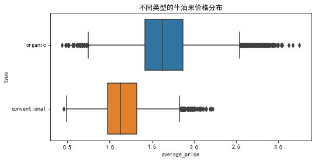

```python
# 导入相关库
import matplotlib
import matplotlib.pyplot as plt
import seaborn as sns
import numpy as np
import pandas as pd
from sklearn.preprocessing import StandardScaler

%matplotlib inline

df = pd.read_csv('avocado.csv')  # 读取数据 
```


```python
df.head()  # 查看前五行数
```


<div>
<style scoped>
    .dataframe tbody tr th:only-of-type {
        vertical-align: middle;
    }

    .dataframe tbody tr th {
        vertical-align: top;
    }

    .dataframe thead th {
        text-align: right;
    }
</style>
<table border="1" class="dataframe">
  <thead>
    <tr style="text-align: right;">
      <th></th>
      <th>Unnamed: 0</th>
      <th>Date</th>
      <th>AveragePrice</th>
      <th>Total Volume</th>
      <th>4046</th>
      <th>4225</th>
      <th>4770</th>
      <th>Total Bags</th>
      <th>Small Bags</th>
      <th>Large Bags</th>
      <th>XLarge Bags</th>
      <th>type</th>
      <th>year</th>
      <th>region</th>
    </tr>
  </thead>
  <tbody>
    <tr>
      <th>0</th>
      <td>0</td>
      <td>2015-12-27</td>
      <td>1.33</td>
      <td>64236.62</td>
      <td>1036.74</td>
      <td>54454.85</td>
      <td>48.16</td>
      <td>8696.87</td>
      <td>8603.62</td>
      <td>93.25</td>
      <td>0.0</td>
      <td>conventional</td>
      <td>2015</td>
      <td>Albany</td>
    </tr>
    <tr>
      <th>1</th>
      <td>1</td>
      <td>2015-12-20</td>
      <td>1.35</td>
      <td>54876.98</td>
      <td>674.28</td>
      <td>44638.81</td>
      <td>58.33</td>
      <td>9505.56</td>
      <td>9408.07</td>
      <td>97.49</td>
      <td>0.0</td>
      <td>conventional</td>
      <td>2015</td>
      <td>Albany</td>
    </tr>
    <tr>
      <th>2</th>
      <td>2</td>
      <td>2015-12-13</td>
      <td>0.93</td>
      <td>118220.22</td>
      <td>794.70</td>
      <td>109149.67</td>
      <td>130.50</td>
      <td>8145.35</td>
      <td>8042.21</td>
      <td>103.14</td>
      <td>0.0</td>
      <td>conventional</td>
      <td>2015</td>
      <td>Albany</td>
    </tr>
    <tr>
      <th>3</th>
      <td>3</td>
      <td>2015-12-06</td>
      <td>1.08</td>
      <td>78992.15</td>
      <td>1132.00</td>
      <td>71976.41</td>
      <td>72.58</td>
      <td>5811.16</td>
      <td>5677.40</td>
      <td>133.76</td>
      <td>0.0</td>
      <td>conventional</td>
      <td>2015</td>
      <td>Albany</td>
    </tr>
    <tr>
      <th>4</th>
      <td>4</td>
      <td>2015-11-29</td>
      <td>1.28</td>
      <td>51039.60</td>
      <td>941.48</td>
      <td>43838.39</td>
      <td>75.78</td>
      <td>6183.95</td>
      <td>5986.26</td>
      <td>197.69</td>
      <td>0.0</td>
      <td>conventional</td>
      <td>2015</td>
      <td>Albany</td>
    </tr>
  </tbody>
</table>
</div>


```python
df.shape  # 查看行列数
```


    (18249, 14)


```python
df.isnull().sum()  # 没有任何缺失值
```


    Unnamed: 0      0
    Date            0
    AveragePrice    0
    Total Volume    0
    4046            0
    4225            0
    4770            0
    Total Bags      0
    Small Bags      0
    Large Bags      0
    XLarge Bags     0
    type            0
    year            0
    region          0
    dtype: int64


```python
df.drop(['Unnamed: 0'], axis=1, inplace=True)  # 删除无用列
name_dict = {
    'Date': 'date', 'AveragePrice': 'average_price',
    'Total Volume': 'total_volume', '4225': 'plu_one',
    '4046': 'plu_two', '4770': 'plu_three', 
    'Total Bags': 'total_bags', 'Small Bags': 'small_bags',
    'Large Bags': 'large_bags', 'XLarge Bags': 'xlarge_bags',
    'type': 'type', 'year': 'year', 'region': 'region'
}
df.rename(columns=name_dict, inplace=True)  # 重命名表头
```


```python
df.head()
```


<div>
<style scoped>
    .dataframe tbody tr th:only-of-type {
        vertical-align: middle;
    }

    .dataframe tbody tr th {
        vertical-align: top;
    }

    .dataframe thead th {
        text-align: right;
    }
</style>
<table border="1" class="dataframe">
  <thead>
    <tr style="text-align: right;">
      <th></th>
      <th>date</th>
      <th>average_price</th>
      <th>total_volume</th>
      <th>plu_two</th>
      <th>plu_one</th>
      <th>plu_three</th>
      <th>total_bags</th>
      <th>small_bags</th>
      <th>large_bags</th>
      <th>xlarge_bags</th>
      <th>type</th>
      <th>year</th>
      <th>region</th>
    </tr>
  </thead>
  <tbody>
    <tr>
      <th>0</th>
      <td>2015-12-27</td>
      <td>1.33</td>
      <td>64236.62</td>
      <td>1036.74</td>
      <td>54454.85</td>
      <td>48.16</td>
      <td>8696.87</td>
      <td>8603.62</td>
      <td>93.25</td>
      <td>0.0</td>
      <td>conventional</td>
      <td>2015</td>
      <td>Albany</td>
    </tr>
    <tr>
      <th>1</th>
      <td>2015-12-20</td>
      <td>1.35</td>
      <td>54876.98</td>
      <td>674.28</td>
      <td>44638.81</td>
      <td>58.33</td>
      <td>9505.56</td>
      <td>9408.07</td>
      <td>97.49</td>
      <td>0.0</td>
      <td>conventional</td>
      <td>2015</td>
      <td>Albany</td>
    </tr>
    <tr>
      <th>2</th>
      <td>2015-12-13</td>
      <td>0.93</td>
      <td>118220.22</td>
      <td>794.70</td>
      <td>109149.67</td>
      <td>130.50</td>
      <td>8145.35</td>
      <td>8042.21</td>
      <td>103.14</td>
      <td>0.0</td>
      <td>conventional</td>
      <td>2015</td>
      <td>Albany</td>
    </tr>
    <tr>
      <th>3</th>
      <td>2015-12-06</td>
      <td>1.08</td>
      <td>78992.15</td>
      <td>1132.00</td>
      <td>71976.41</td>
      <td>72.58</td>
      <td>5811.16</td>
      <td>5677.40</td>
      <td>133.76</td>
      <td>0.0</td>
      <td>conventional</td>
      <td>2015</td>
      <td>Albany</td>
    </tr>
    <tr>
      <th>4</th>
      <td>2015-11-29</td>
      <td>1.28</td>
      <td>51039.60</td>
      <td>941.48</td>
      <td>43838.39</td>
      <td>75.78</td>
      <td>6183.95</td>
      <td>5986.26</td>
      <td>197.69</td>
      <td>0.0</td>
      <td>conventional</td>
      <td>2015</td>
      <td>Albany</td>
    </tr>
  </tbody>
</table>
</div>


```python
df.info()  # 查看各列情况
```

    <class 'pandas.core.frame.DataFrame'>
    RangeIndex: 18249 entries, 0 to 18248
    Data columns (total 13 columns):
     #   Column         Non-Null Count  Dtype  
    ---  ------         --------------  -----  
     0   date           18249 non-null  object 
     1   average_price  18249 non-null  float64
     2   total_volume   18249 non-null  float64
     3   plu_two        18249 non-null  float64
     4   plu_one        18249 non-null  float64
     5   plu_three      18249 non-null  float64
     6   total_bags     18249 non-null  float64
     7   small_bags     18249 non-null  float64
     8   large_bags     18249 non-null  float64
     9   xlarge_bags    18249 non-null  float64
     10  type           18249 non-null  object 
     11  year           18249 non-null  int64  
     12  region         18249 non-null  object 
    dtypes: float64(9), int64(1), object(3)
    memory usage: 1.8+ MB
    


```python
df['date'] = pd.to_datetime(df.date)  # date 列变为时间类型
df.sort_values(by=['date'], inplace=True, ascending=True)  # 升序排序
df.head()
```


<div>
<style scoped>
    .dataframe tbody tr th:only-of-type {
        vertical-align: middle;
    }

    .dataframe tbody tr th {
        vertical-align: top;
    }

    .dataframe thead th {
        text-align: right;
    }
</style>
<table border="1" class="dataframe">
  <thead>
    <tr style="text-align: right;">
      <th></th>
      <th>date</th>
      <th>average_price</th>
      <th>total_volume</th>
      <th>plu_two</th>
      <th>plu_one</th>
      <th>plu_three</th>
      <th>total_bags</th>
      <th>small_bags</th>
      <th>large_bags</th>
      <th>xlarge_bags</th>
      <th>type</th>
      <th>year</th>
      <th>region</th>
    </tr>
  </thead>
  <tbody>
    <tr>
      <th>11569</th>
      <td>2015-01-04</td>
      <td>1.75</td>
      <td>27365.89</td>
      <td>9307.34</td>
      <td>3844.81</td>
      <td>615.28</td>
      <td>13598.46</td>
      <td>13061.10</td>
      <td>537.36</td>
      <td>0.0</td>
      <td>organic</td>
      <td>2015</td>
      <td>Southeast</td>
    </tr>
    <tr>
      <th>9593</th>
      <td>2015-01-04</td>
      <td>1.49</td>
      <td>17723.17</td>
      <td>1189.35</td>
      <td>15628.27</td>
      <td>0.00</td>
      <td>905.55</td>
      <td>905.55</td>
      <td>0.00</td>
      <td>0.0</td>
      <td>organic</td>
      <td>2015</td>
      <td>Chicago</td>
    </tr>
    <tr>
      <th>10009</th>
      <td>2015-01-04</td>
      <td>1.68</td>
      <td>2896.72</td>
      <td>161.68</td>
      <td>206.96</td>
      <td>0.00</td>
      <td>2528.08</td>
      <td>2528.08</td>
      <td>0.00</td>
      <td>0.0</td>
      <td>organic</td>
      <td>2015</td>
      <td>HarrisburgScranton</td>
    </tr>
    <tr>
      <th>1819</th>
      <td>2015-01-04</td>
      <td>1.52</td>
      <td>54956.80</td>
      <td>3013.04</td>
      <td>35456.88</td>
      <td>1561.70</td>
      <td>14925.18</td>
      <td>11264.80</td>
      <td>3660.38</td>
      <td>0.0</td>
      <td>conventional</td>
      <td>2015</td>
      <td>Pittsburgh</td>
    </tr>
    <tr>
      <th>9333</th>
      <td>2015-01-04</td>
      <td>1.64</td>
      <td>1505.12</td>
      <td>1.27</td>
      <td>1129.50</td>
      <td>0.00</td>
      <td>374.35</td>
      <td>186.67</td>
      <td>187.68</td>
      <td>0.0</td>
      <td>organic</td>
      <td>2015</td>
      <td>Boise</td>
    </tr>
  </tbody>
</table>
</div>


```python
# 接下来看一下平均价格的分布情况
plt.rcParams['font.sans-serif']=['SimHei']   #显示中文标签
plt.rcParams['axes.unicode_minus']=False
plt.figure(figsize=(12, 5))
plt.title('平均价格分布情况')
sns.distplot(df['average_price'], color='b')
```


    <matplotlib.axes._subplots.AxesSubplot at 0x1fdae87eb50>


```python
plt.figure(figsize=(8, 4))
plt.title('不同类型的牛油果价格分布')
sns.boxplot(y='type', x='average_price', data=df)
```


    <matplotlib.axes._subplots.AxesSubplot at 0x1fdaeb3d100>





```python
plt.figure(figsize=(10, 7))
plt.title('各个年份不同品种牛油果的平均价格情况')
sns.boxplot(x='year', y='average_price', data=df, hue='type')
plt.xlabel('年份', fontsize=12)
plt.ylabel('平均价格', fontsize=12)
```


    Text(0, 0.5, '平均价格')


```python
plt.figure(figsize=(10, 7))
plt.title('各个年份平均价格的比较情况')
sns.barplot(x='year', y='average_price', hue='type', data=df)
plt.xlabel('年份', fontsize=15)
plt.ylabel('平均价格', fontsize=15)
```


    Text(0, 0.5, '平均价格')


```python
# 当然不同城市的平均价格应该是不一样的，但在此之前我们先绘制一张
# 热力图，看看数据中各个变量的相关性
plt.figure(figsize=(12, 6))
sns.heatmap(df.corr(), cmap='coolwarm', annot=True)
```


    <matplotlib.axes._subplots.AxesSubplot at 0x1fdae9cca60>


```python
# 只有少数有计算关系的特征之间相关度比较高，
# 接下来也需要看一下每一座城市的各个年份价格变动

sns.catplot(
    'average_price', 'region',
    data=df[df['type'] == 'organic'],
    height=12,
    aspect=0.8,
    kind='bar'
)
plt.title('各个城市有机牛油果的价格情况')
plt.xlabel('平均价格', fontsize=15)
plt.ylabel('城市', fontsize=15)
```


    Text(-73.19999999999999, 0.5, '城市')


```python
sns.catplot(
    'average_price', 'region',
    data=df[df['type'] == 'conventional'],
    height=12,
    aspect=0.8,
    kind='bar'
)
plt.title('各个城市无机牛油果的价格情况')
plt.xlabel('平均价格', fontsize=15)
plt.ylabel('城市', fontsize=15)
```


    Text(-73.19999999999999, 0.5, '城市')


```python
# 接下来看看平均价格随时间的变动情况
df.plot(
    x='date', y='average_price', figsize=(12, 5),
    title='平均价格随时间变动情况'
)
```


    <matplotlib.axes._subplots.AxesSubplot at 0x1fdb1d3faf0>


```python
# 由于现在是多个城市，看起来不直观，所以接下来只取 
# Total US 并且为无机类型的的数据,
df2 = df[df.region == 'TotalUS']
df2_organic = df2[df2.type == 'organic']
df2_conventional = df2[df2.type == 'conventional']
df2_organic.plot(
    x='date', y='average_price', figsize=(12, 5),
    title='TotalUS 有机牛油果平均价格随时间变动情况'
)
```


    <matplotlib.axes._subplots.AxesSubplot at 0x1fdb1fe8cd0>


```python
df2_conventional.plot(
    x='date', y='average_price', figsize=(12, 5),
    title='TotalUS 无机牛油果平均价格随时间变动情况'
)
```


    <matplotlib.axes._subplots.AxesSubplot at 0x1fdb1f4e370>


```python
# 从折线图可以看出，除了有少数异常值外，随着时间的变化，
# 牛油果的平均价格呈现一个大概周期性变化的规律
# 除了平均价格，还有各个种类的销量，我们需要验证一下。
df2_conventional.head()
```


<div>
<style scoped>
    .dataframe tbody tr th:only-of-type {
        vertical-align: middle;
    }

    .dataframe tbody tr th {
        vertical-align: top;
    }

    .dataframe thead th {
        text-align: right;
    }
</style>
<table border="1" class="dataframe">
  <thead>
    <tr style="text-align: right;">
      <th></th>
      <th>date</th>
      <th>average_price</th>
      <th>total_volume</th>
      <th>plu_two</th>
      <th>plu_one</th>
      <th>plu_three</th>
      <th>total_bags</th>
      <th>small_bags</th>
      <th>large_bags</th>
      <th>xlarge_bags</th>
      <th>type</th>
      <th>year</th>
      <th>region</th>
    </tr>
  </thead>
  <tbody>
    <tr>
      <th>2703</th>
      <td>2015-01-04</td>
      <td>0.95</td>
      <td>31324277.73</td>
      <td>12357161.34</td>
      <td>13624083.05</td>
      <td>844093.32</td>
      <td>4498940.02</td>
      <td>3585321.58</td>
      <td>894945.63</td>
      <td>18672.81</td>
      <td>conventional</td>
      <td>2015</td>
      <td>TotalUS</td>
    </tr>
    <tr>
      <th>2702</th>
      <td>2015-01-11</td>
      <td>1.01</td>
      <td>29063542.75</td>
      <td>11544810.53</td>
      <td>12134773.38</td>
      <td>866574.66</td>
      <td>4517384.18</td>
      <td>3783261.16</td>
      <td>718333.87</td>
      <td>15789.15</td>
      <td>conventional</td>
      <td>2015</td>
      <td>TotalUS</td>
    </tr>
    <tr>
      <th>2701</th>
      <td>2015-01-18</td>
      <td>1.03</td>
      <td>29043458.85</td>
      <td>11858139.34</td>
      <td>11701947.80</td>
      <td>831301.90</td>
      <td>4652069.81</td>
      <td>3873041.26</td>
      <td>771093.20</td>
      <td>7935.35</td>
      <td>conventional</td>
      <td>2015</td>
      <td>TotalUS</td>
    </tr>
    <tr>
      <th>2700</th>
      <td>2015-01-25</td>
      <td>1.04</td>
      <td>28470310.84</td>
      <td>12167445.03</td>
      <td>10734652.82</td>
      <td>768020.05</td>
      <td>4800192.94</td>
      <td>3978636.90</td>
      <td>812924.73</td>
      <td>8631.31</td>
      <td>conventional</td>
      <td>2015</td>
      <td>TotalUS</td>
    </tr>
    <tr>
      <th>2699</th>
      <td>2015-02-01</td>
      <td>0.89</td>
      <td>44655461.51</td>
      <td>18933038.04</td>
      <td>18956479.74</td>
      <td>1381516.11</td>
      <td>5384427.62</td>
      <td>4216452.03</td>
      <td>1121076.47</td>
      <td>46899.12</td>
      <td>conventional</td>
      <td>2015</td>
      <td>TotalUS</td>
    </tr>
  </tbody>
</table>
</div>


```python
df2_conventional = df2_conventional.drop(['type', 'year', 'region'], axis=1)
```


```python
df2_conventional.head()
```


<div>
<style scoped>
    .dataframe tbody tr th:only-of-type {
        vertical-align: middle;
    }

    .dataframe tbody tr th {
        vertical-align: top;
    }

    .dataframe thead th {
        text-align: right;
    }
</style>
<table border="1" class="dataframe">
  <thead>
    <tr style="text-align: right;">
      <th></th>
      <th>date</th>
      <th>average_price</th>
      <th>total_volume</th>
      <th>plu_two</th>
      <th>plu_one</th>
      <th>plu_three</th>
      <th>total_bags</th>
      <th>small_bags</th>
      <th>large_bags</th>
      <th>xlarge_bags</th>
    </tr>
  </thead>
  <tbody>
    <tr>
      <th>2703</th>
      <td>2015-01-04</td>
      <td>0.95</td>
      <td>31324277.73</td>
      <td>12357161.34</td>
      <td>13624083.05</td>
      <td>844093.32</td>
      <td>4498940.02</td>
      <td>3585321.58</td>
      <td>894945.63</td>
      <td>18672.81</td>
    </tr>
    <tr>
      <th>2702</th>
      <td>2015-01-11</td>
      <td>1.01</td>
      <td>29063542.75</td>
      <td>11544810.53</td>
      <td>12134773.38</td>
      <td>866574.66</td>
      <td>4517384.18</td>
      <td>3783261.16</td>
      <td>718333.87</td>
      <td>15789.15</td>
    </tr>
    <tr>
      <th>2701</th>
      <td>2015-01-18</td>
      <td>1.03</td>
      <td>29043458.85</td>
      <td>11858139.34</td>
      <td>11701947.80</td>
      <td>831301.90</td>
      <td>4652069.81</td>
      <td>3873041.26</td>
      <td>771093.20</td>
      <td>7935.35</td>
    </tr>
    <tr>
      <th>2700</th>
      <td>2015-01-25</td>
      <td>1.04</td>
      <td>28470310.84</td>
      <td>12167445.03</td>
      <td>10734652.82</td>
      <td>768020.05</td>
      <td>4800192.94</td>
      <td>3978636.90</td>
      <td>812924.73</td>
      <td>8631.31</td>
    </tr>
    <tr>
      <th>2699</th>
      <td>2015-02-01</td>
      <td>0.89</td>
      <td>44655461.51</td>
      <td>18933038.04</td>
      <td>18956479.74</td>
      <td>1381516.11</td>
      <td>5384427.62</td>
      <td>4216452.03</td>
      <td>1121076.47</td>
      <td>46899.12</td>
    </tr>
  </tbody>
</table>
</div>


```python
scaler = StandardScaler()
df2_conventional.loc[: ,'average_price':] = scaler.fit_transform(
    df2_conventional.loc[:, 'average_price':]
)
df2_conventional.head()
```


<div>
<style scoped>
    .dataframe tbody tr th:only-of-type {
        vertical-align: middle;
    }

    .dataframe tbody tr th {
        vertical-align: top;
    }

    .dataframe thead th {
        text-align: right;
    }
</style>
<table border="1" class="dataframe">
  <thead>
    <tr style="text-align: right;">
      <th></th>
      <th>date</th>
      <th>average_price</th>
      <th>total_volume</th>
      <th>plu_two</th>
      <th>plu_one</th>
      <th>plu_three</th>
      <th>total_bags</th>
      <th>small_bags</th>
      <th>large_bags</th>
      <th>xlarge_bags</th>
    </tr>
  </thead>
  <tbody>
    <tr>
      <th>2703</th>
      <td>2015-01-04</td>
      <td>-0.818027</td>
      <td>-0.395209</td>
      <td>0.140558</td>
      <td>0.852727</td>
      <td>-0.173825</td>
      <td>-1.493292</td>
      <td>-1.549899</td>
      <td>-1.195193</td>
      <td>-1.022084</td>
    </tr>
    <tr>
      <th>2702</th>
      <td>2015-01-11</td>
      <td>-0.472411</td>
      <td>-0.765824</td>
      <td>-0.189277</td>
      <td>0.220654</td>
      <td>-0.121449</td>
      <td>-1.487421</td>
      <td>-1.460060</td>
      <td>-1.375848</td>
      <td>-1.049309</td>
    </tr>
    <tr>
      <th>2701</th>
      <td>2015-01-18</td>
      <td>-0.357205</td>
      <td>-0.769116</td>
      <td>-0.062058</td>
      <td>0.036960</td>
      <td>-0.203626</td>
      <td>-1.444552</td>
      <td>-1.419312</td>
      <td>-1.321881</td>
      <td>-1.123458</td>
    </tr>
    <tr>
      <th>2700</th>
      <td>2015-01-25</td>
      <td>-0.299602</td>
      <td>-0.863075</td>
      <td>0.063528</td>
      <td>-0.373566</td>
      <td>-0.351058</td>
      <td>-1.397405</td>
      <td>-1.371385</td>
      <td>-1.279092</td>
      <td>-1.116887</td>
    </tr>
    <tr>
      <th>2699</th>
      <td>2015-02-01</td>
      <td>-1.163643</td>
      <td>1.790244</td>
      <td>2.810531</td>
      <td>3.115830</td>
      <td>1.078242</td>
      <td>-1.211447</td>
      <td>-1.263448</td>
      <td>-0.963885</td>
      <td>-0.755595</td>
    </tr>
  </tbody>
</table>
</div>


```python
df2_conventional.plot(
    x='date',
    y=['average_price', 'total_volume', 'total_bags'],
    figsize=(12,5)
)
```


    <matplotlib.axes._subplots.AxesSubplot at 0x1fdb196eb80>


```python
df_pie = df.drop(
    ['average_price', 'total_volume', 'total_bags'],axis=1
).groupby('year').agg('sum')

df_pie
```


<div>
<style scoped>
    .dataframe tbody tr th:only-of-type {
        vertical-align: middle;
    }

    .dataframe tbody tr th {
        vertical-align: top;
    }

    .dataframe thead th {
        text-align: right;
    }
</style>
<table border="1" class="dataframe">
  <thead>
    <tr style="text-align: right;">
      <th></th>
      <th>plu_two</th>
      <th>plu_one</th>
      <th>plu_three</th>
      <th>small_bags</th>
      <th>large_bags</th>
      <th>xlarge_bags</th>
    </tr>
    <tr>
      <th>year</th>
      <th></th>
      <th></th>
      <th></th>
      <th></th>
      <th></th>
      <th></th>
    </tr>
  </thead>
  <tbody>
    <tr>
      <th>2015</th>
      <td>1.709450e+09</td>
      <td>1.761054e+09</td>
      <td>1.427724e+08</td>
      <td>6.346827e+08</td>
      <td>1.320664e+08</td>
      <td>5443128.28</td>
    </tr>
    <tr>
      <th>2016</th>
      <td>1.525123e+09</td>
      <td>1.672728e+09</td>
      <td>1.598798e+08</td>
      <td>1.106494e+09</td>
      <td>3.366263e+08</td>
      <td>20038284.84</td>
    </tr>
    <tr>
      <th>2017</th>
      <td>1.652038e+09</td>
      <td>1.544735e+09</td>
      <td>9.121751e+07</td>
      <td>1.222953e+09</td>
      <td>3.993390e+08</td>
      <td>23997172.34</td>
    </tr>
    <tr>
      <th>2018</th>
      <td>4.604997e+08</td>
      <td>4.077587e+08</td>
      <td>2.293259e+07</td>
      <td>3.607414e+08</td>
      <td>1.235840e+08</td>
      <td>7210591.87</td>
    </tr>
  </tbody>
</table>
</div>


```python
indexes = ['plu_one', 'plu_two', 'plu_threee', 'small_bags', 'large_bags', 'xlarge_bags']

series = pd.DataFrame({'2015': df_pie.loc[[2015],:].values.tolist()[0],
                      '2016': df_pie.loc[[2016],:].values.tolist()[0],
                      '2017': df_pie.loc[[2017],:].values.tolist()[0],
                      '2018': df_pie.loc[[2018],:].values.tolist()[0]},
                      index=indexes)

colors = ['silver', 'pink', 'orange', 'palegreen', 'aqua', 'blue']

series.plot.pie(
    y='2015',figsize=(9, 9), autopct='%1.1f%%',
    colors=colors, 
    fontsize=18, legend=False,
    title='2015 销量分布'
).set_label('')
```


```python
series.plot.pie(
    y='2016',figsize=(9, 9), autopct='%1.1f%%', 
    colors=colors, 
    fontsize=18, legend=False,
    title='2016 销量分布'
).set_ylabel('')
```


    Text(0, 0.5, '')


```python
series.plot.pie(
    y='2017',figsize=(9, 9), autopct='%1.1f%%', 
    colors=colors,
    fontsize=18, legend=False, 
    title='2017 销量分布'
).set_ylabel('')
```


    Text(0, 0.5, '')


```python
series.plot.pie(
    y='2018',figsize=(9, 9), autopct='%1.1f%%',
    colors=colors,
    fontsize=18, legend=False, 
    title='2018 销量分布',
).set_ylabel('')
```


    Text(0, 0.5, '')


```python
df.head()
```


<div>
<style scoped>
    .dataframe tbody tr th:only-of-type {
        vertical-align: middle;
    }

    .dataframe tbody tr th {
        vertical-align: top;
    }

    .dataframe thead th {
        text-align: right;
    }
</style>
<table border="1" class="dataframe">
  <thead>
    <tr style="text-align: right;">
      <th></th>
      <th>date</th>
      <th>average_price</th>
      <th>total_volume</th>
      <th>plu_two</th>
      <th>plu_one</th>
      <th>plu_three</th>
      <th>total_bags</th>
      <th>small_bags</th>
      <th>large_bags</th>
      <th>xlarge_bags</th>
      <th>type</th>
      <th>year</th>
      <th>region</th>
    </tr>
  </thead>
  <tbody>
    <tr>
      <th>11569</th>
      <td>2015-01-04</td>
      <td>1.75</td>
      <td>27365.89</td>
      <td>9307.34</td>
      <td>3844.81</td>
      <td>615.28</td>
      <td>13598.46</td>
      <td>13061.10</td>
      <td>537.36</td>
      <td>0.0</td>
      <td>organic</td>
      <td>2015</td>
      <td>Southeast</td>
    </tr>
    <tr>
      <th>9593</th>
      <td>2015-01-04</td>
      <td>1.49</td>
      <td>17723.17</td>
      <td>1189.35</td>
      <td>15628.27</td>
      <td>0.00</td>
      <td>905.55</td>
      <td>905.55</td>
      <td>0.00</td>
      <td>0.0</td>
      <td>organic</td>
      <td>2015</td>
      <td>Chicago</td>
    </tr>
    <tr>
      <th>10009</th>
      <td>2015-01-04</td>
      <td>1.68</td>
      <td>2896.72</td>
      <td>161.68</td>
      <td>206.96</td>
      <td>0.00</td>
      <td>2528.08</td>
      <td>2528.08</td>
      <td>0.00</td>
      <td>0.0</td>
      <td>organic</td>
      <td>2015</td>
      <td>HarrisburgScranton</td>
    </tr>
    <tr>
      <th>1819</th>
      <td>2015-01-04</td>
      <td>1.52</td>
      <td>54956.80</td>
      <td>3013.04</td>
      <td>35456.88</td>
      <td>1561.70</td>
      <td>14925.18</td>
      <td>11264.80</td>
      <td>3660.38</td>
      <td>0.0</td>
      <td>conventional</td>
      <td>2015</td>
      <td>Pittsburgh</td>
    </tr>
    <tr>
      <th>9333</th>
      <td>2015-01-04</td>
      <td>1.64</td>
      <td>1505.12</td>
      <td>1.27</td>
      <td>1129.50</td>
      <td>0.00</td>
      <td>374.35</td>
      <td>186.67</td>
      <td>187.68</td>
      <td>0.0</td>
      <td>organic</td>
      <td>2015</td>
      <td>Boise</td>
    </tr>
  </tbody>
</table>
</div>


```python
df2_conventional.head()
```


<div>
<style scoped>
    .dataframe tbody tr th:only-of-type {
        vertical-align: middle;
    }

    .dataframe tbody tr th {
        vertical-align: top;
    }

    .dataframe thead th {
        text-align: right;
    }
</style>
<table border="1" class="dataframe">
  <thead>
    <tr style="text-align: right;">
      <th></th>
      <th>date</th>
      <th>average_price</th>
      <th>total_volume</th>
      <th>plu_two</th>
      <th>plu_one</th>
      <th>plu_three</th>
      <th>total_bags</th>
      <th>small_bags</th>
      <th>large_bags</th>
      <th>xlarge_bags</th>
    </tr>
  </thead>
  <tbody>
    <tr>
      <th>2703</th>
      <td>2015-01-04</td>
      <td>-0.818027</td>
      <td>-0.395209</td>
      <td>0.140558</td>
      <td>0.852727</td>
      <td>-0.173825</td>
      <td>-1.493292</td>
      <td>-1.549899</td>
      <td>-1.195193</td>
      <td>-1.022084</td>
    </tr>
    <tr>
      <th>2702</th>
      <td>2015-01-11</td>
      <td>-0.472411</td>
      <td>-0.765824</td>
      <td>-0.189277</td>
      <td>0.220654</td>
      <td>-0.121449</td>
      <td>-1.487421</td>
      <td>-1.460060</td>
      <td>-1.375848</td>
      <td>-1.049309</td>
    </tr>
    <tr>
      <th>2701</th>
      <td>2015-01-18</td>
      <td>-0.357205</td>
      <td>-0.769116</td>
      <td>-0.062058</td>
      <td>0.036960</td>
      <td>-0.203626</td>
      <td>-1.444552</td>
      <td>-1.419312</td>
      <td>-1.321881</td>
      <td>-1.123458</td>
    </tr>
    <tr>
      <th>2700</th>
      <td>2015-01-25</td>
      <td>-0.299602</td>
      <td>-0.863075</td>
      <td>0.063528</td>
      <td>-0.373566</td>
      <td>-0.351058</td>
      <td>-1.397405</td>
      <td>-1.371385</td>
      <td>-1.279092</td>
      <td>-1.116887</td>
    </tr>
    <tr>
      <th>2699</th>
      <td>2015-02-01</td>
      <td>-1.163643</td>
      <td>1.790244</td>
      <td>2.810531</td>
      <td>3.115830</td>
      <td>1.078242</td>
      <td>-1.211447</td>
      <td>-1.263448</td>
      <td>-0.963885</td>
      <td>-0.755595</td>
    </tr>
  </tbody>
</table>
</div>


```python
# 导入 TensorFlow 相关库
import tensorflow as tf 
from tensorflow.keras import models,layers,losses,metrics,callbacks

data = df2_conventional.copy(deep=True)
data = data.set_index('date')
data.drop(['plu_three', 'large_bags', 'xlarge_bags'], 
         axis=1, inplace=True)
data.count()
```


    average_price    169
    total_volume     169
    plu_two          169
    plu_one          169
    total_bags       169
    small_bags       169
    dtype: int64


```python
df_train_data = data.iloc[:120, :]
df_test_data = data.iloc[120:, :]
```


```python
# 利用某次数据的前5此窗口作为输入预测改日数据
WINDOW_SIZE = 50
    
tf_data = tf.data.Dataset.from_tensor_slices(
    tf.constant(df_train_data.values, dtype=tf.float32)
).window(WINDOW_SIZE, shift=1).flat_map(
    lambda x: x.batch(WINDOW_SIZE,drop_remainder=True)
)

tf_label = tf.data.Dataset.from_tensor_slices(
    tf.constant(df_train_data.values[WINDOW_SIZE:], dtype=tf.float32)
)
tf_train_data = tf.data.Dataset.zip((tf_data, tf_label)).batch(120).cache()
```


```python
# 开始定义模型
# 考虑到平均价格和销量不可能小于0，做如下处理

# class Avocado(layers.Layer):
#     def __init__(self, **kwargs):
#         super().__init__(**kwargs)
        
#     def call(self, x_input, x):
#         result = tf.maximum((1+x) * x_input[:, -1, :], 0.0)
#         return result
    
#     def get_config(self):
#         return super().get_config()
    

tf.keras.backend.clear_session()
x_input = layers.Input(shape=(None, 6), dtype=tf.float32)
x = layers.LSTM(6, return_sequences=True, input_shape=(None, 6))(x_input)
x = layers.LSTM(6, return_sequences=True, input_shape=(None, 6))(x)
x = layers.LSTM(6, return_sequences=True, input_shape=(None, 6))(x)
x = layers.LSTM(6, input_shape=(None, 6))(x)
x = layers.Dense(6)(x)

# x = Avocado()(x_input, x)
model = models.Model(inputs=[x_input], outputs=[x])
model.summary()
```

    Model: "model"
    _________________________________________________________________
    Layer (type)                 Output Shape              Param #   
    =================================================================
    input_1 (InputLayer)         [(None, None, 6)]         0         
    _________________________________________________________________
    lstm (LSTM)                  (None, None, 6)           312       
    _________________________________________________________________
    lstm_1 (LSTM)                (None, None, 6)           312       
    _________________________________________________________________
    lstm_2 (LSTM)                (None, None, 6)           312       
    _________________________________________________________________
    lstm_3 (LSTM)                (None, 6)                 312       
    _________________________________________________________________
    dense (Dense)                (None, 6)                 42        
    =================================================================
    Total params: 1,290
    Trainable params: 1,290
    Non-trainable params: 0
    _________________________________________________________________
    


```python
# 训练模型
# 定义损失函数，考虑平方差和预测目标的比值
class MSPE(losses.Loss):
    def call(self,y_true,y_pred):
        err_percent = (y_true - y_pred)**2/(tf.maximum(y_true**2,1e-7))
        mean_err_percent = tf.reduce_mean(err_percent)
        return mean_err_percent

    def get_config(self):
        config = super.get_config()
        return config

    
# 指定优化器和学习速率
optimizer = tf.keras.optimizers.Adam(learning_rate=0.0001)
# 进行模型训练前的的配置，传入优化器和损失函数
model.compile(optimizer=optimizer,loss=MSPE(name = "MSPE"))

#如果loss在100个epoch后没有提升，学习率减半。
lr_callback = tf.keras.callbacks.ReduceLROnPlateau(
    monitor="loss",factor = 0.5, patience = 100
)
#当loss在200个epoch后没有提升，则提前终止训练。
stop_callback = tf.keras.callbacks.EarlyStopping(
    monitor = "loss", patience= 200
)
callbacks_list = [lr_callback,stop_callback]

history = model.fit(tf_train_data,epochs=100000,callbacks = callbacks_list)
```

    Epoch 1/100000
    1/1 [==============================] - 0s 12ms/step - loss: 1.5015 - lr: 1.0000e-04
    Epoch 2/100000
    1/1 [==============================] - 0s 0s/step - loss: 1.4897 - lr: 1.0000e-04
    Epoch 3/100000
    1/1 [==============================] - 0s 1ms/step - loss: 1.4782 - lr: 1.0000e-04
    Epoch 4/100000
    1/1 [==============================] - 0s 998us/step - loss: 1.4670 - lr: 1.0000e-04
    Epoch 5/100000
    1/1 [==============================] - 0s 998us/step - loss: 1.4560 - lr: 1.0000e-04
    Epoch 6/100000
    1/1 [==============================] - 0s 997us/step - loss: 1.4452 - lr: 1.0000e-04
    Epoch 7/100000
    1/1 [==============================] - 0s 1ms/step - loss: 1.4347 - lr: 1.0000e-04
    Epoch 8/100000
    1/1 [==============================] - 0s 1ms/step - loss: 1.4244 - lr: 1.0000e-04
    Epoch 9/100000
    1/1 [==============================] - 0s 998us/step - loss: 1.4144 - lr: 1.0000e-04
    Epoch 10/100000
    1/1 [==============================] - 0s 2ms/step - loss: 1.4046 - lr: 1.0000e-04
    Epoch 11/100000
    1/1 [==============================] - 0s 2ms/step - loss: 1.3951 - lr: 1.0000e-04
    Epoch 12/100000
    1/1 [==============================] - 0s 998us/step - loss: 1.3858 - lr: 1.0000e-04
    Epoch 13/100000
    1/1 [==============================] - 0s 999us/step - loss: 1.3767 - lr: 1.0000e-04
    Epoch 14/100000
    1/1 [==============================] - 0s 998us/step - loss: 1.3679 - lr: 1.0000e-04
    Epoch 15/100000
    1/1 [==============================] - 0s 997us/step - loss: 1.3592 - lr: 1.0000e-04
    Epoch 16/100000
    1/1 [==============================] - 0s 997us/step - loss: 1.3508 - lr: 1.0000e-04
    Epoch 17/100000
    1/1 [==============================] - 0s 997us/step - loss: 1.3426 - lr: 1.0000e-04
    Epoch 18/100000
    1/1 [==============================] - 0s 2ms/step - loss: 1.3346 - lr: 1.0000e-04
    Epoch 19/100000
    1/1 [==============================] - 0s 2ms/step - loss: 1.3268 - lr: 1.0000e-04
    Epoch 20/100000
    1/1 [==============================] - 0s 997us/step - loss: 1.3193 - lr: 1.0000e-04
    Epoch 21/100000
    1/1 [==============================] - 0s 998us/step - loss: 1.3119 - lr: 1.0000e-04
    Epoch 22/100000
    1/1 [==============================] - 0s 998us/step - loss: 1.3047 - lr: 1.0000e-04
    Epoch 23/100000
    1/1 [==============================] - 0s 997us/step - loss: 1.2977 - lr: 1.0000e-04
    Epoch 24/100000
    1/1 [==============================] - 0s 998us/step - loss: 1.2908 - lr: 1.0000e-04
    Epoch 25/100000
    1/1 [==============================] - 0s 997us/step - loss: 1.2842 - lr: 1.0000e-04
    Epoch 26/100000
    1/1 [==============================] - 0s 997us/step - loss: 1.2777 - lr: 1.0000e-04
    Epoch 27/100000
    1/1 [==============================] - 0s 997us/step - loss: 1.2714 - lr: 1.0000e-04
    Epoch 28/100000
    1/1 [==============================] - 0s 998us/step - loss: 1.2653 - lr: 1.0000e-04
    Epoch 29/100000
    1/1 [==============================] - 0s 998us/step - loss: 1.2593 - lr: 1.0000e-04
    Epoch 30/100000
    1/1 [==============================] - 0s 998us/step - loss: 1.2534 - lr: 1.0000e-04
    Epoch 31/100000
    1/1 [==============================] - 0s 997us/step - loss: 1.2478 - lr: 1.0000e-04
    Epoch 32/100000
    1/1 [==============================] - 0s 998us/step - loss: 1.2423 - lr: 1.0000e-04
    Epoch 33/100000
    1/1 [==============================] - 0s 998us/step - loss: 1.2369 - lr: 1.0000e-04
    Epoch 34/100000
    1/1 [==============================] - 0s 2ms/step - loss: 1.2316 - lr: 1.0000e-04
    Epoch 35/100000
    1/1 [==============================] - 0s 998us/step - loss: 1.2265 - lr: 1.0000e-04
    Epoch 36/100000
    1/1 [==============================] - 0s 998us/step - loss: 1.2216 - lr: 1.0000e-04
    Epoch 37/100000
    1/1 [==============================] - 0s 998us/step - loss: 1.2167 - lr: 1.0000e-04
    Epoch 38/100000
    1/1 [==============================] - 0s 997us/step - loss: 1.2120 - lr: 1.0000e-04
    Epoch 39/100000
    1/1 [==============================] - 0s 998us/step - loss: 1.2075 - lr: 1.0000e-04
    Epoch 40/100000
    1/1 [==============================] - 0s 2ms/step - loss: 1.2030 - lr: 1.0000e-04
    Epoch 41/100000
    1/1 [==============================] - 0s 998us/step - loss: 1.1986 - lr: 1.0000e-04
    Epoch 42/100000
    1/1 [==============================] - 0s 998us/step - loss: 1.1944 - lr: 1.0000e-04
    Epoch 43/100000
    1/1 [==============================] - 0s 998us/step - loss: 1.1903 - lr: 1.0000e-04
    Epoch 44/100000
    1/1 [==============================] - 0s 997us/step - loss: 1.1863 - lr: 1.0000e-04
    Epoch 45/100000
    1/1 [==============================] - 0s 2ms/step - loss: 1.1824 - lr: 1.0000e-04
    Epoch 46/100000
    1/1 [==============================] - 0s 2ms/step - loss: 1.1786 - lr: 1.0000e-04
    Epoch 47/100000
    1/1 [==============================] - 0s 2ms/step - loss: 1.1749 - lr: 1.0000e-04
    Epoch 48/100000
    1/1 [==============================] - 0s 2ms/step - loss: 1.1712 - lr: 1.0000e-04
    Epoch 49/100000
    1/1 [==============================] - 0s 998us/step - loss: 1.1677 - lr: 1.0000e-04
    Epoch 50/100000
    1/1 [==============================] - 0s 998us/step - loss: 1.1643 - lr: 1.0000e-04
    Epoch 51/100000
    1/1 [==============================] - 0s 998us/step - loss: 1.1610 - lr: 1.0000e-04
    Epoch 52/100000
    1/1 [==============================] - 0s 2ms/step - loss: 1.1577 - lr: 1.0000e-04
    Epoch 53/100000
    1/1 [==============================] - 0s 998us/step - loss: 1.1545 - lr: 1.0000e-04
    Epoch 54/100000
    1/1 [==============================] - 0s 2ms/step - loss: 1.1514 - lr: 1.0000e-04
    Epoch 55/100000
    1/1 [==============================] - 0s 2ms/step - loss: 1.1484 - lr: 1.0000e-04
    Epoch 56/100000
    1/1 [==============================] - 0s 2ms/step - loss: 1.1455 - lr: 1.0000e-04
    Epoch 57/100000
    1/1 [==============================] - 0s 2ms/step - loss: 1.1426 - lr: 1.0000e-04
    Epoch 58/100000
    1/1 [==============================] - 0s 2ms/step - loss: 1.1398 - lr: 1.0000e-04
    Epoch 59/100000
    1/1 [==============================] - 0s 995us/step - loss: 1.1371 - lr: 1.0000e-04
    Epoch 60/100000
    1/1 [==============================] - 0s 998us/step - loss: 1.1345 - lr: 1.0000e-04
    Epoch 61/100000
    1/1 [==============================] - 0s 2ms/step - loss: 1.1319 - lr: 1.0000e-04
    Epoch 62/100000
    1/1 [==============================] - 0s 2ms/step - loss: 1.1293 - lr: 1.0000e-04
    Epoch 63/100000
    1/1 [==============================] - 0s 997us/step - loss: 1.1269 - lr: 1.0000e-04
    Epoch 64/100000
    1/1 [==============================] - 0s 997us/step - loss: 1.1245 - lr: 1.0000e-04
    Epoch 65/100000
    1/1 [==============================] - 0s 998us/step - loss: 1.1221 - lr: 1.0000e-04
    Epoch 66/100000
    1/1 [==============================] - 0s 997us/step - loss: 1.1198 - lr: 1.0000e-04
    Epoch 67/100000
    1/1 [==============================] - 0s 997us/step - loss: 1.1176 - lr: 1.0000e-04
    Epoch 68/100000
    1/1 [==============================] - 0s 997us/step - loss: 1.1154 - lr: 1.0000e-04
    Epoch 69/100000
    1/1 [==============================] - 0s 2ms/step - loss: 1.1133 - lr: 1.0000e-04
    Epoch 70/100000
    1/1 [==============================] - 0s 997us/step - loss: 1.1112 - lr: 1.0000e-04
    Epoch 71/100000
    1/1 [==============================] - 0s 2ms/step - loss: 1.1092 - lr: 1.0000e-04
    Epoch 72/100000
    1/1 [==============================] - 0s 2ms/step - loss: 1.1072 - lr: 1.0000e-04
    Epoch 73/100000
    1/1 [==============================] - 0s 2ms/step - loss: 1.1053 - lr: 1.0000e-04
    Epoch 74/100000
    1/1 [==============================] - 0s 998us/step - loss: 1.1034 - lr: 1.0000e-04
    Epoch 75/100000
    1/1 [==============================] - 0s 998us/step - loss: 1.1015 - lr: 1.0000e-04
    Epoch 76/100000
    1/1 [==============================] - 0s 998us/step - loss: 1.0997 - lr: 1.0000e-04
    Epoch 77/100000
    1/1 [==============================] - 0s 2ms/step - loss: 1.0979 - lr: 1.0000e-04
    Epoch 78/100000
    1/1 [==============================] - 0s 2ms/step - loss: 1.0962 - lr: 1.0000e-04
    Epoch 79/100000
    1/1 [==============================] - 0s 998us/step - loss: 1.0945 - lr: 1.0000e-04
    Epoch 80/100000
    1/1 [==============================] - 0s 998us/step - loss: 1.0929 - lr: 1.0000e-04
    Epoch 81/100000
    1/1 [==============================] - 0s 997us/step - loss: 1.0912 - lr: 1.0000e-04
    Epoch 82/100000
    1/1 [==============================] - 0s 998us/step - loss: 1.0897 - lr: 1.0000e-04
    Epoch 83/100000
    1/1 [==============================] - 0s 997us/step - loss: 1.0881 - lr: 1.0000e-04
    Epoch 84/100000
    1/1 [==============================] - 0s 998us/step - loss: 1.0866 - lr: 1.0000e-04
    Epoch 85/100000
    1/1 [==============================] - 0s 2ms/step - loss: 1.0851 - lr: 1.0000e-04
    Epoch 86/100000
    1/1 [==============================] - 0s 998us/step - loss: 1.0837 - lr: 1.0000e-04
    Epoch 87/100000
    1/1 [==============================] - 0s 2ms/step - loss: 1.0822 - lr: 1.0000e-04
    Epoch 88/100000
    1/1 [==============================] - 0s 998us/step - loss: 1.0808 - lr: 1.0000e-04
    Epoch 89/100000
    1/1 [==============================] - 0s 997us/step - loss: 1.0795 - lr: 1.0000e-04
    Epoch 90/100000
    1/1 [==============================] - 0s 998us/step - loss: 1.0781 - lr: 1.0000e-04
    Epoch 91/100000
    1/1 [==============================] - 0s 998us/step - loss: 1.0768 - lr: 1.0000e-04
    Epoch 92/100000
    1/1 [==============================] - 0s 998us/step - loss: 1.0756 - lr: 1.0000e-04
    Epoch 93/100000
    1/1 [==============================] - 0s 2ms/step - loss: 1.0743 - lr: 1.0000e-04
    Epoch 94/100000
    1/1 [==============================] - 0s 997us/step - loss: 1.0731 - lr: 1.0000e-04
    Epoch 95/100000
    1/1 [==============================] - 0s 998us/step - loss: 1.0719 - lr: 1.0000e-04
    Epoch 96/100000
    1/1 [==============================] - 0s 998us/step - loss: 1.0707 - lr: 1.0000e-04
    Epoch 97/100000
    1/1 [==============================] - 0s 2ms/step - loss: 1.0695 - lr: 1.0000e-04
    Epoch 98/100000
    1/1 [==============================] - 0s 998us/step - loss: 1.0684 - lr: 1.0000e-04
    Epoch 99/100000
    1/1 [==============================] - 0s 998us/step - loss: 1.0673 - lr: 1.0000e-04
    Epoch 100/100000
    1/1 [==============================] - 0s 997us/step - loss: 1.0662 - lr: 1.0000e-04
    Epoch 101/100000
    1/1 [==============================] - 0s 2ms/step - loss: 1.0651 - lr: 1.0000e-04
    Epoch 102/100000
    1/1 [==============================] - 0s 997us/step - loss: 1.0641 - lr: 1.0000e-04
    Epoch 103/100000
    1/1 [==============================] - 0s 997us/step - loss: 1.0631 - lr: 1.0000e-04
    Epoch 104/100000
    1/1 [==============================] - 0s 997us/step - loss: 1.0621 - lr: 1.0000e-04
    Epoch 105/100000
    1/1 [==============================] - 0s 997us/step - loss: 1.0611 - lr: 1.0000e-04
    Epoch 106/100000
    1/1 [==============================] - 0s 2ms/step - loss: 1.0601 - lr: 1.0000e-04
    Epoch 107/100000
    1/1 [==============================] - 0s 997us/step - loss: 1.0592 - lr: 1.0000e-04
    Epoch 108/100000
    1/1 [==============================] - 0s 997us/step - loss: 1.0582 - lr: 1.0000e-04
    Epoch 109/100000
    1/1 [==============================] - 0s 998us/step - loss: 1.0573 - lr: 1.0000e-04
    Epoch 110/100000
    1/1 [==============================] - 0s 2ms/step - loss: 1.0564 - lr: 1.0000e-04
    Epoch 111/100000
    1/1 [==============================] - 0s 997us/step - loss: 1.0555 - lr: 1.0000e-04
    Epoch 112/100000
    1/1 [==============================] - 0s 997us/step - loss: 1.0547 - lr: 1.0000e-04
    Epoch 113/100000
    1/1 [==============================] - 0s 997us/step - loss: 1.0538 - lr: 1.0000e-04
    Epoch 114/100000
    1/1 [==============================] - 0s 998us/step - loss: 1.0530 - lr: 1.0000e-04
    Epoch 115/100000
    1/1 [==============================] - 0s 2ms/step - loss: 1.0521 - lr: 1.0000e-04
    Epoch 116/100000
    1/1 [==============================] - 0s 997us/step - loss: 1.0513 - lr: 1.0000e-04
    Epoch 117/100000
    1/1 [==============================] - 0s 998us/step - loss: 1.0505 - lr: 1.0000e-04
    Epoch 118/100000
    1/1 [==============================] - 0s 997us/step - loss: 1.0498 - lr: 1.0000e-04
    Epoch 119/100000
    1/1 [==============================] - 0s 997us/step - loss: 1.0490 - lr: 1.0000e-04
    Epoch 120/100000
    1/1 [==============================] - 0s 2ms/step - loss: 1.0483 - lr: 1.0000e-04
    Epoch 121/100000
    1/1 [==============================] - 0s 998us/step - loss: 1.0475 - lr: 1.0000e-04
    Epoch 122/100000
    1/1 [==============================] - 0s 997us/step - loss: 1.0468 - lr: 1.0000e-04
    Epoch 123/100000
    1/1 [==============================] - 0s 2ms/step - loss: 1.0461 - lr: 1.0000e-04
    Epoch 124/100000
    1/1 [==============================] - 0s 2ms/step - loss: 1.0454 - lr: 1.0000e-04
    Epoch 125/100000
    1/1 [==============================] - 0s 2ms/step - loss: 1.0447 - lr: 1.0000e-04
    Epoch 126/100000
    1/1 [==============================] - 0s 997us/step - loss: 1.0440 - lr: 1.0000e-04
    Epoch 127/100000
    1/1 [==============================] - 0s 997us/step - loss: 1.0433 - lr: 1.0000e-04
    Epoch 128/100000
    1/1 [==============================] - 0s 998us/step - loss: 1.0427 - lr: 1.0000e-04
    Epoch 129/100000
    1/1 [==============================] - 0s 998us/step - loss: 1.0420 - lr: 1.0000e-04
    Epoch 130/100000
    1/1 [==============================] - 0s 998us/step - loss: 1.0414 - lr: 1.0000e-04
    Epoch 131/100000
    1/1 [==============================] - 0s 2ms/step - loss: 1.0408 - lr: 1.0000e-04
    Epoch 132/100000
    1/1 [==============================] - 0s 2ms/step - loss: 1.0402 - lr: 1.0000e-04
    Epoch 133/100000
    1/1 [==============================] - 0s 997us/step - loss: 1.0396 - lr: 1.0000e-04
    Epoch 134/100000
    1/1 [==============================] - 0s 2ms/step - loss: 1.0390 - lr: 1.0000e-04
    Epoch 135/100000
    1/1 [==============================] - 0s 2ms/step - loss: 1.0384 - lr: 1.0000e-04
    Epoch 136/100000
    1/1 [==============================] - 0s 2ms/step - loss: 1.0378 - lr: 1.0000e-04
    Epoch 137/100000
    1/1 [==============================] - 0s 973us/step - loss: 1.0372 - lr: 1.0000e-04
    Epoch 138/100000
    1/1 [==============================] - 0s 998us/step - loss: 1.0367 - lr: 1.0000e-04
    Epoch 139/100000
    1/1 [==============================] - 0s 2ms/step - loss: 1.0361 - lr: 1.0000e-04
    Epoch 140/100000
    1/1 [==============================] - 0s 2ms/step - loss: 1.0356 - lr: 1.0000e-04
    Epoch 141/100000
    1/1 [==============================] - 0s 1ms/step - loss: 1.0351 - lr: 1.0000e-04
    Epoch 142/100000
    1/1 [==============================] - 0s 997us/step - loss: 1.0345 - lr: 1.0000e-04
    Epoch 143/100000
    1/1 [==============================] - 0s 2ms/step - loss: 1.0340 - lr: 1.0000e-04
    Epoch 144/100000
    1/1 [==============================] - 0s 2ms/step - loss: 1.0335 - lr: 1.0000e-04
    Epoch 145/100000
    1/1 [==============================] - 0s 997us/step - loss: 1.0330 - lr: 1.0000e-04
    Epoch 146/100000
    1/1 [==============================] - 0s 2ms/step - loss: 1.0325 - lr: 1.0000e-04
    Epoch 147/100000
    1/1 [==============================] - 0s 3ms/step - loss: 1.0320 - lr: 1.0000e-04
    Epoch 148/100000
    1/1 [==============================] - 0s 997us/step - loss: 1.0316 - lr: 1.0000e-04
    Epoch 149/100000
    1/1 [==============================] - 0s 2ms/step - loss: 1.0311 - lr: 1.0000e-04
    Epoch 150/100000
    1/1 [==============================] - 0s 1ms/step - loss: 1.0306 - lr: 1.0000e-04
    Epoch 151/100000
    1/1 [==============================] - 0s 2ms/step - loss: 1.0302 - lr: 1.0000e-04
    Epoch 152/100000
    1/1 [==============================] - 0s 998us/step - loss: 1.0297 - lr: 1.0000e-04
    Epoch 153/100000
    1/1 [==============================] - 0s 997us/step - loss: 1.0293 - lr: 1.0000e-04
    Epoch 154/100000
    1/1 [==============================] - 0s 2ms/step - loss: 1.0288 - lr: 1.0000e-04
    Epoch 155/100000
    1/1 [==============================] - 0s 2ms/step - loss: 1.0284 - lr: 1.0000e-04
    Epoch 156/100000
    1/1 [==============================] - 0s 998us/step - loss: 1.0280 - lr: 1.0000e-04
    Epoch 157/100000
    1/1 [==============================] - 0s 998us/step - loss: 1.0275 - lr: 1.0000e-04
    Epoch 158/100000
    1/1 [==============================] - 0s 998us/step - loss: 1.0271 - lr: 1.0000e-04
    Epoch 159/100000
    1/1 [==============================] - 0s 997us/step - loss: 1.0267 - lr: 1.0000e-04
    Epoch 160/100000
    1/1 [==============================] - 0s 2ms/step - loss: 1.0263 - lr: 1.0000e-04
    Epoch 161/100000
    1/1 [==============================] - 0s 997us/step - loss: 1.0259 - lr: 1.0000e-04
    Epoch 162/100000
    1/1 [==============================] - 0s 2ms/step - loss: 1.0255 - lr: 1.0000e-04
    Epoch 163/100000
    1/1 [==============================] - 0s 2ms/step - loss: 1.0251 - lr: 1.0000e-04
    Epoch 164/100000
    1/1 [==============================] - 0s 2ms/step - loss: 1.0247 - lr: 1.0000e-04
    Epoch 165/100000
    1/1 [==============================] - 0s 2ms/step - loss: 1.0243 - lr: 1.0000e-04
    Epoch 166/100000
    1/1 [==============================] - 0s 2ms/step - loss: 1.0240 - lr: 1.0000e-04
    Epoch 167/100000
    1/1 [==============================] - 0s 2ms/step - loss: 1.0236 - lr: 1.0000e-04
    Epoch 168/100000
    1/1 [==============================] - 0s 2ms/step - loss: 1.0232 - lr: 1.0000e-04
    Epoch 169/100000
    1/1 [==============================] - 0s 2ms/step - loss: 1.0229 - lr: 1.0000e-04
    Epoch 170/100000
    1/1 [==============================] - 0s 997us/step - loss: 1.0225 - lr: 1.0000e-04
    Epoch 171/100000
    1/1 [==============================] - 0s 2ms/step - loss: 1.0222 - lr: 1.0000e-04
    Epoch 172/100000
    1/1 [==============================] - 0s 998us/step - loss: 1.0218 - lr: 1.0000e-04
    Epoch 173/100000
    1/1 [==============================] - 0s 998us/step - loss: 1.0215 - lr: 1.0000e-04
    Epoch 174/100000
    1/1 [==============================] - 0s 2ms/step - loss: 1.0211 - lr: 1.0000e-04
    Epoch 175/100000
    1/1 [==============================] - 0s 998us/step - loss: 1.0208 - lr: 1.0000e-04
    Epoch 176/100000
    1/1 [==============================] - 0s 998us/step - loss: 1.0205 - lr: 1.0000e-04
    Epoch 177/100000
    1/1 [==============================] - 0s 2ms/step - loss: 1.0201 - lr: 1.0000e-04
    Epoch 178/100000
    1/1 [==============================] - 0s 997us/step - loss: 1.0198 - lr: 1.0000e-04
    Epoch 179/100000
    1/1 [==============================] - 0s 997us/step - loss: 1.0195 - lr: 1.0000e-04
    Epoch 180/100000
    1/1 [==============================] - 0s 997us/step - loss: 1.0192 - lr: 1.0000e-04
    Epoch 181/100000
    1/1 [==============================] - 0s 998us/step - loss: 1.0189 - lr: 1.0000e-04
    Epoch 182/100000
    1/1 [==============================] - 0s 998us/step - loss: 1.0186 - lr: 1.0000e-04
    Epoch 183/100000
    1/1 [==============================] - 0s 998us/step - loss: 1.0183 - lr: 1.0000e-04
    Epoch 184/100000
    1/1 [==============================] - 0s 997us/step - loss: 1.0179 - lr: 1.0000e-04
    Epoch 185/100000
    1/1 [==============================] - 0s 997us/step - loss: 1.0177 - lr: 1.0000e-04
    Epoch 186/100000
    1/1 [==============================] - 0s 2ms/step - loss: 1.0174 - lr: 1.0000e-04
    Epoch 187/100000
    1/1 [==============================] - 0s 998us/step - loss: 1.0171 - lr: 1.0000e-04
    Epoch 188/100000
    1/1 [==============================] - 0s 998us/step - loss: 1.0168 - lr: 1.0000e-04
    Epoch 189/100000
    1/1 [==============================] - 0s 997us/step - loss: 1.0165 - lr: 1.0000e-04
    Epoch 190/100000
    1/1 [==============================] - 0s 998us/step - loss: 1.0162 - lr: 1.0000e-04
    Epoch 191/100000
    1/1 [==============================] - 0s 998us/step - loss: 1.0159 - lr: 1.0000e-04
    Epoch 192/100000
    1/1 [==============================] - 0s 998us/step - loss: 1.0156 - lr: 1.0000e-04
    Epoch 193/100000
    1/1 [==============================] - 0s 2ms/step - loss: 1.0154 - lr: 1.0000e-04
    Epoch 194/100000
    1/1 [==============================] - 0s 998us/step - loss: 1.0151 - lr: 1.0000e-04
    Epoch 195/100000
    1/1 [==============================] - 0s 998us/step - loss: 1.0148 - lr: 1.0000e-04
    Epoch 196/100000
    1/1 [==============================] - 0s 2ms/step - loss: 1.0146 - lr: 1.0000e-04
    Epoch 197/100000
    1/1 [==============================] - 0s 997us/step - loss: 1.0143 - lr: 1.0000e-04
    Epoch 198/100000
    1/1 [==============================] - 0s 998us/step - loss: 1.0140 - lr: 1.0000e-04
    Epoch 199/100000
    1/1 [==============================] - 0s 2ms/step - loss: 1.0138 - lr: 1.0000e-04
    Epoch 200/100000
    1/1 [==============================] - 0s 997us/step - loss: 1.0135 - lr: 1.0000e-04
    Epoch 201/100000
    1/1 [==============================] - 0s 998us/step - loss: 1.0133 - lr: 1.0000e-04
    Epoch 202/100000
    1/1 [==============================] - 0s 2ms/step - loss: 1.0130 - lr: 1.0000e-04
    Epoch 203/100000
    1/1 [==============================] - 0s 997us/step - loss: 1.0128 - lr: 1.0000e-04
    Epoch 204/100000
    1/1 [==============================] - 0s 2ms/step - loss: 1.0125 - lr: 1.0000e-04
    Epoch 205/100000
    1/1 [==============================] - 0s 997us/step - loss: 1.0123 - lr: 1.0000e-04
    Epoch 206/100000
    1/1 [==============================] - 0s 997us/step - loss: 1.0120 - lr: 1.0000e-04
    Epoch 207/100000
    1/1 [==============================] - 0s 2ms/step - loss: 1.0118 - lr: 1.0000e-04
    Epoch 208/100000
    1/1 [==============================] - 0s 2ms/step - loss: 1.0116 - lr: 1.0000e-04
    Epoch 209/100000
    1/1 [==============================] - 0s 2ms/step - loss: 1.0113 - lr: 1.0000e-04
    Epoch 210/100000
    1/1 [==============================] - 0s 998us/step - loss: 1.0111 - lr: 1.0000e-04
    Epoch 211/100000
    1/1 [==============================] - 0s 998us/step - loss: 1.0109 - lr: 1.0000e-04
    Epoch 212/100000
    1/1 [==============================] - 0s 997us/step - loss: 1.0106 - lr: 1.0000e-04
    Epoch 213/100000
    1/1 [==============================] - 0s 997us/step - loss: 1.0104 - lr: 1.0000e-04
    Epoch 214/100000
    1/1 [==============================] - 0s 998us/step - loss: 1.0102 - lr: 1.0000e-04
    Epoch 215/100000
    1/1 [==============================] - 0s 997us/step - loss: 1.0100 - lr: 1.0000e-04
    Epoch 216/100000
    1/1 [==============================] - 0s 2ms/step - loss: 1.0098 - lr: 1.0000e-04
    Epoch 217/100000
    1/1 [==============================] - 0s 997us/step - loss: 1.0095 - lr: 1.0000e-04
    Epoch 218/100000
    1/1 [==============================] - 0s 998us/step - loss: 1.0093 - lr: 1.0000e-04
    Epoch 219/100000
    1/1 [==============================] - 0s 998us/step - loss: 1.0091 - lr: 1.0000e-04
    Epoch 220/100000
    1/1 [==============================] - 0s 997us/step - loss: 1.0089 - lr: 1.0000e-04
    Epoch 221/100000
    1/1 [==============================] - 0s 998us/step - loss: 1.0087 - lr: 1.0000e-04
    Epoch 222/100000
    1/1 [==============================] - 0s 2ms/step - loss: 1.0085 - lr: 1.0000e-04
    Epoch 223/100000
    1/1 [==============================] - 0s 998us/step - loss: 1.0083 - lr: 1.0000e-04
    Epoch 224/100000
    1/1 [==============================] - 0s 2ms/step - loss: 1.0081 - lr: 1.0000e-04
    Epoch 225/100000
    1/1 [==============================] - 0s 997us/step - loss: 1.0079 - lr: 1.0000e-04
    Epoch 226/100000
    1/1 [==============================] - 0s 998us/step - loss: 1.0077 - lr: 1.0000e-04
    Epoch 227/100000
    1/1 [==============================] - 0s 2ms/step - loss: 1.0075 - lr: 1.0000e-04
    Epoch 228/100000
    1/1 [==============================] - 0s 997us/step - loss: 1.0073 - lr: 1.0000e-04
    Epoch 229/100000
    1/1 [==============================] - 0s 998us/step - loss: 1.0071 - lr: 1.0000e-04
    Epoch 230/100000
    1/1 [==============================] - 0s 998us/step - loss: 1.0069 - lr: 1.0000e-04
    Epoch 231/100000
    1/1 [==============================] - 0s 998us/step - loss: 1.0067 - lr: 1.0000e-04
    Epoch 232/100000
    1/1 [==============================] - 0s 0s/step - loss: 1.0065 - lr: 1.0000e-04
    Epoch 233/100000
    1/1 [==============================] - 0s 0s/step - loss: 1.0063 - lr: 1.0000e-04
    Epoch 234/100000
    1/1 [==============================] - 0s 998us/step - loss: 1.0061 - lr: 1.0000e-04
    Epoch 235/100000
    1/1 [==============================] - 0s 997us/step - loss: 1.0059 - lr: 1.0000e-04
    Epoch 236/100000
    1/1 [==============================] - 0s 997us/step - loss: 1.0057 - lr: 1.0000e-04
    Epoch 237/100000
    1/1 [==============================] - 0s 997us/step - loss: 1.0056 - lr: 1.0000e-04
    Epoch 238/100000
    1/1 [==============================] - 0s 0s/step - loss: 1.0054 - lr: 1.0000e-04
    Epoch 239/100000
    1/1 [==============================] - 0s 997us/step - loss: 1.0052 - lr: 1.0000e-04
    Epoch 240/100000
    1/1 [==============================] - 0s 997us/step - loss: 1.0050 - lr: 1.0000e-04
    Epoch 241/100000
    1/1 [==============================] - 0s 998us/step - loss: 1.0048 - lr: 1.0000e-04
    Epoch 242/100000
    1/1 [==============================] - 0s 0s/step - loss: 1.0047 - lr: 1.0000e-04
    Epoch 243/100000
    1/1 [==============================] - 0s 998us/step - loss: 1.0045 - lr: 1.0000e-04
    Epoch 244/100000
    1/1 [==============================] - 0s 998us/step - loss: 1.0043 - lr: 1.0000e-04
    Epoch 245/100000
    1/1 [==============================] - 0s 0s/step - loss: 1.0041 - lr: 1.0000e-04
    Epoch 246/100000
    1/1 [==============================] - 0s 998us/step - loss: 1.0040 - lr: 1.0000e-04
    Epoch 247/100000
    1/1 [==============================] - 0s 998us/step - loss: 1.0038 - lr: 1.0000e-04
    Epoch 248/100000
    1/1 [==============================] - 0s 998us/step - loss: 1.0036 - lr: 1.0000e-04
    Epoch 249/100000
    1/1 [==============================] - 0s 997us/step - loss: 1.0034 - lr: 1.0000e-04
    Epoch 250/100000
    1/1 [==============================] - 0s 998us/step - loss: 1.0033 - lr: 1.0000e-04
    Epoch 251/100000
    1/1 [==============================] - 0s 998us/step - loss: 1.0031 - lr: 1.0000e-04
    Epoch 252/100000
    1/1 [==============================] - 0s 0s/step - loss: 1.0029 - lr: 1.0000e-04
    Epoch 253/100000
    1/1 [==============================] - 0s 997us/step - loss: 1.0028 - lr: 1.0000e-04
    Epoch 254/100000
    1/1 [==============================] - 0s 0s/step - loss: 1.0026 - lr: 1.0000e-04
    Epoch 255/100000
    1/1 [==============================] - 0s 997us/step - loss: 1.0025 - lr: 1.0000e-04
    Epoch 256/100000
    1/1 [==============================] - 0s 998us/step - loss: 1.0023 - lr: 1.0000e-04
    Epoch 257/100000
    1/1 [==============================] - 0s 998us/step - loss: 1.0021 - lr: 1.0000e-04
    Epoch 258/100000
    1/1 [==============================] - 0s 997us/step - loss: 1.0020 - lr: 1.0000e-04
    Epoch 259/100000
    1/1 [==============================] - 0s 998us/step - loss: 1.0018 - lr: 1.0000e-04
    Epoch 260/100000
    1/1 [==============================] - 0s 2ms/step - loss: 1.0017 - lr: 1.0000e-04
    Epoch 261/100000
    1/1 [==============================] - 0s 998us/step - loss: 1.0015 - lr: 1.0000e-04
    Epoch 262/100000
    1/1 [==============================] - 0s 997us/step - loss: 1.0014 - lr: 1.0000e-04
    Epoch 263/100000
    1/1 [==============================] - 0s 998us/step - loss: 1.0012 - lr: 1.0000e-04
    Epoch 264/100000
    1/1 [==============================] - 0s 2ms/step - loss: 1.0011 - lr: 1.0000e-04
    Epoch 265/100000
    1/1 [==============================] - 0s 998us/step - loss: 1.0009 - lr: 1.0000e-04
    Epoch 266/100000
    1/1 [==============================] - 0s 997us/step - loss: 1.0007 - lr: 1.0000e-04
    Epoch 267/100000
    1/1 [==============================] - 0s 998us/step - loss: 1.0006 - lr: 1.0000e-04
    Epoch 268/100000
    1/1 [==============================] - 0s 998us/step - loss: 1.0005 - lr: 1.0000e-04
    Epoch 269/100000
    1/1 [==============================] - 0s 998us/step - loss: 1.0003 - lr: 1.0000e-04
    Epoch 270/100000
    1/1 [==============================] - 0s 2ms/step - loss: 1.0002 - lr: 1.0000e-04
    Epoch 271/100000
    1/1 [==============================] - 0s 998us/step - loss: 1.0000 - lr: 1.0000e-04
    Epoch 272/100000
    1/1 [==============================] - 0s 0s/step - loss: 0.9999 - lr: 1.0000e-04
    Epoch 273/100000
    1/1 [==============================] - 0s 2ms/step - loss: 0.9997 - lr: 1.0000e-04
    Epoch 274/100000
    1/1 [==============================] - 0s 998us/step - loss: 0.9996 - lr: 1.0000e-04
    Epoch 275/100000
    1/1 [==============================] - 0s 997us/step - loss: 0.9994 - lr: 1.0000e-04
    Epoch 276/100000
    1/1 [==============================] - 0s 997us/step - loss: 0.9993 - lr: 1.0000e-04
    Epoch 277/100000
    1/1 [==============================] - 0s 998us/step - loss: 0.9992 - lr: 1.0000e-04
    Epoch 278/100000
    1/1 [==============================] - 0s 998us/step - loss: 0.9990 - lr: 1.0000e-04
    Epoch 279/100000
    1/1 [==============================] - 0s 997us/step - loss: 0.9989 - lr: 1.0000e-04
    Epoch 280/100000
    1/1 [==============================] - 0s 998us/step - loss: 0.9987 - lr: 1.0000e-04
    Epoch 281/100000
    1/1 [==============================] - 0s 998us/step - loss: 0.9986 - lr: 1.0000e-04
    Epoch 282/100000
    1/1 [==============================] - 0s 998us/step - loss: 0.9985 - lr: 1.0000e-04
    Epoch 283/100000
    1/1 [==============================] - 0s 998us/step - loss: 0.9983 - lr: 1.0000e-04
    Epoch 284/100000
    1/1 [==============================] - 0s 998us/step - loss: 0.9982 - lr: 1.0000e-04
    Epoch 285/100000
    1/1 [==============================] - 0s 998us/step - loss: 0.9981 - lr: 1.0000e-04
    Epoch 286/100000
    1/1 [==============================] - 0s 998us/step - loss: 0.9979 - lr: 1.0000e-04
    Epoch 287/100000
    1/1 [==============================] - 0s 998us/step - loss: 0.9978 - lr: 1.0000e-04
    Epoch 288/100000
    1/1 [==============================] - 0s 997us/step - loss: 0.9977 - lr: 1.0000e-04
    Epoch 289/100000
    1/1 [==============================] - 0s 2ms/step - loss: 0.9975 - lr: 1.0000e-04
    Epoch 290/100000
    1/1 [==============================] - 0s 2ms/step - loss: 0.9974 - lr: 1.0000e-04
    Epoch 291/100000
    1/1 [==============================] - 0s 997us/step - loss: 0.9973 - lr: 1.0000e-04
    Epoch 292/100000
    1/1 [==============================] - 0s 2ms/step - loss: 0.9972 - lr: 1.0000e-04
    Epoch 293/100000
    1/1 [==============================] - 0s 998us/step - loss: 0.9970 - lr: 1.0000e-04
    Epoch 294/100000
    1/1 [==============================] - 0s 997us/step - loss: 0.9969 - lr: 1.0000e-04
    Epoch 295/100000
    1/1 [==============================] - 0s 0s/step - loss: 0.9968 - lr: 1.0000e-04
    Epoch 296/100000
    1/1 [==============================] - 0s 998us/step - loss: 0.9966 - lr: 1.0000e-04
    Epoch 297/100000
    1/1 [==============================] - 0s 2ms/step - loss: 0.9965 - lr: 1.0000e-04
    Epoch 298/100000
    1/1 [==============================] - 0s 998us/step - loss: 0.9964 - lr: 1.0000e-04
    Epoch 299/100000
    1/1 [==============================] - 0s 998us/step - loss: 0.9963 - lr: 1.0000e-04
    Epoch 300/100000
    1/1 [==============================] - 0s 998us/step - loss: 0.9962 - lr: 1.0000e-04
    Epoch 301/100000
    1/1 [==============================] - 0s 997us/step - loss: 0.9960 - lr: 1.0000e-04
    Epoch 302/100000
    1/1 [==============================] - 0s 998us/step - loss: 0.9959 - lr: 1.0000e-04
    Epoch 303/100000
    1/1 [==============================] - 0s 2ms/step - loss: 0.9958 - lr: 1.0000e-04
    Epoch 304/100000
    1/1 [==============================] - 0s 998us/step - loss: 0.9957 - lr: 1.0000e-04
    Epoch 305/100000
    1/1 [==============================] - 0s 998us/step - loss: 0.9955 - lr: 1.0000e-04
    Epoch 306/100000
    1/1 [==============================] - 0s 997us/step - loss: 0.9954 - lr: 1.0000e-04
    Epoch 307/100000
    1/1 [==============================] - 0s 998us/step - loss: 0.9953 - lr: 1.0000e-04
    Epoch 308/100000
    1/1 [==============================] - 0s 997us/step - loss: 0.9952 - lr: 1.0000e-04
    Epoch 309/100000
    1/1 [==============================] - 0s 998us/step - loss: 0.9951 - lr: 1.0000e-04
    Epoch 310/100000
    1/1 [==============================] - 0s 997us/step - loss: 0.9950 - lr: 1.0000e-04
    Epoch 311/100000
    1/1 [==============================] - 0s 997us/step - loss: 0.9948 - lr: 1.0000e-04
    Epoch 312/100000
    1/1 [==============================] - 0s 2ms/step - loss: 0.9947 - lr: 1.0000e-04
    Epoch 313/100000
    1/1 [==============================] - 0s 998us/step - loss: 0.9946 - lr: 1.0000e-04
    Epoch 314/100000
    1/1 [==============================] - 0s 997us/step - loss: 0.9945 - lr: 1.0000e-04
    Epoch 315/100000
    1/1 [==============================] - 0s 997us/step - loss: 0.9944 - lr: 1.0000e-04
    Epoch 316/100000
    1/1 [==============================] - 0s 997us/step - loss: 0.9943 - lr: 1.0000e-04
    Epoch 317/100000
    1/1 [==============================] - 0s 2ms/step - loss: 0.9942 - lr: 1.0000e-04
    Epoch 318/100000
    1/1 [==============================] - 0s 997us/step - loss: 0.9940 - lr: 1.0000e-04
    Epoch 319/100000
    1/1 [==============================] - 0s 998us/step - loss: 0.9939 - lr: 1.0000e-04
    Epoch 320/100000
    1/1 [==============================] - 0s 997us/step - loss: 0.9938 - lr: 1.0000e-04
    Epoch 321/100000
    1/1 [==============================] - 0s 998us/step - loss: 0.9937 - lr: 1.0000e-04
    Epoch 322/100000
    1/1 [==============================] - 0s 998us/step - loss: 0.9936 - lr: 1.0000e-04
    Epoch 323/100000
    1/1 [==============================] - 0s 998us/step - loss: 0.9935 - lr: 1.0000e-04
    Epoch 324/100000
    1/1 [==============================] - 0s 0s/step - loss: 0.9934 - lr: 1.0000e-04
    Epoch 325/100000
    1/1 [==============================] - 0s 998us/step - loss: 0.9933 - lr: 1.0000e-04
    Epoch 326/100000
    1/1 [==============================] - 0s 997us/step - loss: 0.9932 - lr: 1.0000e-04
    Epoch 327/100000
    1/1 [==============================] - 0s 2ms/step - loss: 0.9931 - lr: 1.0000e-04
    Epoch 328/100000
    1/1 [==============================] - 0s 998us/step - loss: 0.9930 - lr: 1.0000e-04
    Epoch 329/100000
    1/1 [==============================] - 0s 998us/step - loss: 0.9928 - lr: 1.0000e-04
    Epoch 330/100000
    1/1 [==============================] - 0s 998us/step - loss: 0.9927 - lr: 1.0000e-04
    Epoch 331/100000
    1/1 [==============================] - 0s 998us/step - loss: 0.9926 - lr: 1.0000e-04
    Epoch 332/100000
    1/1 [==============================] - 0s 997us/step - loss: 0.9925 - lr: 1.0000e-04
    Epoch 333/100000
    1/1 [==============================] - 0s 1ms/step - loss: 0.9924 - lr: 1.0000e-04
    Epoch 334/100000
    1/1 [==============================] - 0s 1ms/step - loss: 0.9923 - lr: 1.0000e-04
    Epoch 335/100000
    1/1 [==============================] - 0s 997us/step - loss: 0.9922 - lr: 1.0000e-04
    Epoch 336/100000
    1/1 [==============================] - 0s 997us/step - loss: 0.9921 - lr: 1.0000e-04
    Epoch 337/100000
    1/1 [==============================] - 0s 1ms/step - loss: 0.9920 - lr: 1.0000e-04
    Epoch 338/100000
    1/1 [==============================] - 0s 1ms/step - loss: 0.9919 - lr: 1.0000e-04
    Epoch 339/100000
    1/1 [==============================] - 0s 1ms/step - loss: 0.9918 - lr: 1.0000e-04
    Epoch 340/100000
    1/1 [==============================] - 0s 998us/step - loss: 0.9917 - lr: 1.0000e-04
    Epoch 341/100000
    1/1 [==============================] - 0s 2ms/step - loss: 0.9916 - lr: 1.0000e-04
    Epoch 342/100000
    1/1 [==============================] - 0s 997us/step - loss: 0.9915 - lr: 1.0000e-04
    Epoch 343/100000
    1/1 [==============================] - 0s 998us/step - loss: 0.9914 - lr: 1.0000e-04
    Epoch 344/100000
    1/1 [==============================] - 0s 0s/step - loss: 0.9913 - lr: 1.0000e-04
    Epoch 345/100000
    1/1 [==============================] - 0s 1ms/step - loss: 0.9912 - lr: 1.0000e-04
    Epoch 346/100000
    1/1 [==============================] - 0s 997us/step - loss: 0.9911 - lr: 1.0000e-04
    Epoch 347/100000
    1/1 [==============================] - 0s 1ms/step - loss: 0.9910 - lr: 1.0000e-04
    Epoch 348/100000
    1/1 [==============================] - 0s 997us/step - loss: 0.9909 - lr: 1.0000e-04
    Epoch 349/100000
    1/1 [==============================] - 0s 998us/step - loss: 0.9908 - lr: 1.0000e-04
    Epoch 350/100000
    1/1 [==============================] - 0s 1ms/step - loss: 0.9907 - lr: 1.0000e-04
    Epoch 351/100000
    1/1 [==============================] - 0s 997us/step - loss: 0.9906 - lr: 1.0000e-04
    Epoch 352/100000
    1/1 [==============================] - 0s 1ms/step - loss: 0.9905 - lr: 1.0000e-04
    Epoch 353/100000
    1/1 [==============================] - 0s 1ms/step - loss: 0.9904 - lr: 1.0000e-04
    Epoch 354/100000
    1/1 [==============================] - 0s 997us/step - loss: 0.9903 - lr: 1.0000e-04
    Epoch 355/100000
    1/1 [==============================] - 0s 998us/step - loss: 0.9902 - lr: 1.0000e-04
    Epoch 356/100000
    1/1 [==============================] - 0s 1ms/step - loss: 0.9901 - lr: 1.0000e-04
    Epoch 357/100000
    1/1 [==============================] - 0s 2ms/step - loss: 0.9900 - lr: 1.0000e-04
    Epoch 358/100000
    1/1 [==============================] - 0s 998us/step - loss: 0.9900 - lr: 1.0000e-04
    Epoch 359/100000
    1/1 [==============================] - 0s 2ms/step - loss: 0.9899 - lr: 1.0000e-04
    Epoch 360/100000
    1/1 [==============================] - 0s 2ms/step - loss: 0.9898 - lr: 1.0000e-04
    Epoch 361/100000
    1/1 [==============================] - 0s 1ms/step - loss: 0.9897 - lr: 1.0000e-04
    Epoch 362/100000
    1/1 [==============================] - 0s 1ms/step - loss: 0.9896 - lr: 1.0000e-04
    Epoch 363/100000
    1/1 [==============================] - 0s 998us/step - loss: 0.9895 - lr: 1.0000e-04
    Epoch 364/100000
    1/1 [==============================] - 0s 1ms/step - loss: 0.9894 - lr: 1.0000e-04
    Epoch 365/100000
    1/1 [==============================] - 0s 997us/step - loss: 0.9893 - lr: 1.0000e-04
    Epoch 366/100000
    1/1 [==============================] - 0s 1ms/step - loss: 0.9892 - lr: 1.0000e-04
    Epoch 367/100000
    1/1 [==============================] - 0s 997us/step - loss: 0.9891 - lr: 1.0000e-04
    Epoch 368/100000
    1/1 [==============================] - 0s 2ms/step - loss: 0.9890 - lr: 1.0000e-04
    Epoch 369/100000
    1/1 [==============================] - 0s 0s/step - loss: 0.9889 - lr: 1.0000e-04
    Epoch 370/100000
    1/1 [==============================] - 0s 1ms/step - loss: 0.9888 - lr: 1.0000e-04
    Epoch 371/100000
    1/1 [==============================] - 0s 1ms/step - loss: 0.9888 - lr: 1.0000e-04
    Epoch 372/100000
    1/1 [==============================] - 0s 997us/step - loss: 0.9887 - lr: 1.0000e-04
    Epoch 373/100000
    1/1 [==============================] - 0s 997us/step - loss: 0.9886 - lr: 1.0000e-04
    Epoch 374/100000
    1/1 [==============================] - 0s 997us/step - loss: 0.9885 - lr: 1.0000e-04
    Epoch 375/100000
    1/1 [==============================] - 0s 1ms/step - loss: 0.9884 - lr: 1.0000e-04
    Epoch 376/100000
    1/1 [==============================] - 0s 997us/step - loss: 0.9883 - lr: 1.0000e-04
    Epoch 377/100000
    1/1 [==============================] - 0s 998us/step - loss: 0.9882 - lr: 1.0000e-04
    Epoch 378/100000
    1/1 [==============================] - 0s 971us/step - loss: 0.9881 - lr: 1.0000e-04
    Epoch 379/100000
    1/1 [==============================] - 0s 996us/step - loss: 0.9881 - lr: 1.0000e-04
    Epoch 380/100000
    1/1 [==============================] - 0s 997us/step - loss: 0.9880 - lr: 1.0000e-04
    Epoch 381/100000
    1/1 [==============================] - 0s 998us/step - loss: 0.9879 - lr: 1.0000e-04
    Epoch 382/100000
    1/1 [==============================] - 0s 2ms/step - loss: 0.9878 - lr: 1.0000e-04
    Epoch 383/100000
    1/1 [==============================] - 0s 998us/step - loss: 0.9877 - lr: 1.0000e-04
    Epoch 384/100000
    1/1 [==============================] - 0s 2ms/step - loss: 0.9876 - lr: 1.0000e-04
    Epoch 385/100000
    1/1 [==============================] - 0s 996us/step - loss: 0.9875 - lr: 1.0000e-04
    Epoch 386/100000
    1/1 [==============================] - 0s 997us/step - loss: 0.9875 - lr: 1.0000e-04
    Epoch 387/100000
    1/1 [==============================] - 0s 1ms/step - loss: 0.9874 - lr: 1.0000e-04
    Epoch 388/100000
    1/1 [==============================] - 0s 998us/step - loss: 0.9873 - lr: 1.0000e-04
    Epoch 389/100000
    1/1 [==============================] - 0s 998us/step - loss: 0.9872 - lr: 1.0000e-04
    Epoch 390/100000
    1/1 [==============================] - 0s 2ms/step - loss: 0.9871 - lr: 1.0000e-04
    Epoch 391/100000
    1/1 [==============================] - 0s 998us/step - loss: 0.9870 - lr: 1.0000e-04
    Epoch 392/100000
    1/1 [==============================] - 0s 997us/step - loss: 0.9870 - lr: 1.0000e-04
    Epoch 393/100000
    1/1 [==============================] - 0s 997us/step - loss: 0.9869 - lr: 1.0000e-04
    Epoch 394/100000
    1/1 [==============================] - 0s 998us/step - loss: 0.9868 - lr: 1.0000e-04
    Epoch 395/100000
    1/1 [==============================] - 0s 998us/step - loss: 0.9867 - lr: 1.0000e-04
    Epoch 396/100000
    1/1 [==============================] - 0s 998us/step - loss: 0.9866 - lr: 1.0000e-04
    Epoch 397/100000
    1/1 [==============================] - 0s 998us/step - loss: 0.9865 - lr: 1.0000e-04
    Epoch 398/100000
    1/1 [==============================] - 0s 998us/step - loss: 0.9865 - lr: 1.0000e-04
    Epoch 399/100000
    1/1 [==============================] - 0s 997us/step - loss: 0.9864 - lr: 1.0000e-04
    Epoch 400/100000
    1/1 [==============================] - 0s 997us/step - loss: 0.9863 - lr: 1.0000e-04
    Epoch 401/100000
    1/1 [==============================] - 0s 998us/step - loss: 0.9862 - lr: 1.0000e-04
    Epoch 402/100000
    1/1 [==============================] - 0s 997us/step - loss: 0.9861 - lr: 1.0000e-04
    Epoch 403/100000
    1/1 [==============================] - 0s 998us/step - loss: 0.9861 - lr: 1.0000e-04
    Epoch 404/100000
    1/1 [==============================] - 0s 998us/step - loss: 0.9860 - lr: 1.0000e-04
    Epoch 405/100000
    1/1 [==============================] - 0s 998us/step - loss: 0.9859 - lr: 1.0000e-04
    Epoch 406/100000
    1/1 [==============================] - 0s 997us/step - loss: 0.9858 - lr: 1.0000e-04
    Epoch 407/100000
    1/1 [==============================] - 0s 997us/step - loss: 0.9857 - lr: 1.0000e-04
    Epoch 408/100000
    1/1 [==============================] - 0s 998us/step - loss: 0.9857 - lr: 1.0000e-04
    Epoch 409/100000
    1/1 [==============================] - 0s 997us/step - loss: 0.9856 - lr: 1.0000e-04
    Epoch 410/100000
    1/1 [==============================] - 0s 997us/step - loss: 0.9855 - lr: 1.0000e-04
    Epoch 411/100000
    1/1 [==============================] - 0s 997us/step - loss: 0.9854 - lr: 1.0000e-04
    Epoch 412/100000
    1/1 [==============================] - 0s 997us/step - loss: 0.9853 - lr: 1.0000e-04
    Epoch 413/100000
    1/1 [==============================] - 0s 998us/step - loss: 0.9853 - lr: 1.0000e-04
    Epoch 414/100000
    1/1 [==============================] - 0s 998us/step - loss: 0.9852 - lr: 1.0000e-04
    Epoch 415/100000
    1/1 [==============================] - 0s 997us/step - loss: 0.9851 - lr: 1.0000e-04
    Epoch 416/100000
    1/1 [==============================] - 0s 997us/step - loss: 0.9850 - lr: 1.0000e-04
    Epoch 417/100000
    1/1 [==============================] - 0s 998us/step - loss: 0.9850 - lr: 1.0000e-04
    Epoch 418/100000
    1/1 [==============================] - 0s 997us/step - loss: 0.9849 - lr: 1.0000e-04
    Epoch 419/100000
    1/1 [==============================] - 0s 998us/step - loss: 0.9848 - lr: 1.0000e-04
    Epoch 420/100000
    1/1 [==============================] - 0s 2ms/step - loss: 0.9847 - lr: 1.0000e-04
    Epoch 421/100000
    1/1 [==============================] - 0s 998us/step - loss: 0.9847 - lr: 1.0000e-04
    Epoch 422/100000
    1/1 [==============================] - 0s 998us/step - loss: 0.9846 - lr: 1.0000e-04
    Epoch 423/100000
    1/1 [==============================] - 0s 998us/step - loss: 0.9845 - lr: 1.0000e-04
    Epoch 424/100000
    1/1 [==============================] - 0s 998us/step - loss: 0.9844 - lr: 1.0000e-04
    Epoch 425/100000
    1/1 [==============================] - 0s 998us/step - loss: 0.9844 - lr: 1.0000e-04
    Epoch 426/100000
    1/1 [==============================] - 0s 2ms/step - loss: 0.9843 - lr: 1.0000e-04
    Epoch 427/100000
    1/1 [==============================] - 0s 2ms/step - loss: 0.9842 - lr: 1.0000e-04
    Epoch 428/100000
    1/1 [==============================] - 0s 2ms/step - loss: 0.9841 - lr: 1.0000e-04
    Epoch 429/100000
    1/1 [==============================] - 0s 997us/step - loss: 0.9841 - lr: 1.0000e-04
    Epoch 430/100000
    1/1 [==============================] - 0s 997us/step - loss: 0.9840 - lr: 1.0000e-04
    Epoch 431/100000
    1/1 [==============================] - 0s 998us/step - loss: 0.9839 - lr: 1.0000e-04
    Epoch 432/100000
    1/1 [==============================] - 0s 998us/step - loss: 0.9838 - lr: 1.0000e-04
    Epoch 433/100000
    1/1 [==============================] - 0s 997us/step - loss: 0.9838 - lr: 1.0000e-04
    Epoch 434/100000
    1/1 [==============================] - 0s 998us/step - loss: 0.9837 - lr: 1.0000e-04
    Epoch 435/100000
    1/1 [==============================] - 0s 0s/step - loss: 0.9836 - lr: 1.0000e-04
    Epoch 436/100000
    1/1 [==============================] - 0s 997us/step - loss: 0.9835 - lr: 1.0000e-04
    Epoch 437/100000
    1/1 [==============================] - 0s 998us/step - loss: 0.9835 - lr: 1.0000e-04
    Epoch 438/100000
    1/1 [==============================] - 0s 998us/step - loss: 0.9834 - lr: 1.0000e-04
    Epoch 439/100000
    1/1 [==============================] - 0s 998us/step - loss: 0.9833 - lr: 1.0000e-04
    Epoch 440/100000
    1/1 [==============================] - 0s 998us/step - loss: 0.9833 - lr: 1.0000e-04
    Epoch 441/100000
    1/1 [==============================] - 0s 997us/step - loss: 0.9832 - lr: 1.0000e-04
    Epoch 442/100000
    1/1 [==============================] - 0s 998us/step - loss: 0.9831 - lr: 1.0000e-04
    Epoch 443/100000
    1/1 [==============================] - 0s 997us/step - loss: 0.9830 - lr: 1.0000e-04
    Epoch 444/100000
    1/1 [==============================] - 0s 997us/step - loss: 0.9830 - lr: 1.0000e-04
    Epoch 445/100000
    1/1 [==============================] - 0s 998us/step - loss: 0.9829 - lr: 1.0000e-04
    Epoch 446/100000
    1/1 [==============================] - 0s 997us/step - loss: 0.9828 - lr: 1.0000e-04
    Epoch 447/100000
    1/1 [==============================] - ETA: 0s - loss: 0.982 - 0s 998us/step - loss: 0.9828 - lr: 1.0000e-04
    Epoch 448/100000
    1/1 [==============================] - 0s 998us/step - loss: 0.9827 - lr: 1.0000e-04
    Epoch 449/100000
    1/1 [==============================] - 0s 2ms/step - loss: 0.9826 - lr: 1.0000e-04
    Epoch 450/100000
    1/1 [==============================] - 0s 998us/step - loss: 0.9826 - lr: 1.0000e-04
    Epoch 451/100000
    1/1 [==============================] - 0s 998us/step - loss: 0.9825 - lr: 1.0000e-04
    Epoch 452/100000
    1/1 [==============================] - 0s 2ms/step - loss: 0.9824 - lr: 1.0000e-04
    Epoch 453/100000
    1/1 [==============================] - 0s 997us/step - loss: 0.9823 - lr: 1.0000e-04
    Epoch 454/100000
    1/1 [==============================] - 0s 998us/step - loss: 0.9823 - lr: 1.0000e-04
    Epoch 455/100000
    1/1 [==============================] - 0s 997us/step - loss: 0.9822 - lr: 1.0000e-04
    Epoch 456/100000
    1/1 [==============================] - 0s 997us/step - loss: 0.9821 - lr: 1.0000e-04
    Epoch 457/100000
    1/1 [==============================] - 0s 998us/step - loss: 0.9821 - lr: 1.0000e-04
    Epoch 458/100000
    1/1 [==============================] - 0s 998us/step - loss: 0.9820 - lr: 1.0000e-04
    Epoch 459/100000
    1/1 [==============================] - 0s 997us/step - loss: 0.9819 - lr: 1.0000e-04
    Epoch 460/100000
    1/1 [==============================] - 0s 998us/step - loss: 0.9819 - lr: 1.0000e-04
    Epoch 461/100000
    1/1 [==============================] - 0s 997us/step - loss: 0.9818 - lr: 1.0000e-04
    Epoch 462/100000
    1/1 [==============================] - 0s 997us/step - loss: 0.9817 - lr: 1.0000e-04
    Epoch 463/100000
    1/1 [==============================] - 0s 997us/step - loss: 0.9817 - lr: 1.0000e-04
    Epoch 464/100000
    1/1 [==============================] - 0s 997us/step - loss: 0.9816 - lr: 1.0000e-04
    Epoch 465/100000
    1/1 [==============================] - 0s 998us/step - loss: 0.9815 - lr: 1.0000e-04
    Epoch 466/100000
    1/1 [==============================] - 0s 998us/step - loss: 0.9815 - lr: 1.0000e-04
    Epoch 467/100000
    1/1 [==============================] - 0s 997us/step - loss: 0.9814 - lr: 1.0000e-04
    Epoch 468/100000
    1/1 [==============================] - 0s 998us/step - loss: 0.9813 - lr: 1.0000e-04
    Epoch 469/100000
    1/1 [==============================] - 0s 2ms/step - loss: 0.9813 - lr: 1.0000e-04
    Epoch 470/100000
    1/1 [==============================] - 0s 998us/step - loss: 0.9812 - lr: 1.0000e-04
    Epoch 471/100000
    1/1 [==============================] - 0s 1ms/step - loss: 0.9811 - lr: 1.0000e-04
    Epoch 472/100000
    1/1 [==============================] - 0s 1ms/step - loss: 0.9811 - lr: 1.0000e-04
    Epoch 473/100000
    1/1 [==============================] - 0s 2ms/step - loss: 0.9810 - lr: 1.0000e-04
    Epoch 474/100000
    1/1 [==============================] - 0s 998us/step - loss: 0.9809 - lr: 1.0000e-04
    Epoch 475/100000
    1/1 [==============================] - 0s 1ms/step - loss: 0.9809 - lr: 1.0000e-04
    Epoch 476/100000
    1/1 [==============================] - 0s 997us/step - loss: 0.9808 - lr: 1.0000e-04
    Epoch 477/100000
    1/1 [==============================] - 0s 1ms/step - loss: 0.9807 - lr: 1.0000e-04
    Epoch 478/100000
    1/1 [==============================] - 0s 997us/step - loss: 0.9807 - lr: 1.0000e-04
    Epoch 479/100000
    1/1 [==============================] - 0s 997us/step - loss: 0.9806 - lr: 1.0000e-04
    Epoch 480/100000
    1/1 [==============================] - 0s 997us/step - loss: 0.9805 - lr: 1.0000e-04
    Epoch 481/100000
    1/1 [==============================] - 0s 998us/step - loss: 0.9805 - lr: 1.0000e-04
    Epoch 482/100000
    1/1 [==============================] - 0s 997us/step - loss: 0.9804 - lr: 1.0000e-04
    Epoch 483/100000
    1/1 [==============================] - 0s 2ms/step - loss: 0.9803 - lr: 1.0000e-04
    Epoch 484/100000
    1/1 [==============================] - 0s 997us/step - loss: 0.9803 - lr: 1.0000e-04
    Epoch 485/100000
    1/1 [==============================] - 0s 997us/step - loss: 0.9802 - lr: 1.0000e-04
    Epoch 486/100000
    1/1 [==============================] - 0s 997us/step - loss: 0.9802 - lr: 1.0000e-04
    Epoch 487/100000
    1/1 [==============================] - 0s 998us/step - loss: 0.9801 - lr: 1.0000e-04
    Epoch 488/100000
    1/1 [==============================] - 0s 998us/step - loss: 0.9800 - lr: 1.0000e-04
    Epoch 489/100000
    1/1 [==============================] - 0s 998us/step - loss: 0.9800 - lr: 1.0000e-04
    Epoch 490/100000
    1/1 [==============================] - 0s 998us/step - loss: 0.9799 - lr: 1.0000e-04
    Epoch 491/100000
    1/1 [==============================] - 0s 997us/step - loss: 0.9798 - lr: 1.0000e-04
    Epoch 492/100000
    1/1 [==============================] - 0s 998us/step - loss: 0.9798 - lr: 1.0000e-04
    Epoch 493/100000
    1/1 [==============================] - 0s 998us/step - loss: 0.9797 - lr: 1.0000e-04
    Epoch 494/100000
    1/1 [==============================] - 0s 2ms/step - loss: 0.9797 - lr: 1.0000e-04
    Epoch 495/100000
    1/1 [==============================] - 0s 2ms/step - loss: 0.9796 - lr: 1.0000e-04
    Epoch 496/100000
    1/1 [==============================] - 0s 2ms/step - loss: 0.9795 - lr: 1.0000e-04
    Epoch 497/100000
    1/1 [==============================] - 0s 1ms/step - loss: 0.9795 - lr: 1.0000e-04
    Epoch 498/100000
    1/1 [==============================] - 0s 997us/step - loss: 0.9794 - lr: 1.0000e-04
    Epoch 499/100000
    1/1 [==============================] - 0s 997us/step - loss: 0.9793 - lr: 1.0000e-04
    Epoch 500/100000
    1/1 [==============================] - 0s 998us/step - loss: 0.9793 - lr: 1.0000e-04
    Epoch 501/100000
    1/1 [==============================] - 0s 997us/step - loss: 0.9792 - lr: 1.0000e-04
    Epoch 502/100000
    1/1 [==============================] - 0s 2ms/step - loss: 0.9792 - lr: 1.0000e-04
    Epoch 503/100000
    1/1 [==============================] - 0s 998us/step - loss: 0.9791 - lr: 1.0000e-04
    Epoch 504/100000
    1/1 [==============================] - 0s 998us/step - loss: 0.9790 - lr: 1.0000e-04
    Epoch 505/100000
    1/1 [==============================] - 0s 2ms/step - loss: 0.9790 - lr: 1.0000e-04
    Epoch 506/100000
    1/1 [==============================] - 0s 998us/step - loss: 0.9789 - lr: 1.0000e-04
    Epoch 507/100000
    1/1 [==============================] - 0s 2ms/step - loss: 0.9789 - lr: 1.0000e-04
    Epoch 508/100000
    1/1 [==============================] - 0s 998us/step - loss: 0.9788 - lr: 1.0000e-04
    Epoch 509/100000
    1/1 [==============================] - 0s 1ms/step - loss: 0.9787 - lr: 1.0000e-04
    Epoch 510/100000
    1/1 [==============================] - 0s 1ms/step - loss: 0.9787 - lr: 1.0000e-04
    Epoch 511/100000
    1/1 [==============================] - 0s 2ms/step - loss: 0.9786 - lr: 1.0000e-04
    Epoch 512/100000
    1/1 [==============================] - 0s 1ms/step - loss: 0.9786 - lr: 1.0000e-04
    Epoch 513/100000
    1/1 [==============================] - 0s 1ms/step - loss: 0.9785 - lr: 1.0000e-04
    Epoch 514/100000
    1/1 [==============================] - 0s 998us/step - loss: 0.9784 - lr: 1.0000e-04
    Epoch 515/100000
    1/1 [==============================] - 0s 998us/step - loss: 0.9784 - lr: 1.0000e-04
    Epoch 516/100000
    1/1 [==============================] - 0s 998us/step - loss: 0.9783 - lr: 1.0000e-04
    Epoch 517/100000
    1/1 [==============================] - 0s 1ms/step - loss: 0.9783 - lr: 1.0000e-04
    Epoch 518/100000
    1/1 [==============================] - 0s 997us/step - loss: 0.9782 - lr: 1.0000e-04
    Epoch 519/100000
    1/1 [==============================] - 0s 998us/step - loss: 0.9781 - lr: 1.0000e-04
    Epoch 520/100000
    1/1 [==============================] - 0s 2ms/step - loss: 0.9781 - lr: 1.0000e-04
    Epoch 521/100000
    1/1 [==============================] - 0s 997us/step - loss: 0.9780 - lr: 1.0000e-04
    Epoch 522/100000
    1/1 [==============================] - 0s 998us/step - loss: 0.9780 - lr: 1.0000e-04
    Epoch 523/100000
    1/1 [==============================] - 0s 997us/step - loss: 0.9779 - lr: 1.0000e-04
    Epoch 524/100000
    1/1 [==============================] - 0s 2ms/step - loss: 0.9779 - lr: 1.0000e-04
    Epoch 525/100000
    1/1 [==============================] - 0s 998us/step - loss: 0.9778 - lr: 1.0000e-04
    Epoch 526/100000
    1/1 [==============================] - 0s 2ms/step - loss: 0.9777 - lr: 1.0000e-04
    Epoch 527/100000
    1/1 [==============================] - 0s 997us/step - loss: 0.9777 - lr: 1.0000e-04
    Epoch 528/100000
    1/1 [==============================] - 0s 998us/step - loss: 0.9776 - lr: 1.0000e-04
    Epoch 529/100000
    1/1 [==============================] - 0s 998us/step - loss: 0.9776 - lr: 1.0000e-04
    Epoch 530/100000
    1/1 [==============================] - 0s 997us/step - loss: 0.9775 - lr: 1.0000e-04
    Epoch 531/100000
    1/1 [==============================] - 0s 998us/step - loss: 0.9774 - lr: 1.0000e-04
    Epoch 532/100000
    1/1 [==============================] - 0s 2ms/step - loss: 0.9774 - lr: 1.0000e-04
    Epoch 533/100000
    1/1 [==============================] - 0s 2ms/step - loss: 0.9773 - lr: 1.0000e-04
    Epoch 534/100000
    1/1 [==============================] - 0s 997us/step - loss: 0.9773 - lr: 1.0000e-04
    Epoch 535/100000
    1/1 [==============================] - 0s 2ms/step - loss: 0.9772 - lr: 1.0000e-04
    Epoch 536/100000
    1/1 [==============================] - 0s 998us/step - loss: 0.9772 - lr: 1.0000e-04
    Epoch 537/100000
    1/1 [==============================] - 0s 997us/step - loss: 0.9771 - lr: 1.0000e-04
    Epoch 538/100000
    1/1 [==============================] - 0s 2ms/step - loss: 0.9770 - lr: 1.0000e-04
    Epoch 539/100000
    1/1 [==============================] - 0s 1ms/step - loss: 0.9770 - lr: 1.0000e-04
    Epoch 540/100000
    1/1 [==============================] - 0s 1ms/step - loss: 0.9769 - lr: 1.0000e-04
    Epoch 541/100000
    1/1 [==============================] - 0s 998us/step - loss: 0.9769 - lr: 1.0000e-04
    Epoch 542/100000
    1/1 [==============================] - 0s 998us/step - loss: 0.9768 - lr: 1.0000e-04
    Epoch 543/100000
    1/1 [==============================] - 0s 1ms/step - loss: 0.9768 - lr: 1.0000e-04
    Epoch 544/100000
    1/1 [==============================] - 0s 1ms/step - loss: 0.9767 - lr: 1.0000e-04
    Epoch 545/100000
    1/1 [==============================] - 0s 997us/step - loss: 0.9767 - lr: 1.0000e-04
    Epoch 546/100000
    1/1 [==============================] - 0s 0s/step - loss: 0.9766 - lr: 1.0000e-04
    Epoch 547/100000
    1/1 [==============================] - 0s 2ms/step - loss: 0.9765 - lr: 1.0000e-04
    Epoch 548/100000
    1/1 [==============================] - 0s 0s/step - loss: 0.9765 - lr: 1.0000e-04
    Epoch 549/100000
    1/1 [==============================] - 0s 998us/step - loss: 0.9764 - lr: 1.0000e-04
    Epoch 550/100000
    1/1 [==============================] - 0s 997us/step - loss: 0.9764 - lr: 1.0000e-04
    Epoch 551/100000
    1/1 [==============================] - 0s 997us/step - loss: 0.9763 - lr: 1.0000e-04
    Epoch 552/100000
    1/1 [==============================] - 0s 1ms/step - loss: 0.9763 - lr: 1.0000e-04
    Epoch 553/100000
    1/1 [==============================] - 0s 996us/step - loss: 0.9762 - lr: 1.0000e-04
    Epoch 554/100000
    1/1 [==============================] - 0s 1ms/step - loss: 0.9762 - lr: 1.0000e-04
    Epoch 555/100000
    1/1 [==============================] - 0s 999us/step - loss: 0.9761 - lr: 1.0000e-04
    Epoch 556/100000
    1/1 [==============================] - 0s 997us/step - loss: 0.9760 - lr: 1.0000e-04
    Epoch 557/100000
    1/1 [==============================] - 0s 998us/step - loss: 0.9760 - lr: 1.0000e-04
    Epoch 558/100000
    1/1 [==============================] - 0s 2ms/step - loss: 0.9759 - lr: 1.0000e-04
    Epoch 559/100000
    1/1 [==============================] - 0s 998us/step - loss: 0.9759 - lr: 1.0000e-04
    Epoch 560/100000
    1/1 [==============================] - 0s 998us/step - loss: 0.9758 - lr: 1.0000e-04
    Epoch 561/100000
    1/1 [==============================] - 0s 998us/step - loss: 0.9758 - lr: 1.0000e-04
    Epoch 562/100000
    1/1 [==============================] - 0s 997us/step - loss: 0.9757 - lr: 1.0000e-04
    Epoch 563/100000
    1/1 [==============================] - 0s 998us/step - loss: 0.9757 - lr: 1.0000e-04
    Epoch 564/100000
    1/1 [==============================] - 0s 997us/step - loss: 0.9756 - lr: 1.0000e-04
    Epoch 565/100000
    1/1 [==============================] - 0s 2ms/step - loss: 0.9756 - lr: 1.0000e-04
    Epoch 566/100000
    1/1 [==============================] - 0s 998us/step - loss: 0.9755 - lr: 1.0000e-04
    Epoch 567/100000
    1/1 [==============================] - 0s 997us/step - loss: 0.9755 - lr: 1.0000e-04
    Epoch 568/100000
    1/1 [==============================] - 0s 2ms/step - loss: 0.9754 - lr: 1.0000e-04
    Epoch 569/100000
    1/1 [==============================] - 0s 997us/step - loss: 0.9753 - lr: 1.0000e-04
    Epoch 570/100000
    1/1 [==============================] - 0s 998us/step - loss: 0.9753 - lr: 1.0000e-04
    Epoch 571/100000
    1/1 [==============================] - 0s 997us/step - loss: 0.9752 - lr: 1.0000e-04
    Epoch 572/100000
    1/1 [==============================] - 0s 997us/step - loss: 0.9752 - lr: 1.0000e-04
    Epoch 573/100000
    1/1 [==============================] - 0s 998us/step - loss: 0.9751 - lr: 1.0000e-04
    Epoch 574/100000
    1/1 [==============================] - 0s 2ms/step - loss: 0.9751 - lr: 1.0000e-04
    Epoch 575/100000
    1/1 [==============================] - 0s 998us/step - loss: 0.9750 - lr: 1.0000e-04
    Epoch 576/100000
    1/1 [==============================] - 0s 998us/step - loss: 0.9750 - lr: 1.0000e-04
    Epoch 577/100000
    1/1 [==============================] - 0s 997us/step - loss: 0.9749 - lr: 1.0000e-04
    Epoch 578/100000
    1/1 [==============================] - 0s 998us/step - loss: 0.9749 - lr: 1.0000e-04
    Epoch 579/100000
    1/1 [==============================] - 0s 998us/step - loss: 0.9748 - lr: 1.0000e-04
    Epoch 580/100000
    1/1 [==============================] - 0s 998us/step - loss: 0.9748 - lr: 1.0000e-04
    Epoch 581/100000
    1/1 [==============================] - 0s 998us/step - loss: 0.9747 - lr: 1.0000e-04
    Epoch 582/100000
    1/1 [==============================] - 0s 998us/step - loss: 0.9747 - lr: 1.0000e-04
    Epoch 583/100000
    1/1 [==============================] - 0s 997us/step - loss: 0.9746 - lr: 1.0000e-04
    Epoch 584/100000
    1/1 [==============================] - 0s 998us/step - loss: 0.9746 - lr: 1.0000e-04
    Epoch 585/100000
    1/1 [==============================] - 0s 998us/step - loss: 0.9745 - lr: 1.0000e-04
    Epoch 586/100000
    1/1 [==============================] - 0s 998us/step - loss: 0.9745 - lr: 1.0000e-04
    Epoch 587/100000
    1/1 [==============================] - 0s 997us/step - loss: 0.9744 - lr: 1.0000e-04
    Epoch 588/100000
    1/1 [==============================] - 0s 998us/step - loss: 0.9744 - lr: 1.0000e-04
    Epoch 589/100000
    1/1 [==============================] - 0s 997us/step - loss: 0.9743 - lr: 1.0000e-04
    Epoch 590/100000
    1/1 [==============================] - 0s 998us/step - loss: 0.9743 - lr: 1.0000e-04
    Epoch 591/100000
    1/1 [==============================] - 0s 997us/step - loss: 0.9742 - lr: 1.0000e-04
    Epoch 592/100000
    1/1 [==============================] - 0s 998us/step - loss: 0.9742 - lr: 1.0000e-04
    Epoch 593/100000
    1/1 [==============================] - 0s 997us/step - loss: 0.9741 - lr: 1.0000e-04
    Epoch 594/100000
    1/1 [==============================] - 0s 998us/step - loss: 0.9741 - lr: 1.0000e-04
    Epoch 595/100000
    1/1 [==============================] - 0s 0s/step - loss: 0.9740 - lr: 1.0000e-04
    Epoch 596/100000
    1/1 [==============================] - 0s 998us/step - loss: 0.9740 - lr: 1.0000e-04
    Epoch 597/100000
    1/1 [==============================] - 0s 998us/step - loss: 0.9739 - lr: 1.0000e-04
    Epoch 598/100000
    1/1 [==============================] - 0s 998us/step - loss: 0.9739 - lr: 1.0000e-04
    Epoch 599/100000
    1/1 [==============================] - 0s 998us/step - loss: 0.9738 - lr: 1.0000e-04
    Epoch 600/100000
    1/1 [==============================] - 0s 997us/step - loss: 0.9738 - lr: 1.0000e-04
    Epoch 601/100000
    1/1 [==============================] - 0s 2ms/step - loss: 0.9737 - lr: 1.0000e-04
    Epoch 602/100000
    1/1 [==============================] - 0s 998us/step - loss: 0.9736 - lr: 1.0000e-04
    Epoch 603/100000
    1/1 [==============================] - 0s 997us/step - loss: 0.9736 - lr: 1.0000e-04
    Epoch 604/100000
    1/1 [==============================] - 0s 2ms/step - loss: 0.9736 - lr: 1.0000e-04
    Epoch 605/100000
    1/1 [==============================] - 0s 998us/step - loss: 0.9735 - lr: 1.0000e-04
    Epoch 606/100000
    1/1 [==============================] - 0s 997us/step - loss: 0.9735 - lr: 1.0000e-04
    Epoch 607/100000
    1/1 [==============================] - 0s 2ms/step - loss: 0.9734 - lr: 1.0000e-04
    Epoch 608/100000
    1/1 [==============================] - 0s 998us/step - loss: 0.9734 - lr: 1.0000e-04
    Epoch 609/100000
    1/1 [==============================] - 0s 2ms/step - loss: 0.9733 - lr: 1.0000e-04
    Epoch 610/100000
    1/1 [==============================] - 0s 998us/step - loss: 0.9733 - lr: 1.0000e-04
    Epoch 611/100000
    1/1 [==============================] - 0s 997us/step - loss: 0.9732 - lr: 1.0000e-04
    Epoch 612/100000
    1/1 [==============================] - 0s 997us/step - loss: 0.9732 - lr: 1.0000e-04
    Epoch 613/100000
    1/1 [==============================] - 0s 997us/step - loss: 0.9731 - lr: 1.0000e-04
    Epoch 614/100000
    1/1 [==============================] - 0s 997us/step - loss: 0.9731 - lr: 1.0000e-04
    Epoch 615/100000
    1/1 [==============================] - 0s 997us/step - loss: 0.9730 - lr: 1.0000e-04
    Epoch 616/100000
    1/1 [==============================] - 0s 997us/step - loss: 0.9730 - lr: 1.0000e-04
    Epoch 617/100000
    1/1 [==============================] - 0s 997us/step - loss: 0.9729 - lr: 1.0000e-04
    Epoch 618/100000
    1/1 [==============================] - 0s 2ms/step - loss: 0.9729 - lr: 1.0000e-04
    Epoch 619/100000
    1/1 [==============================] - 0s 998us/step - loss: 0.9728 - lr: 1.0000e-04
    Epoch 620/100000
    1/1 [==============================] - 0s 2ms/step - loss: 0.9728 - lr: 1.0000e-04
    Epoch 621/100000
    1/1 [==============================] - 0s 997us/step - loss: 0.9727 - lr: 1.0000e-04
    Epoch 622/100000
    1/1 [==============================] - 0s 998us/step - loss: 0.9727 - lr: 1.0000e-04
    Epoch 623/100000
    1/1 [==============================] - 0s 998us/step - loss: 0.9726 - lr: 1.0000e-04
    Epoch 624/100000
    1/1 [==============================] - 0s 998us/step - loss: 0.9726 - lr: 1.0000e-04
    Epoch 625/100000
    1/1 [==============================] - 0s 997us/step - loss: 0.9725 - lr: 1.0000e-04
    Epoch 626/100000
    1/1 [==============================] - 0s 998us/step - loss: 0.9725 - lr: 1.0000e-04
    Epoch 627/100000
    1/1 [==============================] - 0s 998us/step - loss: 0.9724 - lr: 1.0000e-04
    Epoch 628/100000
    1/1 [==============================] - 0s 998us/step - loss: 0.9724 - lr: 1.0000e-04
    Epoch 629/100000
    1/1 [==============================] - 0s 997us/step - loss: 0.9723 - lr: 1.0000e-04
    Epoch 630/100000
    1/1 [==============================] - 0s 998us/step - loss: 0.9723 - lr: 1.0000e-04
    Epoch 631/100000
    1/1 [==============================] - 0s 998us/step - loss: 0.9722 - lr: 1.0000e-04
    Epoch 632/100000
    1/1 [==============================] - 0s 998us/step - loss: 0.9722 - lr: 1.0000e-04
    Epoch 633/100000
    1/1 [==============================] - 0s 1ms/step - loss: 0.9721 - lr: 1.0000e-04
    Epoch 634/100000
    1/1 [==============================] - 0s 998us/step - loss: 0.9721 - lr: 1.0000e-04
    Epoch 635/100000
    1/1 [==============================] - 0s 997us/step - loss: 0.9720 - lr: 1.0000e-04
    Epoch 636/100000
    1/1 [==============================] - 0s 1ms/step - loss: 0.9720 - lr: 1.0000e-04
    Epoch 637/100000
    1/1 [==============================] - 0s 997us/step - loss: 0.9720 - lr: 1.0000e-04
    Epoch 638/100000
    1/1 [==============================] - 0s 998us/step - loss: 0.9719 - lr: 1.0000e-04
    Epoch 639/100000
    1/1 [==============================] - 0s 997us/step - loss: 0.9719 - lr: 1.0000e-04
    Epoch 640/100000
    1/1 [==============================] - 0s 998us/step - loss: 0.9718 - lr: 1.0000e-04
    Epoch 641/100000
    1/1 [==============================] - 0s 997us/step - loss: 0.9718 - lr: 1.0000e-04
    Epoch 642/100000
    1/1 [==============================] - 0s 998us/step - loss: 0.9717 - lr: 1.0000e-04
    Epoch 643/100000
    1/1 [==============================] - 0s 2ms/step - loss: 0.9717 - lr: 1.0000e-04
    Epoch 644/100000
    1/1 [==============================] - 0s 997us/step - loss: 0.9716 - lr: 1.0000e-04
    Epoch 645/100000
    1/1 [==============================] - 0s 998us/step - loss: 0.9716 - lr: 1.0000e-04
    Epoch 646/100000
    1/1 [==============================] - 0s 997us/step - loss: 0.9715 - lr: 1.0000e-04
    Epoch 647/100000
    1/1 [==============================] - 0s 998us/step - loss: 0.9715 - lr: 1.0000e-04
    Epoch 648/100000
    1/1 [==============================] - 0s 998us/step - loss: 0.9714 - lr: 1.0000e-04
    Epoch 649/100000
    1/1 [==============================] - 0s 998us/step - loss: 0.9714 - lr: 1.0000e-04
    Epoch 650/100000
    1/1 [==============================] - 0s 997us/step - loss: 0.9713 - lr: 1.0000e-04
    Epoch 651/100000
    1/1 [==============================] - 0s 1ms/step - loss: 0.9713 - lr: 1.0000e-04
    Epoch 652/100000
    1/1 [==============================] - 0s 1ms/step - loss: 0.9713 - lr: 1.0000e-04
    Epoch 653/100000
    1/1 [==============================] - 0s 1ms/step - loss: 0.9712 - lr: 1.0000e-04
    Epoch 654/100000
    1/1 [==============================] - 0s 1ms/step - loss: 0.9712 - lr: 1.0000e-04
    Epoch 655/100000
    1/1 [==============================] - 0s 1ms/step - loss: 0.9711 - lr: 1.0000e-04
    Epoch 656/100000
    1/1 [==============================] - 0s 1ms/step - loss: 0.9711 - lr: 1.0000e-04
    Epoch 657/100000
    1/1 [==============================] - 0s 997us/step - loss: 0.9710 - lr: 1.0000e-04
    Epoch 658/100000
    1/1 [==============================] - 0s 1ms/step - loss: 0.9710 - lr: 1.0000e-04
    Epoch 659/100000
    1/1 [==============================] - 0s 1ms/step - loss: 0.9709 - lr: 1.0000e-04
    Epoch 660/100000
    1/1 [==============================] - 0s 2ms/step - loss: 0.9709 - lr: 1.0000e-04
    Epoch 661/100000
    1/1 [==============================] - 0s 1ms/step - loss: 0.9708 - lr: 1.0000e-04
    Epoch 662/100000
    1/1 [==============================] - 0s 2ms/step - loss: 0.9708 - lr: 1.0000e-04
    Epoch 663/100000
    1/1 [==============================] - 0s 998us/step - loss: 0.9707 - lr: 1.0000e-04
    Epoch 664/100000
    1/1 [==============================] - 0s 2ms/step - loss: 0.9707 - lr: 1.0000e-04
    Epoch 665/100000
    1/1 [==============================] - 0s 997us/step - loss: 0.9707 - lr: 1.0000e-04
    Epoch 666/100000
    1/1 [==============================] - 0s 1ms/step - loss: 0.9706 - lr: 1.0000e-04
    Epoch 667/100000
    1/1 [==============================] - 0s 1ms/step - loss: 0.9706 - lr: 1.0000e-04
    Epoch 668/100000
    1/1 [==============================] - 0s 998us/step - loss: 0.9705 - lr: 1.0000e-04
    Epoch 669/100000
    1/1 [==============================] - 0s 998us/step - loss: 0.9705 - lr: 1.0000e-04
    Epoch 670/100000
    1/1 [==============================] - 0s 2ms/step - loss: 0.9704 - lr: 1.0000e-04
    Epoch 671/100000
    1/1 [==============================] - 0s 998us/step - loss: 0.9704 - lr: 1.0000e-04
    Epoch 672/100000
    1/1 [==============================] - 0s 998us/step - loss: 0.9703 - lr: 1.0000e-04
    Epoch 673/100000
    1/1 [==============================] - 0s 997us/step - loss: 0.9703 - lr: 1.0000e-04
    Epoch 674/100000
    1/1 [==============================] - 0s 998us/step - loss: 0.9703 - lr: 1.0000e-04
    Epoch 675/100000
    1/1 [==============================] - 0s 998us/step - loss: 0.9702 - lr: 1.0000e-04
    Epoch 676/100000
    1/1 [==============================] - 0s 998us/step - loss: 0.9702 - lr: 1.0000e-04
    Epoch 677/100000
    1/1 [==============================] - 0s 997us/step - loss: 0.9701 - lr: 1.0000e-04
    Epoch 678/100000
    1/1 [==============================] - 0s 2ms/step - loss: 0.9701 - lr: 1.0000e-04
    Epoch 679/100000
    1/1 [==============================] - 0s 997us/step - loss: 0.9700 - lr: 1.0000e-04
    Epoch 680/100000
    1/1 [==============================] - 0s 998us/step - loss: 0.9700 - lr: 1.0000e-04
    Epoch 681/100000
    1/1 [==============================] - 0s 998us/step - loss: 0.9699 - lr: 1.0000e-04
    Epoch 682/100000
    1/1 [==============================] - 0s 998us/step - loss: 0.9699 - lr: 1.0000e-04
    Epoch 683/100000
    1/1 [==============================] - 0s 2ms/step - loss: 0.9699 - lr: 1.0000e-04
    Epoch 684/100000
    1/1 [==============================] - 0s 2ms/step - loss: 0.9698 - lr: 1.0000e-04
    Epoch 685/100000
    1/1 [==============================] - 0s 2ms/step - loss: 0.9698 - lr: 1.0000e-04
    Epoch 686/100000
    1/1 [==============================] - 0s 998us/step - loss: 0.9697 - lr: 1.0000e-04
    Epoch 687/100000
    1/1 [==============================] - 0s 997us/step - loss: 0.9697 - lr: 1.0000e-04
    Epoch 688/100000
    1/1 [==============================] - 0s 997us/step - loss: 0.9696 - lr: 1.0000e-04
    Epoch 689/100000
    1/1 [==============================] - 0s 2ms/step - loss: 0.9696 - lr: 1.0000e-04
    Epoch 690/100000
    1/1 [==============================] - 0s 998us/step - loss: 0.9696 - lr: 1.0000e-04
    Epoch 691/100000
    1/1 [==============================] - 0s 998us/step - loss: 0.9695 - lr: 1.0000e-04
    Epoch 692/100000
    1/1 [==============================] - 0s 998us/step - loss: 0.9695 - lr: 1.0000e-04
    Epoch 693/100000
    1/1 [==============================] - 0s 998us/step - loss: 0.9694 - lr: 1.0000e-04
    Epoch 694/100000
    1/1 [==============================] - 0s 2ms/step - loss: 0.9694 - lr: 1.0000e-04
    Epoch 695/100000
    1/1 [==============================] - 0s 998us/step - loss: 0.9693 - lr: 1.0000e-04
    Epoch 696/100000
    1/1 [==============================] - 0s 998us/step - loss: 0.9693 - lr: 1.0000e-04
    Epoch 697/100000
    1/1 [==============================] - 0s 2ms/step - loss: 0.9692 - lr: 1.0000e-04
    Epoch 698/100000
    1/1 [==============================] - 0s 2ms/step - loss: 0.9692 - lr: 1.0000e-04
    Epoch 699/100000
    1/1 [==============================] - 0s 997us/step - loss: 0.9692 - lr: 1.0000e-04
    Epoch 700/100000
    1/1 [==============================] - 0s 997us/step - loss: 0.9691 - lr: 1.0000e-04
    Epoch 701/100000
    1/1 [==============================] - 0s 998us/step - loss: 0.9691 - lr: 1.0000e-04
    Epoch 702/100000
    1/1 [==============================] - 0s 2ms/step - loss: 0.9690 - lr: 1.0000e-04
    Epoch 703/100000
    1/1 [==============================] - 0s 2ms/step - loss: 0.9690 - lr: 1.0000e-04
    Epoch 704/100000
    1/1 [==============================] - 0s 998us/step - loss: 0.9689 - lr: 1.0000e-04
    Epoch 705/100000
    1/1 [==============================] - 0s 997us/step - loss: 0.9689 - lr: 1.0000e-04
    Epoch 706/100000
    1/1 [==============================] - 0s 2ms/step - loss: 0.9689 - lr: 1.0000e-04
    Epoch 707/100000
    1/1 [==============================] - 0s 998us/step - loss: 0.9688 - lr: 1.0000e-04
    Epoch 708/100000
    1/1 [==============================] - 0s 998us/step - loss: 0.9688 - lr: 1.0000e-04
    Epoch 709/100000
    1/1 [==============================] - 0s 998us/step - loss: 0.9687 - lr: 1.0000e-04
    Epoch 710/100000
    1/1 [==============================] - 0s 998us/step - loss: 0.9687 - lr: 1.0000e-04
    Epoch 711/100000
    1/1 [==============================] - 0s 998us/step - loss: 0.9686 - lr: 1.0000e-04
    Epoch 712/100000
    1/1 [==============================] - 0s 997us/step - loss: 0.9686 - lr: 1.0000e-04
    Epoch 713/100000
    1/1 [==============================] - 0s 997us/step - loss: 0.9686 - lr: 1.0000e-04
    Epoch 714/100000
    1/1 [==============================] - 0s 998us/step - loss: 0.9685 - lr: 1.0000e-04
    Epoch 715/100000
    1/1 [==============================] - 0s 999us/step - loss: 0.9685 - lr: 1.0000e-04
    Epoch 716/100000
    1/1 [==============================] - 0s 998us/step - loss: 0.9684 - lr: 1.0000e-04
    Epoch 717/100000
    1/1 [==============================] - 0s 998us/step - loss: 0.9684 - lr: 1.0000e-04
    Epoch 718/100000
    1/1 [==============================] - 0s 998us/step - loss: 0.9684 - lr: 1.0000e-04
    Epoch 719/100000
    1/1 [==============================] - 0s 1ms/step - loss: 0.9683 - lr: 1.0000e-04
    Epoch 720/100000
    1/1 [==============================] - 0s 1ms/step - loss: 0.9683 - lr: 1.0000e-04
    Epoch 721/100000
    1/1 [==============================] - 0s 1ms/step - loss: 0.9682 - lr: 1.0000e-04
    Epoch 722/100000
    1/1 [==============================] - 0s 1ms/step - loss: 0.9682 - lr: 1.0000e-04
    Epoch 723/100000
    1/1 [==============================] - 0s 1ms/step - loss: 0.9681 - lr: 1.0000e-04
    Epoch 724/100000
    1/1 [==============================] - 0s 1ms/step - loss: 0.9681 - lr: 1.0000e-04
    Epoch 725/100000
    1/1 [==============================] - 0s 2ms/step - loss: 0.9681 - lr: 1.0000e-04
    Epoch 726/100000
    1/1 [==============================] - 0s 1ms/step - loss: 0.9680 - lr: 1.0000e-04
    Epoch 727/100000
    1/1 [==============================] - 0s 0s/step - loss: 0.9680 - lr: 1.0000e-04
    Epoch 728/100000
    1/1 [==============================] - 0s 1ms/step - loss: 0.9679 - lr: 1.0000e-04
    Epoch 729/100000
    1/1 [==============================] - 0s 998us/step - loss: 0.9679 - lr: 1.0000e-04
    Epoch 730/100000
    1/1 [==============================] - 0s 1ms/step - loss: 0.9679 - lr: 1.0000e-04
    Epoch 731/100000
    1/1 [==============================] - 0s 996us/step - loss: 0.9678 - lr: 1.0000e-04
    Epoch 732/100000
    1/1 [==============================] - 0s 997us/step - loss: 0.9678 - lr: 1.0000e-04
    Epoch 733/100000
    1/1 [==============================] - 0s 996us/step - loss: 0.9677 - lr: 1.0000e-04
    Epoch 734/100000
    1/1 [==============================] - 0s 1ms/step - loss: 0.9677 - lr: 1.0000e-04
    Epoch 735/100000
    1/1 [==============================] - 0s 1ms/step - loss: 0.9676 - lr: 1.0000e-04
    Epoch 736/100000
    1/1 [==============================] - 0s 0s/step - loss: 0.9676 - lr: 1.0000e-04
    Epoch 737/100000
    1/1 [==============================] - 0s 1ms/step - loss: 0.9676 - lr: 1.0000e-04
    Epoch 738/100000
    1/1 [==============================] - 0s 997us/step - loss: 0.9675 - lr: 1.0000e-04
    Epoch 739/100000
    1/1 [==============================] - 0s 997us/step - loss: 0.9675 - lr: 1.0000e-04
    Epoch 740/100000
    1/1 [==============================] - 0s 998us/step - loss: 0.9674 - lr: 1.0000e-04
    Epoch 741/100000
    1/1 [==============================] - 0s 997us/step - loss: 0.9674 - lr: 1.0000e-04
    Epoch 742/100000
    1/1 [==============================] - 0s 998us/step - loss: 0.9674 - lr: 1.0000e-04
    Epoch 743/100000
    1/1 [==============================] - 0s 998us/step - loss: 0.9673 - lr: 1.0000e-04
    Epoch 744/100000
    1/1 [==============================] - 0s 997us/step - loss: 0.9673 - lr: 1.0000e-04
    Epoch 745/100000
    1/1 [==============================] - 0s 998us/step - loss: 0.9672 - lr: 1.0000e-04
    Epoch 746/100000
    1/1 [==============================] - 0s 2ms/step - loss: 0.9672 - lr: 1.0000e-04
    Epoch 747/100000
    1/1 [==============================] - 0s 997us/step - loss: 0.9672 - lr: 1.0000e-04
    Epoch 748/100000
    1/1 [==============================] - 0s 998us/step - loss: 0.9671 - lr: 1.0000e-04
    Epoch 749/100000
    1/1 [==============================] - 0s 998us/step - loss: 0.9671 - lr: 1.0000e-04
    Epoch 750/100000
    1/1 [==============================] - 0s 997us/step - loss: 0.9670 - lr: 1.0000e-04
    Epoch 751/100000
    1/1 [==============================] - 0s 2ms/step - loss: 0.9670 - lr: 1.0000e-04
    Epoch 752/100000
    1/1 [==============================] - 0s 997us/step - loss: 0.9670 - lr: 1.0000e-04
    Epoch 753/100000
    1/1 [==============================] - 0s 998us/step - loss: 0.9669 - lr: 1.0000e-04
    Epoch 754/100000
    1/1 [==============================] - 0s 998us/step - loss: 0.9669 - lr: 1.0000e-04
    Epoch 755/100000
    1/1 [==============================] - 0s 998us/step - loss: 0.9668 - lr: 1.0000e-04
    Epoch 756/100000
    1/1 [==============================] - 0s 2ms/step - loss: 0.9668 - lr: 1.0000e-04
    Epoch 757/100000
    1/1 [==============================] - 0s 997us/step - loss: 0.9668 - lr: 1.0000e-04
    Epoch 758/100000
    1/1 [==============================] - 0s 997us/step - loss: 0.9667 - lr: 1.0000e-04
    Epoch 759/100000
    1/1 [==============================] - 0s 1ms/step - loss: 0.9667 - lr: 1.0000e-04
    Epoch 760/100000
    1/1 [==============================] - 0s 997us/step - loss: 0.9666 - lr: 1.0000e-04
    Epoch 761/100000
    1/1 [==============================] - 0s 996us/step - loss: 0.9666 - lr: 1.0000e-04
    Epoch 762/100000
    1/1 [==============================] - 0s 997us/step - loss: 0.9666 - lr: 1.0000e-04
    Epoch 763/100000
    1/1 [==============================] - 0s 2ms/step - loss: 0.9665 - lr: 1.0000e-04
    Epoch 764/100000
    1/1 [==============================] - 0s 2ms/step - loss: 0.9665 - lr: 1.0000e-04
    Epoch 765/100000
    1/1 [==============================] - 0s 998us/step - loss: 0.9664 - lr: 1.0000e-04
    Epoch 766/100000
    1/1 [==============================] - 0s 998us/step - loss: 0.9664 - lr: 1.0000e-04
    Epoch 767/100000
    1/1 [==============================] - 0s 2ms/step - loss: 0.9664 - lr: 1.0000e-04
    Epoch 768/100000
    1/1 [==============================] - 0s 2ms/step - loss: 0.9663 - lr: 1.0000e-04
    Epoch 769/100000
    1/1 [==============================] - 0s 997us/step - loss: 0.9663 - lr: 1.0000e-04
    Epoch 770/100000
    1/1 [==============================] - 0s 998us/step - loss: 0.9662 - lr: 1.0000e-04
    Epoch 771/100000
    1/1 [==============================] - 0s 997us/step - loss: 0.9662 - lr: 1.0000e-04
    Epoch 772/100000
    1/1 [==============================] - 0s 998us/step - loss: 0.9662 - lr: 1.0000e-04
    Epoch 773/100000
    1/1 [==============================] - 0s 998us/step - loss: 0.9661 - lr: 1.0000e-04
    Epoch 774/100000
    1/1 [==============================] - 0s 997us/step - loss: 0.9661 - lr: 1.0000e-04
    Epoch 775/100000
    1/1 [==============================] - 0s 998us/step - loss: 0.9660 - lr: 1.0000e-04
    Epoch 776/100000
    1/1 [==============================] - 0s 998us/step - loss: 0.9660 - lr: 1.0000e-04
    Epoch 777/100000
    1/1 [==============================] - 0s 2ms/step - loss: 0.9660 - lr: 1.0000e-04
    Epoch 778/100000
    1/1 [==============================] - 0s 2ms/step - loss: 0.9659 - lr: 1.0000e-04
    Epoch 779/100000
    1/1 [==============================] - 0s 998us/step - loss: 0.9659 - lr: 1.0000e-04
    Epoch 780/100000
    1/1 [==============================] - 0s 998us/step - loss: 0.9659 - lr: 1.0000e-04
    Epoch 781/100000
    1/1 [==============================] - 0s 2ms/step - loss: 0.9658 - lr: 1.0000e-04
    Epoch 782/100000
    1/1 [==============================] - 0s 998us/step - loss: 0.9658 - lr: 1.0000e-04
    Epoch 783/100000
    1/1 [==============================] - 0s 998us/step - loss: 0.9657 - lr: 1.0000e-04
    Epoch 784/100000
    1/1 [==============================] - 0s 997us/step - loss: 0.9657 - lr: 1.0000e-04
    Epoch 785/100000
    1/1 [==============================] - 0s 997us/step - loss: 0.9657 - lr: 1.0000e-04
    Epoch 786/100000
    1/1 [==============================] - 0s 998us/step - loss: 0.9656 - lr: 1.0000e-04
    Epoch 787/100000
    1/1 [==============================] - 0s 998us/step - loss: 0.9656 - lr: 1.0000e-04
    Epoch 788/100000
    1/1 [==============================] - 0s 997us/step - loss: 0.9655 - lr: 1.0000e-04
    Epoch 789/100000
    1/1 [==============================] - 0s 997us/step - loss: 0.9655 - lr: 1.0000e-04
    Epoch 790/100000
    1/1 [==============================] - 0s 998us/step - loss: 0.9655 - lr: 1.0000e-04
    Epoch 791/100000
    1/1 [==============================] - 0s 998us/step - loss: 0.9654 - lr: 1.0000e-04
    Epoch 792/100000
    1/1 [==============================] - 0s 998us/step - loss: 0.9654 - lr: 1.0000e-04
    Epoch 793/100000
    1/1 [==============================] - 0s 998us/step - loss: 0.9653 - lr: 1.0000e-04
    Epoch 794/100000
    1/1 [==============================] - 0s 997us/step - loss: 0.9653 - lr: 1.0000e-04
    Epoch 795/100000
    1/1 [==============================] - 0s 997us/step - loss: 0.9653 - lr: 1.0000e-04
    Epoch 796/100000
    1/1 [==============================] - 0s 998us/step - loss: 0.9652 - lr: 1.0000e-04
    Epoch 797/100000
    1/1 [==============================] - 0s 998us/step - loss: 0.9652 - lr: 1.0000e-04
    Epoch 798/100000
    1/1 [==============================] - 0s 997us/step - loss: 0.9652 - lr: 1.0000e-04
    Epoch 799/100000
    1/1 [==============================] - 0s 998us/step - loss: 0.9651 - lr: 1.0000e-04
    Epoch 800/100000
    1/1 [==============================] - 0s 998us/step - loss: 0.9651 - lr: 1.0000e-04
    Epoch 801/100000
    1/1 [==============================] - 0s 998us/step - loss: 0.9650 - lr: 1.0000e-04
    Epoch 802/100000
    1/1 [==============================] - 0s 997us/step - loss: 0.9650 - lr: 1.0000e-04
    Epoch 803/100000
    1/1 [==============================] - 0s 997us/step - loss: 0.9650 - lr: 1.0000e-04
    Epoch 804/100000
    1/1 [==============================] - 0s 3ms/step - loss: 0.9649 - lr: 1.0000e-04
    Epoch 805/100000
    1/1 [==============================] - 0s 997us/step - loss: 0.9649 - lr: 1.0000e-04
    Epoch 806/100000
    1/1 [==============================] - 0s 997us/step - loss: 0.9649 - lr: 1.0000e-04
    Epoch 807/100000
    1/1 [==============================] - 0s 998us/step - loss: 0.9648 - lr: 1.0000e-04
    Epoch 808/100000
    1/1 [==============================] - 0s 998us/step - loss: 0.9648 - lr: 1.0000e-04
    Epoch 809/100000
    1/1 [==============================] - 0s 997us/step - loss: 0.9647 - lr: 1.0000e-04
    Epoch 810/100000
    1/1 [==============================] - 0s 997us/step - loss: 0.9647 - lr: 1.0000e-04
    Epoch 811/100000
    1/1 [==============================] - 0s 2ms/step - loss: 0.9647 - lr: 1.0000e-04
    Epoch 812/100000
    1/1 [==============================] - 0s 997us/step - loss: 0.9646 - lr: 1.0000e-04
    Epoch 813/100000
    1/1 [==============================] - 0s 997us/step - loss: 0.9646 - lr: 1.0000e-04
    Epoch 814/100000
    1/1 [==============================] - 0s 2ms/step - loss: 0.9646 - lr: 1.0000e-04
    Epoch 815/100000
    1/1 [==============================] - 0s 2ms/step - loss: 0.9645 - lr: 1.0000e-04
    Epoch 816/100000
    1/1 [==============================] - 0s 997us/step - loss: 0.9645 - lr: 1.0000e-04
    Epoch 817/100000
    1/1 [==============================] - 0s 997us/step - loss: 0.9644 - lr: 1.0000e-04
    Epoch 818/100000
    1/1 [==============================] - 0s 998us/step - loss: 0.9644 - lr: 1.0000e-04
    Epoch 819/100000
    1/1 [==============================] - 0s 998us/step - loss: 0.9644 - lr: 1.0000e-04
    Epoch 820/100000
    1/1 [==============================] - 0s 998us/step - loss: 0.9643 - lr: 1.0000e-04
    Epoch 821/100000
    1/1 [==============================] - 0s 997us/step - loss: 0.9643 - lr: 1.0000e-04
    Epoch 822/100000
    1/1 [==============================] - 0s 997us/step - loss: 0.9643 - lr: 1.0000e-04
    Epoch 823/100000
    1/1 [==============================] - 0s 998us/step - loss: 0.9642 - lr: 1.0000e-04
    Epoch 824/100000
    1/1 [==============================] - 0s 998us/step - loss: 0.9642 - lr: 1.0000e-04
    Epoch 825/100000
    1/1 [==============================] - 0s 998us/step - loss: 0.9641 - lr: 1.0000e-04
    Epoch 826/100000
    1/1 [==============================] - 0s 998us/step - loss: 0.9641 - lr: 1.0000e-04
    Epoch 827/100000
    1/1 [==============================] - 0s 997us/step - loss: 0.9641 - lr: 1.0000e-04
    Epoch 828/100000
    1/1 [==============================] - 0s 998us/step - loss: 0.9640 - lr: 1.0000e-04
    Epoch 829/100000
    1/1 [==============================] - 0s 997us/step - loss: 0.9640 - lr: 1.0000e-04
    Epoch 830/100000
    1/1 [==============================] - 0s 997us/step - loss: 0.9640 - lr: 1.0000e-04
    Epoch 831/100000
    1/1 [==============================] - 0s 998us/step - loss: 0.9639 - lr: 1.0000e-04
    Epoch 832/100000
    1/1 [==============================] - 0s 2ms/step - loss: 0.9639 - lr: 1.0000e-04
    Epoch 833/100000
    1/1 [==============================] - 0s 997us/step - loss: 0.9638 - lr: 1.0000e-04
    Epoch 834/100000
    1/1 [==============================] - 0s 998us/step - loss: 0.9638 - lr: 1.0000e-04
    Epoch 835/100000
    1/1 [==============================] - 0s 997us/step - loss: 0.9638 - lr: 1.0000e-04
    Epoch 836/100000
    1/1 [==============================] - 0s 997us/step - loss: 0.9637 - lr: 1.0000e-04
    Epoch 837/100000
    1/1 [==============================] - 0s 998us/step - loss: 0.9637 - lr: 1.0000e-04
    Epoch 838/100000
    1/1 [==============================] - 0s 999us/step - loss: 0.9637 - lr: 1.0000e-04
    Epoch 839/100000
    1/1 [==============================] - 0s 997us/step - loss: 0.9636 - lr: 1.0000e-04
    Epoch 840/100000
    1/1 [==============================] - 0s 998us/step - loss: 0.9636 - lr: 1.0000e-04
    Epoch 841/100000
    1/1 [==============================] - 0s 998us/step - loss: 0.9636 - lr: 1.0000e-04
    Epoch 842/100000
    1/1 [==============================] - 0s 2ms/step - loss: 0.9635 - lr: 1.0000e-04
    Epoch 843/100000
    1/1 [==============================] - 0s 998us/step - loss: 0.9635 - lr: 1.0000e-04
    Epoch 844/100000
    1/1 [==============================] - 0s 2ms/step - loss: 0.9634 - lr: 1.0000e-04
    Epoch 845/100000
    1/1 [==============================] - 0s 998us/step - loss: 0.9634 - lr: 1.0000e-04
    Epoch 846/100000
    1/1 [==============================] - 0s 997us/step - loss: 0.9634 - lr: 1.0000e-04
    Epoch 847/100000
    1/1 [==============================] - 0s 998us/step - loss: 0.9633 - lr: 1.0000e-04
    Epoch 848/100000
    1/1 [==============================] - 0s 2ms/step - loss: 0.9633 - lr: 1.0000e-04
    Epoch 849/100000
    1/1 [==============================] - 0s 997us/step - loss: 0.9633 - lr: 1.0000e-04
    Epoch 850/100000
    1/1 [==============================] - 0s 997us/step - loss: 0.9632 - lr: 1.0000e-04
    Epoch 851/100000
    1/1 [==============================] - 0s 2ms/step - loss: 0.9632 - lr: 1.0000e-04
    Epoch 852/100000
    1/1 [==============================] - 0s 998us/step - loss: 0.9632 - lr: 1.0000e-04
    Epoch 853/100000
    1/1 [==============================] - 0s 997us/step - loss: 0.9631 - lr: 1.0000e-04
    Epoch 854/100000
    1/1 [==============================] - 0s 998us/step - loss: 0.9631 - lr: 1.0000e-04
    Epoch 855/100000
    1/1 [==============================] - 0s 998us/step - loss: 0.9630 - lr: 1.0000e-04
    Epoch 856/100000
    1/1 [==============================] - 0s 997us/step - loss: 0.9630 - lr: 1.0000e-04
    Epoch 857/100000
    1/1 [==============================] - 0s 997us/step - loss: 0.9630 - lr: 1.0000e-04
    Epoch 858/100000
    1/1 [==============================] - 0s 998us/step - loss: 0.9629 - lr: 1.0000e-04
    Epoch 859/100000
    1/1 [==============================] - 0s 2ms/step - loss: 0.9629 - lr: 1.0000e-04
    Epoch 860/100000
    1/1 [==============================] - 0s 997us/step - loss: 0.9629 - lr: 1.0000e-04
    Epoch 861/100000
    1/1 [==============================] - 0s 998us/step - loss: 0.9628 - lr: 1.0000e-04
    Epoch 862/100000
    1/1 [==============================] - 0s 996us/step - loss: 0.9628 - lr: 1.0000e-04
    Epoch 863/100000
    1/1 [==============================] - 0s 998us/step - loss: 0.9628 - lr: 1.0000e-04
    Epoch 864/100000
    1/1 [==============================] - 0s 2ms/step - loss: 0.9627 - lr: 1.0000e-04
    Epoch 865/100000
    1/1 [==============================] - 0s 998us/step - loss: 0.9627 - lr: 1.0000e-04
    Epoch 866/100000
    1/1 [==============================] - 0s 998us/step - loss: 0.9626 - lr: 1.0000e-04
    Epoch 867/100000
    1/1 [==============================] - 0s 2ms/step - loss: 0.9626 - lr: 1.0000e-04
    Epoch 868/100000
    1/1 [==============================] - 0s 997us/step - loss: 0.9626 - lr: 1.0000e-04
    Epoch 869/100000
    1/1 [==============================] - 0s 998us/step - loss: 0.9625 - lr: 1.0000e-04
    Epoch 870/100000
    1/1 [==============================] - 0s 2ms/step - loss: 0.9625 - lr: 1.0000e-04
    Epoch 871/100000
    1/1 [==============================] - 0s 998us/step - loss: 0.9625 - lr: 1.0000e-04
    Epoch 872/100000
    1/1 [==============================] - 0s 997us/step - loss: 0.9624 - lr: 1.0000e-04
    Epoch 873/100000
    1/1 [==============================] - 0s 998us/step - loss: 0.9624 - lr: 1.0000e-04
    Epoch 874/100000
    1/1 [==============================] - 0s 2ms/step - loss: 0.9624 - lr: 1.0000e-04
    Epoch 875/100000
    1/1 [==============================] - 0s 997us/step - loss: 0.9623 - lr: 1.0000e-04
    Epoch 876/100000
    1/1 [==============================] - 0s 2ms/step - loss: 0.9623 - lr: 1.0000e-04
    Epoch 877/100000
    1/1 [==============================] - 0s 998us/step - loss: 0.9623 - lr: 1.0000e-04
    Epoch 878/100000
    1/1 [==============================] - 0s 997us/step - loss: 0.9622 - lr: 1.0000e-04
    Epoch 879/100000
    1/1 [==============================] - 0s 998us/step - loss: 0.9622 - lr: 1.0000e-04
    Epoch 880/100000
    1/1 [==============================] - 0s 2ms/step - loss: 0.9622 - lr: 1.0000e-04
    Epoch 881/100000
    1/1 [==============================] - 0s 997us/step - loss: 0.9621 - lr: 1.0000e-04
    Epoch 882/100000
    1/1 [==============================] - 0s 998us/step - loss: 0.9621 - lr: 1.0000e-04
    Epoch 883/100000
    1/1 [==============================] - 0s 997us/step - loss: 0.9620 - lr: 1.0000e-04
    Epoch 884/100000
    1/1 [==============================] - 0s 1000us/step - loss: 0.9620 - lr: 1.0000e-04
    Epoch 885/100000
    1/1 [==============================] - 0s 997us/step - loss: 0.9620 - lr: 1.0000e-04
    Epoch 886/100000
    1/1 [==============================] - 0s 998us/step - loss: 0.9619 - lr: 1.0000e-04
    Epoch 887/100000
    1/1 [==============================] - 0s 997us/step - loss: 0.9619 - lr: 1.0000e-04
    Epoch 888/100000
    1/1 [==============================] - 0s 998us/step - loss: 0.9619 - lr: 1.0000e-04
    Epoch 889/100000
    1/1 [==============================] - 0s 997us/step - loss: 0.9618 - lr: 1.0000e-04
    Epoch 890/100000
    1/1 [==============================] - 0s 997us/step - loss: 0.9618 - lr: 1.0000e-04
    Epoch 891/100000
    1/1 [==============================] - 0s 997us/step - loss: 0.9618 - lr: 1.0000e-04
    Epoch 892/100000
    1/1 [==============================] - 0s 998us/step - loss: 0.9617 - lr: 1.0000e-04
    Epoch 893/100000
    1/1 [==============================] - 0s 998us/step - loss: 0.9617 - lr: 1.0000e-04
    Epoch 894/100000
    1/1 [==============================] - 0s 997us/step - loss: 0.9617 - lr: 1.0000e-04
    Epoch 895/100000
    1/1 [==============================] - 0s 997us/step - loss: 0.9616 - lr: 1.0000e-04
    Epoch 896/100000
    1/1 [==============================] - 0s 997us/step - loss: 0.9616 - lr: 1.0000e-04
    Epoch 897/100000
    1/1 [==============================] - 0s 2ms/step - loss: 0.9616 - lr: 1.0000e-04
    Epoch 898/100000
    1/1 [==============================] - 0s 997us/step - loss: 0.9615 - lr: 1.0000e-04
    Epoch 899/100000
    1/1 [==============================] - 0s 998us/step - loss: 0.9615 - lr: 1.0000e-04
    Epoch 900/100000
    1/1 [==============================] - 0s 997us/step - loss: 0.9615 - lr: 1.0000e-04
    Epoch 901/100000
    1/1 [==============================] - 0s 998us/step - loss: 0.9614 - lr: 1.0000e-04
    Epoch 902/100000
    1/1 [==============================] - 0s 998us/step - loss: 0.9614 - lr: 1.0000e-04
    Epoch 903/100000
    1/1 [==============================] - 0s 998us/step - loss: 0.9613 - lr: 1.0000e-04
    Epoch 904/100000
    1/1 [==============================] - 0s 998us/step - loss: 0.9613 - lr: 1.0000e-04
    Epoch 905/100000
    1/1 [==============================] - 0s 998us/step - loss: 0.9613 - lr: 1.0000e-04
    Epoch 906/100000
    1/1 [==============================] - 0s 998us/step - loss: 0.9612 - lr: 1.0000e-04
    Epoch 907/100000
    1/1 [==============================] - 0s 2ms/step - loss: 0.9612 - lr: 1.0000e-04
    Epoch 908/100000
    1/1 [==============================] - 0s 997us/step - loss: 0.9612 - lr: 1.0000e-04
    Epoch 909/100000
    1/1 [==============================] - 0s 998us/step - loss: 0.9611 - lr: 1.0000e-04
    Epoch 910/100000
    1/1 [==============================] - 0s 997us/step - loss: 0.9611 - lr: 1.0000e-04
    Epoch 911/100000
    1/1 [==============================] - 0s 998us/step - loss: 0.9611 - lr: 1.0000e-04
    Epoch 912/100000
    1/1 [==============================] - 0s 2ms/step - loss: 0.9610 - lr: 1.0000e-04
    Epoch 913/100000
    1/1 [==============================] - 0s 998us/step - loss: 0.9610 - lr: 1.0000e-04
    Epoch 914/100000
    1/1 [==============================] - 0s 997us/step - loss: 0.9610 - lr: 1.0000e-04
    Epoch 915/100000
    1/1 [==============================] - 0s 998us/step - loss: 0.9609 - lr: 1.0000e-04
    Epoch 916/100000
    1/1 [==============================] - 0s 998us/step - loss: 0.9609 - lr: 1.0000e-04
    Epoch 917/100000
    1/1 [==============================] - 0s 2ms/step - loss: 0.9609 - lr: 1.0000e-04
    Epoch 918/100000
    1/1 [==============================] - 0s 997us/step - loss: 0.9608 - lr: 1.0000e-04
    Epoch 919/100000
    1/1 [==============================] - 0s 998us/step - loss: 0.9608 - lr: 1.0000e-04
    Epoch 920/100000
    1/1 [==============================] - 0s 998us/step - loss: 0.9608 - lr: 1.0000e-04
    Epoch 921/100000
    1/1 [==============================] - 0s 2ms/step - loss: 0.9607 - lr: 1.0000e-04
    Epoch 922/100000
    1/1 [==============================] - 0s 998us/step - loss: 0.9607 - lr: 1.0000e-04
    Epoch 923/100000
    1/1 [==============================] - 0s 0s/step - loss: 0.9607 - lr: 1.0000e-04
    Epoch 924/100000
    1/1 [==============================] - 0s 998us/step - loss: 0.9606 - lr: 1.0000e-04
    Epoch 925/100000
    1/1 [==============================] - 0s 0s/step - loss: 0.9606 - lr: 1.0000e-04
    Epoch 926/100000
    1/1 [==============================] - 0s 997us/step - loss: 0.9606 - lr: 1.0000e-04
    Epoch 927/100000
    1/1 [==============================] - 0s 997us/step - loss: 0.9605 - lr: 1.0000e-04
    Epoch 928/100000
    1/1 [==============================] - 0s 998us/step - loss: 0.9605 - lr: 1.0000e-04
    Epoch 929/100000
    1/1 [==============================] - 0s 998us/step - loss: 0.9605 - lr: 1.0000e-04
    Epoch 930/100000
    1/1 [==============================] - 0s 3ms/step - loss: 0.9604 - lr: 1.0000e-04
    Epoch 931/100000
    1/1 [==============================] - 0s 998us/step - loss: 0.9604 - lr: 1.0000e-04
    Epoch 932/100000
    1/1 [==============================] - 0s 997us/step - loss: 0.9604 - lr: 1.0000e-04
    Epoch 933/100000
    1/1 [==============================] - 0s 998us/step - loss: 0.9603 - lr: 1.0000e-04
    Epoch 934/100000
    1/1 [==============================] - 0s 997us/step - loss: 0.9603 - lr: 1.0000e-04
    Epoch 935/100000
    1/1 [==============================] - 0s 998us/step - loss: 0.9602 - lr: 1.0000e-04
    Epoch 936/100000
    1/1 [==============================] - 0s 2ms/step - loss: 0.9602 - lr: 1.0000e-04
    Epoch 937/100000
    1/1 [==============================] - 0s 997us/step - loss: 0.9602 - lr: 1.0000e-04
    Epoch 938/100000
    1/1 [==============================] - 0s 998us/step - loss: 0.9601 - lr: 1.0000e-04
    Epoch 939/100000
    1/1 [==============================] - 0s 998us/step - loss: 0.9601 - lr: 1.0000e-04
    Epoch 940/100000
    1/1 [==============================] - 0s 998us/step - loss: 0.9601 - lr: 1.0000e-04
    Epoch 941/100000
    1/1 [==============================] - 0s 997us/step - loss: 0.9600 - lr: 1.0000e-04
    Epoch 942/100000
    1/1 [==============================] - 0s 998us/step - loss: 0.9600 - lr: 1.0000e-04
    Epoch 943/100000
    1/1 [==============================] - 0s 0s/step - loss: 0.9600 - lr: 1.0000e-04
    Epoch 944/100000
    1/1 [==============================] - 0s 998us/step - loss: 0.9599 - lr: 1.0000e-04
    Epoch 945/100000
    1/1 [==============================] - 0s 998us/step - loss: 0.9599 - lr: 1.0000e-04
    Epoch 946/100000
    1/1 [==============================] - 0s 997us/step - loss: 0.9599 - lr: 1.0000e-04
    Epoch 947/100000
    1/1 [==============================] - 0s 997us/step - loss: 0.9598 - lr: 1.0000e-04
    Epoch 948/100000
    1/1 [==============================] - 0s 2ms/step - loss: 0.9598 - lr: 1.0000e-04
    Epoch 949/100000
    1/1 [==============================] - 0s 997us/step - loss: 0.9598 - lr: 1.0000e-04
    Epoch 950/100000
    1/1 [==============================] - 0s 997us/step - loss: 0.9597 - lr: 1.0000e-04
    Epoch 951/100000
    1/1 [==============================] - 0s 997us/step - loss: 0.9597 - lr: 1.0000e-04
    Epoch 952/100000
    1/1 [==============================] - 0s 998us/step - loss: 0.9597 - lr: 1.0000e-04
    Epoch 953/100000
    1/1 [==============================] - 0s 997us/step - loss: 0.9596 - lr: 1.0000e-04
    Epoch 954/100000
    1/1 [==============================] - 0s 997us/step - loss: 0.9596 - lr: 1.0000e-04
    Epoch 955/100000
    1/1 [==============================] - 0s 998us/step - loss: 0.9596 - lr: 1.0000e-04
    Epoch 956/100000
    1/1 [==============================] - 0s 2ms/step - loss: 0.9595 - lr: 1.0000e-04
    Epoch 957/100000
    1/1 [==============================] - 0s 997us/step - loss: 0.9595 - lr: 1.0000e-04
    Epoch 958/100000
    1/1 [==============================] - 0s 997us/step - loss: 0.9595 - lr: 1.0000e-04
    Epoch 959/100000
    1/1 [==============================] - 0s 997us/step - loss: 0.9594 - lr: 1.0000e-04
    Epoch 960/100000
    1/1 [==============================] - 0s 998us/step - loss: 0.9594 - lr: 1.0000e-04
    Epoch 961/100000
    1/1 [==============================] - 0s 998us/step - loss: 0.9594 - lr: 1.0000e-04
    Epoch 962/100000
    1/1 [==============================] - 0s 0s/step - loss: 0.9593 - lr: 1.0000e-04
    Epoch 963/100000
    1/1 [==============================] - 0s 998us/step - loss: 0.9593 - lr: 1.0000e-04
    Epoch 964/100000
    1/1 [==============================] - 0s 998us/step - loss: 0.9593 - lr: 1.0000e-04
    Epoch 965/100000
    1/1 [==============================] - 0s 998us/step - loss: 0.9592 - lr: 1.0000e-04
    Epoch 966/100000
    1/1 [==============================] - 0s 2ms/step - loss: 0.9592 - lr: 1.0000e-04
    Epoch 967/100000
    1/1 [==============================] - 0s 2ms/step - loss: 0.9592 - lr: 1.0000e-04
    Epoch 968/100000
    1/1 [==============================] - 0s 997us/step - loss: 0.9591 - lr: 1.0000e-04
    Epoch 969/100000
    1/1 [==============================] - 0s 998us/step - loss: 0.9591 - lr: 1.0000e-04
    Epoch 970/100000
    1/1 [==============================] - 0s 998us/step - loss: 0.9591 - lr: 1.0000e-04
    Epoch 971/100000
    1/1 [==============================] - 0s 2ms/step - loss: 0.9590 - lr: 1.0000e-04
    Epoch 972/100000
    1/1 [==============================] - 0s 2ms/step - loss: 0.9590 - lr: 1.0000e-04
    Epoch 973/100000
    1/1 [==============================] - 0s 997us/step - loss: 0.9590 - lr: 1.0000e-04
    Epoch 974/100000
    1/1 [==============================] - 0s 997us/step - loss: 0.9589 - lr: 1.0000e-04
    Epoch 975/100000
    1/1 [==============================] - 0s 2ms/step - loss: 0.9589 - lr: 1.0000e-04
    Epoch 976/100000
    1/1 [==============================] - 0s 2ms/step - loss: 0.9589 - lr: 1.0000e-04
    Epoch 977/100000
    1/1 [==============================] - 0s 997us/step - loss: 0.9588 - lr: 1.0000e-04
    Epoch 978/100000
    1/1 [==============================] - 0s 2ms/step - loss: 0.9588 - lr: 1.0000e-04
    Epoch 979/100000
    1/1 [==============================] - 0s 2ms/step - loss: 0.9588 - lr: 1.0000e-04
    Epoch 980/100000
    1/1 [==============================] - 0s 997us/step - loss: 0.9587 - lr: 1.0000e-04
    Epoch 981/100000
    1/1 [==============================] - 0s 998us/step - loss: 0.9587 - lr: 1.0000e-04
    Epoch 982/100000
    1/1 [==============================] - 0s 998us/step - loss: 0.9587 - lr: 1.0000e-04
    Epoch 983/100000
    1/1 [==============================] - 0s 997us/step - loss: 0.9586 - lr: 1.0000e-04
    Epoch 984/100000
    1/1 [==============================] - 0s 2ms/step - loss: 0.9586 - lr: 1.0000e-04
    Epoch 985/100000
    1/1 [==============================] - 0s 997us/step - loss: 0.9586 - lr: 1.0000e-04
    Epoch 986/100000
    1/1 [==============================] - 0s 998us/step - loss: 0.9585 - lr: 1.0000e-04
    Epoch 987/100000
    1/1 [==============================] - 0s 997us/step - loss: 0.9585 - lr: 1.0000e-04
    Epoch 988/100000
    1/1 [==============================] - 0s 997us/step - loss: 0.9585 - lr: 1.0000e-04
    Epoch 989/100000
    1/1 [==============================] - 0s 997us/step - loss: 0.9584 - lr: 1.0000e-04
    Epoch 990/100000
    1/1 [==============================] - 0s 997us/step - loss: 0.9584 - lr: 1.0000e-04
    Epoch 991/100000
    1/1 [==============================] - 0s 2ms/step - loss: 0.9584 - lr: 1.0000e-04
    Epoch 992/100000
    1/1 [==============================] - 0s 997us/step - loss: 0.9583 - lr: 1.0000e-04
    Epoch 993/100000
    1/1 [==============================] - 0s 998us/step - loss: 0.9583 - lr: 1.0000e-04
    Epoch 994/100000
    1/1 [==============================] - 0s 998us/step - loss: 0.9583 - lr: 1.0000e-04
    Epoch 995/100000
    1/1 [==============================] - 0s 997us/step - loss: 0.9582 - lr: 1.0000e-04
    Epoch 996/100000
    1/1 [==============================] - 0s 997us/step - loss: 0.9582 - lr: 1.0000e-04
    Epoch 997/100000
    1/1 [==============================] - 0s 2ms/step - loss: 0.9582 - lr: 1.0000e-04
    Epoch 998/100000
    1/1 [==============================] - 0s 998us/step - loss: 0.9581 - lr: 1.0000e-04
    Epoch 999/100000
    1/1 [==============================] - 0s 998us/step - loss: 0.9581 - lr: 1.0000e-04
    Epoch 1000/100000
    1/1 [==============================] - 0s 997us/step - loss: 0.9581 - lr: 1.0000e-04
    Epoch 1001/100000
    1/1 [==============================] - 0s 998us/step - loss: 0.9581 - lr: 1.0000e-04
    Epoch 1002/100000
    1/1 [==============================] - 0s 2ms/step - loss: 0.9580 - lr: 1.0000e-04
    Epoch 1003/100000
    1/1 [==============================] - 0s 998us/step - loss: 0.9580 - lr: 1.0000e-04
    Epoch 1004/100000
    1/1 [==============================] - 0s 997us/step - loss: 0.9580 - lr: 1.0000e-04
    Epoch 1005/100000
    1/1 [==============================] - 0s 997us/step - loss: 0.9579 - lr: 1.0000e-04
    Epoch 1006/100000
    1/1 [==============================] - 0s 998us/step - loss: 0.9579 - lr: 1.0000e-04
    Epoch 1007/100000
    1/1 [==============================] - 0s 2ms/step - loss: 0.9579 - lr: 1.0000e-04
    Epoch 1008/100000
    1/1 [==============================] - 0s 998us/step - loss: 0.9578 - lr: 1.0000e-04
    Epoch 1009/100000
    1/1 [==============================] - 0s 997us/step - loss: 0.9578 - lr: 1.0000e-04
    Epoch 1010/100000
    1/1 [==============================] - 0s 998us/step - loss: 0.9578 - lr: 1.0000e-04
    Epoch 1011/100000
    1/1 [==============================] - 0s 998us/step - loss: 0.9577 - lr: 1.0000e-04
    Epoch 1012/100000
    1/1 [==============================] - 0s 997us/step - loss: 0.9577 - lr: 1.0000e-04
    Epoch 1013/100000
    1/1 [==============================] - 0s 998us/step - loss: 0.9577 - lr: 1.0000e-04
    Epoch 1014/100000
    1/1 [==============================] - 0s 997us/step - loss: 0.9576 - lr: 1.0000e-04
    Epoch 1015/100000
    1/1 [==============================] - 0s 2ms/step - loss: 0.9576 - lr: 1.0000e-04
    Epoch 1016/100000
    1/1 [==============================] - 0s 998us/step - loss: 0.9576 - lr: 1.0000e-04
    Epoch 1017/100000
    1/1 [==============================] - 0s 998us/step - loss: 0.9575 - lr: 1.0000e-04
    Epoch 1018/100000
    1/1 [==============================] - 0s 998us/step - loss: 0.9575 - lr: 1.0000e-04
    Epoch 1019/100000
    1/1 [==============================] - 0s 2ms/step - loss: 0.9575 - lr: 1.0000e-04
    Epoch 1020/100000
    1/1 [==============================] - 0s 2ms/step - loss: 0.9574 - lr: 1.0000e-04
    Epoch 1021/100000
    1/1 [==============================] - 0s 997us/step - loss: 0.9574 - lr: 1.0000e-04
    Epoch 1022/100000
    1/1 [==============================] - 0s 998us/step - loss: 0.9574 - lr: 1.0000e-04
    Epoch 1023/100000
    1/1 [==============================] - 0s 997us/step - loss: 0.9573 - lr: 1.0000e-04
    Epoch 1024/100000
    1/1 [==============================] - 0s 997us/step - loss: 0.9573 - lr: 1.0000e-04
    Epoch 1025/100000
    1/1 [==============================] - 0s 997us/step - loss: 0.9573 - lr: 1.0000e-04
    Epoch 1026/100000
    1/1 [==============================] - 0s 997us/step - loss: 0.9572 - lr: 1.0000e-04
    Epoch 1027/100000
    1/1 [==============================] - 0s 0s/step - loss: 0.9572 - lr: 1.0000e-04
    Epoch 1028/100000
    1/1 [==============================] - 0s 997us/step - loss: 0.9572 - lr: 1.0000e-04
    Epoch 1029/100000
    1/1 [==============================] - 0s 997us/step - loss: 0.9571 - lr: 1.0000e-04
    Epoch 1030/100000
    1/1 [==============================] - 0s 997us/step - loss: 0.9571 - lr: 1.0000e-04
    Epoch 1031/100000
    1/1 [==============================] - 0s 997us/step - loss: 0.9571 - lr: 1.0000e-04
    Epoch 1032/100000
    1/1 [==============================] - 0s 0s/step - loss: 0.9570 - lr: 1.0000e-04
    Epoch 1033/100000
    1/1 [==============================] - 0s 997us/step - loss: 0.9570 - lr: 1.0000e-04
    Epoch 1034/100000
    1/1 [==============================] - 0s 2ms/step - loss: 0.9570 - lr: 1.0000e-04
    Epoch 1035/100000
    1/1 [==============================] - 0s 997us/step - loss: 0.9569 - lr: 1.0000e-04
    Epoch 1036/100000
    1/1 [==============================] - 0s 998us/step - loss: 0.9569 - lr: 1.0000e-04
    Epoch 1037/100000
    1/1 [==============================] - 0s 998us/step - loss: 0.9569 - lr: 1.0000e-04
    Epoch 1038/100000
    1/1 [==============================] - 0s 998us/step - loss: 0.9568 - lr: 1.0000e-04
    Epoch 1039/100000
    1/1 [==============================] - 0s 2ms/step - loss: 0.9568 - lr: 1.0000e-04
    Epoch 1040/100000
    1/1 [==============================] - 0s 2ms/step - loss: 0.9568 - lr: 1.0000e-04
    Epoch 1041/100000
    1/1 [==============================] - 0s 998us/step - loss: 0.9567 - lr: 1.0000e-04
    Epoch 1042/100000
    1/1 [==============================] - 0s 997us/step - loss: 0.9567 - lr: 1.0000e-04
    Epoch 1043/100000
    1/1 [==============================] - 0s 997us/step - loss: 0.9567 - lr: 1.0000e-04
    Epoch 1044/100000
    1/1 [==============================] - 0s 997us/step - loss: 0.9567 - lr: 1.0000e-04
    Epoch 1045/100000
    1/1 [==============================] - 0s 2ms/step - loss: 0.9566 - lr: 1.0000e-04
    Epoch 1046/100000
    1/1 [==============================] - 0s 999us/step - loss: 0.9566 - lr: 1.0000e-04
    Epoch 1047/100000
    1/1 [==============================] - 0s 2ms/step - loss: 0.9566 - lr: 1.0000e-04
    Epoch 1048/100000
    1/1 [==============================] - 0s 2ms/step - loss: 0.9565 - lr: 1.0000e-04
    Epoch 1049/100000
    1/1 [==============================] - 0s 998us/step - loss: 0.9565 - lr: 1.0000e-04
    Epoch 1050/100000
    1/1 [==============================] - 0s 998us/step - loss: 0.9565 - lr: 1.0000e-04
    Epoch 1051/100000
    1/1 [==============================] - 0s 998us/step - loss: 0.9564 - lr: 1.0000e-04
    Epoch 1052/100000
    1/1 [==============================] - 0s 2ms/step - loss: 0.9564 - lr: 1.0000e-04
    Epoch 1053/100000
    1/1 [==============================] - 0s 998us/step - loss: 0.9564 - lr: 1.0000e-04
    Epoch 1054/100000
    1/1 [==============================] - 0s 997us/step - loss: 0.9563 - lr: 1.0000e-04
    Epoch 1055/100000
    1/1 [==============================] - 0s 998us/step - loss: 0.9563 - lr: 1.0000e-04
    Epoch 1056/100000
    1/1 [==============================] - 0s 997us/step - loss: 0.9563 - lr: 1.0000e-04
    Epoch 1057/100000
    1/1 [==============================] - 0s 998us/step - loss: 0.9562 - lr: 1.0000e-04
    Epoch 1058/100000
    1/1 [==============================] - 0s 998us/step - loss: 0.9562 - lr: 1.0000e-04
    Epoch 1059/100000
    1/1 [==============================] - 0s 997us/step - loss: 0.9562 - lr: 1.0000e-04
    Epoch 1060/100000
    1/1 [==============================] - 0s 997us/step - loss: 0.9561 - lr: 1.0000e-04
    Epoch 1061/100000
    1/1 [==============================] - 0s 997us/step - loss: 0.9561 - lr: 1.0000e-04
    Epoch 1062/100000
    1/1 [==============================] - 0s 997us/step - loss: 0.9561 - lr: 1.0000e-04
    Epoch 1063/100000
    1/1 [==============================] - 0s 997us/step - loss: 0.9560 - lr: 1.0000e-04
    Epoch 1064/100000
    1/1 [==============================] - 0s 998us/step - loss: 0.9560 - lr: 1.0000e-04
    Epoch 1065/100000
    1/1 [==============================] - 0s 998us/step - loss: 0.9560 - lr: 1.0000e-04
    Epoch 1066/100000
    1/1 [==============================] - 0s 998us/step - loss: 0.9559 - lr: 1.0000e-04
    Epoch 1067/100000
    1/1 [==============================] - 0s 998us/step - loss: 0.9559 - lr: 1.0000e-04
    Epoch 1068/100000
    1/1 [==============================] - 0s 998us/step - loss: 0.9559 - lr: 1.0000e-04
    Epoch 1069/100000
    1/1 [==============================] - 0s 997us/step - loss: 0.9558 - lr: 1.0000e-04
    Epoch 1070/100000
    1/1 [==============================] - 0s 997us/step - loss: 0.9558 - lr: 1.0000e-04
    Epoch 1071/100000
    1/1 [==============================] - 0s 998us/step - loss: 0.9558 - lr: 1.0000e-04
    Epoch 1072/100000
    1/1 [==============================] - 0s 2ms/step - loss: 0.9557 - lr: 1.0000e-04
    Epoch 1073/100000
    1/1 [==============================] - 0s 998us/step - loss: 0.9557 - lr: 1.0000e-04
    Epoch 1074/100000
    1/1 [==============================] - 0s 998us/step - loss: 0.9557 - lr: 1.0000e-04
    Epoch 1075/100000
    1/1 [==============================] - 0s 2ms/step - loss: 0.9557 - lr: 1.0000e-04
    Epoch 1076/100000
    1/1 [==============================] - 0s 997us/step - loss: 0.9556 - lr: 1.0000e-04
    Epoch 1077/100000
    1/1 [==============================] - 0s 2ms/step - loss: 0.9556 - lr: 1.0000e-04
    Epoch 1078/100000
    1/1 [==============================] - 0s 998us/step - loss: 0.9556 - lr: 1.0000e-04
    Epoch 1079/100000
    1/1 [==============================] - 0s 2ms/step - loss: 0.9555 - lr: 1.0000e-04
    Epoch 1080/100000
    1/1 [==============================] - 0s 998us/step - loss: 0.9555 - lr: 1.0000e-04
    Epoch 1081/100000
    1/1 [==============================] - 0s 2ms/step - loss: 0.9555 - lr: 1.0000e-04
    Epoch 1082/100000
    1/1 [==============================] - 0s 998us/step - loss: 0.9554 - lr: 1.0000e-04
    Epoch 1083/100000
    1/1 [==============================] - 0s 997us/step - loss: 0.9554 - lr: 1.0000e-04
    Epoch 1084/100000
    1/1 [==============================] - 0s 997us/step - loss: 0.9554 - lr: 1.0000e-04
    Epoch 1085/100000
    1/1 [==============================] - 0s 2ms/step - loss: 0.9553 - lr: 1.0000e-04
    Epoch 1086/100000
    1/1 [==============================] - 0s 997us/step - loss: 0.9553 - lr: 1.0000e-04
    Epoch 1087/100000
    1/1 [==============================] - 0s 998us/step - loss: 0.9553 - lr: 1.0000e-04
    Epoch 1088/100000
    1/1 [==============================] - 0s 996us/step - loss: 0.9552 - lr: 1.0000e-04
    Epoch 1089/100000
    1/1 [==============================] - 0s 998us/step - loss: 0.9552 - lr: 1.0000e-04
    Epoch 1090/100000
    1/1 [==============================] - 0s 998us/step - loss: 0.9552 - lr: 1.0000e-04
    Epoch 1091/100000
    1/1 [==============================] - 0s 997us/step - loss: 0.9551 - lr: 1.0000e-04
    Epoch 1092/100000
    1/1 [==============================] - 0s 2ms/step - loss: 0.9551 - lr: 1.0000e-04
    Epoch 1093/100000
    1/1 [==============================] - 0s 997us/step - loss: 0.9551 - lr: 1.0000e-04
    Epoch 1094/100000
    1/1 [==============================] - 0s 998us/step - loss: 0.9550 - lr: 1.0000e-04
    Epoch 1095/100000
    1/1 [==============================] - 0s 998us/step - loss: 0.9550 - lr: 1.0000e-04
    Epoch 1096/100000
    1/1 [==============================] - 0s 998us/step - loss: 0.9550 - lr: 1.0000e-04
    Epoch 1097/100000
    1/1 [==============================] - 0s 998us/step - loss: 0.9549 - lr: 1.0000e-04
    Epoch 1098/100000
    1/1 [==============================] - 0s 998us/step - loss: 0.9549 - lr: 1.0000e-04
    Epoch 1099/100000
    1/1 [==============================] - 0s 998us/step - loss: 0.9549 - lr: 1.0000e-04
    Epoch 1100/100000
    1/1 [==============================] - 0s 997us/step - loss: 0.9548 - lr: 1.0000e-04
    Epoch 1101/100000
    1/1 [==============================] - 0s 998us/step - loss: 0.9548 - lr: 1.0000e-04
    Epoch 1102/100000
    1/1 [==============================] - 0s 997us/step - loss: 0.9548 - lr: 1.0000e-04
    Epoch 1103/100000
    1/1 [==============================] - 0s 998us/step - loss: 0.9548 - lr: 1.0000e-04
    Epoch 1104/100000
    1/1 [==============================] - 0s 997us/step - loss: 0.9547 - lr: 1.0000e-04
    Epoch 1105/100000
    1/1 [==============================] - 0s 998us/step - loss: 0.9547 - lr: 1.0000e-04
    Epoch 1106/100000
    1/1 [==============================] - 0s 998us/step - loss: 0.9547 - lr: 1.0000e-04
    Epoch 1107/100000
    1/1 [==============================] - 0s 0s/step - loss: 0.9546 - lr: 1.0000e-04
    Epoch 1108/100000
    1/1 [==============================] - 0s 998us/step - loss: 0.9546 - lr: 1.0000e-04
    Epoch 1109/100000
    1/1 [==============================] - 0s 998us/step - loss: 0.9546 - lr: 1.0000e-04
    Epoch 1110/100000
    1/1 [==============================] - 0s 995us/step - loss: 0.9545 - lr: 1.0000e-04
    Epoch 1111/100000
    1/1 [==============================] - 0s 0s/step - loss: 0.9545 - lr: 1.0000e-04
    Epoch 1112/100000
    1/1 [==============================] - 0s 998us/step - loss: 0.9545 - lr: 1.0000e-04
    Epoch 1113/100000
    1/1 [==============================] - 0s 998us/step - loss: 0.9544 - lr: 1.0000e-04
    Epoch 1114/100000
    1/1 [==============================] - 0s 998us/step - loss: 0.9544 - lr: 1.0000e-04
    Epoch 1115/100000
    1/1 [==============================] - 0s 997us/step - loss: 0.9544 - lr: 1.0000e-04
    Epoch 1116/100000
    1/1 [==============================] - 0s 997us/step - loss: 0.9543 - lr: 1.0000e-04
    Epoch 1117/100000
    1/1 [==============================] - 0s 998us/step - loss: 0.9543 - lr: 1.0000e-04
    Epoch 1118/100000
    1/1 [==============================] - 0s 997us/step - loss: 0.9543 - lr: 1.0000e-04
    Epoch 1119/100000
    1/1 [==============================] - 0s 998us/step - loss: 0.9542 - lr: 1.0000e-04
    Epoch 1120/100000
    1/1 [==============================] - 0s 997us/step - loss: 0.9542 - lr: 1.0000e-04
    Epoch 1121/100000
    1/1 [==============================] - 0s 998us/step - loss: 0.9542 - lr: 1.0000e-04
    Epoch 1122/100000
    1/1 [==============================] - 0s 997us/step - loss: 0.9541 - lr: 1.0000e-04
    Epoch 1123/100000
    1/1 [==============================] - 0s 997us/step - loss: 0.9541 - lr: 1.0000e-04
    Epoch 1124/100000
    1/1 [==============================] - 0s 998us/step - loss: 0.9541 - lr: 1.0000e-04
    Epoch 1125/100000
    1/1 [==============================] - 0s 997us/step - loss: 0.9540 - lr: 1.0000e-04
    Epoch 1126/100000
    1/1 [==============================] - 0s 997us/step - loss: 0.9540 - lr: 1.0000e-04
    Epoch 1127/100000
    1/1 [==============================] - 0s 997us/step - loss: 0.9540 - lr: 1.0000e-04
    Epoch 1128/100000
    1/1 [==============================] - 0s 2ms/step - loss: 0.9539 - lr: 1.0000e-04
    Epoch 1129/100000
    1/1 [==============================] - 0s 997us/step - loss: 0.9539 - lr: 1.0000e-04
    Epoch 1130/100000
    1/1 [==============================] - 0s 998us/step - loss: 0.9539 - lr: 1.0000e-04
    Epoch 1131/100000
    1/1 [==============================] - 0s 0s/step - loss: 0.9538 - lr: 1.0000e-04
    Epoch 1132/100000
    1/1 [==============================] - 0s 998us/step - loss: 0.9538 - lr: 1.0000e-04
    Epoch 1133/100000
    1/1 [==============================] - 0s 998us/step - loss: 0.9538 - lr: 1.0000e-04
    Epoch 1134/100000
    1/1 [==============================] - 0s 997us/step - loss: 0.9538 - lr: 1.0000e-04
    Epoch 1135/100000
    1/1 [==============================] - 0s 997us/step - loss: 0.9537 - lr: 1.0000e-04
    Epoch 1136/100000
    1/1 [==============================] - 0s 998us/step - loss: 0.9537 - lr: 1.0000e-04
    Epoch 1137/100000
    1/1 [==============================] - 0s 998us/step - loss: 0.9537 - lr: 1.0000e-04
    Epoch 1138/100000
    1/1 [==============================] - 0s 997us/step - loss: 0.9536 - lr: 1.0000e-04
    Epoch 1139/100000
    1/1 [==============================] - 0s 998us/step - loss: 0.9536 - lr: 1.0000e-04
    Epoch 1140/100000
    1/1 [==============================] - 0s 1ms/step - loss: 0.9536 - lr: 1.0000e-04
    Epoch 1141/100000
    1/1 [==============================] - 0s 999us/step - loss: 0.9535 - lr: 1.0000e-04
    Epoch 1142/100000
    1/1 [==============================] - 0s 997us/step - loss: 0.9535 - lr: 1.0000e-04
    Epoch 1143/100000
    1/1 [==============================] - 0s 997us/step - loss: 0.9535 - lr: 1.0000e-04
    Epoch 1144/100000
    1/1 [==============================] - 0s 972us/step - loss: 0.9534 - lr: 1.0000e-04
    Epoch 1145/100000
    1/1 [==============================] - 0s 1ms/step - loss: 0.9534 - lr: 1.0000e-04
    Epoch 1146/100000
    1/1 [==============================] - 0s 997us/step - loss: 0.9534 - lr: 1.0000e-04
    Epoch 1147/100000
    1/1 [==============================] - 0s 996us/step - loss: 0.9533 - lr: 1.0000e-04
    Epoch 1148/100000
    1/1 [==============================] - 0s 997us/step - loss: 0.9533 - lr: 1.0000e-04
    Epoch 1149/100000
    1/1 [==============================] - 0s 1ms/step - loss: 0.9533 - lr: 1.0000e-04
    Epoch 1150/100000
    1/1 [==============================] - 0s 997us/step - loss: 0.9532 - lr: 1.0000e-04
    Epoch 1151/100000
    1/1 [==============================] - 0s 0s/step - loss: 0.9532 - lr: 1.0000e-04
    Epoch 1152/100000
    1/1 [==============================] - 0s 997us/step - loss: 0.9532 - lr: 1.0000e-04
    Epoch 1153/100000
    1/1 [==============================] - 0s 2ms/step - loss: 0.9531 - lr: 1.0000e-04
    Epoch 1154/100000
    1/1 [==============================] - 0s 997us/step - loss: 0.9531 - lr: 1.0000e-04
    Epoch 1155/100000
    1/1 [==============================] - 0s 998us/step - loss: 0.9531 - lr: 1.0000e-04
    Epoch 1156/100000
    1/1 [==============================] - 0s 999us/step - loss: 0.9530 - lr: 1.0000e-04
    Epoch 1157/100000
    1/1 [==============================] - 0s 997us/step - loss: 0.9530 - lr: 1.0000e-04
    Epoch 1158/100000
    1/1 [==============================] - 0s 998us/step - loss: 0.9530 - lr: 1.0000e-04
    Epoch 1159/100000
    1/1 [==============================] - 0s 2ms/step - loss: 0.9529 - lr: 1.0000e-04
    Epoch 1160/100000
    1/1 [==============================] - 0s 998us/step - loss: 0.9529 - lr: 1.0000e-04
    Epoch 1161/100000
    1/1 [==============================] - 0s 998us/step - loss: 0.9529 - lr: 1.0000e-04
    Epoch 1162/100000
    1/1 [==============================] - 0s 997us/step - loss: 0.9528 - lr: 1.0000e-04
    Epoch 1163/100000
    1/1 [==============================] - 0s 997us/step - loss: 0.9528 - lr: 1.0000e-04
    Epoch 1164/100000
    1/1 [==============================] - 0s 997us/step - loss: 0.9528 - lr: 1.0000e-04
    Epoch 1165/100000
    1/1 [==============================] - 0s 998us/step - loss: 0.9527 - lr: 1.0000e-04
    Epoch 1166/100000
    1/1 [==============================] - 0s 997us/step - loss: 0.9527 - lr: 1.0000e-04
    Epoch 1167/100000
    1/1 [==============================] - 0s 998us/step - loss: 0.9527 - lr: 1.0000e-04
    Epoch 1168/100000
    1/1 [==============================] - 0s 997us/step - loss: 0.9527 - lr: 1.0000e-04
    Epoch 1169/100000
    1/1 [==============================] - 0s 998us/step - loss: 0.9526 - lr: 1.0000e-04
    Epoch 1170/100000
    1/1 [==============================] - 0s 2ms/step - loss: 0.9526 - lr: 1.0000e-04
    Epoch 1171/100000
    1/1 [==============================] - 0s 998us/step - loss: 0.9526 - lr: 1.0000e-04
    Epoch 1172/100000
    1/1 [==============================] - 0s 998us/step - loss: 0.9525 - lr: 1.0000e-04
    Epoch 1173/100000
    1/1 [==============================] - 0s 996us/step - loss: 0.9525 - lr: 1.0000e-04
    Epoch 1174/100000
    1/1 [==============================] - 0s 998us/step - loss: 0.9525 - lr: 1.0000e-04
    Epoch 1175/100000
    1/1 [==============================] - 0s 997us/step - loss: 0.9524 - lr: 1.0000e-04
    Epoch 1176/100000
    1/1 [==============================] - 0s 997us/step - loss: 0.9524 - lr: 1.0000e-04
    Epoch 1177/100000
    1/1 [==============================] - 0s 997us/step - loss: 0.9524 - lr: 1.0000e-04
    Epoch 1178/100000
    1/1 [==============================] - 0s 997us/step - loss: 0.9523 - lr: 1.0000e-04
    Epoch 1179/100000
    1/1 [==============================] - 0s 998us/step - loss: 0.9523 - lr: 1.0000e-04
    Epoch 1180/100000
    1/1 [==============================] - 0s 997us/step - loss: 0.9523 - lr: 1.0000e-04
    Epoch 1181/100000
    1/1 [==============================] - 0s 997us/step - loss: 0.9522 - lr: 1.0000e-04
    Epoch 1182/100000
    1/1 [==============================] - 0s 998us/step - loss: 0.9522 - lr: 1.0000e-04
    Epoch 1183/100000
    1/1 [==============================] - 0s 997us/step - loss: 0.9522 - lr: 1.0000e-04
    Epoch 1184/100000
    1/1 [==============================] - 0s 998us/step - loss: 0.9521 - lr: 1.0000e-04
    Epoch 1185/100000
    1/1 [==============================] - 0s 998us/step - loss: 0.9521 - lr: 1.0000e-04
    Epoch 1186/100000
    1/1 [==============================] - 0s 2ms/step - loss: 0.9521 - lr: 1.0000e-04
    Epoch 1187/100000
    1/1 [==============================] - 0s 998us/step - loss: 0.9520 - lr: 1.0000e-04
    Epoch 1188/100000
    1/1 [==============================] - 0s 2ms/step - loss: 0.9520 - lr: 1.0000e-04
    Epoch 1189/100000
    1/1 [==============================] - 0s 997us/step - loss: 0.9520 - lr: 1.0000e-04
    Epoch 1190/100000
    1/1 [==============================] - 0s 997us/step - loss: 0.9519 - lr: 1.0000e-04
    Epoch 1191/100000
    1/1 [==============================] - 0s 998us/step - loss: 0.9519 - lr: 1.0000e-04
    Epoch 1192/100000
    1/1 [==============================] - 0s 998us/step - loss: 0.9519 - lr: 1.0000e-04
    Epoch 1193/100000
    1/1 [==============================] - 0s 997us/step - loss: 0.9518 - lr: 1.0000e-04
    Epoch 1194/100000
    1/1 [==============================] - 0s 997us/step - loss: 0.9518 - lr: 1.0000e-04
    Epoch 1195/100000
    1/1 [==============================] - 0s 2ms/step - loss: 0.9518 - lr: 1.0000e-04
    Epoch 1196/100000
    1/1 [==============================] - 0s 2ms/step - loss: 0.9517 - lr: 1.0000e-04
    Epoch 1197/100000
    1/1 [==============================] - 0s 2ms/step - loss: 0.9517 - lr: 1.0000e-04
    Epoch 1198/100000
    1/1 [==============================] - 0s 2ms/step - loss: 0.9517 - lr: 1.0000e-04
    Epoch 1199/100000
    1/1 [==============================] - 0s 998us/step - loss: 0.9516 - lr: 1.0000e-04
    Epoch 1200/100000
    1/1 [==============================] - 0s 998us/step - loss: 0.9516 - lr: 1.0000e-04
    Epoch 1201/100000
    1/1 [==============================] - 0s 2ms/step - loss: 0.9516 - lr: 1.0000e-04
    Epoch 1202/100000
    1/1 [==============================] - 0s 998us/step - loss: 0.9515 - lr: 1.0000e-04
    Epoch 1203/100000
    1/1 [==============================] - 0s 998us/step - loss: 0.9515 - lr: 1.0000e-04
    Epoch 1204/100000
    1/1 [==============================] - 0s 997us/step - loss: 0.9515 - lr: 1.0000e-04
    Epoch 1205/100000
    1/1 [==============================] - 0s 998us/step - loss: 0.9514 - lr: 1.0000e-04
    Epoch 1206/100000
    1/1 [==============================] - 0s 998us/step - loss: 0.9514 - lr: 1.0000e-04
    Epoch 1207/100000
    1/1 [==============================] - 0s 2ms/step - loss: 0.9514 - lr: 1.0000e-04
    Epoch 1208/100000
    1/1 [==============================] - 0s 997us/step - loss: 0.9513 - lr: 1.0000e-04
    Epoch 1209/100000
    1/1 [==============================] - 0s 998us/step - loss: 0.9513 - lr: 1.0000e-04
    Epoch 1210/100000
    1/1 [==============================] - 0s 997us/step - loss: 0.9513 - lr: 1.0000e-04
    Epoch 1211/100000
    1/1 [==============================] - 0s 998us/step - loss: 0.9512 - lr: 1.0000e-04
    Epoch 1212/100000
    1/1 [==============================] - 0s 2ms/step - loss: 0.9512 - lr: 1.0000e-04
    Epoch 1213/100000
    1/1 [==============================] - 0s 997us/step - loss: 0.9512 - lr: 1.0000e-04
    Epoch 1214/100000
    1/1 [==============================] - 0s 997us/step - loss: 0.9511 - lr: 1.0000e-04
    Epoch 1215/100000
    1/1 [==============================] - 0s 997us/step - loss: 0.9511 - lr: 1.0000e-04
    Epoch 1216/100000
    1/1 [==============================] - 0s 998us/step - loss: 0.9511 - lr: 1.0000e-04
    Epoch 1217/100000
    1/1 [==============================] - 0s 997us/step - loss: 0.9510 - lr: 1.0000e-04
    Epoch 1218/100000
    1/1 [==============================] - 0s 997us/step - loss: 0.9510 - lr: 1.0000e-04
    Epoch 1219/100000
    1/1 [==============================] - 0s 997us/step - loss: 0.9510 - lr: 1.0000e-04
    Epoch 1220/100000
    1/1 [==============================] - 0s 998us/step - loss: 0.9509 - lr: 1.0000e-04
    Epoch 1221/100000
    1/1 [==============================] - 0s 998us/step - loss: 0.9509 - lr: 1.0000e-04
    Epoch 1222/100000
    1/1 [==============================] - 0s 998us/step - loss: 0.9509 - lr: 1.0000e-04
    Epoch 1223/100000
    1/1 [==============================] - 0s 2ms/step - loss: 0.9508 - lr: 1.0000e-04
    Epoch 1224/100000
    1/1 [==============================] - 0s 998us/step - loss: 0.9508 - lr: 1.0000e-04
    Epoch 1225/100000
    1/1 [==============================] - 0s 998us/step - loss: 0.9508 - lr: 1.0000e-04
    Epoch 1226/100000
    1/1 [==============================] - 0s 998us/step - loss: 0.9507 - lr: 1.0000e-04
    Epoch 1227/100000
    1/1 [==============================] - 0s 2ms/step - loss: 0.9507 - lr: 1.0000e-04
    Epoch 1228/100000
    1/1 [==============================] - 0s 998us/step - loss: 0.9507 - lr: 1.0000e-04
    Epoch 1229/100000
    1/1 [==============================] - 0s 997us/step - loss: 0.9506 - lr: 1.0000e-04
    Epoch 1230/100000
    1/1 [==============================] - 0s 997us/step - loss: 0.9506 - lr: 1.0000e-04
    Epoch 1231/100000
    1/1 [==============================] - 0s 997us/step - loss: 0.9506 - lr: 1.0000e-04
    Epoch 1232/100000
    1/1 [==============================] - 0s 3ms/step - loss: 0.9505 - lr: 1.0000e-04
    Epoch 1233/100000
    1/1 [==============================] - 0s 997us/step - loss: 0.9505 - lr: 1.0000e-04
    Epoch 1234/100000
    1/1 [==============================] - 0s 997us/step - loss: 0.9505 - lr: 1.0000e-04
    Epoch 1235/100000
    1/1 [==============================] - 0s 2ms/step - loss: 0.9504 - lr: 1.0000e-04
    Epoch 1236/100000
    1/1 [==============================] - 0s 997us/step - loss: 0.9504 - lr: 1.0000e-04
    Epoch 1237/100000
    1/1 [==============================] - 0s 2ms/step - loss: 0.9504 - lr: 1.0000e-04
    Epoch 1238/100000
    1/1 [==============================] - 0s 998us/step - loss: 0.9503 - lr: 1.0000e-04
    Epoch 1239/100000
    1/1 [==============================] - 0s 998us/step - loss: 0.9503 - lr: 1.0000e-04
    Epoch 1240/100000
    1/1 [==============================] - 0s 997us/step - loss: 0.9503 - lr: 1.0000e-04
    Epoch 1241/100000
    1/1 [==============================] - 0s 2ms/step - loss: 0.9502 - lr: 1.0000e-04
    Epoch 1242/100000
    1/1 [==============================] - 0s 998us/step - loss: 0.9502 - lr: 1.0000e-04
    Epoch 1243/100000
    1/1 [==============================] - 0s 996us/step - loss: 0.9502 - lr: 1.0000e-04
    Epoch 1244/100000
    1/1 [==============================] - 0s 3ms/step - loss: 0.9501 - lr: 1.0000e-04
    Epoch 1245/100000
    1/1 [==============================] - 0s 2ms/step - loss: 0.9501 - lr: 1.0000e-04
    Epoch 1246/100000
    1/1 [==============================] - 0s 998us/step - loss: 0.9501 - lr: 1.0000e-04
    Epoch 1247/100000
    1/1 [==============================] - 0s 0s/step - loss: 0.9500 - lr: 1.0000e-04
    Epoch 1248/100000
    1/1 [==============================] - 0s 998us/step - loss: 0.9500 - lr: 1.0000e-04
    Epoch 1249/100000
    1/1 [==============================] - 0s 2ms/step - loss: 0.9500 - lr: 1.0000e-04
    Epoch 1250/100000
    1/1 [==============================] - 0s 997us/step - loss: 0.9499 - lr: 1.0000e-04
    Epoch 1251/100000
    1/1 [==============================] - 0s 997us/step - loss: 0.9499 - lr: 1.0000e-04
    Epoch 1252/100000
    1/1 [==============================] - 0s 2ms/step - loss: 0.9499 - lr: 1.0000e-04
    Epoch 1253/100000
    1/1 [==============================] - 0s 997us/step - loss: 0.9498 - lr: 1.0000e-04
    Epoch 1254/100000
    1/1 [==============================] - 0s 997us/step - loss: 0.9498 - lr: 1.0000e-04
    Epoch 1255/100000
    1/1 [==============================] - 0s 997us/step - loss: 0.9498 - lr: 1.0000e-04
    Epoch 1256/100000
    1/1 [==============================] - 0s 2ms/step - loss: 0.9497 - lr: 1.0000e-04
    Epoch 1257/100000
    1/1 [==============================] - 0s 2ms/step - loss: 0.9497 - lr: 1.0000e-04
    Epoch 1258/100000
    1/1 [==============================] - 0s 998us/step - loss: 0.9497 - lr: 1.0000e-04
    Epoch 1259/100000
    1/1 [==============================] - 0s 998us/step - loss: 0.9496 - lr: 1.0000e-04
    Epoch 1260/100000
    1/1 [==============================] - 0s 998us/step - loss: 0.9496 - lr: 1.0000e-04
    Epoch 1261/100000
    1/1 [==============================] - 0s 998us/step - loss: 0.9496 - lr: 1.0000e-04
    Epoch 1262/100000
    1/1 [==============================] - 0s 2ms/step - loss: 0.9495 - lr: 1.0000e-04
    Epoch 1263/100000
    1/1 [==============================] - 0s 998us/step - loss: 0.9495 - lr: 1.0000e-04
    Epoch 1264/100000
    1/1 [==============================] - 0s 997us/step - loss: 0.9495 - lr: 1.0000e-04
    Epoch 1265/100000
    1/1 [==============================] - 0s 998us/step - loss: 0.9494 - lr: 1.0000e-04
    Epoch 1266/100000
    1/1 [==============================] - 0s 998us/step - loss: 0.9494 - lr: 1.0000e-04
    Epoch 1267/100000
    1/1 [==============================] - 0s 997us/step - loss: 0.9494 - lr: 1.0000e-04
    Epoch 1268/100000
    1/1 [==============================] - 0s 998us/step - loss: 0.9493 - lr: 1.0000e-04
    Epoch 1269/100000
    1/1 [==============================] - 0s 998us/step - loss: 0.9493 - lr: 1.0000e-04
    Epoch 1270/100000
    1/1 [==============================] - 0s 998us/step - loss: 0.9493 - lr: 1.0000e-04
    Epoch 1271/100000
    1/1 [==============================] - 0s 998us/step - loss: 0.9492 - lr: 1.0000e-04
    Epoch 1272/100000
    1/1 [==============================] - 0s 998us/step - loss: 0.9492 - lr: 1.0000e-04
    Epoch 1273/100000
    1/1 [==============================] - 0s 998us/step - loss: 0.9492 - lr: 1.0000e-04
    Epoch 1274/100000
    1/1 [==============================] - 0s 997us/step - loss: 0.9491 - lr: 1.0000e-04
    Epoch 1275/100000
    1/1 [==============================] - 0s 997us/step - loss: 0.9491 - lr: 1.0000e-04
    Epoch 1276/100000
    1/1 [==============================] - 0s 998us/step - loss: 0.9490 - lr: 1.0000e-04
    Epoch 1277/100000
    1/1 [==============================] - 0s 998us/step - loss: 0.9490 - lr: 1.0000e-04
    Epoch 1278/100000
    1/1 [==============================] - 0s 997us/step - loss: 0.9490 - lr: 1.0000e-04
    Epoch 1279/100000
    1/1 [==============================] - 0s 2ms/step - loss: 0.9489 - lr: 1.0000e-04
    Epoch 1280/100000
    1/1 [==============================] - 0s 997us/step - loss: 0.9489 - lr: 1.0000e-04
    Epoch 1281/100000
    1/1 [==============================] - 0s 2ms/step - loss: 0.9489 - lr: 1.0000e-04
    Epoch 1282/100000
    1/1 [==============================] - 0s 997us/step - loss: 0.9488 - lr: 1.0000e-04
    Epoch 1283/100000
    1/1 [==============================] - 0s 998us/step - loss: 0.9488 - lr: 1.0000e-04
    Epoch 1284/100000
    1/1 [==============================] - 0s 997us/step - loss: 0.9488 - lr: 1.0000e-04
    Epoch 1285/100000
    1/1 [==============================] - 0s 997us/step - loss: 0.9487 - lr: 1.0000e-04
    Epoch 1286/100000
    1/1 [==============================] - 0s 997us/step - loss: 0.9487 - lr: 1.0000e-04
    Epoch 1287/100000
    1/1 [==============================] - 0s 2ms/step - loss: 0.9487 - lr: 1.0000e-04
    Epoch 1288/100000
    1/1 [==============================] - 0s 997us/step - loss: 0.9486 - lr: 1.0000e-04
    Epoch 1289/100000
    1/1 [==============================] - 0s 997us/step - loss: 0.9486 - lr: 1.0000e-04
    Epoch 1290/100000
    1/1 [==============================] - 0s 2ms/step - loss: 0.9486 - lr: 1.0000e-04
    Epoch 1291/100000
    1/1 [==============================] - 0s 998us/step - loss: 0.9485 - lr: 1.0000e-04
    Epoch 1292/100000
    1/1 [==============================] - 0s 998us/step - loss: 0.9485 - lr: 1.0000e-04
    Epoch 1293/100000
    1/1 [==============================] - 0s 998us/step - loss: 0.9485 - lr: 1.0000e-04
    Epoch 1294/100000
    1/1 [==============================] - 0s 998us/step - loss: 0.9484 - lr: 1.0000e-04
    Epoch 1295/100000
    1/1 [==============================] - 0s 1ms/step - loss: 0.9484 - lr: 1.0000e-04
    Epoch 1296/100000
    1/1 [==============================] - 0s 997us/step - loss: 0.9484 - lr: 1.0000e-04
    Epoch 1297/100000
    1/1 [==============================] - 0s 972us/step - loss: 0.9483 - lr: 1.0000e-04
    Epoch 1298/100000
    1/1 [==============================] - 0s 997us/step - loss: 0.9483 - lr: 1.0000e-04
    Epoch 1299/100000
    1/1 [==============================] - 0s 998us/step - loss: 0.9482 - lr: 1.0000e-04
    Epoch 1300/100000
    1/1 [==============================] - 0s 998us/step - loss: 0.9482 - lr: 1.0000e-04
    Epoch 1301/100000
    1/1 [==============================] - 0s 1ms/step - loss: 0.9482 - lr: 1.0000e-04
    Epoch 1302/100000
    1/1 [==============================] - 0s 997us/step - loss: 0.9481 - lr: 1.0000e-04
    Epoch 1303/100000
    1/1 [==============================] - 0s 997us/step - loss: 0.9481 - lr: 1.0000e-04
    Epoch 1304/100000
    1/1 [==============================] - 0s 0s/step - loss: 0.9481 - lr: 1.0000e-04
    Epoch 1305/100000
    1/1 [==============================] - 0s 997us/step - loss: 0.9480 - lr: 1.0000e-04
    Epoch 1306/100000
    1/1 [==============================] - 0s 997us/step - loss: 0.9480 - lr: 1.0000e-04
    Epoch 1307/100000
    1/1 [==============================] - 0s 998us/step - loss: 0.9480 - lr: 1.0000e-04
    Epoch 1308/100000
    1/1 [==============================] - 0s 1ms/step - loss: 0.9479 - lr: 1.0000e-04
    Epoch 1309/100000
    1/1 [==============================] - 0s 997us/step - loss: 0.9479 - lr: 1.0000e-04
    Epoch 1310/100000
    1/1 [==============================] - 0s 0s/step - loss: 0.9479 - lr: 1.0000e-04
    Epoch 1311/100000
    1/1 [==============================] - 0s 997us/step - loss: 0.9478 - lr: 1.0000e-04
    Epoch 1312/100000
    1/1 [==============================] - 0s 997us/step - loss: 0.9478 - lr: 1.0000e-04
    Epoch 1313/100000
    1/1 [==============================] - 0s 998us/step - loss: 0.9478 - lr: 1.0000e-04
    Epoch 1314/100000
    1/1 [==============================] - 0s 998us/step - loss: 0.9477 - lr: 1.0000e-04
    Epoch 1315/100000
    1/1 [==============================] - 0s 998us/step - loss: 0.9477 - lr: 1.0000e-04
    Epoch 1316/100000
    1/1 [==============================] - 0s 1ms/step - loss: 0.9476 - lr: 1.0000e-04
    Epoch 1317/100000
    1/1 [==============================] - 0s 997us/step - loss: 0.9476 - lr: 1.0000e-04
    Epoch 1318/100000
    1/1 [==============================] - 0s 998us/step - loss: 0.9476 - lr: 1.0000e-04
    Epoch 1319/100000
    1/1 [==============================] - 0s 1ms/step - loss: 0.9475 - lr: 1.0000e-04
    Epoch 1320/100000
    1/1 [==============================] - 0s 997us/step - loss: 0.9475 - lr: 1.0000e-04
    Epoch 1321/100000
    1/1 [==============================] - 0s 998us/step - loss: 0.9475 - lr: 1.0000e-04
    Epoch 1322/100000
    1/1 [==============================] - 0s 997us/step - loss: 0.9474 - lr: 1.0000e-04
    Epoch 1323/100000
    1/1 [==============================] - 0s 0s/step - loss: 0.9474 - lr: 1.0000e-04
    Epoch 1324/100000
    1/1 [==============================] - 0s 998us/step - loss: 0.9474 - lr: 1.0000e-04
    Epoch 1325/100000
    1/1 [==============================] - 0s 998us/step - loss: 0.9473 - lr: 1.0000e-04
    Epoch 1326/100000
    1/1 [==============================] - 0s 998us/step - loss: 0.9473 - lr: 1.0000e-04
    Epoch 1327/100000
    1/1 [==============================] - 0s 998us/step - loss: 0.9472 - lr: 1.0000e-04
    Epoch 1328/100000
    1/1 [==============================] - 0s 997us/step - loss: 0.9472 - lr: 1.0000e-04
    Epoch 1329/100000
    1/1 [==============================] - 0s 997us/step - loss: 0.9472 - lr: 1.0000e-04
    Epoch 1330/100000
    1/1 [==============================] - 0s 2ms/step - loss: 0.9471 - lr: 1.0000e-04
    Epoch 1331/100000
    1/1 [==============================] - 0s 998us/step - loss: 0.9471 - lr: 1.0000e-04
    Epoch 1332/100000
    1/1 [==============================] - 0s 997us/step - loss: 0.9471 - lr: 1.0000e-04
    Epoch 1333/100000
    1/1 [==============================] - 0s 997us/step - loss: 0.9470 - lr: 1.0000e-04
    Epoch 1334/100000
    1/1 [==============================] - 0s 998us/step - loss: 0.9470 - lr: 1.0000e-04
    Epoch 1335/100000
    1/1 [==============================] - 0s 997us/step - loss: 0.9470 - lr: 1.0000e-04
    Epoch 1336/100000
    1/1 [==============================] - 0s 997us/step - loss: 0.9469 - lr: 1.0000e-04
    Epoch 1337/100000
    1/1 [==============================] - 0s 998us/step - loss: 0.9469 - lr: 1.0000e-04
    Epoch 1338/100000
    1/1 [==============================] - 0s 998us/step - loss: 0.9468 - lr: 1.0000e-04
    Epoch 1339/100000
    1/1 [==============================] - 0s 997us/step - loss: 0.9468 - lr: 1.0000e-04
    Epoch 1340/100000
    1/1 [==============================] - 0s 998us/step - loss: 0.9468 - lr: 1.0000e-04
    Epoch 1341/100000
    1/1 [==============================] - 0s 998us/step - loss: 0.9467 - lr: 1.0000e-04
    Epoch 1342/100000
    1/1 [==============================] - 0s 997us/step - loss: 0.9467 - lr: 1.0000e-04
    Epoch 1343/100000
    1/1 [==============================] - 0s 997us/step - loss: 0.9467 - lr: 1.0000e-04
    Epoch 1344/100000
    1/1 [==============================] - 0s 2ms/step - loss: 0.9466 - lr: 1.0000e-04
    Epoch 1345/100000
    1/1 [==============================] - 0s 997us/step - loss: 0.9466 - lr: 1.0000e-04
    Epoch 1346/100000
    1/1 [==============================] - 0s 998us/step - loss: 0.9466 - lr: 1.0000e-04
    Epoch 1347/100000
    1/1 [==============================] - 0s 998us/step - loss: 0.9465 - lr: 1.0000e-04
    Epoch 1348/100000
    1/1 [==============================] - 0s 997us/step - loss: 0.9465 - lr: 1.0000e-04
    Epoch 1349/100000
    1/1 [==============================] - 0s 998us/step - loss: 0.9464 - lr: 1.0000e-04
    Epoch 1350/100000
    1/1 [==============================] - 0s 997us/step - loss: 0.9464 - lr: 1.0000e-04
    Epoch 1351/100000
    1/1 [==============================] - 0s 998us/step - loss: 0.9464 - lr: 1.0000e-04
    Epoch 1352/100000
    1/1 [==============================] - 0s 999us/step - loss: 0.9463 - lr: 1.0000e-04
    Epoch 1353/100000
    1/1 [==============================] - 0s 997us/step - loss: 0.9463 - lr: 1.0000e-04
    Epoch 1354/100000
    1/1 [==============================] - 0s 998us/step - loss: 0.9463 - lr: 1.0000e-04
    Epoch 1355/100000
    1/1 [==============================] - 0s 998us/step - loss: 0.9462 - lr: 1.0000e-04
    Epoch 1356/100000
    1/1 [==============================] - 0s 997us/step - loss: 0.9462 - lr: 1.0000e-04
    Epoch 1357/100000
    1/1 [==============================] - 0s 998us/step - loss: 0.9461 - lr: 1.0000e-04
    Epoch 1358/100000
    1/1 [==============================] - 0s 0s/step - loss: 0.9461 - lr: 1.0000e-04
    Epoch 1359/100000
    1/1 [==============================] - 0s 997us/step - loss: 0.9461 - lr: 1.0000e-04
    Epoch 1360/100000
    1/1 [==============================] - 0s 998us/step - loss: 0.9460 - lr: 1.0000e-04
    Epoch 1361/100000
    1/1 [==============================] - 0s 997us/step - loss: 0.9460 - lr: 1.0000e-04
    Epoch 1362/100000
    1/1 [==============================] - 0s 997us/step - loss: 0.9460 - lr: 1.0000e-04
    Epoch 1363/100000
    1/1 [==============================] - 0s 997us/step - loss: 0.9459 - lr: 1.0000e-04
    Epoch 1364/100000
    1/1 [==============================] - 0s 998us/step - loss: 0.9459 - lr: 1.0000e-04
    Epoch 1365/100000
    1/1 [==============================] - 0s 997us/step - loss: 0.9458 - lr: 1.0000e-04
    Epoch 1366/100000
    1/1 [==============================] - 0s 998us/step - loss: 0.9458 - lr: 1.0000e-04
    Epoch 1367/100000
    1/1 [==============================] - 0s 998us/step - loss: 0.9458 - lr: 1.0000e-04
    Epoch 1368/100000
    1/1 [==============================] - 0s 998us/step - loss: 0.9457 - lr: 1.0000e-04
    Epoch 1369/100000
    1/1 [==============================] - 0s 997us/step - loss: 0.9457 - lr: 1.0000e-04
    Epoch 1370/100000
    1/1 [==============================] - 0s 998us/step - loss: 0.9457 - lr: 1.0000e-04
    Epoch 1371/100000
    1/1 [==============================] - 0s 2ms/step - loss: 0.9456 - lr: 1.0000e-04
    Epoch 1372/100000
    1/1 [==============================] - 0s 2ms/step - loss: 0.9456 - lr: 1.0000e-04
    Epoch 1373/100000
    1/1 [==============================] - 0s 997us/step - loss: 0.9455 - lr: 1.0000e-04
    Epoch 1374/100000
    1/1 [==============================] - 0s 998us/step - loss: 0.9455 - lr: 1.0000e-04
    Epoch 1375/100000
    1/1 [==============================] - 0s 1ms/step - loss: 0.9455 - lr: 1.0000e-04
    Epoch 1376/100000
    1/1 [==============================] - 0s 998us/step - loss: 0.9454 - lr: 1.0000e-04
    Epoch 1377/100000
    1/1 [==============================] - 0s 996us/step - loss: 0.9454 - lr: 1.0000e-04
    Epoch 1378/100000
    1/1 [==============================] - 0s 997us/step - loss: 0.9454 - lr: 1.0000e-04
    Epoch 1379/100000
    1/1 [==============================] - 0s 998us/step - loss: 0.9453 - lr: 1.0000e-04
    Epoch 1380/100000
    1/1 [==============================] - 0s 998us/step - loss: 0.9453 - lr: 1.0000e-04
    Epoch 1381/100000
    1/1 [==============================] - 0s 1ms/step - loss: 0.9452 - lr: 1.0000e-04
    Epoch 1382/100000
    1/1 [==============================] - 0s 998us/step - loss: 0.9452 - lr: 1.0000e-04
    Epoch 1383/100000
    1/1 [==============================] - 0s 1ms/step - loss: 0.9452 - lr: 1.0000e-04
    Epoch 1384/100000
    1/1 [==============================] - 0s 998us/step - loss: 0.9451 - lr: 1.0000e-04
    Epoch 1385/100000
    1/1 [==============================] - 0s 2ms/step - loss: 0.9451 - lr: 1.0000e-04
    Epoch 1386/100000
    1/1 [==============================] - 0s 2ms/step - loss: 0.9450 - lr: 1.0000e-04
    Epoch 1387/100000
    1/1 [==============================] - 0s 2ms/step - loss: 0.9450 - lr: 1.0000e-04
    Epoch 1388/100000
    1/1 [==============================] - 0s 1ms/step - loss: 0.9450 - lr: 1.0000e-04
    Epoch 1389/100000
    1/1 [==============================] - 0s 998us/step - loss: 0.9449 - lr: 1.0000e-04
    Epoch 1390/100000
    1/1 [==============================] - 0s 997us/step - loss: 0.9449 - lr: 1.0000e-04
    Epoch 1391/100000
    1/1 [==============================] - 0s 997us/step - loss: 0.9449 - lr: 1.0000e-04
    Epoch 1392/100000
    1/1 [==============================] - 0s 2ms/step - loss: 0.9448 - lr: 1.0000e-04
    Epoch 1393/100000
    1/1 [==============================] - 0s 1ms/step - loss: 0.9448 - lr: 1.0000e-04
    Epoch 1394/100000
    1/1 [==============================] - 0s 997us/step - loss: 0.9447 - lr: 1.0000e-04
    Epoch 1395/100000
    1/1 [==============================] - 0s 2ms/step - loss: 0.9447 - lr: 1.0000e-04
    Epoch 1396/100000
    1/1 [==============================] - 0s 998us/step - loss: 0.9447 - lr: 1.0000e-04
    Epoch 1397/100000
    1/1 [==============================] - 0s 998us/step - loss: 0.9446 - lr: 1.0000e-04
    Epoch 1398/100000
    1/1 [==============================] - 0s 997us/step - loss: 0.9446 - lr: 1.0000e-04
    Epoch 1399/100000
    1/1 [==============================] - 0s 997us/step - loss: 0.9445 - lr: 1.0000e-04
    Epoch 1400/100000
    1/1 [==============================] - 0s 2ms/step - loss: 0.9445 - lr: 1.0000e-04
    Epoch 1401/100000
    1/1 [==============================] - 0s 2ms/step - loss: 0.9445 - lr: 1.0000e-04
    Epoch 1402/100000
    1/1 [==============================] - 0s 2ms/step - loss: 0.9444 - lr: 1.0000e-04
    Epoch 1403/100000
    1/1 [==============================] - 0s 2ms/step - loss: 0.9444 - lr: 1.0000e-04
    Epoch 1404/100000
    1/1 [==============================] - 0s 2ms/step - loss: 0.9443 - lr: 1.0000e-04
    Epoch 1405/100000
    1/1 [==============================] - 0s 998us/step - loss: 0.9443 - lr: 1.0000e-04
    Epoch 1406/100000
    1/1 [==============================] - 0s 997us/step - loss: 0.9443 - lr: 1.0000e-04
    Epoch 1407/100000
    1/1 [==============================] - 0s 997us/step - loss: 0.9442 - lr: 1.0000e-04
    Epoch 1408/100000
    1/1 [==============================] - 0s 998us/step - loss: 0.9442 - lr: 1.0000e-04
    Epoch 1409/100000
    1/1 [==============================] - 0s 998us/step - loss: 0.9441 - lr: 1.0000e-04
    Epoch 1410/100000
    1/1 [==============================] - 0s 997us/step - loss: 0.9441 - lr: 1.0000e-04
    Epoch 1411/100000
    1/1 [==============================] - 0s 997us/step - loss: 0.9441 - lr: 1.0000e-04
    Epoch 1412/100000
    1/1 [==============================] - 0s 2ms/step - loss: 0.9440 - lr: 1.0000e-04
    Epoch 1413/100000
    1/1 [==============================] - 0s 998us/step - loss: 0.9440 - lr: 1.0000e-04
    Epoch 1414/100000
    1/1 [==============================] - 0s 997us/step - loss: 0.9439 - lr: 1.0000e-04
    Epoch 1415/100000
    1/1 [==============================] - 0s 997us/step - loss: 0.9439 - lr: 1.0000e-04
    Epoch 1416/100000
    1/1 [==============================] - 0s 997us/step - loss: 0.9439 - lr: 1.0000e-04
    Epoch 1417/100000
    1/1 [==============================] - 0s 998us/step - loss: 0.9438 - lr: 1.0000e-04
    Epoch 1418/100000
    1/1 [==============================] - 0s 997us/step - loss: 0.9438 - lr: 1.0000e-04
    Epoch 1419/100000
    1/1 [==============================] - 0s 997us/step - loss: 0.9437 - lr: 1.0000e-04
    Epoch 1420/100000
    1/1 [==============================] - 0s 997us/step - loss: 0.9437 - lr: 1.0000e-04
    Epoch 1421/100000
    1/1 [==============================] - 0s 998us/step - loss: 0.9437 - lr: 1.0000e-04
    Epoch 1422/100000
    1/1 [==============================] - 0s 998us/step - loss: 0.9436 - lr: 1.0000e-04
    Epoch 1423/100000
    1/1 [==============================] - 0s 997us/step - loss: 0.9436 - lr: 1.0000e-04
    Epoch 1424/100000
    1/1 [==============================] - 0s 997us/step - loss: 0.9435 - lr: 1.0000e-04
    Epoch 1425/100000
    1/1 [==============================] - 0s 997us/step - loss: 0.9435 - lr: 1.0000e-04
    Epoch 1426/100000
    1/1 [==============================] - 0s 997us/step - loss: 0.9435 - lr: 1.0000e-04
    Epoch 1427/100000
    1/1 [==============================] - 0s 998us/step - loss: 0.9434 - lr: 1.0000e-04
    Epoch 1428/100000
    1/1 [==============================] - 0s 997us/step - loss: 0.9434 - lr: 1.0000e-04
    Epoch 1429/100000
    1/1 [==============================] - 0s 998us/step - loss: 0.9433 - lr: 1.0000e-04
    Epoch 1430/100000
    1/1 [==============================] - 0s 2ms/step - loss: 0.9433 - lr: 1.0000e-04
    Epoch 1431/100000
    1/1 [==============================] - 0s 998us/step - loss: 0.9433 - lr: 1.0000e-04
    Epoch 1432/100000
    1/1 [==============================] - 0s 998us/step - loss: 0.9432 - lr: 1.0000e-04
    Epoch 1433/100000
    1/1 [==============================] - 0s 997us/step - loss: 0.9432 - lr: 1.0000e-04
    Epoch 1434/100000
    1/1 [==============================] - 0s 2ms/step - loss: 0.9431 - lr: 1.0000e-04
    Epoch 1435/100000
    1/1 [==============================] - 0s 998us/step - loss: 0.9431 - lr: 1.0000e-04
    Epoch 1436/100000
    1/1 [==============================] - 0s 997us/step - loss: 0.9430 - lr: 1.0000e-04
    Epoch 1437/100000
    1/1 [==============================] - 0s 997us/step - loss: 0.9430 - lr: 1.0000e-04
    Epoch 1438/100000
    1/1 [==============================] - 0s 997us/step - loss: 0.9430 - lr: 1.0000e-04
    Epoch 1439/100000
    1/1 [==============================] - 0s 998us/step - loss: 0.9429 - lr: 1.0000e-04
    Epoch 1440/100000
    1/1 [==============================] - 0s 998us/step - loss: 0.9429 - lr: 1.0000e-04
    Epoch 1441/100000
    1/1 [==============================] - 0s 998us/step - loss: 0.9428 - lr: 1.0000e-04
    Epoch 1442/100000
    1/1 [==============================] - 0s 998us/step - loss: 0.9428 - lr: 1.0000e-04
    Epoch 1443/100000
    1/1 [==============================] - 0s 998us/step - loss: 0.9428 - lr: 1.0000e-04
    Epoch 1444/100000
    1/1 [==============================] - 0s 998us/step - loss: 0.9427 - lr: 1.0000e-04
    Epoch 1445/100000
    1/1 [==============================] - 0s 997us/step - loss: 0.9427 - lr: 1.0000e-04
    Epoch 1446/100000
    1/1 [==============================] - 0s 997us/step - loss: 0.9426 - lr: 1.0000e-04
    Epoch 1447/100000
    1/1 [==============================] - 0s 998us/step - loss: 0.9426 - lr: 1.0000e-04
    Epoch 1448/100000
    1/1 [==============================] - 0s 997us/step - loss: 0.9425 - lr: 1.0000e-04
    Epoch 1449/100000
    1/1 [==============================] - 0s 997us/step - loss: 0.9425 - lr: 1.0000e-04
    Epoch 1450/100000
    1/1 [==============================] - 0s 2ms/step - loss: 0.9425 - lr: 1.0000e-04
    Epoch 1451/100000
    1/1 [==============================] - 0s 997us/step - loss: 0.9424 - lr: 1.0000e-04
    Epoch 1452/100000
    1/1 [==============================] - 0s 998us/step - loss: 0.9424 - lr: 1.0000e-04
    Epoch 1453/100000
    1/1 [==============================] - 0s 998us/step - loss: 0.9423 - lr: 1.0000e-04
    Epoch 1454/100000
    1/1 [==============================] - 0s 997us/step - loss: 0.9423 - lr: 1.0000e-04
    Epoch 1455/100000
    1/1 [==============================] - 0s 998us/step - loss: 0.9422 - lr: 1.0000e-04
    Epoch 1456/100000
    1/1 [==============================] - 0s 2ms/step - loss: 0.9422 - lr: 1.0000e-04
    Epoch 1457/100000
    1/1 [==============================] - 0s 998us/step - loss: 0.9422 - lr: 1.0000e-04
    Epoch 1458/100000
    1/1 [==============================] - 0s 0s/step - loss: 0.9421 - lr: 1.0000e-04
    Epoch 1459/100000
    1/1 [==============================] - 0s 997us/step - loss: 0.9421 - lr: 1.0000e-04
    Epoch 1460/100000
    1/1 [==============================] - 0s 998us/step - loss: 0.9420 - lr: 1.0000e-04
    Epoch 1461/100000
    1/1 [==============================] - 0s 997us/step - loss: 0.9420 - lr: 1.0000e-04
    Epoch 1462/100000
    1/1 [==============================] - 0s 998us/step - loss: 0.9419 - lr: 1.0000e-04
    Epoch 1463/100000
    1/1 [==============================] - 0s 998us/step - loss: 0.9419 - lr: 1.0000e-04
    Epoch 1464/100000
    1/1 [==============================] - 0s 997us/step - loss: 0.9419 - lr: 1.0000e-04
    Epoch 1465/100000
    1/1 [==============================] - 0s 0s/step - loss: 0.9418 - lr: 1.0000e-04
    Epoch 1466/100000
    1/1 [==============================] - 0s 997us/step - loss: 0.9418 - lr: 1.0000e-04
    Epoch 1467/100000
    1/1 [==============================] - 0s 997us/step - loss: 0.9417 - lr: 1.0000e-04
    Epoch 1468/100000
    1/1 [==============================] - 0s 997us/step - loss: 0.9417 - lr: 1.0000e-04
    Epoch 1469/100000
    1/1 [==============================] - 0s 998us/step - loss: 0.9416 - lr: 1.0000e-04
    Epoch 1470/100000
    1/1 [==============================] - 0s 998us/step - loss: 0.9416 - lr: 1.0000e-04
    Epoch 1471/100000
    1/1 [==============================] - 0s 997us/step - loss: 0.9416 - lr: 1.0000e-04
    Epoch 1472/100000
    1/1 [==============================] - 0s 998us/step - loss: 0.9415 - lr: 1.0000e-04
    Epoch 1473/100000
    1/1 [==============================] - 0s 998us/step - loss: 0.9415 - lr: 1.0000e-04
    Epoch 1474/100000
    1/1 [==============================] - 0s 997us/step - loss: 0.9414 - lr: 1.0000e-04
    Epoch 1475/100000
    1/1 [==============================] - 0s 998us/step - loss: 0.9414 - lr: 1.0000e-04
    Epoch 1476/100000
    1/1 [==============================] - 0s 2ms/step - loss: 0.9413 - lr: 1.0000e-04
    Epoch 1477/100000
    1/1 [==============================] - 0s 998us/step - loss: 0.9413 - lr: 1.0000e-04
    Epoch 1478/100000
    1/1 [==============================] - 0s 2ms/step - loss: 0.9413 - lr: 1.0000e-04
    Epoch 1479/100000
    1/1 [==============================] - 0s 997us/step - loss: 0.9412 - lr: 1.0000e-04
    Epoch 1480/100000
    1/1 [==============================] - 0s 997us/step - loss: 0.9412 - lr: 1.0000e-04
    Epoch 1481/100000
    1/1 [==============================] - 0s 998us/step - loss: 0.9411 - lr: 1.0000e-04
    Epoch 1482/100000
    1/1 [==============================] - 0s 998us/step - loss: 0.9411 - lr: 1.0000e-04
    Epoch 1483/100000
    1/1 [==============================] - 0s 998us/step - loss: 0.9410 - lr: 1.0000e-04
    Epoch 1484/100000
    1/1 [==============================] - 0s 997us/step - loss: 0.9410 - lr: 1.0000e-04
    Epoch 1485/100000
    1/1 [==============================] - 0s 998us/step - loss: 0.9409 - lr: 1.0000e-04
    Epoch 1486/100000
    1/1 [==============================] - 0s 998us/step - loss: 0.9409 - lr: 1.0000e-04
    Epoch 1487/100000
    1/1 [==============================] - 0s 2ms/step - loss: 0.9409 - lr: 1.0000e-04
    Epoch 1488/100000
    1/1 [==============================] - 0s 997us/step - loss: 0.9408 - lr: 1.0000e-04
    Epoch 1489/100000
    1/1 [==============================] - 0s 998us/step - loss: 0.9408 - lr: 1.0000e-04
    Epoch 1490/100000
    1/1 [==============================] - 0s 998us/step - loss: 0.9407 - lr: 1.0000e-04
    Epoch 1491/100000
    1/1 [==============================] - 0s 2ms/step - loss: 0.9407 - lr: 1.0000e-04
    Epoch 1492/100000
    1/1 [==============================] - 0s 998us/step - loss: 0.9406 - lr: 1.0000e-04
    Epoch 1493/100000
    1/1 [==============================] - 0s 997us/step - loss: 0.9406 - lr: 1.0000e-04
    Epoch 1494/100000
    1/1 [==============================] - 0s 2ms/step - loss: 0.9405 - lr: 1.0000e-04
    Epoch 1495/100000
    1/1 [==============================] - 0s 998us/step - loss: 0.9405 - lr: 1.0000e-04
    Epoch 1496/100000
    1/1 [==============================] - 0s 997us/step - loss: 0.9404 - lr: 1.0000e-04
    Epoch 1497/100000
    1/1 [==============================] - 0s 998us/step - loss: 0.9404 - lr: 1.0000e-04
    Epoch 1498/100000
    1/1 [==============================] - 0s 997us/step - loss: 0.9404 - lr: 1.0000e-04
    Epoch 1499/100000
    1/1 [==============================] - 0s 2ms/step - loss: 0.9403 - lr: 1.0000e-04
    Epoch 1500/100000
    1/1 [==============================] - 0s 997us/step - loss: 0.9403 - lr: 1.0000e-04
    Epoch 1501/100000
    1/1 [==============================] - 0s 2ms/step - loss: 0.9402 - lr: 1.0000e-04
    Epoch 1502/100000
    1/1 [==============================] - 0s 998us/step - loss: 0.9402 - lr: 1.0000e-04
    Epoch 1503/100000
    1/1 [==============================] - 0s 998us/step - loss: 0.9401 - lr: 1.0000e-04
    Epoch 1504/100000
    1/1 [==============================] - 0s 998us/step - loss: 0.9401 - lr: 1.0000e-04
    Epoch 1505/100000
    1/1 [==============================] - 0s 997us/step - loss: 0.9400 - lr: 1.0000e-04
    Epoch 1506/100000
    1/1 [==============================] - 0s 997us/step - loss: 0.9400 - lr: 1.0000e-04
    Epoch 1507/100000
    1/1 [==============================] - 0s 2ms/step - loss: 0.9399 - lr: 1.0000e-04
    Epoch 1508/100000
    1/1 [==============================] - 0s 2ms/step - loss: 0.9399 - lr: 1.0000e-04
    Epoch 1509/100000
    1/1 [==============================] - 0s 2ms/step - loss: 0.9398 - lr: 1.0000e-04
    Epoch 1510/100000
    1/1 [==============================] - 0s 997us/step - loss: 0.9398 - lr: 1.0000e-04
    Epoch 1511/100000
    1/1 [==============================] - 0s 998us/step - loss: 0.9398 - lr: 1.0000e-04
    Epoch 1512/100000
    1/1 [==============================] - 0s 997us/step - loss: 0.9397 - lr: 1.0000e-04
    Epoch 1513/100000
    1/1 [==============================] - 0s 997us/step - loss: 0.9397 - lr: 1.0000e-04
    Epoch 1514/100000
    1/1 [==============================] - 0s 998us/step - loss: 0.9396 - lr: 1.0000e-04
    Epoch 1515/100000
    1/1 [==============================] - 0s 998us/step - loss: 0.9396 - lr: 1.0000e-04
    Epoch 1516/100000
    1/1 [==============================] - 0s 997us/step - loss: 0.9395 - lr: 1.0000e-04
    Epoch 1517/100000
    1/1 [==============================] - 0s 997us/step - loss: 0.9395 - lr: 1.0000e-04
    Epoch 1518/100000
    1/1 [==============================] - 0s 998us/step - loss: 0.9394 - lr: 1.0000e-04
    Epoch 1519/100000
    1/1 [==============================] - 0s 998us/step - loss: 0.9394 - lr: 1.0000e-04
    Epoch 1520/100000
    1/1 [==============================] - 0s 998us/step - loss: 0.9393 - lr: 1.0000e-04
    Epoch 1521/100000
    1/1 [==============================] - 0s 998us/step - loss: 0.9393 - lr: 1.0000e-04
    Epoch 1522/100000
    1/1 [==============================] - 0s 0s/step - loss: 0.9392 - lr: 1.0000e-04
    Epoch 1523/100000
    1/1 [==============================] - 0s 998us/step - loss: 0.9392 - lr: 1.0000e-04
    Epoch 1524/100000
    1/1 [==============================] - 0s 998us/step - loss: 0.9391 - lr: 1.0000e-04
    Epoch 1525/100000
    1/1 [==============================] - 0s 0s/step - loss: 0.9391 - lr: 1.0000e-04
    Epoch 1526/100000
    1/1 [==============================] - 0s 0s/step - loss: 0.9390 - lr: 1.0000e-04
    Epoch 1527/100000
    1/1 [==============================] - 0s 0s/step - loss: 0.9390 - lr: 1.0000e-04
    Epoch 1528/100000
    1/1 [==============================] - 0s 0s/step - loss: 0.9389 - lr: 1.0000e-04
    Epoch 1529/100000
    1/1 [==============================] - 0s 0s/step - loss: 0.9389 - lr: 1.0000e-04
    Epoch 1530/100000
    1/1 [==============================] - 0s 0s/step - loss: 0.9389 - lr: 1.0000e-04
    Epoch 1531/100000
    1/1 [==============================] - 0s 998us/step - loss: 0.9388 - lr: 1.0000e-04
    Epoch 1532/100000
    1/1 [==============================] - 0s 0s/step - loss: 0.9388 - lr: 1.0000e-04
    Epoch 1533/100000
    1/1 [==============================] - 0s 997us/step - loss: 0.9387 - lr: 1.0000e-04
    Epoch 1534/100000
    1/1 [==============================] - 0s 997us/step - loss: 0.9387 - lr: 1.0000e-04
    Epoch 1535/100000
    1/1 [==============================] - 0s 998us/step - loss: 0.9386 - lr: 1.0000e-04
    Epoch 1536/100000
    1/1 [==============================] - 0s 998us/step - loss: 0.9386 - lr: 1.0000e-04
    Epoch 1537/100000
    1/1 [==============================] - 0s 0s/step - loss: 0.9385 - lr: 1.0000e-04
    Epoch 1538/100000
    1/1 [==============================] - 0s 998us/step - loss: 0.9385 - lr: 1.0000e-04
    Epoch 1539/100000
    1/1 [==============================] - 0s 998us/step - loss: 0.9384 - lr: 1.0000e-04
    Epoch 1540/100000
    1/1 [==============================] - 0s 997us/step - loss: 0.9384 - lr: 1.0000e-04
    Epoch 1541/100000
    1/1 [==============================] - 0s 997us/step - loss: 0.9383 - lr: 1.0000e-04
    Epoch 1542/100000
    1/1 [==============================] - 0s 998us/step - loss: 0.9383 - lr: 1.0000e-04
    Epoch 1543/100000
    1/1 [==============================] - 0s 998us/step - loss: 0.9382 - lr: 1.0000e-04
    Epoch 1544/100000
    1/1 [==============================] - 0s 997us/step - loss: 0.9382 - lr: 1.0000e-04
    Epoch 1545/100000
    1/1 [==============================] - 0s 0s/step - loss: 0.9381 - lr: 1.0000e-04
    Epoch 1546/100000
    1/1 [==============================] - 0s 998us/step - loss: 0.9381 - lr: 1.0000e-04
    Epoch 1547/100000
    1/1 [==============================] - 0s 998us/step - loss: 0.9380 - lr: 1.0000e-04
    Epoch 1548/100000
    1/1 [==============================] - 0s 997us/step - loss: 0.9380 - lr: 1.0000e-04
    Epoch 1549/100000
    1/1 [==============================] - 0s 0s/step - loss: 0.9379 - lr: 1.0000e-04
    Epoch 1550/100000
    1/1 [==============================] - 0s 998us/step - loss: 0.9379 - lr: 1.0000e-04
    Epoch 1551/100000
    1/1 [==============================] - 0s 0s/step - loss: 0.9378 - lr: 1.0000e-04
    Epoch 1552/100000
    1/1 [==============================] - 0s 997us/step - loss: 0.9378 - lr: 1.0000e-04
    Epoch 1553/100000
    1/1 [==============================] - 0s 997us/step - loss: 0.9377 - lr: 1.0000e-04
    Epoch 1554/100000
    1/1 [==============================] - 0s 998us/step - loss: 0.9377 - lr: 1.0000e-04
    Epoch 1555/100000
    1/1 [==============================] - 0s 997us/step - loss: 0.9376 - lr: 1.0000e-04
    Epoch 1556/100000
    1/1 [==============================] - 0s 0s/step - loss: 0.9376 - lr: 1.0000e-04
    Epoch 1557/100000
    1/1 [==============================] - 0s 0s/step - loss: 0.9375 - lr: 1.0000e-04
    Epoch 1558/100000
    1/1 [==============================] - 0s 998us/step - loss: 0.9375 - lr: 1.0000e-04
    Epoch 1559/100000
    1/1 [==============================] - 0s 0s/step - loss: 0.9374 - lr: 1.0000e-04
    Epoch 1560/100000
    1/1 [==============================] - 0s 998us/step - loss: 0.9374 - lr: 1.0000e-04
    Epoch 1561/100000
    1/1 [==============================] - 0s 998us/step - loss: 0.9373 - lr: 1.0000e-04
    Epoch 1562/100000
    1/1 [==============================] - 0s 997us/step - loss: 0.9373 - lr: 1.0000e-04
    Epoch 1563/100000
    1/1 [==============================] - 0s 997us/step - loss: 0.9372 - lr: 1.0000e-04
    Epoch 1564/100000
    1/1 [==============================] - 0s 998us/step - loss: 0.9372 - lr: 1.0000e-04
    Epoch 1565/100000
    1/1 [==============================] - 0s 998us/step - loss: 0.9371 - lr: 1.0000e-04
    Epoch 1566/100000
    1/1 [==============================] - 0s 998us/step - loss: 0.9371 - lr: 1.0000e-04
    Epoch 1567/100000
    1/1 [==============================] - 0s 0s/step - loss: 0.9370 - lr: 1.0000e-04
    Epoch 1568/100000
    1/1 [==============================] - 0s 997us/step - loss: 0.9370 - lr: 1.0000e-04
    Epoch 1569/100000
    1/1 [==============================] - 0s 997us/step - loss: 0.9369 - lr: 1.0000e-04
    Epoch 1570/100000
    1/1 [==============================] - 0s 2ms/step - loss: 0.9369 - lr: 1.0000e-04
    Epoch 1571/100000
    1/1 [==============================] - 0s 997us/step - loss: 0.9368 - lr: 1.0000e-04
    Epoch 1572/100000
    1/1 [==============================] - 0s 998us/step - loss: 0.9367 - lr: 1.0000e-04
    Epoch 1573/100000
    1/1 [==============================] - 0s 997us/step - loss: 0.9367 - lr: 1.0000e-04
    Epoch 1574/100000
    1/1 [==============================] - 0s 997us/step - loss: 0.9366 - lr: 1.0000e-04
    Epoch 1575/100000
    1/1 [==============================] - 0s 998us/step - loss: 0.9366 - lr: 1.0000e-04
    Epoch 1576/100000
    1/1 [==============================] - 0s 997us/step - loss: 0.9365 - lr: 1.0000e-04
    Epoch 1577/100000
    1/1 [==============================] - 0s 998us/step - loss: 0.9365 - lr: 1.0000e-04
    Epoch 1578/100000
    1/1 [==============================] - 0s 998us/step - loss: 0.9364 - lr: 1.0000e-04
    Epoch 1579/100000
    1/1 [==============================] - 0s 998us/step - loss: 0.9364 - lr: 1.0000e-04
    Epoch 1580/100000
    1/1 [==============================] - 0s 0s/step - loss: 0.9363 - lr: 1.0000e-04
    Epoch 1581/100000
    1/1 [==============================] - 0s 0s/step - loss: 0.9363 - lr: 1.0000e-04
    Epoch 1582/100000
    1/1 [==============================] - 0s 998us/step - loss: 0.9362 - lr: 1.0000e-04
    Epoch 1583/100000
    1/1 [==============================] - 0s 0s/step - loss: 0.9362 - lr: 1.0000e-04
    Epoch 1584/100000
    1/1 [==============================] - 0s 998us/step - loss: 0.9361 - lr: 1.0000e-04
    Epoch 1585/100000
    1/1 [==============================] - 0s 997us/step - loss: 0.9361 - lr: 1.0000e-04
    Epoch 1586/100000
    1/1 [==============================] - 0s 998us/step - loss: 0.9360 - lr: 1.0000e-04
    Epoch 1587/100000
    1/1 [==============================] - 0s 997us/step - loss: 0.9360 - lr: 1.0000e-04
    Epoch 1588/100000
    1/1 [==============================] - 0s 998us/step - loss: 0.9359 - lr: 1.0000e-04
    Epoch 1589/100000
    1/1 [==============================] - 0s 0s/step - loss: 0.9358 - lr: 1.0000e-04
    Epoch 1590/100000
    1/1 [==============================] - 0s 997us/step - loss: 0.9358 - lr: 1.0000e-04
    Epoch 1591/100000
    1/1 [==============================] - 0s 998us/step - loss: 0.9357 - lr: 1.0000e-04
    Epoch 1592/100000
    1/1 [==============================] - 0s 997us/step - loss: 0.9357 - lr: 1.0000e-04
    Epoch 1593/100000
    1/1 [==============================] - 0s 998us/step - loss: 0.9356 - lr: 1.0000e-04
    Epoch 1594/100000
    1/1 [==============================] - 0s 0s/step - loss: 0.9356 - lr: 1.0000e-04
    Epoch 1595/100000
    1/1 [==============================] - 0s 998us/step - loss: 0.9355 - lr: 1.0000e-04
    Epoch 1596/100000
    1/1 [==============================] - 0s 2ms/step - loss: 0.9355 - lr: 1.0000e-04
    Epoch 1597/100000
    1/1 [==============================] - 0s 0s/step - loss: 0.9354 - lr: 1.0000e-04
    Epoch 1598/100000
    1/1 [==============================] - 0s 998us/step - loss: 0.9354 - lr: 1.0000e-04
    Epoch 1599/100000
    1/1 [==============================] - 0s 998us/step - loss: 0.9353 - lr: 1.0000e-04
    Epoch 1600/100000
    1/1 [==============================] - 0s 998us/step - loss: 0.9352 - lr: 1.0000e-04
    Epoch 1601/100000
    1/1 [==============================] - 0s 997us/step - loss: 0.9352 - lr: 1.0000e-04
    Epoch 1602/100000
    1/1 [==============================] - 0s 997us/step - loss: 0.9351 - lr: 1.0000e-04
    Epoch 1603/100000
    1/1 [==============================] - 0s 998us/step - loss: 0.9351 - lr: 1.0000e-04
    Epoch 1604/100000
    1/1 [==============================] - 0s 997us/step - loss: 0.9350 - lr: 1.0000e-04
    Epoch 1605/100000
    1/1 [==============================] - 0s 997us/step - loss: 0.9350 - lr: 1.0000e-04
    Epoch 1606/100000
    1/1 [==============================] - 0s 998us/step - loss: 0.9349 - lr: 1.0000e-04
    Epoch 1607/100000
    1/1 [==============================] - 0s 0s/step - loss: 0.9349 - lr: 1.0000e-04
    Epoch 1608/100000
    1/1 [==============================] - 0s 997us/step - loss: 0.9348 - lr: 1.0000e-04
    Epoch 1609/100000
    1/1 [==============================] - 0s 997us/step - loss: 0.9347 - lr: 1.0000e-04
    Epoch 1610/100000
    1/1 [==============================] - 0s 997us/step - loss: 0.9347 - lr: 1.0000e-04
    Epoch 1611/100000
    1/1 [==============================] - 0s 998us/step - loss: 0.9346 - lr: 1.0000e-04
    Epoch 1612/100000
    1/1 [==============================] - 0s 997us/step - loss: 0.9346 - lr: 1.0000e-04
    Epoch 1613/100000
    1/1 [==============================] - 0s 998us/step - loss: 0.9345 - lr: 1.0000e-04
    Epoch 1614/100000
    1/1 [==============================] - 0s 998us/step - loss: 0.9345 - lr: 1.0000e-04
    Epoch 1615/100000
    1/1 [==============================] - 0s 998us/step - loss: 0.9344 - lr: 1.0000e-04
    Epoch 1616/100000
    1/1 [==============================] - 0s 997us/step - loss: 0.9343 - lr: 1.0000e-04
    Epoch 1617/100000
    1/1 [==============================] - 0s 998us/step - loss: 0.9343 - lr: 1.0000e-04
    Epoch 1618/100000
    1/1 [==============================] - 0s 998us/step - loss: 0.9342 - lr: 1.0000e-04
    Epoch 1619/100000
    1/1 [==============================] - 0s 0s/step - loss: 0.9342 - lr: 1.0000e-04
    Epoch 1620/100000
    1/1 [==============================] - 0s 997us/step - loss: 0.9341 - lr: 1.0000e-04
    Epoch 1621/100000
    1/1 [==============================] - 0s 998us/step - loss: 0.9341 - lr: 1.0000e-04
    Epoch 1622/100000
    1/1 [==============================] - 0s 998us/step - loss: 0.9340 - lr: 1.0000e-04
    Epoch 1623/100000
    1/1 [==============================] - 0s 998us/step - loss: 0.9339 - lr: 1.0000e-04
    Epoch 1624/100000
    1/1 [==============================] - 0s 2ms/step - loss: 0.9339 - lr: 1.0000e-04
    Epoch 1625/100000
    1/1 [==============================] - 0s 998us/step - loss: 0.9338 - lr: 1.0000e-04
    Epoch 1626/100000
    1/1 [==============================] - 0s 998us/step - loss: 0.9338 - lr: 1.0000e-04
    Epoch 1627/100000
    1/1 [==============================] - 0s 0s/step - loss: 0.9337 - lr: 1.0000e-04
    Epoch 1628/100000
    1/1 [==============================] - 0s 1ms/step - loss: 0.9337 - lr: 1.0000e-04
    Epoch 1629/100000
    1/1 [==============================] - 0s 997us/step - loss: 0.9336 - lr: 1.0000e-04
    Epoch 1630/100000
    1/1 [==============================] - 0s 1ms/step - loss: 0.9335 - lr: 1.0000e-04
    Epoch 1631/100000
    1/1 [==============================] - 0s 1ms/step - loss: 0.9335 - lr: 1.0000e-04
    Epoch 1632/100000
    1/1 [==============================] - 0s 0s/step - loss: 0.9334 - lr: 1.0000e-04
    Epoch 1633/100000
    1/1 [==============================] - 0s 997us/step - loss: 0.9334 - lr: 1.0000e-04
    Epoch 1634/100000
    1/1 [==============================] - 0s 998us/step - loss: 0.9333 - lr: 1.0000e-04
    Epoch 1635/100000
    1/1 [==============================] - 0s 0s/step - loss: 0.9332 - lr: 1.0000e-04
    Epoch 1636/100000
    1/1 [==============================] - 0s 997us/step - loss: 0.9332 - lr: 1.0000e-04
    Epoch 1637/100000
    1/1 [==============================] - 0s 1ms/step - loss: 0.9331 - lr: 1.0000e-04
    Epoch 1638/100000
    1/1 [==============================] - 0s 1ms/step - loss: 0.9331 - lr: 1.0000e-04
    Epoch 1639/100000
    1/1 [==============================] - 0s 998us/step - loss: 0.9330 - lr: 1.0000e-04
    Epoch 1640/100000
    1/1 [==============================] - 0s 998us/step - loss: 0.9329 - lr: 1.0000e-04
    Epoch 1641/100000
    1/1 [==============================] - 0s 1ms/step - loss: 0.9329 - lr: 1.0000e-04
    Epoch 1642/100000
    1/1 [==============================] - 0s 1ms/step - loss: 0.9328 - lr: 1.0000e-04
    Epoch 1643/100000
    1/1 [==============================] - 0s 0s/step - loss: 0.9328 - lr: 1.0000e-04
    Epoch 1644/100000
    1/1 [==============================] - 0s 998us/step - loss: 0.9327 - lr: 1.0000e-04
    Epoch 1645/100000
    1/1 [==============================] - 0s 1ms/step - loss: 0.9326 - lr: 1.0000e-04
    Epoch 1646/100000
    1/1 [==============================] - 0s 0s/step - loss: 0.9326 - lr: 1.0000e-04
    Epoch 1647/100000
    1/1 [==============================] - 0s 1ms/step - loss: 0.9325 - lr: 1.0000e-04
    Epoch 1648/100000
    1/1 [==============================] - 0s 0s/step - loss: 0.9325 - lr: 1.0000e-04
    Epoch 1649/100000
    1/1 [==============================] - 0s 0s/step - loss: 0.9324 - lr: 1.0000e-04
    Epoch 1650/100000
    1/1 [==============================] - 0s 1ms/step - loss: 0.9323 - lr: 1.0000e-04
    Epoch 1651/100000
    1/1 [==============================] - 0s 1ms/step - loss: 0.9323 - lr: 1.0000e-04
    Epoch 1652/100000
    1/1 [==============================] - 0s 0s/step - loss: 0.9322 - lr: 1.0000e-04
    Epoch 1653/100000
    1/1 [==============================] - 0s 1ms/step - loss: 0.9322 - lr: 1.0000e-04
    Epoch 1654/100000
    1/1 [==============================] - 0s 0s/step - loss: 0.9321 - lr: 1.0000e-04
    Epoch 1655/100000
    1/1 [==============================] - 0s 1ms/step - loss: 0.9320 - lr: 1.0000e-04
    Epoch 1656/100000
    1/1 [==============================] - 0s 1ms/step - loss: 0.9320 - lr: 1.0000e-04
    Epoch 1657/100000
    1/1 [==============================] - 0s 998us/step - loss: 0.9319 - lr: 1.0000e-04
    Epoch 1658/100000
    1/1 [==============================] - 0s 1ms/step - loss: 0.9318 - lr: 1.0000e-04
    Epoch 1659/100000
    1/1 [==============================] - 0s 1ms/step - loss: 0.9318 - lr: 1.0000e-04
    Epoch 1660/100000
    1/1 [==============================] - 0s 998us/step - loss: 0.9317 - lr: 1.0000e-04
    Epoch 1661/100000
    1/1 [==============================] - 0s 1ms/step - loss: 0.9317 - lr: 1.0000e-04
    Epoch 1662/100000
    1/1 [==============================] - 0s 0s/step - loss: 0.9316 - lr: 1.0000e-04
    Epoch 1663/100000
    1/1 [==============================] - 0s 998us/step - loss: 0.9315 - lr: 1.0000e-04
    Epoch 1664/100000
    1/1 [==============================] - 0s 998us/step - loss: 0.9315 - lr: 1.0000e-04
    Epoch 1665/100000
    1/1 [==============================] - 0s 2ms/step - loss: 0.9314 - lr: 1.0000e-04
    Epoch 1666/100000
    1/1 [==============================] - 0s 997us/step - loss: 0.9313 - lr: 1.0000e-04
    Epoch 1667/100000
    1/1 [==============================] - 0s 998us/step - loss: 0.9313 - lr: 1.0000e-04
    Epoch 1668/100000
    1/1 [==============================] - 0s 998us/step - loss: 0.9312 - lr: 1.0000e-04
    Epoch 1669/100000
    1/1 [==============================] - 0s 997us/step - loss: 0.9312 - lr: 1.0000e-04
    Epoch 1670/100000
    1/1 [==============================] - 0s 998us/step - loss: 0.9311 - lr: 1.0000e-04
    Epoch 1671/100000
    1/1 [==============================] - 0s 998us/step - loss: 0.9310 - lr: 1.0000e-04
    Epoch 1672/100000
    1/1 [==============================] - 0s 997us/step - loss: 0.9310 - lr: 1.0000e-04
    Epoch 1673/100000
    1/1 [==============================] - 0s 997us/step - loss: 0.9309 - lr: 1.0000e-04
    Epoch 1674/100000
    1/1 [==============================] - 0s 997us/step - loss: 0.9308 - lr: 1.0000e-04
    Epoch 1675/100000
    1/1 [==============================] - 0s 2ms/step - loss: 0.9308 - lr: 1.0000e-04
    Epoch 1676/100000
    1/1 [==============================] - 0s 998us/step - loss: 0.9307 - lr: 1.0000e-04
    Epoch 1677/100000
    1/1 [==============================] - 0s 997us/step - loss: 0.9306 - lr: 1.0000e-04
    Epoch 1678/100000
    1/1 [==============================] - 0s 998us/step - loss: 0.9306 - lr: 1.0000e-04
    Epoch 1679/100000
    1/1 [==============================] - 0s 998us/step - loss: 0.9305 - lr: 1.0000e-04
    Epoch 1680/100000
    1/1 [==============================] - 0s 998us/step - loss: 0.9304 - lr: 1.0000e-04
    Epoch 1681/100000
    1/1 [==============================] - 0s 997us/step - loss: 0.9304 - lr: 1.0000e-04
    Epoch 1682/100000
    1/1 [==============================] - 0s 998us/step - loss: 0.9303 - lr: 1.0000e-04
    Epoch 1683/100000
    1/1 [==============================] - 0s 997us/step - loss: 0.9303 - lr: 1.0000e-04
    Epoch 1684/100000
    1/1 [==============================] - 0s 1ms/step - loss: 0.9302 - lr: 1.0000e-04
    Epoch 1685/100000
    1/1 [==============================] - 0s 998us/step - loss: 0.9301 - lr: 1.0000e-04
    Epoch 1686/100000
    1/1 [==============================] - 0s 1ms/step - loss: 0.9301 - lr: 1.0000e-04
    Epoch 1687/100000
    1/1 [==============================] - 0s 1ms/step - loss: 0.9300 - lr: 1.0000e-04
    Epoch 1688/100000
    1/1 [==============================] - 0s 998us/step - loss: 0.9299 - lr: 1.0000e-04
    Epoch 1689/100000
    1/1 [==============================] - 0s 2ms/step - loss: 0.9299 - lr: 1.0000e-04
    Epoch 1690/100000
    1/1 [==============================] - 0s 1ms/step - loss: 0.9298 - lr: 1.0000e-04
    Epoch 1691/100000
    1/1 [==============================] - 0s 1ms/step - loss: 0.9297 - lr: 1.0000e-04
    Epoch 1692/100000
    1/1 [==============================] - 0s 1ms/step - loss: 0.9297 - lr: 1.0000e-04
    Epoch 1693/100000
    1/1 [==============================] - 0s 1ms/step - loss: 0.9296 - lr: 1.0000e-04
    Epoch 1694/100000
    1/1 [==============================] - 0s 1ms/step - loss: 0.9295 - lr: 1.0000e-04
    Epoch 1695/100000
    1/1 [==============================] - 0s 1ms/step - loss: 0.9295 - lr: 1.0000e-04
    Epoch 1696/100000
    1/1 [==============================] - 0s 998us/step - loss: 0.9294 - lr: 1.0000e-04
    Epoch 1697/100000
    1/1 [==============================] - 0s 997us/step - loss: 0.9293 - lr: 1.0000e-04
    Epoch 1698/100000
    1/1 [==============================] - 0s 1ms/step - loss: 0.9292 - lr: 1.0000e-04
    Epoch 1699/100000
    1/1 [==============================] - 0s 1ms/step - loss: 0.9292 - lr: 1.0000e-04
    Epoch 1700/100000
    1/1 [==============================] - 0s 1ms/step - loss: 0.9291 - lr: 1.0000e-04
    Epoch 1701/100000
    1/1 [==============================] - 0s 1ms/step - loss: 0.9290 - lr: 1.0000e-04
    Epoch 1702/100000
    1/1 [==============================] - 0s 1ms/step - loss: 0.9290 - lr: 1.0000e-04
    Epoch 1703/100000
    1/1 [==============================] - 0s 998us/step - loss: 0.9289 - lr: 1.0000e-04
    Epoch 1704/100000
    1/1 [==============================] - 0s 997us/step - loss: 0.9288 - lr: 1.0000e-04
    Epoch 1705/100000
    1/1 [==============================] - 0s 1ms/step - loss: 0.9288 - lr: 1.0000e-04
    Epoch 1706/100000
    1/1 [==============================] - 0s 1ms/step - loss: 0.9287 - lr: 1.0000e-04
    Epoch 1707/100000
    1/1 [==============================] - 0s 998us/step - loss: 0.9286 - lr: 1.0000e-04
    Epoch 1708/100000
    1/1 [==============================] - 0s 998us/step - loss: 0.9286 - lr: 1.0000e-04
    Epoch 1709/100000
    1/1 [==============================] - 0s 2ms/step - loss: 0.9285 - lr: 1.0000e-04
    Epoch 1710/100000
    1/1 [==============================] - 0s 998us/step - loss: 0.9284 - lr: 1.0000e-04
    Epoch 1711/100000
    1/1 [==============================] - 0s 997us/step - loss: 0.9284 - lr: 1.0000e-04
    Epoch 1712/100000
    1/1 [==============================] - 0s 1ms/step - loss: 0.9283 - lr: 1.0000e-04
    Epoch 1713/100000
    1/1 [==============================] - 0s 998us/step - loss: 0.9282 - lr: 1.0000e-04
    Epoch 1714/100000
    1/1 [==============================] - 0s 998us/step - loss: 0.9281 - lr: 1.0000e-04
    Epoch 1715/100000
    1/1 [==============================] - 0s 997us/step - loss: 0.9281 - lr: 1.0000e-04
    Epoch 1716/100000
    1/1 [==============================] - 0s 997us/step - loss: 0.9280 - lr: 1.0000e-04
    Epoch 1717/100000
    1/1 [==============================] - 0s 2ms/step - loss: 0.9279 - lr: 1.0000e-04
    Epoch 1718/100000
    1/1 [==============================] - 0s 998us/step - loss: 0.9279 - lr: 1.0000e-04
    Epoch 1719/100000
    1/1 [==============================] - 0s 998us/step - loss: 0.9278 - lr: 1.0000e-04
    Epoch 1720/100000
    1/1 [==============================] - 0s 997us/step - loss: 0.9277 - lr: 1.0000e-04
    Epoch 1721/100000
    1/1 [==============================] - 0s 998us/step - loss: 0.9276 - lr: 1.0000e-04
    Epoch 1722/100000
    1/1 [==============================] - 0s 998us/step - loss: 0.9276 - lr: 1.0000e-04
    Epoch 1723/100000
    1/1 [==============================] - 0s 998us/step - loss: 0.9275 - lr: 1.0000e-04
    Epoch 1724/100000
    1/1 [==============================] - 0s 997us/step - loss: 0.9274 - lr: 1.0000e-04
    Epoch 1725/100000
    1/1 [==============================] - 0s 998us/step - loss: 0.9274 - lr: 1.0000e-04
    Epoch 1726/100000
    1/1 [==============================] - 0s 998us/step - loss: 0.9273 - lr: 1.0000e-04
    Epoch 1727/100000
    1/1 [==============================] - 0s 998us/step - loss: 0.9272 - lr: 1.0000e-04
    Epoch 1728/100000
    1/1 [==============================] - 0s 2ms/step - loss: 0.9271 - lr: 1.0000e-04
    Epoch 1729/100000
    1/1 [==============================] - 0s 2ms/step - loss: 0.9271 - lr: 1.0000e-04
    Epoch 1730/100000
    1/1 [==============================] - 0s 998us/step - loss: 0.9270 - lr: 1.0000e-04
    Epoch 1731/100000
    1/1 [==============================] - 0s 2ms/step - loss: 0.9269 - lr: 1.0000e-04
    Epoch 1732/100000
    1/1 [==============================] - 0s 998us/step - loss: 0.9268 - lr: 1.0000e-04
    Epoch 1733/100000
    1/1 [==============================] - 0s 998us/step - loss: 0.9268 - lr: 1.0000e-04
    Epoch 1734/100000
    1/1 [==============================] - 0s 997us/step - loss: 0.9267 - lr: 1.0000e-04
    Epoch 1735/100000
    1/1 [==============================] - 0s 2ms/step - loss: 0.9266 - lr: 1.0000e-04
    Epoch 1736/100000
    1/1 [==============================] - 0s 2ms/step - loss: 0.9265 - lr: 1.0000e-04
    Epoch 1737/100000
    1/1 [==============================] - 0s 997us/step - loss: 0.9265 - lr: 1.0000e-04
    Epoch 1738/100000
    1/1 [==============================] - 0s 998us/step - loss: 0.9264 - lr: 1.0000e-04
    Epoch 1739/100000
    1/1 [==============================] - 0s 998us/step - loss: 0.9263 - lr: 1.0000e-04
    Epoch 1740/100000
    1/1 [==============================] - 0s 997us/step - loss: 0.9262 - lr: 1.0000e-04
    Epoch 1741/100000
    1/1 [==============================] - 0s 997us/step - loss: 0.9262 - lr: 1.0000e-04
    Epoch 1742/100000
    1/1 [==============================] - 0s 998us/step - loss: 0.9261 - lr: 1.0000e-04
    Epoch 1743/100000
    1/1 [==============================] - 0s 998us/step - loss: 0.9260 - lr: 1.0000e-04
    Epoch 1744/100000
    1/1 [==============================] - 0s 998us/step - loss: 0.9259 - lr: 1.0000e-04
    Epoch 1745/100000
    1/1 [==============================] - 0s 1ms/step - loss: 0.9259 - lr: 1.0000e-04
    Epoch 1746/100000
    1/1 [==============================] - 0s 998us/step - loss: 0.9258 - lr: 1.0000e-04
    Epoch 1747/100000
    1/1 [==============================] - 0s 2ms/step - loss: 0.9257 - lr: 1.0000e-04
    Epoch 1748/100000
    1/1 [==============================] - 0s 998us/step - loss: 0.9256 - lr: 1.0000e-04
    Epoch 1749/100000
    1/1 [==============================] - 0s 2ms/step - loss: 0.9256 - lr: 1.0000e-04
    Epoch 1750/100000
    1/1 [==============================] - 0s 996us/step - loss: 0.9255 - lr: 1.0000e-04
    Epoch 1751/100000
    1/1 [==============================] - 0s 997us/step - loss: 0.9254 - lr: 1.0000e-04
    Epoch 1752/100000
    1/1 [==============================] - 0s 2ms/step - loss: 0.9253 - lr: 1.0000e-04
    Epoch 1753/100000
    1/1 [==============================] - 0s 998us/step - loss: 0.9253 - lr: 1.0000e-04
    Epoch 1754/100000
    1/1 [==============================] - 0s 1ms/step - loss: 0.9252 - lr: 1.0000e-04
    Epoch 1755/100000
    1/1 [==============================] - 0s 1ms/step - loss: 0.9251 - lr: 1.0000e-04
    Epoch 1756/100000
    1/1 [==============================] - 0s 997us/step - loss: 0.9250 - lr: 1.0000e-04
    Epoch 1757/100000
    1/1 [==============================] - 0s 1ms/step - loss: 0.9249 - lr: 1.0000e-04
    Epoch 1758/100000
    1/1 [==============================] - 0s 1ms/step - loss: 0.9249 - lr: 1.0000e-04
    Epoch 1759/100000
    1/1 [==============================] - 0s 1ms/step - loss: 0.9248 - lr: 1.0000e-04
    Epoch 1760/100000
    1/1 [==============================] - 0s 1ms/step - loss: 0.9247 - lr: 1.0000e-04
    Epoch 1761/100000
    1/1 [==============================] - 0s 997us/step - loss: 0.9246 - lr: 1.0000e-04
    Epoch 1762/100000
    1/1 [==============================] - 0s 997us/step - loss: 0.9246 - lr: 1.0000e-04
    Epoch 1763/100000
    1/1 [==============================] - 0s 1ms/step - loss: 0.9245 - lr: 1.0000e-04
    Epoch 1764/100000
    1/1 [==============================] - 0s 1ms/step - loss: 0.9244 - lr: 1.0000e-04
    Epoch 1765/100000
    1/1 [==============================] - 0s 997us/step - loss: 0.9243 - lr: 1.0000e-04
    Epoch 1766/100000
    1/1 [==============================] - 0s 1ms/step - loss: 0.9242 - lr: 1.0000e-04
    Epoch 1767/100000
    1/1 [==============================] - 0s 998us/step - loss: 0.9242 - lr: 1.0000e-04
    Epoch 1768/100000
    1/1 [==============================] - 0s 1ms/step - loss: 0.9241 - lr: 1.0000e-04
    Epoch 1769/100000
    1/1 [==============================] - 0s 998us/step - loss: 0.9240 - lr: 1.0000e-04
    Epoch 1770/100000
    1/1 [==============================] - 0s 997us/step - loss: 0.9239 - lr: 1.0000e-04
    Epoch 1771/100000
    1/1 [==============================] - 0s 1ms/step - loss: 0.9238 - lr: 1.0000e-04
    Epoch 1772/100000
    1/1 [==============================] - 0s 0s/step - loss: 0.9238 - lr: 1.0000e-04
    Epoch 1773/100000
    1/1 [==============================] - 0s 1ms/step - loss: 0.9237 - lr: 1.0000e-04
    Epoch 1774/100000
    1/1 [==============================] - 0s 998us/step - loss: 0.9236 - lr: 1.0000e-04
    Epoch 1775/100000
    1/1 [==============================] - 0s 998us/step - loss: 0.9235 - lr: 1.0000e-04
    Epoch 1776/100000
    1/1 [==============================] - 0s 1ms/step - loss: 0.9234 - lr: 1.0000e-04
    Epoch 1777/100000
    1/1 [==============================] - 0s 1ms/step - loss: 0.9233 - lr: 1.0000e-04
    Epoch 1778/100000
    1/1 [==============================] - 0s 997us/step - loss: 0.9233 - lr: 1.0000e-04
    Epoch 1779/100000
    1/1 [==============================] - 0s 1ms/step - loss: 0.9232 - lr: 1.0000e-04
    Epoch 1780/100000
    1/1 [==============================] - 0s 997us/step - loss: 0.9231 - lr: 1.0000e-04
    Epoch 1781/100000
    1/1 [==============================] - 0s 998us/step - loss: 0.9230 - lr: 1.0000e-04
    Epoch 1782/100000
    1/1 [==============================] - 0s 2ms/step - loss: 0.9229 - lr: 1.0000e-04
    Epoch 1783/100000
    1/1 [==============================] - 0s 998us/step - loss: 0.9229 - lr: 1.0000e-04
    Epoch 1784/100000
    1/1 [==============================] - 0s 997us/step - loss: 0.9228 - lr: 1.0000e-04
    Epoch 1785/100000
    1/1 [==============================] - 0s 2ms/step - loss: 0.9227 - lr: 1.0000e-04
    Epoch 1786/100000
    1/1 [==============================] - 0s 998us/step - loss: 0.9226 - lr: 1.0000e-04
    Epoch 1787/100000
    1/1 [==============================] - 0s 997us/step - loss: 0.9225 - lr: 1.0000e-04
    Epoch 1788/100000
    1/1 [==============================] - 0s 998us/step - loss: 0.9224 - lr: 1.0000e-04
    Epoch 1789/100000
    1/1 [==============================] - 0s 998us/step - loss: 0.9223 - lr: 1.0000e-04
    Epoch 1790/100000
    1/1 [==============================] - 0s 997us/step - loss: 0.9223 - lr: 1.0000e-04
    Epoch 1791/100000
    1/1 [==============================] - 0s 998us/step - loss: 0.9222 - lr: 1.0000e-04
    Epoch 1792/100000
    1/1 [==============================] - 0s 997us/step - loss: 0.9221 - lr: 1.0000e-04
    Epoch 1793/100000
    1/1 [==============================] - 0s 997us/step - loss: 0.9220 - lr: 1.0000e-04
    Epoch 1794/100000
    1/1 [==============================] - 0s 997us/step - loss: 0.9219 - lr: 1.0000e-04
    Epoch 1795/100000
    1/1 [==============================] - 0s 998us/step - loss: 0.9218 - lr: 1.0000e-04
    Epoch 1796/100000
    1/1 [==============================] - 0s 998us/step - loss: 0.9218 - lr: 1.0000e-04
    Epoch 1797/100000
    1/1 [==============================] - 0s 998us/step - loss: 0.9217 - lr: 1.0000e-04
    Epoch 1798/100000
    1/1 [==============================] - 0s 998us/step - loss: 0.9216 - lr: 1.0000e-04
    Epoch 1799/100000
    1/1 [==============================] - 0s 997us/step - loss: 0.9215 - lr: 1.0000e-04
    Epoch 1800/100000
    1/1 [==============================] - 0s 1ms/step - loss: 0.9214 - lr: 1.0000e-04
    Epoch 1801/100000
    1/1 [==============================] - 0s 1ms/step - loss: 0.9213 - lr: 1.0000e-04
    Epoch 1802/100000
    1/1 [==============================] - 0s 2ms/step - loss: 0.9212 - lr: 1.0000e-04
    Epoch 1803/100000
    1/1 [==============================] - 0s 1ms/step - loss: 0.9211 - lr: 1.0000e-04
    Epoch 1804/100000
    1/1 [==============================] - 0s 1ms/step - loss: 0.9211 - lr: 1.0000e-04
    Epoch 1805/100000
    1/1 [==============================] - 0s 2ms/step - loss: 0.9210 - lr: 1.0000e-04
    Epoch 1806/100000
    1/1 [==============================] - 0s 1ms/step - loss: 0.9209 - lr: 1.0000e-04
    Epoch 1807/100000
    1/1 [==============================] - 0s 1ms/step - loss: 0.9208 - lr: 1.0000e-04
    Epoch 1808/100000
    1/1 [==============================] - 0s 1ms/step - loss: 0.9207 - lr: 1.0000e-04
    Epoch 1809/100000
    1/1 [==============================] - 0s 1ms/step - loss: 0.9206 - lr: 1.0000e-04
    Epoch 1810/100000
    1/1 [==============================] - 0s 1ms/step - loss: 0.9205 - lr: 1.0000e-04
    Epoch 1811/100000
    1/1 [==============================] - 0s 2ms/step - loss: 0.9204 - lr: 1.0000e-04
    Epoch 1812/100000
    1/1 [==============================] - 0s 1ms/step - loss: 0.9204 - lr: 1.0000e-04
    Epoch 1813/100000
    1/1 [==============================] - 0s 997us/step - loss: 0.9203 - lr: 1.0000e-04
    Epoch 1814/100000
    1/1 [==============================] - 0s 1ms/step - loss: 0.9202 - lr: 1.0000e-04
    Epoch 1815/100000
    1/1 [==============================] - 0s 2ms/step - loss: 0.9201 - lr: 1.0000e-04
    Epoch 1816/100000
    1/1 [==============================] - 0s 998us/step - loss: 0.9200 - lr: 1.0000e-04
    Epoch 1817/100000
    1/1 [==============================] - 0s 997us/step - loss: 0.9199 - lr: 1.0000e-04
    Epoch 1818/100000
    1/1 [==============================] - 0s 996us/step - loss: 0.9198 - lr: 1.0000e-04
    Epoch 1819/100000
    1/1 [==============================] - 0s 1ms/step - loss: 0.9197 - lr: 1.0000e-04
    Epoch 1820/100000
    1/1 [==============================] - 0s 997us/step - loss: 0.9196 - lr: 1.0000e-04
    Epoch 1821/100000
    1/1 [==============================] - 0s 998us/step - loss: 0.9195 - lr: 1.0000e-04
    Epoch 1822/100000
    1/1 [==============================] - 0s 998us/step - loss: 0.9194 - lr: 1.0000e-04
    Epoch 1823/100000
    1/1 [==============================] - 0s 997us/step - loss: 0.9194 - lr: 1.0000e-04
    Epoch 1824/100000
    1/1 [==============================] - 0s 998us/step - loss: 0.9193 - lr: 1.0000e-04
    Epoch 1825/100000
    1/1 [==============================] - 0s 998us/step - loss: 0.9192 - lr: 1.0000e-04
    Epoch 1826/100000
    1/1 [==============================] - 0s 998us/step - loss: 0.9191 - lr: 1.0000e-04
    Epoch 1827/100000
    1/1 [==============================] - 0s 0s/step - loss: 0.9190 - lr: 1.0000e-04
    Epoch 1828/100000
    1/1 [==============================] - 0s 998us/step - loss: 0.9189 - lr: 1.0000e-04
    Epoch 1829/100000
    1/1 [==============================] - 0s 0s/step - loss: 0.9188 - lr: 1.0000e-04
    Epoch 1830/100000
    1/1 [==============================] - 0s 997us/step - loss: 0.9187 - lr: 1.0000e-04
    Epoch 1831/100000
    1/1 [==============================] - 0s 998us/step - loss: 0.9186 - lr: 1.0000e-04
    Epoch 1832/100000
    1/1 [==============================] - 0s 998us/step - loss: 0.9185 - lr: 1.0000e-04
    Epoch 1833/100000
    1/1 [==============================] - 0s 998us/step - loss: 0.9184 - lr: 1.0000e-04
    Epoch 1834/100000
    1/1 [==============================] - 0s 998us/step - loss: 0.9183 - lr: 1.0000e-04
    Epoch 1835/100000
    1/1 [==============================] - 0s 998us/step - loss: 0.9182 - lr: 1.0000e-04
    Epoch 1836/100000
    1/1 [==============================] - 0s 997us/step - loss: 0.9181 - lr: 1.0000e-04
    Epoch 1837/100000
    1/1 [==============================] - 0s 998us/step - loss: 0.9180 - lr: 1.0000e-04
    Epoch 1838/100000
    1/1 [==============================] - 0s 1ms/step - loss: 0.9180 - lr: 1.0000e-04
    Epoch 1839/100000
    1/1 [==============================] - 0s 1ms/step - loss: 0.9179 - lr: 1.0000e-04
    Epoch 1840/100000
    1/1 [==============================] - 0s 1ms/step - loss: 0.9178 - lr: 1.0000e-04
    Epoch 1841/100000
    1/1 [==============================] - 0s 1ms/step - loss: 0.9177 - lr: 1.0000e-04
    Epoch 1842/100000
    1/1 [==============================] - 0s 0s/step - loss: 0.9176 - lr: 1.0000e-04
    Epoch 1843/100000
    1/1 [==============================] - 0s 998us/step - loss: 0.9175 - lr: 1.0000e-04
    Epoch 1844/100000
    1/1 [==============================] - 0s 997us/step - loss: 0.9174 - lr: 1.0000e-04
    Epoch 1845/100000
    1/1 [==============================] - 0s 998us/step - loss: 0.9173 - lr: 1.0000e-04
    Epoch 1846/100000
    1/1 [==============================] - 0s 998us/step - loss: 0.9172 - lr: 1.0000e-04
    Epoch 1847/100000
    1/1 [==============================] - 0s 997us/step - loss: 0.9171 - lr: 1.0000e-04
    Epoch 1848/100000
    1/1 [==============================] - 0s 0s/step - loss: 0.9170 - lr: 1.0000e-04
    Epoch 1849/100000
    1/1 [==============================] - 0s 997us/step - loss: 0.9169 - lr: 1.0000e-04
    Epoch 1850/100000
    1/1 [==============================] - 0s 997us/step - loss: 0.9168 - lr: 1.0000e-04
    Epoch 1851/100000
    1/1 [==============================] - 0s 997us/step - loss: 0.9167 - lr: 1.0000e-04
    Epoch 1852/100000
    1/1 [==============================] - 0s 998us/step - loss: 0.9166 - lr: 1.0000e-04
    Epoch 1853/100000
    1/1 [==============================] - 0s 998us/step - loss: 0.9165 - lr: 1.0000e-04
    Epoch 1854/100000
    1/1 [==============================] - 0s 998us/step - loss: 0.9164 - lr: 1.0000e-04
    Epoch 1855/100000
    1/1 [==============================] - 0s 997us/step - loss: 0.9163 - lr: 1.0000e-04
    Epoch 1856/100000
    1/1 [==============================] - 0s 998us/step - loss: 0.9162 - lr: 1.0000e-04
    Epoch 1857/100000
    1/1 [==============================] - 0s 998us/step - loss: 0.9161 - lr: 1.0000e-04
    Epoch 1858/100000
    1/1 [==============================] - 0s 0s/step - loss: 0.9160 - lr: 1.0000e-04
    Epoch 1859/100000
    1/1 [==============================] - 0s 998us/step - loss: 0.9159 - lr: 1.0000e-04
    Epoch 1860/100000
    1/1 [==============================] - 0s 998us/step - loss: 0.9158 - lr: 1.0000e-04
    Epoch 1861/100000
    1/1 [==============================] - 0s 998us/step - loss: 0.9157 - lr: 1.0000e-04
    Epoch 1862/100000
    1/1 [==============================] - 0s 997us/step - loss: 0.9156 - lr: 1.0000e-04
    Epoch 1863/100000
    1/1 [==============================] - 0s 997us/step - loss: 0.9155 - lr: 1.0000e-04
    Epoch 1864/100000
    1/1 [==============================] - 0s 997us/step - loss: 0.9154 - lr: 1.0000e-04
    Epoch 1865/100000
    1/1 [==============================] - 0s 0s/step - loss: 0.9153 - lr: 1.0000e-04
    Epoch 1866/100000
    1/1 [==============================] - 0s 2ms/step - loss: 0.9152 - lr: 1.0000e-04
    Epoch 1867/100000
    1/1 [==============================] - 0s 998us/step - loss: 0.9151 - lr: 1.0000e-04
    Epoch 1868/100000
    1/1 [==============================] - 0s 997us/step - loss: 0.9150 - lr: 1.0000e-04
    Epoch 1869/100000
    1/1 [==============================] - 0s 997us/step - loss: 0.9149 - lr: 1.0000e-04
    Epoch 1870/100000
    1/1 [==============================] - 0s 997us/step - loss: 0.9148 - lr: 1.0000e-04
    Epoch 1871/100000
    1/1 [==============================] - 0s 997us/step - loss: 0.9147 - lr: 1.0000e-04
    Epoch 1872/100000
    1/1 [==============================] - 0s 998us/step - loss: 0.9146 - lr: 1.0000e-04
    Epoch 1873/100000
    1/1 [==============================] - 0s 998us/step - loss: 0.9145 - lr: 1.0000e-04
    Epoch 1874/100000
    1/1 [==============================] - 0s 997us/step - loss: 0.9144 - lr: 1.0000e-04
    Epoch 1875/100000
    1/1 [==============================] - 0s 997us/step - loss: 0.9143 - lr: 1.0000e-04
    Epoch 1876/100000
    1/1 [==============================] - 0s 997us/step - loss: 0.9142 - lr: 1.0000e-04
    Epoch 1877/100000
    1/1 [==============================] - 0s 997us/step - loss: 0.9140 - lr: 1.0000e-04
    Epoch 1878/100000
    1/1 [==============================] - 0s 998us/step - loss: 0.9139 - lr: 1.0000e-04
    Epoch 1879/100000
    1/1 [==============================] - 0s 997us/step - loss: 0.9138 - lr: 1.0000e-04
    Epoch 1880/100000
    1/1 [==============================] - 0s 998us/step - loss: 0.9137 - lr: 1.0000e-04
    Epoch 1881/100000
    1/1 [==============================] - 0s 998us/step - loss: 0.9136 - lr: 1.0000e-04
    Epoch 1882/100000
    1/1 [==============================] - 0s 997us/step - loss: 0.9135 - lr: 1.0000e-04
    Epoch 1883/100000
    1/1 [==============================] - 0s 997us/step - loss: 0.9134 - lr: 1.0000e-04
    Epoch 1884/100000
    1/1 [==============================] - 0s 0s/step - loss: 0.9133 - lr: 1.0000e-04
    Epoch 1885/100000
    1/1 [==============================] - 0s 997us/step - loss: 0.9132 - lr: 1.0000e-04
    Epoch 1886/100000
    1/1 [==============================] - 0s 998us/step - loss: 0.9131 - lr: 1.0000e-04
    Epoch 1887/100000
    1/1 [==============================] - 0s 997us/step - loss: 0.9130 - lr: 1.0000e-04
    Epoch 1888/100000
    1/1 [==============================] - 0s 998us/step - loss: 0.9129 - lr: 1.0000e-04
    Epoch 1889/100000
    1/1 [==============================] - 0s 997us/step - loss: 0.9128 - lr: 1.0000e-04
    Epoch 1890/100000
    1/1 [==============================] - 0s 0s/step - loss: 0.9127 - lr: 1.0000e-04
    Epoch 1891/100000
    1/1 [==============================] - 0s 997us/step - loss: 0.9126 - lr: 1.0000e-04
    Epoch 1892/100000
    1/1 [==============================] - 0s 0s/step - loss: 0.9124 - lr: 1.0000e-04
    Epoch 1893/100000
    1/1 [==============================] - 0s 998us/step - loss: 0.9123 - lr: 1.0000e-04
    Epoch 1894/100000
    1/1 [==============================] - 0s 998us/step - loss: 0.9122 - lr: 1.0000e-04
    Epoch 1895/100000
    1/1 [==============================] - 0s 998us/step - loss: 0.9121 - lr: 1.0000e-04
    Epoch 1896/100000
    1/1 [==============================] - 0s 997us/step - loss: 0.9120 - lr: 1.0000e-04
    Epoch 1897/100000
    1/1 [==============================] - 0s 997us/step - loss: 0.9119 - lr: 1.0000e-04
    Epoch 1898/100000
    1/1 [==============================] - 0s 998us/step - loss: 0.9118 - lr: 1.0000e-04
    Epoch 1899/100000
    1/1 [==============================] - 0s 998us/step - loss: 0.9117 - lr: 1.0000e-04
    Epoch 1900/100000
    1/1 [==============================] - 0s 997us/step - loss: 0.9116 - lr: 1.0000e-04
    Epoch 1901/100000
    1/1 [==============================] - 0s 998us/step - loss: 0.9115 - lr: 1.0000e-04
    Epoch 1902/100000
    1/1 [==============================] - 0s 998us/step - loss: 0.9113 - lr: 1.0000e-04
    Epoch 1903/100000
    1/1 [==============================] - 0s 998us/step - loss: 0.9112 - lr: 1.0000e-04
    Epoch 1904/100000
    1/1 [==============================] - 0s 997us/step - loss: 0.9111 - lr: 1.0000e-04
    Epoch 1905/100000
    1/1 [==============================] - 0s 0s/step - loss: 0.9110 - lr: 1.0000e-04
    Epoch 1906/100000
    1/1 [==============================] - 0s 998us/step - loss: 0.9109 - lr: 1.0000e-04
    Epoch 1907/100000
    1/1 [==============================] - 0s 997us/step - loss: 0.9108 - lr: 1.0000e-04
    Epoch 1908/100000
    1/1 [==============================] - 0s 998us/step - loss: 0.9107 - lr: 1.0000e-04
    Epoch 1909/100000
    1/1 [==============================] - 0s 998us/step - loss: 0.9106 - lr: 1.0000e-04
    Epoch 1910/100000
    1/1 [==============================] - 0s 997us/step - loss: 0.9104 - lr: 1.0000e-04
    Epoch 1911/100000
    1/1 [==============================] - 0s 998us/step - loss: 0.9103 - lr: 1.0000e-04
    Epoch 1912/100000
    1/1 [==============================] - 0s 1ms/step - loss: 0.9102 - lr: 1.0000e-04
    Epoch 1913/100000
    1/1 [==============================] - 0s 2ms/step - loss: 0.9101 - lr: 1.0000e-04
    Epoch 1914/100000
    1/1 [==============================] - 0s 1ms/step - loss: 0.9100 - lr: 1.0000e-04
    Epoch 1915/100000
    1/1 [==============================] - 0s 997us/step - loss: 0.9099 - lr: 1.0000e-04
    Epoch 1916/100000
    1/1 [==============================] - 0s 1ms/step - loss: 0.9098 - lr: 1.0000e-04
    Epoch 1917/100000
    1/1 [==============================] - 0s 999us/step - loss: 0.9096 - lr: 1.0000e-04
    Epoch 1918/100000
    1/1 [==============================] - 0s 997us/step - loss: 0.9095 - lr: 1.0000e-04
    Epoch 1919/100000
    1/1 [==============================] - 0s 997us/step - loss: 0.9094 - lr: 1.0000e-04
    Epoch 1920/100000
    1/1 [==============================] - 0s 998us/step - loss: 0.9093 - lr: 1.0000e-04
    Epoch 1921/100000
    1/1 [==============================] - 0s 2ms/step - loss: 0.9092 - lr: 1.0000e-04
    Epoch 1922/100000
    1/1 [==============================] - 0s 998us/step - loss: 0.9091 - lr: 1.0000e-04
    Epoch 1923/100000
    1/1 [==============================] - 0s 2ms/step - loss: 0.9089 - lr: 1.0000e-04
    Epoch 1924/100000
    1/1 [==============================] - 0s 1ms/step - loss: 0.9088 - lr: 1.0000e-04
    Epoch 1925/100000
    1/1 [==============================] - 0s 1ms/step - loss: 0.9087 - lr: 1.0000e-04
    Epoch 1926/100000
    1/1 [==============================] - 0s 997us/step - loss: 0.9086 - lr: 1.0000e-04
    Epoch 1927/100000
    1/1 [==============================] - 0s 997us/step - loss: 0.9085 - lr: 1.0000e-04
    Epoch 1928/100000
    1/1 [==============================] - 0s 997us/step - loss: 0.9083 - lr: 1.0000e-04
    Epoch 1929/100000
    1/1 [==============================] - 0s 998us/step - loss: 0.9082 - lr: 1.0000e-04
    Epoch 1930/100000
    1/1 [==============================] - 0s 998us/step - loss: 0.9081 - lr: 1.0000e-04
    Epoch 1931/100000
    1/1 [==============================] - 0s 998us/step - loss: 0.9080 - lr: 1.0000e-04
    Epoch 1932/100000
    1/1 [==============================] - 0s 998us/step - loss: 0.9079 - lr: 1.0000e-04
    Epoch 1933/100000
    1/1 [==============================] - 0s 998us/step - loss: 0.9077 - lr: 1.0000e-04
    Epoch 1934/100000
    1/1 [==============================] - 0s 998us/step - loss: 0.9076 - lr: 1.0000e-04
    Epoch 1935/100000
    1/1 [==============================] - 0s 1ms/step - loss: 0.9075 - lr: 1.0000e-04
    Epoch 1936/100000
    1/1 [==============================] - 0s 1ms/step - loss: 0.9074 - lr: 1.0000e-04
    Epoch 1937/100000
    1/1 [==============================] - 0s 1ms/step - loss: 0.9073 - lr: 1.0000e-04
    Epoch 1938/100000
    1/1 [==============================] - 0s 1ms/step - loss: 0.9071 - lr: 1.0000e-04
    Epoch 1939/100000
    1/1 [==============================] - 0s 1ms/step - loss: 0.9070 - lr: 1.0000e-04
    Epoch 1940/100000
    1/1 [==============================] - 0s 998us/step - loss: 0.9069 - lr: 1.0000e-04
    Epoch 1941/100000
    1/1 [==============================] - 0s 1ms/step - loss: 0.9068 - lr: 1.0000e-04
    Epoch 1942/100000
    1/1 [==============================] - 0s 998us/step - loss: 0.9067 - lr: 1.0000e-04
    Epoch 1943/100000
    1/1 [==============================] - 0s 1ms/step - loss: 0.9065 - lr: 1.0000e-04
    Epoch 1944/100000
    1/1 [==============================] - 0s 1ms/step - loss: 0.9064 - lr: 1.0000e-04
    Epoch 1945/100000
    1/1 [==============================] - 0s 1ms/step - loss: 0.9063 - lr: 1.0000e-04
    Epoch 1946/100000
    1/1 [==============================] - 0s 997us/step - loss: 0.9062 - lr: 1.0000e-04
    Epoch 1947/100000
    1/1 [==============================] - 0s 997us/step - loss: 0.9060 - lr: 1.0000e-04
    Epoch 1948/100000
    1/1 [==============================] - 0s 998us/step - loss: 0.9059 - lr: 1.0000e-04
    Epoch 1949/100000
    1/1 [==============================] - 0s 2ms/step - loss: 0.9058 - lr: 1.0000e-04
    Epoch 1950/100000
    1/1 [==============================] - 0s 998us/step - loss: 0.9057 - lr: 1.0000e-04
    Epoch 1951/100000
    1/1 [==============================] - 0s 998us/step - loss: 0.9055 - lr: 1.0000e-04
    Epoch 1952/100000
    1/1 [==============================] - 0s 998us/step - loss: 0.9054 - lr: 1.0000e-04
    Epoch 1953/100000
    1/1 [==============================] - 0s 2ms/step - loss: 0.9053 - lr: 1.0000e-04
    Epoch 1954/100000
    1/1 [==============================] - 0s 997us/step - loss: 0.9052 - lr: 1.0000e-04
    Epoch 1955/100000
    1/1 [==============================] - 0s 998us/step - loss: 0.9050 - lr: 1.0000e-04
    Epoch 1956/100000
    1/1 [==============================] - 0s 1ms/step - loss: 0.9049 - lr: 1.0000e-04
    Epoch 1957/100000
    1/1 [==============================] - 0s 1ms/step - loss: 0.9048 - lr: 1.0000e-04
    Epoch 1958/100000
    1/1 [==============================] - 0s 997us/step - loss: 0.9047 - lr: 1.0000e-04
    Epoch 1959/100000
    1/1 [==============================] - 0s 996us/step - loss: 0.9045 - lr: 1.0000e-04
    Epoch 1960/100000
    1/1 [==============================] - 0s 998us/step - loss: 0.9044 - lr: 1.0000e-04
    Epoch 1961/100000
    1/1 [==============================] - 0s 2ms/step - loss: 0.9043 - lr: 1.0000e-04
    Epoch 1962/100000
    1/1 [==============================] - 0s 2ms/step - loss: 0.9041 - lr: 1.0000e-04
    Epoch 1963/100000
    1/1 [==============================] - 0s 998us/step - loss: 0.9040 - lr: 1.0000e-04
    Epoch 1964/100000
    1/1 [==============================] - 0s 998us/step - loss: 0.9039 - lr: 1.0000e-04
    Epoch 1965/100000
    1/1 [==============================] - 0s 997us/step - loss: 0.9038 - lr: 1.0000e-04
    Epoch 1966/100000
    1/1 [==============================] - 0s 997us/step - loss: 0.9036 - lr: 1.0000e-04
    Epoch 1967/100000
    1/1 [==============================] - 0s 997us/step - loss: 0.9035 - lr: 1.0000e-04
    Epoch 1968/100000
    1/1 [==============================] - 0s 997us/step - loss: 0.9034 - lr: 1.0000e-04
    Epoch 1969/100000
    1/1 [==============================] - 0s 1ms/step - loss: 0.9032 - lr: 1.0000e-04
    Epoch 1970/100000
    1/1 [==============================] - 0s 1ms/step - loss: 0.9031 - lr: 1.0000e-04
    Epoch 1971/100000
    1/1 [==============================] - 0s 1ms/step - loss: 0.9030 - lr: 1.0000e-04
    Epoch 1972/100000
    1/1 [==============================] - 0s 998us/step - loss: 0.9028 - lr: 1.0000e-04
    Epoch 1973/100000
    1/1 [==============================] - 0s 1ms/step - loss: 0.9027 - lr: 1.0000e-04
    Epoch 1974/100000
    1/1 [==============================] - 0s 997us/step - loss: 0.9026 - lr: 1.0000e-04
    Epoch 1975/100000
    1/1 [==============================] - 0s 1ms/step - loss: 0.9025 - lr: 1.0000e-04
    Epoch 1976/100000
    1/1 [==============================] - 0s 1ms/step - loss: 0.9023 - lr: 1.0000e-04
    Epoch 1977/100000
    1/1 [==============================] - 0s 1ms/step - loss: 0.9022 - lr: 1.0000e-04
    Epoch 1978/100000
    1/1 [==============================] - 0s 997us/step - loss: 0.9021 - lr: 1.0000e-04
    Epoch 1979/100000
    1/1 [==============================] - 0s 1ms/step - loss: 0.9019 - lr: 1.0000e-04
    Epoch 1980/100000
    1/1 [==============================] - 0s 1ms/step - loss: 0.9018 - lr: 1.0000e-04
    Epoch 1981/100000
    1/1 [==============================] - 0s 1ms/step - loss: 0.9017 - lr: 1.0000e-04
    Epoch 1982/100000
    1/1 [==============================] - 0s 1ms/step - loss: 0.9015 - lr: 1.0000e-04
    Epoch 1983/100000
    1/1 [==============================] - 0s 998us/step - loss: 0.9014 - lr: 1.0000e-04
    Epoch 1984/100000
    1/1 [==============================] - 0s 1ms/step - loss: 0.9013 - lr: 1.0000e-04
    Epoch 1985/100000
    1/1 [==============================] - 0s 2ms/step - loss: 0.9011 - lr: 1.0000e-04
    Epoch 1986/100000
    1/1 [==============================] - 0s 1ms/step - loss: 0.9010 - lr: 1.0000e-04
    Epoch 1987/100000
    1/1 [==============================] - 0s 998us/step - loss: 0.9008 - lr: 1.0000e-04
    Epoch 1988/100000
    1/1 [==============================] - 0s 1ms/step - loss: 0.9007 - lr: 1.0000e-04
    Epoch 1989/100000
    1/1 [==============================] - 0s 1ms/step - loss: 0.9006 - lr: 1.0000e-04
    Epoch 1990/100000
    1/1 [==============================] - 0s 997us/step - loss: 0.9004 - lr: 1.0000e-04
    Epoch 1991/100000
    1/1 [==============================] - 0s 998us/step - loss: 0.9003 - lr: 1.0000e-04
    Epoch 1992/100000
    1/1 [==============================] - 0s 1ms/step - loss: 0.9002 - lr: 1.0000e-04
    Epoch 1993/100000
    1/1 [==============================] - 0s 997us/step - loss: 0.9000 - lr: 1.0000e-04
    Epoch 1994/100000
    1/1 [==============================] - 0s 996us/step - loss: 0.8999 - lr: 1.0000e-04
    Epoch 1995/100000
    1/1 [==============================] - 0s 1ms/step - loss: 0.8998 - lr: 1.0000e-04
    Epoch 1996/100000
    1/1 [==============================] - 0s 1ms/step - loss: 0.8996 - lr: 1.0000e-04
    Epoch 1997/100000
    1/1 [==============================] - 0s 998us/step - loss: 0.8995 - lr: 1.0000e-04
    Epoch 1998/100000
    1/1 [==============================] - 0s 1ms/step - loss: 0.8993 - lr: 1.0000e-04
    Epoch 1999/100000
    1/1 [==============================] - 0s 997us/step - loss: 0.8992 - lr: 1.0000e-04
    Epoch 2000/100000
    1/1 [==============================] - 0s 998us/step - loss: 0.8991 - lr: 1.0000e-04
    Epoch 2001/100000
    1/1 [==============================] - 0s 1ms/step - loss: 0.8989 - lr: 1.0000e-04
    Epoch 2002/100000
    1/1 [==============================] - 0s 1ms/step - loss: 0.8988 - lr: 1.0000e-04
    Epoch 2003/100000
    1/1 [==============================] - 0s 997us/step - loss: 0.8986 - lr: 1.0000e-04
    Epoch 2004/100000
    1/1 [==============================] - 0s 997us/step - loss: 0.8985 - lr: 1.0000e-04
    Epoch 2005/100000
    1/1 [==============================] - 0s 998us/step - loss: 0.8984 - lr: 1.0000e-04
    Epoch 2006/100000
    1/1 [==============================] - 0s 997us/step - loss: 0.8982 - lr: 1.0000e-04
    Epoch 2007/100000
    1/1 [==============================] - 0s 998us/step - loss: 0.8981 - lr: 1.0000e-04
    Epoch 2008/100000
    1/1 [==============================] - 0s 998us/step - loss: 0.8979 - lr: 1.0000e-04
    Epoch 2009/100000
    1/1 [==============================] - 0s 998us/step - loss: 0.8978 - lr: 1.0000e-04
    Epoch 2010/100000
    1/1 [==============================] - 0s 998us/step - loss: 0.8977 - lr: 1.0000e-04
    Epoch 2011/100000
    1/1 [==============================] - 0s 997us/step - loss: 0.8975 - lr: 1.0000e-04
    Epoch 2012/100000
    1/1 [==============================] - 0s 0s/step - loss: 0.8974 - lr: 1.0000e-04
    Epoch 2013/100000
    1/1 [==============================] - 0s 998us/step - loss: 0.8972 - lr: 1.0000e-04
    Epoch 2014/100000
    1/1 [==============================] - 0s 997us/step - loss: 0.8971 - lr: 1.0000e-04
    Epoch 2015/100000
    1/1 [==============================] - 0s 997us/step - loss: 0.8970 - lr: 1.0000e-04
    Epoch 2016/100000
    1/1 [==============================] - 0s 997us/step - loss: 0.8968 - lr: 1.0000e-04
    Epoch 2017/100000
    1/1 [==============================] - 0s 997us/step - loss: 0.8967 - lr: 1.0000e-04
    Epoch 2018/100000
    1/1 [==============================] - 0s 997us/step - loss: 0.8965 - lr: 1.0000e-04
    Epoch 2019/100000
    1/1 [==============================] - 0s 998us/step - loss: 0.8964 - lr: 1.0000e-04
    Epoch 2020/100000
    1/1 [==============================] - 0s 997us/step - loss: 0.8962 - lr: 1.0000e-04
    Epoch 2021/100000
    1/1 [==============================] - 0s 998us/step - loss: 0.8961 - lr: 1.0000e-04
    Epoch 2022/100000
    1/1 [==============================] - 0s 998us/step - loss: 0.8960 - lr: 1.0000e-04
    Epoch 2023/100000
    1/1 [==============================] - 0s 1ms/step - loss: 0.8958 - lr: 1.0000e-04
    Epoch 2024/100000
    1/1 [==============================] - 0s 1ms/step - loss: 0.8957 - lr: 1.0000e-04
    Epoch 2025/100000
    1/1 [==============================] - 0s 998us/step - loss: 0.8955 - lr: 1.0000e-04
    Epoch 2026/100000
    1/1 [==============================] - 0s 1ms/step - loss: 0.8954 - lr: 1.0000e-04
    Epoch 2027/100000
    1/1 [==============================] - 0s 1ms/step - loss: 0.8952 - lr: 1.0000e-04
    Epoch 2028/100000
    1/1 [==============================] - 0s 997us/step - loss: 0.8951 - lr: 1.0000e-04
    Epoch 2029/100000
    1/1 [==============================] - 0s 1ms/step - loss: 0.8949 - lr: 1.0000e-04
    Epoch 2030/100000
    1/1 [==============================] - 0s 1ms/step - loss: 0.8948 - lr: 1.0000e-04
    Epoch 2031/100000
    1/1 [==============================] - 0s 1ms/step - loss: 0.8946 - lr: 1.0000e-04
    Epoch 2032/100000
    1/1 [==============================] - 0s 1ms/step - loss: 0.8945 - lr: 1.0000e-04
    Epoch 2033/100000
    1/1 [==============================] - 0s 998us/step - loss: 0.8943 - lr: 1.0000e-04
    Epoch 2034/100000
    1/1 [==============================] - 0s 0s/step - loss: 0.8942 - lr: 1.0000e-04
    Epoch 2035/100000
    1/1 [==============================] - 0s 997us/step - loss: 0.8941 - lr: 1.0000e-04
    Epoch 2036/100000
    1/1 [==============================] - 0s 1ms/step - loss: 0.8939 - lr: 1.0000e-04
    Epoch 2037/100000
    1/1 [==============================] - 0s 0s/step - loss: 0.8938 - lr: 1.0000e-04
    Epoch 2038/100000
    1/1 [==============================] - 0s 1ms/step - loss: 0.8936 - lr: 1.0000e-04
    Epoch 2039/100000
    1/1 [==============================] - 0s 1ms/step - loss: 0.8935 - lr: 1.0000e-04
    Epoch 2040/100000
    1/1 [==============================] - 0s 997us/step - loss: 0.8933 - lr: 1.0000e-04
    Epoch 2041/100000
    1/1 [==============================] - 0s 998us/step - loss: 0.8932 - lr: 1.0000e-04
    Epoch 2042/100000
    1/1 [==============================] - 0s 1ms/step - loss: 0.8930 - lr: 1.0000e-04
    Epoch 2043/100000
    1/1 [==============================] - 0s 1ms/step - loss: 0.8929 - lr: 1.0000e-04
    Epoch 2044/100000
    1/1 [==============================] - 0s 1ms/step - loss: 0.8927 - lr: 1.0000e-04
    Epoch 2045/100000
    1/1 [==============================] - 0s 0s/step - loss: 0.8926 - lr: 1.0000e-04
    Epoch 2046/100000
    1/1 [==============================] - 0s 998us/step - loss: 0.8924 - lr: 1.0000e-04
    Epoch 2047/100000
    1/1 [==============================] - 0s 1ms/step - loss: 0.8923 - lr: 1.0000e-04
    Epoch 2048/100000
    1/1 [==============================] - 0s 1ms/step - loss: 0.8921 - lr: 1.0000e-04
    Epoch 2049/100000
    1/1 [==============================] - 0s 0s/step - loss: 0.8920 - lr: 1.0000e-04
    Epoch 2050/100000
    1/1 [==============================] - 0s 998us/step - loss: 0.8918 - lr: 1.0000e-04
    Epoch 2051/100000
    1/1 [==============================] - 0s 1ms/step - loss: 0.8917 - lr: 1.0000e-04
    Epoch 2052/100000
    1/1 [==============================] - 0s 1ms/step - loss: 0.8915 - lr: 1.0000e-04
    Epoch 2053/100000
    1/1 [==============================] - 0s 1ms/step - loss: 0.8914 - lr: 1.0000e-04
    Epoch 2054/100000
    1/1 [==============================] - 0s 1ms/step - loss: 0.8912 - lr: 1.0000e-04
    Epoch 2055/100000
    1/1 [==============================] - 0s 1ms/step - loss: 0.8911 - lr: 1.0000e-04
    Epoch 2056/100000
    1/1 [==============================] - 0s 1000us/step - loss: 0.8909 - lr: 1.0000e-04
    Epoch 2057/100000
    1/1 [==============================] - 0s 1ms/step - loss: 0.8908 - lr: 1.0000e-04
    Epoch 2058/100000
    1/1 [==============================] - 0s 1ms/step - loss: 0.8906 - lr: 1.0000e-04
    Epoch 2059/100000
    1/1 [==============================] - 0s 0s/step - loss: 0.8905 - lr: 1.0000e-04
    Epoch 2060/100000
    1/1 [==============================] - 0s 997us/step - loss: 0.8903 - lr: 1.0000e-04
    Epoch 2061/100000
    1/1 [==============================] - 0s 998us/step - loss: 0.8901 - lr: 1.0000e-04
    Epoch 2062/100000
    1/1 [==============================] - 0s 998us/step - loss: 0.8900 - lr: 1.0000e-04
    Epoch 2063/100000
    1/1 [==============================] - 0s 0s/step - loss: 0.8898 - lr: 1.0000e-04
    Epoch 2064/100000
    1/1 [==============================] - 0s 997us/step - loss: 0.8897 - lr: 1.0000e-04
    Epoch 2065/100000
    1/1 [==============================] - 0s 0s/step - loss: 0.8895 - lr: 1.0000e-04
    Epoch 2066/100000
    1/1 [==============================] - 0s 0s/step - loss: 0.8894 - lr: 1.0000e-04
    Epoch 2067/100000
    1/1 [==============================] - 0s 998us/step - loss: 0.8892 - lr: 1.0000e-04
    Epoch 2068/100000
    1/1 [==============================] - 0s 997us/step - loss: 0.8891 - lr: 1.0000e-04
    Epoch 2069/100000
    1/1 [==============================] - 0s 998us/step - loss: 0.8889 - lr: 1.0000e-04
    Epoch 2070/100000
    1/1 [==============================] - 0s 998us/step - loss: 0.8888 - lr: 1.0000e-04
    Epoch 2071/100000
    1/1 [==============================] - 0s 997us/step - loss: 0.8886 - lr: 1.0000e-04
    Epoch 2072/100000
    1/1 [==============================] - 0s 997us/step - loss: 0.8885 - lr: 1.0000e-04
    Epoch 2073/100000
    1/1 [==============================] - 0s 998us/step - loss: 0.8883 - lr: 1.0000e-04
    Epoch 2074/100000
    1/1 [==============================] - 0s 998us/step - loss: 0.8881 - lr: 1.0000e-04
    Epoch 2075/100000
    1/1 [==============================] - 0s 998us/step - loss: 0.8880 - lr: 1.0000e-04
    Epoch 2076/100000
    1/1 [==============================] - 0s 998us/step - loss: 0.8878 - lr: 1.0000e-04
    Epoch 2077/100000
    1/1 [==============================] - 0s 998us/step - loss: 0.8877 - lr: 1.0000e-04
    Epoch 2078/100000
    1/1 [==============================] - 0s 2ms/step - loss: 0.8875 - lr: 1.0000e-04
    Epoch 2079/100000
    1/1 [==============================] - 0s 997us/step - loss: 0.8874 - lr: 1.0000e-04
    Epoch 2080/100000
    1/1 [==============================] - 0s 998us/step - loss: 0.8872 - lr: 1.0000e-04
    Epoch 2081/100000
    1/1 [==============================] - 0s 2ms/step - loss: 0.8871 - lr: 1.0000e-04
    Epoch 2082/100000
    1/1 [==============================] - 0s 998us/step - loss: 0.8869 - lr: 1.0000e-04
    Epoch 2083/100000
    1/1 [==============================] - 0s 1ms/step - loss: 0.8867 - lr: 1.0000e-04
    Epoch 2084/100000
    1/1 [==============================] - 0s 1ms/step - loss: 0.8866 - lr: 1.0000e-04
    Epoch 2085/100000
    1/1 [==============================] - 0s 1ms/step - loss: 0.8864 - lr: 1.0000e-04
    Epoch 2086/100000
    1/1 [==============================] - 0s 1ms/step - loss: 0.8863 - lr: 1.0000e-04
    Epoch 2087/100000
    1/1 [==============================] - 0s 1ms/step - loss: 0.8861 - lr: 1.0000e-04
    Epoch 2088/100000
    1/1 [==============================] - 0s 1ms/step - loss: 0.8860 - lr: 1.0000e-04
    Epoch 2089/100000
    1/1 [==============================] - 0s 1ms/step - loss: 0.8858 - lr: 1.0000e-04
    Epoch 2090/100000
    1/1 [==============================] - 0s 1ms/step - loss: 0.8856 - lr: 1.0000e-04
    Epoch 2091/100000
    1/1 [==============================] - 0s 1ms/step - loss: 0.8855 - lr: 1.0000e-04
    Epoch 2092/100000
    1/1 [==============================] - 0s 1ms/step - loss: 0.8853 - lr: 1.0000e-04
    Epoch 2093/100000
    1/1 [==============================] - 0s 1ms/step - loss: 0.8852 - lr: 1.0000e-04
    Epoch 2094/100000
    1/1 [==============================] - 0s 1ms/step - loss: 0.8850 - lr: 1.0000e-04
    Epoch 2095/100000
    1/1 [==============================] - 0s 1ms/step - loss: 0.8849 - lr: 1.0000e-04
    Epoch 2096/100000
    1/1 [==============================] - 0s 1ms/step - loss: 0.8847 - lr: 1.0000e-04
    Epoch 2097/100000
    1/1 [==============================] - 0s 2ms/step - loss: 0.8845 - lr: 1.0000e-04
    Epoch 2098/100000
    1/1 [==============================] - 0s 997us/step - loss: 0.8844 - lr: 1.0000e-04
    Epoch 2099/100000
    1/1 [==============================] - 0s 1ms/step - loss: 0.8842 - lr: 1.0000e-04
    Epoch 2100/100000
    1/1 [==============================] - 0s 2ms/step - loss: 0.8841 - lr: 1.0000e-04
    Epoch 2101/100000
    1/1 [==============================] - 0s 998us/step - loss: 0.8839 - lr: 1.0000e-04
    Epoch 2102/100000
    1/1 [==============================] - 0s 1ms/step - loss: 0.8838 - lr: 1.0000e-04
    Epoch 2103/100000
    1/1 [==============================] - 0s 1ms/step - loss: 0.8836 - lr: 1.0000e-04
    Epoch 2104/100000
    1/1 [==============================] - 0s 998us/step - loss: 0.8834 - lr: 1.0000e-04
    Epoch 2105/100000
    1/1 [==============================] - 0s 0s/step - loss: 0.8833 - lr: 1.0000e-04
    Epoch 2106/100000
    1/1 [==============================] - 0s 998us/step - loss: 0.8831 - lr: 1.0000e-04
    Epoch 2107/100000
    1/1 [==============================] - 0s 998us/step - loss: 0.8830 - lr: 1.0000e-04
    Epoch 2108/100000
    1/1 [==============================] - 0s 1ms/step - loss: 0.8828 - lr: 1.0000e-04
    Epoch 2109/100000
    1/1 [==============================] - 0s 1ms/step - loss: 0.8826 - lr: 1.0000e-04
    Epoch 2110/100000
    1/1 [==============================] - 0s 1ms/step - loss: 0.8825 - lr: 1.0000e-04
    Epoch 2111/100000
    1/1 [==============================] - 0s 1ms/step - loss: 0.8823 - lr: 1.0000e-04
    Epoch 2112/100000
    1/1 [==============================] - 0s 1ms/step - loss: 0.8822 - lr: 1.0000e-04
    Epoch 2113/100000
    1/1 [==============================] - 0s 1ms/step - loss: 0.8820 - lr: 1.0000e-04
    Epoch 2114/100000
    1/1 [==============================] - 0s 2ms/step - loss: 0.8818 - lr: 1.0000e-04
    Epoch 2115/100000
    1/1 [==============================] - 0s 1ms/step - loss: 0.8817 - lr: 1.0000e-04
    Epoch 2116/100000
    1/1 [==============================] - 0s 1ms/step - loss: 0.8815 - lr: 1.0000e-04
    Epoch 2117/100000
    1/1 [==============================] - 0s 1ms/step - loss: 0.8814 - lr: 1.0000e-04
    Epoch 2118/100000
    1/1 [==============================] - 0s 1ms/step - loss: 0.8812 - lr: 1.0000e-04
    Epoch 2119/100000
    1/1 [==============================] - 0s 1ms/step - loss: 0.8810 - lr: 1.0000e-04
    Epoch 2120/100000
    1/1 [==============================] - 0s 997us/step - loss: 0.8809 - lr: 1.0000e-04
    Epoch 2121/100000
    1/1 [==============================] - 0s 1ms/step - loss: 0.8807 - lr: 1.0000e-04
    Epoch 2122/100000
    1/1 [==============================] - 0s 1ms/step - loss: 0.8806 - lr: 1.0000e-04
    Epoch 2123/100000
    1/1 [==============================] - 0s 1ms/step - loss: 0.8804 - lr: 1.0000e-04
    Epoch 2124/100000
    1/1 [==============================] - 0s 1ms/step - loss: 0.8802 - lr: 1.0000e-04
    Epoch 2125/100000
    1/1 [==============================] - 0s 1ms/step - loss: 0.8801 - lr: 1.0000e-04
    Epoch 2126/100000
    1/1 [==============================] - 0s 2ms/step - loss: 0.8799 - lr: 1.0000e-04
    Epoch 2127/100000
    1/1 [==============================] - 0s 1ms/step - loss: 0.8798 - lr: 1.0000e-04
    Epoch 2128/100000
    1/1 [==============================] - 0s 997us/step - loss: 0.8796 - lr: 1.0000e-04
    Epoch 2129/100000
    1/1 [==============================] - 0s 998us/step - loss: 0.8794 - lr: 1.0000e-04
    Epoch 2130/100000
    1/1 [==============================] - 0s 998us/step - loss: 0.8793 - lr: 1.0000e-04
    Epoch 2131/100000
    1/1 [==============================] - 0s 997us/step - loss: 0.8791 - lr: 1.0000e-04
    Epoch 2132/100000
    1/1 [==============================] - 0s 1ms/step - loss: 0.8790 - lr: 1.0000e-04
    Epoch 2133/100000
    1/1 [==============================] - 0s 1ms/step - loss: 0.8788 - lr: 1.0000e-04
    Epoch 2134/100000
    1/1 [==============================] - 0s 1ms/step - loss: 0.8787 - lr: 1.0000e-04
    Epoch 2135/100000
    1/1 [==============================] - 0s 1ms/step - loss: 0.8785 - lr: 1.0000e-04
    Epoch 2136/100000
    1/1 [==============================] - 0s 997us/step - loss: 0.8783 - lr: 1.0000e-04
    Epoch 2137/100000
    1/1 [==============================] - 0s 997us/step - loss: 0.8782 - lr: 1.0000e-04
    Epoch 2138/100000
    1/1 [==============================] - 0s 2ms/step - loss: 0.8780 - lr: 1.0000e-04
    Epoch 2139/100000
    1/1 [==============================] - 0s 997us/step - loss: 0.8779 - lr: 1.0000e-04
    Epoch 2140/100000
    1/1 [==============================] - 0s 998us/step - loss: 0.8777 - lr: 1.0000e-04
    Epoch 2141/100000
    1/1 [==============================] - 0s 998us/step - loss: 0.8775 - lr: 1.0000e-04
    Epoch 2142/100000
    1/1 [==============================] - 0s 997us/step - loss: 0.8774 - lr: 1.0000e-04
    Epoch 2143/100000
    1/1 [==============================] - 0s 998us/step - loss: 0.8772 - lr: 1.0000e-04
    Epoch 2144/100000
    1/1 [==============================] - 0s 997us/step - loss: 0.8771 - lr: 1.0000e-04
    Epoch 2145/100000
    1/1 [==============================] - 0s 998us/step - loss: 0.8769 - lr: 1.0000e-04
    Epoch 2146/100000
    1/1 [==============================] - 0s 998us/step - loss: 0.8767 - lr: 1.0000e-04
    Epoch 2147/100000
    1/1 [==============================] - 0s 0s/step - loss: 0.8766 - lr: 1.0000e-04
    Epoch 2148/100000
    1/1 [==============================] - 0s 997us/step - loss: 0.8764 - lr: 1.0000e-04
    Epoch 2149/100000
    1/1 [==============================] - 0s 0s/step - loss: 0.8763 - lr: 1.0000e-04
    Epoch 2150/100000
    1/1 [==============================] - 0s 998us/step - loss: 0.8761 - lr: 1.0000e-04
    Epoch 2151/100000
    1/1 [==============================] - 0s 998us/step - loss: 0.8759 - lr: 1.0000e-04
    Epoch 2152/100000
    1/1 [==============================] - 0s 998us/step - loss: 0.8758 - lr: 1.0000e-04
    Epoch 2153/100000
    1/1 [==============================] - 0s 998us/step - loss: 0.8756 - lr: 1.0000e-04
    Epoch 2154/100000
    1/1 [==============================] - 0s 998us/step - loss: 0.8755 - lr: 1.0000e-04
    Epoch 2155/100000
    1/1 [==============================] - 0s 998us/step - loss: 0.8753 - lr: 1.0000e-04
    Epoch 2156/100000
    1/1 [==============================] - 0s 997us/step - loss: 0.8751 - lr: 1.0000e-04
    Epoch 2157/100000
    1/1 [==============================] - 0s 998us/step - loss: 0.8750 - lr: 1.0000e-04
    Epoch 2158/100000
    1/1 [==============================] - 0s 0s/step - loss: 0.8748 - lr: 1.0000e-04
    Epoch 2159/100000
    1/1 [==============================] - 0s 0s/step - loss: 0.8747 - lr: 1.0000e-04
    Epoch 2160/100000
    1/1 [==============================] - 0s 0s/step - loss: 0.8745 - lr: 1.0000e-04
    Epoch 2161/100000
    1/1 [==============================] - 0s 998us/step - loss: 0.8743 - lr: 1.0000e-04
    Epoch 2162/100000
    1/1 [==============================] - 0s 1ms/step - loss: 0.8742 - lr: 1.0000e-04
    Epoch 2163/100000
    1/1 [==============================] - 0s 1ms/step - loss: 0.8740 - lr: 1.0000e-04
    Epoch 2164/100000
    1/1 [==============================] - 0s 1ms/step - loss: 0.8739 - lr: 1.0000e-04
    Epoch 2165/100000
    1/1 [==============================] - 0s 0s/step - loss: 0.8737 - lr: 1.0000e-04
    Epoch 2166/100000
    1/1 [==============================] - 0s 998us/step - loss: 0.8735 - lr: 1.0000e-04
    Epoch 2167/100000
    1/1 [==============================] - 0s 1ms/step - loss: 0.8734 - lr: 1.0000e-04
    Epoch 2168/100000
    1/1 [==============================] - 0s 0s/step - loss: 0.8732 - lr: 1.0000e-04
    Epoch 2169/100000
    1/1 [==============================] - 0s 1ms/step - loss: 0.8731 - lr: 1.0000e-04
    Epoch 2170/100000
    1/1 [==============================] - 0s 997us/step - loss: 0.8729 - lr: 1.0000e-04
    Epoch 2171/100000
    1/1 [==============================] - 0s 997us/step - loss: 0.8728 - lr: 1.0000e-04
    Epoch 2172/100000
    1/1 [==============================] - 0s 997us/step - loss: 0.8726 - lr: 1.0000e-04
    Epoch 2173/100000
    1/1 [==============================] - 0s 997us/step - loss: 0.8724 - lr: 1.0000e-04
    Epoch 2174/100000
    1/1 [==============================] - 0s 998us/step - loss: 0.8723 - lr: 1.0000e-04
    Epoch 2175/100000
    1/1 [==============================] - 0s 998us/step - loss: 0.8721 - lr: 1.0000e-04
    Epoch 2176/100000
    1/1 [==============================] - 0s 998us/step - loss: 0.8720 - lr: 1.0000e-04
    Epoch 2177/100000
    1/1 [==============================] - 0s 997us/step - loss: 0.8718 - lr: 1.0000e-04
    Epoch 2178/100000
    1/1 [==============================] - 0s 997us/step - loss: 0.8717 - lr: 1.0000e-04
    Epoch 2179/100000
    1/1 [==============================] - 0s 1ms/step - loss: 0.8715 - lr: 1.0000e-04
    Epoch 2180/100000
    1/1 [==============================] - 0s 1ms/step - loss: 0.8713 - lr: 1.0000e-04
    Epoch 2181/100000
    1/1 [==============================] - 0s 997us/step - loss: 0.8712 - lr: 1.0000e-04
    Epoch 2182/100000
    1/1 [==============================] - 0s 997us/step - loss: 0.8710 - lr: 1.0000e-04
    Epoch 2183/100000
    1/1 [==============================] - 0s 998us/step - loss: 0.8709 - lr: 1.0000e-04
    Epoch 2184/100000
    1/1 [==============================] - 0s 998us/step - loss: 0.8707 - lr: 1.0000e-04
    Epoch 2185/100000
    1/1 [==============================] - 0s 998us/step - loss: 0.8706 - lr: 1.0000e-04
    Epoch 2186/100000
    1/1 [==============================] - 0s 998us/step - loss: 0.8704 - lr: 1.0000e-04
    Epoch 2187/100000
    1/1 [==============================] - 0s 997us/step - loss: 0.8702 - lr: 1.0000e-04
    Epoch 2188/100000
    1/1 [==============================] - 0s 997us/step - loss: 0.8701 - lr: 1.0000e-04
    Epoch 2189/100000
    1/1 [==============================] - 0s 998us/step - loss: 0.8699 - lr: 1.0000e-04
    Epoch 2190/100000
    1/1 [==============================] - 0s 997us/step - loss: 0.8698 - lr: 1.0000e-04
    Epoch 2191/100000
    1/1 [==============================] - 0s 2ms/step - loss: 0.8696 - lr: 1.0000e-04
    Epoch 2192/100000
    1/1 [==============================] - 0s 997us/step - loss: 0.8695 - lr: 1.0000e-04
    Epoch 2193/100000
    1/1 [==============================] - 0s 2ms/step - loss: 0.8693 - lr: 1.0000e-04
    Epoch 2194/100000
    1/1 [==============================] - 0s 997us/step - loss: 0.8692 - lr: 1.0000e-04
    Epoch 2195/100000
    1/1 [==============================] - 0s 997us/step - loss: 0.8690 - lr: 1.0000e-04
    Epoch 2196/100000
    1/1 [==============================] - 0s 998us/step - loss: 0.8688 - lr: 1.0000e-04
    Epoch 2197/100000
    1/1 [==============================] - 0s 998us/step - loss: 0.8687 - lr: 1.0000e-04
    Epoch 2198/100000
    1/1 [==============================] - 0s 2ms/step - loss: 0.8685 - lr: 1.0000e-04
    Epoch 2199/100000
    1/1 [==============================] - 0s 998us/step - loss: 0.8684 - lr: 1.0000e-04
    Epoch 2200/100000
    1/1 [==============================] - 0s 998us/step - loss: 0.8682 - lr: 1.0000e-04
    Epoch 2201/100000
    1/1 [==============================] - 0s 998us/step - loss: 0.8681 - lr: 1.0000e-04
    Epoch 2202/100000
    1/1 [==============================] - 0s 0s/step - loss: 0.8679 - lr: 1.0000e-04
    Epoch 2203/100000
    1/1 [==============================] - 0s 997us/step - loss: 0.8678 - lr: 1.0000e-04
    Epoch 2204/100000
    1/1 [==============================] - 0s 998us/step - loss: 0.8676 - lr: 1.0000e-04
    Epoch 2205/100000
    1/1 [==============================] - 0s 997us/step - loss: 0.8675 - lr: 1.0000e-04
    Epoch 2206/100000
    1/1 [==============================] - 0s 2ms/step - loss: 0.8673 - lr: 1.0000e-04
    Epoch 2207/100000
    1/1 [==============================] - 0s 998us/step - loss: 0.8671 - lr: 1.0000e-04
    Epoch 2208/100000
    1/1 [==============================] - 0s 997us/step - loss: 0.8670 - lr: 1.0000e-04
    Epoch 2209/100000
    1/1 [==============================] - 0s 997us/step - loss: 0.8668 - lr: 1.0000e-04
    Epoch 2210/100000
    1/1 [==============================] - 0s 998us/step - loss: 0.8667 - lr: 1.0000e-04
    Epoch 2211/100000
    1/1 [==============================] - 0s 998us/step - loss: 0.8665 - lr: 1.0000e-04
    Epoch 2212/100000
    1/1 [==============================] - 0s 2ms/step - loss: 0.8664 - lr: 1.0000e-04
    Epoch 2213/100000
    1/1 [==============================] - 0s 998us/step - loss: 0.8662 - lr: 1.0000e-04
    Epoch 2214/100000
    1/1 [==============================] - 0s 997us/step - loss: 0.8661 - lr: 1.0000e-04
    Epoch 2215/100000
    1/1 [==============================] - 0s 998us/step - loss: 0.8659 - lr: 1.0000e-04
    Epoch 2216/100000
    1/1 [==============================] - 0s 2ms/step - loss: 0.8658 - lr: 1.0000e-04
    Epoch 2217/100000
    1/1 [==============================] - 0s 2ms/step - loss: 0.8656 - lr: 1.0000e-04
    Epoch 2218/100000
    1/1 [==============================] - 0s 2ms/step - loss: 0.8655 - lr: 1.0000e-04
    Epoch 2219/100000
    1/1 [==============================] - 0s 2ms/step - loss: 0.8653 - lr: 1.0000e-04
    Epoch 2220/100000
    1/1 [==============================] - 0s 997us/step - loss: 0.8652 - lr: 1.0000e-04
    Epoch 2221/100000
    1/1 [==============================] - 0s 997us/step - loss: 0.8650 - lr: 1.0000e-04
    Epoch 2222/100000
    1/1 [==============================] - 0s 998us/step - loss: 0.8649 - lr: 1.0000e-04
    Epoch 2223/100000
    1/1 [==============================] - 0s 997us/step - loss: 0.8647 - lr: 1.0000e-04
    Epoch 2224/100000
    1/1 [==============================] - 0s 2ms/step - loss: 0.8646 - lr: 1.0000e-04
    Epoch 2225/100000
    1/1 [==============================] - 0s 998us/step - loss: 0.8644 - lr: 1.0000e-04
    Epoch 2226/100000
    1/1 [==============================] - 0s 997us/step - loss: 0.8643 - lr: 1.0000e-04
    Epoch 2227/100000
    1/1 [==============================] - 0s 998us/step - loss: 0.8641 - lr: 1.0000e-04
    Epoch 2228/100000
    1/1 [==============================] - 0s 998us/step - loss: 0.8640 - lr: 1.0000e-04
    Epoch 2229/100000
    1/1 [==============================] - 0s 998us/step - loss: 0.8638 - lr: 1.0000e-04
    Epoch 2230/100000
    1/1 [==============================] - 0s 998us/step - loss: 0.8637 - lr: 1.0000e-04
    Epoch 2231/100000
    1/1 [==============================] - 0s 997us/step - loss: 0.8635 - lr: 1.0000e-04
    Epoch 2232/100000
    1/1 [==============================] - 0s 998us/step - loss: 0.8634 - lr: 1.0000e-04
    Epoch 2233/100000
    1/1 [==============================] - 0s 998us/step - loss: 0.8632 - lr: 1.0000e-04
    Epoch 2234/100000
    1/1 [==============================] - 0s 2ms/step - loss: 0.8631 - lr: 1.0000e-04
    Epoch 2235/100000
    1/1 [==============================] - 0s 998us/step - loss: 0.8629 - lr: 1.0000e-04
    Epoch 2236/100000
    1/1 [==============================] - 0s 998us/step - loss: 0.8628 - lr: 1.0000e-04
    Epoch 2237/100000
    1/1 [==============================] - 0s 998us/step - loss: 0.8626 - lr: 1.0000e-04
    Epoch 2238/100000
    1/1 [==============================] - 0s 998us/step - loss: 0.8625 - lr: 1.0000e-04
    Epoch 2239/100000
    1/1 [==============================] - 0s 998us/step - loss: 0.8624 - lr: 1.0000e-04
    Epoch 2240/100000
    1/1 [==============================] - 0s 997us/step - loss: 0.8622 - lr: 1.0000e-04
    Epoch 2241/100000
    1/1 [==============================] - 0s 997us/step - loss: 0.8621 - lr: 1.0000e-04
    Epoch 2242/100000
    1/1 [==============================] - 0s 997us/step - loss: 0.8619 - lr: 1.0000e-04
    Epoch 2243/100000
    1/1 [==============================] - 0s 997us/step - loss: 0.8618 - lr: 1.0000e-04
    Epoch 2244/100000
    1/1 [==============================] - 0s 997us/step - loss: 0.8616 - lr: 1.0000e-04
    Epoch 2245/100000
    1/1 [==============================] - 0s 998us/step - loss: 0.8615 - lr: 1.0000e-04
    Epoch 2246/100000
    1/1 [==============================] - 0s 997us/step - loss: 0.8613 - lr: 1.0000e-04
    Epoch 2247/100000
    1/1 [==============================] - 0s 998us/step - loss: 0.8612 - lr: 1.0000e-04
    Epoch 2248/100000
    1/1 [==============================] - 0s 998us/step - loss: 0.8610 - lr: 1.0000e-04
    Epoch 2249/100000
    1/1 [==============================] - 0s 997us/step - loss: 0.8609 - lr: 1.0000e-04
    Epoch 2250/100000
    1/1 [==============================] - 0s 998us/step - loss: 0.8608 - lr: 1.0000e-04
    Epoch 2251/100000
    1/1 [==============================] - 0s 997us/step - loss: 0.8606 - lr: 1.0000e-04
    Epoch 2252/100000
    1/1 [==============================] - 0s 997us/step - loss: 0.8605 - lr: 1.0000e-04
    Epoch 2253/100000
    1/1 [==============================] - 0s 0s/step - loss: 0.8603 - lr: 1.0000e-04
    Epoch 2254/100000
    1/1 [==============================] - 0s 0s/step - loss: 0.8602 - lr: 1.0000e-04
    Epoch 2255/100000
    1/1 [==============================] - 0s 1ms/step - loss: 0.8600 - lr: 1.0000e-04
    Epoch 2256/100000
    1/1 [==============================] - 0s 0s/step - loss: 0.8599 - lr: 1.0000e-04
    Epoch 2257/100000
    1/1 [==============================] - 0s 997us/step - loss: 0.8598 - lr: 1.0000e-04
    Epoch 2258/100000
    1/1 [==============================] - 0s 1ms/step - loss: 0.8596 - lr: 1.0000e-04
    Epoch 2259/100000
    1/1 [==============================] - 0s 997us/step - loss: 0.8595 - lr: 1.0000e-04
    Epoch 2260/100000
    1/1 [==============================] - 0s 2ms/step - loss: 0.8593 - lr: 1.0000e-04
    Epoch 2261/100000
    1/1 [==============================] - 0s 0s/step - loss: 0.8592 - lr: 1.0000e-04
    Epoch 2262/100000
    1/1 [==============================] - 0s 0s/step - loss: 0.8590 - lr: 1.0000e-04
    Epoch 2263/100000
    1/1 [==============================] - 0s 1ms/step - loss: 0.8589 - lr: 1.0000e-04
    Epoch 2264/100000
    1/1 [==============================] - 0s 0s/step - loss: 0.8588 - lr: 1.0000e-04
    Epoch 2265/100000
    1/1 [==============================] - 0s 1ms/step - loss: 0.8586 - lr: 1.0000e-04
    Epoch 2266/100000
    1/1 [==============================] - 0s 1ms/step - loss: 0.8585 - lr: 1.0000e-04
    Epoch 2267/100000
    1/1 [==============================] - 0s 1ms/step - loss: 0.8583 - lr: 1.0000e-04
    Epoch 2268/100000
    1/1 [==============================] - 0s 2ms/step - loss: 0.8582 - lr: 1.0000e-04
    Epoch 2269/100000
    1/1 [==============================] - 0s 1ms/step - loss: 0.8581 - lr: 1.0000e-04
    Epoch 2270/100000
    1/1 [==============================] - 0s 998us/step - loss: 0.8579 - lr: 1.0000e-04
    Epoch 2271/100000
    1/1 [==============================] - 0s 2ms/step - loss: 0.8578 - lr: 1.0000e-04
    Epoch 2272/100000
    1/1 [==============================] - 0s 2ms/step - loss: 0.8577 - lr: 1.0000e-04
    Epoch 2273/100000
    1/1 [==============================] - 0s 997us/step - loss: 0.8575 - lr: 1.0000e-04
    Epoch 2274/100000
    1/1 [==============================] - 0s 1ms/step - loss: 0.8574 - lr: 1.0000e-04
    Epoch 2275/100000
    1/1 [==============================] - 0s 1ms/step - loss: 0.8572 - lr: 1.0000e-04
    Epoch 2276/100000
    1/1 [==============================] - 0s 0s/step - loss: 0.8571 - lr: 1.0000e-04
    Epoch 2277/100000
    1/1 [==============================] - 0s 1ms/step - loss: 0.8570 - lr: 1.0000e-04
    Epoch 2278/100000
    1/1 [==============================] - 0s 0s/step - loss: 0.8568 - lr: 1.0000e-04
    Epoch 2279/100000
    1/1 [==============================] - 0s 1ms/step - loss: 0.8567 - lr: 1.0000e-04
    Epoch 2280/100000
    1/1 [==============================] - 0s 999us/step - loss: 0.8566 - lr: 1.0000e-04
    Epoch 2281/100000
    1/1 [==============================] - 0s 998us/step - loss: 0.8564 - lr: 1.0000e-04
    Epoch 2282/100000
    1/1 [==============================] - 0s 998us/step - loss: 0.8563 - lr: 1.0000e-04
    Epoch 2283/100000
    1/1 [==============================] - 0s 997us/step - loss: 0.8562 - lr: 1.0000e-04
    Epoch 2284/100000
    1/1 [==============================] - 0s 1ms/step - loss: 0.8560 - lr: 1.0000e-04
    Epoch 2285/100000
    1/1 [==============================] - 0s 1ms/step - loss: 0.8559 - lr: 1.0000e-04
    Epoch 2286/100000
    1/1 [==============================] - 0s 1ms/step - loss: 0.8558 - lr: 1.0000e-04
    Epoch 2287/100000
    1/1 [==============================] - 0s 1ms/step - loss: 0.8556 - lr: 1.0000e-04
    Epoch 2288/100000
    1/1 [==============================] - 0s 997us/step - loss: 0.8555 - lr: 1.0000e-04
    Epoch 2289/100000
    1/1 [==============================] - 0s 1ms/step - loss: 0.8554 - lr: 1.0000e-04
    Epoch 2290/100000
    1/1 [==============================] - 0s 998us/step - loss: 0.8552 - lr: 1.0000e-04
    Epoch 2291/100000
    1/1 [==============================] - 0s 1ms/step - loss: 0.8551 - lr: 1.0000e-04
    Epoch 2292/100000
    1/1 [==============================] - 0s 1ms/step - loss: 0.8550 - lr: 1.0000e-04
    Epoch 2293/100000
    1/1 [==============================] - 0s 1ms/step - loss: 0.8548 - lr: 1.0000e-04
    Epoch 2294/100000
    1/1 [==============================] - 0s 0s/step - loss: 0.8547 - lr: 1.0000e-04
    Epoch 2295/100000
    1/1 [==============================] - 0s 998us/step - loss: 0.8546 - lr: 1.0000e-04
    Epoch 2296/100000
    1/1 [==============================] - 0s 997us/step - loss: 0.8544 - lr: 1.0000e-04
    Epoch 2297/100000
    1/1 [==============================] - 0s 1ms/step - loss: 0.8543 - lr: 1.0000e-04
    Epoch 2298/100000
    1/1 [==============================] - 0s 1ms/step - loss: 0.8542 - lr: 1.0000e-04
    Epoch 2299/100000
    1/1 [==============================] - 0s 2ms/step - loss: 0.8540 - lr: 1.0000e-04
    Epoch 2300/100000
    1/1 [==============================] - 0s 2ms/step - loss: 0.8539 - lr: 1.0000e-04
    Epoch 2301/100000
    1/1 [==============================] - 0s 1ms/step - loss: 0.8538 - lr: 1.0000e-04
    Epoch 2302/100000
    1/1 [==============================] - 0s 1ms/step - loss: 0.8536 - lr: 1.0000e-04
    Epoch 2303/100000
    1/1 [==============================] - 0s 2ms/step - loss: 0.8535 - lr: 1.0000e-04
    Epoch 2304/100000
    1/1 [==============================] - 0s 998us/step - loss: 0.8534 - lr: 1.0000e-04
    Epoch 2305/100000
    1/1 [==============================] - 0s 1ms/step - loss: 0.8533 - lr: 1.0000e-04
    Epoch 2306/100000
    1/1 [==============================] - 0s 998us/step - loss: 0.8531 - lr: 1.0000e-04
    Epoch 2307/100000
    1/1 [==============================] - 0s 1ms/step - loss: 0.8530 - lr: 1.0000e-04
    Epoch 2308/100000
    1/1 [==============================] - 0s 1ms/step - loss: 0.8529 - lr: 1.0000e-04
    Epoch 2309/100000
    1/1 [==============================] - 0s 1ms/step - loss: 0.8528 - lr: 1.0000e-04
    Epoch 2310/100000
    1/1 [==============================] - 0s 1ms/step - loss: 0.8526 - lr: 1.0000e-04
    Epoch 2311/100000
    1/1 [==============================] - 0s 1ms/step - loss: 0.8525 - lr: 1.0000e-04
    Epoch 2312/100000
    1/1 [==============================] - 0s 1ms/step - loss: 0.8524 - lr: 1.0000e-04
    Epoch 2313/100000
    1/1 [==============================] - 0s 997us/step - loss: 0.8522 - lr: 1.0000e-04
    Epoch 2314/100000
    1/1 [==============================] - 0s 1ms/step - loss: 0.8521 - lr: 1.0000e-04
    Epoch 2315/100000
    1/1 [==============================] - 0s 2ms/step - loss: 0.8520 - lr: 1.0000e-04
    Epoch 2316/100000
    1/1 [==============================] - 0s 998us/step - loss: 0.8519 - lr: 1.0000e-04
    Epoch 2317/100000
    1/1 [==============================] - 0s 1ms/step - loss: 0.8517 - lr: 1.0000e-04
    Epoch 2318/100000
    1/1 [==============================] - 0s 1ms/step - loss: 0.8516 - lr: 1.0000e-04
    Epoch 2319/100000
    1/1 [==============================] - 0s 1ms/step - loss: 0.8515 - lr: 1.0000e-04
    Epoch 2320/100000
    1/1 [==============================] - 0s 1ms/step - loss: 0.8514 - lr: 1.0000e-04
    Epoch 2321/100000
    1/1 [==============================] - 0s 0s/step - loss: 0.8512 - lr: 1.0000e-04
    Epoch 2322/100000
    1/1 [==============================] - 0s 1ms/step - loss: 0.8511 - lr: 1.0000e-04
    Epoch 2323/100000
    1/1 [==============================] - 0s 1ms/step - loss: 0.8510 - lr: 1.0000e-04
    Epoch 2324/100000
    1/1 [==============================] - 0s 1ms/step - loss: 0.8509 - lr: 1.0000e-04
    Epoch 2325/100000
    1/1 [==============================] - 0s 1ms/step - loss: 0.8508 - lr: 1.0000e-04
    Epoch 2326/100000
    1/1 [==============================] - 0s 1ms/step - loss: 0.8506 - lr: 1.0000e-04
    Epoch 2327/100000
    1/1 [==============================] - 0s 0s/step - loss: 0.8505 - lr: 1.0000e-04
    Epoch 2328/100000
    1/1 [==============================] - 0s 1ms/step - loss: 0.8504 - lr: 1.0000e-04
    Epoch 2329/100000
    1/1 [==============================] - 0s 1ms/step - loss: 0.8503 - lr: 1.0000e-04
    Epoch 2330/100000
    1/1 [==============================] - 0s 1ms/step - loss: 0.8501 - lr: 1.0000e-04
    Epoch 2331/100000
    1/1 [==============================] - 0s 0s/step - loss: 0.8500 - lr: 1.0000e-04
    Epoch 2332/100000
    1/1 [==============================] - 0s 1ms/step - loss: 0.8499 - lr: 1.0000e-04
    Epoch 2333/100000
    1/1 [==============================] - 0s 1ms/step - loss: 0.8498 - lr: 1.0000e-04
    Epoch 2334/100000
    1/1 [==============================] - 0s 998us/step - loss: 0.8497 - lr: 1.0000e-04
    Epoch 2335/100000
    1/1 [==============================] - 0s 1ms/step - loss: 0.8495 - lr: 1.0000e-04
    Epoch 2336/100000
    1/1 [==============================] - 0s 1ms/step - loss: 0.8494 - lr: 1.0000e-04
    Epoch 2337/100000
    1/1 [==============================] - 0s 0s/step - loss: 0.8493 - lr: 1.0000e-04
    Epoch 2338/100000
    1/1 [==============================] - 0s 998us/step - loss: 0.8492 - lr: 1.0000e-04
    Epoch 2339/100000
    1/1 [==============================] - 0s 1ms/step - loss: 0.8491 - lr: 1.0000e-04
    Epoch 2340/100000
    1/1 [==============================] - 0s 1ms/step - loss: 0.8489 - lr: 1.0000e-04
    Epoch 2341/100000
    1/1 [==============================] - 0s 1ms/step - loss: 0.8488 - lr: 1.0000e-04
    Epoch 2342/100000
    1/1 [==============================] - 0s 1ms/step - loss: 0.8487 - lr: 1.0000e-04
    Epoch 2343/100000
    1/1 [==============================] - 0s 997us/step - loss: 0.8486 - lr: 1.0000e-04
    Epoch 2344/100000
    1/1 [==============================] - 0s 1ms/step - loss: 0.8485 - lr: 1.0000e-04
    Epoch 2345/100000
    1/1 [==============================] - 0s 1ms/step - loss: 0.8484 - lr: 1.0000e-04
    Epoch 2346/100000
    1/1 [==============================] - 0s 0s/step - loss: 0.8482 - lr: 1.0000e-04
    Epoch 2347/100000
    1/1 [==============================] - 0s 1ms/step - loss: 0.8481 - lr: 1.0000e-04
    Epoch 2348/100000
    1/1 [==============================] - 0s 998us/step - loss: 0.8480 - lr: 1.0000e-04
    Epoch 2349/100000
    1/1 [==============================] - 0s 0s/step - loss: 0.8479 - lr: 1.0000e-04
    Epoch 2350/100000
    1/1 [==============================] - 0s 998us/step - loss: 0.8478 - lr: 1.0000e-04
    Epoch 2351/100000
    1/1 [==============================] - 0s 998us/step - loss: 0.8477 - lr: 1.0000e-04
    Epoch 2352/100000
    1/1 [==============================] - 0s 2ms/step - loss: 0.8475 - lr: 1.0000e-04
    Epoch 2353/100000
    1/1 [==============================] - 0s 2ms/step - loss: 0.8474 - lr: 1.0000e-04
    Epoch 2354/100000
    1/1 [==============================] - 0s 997us/step - loss: 0.8473 - lr: 1.0000e-04
    Epoch 2355/100000
    1/1 [==============================] - 0s 997us/step - loss: 0.8472 - lr: 1.0000e-04
    Epoch 2356/100000
    1/1 [==============================] - 0s 997us/step - loss: 0.8471 - lr: 1.0000e-04
    Epoch 2357/100000
    1/1 [==============================] - 0s 998us/step - loss: 0.8470 - lr: 1.0000e-04
    Epoch 2358/100000
    1/1 [==============================] - 0s 998us/step - loss: 0.8469 - lr: 1.0000e-04
    Epoch 2359/100000
    1/1 [==============================] - 0s 2ms/step - loss: 0.8467 - lr: 1.0000e-04
    Epoch 2360/100000
    1/1 [==============================] - 0s 998us/step - loss: 0.8466 - lr: 1.0000e-04
    Epoch 2361/100000
    1/1 [==============================] - 0s 2ms/step - loss: 0.8465 - lr: 1.0000e-04
    Epoch 2362/100000
    1/1 [==============================] - 0s 1ms/step - loss: 0.8464 - lr: 1.0000e-04
    Epoch 2363/100000
    1/1 [==============================] - 0s 1ms/step - loss: 0.8463 - lr: 1.0000e-04
    Epoch 2364/100000
    1/1 [==============================] - 0s 2ms/step - loss: 0.8462 - lr: 1.0000e-04
    Epoch 2365/100000
    1/1 [==============================] - 0s 1ms/step - loss: 0.8461 - lr: 1.0000e-04
    Epoch 2366/100000
    1/1 [==============================] - 0s 1ms/step - loss: 0.8460 - lr: 1.0000e-04
    Epoch 2367/100000
    1/1 [==============================] - 0s 2ms/step - loss: 0.8458 - lr: 1.0000e-04
    Epoch 2368/100000
    1/1 [==============================] - 0s 997us/step - loss: 0.8457 - lr: 1.0000e-04
    Epoch 2369/100000
    1/1 [==============================] - 0s 993us/step - loss: 0.8456 - lr: 1.0000e-04
    Epoch 2370/100000
    1/1 [==============================] - 0s 997us/step - loss: 0.8455 - lr: 1.0000e-04
    Epoch 2371/100000
    1/1 [==============================] - 0s 998us/step - loss: 0.8454 - lr: 1.0000e-04
    Epoch 2372/100000
    1/1 [==============================] - 0s 998us/step - loss: 0.8453 - lr: 1.0000e-04
    Epoch 2373/100000
    1/1 [==============================] - 0s 998us/step - loss: 0.8452 - lr: 1.0000e-04
    Epoch 2374/100000
    1/1 [==============================] - 0s 998us/step - loss: 0.8451 - lr: 1.0000e-04
    Epoch 2375/100000
    1/1 [==============================] - 0s 998us/step - loss: 0.8450 - lr: 1.0000e-04
    Epoch 2376/100000
    1/1 [==============================] - 0s 998us/step - loss: 0.8448 - lr: 1.0000e-04
    Epoch 2377/100000
    1/1 [==============================] - 0s 998us/step - loss: 0.8447 - lr: 1.0000e-04
    Epoch 2378/100000
    1/1 [==============================] - 0s 2ms/step - loss: 0.8446 - lr: 1.0000e-04
    Epoch 2379/100000
    1/1 [==============================] - 0s 998us/step - loss: 0.8445 - lr: 1.0000e-04
    Epoch 2380/100000
    1/1 [==============================] - 0s 997us/step - loss: 0.8444 - lr: 1.0000e-04
    Epoch 2381/100000
    1/1 [==============================] - 0s 997us/step - loss: 0.8443 - lr: 1.0000e-04
    Epoch 2382/100000
    1/1 [==============================] - 0s 2ms/step - loss: 0.8442 - lr: 1.0000e-04
    Epoch 2383/100000
    1/1 [==============================] - 0s 997us/step - loss: 0.8441 - lr: 1.0000e-04
    Epoch 2384/100000
    1/1 [==============================] - 0s 997us/step - loss: 0.8440 - lr: 1.0000e-04
    Epoch 2385/100000
    1/1 [==============================] - 0s 2ms/step - loss: 0.8439 - lr: 1.0000e-04
    Epoch 2386/100000
    1/1 [==============================] - 0s 998us/step - loss: 0.8438 - lr: 1.0000e-04
    Epoch 2387/100000
    1/1 [==============================] - 0s 998us/step - loss: 0.8437 - lr: 1.0000e-04
    Epoch 2388/100000
    1/1 [==============================] - 0s 998us/step - loss: 0.8435 - lr: 1.0000e-04
    Epoch 2389/100000
    1/1 [==============================] - 0s 0s/step - loss: 0.8434 - lr: 1.0000e-04
    Epoch 2390/100000
    1/1 [==============================] - 0s 1ms/step - loss: 0.8433 - lr: 1.0000e-04
    Epoch 2391/100000
    1/1 [==============================] - 0s 998us/step - loss: 0.8432 - lr: 1.0000e-04
    Epoch 2392/100000
    1/1 [==============================] - 0s 0s/step - loss: 0.8431 - lr: 1.0000e-04
    Epoch 2393/100000
    1/1 [==============================] - 0s 997us/step - loss: 0.8430 - lr: 1.0000e-04
    Epoch 2394/100000
    1/1 [==============================] - 0s 997us/step - loss: 0.8429 - lr: 1.0000e-04
    Epoch 2395/100000
    1/1 [==============================] - 0s 998us/step - loss: 0.8428 - lr: 1.0000e-04
    Epoch 2396/100000
    1/1 [==============================] - 0s 998us/step - loss: 0.8427 - lr: 1.0000e-04
    Epoch 2397/100000
    1/1 [==============================] - 0s 998us/step - loss: 0.8426 - lr: 1.0000e-04
    Epoch 2398/100000
    1/1 [==============================] - 0s 998us/step - loss: 0.8425 - lr: 1.0000e-04
    Epoch 2399/100000
    1/1 [==============================] - 0s 998us/step - loss: 0.8424 - lr: 1.0000e-04
    Epoch 2400/100000
    1/1 [==============================] - 0s 998us/step - loss: 0.8423 - lr: 1.0000e-04
    Epoch 2401/100000
    1/1 [==============================] - 0s 998us/step - loss: 0.8422 - lr: 1.0000e-04
    Epoch 2402/100000
    1/1 [==============================] - 0s 2ms/step - loss: 0.8421 - lr: 1.0000e-04
    Epoch 2403/100000
    1/1 [==============================] - 0s 2ms/step - loss: 0.8420 - lr: 1.0000e-04
    Epoch 2404/100000
    1/1 [==============================] - 0s 998us/step - loss: 0.8419 - lr: 1.0000e-04
    Epoch 2405/100000
    1/1 [==============================] - 0s 998us/step - loss: 0.8417 - lr: 1.0000e-04
    Epoch 2406/100000
    1/1 [==============================] - 0s 2ms/step - loss: 0.8416 - lr: 1.0000e-04
    Epoch 2407/100000
    1/1 [==============================] - 0s 2ms/step - loss: 0.8415 - lr: 1.0000e-04
    Epoch 2408/100000
    1/1 [==============================] - 0s 0s/step - loss: 0.8414 - lr: 1.0000e-04
    Epoch 2409/100000
    1/1 [==============================] - 0s 998us/step - loss: 0.8413 - lr: 1.0000e-04
    Epoch 2410/100000
    1/1 [==============================] - 0s 998us/step - loss: 0.8412 - lr: 1.0000e-04
    Epoch 2411/100000
    1/1 [==============================] - 0s 997us/step - loss: 0.8411 - lr: 1.0000e-04
    Epoch 2412/100000
    1/1 [==============================] - 0s 998us/step - loss: 0.8410 - lr: 1.0000e-04
    Epoch 2413/100000
    1/1 [==============================] - 0s 998us/step - loss: 0.8409 - lr: 1.0000e-04
    Epoch 2414/100000
    1/1 [==============================] - 0s 998us/step - loss: 0.8408 - lr: 1.0000e-04
    Epoch 2415/100000
    1/1 [==============================] - 0s 2ms/step - loss: 0.8407 - lr: 1.0000e-04
    Epoch 2416/100000
    1/1 [==============================] - 0s 997us/step - loss: 0.8406 - lr: 1.0000e-04
    Epoch 2417/100000
    1/1 [==============================] - 0s 2ms/step - loss: 0.8405 - lr: 1.0000e-04
    Epoch 2418/100000
    1/1 [==============================] - 0s 998us/step - loss: 0.8404 - lr: 1.0000e-04
    Epoch 2419/100000
    1/1 [==============================] - 0s 998us/step - loss: 0.8403 - lr: 1.0000e-04
    Epoch 2420/100000
    1/1 [==============================] - 0s 997us/step - loss: 0.8402 - lr: 1.0000e-04
    Epoch 2421/100000
    1/1 [==============================] - 0s 998us/step - loss: 0.8401 - lr: 1.0000e-04
    Epoch 2422/100000
    1/1 [==============================] - 0s 2ms/step - loss: 0.8400 - lr: 1.0000e-04
    Epoch 2423/100000
    1/1 [==============================] - 0s 997us/step - loss: 0.8399 - lr: 1.0000e-04
    Epoch 2424/100000
    1/1 [==============================] - 0s 997us/step - loss: 0.8398 - lr: 1.0000e-04
    Epoch 2425/100000
    1/1 [==============================] - 0s 997us/step - loss: 0.8397 - lr: 1.0000e-04
    Epoch 2426/100000
    1/1 [==============================] - 0s 2ms/step - loss: 0.8396 - lr: 1.0000e-04
    Epoch 2427/100000
    1/1 [==============================] - 0s 1ms/step - loss: 0.8395 - lr: 1.0000e-04
    Epoch 2428/100000
    1/1 [==============================] - 0s 997us/step - loss: 0.8394 - lr: 1.0000e-04
    Epoch 2429/100000
    1/1 [==============================] - 0s 1ms/step - loss: 0.8393 - lr: 1.0000e-04
    Epoch 2430/100000
    1/1 [==============================] - 0s 2ms/step - loss: 0.8392 - lr: 1.0000e-04
    Epoch 2431/100000
    1/1 [==============================] - 0s 1ms/step - loss: 0.8391 - lr: 1.0000e-04
    Epoch 2432/100000
    1/1 [==============================] - 0s 1ms/step - loss: 0.8390 - lr: 1.0000e-04
    Epoch 2433/100000
    1/1 [==============================] - 0s 998us/step - loss: 0.8389 - lr: 1.0000e-04
    Epoch 2434/100000
    1/1 [==============================] - 0s 1ms/step - loss: 0.8388 - lr: 1.0000e-04
    Epoch 2435/100000
    1/1 [==============================] - 0s 997us/step - loss: 0.8387 - lr: 1.0000e-04
    Epoch 2436/100000
    1/1 [==============================] - 0s 972us/step - loss: 0.8386 - lr: 1.0000e-04
    Epoch 2437/100000
    1/1 [==============================] - 0s 998us/step - loss: 0.8385 - lr: 1.0000e-04
    Epoch 2438/100000
    1/1 [==============================] - 0s 998us/step - loss: 0.8384 - lr: 1.0000e-04
    Epoch 2439/100000
    1/1 [==============================] - 0s 997us/step - loss: 0.8383 - lr: 1.0000e-04
    Epoch 2440/100000
    1/1 [==============================] - 0s 2ms/step - loss: 0.8382 - lr: 1.0000e-04
    Epoch 2441/100000
    1/1 [==============================] - 0s 1ms/step - loss: 0.8381 - lr: 1.0000e-04
    Epoch 2442/100000
    1/1 [==============================] - 0s 1ms/step - loss: 0.8380 - lr: 1.0000e-04
    Epoch 2443/100000
    1/1 [==============================] - 0s 2ms/step - loss: 0.8379 - lr: 1.0000e-04
    Epoch 2444/100000
    1/1 [==============================] - 0s 1ms/step - loss: 0.8378 - lr: 1.0000e-04
    Epoch 2445/100000
    1/1 [==============================] - 0s 0s/step - loss: 0.8377 - lr: 1.0000e-04
    Epoch 2446/100000
    1/1 [==============================] - 0s 2ms/step - loss: 0.8376 - lr: 1.0000e-04
    Epoch 2447/100000
    1/1 [==============================] - 0s 997us/step - loss: 0.8375 - lr: 1.0000e-04
    Epoch 2448/100000
    1/1 [==============================] - 0s 998us/step - loss: 0.8374 - lr: 1.0000e-04
    Epoch 2449/100000
    1/1 [==============================] - 0s 999us/step - loss: 0.8373 - lr: 1.0000e-04
    Epoch 2450/100000
    1/1 [==============================] - 0s 998us/step - loss: 0.8372 - lr: 1.0000e-04
    Epoch 2451/100000
    1/1 [==============================] - 0s 998us/step - loss: 0.8371 - lr: 1.0000e-04
    Epoch 2452/100000
    1/1 [==============================] - 0s 997us/step - loss: 0.8370 - lr: 1.0000e-04
    Epoch 2453/100000
    1/1 [==============================] - 0s 2ms/step - loss: 0.8369 - lr: 1.0000e-04
    Epoch 2454/100000
    1/1 [==============================] - 0s 998us/step - loss: 0.8368 - lr: 1.0000e-04
    Epoch 2455/100000
    1/1 [==============================] - 0s 998us/step - loss: 0.8367 - lr: 1.0000e-04
    Epoch 2456/100000
    1/1 [==============================] - 0s 997us/step - loss: 0.8366 - lr: 1.0000e-04
    Epoch 2457/100000
    1/1 [==============================] - 0s 997us/step - loss: 0.8365 - lr: 1.0000e-04
    Epoch 2458/100000
    1/1 [==============================] - 0s 998us/step - loss: 0.8364 - lr: 1.0000e-04
    Epoch 2459/100000
    1/1 [==============================] - 0s 997us/step - loss: 0.8363 - lr: 1.0000e-04
    Epoch 2460/100000
    1/1 [==============================] - 0s 998us/step - loss: 0.8362 - lr: 1.0000e-04
    Epoch 2461/100000
    1/1 [==============================] - 0s 998us/step - loss: 0.8361 - lr: 1.0000e-04
    Epoch 2462/100000
    1/1 [==============================] - 0s 997us/step - loss: 0.8360 - lr: 1.0000e-04
    Epoch 2463/100000
    1/1 [==============================] - 0s 2ms/step - loss: 0.8359 - lr: 1.0000e-04
    Epoch 2464/100000
    1/1 [==============================] - 0s 997us/step - loss: 0.8358 - lr: 1.0000e-04
    Epoch 2465/100000
    1/1 [==============================] - 0s 2ms/step - loss: 0.8357 - lr: 1.0000e-04
    Epoch 2466/100000
    1/1 [==============================] - 0s 2ms/step - loss: 0.8356 - lr: 1.0000e-04
    Epoch 2467/100000
    1/1 [==============================] - 0s 997us/step - loss: 0.8355 - lr: 1.0000e-04
    Epoch 2468/100000
    1/1 [==============================] - 0s 2ms/step - loss: 0.8354 - lr: 1.0000e-04
    Epoch 2469/100000
    1/1 [==============================] - 0s 2ms/step - loss: 0.8353 - lr: 1.0000e-04
    Epoch 2470/100000
    1/1 [==============================] - 0s 3ms/step - loss: 0.8352 - lr: 1.0000e-04
    Epoch 2471/100000
    1/1 [==============================] - 0s 998us/step - loss: 0.8351 - lr: 1.0000e-04
    Epoch 2472/100000
    1/1 [==============================] - 0s 2ms/step - loss: 0.8350 - lr: 1.0000e-04
    Epoch 2473/100000
    1/1 [==============================] - 0s 997us/step - loss: 0.8349 - lr: 1.0000e-04
    Epoch 2474/100000
    1/1 [==============================] - 0s 1ms/step - loss: 0.8348 - lr: 1.0000e-04
    Epoch 2475/100000
    1/1 [==============================] - 0s 1ms/step - loss: 0.8347 - lr: 1.0000e-04
    Epoch 2476/100000
    1/1 [==============================] - 0s 998us/step - loss: 0.8346 - lr: 1.0000e-04
    Epoch 2477/100000
    1/1 [==============================] - 0s 1ms/step - loss: 0.8345 - lr: 1.0000e-04
    Epoch 2478/100000
    1/1 [==============================] - 0s 1ms/step - loss: 0.8344 - lr: 1.0000e-04
    Epoch 2479/100000
    1/1 [==============================] - 0s 2ms/step - loss: 0.8343 - lr: 1.0000e-04
    Epoch 2480/100000
    1/1 [==============================] - 0s 1ms/step - loss: 0.8342 - lr: 1.0000e-04
    Epoch 2481/100000
    1/1 [==============================] - 0s 997us/step - loss: 0.8341 - lr: 1.0000e-04
    Epoch 2482/100000
    1/1 [==============================] - 0s 997us/step - loss: 0.8340 - lr: 1.0000e-04
    Epoch 2483/100000
    1/1 [==============================] - 0s 998us/step - loss: 0.8339 - lr: 1.0000e-04
    Epoch 2484/100000
    1/1 [==============================] - 0s 998us/step - loss: 0.8338 - lr: 1.0000e-04
    Epoch 2485/100000
    1/1 [==============================] - 0s 2ms/step - loss: 0.8337 - lr: 1.0000e-04
    Epoch 2486/100000
    1/1 [==============================] - 0s 998us/step - loss: 0.8336 - lr: 1.0000e-04
    Epoch 2487/100000
    1/1 [==============================] - 0s 998us/step - loss: 0.8335 - lr: 1.0000e-04
    Epoch 2488/100000
    1/1 [==============================] - 0s 997us/step - loss: 0.8334 - lr: 1.0000e-04
    Epoch 2489/100000
    1/1 [==============================] - 0s 998us/step - loss: 0.8333 - lr: 1.0000e-04
    Epoch 2490/100000
    1/1 [==============================] - 0s 2ms/step - loss: 0.8332 - lr: 1.0000e-04
    Epoch 2491/100000
    1/1 [==============================] - 0s 997us/step - loss: 0.8331 - lr: 1.0000e-04
    Epoch 2492/100000
    1/1 [==============================] - 0s 997us/step - loss: 0.8330 - lr: 1.0000e-04
    Epoch 2493/100000
    1/1 [==============================] - 0s 997us/step - loss: 0.8329 - lr: 1.0000e-04
    Epoch 2494/100000
    1/1 [==============================] - 0s 997us/step - loss: 0.8328 - lr: 1.0000e-04
    Epoch 2495/100000
    1/1 [==============================] - 0s 998us/step - loss: 0.8327 - lr: 1.0000e-04
    Epoch 2496/100000
    1/1 [==============================] - 0s 998us/step - loss: 0.8326 - lr: 1.0000e-04
    Epoch 2497/100000
    1/1 [==============================] - 0s 2ms/step - loss: 0.8325 - lr: 1.0000e-04
    Epoch 2498/100000
    1/1 [==============================] - 0s 998us/step - loss: 0.8324 - lr: 1.0000e-04
    Epoch 2499/100000
    1/1 [==============================] - 0s 998us/step - loss: 0.8323 - lr: 1.0000e-04
    Epoch 2500/100000
    1/1 [==============================] - 0s 1ms/step - loss: 0.8322 - lr: 1.0000e-04
    Epoch 2501/100000
    1/1 [==============================] - 0s 2ms/step - loss: 0.8321 - lr: 1.0000e-04
    Epoch 2502/100000
    1/1 [==============================] - 0s 0s/step - loss: 0.8320 - lr: 1.0000e-04
    Epoch 2503/100000
    1/1 [==============================] - 0s 1ms/step - loss: 0.8319 - lr: 1.0000e-04
    Epoch 2504/100000
    1/1 [==============================] - 0s 2ms/step - loss: 0.8318 - lr: 1.0000e-04
    Epoch 2505/100000
    1/1 [==============================] - 0s 997us/step - loss: 0.8317 - lr: 1.0000e-04
    Epoch 2506/100000
    1/1 [==============================] - 0s 2ms/step - loss: 0.8316 - lr: 1.0000e-04
    Epoch 2507/100000
    1/1 [==============================] - 0s 997us/step - loss: 0.8315 - lr: 1.0000e-04
    Epoch 2508/100000
    1/1 [==============================] - 0s 998us/step - loss: 0.8314 - lr: 1.0000e-04
    Epoch 2509/100000
    1/1 [==============================] - 0s 1ms/step - loss: 0.8313 - lr: 1.0000e-04
    Epoch 2510/100000
    1/1 [==============================] - 0s 2ms/step - loss: 0.8312 - lr: 1.0000e-04
    Epoch 2511/100000
    1/1 [==============================] - 0s 998us/step - loss: 0.8311 - lr: 1.0000e-04
    Epoch 2512/100000
    1/1 [==============================] - 0s 997us/step - loss: 0.8310 - lr: 1.0000e-04
    Epoch 2513/100000
    1/1 [==============================] - 0s 2ms/step - loss: 0.8309 - lr: 1.0000e-04
    Epoch 2514/100000
    1/1 [==============================] - 0s 997us/step - loss: 0.8308 - lr: 1.0000e-04
    Epoch 2515/100000
    1/1 [==============================] - 0s 2ms/step - loss: 0.8307 - lr: 1.0000e-04
    Epoch 2516/100000
    1/1 [==============================] - 0s 2ms/step - loss: 0.8307 - lr: 1.0000e-04
    Epoch 2517/100000
    1/1 [==============================] - 0s 2ms/step - loss: 0.8306 - lr: 1.0000e-04
    Epoch 2518/100000
    1/1 [==============================] - 0s 2ms/step - loss: 0.8305 - lr: 1.0000e-04
    Epoch 2519/100000
    1/1 [==============================] - 0s 2ms/step - loss: 0.8304 - lr: 1.0000e-04
    Epoch 2520/100000
    1/1 [==============================] - 0s 998us/step - loss: 0.8303 - lr: 1.0000e-04
    Epoch 2521/100000
    1/1 [==============================] - 0s 998us/step - loss: 0.8302 - lr: 1.0000e-04
    Epoch 2522/100000
    1/1 [==============================] - 0s 997us/step - loss: 0.8301 - lr: 1.0000e-04
    Epoch 2523/100000
    1/1 [==============================] - 0s 998us/step - loss: 0.8300 - lr: 1.0000e-04
    Epoch 2524/100000
    1/1 [==============================] - 0s 1ms/step - loss: 0.8299 - lr: 1.0000e-04
    Epoch 2525/100000
    1/1 [==============================] - 0s 2ms/step - loss: 0.8298 - lr: 1.0000e-04
    Epoch 2526/100000
    1/1 [==============================] - 0s 2ms/step - loss: 0.8297 - lr: 1.0000e-04
    Epoch 2527/100000
    1/1 [==============================] - 0s 1ms/step - loss: 0.8296 - lr: 1.0000e-04
    Epoch 2528/100000
    1/1 [==============================] - 0s 1ms/step - loss: 0.8295 - lr: 1.0000e-04
    Epoch 2529/100000
    1/1 [==============================] - 0s 1ms/step - loss: 0.8294 - lr: 1.0000e-04
    Epoch 2530/100000
    1/1 [==============================] - 0s 996us/step - loss: 0.8293 - lr: 1.0000e-04
    Epoch 2531/100000
    1/1 [==============================] - 0s 1ms/step - loss: 0.8292 - lr: 1.0000e-04
    Epoch 2532/100000
    1/1 [==============================] - 0s 1ms/step - loss: 0.8291 - lr: 1.0000e-04
    Epoch 2533/100000
    1/1 [==============================] - 0s 1ms/step - loss: 0.8290 - lr: 1.0000e-04
    Epoch 2534/100000
    1/1 [==============================] - 0s 997us/step - loss: 0.8289 - lr: 1.0000e-04
    Epoch 2535/100000
    1/1 [==============================] - 0s 2ms/step - loss: 0.8288 - lr: 1.0000e-04
    Epoch 2536/100000
    1/1 [==============================] - 0s 1ms/step - loss: 0.8287 - lr: 1.0000e-04
    Epoch 2537/100000
    1/1 [==============================] - 0s 997us/step - loss: 0.8286 - lr: 1.0000e-04
    Epoch 2538/100000
    1/1 [==============================] - 0s 1ms/step - loss: 0.8285 - lr: 1.0000e-04
    Epoch 2539/100000
    1/1 [==============================] - 0s 1ms/step - loss: 0.8284 - lr: 1.0000e-04
    Epoch 2540/100000
    1/1 [==============================] - 0s 997us/step - loss: 0.8283 - lr: 1.0000e-04
    Epoch 2541/100000
    1/1 [==============================] - 0s 997us/step - loss: 0.8282 - lr: 1.0000e-04
    Epoch 2542/100000
    1/1 [==============================] - 0s 1ms/step - loss: 0.8281 - lr: 1.0000e-04
    Epoch 2543/100000
    1/1 [==============================] - 0s 1ms/step - loss: 0.8280 - lr: 1.0000e-04
    Epoch 2544/100000
    1/1 [==============================] - 0s 1ms/step - loss: 0.8279 - lr: 1.0000e-04
    Epoch 2545/100000
    1/1 [==============================] - 0s 998us/step - loss: 0.8278 - lr: 1.0000e-04
    Epoch 2546/100000
    1/1 [==============================] - 0s 996us/step - loss: 0.8277 - lr: 1.0000e-04
    Epoch 2547/100000
    1/1 [==============================] - 0s 996us/step - loss: 0.8276 - lr: 1.0000e-04
    Epoch 2548/100000
    1/1 [==============================] - 0s 1ms/step - loss: 0.8275 - lr: 1.0000e-04
    Epoch 2549/100000
    1/1 [==============================] - 0s 998us/step - loss: 0.8274 - lr: 1.0000e-04
    Epoch 2550/100000
    1/1 [==============================] - 0s 998us/step - loss: 0.8272 - lr: 1.0000e-04
    Epoch 2551/100000
    1/1 [==============================] - 0s 998us/step - loss: 0.8271 - lr: 1.0000e-04
    Epoch 2552/100000
    1/1 [==============================] - 0s 2ms/step - loss: 0.8270 - lr: 1.0000e-04
    Epoch 2553/100000
    1/1 [==============================] - 0s 2ms/step - loss: 0.8269 - lr: 1.0000e-04
    Epoch 2554/100000
    1/1 [==============================] - 0s 997us/step - loss: 0.8268 - lr: 1.0000e-04
    Epoch 2555/100000
    1/1 [==============================] - 0s 998us/step - loss: 0.8267 - lr: 1.0000e-04
    Epoch 2556/100000
    1/1 [==============================] - 0s 998us/step - loss: 0.8266 - lr: 1.0000e-04
    Epoch 2557/100000
    1/1 [==============================] - 0s 998us/step - loss: 0.8265 - lr: 1.0000e-04
    Epoch 2558/100000
    1/1 [==============================] - 0s 997us/step - loss: 0.8264 - lr: 1.0000e-04
    Epoch 2559/100000
    1/1 [==============================] - 0s 997us/step - loss: 0.8263 - lr: 1.0000e-04
    Epoch 2560/100000
    1/1 [==============================] - 0s 997us/step - loss: 0.8262 - lr: 1.0000e-04
    Epoch 2561/100000
    1/1 [==============================] - 0s 997us/step - loss: 0.8261 - lr: 1.0000e-04
    Epoch 2562/100000
    1/1 [==============================] - 0s 998us/step - loss: 0.8260 - lr: 1.0000e-04
    Epoch 2563/100000
    1/1 [==============================] - 0s 998us/step - loss: 0.8259 - lr: 1.0000e-04
    Epoch 2564/100000
    1/1 [==============================] - 0s 998us/step - loss: 0.8258 - lr: 1.0000e-04
    Epoch 2565/100000
    1/1 [==============================] - 0s 2ms/step - loss: 0.8257 - lr: 1.0000e-04
    Epoch 2566/100000
    1/1 [==============================] - 0s 998us/step - loss: 0.8256 - lr: 1.0000e-04
    Epoch 2567/100000
    1/1 [==============================] - 0s 2ms/step - loss: 0.8255 - lr: 1.0000e-04
    Epoch 2568/100000
    1/1 [==============================] - 0s 997us/step - loss: 0.8254 - lr: 1.0000e-04
    Epoch 2569/100000
    1/1 [==============================] - 0s 998us/step - loss: 0.8253 - lr: 1.0000e-04
    Epoch 2570/100000
    1/1 [==============================] - 0s 1000us/step - loss: 0.8252 - lr: 1.0000e-04
    Epoch 2571/100000
    1/1 [==============================] - 0s 998us/step - loss: 0.8251 - lr: 1.0000e-04
    Epoch 2572/100000
    1/1 [==============================] - 0s 998us/step - loss: 0.8250 - lr: 1.0000e-04
    Epoch 2573/100000
    1/1 [==============================] - 0s 998us/step - loss: 0.8249 - lr: 1.0000e-04
    Epoch 2574/100000
    1/1 [==============================] - 0s 998us/step - loss: 0.8248 - lr: 1.0000e-04
    Epoch 2575/100000
    1/1 [==============================] - 0s 998us/step - loss: 0.8247 - lr: 1.0000e-04
    Epoch 2576/100000
    1/1 [==============================] - 0s 998us/step - loss: 0.8246 - lr: 1.0000e-04
    Epoch 2577/100000
    1/1 [==============================] - 0s 997us/step - loss: 0.8245 - lr: 1.0000e-04
    Epoch 2578/100000
    1/1 [==============================] - 0s 2ms/step - loss: 0.8244 - lr: 1.0000e-04
    Epoch 2579/100000
    1/1 [==============================] - 0s 997us/step - loss: 0.8243 - lr: 1.0000e-04
    Epoch 2580/100000
    1/1 [==============================] - 0s 997us/step - loss: 0.8242 - lr: 1.0000e-04
    Epoch 2581/100000
    1/1 [==============================] - 0s 1ms/step - loss: 0.8241 - lr: 1.0000e-04
    Epoch 2582/100000
    1/1 [==============================] - 0s 1ms/step - loss: 0.8240 - lr: 1.0000e-04
    Epoch 2583/100000
    1/1 [==============================] - 0s 997us/step - loss: 0.8239 - lr: 1.0000e-04
    Epoch 2584/100000
    1/1 [==============================] - 0s 1ms/step - loss: 0.8238 - lr: 1.0000e-04
    Epoch 2585/100000
    1/1 [==============================] - 0s 2ms/step - loss: 0.8237 - lr: 1.0000e-04
    Epoch 2586/100000
    1/1 [==============================] - 0s 1ms/step - loss: 0.8235 - lr: 1.0000e-04
    Epoch 2587/100000
    1/1 [==============================] - 0s 1ms/step - loss: 0.8234 - lr: 1.0000e-04
    Epoch 2588/100000
    1/1 [==============================] - 0s 998us/step - loss: 0.8233 - lr: 1.0000e-04
    Epoch 2589/100000
    1/1 [==============================] - 0s 1ms/step - loss: 0.8232 - lr: 1.0000e-04
    Epoch 2590/100000
    1/1 [==============================] - 0s 1ms/step - loss: 0.8231 - lr: 1.0000e-04
    Epoch 2591/100000
    1/1 [==============================] - 0s 997us/step - loss: 0.8230 - lr: 1.0000e-04
    Epoch 2592/100000
    1/1 [==============================] - 0s 998us/step - loss: 0.8229 - lr: 1.0000e-04
    Epoch 2593/100000
    1/1 [==============================] - 0s 1ms/step - loss: 0.8228 - lr: 1.0000e-04
    Epoch 2594/100000
    1/1 [==============================] - 0s 997us/step - loss: 0.8227 - lr: 1.0000e-04
    Epoch 2595/100000
    1/1 [==============================] - 0s 1ms/step - loss: 0.8226 - lr: 1.0000e-04
    Epoch 2596/100000
    1/1 [==============================] - 0s 1ms/step - loss: 0.8225 - lr: 1.0000e-04
    Epoch 2597/100000
    1/1 [==============================] - 0s 1ms/step - loss: 0.8224 - lr: 1.0000e-04
    Epoch 2598/100000
    1/1 [==============================] - 0s 1ms/step - loss: 0.8223 - lr: 1.0000e-04
    Epoch 2599/100000
    1/1 [==============================] - 0s 998us/step - loss: 0.8222 - lr: 1.0000e-04
    Epoch 2600/100000
    1/1 [==============================] - 0s 998us/step - loss: 0.8221 - lr: 1.0000e-04
    Epoch 2601/100000
    1/1 [==============================] - 0s 2ms/step - loss: 0.8220 - lr: 1.0000e-04
    Epoch 2602/100000
    1/1 [==============================] - 0s 1ms/step - loss: 0.8219 - lr: 1.0000e-04
    Epoch 2603/100000
    1/1 [==============================] - 0s 1ms/step - loss: 0.8218 - lr: 1.0000e-04
    Epoch 2604/100000
    1/1 [==============================] - 0s 997us/step - loss: 0.8216 - lr: 1.0000e-04
    Epoch 2605/100000
    1/1 [==============================] - 0s 998us/step - loss: 0.8215 - lr: 1.0000e-04
    Epoch 2606/100000
    1/1 [==============================] - 0s 1ms/step - loss: 0.8214 - lr: 1.0000e-04
    Epoch 2607/100000
    1/1 [==============================] - 0s 1ms/step - loss: 0.8213 - lr: 1.0000e-04
    Epoch 2608/100000
    1/1 [==============================] - 0s 970us/step - loss: 0.8212 - lr: 1.0000e-04
    Epoch 2609/100000
    1/1 [==============================] - 0s 1ms/step - loss: 0.8211 - lr: 1.0000e-04
    Epoch 2610/100000
    1/1 [==============================] - 0s 1ms/step - loss: 0.8210 - lr: 1.0000e-04
    Epoch 2611/100000
    1/1 [==============================] - 0s 1ms/step - loss: 0.8209 - lr: 1.0000e-04
    Epoch 2612/100000
    1/1 [==============================] - 0s 1ms/step - loss: 0.8208 - lr: 1.0000e-04
    Epoch 2613/100000
    1/1 [==============================] - 0s 1ms/step - loss: 0.8207 - lr: 1.0000e-04
    Epoch 2614/100000
    1/1 [==============================] - 0s 1ms/step - loss: 0.8206 - lr: 1.0000e-04
    Epoch 2615/100000
    1/1 [==============================] - 0s 998us/step - loss: 0.8205 - lr: 1.0000e-04
    Epoch 2616/100000
    1/1 [==============================] - 0s 2ms/step - loss: 0.8204 - lr: 1.0000e-04
    Epoch 2617/100000
    1/1 [==============================] - 0s 997us/step - loss: 0.8202 - lr: 1.0000e-04
    Epoch 2618/100000
    1/1 [==============================] - 0s 2ms/step - loss: 0.8201 - lr: 1.0000e-04
    Epoch 2619/100000
    1/1 [==============================] - 0s 2ms/step - loss: 0.8200 - lr: 1.0000e-04
    Epoch 2620/100000
    1/1 [==============================] - 0s 997us/step - loss: 0.8199 - lr: 1.0000e-04
    Epoch 2621/100000
    1/1 [==============================] - 0s 998us/step - loss: 0.8198 - lr: 1.0000e-04
    Epoch 2622/100000
    1/1 [==============================] - 0s 997us/step - loss: 0.8197 - lr: 1.0000e-04
    Epoch 2623/100000
    1/1 [==============================] - 0s 2ms/step - loss: 0.8196 - lr: 1.0000e-04
    Epoch 2624/100000
    1/1 [==============================] - 0s 997us/step - loss: 0.8195 - lr: 1.0000e-04
    Epoch 2625/100000
    1/1 [==============================] - 0s 997us/step - loss: 0.8194 - lr: 1.0000e-04
    Epoch 2626/100000
    1/1 [==============================] - 0s 997us/step - loss: 0.8193 - lr: 1.0000e-04
    Epoch 2627/100000
    1/1 [==============================] - 0s 997us/step - loss: 0.8192 - lr: 1.0000e-04
    Epoch 2628/100000
    1/1 [==============================] - 0s 998us/step - loss: 0.8190 - lr: 1.0000e-04
    Epoch 2629/100000
    1/1 [==============================] - 0s 997us/step - loss: 0.8189 - lr: 1.0000e-04
    Epoch 2630/100000
    1/1 [==============================] - 0s 998us/step - loss: 0.8188 - lr: 1.0000e-04
    Epoch 2631/100000
    1/1 [==============================] - 0s 997us/step - loss: 0.8187 - lr: 1.0000e-04
    Epoch 2632/100000
    1/1 [==============================] - 0s 0s/step - loss: 0.8186 - lr: 1.0000e-04
    Epoch 2633/100000
    1/1 [==============================] - 0s 998us/step - loss: 0.8185 - lr: 1.0000e-04
    Epoch 2634/100000
    1/1 [==============================] - 0s 997us/step - loss: 0.8184 - lr: 1.0000e-04
    Epoch 2635/100000
    1/1 [==============================] - 0s 997us/step - loss: 0.8183 - lr: 1.0000e-04
    Epoch 2636/100000
    1/1 [==============================] - 0s 998us/step - loss: 0.8182 - lr: 1.0000e-04
    Epoch 2637/100000
    1/1 [==============================] - 0s 997us/step - loss: 0.8180 - lr: 1.0000e-04
    Epoch 2638/100000
    1/1 [==============================] - 0s 998us/step - loss: 0.8179 - lr: 1.0000e-04
    Epoch 2639/100000
    1/1 [==============================] - 0s 998us/step - loss: 0.8178 - lr: 1.0000e-04
    Epoch 2640/100000
    1/1 [==============================] - 0s 997us/step - loss: 0.8177 - lr: 1.0000e-04
    Epoch 2641/100000
    1/1 [==============================] - 0s 997us/step - loss: 0.8176 - lr: 1.0000e-04
    Epoch 2642/100000
    1/1 [==============================] - 0s 997us/step - loss: 0.8175 - lr: 1.0000e-04
    Epoch 2643/100000
    1/1 [==============================] - 0s 0s/step - loss: 0.8174 - lr: 1.0000e-04
    Epoch 2644/100000
    1/1 [==============================] - 0s 998us/step - loss: 0.8173 - lr: 1.0000e-04
    Epoch 2645/100000
    1/1 [==============================] - 0s 2ms/step - loss: 0.8171 - lr: 1.0000e-04
    Epoch 2646/100000
    1/1 [==============================] - 0s 0s/step - loss: 0.8170 - lr: 1.0000e-04
    Epoch 2647/100000
    1/1 [==============================] - 0s 997us/step - loss: 0.8169 - lr: 1.0000e-04
    Epoch 2648/100000
    1/1 [==============================] - 0s 998us/step - loss: 0.8168 - lr: 1.0000e-04
    Epoch 2649/100000
    1/1 [==============================] - 0s 997us/step - loss: 0.8167 - lr: 1.0000e-04
    Epoch 2650/100000
    1/1 [==============================] - 0s 1ms/step - loss: 0.8166 - lr: 1.0000e-04
    Epoch 2651/100000
    1/1 [==============================] - 0s 997us/step - loss: 0.8165 - lr: 1.0000e-04
    Epoch 2652/100000
    1/1 [==============================] - 0s 2ms/step - loss: 0.8164 - lr: 1.0000e-04
    Epoch 2653/100000
    1/1 [==============================] - 0s 2ms/step - loss: 0.8162 - lr: 1.0000e-04
    Epoch 2654/100000
    1/1 [==============================] - 0s 998us/step - loss: 0.8161 - lr: 1.0000e-04
    Epoch 2655/100000
    1/1 [==============================] - 0s 2ms/step - loss: 0.8160 - lr: 1.0000e-04
    Epoch 2656/100000
    1/1 [==============================] - 0s 998us/step - loss: 0.8159 - lr: 1.0000e-04
    Epoch 2657/100000
    1/1 [==============================] - 0s 2ms/step - loss: 0.8158 - lr: 1.0000e-04
    Epoch 2658/100000
    1/1 [==============================] - 0s 998us/step - loss: 0.8157 - lr: 1.0000e-04
    Epoch 2659/100000
    1/1 [==============================] - 0s 998us/step - loss: 0.8156 - lr: 1.0000e-04
    Epoch 2660/100000
    1/1 [==============================] - 0s 2ms/step - loss: 0.8154 - lr: 1.0000e-04
    Epoch 2661/100000
    1/1 [==============================] - 0s 998us/step - loss: 0.8153 - lr: 1.0000e-04
    Epoch 2662/100000
    1/1 [==============================] - 0s 998us/step - loss: 0.8152 - lr: 1.0000e-04
    Epoch 2663/100000
    1/1 [==============================] - 0s 2ms/step - loss: 0.8151 - lr: 1.0000e-04
    Epoch 2664/100000
    1/1 [==============================] - 0s 998us/step - loss: 0.8150 - lr: 1.0000e-04
    Epoch 2665/100000
    1/1 [==============================] - 0s 998us/step - loss: 0.8149 - lr: 1.0000e-04
    Epoch 2666/100000
    1/1 [==============================] - 0s 998us/step - loss: 0.8147 - lr: 1.0000e-04
    Epoch 2667/100000
    1/1 [==============================] - 0s 998us/step - loss: 0.8146 - lr: 1.0000e-04
    Epoch 2668/100000
    1/1 [==============================] - 0s 998us/step - loss: 0.8145 - lr: 1.0000e-04
    Epoch 2669/100000
    1/1 [==============================] - 0s 998us/step - loss: 0.8144 - lr: 1.0000e-04
    Epoch 2670/100000
    1/1 [==============================] - 0s 1ms/step - loss: 0.8143 - lr: 1.0000e-04
    Epoch 2671/100000
    1/1 [==============================] - 0s 1ms/step - loss: 0.8142 - lr: 1.0000e-04
    Epoch 2672/100000
    1/1 [==============================] - 0s 997us/step - loss: 0.8140 - lr: 1.0000e-04
    Epoch 2673/100000
    1/1 [==============================] - 0s 997us/step - loss: 0.8139 - lr: 1.0000e-04
    Epoch 2674/100000
    1/1 [==============================] - 0s 2ms/step - loss: 0.8138 - lr: 1.0000e-04
    Epoch 2675/100000
    1/1 [==============================] - 0s 998us/step - loss: 0.8137 - lr: 1.0000e-04
    Epoch 2676/100000
    1/1 [==============================] - 0s 997us/step - loss: 0.8136 - lr: 1.0000e-04
    Epoch 2677/100000
    1/1 [==============================] - 0s 998us/step - loss: 0.8135 - lr: 1.0000e-04
    Epoch 2678/100000
    1/1 [==============================] - 0s 997us/step - loss: 0.8133 - lr: 1.0000e-04
    Epoch 2679/100000
    1/1 [==============================] - 0s 997us/step - loss: 0.8132 - lr: 1.0000e-04
    Epoch 2680/100000
    1/1 [==============================] - 0s 997us/step - loss: 0.8131 - lr: 1.0000e-04
    Epoch 2681/100000
    1/1 [==============================] - 0s 998us/step - loss: 0.8130 - lr: 1.0000e-04
    Epoch 2682/100000
    1/1 [==============================] - 0s 998us/step - loss: 0.8129 - lr: 1.0000e-04
    Epoch 2683/100000
    1/1 [==============================] - 0s 997us/step - loss: 0.8127 - lr: 1.0000e-04
    Epoch 2684/100000
    1/1 [==============================] - 0s 999us/step - loss: 0.8126 - lr: 1.0000e-04
    Epoch 2685/100000
    1/1 [==============================] - 0s 0s/step - loss: 0.8125 - lr: 1.0000e-04
    Epoch 2686/100000
    1/1 [==============================] - 0s 997us/step - loss: 0.8124 - lr: 1.0000e-04
    Epoch 2687/100000
    1/1 [==============================] - 0s 998us/step - loss: 0.8123 - lr: 1.0000e-04
    Epoch 2688/100000
    1/1 [==============================] - 0s 2ms/step - loss: 0.8121 - lr: 1.0000e-04
    Epoch 2689/100000
    1/1 [==============================] - 0s 997us/step - loss: 0.8120 - lr: 1.0000e-04
    Epoch 2690/100000
    1/1 [==============================] - 0s 2ms/step - loss: 0.8119 - lr: 1.0000e-04
    Epoch 2691/100000
    1/1 [==============================] - 0s 998us/step - loss: 0.8118 - lr: 1.0000e-04
    Epoch 2692/100000
    1/1 [==============================] - 0s 998us/step - loss: 0.8117 - lr: 1.0000e-04
    Epoch 2693/100000
    1/1 [==============================] - 0s 997us/step - loss: 0.8115 - lr: 1.0000e-04
    Epoch 2694/100000
    1/1 [==============================] - 0s 997us/step - loss: 0.8114 - lr: 1.0000e-04
    Epoch 2695/100000
    1/1 [==============================] - 0s 997us/step - loss: 0.8113 - lr: 1.0000e-04
    Epoch 2696/100000
    1/1 [==============================] - 0s 997us/step - loss: 0.8112 - lr: 1.0000e-04
    Epoch 2697/100000
    1/1 [==============================] - 0s 998us/step - loss: 0.8111 - lr: 1.0000e-04
    Epoch 2698/100000
    1/1 [==============================] - 0s 998us/step - loss: 0.8109 - lr: 1.0000e-04
    Epoch 2699/100000
    1/1 [==============================] - 0s 998us/step - loss: 0.8108 - lr: 1.0000e-04
    Epoch 2700/100000
    1/1 [==============================] - 0s 998us/step - loss: 0.8107 - lr: 1.0000e-04
    Epoch 2701/100000
    1/1 [==============================] - 0s 998us/step - loss: 0.8106 - lr: 1.0000e-04
    Epoch 2702/100000
    1/1 [==============================] - 0s 997us/step - loss: 0.8104 - lr: 1.0000e-04
    Epoch 2703/100000
    1/1 [==============================] - 0s 998us/step - loss: 0.8103 - lr: 1.0000e-04
    Epoch 2704/100000
    1/1 [==============================] - 0s 997us/step - loss: 0.8102 - lr: 1.0000e-04
    Epoch 2705/100000
    1/1 [==============================] - 0s 998us/step - loss: 0.8101 - lr: 1.0000e-04
    Epoch 2706/100000
    1/1 [==============================] - 0s 997us/step - loss: 0.8099 - lr: 1.0000e-04
    Epoch 2707/100000
    1/1 [==============================] - 0s 0s/step - loss: 0.8098 - lr: 1.0000e-04
    Epoch 2708/100000
    1/1 [==============================] - 0s 998us/step - loss: 0.8097 - lr: 1.0000e-04
    Epoch 2709/100000
    1/1 [==============================] - 0s 998us/step - loss: 0.8096 - lr: 1.0000e-04
    Epoch 2710/100000
    1/1 [==============================] - 0s 998us/step - loss: 0.8095 - lr: 1.0000e-04
    Epoch 2711/100000
    1/1 [==============================] - 0s 0s/step - loss: 0.8093 - lr: 1.0000e-04
    Epoch 2712/100000
    1/1 [==============================] - 0s 997us/step - loss: 0.8092 - lr: 1.0000e-04
    Epoch 2713/100000
    1/1 [==============================] - 0s 998us/step - loss: 0.8091 - lr: 1.0000e-04
    Epoch 2714/100000
    1/1 [==============================] - 0s 998us/step - loss: 0.8090 - lr: 1.0000e-04
    Epoch 2715/100000
    1/1 [==============================] - 0s 997us/step - loss: 0.8088 - lr: 1.0000e-04
    Epoch 2716/100000
    1/1 [==============================] - 0s 998us/step - loss: 0.8087 - lr: 1.0000e-04
    Epoch 2717/100000
    1/1 [==============================] - 0s 998us/step - loss: 0.8086 - lr: 1.0000e-04
    Epoch 2718/100000
    1/1 [==============================] - 0s 998us/step - loss: 0.8085 - lr: 1.0000e-04
    Epoch 2719/100000
    1/1 [==============================] - 0s 998us/step - loss: 0.8083 - lr: 1.0000e-04
    Epoch 2720/100000
    1/1 [==============================] - 0s 998us/step - loss: 0.8082 - lr: 1.0000e-04
    Epoch 2721/100000
    1/1 [==============================] - 0s 998us/step - loss: 0.8081 - lr: 1.0000e-04
    Epoch 2722/100000
    1/1 [==============================] - 0s 997us/step - loss: 0.8079 - lr: 1.0000e-04
    Epoch 2723/100000
    1/1 [==============================] - 0s 998us/step - loss: 0.8078 - lr: 1.0000e-04
    Epoch 2724/100000
    1/1 [==============================] - 0s 997us/step - loss: 0.8077 - lr: 1.0000e-04
    Epoch 2725/100000
    1/1 [==============================] - 0s 998us/step - loss: 0.8076 - lr: 1.0000e-04
    Epoch 2726/100000
    1/1 [==============================] - 0s 997us/step - loss: 0.8074 - lr: 1.0000e-04
    Epoch 2727/100000
    1/1 [==============================] - 0s 2ms/step - loss: 0.8073 - lr: 1.0000e-04
    Epoch 2728/100000
    1/1 [==============================] - 0s 2ms/step - loss: 0.8072 - lr: 1.0000e-04
    Epoch 2729/100000
    1/1 [==============================] - 0s 997us/step - loss: 0.8071 - lr: 1.0000e-04
    Epoch 2730/100000
    1/1 [==============================] - 0s 997us/step - loss: 0.8069 - lr: 1.0000e-04
    Epoch 2731/100000
    1/1 [==============================] - 0s 997us/step - loss: 0.8068 - lr: 1.0000e-04
    Epoch 2732/100000
    1/1 [==============================] - 0s 997us/step - loss: 0.8067 - lr: 1.0000e-04
    Epoch 2733/100000
    1/1 [==============================] - 0s 997us/step - loss: 0.8065 - lr: 1.0000e-04
    Epoch 2734/100000
    1/1 [==============================] - 0s 998us/step - loss: 0.8064 - lr: 1.0000e-04
    Epoch 2735/100000
    1/1 [==============================] - 0s 997us/step - loss: 0.8063 - lr: 1.0000e-04
    Epoch 2736/100000
    1/1 [==============================] - 0s 998us/step - loss: 0.8062 - lr: 1.0000e-04
    Epoch 2737/100000
    1/1 [==============================] - 0s 998us/step - loss: 0.8060 - lr: 1.0000e-04
    Epoch 2738/100000
    1/1 [==============================] - 0s 997us/step - loss: 0.8059 - lr: 1.0000e-04
    Epoch 2739/100000
    1/1 [==============================] - 0s 997us/step - loss: 0.8058 - lr: 1.0000e-04
    Epoch 2740/100000
    1/1 [==============================] - 0s 2ms/step - loss: 0.8056 - lr: 1.0000e-04
    Epoch 2741/100000
    1/1 [==============================] - 0s 998us/step - loss: 0.8055 - lr: 1.0000e-04
    Epoch 2742/100000
    1/1 [==============================] - 0s 998us/step - loss: 0.8054 - lr: 1.0000e-04
    Epoch 2743/100000
    1/1 [==============================] - 0s 998us/step - loss: 0.8052 - lr: 1.0000e-04
    Epoch 2744/100000
    1/1 [==============================] - 0s 997us/step - loss: 0.8051 - lr: 1.0000e-04
    Epoch 2745/100000
    1/1 [==============================] - 0s 2ms/step - loss: 0.8050 - lr: 1.0000e-04
    Epoch 2746/100000
    1/1 [==============================] - 0s 998us/step - loss: 0.8048 - lr: 1.0000e-04
    Epoch 2747/100000
    1/1 [==============================] - 0s 2ms/step - loss: 0.8047 - lr: 1.0000e-04
    Epoch 2748/100000
    1/1 [==============================] - 0s 2ms/step - loss: 0.8046 - lr: 1.0000e-04
    Epoch 2749/100000
    1/1 [==============================] - 0s 998us/step - loss: 0.8044 - lr: 1.0000e-04
    Epoch 2750/100000
    1/1 [==============================] - 0s 998us/step - loss: 0.8043 - lr: 1.0000e-04
    Epoch 2751/100000
    1/1 [==============================] - 0s 997us/step - loss: 0.8042 - lr: 1.0000e-04
    Epoch 2752/100000
    1/1 [==============================] - 0s 997us/step - loss: 0.8041 - lr: 1.0000e-04
    Epoch 2753/100000
    1/1 [==============================] - 0s 998us/step - loss: 0.8039 - lr: 1.0000e-04
    Epoch 2754/100000
    1/1 [==============================] - 0s 998us/step - loss: 0.8038 - lr: 1.0000e-04
    Epoch 2755/100000
    1/1 [==============================] - 0s 998us/step - loss: 0.8037 - lr: 1.0000e-04
    Epoch 2756/100000
    1/1 [==============================] - 0s 998us/step - loss: 0.8035 - lr: 1.0000e-04
    Epoch 2757/100000
    1/1 [==============================] - 0s 998us/step - loss: 0.8034 - lr: 1.0000e-04
    Epoch 2758/100000
    1/1 [==============================] - 0s 998us/step - loss: 0.8033 - lr: 1.0000e-04
    Epoch 2759/100000
    1/1 [==============================] - 0s 997us/step - loss: 0.8031 - lr: 1.0000e-04
    Epoch 2760/100000
    1/1 [==============================] - 0s 2ms/step - loss: 0.8030 - lr: 1.0000e-04
    Epoch 2761/100000
    1/1 [==============================] - 0s 2ms/step - loss: 0.8028 - lr: 1.0000e-04
    Epoch 2762/100000
    1/1 [==============================] - 0s 2ms/step - loss: 0.8027 - lr: 1.0000e-04
    Epoch 2763/100000
    1/1 [==============================] - 0s 997us/step - loss: 0.8026 - lr: 1.0000e-04
    Epoch 2764/100000
    1/1 [==============================] - 0s 2ms/step - loss: 0.8024 - lr: 1.0000e-04
    Epoch 2765/100000
    1/1 [==============================] - 0s 2ms/step - loss: 0.8023 - lr: 1.0000e-04
    Epoch 2766/100000
    1/1 [==============================] - 0s 998us/step - loss: 0.8022 - lr: 1.0000e-04
    Epoch 2767/100000
    1/1 [==============================] - 0s 997us/step - loss: 0.8020 - lr: 1.0000e-04
    Epoch 2768/100000
    1/1 [==============================] - 0s 2ms/step - loss: 0.8019 - lr: 1.0000e-04
    Epoch 2769/100000
    1/1 [==============================] - 0s 998us/step - loss: 0.8018 - lr: 1.0000e-04
    Epoch 2770/100000
    1/1 [==============================] - 0s 2ms/step - loss: 0.8016 - lr: 1.0000e-04
    Epoch 2771/100000
    1/1 [==============================] - 0s 999us/step - loss: 0.8015 - lr: 1.0000e-04
    Epoch 2772/100000
    1/1 [==============================] - 0s 2ms/step - loss: 0.8014 - lr: 1.0000e-04
    Epoch 2773/100000
    1/1 [==============================] - 0s 1ms/step - loss: 0.8012 - lr: 1.0000e-04
    Epoch 2774/100000
    1/1 [==============================] - 0s 997us/step - loss: 0.8011 - lr: 1.0000e-04
    Epoch 2775/100000
    1/1 [==============================] - 0s 1ms/step - loss: 0.8009 - lr: 1.0000e-04
    Epoch 2776/100000
    1/1 [==============================] - 0s 1ms/step - loss: 0.8008 - lr: 1.0000e-04
    Epoch 2777/100000
    1/1 [==============================] - 0s 1ms/step - loss: 0.8007 - lr: 1.0000e-04
    Epoch 2778/100000
    1/1 [==============================] - 0s 997us/step - loss: 0.8005 - lr: 1.0000e-04
    Epoch 2779/100000
    1/1 [==============================] - 0s 1ms/step - loss: 0.8004 - lr: 1.0000e-04
    Epoch 2780/100000
    1/1 [==============================] - 0s 997us/step - loss: 0.8002 - lr: 1.0000e-04
    Epoch 2781/100000
    1/1 [==============================] - 0s 998us/step - loss: 0.8001 - lr: 1.0000e-04
    Epoch 2782/100000
    1/1 [==============================] - 0s 2ms/step - loss: 0.8000 - lr: 1.0000e-04
    Epoch 2783/100000
    1/1 [==============================] - 0s 997us/step - loss: 0.7998 - lr: 1.0000e-04
    Epoch 2784/100000
    1/1 [==============================] - 0s 997us/step - loss: 0.7997 - lr: 1.0000e-04
    Epoch 2785/100000
    1/1 [==============================] - 0s 998us/step - loss: 0.7996 - lr: 1.0000e-04
    Epoch 2786/100000
    1/1 [==============================] - 0s 997us/step - loss: 0.7994 - lr: 1.0000e-04
    Epoch 2787/100000
    1/1 [==============================] - 0s 997us/step - loss: 0.7993 - lr: 1.0000e-04
    Epoch 2788/100000
    1/1 [==============================] - 0s 997us/step - loss: 0.7991 - lr: 1.0000e-04
    Epoch 2789/100000
    1/1 [==============================] - 0s 2ms/step - loss: 0.7990 - lr: 1.0000e-04
    Epoch 2790/100000
    1/1 [==============================] - 0s 998us/step - loss: 0.7988 - lr: 1.0000e-04
    Epoch 2791/100000
    1/1 [==============================] - 0s 997us/step - loss: 0.7987 - lr: 1.0000e-04
    Epoch 2792/100000
    1/1 [==============================] - 0s 997us/step - loss: 0.7986 - lr: 1.0000e-04
    Epoch 2793/100000
    1/1 [==============================] - 0s 998us/step - loss: 0.7984 - lr: 1.0000e-04
    Epoch 2794/100000
    1/1 [==============================] - 0s 2ms/step - loss: 0.7983 - lr: 1.0000e-04
    Epoch 2795/100000
    1/1 [==============================] - 0s 997us/step - loss: 0.7981 - lr: 1.0000e-04
    Epoch 2796/100000
    1/1 [==============================] - 0s 997us/step - loss: 0.7980 - lr: 1.0000e-04
    Epoch 2797/100000
    1/1 [==============================] - 0s 997us/step - loss: 0.7979 - lr: 1.0000e-04
    Epoch 2798/100000
    1/1 [==============================] - 0s 1ms/step - loss: 0.7977 - lr: 1.0000e-04
    Epoch 2799/100000
    1/1 [==============================] - 0s 997us/step - loss: 0.7976 - lr: 1.0000e-04
    Epoch 2800/100000
    1/1 [==============================] - 0s 2ms/step - loss: 0.7974 - lr: 1.0000e-04
    Epoch 2801/100000
    1/1 [==============================] - 0s 998us/step - loss: 0.7973 - lr: 1.0000e-04
    Epoch 2802/100000
    1/1 [==============================] - 0s 998us/step - loss: 0.7971 - lr: 1.0000e-04
    Epoch 2803/100000
    1/1 [==============================] - 0s 2ms/step - loss: 0.7970 - lr: 1.0000e-04
    Epoch 2804/100000
    1/1 [==============================] - 0s 1ms/step - loss: 0.7969 - lr: 1.0000e-04
    Epoch 2805/100000
    1/1 [==============================] - 0s 972us/step - loss: 0.7967 - lr: 1.0000e-04
    Epoch 2806/100000
    1/1 [==============================] - 0s 998us/step - loss: 0.7966 - lr: 1.0000e-04
    Epoch 2807/100000
    1/1 [==============================] - 0s 997us/step - loss: 0.7964 - lr: 1.0000e-04
    Epoch 2808/100000
    1/1 [==============================] - 0s 998us/step - loss: 0.7963 - lr: 1.0000e-04
    Epoch 2809/100000
    1/1 [==============================] - 0s 1ms/step - loss: 0.7961 - lr: 1.0000e-04
    Epoch 2810/100000
    1/1 [==============================] - 0s 992us/step - loss: 0.7960 - lr: 1.0000e-04
    Epoch 2811/100000
    1/1 [==============================] - 0s 998us/step - loss: 0.7958 - lr: 1.0000e-04
    Epoch 2812/100000
    1/1 [==============================] - 0s 1ms/step - loss: 0.7957 - lr: 1.0000e-04
    Epoch 2813/100000
    1/1 [==============================] - 0s 2ms/step - loss: 0.7955 - lr: 1.0000e-04
    Epoch 2814/100000
    1/1 [==============================] - 0s 1ms/step - loss: 0.7954 - lr: 1.0000e-04
    Epoch 2815/100000
    1/1 [==============================] - 0s 997us/step - loss: 0.7953 - lr: 1.0000e-04
    Epoch 2816/100000
    1/1 [==============================] - 0s 2ms/step - loss: 0.7951 - lr: 1.0000e-04
    Epoch 2817/100000
    1/1 [==============================] - 0s 1ms/step - loss: 0.7950 - lr: 1.0000e-04
    Epoch 2818/100000
    1/1 [==============================] - 0s 0s/step - loss: 0.7948 - lr: 1.0000e-04
    Epoch 2819/100000
    1/1 [==============================] - 0s 1ms/step - loss: 0.7947 - lr: 1.0000e-04
    Epoch 2820/100000
    1/1 [==============================] - 0s 2ms/step - loss: 0.7945 - lr: 1.0000e-04
    Epoch 2821/100000
    1/1 [==============================] - 0s 1ms/step - loss: 0.7944 - lr: 1.0000e-04
    Epoch 2822/100000
    1/1 [==============================] - 0s 1ms/step - loss: 0.7942 - lr: 1.0000e-04
    Epoch 2823/100000
    1/1 [==============================] - 0s 1ms/step - loss: 0.7941 - lr: 1.0000e-04
    Epoch 2824/100000
    1/1 [==============================] - 0s 2ms/step - loss: 0.7939 - lr: 1.0000e-04
    Epoch 2825/100000
    1/1 [==============================] - 0s 2ms/step - loss: 0.7938 - lr: 1.0000e-04
    Epoch 2826/100000
    1/1 [==============================] - 0s 2ms/step - loss: 0.7936 - lr: 1.0000e-04
    Epoch 2827/100000
    1/1 [==============================] - 0s 1ms/step - loss: 0.7935 - lr: 1.0000e-04
    Epoch 2828/100000
    1/1 [==============================] - 0s 1ms/step - loss: 0.7933 - lr: 1.0000e-04
    Epoch 2829/100000
    1/1 [==============================] - 0s 998us/step - loss: 0.7932 - lr: 1.0000e-04
    Epoch 2830/100000
    1/1 [==============================] - 0s 1ms/step - loss: 0.7930 - lr: 1.0000e-04
    Epoch 2831/100000
    1/1 [==============================] - 0s 998us/step - loss: 0.7929 - lr: 1.0000e-04
    Epoch 2832/100000
    1/1 [==============================] - 0s 2ms/step - loss: 0.7927 - lr: 1.0000e-04
    Epoch 2833/100000
    1/1 [==============================] - 0s 1ms/step - loss: 0.7926 - lr: 1.0000e-04
    Epoch 2834/100000
    1/1 [==============================] - 0s 996us/step - loss: 0.7924 - lr: 1.0000e-04
    Epoch 2835/100000
    1/1 [==============================] - 0s 997us/step - loss: 0.7923 - lr: 1.0000e-04
    Epoch 2836/100000
    1/1 [==============================] - 0s 0s/step - loss: 0.7921 - lr: 1.0000e-04
    Epoch 2837/100000
    1/1 [==============================] - 0s 998us/step - loss: 0.7920 - lr: 1.0000e-04
    Epoch 2838/100000
    1/1 [==============================] - 0s 998us/step - loss: 0.7918 - lr: 1.0000e-04
    Epoch 2839/100000
    1/1 [==============================] - 0s 997us/step - loss: 0.7917 - lr: 1.0000e-04
    Epoch 2840/100000
    1/1 [==============================] - 0s 997us/step - loss: 0.7915 - lr: 1.0000e-04
    Epoch 2841/100000
    1/1 [==============================] - 0s 998us/step - loss: 0.7914 - lr: 1.0000e-04
    Epoch 2842/100000
    1/1 [==============================] - 0s 998us/step - loss: 0.7912 - lr: 1.0000e-04
    Epoch 2843/100000
    1/1 [==============================] - 0s 997us/step - loss: 0.7911 - lr: 1.0000e-04
    Epoch 2844/100000
    1/1 [==============================] - 0s 998us/step - loss: 0.7909 - lr: 1.0000e-04
    Epoch 2845/100000
    1/1 [==============================] - 0s 2ms/step - loss: 0.7908 - lr: 1.0000e-04
    Epoch 2846/100000
    1/1 [==============================] - 0s 997us/step - loss: 0.7906 - lr: 1.0000e-04
    Epoch 2847/100000
    1/1 [==============================] - 0s 998us/step - loss: 0.7905 - lr: 1.0000e-04
    Epoch 2848/100000
    1/1 [==============================] - 0s 998us/step - loss: 0.7903 - lr: 1.0000e-04
    Epoch 2849/100000
    1/1 [==============================] - 0s 997us/step - loss: 0.7902 - lr: 1.0000e-04
    Epoch 2850/100000
    1/1 [==============================] - 0s 2ms/step - loss: 0.7900 - lr: 1.0000e-04
    Epoch 2851/100000
    1/1 [==============================] - 0s 997us/step - loss: 0.7898 - lr: 1.0000e-04
    Epoch 2852/100000
    1/1 [==============================] - 0s 998us/step - loss: 0.7897 - lr: 1.0000e-04
    Epoch 2853/100000
    1/1 [==============================] - 0s 997us/step - loss: 0.7895 - lr: 1.0000e-04
    Epoch 2854/100000
    1/1 [==============================] - 0s 998us/step - loss: 0.7894 - lr: 1.0000e-04
    Epoch 2855/100000
    1/1 [==============================] - 0s 0s/step - loss: 0.7892 - lr: 1.0000e-04
    Epoch 2856/100000
    1/1 [==============================] - 0s 998us/step - loss: 0.7891 - lr: 1.0000e-04
    Epoch 2857/100000
    1/1 [==============================] - 0s 2ms/step - loss: 0.7889 - lr: 1.0000e-04
    Epoch 2858/100000
    1/1 [==============================] - 0s 997us/step - loss: 0.7888 - lr: 1.0000e-04
    Epoch 2859/100000
    1/1 [==============================] - 0s 998us/step - loss: 0.7886 - lr: 1.0000e-04
    Epoch 2860/100000
    1/1 [==============================] - 0s 998us/step - loss: 0.7884 - lr: 1.0000e-04
    Epoch 2861/100000
    1/1 [==============================] - 0s 998us/step - loss: 0.7883 - lr: 1.0000e-04
    Epoch 2862/100000
    1/1 [==============================] - 0s 997us/step - loss: 0.7881 - lr: 1.0000e-04
    Epoch 2863/100000
    1/1 [==============================] - 0s 998us/step - loss: 0.7880 - lr: 1.0000e-04
    Epoch 2864/100000
    1/1 [==============================] - 0s 998us/step - loss: 0.7878 - lr: 1.0000e-04
    Epoch 2865/100000
    1/1 [==============================] - 0s 998us/step - loss: 0.7877 - lr: 1.0000e-04
    Epoch 2866/100000
    1/1 [==============================] - 0s 998us/step - loss: 0.7875 - lr: 1.0000e-04
    Epoch 2867/100000
    1/1 [==============================] - 0s 998us/step - loss: 0.7873 - lr: 1.0000e-04
    Epoch 2868/100000
    1/1 [==============================] - 0s 2ms/step - loss: 0.7872 - lr: 1.0000e-04
    Epoch 2869/100000
    1/1 [==============================] - 0s 998us/step - loss: 0.7870 - lr: 1.0000e-04
    Epoch 2870/100000
    1/1 [==============================] - 0s 997us/step - loss: 0.7869 - lr: 1.0000e-04
    Epoch 2871/100000
    1/1 [==============================] - 0s 998us/step - loss: 0.7867 - lr: 1.0000e-04
    Epoch 2872/100000
    1/1 [==============================] - 0s 997us/step - loss: 0.7866 - lr: 1.0000e-04
    Epoch 2873/100000
    1/1 [==============================] - 0s 998us/step - loss: 0.7864 - lr: 1.0000e-04
    Epoch 2874/100000
    1/1 [==============================] - 0s 997us/step - loss: 0.7862 - lr: 1.0000e-04
    Epoch 2875/100000
    1/1 [==============================] - 0s 998us/step - loss: 0.7861 - lr: 1.0000e-04
    Epoch 2876/100000
    1/1 [==============================] - 0s 2ms/step - loss: 0.7859 - lr: 1.0000e-04
    Epoch 2877/100000
    1/1 [==============================] - 0s 998us/step - loss: 0.7858 - lr: 1.0000e-04
    Epoch 2878/100000
    1/1 [==============================] - 0s 998us/step - loss: 0.7856 - lr: 1.0000e-04
    Epoch 2879/100000
    1/1 [==============================] - 0s 997us/step - loss: 0.7854 - lr: 1.0000e-04
    Epoch 2880/100000
    1/1 [==============================] - 0s 998us/step - loss: 0.7853 - lr: 1.0000e-04
    Epoch 2881/100000
    1/1 [==============================] - 0s 997us/step - loss: 0.7851 - lr: 1.0000e-04
    Epoch 2882/100000
    1/1 [==============================] - 0s 2ms/step - loss: 0.7850 - lr: 1.0000e-04
    Epoch 2883/100000
    1/1 [==============================] - 0s 998us/step - loss: 0.7848 - lr: 1.0000e-04
    Epoch 2884/100000
    1/1 [==============================] - 0s 997us/step - loss: 0.7846 - lr: 1.0000e-04
    Epoch 2885/100000
    1/1 [==============================] - 0s 997us/step - loss: 0.7845 - lr: 1.0000e-04
    Epoch 2886/100000
    1/1 [==============================] - 0s 998us/step - loss: 0.7843 - lr: 1.0000e-04
    Epoch 2887/100000
    1/1 [==============================] - 0s 997us/step - loss: 0.7841 - lr: 1.0000e-04
    Epoch 2888/100000
    1/1 [==============================] - 0s 997us/step - loss: 0.7840 - lr: 1.0000e-04
    Epoch 2889/100000
    1/1 [==============================] - 0s 998us/step - loss: 0.7838 - lr: 1.0000e-04
    Epoch 2890/100000
    1/1 [==============================] - 0s 2ms/step - loss: 0.7837 - lr: 1.0000e-04
    Epoch 2891/100000
    1/1 [==============================] - 0s 2ms/step - loss: 0.7835 - lr: 1.0000e-04
    Epoch 2892/100000
    1/1 [==============================] - 0s 998us/step - loss: 0.7833 - lr: 1.0000e-04
    Epoch 2893/100000
    1/1 [==============================] - 0s 997us/step - loss: 0.7832 - lr: 1.0000e-04
    Epoch 2894/100000
    1/1 [==============================] - 0s 998us/step - loss: 0.7830 - lr: 1.0000e-04
    Epoch 2895/100000
    1/1 [==============================] - 0s 2ms/step - loss: 0.7828 - lr: 1.0000e-04
    Epoch 2896/100000
    1/1 [==============================] - 0s 2ms/step - loss: 0.7827 - lr: 1.0000e-04
    Epoch 2897/100000
    1/1 [==============================] - 0s 997us/step - loss: 0.7825 - lr: 1.0000e-04
    Epoch 2898/100000
    1/1 [==============================] - 0s 998us/step - loss: 0.7823 - lr: 1.0000e-04
    Epoch 2899/100000
    1/1 [==============================] - 0s 997us/step - loss: 0.7822 - lr: 1.0000e-04
    Epoch 2900/100000
    1/1 [==============================] - 0s 997us/step - loss: 0.7820 - lr: 1.0000e-04
    Epoch 2901/100000
    1/1 [==============================] - 0s 2ms/step - loss: 0.7819 - lr: 1.0000e-04
    Epoch 2902/100000
    1/1 [==============================] - 0s 998us/step - loss: 0.7817 - lr: 1.0000e-04
    Epoch 2903/100000
    1/1 [==============================] - 0s 997us/step - loss: 0.7815 - lr: 1.0000e-04
    Epoch 2904/100000
    1/1 [==============================] - 0s 2ms/step - loss: 0.7814 - lr: 1.0000e-04
    Epoch 2905/100000
    1/1 [==============================] - 0s 998us/step - loss: 0.7812 - lr: 1.0000e-04
    Epoch 2906/100000
    1/1 [==============================] - 0s 998us/step - loss: 0.7810 - lr: 1.0000e-04
    Epoch 2907/100000
    1/1 [==============================] - 0s 0s/step - loss: 0.7809 - lr: 1.0000e-04
    Epoch 2908/100000
    1/1 [==============================] - 0s 997us/step - loss: 0.7807 - lr: 1.0000e-04
    Epoch 2909/100000
    1/1 [==============================] - 0s 998us/step - loss: 0.7805 - lr: 1.0000e-04
    Epoch 2910/100000
    1/1 [==============================] - 0s 2ms/step - loss: 0.7804 - lr: 1.0000e-04
    Epoch 2911/100000
    1/1 [==============================] - 0s 998us/step - loss: 0.7802 - lr: 1.0000e-04
    Epoch 2912/100000
    1/1 [==============================] - 0s 997us/step - loss: 0.7800 - lr: 1.0000e-04
    Epoch 2913/100000
    1/1 [==============================] - 0s 998us/step - loss: 0.7799 - lr: 1.0000e-04
    Epoch 2914/100000
    1/1 [==============================] - 0s 997us/step - loss: 0.7797 - lr: 1.0000e-04
    Epoch 2915/100000
    1/1 [==============================] - 0s 997us/step - loss: 0.7795 - lr: 1.0000e-04
    Epoch 2916/100000
    1/1 [==============================] - 0s 2ms/step - loss: 0.7793 - lr: 1.0000e-04
    Epoch 2917/100000
    1/1 [==============================] - 0s 997us/step - loss: 0.7792 - lr: 1.0000e-04
    Epoch 2918/100000
    1/1 [==============================] - 0s 2ms/step - loss: 0.7790 - lr: 1.0000e-04
    Epoch 2919/100000
    1/1 [==============================] - 0s 997us/step - loss: 0.7788 - lr: 1.0000e-04
    Epoch 2920/100000
    1/1 [==============================] - 0s 997us/step - loss: 0.7787 - lr: 1.0000e-04
    Epoch 2921/100000
    1/1 [==============================] - 0s 997us/step - loss: 0.7785 - lr: 1.0000e-04
    Epoch 2922/100000
    1/1 [==============================] - 0s 998us/step - loss: 0.7783 - lr: 1.0000e-04
    Epoch 2923/100000
    1/1 [==============================] - 0s 2ms/step - loss: 0.7782 - lr: 1.0000e-04
    Epoch 2924/100000
    1/1 [==============================] - 0s 997us/step - loss: 0.7780 - lr: 1.0000e-04
    Epoch 2925/100000
    1/1 [==============================] - 0s 2ms/step - loss: 0.7778 - lr: 1.0000e-04
    Epoch 2926/100000
    1/1 [==============================] - 0s 998us/step - loss: 0.7776 - lr: 1.0000e-04
    Epoch 2927/100000
    1/1 [==============================] - 0s 2ms/step - loss: 0.7775 - lr: 1.0000e-04
    Epoch 2928/100000
    1/1 [==============================] - 0s 997us/step - loss: 0.7773 - lr: 1.0000e-04
    Epoch 2929/100000
    1/1 [==============================] - 0s 998us/step - loss: 0.7771 - lr: 1.0000e-04
    Epoch 2930/100000
    1/1 [==============================] - 0s 2ms/step - loss: 0.7770 - lr: 1.0000e-04
    Epoch 2931/100000
    1/1 [==============================] - 0s 997us/step - loss: 0.7768 - lr: 1.0000e-04
    Epoch 2932/100000
    1/1 [==============================] - 0s 3ms/step - loss: 0.7766 - lr: 1.0000e-04
    Epoch 2933/100000
    1/1 [==============================] - 0s 997us/step - loss: 0.7764 - lr: 1.0000e-04
    Epoch 2934/100000
    1/1 [==============================] - 0s 997us/step - loss: 0.7763 - lr: 1.0000e-04
    Epoch 2935/100000
    1/1 [==============================] - 0s 807us/step - loss: 0.7761 - lr: 1.0000e-04
    Epoch 2936/100000
    1/1 [==============================] - 0s 998us/step - loss: 0.7759 - lr: 1.0000e-04
    Epoch 2937/100000
    1/1 [==============================] - 0s 2ms/step - loss: 0.7758 - lr: 1.0000e-04
    Epoch 2938/100000
    1/1 [==============================] - 0s 1ms/step - loss: 0.7756 - lr: 1.0000e-04
    Epoch 2939/100000
    1/1 [==============================] - 0s 999us/step - loss: 0.7754 - lr: 1.0000e-04
    Epoch 2940/100000
    1/1 [==============================] - 0s 2ms/step - loss: 0.7752 - lr: 1.0000e-04
    Epoch 2941/100000
    1/1 [==============================] - 0s 2ms/step - loss: 0.7751 - lr: 1.0000e-04
    Epoch 2942/100000
    1/1 [==============================] - 0s 998us/step - loss: 0.7749 - lr: 1.0000e-04
    Epoch 2943/100000
    1/1 [==============================] - 0s 2ms/step - loss: 0.7747 - lr: 1.0000e-04
    Epoch 2944/100000
    1/1 [==============================] - 0s 2ms/step - loss: 0.7745 - lr: 1.0000e-04
    Epoch 2945/100000
    1/1 [==============================] - 0s 997us/step - loss: 0.7744 - lr: 1.0000e-04
    Epoch 2946/100000
    1/1 [==============================] - 0s 998us/step - loss: 0.7742 - lr: 1.0000e-04
    Epoch 2947/100000
    1/1 [==============================] - 0s 2ms/step - loss: 0.7740 - lr: 1.0000e-04
    Epoch 2948/100000
    1/1 [==============================] - 0s 998us/step - loss: 0.7738 - lr: 1.0000e-04
    Epoch 2949/100000
    1/1 [==============================] - 0s 2ms/step - loss: 0.7737 - lr: 1.0000e-04
    Epoch 2950/100000
    1/1 [==============================] - 0s 998us/step - loss: 0.7735 - lr: 1.0000e-04
    Epoch 2951/100000
    1/1 [==============================] - 0s 997us/step - loss: 0.7733 - lr: 1.0000e-04
    Epoch 2952/100000
    1/1 [==============================] - 0s 998us/step - loss: 0.7731 - lr: 1.0000e-04
    Epoch 2953/100000
    1/1 [==============================] - 0s 998us/step - loss: 0.7730 - lr: 1.0000e-04
    Epoch 2954/100000
    1/1 [==============================] - 0s 997us/step - loss: 0.7728 - lr: 1.0000e-04
    Epoch 2955/100000
    1/1 [==============================] - 0s 998us/step - loss: 0.7726 - lr: 1.0000e-04
    Epoch 2956/100000
    1/1 [==============================] - 0s 997us/step - loss: 0.7724 - lr: 1.0000e-04
    Epoch 2957/100000
    1/1 [==============================] - 0s 2ms/step - loss: 0.7722 - lr: 1.0000e-04
    Epoch 2958/100000
    1/1 [==============================] - 0s 998us/step - loss: 0.7721 - lr: 1.0000e-04
    Epoch 2959/100000
    1/1 [==============================] - 0s 0s/step - loss: 0.7719 - lr: 1.0000e-04
    Epoch 2960/100000
    1/1 [==============================] - 0s 998us/step - loss: 0.7717 - lr: 1.0000e-04
    Epoch 2961/100000
    1/1 [==============================] - 0s 2ms/step - loss: 0.7715 - lr: 1.0000e-04
    Epoch 2962/100000
    1/1 [==============================] - 0s 998us/step - loss: 0.7714 - lr: 1.0000e-04
    Epoch 2963/100000
    1/1 [==============================] - 0s 997us/step - loss: 0.7712 - lr: 1.0000e-04
    Epoch 2964/100000
    1/1 [==============================] - 0s 2ms/step - loss: 0.7710 - lr: 1.0000e-04
    Epoch 2965/100000
    1/1 [==============================] - 0s 997us/step - loss: 0.7708 - lr: 1.0000e-04
    Epoch 2966/100000
    1/1 [==============================] - 0s 998us/step - loss: 0.7706 - lr: 1.0000e-04
    Epoch 2967/100000
    1/1 [==============================] - 0s 997us/step - loss: 0.7705 - lr: 1.0000e-04
    Epoch 2968/100000
    1/1 [==============================] - 0s 998us/step - loss: 0.7703 - lr: 1.0000e-04
    Epoch 2969/100000
    1/1 [==============================] - 0s 997us/step - loss: 0.7701 - lr: 1.0000e-04
    Epoch 2970/100000
    1/1 [==============================] - 0s 997us/step - loss: 0.7699 - lr: 1.0000e-04
    Epoch 2971/100000
    1/1 [==============================] - 0s 998us/step - loss: 0.7697 - lr: 1.0000e-04
    Epoch 2972/100000
    1/1 [==============================] - 0s 2ms/step - loss: 0.7696 - lr: 1.0000e-04
    Epoch 2973/100000
    1/1 [==============================] - 0s 997us/step - loss: 0.7694 - lr: 1.0000e-04
    Epoch 2974/100000
    1/1 [==============================] - 0s 997us/step - loss: 0.7692 - lr: 1.0000e-04
    Epoch 2975/100000
    1/1 [==============================] - 0s 998us/step - loss: 0.7690 - lr: 1.0000e-04
    Epoch 2976/100000
    1/1 [==============================] - 0s 997us/step - loss: 0.7688 - lr: 1.0000e-04
    Epoch 2977/100000
    1/1 [==============================] - 0s 998us/step - loss: 0.7686 - lr: 1.0000e-04
    Epoch 2978/100000
    1/1 [==============================] - 0s 997us/step - loss: 0.7685 - lr: 1.0000e-04
    Epoch 2979/100000
    1/1 [==============================] - 0s 997us/step - loss: 0.7683 - lr: 1.0000e-04
    Epoch 2980/100000
    1/1 [==============================] - 0s 998us/step - loss: 0.7681 - lr: 1.0000e-04
    Epoch 2981/100000
    1/1 [==============================] - 0s 1ms/step - loss: 0.7679 - lr: 1.0000e-04
    Epoch 2982/100000
    1/1 [==============================] - 0s 1ms/step - loss: 0.7677 - lr: 1.0000e-04
    Epoch 2983/100000
    1/1 [==============================] - 0s 1ms/step - loss: 0.7675 - lr: 1.0000e-04
    Epoch 2984/100000
    1/1 [==============================] - 0s 1ms/step - loss: 0.7674 - lr: 1.0000e-04
    Epoch 2985/100000
    1/1 [==============================] - 0s 1ms/step - loss: 0.7672 - lr: 1.0000e-04
    Epoch 2986/100000
    1/1 [==============================] - 0s 2ms/step - loss: 0.7670 - lr: 1.0000e-04
    Epoch 2987/100000
    1/1 [==============================] - 0s 1ms/step - loss: 0.7668 - lr: 1.0000e-04
    Epoch 2988/100000
    1/1 [==============================] - 0s 998us/step - loss: 0.7666 - lr: 1.0000e-04
    Epoch 2989/100000
    1/1 [==============================] - 0s 997us/step - loss: 0.7664 - lr: 1.0000e-04
    Epoch 2990/100000
    1/1 [==============================] - 0s 1ms/step - loss: 0.7663 - lr: 1.0000e-04
    Epoch 2991/100000
    1/1 [==============================] - 0s 997us/step - loss: 0.7661 - lr: 1.0000e-04
    Epoch 2992/100000
    1/1 [==============================] - 0s 2ms/step - loss: 0.7659 - lr: 1.0000e-04
    Epoch 2993/100000
    1/1 [==============================] - 0s 998us/step - loss: 0.7657 - lr: 1.0000e-04
    Epoch 2994/100000
    1/1 [==============================] - 0s 998us/step - loss: 0.7655 - lr: 1.0000e-04
    Epoch 2995/100000
    1/1 [==============================] - 0s 998us/step - loss: 0.7653 - lr: 1.0000e-04
    Epoch 2996/100000
    1/1 [==============================] - 0s 997us/step - loss: 0.7651 - lr: 1.0000e-04
    Epoch 2997/100000
    1/1 [==============================] - 0s 998us/step - loss: 0.7649 - lr: 1.0000e-04
    Epoch 2998/100000
    1/1 [==============================] - 0s 998us/step - loss: 0.7648 - lr: 1.0000e-04
    Epoch 2999/100000
    1/1 [==============================] - 0s 998us/step - loss: 0.7646 - lr: 1.0000e-04
    Epoch 3000/100000
    1/1 [==============================] - 0s 998us/step - loss: 0.7644 - lr: 1.0000e-04
    Epoch 3001/100000
    1/1 [==============================] - 0s 997us/step - loss: 0.7642 - lr: 1.0000e-04
    Epoch 3002/100000
    1/1 [==============================] - 0s 997us/step - loss: 0.7640 - lr: 1.0000e-04
    Epoch 3003/100000
    1/1 [==============================] - 0s 998us/step - loss: 0.7638 - lr: 1.0000e-04
    Epoch 3004/100000
    1/1 [==============================] - 0s 2ms/step - loss: 0.7636 - lr: 1.0000e-04
    Epoch 3005/100000
    1/1 [==============================] - 0s 997us/step - loss: 0.7634 - lr: 1.0000e-04
    Epoch 3006/100000
    1/1 [==============================] - 0s 2ms/step - loss: 0.7633 - lr: 1.0000e-04
    Epoch 3007/100000
    1/1 [==============================] - 0s 998us/step - loss: 0.7631 - lr: 1.0000e-04
    Epoch 3008/100000
    1/1 [==============================] - 0s 1ms/step - loss: 0.7629 - lr: 1.0000e-04
    Epoch 3009/100000
    1/1 [==============================] - 0s 1ms/step - loss: 0.7627 - lr: 1.0000e-04
    Epoch 3010/100000
    1/1 [==============================] - 0s 1ms/step - loss: 0.7625 - lr: 1.0000e-04
    Epoch 3011/100000
    1/1 [==============================] - 0s 998us/step - loss: 0.7623 - lr: 1.0000e-04
    Epoch 3012/100000
    1/1 [==============================] - 0s 1ms/step - loss: 0.7621 - lr: 1.0000e-04
    Epoch 3013/100000
    1/1 [==============================] - 0s 998us/step - loss: 0.7619 - lr: 1.0000e-04
    Epoch 3014/100000
    1/1 [==============================] - 0s 998us/step - loss: 0.7617 - lr: 1.0000e-04
    Epoch 3015/100000
    1/1 [==============================] - 0s 998us/step - loss: 0.7615 - lr: 1.0000e-04
    Epoch 3016/100000
    1/1 [==============================] - 0s 1ms/step - loss: 0.7614 - lr: 1.0000e-04
    Epoch 3017/100000
    1/1 [==============================] - 0s 0s/step - loss: 0.7612 - lr: 1.0000e-04
    Epoch 3018/100000
    1/1 [==============================] - 0s 997us/step - loss: 0.7610 - lr: 1.0000e-04
    Epoch 3019/100000
    1/1 [==============================] - 0s 1ms/step - loss: 0.7608 - lr: 1.0000e-04
    Epoch 3020/100000
    1/1 [==============================] - 0s 997us/step - loss: 0.7606 - lr: 1.0000e-04
    Epoch 3021/100000
    1/1 [==============================] - 0s 1ms/step - loss: 0.7604 - lr: 1.0000e-04
    Epoch 3022/100000
    1/1 [==============================] - 0s 0s/step - loss: 0.7602 - lr: 1.0000e-04
    Epoch 3023/100000
    1/1 [==============================] - 0s 1ms/step - loss: 0.7600 - lr: 1.0000e-04
    Epoch 3024/100000
    1/1 [==============================] - 0s 997us/step - loss: 0.7598 - lr: 1.0000e-04
    Epoch 3025/100000
    1/1 [==============================] - 0s 1ms/step - loss: 0.7596 - lr: 1.0000e-04
    Epoch 3026/100000
    1/1 [==============================] - 0s 1ms/step - loss: 0.7594 - lr: 1.0000e-04
    Epoch 3027/100000
    1/1 [==============================] - 0s 998us/step - loss: 0.7592 - lr: 1.0000e-04
    Epoch 3028/100000
    1/1 [==============================] - 0s 998us/step - loss: 0.7590 - lr: 1.0000e-04
    Epoch 3029/100000
    1/1 [==============================] - 0s 997us/step - loss: 0.7588 - lr: 1.0000e-04
    Epoch 3030/100000
    1/1 [==============================] - 0s 2ms/step - loss: 0.7587 - lr: 1.0000e-04
    Epoch 3031/100000
    1/1 [==============================] - 0s 998us/step - loss: 0.7585 - lr: 1.0000e-04
    Epoch 3032/100000
    1/1 [==============================] - 0s 998us/step - loss: 0.7583 - lr: 1.0000e-04
    Epoch 3033/100000
    1/1 [==============================] - 0s 2ms/step - loss: 0.7581 - lr: 1.0000e-04
    Epoch 3034/100000
    1/1 [==============================] - 0s 998us/step - loss: 0.7579 - lr: 1.0000e-04
    Epoch 3035/100000
    1/1 [==============================] - 0s 997us/step - loss: 0.7577 - lr: 1.0000e-04
    Epoch 3036/100000
    1/1 [==============================] - 0s 997us/step - loss: 0.7575 - lr: 1.0000e-04
    Epoch 3037/100000
    1/1 [==============================] - 0s 997us/step - loss: 0.7573 - lr: 1.0000e-04
    Epoch 3038/100000
    1/1 [==============================] - 0s 997us/step - loss: 0.7571 - lr: 1.0000e-04
    Epoch 3039/100000
    1/1 [==============================] - 0s 2ms/step - loss: 0.7569 - lr: 1.0000e-04
    Epoch 3040/100000
    1/1 [==============================] - 0s 998us/step - loss: 0.7567 - lr: 1.0000e-04
    Epoch 3041/100000
    1/1 [==============================] - 0s 2ms/step - loss: 0.7565 - lr: 1.0000e-04
    Epoch 3042/100000
    1/1 [==============================] - 0s 997us/step - loss: 0.7564 - lr: 1.0000e-04
    Epoch 3043/100000
    1/1 [==============================] - 0s 998us/step - loss: 0.7561 - lr: 1.0000e-04
    Epoch 3044/100000
    1/1 [==============================] - 0s 998us/step - loss: 0.7559 - lr: 1.0000e-04
    Epoch 3045/100000
    1/1 [==============================] - 0s 997us/step - loss: 0.7557 - lr: 1.0000e-04
    Epoch 3046/100000
    1/1 [==============================] - 0s 2ms/step - loss: 0.7556 - lr: 1.0000e-04
    Epoch 3047/100000
    1/1 [==============================] - 0s 998us/step - loss: 0.7554 - lr: 1.0000e-04
    Epoch 3048/100000
    1/1 [==============================] - 0s 998us/step - loss: 0.7552 - lr: 1.0000e-04
    Epoch 3049/100000
    1/1 [==============================] - 0s 1ms/step - loss: 0.7550 - lr: 1.0000e-04
    Epoch 3050/100000
    1/1 [==============================] - 0s 2ms/step - loss: 0.7548 - lr: 1.0000e-04
    Epoch 3051/100000
    1/1 [==============================] - 0s 998us/step - loss: 0.7546 - lr: 1.0000e-04
    Epoch 3052/100000
    1/1 [==============================] - 0s 997us/step - loss: 0.7544 - lr: 1.0000e-04
    Epoch 3053/100000
    1/1 [==============================] - 0s 998us/step - loss: 0.7542 - lr: 1.0000e-04
    Epoch 3054/100000
    1/1 [==============================] - 0s 998us/step - loss: 0.7540 - lr: 1.0000e-04
    Epoch 3055/100000
    1/1 [==============================] - 0s 997us/step - loss: 0.7538 - lr: 1.0000e-04
    Epoch 3056/100000
    1/1 [==============================] - 0s 1ms/step - loss: 0.7536 - lr: 1.0000e-04
    Epoch 3057/100000
    1/1 [==============================] - 0s 1ms/step - loss: 0.7534 - lr: 1.0000e-04
    Epoch 3058/100000
    1/1 [==============================] - 0s 1ms/step - loss: 0.7532 - lr: 1.0000e-04
    Epoch 3059/100000
    1/1 [==============================] - 0s 1ms/step - loss: 0.7530 - lr: 1.0000e-04
    Epoch 3060/100000
    1/1 [==============================] - 0s 1ms/step - loss: 0.7528 - lr: 1.0000e-04
    Epoch 3061/100000
    1/1 [==============================] - 0s 1ms/step - loss: 0.7526 - lr: 1.0000e-04
    Epoch 3062/100000
    1/1 [==============================] - 0s 998us/step - loss: 0.7524 - lr: 1.0000e-04
    Epoch 3063/100000
    1/1 [==============================] - 0s 1ms/step - loss: 0.7522 - lr: 1.0000e-04
    Epoch 3064/100000
    1/1 [==============================] - 0s 1ms/step - loss: 0.7520 - lr: 1.0000e-04
    Epoch 3065/100000
    1/1 [==============================] - 0s 997us/step - loss: 0.7519 - lr: 1.0000e-04
    Epoch 3066/100000
    1/1 [==============================] - 0s 1ms/step - loss: 0.7517 - lr: 1.0000e-04
    Epoch 3067/100000
    1/1 [==============================] - 0s 2ms/step - loss: 0.7515 - lr: 1.0000e-04
    Epoch 3068/100000
    1/1 [==============================] - 0s 1ms/step - loss: 0.7513 - lr: 1.0000e-04
    Epoch 3069/100000
    1/1 [==============================] - 0s 1ms/step - loss: 0.7511 - lr: 1.0000e-04
    Epoch 3070/100000
    1/1 [==============================] - 0s 998us/step - loss: 0.7509 - lr: 1.0000e-04
    Epoch 3071/100000
    1/1 [==============================] - 0s 1ms/step - loss: 0.7507 - lr: 1.0000e-04
    Epoch 3072/100000
    1/1 [==============================] - 0s 1ms/step - loss: 0.7505 - lr: 1.0000e-04
    Epoch 3073/100000
    1/1 [==============================] - 0s 1ms/step - loss: 0.7503 - lr: 1.0000e-04
    Epoch 3074/100000
    1/1 [==============================] - 0s 1ms/step - loss: 0.7501 - lr: 1.0000e-04
    Epoch 3075/100000
    1/1 [==============================] - 0s 1ms/step - loss: 0.7499 - lr: 1.0000e-04
    Epoch 3076/100000
    1/1 [==============================] - 0s 1ms/step - loss: 0.7497 - lr: 1.0000e-04
    Epoch 3077/100000
    1/1 [==============================] - 0s 2ms/step - loss: 0.7495 - lr: 1.0000e-04
    Epoch 3078/100000
    1/1 [==============================] - 0s 1ms/step - loss: 0.7493 - lr: 1.0000e-04
    Epoch 3079/100000
    1/1 [==============================] - 0s 998us/step - loss: 0.7491 - lr: 1.0000e-04
    Epoch 3080/100000
    1/1 [==============================] - 0s 1ms/step - loss: 0.7489 - lr: 1.0000e-04
    Epoch 3081/100000
    1/1 [==============================] - 0s 998us/step - loss: 0.7487 - lr: 1.0000e-04
    Epoch 3082/100000
    1/1 [==============================] - 0s 998us/step - loss: 0.7485 - lr: 1.0000e-04
    Epoch 3083/100000
    1/1 [==============================] - 0s 997us/step - loss: 0.7483 - lr: 1.0000e-04
    Epoch 3084/100000
    1/1 [==============================] - 0s 998us/step - loss: 0.7481 - lr: 1.0000e-04
    Epoch 3085/100000
    1/1 [==============================] - 0s 1ms/step - loss: 0.7479 - lr: 1.0000e-04
    Epoch 3086/100000
    1/1 [==============================] - 0s 1ms/step - loss: 0.7477 - lr: 1.0000e-04
    Epoch 3087/100000
    1/1 [==============================] - 0s 2ms/step - loss: 0.7475 - lr: 1.0000e-04
    Epoch 3088/100000
    1/1 [==============================] - 0s 997us/step - loss: 0.7473 - lr: 1.0000e-04
    Epoch 3089/100000
    1/1 [==============================] - 0s 2ms/step - loss: 0.7471 - lr: 1.0000e-04
    Epoch 3090/100000
    1/1 [==============================] - 0s 1ms/step - loss: 0.7469 - lr: 1.0000e-04
    Epoch 3091/100000
    1/1 [==============================] - 0s 998us/step - loss: 0.7467 - lr: 1.0000e-04
    Epoch 3092/100000
    1/1 [==============================] - 0s 997us/step - loss: 0.7465 - lr: 1.0000e-04
    Epoch 3093/100000
    1/1 [==============================] - 0s 1ms/step - loss: 0.7463 - lr: 1.0000e-04
    Epoch 3094/100000
    1/1 [==============================] - 0s 1ms/step - loss: 0.7461 - lr: 1.0000e-04
    Epoch 3095/100000
    1/1 [==============================] - 0s 2ms/step - loss: 0.7459 - lr: 1.0000e-04
    Epoch 3096/100000
    1/1 [==============================] - 0s 1ms/step - loss: 0.7457 - lr: 1.0000e-04
    Epoch 3097/100000
    1/1 [==============================] - 0s 1ms/step - loss: 0.7455 - lr: 1.0000e-04
    Epoch 3098/100000
    1/1 [==============================] - 0s 2ms/step - loss: 0.7453 - lr: 1.0000e-04
    Epoch 3099/100000
    1/1 [==============================] - 0s 2ms/step - loss: 0.7451 - lr: 1.0000e-04
    Epoch 3100/100000
    1/1 [==============================] - 0s 996us/step - loss: 0.7449 - lr: 1.0000e-04
    Epoch 3101/100000
    1/1 [==============================] - 0s 1ms/step - loss: 0.7447 - lr: 1.0000e-04
    Epoch 3102/100000
    1/1 [==============================] - 0s 2ms/step - loss: 0.7445 - lr: 1.0000e-04
    Epoch 3103/100000
    1/1 [==============================] - 0s 1ms/step - loss: 0.7443 - lr: 1.0000e-04
    Epoch 3104/100000
    1/1 [==============================] - 0s 997us/step - loss: 0.7441 - lr: 1.0000e-04
    Epoch 3105/100000
    1/1 [==============================] - 0s 0s/step - loss: 0.7439 - lr: 1.0000e-04
    Epoch 3106/100000
    1/1 [==============================] - 0s 997us/step - loss: 0.7437 - lr: 1.0000e-04
    Epoch 3107/100000
    1/1 [==============================] - 0s 1ms/step - loss: 0.7435 - lr: 1.0000e-04
    Epoch 3108/100000
    1/1 [==============================] - 0s 1ms/step - loss: 0.7433 - lr: 1.0000e-04
    Epoch 3109/100000
    1/1 [==============================] - 0s 997us/step - loss: 0.7431 - lr: 1.0000e-04
    Epoch 3110/100000
    1/1 [==============================] - 0s 997us/step - loss: 0.7429 - lr: 1.0000e-04
    Epoch 3111/100000
    1/1 [==============================] - 0s 997us/step - loss: 0.7427 - lr: 1.0000e-04
    Epoch 3112/100000
    1/1 [==============================] - 0s 1ms/step - loss: 0.7425 - lr: 1.0000e-04
    Epoch 3113/100000
    1/1 [==============================] - 0s 997us/step - loss: 0.7423 - lr: 1.0000e-04
    Epoch 3114/100000
    1/1 [==============================] - 0s 2ms/step - loss: 0.7421 - lr: 1.0000e-04
    Epoch 3115/100000
    1/1 [==============================] - 0s 1ms/step - loss: 0.7419 - lr: 1.0000e-04
    Epoch 3116/100000
    1/1 [==============================] - 0s 997us/step - loss: 0.7417 - lr: 1.0000e-04
    Epoch 3117/100000
    1/1 [==============================] - 0s 2ms/step - loss: 0.7415 - lr: 1.0000e-04
    Epoch 3118/100000
    1/1 [==============================] - 0s 997us/step - loss: 0.7413 - lr: 1.0000e-04
    Epoch 3119/100000
    1/1 [==============================] - 0s 996us/step - loss: 0.7411 - lr: 1.0000e-04
    Epoch 3120/100000
    1/1 [==============================] - 0s 1ms/step - loss: 0.7409 - lr: 1.0000e-04
    Epoch 3121/100000
    1/1 [==============================] - 0s 970us/step - loss: 0.7407 - lr: 1.0000e-04
    Epoch 3122/100000
    1/1 [==============================] - 0s 1ms/step - loss: 0.7405 - lr: 1.0000e-04
    Epoch 3123/100000
    1/1 [==============================] - 0s 1ms/step - loss: 0.7402 - lr: 1.0000e-04
    Epoch 3124/100000
    1/1 [==============================] - 0s 1ms/step - loss: 0.7400 - lr: 1.0000e-04
    Epoch 3125/100000
    1/1 [==============================] - 0s 998us/step - loss: 0.7399 - lr: 1.0000e-04
    Epoch 3126/100000
    1/1 [==============================] - 0s 997us/step - loss: 0.7397 - lr: 1.0000e-04
    Epoch 3127/100000
    1/1 [==============================] - 0s 998us/step - loss: 0.7394 - lr: 1.0000e-04
    Epoch 3128/100000
    1/1 [==============================] - 0s 998us/step - loss: 0.7392 - lr: 1.0000e-04
    Epoch 3129/100000
    1/1 [==============================] - 0s 998us/step - loss: 0.7390 - lr: 1.0000e-04
    Epoch 3130/100000
    1/1 [==============================] - 0s 2ms/step - loss: 0.7388 - lr: 1.0000e-04
    Epoch 3131/100000
    1/1 [==============================] - 0s 998us/step - loss: 0.7386 - lr: 1.0000e-04
    Epoch 3132/100000
    1/1 [==============================] - 0s 2ms/step - loss: 0.7384 - lr: 1.0000e-04
    Epoch 3133/100000
    1/1 [==============================] - 0s 997us/step - loss: 0.7382 - lr: 1.0000e-04
    Epoch 3134/100000
    1/1 [==============================] - 0s 2ms/step - loss: 0.7380 - lr: 1.0000e-04
    Epoch 3135/100000
    1/1 [==============================] - 0s 997us/step - loss: 0.7378 - lr: 1.0000e-04
    Epoch 3136/100000
    1/1 [==============================] - 0s 998us/step - loss: 0.7376 - lr: 1.0000e-04
    Epoch 3137/100000
    1/1 [==============================] - 0s 998us/step - loss: 0.7374 - lr: 1.0000e-04
    Epoch 3138/100000
    1/1 [==============================] - 0s 997us/step - loss: 0.7372 - lr: 1.0000e-04
    Epoch 3139/100000
    1/1 [==============================] - 0s 998us/step - loss: 0.7370 - lr: 1.0000e-04
    Epoch 3140/100000
    1/1 [==============================] - 0s 973us/step - loss: 0.7368 - lr: 1.0000e-04
    Epoch 3141/100000
    1/1 [==============================] - 0s 1ms/step - loss: 0.7366 - lr: 1.0000e-04
    Epoch 3142/100000
    1/1 [==============================] - 0s 999us/step - loss: 0.7364 - lr: 1.0000e-04
    Epoch 3143/100000
    1/1 [==============================] - 0s 1ms/step - loss: 0.7362 - lr: 1.0000e-04
    Epoch 3144/100000
    1/1 [==============================] - 0s 1ms/step - loss: 0.7360 - lr: 1.0000e-04
    Epoch 3145/100000
    1/1 [==============================] - 0s 1ms/step - loss: 0.7358 - lr: 1.0000e-04
    Epoch 3146/100000
    1/1 [==============================] - 0s 1ms/step - loss: 0.7356 - lr: 1.0000e-04
    Epoch 3147/100000
    1/1 [==============================] - 0s 1ms/step - loss: 0.7354 - lr: 1.0000e-04
    Epoch 3148/100000
    1/1 [==============================] - 0s 997us/step - loss: 0.7352 - lr: 1.0000e-04
    Epoch 3149/100000
    1/1 [==============================] - 0s 997us/step - loss: 0.7350 - lr: 1.0000e-04
    Epoch 3150/100000
    1/1 [==============================] - 0s 1ms/step - loss: 0.7348 - lr: 1.0000e-04
    Epoch 3151/100000
    1/1 [==============================] - 0s 2ms/step - loss: 0.7346 - lr: 1.0000e-04
    Epoch 3152/100000
    1/1 [==============================] - 0s 1ms/step - loss: 0.7344 - lr: 1.0000e-04
    Epoch 3153/100000
    1/1 [==============================] - 0s 1ms/step - loss: 0.7342 - lr: 1.0000e-04
    Epoch 3154/100000
    1/1 [==============================] - 0s 1ms/step - loss: 0.7340 - lr: 1.0000e-04
    Epoch 3155/100000
    1/1 [==============================] - 0s 1ms/step - loss: 0.7337 - lr: 1.0000e-04
    Epoch 3156/100000
    1/1 [==============================] - 0s 1ms/step - loss: 0.7335 - lr: 1.0000e-04
    Epoch 3157/100000
    1/1 [==============================] - 0s 1ms/step - loss: 0.7333 - lr: 1.0000e-04
    Epoch 3158/100000
    1/1 [==============================] - 0s 1ms/step - loss: 0.7331 - lr: 1.0000e-04
    Epoch 3159/100000
    1/1 [==============================] - 0s 2ms/step - loss: 0.7329 - lr: 1.0000e-04
    Epoch 3160/100000
    1/1 [==============================] - 0s 997us/step - loss: 0.7327 - lr: 1.0000e-04
    Epoch 3161/100000
    1/1 [==============================] - 0s 998us/step - loss: 0.7325 - lr: 1.0000e-04
    Epoch 3162/100000
    1/1 [==============================] - 0s 998us/step - loss: 0.7323 - lr: 1.0000e-04
    Epoch 3163/100000
    1/1 [==============================] - 0s 2ms/step - loss: 0.7321 - lr: 1.0000e-04
    Epoch 3164/100000
    1/1 [==============================] - 0s 998us/step - loss: 0.7319 - lr: 1.0000e-04
    Epoch 3165/100000
    1/1 [==============================] - 0s 997us/step - loss: 0.7317 - lr: 1.0000e-04
    Epoch 3166/100000
    1/1 [==============================] - 0s 997us/step - loss: 0.7315 - lr: 1.0000e-04
    Epoch 3167/100000
    1/1 [==============================] - 0s 2ms/step - loss: 0.7313 - lr: 1.0000e-04
    Epoch 3168/100000
    1/1 [==============================] - 0s 998us/step - loss: 0.7311 - lr: 1.0000e-04
    Epoch 3169/100000
    1/1 [==============================] - 0s 2ms/step - loss: 0.7309 - lr: 1.0000e-04
    Epoch 3170/100000
    1/1 [==============================] - 0s 998us/step - loss: 0.7307 - lr: 1.0000e-04
    Epoch 3171/100000
    1/1 [==============================] - 0s 998us/step - loss: 0.7304 - lr: 1.0000e-04
    Epoch 3172/100000
    1/1 [==============================] - 0s 997us/step - loss: 0.7302 - lr: 1.0000e-04
    Epoch 3173/100000
    1/1 [==============================] - 0s 998us/step - loss: 0.7300 - lr: 1.0000e-04
    Epoch 3174/100000
    1/1 [==============================] - 0s 997us/step - loss: 0.7298 - lr: 1.0000e-04
    Epoch 3175/100000
    1/1 [==============================] - 0s 1ms/step - loss: 0.7296 - lr: 1.0000e-04
    Epoch 3176/100000
    1/1 [==============================] - 0s 1ms/step - loss: 0.7294 - lr: 1.0000e-04
    Epoch 3177/100000
    1/1 [==============================] - 0s 1ms/step - loss: 0.7292 - lr: 1.0000e-04
    Epoch 3178/100000
    1/1 [==============================] - 0s 1ms/step - loss: 0.7290 - lr: 1.0000e-04
    Epoch 3179/100000
    1/1 [==============================] - 0s 998us/step - loss: 0.7288 - lr: 1.0000e-04
    Epoch 3180/100000
    1/1 [==============================] - 0s 1ms/step - loss: 0.7286 - lr: 1.0000e-04
    Epoch 3181/100000
    1/1 [==============================] - 0s 1ms/step - loss: 0.7284 - lr: 1.0000e-04
    Epoch 3182/100000
    1/1 [==============================] - 0s 1ms/step - loss: 0.7282 - lr: 1.0000e-04
    Epoch 3183/100000
    1/1 [==============================] - 0s 998us/step - loss: 0.7280 - lr: 1.0000e-04
    Epoch 3184/100000
    1/1 [==============================] - 0s 1ms/step - loss: 0.7278 - lr: 1.0000e-04
    Epoch 3185/100000
    1/1 [==============================] - 0s 996us/step - loss: 0.7276 - lr: 1.0000e-04
    Epoch 3186/100000
    1/1 [==============================] - 0s 1ms/step - loss: 0.7274 - lr: 1.0000e-04
    Epoch 3187/100000
    1/1 [==============================] - 0s 1ms/step - loss: 0.7271 - lr: 1.0000e-04
    Epoch 3188/100000
    1/1 [==============================] - 0s 1ms/step - loss: 0.7269 - lr: 1.0000e-04
    Epoch 3189/100000
    1/1 [==============================] - 0s 1ms/step - loss: 0.7267 - lr: 1.0000e-04
    Epoch 3190/100000
    1/1 [==============================] - 0s 1ms/step - loss: 0.7265 - lr: 1.0000e-04
    Epoch 3191/100000
    1/1 [==============================] - 0s 1ms/step - loss: 0.7263 - lr: 1.0000e-04
    Epoch 3192/100000
    1/1 [==============================] - 0s 997us/step - loss: 0.7261 - lr: 1.0000e-04
    Epoch 3193/100000
    1/1 [==============================] - 0s 1ms/step - loss: 0.7259 - lr: 1.0000e-04
    Epoch 3194/100000
    1/1 [==============================] - 0s 2ms/step - loss: 0.7257 - lr: 1.0000e-04
    Epoch 3195/100000
    1/1 [==============================] - 0s 1ms/step - loss: 0.7255 - lr: 1.0000e-04
    Epoch 3196/100000
    1/1 [==============================] - 0s 998us/step - loss: 0.7253 - lr: 1.0000e-04
    Epoch 3197/100000
    1/1 [==============================] - 0s 1ms/step - loss: 0.7251 - lr: 1.0000e-04
    Epoch 3198/100000
    1/1 [==============================] - 0s 998us/step - loss: 0.7248 - lr: 1.0000e-04
    Epoch 3199/100000
    1/1 [==============================] - 0s 1ms/step - loss: 0.7246 - lr: 1.0000e-04
    Epoch 3200/100000
    1/1 [==============================] - 0s 1ms/step - loss: 0.7244 - lr: 1.0000e-04
    Epoch 3201/100000
    1/1 [==============================] - 0s 998us/step - loss: 0.7242 - lr: 1.0000e-04
    Epoch 3202/100000
    1/1 [==============================] - 0s 2ms/step - loss: 0.7240 - lr: 1.0000e-04
    Epoch 3203/100000
    1/1 [==============================] - 0s 998us/step - loss: 0.7238 - lr: 1.0000e-04
    Epoch 3204/100000
    1/1 [==============================] - 0s 998us/step - loss: 0.7236 - lr: 1.0000e-04
    Epoch 3205/100000
    1/1 [==============================] - 0s 2ms/step - loss: 0.7234 - lr: 1.0000e-04
    Epoch 3206/100000
    1/1 [==============================] - 0s 2ms/step - loss: 0.7232 - lr: 1.0000e-04
    Epoch 3207/100000
    1/1 [==============================] - 0s 998us/step - loss: 0.7230 - lr: 1.0000e-04
    Epoch 3208/100000
    1/1 [==============================] - 0s 998us/step - loss: 0.7227 - lr: 1.0000e-04
    Epoch 3209/100000
    1/1 [==============================] - 0s 998us/step - loss: 0.7225 - lr: 1.0000e-04
    Epoch 3210/100000
    1/1 [==============================] - 0s 997us/step - loss: 0.7223 - lr: 1.0000e-04
    Epoch 3211/100000
    1/1 [==============================] - 0s 997us/step - loss: 0.7221 - lr: 1.0000e-04
    Epoch 3212/100000
    1/1 [==============================] - 0s 998us/step - loss: 0.7219 - lr: 1.0000e-04
    Epoch 3213/100000
    1/1 [==============================] - 0s 997us/step - loss: 0.7217 - lr: 1.0000e-04
    Epoch 3214/100000
    1/1 [==============================] - 0s 997us/step - loss: 0.7215 - lr: 1.0000e-04
    Epoch 3215/100000
    1/1 [==============================] - 0s 997us/step - loss: 0.7213 - lr: 1.0000e-04
    Epoch 3216/100000
    1/1 [==============================] - 0s 998us/step - loss: 0.7211 - lr: 1.0000e-04
    Epoch 3217/100000
    1/1 [==============================] - 0s 997us/step - loss: 0.7209 - lr: 1.0000e-04
    Epoch 3218/100000
    1/1 [==============================] - 0s 0s/step - loss: 0.7206 - lr: 1.0000e-04
    Epoch 3219/100000
    1/1 [==============================] - 0s 998us/step - loss: 0.7204 - lr: 1.0000e-04
    Epoch 3220/100000
    1/1 [==============================] - 0s 997us/step - loss: 0.7202 - lr: 1.0000e-04
    Epoch 3221/100000
    1/1 [==============================] - 0s 0s/step - loss: 0.7200 - lr: 1.0000e-04
    Epoch 3222/100000
    1/1 [==============================] - 0s 1ms/step - loss: 0.7198 - lr: 1.0000e-04
    Epoch 3223/100000
    1/1 [==============================] - 0s 1ms/step - loss: 0.7196 - lr: 1.0000e-04
    Epoch 3224/100000
    1/1 [==============================] - 0s 1ms/step - loss: 0.7194 - lr: 1.0000e-04
    Epoch 3225/100000
    1/1 [==============================] - 0s 1ms/step - loss: 0.7191 - lr: 1.0000e-04
    Epoch 3226/100000
    1/1 [==============================] - 0s 1ms/step - loss: 0.7189 - lr: 1.0000e-04
    Epoch 3227/100000
    1/1 [==============================] - 0s 1ms/step - loss: 0.7187 - lr: 1.0000e-04
    Epoch 3228/100000
    1/1 [==============================] - 0s 1ms/step - loss: 0.7185 - lr: 1.0000e-04
    Epoch 3229/100000
    1/1 [==============================] - 0s 0s/step - loss: 0.7183 - lr: 1.0000e-04
    Epoch 3230/100000
    1/1 [==============================] - 0s 2ms/step - loss: 0.7181 - lr: 1.0000e-04
    Epoch 3231/100000
    1/1 [==============================] - 0s 1ms/step - loss: 0.7179 - lr: 1.0000e-04
    Epoch 3232/100000
    1/1 [==============================] - 0s 1ms/step - loss: 0.7177 - lr: 1.0000e-04
    Epoch 3233/100000
    1/1 [==============================] - 0s 998us/step - loss: 0.7175 - lr: 1.0000e-04
    Epoch 3234/100000
    1/1 [==============================] - 0s 997us/step - loss: 0.7173 - lr: 1.0000e-04
    Epoch 3235/100000
    1/1 [==============================] - 0s 1ms/step - loss: 0.7172 - lr: 1.0000e-04
    Epoch 3236/100000
    1/1 [==============================] - 0s 998us/step - loss: 0.7170 - lr: 1.0000e-04
    Epoch 3237/100000
    1/1 [==============================] - 0s 2ms/step - loss: 0.7167 - lr: 1.0000e-04
    Epoch 3238/100000
    1/1 [==============================] - 0s 0s/step - loss: 0.7164 - lr: 1.0000e-04
    Epoch 3239/100000
    1/1 [==============================] - 0s 1ms/step - loss: 0.7162 - lr: 1.0000e-04
    Epoch 3240/100000
    1/1 [==============================] - 0s 1ms/step - loss: 0.7160 - lr: 1.0000e-04
    Epoch 3241/100000
    1/1 [==============================] - 0s 1ms/step - loss: 0.7159 - lr: 1.0000e-04
    Epoch 3242/100000
    1/1 [==============================] - 0s 1ms/step - loss: 0.7156 - lr: 1.0000e-04
    Epoch 3243/100000
    1/1 [==============================] - 0s 1ms/step - loss: 0.7153 - lr: 1.0000e-04
    Epoch 3244/100000
    1/1 [==============================] - 0s 995us/step - loss: 0.7151 - lr: 1.0000e-04
    Epoch 3245/100000
    1/1 [==============================] - 0s 997us/step - loss: 0.7150 - lr: 1.0000e-04
    Epoch 3246/100000
    1/1 [==============================] - 0s 997us/step - loss: 0.7148 - lr: 1.0000e-04
    Epoch 3247/100000
    1/1 [==============================] - 0s 2ms/step - loss: 0.7145 - lr: 1.0000e-04
    Epoch 3248/100000
    1/1 [==============================] - 0s 1ms/step - loss: 0.7143 - lr: 1.0000e-04
    Epoch 3249/100000
    1/1 [==============================] - 0s 2ms/step - loss: 0.7141 - lr: 1.0000e-04
    Epoch 3250/100000
    1/1 [==============================] - 0s 1ms/step - loss: 0.7139 - lr: 1.0000e-04
    Epoch 3251/100000
    1/1 [==============================] - 0s 1ms/step - loss: 0.7137 - lr: 1.0000e-04
    Epoch 3252/100000
    1/1 [==============================] - 0s 2ms/step - loss: 0.7134 - lr: 1.0000e-04
    Epoch 3253/100000
    1/1 [==============================] - 0s 1ms/step - loss: 0.7132 - lr: 1.0000e-04
    Epoch 3254/100000
    1/1 [==============================] - 0s 996us/step - loss: 0.7131 - lr: 1.0000e-04
    Epoch 3255/100000
    1/1 [==============================] - 0s 2ms/step - loss: 0.7128 - lr: 1.0000e-04
    Epoch 3256/100000
    1/1 [==============================] - 0s 971us/step - loss: 0.7126 - lr: 1.0000e-04
    Epoch 3257/100000
    1/1 [==============================] - 0s 1ms/step - loss: 0.7124 - lr: 1.0000e-04
    Epoch 3258/100000
    1/1 [==============================] - 0s 1ms/step - loss: 0.7122 - lr: 1.0000e-04
    Epoch 3259/100000
    1/1 [==============================] - 0s 1ms/step - loss: 0.7120 - lr: 1.0000e-04
    Epoch 3260/100000
    1/1 [==============================] - 0s 997us/step - loss: 0.7118 - lr: 1.0000e-04
    Epoch 3261/100000
    1/1 [==============================] - 0s 1ms/step - loss: 0.7116 - lr: 1.0000e-04
    Epoch 3262/100000
    1/1 [==============================] - 0s 1ms/step - loss: 0.7113 - lr: 1.0000e-04
    Epoch 3263/100000
    1/1 [==============================] - 0s 1ms/step - loss: 0.7111 - lr: 1.0000e-04
    Epoch 3264/100000
    1/1 [==============================] - 0s 1ms/step - loss: 0.7109 - lr: 1.0000e-04
    Epoch 3265/100000
    1/1 [==============================] - 0s 1ms/step - loss: 0.7107 - lr: 1.0000e-04
    Epoch 3266/100000
    1/1 [==============================] - 0s 997us/step - loss: 0.7105 - lr: 1.0000e-04
    Epoch 3267/100000
    1/1 [==============================] - 0s 998us/step - loss: 0.7103 - lr: 1.0000e-04
    Epoch 3268/100000
    1/1 [==============================] - 0s 998us/step - loss: 0.7101 - lr: 1.0000e-04
    Epoch 3269/100000
    1/1 [==============================] - 0s 997us/step - loss: 0.7099 - lr: 1.0000e-04
    Epoch 3270/100000
    1/1 [==============================] - 0s 997us/step - loss: 0.7097 - lr: 1.0000e-04
    Epoch 3271/100000
    1/1 [==============================] - 0s 2ms/step - loss: 0.7095 - lr: 1.0000e-04
    Epoch 3272/100000
    1/1 [==============================] - 0s 2ms/step - loss: 0.7092 - lr: 1.0000e-04
    Epoch 3273/100000
    1/1 [==============================] - 0s 998us/step - loss: 0.7090 - lr: 1.0000e-04
    Epoch 3274/100000
    1/1 [==============================] - 0s 998us/step - loss: 0.7088 - lr: 1.0000e-04
    Epoch 3275/100000
    1/1 [==============================] - 0s 2ms/step - loss: 0.7086 - lr: 1.0000e-04
    Epoch 3276/100000
    1/1 [==============================] - 0s 998us/step - loss: 0.7084 - lr: 1.0000e-04
    Epoch 3277/100000
    1/1 [==============================] - 0s 2ms/step - loss: 0.7082 - lr: 1.0000e-04
    Epoch 3278/100000
    1/1 [==============================] - 0s 997us/step - loss: 0.7080 - lr: 1.0000e-04
    Epoch 3279/100000
    1/1 [==============================] - 0s 997us/step - loss: 0.7078 - lr: 1.0000e-04
    Epoch 3280/100000
    1/1 [==============================] - 0s 997us/step - loss: 0.7076 - lr: 1.0000e-04
    Epoch 3281/100000
    1/1 [==============================] - 0s 997us/step - loss: 0.7073 - lr: 1.0000e-04
    Epoch 3282/100000
    1/1 [==============================] - 0s 2ms/step - loss: 0.7071 - lr: 1.0000e-04
    Epoch 3283/100000
    1/1 [==============================] - 0s 2ms/step - loss: 0.7069 - lr: 1.0000e-04
    Epoch 3284/100000
    1/1 [==============================] - 0s 998us/step - loss: 0.7067 - lr: 1.0000e-04
    Epoch 3285/100000
    1/1 [==============================] - 0s 2ms/step - loss: 0.7065 - lr: 1.0000e-04
    Epoch 3286/100000
    1/1 [==============================] - 0s 997us/step - loss: 0.7063 - lr: 1.0000e-04
    Epoch 3287/100000
    1/1 [==============================] - 0s 997us/step - loss: 0.7061 - lr: 1.0000e-04
    Epoch 3288/100000
    1/1 [==============================] - 0s 1ms/step - loss: 0.7059 - lr: 1.0000e-04
    Epoch 3289/100000
    1/1 [==============================] - 0s 971us/step - loss: 0.7056 - lr: 1.0000e-04
    Epoch 3290/100000
    1/1 [==============================] - 0s 1ms/step - loss: 0.7054 - lr: 1.0000e-04
    Epoch 3291/100000
    1/1 [==============================] - 0s 998us/step - loss: 0.7052 - lr: 1.0000e-04
    Epoch 3292/100000
    1/1 [==============================] - 0s 1ms/step - loss: 0.7051 - lr: 1.0000e-04
    Epoch 3293/100000
    1/1 [==============================] - 0s 1ms/step - loss: 0.7049 - lr: 1.0000e-04
    Epoch 3294/100000
    1/1 [==============================] - 0s 1ms/step - loss: 0.7048 - lr: 1.0000e-04
    Epoch 3295/100000
    1/1 [==============================] - 0s 998us/step - loss: 0.7047 - lr: 1.0000e-04
    Epoch 3296/100000
    1/1 [==============================] - 0s 1ms/step - loss: 0.7044 - lr: 1.0000e-04
    Epoch 3297/100000
    1/1 [==============================] - 0s 2ms/step - loss: 0.7041 - lr: 1.0000e-04
    Epoch 3298/100000
    1/1 [==============================] - 0s 998us/step - loss: 0.7038 - lr: 1.0000e-04
    Epoch 3299/100000
    1/1 [==============================] - 0s 1ms/step - loss: 0.7036 - lr: 1.0000e-04
    Epoch 3300/100000
    1/1 [==============================] - 0s 1ms/step - loss: 0.7035 - lr: 1.0000e-04
    Epoch 3301/100000
    1/1 [==============================] - 0s 1ms/step - loss: 0.7033 - lr: 1.0000e-04
    Epoch 3302/100000
    1/1 [==============================] - 0s 998us/step - loss: 0.7030 - lr: 1.0000e-04
    Epoch 3303/100000
    1/1 [==============================] - 0s 998us/step - loss: 0.7027 - lr: 1.0000e-04
    Epoch 3304/100000
    1/1 [==============================] - 0s 998us/step - loss: 0.7026 - lr: 1.0000e-04
    Epoch 3305/100000
    1/1 [==============================] - 0s 998us/step - loss: 0.7024 - lr: 1.0000e-04
    Epoch 3306/100000
    1/1 [==============================] - 0s 997us/step - loss: 0.7022 - lr: 1.0000e-04
    Epoch 3307/100000
    1/1 [==============================] - 0s 2ms/step - loss: 0.7020 - lr: 1.0000e-04
    Epoch 3308/100000
    1/1 [==============================] - 0s 998us/step - loss: 0.7017 - lr: 1.0000e-04
    Epoch 3309/100000
    1/1 [==============================] - 0s 998us/step - loss: 0.7016 - lr: 1.0000e-04
    Epoch 3310/100000
    1/1 [==============================] - 0s 997us/step - loss: 0.7014 - lr: 1.0000e-04
    Epoch 3311/100000
    1/1 [==============================] - 0s 2ms/step - loss: 0.7012 - lr: 1.0000e-04
    Epoch 3312/100000
    1/1 [==============================] - 0s 997us/step - loss: 0.7009 - lr: 1.0000e-04
    Epoch 3313/100000
    1/1 [==============================] - 0s 998us/step - loss: 0.7008 - lr: 1.0000e-04
    Epoch 3314/100000
    1/1 [==============================] - 0s 998us/step - loss: 0.7006 - lr: 1.0000e-04
    Epoch 3315/100000
    1/1 [==============================] - 0s 998us/step - loss: 0.7004 - lr: 1.0000e-04
    Epoch 3316/100000
    1/1 [==============================] - 0s 997us/step - loss: 0.7002 - lr: 1.0000e-04
    Epoch 3317/100000
    1/1 [==============================] - 0s 998us/step - loss: 0.7000 - lr: 1.0000e-04
    Epoch 3318/100000
    1/1 [==============================] - 0s 998us/step - loss: 0.6998 - lr: 1.0000e-04
    Epoch 3319/100000
    1/1 [==============================] - 0s 997us/step - loss: 0.6996 - lr: 1.0000e-04
    Epoch 3320/100000
    1/1 [==============================] - 0s 997us/step - loss: 0.6994 - lr: 1.0000e-04
    Epoch 3321/100000
    1/1 [==============================] - 0s 998us/step - loss: 0.6992 - lr: 1.0000e-04
    Epoch 3322/100000
    1/1 [==============================] - 0s 998us/step - loss: 0.6990 - lr: 1.0000e-04
    Epoch 3323/100000
    1/1 [==============================] - 0s 998us/step - loss: 0.6988 - lr: 1.0000e-04
    Epoch 3324/100000
    1/1 [==============================] - 0s 998us/step - loss: 0.6986 - lr: 1.0000e-04
    Epoch 3325/100000
    1/1 [==============================] - 0s 1ms/step - loss: 0.6984 - lr: 1.0000e-04
    Epoch 3326/100000
    1/1 [==============================] - 0s 2ms/step - loss: 0.6982 - lr: 1.0000e-04
    Epoch 3327/100000
    1/1 [==============================] - 0s 1ms/step - loss: 0.6980 - lr: 1.0000e-04
    Epoch 3328/100000
    1/1 [==============================] - 0s 2ms/step - loss: 0.6978 - lr: 1.0000e-04
    Epoch 3329/100000
    1/1 [==============================] - 0s 0s/step - loss: 0.6976 - lr: 1.0000e-04
    Epoch 3330/100000
    1/1 [==============================] - 0s 1ms/step - loss: 0.6974 - lr: 1.0000e-04
    Epoch 3331/100000
    1/1 [==============================] - 0s 983us/step - loss: 0.6972 - lr: 1.0000e-04
    Epoch 3332/100000
    1/1 [==============================] - 0s 1ms/step - loss: 0.6970 - lr: 1.0000e-04
    Epoch 3333/100000
    1/1 [==============================] - 0s 1ms/step - loss: 0.6969 - lr: 1.0000e-04
    Epoch 3334/100000
    1/1 [==============================] - 0s 1ms/step - loss: 0.6967 - lr: 1.0000e-04
    Epoch 3335/100000
    1/1 [==============================] - 0s 2ms/step - loss: 0.6965 - lr: 1.0000e-04
    Epoch 3336/100000
    1/1 [==============================] - 0s 996us/step - loss: 0.6963 - lr: 1.0000e-04
    Epoch 3337/100000
    1/1 [==============================] - 0s 2ms/step - loss: 0.6961 - lr: 1.0000e-04
    Epoch 3338/100000
    1/1 [==============================] - 0s 998us/step - loss: 0.6959 - lr: 1.0000e-04
    Epoch 3339/100000
    1/1 [==============================] - 0s 2ms/step - loss: 0.6957 - lr: 1.0000e-04
    Epoch 3340/100000
    1/1 [==============================] - 0s 2ms/step - loss: 0.6955 - lr: 1.0000e-04
    Epoch 3341/100000
    1/1 [==============================] - 0s 998us/step - loss: 0.6953 - lr: 1.0000e-04
    Epoch 3342/100000
    1/1 [==============================] - 0s 997us/step - loss: 0.6951 - lr: 1.0000e-04
    Epoch 3343/100000
    1/1 [==============================] - 0s 997us/step - loss: 0.6950 - lr: 1.0000e-04
    Epoch 3344/100000
    1/1 [==============================] - 0s 998us/step - loss: 0.6948 - lr: 1.0000e-04
    Epoch 3345/100000
    1/1 [==============================] - 0s 998us/step - loss: 0.6946 - lr: 1.0000e-04
    Epoch 3346/100000
    1/1 [==============================] - 0s 2ms/step - loss: 0.6944 - lr: 1.0000e-04
    Epoch 3347/100000
    1/1 [==============================] - 0s 997us/step - loss: 0.6942 - lr: 1.0000e-04
    Epoch 3348/100000
    1/1 [==============================] - 0s 997us/step - loss: 0.6940 - lr: 1.0000e-04
    Epoch 3349/100000
    1/1 [==============================] - 0s 998us/step - loss: 0.6938 - lr: 1.0000e-04
    Epoch 3350/100000
    1/1 [==============================] - 0s 997us/step - loss: 0.6937 - lr: 1.0000e-04
    Epoch 3351/100000
    1/1 [==============================] - 0s 998us/step - loss: 0.6935 - lr: 1.0000e-04
    Epoch 3352/100000
    1/1 [==============================] - 0s 997us/step - loss: 0.6934 - lr: 1.0000e-04
    Epoch 3353/100000
    1/1 [==============================] - 0s 998us/step - loss: 0.6932 - lr: 1.0000e-04
    Epoch 3354/100000
    1/1 [==============================] - 0s 997us/step - loss: 0.6931 - lr: 1.0000e-04
    Epoch 3355/100000
    1/1 [==============================] - 0s 997us/step - loss: 0.6929 - lr: 1.0000e-04
    Epoch 3356/100000
    1/1 [==============================] - 0s 998us/step - loss: 0.6927 - lr: 1.0000e-04
    Epoch 3357/100000
    1/1 [==============================] - 0s 2ms/step - loss: 0.6924 - lr: 1.0000e-04
    Epoch 3358/100000
    1/1 [==============================] - 0s 998us/step - loss: 0.6922 - lr: 1.0000e-04
    Epoch 3359/100000
    1/1 [==============================] - 0s 998us/step - loss: 0.6920 - lr: 1.0000e-04
    Epoch 3360/100000
    1/1 [==============================] - 0s 998us/step - loss: 0.6918 - lr: 1.0000e-04
    Epoch 3361/100000
    1/1 [==============================] - 0s 997us/step - loss: 0.6917 - lr: 1.0000e-04
    Epoch 3362/100000
    1/1 [==============================] - 0s 998us/step - loss: 0.6915 - lr: 1.0000e-04
    Epoch 3363/100000
    1/1 [==============================] - 0s 2ms/step - loss: 0.6913 - lr: 1.0000e-04
    Epoch 3364/100000
    1/1 [==============================] - 0s 1ms/step - loss: 0.6911 - lr: 1.0000e-04
    Epoch 3365/100000
    1/1 [==============================] - 0s 1ms/step - loss: 0.6909 - lr: 1.0000e-04
    Epoch 3366/100000
    1/1 [==============================] - 0s 2ms/step - loss: 0.6908 - lr: 1.0000e-04
    Epoch 3367/100000
    1/1 [==============================] - 0s 1ms/step - loss: 0.6906 - lr: 1.0000e-04
    Epoch 3368/100000
    1/1 [==============================] - 0s 1ms/step - loss: 0.6904 - lr: 1.0000e-04
    Epoch 3369/100000
    1/1 [==============================] - 0s 1ms/step - loss: 0.6903 - lr: 1.0000e-04
    Epoch 3370/100000
    1/1 [==============================] - 0s 1ms/step - loss: 0.6901 - lr: 1.0000e-04
    Epoch 3371/100000
    1/1 [==============================] - 0s 1ms/step - loss: 0.6899 - lr: 1.0000e-04
    Epoch 3372/100000
    1/1 [==============================] - 0s 993us/step - loss: 0.6897 - lr: 1.0000e-04
    Epoch 3373/100000
    1/1 [==============================] - 0s 998us/step - loss: 0.6895 - lr: 1.0000e-04
    Epoch 3374/100000
    1/1 [==============================] - 0s 998us/step - loss: 0.6893 - lr: 1.0000e-04
    Epoch 3375/100000
    1/1 [==============================] - 0s 997us/step - loss: 0.6892 - lr: 1.0000e-04
    Epoch 3376/100000
    1/1 [==============================] - 0s 2ms/step - loss: 0.6890 - lr: 1.0000e-04
    Epoch 3377/100000
    1/1 [==============================] - 0s 997us/step - loss: 0.6888 - lr: 1.0000e-04
    Epoch 3378/100000
    1/1 [==============================] - 0s 2ms/step - loss: 0.6886 - lr: 1.0000e-04
    Epoch 3379/100000
    1/1 [==============================] - 0s 2ms/step - loss: 0.6885 - lr: 1.0000e-04
    Epoch 3380/100000
    1/1 [==============================] - 0s 2ms/step - loss: 0.6883 - lr: 1.0000e-04
    Epoch 3381/100000
    1/1 [==============================] - 0s 2ms/step - loss: 0.6881 - lr: 1.0000e-04
    Epoch 3382/100000
    1/1 [==============================] - 0s 997us/step - loss: 0.6879 - lr: 1.0000e-04
    Epoch 3383/100000
    1/1 [==============================] - 0s 998us/step - loss: 0.6878 - lr: 1.0000e-04
    Epoch 3384/100000
    1/1 [==============================] - 0s 2ms/step - loss: 0.6876 - lr: 1.0000e-04
    Epoch 3385/100000
    1/1 [==============================] - 0s 998us/step - loss: 0.6874 - lr: 1.0000e-04
    Epoch 3386/100000
    1/1 [==============================] - 0s 998us/step - loss: 0.6873 - lr: 1.0000e-04
    Epoch 3387/100000
    1/1 [==============================] - 0s 998us/step - loss: 0.6871 - lr: 1.0000e-04
    Epoch 3388/100000
    1/1 [==============================] - 0s 997us/step - loss: 0.6869 - lr: 1.0000e-04
    Epoch 3389/100000
    1/1 [==============================] - 0s 998us/step - loss: 0.6867 - lr: 1.0000e-04
    Epoch 3390/100000
    1/1 [==============================] - 0s 998us/step - loss: 0.6866 - lr: 1.0000e-04
    Epoch 3391/100000
    1/1 [==============================] - 0s 2ms/step - loss: 0.6864 - lr: 1.0000e-04
    Epoch 3392/100000
    1/1 [==============================] - 0s 995us/step - loss: 0.6862 - lr: 1.0000e-04
    Epoch 3393/100000
    1/1 [==============================] - 0s 997us/step - loss: 0.6860 - lr: 1.0000e-04
    Epoch 3394/100000
    1/1 [==============================] - 0s 2ms/step - loss: 0.6859 - lr: 1.0000e-04
    Epoch 3395/100000
    1/1 [==============================] - 0s 2ms/step - loss: 0.6857 - lr: 1.0000e-04
    Epoch 3396/100000
    1/1 [==============================] - 0s 998us/step - loss: 0.6855 - lr: 1.0000e-04
    Epoch 3397/100000
    1/1 [==============================] - 0s 2ms/step - loss: 0.6853 - lr: 1.0000e-04
    Epoch 3398/100000
    1/1 [==============================] - 0s 998us/step - loss: 0.6852 - lr: 1.0000e-04
    Epoch 3399/100000
    1/1 [==============================] - 0s 997us/step - loss: 0.6850 - lr: 1.0000e-04
    Epoch 3400/100000
    1/1 [==============================] - 0s 998us/step - loss: 0.6848 - lr: 1.0000e-04
    Epoch 3401/100000
    1/1 [==============================] - 0s 997us/step - loss: 0.6847 - lr: 1.0000e-04
    Epoch 3402/100000
    1/1 [==============================] - 0s 0s/step - loss: 0.6845 - lr: 1.0000e-04
    Epoch 3403/100000
    1/1 [==============================] - 0s 997us/step - loss: 0.6843 - lr: 1.0000e-04
    Epoch 3404/100000
    1/1 [==============================] - 0s 998us/step - loss: 0.6842 - lr: 1.0000e-04
    Epoch 3405/100000
    1/1 [==============================] - 0s 997us/step - loss: 0.6840 - lr: 1.0000e-04
    Epoch 3406/100000
    1/1 [==============================] - 0s 998us/step - loss: 0.6839 - lr: 1.0000e-04
    Epoch 3407/100000
    1/1 [==============================] - 0s 997us/step - loss: 0.6838 - lr: 1.0000e-04
    Epoch 3408/100000
    1/1 [==============================] - 0s 2ms/step - loss: 0.6838 - lr: 1.0000e-04
    Epoch 3409/100000
    1/1 [==============================] - 0s 998us/step - loss: 0.6838 - lr: 1.0000e-04
    Epoch 3410/100000
    1/1 [==============================] - 0s 2ms/step - loss: 0.6837 - lr: 1.0000e-04
    Epoch 3411/100000
    1/1 [==============================] - 0s 2ms/step - loss: 0.6834 - lr: 1.0000e-04
    Epoch 3412/100000
    1/1 [==============================] - 0s 997us/step - loss: 0.6829 - lr: 1.0000e-04
    Epoch 3413/100000
    1/1 [==============================] - 0s 2ms/step - loss: 0.6827 - lr: 1.0000e-04
    Epoch 3414/100000
    1/1 [==============================] - 0s 997us/step - loss: 0.6827 - lr: 1.0000e-04
    Epoch 3415/100000
    1/1 [==============================] - 0s 2ms/step - loss: 0.6826 - lr: 1.0000e-04
    Epoch 3416/100000
    1/1 [==============================] - 0s 2ms/step - loss: 0.6823 - lr: 1.0000e-04
    Epoch 3417/100000
    1/1 [==============================] - 0s 997us/step - loss: 0.6820 - lr: 1.0000e-04
    Epoch 3418/100000
    1/1 [==============================] - 0s 3ms/step - loss: 0.6819 - lr: 1.0000e-04
    Epoch 3419/100000
    1/1 [==============================] - 0s 2ms/step - loss: 0.6818 - lr: 1.0000e-04
    Epoch 3420/100000
    1/1 [==============================] - 0s 996us/step - loss: 0.6816 - lr: 1.0000e-04
    Epoch 3421/100000
    1/1 [==============================] - 0s 1ms/step - loss: 0.6813 - lr: 1.0000e-04
    Epoch 3422/100000
    1/1 [==============================] - 0s 996us/step - loss: 0.6812 - lr: 1.0000e-04
    Epoch 3423/100000
    1/1 [==============================] - 0s 1ms/step - loss: 0.6811 - lr: 1.0000e-04
    Epoch 3424/100000
    1/1 [==============================] - 0s 2ms/step - loss: 0.6809 - lr: 1.0000e-04
    Epoch 3425/100000
    1/1 [==============================] - 0s 998us/step - loss: 0.6807 - lr: 1.0000e-04
    Epoch 3426/100000
    1/1 [==============================] - 0s 998us/step - loss: 0.6806 - lr: 1.0000e-04
    Epoch 3427/100000
    1/1 [==============================] - 0s 998us/step - loss: 0.6804 - lr: 1.0000e-04
    Epoch 3428/100000
    1/1 [==============================] - 0s 2ms/step - loss: 0.6802 - lr: 1.0000e-04
    Epoch 3429/100000
    1/1 [==============================] - 0s 998us/step - loss: 0.6800 - lr: 1.0000e-04
    Epoch 3430/100000
    1/1 [==============================] - 0s 998us/step - loss: 0.6799 - lr: 1.0000e-04
    Epoch 3431/100000
    1/1 [==============================] - 0s 2ms/step - loss: 0.6797 - lr: 1.0000e-04
    Epoch 3432/100000
    1/1 [==============================] - 0s 2ms/step - loss: 0.6796 - lr: 1.0000e-04
    Epoch 3433/100000
    1/1 [==============================] - 0s 997us/step - loss: 0.6794 - lr: 1.0000e-04
    Epoch 3434/100000
    1/1 [==============================] - 0s 2ms/step - loss: 0.6792 - lr: 1.0000e-04
    Epoch 3435/100000
    1/1 [==============================] - 0s 2ms/step - loss: 0.6791 - lr: 1.0000e-04
    Epoch 3436/100000
    1/1 [==============================] - 0s 2ms/step - loss: 0.6789 - lr: 1.0000e-04
    Epoch 3437/100000
    1/1 [==============================] - 0s 2ms/step - loss: 0.6787 - lr: 1.0000e-04
    Epoch 3438/100000
    1/1 [==============================] - 0s 1ms/step - loss: 0.6786 - lr: 1.0000e-04
    Epoch 3439/100000
    1/1 [==============================] - 0s 998us/step - loss: 0.6784 - lr: 1.0000e-04
    Epoch 3440/100000
    1/1 [==============================] - 0s 2ms/step - loss: 0.6783 - lr: 1.0000e-04
    Epoch 3441/100000
    1/1 [==============================] - 0s 998us/step - loss: 0.6781 - lr: 1.0000e-04
    Epoch 3442/100000
    1/1 [==============================] - 0s 997us/step - loss: 0.6779 - lr: 1.0000e-04
    Epoch 3443/100000
    1/1 [==============================] - 0s 997us/step - loss: 0.6778 - lr: 1.0000e-04
    Epoch 3444/100000
    1/1 [==============================] - 0s 997us/step - loss: 0.6776 - lr: 1.0000e-04
    Epoch 3445/100000
    1/1 [==============================] - 0s 2ms/step - loss: 0.6774 - lr: 1.0000e-04
    Epoch 3446/100000
    1/1 [==============================] - 0s 997us/step - loss: 0.6773 - lr: 1.0000e-04
    Epoch 3447/100000
    1/1 [==============================] - 0s 2ms/step - loss: 0.6771 - lr: 1.0000e-04
    Epoch 3448/100000
    1/1 [==============================] - 0s 998us/step - loss: 0.6769 - lr: 1.0000e-04
    Epoch 3449/100000
    1/1 [==============================] - 0s 997us/step - loss: 0.6768 - lr: 1.0000e-04
    Epoch 3450/100000
    1/1 [==============================] - 0s 997us/step - loss: 0.6766 - lr: 1.0000e-04
    Epoch 3451/100000
    1/1 [==============================] - 0s 1ms/step - loss: 0.6765 - lr: 1.0000e-04
    Epoch 3452/100000
    1/1 [==============================] - 0s 1ms/step - loss: 0.6763 - lr: 1.0000e-04
    Epoch 3453/100000
    1/1 [==============================] - 0s 0s/step - loss: 0.6761 - lr: 1.0000e-04
    Epoch 3454/100000
    1/1 [==============================] - 0s 997us/step - loss: 0.6760 - lr: 1.0000e-04
    Epoch 3455/100000
    1/1 [==============================] - 0s 1ms/step - loss: 0.6758 - lr: 1.0000e-04
    Epoch 3456/100000
    1/1 [==============================] - 0s 1ms/step - loss: 0.6756 - lr: 1.0000e-04
    Epoch 3457/100000
    1/1 [==============================] - 0s 998us/step - loss: 0.6755 - lr: 1.0000e-04
    Epoch 3458/100000
    1/1 [==============================] - 0s 1ms/step - loss: 0.6753 - lr: 1.0000e-04
    Epoch 3459/100000
    1/1 [==============================] - 0s 1ms/step - loss: 0.6751 - lr: 1.0000e-04
    Epoch 3460/100000
    1/1 [==============================] - 0s 1ms/step - loss: 0.6750 - lr: 1.0000e-04
    Epoch 3461/100000
    1/1 [==============================] - 0s 997us/step - loss: 0.6748 - lr: 1.0000e-04
    Epoch 3462/100000
    1/1 [==============================] - 0s 997us/step - loss: 0.6747 - lr: 1.0000e-04
    Epoch 3463/100000
    1/1 [==============================] - 0s 1ms/step - loss: 0.6745 - lr: 1.0000e-04
    Epoch 3464/100000
    1/1 [==============================] - 0s 1ms/step - loss: 0.6743 - lr: 1.0000e-04
    Epoch 3465/100000
    1/1 [==============================] - 0s 998us/step - loss: 0.6742 - lr: 1.0000e-04
    Epoch 3466/100000
    1/1 [==============================] - 0s 0s/step - loss: 0.6740 - lr: 1.0000e-04
    Epoch 3467/100000
    1/1 [==============================] - 0s 998us/step - loss: 0.6738 - lr: 1.0000e-04
    Epoch 3468/100000
    1/1 [==============================] - 0s 1ms/step - loss: 0.6737 - lr: 1.0000e-04
    Epoch 3469/100000
    1/1 [==============================] - 0s 0s/step - loss: 0.6735 - lr: 1.0000e-04
    Epoch 3470/100000
    1/1 [==============================] - 0s 2ms/step - loss: 0.6733 - lr: 1.0000e-04
    Epoch 3471/100000
    1/1 [==============================] - 0s 0s/step - loss: 0.6732 - lr: 1.0000e-04
    Epoch 3472/100000
    1/1 [==============================] - 0s 1ms/step - loss: 0.6730 - lr: 1.0000e-04
    Epoch 3473/100000
    1/1 [==============================] - 0s 1ms/step - loss: 0.6729 - lr: 1.0000e-04
    Epoch 3474/100000
    1/1 [==============================] - 0s 997us/step - loss: 0.6727 - lr: 1.0000e-04
    Epoch 3475/100000
    1/1 [==============================] - 0s 0s/step - loss: 0.6725 - lr: 1.0000e-04
    Epoch 3476/100000
    1/1 [==============================] - 0s 997us/step - loss: 0.6724 - lr: 1.0000e-04
    Epoch 3477/100000
    1/1 [==============================] - 0s 998us/step - loss: 0.6722 - lr: 1.0000e-04
    Epoch 3478/100000
    1/1 [==============================] - 0s 998us/step - loss: 0.6720 - lr: 1.0000e-04
    Epoch 3479/100000
    1/1 [==============================] - 0s 998us/step - loss: 0.6719 - lr: 1.0000e-04
    Epoch 3480/100000
    1/1 [==============================] - 0s 996us/step - loss: 0.6717 - lr: 1.0000e-04
    Epoch 3481/100000
    1/1 [==============================] - 0s 998us/step - loss: 0.6715 - lr: 1.0000e-04
    Epoch 3482/100000
    1/1 [==============================] - 0s 998us/step - loss: 0.6714 - lr: 1.0000e-04
    Epoch 3483/100000
    1/1 [==============================] - 0s 998us/step - loss: 0.6712 - lr: 1.0000e-04
    Epoch 3484/100000
    1/1 [==============================] - 0s 998us/step - loss: 0.6710 - lr: 1.0000e-04
    Epoch 3485/100000
    1/1 [==============================] - 0s 997us/step - loss: 0.6709 - lr: 1.0000e-04
    Epoch 3486/100000
    1/1 [==============================] - 0s 998us/step - loss: 0.6707 - lr: 1.0000e-04
    Epoch 3487/100000
    1/1 [==============================] - 0s 1ms/step - loss: 0.6705 - lr: 1.0000e-04
    Epoch 3488/100000
    1/1 [==============================] - 0s 1ms/step - loss: 0.6704 - lr: 1.0000e-04
    Epoch 3489/100000
    1/1 [==============================] - 0s 1ms/step - loss: 0.6702 - lr: 1.0000e-04
    Epoch 3490/100000
    1/1 [==============================] - 0s 0s/step - loss: 0.6700 - lr: 1.0000e-04
    Epoch 3491/100000
    1/1 [==============================] - 0s 1ms/step - loss: 0.6699 - lr: 1.0000e-04
    Epoch 3492/100000
    1/1 [==============================] - 0s 998us/step - loss: 0.6697 - lr: 1.0000e-04
    Epoch 3493/100000
    1/1 [==============================] - 0s 1ms/step - loss: 0.6695 - lr: 1.0000e-04
    Epoch 3494/100000
    1/1 [==============================] - 0s 1ms/step - loss: 0.6694 - lr: 1.0000e-04
    Epoch 3495/100000
    1/1 [==============================] - 0s 1ms/step - loss: 0.6692 - lr: 1.0000e-04
    Epoch 3496/100000
    1/1 [==============================] - 0s 1ms/step - loss: 0.6690 - lr: 1.0000e-04
    Epoch 3497/100000
    1/1 [==============================] - 0s 1ms/step - loss: 0.6689 - lr: 1.0000e-04
    Epoch 3498/100000
    1/1 [==============================] - 0s 1ms/step - loss: 0.6687 - lr: 1.0000e-04
    Epoch 3499/100000
    1/1 [==============================] - 0s 1ms/step - loss: 0.6685 - lr: 1.0000e-04
    Epoch 3500/100000
    1/1 [==============================] - 0s 1ms/step - loss: 0.6684 - lr: 1.0000e-04
    Epoch 3501/100000
    1/1 [==============================] - 0s 1ms/step - loss: 0.6682 - lr: 1.0000e-04
    Epoch 3502/100000
    1/1 [==============================] - 0s 997us/step - loss: 0.6680 - lr: 1.0000e-04
    Epoch 3503/100000
    1/1 [==============================] - 0s 0s/step - loss: 0.6679 - lr: 1.0000e-04
    Epoch 3504/100000
    1/1 [==============================] - 0s 1ms/step - loss: 0.6677 - lr: 1.0000e-04
    Epoch 3505/100000
    1/1 [==============================] - 0s 1ms/step - loss: 0.6675 - lr: 1.0000e-04
    Epoch 3506/100000
    1/1 [==============================] - 0s 1ms/step - loss: 0.6673 - lr: 1.0000e-04
    Epoch 3507/100000
    1/1 [==============================] - 0s 1ms/step - loss: 0.6672 - lr: 1.0000e-04
    Epoch 3508/100000
    1/1 [==============================] - 0s 0s/step - loss: 0.6670 - lr: 1.0000e-04
    Epoch 3509/100000
    1/1 [==============================] - 0s 0s/step - loss: 0.6668 - lr: 1.0000e-04
    Epoch 3510/100000
    1/1 [==============================] - 0s 2ms/step - loss: 0.6667 - lr: 1.0000e-04
    Epoch 3511/100000
    1/1 [==============================] - 0s 0s/step - loss: 0.6665 - lr: 1.0000e-04
    Epoch 3512/100000
    1/1 [==============================] - 0s 998us/step - loss: 0.6663 - lr: 1.0000e-04
    Epoch 3513/100000
    1/1 [==============================] - 0s 998us/step - loss: 0.6662 - lr: 1.0000e-04
    Epoch 3514/100000
    1/1 [==============================] - 0s 1ms/step - loss: 0.6660 - lr: 1.0000e-04
    Epoch 3515/100000
    1/1 [==============================] - 0s 1ms/step - loss: 0.6658 - lr: 1.0000e-04
    Epoch 3516/100000
    1/1 [==============================] - 0s 1ms/step - loss: 0.6656 - lr: 1.0000e-04
    Epoch 3517/100000
    1/1 [==============================] - 0s 998us/step - loss: 0.6655 - lr: 1.0000e-04
    Epoch 3518/100000
    1/1 [==============================] - 0s 1ms/step - loss: 0.6653 - lr: 1.0000e-04
    Epoch 3519/100000
    1/1 [==============================] - 0s 1ms/step - loss: 0.6652 - lr: 1.0000e-04
    Epoch 3520/100000
    1/1 [==============================] - 0s 2ms/step - loss: 0.6651 - lr: 1.0000e-04
    Epoch 3521/100000
    1/1 [==============================] - 0s 1ms/step - loss: 0.6650 - lr: 1.0000e-04
    Epoch 3522/100000
    1/1 [==============================] - 0s 1ms/step - loss: 0.6649 - lr: 1.0000e-04
    Epoch 3523/100000
    1/1 [==============================] - 0s 998us/step - loss: 0.6649 - lr: 1.0000e-04
    Epoch 3524/100000
    1/1 [==============================] - 0s 1ms/step - loss: 0.6647 - lr: 1.0000e-04
    Epoch 3525/100000
    1/1 [==============================] - 0s 2ms/step - loss: 0.6644 - lr: 1.0000e-04
    Epoch 3526/100000
    1/1 [==============================] - 0s 2ms/step - loss: 0.6641 - lr: 1.0000e-04
    Epoch 3527/100000
    1/1 [==============================] - 0s 1ms/step - loss: 0.6638 - lr: 1.0000e-04
    Epoch 3528/100000
    1/1 [==============================] - 0s 1ms/step - loss: 0.6637 - lr: 1.0000e-04
    Epoch 3529/100000
    1/1 [==============================] - 0s 1ms/step - loss: 0.6636 - lr: 1.0000e-04
    Epoch 3530/100000
    1/1 [==============================] - 0s 1ms/step - loss: 0.6635 - lr: 1.0000e-04
    Epoch 3531/100000
    1/1 [==============================] - 0s 1ms/step - loss: 0.6632 - lr: 1.0000e-04
    Epoch 3532/100000
    1/1 [==============================] - 0s 1ms/step - loss: 0.6629 - lr: 1.0000e-04
    Epoch 3533/100000
    1/1 [==============================] - 0s 2ms/step - loss: 0.6628 - lr: 1.0000e-04
    Epoch 3534/100000
    1/1 [==============================] - 0s 2ms/step - loss: 0.6627 - lr: 1.0000e-04
    Epoch 3535/100000
    1/1 [==============================] - 0s 2ms/step - loss: 0.6625 - lr: 1.0000e-04
    Epoch 3536/100000
    1/1 [==============================] - 0s 2ms/step - loss: 0.6623 - lr: 1.0000e-04
    Epoch 3537/100000
    1/1 [==============================] - 0s 2ms/step - loss: 0.6621 - lr: 1.0000e-04
    Epoch 3538/100000
    1/1 [==============================] - 0s 996us/step - loss: 0.6620 - lr: 1.0000e-04
    Epoch 3539/100000
    1/1 [==============================] - 0s 997us/step - loss: 0.6618 - lr: 1.0000e-04
    Epoch 3540/100000
    1/1 [==============================] - 0s 997us/step - loss: 0.6616 - lr: 1.0000e-04
    Epoch 3541/100000
    1/1 [==============================] - 0s 997us/step - loss: 0.6614 - lr: 1.0000e-04
    Epoch 3542/100000
    1/1 [==============================] - 0s 997us/step - loss: 0.6613 - lr: 1.0000e-04
    Epoch 3543/100000
    1/1 [==============================] - 0s 997us/step - loss: 0.6611 - lr: 1.0000e-04
    Epoch 3544/100000
    1/1 [==============================] - 0s 998us/step - loss: 0.6610 - lr: 1.0000e-04
    Epoch 3545/100000
    1/1 [==============================] - 0s 998us/step - loss: 0.6608 - lr: 1.0000e-04
    Epoch 3546/100000
    1/1 [==============================] - 0s 997us/step - loss: 0.6606 - lr: 1.0000e-04
    Epoch 3547/100000
    1/1 [==============================] - 0s 998us/step - loss: 0.6604 - lr: 1.0000e-04
    Epoch 3548/100000
    1/1 [==============================] - 0s 998us/step - loss: 0.6603 - lr: 1.0000e-04
    Epoch 3549/100000
    1/1 [==============================] - 0s 2ms/step - loss: 0.6601 - lr: 1.0000e-04
    Epoch 3550/100000
    1/1 [==============================] - 0s 998us/step - loss: 0.6599 - lr: 1.0000e-04
    Epoch 3551/100000
    1/1 [==============================] - 0s 998us/step - loss: 0.6597 - lr: 1.0000e-04
    Epoch 3552/100000
    1/1 [==============================] - 0s 998us/step - loss: 0.6596 - lr: 1.0000e-04
    Epoch 3553/100000
    1/1 [==============================] - 0s 998us/step - loss: 0.6594 - lr: 1.0000e-04
    Epoch 3554/100000
    1/1 [==============================] - 0s 2ms/step - loss: 0.6592 - lr: 1.0000e-04
    Epoch 3555/100000
    1/1 [==============================] - 0s 1ms/step - loss: 0.6591 - lr: 1.0000e-04
    Epoch 3556/100000
    1/1 [==============================] - 0s 996us/step - loss: 0.6589 - lr: 1.0000e-04
    Epoch 3557/100000
    1/1 [==============================] - 0s 997us/step - loss: 0.6587 - lr: 1.0000e-04
    Epoch 3558/100000
    1/1 [==============================] - 0s 2ms/step - loss: 0.6586 - lr: 1.0000e-04
    Epoch 3559/100000
    1/1 [==============================] - 0s 1ms/step - loss: 0.6584 - lr: 1.0000e-04
    Epoch 3560/100000
    1/1 [==============================] - 0s 1ms/step - loss: 0.6582 - lr: 1.0000e-04
    Epoch 3561/100000
    1/1 [==============================] - 0s 1ms/step - loss: 0.6580 - lr: 1.0000e-04
    Epoch 3562/100000
    1/1 [==============================] - 0s 2ms/step - loss: 0.6579 - lr: 1.0000e-04
    Epoch 3563/100000
    1/1 [==============================] - 0s 1ms/step - loss: 0.6577 - lr: 1.0000e-04
    Epoch 3564/100000
    1/1 [==============================] - 0s 1ms/step - loss: 0.6575 - lr: 1.0000e-04
    Epoch 3565/100000
    1/1 [==============================] - 0s 1ms/step - loss: 0.6574 - lr: 1.0000e-04
    Epoch 3566/100000
    1/1 [==============================] - 0s 1ms/step - loss: 0.6572 - lr: 1.0000e-04
    Epoch 3567/100000
    1/1 [==============================] - 0s 1ms/step - loss: 0.6570 - lr: 1.0000e-04
    Epoch 3568/100000
    1/1 [==============================] - 0s 2ms/step - loss: 0.6569 - lr: 1.0000e-04
    Epoch 3569/100000
    1/1 [==============================] - 0s 1ms/step - loss: 0.6567 - lr: 1.0000e-04
    Epoch 3570/100000
    1/1 [==============================] - 0s 1ms/step - loss: 0.6565 - lr: 1.0000e-04
    Epoch 3571/100000
    1/1 [==============================] - 0s 1ms/step - loss: 0.6563 - lr: 1.0000e-04
    Epoch 3572/100000
    1/1 [==============================] - 0s 996us/step - loss: 0.6562 - lr: 1.0000e-04
    Epoch 3573/100000
    1/1 [==============================] - 0s 997us/step - loss: 0.6560 - lr: 1.0000e-04
    Epoch 3574/100000
    1/1 [==============================] - 0s 1ms/step - loss: 0.6558 - lr: 1.0000e-04
    Epoch 3575/100000
    1/1 [==============================] - 0s 998us/step - loss: 0.6556 - lr: 1.0000e-04
    Epoch 3576/100000
    1/1 [==============================] - 0s 1ms/step - loss: 0.6555 - lr: 1.0000e-04
    Epoch 3577/100000
    1/1 [==============================] - 0s 1ms/step - loss: 0.6553 - lr: 1.0000e-04
    Epoch 3578/100000
    1/1 [==============================] - 0s 997us/step - loss: 0.6551 - lr: 1.0000e-04
    Epoch 3579/100000
    1/1 [==============================] - 0s 2ms/step - loss: 0.6549 - lr: 1.0000e-04
    Epoch 3580/100000
    1/1 [==============================] - 0s 998us/step - loss: 0.6548 - lr: 1.0000e-04
    Epoch 3581/100000
    1/1 [==============================] - 0s 1ms/step - loss: 0.6546 - lr: 1.0000e-04
    Epoch 3582/100000
    1/1 [==============================] - 0s 997us/step - loss: 0.6544 - lr: 1.0000e-04
    Epoch 3583/100000
    1/1 [==============================] - 0s 998us/step - loss: 0.6542 - lr: 1.0000e-04
    Epoch 3584/100000
    1/1 [==============================] - 0s 1ms/step - loss: 0.6541 - lr: 1.0000e-04
    Epoch 3585/100000
    1/1 [==============================] - 0s 1ms/step - loss: 0.6539 - lr: 1.0000e-04
    Epoch 3586/100000
    1/1 [==============================] - 0s 1ms/step - loss: 0.6537 - lr: 1.0000e-04
    Epoch 3587/100000
    1/1 [==============================] - 0s 1ms/step - loss: 0.6535 - lr: 1.0000e-04
    Epoch 3588/100000
    1/1 [==============================] - 0s 1ms/step - loss: 0.6534 - lr: 1.0000e-04
    Epoch 3589/100000
    1/1 [==============================] - 0s 1ms/step - loss: 0.6532 - lr: 1.0000e-04
    Epoch 3590/100000
    1/1 [==============================] - 0s 1ms/step - loss: 0.6530 - lr: 1.0000e-04
    Epoch 3591/100000
    1/1 [==============================] - 0s 1ms/step - loss: 0.6528 - lr: 1.0000e-04
    Epoch 3592/100000
    1/1 [==============================] - 0s 1ms/step - loss: 0.6527 - lr: 1.0000e-04
    Epoch 3593/100000
    1/1 [==============================] - 0s 1ms/step - loss: 0.6525 - lr: 1.0000e-04
    Epoch 3594/100000
    1/1 [==============================] - 0s 0s/step - loss: 0.6523 - lr: 1.0000e-04
    Epoch 3595/100000
    1/1 [==============================] - 0s 1ms/step - loss: 0.6521 - lr: 1.0000e-04
    Epoch 3596/100000
    1/1 [==============================] - 0s 1ms/step - loss: 0.6519 - lr: 1.0000e-04
    Epoch 3597/100000
    1/1 [==============================] - 0s 1ms/step - loss: 0.6518 - lr: 1.0000e-04
    Epoch 3598/100000
    1/1 [==============================] - 0s 1ms/step - loss: 0.6516 - lr: 1.0000e-04
    Epoch 3599/100000
    1/1 [==============================] - 0s 1ms/step - loss: 0.6514 - lr: 1.0000e-04
    Epoch 3600/100000
    1/1 [==============================] - 0s 1ms/step - loss: 0.6512 - lr: 1.0000e-04
    Epoch 3601/100000
    1/1 [==============================] - 0s 1ms/step - loss: 0.6510 - lr: 1.0000e-04
    Epoch 3602/100000
    1/1 [==============================] - 0s 1ms/step - loss: 0.6509 - lr: 1.0000e-04
    Epoch 3603/100000
    1/1 [==============================] - 0s 1ms/step - loss: 0.6507 - lr: 1.0000e-04
    Epoch 3604/100000
    1/1 [==============================] - 0s 1ms/step - loss: 0.6505 - lr: 1.0000e-04
    Epoch 3605/100000
    1/1 [==============================] - 0s 1ms/step - loss: 0.6503 - lr: 1.0000e-04
    Epoch 3606/100000
    1/1 [==============================] - 0s 997us/step - loss: 0.6501 - lr: 1.0000e-04
    Epoch 3607/100000
    1/1 [==============================] - 0s 1ms/step - loss: 0.6500 - lr: 1.0000e-04
    Epoch 3608/100000
    1/1 [==============================] - 0s 2ms/step - loss: 0.6498 - lr: 1.0000e-04
    Epoch 3609/100000
    1/1 [==============================] - 0s 1ms/step - loss: 0.6496 - lr: 1.0000e-04
    Epoch 3610/100000
    1/1 [==============================] - 0s 998us/step - loss: 0.6494 - lr: 1.0000e-04
    Epoch 3611/100000
    1/1 [==============================] - 0s 1ms/step - loss: 0.6492 - lr: 1.0000e-04
    Epoch 3612/100000
    1/1 [==============================] - 0s 1ms/step - loss: 0.6491 - lr: 1.0000e-04
    Epoch 3613/100000
    1/1 [==============================] - 0s 1ms/step - loss: 0.6489 - lr: 1.0000e-04
    Epoch 3614/100000
    1/1 [==============================] - 0s 1ms/step - loss: 0.6487 - lr: 1.0000e-04
    Epoch 3615/100000
    1/1 [==============================] - 0s 997us/step - loss: 0.6486 - lr: 1.0000e-04
    Epoch 3616/100000
    1/1 [==============================] - 0s 2ms/step - loss: 0.6485 - lr: 1.0000e-04
    Epoch 3617/100000
    1/1 [==============================] - 0s 1ms/step - loss: 0.6485 - lr: 1.0000e-04
    Epoch 3618/100000
    1/1 [==============================] - 0s 1ms/step - loss: 0.6486 - lr: 1.0000e-04
    Epoch 3619/100000
    1/1 [==============================] - 0s 1ms/step - loss: 0.6484 - lr: 1.0000e-04
    Epoch 3620/100000
    1/1 [==============================] - 0s 2ms/step - loss: 0.6480 - lr: 1.0000e-04
    Epoch 3621/100000
    1/1 [==============================] - 0s 997us/step - loss: 0.6475 - lr: 1.0000e-04
    Epoch 3622/100000
    1/1 [==============================] - 0s 998us/step - loss: 0.6473 - lr: 1.0000e-04
    Epoch 3623/100000
    1/1 [==============================] - 0s 997us/step - loss: 0.6473 - lr: 1.0000e-04
    Epoch 3624/100000
    1/1 [==============================] - 0s 998us/step - loss: 0.6472 - lr: 1.0000e-04
    Epoch 3625/100000
    1/1 [==============================] - 0s 998us/step - loss: 0.6469 - lr: 1.0000e-04
    Epoch 3626/100000
    1/1 [==============================] - 0s 997us/step - loss: 0.6466 - lr: 1.0000e-04
    Epoch 3627/100000
    1/1 [==============================] - 0s 997us/step - loss: 0.6464 - lr: 1.0000e-04
    Epoch 3628/100000
    1/1 [==============================] - 0s 998us/step - loss: 0.6464 - lr: 1.0000e-04
    Epoch 3629/100000
    1/1 [==============================] - 0s 997us/step - loss: 0.6462 - lr: 1.0000e-04
    Epoch 3630/100000
    1/1 [==============================] - 0s 997us/step - loss: 0.6458 - lr: 1.0000e-04
    Epoch 3631/100000
    1/1 [==============================] - 0s 998us/step - loss: 0.6457 - lr: 1.0000e-04
    Epoch 3632/100000
    1/1 [==============================] - 0s 2ms/step - loss: 0.6456 - lr: 1.0000e-04
    Epoch 3633/100000
    1/1 [==============================] - 0s 997us/step - loss: 0.6454 - lr: 1.0000e-04
    Epoch 3634/100000
    1/1 [==============================] - 0s 997us/step - loss: 0.6451 - lr: 1.0000e-04
    Epoch 3635/100000
    1/1 [==============================] - 0s 998us/step - loss: 0.6450 - lr: 1.0000e-04
    Epoch 3636/100000
    1/1 [==============================] - 0s 997us/step - loss: 0.6448 - lr: 1.0000e-04
    Epoch 3637/100000
    1/1 [==============================] - 0s 997us/step - loss: 0.6446 - lr: 1.0000e-04
    Epoch 3638/100000
    1/1 [==============================] - 0s 998us/step - loss: 0.6444 - lr: 1.0000e-04
    Epoch 3639/100000
    1/1 [==============================] - 0s 2ms/step - loss: 0.6442 - lr: 1.0000e-04
    Epoch 3640/100000
    1/1 [==============================] - 0s 997us/step - loss: 0.6441 - lr: 1.0000e-04
    Epoch 3641/100000
    1/1 [==============================] - 0s 998us/step - loss: 0.6439 - lr: 1.0000e-04
    Epoch 3642/100000
    1/1 [==============================] - 0s 997us/step - loss: 0.6437 - lr: 1.0000e-04
    Epoch 3643/100000
    1/1 [==============================] - 0s 998us/step - loss: 0.6435 - lr: 1.0000e-04
    Epoch 3644/100000
    1/1 [==============================] - 0s 998us/step - loss: 0.6433 - lr: 1.0000e-04
    Epoch 3645/100000
    1/1 [==============================] - 0s 2ms/step - loss: 0.6432 - lr: 1.0000e-04
    Epoch 3646/100000
    1/1 [==============================] - 0s 1ms/step - loss: 0.6430 - lr: 1.0000e-04
    Epoch 3647/100000
    1/1 [==============================] - 0s 997us/step - loss: 0.6428 - lr: 1.0000e-04
    Epoch 3648/100000
    1/1 [==============================] - 0s 997us/step - loss: 0.6426 - lr: 1.0000e-04
    Epoch 3649/100000
    1/1 [==============================] - 0s 998us/step - loss: 0.6424 - lr: 1.0000e-04
    Epoch 3650/100000
    1/1 [==============================] - 0s 2ms/step - loss: 0.6423 - lr: 1.0000e-04
    Epoch 3651/100000
    1/1 [==============================] - 0s 998us/step - loss: 0.6421 - lr: 1.0000e-04
    Epoch 3652/100000
    1/1 [==============================] - 0s 998us/step - loss: 0.6419 - lr: 1.0000e-04
    Epoch 3653/100000
    1/1 [==============================] - 0s 998us/step - loss: 0.6417 - lr: 1.0000e-04
    Epoch 3654/100000
    1/1 [==============================] - 0s 2ms/step - loss: 0.6415 - lr: 1.0000e-04
    Epoch 3655/100000
    1/1 [==============================] - 0s 2ms/step - loss: 0.6413 - lr: 1.0000e-04
    Epoch 3656/100000
    1/1 [==============================] - 0s 2ms/step - loss: 0.6412 - lr: 1.0000e-04
    Epoch 3657/100000
    1/1 [==============================] - 0s 2ms/step - loss: 0.6410 - lr: 1.0000e-04
    Epoch 3658/100000
    1/1 [==============================] - 0s 998us/step - loss: 0.6408 - lr: 1.0000e-04
    Epoch 3659/100000
    1/1 [==============================] - 0s 998us/step - loss: 0.6406 - lr: 1.0000e-04
    Epoch 3660/100000
    1/1 [==============================] - 0s 998us/step - loss: 0.6404 - lr: 1.0000e-04
    Epoch 3661/100000
    1/1 [==============================] - 0s 2ms/step - loss: 0.6402 - lr: 1.0000e-04
    Epoch 3662/100000
    1/1 [==============================] - 0s 2ms/step - loss: 0.6401 - lr: 1.0000e-04
    Epoch 3663/100000
    1/1 [==============================] - 0s 2ms/step - loss: 0.6399 - lr: 1.0000e-04
    Epoch 3664/100000
    1/1 [==============================] - 0s 997us/step - loss: 0.6397 - lr: 1.0000e-04
    Epoch 3665/100000
    1/1 [==============================] - 0s 997us/step - loss: 0.6395 - lr: 1.0000e-04
    Epoch 3666/100000
    1/1 [==============================] - 0s 998us/step - loss: 0.6393 - lr: 1.0000e-04
    Epoch 3667/100000
    1/1 [==============================] - 0s 997us/step - loss: 0.6391 - lr: 1.0000e-04
    Epoch 3668/100000
    1/1 [==============================] - 0s 998us/step - loss: 0.6389 - lr: 1.0000e-04
    Epoch 3669/100000
    1/1 [==============================] - 0s 2ms/step - loss: 0.6388 - lr: 1.0000e-04
    Epoch 3670/100000
    1/1 [==============================] - 0s 2ms/step - loss: 0.6386 - lr: 1.0000e-04
    Epoch 3671/100000
    1/1 [==============================] - 0s 998us/step - loss: 0.6384 - lr: 1.0000e-04
    Epoch 3672/100000
    1/1 [==============================] - 0s 997us/step - loss: 0.6382 - lr: 1.0000e-04
    Epoch 3673/100000
    1/1 [==============================] - 0s 997us/step - loss: 0.6380 - lr: 1.0000e-04
    Epoch 3674/100000
    1/1 [==============================] - 0s 998us/step - loss: 0.6378 - lr: 1.0000e-04
    Epoch 3675/100000
    1/1 [==============================] - 0s 998us/step - loss: 0.6376 - lr: 1.0000e-04
    Epoch 3676/100000
    1/1 [==============================] - 0s 997us/step - loss: 0.6375 - lr: 1.0000e-04
    Epoch 3677/100000
    1/1 [==============================] - 0s 998us/step - loss: 0.6373 - lr: 1.0000e-04
    Epoch 3678/100000
    1/1 [==============================] - 0s 998us/step - loss: 0.6371 - lr: 1.0000e-04
    Epoch 3679/100000
    1/1 [==============================] - 0s 998us/step - loss: 0.6369 - lr: 1.0000e-04
    Epoch 3680/100000
    1/1 [==============================] - 0s 998us/step - loss: 0.6367 - lr: 1.0000e-04
    Epoch 3681/100000
    1/1 [==============================] - 0s 0s/step - loss: 0.6365 - lr: 1.0000e-04
    Epoch 3682/100000
    1/1 [==============================] - 0s 0s/step - loss: 0.6363 - lr: 1.0000e-04
    Epoch 3683/100000
    1/1 [==============================] - 0s 1ms/step - loss: 0.6361 - lr: 1.0000e-04
    Epoch 3684/100000
    1/1 [==============================] - 0s 1ms/step - loss: 0.6360 - lr: 1.0000e-04
    Epoch 3685/100000
    1/1 [==============================] - 0s 1ms/step - loss: 0.6358 - lr: 1.0000e-04
    Epoch 3686/100000
    1/1 [==============================] - 0s 997us/step - loss: 0.6356 - lr: 1.0000e-04
    Epoch 3687/100000
    1/1 [==============================] - 0s 998us/step - loss: 0.6354 - lr: 1.0000e-04
    Epoch 3688/100000
    1/1 [==============================] - 0s 2ms/step - loss: 0.6352 - lr: 1.0000e-04
    Epoch 3689/100000
    1/1 [==============================] - 0s 998us/step - loss: 0.6350 - lr: 1.0000e-04
    Epoch 3690/100000
    1/1 [==============================] - 0s 2ms/step - loss: 0.6348 - lr: 1.0000e-04
    Epoch 3691/100000
    1/1 [==============================] - 0s 997us/step - loss: 0.6346 - lr: 1.0000e-04
    Epoch 3692/100000
    1/1 [==============================] - 0s 997us/step - loss: 0.6344 - lr: 1.0000e-04
    Epoch 3693/100000
    1/1 [==============================] - 0s 997us/step - loss: 0.6343 - lr: 1.0000e-04
    Epoch 3694/100000
    1/1 [==============================] - 0s 998us/step - loss: 0.6341 - lr: 1.0000e-04
    Epoch 3695/100000
    1/1 [==============================] - 0s 998us/step - loss: 0.6339 - lr: 1.0000e-04
    Epoch 3696/100000
    1/1 [==============================] - 0s 997us/step - loss: 0.6337 - lr: 1.0000e-04
    Epoch 3697/100000
    1/1 [==============================] - 0s 997us/step - loss: 0.6335 - lr: 1.0000e-04
    Epoch 3698/100000
    1/1 [==============================] - 0s 997us/step - loss: 0.6333 - lr: 1.0000e-04
    Epoch 3699/100000
    1/1 [==============================] - 0s 997us/step - loss: 0.6332 - lr: 1.0000e-04
    Epoch 3700/100000
    1/1 [==============================] - 0s 998us/step - loss: 0.6330 - lr: 1.0000e-04
    Epoch 3701/100000
    1/1 [==============================] - 0s 997us/step - loss: 0.6330 - lr: 1.0000e-04
    Epoch 3702/100000
    1/1 [==============================] - 0s 997us/step - loss: 0.6329 - lr: 1.0000e-04
    Epoch 3703/100000
    1/1 [==============================] - 0s 2ms/step - loss: 0.6328 - lr: 1.0000e-04
    Epoch 3704/100000
    1/1 [==============================] - 0s 997us/step - loss: 0.6325 - lr: 1.0000e-04
    Epoch 3705/100000
    1/1 [==============================] - 0s 998us/step - loss: 0.6321 - lr: 1.0000e-04
    Epoch 3706/100000
    1/1 [==============================] - 0s 998us/step - loss: 0.6318 - lr: 1.0000e-04
    Epoch 3707/100000
    1/1 [==============================] - 0s 2ms/step - loss: 0.6316 - lr: 1.0000e-04
    Epoch 3708/100000
    1/1 [==============================] - 0s 997us/step - loss: 0.6316 - lr: 1.0000e-04
    Epoch 3709/100000
    1/1 [==============================] - 0s 998us/step - loss: 0.6314 - lr: 1.0000e-04
    Epoch 3710/100000
    1/1 [==============================] - 0s 2ms/step - loss: 0.6312 - lr: 1.0000e-04
    Epoch 3711/100000
    1/1 [==============================] - 0s 998us/step - loss: 0.6309 - lr: 1.0000e-04
    Epoch 3712/100000
    1/1 [==============================] - 0s 2ms/step - loss: 0.6306 - lr: 1.0000e-04
    Epoch 3713/100000
    1/1 [==============================] - 0s 2ms/step - loss: 0.6305 - lr: 1.0000e-04
    Epoch 3714/100000
    1/1 [==============================] - 0s 998us/step - loss: 0.6304 - lr: 1.0000e-04
    Epoch 3715/100000
    1/1 [==============================] - 0s 2ms/step - loss: 0.6302 - lr: 1.0000e-04
    Epoch 3716/100000
    1/1 [==============================] - 0s 998us/step - loss: 0.6299 - lr: 1.0000e-04
    Epoch 3717/100000
    1/1 [==============================] - 0s 997us/step - loss: 0.6297 - lr: 1.0000e-04
    Epoch 3718/100000
    1/1 [==============================] - 0s 998us/step - loss: 0.6296 - lr: 1.0000e-04
    Epoch 3719/100000
    1/1 [==============================] - 0s 997us/step - loss: 0.6294 - lr: 1.0000e-04
    Epoch 3720/100000
    1/1 [==============================] - 0s 998us/step - loss: 0.6292 - lr: 1.0000e-04
    Epoch 3721/100000
    1/1 [==============================] - 0s 998us/step - loss: 0.6290 - lr: 1.0000e-04
    Epoch 3722/100000
    1/1 [==============================] - 0s 0s/step - loss: 0.6288 - lr: 1.0000e-04
    Epoch 3723/100000
    1/1 [==============================] - 0s 998us/step - loss: 0.6286 - lr: 1.0000e-04
    Epoch 3724/100000
    1/1 [==============================] - 0s 998us/step - loss: 0.6284 - lr: 1.0000e-04
    Epoch 3725/100000
    1/1 [==============================] - 0s 998us/step - loss: 0.6282 - lr: 1.0000e-04
    Epoch 3726/100000
    1/1 [==============================] - 0s 997us/step - loss: 0.6280 - lr: 1.0000e-04
    Epoch 3727/100000
    1/1 [==============================] - 0s 0s/step - loss: 0.6278 - lr: 1.0000e-04
    Epoch 3728/100000
    1/1 [==============================] - 0s 998us/step - loss: 0.6276 - lr: 1.0000e-04
    Epoch 3729/100000
    1/1 [==============================] - 0s 0s/step - loss: 0.6274 - lr: 1.0000e-04
    Epoch 3730/100000
    1/1 [==============================] - 0s 998us/step - loss: 0.6273 - lr: 1.0000e-04
    Epoch 3731/100000
    1/1 [==============================] - 0s 997us/step - loss: 0.6271 - lr: 1.0000e-04
    Epoch 3732/100000
    1/1 [==============================] - 0s 997us/step - loss: 0.6268 - lr: 1.0000e-04
    Epoch 3733/100000
    1/1 [==============================] - 0s 997us/step - loss: 0.6267 - lr: 1.0000e-04
    Epoch 3734/100000
    1/1 [==============================] - 0s 0s/step - loss: 0.6265 - lr: 1.0000e-04
    Epoch 3735/100000
    1/1 [==============================] - 0s 997us/step - loss: 0.6263 - lr: 1.0000e-04
    Epoch 3736/100000
    1/1 [==============================] - 0s 0s/step - loss: 0.6261 - lr: 1.0000e-04
    Epoch 3737/100000
    1/1 [==============================] - 0s 998us/step - loss: 0.6259 - lr: 1.0000e-04
    Epoch 3738/100000
    1/1 [==============================] - 0s 998us/step - loss: 0.6257 - lr: 1.0000e-04
    Epoch 3739/100000
    1/1 [==============================] - 0s 997us/step - loss: 0.6255 - lr: 1.0000e-04
    Epoch 3740/100000
    1/1 [==============================] - 0s 998us/step - loss: 0.6253 - lr: 1.0000e-04
    Epoch 3741/100000
    1/1 [==============================] - 0s 998us/step - loss: 0.6251 - lr: 1.0000e-04
    Epoch 3742/100000
    1/1 [==============================] - 0s 1ms/step - loss: 0.6249 - lr: 1.0000e-04
    Epoch 3743/100000
    1/1 [==============================] - 0s 1ms/step - loss: 0.6247 - lr: 1.0000e-04
    Epoch 3744/100000
    1/1 [==============================] - 0s 1ms/step - loss: 0.6245 - lr: 1.0000e-04
    Epoch 3745/100000
    1/1 [==============================] - 0s 998us/step - loss: 0.6243 - lr: 1.0000e-04
    Epoch 3746/100000
    1/1 [==============================] - 0s 1ms/step - loss: 0.6242 - lr: 1.0000e-04
    Epoch 3747/100000
    1/1 [==============================] - 0s 997us/step - loss: 0.6240 - lr: 1.0000e-04
    Epoch 3748/100000
    1/1 [==============================] - 0s 1ms/step - loss: 0.6238 - lr: 1.0000e-04
    Epoch 3749/100000
    1/1 [==============================] - 0s 998us/step - loss: 0.6236 - lr: 1.0000e-04
    Epoch 3750/100000
    1/1 [==============================] - 0s 998us/step - loss: 0.6234 - lr: 1.0000e-04
    Epoch 3751/100000
    1/1 [==============================] - 0s 2ms/step - loss: 0.6232 - lr: 1.0000e-04
    Epoch 3752/100000
    1/1 [==============================] - 0s 997us/step - loss: 0.6230 - lr: 1.0000e-04
    Epoch 3753/100000
    1/1 [==============================] - 0s 2ms/step - loss: 0.6228 - lr: 1.0000e-04
    Epoch 3754/100000
    1/1 [==============================] - 0s 998us/step - loss: 0.6226 - lr: 1.0000e-04
    Epoch 3755/100000
    1/1 [==============================] - 0s 998us/step - loss: 0.6224 - lr: 1.0000e-04
    Epoch 3756/100000
    1/1 [==============================] - 0s 998us/step - loss: 0.6222 - lr: 1.0000e-04
    Epoch 3757/100000
    1/1 [==============================] - 0s 997us/step - loss: 0.6220 - lr: 1.0000e-04
    Epoch 3758/100000
    1/1 [==============================] - 0s 2ms/step - loss: 0.6218 - lr: 1.0000e-04
    Epoch 3759/100000
    1/1 [==============================] - 0s 998us/step - loss: 0.6216 - lr: 1.0000e-04
    Epoch 3760/100000
    1/1 [==============================] - 0s 997us/step - loss: 0.6214 - lr: 1.0000e-04
    Epoch 3761/100000
    1/1 [==============================] - 0s 998us/step - loss: 0.6213 - lr: 1.0000e-04
    Epoch 3762/100000
    1/1 [==============================] - 0s 998us/step - loss: 0.6211 - lr: 1.0000e-04
    Epoch 3763/100000
    1/1 [==============================] - 0s 998us/step - loss: 0.6209 - lr: 1.0000e-04
    Epoch 3764/100000
    1/1 [==============================] - 0s 998us/step - loss: 0.6208 - lr: 1.0000e-04
    Epoch 3765/100000
    1/1 [==============================] - 0s 0s/step - loss: 0.6206 - lr: 1.0000e-04
    Epoch 3766/100000
    1/1 [==============================] - 0s 0s/step - loss: 0.6205 - lr: 1.0000e-04
    Epoch 3767/100000
    1/1 [==============================] - 0s 998us/step - loss: 0.6204 - lr: 1.0000e-04
    Epoch 3768/100000
    1/1 [==============================] - 0s 997us/step - loss: 0.6202 - lr: 1.0000e-04
    Epoch 3769/100000
    1/1 [==============================] - 0s 0s/step - loss: 0.6199 - lr: 1.0000e-04
    Epoch 3770/100000
    1/1 [==============================] - 0s 0s/step - loss: 0.6195 - lr: 1.0000e-04
    Epoch 3771/100000
    1/1 [==============================] - 0s 0s/step - loss: 0.6193 - lr: 1.0000e-04
    Epoch 3772/100000
    1/1 [==============================] - 0s 996us/step - loss: 0.6191 - lr: 1.0000e-04
    Epoch 3773/100000
    1/1 [==============================] - 0s 1ms/step - loss: 0.6190 - lr: 1.0000e-04
    Epoch 3774/100000
    1/1 [==============================] - 0s 997us/step - loss: 0.6188 - lr: 1.0000e-04
    Epoch 3775/100000
    1/1 [==============================] - 0s 1ms/step - loss: 0.6187 - lr: 1.0000e-04
    Epoch 3776/100000
    1/1 [==============================] - 0s 997us/step - loss: 0.6184 - lr: 1.0000e-04
    Epoch 3777/100000
    1/1 [==============================] - 0s 1ms/step - loss: 0.6181 - lr: 1.0000e-04
    Epoch 3778/100000
    1/1 [==============================] - 0s 1ms/step - loss: 0.6179 - lr: 1.0000e-04
    Epoch 3779/100000
    1/1 [==============================] - 0s 1ms/step - loss: 0.6177 - lr: 1.0000e-04
    Epoch 3780/100000
    1/1 [==============================] - 0s 0s/step - loss: 0.6176 - lr: 1.0000e-04
    Epoch 3781/100000
    1/1 [==============================] - 0s 0s/step - loss: 0.6174 - lr: 1.0000e-04
    Epoch 3782/100000
    1/1 [==============================] - 0s 1ms/step - loss: 0.6172 - lr: 1.0000e-04
    Epoch 3783/100000
    1/1 [==============================] - 0s 0s/step - loss: 0.6170 - lr: 1.0000e-04
    Epoch 3784/100000
    1/1 [==============================] - 0s 998us/step - loss: 0.6168 - lr: 1.0000e-04
    Epoch 3785/100000
    1/1 [==============================] - 0s 1ms/step - loss: 0.6166 - lr: 1.0000e-04
    Epoch 3786/100000
    1/1 [==============================] - 0s 0s/step - loss: 0.6164 - lr: 1.0000e-04
    Epoch 3787/100000
    1/1 [==============================] - 0s 0s/step - loss: 0.6162 - lr: 1.0000e-04
    Epoch 3788/100000
    1/1 [==============================] - 0s 0s/step - loss: 0.6160 - lr: 1.0000e-04
    Epoch 3789/100000
    1/1 [==============================] - 0s 998us/step - loss: 0.6158 - lr: 1.0000e-04
    Epoch 3790/100000
    1/1 [==============================] - 0s 998us/step - loss: 0.6156 - lr: 1.0000e-04
    Epoch 3791/100000
    1/1 [==============================] - 0s 0s/step - loss: 0.6154 - lr: 1.0000e-04
    Epoch 3792/100000
    1/1 [==============================] - 0s 1ms/step - loss: 0.6152 - lr: 1.0000e-04
    Epoch 3793/100000
    1/1 [==============================] - 0s 1ms/step - loss: 0.6150 - lr: 1.0000e-04
    Epoch 3794/100000
    1/1 [==============================] - 0s 1ms/step - loss: 0.6148 - lr: 1.0000e-04
    Epoch 3795/100000
    1/1 [==============================] - 0s 2ms/step - loss: 0.6146 - lr: 1.0000e-04
    Epoch 3796/100000
    1/1 [==============================] - 0s 1ms/step - loss: 0.6144 - lr: 1.0000e-04
    Epoch 3797/100000
    1/1 [==============================] - 0s 961us/step - loss: 0.6142 - lr: 1.0000e-04
    Epoch 3798/100000
    1/1 [==============================] - 0s 998us/step - loss: 0.6140 - lr: 1.0000e-04
    Epoch 3799/100000
    1/1 [==============================] - 0s 1ms/step - loss: 0.6139 - lr: 1.0000e-04
    Epoch 3800/100000
    1/1 [==============================] - 0s 1ms/step - loss: 0.6137 - lr: 1.0000e-04
    Epoch 3801/100000
    1/1 [==============================] - 0s 1ms/step - loss: 0.6135 - lr: 1.0000e-04
    Epoch 3802/100000
    1/1 [==============================] - 0s 1ms/step - loss: 0.6132 - lr: 1.0000e-04
    Epoch 3803/100000
    1/1 [==============================] - 0s 1ms/step - loss: 0.6130 - lr: 1.0000e-04
    Epoch 3804/100000
    1/1 [==============================] - 0s 998us/step - loss: 0.6128 - lr: 1.0000e-04
    Epoch 3805/100000
    1/1 [==============================] - 0s 998us/step - loss: 0.6126 - lr: 1.0000e-04
    Epoch 3806/100000
    1/1 [==============================] - 0s 997us/step - loss: 0.6124 - lr: 1.0000e-04
    Epoch 3807/100000
    1/1 [==============================] - 0s 998us/step - loss: 0.6122 - lr: 1.0000e-04
    Epoch 3808/100000
    1/1 [==============================] - 0s 997us/step - loss: 0.6121 - lr: 1.0000e-04
    Epoch 3809/100000
    1/1 [==============================] - 0s 2ms/step - loss: 0.6119 - lr: 1.0000e-04
    Epoch 3810/100000
    1/1 [==============================] - 0s 2ms/step - loss: 0.6117 - lr: 1.0000e-04
    Epoch 3811/100000
    1/1 [==============================] - 0s 998us/step - loss: 0.6115 - lr: 1.0000e-04
    Epoch 3812/100000
    1/1 [==============================] - 0s 998us/step - loss: 0.6113 - lr: 1.0000e-04
    Epoch 3813/100000
    1/1 [==============================] - 0s 998us/step - loss: 0.6111 - lr: 1.0000e-04
    Epoch 3814/100000
    1/1 [==============================] - 0s 997us/step - loss: 0.6109 - lr: 1.0000e-04
    Epoch 3815/100000
    1/1 [==============================] - 0s 0s/step - loss: 0.6107 - lr: 1.0000e-04
    Epoch 3816/100000
    1/1 [==============================] - 0s 997us/step - loss: 0.6105 - lr: 1.0000e-04
    Epoch 3817/100000
    1/1 [==============================] - 0s 2ms/step - loss: 0.6103 - lr: 1.0000e-04
    Epoch 3818/100000
    1/1 [==============================] - 0s 998us/step - loss: 0.6101 - lr: 1.0000e-04
    Epoch 3819/100000
    1/1 [==============================] - 0s 998us/step - loss: 0.6099 - lr: 1.0000e-04
    Epoch 3820/100000
    1/1 [==============================] - 0s 996us/step - loss: 0.6097 - lr: 1.0000e-04
    Epoch 3821/100000
    1/1 [==============================] - 0s 998us/step - loss: 0.6095 - lr: 1.0000e-04
    Epoch 3822/100000
    1/1 [==============================] - 0s 998us/step - loss: 0.6093 - lr: 1.0000e-04
    Epoch 3823/100000
    1/1 [==============================] - 0s 998us/step - loss: 0.6091 - lr: 1.0000e-04
    Epoch 3824/100000
    1/1 [==============================] - 0s 998us/step - loss: 0.6090 - lr: 1.0000e-04
    Epoch 3825/100000
    1/1 [==============================] - 0s 997us/step - loss: 0.6090 - lr: 1.0000e-04
    Epoch 3826/100000
    1/1 [==============================] - 0s 998us/step - loss: 0.6092 - lr: 1.0000e-04
    Epoch 3827/100000
    1/1 [==============================] - 0s 998us/step - loss: 0.6098 - lr: 1.0000e-04
    Epoch 3828/100000
    1/1 [==============================] - 0s 998us/step - loss: 0.6099 - lr: 1.0000e-04
    Epoch 3829/100000
    1/1 [==============================] - 0s 997us/step - loss: 0.6092 - lr: 1.0000e-04
    Epoch 3830/100000
    1/1 [==============================] - 0s 997us/step - loss: 0.6078 - lr: 1.0000e-04
    Epoch 3831/100000
    1/1 [==============================] - 0s 997us/step - loss: 0.6080 - lr: 1.0000e-04
    Epoch 3832/100000
    1/1 [==============================] - 0s 997us/step - loss: 0.6086 - lr: 1.0000e-04
    Epoch 3833/100000
    1/1 [==============================] - 0s 997us/step - loss: 0.6077 - lr: 1.0000e-04
    Epoch 3834/100000
    1/1 [==============================] - 0s 997us/step - loss: 0.6070 - lr: 1.0000e-04
    Epoch 3835/100000
    1/1 [==============================] - 0s 997us/step - loss: 0.6074 - lr: 1.0000e-04
    Epoch 3836/100000
    1/1 [==============================] - 0s 998us/step - loss: 0.6072 - lr: 1.0000e-04
    Epoch 3837/100000
    1/1 [==============================] - 0s 998us/step - loss: 0.6064 - lr: 1.0000e-04
    Epoch 3838/100000
    1/1 [==============================] - 0s 998us/step - loss: 0.6065 - lr: 1.0000e-04
    Epoch 3839/100000
    1/1 [==============================] - 0s 997us/step - loss: 0.6065 - lr: 1.0000e-04
    Epoch 3840/100000
    1/1 [==============================] - 0s 997us/step - loss: 0.6059 - lr: 1.0000e-04
    Epoch 3841/100000
    1/1 [==============================] - 0s 998us/step - loss: 0.6058 - lr: 1.0000e-04
    Epoch 3842/100000
    1/1 [==============================] - 0s 998us/step - loss: 0.6058 - lr: 1.0000e-04
    Epoch 3843/100000
    1/1 [==============================] - 0s 998us/step - loss: 0.6054 - lr: 1.0000e-04
    Epoch 3844/100000
    1/1 [==============================] - 0s 998us/step - loss: 0.6052 - lr: 1.0000e-04
    Epoch 3845/100000
    1/1 [==============================] - 0s 998us/step - loss: 0.6052 - lr: 1.0000e-04
    Epoch 3846/100000
    1/1 [==============================] - 0s 998us/step - loss: 0.6049 - lr: 1.0000e-04
    Epoch 3847/100000
    1/1 [==============================] - 0s 997us/step - loss: 0.6046 - lr: 1.0000e-04
    Epoch 3848/100000
    1/1 [==============================] - 0s 998us/step - loss: 0.6046 - lr: 1.0000e-04
    Epoch 3849/100000
    1/1 [==============================] - 0s 997us/step - loss: 0.6043 - lr: 1.0000e-04
    Epoch 3850/100000
    1/1 [==============================] - 0s 997us/step - loss: 0.6040 - lr: 1.0000e-04
    Epoch 3851/100000
    1/1 [==============================] - 0s 1ms/step - loss: 0.6040 - lr: 1.0000e-04
    Epoch 3852/100000
    1/1 [==============================] - 0s 1ms/step - loss: 0.6038 - lr: 1.0000e-04
    Epoch 3853/100000
    1/1 [==============================] - 0s 1ms/step - loss: 0.6035 - lr: 1.0000e-04
    Epoch 3854/100000
    1/1 [==============================] - 0s 997us/step - loss: 0.6034 - lr: 1.0000e-04
    Epoch 3855/100000
    1/1 [==============================] - 0s 998us/step - loss: 0.6032 - lr: 1.0000e-04
    Epoch 3856/100000
    1/1 [==============================] - 0s 1ms/step - loss: 0.6029 - lr: 1.0000e-04
    Epoch 3857/100000
    1/1 [==============================] - 0s 1ms/step - loss: 0.6028 - lr: 1.0000e-04
    Epoch 3858/100000
    1/1 [==============================] - 0s 998us/step - loss: 0.6026 - lr: 1.0000e-04
    Epoch 3859/100000
    1/1 [==============================] - 0s 998us/step - loss: 0.6024 - lr: 1.0000e-04
    Epoch 3860/100000
    1/1 [==============================] - 0s 998us/step - loss: 0.6022 - lr: 1.0000e-04
    Epoch 3861/100000
    1/1 [==============================] - 0s 998us/step - loss: 0.6021 - lr: 1.0000e-04
    Epoch 3862/100000
    1/1 [==============================] - 0s 997us/step - loss: 0.6018 - lr: 1.0000e-04
    Epoch 3863/100000
    1/1 [==============================] - 0s 998us/step - loss: 0.6016 - lr: 1.0000e-04
    Epoch 3864/100000
    1/1 [==============================] - 0s 997us/step - loss: 0.6015 - lr: 1.0000e-04
    Epoch 3865/100000
    1/1 [==============================] - 0s 997us/step - loss: 0.6013 - lr: 1.0000e-04
    Epoch 3866/100000
    1/1 [==============================] - 0s 997us/step - loss: 0.6011 - lr: 1.0000e-04
    Epoch 3867/100000
    1/1 [==============================] - 0s 998us/step - loss: 0.6009 - lr: 1.0000e-04
    Epoch 3868/100000
    1/1 [==============================] - 0s 997us/step - loss: 0.6007 - lr: 1.0000e-04
    Epoch 3869/100000
    1/1 [==============================] - 0s 2ms/step - loss: 0.6005 - lr: 1.0000e-04
    Epoch 3870/100000
    1/1 [==============================] - 0s 998us/step - loss: 0.6003 - lr: 1.0000e-04
    Epoch 3871/100000
    1/1 [==============================] - 0s 2ms/step - loss: 0.6002 - lr: 1.0000e-04
    Epoch 3872/100000
    1/1 [==============================] - 0s 997us/step - loss: 0.6000 - lr: 1.0000e-04
    Epoch 3873/100000
    1/1 [==============================] - 0s 2ms/step - loss: 0.5998 - lr: 1.0000e-04
    Epoch 3874/100000
    1/1 [==============================] - 0s 997us/step - loss: 0.5996 - lr: 1.0000e-04
    Epoch 3875/100000
    1/1 [==============================] - 0s 997us/step - loss: 0.5994 - lr: 1.0000e-04
    Epoch 3876/100000
    1/1 [==============================] - 0s 998us/step - loss: 0.5992 - lr: 1.0000e-04
    Epoch 3877/100000
    1/1 [==============================] - 0s 998us/step - loss: 0.5990 - lr: 1.0000e-04
    Epoch 3878/100000
    1/1 [==============================] - 0s 0s/step - loss: 0.5989 - lr: 1.0000e-04
    Epoch 3879/100000
    1/1 [==============================] - 0s 997us/step - loss: 0.5987 - lr: 1.0000e-04
    Epoch 3880/100000
    1/1 [==============================] - 0s 998us/step - loss: 0.5985 - lr: 1.0000e-04
    Epoch 3881/100000
    1/1 [==============================] - 0s 998us/step - loss: 0.5983 - lr: 1.0000e-04
    Epoch 3882/100000
    1/1 [==============================] - 0s 997us/step - loss: 0.5981 - lr: 1.0000e-04
    Epoch 3883/100000
    1/1 [==============================] - 0s 997us/step - loss: 0.5979 - lr: 1.0000e-04
    Epoch 3884/100000
    1/1 [==============================] - 0s 998us/step - loss: 0.5977 - lr: 1.0000e-04
    Epoch 3885/100000
    1/1 [==============================] - 0s 2ms/step - loss: 0.5976 - lr: 1.0000e-04
    Epoch 3886/100000
    1/1 [==============================] - 0s 2ms/step - loss: 0.5974 - lr: 1.0000e-04
    Epoch 3887/100000
    1/1 [==============================] - 0s 998us/step - loss: 0.5972 - lr: 1.0000e-04
    Epoch 3888/100000
    1/1 [==============================] - 0s 0s/step - loss: 0.5970 - lr: 1.0000e-04
    Epoch 3889/100000
    1/1 [==============================] - 0s 998us/step - loss: 0.5968 - lr: 1.0000e-04
    Epoch 3890/100000
    1/1 [==============================] - 0s 998us/step - loss: 0.5966 - lr: 1.0000e-04
    Epoch 3891/100000
    1/1 [==============================] - 0s 998us/step - loss: 0.5964 - lr: 1.0000e-04
    Epoch 3892/100000
    1/1 [==============================] - 0s 0s/step - loss: 0.5963 - lr: 1.0000e-04
    Epoch 3893/100000
    1/1 [==============================] - 0s 998us/step - loss: 0.5961 - lr: 1.0000e-04
    Epoch 3894/100000
    1/1 [==============================] - 0s 998us/step - loss: 0.5959 - lr: 1.0000e-04
    Epoch 3895/100000
    1/1 [==============================] - 0s 998us/step - loss: 0.5957 - lr: 1.0000e-04
    Epoch 3896/100000
    1/1 [==============================] - 0s 998us/step - loss: 0.5955 - lr: 1.0000e-04
    Epoch 3897/100000
    1/1 [==============================] - 0s 2ms/step - loss: 0.5953 - lr: 1.0000e-04
    Epoch 3898/100000
    1/1 [==============================] - 0s 998us/step - loss: 0.5951 - lr: 1.0000e-04
    Epoch 3899/100000
    1/1 [==============================] - 0s 997us/step - loss: 0.5950 - lr: 1.0000e-04
    Epoch 3900/100000
    1/1 [==============================] - 0s 997us/step - loss: 0.5948 - lr: 1.0000e-04
    Epoch 3901/100000
    1/1 [==============================] - 0s 998us/step - loss: 0.5946 - lr: 1.0000e-04
    Epoch 3902/100000
    1/1 [==============================] - 0s 997us/step - loss: 0.5944 - lr: 1.0000e-04
    Epoch 3903/100000
    1/1 [==============================] - 0s 2ms/step - loss: 0.5942 - lr: 1.0000e-04
    Epoch 3904/100000
    1/1 [==============================] - 0s 1ms/step - loss: 0.5940 - lr: 1.0000e-04
    Epoch 3905/100000
    1/1 [==============================] - 0s 997us/step - loss: 0.5938 - lr: 1.0000e-04
    Epoch 3906/100000
    1/1 [==============================] - 0s 1ms/step - loss: 0.5936 - lr: 1.0000e-04
    Epoch 3907/100000
    1/1 [==============================] - 0s 998us/step - loss: 0.5935 - lr: 1.0000e-04
    Epoch 3908/100000
    1/1 [==============================] - 0s 2ms/step - loss: 0.5933 - lr: 1.0000e-04
    Epoch 3909/100000
    1/1 [==============================] - 0s 998us/step - loss: 0.5931 - lr: 1.0000e-04
    Epoch 3910/100000
    1/1 [==============================] - 0s 1ms/step - loss: 0.5929 - lr: 1.0000e-04
    Epoch 3911/100000
    1/1 [==============================] - 0s 998us/step - loss: 0.5927 - lr: 1.0000e-04
    Epoch 3912/100000
    1/1 [==============================] - 0s 1ms/step - loss: 0.5925 - lr: 1.0000e-04
    Epoch 3913/100000
    1/1 [==============================] - 0s 998us/step - loss: 0.5923 - lr: 1.0000e-04
    Epoch 3914/100000
    1/1 [==============================] - 0s 1ms/step - loss: 0.5922 - lr: 1.0000e-04
    Epoch 3915/100000
    1/1 [==============================] - 0s 2ms/step - loss: 0.5920 - lr: 1.0000e-04
    Epoch 3916/100000
    1/1 [==============================] - 0s 998us/step - loss: 0.5918 - lr: 1.0000e-04
    Epoch 3917/100000
    1/1 [==============================] - 0s 1ms/step - loss: 0.5916 - lr: 1.0000e-04
    Epoch 3918/100000
    1/1 [==============================] - 0s 2ms/step - loss: 0.5914 - lr: 1.0000e-04
    Epoch 3919/100000
    1/1 [==============================] - 0s 1ms/step - loss: 0.5912 - lr: 1.0000e-04
    Epoch 3920/100000
    1/1 [==============================] - 0s 1ms/step - loss: 0.5910 - lr: 1.0000e-04
    Epoch 3921/100000
    1/1 [==============================] - 0s 1ms/step - loss: 0.5909 - lr: 1.0000e-04
    Epoch 3922/100000
    1/1 [==============================] - 0s 2ms/step - loss: 0.5907 - lr: 1.0000e-04
    Epoch 3923/100000
    1/1 [==============================] - 0s 2ms/step - loss: 0.5905 - lr: 1.0000e-04
    Epoch 3924/100000
    1/1 [==============================] - 0s 998us/step - loss: 0.5903 - lr: 1.0000e-04
    Epoch 3925/100000
    1/1 [==============================] - 0s 997us/step - loss: 0.5901 - lr: 1.0000e-04
    Epoch 3926/100000
    1/1 [==============================] - 0s 997us/step - loss: 0.5899 - lr: 1.0000e-04
    Epoch 3927/100000
    1/1 [==============================] - 0s 997us/step - loss: 0.5897 - lr: 1.0000e-04
    Epoch 3928/100000
    1/1 [==============================] - 0s 998us/step - loss: 0.5895 - lr: 1.0000e-04
    Epoch 3929/100000
    1/1 [==============================] - 0s 997us/step - loss: 0.5894 - lr: 1.0000e-04
    Epoch 3930/100000
    1/1 [==============================] - 0s 997us/step - loss: 0.5892 - lr: 1.0000e-04
    Epoch 3931/100000
    1/1 [==============================] - 0s 997us/step - loss: 0.5890 - lr: 1.0000e-04
    Epoch 3932/100000
    1/1 [==============================] - 0s 998us/step - loss: 0.5888 - lr: 1.0000e-04
    Epoch 3933/100000
    1/1 [==============================] - 0s 997us/step - loss: 0.5886 - lr: 1.0000e-04
    Epoch 3934/100000
    1/1 [==============================] - 0s 997us/step - loss: 0.5884 - lr: 1.0000e-04
    Epoch 3935/100000
    1/1 [==============================] - 0s 998us/step - loss: 0.5882 - lr: 1.0000e-04
    Epoch 3936/100000
    1/1 [==============================] - 0s 997us/step - loss: 0.5881 - lr: 1.0000e-04
    Epoch 3937/100000
    1/1 [==============================] - 0s 997us/step - loss: 0.5879 - lr: 1.0000e-04
    Epoch 3938/100000
    1/1 [==============================] - 0s 997us/step - loss: 0.5877 - lr: 1.0000e-04
    Epoch 3939/100000
    1/1 [==============================] - 0s 997us/step - loss: 0.5875 - lr: 1.0000e-04
    Epoch 3940/100000
    1/1 [==============================] - 0s 2ms/step - loss: 0.5873 - lr: 1.0000e-04
    Epoch 3941/100000
    1/1 [==============================] - 0s 2ms/step - loss: 0.5871 - lr: 1.0000e-04
    Epoch 3942/100000
    1/1 [==============================] - 0s 997us/step - loss: 0.5869 - lr: 1.0000e-04
    Epoch 3943/100000
    1/1 [==============================] - 0s 2ms/step - loss: 0.5867 - lr: 1.0000e-04
    Epoch 3944/100000
    1/1 [==============================] - 0s 998us/step - loss: 0.5866 - lr: 1.0000e-04
    Epoch 3945/100000
    1/1 [==============================] - 0s 997us/step - loss: 0.5864 - lr: 1.0000e-04
    Epoch 3946/100000
    1/1 [==============================] - 0s 998us/step - loss: 0.5862 - lr: 1.0000e-04
    Epoch 3947/100000
    1/1 [==============================] - 0s 0s/step - loss: 0.5860 - lr: 1.0000e-04
    Epoch 3948/100000
    1/1 [==============================] - 0s 998us/step - loss: 0.5858 - lr: 1.0000e-04
    Epoch 3949/100000
    1/1 [==============================] - 0s 997us/step - loss: 0.5856 - lr: 1.0000e-04
    Epoch 3950/100000
    1/1 [==============================] - 0s 998us/step - loss: 0.5854 - lr: 1.0000e-04
    Epoch 3951/100000
    1/1 [==============================] - 0s 997us/step - loss: 0.5853 - lr: 1.0000e-04
    Epoch 3952/100000
    1/1 [==============================] - 0s 997us/step - loss: 0.5851 - lr: 1.0000e-04
    Epoch 3953/100000
    1/1 [==============================] - 0s 2ms/step - loss: 0.5849 - lr: 1.0000e-04
    Epoch 3954/100000
    1/1 [==============================] - 0s 998us/step - loss: 0.5848 - lr: 1.0000e-04
    Epoch 3955/100000
    1/1 [==============================] - 0s 2ms/step - loss: 0.5848 - lr: 1.0000e-04
    Epoch 3956/100000
    1/1 [==============================] - 0s 998us/step - loss: 0.5848 - lr: 1.0000e-04
    Epoch 3957/100000
    1/1 [==============================] - 0s 997us/step - loss: 0.5851 - lr: 1.0000e-04
    Epoch 3958/100000
    1/1 [==============================] - 0s 997us/step - loss: 0.5854 - lr: 1.0000e-04
    Epoch 3959/100000
    1/1 [==============================] - 0s 998us/step - loss: 0.5855 - lr: 1.0000e-04
    Epoch 3960/100000
    1/1 [==============================] - 0s 997us/step - loss: 0.5844 - lr: 1.0000e-04
    Epoch 3961/100000
    1/1 [==============================] - 0s 2ms/step - loss: 0.5835 - lr: 1.0000e-04
    Epoch 3962/100000
    1/1 [==============================] - 0s 998us/step - loss: 0.5835 - lr: 1.0000e-04
    Epoch 3963/100000
    1/1 [==============================] - 0s 998us/step - loss: 0.5839 - lr: 1.0000e-04
    Epoch 3964/100000
    1/1 [==============================] - 0s 998us/step - loss: 0.5837 - lr: 1.0000e-04
    Epoch 3965/100000
    1/1 [==============================] - 0s 2ms/step - loss: 0.5829 - lr: 1.0000e-04
    Epoch 3966/100000
    1/1 [==============================] - 0s 997us/step - loss: 0.5826 - lr: 1.0000e-04
    Epoch 3967/100000
    1/1 [==============================] - 0s 997us/step - loss: 0.5829 - lr: 1.0000e-04
    Epoch 3968/100000
    1/1 [==============================] - 0s 997us/step - loss: 0.5826 - lr: 1.0000e-04
    Epoch 3969/100000
    1/1 [==============================] - 0s 997us/step - loss: 0.5821 - lr: 1.0000e-04
    Epoch 3970/100000
    1/1 [==============================] - 0s 998us/step - loss: 0.5819 - lr: 1.0000e-04
    Epoch 3971/100000
    1/1 [==============================] - 0s 997us/step - loss: 0.5820 - lr: 1.0000e-04
    Epoch 3972/100000
    1/1 [==============================] - 0s 998us/step - loss: 0.5818 - lr: 1.0000e-04
    Epoch 3973/100000
    1/1 [==============================] - 0s 997us/step - loss: 0.5813 - lr: 1.0000e-04
    Epoch 3974/100000
    1/1 [==============================] - 0s 997us/step - loss: 0.5812 - lr: 1.0000e-04
    Epoch 3975/100000
    1/1 [==============================] - 0s 998us/step - loss: 0.5812 - lr: 1.0000e-04
    Epoch 3976/100000
    1/1 [==============================] - 0s 2ms/step - loss: 0.5809 - lr: 1.0000e-04
    Epoch 3977/100000
    1/1 [==============================] - 0s 998us/step - loss: 0.5806 - lr: 1.0000e-04
    Epoch 3978/100000
    1/1 [==============================] - 0s 997us/step - loss: 0.5806 - lr: 1.0000e-04
    Epoch 3979/100000
    1/1 [==============================] - 0s 2ms/step - loss: 0.5804 - lr: 1.0000e-04
    Epoch 3980/100000
    1/1 [==============================] - 0s 997us/step - loss: 0.5801 - lr: 1.0000e-04
    Epoch 3981/100000
    1/1 [==============================] - 0s 2ms/step - loss: 0.5799 - lr: 1.0000e-04
    Epoch 3982/100000
    1/1 [==============================] - 0s 998us/step - loss: 0.5798 - lr: 1.0000e-04
    Epoch 3983/100000
    1/1 [==============================] - 0s 997us/step - loss: 0.5797 - lr: 1.0000e-04
    Epoch 3984/100000
    1/1 [==============================] - 0s 998us/step - loss: 0.5794 - lr: 1.0000e-04
    Epoch 3985/100000
    1/1 [==============================] - 0s 997us/step - loss: 0.5792 - lr: 1.0000e-04
    Epoch 3986/100000
    1/1 [==============================] - 0s 998us/step - loss: 0.5791 - lr: 1.0000e-04
    Epoch 3987/100000
    1/1 [==============================] - 0s 2ms/step - loss: 0.5789 - lr: 1.0000e-04
    Epoch 3988/100000
    1/1 [==============================] - 0s 998us/step - loss: 0.5787 - lr: 1.0000e-04
    Epoch 3989/100000
    1/1 [==============================] - 0s 998us/step - loss: 0.5785 - lr: 1.0000e-04
    Epoch 3990/100000
    1/1 [==============================] - 0s 998us/step - loss: 0.5784 - lr: 1.0000e-04
    Epoch 3991/100000
    1/1 [==============================] - 0s 997us/step - loss: 0.5782 - lr: 1.0000e-04
    Epoch 3992/100000
    1/1 [==============================] - 0s 998us/step - loss: 0.5780 - lr: 1.0000e-04
    Epoch 3993/100000
    1/1 [==============================] - 0s 997us/step - loss: 0.5778 - lr: 1.0000e-04
    Epoch 3994/100000
    1/1 [==============================] - 0s 998us/step - loss: 0.5777 - lr: 1.0000e-04
    Epoch 3995/100000
    1/1 [==============================] - 0s 1ms/step - loss: 0.5775 - lr: 1.0000e-04
    Epoch 3996/100000
    1/1 [==============================] - 0s 1ms/step - loss: 0.5773 - lr: 1.0000e-04
    Epoch 3997/100000
    1/1 [==============================] - 0s 998us/step - loss: 0.5772 - lr: 1.0000e-04
    Epoch 3998/100000
    1/1 [==============================] - 0s 997us/step - loss: 0.5770 - lr: 1.0000e-04
    Epoch 3999/100000
    1/1 [==============================] - 0s 997us/step - loss: 0.5768 - lr: 1.0000e-04
    Epoch 4000/100000
    1/1 [==============================] - 0s 2ms/step - loss: 0.5766 - lr: 1.0000e-04
    Epoch 4001/100000
    1/1 [==============================] - 0s 997us/step - loss: 0.5765 - lr: 1.0000e-04
    Epoch 4002/100000
    1/1 [==============================] - 0s 2ms/step - loss: 0.5763 - lr: 1.0000e-04
    Epoch 4003/100000
    1/1 [==============================] - 0s 2ms/step - loss: 0.5761 - lr: 1.0000e-04
    Epoch 4004/100000
    1/1 [==============================] - 0s 998us/step - loss: 0.5759 - lr: 1.0000e-04
    Epoch 4005/100000
    1/1 [==============================] - 0s 997us/step - loss: 0.5758 - lr: 1.0000e-04
    Epoch 4006/100000
    1/1 [==============================] - 0s 1ms/step - loss: 0.5756 - lr: 1.0000e-04
    Epoch 4007/100000
    1/1 [==============================] - 0s 1ms/step - loss: 0.5754 - lr: 1.0000e-04
    Epoch 4008/100000
    1/1 [==============================] - 0s 1ms/step - loss: 0.5753 - lr: 1.0000e-04
    Epoch 4009/100000
    1/1 [==============================] - 0s 0s/step - loss: 0.5751 - lr: 1.0000e-04
    Epoch 4010/100000
    1/1 [==============================] - 0s 1ms/step - loss: 0.5749 - lr: 1.0000e-04
    Epoch 4011/100000
    1/1 [==============================] - 0s 0s/step - loss: 0.5747 - lr: 1.0000e-04
    Epoch 4012/100000
    1/1 [==============================] - 0s 1ms/step - loss: 0.5746 - lr: 1.0000e-04
    Epoch 4013/100000
    1/1 [==============================] - 0s 2ms/step - loss: 0.5744 - lr: 1.0000e-04
    Epoch 4014/100000
    1/1 [==============================] - 0s 999us/step - loss: 0.5742 - lr: 1.0000e-04
    Epoch 4015/100000
    1/1 [==============================] - 0s 1ms/step - loss: 0.5740 - lr: 1.0000e-04
    Epoch 4016/100000
    1/1 [==============================] - 0s 998us/step - loss: 0.5739 - lr: 1.0000e-04
    Epoch 4017/100000
    1/1 [==============================] - 0s 1ms/step - loss: 0.5737 - lr: 1.0000e-04
    Epoch 4018/100000
    1/1 [==============================] - 0s 0s/step - loss: 0.5735 - lr: 1.0000e-04
    Epoch 4019/100000
    1/1 [==============================] - 0s 1ms/step - loss: 0.5734 - lr: 1.0000e-04
    Epoch 4020/100000
    1/1 [==============================] - 0s 1ms/step - loss: 0.5732 - lr: 1.0000e-04
    Epoch 4021/100000
    1/1 [==============================] - 0s 1ms/step - loss: 0.5730 - lr: 1.0000e-04
    Epoch 4022/100000
    1/1 [==============================] - 0s 3ms/step - loss: 0.5728 - lr: 1.0000e-04
    Epoch 4023/100000
    1/1 [==============================] - 0s 2ms/step - loss: 0.5727 - lr: 1.0000e-04
    Epoch 4024/100000
    1/1 [==============================] - 0s 998us/step - loss: 0.5725 - lr: 1.0000e-04
    Epoch 4025/100000
    1/1 [==============================] - 0s 998us/step - loss: 0.5723 - lr: 1.0000e-04
    Epoch 4026/100000
    1/1 [==============================] - 0s 998us/step - loss: 0.5722 - lr: 1.0000e-04
    Epoch 4027/100000
    1/1 [==============================] - 0s 998us/step - loss: 0.5720 - lr: 1.0000e-04
    Epoch 4028/100000
    1/1 [==============================] - 0s 998us/step - loss: 0.5718 - lr: 1.0000e-04
    Epoch 4029/100000
    1/1 [==============================] - 0s 2ms/step - loss: 0.5716 - lr: 1.0000e-04
    Epoch 4030/100000
    1/1 [==============================] - 0s 2ms/step - loss: 0.5715 - lr: 1.0000e-04
    Epoch 4031/100000
    1/1 [==============================] - 0s 2ms/step - loss: 0.5713 - lr: 1.0000e-04
    Epoch 4032/100000
    1/1 [==============================] - 0s 998us/step - loss: 0.5711 - lr: 1.0000e-04
    Epoch 4033/100000
    1/1 [==============================] - 0s 997us/step - loss: 0.5709 - lr: 1.0000e-04
    Epoch 4034/100000
    1/1 [==============================] - 0s 998us/step - loss: 0.5708 - lr: 1.0000e-04
    Epoch 4035/100000
    1/1 [==============================] - 0s 997us/step - loss: 0.5706 - lr: 1.0000e-04
    Epoch 4036/100000
    1/1 [==============================] - 0s 998us/step - loss: 0.5704 - lr: 1.0000e-04
    Epoch 4037/100000
    1/1 [==============================] - 0s 997us/step - loss: 0.5703 - lr: 1.0000e-04
    Epoch 4038/100000
    1/1 [==============================] - 0s 998us/step - loss: 0.5701 - lr: 1.0000e-04
    Epoch 4039/100000
    1/1 [==============================] - 0s 997us/step - loss: 0.5699 - lr: 1.0000e-04
    Epoch 4040/100000
    1/1 [==============================] - 0s 999us/step - loss: 0.5697 - lr: 1.0000e-04
    Epoch 4041/100000
    1/1 [==============================] - 0s 1ms/step - loss: 0.5696 - lr: 1.0000e-04
    Epoch 4042/100000
    1/1 [==============================] - 0s 1ms/step - loss: 0.5694 - lr: 1.0000e-04
    Epoch 4043/100000
    1/1 [==============================] - 0s 2ms/step - loss: 0.5692 - lr: 1.0000e-04
    Epoch 4044/100000
    1/1 [==============================] - 0s 997us/step - loss: 0.5691 - lr: 1.0000e-04
    Epoch 4045/100000
    1/1 [==============================] - 0s 1ms/step - loss: 0.5689 - lr: 1.0000e-04
    Epoch 4046/100000
    1/1 [==============================] - 0s 998us/step - loss: 0.5687 - lr: 1.0000e-04
    Epoch 4047/100000
    1/1 [==============================] - 0s 2ms/step - loss: 0.5686 - lr: 1.0000e-04
    Epoch 4048/100000
    1/1 [==============================] - 0s 1ms/step - loss: 0.5684 - lr: 1.0000e-04
    Epoch 4049/100000
    1/1 [==============================] - 0s 1ms/step - loss: 0.5682 - lr: 1.0000e-04
    Epoch 4050/100000
    1/1 [==============================] - 0s 1ms/step - loss: 0.5680 - lr: 1.0000e-04
    Epoch 4051/100000
    1/1 [==============================] - 0s 1ms/step - loss: 0.5679 - lr: 1.0000e-04
    Epoch 4052/100000
    1/1 [==============================] - 0s 1ms/step - loss: 0.5677 - lr: 1.0000e-04
    Epoch 4053/100000
    1/1 [==============================] - 0s 1ms/step - loss: 0.5675 - lr: 1.0000e-04
    Epoch 4054/100000
    1/1 [==============================] - 0s 0s/step - loss: 0.5674 - lr: 1.0000e-04
    Epoch 4055/100000
    1/1 [==============================] - 0s 0s/step - loss: 0.5672 - lr: 1.0000e-04
    Epoch 4056/100000
    1/1 [==============================] - 0s 0s/step - loss: 0.5670 - lr: 1.0000e-04
    Epoch 4057/100000
    1/1 [==============================] - 0s 0s/step - loss: 0.5669 - lr: 1.0000e-04
    Epoch 4058/100000
    1/1 [==============================] - 0s 1ms/step - loss: 0.5667 - lr: 1.0000e-04
    Epoch 4059/100000
    1/1 [==============================] - 0s 0s/step - loss: 0.5665 - lr: 1.0000e-04
    Epoch 4060/100000
    1/1 [==============================] - 0s 1ms/step - loss: 0.5663 - lr: 1.0000e-04
    Epoch 4061/100000
    1/1 [==============================] - 0s 1ms/step - loss: 0.5662 - lr: 1.0000e-04
    Epoch 4062/100000
    1/1 [==============================] - 0s 1ms/step - loss: 0.5660 - lr: 1.0000e-04
    Epoch 4063/100000
    1/1 [==============================] - 0s 998us/step - loss: 0.5658 - lr: 1.0000e-04
    Epoch 4064/100000
    1/1 [==============================] - 0s 1ms/step - loss: 0.5657 - lr: 1.0000e-04
    Epoch 4065/100000
    1/1 [==============================] - 0s 1ms/step - loss: 0.5655 - lr: 1.0000e-04
    Epoch 4066/100000
    1/1 [==============================] - 0s 998us/step - loss: 0.5654 - lr: 1.0000e-04
    Epoch 4067/100000
    1/1 [==============================] - 0s 1ms/step - loss: 0.5653 - lr: 1.0000e-04
    Epoch 4068/100000
    1/1 [==============================] - 0s 1ms/step - loss: 0.5652 - lr: 1.0000e-04
    Epoch 4069/100000
    1/1 [==============================] - 0s 997us/step - loss: 0.5652 - lr: 1.0000e-04
    Epoch 4070/100000
    1/1 [==============================] - 0s 998us/step - loss: 0.5653 - lr: 1.0000e-04
    Epoch 4071/100000
    1/1 [==============================] - 0s 997us/step - loss: 0.5655 - lr: 1.0000e-04
    Epoch 4072/100000
    1/1 [==============================] - 0s 998us/step - loss: 0.5658 - lr: 1.0000e-04
    Epoch 4073/100000
    1/1 [==============================] - 0s 996us/step - loss: 0.5654 - lr: 1.0000e-04
    Epoch 4074/100000
    1/1 [==============================] - 0s 997us/step - loss: 0.5647 - lr: 1.0000e-04
    Epoch 4075/100000
    1/1 [==============================] - 0s 1ms/step - loss: 0.5639 - lr: 1.0000e-04
    Epoch 4076/100000
    1/1 [==============================] - 0s 1ms/step - loss: 0.5638 - lr: 1.0000e-04
    Epoch 4077/100000
    1/1 [==============================] - 0s 1ms/step - loss: 0.5641 - lr: 1.0000e-04
    Epoch 4078/100000
    1/1 [==============================] - 0s 1ms/step - loss: 0.5641 - lr: 1.0000e-04
    Epoch 4079/100000
    1/1 [==============================] - 0s 1ms/step - loss: 0.5636 - lr: 1.0000e-04
    Epoch 4080/100000
    1/1 [==============================] - 0s 1ms/step - loss: 0.5631 - lr: 1.0000e-04
    Epoch 4081/100000
    1/1 [==============================] - 0s 1ms/step - loss: 0.5629 - lr: 1.0000e-04
    Epoch 4082/100000
    1/1 [==============================] - 0s 0s/step - loss: 0.5631 - lr: 1.0000e-04
    Epoch 4083/100000
    1/1 [==============================] - 0s 998us/step - loss: 0.5629 - lr: 1.0000e-04
    Epoch 4084/100000
    1/1 [==============================] - 0s 1ms/step - loss: 0.5625 - lr: 1.0000e-04
    Epoch 4085/100000
    1/1 [==============================] - 0s 1ms/step - loss: 0.5622 - lr: 1.0000e-04
    Epoch 4086/100000
    1/1 [==============================] - 0s 1ms/step - loss: 0.5622 - lr: 1.0000e-04
    Epoch 4087/100000
    1/1 [==============================] - 0s 997us/step - loss: 0.5622 - lr: 1.0000e-04
    Epoch 4088/100000
    1/1 [==============================] - 0s 998us/step - loss: 0.5619 - lr: 1.0000e-04
    Epoch 4089/100000
    1/1 [==============================] - 0s 997us/step - loss: 0.5616 - lr: 1.0000e-04
    Epoch 4090/100000
    1/1 [==============================] - 0s 1ms/step - loss: 0.5615 - lr: 1.0000e-04
    Epoch 4091/100000
    1/1 [==============================] - 0s 1ms/step - loss: 0.5614 - lr: 1.0000e-04
    Epoch 4092/100000
    1/1 [==============================] - 0s 2ms/step - loss: 0.5613 - lr: 1.0000e-04
    Epoch 4093/100000
    1/1 [==============================] - 0s 1ms/step - loss: 0.5610 - lr: 1.0000e-04
    Epoch 4094/100000
    1/1 [==============================] - 0s 1ms/step - loss: 0.5608 - lr: 1.0000e-04
    Epoch 4095/100000
    1/1 [==============================] - 0s 2ms/step - loss: 0.5607 - lr: 1.0000e-04
    Epoch 4096/100000
    1/1 [==============================] - 0s 1ms/step - loss: 0.5606 - lr: 1.0000e-04
    Epoch 4097/100000
    1/1 [==============================] - 0s 997us/step - loss: 0.5604 - lr: 1.0000e-04
    Epoch 4098/100000
    1/1 [==============================] - 0s 1ms/step - loss: 0.5601 - lr: 1.0000e-04
    Epoch 4099/100000
    1/1 [==============================] - 0s 997us/step - loss: 0.5600 - lr: 1.0000e-04
    Epoch 4100/100000
    1/1 [==============================] - 0s 997us/step - loss: 0.5599 - lr: 1.0000e-04
    Epoch 4101/100000
    1/1 [==============================] - 0s 998us/step - loss: 0.5597 - lr: 1.0000e-04
    Epoch 4102/100000
    1/1 [==============================] - 0s 998us/step - loss: 0.5595 - lr: 1.0000e-04
    Epoch 4103/100000
    1/1 [==============================] - 0s 998us/step - loss: 0.5593 - lr: 1.0000e-04
    Epoch 4104/100000
    1/1 [==============================] - 0s 998us/step - loss: 0.5592 - lr: 1.0000e-04
    Epoch 4105/100000
    1/1 [==============================] - 0s 997us/step - loss: 0.5591 - lr: 1.0000e-04
    Epoch 4106/100000
    1/1 [==============================] - 0s 2ms/step - loss: 0.5589 - lr: 1.0000e-04
    Epoch 4107/100000
    1/1 [==============================] - 0s 997us/step - loss: 0.5587 - lr: 1.0000e-04
    Epoch 4108/100000
    1/1 [==============================] - 0s 997us/step - loss: 0.5586 - lr: 1.0000e-04
    Epoch 4109/100000
    1/1 [==============================] - 0s 998us/step - loss: 0.5584 - lr: 1.0000e-04
    Epoch 4110/100000
    1/1 [==============================] - 0s 996us/step - loss: 0.5583 - lr: 1.0000e-04
    Epoch 4111/100000
    1/1 [==============================] - 0s 1ms/step - loss: 0.5581 - lr: 1.0000e-04
    Epoch 4112/100000
    1/1 [==============================] - 0s 2ms/step - loss: 0.5579 - lr: 1.0000e-04
    Epoch 4113/100000
    1/1 [==============================] - 0s 1ms/step - loss: 0.5578 - lr: 1.0000e-04
    Epoch 4114/100000
    1/1 [==============================] - 0s 2ms/step - loss: 0.5576 - lr: 1.0000e-04
    Epoch 4115/100000
    1/1 [==============================] - 0s 1ms/step - loss: 0.5575 - lr: 1.0000e-04
    Epoch 4116/100000
    1/1 [==============================] - 0s 1ms/step - loss: 0.5573 - lr: 1.0000e-04
    Epoch 4117/100000
    1/1 [==============================] - 0s 1ms/step - loss: 0.5571 - lr: 1.0000e-04
    Epoch 4118/100000
    1/1 [==============================] - 0s 2ms/step - loss: 0.5570 - lr: 1.0000e-04
    Epoch 4119/100000
    1/1 [==============================] - 0s 1ms/step - loss: 0.5568 - lr: 1.0000e-04
    Epoch 4120/100000
    1/1 [==============================] - 0s 1ms/step - loss: 0.5567 - lr: 1.0000e-04
    Epoch 4121/100000
    1/1 [==============================] - 0s 1ms/step - loss: 0.5565 - lr: 1.0000e-04
    Epoch 4122/100000
    1/1 [==============================] - 0s 1ms/step - loss: 0.5564 - lr: 1.0000e-04
    Epoch 4123/100000
    1/1 [==============================] - 0s 0s/step - loss: 0.5562 - lr: 1.0000e-04
    Epoch 4124/100000
    1/1 [==============================] - 0s 998us/step - loss: 0.5560 - lr: 1.0000e-04
    Epoch 4125/100000
    1/1 [==============================] - 0s 998us/step - loss: 0.5559 - lr: 1.0000e-04
    Epoch 4126/100000
    1/1 [==============================] - 0s 998us/step - loss: 0.5557 - lr: 1.0000e-04
    Epoch 4127/100000
    1/1 [==============================] - 0s 997us/step - loss: 0.5556 - lr: 1.0000e-04
    Epoch 4128/100000
    1/1 [==============================] - 0s 998us/step - loss: 0.5554 - lr: 1.0000e-04
    Epoch 4129/100000
    1/1 [==============================] - 0s 998us/step - loss: 0.5553 - lr: 1.0000e-04
    Epoch 4130/100000
    1/1 [==============================] - 0s 998us/step - loss: 0.5551 - lr: 1.0000e-04
    Epoch 4131/100000
    1/1 [==============================] - 0s 997us/step - loss: 0.5549 - lr: 1.0000e-04
    Epoch 4132/100000
    1/1 [==============================] - 0s 997us/step - loss: 0.5548 - lr: 1.0000e-04
    Epoch 4133/100000
    1/1 [==============================] - 0s 997us/step - loss: 0.5546 - lr: 1.0000e-04
    Epoch 4134/100000
    1/1 [==============================] - 0s 998us/step - loss: 0.5545 - lr: 1.0000e-04
    Epoch 4135/100000
    1/1 [==============================] - 0s 997us/step - loss: 0.5543 - lr: 1.0000e-04
    Epoch 4136/100000
    1/1 [==============================] - 0s 2ms/step - loss: 0.5542 - lr: 1.0000e-04
    Epoch 4137/100000
    1/1 [==============================] - 0s 998us/step - loss: 0.5540 - lr: 1.0000e-04
    Epoch 4138/100000
    1/1 [==============================] - 0s 997us/step - loss: 0.5538 - lr: 1.0000e-04
    Epoch 4139/100000
    1/1 [==============================] - 0s 997us/step - loss: 0.5537 - lr: 1.0000e-04
    Epoch 4140/100000
    1/1 [==============================] - 0s 2ms/step - loss: 0.5535 - lr: 1.0000e-04
    Epoch 4141/100000
    1/1 [==============================] - 0s 998us/step - loss: 0.5534 - lr: 1.0000e-04
    Epoch 4142/100000
    1/1 [==============================] - 0s 997us/step - loss: 0.5532 - lr: 1.0000e-04
    Epoch 4143/100000
    1/1 [==============================] - 0s 997us/step - loss: 0.5531 - lr: 1.0000e-04
    Epoch 4144/100000
    1/1 [==============================] - 0s 998us/step - loss: 0.5529 - lr: 1.0000e-04
    Epoch 4145/100000
    1/1 [==============================] - 0s 997us/step - loss: 0.5528 - lr: 1.0000e-04
    Epoch 4146/100000
    1/1 [==============================] - 0s 998us/step - loss: 0.5526 - lr: 1.0000e-04
    Epoch 4147/100000
    1/1 [==============================] - 0s 2ms/step - loss: 0.5524 - lr: 1.0000e-04
    Epoch 4148/100000
    1/1 [==============================] - 0s 998us/step - loss: 0.5523 - lr: 1.0000e-04
    Epoch 4149/100000
    1/1 [==============================] - 0s 998us/step - loss: 0.5521 - lr: 1.0000e-04
    Epoch 4150/100000
    1/1 [==============================] - 0s 997us/step - loss: 0.5520 - lr: 1.0000e-04
    Epoch 4151/100000
    1/1 [==============================] - 0s 998us/step - loss: 0.5518 - lr: 1.0000e-04
    Epoch 4152/100000
    1/1 [==============================] - 0s 998us/step - loss: 0.5517 - lr: 1.0000e-04
    Epoch 4153/100000
    1/1 [==============================] - 0s 2ms/step - loss: 0.5515 - lr: 1.0000e-04
    Epoch 4154/100000
    1/1 [==============================] - 0s 998us/step - loss: 0.5514 - lr: 1.0000e-04
    Epoch 4155/100000
    1/1 [==============================] - 0s 998us/step - loss: 0.5512 - lr: 1.0000e-04
    Epoch 4156/100000
    1/1 [==============================] - 0s 998us/step - loss: 0.5510 - lr: 1.0000e-04
    Epoch 4157/100000
    1/1 [==============================] - 0s 998us/step - loss: 0.5509 - lr: 1.0000e-04
    Epoch 4158/100000
    1/1 [==============================] - 0s 998us/step - loss: 0.5507 - lr: 1.0000e-04
    Epoch 4159/100000
    1/1 [==============================] - 0s 998us/step - loss: 0.5506 - lr: 1.0000e-04
    Epoch 4160/100000
    1/1 [==============================] - 0s 998us/step - loss: 0.5504 - lr: 1.0000e-04
    Epoch 4161/100000
    1/1 [==============================] - 0s 995us/step - loss: 0.5503 - lr: 1.0000e-04
    Epoch 4162/100000
    1/1 [==============================] - 0s 997us/step - loss: 0.5501 - lr: 1.0000e-04
    Epoch 4163/100000
    1/1 [==============================] - 0s 998us/step - loss: 0.5500 - lr: 1.0000e-04
    Epoch 4164/100000
    1/1 [==============================] - 0s 998us/step - loss: 0.5498 - lr: 1.0000e-04
    Epoch 4165/100000
    1/1 [==============================] - 0s 998us/step - loss: 0.5497 - lr: 1.0000e-04
    Epoch 4166/100000
    1/1 [==============================] - 0s 2ms/step - loss: 0.5496 - lr: 1.0000e-04
    Epoch 4167/100000
    1/1 [==============================] - 0s 998us/step - loss: 0.5494 - lr: 1.0000e-04
    Epoch 4168/100000
    1/1 [==============================] - 0s 998us/step - loss: 0.5493 - lr: 1.0000e-04
    Epoch 4169/100000
    1/1 [==============================] - 0s 998us/step - loss: 0.5493 - lr: 1.0000e-04
    Epoch 4170/100000
    1/1 [==============================] - 0s 997us/step - loss: 0.5493 - lr: 1.0000e-04
    Epoch 4171/100000
    1/1 [==============================] - 0s 997us/step - loss: 0.5494 - lr: 1.0000e-04
    Epoch 4172/100000
    1/1 [==============================] - 0s 998us/step - loss: 0.5496 - lr: 1.0000e-04
    Epoch 4173/100000
    1/1 [==============================] - 0s 997us/step - loss: 0.5497 - lr: 1.0000e-04
    Epoch 4174/100000
    1/1 [==============================] - 0s 997us/step - loss: 0.5496 - lr: 1.0000e-04
    Epoch 4175/100000
    1/1 [==============================] - 0s 997us/step - loss: 0.5488 - lr: 1.0000e-04
    Epoch 4176/100000
    1/1 [==============================] - 0s 4ms/step - loss: 0.5481 - lr: 1.0000e-04
    Epoch 4177/100000
    1/1 [==============================] - 0s 997us/step - loss: 0.5479 - lr: 1.0000e-04
    Epoch 4178/100000
    1/1 [==============================] - 0s 998us/step - loss: 0.5480 - lr: 1.0000e-04
    Epoch 4179/100000
    1/1 [==============================] - 0s 2ms/step - loss: 0.5482 - lr: 1.0000e-04
    Epoch 4180/100000
    1/1 [==============================] - 0s 2ms/step - loss: 0.5480 - lr: 1.0000e-04
    Epoch 4181/100000
    1/1 [==============================] - 0s 997us/step - loss: 0.5475 - lr: 1.0000e-04
    Epoch 4182/100000
    1/1 [==============================] - 0s 998us/step - loss: 0.5471 - lr: 1.0000e-04
    Epoch 4183/100000
    1/1 [==============================] - 0s 998us/step - loss: 0.5471 - lr: 1.0000e-04
    Epoch 4184/100000
    1/1 [==============================] - 0s 999us/step - loss: 0.5472 - lr: 1.0000e-04
    Epoch 4185/100000
    1/1 [==============================] - 0s 998us/step - loss: 0.5470 - lr: 1.0000e-04
    Epoch 4186/100000
    1/1 [==============================] - 0s 2ms/step - loss: 0.5467 - lr: 1.0000e-04
    Epoch 4187/100000
    1/1 [==============================] - 0s 998us/step - loss: 0.5464 - lr: 1.0000e-04
    Epoch 4188/100000
    1/1 [==============================] - 0s 997us/step - loss: 0.5463 - lr: 1.0000e-04
    Epoch 4189/100000
    1/1 [==============================] - 0s 997us/step - loss: 0.5463 - lr: 1.0000e-04
    Epoch 4190/100000
    1/1 [==============================] - 0s 2ms/step - loss: 0.5461 - lr: 1.0000e-04
    Epoch 4191/100000
    1/1 [==============================] - 0s 2ms/step - loss: 0.5459 - lr: 1.0000e-04
    Epoch 4192/100000
    1/1 [==============================] - 0s 2ms/step - loss: 0.5456 - lr: 1.0000e-04
    Epoch 4193/100000
    1/1 [==============================] - 0s 998us/step - loss: 0.5456 - lr: 1.0000e-04
    Epoch 4194/100000
    1/1 [==============================] - 0s 998us/step - loss: 0.5455 - lr: 1.0000e-04
    Epoch 4195/100000
    1/1 [==============================] - 0s 2ms/step - loss: 0.5453 - lr: 1.0000e-04
    Epoch 4196/100000
    1/1 [==============================] - 0s 997us/step - loss: 0.5451 - lr: 1.0000e-04
    Epoch 4197/100000
    1/1 [==============================] - 0s 997us/step - loss: 0.5449 - lr: 1.0000e-04
    Epoch 4198/100000
    1/1 [==============================] - 0s 997us/step - loss: 0.5448 - lr: 1.0000e-04
    Epoch 4199/100000
    1/1 [==============================] - 0s 998us/step - loss: 0.5447 - lr: 1.0000e-04
    Epoch 4200/100000
    1/1 [==============================] - 0s 998us/step - loss: 0.5446 - lr: 1.0000e-04
    Epoch 4201/100000
    1/1 [==============================] - 0s 2ms/step - loss: 0.5444 - lr: 1.0000e-04
    Epoch 4202/100000
    1/1 [==============================] - 0s 2ms/step - loss: 0.5442 - lr: 1.0000e-04
    Epoch 4203/100000
    1/1 [==============================] - 0s 998us/step - loss: 0.5441 - lr: 1.0000e-04
    Epoch 4204/100000
    1/1 [==============================] - 0s 997us/step - loss: 0.5439 - lr: 1.0000e-04
    Epoch 4205/100000
    1/1 [==============================] - 0s 997us/step - loss: 0.5438 - lr: 1.0000e-04
    Epoch 4206/100000
    1/1 [==============================] - 0s 998us/step - loss: 0.5436 - lr: 1.0000e-04
    Epoch 4207/100000
    1/1 [==============================] - 0s 998us/step - loss: 0.5435 - lr: 1.0000e-04
    Epoch 4208/100000
    1/1 [==============================] - 0s 997us/step - loss: 0.5433 - lr: 1.0000e-04
    Epoch 4209/100000
    1/1 [==============================] - 0s 997us/step - loss: 0.5432 - lr: 1.0000e-04
    Epoch 4210/100000
    1/1 [==============================] - 0s 998us/step - loss: 0.5431 - lr: 1.0000e-04
    Epoch 4211/100000
    1/1 [==============================] - 0s 998us/step - loss: 0.5429 - lr: 1.0000e-04
    Epoch 4212/100000
    1/1 [==============================] - 0s 998us/step - loss: 0.5428 - lr: 1.0000e-04
    Epoch 4213/100000
    1/1 [==============================] - 0s 998us/step - loss: 0.5426 - lr: 1.0000e-04
    Epoch 4214/100000
    1/1 [==============================] - 0s 2ms/step - loss: 0.5425 - lr: 1.0000e-04
    Epoch 4215/100000
    1/1 [==============================] - 0s 997us/step - loss: 0.5423 - lr: 1.0000e-04
    Epoch 4216/100000
    1/1 [==============================] - 0s 998us/step - loss: 0.5422 - lr: 1.0000e-04
    Epoch 4217/100000
    1/1 [==============================] - 0s 998us/step - loss: 0.5420 - lr: 1.0000e-04
    Epoch 4218/100000
    1/1 [==============================] - 0s 997us/step - loss: 0.5419 - lr: 1.0000e-04
    Epoch 4219/100000
    1/1 [==============================] - 0s 997us/step - loss: 0.5417 - lr: 1.0000e-04
    Epoch 4220/100000
    1/1 [==============================] - 0s 998us/step - loss: 0.5416 - lr: 1.0000e-04
    Epoch 4221/100000
    1/1 [==============================] - 0s 998us/step - loss: 0.5415 - lr: 1.0000e-04
    Epoch 4222/100000
    1/1 [==============================] - 0s 997us/step - loss: 0.5413 - lr: 1.0000e-04
    Epoch 4223/100000
    1/1 [==============================] - 0s 997us/step - loss: 0.5412 - lr: 1.0000e-04
    Epoch 4224/100000
    1/1 [==============================] - 0s 998us/step - loss: 0.5410 - lr: 1.0000e-04
    Epoch 4225/100000
    1/1 [==============================] - 0s 998us/step - loss: 0.5409 - lr: 1.0000e-04
    Epoch 4226/100000
    1/1 [==============================] - 0s 998us/step - loss: 0.5407 - lr: 1.0000e-04
    Epoch 4227/100000
    1/1 [==============================] - 0s 998us/step - loss: 0.5406 - lr: 1.0000e-04
    Epoch 4228/100000
    1/1 [==============================] - 0s 997us/step - loss: 0.5404 - lr: 1.0000e-04
    Epoch 4229/100000
    1/1 [==============================] - 0s 997us/step - loss: 0.5403 - lr: 1.0000e-04
    Epoch 4230/100000
    1/1 [==============================] - 0s 998us/step - loss: 0.5402 - lr: 1.0000e-04
    Epoch 4231/100000
    1/1 [==============================] - 0s 997us/step - loss: 0.5400 - lr: 1.0000e-04
    Epoch 4232/100000
    1/1 [==============================] - 0s 997us/step - loss: 0.5399 - lr: 1.0000e-04
    Epoch 4233/100000
    1/1 [==============================] - 0s 998us/step - loss: 0.5397 - lr: 1.0000e-04
    Epoch 4234/100000
    1/1 [==============================] - 0s 998us/step - loss: 0.5396 - lr: 1.0000e-04
    Epoch 4235/100000
    1/1 [==============================] - 0s 2ms/step - loss: 0.5394 - lr: 1.0000e-04
    Epoch 4236/100000
    1/1 [==============================] - 0s 997us/step - loss: 0.5393 - lr: 1.0000e-04
    Epoch 4237/100000
    1/1 [==============================] - 0s 998us/step - loss: 0.5392 - lr: 1.0000e-04
    Epoch 4238/100000
    1/1 [==============================] - 0s 998us/step - loss: 0.5390 - lr: 1.0000e-04
    Epoch 4239/100000
    1/1 [==============================] - 0s 998us/step - loss: 0.5389 - lr: 1.0000e-04
    Epoch 4240/100000
    1/1 [==============================] - 0s 997us/step - loss: 0.5387 - lr: 1.0000e-04
    Epoch 4241/100000
    1/1 [==============================] - 0s 997us/step - loss: 0.5386 - lr: 1.0000e-04
    Epoch 4242/100000
    1/1 [==============================] - 0s 2ms/step - loss: 0.5385 - lr: 1.0000e-04
    Epoch 4243/100000
    1/1 [==============================] - 0s 997us/step - loss: 0.5383 - lr: 1.0000e-04
    Epoch 4244/100000
    1/1 [==============================] - 0s 998us/step - loss: 0.5382 - lr: 1.0000e-04
    Epoch 4245/100000
    1/1 [==============================] - 0s 997us/step - loss: 0.5380 - lr: 1.0000e-04
    Epoch 4246/100000
    1/1 [==============================] - 0s 998us/step - loss: 0.5379 - lr: 1.0000e-04
    Epoch 4247/100000
    1/1 [==============================] - 0s 997us/step - loss: 0.5377 - lr: 1.0000e-04
    Epoch 4248/100000
    1/1 [==============================] - 0s 2ms/step - loss: 0.5376 - lr: 1.0000e-04
    Epoch 4249/100000
    1/1 [==============================] - 0s 998us/step - loss: 0.5375 - lr: 1.0000e-04
    Epoch 4250/100000
    1/1 [==============================] - 0s 998us/step - loss: 0.5373 - lr: 1.0000e-04
    Epoch 4251/100000
    1/1 [==============================] - 0s 997us/step - loss: 0.5372 - lr: 1.0000e-04
    Epoch 4252/100000
    1/1 [==============================] - 0s 998us/step - loss: 0.5370 - lr: 1.0000e-04
    Epoch 4253/100000
    1/1 [==============================] - 0s 997us/step - loss: 0.5369 - lr: 1.0000e-04
    Epoch 4254/100000
    1/1 [==============================] - 0s 997us/step - loss: 0.5368 - lr: 1.0000e-04
    Epoch 4255/100000
    1/1 [==============================] - 0s 998us/step - loss: 0.5366 - lr: 1.0000e-04
    Epoch 4256/100000
    1/1 [==============================] - 0s 997us/step - loss: 0.5365 - lr: 1.0000e-04
    Epoch 4257/100000
    1/1 [==============================] - 0s 998us/step - loss: 0.5363 - lr: 1.0000e-04
    Epoch 4258/100000
    1/1 [==============================] - 0s 998us/step - loss: 0.5362 - lr: 1.0000e-04
    Epoch 4259/100000
    1/1 [==============================] - 0s 998us/step - loss: 0.5361 - lr: 1.0000e-04
    Epoch 4260/100000
    1/1 [==============================] - 0s 998us/step - loss: 0.5359 - lr: 1.0000e-04
    Epoch 4261/100000
    1/1 [==============================] - 0s 997us/step - loss: 0.5358 - lr: 1.0000e-04
    Epoch 4262/100000
    1/1 [==============================] - 0s 997us/step - loss: 0.5356 - lr: 1.0000e-04
    Epoch 4263/100000
    1/1 [==============================] - 0s 2ms/step - loss: 0.5355 - lr: 1.0000e-04
    Epoch 4264/100000
    1/1 [==============================] - 0s 2ms/step - loss: 0.5354 - lr: 1.0000e-04
    Epoch 4265/100000
    1/1 [==============================] - 0s 998us/step - loss: 0.5353 - lr: 1.0000e-04
    Epoch 4266/100000
    1/1 [==============================] - 0s 997us/step - loss: 0.5353 - lr: 1.0000e-04
    Epoch 4267/100000
    1/1 [==============================] - 0s 2ms/step - loss: 0.5354 - lr: 1.0000e-04
    Epoch 4268/100000
    1/1 [==============================] - 0s 997us/step - loss: 0.5356 - lr: 1.0000e-04
    Epoch 4269/100000
    1/1 [==============================] - 0s 997us/step - loss: 0.5359 - lr: 1.0000e-04
    Epoch 4270/100000
    1/1 [==============================] - 0s 998us/step - loss: 0.5364 - lr: 1.0000e-04
    Epoch 4271/100000
    1/1 [==============================] - 0s 997us/step - loss: 0.5361 - lr: 1.0000e-04
    Epoch 4272/100000
    1/1 [==============================] - 0s 997us/step - loss: 0.5354 - lr: 1.0000e-04
    Epoch 4273/100000
    1/1 [==============================] - 0s 2ms/step - loss: 0.5343 - lr: 1.0000e-04
    Epoch 4274/100000
    1/1 [==============================] - 0s 997us/step - loss: 0.5340 - lr: 1.0000e-04
    Epoch 4275/100000
    1/1 [==============================] - 0s 998us/step - loss: 0.5345 - lr: 1.0000e-04
    Epoch 4276/100000
    1/1 [==============================] - 0s 997us/step - loss: 0.5347 - lr: 1.0000e-04
    Epoch 4277/100000
    1/1 [==============================] - 0s 998us/step - loss: 0.5343 - lr: 1.0000e-04
    Epoch 4278/100000
    1/1 [==============================] - 0s 998us/step - loss: 0.5336 - lr: 1.0000e-04
    Epoch 4279/100000
    1/1 [==============================] - 0s 998us/step - loss: 0.5334 - lr: 1.0000e-04
    Epoch 4280/100000
    1/1 [==============================] - 0s 997us/step - loss: 0.5336 - lr: 1.0000e-04
    Epoch 4281/100000
    1/1 [==============================] - 0s 2ms/step - loss: 0.5336 - lr: 1.0000e-04
    Epoch 4282/100000
    1/1 [==============================] - 0s 2ms/step - loss: 0.5332 - lr: 1.0000e-04
    Epoch 4283/100000
    1/1 [==============================] - 0s 998us/step - loss: 0.5328 - lr: 1.0000e-04
    Epoch 4284/100000
    1/1 [==============================] - 0s 998us/step - loss: 0.5328 - lr: 1.0000e-04
    Epoch 4285/100000
    1/1 [==============================] - 0s 997us/step - loss: 0.5329 - lr: 1.0000e-04
    Epoch 4286/100000
    1/1 [==============================] - 0s 997us/step - loss: 0.5326 - lr: 1.0000e-04
    Epoch 4287/100000
    1/1 [==============================] - 0s 998us/step - loss: 0.5323 - lr: 1.0000e-04
    Epoch 4288/100000
    1/1 [==============================] - 0s 997us/step - loss: 0.5321 - lr: 1.0000e-04
    Epoch 4289/100000
    1/1 [==============================] - 0s 997us/step - loss: 0.5322 - lr: 1.0000e-04
    Epoch 4290/100000
    1/1 [==============================] - 0s 997us/step - loss: 0.5321 - lr: 1.0000e-04
    Epoch 4291/100000
    1/1 [==============================] - 0s 998us/step - loss: 0.5318 - lr: 1.0000e-04
    Epoch 4292/100000
    1/1 [==============================] - 0s 2ms/step - loss: 0.5316 - lr: 1.0000e-04
    Epoch 4293/100000
    1/1 [==============================] - 0s 997us/step - loss: 0.5315 - lr: 1.0000e-04
    Epoch 4294/100000
    1/1 [==============================] - 0s 2ms/step - loss: 0.5315 - lr: 1.0000e-04
    Epoch 4295/100000
    1/1 [==============================] - 0s 997us/step - loss: 0.5313 - lr: 1.0000e-04
    Epoch 4296/100000
    1/1 [==============================] - 0s 998us/step - loss: 0.5311 - lr: 1.0000e-04
    Epoch 4297/100000
    1/1 [==============================] - 0s 2ms/step - loss: 0.5309 - lr: 1.0000e-04
    Epoch 4298/100000
    1/1 [==============================] - 0s 997us/step - loss: 0.5309 - lr: 1.0000e-04
    Epoch 4299/100000
    1/1 [==============================] - 0s 2ms/step - loss: 0.5307 - lr: 1.0000e-04
    Epoch 4300/100000
    1/1 [==============================] - 0s 2ms/step - loss: 0.5305 - lr: 1.0000e-04
    Epoch 4301/100000
    1/1 [==============================] - 0s 998us/step - loss: 0.5304 - lr: 1.0000e-04
    Epoch 4302/100000
    1/1 [==============================] - 0s 998us/step - loss: 0.5303 - lr: 1.0000e-04
    Epoch 4303/100000
    1/1 [==============================] - 0s 997us/step - loss: 0.5302 - lr: 1.0000e-04
    Epoch 4304/100000
    1/1 [==============================] - 0s 997us/step - loss: 0.5300 - lr: 1.0000e-04
    Epoch 4305/100000
    1/1 [==============================] - 0s 2ms/step - loss: 0.5299 - lr: 1.0000e-04
    Epoch 4306/100000
    1/1 [==============================] - 0s 2ms/step - loss: 0.5297 - lr: 1.0000e-04
    Epoch 4307/100000
    1/1 [==============================] - 0s 997us/step - loss: 0.5296 - lr: 1.0000e-04
    Epoch 4308/100000
    1/1 [==============================] - 0s 2ms/step - loss: 0.5295 - lr: 1.0000e-04
    Epoch 4309/100000
    1/1 [==============================] - 0s 997us/step - loss: 0.5294 - lr: 1.0000e-04
    Epoch 4310/100000
    1/1 [==============================] - 0s 997us/step - loss: 0.5292 - lr: 1.0000e-04
    Epoch 4311/100000
    1/1 [==============================] - 0s 998us/step - loss: 0.5291 - lr: 1.0000e-04
    Epoch 4312/100000
    1/1 [==============================] - 0s 998us/step - loss: 0.5290 - lr: 1.0000e-04
    Epoch 4313/100000
    1/1 [==============================] - 0s 998us/step - loss: 0.5288 - lr: 1.0000e-04
    Epoch 4314/100000
    1/1 [==============================] - 0s 998us/step - loss: 0.5287 - lr: 1.0000e-04
    Epoch 4315/100000
    1/1 [==============================] - 0s 2ms/step - loss: 0.5286 - lr: 1.0000e-04
    Epoch 4316/100000
    1/1 [==============================] - 0s 997us/step - loss: 0.5284 - lr: 1.0000e-04
    Epoch 4317/100000
    1/1 [==============================] - 0s 998us/step - loss: 0.5283 - lr: 1.0000e-04
    Epoch 4318/100000
    1/1 [==============================] - 0s 998us/step - loss: 0.5282 - lr: 1.0000e-04
    Epoch 4319/100000
    1/1 [==============================] - 0s 998us/step - loss: 0.5281 - lr: 1.0000e-04
    Epoch 4320/100000
    1/1 [==============================] - 0s 997us/step - loss: 0.5279 - lr: 1.0000e-04
    Epoch 4321/100000
    1/1 [==============================] - 0s 2ms/step - loss: 0.5278 - lr: 1.0000e-04
    Epoch 4322/100000
    1/1 [==============================] - 0s 997us/step - loss: 0.5277 - lr: 1.0000e-04
    Epoch 4323/100000
    1/1 [==============================] - 0s 997us/step - loss: 0.5275 - lr: 1.0000e-04
    Epoch 4324/100000
    1/1 [==============================] - 0s 998us/step - loss: 0.5274 - lr: 1.0000e-04
    Epoch 4325/100000
    1/1 [==============================] - 0s 998us/step - loss: 0.5273 - lr: 1.0000e-04
    Epoch 4326/100000
    1/1 [==============================] - 0s 998us/step - loss: 0.5271 - lr: 1.0000e-04
    Epoch 4327/100000
    1/1 [==============================] - 0s 998us/step - loss: 0.5270 - lr: 1.0000e-04
    Epoch 4328/100000
    1/1 [==============================] - 0s 998us/step - loss: 0.5269 - lr: 1.0000e-04
    Epoch 4329/100000
    1/1 [==============================] - 0s 2ms/step - loss: 0.5267 - lr: 1.0000e-04
    Epoch 4330/100000
    1/1 [==============================] - 0s 997us/step - loss: 0.5266 - lr: 1.0000e-04
    Epoch 4331/100000
    1/1 [==============================] - 0s 998us/step - loss: 0.5265 - lr: 1.0000e-04
    Epoch 4332/100000
    1/1 [==============================] - 0s 2ms/step - loss: 0.5264 - lr: 1.0000e-04
    Epoch 4333/100000
    1/1 [==============================] - 0s 997us/step - loss: 0.5262 - lr: 1.0000e-04
    Epoch 4334/100000
    1/1 [==============================] - 0s 2ms/step - loss: 0.5261 - lr: 1.0000e-04
    Epoch 4335/100000
    1/1 [==============================] - 0s 997us/step - loss: 0.5260 - lr: 1.0000e-04
    Epoch 4336/100000
    1/1 [==============================] - 0s 998us/step - loss: 0.5258 - lr: 1.0000e-04
    Epoch 4337/100000
    1/1 [==============================] - 0s 998us/step - loss: 0.5257 - lr: 1.0000e-04
    Epoch 4338/100000
    1/1 [==============================] - 0s 998us/step - loss: 0.5256 - lr: 1.0000e-04
    Epoch 4339/100000
    1/1 [==============================] - 0s 998us/step - loss: 0.5254 - lr: 1.0000e-04
    Epoch 4340/100000
    1/1 [==============================] - 0s 2ms/step - loss: 0.5253 - lr: 1.0000e-04
    Epoch 4341/100000
    1/1 [==============================] - 0s 2ms/step - loss: 0.5252 - lr: 1.0000e-04
    Epoch 4342/100000
    1/1 [==============================] - 0s 998us/step - loss: 0.5251 - lr: 1.0000e-04
    Epoch 4343/100000
    1/1 [==============================] - 0s 2ms/step - loss: 0.5249 - lr: 1.0000e-04
    Epoch 4344/100000
    1/1 [==============================] - 0s 998us/step - loss: 0.5248 - lr: 1.0000e-04
    Epoch 4345/100000
    1/1 [==============================] - 0s 2ms/step - loss: 0.5247 - lr: 1.0000e-04
    Epoch 4346/100000
    1/1 [==============================] - 0s 997us/step - loss: 0.5245 - lr: 1.0000e-04
    Epoch 4347/100000
    1/1 [==============================] - 0s 2ms/step - loss: 0.5244 - lr: 1.0000e-04
    Epoch 4348/100000
    1/1 [==============================] - 0s 997us/step - loss: 0.5243 - lr: 1.0000e-04
    Epoch 4349/100000
    1/1 [==============================] - 0s 997us/step - loss: 0.5242 - lr: 1.0000e-04
    Epoch 4350/100000
    1/1 [==============================] - 0s 2ms/step - loss: 0.5240 - lr: 1.0000e-04
    Epoch 4351/100000
    1/1 [==============================] - 0s 2ms/step - loss: 0.5239 - lr: 1.0000e-04
    Epoch 4352/100000
    1/1 [==============================] - 0s 2ms/step - loss: 0.5238 - lr: 1.0000e-04
    Epoch 4353/100000
    1/1 [==============================] - 0s 997us/step - loss: 0.5236 - lr: 1.0000e-04
    Epoch 4354/100000
    1/1 [==============================] - 0s 998us/step - loss: 0.5235 - lr: 1.0000e-04
    Epoch 4355/100000
    1/1 [==============================] - 0s 998us/step - loss: 0.5234 - lr: 1.0000e-04
    Epoch 4356/100000
    1/1 [==============================] - 0s 998us/step - loss: 0.5233 - lr: 1.0000e-04
    Epoch 4357/100000
    1/1 [==============================] - 0s 2ms/step - loss: 0.5231 - lr: 1.0000e-04
    Epoch 4358/100000
    1/1 [==============================] - 0s 2ms/step - loss: 0.5230 - lr: 1.0000e-04
    Epoch 4359/100000
    1/1 [==============================] - 0s 2ms/step - loss: 0.5229 - lr: 1.0000e-04
    Epoch 4360/100000
    1/1 [==============================] - 0s 998us/step - loss: 0.5227 - lr: 1.0000e-04
    Epoch 4361/100000
    1/1 [==============================] - 0s 2ms/step - loss: 0.5226 - lr: 1.0000e-04
    Epoch 4362/100000
    1/1 [==============================] - 0s 2ms/step - loss: 0.5225 - lr: 1.0000e-04
    Epoch 4363/100000
    1/1 [==============================] - 0s 997us/step - loss: 0.5224 - lr: 1.0000e-04
    Epoch 4364/100000
    1/1 [==============================] - 0s 2ms/step - loss: 0.5222 - lr: 1.0000e-04
    Epoch 4365/100000
    1/1 [==============================] - 0s 2ms/step - loss: 0.5221 - lr: 1.0000e-04
    Epoch 4366/100000
    1/1 [==============================] - 0s 998us/step - loss: 0.5220 - lr: 1.0000e-04
    Epoch 4367/100000
    1/1 [==============================] - 0s 997us/step - loss: 0.5218 - lr: 1.0000e-04
    Epoch 4368/100000
    1/1 [==============================] - 0s 2ms/step - loss: 0.5217 - lr: 1.0000e-04
    Epoch 4369/100000
    1/1 [==============================] - 0s 2ms/step - loss: 0.5216 - lr: 1.0000e-04
    Epoch 4370/100000
    1/1 [==============================] - 0s 2ms/step - loss: 0.5215 - lr: 1.0000e-04
    Epoch 4371/100000
    1/1 [==============================] - 0s 2ms/step - loss: 0.5213 - lr: 1.0000e-04
    Epoch 4372/100000
    1/1 [==============================] - 0s 998us/step - loss: 0.5212 - lr: 1.0000e-04
    Epoch 4373/100000
    1/1 [==============================] - 0s 998us/step - loss: 0.5211 - lr: 1.0000e-04
    Epoch 4374/100000
    1/1 [==============================] - 0s 997us/step - loss: 0.5210 - lr: 1.0000e-04
    Epoch 4375/100000
    1/1 [==============================] - 0s 997us/step - loss: 0.5209 - lr: 1.0000e-04
    Epoch 4376/100000
    1/1 [==============================] - 0s 998us/step - loss: 0.5207 - lr: 1.0000e-04
    Epoch 4377/100000
    1/1 [==============================] - 0s 998us/step - loss: 0.5206 - lr: 1.0000e-04
    Epoch 4378/100000
    1/1 [==============================] - 0s 998us/step - loss: 0.5206 - lr: 1.0000e-04
    Epoch 4379/100000
    1/1 [==============================] - 0s 997us/step - loss: 0.5205 - lr: 1.0000e-04
    Epoch 4380/100000
    1/1 [==============================] - 0s 997us/step - loss: 0.5206 - lr: 1.0000e-04
    Epoch 4381/100000
    1/1 [==============================] - 0s 997us/step - loss: 0.5207 - lr: 1.0000e-04
    Epoch 4382/100000
    1/1 [==============================] - 0s 997us/step - loss: 0.5210 - lr: 1.0000e-04
    Epoch 4383/100000
    1/1 [==============================] - 0s 998us/step - loss: 0.5213 - lr: 1.0000e-04
    Epoch 4384/100000
    1/1 [==============================] - 0s 997us/step - loss: 0.5215 - lr: 1.0000e-04
    Epoch 4385/100000
    1/1 [==============================] - 0s 997us/step - loss: 0.5210 - lr: 1.0000e-04
    Epoch 4386/100000
    1/1 [==============================] - 0s 998us/step - loss: 0.5202 - lr: 1.0000e-04
    Epoch 4387/100000
    1/1 [==============================] - 0s 997us/step - loss: 0.5194 - lr: 1.0000e-04
    Epoch 4388/100000
    1/1 [==============================] - 0s 2ms/step - loss: 0.5193 - lr: 1.0000e-04
    Epoch 4389/100000
    1/1 [==============================] - 0s 998us/step - loss: 0.5197 - lr: 1.0000e-04
    Epoch 4390/100000
    1/1 [==============================] - 0s 997us/step - loss: 0.5198 - lr: 1.0000e-04
    Epoch 4391/100000
    1/1 [==============================] - 0s 2ms/step - loss: 0.5196 - lr: 1.0000e-04
    Epoch 4392/100000
    1/1 [==============================] - 0s 2ms/step - loss: 0.5189 - lr: 1.0000e-04
    Epoch 4393/100000
    1/1 [==============================] - 0s 998us/step - loss: 0.5186 - lr: 1.0000e-04
    Epoch 4394/100000
    1/1 [==============================] - 0s 998us/step - loss: 0.5187 - lr: 1.0000e-04
    Epoch 4395/100000
    1/1 [==============================] - 0s 997us/step - loss: 0.5188 - lr: 1.0000e-04
    Epoch 4396/100000
    1/1 [==============================] - 0s 998us/step - loss: 0.5186 - lr: 1.0000e-04
    Epoch 4397/100000
    1/1 [==============================] - 0s 2ms/step - loss: 0.5182 - lr: 1.0000e-04
    Epoch 4398/100000
    1/1 [==============================] - 0s 2ms/step - loss: 0.5180 - lr: 1.0000e-04
    Epoch 4399/100000
    1/1 [==============================] - 0s 997us/step - loss: 0.5180 - lr: 1.0000e-04
    Epoch 4400/100000
    1/1 [==============================] - 0s 997us/step - loss: 0.5180 - lr: 1.0000e-04
    Epoch 4401/100000
    1/1 [==============================] - 0s 998us/step - loss: 0.5178 - lr: 1.0000e-04
    Epoch 4402/100000
    1/1 [==============================] - 0s 998us/step - loss: 0.5175 - lr: 1.0000e-04
    Epoch 4403/100000
    1/1 [==============================] - 0s 2ms/step - loss: 0.5174 - lr: 1.0000e-04
    Epoch 4404/100000
    1/1 [==============================] - 0s 997us/step - loss: 0.5174 - lr: 1.0000e-04
    Epoch 4405/100000
    1/1 [==============================] - 0s 997us/step - loss: 0.5173 - lr: 1.0000e-04
    Epoch 4406/100000
    1/1 [==============================] - 0s 2ms/step - loss: 0.5171 - lr: 1.0000e-04
    Epoch 4407/100000
    1/1 [==============================] - 0s 997us/step - loss: 0.5169 - lr: 1.0000e-04
    Epoch 4408/100000
    1/1 [==============================] - 0s 997us/step - loss: 0.5168 - lr: 1.0000e-04
    Epoch 4409/100000
    1/1 [==============================] - 0s 997us/step - loss: 0.5167 - lr: 1.0000e-04
    Epoch 4410/100000
    1/1 [==============================] - 0s 998us/step - loss: 0.5166 - lr: 1.0000e-04
    Epoch 4411/100000
    1/1 [==============================] - 0s 2ms/step - loss: 0.5165 - lr: 1.0000e-04
    Epoch 4412/100000
    1/1 [==============================] - 0s 997us/step - loss: 0.5163 - lr: 1.0000e-04
    Epoch 4413/100000
    1/1 [==============================] - 0s 997us/step - loss: 0.5162 - lr: 1.0000e-04
    Epoch 4414/100000
    1/1 [==============================] - 0s 998us/step - loss: 0.5161 - lr: 1.0000e-04
    Epoch 4415/100000
    1/1 [==============================] - 0s 998us/step - loss: 0.5160 - lr: 1.0000e-04
    Epoch 4416/100000
    1/1 [==============================] - 0s 997us/step - loss: 0.5159 - lr: 1.0000e-04
    Epoch 4417/100000
    1/1 [==============================] - 0s 997us/step - loss: 0.5157 - lr: 1.0000e-04
    Epoch 4418/100000
    1/1 [==============================] - 0s 997us/step - loss: 0.5156 - lr: 1.0000e-04
    Epoch 4419/100000
    1/1 [==============================] - 0s 2ms/step - loss: 0.5155 - lr: 1.0000e-04
    Epoch 4420/100000
    1/1 [==============================] - 0s 2ms/step - loss: 0.5154 - lr: 1.0000e-04
    Epoch 4421/100000
    1/1 [==============================] - 0s 997us/step - loss: 0.5152 - lr: 1.0000e-04
    Epoch 4422/100000
    1/1 [==============================] - 0s 998us/step - loss: 0.5151 - lr: 1.0000e-04
    Epoch 4423/100000
    1/1 [==============================] - 0s 997us/step - loss: 0.5150 - lr: 1.0000e-04
    Epoch 4424/100000
    1/1 [==============================] - 0s 998us/step - loss: 0.5149 - lr: 1.0000e-04
    Epoch 4425/100000
    1/1 [==============================] - 0s 998us/step - loss: 0.5147 - lr: 1.0000e-04
    Epoch 4426/100000
    1/1 [==============================] - 0s 998us/step - loss: 0.5146 - lr: 1.0000e-04
    Epoch 4427/100000
    1/1 [==============================] - 0s 998us/step - loss: 0.5145 - lr: 1.0000e-04
    Epoch 4428/100000
    1/1 [==============================] - 0s 998us/step - loss: 0.5144 - lr: 1.0000e-04
    Epoch 4429/100000
    1/1 [==============================] - 0s 997us/step - loss: 0.5142 - lr: 1.0000e-04
    Epoch 4430/100000
    1/1 [==============================] - 0s 997us/step - loss: 0.5141 - lr: 1.0000e-04
    Epoch 4431/100000
    1/1 [==============================] - 0s 997us/step - loss: 0.5140 - lr: 1.0000e-04
    Epoch 4432/100000
    1/1 [==============================] - 0s 997us/step - loss: 0.5139 - lr: 1.0000e-04
    Epoch 4433/100000
    1/1 [==============================] - 0s 984us/step - loss: 0.5138 - lr: 1.0000e-04
    Epoch 4434/100000
    1/1 [==============================] - 0s 998us/step - loss: 0.5136 - lr: 1.0000e-04
    Epoch 4435/100000
    1/1 [==============================] - 0s 998us/step - loss: 0.5135 - lr: 1.0000e-04
    Epoch 4436/100000
    1/1 [==============================] - 0s 997us/step - loss: 0.5134 - lr: 1.0000e-04
    Epoch 4437/100000
    1/1 [==============================] - 0s 997us/step - loss: 0.5133 - lr: 1.0000e-04
    Epoch 4438/100000
    1/1 [==============================] - 0s 999us/step - loss: 0.5132 - lr: 1.0000e-04
    Epoch 4439/100000
    1/1 [==============================] - 0s 997us/step - loss: 0.5131 - lr: 1.0000e-04
    Epoch 4440/100000
    1/1 [==============================] - 0s 998us/step - loss: 0.5129 - lr: 1.0000e-04
    Epoch 4441/100000
    1/1 [==============================] - 0s 997us/step - loss: 0.5128 - lr: 1.0000e-04
    Epoch 4442/100000
    1/1 [==============================] - 0s 0s/step - loss: 0.5127 - lr: 1.0000e-04
    Epoch 4443/100000
    1/1 [==============================] - 0s 998us/step - loss: 0.5126 - lr: 1.0000e-04
    Epoch 4444/100000
    1/1 [==============================] - 0s 998us/step - loss: 0.5124 - lr: 1.0000e-04
    Epoch 4445/100000
    1/1 [==============================] - 0s 997us/step - loss: 0.5123 - lr: 1.0000e-04
    Epoch 4446/100000
    1/1 [==============================] - 0s 998us/step - loss: 0.5122 - lr: 1.0000e-04
    Epoch 4447/100000
    1/1 [==============================] - 0s 2ms/step - loss: 0.5121 - lr: 1.0000e-04
    Epoch 4448/100000
    1/1 [==============================] - 0s 998us/step - loss: 0.5120 - lr: 1.0000e-04
    Epoch 4449/100000
    1/1 [==============================] - 0s 997us/step - loss: 0.5118 - lr: 1.0000e-04
    Epoch 4450/100000
    1/1 [==============================] - 0s 997us/step - loss: 0.5117 - lr: 1.0000e-04
    Epoch 4451/100000
    1/1 [==============================] - 0s 998us/step - loss: 0.5116 - lr: 1.0000e-04
    Epoch 4452/100000
    1/1 [==============================] - 0s 998us/step - loss: 0.5115 - lr: 1.0000e-04
    Epoch 4453/100000
    1/1 [==============================] - 0s 2ms/step - loss: 0.5114 - lr: 1.0000e-04
    Epoch 4454/100000
    1/1 [==============================] - 0s 997us/step - loss: 0.5113 - lr: 1.0000e-04
    Epoch 4455/100000
    1/1 [==============================] - 0s 997us/step - loss: 0.5111 - lr: 1.0000e-04
    Epoch 4456/100000
    1/1 [==============================] - 0s 998us/step - loss: 0.5110 - lr: 1.0000e-04
    Epoch 4457/100000
    1/1 [==============================] - 0s 0s/step - loss: 0.5109 - lr: 1.0000e-04
    Epoch 4458/100000
    1/1 [==============================] - 0s 2ms/step - loss: 0.5108 - lr: 1.0000e-04
    Epoch 4459/100000
    1/1 [==============================] - 0s 998us/step - loss: 0.5107 - lr: 1.0000e-04
    Epoch 4460/100000
    1/1 [==============================] - 0s 998us/step - loss: 0.5105 - lr: 1.0000e-04
    Epoch 4461/100000
    1/1 [==============================] - 0s 997us/step - loss: 0.5104 - lr: 1.0000e-04
    Epoch 4462/100000
    1/1 [==============================] - 0s 998us/step - loss: 0.5103 - lr: 1.0000e-04
    Epoch 4463/100000
    1/1 [==============================] - 0s 997us/step - loss: 0.5102 - lr: 1.0000e-04
    Epoch 4464/100000
    1/1 [==============================] - 0s 998us/step - loss: 0.5101 - lr: 1.0000e-04
    Epoch 4465/100000
    1/1 [==============================] - 0s 2ms/step - loss: 0.5099 - lr: 1.0000e-04
    Epoch 4466/100000
    1/1 [==============================] - 0s 997us/step - loss: 0.5098 - lr: 1.0000e-04
    Epoch 4467/100000
    1/1 [==============================] - 0s 998us/step - loss: 0.5097 - lr: 1.0000e-04
    Epoch 4468/100000
    1/1 [==============================] - 0s 2ms/step - loss: 0.5096 - lr: 1.0000e-04
    Epoch 4469/100000
    1/1 [==============================] - 0s 2ms/step - loss: 0.5095 - lr: 1.0000e-04
    Epoch 4470/100000
    1/1 [==============================] - 0s 997us/step - loss: 0.5093 - lr: 1.0000e-04
    Epoch 4471/100000
    1/1 [==============================] - 0s 2ms/step - loss: 0.5092 - lr: 1.0000e-04
    Epoch 4472/100000
    1/1 [==============================] - 0s 997us/step - loss: 0.5091 - lr: 1.0000e-04
    Epoch 4473/100000
    1/1 [==============================] - 0s 998us/step - loss: 0.5090 - lr: 1.0000e-04
    Epoch 4474/100000
    1/1 [==============================] - 0s 997us/step - loss: 0.5089 - lr: 1.0000e-04
    Epoch 4475/100000
    1/1 [==============================] - 0s 2ms/step - loss: 0.5087 - lr: 1.0000e-04
    Epoch 4476/100000
    1/1 [==============================] - 0s 2ms/step - loss: 0.5086 - lr: 1.0000e-04
    Epoch 4477/100000
    1/1 [==============================] - 0s 997us/step - loss: 0.5085 - lr: 1.0000e-04
    Epoch 4478/100000
    1/1 [==============================] - 0s 998us/step - loss: 0.5084 - lr: 1.0000e-04
    Epoch 4479/100000
    1/1 [==============================] - 0s 997us/step - loss: 0.5083 - lr: 1.0000e-04
    Epoch 4480/100000
    1/1 [==============================] - 0s 996us/step - loss: 0.5082 - lr: 1.0000e-04
    Epoch 4481/100000
    1/1 [==============================] - 0s 998us/step - loss: 0.5081 - lr: 1.0000e-04
    Epoch 4482/100000
    1/1 [==============================] - 0s 997us/step - loss: 0.5080 - lr: 1.0000e-04
    Epoch 4483/100000
    1/1 [==============================] - 0s 2ms/step - loss: 0.5079 - lr: 1.0000e-04
    Epoch 4484/100000
    1/1 [==============================] - 0s 2ms/step - loss: 0.5079 - lr: 1.0000e-04
    Epoch 4485/100000
    1/1 [==============================] - 0s 997us/step - loss: 0.5081 - lr: 1.0000e-04
    Epoch 4486/100000
    1/1 [==============================] - 0s 2ms/step - loss: 0.5084 - lr: 1.0000e-04
    Epoch 4487/100000
    1/1 [==============================] - 0s 997us/step - loss: 0.5091 - lr: 1.0000e-04
    Epoch 4488/100000
    1/1 [==============================] - 0s 998us/step - loss: 0.5096 - lr: 1.0000e-04
    Epoch 4489/100000
    1/1 [==============================] - 0s 999us/step - loss: 0.5100 - lr: 1.0000e-04
    Epoch 4490/100000
    1/1 [==============================] - 0s 997us/step - loss: 0.5087 - lr: 1.0000e-04
    Epoch 4491/100000
    1/1 [==============================] - 0s 998us/step - loss: 0.5073 - lr: 1.0000e-04
    Epoch 4492/100000
    1/1 [==============================] - 0s 998us/step - loss: 0.5068 - lr: 1.0000e-04
    Epoch 4493/100000
    1/1 [==============================] - 0s 998us/step - loss: 0.5075 - lr: 1.0000e-04
    Epoch 4494/100000
    1/1 [==============================] - 0s 997us/step - loss: 0.5081 - lr: 1.0000e-04
    Epoch 4495/100000
    1/1 [==============================] - 0s 999us/step - loss: 0.5074 - lr: 1.0000e-04
    Epoch 4496/100000
    1/1 [==============================] - 0s 997us/step - loss: 0.5065 - lr: 1.0000e-04
    Epoch 4497/100000
    1/1 [==============================] - 0s 2ms/step - loss: 0.5063 - lr: 1.0000e-04
    Epoch 4498/100000
    1/1 [==============================] - 0s 998us/step - loss: 0.5068 - lr: 1.0000e-04
    Epoch 4499/100000
    1/1 [==============================] - 0s 998us/step - loss: 0.5068 - lr: 1.0000e-04
    Epoch 4500/100000
    1/1 [==============================] - 0s 997us/step - loss: 0.5061 - lr: 1.0000e-04
    Epoch 4501/100000
    1/1 [==============================] - 0s 998us/step - loss: 0.5057 - lr: 1.0000e-04
    Epoch 4502/100000
    1/1 [==============================] - 0s 2ms/step - loss: 0.5060 - lr: 1.0000e-04
    Epoch 4503/100000
    1/1 [==============================] - 0s 997us/step - loss: 0.5060 - lr: 1.0000e-04
    Epoch 4504/100000
    1/1 [==============================] - 0s 998us/step - loss: 0.5056 - lr: 1.0000e-04
    Epoch 4505/100000
    1/1 [==============================] - 0s 997us/step - loss: 0.5053 - lr: 1.0000e-04
    Epoch 4506/100000
    1/1 [==============================] - 0s 997us/step - loss: 0.5054 - lr: 1.0000e-04
    Epoch 4507/100000
    1/1 [==============================] - 0s 997us/step - loss: 0.5054 - lr: 1.0000e-04
    Epoch 4508/100000
    1/1 [==============================] - 0s 997us/step - loss: 0.5051 - lr: 1.0000e-04
    Epoch 4509/100000
    1/1 [==============================] - 0s 997us/step - loss: 0.5048 - lr: 1.0000e-04
    Epoch 4510/100000
    1/1 [==============================] - 0s 2ms/step - loss: 0.5048 - lr: 1.0000e-04
    Epoch 4511/100000
    1/1 [==============================] - 0s 998us/step - loss: 0.5048 - lr: 1.0000e-04
    Epoch 4512/100000
    1/1 [==============================] - 0s 997us/step - loss: 0.5047 - lr: 1.0000e-04
    Epoch 4513/100000
    1/1 [==============================] - 0s 2ms/step - loss: 0.5044 - lr: 1.0000e-04
    Epoch 4514/100000
    1/1 [==============================] - 0s 998us/step - loss: 0.5043 - lr: 1.0000e-04
    Epoch 4515/100000
    1/1 [==============================] - 0s 999us/step - loss: 0.5043 - lr: 1.0000e-04
    Epoch 4516/100000
    1/1 [==============================] - 0s 2ms/step - loss: 0.5042 - lr: 1.0000e-04
    Epoch 4517/100000
    1/1 [==============================] - 0s 997us/step - loss: 0.5040 - lr: 1.0000e-04
    Epoch 4518/100000
    1/1 [==============================] - 0s 998us/step - loss: 0.5038 - lr: 1.0000e-04
    Epoch 4519/100000
    1/1 [==============================] - 0s 997us/step - loss: 0.5038 - lr: 1.0000e-04
    Epoch 4520/100000
    1/1 [==============================] - 0s 998us/step - loss: 0.5037 - lr: 1.0000e-04
    Epoch 4521/100000
    1/1 [==============================] - 0s 997us/step - loss: 0.5035 - lr: 1.0000e-04
    Epoch 4522/100000
    1/1 [==============================] - 0s 998us/step - loss: 0.5034 - lr: 1.0000e-04
    Epoch 4523/100000
    1/1 [==============================] - 0s 998us/step - loss: 0.5033 - lr: 1.0000e-04
    Epoch 4524/100000
    1/1 [==============================] - 0s 997us/step - loss: 0.5032 - lr: 1.0000e-04
    Epoch 4525/100000
    1/1 [==============================] - 0s 998us/step - loss: 0.5031 - lr: 1.0000e-04
    Epoch 4526/100000
    1/1 [==============================] - 0s 0s/step - loss: 0.5029 - lr: 1.0000e-04
    Epoch 4527/100000
    1/1 [==============================] - 0s 997us/step - loss: 0.5028 - lr: 1.0000e-04
    Epoch 4528/100000
    1/1 [==============================] - 0s 0s/step - loss: 0.5027 - lr: 1.0000e-04
    Epoch 4529/100000
    1/1 [==============================] - 0s 1ms/step - loss: 0.5026 - lr: 1.0000e-04
    Epoch 4530/100000
    1/1 [==============================] - 0s 0s/step - loss: 0.5025 - lr: 1.0000e-04
    Epoch 4531/100000
    1/1 [==============================] - 0s 961us/step - loss: 0.5024 - lr: 1.0000e-04
    Epoch 4532/100000
    1/1 [==============================] - 0s 0s/step - loss: 0.5023 - lr: 1.0000e-04
    Epoch 4533/100000
    1/1 [==============================] - 0s 2ms/step - loss: 0.5022 - lr: 1.0000e-04
    Epoch 4534/100000
    1/1 [==============================] - 0s 998us/step - loss: 0.5020 - lr: 1.0000e-04
    Epoch 4535/100000
    1/1 [==============================] - 0s 998us/step - loss: 0.5019 - lr: 1.0000e-04
    Epoch 4536/100000
    1/1 [==============================] - 0s 1ms/step - loss: 0.5018 - lr: 1.0000e-04
    Epoch 4537/100000
    1/1 [==============================] - 0s 998us/step - loss: 0.5017 - lr: 1.0000e-04
    Epoch 4538/100000
    1/1 [==============================] - 0s 997us/step - loss: 0.5016 - lr: 1.0000e-04
    Epoch 4539/100000
    1/1 [==============================] - 0s 997us/step - loss: 0.5015 - lr: 1.0000e-04
    Epoch 4540/100000
    1/1 [==============================] - 0s 997us/step - loss: 0.5013 - lr: 1.0000e-04
    Epoch 4541/100000
    1/1 [==============================] - 0s 998us/step - loss: 0.5012 - lr: 1.0000e-04
    Epoch 4542/100000
    1/1 [==============================] - 0s 998us/step - loss: 0.5011 - lr: 1.0000e-04
    Epoch 4543/100000
    1/1 [==============================] - 0s 997us/step - loss: 0.5010 - lr: 1.0000e-04
    Epoch 4544/100000
    1/1 [==============================] - 0s 2ms/step - loss: 0.5009 - lr: 1.0000e-04
    Epoch 4545/100000
    1/1 [==============================] - 0s 0s/step - loss: 0.5008 - lr: 1.0000e-04
    Epoch 4546/100000
    1/1 [==============================] - 0s 997us/step - loss: 0.5007 - lr: 1.0000e-04
    Epoch 4547/100000
    1/1 [==============================] - 0s 998us/step - loss: 0.5006 - lr: 1.0000e-04
    Epoch 4548/100000
    1/1 [==============================] - 0s 997us/step - loss: 0.5004 - lr: 1.0000e-04
    Epoch 4549/100000
    1/1 [==============================] - 0s 998us/step - loss: 0.5003 - lr: 1.0000e-04
    Epoch 4550/100000
    1/1 [==============================] - 0s 0s/step - loss: 0.5002 - lr: 1.0000e-04
    Epoch 4551/100000
    1/1 [==============================] - 0s 998us/step - loss: 0.5001 - lr: 1.0000e-04
    Epoch 4552/100000
    1/1 [==============================] - 0s 997us/step - loss: 0.5000 - lr: 1.0000e-04
    Epoch 4553/100000
    1/1 [==============================] - 0s 997us/step - loss: 0.4999 - lr: 1.0000e-04
    Epoch 4554/100000
    1/1 [==============================] - 0s 998us/step - loss: 0.4998 - lr: 1.0000e-04
    Epoch 4555/100000
    1/1 [==============================] - 0s 2ms/step - loss: 0.4997 - lr: 1.0000e-04
    Epoch 4556/100000
    1/1 [==============================] - 0s 2ms/step - loss: 0.4995 - lr: 1.0000e-04
    Epoch 4557/100000
    1/1 [==============================] - 0s 998us/step - loss: 0.4994 - lr: 1.0000e-04
    Epoch 4558/100000
    1/1 [==============================] - 0s 997us/step - loss: 0.4993 - lr: 1.0000e-04
    Epoch 4559/100000
    1/1 [==============================] - 0s 2ms/step - loss: 0.4992 - lr: 1.0000e-04
    Epoch 4560/100000
    1/1 [==============================] - 0s 997us/step - loss: 0.4991 - lr: 1.0000e-04
    Epoch 4561/100000
    1/1 [==============================] - 0s 997us/step - loss: 0.4990 - lr: 1.0000e-04
    Epoch 4562/100000
    1/1 [==============================] - 0s 998us/step - loss: 0.4989 - lr: 1.0000e-04
    Epoch 4563/100000
    1/1 [==============================] - 0s 997us/step - loss: 0.4987 - lr: 1.0000e-04
    Epoch 4564/100000
    1/1 [==============================] - 0s 997us/step - loss: 0.4986 - lr: 1.0000e-04
    Epoch 4565/100000
    1/1 [==============================] - 0s 998us/step - loss: 0.4985 - lr: 1.0000e-04
    Epoch 4566/100000
    1/1 [==============================] - 0s 998us/step - loss: 0.4984 - lr: 1.0000e-04
    Epoch 4567/100000
    1/1 [==============================] - 0s 998us/step - loss: 0.4983 - lr: 1.0000e-04
    Epoch 4568/100000
    1/1 [==============================] - 0s 997us/step - loss: 0.4982 - lr: 1.0000e-04
    Epoch 4569/100000
    1/1 [==============================] - 0s 998us/step - loss: 0.4981 - lr: 1.0000e-04
    Epoch 4570/100000
    1/1 [==============================] - 0s 998us/step - loss: 0.4979 - lr: 1.0000e-04
    Epoch 4571/100000
    1/1 [==============================] - 0s 997us/step - loss: 0.4978 - lr: 1.0000e-04
    Epoch 4572/100000
    1/1 [==============================] - 0s 997us/step - loss: 0.4977 - lr: 1.0000e-04
    Epoch 4573/100000
    1/1 [==============================] - 0s 997us/step - loss: 0.4976 - lr: 1.0000e-04
    Epoch 4574/100000
    1/1 [==============================] - 0s 2ms/step - loss: 0.4975 - lr: 1.0000e-04
    Epoch 4575/100000
    1/1 [==============================] - 0s 998us/step - loss: 0.4974 - lr: 1.0000e-04
    Epoch 4576/100000
    1/1 [==============================] - 0s 998us/step - loss: 0.4973 - lr: 1.0000e-04
    Epoch 4577/100000
    1/1 [==============================] - 0s 2ms/step - loss: 0.4971 - lr: 1.0000e-04
    Epoch 4578/100000
    1/1 [==============================] - 0s 998us/step - loss: 0.4970 - lr: 1.0000e-04
    Epoch 4579/100000
    1/1 [==============================] - 0s 998us/step - loss: 0.4969 - lr: 1.0000e-04
    Epoch 4580/100000
    1/1 [==============================] - 0s 998us/step - loss: 0.4968 - lr: 1.0000e-04
    Epoch 4581/100000
    1/1 [==============================] - 0s 2ms/step - loss: 0.4967 - lr: 1.0000e-04
    Epoch 4582/100000
    1/1 [==============================] - 0s 998us/step - loss: 0.4966 - lr: 1.0000e-04
    Epoch 4583/100000
    1/1 [==============================] - 0s 2ms/step - loss: 0.4965 - lr: 1.0000e-04
    Epoch 4584/100000
    1/1 [==============================] - 0s 997us/step - loss: 0.4963 - lr: 1.0000e-04
    Epoch 4585/100000
    1/1 [==============================] - 0s 998us/step - loss: 0.4962 - lr: 1.0000e-04
    Epoch 4586/100000
    1/1 [==============================] - 0s 997us/step - loss: 0.4961 - lr: 1.0000e-04
    Epoch 4587/100000
    1/1 [==============================] - 0s 998us/step - loss: 0.4960 - lr: 1.0000e-04
    Epoch 4588/100000
    1/1 [==============================] - 0s 997us/step - loss: 0.4959 - lr: 1.0000e-04
    Epoch 4589/100000
    1/1 [==============================] - 0s 997us/step - loss: 0.4958 - lr: 1.0000e-04
    Epoch 4590/100000
    1/1 [==============================] - 0s 0s/step - loss: 0.4957 - lr: 1.0000e-04
    Epoch 4591/100000
    1/1 [==============================] - 0s 998us/step - loss: 0.4955 - lr: 1.0000e-04
    Epoch 4592/100000
    1/1 [==============================] - 0s 998us/step - loss: 0.4954 - lr: 1.0000e-04
    Epoch 4593/100000
    1/1 [==============================] - 0s 998us/step - loss: 0.4953 - lr: 1.0000e-04
    Epoch 4594/100000
    1/1 [==============================] - 0s 997us/step - loss: 0.4952 - lr: 1.0000e-04
    Epoch 4595/100000
    1/1 [==============================] - 0s 997us/step - loss: 0.4951 - lr: 1.0000e-04
    Epoch 4596/100000
    1/1 [==============================] - 0s 0s/step - loss: 0.4950 - lr: 1.0000e-04
    Epoch 4597/100000
    1/1 [==============================] - 0s 998us/step - loss: 0.4949 - lr: 1.0000e-04
    Epoch 4598/100000
    1/1 [==============================] - 0s 998us/step - loss: 0.4947 - lr: 1.0000e-04
    Epoch 4599/100000
    1/1 [==============================] - 0s 998us/step - loss: 0.4946 - lr: 1.0000e-04
    Epoch 4600/100000
    1/1 [==============================] - 0s 998us/step - loss: 0.4945 - lr: 1.0000e-04
    Epoch 4601/100000
    1/1 [==============================] - 0s 998us/step - loss: 0.4944 - lr: 1.0000e-04
    Epoch 4602/100000
    1/1 [==============================] - 0s 997us/step - loss: 0.4943 - lr: 1.0000e-04
    Epoch 4603/100000
    1/1 [==============================] - 0s 998us/step - loss: 0.4942 - lr: 1.0000e-04
    Epoch 4604/100000
    1/1 [==============================] - 0s 997us/step - loss: 0.4941 - lr: 1.0000e-04
    Epoch 4605/100000
    1/1 [==============================] - 0s 998us/step - loss: 0.4940 - lr: 1.0000e-04
    Epoch 4606/100000
    1/1 [==============================] - 0s 998us/step - loss: 0.4939 - lr: 1.0000e-04
    Epoch 4607/100000
    1/1 [==============================] - 0s 2ms/step - loss: 0.4938 - lr: 1.0000e-04
    Epoch 4608/100000
    1/1 [==============================] - 0s 997us/step - loss: 0.4938 - lr: 1.0000e-04
    Epoch 4609/100000
    1/1 [==============================] - 0s 998us/step - loss: 0.4939 - lr: 1.0000e-04
    Epoch 4610/100000
    1/1 [==============================] - 0s 997us/step - loss: 0.4941 - lr: 1.0000e-04
    Epoch 4611/100000
    1/1 [==============================] - 0s 997us/step - loss: 0.4947 - lr: 1.0000e-04
    Epoch 4612/100000
    1/1 [==============================] - 0s 998us/step - loss: 0.4953 - lr: 1.0000e-04
    Epoch 4613/100000
    1/1 [==============================] - 0s 997us/step - loss: 0.4959 - lr: 1.0000e-04
    Epoch 4614/100000
    1/1 [==============================] - 0s 997us/step - loss: 0.4953 - lr: 1.0000e-04
    Epoch 4615/100000
    1/1 [==============================] - 0s 998us/step - loss: 0.4941 - lr: 1.0000e-04
    Epoch 4616/100000
    1/1 [==============================] - 0s 998us/step - loss: 0.4928 - lr: 1.0000e-04
    Epoch 4617/100000
    1/1 [==============================] - 0s 997us/step - loss: 0.4928 - lr: 1.0000e-04
    Epoch 4618/100000
    1/1 [==============================] - 0s 998us/step - loss: 0.4936 - lr: 1.0000e-04
    Epoch 4619/100000
    1/1 [==============================] - 0s 2ms/step - loss: 0.4938 - lr: 1.0000e-04
    Epoch 4620/100000
    1/1 [==============================] - 0s 2ms/step - loss: 0.4931 - lr: 1.0000e-04
    Epoch 4621/100000
    1/1 [==============================] - 0s 2ms/step - loss: 0.4922 - lr: 1.0000e-04
    Epoch 4622/100000
    1/1 [==============================] - 0s 997us/step - loss: 0.4922 - lr: 1.0000e-04
    Epoch 4623/100000
    1/1 [==============================] - 0s 998us/step - loss: 0.4927 - lr: 1.0000e-04
    Epoch 4624/100000
    1/1 [==============================] - 0s 997us/step - loss: 0.4925 - lr: 1.0000e-04
    Epoch 4625/100000
    1/1 [==============================] - 0s 997us/step - loss: 0.4919 - lr: 1.0000e-04
    Epoch 4626/100000
    1/1 [==============================] - 0s 997us/step - loss: 0.4916 - lr: 1.0000e-04
    Epoch 4627/100000
    1/1 [==============================] - 0s 998us/step - loss: 0.4918 - lr: 1.0000e-04
    Epoch 4628/100000
    1/1 [==============================] - 0s 997us/step - loss: 0.4919 - lr: 1.0000e-04
    Epoch 4629/100000
    1/1 [==============================] - 0s 997us/step - loss: 0.4916 - lr: 1.0000e-04
    Epoch 4630/100000
    1/1 [==============================] - 0s 998us/step - loss: 0.4911 - lr: 1.0000e-04
    Epoch 4631/100000
    1/1 [==============================] - 0s 997us/step - loss: 0.4911 - lr: 1.0000e-04
    Epoch 4632/100000
    1/1 [==============================] - 0s 997us/step - loss: 0.4912 - lr: 1.0000e-04
    Epoch 4633/100000
    1/1 [==============================] - 0s 997us/step - loss: 0.4911 - lr: 1.0000e-04
    Epoch 4634/100000
    1/1 [==============================] - 0s 997us/step - loss: 0.4908 - lr: 1.0000e-04
    Epoch 4635/100000
    1/1 [==============================] - 0s 998us/step - loss: 0.4906 - lr: 1.0000e-04
    Epoch 4636/100000
    1/1 [==============================] - 0s 998us/step - loss: 0.4906 - lr: 1.0000e-04
    Epoch 4637/100000
    1/1 [==============================] - 0s 997us/step - loss: 0.4906 - lr: 1.0000e-04
    Epoch 4638/100000
    1/1 [==============================] - 0s 997us/step - loss: 0.4903 - lr: 1.0000e-04
    Epoch 4639/100000
    1/1 [==============================] - 0s 998us/step - loss: 0.4901 - lr: 1.0000e-04
    Epoch 4640/100000
    1/1 [==============================] - 0s 996us/step - loss: 0.4900 - lr: 1.0000e-04
    Epoch 4641/100000
    1/1 [==============================] - 0s 997us/step - loss: 0.4900 - lr: 1.0000e-04
    Epoch 4642/100000
    1/1 [==============================] - 0s 997us/step - loss: 0.4899 - lr: 1.0000e-04
    Epoch 4643/100000
    1/1 [==============================] - 0s 998us/step - loss: 0.4897 - lr: 1.0000e-04
    Epoch 4644/100000
    1/1 [==============================] - 0s 997us/step - loss: 0.4896 - lr: 1.0000e-04
    Epoch 4645/100000
    1/1 [==============================] - 0s 998us/step - loss: 0.4895 - lr: 1.0000e-04
    Epoch 4646/100000
    1/1 [==============================] - 0s 998us/step - loss: 0.4894 - lr: 1.0000e-04
    Epoch 4647/100000
    1/1 [==============================] - 0s 997us/step - loss: 0.4893 - lr: 1.0000e-04
    Epoch 4648/100000
    1/1 [==============================] - 0s 2ms/step - loss: 0.4891 - lr: 1.0000e-04
    Epoch 4649/100000
    1/1 [==============================] - 0s 2ms/step - loss: 0.4890 - lr: 1.0000e-04
    Epoch 4650/100000
    1/1 [==============================] - 0s 2ms/step - loss: 0.4889 - lr: 1.0000e-04
    Epoch 4651/100000
    1/1 [==============================] - 0s 2ms/step - loss: 0.4888 - lr: 1.0000e-04
    Epoch 4652/100000
    1/1 [==============================] - 0s 997us/step - loss: 0.4887 - lr: 1.0000e-04
    Epoch 4653/100000
    1/1 [==============================] - 0s 998us/step - loss: 0.4886 - lr: 1.0000e-04
    Epoch 4654/100000
    1/1 [==============================] - 0s 997us/step - loss: 0.4884 - lr: 1.0000e-04
    Epoch 4655/100000
    1/1 [==============================] - 0s 999us/step - loss: 0.4883 - lr: 1.0000e-04
    Epoch 4656/100000
    1/1 [==============================] - 0s 999us/step - loss: 0.4882 - lr: 1.0000e-04
    Epoch 4657/100000
    1/1 [==============================] - 0s 999us/step - loss: 0.4881 - lr: 1.0000e-04
    Epoch 4658/100000
    1/1 [==============================] - 0s 2ms/step - loss: 0.4880 - lr: 1.0000e-04
    Epoch 4659/100000
    1/1 [==============================] - 0s 993us/step - loss: 0.4879 - lr: 1.0000e-04
    Epoch 4660/100000
    1/1 [==============================] - 0s 998us/step - loss: 0.4878 - lr: 1.0000e-04
    Epoch 4661/100000
    1/1 [==============================] - 0s 2ms/step - loss: 0.4877 - lr: 1.0000e-04
    Epoch 4662/100000
    1/1 [==============================] - 0s 998us/step - loss: 0.4875 - lr: 1.0000e-04
    Epoch 4663/100000
    1/1 [==============================] - 0s 997us/step - loss: 0.4874 - lr: 1.0000e-04
    Epoch 4664/100000
    1/1 [==============================] - 0s 998us/step - loss: 0.4873 - lr: 1.0000e-04
    Epoch 4665/100000
    1/1 [==============================] - 0s 997us/step - loss: 0.4872 - lr: 1.0000e-04
    Epoch 4666/100000
    1/1 [==============================] - 0s 2ms/step - loss: 0.4871 - lr: 1.0000e-04
    Epoch 4667/100000
    1/1 [==============================] - 0s 998us/step - loss: 0.4870 - lr: 1.0000e-04
    Epoch 4668/100000
    1/1 [==============================] - 0s 2ms/step - loss: 0.4868 - lr: 1.0000e-04
    Epoch 4669/100000
    1/1 [==============================] - 0s 998us/step - loss: 0.4867 - lr: 1.0000e-04
    Epoch 4670/100000
    1/1 [==============================] - 0s 997us/step - loss: 0.4866 - lr: 1.0000e-04
    Epoch 4671/100000
    1/1 [==============================] - 0s 998us/step - loss: 0.4865 - lr: 1.0000e-04
    Epoch 4672/100000
    1/1 [==============================] - 0s 997us/step - loss: 0.4864 - lr: 1.0000e-04
    Epoch 4673/100000
    1/1 [==============================] - 0s 997us/step - loss: 0.4863 - lr: 1.0000e-04
    Epoch 4674/100000
    1/1 [==============================] - 0s 997us/step - loss: 0.4861 - lr: 1.0000e-04
    Epoch 4675/100000
    1/1 [==============================] - 0s 997us/step - loss: 0.4860 - lr: 1.0000e-04
    Epoch 4676/100000
    1/1 [==============================] - 0s 997us/step - loss: 0.4859 - lr: 1.0000e-04
    Epoch 4677/100000
    1/1 [==============================] - 0s 2ms/step - loss: 0.4858 - lr: 1.0000e-04
    Epoch 4678/100000
    1/1 [==============================] - 0s 998us/step - loss: 0.4857 - lr: 1.0000e-04
    Epoch 4679/100000
    1/1 [==============================] - 0s 997us/step - loss: 0.4856 - lr: 1.0000e-04
    Epoch 4680/100000
    1/1 [==============================] - 0s 997us/step - loss: 0.4855 - lr: 1.0000e-04
    Epoch 4681/100000
    1/1 [==============================] - 0s 997us/step - loss: 0.4853 - lr: 1.0000e-04
    Epoch 4682/100000
    1/1 [==============================] - 0s 997us/step - loss: 0.4852 - lr: 1.0000e-04
    Epoch 4683/100000
    1/1 [==============================] - 0s 2ms/step - loss: 0.4851 - lr: 1.0000e-04
    Epoch 4684/100000
    1/1 [==============================] - 0s 997us/step - loss: 0.4850 - lr: 1.0000e-04
    Epoch 4685/100000
    1/1 [==============================] - 0s 2ms/step - loss: 0.4849 - lr: 1.0000e-04
    Epoch 4686/100000
    1/1 [==============================] - 0s 2ms/step - loss: 0.4847 - lr: 1.0000e-04
    Epoch 4687/100000
    1/1 [==============================] - 0s 998us/step - loss: 0.4846 - lr: 1.0000e-04
    Epoch 4688/100000
    1/1 [==============================] - 0s 998us/step - loss: 0.4845 - lr: 1.0000e-04
    Epoch 4689/100000
    1/1 [==============================] - 0s 998us/step - loss: 0.4844 - lr: 1.0000e-04
    Epoch 4690/100000
    1/1 [==============================] - 0s 998us/step - loss: 0.4843 - lr: 1.0000e-04
    Epoch 4691/100000
    1/1 [==============================] - 0s 998us/step - loss: 0.4842 - lr: 1.0000e-04
    Epoch 4692/100000
    1/1 [==============================] - 0s 998us/step - loss: 0.4840 - lr: 1.0000e-04
    Epoch 4693/100000
    1/1 [==============================] - 0s 997us/step - loss: 0.4839 - lr: 1.0000e-04
    Epoch 4694/100000
    1/1 [==============================] - 0s 2ms/step - loss: 0.4838 - lr: 1.0000e-04
    Epoch 4695/100000
    1/1 [==============================] - 0s 998us/step - loss: 0.4837 - lr: 1.0000e-04
    Epoch 4696/100000
    1/1 [==============================] - 0s 4ms/step - loss: 0.4836 - lr: 1.0000e-04
    Epoch 4697/100000
    1/1 [==============================] - 0s 997us/step - loss: 0.4834 - lr: 1.0000e-04
    Epoch 4698/100000
    1/1 [==============================] - 0s 998us/step - loss: 0.4833 - lr: 1.0000e-04
    Epoch 4699/100000
    1/1 [==============================] - 0s 997us/step - loss: 0.4832 - lr: 1.0000e-04
    Epoch 4700/100000
    1/1 [==============================] - 0s 998us/step - loss: 0.4831 - lr: 1.0000e-04
    Epoch 4701/100000
    1/1 [==============================] - 0s 998us/step - loss: 0.4830 - lr: 1.0000e-04
    Epoch 4702/100000
    1/1 [==============================] - 0s 998us/step - loss: 0.4828 - lr: 1.0000e-04
    Epoch 4703/100000
    1/1 [==============================] - 0s 997us/step - loss: 0.4827 - lr: 1.0000e-04
    Epoch 4704/100000
    1/1 [==============================] - 0s 997us/step - loss: 0.4826 - lr: 1.0000e-04
    Epoch 4705/100000
    1/1 [==============================] - 0s 998us/step - loss: 0.4825 - lr: 1.0000e-04
    Epoch 4706/100000
    1/1 [==============================] - 0s 997us/step - loss: 0.4824 - lr: 1.0000e-04
    Epoch 4707/100000
    1/1 [==============================] - 0s 998us/step - loss: 0.4822 - lr: 1.0000e-04
    Epoch 4708/100000
    1/1 [==============================] - 0s 998us/step - loss: 0.4821 - lr: 1.0000e-04
    Epoch 4709/100000
    1/1 [==============================] - 0s 998us/step - loss: 0.4820 - lr: 1.0000e-04
    Epoch 4710/100000
    1/1 [==============================] - 0s 998us/step - loss: 0.4819 - lr: 1.0000e-04
    Epoch 4711/100000
    1/1 [==============================] - 0s 997us/step - loss: 0.4817 - lr: 1.0000e-04
    Epoch 4712/100000
    1/1 [==============================] - 0s 998us/step - loss: 0.4816 - lr: 1.0000e-04
    Epoch 4713/100000
    1/1 [==============================] - 0s 998us/step - loss: 0.4815 - lr: 1.0000e-04
    Epoch 4714/100000
    1/1 [==============================] - 0s 997us/step - loss: 0.4814 - lr: 1.0000e-04
    Epoch 4715/100000
    1/1 [==============================] - 0s 0s/step - loss: 0.4813 - lr: 1.0000e-04
    Epoch 4716/100000
    1/1 [==============================] - 0s 996us/step - loss: 0.4811 - lr: 1.0000e-04
    Epoch 4717/100000
    1/1 [==============================] - 0s 997us/step - loss: 0.4810 - lr: 1.0000e-04
    Epoch 4718/100000
    1/1 [==============================] - 0s 1ms/step - loss: 0.4809 - lr: 1.0000e-04
    Epoch 4719/100000
    1/1 [==============================] - 0s 0s/step - loss: 0.4808 - lr: 1.0000e-04
    Epoch 4720/100000
    1/1 [==============================] - 0s 998us/step - loss: 0.4806 - lr: 1.0000e-04
    Epoch 4721/100000
    1/1 [==============================] - 0s 998us/step - loss: 0.4805 - lr: 1.0000e-04
    Epoch 4722/100000
    1/1 [==============================] - 0s 998us/step - loss: 0.4804 - lr: 1.0000e-04
    Epoch 4723/100000
    1/1 [==============================] - 0s 1ms/step - loss: 0.4803 - lr: 1.0000e-04
    Epoch 4724/100000
    1/1 [==============================] - 0s 997us/step - loss: 0.4802 - lr: 1.0000e-04
    Epoch 4725/100000
    1/1 [==============================] - 0s 997us/step - loss: 0.4800 - lr: 1.0000e-04
    Epoch 4726/100000
    1/1 [==============================] - 0s 997us/step - loss: 0.4800 - lr: 1.0000e-04
    Epoch 4727/100000
    1/1 [==============================] - 0s 998us/step - loss: 0.4799 - lr: 1.0000e-04
    Epoch 4728/100000
    1/1 [==============================] - 0s 0s/step - loss: 0.4799 - lr: 1.0000e-04
    Epoch 4729/100000
    1/1 [==============================] - 0s 2ms/step - loss: 0.4801 - lr: 1.0000e-04
    Epoch 4730/100000
    1/1 [==============================] - 0s 1ms/step - loss: 0.4807 - lr: 1.0000e-04
    Epoch 4731/100000
    1/1 [==============================] - 0s 1ms/step - loss: 0.4818 - lr: 1.0000e-04
    Epoch 4732/100000
    1/1 [==============================] - 0s 998us/step - loss: 0.4837 - lr: 1.0000e-04
    Epoch 4733/100000
    1/1 [==============================] - 0s 998us/step - loss: 0.4843 - lr: 1.0000e-04
    Epoch 4734/100000
    1/1 [==============================] - 0s 997us/step - loss: 0.4831 - lr: 1.0000e-04
    Epoch 4735/100000
    1/1 [==============================] - 0s 997us/step - loss: 0.4796 - lr: 1.0000e-04
    Epoch 4736/100000
    1/1 [==============================] - 0s 998us/step - loss: 0.4790 - lr: 1.0000e-04
    Epoch 4737/100000
    1/1 [==============================] - 0s 998us/step - loss: 0.4810 - lr: 1.0000e-04
    Epoch 4738/100000
    1/1 [==============================] - 0s 998us/step - loss: 0.4812 - lr: 1.0000e-04
    Epoch 4739/100000
    1/1 [==============================] - 0s 0s/step - loss: 0.4793 - lr: 1.0000e-04
    Epoch 4740/100000
    1/1 [==============================] - 0s 998us/step - loss: 0.4783 - lr: 1.0000e-04
    Epoch 4741/100000
    1/1 [==============================] - 0s 997us/step - loss: 0.4795 - lr: 1.0000e-04
    Epoch 4742/100000
    1/1 [==============================] - 0s 998us/step - loss: 0.4798 - lr: 1.0000e-04
    Epoch 4743/100000
    1/1 [==============================] - 0s 998us/step - loss: 0.4782 - lr: 1.0000e-04
    Epoch 4744/100000
    1/1 [==============================] - 0s 1ms/step - loss: 0.4780 - lr: 1.0000e-04
    Epoch 4745/100000
    1/1 [==============================] - 0s 997us/step - loss: 0.4789 - lr: 1.0000e-04
    Epoch 4746/100000
    1/1 [==============================] - 0s 0s/step - loss: 0.4783 - lr: 1.0000e-04
    Epoch 4747/100000
    1/1 [==============================] - 0s 0s/step - loss: 0.4774 - lr: 1.0000e-04
    Epoch 4748/100000
    1/1 [==============================] - 0s 1ms/step - loss: 0.4778 - lr: 1.0000e-04
    Epoch 4749/100000
    1/1 [==============================] - 0s 997us/step - loss: 0.4780 - lr: 1.0000e-04
    Epoch 4750/100000
    1/1 [==============================] - 0s 998us/step - loss: 0.4773 - lr: 1.0000e-04
    Epoch 4751/100000
    1/1 [==============================] - 0s 997us/step - loss: 0.4770 - lr: 1.0000e-04
    Epoch 4752/100000
    1/1 [==============================] - 0s 998us/step - loss: 0.4773 - lr: 1.0000e-04
    Epoch 4753/100000
    1/1 [==============================] - 0s 998us/step - loss: 0.4772 - lr: 1.0000e-04
    Epoch 4754/100000
    1/1 [==============================] - 0s 998us/step - loss: 0.4766 - lr: 1.0000e-04
    Epoch 4755/100000
    1/1 [==============================] - 0s 997us/step - loss: 0.4766 - lr: 1.0000e-04
    Epoch 4756/100000
    1/1 [==============================] - 0s 998us/step - loss: 0.4768 - lr: 1.0000e-04
    Epoch 4757/100000
    1/1 [==============================] - 0s 997us/step - loss: 0.4764 - lr: 1.0000e-04
    Epoch 4758/100000
    1/1 [==============================] - 0s 0s/step - loss: 0.4761 - lr: 1.0000e-04
    Epoch 4759/100000
    1/1 [==============================] - 0s 0s/step - loss: 0.4762 - lr: 1.0000e-04
    Epoch 4760/100000
    1/1 [==============================] - 0s 998us/step - loss: 0.4761 - lr: 1.0000e-04
    Epoch 4761/100000
    1/1 [==============================] - 0s 0s/step - loss: 0.4758 - lr: 1.0000e-04
    Epoch 4762/100000
    1/1 [==============================] - 0s 0s/step - loss: 0.4757 - lr: 1.0000e-04
    Epoch 4763/100000
    1/1 [==============================] - 0s 997us/step - loss: 0.4757 - lr: 1.0000e-04
    Epoch 4764/100000
    1/1 [==============================] - 0s 997us/step - loss: 0.4755 - lr: 1.0000e-04
    Epoch 4765/100000
    1/1 [==============================] - 0s 997us/step - loss: 0.4753 - lr: 1.0000e-04
    Epoch 4766/100000
    1/1 [==============================] - 0s 998us/step - loss: 0.4752 - lr: 1.0000e-04
    Epoch 4767/100000
    1/1 [==============================] - 0s 1ms/step - loss: 0.4752 - lr: 1.0000e-04
    Epoch 4768/100000
    1/1 [==============================] - 0s 0s/step - loss: 0.4749 - lr: 1.0000e-04
    Epoch 4769/100000
    1/1 [==============================] - 0s 998us/step - loss: 0.4748 - lr: 1.0000e-04
    Epoch 4770/100000
    1/1 [==============================] - 0s 998us/step - loss: 0.4747 - lr: 1.0000e-04
    Epoch 4771/100000
    1/1 [==============================] - 0s 998us/step - loss: 0.4746 - lr: 1.0000e-04
    Epoch 4772/100000
    1/1 [==============================] - 0s 997us/step - loss: 0.4744 - lr: 1.0000e-04
    Epoch 4773/100000
    1/1 [==============================] - 0s 0s/step - loss: 0.4743 - lr: 1.0000e-04
    Epoch 4774/100000
    1/1 [==============================] - 0s 997us/step - loss: 0.4742 - lr: 1.0000e-04
    Epoch 4775/100000
    1/1 [==============================] - 0s 1ms/step - loss: 0.4741 - lr: 1.0000e-04
    Epoch 4776/100000
    1/1 [==============================] - 0s 0s/step - loss: 0.4739 - lr: 1.0000e-04
    Epoch 4777/100000
    1/1 [==============================] - 0s 1ms/step - loss: 0.4738 - lr: 1.0000e-04
    Epoch 4778/100000
    1/1 [==============================] - 0s 997us/step - loss: 0.4737 - lr: 1.0000e-04
    Epoch 4779/100000
    1/1 [==============================] - 0s 0s/step - loss: 0.4736 - lr: 1.0000e-04
    Epoch 4780/100000
    1/1 [==============================] - 0s 0s/step - loss: 0.4734 - lr: 1.0000e-04
    Epoch 4781/100000
    1/1 [==============================] - 0s 997us/step - loss: 0.4733 - lr: 1.0000e-04
    Epoch 4782/100000
    1/1 [==============================] - 0s 0s/step - loss: 0.4732 - lr: 1.0000e-04
    Epoch 4783/100000
    1/1 [==============================] - 0s 1ms/step - loss: 0.4731 - lr: 1.0000e-04
    Epoch 4784/100000
    1/1 [==============================] - 0s 0s/step - loss: 0.4729 - lr: 1.0000e-04
    Epoch 4785/100000
    1/1 [==============================] - 0s 0s/step - loss: 0.4728 - lr: 1.0000e-04
    Epoch 4786/100000
    1/1 [==============================] - 0s 0s/step - loss: 0.4727 - lr: 1.0000e-04
    Epoch 4787/100000
    1/1 [==============================] - 0s 998us/step - loss: 0.4726 - lr: 1.0000e-04
    Epoch 4788/100000
    1/1 [==============================] - 0s 998us/step - loss: 0.4724 - lr: 1.0000e-04
    Epoch 4789/100000
    1/1 [==============================] - 0s 998us/step - loss: 0.4723 - lr: 1.0000e-04
    Epoch 4790/100000
    1/1 [==============================] - 0s 998us/step - loss: 0.4722 - lr: 1.0000e-04
    Epoch 4791/100000
    1/1 [==============================] - 0s 997us/step - loss: 0.4721 - lr: 1.0000e-04
    Epoch 4792/100000
    1/1 [==============================] - 0s 998us/step - loss: 0.4719 - lr: 1.0000e-04
    Epoch 4793/100000
    1/1 [==============================] - 0s 997us/step - loss: 0.4718 - lr: 1.0000e-04
    Epoch 4794/100000
    1/1 [==============================] - 0s 998us/step - loss: 0.4717 - lr: 1.0000e-04
    Epoch 4795/100000
    1/1 [==============================] - 0s 2ms/step - loss: 0.4716 - lr: 1.0000e-04
    Epoch 4796/100000
    1/1 [==============================] - 0s 997us/step - loss: 0.4714 - lr: 1.0000e-04
    Epoch 4797/100000
    1/1 [==============================] - 0s 998us/step - loss: 0.4713 - lr: 1.0000e-04
    Epoch 4798/100000
    1/1 [==============================] - 0s 2ms/step - loss: 0.4712 - lr: 1.0000e-04
    Epoch 4799/100000
    1/1 [==============================] - 0s 997us/step - loss: 0.4710 - lr: 1.0000e-04
    Epoch 4800/100000
    1/1 [==============================] - 0s 997us/step - loss: 0.4709 - lr: 1.0000e-04
    Epoch 4801/100000
    1/1 [==============================] - 0s 998us/step - loss: 0.4708 - lr: 1.0000e-04
    Epoch 4802/100000
    1/1 [==============================] - 0s 998us/step - loss: 0.4707 - lr: 1.0000e-04
    Epoch 4803/100000
    1/1 [==============================] - 0s 998us/step - loss: 0.4705 - lr: 1.0000e-04
    Epoch 4804/100000
    1/1 [==============================] - 0s 997us/step - loss: 0.4704 - lr: 1.0000e-04
    Epoch 4805/100000
    1/1 [==============================] - 0s 997us/step - loss: 0.4703 - lr: 1.0000e-04
    Epoch 4806/100000
    1/1 [==============================] - 0s 997us/step - loss: 0.4701 - lr: 1.0000e-04
    Epoch 4807/100000
    1/1 [==============================] - 0s 2ms/step - loss: 0.4700 - lr: 1.0000e-04
    Epoch 4808/100000
    1/1 [==============================] - 0s 2ms/step - loss: 0.4699 - lr: 1.0000e-04
    Epoch 4809/100000
    1/1 [==============================] - 0s 998us/step - loss: 0.4697 - lr: 1.0000e-04
    Epoch 4810/100000
    1/1 [==============================] - 0s 998us/step - loss: 0.4696 - lr: 1.0000e-04
    Epoch 4811/100000
    1/1 [==============================] - 0s 998us/step - loss: 0.4695 - lr: 1.0000e-04
    Epoch 4812/100000
    1/1 [==============================] - 0s 997us/step - loss: 0.4693 - lr: 1.0000e-04
    Epoch 4813/100000
    1/1 [==============================] - 0s 998us/step - loss: 0.4692 - lr: 1.0000e-04
    Epoch 4814/100000
    1/1 [==============================] - 0s 997us/step - loss: 0.4691 - lr: 1.0000e-04
    Epoch 4815/100000
    1/1 [==============================] - 0s 997us/step - loss: 0.4690 - lr: 1.0000e-04
    Epoch 4816/100000
    1/1 [==============================] - 0s 998us/step - loss: 0.4688 - lr: 1.0000e-04
    Epoch 4817/100000
    1/1 [==============================] - 0s 2ms/step - loss: 0.4687 - lr: 1.0000e-04
    Epoch 4818/100000
    1/1 [==============================] - 0s 2ms/step - loss: 0.4686 - lr: 1.0000e-04
    Epoch 4819/100000
    1/1 [==============================] - 0s 998us/step - loss: 0.4684 - lr: 1.0000e-04
    Epoch 4820/100000
    1/1 [==============================] - 0s 998us/step - loss: 0.4683 - lr: 1.0000e-04
    Epoch 4821/100000
    1/1 [==============================] - 0s 997us/step - loss: 0.4682 - lr: 1.0000e-04
    Epoch 4822/100000
    1/1 [==============================] - 0s 998us/step - loss: 0.4680 - lr: 1.0000e-04
    Epoch 4823/100000
    1/1 [==============================] - 0s 2ms/step - loss: 0.4679 - lr: 1.0000e-04
    Epoch 4824/100000
    1/1 [==============================] - 0s 2ms/step - loss: 0.4677 - lr: 1.0000e-04
    Epoch 4825/100000
    1/1 [==============================] - 0s 998us/step - loss: 0.4676 - lr: 1.0000e-04
    Epoch 4826/100000
    1/1 [==============================] - 0s 997us/step - loss: 0.4675 - lr: 1.0000e-04
    Epoch 4827/100000
    1/1 [==============================] - 0s 998us/step - loss: 0.4673 - lr: 1.0000e-04
    Epoch 4828/100000
    1/1 [==============================] - 0s 998us/step - loss: 0.4672 - lr: 1.0000e-04
    Epoch 4829/100000
    1/1 [==============================] - 0s 998us/step - loss: 0.4671 - lr: 1.0000e-04
    Epoch 4830/100000
    1/1 [==============================] - 0s 997us/step - loss: 0.4669 - lr: 1.0000e-04
    Epoch 4831/100000
    1/1 [==============================] - 0s 998us/step - loss: 0.4668 - lr: 1.0000e-04
    Epoch 4832/100000
    1/1 [==============================] - 0s 998us/step - loss: 0.4667 - lr: 1.0000e-04
    Epoch 4833/100000
    1/1 [==============================] - 0s 998us/step - loss: 0.4665 - lr: 1.0000e-04
    Epoch 4834/100000
    1/1 [==============================] - 0s 2ms/step - loss: 0.4664 - lr: 1.0000e-04
    Epoch 4835/100000
    1/1 [==============================] - 0s 998us/step - loss: 0.4662 - lr: 1.0000e-04
    Epoch 4836/100000
    1/1 [==============================] - 0s 998us/step - loss: 0.4661 - lr: 1.0000e-04
    Epoch 4837/100000
    1/1 [==============================] - 0s 998us/step - loss: 0.4660 - lr: 1.0000e-04
    Epoch 4838/100000
    1/1 [==============================] - 0s 2ms/step - loss: 0.4658 - lr: 1.0000e-04
    Epoch 4839/100000
    1/1 [==============================] - 0s 2ms/step - loss: 0.4657 - lr: 1.0000e-04
    Epoch 4840/100000
    1/1 [==============================] - 0s 998us/step - loss: 0.4655 - lr: 1.0000e-04
    Epoch 4841/100000
    1/1 [==============================] - 0s 2ms/step - loss: 0.4654 - lr: 1.0000e-04
    Epoch 4842/100000
    1/1 [==============================] - 0s 2ms/step - loss: 0.4653 - lr: 1.0000e-04
    Epoch 4843/100000
    1/1 [==============================] - 0s 997us/step - loss: 0.4651 - lr: 1.0000e-04
    Epoch 4844/100000
    1/1 [==============================] - 0s 997us/step - loss: 0.4650 - lr: 1.0000e-04
    Epoch 4845/100000
    1/1 [==============================] - 0s 997us/step - loss: 0.4648 - lr: 1.0000e-04
    Epoch 4846/100000
    1/1 [==============================] - 0s 998us/step - loss: 0.4647 - lr: 1.0000e-04
    Epoch 4847/100000
    1/1 [==============================] - 0s 997us/step - loss: 0.4646 - lr: 1.0000e-04
    Epoch 4848/100000
    1/1 [==============================] - 0s 997us/step - loss: 0.4644 - lr: 1.0000e-04
    Epoch 4849/100000
    1/1 [==============================] - 0s 998us/step - loss: 0.4643 - lr: 1.0000e-04
    Epoch 4850/100000
    1/1 [==============================] - 0s 0s/step - loss: 0.4641 - lr: 1.0000e-04
    Epoch 4851/100000
    1/1 [==============================] - 0s 997us/step - loss: 0.4640 - lr: 1.0000e-04
    Epoch 4852/100000
    1/1 [==============================] - 0s 1ms/step - loss: 0.4639 - lr: 1.0000e-04
    Epoch 4853/100000
    1/1 [==============================] - 0s 1ms/step - loss: 0.4637 - lr: 1.0000e-04
    Epoch 4854/100000
    1/1 [==============================] - 0s 996us/step - loss: 0.4636 - lr: 1.0000e-04
    Epoch 4855/100000
    1/1 [==============================] - 0s 997us/step - loss: 0.4634 - lr: 1.0000e-04
    Epoch 4856/100000
    1/1 [==============================] - 0s 996us/step - loss: 0.4633 - lr: 1.0000e-04
    Epoch 4857/100000
    1/1 [==============================] - 0s 998us/step - loss: 0.4631 - lr: 1.0000e-04
    Epoch 4858/100000
    1/1 [==============================] - 0s 997us/step - loss: 0.4630 - lr: 1.0000e-04
    Epoch 4859/100000
    1/1 [==============================] - 0s 0s/step - loss: 0.4628 - lr: 1.0000e-04
    Epoch 4860/100000
    1/1 [==============================] - 0s 0s/step - loss: 0.4627 - lr: 1.0000e-04
    Epoch 4861/100000
    1/1 [==============================] - 0s 0s/step - loss: 0.4626 - lr: 1.0000e-04
    Epoch 4862/100000
    1/1 [==============================] - 0s 997us/step - loss: 0.4624 - lr: 1.0000e-04
    Epoch 4863/100000
    1/1 [==============================] - 0s 997us/step - loss: 0.4623 - lr: 1.0000e-04
    Epoch 4864/100000
    1/1 [==============================] - 0s 998us/step - loss: 0.4621 - lr: 1.0000e-04
    Epoch 4865/100000
    1/1 [==============================] - 0s 997us/step - loss: 0.4620 - lr: 1.0000e-04
    Epoch 4866/100000
    1/1 [==============================] - 0s 998us/step - loss: 0.4619 - lr: 1.0000e-04
    Epoch 4867/100000
    1/1 [==============================] - 0s 998us/step - loss: 0.4618 - lr: 1.0000e-04
    Epoch 4868/100000
    1/1 [==============================] - 0s 2ms/step - loss: 0.4617 - lr: 1.0000e-04
    Epoch 4869/100000
    1/1 [==============================] - 0s 998us/step - loss: 0.4618 - lr: 1.0000e-04
    Epoch 4870/100000
    1/1 [==============================] - 0s 998us/step - loss: 0.4621 - lr: 1.0000e-04
    Epoch 4871/100000
    1/1 [==============================] - 0s 2ms/step - loss: 0.4628 - lr: 1.0000e-04
    Epoch 4872/100000
    1/1 [==============================] - 0s 998us/step - loss: 0.4640 - lr: 1.0000e-04
    Epoch 4873/100000
    1/1 [==============================] - 0s 997us/step - loss: 0.4659 - lr: 1.0000e-04
    Epoch 4874/100000
    1/1 [==============================] - 0s 998us/step - loss: 0.4662 - lr: 1.0000e-04
    Epoch 4875/100000
    1/1 [==============================] - 0s 998us/step - loss: 0.4647 - lr: 1.0000e-04
    Epoch 4876/100000
    1/1 [==============================] - 0s 998us/step - loss: 0.4613 - lr: 1.0000e-04
    Epoch 4877/100000
    1/1 [==============================] - 0s 997us/step - loss: 0.4604 - lr: 1.0000e-04
    Epoch 4878/100000
    1/1 [==============================] - 0s 996us/step - loss: 0.4622 - lr: 1.0000e-04
    Epoch 4879/100000
    1/1 [==============================] - 0s 998us/step - loss: 0.4630 - lr: 1.0000e-04
    Epoch 4880/100000
    1/1 [==============================] - 0s 996us/step - loss: 0.4615 - lr: 1.0000e-04
    Epoch 4881/100000
    1/1 [==============================] - 0s 0s/step - loss: 0.4598 - lr: 1.0000e-04
    Epoch 4882/100000
    1/1 [==============================] - 0s 1ms/step - loss: 0.4604 - lr: 1.0000e-04
    Epoch 4883/100000
    1/1 [==============================] - 0s 0s/step - loss: 0.4614 - lr: 1.0000e-04
    Epoch 4884/100000
    1/1 [==============================] - 0s 998us/step - loss: 0.4604 - lr: 1.0000e-04
    Epoch 4885/100000
    1/1 [==============================] - 0s 997us/step - loss: 0.4592 - lr: 1.0000e-04
    Epoch 4886/100000
    1/1 [==============================] - 0s 998us/step - loss: 0.4596 - lr: 1.0000e-04
    Epoch 4887/100000
    1/1 [==============================] - 0s 0s/step - loss: 0.4601 - lr: 1.0000e-04
    Epoch 4888/100000
    1/1 [==============================] - 0s 1ms/step - loss: 0.4594 - lr: 1.0000e-04
    Epoch 4889/100000
    1/1 [==============================] - 0s 2ms/step - loss: 0.4586 - lr: 1.0000e-04
    Epoch 4890/100000
    1/1 [==============================] - 0s 0s/step - loss: 0.4589 - lr: 1.0000e-04
    Epoch 4891/100000
    1/1 [==============================] - 0s 1ms/step - loss: 0.4592 - lr: 1.0000e-04
    Epoch 4892/100000
    1/1 [==============================] - 0s 1ms/step - loss: 0.4586 - lr: 1.0000e-04
    Epoch 4893/100000
    1/1 [==============================] - 0s 997us/step - loss: 0.4581 - lr: 1.0000e-04
    Epoch 4894/100000
    1/1 [==============================] - 0s 0s/step - loss: 0.4583 - lr: 1.0000e-04
    Epoch 4895/100000
    1/1 [==============================] - 0s 0s/step - loss: 0.4584 - lr: 1.0000e-04
    Epoch 4896/100000
    1/1 [==============================] - 0s 1ms/step - loss: 0.4579 - lr: 1.0000e-04
    Epoch 4897/100000
    1/1 [==============================] - 0s 997us/step - loss: 0.4576 - lr: 1.0000e-04
    Epoch 4898/100000
    1/1 [==============================] - 0s 997us/step - loss: 0.4577 - lr: 1.0000e-04
    Epoch 4899/100000
    1/1 [==============================] - 0s 997us/step - loss: 0.4576 - lr: 1.0000e-04
    Epoch 4900/100000
    1/1 [==============================] - 0s 997us/step - loss: 0.4573 - lr: 1.0000e-04
    Epoch 4901/100000
    1/1 [==============================] - 0s 2ms/step - loss: 0.4570 - lr: 1.0000e-04
    Epoch 4902/100000
    1/1 [==============================] - 0s 998us/step - loss: 0.4570 - lr: 1.0000e-04
    Epoch 4903/100000
    1/1 [==============================] - 0s 997us/step - loss: 0.4570 - lr: 1.0000e-04
    Epoch 4904/100000
    1/1 [==============================] - 0s 2ms/step - loss: 0.4567 - lr: 1.0000e-04
    Epoch 4905/100000
    1/1 [==============================] - 0s 1ms/step - loss: 0.4565 - lr: 1.0000e-04
    Epoch 4906/100000
    1/1 [==============================] - 0s 1ms/step - loss: 0.4564 - lr: 1.0000e-04
    Epoch 4907/100000
    1/1 [==============================] - 0s 1ms/step - loss: 0.4563 - lr: 1.0000e-04
    Epoch 4908/100000
    1/1 [==============================] - 0s 1ms/step - loss: 0.4561 - lr: 1.0000e-04
    Epoch 4909/100000
    1/1 [==============================] - 0s 1ms/step - loss: 0.4559 - lr: 1.0000e-04
    Epoch 4910/100000
    1/1 [==============================] - 0s 1ms/step - loss: 0.4558 - lr: 1.0000e-04
    Epoch 4911/100000
    1/1 [==============================] - 0s 997us/step - loss: 0.4557 - lr: 1.0000e-04
    Epoch 4912/100000
    1/1 [==============================] - 0s 998us/step - loss: 0.4556 - lr: 1.0000e-04
    Epoch 4913/100000
    1/1 [==============================] - 0s 0s/step - loss: 0.4553 - lr: 1.0000e-04
    Epoch 4914/100000
    1/1 [==============================] - 0s 1ms/step - loss: 0.4552 - lr: 1.0000e-04
    Epoch 4915/100000
    1/1 [==============================] - 0s 997us/step - loss: 0.4551 - lr: 1.0000e-04
    Epoch 4916/100000
    1/1 [==============================] - 0s 998us/step - loss: 0.4550 - lr: 1.0000e-04
    Epoch 4917/100000
    1/1 [==============================] - 0s 998us/step - loss: 0.4548 - lr: 1.0000e-04
    Epoch 4918/100000
    1/1 [==============================] - 0s 998us/step - loss: 0.4546 - lr: 1.0000e-04
    Epoch 4919/100000
    1/1 [==============================] - 0s 998us/step - loss: 0.4545 - lr: 1.0000e-04
    Epoch 4920/100000
    1/1 [==============================] - 0s 2ms/step - loss: 0.4544 - lr: 1.0000e-04
    Epoch 4921/100000
    1/1 [==============================] - 0s 1ms/step - loss: 0.4543 - lr: 1.0000e-04
    Epoch 4922/100000
    1/1 [==============================] - 0s 1ms/step - loss: 0.4541 - lr: 1.0000e-04
    Epoch 4923/100000
    1/1 [==============================] - 0s 998us/step - loss: 0.4540 - lr: 1.0000e-04
    Epoch 4924/100000
    1/1 [==============================] - 0s 2ms/step - loss: 0.4538 - lr: 1.0000e-04
    Epoch 4925/100000
    1/1 [==============================] - 0s 998us/step - loss: 0.4537 - lr: 1.0000e-04
    Epoch 4926/100000
    1/1 [==============================] - 0s 997us/step - loss: 0.4535 - lr: 1.0000e-04
    Epoch 4927/100000
    1/1 [==============================] - 0s 1ms/step - loss: 0.4534 - lr: 1.0000e-04
    Epoch 4928/100000
    1/1 [==============================] - 0s 997us/step - loss: 0.4533 - lr: 1.0000e-04
    Epoch 4929/100000
    1/1 [==============================] - 0s 2ms/step - loss: 0.4531 - lr: 1.0000e-04
    Epoch 4930/100000
    1/1 [==============================] - 0s 2ms/step - loss: 0.4530 - lr: 1.0000e-04
    Epoch 4931/100000
    1/1 [==============================] - 0s 1ms/step - loss: 0.4528 - lr: 1.0000e-04
    Epoch 4932/100000
    1/1 [==============================] - 0s 1ms/step - loss: 0.4527 - lr: 1.0000e-04
    Epoch 4933/100000
    1/1 [==============================] - 0s 2ms/step - loss: 0.4526 - lr: 1.0000e-04
    Epoch 4934/100000
    1/1 [==============================] - 0s 1ms/step - loss: 0.4524 - lr: 1.0000e-04
    Epoch 4935/100000
    1/1 [==============================] - 0s 998us/step - loss: 0.4523 - lr: 1.0000e-04
    Epoch 4936/100000
    1/1 [==============================] - 0s 1ms/step - loss: 0.4521 - lr: 1.0000e-04
    Epoch 4937/100000
    1/1 [==============================] - 0s 1ms/step - loss: 0.4520 - lr: 1.0000e-04
    Epoch 4938/100000
    1/1 [==============================] - 0s 1ms/step - loss: 0.4518 - lr: 1.0000e-04
    Epoch 4939/100000
    1/1 [==============================] - 0s 1ms/step - loss: 0.4517 - lr: 1.0000e-04
    Epoch 4940/100000
    1/1 [==============================] - 0s 997us/step - loss: 0.4516 - lr: 1.0000e-04
    Epoch 4941/100000
    1/1 [==============================] - 0s 998us/step - loss: 0.4514 - lr: 1.0000e-04
    Epoch 4942/100000
    1/1 [==============================] - 0s 1ms/step - loss: 0.4513 - lr: 1.0000e-04
    Epoch 4943/100000
    1/1 [==============================] - 0s 1ms/step - loss: 0.4511 - lr: 1.0000e-04
    Epoch 4944/100000
    1/1 [==============================] - 0s 1ms/step - loss: 0.4510 - lr: 1.0000e-04
    Epoch 4945/100000
    1/1 [==============================] - 0s 1ms/step - loss: 0.4509 - lr: 1.0000e-04
    Epoch 4946/100000
    1/1 [==============================] - 0s 997us/step - loss: 0.4507 - lr: 1.0000e-04
    Epoch 4947/100000
    1/1 [==============================] - 0s 997us/step - loss: 0.4506 - lr: 1.0000e-04
    Epoch 4948/100000
    1/1 [==============================] - 0s 2ms/step - loss: 0.4504 - lr: 1.0000e-04
    Epoch 4949/100000
    1/1 [==============================] - 0s 1ms/step - loss: 0.4503 - lr: 1.0000e-04
    Epoch 4950/100000
    1/1 [==============================] - 0s 2ms/step - loss: 0.4502 - lr: 1.0000e-04
    Epoch 4951/100000
    1/1 [==============================] - 0s 998us/step - loss: 0.4500 - lr: 1.0000e-04
    Epoch 4952/100000
    1/1 [==============================] - 0s 999us/step - loss: 0.4499 - lr: 1.0000e-04
    Epoch 4953/100000
    1/1 [==============================] - 0s 998us/step - loss: 0.4497 - lr: 1.0000e-04
    Epoch 4954/100000
    1/1 [==============================] - 0s 1ms/step - loss: 0.4496 - lr: 1.0000e-04
    Epoch 4955/100000
    1/1 [==============================] - 0s 998us/step - loss: 0.4495 - lr: 1.0000e-04
    Epoch 4956/100000
    1/1 [==============================] - 0s 989us/step - loss: 0.4493 - lr: 1.0000e-04
    Epoch 4957/100000
    1/1 [==============================] - 0s 1ms/step - loss: 0.4492 - lr: 1.0000e-04
    Epoch 4958/100000
    1/1 [==============================] - 0s 1ms/step - loss: 0.4490 - lr: 1.0000e-04
    Epoch 4959/100000
    1/1 [==============================] - 0s 997us/step - loss: 0.4489 - lr: 1.0000e-04
    Epoch 4960/100000
    1/1 [==============================] - 0s 2ms/step - loss: 0.4488 - lr: 1.0000e-04
    Epoch 4961/100000
    1/1 [==============================] - 0s 2ms/step - loss: 0.4486 - lr: 1.0000e-04
    Epoch 4962/100000
    1/1 [==============================] - 0s 998us/step - loss: 0.4485 - lr: 1.0000e-04
    Epoch 4963/100000
    1/1 [==============================] - 0s 998us/step - loss: 0.4483 - lr: 1.0000e-04
    Epoch 4964/100000
    1/1 [==============================] - 0s 2ms/step - loss: 0.4482 - lr: 1.0000e-04
    Epoch 4965/100000
    1/1 [==============================] - 0s 997us/step - loss: 0.4481 - lr: 1.0000e-04
    Epoch 4966/100000
    1/1 [==============================] - 0s 998us/step - loss: 0.4479 - lr: 1.0000e-04
    Epoch 4967/100000
    1/1 [==============================] - 0s 998us/step - loss: 0.4478 - lr: 1.0000e-04
    Epoch 4968/100000
    1/1 [==============================] - 0s 997us/step - loss: 0.4476 - lr: 1.0000e-04
    Epoch 4969/100000
    1/1 [==============================] - 0s 997us/step - loss: 0.4475 - lr: 1.0000e-04
    Epoch 4970/100000
    1/1 [==============================] - 0s 998us/step - loss: 0.4474 - lr: 1.0000e-04
    Epoch 4971/100000
    1/1 [==============================] - 0s 998us/step - loss: 0.4472 - lr: 1.0000e-04
    Epoch 4972/100000
    1/1 [==============================] - 0s 998us/step - loss: 0.4471 - lr: 1.0000e-04
    Epoch 4973/100000
    1/1 [==============================] - 0s 998us/step - loss: 0.4469 - lr: 1.0000e-04
    Epoch 4974/100000
    1/1 [==============================] - 0s 998us/step - loss: 0.4468 - lr: 1.0000e-04
    Epoch 4975/100000
    1/1 [==============================] - 0s 997us/step - loss: 0.4467 - lr: 1.0000e-04
    Epoch 4976/100000
    1/1 [==============================] - 0s 998us/step - loss: 0.4465 - lr: 1.0000e-04
    Epoch 4977/100000
    1/1 [==============================] - 0s 998us/step - loss: 0.4464 - lr: 1.0000e-04
    Epoch 4978/100000
    1/1 [==============================] - 0s 998us/step - loss: 0.4463 - lr: 1.0000e-04
    Epoch 4979/100000
    1/1 [==============================] - 0s 997us/step - loss: 0.4462 - lr: 1.0000e-04
    Epoch 4980/100000
    1/1 [==============================] - 0s 998us/step - loss: 0.4461 - lr: 1.0000e-04
    Epoch 4981/100000
    1/1 [==============================] - 0s 998us/step - loss: 0.4460 - lr: 1.0000e-04
    Epoch 4982/100000
    1/1 [==============================] - 0s 997us/step - loss: 0.4460 - lr: 1.0000e-04
    Epoch 4983/100000
    1/1 [==============================] - 0s 997us/step - loss: 0.4461 - lr: 1.0000e-04
    Epoch 4984/100000
    1/1 [==============================] - 0s 998us/step - loss: 0.4464 - lr: 1.0000e-04
    Epoch 4985/100000
    1/1 [==============================] - 0s 998us/step - loss: 0.4471 - lr: 1.0000e-04
    Epoch 4986/100000
    1/1 [==============================] - 0s 998us/step - loss: 0.4482 - lr: 1.0000e-04
    Epoch 4987/100000
    1/1 [==============================] - 0s 998us/step - loss: 0.4499 - lr: 1.0000e-04
    Epoch 4988/100000
    1/1 [==============================] - 0s 998us/step - loss: 0.4506 - lr: 1.0000e-04
    Epoch 4989/100000
    1/1 [==============================] - 0s 0s/step - loss: 0.4496 - lr: 1.0000e-04
    Epoch 4990/100000
    1/1 [==============================] - 0s 998us/step - loss: 0.4464 - lr: 1.0000e-04
    Epoch 4991/100000
    1/1 [==============================] - 0s 998us/step - loss: 0.4445 - lr: 1.0000e-04
    Epoch 4992/100000
    1/1 [==============================] - 0s 997us/step - loss: 0.4455 - lr: 1.0000e-04
    Epoch 4993/100000
    1/1 [==============================] - 0s 0s/step - loss: 0.4471 - lr: 1.0000e-04
    Epoch 4994/100000
    1/1 [==============================] - 0s 998us/step - loss: 0.4468 - lr: 1.0000e-04
    Epoch 4995/100000
    1/1 [==============================] - 0s 998us/step - loss: 0.4447 - lr: 1.0000e-04
    Epoch 4996/100000
    1/1 [==============================] - 0s 998us/step - loss: 0.4439 - lr: 1.0000e-04
    Epoch 4997/100000
    1/1 [==============================] - 0s 997us/step - loss: 0.4449 - lr: 1.0000e-04
    Epoch 4998/100000
    1/1 [==============================] - 0s 998us/step - loss: 0.4454 - lr: 1.0000e-04
    Epoch 4999/100000
    1/1 [==============================] - 0s 997us/step - loss: 0.4444 - lr: 1.0000e-04
    Epoch 5000/100000
    1/1 [==============================] - 0s 998us/step - loss: 0.4434 - lr: 1.0000e-04
    Epoch 5001/100000
    1/1 [==============================] - 0s 0s/step - loss: 0.4438 - lr: 1.0000e-04
    Epoch 5002/100000
    1/1 [==============================] - 0s 998us/step - loss: 0.4443 - lr: 1.0000e-04
    Epoch 5003/100000
    1/1 [==============================] - 0s 0s/step - loss: 0.4438 - lr: 1.0000e-04
    Epoch 5004/100000
    1/1 [==============================] - 0s 998us/step - loss: 0.4430 - lr: 1.0000e-04
    Epoch 5005/100000
    1/1 [==============================] - 0s 2ms/step - loss: 0.4430 - lr: 1.0000e-04
    Epoch 5006/100000
    1/1 [==============================] - 0s 997us/step - loss: 0.4434 - lr: 1.0000e-04
    Epoch 5007/100000
    1/1 [==============================] - 0s 998us/step - loss: 0.4432 - lr: 1.0000e-04
    Epoch 5008/100000
    1/1 [==============================] - 0s 998us/step - loss: 0.4425 - lr: 1.0000e-04
    Epoch 5009/100000
    1/1 [==============================] - 0s 998us/step - loss: 0.4423 - lr: 1.0000e-04
    Epoch 5010/100000
    1/1 [==============================] - 0s 998us/step - loss: 0.4426 - lr: 1.0000e-04
    Epoch 5011/100000
    1/1 [==============================] - 0s 0s/step - loss: 0.4425 - lr: 1.0000e-04
    Epoch 5012/100000
    1/1 [==============================] - 0s 998us/step - loss: 0.4421 - lr: 1.0000e-04
    Epoch 5013/100000
    1/1 [==============================] - 0s 998us/step - loss: 0.4418 - lr: 1.0000e-04
    Epoch 5014/100000
    1/1 [==============================] - 0s 998us/step - loss: 0.4419 - lr: 1.0000e-04
    Epoch 5015/100000
    1/1 [==============================] - 0s 998us/step - loss: 0.4419 - lr: 1.0000e-04
    Epoch 5016/100000
    1/1 [==============================] - 0s 997us/step - loss: 0.4416 - lr: 1.0000e-04
    Epoch 5017/100000
    1/1 [==============================] - 0s 1ms/step - loss: 0.4413 - lr: 1.0000e-04
    Epoch 5018/100000
    1/1 [==============================] - 0s 1ms/step - loss: 0.4413 - lr: 1.0000e-04
    Epoch 5019/100000
    1/1 [==============================] - 0s 1ms/step - loss: 0.4413 - lr: 1.0000e-04
    Epoch 5020/100000
    1/1 [==============================] - 0s 997us/step - loss: 0.4411 - lr: 1.0000e-04
    Epoch 5021/100000
    1/1 [==============================] - 0s 1ms/step - loss: 0.4409 - lr: 1.0000e-04
    Epoch 5022/100000
    1/1 [==============================] - 0s 1ms/step - loss: 0.4407 - lr: 1.0000e-04
    Epoch 5023/100000
    1/1 [==============================] - 0s 1ms/step - loss: 0.4407 - lr: 1.0000e-04
    Epoch 5024/100000
    1/1 [==============================] - 0s 0s/step - loss: 0.4406 - lr: 1.0000e-04
    Epoch 5025/100000
    1/1 [==============================] - 0s 0s/step - loss: 0.4405 - lr: 1.0000e-04
    Epoch 5026/100000
    1/1 [==============================] - 0s 998us/step - loss: 0.4403 - lr: 1.0000e-04
    Epoch 5027/100000
    1/1 [==============================] - 0s 1ms/step - loss: 0.4401 - lr: 1.0000e-04
    Epoch 5028/100000
    1/1 [==============================] - 0s 998us/step - loss: 0.4401 - lr: 1.0000e-04
    Epoch 5029/100000
    1/1 [==============================] - 0s 1ms/step - loss: 0.4400 - lr: 1.0000e-04
    Epoch 5030/100000
    1/1 [==============================] - 0s 0s/step - loss: 0.4398 - lr: 1.0000e-04
    Epoch 5031/100000
    1/1 [==============================] - 0s 998us/step - loss: 0.4397 - lr: 1.0000e-04
    Epoch 5032/100000
    1/1 [==============================] - 0s 1ms/step - loss: 0.4395 - lr: 1.0000e-04
    Epoch 5033/100000
    1/1 [==============================] - 0s 1ms/step - loss: 0.4395 - lr: 1.0000e-04
    Epoch 5034/100000
    1/1 [==============================] - 0s 997us/step - loss: 0.4393 - lr: 1.0000e-04
    Epoch 5035/100000
    1/1 [==============================] - 0s 1ms/step - loss: 0.4392 - lr: 1.0000e-04
    Epoch 5036/100000
    1/1 [==============================] - 0s 1ms/step - loss: 0.4391 - lr: 1.0000e-04
    Epoch 5037/100000
    1/1 [==============================] - 0s 997us/step - loss: 0.4389 - lr: 1.0000e-04
    Epoch 5038/100000
    1/1 [==============================] - 0s 2ms/step - loss: 0.4388 - lr: 1.0000e-04
    Epoch 5039/100000
    1/1 [==============================] - 0s 997us/step - loss: 0.4387 - lr: 1.0000e-04
    Epoch 5040/100000
    1/1 [==============================] - 0s 997us/step - loss: 0.4386 - lr: 1.0000e-04
    Epoch 5041/100000
    1/1 [==============================] - 0s 999us/step - loss: 0.4385 - lr: 1.0000e-04
    Epoch 5042/100000
    1/1 [==============================] - 0s 1ms/step - loss: 0.4383 - lr: 1.0000e-04
    Epoch 5043/100000
    1/1 [==============================] - 0s 1ms/step - loss: 0.4382 - lr: 1.0000e-04
    Epoch 5044/100000
    1/1 [==============================] - 0s 0s/step - loss: 0.4381 - lr: 1.0000e-04
    Epoch 5045/100000
    1/1 [==============================] - 0s 1ms/step - loss: 0.4380 - lr: 1.0000e-04
    Epoch 5046/100000
    1/1 [==============================] - 0s 0s/step - loss: 0.4379 - lr: 1.0000e-04
    Epoch 5047/100000
    1/1 [==============================] - 0s 1ms/step - loss: 0.4378 - lr: 1.0000e-04
    Epoch 5048/100000
    1/1 [==============================] - 0s 997us/step - loss: 0.4376 - lr: 1.0000e-04
    Epoch 5049/100000
    1/1 [==============================] - 0s 0s/step - loss: 0.4375 - lr: 1.0000e-04
    Epoch 5050/100000
    1/1 [==============================] - 0s 0s/step - loss: 0.4374 - lr: 1.0000e-04
    Epoch 5051/100000
    1/1 [==============================] - 0s 997us/step - loss: 0.4373 - lr: 1.0000e-04
    Epoch 5052/100000
    1/1 [==============================] - 0s 997us/step - loss: 0.4372 - lr: 1.0000e-04
    Epoch 5053/100000
    1/1 [==============================] - 0s 997us/step - loss: 0.4371 - lr: 1.0000e-04
    Epoch 5054/100000
    1/1 [==============================] - 0s 1ms/step - loss: 0.4370 - lr: 1.0000e-04
    Epoch 5055/100000
    1/1 [==============================] - 0s 1ms/step - loss: 0.4368 - lr: 1.0000e-04
    Epoch 5056/100000
    1/1 [==============================] - 0s 1ms/step - loss: 0.4367 - lr: 1.0000e-04
    Epoch 5057/100000
    1/1 [==============================] - 0s 998us/step - loss: 0.4366 - lr: 1.0000e-04
    Epoch 5058/100000
    1/1 [==============================] - 0s 1ms/step - loss: 0.4365 - lr: 1.0000e-04
    Epoch 5059/100000
    1/1 [==============================] - 0s 1ms/step - loss: 0.4364 - lr: 1.0000e-04
    Epoch 5060/100000
    1/1 [==============================] - 0s 1ms/step - loss: 0.4363 - lr: 1.0000e-04
    Epoch 5061/100000
    1/1 [==============================] - 0s 997us/step - loss: 0.4361 - lr: 1.0000e-04
    Epoch 5062/100000
    1/1 [==============================] - 0s 1ms/step - loss: 0.4360 - lr: 1.0000e-04
    Epoch 5063/100000
    1/1 [==============================] - 0s 1ms/step - loss: 0.4359 - lr: 1.0000e-04
    Epoch 5064/100000
    1/1 [==============================] - 0s 1ms/step - loss: 0.4358 - lr: 1.0000e-04
    Epoch 5065/100000
    1/1 [==============================] - 0s 1ms/step - loss: 0.4357 - lr: 1.0000e-04
    Epoch 5066/100000
    1/1 [==============================] - 0s 0s/step - loss: 0.4356 - lr: 1.0000e-04
    Epoch 5067/100000
    1/1 [==============================] - 0s 998us/step - loss: 0.4355 - lr: 1.0000e-04
    Epoch 5068/100000
    1/1 [==============================] - 0s 0s/step - loss: 0.4354 - lr: 1.0000e-04
    Epoch 5069/100000
    1/1 [==============================] - 0s 0s/step - loss: 0.4352 - lr: 1.0000e-04
    Epoch 5070/100000
    1/1 [==============================] - 0s 998us/step - loss: 0.4351 - lr: 1.0000e-04
    Epoch 5071/100000
    1/1 [==============================] - 0s 998us/step - loss: 0.4350 - lr: 1.0000e-04
    Epoch 5072/100000
    1/1 [==============================] - 0s 998us/step - loss: 0.4349 - lr: 1.0000e-04
    Epoch 5073/100000
    1/1 [==============================] - 0s 997us/step - loss: 0.4348 - lr: 1.0000e-04
    Epoch 5074/100000
    1/1 [==============================] - 0s 998us/step - loss: 0.4347 - lr: 1.0000e-04
    Epoch 5075/100000
    1/1 [==============================] - 0s 997us/step - loss: 0.4346 - lr: 1.0000e-04
    Epoch 5076/100000
    1/1 [==============================] - 0s 998us/step - loss: 0.4344 - lr: 1.0000e-04
    Epoch 5077/100000
    1/1 [==============================] - 0s 3ms/step - loss: 0.4343 - lr: 1.0000e-04
    Epoch 5078/100000
    1/1 [==============================] - 0s 998us/step - loss: 0.4342 - lr: 1.0000e-04
    Epoch 5079/100000
    1/1 [==============================] - 0s 2ms/step - loss: 0.4341 - lr: 1.0000e-04
    Epoch 5080/100000
    1/1 [==============================] - 0s 2ms/step - loss: 0.4340 - lr: 1.0000e-04
    Epoch 5081/100000
    1/1 [==============================] - 0s 998us/step - loss: 0.4339 - lr: 1.0000e-04
    Epoch 5082/100000
    1/1 [==============================] - 0s 2ms/step - loss: 0.4338 - lr: 1.0000e-04
    Epoch 5083/100000
    1/1 [==============================] - 0s 997us/step - loss: 0.4337 - lr: 1.0000e-04
    Epoch 5084/100000
    1/1 [==============================] - 0s 985us/step - loss: 0.4336 - lr: 1.0000e-04
    Epoch 5085/100000
    1/1 [==============================] - 0s 997us/step - loss: 0.4334 - lr: 1.0000e-04
    Epoch 5086/100000
    1/1 [==============================] - 0s 997us/step - loss: 0.4333 - lr: 1.0000e-04
    Epoch 5087/100000
    1/1 [==============================] - 0s 0s/step - loss: 0.4332 - lr: 1.0000e-04
    Epoch 5088/100000
    1/1 [==============================] - 0s 1ms/step - loss: 0.4331 - lr: 1.0000e-04
    Epoch 5089/100000
    1/1 [==============================] - 0s 998us/step - loss: 0.4330 - lr: 1.0000e-04
    Epoch 5090/100000
    1/1 [==============================] - 0s 998us/step - loss: 0.4330 - lr: 1.0000e-04
    Epoch 5091/100000
    1/1 [==============================] - 0s 0s/step - loss: 0.4329 - lr: 1.0000e-04
    Epoch 5092/100000
    1/1 [==============================] - 0s 1ms/step - loss: 0.4329 - lr: 1.0000e-04
    Epoch 5093/100000
    1/1 [==============================] - 0s 1ms/step - loss: 0.4330 - lr: 1.0000e-04
    Epoch 5094/100000
    1/1 [==============================] - 0s 1ms/step - loss: 0.4332 - lr: 1.0000e-04
    Epoch 5095/100000
    1/1 [==============================] - 0s 997us/step - loss: 0.4337 - lr: 1.0000e-04
    Epoch 5096/100000
    1/1 [==============================] - 0s 1ms/step - loss: 0.4345 - lr: 1.0000e-04
    Epoch 5097/100000
    1/1 [==============================] - 0s 997us/step - loss: 0.4359 - lr: 1.0000e-04
    Epoch 5098/100000
    1/1 [==============================] - 0s 1ms/step - loss: 0.4372 - lr: 1.0000e-04
    Epoch 5099/100000
    1/1 [==============================] - 0s 998us/step - loss: 0.4376 - lr: 1.0000e-04
    Epoch 5100/100000
    1/1 [==============================] - 0s 1ms/step - loss: 0.4357 - lr: 1.0000e-04
    Epoch 5101/100000
    1/1 [==============================] - 0s 1ms/step - loss: 0.4330 - lr: 1.0000e-04
    Epoch 5102/100000
    1/1 [==============================] - 0s 997us/step - loss: 0.4317 - lr: 1.0000e-04
    Epoch 5103/100000
    1/1 [==============================] - 0s 1ms/step - loss: 0.4326 - lr: 1.0000e-04
    Epoch 5104/100000
    1/1 [==============================] - 0s 1ms/step - loss: 0.4340 - lr: 1.0000e-04
    Epoch 5105/100000
    1/1 [==============================] - 0s 997us/step - loss: 0.4338 - lr: 1.0000e-04
    Epoch 5106/100000
    1/1 [==============================] - 0s 998us/step - loss: 0.4322 - lr: 1.0000e-04
    Epoch 5107/100000
    1/1 [==============================] - 0s 998us/step - loss: 0.4312 - lr: 1.0000e-04
    Epoch 5108/100000
    1/1 [==============================] - 0s 997us/step - loss: 0.4317 - lr: 1.0000e-04
    Epoch 5109/100000
    1/1 [==============================] - 0s 999us/step - loss: 0.4325 - lr: 1.0000e-04
    Epoch 5110/100000
    1/1 [==============================] - 0s 997us/step - loss: 0.4321 - lr: 1.0000e-04
    Epoch 5111/100000
    1/1 [==============================] - 0s 998us/step - loss: 0.4311 - lr: 1.0000e-04
    Epoch 5112/100000
    1/1 [==============================] - 0s 998us/step - loss: 0.4307 - lr: 1.0000e-04
    Epoch 5113/100000
    1/1 [==============================] - 0s 998us/step - loss: 0.4312 - lr: 1.0000e-04
    Epoch 5114/100000
    1/1 [==============================] - 0s 0s/step - loss: 0.4314 - lr: 1.0000e-04
    Epoch 5115/100000
    1/1 [==============================] - 0s 998us/step - loss: 0.4309 - lr: 1.0000e-04
    Epoch 5116/100000
    1/1 [==============================] - 0s 997us/step - loss: 0.4303 - lr: 1.0000e-04
    Epoch 5117/100000
    1/1 [==============================] - 0s 997us/step - loss: 0.4303 - lr: 1.0000e-04
    Epoch 5118/100000
    1/1 [==============================] - 0s 998us/step - loss: 0.4306 - lr: 1.0000e-04
    Epoch 5119/100000
    1/1 [==============================] - 0s 998us/step - loss: 0.4305 - lr: 1.0000e-04
    Epoch 5120/100000
    1/1 [==============================] - 0s 998us/step - loss: 0.4300 - lr: 1.0000e-04
    Epoch 5121/100000
    1/1 [==============================] - 0s 998us/step - loss: 0.4298 - lr: 1.0000e-04
    Epoch 5122/100000
    1/1 [==============================] - 0s 997us/step - loss: 0.4299 - lr: 1.0000e-04
    Epoch 5123/100000
    1/1 [==============================] - 0s 997us/step - loss: 0.4300 - lr: 1.0000e-04
    Epoch 5124/100000
    1/1 [==============================] - 0s 0s/step - loss: 0.4297 - lr: 1.0000e-04
    Epoch 5125/100000
    1/1 [==============================] - 0s 998us/step - loss: 0.4294 - lr: 1.0000e-04
    Epoch 5126/100000
    1/1 [==============================] - 0s 997us/step - loss: 0.4293 - lr: 1.0000e-04
    Epoch 5127/100000
    1/1 [==============================] - 0s 997us/step - loss: 0.4294 - lr: 1.0000e-04
    Epoch 5128/100000
    1/1 [==============================] - 0s 998us/step - loss: 0.4293 - lr: 1.0000e-04
    Epoch 5129/100000
    1/1 [==============================] - 0s 998us/step - loss: 0.4291 - lr: 1.0000e-04
    Epoch 5130/100000
    1/1 [==============================] - 0s 2ms/step - loss: 0.4289 - lr: 1.0000e-04
    Epoch 5131/100000
    1/1 [==============================] - 0s 998us/step - loss: 0.4288 - lr: 1.0000e-04
    Epoch 5132/100000
    1/1 [==============================] - 0s 1ms/step - loss: 0.4288 - lr: 1.0000e-04
    Epoch 5133/100000
    1/1 [==============================] - 0s 997us/step - loss: 0.4288 - lr: 1.0000e-04
    Epoch 5134/100000
    1/1 [==============================] - 0s 1ms/step - loss: 0.4286 - lr: 1.0000e-04
    Epoch 5135/100000
    1/1 [==============================] - 0s 997us/step - loss: 0.4284 - lr: 1.0000e-04
    Epoch 5136/100000
    1/1 [==============================] - 0s 1ms/step - loss: 0.4284 - lr: 1.0000e-04
    Epoch 5137/100000
    1/1 [==============================] - 0s 1ms/step - loss: 0.4283 - lr: 1.0000e-04
    Epoch 5138/100000
    1/1 [==============================] - 0s 0s/step - loss: 0.4283 - lr: 1.0000e-04
    Epoch 5139/100000
    1/1 [==============================] - 0s 1ms/step - loss: 0.4281 - lr: 1.0000e-04
    Epoch 5140/100000
    1/1 [==============================] - 0s 0s/step - loss: 0.4280 - lr: 1.0000e-04
    Epoch 5141/100000
    1/1 [==============================] - 0s 0s/step - loss: 0.4279 - lr: 1.0000e-04
    Epoch 5142/100000
    1/1 [==============================] - 0s 1ms/step - loss: 0.4278 - lr: 1.0000e-04
    Epoch 5143/100000
    1/1 [==============================] - 0s 1ms/step - loss: 0.4277 - lr: 1.0000e-04
    Epoch 5144/100000
    1/1 [==============================] - 0s 2ms/step - loss: 0.4276 - lr: 1.0000e-04
    Epoch 5145/100000
    1/1 [==============================] - 0s 1ms/step - loss: 0.4275 - lr: 1.0000e-04
    Epoch 5146/100000
    1/1 [==============================] - 0s 1ms/step - loss: 0.4274 - lr: 1.0000e-04
    Epoch 5147/100000
    1/1 [==============================] - 0s 1ms/step - loss: 0.4273 - lr: 1.0000e-04
    Epoch 5148/100000
    1/1 [==============================] - 0s 998us/step - loss: 0.4272 - lr: 1.0000e-04
    Epoch 5149/100000
    1/1 [==============================] - 0s 1ms/step - loss: 0.4272 - lr: 1.0000e-04
    Epoch 5150/100000
    1/1 [==============================] - 0s 997us/step - loss: 0.4271 - lr: 1.0000e-04
    Epoch 5151/100000
    1/1 [==============================] - 0s 998us/step - loss: 0.4269 - lr: 1.0000e-04
    Epoch 5152/100000
    1/1 [==============================] - 0s 997us/step - loss: 0.4268 - lr: 1.0000e-04
    Epoch 5153/100000
    1/1 [==============================] - 0s 1ms/step - loss: 0.4268 - lr: 1.0000e-04
    Epoch 5154/100000
    1/1 [==============================] - 0s 997us/step - loss: 0.4267 - lr: 1.0000e-04
    Epoch 5155/100000
    1/1 [==============================] - 0s 0s/step - loss: 0.4266 - lr: 1.0000e-04
    Epoch 5156/100000
    1/1 [==============================] - 0s 998us/step - loss: 0.4265 - lr: 1.0000e-04
    Epoch 5157/100000
    1/1 [==============================] - 0s 0s/step - loss: 0.4264 - lr: 1.0000e-04
    Epoch 5158/100000
    1/1 [==============================] - 0s 998us/step - loss: 0.4263 - lr: 1.0000e-04
    Epoch 5159/100000
    1/1 [==============================] - 0s 1ms/step - loss: 0.4262 - lr: 1.0000e-04
    Epoch 5160/100000
    1/1 [==============================] - 0s 0s/step - loss: 0.4261 - lr: 1.0000e-04
    Epoch 5161/100000
    1/1 [==============================] - 0s 0s/step - loss: 0.4260 - lr: 1.0000e-04
    Epoch 5162/100000
    1/1 [==============================] - 0s 1ms/step - loss: 0.4259 - lr: 1.0000e-04
    Epoch 5163/100000
    1/1 [==============================] - 0s 997us/step - loss: 0.4258 - lr: 1.0000e-04
    Epoch 5164/100000
    1/1 [==============================] - 0s 998us/step - loss: 0.4257 - lr: 1.0000e-04
    Epoch 5165/100000
    1/1 [==============================] - 0s 0s/step - loss: 0.4256 - lr: 1.0000e-04
    Epoch 5166/100000
    1/1 [==============================] - 0s 1ms/step - loss: 0.4256 - lr: 1.0000e-04
    Epoch 5167/100000
    1/1 [==============================] - 0s 1ms/step - loss: 0.4255 - lr: 1.0000e-04
    Epoch 5168/100000
    1/1 [==============================] - 0s 1ms/step - loss: 0.4254 - lr: 1.0000e-04
    Epoch 5169/100000
    1/1 [==============================] - 0s 0s/step - loss: 0.4253 - lr: 1.0000e-04
    Epoch 5170/100000
    1/1 [==============================] - 0s 1ms/step - loss: 0.4252 - lr: 1.0000e-04
    Epoch 5171/100000
    1/1 [==============================] - 0s 1ms/step - loss: 0.4251 - lr: 1.0000e-04
    Epoch 5172/100000
    1/1 [==============================] - 0s 998us/step - loss: 0.4250 - lr: 1.0000e-04
    Epoch 5173/100000
    1/1 [==============================] - 0s 0s/step - loss: 0.4249 - lr: 1.0000e-04
    Epoch 5174/100000
    1/1 [==============================] - 0s 998us/step - loss: 0.4248 - lr: 1.0000e-04
    Epoch 5175/100000
    1/1 [==============================] - 0s 997us/step - loss: 0.4247 - lr: 1.0000e-04
    Epoch 5176/100000
    1/1 [==============================] - 0s 997us/step - loss: 0.4246 - lr: 1.0000e-04
    Epoch 5177/100000
    1/1 [==============================] - 0s 998us/step - loss: 0.4246 - lr: 1.0000e-04
    Epoch 5178/100000
    1/1 [==============================] - 0s 998us/step - loss: 0.4245 - lr: 1.0000e-04
    Epoch 5179/100000
    1/1 [==============================] - 0s 998us/step - loss: 0.4244 - lr: 1.0000e-04
    Epoch 5180/100000
    1/1 [==============================] - 0s 998us/step - loss: 0.4243 - lr: 1.0000e-04
    Epoch 5181/100000
    1/1 [==============================] - 0s 997us/step - loss: 0.4242 - lr: 1.0000e-04
    Epoch 5182/100000
    1/1 [==============================] - 0s 997us/step - loss: 0.4241 - lr: 1.0000e-04
    Epoch 5183/100000
    1/1 [==============================] - 0s 997us/step - loss: 0.4240 - lr: 1.0000e-04
    Epoch 5184/100000
    1/1 [==============================] - 0s 997us/step - loss: 0.4239 - lr: 1.0000e-04
    Epoch 5185/100000
    1/1 [==============================] - 0s 997us/step - loss: 0.4238 - lr: 1.0000e-04
    Epoch 5186/100000
    1/1 [==============================] - 0s 998us/step - loss: 0.4237 - lr: 1.0000e-04
    Epoch 5187/100000
    1/1 [==============================] - 0s 997us/step - loss: 0.4237 - lr: 1.0000e-04
    Epoch 5188/100000
    1/1 [==============================] - 0s 997us/step - loss: 0.4236 - lr: 1.0000e-04
    Epoch 5189/100000
    1/1 [==============================] - 0s 2ms/step - loss: 0.4235 - lr: 1.0000e-04
    Epoch 5190/100000
    1/1 [==============================] - 0s 998us/step - loss: 0.4234 - lr: 1.0000e-04
    Epoch 5191/100000
    1/1 [==============================] - 0s 1ms/step - loss: 0.4233 - lr: 1.0000e-04
    Epoch 5192/100000
    1/1 [==============================] - 0s 1ms/step - loss: 0.4232 - lr: 1.0000e-04
    Epoch 5193/100000
    1/1 [==============================] - 0s 0s/step - loss: 0.4231 - lr: 1.0000e-04
    Epoch 5194/100000
    1/1 [==============================] - 0s 1ms/step - loss: 0.4230 - lr: 1.0000e-04
    Epoch 5195/100000
    1/1 [==============================] - 0s 1ms/step - loss: 0.4229 - lr: 1.0000e-04
    Epoch 5196/100000
    1/1 [==============================] - 0s 1ms/step - loss: 0.4228 - lr: 1.0000e-04
    Epoch 5197/100000
    1/1 [==============================] - 0s 1ms/step - loss: 0.4228 - lr: 1.0000e-04
    Epoch 5198/100000
    1/1 [==============================] - 0s 1ms/step - loss: 0.4227 - lr: 1.0000e-04
    Epoch 5199/100000
    1/1 [==============================] - 0s 998us/step - loss: 0.4226 - lr: 1.0000e-04
    Epoch 5200/100000
    1/1 [==============================] - 0s 0s/step - loss: 0.4225 - lr: 1.0000e-04
    Epoch 5201/100000
    1/1 [==============================] - 0s 1ms/step - loss: 0.4224 - lr: 1.0000e-04
    Epoch 5202/100000
    1/1 [==============================] - 0s 997us/step - loss: 0.4223 - lr: 1.0000e-04
    Epoch 5203/100000
    1/1 [==============================] - 0s 0s/step - loss: 0.4223 - lr: 1.0000e-04
    Epoch 5204/100000
    1/1 [==============================] - 0s 1ms/step - loss: 0.4222 - lr: 1.0000e-04
    Epoch 5205/100000
    1/1 [==============================] - 0s 1ms/step - loss: 0.4222 - lr: 1.0000e-04
    Epoch 5206/100000
    1/1 [==============================] - 0s 0s/step - loss: 0.4222 - lr: 1.0000e-04
    Epoch 5207/100000
    1/1 [==============================] - 0s 1ms/step - loss: 0.4222 - lr: 1.0000e-04
    Epoch 5208/100000
    1/1 [==============================] - 0s 1ms/step - loss: 0.4224 - lr: 1.0000e-04
    Epoch 5209/100000
    1/1 [==============================] - 0s 997us/step - loss: 0.4227 - lr: 1.0000e-04
    Epoch 5210/100000
    1/1 [==============================] - 0s 1ms/step - loss: 0.4234 - lr: 1.0000e-04
    Epoch 5211/100000
    1/1 [==============================] - 0s 997us/step - loss: 0.4245 - lr: 1.0000e-04
    Epoch 5212/100000
    1/1 [==============================] - 0s 997us/step - loss: 0.4259 - lr: 1.0000e-04
    Epoch 5213/100000
    1/1 [==============================] - 0s 998us/step - loss: 0.4270 - lr: 1.0000e-04
    Epoch 5214/100000
    1/1 [==============================] - 0s 998us/step - loss: 0.4268 - lr: 1.0000e-04
    Epoch 5215/100000
    1/1 [==============================] - 0s 2ms/step - loss: 0.4244 - lr: 1.0000e-04
    Epoch 5216/100000
    1/1 [==============================] - 0s 998us/step - loss: 0.4218 - lr: 1.0000e-04
    Epoch 5217/100000
    1/1 [==============================] - 0s 997us/step - loss: 0.4211 - lr: 1.0000e-04
    Epoch 5218/100000
    1/1 [==============================] - 0s 997us/step - loss: 0.4224 - lr: 1.0000e-04
    Epoch 5219/100000
    1/1 [==============================] - 0s 1ms/step - loss: 0.4236 - lr: 1.0000e-04
    Epoch 5220/100000
    1/1 [==============================] - 0s 1ms/step - loss: 0.4231 - lr: 1.0000e-04
    Epoch 5221/100000
    1/1 [==============================] - 0s 1ms/step - loss: 0.4215 - lr: 1.0000e-04
    Epoch 5222/100000
    1/1 [==============================] - 0s 1ms/step - loss: 0.4206 - lr: 1.0000e-04
    Epoch 5223/100000
    1/1 [==============================] - 0s 1ms/step - loss: 0.4213 - lr: 1.0000e-04
    Epoch 5224/100000
    1/1 [==============================] - 0s 1ms/step - loss: 0.4221 - lr: 1.0000e-04
    Epoch 5225/100000
    1/1 [==============================] - 0s 998us/step - loss: 0.4217 - lr: 1.0000e-04
    Epoch 5226/100000
    1/1 [==============================] - 0s 1ms/step - loss: 0.4206 - lr: 1.0000e-04
    Epoch 5227/100000
    1/1 [==============================] - 0s 1ms/step - loss: 0.4203 - lr: 1.0000e-04
    Epoch 5228/100000
    1/1 [==============================] - 0s 1ms/step - loss: 0.4208 - lr: 1.0000e-04
    Epoch 5229/100000
    1/1 [==============================] - 0s 1ms/step - loss: 0.4211 - lr: 1.0000e-04
    Epoch 5230/100000
    1/1 [==============================] - 0s 997us/step - loss: 0.4206 - lr: 1.0000e-04
    Epoch 5231/100000
    1/1 [==============================] - 0s 1ms/step - loss: 0.4200 - lr: 1.0000e-04
    Epoch 5232/100000
    1/1 [==============================] - 0s 2ms/step - loss: 0.4199 - lr: 1.0000e-04
    Epoch 5233/100000
    1/1 [==============================] - 0s 1ms/step - loss: 0.4203 - lr: 1.0000e-04
    Epoch 5234/100000
    1/1 [==============================] - 0s 0s/step - loss: 0.4203 - lr: 1.0000e-04
    Epoch 5235/100000
    1/1 [==============================] - 0s 0s/step - loss: 0.4199 - lr: 1.0000e-04
    Epoch 5236/100000
    1/1 [==============================] - 0s 997us/step - loss: 0.4195 - lr: 1.0000e-04
    Epoch 5237/100000
    1/1 [==============================] - 0s 1ms/step - loss: 0.4196 - lr: 1.0000e-04
    Epoch 5238/100000
    1/1 [==============================] - 0s 997us/step - loss: 0.4197 - lr: 1.0000e-04
    Epoch 5239/100000
    1/1 [==============================] - 0s 998us/step - loss: 0.4196 - lr: 1.0000e-04
    Epoch 5240/100000
    1/1 [==============================] - 0s 998us/step - loss: 0.4193 - lr: 1.0000e-04
    Epoch 5241/100000
    1/1 [==============================] - 0s 997us/step - loss: 0.4191 - lr: 1.0000e-04
    Epoch 5242/100000
    1/1 [==============================] - 0s 997us/step - loss: 0.4191 - lr: 1.0000e-04
    Epoch 5243/100000
    1/1 [==============================] - 0s 2ms/step - loss: 0.4192 - lr: 1.0000e-04
    Epoch 5244/100000
    1/1 [==============================] - 0s 997us/step - loss: 0.4191 - lr: 1.0000e-04
    Epoch 5245/100000
    1/1 [==============================] - 0s 998us/step - loss: 0.4189 - lr: 1.0000e-04
    Epoch 5246/100000
    1/1 [==============================] - 0s 998us/step - loss: 0.4187 - lr: 1.0000e-04
    Epoch 5247/100000
    1/1 [==============================] - 0s 998us/step - loss: 0.4187 - lr: 1.0000e-04
    Epoch 5248/100000
    1/1 [==============================] - 0s 998us/step - loss: 0.4187 - lr: 1.0000e-04
    Epoch 5249/100000
    1/1 [==============================] - 0s 2ms/step - loss: 0.4186 - lr: 1.0000e-04
    Epoch 5250/100000
    1/1 [==============================] - 0s 997us/step - loss: 0.4185 - lr: 1.0000e-04
    Epoch 5251/100000
    1/1 [==============================] - 0s 998us/step - loss: 0.4183 - lr: 1.0000e-04
    Epoch 5252/100000
    1/1 [==============================] - 0s 998us/step - loss: 0.4183 - lr: 1.0000e-04
    Epoch 5253/100000
    1/1 [==============================] - 0s 997us/step - loss: 0.4183 - lr: 1.0000e-04
    Epoch 5254/100000
    1/1 [==============================] - 0s 998us/step - loss: 0.4182 - lr: 1.0000e-04
    Epoch 5255/100000
    1/1 [==============================] - 0s 997us/step - loss: 0.4181 - lr: 1.0000e-04
    Epoch 5256/100000
    1/1 [==============================] - 0s 997us/step - loss: 0.4179 - lr: 1.0000e-04
    Epoch 5257/100000
    1/1 [==============================] - 0s 997us/step - loss: 0.4179 - lr: 1.0000e-04
    Epoch 5258/100000
    1/1 [==============================] - 0s 997us/step - loss: 0.4178 - lr: 1.0000e-04
    Epoch 5259/100000
    1/1 [==============================] - 0s 998us/step - loss: 0.4178 - lr: 1.0000e-04
    Epoch 5260/100000
    1/1 [==============================] - 0s 2ms/step - loss: 0.4177 - lr: 1.0000e-04
    Epoch 5261/100000
    1/1 [==============================] - 0s 997us/step - loss: 0.4176 - lr: 1.0000e-04
    Epoch 5262/100000
    1/1 [==============================] - 0s 997us/step - loss: 0.4175 - lr: 1.0000e-04
    Epoch 5263/100000
    1/1 [==============================] - 0s 997us/step - loss: 0.4174 - lr: 1.0000e-04
    Epoch 5264/100000
    1/1 [==============================] - 0s 998us/step - loss: 0.4174 - lr: 1.0000e-04
    Epoch 5265/100000
    1/1 [==============================] - 0s 998us/step - loss: 0.4173 - lr: 1.0000e-04
    Epoch 5266/100000
    1/1 [==============================] - 0s 997us/step - loss: 0.4172 - lr: 1.0000e-04
    Epoch 5267/100000
    1/1 [==============================] - 0s 997us/step - loss: 0.4171 - lr: 1.0000e-04
    Epoch 5268/100000
    1/1 [==============================] - 0s 998us/step - loss: 0.4170 - lr: 1.0000e-04
    Epoch 5269/100000
    1/1 [==============================] - 0s 2ms/step - loss: 0.4169 - lr: 1.0000e-04
    Epoch 5270/100000
    1/1 [==============================] - 0s 998us/step - loss: 0.4169 - lr: 1.0000e-04
    Epoch 5271/100000
    1/1 [==============================] - 0s 2ms/step - loss: 0.4168 - lr: 1.0000e-04
    Epoch 5272/100000
    1/1 [==============================] - 0s 997us/step - loss: 0.4167 - lr: 1.0000e-04
    Epoch 5273/100000
    1/1 [==============================] - 0s 2ms/step - loss: 0.4166 - lr: 1.0000e-04
    Epoch 5274/100000
    1/1 [==============================] - 0s 998us/step - loss: 0.4165 - lr: 1.0000e-04
    Epoch 5275/100000
    1/1 [==============================] - 0s 998us/step - loss: 0.4165 - lr: 1.0000e-04
    Epoch 5276/100000
    1/1 [==============================] - 0s 998us/step - loss: 0.4164 - lr: 1.0000e-04
    Epoch 5277/100000
    1/1 [==============================] - 0s 2ms/step - loss: 0.4163 - lr: 1.0000e-04
    Epoch 5278/100000
    1/1 [==============================] - 0s 2ms/step - loss: 0.4162 - lr: 1.0000e-04
    Epoch 5279/100000
    1/1 [==============================] - 0s 998us/step - loss: 0.4162 - lr: 1.0000e-04
    Epoch 5280/100000
    1/1 [==============================] - 0s 998us/step - loss: 0.4161 - lr: 1.0000e-04
    Epoch 5281/100000
    1/1 [==============================] - 0s 997us/step - loss: 0.4160 - lr: 1.0000e-04
    Epoch 5282/100000
    1/1 [==============================] - 0s 3ms/step - loss: 0.4159 - lr: 1.0000e-04
    Epoch 5283/100000
    1/1 [==============================] - 0s 2ms/step - loss: 0.4159 - lr: 1.0000e-04
    Epoch 5284/100000
    1/1 [==============================] - 0s 997us/step - loss: 0.4158 - lr: 1.0000e-04
    Epoch 5285/100000
    1/1 [==============================] - 0s 998us/step - loss: 0.4157 - lr: 1.0000e-04
    Epoch 5286/100000
    1/1 [==============================] - 0s 998us/step - loss: 0.4156 - lr: 1.0000e-04
    Epoch 5287/100000
    1/1 [==============================] - 0s 2ms/step - loss: 0.4155 - lr: 1.0000e-04
    Epoch 5288/100000
    1/1 [==============================] - 0s 997us/step - loss: 0.4155 - lr: 1.0000e-04
    Epoch 5289/100000
    1/1 [==============================] - 0s 997us/step - loss: 0.4154 - lr: 1.0000e-04
    Epoch 5290/100000
    1/1 [==============================] - 0s 998us/step - loss: 0.4153 - lr: 1.0000e-04
    Epoch 5291/100000
    1/1 [==============================] - 0s 998us/step - loss: 0.4152 - lr: 1.0000e-04
    Epoch 5292/100000
    1/1 [==============================] - 0s 997us/step - loss: 0.4152 - lr: 1.0000e-04
    Epoch 5293/100000
    1/1 [==============================] - 0s 2ms/step - loss: 0.4151 - lr: 1.0000e-04
    Epoch 5294/100000
    1/1 [==============================] - 0s 997us/step - loss: 0.4150 - lr: 1.0000e-04
    Epoch 5295/100000
    1/1 [==============================] - 0s 998us/step - loss: 0.4149 - lr: 1.0000e-04
    Epoch 5296/100000
    1/1 [==============================] - 0s 1ms/step - loss: 0.4149 - lr: 1.0000e-04
    Epoch 5297/100000
    1/1 [==============================] - 0s 997us/step - loss: 0.4148 - lr: 1.0000e-04
    Epoch 5298/100000
    1/1 [==============================] - 0s 1ms/step - loss: 0.4147 - lr: 1.0000e-04
    Epoch 5299/100000
    1/1 [==============================] - 0s 1ms/step - loss: 0.4146 - lr: 1.0000e-04
    Epoch 5300/100000
    1/1 [==============================] - 0s 997us/step - loss: 0.4146 - lr: 1.0000e-04
    Epoch 5301/100000
    1/1 [==============================] - 0s 0s/step - loss: 0.4145 - lr: 1.0000e-04
    Epoch 5302/100000
    1/1 [==============================] - 0s 1ms/step - loss: 0.4144 - lr: 1.0000e-04
    Epoch 5303/100000
    1/1 [==============================] - 0s 1ms/step - loss: 0.4143 - lr: 1.0000e-04
    Epoch 5304/100000
    1/1 [==============================] - 0s 1ms/step - loss: 0.4143 - lr: 1.0000e-04
    Epoch 5305/100000
    1/1 [==============================] - 0s 0s/step - loss: 0.4142 - lr: 1.0000e-04
    Epoch 5306/100000
    1/1 [==============================] - 0s 1ms/step - loss: 0.4141 - lr: 1.0000e-04
    Epoch 5307/100000
    1/1 [==============================] - 0s 1ms/step - loss: 0.4140 - lr: 1.0000e-04
    Epoch 5308/100000
    1/1 [==============================] - 0s 1ms/step - loss: 0.4140 - lr: 1.0000e-04
    Epoch 5309/100000
    1/1 [==============================] - 0s 998us/step - loss: 0.4139 - lr: 1.0000e-04
    Epoch 5310/100000
    1/1 [==============================] - 0s 1ms/step - loss: 0.4138 - lr: 1.0000e-04
    Epoch 5311/100000
    1/1 [==============================] - 0s 997us/step - loss: 0.4137 - lr: 1.0000e-04
    Epoch 5312/100000
    1/1 [==============================] - 0s 997us/step - loss: 0.4137 - lr: 1.0000e-04
    Epoch 5313/100000
    1/1 [==============================] - 0s 997us/step - loss: 0.4136 - lr: 1.0000e-04
    Epoch 5314/100000
    1/1 [==============================] - 0s 998us/step - loss: 0.4135 - lr: 1.0000e-04
    Epoch 5315/100000
    1/1 [==============================] - 0s 996us/step - loss: 0.4134 - lr: 1.0000e-04
    Epoch 5316/100000
    1/1 [==============================] - 0s 997us/step - loss: 0.4133 - lr: 1.0000e-04
    Epoch 5317/100000
    1/1 [==============================] - 0s 998us/step - loss: 0.4133 - lr: 1.0000e-04
    Epoch 5318/100000
    1/1 [==============================] - 0s 998us/step - loss: 0.4132 - lr: 1.0000e-04
    Epoch 5319/100000
    1/1 [==============================] - 0s 998us/step - loss: 0.4131 - lr: 1.0000e-04
    Epoch 5320/100000
    1/1 [==============================] - 0s 998us/step - loss: 0.4130 - lr: 1.0000e-04
    Epoch 5321/100000
    1/1 [==============================] - 0s 998us/step - loss: 0.4130 - lr: 1.0000e-04
    Epoch 5322/100000
    1/1 [==============================] - 0s 998us/step - loss: 0.4129 - lr: 1.0000e-04
    Epoch 5323/100000
    1/1 [==============================] - 0s 998us/step - loss: 0.4128 - lr: 1.0000e-04
    Epoch 5324/100000
    1/1 [==============================] - 0s 2ms/step - loss: 0.4127 - lr: 1.0000e-04
    Epoch 5325/100000
    1/1 [==============================] - 0s 997us/step - loss: 0.4127 - lr: 1.0000e-04
    Epoch 5326/100000
    1/1 [==============================] - 0s 997us/step - loss: 0.4126 - lr: 1.0000e-04
    Epoch 5327/100000
    1/1 [==============================] - 0s 998us/step - loss: 0.4125 - lr: 1.0000e-04
    Epoch 5328/100000
    1/1 [==============================] - 0s 2ms/step - loss: 0.4125 - lr: 1.0000e-04
    Epoch 5329/100000
    1/1 [==============================] - 0s 1ms/step - loss: 0.4124 - lr: 1.0000e-04
    Epoch 5330/100000
    1/1 [==============================] - 0s 997us/step - loss: 0.4123 - lr: 1.0000e-04
    Epoch 5331/100000
    1/1 [==============================] - 0s 998us/step - loss: 0.4122 - lr: 1.0000e-04
    Epoch 5332/100000
    1/1 [==============================] - 0s 1ms/step - loss: 0.4122 - lr: 1.0000e-04
    Epoch 5333/100000
    1/1 [==============================] - 0s 1ms/step - loss: 0.4121 - lr: 1.0000e-04
    Epoch 5334/100000
    1/1 [==============================] - 0s 1ms/step - loss: 0.4120 - lr: 1.0000e-04
    Epoch 5335/100000
    1/1 [==============================] - 0s 997us/step - loss: 0.4119 - lr: 1.0000e-04
    Epoch 5336/100000
    1/1 [==============================] - 0s 1ms/step - loss: 0.4119 - lr: 1.0000e-04
    Epoch 5337/100000
    1/1 [==============================] - 0s 2ms/step - loss: 0.4119 - lr: 1.0000e-04
    Epoch 5338/100000
    1/1 [==============================] - 0s 998us/step - loss: 0.4118 - lr: 1.0000e-04
    Epoch 5339/100000
    1/1 [==============================] - 0s 2ms/step - loss: 0.4119 - lr: 1.0000e-04
    Epoch 5340/100000
    1/1 [==============================] - 0s 998us/step - loss: 0.4122 - lr: 1.0000e-04
    Epoch 5341/100000
    1/1 [==============================] - 0s 998us/step - loss: 0.4127 - lr: 1.0000e-04
    Epoch 5342/100000
    1/1 [==============================] - 0s 997us/step - loss: 0.4139 - lr: 1.0000e-04
    Epoch 5343/100000
    1/1 [==============================] - 0s 2ms/step - loss: 0.4160 - lr: 1.0000e-04
    Epoch 5344/100000
    1/1 [==============================] - 0s 2ms/step - loss: 0.4191 - lr: 1.0000e-04
    Epoch 5345/100000
    1/1 [==============================] - 0s 997us/step - loss: 0.4217 - lr: 1.0000e-04
    Epoch 5346/100000
    1/1 [==============================] - 0s 2ms/step - loss: 0.4202 - lr: 1.0000e-04
    Epoch 5347/100000
    1/1 [==============================] - 0s 997us/step - loss: 0.4147 - lr: 1.0000e-04
    Epoch 5348/100000
    1/1 [==============================] - 0s 2ms/step - loss: 0.4111 - lr: 1.0000e-04
    Epoch 5349/100000
    1/1 [==============================] - 0s 2ms/step - loss: 0.4132 - lr: 1.0000e-04
    Epoch 5350/100000
    1/1 [==============================] - 0s 2ms/step - loss: 0.4162 - lr: 1.0000e-04
    Epoch 5351/100000
    1/1 [==============================] - 0s 998us/step - loss: 0.4147 - lr: 1.0000e-04
    Epoch 5352/100000
    1/1 [==============================] - 0s 998us/step - loss: 0.4113 - lr: 1.0000e-04
    Epoch 5353/100000
    1/1 [==============================] - 0s 2ms/step - loss: 0.4114 - lr: 1.0000e-04
    Epoch 5354/100000
    1/1 [==============================] - 0s 998us/step - loss: 0.4137 - lr: 1.0000e-04
    Epoch 5355/100000
    1/1 [==============================] - 0s 998us/step - loss: 0.4132 - lr: 1.0000e-04
    Epoch 5356/100000
    1/1 [==============================] - 0s 998us/step - loss: 0.4109 - lr: 1.0000e-04
    Epoch 5357/100000
    1/1 [==============================] - 0s 998us/step - loss: 0.4110 - lr: 1.0000e-04
    Epoch 5358/100000
    1/1 [==============================] - 0s 997us/step - loss: 0.4124 - lr: 1.0000e-04
    Epoch 5359/100000
    1/1 [==============================] - 0s 997us/step - loss: 0.4118 - lr: 1.0000e-04
    Epoch 5360/100000
    1/1 [==============================] - 0s 998us/step - loss: 0.4103 - lr: 1.0000e-04
    Epoch 5361/100000
    1/1 [==============================] - 0s 998us/step - loss: 0.4107 - lr: 1.0000e-04
    Epoch 5362/100000
    1/1 [==============================] - 0s 998us/step - loss: 0.4116 - lr: 1.0000e-04
    Epoch 5363/100000
    1/1 [==============================] - 0s 998us/step - loss: 0.4108 - lr: 1.0000e-04
    Epoch 5364/100000
    1/1 [==============================] - 0s 997us/step - loss: 0.4100 - lr: 1.0000e-04
    Epoch 5365/100000
    1/1 [==============================] - 0s 998us/step - loss: 0.4105 - lr: 1.0000e-04
    Epoch 5366/100000
    1/1 [==============================] - 0s 0s/step - loss: 0.4108 - lr: 1.0000e-04
    Epoch 5367/100000
    1/1 [==============================] - 0s 997us/step - loss: 0.4101 - lr: 1.0000e-04
    Epoch 5368/100000
    1/1 [==============================] - 0s 0s/step - loss: 0.4097 - lr: 1.0000e-04
    Epoch 5369/100000
    1/1 [==============================] - 0s 998us/step - loss: 0.4101 - lr: 1.0000e-04
    Epoch 5370/100000
    1/1 [==============================] - 0s 0s/step - loss: 0.4102 - lr: 1.0000e-04
    Epoch 5371/100000
    1/1 [==============================] - 0s 997us/step - loss: 0.4097 - lr: 1.0000e-04
    Epoch 5372/100000
    1/1 [==============================] - 0s 998us/step - loss: 0.4095 - lr: 1.0000e-04
    Epoch 5373/100000
    1/1 [==============================] - 0s 998us/step - loss: 0.4098 - lr: 1.0000e-04
    Epoch 5374/100000
    1/1 [==============================] - 0s 0s/step - loss: 0.4097 - lr: 1.0000e-04
    Epoch 5375/100000
    1/1 [==============================] - 0s 1ms/step - loss: 0.4093 - lr: 1.0000e-04
    Epoch 5376/100000
    1/1 [==============================] - 0s 1ms/step - loss: 0.4093 - lr: 1.0000e-04
    Epoch 5377/100000
    1/1 [==============================] - 0s 1ms/step - loss: 0.4094 - lr: 1.0000e-04
    Epoch 5378/100000
    1/1 [==============================] - 0s 998us/step - loss: 0.4093 - lr: 1.0000e-04
    Epoch 5379/100000
    1/1 [==============================] - 0s 1ms/step - loss: 0.4090 - lr: 1.0000e-04
    Epoch 5380/100000
    1/1 [==============================] - 0s 1ms/step - loss: 0.4090 - lr: 1.0000e-04
    Epoch 5381/100000
    1/1 [==============================] - 0s 1ms/step - loss: 0.4091 - lr: 1.0000e-04
    Epoch 5382/100000
    1/1 [==============================] - 0s 0s/step - loss: 0.4089 - lr: 1.0000e-04
    Epoch 5383/100000
    1/1 [==============================] - 0s 1ms/step - loss: 0.4088 - lr: 1.0000e-04
    Epoch 5384/100000
    1/1 [==============================] - 0s 1ms/step - loss: 0.4087 - lr: 1.0000e-04
    Epoch 5385/100000
    1/1 [==============================] - 0s 997us/step - loss: 0.4088 - lr: 1.0000e-04
    Epoch 5386/100000
    1/1 [==============================] - 0s 1ms/step - loss: 0.4086 - lr: 1.0000e-04
    Epoch 5387/100000
    1/1 [==============================] - 0s 0s/step - loss: 0.4085 - lr: 1.0000e-04
    Epoch 5388/100000
    1/1 [==============================] - 0s 997us/step - loss: 0.4085 - lr: 1.0000e-04
    Epoch 5389/100000
    1/1 [==============================] - 0s 998us/step - loss: 0.4085 - lr: 1.0000e-04
    Epoch 5390/100000
    1/1 [==============================] - 0s 997us/step - loss: 0.4083 - lr: 1.0000e-04
    Epoch 5391/100000
    1/1 [==============================] - 0s 998us/step - loss: 0.4082 - lr: 1.0000e-04
    Epoch 5392/100000
    1/1 [==============================] - 0s 997us/step - loss: 0.4082 - lr: 1.0000e-04
    Epoch 5393/100000
    1/1 [==============================] - 0s 998us/step - loss: 0.4082 - lr: 1.0000e-04
    Epoch 5394/100000
    1/1 [==============================] - 0s 997us/step - loss: 0.4081 - lr: 1.0000e-04
    Epoch 5395/100000
    1/1 [==============================] - 0s 998us/step - loss: 0.4080 - lr: 1.0000e-04
    Epoch 5396/100000
    1/1 [==============================] - 0s 972us/step - loss: 0.4079 - lr: 1.0000e-04
    Epoch 5397/100000
    1/1 [==============================] - 0s 2ms/step - loss: 0.4079 - lr: 1.0000e-04
    Epoch 5398/100000
    1/1 [==============================] - 0s 998us/step - loss: 0.4078 - lr: 1.0000e-04
    Epoch 5399/100000
    1/1 [==============================] - 0s 2ms/step - loss: 0.4077 - lr: 1.0000e-04
    Epoch 5400/100000
    1/1 [==============================] - 0s 2ms/step - loss: 0.4077 - lr: 1.0000e-04
    Epoch 5401/100000
    1/1 [==============================] - 0s 1ms/step - loss: 0.4076 - lr: 1.0000e-04
    Epoch 5402/100000
    1/1 [==============================] - 0s 1ms/step - loss: 0.4076 - lr: 1.0000e-04
    Epoch 5403/100000
    1/1 [==============================] - 0s 997us/step - loss: 0.4075 - lr: 1.0000e-04
    Epoch 5404/100000
    1/1 [==============================] - 0s 998us/step - loss: 0.4074 - lr: 1.0000e-04
    Epoch 5405/100000
    1/1 [==============================] - 0s 998us/step - loss: 0.4074 - lr: 1.0000e-04
    Epoch 5406/100000
    1/1 [==============================] - 0s 998us/step - loss: 0.4073 - lr: 1.0000e-04
    Epoch 5407/100000
    1/1 [==============================] - 0s 998us/step - loss: 0.4072 - lr: 1.0000e-04
    Epoch 5408/100000
    1/1 [==============================] - 0s 997us/step - loss: 0.4071 - lr: 1.0000e-04
    Epoch 5409/100000
    1/1 [==============================] - 0s 998us/step - loss: 0.4071 - lr: 1.0000e-04
    Epoch 5410/100000
    1/1 [==============================] - 0s 998us/step - loss: 0.4070 - lr: 1.0000e-04
    Epoch 5411/100000
    1/1 [==============================] - 0s 0s/step - loss: 0.4070 - lr: 1.0000e-04
    Epoch 5412/100000
    1/1 [==============================] - 0s 0s/step - loss: 0.4069 - lr: 1.0000e-04
    Epoch 5413/100000
    1/1 [==============================] - 0s 997us/step - loss: 0.4068 - lr: 1.0000e-04
    Epoch 5414/100000
    1/1 [==============================] - 0s 1ms/step - loss: 0.4068 - lr: 1.0000e-04
    Epoch 5415/100000
    1/1 [==============================] - 0s 0s/step - loss: 0.4067 - lr: 1.0000e-04
    Epoch 5416/100000
    1/1 [==============================] - 0s 998us/step - loss: 0.4066 - lr: 1.0000e-04
    Epoch 5417/100000
    1/1 [==============================] - 0s 998us/step - loss: 0.4066 - lr: 1.0000e-04
    Epoch 5418/100000
    1/1 [==============================] - 0s 2ms/step - loss: 0.4065 - lr: 1.0000e-04
    Epoch 5419/100000
    1/1 [==============================] - 0s 1ms/step - loss: 0.4065 - lr: 1.0000e-04
    Epoch 5420/100000
    1/1 [==============================] - 0s 2ms/step - loss: 0.4064 - lr: 1.0000e-04
    Epoch 5421/100000
    1/1 [==============================] - 0s 998us/step - loss: 0.4063 - lr: 1.0000e-04
    Epoch 5422/100000
    1/1 [==============================] - 0s 3ms/step - loss: 0.4063 - lr: 1.0000e-04
    Epoch 5423/100000
    1/1 [==============================] - 0s 998us/step - loss: 0.4062 - lr: 1.0000e-04
    Epoch 5424/100000
    1/1 [==============================] - 0s 997us/step - loss: 0.4061 - lr: 1.0000e-04
    Epoch 5425/100000
    1/1 [==============================] - 0s 2ms/step - loss: 0.4061 - lr: 1.0000e-04
    Epoch 5426/100000
    1/1 [==============================] - 0s 997us/step - loss: 0.4060 - lr: 1.0000e-04
    Epoch 5427/100000
    1/1 [==============================] - 0s 2ms/step - loss: 0.4059 - lr: 1.0000e-04
    Epoch 5428/100000
    1/1 [==============================] - 0s 998us/step - loss: 0.4059 - lr: 1.0000e-04
    Epoch 5429/100000
    1/1 [==============================] - 0s 998us/step - loss: 0.4058 - lr: 1.0000e-04
    Epoch 5430/100000
    1/1 [==============================] - 0s 2ms/step - loss: 0.4058 - lr: 1.0000e-04
    Epoch 5431/100000
    1/1 [==============================] - 0s 998us/step - loss: 0.4057 - lr: 1.0000e-04
    Epoch 5432/100000
    1/1 [==============================] - 0s 998us/step - loss: 0.4056 - lr: 1.0000e-04
    Epoch 5433/100000
    1/1 [==============================] - 0s 997us/step - loss: 0.4056 - lr: 1.0000e-04
    Epoch 5434/100000
    1/1 [==============================] - 0s 1ms/step - loss: 0.4055 - lr: 1.0000e-04
    Epoch 5435/100000
    1/1 [==============================] - 0s 998us/step - loss: 0.4054 - lr: 1.0000e-04
    Epoch 5436/100000
    1/1 [==============================] - 0s 1ms/step - loss: 0.4054 - lr: 1.0000e-04
    Epoch 5437/100000
    1/1 [==============================] - 0s 1ms/step - loss: 0.4053 - lr: 1.0000e-04
    Epoch 5438/100000
    1/1 [==============================] - 0s 998us/step - loss: 0.4053 - lr: 1.0000e-04
    Epoch 5439/100000
    1/1 [==============================] - 0s 1ms/step - loss: 0.4052 - lr: 1.0000e-04
    Epoch 5440/100000
    1/1 [==============================] - 0s 998us/step - loss: 0.4051 - lr: 1.0000e-04
    Epoch 5441/100000
    1/1 [==============================] - 0s 1ms/step - loss: 0.4051 - lr: 1.0000e-04
    Epoch 5442/100000
    1/1 [==============================] - 0s 1ms/step - loss: 0.4050 - lr: 1.0000e-04
    Epoch 5443/100000
    1/1 [==============================] - 0s 1ms/step - loss: 0.4049 - lr: 1.0000e-04
    Epoch 5444/100000
    1/1 [==============================] - 0s 1ms/step - loss: 0.4049 - lr: 1.0000e-04
    Epoch 5445/100000
    1/1 [==============================] - 0s 998us/step - loss: 0.4048 - lr: 1.0000e-04
    Epoch 5446/100000
    1/1 [==============================] - 0s 1ms/step - loss: 0.4047 - lr: 1.0000e-04
    Epoch 5447/100000
    1/1 [==============================] - 0s 1ms/step - loss: 0.4047 - lr: 1.0000e-04
    Epoch 5448/100000
    1/1 [==============================] - 0s 998us/step - loss: 0.4046 - lr: 1.0000e-04
    Epoch 5449/100000
    1/1 [==============================] - 0s 1ms/step - loss: 0.4046 - lr: 1.0000e-04
    Epoch 5450/100000
    1/1 [==============================] - 0s 1ms/step - loss: 0.4045 - lr: 1.0000e-04
    Epoch 5451/100000
    1/1 [==============================] - 0s 1ms/step - loss: 0.4044 - lr: 1.0000e-04
    Epoch 5452/100000
    1/1 [==============================] - 0s 1ms/step - loss: 0.4044 - lr: 1.0000e-04
    Epoch 5453/100000
    1/1 [==============================] - 0s 2ms/step - loss: 0.4043 - lr: 1.0000e-04
    Epoch 5454/100000
    1/1 [==============================] - 0s 998us/step - loss: 0.4042 - lr: 1.0000e-04
    Epoch 5455/100000
    1/1 [==============================] - 0s 997us/step - loss: 0.4042 - lr: 1.0000e-04
    Epoch 5456/100000
    1/1 [==============================] - 0s 998us/step - loss: 0.4041 - lr: 1.0000e-04
    Epoch 5457/100000
    1/1 [==============================] - 0s 997us/step - loss: 0.4041 - lr: 1.0000e-04
    Epoch 5458/100000
    1/1 [==============================] - 0s 997us/step - loss: 0.4040 - lr: 1.0000e-04
    Epoch 5459/100000
    1/1 [==============================] - 0s 998us/step - loss: 0.4039 - lr: 1.0000e-04
    Epoch 5460/100000
    1/1 [==============================] - 0s 997us/step - loss: 0.4039 - lr: 1.0000e-04
    Epoch 5461/100000
    1/1 [==============================] - 0s 998us/step - loss: 0.4038 - lr: 1.0000e-04
    Epoch 5462/100000
    1/1 [==============================] - 0s 998us/step - loss: 0.4037 - lr: 1.0000e-04
    Epoch 5463/100000
    1/1 [==============================] - 0s 998us/step - loss: 0.4037 - lr: 1.0000e-04
    Epoch 5464/100000
    1/1 [==============================] - 0s 997us/step - loss: 0.4036 - lr: 1.0000e-04
    Epoch 5465/100000
    1/1 [==============================] - 0s 997us/step - loss: 0.4036 - lr: 1.0000e-04
    Epoch 5466/100000
    1/1 [==============================] - 0s 998us/step - loss: 0.4035 - lr: 1.0000e-04
    Epoch 5467/100000
    1/1 [==============================] - 0s 998us/step - loss: 0.4034 - lr: 1.0000e-04
    Epoch 5468/100000
    1/1 [==============================] - 0s 0s/step - loss: 0.4034 - lr: 1.0000e-04
    Epoch 5469/100000
    1/1 [==============================] - 0s 1ms/step - loss: 0.4033 - lr: 1.0000e-04
    Epoch 5470/100000
    1/1 [==============================] - 0s 1ms/step - loss: 0.4033 - lr: 1.0000e-04
    Epoch 5471/100000
    1/1 [==============================] - 0s 1ms/step - loss: 0.4032 - lr: 1.0000e-04
    Epoch 5472/100000
    1/1 [==============================] - 0s 974us/step - loss: 0.4031 - lr: 1.0000e-04
    Epoch 5473/100000
    1/1 [==============================] - 0s 1ms/step - loss: 0.4031 - lr: 1.0000e-04
    Epoch 5474/100000
    1/1 [==============================] - 0s 1ms/step - loss: 0.4030 - lr: 1.0000e-04
    Epoch 5475/100000
    1/1 [==============================] - 0s 1ms/step - loss: 0.4029 - lr: 1.0000e-04
    Epoch 5476/100000
    1/1 [==============================] - 0s 1ms/step - loss: 0.4029 - lr: 1.0000e-04
    Epoch 5477/100000
    1/1 [==============================] - 0s 998us/step - loss: 0.4028 - lr: 1.0000e-04
    Epoch 5478/100000
    1/1 [==============================] - 0s 1ms/step - loss: 0.4028 - lr: 1.0000e-04
    Epoch 5479/100000
    1/1 [==============================] - 0s 1ms/step - loss: 0.4027 - lr: 1.0000e-04
    Epoch 5480/100000
    1/1 [==============================] - 0s 998us/step - loss: 0.4026 - lr: 1.0000e-04
    Epoch 5481/100000
    1/1 [==============================] - 0s 1ms/step - loss: 0.4026 - lr: 1.0000e-04
    Epoch 5482/100000
    1/1 [==============================] - 0s 1ms/step - loss: 0.4025 - lr: 1.0000e-04
    Epoch 5483/100000
    1/1 [==============================] - 0s 998us/step - loss: 0.4024 - lr: 1.0000e-04
    Epoch 5484/100000
    1/1 [==============================] - 0s 1ms/step - loss: 0.4024 - lr: 1.0000e-04
    Epoch 5485/100000
    1/1 [==============================] - 0s 1ms/step - loss: 0.4023 - lr: 1.0000e-04
    Epoch 5486/100000
    1/1 [==============================] - 0s 996us/step - loss: 0.4023 - lr: 1.0000e-04
    Epoch 5487/100000
    1/1 [==============================] - 0s 1ms/step - loss: 0.4022 - lr: 1.0000e-04
    Epoch 5488/100000
    1/1 [==============================] - 0s 1ms/step - loss: 0.4021 - lr: 1.0000e-04
    Epoch 5489/100000
    1/1 [==============================] - 0s 997us/step - loss: 0.4021 - lr: 1.0000e-04
    Epoch 5490/100000
    1/1 [==============================] - 0s 1ms/step - loss: 0.4020 - lr: 1.0000e-04
    Epoch 5491/100000
    1/1 [==============================] - 0s 998us/step - loss: 0.4019 - lr: 1.0000e-04
    Epoch 5492/100000
    1/1 [==============================] - 0s 998us/step - loss: 0.4019 - lr: 1.0000e-04
    Epoch 5493/100000
    1/1 [==============================] - 0s 997us/step - loss: 0.4018 - lr: 1.0000e-04
    Epoch 5494/100000
    1/1 [==============================] - 0s 998us/step - loss: 0.4018 - lr: 1.0000e-04
    Epoch 5495/100000
    1/1 [==============================] - 0s 997us/step - loss: 0.4017 - lr: 1.0000e-04
    Epoch 5496/100000
    1/1 [==============================] - 0s 0s/step - loss: 0.4016 - lr: 1.0000e-04
    Epoch 5497/100000
    1/1 [==============================] - 0s 998us/step - loss: 0.4016 - lr: 1.0000e-04
    Epoch 5498/100000
    1/1 [==============================] - 0s 998us/step - loss: 0.4015 - lr: 1.0000e-04
    Epoch 5499/100000
    1/1 [==============================] - 0s 996us/step - loss: 0.4015 - lr: 1.0000e-04
    Epoch 5500/100000
    1/1 [==============================] - 0s 0s/step - loss: 0.4014 - lr: 1.0000e-04
    Epoch 5501/100000
    1/1 [==============================] - 0s 0s/step - loss: 0.4013 - lr: 1.0000e-04
    Epoch 5502/100000
    1/1 [==============================] - 0s 1ms/step - loss: 0.4013 - lr: 1.0000e-04
    Epoch 5503/100000
    1/1 [==============================] - 0s 998us/step - loss: 0.4012 - lr: 1.0000e-04
    Epoch 5504/100000
    1/1 [==============================] - 0s 1ms/step - loss: 0.4011 - lr: 1.0000e-04
    Epoch 5505/100000
    1/1 [==============================] - 0s 1ms/step - loss: 0.4011 - lr: 1.0000e-04
    Epoch 5506/100000
    1/1 [==============================] - 0s 1ms/step - loss: 0.4010 - lr: 1.0000e-04
    Epoch 5507/100000
    1/1 [==============================] - 0s 1ms/step - loss: 0.4010 - lr: 1.0000e-04
    Epoch 5508/100000
    1/1 [==============================] - 0s 1ms/step - loss: 0.4009 - lr: 1.0000e-04
    Epoch 5509/100000
    1/1 [==============================] - 0s 1ms/step - loss: 0.4008 - lr: 1.0000e-04
    Epoch 5510/100000
    1/1 [==============================] - 0s 997us/step - loss: 0.4008 - lr: 1.0000e-04
    Epoch 5511/100000
    1/1 [==============================] - 0s 1ms/step - loss: 0.4007 - lr: 1.0000e-04
    Epoch 5512/100000
    1/1 [==============================] - 0s 998us/step - loss: 0.4007 - lr: 1.0000e-04
    Epoch 5513/100000
    1/1 [==============================] - 0s 998us/step - loss: 0.4006 - lr: 1.0000e-04
    Epoch 5514/100000
    1/1 [==============================] - 0s 998us/step - loss: 0.4005 - lr: 1.0000e-04
    Epoch 5515/100000
    1/1 [==============================] - 0s 998us/step - loss: 0.4005 - lr: 1.0000e-04
    Epoch 5516/100000
    1/1 [==============================] - 0s 998us/step - loss: 0.4004 - lr: 1.0000e-04
    Epoch 5517/100000
    1/1 [==============================] - 0s 998us/step - loss: 0.4003 - lr: 1.0000e-04
    Epoch 5518/100000
    1/1 [==============================] - 0s 0s/step - loss: 0.4003 - lr: 1.0000e-04
    Epoch 5519/100000
    1/1 [==============================] - 0s 998us/step - loss: 0.4002 - lr: 1.0000e-04
    Epoch 5520/100000
    1/1 [==============================] - 0s 998us/step - loss: 0.4002 - lr: 1.0000e-04
    Epoch 5521/100000
    1/1 [==============================] - 0s 998us/step - loss: 0.4001 - lr: 1.0000e-04
    Epoch 5522/100000
    1/1 [==============================] - 0s 998us/step - loss: 0.4000 - lr: 1.0000e-04
    Epoch 5523/100000
    1/1 [==============================] - 0s 997us/step - loss: 0.4000 - lr: 1.0000e-04
    Epoch 5524/100000
    1/1 [==============================] - 0s 998us/step - loss: 0.3999 - lr: 1.0000e-04
    Epoch 5525/100000
    1/1 [==============================] - 0s 997us/step - loss: 0.3999 - lr: 1.0000e-04
    Epoch 5526/100000
    1/1 [==============================] - 0s 0s/step - loss: 0.3998 - lr: 1.0000e-04
    Epoch 5527/100000
    1/1 [==============================] - 0s 998us/step - loss: 0.3997 - lr: 1.0000e-04
    Epoch 5528/100000
    1/1 [==============================] - 0s 2ms/step - loss: 0.3997 - lr: 1.0000e-04
    Epoch 5529/100000
    1/1 [==============================] - 0s 997us/step - loss: 0.3996 - lr: 1.0000e-04
    Epoch 5530/100000
    1/1 [==============================] - 0s 997us/step - loss: 0.3996 - lr: 1.0000e-04
    Epoch 5531/100000
    1/1 [==============================] - 0s 997us/step - loss: 0.3995 - lr: 1.0000e-04
    Epoch 5532/100000
    1/1 [==============================] - 0s 2ms/step - loss: 0.3995 - lr: 1.0000e-04
    Epoch 5533/100000
    1/1 [==============================] - 0s 998us/step - loss: 0.3994 - lr: 1.0000e-04
    Epoch 5534/100000
    1/1 [==============================] - 0s 1ms/step - loss: 0.3994 - lr: 1.0000e-04
    Epoch 5535/100000
    1/1 [==============================] - 0s 997us/step - loss: 0.3994 - lr: 1.0000e-04
    Epoch 5536/100000
    1/1 [==============================] - 0s 1ms/step - loss: 0.3995 - lr: 1.0000e-04
    Epoch 5537/100000
    1/1 [==============================] - 0s 1ms/step - loss: 0.3997 - lr: 1.0000e-04
    Epoch 5538/100000
    1/1 [==============================] - 0s 1ms/step - loss: 0.4001 - lr: 1.0000e-04
    Epoch 5539/100000
    1/1 [==============================] - 0s 1ms/step - loss: 0.4010 - lr: 1.0000e-04
    Epoch 5540/100000
    1/1 [==============================] - 0s 1ms/step - loss: 0.4027 - lr: 1.0000e-04
    Epoch 5541/100000
    1/1 [==============================] - 0s 1ms/step - loss: 0.4052 - lr: 1.0000e-04
    Epoch 5542/100000
    1/1 [==============================] - 0s 1ms/step - loss: 0.4080 - lr: 1.0000e-04
    Epoch 5543/100000
    1/1 [==============================] - 0s 1ms/step - loss: 0.4085 - lr: 1.0000e-04
    Epoch 5544/100000
    1/1 [==============================] - 0s 2ms/step - loss: 0.4051 - lr: 1.0000e-04
    Epoch 5545/100000
    1/1 [==============================] - 0s 1ms/step - loss: 0.4001 - lr: 1.0000e-04
    Epoch 5546/100000
    1/1 [==============================] - 0s 997us/step - loss: 0.3988 - lr: 1.0000e-04
    Epoch 5547/100000
    1/1 [==============================] - 0s 1ms/step - loss: 0.4016 - lr: 1.0000e-04
    Epoch 5548/100000
    1/1 [==============================] - 0s 1ms/step - loss: 0.4034 - lr: 1.0000e-04
    Epoch 5549/100000
    1/1 [==============================] - 0s 0s/step - loss: 0.4014 - lr: 1.0000e-04
    Epoch 5550/100000
    1/1 [==============================] - 0s 1ms/step - loss: 0.3987 - lr: 1.0000e-04
    Epoch 5551/100000
    1/1 [==============================] - 0s 1ms/step - loss: 0.3991 - lr: 1.0000e-04
    Epoch 5552/100000
    1/1 [==============================] - 0s 1ms/step - loss: 0.4010 - lr: 1.0000e-04
    Epoch 5553/100000
    1/1 [==============================] - 0s 0s/step - loss: 0.4007 - lr: 1.0000e-04
    Epoch 5554/100000
    1/1 [==============================] - 0s 1ms/step - loss: 0.3987 - lr: 1.0000e-04
    Epoch 5555/100000
    1/1 [==============================] - 0s 1ms/step - loss: 0.3983 - lr: 1.0000e-04
    Epoch 5556/100000
    1/1 [==============================] - 0s 1ms/step - loss: 0.3996 - lr: 1.0000e-04
    Epoch 5557/100000
    1/1 [==============================] - 0s 1ms/step - loss: 0.3997 - lr: 1.0000e-04
    Epoch 5558/100000
    1/1 [==============================] - 0s 1ms/step - loss: 0.3984 - lr: 1.0000e-04
    Epoch 5559/100000
    1/1 [==============================] - 0s 0s/step - loss: 0.3980 - lr: 1.0000e-04
    Epoch 5560/100000
    1/1 [==============================] - 0s 0s/step - loss: 0.3988 - lr: 1.0000e-04
    Epoch 5561/100000
    1/1 [==============================] - 0s 1ms/step - loss: 0.3989 - lr: 1.0000e-04
    Epoch 5562/100000
    1/1 [==============================] - 0s 1ms/step - loss: 0.3981 - lr: 1.0000e-04
    Epoch 5563/100000
    1/1 [==============================] - 0s 1ms/step - loss: 0.3977 - lr: 1.0000e-04
    Epoch 5564/100000
    1/1 [==============================] - 0s 1ms/step - loss: 0.3982 - lr: 1.0000e-04
    Epoch 5565/100000
    1/1 [==============================] - 0s 998us/step - loss: 0.3984 - lr: 1.0000e-04
    Epoch 5566/100000
    1/1 [==============================] - 0s 2ms/step - loss: 0.3978 - lr: 1.0000e-04
    Epoch 5567/100000
    1/1 [==============================] - 0s 998us/step - loss: 0.3975 - lr: 1.0000e-04
    Epoch 5568/100000
    1/1 [==============================] - 0s 1ms/step - loss: 0.3978 - lr: 1.0000e-04
    Epoch 5569/100000
    1/1 [==============================] - 0s 0s/step - loss: 0.3979 - lr: 1.0000e-04
    Epoch 5570/100000
    1/1 [==============================] - 0s 2ms/step - loss: 0.3975 - lr: 1.0000e-04
    Epoch 5571/100000
    1/1 [==============================] - 0s 998us/step - loss: 0.3973 - lr: 1.0000e-04
    Epoch 5572/100000
    1/1 [==============================] - 0s 2ms/step - loss: 0.3974 - lr: 1.0000e-04
    Epoch 5573/100000
    1/1 [==============================] - 0s 998us/step - loss: 0.3975 - lr: 1.0000e-04
    Epoch 5574/100000
    1/1 [==============================] - ETA: 0s - loss: 0.397 - 0s 1ms/step - loss: 0.3972 - lr: 1.0000e-04
    Epoch 5575/100000
    1/1 [==============================] - 0s 1ms/step - loss: 0.3970 - lr: 1.0000e-04
    Epoch 5576/100000
    1/1 [==============================] - 0s 1ms/step - loss: 0.3971 - lr: 1.0000e-04
    Epoch 5577/100000
    1/1 [==============================] - 0s 0s/step - loss: 0.3972 - lr: 1.0000e-04
    Epoch 5578/100000
    1/1 [==============================] - 0s 998us/step - loss: 0.3970 - lr: 1.0000e-04
    Epoch 5579/100000
    1/1 [==============================] - 0s 998us/step - loss: 0.3968 - lr: 1.0000e-04
    Epoch 5580/100000
    1/1 [==============================] - 0s 998us/step - loss: 0.3968 - lr: 1.0000e-04
    Epoch 5581/100000
    1/1 [==============================] - 0s 998us/step - loss: 0.3969 - lr: 1.0000e-04
    Epoch 5582/100000
    1/1 [==============================] - 0s 0s/step - loss: 0.3968 - lr: 1.0000e-04
    Epoch 5583/100000
    1/1 [==============================] - 0s 1ms/step - loss: 0.3966 - lr: 1.0000e-04
    Epoch 5584/100000
    1/1 [==============================] - 0s 1ms/step - loss: 0.3966 - lr: 1.0000e-04
    Epoch 5585/100000
    1/1 [==============================] - 0s 1ms/step - loss: 0.3966 - lr: 1.0000e-04
    Epoch 5586/100000
    1/1 [==============================] - 0s 998us/step - loss: 0.3965 - lr: 1.0000e-04
    Epoch 5587/100000
    1/1 [==============================] - 0s 0s/step - loss: 0.3964 - lr: 1.0000e-04
    Epoch 5588/100000
    1/1 [==============================] - 0s 1ms/step - loss: 0.3963 - lr: 1.0000e-04
    Epoch 5589/100000
    1/1 [==============================] - 0s 1ms/step - loss: 0.3963 - lr: 1.0000e-04
    Epoch 5590/100000
    1/1 [==============================] - 0s 997us/step - loss: 0.3963 - lr: 1.0000e-04
    Epoch 5591/100000
    1/1 [==============================] - 0s 1ms/step - loss: 0.3962 - lr: 1.0000e-04
    Epoch 5592/100000
    1/1 [==============================] - 0s 997us/step - loss: 0.3961 - lr: 1.0000e-04
    Epoch 5593/100000
    1/1 [==============================] - 0s 997us/step - loss: 0.3961 - lr: 1.0000e-04
    Epoch 5594/100000
    1/1 [==============================] - 0s 1ms/step - loss: 0.3960 - lr: 1.0000e-04
    Epoch 5595/100000
    1/1 [==============================] - 0s 0s/step - loss: 0.3960 - lr: 1.0000e-04
    Epoch 5596/100000
    1/1 [==============================] - 0s 998us/step - loss: 0.3959 - lr: 1.0000e-04
    Epoch 5597/100000
    1/1 [==============================] - 0s 998us/step - loss: 0.3958 - lr: 1.0000e-04
    Epoch 5598/100000
    1/1 [==============================] - 0s 997us/step - loss: 0.3958 - lr: 1.0000e-04
    Epoch 5599/100000
    1/1 [==============================] - 0s 998us/step - loss: 0.3958 - lr: 1.0000e-04
    Epoch 5600/100000
    1/1 [==============================] - 0s 2ms/step - loss: 0.3957 - lr: 1.0000e-04
    Epoch 5601/100000
    1/1 [==============================] - 0s 2ms/step - loss: 0.3956 - lr: 1.0000e-04
    Epoch 5602/100000
    1/1 [==============================] - 0s 998us/step - loss: 0.3956 - lr: 1.0000e-04
    Epoch 5603/100000
    1/1 [==============================] - 0s 998us/step - loss: 0.3955 - lr: 1.0000e-04
    Epoch 5604/100000
    1/1 [==============================] - 0s 997us/step - loss: 0.3955 - lr: 1.0000e-04
    Epoch 5605/100000
    1/1 [==============================] - 0s 997us/step - loss: 0.3954 - lr: 1.0000e-04
    Epoch 5606/100000
    1/1 [==============================] - 0s 998us/step - loss: 0.3953 - lr: 1.0000e-04
    Epoch 5607/100000
    1/1 [==============================] - 0s 998us/step - loss: 0.3953 - lr: 1.0000e-04
    Epoch 5608/100000
    1/1 [==============================] - 0s 2ms/step - loss: 0.3952 - lr: 1.0000e-04
    Epoch 5609/100000
    1/1 [==============================] - 0s 2ms/step - loss: 0.3952 - lr: 1.0000e-04
    Epoch 5610/100000
    1/1 [==============================] - 0s 998us/step - loss: 0.3951 - lr: 1.0000e-04
    Epoch 5611/100000
    1/1 [==============================] - 0s 997us/step - loss: 0.3951 - lr: 1.0000e-04
    Epoch 5612/100000
    1/1 [==============================] - 0s 997us/step - loss: 0.3950 - lr: 1.0000e-04
    Epoch 5613/100000
    1/1 [==============================] - 0s 0s/step - loss: 0.3950 - lr: 1.0000e-04
    Epoch 5614/100000
    1/1 [==============================] - 0s 998us/step - loss: 0.3949 - lr: 1.0000e-04
    Epoch 5615/100000
    1/1 [==============================] - 0s 998us/step - loss: 0.3949 - lr: 1.0000e-04
    Epoch 5616/100000
    1/1 [==============================] - 0s 998us/step - loss: 0.3948 - lr: 1.0000e-04
    Epoch 5617/100000
    1/1 [==============================] - 0s 0s/step - loss: 0.3948 - lr: 1.0000e-04
    Epoch 5618/100000
    1/1 [==============================] - 0s 0s/step - loss: 0.3947 - lr: 1.0000e-04
    Epoch 5619/100000
    1/1 [==============================] - 0s 998us/step - loss: 0.3946 - lr: 1.0000e-04
    Epoch 5620/100000
    1/1 [==============================] - 0s 998us/step - loss: 0.3946 - lr: 1.0000e-04
    Epoch 5621/100000
    1/1 [==============================] - 0s 998us/step - loss: 0.3945 - lr: 1.0000e-04
    Epoch 5622/100000
    1/1 [==============================] - 0s 997us/step - loss: 0.3945 - lr: 1.0000e-04
    Epoch 5623/100000
    1/1 [==============================] - 0s 998us/step - loss: 0.3944 - lr: 1.0000e-04
    Epoch 5624/100000
    1/1 [==============================] - 0s 997us/step - loss: 0.3944 - lr: 1.0000e-04
    Epoch 5625/100000
    1/1 [==============================] - 0s 2ms/step - loss: 0.3943 - lr: 1.0000e-04
    Epoch 5626/100000
    1/1 [==============================] - 0s 997us/step - loss: 0.3943 - lr: 1.0000e-04
    Epoch 5627/100000
    1/1 [==============================] - 0s 2ms/step - loss: 0.3942 - lr: 1.0000e-04
    Epoch 5628/100000
    1/1 [==============================] - 0s 997us/step - loss: 0.3942 - lr: 1.0000e-04
    Epoch 5629/100000
    1/1 [==============================] - 0s 2ms/step - loss: 0.3941 - lr: 1.0000e-04
    Epoch 5630/100000
    1/1 [==============================] - 0s 2ms/step - loss: 0.3940 - lr: 1.0000e-04
    Epoch 5631/100000
    1/1 [==============================] - 0s 998us/step - loss: 0.3940 - lr: 1.0000e-04
    Epoch 5632/100000
    1/1 [==============================] - 0s 997us/step - loss: 0.3939 - lr: 1.0000e-04
    Epoch 5633/100000
    1/1 [==============================] - 0s 997us/step - loss: 0.3939 - lr: 1.0000e-04
    Epoch 5634/100000
    1/1 [==============================] - 0s 997us/step - loss: 0.3938 - lr: 1.0000e-04
    Epoch 5635/100000
    1/1 [==============================] - 0s 997us/step - loss: 0.3938 - lr: 1.0000e-04
    Epoch 5636/100000
    1/1 [==============================] - 0s 997us/step - loss: 0.3937 - lr: 1.0000e-04
    Epoch 5637/100000
    1/1 [==============================] - 0s 998us/step - loss: 0.3937 - lr: 1.0000e-04
    Epoch 5638/100000
    1/1 [==============================] - 0s 2ms/step - loss: 0.3936 - lr: 1.0000e-04
    Epoch 5639/100000
    1/1 [==============================] - 0s 997us/step - loss: 0.3936 - lr: 1.0000e-04
    Epoch 5640/100000
    1/1 [==============================] - 0s 998us/step - loss: 0.3935 - lr: 1.0000e-04
    Epoch 5641/100000
    1/1 [==============================] - 0s 2ms/step - loss: 0.3935 - lr: 1.0000e-04
    Epoch 5642/100000
    1/1 [==============================] - 0s 999us/step - loss: 0.3934 - lr: 1.0000e-04
    Epoch 5643/100000
    1/1 [==============================] - 0s 998us/step - loss: 0.3933 - lr: 1.0000e-04
    Epoch 5644/100000
    1/1 [==============================] - 0s 997us/step - loss: 0.3933 - lr: 1.0000e-04
    Epoch 5645/100000
    1/1 [==============================] - 0s 2ms/step - loss: 0.3932 - lr: 1.0000e-04
    Epoch 5646/100000
    1/1 [==============================] - 0s 2ms/step - loss: 0.3932 - lr: 1.0000e-04
    Epoch 5647/100000
    1/1 [==============================] - 0s 1ms/step - loss: 0.3931 - lr: 1.0000e-04
    Epoch 5648/100000
    1/1 [==============================] - 0s 2ms/step - loss: 0.3931 - lr: 1.0000e-04
    Epoch 5649/100000
    1/1 [==============================] - 0s 2ms/step - loss: 0.3930 - lr: 1.0000e-04
    Epoch 5650/100000
    1/1 [==============================] - 0s 1ms/step - loss: 0.3930 - lr: 1.0000e-04
    Epoch 5651/100000
    1/1 [==============================] - 0s 2ms/step - loss: 0.3929 - lr: 1.0000e-04
    Epoch 5652/100000
    1/1 [==============================] - 0s 1ms/step - loss: 0.3929 - lr: 1.0000e-04
    Epoch 5653/100000
    1/1 [==============================] - 0s 997us/step - loss: 0.3928 - lr: 1.0000e-04
    Epoch 5654/100000
    1/1 [==============================] - 0s 997us/step - loss: 0.3928 - lr: 1.0000e-04
    Epoch 5655/100000
    1/1 [==============================] - 0s 1ms/step - loss: 0.3927 - lr: 1.0000e-04
    Epoch 5656/100000
    1/1 [==============================] - 0s 2ms/step - loss: 0.3926 - lr: 1.0000e-04
    Epoch 5657/100000
    1/1 [==============================] - 0s 997us/step - loss: 0.3926 - lr: 1.0000e-04
    Epoch 5658/100000
    1/1 [==============================] - 0s 2ms/step - loss: 0.3925 - lr: 1.0000e-04
    Epoch 5659/100000
    1/1 [==============================] - 0s 1ms/step - loss: 0.3925 - lr: 1.0000e-04
    Epoch 5660/100000
    1/1 [==============================] - 0s 1ms/step - loss: 0.3924 - lr: 1.0000e-04
    Epoch 5661/100000
    1/1 [==============================] - 0s 1ms/step - loss: 0.3924 - lr: 1.0000e-04
    Epoch 5662/100000
    1/1 [==============================] - 0s 997us/step - loss: 0.3923 - lr: 1.0000e-04
    Epoch 5663/100000
    1/1 [==============================] - 0s 1ms/step - loss: 0.3923 - lr: 1.0000e-04
    Epoch 5664/100000
    1/1 [==============================] - 0s 996us/step - loss: 0.3922 - lr: 1.0000e-04
    Epoch 5665/100000
    1/1 [==============================] - 0s 1ms/step - loss: 0.3922 - lr: 1.0000e-04
    Epoch 5666/100000
    1/1 [==============================] - 0s 1ms/step - loss: 0.3921 - lr: 1.0000e-04
    Epoch 5667/100000
    1/1 [==============================] - 0s 1ms/step - loss: 0.3921 - lr: 1.0000e-04
    Epoch 5668/100000
    1/1 [==============================] - 0s 998us/step - loss: 0.3920 - lr: 1.0000e-04
    Epoch 5669/100000
    1/1 [==============================] - 0s 1ms/step - loss: 0.3919 - lr: 1.0000e-04
    Epoch 5670/100000
    1/1 [==============================] - 0s 998us/step - loss: 0.3919 - lr: 1.0000e-04
    Epoch 5671/100000
    1/1 [==============================] - 0s 1ms/step - loss: 0.3918 - lr: 1.0000e-04
    Epoch 5672/100000
    1/1 [==============================] - 0s 1ms/step - loss: 0.3918 - lr: 1.0000e-04
    Epoch 5673/100000
    1/1 [==============================] - 0s 0s/step - loss: 0.3917 - lr: 1.0000e-04
    Epoch 5674/100000
    1/1 [==============================] - 0s 0s/step - loss: 0.3917 - lr: 1.0000e-04
    Epoch 5675/100000
    1/1 [==============================] - 0s 1ms/step - loss: 0.3916 - lr: 1.0000e-04
    Epoch 5676/100000
    1/1 [==============================] - 0s 1ms/step - loss: 0.3916 - lr: 1.0000e-04
    Epoch 5677/100000
    1/1 [==============================] - 0s 1ms/step - loss: 0.3915 - lr: 1.0000e-04
    Epoch 5678/100000
    1/1 [==============================] - 0s 1ms/step - loss: 0.3915 - lr: 1.0000e-04
    Epoch 5679/100000
    1/1 [==============================] - 0s 2ms/step - loss: 0.3914 - lr: 1.0000e-04
    Epoch 5680/100000
    1/1 [==============================] - 0s 998us/step - loss: 0.3914 - lr: 1.0000e-04
    Epoch 5681/100000
    1/1 [==============================] - 0s 998us/step - loss: 0.3913 - lr: 1.0000e-04
    Epoch 5682/100000
    1/1 [==============================] - 0s 998us/step - loss: 0.3912 - lr: 1.0000e-04
    Epoch 5683/100000
    1/1 [==============================] - 0s 997us/step - loss: 0.3912 - lr: 1.0000e-04
    Epoch 5684/100000
    1/1 [==============================] - 0s 1ms/step - loss: 0.3911 - lr: 1.0000e-04
    Epoch 5685/100000
    1/1 [==============================] - 0s 1ms/step - loss: 0.3911 - lr: 1.0000e-04
    Epoch 5686/100000
    1/1 [==============================] - 0s 2ms/step - loss: 0.3910 - lr: 1.0000e-04
    Epoch 5687/100000
    1/1 [==============================] - 0s 1ms/step - loss: 0.3910 - lr: 1.0000e-04
    Epoch 5688/100000
    1/1 [==============================] - 0s 998us/step - loss: 0.3909 - lr: 1.0000e-04
    Epoch 5689/100000
    1/1 [==============================] - 0s 1ms/step - loss: 0.3909 - lr: 1.0000e-04
    Epoch 5690/100000
    1/1 [==============================] - 0s 998us/step - loss: 0.3908 - lr: 1.0000e-04
    Epoch 5691/100000
    1/1 [==============================] - 0s 1ms/step - loss: 0.3908 - lr: 1.0000e-04
    Epoch 5692/100000
    1/1 [==============================] - 0s 1ms/step - loss: 0.3907 - lr: 1.0000e-04
    Epoch 5693/100000
    1/1 [==============================] - 0s 1ms/step - loss: 0.3907 - lr: 1.0000e-04
    Epoch 5694/100000
    1/1 [==============================] - 0s 1ms/step - loss: 0.3906 - lr: 1.0000e-04
    Epoch 5695/100000
    1/1 [==============================] - 0s 1ms/step - loss: 0.3905 - lr: 1.0000e-04
    Epoch 5696/100000
    1/1 [==============================] - 0s 2ms/step - loss: 0.3905 - lr: 1.0000e-04
    Epoch 5697/100000
    1/1 [==============================] - 0s 2ms/step - loss: 0.3904 - lr: 1.0000e-04
    Epoch 5698/100000
    1/1 [==============================] - 0s 998us/step - loss: 0.3904 - lr: 1.0000e-04
    Epoch 5699/100000
    1/1 [==============================] - 0s 2ms/step - loss: 0.3903 - lr: 1.0000e-04
    Epoch 5700/100000
    1/1 [==============================] - 0s 998us/step - loss: 0.3903 - lr: 1.0000e-04
    Epoch 5701/100000
    1/1 [==============================] - 0s 997us/step - loss: 0.3902 - lr: 1.0000e-04
    Epoch 5702/100000
    1/1 [==============================] - 0s 2ms/step - loss: 0.3902 - lr: 1.0000e-04
    Epoch 5703/100000
    1/1 [==============================] - 0s 997us/step - loss: 0.3901 - lr: 1.0000e-04
    Epoch 5704/100000
    1/1 [==============================] - 0s 997us/step - loss: 0.3901 - lr: 1.0000e-04
    Epoch 5705/100000
    1/1 [==============================] - 0s 998us/step - loss: 0.3900 - lr: 1.0000e-04
    Epoch 5706/100000
    1/1 [==============================] - 0s 2ms/step - loss: 0.3900 - lr: 1.0000e-04
    Epoch 5707/100000
    1/1 [==============================] - 0s 2ms/step - loss: 0.3899 - lr: 1.0000e-04
    Epoch 5708/100000
    1/1 [==============================] - 0s 997us/step - loss: 0.3898 - lr: 1.0000e-04
    Epoch 5709/100000
    1/1 [==============================] - 0s 998us/step - loss: 0.3898 - lr: 1.0000e-04
    Epoch 5710/100000
    1/1 [==============================] - 0s 2ms/step - loss: 0.3897 - lr: 1.0000e-04
    Epoch 5711/100000
    1/1 [==============================] - 0s 2ms/step - loss: 0.3897 - lr: 1.0000e-04
    Epoch 5712/100000
    1/1 [==============================] - 0s 997us/step - loss: 0.3896 - lr: 1.0000e-04
    Epoch 5713/100000
    1/1 [==============================] - 0s 1ms/step - loss: 0.3896 - lr: 1.0000e-04
    Epoch 5714/100000
    1/1 [==============================] - 0s 2ms/step - loss: 0.3895 - lr: 1.0000e-04
    Epoch 5715/100000
    1/1 [==============================] - 0s 973us/step - loss: 0.3895 - lr: 1.0000e-04
    Epoch 5716/100000
    1/1 [==============================] - 0s 1ms/step - loss: 0.3894 - lr: 1.0000e-04
    Epoch 5717/100000
    1/1 [==============================] - 0s 1ms/step - loss: 0.3894 - lr: 1.0000e-04
    Epoch 5718/100000
    1/1 [==============================] - 0s 1ms/step - loss: 0.3893 - lr: 1.0000e-04
    Epoch 5719/100000
    1/1 [==============================] - 0s 1ms/step - loss: 0.3893 - lr: 1.0000e-04
    Epoch 5720/100000
    1/1 [==============================] - 0s 1ms/step - loss: 0.3892 - lr: 1.0000e-04
    Epoch 5721/100000
    1/1 [==============================] - 0s 1ms/step - loss: 0.3892 - lr: 1.0000e-04
    Epoch 5722/100000
    1/1 [==============================] - 0s 998us/step - loss: 0.3891 - lr: 1.0000e-04
    Epoch 5723/100000
    1/1 [==============================] - 0s 1ms/step - loss: 0.3891 - lr: 1.0000e-04
    Epoch 5724/100000
    1/1 [==============================] - 0s 999us/step - loss: 0.3890 - lr: 1.0000e-04
    Epoch 5725/100000
    1/1 [==============================] - 0s 1ms/step - loss: 0.3890 - lr: 1.0000e-04
    Epoch 5726/100000
    1/1 [==============================] - 0s 998us/step - loss: 0.3890 - lr: 1.0000e-04
    Epoch 5727/100000
    1/1 [==============================] - 0s 1ms/step - loss: 0.3890 - lr: 1.0000e-04
    Epoch 5728/100000
    1/1 [==============================] - 0s 0s/step - loss: 0.3891 - lr: 1.0000e-04
    Epoch 5729/100000
    1/1 [==============================] - 0s 999us/step - loss: 0.3894 - lr: 1.0000e-04
    Epoch 5730/100000
    1/1 [==============================] - 0s 0s/step - loss: 0.3898 - lr: 1.0000e-04
    Epoch 5731/100000
    1/1 [==============================] - 0s 1ms/step - loss: 0.3905 - lr: 1.0000e-04
    Epoch 5732/100000
    1/1 [==============================] - 0s 998us/step - loss: 0.3917 - lr: 1.0000e-04
    Epoch 5733/100000
    1/1 [==============================] - 0s 998us/step - loss: 0.3933 - lr: 1.0000e-04
    Epoch 5734/100000
    1/1 [==============================] - 0s 998us/step - loss: 0.3951 - lr: 1.0000e-04
    Epoch 5735/100000
    1/1 [==============================] - 0s 997us/step - loss: 0.3955 - lr: 1.0000e-04
    Epoch 5736/100000
    1/1 [==============================] - 0s 997us/step - loss: 0.3940 - lr: 1.0000e-04
    Epoch 5737/100000
    1/1 [==============================] - 0s 997us/step - loss: 0.3907 - lr: 1.0000e-04
    Epoch 5738/100000
    1/1 [==============================] - 0s 998us/step - loss: 0.3884 - lr: 1.0000e-04
    Epoch 5739/100000
    1/1 [==============================] - 0s 998us/step - loss: 0.3888 - lr: 1.0000e-04
    Epoch 5740/100000
    1/1 [==============================] - 0s 2ms/step - loss: 0.3906 - lr: 1.0000e-04
    Epoch 5741/100000
    1/1 [==============================] - 0s 997us/step - loss: 0.3915 - lr: 1.0000e-04
    Epoch 5742/100000
    1/1 [==============================] - 0s 997us/step - loss: 0.3902 - lr: 1.0000e-04
    Epoch 5743/100000
    1/1 [==============================] - 0s 997us/step - loss: 0.3885 - lr: 1.0000e-04
    Epoch 5744/100000
    1/1 [==============================] - 0s 2ms/step - loss: 0.3881 - lr: 1.0000e-04
    Epoch 5745/100000
    1/1 [==============================] - 0s 998us/step - loss: 0.3891 - lr: 1.0000e-04
    Epoch 5746/100000
    1/1 [==============================] - 0s 997us/step - loss: 0.3898 - lr: 1.0000e-04
    Epoch 5747/100000
    1/1 [==============================] - 0s 0s/step - loss: 0.3891 - lr: 1.0000e-04
    Epoch 5748/100000
    1/1 [==============================] - 0s 997us/step - loss: 0.3880 - lr: 1.0000e-04
    Epoch 5749/100000
    1/1 [==============================] - 0s 998us/step - loss: 0.3878 - lr: 1.0000e-04
    Epoch 5750/100000
    1/1 [==============================] - 0s 2ms/step - loss: 0.3884 - lr: 1.0000e-04
    Epoch 5751/100000
    1/1 [==============================] - 0s 997us/step - loss: 0.3888 - lr: 1.0000e-04
    Epoch 5752/100000
    1/1 [==============================] - 0s 998us/step - loss: 0.3882 - lr: 1.0000e-04
    Epoch 5753/100000
    1/1 [==============================] - 0s 2ms/step - loss: 0.3876 - lr: 1.0000e-04
    Epoch 5754/100000
    1/1 [==============================] - 0s 998us/step - loss: 0.3876 - lr: 1.0000e-04
    Epoch 5755/100000
    1/1 [==============================] - 0s 997us/step - loss: 0.3880 - lr: 1.0000e-04
    Epoch 5756/100000
    1/1 [==============================] - 0s 998us/step - loss: 0.3881 - lr: 1.0000e-04
    Epoch 5757/100000
    1/1 [==============================] - 0s 997us/step - loss: 0.3877 - lr: 1.0000e-04
    Epoch 5758/100000
    1/1 [==============================] - 0s 997us/step - loss: 0.3873 - lr: 1.0000e-04
    Epoch 5759/100000
    1/1 [==============================] - 0s 2ms/step - loss: 0.3873 - lr: 1.0000e-04
    Epoch 5760/100000
    1/1 [==============================] - 0s 998us/step - loss: 0.3875 - lr: 1.0000e-04
    Epoch 5761/100000
    1/1 [==============================] - 0s 1000us/step - loss: 0.3875 - lr: 1.0000e-04
    Epoch 5762/100000
    1/1 [==============================] - 0s 998us/step - loss: 0.3872 - lr: 1.0000e-04
    Epoch 5763/100000
    1/1 [==============================] - 0s 2ms/step - loss: 0.3870 - lr: 1.0000e-04
    Epoch 5764/100000
    1/1 [==============================] - 0s 2ms/step - loss: 0.3871 - lr: 1.0000e-04
    Epoch 5765/100000
    1/1 [==============================] - 0s 997us/step - loss: 0.3872 - lr: 1.0000e-04
    Epoch 5766/100000
    1/1 [==============================] - 0s 998us/step - loss: 0.3871 - lr: 1.0000e-04
    Epoch 5767/100000
    1/1 [==============================] - 0s 2ms/step - loss: 0.3869 - lr: 1.0000e-04
    Epoch 5768/100000
    1/1 [==============================] - 0s 2ms/step - loss: 0.3868 - lr: 1.0000e-04
    Epoch 5769/100000
    1/1 [==============================] - 0s 998us/step - loss: 0.3868 - lr: 1.0000e-04
    Epoch 5770/100000
    1/1 [==============================] - 0s 997us/step - loss: 0.3868 - lr: 1.0000e-04
    Epoch 5771/100000
    1/1 [==============================] - 0s 997us/step - loss: 0.3868 - lr: 1.0000e-04
    Epoch 5772/100000
    1/1 [==============================] - 0s 997us/step - loss: 0.3866 - lr: 1.0000e-04
    Epoch 5773/100000
    1/1 [==============================] - 0s 2ms/step - loss: 0.3865 - lr: 1.0000e-04
    Epoch 5774/100000
    1/1 [==============================] - 0s 996us/step - loss: 0.3865 - lr: 1.0000e-04
    Epoch 5775/100000
    1/1 [==============================] - 0s 998us/step - loss: 0.3865 - lr: 1.0000e-04
    Epoch 5776/100000
    1/1 [==============================] - 0s 998us/step - loss: 0.3865 - lr: 1.0000e-04
    Epoch 5777/100000
    1/1 [==============================] - 0s 2ms/step - loss: 0.3864 - lr: 1.0000e-04
    Epoch 5778/100000
    1/1 [==============================] - 0s 998us/step - loss: 0.3863 - lr: 1.0000e-04
    Epoch 5779/100000
    1/1 [==============================] - 0s 998us/step - loss: 0.3863 - lr: 1.0000e-04
    Epoch 5780/100000
    1/1 [==============================] - 0s 998us/step - loss: 0.3862 - lr: 1.0000e-04
    Epoch 5781/100000
    1/1 [==============================] - 0s 2ms/step - loss: 0.3862 - lr: 1.0000e-04
    Epoch 5782/100000
    1/1 [==============================] - 0s 1ms/step - loss: 0.3861 - lr: 1.0000e-04
    Epoch 5783/100000
    1/1 [==============================] - 0s 1ms/step - loss: 0.3861 - lr: 1.0000e-04
    Epoch 5784/100000
    1/1 [==============================] - 0s 1ms/step - loss: 0.3860 - lr: 1.0000e-04
    Epoch 5785/100000
    1/1 [==============================] - 0s 2ms/step - loss: 0.3860 - lr: 1.0000e-04
    Epoch 5786/100000
    1/1 [==============================] - 0s 2ms/step - loss: 0.3859 - lr: 1.0000e-04
    Epoch 5787/100000
    1/1 [==============================] - 0s 998us/step - loss: 0.3859 - lr: 1.0000e-04
    Epoch 5788/100000
    1/1 [==============================] - 0s 997us/step - loss: 0.3858 - lr: 1.0000e-04
    Epoch 5789/100000
    1/1 [==============================] - 0s 2ms/step - loss: 0.3858 - lr: 1.0000e-04
    Epoch 5790/100000
    1/1 [==============================] - 0s 998us/step - loss: 0.3857 - lr: 1.0000e-04
    Epoch 5791/100000
    1/1 [==============================] - 0s 998us/step - loss: 0.3857 - lr: 1.0000e-04
    Epoch 5792/100000
    1/1 [==============================] - 0s 998us/step - loss: 0.3856 - lr: 1.0000e-04
    Epoch 5793/100000
    1/1 [==============================] - 0s 997us/step - loss: 0.3856 - lr: 1.0000e-04
    Epoch 5794/100000
    1/1 [==============================] - 0s 998us/step - loss: 0.3855 - lr: 1.0000e-04
    Epoch 5795/100000
    1/1 [==============================] - 0s 997us/step - loss: 0.3855 - lr: 1.0000e-04
    Epoch 5796/100000
    1/1 [==============================] - 0s 2ms/step - loss: 0.3854 - lr: 1.0000e-04
    Epoch 5797/100000
    1/1 [==============================] - 0s 998us/step - loss: 0.3854 - lr: 1.0000e-04
    Epoch 5798/100000
    1/1 [==============================] - 0s 998us/step - loss: 0.3853 - lr: 1.0000e-04
    Epoch 5799/100000
    1/1 [==============================] - 0s 997us/step - loss: 0.3853 - lr: 1.0000e-04
    Epoch 5800/100000
    1/1 [==============================] - 0s 998us/step - loss: 0.3852 - lr: 1.0000e-04
    Epoch 5801/100000
    1/1 [==============================] - 0s 998us/step - loss: 0.3852 - lr: 1.0000e-04
    Epoch 5802/100000
    1/1 [==============================] - 0s 2ms/step - loss: 0.3851 - lr: 1.0000e-04
    Epoch 5803/100000
    1/1 [==============================] - 0s 997us/step - loss: 0.3851 - lr: 1.0000e-04
    Epoch 5804/100000
    1/1 [==============================] - 0s 2ms/step - loss: 0.3850 - lr: 1.0000e-04
    Epoch 5805/100000
    1/1 [==============================] - 0s 997us/step - loss: 0.3850 - lr: 1.0000e-04
    Epoch 5806/100000
    1/1 [==============================] - 0s 2ms/step - loss: 0.3849 - lr: 1.0000e-04
    Epoch 5807/100000
    1/1 [==============================] - 0s 2ms/step - loss: 0.3849 - lr: 1.0000e-04
    Epoch 5808/100000
    1/1 [==============================] - 0s 997us/step - loss: 0.3848 - lr: 1.0000e-04
    Epoch 5809/100000
    1/1 [==============================] - 0s 998us/step - loss: 0.3848 - lr: 1.0000e-04
    Epoch 5810/100000
    1/1 [==============================] - 0s 998us/step - loss: 0.3847 - lr: 1.0000e-04
    Epoch 5811/100000
    1/1 [==============================] - 0s 997us/step - loss: 0.3847 - lr: 1.0000e-04
    Epoch 5812/100000
    1/1 [==============================] - 0s 997us/step - loss: 0.3846 - lr: 1.0000e-04
    Epoch 5813/100000
    1/1 [==============================] - 0s 995us/step - loss: 0.3846 - lr: 1.0000e-04
    Epoch 5814/100000
    1/1 [==============================] - 0s 997us/step - loss: 0.3845 - lr: 1.0000e-04
    Epoch 5815/100000
    1/1 [==============================] - 0s 998us/step - loss: 0.3845 - lr: 1.0000e-04
    Epoch 5816/100000
    1/1 [==============================] - 0s 2ms/step - loss: 0.3844 - lr: 1.0000e-04
    Epoch 5817/100000
    1/1 [==============================] - 0s 998us/step - loss: 0.3844 - lr: 1.0000e-04
    Epoch 5818/100000
    1/1 [==============================] - 0s 997us/step - loss: 0.3843 - lr: 1.0000e-04
    Epoch 5819/100000
    1/1 [==============================] - 0s 998us/step - loss: 0.3843 - lr: 1.0000e-04
    Epoch 5820/100000
    1/1 [==============================] - 0s 997us/step - loss: 0.3842 - lr: 1.0000e-04
    Epoch 5821/100000
    1/1 [==============================] - 0s 997us/step - loss: 0.3842 - lr: 1.0000e-04
    Epoch 5822/100000
    1/1 [==============================] - 0s 998us/step - loss: 0.3841 - lr: 1.0000e-04
    Epoch 5823/100000
    1/1 [==============================] - 0s 998us/step - loss: 0.3841 - lr: 1.0000e-04
    Epoch 5824/100000
    1/1 [==============================] - 0s 997us/step - loss: 0.3840 - lr: 1.0000e-04
    Epoch 5825/100000
    1/1 [==============================] - 0s 999us/step - loss: 0.3840 - lr: 1.0000e-04
    Epoch 5826/100000
    1/1 [==============================] - 0s 997us/step - loss: 0.3839 - lr: 1.0000e-04
    Epoch 5827/100000
    1/1 [==============================] - 0s 997us/step - loss: 0.3839 - lr: 1.0000e-04
    Epoch 5828/100000
    1/1 [==============================] - 0s 2ms/step - loss: 0.3838 - lr: 1.0000e-04
    Epoch 5829/100000
    1/1 [==============================] - 0s 2ms/step - loss: 0.3838 - lr: 1.0000e-04
    Epoch 5830/100000
    1/1 [==============================] - 0s 998us/step - loss: 0.3837 - lr: 1.0000e-04
    Epoch 5831/100000
    1/1 [==============================] - 0s 997us/step - loss: 0.3837 - lr: 1.0000e-04
    Epoch 5832/100000
    1/1 [==============================] - 0s 998us/step - loss: 0.3836 - lr: 1.0000e-04
    Epoch 5833/100000
    1/1 [==============================] - 0s 997us/step - loss: 0.3836 - lr: 1.0000e-04
    Epoch 5834/100000
    1/1 [==============================] - 0s 998us/step - loss: 0.3835 - lr: 1.0000e-04
    Epoch 5835/100000
    1/1 [==============================] - 0s 997us/step - loss: 0.3835 - lr: 1.0000e-04
    Epoch 5836/100000
    1/1 [==============================] - 0s 997us/step - loss: 0.3834 - lr: 1.0000e-04
    Epoch 5837/100000
    1/1 [==============================] - 0s 997us/step - loss: 0.3834 - lr: 1.0000e-04
    Epoch 5838/100000
    1/1 [==============================] - 0s 998us/step - loss: 0.3833 - lr: 1.0000e-04
    Epoch 5839/100000
    1/1 [==============================] - 0s 2ms/step - loss: 0.3833 - lr: 1.0000e-04
    Epoch 5840/100000
    1/1 [==============================] - 0s 998us/step - loss: 0.3832 - lr: 1.0000e-04
    Epoch 5841/100000
    1/1 [==============================] - 0s 997us/step - loss: 0.3832 - lr: 1.0000e-04
    Epoch 5842/100000
    1/1 [==============================] - 0s 2ms/step - loss: 0.3831 - lr: 1.0000e-04
    Epoch 5843/100000
    1/1 [==============================] - 0s 997us/step - loss: 0.3831 - lr: 1.0000e-04
    Epoch 5844/100000
    1/1 [==============================] - 0s 997us/step - loss: 0.3830 - lr: 1.0000e-04
    Epoch 5845/100000
    1/1 [==============================] - 0s 2ms/step - loss: 0.3830 - lr: 1.0000e-04
    Epoch 5846/100000
    1/1 [==============================] - 0s 997us/step - loss: 0.3829 - lr: 1.0000e-04
    Epoch 5847/100000
    1/1 [==============================] - 0s 997us/step - loss: 0.3829 - lr: 1.0000e-04
    Epoch 5848/100000
    1/1 [==============================] - 0s 0s/step - loss: 0.3828 - lr: 1.0000e-04
    Epoch 5849/100000
    1/1 [==============================] - 0s 2ms/step - loss: 0.3828 - lr: 1.0000e-04
    Epoch 5850/100000
    1/1 [==============================] - 0s 997us/step - loss: 0.3827 - lr: 1.0000e-04
    Epoch 5851/100000
    1/1 [==============================] - 0s 997us/step - loss: 0.3827 - lr: 1.0000e-04
    Epoch 5852/100000
    1/1 [==============================] - 0s 997us/step - loss: 0.3827 - lr: 1.0000e-04
    Epoch 5853/100000
    1/1 [==============================] - 0s 997us/step - loss: 0.3826 - lr: 1.0000e-04
    Epoch 5854/100000
    1/1 [==============================] - 0s 2ms/step - loss: 0.3826 - lr: 1.0000e-04
    Epoch 5855/100000
    1/1 [==============================] - 0s 2ms/step - loss: 0.3825 - lr: 1.0000e-04
    Epoch 5856/100000
    1/1 [==============================] - 0s 2ms/step - loss: 0.3825 - lr: 1.0000e-04
    Epoch 5857/100000
    1/1 [==============================] - 0s 998us/step - loss: 0.3824 - lr: 1.0000e-04
    Epoch 5858/100000
    1/1 [==============================] - 0s 997us/step - loss: 0.3824 - lr: 1.0000e-04
    Epoch 5859/100000
    1/1 [==============================] - 0s 997us/step - loss: 0.3823 - lr: 1.0000e-04
    Epoch 5860/100000
    1/1 [==============================] - 0s 998us/step - loss: 0.3823 - lr: 1.0000e-04
    Epoch 5861/100000
    1/1 [==============================] - 0s 1ms/step - loss: 0.3822 - lr: 1.0000e-04
    Epoch 5862/100000
    1/1 [==============================] - 0s 1ms/step - loss: 0.3822 - lr: 1.0000e-04
    Epoch 5863/100000
    1/1 [==============================] - 0s 998us/step - loss: 0.3821 - lr: 1.0000e-04
    Epoch 5864/100000
    1/1 [==============================] - 0s 1ms/step - loss: 0.3821 - lr: 1.0000e-04
    Epoch 5865/100000
    1/1 [==============================] - 0s 998us/step - loss: 0.3820 - lr: 1.0000e-04
    Epoch 5866/100000
    1/1 [==============================] - 0s 1ms/step - loss: 0.3820 - lr: 1.0000e-04
    Epoch 5867/100000
    1/1 [==============================] - 0s 998us/step - loss: 0.3819 - lr: 1.0000e-04
    Epoch 5868/100000
    1/1 [==============================] - 0s 2ms/step - loss: 0.3819 - lr: 1.0000e-04
    Epoch 5869/100000
    1/1 [==============================] - 0s 2ms/step - loss: 0.3818 - lr: 1.0000e-04
    Epoch 5870/100000
    1/1 [==============================] - 0s 2ms/step - loss: 0.3818 - lr: 1.0000e-04
    Epoch 5871/100000
    1/1 [==============================] - 0s 2ms/step - loss: 0.3817 - lr: 1.0000e-04
    Epoch 5872/100000
    1/1 [==============================] - 0s 2ms/step - loss: 0.3817 - lr: 1.0000e-04
    Epoch 5873/100000
    1/1 [==============================] - 0s 1ms/step - loss: 0.3816 - lr: 1.0000e-04
    Epoch 5874/100000
    1/1 [==============================] - 0s 1ms/step - loss: 0.3816 - lr: 1.0000e-04
    Epoch 5875/100000
    1/1 [==============================] - 0s 1ms/step - loss: 0.3815 - lr: 1.0000e-04
    Epoch 5876/100000
    1/1 [==============================] - 0s 998us/step - loss: 0.3815 - lr: 1.0000e-04
    Epoch 5877/100000
    1/1 [==============================] - 0s 996us/step - loss: 0.3814 - lr: 1.0000e-04
    Epoch 5878/100000
    1/1 [==============================] - 0s 1ms/step - loss: 0.3814 - lr: 1.0000e-04
    Epoch 5879/100000
    1/1 [==============================] - 0s 2ms/step - loss: 0.3813 - lr: 1.0000e-04
    Epoch 5880/100000
    1/1 [==============================] - 0s 1ms/step - loss: 0.3813 - lr: 1.0000e-04
    Epoch 5881/100000
    1/1 [==============================] - 0s 1ms/step - loss: 0.3812 - lr: 1.0000e-04
    Epoch 5882/100000
    1/1 [==============================] - 0s 2ms/step - loss: 0.3812 - lr: 1.0000e-04
    Epoch 5883/100000
    1/1 [==============================] - 0s 997us/step - loss: 0.3812 - lr: 1.0000e-04
    Epoch 5884/100000
    1/1 [==============================] - 0s 2ms/step - loss: 0.3812 - lr: 1.0000e-04
    Epoch 5885/100000
    1/1 [==============================] - 0s 1ms/step - loss: 0.3812 - lr: 1.0000e-04
    Epoch 5886/100000
    1/1 [==============================] - 0s 998us/step - loss: 0.3813 - lr: 1.0000e-04
    Epoch 5887/100000
    1/1 [==============================] - 0s 997us/step - loss: 0.3814 - lr: 1.0000e-04
    Epoch 5888/100000
    1/1 [==============================] - 0s 1ms/step - loss: 0.3817 - lr: 1.0000e-04
    Epoch 5889/100000
    1/1 [==============================] - 0s 1ms/step - loss: 0.3823 - lr: 1.0000e-04
    Epoch 5890/100000
    1/1 [==============================] - 0s 1ms/step - loss: 0.3832 - lr: 1.0000e-04
    Epoch 5891/100000
    1/1 [==============================] - 0s 1ms/step - loss: 0.3846 - lr: 1.0000e-04
    Epoch 5892/100000
    1/1 [==============================] - 0s 1ms/step - loss: 0.3863 - lr: 1.0000e-04
    Epoch 5893/100000
    1/1 [==============================] - 0s 998us/step - loss: 0.3878 - lr: 1.0000e-04
    Epoch 5894/100000
    1/1 [==============================] - 0s 998us/step - loss: 0.3875 - lr: 1.0000e-04
    Epoch 5895/100000
    1/1 [==============================] - 0s 1ms/step - loss: 0.3852 - lr: 1.0000e-04
    Epoch 5896/100000
    1/1 [==============================] - 0s 998us/step - loss: 0.3819 - lr: 1.0000e-04
    Epoch 5897/100000
    1/1 [==============================] - 0s 998us/step - loss: 0.3805 - lr: 1.0000e-04
    Epoch 5898/100000
    1/1 [==============================] - 0s 2ms/step - loss: 0.3815 - lr: 1.0000e-04
    Epoch 5899/100000
    1/1 [==============================] - 0s 998us/step - loss: 0.3832 - lr: 1.0000e-04
    Epoch 5900/100000
    1/1 [==============================] - 0s 998us/step - loss: 0.3836 - lr: 1.0000e-04
    Epoch 5901/100000
    1/1 [==============================] - 0s 2ms/step - loss: 0.3820 - lr: 1.0000e-04
    Epoch 5902/100000
    1/1 [==============================] - 0s 998us/step - loss: 0.3804 - lr: 1.0000e-04
    Epoch 5903/100000
    1/1 [==============================] - 0s 997us/step - loss: 0.3804 - lr: 1.0000e-04
    Epoch 5904/100000
    1/1 [==============================] - 0s 998us/step - loss: 0.3815 - lr: 1.0000e-04
    Epoch 5905/100000
    1/1 [==============================] - 0s 998us/step - loss: 0.3820 - lr: 1.0000e-04
    Epoch 5906/100000
    1/1 [==============================] - 0s 2ms/step - loss: 0.3811 - lr: 1.0000e-04
    Epoch 5907/100000
    1/1 [==============================] - 0s 998us/step - loss: 0.3802 - lr: 1.0000e-04
    Epoch 5908/100000
    1/1 [==============================] - 0s 2ms/step - loss: 0.3801 - lr: 1.0000e-04
    Epoch 5909/100000
    1/1 [==============================] - 0s 997us/step - loss: 0.3807 - lr: 1.0000e-04
    Epoch 5910/100000
    1/1 [==============================] - 0s 998us/step - loss: 0.3810 - lr: 1.0000e-04
    Epoch 5911/100000
    1/1 [==============================] - 0s 998us/step - loss: 0.3804 - lr: 1.0000e-04
    Epoch 5912/100000
    1/1 [==============================] - 0s 998us/step - loss: 0.3799 - lr: 1.0000e-04
    Epoch 5913/100000
    1/1 [==============================] - 0s 997us/step - loss: 0.3798 - lr: 1.0000e-04
    Epoch 5914/100000
    1/1 [==============================] - 0s 998us/step - loss: 0.3802 - lr: 1.0000e-04
    Epoch 5915/100000
    1/1 [==============================] - 0s 994us/step - loss: 0.3803 - lr: 1.0000e-04
    Epoch 5916/100000
    1/1 [==============================] - 0s 997us/step - loss: 0.3799 - lr: 1.0000e-04
    Epoch 5917/100000
    1/1 [==============================] - 0s 2ms/step - loss: 0.3796 - lr: 1.0000e-04
    Epoch 5918/100000
    1/1 [==============================] - 0s 998us/step - loss: 0.3796 - lr: 1.0000e-04
    Epoch 5919/100000
    1/1 [==============================] - 0s 2ms/step - loss: 0.3798 - lr: 1.0000e-04
    Epoch 5920/100000
    1/1 [==============================] - 0s 997us/step - loss: 0.3798 - lr: 1.0000e-04
    Epoch 5921/100000
    1/1 [==============================] - 0s 1ms/step - loss: 0.3796 - lr: 1.0000e-04
    Epoch 5922/100000
    1/1 [==============================] - 0s 3ms/step - loss: 0.3793 - lr: 1.0000e-04
    Epoch 5923/100000
    1/1 [==============================] - 0s 2ms/step - loss: 0.3793 - lr: 1.0000e-04
    Epoch 5924/100000
    1/1 [==============================] - 0s 2ms/step - loss: 0.3794 - lr: 1.0000e-04
    Epoch 5925/100000
    1/1 [==============================] - 0s 998us/step - loss: 0.3794 - lr: 1.0000e-04
    Epoch 5926/100000
    1/1 [==============================] - 0s 998us/step - loss: 0.3793 - lr: 1.0000e-04
    Epoch 5927/100000
    1/1 [==============================] - 0s 997us/step - loss: 0.3791 - lr: 1.0000e-04
    Epoch 5928/100000
    1/1 [==============================] - 0s 2ms/step - loss: 0.3791 - lr: 1.0000e-04
    Epoch 5929/100000
    1/1 [==============================] - 0s 998us/step - loss: 0.3791 - lr: 1.0000e-04
    Epoch 5930/100000
    1/1 [==============================] - 0s 997us/step - loss: 0.3791 - lr: 1.0000e-04
    Epoch 5931/100000
    1/1 [==============================] - 0s 997us/step - loss: 0.3790 - lr: 1.0000e-04
    Epoch 5932/100000
    1/1 [==============================] - 0s 2ms/step - loss: 0.3789 - lr: 1.0000e-04
    Epoch 5933/100000
    1/1 [==============================] - 0s 998us/step - loss: 0.3788 - lr: 1.0000e-04
    Epoch 5934/100000
    1/1 [==============================] - 0s 2ms/step - loss: 0.3788 - lr: 1.0000e-04
    Epoch 5935/100000
    1/1 [==============================] - 0s 2ms/step - loss: 0.3788 - lr: 1.0000e-04
    Epoch 5936/100000
    1/1 [==============================] - 0s 998us/step - loss: 0.3788 - lr: 1.0000e-04
    Epoch 5937/100000
    1/1 [==============================] - 0s 998us/step - loss: 0.3787 - lr: 1.0000e-04
    Epoch 5938/100000
    1/1 [==============================] - 0s 997us/step - loss: 0.3786 - lr: 1.0000e-04
    Epoch 5939/100000
    1/1 [==============================] - 0s 997us/step - loss: 0.3786 - lr: 1.0000e-04
    Epoch 5940/100000
    1/1 [==============================] - 0s 998us/step - loss: 0.3786 - lr: 1.0000e-04
    Epoch 5941/100000
    1/1 [==============================] - 0s 997us/step - loss: 0.3785 - lr: 1.0000e-04
    Epoch 5942/100000
    1/1 [==============================] - 0s 2ms/step - loss: 0.3785 - lr: 1.0000e-04
    Epoch 5943/100000
    1/1 [==============================] - 0s 997us/step - loss: 0.3784 - lr: 1.0000e-04
    Epoch 5944/100000
    1/1 [==============================] - 0s 997us/step - loss: 0.3783 - lr: 1.0000e-04
    Epoch 5945/100000
    1/1 [==============================] - 0s 2ms/step - loss: 0.3783 - lr: 1.0000e-04
    Epoch 5946/100000
    1/1 [==============================] - 0s 998us/step - loss: 0.3783 - lr: 1.0000e-04
    Epoch 5947/100000
    1/1 [==============================] - 0s 998us/step - loss: 0.3782 - lr: 1.0000e-04
    Epoch 5948/100000
    1/1 [==============================] - 0s 997us/step - loss: 0.3782 - lr: 1.0000e-04
    Epoch 5949/100000
    1/1 [==============================] - 0s 998us/step - loss: 0.3781 - lr: 1.0000e-04
    Epoch 5950/100000
    1/1 [==============================] - 0s 998us/step - loss: 0.3781 - lr: 1.0000e-04
    Epoch 5951/100000
    1/1 [==============================] - 0s 998us/step - loss: 0.3780 - lr: 1.0000e-04
    Epoch 5952/100000
    1/1 [==============================] - 0s 997us/step - loss: 0.3780 - lr: 1.0000e-04
    Epoch 5953/100000
    1/1 [==============================] - 0s 998us/step - loss: 0.3779 - lr: 1.0000e-04
    Epoch 5954/100000
    1/1 [==============================] - 0s 998us/step - loss: 0.3779 - lr: 1.0000e-04
    Epoch 5955/100000
    1/1 [==============================] - 0s 997us/step - loss: 0.3778 - lr: 1.0000e-04
    Epoch 5956/100000
    1/1 [==============================] - 0s 998us/step - loss: 0.3778 - lr: 1.0000e-04
    Epoch 5957/100000
    1/1 [==============================] - 0s 997us/step - loss: 0.3778 - lr: 1.0000e-04
    Epoch 5958/100000
    1/1 [==============================] - 0s 997us/step - loss: 0.3777 - lr: 1.0000e-04
    Epoch 5959/100000
    1/1 [==============================] - 0s 998us/step - loss: 0.3777 - lr: 1.0000e-04
    Epoch 5960/100000
    1/1 [==============================] - 0s 997us/step - loss: 0.3776 - lr: 1.0000e-04
    Epoch 5961/100000
    1/1 [==============================] - 0s 998us/step - loss: 0.3776 - lr: 1.0000e-04
    Epoch 5962/100000
    1/1 [==============================] - 0s 998us/step - loss: 0.3775 - lr: 1.0000e-04
    Epoch 5963/100000
    1/1 [==============================] - 0s 997us/step - loss: 0.3775 - lr: 1.0000e-04
    Epoch 5964/100000
    1/1 [==============================] - 0s 998us/step - loss: 0.3774 - lr: 1.0000e-04
    Epoch 5965/100000
    1/1 [==============================] - 0s 0s/step - loss: 0.3774 - lr: 1.0000e-04
    Epoch 5966/100000
    1/1 [==============================] - 0s 0s/step - loss: 0.3773 - lr: 1.0000e-04
    Epoch 5967/100000
    1/1 [==============================] - 0s 998us/step - loss: 0.3773 - lr: 1.0000e-04
    Epoch 5968/100000
    1/1 [==============================] - 0s 997us/step - loss: 0.3772 - lr: 1.0000e-04
    Epoch 5969/100000
    1/1 [==============================] - 0s 997us/step - loss: 0.3772 - lr: 1.0000e-04
    Epoch 5970/100000
    1/1 [==============================] - 0s 998us/step - loss: 0.3772 - lr: 1.0000e-04
    Epoch 5971/100000
    1/1 [==============================] - 0s 998us/step - loss: 0.3771 - lr: 1.0000e-04
    Epoch 5972/100000
    1/1 [==============================] - 0s 998us/step - loss: 0.3771 - lr: 1.0000e-04
    Epoch 5973/100000
    1/1 [==============================] - 0s 998us/step - loss: 0.3770 - lr: 1.0000e-04
    Epoch 5974/100000
    1/1 [==============================] - 0s 998us/step - loss: 0.3770 - lr: 1.0000e-04
    Epoch 5975/100000
    1/1 [==============================] - 0s 2ms/step - loss: 0.3769 - lr: 1.0000e-04
    Epoch 5976/100000
    1/1 [==============================] - 0s 997us/step - loss: 0.3769 - lr: 1.0000e-04
    Epoch 5977/100000
    1/1 [==============================] - 0s 997us/step - loss: 0.3768 - lr: 1.0000e-04
    Epoch 5978/100000
    1/1 [==============================] - 0s 998us/step - loss: 0.3768 - lr: 1.0000e-04
    Epoch 5979/100000
    1/1 [==============================] - 0s 1ms/step - loss: 0.3767 - lr: 1.0000e-04
    Epoch 5980/100000
    1/1 [==============================] - 0s 998us/step - loss: 0.3767 - lr: 1.0000e-04
    Epoch 5981/100000
    1/1 [==============================] - 0s 1ms/step - loss: 0.3767 - lr: 1.0000e-04
    Epoch 5982/100000
    1/1 [==============================] - 0s 997us/step - loss: 0.3766 - lr: 1.0000e-04
    Epoch 5983/100000
    1/1 [==============================] - 0s 996us/step - loss: 0.3766 - lr: 1.0000e-04
    Epoch 5984/100000
    1/1 [==============================] - 0s 1ms/step - loss: 0.3765 - lr: 1.0000e-04
    Epoch 5985/100000
    1/1 [==============================] - 0s 997us/step - loss: 0.3765 - lr: 1.0000e-04
    Epoch 5986/100000
    1/1 [==============================] - 0s 1ms/step - loss: 0.3764 - lr: 1.0000e-04
    Epoch 5987/100000
    1/1 [==============================] - 0s 2ms/step - loss: 0.3764 - lr: 1.0000e-04
    Epoch 5988/100000
    1/1 [==============================] - 0s 998us/step - loss: 0.3763 - lr: 1.0000e-04
    Epoch 5989/100000
    1/1 [==============================] - 0s 997us/step - loss: 0.3763 - lr: 1.0000e-04
    Epoch 5990/100000
    1/1 [==============================] - 0s 1ms/step - loss: 0.3762 - lr: 1.0000e-04
    Epoch 5991/100000
    1/1 [==============================] - 0s 997us/step - loss: 0.3762 - lr: 1.0000e-04
    Epoch 5992/100000
    1/1 [==============================] - 0s 1ms/step - loss: 0.3762 - lr: 1.0000e-04
    Epoch 5993/100000
    1/1 [==============================] - 0s 1ms/step - loss: 0.3761 - lr: 1.0000e-04
    Epoch 5994/100000
    1/1 [==============================] - 0s 0s/step - loss: 0.3761 - lr: 1.0000e-04
    Epoch 5995/100000
    1/1 [==============================] - 0s 0s/step - loss: 0.3760 - lr: 1.0000e-04
    Epoch 5996/100000
    1/1 [==============================] - 0s 997us/step - loss: 0.3760 - lr: 1.0000e-04
    Epoch 5997/100000
    1/1 [==============================] - 0s 997us/step - loss: 0.3759 - lr: 1.0000e-04
    Epoch 5998/100000
    1/1 [==============================] - 0s 997us/step - loss: 0.3759 - lr: 1.0000e-04
    Epoch 5999/100000
    1/1 [==============================] - 0s 998us/step - loss: 0.3758 - lr: 1.0000e-04
    Epoch 6000/100000
    1/1 [==============================] - 0s 2ms/step - loss: 0.3758 - lr: 1.0000e-04
    Epoch 6001/100000
    1/1 [==============================] - 0s 998us/step - loss: 0.3757 - lr: 1.0000e-04
    Epoch 6002/100000
    1/1 [==============================] - 0s 998us/step - loss: 0.3757 - lr: 1.0000e-04
    Epoch 6003/100000
    1/1 [==============================] - 0s 998us/step - loss: 0.3757 - lr: 1.0000e-04
    Epoch 6004/100000
    1/1 [==============================] - 0s 998us/step - loss: 0.3756 - lr: 1.0000e-04
    Epoch 6005/100000
    1/1 [==============================] - 0s 2ms/step - loss: 0.3756 - lr: 1.0000e-04
    Epoch 6006/100000
    1/1 [==============================] - 0s 998us/step - loss: 0.3755 - lr: 1.0000e-04
    Epoch 6007/100000
    1/1 [==============================] - 0s 2ms/step - loss: 0.3755 - lr: 1.0000e-04
    Epoch 6008/100000
    1/1 [==============================] - 0s 2ms/step - loss: 0.3754 - lr: 1.0000e-04
    Epoch 6009/100000
    1/1 [==============================] - 0s 997us/step - loss: 0.3754 - lr: 1.0000e-04
    Epoch 6010/100000
    1/1 [==============================] - 0s 997us/step - loss: 0.3753 - lr: 1.0000e-04
    Epoch 6011/100000
    1/1 [==============================] - 0s 997us/step - loss: 0.3753 - lr: 1.0000e-04
    Epoch 6012/100000
    1/1 [==============================] - 0s 997us/step - loss: 0.3752 - lr: 1.0000e-04
    Epoch 6013/100000
    1/1 [==============================] - 0s 998us/step - loss: 0.3752 - lr: 1.0000e-04
    Epoch 6014/100000
    1/1 [==============================] - 0s 998us/step - loss: 0.3752 - lr: 1.0000e-04
    Epoch 6015/100000
    1/1 [==============================] - 0s 998us/step - loss: 0.3751 - lr: 1.0000e-04
    Epoch 6016/100000
    1/1 [==============================] - 0s 997us/step - loss: 0.3751 - lr: 1.0000e-04
    Epoch 6017/100000
    1/1 [==============================] - 0s 997us/step - loss: 0.3750 - lr: 1.0000e-04
    Epoch 6018/100000
    1/1 [==============================] - 0s 997us/step - loss: 0.3750 - lr: 1.0000e-04
    Epoch 6019/100000
    1/1 [==============================] - 0s 998us/step - loss: 0.3749 - lr: 1.0000e-04
    Epoch 6020/100000
    1/1 [==============================] - 0s 998us/step - loss: 0.3749 - lr: 1.0000e-04
    Epoch 6021/100000
    1/1 [==============================] - 0s 0s/step - loss: 0.3748 - lr: 1.0000e-04
    Epoch 6022/100000
    1/1 [==============================] - 0s 0s/step - loss: 0.3748 - lr: 1.0000e-04
    Epoch 6023/100000
    1/1 [==============================] - 0s 0s/step - loss: 0.3747 - lr: 1.0000e-04
    Epoch 6024/100000
    1/1 [==============================] - 0s 997us/step - loss: 0.3747 - lr: 1.0000e-04
    Epoch 6025/100000
    1/1 [==============================] - 0s 998us/step - loss: 0.3747 - lr: 1.0000e-04
    Epoch 6026/100000
    1/1 [==============================] - 0s 997us/step - loss: 0.3746 - lr: 1.0000e-04
    Epoch 6027/100000
    1/1 [==============================] - 0s 997us/step - loss: 0.3746 - lr: 1.0000e-04
    Epoch 6028/100000
    1/1 [==============================] - 0s 998us/step - loss: 0.3745 - lr: 1.0000e-04
    Epoch 6029/100000
    1/1 [==============================] - 0s 998us/step - loss: 0.3745 - lr: 1.0000e-04
    Epoch 6030/100000
    1/1 [==============================] - 0s 998us/step - loss: 0.3744 - lr: 1.0000e-04
    Epoch 6031/100000
    1/1 [==============================] - 0s 997us/step - loss: 0.3744 - lr: 1.0000e-04
    Epoch 6032/100000
    1/1 [==============================] - 0s 997us/step - loss: 0.3743 - lr: 1.0000e-04
    Epoch 6033/100000
    1/1 [==============================] - 0s 997us/step - loss: 0.3743 - lr: 1.0000e-04
    Epoch 6034/100000
    1/1 [==============================] - 0s 997us/step - loss: 0.3743 - lr: 1.0000e-04
    Epoch 6035/100000
    1/1 [==============================] - 0s 997us/step - loss: 0.3742 - lr: 1.0000e-04
    Epoch 6036/100000
    1/1 [==============================] - 0s 998us/step - loss: 0.3742 - lr: 1.0000e-04
    Epoch 6037/100000
    1/1 [==============================] - 0s 998us/step - loss: 0.3741 - lr: 1.0000e-04
    Epoch 6038/100000
    1/1 [==============================] - 0s 998us/step - loss: 0.3741 - lr: 1.0000e-04
    Epoch 6039/100000
    1/1 [==============================] - 0s 997us/step - loss: 0.3741 - lr: 1.0000e-04
    Epoch 6040/100000
    1/1 [==============================] - 0s 1ms/step - loss: 0.3740 - lr: 1.0000e-04
    Epoch 6041/100000
    1/1 [==============================] - 0s 1ms/step - loss: 0.3740 - lr: 1.0000e-04
    Epoch 6042/100000
    1/1 [==============================] - 0s 998us/step - loss: 0.3740 - lr: 1.0000e-04
    Epoch 6043/100000
    1/1 [==============================] - 0s 997us/step - loss: 0.3741 - lr: 1.0000e-04
    Epoch 6044/100000
    1/1 [==============================] - 0s 998us/step - loss: 0.3742 - lr: 1.0000e-04
    Epoch 6045/100000
    1/1 [==============================] - 0s 997us/step - loss: 0.3744 - lr: 1.0000e-04
    Epoch 6046/100000
    1/1 [==============================] - 0s 998us/step - loss: 0.3749 - lr: 1.0000e-04
    Epoch 6047/100000
    1/1 [==============================] - 0s 2ms/step - loss: 0.3756 - lr: 1.0000e-04
    Epoch 6048/100000
    1/1 [==============================] - 0s 2ms/step - loss: 0.3769 - lr: 1.0000e-04
    Epoch 6049/100000
    1/1 [==============================] - 0s 992us/step - loss: 0.3785 - lr: 1.0000e-04
    Epoch 6050/100000
    1/1 [==============================] - 0s 1ms/step - loss: 0.3804 - lr: 1.0000e-04
    Epoch 6051/100000
    1/1 [==============================] - 0s 1ms/step - loss: 0.3809 - lr: 1.0000e-04
    Epoch 6052/100000
    1/1 [==============================] - 0s 2ms/step - loss: 0.3798 - lr: 1.0000e-04
    Epoch 6053/100000
    1/1 [==============================] - 0s 1ms/step - loss: 0.3765 - lr: 1.0000e-04
    Epoch 6054/100000
    1/1 [==============================] - 0s 998us/step - loss: 0.3738 - lr: 1.0000e-04
    Epoch 6055/100000
    1/1 [==============================] - 0s 997us/step - loss: 0.3736 - lr: 1.0000e-04
    Epoch 6056/100000
    1/1 [==============================] - 0s 998us/step - loss: 0.3752 - lr: 1.0000e-04
    Epoch 6057/100000
    1/1 [==============================] - 0s 998us/step - loss: 0.3766 - lr: 1.0000e-04
    Epoch 6058/100000
    1/1 [==============================] - 0s 2ms/step - loss: 0.3759 - lr: 1.0000e-04
    Epoch 6059/100000
    1/1 [==============================] - 0s 998us/step - loss: 0.3741 - lr: 1.0000e-04
    Epoch 6060/100000
    1/1 [==============================] - 0s 997us/step - loss: 0.3731 - lr: 1.0000e-04
    Epoch 6061/100000
    1/1 [==============================] - 0s 998us/step - loss: 0.3738 - lr: 1.0000e-04
    Epoch 6062/100000
    1/1 [==============================] - 0s 997us/step - loss: 0.3748 - lr: 1.0000e-04
    Epoch 6063/100000
    1/1 [==============================] - 0s 2ms/step - loss: 0.3747 - lr: 1.0000e-04
    Epoch 6064/100000
    1/1 [==============================] - 0s 998us/step - loss: 0.3736 - lr: 1.0000e-04
    Epoch 6065/100000
    1/1 [==============================] - 0s 998us/step - loss: 0.3729 - lr: 1.0000e-04
    Epoch 6066/100000
    1/1 [==============================] - 0s 997us/step - loss: 0.3732 - lr: 1.0000e-04
    Epoch 6067/100000
    1/1 [==============================] - 0s 998us/step - loss: 0.3739 - lr: 1.0000e-04
    Epoch 6068/100000
    1/1 [==============================] - 0s 998us/step - loss: 0.3738 - lr: 1.0000e-04
    Epoch 6069/100000
    1/1 [==============================] - 0s 998us/step - loss: 0.3731 - lr: 1.0000e-04
    Epoch 6070/100000
    1/1 [==============================] - 0s 998us/step - loss: 0.3727 - lr: 1.0000e-04
    Epoch 6071/100000
    1/1 [==============================] - 0s 0s/step - loss: 0.3729 - lr: 1.0000e-04
    Epoch 6072/100000
    1/1 [==============================] - 0s 1ms/step - loss: 0.3732 - lr: 1.0000e-04
    Epoch 6073/100000
    1/1 [==============================] - 0s 997us/step - loss: 0.3732 - lr: 1.0000e-04
    Epoch 6074/100000
    1/1 [==============================] - 0s 998us/step - loss: 0.3728 - lr: 1.0000e-04
    Epoch 6075/100000
    1/1 [==============================] - 0s 998us/step - loss: 0.3725 - lr: 1.0000e-04
    Epoch 6076/100000
    1/1 [==============================] - 0s 996us/step - loss: 0.3726 - lr: 1.0000e-04
    Epoch 6077/100000
    1/1 [==============================] - 0s 998us/step - loss: 0.3728 - lr: 1.0000e-04
    Epoch 6078/100000
    1/1 [==============================] - 0s 998us/step - loss: 0.3727 - lr: 1.0000e-04
    Epoch 6079/100000
    1/1 [==============================] - 0s 997us/step - loss: 0.3725 - lr: 1.0000e-04
    Epoch 6080/100000
    1/1 [==============================] - 0s 2ms/step - loss: 0.3723 - lr: 1.0000e-04
    Epoch 6081/100000
    1/1 [==============================] - 0s 997us/step - loss: 0.3723 - lr: 1.0000e-04
    Epoch 6082/100000
    1/1 [==============================] - 0s 998us/step - loss: 0.3724 - lr: 1.0000e-04
    Epoch 6083/100000
    1/1 [==============================] - 0s 998us/step - loss: 0.3724 - lr: 1.0000e-04
    Epoch 6084/100000
    1/1 [==============================] - 0s 997us/step - loss: 0.3722 - lr: 1.0000e-04
    Epoch 6085/100000
    1/1 [==============================] - 0s 997us/step - loss: 0.3721 - lr: 1.0000e-04
    Epoch 6086/100000
    1/1 [==============================] - 0s 998us/step - loss: 0.3721 - lr: 1.0000e-04
    Epoch 6087/100000
    1/1 [==============================] - 0s 997us/step - loss: 0.3721 - lr: 1.0000e-04
    Epoch 6088/100000
    1/1 [==============================] - 0s 997us/step - loss: 0.3721 - lr: 1.0000e-04
    Epoch 6089/100000
    1/1 [==============================] - 0s 998us/step - loss: 0.3720 - lr: 1.0000e-04
    Epoch 6090/100000
    1/1 [==============================] - 0s 997us/step - loss: 0.3719 - lr: 1.0000e-04
    Epoch 6091/100000
    1/1 [==============================] - 0s 997us/step - loss: 0.3718 - lr: 1.0000e-04
    Epoch 6092/100000
    1/1 [==============================] - 0s 998us/step - loss: 0.3718 - lr: 1.0000e-04
    Epoch 6093/100000
    1/1 [==============================] - 0s 997us/step - loss: 0.3718 - lr: 1.0000e-04
    Epoch 6094/100000
    1/1 [==============================] - 0s 998us/step - loss: 0.3718 - lr: 1.0000e-04
    Epoch 6095/100000
    1/1 [==============================] - 0s 997us/step - loss: 0.3717 - lr: 1.0000e-04
    Epoch 6096/100000
    1/1 [==============================] - 0s 997us/step - loss: 0.3716 - lr: 1.0000e-04
    Epoch 6097/100000
    1/1 [==============================] - 0s 1ms/step - loss: 0.3716 - lr: 1.0000e-04
    Epoch 6098/100000
    1/1 [==============================] - 0s 997us/step - loss: 0.3716 - lr: 1.0000e-04
    Epoch 6099/100000
    1/1 [==============================] - 0s 1ms/step - loss: 0.3715 - lr: 1.0000e-04
    Epoch 6100/100000
    1/1 [==============================] - 0s 997us/step - loss: 0.3715 - lr: 1.0000e-04
    Epoch 6101/100000
    1/1 [==============================] - 0s 1ms/step - loss: 0.3714 - lr: 1.0000e-04
    Epoch 6102/100000
    1/1 [==============================] - 0s 998us/step - loss: 0.3714 - lr: 1.0000e-04
    Epoch 6103/100000
    1/1 [==============================] - 0s 1ms/step - loss: 0.3713 - lr: 1.0000e-04
    Epoch 6104/100000
    1/1 [==============================] - 0s 2ms/step - loss: 0.3713 - lr: 1.0000e-04
    Epoch 6105/100000
    1/1 [==============================] - 0s 1ms/step - loss: 0.3713 - lr: 1.0000e-04
    Epoch 6106/100000
    1/1 [==============================] - 0s 1ms/step - loss: 0.3712 - lr: 1.0000e-04
    Epoch 6107/100000
    1/1 [==============================] - 0s 998us/step - loss: 0.3711 - lr: 1.0000e-04
    Epoch 6108/100000
    1/1 [==============================] - 0s 998us/step - loss: 0.3711 - lr: 1.0000e-04
    Epoch 6109/100000
    1/1 [==============================] - 0s 997us/step - loss: 0.3711 - lr: 1.0000e-04
    Epoch 6110/100000
    1/1 [==============================] - 0s 997us/step - loss: 0.3710 - lr: 1.0000e-04
    Epoch 6111/100000
    1/1 [==============================] - 0s 2ms/step - loss: 0.3710 - lr: 1.0000e-04
    Epoch 6112/100000
    1/1 [==============================] - 0s 2ms/step - loss: 0.3709 - lr: 1.0000e-04
    Epoch 6113/100000
    1/1 [==============================] - 0s 997us/step - loss: 0.3709 - lr: 1.0000e-04
    Epoch 6114/100000
    1/1 [==============================] - 0s 2ms/step - loss: 0.3709 - lr: 1.0000e-04
    Epoch 6115/100000
    1/1 [==============================] - 0s 998us/step - loss: 0.3708 - lr: 1.0000e-04
    Epoch 6116/100000
    1/1 [==============================] - 0s 998us/step - loss: 0.3708 - lr: 1.0000e-04
    Epoch 6117/100000
    1/1 [==============================] - 0s 2ms/step - loss: 0.3707 - lr: 1.0000e-04
    Epoch 6118/100000
    1/1 [==============================] - 0s 998us/step - loss: 0.3707 - lr: 1.0000e-04
    Epoch 6119/100000
    1/1 [==============================] - 0s 2ms/step - loss: 0.3706 - lr: 1.0000e-04
    Epoch 6120/100000
    1/1 [==============================] - 0s 998us/step - loss: 0.3706 - lr: 1.0000e-04
    Epoch 6121/100000
    1/1 [==============================] - 0s 998us/step - loss: 0.3706 - lr: 1.0000e-04
    Epoch 6122/100000
    1/1 [==============================] - 0s 998us/step - loss: 0.3705 - lr: 1.0000e-04
    Epoch 6123/100000
    1/1 [==============================] - 0s 0s/step - loss: 0.3705 - lr: 1.0000e-04
    Epoch 6124/100000
    1/1 [==============================] - 0s 997us/step - loss: 0.3704 - lr: 1.0000e-04
    Epoch 6125/100000
    1/1 [==============================] - 0s 997us/step - loss: 0.3704 - lr: 1.0000e-04
    Epoch 6126/100000
    1/1 [==============================] - 0s 997us/step - loss: 0.3703 - lr: 1.0000e-04
    Epoch 6127/100000
    1/1 [==============================] - 0s 1ms/step - loss: 0.3703 - lr: 1.0000e-04
    Epoch 6128/100000
    1/1 [==============================] - 0s 1ms/step - loss: 0.3703 - lr: 1.0000e-04
    Epoch 6129/100000
    1/1 [==============================] - 0s 1ms/step - loss: 0.3702 - lr: 1.0000e-04
    Epoch 6130/100000
    1/1 [==============================] - 0s 1ms/step - loss: 0.3702 - lr: 1.0000e-04
    Epoch 6131/100000
    1/1 [==============================] - 0s 1ms/step - loss: 0.3701 - lr: 1.0000e-04
    Epoch 6132/100000
    1/1 [==============================] - 0s 0s/step - loss: 0.3701 - lr: 1.0000e-04
    Epoch 6133/100000
    1/1 [==============================] - 0s 1ms/step - loss: 0.3701 - lr: 1.0000e-04
    Epoch 6134/100000
    1/1 [==============================] - 0s 0s/step - loss: 0.3700 - lr: 1.0000e-04
    Epoch 6135/100000
    1/1 [==============================] - 0s 997us/step - loss: 0.3700 - lr: 1.0000e-04
    Epoch 6136/100000
    1/1 [==============================] - 0s 1ms/step - loss: 0.3699 - lr: 1.0000e-04
    Epoch 6137/100000
    1/1 [==============================] - 0s 997us/step - loss: 0.3699 - lr: 1.0000e-04
    Epoch 6138/100000
    1/1 [==============================] - 0s 998us/step - loss: 0.3698 - lr: 1.0000e-04
    Epoch 6139/100000
    1/1 [==============================] - 0s 997us/step - loss: 0.3698 - lr: 1.0000e-04
    Epoch 6140/100000
    1/1 [==============================] - 0s 1ms/step - loss: 0.3698 - lr: 1.0000e-04
    Epoch 6141/100000
    1/1 [==============================] - 0s 1ms/step - loss: 0.3697 - lr: 1.0000e-04
    Epoch 6142/100000
    1/1 [==============================] - 0s 997us/step - loss: 0.3697 - lr: 1.0000e-04
    Epoch 6143/100000
    1/1 [==============================] - 0s 0s/step - loss: 0.3696 - lr: 1.0000e-04
    Epoch 6144/100000
    1/1 [==============================] - 0s 1ms/step - loss: 0.3696 - lr: 1.0000e-04
    Epoch 6145/100000
    1/1 [==============================] - 0s 997us/step - loss: 0.3695 - lr: 1.0000e-04
    Epoch 6146/100000
    1/1 [==============================] - 0s 1ms/step - loss: 0.3695 - lr: 1.0000e-04
    Epoch 6147/100000
    1/1 [==============================] - 0s 1ms/step - loss: 0.3695 - lr: 1.0000e-04
    Epoch 6148/100000
    1/1 [==============================] - 0s 998us/step - loss: 0.3694 - lr: 1.0000e-04
    Epoch 6149/100000
    1/1 [==============================] - 0s 1ms/step - loss: 0.3694 - lr: 1.0000e-04
    Epoch 6150/100000
    1/1 [==============================] - 0s 1ms/step - loss: 0.3693 - lr: 1.0000e-04
    Epoch 6151/100000
    1/1 [==============================] - 0s 1ms/step - loss: 0.3693 - lr: 1.0000e-04
    Epoch 6152/100000
    1/1 [==============================] - 0s 1ms/step - loss: 0.3693 - lr: 1.0000e-04
    Epoch 6153/100000
    1/1 [==============================] - 0s 1ms/step - loss: 0.3692 - lr: 1.0000e-04
    Epoch 6154/100000
    1/1 [==============================] - 0s 1ms/step - loss: 0.3692 - lr: 1.0000e-04
    Epoch 6155/100000
    1/1 [==============================] - 0s 1ms/step - loss: 0.3691 - lr: 1.0000e-04
    Epoch 6156/100000
    1/1 [==============================] - 0s 1ms/step - loss: 0.3691 - lr: 1.0000e-04
    Epoch 6157/100000
    1/1 [==============================] - 0s 998us/step - loss: 0.3690 - lr: 1.0000e-04
    Epoch 6158/100000
    1/1 [==============================] - 0s 1ms/step - loss: 0.3690 - lr: 1.0000e-04
    Epoch 6159/100000
    1/1 [==============================] - 0s 0s/step - loss: 0.3690 - lr: 1.0000e-04
    Epoch 6160/100000
    1/1 [==============================] - 0s 1ms/step - loss: 0.3689 - lr: 1.0000e-04
    Epoch 6161/100000
    1/1 [==============================] - 0s 1ms/step - loss: 0.3689 - lr: 1.0000e-04
    Epoch 6162/100000
    1/1 [==============================] - 0s 998us/step - loss: 0.3688 - lr: 1.0000e-04
    Epoch 6163/100000
    1/1 [==============================] - 0s 2ms/step - loss: 0.3688 - lr: 1.0000e-04
    Epoch 6164/100000
    1/1 [==============================] - 0s 0s/step - loss: 0.3687 - lr: 1.0000e-04
    Epoch 6165/100000
    1/1 [==============================] - 0s 0s/step - loss: 0.3687 - lr: 1.0000e-04
    Epoch 6166/100000
    1/1 [==============================] - 0s 1ms/step - loss: 0.3687 - lr: 1.0000e-04
    Epoch 6167/100000
    1/1 [==============================] - 0s 1ms/step - loss: 0.3686 - lr: 1.0000e-04
    Epoch 6168/100000
    1/1 [==============================] - 0s 1ms/step - loss: 0.3686 - lr: 1.0000e-04
    Epoch 6169/100000
    1/1 [==============================] - 0s 0s/step - loss: 0.3685 - lr: 1.0000e-04
    Epoch 6170/100000
    1/1 [==============================] - 0s 997us/step - loss: 0.3685 - lr: 1.0000e-04
    Epoch 6171/100000
    1/1 [==============================] - 0s 998us/step - loss: 0.3684 - lr: 1.0000e-04
    Epoch 6172/100000
    1/1 [==============================] - 0s 998us/step - loss: 0.3684 - lr: 1.0000e-04
    Epoch 6173/100000
    1/1 [==============================] - 0s 998us/step - loss: 0.3684 - lr: 1.0000e-04
    Epoch 6174/100000
    1/1 [==============================] - 0s 997us/step - loss: 0.3683 - lr: 1.0000e-04
    Epoch 6175/100000
    1/1 [==============================] - 0s 998us/step - loss: 0.3683 - lr: 1.0000e-04
    Epoch 6176/100000
    1/1 [==============================] - 0s 997us/step - loss: 0.3682 - lr: 1.0000e-04
    Epoch 6177/100000
    1/1 [==============================] - 0s 998us/step - loss: 0.3682 - lr: 1.0000e-04
    Epoch 6178/100000
    1/1 [==============================] - 0s 997us/step - loss: 0.3682 - lr: 1.0000e-04
    Epoch 6179/100000
    1/1 [==============================] - 0s 997us/step - loss: 0.3681 - lr: 1.0000e-04
    Epoch 6180/100000
    1/1 [==============================] - 0s 2ms/step - loss: 0.3681 - lr: 1.0000e-04
    Epoch 6181/100000
    1/1 [==============================] - 0s 998us/step - loss: 0.3680 - lr: 1.0000e-04
    Epoch 6182/100000
    1/1 [==============================] - 0s 997us/step - loss: 0.3680 - lr: 1.0000e-04
    Epoch 6183/100000
    1/1 [==============================] - 0s 997us/step - loss: 0.3679 - lr: 1.0000e-04
    Epoch 6184/100000
    1/1 [==============================] - 0s 997us/step - loss: 0.3679 - lr: 1.0000e-04
    Epoch 6185/100000
    1/1 [==============================] - 0s 2ms/step - loss: 0.3679 - lr: 1.0000e-04
    Epoch 6186/100000
    1/1 [==============================] - 0s 997us/step - loss: 0.3678 - lr: 1.0000e-04
    Epoch 6187/100000
    1/1 [==============================] - 0s 998us/step - loss: 0.3678 - lr: 1.0000e-04
    Epoch 6188/100000
    1/1 [==============================] - 0s 2ms/step - loss: 0.3677 - lr: 1.0000e-04
    Epoch 6189/100000
    1/1 [==============================] - 0s 1ms/step - loss: 0.3677 - lr: 1.0000e-04
    Epoch 6190/100000
    1/1 [==============================] - 0s 2ms/step - loss: 0.3677 - lr: 1.0000e-04
    Epoch 6191/100000
    1/1 [==============================] - 0s 1ms/step - loss: 0.3676 - lr: 1.0000e-04
    Epoch 6192/100000
    1/1 [==============================] - 0s 997us/step - loss: 0.3676 - lr: 1.0000e-04
    Epoch 6193/100000
    1/1 [==============================] - 0s 2ms/step - loss: 0.3676 - lr: 1.0000e-04
    Epoch 6194/100000
    1/1 [==============================] - 0s 1ms/step - loss: 0.3675 - lr: 1.0000e-04
    Epoch 6195/100000
    1/1 [==============================] - 0s 2ms/step - loss: 0.3675 - lr: 1.0000e-04
    Epoch 6196/100000
    1/1 [==============================] - 0s 1ms/step - loss: 0.3676 - lr: 1.0000e-04
    Epoch 6197/100000
    1/1 [==============================] - 0s 1ms/step - loss: 0.3676 - lr: 1.0000e-04
    Epoch 6198/100000
    1/1 [==============================] - 0s 998us/step - loss: 0.3678 - lr: 1.0000e-04
    Epoch 6199/100000
    1/1 [==============================] - 0s 0s/step - loss: 0.3680 - lr: 1.0000e-04
    Epoch 6200/100000
    1/1 [==============================] - 0s 1ms/step - loss: 0.3685 - lr: 1.0000e-04
    Epoch 6201/100000
    1/1 [==============================] - 0s 1ms/step - loss: 0.3692 - lr: 1.0000e-04
    Epoch 6202/100000
    1/1 [==============================] - 0s 0s/step - loss: 0.3703 - lr: 1.0000e-04
    Epoch 6203/100000
    1/1 [==============================] - 0s 0s/step - loss: 0.3717 - lr: 1.0000e-04
    Epoch 6204/100000
    1/1 [==============================] - 0s 0s/step - loss: 0.3733 - lr: 1.0000e-04
    Epoch 6205/100000
    1/1 [==============================] - 0s 1ms/step - loss: 0.3737 - lr: 1.0000e-04
    Epoch 6206/100000
    1/1 [==============================] - 0s 997us/step - loss: 0.3728 - lr: 1.0000e-04
    Epoch 6207/100000
    1/1 [==============================] - 0s 1ms/step - loss: 0.3700 - lr: 1.0000e-04
    Epoch 6208/100000
    1/1 [==============================] - 0s 998us/step - loss: 0.3676 - lr: 1.0000e-04
    Epoch 6209/100000
    1/1 [==============================] - 0s 1ms/step - loss: 0.3669 - lr: 1.0000e-04
    Epoch 6210/100000
    1/1 [==============================] - 0s 1ms/step - loss: 0.3681 - lr: 1.0000e-04
    Epoch 6211/100000
    1/1 [==============================] - 0s 0s/step - loss: 0.3695 - lr: 1.0000e-04
    Epoch 6212/100000
    1/1 [==============================] - 0s 996us/step - loss: 0.3695 - lr: 1.0000e-04
    Epoch 6213/100000
    1/1 [==============================] - 0s 998us/step - loss: 0.3683 - lr: 1.0000e-04
    Epoch 6214/100000
    1/1 [==============================] - 0s 1ms/step - loss: 0.3669 - lr: 1.0000e-04
    Epoch 6215/100000
    1/1 [==============================] - 0s 997us/step - loss: 0.3668 - lr: 1.0000e-04
    Epoch 6216/100000
    1/1 [==============================] - 0s 0s/step - loss: 0.3676 - lr: 1.0000e-04
    Epoch 6217/100000
    1/1 [==============================] - 0s 0s/step - loss: 0.3681 - lr: 1.0000e-04
    Epoch 6218/100000
    1/1 [==============================] - 0s 997us/step - loss: 0.3678 - lr: 1.0000e-04
    Epoch 6219/100000
    1/1 [==============================] - 0s 997us/step - loss: 0.3669 - lr: 1.0000e-04
    Epoch 6220/100000
    1/1 [==============================] - 0s 997us/step - loss: 0.3664 - lr: 1.0000e-04
    Epoch 6221/100000
    1/1 [==============================] - 0s 997us/step - loss: 0.3667 - lr: 1.0000e-04
    Epoch 6222/100000
    1/1 [==============================] - 0s 998us/step - loss: 0.3672 - lr: 1.0000e-04
    Epoch 6223/100000
    1/1 [==============================] - 0s 2ms/step - loss: 0.3672 - lr: 1.0000e-04
    Epoch 6224/100000
    1/1 [==============================] - 0s 998us/step - loss: 0.3667 - lr: 1.0000e-04
    Epoch 6225/100000
    1/1 [==============================] - 0s 997us/step - loss: 0.3663 - lr: 1.0000e-04
    Epoch 6226/100000
    1/1 [==============================] - 0s 997us/step - loss: 0.3663 - lr: 1.0000e-04
    Epoch 6227/100000
    1/1 [==============================] - 0s 997us/step - loss: 0.3665 - lr: 1.0000e-04
    Epoch 6228/100000
    1/1 [==============================] - 0s 2ms/step - loss: 0.3667 - lr: 1.0000e-04
    Epoch 6229/100000
    1/1 [==============================] - 0s 1ms/step - loss: 0.3664 - lr: 1.0000e-04
    Epoch 6230/100000
    1/1 [==============================] - 0s 1ms/step - loss: 0.3661 - lr: 1.0000e-04
    Epoch 6231/100000
    1/1 [==============================] - 0s 2ms/step - loss: 0.3660 - lr: 1.0000e-04
    Epoch 6232/100000
    1/1 [==============================] - 0s 997us/step - loss: 0.3661 - lr: 1.0000e-04
    Epoch 6233/100000
    1/1 [==============================] - 0s 2ms/step - loss: 0.3662 - lr: 1.0000e-04
    Epoch 6234/100000
    1/1 [==============================] - 0s 0s/step - loss: 0.3662 - lr: 1.0000e-04
    Epoch 6235/100000
    1/1 [==============================] - 0s 1ms/step - loss: 0.3660 - lr: 1.0000e-04
    Epoch 6236/100000
    1/1 [==============================] - 0s 1ms/step - loss: 0.3658 - lr: 1.0000e-04
    Epoch 6237/100000
    1/1 [==============================] - 0s 998us/step - loss: 0.3658 - lr: 1.0000e-04
    Epoch 6238/100000
    1/1 [==============================] - 0s 0s/step - loss: 0.3659 - lr: 1.0000e-04
    Epoch 6239/100000
    1/1 [==============================] - 0s 997us/step - loss: 0.3659 - lr: 1.0000e-04
    Epoch 6240/100000
    1/1 [==============================] - 0s 1ms/step - loss: 0.3658 - lr: 1.0000e-04
    Epoch 6241/100000
    1/1 [==============================] - 0s 1ms/step - loss: 0.3656 - lr: 1.0000e-04
    Epoch 6242/100000
    1/1 [==============================] - 0s 1ms/step - loss: 0.3656 - lr: 1.0000e-04
    Epoch 6243/100000
    1/1 [==============================] - 0s 998us/step - loss: 0.3656 - lr: 1.0000e-04
    Epoch 6244/100000
    1/1 [==============================] - 0s 1ms/step - loss: 0.3656 - lr: 1.0000e-04
    Epoch 6245/100000
    1/1 [==============================] - 0s 0s/step - loss: 0.3655 - lr: 1.0000e-04
    Epoch 6246/100000
    1/1 [==============================] - 0s 1ms/step - loss: 0.3655 - lr: 1.0000e-04
    Epoch 6247/100000
    1/1 [==============================] - 0s 0s/step - loss: 0.3654 - lr: 1.0000e-04
    Epoch 6248/100000
    1/1 [==============================] - 0s 0s/step - loss: 0.3653 - lr: 1.0000e-04
    Epoch 6249/100000
    1/1 [==============================] - 0s 0s/step - loss: 0.3653 - lr: 1.0000e-04
    Epoch 6250/100000
    1/1 [==============================] - 0s 997us/step - loss: 0.3653 - lr: 1.0000e-04
    Epoch 6251/100000
    1/1 [==============================] - 0s 998us/step - loss: 0.3653 - lr: 1.0000e-04
    Epoch 6252/100000
    1/1 [==============================] - 0s 1ms/step - loss: 0.3652 - lr: 1.0000e-04
    Epoch 6253/100000
    1/1 [==============================] - 0s 997us/step - loss: 0.3651 - lr: 1.0000e-04
    Epoch 6254/100000
    1/1 [==============================] - 0s 1ms/step - loss: 0.3651 - lr: 1.0000e-04
    Epoch 6255/100000
    1/1 [==============================] - 0s 0s/step - loss: 0.3651 - lr: 1.0000e-04
    Epoch 6256/100000
    1/1 [==============================] - 0s 1ms/step - loss: 0.3650 - lr: 1.0000e-04
    Epoch 6257/100000
    1/1 [==============================] - 0s 0s/step - loss: 0.3650 - lr: 1.0000e-04
    Epoch 6258/100000
    1/1 [==============================] - 0s 1ms/step - loss: 0.3650 - lr: 1.0000e-04
    Epoch 6259/100000
    1/1 [==============================] - 0s 1ms/step - loss: 0.3649 - lr: 1.0000e-04
    Epoch 6260/100000
    1/1 [==============================] - 0s 997us/step - loss: 0.3649 - lr: 1.0000e-04
    Epoch 6261/100000
    1/1 [==============================] - 0s 1ms/step - loss: 0.3648 - lr: 1.0000e-04
    Epoch 6262/100000
    1/1 [==============================] - 0s 1ms/step - loss: 0.3648 - lr: 1.0000e-04
    Epoch 6263/100000
    1/1 [==============================] - 0s 1ms/step - loss: 0.3648 - lr: 1.0000e-04
    Epoch 6264/100000
    1/1 [==============================] - 0s 998us/step - loss: 0.3647 - lr: 1.0000e-04
    Epoch 6265/100000
    1/1 [==============================] - 0s 998us/step - loss: 0.3647 - lr: 1.0000e-04
    Epoch 6266/100000
    1/1 [==============================] - 0s 0s/step - loss: 0.3646 - lr: 1.0000e-04
    Epoch 6267/100000
    1/1 [==============================] - 0s 999us/step - loss: 0.3646 - lr: 1.0000e-04
    Epoch 6268/100000
    1/1 [==============================] - 0s 2ms/step - loss: 0.3645 - lr: 1.0000e-04
    Epoch 6269/100000
    1/1 [==============================] - 0s 1ms/step - loss: 0.3645 - lr: 1.0000e-04
    Epoch 6270/100000
    1/1 [==============================] - 0s 0s/step - loss: 0.3645 - lr: 1.0000e-04
    Epoch 6271/100000
    1/1 [==============================] - 0s 1ms/step - loss: 0.3644 - lr: 1.0000e-04
    Epoch 6272/100000
    1/1 [==============================] - 0s 1ms/step - loss: 0.3644 - lr: 1.0000e-04
    Epoch 6273/100000
    1/1 [==============================] - 0s 997us/step - loss: 0.3643 - lr: 1.0000e-04
    Epoch 6274/100000
    1/1 [==============================] - 0s 998us/step - loss: 0.3643 - lr: 1.0000e-04
    Epoch 6275/100000
    1/1 [==============================] - 0s 997us/step - loss: 0.3643 - lr: 1.0000e-04
    Epoch 6276/100000
    1/1 [==============================] - 0s 1ms/step - loss: 0.3642 - lr: 1.0000e-04
    Epoch 6277/100000
    1/1 [==============================] - 0s 1ms/step - loss: 0.3642 - lr: 1.0000e-04
    Epoch 6278/100000
    1/1 [==============================] - 0s 1ms/step - loss: 0.3641 - lr: 1.0000e-04
    Epoch 6279/100000
    1/1 [==============================] - 0s 1ms/step - loss: 0.3641 - lr: 1.0000e-04
    Epoch 6280/100000
    1/1 [==============================] - 0s 1ms/step - loss: 0.3641 - lr: 1.0000e-04
    Epoch 6281/100000
    1/1 [==============================] - 0s 998us/step - loss: 0.3640 - lr: 1.0000e-04
    Epoch 6282/100000
    1/1 [==============================] - 0s 998us/step - loss: 0.3640 - lr: 1.0000e-04
    Epoch 6283/100000
    1/1 [==============================] - 0s 998us/step - loss: 0.3639 - lr: 1.0000e-04
    Epoch 6284/100000
    1/1 [==============================] - 0s 997us/step - loss: 0.3639 - lr: 1.0000e-04
    Epoch 6285/100000
    1/1 [==============================] - 0s 997us/step - loss: 0.3639 - lr: 1.0000e-04
    Epoch 6286/100000
    1/1 [==============================] - 0s 997us/step - loss: 0.3638 - lr: 1.0000e-04
    Epoch 6287/100000
    1/1 [==============================] - 0s 998us/step - loss: 0.3638 - lr: 1.0000e-04
    Epoch 6288/100000
    1/1 [==============================] - 0s 998us/step - loss: 0.3637 - lr: 1.0000e-04
    Epoch 6289/100000
    1/1 [==============================] - 0s 998us/step - loss: 0.3637 - lr: 1.0000e-04
    Epoch 6290/100000
    1/1 [==============================] - 0s 998us/step - loss: 0.3637 - lr: 1.0000e-04
    Epoch 6291/100000
    1/1 [==============================] - 0s 998us/step - loss: 0.3636 - lr: 1.0000e-04
    Epoch 6292/100000
    1/1 [==============================] - 0s 997us/step - loss: 0.3636 - lr: 1.0000e-04
    Epoch 6293/100000
    1/1 [==============================] - 0s 0s/step - loss: 0.3635 - lr: 1.0000e-04
    Epoch 6294/100000
    1/1 [==============================] - 0s 998us/step - loss: 0.3635 - lr: 1.0000e-04
    Epoch 6295/100000
    1/1 [==============================] - 0s 997us/step - loss: 0.3635 - lr: 1.0000e-04
    Epoch 6296/100000
    1/1 [==============================] - 0s 0s/step - loss: 0.3634 - lr: 1.0000e-04
    Epoch 6297/100000
    1/1 [==============================] - 0s 0s/step - loss: 0.3634 - lr: 1.0000e-04
    Epoch 6298/100000
    1/1 [==============================] - 0s 1ms/step - loss: 0.3633 - lr: 1.0000e-04
    Epoch 6299/100000
    1/1 [==============================] - 0s 998us/step - loss: 0.3633 - lr: 1.0000e-04
    Epoch 6300/100000
    1/1 [==============================] - 0s 0s/step - loss: 0.3633 - lr: 1.0000e-04
    Epoch 6301/100000
    1/1 [==============================] - 0s 0s/step - loss: 0.3632 - lr: 1.0000e-04
    Epoch 6302/100000
    1/1 [==============================] - 0s 0s/step - loss: 0.3632 - lr: 1.0000e-04
    Epoch 6303/100000
    1/1 [==============================] - 0s 998us/step - loss: 0.3631 - lr: 1.0000e-04
    Epoch 6304/100000
    1/1 [==============================] - 0s 998us/step - loss: 0.3631 - lr: 1.0000e-04
    Epoch 6305/100000
    1/1 [==============================] - 0s 998us/step - loss: 0.3631 - lr: 1.0000e-04
    Epoch 6306/100000
    1/1 [==============================] - 0s 999us/step - loss: 0.3630 - lr: 1.0000e-04
    Epoch 6307/100000
    1/1 [==============================] - 0s 997us/step - loss: 0.3630 - lr: 1.0000e-04
    Epoch 6308/100000
    1/1 [==============================] - 0s 0s/step - loss: 0.3629 - lr: 1.0000e-04
    Epoch 6309/100000
    1/1 [==============================] - 0s 0s/step - loss: 0.3629 - lr: 1.0000e-04
    Epoch 6310/100000
    1/1 [==============================] - 0s 1ms/step - loss: 0.3629 - lr: 1.0000e-04
    Epoch 6311/100000
    1/1 [==============================] - 0s 1ms/step - loss: 0.3628 - lr: 1.0000e-04
    Epoch 6312/100000
    1/1 [==============================] - 0s 1ms/step - loss: 0.3628 - lr: 1.0000e-04
    Epoch 6313/100000
    1/1 [==============================] - 0s 1ms/step - loss: 0.3627 - lr: 1.0000e-04
    Epoch 6314/100000
    1/1 [==============================] - 0s 998us/step - loss: 0.3627 - lr: 1.0000e-04
    Epoch 6315/100000
    1/1 [==============================] - 0s 1ms/step - loss: 0.3627 - lr: 1.0000e-04
    Epoch 6316/100000
    1/1 [==============================] - 0s 996us/step - loss: 0.3626 - lr: 1.0000e-04
    Epoch 6317/100000
    1/1 [==============================] - 0s 1ms/step - loss: 0.3626 - lr: 1.0000e-04
    Epoch 6318/100000
    1/1 [==============================] - 0s 1ms/step - loss: 0.3625 - lr: 1.0000e-04
    Epoch 6319/100000
    1/1 [==============================] - 0s 1ms/step - loss: 0.3625 - lr: 1.0000e-04
    Epoch 6320/100000
    1/1 [==============================] - 0s 1ms/step - loss: 0.3625 - lr: 1.0000e-04
    Epoch 6321/100000
    1/1 [==============================] - 0s 1ms/step - loss: 0.3624 - lr: 1.0000e-04
    Epoch 6322/100000
    1/1 [==============================] - 0s 1ms/step - loss: 0.3624 - lr: 1.0000e-04
    Epoch 6323/100000
    1/1 [==============================] - 0s 996us/step - loss: 0.3623 - lr: 1.0000e-04
    Epoch 6324/100000
    1/1 [==============================] - 0s 1ms/step - loss: 0.3623 - lr: 1.0000e-04
    Epoch 6325/100000
    1/1 [==============================] - 0s 1ms/step - loss: 0.3623 - lr: 1.0000e-04
    Epoch 6326/100000
    1/1 [==============================] - 0s 0s/step - loss: 0.3622 - lr: 1.0000e-04
    Epoch 6327/100000
    1/1 [==============================] - 0s 1ms/step - loss: 0.3622 - lr: 1.0000e-04
    Epoch 6328/100000
    1/1 [==============================] - 0s 1ms/step - loss: 0.3622 - lr: 1.0000e-04
    Epoch 6329/100000
    1/1 [==============================] - 0s 1ms/step - loss: 0.3621 - lr: 1.0000e-04
    Epoch 6330/100000
    1/1 [==============================] - 0s 1ms/step - loss: 0.3621 - lr: 1.0000e-04
    Epoch 6331/100000
    1/1 [==============================] - 0s 1ms/step - loss: 0.3620 - lr: 1.0000e-04
    Epoch 6332/100000
    1/1 [==============================] - 0s 0s/step - loss: 0.3620 - lr: 1.0000e-04
    Epoch 6333/100000
    1/1 [==============================] - 0s 997us/step - loss: 0.3620 - lr: 1.0000e-04
    Epoch 6334/100000
    1/1 [==============================] - 0s 998us/step - loss: 0.3620 - lr: 1.0000e-04
    Epoch 6335/100000
    1/1 [==============================] - 0s 998us/step - loss: 0.3620 - lr: 1.0000e-04
    Epoch 6336/100000
    1/1 [==============================] - 0s 998us/step - loss: 0.3621 - lr: 1.0000e-04
    Epoch 6337/100000
    1/1 [==============================] - 0s 998us/step - loss: 0.3622 - lr: 1.0000e-04
    Epoch 6338/100000
    1/1 [==============================] - 0s 998us/step - loss: 0.3624 - lr: 1.0000e-04
    Epoch 6339/100000
    1/1 [==============================] - 0s 0s/step - loss: 0.3629 - lr: 1.0000e-04
    Epoch 6340/100000
    1/1 [==============================] - 0s 997us/step - loss: 0.3636 - lr: 1.0000e-04
    Epoch 6341/100000
    1/1 [==============================] - 0s 0s/step - loss: 0.3647 - lr: 1.0000e-04
    Epoch 6342/100000
    1/1 [==============================] - 0s 1ms/step - loss: 0.3662 - lr: 1.0000e-04
    Epoch 6343/100000
    1/1 [==============================] - 0s 1ms/step - loss: 0.3681 - lr: 1.0000e-04
    Epoch 6344/100000
    1/1 [==============================] - 0s 998us/step - loss: 0.3689 - lr: 1.0000e-04
    Epoch 6345/100000
    1/1 [==============================] - 0s 998us/step - loss: 0.3684 - lr: 1.0000e-04
    Epoch 6346/100000
    1/1 [==============================] - 0s 1ms/step - loss: 0.3655 - lr: 1.0000e-04
    Epoch 6347/100000
    1/1 [==============================] - 0s 1ms/step - loss: 0.3626 - lr: 1.0000e-04
    Epoch 6348/100000
    1/1 [==============================] - 0s 1ms/step - loss: 0.3614 - lr: 1.0000e-04
    Epoch 6349/100000
    1/1 [==============================] - 0s 1ms/step - loss: 0.3624 - lr: 1.0000e-04
    Epoch 6350/100000
    1/1 [==============================] - 0s 0s/step - loss: 0.3641 - lr: 1.0000e-04
    Epoch 6351/100000
    1/1 [==============================] - 0s 1ms/step - loss: 0.3644 - lr: 1.0000e-04
    Epoch 6352/100000
    1/1 [==============================] - 0s 1ms/step - loss: 0.3631 - lr: 1.0000e-04
    Epoch 6353/100000
    1/1 [==============================] - 0s 998us/step - loss: 0.3615 - lr: 1.0000e-04
    Epoch 6354/100000
    1/1 [==============================] - 0s 998us/step - loss: 0.3613 - lr: 1.0000e-04
    Epoch 6355/100000
    1/1 [==============================] - 0s 1ms/step - loss: 0.3622 - lr: 1.0000e-04
    Epoch 6356/100000
    1/1 [==============================] - 0s 997us/step - loss: 0.3628 - lr: 1.0000e-04
    Epoch 6357/100000
    1/1 [==============================] - 0s 997us/step - loss: 0.3625 - lr: 1.0000e-04
    Epoch 6358/100000
    1/1 [==============================] - 0s 998us/step - loss: 0.3615 - lr: 1.0000e-04
    Epoch 6359/100000
    1/1 [==============================] - 0s 998us/step - loss: 0.3610 - lr: 1.0000e-04
    Epoch 6360/100000
    1/1 [==============================] - 0s 997us/step - loss: 0.3613 - lr: 1.0000e-04
    Epoch 6361/100000
    1/1 [==============================] - 0s 998us/step - loss: 0.3619 - lr: 1.0000e-04
    Epoch 6362/100000
    1/1 [==============================] - 0s 997us/step - loss: 0.3618 - lr: 1.0000e-04
    Epoch 6363/100000
    1/1 [==============================] - 0s 997us/step - loss: 0.3612 - lr: 1.0000e-04
    Epoch 6364/100000
    1/1 [==============================] - 0s 998us/step - loss: 0.3608 - lr: 1.0000e-04
    Epoch 6365/100000
    1/1 [==============================] - 0s 998us/step - loss: 0.3609 - lr: 1.0000e-04
    Epoch 6366/100000
    1/1 [==============================] - 0s 997us/step - loss: 0.3612 - lr: 1.0000e-04
    Epoch 6367/100000
    1/1 [==============================] - 0s 998us/step - loss: 0.3613 - lr: 1.0000e-04
    Epoch 6368/100000
    1/1 [==============================] - 0s 997us/step - loss: 0.3610 - lr: 1.0000e-04
    Epoch 6369/100000
    1/1 [==============================] - 0s 998us/step - loss: 0.3606 - lr: 1.0000e-04
    Epoch 6370/100000
    1/1 [==============================] - 0s 997us/step - loss: 0.3606 - lr: 1.0000e-04
    Epoch 6371/100000
    1/1 [==============================] - 0s 997us/step - loss: 0.3608 - lr: 1.0000e-04
    Epoch 6372/100000
    1/1 [==============================] - 0s 997us/step - loss: 0.3608 - lr: 1.0000e-04
    Epoch 6373/100000
    1/1 [==============================] - 0s 998us/step - loss: 0.3607 - lr: 1.0000e-04
    Epoch 6374/100000
    1/1 [==============================] - 0s 997us/step - loss: 0.3605 - lr: 1.0000e-04
    Epoch 6375/100000
    1/1 [==============================] - 0s 998us/step - loss: 0.3604 - lr: 1.0000e-04
    Epoch 6376/100000
    1/1 [==============================] - 0s 997us/step - loss: 0.3604 - lr: 1.0000e-04
    Epoch 6377/100000
    1/1 [==============================] - 0s 998us/step - loss: 0.3605 - lr: 1.0000e-04
    Epoch 6378/100000
    1/1 [==============================] - 0s 997us/step - loss: 0.3604 - lr: 1.0000e-04
    Epoch 6379/100000
    1/1 [==============================] - 0s 0s/step - loss: 0.3603 - lr: 1.0000e-04
    Epoch 6380/100000
    1/1 [==============================] - 0s 998us/step - loss: 0.3602 - lr: 1.0000e-04
    Epoch 6381/100000
    1/1 [==============================] - 0s 997us/step - loss: 0.3602 - lr: 1.0000e-04
    Epoch 6382/100000
    1/1 [==============================] - 0s 998us/step - loss: 0.3602 - lr: 1.0000e-04
    Epoch 6383/100000
    1/1 [==============================] - 0s 997us/step - loss: 0.3602 - lr: 1.0000e-04
    Epoch 6384/100000
    1/1 [==============================] - 0s 1ms/step - loss: 0.3601 - lr: 1.0000e-04
    Epoch 6385/100000
    1/1 [==============================] - 0s 1ms/step - loss: 0.3600 - lr: 1.0000e-04
    Epoch 6386/100000
    1/1 [==============================] - 0s 997us/step - loss: 0.3600 - lr: 1.0000e-04
    Epoch 6387/100000
    1/1 [==============================] - 0s 0s/step - loss: 0.3599 - lr: 1.0000e-04
    Epoch 6388/100000
    1/1 [==============================] - 0s 0s/step - loss: 0.3599 - lr: 1.0000e-04
    Epoch 6389/100000
    1/1 [==============================] - 0s 1ms/step - loss: 0.3599 - lr: 1.0000e-04
    Epoch 6390/100000
    1/1 [==============================] - 0s 997us/step - loss: 0.3599 - lr: 1.0000e-04
    Epoch 6391/100000
    1/1 [==============================] - 0s 997us/step - loss: 0.3598 - lr: 1.0000e-04
    Epoch 6392/100000
    1/1 [==============================] - 0s 2ms/step - loss: 0.3597 - lr: 1.0000e-04
    Epoch 6393/100000
    1/1 [==============================] - 0s 998us/step - loss: 0.3597 - lr: 1.0000e-04
    Epoch 6394/100000
    1/1 [==============================] - 0s 2ms/step - loss: 0.3597 - lr: 1.0000e-04
    Epoch 6395/100000
    1/1 [==============================] - 0s 2ms/step - loss: 0.3597 - lr: 1.0000e-04
    Epoch 6396/100000
    1/1 [==============================] - 0s 997us/step - loss: 0.3596 - lr: 1.0000e-04
    Epoch 6397/100000
    1/1 [==============================] - 0s 997us/step - loss: 0.3596 - lr: 1.0000e-04
    Epoch 6398/100000
    1/1 [==============================] - 0s 997us/step - loss: 0.3595 - lr: 1.0000e-04
    Epoch 6399/100000
    1/1 [==============================] - 0s 997us/step - loss: 0.3595 - lr: 1.0000e-04
    Epoch 6400/100000
    1/1 [==============================] - 0s 998us/step - loss: 0.3594 - lr: 1.0000e-04
    Epoch 6401/100000
    1/1 [==============================] - 0s 998us/step - loss: 0.3594 - lr: 1.0000e-04
    Epoch 6402/100000
    1/1 [==============================] - 0s 998us/step - loss: 0.3594 - lr: 1.0000e-04
    Epoch 6403/100000
    1/1 [==============================] - 0s 1ms/step - loss: 0.3593 - lr: 1.0000e-04
    Epoch 6404/100000
    1/1 [==============================] - 0s 0s/step - loss: 0.3593 - lr: 1.0000e-04
    Epoch 6405/100000
    1/1 [==============================] - 0s 1ms/step - loss: 0.3592 - lr: 1.0000e-04
    Epoch 6406/100000
    1/1 [==============================] - 0s 1ms/step - loss: 0.3592 - lr: 1.0000e-04
    Epoch 6407/100000
    1/1 [==============================] - 0s 1ms/step - loss: 0.3592 - lr: 1.0000e-04
    Epoch 6408/100000
    1/1 [==============================] - 0s 2ms/step - loss: 0.3591 - lr: 1.0000e-04
    Epoch 6409/100000
    1/1 [==============================] - 0s 997us/step - loss: 0.3591 - lr: 1.0000e-04
    Epoch 6410/100000
    1/1 [==============================] - 0s 2ms/step - loss: 0.3591 - lr: 1.0000e-04
    Epoch 6411/100000
    1/1 [==============================] - 0s 1ms/step - loss: 0.3590 - lr: 1.0000e-04
    Epoch 6412/100000
    1/1 [==============================] - 0s 1ms/step - loss: 0.3590 - lr: 1.0000e-04
    Epoch 6413/100000
    1/1 [==============================] - 0s 1ms/step - loss: 0.3589 - lr: 1.0000e-04
    Epoch 6414/100000
    1/1 [==============================] - 0s 997us/step - loss: 0.3589 - lr: 1.0000e-04
    Epoch 6415/100000
    1/1 [==============================] - 0s 997us/step - loss: 0.3589 - lr: 1.0000e-04
    Epoch 6416/100000
    1/1 [==============================] - 0s 996us/step - loss: 0.3588 - lr: 1.0000e-04
    Epoch 6417/100000
    1/1 [==============================] - 0s 997us/step - loss: 0.3588 - lr: 1.0000e-04
    Epoch 6418/100000
    1/1 [==============================] - 0s 1ms/step - loss: 0.3588 - lr: 1.0000e-04
    Epoch 6419/100000
    1/1 [==============================] - 0s 2ms/step - loss: 0.3587 - lr: 1.0000e-04
    Epoch 6420/100000
    1/1 [==============================] - 0s 2ms/step - loss: 0.3587 - lr: 1.0000e-04
    Epoch 6421/100000
    1/1 [==============================] - 0s 1ms/step - loss: 0.3586 - lr: 1.0000e-04
    Epoch 6422/100000
    1/1 [==============================] - 0s 1ms/step - loss: 0.3586 - lr: 1.0000e-04
    Epoch 6423/100000
    1/1 [==============================] - 0s 1ms/step - loss: 0.3586 - lr: 1.0000e-04
    Epoch 6424/100000
    1/1 [==============================] - 0s 1ms/step - loss: 0.3585 - lr: 1.0000e-04
    Epoch 6425/100000
    1/1 [==============================] - 0s 2ms/step - loss: 0.3585 - lr: 1.0000e-04
    Epoch 6426/100000
    1/1 [==============================] - 0s 1ms/step - loss: 0.3584 - lr: 1.0000e-04
    Epoch 6427/100000
    1/1 [==============================] - 0s 1ms/step - loss: 0.3584 - lr: 1.0000e-04
    Epoch 6428/100000
    1/1 [==============================] - 0s 1ms/step - loss: 0.3584 - lr: 1.0000e-04
    Epoch 6429/100000
    1/1 [==============================] - 0s 1ms/step - loss: 0.3583 - lr: 1.0000e-04
    Epoch 6430/100000
    1/1 [==============================] - 0s 997us/step - loss: 0.3583 - lr: 1.0000e-04
    Epoch 6431/100000
    1/1 [==============================] - 0s 998us/step - loss: 0.3583 - lr: 1.0000e-04
    Epoch 6432/100000
    1/1 [==============================] - 0s 2ms/step - loss: 0.3582 - lr: 1.0000e-04
    Epoch 6433/100000
    1/1 [==============================] - 0s 1ms/step - loss: 0.3582 - lr: 1.0000e-04
    Epoch 6434/100000
    1/1 [==============================] - 0s 1ms/step - loss: 0.3581 - lr: 1.0000e-04
    Epoch 6435/100000
    1/1 [==============================] - 0s 2ms/step - loss: 0.3581 - lr: 1.0000e-04
    Epoch 6436/100000
    1/1 [==============================] - 0s 998us/step - loss: 0.3581 - lr: 1.0000e-04
    Epoch 6437/100000
    1/1 [==============================] - 0s 2ms/step - loss: 0.3580 - lr: 1.0000e-04
    Epoch 6438/100000
    1/1 [==============================] - 0s 2ms/step - loss: 0.3580 - lr: 1.0000e-04
    Epoch 6439/100000
    1/1 [==============================] - 0s 1ms/step - loss: 0.3580 - lr: 1.0000e-04
    Epoch 6440/100000
    1/1 [==============================] - 0s 998us/step - loss: 0.3579 - lr: 1.0000e-04
    Epoch 6441/100000
    1/1 [==============================] - 0s 2ms/step - loss: 0.3579 - lr: 1.0000e-04
    Epoch 6442/100000
    1/1 [==============================] - 0s 1ms/step - loss: 0.3578 - lr: 1.0000e-04
    Epoch 6443/100000
    1/1 [==============================] - 0s 1ms/step - loss: 0.3578 - lr: 1.0000e-04
    Epoch 6444/100000
    1/1 [==============================] - 0s 1ms/step - loss: 0.3578 - lr: 1.0000e-04
    Epoch 6445/100000
    1/1 [==============================] - 0s 1ms/step - loss: 0.3577 - lr: 1.0000e-04
    Epoch 6446/100000
    1/1 [==============================] - 0s 997us/step - loss: 0.3577 - lr: 1.0000e-04
    Epoch 6447/100000
    1/1 [==============================] - 0s 998us/step - loss: 0.3576 - lr: 1.0000e-04
    Epoch 6448/100000
    1/1 [==============================] - 0s 997us/step - loss: 0.3576 - lr: 1.0000e-04
    Epoch 6449/100000
    1/1 [==============================] - 0s 997us/step - loss: 0.3576 - lr: 1.0000e-04
    Epoch 6450/100000
    1/1 [==============================] - 0s 997us/step - loss: 0.3575 - lr: 1.0000e-04
    Epoch 6451/100000
    1/1 [==============================] - 0s 997us/step - loss: 0.3575 - lr: 1.0000e-04
    Epoch 6452/100000
    1/1 [==============================] - 0s 998us/step - loss: 0.3575 - lr: 1.0000e-04
    Epoch 6453/100000
    1/1 [==============================] - 0s 998us/step - loss: 0.3574 - lr: 1.0000e-04
    Epoch 6454/100000
    1/1 [==============================] - 0s 997us/step - loss: 0.3574 - lr: 1.0000e-04
    Epoch 6455/100000
    1/1 [==============================] - 0s 997us/step - loss: 0.3573 - lr: 1.0000e-04
    Epoch 6456/100000
    1/1 [==============================] - 0s 998us/step - loss: 0.3573 - lr: 1.0000e-04
    Epoch 6457/100000
    1/1 [==============================] - 0s 998us/step - loss: 0.3573 - lr: 1.0000e-04
    Epoch 6458/100000
    1/1 [==============================] - 0s 2ms/step - loss: 0.3572 - lr: 1.0000e-04
    Epoch 6459/100000
    1/1 [==============================] - 0s 997us/step - loss: 0.3572 - lr: 1.0000e-04
    Epoch 6460/100000
    1/1 [==============================] - 0s 998us/step - loss: 0.3572 - lr: 1.0000e-04
    Epoch 6461/100000
    1/1 [==============================] - 0s 2ms/step - loss: 0.3571 - lr: 1.0000e-04
    Epoch 6462/100000
    1/1 [==============================] - 0s 997us/step - loss: 0.3571 - lr: 1.0000e-04
    Epoch 6463/100000
    1/1 [==============================] - 0s 2ms/step - loss: 0.3570 - lr: 1.0000e-04
    Epoch 6464/100000
    1/1 [==============================] - 0s 2ms/step - loss: 0.3570 - lr: 1.0000e-04
    Epoch 6465/100000
    1/1 [==============================] - 0s 997us/step - loss: 0.3570 - lr: 1.0000e-04
    Epoch 6466/100000
    1/1 [==============================] - 0s 998us/step - loss: 0.3569 - lr: 1.0000e-04
    Epoch 6467/100000
    1/1 [==============================] - 0s 997us/step - loss: 0.3569 - lr: 1.0000e-04
    Epoch 6468/100000
    1/1 [==============================] - 0s 997us/step - loss: 0.3568 - lr: 1.0000e-04
    Epoch 6469/100000
    1/1 [==============================] - 0s 0s/step - loss: 0.3568 - lr: 1.0000e-04
    Epoch 6470/100000
    1/1 [==============================] - 0s 998us/step - loss: 0.3568 - lr: 1.0000e-04
    Epoch 6471/100000
    1/1 [==============================] - 0s 998us/step - loss: 0.3567 - lr: 1.0000e-04
    Epoch 6472/100000
    1/1 [==============================] - 0s 2ms/step - loss: 0.3567 - lr: 1.0000e-04
    Epoch 6473/100000
    1/1 [==============================] - 0s 998us/step - loss: 0.3567 - lr: 1.0000e-04
    Epoch 6474/100000
    1/1 [==============================] - 0s 998us/step - loss: 0.3566 - lr: 1.0000e-04
    Epoch 6475/100000
    1/1 [==============================] - 0s 997us/step - loss: 0.3566 - lr: 1.0000e-04
    Epoch 6476/100000
    1/1 [==============================] - 0s 997us/step - loss: 0.3566 - lr: 1.0000e-04
    Epoch 6477/100000
    1/1 [==============================] - 0s 997us/step - loss: 0.3566 - lr: 1.0000e-04
    Epoch 6478/100000
    1/1 [==============================] - 0s 998us/step - loss: 0.3566 - lr: 1.0000e-04
    Epoch 6479/100000
    1/1 [==============================] - 0s 998us/step - loss: 0.3567 - lr: 1.0000e-04
    Epoch 6480/100000
    1/1 [==============================] - 0s 998us/step - loss: 0.3567 - lr: 1.0000e-04
    Epoch 6481/100000
    1/1 [==============================] - 0s 997us/step - loss: 0.3569 - lr: 1.0000e-04
    Epoch 6482/100000
    1/1 [==============================] - 0s 998us/step - loss: 0.3571 - lr: 1.0000e-04
    Epoch 6483/100000
    1/1 [==============================] - 0s 1ms/step - loss: 0.3576 - lr: 1.0000e-04
    Epoch 6484/100000
    1/1 [==============================] - 0s 1ms/step - loss: 0.3585 - lr: 1.0000e-04
    Epoch 6485/100000
    1/1 [==============================] - 0s 1ms/step - loss: 0.3600 - lr: 1.0000e-04
    Epoch 6486/100000
    1/1 [==============================] - 0s 998us/step - loss: 0.3620 - lr: 1.0000e-04
    Epoch 6487/100000
    1/1 [==============================] - 0s 1ms/step - loss: 0.3643 - lr: 1.0000e-04
    Epoch 6488/100000
    1/1 [==============================] - 0s 997us/step - loss: 0.3650 - lr: 1.0000e-04
    Epoch 6489/100000
    1/1 [==============================] - 0s 997us/step - loss: 0.3638 - lr: 1.0000e-04
    Epoch 6490/100000
    1/1 [==============================] - 0s 997us/step - loss: 0.3599 - lr: 1.0000e-04
    Epoch 6491/100000
    1/1 [==============================] - 0s 998us/step - loss: 0.3567 - lr: 1.0000e-04
    Epoch 6492/100000
    1/1 [==============================] - 0s 1ms/step - loss: 0.3563 - lr: 1.0000e-04
    Epoch 6493/100000
    1/1 [==============================] - 0s 1ms/step - loss: 0.3582 - lr: 1.0000e-04
    Epoch 6494/100000
    1/1 [==============================] - 0s 997us/step - loss: 0.3599 - lr: 1.0000e-04
    Epoch 6495/100000
    1/1 [==============================] - 0s 1ms/step - loss: 0.3591 - lr: 1.0000e-04
    Epoch 6496/100000
    1/1 [==============================] - 0s 998us/step - loss: 0.3570 - lr: 1.0000e-04
    Epoch 6497/100000
    1/1 [==============================] - 0s 998us/step - loss: 0.3558 - lr: 1.0000e-04
    Epoch 6498/100000
    1/1 [==============================] - 0s 998us/step - loss: 0.3566 - lr: 1.0000e-04
    Epoch 6499/100000
    1/1 [==============================] - 0s 997us/step - loss: 0.3579 - lr: 1.0000e-04
    Epoch 6500/100000
    1/1 [==============================] - 0s 997us/step - loss: 0.3577 - lr: 1.0000e-04
    Epoch 6501/100000
    1/1 [==============================] - 0s 2ms/step - loss: 0.3564 - lr: 1.0000e-04
    Epoch 6502/100000
    1/1 [==============================] - 0s 997us/step - loss: 0.3556 - lr: 1.0000e-04
    Epoch 6503/100000
    1/1 [==============================] - 0s 2ms/step - loss: 0.3561 - lr: 1.0000e-04
    Epoch 6504/100000
    1/1 [==============================] - 0s 997us/step - loss: 0.3568 - lr: 1.0000e-04
    Epoch 6505/100000
    1/1 [==============================] - 0s 997us/step - loss: 0.3567 - lr: 1.0000e-04
    Epoch 6506/100000
    1/1 [==============================] - 0s 998us/step - loss: 0.3559 - lr: 1.0000e-04
    Epoch 6507/100000
    1/1 [==============================] - 0s 997us/step - loss: 0.3555 - lr: 1.0000e-04
    Epoch 6508/100000
    1/1 [==============================] - 0s 998us/step - loss: 0.3557 - lr: 1.0000e-04
    Epoch 6509/100000
    1/1 [==============================] - 0s 998us/step - loss: 0.3561 - lr: 1.0000e-04
    Epoch 6510/100000
    1/1 [==============================] - 0s 2ms/step - loss: 0.3560 - lr: 1.0000e-04
    Epoch 6511/100000
    1/1 [==============================] - 0s 1ms/step - loss: 0.3556 - lr: 1.0000e-04
    Epoch 6512/100000
    1/1 [==============================] - 0s 1ms/step - loss: 0.3553 - lr: 1.0000e-04
    Epoch 6513/100000
    1/1 [==============================] - 0s 1ms/step - loss: 0.3554 - lr: 1.0000e-04
    Epoch 6514/100000
    1/1 [==============================] - 0s 1ms/step - loss: 0.3557 - lr: 1.0000e-04
    Epoch 6515/100000
    1/1 [==============================] - 0s 1ms/step - loss: 0.3556 - lr: 1.0000e-04
    Epoch 6516/100000
    1/1 [==============================] - 0s 1ms/step - loss: 0.3553 - lr: 1.0000e-04
    Epoch 6517/100000
    1/1 [==============================] - 0s 2ms/step - loss: 0.3551 - lr: 1.0000e-04
    Epoch 6518/100000
    1/1 [==============================] - 0s 998us/step - loss: 0.3552 - lr: 1.0000e-04
    Epoch 6519/100000
    1/1 [==============================] - 0s 997us/step - loss: 0.3553 - lr: 1.0000e-04
    Epoch 6520/100000
    1/1 [==============================] - 0s 997us/step - loss: 0.3552 - lr: 1.0000e-04
    Epoch 6521/100000
    1/1 [==============================] - 0s 0s/step - loss: 0.3551 - lr: 1.0000e-04
    Epoch 6522/100000
    1/1 [==============================] - 0s 998us/step - loss: 0.3549 - lr: 1.0000e-04
    Epoch 6523/100000
    1/1 [==============================] - 0s 998us/step - loss: 0.3549 - lr: 1.0000e-04
    Epoch 6524/100000
    1/1 [==============================] - 0s 1ms/step - loss: 0.3550 - lr: 1.0000e-04
    Epoch 6525/100000
    1/1 [==============================] - 0s 0s/step - loss: 0.3550 - lr: 1.0000e-04
    Epoch 6526/100000
    1/1 [==============================] - 0s 1ms/step - loss: 0.3549 - lr: 1.0000e-04
    Epoch 6527/100000
    1/1 [==============================] - 0s 0s/step - loss: 0.3547 - lr: 1.0000e-04
    Epoch 6528/100000
    1/1 [==============================] - 0s 1ms/step - loss: 0.3547 - lr: 1.0000e-04
    Epoch 6529/100000
    1/1 [==============================] - 0s 1ms/step - loss: 0.3547 - lr: 1.0000e-04
    Epoch 6530/100000
    1/1 [==============================] - 0s 1ms/step - loss: 0.3547 - lr: 1.0000e-04
    Epoch 6531/100000
    1/1 [==============================] - 0s 1ms/step - loss: 0.3547 - lr: 1.0000e-04
    Epoch 6532/100000
    1/1 [==============================] - 0s 0s/step - loss: 0.3546 - lr: 1.0000e-04
    Epoch 6533/100000
    1/1 [==============================] - 0s 1ms/step - loss: 0.3545 - lr: 1.0000e-04
    Epoch 6534/100000
    1/1 [==============================] - 0s 0s/step - loss: 0.3545 - lr: 1.0000e-04
    Epoch 6535/100000
    1/1 [==============================] - 0s 1ms/step - loss: 0.3545 - lr: 1.0000e-04
    Epoch 6536/100000
    1/1 [==============================] - 0s 0s/step - loss: 0.3545 - lr: 1.0000e-04
    Epoch 6537/100000
    1/1 [==============================] - 0s 1ms/step - loss: 0.3544 - lr: 1.0000e-04
    Epoch 6538/100000
    1/1 [==============================] - 0s 997us/step - loss: 0.3544 - lr: 1.0000e-04
    Epoch 6539/100000
    1/1 [==============================] - 0s 998us/step - loss: 0.3543 - lr: 1.0000e-04
    Epoch 6540/100000
    1/1 [==============================] - 0s 0s/step - loss: 0.3543 - lr: 1.0000e-04
    Epoch 6541/100000
    1/1 [==============================] - 0s 998us/step - loss: 0.3543 - lr: 1.0000e-04
    Epoch 6542/100000
    1/1 [==============================] - 0s 998us/step - loss: 0.3542 - lr: 1.0000e-04
    Epoch 6543/100000
    1/1 [==============================] - 0s 997us/step - loss: 0.3542 - lr: 1.0000e-04
    Epoch 6544/100000
    1/1 [==============================] - 0s 998us/step - loss: 0.3541 - lr: 1.0000e-04
    Epoch 6545/100000
    1/1 [==============================] - 0s 1ms/step - loss: 0.3541 - lr: 1.0000e-04
    Epoch 6546/100000
    1/1 [==============================] - 0s 1ms/step - loss: 0.3541 - lr: 1.0000e-04
    Epoch 6547/100000
    1/1 [==============================] - 0s 1ms/step - loss: 0.3540 - lr: 1.0000e-04
    Epoch 6548/100000
    1/1 [==============================] - 0s 0s/step - loss: 0.3540 - lr: 1.0000e-04
    Epoch 6549/100000
    1/1 [==============================] - 0s 1ms/step - loss: 0.3540 - lr: 1.0000e-04
    Epoch 6550/100000
    1/1 [==============================] - 0s 1ms/step - loss: 0.3539 - lr: 1.0000e-04
    Epoch 6551/100000
    1/1 [==============================] - 0s 1ms/step - loss: 0.3539 - lr: 1.0000e-04
    Epoch 6552/100000
    1/1 [==============================] - 0s 1ms/step - loss: 0.3539 - lr: 1.0000e-04
    Epoch 6553/100000
    1/1 [==============================] - 0s 1ms/step - loss: 0.3538 - lr: 1.0000e-04
    Epoch 6554/100000
    1/1 [==============================] - 0s 1ms/step - loss: 0.3538 - lr: 1.0000e-04
    Epoch 6555/100000
    1/1 [==============================] - 0s 1ms/step - loss: 0.3537 - lr: 1.0000e-04
    Epoch 6556/100000
    1/1 [==============================] - 0s 1ms/step - loss: 0.3537 - lr: 1.0000e-04
    Epoch 6557/100000
    1/1 [==============================] - 0s 1ms/step - loss: 0.3537 - lr: 1.0000e-04
    Epoch 6558/100000
    1/1 [==============================] - 0s 1ms/step - loss: 0.3536 - lr: 1.0000e-04
    Epoch 6559/100000
    1/1 [==============================] - 0s 1ms/step - loss: 0.3536 - lr: 1.0000e-04
    Epoch 6560/100000
    1/1 [==============================] - 0s 998us/step - loss: 0.3536 - lr: 1.0000e-04
    Epoch 6561/100000
    1/1 [==============================] - 0s 997us/step - loss: 0.3535 - lr: 1.0000e-04
    Epoch 6562/100000
    1/1 [==============================] - 0s 998us/step - loss: 0.3535 - lr: 1.0000e-04
    Epoch 6563/100000
    1/1 [==============================] - 0s 998us/step - loss: 0.3535 - lr: 1.0000e-04
    Epoch 6564/100000
    1/1 [==============================] - 0s 998us/step - loss: 0.3534 - lr: 1.0000e-04
    Epoch 6565/100000
    1/1 [==============================] - 0s 0s/step - loss: 0.3534 - lr: 1.0000e-04
    Epoch 6566/100000
    1/1 [==============================] - 0s 1ms/step - loss: 0.3534 - lr: 1.0000e-04
    Epoch 6567/100000
    1/1 [==============================] - 0s 0s/step - loss: 0.3533 - lr: 1.0000e-04
    Epoch 6568/100000
    1/1 [==============================] - 0s 1ms/step - loss: 0.3533 - lr: 1.0000e-04
    Epoch 6569/100000
    1/1 [==============================] - 0s 0s/step - loss: 0.3532 - lr: 1.0000e-04
    Epoch 6570/100000
    1/1 [==============================] - 0s 1ms/step - loss: 0.3532 - lr: 1.0000e-04
    Epoch 6571/100000
    1/1 [==============================] - 0s 998us/step - loss: 0.3532 - lr: 1.0000e-04
    Epoch 6572/100000
    1/1 [==============================] - 0s 1ms/step - loss: 0.3531 - lr: 1.0000e-04
    Epoch 6573/100000
    1/1 [==============================] - 0s 997us/step - loss: 0.3531 - lr: 1.0000e-04
    Epoch 6574/100000
    1/1 [==============================] - 0s 997us/step - loss: 0.3531 - lr: 1.0000e-04
    Epoch 6575/100000
    1/1 [==============================] - 0s 998us/step - loss: 0.3530 - lr: 1.0000e-04
    Epoch 6576/100000
    1/1 [==============================] - 0s 2ms/step - loss: 0.3530 - lr: 1.0000e-04
    Epoch 6577/100000
    1/1 [==============================] - 0s 1ms/step - loss: 0.3530 - lr: 1.0000e-04
    Epoch 6578/100000
    1/1 [==============================] - 0s 997us/step - loss: 0.3529 - lr: 1.0000e-04
    Epoch 6579/100000
    1/1 [==============================] - 0s 998us/step - loss: 0.3529 - lr: 1.0000e-04
    Epoch 6580/100000
    1/1 [==============================] - 0s 1ms/step - loss: 0.3528 - lr: 1.0000e-04
    Epoch 6581/100000
    1/1 [==============================] - 0s 1ms/step - loss: 0.3528 - lr: 1.0000e-04
    Epoch 6582/100000
    1/1 [==============================] - 0s 1ms/step - loss: 0.3528 - lr: 1.0000e-04
    Epoch 6583/100000
    1/1 [==============================] - 0s 1ms/step - loss: 0.3527 - lr: 1.0000e-04
    Epoch 6584/100000
    1/1 [==============================] - 0s 996us/step - loss: 0.3527 - lr: 1.0000e-04
    Epoch 6585/100000
    1/1 [==============================] - 0s 998us/step - loss: 0.3527 - lr: 1.0000e-04
    Epoch 6586/100000
    1/1 [==============================] - 0s 998us/step - loss: 0.3526 - lr: 1.0000e-04
    Epoch 6587/100000
    1/1 [==============================] - 0s 1ms/step - loss: 0.3526 - lr: 1.0000e-04
    Epoch 6588/100000
    1/1 [==============================] - 0s 2ms/step - loss: 0.3526 - lr: 1.0000e-04
    Epoch 6589/100000
    1/1 [==============================] - 0s 998us/step - loss: 0.3525 - lr: 1.0000e-04
    Epoch 6590/100000
    1/1 [==============================] - 0s 1ms/step - loss: 0.3525 - lr: 1.0000e-04
    Epoch 6591/100000
    1/1 [==============================] - 0s 2ms/step - loss: 0.3524 - lr: 1.0000e-04
    Epoch 6592/100000
    1/1 [==============================] - 0s 1ms/step - loss: 0.3524 - lr: 1.0000e-04
    Epoch 6593/100000
    1/1 [==============================] - 0s 2ms/step - loss: 0.3524 - lr: 1.0000e-04
    Epoch 6594/100000
    1/1 [==============================] - 0s 1ms/step - loss: 0.3523 - lr: 1.0000e-04
    Epoch 6595/100000
    1/1 [==============================] - 0s 1ms/step - loss: 0.3523 - lr: 1.0000e-04
    Epoch 6596/100000
    1/1 [==============================] - 0s 1ms/step - loss: 0.3523 - lr: 1.0000e-04
    Epoch 6597/100000
    1/1 [==============================] - 0s 997us/step - loss: 0.3522 - lr: 1.0000e-04
    Epoch 6598/100000
    1/1 [==============================] - 0s 997us/step - loss: 0.3522 - lr: 1.0000e-04
    Epoch 6599/100000
    1/1 [==============================] - 0s 1ms/step - loss: 0.3522 - lr: 1.0000e-04
    Epoch 6600/100000
    1/1 [==============================] - 0s 1ms/step - loss: 0.3521 - lr: 1.0000e-04
    Epoch 6601/100000
    1/1 [==============================] - 0s 0s/step - loss: 0.3521 - lr: 1.0000e-04
    Epoch 6602/100000
    1/1 [==============================] - 0s 2ms/step - loss: 0.3520 - lr: 1.0000e-04
    Epoch 6603/100000
    1/1 [==============================] - 0s 2ms/step - loss: 0.3520 - lr: 1.0000e-04
    Epoch 6604/100000
    1/1 [==============================] - 0s 998us/step - loss: 0.3520 - lr: 1.0000e-04
    Epoch 6605/100000
    1/1 [==============================] - 0s 1ms/step - loss: 0.3519 - lr: 1.0000e-04
    Epoch 6606/100000
    1/1 [==============================] - 0s 1ms/step - loss: 0.3519 - lr: 1.0000e-04
    Epoch 6607/100000
    1/1 [==============================] - 0s 1ms/step - loss: 0.3519 - lr: 1.0000e-04
    Epoch 6608/100000
    1/1 [==============================] - 0s 1ms/step - loss: 0.3518 - lr: 1.0000e-04
    Epoch 6609/100000
    1/1 [==============================] - 0s 997us/step - loss: 0.3518 - lr: 1.0000e-04
    Epoch 6610/100000
    1/1 [==============================] - 0s 997us/step - loss: 0.3518 - lr: 1.0000e-04
    Epoch 6611/100000
    1/1 [==============================] - 0s 2ms/step - loss: 0.3517 - lr: 1.0000e-04
    Epoch 6612/100000
    1/1 [==============================] - 0s 1ms/step - loss: 0.3517 - lr: 1.0000e-04
    Epoch 6613/100000
    1/1 [==============================] - 0s 1ms/step - loss: 0.3516 - lr: 1.0000e-04
    Epoch 6614/100000
    1/1 [==============================] - 0s 997us/step - loss: 0.3516 - lr: 1.0000e-04
    Epoch 6615/100000
    1/1 [==============================] - 0s 997us/step - loss: 0.3516 - lr: 1.0000e-04
    Epoch 6616/100000
    1/1 [==============================] - 0s 997us/step - loss: 0.3515 - lr: 1.0000e-04
    Epoch 6617/100000
    1/1 [==============================] - 0s 997us/step - loss: 0.3515 - lr: 1.0000e-04
    Epoch 6618/100000
    1/1 [==============================] - 0s 998us/step - loss: 0.3515 - lr: 1.0000e-04
    Epoch 6619/100000
    1/1 [==============================] - 0s 1ms/step - loss: 0.3514 - lr: 1.0000e-04
    Epoch 6620/100000
    1/1 [==============================] - 0s 1ms/step - loss: 0.3514 - lr: 1.0000e-04
    Epoch 6621/100000
    1/1 [==============================] - 0s 998us/step - loss: 0.3514 - lr: 1.0000e-04
    Epoch 6622/100000
    1/1 [==============================] - 0s 1ms/step - loss: 0.3513 - lr: 1.0000e-04
    Epoch 6623/100000
    1/1 [==============================] - 0s 0s/step - loss: 0.3513 - lr: 1.0000e-04
    Epoch 6624/100000
    1/1 [==============================] - 0s 1ms/step - loss: 0.3513 - lr: 1.0000e-04
    Epoch 6625/100000
    1/1 [==============================] - 0s 1ms/step - loss: 0.3513 - lr: 1.0000e-04
    Epoch 6626/100000
    1/1 [==============================] - 0s 998us/step - loss: 0.3512 - lr: 1.0000e-04
    Epoch 6627/100000
    1/1 [==============================] - 0s 998us/step - loss: 0.3513 - lr: 1.0000e-04
    Epoch 6628/100000
    1/1 [==============================] - 0s 997us/step - loss: 0.3513 - lr: 1.0000e-04
    Epoch 6629/100000
    1/1 [==============================] - 0s 1ms/step - loss: 0.3514 - lr: 1.0000e-04
    Epoch 6630/100000
    1/1 [==============================] - 0s 1ms/step - loss: 0.3516 - lr: 1.0000e-04
    Epoch 6631/100000
    1/1 [==============================] - 0s 998us/step - loss: 0.3519 - lr: 1.0000e-04
    Epoch 6632/100000
    1/1 [==============================] - 0s 0s/step - loss: 0.3524 - lr: 1.0000e-04
    Epoch 6633/100000
    1/1 [==============================] - 0s 998us/step - loss: 0.3533 - lr: 1.0000e-04
    Epoch 6634/100000
    1/1 [==============================] - 0s 998us/step - loss: 0.3546 - lr: 1.0000e-04
    Epoch 6635/100000
    1/1 [==============================] - 0s 1ms/step - loss: 0.3565 - lr: 1.0000e-04
    Epoch 6636/100000
    1/1 [==============================] - 0s 1ms/step - loss: 0.3581 - lr: 1.0000e-04
    Epoch 6637/100000
    1/1 [==============================] - 0s 998us/step - loss: 0.3592 - lr: 1.0000e-04
    Epoch 6638/100000
    1/1 [==============================] - 0s 998us/step - loss: 0.3577 - lr: 1.0000e-04
    Epoch 6639/100000
    1/1 [==============================] - 0s 997us/step - loss: 0.3546 - lr: 1.0000e-04
    Epoch 6640/100000
    1/1 [==============================] - 0s 0s/step - loss: 0.3515 - lr: 1.0000e-04
    Epoch 6641/100000
    1/1 [==============================] - 0s 998us/step - loss: 0.3507 - lr: 1.0000e-04
    Epoch 6642/100000
    1/1 [==============================] - 0s 998us/step - loss: 0.3521 - lr: 1.0000e-04
    Epoch 6643/100000
    1/1 [==============================] - 0s 998us/step - loss: 0.3538 - lr: 1.0000e-04
    Epoch 6644/100000
    1/1 [==============================] - 0s 998us/step - loss: 0.3540 - lr: 1.0000e-04
    Epoch 6645/100000
    1/1 [==============================] - 0s 998us/step - loss: 0.3523 - lr: 1.0000e-04
    Epoch 6646/100000
    1/1 [==============================] - 0s 997us/step - loss: 0.3507 - lr: 1.0000e-04
    Epoch 6647/100000
    1/1 [==============================] - 0s 997us/step - loss: 0.3506 - lr: 1.0000e-04
    Epoch 6648/100000
    1/1 [==============================] - 0s 998us/step - loss: 0.3516 - lr: 1.0000e-04
    Epoch 6649/100000
    1/1 [==============================] - 0s 1ms/step - loss: 0.3524 - lr: 1.0000e-04
    Epoch 6650/100000
    1/1 [==============================] - 0s 997us/step - loss: 0.3518 - lr: 1.0000e-04
    Epoch 6651/100000
    1/1 [==============================] - 0s 998us/step - loss: 0.3508 - lr: 1.0000e-04
    Epoch 6652/100000
    1/1 [==============================] - 0s 1ms/step - loss: 0.3503 - lr: 1.0000e-04
    Epoch 6653/100000
    1/1 [==============================] - 0s 1ms/step - loss: 0.3507 - lr: 1.0000e-04
    Epoch 6654/100000
    1/1 [==============================] - 0s 1ms/step - loss: 0.3513 - lr: 1.0000e-04
    Epoch 6655/100000
    1/1 [==============================] - 0s 0s/step - loss: 0.3512 - lr: 1.0000e-04
    Epoch 6656/100000
    1/1 [==============================] - 0s 1ms/step - loss: 0.3506 - lr: 1.0000e-04
    Epoch 6657/100000
    1/1 [==============================] - 0s 1ms/step - loss: 0.3501 - lr: 1.0000e-04
    Epoch 6658/100000
    1/1 [==============================] - 0s 1ms/step - loss: 0.3502 - lr: 1.0000e-04
    Epoch 6659/100000
    1/1 [==============================] - 0s 1ms/step - loss: 0.3506 - lr: 1.0000e-04
    Epoch 6660/100000
    1/1 [==============================] - 0s 997us/step - loss: 0.3506 - lr: 1.0000e-04
    Epoch 6661/100000
    1/1 [==============================] - 0s 0s/step - loss: 0.3504 - lr: 1.0000e-04
    Epoch 6662/100000
    1/1 [==============================] - 0s 998us/step - loss: 0.3500 - lr: 1.0000e-04
    Epoch 6663/100000
    1/1 [==============================] - 0s 1ms/step - loss: 0.3499 - lr: 1.0000e-04
    Epoch 6664/100000
    1/1 [==============================] - 0s 1ms/step - loss: 0.3501 - lr: 1.0000e-04
    Epoch 6665/100000
    1/1 [==============================] - 0s 0s/step - loss: 0.3502 - lr: 1.0000e-04
    Epoch 6666/100000
    1/1 [==============================] - 0s 1ms/step - loss: 0.3501 - lr: 1.0000e-04
    Epoch 6667/100000
    1/1 [==============================] - 0s 1ms/step - loss: 0.3499 - lr: 1.0000e-04
    Epoch 6668/100000
    1/1 [==============================] - 0s 998us/step - loss: 0.3497 - lr: 1.0000e-04
    Epoch 6669/100000
    1/1 [==============================] - 0s 0s/step - loss: 0.3498 - lr: 1.0000e-04
    Epoch 6670/100000
    1/1 [==============================] - 0s 1ms/step - loss: 0.3498 - lr: 1.0000e-04
    Epoch 6671/100000
    1/1 [==============================] - 0s 997us/step - loss: 0.3498 - lr: 1.0000e-04
    Epoch 6672/100000
    1/1 [==============================] - 0s 998us/step - loss: 0.3497 - lr: 1.0000e-04
    Epoch 6673/100000
    1/1 [==============================] - 0s 997us/step - loss: 0.3496 - lr: 1.0000e-04
    Epoch 6674/100000
    1/1 [==============================] - 0s 998us/step - loss: 0.3495 - lr: 1.0000e-04
    Epoch 6675/100000
    1/1 [==============================] - 0s 2ms/step - loss: 0.3495 - lr: 1.0000e-04
    Epoch 6676/100000
    1/1 [==============================] - 0s 997us/step - loss: 0.3496 - lr: 1.0000e-04
    Epoch 6677/100000
    1/1 [==============================] - 0s 997us/step - loss: 0.3495 - lr: 1.0000e-04
    Epoch 6678/100000
    1/1 [==============================] - 0s 997us/step - loss: 0.3494 - lr: 1.0000e-04
    Epoch 6679/100000
    1/1 [==============================] - 0s 998us/step - loss: 0.3494 - lr: 1.0000e-04
    Epoch 6680/100000
    1/1 [==============================] - 0s 997us/step - loss: 0.3493 - lr: 1.0000e-04
    Epoch 6681/100000
    1/1 [==============================] - 0s 997us/step - loss: 0.3493 - lr: 1.0000e-04
    Epoch 6682/100000
    1/1 [==============================] - 0s 1ms/step - loss: 0.3493 - lr: 1.0000e-04
    Epoch 6683/100000
    1/1 [==============================] - 0s 998us/step - loss: 0.3493 - lr: 1.0000e-04
    Epoch 6684/100000
    1/1 [==============================] - 0s 2ms/step - loss: 0.3492 - lr: 1.0000e-04
    Epoch 6685/100000
    1/1 [==============================] - 0s 1ms/step - loss: 0.3491 - lr: 1.0000e-04
    Epoch 6686/100000
    1/1 [==============================] - 0s 1ms/step - loss: 0.3491 - lr: 1.0000e-04
    Epoch 6687/100000
    1/1 [==============================] - 0s 997us/step - loss: 0.3491 - lr: 1.0000e-04
    Epoch 6688/100000
    1/1 [==============================] - 0s 2ms/step - loss: 0.3491 - lr: 1.0000e-04
    Epoch 6689/100000
    1/1 [==============================] - 0s 1ms/step - loss: 0.3490 - lr: 1.0000e-04
    Epoch 6690/100000
    1/1 [==============================] - 0s 997us/step - loss: 0.3490 - lr: 1.0000e-04
    Epoch 6691/100000
    1/1 [==============================] - 0s 1ms/step - loss: 0.3489 - lr: 1.0000e-04
    Epoch 6692/100000
    1/1 [==============================] - 0s 1ms/step - loss: 0.3489 - lr: 1.0000e-04
    Epoch 6693/100000
    1/1 [==============================] - 0s 0s/step - loss: 0.3489 - lr: 1.0000e-04
    Epoch 6694/100000
    1/1 [==============================] - 0s 1ms/step - loss: 0.3488 - lr: 1.0000e-04
    Epoch 6695/100000
    1/1 [==============================] - 0s 1ms/step - loss: 0.3488 - lr: 1.0000e-04
    Epoch 6696/100000
    1/1 [==============================] - 0s 1ms/step - loss: 0.3488 - lr: 1.0000e-04
    Epoch 6697/100000
    1/1 [==============================] - 0s 1ms/step - loss: 0.3487 - lr: 1.0000e-04
    Epoch 6698/100000
    1/1 [==============================] - 0s 1ms/step - loss: 0.3487 - lr: 1.0000e-04
    Epoch 6699/100000
    1/1 [==============================] - 0s 1ms/step - loss: 0.3487 - lr: 1.0000e-04
    Epoch 6700/100000
    1/1 [==============================] - 0s 1ms/step - loss: 0.3486 - lr: 1.0000e-04
    Epoch 6701/100000
    1/1 [==============================] - 0s 0s/step - loss: 0.3486 - lr: 1.0000e-04
    Epoch 6702/100000
    1/1 [==============================] - 0s 997us/step - loss: 0.3486 - lr: 1.0000e-04
    Epoch 6703/100000
    1/1 [==============================] - 0s 998us/step - loss: 0.3485 - lr: 1.0000e-04
    Epoch 6704/100000
    1/1 [==============================] - 0s 1ms/step - loss: 0.3485 - lr: 1.0000e-04
    Epoch 6705/100000
    1/1 [==============================] - 0s 1ms/step - loss: 0.3484 - lr: 1.0000e-04
    Epoch 6706/100000
    1/1 [==============================] - 0s 999us/step - loss: 0.3484 - lr: 1.0000e-04
    Epoch 6707/100000
    1/1 [==============================] - 0s 0s/step - loss: 0.3484 - lr: 1.0000e-04
    Epoch 6708/100000
    1/1 [==============================] - 0s 997us/step - loss: 0.3483 - lr: 1.0000e-04
    Epoch 6709/100000
    1/1 [==============================] - 0s 2ms/step - loss: 0.3483 - lr: 1.0000e-04
    Epoch 6710/100000
    1/1 [==============================] - 0s 998us/step - loss: 0.3483 - lr: 1.0000e-04
    Epoch 6711/100000
    1/1 [==============================] - 0s 997us/step - loss: 0.3482 - lr: 1.0000e-04
    Epoch 6712/100000
    1/1 [==============================] - 0s 997us/step - loss: 0.3482 - lr: 1.0000e-04
    Epoch 6713/100000
    1/1 [==============================] - 0s 998us/step - loss: 0.3482 - lr: 1.0000e-04
    Epoch 6714/100000
    1/1 [==============================] - 0s 3ms/step - loss: 0.3481 - lr: 1.0000e-04
    Epoch 6715/100000
    1/1 [==============================] - 0s 998us/step - loss: 0.3481 - lr: 1.0000e-04
    Epoch 6716/100000
    1/1 [==============================] - 0s 2ms/step - loss: 0.3481 - lr: 1.0000e-04
    Epoch 6717/100000
    1/1 [==============================] - 0s 1ms/step - loss: 0.3480 - lr: 1.0000e-04
    Epoch 6718/100000
    1/1 [==============================] - 0s 998us/step - loss: 0.3480 - lr: 1.0000e-04
    Epoch 6719/100000
    1/1 [==============================] - 0s 1ms/step - loss: 0.3479 - lr: 1.0000e-04
    Epoch 6720/100000
    1/1 [==============================] - 0s 997us/step - loss: 0.3479 - lr: 1.0000e-04
    Epoch 6721/100000
    1/1 [==============================] - 0s 0s/step - loss: 0.3479 - lr: 1.0000e-04
    Epoch 6722/100000
    1/1 [==============================] - 0s 1ms/step - loss: 0.3478 - lr: 1.0000e-04
    Epoch 6723/100000
    1/1 [==============================] - 0s 1ms/step - loss: 0.3478 - lr: 1.0000e-04
    Epoch 6724/100000
    1/1 [==============================] - 0s 1ms/step - loss: 0.3478 - lr: 1.0000e-04
    Epoch 6725/100000
    1/1 [==============================] - 0s 1ms/step - loss: 0.3477 - lr: 1.0000e-04
    Epoch 6726/100000
    1/1 [==============================] - 0s 997us/step - loss: 0.3477 - lr: 1.0000e-04
    Epoch 6727/100000
    1/1 [==============================] - 0s 1ms/step - loss: 0.3477 - lr: 1.0000e-04
    Epoch 6728/100000
    1/1 [==============================] - 0s 998us/step - loss: 0.3476 - lr: 1.0000e-04
    Epoch 6729/100000
    1/1 [==============================] - 0s 997us/step - loss: 0.3476 - lr: 1.0000e-04
    Epoch 6730/100000
    1/1 [==============================] - 0s 2ms/step - loss: 0.3476 - lr: 1.0000e-04
    Epoch 6731/100000
    1/1 [==============================] - 0s 2ms/step - loss: 0.3475 - lr: 1.0000e-04
    Epoch 6732/100000
    1/1 [==============================] - 0s 2ms/step - loss: 0.3475 - lr: 1.0000e-04
    Epoch 6733/100000
    1/1 [==============================] - 0s 1ms/step - loss: 0.3474 - lr: 1.0000e-04
    Epoch 6734/100000
    1/1 [==============================] - 0s 1ms/step - loss: 0.3474 - lr: 1.0000e-04
    Epoch 6735/100000
    1/1 [==============================] - 0s 2ms/step - loss: 0.3474 - lr: 1.0000e-04
    Epoch 6736/100000
    1/1 [==============================] - 0s 2ms/step - loss: 0.3473 - lr: 1.0000e-04
    Epoch 6737/100000
    1/1 [==============================] - 0s 997us/step - loss: 0.3473 - lr: 1.0000e-04
    Epoch 6738/100000
    1/1 [==============================] - 0s 1ms/step - loss: 0.3473 - lr: 1.0000e-04
    Epoch 6739/100000
    1/1 [==============================] - 0s 998us/step - loss: 0.3472 - lr: 1.0000e-04
    Epoch 6740/100000
    1/1 [==============================] - 0s 997us/step - loss: 0.3472 - lr: 1.0000e-04
    Epoch 6741/100000
    1/1 [==============================] - 0s 2ms/step - loss: 0.3472 - lr: 1.0000e-04
    Epoch 6742/100000
    1/1 [==============================] - 0s 1ms/step - loss: 0.3471 - lr: 1.0000e-04
    Epoch 6743/100000
    1/1 [==============================] - 0s 2ms/step - loss: 0.3471 - lr: 1.0000e-04
    Epoch 6744/100000
    1/1 [==============================] - 0s 997us/step - loss: 0.3471 - lr: 1.0000e-04
    Epoch 6745/100000
    1/1 [==============================] - 0s 996us/step - loss: 0.3470 - lr: 1.0000e-04
    Epoch 6746/100000
    1/1 [==============================] - 0s 998us/step - loss: 0.3470 - lr: 1.0000e-04
    Epoch 6747/100000
    1/1 [==============================] - 0s 1ms/step - loss: 0.3469 - lr: 1.0000e-04
    Epoch 6748/100000
    1/1 [==============================] - 0s 2ms/step - loss: 0.3469 - lr: 1.0000e-04
    Epoch 6749/100000
    1/1 [==============================] - 0s 2ms/step - loss: 0.3469 - lr: 1.0000e-04
    Epoch 6750/100000
    1/1 [==============================] - 0s 998us/step - loss: 0.3468 - lr: 1.0000e-04
    Epoch 6751/100000
    1/1 [==============================] - 0s 2ms/step - loss: 0.3468 - lr: 1.0000e-04
    Epoch 6752/100000
    1/1 [==============================] - 0s 1ms/step - loss: 0.3468 - lr: 1.0000e-04
    Epoch 6753/100000
    1/1 [==============================] - 0s 1ms/step - loss: 0.3467 - lr: 1.0000e-04
    Epoch 6754/100000
    1/1 [==============================] - 0s 997us/step - loss: 0.3467 - lr: 1.0000e-04
    Epoch 6755/100000
    1/1 [==============================] - 0s 1ms/step - loss: 0.3467 - lr: 1.0000e-04
    Epoch 6756/100000
    1/1 [==============================] - 0s 2ms/step - loss: 0.3466 - lr: 1.0000e-04
    Epoch 6757/100000
    1/1 [==============================] - 0s 1ms/step - loss: 0.3466 - lr: 1.0000e-04
    Epoch 6758/100000
    1/1 [==============================] - 0s 996us/step - loss: 0.3466 - lr: 1.0000e-04
    Epoch 6759/100000
    1/1 [==============================] - 0s 1ms/step - loss: 0.3465 - lr: 1.0000e-04
    Epoch 6760/100000
    1/1 [==============================] - 0s 1ms/step - loss: 0.3465 - lr: 1.0000e-04
    Epoch 6761/100000
    1/1 [==============================] - 0s 997us/step - loss: 0.3464 - lr: 1.0000e-04
    Epoch 6762/100000
    1/1 [==============================] - 0s 1ms/step - loss: 0.3464 - lr: 1.0000e-04
    Epoch 6763/100000
    1/1 [==============================] - 0s 1ms/step - loss: 0.3464 - lr: 1.0000e-04
    Epoch 6764/100000
    1/1 [==============================] - 0s 1ms/step - loss: 0.3463 - lr: 1.0000e-04
    Epoch 6765/100000
    1/1 [==============================] - 0s 998us/step - loss: 0.3463 - lr: 1.0000e-04
    Epoch 6766/100000
    1/1 [==============================] - 0s 1ms/step - loss: 0.3463 - lr: 1.0000e-04
    Epoch 6767/100000
    1/1 [==============================] - 0s 0s/step - loss: 0.3462 - lr: 1.0000e-04
    Epoch 6768/100000
    1/1 [==============================] - 0s 998us/step - loss: 0.3462 - lr: 1.0000e-04
    Epoch 6769/100000
    1/1 [==============================] - 0s 1ms/step - loss: 0.3462 - lr: 1.0000e-04
    Epoch 6770/100000
    1/1 [==============================] - 0s 0s/step - loss: 0.3462 - lr: 1.0000e-04
    Epoch 6771/100000
    1/1 [==============================] - 0s 997us/step - loss: 0.3461 - lr: 1.0000e-04
    Epoch 6772/100000
    1/1 [==============================] - 0s 1ms/step - loss: 0.3462 - lr: 1.0000e-04
    Epoch 6773/100000
    1/1 [==============================] - 0s 1ms/step - loss: 0.3463 - lr: 1.0000e-04
    Epoch 6774/100000
    1/1 [==============================] - 0s 997us/step - loss: 0.3464 - lr: 1.0000e-04
    Epoch 6775/100000
    1/1 [==============================] - 0s 1ms/step - loss: 0.3468 - lr: 1.0000e-04
    Epoch 6776/100000
    1/1 [==============================] - 0s 1ms/step - loss: 0.3476 - lr: 1.0000e-04
    Epoch 6777/100000
    1/1 [==============================] - 0s 0s/step - loss: 0.3492 - lr: 1.0000e-04
    Epoch 6778/100000
    1/1 [==============================] - 0s 1ms/step - loss: 0.3517 - lr: 1.0000e-04
    Epoch 6779/100000
    1/1 [==============================] - 0s 0s/step - loss: 0.3559 - lr: 1.0000e-04
    Epoch 6780/100000
    1/1 [==============================] - 0s 998us/step - loss: 0.3597 - lr: 1.0000e-04
    Epoch 6781/100000
    1/1 [==============================] - 0s 998us/step - loss: 0.3615 - lr: 1.0000e-04
    Epoch 6782/100000
    1/1 [==============================] - 0s 998us/step - loss: 0.3560 - lr: 1.0000e-04
    Epoch 6783/100000
    1/1 [==============================] - 0s 997us/step - loss: 0.3485 - lr: 1.0000e-04
    Epoch 6784/100000
    1/1 [==============================] - 0s 2ms/step - loss: 0.3458 - lr: 1.0000e-04
    Epoch 6785/100000
    1/1 [==============================] - 0s 998us/step - loss: 0.3494 - lr: 1.0000e-04
    Epoch 6786/100000
    1/1 [==============================] - 0s 998us/step - loss: 0.3531 - lr: 1.0000e-04
    Epoch 6787/100000
    1/1 [==============================] - 0s 998us/step - loss: 0.3508 - lr: 1.0000e-04
    Epoch 6788/100000
    1/1 [==============================] - 0s 0s/step - loss: 0.3464 - lr: 1.0000e-04
    Epoch 6789/100000
    1/1 [==============================] - 0s 998us/step - loss: 0.3460 - lr: 1.0000e-04
    Epoch 6790/100000
    1/1 [==============================] - 0s 998us/step - loss: 0.3490 - lr: 1.0000e-04
    Epoch 6791/100000
    1/1 [==============================] - 0s 998us/step - loss: 0.3496 - lr: 1.0000e-04
    Epoch 6792/100000
    1/1 [==============================] - 0s 998us/step - loss: 0.3468 - lr: 1.0000e-04
    Epoch 6793/100000
    1/1 [==============================] - 0s 998us/step - loss: 0.3454 - lr: 1.0000e-04
    Epoch 6794/100000
    1/1 [==============================] - 0s 1ms/step - loss: 0.3471 - lr: 1.0000e-04
    Epoch 6795/100000
    1/1 [==============================] - 0s 1ms/step - loss: 0.3480 - lr: 1.0000e-04
    Epoch 6796/100000
    1/1 [==============================] - 0s 1ms/step - loss: 0.3466 - lr: 1.0000e-04
    Epoch 6797/100000
    1/1 [==============================] - 0s 1ms/step - loss: 0.3453 - lr: 1.0000e-04
    Epoch 6798/100000
    1/1 [==============================] - 0s 1ms/step - loss: 0.3461 - lr: 1.0000e-04
    Epoch 6799/100000
    1/1 [==============================] - 0s 0s/step - loss: 0.3470 - lr: 1.0000e-04
    Epoch 6800/100000
    1/1 [==============================] - 0s 1ms/step - loss: 0.3461 - lr: 1.0000e-04
    Epoch 6801/100000
    1/1 [==============================] - 0s 1ms/step - loss: 0.3451 - lr: 1.0000e-04
    Epoch 6802/100000
    1/1 [==============================] - 0s 1ms/step - loss: 0.3456 - lr: 1.0000e-04
    Epoch 6803/100000
    1/1 [==============================] - 0s 1ms/step - loss: 0.3462 - lr: 1.0000e-04
    Epoch 6804/100000
    1/1 [==============================] - 0s 1ms/step - loss: 0.3458 - lr: 1.0000e-04
    Epoch 6805/100000
    1/1 [==============================] - 0s 998us/step - loss: 0.3450 - lr: 1.0000e-04
    Epoch 6806/100000
    1/1 [==============================] - 0s 998us/step - loss: 0.3452 - lr: 1.0000e-04
    Epoch 6807/100000
    1/1 [==============================] - 0s 997us/step - loss: 0.3457 - lr: 1.0000e-04
    Epoch 6808/100000
    1/1 [==============================] - 0s 998us/step - loss: 0.3454 - lr: 1.0000e-04
    Epoch 6809/100000
    1/1 [==============================] - 0s 1ms/step - loss: 0.3449 - lr: 1.0000e-04
    Epoch 6810/100000
    1/1 [==============================] - 0s 998us/step - loss: 0.3449 - lr: 1.0000e-04
    Epoch 6811/100000
    1/1 [==============================] - 0s 0s/step - loss: 0.3452 - lr: 1.0000e-04
    Epoch 6812/100000
    1/1 [==============================] - 0s 1ms/step - loss: 0.3452 - lr: 1.0000e-04
    Epoch 6813/100000
    1/1 [==============================] - 0s 997us/step - loss: 0.3448 - lr: 1.0000e-04
    Epoch 6814/100000
    1/1 [==============================] - 0s 997us/step - loss: 0.3447 - lr: 1.0000e-04
    Epoch 6815/100000
    1/1 [==============================] - 0s 998us/step - loss: 0.3449 - lr: 1.0000e-04
    Epoch 6816/100000
    1/1 [==============================] - 0s 997us/step - loss: 0.3449 - lr: 1.0000e-04
    Epoch 6817/100000
    1/1 [==============================] - 0s 2ms/step - loss: 0.3447 - lr: 1.0000e-04
    Epoch 6818/100000
    1/1 [==============================] - 0s 998us/step - loss: 0.3446 - lr: 1.0000e-04
    Epoch 6819/100000
    1/1 [==============================] - 0s 997us/step - loss: 0.3447 - lr: 1.0000e-04
    Epoch 6820/100000
    1/1 [==============================] - 0s 997us/step - loss: 0.3447 - lr: 1.0000e-04
    Epoch 6821/100000
    1/1 [==============================] - 0s 997us/step - loss: 0.3446 - lr: 1.0000e-04
    Epoch 6822/100000
    1/1 [==============================] - 0s 998us/step - loss: 0.3444 - lr: 1.0000e-04
    Epoch 6823/100000
    1/1 [==============================] - 0s 2ms/step - loss: 0.3444 - lr: 1.0000e-04
    Epoch 6824/100000
    1/1 [==============================] - 0s 998us/step - loss: 0.3445 - lr: 1.0000e-04
    Epoch 6825/100000
    1/1 [==============================] - 0s 997us/step - loss: 0.3444 - lr: 1.0000e-04
    Epoch 6826/100000
    1/1 [==============================] - 0s 2ms/step - loss: 0.3443 - lr: 1.0000e-04
    Epoch 6827/100000
    1/1 [==============================] - 0s 998us/step - loss: 0.3443 - lr: 1.0000e-04
    Epoch 6828/100000
    1/1 [==============================] - 0s 1ms/step - loss: 0.3443 - lr: 1.0000e-04
    Epoch 6829/100000
    1/1 [==============================] - 0s 1ms/step - loss: 0.3443 - lr: 1.0000e-04
    Epoch 6830/100000
    1/1 [==============================] - 0s 997us/step - loss: 0.3442 - lr: 1.0000e-04
    Epoch 6831/100000
    1/1 [==============================] - 0s 1ms/step - loss: 0.3441 - lr: 1.0000e-04
    Epoch 6832/100000
    1/1 [==============================] - 0s 1ms/step - loss: 0.3441 - lr: 1.0000e-04
    Epoch 6833/100000
    1/1 [==============================] - 0s 1ms/step - loss: 0.3441 - lr: 1.0000e-04
    Epoch 6834/100000
    1/1 [==============================] - 0s 1ms/step - loss: 0.3441 - lr: 1.0000e-04
    Epoch 6835/100000
    1/1 [==============================] - 0s 2ms/step - loss: 0.3440 - lr: 1.0000e-04
    Epoch 6836/100000
    1/1 [==============================] - 0s 1ms/step - loss: 0.3440 - lr: 1.0000e-04
    Epoch 6837/100000
    1/1 [==============================] - 0s 0s/step - loss: 0.3439 - lr: 1.0000e-04
    Epoch 6838/100000
    1/1 [==============================] - 0s 997us/step - loss: 0.3439 - lr: 1.0000e-04
    Epoch 6839/100000
    1/1 [==============================] - 0s 997us/step - loss: 0.3439 - lr: 1.0000e-04
    Epoch 6840/100000
    1/1 [==============================] - 0s 2ms/step - loss: 0.3438 - lr: 1.0000e-04
    Epoch 6841/100000
    1/1 [==============================] - 0s 2ms/step - loss: 0.3438 - lr: 1.0000e-04
    Epoch 6842/100000
    1/1 [==============================] - 0s 997us/step - loss: 0.3438 - lr: 1.0000e-04
    Epoch 6843/100000
    1/1 [==============================] - 0s 997us/step - loss: 0.3437 - lr: 1.0000e-04
    Epoch 6844/100000
    1/1 [==============================] - 0s 999us/step - loss: 0.3437 - lr: 1.0000e-04
    Epoch 6845/100000
    1/1 [==============================] - 0s 1ms/step - loss: 0.3436 - lr: 1.0000e-04
    Epoch 6846/100000
    1/1 [==============================] - 0s 1ms/step - loss: 0.3436 - lr: 1.0000e-04
    Epoch 6847/100000
    1/1 [==============================] - 0s 997us/step - loss: 0.3436 - lr: 1.0000e-04
    Epoch 6848/100000
    1/1 [==============================] - 0s 1ms/step - loss: 0.3436 - lr: 1.0000e-04
    Epoch 6849/100000
    1/1 [==============================] - 0s 1ms/step - loss: 0.3435 - lr: 1.0000e-04
    Epoch 6850/100000
    1/1 [==============================] - 0s 1ms/step - loss: 0.3435 - lr: 1.0000e-04
    Epoch 6851/100000
    1/1 [==============================] - 0s 2ms/step - loss: 0.3434 - lr: 1.0000e-04
    Epoch 6852/100000
    1/1 [==============================] - 0s 0s/step - loss: 0.3434 - lr: 1.0000e-04
    Epoch 6853/100000
    1/1 [==============================] - 0s 1ms/step - loss: 0.3434 - lr: 1.0000e-04
    Epoch 6854/100000
    1/1 [==============================] - 0s 998us/step - loss: 0.3433 - lr: 1.0000e-04
    Epoch 6855/100000
    1/1 [==============================] - 0s 2ms/step - loss: 0.3433 - lr: 1.0000e-04
    Epoch 6856/100000
    1/1 [==============================] - 0s 998us/step - loss: 0.3433 - lr: 1.0000e-04
    Epoch 6857/100000
    1/1 [==============================] - 0s 998us/step - loss: 0.3432 - lr: 1.0000e-04
    Epoch 6858/100000
    1/1 [==============================] - 0s 997us/step - loss: 0.3432 - lr: 1.0000e-04
    Epoch 6859/100000
    1/1 [==============================] - 0s 997us/step - loss: 0.3432 - lr: 1.0000e-04
    Epoch 6860/100000
    1/1 [==============================] - 0s 997us/step - loss: 0.3431 - lr: 1.0000e-04
    Epoch 6861/100000
    1/1 [==============================] - 0s 997us/step - loss: 0.3431 - lr: 1.0000e-04
    Epoch 6862/100000
    1/1 [==============================] - 0s 998us/step - loss: 0.3431 - lr: 1.0000e-04
    Epoch 6863/100000
    1/1 [==============================] - 0s 2ms/step - loss: 0.3430 - lr: 1.0000e-04
    Epoch 6864/100000
    1/1 [==============================] - 0s 2ms/step - loss: 0.3430 - lr: 1.0000e-04
    Epoch 6865/100000
    1/1 [==============================] - 0s 997us/step - loss: 0.3430 - lr: 1.0000e-04
    Epoch 6866/100000
    1/1 [==============================] - 0s 998us/step - loss: 0.3429 - lr: 1.0000e-04
    Epoch 6867/100000
    1/1 [==============================] - 0s 997us/step - loss: 0.3429 - lr: 1.0000e-04
    Epoch 6868/100000
    1/1 [==============================] - 0s 997us/step - loss: 0.3429 - lr: 1.0000e-04
    Epoch 6869/100000
    1/1 [==============================] - 0s 1ms/step - loss: 0.3428 - lr: 1.0000e-04
    Epoch 6870/100000
    1/1 [==============================] - 0s 1ms/step - loss: 0.3428 - lr: 1.0000e-04
    Epoch 6871/100000
    1/1 [==============================] - 0s 1ms/step - loss: 0.3428 - lr: 1.0000e-04
    Epoch 6872/100000
    1/1 [==============================] - 0s 1ms/step - loss: 0.3427 - lr: 1.0000e-04
    Epoch 6873/100000
    1/1 [==============================] - 0s 998us/step - loss: 0.3427 - lr: 1.0000e-04
    Epoch 6874/100000
    1/1 [==============================] - 0s 1ms/step - loss: 0.3427 - lr: 1.0000e-04
    Epoch 6875/100000
    1/1 [==============================] - 0s 0s/step - loss: 0.3426 - lr: 1.0000e-04
    Epoch 6876/100000
    1/1 [==============================] - 0s 1ms/step - loss: 0.3426 - lr: 1.0000e-04
    Epoch 6877/100000
    1/1 [==============================] - 0s 998us/step - loss: 0.3426 - lr: 1.0000e-04
    Epoch 6878/100000
    1/1 [==============================] - 0s 1ms/step - loss: 0.3425 - lr: 1.0000e-04
    Epoch 6879/100000
    1/1 [==============================] - 0s 1ms/step - loss: 0.3425 - lr: 1.0000e-04
    Epoch 6880/100000
    1/1 [==============================] - 0s 997us/step - loss: 0.3425 - lr: 1.0000e-04
    Epoch 6881/100000
    1/1 [==============================] - 0s 998us/step - loss: 0.3424 - lr: 1.0000e-04
    Epoch 6882/100000
    1/1 [==============================] - 0s 998us/step - loss: 0.3424 - lr: 1.0000e-04
    Epoch 6883/100000
    1/1 [==============================] - 0s 998us/step - loss: 0.3424 - lr: 1.0000e-04
    Epoch 6884/100000
    1/1 [==============================] - 0s 998us/step - loss: 0.3423 - lr: 1.0000e-04
    Epoch 6885/100000
    1/1 [==============================] - 0s 997us/step - loss: 0.3423 - lr: 1.0000e-04
    Epoch 6886/100000
    1/1 [==============================] - 0s 998us/step - loss: 0.3422 - lr: 1.0000e-04
    Epoch 6887/100000
    1/1 [==============================] - 0s 998us/step - loss: 0.3422 - lr: 1.0000e-04
    Epoch 6888/100000
    1/1 [==============================] - 0s 997us/step - loss: 0.3422 - lr: 1.0000e-04
    Epoch 6889/100000
    1/1 [==============================] - 0s 997us/step - loss: 0.3421 - lr: 1.0000e-04
    Epoch 6890/100000
    1/1 [==============================] - 0s 997us/step - loss: 0.3421 - lr: 1.0000e-04
    Epoch 6891/100000
    1/1 [==============================] - 0s 998us/step - loss: 0.3421 - lr: 1.0000e-04
    Epoch 6892/100000
    1/1 [==============================] - 0s 998us/step - loss: 0.3420 - lr: 1.0000e-04
    Epoch 6893/100000
    1/1 [==============================] - 0s 1ms/step - loss: 0.3420 - lr: 1.0000e-04
    Epoch 6894/100000
    1/1 [==============================] - 0s 998us/step - loss: 0.3420 - lr: 1.0000e-04
    Epoch 6895/100000
    1/1 [==============================] - 0s 997us/step - loss: 0.3419 - lr: 1.0000e-04
    Epoch 6896/100000
    1/1 [==============================] - 0s 998us/step - loss: 0.3419 - lr: 1.0000e-04
    Epoch 6897/100000
    1/1 [==============================] - 0s 998us/step - loss: 0.3419 - lr: 1.0000e-04
    Epoch 6898/100000
    1/1 [==============================] - 0s 1ms/step - loss: 0.3419 - lr: 1.0000e-04
    Epoch 6899/100000
    1/1 [==============================] - 0s 1ms/step - loss: 0.3419 - lr: 1.0000e-04
    Epoch 6900/100000
    1/1 [==============================] - 0s 1ms/step - loss: 0.3419 - lr: 1.0000e-04
    Epoch 6901/100000
    1/1 [==============================] - 0s 1ms/step - loss: 0.3418 - lr: 1.0000e-04
    Epoch 6902/100000
    1/1 [==============================] - 0s 2ms/step - loss: 0.3418 - lr: 1.0000e-04
    Epoch 6903/100000
    1/1 [==============================] - 0s 1ms/step - loss: 0.3418 - lr: 1.0000e-04
    Epoch 6904/100000
    1/1 [==============================] - 0s 997us/step - loss: 0.3417 - lr: 1.0000e-04
    Epoch 6905/100000
    1/1 [==============================] - 0s 998us/step - loss: 0.3416 - lr: 1.0000e-04
    Epoch 6906/100000
    1/1 [==============================] - 0s 997us/step - loss: 0.3416 - lr: 1.0000e-04
    Epoch 6907/100000
    1/1 [==============================] - 0s 998us/step - loss: 0.3415 - lr: 1.0000e-04
    Epoch 6908/100000
    1/1 [==============================] - 0s 997us/step - loss: 0.3415 - lr: 1.0000e-04
    Epoch 6909/100000
    1/1 [==============================] - 0s 2ms/step - loss: 0.3415 - lr: 1.0000e-04
    Epoch 6910/100000
    1/1 [==============================] - 0s 998us/step - loss: 0.3415 - lr: 1.0000e-04
    Epoch 6911/100000
    1/1 [==============================] - 0s 2ms/step - loss: 0.3414 - lr: 1.0000e-04
    Epoch 6912/100000
    1/1 [==============================] - 0s 1ms/step - loss: 0.3414 - lr: 1.0000e-04
    Epoch 6913/100000
    1/1 [==============================] - 0s 1ms/step - loss: 0.3413 - lr: 1.0000e-04
    Epoch 6914/100000
    1/1 [==============================] - 0s 0s/step - loss: 0.3413 - lr: 1.0000e-04
    Epoch 6915/100000
    1/1 [==============================] - 0s 997us/step - loss: 0.3413 - lr: 1.0000e-04
    Epoch 6916/100000
    1/1 [==============================] - 0s 1ms/step - loss: 0.3412 - lr: 1.0000e-04
    Epoch 6917/100000
    1/1 [==============================] - 0s 1ms/step - loss: 0.3412 - lr: 1.0000e-04
    Epoch 6918/100000
    1/1 [==============================] - 0s 1ms/step - loss: 0.3411 - lr: 1.0000e-04
    Epoch 6919/100000
    1/1 [==============================] - 0s 2ms/step - loss: 0.3411 - lr: 1.0000e-04
    Epoch 6920/100000
    1/1 [==============================] - 0s 998us/step - loss: 0.3411 - lr: 1.0000e-04
    Epoch 6921/100000
    1/1 [==============================] - 0s 1ms/step - loss: 0.3410 - lr: 1.0000e-04
    Epoch 6922/100000
    1/1 [==============================] - 0s 0s/step - loss: 0.3410 - lr: 1.0000e-04
    Epoch 6923/100000
    1/1 [==============================] - 0s 997us/step - loss: 0.3410 - lr: 1.0000e-04
    Epoch 6924/100000
    1/1 [==============================] - 0s 997us/step - loss: 0.3409 - lr: 1.0000e-04
    Epoch 6925/100000
    1/1 [==============================] - 0s 997us/step - loss: 0.3409 - lr: 1.0000e-04
    Epoch 6926/100000
    1/1 [==============================] - 0s 0s/step - loss: 0.3409 - lr: 1.0000e-04
    Epoch 6927/100000
    1/1 [==============================] - 0s 1ms/step - loss: 0.3408 - lr: 1.0000e-04
    Epoch 6928/100000
    1/1 [==============================] - 0s 997us/step - loss: 0.3408 - lr: 1.0000e-04
    Epoch 6929/100000
    1/1 [==============================] - 0s 1ms/step - loss: 0.3408 - lr: 1.0000e-04
    Epoch 6930/100000
    1/1 [==============================] - 0s 1ms/step - loss: 0.3407 - lr: 1.0000e-04
    Epoch 6931/100000
    1/1 [==============================] - 0s 997us/step - loss: 0.3407 - lr: 1.0000e-04
    Epoch 6932/100000
    1/1 [==============================] - 0s 2ms/step - loss: 0.3406 - lr: 1.0000e-04
    Epoch 6933/100000
    1/1 [==============================] - 0s 997us/step - loss: 0.3406 - lr: 1.0000e-04
    Epoch 6934/100000
    1/1 [==============================] - 0s 997us/step - loss: 0.3406 - lr: 1.0000e-04
    Epoch 6935/100000
    1/1 [==============================] - 0s 0s/step - loss: 0.3405 - lr: 1.0000e-04
    Epoch 6936/100000
    1/1 [==============================] - 0s 998us/step - loss: 0.3405 - lr: 1.0000e-04
    Epoch 6937/100000
    1/1 [==============================] - 0s 998us/step - loss: 0.3405 - lr: 1.0000e-04
    Epoch 6938/100000
    1/1 [==============================] - 0s 997us/step - loss: 0.3404 - lr: 1.0000e-04
    Epoch 6939/100000
    1/1 [==============================] - 0s 998us/step - loss: 0.3404 - lr: 1.0000e-04
    Epoch 6940/100000
    1/1 [==============================] - 0s 997us/step - loss: 0.3404 - lr: 1.0000e-04
    Epoch 6941/100000
    1/1 [==============================] - 0s 998us/step - loss: 0.3403 - lr: 1.0000e-04
    Epoch 6942/100000
    1/1 [==============================] - 0s 0s/step - loss: 0.3403 - lr: 1.0000e-04
    Epoch 6943/100000
    1/1 [==============================] - 0s 997us/step - loss: 0.3403 - lr: 1.0000e-04
    Epoch 6944/100000
    1/1 [==============================] - 0s 0s/step - loss: 0.3402 - lr: 1.0000e-04
    Epoch 6945/100000
    1/1 [==============================] - 0s 997us/step - loss: 0.3402 - lr: 1.0000e-04
    Epoch 6946/100000
    1/1 [==============================] - 0s 998us/step - loss: 0.3402 - lr: 1.0000e-04
    Epoch 6947/100000
    1/1 [==============================] - 0s 998us/step - loss: 0.3401 - lr: 1.0000e-04
    Epoch 6948/100000
    1/1 [==============================] - 0s 997us/step - loss: 0.3401 - lr: 1.0000e-04
    Epoch 6949/100000
    1/1 [==============================] - 0s 997us/step - loss: 0.3401 - lr: 1.0000e-04
    Epoch 6950/100000
    1/1 [==============================] - 0s 998us/step - loss: 0.3400 - lr: 1.0000e-04
    Epoch 6951/100000
    1/1 [==============================] - 0s 998us/step - loss: 0.3400 - lr: 1.0000e-04
    Epoch 6952/100000
    1/1 [==============================] - 0s 997us/step - loss: 0.3400 - lr: 1.0000e-04
    Epoch 6953/100000
    1/1 [==============================] - 0s 997us/step - loss: 0.3399 - lr: 1.0000e-04
    Epoch 6954/100000
    1/1 [==============================] - 0s 997us/step - loss: 0.3399 - lr: 1.0000e-04
    Epoch 6955/100000
    1/1 [==============================] - 0s 997us/step - loss: 0.3399 - lr: 1.0000e-04
    Epoch 6956/100000
    1/1 [==============================] - 0s 998us/step - loss: 0.3399 - lr: 1.0000e-04
    Epoch 6957/100000
    1/1 [==============================] - 0s 998us/step - loss: 0.3399 - lr: 1.0000e-04
    Epoch 6958/100000
    1/1 [==============================] - 0s 997us/step - loss: 0.3399 - lr: 1.0000e-04
    Epoch 6959/100000
    1/1 [==============================] - 0s 2ms/step - loss: 0.3400 - lr: 1.0000e-04
    Epoch 6960/100000
    1/1 [==============================] - 0s 997us/step - loss: 0.3401 - lr: 1.0000e-04
    Epoch 6961/100000
    1/1 [==============================] - 0s 2ms/step - loss: 0.3403 - lr: 1.0000e-04
    Epoch 6962/100000
    1/1 [==============================] - 0s 997us/step - loss: 0.3407 - lr: 1.0000e-04
    Epoch 6963/100000
    1/1 [==============================] - 0s 998us/step - loss: 0.3414 - lr: 1.0000e-04
    Epoch 6964/100000
    1/1 [==============================] - 0s 2ms/step - loss: 0.3425 - lr: 1.0000e-04
    Epoch 6965/100000
    1/1 [==============================] - 0s 998us/step - loss: 0.3440 - lr: 1.0000e-04
    Epoch 6966/100000
    1/1 [==============================] - 0s 998us/step - loss: 0.3462 - lr: 1.0000e-04
    Epoch 6967/100000
    1/1 [==============================] - 0s 997us/step - loss: 0.3478 - lr: 1.0000e-04
    Epoch 6968/100000
    1/1 [==============================] - 0s 998us/step - loss: 0.3486 - lr: 1.0000e-04
    Epoch 6969/100000
    1/1 [==============================] - 0s 0s/step - loss: 0.3465 - lr: 1.0000e-04
    Epoch 6970/100000
    1/1 [==============================] - 0s 998us/step - loss: 0.3430 - lr: 1.0000e-04
    Epoch 6971/100000
    1/1 [==============================] - 0s 998us/step - loss: 0.3399 - lr: 1.0000e-04
    Epoch 6972/100000
    1/1 [==============================] - 0s 997us/step - loss: 0.3394 - lr: 1.0000e-04
    Epoch 6973/100000
    1/1 [==============================] - 0s 997us/step - loss: 0.3411 - lr: 1.0000e-04
    Epoch 6974/100000
    1/1 [==============================] - 0s 997us/step - loss: 0.3428 - lr: 1.0000e-04
    Epoch 6975/100000
    1/1 [==============================] - 0s 998us/step - loss: 0.3428 - lr: 1.0000e-04
    Epoch 6976/100000
    1/1 [==============================] - 0s 997us/step - loss: 0.3410 - lr: 1.0000e-04
    Epoch 6977/100000
    1/1 [==============================] - 0s 997us/step - loss: 0.3393 - lr: 1.0000e-04
    Epoch 6978/100000
    1/1 [==============================] - 0s 998us/step - loss: 0.3393 - lr: 1.0000e-04
    Epoch 6979/100000
    1/1 [==============================] - 0s 998us/step - loss: 0.3404 - lr: 1.0000e-04
    Epoch 6980/100000
    1/1 [==============================] - 0s 998us/step - loss: 0.3411 - lr: 1.0000e-04
    Epoch 6981/100000
    1/1 [==============================] - 0s 998us/step - loss: 0.3406 - lr: 1.0000e-04
    Epoch 6982/100000
    1/1 [==============================] - 0s 1ms/step - loss: 0.3394 - lr: 1.0000e-04
    Epoch 6983/100000
    1/1 [==============================] - 0s 998us/step - loss: 0.3389 - lr: 1.0000e-04
    Epoch 6984/100000
    1/1 [==============================] - 0s 1ms/step - loss: 0.3393 - lr: 1.0000e-04
    Epoch 6985/100000
    1/1 [==============================] - 0s 0s/step - loss: 0.3399 - lr: 1.0000e-04
    Epoch 6986/100000
    1/1 [==============================] - 0s 1ms/step - loss: 0.3399 - lr: 1.0000e-04
    Epoch 6987/100000
    1/1 [==============================] - 0s 1ms/step - loss: 0.3393 - lr: 1.0000e-04
    Epoch 6988/100000
    1/1 [==============================] - 0s 997us/step - loss: 0.3388 - lr: 1.0000e-04
    Epoch 6989/100000
    1/1 [==============================] - 0s 998us/step - loss: 0.3388 - lr: 1.0000e-04
    Epoch 6990/100000
    1/1 [==============================] - 0s 997us/step - loss: 0.3392 - lr: 1.0000e-04
    Epoch 6991/100000
    1/1 [==============================] - 0s 998us/step - loss: 0.3393 - lr: 1.0000e-04
    Epoch 6992/100000
    1/1 [==============================] - 0s 997us/step - loss: 0.3391 - lr: 1.0000e-04
    Epoch 6993/100000
    1/1 [==============================] - 0s 2ms/step - loss: 0.3387 - lr: 1.0000e-04
    Epoch 6994/100000
    1/1 [==============================] - 0s 998us/step - loss: 0.3385 - lr: 1.0000e-04
    Epoch 6995/100000
    1/1 [==============================] - 0s 998us/step - loss: 0.3387 - lr: 1.0000e-04
    Epoch 6996/100000
    1/1 [==============================] - 0s 2ms/step - loss: 0.3388 - lr: 1.0000e-04
    Epoch 6997/100000
    1/1 [==============================] - 0s 998us/step - loss: 0.3388 - lr: 1.0000e-04
    Epoch 6998/100000
    1/1 [==============================] - 0s 998us/step - loss: 0.3386 - lr: 1.0000e-04
    Epoch 6999/100000
    1/1 [==============================] - 0s 997us/step - loss: 0.3384 - lr: 1.0000e-04
    Epoch 7000/100000
    1/1 [==============================] - 0s 998us/step - loss: 0.3384 - lr: 1.0000e-04
    Epoch 7001/100000
    1/1 [==============================] - 0s 1ms/step - loss: 0.3385 - lr: 1.0000e-04
    Epoch 7002/100000
    1/1 [==============================] - 0s 2ms/step - loss: 0.3385 - lr: 1.0000e-04
    Epoch 7003/100000
    1/1 [==============================] - 0s 997us/step - loss: 0.3384 - lr: 1.0000e-04
    Epoch 7004/100000
    1/1 [==============================] - 0s 997us/step - loss: 0.3383 - lr: 1.0000e-04
    Epoch 7005/100000
    1/1 [==============================] - 0s 997us/step - loss: 0.3382 - lr: 1.0000e-04
    Epoch 7006/100000
    1/1 [==============================] - 0s 997us/step - loss: 0.3382 - lr: 1.0000e-04
    Epoch 7007/100000
    1/1 [==============================] - 0s 997us/step - loss: 0.3382 - lr: 1.0000e-04
    Epoch 7008/100000
    1/1 [==============================] - 0s 2ms/step - loss: 0.3382 - lr: 1.0000e-04
    Epoch 7009/100000
    1/1 [==============================] - 0s 997us/step - loss: 0.3381 - lr: 1.0000e-04
    Epoch 7010/100000
    1/1 [==============================] - 0s 997us/step - loss: 0.3380 - lr: 1.0000e-04
    Epoch 7011/100000
    1/1 [==============================] - 0s 998us/step - loss: 0.3380 - lr: 1.0000e-04
    Epoch 7012/100000
    1/1 [==============================] - 0s 2ms/step - loss: 0.3379 - lr: 1.0000e-04
    Epoch 7013/100000
    1/1 [==============================] - 0s 997us/step - loss: 0.3379 - lr: 1.0000e-04
    Epoch 7014/100000
    1/1 [==============================] - 0s 2ms/step - loss: 0.3379 - lr: 1.0000e-04
    Epoch 7015/100000
    1/1 [==============================] - 0s 997us/step - loss: 0.3379 - lr: 1.0000e-04
    Epoch 7016/100000
    1/1 [==============================] - 0s 998us/step - loss: 0.3378 - lr: 1.0000e-04
    Epoch 7017/100000
    1/1 [==============================] - 0s 998us/step - loss: 0.3378 - lr: 1.0000e-04
    Epoch 7018/100000
    1/1 [==============================] - 0s 998us/step - loss: 0.3377 - lr: 1.0000e-04
    Epoch 7019/100000
    1/1 [==============================] - 0s 998us/step - loss: 0.3377 - lr: 1.0000e-04
    Epoch 7020/100000
    1/1 [==============================] - 0s 2ms/step - loss: 0.3377 - lr: 1.0000e-04
    Epoch 7021/100000
    1/1 [==============================] - 0s 998us/step - loss: 0.3376 - lr: 1.0000e-04
    Epoch 7022/100000
    1/1 [==============================] - 0s 2ms/step - loss: 0.3376 - lr: 1.0000e-04
    Epoch 7023/100000
    1/1 [==============================] - 0s 997us/step - loss: 0.3376 - lr: 1.0000e-04
    Epoch 7024/100000
    1/1 [==============================] - 0s 997us/step - loss: 0.3375 - lr: 1.0000e-04
    Epoch 7025/100000
    1/1 [==============================] - 0s 998us/step - loss: 0.3375 - lr: 1.0000e-04
    Epoch 7026/100000
    1/1 [==============================] - 0s 998us/step - loss: 0.3374 - lr: 1.0000e-04
    Epoch 7027/100000
    1/1 [==============================] - 0s 998us/step - loss: 0.3374 - lr: 1.0000e-04
    Epoch 7028/100000
    1/1 [==============================] - 0s 2ms/step - loss: 0.3374 - lr: 1.0000e-04
    Epoch 7029/100000
    1/1 [==============================] - 0s 997us/step - loss: 0.3373 - lr: 1.0000e-04
    Epoch 7030/100000
    1/1 [==============================] - 0s 998us/step - loss: 0.3373 - lr: 1.0000e-04
    Epoch 7031/100000
    1/1 [==============================] - 0s 997us/step - loss: 0.3373 - lr: 1.0000e-04
    Epoch 7032/100000
    1/1 [==============================] - 0s 2ms/step - loss: 0.3372 - lr: 1.0000e-04
    Epoch 7033/100000
    1/1 [==============================] - 0s 2ms/step - loss: 0.3372 - lr: 1.0000e-04
    Epoch 7034/100000
    1/1 [==============================] - 0s 998us/step - loss: 0.3372 - lr: 1.0000e-04
    Epoch 7035/100000
    1/1 [==============================] - 0s 1ms/step - loss: 0.3371 - lr: 1.0000e-04
    Epoch 7036/100000
    1/1 [==============================] - 0s 998us/step - loss: 0.3371 - lr: 1.0000e-04
    Epoch 7037/100000
    1/1 [==============================] - 0s 996us/step - loss: 0.3371 - lr: 1.0000e-04
    Epoch 7038/100000
    1/1 [==============================] - 0s 1ms/step - loss: 0.3370 - lr: 1.0000e-04
    Epoch 7039/100000
    1/1 [==============================] - 0s 1ms/step - loss: 0.3370 - lr: 1.0000e-04
    Epoch 7040/100000
    1/1 [==============================] - 0s 1ms/step - loss: 0.3370 - lr: 1.0000e-04
    Epoch 7041/100000
    1/1 [==============================] - 0s 1ms/step - loss: 0.3369 - lr: 1.0000e-04
    Epoch 7042/100000
    1/1 [==============================] - 0s 2ms/step - loss: 0.3369 - lr: 1.0000e-04
    Epoch 7043/100000
    1/1 [==============================] - 0s 1ms/step - loss: 0.3368 - lr: 1.0000e-04
    Epoch 7044/100000
    1/1 [==============================] - 0s 1ms/step - loss: 0.3368 - lr: 1.0000e-04
    Epoch 7045/100000
    1/1 [==============================] - 0s 1ms/step - loss: 0.3368 - lr: 1.0000e-04
    Epoch 7046/100000
    1/1 [==============================] - 0s 997us/step - loss: 0.3367 - lr: 1.0000e-04
    Epoch 7047/100000
    1/1 [==============================] - 0s 1ms/step - loss: 0.3367 - lr: 1.0000e-04
    Epoch 7048/100000
    1/1 [==============================] - 0s 997us/step - loss: 0.3367 - lr: 1.0000e-04
    Epoch 7049/100000
    1/1 [==============================] - 0s 1ms/step - loss: 0.3366 - lr: 1.0000e-04
    Epoch 7050/100000
    1/1 [==============================] - 0s 1ms/step - loss: 0.3366 - lr: 1.0000e-04
    Epoch 7051/100000
    1/1 [==============================] - 0s 1ms/step - loss: 0.3366 - lr: 1.0000e-04
    Epoch 7052/100000
    1/1 [==============================] - 0s 1ms/step - loss: 0.3365 - lr: 1.0000e-04
    Epoch 7053/100000
    1/1 [==============================] - 0s 998us/step - loss: 0.3365 - lr: 1.0000e-04
    Epoch 7054/100000
    1/1 [==============================] - 0s 0s/step - loss: 0.3365 - lr: 1.0000e-04
    Epoch 7055/100000
    1/1 [==============================] - 0s 2ms/step - loss: 0.3364 - lr: 1.0000e-04
    Epoch 7056/100000
    1/1 [==============================] - 0s 998us/step - loss: 0.3364 - lr: 1.0000e-04
    Epoch 7057/100000
    1/1 [==============================] - 0s 996us/step - loss: 0.3364 - lr: 1.0000e-04
    Epoch 7058/100000
    1/1 [==============================] - 0s 2ms/step - loss: 0.3363 - lr: 1.0000e-04
    Epoch 7059/100000
    1/1 [==============================] - 0s 997us/step - loss: 0.3363 - lr: 1.0000e-04
    Epoch 7060/100000
    1/1 [==============================] - 0s 2ms/step - loss: 0.3362 - lr: 1.0000e-04
    Epoch 7061/100000
    1/1 [==============================] - 0s 997us/step - loss: 0.3362 - lr: 1.0000e-04
    Epoch 7062/100000
    1/1 [==============================] - 0s 2ms/step - loss: 0.3362 - lr: 1.0000e-04
    Epoch 7063/100000
    1/1 [==============================] - 0s 997us/step - loss: 0.3361 - lr: 1.0000e-04
    Epoch 7064/100000
    1/1 [==============================] - 0s 2ms/step - loss: 0.3361 - lr: 1.0000e-04
    Epoch 7065/100000
    1/1 [==============================] - 0s 997us/step - loss: 0.3361 - lr: 1.0000e-04
    Epoch 7066/100000
    1/1 [==============================] - 0s 998us/step - loss: 0.3360 - lr: 1.0000e-04
    Epoch 7067/100000
    1/1 [==============================] - 0s 998us/step - loss: 0.3360 - lr: 1.0000e-04
    Epoch 7068/100000
    1/1 [==============================] - 0s 998us/step - loss: 0.3360 - lr: 1.0000e-04
    Epoch 7069/100000
    1/1 [==============================] - 0s 0s/step - loss: 0.3359 - lr: 1.0000e-04
    Epoch 7070/100000
    1/1 [==============================] - 0s 998us/step - loss: 0.3359 - lr: 1.0000e-04
    Epoch 7071/100000
    1/1 [==============================] - 0s 997us/step - loss: 0.3359 - lr: 1.0000e-04
    Epoch 7072/100000
    1/1 [==============================] - 0s 998us/step - loss: 0.3358 - lr: 1.0000e-04
    Epoch 7073/100000
    1/1 [==============================] - 0s 998us/step - loss: 0.3358 - lr: 1.0000e-04
    Epoch 7074/100000
    1/1 [==============================] - 0s 998us/step - loss: 0.3357 - lr: 1.0000e-04
    Epoch 7075/100000
    1/1 [==============================] - 0s 998us/step - loss: 0.3357 - lr: 1.0000e-04
    Epoch 7076/100000
    1/1 [==============================] - 0s 998us/step - loss: 0.3357 - lr: 1.0000e-04
    Epoch 7077/100000
    1/1 [==============================] - 0s 0s/step - loss: 0.3356 - lr: 1.0000e-04
    Epoch 7078/100000
    1/1 [==============================] - 0s 0s/step - loss: 0.3356 - lr: 1.0000e-04
    Epoch 7079/100000
    1/1 [==============================] - 0s 998us/step - loss: 0.3356 - lr: 1.0000e-04
    Epoch 7080/100000
    1/1 [==============================] - 0s 998us/step - loss: 0.3355 - lr: 1.0000e-04
    Epoch 7081/100000
    1/1 [==============================] - 0s 997us/step - loss: 0.3355 - lr: 1.0000e-04
    Epoch 7082/100000
    1/1 [==============================] - 0s 0s/step - loss: 0.3355 - lr: 1.0000e-04
    Epoch 7083/100000
    1/1 [==============================] - 0s 998us/step - loss: 0.3354 - lr: 1.0000e-04
    Epoch 7084/100000
    1/1 [==============================] - 0s 997us/step - loss: 0.3354 - lr: 1.0000e-04
    Epoch 7085/100000
    1/1 [==============================] - 0s 0s/step - loss: 0.3354 - lr: 1.0000e-04
    Epoch 7086/100000
    1/1 [==============================] - 0s 997us/step - loss: 0.3353 - lr: 1.0000e-04
    Epoch 7087/100000
    1/1 [==============================] - 0s 998us/step - loss: 0.3353 - lr: 1.0000e-04
    Epoch 7088/100000
    1/1 [==============================] - 0s 997us/step - loss: 0.3353 - lr: 1.0000e-04
    Epoch 7089/100000
    1/1 [==============================] - 0s 998us/step - loss: 0.3354 - lr: 1.0000e-04
    Epoch 7090/100000
    1/1 [==============================] - 0s 998us/step - loss: 0.3354 - lr: 1.0000e-04
    Epoch 7091/100000
    1/1 [==============================] - 0s 997us/step - loss: 0.3356 - lr: 1.0000e-04
    Epoch 7092/100000
    1/1 [==============================] - 0s 998us/step - loss: 0.3359 - lr: 1.0000e-04
    Epoch 7093/100000
    1/1 [==============================] - 0s 997us/step - loss: 0.3364 - lr: 1.0000e-04
    Epoch 7094/100000
    1/1 [==============================] - 0s 998us/step - loss: 0.3373 - lr: 1.0000e-04
    Epoch 7095/100000
    1/1 [==============================] - 0s 0s/step - loss: 0.3388 - lr: 1.0000e-04
    Epoch 7096/100000
    1/1 [==============================] - 0s 998us/step - loss: 0.3413 - lr: 1.0000e-04
    Epoch 7097/100000
    1/1 [==============================] - 0s 998us/step - loss: 0.3441 - lr: 1.0000e-04
    Epoch 7098/100000
    1/1 [==============================] - 0s 998us/step - loss: 0.3469 - lr: 1.0000e-04
    Epoch 7099/100000
    1/1 [==============================] - 0s 998us/step - loss: 0.3466 - lr: 1.0000e-04
    Epoch 7100/100000
    1/1 [==============================] - 0s 997us/step - loss: 0.3430 - lr: 1.0000e-04
    Epoch 7101/100000
    1/1 [==============================] - 0s 998us/step - loss: 0.3375 - lr: 1.0000e-04
    Epoch 7102/100000
    1/1 [==============================] - 0s 0s/step - loss: 0.3349 - lr: 1.0000e-04
    Epoch 7103/100000
    1/1 [==============================] - 0s 997us/step - loss: 0.3365 - lr: 1.0000e-04
    Epoch 7104/100000
    1/1 [==============================] - 0s 997us/step - loss: 0.3394 - lr: 1.0000e-04
    Epoch 7105/100000
    1/1 [==============================] - 0s 998us/step - loss: 0.3400 - lr: 1.0000e-04
    Epoch 7106/100000
    1/1 [==============================] - 0s 997us/step - loss: 0.3373 - lr: 1.0000e-04
    Epoch 7107/100000
    1/1 [==============================] - 0s 998us/step - loss: 0.3349 - lr: 1.0000e-04
    Epoch 7108/100000
    1/1 [==============================] - 0s 998us/step - loss: 0.3352 - lr: 1.0000e-04
    Epoch 7109/100000
    1/1 [==============================] - 0s 997us/step - loss: 0.3370 - lr: 1.0000e-04
    Epoch 7110/100000
    1/1 [==============================] - 0s 997us/step - loss: 0.3375 - lr: 1.0000e-04
    Epoch 7111/100000
    1/1 [==============================] - 0s 2ms/step - loss: 0.3360 - lr: 1.0000e-04
    Epoch 7112/100000
    1/1 [==============================] - 0s 1ms/step - loss: 0.3346 - lr: 1.0000e-04
    Epoch 7113/100000
    1/1 [==============================] - 0s 997us/step - loss: 0.3350 - lr: 1.0000e-04
    Epoch 7114/100000
    1/1 [==============================] - 0s 997us/step - loss: 0.3360 - lr: 1.0000e-04
    Epoch 7115/100000
    1/1 [==============================] - 0s 997us/step - loss: 0.3360 - lr: 1.0000e-04
    Epoch 7116/100000
    1/1 [==============================] - 0s 998us/step - loss: 0.3350 - lr: 1.0000e-04
    Epoch 7117/100000
    1/1 [==============================] - 0s 998us/step - loss: 0.3344 - lr: 1.0000e-04
    Epoch 7118/100000
    1/1 [==============================] - 0s 998us/step - loss: 0.3348 - lr: 1.0000e-04
    Epoch 7119/100000
    1/1 [==============================] - 0s 998us/step - loss: 0.3352 - lr: 1.0000e-04
    Epoch 7120/100000
    1/1 [==============================] - 0s 997us/step - loss: 0.3350 - lr: 1.0000e-04
    Epoch 7121/100000
    1/1 [==============================] - 0s 2ms/step - loss: 0.3345 - lr: 1.0000e-04
    Epoch 7122/100000
    1/1 [==============================] - 0s 997us/step - loss: 0.3343 - lr: 1.0000e-04
    Epoch 7123/100000
    1/1 [==============================] - 0s 998us/step - loss: 0.3345 - lr: 1.0000e-04
    Epoch 7124/100000
    1/1 [==============================] - 0s 997us/step - loss: 0.3346 - lr: 1.0000e-04
    Epoch 7125/100000
    1/1 [==============================] - 0s 2ms/step - loss: 0.3345 - lr: 1.0000e-04
    Epoch 7126/100000
    1/1 [==============================] - 0s 997us/step - loss: 0.3342 - lr: 1.0000e-04
    Epoch 7127/100000
    1/1 [==============================] - 0s 998us/step - loss: 0.3341 - lr: 1.0000e-04
    Epoch 7128/100000
    1/1 [==============================] - 0s 2ms/step - loss: 0.3341 - lr: 1.0000e-04
    Epoch 7129/100000
    1/1 [==============================] - 0s 2ms/step - loss: 0.3342 - lr: 1.0000e-04
    Epoch 7130/100000
    1/1 [==============================] - 0s 998us/step - loss: 0.3342 - lr: 1.0000e-04
    Epoch 7131/100000
    1/1 [==============================] - 0s 998us/step - loss: 0.3339 - lr: 1.0000e-04
    Epoch 7132/100000
    1/1 [==============================] - 0s 998us/step - loss: 0.3338 - lr: 1.0000e-04
    Epoch 7133/100000
    1/1 [==============================] - 0s 998us/step - loss: 0.3339 - lr: 1.0000e-04
    Epoch 7134/100000
    1/1 [==============================] - 0s 997us/step - loss: 0.3340 - lr: 1.0000e-04
    Epoch 7135/100000
    1/1 [==============================] - 0s 2ms/step - loss: 0.3339 - lr: 1.0000e-04
    Epoch 7136/100000
    1/1 [==============================] - 0s 997us/step - loss: 0.3337 - lr: 1.0000e-04
    Epoch 7137/100000
    1/1 [==============================] - 0s 997us/step - loss: 0.3336 - lr: 1.0000e-04
    Epoch 7138/100000
    1/1 [==============================] - 0s 1ms/step - loss: 0.3337 - lr: 1.0000e-04
    Epoch 7139/100000
    1/1 [==============================] - 0s 998us/step - loss: 0.3337 - lr: 1.0000e-04
    Epoch 7140/100000
    1/1 [==============================] - 0s 998us/step - loss: 0.3336 - lr: 1.0000e-04
    Epoch 7141/100000
    1/1 [==============================] - 0s 997us/step - loss: 0.3335 - lr: 1.0000e-04
    Epoch 7142/100000
    1/1 [==============================] - 0s 974us/step - loss: 0.3335 - lr: 1.0000e-04
    Epoch 7143/100000
    1/1 [==============================] - 0s 1ms/step - loss: 0.3334 - lr: 1.0000e-04
    Epoch 7144/100000
    1/1 [==============================] - 0s 1ms/step - loss: 0.3334 - lr: 1.0000e-04
    Epoch 7145/100000
    1/1 [==============================] - 0s 997us/step - loss: 0.3334 - lr: 1.0000e-04
    Epoch 7146/100000
    1/1 [==============================] - 0s 1ms/step - loss: 0.3334 - lr: 1.0000e-04
    Epoch 7147/100000
    1/1 [==============================] - 0s 1ms/step - loss: 0.3333 - lr: 1.0000e-04
    Epoch 7148/100000
    1/1 [==============================] - 0s 2ms/step - loss: 0.3332 - lr: 1.0000e-04
    Epoch 7149/100000
    1/1 [==============================] - 0s 2ms/step - loss: 0.3332 - lr: 1.0000e-04
    Epoch 7150/100000
    1/1 [==============================] - 0s 997us/step - loss: 0.3332 - lr: 1.0000e-04
    Epoch 7151/100000
    1/1 [==============================] - 0s 2ms/step - loss: 0.3332 - lr: 1.0000e-04
    Epoch 7152/100000
    1/1 [==============================] - 0s 1ms/step - loss: 0.3331 - lr: 1.0000e-04
    Epoch 7153/100000
    1/1 [==============================] - 0s 1ms/step - loss: 0.3331 - lr: 1.0000e-04
    Epoch 7154/100000
    1/1 [==============================] - 0s 1ms/step - loss: 0.3331 - lr: 1.0000e-04
    Epoch 7155/100000
    1/1 [==============================] - 0s 998us/step - loss: 0.3330 - lr: 1.0000e-04
    Epoch 7156/100000
    1/1 [==============================] - 0s 998us/step - loss: 0.3330 - lr: 1.0000e-04
    Epoch 7157/100000
    1/1 [==============================] - 0s 997us/step - loss: 0.3330 - lr: 1.0000e-04
    Epoch 7158/100000
    1/1 [==============================] - 0s 998us/step - loss: 0.3329 - lr: 1.0000e-04
    Epoch 7159/100000
    1/1 [==============================] - 0s 1ms/step - loss: 0.3329 - lr: 1.0000e-04
    Epoch 7160/100000
    1/1 [==============================] - 0s 1ms/step - loss: 0.3328 - lr: 1.0000e-04
    Epoch 7161/100000
    1/1 [==============================] - 0s 2ms/step - loss: 0.3328 - lr: 1.0000e-04
    Epoch 7162/100000
    1/1 [==============================] - 0s 2ms/step - loss: 0.3328 - lr: 1.0000e-04
    Epoch 7163/100000
    1/1 [==============================] - 0s 997us/step - loss: 0.3327 - lr: 1.0000e-04
    Epoch 7164/100000
    1/1 [==============================] - 0s 997us/step - loss: 0.3327 - lr: 1.0000e-04
    Epoch 7165/100000
    1/1 [==============================] - 0s 998us/step - loss: 0.3327 - lr: 1.0000e-04
    Epoch 7166/100000
    1/1 [==============================] - 0s 996us/step - loss: 0.3326 - lr: 1.0000e-04
    Epoch 7167/100000
    1/1 [==============================] - 0s 3ms/step - loss: 0.3326 - lr: 1.0000e-04
    Epoch 7168/100000
    1/1 [==============================] - 0s 997us/step - loss: 0.3326 - lr: 1.0000e-04
    Epoch 7169/100000
    1/1 [==============================] - 0s 998us/step - loss: 0.3325 - lr: 1.0000e-04
    Epoch 7170/100000
    1/1 [==============================] - 0s 997us/step - loss: 0.3325 - lr: 1.0000e-04
    Epoch 7171/100000
    1/1 [==============================] - 0s 998us/step - loss: 0.3325 - lr: 1.0000e-04
    Epoch 7172/100000
    1/1 [==============================] - 0s 998us/step - loss: 0.3324 - lr: 1.0000e-04
    Epoch 7173/100000
    1/1 [==============================] - 0s 997us/step - loss: 0.3324 - lr: 1.0000e-04
    Epoch 7174/100000
    1/1 [==============================] - 0s 997us/step - loss: 0.3324 - lr: 1.0000e-04
    Epoch 7175/100000
    1/1 [==============================] - 0s 997us/step - loss: 0.3323 - lr: 1.0000e-04
    Epoch 7176/100000
    1/1 [==============================] - 0s 997us/step - loss: 0.3323 - lr: 1.0000e-04
    Epoch 7177/100000
    1/1 [==============================] - 0s 3ms/step - loss: 0.3323 - lr: 1.0000e-04
    Epoch 7178/100000
    1/1 [==============================] - 0s 998us/step - loss: 0.3322 - lr: 1.0000e-04
    Epoch 7179/100000
    1/1 [==============================] - 0s 998us/step - loss: 0.3322 - lr: 1.0000e-04
    Epoch 7180/100000
    1/1 [==============================] - 0s 998us/step - loss: 0.3321 - lr: 1.0000e-04
    Epoch 7181/100000
    1/1 [==============================] - 0s 997us/step - loss: 0.3321 - lr: 1.0000e-04
    Epoch 7182/100000
    1/1 [==============================] - 0s 998us/step - loss: 0.3321 - lr: 1.0000e-04
    Epoch 7183/100000
    1/1 [==============================] - 0s 998us/step - loss: 0.3320 - lr: 1.0000e-04
    Epoch 7184/100000
    1/1 [==============================] - 0s 998us/step - loss: 0.3320 - lr: 1.0000e-04
    Epoch 7185/100000
    1/1 [==============================] - 0s 998us/step - loss: 0.3320 - lr: 1.0000e-04
    Epoch 7186/100000
    1/1 [==============================] - 0s 997us/step - loss: 0.3319 - lr: 1.0000e-04
    Epoch 7187/100000
    1/1 [==============================] - 0s 998us/step - loss: 0.3319 - lr: 1.0000e-04
    Epoch 7188/100000
    1/1 [==============================] - 0s 1ms/step - loss: 0.3319 - lr: 1.0000e-04
    Epoch 7189/100000
    1/1 [==============================] - 0s 2ms/step - loss: 0.3318 - lr: 1.0000e-04
    Epoch 7190/100000
    1/1 [==============================] - 0s 2ms/step - loss: 0.3318 - lr: 1.0000e-04
    Epoch 7191/100000
    1/1 [==============================] - 0s 998us/step - loss: 0.3318 - lr: 1.0000e-04
    Epoch 7192/100000
    1/1 [==============================] - 0s 998us/step - loss: 0.3317 - lr: 1.0000e-04
    Epoch 7193/100000
    1/1 [==============================] - 0s 997us/step - loss: 0.3317 - lr: 1.0000e-04
    Epoch 7194/100000
    1/1 [==============================] - 0s 998us/step - loss: 0.3317 - lr: 1.0000e-04
    Epoch 7195/100000
    1/1 [==============================] - 0s 997us/step - loss: 0.3316 - lr: 1.0000e-04
    Epoch 7196/100000
    1/1 [==============================] - 0s 997us/step - loss: 0.3316 - lr: 1.0000e-04
    Epoch 7197/100000
    1/1 [==============================] - 0s 997us/step - loss: 0.3315 - lr: 1.0000e-04
    Epoch 7198/100000
    1/1 [==============================] - 0s 998us/step - loss: 0.3315 - lr: 1.0000e-04
    Epoch 7199/100000
    1/1 [==============================] - 0s 998us/step - loss: 0.3315 - lr: 1.0000e-04
    Epoch 7200/100000
    1/1 [==============================] - 0s 998us/step - loss: 0.3314 - lr: 1.0000e-04
    Epoch 7201/100000
    1/1 [==============================] - 0s 997us/step - loss: 0.3314 - lr: 1.0000e-04
    Epoch 7202/100000
    1/1 [==============================] - 0s 997us/step - loss: 0.3314 - lr: 1.0000e-04
    Epoch 7203/100000
    1/1 [==============================] - 0s 998us/step - loss: 0.3313 - lr: 1.0000e-04
    Epoch 7204/100000
    1/1 [==============================] - 0s 1ms/step - loss: 0.3313 - lr: 1.0000e-04
    Epoch 7205/100000
    1/1 [==============================] - 0s 1ms/step - loss: 0.3313 - lr: 1.0000e-04
    Epoch 7206/100000
    1/1 [==============================] - 0s 1ms/step - loss: 0.3312 - lr: 1.0000e-04
    Epoch 7207/100000
    1/1 [==============================] - 0s 0s/step - loss: 0.3312 - lr: 1.0000e-04
    Epoch 7208/100000
    1/1 [==============================] - 0s 0s/step - loss: 0.3312 - lr: 1.0000e-04
    Epoch 7209/100000
    1/1 [==============================] - 0s 1ms/step - loss: 0.3311 - lr: 1.0000e-04
    Epoch 7210/100000
    1/1 [==============================] - 0s 0s/step - loss: 0.3311 - lr: 1.0000e-04
    Epoch 7211/100000
    1/1 [==============================] - 0s 1ms/step - loss: 0.3310 - lr: 1.0000e-04
    Epoch 7212/100000
    1/1 [==============================] - 0s 1ms/step - loss: 0.3310 - lr: 1.0000e-04
    Epoch 7213/100000
    1/1 [==============================] - 0s 1ms/step - loss: 0.3310 - lr: 1.0000e-04
    Epoch 7214/100000
    1/1 [==============================] - 0s 0s/step - loss: 0.3309 - lr: 1.0000e-04
    Epoch 7215/100000
    1/1 [==============================] - 0s 0s/step - loss: 0.3309 - lr: 1.0000e-04
    Epoch 7216/100000
    1/1 [==============================] - 0s 998us/step - loss: 0.3309 - lr: 1.0000e-04
    Epoch 7217/100000
    1/1 [==============================] - 0s 1ms/step - loss: 0.3308 - lr: 1.0000e-04
    Epoch 7218/100000
    1/1 [==============================] - 0s 998us/step - loss: 0.3308 - lr: 1.0000e-04
    Epoch 7219/100000
    1/1 [==============================] - 0s 1ms/step - loss: 0.3308 - lr: 1.0000e-04
    Epoch 7220/100000
    1/1 [==============================] - 0s 1ms/step - loss: 0.3307 - lr: 1.0000e-04
    Epoch 7221/100000
    1/1 [==============================] - 0s 1ms/step - loss: 0.3307 - lr: 1.0000e-04
    Epoch 7222/100000
    1/1 [==============================] - 0s 2ms/step - loss: 0.3307 - lr: 1.0000e-04
    Epoch 7223/100000
    1/1 [==============================] - 0s 997us/step - loss: 0.3306 - lr: 1.0000e-04
    Epoch 7224/100000
    1/1 [==============================] - 0s 2ms/step - loss: 0.3306 - lr: 1.0000e-04
    Epoch 7225/100000
    1/1 [==============================] - 0s 2ms/step - loss: 0.3305 - lr: 1.0000e-04
    Epoch 7226/100000
    1/1 [==============================] - 0s 998us/step - loss: 0.3305 - lr: 1.0000e-04
    Epoch 7227/100000
    1/1 [==============================] - 0s 998us/step - loss: 0.3305 - lr: 1.0000e-04
    Epoch 7228/100000
    1/1 [==============================] - 0s 998us/step - loss: 0.3304 - lr: 1.0000e-04
    Epoch 7229/100000
    1/1 [==============================] - 0s 997us/step - loss: 0.3304 - lr: 1.0000e-04
    Epoch 7230/100000
    1/1 [==============================] - 0s 997us/step - loss: 0.3304 - lr: 1.0000e-04
    Epoch 7231/100000
    1/1 [==============================] - 0s 998us/step - loss: 0.3303 - lr: 1.0000e-04
    Epoch 7232/100000
    1/1 [==============================] - 0s 997us/step - loss: 0.3303 - lr: 1.0000e-04
    Epoch 7233/100000
    1/1 [==============================] - 0s 997us/step - loss: 0.3303 - lr: 1.0000e-04
    Epoch 7234/100000
    1/1 [==============================] - 0s 998us/step - loss: 0.3303 - lr: 1.0000e-04
    Epoch 7235/100000
    1/1 [==============================] - 0s 1ms/step - loss: 0.3302 - lr: 1.0000e-04
    Epoch 7236/100000
    1/1 [==============================] - 0s 997us/step - loss: 0.3303 - lr: 1.0000e-04
    Epoch 7237/100000
    1/1 [==============================] - 0s 971us/step - loss: 0.3303 - lr: 1.0000e-04
    Epoch 7238/100000
    1/1 [==============================] - 0s 1ms/step - loss: 0.3304 - lr: 1.0000e-04
    Epoch 7239/100000
    1/1 [==============================] - 0s 1ms/step - loss: 0.3306 - lr: 1.0000e-04
    Epoch 7240/100000
    1/1 [==============================] - 0s 2ms/step - loss: 0.3310 - lr: 1.0000e-04
    Epoch 7241/100000
    1/1 [==============================] - 0s 997us/step - loss: 0.3317 - lr: 1.0000e-04
    Epoch 7242/100000
    1/1 [==============================] - 0s 2ms/step - loss: 0.3329 - lr: 1.0000e-04
    Epoch 7243/100000
    1/1 [==============================] - 0s 997us/step - loss: 0.3349 - lr: 1.0000e-04
    Epoch 7244/100000
    1/1 [==============================] - 0s 2ms/step - loss: 0.3381 - lr: 1.0000e-04
    Epoch 7245/100000
    1/1 [==============================] - 0s 1ms/step - loss: 0.3414 - lr: 1.0000e-04
    Epoch 7246/100000
    1/1 [==============================] - 0s 997us/step - loss: 0.3439 - lr: 1.0000e-04
    Epoch 7247/100000
    1/1 [==============================] - 0s 2ms/step - loss: 0.3419 - lr: 1.0000e-04
    Epoch 7248/100000
    1/1 [==============================] - 0s 1ms/step - loss: 0.3364 - lr: 1.0000e-04
    Epoch 7249/100000
    1/1 [==============================] - 0s 1ms/step - loss: 0.3308 - lr: 1.0000e-04
    Epoch 7250/100000
    1/1 [==============================] - 0s 1ms/step - loss: 0.3301 - lr: 1.0000e-04
    Epoch 7251/100000
    1/1 [==============================] - 0s 0s/step - loss: 0.3334 - lr: 1.0000e-04
    Epoch 7252/100000
    1/1 [==============================] - 0s 1ms/step - loss: 0.3358 - lr: 1.0000e-04
    Epoch 7253/100000
    1/1 [==============================] - 0s 1ms/step - loss: 0.3344 - lr: 1.0000e-04
    Epoch 7254/100000
    1/1 [==============================] - 0s 1ms/step - loss: 0.3308 - lr: 1.0000e-04
    Epoch 7255/100000
    1/1 [==============================] - 0s 1ms/step - loss: 0.3296 - lr: 1.0000e-04
    Epoch 7256/100000
    1/1 [==============================] - 0s 1ms/step - loss: 0.3315 - lr: 1.0000e-04
    Epoch 7257/100000
    1/1 [==============================] - 0s 1ms/step - loss: 0.3330 - lr: 1.0000e-04
    Epoch 7258/100000
    1/1 [==============================] - 0s 998us/step - loss: 0.3320 - lr: 1.0000e-04
    Epoch 7259/100000
    1/1 [==============================] - 0s 997us/step - loss: 0.3299 - lr: 1.0000e-04
    Epoch 7260/100000
    1/1 [==============================] - 0s 1ms/step - loss: 0.3295 - lr: 1.0000e-04
    Epoch 7261/100000
    1/1 [==============================] - 0s 998us/step - loss: 0.3309 - lr: 1.0000e-04
    Epoch 7262/100000
    1/1 [==============================] - 0s 0s/step - loss: 0.3314 - lr: 1.0000e-04
    Epoch 7263/100000
    1/1 [==============================] - 0s 1ms/step - loss: 0.3304 - lr: 1.0000e-04
    Epoch 7264/100000
    1/1 [==============================] - 0s 1ms/step - loss: 0.3293 - lr: 1.0000e-04
    Epoch 7265/100000
    1/1 [==============================] - 0s 993us/step - loss: 0.3296 - lr: 1.0000e-04
    Epoch 7266/100000
    1/1 [==============================] - 0s 1ms/step - loss: 0.3304 - lr: 1.0000e-04
    Epoch 7267/100000
    1/1 [==============================] - 0s 1ms/step - loss: 0.3303 - lr: 1.0000e-04
    Epoch 7268/100000
    1/1 [==============================] - 0s 1ms/step - loss: 0.3294 - lr: 1.0000e-04
    Epoch 7269/100000
    1/1 [==============================] - 0s 2ms/step - loss: 0.3291 - lr: 1.0000e-04
    Epoch 7270/100000
    1/1 [==============================] - 0s 0s/step - loss: 0.3295 - lr: 1.0000e-04
    Epoch 7271/100000
    1/1 [==============================] - 0s 998us/step - loss: 0.3298 - lr: 1.0000e-04
    Epoch 7272/100000
    1/1 [==============================] - 0s 1ms/step - loss: 0.3295 - lr: 1.0000e-04
    Epoch 7273/100000
    1/1 [==============================] - 0s 1ms/step - loss: 0.3290 - lr: 1.0000e-04
    Epoch 7274/100000
    1/1 [==============================] - 0s 0s/step - loss: 0.3290 - lr: 1.0000e-04
    Epoch 7275/100000
    1/1 [==============================] - 0s 1ms/step - loss: 0.3293 - lr: 1.0000e-04
    Epoch 7276/100000
    1/1 [==============================] - 0s 997us/step - loss: 0.3293 - lr: 1.0000e-04
    Epoch 7277/100000
    1/1 [==============================] - 0s 1ms/step - loss: 0.3290 - lr: 1.0000e-04
    Epoch 7278/100000
    1/1 [==============================] - 0s 998us/step - loss: 0.3288 - lr: 1.0000e-04
    Epoch 7279/100000
    1/1 [==============================] - 0s 997us/step - loss: 0.3288 - lr: 1.0000e-04
    Epoch 7280/100000
    1/1 [==============================] - 0s 0s/step - loss: 0.3290 - lr: 1.0000e-04
    Epoch 7281/100000
    1/1 [==============================] - 0s 1ms/step - loss: 0.3289 - lr: 1.0000e-04
    Epoch 7282/100000
    1/1 [==============================] - 0s 1ms/step - loss: 0.3287 - lr: 1.0000e-04
    Epoch 7283/100000
    1/1 [==============================] - 0s 2ms/step - loss: 0.3286 - lr: 1.0000e-04
    Epoch 7284/100000
    1/1 [==============================] - 0s 1ms/step - loss: 0.3286 - lr: 1.0000e-04
    Epoch 7285/100000
    1/1 [==============================] - 0s 1ms/step - loss: 0.3287 - lr: 1.0000e-04
    Epoch 7286/100000
    1/1 [==============================] - 0s 1ms/step - loss: 0.3286 - lr: 1.0000e-04
    Epoch 7287/100000
    1/1 [==============================] - 0s 1ms/step - loss: 0.3285 - lr: 1.0000e-04
    Epoch 7288/100000
    1/1 [==============================] - 0s 1ms/step - loss: 0.3284 - lr: 1.0000e-04
    Epoch 7289/100000
    1/1 [==============================] - 0s 998us/step - loss: 0.3284 - lr: 1.0000e-04
    Epoch 7290/100000
    1/1 [==============================] - 0s 997us/step - loss: 0.3284 - lr: 1.0000e-04
    Epoch 7291/100000
    1/1 [==============================] - 0s 997us/step - loss: 0.3284 - lr: 1.0000e-04
    Epoch 7292/100000
    1/1 [==============================] - 0s 997us/step - loss: 0.3283 - lr: 1.0000e-04
    Epoch 7293/100000
    1/1 [==============================] - 0s 997us/step - loss: 0.3282 - lr: 1.0000e-04
    Epoch 7294/100000
    1/1 [==============================] - 0s 997us/step - loss: 0.3282 - lr: 1.0000e-04
    Epoch 7295/100000
    1/1 [==============================] - 0s 1ms/step - loss: 0.3282 - lr: 1.0000e-04
    Epoch 7296/100000
    1/1 [==============================] - 0s 1ms/step - loss: 0.3282 - lr: 1.0000e-04
    Epoch 7297/100000
    1/1 [==============================] - 0s 1ms/step - loss: 0.3281 - lr: 1.0000e-04
    Epoch 7298/100000
    1/1 [==============================] - 0s 997us/step - loss: 0.3281 - lr: 1.0000e-04
    Epoch 7299/100000
    1/1 [==============================] - 0s 1ms/step - loss: 0.3280 - lr: 1.0000e-04
    Epoch 7300/100000
    1/1 [==============================] - 0s 1ms/step - loss: 0.3280 - lr: 1.0000e-04
    Epoch 7301/100000
    1/1 [==============================] - 0s 2ms/step - loss: 0.3280 - lr: 1.0000e-04
    Epoch 7302/100000
    1/1 [==============================] - 0s 997us/step - loss: 0.3279 - lr: 1.0000e-04
    Epoch 7303/100000
    1/1 [==============================] - 0s 1ms/step - loss: 0.3279 - lr: 1.0000e-04
    Epoch 7304/100000
    1/1 [==============================] - 0s 1ms/step - loss: 0.3278 - lr: 1.0000e-04
    Epoch 7305/100000
    1/1 [==============================] - 0s 998us/step - loss: 0.3278 - lr: 1.0000e-04
    Epoch 7306/100000
    1/1 [==============================] - 0s 1ms/step - loss: 0.3278 - lr: 1.0000e-04
    Epoch 7307/100000
    1/1 [==============================] - 0s 1ms/step - loss: 0.3278 - lr: 1.0000e-04
    Epoch 7308/100000
    1/1 [==============================] - 0s 998us/step - loss: 0.3277 - lr: 1.0000e-04
    Epoch 7309/100000
    1/1 [==============================] - 0s 997us/step - loss: 0.3277 - lr: 1.0000e-04
    Epoch 7310/100000
    1/1 [==============================] - 0s 998us/step - loss: 0.3276 - lr: 1.0000e-04
    Epoch 7311/100000
    1/1 [==============================] - 0s 998us/step - loss: 0.3276 - lr: 1.0000e-04
    Epoch 7312/100000
    1/1 [==============================] - 0s 1ms/step - loss: 0.3276 - lr: 1.0000e-04
    Epoch 7313/100000
    1/1 [==============================] - 0s 0s/step - loss: 0.3275 - lr: 1.0000e-04
    Epoch 7314/100000
    1/1 [==============================] - 0s 1ms/step - loss: 0.3275 - lr: 1.0000e-04
    Epoch 7315/100000
    1/1 [==============================] - 0s 0s/step - loss: 0.3274 - lr: 1.0000e-04
    Epoch 7316/100000
    1/1 [==============================] - 0s 0s/step - loss: 0.3274 - lr: 1.0000e-04
    Epoch 7317/100000
    1/1 [==============================] - 0s 0s/step - loss: 0.3274 - lr: 1.0000e-04
    Epoch 7318/100000
    1/1 [==============================] - 0s 998us/step - loss: 0.3273 - lr: 1.0000e-04
    Epoch 7319/100000
    1/1 [==============================] - 0s 0s/step - loss: 0.3273 - lr: 1.0000e-04
    Epoch 7320/100000
    1/1 [==============================] - 0s 1ms/step - loss: 0.3273 - lr: 1.0000e-04
    Epoch 7321/100000
    1/1 [==============================] - 0s 1ms/step - loss: 0.3272 - lr: 1.0000e-04
    Epoch 7322/100000
    1/1 [==============================] - 0s 998us/step - loss: 0.3272 - lr: 1.0000e-04
    Epoch 7323/100000
    1/1 [==============================] - 0s 997us/step - loss: 0.3272 - lr: 1.0000e-04
    Epoch 7324/100000
    1/1 [==============================] - 0s 0s/step - loss: 0.3271 - lr: 1.0000e-04
    Epoch 7325/100000
    1/1 [==============================] - 0s 1ms/step - loss: 0.3271 - lr: 1.0000e-04
    Epoch 7326/100000
    1/1 [==============================] - 0s 998us/step - loss: 0.3271 - lr: 1.0000e-04
    Epoch 7327/100000
    1/1 [==============================] - 0s 0s/step - loss: 0.3270 - lr: 1.0000e-04
    Epoch 7328/100000
    1/1 [==============================] - 0s 0s/step - loss: 0.3270 - lr: 1.0000e-04
    Epoch 7329/100000
    1/1 [==============================] - 0s 998us/step - loss: 0.3269 - lr: 1.0000e-04
    Epoch 7330/100000
    1/1 [==============================] - 0s 0s/step - loss: 0.3269 - lr: 1.0000e-04
    Epoch 7331/100000
    1/1 [==============================] - 0s 1ms/step - loss: 0.3269 - lr: 1.0000e-04
    Epoch 7332/100000
    1/1 [==============================] - 0s 1ms/step - loss: 0.3268 - lr: 1.0000e-04
    Epoch 7333/100000
    1/1 [==============================] - 0s 997us/step - loss: 0.3268 - lr: 1.0000e-04
    Epoch 7334/100000
    1/1 [==============================] - 0s 997us/step - loss: 0.3268 - lr: 1.0000e-04
    Epoch 7335/100000
    1/1 [==============================] - 0s 998us/step - loss: 0.3267 - lr: 1.0000e-04
    Epoch 7336/100000
    1/1 [==============================] - 0s 997us/step - loss: 0.3267 - lr: 1.0000e-04
    Epoch 7337/100000
    1/1 [==============================] - 0s 997us/step - loss: 0.3267 - lr: 1.0000e-04
    Epoch 7338/100000
    1/1 [==============================] - 0s 2ms/step - loss: 0.3266 - lr: 1.0000e-04
    Epoch 7339/100000
    1/1 [==============================] - 0s 2ms/step - loss: 0.3266 - lr: 1.0000e-04
    Epoch 7340/100000
    1/1 [==============================] - 0s 997us/step - loss: 0.3265 - lr: 1.0000e-04
    Epoch 7341/100000
    1/1 [==============================] - 0s 988us/step - loss: 0.3265 - lr: 1.0000e-04
    Epoch 7342/100000
    1/1 [==============================] - 0s 997us/step - loss: 0.3265 - lr: 1.0000e-04
    Epoch 7343/100000
    1/1 [==============================] - 0s 998us/step - loss: 0.3264 - lr: 1.0000e-04
    Epoch 7344/100000
    1/1 [==============================] - 0s 1ms/step - loss: 0.3264 - lr: 1.0000e-04
    Epoch 7345/100000
    1/1 [==============================] - 0s 998us/step - loss: 0.3264 - lr: 1.0000e-04
    Epoch 7346/100000
    1/1 [==============================] - 0s 1ms/step - loss: 0.3263 - lr: 1.0000e-04
    Epoch 7347/100000
    1/1 [==============================] - 0s 0s/step - loss: 0.3263 - lr: 1.0000e-04
    Epoch 7348/100000
    1/1 [==============================] - 0s 1ms/step - loss: 0.3263 - lr: 1.0000e-04
    Epoch 7349/100000
    1/1 [==============================] - 0s 1ms/step - loss: 0.3262 - lr: 1.0000e-04
    Epoch 7350/100000
    1/1 [==============================] - 0s 1ms/step - loss: 0.3262 - lr: 1.0000e-04
    Epoch 7351/100000
    1/1 [==============================] - 0s 1ms/step - loss: 0.3261 - lr: 1.0000e-04
    Epoch 7352/100000
    1/1 [==============================] - 0s 1ms/step - loss: 0.3261 - lr: 1.0000e-04
    Epoch 7353/100000
    1/1 [==============================] - 0s 1ms/step - loss: 0.3261 - lr: 1.0000e-04
    Epoch 7354/100000
    1/1 [==============================] - 0s 997us/step - loss: 0.3260 - lr: 1.0000e-04
    Epoch 7355/100000
    1/1 [==============================] - 0s 0s/step - loss: 0.3260 - lr: 1.0000e-04
    Epoch 7356/100000
    1/1 [==============================] - 0s 998us/step - loss: 0.3260 - lr: 1.0000e-04
    Epoch 7357/100000
    1/1 [==============================] - 0s 1ms/step - loss: 0.3259 - lr: 1.0000e-04
    Epoch 7358/100000
    1/1 [==============================] - 0s 1ms/step - loss: 0.3259 - lr: 1.0000e-04
    Epoch 7359/100000
    1/1 [==============================] - 0s 1ms/step - loss: 0.3258 - lr: 1.0000e-04
    Epoch 7360/100000
    1/1 [==============================] - 0s 998us/step - loss: 0.3258 - lr: 1.0000e-04
    Epoch 7361/100000
    1/1 [==============================] - 0s 1ms/step - loss: 0.3258 - lr: 1.0000e-04
    Epoch 7362/100000
    1/1 [==============================] - 0s 0s/step - loss: 0.3257 - lr: 1.0000e-04
    Epoch 7363/100000
    1/1 [==============================] - 0s 998us/step - loss: 0.3257 - lr: 1.0000e-04
    Epoch 7364/100000
    1/1 [==============================] - 0s 1ms/step - loss: 0.3257 - lr: 1.0000e-04
    Epoch 7365/100000
    1/1 [==============================] - 0s 998us/step - loss: 0.3256 - lr: 1.0000e-04
    Epoch 7366/100000
    1/1 [==============================] - 0s 997us/step - loss: 0.3256 - lr: 1.0000e-04
    Epoch 7367/100000
    1/1 [==============================] - 0s 998us/step - loss: 0.3255 - lr: 1.0000e-04
    Epoch 7368/100000
    1/1 [==============================] - 0s 997us/step - loss: 0.3255 - lr: 1.0000e-04
    Epoch 7369/100000
    1/1 [==============================] - 0s 997us/step - loss: 0.3255 - lr: 1.0000e-04
    Epoch 7370/100000
    1/1 [==============================] - 0s 998us/step - loss: 0.3254 - lr: 1.0000e-04
    Epoch 7371/100000
    1/1 [==============================] - 0s 998us/step - loss: 0.3254 - lr: 1.0000e-04
    Epoch 7372/100000
    1/1 [==============================] - 0s 2ms/step - loss: 0.3254 - lr: 1.0000e-04
    Epoch 7373/100000
    1/1 [==============================] - 0s 998us/step - loss: 0.3253 - lr: 1.0000e-04
    Epoch 7374/100000
    1/1 [==============================] - 0s 998us/step - loss: 0.3253 - lr: 1.0000e-04
    Epoch 7375/100000
    1/1 [==============================] - 0s 2ms/step - loss: 0.3252 - lr: 1.0000e-04
    Epoch 7376/100000
    1/1 [==============================] - 0s 1ms/step - loss: 0.3252 - lr: 1.0000e-04
    Epoch 7377/100000
    1/1 [==============================] - 0s 1ms/step - loss: 0.3252 - lr: 1.0000e-04
    Epoch 7378/100000
    1/1 [==============================] - 0s 1ms/step - loss: 0.3251 - lr: 1.0000e-04
    Epoch 7379/100000
    1/1 [==============================] - 0s 1ms/step - loss: 0.3251 - lr: 1.0000e-04
    Epoch 7380/100000
    1/1 [==============================] - 0s 0s/step - loss: 0.3251 - lr: 1.0000e-04
    Epoch 7381/100000
    1/1 [==============================] - 0s 1ms/step - loss: 0.3250 - lr: 1.0000e-04
    Epoch 7382/100000
    1/1 [==============================] - 0s 996us/step - loss: 0.3250 - lr: 1.0000e-04
    Epoch 7383/100000
    1/1 [==============================] - 0s 0s/step - loss: 0.3249 - lr: 1.0000e-04
    Epoch 7384/100000
    1/1 [==============================] - 0s 998us/step - loss: 0.3249 - lr: 1.0000e-04
    Epoch 7385/100000
    1/1 [==============================] - 0s 1ms/step - loss: 0.3249 - lr: 1.0000e-04
    Epoch 7386/100000
    1/1 [==============================] - 0s 0s/step - loss: 0.3248 - lr: 1.0000e-04
    Epoch 7387/100000
    1/1 [==============================] - 0s 998us/step - loss: 0.3248 - lr: 1.0000e-04
    Epoch 7388/100000
    1/1 [==============================] - 0s 1ms/step - loss: 0.3248 - lr: 1.0000e-04
    Epoch 7389/100000
    1/1 [==============================] - 0s 997us/step - loss: 0.3247 - lr: 1.0000e-04
    Epoch 7390/100000
    1/1 [==============================] - 0s 997us/step - loss: 0.3247 - lr: 1.0000e-04
    Epoch 7391/100000
    1/1 [==============================] - 0s 998us/step - loss: 0.3246 - lr: 1.0000e-04
    Epoch 7392/100000
    1/1 [==============================] - 0s 0s/step - loss: 0.3246 - lr: 1.0000e-04
    Epoch 7393/100000
    1/1 [==============================] - 0s 997us/step - loss: 0.3246 - lr: 1.0000e-04
    Epoch 7394/100000
    1/1 [==============================] - 0s 1ms/step - loss: 0.3245 - lr: 1.0000e-04
    Epoch 7395/100000
    1/1 [==============================] - 0s 1ms/step - loss: 0.3245 - lr: 1.0000e-04
    Epoch 7396/100000
    1/1 [==============================] - 0s 0s/step - loss: 0.3245 - lr: 1.0000e-04
    Epoch 7397/100000
    1/1 [==============================] - 0s 1ms/step - loss: 0.3246 - lr: 1.0000e-04
    Epoch 7398/100000
    1/1 [==============================] - 0s 1ms/step - loss: 0.3246 - lr: 1.0000e-04
    Epoch 7399/100000
    1/1 [==============================] - 0s 998us/step - loss: 0.3249 - lr: 1.0000e-04
    Epoch 7400/100000
    1/1 [==============================] - 0s 1ms/step - loss: 0.3253 - lr: 1.0000e-04
    Epoch 7401/100000
    1/1 [==============================] - 0s 1ms/step - loss: 0.3262 - lr: 1.0000e-04
    Epoch 7402/100000
    1/1 [==============================] - 0s 998us/step - loss: 0.3280 - lr: 1.0000e-04
    Epoch 7403/100000
    1/1 [==============================] - 0s 1ms/step - loss: 0.3312 - lr: 1.0000e-04
    Epoch 7404/100000
    1/1 [==============================] - 0s 1ms/step - loss: 0.3363 - lr: 1.0000e-04
    Epoch 7405/100000
    1/1 [==============================] - 0s 1ms/step - loss: 0.3426 - lr: 1.0000e-04
    Epoch 7406/100000
    1/1 [==============================] - 0s 998us/step - loss: 0.3454 - lr: 1.0000e-04
    Epoch 7407/100000
    1/1 [==============================] - 0s 1ms/step - loss: 0.3405 - lr: 1.0000e-04
    Epoch 7408/100000
    1/1 [==============================] - 0s 998us/step - loss: 0.3295 - lr: 1.0000e-04
    Epoch 7409/100000
    1/1 [==============================] - 0s 0s/step - loss: 0.3241 - lr: 1.0000e-04
    Epoch 7410/100000
    1/1 [==============================] - 0s 1ms/step - loss: 0.3284 - lr: 1.0000e-04
    Epoch 7411/100000
    1/1 [==============================] - 0s 0s/step - loss: 0.3338 - lr: 1.0000e-04
    Epoch 7412/100000
    1/1 [==============================] - 0s 997us/step - loss: 0.3315 - lr: 1.0000e-04
    Epoch 7413/100000
    1/1 [==============================] - 0s 1ms/step - loss: 0.3252 - lr: 1.0000e-04
    Epoch 7414/100000
    1/1 [==============================] - 0s 998us/step - loss: 0.3247 - lr: 1.0000e-04
    Epoch 7415/100000
    1/1 [==============================] - 0s 1ms/step - loss: 0.3289 - lr: 1.0000e-04
    Epoch 7416/100000
    1/1 [==============================] - 0s 1ms/step - loss: 0.3293 - lr: 1.0000e-04
    Epoch 7417/100000
    1/1 [==============================] - 0s 997us/step - loss: 0.3253 - lr: 1.0000e-04
    Epoch 7418/100000
    1/1 [==============================] - 0s 0s/step - loss: 0.3240 - lr: 1.0000e-04
    Epoch 7419/100000
    1/1 [==============================] - 0s 1ms/step - loss: 0.3266 - lr: 1.0000e-04
    Epoch 7420/100000
    1/1 [==============================] - 0s 997us/step - loss: 0.3273 - lr: 1.0000e-04
    Epoch 7421/100000
    1/1 [==============================] - 0s 997us/step - loss: 0.3247 - lr: 1.0000e-04
    Epoch 7422/100000
    1/1 [==============================] - 0s 0s/step - loss: 0.3237 - lr: 1.0000e-04
    Epoch 7423/100000
    1/1 [==============================] - 0s 1ms/step - loss: 0.3255 - lr: 1.0000e-04
    Epoch 7424/100000
    1/1 [==============================] - 0s 998us/step - loss: 0.3259 - lr: 1.0000e-04
    Epoch 7425/100000
    1/1 [==============================] - 0s 0s/step - loss: 0.3241 - lr: 1.0000e-04
    Epoch 7426/100000
    1/1 [==============================] - 0s 998us/step - loss: 0.3236 - lr: 1.0000e-04
    Epoch 7427/100000
    1/1 [==============================] - 0s 0s/step - loss: 0.3248 - lr: 1.0000e-04
    Epoch 7428/100000
    1/1 [==============================] - 0s 1ms/step - loss: 0.3249 - lr: 1.0000e-04
    Epoch 7429/100000
    1/1 [==============================] - 0s 1ms/step - loss: 0.3237 - lr: 1.0000e-04
    Epoch 7430/100000
    1/1 [==============================] - 0s 997us/step - loss: 0.3235 - lr: 1.0000e-04
    Epoch 7431/100000
    1/1 [==============================] - 0s 1ms/step - loss: 0.3243 - lr: 1.0000e-04
    Epoch 7432/100000
    1/1 [==============================] - 0s 0s/step - loss: 0.3242 - lr: 1.0000e-04
    Epoch 7433/100000
    1/1 [==============================] - 0s 0s/step - loss: 0.3234 - lr: 1.0000e-04
    Epoch 7434/100000
    1/1 [==============================] - 0s 0s/step - loss: 0.3233 - lr: 1.0000e-04
    Epoch 7435/100000
    1/1 [==============================] - 0s 1ms/step - loss: 0.3238 - lr: 1.0000e-04
    Epoch 7436/100000
    1/1 [==============================] - 0s 0s/step - loss: 0.3237 - lr: 1.0000e-04
    Epoch 7437/100000
    1/1 [==============================] - 0s 1ms/step - loss: 0.3232 - lr: 1.0000e-04
    Epoch 7438/100000
    1/1 [==============================] - 0s 0s/step - loss: 0.3231 - lr: 1.0000e-04
    Epoch 7439/100000
    1/1 [==============================] - 0s 998us/step - loss: 0.3235 - lr: 1.0000e-04
    Epoch 7440/100000
    1/1 [==============================] - 0s 997us/step - loss: 0.3234 - lr: 1.0000e-04
    Epoch 7441/100000
    1/1 [==============================] - 0s 1ms/step - loss: 0.3230 - lr: 1.0000e-04
    Epoch 7442/100000
    1/1 [==============================] - 0s 1ms/step - loss: 0.3230 - lr: 1.0000e-04
    Epoch 7443/100000
    1/1 [==============================] - 0s 1ms/step - loss: 0.3232 - lr: 1.0000e-04
    Epoch 7444/100000
    1/1 [==============================] - 0s 1ms/step - loss: 0.3231 - lr: 1.0000e-04
    Epoch 7445/100000
    1/1 [==============================] - 0s 0s/step - loss: 0.3228 - lr: 1.0000e-04
    Epoch 7446/100000
    1/1 [==============================] - 0s 998us/step - loss: 0.3228 - lr: 1.0000e-04
    Epoch 7447/100000
    1/1 [==============================] - 0s 1ms/step - loss: 0.3229 - lr: 1.0000e-04
    Epoch 7448/100000
    1/1 [==============================] - 0s 1ms/step - loss: 0.3229 - lr: 1.0000e-04
    Epoch 7449/100000
    1/1 [==============================] - 0s 0s/step - loss: 0.3227 - lr: 1.0000e-04
    Epoch 7450/100000
    1/1 [==============================] - 0s 1ms/step - loss: 0.3226 - lr: 1.0000e-04
    Epoch 7451/100000
    1/1 [==============================] - 0s 1ms/step - loss: 0.3227 - lr: 1.0000e-04
    Epoch 7452/100000
    1/1 [==============================] - 0s 1ms/step - loss: 0.3227 - lr: 1.0000e-04
    Epoch 7453/100000
    1/1 [==============================] - 0s 0s/step - loss: 0.3225 - lr: 1.0000e-04
    Epoch 7454/100000
    1/1 [==============================] - 0s 1ms/step - loss: 0.3225 - lr: 1.0000e-04
    Epoch 7455/100000
    1/1 [==============================] - 0s 0s/step - loss: 0.3225 - lr: 1.0000e-04
    Epoch 7456/100000
    1/1 [==============================] - 0s 998us/step - loss: 0.3225 - lr: 1.0000e-04
    Epoch 7457/100000
    1/1 [==============================] - 0s 0s/step - loss: 0.3224 - lr: 1.0000e-04
    Epoch 7458/100000
    1/1 [==============================] - 0s 997us/step - loss: 0.3223 - lr: 1.0000e-04
    Epoch 7459/100000
    1/1 [==============================] - 0s 997us/step - loss: 0.3223 - lr: 1.0000e-04
    Epoch 7460/100000
    1/1 [==============================] - 0s 1ms/step - loss: 0.3223 - lr: 1.0000e-04
    Epoch 7461/100000
    1/1 [==============================] - 0s 1ms/step - loss: 0.3223 - lr: 1.0000e-04
    Epoch 7462/100000
    1/1 [==============================] - 0s 1ms/step - loss: 0.3222 - lr: 1.0000e-04
    Epoch 7463/100000
    1/1 [==============================] - 0s 997us/step - loss: 0.3221 - lr: 1.0000e-04
    Epoch 7464/100000
    1/1 [==============================] - 0s 0s/step - loss: 0.3221 - lr: 1.0000e-04
    Epoch 7465/100000
    1/1 [==============================] - 0s 998us/step - loss: 0.3221 - lr: 1.0000e-04
    Epoch 7466/100000
    1/1 [==============================] - 0s 997us/step - loss: 0.3220 - lr: 1.0000e-04
    Epoch 7467/100000
    1/1 [==============================] - 0s 1ms/step - loss: 0.3220 - lr: 1.0000e-04
    Epoch 7468/100000
    1/1 [==============================] - 0s 1ms/step - loss: 0.3220 - lr: 1.0000e-04
    Epoch 7469/100000
    1/1 [==============================] - 0s 1ms/step - loss: 0.3219 - lr: 1.0000e-04
    Epoch 7470/100000
    1/1 [==============================] - 0s 1ms/step - loss: 0.3219 - lr: 1.0000e-04
    Epoch 7471/100000
    1/1 [==============================] - 0s 0s/step - loss: 0.3218 - lr: 1.0000e-04
    Epoch 7472/100000
    1/1 [==============================] - 0s 1ms/step - loss: 0.3218 - lr: 1.0000e-04
    Epoch 7473/100000
    1/1 [==============================] - 0s 998us/step - loss: 0.3218 - lr: 1.0000e-04
    Epoch 7474/100000
    1/1 [==============================] - 0s 997us/step - loss: 0.3217 - lr: 1.0000e-04
    Epoch 7475/100000
    1/1 [==============================] - 0s 997us/step - loss: 0.3217 - lr: 1.0000e-04
    Epoch 7476/100000
    1/1 [==============================] - 0s 997us/step - loss: 0.3217 - lr: 1.0000e-04
    Epoch 7477/100000
    1/1 [==============================] - 0s 998us/step - loss: 0.3216 - lr: 1.0000e-04
    Epoch 7478/100000
    1/1 [==============================] - 0s 997us/step - loss: 0.3216 - lr: 1.0000e-04
    Epoch 7479/100000
    1/1 [==============================] - 0s 998us/step - loss: 0.3216 - lr: 1.0000e-04
    Epoch 7480/100000
    1/1 [==============================] - 0s 998us/step - loss: 0.3215 - lr: 1.0000e-04
    Epoch 7481/100000
    1/1 [==============================] - 0s 997us/step - loss: 0.3215 - lr: 1.0000e-04
    Epoch 7482/100000
    1/1 [==============================] - 0s 998us/step - loss: 0.3214 - lr: 1.0000e-04
    Epoch 7483/100000
    1/1 [==============================] - 0s 997us/step - loss: 0.3214 - lr: 1.0000e-04
    Epoch 7484/100000
    1/1 [==============================] - 0s 997us/step - loss: 0.3214 - lr: 1.0000e-04
    Epoch 7485/100000
    1/1 [==============================] - 0s 998us/step - loss: 0.3213 - lr: 1.0000e-04
    Epoch 7486/100000
    1/1 [==============================] - 0s 1ms/step - loss: 0.3213 - lr: 1.0000e-04
    Epoch 7487/100000
    1/1 [==============================] - 0s 1ms/step - loss: 0.3213 - lr: 1.0000e-04
    Epoch 7488/100000
    1/1 [==============================] - 0s 2ms/step - loss: 0.3212 - lr: 1.0000e-04
    Epoch 7489/100000
    1/1 [==============================] - 0s 998us/step - loss: 0.3212 - lr: 1.0000e-04
    Epoch 7490/100000
    1/1 [==============================] - 0s 1ms/step - loss: 0.3211 - lr: 1.0000e-04
    Epoch 7491/100000
    1/1 [==============================] - 0s 1ms/step - loss: 0.3211 - lr: 1.0000e-04
    Epoch 7492/100000
    1/1 [==============================] - 0s 997us/step - loss: 0.3211 - lr: 1.0000e-04
    Epoch 7493/100000
    1/1 [==============================] - 0s 1ms/step - loss: 0.3210 - lr: 1.0000e-04
    Epoch 7494/100000
    1/1 [==============================] - 0s 997us/step - loss: 0.3210 - lr: 1.0000e-04
    Epoch 7495/100000
    1/1 [==============================] - 0s 997us/step - loss: 0.3210 - lr: 1.0000e-04
    Epoch 7496/100000
    1/1 [==============================] - 0s 1ms/step - loss: 0.3209 - lr: 1.0000e-04
    Epoch 7497/100000
    1/1 [==============================] - 0s 1ms/step - loss: 0.3209 - lr: 1.0000e-04
    Epoch 7498/100000
    1/1 [==============================] - 0s 1ms/step - loss: 0.3208 - lr: 1.0000e-04
    Epoch 7499/100000
    1/1 [==============================] - 0s 1ms/step - loss: 0.3208 - lr: 1.0000e-04
    Epoch 7500/100000
    1/1 [==============================] - 0s 998us/step - loss: 0.3208 - lr: 1.0000e-04
    Epoch 7501/100000
    1/1 [==============================] - 0s 997us/step - loss: 0.3207 - lr: 1.0000e-04
    Epoch 7502/100000
    1/1 [==============================] - 0s 998us/step - loss: 0.3207 - lr: 1.0000e-04
    Epoch 7503/100000
    1/1 [==============================] - 0s 2ms/step - loss: 0.3207 - lr: 1.0000e-04
    Epoch 7504/100000
    1/1 [==============================] - 0s 998us/step - loss: 0.3206 - lr: 1.0000e-04
    Epoch 7505/100000
    1/1 [==============================] - 0s 997us/step - loss: 0.3206 - lr: 1.0000e-04
    Epoch 7506/100000
    1/1 [==============================] - 0s 998us/step - loss: 0.3205 - lr: 1.0000e-04
    Epoch 7507/100000
    1/1 [==============================] - 0s 2ms/step - loss: 0.3205 - lr: 1.0000e-04
    Epoch 7508/100000
    1/1 [==============================] - 0s 997us/step - loss: 0.3205 - lr: 1.0000e-04
    Epoch 7509/100000
    1/1 [==============================] - 0s 997us/step - loss: 0.3205 - lr: 1.0000e-04
    Epoch 7510/100000
    1/1 [==============================] - 0s 997us/step - loss: 0.3205 - lr: 1.0000e-04
    Epoch 7511/100000
    1/1 [==============================] - 0s 998us/step - loss: 0.3205 - lr: 1.0000e-04
    Epoch 7512/100000
    1/1 [==============================] - 0s 998us/step - loss: 0.3205 - lr: 1.0000e-04
    Epoch 7513/100000
    1/1 [==============================] - 0s 998us/step - loss: 0.3205 - lr: 1.0000e-04
    Epoch 7514/100000
    1/1 [==============================] - 0s 2ms/step - loss: 0.3205 - lr: 1.0000e-04
    Epoch 7515/100000
    1/1 [==============================] - 0s 2ms/step - loss: 0.3205 - lr: 1.0000e-04
    Epoch 7516/100000
    1/1 [==============================] - 0s 2ms/step - loss: 0.3204 - lr: 1.0000e-04
    Epoch 7517/100000
    1/1 [==============================] - 0s 2ms/step - loss: 0.3202 - lr: 1.0000e-04
    Epoch 7518/100000
    1/1 [==============================] - 0s 997us/step - loss: 0.3201 - lr: 1.0000e-04
    Epoch 7519/100000
    1/1 [==============================] - 0s 998us/step - loss: 0.3201 - lr: 1.0000e-04
    Epoch 7520/100000
    1/1 [==============================] - 0s 998us/step - loss: 0.3201 - lr: 1.0000e-04
    Epoch 7521/100000
    1/1 [==============================] - 0s 997us/step - loss: 0.3201 - lr: 1.0000e-04
    Epoch 7522/100000
    1/1 [==============================] - 0s 1ms/step - loss: 0.3200 - lr: 1.0000e-04
    Epoch 7523/100000
    1/1 [==============================] - 0s 2ms/step - loss: 0.3199 - lr: 1.0000e-04
    Epoch 7524/100000
    1/1 [==============================] - 0s 1ms/step - loss: 0.3199 - lr: 1.0000e-04
    Epoch 7525/100000
    1/1 [==============================] - 0s 1ms/step - loss: 0.3198 - lr: 1.0000e-04
    Epoch 7526/100000
    1/1 [==============================] - 0s 2ms/step - loss: 0.3198 - lr: 1.0000e-04
    Epoch 7527/100000
    1/1 [==============================] - 0s 997us/step - loss: 0.3198 - lr: 1.0000e-04
    Epoch 7528/100000
    1/1 [==============================] - 0s 998us/step - loss: 0.3198 - lr: 1.0000e-04
    Epoch 7529/100000
    1/1 [==============================] - 0s 1ms/step - loss: 0.3197 - lr: 1.0000e-04
    Epoch 7530/100000
    1/1 [==============================] - 0s 1ms/step - loss: 0.3196 - lr: 1.0000e-04
    Epoch 7531/100000
    1/1 [==============================] - 0s 2ms/step - loss: 0.3196 - lr: 1.0000e-04
    Epoch 7532/100000
    1/1 [==============================] - 0s 1ms/step - loss: 0.3196 - lr: 1.0000e-04
    Epoch 7533/100000
    1/1 [==============================] - 0s 998us/step - loss: 0.3196 - lr: 1.0000e-04
    Epoch 7534/100000
    1/1 [==============================] - 0s 1ms/step - loss: 0.3195 - lr: 1.0000e-04
    Epoch 7535/100000
    1/1 [==============================] - 0s 1ms/step - loss: 0.3194 - lr: 1.0000e-04
    Epoch 7536/100000
    1/1 [==============================] - 0s 1ms/step - loss: 0.3194 - lr: 1.0000e-04
    Epoch 7537/100000
    1/1 [==============================] - 0s 1ms/step - loss: 0.3194 - lr: 1.0000e-04
    Epoch 7538/100000
    1/1 [==============================] - 0s 0s/step - loss: 0.3193 - lr: 1.0000e-04
    Epoch 7539/100000
    1/1 [==============================] - 0s 1ms/step - loss: 0.3193 - lr: 1.0000e-04
    Epoch 7540/100000
    1/1 [==============================] - 0s 0s/step - loss: 0.3193 - lr: 1.0000e-04
    Epoch 7541/100000
    1/1 [==============================] - 0s 1ms/step - loss: 0.3192 - lr: 1.0000e-04
    Epoch 7542/100000
    1/1 [==============================] - 0s 998us/step - loss: 0.3192 - lr: 1.0000e-04
    Epoch 7543/100000
    1/1 [==============================] - 0s 1ms/step - loss: 0.3191 - lr: 1.0000e-04
    Epoch 7544/100000
    1/1 [==============================] - 0s 1ms/step - loss: 0.3191 - lr: 1.0000e-04
    Epoch 7545/100000
    1/1 [==============================] - 0s 972us/step - loss: 0.3191 - lr: 1.0000e-04
    Epoch 7546/100000
    1/1 [==============================] - 0s 1ms/step - loss: 0.3190 - lr: 1.0000e-04
    Epoch 7547/100000
    1/1 [==============================] - 0s 1ms/step - loss: 0.3190 - lr: 1.0000e-04
    Epoch 7548/100000
    1/1 [==============================] - 0s 997us/step - loss: 0.3189 - lr: 1.0000e-04
    Epoch 7549/100000
    1/1 [==============================] - 0s 997us/step - loss: 0.3189 - lr: 1.0000e-04
    Epoch 7550/100000
    1/1 [==============================] - 0s 1ms/step - loss: 0.3189 - lr: 1.0000e-04
    Epoch 7551/100000
    1/1 [==============================] - 0s 1ms/step - loss: 0.3188 - lr: 1.0000e-04
    Epoch 7552/100000
    1/1 [==============================] - 0s 2ms/step - loss: 0.3188 - lr: 1.0000e-04
    Epoch 7553/100000
    1/1 [==============================] - 0s 1ms/step - loss: 0.3187 - lr: 1.0000e-04
    Epoch 7554/100000
    1/1 [==============================] - 0s 1ms/step - loss: 0.3187 - lr: 1.0000e-04
    Epoch 7555/100000
    1/1 [==============================] - 0s 1ms/step - loss: 0.3187 - lr: 1.0000e-04
    Epoch 7556/100000
    1/1 [==============================] - 0s 998us/step - loss: 0.3186 - lr: 1.0000e-04
    Epoch 7557/100000
    1/1 [==============================] - 0s 997us/step - loss: 0.3186 - lr: 1.0000e-04
    Epoch 7558/100000
    1/1 [==============================] - 0s 998us/step - loss: 0.3186 - lr: 1.0000e-04
    Epoch 7559/100000
    1/1 [==============================] - 0s 997us/step - loss: 0.3185 - lr: 1.0000e-04
    Epoch 7560/100000
    1/1 [==============================] - 0s 997us/step - loss: 0.3185 - lr: 1.0000e-04
    Epoch 7561/100000
    1/1 [==============================] - 0s 1ms/step - loss: 0.3184 - lr: 1.0000e-04
    Epoch 7562/100000
    1/1 [==============================] - 0s 0s/step - loss: 0.3184 - lr: 1.0000e-04
    Epoch 7563/100000
    1/1 [==============================] - 0s 1ms/step - loss: 0.3184 - lr: 1.0000e-04
    Epoch 7564/100000
    1/1 [==============================] - 0s 0s/step - loss: 0.3183 - lr: 1.0000e-04
    Epoch 7565/100000
    1/1 [==============================] - 0s 1ms/step - loss: 0.3183 - lr: 1.0000e-04
    Epoch 7566/100000
    1/1 [==============================] - 0s 1ms/step - loss: 0.3182 - lr: 1.0000e-04
    Epoch 7567/100000
    1/1 [==============================] - 0s 998us/step - loss: 0.3182 - lr: 1.0000e-04
    Epoch 7568/100000
    1/1 [==============================] - 0s 997us/step - loss: 0.3182 - lr: 1.0000e-04
    Epoch 7569/100000
    1/1 [==============================] - 0s 1ms/step - loss: 0.3181 - lr: 1.0000e-04
    Epoch 7570/100000
    1/1 [==============================] - 0s 0s/step - loss: 0.3181 - lr: 1.0000e-04
    Epoch 7571/100000
    1/1 [==============================] - 0s 1ms/step - loss: 0.3180 - lr: 1.0000e-04
    Epoch 7572/100000
    1/1 [==============================] - 0s 998us/step - loss: 0.3180 - lr: 1.0000e-04
    Epoch 7573/100000
    1/1 [==============================] - 0s 1ms/step - loss: 0.3180 - lr: 1.0000e-04
    Epoch 7574/100000
    1/1 [==============================] - 0s 1ms/step - loss: 0.3179 - lr: 1.0000e-04
    Epoch 7575/100000
    1/1 [==============================] - 0s 0s/step - loss: 0.3179 - lr: 1.0000e-04
    Epoch 7576/100000
    1/1 [==============================] - 0s 0s/step - loss: 0.3178 - lr: 1.0000e-04
    Epoch 7577/100000
    1/1 [==============================] - 0s 2ms/step - loss: 0.3178 - lr: 1.0000e-04
    Epoch 7578/100000
    1/1 [==============================] - 0s 998us/step - loss: 0.3178 - lr: 1.0000e-04
    Epoch 7579/100000
    1/1 [==============================] - 0s 1ms/step - loss: 0.3177 - lr: 1.0000e-04
    Epoch 7580/100000
    1/1 [==============================] - 0s 0s/step - loss: 0.3177 - lr: 1.0000e-04
    Epoch 7581/100000
    1/1 [==============================] - 0s 0s/step - loss: 0.3177 - lr: 1.0000e-04
    Epoch 7582/100000
    1/1 [==============================] - 0s 998us/step - loss: 0.3177 - lr: 1.0000e-04
    Epoch 7583/100000
    1/1 [==============================] - 0s 997us/step - loss: 0.3177 - lr: 1.0000e-04
    Epoch 7584/100000
    1/1 [==============================] - 0s 998us/step - loss: 0.3177 - lr: 1.0000e-04
    Epoch 7585/100000
    1/1 [==============================] - 0s 0s/step - loss: 0.3178 - lr: 1.0000e-04
    Epoch 7586/100000
    1/1 [==============================] - 0s 998us/step - loss: 0.3180 - lr: 1.0000e-04
    Epoch 7587/100000
    1/1 [==============================] - 0s 998us/step - loss: 0.3183 - lr: 1.0000e-04
    Epoch 7588/100000
    1/1 [==============================] - 0s 997us/step - loss: 0.3190 - lr: 1.0000e-04
    Epoch 7589/100000
    1/1 [==============================] - 0s 998us/step - loss: 0.3202 - lr: 1.0000e-04
    Epoch 7590/100000
    1/1 [==============================] - 0s 997us/step - loss: 0.3222 - lr: 1.0000e-04
    Epoch 7591/100000
    1/1 [==============================] - 0s 998us/step - loss: 0.3255 - lr: 1.0000e-04
    Epoch 7592/100000
    1/1 [==============================] - 0s 998us/step - loss: 0.3297 - lr: 1.0000e-04
    Epoch 7593/100000
    1/1 [==============================] - 0s 997us/step - loss: 0.3334 - lr: 1.0000e-04
    Epoch 7594/100000
    1/1 [==============================] - 0s 998us/step - loss: 0.3334 - lr: 1.0000e-04
    Epoch 7595/100000
    1/1 [==============================] - 0s 997us/step - loss: 0.3278 - lr: 1.0000e-04
    Epoch 7596/100000
    1/1 [==============================] - 0s 998us/step - loss: 0.3202 - lr: 1.0000e-04
    Epoch 7597/100000
    1/1 [==============================] - 0s 998us/step - loss: 0.3171 - lr: 1.0000e-04
    Epoch 7598/100000
    1/1 [==============================] - 0s 998us/step - loss: 0.3202 - lr: 1.0000e-04
    Epoch 7599/100000
    1/1 [==============================] - 0s 997us/step - loss: 0.3241 - lr: 1.0000e-04
    Epoch 7600/100000
    1/1 [==============================] - 0s 998us/step - loss: 0.3235 - lr: 1.0000e-04
    Epoch 7601/100000
    1/1 [==============================] - 0s 998us/step - loss: 0.3192 - lr: 1.0000e-04
    Epoch 7602/100000
    1/1 [==============================] - 0s 998us/step - loss: 0.3169 - lr: 1.0000e-04
    Epoch 7603/100000
    1/1 [==============================] - 0s 998us/step - loss: 0.3188 - lr: 1.0000e-04
    Epoch 7604/100000
    1/1 [==============================] - 0s 998us/step - loss: 0.3211 - lr: 1.0000e-04
    Epoch 7605/100000
    1/1 [==============================] - 0s 997us/step - loss: 0.3201 - lr: 1.0000e-04
    Epoch 7606/100000
    1/1 [==============================] - 0s 998us/step - loss: 0.3175 - lr: 1.0000e-04
    Epoch 7607/100000
    1/1 [==============================] - 0s 998us/step - loss: 0.3169 - lr: 1.0000e-04
    Epoch 7608/100000
    1/1 [==============================] - 0s 997us/step - loss: 0.3185 - lr: 1.0000e-04
    Epoch 7609/100000
    1/1 [==============================] - 0s 998us/step - loss: 0.3193 - lr: 1.0000e-04
    Epoch 7610/100000
    1/1 [==============================] - 0s 1ms/step - loss: 0.3179 - lr: 1.0000e-04
    Epoch 7611/100000
    1/1 [==============================] - 0s 1ms/step - loss: 0.3166 - lr: 1.0000e-04
    Epoch 7612/100000
    1/1 [==============================] - 0s 997us/step - loss: 0.3171 - lr: 1.0000e-04
    Epoch 7613/100000
    1/1 [==============================] - 0s 998us/step - loss: 0.3181 - lr: 1.0000e-04
    Epoch 7614/100000
    1/1 [==============================] - 0s 2ms/step - loss: 0.3177 - lr: 1.0000e-04
    Epoch 7615/100000
    1/1 [==============================] - 0s 997us/step - loss: 0.3167 - lr: 1.0000e-04
    Epoch 7616/100000
    1/1 [==============================] - 0s 2ms/step - loss: 0.3165 - lr: 1.0000e-04
    Epoch 7617/100000
    1/1 [==============================] - 0s 998us/step - loss: 0.3171 - lr: 1.0000e-04
    Epoch 7618/100000
    1/1 [==============================] - 0s 998us/step - loss: 0.3173 - lr: 1.0000e-04
    Epoch 7619/100000
    1/1 [==============================] - 0s 997us/step - loss: 0.3167 - lr: 1.0000e-04
    Epoch 7620/100000
    1/1 [==============================] - 0s 998us/step - loss: 0.3162 - lr: 1.0000e-04
    Epoch 7621/100000
    1/1 [==============================] - 0s 998us/step - loss: 0.3165 - lr: 1.0000e-04
    Epoch 7622/100000
    1/1 [==============================] - 0s 1ms/step - loss: 0.3168 - lr: 1.0000e-04
    Epoch 7623/100000
    1/1 [==============================] - 0s 2ms/step - loss: 0.3166 - lr: 1.0000e-04
    Epoch 7624/100000
    1/1 [==============================] - 0s 1ms/step - loss: 0.3162 - lr: 1.0000e-04
    Epoch 7625/100000
    1/1 [==============================] - 0s 1ms/step - loss: 0.3161 - lr: 1.0000e-04
    Epoch 7626/100000
    1/1 [==============================] - 0s 1ms/step - loss: 0.3163 - lr: 1.0000e-04
    Epoch 7627/100000
    1/1 [==============================] - 0s 1ms/step - loss: 0.3164 - lr: 1.0000e-04
    Epoch 7628/100000
    1/1 [==============================] - 0s 1ms/step - loss: 0.3161 - lr: 1.0000e-04
    Epoch 7629/100000
    1/1 [==============================] - 0s 2ms/step - loss: 0.3159 - lr: 1.0000e-04
    Epoch 7630/100000
    1/1 [==============================] - 0s 1ms/step - loss: 0.3159 - lr: 1.0000e-04
    Epoch 7631/100000
    1/1 [==============================] - 0s 999us/step - loss: 0.3160 - lr: 1.0000e-04
    Epoch 7632/100000
    1/1 [==============================] - 0s 2ms/step - loss: 0.3160 - lr: 1.0000e-04
    Epoch 7633/100000
    1/1 [==============================] - 0s 2ms/step - loss: 0.3158 - lr: 1.0000e-04
    Epoch 7634/100000
    1/1 [==============================] - 0s 998us/step - loss: 0.3157 - lr: 1.0000e-04
    Epoch 7635/100000
    1/1 [==============================] - 0s 997us/step - loss: 0.3157 - lr: 1.0000e-04
    Epoch 7636/100000
    1/1 [==============================] - 0s 998us/step - loss: 0.3158 - lr: 1.0000e-04
    Epoch 7637/100000
    1/1 [==============================] - 0s 998us/step - loss: 0.3157 - lr: 1.0000e-04
    Epoch 7638/100000
    1/1 [==============================] - 0s 2ms/step - loss: 0.3156 - lr: 1.0000e-04
    Epoch 7639/100000
    1/1 [==============================] - 0s 998us/step - loss: 0.3155 - lr: 1.0000e-04
    Epoch 7640/100000
    1/1 [==============================] - 0s 1ms/step - loss: 0.3155 - lr: 1.0000e-04
    Epoch 7641/100000
    1/1 [==============================] - 0s 997us/step - loss: 0.3155 - lr: 1.0000e-04
    Epoch 7642/100000
    1/1 [==============================] - 0s 1ms/step - loss: 0.3155 - lr: 1.0000e-04
    Epoch 7643/100000
    1/1 [==============================] - 0s 998us/step - loss: 0.3154 - lr: 1.0000e-04
    Epoch 7644/100000
    1/1 [==============================] - 0s 997us/step - loss: 0.3153 - lr: 1.0000e-04
    Epoch 7645/100000
    1/1 [==============================] - 0s 0s/step - loss: 0.3153 - lr: 1.0000e-04
    Epoch 7646/100000
    1/1 [==============================] - 0s 998us/step - loss: 0.3153 - lr: 1.0000e-04
    Epoch 7647/100000
    1/1 [==============================] - 0s 997us/step - loss: 0.3152 - lr: 1.0000e-04
    Epoch 7648/100000
    1/1 [==============================] - 0s 0s/step - loss: 0.3152 - lr: 1.0000e-04
    Epoch 7649/100000
    1/1 [==============================] - 0s 2ms/step - loss: 0.3151 - lr: 1.0000e-04
    Epoch 7650/100000
    1/1 [==============================] - 0s 1ms/step - loss: 0.3151 - lr: 1.0000e-04
    Epoch 7651/100000
    1/1 [==============================] - 0s 997us/step - loss: 0.3151 - lr: 1.0000e-04
    Epoch 7652/100000
    1/1 [==============================] - 0s 998us/step - loss: 0.3150 - lr: 1.0000e-04
    Epoch 7653/100000
    1/1 [==============================] - 0s 997us/step - loss: 0.3150 - lr: 1.0000e-04
    Epoch 7654/100000
    1/1 [==============================] - 0s 997us/step - loss: 0.3149 - lr: 1.0000e-04
    Epoch 7655/100000
    1/1 [==============================] - 0s 997us/step - loss: 0.3149 - lr: 1.0000e-04
    Epoch 7656/100000
    1/1 [==============================] - 0s 998us/step - loss: 0.3148 - lr: 1.0000e-04
    Epoch 7657/100000
    1/1 [==============================] - 0s 998us/step - loss: 0.3148 - lr: 1.0000e-04
    Epoch 7658/100000
    1/1 [==============================] - 0s 997us/step - loss: 0.3148 - lr: 1.0000e-04
    Epoch 7659/100000
    1/1 [==============================] - 0s 998us/step - loss: 0.3147 - lr: 1.0000e-04
    Epoch 7660/100000
    1/1 [==============================] - 0s 997us/step - loss: 0.3147 - lr: 1.0000e-04
    Epoch 7661/100000
    1/1 [==============================] - 0s 1ms/step - loss: 0.3146 - lr: 1.0000e-04
    Epoch 7662/100000
    1/1 [==============================] - 0s 1ms/step - loss: 0.3146 - lr: 1.0000e-04
    Epoch 7663/100000
    1/1 [==============================] - 0s 997us/step - loss: 0.3146 - lr: 1.0000e-04
    Epoch 7664/100000
    1/1 [==============================] - 0s 998us/step - loss: 0.3145 - lr: 1.0000e-04
    Epoch 7665/100000
    1/1 [==============================] - 0s 997us/step - loss: 0.3145 - lr: 1.0000e-04
    Epoch 7666/100000
    1/1 [==============================] - 0s 997us/step - loss: 0.3144 - lr: 1.0000e-04
    Epoch 7667/100000
    1/1 [==============================] - 0s 997us/step - loss: 0.3144 - lr: 1.0000e-04
    Epoch 7668/100000
    1/1 [==============================] - 0s 997us/step - loss: 0.3144 - lr: 1.0000e-04
    Epoch 7669/100000
    1/1 [==============================] - 0s 0s/step - loss: 0.3143 - lr: 1.0000e-04
    Epoch 7670/100000
    1/1 [==============================] - 0s 998us/step - loss: 0.3143 - lr: 1.0000e-04
    Epoch 7671/100000
    1/1 [==============================] - 0s 998us/step - loss: 0.3142 - lr: 1.0000e-04
    Epoch 7672/100000
    1/1 [==============================] - 0s 997us/step - loss: 0.3142 - lr: 1.0000e-04
    Epoch 7673/100000
    1/1 [==============================] - 0s 997us/step - loss: 0.3142 - lr: 1.0000e-04
    Epoch 7674/100000
    1/1 [==============================] - 0s 997us/step - loss: 0.3141 - lr: 1.0000e-04
    Epoch 7675/100000
    1/1 [==============================] - 0s 997us/step - loss: 0.3141 - lr: 1.0000e-04
    Epoch 7676/100000
    1/1 [==============================] - 0s 997us/step - loss: 0.3140 - lr: 1.0000e-04
    Epoch 7677/100000
    1/1 [==============================] - 0s 997us/step - loss: 0.3140 - lr: 1.0000e-04
    Epoch 7678/100000
    1/1 [==============================] - 0s 2ms/step - loss: 0.3140 - lr: 1.0000e-04
    Epoch 7679/100000
    1/1 [==============================] - 0s 998us/step - loss: 0.3139 - lr: 1.0000e-04
    Epoch 7680/100000
    1/1 [==============================] - 0s 997us/step - loss: 0.3139 - lr: 1.0000e-04
    Epoch 7681/100000
    1/1 [==============================] - 0s 2ms/step - loss: 0.3138 - lr: 1.0000e-04
    Epoch 7682/100000
    1/1 [==============================] - 0s 998us/step - loss: 0.3138 - lr: 1.0000e-04
    Epoch 7683/100000
    1/1 [==============================] - 0s 2ms/step - loss: 0.3137 - lr: 1.0000e-04
    Epoch 7684/100000
    1/1 [==============================] - 0s 998us/step - loss: 0.3137 - lr: 1.0000e-04
    Epoch 7685/100000
    1/1 [==============================] - 0s 997us/step - loss: 0.3137 - lr: 1.0000e-04
    Epoch 7686/100000
    1/1 [==============================] - 0s 998us/step - loss: 0.3136 - lr: 1.0000e-04
    Epoch 7687/100000
    1/1 [==============================] - 0s 2ms/step - loss: 0.3136 - lr: 1.0000e-04
    Epoch 7688/100000
    1/1 [==============================] - 0s 997us/step - loss: 0.3135 - lr: 1.0000e-04
    Epoch 7689/100000
    1/1 [==============================] - 0s 997us/step - loss: 0.3135 - lr: 1.0000e-04
    Epoch 7690/100000
    1/1 [==============================] - 0s 998us/step - loss: 0.3135 - lr: 1.0000e-04
    Epoch 7691/100000
    1/1 [==============================] - 0s 2ms/step - loss: 0.3134 - lr: 1.0000e-04
    Epoch 7692/100000
    1/1 [==============================] - 0s 998us/step - loss: 0.3134 - lr: 1.0000e-04
    Epoch 7693/100000
    1/1 [==============================] - 0s 997us/step - loss: 0.3133 - lr: 1.0000e-04
    Epoch 7694/100000
    1/1 [==============================] - 0s 998us/step - loss: 0.3133 - lr: 1.0000e-04
    Epoch 7695/100000
    1/1 [==============================] - 0s 997us/step - loss: 0.3133 - lr: 1.0000e-04
    Epoch 7696/100000
    1/1 [==============================] - 0s 998us/step - loss: 0.3132 - lr: 1.0000e-04
    Epoch 7697/100000
    1/1 [==============================] - 0s 998us/step - loss: 0.3132 - lr: 1.0000e-04
    Epoch 7698/100000
    1/1 [==============================] - 0s 998us/step - loss: 0.3131 - lr: 1.0000e-04
    Epoch 7699/100000
    1/1 [==============================] - 0s 997us/step - loss: 0.3131 - lr: 1.0000e-04
    Epoch 7700/100000
    1/1 [==============================] - 0s 997us/step - loss: 0.3131 - lr: 1.0000e-04
    Epoch 7701/100000
    1/1 [==============================] - 0s 997us/step - loss: 0.3130 - lr: 1.0000e-04
    Epoch 7702/100000
    1/1 [==============================] - 0s 997us/step - loss: 0.3130 - lr: 1.0000e-04
    Epoch 7703/100000
    1/1 [==============================] - 0s 998us/step - loss: 0.3129 - lr: 1.0000e-04
    Epoch 7704/100000
    1/1 [==============================] - 0s 998us/step - loss: 0.3129 - lr: 1.0000e-04
    Epoch 7705/100000
    1/1 [==============================] - 0s 998us/step - loss: 0.3128 - lr: 1.0000e-04
    Epoch 7706/100000
    1/1 [==============================] - 0s 0s/step - loss: 0.3128 - lr: 1.0000e-04
    Epoch 7707/100000
    1/1 [==============================] - 0s 0s/step - loss: 0.3128 - lr: 1.0000e-04
    Epoch 7708/100000
    1/1 [==============================] - 0s 997us/step - loss: 0.3127 - lr: 1.0000e-04
    Epoch 7709/100000
    1/1 [==============================] - 0s 998us/step - loss: 0.3127 - lr: 1.0000e-04
    Epoch 7710/100000
    1/1 [==============================] - 0s 997us/step - loss: 0.3126 - lr: 1.0000e-04
    Epoch 7711/100000
    1/1 [==============================] - 0s 998us/step - loss: 0.3126 - lr: 1.0000e-04
    Epoch 7712/100000
    1/1 [==============================] - 0s 997us/step - loss: 0.3126 - lr: 1.0000e-04
    Epoch 7713/100000
    1/1 [==============================] - 0s 997us/step - loss: 0.3125 - lr: 1.0000e-04
    Epoch 7714/100000
    1/1 [==============================] - 0s 998us/step - loss: 0.3125 - lr: 1.0000e-04
    Epoch 7715/100000
    1/1 [==============================] - 0s 997us/step - loss: 0.3125 - lr: 1.0000e-04
    Epoch 7716/100000
    1/1 [==============================] - 0s 997us/step - loss: 0.3124 - lr: 1.0000e-04
    Epoch 7717/100000
    1/1 [==============================] - 0s 998us/step - loss: 0.3124 - lr: 1.0000e-04
    Epoch 7718/100000
    1/1 [==============================] - 0s 998us/step - loss: 0.3125 - lr: 1.0000e-04
    Epoch 7719/100000
    1/1 [==============================] - 0s 0s/step - loss: 0.3125 - lr: 1.0000e-04
    Epoch 7720/100000
    1/1 [==============================] - 0s 2ms/step - loss: 0.3125 - lr: 1.0000e-04
    Epoch 7721/100000
    1/1 [==============================] - 0s 997us/step - loss: 0.3125 - lr: 1.0000e-04
    Epoch 7722/100000
    1/1 [==============================] - 0s 0s/step - loss: 0.3125 - lr: 1.0000e-04
    Epoch 7723/100000
    1/1 [==============================] - 0s 997us/step - loss: 0.3123 - lr: 1.0000e-04
    Epoch 7724/100000
    1/1 [==============================] - 0s 998us/step - loss: 0.3121 - lr: 1.0000e-04
    Epoch 7725/100000
    1/1 [==============================] - 0s 2ms/step - loss: 0.3120 - lr: 1.0000e-04
    Epoch 7726/100000
    1/1 [==============================] - 0s 998us/step - loss: 0.3120 - lr: 1.0000e-04
    Epoch 7727/100000
    1/1 [==============================] - 0s 998us/step - loss: 0.3120 - lr: 1.0000e-04
    Epoch 7728/100000
    1/1 [==============================] - 0s 2ms/step - loss: 0.3121 - lr: 1.0000e-04
    Epoch 7729/100000
    1/1 [==============================] - 0s 997us/step - loss: 0.3120 - lr: 1.0000e-04
    Epoch 7730/100000
    1/1 [==============================] - 0s 997us/step - loss: 0.3119 - lr: 1.0000e-04
    Epoch 7731/100000
    1/1 [==============================] - 0s 998us/step - loss: 0.3118 - lr: 1.0000e-04
    Epoch 7732/100000
    1/1 [==============================] - 0s 998us/step - loss: 0.3117 - lr: 1.0000e-04
    Epoch 7733/100000
    1/1 [==============================] - 0s 998us/step - loss: 0.3118 - lr: 1.0000e-04
    Epoch 7734/100000
    1/1 [==============================] - 0s 998us/step - loss: 0.3118 - lr: 1.0000e-04
    Epoch 7735/100000
    1/1 [==============================] - 0s 997us/step - loss: 0.3117 - lr: 1.0000e-04
    Epoch 7736/100000
    1/1 [==============================] - 0s 997us/step - loss: 0.3117 - lr: 1.0000e-04
    Epoch 7737/100000
    1/1 [==============================] - 0s 998us/step - loss: 0.3117 - lr: 1.0000e-04
    Epoch 7738/100000
    1/1 [==============================] - 0s 998us/step - loss: 0.3118 - lr: 1.0000e-04
    Epoch 7739/100000
    1/1 [==============================] - 0s 998us/step - loss: 0.3121 - lr: 1.0000e-04
    Epoch 7740/100000
    1/1 [==============================] - 0s 997us/step - loss: 0.3125 - lr: 1.0000e-04
    Epoch 7741/100000
    1/1 [==============================] - 0s 998us/step - loss: 0.3133 - lr: 1.0000e-04
    Epoch 7742/100000
    1/1 [==============================] - 0s 1ms/step - loss: 0.3148 - lr: 1.0000e-04
    Epoch 7743/100000
    1/1 [==============================] - 0s 998us/step - loss: 0.3173 - lr: 1.0000e-04
    Epoch 7744/100000
    1/1 [==============================] - 0s 998us/step - loss: 0.3213 - lr: 1.0000e-04
    Epoch 7745/100000
    1/1 [==============================] - 0s 997us/step - loss: 0.3263 - lr: 1.0000e-04
    Epoch 7746/100000
    1/1 [==============================] - 0s 998us/step - loss: 0.3299 - lr: 1.0000e-04
    Epoch 7747/100000
    1/1 [==============================] - 0s 997us/step - loss: 0.3285 - lr: 1.0000e-04
    Epoch 7748/100000
    1/1 [==============================] - 0s 998us/step - loss: 0.3208 - lr: 1.0000e-04
    Epoch 7749/100000
    1/1 [==============================] - 0s 998us/step - loss: 0.3129 - lr: 1.0000e-04
    Epoch 7750/100000
    1/1 [==============================] - 0s 998us/step - loss: 0.3116 - lr: 1.0000e-04
    Epoch 7751/100000
    1/1 [==============================] - 0s 1ms/step - loss: 0.3163 - lr: 1.0000e-04
    Epoch 7752/100000
    1/1 [==============================] - 0s 996us/step - loss: 0.3195 - lr: 1.0000e-04
    Epoch 7753/100000
    1/1 [==============================] - 0s 998us/step - loss: 0.3167 - lr: 1.0000e-04
    Epoch 7754/100000
    1/1 [==============================] - 0s 0s/step - loss: 0.3119 - lr: 1.0000e-04
    Epoch 7755/100000
    1/1 [==============================] - 0s 997us/step - loss: 0.3114 - lr: 1.0000e-04
    Epoch 7756/100000
    1/1 [==============================] - 0s 0s/step - loss: 0.3145 - lr: 1.0000e-04
    Epoch 7757/100000
    1/1 [==============================] - 0s 2ms/step - loss: 0.3156 - lr: 1.0000e-04
    Epoch 7758/100000
    1/1 [==============================] - 0s 997us/step - loss: 0.3130 - lr: 1.0000e-04
    Epoch 7759/100000
    1/1 [==============================] - 0s 998us/step - loss: 0.3109 - lr: 1.0000e-04
    Epoch 7760/100000
    1/1 [==============================] - 0s 997us/step - loss: 0.3118 - lr: 1.0000e-04
    Epoch 7761/100000
    1/1 [==============================] - 0s 997us/step - loss: 0.3135 - lr: 1.0000e-04
    Epoch 7762/100000
    1/1 [==============================] - 0s 998us/step - loss: 0.3129 - lr: 1.0000e-04
    Epoch 7763/100000
    1/1 [==============================] - 0s 1ms/step - loss: 0.3110 - lr: 1.0000e-04
    Epoch 7764/100000
    1/1 [==============================] - 0s 997us/step - loss: 0.3108 - lr: 1.0000e-04
    Epoch 7765/100000
    1/1 [==============================] - 0s 998us/step - loss: 0.3120 - lr: 1.0000e-04
    Epoch 7766/100000
    1/1 [==============================] - 0s 997us/step - loss: 0.3122 - lr: 1.0000e-04
    Epoch 7767/100000
    1/1 [==============================] - 0s 0s/step - loss: 0.3111 - lr: 1.0000e-04
    Epoch 7768/100000
    1/1 [==============================] - 0s 998us/step - loss: 0.3104 - lr: 1.0000e-04
    Epoch 7769/100000
    1/1 [==============================] - 0s 0s/step - loss: 0.3110 - lr: 1.0000e-04
    Epoch 7770/100000
    1/1 [==============================] - 0s 998us/step - loss: 0.3115 - lr: 1.0000e-04
    Epoch 7771/100000
    1/1 [==============================] - 0s 1ms/step - loss: 0.3109 - lr: 1.0000e-04
    Epoch 7772/100000
    1/1 [==============================] - 0s 997us/step - loss: 0.3103 - lr: 1.0000e-04
    Epoch 7773/100000
    1/1 [==============================] - 0s 998us/step - loss: 0.3104 - lr: 1.0000e-04
    Epoch 7774/100000
    1/1 [==============================] - 0s 998us/step - loss: 0.3108 - lr: 1.0000e-04
    Epoch 7775/100000
    1/1 [==============================] - 0s 998us/step - loss: 0.3107 - lr: 1.0000e-04
    Epoch 7776/100000
    1/1 [==============================] - 0s 997us/step - loss: 0.3102 - lr: 1.0000e-04
    Epoch 7777/100000
    1/1 [==============================] - 0s 997us/step - loss: 0.3101 - lr: 1.0000e-04
    Epoch 7778/100000
    1/1 [==============================] - 0s 998us/step - loss: 0.3103 - lr: 1.0000e-04
    Epoch 7779/100000
    1/1 [==============================] - 0s 997us/step - loss: 0.3104 - lr: 1.0000e-04
    Epoch 7780/100000
    1/1 [==============================] - 0s 997us/step - loss: 0.3101 - lr: 1.0000e-04
    Epoch 7781/100000
    1/1 [==============================] - 0s 998us/step - loss: 0.3099 - lr: 1.0000e-04
    Epoch 7782/100000
    1/1 [==============================] - 0s 998us/step - loss: 0.3099 - lr: 1.0000e-04
    Epoch 7783/100000
    1/1 [==============================] - 0s 998us/step - loss: 0.3101 - lr: 1.0000e-04
    Epoch 7784/100000
    1/1 [==============================] - 0s 998us/step - loss: 0.3100 - lr: 1.0000e-04
    Epoch 7785/100000
    1/1 [==============================] - 0s 998us/step - loss: 0.3098 - lr: 1.0000e-04
    Epoch 7786/100000
    1/1 [==============================] - 0s 997us/step - loss: 0.3097 - lr: 1.0000e-04
    Epoch 7787/100000
    1/1 [==============================] - 0s 998us/step - loss: 0.3097 - lr: 1.0000e-04
    Epoch 7788/100000
    1/1 [==============================] - 0s 998us/step - loss: 0.3098 - lr: 1.0000e-04
    Epoch 7789/100000
    1/1 [==============================] - 0s 998us/step - loss: 0.3096 - lr: 1.0000e-04
    Epoch 7790/100000
    1/1 [==============================] - 0s 998us/step - loss: 0.3095 - lr: 1.0000e-04
    Epoch 7791/100000
    1/1 [==============================] - 0s 997us/step - loss: 0.3095 - lr: 1.0000e-04
    Epoch 7792/100000
    1/1 [==============================] - 0s 997us/step - loss: 0.3095 - lr: 1.0000e-04
    Epoch 7793/100000
    1/1 [==============================] - 0s 997us/step - loss: 0.3095 - lr: 1.0000e-04
    Epoch 7794/100000
    1/1 [==============================] - 0s 0s/step - loss: 0.3094 - lr: 1.0000e-04
    Epoch 7795/100000
    1/1 [==============================] - 0s 998us/step - loss: 0.3093 - lr: 1.0000e-04
    Epoch 7796/100000
    1/1 [==============================] - 0s 998us/step - loss: 0.3093 - lr: 1.0000e-04
    Epoch 7797/100000
    1/1 [==============================] - 0s 997us/step - loss: 0.3093 - lr: 1.0000e-04
    Epoch 7798/100000
    1/1 [==============================] - 0s 997us/step - loss: 0.3092 - lr: 1.0000e-04
    Epoch 7799/100000
    1/1 [==============================] - 0s 997us/step - loss: 0.3092 - lr: 1.0000e-04
    Epoch 7800/100000
    1/1 [==============================] - 0s 0s/step - loss: 0.3091 - lr: 1.0000e-04
    Epoch 7801/100000
    1/1 [==============================] - 0s 0s/step - loss: 0.3091 - lr: 1.0000e-04
    Epoch 7802/100000
    1/1 [==============================] - 0s 996us/step - loss: 0.3090 - lr: 1.0000e-04
    Epoch 7803/100000
    1/1 [==============================] - 0s 997us/step - loss: 0.3090 - lr: 1.0000e-04
    Epoch 7804/100000
    1/1 [==============================] - 0s 998us/step - loss: 0.3089 - lr: 1.0000e-04
    Epoch 7805/100000
    1/1 [==============================] - 0s 0s/step - loss: 0.3089 - lr: 1.0000e-04
    Epoch 7806/100000
    1/1 [==============================] - 0s 998us/step - loss: 0.3088 - lr: 1.0000e-04
    Epoch 7807/100000
    1/1 [==============================] - 0s 997us/step - loss: 0.3088 - lr: 1.0000e-04
    Epoch 7808/100000
    1/1 [==============================] - 0s 998us/step - loss: 0.3088 - lr: 1.0000e-04
    Epoch 7809/100000
    1/1 [==============================] - 0s 0s/step - loss: 0.3087 - lr: 1.0000e-04
    Epoch 7810/100000
    1/1 [==============================] - 0s 998us/step - loss: 0.3087 - lr: 1.0000e-04
    Epoch 7811/100000
    1/1 [==============================] - 0s 998us/step - loss: 0.3086 - lr: 1.0000e-04
    Epoch 7812/100000
    1/1 [==============================] - 0s 998us/step - loss: 0.3086 - lr: 1.0000e-04
    Epoch 7813/100000
    1/1 [==============================] - 0s 998us/step - loss: 0.3086 - lr: 1.0000e-04
    Epoch 7814/100000
    1/1 [==============================] - 0s 998us/step - loss: 0.3085 - lr: 1.0000e-04
    Epoch 7815/100000
    1/1 [==============================] - 0s 0s/step - loss: 0.3085 - lr: 1.0000e-04
    Epoch 7816/100000
    1/1 [==============================] - 0s 0s/step - loss: 0.3084 - lr: 1.0000e-04
    Epoch 7817/100000
    1/1 [==============================] - 0s 998us/step - loss: 0.3084 - lr: 1.0000e-04
    Epoch 7818/100000
    1/1 [==============================] - 0s 998us/step - loss: 0.3083 - lr: 1.0000e-04
    Epoch 7819/100000
    1/1 [==============================] - 0s 997us/step - loss: 0.3083 - lr: 1.0000e-04
    Epoch 7820/100000
    1/1 [==============================] - 0s 998us/step - loss: 0.3083 - lr: 1.0000e-04
    Epoch 7821/100000
    1/1 [==============================] - 0s 0s/step - loss: 0.3082 - lr: 1.0000e-04
    Epoch 7822/100000
    1/1 [==============================] - 0s 998us/step - loss: 0.3082 - lr: 1.0000e-04
    Epoch 7823/100000
    1/1 [==============================] - 0s 0s/step - loss: 0.3081 - lr: 1.0000e-04
    Epoch 7824/100000
    1/1 [==============================] - 0s 998us/step - loss: 0.3081 - lr: 1.0000e-04
    Epoch 7825/100000
    1/1 [==============================] - 0s 998us/step - loss: 0.3081 - lr: 1.0000e-04
    Epoch 7826/100000
    1/1 [==============================] - 0s 998us/step - loss: 0.3080 - lr: 1.0000e-04
    Epoch 7827/100000
    1/1 [==============================] - 0s 998us/step - loss: 0.3080 - lr: 1.0000e-04
    Epoch 7828/100000
    1/1 [==============================] - 0s 0s/step - loss: 0.3079 - lr: 1.0000e-04
    Epoch 7829/100000
    1/1 [==============================] - 0s 998us/step - loss: 0.3079 - lr: 1.0000e-04
    Epoch 7830/100000
    1/1 [==============================] - 0s 998us/step - loss: 0.3078 - lr: 1.0000e-04
    Epoch 7831/100000
    1/1 [==============================] - 0s 998us/step - loss: 0.3078 - lr: 1.0000e-04
    Epoch 7832/100000
    1/1 [==============================] - 0s 998us/step - loss: 0.3078 - lr: 1.0000e-04
    Epoch 7833/100000
    1/1 [==============================] - 0s 2ms/step - loss: 0.3077 - lr: 1.0000e-04
    Epoch 7834/100000
    1/1 [==============================] - 0s 997us/step - loss: 0.3077 - lr: 1.0000e-04
    Epoch 7835/100000
    1/1 [==============================] - 0s 997us/step - loss: 0.3076 - lr: 1.0000e-04
    Epoch 7836/100000
    1/1 [==============================] - 0s 998us/step - loss: 0.3076 - lr: 1.0000e-04
    Epoch 7837/100000
    1/1 [==============================] - 0s 997us/step - loss: 0.3075 - lr: 1.0000e-04
    Epoch 7838/100000
    1/1 [==============================] - 0s 998us/step - loss: 0.3075 - lr: 1.0000e-04
    Epoch 7839/100000
    1/1 [==============================] - 0s 998us/step - loss: 0.3075 - lr: 1.0000e-04
    Epoch 7840/100000
    1/1 [==============================] - 0s 998us/step - loss: 0.3074 - lr: 1.0000e-04
    Epoch 7841/100000
    1/1 [==============================] - 0s 997us/step - loss: 0.3074 - lr: 1.0000e-04
    Epoch 7842/100000
    1/1 [==============================] - 0s 0s/step - loss: 0.3073 - lr: 1.0000e-04
    Epoch 7843/100000
    1/1 [==============================] - 0s 998us/step - loss: 0.3073 - lr: 1.0000e-04
    Epoch 7844/100000
    1/1 [==============================] - 0s 998us/step - loss: 0.3073 - lr: 1.0000e-04
    Epoch 7845/100000
    1/1 [==============================] - 0s 997us/step - loss: 0.3072 - lr: 1.0000e-04
    Epoch 7846/100000
    1/1 [==============================] - 0s 997us/step - loss: 0.3072 - lr: 1.0000e-04
    Epoch 7847/100000
    1/1 [==============================] - 0s 998us/step - loss: 0.3071 - lr: 1.0000e-04
    Epoch 7848/100000
    1/1 [==============================] - 0s 997us/step - loss: 0.3071 - lr: 1.0000e-04
    Epoch 7849/100000
    1/1 [==============================] - 0s 998us/step - loss: 0.3070 - lr: 1.0000e-04
    Epoch 7850/100000
    1/1 [==============================] - 0s 997us/step - loss: 0.3070 - lr: 1.0000e-04
    Epoch 7851/100000
    1/1 [==============================] - 0s 998us/step - loss: 0.3070 - lr: 1.0000e-04
    Epoch 7852/100000
    1/1 [==============================] - 0s 998us/step - loss: 0.3069 - lr: 1.0000e-04
    Epoch 7853/100000
    1/1 [==============================] - 0s 997us/step - loss: 0.3069 - lr: 1.0000e-04
    Epoch 7854/100000
    1/1 [==============================] - 0s 997us/step - loss: 0.3068 - lr: 1.0000e-04
    Epoch 7855/100000
    1/1 [==============================] - 0s 998us/step - loss: 0.3068 - lr: 1.0000e-04
    Epoch 7856/100000
    1/1 [==============================] - 0s 998us/step - loss: 0.3067 - lr: 1.0000e-04
    Epoch 7857/100000
    1/1 [==============================] - 0s 997us/step - loss: 0.3067 - lr: 1.0000e-04
    Epoch 7858/100000
    1/1 [==============================] - 0s 998us/step - loss: 0.3067 - lr: 1.0000e-04
    Epoch 7859/100000
    1/1 [==============================] - 0s 0s/step - loss: 0.3066 - lr: 1.0000e-04
    Epoch 7860/100000
    1/1 [==============================] - 0s 998us/step - loss: 0.3066 - lr: 1.0000e-04
    Epoch 7861/100000
    1/1 [==============================] - 0s 998us/step - loss: 0.3065 - lr: 1.0000e-04
    Epoch 7862/100000
    1/1 [==============================] - 0s 0s/step - loss: 0.3065 - lr: 1.0000e-04
    Epoch 7863/100000
    1/1 [==============================] - 0s 997us/step - loss: 0.3064 - lr: 1.0000e-04
    Epoch 7864/100000
    1/1 [==============================] - 0s 997us/step - loss: 0.3064 - lr: 1.0000e-04
    Epoch 7865/100000
    1/1 [==============================] - 0s 997us/step - loss: 0.3064 - lr: 1.0000e-04
    Epoch 7866/100000
    1/1 [==============================] - 0s 997us/step - loss: 0.3063 - lr: 1.0000e-04
    Epoch 7867/100000
    1/1 [==============================] - 0s 997us/step - loss: 0.3063 - lr: 1.0000e-04
    Epoch 7868/100000
    1/1 [==============================] - 0s 998us/step - loss: 0.3062 - lr: 1.0000e-04
    Epoch 7869/100000
    1/1 [==============================] - 0s 997us/step - loss: 0.3062 - lr: 1.0000e-04
    Epoch 7870/100000
    1/1 [==============================] - 0s 0s/step - loss: 0.3061 - lr: 1.0000e-04
    Epoch 7871/100000
    1/1 [==============================] - 0s 998us/step - loss: 0.3061 - lr: 1.0000e-04
    Epoch 7872/100000
    1/1 [==============================] - 0s 0s/step - loss: 0.3060 - lr: 1.0000e-04
    Epoch 7873/100000
    1/1 [==============================] - 0s 997us/step - loss: 0.3060 - lr: 1.0000e-04
    Epoch 7874/100000
    1/1 [==============================] - 0s 997us/step - loss: 0.3060 - lr: 1.0000e-04
    Epoch 7875/100000
    1/1 [==============================] - 0s 997us/step - loss: 0.3059 - lr: 1.0000e-04
    Epoch 7876/100000
    1/1 [==============================] - 0s 998us/step - loss: 0.3059 - lr: 1.0000e-04
    Epoch 7877/100000
    1/1 [==============================] - 0s 998us/step - loss: 0.3058 - lr: 1.0000e-04
    Epoch 7878/100000
    1/1 [==============================] - 0s 997us/step - loss: 0.3058 - lr: 1.0000e-04
    Epoch 7879/100000
    1/1 [==============================] - 0s 997us/step - loss: 0.3057 - lr: 1.0000e-04
    Epoch 7880/100000
    1/1 [==============================] - 0s 998us/step - loss: 0.3057 - lr: 1.0000e-04
    Epoch 7881/100000
    1/1 [==============================] - 0s 997us/step - loss: 0.3057 - lr: 1.0000e-04
    Epoch 7882/100000
    1/1 [==============================] - 0s 998us/step - loss: 0.3056 - lr: 1.0000e-04
    Epoch 7883/100000
    1/1 [==============================] - 0s 998us/step - loss: 0.3056 - lr: 1.0000e-04
    Epoch 7884/100000
    1/1 [==============================] - 0s 998us/step - loss: 0.3055 - lr: 1.0000e-04
    Epoch 7885/100000
    1/1 [==============================] - 0s 998us/step - loss: 0.3055 - lr: 1.0000e-04
    Epoch 7886/100000
    1/1 [==============================] - 0s 998us/step - loss: 0.3055 - lr: 1.0000e-04
    Epoch 7887/100000
    1/1 [==============================] - 0s 997us/step - loss: 0.3055 - lr: 1.0000e-04
    Epoch 7888/100000
    1/1 [==============================] - 0s 997us/step - loss: 0.3055 - lr: 1.0000e-04
    Epoch 7889/100000
    1/1 [==============================] - 0s 0s/step - loss: 0.3056 - lr: 1.0000e-04
    Epoch 7890/100000
    1/1 [==============================] - 0s 997us/step - loss: 0.3058 - lr: 1.0000e-04
    Epoch 7891/100000
    1/1 [==============================] - 0s 0s/step - loss: 0.3061 - lr: 1.0000e-04
    Epoch 7892/100000
    1/1 [==============================] - 0s 2ms/step - loss: 0.3067 - lr: 1.0000e-04
    Epoch 7893/100000
    1/1 [==============================] - 0s 997us/step - loss: 0.3078 - lr: 1.0000e-04
    Epoch 7894/100000
    1/1 [==============================] - 0s 998us/step - loss: 0.3097 - lr: 1.0000e-04
    Epoch 7895/100000
    1/1 [==============================] - 0s 998us/step - loss: 0.3128 - lr: 1.0000e-04
    Epoch 7896/100000
    1/1 [==============================] - 0s 2ms/step - loss: 0.3171 - lr: 1.0000e-04
    Epoch 7897/100000
    1/1 [==============================] - 0s 997us/step - loss: 0.3217 - lr: 1.0000e-04
    Epoch 7898/100000
    1/1 [==============================] - 0s 2ms/step - loss: 0.3233 - lr: 1.0000e-04
    Epoch 7899/100000
    1/1 [==============================] - 0s 998us/step - loss: 0.3195 - lr: 1.0000e-04
    Epoch 7900/100000
    1/1 [==============================] - 0s 997us/step - loss: 0.3111 - lr: 1.0000e-04
    Epoch 7901/100000
    1/1 [==============================] - 0s 998us/step - loss: 0.3053 - lr: 1.0000e-04
    Epoch 7902/100000
    1/1 [==============================] - 0s 997us/step - loss: 0.3064 - lr: 1.0000e-04
    Epoch 7903/100000
    1/1 [==============================] - 0s 998us/step - loss: 0.3112 - lr: 1.0000e-04
    Epoch 7904/100000
    1/1 [==============================] - 0s 998us/step - loss: 0.3128 - lr: 1.0000e-04
    Epoch 7905/100000
    1/1 [==============================] - 0s 998us/step - loss: 0.3089 - lr: 1.0000e-04
    Epoch 7906/100000
    1/1 [==============================] - 0s 998us/step - loss: 0.3050 - lr: 1.0000e-04
    Epoch 7907/100000
    1/1 [==============================] - 0s 998us/step - loss: 0.3056 - lr: 1.0000e-04
    Epoch 7908/100000
    1/1 [==============================] - 0s 997us/step - loss: 0.3085 - lr: 1.0000e-04
    Epoch 7909/100000
    1/1 [==============================] - 0s 998us/step - loss: 0.3089 - lr: 1.0000e-04
    Epoch 7910/100000
    1/1 [==============================] - 0s 998us/step - loss: 0.3062 - lr: 1.0000e-04
    Epoch 7911/100000
    1/1 [==============================] - 0s 997us/step - loss: 0.3045 - lr: 1.0000e-04
    Epoch 7912/100000
    1/1 [==============================] - 0s 997us/step - loss: 0.3057 - lr: 1.0000e-04
    Epoch 7913/100000
    1/1 [==============================] - 0s 998us/step - loss: 0.3071 - lr: 1.0000e-04
    Epoch 7914/100000
    1/1 [==============================] - 0s 997us/step - loss: 0.3064 - lr: 1.0000e-04
    Epoch 7915/100000
    1/1 [==============================] - 0s 997us/step - loss: 0.3047 - lr: 1.0000e-04
    Epoch 7916/100000
    1/1 [==============================] - 0s 998us/step - loss: 0.3045 - lr: 1.0000e-04
    Epoch 7917/100000
    1/1 [==============================] - 0s 997us/step - loss: 0.3056 - lr: 1.0000e-04
    Epoch 7918/100000
    1/1 [==============================] - 0s 997us/step - loss: 0.3058 - lr: 1.0000e-04
    Epoch 7919/100000
    1/1 [==============================] - 0s 998us/step - loss: 0.3048 - lr: 1.0000e-04
    Epoch 7920/100000
    1/1 [==============================] - 0s 998us/step - loss: 0.3041 - lr: 1.0000e-04
    Epoch 7921/100000
    1/1 [==============================] - 0s 998us/step - loss: 0.3046 - lr: 1.0000e-04
    Epoch 7922/100000
    1/1 [==============================] - 0s 997us/step - loss: 0.3051 - lr: 1.0000e-04
    Epoch 7923/100000
    1/1 [==============================] - 0s 998us/step - loss: 0.3047 - lr: 1.0000e-04
    Epoch 7924/100000
    1/1 [==============================] - 0s 2ms/step - loss: 0.3040 - lr: 1.0000e-04
    Epoch 7925/100000
    1/1 [==============================] - 0s 997us/step - loss: 0.3040 - lr: 1.0000e-04
    Epoch 7926/100000
    1/1 [==============================] - 0s 997us/step - loss: 0.3044 - lr: 1.0000e-04
    Epoch 7927/100000
    1/1 [==============================] - 0s 998us/step - loss: 0.3045 - lr: 1.0000e-04
    Epoch 7928/100000
    1/1 [==============================] - 0s 997us/step - loss: 0.3040 - lr: 1.0000e-04
    Epoch 7929/100000
    1/1 [==============================] - 0s 998us/step - loss: 0.3037 - lr: 1.0000e-04
    Epoch 7930/100000
    1/1 [==============================] - 0s 2ms/step - loss: 0.3039 - lr: 1.0000e-04
    Epoch 7931/100000
    1/1 [==============================] - 0s 997us/step - loss: 0.3041 - lr: 1.0000e-04
    Epoch 7932/100000
    1/1 [==============================] - 0s 2ms/step - loss: 0.3039 - lr: 1.0000e-04
    Epoch 7933/100000
    1/1 [==============================] - 0s 997us/step - loss: 0.3036 - lr: 1.0000e-04
    Epoch 7934/100000
    1/1 [==============================] - 0s 998us/step - loss: 0.3035 - lr: 1.0000e-04
    Epoch 7935/100000
    1/1 [==============================] - 0s 998us/step - loss: 0.3036 - lr: 1.0000e-04
    Epoch 7936/100000
    1/1 [==============================] - 0s 997us/step - loss: 0.3037 - lr: 1.0000e-04
    Epoch 7937/100000
    1/1 [==============================] - 0s 998us/step - loss: 0.3035 - lr: 1.0000e-04
    Epoch 7938/100000
    1/1 [==============================] - 0s 997us/step - loss: 0.3033 - lr: 1.0000e-04
    Epoch 7939/100000
    1/1 [==============================] - 0s 998us/step - loss: 0.3033 - lr: 1.0000e-04
    Epoch 7940/100000
    1/1 [==============================] - 0s 998us/step - loss: 0.3034 - lr: 1.0000e-04
    Epoch 7941/100000
    1/1 [==============================] - 0s 998us/step - loss: 0.3034 - lr: 1.0000e-04
    Epoch 7942/100000
    1/1 [==============================] - 0s 998us/step - loss: 0.3032 - lr: 1.0000e-04
    Epoch 7943/100000
    1/1 [==============================] - 0s 2ms/step - loss: 0.3031 - lr: 1.0000e-04
    Epoch 7944/100000
    1/1 [==============================] - 0s 2ms/step - loss: 0.3031 - lr: 1.0000e-04
    Epoch 7945/100000
    1/1 [==============================] - 0s 998us/step - loss: 0.3031 - lr: 1.0000e-04
    Epoch 7946/100000
    1/1 [==============================] - 0s 998us/step - loss: 0.3031 - lr: 1.0000e-04
    Epoch 7947/100000
    1/1 [==============================] - 0s 998us/step - loss: 0.3030 - lr: 1.0000e-04
    Epoch 7948/100000
    1/1 [==============================] - 0s 998us/step - loss: 0.3029 - lr: 1.0000e-04
    Epoch 7949/100000
    1/1 [==============================] - 0s 2ms/step - loss: 0.3029 - lr: 1.0000e-04
    Epoch 7950/100000
    1/1 [==============================] - 0s 997us/step - loss: 0.3028 - lr: 1.0000e-04
    Epoch 7951/100000
    1/1 [==============================] - 0s 998us/step - loss: 0.3028 - lr: 1.0000e-04
    Epoch 7952/100000
    1/1 [==============================] - 0s 2ms/step - loss: 0.3028 - lr: 1.0000e-04
    Epoch 7953/100000
    1/1 [==============================] - 0s 997us/step - loss: 0.3027 - lr: 1.0000e-04
    Epoch 7954/100000
    1/1 [==============================] - 0s 997us/step - loss: 0.3026 - lr: 1.0000e-04
    Epoch 7955/100000
    1/1 [==============================] - 0s 998us/step - loss: 0.3026 - lr: 1.0000e-04
    Epoch 7956/100000
    1/1 [==============================] - 0s 2ms/step - loss: 0.3026 - lr: 1.0000e-04
    Epoch 7957/100000
    1/1 [==============================] - 0s 998us/step - loss: 0.3025 - lr: 1.0000e-04
    Epoch 7958/100000
    1/1 [==============================] - 0s 998us/step - loss: 0.3025 - lr: 1.0000e-04
    Epoch 7959/100000
    1/1 [==============================] - 0s 998us/step - loss: 0.3024 - lr: 1.0000e-04
    Epoch 7960/100000
    1/1 [==============================] - 0s 2ms/step - loss: 0.3024 - lr: 1.0000e-04
    Epoch 7961/100000
    1/1 [==============================] - 0s 998us/step - loss: 0.3023 - lr: 1.0000e-04
    Epoch 7962/100000
    1/1 [==============================] - 0s 2ms/step - loss: 0.3023 - lr: 1.0000e-04
    Epoch 7963/100000
    1/1 [==============================] - 0s 998us/step - loss: 0.3023 - lr: 1.0000e-04
    Epoch 7964/100000
    1/1 [==============================] - 0s 998us/step - loss: 0.3022 - lr: 1.0000e-04
    Epoch 7965/100000
    1/1 [==============================] - 0s 997us/step - loss: 0.3022 - lr: 1.0000e-04
    Epoch 7966/100000
    1/1 [==============================] - 0s 2ms/step - loss: 0.3021 - lr: 1.0000e-04
    Epoch 7967/100000
    1/1 [==============================] - 0s 998us/step - loss: 0.3021 - lr: 1.0000e-04
    Epoch 7968/100000
    1/1 [==============================] - 0s 997us/step - loss: 0.3020 - lr: 1.0000e-04
    Epoch 7969/100000
    1/1 [==============================] - 0s 998us/step - loss: 0.3020 - lr: 1.0000e-04
    Epoch 7970/100000
    1/1 [==============================] - 0s 2ms/step - loss: 0.3019 - lr: 1.0000e-04
    Epoch 7971/100000
    1/1 [==============================] - 0s 997us/step - loss: 0.3019 - lr: 1.0000e-04
    Epoch 7972/100000
    1/1 [==============================] - 0s 2ms/step - loss: 0.3018 - lr: 1.0000e-04
    Epoch 7973/100000
    1/1 [==============================] - 0s 997us/step - loss: 0.3018 - lr: 1.0000e-04
    Epoch 7974/100000
    1/1 [==============================] - 0s 997us/step - loss: 0.3018 - lr: 1.0000e-04
    Epoch 7975/100000
    1/1 [==============================] - 0s 998us/step - loss: 0.3017 - lr: 1.0000e-04
    Epoch 7976/100000
    1/1 [==============================] - 0s 998us/step - loss: 0.3017 - lr: 1.0000e-04
    Epoch 7977/100000
    1/1 [==============================] - 0s 997us/step - loss: 0.3016 - lr: 1.0000e-04
    Epoch 7978/100000
    1/1 [==============================] - 0s 2ms/step - loss: 0.3016 - lr: 1.0000e-04
    Epoch 7979/100000
    1/1 [==============================] - 0s 998us/step - loss: 0.3015 - lr: 1.0000e-04
    Epoch 7980/100000
    1/1 [==============================] - 0s 998us/step - loss: 0.3015 - lr: 1.0000e-04
    Epoch 7981/100000
    1/1 [==============================] - 0s 998us/step - loss: 0.3014 - lr: 1.0000e-04
    Epoch 7982/100000
    1/1 [==============================] - 0s 997us/step - loss: 0.3014 - lr: 1.0000e-04
    Epoch 7983/100000
    1/1 [==============================] - 0s 998us/step - loss: 0.3014 - lr: 1.0000e-04
    Epoch 7984/100000
    1/1 [==============================] - 0s 998us/step - loss: 0.3013 - lr: 1.0000e-04
    Epoch 7985/100000
    1/1 [==============================] - 0s 997us/step - loss: 0.3013 - lr: 1.0000e-04
    Epoch 7986/100000
    1/1 [==============================] - 0s 997us/step - loss: 0.3012 - lr: 1.0000e-04
    Epoch 7987/100000
    1/1 [==============================] - 0s 998us/step - loss: 0.3012 - lr: 1.0000e-04
    Epoch 7988/100000
    1/1 [==============================] - 0s 998us/step - loss: 0.3011 - lr: 1.0000e-04
    Epoch 7989/100000
    1/1 [==============================] - 0s 998us/step - loss: 0.3011 - lr: 1.0000e-04
    Epoch 7990/100000
    1/1 [==============================] - 0s 998us/step - loss: 0.3010 - lr: 1.0000e-04
    Epoch 7991/100000
    1/1 [==============================] - 0s 998us/step - loss: 0.3010 - lr: 1.0000e-04
    Epoch 7992/100000
    1/1 [==============================] - 0s 997us/step - loss: 0.3010 - lr: 1.0000e-04
    Epoch 7993/100000
    1/1 [==============================] - 0s 997us/step - loss: 0.3009 - lr: 1.0000e-04
    Epoch 7994/100000
    1/1 [==============================] - 0s 997us/step - loss: 0.3009 - lr: 1.0000e-04
    Epoch 7995/100000
    1/1 [==============================] - 0s 997us/step - loss: 0.3008 - lr: 1.0000e-04
    Epoch 7996/100000
    1/1 [==============================] - 0s 998us/step - loss: 0.3008 - lr: 1.0000e-04
    Epoch 7997/100000
    1/1 [==============================] - 0s 997us/step - loss: 0.3007 - lr: 1.0000e-04
    Epoch 7998/100000
    1/1 [==============================] - 0s 998us/step - loss: 0.3007 - lr: 1.0000e-04
    Epoch 7999/100000
    1/1 [==============================] - 0s 2ms/step - loss: 0.3006 - lr: 1.0000e-04
    Epoch 8000/100000
    1/1 [==============================] - 0s 2ms/step - loss: 0.3006 - lr: 1.0000e-04
    Epoch 8001/100000
    1/1 [==============================] - 0s 997us/step - loss: 0.3006 - lr: 1.0000e-04
    Epoch 8002/100000
    1/1 [==============================] - 0s 2ms/step - loss: 0.3005 - lr: 1.0000e-04
    Epoch 8003/100000
    1/1 [==============================] - 0s 2ms/step - loss: 0.3005 - lr: 1.0000e-04
    Epoch 8004/100000
    1/1 [==============================] - 0s 997us/step - loss: 0.3004 - lr: 1.0000e-04
    Epoch 8005/100000
    1/1 [==============================] - 0s 998us/step - loss: 0.3004 - lr: 1.0000e-04
    Epoch 8006/100000
    1/1 [==============================] - 0s 997us/step - loss: 0.3003 - lr: 1.0000e-04
    Epoch 8007/100000
    1/1 [==============================] - 0s 998us/step - loss: 0.3003 - lr: 1.0000e-04
    Epoch 8008/100000
    1/1 [==============================] - 0s 997us/step - loss: 0.3002 - lr: 1.0000e-04
    Epoch 8009/100000
    1/1 [==============================] - 0s 997us/step - loss: 0.3002 - lr: 1.0000e-04
    Epoch 8010/100000
    1/1 [==============================] - 0s 998us/step - loss: 0.3001 - lr: 1.0000e-04
    Epoch 8011/100000
    1/1 [==============================] - 0s 997us/step - loss: 0.3001 - lr: 1.0000e-04
    Epoch 8012/100000
    1/1 [==============================] - 0s 997us/step - loss: 0.3001 - lr: 1.0000e-04
    Epoch 8013/100000
    1/1 [==============================] - 0s 997us/step - loss: 0.3000 - lr: 1.0000e-04
    Epoch 8014/100000
    1/1 [==============================] - 0s 998us/step - loss: 0.3000 - lr: 1.0000e-04
    Epoch 8015/100000
    1/1 [==============================] - 0s 997us/step - loss: 0.2999 - lr: 1.0000e-04
    Epoch 8016/100000
    1/1 [==============================] - 0s 998us/step - loss: 0.2999 - lr: 1.0000e-04
    Epoch 8017/100000
    1/1 [==============================] - 0s 997us/step - loss: 0.2998 - lr: 1.0000e-04
    Epoch 8018/100000
    1/1 [==============================] - 0s 2ms/step - loss: 0.2998 - lr: 1.0000e-04
    Epoch 8019/100000
    1/1 [==============================] - 0s 996us/step - loss: 0.2997 - lr: 1.0000e-04
    Epoch 8020/100000
    1/1 [==============================] - 0s 998us/step - loss: 0.2997 - lr: 1.0000e-04
    Epoch 8021/100000
    1/1 [==============================] - 0s 997us/step - loss: 0.2997 - lr: 1.0000e-04
    Epoch 8022/100000
    1/1 [==============================] - 0s 997us/step - loss: 0.2996 - lr: 1.0000e-04
    Epoch 8023/100000
    1/1 [==============================] - 0s 998us/step - loss: 0.2996 - lr: 1.0000e-04
    Epoch 8024/100000
    1/1 [==============================] - 0s 998us/step - loss: 0.2996 - lr: 1.0000e-04
    Epoch 8025/100000
    1/1 [==============================] - 0s 0s/step - loss: 0.2996 - lr: 1.0000e-04
    Epoch 8026/100000
    1/1 [==============================] - 0s 998us/step - loss: 0.2996 - lr: 1.0000e-04
    Epoch 8027/100000
    1/1 [==============================] - 0s 998us/step - loss: 0.2996 - lr: 1.0000e-04
    Epoch 8028/100000
    1/1 [==============================] - 0s 998us/step - loss: 0.2997 - lr: 1.0000e-04
    Epoch 8029/100000
    1/1 [==============================] - 0s 998us/step - loss: 0.2999 - lr: 1.0000e-04
    Epoch 8030/100000
    1/1 [==============================] - 0s 998us/step - loss: 0.3000 - lr: 1.0000e-04
    Epoch 8031/100000
    1/1 [==============================] - 0s 997us/step - loss: 0.3001 - lr: 1.0000e-04
    Epoch 8032/100000
    1/1 [==============================] - 0s 997us/step - loss: 0.3001 - lr: 1.0000e-04
    Epoch 8033/100000
    1/1 [==============================] - 0s 997us/step - loss: 0.3003 - lr: 1.0000e-04
    Epoch 8034/100000
    1/1 [==============================] - 0s 998us/step - loss: 0.3009 - lr: 1.0000e-04
    Epoch 8035/100000
    1/1 [==============================] - 0s 2ms/step - loss: 0.3022 - lr: 1.0000e-04
    Epoch 8036/100000
    1/1 [==============================] - 0s 998us/step - loss: 0.3043 - lr: 1.0000e-04
    Epoch 8037/100000
    1/1 [==============================] - 0s 998us/step - loss: 0.3076 - lr: 1.0000e-04
    Epoch 8038/100000
    1/1 [==============================] - 0s 997us/step - loss: 0.3115 - lr: 1.0000e-04
    Epoch 8039/100000
    1/1 [==============================] - 0s 998us/step - loss: 0.3155 - lr: 1.0000e-04
    Epoch 8040/100000
    1/1 [==============================] - 0s 997us/step - loss: 0.3161 - lr: 1.0000e-04
    Epoch 8041/100000
    1/1 [==============================] - 0s 997us/step - loss: 0.3121 - lr: 1.0000e-04
    Epoch 8042/100000
    1/1 [==============================] - 0s 0s/step - loss: 0.3044 - lr: 1.0000e-04
    Epoch 8043/100000
    1/1 [==============================] - 0s 997us/step - loss: 0.2992 - lr: 1.0000e-04
    Epoch 8044/100000
    1/1 [==============================] - 0s 997us/step - loss: 0.3002 - lr: 1.0000e-04
    Epoch 8045/100000
    1/1 [==============================] - 0s 997us/step - loss: 0.3046 - lr: 1.0000e-04
    Epoch 8046/100000
    1/1 [==============================] - 0s 998us/step - loss: 0.3064 - lr: 1.0000e-04
    Epoch 8047/100000
    1/1 [==============================] - 0s 997us/step - loss: 0.3031 - lr: 1.0000e-04
    Epoch 8048/100000
    1/1 [==============================] - 0s 997us/step - loss: 0.2991 - lr: 1.0000e-04
    Epoch 8049/100000
    1/1 [==============================] - 0s 997us/step - loss: 0.2991 - lr: 1.0000e-04
    Epoch 8050/100000
    1/1 [==============================] - 0s 997us/step - loss: 0.3017 - lr: 1.0000e-04
    Epoch 8051/100000
    1/1 [==============================] - 0s 997us/step - loss: 0.3028 - lr: 1.0000e-04
    Epoch 8052/100000
    1/1 [==============================] - 0s 998us/step - loss: 0.3007 - lr: 1.0000e-04
    Epoch 8053/100000
    1/1 [==============================] - 0s 997us/step - loss: 0.2986 - lr: 1.0000e-04
    Epoch 8054/100000
    1/1 [==============================] - 0s 0s/step - loss: 0.2989 - lr: 1.0000e-04
    Epoch 8055/100000
    1/1 [==============================] - 0s 998us/step - loss: 0.3004 - lr: 1.0000e-04
    Epoch 8056/100000
    1/1 [==============================] - 0s 997us/step - loss: 0.3006 - lr: 1.0000e-04
    Epoch 8057/100000
    1/1 [==============================] - 0s 699us/step - loss: 0.2993 - lr: 1.0000e-04
    Epoch 8058/100000
    1/1 [==============================] - 0s 997us/step - loss: 0.2983 - lr: 1.0000e-04
    Epoch 8059/100000
    1/1 [==============================] - 0s 2ms/step - loss: 0.2987 - lr: 1.0000e-04
    Epoch 8060/100000
    1/1 [==============================] - 0s 997us/step - loss: 0.2995 - lr: 1.0000e-04
    Epoch 8061/100000
    1/1 [==============================] - 0s 998us/step - loss: 0.2993 - lr: 1.0000e-04
    Epoch 8062/100000
    1/1 [==============================] - 0s 2ms/step - loss: 0.2984 - lr: 1.0000e-04
    Epoch 8063/100000
    1/1 [==============================] - 0s 997us/step - loss: 0.2980 - lr: 1.0000e-04
    Epoch 8064/100000
    1/1 [==============================] - 0s 998us/step - loss: 0.2985 - lr: 1.0000e-04
    Epoch 8065/100000
    1/1 [==============================] - 0s 2ms/step - loss: 0.2988 - lr: 1.0000e-04
    Epoch 8066/100000
    1/1 [==============================] - 0s 998us/step - loss: 0.2985 - lr: 1.0000e-04
    Epoch 8067/100000
    1/1 [==============================] - 0s 998us/step - loss: 0.2979 - lr: 1.0000e-04
    Epoch 8068/100000
    1/1 [==============================] - 0s 997us/step - loss: 0.2978 - lr: 1.0000e-04
    Epoch 8069/100000
    1/1 [==============================] - 0s 2ms/step - loss: 0.2982 - lr: 1.0000e-04
    Epoch 8070/100000
    1/1 [==============================] - 0s 998us/step - loss: 0.2982 - lr: 1.0000e-04
    Epoch 8071/100000
    1/1 [==============================] - 0s 998us/step - loss: 0.2979 - lr: 1.0000e-04
    Epoch 8072/100000
    1/1 [==============================] - 0s 998us/step - loss: 0.2976 - lr: 1.0000e-04
    Epoch 8073/100000
    1/1 [==============================] - 0s 998us/step - loss: 0.2976 - lr: 1.0000e-04
    Epoch 8074/100000
    1/1 [==============================] - 0s 998us/step - loss: 0.2978 - lr: 1.0000e-04
    Epoch 8075/100000
    1/1 [==============================] - 0s 2ms/step - loss: 0.2978 - lr: 1.0000e-04
    Epoch 8076/100000
    1/1 [==============================] - 0s 998us/step - loss: 0.2976 - lr: 1.0000e-04
    Epoch 8077/100000
    1/1 [==============================] - 0s 997us/step - loss: 0.2974 - lr: 1.0000e-04
    Epoch 8078/100000
    1/1 [==============================] - 0s 997us/step - loss: 0.2973 - lr: 1.0000e-04
    Epoch 8079/100000
    1/1 [==============================] - 0s 0s/step - loss: 0.2974 - lr: 1.0000e-04
    Epoch 8080/100000
    1/1 [==============================] - 0s 2ms/step - loss: 0.2974 - lr: 1.0000e-04
    Epoch 8081/100000
    1/1 [==============================] - 0s 0s/step - loss: 0.2973 - lr: 1.0000e-04
    Epoch 8082/100000
    1/1 [==============================] - 0s 998us/step - loss: 0.2971 - lr: 1.0000e-04
    Epoch 8083/100000
    1/1 [==============================] - 0s 997us/step - loss: 0.2971 - lr: 1.0000e-04
    Epoch 8084/100000
    1/1 [==============================] - 0s 2ms/step - loss: 0.2971 - lr: 1.0000e-04
    Epoch 8085/100000
    1/1 [==============================] - 0s 998us/step - loss: 0.2971 - lr: 1.0000e-04
    Epoch 8086/100000
    1/1 [==============================] - 0s 997us/step - loss: 0.2971 - lr: 1.0000e-04
    Epoch 8087/100000
    1/1 [==============================] - 0s 2ms/step - loss: 0.2969 - lr: 1.0000e-04
    Epoch 8088/100000
    1/1 [==============================] - 0s 2ms/step - loss: 0.2969 - lr: 1.0000e-04
    Epoch 8089/100000
    1/1 [==============================] - 0s 997us/step - loss: 0.2969 - lr: 1.0000e-04
    Epoch 8090/100000
    1/1 [==============================] - 0s 998us/step - loss: 0.2969 - lr: 1.0000e-04
    Epoch 8091/100000
    1/1 [==============================] - 0s 997us/step - loss: 0.2968 - lr: 1.0000e-04
    Epoch 8092/100000
    1/1 [==============================] - 0s 2ms/step - loss: 0.2967 - lr: 1.0000e-04
    Epoch 8093/100000
    1/1 [==============================] - 0s 998us/step - loss: 0.2967 - lr: 1.0000e-04
    Epoch 8094/100000
    1/1 [==============================] - 0s 2ms/step - loss: 0.2966 - lr: 1.0000e-04
    Epoch 8095/100000
    1/1 [==============================] - 0s 997us/step - loss: 0.2966 - lr: 1.0000e-04
    Epoch 8096/100000
    1/1 [==============================] - 0s 997us/step - loss: 0.2966 - lr: 1.0000e-04
    Epoch 8097/100000
    1/1 [==============================] - 0s 997us/step - loss: 0.2965 - lr: 1.0000e-04
    Epoch 8098/100000
    1/1 [==============================] - 0s 2ms/step - loss: 0.2965 - lr: 1.0000e-04
    Epoch 8099/100000
    1/1 [==============================] - 0s 998us/step - loss: 0.2964 - lr: 1.0000e-04
    Epoch 8100/100000
    1/1 [==============================] - 0s 998us/step - loss: 0.2964 - lr: 1.0000e-04
    Epoch 8101/100000
    1/1 [==============================] - 0s 997us/step - loss: 0.2963 - lr: 1.0000e-04
    Epoch 8102/100000
    1/1 [==============================] - 0s 998us/step - loss: 0.2963 - lr: 1.0000e-04
    Epoch 8103/100000
    1/1 [==============================] - 0s 997us/step - loss: 0.2962 - lr: 1.0000e-04
    Epoch 8104/100000
    1/1 [==============================] - 0s 2ms/step - loss: 0.2962 - lr: 1.0000e-04
    Epoch 8105/100000
    1/1 [==============================] - 0s 998us/step - loss: 0.2961 - lr: 1.0000e-04
    Epoch 8106/100000
    1/1 [==============================] - 0s 998us/step - loss: 0.2961 - lr: 1.0000e-04
    Epoch 8107/100000
    1/1 [==============================] - 0s 998us/step - loss: 0.2960 - lr: 1.0000e-04
    Epoch 8108/100000
    1/1 [==============================] - 0s 998us/step - loss: 0.2960 - lr: 1.0000e-04
    Epoch 8109/100000
    1/1 [==============================] - 0s 998us/step - loss: 0.2960 - lr: 1.0000e-04
    Epoch 8110/100000
    1/1 [==============================] - 0s 997us/step - loss: 0.2959 - lr: 1.0000e-04
    Epoch 8111/100000
    1/1 [==============================] - 0s 997us/step - loss: 0.2959 - lr: 1.0000e-04
    Epoch 8112/100000
    1/1 [==============================] - 0s 997us/step - loss: 0.2958 - lr: 1.0000e-04
    Epoch 8113/100000
    1/1 [==============================] - 0s 998us/step - loss: 0.2958 - lr: 1.0000e-04
    Epoch 8114/100000
    1/1 [==============================] - 0s 0s/step - loss: 0.2957 - lr: 1.0000e-04
    Epoch 8115/100000
    1/1 [==============================] - 0s 2ms/step - loss: 0.2957 - lr: 1.0000e-04
    Epoch 8116/100000
    1/1 [==============================] - 0s 998us/step - loss: 0.2957 - lr: 1.0000e-04
    Epoch 8117/100000
    1/1 [==============================] - 0s 998us/step - loss: 0.2956 - lr: 1.0000e-04
    Epoch 8118/100000
    1/1 [==============================] - 0s 0s/step - loss: 0.2956 - lr: 1.0000e-04
    Epoch 8119/100000
    1/1 [==============================] - 0s 997us/step - loss: 0.2955 - lr: 1.0000e-04
    Epoch 8120/100000
    1/1 [==============================] - 0s 998us/step - loss: 0.2955 - lr: 1.0000e-04
    Epoch 8121/100000
    1/1 [==============================] - 0s 998us/step - loss: 0.2954 - lr: 1.0000e-04
    Epoch 8122/100000
    1/1 [==============================] - 0s 0s/step - loss: 0.2954 - lr: 1.0000e-04
    Epoch 8123/100000
    1/1 [==============================] - 0s 998us/step - loss: 0.2954 - lr: 1.0000e-04
    Epoch 8124/100000
    1/1 [==============================] - 0s 997us/step - loss: 0.2953 - lr: 1.0000e-04
    Epoch 8125/100000
    1/1 [==============================] - 0s 998us/step - loss: 0.2953 - lr: 1.0000e-04
    Epoch 8126/100000
    1/1 [==============================] - 0s 0s/step - loss: 0.2952 - lr: 1.0000e-04
    Epoch 8127/100000
    1/1 [==============================] - 0s 998us/step - loss: 0.2952 - lr: 1.0000e-04
    Epoch 8128/100000
    1/1 [==============================] - 0s 997us/step - loss: 0.2951 - lr: 1.0000e-04
    Epoch 8129/100000
    1/1 [==============================] - 0s 997us/step - loss: 0.2951 - lr: 1.0000e-04
    Epoch 8130/100000
    1/1 [==============================] - 0s 997us/step - loss: 0.2950 - lr: 1.0000e-04
    Epoch 8131/100000
    1/1 [==============================] - 0s 0s/step - loss: 0.2950 - lr: 1.0000e-04
    Epoch 8132/100000
    1/1 [==============================] - 0s 997us/step - loss: 0.2950 - lr: 1.0000e-04
    Epoch 8133/100000
    1/1 [==============================] - 0s 998us/step - loss: 0.2949 - lr: 1.0000e-04
    Epoch 8134/100000
    1/1 [==============================] - 0s 998us/step - loss: 0.2949 - lr: 1.0000e-04
    Epoch 8135/100000
    1/1 [==============================] - 0s 997us/step - loss: 0.2948 - lr: 1.0000e-04
    Epoch 8136/100000
    1/1 [==============================] - 0s 997us/step - loss: 0.2948 - lr: 1.0000e-04
    Epoch 8137/100000
    1/1 [==============================] - 0s 997us/step - loss: 0.2947 - lr: 1.0000e-04
    Epoch 8138/100000
    1/1 [==============================] - 0s 998us/step - loss: 0.2947 - lr: 1.0000e-04
    Epoch 8139/100000
    1/1 [==============================] - 0s 997us/step - loss: 0.2947 - lr: 1.0000e-04
    Epoch 8140/100000
    1/1 [==============================] - 0s 998us/step - loss: 0.2946 - lr: 1.0000e-04
    Epoch 8141/100000
    1/1 [==============================] - 0s 997us/step - loss: 0.2946 - lr: 1.0000e-04
    Epoch 8142/100000
    1/1 [==============================] - 0s 997us/step - loss: 0.2945 - lr: 1.0000e-04
    Epoch 8143/100000
    1/1 [==============================] - 0s 2ms/step - loss: 0.2945 - lr: 1.0000e-04
    Epoch 8144/100000
    1/1 [==============================] - 0s 998us/step - loss: 0.2944 - lr: 1.0000e-04
    Epoch 8145/100000
    1/1 [==============================] - 0s 997us/step - loss: 0.2944 - lr: 1.0000e-04
    Epoch 8146/100000
    1/1 [==============================] - 0s 998us/step - loss: 0.2943 - lr: 1.0000e-04
    Epoch 8147/100000
    1/1 [==============================] - 0s 998us/step - loss: 0.2943 - lr: 1.0000e-04
    Epoch 8148/100000
    1/1 [==============================] - 0s 997us/step - loss: 0.2943 - lr: 1.0000e-04
    Epoch 8149/100000
    1/1 [==============================] - 0s 997us/step - loss: 0.2942 - lr: 1.0000e-04
    Epoch 8150/100000
    1/1 [==============================] - 0s 997us/step - loss: 0.2942 - lr: 1.0000e-04
    Epoch 8151/100000
    1/1 [==============================] - 0s 998us/step - loss: 0.2941 - lr: 1.0000e-04
    Epoch 8152/100000
    1/1 [==============================] - 0s 2ms/step - loss: 0.2941 - lr: 1.0000e-04
    Epoch 8153/100000
    1/1 [==============================] - 0s 998us/step - loss: 0.2940 - lr: 1.0000e-04
    Epoch 8154/100000
    1/1 [==============================] - 0s 998us/step - loss: 0.2940 - lr: 1.0000e-04
    Epoch 8155/100000
    1/1 [==============================] - 0s 998us/step - loss: 0.2939 - lr: 1.0000e-04
    Epoch 8156/100000
    1/1 [==============================] - 0s 997us/step - loss: 0.2939 - lr: 1.0000e-04
    Epoch 8157/100000
    1/1 [==============================] - 0s 998us/step - loss: 0.2939 - lr: 1.0000e-04
    Epoch 8158/100000
    1/1 [==============================] - 0s 998us/step - loss: 0.2938 - lr: 1.0000e-04
    Epoch 8159/100000
    1/1 [==============================] - 0s 997us/step - loss: 0.2938 - lr: 1.0000e-04
    Epoch 8160/100000
    1/1 [==============================] - 0s 998us/step - loss: 0.2937 - lr: 1.0000e-04
    Epoch 8161/100000
    1/1 [==============================] - 0s 997us/step - loss: 0.2937 - lr: 1.0000e-04
    Epoch 8162/100000
    1/1 [==============================] - 0s 998us/step - loss: 0.2936 - lr: 1.0000e-04
    Epoch 8163/100000
    1/1 [==============================] - 0s 997us/step - loss: 0.2936 - lr: 1.0000e-04
    Epoch 8164/100000
    1/1 [==============================] - 0s 2ms/step - loss: 0.2936 - lr: 1.0000e-04
    Epoch 8165/100000
    1/1 [==============================] - 0s 998us/step - loss: 0.2935 - lr: 1.0000e-04
    Epoch 8166/100000
    1/1 [==============================] - 0s 997us/step - loss: 0.2935 - lr: 1.0000e-04
    Epoch 8167/100000
    1/1 [==============================] - 0s 998us/step - loss: 0.2934 - lr: 1.0000e-04
    Epoch 8168/100000
    1/1 [==============================] - 0s 998us/step - loss: 0.2934 - lr: 1.0000e-04
    Epoch 8169/100000
    1/1 [==============================] - 0s 998us/step - loss: 0.2934 - lr: 1.0000e-04
    Epoch 8170/100000
    1/1 [==============================] - 0s 2ms/step - loss: 0.2935 - lr: 1.0000e-04
    Epoch 8171/100000
    1/1 [==============================] - 0s 997us/step - loss: 0.2936 - lr: 1.0000e-04
    Epoch 8172/100000
    1/1 [==============================] - 0s 998us/step - loss: 0.2938 - lr: 1.0000e-04
    Epoch 8173/100000
    1/1 [==============================] - 0s 998us/step - loss: 0.2944 - lr: 1.0000e-04
    Epoch 8174/100000
    1/1 [==============================] - 0s 997us/step - loss: 0.2954 - lr: 1.0000e-04
    Epoch 8175/100000
    1/1 [==============================] - 0s 998us/step - loss: 0.2973 - lr: 1.0000e-04
    Epoch 8176/100000
    1/1 [==============================] - 0s 2ms/step - loss: 0.3008 - lr: 1.0000e-04
    Epoch 8177/100000
    1/1 [==============================] - 0s 2ms/step - loss: 0.3061 - lr: 1.0000e-04
    Epoch 8178/100000
    1/1 [==============================] - 0s 998us/step - loss: 0.3137 - lr: 1.0000e-04
    Epoch 8179/100000
    1/1 [==============================] - 0s 998us/step - loss: 0.3185 - lr: 1.0000e-04
    Epoch 8180/100000
    1/1 [==============================] - 0s 998us/step - loss: 0.3169 - lr: 1.0000e-04
    Epoch 8181/100000
    1/1 [==============================] - 0s 998us/step - loss: 0.3046 - lr: 1.0000e-04
    Epoch 8182/100000
    1/1 [==============================] - 0s 998us/step - loss: 0.2941 - lr: 1.0000e-04
    Epoch 8183/100000
    1/1 [==============================] - 0s 0s/step - loss: 0.2949 - lr: 1.0000e-04
    Epoch 8184/100000
    1/1 [==============================] - 0s 0s/step - loss: 0.3023 - lr: 1.0000e-04
    Epoch 8185/100000
    1/1 [==============================] - 0s 0s/step - loss: 0.3042 - lr: 1.0000e-04
    Epoch 8186/100000
    1/1 [==============================] - 0s 997us/step - loss: 0.2971 - lr: 1.0000e-04
    Epoch 8187/100000
    1/1 [==============================] - 0s 997us/step - loss: 0.2928 - lr: 1.0000e-04
    Epoch 8188/100000
    1/1 [==============================] - 0s 0s/step - loss: 0.2964 - lr: 1.0000e-04
    Epoch 8189/100000
    1/1 [==============================] - 0s 997us/step - loss: 0.2995 - lr: 1.0000e-04
    Epoch 8190/100000
    1/1 [==============================] - 0s 998us/step - loss: 0.2966 - lr: 1.0000e-04
    Epoch 8191/100000
    1/1 [==============================] - 0s 998us/step - loss: 0.2928 - lr: 1.0000e-04
    Epoch 8192/100000
    1/1 [==============================] - 0s 998us/step - loss: 0.2942 - lr: 1.0000e-04
    Epoch 8193/100000
    1/1 [==============================] - 0s 998us/step - loss: 0.2969 - lr: 1.0000e-04
    Epoch 8194/100000
    1/1 [==============================] - 0s 997us/step - loss: 0.2953 - lr: 1.0000e-04
    Epoch 8195/100000
    1/1 [==============================] - 0s 998us/step - loss: 0.2926 - lr: 1.0000e-04
    Epoch 8196/100000
    1/1 [==============================] - 0s 997us/step - loss: 0.2934 - lr: 1.0000e-04
    Epoch 8197/100000
    1/1 [==============================] - 0s 998us/step - loss: 0.2951 - lr: 1.0000e-04
    Epoch 8198/100000
    1/1 [==============================] - 0s 998us/step - loss: 0.2941 - lr: 1.0000e-04
    Epoch 8199/100000
    1/1 [==============================] - 0s 997us/step - loss: 0.2923 - lr: 1.0000e-04
    Epoch 8200/100000
    1/1 [==============================] - 0s 998us/step - loss: 0.2929 - lr: 1.0000e-04
    Epoch 8201/100000
    1/1 [==============================] - 0s 997us/step - loss: 0.2941 - lr: 1.0000e-04
    Epoch 8202/100000
    1/1 [==============================] - 0s 997us/step - loss: 0.2932 - lr: 1.0000e-04
    Epoch 8203/100000
    1/1 [==============================] - 0s 997us/step - loss: 0.2921 - lr: 1.0000e-04
    Epoch 8204/100000
    1/1 [==============================] - 0s 2ms/step - loss: 0.2926 - lr: 1.0000e-04
    Epoch 8205/100000
    1/1 [==============================] - 0s 997us/step - loss: 0.2932 - lr: 1.0000e-04
    Epoch 8206/100000
    1/1 [==============================] - 0s 998us/step - loss: 0.2926 - lr: 1.0000e-04
    Epoch 8207/100000
    1/1 [==============================] - 0s 998us/step - loss: 0.2919 - lr: 1.0000e-04
    Epoch 8208/100000
    1/1 [==============================] - 0s 997us/step - loss: 0.2923 - lr: 1.0000e-04
    Epoch 8209/100000
    1/1 [==============================] - 0s 997us/step - loss: 0.2927 - lr: 1.0000e-04
    Epoch 8210/100000
    1/1 [==============================] - 0s 998us/step - loss: 0.2922 - lr: 1.0000e-04
    Epoch 8211/100000
    1/1 [==============================] - 0s 2ms/step - loss: 0.2917 - lr: 1.0000e-04
    Epoch 8212/100000
    1/1 [==============================] - 0s 998us/step - loss: 0.2919 - lr: 1.0000e-04
    Epoch 8213/100000
    1/1 [==============================] - 0s 997us/step - loss: 0.2922 - lr: 1.0000e-04
    Epoch 8214/100000
    1/1 [==============================] - 0s 2ms/step - loss: 0.2919 - lr: 1.0000e-04
    Epoch 8215/100000
    1/1 [==============================] - 0s 997us/step - loss: 0.2915 - lr: 1.0000e-04
    Epoch 8216/100000
    1/1 [==============================] - 0s 1000us/step - loss: 0.2917 - lr: 1.0000e-04
    Epoch 8217/100000
    1/1 [==============================] - 0s 998us/step - loss: 0.2918 - lr: 1.0000e-04
    Epoch 8218/100000
    1/1 [==============================] - 0s 997us/step - loss: 0.2917 - lr: 1.0000e-04
    Epoch 8219/100000
    1/1 [==============================] - 0s 997us/step - loss: 0.2914 - lr: 1.0000e-04
    Epoch 8220/100000
    1/1 [==============================] - 0s 997us/step - loss: 0.2914 - lr: 1.0000e-04
    Epoch 8221/100000
    1/1 [==============================] - 0s 0s/step - loss: 0.2915 - lr: 1.0000e-04
    Epoch 8222/100000
    1/1 [==============================] - 0s 997us/step - loss: 0.2914 - lr: 1.0000e-04
    Epoch 8223/100000
    1/1 [==============================] - 0s 2ms/step - loss: 0.2912 - lr: 1.0000e-04
    Epoch 8224/100000
    1/1 [==============================] - 0s 998us/step - loss: 0.2912 - lr: 1.0000e-04
    Epoch 8225/100000
    1/1 [==============================] - 0s 997us/step - loss: 0.2912 - lr: 1.0000e-04
    Epoch 8226/100000
    1/1 [==============================] - 0s 998us/step - loss: 0.2912 - lr: 1.0000e-04
    Epoch 8227/100000
    1/1 [==============================] - 0s 998us/step - loss: 0.2911 - lr: 1.0000e-04
    Epoch 8228/100000
    1/1 [==============================] - 0s 997us/step - loss: 0.2910 - lr: 1.0000e-04
    Epoch 8229/100000
    1/1 [==============================] - 0s 998us/step - loss: 0.2910 - lr: 1.0000e-04
    Epoch 8230/100000
    1/1 [==============================] - 0s 997us/step - loss: 0.2910 - lr: 1.0000e-04
    Epoch 8231/100000
    1/1 [==============================] - 0s 2ms/step - loss: 0.2909 - lr: 1.0000e-04
    Epoch 8232/100000
    1/1 [==============================] - 0s 998us/step - loss: 0.2908 - lr: 1.0000e-04
    Epoch 8233/100000
    1/1 [==============================] - 0s 997us/step - loss: 0.2908 - lr: 1.0000e-04
    Epoch 8234/100000
    1/1 [==============================] - 0s 0s/step - loss: 0.2908 - lr: 1.0000e-04
    Epoch 8235/100000
    1/1 [==============================] - 0s 997us/step - loss: 0.2908 - lr: 1.0000e-04
    Epoch 8236/100000
    1/1 [==============================] - 0s 0s/step - loss: 0.2907 - lr: 1.0000e-04
    Epoch 8237/100000
    1/1 [==============================] - 0s 2ms/step - loss: 0.2906 - lr: 1.0000e-04
    Epoch 8238/100000
    1/1 [==============================] - 0s 997us/step - loss: 0.2906 - lr: 1.0000e-04
    Epoch 8239/100000
    1/1 [==============================] - 0s 997us/step - loss: 0.2906 - lr: 1.0000e-04
    Epoch 8240/100000
    1/1 [==============================] - 0s 998us/step - loss: 0.2905 - lr: 1.0000e-04
    Epoch 8241/100000
    1/1 [==============================] - 0s 998us/step - loss: 0.2905 - lr: 1.0000e-04
    Epoch 8242/100000
    1/1 [==============================] - 0s 998us/step - loss: 0.2904 - lr: 1.0000e-04
    Epoch 8243/100000
    1/1 [==============================] - 0s 2ms/step - loss: 0.2904 - lr: 1.0000e-04
    Epoch 8244/100000
    1/1 [==============================] - 0s 998us/step - loss: 0.2903 - lr: 1.0000e-04
    Epoch 8245/100000
    1/1 [==============================] - 0s 997us/step - loss: 0.2903 - lr: 1.0000e-04
    Epoch 8246/100000
    1/1 [==============================] - 0s 998us/step - loss: 0.2902 - lr: 1.0000e-04
    Epoch 8247/100000
    1/1 [==============================] - 0s 998us/step - loss: 0.2902 - lr: 1.0000e-04
    Epoch 8248/100000
    1/1 [==============================] - 0s 2ms/step - loss: 0.2902 - lr: 1.0000e-04
    Epoch 8249/100000
    1/1 [==============================] - 0s 2ms/step - loss: 0.2901 - lr: 1.0000e-04
    Epoch 8250/100000
    1/1 [==============================] - 0s 997us/step - loss: 0.2901 - lr: 1.0000e-04
    Epoch 8251/100000
    1/1 [==============================] - 0s 998us/step - loss: 0.2900 - lr: 1.0000e-04
    Epoch 8252/100000
    1/1 [==============================] - 0s 997us/step - loss: 0.2900 - lr: 1.0000e-04
    Epoch 8253/100000
    1/1 [==============================] - 0s 2ms/step - loss: 0.2899 - lr: 1.0000e-04
    Epoch 8254/100000
    1/1 [==============================] - 0s 997us/step - loss: 0.2899 - lr: 1.0000e-04
    Epoch 8255/100000
    1/1 [==============================] - 0s 997us/step - loss: 0.2899 - lr: 1.0000e-04
    Epoch 8256/100000
    1/1 [==============================] - 0s 2ms/step - loss: 0.2898 - lr: 1.0000e-04
    Epoch 8257/100000
    1/1 [==============================] - 0s 997us/step - loss: 0.2898 - lr: 1.0000e-04
    Epoch 8258/100000
    1/1 [==============================] - 0s 998us/step - loss: 0.2897 - lr: 1.0000e-04
    Epoch 8259/100000
    1/1 [==============================] - 0s 998us/step - loss: 0.2897 - lr: 1.0000e-04
    Epoch 8260/100000
    1/1 [==============================] - 0s 998us/step - loss: 0.2897 - lr: 1.0000e-04
    Epoch 8261/100000
    1/1 [==============================] - 0s 997us/step - loss: 0.2896 - lr: 1.0000e-04
    Epoch 8262/100000
    1/1 [==============================] - 0s 997us/step - loss: 0.2896 - lr: 1.0000e-04
    Epoch 8263/100000
    1/1 [==============================] - 0s 998us/step - loss: 0.2895 - lr: 1.0000e-04
    Epoch 8264/100000
    1/1 [==============================] - 0s 997us/step - loss: 0.2895 - lr: 1.0000e-04
    Epoch 8265/100000
    1/1 [==============================] - 0s 2ms/step - loss: 0.2894 - lr: 1.0000e-04
    Epoch 8266/100000
    1/1 [==============================] - 0s 0s/step - loss: 0.2894 - lr: 1.0000e-04
    Epoch 8267/100000
    1/1 [==============================] - 0s 998us/step - loss: 0.2894 - lr: 1.0000e-04
    Epoch 8268/100000
    1/1 [==============================] - 0s 997us/step - loss: 0.2893 - lr: 1.0000e-04
    Epoch 8269/100000
    1/1 [==============================] - 0s 997us/step - loss: 0.2893 - lr: 1.0000e-04
    Epoch 8270/100000
    1/1 [==============================] - 0s 997us/step - loss: 0.2892 - lr: 1.0000e-04
    Epoch 8271/100000
    1/1 [==============================] - 0s 997us/step - loss: 0.2892 - lr: 1.0000e-04
    Epoch 8272/100000
    1/1 [==============================] - 0s 998us/step - loss: 0.2891 - lr: 1.0000e-04
    Epoch 8273/100000
    1/1 [==============================] - 0s 997us/step - loss: 0.2891 - lr: 1.0000e-04
    Epoch 8274/100000
    1/1 [==============================] - 0s 999us/step - loss: 0.2891 - lr: 1.0000e-04
    Epoch 8275/100000
    1/1 [==============================] - 0s 998us/step - loss: 0.2890 - lr: 1.0000e-04
    Epoch 8276/100000
    1/1 [==============================] - 0s 2ms/step - loss: 0.2890 - lr: 1.0000e-04
    Epoch 8277/100000
    1/1 [==============================] - 0s 997us/step - loss: 0.2889 - lr: 1.0000e-04
    Epoch 8278/100000
    1/1 [==============================] - 0s 998us/step - loss: 0.2889 - lr: 1.0000e-04
    Epoch 8279/100000
    1/1 [==============================] - 0s 997us/step - loss: 0.2888 - lr: 1.0000e-04
    Epoch 8280/100000
    1/1 [==============================] - 0s 997us/step - loss: 0.2888 - lr: 1.0000e-04
    Epoch 8281/100000
    1/1 [==============================] - 0s 997us/step - loss: 0.2888 - lr: 1.0000e-04
    Epoch 8282/100000
    1/1 [==============================] - 0s 998us/step - loss: 0.2887 - lr: 1.0000e-04
    Epoch 8283/100000
    1/1 [==============================] - 0s 2ms/step - loss: 0.2887 - lr: 1.0000e-04
    Epoch 8284/100000
    1/1 [==============================] - 0s 2ms/step - loss: 0.2886 - lr: 1.0000e-04
    Epoch 8285/100000
    1/1 [==============================] - 0s 997us/step - loss: 0.2886 - lr: 1.0000e-04
    Epoch 8286/100000
    1/1 [==============================] - 0s 997us/step - loss: 0.2886 - lr: 1.0000e-04
    Epoch 8287/100000
    1/1 [==============================] - 0s 998us/step - loss: 0.2885 - lr: 1.0000e-04
    Epoch 8288/100000
    1/1 [==============================] - 0s 998us/step - loss: 0.2885 - lr: 1.0000e-04
    Epoch 8289/100000
    1/1 [==============================] - 0s 997us/step - loss: 0.2884 - lr: 1.0000e-04
    Epoch 8290/100000
    1/1 [==============================] - 0s 998us/step - loss: 0.2884 - lr: 1.0000e-04
    Epoch 8291/100000
    1/1 [==============================] - 0s 998us/step - loss: 0.2883 - lr: 1.0000e-04
    Epoch 8292/100000
    1/1 [==============================] - 0s 998us/step - loss: 0.2883 - lr: 1.0000e-04
    Epoch 8293/100000
    1/1 [==============================] - 0s 998us/step - loss: 0.2883 - lr: 1.0000e-04
    Epoch 8294/100000
    1/1 [==============================] - 0s 998us/step - loss: 0.2882 - lr: 1.0000e-04
    Epoch 8295/100000
    1/1 [==============================] - 0s 997us/step - loss: 0.2882 - lr: 1.0000e-04
    Epoch 8296/100000
    1/1 [==============================] - 0s 2ms/step - loss: 0.2881 - lr: 1.0000e-04
    Epoch 8297/100000
    1/1 [==============================] - 0s 998us/step - loss: 0.2881 - lr: 1.0000e-04
    Epoch 8298/100000
    1/1 [==============================] - 0s 997us/step - loss: 0.2880 - lr: 1.0000e-04
    Epoch 8299/100000
    1/1 [==============================] - 0s 998us/step - loss: 0.2880 - lr: 1.0000e-04
    Epoch 8300/100000
    1/1 [==============================] - 0s 997us/step - loss: 0.2880 - lr: 1.0000e-04
    Epoch 8301/100000
    1/1 [==============================] - 0s 997us/step - loss: 0.2879 - lr: 1.0000e-04
    Epoch 8302/100000
    1/1 [==============================] - 0s 998us/step - loss: 0.2879 - lr: 1.0000e-04
    Epoch 8303/100000
    1/1 [==============================] - 0s 0s/step - loss: 0.2878 - lr: 1.0000e-04
    Epoch 8304/100000
    1/1 [==============================] - 0s 997us/step - loss: 0.2878 - lr: 1.0000e-04
    Epoch 8305/100000
    1/1 [==============================] - 0s 997us/step - loss: 0.2877 - lr: 1.0000e-04
    Epoch 8306/100000
    1/1 [==============================] - 0s 997us/step - loss: 0.2877 - lr: 1.0000e-04
    Epoch 8307/100000
    1/1 [==============================] - 0s 998us/step - loss: 0.2877 - lr: 1.0000e-04
    Epoch 8308/100000
    1/1 [==============================] - 0s 997us/step - loss: 0.2876 - lr: 1.0000e-04
    Epoch 8309/100000
    1/1 [==============================] - 0s 998us/step - loss: 0.2876 - lr: 1.0000e-04
    Epoch 8310/100000
    1/1 [==============================] - 0s 998us/step - loss: 0.2875 - lr: 1.0000e-04
    Epoch 8311/100000
    1/1 [==============================] - 0s 997us/step - loss: 0.2875 - lr: 1.0000e-04
    Epoch 8312/100000
    1/1 [==============================] - 0s 998us/step - loss: 0.2874 - lr: 1.0000e-04
    Epoch 8313/100000
    1/1 [==============================] - 0s 998us/step - loss: 0.2874 - lr: 1.0000e-04
    Epoch 8314/100000
    1/1 [==============================] - 0s 998us/step - loss: 0.2874 - lr: 1.0000e-04
    Epoch 8315/100000
    1/1 [==============================] - 0s 998us/step - loss: 0.2873 - lr: 1.0000e-04
    Epoch 8316/100000
    1/1 [==============================] - 0s 998us/step - loss: 0.2873 - lr: 1.0000e-04
    Epoch 8317/100000
    1/1 [==============================] - 0s 998us/step - loss: 0.2872 - lr: 1.0000e-04
    Epoch 8318/100000
    1/1 [==============================] - 0s 2ms/step - loss: 0.2872 - lr: 1.0000e-04
    Epoch 8319/100000
    1/1 [==============================] - 0s 998us/step - loss: 0.2871 - lr: 1.0000e-04
    Epoch 8320/100000
    1/1 [==============================] - 0s 997us/step - loss: 0.2871 - lr: 1.0000e-04
    Epoch 8321/100000
    1/1 [==============================] - 0s 998us/step - loss: 0.2871 - lr: 1.0000e-04
    Epoch 8322/100000
    1/1 [==============================] - 0s 998us/step - loss: 0.2870 - lr: 1.0000e-04
    Epoch 8323/100000
    1/1 [==============================] - 0s 998us/step - loss: 0.2870 - lr: 1.0000e-04
    Epoch 8324/100000
    1/1 [==============================] - 0s 0s/step - loss: 0.2869 - lr: 1.0000e-04
    Epoch 8325/100000
    1/1 [==============================] - 0s 998us/step - loss: 0.2869 - lr: 1.0000e-04
    Epoch 8326/100000
    1/1 [==============================] - 0s 998us/step - loss: 0.2869 - lr: 1.0000e-04
    Epoch 8327/100000
    1/1 [==============================] - 0s 998us/step - loss: 0.2868 - lr: 1.0000e-04
    Epoch 8328/100000
    1/1 [==============================] - 0s 998us/step - loss: 0.2868 - lr: 1.0000e-04
    Epoch 8329/100000
    1/1 [==============================] - 0s 998us/step - loss: 0.2867 - lr: 1.0000e-04
    Epoch 8330/100000
    1/1 [==============================] - 0s 998us/step - loss: 0.2867 - lr: 1.0000e-04
    Epoch 8331/100000
    1/1 [==============================] - 0s 998us/step - loss: 0.2867 - lr: 1.0000e-04
    Epoch 8332/100000
    1/1 [==============================] - 0s 0s/step - loss: 0.2868 - lr: 1.0000e-04
    Epoch 8333/100000
    1/1 [==============================] - 0s 0s/step - loss: 0.2868 - lr: 1.0000e-04
    Epoch 8334/100000
    1/1 [==============================] - 0s 998us/step - loss: 0.2870 - lr: 1.0000e-04
    Epoch 8335/100000
    1/1 [==============================] - 0s 997us/step - loss: 0.2874 - lr: 1.0000e-04
    Epoch 8336/100000
    1/1 [==============================] - 0s 0s/step - loss: 0.2879 - lr: 1.0000e-04
    Epoch 8337/100000
    1/1 [==============================] - 0s 0s/step - loss: 0.2884 - lr: 1.0000e-04
    Epoch 8338/100000
    1/1 [==============================] - 0s 997us/step - loss: 0.2889 - lr: 1.0000e-04
    Epoch 8339/100000
    1/1 [==============================] - 0s 0s/step - loss: 0.2895 - lr: 1.0000e-04
    Epoch 8340/100000
    1/1 [==============================] - 0s 0s/step - loss: 0.2907 - lr: 1.0000e-04
    Epoch 8341/100000
    1/1 [==============================] - 0s 997us/step - loss: 0.2933 - lr: 1.0000e-04
    Epoch 8342/100000
    1/1 [==============================] - 0s 0s/step - loss: 0.2967 - lr: 1.0000e-04
    Epoch 8343/100000
    1/1 [==============================] - 0s 997us/step - loss: 0.3008 - lr: 1.0000e-04
    Epoch 8344/100000
    1/1 [==============================] - 0s 998us/step - loss: 0.3019 - lr: 1.0000e-04
    Epoch 8345/100000
    1/1 [==============================] - 0s 0s/step - loss: 0.3004 - lr: 1.0000e-04
    Epoch 8346/100000
    1/1 [==============================] - 0s 998us/step - loss: 0.2946 - lr: 1.0000e-04
    Epoch 8347/100000
    1/1 [==============================] - 0s 998us/step - loss: 0.2890 - lr: 1.0000e-04
    Epoch 8348/100000
    1/1 [==============================] - 0s 998us/step - loss: 0.2865 - lr: 1.0000e-04
    Epoch 8349/100000
    1/1 [==============================] - 0s 998us/step - loss: 0.2883 - lr: 1.0000e-04
    Epoch 8350/100000
    1/1 [==============================] - 0s 997us/step - loss: 0.2916 - lr: 1.0000e-04
    Epoch 8351/100000
    1/1 [==============================] - 0s 997us/step - loss: 0.2923 - lr: 1.0000e-04
    Epoch 8352/100000
    1/1 [==============================] - 0s 0s/step - loss: 0.2895 - lr: 1.0000e-04
    Epoch 8353/100000
    1/1 [==============================] - 0s 998us/step - loss: 0.2863 - lr: 1.0000e-04
    Epoch 8354/100000
    1/1 [==============================] - 0s 998us/step - loss: 0.2862 - lr: 1.0000e-04
    Epoch 8355/100000
    1/1 [==============================] - 0s 997us/step - loss: 0.2884 - lr: 1.0000e-04
    Epoch 8356/100000
    1/1 [==============================] - 0s 997us/step - loss: 0.2895 - lr: 1.0000e-04
    Epoch 8357/100000
    1/1 [==============================] - 0s 997us/step - loss: 0.2882 - lr: 1.0000e-04
    Epoch 8358/100000
    1/1 [==============================] - 0s 997us/step - loss: 0.2863 - lr: 1.0000e-04
    Epoch 8359/100000
    1/1 [==============================] - 0s 998us/step - loss: 0.2859 - lr: 1.0000e-04
    Epoch 8360/100000
    1/1 [==============================] - 0s 998us/step - loss: 0.2868 - lr: 1.0000e-04
    Epoch 8361/100000
    1/1 [==============================] - 0s 998us/step - loss: 0.2875 - lr: 1.0000e-04
    Epoch 8362/100000
    1/1 [==============================] - 0s 0s/step - loss: 0.2871 - lr: 1.0000e-04
    Epoch 8363/100000
    1/1 [==============================] - 0s 998us/step - loss: 0.2861 - lr: 1.0000e-04
    Epoch 8364/100000
    1/1 [==============================] - 0s 998us/step - loss: 0.2855 - lr: 1.0000e-04
    Epoch 8365/100000
    1/1 [==============================] - 0s 0s/step - loss: 0.2859 - lr: 1.0000e-04
    Epoch 8366/100000
    1/1 [==============================] - 0s 997us/step - loss: 0.2865 - lr: 1.0000e-04
    Epoch 8367/100000
    1/1 [==============================] - 0s 997us/step - loss: 0.2864 - lr: 1.0000e-04
    Epoch 8368/100000
    1/1 [==============================] - 0s 0s/step - loss: 0.2856 - lr: 1.0000e-04
    Epoch 8369/100000
    1/1 [==============================] - 0s 998us/step - loss: 0.2852 - lr: 1.0000e-04
    Epoch 8370/100000
    1/1 [==============================] - 0s 998us/step - loss: 0.2856 - lr: 1.0000e-04
    Epoch 8371/100000
    1/1 [==============================] - 0s 0s/step - loss: 0.2859 - lr: 1.0000e-04
    Epoch 8372/100000
    1/1 [==============================] - 0s 997us/step - loss: 0.2857 - lr: 1.0000e-04
    Epoch 8373/100000
    1/1 [==============================] - 0s 998us/step - loss: 0.2853 - lr: 1.0000e-04
    Epoch 8374/100000
    1/1 [==============================] - 0s 998us/step - loss: 0.2851 - lr: 1.0000e-04
    Epoch 8375/100000
    1/1 [==============================] - 0s 998us/step - loss: 0.2851 - lr: 1.0000e-04
    Epoch 8376/100000
    1/1 [==============================] - 0s 0s/step - loss: 0.2853 - lr: 1.0000e-04
    Epoch 8377/100000
    1/1 [==============================] - 0s 998us/step - loss: 0.2853 - lr: 1.0000e-04
    Epoch 8378/100000
    1/1 [==============================] - 0s 997us/step - loss: 0.2851 - lr: 1.0000e-04
    Epoch 8379/100000
    1/1 [==============================] - 0s 998us/step - loss: 0.2849 - lr: 1.0000e-04
    Epoch 8380/100000
    1/1 [==============================] - 0s 997us/step - loss: 0.2848 - lr: 1.0000e-04
    Epoch 8381/100000
    1/1 [==============================] - 0s 0s/step - loss: 0.2849 - lr: 1.0000e-04
    Epoch 8382/100000
    1/1 [==============================] - 0s 997us/step - loss: 0.2850 - lr: 1.0000e-04
    Epoch 8383/100000
    1/1 [==============================] - 0s 998us/step - loss: 0.2849 - lr: 1.0000e-04
    Epoch 8384/100000
    1/1 [==============================] - 0s 998us/step - loss: 0.2847 - lr: 1.0000e-04
    Epoch 8385/100000
    1/1 [==============================] - 0s 997us/step - loss: 0.2846 - lr: 1.0000e-04
    Epoch 8386/100000
    1/1 [==============================] - 0s 998us/step - loss: 0.2846 - lr: 1.0000e-04
    Epoch 8387/100000
    1/1 [==============================] - 0s 998us/step - loss: 0.2846 - lr: 1.0000e-04
    Epoch 8388/100000
    1/1 [==============================] - 0s 997us/step - loss: 0.2846 - lr: 1.0000e-04
    Epoch 8389/100000
    1/1 [==============================] - 0s 997us/step - loss: 0.2846 - lr: 1.0000e-04
    Epoch 8390/100000
    1/1 [==============================] - 0s 997us/step - loss: 0.2845 - lr: 1.0000e-04
    Epoch 8391/100000
    1/1 [==============================] - 0s 997us/step - loss: 0.2844 - lr: 1.0000e-04
    Epoch 8392/100000
    1/1 [==============================] - 0s 998us/step - loss: 0.2844 - lr: 1.0000e-04
    Epoch 8393/100000
    1/1 [==============================] - 0s 998us/step - loss: 0.2844 - lr: 1.0000e-04
    Epoch 8394/100000
    1/1 [==============================] - 0s 0s/step - loss: 0.2843 - lr: 1.0000e-04
    Epoch 8395/100000
    1/1 [==============================] - 0s 998us/step - loss: 0.2843 - lr: 1.0000e-04
    Epoch 8396/100000
    1/1 [==============================] - 0s 997us/step - loss: 0.2842 - lr: 1.0000e-04
    Epoch 8397/100000
    1/1 [==============================] - 0s 998us/step - loss: 0.2842 - lr: 1.0000e-04
    Epoch 8398/100000
    1/1 [==============================] - 0s 998us/step - loss: 0.2841 - lr: 1.0000e-04
    Epoch 8399/100000
    1/1 [==============================] - 0s 998us/step - loss: 0.2841 - lr: 1.0000e-04
    Epoch 8400/100000
    1/1 [==============================] - 0s 2ms/step - loss: 0.2841 - lr: 1.0000e-04
    Epoch 8401/100000
    1/1 [==============================] - 0s 998us/step - loss: 0.2840 - lr: 1.0000e-04
    Epoch 8402/100000
    1/1 [==============================] - 0s 998us/step - loss: 0.2840 - lr: 1.0000e-04
    Epoch 8403/100000
    1/1 [==============================] - 0s 0s/step - loss: 0.2839 - lr: 1.0000e-04
    Epoch 8404/100000
    1/1 [==============================] - 0s 997us/step - loss: 0.2839 - lr: 1.0000e-04
    Epoch 8405/100000
    1/1 [==============================] - 0s 997us/step - loss: 0.2838 - lr: 1.0000e-04
    Epoch 8406/100000
    1/1 [==============================] - 0s 997us/step - loss: 0.2838 - lr: 1.0000e-04
    Epoch 8407/100000
    1/1 [==============================] - 0s 998us/step - loss: 0.2838 - lr: 1.0000e-04
    Epoch 8408/100000
    1/1 [==============================] - 0s 998us/step - loss: 0.2837 - lr: 1.0000e-04
    Epoch 8409/100000
    1/1 [==============================] - 0s 998us/step - loss: 0.2837 - lr: 1.0000e-04
    Epoch 8410/100000
    1/1 [==============================] - 0s 0s/step - loss: 0.2837 - lr: 1.0000e-04
    Epoch 8411/100000
    1/1 [==============================] - 0s 998us/step - loss: 0.2836 - lr: 1.0000e-04
    Epoch 8412/100000
    1/1 [==============================] - 0s 998us/step - loss: 0.2836 - lr: 1.0000e-04
    Epoch 8413/100000
    1/1 [==============================] - 0s 997us/step - loss: 0.2835 - lr: 1.0000e-04
    Epoch 8414/100000
    1/1 [==============================] - 0s 997us/step - loss: 0.2835 - lr: 1.0000e-04
    Epoch 8415/100000
    1/1 [==============================] - 0s 998us/step - loss: 0.2835 - lr: 1.0000e-04
    Epoch 8416/100000
    1/1 [==============================] - 0s 998us/step - loss: 0.2834 - lr: 1.0000e-04
    Epoch 8417/100000
    1/1 [==============================] - 0s 997us/step - loss: 0.2834 - lr: 1.0000e-04
    Epoch 8418/100000
    1/1 [==============================] - 0s 0s/step - loss: 0.2833 - lr: 1.0000e-04
    Epoch 8419/100000
    1/1 [==============================] - 0s 0s/step - loss: 0.2833 - lr: 1.0000e-04
    Epoch 8420/100000
    1/1 [==============================] - 0s 998us/step - loss: 0.2833 - lr: 1.0000e-04
    Epoch 8421/100000
    1/1 [==============================] - 0s 997us/step - loss: 0.2832 - lr: 1.0000e-04
    Epoch 8422/100000
    1/1 [==============================] - 0s 998us/step - loss: 0.2832 - lr: 1.0000e-04
    Epoch 8423/100000
    1/1 [==============================] - 0s 997us/step - loss: 0.2831 - lr: 1.0000e-04
    Epoch 8424/100000
    1/1 [==============================] - 0s 998us/step - loss: 0.2831 - lr: 1.0000e-04
    Epoch 8425/100000
    1/1 [==============================] - 0s 998us/step - loss: 0.2831 - lr: 1.0000e-04
    Epoch 8426/100000
    1/1 [==============================] - 0s 998us/step - loss: 0.2830 - lr: 1.0000e-04
    Epoch 8427/100000
    1/1 [==============================] - 0s 997us/step - loss: 0.2830 - lr: 1.0000e-04
    Epoch 8428/100000
    1/1 [==============================] - 0s 998us/step - loss: 0.2829 - lr: 1.0000e-04
    Epoch 8429/100000
    1/1 [==============================] - 0s 2ms/step - loss: 0.2829 - lr: 1.0000e-04
    Epoch 8430/100000
    1/1 [==============================] - 0s 997us/step - loss: 0.2829 - lr: 1.0000e-04
    Epoch 8431/100000
    1/1 [==============================] - 0s 0s/step - loss: 0.2828 - lr: 1.0000e-04
    Epoch 8432/100000
    1/1 [==============================] - 0s 0s/step - loss: 0.2828 - lr: 1.0000e-04
    Epoch 8433/100000
    1/1 [==============================] - 0s 0s/step - loss: 0.2828 - lr: 1.0000e-04
    Epoch 8434/100000
    1/1 [==============================] - 0s 998us/step - loss: 0.2827 - lr: 1.0000e-04
    Epoch 8435/100000
    1/1 [==============================] - 0s 998us/step - loss: 0.2827 - lr: 1.0000e-04
    Epoch 8436/100000
    1/1 [==============================] - 0s 997us/step - loss: 0.2826 - lr: 1.0000e-04
    Epoch 8437/100000
    1/1 [==============================] - 0s 997us/step - loss: 0.2826 - lr: 1.0000e-04
    Epoch 8438/100000
    1/1 [==============================] - 0s 997us/step - loss: 0.2826 - lr: 1.0000e-04
    Epoch 8439/100000
    1/1 [==============================] - 0s 0s/step - loss: 0.2825 - lr: 1.0000e-04
    Epoch 8440/100000
    1/1 [==============================] - 0s 998us/step - loss: 0.2825 - lr: 1.0000e-04
    Epoch 8441/100000
    1/1 [==============================] - 0s 998us/step - loss: 0.2824 - lr: 1.0000e-04
    Epoch 8442/100000
    1/1 [==============================] - 0s 0s/step - loss: 0.2824 - lr: 1.0000e-04
    Epoch 8443/100000
    1/1 [==============================] - 0s 998us/step - loss: 0.2824 - lr: 1.0000e-04
    Epoch 8444/100000
    1/1 [==============================] - 0s 0s/step - loss: 0.2823 - lr: 1.0000e-04
    Epoch 8445/100000
    1/1 [==============================] - 0s 997us/step - loss: 0.2823 - lr: 1.0000e-04
    Epoch 8446/100000
    1/1 [==============================] - 0s 997us/step - loss: 0.2823 - lr: 1.0000e-04
    Epoch 8447/100000
    1/1 [==============================] - 0s 997us/step - loss: 0.2822 - lr: 1.0000e-04
    Epoch 8448/100000
    1/1 [==============================] - 0s 997us/step - loss: 0.2822 - lr: 1.0000e-04
    Epoch 8449/100000
    1/1 [==============================] - 0s 998us/step - loss: 0.2821 - lr: 1.0000e-04
    Epoch 8450/100000
    1/1 [==============================] - 0s 997us/step - loss: 0.2821 - lr: 1.0000e-04
    Epoch 8451/100000
    1/1 [==============================] - 0s 997us/step - loss: 0.2821 - lr: 1.0000e-04
    Epoch 8452/100000
    1/1 [==============================] - 0s 998us/step - loss: 0.2820 - lr: 1.0000e-04
    Epoch 8453/100000
    1/1 [==============================] - 0s 998us/step - loss: 0.2820 - lr: 1.0000e-04
    Epoch 8454/100000
    1/1 [==============================] - 0s 998us/step - loss: 0.2820 - lr: 1.0000e-04
    Epoch 8455/100000
    1/1 [==============================] - 0s 998us/step - loss: 0.2820 - lr: 1.0000e-04
    Epoch 8456/100000
    1/1 [==============================] - 0s 998us/step - loss: 0.2820 - lr: 1.0000e-04
    Epoch 8457/100000
    1/1 [==============================] - 0s 998us/step - loss: 0.2820 - lr: 1.0000e-04
    Epoch 8458/100000
    1/1 [==============================] - 0s 0s/step - loss: 0.2821 - lr: 1.0000e-04
    Epoch 8459/100000
    1/1 [==============================] - 0s 997us/step - loss: 0.2823 - lr: 1.0000e-04
    Epoch 8460/100000
    1/1 [==============================] - 0s 998us/step - loss: 0.2826 - lr: 1.0000e-04
    Epoch 8461/100000
    1/1 [==============================] - 0s 998us/step - loss: 0.2831 - lr: 1.0000e-04
    Epoch 8462/100000
    1/1 [==============================] - 0s 998us/step - loss: 0.2840 - lr: 1.0000e-04
    Epoch 8463/100000
    1/1 [==============================] - 0s 998us/step - loss: 0.2855 - lr: 1.0000e-04
    Epoch 8464/100000
    1/1 [==============================] - 0s 998us/step - loss: 0.2876 - lr: 1.0000e-04
    Epoch 8465/100000
    1/1 [==============================] - 0s 997us/step - loss: 0.2909 - lr: 1.0000e-04
    Epoch 8466/100000
    1/1 [==============================] - 0s 1ms/step - loss: 0.2942 - lr: 1.0000e-04
    Epoch 8467/100000
    1/1 [==============================] - 0s 1ms/step - loss: 0.2977 - lr: 1.0000e-04
    Epoch 8468/100000
    1/1 [==============================] - 0s 1ms/step - loss: 0.2970 - lr: 1.0000e-04
    Epoch 8469/100000
    1/1 [==============================] - 0s 1ms/step - loss: 0.2931 - lr: 1.0000e-04
    Epoch 8470/100000
    1/1 [==============================] - 0s 997us/step - loss: 0.2860 - lr: 1.0000e-04
    Epoch 8471/100000
    1/1 [==============================] - 0s 0s/step - loss: 0.2817 - lr: 1.0000e-04
    Epoch 8472/100000
    1/1 [==============================] - 0s 2ms/step - loss: 0.2825 - lr: 1.0000e-04
    Epoch 8473/100000
    1/1 [==============================] - 0s 0s/step - loss: 0.2861 - lr: 1.0000e-04
    Epoch 8474/100000
    1/1 [==============================] - 0s 2ms/step - loss: 0.2881 - lr: 1.0000e-04
    Epoch 8475/100000
    1/1 [==============================] - 0s 997us/step - loss: 0.2859 - lr: 1.0000e-04
    Epoch 8476/100000
    1/1 [==============================] - 0s 998us/step - loss: 0.2824 - lr: 1.0000e-04
    Epoch 8477/100000
    1/1 [==============================] - 0s 997us/step - loss: 0.2812 - lr: 1.0000e-04
    Epoch 8478/100000
    1/1 [==============================] - 0s 998us/step - loss: 0.2829 - lr: 1.0000e-04
    Epoch 8479/100000
    1/1 [==============================] - 0s 998us/step - loss: 0.2847 - lr: 1.0000e-04
    Epoch 8480/100000
    1/1 [==============================] - 0s 2ms/step - loss: 0.2842 - lr: 1.0000e-04
    Epoch 8481/100000
    1/1 [==============================] - 0s 998us/step - loss: 0.2822 - lr: 1.0000e-04
    Epoch 8482/100000
    1/1 [==============================] - 0s 998us/step - loss: 0.2810 - lr: 1.0000e-04
    Epoch 8483/100000
    1/1 [==============================] - 0s 997us/step - loss: 0.2817 - lr: 1.0000e-04
    Epoch 8484/100000
    1/1 [==============================] - 0s 997us/step - loss: 0.2829 - lr: 1.0000e-04
    Epoch 8485/100000
    1/1 [==============================] - 0s 997us/step - loss: 0.2828 - lr: 1.0000e-04
    Epoch 8486/100000
    1/1 [==============================] - 0s 998us/step - loss: 0.2816 - lr: 1.0000e-04
    Epoch 8487/100000
    1/1 [==============================] - 0s 998us/step - loss: 0.2809 - lr: 1.0000e-04
    Epoch 8488/100000
    1/1 [==============================] - 0s 998us/step - loss: 0.2812 - lr: 1.0000e-04
    Epoch 8489/100000
    1/1 [==============================] - 0s 998us/step - loss: 0.2818 - lr: 1.0000e-04
    Epoch 8490/100000
    1/1 [==============================] - 0s 998us/step - loss: 0.2818 - lr: 1.0000e-04
    Epoch 8491/100000
    1/1 [==============================] - 0s 998us/step - loss: 0.2811 - lr: 1.0000e-04
    Epoch 8492/100000
    1/1 [==============================] - 0s 998us/step - loss: 0.2807 - lr: 1.0000e-04
    Epoch 8493/100000
    1/1 [==============================] - 0s 998us/step - loss: 0.2808 - lr: 1.0000e-04
    Epoch 8494/100000
    1/1 [==============================] - 0s 998us/step - loss: 0.2812 - lr: 1.0000e-04
    Epoch 8495/100000
    1/1 [==============================] - 0s 998us/step - loss: 0.2812 - lr: 1.0000e-04
    Epoch 8496/100000
    1/1 [==============================] - 0s 997us/step - loss: 0.2808 - lr: 1.0000e-04
    Epoch 8497/100000
    1/1 [==============================] - 0s 998us/step - loss: 0.2805 - lr: 1.0000e-04
    Epoch 8498/100000
    1/1 [==============================] - 0s 998us/step - loss: 0.2805 - lr: 1.0000e-04
    Epoch 8499/100000
    1/1 [==============================] - 0s 997us/step - loss: 0.2807 - lr: 1.0000e-04
    Epoch 8500/100000
    1/1 [==============================] - 0s 998us/step - loss: 0.2807 - lr: 1.0000e-04
    Epoch 8501/100000
    1/1 [==============================] - 0s 2ms/step - loss: 0.2805 - lr: 1.0000e-04
    Epoch 8502/100000
    1/1 [==============================] - 0s 2ms/step - loss: 0.2803 - lr: 1.0000e-04
    Epoch 8503/100000
    1/1 [==============================] - 0s 998us/step - loss: 0.2802 - lr: 1.0000e-04
    Epoch 8504/100000
    1/1 [==============================] - 0s 997us/step - loss: 0.2803 - lr: 1.0000e-04
    Epoch 8505/100000
    1/1 [==============================] - 0s 2ms/step - loss: 0.2804 - lr: 1.0000e-04
    Epoch 8506/100000
    1/1 [==============================] - 0s 997us/step - loss: 0.2803 - lr: 1.0000e-04
    Epoch 8507/100000
    1/1 [==============================] - 0s 2ms/step - loss: 0.2801 - lr: 1.0000e-04
    Epoch 8508/100000
    1/1 [==============================] - 0s 998us/step - loss: 0.2800 - lr: 1.0000e-04
    Epoch 8509/100000
    1/1 [==============================] - 0s 998us/step - loss: 0.2800 - lr: 1.0000e-04
    Epoch 8510/100000
    1/1 [==============================] - 0s 998us/step - loss: 0.2800 - lr: 1.0000e-04
    Epoch 8511/100000
    1/1 [==============================] - 0s 998us/step - loss: 0.2800 - lr: 1.0000e-04
    Epoch 8512/100000
    1/1 [==============================] - 0s 998us/step - loss: 0.2800 - lr: 1.0000e-04
    Epoch 8513/100000
    1/1 [==============================] - 0s 997us/step - loss: 0.2799 - lr: 1.0000e-04
    Epoch 8514/100000
    1/1 [==============================] - 0s 997us/step - loss: 0.2798 - lr: 1.0000e-04
    Epoch 8515/100000
    1/1 [==============================] - 0s 998us/step - loss: 0.2798 - lr: 1.0000e-04
    Epoch 8516/100000
    1/1 [==============================] - 0s 998us/step - loss: 0.2798 - lr: 1.0000e-04
    Epoch 8517/100000
    1/1 [==============================] - 0s 997us/step - loss: 0.2797 - lr: 1.0000e-04
    Epoch 8518/100000
    1/1 [==============================] - 0s 998us/step - loss: 0.2797 - lr: 1.0000e-04
    Epoch 8519/100000
    1/1 [==============================] - 0s 998us/step - loss: 0.2796 - lr: 1.0000e-04
    Epoch 8520/100000
    1/1 [==============================] - 0s 998us/step - loss: 0.2796 - lr: 1.0000e-04
    Epoch 8521/100000
    1/1 [==============================] - 0s 998us/step - loss: 0.2795 - lr: 1.0000e-04
    Epoch 8522/100000
    1/1 [==============================] - 0s 998us/step - loss: 0.2795 - lr: 1.0000e-04
    Epoch 8523/100000
    1/1 [==============================] - 0s 998us/step - loss: 0.2795 - lr: 1.0000e-04
    Epoch 8524/100000
    1/1 [==============================] - 0s 997us/step - loss: 0.2795 - lr: 1.0000e-04
    Epoch 8525/100000
    1/1 [==============================] - 0s 998us/step - loss: 0.2794 - lr: 1.0000e-04
    Epoch 8526/100000
    1/1 [==============================] - 0s 997us/step - loss: 0.2794 - lr: 1.0000e-04
    Epoch 8527/100000
    1/1 [==============================] - 0s 998us/step - loss: 0.2793 - lr: 1.0000e-04
    Epoch 8528/100000
    1/1 [==============================] - 0s 998us/step - loss: 0.2793 - lr: 1.0000e-04
    Epoch 8529/100000
    1/1 [==============================] - 0s 998us/step - loss: 0.2792 - lr: 1.0000e-04
    Epoch 8530/100000
    1/1 [==============================] - 0s 997us/step - loss: 0.2792 - lr: 1.0000e-04
    Epoch 8531/100000
    1/1 [==============================] - 0s 997us/step - loss: 0.2792 - lr: 1.0000e-04
    Epoch 8532/100000
    1/1 [==============================] - 0s 998us/step - loss: 0.2791 - lr: 1.0000e-04
    Epoch 8533/100000
    1/1 [==============================] - 0s 0s/step - loss: 0.2791 - lr: 1.0000e-04
    Epoch 8534/100000
    1/1 [==============================] - 0s 998us/step - loss: 0.2790 - lr: 1.0000e-04
    Epoch 8535/100000
    1/1 [==============================] - 0s 998us/step - loss: 0.2790 - lr: 1.0000e-04
    Epoch 8536/100000
    1/1 [==============================] - 0s 997us/step - loss: 0.2790 - lr: 1.0000e-04
    Epoch 8537/100000
    1/1 [==============================] - 0s 0s/step - loss: 0.2789 - lr: 1.0000e-04
    Epoch 8538/100000
    1/1 [==============================] - 0s 0s/step - loss: 0.2789 - lr: 1.0000e-04
    Epoch 8539/100000
    1/1 [==============================] - 0s 0s/step - loss: 0.2789 - lr: 1.0000e-04
    Epoch 8540/100000
    1/1 [==============================] - 0s 998us/step - loss: 0.2788 - lr: 1.0000e-04
    Epoch 8541/100000
    1/1 [==============================] - 0s 998us/step - loss: 0.2788 - lr: 1.0000e-04
    Epoch 8542/100000
    1/1 [==============================] - 0s 1ms/step - loss: 0.2788 - lr: 1.0000e-04
    Epoch 8543/100000
    1/1 [==============================] - 0s 1ms/step - loss: 0.2787 - lr: 1.0000e-04
    Epoch 8544/100000
    1/1 [==============================] - 0s 997us/step - loss: 0.2787 - lr: 1.0000e-04
    Epoch 8545/100000
    1/1 [==============================] - 0s 997us/step - loss: 0.2786 - lr: 1.0000e-04
    Epoch 8546/100000
    1/1 [==============================] - 0s 997us/step - loss: 0.2786 - lr: 1.0000e-04
    Epoch 8547/100000
    1/1 [==============================] - 0s 996us/step - loss: 0.2786 - lr: 1.0000e-04
    Epoch 8548/100000
    1/1 [==============================] - 0s 998us/step - loss: 0.2785 - lr: 1.0000e-04
    Epoch 8549/100000
    1/1 [==============================] - 0s 1ms/step - loss: 0.2785 - lr: 1.0000e-04
    Epoch 8550/100000
    1/1 [==============================] - 0s 997us/step - loss: 0.2785 - lr: 1.0000e-04
    Epoch 8551/100000
    1/1 [==============================] - 0s 997us/step - loss: 0.2784 - lr: 1.0000e-04
    Epoch 8552/100000
    1/1 [==============================] - 0s 997us/step - loss: 0.2784 - lr: 1.0000e-04
    Epoch 8553/100000
    1/1 [==============================] - 0s 997us/step - loss: 0.2783 - lr: 1.0000e-04
    Epoch 8554/100000
    1/1 [==============================] - 0s 997us/step - loss: 0.2783 - lr: 1.0000e-04
    Epoch 8555/100000
    1/1 [==============================] - 0s 998us/step - loss: 0.2783 - lr: 1.0000e-04
    Epoch 8556/100000
    1/1 [==============================] - 0s 998us/step - loss: 0.2782 - lr: 1.0000e-04
    Epoch 8557/100000
    1/1 [==============================] - 0s 997us/step - loss: 0.2782 - lr: 1.0000e-04
    Epoch 8558/100000
    1/1 [==============================] - 0s 998us/step - loss: 0.2782 - lr: 1.0000e-04
    Epoch 8559/100000
    1/1 [==============================] - 0s 998us/step - loss: 0.2781 - lr: 1.0000e-04
    Epoch 8560/100000
    1/1 [==============================] - 0s 2ms/step - loss: 0.2781 - lr: 1.0000e-04
    Epoch 8561/100000
    1/1 [==============================] - 0s 998us/step - loss: 0.2780 - lr: 1.0000e-04
    Epoch 8562/100000
    1/1 [==============================] - 0s 997us/step - loss: 0.2780 - lr: 1.0000e-04
    Epoch 8563/100000
    1/1 [==============================] - 0s 998us/step - loss: 0.2780 - lr: 1.0000e-04
    Epoch 8564/100000
    1/1 [==============================] - 0s 998us/step - loss: 0.2779 - lr: 1.0000e-04
    Epoch 8565/100000
    1/1 [==============================] - 0s 997us/step - loss: 0.2779 - lr: 1.0000e-04
    Epoch 8566/100000
    1/1 [==============================] - 0s 997us/step - loss: 0.2779 - lr: 1.0000e-04
    Epoch 8567/100000
    1/1 [==============================] - 0s 997us/step - loss: 0.2778 - lr: 1.0000e-04
    Epoch 8568/100000
    1/1 [==============================] - 0s 998us/step - loss: 0.2778 - lr: 1.0000e-04
    Epoch 8569/100000
    1/1 [==============================] - 0s 998us/step - loss: 0.2778 - lr: 1.0000e-04
    Epoch 8570/100000
    1/1 [==============================] - 0s 997us/step - loss: 0.2777 - lr: 1.0000e-04
    Epoch 8571/100000
    1/1 [==============================] - 0s 998us/step - loss: 0.2777 - lr: 1.0000e-04
    Epoch 8572/100000
    1/1 [==============================] - 0s 998us/step - loss: 0.2776 - lr: 1.0000e-04
    Epoch 8573/100000
    1/1 [==============================] - 0s 998us/step - loss: 0.2776 - lr: 1.0000e-04
    Epoch 8574/100000
    1/1 [==============================] - 0s 997us/step - loss: 0.2776 - lr: 1.0000e-04
    Epoch 8575/100000
    1/1 [==============================] - 0s 998us/step - loss: 0.2775 - lr: 1.0000e-04
    Epoch 8576/100000
    1/1 [==============================] - 0s 997us/step - loss: 0.2775 - lr: 1.0000e-04
    Epoch 8577/100000
    1/1 [==============================] - 0s 998us/step - loss: 0.2775 - lr: 1.0000e-04
    Epoch 8578/100000
    1/1 [==============================] - 0s 997us/step - loss: 0.2775 - lr: 1.0000e-04
    Epoch 8579/100000
    1/1 [==============================] - 0s 998us/step - loss: 0.2775 - lr: 1.0000e-04
    Epoch 8580/100000
    1/1 [==============================] - 0s 998us/step - loss: 0.2775 - lr: 1.0000e-04
    Epoch 8581/100000
    1/1 [==============================] - 0s 998us/step - loss: 0.2775 - lr: 1.0000e-04
    Epoch 8582/100000
    1/1 [==============================] - 0s 0s/step - loss: 0.2776 - lr: 1.0000e-04
    Epoch 8583/100000
    1/1 [==============================] - 0s 997us/step - loss: 0.2777 - lr: 1.0000e-04
    Epoch 8584/100000
    1/1 [==============================] - 0s 0s/step - loss: 0.2780 - lr: 1.0000e-04
    Epoch 8585/100000
    1/1 [==============================] - 0s 0s/step - loss: 0.2785 - lr: 1.0000e-04
    Epoch 8586/100000
    1/1 [==============================] - 0s 997us/step - loss: 0.2793 - lr: 1.0000e-04
    Epoch 8587/100000
    1/1 [==============================] - 0s 997us/step - loss: 0.2806 - lr: 1.0000e-04
    Epoch 8588/100000
    1/1 [==============================] - 0s 0s/step - loss: 0.2827 - lr: 1.0000e-04
    Epoch 8589/100000
    1/1 [==============================] - 0s 0s/step - loss: 0.2860 - lr: 1.0000e-04
    Epoch 8590/100000
    1/1 [==============================] - 0s 998us/step - loss: 0.2895 - lr: 1.0000e-04
    Epoch 8591/100000
    1/1 [==============================] - 0s 998us/step - loss: 0.2938 - lr: 1.0000e-04
    Epoch 8592/100000
    1/1 [==============================] - 0s 998us/step - loss: 0.2941 - lr: 1.0000e-04
    Epoch 8593/100000
    1/1 [==============================] - 0s 998us/step - loss: 0.2911 - lr: 1.0000e-04
    Epoch 8594/100000
    1/1 [==============================] - 0s 998us/step - loss: 0.2834 - lr: 1.0000e-04
    Epoch 8595/100000
    1/1 [==============================] - 0s 998us/step - loss: 0.2778 - lr: 1.0000e-04
    Epoch 8596/100000
    1/1 [==============================] - 0s 997us/step - loss: 0.2776 - lr: 1.0000e-04
    Epoch 8597/100000
    1/1 [==============================] - 0s 998us/step - loss: 0.2814 - lr: 1.0000e-04
    Epoch 8598/100000
    1/1 [==============================] - 0s 998us/step - loss: 0.2842 - lr: 1.0000e-04
    Epoch 8599/100000
    1/1 [==============================] - 0s 998us/step - loss: 0.2821 - lr: 1.0000e-04
    Epoch 8600/100000
    1/1 [==============================] - 0s 995us/step - loss: 0.2783 - lr: 1.0000e-04
    Epoch 8601/100000
    1/1 [==============================] - 0s 997us/step - loss: 0.2767 - lr: 1.0000e-04
    Epoch 8602/100000
    1/1 [==============================] - 0s 0s/step - loss: 0.2785 - lr: 1.0000e-04
    Epoch 8603/100000
    1/1 [==============================] - 0s 998us/step - loss: 0.2807 - lr: 1.0000e-04
    Epoch 8604/100000
    1/1 [==============================] - 0s 998us/step - loss: 0.2800 - lr: 1.0000e-04
    Epoch 8605/100000
    1/1 [==============================] - 0s 997us/step - loss: 0.2777 - lr: 1.0000e-04
    Epoch 8606/100000
    1/1 [==============================] - 0s 997us/step - loss: 0.2765 - lr: 1.0000e-04
    Epoch 8607/100000
    1/1 [==============================] - 0s 997us/step - loss: 0.2775 - lr: 1.0000e-04
    Epoch 8608/100000
    1/1 [==============================] - 0s 998us/step - loss: 0.2788 - lr: 1.0000e-04
    Epoch 8609/100000
    1/1 [==============================] - 0s 998us/step - loss: 0.2784 - lr: 1.0000e-04
    Epoch 8610/100000
    1/1 [==============================] - 0s 997us/step - loss: 0.2770 - lr: 1.0000e-04
    Epoch 8611/100000
    1/1 [==============================] - 0s 2ms/step - loss: 0.2764 - lr: 1.0000e-04
    Epoch 8612/100000
    1/1 [==============================] - 0s 998us/step - loss: 0.2770 - lr: 1.0000e-04
    Epoch 8613/100000
    1/1 [==============================] - 0s 997us/step - loss: 0.2777 - lr: 1.0000e-04
    Epoch 8614/100000
    1/1 [==============================] - 0s 998us/step - loss: 0.2773 - lr: 1.0000e-04
    Epoch 8615/100000
    1/1 [==============================] - 0s 997us/step - loss: 0.2765 - lr: 1.0000e-04
    Epoch 8616/100000
    1/1 [==============================] - 0s 997us/step - loss: 0.2762 - lr: 1.0000e-04
    Epoch 8617/100000
    1/1 [==============================] - 0s 998us/step - loss: 0.2767 - lr: 1.0000e-04
    Epoch 8618/100000
    1/1 [==============================] - 0s 998us/step - loss: 0.2770 - lr: 1.0000e-04
    Epoch 8619/100000
    1/1 [==============================] - 0s 998us/step - loss: 0.2767 - lr: 1.0000e-04
    Epoch 8620/100000
    1/1 [==============================] - 0s 998us/step - loss: 0.2761 - lr: 1.0000e-04
    Epoch 8621/100000
    1/1 [==============================] - 0s 998us/step - loss: 0.2760 - lr: 1.0000e-04
    Epoch 8622/100000
    1/1 [==============================] - 0s 998us/step - loss: 0.2763 - lr: 1.0000e-04
    Epoch 8623/100000
    1/1 [==============================] - 0s 997us/step - loss: 0.2765 - lr: 1.0000e-04
    Epoch 8624/100000
    1/1 [==============================] - 0s 998us/step - loss: 0.2763 - lr: 1.0000e-04
    Epoch 8625/100000
    1/1 [==============================] - 0s 998us/step - loss: 0.2759 - lr: 1.0000e-04
    Epoch 8626/100000
    1/1 [==============================] - 0s 997us/step - loss: 0.2758 - lr: 1.0000e-04
    Epoch 8627/100000
    1/1 [==============================] - 0s 998us/step - loss: 0.2759 - lr: 1.0000e-04
    Epoch 8628/100000
    1/1 [==============================] - 0s 997us/step - loss: 0.2761 - lr: 1.0000e-04
    Epoch 8629/100000
    1/1 [==============================] - 0s 998us/step - loss: 0.2760 - lr: 1.0000e-04
    Epoch 8630/100000
    1/1 [==============================] - 0s 998us/step - loss: 0.2758 - lr: 1.0000e-04
    Epoch 8631/100000
    1/1 [==============================] - 0s 998us/step - loss: 0.2756 - lr: 1.0000e-04
    Epoch 8632/100000
    1/1 [==============================] - 0s 998us/step - loss: 0.2757 - lr: 1.0000e-04
    Epoch 8633/100000
    1/1 [==============================] - 0s 998us/step - loss: 0.2757 - lr: 1.0000e-04
    Epoch 8634/100000
    1/1 [==============================] - 0s 998us/step - loss: 0.2757 - lr: 1.0000e-04
    Epoch 8635/100000
    1/1 [==============================] - 0s 997us/step - loss: 0.2756 - lr: 1.0000e-04
    Epoch 8636/100000
    1/1 [==============================] - 0s 998us/step - loss: 0.2755 - lr: 1.0000e-04
    Epoch 8637/100000
    1/1 [==============================] - 0s 2ms/step - loss: 0.2754 - lr: 1.0000e-04
    Epoch 8638/100000
    1/1 [==============================] - 0s 999us/step - loss: 0.2754 - lr: 1.0000e-04
    Epoch 8639/100000
    1/1 [==============================] - 0s 998us/step - loss: 0.2755 - lr: 1.0000e-04
    Epoch 8640/100000
    1/1 [==============================] - 0s 997us/step - loss: 0.2754 - lr: 1.0000e-04
    Epoch 8641/100000
    1/1 [==============================] - 0s 997us/step - loss: 0.2753 - lr: 1.0000e-04
    Epoch 8642/100000
    1/1 [==============================] - 0s 998us/step - loss: 0.2753 - lr: 1.0000e-04
    Epoch 8643/100000
    1/1 [==============================] - 0s 998us/step - loss: 0.2752 - lr: 1.0000e-04
    Epoch 8644/100000
    1/1 [==============================] - 0s 2ms/step - loss: 0.2752 - lr: 1.0000e-04
    Epoch 8645/100000
    1/1 [==============================] - 0s 998us/step - loss: 0.2752 - lr: 1.0000e-04
    Epoch 8646/100000
    1/1 [==============================] - 0s 998us/step - loss: 0.2752 - lr: 1.0000e-04
    Epoch 8647/100000
    1/1 [==============================] - 0s 2ms/step - loss: 0.2752 - lr: 1.0000e-04
    Epoch 8648/100000
    1/1 [==============================] - 0s 2ms/step - loss: 0.2752 - lr: 1.0000e-04
    Epoch 8649/100000
    1/1 [==============================] - 0s 998us/step - loss: 0.2752 - lr: 1.0000e-04
    Epoch 8650/100000
    1/1 [==============================] - 0s 997us/step - loss: 0.2753 - lr: 1.0000e-04
    Epoch 8651/100000
    1/1 [==============================] - 0s 997us/step - loss: 0.2754 - lr: 1.0000e-04
    Epoch 8652/100000
    1/1 [==============================] - 0s 997us/step - loss: 0.2755 - lr: 1.0000e-04
    Epoch 8653/100000
    1/1 [==============================] - 0s 997us/step - loss: 0.2756 - lr: 1.0000e-04
    Epoch 8654/100000
    1/1 [==============================] - 0s 998us/step - loss: 0.2756 - lr: 1.0000e-04
    Epoch 8655/100000
    1/1 [==============================] - 0s 997us/step - loss: 0.2754 - lr: 1.0000e-04
    Epoch 8656/100000
    1/1 [==============================] - 0s 997us/step - loss: 0.2752 - lr: 1.0000e-04
    Epoch 8657/100000
    1/1 [==============================] - 0s 998us/step - loss: 0.2749 - lr: 1.0000e-04
    Epoch 8658/100000
    1/1 [==============================] - 0s 997us/step - loss: 0.2747 - lr: 1.0000e-04
    Epoch 8659/100000
    1/1 [==============================] - 0s 998us/step - loss: 0.2747 - lr: 1.0000e-04
    Epoch 8660/100000
    1/1 [==============================] - 0s 998us/step - loss: 0.2748 - lr: 1.0000e-04
    Epoch 8661/100000
    1/1 [==============================] - 0s 997us/step - loss: 0.2749 - lr: 1.0000e-04
    Epoch 8662/100000
    1/1 [==============================] - 0s 998us/step - loss: 0.2749 - lr: 1.0000e-04
    Epoch 8663/100000
    1/1 [==============================] - 0s 997us/step - loss: 0.2748 - lr: 1.0000e-04
    Epoch 8664/100000
    1/1 [==============================] - 0s 2ms/step - loss: 0.2746 - lr: 1.0000e-04
    Epoch 8665/100000
    1/1 [==============================] - 0s 998us/step - loss: 0.2745 - lr: 1.0000e-04
    Epoch 8666/100000
    1/1 [==============================] - 0s 997us/step - loss: 0.2744 - lr: 1.0000e-04
    Epoch 8667/100000
    1/1 [==============================] - 0s 997us/step - loss: 0.2745 - lr: 1.0000e-04
    Epoch 8668/100000
    1/1 [==============================] - 0s 998us/step - loss: 0.2745 - lr: 1.0000e-04
    Epoch 8669/100000
    1/1 [==============================] - 0s 998us/step - loss: 0.2745 - lr: 1.0000e-04
    Epoch 8670/100000
    1/1 [==============================] - 0s 997us/step - loss: 0.2744 - lr: 1.0000e-04
    Epoch 8671/100000
    1/1 [==============================] - 0s 997us/step - loss: 0.2743 - lr: 1.0000e-04
    Epoch 8672/100000
    1/1 [==============================] - 0s 998us/step - loss: 0.2742 - lr: 1.0000e-04
    Epoch 8673/100000
    1/1 [==============================] - 0s 998us/step - loss: 0.2742 - lr: 1.0000e-04
    Epoch 8674/100000
    1/1 [==============================] - 0s 997us/step - loss: 0.2742 - lr: 1.0000e-04
    Epoch 8675/100000
    1/1 [==============================] - 0s 998us/step - loss: 0.2742 - lr: 1.0000e-04
    Epoch 8676/100000
    1/1 [==============================] - 0s 997us/step - loss: 0.2742 - lr: 1.0000e-04
    Epoch 8677/100000
    1/1 [==============================] - 0s 0s/step - loss: 0.2741 - lr: 1.0000e-04
    Epoch 8678/100000
    1/1 [==============================] - 0s 997us/step - loss: 0.2740 - lr: 1.0000e-04
    Epoch 8679/100000
    1/1 [==============================] - 0s 998us/step - loss: 0.2740 - lr: 1.0000e-04
    Epoch 8680/100000
    1/1 [==============================] - 0s 998us/step - loss: 0.2740 - lr: 1.0000e-04
    Epoch 8681/100000
    1/1 [==============================] - 0s 998us/step - loss: 0.2739 - lr: 1.0000e-04
    Epoch 8682/100000
    1/1 [==============================] - 0s 998us/step - loss: 0.2739 - lr: 1.0000e-04
    Epoch 8683/100000
    1/1 [==============================] - 0s 997us/step - loss: 0.2739 - lr: 1.0000e-04
    Epoch 8684/100000
    1/1 [==============================] - 0s 0s/step - loss: 0.2738 - lr: 1.0000e-04
    Epoch 8685/100000
    1/1 [==============================] - 0s 997us/step - loss: 0.2738 - lr: 1.0000e-04
    Epoch 8686/100000
    1/1 [==============================] - 0s 0s/step - loss: 0.2738 - lr: 1.0000e-04
    Epoch 8687/100000
    1/1 [==============================] - 0s 998us/step - loss: 0.2737 - lr: 1.0000e-04
    Epoch 8688/100000
    1/1 [==============================] - 0s 997us/step - loss: 0.2737 - lr: 1.0000e-04
    Epoch 8689/100000
    1/1 [==============================] - 0s 998us/step - loss: 0.2737 - lr: 1.0000e-04
    Epoch 8690/100000
    1/1 [==============================] - 0s 0s/step - loss: 0.2736 - lr: 1.0000e-04
    Epoch 8691/100000
    1/1 [==============================] - 0s 997us/step - loss: 0.2736 - lr: 1.0000e-04
    Epoch 8692/100000
    1/1 [==============================] - 0s 998us/step - loss: 0.2736 - lr: 1.0000e-04
    Epoch 8693/100000
    1/1 [==============================] - 0s 998us/step - loss: 0.2735 - lr: 1.0000e-04
    Epoch 8694/100000
    1/1 [==============================] - 0s 998us/step - loss: 0.2735 - lr: 1.0000e-04
    Epoch 8695/100000
    1/1 [==============================] - 0s 998us/step - loss: 0.2735 - lr: 1.0000e-04
    Epoch 8696/100000
    1/1 [==============================] - 0s 998us/step - loss: 0.2734 - lr: 1.0000e-04
    Epoch 8697/100000
    1/1 [==============================] - 0s 997us/step - loss: 0.2734 - lr: 1.0000e-04
    Epoch 8698/100000
    1/1 [==============================] - 0s 998us/step - loss: 0.2734 - lr: 1.0000e-04
    Epoch 8699/100000
    1/1 [==============================] - 0s 998us/step - loss: 0.2733 - lr: 1.0000e-04
    Epoch 8700/100000
    1/1 [==============================] - 0s 997us/step - loss: 0.2733 - lr: 1.0000e-04
    Epoch 8701/100000
    1/1 [==============================] - 0s 2ms/step - loss: 0.2733 - lr: 1.0000e-04
    Epoch 8702/100000
    1/1 [==============================] - 0s 998us/step - loss: 0.2732 - lr: 1.0000e-04
    Epoch 8703/100000
    1/1 [==============================] - 0s 997us/step - loss: 0.2732 - lr: 1.0000e-04
    Epoch 8704/100000
    1/1 [==============================] - 0s 2ms/step - loss: 0.2732 - lr: 1.0000e-04
    Epoch 8705/100000
    1/1 [==============================] - 0s 2ms/step - loss: 0.2731 - lr: 1.0000e-04
    Epoch 8706/100000
    1/1 [==============================] - 0s 998us/step - loss: 0.2731 - lr: 1.0000e-04
    Epoch 8707/100000
    1/1 [==============================] - 0s 997us/step - loss: 0.2731 - lr: 1.0000e-04
    Epoch 8708/100000
    1/1 [==============================] - 0s 997us/step - loss: 0.2730 - lr: 1.0000e-04
    Epoch 8709/100000
    1/1 [==============================] - 0s 997us/step - loss: 0.2730 - lr: 1.0000e-04
    Epoch 8710/100000
    1/1 [==============================] - 0s 997us/step - loss: 0.2730 - lr: 1.0000e-04
    Epoch 8711/100000
    1/1 [==============================] - 0s 997us/step - loss: 0.2730 - lr: 1.0000e-04
    Epoch 8712/100000
    1/1 [==============================] - 0s 998us/step - loss: 0.2730 - lr: 1.0000e-04
    Epoch 8713/100000
    1/1 [==============================] - 0s 0s/step - loss: 0.2730 - lr: 1.0000e-04
    Epoch 8714/100000
    1/1 [==============================] - 0s 998us/step - loss: 0.2730 - lr: 1.0000e-04
    Epoch 8715/100000
    1/1 [==============================] - 0s 998us/step - loss: 0.2731 - lr: 1.0000e-04
    Epoch 8716/100000
    1/1 [==============================] - 0s 998us/step - loss: 0.2733 - lr: 1.0000e-04
    Epoch 8717/100000
    1/1 [==============================] - 0s 997us/step - loss: 0.2737 - lr: 1.0000e-04
    Epoch 8718/100000
    1/1 [==============================] - 0s 0s/step - loss: 0.2743 - lr: 1.0000e-04
    Epoch 8719/100000
    1/1 [==============================] - 0s 998us/step - loss: 0.2752 - lr: 1.0000e-04
    Epoch 8720/100000
    1/1 [==============================] - 0s 997us/step - loss: 0.2770 - lr: 1.0000e-04
    Epoch 8721/100000
    1/1 [==============================] - 0s 997us/step - loss: 0.2794 - lr: 1.0000e-04
    Epoch 8722/100000
    1/1 [==============================] - 0s 997us/step - loss: 0.2833 - lr: 1.0000e-04
    Epoch 8723/100000
    1/1 [==============================] - 0s 998us/step - loss: 0.2872 - lr: 1.0000e-04
    Epoch 8724/100000
    1/1 [==============================] - 0s 997us/step - loss: 0.2914 - lr: 1.0000e-04
    Epoch 8725/100000
    1/1 [==============================] - 0s 998us/step - loss: 0.2901 - lr: 1.0000e-04
    Epoch 8726/100000
    1/1 [==============================] - 0s 997us/step - loss: 0.2851 - lr: 1.0000e-04
    Epoch 8727/100000
    1/1 [==============================] - 0s 998us/step - loss: 0.2768 - lr: 1.0000e-04
    Epoch 8728/100000
    1/1 [==============================] - 0s 997us/step - loss: 0.2726 - lr: 1.0000e-04
    Epoch 8729/100000
    1/1 [==============================] - 0s 998us/step - loss: 0.2746 - lr: 1.0000e-04
    Epoch 8730/100000
    1/1 [==============================] - 0s 998us/step - loss: 0.2788 - lr: 1.0000e-04
    Epoch 8731/100000
    1/1 [==============================] - 0s 998us/step - loss: 0.2802 - lr: 1.0000e-04
    Epoch 8732/100000
    1/1 [==============================] - 0s 997us/step - loss: 0.2765 - lr: 1.0000e-04
    Epoch 8733/100000
    1/1 [==============================] - 0s 998us/step - loss: 0.2728 - lr: 1.0000e-04
    Epoch 8734/100000
    1/1 [==============================] - 0s 997us/step - loss: 0.2729 - lr: 1.0000e-04
    Epoch 8735/100000
    1/1 [==============================] - 0s 0s/step - loss: 0.2754 - lr: 1.0000e-04
    Epoch 8736/100000
    1/1 [==============================] - 0s 998us/step - loss: 0.2767 - lr: 1.0000e-04
    Epoch 8737/100000
    1/1 [==============================] - 0s 997us/step - loss: 0.2748 - lr: 1.0000e-04
    Epoch 8738/100000
    1/1 [==============================] - 0s 998us/step - loss: 0.2725 - lr: 1.0000e-04
    Epoch 8739/100000
    1/1 [==============================] - 0s 997us/step - loss: 0.2725 - lr: 1.0000e-04
    Epoch 8740/100000
    1/1 [==============================] - 0s 0s/step - loss: 0.2740 - lr: 1.0000e-04
    Epoch 8741/100000
    1/1 [==============================] - 0s 998us/step - loss: 0.2747 - lr: 1.0000e-04
    Epoch 8742/100000
    1/1 [==============================] - 0s 998us/step - loss: 0.2734 - lr: 1.0000e-04
    Epoch 8743/100000
    1/1 [==============================] - 0s 998us/step - loss: 0.2721 - lr: 1.0000e-04
    Epoch 8744/100000
    1/1 [==============================] - 0s 998us/step - loss: 0.2723 - lr: 1.0000e-04
    Epoch 8745/100000
    1/1 [==============================] - 0s 998us/step - loss: 0.2732 - lr: 1.0000e-04
    Epoch 8746/100000
    1/1 [==============================] - 0s 998us/step - loss: 0.2734 - lr: 1.0000e-04
    Epoch 8747/100000
    1/1 [==============================] - 0s 998us/step - loss: 0.2725 - lr: 1.0000e-04
    Epoch 8748/100000
    1/1 [==============================] - 0s 0s/step - loss: 0.2719 - lr: 1.0000e-04
    Epoch 8749/100000
    1/1 [==============================] - 0s 997us/step - loss: 0.2722 - lr: 1.0000e-04
    Epoch 8750/100000
    1/1 [==============================] - 0s 997us/step - loss: 0.2727 - lr: 1.0000e-04
    Epoch 8751/100000
    1/1 [==============================] - 0s 998us/step - loss: 0.2726 - lr: 1.0000e-04
    Epoch 8752/100000
    1/1 [==============================] - 0s 998us/step - loss: 0.2720 - lr: 1.0000e-04
    Epoch 8753/100000
    1/1 [==============================] - 0s 997us/step - loss: 0.2717 - lr: 1.0000e-04
    Epoch 8754/100000
    1/1 [==============================] - 0s 0s/step - loss: 0.2719 - lr: 1.0000e-04
    Epoch 8755/100000
    1/1 [==============================] - 0s 998us/step - loss: 0.2722 - lr: 1.0000e-04
    Epoch 8756/100000
    1/1 [==============================] - 0s 998us/step - loss: 0.2721 - lr: 1.0000e-04
    Epoch 8757/100000
    1/1 [==============================] - 0s 998us/step - loss: 0.2717 - lr: 1.0000e-04
    Epoch 8758/100000
    1/1 [==============================] - 0s 0s/step - loss: 0.2715 - lr: 1.0000e-04
    Epoch 8759/100000
    1/1 [==============================] - 0s 998us/step - loss: 0.2716 - lr: 1.0000e-04
    Epoch 8760/100000
    1/1 [==============================] - 0s 998us/step - loss: 0.2718 - lr: 1.0000e-04
    Epoch 8761/100000
    1/1 [==============================] - 0s 997us/step - loss: 0.2717 - lr: 1.0000e-04
    Epoch 8762/100000
    1/1 [==============================] - 0s 998us/step - loss: 0.2715 - lr: 1.0000e-04
    Epoch 8763/100000
    1/1 [==============================] - 0s 998us/step - loss: 0.2713 - lr: 1.0000e-04
    Epoch 8764/100000
    1/1 [==============================] - 0s 0s/step - loss: 0.2714 - lr: 1.0000e-04
    Epoch 8765/100000
    1/1 [==============================] - 0s 997us/step - loss: 0.2715 - lr: 1.0000e-04
    Epoch 8766/100000
    1/1 [==============================] - 0s 998us/step - loss: 0.2715 - lr: 1.0000e-04
    Epoch 8767/100000
    1/1 [==============================] - 0s 998us/step - loss: 0.2713 - lr: 1.0000e-04
    Epoch 8768/100000
    1/1 [==============================] - 0s 997us/step - loss: 0.2712 - lr: 1.0000e-04
    Epoch 8769/100000
    1/1 [==============================] - 0s 996us/step - loss: 0.2712 - lr: 1.0000e-04
    Epoch 8770/100000
    1/1 [==============================] - 0s 0s/step - loss: 0.2712 - lr: 1.0000e-04
    Epoch 8771/100000
    1/1 [==============================] - 0s 998us/step - loss: 0.2712 - lr: 1.0000e-04
    Epoch 8772/100000
    1/1 [==============================] - 0s 998us/step - loss: 0.2712 - lr: 1.0000e-04
    Epoch 8773/100000
    1/1 [==============================] - 0s 997us/step - loss: 0.2711 - lr: 1.0000e-04
    Epoch 8774/100000
    1/1 [==============================] - 0s 998us/step - loss: 0.2710 - lr: 1.0000e-04
    Epoch 8775/100000
    1/1 [==============================] - 0s 2ms/step - loss: 0.2710 - lr: 1.0000e-04
    Epoch 8776/100000
    1/1 [==============================] - 0s 0s/step - loss: 0.2710 - lr: 1.0000e-04
    Epoch 8777/100000
    1/1 [==============================] - 0s 997us/step - loss: 0.2710 - lr: 1.0000e-04
    Epoch 8778/100000
    1/1 [==============================] - 0s 2ms/step - loss: 0.2709 - lr: 1.0000e-04
    Epoch 8779/100000
    1/1 [==============================] - 0s 998us/step - loss: 0.2709 - lr: 1.0000e-04
    Epoch 8780/100000
    1/1 [==============================] - 0s 997us/step - loss: 0.2708 - lr: 1.0000e-04
    Epoch 8781/100000
    1/1 [==============================] - 0s 998us/step - loss: 0.2708 - lr: 1.0000e-04
    Epoch 8782/100000
    1/1 [==============================] - 0s 998us/step - loss: 0.2708 - lr: 1.0000e-04
    Epoch 8783/100000
    1/1 [==============================] - 0s 998us/step - loss: 0.2708 - lr: 1.0000e-04
    Epoch 8784/100000
    1/1 [==============================] - 0s 2ms/step - loss: 0.2707 - lr: 1.0000e-04
    Epoch 8785/100000
    1/1 [==============================] - 0s 997us/step - loss: 0.2707 - lr: 1.0000e-04
    Epoch 8786/100000
    1/1 [==============================] - 0s 2ms/step - loss: 0.2706 - lr: 1.0000e-04
    Epoch 8787/100000
    1/1 [==============================] - 0s 3ms/step - loss: 0.2706 - lr: 1.0000e-04
    Epoch 8788/100000
    1/1 [==============================] - 0s 997us/step - loss: 0.2706 - lr: 1.0000e-04
    Epoch 8789/100000
    1/1 [==============================] - 0s 2ms/step - loss: 0.2705 - lr: 1.0000e-04
    Epoch 8790/100000
    1/1 [==============================] - 0s 998us/step - loss: 0.2705 - lr: 1.0000e-04
    Epoch 8791/100000
    1/1 [==============================] - 0s 2ms/step - loss: 0.2705 - lr: 1.0000e-04
    Epoch 8792/100000
    1/1 [==============================] - 0s 997us/step - loss: 0.2704 - lr: 1.0000e-04
    Epoch 8793/100000
    1/1 [==============================] - 0s 2ms/step - loss: 0.2704 - lr: 1.0000e-04
    Epoch 8794/100000
    1/1 [==============================] - 0s 2ms/step - loss: 0.2704 - lr: 1.0000e-04
    Epoch 8795/100000
    1/1 [==============================] - 0s 997us/step - loss: 0.2703 - lr: 1.0000e-04
    Epoch 8796/100000
    1/1 [==============================] - 0s 997us/step - loss: 0.2703 - lr: 1.0000e-04
    Epoch 8797/100000
    1/1 [==============================] - 0s 2ms/step - loss: 0.2703 - lr: 1.0000e-04
    Epoch 8798/100000
    1/1 [==============================] - 0s 998us/step - loss: 0.2702 - lr: 1.0000e-04
    Epoch 8799/100000
    1/1 [==============================] - 0s 999us/step - loss: 0.2702 - lr: 1.0000e-04
    Epoch 8800/100000
    1/1 [==============================] - 0s 2ms/step - loss: 0.2702 - lr: 1.0000e-04
    Epoch 8801/100000
    1/1 [==============================] - 0s 2ms/step - loss: 0.2701 - lr: 1.0000e-04
    Epoch 8802/100000
    1/1 [==============================] - 0s 998us/step - loss: 0.2701 - lr: 1.0000e-04
    Epoch 8803/100000
    1/1 [==============================] - 0s 997us/step - loss: 0.2701 - lr: 1.0000e-04
    Epoch 8804/100000
    1/1 [==============================] - 0s 2ms/step - loss: 0.2701 - lr: 1.0000e-04
    Epoch 8805/100000
    1/1 [==============================] - 0s 997us/step - loss: 0.2700 - lr: 1.0000e-04
    Epoch 8806/100000
    1/1 [==============================] - 0s 2ms/step - loss: 0.2700 - lr: 1.0000e-04
    Epoch 8807/100000
    1/1 [==============================] - 0s 997us/step - loss: 0.2700 - lr: 1.0000e-04
    Epoch 8808/100000
    1/1 [==============================] - 0s 2ms/step - loss: 0.2700 - lr: 1.0000e-04
    Epoch 8809/100000
    1/1 [==============================] - 0s 997us/step - loss: 0.2701 - lr: 1.0000e-04
    Epoch 8810/100000
    1/1 [==============================] - 0s 997us/step - loss: 0.2702 - lr: 1.0000e-04
    Epoch 8811/100000
    1/1 [==============================] - 0s 997us/step - loss: 0.2704 - lr: 1.0000e-04
    Epoch 8812/100000
    1/1 [==============================] - 0s 2ms/step - loss: 0.2707 - lr: 1.0000e-04
    Epoch 8813/100000
    1/1 [==============================] - 0s 997us/step - loss: 0.2712 - lr: 1.0000e-04
    Epoch 8814/100000
    1/1 [==============================] - 0s 2ms/step - loss: 0.2717 - lr: 1.0000e-04
    Epoch 8815/100000
    1/1 [==============================] - 0s 997us/step - loss: 0.2718 - lr: 1.0000e-04
    Epoch 8816/100000
    1/1 [==============================] - 0s 997us/step - loss: 0.2712 - lr: 1.0000e-04
    Epoch 8817/100000
    1/1 [==============================] - 0s 998us/step - loss: 0.2702 - lr: 1.0000e-04
    Epoch 8818/100000
    1/1 [==============================] - 0s 997us/step - loss: 0.2696 - lr: 1.0000e-04
    Epoch 8819/100000
    1/1 [==============================] - 0s 2ms/step - loss: 0.2699 - lr: 1.0000e-04
    Epoch 8820/100000
    1/1 [==============================] - 0s 2ms/step - loss: 0.2704 - lr: 1.0000e-04
    Epoch 8821/100000
    1/1 [==============================] - 0s 997us/step - loss: 0.2705 - lr: 1.0000e-04
    Epoch 8822/100000
    1/1 [==============================] - 0s 997us/step - loss: 0.2700 - lr: 1.0000e-04
    Epoch 8823/100000
    1/1 [==============================] - 0s 998us/step - loss: 0.2695 - lr: 1.0000e-04
    Epoch 8824/100000
    1/1 [==============================] - 0s 997us/step - loss: 0.2696 - lr: 1.0000e-04
    Epoch 8825/100000
    1/1 [==============================] - 0s 998us/step - loss: 0.2699 - lr: 1.0000e-04
    Epoch 8826/100000
    1/1 [==============================] - 0s 997us/step - loss: 0.2699 - lr: 1.0000e-04
    Epoch 8827/100000
    1/1 [==============================] - 0s 998us/step - loss: 0.2696 - lr: 1.0000e-04
    Epoch 8828/100000
    1/1 [==============================] - 0s 997us/step - loss: 0.2693 - lr: 1.0000e-04
    Epoch 8829/100000
    1/1 [==============================] - 0s 998us/step - loss: 0.2694 - lr: 1.0000e-04
    Epoch 8830/100000
    1/1 [==============================] - 0s 997us/step - loss: 0.2696 - lr: 1.0000e-04
    Epoch 8831/100000
    1/1 [==============================] - 0s 2ms/step - loss: 0.2695 - lr: 1.0000e-04
    Epoch 8832/100000
    1/1 [==============================] - 0s 2ms/step - loss: 0.2693 - lr: 1.0000e-04
    Epoch 8833/100000
    1/1 [==============================] - 0s 2ms/step - loss: 0.2692 - lr: 1.0000e-04
    Epoch 8834/100000
    1/1 [==============================] - 0s 997us/step - loss: 0.2693 - lr: 1.0000e-04
    Epoch 8835/100000
    1/1 [==============================] - 0s 997us/step - loss: 0.2693 - lr: 1.0000e-04
    Epoch 8836/100000
    1/1 [==============================] - 0s 2ms/step - loss: 0.2692 - lr: 1.0000e-04
    Epoch 8837/100000
    1/1 [==============================] - 0s 2ms/step - loss: 0.2691 - lr: 1.0000e-04
    Epoch 8838/100000
    1/1 [==============================] - 0s 997us/step - loss: 0.2690 - lr: 1.0000e-04
    Epoch 8839/100000
    1/1 [==============================] - 0s 997us/step - loss: 0.2691 - lr: 1.0000e-04
    Epoch 8840/100000
    1/1 [==============================] - 0s 997us/step - loss: 0.2691 - lr: 1.0000e-04
    Epoch 8841/100000
    1/1 [==============================] - 0s 997us/step - loss: 0.2690 - lr: 1.0000e-04
    Epoch 8842/100000
    1/1 [==============================] - 0s 998us/step - loss: 0.2689 - lr: 1.0000e-04
    Epoch 8843/100000
    1/1 [==============================] - 0s 998us/step - loss: 0.2689 - lr: 1.0000e-04
    Epoch 8844/100000
    1/1 [==============================] - 0s 996us/step - loss: 0.2689 - lr: 1.0000e-04
    Epoch 8845/100000
    1/1 [==============================] - 0s 998us/step - loss: 0.2689 - lr: 1.0000e-04
    Epoch 8846/100000
    1/1 [==============================] - 0s 997us/step - loss: 0.2688 - lr: 1.0000e-04
    Epoch 8847/100000
    1/1 [==============================] - 0s 997us/step - loss: 0.2688 - lr: 1.0000e-04
    Epoch 8848/100000
    1/1 [==============================] - 0s 997us/step - loss: 0.2688 - lr: 1.0000e-04
    Epoch 8849/100000
    1/1 [==============================] - 0s 997us/step - loss: 0.2688 - lr: 1.0000e-04
    Epoch 8850/100000
    1/1 [==============================] - 0s 998us/step - loss: 0.2687 - lr: 1.0000e-04
    Epoch 8851/100000
    1/1 [==============================] - 0s 998us/step - loss: 0.2687 - lr: 1.0000e-04
    Epoch 8852/100000
    1/1 [==============================] - 0s 997us/step - loss: 0.2686 - lr: 1.0000e-04
    Epoch 8853/100000
    1/1 [==============================] - 0s 997us/step - loss: 0.2686 - lr: 1.0000e-04
    Epoch 8854/100000
    1/1 [==============================] - 0s 998us/step - loss: 0.2686 - lr: 1.0000e-04
    Epoch 8855/100000
    1/1 [==============================] - 0s 997us/step - loss: 0.2686 - lr: 1.0000e-04
    Epoch 8856/100000
    1/1 [==============================] - 0s 998us/step - loss: 0.2686 - lr: 1.0000e-04
    Epoch 8857/100000
    1/1 [==============================] - 0s 997us/step - loss: 0.2686 - lr: 1.0000e-04
    Epoch 8858/100000
    1/1 [==============================] - 0s 0s/step - loss: 0.2687 - lr: 1.0000e-04
    Epoch 8859/100000
    1/1 [==============================] - 0s 998us/step - loss: 0.2688 - lr: 1.0000e-04
    Epoch 8860/100000
    1/1 [==============================] - 0s 1ms/step - loss: 0.2690 - lr: 1.0000e-04
    Epoch 8861/100000
    1/1 [==============================] - 0s 997us/step - loss: 0.2694 - lr: 1.0000e-04
    Epoch 8862/100000
    1/1 [==============================] - 0s 998us/step - loss: 0.2702 - lr: 1.0000e-04
    Epoch 8863/100000
    1/1 [==============================] - 0s 998us/step - loss: 0.2715 - lr: 1.0000e-04
    Epoch 8864/100000
    1/1 [==============================] - 0s 2ms/step - loss: 0.2739 - lr: 1.0000e-04
    Epoch 8865/100000
    1/1 [==============================] - 0s 998us/step - loss: 0.2774 - lr: 1.0000e-04
    Epoch 8866/100000
    1/1 [==============================] - 0s 997us/step - loss: 0.2831 - lr: 1.0000e-04
    Epoch 8867/100000
    1/1 [==============================] - 0s 997us/step - loss: 0.2879 - lr: 1.0000e-04
    Epoch 8868/100000
    1/1 [==============================] - 0s 2ms/step - loss: 0.2926 - lr: 1.0000e-04
    Epoch 8869/100000
    1/1 [==============================] - 0s 998us/step - loss: 0.2877 - lr: 1.0000e-04
    Epoch 8870/100000
    1/1 [==============================] - 0s 998us/step - loss: 0.2787 - lr: 1.0000e-04
    Epoch 8871/100000
    1/1 [==============================] - 0s 998us/step - loss: 0.2697 - lr: 1.0000e-04
    Epoch 8872/100000
    1/1 [==============================] - 0s 998us/step - loss: 0.2693 - lr: 1.0000e-04
    Epoch 8873/100000
    1/1 [==============================] - 0s 1ms/step - loss: 0.2752 - lr: 1.0000e-04
    Epoch 8874/100000
    1/1 [==============================] - 0s 997us/step - loss: 0.2778 - lr: 1.0000e-04
    Epoch 8875/100000
    1/1 [==============================] - 0s 998us/step - loss: 0.2743 - lr: 1.0000e-04
    Epoch 8876/100000
    1/1 [==============================] - 0s 997us/step - loss: 0.2689 - lr: 1.0000e-04
    Epoch 8877/100000
    1/1 [==============================] - 0s 1ms/step - loss: 0.2689 - lr: 1.0000e-04
    Epoch 8878/100000
    1/1 [==============================] - 0s 998us/step - loss: 0.2727 - lr: 1.0000e-04
    Epoch 8879/100000
    1/1 [==============================] - 0s 998us/step - loss: 0.2734 - lr: 1.0000e-04
    Epoch 8880/100000
    1/1 [==============================] - 0s 997us/step - loss: 0.2705 - lr: 1.0000e-04
    Epoch 8881/100000
    1/1 [==============================] - 0s 2ms/step - loss: 0.2681 - lr: 1.0000e-04
    Epoch 8882/100000
    1/1 [==============================] - 0s 998us/step - loss: 0.2693 - lr: 1.0000e-04
    Epoch 8883/100000
    1/1 [==============================] - 0s 995us/step - loss: 0.2713 - lr: 1.0000e-04
    Epoch 8884/100000
    1/1 [==============================] - 0s 997us/step - loss: 0.2705 - lr: 1.0000e-04
    Epoch 8885/100000
    1/1 [==============================] - 0s 997us/step - loss: 0.2685 - lr: 1.0000e-04
    Epoch 8886/100000
    1/1 [==============================] - 0s 997us/step - loss: 0.2681 - lr: 1.0000e-04
    Epoch 8887/100000
    1/1 [==============================] - 0s 997us/step - loss: 0.2694 - lr: 1.0000e-04
    Epoch 8888/100000
    1/1 [==============================] - 0s 997us/step - loss: 0.2697 - lr: 1.0000e-04
    Epoch 8889/100000
    1/1 [==============================] - 0s 2ms/step - loss: 0.2686 - lr: 1.0000e-04
    Epoch 8890/100000
    1/1 [==============================] - 0s 997us/step - loss: 0.2679 - lr: 1.0000e-04
    Epoch 8891/100000
    1/1 [==============================] - 0s 997us/step - loss: 0.2684 - lr: 1.0000e-04
    Epoch 8892/100000
    1/1 [==============================] - 0s 997us/step - loss: 0.2689 - lr: 1.0000e-04
    Epoch 8893/100000
    1/1 [==============================] - 0s 998us/step - loss: 0.2684 - lr: 1.0000e-04
    Epoch 8894/100000
    1/1 [==============================] - 0s 2ms/step - loss: 0.2678 - lr: 1.0000e-04
    Epoch 8895/100000
    1/1 [==============================] - 0s 998us/step - loss: 0.2679 - lr: 1.0000e-04
    Epoch 8896/100000
    1/1 [==============================] - 0s 0s/step - loss: 0.2683 - lr: 1.0000e-04
    Epoch 8897/100000
    1/1 [==============================] - 0s 997us/step - loss: 0.2681 - lr: 1.0000e-04
    Epoch 8898/100000
    1/1 [==============================] - 0s 997us/step - loss: 0.2677 - lr: 1.0000e-04
    Epoch 8899/100000
    1/1 [==============================] - 0s 2ms/step - loss: 0.2676 - lr: 1.0000e-04
    Epoch 8900/100000
    1/1 [==============================] - 0s 998us/step - loss: 0.2678 - lr: 1.0000e-04
    Epoch 8901/100000
    1/1 [==============================] - 0s 999us/step - loss: 0.2678 - lr: 1.0000e-04
    Epoch 8902/100000
    1/1 [==============================] - 0s 998us/step - loss: 0.2676 - lr: 1.0000e-04
    Epoch 8903/100000
    1/1 [==============================] - 0s 997us/step - loss: 0.2674 - lr: 1.0000e-04
    Epoch 8904/100000
    1/1 [==============================] - 0s 1ms/step - loss: 0.2675 - lr: 1.0000e-04
    Epoch 8905/100000
    1/1 [==============================] - 0s 998us/step - loss: 0.2676 - lr: 1.0000e-04
    Epoch 8906/100000
    1/1 [==============================] - 0s 998us/step - loss: 0.2675 - lr: 1.0000e-04
    Epoch 8907/100000
    1/1 [==============================] - 0s 998us/step - loss: 0.2673 - lr: 1.0000e-04
    Epoch 8908/100000
    1/1 [==============================] - 0s 2ms/step - loss: 0.2673 - lr: 1.0000e-04
    Epoch 8909/100000
    1/1 [==============================] - 0s 997us/step - loss: 0.2673 - lr: 1.0000e-04
    Epoch 8910/100000
    1/1 [==============================] - 0s 2ms/step - loss: 0.2673 - lr: 1.0000e-04
    Epoch 8911/100000
    1/1 [==============================] - 0s 997us/step - loss: 0.2672 - lr: 1.0000e-04
    Epoch 8912/100000
    1/1 [==============================] - 0s 997us/step - loss: 0.2671 - lr: 1.0000e-04
    Epoch 8913/100000
    1/1 [==============================] - 0s 997us/step - loss: 0.2671 - lr: 1.0000e-04
    Epoch 8914/100000
    1/1 [==============================] - 0s 997us/step - loss: 0.2671 - lr: 1.0000e-04
    Epoch 8915/100000
    1/1 [==============================] - 0s 997us/step - loss: 0.2671 - lr: 1.0000e-04
    Epoch 8916/100000
    1/1 [==============================] - 0s 998us/step - loss: 0.2670 - lr: 1.0000e-04
    Epoch 8917/100000
    1/1 [==============================] - 0s 997us/step - loss: 0.2670 - lr: 1.0000e-04
    Epoch 8918/100000
    1/1 [==============================] - 0s 2ms/step - loss: 0.2670 - lr: 1.0000e-04
    Epoch 8919/100000
    1/1 [==============================] - 0s 998us/step - loss: 0.2669 - lr: 1.0000e-04
    Epoch 8920/100000
    1/1 [==============================] - 0s 997us/step - loss: 0.2669 - lr: 1.0000e-04
    Epoch 8921/100000
    1/1 [==============================] - 0s 996us/step - loss: 0.2669 - lr: 1.0000e-04
    Epoch 8922/100000
    1/1 [==============================] - 0s 998us/step - loss: 0.2668 - lr: 1.0000e-04
    Epoch 8923/100000
    1/1 [==============================] - 0s 997us/step - loss: 0.2668 - lr: 1.0000e-04
    Epoch 8924/100000
    1/1 [==============================] - 0s 998us/step - loss: 0.2668 - lr: 1.0000e-04
    Epoch 8925/100000
    1/1 [==============================] - 0s 997us/step - loss: 0.2667 - lr: 1.0000e-04
    Epoch 8926/100000
    1/1 [==============================] - 0s 997us/step - loss: 0.2667 - lr: 1.0000e-04
    Epoch 8927/100000
    1/1 [==============================] - 0s 998us/step - loss: 0.2667 - lr: 1.0000e-04
    Epoch 8928/100000
    1/1 [==============================] - 0s 2ms/step - loss: 0.2667 - lr: 1.0000e-04
    Epoch 8929/100000
    1/1 [==============================] - 0s 2ms/step - loss: 0.2666 - lr: 1.0000e-04
    Epoch 8930/100000
    1/1 [==============================] - 0s 998us/step - loss: 0.2666 - lr: 1.0000e-04
    Epoch 8931/100000
    1/1 [==============================] - 0s 998us/step - loss: 0.2666 - lr: 1.0000e-04
    Epoch 8932/100000
    1/1 [==============================] - 0s 998us/step - loss: 0.2665 - lr: 1.0000e-04
    Epoch 8933/100000
    1/1 [==============================] - 0s 997us/step - loss: 0.2665 - lr: 1.0000e-04
    Epoch 8934/100000
    1/1 [==============================] - 0s 2ms/step - loss: 0.2665 - lr: 1.0000e-04
    Epoch 8935/100000
    1/1 [==============================] - 0s 997us/step - loss: 0.2664 - lr: 1.0000e-04
    Epoch 8936/100000
    1/1 [==============================] - 0s 2ms/step - loss: 0.2664 - lr: 1.0000e-04
    Epoch 8937/100000
    1/1 [==============================] - 0s 997us/step - loss: 0.2664 - lr: 1.0000e-04
    Epoch 8938/100000
    1/1 [==============================] - 0s 997us/step - loss: 0.2664 - lr: 1.0000e-04
    Epoch 8939/100000
    1/1 [==============================] - 0s 997us/step - loss: 0.2663 - lr: 1.0000e-04
    Epoch 8940/100000
    1/1 [==============================] - 0s 997us/step - loss: 0.2663 - lr: 1.0000e-04
    Epoch 8941/100000
    1/1 [==============================] - 0s 997us/step - loss: 0.2663 - lr: 1.0000e-04
    Epoch 8942/100000
    1/1 [==============================] - 0s 998us/step - loss: 0.2662 - lr: 1.0000e-04
    Epoch 8943/100000
    1/1 [==============================] - 0s 996us/step - loss: 0.2662 - lr: 1.0000e-04
    Epoch 8944/100000
    1/1 [==============================] - 0s 997us/step - loss: 0.2662 - lr: 1.0000e-04
    Epoch 8945/100000
    1/1 [==============================] - 0s 2ms/step - loss: 0.2662 - lr: 1.0000e-04
    Epoch 8946/100000
    1/1 [==============================] - 0s 997us/step - loss: 0.2661 - lr: 1.0000e-04
    Epoch 8947/100000
    1/1 [==============================] - 0s 998us/step - loss: 0.2661 - lr: 1.0000e-04
    Epoch 8948/100000
    1/1 [==============================] - 0s 997us/step - loss: 0.2661 - lr: 1.0000e-04
    Epoch 8949/100000
    1/1 [==============================] - 0s 998us/step - loss: 0.2661 - lr: 1.0000e-04
    Epoch 8950/100000
    1/1 [==============================] - 0s 997us/step - loss: 0.2660 - lr: 1.0000e-04
    Epoch 8951/100000
    1/1 [==============================] - 0s 998us/step - loss: 0.2660 - lr: 1.0000e-04
    Epoch 8952/100000
    1/1 [==============================] - 0s 997us/step - loss: 0.2660 - lr: 1.0000e-04
    Epoch 8953/100000
    1/1 [==============================] - 0s 998us/step - loss: 0.2659 - lr: 1.0000e-04
    Epoch 8954/100000
    1/1 [==============================] - 0s 998us/step - loss: 0.2659 - lr: 1.0000e-04
    Epoch 8955/100000
    1/1 [==============================] - 0s 996us/step - loss: 0.2659 - lr: 1.0000e-04
    Epoch 8956/100000
    1/1 [==============================] - 0s 997us/step - loss: 0.2659 - lr: 1.0000e-04
    Epoch 8957/100000
    1/1 [==============================] - 0s 998us/step - loss: 0.2658 - lr: 1.0000e-04
    Epoch 8958/100000
    1/1 [==============================] - 0s 997us/step - loss: 0.2658 - lr: 1.0000e-04
    Epoch 8959/100000
    1/1 [==============================] - 0s 2ms/step - loss: 0.2658 - lr: 1.0000e-04
    Epoch 8960/100000
    1/1 [==============================] - 0s 997us/step - loss: 0.2658 - lr: 1.0000e-04
    Epoch 8961/100000
    1/1 [==============================] - 0s 997us/step - loss: 0.2657 - lr: 1.0000e-04
    Epoch 8962/100000
    1/1 [==============================] - 0s 998us/step - loss: 0.2657 - lr: 1.0000e-04
    Epoch 8963/100000
    1/1 [==============================] - 0s 998us/step - loss: 0.2657 - lr: 1.0000e-04
    Epoch 8964/100000
    1/1 [==============================] - 0s 2ms/step - loss: 0.2656 - lr: 1.0000e-04
    Epoch 8965/100000
    1/1 [==============================] - 0s 997us/step - loss: 0.2656 - lr: 1.0000e-04
    Epoch 8966/100000
    1/1 [==============================] - 0s 997us/step - loss: 0.2656 - lr: 1.0000e-04
    Epoch 8967/100000
    1/1 [==============================] - 0s 997us/step - loss: 0.2656 - lr: 1.0000e-04
    Epoch 8968/100000
    1/1 [==============================] - 0s 997us/step - loss: 0.2655 - lr: 1.0000e-04
    Epoch 8969/100000
    1/1 [==============================] - 0s 997us/step - loss: 0.2655 - lr: 1.0000e-04
    Epoch 8970/100000
    1/1 [==============================] - 0s 998us/step - loss: 0.2655 - lr: 1.0000e-04
    Epoch 8971/100000
    1/1 [==============================] - 0s 998us/step - loss: 0.2655 - lr: 1.0000e-04
    Epoch 8972/100000
    1/1 [==============================] - 0s 995us/step - loss: 0.2654 - lr: 1.0000e-04
    Epoch 8973/100000
    1/1 [==============================] - 0s 998us/step - loss: 0.2654 - lr: 1.0000e-04
    Epoch 8974/100000
    1/1 [==============================] - 0s 998us/step - loss: 0.2654 - lr: 1.0000e-04
    Epoch 8975/100000
    1/1 [==============================] - 0s 997us/step - loss: 0.2653 - lr: 1.0000e-04
    Epoch 8976/100000
    1/1 [==============================] - 0s 997us/step - loss: 0.2653 - lr: 1.0000e-04
    Epoch 8977/100000
    1/1 [==============================] - 0s 998us/step - loss: 0.2653 - lr: 1.0000e-04
    Epoch 8978/100000
    1/1 [==============================] - 0s 2ms/step - loss: 0.2653 - lr: 1.0000e-04
    Epoch 8979/100000
    1/1 [==============================] - 0s 997us/step - loss: 0.2652 - lr: 1.0000e-04
    Epoch 8980/100000
    1/1 [==============================] - 0s 997us/step - loss: 0.2652 - lr: 1.0000e-04
    Epoch 8981/100000
    1/1 [==============================] - 0s 2ms/step - loss: 0.2652 - lr: 1.0000e-04
    Epoch 8982/100000
    1/1 [==============================] - 0s 998us/step - loss: 0.2652 - lr: 1.0000e-04
    Epoch 8983/100000
    1/1 [==============================] - 0s 998us/step - loss: 0.2651 - lr: 1.0000e-04
    Epoch 8984/100000
    1/1 [==============================] - 0s 998us/step - loss: 0.2651 - lr: 1.0000e-04
    Epoch 8985/100000
    1/1 [==============================] - 0s 2ms/step - loss: 0.2651 - lr: 1.0000e-04
    Epoch 8986/100000
    1/1 [==============================] - 0s 2ms/step - loss: 0.2651 - lr: 1.0000e-04
    Epoch 8987/100000
    1/1 [==============================] - 0s 998us/step - loss: 0.2650 - lr: 1.0000e-04
    Epoch 8988/100000
    1/1 [==============================] - 0s 0s/step - loss: 0.2650 - lr: 1.0000e-04
    Epoch 8989/100000
    1/1 [==============================] - 0s 2ms/step - loss: 0.2650 - lr: 1.0000e-04
    Epoch 8990/100000
    1/1 [==============================] - 0s 998us/step - loss: 0.2649 - lr: 1.0000e-04
    Epoch 8991/100000
    1/1 [==============================] - 0s 998us/step - loss: 0.2649 - lr: 1.0000e-04
    Epoch 8992/100000
    1/1 [==============================] - 0s 998us/step - loss: 0.2649 - lr: 1.0000e-04
    Epoch 8993/100000
    1/1 [==============================] - 0s 997us/step - loss: 0.2649 - lr: 1.0000e-04
    Epoch 8994/100000
    1/1 [==============================] - 0s 997us/step - loss: 0.2648 - lr: 1.0000e-04
    Epoch 8995/100000
    1/1 [==============================] - 0s 997us/step - loss: 0.2648 - lr: 1.0000e-04
    Epoch 8996/100000
    1/1 [==============================] - 0s 998us/step - loss: 0.2648 - lr: 1.0000e-04
    Epoch 8997/100000
    1/1 [==============================] - 0s 2ms/step - loss: 0.2648 - lr: 1.0000e-04
    Epoch 8998/100000
    1/1 [==============================] - 0s 997us/step - loss: 0.2647 - lr: 1.0000e-04
    Epoch 8999/100000
    1/1 [==============================] - 0s 997us/step - loss: 0.2647 - lr: 1.0000e-04
    Epoch 9000/100000
    1/1 [==============================] - 0s 998us/step - loss: 0.2647 - lr: 1.0000e-04
    Epoch 9001/100000
    1/1 [==============================] - 0s 998us/step - loss: 0.2646 - lr: 1.0000e-04
    Epoch 9002/100000
    1/1 [==============================] - 0s 997us/step - loss: 0.2646 - lr: 1.0000e-04
    Epoch 9003/100000
    1/1 [==============================] - 0s 998us/step - loss: 0.2646 - lr: 1.0000e-04
    Epoch 9004/100000
    1/1 [==============================] - 0s 998us/step - loss: 0.2646 - lr: 1.0000e-04
    Epoch 9005/100000
    1/1 [==============================] - 0s 997us/step - loss: 0.2645 - lr: 1.0000e-04
    Epoch 9006/100000
    1/1 [==============================] - 0s 998us/step - loss: 0.2645 - lr: 1.0000e-04
    Epoch 9007/100000
    1/1 [==============================] - 0s 997us/step - loss: 0.2645 - lr: 1.0000e-04
    Epoch 9008/100000
    1/1 [==============================] - 0s 998us/step - loss: 0.2645 - lr: 1.0000e-04
    Epoch 9009/100000
    1/1 [==============================] - 0s 997us/step - loss: 0.2644 - lr: 1.0000e-04
    Epoch 9010/100000
    1/1 [==============================] - 0s 998us/step - loss: 0.2644 - lr: 1.0000e-04
    Epoch 9011/100000
    1/1 [==============================] - 0s 999us/step - loss: 0.2644 - lr: 1.0000e-04
    Epoch 9012/100000
    1/1 [==============================] - 0s 998us/step - loss: 0.2644 - lr: 1.0000e-04
    Epoch 9013/100000
    1/1 [==============================] - 0s 997us/step - loss: 0.2643 - lr: 1.0000e-04
    Epoch 9014/100000
    1/1 [==============================] - 0s 997us/step - loss: 0.2643 - lr: 1.0000e-04
    Epoch 9015/100000
    1/1 [==============================] - 0s 998us/step - loss: 0.2643 - lr: 1.0000e-04
    Epoch 9016/100000
    1/1 [==============================] - 0s 997us/step - loss: 0.2643 - lr: 1.0000e-04
    Epoch 9017/100000
    1/1 [==============================] - 0s 998us/step - loss: 0.2643 - lr: 1.0000e-04
    Epoch 9018/100000
    1/1 [==============================] - 0s 2ms/step - loss: 0.2643 - lr: 1.0000e-04
    Epoch 9019/100000
    1/1 [==============================] - 0s 2ms/step - loss: 0.2643 - lr: 1.0000e-04
    Epoch 9020/100000
    1/1 [==============================] - 0s 997us/step - loss: 0.2645 - lr: 1.0000e-04
    Epoch 9021/100000
    1/1 [==============================] - 0s 998us/step - loss: 0.2647 - lr: 1.0000e-04
    Epoch 9022/100000
    1/1 [==============================] - 0s 998us/step - loss: 0.2651 - lr: 1.0000e-04
    Epoch 9023/100000
    1/1 [==============================] - 0s 997us/step - loss: 0.2660 - lr: 1.0000e-04
    Epoch 9024/100000
    1/1 [==============================] - 0s 997us/step - loss: 0.2676 - lr: 1.0000e-04
    Epoch 9025/100000
    1/1 [==============================] - 0s 2ms/step - loss: 0.2705 - lr: 1.0000e-04
    Epoch 9026/100000
    1/1 [==============================] - 0s 998us/step - loss: 0.2750 - lr: 1.0000e-04
    Epoch 9027/100000
    1/1 [==============================] - 0s 998us/step - loss: 0.2827 - lr: 1.0000e-04
    Epoch 9028/100000
    1/1 [==============================] - 0s 989us/step - loss: 0.2893 - lr: 1.0000e-04
    Epoch 9029/100000
    1/1 [==============================] - 0s 996us/step - loss: 0.2952 - lr: 1.0000e-04
    Epoch 9030/100000
    1/1 [==============================] - 0s 998us/step - loss: 0.2868 - lr: 1.0000e-04
    Epoch 9031/100000
    1/1 [==============================] - 0s 998us/step - loss: 0.2736 - lr: 1.0000e-04
    Epoch 9032/100000
    1/1 [==============================] - 0s 999us/step - loss: 0.2643 - lr: 1.0000e-04
    Epoch 9033/100000
    1/1 [==============================] - 0s 997us/step - loss: 0.2680 - lr: 1.0000e-04
    Epoch 9034/100000
    1/1 [==============================] - 0s 0s/step - loss: 0.2764 - lr: 1.0000e-04
    Epoch 9035/100000
    1/1 [==============================] - 0s 998us/step - loss: 0.2750 - lr: 1.0000e-04
    Epoch 9036/100000
    1/1 [==============================] - 0s 0s/step - loss: 0.2673 - lr: 1.0000e-04
    Epoch 9037/100000
    1/1 [==============================] - 0s 997us/step - loss: 0.2641 - lr: 1.0000e-04
    Epoch 9038/100000
    1/1 [==============================] - 0s 998us/step - loss: 0.2687 - lr: 1.0000e-04
    Epoch 9039/100000
    1/1 [==============================] - 0s 998us/step - loss: 0.2719 - lr: 1.0000e-04
    Epoch 9040/100000
    1/1 [==============================] - 0s 997us/step - loss: 0.2676 - lr: 1.0000e-04
    Epoch 9041/100000
    1/1 [==============================] - 0s 997us/step - loss: 0.2639 - lr: 1.0000e-04
    Epoch 9042/100000
    1/1 [==============================] - 0s 2ms/step - loss: 0.2659 - lr: 1.0000e-04
    Epoch 9043/100000
    1/1 [==============================] - 0s 998us/step - loss: 0.2685 - lr: 1.0000e-04
    Epoch 9044/100000
    1/1 [==============================] - 0s 997us/step - loss: 0.2669 - lr: 1.0000e-04
    Epoch 9045/100000
    1/1 [==============================] - 0s 997us/step - loss: 0.2639 - lr: 1.0000e-04
    Epoch 9046/100000
    1/1 [==============================] - 0s 998us/step - loss: 0.2646 - lr: 1.0000e-04
    Epoch 9047/100000
    1/1 [==============================] - 0s 998us/step - loss: 0.2667 - lr: 1.0000e-04
    Epoch 9048/100000
    1/1 [==============================] - 0s 2ms/step - loss: 0.2657 - lr: 1.0000e-04
    Epoch 9049/100000
    1/1 [==============================] - 0s 998us/step - loss: 0.2638 - lr: 1.0000e-04
    Epoch 9050/100000
    1/1 [==============================] - 0s 997us/step - loss: 0.2641 - lr: 1.0000e-04
    Epoch 9051/100000
    1/1 [==============================] - 0s 998us/step - loss: 0.2654 - lr: 1.0000e-04
    Epoch 9052/100000
    1/1 [==============================] - 0s 997us/step - loss: 0.2649 - lr: 1.0000e-04
    Epoch 9053/100000
    1/1 [==============================] - 0s 997us/step - loss: 0.2636 - lr: 1.0000e-04
    Epoch 9054/100000
    1/1 [==============================] - 0s 997us/step - loss: 0.2639 - lr: 1.0000e-04
    Epoch 9055/100000
    1/1 [==============================] - 0s 997us/step - loss: 0.2647 - lr: 1.0000e-04
    Epoch 9056/100000
    1/1 [==============================] - 0s 997us/step - loss: 0.2643 - lr: 1.0000e-04
    Epoch 9057/100000
    1/1 [==============================] - 0s 998us/step - loss: 0.2634 - lr: 1.0000e-04
    Epoch 9058/100000
    1/1 [==============================] - 0s 998us/step - loss: 0.2636 - lr: 1.0000e-04
    Epoch 9059/100000
    1/1 [==============================] - 0s 998us/step - loss: 0.2642 - lr: 1.0000e-04
    Epoch 9060/100000
    1/1 [==============================] - 0s 997us/step - loss: 0.2639 - lr: 1.0000e-04
    Epoch 9061/100000
    1/1 [==============================] - 0s 997us/step - loss: 0.2633 - lr: 1.0000e-04
    Epoch 9062/100000
    1/1 [==============================] - 0s 998us/step - loss: 0.2634 - lr: 1.0000e-04
    Epoch 9063/100000
    1/1 [==============================] - 0s 997us/step - loss: 0.2638 - lr: 1.0000e-04
    Epoch 9064/100000
    1/1 [==============================] - 0s 2ms/step - loss: 0.2637 - lr: 1.0000e-04
    Epoch 9065/100000
    1/1 [==============================] - 0s 997us/step - loss: 0.2632 - lr: 1.0000e-04
    Epoch 9066/100000
    1/1 [==============================] - 0s 2ms/step - loss: 0.2632 - lr: 1.0000e-04
    Epoch 9067/100000
    1/1 [==============================] - 0s 997us/step - loss: 0.2634 - lr: 1.0000e-04
    Epoch 9068/100000
    1/1 [==============================] - 0s 997us/step - loss: 0.2634 - lr: 1.0000e-04
    Epoch 9069/100000
    1/1 [==============================] - 0s 2ms/step - loss: 0.2632 - lr: 1.0000e-04
    Epoch 9070/100000
    1/1 [==============================] - 0s 998us/step - loss: 0.2630 - lr: 1.0000e-04
    Epoch 9071/100000
    1/1 [==============================] - 0s 998us/step - loss: 0.2631 - lr: 1.0000e-04
    Epoch 9072/100000
    1/1 [==============================] - 0s 998us/step - loss: 0.2632 - lr: 1.0000e-04
    Epoch 9073/100000
    1/1 [==============================] - 0s 998us/step - loss: 0.2631 - lr: 1.0000e-04
    Epoch 9074/100000
    1/1 [==============================] - 0s 997us/step - loss: 0.2629 - lr: 1.0000e-04
    Epoch 9075/100000
    1/1 [==============================] - 0s 998us/step - loss: 0.2629 - lr: 1.0000e-04
    Epoch 9076/100000
    1/1 [==============================] - 0s 998us/step - loss: 0.2630 - lr: 1.0000e-04
    Epoch 9077/100000
    1/1 [==============================] - 0s 972us/step - loss: 0.2630 - lr: 1.0000e-04
    Epoch 9078/100000
    1/1 [==============================] - 0s 998us/step - loss: 0.2628 - lr: 1.0000e-04
    Epoch 9079/100000
    1/1 [==============================] - 0s 0s/step - loss: 0.2628 - lr: 1.0000e-04
    Epoch 9080/100000
    1/1 [==============================] - 0s 998us/step - loss: 0.2628 - lr: 1.0000e-04
    Epoch 9081/100000
    1/1 [==============================] - 0s 998us/step - loss: 0.2628 - lr: 1.0000e-04
    Epoch 9082/100000
    1/1 [==============================] - 0s 1ms/step - loss: 0.2628 - lr: 1.0000e-04
    Epoch 9083/100000
    1/1 [==============================] - 0s 998us/step - loss: 0.2627 - lr: 1.0000e-04
    Epoch 9084/100000
    1/1 [==============================] - 0s 1ms/step - loss: 0.2627 - lr: 1.0000e-04
    Epoch 9085/100000
    1/1 [==============================] - 0s 996us/step - loss: 0.2627 - lr: 1.0000e-04
    Epoch 9086/100000
    1/1 [==============================] - 0s 998us/step - loss: 0.2627 - lr: 1.0000e-04
    Epoch 9087/100000
    1/1 [==============================] - 0s 998us/step - loss: 0.2626 - lr: 1.0000e-04
    Epoch 9088/100000
    1/1 [==============================] - ETA: 0s - loss: 0.262 - 0s 998us/step - loss: 0.2626 - lr: 1.0000e-04
    Epoch 9089/100000
    1/1 [==============================] - 0s 996us/step - loss: 0.2625 - lr: 1.0000e-04
    Epoch 9090/100000
    1/1 [==============================] - 0s 0s/step - loss: 0.2625 - lr: 1.0000e-04
    Epoch 9091/100000
    1/1 [==============================] - 0s 994us/step - loss: 0.2625 - lr: 1.0000e-04
    Epoch 9092/100000
    1/1 [==============================] - 0s 998us/step - loss: 0.2625 - lr: 1.0000e-04
    Epoch 9093/100000
    1/1 [==============================] - 0s 997us/step - loss: 0.2624 - lr: 1.0000e-04
    Epoch 9094/100000
    1/1 [==============================] - 0s 968us/step - loss: 0.2624 - lr: 1.0000e-04
    Epoch 9095/100000
    1/1 [==============================] - 0s 1ms/step - loss: 0.2624 - lr: 1.0000e-04
    Epoch 9096/100000
    1/1 [==============================] - 0s 0s/step - loss: 0.2624 - lr: 1.0000e-04
    Epoch 9097/100000
    1/1 [==============================] - 0s 999us/step - loss: 0.2623 - lr: 1.0000e-04
    Epoch 9098/100000
    1/1 [==============================] - 0s 997us/step - loss: 0.2623 - lr: 1.0000e-04
    Epoch 9099/100000
    1/1 [==============================] - 0s 998us/step - loss: 0.2623 - lr: 1.0000e-04
    Epoch 9100/100000
    1/1 [==============================] - 0s 998us/step - loss: 0.2623 - lr: 1.0000e-04
    Epoch 9101/100000
    1/1 [==============================] - 0s 997us/step - loss: 0.2622 - lr: 1.0000e-04
    Epoch 9102/100000
    1/1 [==============================] - 0s 997us/step - loss: 0.2622 - lr: 1.0000e-04
    Epoch 9103/100000
    1/1 [==============================] - 0s 997us/step - loss: 0.2622 - lr: 1.0000e-04
    Epoch 9104/100000
    1/1 [==============================] - 0s 997us/step - loss: 0.2622 - lr: 1.0000e-04
    Epoch 9105/100000
    1/1 [==============================] - 0s 998us/step - loss: 0.2621 - lr: 1.0000e-04
    Epoch 9106/100000
    1/1 [==============================] - 0s 2ms/step - loss: 0.2621 - lr: 1.0000e-04
    Epoch 9107/100000
    1/1 [==============================] - 0s 714us/step - loss: 0.2621 - lr: 1.0000e-04
    Epoch 9108/100000
    1/1 [==============================] - 0s 997us/step - loss: 0.2621 - lr: 1.0000e-04
    Epoch 9109/100000
    1/1 [==============================] - 0s 998us/step - loss: 0.2620 - lr: 1.0000e-04
    Epoch 9110/100000
    1/1 [==============================] - 0s 2ms/step - loss: 0.2620 - lr: 1.0000e-04
    Epoch 9111/100000
    1/1 [==============================] - 0s 997us/step - loss: 0.2620 - lr: 1.0000e-04
    Epoch 9112/100000
    1/1 [==============================] - 0s 997us/step - loss: 0.2620 - lr: 1.0000e-04
    Epoch 9113/100000
    1/1 [==============================] - 0s 997us/step - loss: 0.2619 - lr: 1.0000e-04
    Epoch 9114/100000
    1/1 [==============================] - 0s 2ms/step - loss: 0.2619 - lr: 1.0000e-04
    Epoch 9115/100000
    1/1 [==============================] - 0s 998us/step - loss: 0.2619 - lr: 1.0000e-04
    Epoch 9116/100000
    1/1 [==============================] - 0s 997us/step - loss: 0.2619 - lr: 1.0000e-04
    Epoch 9117/100000
    1/1 [==============================] - 0s 998us/step - loss: 0.2618 - lr: 1.0000e-04
    Epoch 9118/100000
    1/1 [==============================] - 0s 997us/step - loss: 0.2618 - lr: 1.0000e-04
    Epoch 9119/100000
    1/1 [==============================] - 0s 998us/step - loss: 0.2618 - lr: 1.0000e-04
    Epoch 9120/100000
    1/1 [==============================] - 0s 998us/step - loss: 0.2618 - lr: 1.0000e-04
    Epoch 9121/100000
    1/1 [==============================] - 0s 997us/step - loss: 0.2617 - lr: 1.0000e-04
    Epoch 9122/100000
    1/1 [==============================] - 0s 998us/step - loss: 0.2617 - lr: 1.0000e-04
    Epoch 9123/100000
    1/1 [==============================] - 0s 998us/step - loss: 0.2617 - lr: 1.0000e-04
    Epoch 9124/100000
    1/1 [==============================] - 0s 997us/step - loss: 0.2617 - lr: 1.0000e-04
    Epoch 9125/100000
    1/1 [==============================] - 0s 997us/step - loss: 0.2616 - lr: 1.0000e-04
    Epoch 9126/100000
    1/1 [==============================] - 0s 998us/step - loss: 0.2616 - lr: 1.0000e-04
    Epoch 9127/100000
    1/1 [==============================] - 0s 998us/step - loss: 0.2616 - lr: 1.0000e-04
    Epoch 9128/100000
    1/1 [==============================] - 0s 997us/step - loss: 0.2616 - lr: 1.0000e-04
    Epoch 9129/100000
    1/1 [==============================] - 0s 2ms/step - loss: 0.2616 - lr: 1.0000e-04
    Epoch 9130/100000
    1/1 [==============================] - 0s 997us/step - loss: 0.2615 - lr: 1.0000e-04
    Epoch 9131/100000
    1/1 [==============================] - 0s 998us/step - loss: 0.2615 - lr: 1.0000e-04
    Epoch 9132/100000
    1/1 [==============================] - 0s 998us/step - loss: 0.2616 - lr: 1.0000e-04
    Epoch 9133/100000
    1/1 [==============================] - 0s 997us/step - loss: 0.2616 - lr: 1.0000e-04
    Epoch 9134/100000
    1/1 [==============================] - 0s 998us/step - loss: 0.2617 - lr: 1.0000e-04
    Epoch 9135/100000
    1/1 [==============================] - 0s 998us/step - loss: 0.2619 - lr: 1.0000e-04
    Epoch 9136/100000
    1/1 [==============================] - 0s 0s/step - loss: 0.2623 - lr: 1.0000e-04
    Epoch 9137/100000
    1/1 [==============================] - 0s 997us/step - loss: 0.2629 - lr: 1.0000e-04
    Epoch 9138/100000
    1/1 [==============================] - 0s 998us/step - loss: 0.2635 - lr: 1.0000e-04
    Epoch 9139/100000
    1/1 [==============================] - 0s 997us/step - loss: 0.2639 - lr: 1.0000e-04
    Epoch 9140/100000
    1/1 [==============================] - 0s 997us/step - loss: 0.2636 - lr: 1.0000e-04
    Epoch 9141/100000
    1/1 [==============================] - 0s 998us/step - loss: 0.2625 - lr: 1.0000e-04
    Epoch 9142/100000
    1/1 [==============================] - 0s 997us/step - loss: 0.2615 - lr: 1.0000e-04
    Epoch 9143/100000
    1/1 [==============================] - 0s 997us/step - loss: 0.2613 - lr: 1.0000e-04
    Epoch 9144/100000
    1/1 [==============================] - 0s 997us/step - loss: 0.2619 - lr: 1.0000e-04
    Epoch 9145/100000
    1/1 [==============================] - 0s 998us/step - loss: 0.2623 - lr: 1.0000e-04
    Epoch 9146/100000
    1/1 [==============================] - 0s 998us/step - loss: 0.2620 - lr: 1.0000e-04
    Epoch 9147/100000
    1/1 [==============================] - 0s 997us/step - loss: 0.2614 - lr: 1.0000e-04
    Epoch 9148/100000
    1/1 [==============================] - 0s 2ms/step - loss: 0.2612 - lr: 1.0000e-04
    Epoch 9149/100000
    1/1 [==============================] - 0s 998us/step - loss: 0.2614 - lr: 1.0000e-04
    Epoch 9150/100000
    1/1 [==============================] - 0s 997us/step - loss: 0.2617 - lr: 1.0000e-04
    Epoch 9151/100000
    1/1 [==============================] - 0s 998us/step - loss: 0.2616 - lr: 1.0000e-04
    Epoch 9152/100000
    1/1 [==============================] - 0s 997us/step - loss: 0.2611 - lr: 1.0000e-04
    Epoch 9153/100000
    1/1 [==============================] - 0s 997us/step - loss: 0.2610 - lr: 1.0000e-04
    Epoch 9154/100000
    1/1 [==============================] - 0s 997us/step - loss: 0.2612 - lr: 1.0000e-04
    Epoch 9155/100000
    1/1 [==============================] - 0s 997us/step - loss: 0.2613 - lr: 1.0000e-04
    Epoch 9156/100000
    1/1 [==============================] - 0s 998us/step - loss: 0.2612 - lr: 1.0000e-04
    Epoch 9157/100000
    1/1 [==============================] - 0s 998us/step - loss: 0.2610 - lr: 1.0000e-04
    Epoch 9158/100000
    1/1 [==============================] - 0s 997us/step - loss: 0.2609 - lr: 1.0000e-04
    Epoch 9159/100000
    1/1 [==============================] - 0s 997us/step - loss: 0.2610 - lr: 1.0000e-04
    Epoch 9160/100000
    1/1 [==============================] - 0s 2ms/step - loss: 0.2611 - lr: 1.0000e-04
    Epoch 9161/100000
    1/1 [==============================] - 0s 998us/step - loss: 0.2610 - lr: 1.0000e-04
    Epoch 9162/100000
    1/1 [==============================] - 0s 998us/step - loss: 0.2608 - lr: 1.0000e-04
    Epoch 9163/100000
    1/1 [==============================] - 0s 998us/step - loss: 0.2608 - lr: 1.0000e-04
    Epoch 9164/100000
    1/1 [==============================] - 0s 997us/step - loss: 0.2608 - lr: 1.0000e-04
    Epoch 9165/100000
    1/1 [==============================] - 0s 997us/step - loss: 0.2608 - lr: 1.0000e-04
    Epoch 9166/100000
    1/1 [==============================] - 0s 997us/step - loss: 0.2608 - lr: 1.0000e-04
    Epoch 9167/100000
    1/1 [==============================] - 0s 0s/step - loss: 0.2607 - lr: 1.0000e-04
    Epoch 9168/100000
    1/1 [==============================] - 0s 997us/step - loss: 0.2607 - lr: 1.0000e-04
    Epoch 9169/100000
    1/1 [==============================] - 0s 997us/step - loss: 0.2607 - lr: 1.0000e-04
    Epoch 9170/100000
    1/1 [==============================] - 0s 997us/step - loss: 0.2607 - lr: 1.0000e-04
    Epoch 9171/100000
    1/1 [==============================] - 0s 998us/step - loss: 0.2606 - lr: 1.0000e-04
    Epoch 9172/100000
    1/1 [==============================] - 0s 1ms/step - loss: 0.2605 - lr: 1.0000e-04
    Epoch 9173/100000
    1/1 [==============================] - 0s 998us/step - loss: 0.2605 - lr: 1.0000e-04
    Epoch 9174/100000
    1/1 [==============================] - 0s 998us/step - loss: 0.2605 - lr: 1.0000e-04
    Epoch 9175/100000
    1/1 [==============================] - 0s 996us/step - loss: 0.2605 - lr: 1.0000e-04
    Epoch 9176/100000
    1/1 [==============================] - 0s 999us/step - loss: 0.2605 - lr: 1.0000e-04
    Epoch 9177/100000
    1/1 [==============================] - 0s 997us/step - loss: 0.2604 - lr: 1.0000e-04
    Epoch 9178/100000
    1/1 [==============================] - 0s 998us/step - loss: 0.2604 - lr: 1.0000e-04
    Epoch 9179/100000
    1/1 [==============================] - 0s 997us/step - loss: 0.2604 - lr: 1.0000e-04
    Epoch 9180/100000
    1/1 [==============================] - 0s 997us/step - loss: 0.2604 - lr: 1.0000e-04
    Epoch 9181/100000
    1/1 [==============================] - 0s 998us/step - loss: 0.2604 - lr: 1.0000e-04
    Epoch 9182/100000
    1/1 [==============================] - 0s 997us/step - loss: 0.2603 - lr: 1.0000e-04
    Epoch 9183/100000
    1/1 [==============================] - 0s 1ms/step - loss: 0.2603 - lr: 1.0000e-04
    Epoch 9184/100000
    1/1 [==============================] - 0s 0s/step - loss: 0.2603 - lr: 1.0000e-04
    Epoch 9185/100000
    1/1 [==============================] - 0s 998us/step - loss: 0.2603 - lr: 1.0000e-04
    Epoch 9186/100000
    1/1 [==============================] - 0s 997us/step - loss: 0.2602 - lr: 1.0000e-04
    Epoch 9187/100000
    1/1 [==============================] - 0s 2ms/step - loss: 0.2602 - lr: 1.0000e-04
    Epoch 9188/100000
    1/1 [==============================] - 0s 997us/step - loss: 0.2602 - lr: 1.0000e-04
    Epoch 9189/100000
    1/1 [==============================] - 0s 999us/step - loss: 0.2602 - lr: 1.0000e-04
    Epoch 9190/100000
    1/1 [==============================] - 0s 2ms/step - loss: 0.2601 - lr: 1.0000e-04
    Epoch 9191/100000
    1/1 [==============================] - 0s 998us/step - loss: 0.2601 - lr: 1.0000e-04
    Epoch 9192/100000
    1/1 [==============================] - 0s 998us/step - loss: 0.2601 - lr: 1.0000e-04
    Epoch 9193/100000
    1/1 [==============================] - 0s 2ms/step - loss: 0.2601 - lr: 1.0000e-04
    Epoch 9194/100000
    1/1 [==============================] - 0s 0s/step - loss: 0.2601 - lr: 1.0000e-04
    Epoch 9195/100000
    1/1 [==============================] - 0s 997us/step - loss: 0.2601 - lr: 1.0000e-04
    Epoch 9196/100000
    1/1 [==============================] - 0s 997us/step - loss: 0.2601 - lr: 1.0000e-04
    Epoch 9197/100000
    1/1 [==============================] - 0s 997us/step - loss: 0.2601 - lr: 1.0000e-04
    Epoch 9198/100000
    1/1 [==============================] - 0s 998us/step - loss: 0.2601 - lr: 1.0000e-04
    Epoch 9199/100000
    1/1 [==============================] - 0s 998us/step - loss: 0.2602 - lr: 1.0000e-04
    Epoch 9200/100000
    1/1 [==============================] - 0s 997us/step - loss: 0.2603 - lr: 1.0000e-04
    Epoch 9201/100000
    1/1 [==============================] - 0s 999us/step - loss: 0.2604 - lr: 1.0000e-04
    Epoch 9202/100000
    1/1 [==============================] - 0s 998us/step - loss: 0.2607 - lr: 1.0000e-04
    Epoch 9203/100000
    1/1 [==============================] - 0s 997us/step - loss: 0.2611 - lr: 1.0000e-04
    Epoch 9204/100000
    1/1 [==============================] - 0s 997us/step - loss: 0.2618 - lr: 1.0000e-04
    Epoch 9205/100000
    1/1 [==============================] - 0s 998us/step - loss: 0.2630 - lr: 1.0000e-04
    Epoch 9206/100000
    1/1 [==============================] - 0s 998us/step - loss: 0.2646 - lr: 1.0000e-04
    Epoch 9207/100000
    1/1 [==============================] - 0s 997us/step - loss: 0.2672 - lr: 1.0000e-04
    Epoch 9208/100000
    1/1 [==============================] - 0s 2ms/step - loss: 0.2699 - lr: 1.0000e-04
    Epoch 9209/100000
    1/1 [==============================] - 0s 998us/step - loss: 0.2737 - lr: 1.0000e-04
    Epoch 9210/100000
    1/1 [==============================] - 0s 998us/step - loss: 0.2747 - lr: 1.0000e-04
    Epoch 9211/100000
    1/1 [==============================] - 0s 2ms/step - loss: 0.2746 - lr: 1.0000e-04
    Epoch 9212/100000
    1/1 [==============================] - 0s 998us/step - loss: 0.2691 - lr: 1.0000e-04
    Epoch 9213/100000
    1/1 [==============================] - 0s 998us/step - loss: 0.2634 - lr: 1.0000e-04
    Epoch 9214/100000
    1/1 [==============================] - 0s 997us/step - loss: 0.2599 - lr: 1.0000e-04
    Epoch 9215/100000
    1/1 [==============================] - 0s 998us/step - loss: 0.2607 - lr: 1.0000e-04
    Epoch 9216/100000
    1/1 [==============================] - 0s 998us/step - loss: 0.2639 - lr: 1.0000e-04
    Epoch 9217/100000
    1/1 [==============================] - 0s 998us/step - loss: 0.2655 - lr: 1.0000e-04
    Epoch 9218/100000
    1/1 [==============================] - 0s 997us/step - loss: 0.2644 - lr: 1.0000e-04
    Epoch 9219/100000
    1/1 [==============================] - 0s 997us/step - loss: 0.2613 - lr: 1.0000e-04
    Epoch 9220/100000
    1/1 [==============================] - 0s 998us/step - loss: 0.2596 - lr: 1.0000e-04
    Epoch 9221/100000
    1/1 [==============================] - 0s 0s/step - loss: 0.2604 - lr: 1.0000e-04
    Epoch 9222/100000
    1/1 [==============================] - 0s 997us/step - loss: 0.2621 - lr: 1.0000e-04
    Epoch 9223/100000
    1/1 [==============================] - 0s 998us/step - loss: 0.2628 - lr: 1.0000e-04
    Epoch 9224/100000
    1/1 [==============================] - 0s 997us/step - loss: 0.2614 - lr: 1.0000e-04
    Epoch 9225/100000
    1/1 [==============================] - 0s 0s/step - loss: 0.2599 - lr: 1.0000e-04
    Epoch 9226/100000
    1/1 [==============================] - 0s 998us/step - loss: 0.2595 - lr: 1.0000e-04
    Epoch 9227/100000
    1/1 [==============================] - 0s 998us/step - loss: 0.2603 - lr: 1.0000e-04
    Epoch 9228/100000
    1/1 [==============================] - 0s 0s/step - loss: 0.2611 - lr: 1.0000e-04
    Epoch 9229/100000
    1/1 [==============================] - 0s 997us/step - loss: 0.2608 - lr: 1.0000e-04
    Epoch 9230/100000
    1/1 [==============================] - 0s 998us/step - loss: 0.2599 - lr: 1.0000e-04
    Epoch 9231/100000
    1/1 [==============================] - 0s 1ms/step - loss: 0.2593 - lr: 1.0000e-04
    Epoch 9232/100000
    1/1 [==============================] - 0s 997us/step - loss: 0.2596 - lr: 1.0000e-04
    Epoch 9233/100000
    1/1 [==============================] - 0s 997us/step - loss: 0.2601 - lr: 1.0000e-04
    Epoch 9234/100000
    1/1 [==============================] - 0s 997us/step - loss: 0.2601 - lr: 1.0000e-04
    Epoch 9235/100000
    1/1 [==============================] - 0s 998us/step - loss: 0.2597 - lr: 1.0000e-04
    Epoch 9236/100000
    1/1 [==============================] - 0s 997us/step - loss: 0.2593 - lr: 1.0000e-04
    Epoch 9237/100000
    1/1 [==============================] - 0s 998us/step - loss: 0.2593 - lr: 1.0000e-04
    Epoch 9238/100000
    1/1 [==============================] - 0s 1ms/step - loss: 0.2596 - lr: 1.0000e-04
    Epoch 9239/100000
    1/1 [==============================] - 0s 0s/step - loss: 0.2597 - lr: 1.0000e-04
    Epoch 9240/100000
    1/1 [==============================] - 0s 997us/step - loss: 0.2595 - lr: 1.0000e-04
    Epoch 9241/100000
    1/1 [==============================] - 0s 998us/step - loss: 0.2592 - lr: 1.0000e-04
    Epoch 9242/100000
    1/1 [==============================] - 0s 0s/step - loss: 0.2591 - lr: 1.0000e-04
    Epoch 9243/100000
    1/1 [==============================] - 0s 0s/step - loss: 0.2592 - lr: 1.0000e-04
    Epoch 9244/100000
    1/1 [==============================] - 0s 997us/step - loss: 0.2593 - lr: 1.0000e-04
    Epoch 9245/100000
    1/1 [==============================] - 0s 998us/step - loss: 0.2593 - lr: 1.0000e-04
    Epoch 9246/100000
    1/1 [==============================] - 0s 2ms/step - loss: 0.2591 - lr: 1.0000e-04
    Epoch 9247/100000
    1/1 [==============================] - 0s 997us/step - loss: 0.2590 - lr: 1.0000e-04
    Epoch 9248/100000
    1/1 [==============================] - 0s 2ms/step - loss: 0.2589 - lr: 1.0000e-04
    Epoch 9249/100000
    1/1 [==============================] - 0s 997us/step - loss: 0.2590 - lr: 1.0000e-04
    Epoch 9250/100000
    1/1 [==============================] - 0s 998us/step - loss: 0.2591 - lr: 1.0000e-04
    Epoch 9251/100000
    1/1 [==============================] - 0s 998us/step - loss: 0.2590 - lr: 1.0000e-04
    Epoch 9252/100000
    1/1 [==============================] - 0s 997us/step - loss: 0.2589 - lr: 1.0000e-04
    Epoch 9253/100000
    1/1 [==============================] - 0s 998us/step - loss: 0.2588 - lr: 1.0000e-04
    Epoch 9254/100000
    1/1 [==============================] - 0s 997us/step - loss: 0.2588 - lr: 1.0000e-04
    Epoch 9255/100000
    1/1 [==============================] - 0s 997us/step - loss: 0.2588 - lr: 1.0000e-04
    Epoch 9256/100000
    1/1 [==============================] - 0s 998us/step - loss: 0.2588 - lr: 1.0000e-04
    Epoch 9257/100000
    1/1 [==============================] - 0s 2ms/step - loss: 0.2588 - lr: 1.0000e-04
    Epoch 9258/100000
    1/1 [==============================] - 0s 998us/step - loss: 0.2588 - lr: 1.0000e-04
    Epoch 9259/100000
    1/1 [==============================] - 0s 997us/step - loss: 0.2587 - lr: 1.0000e-04
    Epoch 9260/100000
    1/1 [==============================] - 0s 997us/step - loss: 0.2586 - lr: 1.0000e-04
    Epoch 9261/100000
    1/1 [==============================] - 0s 997us/step - loss: 0.2586 - lr: 1.0000e-04
    Epoch 9262/100000
    1/1 [==============================] - 0s 2ms/step - loss: 0.2586 - lr: 1.0000e-04
    Epoch 9263/100000
    1/1 [==============================] - 0s 997us/step - loss: 0.2586 - lr: 1.0000e-04
    Epoch 9264/100000
    1/1 [==============================] - 0s 998us/step - loss: 0.2586 - lr: 1.0000e-04
    Epoch 9265/100000
    1/1 [==============================] - 0s 997us/step - loss: 0.2586 - lr: 1.0000e-04
    Epoch 9266/100000
    1/1 [==============================] - 0s 997us/step - loss: 0.2585 - lr: 1.0000e-04
    Epoch 9267/100000
    1/1 [==============================] - 0s 2ms/step - loss: 0.2585 - lr: 1.0000e-04
    Epoch 9268/100000
    1/1 [==============================] - 0s 996us/step - loss: 0.2585 - lr: 1.0000e-04
    Epoch 9269/100000
    1/1 [==============================] - 0s 998us/step - loss: 0.2585 - lr: 1.0000e-04
    Epoch 9270/100000
    1/1 [==============================] - 0s 997us/step - loss: 0.2584 - lr: 1.0000e-04
    Epoch 9271/100000
    1/1 [==============================] - 0s 998us/step - loss: 0.2584 - lr: 1.0000e-04
    Epoch 9272/100000
    1/1 [==============================] - 0s 998us/step - loss: 0.2584 - lr: 1.0000e-04
    Epoch 9273/100000
    1/1 [==============================] - 0s 998us/step - loss: 0.2584 - lr: 1.0000e-04
    Epoch 9274/100000
    1/1 [==============================] - 0s 997us/step - loss: 0.2583 - lr: 1.0000e-04
    Epoch 9275/100000
    1/1 [==============================] - 0s 997us/step - loss: 0.2583 - lr: 1.0000e-04
    Epoch 9276/100000
    1/1 [==============================] - 0s 997us/step - loss: 0.2583 - lr: 1.0000e-04
    Epoch 9277/100000
    1/1 [==============================] - 0s 2ms/step - loss: 0.2583 - lr: 1.0000e-04
    Epoch 9278/100000
    1/1 [==============================] - 0s 997us/step - loss: 0.2583 - lr: 1.0000e-04
    Epoch 9279/100000
    1/1 [==============================] - 0s 998us/step - loss: 0.2582 - lr: 1.0000e-04
    Epoch 9280/100000
    1/1 [==============================] - 0s 998us/step - loss: 0.2582 - lr: 1.0000e-04
    Epoch 9281/100000
    1/1 [==============================] - 0s 997us/step - loss: 0.2582 - lr: 1.0000e-04
    Epoch 9282/100000
    1/1 [==============================] - 0s 997us/step - loss: 0.2582 - lr: 1.0000e-04
    Epoch 9283/100000
    1/1 [==============================] - 0s 997us/step - loss: 0.2581 - lr: 1.0000e-04
    Epoch 9284/100000
    1/1 [==============================] - 0s 997us/step - loss: 0.2581 - lr: 1.0000e-04
    Epoch 9285/100000
    1/1 [==============================] - 0s 997us/step - loss: 0.2581 - lr: 1.0000e-04
    Epoch 9286/100000
    1/1 [==============================] - 0s 998us/step - loss: 0.2581 - lr: 1.0000e-04
    Epoch 9287/100000
    1/1 [==============================] - 0s 998us/step - loss: 0.2581 - lr: 1.0000e-04
    Epoch 9288/100000
    1/1 [==============================] - 0s 997us/step - loss: 0.2580 - lr: 1.0000e-04
    Epoch 9289/100000
    1/1 [==============================] - 0s 998us/step - loss: 0.2580 - lr: 1.0000e-04
    Epoch 9290/100000
    1/1 [==============================] - 0s 998us/step - loss: 0.2580 - lr: 1.0000e-04
    Epoch 9291/100000
    1/1 [==============================] - 0s 998us/step - loss: 0.2580 - lr: 1.0000e-04
    Epoch 9292/100000
    1/1 [==============================] - 0s 998us/step - loss: 0.2579 - lr: 1.0000e-04
    Epoch 9293/100000
    1/1 [==============================] - 0s 2ms/step - loss: 0.2579 - lr: 1.0000e-04
    Epoch 9294/100000
    1/1 [==============================] - 0s 998us/step - loss: 0.2579 - lr: 1.0000e-04
    Epoch 9295/100000
    1/1 [==============================] - 0s 998us/step - loss: 0.2579 - lr: 1.0000e-04
    Epoch 9296/100000
    1/1 [==============================] - 0s 997us/step - loss: 0.2579 - lr: 1.0000e-04
    Epoch 9297/100000
    1/1 [==============================] - 0s 998us/step - loss: 0.2578 - lr: 1.0000e-04
    Epoch 9298/100000
    1/1 [==============================] - 0s 997us/step - loss: 0.2578 - lr: 1.0000e-04
    Epoch 9299/100000
    1/1 [==============================] - 0s 998us/step - loss: 0.2578 - lr: 1.0000e-04
    Epoch 9300/100000
    1/1 [==============================] - 0s 998us/step - loss: 0.2578 - lr: 1.0000e-04
    Epoch 9301/100000
    1/1 [==============================] - 0s 997us/step - loss: 0.2577 - lr: 1.0000e-04
    Epoch 9302/100000
    1/1 [==============================] - 0s 998us/step - loss: 0.2577 - lr: 1.0000e-04
    Epoch 9303/100000
    1/1 [==============================] - 0s 998us/step - loss: 0.2577 - lr: 1.0000e-04
    Epoch 9304/100000
    1/1 [==============================] - 0s 997us/step - loss: 0.2577 - lr: 1.0000e-04
    Epoch 9305/100000
    1/1 [==============================] - 0s 998us/step - loss: 0.2577 - lr: 1.0000e-04
    Epoch 9306/100000
    1/1 [==============================] - 0s 998us/step - loss: 0.2576 - lr: 1.0000e-04
    Epoch 9307/100000
    1/1 [==============================] - 0s 997us/step - loss: 0.2576 - lr: 1.0000e-04
    Epoch 9308/100000
    1/1 [==============================] - 0s 997us/step - loss: 0.2576 - lr: 1.0000e-04
    Epoch 9309/100000
    1/1 [==============================] - 0s 998us/step - loss: 0.2576 - lr: 1.0000e-04
    Epoch 9310/100000
    1/1 [==============================] - 0s 997us/step - loss: 0.2576 - lr: 1.0000e-04
    Epoch 9311/100000
    1/1 [==============================] - 0s 997us/step - loss: 0.2575 - lr: 1.0000e-04
    Epoch 9312/100000
    1/1 [==============================] - 0s 998us/step - loss: 0.2575 - lr: 1.0000e-04
    Epoch 9313/100000
    1/1 [==============================] - 0s 998us/step - loss: 0.2575 - lr: 1.0000e-04
    Epoch 9314/100000
    1/1 [==============================] - 0s 997us/step - loss: 0.2575 - lr: 1.0000e-04
    Epoch 9315/100000
    1/1 [==============================] - 0s 998us/step - loss: 0.2574 - lr: 1.0000e-04
    Epoch 9316/100000
    1/1 [==============================] - 0s 2ms/step - loss: 0.2574 - lr: 1.0000e-04
    Epoch 9317/100000
    1/1 [==============================] - 0s 998us/step - loss: 0.2574 - lr: 1.0000e-04
    Epoch 9318/100000
    1/1 [==============================] - 0s 998us/step - loss: 0.2574 - lr: 1.0000e-04
    Epoch 9319/100000
    1/1 [==============================] - 0s 997us/step - loss: 0.2574 - lr: 1.0000e-04
    Epoch 9320/100000
    1/1 [==============================] - 0s 997us/step - loss: 0.2574 - lr: 1.0000e-04
    Epoch 9321/100000
    1/1 [==============================] - 0s 1ms/step - loss: 0.2574 - lr: 1.0000e-04
    Epoch 9322/100000
    1/1 [==============================] - 0s 0s/step - loss: 0.2574 - lr: 1.0000e-04
    Epoch 9323/100000
    1/1 [==============================] - 0s 997us/step - loss: 0.2574 - lr: 1.0000e-04
    Epoch 9324/100000
    1/1 [==============================] - 0s 0s/step - loss: 0.2574 - lr: 1.0000e-04
    Epoch 9325/100000
    1/1 [==============================] - 0s 997us/step - loss: 0.2575 - lr: 1.0000e-04
    Epoch 9326/100000
    1/1 [==============================] - 0s 998us/step - loss: 0.2576 - lr: 1.0000e-04
    Epoch 9327/100000
    1/1 [==============================] - 0s 1ms/step - loss: 0.2578 - lr: 1.0000e-04
    Epoch 9328/100000
    1/1 [==============================] - 0s 998us/step - loss: 0.2581 - lr: 1.0000e-04
    Epoch 9329/100000
    1/1 [==============================] - 0s 0s/step - loss: 0.2586 - lr: 1.0000e-04
    Epoch 9330/100000
    1/1 [==============================] - 0s 998us/step - loss: 0.2595 - lr: 1.0000e-04
    Epoch 9331/100000
    1/1 [==============================] - 0s 998us/step - loss: 0.2607 - lr: 1.0000e-04
    Epoch 9332/100000
    1/1 [==============================] - 0s 998us/step - loss: 0.2627 - lr: 1.0000e-04
    Epoch 9333/100000
    1/1 [==============================] - 0s 0s/step - loss: 0.2649 - lr: 1.0000e-04
    Epoch 9334/100000
    1/1 [==============================] - 0s 997us/step - loss: 0.2681 - lr: 1.0000e-04
    Epoch 9335/100000
    1/1 [==============================] - 0s 997us/step - loss: 0.2700 - lr: 1.0000e-04
    Epoch 9336/100000
    1/1 [==============================] - 0s 997us/step - loss: 0.2726 - lr: 1.0000e-04
    Epoch 9337/100000
    1/1 [==============================] - 0s 997us/step - loss: 0.2718 - lr: 1.0000e-04
    Epoch 9338/100000
    1/1 [==============================] - 0s 0s/step - loss: 0.2709 - lr: 1.0000e-04
    Epoch 9339/100000
    1/1 [==============================] - 0s 998us/step - loss: 0.2670 - lr: 1.0000e-04
    Epoch 9340/100000
    1/1 [==============================] - 0s 998us/step - loss: 0.2629 - lr: 1.0000e-04
    Epoch 9341/100000
    1/1 [==============================] - 0s 997us/step - loss: 0.2590 - lr: 1.0000e-04
    Epoch 9342/100000
    1/1 [==============================] - 0s 997us/step - loss: 0.2584 - lr: 1.0000e-04
    Epoch 9343/100000
    1/1 [==============================] - 0s 997us/step - loss: 0.2615 - lr: 1.0000e-04
    Epoch 9344/100000
    1/1 [==============================] - 0s 996us/step - loss: 0.2638 - lr: 1.0000e-04
    Epoch 9345/100000
    1/1 [==============================] - 0s 997us/step - loss: 0.2624 - lr: 1.0000e-04
    Epoch 9346/100000
    1/1 [==============================] - 0s 998us/step - loss: 0.2583 - lr: 1.0000e-04
    Epoch 9347/100000
    1/1 [==============================] - 0s 997us/step - loss: 0.2571 - lr: 1.0000e-04
    Epoch 9348/100000
    1/1 [==============================] - 0s 997us/step - loss: 0.2590 - lr: 1.0000e-04
    Epoch 9349/100000
    1/1 [==============================] - 0s 1ms/step - loss: 0.2601 - lr: 1.0000e-04
    Epoch 9350/100000
    1/1 [==============================] - 0s 998us/step - loss: 0.2595 - lr: 1.0000e-04
    Epoch 9351/100000
    1/1 [==============================] - 0s 998us/step - loss: 0.2586 - lr: 1.0000e-04
    Epoch 9352/100000
    1/1 [==============================] - 0s 998us/step - loss: 0.2581 - lr: 1.0000e-04
    Epoch 9353/100000
    1/1 [==============================] - 0s 997us/step - loss: 0.2574 - lr: 1.0000e-04
    Epoch 9354/100000
    1/1 [==============================] - 0s 2ms/step - loss: 0.2574 - lr: 1.0000e-04
    Epoch 9355/100000
    1/1 [==============================] - 0s 997us/step - loss: 0.2584 - lr: 1.0000e-04
    Epoch 9356/100000
    1/1 [==============================] - 0s 997us/step - loss: 0.2586 - lr: 1.0000e-04
    Epoch 9357/100000
    1/1 [==============================] - 0s 999us/step - loss: 0.2575 - lr: 1.0000e-04
    Epoch 9358/100000
    1/1 [==============================] - 0s 998us/step - loss: 0.2567 - lr: 1.0000e-04
    Epoch 9359/100000
    1/1 [==============================] - 0s 998us/step - loss: 0.2572 - lr: 1.0000e-04
    Epoch 9360/100000
    1/1 [==============================] - 0s 1ms/step - loss: 0.2577 - lr: 1.0000e-04
    Epoch 9361/100000
    1/1 [==============================] - 0s 1ms/step - loss: 0.2574 - lr: 1.0000e-04
    Epoch 9362/100000
    1/1 [==============================] - 0s 996us/step - loss: 0.2572 - lr: 1.0000e-04
    Epoch 9363/100000
    1/1 [==============================] - 0s 998us/step - loss: 0.2570 - lr: 1.0000e-04
    Epoch 9364/100000
    1/1 [==============================] - 0s 998us/step - loss: 0.2568 - lr: 1.0000e-04
    Epoch 9365/100000
    1/1 [==============================] - 0s 997us/step - loss: 0.2567 - lr: 1.0000e-04
    Epoch 9366/100000
    1/1 [==============================] - 0s 998us/step - loss: 0.2570 - lr: 1.0000e-04
    Epoch 9367/100000
    1/1 [==============================] - 0s 997us/step - loss: 0.2571 - lr: 1.0000e-04
    Epoch 9368/100000
    1/1 [==============================] - 0s 997us/step - loss: 0.2568 - lr: 1.0000e-04
    Epoch 9369/100000
    1/1 [==============================] - 0s 998us/step - loss: 0.2565 - lr: 1.0000e-04
    Epoch 9370/100000
    1/1 [==============================] - 0s 997us/step - loss: 0.2565 - lr: 1.0000e-04
    Epoch 9371/100000
    1/1 [==============================] - 0s 997us/step - loss: 0.2567 - lr: 1.0000e-04
    Epoch 9372/100000
    1/1 [==============================] - 0s 997us/step - loss: 0.2566 - lr: 1.0000e-04
    Epoch 9373/100000
    1/1 [==============================] - 0s 998us/step - loss: 0.2566 - lr: 1.0000e-04
    Epoch 9374/100000
    1/1 [==============================] - 0s 998us/step - loss: 0.2566 - lr: 1.0000e-04
    Epoch 9375/100000
    1/1 [==============================] - 0s 2ms/step - loss: 0.2564 - lr: 1.0000e-04
    Epoch 9376/100000
    1/1 [==============================] - 0s 997us/step - loss: 0.2563 - lr: 1.0000e-04
    Epoch 9377/100000
    1/1 [==============================] - 0s 998us/step - loss: 0.2563 - lr: 1.0000e-04
    Epoch 9378/100000
    1/1 [==============================] - 0s 998us/step - loss: 0.2564 - lr: 1.0000e-04
    Epoch 9379/100000
    1/1 [==============================] - 0s 998us/step - loss: 0.2564 - lr: 1.0000e-04
    Epoch 9380/100000
    1/1 [==============================] - 0s 0s/step - loss: 0.2563 - lr: 1.0000e-04
    Epoch 9381/100000
    1/1 [==============================] - 0s 998us/step - loss: 0.2563 - lr: 1.0000e-04
    Epoch 9382/100000
    1/1 [==============================] - 0s 998us/step - loss: 0.2562 - lr: 1.0000e-04
    Epoch 9383/100000
    1/1 [==============================] - 0s 2ms/step - loss: 0.2562 - lr: 1.0000e-04
    Epoch 9384/100000
    1/1 [==============================] - 0s 998us/step - loss: 0.2562 - lr: 1.0000e-04
    Epoch 9385/100000
    1/1 [==============================] - 0s 997us/step - loss: 0.2562 - lr: 1.0000e-04
    Epoch 9386/100000
    1/1 [==============================] - 0s 998us/step - loss: 0.2562 - lr: 1.0000e-04
    Epoch 9387/100000
    1/1 [==============================] - 0s 998us/step - loss: 0.2562 - lr: 1.0000e-04
    Epoch 9388/100000
    1/1 [==============================] - 0s 998us/step - loss: 0.2561 - lr: 1.0000e-04
    Epoch 9389/100000
    1/1 [==============================] - 0s 998us/step - loss: 0.2561 - lr: 1.0000e-04
    Epoch 9390/100000
    1/1 [==============================] - 0s 984us/step - loss: 0.2561 - lr: 1.0000e-04
    Epoch 9391/100000
    1/1 [==============================] - 0s 998us/step - loss: 0.2560 - lr: 1.0000e-04
    Epoch 9392/100000
    1/1 [==============================] - 0s 998us/step - loss: 0.2560 - lr: 1.0000e-04
    Epoch 9393/100000
    1/1 [==============================] - 0s 999us/step - loss: 0.2560 - lr: 1.0000e-04
    Epoch 9394/100000
    1/1 [==============================] - 0s 998us/step - loss: 0.2560 - lr: 1.0000e-04
    Epoch 9395/100000
    1/1 [==============================] - 0s 997us/step - loss: 0.2560 - lr: 1.0000e-04
    Epoch 9396/100000
    1/1 [==============================] - 0s 997us/step - loss: 0.2559 - lr: 1.0000e-04
    Epoch 9397/100000
    1/1 [==============================] - 0s 997us/step - loss: 0.2559 - lr: 1.0000e-04
    Epoch 9398/100000
    1/1 [==============================] - 0s 998us/step - loss: 0.2559 - lr: 1.0000e-04
    Epoch 9399/100000
    1/1 [==============================] - 0s 998us/step - loss: 0.2559 - lr: 1.0000e-04
    Epoch 9400/100000
    1/1 [==============================] - 0s 1ms/step - loss: 0.2558 - lr: 1.0000e-04
    Epoch 9401/100000
    1/1 [==============================] - 0s 997us/step - loss: 0.2558 - lr: 1.0000e-04
    Epoch 9402/100000
    1/1 [==============================] - 0s 998us/step - loss: 0.2558 - lr: 1.0000e-04
    Epoch 9403/100000
    1/1 [==============================] - 0s 997us/step - loss: 0.2558 - lr: 1.0000e-04
    Epoch 9404/100000
    1/1 [==============================] - 0s 997us/step - loss: 0.2558 - lr: 1.0000e-04
    Epoch 9405/100000
    1/1 [==============================] - 0s 998us/step - loss: 0.2557 - lr: 1.0000e-04
    Epoch 9406/100000
    1/1 [==============================] - 0s 998us/step - loss: 0.2557 - lr: 1.0000e-04
    Epoch 9407/100000
    1/1 [==============================] - 0s 1ms/step - loss: 0.2557 - lr: 1.0000e-04
    Epoch 9408/100000
    1/1 [==============================] - 0s 997us/step - loss: 0.2557 - lr: 1.0000e-04
    Epoch 9409/100000
    1/1 [==============================] - 0s 998us/step - loss: 0.2557 - lr: 1.0000e-04
    Epoch 9410/100000
    1/1 [==============================] - 0s 998us/step - loss: 0.2557 - lr: 1.0000e-04
    Epoch 9411/100000
    1/1 [==============================] - 0s 997us/step - loss: 0.2556 - lr: 1.0000e-04
    Epoch 9412/100000
    1/1 [==============================] - 0s 997us/step - loss: 0.2556 - lr: 1.0000e-04
    Epoch 9413/100000
    1/1 [==============================] - 0s 998us/step - loss: 0.2556 - lr: 1.0000e-04
    Epoch 9414/100000
    1/1 [==============================] - 0s 997us/step - loss: 0.2556 - lr: 1.0000e-04
    Epoch 9415/100000
    1/1 [==============================] - 0s 997us/step - loss: 0.2556 - lr: 1.0000e-04
    Epoch 9416/100000
    1/1 [==============================] - 0s 1ms/step - loss: 0.2555 - lr: 1.0000e-04
    Epoch 9417/100000
    1/1 [==============================] - 0s 997us/step - loss: 0.2555 - lr: 1.0000e-04
    Epoch 9418/100000
    1/1 [==============================] - 0s 998us/step - loss: 0.2555 - lr: 1.0000e-04
    Epoch 9419/100000
    1/1 [==============================] - 0s 998us/step - loss: 0.2555 - lr: 1.0000e-04
    Epoch 9420/100000
    1/1 [==============================] - 0s 997us/step - loss: 0.2555 - lr: 1.0000e-04
    Epoch 9421/100000
    1/1 [==============================] - 0s 997us/step - loss: 0.2554 - lr: 1.0000e-04
    Epoch 9422/100000
    1/1 [==============================] - 0s 998us/step - loss: 0.2554 - lr: 1.0000e-04
    Epoch 9423/100000
    1/1 [==============================] - 0s 998us/step - loss: 0.2554 - lr: 1.0000e-04
    Epoch 9424/100000
    1/1 [==============================] - 0s 997us/step - loss: 0.2554 - lr: 1.0000e-04
    Epoch 9425/100000
    1/1 [==============================] - 0s 998us/step - loss: 0.2554 - lr: 1.0000e-04
    Epoch 9426/100000
    1/1 [==============================] - 0s 997us/step - loss: 0.2553 - lr: 1.0000e-04
    Epoch 9427/100000
    1/1 [==============================] - 0s 997us/step - loss: 0.2553 - lr: 1.0000e-04
    Epoch 9428/100000
    1/1 [==============================] - 0s 997us/step - loss: 0.2553 - lr: 1.0000e-04
    Epoch 9429/100000
    1/1 [==============================] - 0s 998us/step - loss: 0.2553 - lr: 1.0000e-04
    Epoch 9430/100000
    1/1 [==============================] - 0s 997us/step - loss: 0.2553 - lr: 1.0000e-04
    Epoch 9431/100000
    1/1 [==============================] - 0s 997us/step - loss: 0.2552 - lr: 1.0000e-04
    Epoch 9432/100000
    1/1 [==============================] - 0s 997us/step - loss: 0.2552 - lr: 1.0000e-04
    Epoch 9433/100000
    1/1 [==============================] - 0s 998us/step - loss: 0.2552 - lr: 1.0000e-04
    Epoch 9434/100000
    1/1 [==============================] - 0s 0s/step - loss: 0.2552 - lr: 1.0000e-04
    Epoch 9435/100000
    1/1 [==============================] - 0s 1ms/step - loss: 0.2552 - lr: 1.0000e-04
    Epoch 9436/100000
    1/1 [==============================] - 0s 998us/step - loss: 0.2552 - lr: 1.0000e-04
    Epoch 9437/100000
    1/1 [==============================] - 0s 998us/step - loss: 0.2551 - lr: 1.0000e-04
    Epoch 9438/100000
    1/1 [==============================] - 0s 998us/step - loss: 0.2551 - lr: 1.0000e-04
    Epoch 9439/100000
    1/1 [==============================] - 0s 997us/step - loss: 0.2551 - lr: 1.0000e-04
    Epoch 9440/100000
    1/1 [==============================] - 0s 998us/step - loss: 0.2551 - lr: 1.0000e-04
    Epoch 9441/100000
    1/1 [==============================] - 0s 998us/step - loss: 0.2551 - lr: 1.0000e-04
    Epoch 9442/100000
    1/1 [==============================] - 0s 0s/step - loss: 0.2551 - lr: 1.0000e-04
    Epoch 9443/100000
    1/1 [==============================] - 0s 998us/step - loss: 0.2550 - lr: 1.0000e-04
    Epoch 9444/100000
    1/1 [==============================] - 0s 2ms/step - loss: 0.2550 - lr: 1.0000e-04
    Epoch 9445/100000
    1/1 [==============================] - 0s 998us/step - loss: 0.2550 - lr: 1.0000e-04
    Epoch 9446/100000
    1/1 [==============================] - 0s 0s/step - loss: 0.2550 - lr: 1.0000e-04
    Epoch 9447/100000
    1/1 [==============================] - 0s 998us/step - loss: 0.2551 - lr: 1.0000e-04
    Epoch 9448/100000
    1/1 [==============================] - 0s 1ms/step - loss: 0.2551 - lr: 1.0000e-04
    Epoch 9449/100000
    1/1 [==============================] - 0s 997us/step - loss: 0.2552 - lr: 1.0000e-04
    Epoch 9450/100000
    1/1 [==============================] - 0s 998us/step - loss: 0.2554 - lr: 1.0000e-04
    Epoch 9451/100000
    1/1 [==============================] - 0s 997us/step - loss: 0.2556 - lr: 1.0000e-04
    Epoch 9452/100000
    1/1 [==============================] - 0s 998us/step - loss: 0.2560 - lr: 1.0000e-04
    Epoch 9453/100000
    1/1 [==============================] - 0s 997us/step - loss: 0.2567 - lr: 1.0000e-04
    Epoch 9454/100000
    1/1 [==============================] - 0s 997us/step - loss: 0.2579 - lr: 1.0000e-04
    Epoch 9455/100000
    1/1 [==============================] - 0s 998us/step - loss: 0.2596 - lr: 1.0000e-04
    Epoch 9456/100000
    1/1 [==============================] - 0s 997us/step - loss: 0.2626 - lr: 1.0000e-04
    Epoch 9457/100000
    1/1 [==============================] - 0s 997us/step - loss: 0.2658 - lr: 1.0000e-04
    Epoch 9458/100000
    1/1 [==============================] - 0s 997us/step - loss: 0.2708 - lr: 1.0000e-04
    Epoch 9459/100000
    1/1 [==============================] - 0s 997us/step - loss: 0.2726 - lr: 1.0000e-04
    Epoch 9460/100000
    1/1 [==============================] - 0s 997us/step - loss: 0.2734 - lr: 1.0000e-04
    Epoch 9461/100000
    1/1 [==============================] - 0s 997us/step - loss: 0.2669 - lr: 1.0000e-04
    Epoch 9462/100000
    1/1 [==============================] - 0s 998us/step - loss: 0.2597 - lr: 1.0000e-04
    Epoch 9463/100000
    1/1 [==============================] - 0s 997us/step - loss: 0.2551 - lr: 1.0000e-04
    Epoch 9464/100000
    1/1 [==============================] - 0s 997us/step - loss: 0.2561 - lr: 1.0000e-04
    Epoch 9465/100000
    1/1 [==============================] - 0s 998us/step - loss: 0.2603 - lr: 1.0000e-04
    Epoch 9466/100000
    1/1 [==============================] - 0s 997us/step - loss: 0.2620 - lr: 1.0000e-04
    Epoch 9467/100000
    1/1 [==============================] - 0s 998us/step - loss: 0.2600 - lr: 1.0000e-04
    Epoch 9468/100000
    1/1 [==============================] - 0s 997us/step - loss: 0.2561 - lr: 1.0000e-04
    Epoch 9469/100000
    1/1 [==============================] - 0s 997us/step - loss: 0.2547 - lr: 1.0000e-04
    Epoch 9470/100000
    1/1 [==============================] - 0s 997us/step - loss: 0.2565 - lr: 1.0000e-04
    Epoch 9471/100000
    1/1 [==============================] - 0s 997us/step - loss: 0.2584 - lr: 1.0000e-04
    Epoch 9472/100000
    1/1 [==============================] - 0s 997us/step - loss: 0.2582 - lr: 1.0000e-04
    Epoch 9473/100000
    1/1 [==============================] - 0s 998us/step - loss: 0.2560 - lr: 1.0000e-04
    Epoch 9474/100000
    1/1 [==============================] - 0s 998us/step - loss: 0.2546 - lr: 1.0000e-04
    Epoch 9475/100000
    1/1 [==============================] - 0s 998us/step - loss: 0.2553 - lr: 1.0000e-04
    Epoch 9476/100000
    1/1 [==============================] - 0s 998us/step - loss: 0.2565 - lr: 1.0000e-04
    Epoch 9477/100000
    1/1 [==============================] - 0s 998us/step - loss: 0.2567 - lr: 1.0000e-04
    Epoch 9478/100000
    1/1 [==============================] - 0s 998us/step - loss: 0.2555 - lr: 1.0000e-04
    Epoch 9479/100000
    1/1 [==============================] - 0s 997us/step - loss: 0.2546 - lr: 1.0000e-04
    Epoch 9480/100000
    1/1 [==============================] - 0s 997us/step - loss: 0.2548 - lr: 1.0000e-04
    Epoch 9481/100000
    1/1 [==============================] - 0s 997us/step - loss: 0.2555 - lr: 1.0000e-04
    Epoch 9482/100000
    1/1 [==============================] - 0s 2ms/step - loss: 0.2557 - lr: 1.0000e-04
    Epoch 9483/100000
    1/1 [==============================] - 0s 2ms/step - loss: 0.2550 - lr: 1.0000e-04
    Epoch 9484/100000
    1/1 [==============================] - 0s 997us/step - loss: 0.2545 - lr: 1.0000e-04
    Epoch 9485/100000
    1/1 [==============================] - 0s 998us/step - loss: 0.2546 - lr: 1.0000e-04
    Epoch 9486/100000
    1/1 [==============================] - 0s 997us/step - loss: 0.2549 - lr: 1.0000e-04
    Epoch 9487/100000
    1/1 [==============================] - 0s 997us/step - loss: 0.2550 - lr: 1.0000e-04
    Epoch 9488/100000
    1/1 [==============================] - 0s 998us/step - loss: 0.2547 - lr: 1.0000e-04
    Epoch 9489/100000
    1/1 [==============================] - 0s 998us/step - loss: 0.2544 - lr: 1.0000e-04
    Epoch 9490/100000
    1/1 [==============================] - 0s 997us/step - loss: 0.2543 - lr: 1.0000e-04
    Epoch 9491/100000
    1/1 [==============================] - 0s 997us/step - loss: 0.2545 - lr: 1.0000e-04
    Epoch 9492/100000
    1/1 [==============================] - 0s 2ms/step - loss: 0.2546 - lr: 1.0000e-04
    Epoch 9493/100000
    1/1 [==============================] - 0s 997us/step - loss: 0.2545 - lr: 1.0000e-04
    Epoch 9494/100000
    1/1 [==============================] - 0s 998us/step - loss: 0.2543 - lr: 1.0000e-04
    Epoch 9495/100000
    1/1 [==============================] - 0s 2ms/step - loss: 0.2542 - lr: 1.0000e-04
    Epoch 9496/100000
    1/1 [==============================] - 0s 998us/step - loss: 0.2542 - lr: 1.0000e-04
    Epoch 9497/100000
    1/1 [==============================] - 0s 2ms/step - loss: 0.2543 - lr: 1.0000e-04
    Epoch 9498/100000
    1/1 [==============================] - 0s 997us/step - loss: 0.2543 - lr: 1.0000e-04
    Epoch 9499/100000
    1/1 [==============================] - 0s 997us/step - loss: 0.2542 - lr: 1.0000e-04
    Epoch 9500/100000
    1/1 [==============================] - 0s 998us/step - loss: 0.2541 - lr: 1.0000e-04
    Epoch 9501/100000
    1/1 [==============================] - 0s 998us/step - loss: 0.2541 - lr: 1.0000e-04
    Epoch 9502/100000
    1/1 [==============================] - 0s 998us/step - loss: 0.2541 - lr: 1.0000e-04
    Epoch 9503/100000
    1/1 [==============================] - 0s 2ms/step - loss: 0.2541 - lr: 1.0000e-04
    Epoch 9504/100000
    1/1 [==============================] - 0s 998us/step - loss: 0.2541 - lr: 1.0000e-04
    Epoch 9505/100000
    1/1 [==============================] - 0s 998us/step - loss: 0.2540 - lr: 1.0000e-04
    Epoch 9506/100000
    1/1 [==============================] - 0s 997us/step - loss: 0.2540 - lr: 1.0000e-04
    Epoch 9507/100000
    1/1 [==============================] - 0s 998us/step - loss: 0.2539 - lr: 1.0000e-04
    Epoch 9508/100000
    1/1 [==============================] - 0s 998us/step - loss: 0.2539 - lr: 1.0000e-04
    Epoch 9509/100000
    1/1 [==============================] - 0s 997us/step - loss: 0.2540 - lr: 1.0000e-04
    Epoch 9510/100000
    1/1 [==============================] - 0s 998us/step - loss: 0.2539 - lr: 1.0000e-04
    Epoch 9511/100000
    1/1 [==============================] - 0s 998us/step - loss: 0.2539 - lr: 1.0000e-04
    Epoch 9512/100000
    1/1 [==============================] - 0s 2ms/step - loss: 0.2538 - lr: 1.0000e-04
    Epoch 9513/100000
    1/1 [==============================] - 0s 997us/step - loss: 0.2538 - lr: 1.0000e-04
    Epoch 9514/100000
    1/1 [==============================] - 0s 998us/step - loss: 0.2538 - lr: 1.0000e-04
    Epoch 9515/100000
    1/1 [==============================] - 0s 998us/step - loss: 0.2538 - lr: 1.0000e-04
    Epoch 9516/100000
    1/1 [==============================] - 0s 2ms/step - loss: 0.2538 - lr: 1.0000e-04
    Epoch 9517/100000
    1/1 [==============================] - 0s 997us/step - loss: 0.2538 - lr: 1.0000e-04
    Epoch 9518/100000
    1/1 [==============================] - 0s 2ms/step - loss: 0.2537 - lr: 1.0000e-04
    Epoch 9519/100000
    1/1 [==============================] - 0s 998us/step - loss: 0.2537 - lr: 1.0000e-04
    Epoch 9520/100000
    1/1 [==============================] - 0s 998us/step - loss: 0.2537 - lr: 1.0000e-04
    Epoch 9521/100000
    1/1 [==============================] - 0s 998us/step - loss: 0.2537 - lr: 1.0000e-04
    Epoch 9522/100000
    1/1 [==============================] - 0s 998us/step - loss: 0.2537 - lr: 1.0000e-04
    Epoch 9523/100000
    1/1 [==============================] - 0s 998us/step - loss: 0.2536 - lr: 1.0000e-04
    Epoch 9524/100000
    1/1 [==============================] - 0s 997us/step - loss: 0.2536 - lr: 1.0000e-04
    Epoch 9525/100000
    1/1 [==============================] - 0s 998us/step - loss: 0.2536 - lr: 1.0000e-04
    Epoch 9526/100000
    1/1 [==============================] - 0s 998us/step - loss: 0.2536 - lr: 1.0000e-04
    Epoch 9527/100000
    1/1 [==============================] - 0s 997us/step - loss: 0.2536 - lr: 1.0000e-04
    Epoch 9528/100000
    1/1 [==============================] - 0s 2ms/step - loss: 0.2535 - lr: 1.0000e-04
    Epoch 9529/100000
    1/1 [==============================] - 0s 997us/step - loss: 0.2535 - lr: 1.0000e-04
    Epoch 9530/100000
    1/1 [==============================] - 0s 2ms/step - loss: 0.2535 - lr: 1.0000e-04
    Epoch 9531/100000
    1/1 [==============================] - 0s 998us/step - loss: 0.2535 - lr: 1.0000e-04
    Epoch 9532/100000
    1/1 [==============================] - 0s 998us/step - loss: 0.2535 - lr: 1.0000e-04
    Epoch 9533/100000
    1/1 [==============================] - 0s 997us/step - loss: 0.2534 - lr: 1.0000e-04
    Epoch 9534/100000
    1/1 [==============================] - 0s 998us/step - loss: 0.2534 - lr: 1.0000e-04
    Epoch 9535/100000
    1/1 [==============================] - 0s 998us/step - loss: 0.2534 - lr: 1.0000e-04
    Epoch 9536/100000
    1/1 [==============================] - 0s 2ms/step - loss: 0.2534 - lr: 1.0000e-04
    Epoch 9537/100000
    1/1 [==============================] - 0s 998us/step - loss: 0.2534 - lr: 1.0000e-04
    Epoch 9538/100000
    1/1 [==============================] - 0s 997us/step - loss: 0.2534 - lr: 1.0000e-04
    Epoch 9539/100000
    1/1 [==============================] - 0s 2ms/step - loss: 0.2533 - lr: 1.0000e-04
    Epoch 9540/100000
    1/1 [==============================] - 0s 2ms/step - loss: 0.2533 - lr: 1.0000e-04
    Epoch 9541/100000
    1/1 [==============================] - 0s 2ms/step - loss: 0.2533 - lr: 1.0000e-04
    Epoch 9542/100000
    1/1 [==============================] - 0s 997us/step - loss: 0.2533 - lr: 1.0000e-04
    Epoch 9543/100000
    1/1 [==============================] - 0s 2ms/step - loss: 0.2533 - lr: 1.0000e-04
    Epoch 9544/100000
    1/1 [==============================] - 0s 2ms/step - loss: 0.2532 - lr: 1.0000e-04
    Epoch 9545/100000
    1/1 [==============================] - 0s 997us/step - loss: 0.2532 - lr: 1.0000e-04
    Epoch 9546/100000
    1/1 [==============================] - 0s 997us/step - loss: 0.2532 - lr: 1.0000e-04
    Epoch 9547/100000
    1/1 [==============================] - 0s 997us/step - loss: 0.2532 - lr: 1.0000e-04
    Epoch 9548/100000
    1/1 [==============================] - 0s 998us/step - loss: 0.2532 - lr: 1.0000e-04
    Epoch 9549/100000
    1/1 [==============================] - 0s 998us/step - loss: 0.2532 - lr: 1.0000e-04
    Epoch 9550/100000
    1/1 [==============================] - 0s 998us/step - loss: 0.2531 - lr: 1.0000e-04
    Epoch 9551/100000
    1/1 [==============================] - 0s 997us/step - loss: 0.2531 - lr: 1.0000e-04
    Epoch 9552/100000
    1/1 [==============================] - 0s 2ms/step - loss: 0.2531 - lr: 1.0000e-04
    Epoch 9553/100000
    1/1 [==============================] - 0s 998us/step - loss: 0.2531 - lr: 1.0000e-04
    Epoch 9554/100000
    1/1 [==============================] - 0s 997us/step - loss: 0.2531 - lr: 1.0000e-04
    Epoch 9555/100000
    1/1 [==============================] - 0s 2ms/step - loss: 0.2530 - lr: 1.0000e-04
    Epoch 9556/100000
    1/1 [==============================] - 0s 997us/step - loss: 0.2530 - lr: 1.0000e-04
    Epoch 9557/100000
    1/1 [==============================] - 0s 2ms/step - loss: 0.2530 - lr: 1.0000e-04
    Epoch 9558/100000
    1/1 [==============================] - 0s 998us/step - loss: 0.2530 - lr: 1.0000e-04
    Epoch 9559/100000
    1/1 [==============================] - 0s 997us/step - loss: 0.2530 - lr: 1.0000e-04
    Epoch 9560/100000
    1/1 [==============================] - 0s 997us/step - loss: 0.2530 - lr: 1.0000e-04
    Epoch 9561/100000
    1/1 [==============================] - 0s 998us/step - loss: 0.2529 - lr: 1.0000e-04
    Epoch 9562/100000
    1/1 [==============================] - 0s 997us/step - loss: 0.2529 - lr: 1.0000e-04
    Epoch 9563/100000
    1/1 [==============================] - 0s 2ms/step - loss: 0.2529 - lr: 1.0000e-04
    Epoch 9564/100000
    1/1 [==============================] - 0s 998us/step - loss: 0.2529 - lr: 1.0000e-04
    Epoch 9565/100000
    1/1 [==============================] - 0s 998us/step - loss: 0.2529 - lr: 1.0000e-04
    Epoch 9566/100000
    1/1 [==============================] - 0s 998us/step - loss: 0.2528 - lr: 1.0000e-04
    Epoch 9567/100000
    1/1 [==============================] - 0s 997us/step - loss: 0.2528 - lr: 1.0000e-04
    Epoch 9568/100000
    1/1 [==============================] - 0s 2ms/step - loss: 0.2528 - lr: 1.0000e-04
    Epoch 9569/100000
    1/1 [==============================] - 0s 998us/step - loss: 0.2528 - lr: 1.0000e-04
    Epoch 9570/100000
    1/1 [==============================] - 0s 998us/step - loss: 0.2528 - lr: 1.0000e-04
    Epoch 9571/100000
    1/1 [==============================] - 0s 998us/step - loss: 0.2528 - lr: 1.0000e-04
    Epoch 9572/100000
    1/1 [==============================] - 0s 998us/step - loss: 0.2527 - lr: 1.0000e-04
    Epoch 9573/100000
    1/1 [==============================] - 0s 998us/step - loss: 0.2527 - lr: 1.0000e-04
    Epoch 9574/100000
    1/1 [==============================] - 0s 997us/step - loss: 0.2527 - lr: 1.0000e-04
    Epoch 9575/100000
    1/1 [==============================] - 0s 998us/step - loss: 0.2527 - lr: 1.0000e-04
    Epoch 9576/100000
    1/1 [==============================] - 0s 998us/step - loss: 0.2527 - lr: 1.0000e-04
    Epoch 9577/100000
    1/1 [==============================] - 0s 997us/step - loss: 0.2527 - lr: 1.0000e-04
    Epoch 9578/100000
    1/1 [==============================] - 0s 998us/step - loss: 0.2526 - lr: 1.0000e-04
    Epoch 9579/100000
    1/1 [==============================] - 0s 998us/step - loss: 0.2526 - lr: 1.0000e-04
    Epoch 9580/100000
    1/1 [==============================] - 0s 2ms/step - loss: 0.2526 - lr: 1.0000e-04
    Epoch 9581/100000
    1/1 [==============================] - 0s 998us/step - loss: 0.2526 - lr: 1.0000e-04
    Epoch 9582/100000
    1/1 [==============================] - 0s 998us/step - loss: 0.2526 - lr: 1.0000e-04
    Epoch 9583/100000
    1/1 [==============================] - 0s 998us/step - loss: 0.2526 - lr: 1.0000e-04
    Epoch 9584/100000
    1/1 [==============================] - 0s 998us/step - loss: 0.2526 - lr: 1.0000e-04
    Epoch 9585/100000
    1/1 [==============================] - 0s 2ms/step - loss: 0.2527 - lr: 1.0000e-04
    Epoch 9586/100000
    1/1 [==============================] - 0s 997us/step - loss: 0.2527 - lr: 1.0000e-04
    Epoch 9587/100000
    1/1 [==============================] - 0s 2ms/step - loss: 0.2529 - lr: 1.0000e-04
    Epoch 9588/100000
    1/1 [==============================] - 0s 998us/step - loss: 0.2531 - lr: 1.0000e-04
    Epoch 9589/100000
    1/1 [==============================] - 0s 997us/step - loss: 0.2535 - lr: 1.0000e-04
    Epoch 9590/100000
    1/1 [==============================] - 0s 998us/step - loss: 0.2541 - lr: 1.0000e-04
    Epoch 9591/100000
    1/1 [==============================] - 0s 997us/step - loss: 0.2552 - lr: 1.0000e-04
    Epoch 9592/100000
    1/1 [==============================] - 0s 997us/step - loss: 0.2568 - lr: 1.0000e-04
    Epoch 9593/100000
    1/1 [==============================] - 0s 997us/step - loss: 0.2596 - lr: 1.0000e-04
    Epoch 9594/100000
    1/1 [==============================] - 0s 998us/step - loss: 0.2630 - lr: 1.0000e-04
    Epoch 9595/100000
    1/1 [==============================] - 0s 998us/step - loss: 0.2684 - lr: 1.0000e-04
    Epoch 9596/100000
    1/1 [==============================] - 0s 997us/step - loss: 0.2713 - lr: 1.0000e-04
    Epoch 9597/100000
    1/1 [==============================] - 0s 2ms/step - loss: 0.2737 - lr: 1.0000e-04
    Epoch 9598/100000
    1/1 [==============================] - 0s 997us/step - loss: 0.2676 - lr: 1.0000e-04
    Epoch 9599/100000
    1/1 [==============================] - 0s 998us/step - loss: 0.2598 - lr: 1.0000e-04
    Epoch 9600/100000
    1/1 [==============================] - 0s 998us/step - loss: 0.2533 - lr: 1.0000e-04
    Epoch 9601/100000
    1/1 [==============================] - 0s 998us/step - loss: 0.2533 - lr: 1.0000e-04
    Epoch 9602/100000
    1/1 [==============================] - 0s 998us/step - loss: 0.2579 - lr: 1.0000e-04
    Epoch 9603/100000
    1/1 [==============================] - 0s 998us/step - loss: 0.2603 - lr: 1.0000e-04
    Epoch 9604/100000
    1/1 [==============================] - 0s 0s/step - loss: 0.2586 - lr: 1.0000e-04
    Epoch 9605/100000
    1/1 [==============================] - 0s 997us/step - loss: 0.2540 - lr: 1.0000e-04
    Epoch 9606/100000
    1/1 [==============================] - 0s 997us/step - loss: 0.2524 - lr: 1.0000e-04
    Epoch 9607/100000
    1/1 [==============================] - 0s 997us/step - loss: 0.2546 - lr: 1.0000e-04
    Epoch 9608/100000
    1/1 [==============================] - 0s 998us/step - loss: 0.2566 - lr: 1.0000e-04
    Epoch 9609/100000
    1/1 [==============================] - 0s 998us/step - loss: 0.2561 - lr: 1.0000e-04
    Epoch 9610/100000
    1/1 [==============================] - 0s 997us/step - loss: 0.2534 - lr: 1.0000e-04
    Epoch 9611/100000
    1/1 [==============================] - 0s 997us/step - loss: 0.2522 - lr: 1.0000e-04
    Epoch 9612/100000
    1/1 [==============================] - 0s 998us/step - loss: 0.2534 - lr: 1.0000e-04
    Epoch 9613/100000
    1/1 [==============================] - 0s 998us/step - loss: 0.2547 - lr: 1.0000e-04
    Epoch 9614/100000
    1/1 [==============================] - 0s 997us/step - loss: 0.2544 - lr: 1.0000e-04
    Epoch 9615/100000
    1/1 [==============================] - 0s 998us/step - loss: 0.2527 - lr: 1.0000e-04
    Epoch 9616/100000
    1/1 [==============================] - 0s 997us/step - loss: 0.2521 - lr: 1.0000e-04
    Epoch 9617/100000
    1/1 [==============================] - 0s 998us/step - loss: 0.2529 - lr: 1.0000e-04
    Epoch 9618/100000
    1/1 [==============================] - 0s 998us/step - loss: 0.2536 - lr: 1.0000e-04
    Epoch 9619/100000
    1/1 [==============================] - 0s 997us/step - loss: 0.2532 - lr: 1.0000e-04
    Epoch 9620/100000
    1/1 [==============================] - 0s 997us/step - loss: 0.2522 - lr: 1.0000e-04
    Epoch 9621/100000
    1/1 [==============================] - 0s 997us/step - loss: 0.2521 - lr: 1.0000e-04
    Epoch 9622/100000
    1/1 [==============================] - 0s 997us/step - loss: 0.2526 - lr: 1.0000e-04
    Epoch 9623/100000
    1/1 [==============================] - 0s 998us/step - loss: 0.2529 - lr: 1.0000e-04
    Epoch 9624/100000
    1/1 [==============================] - 0s 997us/step - loss: 0.2525 - lr: 1.0000e-04
    Epoch 9625/100000
    1/1 [==============================] - 0s 998us/step - loss: 0.2520 - lr: 1.0000e-04
    Epoch 9626/100000
    1/1 [==============================] - 0s 0s/step - loss: 0.2520 - lr: 1.0000e-04
    Epoch 9627/100000
    1/1 [==============================] - 0s 0s/step - loss: 0.2523 - lr: 1.0000e-04
    Epoch 9628/100000
    1/1 [==============================] - 0s 997us/step - loss: 0.2524 - lr: 1.0000e-04
    Epoch 9629/100000
    1/1 [==============================] - 0s 997us/step - loss: 0.2522 - lr: 1.0000e-04
    Epoch 9630/100000
    1/1 [==============================] - 0s 997us/step - loss: 0.2519 - lr: 1.0000e-04
    Epoch 9631/100000
    1/1 [==============================] - 0s 997us/step - loss: 0.2518 - lr: 1.0000e-04
    Epoch 9632/100000
    1/1 [==============================] - 0s 998us/step - loss: 0.2520 - lr: 1.0000e-04
    Epoch 9633/100000
    1/1 [==============================] - 0s 997us/step - loss: 0.2521 - lr: 1.0000e-04
    Epoch 9634/100000
    1/1 [==============================] - 0s 0s/step - loss: 0.2520 - lr: 1.0000e-04
    Epoch 9635/100000
    1/1 [==============================] - 0s 0s/step - loss: 0.2518 - lr: 1.0000e-04
    Epoch 9636/100000
    1/1 [==============================] - 0s 0s/step - loss: 0.2517 - lr: 1.0000e-04
    Epoch 9637/100000
    1/1 [==============================] - 0s 998us/step - loss: 0.2518 - lr: 1.0000e-04
    Epoch 9638/100000
    1/1 [==============================] - 0s 998us/step - loss: 0.2519 - lr: 1.0000e-04
    Epoch 9639/100000
    1/1 [==============================] - 0s 997us/step - loss: 0.2518 - lr: 1.0000e-04
    Epoch 9640/100000
    1/1 [==============================] - 0s 997us/step - loss: 0.2517 - lr: 1.0000e-04
    Epoch 9641/100000
    1/1 [==============================] - 0s 997us/step - loss: 0.2516 - lr: 1.0000e-04
    Epoch 9642/100000
    1/1 [==============================] - 0s 998us/step - loss: 0.2516 - lr: 1.0000e-04
    Epoch 9643/100000
    1/1 [==============================] - 0s 997us/step - loss: 0.2517 - lr: 1.0000e-04
    Epoch 9644/100000
    1/1 [==============================] - 0s 998us/step - loss: 0.2517 - lr: 1.0000e-04
    Epoch 9645/100000
    1/1 [==============================] - 0s 997us/step - loss: 0.2516 - lr: 1.0000e-04
    Epoch 9646/100000
    1/1 [==============================] - 0s 998us/step - loss: 0.2515 - lr: 1.0000e-04
    Epoch 9647/100000
    1/1 [==============================] - 0s 998us/step - loss: 0.2515 - lr: 1.0000e-04
    Epoch 9648/100000
    1/1 [==============================] - 0s 997us/step - loss: 0.2515 - lr: 1.0000e-04
    Epoch 9649/100000
    1/1 [==============================] - 0s 998us/step - loss: 0.2515 - lr: 1.0000e-04
    Epoch 9650/100000
    1/1 [==============================] - 0s 998us/step - loss: 0.2515 - lr: 1.0000e-04
    Epoch 9651/100000
    1/1 [==============================] - 0s 997us/step - loss: 0.2515 - lr: 1.0000e-04
    Epoch 9652/100000
    1/1 [==============================] - 0s 998us/step - loss: 0.2514 - lr: 1.0000e-04
    Epoch 9653/100000
    1/1 [==============================] - 0s 998us/step - loss: 0.2514 - lr: 1.0000e-04
    Epoch 9654/100000
    1/1 [==============================] - 0s 998us/step - loss: 0.2514 - lr: 1.0000e-04
    Epoch 9655/100000
    1/1 [==============================] - 0s 997us/step - loss: 0.2514 - lr: 1.0000e-04
    Epoch 9656/100000
    1/1 [==============================] - 0s 997us/step - loss: 0.2514 - lr: 1.0000e-04
    Epoch 9657/100000
    1/1 [==============================] - 0s 2ms/step - loss: 0.2514 - lr: 1.0000e-04
    Epoch 9658/100000
    1/1 [==============================] - 0s 998us/step - loss: 0.2513 - lr: 1.0000e-04
    Epoch 9659/100000
    1/1 [==============================] - 0s 3ms/step - loss: 0.2513 - lr: 1.0000e-04
    Epoch 9660/100000
    1/1 [==============================] - 0s 2ms/step - loss: 0.2513 - lr: 1.0000e-04
    Epoch 9661/100000
    1/1 [==============================] - 0s 997us/step - loss: 0.2513 - lr: 1.0000e-04
    Epoch 9662/100000
    1/1 [==============================] - 0s 997us/step - loss: 0.2513 - lr: 1.0000e-04
    Epoch 9663/100000
    1/1 [==============================] - 0s 2ms/step - loss: 0.2513 - lr: 1.0000e-04
    Epoch 9664/100000
    1/1 [==============================] - 0s 998us/step - loss: 0.2513 - lr: 1.0000e-04
    Epoch 9665/100000
    1/1 [==============================] - 0s 998us/step - loss: 0.2513 - lr: 1.0000e-04
    Epoch 9666/100000
    1/1 [==============================] - 0s 998us/step - loss: 0.2513 - lr: 1.0000e-04
    Epoch 9667/100000
    1/1 [==============================] - 0s 2ms/step - loss: 0.2513 - lr: 1.0000e-04
    Epoch 9668/100000
    1/1 [==============================] - 0s 998us/step - loss: 0.2514 - lr: 1.0000e-04
    Epoch 9669/100000
    1/1 [==============================] - 0s 998us/step - loss: 0.2515 - lr: 1.0000e-04
    Epoch 9670/100000
    1/1 [==============================] - 0s 998us/step - loss: 0.2516 - lr: 1.0000e-04
    Epoch 9671/100000
    1/1 [==============================] - 0s 998us/step - loss: 0.2518 - lr: 1.0000e-04
    Epoch 9672/100000
    1/1 [==============================] - 0s 998us/step - loss: 0.2521 - lr: 1.0000e-04
    Epoch 9673/100000
    1/1 [==============================] - 0s 998us/step - loss: 0.2524 - lr: 1.0000e-04
    Epoch 9674/100000
    1/1 [==============================] - 0s 998us/step - loss: 0.2527 - lr: 1.0000e-04
    Epoch 9675/100000
    1/1 [==============================] - 0s 998us/step - loss: 0.2527 - lr: 1.0000e-04
    Epoch 9676/100000
    1/1 [==============================] - 0s 997us/step - loss: 0.2526 - lr: 1.0000e-04
    Epoch 9677/100000
    1/1 [==============================] - 0s 998us/step - loss: 0.2521 - lr: 1.0000e-04
    Epoch 9678/100000
    1/1 [==============================] - 0s 997us/step - loss: 0.2515 - lr: 1.0000e-04
    Epoch 9679/100000
    1/1 [==============================] - 0s 998us/step - loss: 0.2511 - lr: 1.0000e-04
    Epoch 9680/100000
    1/1 [==============================] - 0s 998us/step - loss: 0.2509 - lr: 1.0000e-04
    Epoch 9681/100000
    1/1 [==============================] - 0s 997us/step - loss: 0.2511 - lr: 1.0000e-04
    Epoch 9682/100000
    1/1 [==============================] - 0s 997us/step - loss: 0.2514 - lr: 1.0000e-04
    Epoch 9683/100000
    1/1 [==============================] - 0s 998us/step - loss: 0.2516 - lr: 1.0000e-04
    Epoch 9684/100000
    1/1 [==============================] - 0s 997us/step - loss: 0.2514 - lr: 1.0000e-04
    Epoch 9685/100000
    1/1 [==============================] - 0s 998us/step - loss: 0.2512 - lr: 1.0000e-04
    Epoch 9686/100000
    1/1 [==============================] - 0s 998us/step - loss: 0.2509 - lr: 1.0000e-04
    Epoch 9687/100000
    1/1 [==============================] - 0s 998us/step - loss: 0.2508 - lr: 1.0000e-04
    Epoch 9688/100000
    1/1 [==============================] - 0s 2ms/step - loss: 0.2509 - lr: 1.0000e-04
    Epoch 9689/100000
    1/1 [==============================] - 0s 997us/step - loss: 0.2510 - lr: 1.0000e-04
    Epoch 9690/100000
    1/1 [==============================] - 0s 2ms/step - loss: 0.2511 - lr: 1.0000e-04
    Epoch 9691/100000
    1/1 [==============================] - 0s 998us/step - loss: 0.2510 - lr: 1.0000e-04
    Epoch 9692/100000
    1/1 [==============================] - 0s 998us/step - loss: 0.2509 - lr: 1.0000e-04
    Epoch 9693/100000
    1/1 [==============================] - 0s 998us/step - loss: 0.2508 - lr: 1.0000e-04
    Epoch 9694/100000
    1/1 [==============================] - 0s 998us/step - loss: 0.2507 - lr: 1.0000e-04
    Epoch 9695/100000
    1/1 [==============================] - 0s 997us/step - loss: 0.2507 - lr: 1.0000e-04
    Epoch 9696/100000
    1/1 [==============================] - 0s 997us/step - loss: 0.2508 - lr: 1.0000e-04
    Epoch 9697/100000
    1/1 [==============================] - 0s 998us/step - loss: 0.2508 - lr: 1.0000e-04
    Epoch 9698/100000
    1/1 [==============================] - 0s 4ms/step - loss: 0.2508 - lr: 1.0000e-04
    Epoch 9699/100000
    1/1 [==============================] - 0s 997us/step - loss: 0.2507 - lr: 1.0000e-04
    Epoch 9700/100000
    1/1 [==============================] - 0s 998us/step - loss: 0.2506 - lr: 1.0000e-04
    Epoch 9701/100000
    1/1 [==============================] - 0s 997us/step - loss: 0.2506 - lr: 1.0000e-04
    Epoch 9702/100000
    1/1 [==============================] - 0s 997us/step - loss: 0.2506 - lr: 1.0000e-04
    Epoch 9703/100000
    1/1 [==============================] - 0s 997us/step - loss: 0.2506 - lr: 1.0000e-04
    Epoch 9704/100000
    1/1 [==============================] - 0s 998us/step - loss: 0.2506 - lr: 1.0000e-04
    Epoch 9705/100000
    1/1 [==============================] - 0s 2ms/step - loss: 0.2506 - lr: 1.0000e-04
    Epoch 9706/100000
    1/1 [==============================] - 0s 998us/step - loss: 0.2506 - lr: 1.0000e-04
    Epoch 9707/100000
    1/1 [==============================] - 0s 2ms/step - loss: 0.2505 - lr: 1.0000e-04
    Epoch 9708/100000
    1/1 [==============================] - 0s 997us/step - loss: 0.2505 - lr: 1.0000e-04
    Epoch 9709/100000
    1/1 [==============================] - 0s 998us/step - loss: 0.2505 - lr: 1.0000e-04
    Epoch 9710/100000
    1/1 [==============================] - 0s 997us/step - loss: 0.2505 - lr: 1.0000e-04
    Epoch 9711/100000
    1/1 [==============================] - 0s 2ms/step - loss: 0.2505 - lr: 1.0000e-04
    Epoch 9712/100000
    1/1 [==============================] - 0s 997us/step - loss: 0.2504 - lr: 1.0000e-04
    Epoch 9713/100000
    1/1 [==============================] - 0s 998us/step - loss: 0.2504 - lr: 1.0000e-04
    Epoch 9714/100000
    1/1 [==============================] - 0s 998us/step - loss: 0.2504 - lr: 1.0000e-04
    Epoch 9715/100000
    1/1 [==============================] - 0s 998us/step - loss: 0.2504 - lr: 1.0000e-04
    Epoch 9716/100000
    1/1 [==============================] - 0s 0s/step - loss: 0.2503 - lr: 1.0000e-04
    Epoch 9717/100000
    1/1 [==============================] - 0s 998us/step - loss: 0.2503 - lr: 1.0000e-04
    Epoch 9718/100000
    1/1 [==============================] - 0s 998us/step - loss: 0.2503 - lr: 1.0000e-04
    Epoch 9719/100000
    1/1 [==============================] - 0s 998us/step - loss: 0.2503 - lr: 1.0000e-04
    Epoch 9720/100000
    1/1 [==============================] - 0s 998us/step - loss: 0.2503 - lr: 1.0000e-04
    Epoch 9721/100000
    1/1 [==============================] - 0s 997us/step - loss: 0.2503 - lr: 1.0000e-04
    Epoch 9722/100000
    1/1 [==============================] - 0s 998us/step - loss: 0.2503 - lr: 1.0000e-04
    Epoch 9723/100000
    1/1 [==============================] - 0s 997us/step - loss: 0.2502 - lr: 1.0000e-04
    Epoch 9724/100000
    1/1 [==============================] - 0s 998us/step - loss: 0.2502 - lr: 1.0000e-04
    Epoch 9725/100000
    1/1 [==============================] - 0s 998us/step - loss: 0.2502 - lr: 1.0000e-04
    Epoch 9726/100000
    1/1 [==============================] - 0s 997us/step - loss: 0.2502 - lr: 1.0000e-04
    Epoch 9727/100000
    1/1 [==============================] - 0s 0s/step - loss: 0.2502 - lr: 1.0000e-04
    Epoch 9728/100000
    1/1 [==============================] - 0s 997us/step - loss: 0.2501 - lr: 1.0000e-04
    Epoch 9729/100000
    1/1 [==============================] - 0s 0s/step - loss: 0.2501 - lr: 1.0000e-04
    Epoch 9730/100000
    1/1 [==============================] - 0s 998us/step - loss: 0.2501 - lr: 1.0000e-04
    Epoch 9731/100000
    1/1 [==============================] - 0s 997us/step - loss: 0.2501 - lr: 1.0000e-04
    Epoch 9732/100000
    1/1 [==============================] - 0s 2ms/step - loss: 0.2501 - lr: 1.0000e-04
    Epoch 9733/100000
    1/1 [==============================] - 0s 997us/step - loss: 0.2501 - lr: 1.0000e-04
    Epoch 9734/100000
    1/1 [==============================] - 0s 996us/step - loss: 0.2501 - lr: 1.0000e-04
    Epoch 9735/100000
    1/1 [==============================] - 0s 997us/step - loss: 0.2500 - lr: 1.0000e-04
    Epoch 9736/100000
    1/1 [==============================] - 0s 997us/step - loss: 0.2500 - lr: 1.0000e-04
    Epoch 9737/100000
    1/1 [==============================] - 0s 997us/step - loss: 0.2500 - lr: 1.0000e-04
    Epoch 9738/100000
    1/1 [==============================] - 0s 997us/step - loss: 0.2500 - lr: 1.0000e-04
    Epoch 9739/100000
    1/1 [==============================] - 0s 998us/step - loss: 0.2500 - lr: 1.0000e-04
    Epoch 9740/100000
    1/1 [==============================] - 0s 992us/step - loss: 0.2500 - lr: 1.0000e-04
    Epoch 9741/100000
    1/1 [==============================] - 0s 998us/step - loss: 0.2500 - lr: 1.0000e-04
    Epoch 9742/100000
    1/1 [==============================] - 0s 0s/step - loss: 0.2499 - lr: 1.0000e-04
    Epoch 9743/100000
    1/1 [==============================] - 0s 0s/step - loss: 0.2500 - lr: 1.0000e-04
    Epoch 9744/100000
    1/1 [==============================] - 0s 998us/step - loss: 0.2500 - lr: 1.0000e-04
    Epoch 9745/100000
    1/1 [==============================] - 0s 997us/step - loss: 0.2501 - lr: 1.0000e-04
    Epoch 9746/100000
    1/1 [==============================] - 0s 997us/step - loss: 0.2502 - lr: 1.0000e-04
    Epoch 9747/100000
    1/1 [==============================] - 0s 998us/step - loss: 0.2504 - lr: 1.0000e-04
    Epoch 9748/100000
    1/1 [==============================] - 0s 998us/step - loss: 0.2510 - lr: 1.0000e-04
    Epoch 9749/100000
    1/1 [==============================] - 0s 2ms/step - loss: 0.2519 - lr: 1.0000e-04
    Epoch 9750/100000
    1/1 [==============================] - 0s 2ms/step - loss: 0.2537 - lr: 1.0000e-04
    Epoch 9751/100000
    1/1 [==============================] - 0s 0s/step - loss: 0.2567 - lr: 1.0000e-04
    Epoch 9752/100000
    1/1 [==============================] - 0s 0s/step - loss: 0.2626 - lr: 1.0000e-04
    Epoch 9753/100000
    1/1 [==============================] - 0s 998us/step - loss: 0.2696 - lr: 1.0000e-04
    Epoch 9754/100000
    1/1 [==============================] - 0s 0s/step - loss: 0.2813 - lr: 1.0000e-04
    Epoch 9755/100000
    1/1 [==============================] - 0s 997us/step - loss: 0.2827 - lr: 1.0000e-04
    Epoch 9756/100000
    1/1 [==============================] - 0s 998us/step - loss: 0.2794 - lr: 1.0000e-04
    Epoch 9757/100000
    1/1 [==============================] - 0s 998us/step - loss: 0.2609 - lr: 1.0000e-04
    Epoch 9758/100000
    1/1 [==============================] - 0s 997us/step - loss: 0.2504 - lr: 1.0000e-04
    Epoch 9759/100000
    1/1 [==============================] - 0s 2ms/step - loss: 0.2550 - lr: 1.0000e-04
    Epoch 9760/100000
    1/1 [==============================] - 0s 997us/step - loss: 0.2632 - lr: 1.0000e-04
    Epoch 9761/100000
    1/1 [==============================] - 0s 2ms/step - loss: 0.2627 - lr: 1.0000e-04
    Epoch 9762/100000
    1/1 [==============================] - 0s 998us/step - loss: 0.2527 - lr: 1.0000e-04
    Epoch 9763/100000
    1/1 [==============================] - 0s 997us/step - loss: 0.2508 - lr: 1.0000e-04
    Epoch 9764/100000
    1/1 [==============================] - 0s 2ms/step - loss: 0.2572 - lr: 1.0000e-04
    Epoch 9765/100000
    1/1 [==============================] - 0s 4ms/step - loss: 0.2579 - lr: 1.0000e-04
    Epoch 9766/100000
    1/1 [==============================] - 0s 998us/step - loss: 0.2524 - lr: 1.0000e-04
    Epoch 9767/100000
    1/1 [==============================] - 0s 997us/step - loss: 0.2499 - lr: 1.0000e-04
    Epoch 9768/100000
    1/1 [==============================] - 0s 998us/step - loss: 0.2536 - lr: 1.0000e-04
    Epoch 9769/100000
    1/1 [==============================] - 0s 2ms/step - loss: 0.2556 - lr: 1.0000e-04
    Epoch 9770/100000
    1/1 [==============================] - 0s 997us/step - loss: 0.2517 - lr: 1.0000e-04
    Epoch 9771/100000
    1/1 [==============================] - 0s 997us/step - loss: 0.2498 - lr: 1.0000e-04
    Epoch 9772/100000
    1/1 [==============================] - 0s 2ms/step - loss: 0.2523 - lr: 1.0000e-04
    Epoch 9773/100000
    1/1 [==============================] - 0s 998us/step - loss: 0.2531 - lr: 1.0000e-04
    Epoch 9774/100000
    1/1 [==============================] - 0s 998us/step - loss: 0.2507 - lr: 1.0000e-04
    Epoch 9775/100000
    1/1 [==============================] - 0s 997us/step - loss: 0.2497 - lr: 1.0000e-04
    Epoch 9776/100000
    1/1 [==============================] - 0s 997us/step - loss: 0.2515 - lr: 1.0000e-04
    Epoch 9777/100000
    1/1 [==============================] - 0s 997us/step - loss: 0.2518 - lr: 1.0000e-04
    Epoch 9778/100000
    1/1 [==============================] - 0s 0s/step - loss: 0.2500 - lr: 1.0000e-04
    Epoch 9779/100000
    1/1 [==============================] - 0s 998us/step - loss: 0.2498 - lr: 1.0000e-04
    Epoch 9780/100000
    1/1 [==============================] - 0s 998us/step - loss: 0.2511 - lr: 1.0000e-04
    Epoch 9781/100000
    1/1 [==============================] - 0s 998us/step - loss: 0.2507 - lr: 1.0000e-04
    Epoch 9782/100000
    1/1 [==============================] - 0s 998us/step - loss: 0.2496 - lr: 1.0000e-04
    Epoch 9783/100000
    1/1 [==============================] - 0s 998us/step - loss: 0.2498 - lr: 1.0000e-04
    Epoch 9784/100000
    1/1 [==============================] - 0s 998us/step - loss: 0.2505 - lr: 1.0000e-04
    Epoch 9785/100000
    1/1 [==============================] - 0s 997us/step - loss: 0.2502 - lr: 1.0000e-04
    Epoch 9786/100000
    1/1 [==============================] - 0s 997us/step - loss: 0.2495 - lr: 1.0000e-04
    Epoch 9787/100000
    1/1 [==============================] - 0s 998us/step - loss: 0.2497 - lr: 1.0000e-04
    Epoch 9788/100000
    1/1 [==============================] - 0s 997us/step - loss: 0.2501 - lr: 1.0000e-04
    Epoch 9789/100000
    1/1 [==============================] - 0s 0s/step - loss: 0.2498 - lr: 1.0000e-04
    Epoch 9790/100000
    1/1 [==============================] - 0s 997us/step - loss: 0.2493 - lr: 1.0000e-04
    Epoch 9791/100000
    1/1 [==============================] - 0s 998us/step - loss: 0.2495 - lr: 1.0000e-04
    Epoch 9792/100000
    1/1 [==============================] - 0s 997us/step - loss: 0.2498 - lr: 1.0000e-04
    Epoch 9793/100000
    1/1 [==============================] - 0s 0s/step - loss: 0.2496 - lr: 1.0000e-04
    Epoch 9794/100000
    1/1 [==============================] - 0s 998us/step - loss: 0.2493 - lr: 1.0000e-04
    Epoch 9795/100000
    1/1 [==============================] - 0s 997us/step - loss: 0.2494 - lr: 1.0000e-04
    Epoch 9796/100000
    1/1 [==============================] - 0s 998us/step - loss: 0.2496 - lr: 1.0000e-04
    Epoch 9797/100000
    1/1 [==============================] - 0s 998us/step - loss: 0.2494 - lr: 1.0000e-04
    Epoch 9798/100000
    1/1 [==============================] - 0s 0s/step - loss: 0.2492 - lr: 1.0000e-04
    Epoch 9799/100000
    1/1 [==============================] - 0s 997us/step - loss: 0.2492 - lr: 1.0000e-04
    Epoch 9800/100000
    1/1 [==============================] - 0s 998us/step - loss: 0.2494 - lr: 1.0000e-04
    Epoch 9801/100000
    1/1 [==============================] - 0s 997us/step - loss: 0.2493 - lr: 1.0000e-04
    Epoch 9802/100000
    1/1 [==============================] - 0s 998us/step - loss: 0.2491 - lr: 1.0000e-04
    Epoch 9803/100000
    1/1 [==============================] - 0s 997us/step - loss: 0.2491 - lr: 1.0000e-04
    Epoch 9804/100000
    1/1 [==============================] - 0s 2ms/step - loss: 0.2492 - lr: 1.0000e-04
    Epoch 9805/100000
    1/1 [==============================] - 0s 997us/step - loss: 0.2492 - lr: 1.0000e-04
    Epoch 9806/100000
    1/1 [==============================] - 0s 998us/step - loss: 0.2491 - lr: 1.0000e-04
    Epoch 9807/100000
    1/1 [==============================] - 0s 998us/step - loss: 0.2490 - lr: 1.0000e-04
    Epoch 9808/100000
    1/1 [==============================] - 0s 0s/step - loss: 0.2491 - lr: 1.0000e-04
    Epoch 9809/100000
    1/1 [==============================] - 0s 997us/step - loss: 0.2491 - lr: 1.0000e-04
    Epoch 9810/100000
    1/1 [==============================] - 0s 997us/step - loss: 0.2490 - lr: 1.0000e-04
    Epoch 9811/100000
    1/1 [==============================] - 0s 0s/step - loss: 0.2490 - lr: 1.0000e-04
    Epoch 9812/100000
    1/1 [==============================] - 0s 997us/step - loss: 0.2490 - lr: 1.0000e-04
    Epoch 9813/100000
    1/1 [==============================] - 0s 997us/step - loss: 0.2490 - lr: 1.0000e-04
    Epoch 9814/100000
    1/1 [==============================] - 0s 998us/step - loss: 0.2490 - lr: 1.0000e-04
    Epoch 9815/100000
    1/1 [==============================] - 0s 997us/step - loss: 0.2489 - lr: 1.0000e-04
    Epoch 9816/100000
    1/1 [==============================] - 0s 998us/step - loss: 0.2489 - lr: 1.0000e-04
    Epoch 9817/100000
    1/1 [==============================] - 0s 997us/step - loss: 0.2489 - lr: 1.0000e-04
    Epoch 9818/100000
    1/1 [==============================] - 0s 997us/step - loss: 0.2489 - lr: 1.0000e-04
    Epoch 9819/100000
    1/1 [==============================] - 0s 998us/step - loss: 0.2489 - lr: 1.0000e-04
    Epoch 9820/100000
    1/1 [==============================] - 0s 998us/step - loss: 0.2488 - lr: 1.0000e-04
    Epoch 9821/100000
    1/1 [==============================] - 0s 998us/step - loss: 0.2488 - lr: 1.0000e-04
    Epoch 9822/100000
    1/1 [==============================] - 0s 997us/step - loss: 0.2488 - lr: 1.0000e-04
    Epoch 9823/100000
    1/1 [==============================] - 0s 0s/step - loss: 0.2488 - lr: 1.0000e-04
    Epoch 9824/100000
    1/1 [==============================] - 0s 997us/step - loss: 0.2488 - lr: 1.0000e-04
    Epoch 9825/100000
    1/1 [==============================] - 0s 997us/step - loss: 0.2487 - lr: 1.0000e-04
    Epoch 9826/100000
    1/1 [==============================] - ETA: 0s - loss: 0.248 - 0s 0s/step - loss: 0.2487 - lr: 1.0000e-04
    Epoch 9827/100000
    1/1 [==============================] - 0s 998us/step - loss: 0.2487 - lr: 1.0000e-04
    Epoch 9828/100000
    1/1 [==============================] - 0s 997us/step - loss: 0.2487 - lr: 1.0000e-04
    Epoch 9829/100000
    1/1 [==============================] - 0s 998us/step - loss: 0.2487 - lr: 1.0000e-04
    Epoch 9830/100000
    1/1 [==============================] - 0s 998us/step - loss: 0.2487 - lr: 1.0000e-04
    Epoch 9831/100000
    1/1 [==============================] - 0s 998us/step - loss: 0.2487 - lr: 1.0000e-04
    Epoch 9832/100000
    1/1 [==============================] - 0s 997us/step - loss: 0.2486 - lr: 1.0000e-04
    Epoch 9833/100000
    1/1 [==============================] - 0s 0s/step - loss: 0.2486 - lr: 1.0000e-04
    Epoch 9834/100000
    1/1 [==============================] - 0s 997us/step - loss: 0.2486 - lr: 1.0000e-04
    Epoch 9835/100000
    1/1 [==============================] - 0s 0s/step - loss: 0.2486 - lr: 1.0000e-04
    Epoch 9836/100000
    1/1 [==============================] - 0s 997us/step - loss: 0.2486 - lr: 1.0000e-04
    Epoch 9837/100000
    1/1 [==============================] - 0s 998us/step - loss: 0.2486 - lr: 1.0000e-04
    Epoch 9838/100000
    1/1 [==============================] - 0s 997us/step - loss: 0.2486 - lr: 1.0000e-04
    Epoch 9839/100000
    1/1 [==============================] - 0s 998us/step - loss: 0.2486 - lr: 1.0000e-04
    Epoch 9840/100000
    1/1 [==============================] - 0s 2ms/step - loss: 0.2486 - lr: 1.0000e-04
    Epoch 9841/100000
    1/1 [==============================] - 0s 998us/step - loss: 0.2486 - lr: 1.0000e-04
    Epoch 9842/100000
    1/1 [==============================] - 0s 997us/step - loss: 0.2487 - lr: 1.0000e-04
    Epoch 9843/100000
    1/1 [==============================] - 0s 997us/step - loss: 0.2488 - lr: 1.0000e-04
    Epoch 9844/100000
    1/1 [==============================] - 0s 997us/step - loss: 0.2490 - lr: 1.0000e-04
    Epoch 9845/100000
    1/1 [==============================] - 0s 0s/step - loss: 0.2492 - lr: 1.0000e-04
    Epoch 9846/100000
    1/1 [==============================] - 0s 998us/step - loss: 0.2496 - lr: 1.0000e-04
    Epoch 9847/100000
    1/1 [==============================] - 0s 997us/step - loss: 0.2501 - lr: 1.0000e-04
    Epoch 9848/100000
    1/1 [==============================] - 0s 999us/step - loss: 0.2507 - lr: 1.0000e-04
    Epoch 9849/100000
    1/1 [==============================] - 0s 0s/step - loss: 0.2510 - lr: 1.0000e-04
    Epoch 9850/100000
    1/1 [==============================] - 0s 998us/step - loss: 0.2509 - lr: 1.0000e-04
    Epoch 9851/100000
    1/1 [==============================] - 0s 998us/step - loss: 0.2501 - lr: 1.0000e-04
    Epoch 9852/100000
    1/1 [==============================] - 0s 998us/step - loss: 0.2491 - lr: 1.0000e-04
    Epoch 9853/100000
    1/1 [==============================] - 0s 998us/step - loss: 0.2484 - lr: 1.0000e-04
    Epoch 9854/100000
    1/1 [==============================] - 0s 0s/step - loss: 0.2484 - lr: 1.0000e-04
    Epoch 9855/100000
    1/1 [==============================] - 0s 997us/step - loss: 0.2489 - lr: 1.0000e-04
    Epoch 9856/100000
    1/1 [==============================] - 0s 0s/step - loss: 0.2493 - lr: 1.0000e-04
    Epoch 9857/100000
    1/1 [==============================] - 0s 998us/step - loss: 0.2493 - lr: 1.0000e-04
    Epoch 9858/100000
    1/1 [==============================] - 0s 997us/step - loss: 0.2488 - lr: 1.0000e-04
    Epoch 9859/100000
    1/1 [==============================] - 0s 998us/step - loss: 0.2484 - lr: 1.0000e-04
    Epoch 9860/100000
    1/1 [==============================] - 0s 0s/step - loss: 0.2483 - lr: 1.0000e-04
    Epoch 9861/100000
    1/1 [==============================] - 0s 998us/step - loss: 0.2484 - lr: 1.0000e-04
    Epoch 9862/100000
    1/1 [==============================] - 0s 998us/step - loss: 0.2487 - lr: 1.0000e-04
    Epoch 9863/100000
    1/1 [==============================] - 0s 997us/step - loss: 0.2487 - lr: 1.0000e-04
    Epoch 9864/100000
    1/1 [==============================] - 0s 998us/step - loss: 0.2485 - lr: 1.0000e-04
    Epoch 9865/100000
    1/1 [==============================] - 0s 0s/step - loss: 0.2483 - lr: 1.0000e-04
    Epoch 9866/100000
    1/1 [==============================] - 0s 998us/step - loss: 0.2482 - lr: 1.0000e-04
    Epoch 9867/100000
    1/1 [==============================] - 0s 2ms/step - loss: 0.2483 - lr: 1.0000e-04
    Epoch 9868/100000
    1/1 [==============================] - 0s 997us/step - loss: 0.2483 - lr: 1.0000e-04
    Epoch 9869/100000
    1/1 [==============================] - 0s 997us/step - loss: 0.2483 - lr: 1.0000e-04
    Epoch 9870/100000
    1/1 [==============================] - 0s 998us/step - loss: 0.2482 - lr: 1.0000e-04
    Epoch 9871/100000
    1/1 [==============================] - 0s 2ms/step - loss: 0.2481 - lr: 1.0000e-04
    Epoch 9872/100000
    1/1 [==============================] - 0s 998us/step - loss: 0.2481 - lr: 1.0000e-04
    Epoch 9873/100000
    1/1 [==============================] - 0s 997us/step - loss: 0.2481 - lr: 1.0000e-04
    Epoch 9874/100000
    1/1 [==============================] - 0s 998us/step - loss: 0.2481 - lr: 1.0000e-04
    Epoch 9875/100000
    1/1 [==============================] - 0s 2ms/step - loss: 0.2481 - lr: 1.0000e-04
    Epoch 9876/100000
    1/1 [==============================] - 0s 998us/step - loss: 0.2480 - lr: 1.0000e-04
    Epoch 9877/100000
    1/1 [==============================] - 0s 998us/step - loss: 0.2480 - lr: 1.0000e-04
    Epoch 9878/100000
    1/1 [==============================] - 0s 2ms/step - loss: 0.2480 - lr: 1.0000e-04
    Epoch 9879/100000
    1/1 [==============================] - 0s 2ms/step - loss: 0.2480 - lr: 1.0000e-04
    Epoch 9880/100000
    1/1 [==============================] - 0s 998us/step - loss: 0.2480 - lr: 1.0000e-04
    Epoch 9881/100000
    1/1 [==============================] - 0s 998us/step - loss: 0.2479 - lr: 1.0000e-04
    Epoch 9882/100000
    1/1 [==============================] - 0s 998us/step - loss: 0.2479 - lr: 1.0000e-04
    Epoch 9883/100000
    1/1 [==============================] - 0s 997us/step - loss: 0.2479 - lr: 1.0000e-04
    Epoch 9884/100000
    1/1 [==============================] - 0s 996us/step - loss: 0.2479 - lr: 1.0000e-04
    Epoch 9885/100000
    1/1 [==============================] - 0s 997us/step - loss: 0.2479 - lr: 1.0000e-04
    Epoch 9886/100000
    1/1 [==============================] - 0s 2ms/step - loss: 0.2479 - lr: 1.0000e-04
    Epoch 9887/100000
    1/1 [==============================] - 0s 2ms/step - loss: 0.2478 - lr: 1.0000e-04
    Epoch 9888/100000
    1/1 [==============================] - 0s 998us/step - loss: 0.2478 - lr: 1.0000e-04
    Epoch 9889/100000
    1/1 [==============================] - 0s 998us/step - loss: 0.2478 - lr: 1.0000e-04
    Epoch 9890/100000
    1/1 [==============================] - ETA: 0s - loss: 0.247 - 0s 998us/step - loss: 0.2478 - lr: 1.0000e-04
    Epoch 9891/100000
    1/1 [==============================] - 0s 998us/step - loss: 0.2478 - lr: 1.0000e-04
    Epoch 9892/100000
    1/1 [==============================] - 0s 997us/step - loss: 0.2478 - lr: 1.0000e-04
    Epoch 9893/100000
    1/1 [==============================] - 0s 997us/step - loss: 0.2478 - lr: 1.0000e-04
    Epoch 9894/100000
    1/1 [==============================] - 0s 2ms/step - loss: 0.2477 - lr: 1.0000e-04
    Epoch 9895/100000
    1/1 [==============================] - 0s 997us/step - loss: 0.2477 - lr: 1.0000e-04
    Epoch 9896/100000
    1/1 [==============================] - 0s 0s/step - loss: 0.2477 - lr: 1.0000e-04
    Epoch 9897/100000
    1/1 [==============================] - 0s 997us/step - loss: 0.2477 - lr: 1.0000e-04
    Epoch 9898/100000
    1/1 [==============================] - 0s 997us/step - loss: 0.2477 - lr: 1.0000e-04
    Epoch 9899/100000
    1/1 [==============================] - 0s 998us/step - loss: 0.2476 - lr: 1.0000e-04
    Epoch 9900/100000
    1/1 [==============================] - 0s 997us/step - loss: 0.2476 - lr: 1.0000e-04
    Epoch 9901/100000
    1/1 [==============================] - 0s 998us/step - loss: 0.2476 - lr: 1.0000e-04
    Epoch 9902/100000
    1/1 [==============================] - 0s 998us/step - loss: 0.2476 - lr: 1.0000e-04
    Epoch 9903/100000
    1/1 [==============================] - 0s 998us/step - loss: 0.2476 - lr: 1.0000e-04
    Epoch 9904/100000
    1/1 [==============================] - 0s 998us/step - loss: 0.2476 - lr: 1.0000e-04
    Epoch 9905/100000
    1/1 [==============================] - 0s 997us/step - loss: 0.2475 - lr: 1.0000e-04
    Epoch 9906/100000
    1/1 [==============================] - 0s 997us/step - loss: 0.2475 - lr: 1.0000e-04
    Epoch 9907/100000
    1/1 [==============================] - 0s 998us/step - loss: 0.2475 - lr: 1.0000e-04
    Epoch 9908/100000
    1/1 [==============================] - 0s 2ms/step - loss: 0.2475 - lr: 1.0000e-04
    Epoch 9909/100000
    1/1 [==============================] - 0s 997us/step - loss: 0.2475 - lr: 1.0000e-04
    Epoch 9910/100000
    1/1 [==============================] - 0s 997us/step - loss: 0.2475 - lr: 1.0000e-04
    Epoch 9911/100000
    1/1 [==============================] - 0s 998us/step - loss: 0.2475 - lr: 1.0000e-04
    Epoch 9912/100000
    1/1 [==============================] - 0s 2ms/step - loss: 0.2474 - lr: 1.0000e-04
    Epoch 9913/100000
    1/1 [==============================] - 0s 2ms/step - loss: 0.2474 - lr: 1.0000e-04
    Epoch 9914/100000
    1/1 [==============================] - 0s 998us/step - loss: 0.2474 - lr: 1.0000e-04
    Epoch 9915/100000
    1/1 [==============================] - 0s 997us/step - loss: 0.2474 - lr: 1.0000e-04
    Epoch 9916/100000
    1/1 [==============================] - 0s 997us/step - loss: 0.2474 - lr: 1.0000e-04
    Epoch 9917/100000
    1/1 [==============================] - 0s 998us/step - loss: 0.2474 - lr: 1.0000e-04
    Epoch 9918/100000
    1/1 [==============================] - 0s 2ms/step - loss: 0.2474 - lr: 1.0000e-04
    Epoch 9919/100000
    1/1 [==============================] - 0s 2ms/step - loss: 0.2473 - lr: 1.0000e-04
    Epoch 9920/100000
    1/1 [==============================] - 0s 2ms/step - loss: 0.2473 - lr: 1.0000e-04
    Epoch 9921/100000
    1/1 [==============================] - 0s 997us/step - loss: 0.2473 - lr: 1.0000e-04
    Epoch 9922/100000
    1/1 [==============================] - 0s 998us/step - loss: 0.2473 - lr: 1.0000e-04
    Epoch 9923/100000
    1/1 [==============================] - 0s 997us/step - loss: 0.2473 - lr: 1.0000e-04
    Epoch 9924/100000
    1/1 [==============================] - 0s 997us/step - loss: 0.2473 - lr: 1.0000e-04
    Epoch 9925/100000
    1/1 [==============================] - 0s 998us/step - loss: 0.2472 - lr: 1.0000e-04
    Epoch 9926/100000
    1/1 [==============================] - 0s 999us/step - loss: 0.2472 - lr: 1.0000e-04
    Epoch 9927/100000
    1/1 [==============================] - 0s 998us/step - loss: 0.2472 - lr: 1.0000e-04
    Epoch 9928/100000
    1/1 [==============================] - 0s 998us/step - loss: 0.2472 - lr: 1.0000e-04
    Epoch 9929/100000
    1/1 [==============================] - 0s 998us/step - loss: 0.2472 - lr: 1.0000e-04
    Epoch 9930/100000
    1/1 [==============================] - 0s 998us/step - loss: 0.2472 - lr: 1.0000e-04
    Epoch 9931/100000
    1/1 [==============================] - 0s 997us/step - loss: 0.2472 - lr: 1.0000e-04
    Epoch 9932/100000
    1/1 [==============================] - 0s 998us/step - loss: 0.2471 - lr: 1.0000e-04
    Epoch 9933/100000
    1/1 [==============================] - 0s 997us/step - loss: 0.2471 - lr: 1.0000e-04
    Epoch 9934/100000
    1/1 [==============================] - 0s 997us/step - loss: 0.2471 - lr: 1.0000e-04
    Epoch 9935/100000
    1/1 [==============================] - 0s 997us/step - loss: 0.2471 - lr: 1.0000e-04
    Epoch 9936/100000
    1/1 [==============================] - 0s 2ms/step - loss: 0.2471 - lr: 1.0000e-04
    Epoch 9937/100000
    1/1 [==============================] - 0s 997us/step - loss: 0.2471 - lr: 1.0000e-04
    Epoch 9938/100000
    1/1 [==============================] - 0s 2ms/step - loss: 0.2471 - lr: 1.0000e-04
    Epoch 9939/100000
    1/1 [==============================] - 0s 2ms/step - loss: 0.2470 - lr: 1.0000e-04
    Epoch 9940/100000
    1/1 [==============================] - 0s 998us/step - loss: 0.2470 - lr: 1.0000e-04
    Epoch 9941/100000
    1/1 [==============================] - 0s 997us/step - loss: 0.2470 - lr: 1.0000e-04
    Epoch 9942/100000
    1/1 [==============================] - 0s 2ms/step - loss: 0.2470 - lr: 1.0000e-04
    Epoch 9943/100000
    1/1 [==============================] - 0s 998us/step - loss: 0.2470 - lr: 1.0000e-04
    Epoch 9944/100000
    1/1 [==============================] - 0s 997us/step - loss: 0.2470 - lr: 1.0000e-04
    Epoch 9945/100000
    1/1 [==============================] - 0s 997us/step - loss: 0.2470 - lr: 1.0000e-04
    Epoch 9946/100000
    1/1 [==============================] - 0s 998us/step - loss: 0.2469 - lr: 1.0000e-04
    Epoch 9947/100000
    1/1 [==============================] - 0s 2ms/step - loss: 0.2469 - lr: 1.0000e-04
    Epoch 9948/100000
    1/1 [==============================] - 0s 997us/step - loss: 0.2469 - lr: 1.0000e-04
    Epoch 9949/100000
    1/1 [==============================] - 0s 998us/step - loss: 0.2469 - lr: 1.0000e-04
    Epoch 9950/100000
    1/1 [==============================] - 0s 997us/step - loss: 0.2469 - lr: 1.0000e-04
    Epoch 9951/100000
    1/1 [==============================] - 0s 997us/step - loss: 0.2469 - lr: 1.0000e-04
    Epoch 9952/100000
    1/1 [==============================] - 0s 2ms/step - loss: 0.2469 - lr: 1.0000e-04
    Epoch 9953/100000
    1/1 [==============================] - 0s 997us/step - loss: 0.2469 - lr: 1.0000e-04
    Epoch 9954/100000
    1/1 [==============================] - 0s 998us/step - loss: 0.2469 - lr: 1.0000e-04
    Epoch 9955/100000
    1/1 [==============================] - 0s 996us/step - loss: 0.2469 - lr: 1.0000e-04
    Epoch 9956/100000
    1/1 [==============================] - 0s 998us/step - loss: 0.2470 - lr: 1.0000e-04
    Epoch 9957/100000
    1/1 [==============================] - 0s 998us/step - loss: 0.2472 - lr: 1.0000e-04
    Epoch 9958/100000
    1/1 [==============================] - 0s 2ms/step - loss: 0.2475 - lr: 1.0000e-04
    Epoch 9959/100000
    1/1 [==============================] - 0s 2ms/step - loss: 0.2480 - lr: 1.0000e-04
    Epoch 9960/100000
    1/1 [==============================] - 0s 2ms/step - loss: 0.2490 - lr: 1.0000e-04
    Epoch 9961/100000
    1/1 [==============================] - 0s 2ms/step - loss: 0.2509 - lr: 1.0000e-04
    Epoch 9962/100000
    1/1 [==============================] - 0s 2ms/step - loss: 0.2540 - lr: 1.0000e-04
    Epoch 9963/100000
    1/1 [==============================] - 0s 381us/step - loss: 0.2597 - lr: 1.0000e-04
    Epoch 9964/100000
    1/1 [==============================] - 0s 2ms/step - loss: 0.2663 - lr: 1.0000e-04
    Epoch 9965/100000
    1/1 [==============================] - 0s 997us/step - loss: 0.2762 - lr: 1.0000e-04
    Epoch 9966/100000
    1/1 [==============================] - 0s 998us/step - loss: 0.2773 - lr: 1.0000e-04
    Epoch 9967/100000
    1/1 [==============================] - 0s 997us/step - loss: 0.2744 - lr: 1.0000e-04
    Epoch 9968/100000
    1/1 [==============================] - 0s 996us/step - loss: 0.2589 - lr: 1.0000e-04
    Epoch 9969/100000
    1/1 [==============================] - 0s 997us/step - loss: 0.2495 - lr: 1.0000e-04
    Epoch 9970/100000
    1/1 [==============================] - 0s 996us/step - loss: 0.2510 - lr: 1.0000e-04
    Epoch 9971/100000
    1/1 [==============================] - 0s 997us/step - loss: 0.2574 - lr: 1.0000e-04
    Epoch 9972/100000
    1/1 [==============================] - 0s 998us/step - loss: 0.2592 - lr: 1.0000e-04
    Epoch 9973/100000
    1/1 [==============================] - 0s 997us/step - loss: 0.2525 - lr: 1.0000e-04
    Epoch 9974/100000
    1/1 [==============================] - 0s 997us/step - loss: 0.2486 - lr: 1.0000e-04
    Epoch 9975/100000
    1/1 [==============================] - 0s 998us/step - loss: 0.2508 - lr: 1.0000e-04
    Epoch 9976/100000
    1/1 [==============================] - 0s 997us/step - loss: 0.2532 - lr: 1.0000e-04
    Epoch 9977/100000
    1/1 [==============================] - 0s 997us/step - loss: 0.2521 - lr: 1.0000e-04
    Epoch 9978/100000
    1/1 [==============================] - 0s 998us/step - loss: 0.2490 - lr: 1.0000e-04
    Epoch 9979/100000
    1/1 [==============================] - 0s 2ms/step - loss: 0.2486 - lr: 1.0000e-04
    Epoch 9980/100000
    1/1 [==============================] - 0s 998us/step - loss: 0.2501 - lr: 1.0000e-04
    Epoch 9981/100000
    1/1 [==============================] - 0s 998us/step - loss: 0.2500 - lr: 1.0000e-04
    Epoch 9982/100000
    1/1 [==============================] - 0s 998us/step - loss: 0.2489 - lr: 1.0000e-04
    Epoch 9983/100000
    1/1 [==============================] - 0s 997us/step - loss: 0.2482 - lr: 1.0000e-04
    Epoch 9984/100000
    1/1 [==============================] - 0s 997us/step - loss: 0.2482 - lr: 1.0000e-04
    Epoch 9985/100000
    1/1 [==============================] - 0s 997us/step - loss: 0.2485 - lr: 1.0000e-04
    Epoch 9986/100000
    1/1 [==============================] - 0s 998us/step - loss: 0.2483 - lr: 1.0000e-04
    Epoch 9987/100000
    1/1 [==============================] - 0s 998us/step - loss: 0.2478 - lr: 1.0000e-04
    Epoch 9988/100000
    1/1 [==============================] - 0s 998us/step - loss: 0.2474 - lr: 1.0000e-04
    Epoch 9989/100000
    1/1 [==============================] - 0s 998us/step - loss: 0.2475 - lr: 1.0000e-04
    Epoch 9990/100000
    1/1 [==============================] - 0s 997us/step - loss: 0.2478 - lr: 1.0000e-04
    Epoch 9991/100000
    1/1 [==============================] - 0s 998us/step - loss: 0.2476 - lr: 1.0000e-04
    Epoch 9992/100000
    1/1 [==============================] - 0s 997us/step - loss: 0.2470 - lr: 1.0000e-04
    Epoch 9993/100000
    1/1 [==============================] - 0s 998us/step - loss: 0.2469 - lr: 1.0000e-04
    Epoch 9994/100000
    1/1 [==============================] - 0s 998us/step - loss: 0.2473 - lr: 1.0000e-04
    Epoch 9995/100000
    1/1 [==============================] - 0s 997us/step - loss: 0.2473 - lr: 1.0000e-04
    Epoch 9996/100000
    1/1 [==============================] - 0s 998us/step - loss: 0.2467 - lr: 1.0000e-04
    Epoch 9997/100000
    1/1 [==============================] - 0s 0s/step - loss: 0.2465 - lr: 1.0000e-04
    Epoch 9998/100000
    1/1 [==============================] - 0s 997us/step - loss: 0.2469 - lr: 1.0000e-04
    Epoch 9999/100000
    1/1 [==============================] - 0s 0s/step - loss: 0.2471 - lr: 1.0000e-04
    Epoch 10000/100000
    1/1 [==============================] - 0s 0s/step - loss: 0.2466 - lr: 1.0000e-04
    Epoch 10001/100000
    1/1 [==============================] - 0s 0s/step - loss: 0.2463 - lr: 1.0000e-04
    Epoch 10002/100000
    1/1 [==============================] - 0s 998us/step - loss: 0.2466 - lr: 1.0000e-04
    Epoch 10003/100000
    1/1 [==============================] - 0s 997us/step - loss: 0.2468 - lr: 1.0000e-04
    Epoch 10004/100000
    1/1 [==============================] - 0s 2ms/step - loss: 0.2465 - lr: 1.0000e-04
    Epoch 10005/100000
    1/1 [==============================] - 0s 998us/step - loss: 0.2463 - lr: 1.0000e-04
    Epoch 10006/100000
    1/1 [==============================] - 0s 997us/step - loss: 0.2464 - lr: 1.0000e-04
    Epoch 10007/100000
    1/1 [==============================] - 0s 997us/step - loss: 0.2465 - lr: 1.0000e-04
    Epoch 10008/100000
    1/1 [==============================] - 0s 998us/step - loss: 0.2464 - lr: 1.0000e-04
    Epoch 10009/100000
    1/1 [==============================] - 0s 0s/step - loss: 0.2463 - lr: 1.0000e-04
    Epoch 10010/100000
    1/1 [==============================] - 0s 997us/step - loss: 0.2462 - lr: 1.0000e-04
    Epoch 10011/100000
    1/1 [==============================] - 0s 997us/step - loss: 0.2463 - lr: 1.0000e-04
    Epoch 10012/100000
    1/1 [==============================] - 0s 998us/step - loss: 0.2463 - lr: 1.0000e-04
    Epoch 10013/100000
    1/1 [==============================] - 0s 998us/step - loss: 0.2462 - lr: 1.0000e-04
    Epoch 10014/100000
    1/1 [==============================] - 0s 997us/step - loss: 0.2462 - lr: 1.0000e-04
    Epoch 10015/100000
    1/1 [==============================] - 0s 998us/step - loss: 0.2462 - lr: 1.0000e-04
    Epoch 10016/100000
    1/1 [==============================] - 0s 998us/step - loss: 0.2462 - lr: 1.0000e-04
    Epoch 10017/100000
    1/1 [==============================] - 0s 998us/step - loss: 0.2461 - lr: 1.0000e-04
    Epoch 10018/100000
    1/1 [==============================] - 0s 998us/step - loss: 0.2461 - lr: 1.0000e-04
    Epoch 10019/100000
    1/1 [==============================] - 0s 998us/step - loss: 0.2461 - lr: 1.0000e-04
    Epoch 10020/100000
    1/1 [==============================] - 0s 997us/step - loss: 0.2461 - lr: 1.0000e-04
    Epoch 10021/100000
    1/1 [==============================] - 0s 998us/step - loss: 0.2460 - lr: 1.0000e-04
    Epoch 10022/100000
    1/1 [==============================] - 0s 997us/step - loss: 0.2461 - lr: 1.0000e-04
    Epoch 10023/100000
    1/1 [==============================] - 0s 997us/step - loss: 0.2461 - lr: 1.0000e-04
    Epoch 10024/100000
    1/1 [==============================] - 0s 2ms/step - loss: 0.2460 - lr: 1.0000e-04
    Epoch 10025/100000
    1/1 [==============================] - 0s 997us/step - loss: 0.2460 - lr: 1.0000e-04
    Epoch 10026/100000
    1/1 [==============================] - 0s 998us/step - loss: 0.2460 - lr: 1.0000e-04
    Epoch 10027/100000
    1/1 [==============================] - 0s 997us/step - loss: 0.2460 - lr: 1.0000e-04
    Epoch 10028/100000
    1/1 [==============================] - 0s 997us/step - loss: 0.2460 - lr: 1.0000e-04
    Epoch 10029/100000
    1/1 [==============================] - 0s 998us/step - loss: 0.2459 - lr: 1.0000e-04
    Epoch 10030/100000
    1/1 [==============================] - 0s 998us/step - loss: 0.2459 - lr: 1.0000e-04
    Epoch 10031/100000
    1/1 [==============================] - 0s 998us/step - loss: 0.2459 - lr: 1.0000e-04
    Epoch 10032/100000
    1/1 [==============================] - 0s 998us/step - loss: 0.2459 - lr: 1.0000e-04
    Epoch 10033/100000
    1/1 [==============================] - 0s 998us/step - loss: 0.2459 - lr: 1.0000e-04
    Epoch 10034/100000
    1/1 [==============================] - 0s 998us/step - loss: 0.2459 - lr: 1.0000e-04
    Epoch 10035/100000
    1/1 [==============================] - 0s 998us/step - loss: 0.2458 - lr: 1.0000e-04
    Epoch 10036/100000
    1/1 [==============================] - 0s 998us/step - loss: 0.2458 - lr: 1.0000e-04
    Epoch 10037/100000
    1/1 [==============================] - 0s 997us/step - loss: 0.2458 - lr: 1.0000e-04
    Epoch 10038/100000
    1/1 [==============================] - 0s 998us/step - loss: 0.2458 - lr: 1.0000e-04
    Epoch 10039/100000
    1/1 [==============================] - 0s 997us/step - loss: 0.2458 - lr: 1.0000e-04
    Epoch 10040/100000
    1/1 [==============================] - 0s 2ms/step - loss: 0.2458 - lr: 1.0000e-04
    Epoch 10041/100000
    1/1 [==============================] - 0s 998us/step - loss: 0.2458 - lr: 1.0000e-04
    Epoch 10042/100000
    1/1 [==============================] - 0s 998us/step - loss: 0.2457 - lr: 1.0000e-04
    Epoch 10043/100000
    1/1 [==============================] - 0s 997us/step - loss: 0.2457 - lr: 1.0000e-04
    Epoch 10044/100000
    1/1 [==============================] - 0s 997us/step - loss: 0.2457 - lr: 1.0000e-04
    Epoch 10045/100000
    1/1 [==============================] - 0s 998us/step - loss: 0.2457 - lr: 1.0000e-04
    Epoch 10046/100000
    1/1 [==============================] - 0s 998us/step - loss: 0.2457 - lr: 1.0000e-04
    Epoch 10047/100000
    1/1 [==============================] - 0s 2ms/step - loss: 0.2457 - lr: 1.0000e-04
    Epoch 10048/100000
    1/1 [==============================] - 0s 998us/step - loss: 0.2457 - lr: 1.0000e-04
    Epoch 10049/100000
    1/1 [==============================] - 0s 997us/step - loss: 0.2456 - lr: 1.0000e-04
    Epoch 10050/100000
    1/1 [==============================] - 0s 0s/step - loss: 0.2456 - lr: 1.0000e-04
    Epoch 10051/100000
    1/1 [==============================] - 0s 0s/step - loss: 0.2456 - lr: 1.0000e-04
    Epoch 10052/100000
    1/1 [==============================] - 0s 998us/step - loss: 0.2456 - lr: 1.0000e-04
    Epoch 10053/100000
    1/1 [==============================] - 0s 997us/step - loss: 0.2456 - lr: 1.0000e-04
    Epoch 10054/100000
    1/1 [==============================] - 0s 997us/step - loss: 0.2456 - lr: 1.0000e-04
    Epoch 10055/100000
    1/1 [==============================] - 0s 0s/step - loss: 0.2456 - lr: 1.0000e-04
    Epoch 10056/100000
    1/1 [==============================] - 0s 998us/step - loss: 0.2455 - lr: 1.0000e-04
    Epoch 10057/100000
    1/1 [==============================] - 0s 998us/step - loss: 0.2455 - lr: 1.0000e-04
    Epoch 10058/100000
    1/1 [==============================] - 0s 997us/step - loss: 0.2455 - lr: 1.0000e-04
    Epoch 10059/100000
    1/1 [==============================] - 0s 997us/step - loss: 0.2455 - lr: 1.0000e-04
    Epoch 10060/100000
    1/1 [==============================] - 0s 997us/step - loss: 0.2455 - lr: 1.0000e-04
    Epoch 10061/100000
    1/1 [==============================] - 0s 998us/step - loss: 0.2455 - lr: 1.0000e-04
    Epoch 10062/100000
    1/1 [==============================] - 0s 997us/step - loss: 0.2455 - lr: 1.0000e-04
    Epoch 10063/100000
    1/1 [==============================] - 0s 998us/step - loss: 0.2455 - lr: 1.0000e-04
    Epoch 10064/100000
    1/1 [==============================] - 0s 0s/step - loss: 0.2454 - lr: 1.0000e-04
    Epoch 10065/100000
    1/1 [==============================] - 0s 998us/step - loss: 0.2454 - lr: 1.0000e-04
    Epoch 10066/100000
    1/1 [==============================] - 0s 998us/step - loss: 0.2454 - lr: 1.0000e-04
    Epoch 10067/100000
    1/1 [==============================] - 0s 997us/step - loss: 0.2454 - lr: 1.0000e-04
    Epoch 10068/100000
    1/1 [==============================] - 0s 998us/step - loss: 0.2454 - lr: 1.0000e-04
    Epoch 10069/100000
    1/1 [==============================] - 0s 997us/step - loss: 0.2454 - lr: 1.0000e-04
    Epoch 10070/100000
    1/1 [==============================] - 0s 997us/step - loss: 0.2454 - lr: 1.0000e-04
    Epoch 10071/100000
    1/1 [==============================] - 0s 2ms/step - loss: 0.2453 - lr: 1.0000e-04
    Epoch 10072/100000
    1/1 [==============================] - 0s 998us/step - loss: 0.2453 - lr: 1.0000e-04
    Epoch 10073/100000
    1/1 [==============================] - 0s 998us/step - loss: 0.2453 - lr: 1.0000e-04
    Epoch 10074/100000
    1/1 [==============================] - 0s 998us/step - loss: 0.2453 - lr: 1.0000e-04
    Epoch 10075/100000
    1/1 [==============================] - 0s 998us/step - loss: 0.2453 - lr: 1.0000e-04
    Epoch 10076/100000
    1/1 [==============================] - 0s 997us/step - loss: 0.2453 - lr: 1.0000e-04
    Epoch 10077/100000
    1/1 [==============================] - 0s 997us/step - loss: 0.2453 - lr: 1.0000e-04
    Epoch 10078/100000
    1/1 [==============================] - 0s 998us/step - loss: 0.2453 - lr: 1.0000e-04
    Epoch 10079/100000
    1/1 [==============================] - 0s 0s/step - loss: 0.2452 - lr: 1.0000e-04
    Epoch 10080/100000
    1/1 [==============================] - 0s 998us/step - loss: 0.2452 - lr: 1.0000e-04
    Epoch 10081/100000
    1/1 [==============================] - 0s 998us/step - loss: 0.2452 - lr: 1.0000e-04
    Epoch 10082/100000
    1/1 [==============================] - 0s 2ms/step - loss: 0.2452 - lr: 1.0000e-04
    Epoch 10083/100000
    1/1 [==============================] - 0s 998us/step - loss: 0.2452 - lr: 1.0000e-04
    Epoch 10084/100000
    1/1 [==============================] - 0s 2ms/step - loss: 0.2452 - lr: 1.0000e-04
    Epoch 10085/100000
    1/1 [==============================] - 0s 998us/step - loss: 0.2452 - lr: 1.0000e-04
    Epoch 10086/100000
    1/1 [==============================] - 0s 996us/step - loss: 0.2451 - lr: 1.0000e-04
    Epoch 10087/100000
    1/1 [==============================] - 0s 2ms/step - loss: 0.2451 - lr: 1.0000e-04
    Epoch 10088/100000
    1/1 [==============================] - 0s 997us/step - loss: 0.2451 - lr: 1.0000e-04
    Epoch 10089/100000
    1/1 [==============================] - 0s 998us/step - loss: 0.2451 - lr: 1.0000e-04
    Epoch 10090/100000
    1/1 [==============================] - 0s 998us/step - loss: 0.2451 - lr: 1.0000e-04
    Epoch 10091/100000
    1/1 [==============================] - 0s 998us/step - loss: 0.2451 - lr: 1.0000e-04
    Epoch 10092/100000
    1/1 [==============================] - 0s 997us/step - loss: 0.2451 - lr: 1.0000e-04
    Epoch 10093/100000
    1/1 [==============================] - 0s 998us/step - loss: 0.2451 - lr: 1.0000e-04
    Epoch 10094/100000
    1/1 [==============================] - 0s 998us/step - loss: 0.2450 - lr: 1.0000e-04
    Epoch 10095/100000
    1/1 [==============================] - 0s 998us/step - loss: 0.2450 - lr: 1.0000e-04
    Epoch 10096/100000
    1/1 [==============================] - 0s 998us/step - loss: 0.2450 - lr: 1.0000e-04
    Epoch 10097/100000
    1/1 [==============================] - 0s 997us/step - loss: 0.2450 - lr: 1.0000e-04
    Epoch 10098/100000
    1/1 [==============================] - 0s 998us/step - loss: 0.2450 - lr: 1.0000e-04
    Epoch 10099/100000
    1/1 [==============================] - 0s 998us/step - loss: 0.2450 - lr: 1.0000e-04
    Epoch 10100/100000
    1/1 [==============================] - 0s 998us/step - loss: 0.2450 - lr: 1.0000e-04
    Epoch 10101/100000
    1/1 [==============================] - 0s 997us/step - loss: 0.2449 - lr: 1.0000e-04
    Epoch 10102/100000
    1/1 [==============================] - 0s 998us/step - loss: 0.2449 - lr: 1.0000e-04
    Epoch 10103/100000
    1/1 [==============================] - 0s 997us/step - loss: 0.2449 - lr: 1.0000e-04
    Epoch 10104/100000
    1/1 [==============================] - 0s 998us/step - loss: 0.2449 - lr: 1.0000e-04
    Epoch 10105/100000
    1/1 [==============================] - 0s 997us/step - loss: 0.2449 - lr: 1.0000e-04
    Epoch 10106/100000
    1/1 [==============================] - 0s 997us/step - loss: 0.2449 - lr: 1.0000e-04
    Epoch 10107/100000
    1/1 [==============================] - 0s 998us/step - loss: 0.2449 - lr: 1.0000e-04
    Epoch 10108/100000
    1/1 [==============================] - 0s 997us/step - loss: 0.2449 - lr: 1.0000e-04
    Epoch 10109/100000
    1/1 [==============================] - 0s 998us/step - loss: 0.2448 - lr: 1.0000e-04
    Epoch 10110/100000
    1/1 [==============================] - 0s 998us/step - loss: 0.2448 - lr: 1.0000e-04
    Epoch 10111/100000
    1/1 [==============================] - 0s 2ms/step - loss: 0.2448 - lr: 1.0000e-04
    Epoch 10112/100000
    1/1 [==============================] - 0s 998us/step - loss: 0.2448 - lr: 1.0000e-04
    Epoch 10113/100000
    1/1 [==============================] - 0s 998us/step - loss: 0.2448 - lr: 1.0000e-04
    Epoch 10114/100000
    1/1 [==============================] - 0s 997us/step - loss: 0.2448 - lr: 1.0000e-04
    Epoch 10115/100000
    1/1 [==============================] - 0s 997us/step - loss: 0.2448 - lr: 1.0000e-04
    Epoch 10116/100000
    1/1 [==============================] - 0s 998us/step - loss: 0.2447 - lr: 1.0000e-04
    Epoch 10117/100000
    1/1 [==============================] - 0s 998us/step - loss: 0.2447 - lr: 1.0000e-04
    Epoch 10118/100000
    1/1 [==============================] - 0s 997us/step - loss: 0.2447 - lr: 1.0000e-04
    Epoch 10119/100000
    1/1 [==============================] - 0s 998us/step - loss: 0.2447 - lr: 1.0000e-04
    Epoch 10120/100000
    1/1 [==============================] - 0s 998us/step - loss: 0.2447 - lr: 1.0000e-04
    Epoch 10121/100000
    1/1 [==============================] - 0s 2ms/step - loss: 0.2447 - lr: 1.0000e-04
    Epoch 10122/100000
    1/1 [==============================] - 0s 998us/step - loss: 0.2447 - lr: 1.0000e-04
    Epoch 10123/100000
    1/1 [==============================] - 0s 998us/step - loss: 0.2447 - lr: 1.0000e-04
    Epoch 10124/100000
    1/1 [==============================] - 0s 997us/step - loss: 0.2446 - lr: 1.0000e-04
    Epoch 10125/100000
    1/1 [==============================] - 0s 997us/step - loss: 0.2446 - lr: 1.0000e-04
    Epoch 10126/100000
    1/1 [==============================] - 0s 998us/step - loss: 0.2446 - lr: 1.0000e-04
    Epoch 10127/100000
    1/1 [==============================] - 0s 998us/step - loss: 0.2446 - lr: 1.0000e-04
    Epoch 10128/100000
    1/1 [==============================] - 0s 2ms/step - loss: 0.2446 - lr: 1.0000e-04
    Epoch 10129/100000
    1/1 [==============================] - 0s 0s/step - loss: 0.2446 - lr: 1.0000e-04
    Epoch 10130/100000
    1/1 [==============================] - 0s 998us/step - loss: 0.2446 - lr: 1.0000e-04
    Epoch 10131/100000
    1/1 [==============================] - 0s 2ms/step - loss: 0.2446 - lr: 1.0000e-04
    Epoch 10132/100000
    1/1 [==============================] - 0s 2ms/step - loss: 0.2446 - lr: 1.0000e-04
    Epoch 10133/100000
    1/1 [==============================] - 0s 998us/step - loss: 0.2445 - lr: 1.0000e-04
    Epoch 10134/100000
    1/1 [==============================] - 0s 2ms/step - loss: 0.2446 - lr: 1.0000e-04
    Epoch 10135/100000
    1/1 [==============================] - 0s 2ms/step - loss: 0.2446 - lr: 1.0000e-04
    Epoch 10136/100000
    1/1 [==============================] - 0s 0s/step - loss: 0.2446 - lr: 1.0000e-04
    Epoch 10137/100000
    1/1 [==============================] - 0s 997us/step - loss: 0.2447 - lr: 1.0000e-04
    Epoch 10138/100000
    1/1 [==============================] - 0s 997us/step - loss: 0.2448 - lr: 1.0000e-04
    Epoch 10139/100000
    1/1 [==============================] - 0s 997us/step - loss: 0.2450 - lr: 1.0000e-04
    Epoch 10140/100000
    1/1 [==============================] - 0s 997us/step - loss: 0.2454 - lr: 1.0000e-04
    Epoch 10141/100000
    1/1 [==============================] - 0s 998us/step - loss: 0.2462 - lr: 1.0000e-04
    Epoch 10142/100000
    1/1 [==============================] - 0s 997us/step - loss: 0.2474 - lr: 1.0000e-04
    Epoch 10143/100000
    1/1 [==============================] - 0s 998us/step - loss: 0.2498 - lr: 1.0000e-04
    Epoch 10144/100000
    1/1 [==============================] - 0s 2ms/step - loss: 0.2531 - lr: 1.0000e-04
    Epoch 10145/100000
    1/1 [==============================] - 0s 997us/step - loss: 0.2594 - lr: 1.0000e-04
    Epoch 10146/100000
    1/1 [==============================] - 0s 997us/step - loss: 0.2646 - lr: 1.0000e-04
    Epoch 10147/100000
    1/1 [==============================] - 0s 998us/step - loss: 0.2727 - lr: 1.0000e-04
    Epoch 10148/100000
    1/1 [==============================] - 0s 997us/step - loss: 0.2690 - lr: 1.0000e-04
    Epoch 10149/100000
    1/1 [==============================] - 0s 998us/step - loss: 0.2622 - lr: 1.0000e-04
    Epoch 10150/100000
    1/1 [==============================] - 0s 997us/step - loss: 0.2493 - lr: 1.0000e-04
    Epoch 10151/100000
    1/1 [==============================] - 0s 2ms/step - loss: 0.2447 - lr: 1.0000e-04
    Epoch 10152/100000
    1/1 [==============================] - 0s 997us/step - loss: 0.2496 - lr: 1.0000e-04
    Epoch 10153/100000
    1/1 [==============================] - 0s 997us/step - loss: 0.2548 - lr: 1.0000e-04
    Epoch 10154/100000
    1/1 [==============================] - 0s 999us/step - loss: 0.2541 - lr: 1.0000e-04
    Epoch 10155/100000
    1/1 [==============================] - 0s 2ms/step - loss: 0.2470 - lr: 1.0000e-04
    Epoch 10156/100000
    1/1 [==============================] - 0s 997us/step - loss: 0.2446 - lr: 1.0000e-04
    Epoch 10157/100000
    1/1 [==============================] - 0s 2ms/step - loss: 0.2483 - lr: 1.0000e-04
    Epoch 10158/100000
    1/1 [==============================] - 0s 2ms/step - loss: 0.2507 - lr: 1.0000e-04
    Epoch 10159/100000
    1/1 [==============================] - 0s 998us/step - loss: 0.2485 - lr: 1.0000e-04
    Epoch 10160/100000
    1/1 [==============================] - 0s 998us/step - loss: 0.2448 - lr: 1.0000e-04
    Epoch 10161/100000
    1/1 [==============================] - 0s 2ms/step - loss: 0.2452 - lr: 1.0000e-04
    Epoch 10162/100000
    1/1 [==============================] - 0s 998us/step - loss: 0.2480 - lr: 1.0000e-04
    Epoch 10163/100000
    1/1 [==============================] - 0s 2ms/step - loss: 0.2478 - lr: 1.0000e-04
    Epoch 10164/100000
    1/1 [==============================] - 0s 2ms/step - loss: 0.2454 - lr: 1.0000e-04
    Epoch 10165/100000
    1/1 [==============================] - 0s 998us/step - loss: 0.2443 - lr: 1.0000e-04
    Epoch 10166/100000
    1/1 [==============================] - 0s 997us/step - loss: 0.2458 - lr: 1.0000e-04
    Epoch 10167/100000
    1/1 [==============================] - 0s 998us/step - loss: 0.2468 - lr: 1.0000e-04
    Epoch 10168/100000
    1/1 [==============================] - 0s 998us/step - loss: 0.2454 - lr: 1.0000e-04
    Epoch 10169/100000
    1/1 [==============================] - 0s 997us/step - loss: 0.2443 - lr: 1.0000e-04
    Epoch 10170/100000
    1/1 [==============================] - 0s 998us/step - loss: 0.2449 - lr: 1.0000e-04
    Epoch 10171/100000
    1/1 [==============================] - 0s 998us/step - loss: 0.2457 - lr: 1.0000e-04
    Epoch 10172/100000
    1/1 [==============================] - 0s 997us/step - loss: 0.2452 - lr: 1.0000e-04
    Epoch 10173/100000
    1/1 [==============================] - 0s 997us/step - loss: 0.2443 - lr: 1.0000e-04
    Epoch 10174/100000
    1/1 [==============================] - 0s 998us/step - loss: 0.2444 - lr: 1.0000e-04
    Epoch 10175/100000
    1/1 [==============================] - 0s 2ms/step - loss: 0.2451 - lr: 1.0000e-04
    Epoch 10176/100000
    1/1 [==============================] - 0s 997us/step - loss: 0.2450 - lr: 1.0000e-04
    Epoch 10177/100000
    1/1 [==============================] - 0s 997us/step - loss: 0.2443 - lr: 1.0000e-04
    Epoch 10178/100000
    1/1 [==============================] - 0s 998us/step - loss: 0.2441 - lr: 1.0000e-04
    Epoch 10179/100000
    1/1 [==============================] - 0s 997us/step - loss: 0.2445 - lr: 1.0000e-04
    Epoch 10180/100000
    1/1 [==============================] - 0s 998us/step - loss: 0.2447 - lr: 1.0000e-04
    Epoch 10181/100000
    1/1 [==============================] - 0s 998us/step - loss: 0.2443 - lr: 1.0000e-04
    Epoch 10182/100000
    1/1 [==============================] - 0s 998us/step - loss: 0.2440 - lr: 1.0000e-04
    Epoch 10183/100000
    1/1 [==============================] - 0s 997us/step - loss: 0.2442 - lr: 1.0000e-04
    Epoch 10184/100000
    1/1 [==============================] - 0s 998us/step - loss: 0.2444 - lr: 1.0000e-04
    Epoch 10185/100000
    1/1 [==============================] - 0s 998us/step - loss: 0.2443 - lr: 1.0000e-04
    Epoch 10186/100000
    1/1 [==============================] - 0s 2ms/step - loss: 0.2440 - lr: 1.0000e-04
    Epoch 10187/100000
    1/1 [==============================] - 0s 998us/step - loss: 0.2440 - lr: 1.0000e-04
    Epoch 10188/100000
    1/1 [==============================] - 0s 998us/step - loss: 0.2441 - lr: 1.0000e-04
    Epoch 10189/100000
    1/1 [==============================] - 0s 997us/step - loss: 0.2442 - lr: 1.0000e-04
    Epoch 10190/100000
    1/1 [==============================] - 0s 2ms/step - loss: 0.2441 - lr: 1.0000e-04
    Epoch 10191/100000
    1/1 [==============================] - 0s 998us/step - loss: 0.2439 - lr: 1.0000e-04
    Epoch 10192/100000
    1/1 [==============================] - 0s 997us/step - loss: 0.2439 - lr: 1.0000e-04
    Epoch 10193/100000
    1/1 [==============================] - 0s 2ms/step - loss: 0.2440 - lr: 1.0000e-04
    Epoch 10194/100000
    1/1 [==============================] - 0s 2ms/step - loss: 0.2440 - lr: 1.0000e-04
    Epoch 10195/100000
    1/1 [==============================] - 0s 998us/step - loss: 0.2439 - lr: 1.0000e-04
    Epoch 10196/100000
    1/1 [==============================] - 0s 997us/step - loss: 0.2438 - lr: 1.0000e-04
    Epoch 10197/100000
    1/1 [==============================] - 0s 998us/step - loss: 0.2438 - lr: 1.0000e-04
    Epoch 10198/100000
    1/1 [==============================] - 0s 997us/step - loss: 0.2439 - lr: 1.0000e-04
    Epoch 10199/100000
    1/1 [==============================] - 0s 998us/step - loss: 0.2439 - lr: 1.0000e-04
    Epoch 10200/100000
    1/1 [==============================] - 0s 2ms/step - loss: 0.2438 - lr: 1.0000e-04
    Epoch 10201/100000
    1/1 [==============================] - 0s 997us/step - loss: 0.2438 - lr: 1.0000e-04
    Epoch 10202/100000
    1/1 [==============================] - 0s 997us/step - loss: 0.2438 - lr: 1.0000e-04
    Epoch 10203/100000
    1/1 [==============================] - 0s 2ms/step - loss: 0.2438 - lr: 1.0000e-04
    Epoch 10204/100000
    1/1 [==============================] - 0s 996us/step - loss: 0.2438 - lr: 1.0000e-04
    Epoch 10205/100000
    1/1 [==============================] - 0s 997us/step - loss: 0.2437 - lr: 1.0000e-04
    Epoch 10206/100000
    1/1 [==============================] - 0s 997us/step - loss: 0.2437 - lr: 1.0000e-04
    Epoch 10207/100000
    1/1 [==============================] - 0s 2ms/step - loss: 0.2437 - lr: 1.0000e-04
    Epoch 10208/100000
    1/1 [==============================] - 0s 998us/step - loss: 0.2437 - lr: 1.0000e-04
    Epoch 10209/100000
    1/1 [==============================] - 0s 2ms/step - loss: 0.2437 - lr: 1.0000e-04
    Epoch 10210/100000
    1/1 [==============================] - 0s 998us/step - loss: 0.2437 - lr: 1.0000e-04
    Epoch 10211/100000
    1/1 [==============================] - 0s 2ms/step - loss: 0.2436 - lr: 1.0000e-04
    Epoch 10212/100000
    1/1 [==============================] - 0s 997us/step - loss: 0.2436 - lr: 1.0000e-04
    Epoch 10213/100000
    1/1 [==============================] - 0s 2ms/step - loss: 0.2436 - lr: 1.0000e-04
    Epoch 10214/100000
    1/1 [==============================] - 0s 997us/step - loss: 0.2436 - lr: 1.0000e-04
    Epoch 10215/100000
    1/1 [==============================] - 0s 998us/step - loss: 0.2436 - lr: 1.0000e-04
    Epoch 10216/100000
    1/1 [==============================] - 0s 998us/step - loss: 0.2436 - lr: 1.0000e-04
    Epoch 10217/100000
    1/1 [==============================] - 0s 997us/step - loss: 0.2435 - lr: 1.0000e-04
    Epoch 10218/100000
    1/1 [==============================] - 0s 998us/step - loss: 0.2435 - lr: 1.0000e-04
    Epoch 10219/100000
    1/1 [==============================] - 0s 2ms/step - loss: 0.2435 - lr: 1.0000e-04
    Epoch 10220/100000
    1/1 [==============================] - 0s 998us/step - loss: 0.2435 - lr: 1.0000e-04
    Epoch 10221/100000
    1/1 [==============================] - 0s 997us/step - loss: 0.2435 - lr: 1.0000e-04
    Epoch 10222/100000
    1/1 [==============================] - 0s 997us/step - loss: 0.2435 - lr: 1.0000e-04
    Epoch 10223/100000
    1/1 [==============================] - 0s 998us/step - loss: 0.2435 - lr: 1.0000e-04
    Epoch 10224/100000
    1/1 [==============================] - 0s 998us/step - loss: 0.2435 - lr: 1.0000e-04
    Epoch 10225/100000
    1/1 [==============================] - 0s 998us/step - loss: 0.2434 - lr: 1.0000e-04
    Epoch 10226/100000
    1/1 [==============================] - 0s 999us/step - loss: 0.2434 - lr: 1.0000e-04
    Epoch 10227/100000
    1/1 [==============================] - 0s 2ms/step - loss: 0.2434 - lr: 1.0000e-04
    Epoch 10228/100000
    1/1 [==============================] - 0s 997us/step - loss: 0.2434 - lr: 1.0000e-04
    Epoch 10229/100000
    1/1 [==============================] - 0s 2ms/step - loss: 0.2434 - lr: 1.0000e-04
    Epoch 10230/100000
    1/1 [==============================] - 0s 998us/step - loss: 0.2434 - lr: 1.0000e-04
    Epoch 10231/100000
    1/1 [==============================] - 0s 998us/step - loss: 0.2434 - lr: 1.0000e-04
    Epoch 10232/100000
    1/1 [==============================] - 0s 998us/step - loss: 0.2433 - lr: 1.0000e-04
    Epoch 10233/100000
    1/1 [==============================] - 0s 998us/step - loss: 0.2433 - lr: 1.0000e-04
    Epoch 10234/100000
    1/1 [==============================] - 0s 998us/step - loss: 0.2433 - lr: 1.0000e-04
    Epoch 10235/100000
    1/1 [==============================] - 0s 998us/step - loss: 0.2433 - lr: 1.0000e-04
    Epoch 10236/100000
    1/1 [==============================] - 0s 998us/step - loss: 0.2433 - lr: 1.0000e-04
    Epoch 10237/100000
    1/1 [==============================] - 0s 998us/step - loss: 0.2433 - lr: 1.0000e-04
    Epoch 10238/100000
    1/1 [==============================] - 0s 998us/step - loss: 0.2433 - lr: 1.0000e-04
    Epoch 10239/100000
    1/1 [==============================] - 0s 997us/step - loss: 0.2433 - lr: 1.0000e-04
    Epoch 10240/100000
    1/1 [==============================] - 0s 998us/step - loss: 0.2432 - lr: 1.0000e-04
    Epoch 10241/100000
    1/1 [==============================] - 0s 997us/step - loss: 0.2432 - lr: 1.0000e-04
    Epoch 10242/100000
    1/1 [==============================] - 0s 998us/step - loss: 0.2432 - lr: 1.0000e-04
    Epoch 10243/100000
    1/1 [==============================] - 0s 997us/step - loss: 0.2432 - lr: 1.0000e-04
    Epoch 10244/100000
    1/1 [==============================] - 0s 998us/step - loss: 0.2432 - lr: 1.0000e-04
    Epoch 10245/100000
    1/1 [==============================] - 0s 998us/step - loss: 0.2432 - lr: 1.0000e-04
    Epoch 10246/100000
    1/1 [==============================] - 0s 998us/step - loss: 0.2432 - lr: 1.0000e-04
    Epoch 10247/100000
    1/1 [==============================] - 0s 2ms/step - loss: 0.2432 - lr: 1.0000e-04
    Epoch 10248/100000
    1/1 [==============================] - 0s 998us/step - loss: 0.2431 - lr: 1.0000e-04
    Epoch 10249/100000
    1/1 [==============================] - 0s 997us/step - loss: 0.2431 - lr: 1.0000e-04
    Epoch 10250/100000
    1/1 [==============================] - 0s 2ms/step - loss: 0.2431 - lr: 1.0000e-04
    Epoch 10251/100000
    1/1 [==============================] - 0s 998us/step - loss: 0.2431 - lr: 1.0000e-04
    Epoch 10252/100000
    1/1 [==============================] - 0s 997us/step - loss: 0.2431 - lr: 1.0000e-04
    Epoch 10253/100000
    1/1 [==============================] - 0s 2ms/step - loss: 0.2431 - lr: 1.0000e-04
    Epoch 10254/100000
    1/1 [==============================] - 0s 998us/step - loss: 0.2431 - lr: 1.0000e-04
    Epoch 10255/100000
    1/1 [==============================] - 0s 999us/step - loss: 0.2432 - lr: 1.0000e-04
    Epoch 10256/100000
    1/1 [==============================] - 0s 998us/step - loss: 0.2432 - lr: 1.0000e-04
    Epoch 10257/100000
    1/1 [==============================] - 0s 997us/step - loss: 0.2433 - lr: 1.0000e-04
    Epoch 10258/100000
    1/1 [==============================] - 0s 997us/step - loss: 0.2435 - lr: 1.0000e-04
    Epoch 10259/100000
    1/1 [==============================] - 0s 2ms/step - loss: 0.2437 - lr: 1.0000e-04
    Epoch 10260/100000
    1/1 [==============================] - 0s 2ms/step - loss: 0.2441 - lr: 1.0000e-04
    Epoch 10261/100000
    1/1 [==============================] - 0s 998us/step - loss: 0.2446 - lr: 1.0000e-04
    Epoch 10262/100000
    1/1 [==============================] - 0s 998us/step - loss: 0.2454 - lr: 1.0000e-04
    Epoch 10263/100000
    1/1 [==============================] - 0s 998us/step - loss: 0.2461 - lr: 1.0000e-04
    Epoch 10264/100000
    1/1 [==============================] - 0s 997us/step - loss: 0.2468 - lr: 1.0000e-04
    Epoch 10265/100000
    1/1 [==============================] - 0s 2ms/step - loss: 0.2465 - lr: 1.0000e-04
    Epoch 10266/100000
    1/1 [==============================] - 0s 997us/step - loss: 0.2458 - lr: 1.0000e-04
    Epoch 10267/100000
    1/1 [==============================] - 0s 998us/step - loss: 0.2445 - lr: 1.0000e-04
    Epoch 10268/100000
    1/1 [==============================] - 0s 997us/step - loss: 0.2436 - lr: 1.0000e-04
    Epoch 10269/100000
    1/1 [==============================] - 0s 997us/step - loss: 0.2435 - lr: 1.0000e-04
    Epoch 10270/100000
    1/1 [==============================] - 0s 997us/step - loss: 0.2437 - lr: 1.0000e-04
    Epoch 10271/100000
    1/1 [==============================] - 0s 998us/step - loss: 0.2439 - lr: 1.0000e-04
    Epoch 10272/100000
    1/1 [==============================] - 0s 998us/step - loss: 0.2437 - lr: 1.0000e-04
    Epoch 10273/100000
    1/1 [==============================] - 0s 998us/step - loss: 0.2434 - lr: 1.0000e-04
    Epoch 10274/100000
    1/1 [==============================] - 0s 998us/step - loss: 0.2432 - lr: 1.0000e-04
    Epoch 10275/100000
    1/1 [==============================] - 0s 998us/step - loss: 0.2433 - lr: 1.0000e-04
    Epoch 10276/100000
    1/1 [==============================] - 0s 997us/step - loss: 0.2437 - lr: 1.0000e-04
    Epoch 10277/100000
    1/1 [==============================] - 0s 998us/step - loss: 0.2438 - lr: 1.0000e-04
    Epoch 10278/100000
    1/1 [==============================] - 0s 2ms/step - loss: 0.2436 - lr: 1.0000e-04
    Epoch 10279/100000
    1/1 [==============================] - 0s 997us/step - loss: 0.2431 - lr: 1.0000e-04
    Epoch 10280/100000
    1/1 [==============================] - 0s 998us/step - loss: 0.2429 - lr: 1.0000e-04
    Epoch 10281/100000
    1/1 [==============================] - 0s 997us/step - loss: 0.2428 - lr: 1.0000e-04
    Epoch 10282/100000
    1/1 [==============================] - 0s 998us/step - loss: 0.2430 - lr: 1.0000e-04
    Epoch 10283/100000
    1/1 [==============================] - 0s 2ms/step - loss: 0.2431 - lr: 1.0000e-04
    Epoch 10284/100000
    1/1 [==============================] - 0s 998us/step - loss: 0.2430 - lr: 1.0000e-04
    Epoch 10285/100000
    1/1 [==============================] - 0s 997us/step - loss: 0.2429 - lr: 1.0000e-04
    Epoch 10286/100000
    1/1 [==============================] - 0s 998us/step - loss: 0.2428 - lr: 1.0000e-04
    Epoch 10287/100000
    1/1 [==============================] - 0s 2ms/step - loss: 0.2429 - lr: 1.0000e-04
    Epoch 10288/100000
    1/1 [==============================] - 0s 997us/step - loss: 0.2430 - lr: 1.0000e-04
    Epoch 10289/100000
    1/1 [==============================] - 0s 998us/step - loss: 0.2430 - lr: 1.0000e-04
    Epoch 10290/100000
    1/1 [==============================] - 0s 998us/step - loss: 0.2429 - lr: 1.0000e-04
    Epoch 10291/100000
    1/1 [==============================] - 0s 997us/step - loss: 0.2428 - lr: 1.0000e-04
    Epoch 10292/100000
    1/1 [==============================] - 0s 2ms/step - loss: 0.2427 - lr: 1.0000e-04
    Epoch 10293/100000
    1/1 [==============================] - 0s 998us/step - loss: 0.2427 - lr: 1.0000e-04
    Epoch 10294/100000
    1/1 [==============================] - 0s 998us/step - loss: 0.2427 - lr: 1.0000e-04
    Epoch 10295/100000
    1/1 [==============================] - 0s 997us/step - loss: 0.2427 - lr: 1.0000e-04
    Epoch 10296/100000
    1/1 [==============================] - 0s 998us/step - loss: 0.2426 - lr: 1.0000e-04
    Epoch 10297/100000
    1/1 [==============================] - 0s 997us/step - loss: 0.2426 - lr: 1.0000e-04
    Epoch 10298/100000
    1/1 [==============================] - 0s 997us/step - loss: 0.2425 - lr: 1.0000e-04
    Epoch 10299/100000
    1/1 [==============================] - 0s 998us/step - loss: 0.2425 - lr: 1.0000e-04
    Epoch 10300/100000
    1/1 [==============================] - 0s 998us/step - loss: 0.2426 - lr: 1.0000e-04
    Epoch 10301/100000
    1/1 [==============================] - 0s 2ms/step - loss: 0.2426 - lr: 1.0000e-04
    Epoch 10302/100000
    1/1 [==============================] - 0s 2ms/step - loss: 0.2426 - lr: 1.0000e-04
    Epoch 10303/100000
    1/1 [==============================] - 0s 997us/step - loss: 0.2426 - lr: 1.0000e-04
    Epoch 10304/100000
    1/1 [==============================] - 0s 998us/step - loss: 0.2425 - lr: 1.0000e-04
    Epoch 10305/100000
    1/1 [==============================] - 0s 2ms/step - loss: 0.2425 - lr: 1.0000e-04
    Epoch 10306/100000
    1/1 [==============================] - 0s 997us/step - loss: 0.2425 - lr: 1.0000e-04
    Epoch 10307/100000
    1/1 [==============================] - 0s 997us/step - loss: 0.2425 - lr: 1.0000e-04
    Epoch 10308/100000
    1/1 [==============================] - 0s 2ms/step - loss: 0.2426 - lr: 1.0000e-04
    Epoch 10309/100000
    1/1 [==============================] - 0s 998us/step - loss: 0.2426 - lr: 1.0000e-04
    Epoch 10310/100000
    1/1 [==============================] - 0s 998us/step - loss: 0.2426 - lr: 1.0000e-04
    Epoch 10311/100000
    1/1 [==============================] - 0s 998us/step - loss: 0.2426 - lr: 1.0000e-04
    Epoch 10312/100000
    1/1 [==============================] - 0s 2ms/step - loss: 0.2426 - lr: 1.0000e-04
    Epoch 10313/100000
    1/1 [==============================] - 0s 998us/step - loss: 0.2427 - lr: 1.0000e-04
    Epoch 10314/100000
    1/1 [==============================] - 0s 998us/step - loss: 0.2428 - lr: 1.0000e-04
    Epoch 10315/100000
    1/1 [==============================] - 0s 998us/step - loss: 0.2429 - lr: 1.0000e-04
    Epoch 10316/100000
    1/1 [==============================] - 0s 998us/step - loss: 0.2431 - lr: 1.0000e-04
    Epoch 10317/100000
    1/1 [==============================] - 0s 2ms/step - loss: 0.2434 - lr: 1.0000e-04
    Epoch 10318/100000
    1/1 [==============================] - 0s 998us/step - loss: 0.2437 - lr: 1.0000e-04
    Epoch 10319/100000
    1/1 [==============================] - 0s 998us/step - loss: 0.2443 - lr: 1.0000e-04
    Epoch 10320/100000
    1/1 [==============================] - 0s 998us/step - loss: 0.2450 - lr: 1.0000e-04
    Epoch 10321/100000
    1/1 [==============================] - 0s 997us/step - loss: 0.2461 - lr: 1.0000e-04
    Epoch 10322/100000
    1/1 [==============================] - 0s 997us/step - loss: 0.2472 - lr: 1.0000e-04
    Epoch 10323/100000
    1/1 [==============================] - 0s 997us/step - loss: 0.2489 - lr: 1.0000e-04
    Epoch 10324/100000
    1/1 [==============================] - 0s 997us/step - loss: 0.2501 - lr: 1.0000e-04
    Epoch 10325/100000
    1/1 [==============================] - 0s 997us/step - loss: 0.2518 - lr: 1.0000e-04
    Epoch 10326/100000
    1/1 [==============================] - 0s 998us/step - loss: 0.2516 - lr: 1.0000e-04
    Epoch 10327/100000
    1/1 [==============================] - 0s 998us/step - loss: 0.2511 - lr: 1.0000e-04
    Epoch 10328/100000
    1/1 [==============================] - 0s 997us/step - loss: 0.2484 - lr: 1.0000e-04
    Epoch 10329/100000
    1/1 [==============================] - 0s 997us/step - loss: 0.2456 - lr: 1.0000e-04
    Epoch 10330/100000
    1/1 [==============================] - 0s 998us/step - loss: 0.2431 - lr: 1.0000e-04
    Epoch 10331/100000
    1/1 [==============================] - 0s 998us/step - loss: 0.2422 - lr: 1.0000e-04
    Epoch 10332/100000
    1/1 [==============================] - 0s 998us/step - loss: 0.2428 - lr: 1.0000e-04
    Epoch 10333/100000
    1/1 [==============================] - 0s 2ms/step - loss: 0.2441 - lr: 1.0000e-04
    Epoch 10334/100000
    1/1 [==============================] - 0s 998us/step - loss: 0.2453 - lr: 1.0000e-04
    Epoch 10335/100000
    1/1 [==============================] - 0s 997us/step - loss: 0.2453 - lr: 1.0000e-04
    Epoch 10336/100000
    1/1 [==============================] - 0s 998us/step - loss: 0.2446 - lr: 1.0000e-04
    Epoch 10337/100000
    1/1 [==============================] - 0s 998us/step - loss: 0.2433 - lr: 1.0000e-04
    Epoch 10338/100000
    1/1 [==============================] - 0s 998us/step - loss: 0.2424 - lr: 1.0000e-04
    Epoch 10339/100000
    1/1 [==============================] - 0s 998us/step - loss: 0.2421 - lr: 1.0000e-04
    Epoch 10340/100000
    1/1 [==============================] - 0s 0s/step - loss: 0.2425 - lr: 1.0000e-04
    Epoch 10341/100000
    1/1 [==============================] - 0s 0s/step - loss: 0.2431 - lr: 1.0000e-04
    Epoch 10342/100000
    1/1 [==============================] - 0s 997us/step - loss: 0.2435 - lr: 1.0000e-04
    Epoch 10343/100000
    1/1 [==============================] - 0s 997us/step - loss: 0.2434 - lr: 1.0000e-04
    Epoch 10344/100000
    1/1 [==============================] - 0s 998us/step - loss: 0.2429 - lr: 1.0000e-04
    Epoch 10345/100000
    1/1 [==============================] - 0s 998us/step - loss: 0.2424 - lr: 1.0000e-04
    Epoch 10346/100000
    1/1 [==============================] - 0s 997us/step - loss: 0.2421 - lr: 1.0000e-04
    Epoch 10347/100000
    1/1 [==============================] - 0s 998us/step - loss: 0.2421 - lr: 1.0000e-04
    Epoch 10348/100000
    1/1 [==============================] - 0s 997us/step - loss: 0.2423 - lr: 1.0000e-04
    Epoch 10349/100000
    1/1 [==============================] - 0s 997us/step - loss: 0.2425 - lr: 1.0000e-04
    Epoch 10350/100000
    1/1 [==============================] - 0s 997us/step - loss: 0.2426 - lr: 1.0000e-04
    Epoch 10351/100000
    1/1 [==============================] - 0s 997us/step - loss: 0.2425 - lr: 1.0000e-04
    Epoch 10352/100000
    1/1 [==============================] - 0s 2ms/step - loss: 0.2423 - lr: 1.0000e-04
    Epoch 10353/100000
    1/1 [==============================] - 0s 997us/step - loss: 0.2421 - lr: 1.0000e-04
    Epoch 10354/100000
    1/1 [==============================] - 0s 997us/step - loss: 0.2420 - lr: 1.0000e-04
    Epoch 10355/100000
    1/1 [==============================] - 0s 997us/step - loss: 0.2420 - lr: 1.0000e-04
    Epoch 10356/100000
    1/1 [==============================] - 0s 998us/step - loss: 0.2420 - lr: 1.0000e-04
    Epoch 10357/100000
    1/1 [==============================] - 0s 997us/step - loss: 0.2421 - lr: 1.0000e-04
    Epoch 10358/100000
    1/1 [==============================] - 0s 997us/step - loss: 0.2421 - lr: 1.0000e-04
    Epoch 10359/100000
    1/1 [==============================] - 0s 997us/step - loss: 0.2421 - lr: 1.0000e-04
    Epoch 10360/100000
    1/1 [==============================] - 0s 997us/step - loss: 0.2420 - lr: 1.0000e-04
    Epoch 10361/100000
    1/1 [==============================] - 0s 997us/step - loss: 0.2420 - lr: 1.0000e-04
    Epoch 10362/100000
    1/1 [==============================] - 0s 998us/step - loss: 0.2419 - lr: 1.0000e-04
    Epoch 10363/100000
    1/1 [==============================] - 0s 997us/step - loss: 0.2418 - lr: 1.0000e-04
    Epoch 10364/100000
    1/1 [==============================] - 0s 997us/step - loss: 0.2418 - lr: 1.0000e-04
    Epoch 10365/100000
    1/1 [==============================] - 0s 998us/step - loss: 0.2418 - lr: 1.0000e-04
    Epoch 10366/100000
    1/1 [==============================] - 0s 997us/step - loss: 0.2418 - lr: 1.0000e-04
    Epoch 10367/100000
    1/1 [==============================] - 0s 997us/step - loss: 0.2418 - lr: 1.0000e-04
    Epoch 10368/100000
    1/1 [==============================] - 0s 997us/step - loss: 0.2419 - lr: 1.0000e-04
    Epoch 10369/100000
    1/1 [==============================] - 0s 2ms/step - loss: 0.2418 - lr: 1.0000e-04
    Epoch 10370/100000
    1/1 [==============================] - 0s 997us/step - loss: 0.2418 - lr: 1.0000e-04
    Epoch 10371/100000
    1/1 [==============================] - 0s 2ms/step - loss: 0.2418 - lr: 1.0000e-04
    Epoch 10372/100000
    1/1 [==============================] - 0s 2ms/step - loss: 0.2417 - lr: 1.0000e-04
    Epoch 10373/100000
    1/1 [==============================] - 0s 997us/step - loss: 0.2417 - lr: 1.0000e-04
    Epoch 10374/100000
    1/1 [==============================] - 0s 997us/step - loss: 0.2417 - lr: 1.0000e-04
    Epoch 10375/100000
    1/1 [==============================] - 0s 998us/step - loss: 0.2416 - lr: 1.0000e-04
    Epoch 10376/100000
    1/1 [==============================] - 0s 997us/step - loss: 0.2416 - lr: 1.0000e-04
    Epoch 10377/100000
    1/1 [==============================] - 0s 997us/step - loss: 0.2416 - lr: 1.0000e-04
    Epoch 10378/100000
    1/1 [==============================] - 0s 997us/step - loss: 0.2416 - lr: 1.0000e-04
    Epoch 10379/100000
    1/1 [==============================] - 0s 2ms/step - loss: 0.2416 - lr: 1.0000e-04
    Epoch 10380/100000
    1/1 [==============================] - 0s 997us/step - loss: 0.2416 - lr: 1.0000e-04
    Epoch 10381/100000
    1/1 [==============================] - 0s 2ms/step - loss: 0.2416 - lr: 1.0000e-04
    Epoch 10382/100000
    1/1 [==============================] - 0s 2ms/step - loss: 0.2416 - lr: 1.0000e-04
    Epoch 10383/100000
    1/1 [==============================] - 0s 998us/step - loss: 0.2416 - lr: 1.0000e-04
    Epoch 10384/100000
    1/1 [==============================] - 0s 997us/step - loss: 0.2416 - lr: 1.0000e-04
    Epoch 10385/100000
    1/1 [==============================] - 0s 998us/step - loss: 0.2415 - lr: 1.0000e-04
    Epoch 10386/100000
    1/1 [==============================] - 0s 997us/step - loss: 0.2415 - lr: 1.0000e-04
    Epoch 10387/100000
    1/1 [==============================] - 0s 997us/step - loss: 0.2415 - lr: 1.0000e-04
    Epoch 10388/100000
    1/1 [==============================] - 0s 2ms/step - loss: 0.2415 - lr: 1.0000e-04
    Epoch 10389/100000
    1/1 [==============================] - 0s 997us/step - loss: 0.2415 - lr: 1.0000e-04
    Epoch 10390/100000
    1/1 [==============================] - 0s 997us/step - loss: 0.2415 - lr: 1.0000e-04
    Epoch 10391/100000
    1/1 [==============================] - 0s 997us/step - loss: 0.2415 - lr: 1.0000e-04
    Epoch 10392/100000
    1/1 [==============================] - 0s 997us/step - loss: 0.2414 - lr: 1.0000e-04
    Epoch 10393/100000
    1/1 [==============================] - 0s 2ms/step - loss: 0.2414 - lr: 1.0000e-04
    Epoch 10394/100000
    1/1 [==============================] - 0s 998us/step - loss: 0.2414 - lr: 1.0000e-04
    Epoch 10395/100000
    1/1 [==============================] - 0s 997us/step - loss: 0.2414 - lr: 1.0000e-04
    Epoch 10396/100000
    1/1 [==============================] - 0s 998us/step - loss: 0.2414 - lr: 1.0000e-04
    Epoch 10397/100000
    1/1 [==============================] - 0s 998us/step - loss: 0.2414 - lr: 1.0000e-04
    Epoch 10398/100000
    1/1 [==============================] - 0s 997us/step - loss: 0.2414 - lr: 1.0000e-04
    Epoch 10399/100000
    1/1 [==============================] - 0s 997us/step - loss: 0.2414 - lr: 1.0000e-04
    Epoch 10400/100000
    1/1 [==============================] - 0s 997us/step - loss: 0.2413 - lr: 1.0000e-04
    Epoch 10401/100000
    1/1 [==============================] - 0s 0s/step - loss: 0.2413 - lr: 1.0000e-04
    Epoch 10402/100000
    1/1 [==============================] - 0s 998us/step - loss: 0.2413 - lr: 1.0000e-04
    Epoch 10403/100000
    1/1 [==============================] - 0s 998us/step - loss: 0.2413 - lr: 1.0000e-04
    Epoch 10404/100000
    1/1 [==============================] - 0s 998us/step - loss: 0.2413 - lr: 1.0000e-04
    Epoch 10405/100000
    1/1 [==============================] - 0s 998us/step - loss: 0.2413 - lr: 1.0000e-04
    Epoch 10406/100000
    1/1 [==============================] - 0s 998us/step - loss: 0.2413 - lr: 1.0000e-04
    Epoch 10407/100000
    1/1 [==============================] - 0s 0s/step - loss: 0.2413 - lr: 1.0000e-04
    Epoch 10408/100000
    1/1 [==============================] - 0s 0s/step - loss: 0.2413 - lr: 1.0000e-04
    Epoch 10409/100000
    1/1 [==============================] - 0s 2ms/step - loss: 0.2413 - lr: 1.0000e-04
    Epoch 10410/100000
    1/1 [==============================] - 0s 998us/step - loss: 0.2413 - lr: 1.0000e-04
    Epoch 10411/100000
    1/1 [==============================] - 0s 998us/step - loss: 0.2413 - lr: 1.0000e-04
    Epoch 10412/100000
    1/1 [==============================] - 0s 0s/step - loss: 0.2414 - lr: 1.0000e-04
    Epoch 10413/100000
    1/1 [==============================] - 0s 998us/step - loss: 0.2414 - lr: 1.0000e-04
    Epoch 10414/100000
    1/1 [==============================] - 0s 998us/step - loss: 0.2416 - lr: 1.0000e-04
    Epoch 10415/100000
    1/1 [==============================] - 0s 998us/step - loss: 0.2418 - lr: 1.0000e-04
    Epoch 10416/100000
    1/1 [==============================] - 0s 998us/step - loss: 0.2423 - lr: 1.0000e-04
    Epoch 10417/100000
    1/1 [==============================] - 0s 998us/step - loss: 0.2431 - lr: 1.0000e-04
    Epoch 10418/100000
    1/1 [==============================] - 0s 2ms/step - loss: 0.2443 - lr: 1.0000e-04
    Epoch 10419/100000
    1/1 [==============================] - 0s 998us/step - loss: 0.2465 - lr: 1.0000e-04
    Epoch 10420/100000
    1/1 [==============================] - 0s 998us/step - loss: 0.2495 - lr: 1.0000e-04
    Epoch 10421/100000
    1/1 [==============================] - 0s 998us/step - loss: 0.2548 - lr: 1.0000e-04
    Epoch 10422/100000
    1/1 [==============================] - 0s 997us/step - loss: 0.2597 - lr: 1.0000e-04
    Epoch 10423/100000
    1/1 [==============================] - 0s 998us/step - loss: 0.2665 - lr: 1.0000e-04
    Epoch 10424/100000
    1/1 [==============================] - 0s 997us/step - loss: 0.2649 - lr: 1.0000e-04
    Epoch 10425/100000
    1/1 [==============================] - 0s 997us/step - loss: 0.2607 - lr: 1.0000e-04
    Epoch 10426/100000
    1/1 [==============================] - 0s 998us/step - loss: 0.2490 - lr: 1.0000e-04
    Epoch 10427/100000
    1/1 [==============================] - 0s 997us/step - loss: 0.2421 - lr: 1.0000e-04
    Epoch 10428/100000
    1/1 [==============================] - 0s 998us/step - loss: 0.2434 - lr: 1.0000e-04
    Epoch 10429/100000
    1/1 [==============================] - 0s 998us/step - loss: 0.2489 - lr: 1.0000e-04
    Epoch 10430/100000
    1/1 [==============================] - 0s 2ms/step - loss: 0.2519 - lr: 1.0000e-04
    Epoch 10431/100000
    1/1 [==============================] - 0s 998us/step - loss: 0.2473 - lr: 1.0000e-04
    Epoch 10432/100000
    1/1 [==============================] - 0s 997us/step - loss: 0.2422 - lr: 1.0000e-04
    Epoch 10433/100000
    1/1 [==============================] - 0s 997us/step - loss: 0.2418 - lr: 1.0000e-04
    Epoch 10434/100000
    1/1 [==============================] - 0s 2ms/step - loss: 0.2452 - lr: 1.0000e-04
    Epoch 10435/100000
    1/1 [==============================] - 0s 998us/step - loss: 0.2472 - lr: 1.0000e-04
    Epoch 10436/100000
    1/1 [==============================] - 0s 998us/step - loss: 0.2446 - lr: 1.0000e-04
    Epoch 10437/100000
    1/1 [==============================] - 0s 998us/step - loss: 0.2416 - lr: 1.0000e-04
    Epoch 10438/100000
    1/1 [==============================] - 0s 997us/step - loss: 0.2415 - lr: 1.0000e-04
    Epoch 10439/100000
    1/1 [==============================] - 0s 997us/step - loss: 0.2436 - lr: 1.0000e-04
    Epoch 10440/100000
    1/1 [==============================] - 0s 2ms/step - loss: 0.2446 - lr: 1.0000e-04
    Epoch 10441/100000
    1/1 [==============================] - 0s 997us/step - loss: 0.2428 - lr: 1.0000e-04
    Epoch 10442/100000
    1/1 [==============================] - 0s 998us/step - loss: 0.2411 - lr: 1.0000e-04
    Epoch 10443/100000
    1/1 [==============================] - 0s 0s/step - loss: 0.2414 - lr: 1.0000e-04
    Epoch 10444/100000
    1/1 [==============================] - 0s 998us/step - loss: 0.2427 - lr: 1.0000e-04
    Epoch 10445/100000
    1/1 [==============================] - 0s 998us/step - loss: 0.2430 - lr: 1.0000e-04
    Epoch 10446/100000
    1/1 [==============================] - 0s 998us/step - loss: 0.2417 - lr: 1.0000e-04
    Epoch 10447/100000
    1/1 [==============================] - 0s 998us/step - loss: 0.2410 - lr: 1.0000e-04
    Epoch 10448/100000
    1/1 [==============================] - 0s 998us/step - loss: 0.2414 - lr: 1.0000e-04
    Epoch 10449/100000
    1/1 [==============================] - 0s 997us/step - loss: 0.2421 - lr: 1.0000e-04
    Epoch 10450/100000
    1/1 [==============================] - 0s 998us/step - loss: 0.2419 - lr: 1.0000e-04
    Epoch 10451/100000
    1/1 [==============================] - 0s 998us/step - loss: 0.2412 - lr: 1.0000e-04
    Epoch 10452/100000
    1/1 [==============================] - 0s 996us/step - loss: 0.2409 - lr: 1.0000e-04
    Epoch 10453/100000
    1/1 [==============================] - 0s 998us/step - loss: 0.2413 - lr: 1.0000e-04
    Epoch 10454/100000
    1/1 [==============================] - 0s 998us/step - loss: 0.2416 - lr: 1.0000e-04
    Epoch 10455/100000
    1/1 [==============================] - 0s 998us/step - loss: 0.2414 - lr: 1.0000e-04
    Epoch 10456/100000
    1/1 [==============================] - 0s 998us/step - loss: 0.2409 - lr: 1.0000e-04
    Epoch 10457/100000
    1/1 [==============================] - 0s 998us/step - loss: 0.2408 - lr: 1.0000e-04
    Epoch 10458/100000
    1/1 [==============================] - 0s 998us/step - loss: 0.2411 - lr: 1.0000e-04
    Epoch 10459/100000
    1/1 [==============================] - 0s 997us/step - loss: 0.2412 - lr: 1.0000e-04
    Epoch 10460/100000
    1/1 [==============================] - 0s 998us/step - loss: 0.2411 - lr: 1.0000e-04
    Epoch 10461/100000
    1/1 [==============================] - 0s 1ms/step - loss: 0.2408 - lr: 1.0000e-04
    Epoch 10462/100000
    1/1 [==============================] - 0s 0s/step - loss: 0.2407 - lr: 1.0000e-04
    Epoch 10463/100000
    1/1 [==============================] - 0s 1ms/step - loss: 0.2409 - lr: 1.0000e-04
    Epoch 10464/100000
    1/1 [==============================] - 0s 1ms/step - loss: 0.2410 - lr: 1.0000e-04
    Epoch 10465/100000
    1/1 [==============================] - 0s 997us/step - loss: 0.2409 - lr: 1.0000e-04
    Epoch 10466/100000
    1/1 [==============================] - 0s 998us/step - loss: 0.2407 - lr: 1.0000e-04
    Epoch 10467/100000
    1/1 [==============================] - 0s 998us/step - loss: 0.2407 - lr: 1.0000e-04
    Epoch 10468/100000
    1/1 [==============================] - 0s 2ms/step - loss: 0.2407 - lr: 1.0000e-04
    Epoch 10469/100000
    1/1 [==============================] - 0s 2ms/step - loss: 0.2408 - lr: 1.0000e-04
    Epoch 10470/100000
    1/1 [==============================] - 0s 997us/step - loss: 0.2408 - lr: 1.0000e-04
    Epoch 10471/100000
    1/1 [==============================] - 0s 997us/step - loss: 0.2407 - lr: 1.0000e-04
    Epoch 10472/100000
    1/1 [==============================] - 0s 998us/step - loss: 0.2406 - lr: 1.0000e-04
    Epoch 10473/100000
    1/1 [==============================] - 0s 998us/step - loss: 0.2406 - lr: 1.0000e-04
    Epoch 10474/100000
    1/1 [==============================] - 0s 997us/step - loss: 0.2406 - lr: 1.0000e-04
    Epoch 10475/100000
    1/1 [==============================] - 0s 998us/step - loss: 0.2407 - lr: 1.0000e-04
    Epoch 10476/100000
    1/1 [==============================] - 0s 997us/step - loss: 0.2406 - lr: 1.0000e-04
    Epoch 10477/100000
    1/1 [==============================] - 0s 1ms/step - loss: 0.2406 - lr: 1.0000e-04
    Epoch 10478/100000
    1/1 [==============================] - 0s 997us/step - loss: 0.2405 - lr: 1.0000e-04
    Epoch 10479/100000
    1/1 [==============================] - 0s 997us/step - loss: 0.2405 - lr: 1.0000e-04
    Epoch 10480/100000
    1/1 [==============================] - 0s 1ms/step - loss: 0.2406 - lr: 1.0000e-04
    Epoch 10481/100000
    1/1 [==============================] - 0s 997us/step - loss: 0.2405 - lr: 1.0000e-04
    Epoch 10482/100000
    1/1 [==============================] - 0s 997us/step - loss: 0.2405 - lr: 1.0000e-04
    Epoch 10483/100000
    1/1 [==============================] - 0s 998us/step - loss: 0.2405 - lr: 1.0000e-04
    Epoch 10484/100000
    1/1 [==============================] - 0s 998us/step - loss: 0.2405 - lr: 1.0000e-04
    Epoch 10485/100000
    1/1 [==============================] - 0s 998us/step - loss: 0.2405 - lr: 1.0000e-04
    Epoch 10486/100000
    1/1 [==============================] - 0s 998us/step - loss: 0.2405 - lr: 1.0000e-04
    Epoch 10487/100000
    1/1 [==============================] - 0s 998us/step - loss: 0.2405 - lr: 1.0000e-04
    Epoch 10488/100000
    1/1 [==============================] - 0s 998us/step - loss: 0.2404 - lr: 1.0000e-04
    Epoch 10489/100000
    1/1 [==============================] - 0s 998us/step - loss: 0.2404 - lr: 1.0000e-04
    Epoch 10490/100000
    1/1 [==============================] - 0s 998us/step - loss: 0.2404 - lr: 1.0000e-04
    Epoch 10491/100000
    1/1 [==============================] - 0s 991us/step - loss: 0.2404 - lr: 1.0000e-04
    Epoch 10492/100000
    1/1 [==============================] - 0s 997us/step - loss: 0.2404 - lr: 1.0000e-04
    Epoch 10493/100000
    1/1 [==============================] - 0s 997us/step - loss: 0.2404 - lr: 1.0000e-04
    Epoch 10494/100000
    1/1 [==============================] - 0s 997us/step - loss: 0.2404 - lr: 1.0000e-04
    Epoch 10495/100000
    1/1 [==============================] - 0s 997us/step - loss: 0.2403 - lr: 1.0000e-04
    Epoch 10496/100000
    1/1 [==============================] - 0s 997us/step - loss: 0.2403 - lr: 1.0000e-04
    Epoch 10497/100000
    1/1 [==============================] - 0s 2ms/step - loss: 0.2403 - lr: 1.0000e-04
    Epoch 10498/100000
    1/1 [==============================] - 0s 997us/step - loss: 0.2403 - lr: 1.0000e-04
    Epoch 10499/100000
    1/1 [==============================] - 0s 997us/step - loss: 0.2403 - lr: 1.0000e-04
    Epoch 10500/100000
    1/1 [==============================] - 0s 998us/step - loss: 0.2403 - lr: 1.0000e-04
    Epoch 10501/100000
    1/1 [==============================] - 0s 998us/step - loss: 0.2403 - lr: 1.0000e-04
    Epoch 10502/100000
    1/1 [==============================] - 0s 997us/step - loss: 0.2402 - lr: 1.0000e-04
    Epoch 10503/100000
    1/1 [==============================] - 0s 1ms/step - loss: 0.2402 - lr: 1.0000e-04
    Epoch 10504/100000
    1/1 [==============================] - 0s 0s/step - loss: 0.2402 - lr: 1.0000e-04
    Epoch 10505/100000
    1/1 [==============================] - 0s 997us/step - loss: 0.2402 - lr: 1.0000e-04
    Epoch 10506/100000
    1/1 [==============================] - 0s 998us/step - loss: 0.2402 - lr: 1.0000e-04
    Epoch 10507/100000
    1/1 [==============================] - 0s 997us/step - loss: 0.2402 - lr: 1.0000e-04
    Epoch 10508/100000
    1/1 [==============================] - 0s 998us/step - loss: 0.2402 - lr: 1.0000e-04
    Epoch 10509/100000
    1/1 [==============================] - 0s 998us/step - loss: 0.2402 - lr: 1.0000e-04
    Epoch 10510/100000
    1/1 [==============================] - 0s 998us/step - loss: 0.2402 - lr: 1.0000e-04
    Epoch 10511/100000
    1/1 [==============================] - 0s 998us/step - loss: 0.2401 - lr: 1.0000e-04
    Epoch 10512/100000
    1/1 [==============================] - 0s 997us/step - loss: 0.2401 - lr: 1.0000e-04
    Epoch 10513/100000
    1/1 [==============================] - 0s 0s/step - loss: 0.2401 - lr: 1.0000e-04
    Epoch 10514/100000
    1/1 [==============================] - 0s 997us/step - loss: 0.2401 - lr: 1.0000e-04
    Epoch 10515/100000
    1/1 [==============================] - 0s 0s/step - loss: 0.2401 - lr: 1.0000e-04
    Epoch 10516/100000
    1/1 [==============================] - 0s 1ms/step - loss: 0.2401 - lr: 1.0000e-04
    Epoch 10517/100000
    1/1 [==============================] - 0s 998us/step - loss: 0.2401 - lr: 1.0000e-04
    Epoch 10518/100000
    1/1 [==============================] - 0s 997us/step - loss: 0.2401 - lr: 1.0000e-04
    Epoch 10519/100000
    1/1 [==============================] - 0s 2ms/step - loss: 0.2400 - lr: 1.0000e-04
    Epoch 10520/100000
    1/1 [==============================] - 0s 997us/step - loss: 0.2400 - lr: 1.0000e-04
    Epoch 10521/100000
    1/1 [==============================] - 0s 997us/step - loss: 0.2400 - lr: 1.0000e-04
    Epoch 10522/100000
    1/1 [==============================] - 0s 2ms/step - loss: 0.2400 - lr: 1.0000e-04
    Epoch 10523/100000
    1/1 [==============================] - 0s 997us/step - loss: 0.2400 - lr: 1.0000e-04
    Epoch 10524/100000
    1/1 [==============================] - 0s 998us/step - loss: 0.2400 - lr: 1.0000e-04
    Epoch 10525/100000
    1/1 [==============================] - 0s 2ms/step - loss: 0.2400 - lr: 1.0000e-04
    Epoch 10526/100000
    1/1 [==============================] - 0s 998us/step - loss: 0.2400 - lr: 1.0000e-04
    Epoch 10527/100000
    1/1 [==============================] - 0s 997us/step - loss: 0.2400 - lr: 1.0000e-04
    Epoch 10528/100000
    1/1 [==============================] - 0s 998us/step - loss: 0.2399 - lr: 1.0000e-04
    Epoch 10529/100000
    1/1 [==============================] - 0s 997us/step - loss: 0.2399 - lr: 1.0000e-04
    Epoch 10530/100000
    1/1 [==============================] - 0s 998us/step - loss: 0.2399 - lr: 1.0000e-04
    Epoch 10531/100000
    1/1 [==============================] - 0s 997us/step - loss: 0.2399 - lr: 1.0000e-04
    Epoch 10532/100000
    1/1 [==============================] - 0s 998us/step - loss: 0.2399 - lr: 1.0000e-04
    Epoch 10533/100000
    1/1 [==============================] - 0s 997us/step - loss: 0.2399 - lr: 1.0000e-04
    Epoch 10534/100000
    1/1 [==============================] - 0s 997us/step - loss: 0.2399 - lr: 1.0000e-04
    Epoch 10535/100000
    1/1 [==============================] - 0s 2ms/step - loss: 0.2399 - lr: 1.0000e-04
    Epoch 10536/100000
    1/1 [==============================] - 0s 997us/step - loss: 0.2399 - lr: 1.0000e-04
    Epoch 10537/100000
    1/1 [==============================] - 0s 998us/step - loss: 0.2398 - lr: 1.0000e-04
    Epoch 10538/100000
    1/1 [==============================] - 0s 998us/step - loss: 0.2398 - lr: 1.0000e-04
    Epoch 10539/100000
    1/1 [==============================] - 0s 997us/step - loss: 0.2398 - lr: 1.0000e-04
    Epoch 10540/100000
    1/1 [==============================] - 0s 998us/step - loss: 0.2398 - lr: 1.0000e-04
    Epoch 10541/100000
    1/1 [==============================] - 0s 997us/step - loss: 0.2398 - lr: 1.0000e-04
    Epoch 10542/100000
    1/1 [==============================] - 0s 998us/step - loss: 0.2399 - lr: 1.0000e-04
    Epoch 10543/100000
    1/1 [==============================] - 0s 996us/step - loss: 0.2399 - lr: 1.0000e-04
    Epoch 10544/100000
    1/1 [==============================] - 0s 2ms/step - loss: 0.2399 - lr: 1.0000e-04
    Epoch 10545/100000
    1/1 [==============================] - 0s 1ms/step - loss: 0.2400 - lr: 1.0000e-04
    Epoch 10546/100000
    1/1 [==============================] - 0s 998us/step - loss: 0.2402 - lr: 1.0000e-04
    Epoch 10547/100000
    1/1 [==============================] - 0s 2ms/step - loss: 0.2404 - lr: 1.0000e-04
    Epoch 10548/100000
    1/1 [==============================] - 0s 997us/step - loss: 0.2408 - lr: 1.0000e-04
    Epoch 10549/100000
    1/1 [==============================] - 0s 2ms/step - loss: 0.2414 - lr: 1.0000e-04
    Epoch 10550/100000
    1/1 [==============================] - 0s 998us/step - loss: 0.2422 - lr: 1.0000e-04
    Epoch 10551/100000
    1/1 [==============================] - 0s 997us/step - loss: 0.2432 - lr: 1.0000e-04
    Epoch 10552/100000
    1/1 [==============================] - 0s 998us/step - loss: 0.2444 - lr: 1.0000e-04
    Epoch 10553/100000
    1/1 [==============================] - 0s 998us/step - loss: 0.2453 - lr: 1.0000e-04
    Epoch 10554/100000
    1/1 [==============================] - 0s 997us/step - loss: 0.2456 - lr: 1.0000e-04
    Epoch 10555/100000
    1/1 [==============================] - 0s 998us/step - loss: 0.2453 - lr: 1.0000e-04
    Epoch 10556/100000
    1/1 [==============================] - 0s 996us/step - loss: 0.2445 - lr: 1.0000e-04
    Epoch 10557/100000
    1/1 [==============================] - 0s 998us/step - loss: 0.2445 - lr: 1.0000e-04
    Epoch 10558/100000
    1/1 [==============================] - 0s 994us/step - loss: 0.2444 - lr: 1.0000e-04
    Epoch 10559/100000
    1/1 [==============================] - 0s 997us/step - loss: 0.2444 - lr: 1.0000e-04
    Epoch 10560/100000
    1/1 [==============================] - 0s 998us/step - loss: 0.2432 - lr: 1.0000e-04
    Epoch 10561/100000
    1/1 [==============================] - 0s 998us/step - loss: 0.2416 - lr: 1.0000e-04
    Epoch 10562/100000
    1/1 [==============================] - 0s 997us/step - loss: 0.2401 - lr: 1.0000e-04
    Epoch 10563/100000
    1/1 [==============================] - 0s 998us/step - loss: 0.2396 - lr: 1.0000e-04
    Epoch 10564/100000
    1/1 [==============================] - 0s 998us/step - loss: 0.2400 - lr: 1.0000e-04
    Epoch 10565/100000
    1/1 [==============================] - 0s 997us/step - loss: 0.2408 - lr: 1.0000e-04
    Epoch 10566/100000
    1/1 [==============================] - 0s 997us/step - loss: 0.2413 - lr: 1.0000e-04
    Epoch 10567/100000
    1/1 [==============================] - 0s 997us/step - loss: 0.2413 - lr: 1.0000e-04
    Epoch 10568/100000
    1/1 [==============================] - 0s 997us/step - loss: 0.2411 - lr: 1.0000e-04
    Epoch 10569/100000
    1/1 [==============================] - 0s 998us/step - loss: 0.2408 - lr: 1.0000e-04
    Epoch 10570/100000
    1/1 [==============================] - 0s 998us/step - loss: 0.2407 - lr: 1.0000e-04
    Epoch 10571/100000
    1/1 [==============================] - 0s 997us/step - loss: 0.2404 - lr: 1.0000e-04
    Epoch 10572/100000
    1/1 [==============================] - 0s 998us/step - loss: 0.2400 - lr: 1.0000e-04
    Epoch 10573/100000
    1/1 [==============================] - 0s 998us/step - loss: 0.2396 - lr: 1.0000e-04
    Epoch 10574/100000
    1/1 [==============================] - 0s 997us/step - loss: 0.2395 - lr: 1.0000e-04
    Epoch 10575/100000
    1/1 [==============================] - 0s 998us/step - loss: 0.2396 - lr: 1.0000e-04
    Epoch 10576/100000
    1/1 [==============================] - 0s 997us/step - loss: 0.2399 - lr: 1.0000e-04
    Epoch 10577/100000
    1/1 [==============================] - 0s 998us/step - loss: 0.2401 - lr: 1.0000e-04
    Epoch 10578/100000
    1/1 [==============================] - 0s 998us/step - loss: 0.2401 - lr: 1.0000e-04
    Epoch 10579/100000
    1/1 [==============================] - 0s 997us/step - loss: 0.2399 - lr: 1.0000e-04
    Epoch 10580/100000
    1/1 [==============================] - 0s 998us/step - loss: 0.2398 - lr: 1.0000e-04
    Epoch 10581/100000
    1/1 [==============================] - 0s 998us/step - loss: 0.2397 - lr: 1.0000e-04
    Epoch 10582/100000
    1/1 [==============================] - 0s 998us/step - loss: 0.2396 - lr: 1.0000e-04
    Epoch 10583/100000
    1/1 [==============================] - 0s 997us/step - loss: 0.2396 - lr: 1.0000e-04
    Epoch 10584/100000
    1/1 [==============================] - 0s 998us/step - loss: 0.2394 - lr: 1.0000e-04
    Epoch 10585/100000
    1/1 [==============================] - 0s 998us/step - loss: 0.2393 - lr: 1.0000e-04
    Epoch 10586/100000
    1/1 [==============================] - 0s 998us/step - loss: 0.2394 - lr: 1.0000e-04
    Epoch 10587/100000
    1/1 [==============================] - 0s 997us/step - loss: 0.2394 - lr: 1.0000e-04
    Epoch 10588/100000
    1/1 [==============================] - 0s 2ms/step - loss: 0.2395 - lr: 1.0000e-04
    Epoch 10589/100000
    1/1 [==============================] - 0s 997us/step - loss: 0.2395 - lr: 1.0000e-04
    Epoch 10590/100000
    1/1 [==============================] - 0s 997us/step - loss: 0.2395 - lr: 1.0000e-04
    Epoch 10591/100000
    1/1 [==============================] - 0s 998us/step - loss: 0.2395 - lr: 1.0000e-04
    Epoch 10592/100000
    1/1 [==============================] - 0s 998us/step - loss: 0.2395 - lr: 1.0000e-04
    Epoch 10593/100000
    1/1 [==============================] - 0s 997us/step - loss: 0.2394 - lr: 1.0000e-04
    Epoch 10594/100000
    1/1 [==============================] - 0s 2ms/step - loss: 0.2394 - lr: 1.0000e-04
    Epoch 10595/100000
    1/1 [==============================] - 0s 998us/step - loss: 0.2394 - lr: 1.0000e-04
    Epoch 10596/100000
    1/1 [==============================] - 0s 997us/step - loss: 0.2393 - lr: 1.0000e-04
    Epoch 10597/100000
    1/1 [==============================] - 0s 997us/step - loss: 0.2393 - lr: 1.0000e-04
    Epoch 10598/100000
    1/1 [==============================] - 0s 2ms/step - loss: 0.2392 - lr: 1.0000e-04
    Epoch 10599/100000
    1/1 [==============================] - 0s 998us/step - loss: 0.2392 - lr: 1.0000e-04
    Epoch 10600/100000
    1/1 [==============================] - 0s 998us/step - loss: 0.2392 - lr: 1.0000e-04
    Epoch 10601/100000
    1/1 [==============================] - 0s 998us/step - loss: 0.2392 - lr: 1.0000e-04
    Epoch 10602/100000
    1/1 [==============================] - 0s 998us/step - loss: 0.2392 - lr: 1.0000e-04
    Epoch 10603/100000
    1/1 [==============================] - 0s 998us/step - loss: 0.2391 - lr: 1.0000e-04
    Epoch 10604/100000
    1/1 [==============================] - 0s 998us/step - loss: 0.2391 - lr: 1.0000e-04
    Epoch 10605/100000
    1/1 [==============================] - 0s 998us/step - loss: 0.2391 - lr: 1.0000e-04
    Epoch 10606/100000
    1/1 [==============================] - 0s 0s/step - loss: 0.2391 - lr: 1.0000e-04
    Epoch 10607/100000
    1/1 [==============================] - 0s 0s/step - loss: 0.2391 - lr: 1.0000e-04
    Epoch 10608/100000
    1/1 [==============================] - 0s 0s/step - loss: 0.2391 - lr: 1.0000e-04
    Epoch 10609/100000
    1/1 [==============================] - 0s 998us/step - loss: 0.2391 - lr: 1.0000e-04
    Epoch 10610/100000
    1/1 [==============================] - 0s 998us/step - loss: 0.2391 - lr: 1.0000e-04
    Epoch 10611/100000
    1/1 [==============================] - 0s 997us/step - loss: 0.2391 - lr: 1.0000e-04
    Epoch 10612/100000
    1/1 [==============================] - 0s 2ms/step - loss: 0.2390 - lr: 1.0000e-04
    Epoch 10613/100000
    1/1 [==============================] - 0s 998us/step - loss: 0.2390 - lr: 1.0000e-04
    Epoch 10614/100000
    1/1 [==============================] - 0s 997us/step - loss: 0.2390 - lr: 1.0000e-04
    Epoch 10615/100000
    1/1 [==============================] - 0s 997us/step - loss: 0.2390 - lr: 1.0000e-04
    Epoch 10616/100000
    1/1 [==============================] - 0s 998us/step - loss: 0.2390 - lr: 1.0000e-04
    Epoch 10617/100000
    1/1 [==============================] - 0s 998us/step - loss: 0.2391 - lr: 1.0000e-04
    Epoch 10618/100000
    1/1 [==============================] - 0s 998us/step - loss: 0.2391 - lr: 1.0000e-04
    Epoch 10619/100000
    1/1 [==============================] - 0s 998us/step - loss: 0.2391 - lr: 1.0000e-04
    Epoch 10620/100000
    1/1 [==============================] - 0s 0s/step - loss: 0.2392 - lr: 1.0000e-04
    Epoch 10621/100000
    1/1 [==============================] - 0s 998us/step - loss: 0.2394 - lr: 1.0000e-04
    Epoch 10622/100000
    1/1 [==============================] - 0s 0s/step - loss: 0.2396 - lr: 1.0000e-04
    Epoch 10623/100000
    1/1 [==============================] - 0s 997us/step - loss: 0.2400 - lr: 1.0000e-04
    Epoch 10624/100000
    1/1 [==============================] - 0s 997us/step - loss: 0.2406 - lr: 1.0000e-04
    Epoch 10625/100000
    1/1 [==============================] - 0s 996us/step - loss: 0.2417 - lr: 1.0000e-04
    Epoch 10626/100000
    1/1 [==============================] - 0s 997us/step - loss: 0.2431 - lr: 1.0000e-04
    Epoch 10627/100000
    1/1 [==============================] - 0s 2ms/step - loss: 0.2458 - lr: 1.0000e-04
    Epoch 10628/100000
    1/1 [==============================] - 0s 997us/step - loss: 0.2487 - lr: 1.0000e-04
    Epoch 10629/100000
    1/1 [==============================] - 0s 997us/step - loss: 0.2539 - lr: 1.0000e-04
    Epoch 10630/100000
    1/1 [==============================] - 0s 998us/step - loss: 0.2564 - lr: 1.0000e-04
    Epoch 10631/100000
    1/1 [==============================] - 0s 2ms/step - loss: 0.2599 - lr: 1.0000e-04
    Epoch 10632/100000
    1/1 [==============================] - 0s 997us/step - loss: 0.2547 - lr: 1.0000e-04
    Epoch 10633/100000
    1/1 [==============================] - 0s 997us/step - loss: 0.2485 - lr: 1.0000e-04
    Epoch 10634/100000
    1/1 [==============================] - 0s 997us/step - loss: 0.2412 - lr: 1.0000e-04
    Epoch 10635/100000
    1/1 [==============================] - 0s 997us/step - loss: 0.2391 - lr: 1.0000e-04
    Epoch 10636/100000
    1/1 [==============================] - 0s 998us/step - loss: 0.2422 - lr: 1.0000e-04
    Epoch 10637/100000
    1/1 [==============================] - 0s 998us/step - loss: 0.2457 - lr: 1.0000e-04
    Epoch 10638/100000
    1/1 [==============================] - 0s 2ms/step - loss: 0.2463 - lr: 1.0000e-04
    Epoch 10639/100000
    1/1 [==============================] - 0s 997us/step - loss: 0.2424 - lr: 1.0000e-04
    Epoch 10640/100000
    1/1 [==============================] - 0s 998us/step - loss: 0.2393 - lr: 1.0000e-04
    Epoch 10641/100000
    1/1 [==============================] - 0s 998us/step - loss: 0.2395 - lr: 1.0000e-04
    Epoch 10642/100000
    1/1 [==============================] - 0s 997us/step - loss: 0.2418 - lr: 1.0000e-04
    Epoch 10643/100000
    1/1 [==============================] - 0s 997us/step - loss: 0.2431 - lr: 1.0000e-04
    Epoch 10644/100000
    1/1 [==============================] - 0s 997us/step - loss: 0.2415 - lr: 1.0000e-04
    Epoch 10645/100000
    1/1 [==============================] - 0s 998us/step - loss: 0.2394 - lr: 1.0000e-04
    Epoch 10646/100000
    1/1 [==============================] - 0s 997us/step - loss: 0.2390 - lr: 1.0000e-04
    Epoch 10647/100000
    1/1 [==============================] - 0s 997us/step - loss: 0.2402 - lr: 1.0000e-04
    Epoch 10648/100000
    1/1 [==============================] - 0s 997us/step - loss: 0.2412 - lr: 1.0000e-04
    Epoch 10649/100000
    1/1 [==============================] - 0s 2ms/step - loss: 0.2405 - lr: 1.0000e-04
    Epoch 10650/100000
    1/1 [==============================] - 0s 997us/step - loss: 0.2392 - lr: 1.0000e-04
    Epoch 10651/100000
    1/1 [==============================] - 0s 2ms/step - loss: 0.2387 - lr: 1.0000e-04
    Epoch 10652/100000
    1/1 [==============================] - 0s 998us/step - loss: 0.2394 - lr: 1.0000e-04
    Epoch 10653/100000
    1/1 [==============================] - 0s 2ms/step - loss: 0.2401 - lr: 1.0000e-04
    Epoch 10654/100000
    1/1 [==============================] - 0s 997us/step - loss: 0.2398 - lr: 1.0000e-04
    Epoch 10655/100000
    1/1 [==============================] - 0s 998us/step - loss: 0.2390 - lr: 1.0000e-04
    Epoch 10656/100000
    1/1 [==============================] - 0s 2ms/step - loss: 0.2387 - lr: 1.0000e-04
    Epoch 10657/100000
    1/1 [==============================] - 0s 997us/step - loss: 0.2391 - lr: 1.0000e-04
    Epoch 10658/100000
    1/1 [==============================] - 0s 2ms/step - loss: 0.2394 - lr: 1.0000e-04
    Epoch 10659/100000
    1/1 [==============================] - 0s 998us/step - loss: 0.2393 - lr: 1.0000e-04
    Epoch 10660/100000
    1/1 [==============================] - 0s 997us/step - loss: 0.2388 - lr: 1.0000e-04
    Epoch 10661/100000
    1/1 [==============================] - 0s 997us/step - loss: 0.2386 - lr: 1.0000e-04
    Epoch 10662/100000
    1/1 [==============================] - 0s 997us/step - loss: 0.2388 - lr: 1.0000e-04
    Epoch 10663/100000
    1/1 [==============================] - 0s 997us/step - loss: 0.2391 - lr: 1.0000e-04
    Epoch 10664/100000
    1/1 [==============================] - 0s 998us/step - loss: 0.2390 - lr: 1.0000e-04
    Epoch 10665/100000
    1/1 [==============================] - 0s 998us/step - loss: 0.2388 - lr: 1.0000e-04
    Epoch 10666/100000
    1/1 [==============================] - 0s 998us/step - loss: 0.2385 - lr: 1.0000e-04
    Epoch 10667/100000
    1/1 [==============================] - 0s 997us/step - loss: 0.2386 - lr: 1.0000e-04
    Epoch 10668/100000
    1/1 [==============================] - 0s 2ms/step - loss: 0.2387 - lr: 1.0000e-04
    Epoch 10669/100000
    1/1 [==============================] - 0s 999us/step - loss: 0.2388 - lr: 1.0000e-04
    Epoch 10670/100000
    1/1 [==============================] - 0s 998us/step - loss: 0.2387 - lr: 1.0000e-04
    Epoch 10671/100000
    1/1 [==============================] - 0s 2ms/step - loss: 0.2385 - lr: 1.0000e-04
    Epoch 10672/100000
    1/1 [==============================] - 0s 998us/step - loss: 0.2385 - lr: 1.0000e-04
    Epoch 10673/100000
    1/1 [==============================] - 0s 998us/step - loss: 0.2385 - lr: 1.0000e-04
    Epoch 10674/100000
    1/1 [==============================] - 0s 998us/step - loss: 0.2386 - lr: 1.0000e-04
    Epoch 10675/100000
    1/1 [==============================] - 0s 997us/step - loss: 0.2386 - lr: 1.0000e-04
    Epoch 10676/100000
    1/1 [==============================] - 0s 2ms/step - loss: 0.2385 - lr: 1.0000e-04
    Epoch 10677/100000
    1/1 [==============================] - 0s 998us/step - loss: 0.2384 - lr: 1.0000e-04
    Epoch 10678/100000
    1/1 [==============================] - 0s 2ms/step - loss: 0.2384 - lr: 1.0000e-04
    Epoch 10679/100000
    1/1 [==============================] - 0s 997us/step - loss: 0.2384 - lr: 1.0000e-04
    Epoch 10680/100000
    1/1 [==============================] - 0s 998us/step - loss: 0.2385 - lr: 1.0000e-04
    Epoch 10681/100000
    1/1 [==============================] - 0s 998us/step - loss: 0.2385 - lr: 1.0000e-04
    Epoch 10682/100000
    1/1 [==============================] - 0s 998us/step - loss: 0.2384 - lr: 1.0000e-04
    Epoch 10683/100000
    1/1 [==============================] - 0s 998us/step - loss: 0.2384 - lr: 1.0000e-04
    Epoch 10684/100000
    1/1 [==============================] - 0s 997us/step - loss: 0.2383 - lr: 1.0000e-04
    Epoch 10685/100000
    1/1 [==============================] - 0s 997us/step - loss: 0.2383 - lr: 1.0000e-04
    Epoch 10686/100000
    1/1 [==============================] - 0s 997us/step - loss: 0.2384 - lr: 1.0000e-04
    Epoch 10687/100000
    1/1 [==============================] - 0s 998us/step - loss: 0.2384 - lr: 1.0000e-04
    Epoch 10688/100000
    1/1 [==============================] - 0s 998us/step - loss: 0.2383 - lr: 1.0000e-04
    Epoch 10689/100000
    1/1 [==============================] - 0s 997us/step - loss: 0.2383 - lr: 1.0000e-04
    Epoch 10690/100000
    1/1 [==============================] - 0s 998us/step - loss: 0.2383 - lr: 1.0000e-04
    Epoch 10691/100000
    1/1 [==============================] - 0s 997us/step - loss: 0.2383 - lr: 1.0000e-04
    Epoch 10692/100000
    1/1 [==============================] - 0s 998us/step - loss: 0.2383 - lr: 1.0000e-04
    Epoch 10693/100000
    1/1 [==============================] - 0s 998us/step - loss: 0.2383 - lr: 1.0000e-04
    Epoch 10694/100000
    1/1 [==============================] - 0s 997us/step - loss: 0.2382 - lr: 1.0000e-04
    Epoch 10695/100000
    1/1 [==============================] - 0s 2ms/step - loss: 0.2382 - lr: 1.0000e-04
    Epoch 10696/100000
    1/1 [==============================] - 0s 2ms/step - loss: 0.2382 - lr: 1.0000e-04
    Epoch 10697/100000
    1/1 [==============================] - 0s 998us/step - loss: 0.2382 - lr: 1.0000e-04
    Epoch 10698/100000
    1/1 [==============================] - 0s 2ms/step - loss: 0.2382 - lr: 1.0000e-04
    Epoch 10699/100000
    1/1 [==============================] - 0s 2ms/step - loss: 0.2382 - lr: 1.0000e-04
    Epoch 10700/100000
    1/1 [==============================] - 0s 997us/step - loss: 0.2382 - lr: 1.0000e-04
    Epoch 10701/100000
    1/1 [==============================] - 0s 995us/step - loss: 0.2382 - lr: 1.0000e-04
    Epoch 10702/100000
    1/1 [==============================] - 0s 997us/step - loss: 0.2381 - lr: 1.0000e-04
    Epoch 10703/100000
    1/1 [==============================] - 0s 2ms/step - loss: 0.2381 - lr: 1.0000e-04
    Epoch 10704/100000
    1/1 [==============================] - 0s 998us/step - loss: 0.2381 - lr: 1.0000e-04
    Epoch 10705/100000
    1/1 [==============================] - 0s 2ms/step - loss: 0.2381 - lr: 1.0000e-04
    Epoch 10706/100000
    1/1 [==============================] - 0s 997us/step - loss: 0.2381 - lr: 1.0000e-04
    Epoch 10707/100000
    1/1 [==============================] - 0s 998us/step - loss: 0.2381 - lr: 1.0000e-04
    Epoch 10708/100000
    1/1 [==============================] - 0s 2ms/step - loss: 0.2381 - lr: 1.0000e-04
    Epoch 10709/100000
    1/1 [==============================] - 0s 997us/step - loss: 0.2381 - lr: 1.0000e-04
    Epoch 10710/100000
    1/1 [==============================] - 0s 998us/step - loss: 0.2381 - lr: 1.0000e-04
    Epoch 10711/100000
    1/1 [==============================] - 0s 997us/step - loss: 0.2380 - lr: 1.0000e-04
    Epoch 10712/100000
    1/1 [==============================] - 0s 998us/step - loss: 0.2380 - lr: 1.0000e-04
    Epoch 10713/100000
    1/1 [==============================] - 0s 2ms/step - loss: 0.2380 - lr: 1.0000e-04
    Epoch 10714/100000
    1/1 [==============================] - 0s 997us/step - loss: 0.2380 - lr: 1.0000e-04
    Epoch 10715/100000
    1/1 [==============================] - 0s 2ms/step - loss: 0.2380 - lr: 1.0000e-04
    Epoch 10716/100000
    1/1 [==============================] - 0s 2ms/step - loss: 0.2380 - lr: 1.0000e-04
    Epoch 10717/100000
    1/1 [==============================] - 0s 998us/step - loss: 0.2380 - lr: 1.0000e-04
    Epoch 10718/100000
    1/1 [==============================] - 0s 998us/step - loss: 0.2380 - lr: 1.0000e-04
    Epoch 10719/100000
    1/1 [==============================] - 0s 998us/step - loss: 0.2380 - lr: 1.0000e-04
    Epoch 10720/100000
    1/1 [==============================] - 0s 998us/step - loss: 0.2380 - lr: 1.0000e-04
    Epoch 10721/100000
    1/1 [==============================] - 0s 2ms/step - loss: 0.2380 - lr: 1.0000e-04
    Epoch 10722/100000
    1/1 [==============================] - 0s 998us/step - loss: 0.2380 - lr: 1.0000e-04
    Epoch 10723/100000
    1/1 [==============================] - 0s 998us/step - loss: 0.2380 - lr: 1.0000e-04
    Epoch 10724/100000
    1/1 [==============================] - 0s 997us/step - loss: 0.2381 - lr: 1.0000e-04
    Epoch 10725/100000
    1/1 [==============================] - 0s 998us/step - loss: 0.2381 - lr: 1.0000e-04
    Epoch 10726/100000
    1/1 [==============================] - 0s 998us/step - loss: 0.2382 - lr: 1.0000e-04
    Epoch 10727/100000
    1/1 [==============================] - 0s 998us/step - loss: 0.2384 - lr: 1.0000e-04
    Epoch 10728/100000
    1/1 [==============================] - 0s 997us/step - loss: 0.2387 - lr: 1.0000e-04
    Epoch 10729/100000
    1/1 [==============================] - 0s 997us/step - loss: 0.2390 - lr: 1.0000e-04
    Epoch 10730/100000
    1/1 [==============================] - 0s 997us/step - loss: 0.2396 - lr: 1.0000e-04
    Epoch 10731/100000
    1/1 [==============================] - 0s 2ms/step - loss: 0.2401 - lr: 1.0000e-04
    Epoch 10732/100000
    1/1 [==============================] - 0s 998us/step - loss: 0.2409 - lr: 1.0000e-04
    Epoch 10733/100000
    1/1 [==============================] - 0s 998us/step - loss: 0.2412 - lr: 1.0000e-04
    Epoch 10734/100000
    1/1 [==============================] - 0s 997us/step - loss: 0.2414 - lr: 1.0000e-04
    Epoch 10735/100000
    1/1 [==============================] - 0s 997us/step - loss: 0.2408 - lr: 1.0000e-04
    Epoch 10736/100000
    1/1 [==============================] - 0s 997us/step - loss: 0.2399 - lr: 1.0000e-04
    Epoch 10737/100000
    1/1 [==============================] - 0s 998us/step - loss: 0.2390 - lr: 1.0000e-04
    Epoch 10738/100000
    1/1 [==============================] - 0s 2ms/step - loss: 0.2387 - lr: 1.0000e-04
    Epoch 10739/100000
    1/1 [==============================] - 0s 998us/step - loss: 0.2388 - lr: 1.0000e-04
    Epoch 10740/100000
    1/1 [==============================] - 0s 998us/step - loss: 0.2391 - lr: 1.0000e-04
    Epoch 10741/100000
    1/1 [==============================] - 0s 998us/step - loss: 0.2392 - lr: 1.0000e-04
    Epoch 10742/100000
    1/1 [==============================] - 0s 997us/step - loss: 0.2388 - lr: 1.0000e-04
    Epoch 10743/100000
    1/1 [==============================] - 0s 997us/step - loss: 0.2382 - lr: 1.0000e-04
    Epoch 10744/100000
    1/1 [==============================] - 0s 998us/step - loss: 0.2378 - lr: 1.0000e-04
    Epoch 10745/100000
    1/1 [==============================] - 0s 999us/step - loss: 0.2377 - lr: 1.0000e-04
    Epoch 10746/100000
    1/1 [==============================] - 0s 0s/step - loss: 0.2380 - lr: 1.0000e-04
    Epoch 10747/100000
    1/1 [==============================] - 0s 998us/step - loss: 0.2382 - lr: 1.0000e-04
    Epoch 10748/100000
    1/1 [==============================] - 0s 997us/step - loss: 0.2383 - lr: 1.0000e-04
    Epoch 10749/100000
    1/1 [==============================] - 0s 998us/step - loss: 0.2382 - lr: 1.0000e-04
    Epoch 10750/100000
    1/1 [==============================] - 0s 998us/step - loss: 0.2380 - lr: 1.0000e-04
    Epoch 10751/100000
    1/1 [==============================] - 0s 998us/step - loss: 0.2379 - lr: 1.0000e-04
    Epoch 10752/100000
    1/1 [==============================] - 0s 998us/step - loss: 0.2380 - lr: 1.0000e-04
    Epoch 10753/100000
    1/1 [==============================] - 0s 998us/step - loss: 0.2382 - lr: 1.0000e-04
    Epoch 10754/100000
    1/1 [==============================] - 0s 0s/step - loss: 0.2382 - lr: 1.0000e-04
    Epoch 10755/100000
    1/1 [==============================] - 0s 997us/step - loss: 0.2382 - lr: 1.0000e-04
    Epoch 10756/100000
    1/1 [==============================] - 0s 997us/step - loss: 0.2381 - lr: 1.0000e-04
    Epoch 10757/100000
    1/1 [==============================] - 0s 997us/step - loss: 0.2380 - lr: 1.0000e-04
    Epoch 10758/100000
    1/1 [==============================] - 0s 998us/step - loss: 0.2379 - lr: 1.0000e-04
    Epoch 10759/100000
    1/1 [==============================] - 0s 997us/step - loss: 0.2380 - lr: 1.0000e-04
    Epoch 10760/100000
    1/1 [==============================] - 0s 0s/step - loss: 0.2380 - lr: 1.0000e-04
    Epoch 10761/100000
    1/1 [==============================] - 0s 2ms/step - loss: 0.2381 - lr: 1.0000e-04
    Epoch 10762/100000
    1/1 [==============================] - 0s 997us/step - loss: 0.2380 - lr: 1.0000e-04
    Epoch 10763/100000
    1/1 [==============================] - 0s 998us/step - loss: 0.2380 - lr: 1.0000e-04
    Epoch 10764/100000
    1/1 [==============================] - 0s 997us/step - loss: 0.2379 - lr: 1.0000e-04
    Epoch 10765/100000
    1/1 [==============================] - 0s 998us/step - loss: 0.2380 - lr: 1.0000e-04
    Epoch 10766/100000
    1/1 [==============================] - 0s 997us/step - loss: 0.2380 - lr: 1.0000e-04
    Epoch 10767/100000
    1/1 [==============================] - 0s 998us/step - loss: 0.2381 - lr: 1.0000e-04
    Epoch 10768/100000
    1/1 [==============================] - 0s 0s/step - loss: 0.2382 - lr: 1.0000e-04
    Epoch 10769/100000
    1/1 [==============================] - 0s 997us/step - loss: 0.2383 - lr: 1.0000e-04
    Epoch 10770/100000
    1/1 [==============================] - 0s 998us/step - loss: 0.2384 - lr: 1.0000e-04
    Epoch 10771/100000
    1/1 [==============================] - 0s 998us/step - loss: 0.2386 - lr: 1.0000e-04
    Epoch 10772/100000
    1/1 [==============================] - 0s 997us/step - loss: 0.2389 - lr: 1.0000e-04
    Epoch 10773/100000
    1/1 [==============================] - 0s 0s/step - loss: 0.2392 - lr: 1.0000e-04
    Epoch 10774/100000
    1/1 [==============================] - 0s 1ms/step - loss: 0.2396 - lr: 1.0000e-04
    Epoch 10775/100000
    1/1 [==============================] - 0s 998us/step - loss: 0.2402 - lr: 1.0000e-04
    Epoch 10776/100000
    1/1 [==============================] - 0s 0s/step - loss: 0.2407 - lr: 1.0000e-04
    Epoch 10777/100000
    1/1 [==============================] - 0s 998us/step - loss: 0.2415 - lr: 1.0000e-04
    Epoch 10778/100000
    1/1 [==============================] - 0s 1ms/step - loss: 0.2419 - lr: 1.0000e-04
    Epoch 10779/100000
    1/1 [==============================] - 0s 2ms/step - loss: 0.2426 - lr: 1.0000e-04
    Epoch 10780/100000
    1/1 [==============================] - 0s 998us/step - loss: 0.2425 - lr: 1.0000e-04
    Epoch 10781/100000
    1/1 [==============================] - 0s 998us/step - loss: 0.2426 - lr: 1.0000e-04
    Epoch 10782/100000
    1/1 [==============================] - 0s 998us/step - loss: 0.2417 - lr: 1.0000e-04
    Epoch 10783/100000
    1/1 [==============================] - 0s 2ms/step - loss: 0.2408 - lr: 1.0000e-04
    Epoch 10784/100000
    1/1 [==============================] - 0s 998us/step - loss: 0.2394 - lr: 1.0000e-04
    Epoch 10785/100000
    1/1 [==============================] - 0s 997us/step - loss: 0.2383 - lr: 1.0000e-04
    Epoch 10786/100000
    1/1 [==============================] - 0s 997us/step - loss: 0.2375 - lr: 1.0000e-04
    Epoch 10787/100000
    1/1 [==============================] - 0s 2ms/step - loss: 0.2373 - lr: 1.0000e-04
    Epoch 10788/100000
    1/1 [==============================] - 0s 998us/step - loss: 0.2375 - lr: 1.0000e-04
    Epoch 10789/100000
    1/1 [==============================] - 0s 998us/step - loss: 0.2379 - lr: 1.0000e-04
    Epoch 10790/100000
    1/1 [==============================] - 0s 998us/step - loss: 0.2384 - lr: 1.0000e-04
    Epoch 10791/100000
    1/1 [==============================] - 0s 998us/step - loss: 0.2387 - lr: 1.0000e-04
    Epoch 10792/100000
    1/1 [==============================] - 0s 998us/step - loss: 0.2388 - lr: 1.0000e-04
    Epoch 10793/100000
    1/1 [==============================] - 0s 998us/step - loss: 0.2386 - lr: 1.0000e-04
    Epoch 10794/100000
    1/1 [==============================] - 0s 998us/step - loss: 0.2383 - lr: 1.0000e-04
    Epoch 10795/100000
    1/1 [==============================] - 0s 997us/step - loss: 0.2379 - lr: 1.0000e-04
    Epoch 10796/100000
    1/1 [==============================] - 0s 998us/step - loss: 0.2375 - lr: 1.0000e-04
    Epoch 10797/100000
    1/1 [==============================] - 0s 998us/step - loss: 0.2372 - lr: 1.0000e-04
    Epoch 10798/100000
    1/1 [==============================] - 0s 997us/step - loss: 0.2372 - lr: 1.0000e-04
    Epoch 10799/100000
    1/1 [==============================] - 0s 2ms/step - loss: 0.2372 - lr: 1.0000e-04
    Epoch 10800/100000
    1/1 [==============================] - 0s 997us/step - loss: 0.2374 - lr: 1.0000e-04
    Epoch 10801/100000
    1/1 [==============================] - 0s 997us/step - loss: 0.2375 - lr: 1.0000e-04
    Epoch 10802/100000
    1/1 [==============================] - 0s 998us/step - loss: 0.2376 - lr: 1.0000e-04
    Epoch 10803/100000
    1/1 [==============================] - 0s 998us/step - loss: 0.2377 - lr: 1.0000e-04
    Epoch 10804/100000
    1/1 [==============================] - 0s 998us/step - loss: 0.2376 - lr: 1.0000e-04
    Epoch 10805/100000
    1/1 [==============================] - 0s 998us/step - loss: 0.2375 - lr: 1.0000e-04
    Epoch 10806/100000
    1/1 [==============================] - 0s 998us/step - loss: 0.2374 - lr: 1.0000e-04
    Epoch 10807/100000
    1/1 [==============================] - 0s 998us/step - loss: 0.2373 - lr: 1.0000e-04
    Epoch 10808/100000
    1/1 [==============================] - 0s 997us/step - loss: 0.2372 - lr: 1.0000e-04
    Epoch 10809/100000
    1/1 [==============================] - 0s 998us/step - loss: 0.2371 - lr: 1.0000e-04
    Epoch 10810/100000
    1/1 [==============================] - 0s 2ms/step - loss: 0.2370 - lr: 1.0000e-04
    Epoch 10811/100000
    1/1 [==============================] - 0s 998us/step - loss: 0.2370 - lr: 1.0000e-04
    Epoch 10812/100000
    1/1 [==============================] - 0s 998us/step - loss: 0.2370 - lr: 1.0000e-04
    Epoch 10813/100000
    1/1 [==============================] - 0s 997us/step - loss: 0.2371 - lr: 1.0000e-04
    Epoch 10814/100000
    1/1 [==============================] - 0s 997us/step - loss: 0.2371 - lr: 1.0000e-04
    Epoch 10815/100000
    1/1 [==============================] - 0s 998us/step - loss: 0.2371 - lr: 1.0000e-04
    Epoch 10816/100000
    1/1 [==============================] - 0s 997us/step - loss: 0.2372 - lr: 1.0000e-04
    Epoch 10817/100000
    1/1 [==============================] - 0s 997us/step - loss: 0.2372 - lr: 1.0000e-04
    Epoch 10818/100000
    1/1 [==============================] - 0s 997us/step - loss: 0.2372 - lr: 1.0000e-04
    Epoch 10819/100000
    1/1 [==============================] - 0s 998us/step - loss: 0.2372 - lr: 1.0000e-04
    Epoch 10820/100000
    1/1 [==============================] - 0s 998us/step - loss: 0.2372 - lr: 1.0000e-04
    Epoch 10821/100000
    1/1 [==============================] - 0s 997us/step - loss: 0.2372 - lr: 1.0000e-04
    Epoch 10822/100000
    1/1 [==============================] - 0s 997us/step - loss: 0.2372 - lr: 1.0000e-04
    Epoch 10823/100000
    1/1 [==============================] - 0s 997us/step - loss: 0.2371 - lr: 1.0000e-04
    Epoch 10824/100000
    1/1 [==============================] - 0s 998us/step - loss: 0.2371 - lr: 1.0000e-04
    Epoch 10825/100000
    1/1 [==============================] - 0s 998us/step - loss: 0.2371 - lr: 1.0000e-04
    Epoch 10826/100000
    1/1 [==============================] - 0s 997us/step - loss: 0.2371 - lr: 1.0000e-04
    Epoch 10827/100000
    1/1 [==============================] - 0s 997us/step - loss: 0.2372 - lr: 1.0000e-04
    Epoch 10828/100000
    1/1 [==============================] - 0s 998us/step - loss: 0.2372 - lr: 1.0000e-04
    Epoch 10829/100000
    1/1 [==============================] - 0s 2ms/step - loss: 0.2372 - lr: 1.0000e-04
    Epoch 10830/100000
    1/1 [==============================] - 0s 997us/step - loss: 0.2373 - lr: 1.0000e-04
    Epoch 10831/100000
    1/1 [==============================] - 0s 997us/step - loss: 0.2373 - lr: 1.0000e-04
    Epoch 10832/100000
    1/1 [==============================] - 0s 997us/step - loss: 0.2374 - lr: 1.0000e-04
    Epoch 10833/100000
    1/1 [==============================] - 0s 997us/step - loss: 0.2376 - lr: 1.0000e-04
    Epoch 10834/100000
    1/1 [==============================] - 0s 2ms/step - loss: 0.2378 - lr: 1.0000e-04
    Epoch 10835/100000
    1/1 [==============================] - 0s 998us/step - loss: 0.2380 - lr: 1.0000e-04
    Epoch 10836/100000
    1/1 [==============================] - 0s 2ms/step - loss: 0.2384 - lr: 1.0000e-04
    Epoch 10837/100000
    1/1 [==============================] - 0s 997us/step - loss: 0.2388 - lr: 1.0000e-04
    Epoch 10838/100000
    1/1 [==============================] - 0s 998us/step - loss: 0.2395 - lr: 1.0000e-04
    Epoch 10839/100000
    1/1 [==============================] - 0s 997us/step - loss: 0.2402 - lr: 1.0000e-04
    Epoch 10840/100000
    1/1 [==============================] - 0s 2ms/step - loss: 0.2413 - lr: 1.0000e-04
    Epoch 10841/100000
    1/1 [==============================] - 0s 998us/step - loss: 0.2421 - lr: 1.0000e-04
    Epoch 10842/100000
    1/1 [==============================] - 0s 997us/step - loss: 0.2434 - lr: 1.0000e-04
    Epoch 10843/100000
    1/1 [==============================] - 0s 998us/step - loss: 0.2439 - lr: 1.0000e-04
    Epoch 10844/100000
    1/1 [==============================] - 0s 998us/step - loss: 0.2445 - lr: 1.0000e-04
    Epoch 10845/100000
    1/1 [==============================] - 0s 997us/step - loss: 0.2435 - lr: 1.0000e-04
    Epoch 10846/100000
    1/1 [==============================] - 0s 997us/step - loss: 0.2424 - lr: 1.0000e-04
    Epoch 10847/100000
    1/1 [==============================] - 0s 997us/step - loss: 0.2402 - lr: 1.0000e-04
    Epoch 10848/100000
    1/1 [==============================] - 0s 997us/step - loss: 0.2383 - lr: 1.0000e-04
    Epoch 10849/100000
    1/1 [==============================] - 0s 2ms/step - loss: 0.2370 - lr: 1.0000e-04
    Epoch 10850/100000
    1/1 [==============================] - 0s 998us/step - loss: 0.2367 - lr: 1.0000e-04
    Epoch 10851/100000
    1/1 [==============================] - 0s 997us/step - loss: 0.2372 - lr: 1.0000e-04
    Epoch 10852/100000
    1/1 [==============================] - 0s 998us/step - loss: 0.2380 - lr: 1.0000e-04
    Epoch 10853/100000
    1/1 [==============================] - 0s 997us/step - loss: 0.2388 - lr: 1.0000e-04
    Epoch 10854/100000
    1/1 [==============================] - 0s 2ms/step - loss: 0.2390 - lr: 1.0000e-04
    Epoch 10855/100000
    1/1 [==============================] - 0s 997us/step - loss: 0.2387 - lr: 1.0000e-04
    Epoch 10856/100000
    1/1 [==============================] - 0s 998us/step - loss: 0.2380 - lr: 1.0000e-04
    Epoch 10857/100000
    1/1 [==============================] - 0s 998us/step - loss: 0.2373 - lr: 1.0000e-04
    Epoch 10858/100000
    1/1 [==============================] - 0s 997us/step - loss: 0.2368 - lr: 1.0000e-04
    Epoch 10859/100000
    1/1 [==============================] - 0s 997us/step - loss: 0.2366 - lr: 1.0000e-04
    Epoch 10860/100000
    1/1 [==============================] - 0s 998us/step - loss: 0.2368 - lr: 1.0000e-04
    Epoch 10861/100000
    1/1 [==============================] - 0s 998us/step - loss: 0.2371 - lr: 1.0000e-04
    Epoch 10862/100000
    1/1 [==============================] - 0s 0s/step - loss: 0.2374 - lr: 1.0000e-04
    Epoch 10863/100000
    1/1 [==============================] - 0s 998us/step - loss: 0.2374 - lr: 1.0000e-04
    Epoch 10864/100000
    1/1 [==============================] - 0s 997us/step - loss: 0.2373 - lr: 1.0000e-04
    Epoch 10865/100000
    1/1 [==============================] - 0s 998us/step - loss: 0.2370 - lr: 1.0000e-04
    Epoch 10866/100000
    1/1 [==============================] - 0s 999us/step - loss: 0.2367 - lr: 1.0000e-04
    Epoch 10867/100000
    1/1 [==============================] - 0s 997us/step - loss: 0.2366 - lr: 1.0000e-04
    Epoch 10868/100000
    1/1 [==============================] - 0s 998us/step - loss: 0.2366 - lr: 1.0000e-04
    Epoch 10869/100000
    1/1 [==============================] - 0s 998us/step - loss: 0.2366 - lr: 1.0000e-04
    Epoch 10870/100000
    1/1 [==============================] - 0s 998us/step - loss: 0.2368 - lr: 1.0000e-04
    Epoch 10871/100000
    1/1 [==============================] - 0s 997us/step - loss: 0.2368 - lr: 1.0000e-04
    Epoch 10872/100000
    1/1 [==============================] - 0s 997us/step - loss: 0.2368 - lr: 1.0000e-04
    Epoch 10873/100000
    1/1 [==============================] - 0s 997us/step - loss: 0.2368 - lr: 1.0000e-04
    Epoch 10874/100000
    1/1 [==============================] - 0s 997us/step - loss: 0.2367 - lr: 1.0000e-04
    Epoch 10875/100000
    1/1 [==============================] - 0s 997us/step - loss: 0.2366 - lr: 1.0000e-04
    Epoch 10876/100000
    1/1 [==============================] - 0s 998us/step - loss: 0.2365 - lr: 1.0000e-04
    Epoch 10877/100000
    1/1 [==============================] - 0s 998us/step - loss: 0.2364 - lr: 1.0000e-04
    Epoch 10878/100000
    1/1 [==============================] - 0s 2ms/step - loss: 0.2364 - lr: 1.0000e-04
    Epoch 10879/100000
    1/1 [==============================] - 0s 997us/step - loss: 0.2364 - lr: 1.0000e-04
    Epoch 10880/100000
    1/1 [==============================] - 0s 997us/step - loss: 0.2364 - lr: 1.0000e-04
    Epoch 10881/100000
    1/1 [==============================] - 0s 2ms/step - loss: 0.2365 - lr: 1.0000e-04
    Epoch 10882/100000
    1/1 [==============================] - 0s 997us/step - loss: 0.2365 - lr: 1.0000e-04
    Epoch 10883/100000
    1/1 [==============================] - 0s 996us/step - loss: 0.2365 - lr: 1.0000e-04
    Epoch 10884/100000
    1/1 [==============================] - 0s 996us/step - loss: 0.2365 - lr: 1.0000e-04
    Epoch 10885/100000
    1/1 [==============================] - 0s 998us/step - loss: 0.2365 - lr: 1.0000e-04
    Epoch 10886/100000
    1/1 [==============================] - 0s 1ms/step - loss: 0.2364 - lr: 1.0000e-04
    Epoch 10887/100000
    1/1 [==============================] - 0s 998us/step - loss: 0.2364 - lr: 1.0000e-04
    Epoch 10888/100000
    1/1 [==============================] - 0s 1ms/step - loss: 0.2364 - lr: 1.0000e-04
    Epoch 10889/100000
    1/1 [==============================] - 0s 2ms/step - loss: 0.2363 - lr: 1.0000e-04
    Epoch 10890/100000
    1/1 [==============================] - 0s 997us/step - loss: 0.2363 - lr: 1.0000e-04
    Epoch 10891/100000
    1/1 [==============================] - 0s 2ms/step - loss: 0.2363 - lr: 1.0000e-04
    Epoch 10892/100000
    1/1 [==============================] - 0s 964us/step - loss: 0.2363 - lr: 1.0000e-04
    Epoch 10893/100000
    1/1 [==============================] - 0s 997us/step - loss: 0.2363 - lr: 1.0000e-04
    Epoch 10894/100000
    1/1 [==============================] - 0s 998us/step - loss: 0.2363 - lr: 1.0000e-04
    Epoch 10895/100000
    1/1 [==============================] - 0s 998us/step - loss: 0.2364 - lr: 1.0000e-04
    Epoch 10896/100000
    1/1 [==============================] - 0s 998us/step - loss: 0.2364 - lr: 1.0000e-04
    Epoch 10897/100000
    1/1 [==============================] - 0s 996us/step - loss: 0.2365 - lr: 1.0000e-04
    Epoch 10898/100000
    1/1 [==============================] - 0s 2ms/step - loss: 0.2365 - lr: 1.0000e-04
    Epoch 10899/100000
    1/1 [==============================] - 0s 998us/step - loss: 0.2367 - lr: 1.0000e-04
    Epoch 10900/100000
    1/1 [==============================] - 0s 2ms/step - loss: 0.2368 - lr: 1.0000e-04
    Epoch 10901/100000
    1/1 [==============================] - 0s 2ms/step - loss: 0.2370 - lr: 1.0000e-04
    Epoch 10902/100000
    1/1 [==============================] - 0s 998us/step - loss: 0.2371 - lr: 1.0000e-04
    Epoch 10903/100000
    1/1 [==============================] - 0s 998us/step - loss: 0.2374 - lr: 1.0000e-04
    Epoch 10904/100000
    1/1 [==============================] - 0s 998us/step - loss: 0.2376 - lr: 1.0000e-04
    Epoch 10905/100000
    1/1 [==============================] - 0s 2ms/step - loss: 0.2378 - lr: 1.0000e-04
    Epoch 10906/100000
    1/1 [==============================] - 0s 998us/step - loss: 0.2378 - lr: 1.0000e-04
    Epoch 10907/100000
    1/1 [==============================] - 0s 998us/step - loss: 0.2378 - lr: 1.0000e-04
    Epoch 10908/100000
    1/1 [==============================] - 0s 998us/step - loss: 0.2375 - lr: 1.0000e-04
    Epoch 10909/100000
    1/1 [==============================] - 0s 998us/step - loss: 0.2373 - lr: 1.0000e-04
    Epoch 10910/100000
    1/1 [==============================] - 0s 998us/step - loss: 0.2369 - lr: 1.0000e-04
    Epoch 10911/100000
    1/1 [==============================] - 0s 998us/step - loss: 0.2368 - lr: 1.0000e-04
    Epoch 10912/100000
    1/1 [==============================] - 0s 998us/step - loss: 0.2369 - lr: 1.0000e-04
    Epoch 10913/100000
    1/1 [==============================] - 0s 2ms/step - loss: 0.2372 - lr: 1.0000e-04
    Epoch 10914/100000
    1/1 [==============================] - 0s 2ms/step - loss: 0.2377 - lr: 1.0000e-04
    Epoch 10915/100000
    1/1 [==============================] - 0s 998us/step - loss: 0.2385 - lr: 1.0000e-04
    Epoch 10916/100000
    1/1 [==============================] - 0s 2ms/step - loss: 0.2392 - lr: 1.0000e-04
    Epoch 10917/100000
    1/1 [==============================] - 0s 2ms/step - loss: 0.2403 - lr: 1.0000e-04
    Epoch 10918/100000
    1/1 [==============================] - 0s 997us/step - loss: 0.2411 - lr: 1.0000e-04
    Epoch 10919/100000
    1/1 [==============================] - 0s 997us/step - loss: 0.2426 - lr: 1.0000e-04
    Epoch 10920/100000
    1/1 [==============================] - 0s 997us/step - loss: 0.2432 - lr: 1.0000e-04
    Epoch 10921/100000
    1/1 [==============================] - 0s 997us/step - loss: 0.2446 - lr: 1.0000e-04
    Epoch 10922/100000
    1/1 [==============================] - 0s 1000us/step - loss: 0.2442 - lr: 1.0000e-04
    Epoch 10923/100000
    1/1 [==============================] - 0s 2ms/step - loss: 0.2439 - lr: 1.0000e-04
    Epoch 10924/100000
    1/1 [==============================] - 0s 997us/step - loss: 0.2417 - lr: 1.0000e-04
    Epoch 10925/100000
    1/1 [==============================] - 0s 997us/step - loss: 0.2396 - lr: 1.0000e-04
    Epoch 10926/100000
    1/1 [==============================] - 0s 997us/step - loss: 0.2374 - lr: 1.0000e-04
    Epoch 10927/100000
    1/1 [==============================] - 0s 998us/step - loss: 0.2363 - lr: 1.0000e-04
    Epoch 10928/100000
    1/1 [==============================] - 0s 2ms/step - loss: 0.2363 - lr: 1.0000e-04
    Epoch 10929/100000
    1/1 [==============================] - 0s 998us/step - loss: 0.2371 - lr: 1.0000e-04
    Epoch 10930/100000
    1/1 [==============================] - 0s 997us/step - loss: 0.2382 - lr: 1.0000e-04
    Epoch 10931/100000
    1/1 [==============================] - 0s 997us/step - loss: 0.2386 - lr: 1.0000e-04
    Epoch 10932/100000
    1/1 [==============================] - 0s 998us/step - loss: 0.2385 - lr: 1.0000e-04
    Epoch 10933/100000
    1/1 [==============================] - 0s 998us/step - loss: 0.2376 - lr: 1.0000e-04
    Epoch 10934/100000
    1/1 [==============================] - 0s 998us/step - loss: 0.2367 - lr: 1.0000e-04
    Epoch 10935/100000
    1/1 [==============================] - 0s 997us/step - loss: 0.2361 - lr: 1.0000e-04
    Epoch 10936/100000
    1/1 [==============================] - 0s 998us/step - loss: 0.2360 - lr: 1.0000e-04
    Epoch 10937/100000
    1/1 [==============================] - 0s 2ms/step - loss: 0.2363 - lr: 1.0000e-04
    Epoch 10938/100000
    1/1 [==============================] - 0s 2ms/step - loss: 0.2367 - lr: 1.0000e-04
    Epoch 10939/100000
    1/1 [==============================] - 0s 998us/step - loss: 0.2370 - lr: 1.0000e-04
    Epoch 10940/100000
    1/1 [==============================] - 0s 997us/step - loss: 0.2369 - lr: 1.0000e-04
    Epoch 10941/100000
    1/1 [==============================] - 0s 998us/step - loss: 0.2366 - lr: 1.0000e-04
    Epoch 10942/100000
    1/1 [==============================] - 0s 997us/step - loss: 0.2362 - lr: 1.0000e-04
    Epoch 10943/100000
    1/1 [==============================] - 0s 2ms/step - loss: 0.2359 - lr: 1.0000e-04
    Epoch 10944/100000
    1/1 [==============================] - 0s 998us/step - loss: 0.2358 - lr: 1.0000e-04
    Epoch 10945/100000
    1/1 [==============================] - 0s 998us/step - loss: 0.2359 - lr: 1.0000e-04
    Epoch 10946/100000
    1/1 [==============================] - 0s 997us/step - loss: 0.2361 - lr: 1.0000e-04
    Epoch 10947/100000
    1/1 [==============================] - 0s 997us/step - loss: 0.2362 - lr: 1.0000e-04
    Epoch 10948/100000
    1/1 [==============================] - 0s 998us/step - loss: 0.2362 - lr: 1.0000e-04
    Epoch 10949/100000
    1/1 [==============================] - 0s 997us/step - loss: 0.2361 - lr: 1.0000e-04
    Epoch 10950/100000
    1/1 [==============================] - 0s 997us/step - loss: 0.2360 - lr: 1.0000e-04
    Epoch 10951/100000
    1/1 [==============================] - 0s 997us/step - loss: 0.2358 - lr: 1.0000e-04
    Epoch 10952/100000
    1/1 [==============================] - 0s 998us/step - loss: 0.2357 - lr: 1.0000e-04
    Epoch 10953/100000
    1/1 [==============================] - 0s 997us/step - loss: 0.2357 - lr: 1.0000e-04
    Epoch 10954/100000
    1/1 [==============================] - 0s 2ms/step - loss: 0.2357 - lr: 1.0000e-04
    Epoch 10955/100000
    1/1 [==============================] - 0s 998us/step - loss: 0.2358 - lr: 1.0000e-04
    Epoch 10956/100000
    1/1 [==============================] - 0s 2ms/step - loss: 0.2358 - lr: 1.0000e-04
    Epoch 10957/100000
    1/1 [==============================] - 0s 997us/step - loss: 0.2358 - lr: 1.0000e-04
    Epoch 10958/100000
    1/1 [==============================] - 0s 997us/step - loss: 0.2358 - lr: 1.0000e-04
    Epoch 10959/100000
    1/1 [==============================] - 0s 997us/step - loss: 0.2358 - lr: 1.0000e-04
    Epoch 10960/100000
    1/1 [==============================] - 0s 998us/step - loss: 0.2357 - lr: 1.0000e-04
    Epoch 10961/100000
    1/1 [==============================] - 0s 998us/step - loss: 0.2356 - lr: 1.0000e-04
    Epoch 10962/100000
    1/1 [==============================] - 0s 997us/step - loss: 0.2356 - lr: 1.0000e-04
    Epoch 10963/100000
    1/1 [==============================] - 0s 2ms/step - loss: 0.2356 - lr: 1.0000e-04
    Epoch 10964/100000
    1/1 [==============================] - 0s 2ms/step - loss: 0.2356 - lr: 1.0000e-04
    Epoch 10965/100000
    1/1 [==============================] - 0s 997us/step - loss: 0.2356 - lr: 1.0000e-04
    Epoch 10966/100000
    1/1 [==============================] - 0s 996us/step - loss: 0.2356 - lr: 1.0000e-04
    Epoch 10967/100000
    1/1 [==============================] - 0s 2ms/step - loss: 0.2356 - lr: 1.0000e-04
    Epoch 10968/100000
    1/1 [==============================] - 0s 2ms/step - loss: 0.2356 - lr: 1.0000e-04
    Epoch 10969/100000
    1/1 [==============================] - 0s 2ms/step - loss: 0.2356 - lr: 1.0000e-04
    Epoch 10970/100000
    1/1 [==============================] - 0s 2ms/step - loss: 0.2356 - lr: 1.0000e-04
    Epoch 10971/100000
    1/1 [==============================] - 0s 997us/step - loss: 0.2356 - lr: 1.0000e-04
    Epoch 10972/100000
    1/1 [==============================] - 0s 998us/step - loss: 0.2355 - lr: 1.0000e-04
    Epoch 10973/100000
    1/1 [==============================] - 0s 997us/step - loss: 0.2355 - lr: 1.0000e-04
    Epoch 10974/100000
    1/1 [==============================] - 0s 997us/step - loss: 0.2355 - lr: 1.0000e-04
    Epoch 10975/100000
    1/1 [==============================] - 0s 2ms/step - loss: 0.2355 - lr: 1.0000e-04
    Epoch 10976/100000
    1/1 [==============================] - 0s 997us/step - loss: 0.2355 - lr: 1.0000e-04
    Epoch 10977/100000
    1/1 [==============================] - 0s 2ms/step - loss: 0.2354 - lr: 1.0000e-04
    Epoch 10978/100000
    1/1 [==============================] - 0s 998us/step - loss: 0.2354 - lr: 1.0000e-04
    Epoch 10979/100000
    1/1 [==============================] - 0s 2ms/step - loss: 0.2354 - lr: 1.0000e-04
    Epoch 10980/100000
    1/1 [==============================] - 0s 997us/step - loss: 0.2354 - lr: 1.0000e-04
    Epoch 10981/100000
    1/1 [==============================] - 0s 998us/step - loss: 0.2354 - lr: 1.0000e-04
    Epoch 10982/100000
    1/1 [==============================] - 0s 2ms/step - loss: 0.2354 - lr: 1.0000e-04
    Epoch 10983/100000
    1/1 [==============================] - 0s 998us/step - loss: 0.2354 - lr: 1.0000e-04
    Epoch 10984/100000
    1/1 [==============================] - 0s 997us/step - loss: 0.2353 - lr: 1.0000e-04
    Epoch 10985/100000
    1/1 [==============================] - 0s 998us/step - loss: 0.2353 - lr: 1.0000e-04
    Epoch 10986/100000
    1/1 [==============================] - 0s 997us/step - loss: 0.2353 - lr: 1.0000e-04
    Epoch 10987/100000
    1/1 [==============================] - 0s 998us/step - loss: 0.2353 - lr: 1.0000e-04
    Epoch 10988/100000
    1/1 [==============================] - 0s 998us/step - loss: 0.2353 - lr: 1.0000e-04
    Epoch 10989/100000
    1/1 [==============================] - 0s 998us/step - loss: 0.2353 - lr: 1.0000e-04
    Epoch 10990/100000
    1/1 [==============================] - 0s 997us/step - loss: 0.2353 - lr: 1.0000e-04
    Epoch 10991/100000
    1/1 [==============================] - 0s 997us/step - loss: 0.2353 - lr: 1.0000e-04
    Epoch 10992/100000
    1/1 [==============================] - 0s 997us/step - loss: 0.2353 - lr: 1.0000e-04
    Epoch 10993/100000
    1/1 [==============================] - 0s 0s/step - loss: 0.2353 - lr: 1.0000e-04
    Epoch 10994/100000
    1/1 [==============================] - 0s 997us/step - loss: 0.2353 - lr: 1.0000e-04
    Epoch 10995/100000
    1/1 [==============================] - 0s 998us/step - loss: 0.2353 - lr: 1.0000e-04
    Epoch 10996/100000
    1/1 [==============================] - 0s 997us/step - loss: 0.2353 - lr: 1.0000e-04
    Epoch 10997/100000
    1/1 [==============================] - 0s 998us/step - loss: 0.2353 - lr: 1.0000e-04
    Epoch 10998/100000
    1/1 [==============================] - 0s 998us/step - loss: 0.2353 - lr: 1.0000e-04
    Epoch 10999/100000
    1/1 [==============================] - 0s 0s/step - loss: 0.2354 - lr: 1.0000e-04
    Epoch 11000/100000
    1/1 [==============================] - 0s 998us/step - loss: 0.2354 - lr: 1.0000e-04
    Epoch 11001/100000
    1/1 [==============================] - 0s 998us/step - loss: 0.2356 - lr: 1.0000e-04
    Epoch 11002/100000
    1/1 [==============================] - 0s 0s/step - loss: 0.2358 - lr: 1.0000e-04
    Epoch 11003/100000
    1/1 [==============================] - 0s 997us/step - loss: 0.2362 - lr: 1.0000e-04
    Epoch 11004/100000
    1/1 [==============================] - 0s 998us/step - loss: 0.2368 - lr: 1.0000e-04
    Epoch 11005/100000
    1/1 [==============================] - 0s 997us/step - loss: 0.2379 - lr: 1.0000e-04
    Epoch 11006/100000
    1/1 [==============================] - 0s 997us/step - loss: 0.2394 - lr: 1.0000e-04
    Epoch 11007/100000
    1/1 [==============================] - 0s 997us/step - loss: 0.2422 - lr: 1.0000e-04
    Epoch 11008/100000
    1/1 [==============================] - 0s 998us/step - loss: 0.2456 - lr: 1.0000e-04
    Epoch 11009/100000
    1/1 [==============================] - 0s 2ms/step - loss: 0.2515 - lr: 1.0000e-04
    Epoch 11010/100000
    1/1 [==============================] - 0s 998us/step - loss: 0.2550 - lr: 1.0000e-04
    Epoch 11011/100000
    1/1 [==============================] - 0s 999us/step - loss: 0.2601 - lr: 1.0000e-04
    Epoch 11012/100000
    1/1 [==============================] - 0s 997us/step - loss: 0.2549 - lr: 1.0000e-04
    Epoch 11013/100000
    1/1 [==============================] - 0s 997us/step - loss: 0.2481 - lr: 1.0000e-04
    Epoch 11014/100000
    1/1 [==============================] - 0s 997us/step - loss: 0.2385 - lr: 1.0000e-04
    Epoch 11015/100000
    1/1 [==============================] - 0s 0s/step - loss: 0.2353 - lr: 1.0000e-04
    Epoch 11016/100000
    1/1 [==============================] - 0s 998us/step - loss: 0.2389 - lr: 1.0000e-04
    Epoch 11017/100000
    1/1 [==============================] - 0s 998us/step - loss: 0.2433 - lr: 1.0000e-04
    Epoch 11018/100000
    1/1 [==============================] - 0s 997us/step - loss: 0.2441 - lr: 1.0000e-04
    Epoch 11019/100000
    1/1 [==============================] - 0s 998us/step - loss: 0.2391 - lr: 1.0000e-04
    Epoch 11020/100000
    1/1 [==============================] - 0s 998us/step - loss: 0.2355 - lr: 1.0000e-04
    Epoch 11021/100000
    1/1 [==============================] - 0s 997us/step - loss: 0.2363 - lr: 1.0000e-04
    Epoch 11022/100000
    1/1 [==============================] - 0s 997us/step - loss: 0.2392 - lr: 1.0000e-04
    Epoch 11023/100000
    1/1 [==============================] - 0s 998us/step - loss: 0.2404 - lr: 1.0000e-04
    Epoch 11024/100000
    1/1 [==============================] - 0s 998us/step - loss: 0.2378 - lr: 1.0000e-04
    Epoch 11025/100000
    1/1 [==============================] - 0s 997us/step - loss: 0.2353 - lr: 1.0000e-04
    Epoch 11026/100000
    1/1 [==============================] - 0s 997us/step - loss: 0.2355 - lr: 1.0000e-04
    Epoch 11027/100000
    1/1 [==============================] - 0s 997us/step - loss: 0.2373 - lr: 1.0000e-04
    Epoch 11028/100000
    1/1 [==============================] - 0s 997us/step - loss: 0.2381 - lr: 1.0000e-04
    Epoch 11029/100000
    1/1 [==============================] - 0s 0s/step - loss: 0.2366 - lr: 1.0000e-04
    Epoch 11030/100000
    1/1 [==============================] - 0s 998us/step - loss: 0.2352 - lr: 1.0000e-04
    Epoch 11031/100000
    1/1 [==============================] - 0s 998us/step - loss: 0.2354 - lr: 1.0000e-04
    Epoch 11032/100000
    1/1 [==============================] - 0s 997us/step - loss: 0.2365 - lr: 1.0000e-04
    Epoch 11033/100000
    1/1 [==============================] - 0s 0s/step - loss: 0.2367 - lr: 1.0000e-04
    Epoch 11034/100000
    1/1 [==============================] - 0s 997us/step - loss: 0.2357 - lr: 1.0000e-04
    Epoch 11035/100000
    1/1 [==============================] - 0s 997us/step - loss: 0.2350 - lr: 1.0000e-04
    Epoch 11036/100000
    1/1 [==============================] - 0s 998us/step - loss: 0.2353 - lr: 1.0000e-04
    Epoch 11037/100000
    1/1 [==============================] - 0s 998us/step - loss: 0.2359 - lr: 1.0000e-04
    Epoch 11038/100000
    1/1 [==============================] - 0s 0s/step - loss: 0.2359 - lr: 1.0000e-04
    Epoch 11039/100000
    1/1 [==============================] - 0s 998us/step - loss: 0.2353 - lr: 1.0000e-04
    Epoch 11040/100000
    1/1 [==============================] - 0s 2ms/step - loss: 0.2349 - lr: 1.0000e-04
    Epoch 11041/100000
    1/1 [==============================] - 0s 997us/step - loss: 0.2351 - lr: 1.0000e-04
    Epoch 11042/100000
    1/1 [==============================] - 0s 998us/step - loss: 0.2355 - lr: 1.0000e-04
    Epoch 11043/100000
    1/1 [==============================] - 0s 998us/step - loss: 0.2355 - lr: 1.0000e-04
    Epoch 11044/100000
    1/1 [==============================] - 0s 998us/step - loss: 0.2351 - lr: 1.0000e-04
    Epoch 11045/100000
    1/1 [==============================] - 0s 998us/step - loss: 0.2349 - lr: 1.0000e-04
    Epoch 11046/100000
    1/1 [==============================] - 0s 998us/step - loss: 0.2350 - lr: 1.0000e-04
    Epoch 11047/100000
    1/1 [==============================] - 0s 997us/step - loss: 0.2352 - lr: 1.0000e-04
    Epoch 11048/100000
    1/1 [==============================] - 0s 997us/step - loss: 0.2352 - lr: 1.0000e-04
    Epoch 11049/100000
    1/1 [==============================] - 0s 998us/step - loss: 0.2350 - lr: 1.0000e-04
    Epoch 11050/100000
    1/1 [==============================] - 0s 998us/step - loss: 0.2348 - lr: 1.0000e-04
    Epoch 11051/100000
    1/1 [==============================] - 0s 998us/step - loss: 0.2348 - lr: 1.0000e-04
    Epoch 11052/100000
    1/1 [==============================] - 0s 998us/step - loss: 0.2350 - lr: 1.0000e-04
    Epoch 11053/100000
    1/1 [==============================] - 0s 997us/step - loss: 0.2350 - lr: 1.0000e-04
    Epoch 11054/100000
    1/1 [==============================] - 0s 998us/step - loss: 0.2349 - lr: 1.0000e-04
    Epoch 11055/100000
    1/1 [==============================] - 0s 997us/step - loss: 0.2348 - lr: 1.0000e-04
    Epoch 11056/100000
    1/1 [==============================] - 0s 2ms/step - loss: 0.2347 - lr: 1.0000e-04
    Epoch 11057/100000
    1/1 [==============================] - 0s 997us/step - loss: 0.2348 - lr: 1.0000e-04
    Epoch 11058/100000
    1/1 [==============================] - 0s 998us/step - loss: 0.2348 - lr: 1.0000e-04
    Epoch 11059/100000
    1/1 [==============================] - 0s 998us/step - loss: 0.2348 - lr: 1.0000e-04
    Epoch 11060/100000
    1/1 [==============================] - 0s 998us/step - loss: 0.2347 - lr: 1.0000e-04
    Epoch 11061/100000
    1/1 [==============================] - 0s 997us/step - loss: 0.2347 - lr: 1.0000e-04
    Epoch 11062/100000
    1/1 [==============================] - 0s 998us/step - loss: 0.2347 - lr: 1.0000e-04
    Epoch 11063/100000
    1/1 [==============================] - 0s 0s/step - loss: 0.2347 - lr: 1.0000e-04
    Epoch 11064/100000
    1/1 [==============================] - 0s 997us/step - loss: 0.2347 - lr: 1.0000e-04
    Epoch 11065/100000
    1/1 [==============================] - 0s 2ms/step - loss: 0.2347 - lr: 1.0000e-04
    Epoch 11066/100000
    1/1 [==============================] - 0s 2ms/step - loss: 0.2346 - lr: 1.0000e-04
    Epoch 11067/100000
    1/1 [==============================] - 0s 997us/step - loss: 0.2346 - lr: 1.0000e-04
    Epoch 11068/100000
    1/1 [==============================] - 0s 997us/step - loss: 0.2346 - lr: 1.0000e-04
    Epoch 11069/100000
    1/1 [==============================] - 0s 2ms/step - loss: 0.2346 - lr: 1.0000e-04
    Epoch 11070/100000
    1/1 [==============================] - 0s 998us/step - loss: 0.2346 - lr: 1.0000e-04
    Epoch 11071/100000
    1/1 [==============================] - 0s 998us/step - loss: 0.2346 - lr: 1.0000e-04
    Epoch 11072/100000
    1/1 [==============================] - 0s 998us/step - loss: 0.2346 - lr: 1.0000e-04
    Epoch 11073/100000
    1/1 [==============================] - 0s 997us/step - loss: 0.2346 - lr: 1.0000e-04
    Epoch 11074/100000
    1/1 [==============================] - 0s 2ms/step - loss: 0.2346 - lr: 1.0000e-04
    Epoch 11075/100000
    1/1 [==============================] - 0s 997us/step - loss: 0.2346 - lr: 1.0000e-04
    Epoch 11076/100000
    1/1 [==============================] - 0s 997us/step - loss: 0.2346 - lr: 1.0000e-04
    Epoch 11077/100000
    1/1 [==============================] - 0s 997us/step - loss: 0.2347 - lr: 1.0000e-04
    Epoch 11078/100000
    1/1 [==============================] - 0s 998us/step - loss: 0.2347 - lr: 1.0000e-04
    Epoch 11079/100000
    1/1 [==============================] - 0s 998us/step - loss: 0.2348 - lr: 1.0000e-04
    Epoch 11080/100000
    1/1 [==============================] - 0s 997us/step - loss: 0.2350 - lr: 1.0000e-04
    Epoch 11081/100000
    1/1 [==============================] - 0s 998us/step - loss: 0.2353 - lr: 1.0000e-04
    Epoch 11082/100000
    1/1 [==============================] - 0s 998us/step - loss: 0.2359 - lr: 1.0000e-04
    Epoch 11083/100000
    1/1 [==============================] - 0s 997us/step - loss: 0.2366 - lr: 1.0000e-04
    Epoch 11084/100000
    1/1 [==============================] - 0s 997us/step - loss: 0.2377 - lr: 1.0000e-04
    Epoch 11085/100000
    1/1 [==============================] - 0s 2ms/step - loss: 0.2386 - lr: 1.0000e-04
    Epoch 11086/100000
    1/1 [==============================] - 0s 998us/step - loss: 0.2397 - lr: 1.0000e-04
    Epoch 11087/100000
    1/1 [==============================] - 0s 997us/step - loss: 0.2391 - lr: 1.0000e-04
    Epoch 11088/100000
    1/1 [==============================] - 0s 997us/step - loss: 0.2378 - lr: 1.0000e-04
    Epoch 11089/100000
    1/1 [==============================] - 0s 997us/step - loss: 0.2357 - lr: 1.0000e-04
    Epoch 11090/100000
    1/1 [==============================] - 0s 998us/step - loss: 0.2345 - lr: 1.0000e-04
    Epoch 11091/100000
    1/1 [==============================] - 0s 998us/step - loss: 0.2347 - lr: 1.0000e-04
    Epoch 11092/100000
    1/1 [==============================] - 0s 2ms/step - loss: 0.2357 - lr: 1.0000e-04
    Epoch 11093/100000
    1/1 [==============================] - 0s 998us/step - loss: 0.2365 - lr: 1.0000e-04
    Epoch 11094/100000
    1/1 [==============================] - 0s 997us/step - loss: 0.2360 - lr: 1.0000e-04
    Epoch 11095/100000
    1/1 [==============================] - 0s 998us/step - loss: 0.2350 - lr: 1.0000e-04
    Epoch 11096/100000
    1/1 [==============================] - 0s 998us/step - loss: 0.2344 - lr: 1.0000e-04
    Epoch 11097/100000
    1/1 [==============================] - 0s 998us/step - loss: 0.2346 - lr: 1.0000e-04
    Epoch 11098/100000
    1/1 [==============================] - 0s 2ms/step - loss: 0.2352 - lr: 1.0000e-04
    Epoch 11099/100000
    1/1 [==============================] - 0s 998us/step - loss: 0.2354 - lr: 1.0000e-04
    Epoch 11100/100000
    1/1 [==============================] - 0s 998us/step - loss: 0.2350 - lr: 1.0000e-04
    Epoch 11101/100000
    1/1 [==============================] - 0s 997us/step - loss: 0.2344 - lr: 1.0000e-04
    Epoch 11102/100000
    1/1 [==============================] - 0s 998us/step - loss: 0.2343 - lr: 1.0000e-04
    Epoch 11103/100000
    1/1 [==============================] - 0s 998us/step - loss: 0.2346 - lr: 1.0000e-04
    Epoch 11104/100000
    1/1 [==============================] - 0s 998us/step - loss: 0.2349 - lr: 1.0000e-04
    Epoch 11105/100000
    1/1 [==============================] - 0s 998us/step - loss: 0.2348 - lr: 1.0000e-04
    Epoch 11106/100000
    1/1 [==============================] - 0s 997us/step - loss: 0.2345 - lr: 1.0000e-04
    Epoch 11107/100000
    1/1 [==============================] - 0s 997us/step - loss: 0.2342 - lr: 1.0000e-04
    Epoch 11108/100000
    1/1 [==============================] - 0s 998us/step - loss: 0.2343 - lr: 1.0000e-04
    Epoch 11109/100000
    1/1 [==============================] - 0s 998us/step - loss: 0.2345 - lr: 1.0000e-04
    Epoch 11110/100000
    1/1 [==============================] - 0s 2ms/step - loss: 0.2346 - lr: 1.0000e-04
    Epoch 11111/100000
    1/1 [==============================] - 0s 2ms/step - loss: 0.2344 - lr: 1.0000e-04
    Epoch 11112/100000
    1/1 [==============================] - 0s 997us/step - loss: 0.2342 - lr: 1.0000e-04
    Epoch 11113/100000
    1/1 [==============================] - 0s 997us/step - loss: 0.2342 - lr: 1.0000e-04
    Epoch 11114/100000
    1/1 [==============================] - 0s 2ms/step - loss: 0.2343 - lr: 1.0000e-04
    Epoch 11115/100000
    1/1 [==============================] - 0s 998us/step - loss: 0.2344 - lr: 1.0000e-04
    Epoch 11116/100000
    1/1 [==============================] - 0s 998us/step - loss: 0.2343 - lr: 1.0000e-04
    Epoch 11117/100000
    1/1 [==============================] - 0s 997us/step - loss: 0.2342 - lr: 1.0000e-04
    Epoch 11118/100000
    1/1 [==============================] - 0s 2ms/step - loss: 0.2341 - lr: 1.0000e-04
    Epoch 11119/100000
    1/1 [==============================] - 0s 998us/step - loss: 0.2342 - lr: 1.0000e-04
    Epoch 11120/100000
    1/1 [==============================] - 0s 998us/step - loss: 0.2342 - lr: 1.0000e-04
    Epoch 11121/100000
    1/1 [==============================] - 0s 2ms/step - loss: 0.2342 - lr: 1.0000e-04
    Epoch 11122/100000
    1/1 [==============================] - 0s 997us/step - loss: 0.2342 - lr: 1.0000e-04
    Epoch 11123/100000
    1/1 [==============================] - 0s 998us/step - loss: 0.2341 - lr: 1.0000e-04
    Epoch 11124/100000
    1/1 [==============================] - 0s 998us/step - loss: 0.2341 - lr: 1.0000e-04
    Epoch 11125/100000
    1/1 [==============================] - 0s 998us/step - loss: 0.2341 - lr: 1.0000e-04
    Epoch 11126/100000
    1/1 [==============================] - 0s 998us/step - loss: 0.2341 - lr: 1.0000e-04
    Epoch 11127/100000
    1/1 [==============================] - 0s 997us/step - loss: 0.2341 - lr: 1.0000e-04
    Epoch 11128/100000
    1/1 [==============================] - 0s 998us/step - loss: 0.2341 - lr: 1.0000e-04
    Epoch 11129/100000
    1/1 [==============================] - 0s 997us/step - loss: 0.2340 - lr: 1.0000e-04
    Epoch 11130/100000
    1/1 [==============================] - 0s 998us/step - loss: 0.2340 - lr: 1.0000e-04
    Epoch 11131/100000
    1/1 [==============================] - 0s 998us/step - loss: 0.2340 - lr: 1.0000e-04
    Epoch 11132/100000
    1/1 [==============================] - 0s 997us/step - loss: 0.2340 - lr: 1.0000e-04
    Epoch 11133/100000
    1/1 [==============================] - 0s 998us/step - loss: 0.2340 - lr: 1.0000e-04
    Epoch 11134/100000
    1/1 [==============================] - 0s 997us/step - loss: 0.2340 - lr: 1.0000e-04
    Epoch 11135/100000
    1/1 [==============================] - 0s 2ms/step - loss: 0.2340 - lr: 1.0000e-04
    Epoch 11136/100000
    1/1 [==============================] - 0s 998us/step - loss: 0.2340 - lr: 1.0000e-04
    Epoch 11137/100000
    1/1 [==============================] - 0s 998us/step - loss: 0.2340 - lr: 1.0000e-04
    Epoch 11138/100000
    1/1 [==============================] - 0s 997us/step - loss: 0.2340 - lr: 1.0000e-04
    Epoch 11139/100000
    1/1 [==============================] - 0s 998us/step - loss: 0.2340 - lr: 1.0000e-04
    Epoch 11140/100000
    1/1 [==============================] - 0s 997us/step - loss: 0.2339 - lr: 1.0000e-04
    Epoch 11141/100000
    1/1 [==============================] - 0s 997us/step - loss: 0.2339 - lr: 1.0000e-04
    Epoch 11142/100000
    1/1 [==============================] - 0s 998us/step - loss: 0.2339 - lr: 1.0000e-04
    Epoch 11143/100000
    1/1 [==============================] - 0s 2ms/step - loss: 0.2339 - lr: 1.0000e-04
    Epoch 11144/100000
    1/1 [==============================] - 0s 998us/step - loss: 0.2339 - lr: 1.0000e-04
    Epoch 11145/100000
    1/1 [==============================] - 0s 997us/step - loss: 0.2339 - lr: 1.0000e-04
    Epoch 11146/100000
    1/1 [==============================] - 0s 998us/step - loss: 0.2339 - lr: 1.0000e-04
    Epoch 11147/100000
    1/1 [==============================] - 0s 998us/step - loss: 0.2339 - lr: 1.0000e-04
    Epoch 11148/100000
    1/1 [==============================] - 0s 998us/step - loss: 0.2339 - lr: 1.0000e-04
    Epoch 11149/100000
    1/1 [==============================] - 0s 998us/step - loss: 0.2338 - lr: 1.0000e-04
    Epoch 11150/100000
    1/1 [==============================] - 0s 998us/step - loss: 0.2338 - lr: 1.0000e-04
    Epoch 11151/100000
    1/1 [==============================] - 0s 998us/step - loss: 0.2338 - lr: 1.0000e-04
    Epoch 11152/100000
    1/1 [==============================] - 0s 998us/step - loss: 0.2338 - lr: 1.0000e-04
    Epoch 11153/100000
    1/1 [==============================] - 0s 997us/step - loss: 0.2338 - lr: 1.0000e-04
    Epoch 11154/100000
    1/1 [==============================] - 0s 2ms/step - loss: 0.2338 - lr: 1.0000e-04
    Epoch 11155/100000
    1/1 [==============================] - 0s 997us/step - loss: 0.2338 - lr: 1.0000e-04
    Epoch 11156/100000
    1/1 [==============================] - 0s 997us/step - loss: 0.2338 - lr: 1.0000e-04
    Epoch 11157/100000
    1/1 [==============================] - 0s 997us/step - loss: 0.2338 - lr: 1.0000e-04
    Epoch 11158/100000
    1/1 [==============================] - 0s 998us/step - loss: 0.2338 - lr: 1.0000e-04
    Epoch 11159/100000
    1/1 [==============================] - 0s 997us/step - loss: 0.2337 - lr: 1.0000e-04
    Epoch 11160/100000
    1/1 [==============================] - 0s 2ms/step - loss: 0.2337 - lr: 1.0000e-04
    Epoch 11161/100000
    1/1 [==============================] - 0s 2ms/step - loss: 0.2337 - lr: 1.0000e-04
    Epoch 11162/100000
    1/1 [==============================] - 0s 998us/step - loss: 0.2337 - lr: 1.0000e-04
    Epoch 11163/100000
    1/1 [==============================] - 0s 998us/step - loss: 0.2337 - lr: 1.0000e-04
    Epoch 11164/100000
    1/1 [==============================] - 0s 998us/step - loss: 0.2337 - lr: 1.0000e-04
    Epoch 11165/100000
    1/1 [==============================] - 0s 2ms/step - loss: 0.2337 - lr: 1.0000e-04
    Epoch 11166/100000
    1/1 [==============================] - 0s 998us/step - loss: 0.2337 - lr: 1.0000e-04
    Epoch 11167/100000
    1/1 [==============================] - 0s 997us/step - loss: 0.2337 - lr: 1.0000e-04
    Epoch 11168/100000
    1/1 [==============================] - 0s 998us/step - loss: 0.2337 - lr: 1.0000e-04
    Epoch 11169/100000
    1/1 [==============================] - 0s 998us/step - loss: 0.2337 - lr: 1.0000e-04
    Epoch 11170/100000
    1/1 [==============================] - 0s 2ms/step - loss: 0.2337 - lr: 1.0000e-04
    Epoch 11171/100000
    1/1 [==============================] - 0s 998us/step - loss: 0.2338 - lr: 1.0000e-04
    Epoch 11172/100000
    1/1 [==============================] - 0s 997us/step - loss: 0.2338 - lr: 1.0000e-04
    Epoch 11173/100000
    1/1 [==============================] - 0s 2ms/step - loss: 0.2340 - lr: 1.0000e-04
    Epoch 11174/100000
    1/1 [==============================] - 0s 2ms/step - loss: 0.2343 - lr: 1.0000e-04
    Epoch 11175/100000
    1/1 [==============================] - 0s 997us/step - loss: 0.2349 - lr: 1.0000e-04
    Epoch 11176/100000
    1/1 [==============================] - 0s 2ms/step - loss: 0.2360 - lr: 1.0000e-04
    Epoch 11177/100000
    1/1 [==============================] - 0s 997us/step - loss: 0.2378 - lr: 1.0000e-04
    Epoch 11178/100000
    1/1 [==============================] - 0s 997us/step - loss: 0.2414 - lr: 1.0000e-04
    Epoch 11179/100000
    1/1 [==============================] - 0s 997us/step - loss: 0.2463 - lr: 1.0000e-04
    Epoch 11180/100000
    1/1 [==============================] - 0s 997us/step - loss: 0.2561 - lr: 1.0000e-04
    Epoch 11181/100000
    1/1 [==============================] - 0s 998us/step - loss: 0.2623 - lr: 1.0000e-04
    Epoch 11182/100000
    1/1 [==============================] - 0s 2ms/step - loss: 0.2723 - lr: 1.0000e-04
    Epoch 11183/100000
    1/1 [==============================] - 0s 998us/step - loss: 0.2608 - lr: 1.0000e-04
    Epoch 11184/100000
    1/1 [==============================] - 0s 998us/step - loss: 0.2474 - lr: 1.0000e-04
    Epoch 11185/100000
    1/1 [==============================] - 0s 998us/step - loss: 0.2350 - lr: 1.0000e-04
    Epoch 11186/100000
    1/1 [==============================] - 0s 997us/step - loss: 0.2373 - lr: 1.0000e-04
    Epoch 11187/100000
    1/1 [==============================] - 0s 2ms/step - loss: 0.2472 - lr: 1.0000e-04
    Epoch 11188/100000
    1/1 [==============================] - 0s 998us/step - loss: 0.2464 - lr: 1.0000e-04
    Epoch 11189/100000
    1/1 [==============================] - 0s 998us/step - loss: 0.2388 - lr: 1.0000e-04
    Epoch 11190/100000
    1/1 [==============================] - 0s 997us/step - loss: 0.2341 - lr: 1.0000e-04
    Epoch 11191/100000
    1/1 [==============================] - 0s 997us/step - loss: 0.2385 - lr: 1.0000e-04
    Epoch 11192/100000
    1/1 [==============================] - 0s 997us/step - loss: 0.2430 - lr: 1.0000e-04
    Epoch 11193/100000
    1/1 [==============================] - 0s 998us/step - loss: 0.2384 - lr: 1.0000e-04
    Epoch 11194/100000
    1/1 [==============================] - 0s 997us/step - loss: 0.2339 - lr: 1.0000e-04
    Epoch 11195/100000
    1/1 [==============================] - 0s 998us/step - loss: 0.2356 - lr: 1.0000e-04
    Epoch 11196/100000
    1/1 [==============================] - 0s 998us/step - loss: 0.2389 - lr: 1.0000e-04
    Epoch 11197/100000
    1/1 [==============================] - 0s 2ms/step - loss: 0.2378 - lr: 1.0000e-04
    Epoch 11198/100000
    1/1 [==============================] - 0s 2ms/step - loss: 0.2341 - lr: 1.0000e-04
    Epoch 11199/100000
    1/1 [==============================] - 0s 997us/step - loss: 0.2344 - lr: 1.0000e-04
    Epoch 11200/100000
    1/1 [==============================] - 0s 998us/step - loss: 0.2369 - lr: 1.0000e-04
    Epoch 11201/100000
    1/1 [==============================] - 0s 997us/step - loss: 0.2362 - lr: 1.0000e-04
    Epoch 11202/100000
    1/1 [==============================] - 0s 2ms/step - loss: 0.2340 - lr: 1.0000e-04
    Epoch 11203/100000
    1/1 [==============================] - 0s 998us/step - loss: 0.2341 - lr: 1.0000e-04
    Epoch 11204/100000
    1/1 [==============================] - 0s 2ms/step - loss: 0.2356 - lr: 1.0000e-04
    Epoch 11205/100000
    1/1 [==============================] - 0s 998us/step - loss: 0.2353 - lr: 1.0000e-04
    Epoch 11206/100000
    1/1 [==============================] - 0s 998us/step - loss: 0.2337 - lr: 1.0000e-04
    Epoch 11207/100000
    1/1 [==============================] - 0s 997us/step - loss: 0.2338 - lr: 1.0000e-04
    Epoch 11208/100000
    1/1 [==============================] - 0s 2ms/step - loss: 0.2349 - lr: 1.0000e-04
    Epoch 11209/100000
    1/1 [==============================] - 0s 998us/step - loss: 0.2346 - lr: 1.0000e-04
    Epoch 11210/100000
    1/1 [==============================] - 0s 998us/step - loss: 0.2336 - lr: 1.0000e-04
    Epoch 11211/100000
    1/1 [==============================] - 0s 2ms/step - loss: 0.2337 - lr: 1.0000e-04
    Epoch 11212/100000
    1/1 [==============================] - 0s 998us/step - loss: 0.2343 - lr: 1.0000e-04
    Epoch 11213/100000
    1/1 [==============================] - 0s 998us/step - loss: 0.2342 - lr: 1.0000e-04
    Epoch 11214/100000
    1/1 [==============================] - 0s 997us/step - loss: 0.2335 - lr: 1.0000e-04
    Epoch 11215/100000
    1/1 [==============================] - 0s 998us/step - loss: 0.2335 - lr: 1.0000e-04
    Epoch 11216/100000
    1/1 [==============================] - 0s 998us/step - loss: 0.2340 - lr: 1.0000e-04
    Epoch 11217/100000
    1/1 [==============================] - 0s 997us/step - loss: 0.2339 - lr: 1.0000e-04
    Epoch 11218/100000
    1/1 [==============================] - 0s 998us/step - loss: 0.2335 - lr: 1.0000e-04
    Epoch 11219/100000
    1/1 [==============================] - 0s 998us/step - loss: 0.2334 - lr: 1.0000e-04
    Epoch 11220/100000
    1/1 [==============================] - 0s 998us/step - loss: 0.2336 - lr: 1.0000e-04
    Epoch 11221/100000
    1/1 [==============================] - 0s 998us/step - loss: 0.2337 - lr: 1.0000e-04
    Epoch 11222/100000
    1/1 [==============================] - 0s 997us/step - loss: 0.2334 - lr: 1.0000e-04
    Epoch 11223/100000
    1/1 [==============================] - 0s 998us/step - loss: 0.2333 - lr: 1.0000e-04
    Epoch 11224/100000
    1/1 [==============================] - 0s 998us/step - loss: 0.2335 - lr: 1.0000e-04
    Epoch 11225/100000
    1/1 [==============================] - 0s 997us/step - loss: 0.2336 - lr: 1.0000e-04
    Epoch 11226/100000
    1/1 [==============================] - 0s 998us/step - loss: 0.2334 - lr: 1.0000e-04
    Epoch 11227/100000
    1/1 [==============================] - 0s 998us/step - loss: 0.2332 - lr: 1.0000e-04
    Epoch 11228/100000
    1/1 [==============================] - 0s 997us/step - loss: 0.2333 - lr: 1.0000e-04
    Epoch 11229/100000
    1/1 [==============================] - 0s 998us/step - loss: 0.2334 - lr: 1.0000e-04
    Epoch 11230/100000
    1/1 [==============================] - 0s 998us/step - loss: 0.2334 - lr: 1.0000e-04
    Epoch 11231/100000
    1/1 [==============================] - 0s 997us/step - loss: 0.2332 - lr: 1.0000e-04
    Epoch 11232/100000
    1/1 [==============================] - 0s 998us/step - loss: 0.2332 - lr: 1.0000e-04
    Epoch 11233/100000
    1/1 [==============================] - 0s 2ms/step - loss: 0.2333 - lr: 1.0000e-04
    Epoch 11234/100000
    1/1 [==============================] - 0s 998us/step - loss: 0.2333 - lr: 1.0000e-04
    Epoch 11235/100000
    1/1 [==============================] - 0s 997us/step - loss: 0.2332 - lr: 1.0000e-04
    Epoch 11236/100000
    1/1 [==============================] - 0s 998us/step - loss: 0.2332 - lr: 1.0000e-04
    Epoch 11237/100000
    1/1 [==============================] - 0s 998us/step - loss: 0.2332 - lr: 1.0000e-04
    Epoch 11238/100000
    1/1 [==============================] - 0s 998us/step - loss: 0.2332 - lr: 1.0000e-04
    Epoch 11239/100000
    1/1 [==============================] - 0s 998us/step - loss: 0.2332 - lr: 1.0000e-04
    Epoch 11240/100000
    1/1 [==============================] - 0s 998us/step - loss: 0.2331 - lr: 1.0000e-04
    Epoch 11241/100000
    1/1 [==============================] - 0s 998us/step - loss: 0.2331 - lr: 1.0000e-04
    Epoch 11242/100000
    1/1 [==============================] - 0s 998us/step - loss: 0.2331 - lr: 1.0000e-04
    Epoch 11243/100000
    1/1 [==============================] - 0s 2ms/step - loss: 0.2331 - lr: 1.0000e-04
    Epoch 11244/100000
    1/1 [==============================] - 0s 2ms/step - loss: 0.2331 - lr: 1.0000e-04
    Epoch 11245/100000
    1/1 [==============================] - 0s 2ms/step - loss: 0.2331 - lr: 1.0000e-04
    Epoch 11246/100000
    1/1 [==============================] - 0s 998us/step - loss: 0.2331 - lr: 1.0000e-04
    Epoch 11247/100000
    1/1 [==============================] - 0s 997us/step - loss: 0.2331 - lr: 1.0000e-04
    Epoch 11248/100000
    1/1 [==============================] - 0s 998us/step - loss: 0.2331 - lr: 1.0000e-04
    Epoch 11249/100000
    1/1 [==============================] - 0s 998us/step - loss: 0.2330 - lr: 1.0000e-04
    Epoch 11250/100000
    1/1 [==============================] - 0s 998us/step - loss: 0.2330 - lr: 1.0000e-04
    Epoch 11251/100000
    1/1 [==============================] - 0s 997us/step - loss: 0.2330 - lr: 1.0000e-04
    Epoch 11252/100000
    1/1 [==============================] - 0s 998us/step - loss: 0.2330 - lr: 1.0000e-04
    Epoch 11253/100000
    1/1 [==============================] - 0s 997us/step - loss: 0.2330 - lr: 1.0000e-04
    Epoch 11254/100000
    1/1 [==============================] - 0s 997us/step - loss: 0.2330 - lr: 1.0000e-04
    Epoch 11255/100000
    1/1 [==============================] - 0s 997us/step - loss: 0.2330 - lr: 1.0000e-04
    Epoch 11256/100000
    1/1 [==============================] - 0s 997us/step - loss: 0.2330 - lr: 1.0000e-04
    Epoch 11257/100000
    1/1 [==============================] - 0s 0s/step - loss: 0.2330 - lr: 1.0000e-04
    Epoch 11258/100000
    1/1 [==============================] - 0s 998us/step - loss: 0.2330 - lr: 1.0000e-04
    Epoch 11259/100000
    1/1 [==============================] - 0s 998us/step - loss: 0.2329 - lr: 1.0000e-04
    Epoch 11260/100000
    1/1 [==============================] - 0s 997us/step - loss: 0.2329 - lr: 1.0000e-04
    Epoch 11261/100000
    1/1 [==============================] - 0s 998us/step - loss: 0.2329 - lr: 1.0000e-04
    Epoch 11262/100000
    1/1 [==============================] - 0s 997us/step - loss: 0.2329 - lr: 1.0000e-04
    Epoch 11263/100000
    1/1 [==============================] - 0s 997us/step - loss: 0.2329 - lr: 1.0000e-04
    Epoch 11264/100000
    1/1 [==============================] - 0s 998us/step - loss: 0.2329 - lr: 1.0000e-04
    Epoch 11265/100000
    1/1 [==============================] - 0s 0s/step - loss: 0.2329 - lr: 1.0000e-04
    Epoch 11266/100000
    1/1 [==============================] - 0s 998us/step - loss: 0.2329 - lr: 1.0000e-04
    Epoch 11267/100000
    1/1 [==============================] - 0s 998us/step - loss: 0.2329 - lr: 1.0000e-04
    Epoch 11268/100000
    1/1 [==============================] - 0s 998us/step - loss: 0.2329 - lr: 1.0000e-04
    Epoch 11269/100000
    1/1 [==============================] - 0s 997us/step - loss: 0.2328 - lr: 1.0000e-04
    Epoch 11270/100000
    1/1 [==============================] - 0s 997us/step - loss: 0.2328 - lr: 1.0000e-04
    Epoch 11271/100000
    1/1 [==============================] - 0s 998us/step - loss: 0.2328 - lr: 1.0000e-04
    Epoch 11272/100000
    1/1 [==============================] - 0s 997us/step - loss: 0.2328 - lr: 1.0000e-04
    Epoch 11273/100000
    1/1 [==============================] - 0s 2ms/step - loss: 0.2328 - lr: 1.0000e-04
    Epoch 11274/100000
    1/1 [==============================] - 0s 998us/step - loss: 0.2328 - lr: 1.0000e-04
    Epoch 11275/100000
    1/1 [==============================] - 0s 0s/step - loss: 0.2328 - lr: 1.0000e-04
    Epoch 11276/100000
    1/1 [==============================] - 0s 998us/step - loss: 0.2328 - lr: 1.0000e-04
    Epoch 11277/100000
    1/1 [==============================] - 0s 998us/step - loss: 0.2328 - lr: 1.0000e-04
    Epoch 11278/100000
    1/1 [==============================] - 0s 2ms/step - loss: 0.2328 - lr: 1.0000e-04
    Epoch 11279/100000
    1/1 [==============================] - 0s 0s/step - loss: 0.2327 - lr: 1.0000e-04
    Epoch 11280/100000
    1/1 [==============================] - 0s 997us/step - loss: 0.2327 - lr: 1.0000e-04
    Epoch 11281/100000
    1/1 [==============================] - 0s 0s/step - loss: 0.2327 - lr: 1.0000e-04
    Epoch 11282/100000
    1/1 [==============================] - 0s 0s/step - loss: 0.2327 - lr: 1.0000e-04
    Epoch 11283/100000
    1/1 [==============================] - 0s 0s/step - loss: 0.2327 - lr: 1.0000e-04
    Epoch 11284/100000
    1/1 [==============================] - 0s 997us/step - loss: 0.2327 - lr: 1.0000e-04
    Epoch 11285/100000
    1/1 [==============================] - 0s 997us/step - loss: 0.2327 - lr: 1.0000e-04
    Epoch 11286/100000
    1/1 [==============================] - 0s 997us/step - loss: 0.2327 - lr: 1.0000e-04
    Epoch 11287/100000
    1/1 [==============================] - 0s 998us/step - loss: 0.2327 - lr: 1.0000e-04
    Epoch 11288/100000
    1/1 [==============================] - 0s 997us/step - loss: 0.2327 - lr: 1.0000e-04
    Epoch 11289/100000
    1/1 [==============================] - 0s 998us/step - loss: 0.2327 - lr: 1.0000e-04
    Epoch 11290/100000
    1/1 [==============================] - 0s 998us/step - loss: 0.2327 - lr: 1.0000e-04
    Epoch 11291/100000
    1/1 [==============================] - 0s 0s/step - loss: 0.2326 - lr: 1.0000e-04
    Epoch 11292/100000
    1/1 [==============================] - 0s 998us/step - loss: 0.2326 - lr: 1.0000e-04
    Epoch 11293/100000
    1/1 [==============================] - 0s 998us/step - loss: 0.2326 - lr: 1.0000e-04
    Epoch 11294/100000
    1/1 [==============================] - 0s 1ms/step - loss: 0.2326 - lr: 1.0000e-04
    Epoch 11295/100000
    1/1 [==============================] - 0s 998us/step - loss: 0.2326 - lr: 1.0000e-04
    Epoch 11296/100000
    1/1 [==============================] - 0s 2ms/step - loss: 0.2327 - lr: 1.0000e-04
    Epoch 11297/100000
    1/1 [==============================] - 0s 1ms/step - loss: 0.2327 - lr: 1.0000e-04
    Epoch 11298/100000
    1/1 [==============================] - 0s 997us/step - loss: 0.2327 - lr: 1.0000e-04
    Epoch 11299/100000
    1/1 [==============================] - 0s 997us/step - loss: 0.2328 - lr: 1.0000e-04
    Epoch 11300/100000
    1/1 [==============================] - 0s 1ms/step - loss: 0.2329 - lr: 1.0000e-04
    Epoch 11301/100000
    1/1 [==============================] - 0s 998us/step - loss: 0.2331 - lr: 1.0000e-04
    Epoch 11302/100000
    1/1 [==============================] - 0s 997us/step - loss: 0.2334 - lr: 1.0000e-04
    Epoch 11303/100000
    1/1 [==============================] - 0s 997us/step - loss: 0.2338 - lr: 1.0000e-04
    Epoch 11304/100000
    1/1 [==============================] - 0s 997us/step - loss: 0.2344 - lr: 1.0000e-04
    Epoch 11305/100000
    1/1 [==============================] - 0s 998us/step - loss: 0.2350 - lr: 1.0000e-04
    Epoch 11306/100000
    1/1 [==============================] - 0s 998us/step - loss: 0.2360 - lr: 1.0000e-04
    Epoch 11307/100000
    1/1 [==============================] - 0s 1ms/step - loss: 0.2364 - lr: 1.0000e-04
    Epoch 11308/100000
    1/1 [==============================] - 0s 997us/step - loss: 0.2367 - lr: 1.0000e-04
    Epoch 11309/100000
    1/1 [==============================] - 0s 998us/step - loss: 0.2359 - lr: 1.0000e-04
    Epoch 11310/100000
    1/1 [==============================] - 0s 998us/step - loss: 0.2348 - lr: 1.0000e-04
    Epoch 11311/100000
    1/1 [==============================] - 0s 998us/step - loss: 0.2334 - lr: 1.0000e-04
    Epoch 11312/100000
    1/1 [==============================] - 0s 998us/step - loss: 0.2327 - lr: 1.0000e-04
    Epoch 11313/100000
    1/1 [==============================] - 0s 998us/step - loss: 0.2328 - lr: 1.0000e-04
    Epoch 11314/100000
    1/1 [==============================] - 0s 998us/step - loss: 0.2332 - lr: 1.0000e-04
    Epoch 11315/100000
    1/1 [==============================] - 0s 998us/step - loss: 0.2337 - lr: 1.0000e-04
    Epoch 11316/100000
    1/1 [==============================] - 0s 998us/step - loss: 0.2336 - lr: 1.0000e-04
    Epoch 11317/100000
    1/1 [==============================] - 0s 998us/step - loss: 0.2333 - lr: 1.0000e-04
    Epoch 11318/100000
    1/1 [==============================] - 0s 997us/step - loss: 0.2330 - lr: 1.0000e-04
    Epoch 11319/100000
    1/1 [==============================] - 0s 997us/step - loss: 0.2329 - lr: 1.0000e-04
    Epoch 11320/100000
    1/1 [==============================] - 0s 998us/step - loss: 0.2329 - lr: 1.0000e-04
    Epoch 11321/100000
    1/1 [==============================] - 0s 997us/step - loss: 0.2330 - lr: 1.0000e-04
    Epoch 11322/100000
    1/1 [==============================] - 0s 2ms/step - loss: 0.2328 - lr: 1.0000e-04
    Epoch 11323/100000
    1/1 [==============================] - 0s 2ms/step - loss: 0.2326 - lr: 1.0000e-04
    Epoch 11324/100000
    1/1 [==============================] - 0s 997us/step - loss: 0.2325 - lr: 1.0000e-04
    Epoch 11325/100000
    1/1 [==============================] - 0s 998us/step - loss: 0.2325 - lr: 1.0000e-04
    Epoch 11326/100000
    1/1 [==============================] - 0s 998us/step - loss: 0.2327 - lr: 1.0000e-04
    Epoch 11327/100000
    1/1 [==============================] - 0s 997us/step - loss: 0.2328 - lr: 1.0000e-04
    Epoch 11328/100000
    1/1 [==============================] - 0s 0s/step - loss: 0.2328 - lr: 1.0000e-04
    Epoch 11329/100000
    1/1 [==============================] - 0s 997us/step - loss: 0.2326 - lr: 1.0000e-04
    Epoch 11330/100000
    1/1 [==============================] - 0s 998us/step - loss: 0.2324 - lr: 1.0000e-04
    Epoch 11331/100000
    1/1 [==============================] - 0s 998us/step - loss: 0.2323 - lr: 1.0000e-04
    Epoch 11332/100000
    1/1 [==============================] - 0s 997us/step - loss: 0.2323 - lr: 1.0000e-04
    Epoch 11333/100000
    1/1 [==============================] - 0s 1ms/step - loss: 0.2324 - lr: 1.0000e-04
    Epoch 11334/100000
    1/1 [==============================] - 0s 998us/step - loss: 0.2324 - lr: 1.0000e-04
    Epoch 11335/100000
    1/1 [==============================] - 0s 1ms/step - loss: 0.2324 - lr: 1.0000e-04
    Epoch 11336/100000
    1/1 [==============================] - 0s 1ms/step - loss: 0.2324 - lr: 1.0000e-04
    Epoch 11337/100000
    1/1 [==============================] - 0s 1ms/step - loss: 0.2323 - lr: 1.0000e-04
    Epoch 11338/100000
    1/1 [==============================] - 0s 1ms/step - loss: 0.2323 - lr: 1.0000e-04
    Epoch 11339/100000
    1/1 [==============================] - 0s 1ms/step - loss: 0.2323 - lr: 1.0000e-04
    Epoch 11340/100000
    1/1 [==============================] - 0s 1ms/step - loss: 0.2323 - lr: 1.0000e-04
    Epoch 11341/100000
    1/1 [==============================] - 0s 997us/step - loss: 0.2323 - lr: 1.0000e-04
    Epoch 11342/100000
    1/1 [==============================] - 0s 2ms/step - loss: 0.2322 - lr: 1.0000e-04
    Epoch 11343/100000
    1/1 [==============================] - 0s 997us/step - loss: 0.2322 - lr: 1.0000e-04
    Epoch 11344/100000
    1/1 [==============================] - 0s 997us/step - loss: 0.2322 - lr: 1.0000e-04
    Epoch 11345/100000
    1/1 [==============================] - 0s 997us/step - loss: 0.2322 - lr: 1.0000e-04
    Epoch 11346/100000
    1/1 [==============================] - 0s 1ms/step - loss: 0.2322 - lr: 1.0000e-04
    Epoch 11347/100000
    1/1 [==============================] - 0s 0s/step - loss: 0.2322 - lr: 1.0000e-04
    Epoch 11348/100000
    1/1 [==============================] - 0s 1ms/step - loss: 0.2322 - lr: 1.0000e-04
    Epoch 11349/100000
    1/1 [==============================] - 0s 1ms/step - loss: 0.2322 - lr: 1.0000e-04
    Epoch 11350/100000
    1/1 [==============================] - 0s 1ms/step - loss: 0.2322 - lr: 1.0000e-04
    Epoch 11351/100000
    1/1 [==============================] - 0s 997us/step - loss: 0.2321 - lr: 1.0000e-04
    Epoch 11352/100000
    1/1 [==============================] - 0s 1ms/step - loss: 0.2321 - lr: 1.0000e-04
    Epoch 11353/100000
    1/1 [==============================] - 0s 1ms/step - loss: 0.2321 - lr: 1.0000e-04
    Epoch 11354/100000
    1/1 [==============================] - 0s 1ms/step - loss: 0.2321 - lr: 1.0000e-04
    Epoch 11355/100000
    1/1 [==============================] - 0s 1ms/step - loss: 0.2321 - lr: 1.0000e-04
    Epoch 11356/100000
    1/1 [==============================] - 0s 998us/step - loss: 0.2321 - lr: 1.0000e-04
    Epoch 11357/100000
    1/1 [==============================] - 0s 997us/step - loss: 0.2321 - lr: 1.0000e-04
    Epoch 11358/100000
    1/1 [==============================] - 0s 996us/step - loss: 0.2321 - lr: 1.0000e-04
    Epoch 11359/100000
    1/1 [==============================] - 0s 997us/step - loss: 0.2321 - lr: 1.0000e-04
    Epoch 11360/100000
    1/1 [==============================] - 0s 998us/step - loss: 0.2320 - lr: 1.0000e-04
    Epoch 11361/100000
    1/1 [==============================] - 0s 998us/step - loss: 0.2320 - lr: 1.0000e-04
    Epoch 11362/100000
    1/1 [==============================] - 0s 998us/step - loss: 0.2320 - lr: 1.0000e-04
    Epoch 11363/100000
    1/1 [==============================] - 0s 998us/step - loss: 0.2320 - lr: 1.0000e-04
    Epoch 11364/100000
    1/1 [==============================] - 0s 998us/step - loss: 0.2320 - lr: 1.0000e-04
    Epoch 11365/100000
    1/1 [==============================] - 0s 998us/step - loss: 0.2320 - lr: 1.0000e-04
    Epoch 11366/100000
    1/1 [==============================] - 0s 998us/step - loss: 0.2320 - lr: 1.0000e-04
    Epoch 11367/100000
    1/1 [==============================] - 0s 0s/step - loss: 0.2320 - lr: 1.0000e-04
    Epoch 11368/100000
    1/1 [==============================] - 0s 997us/step - loss: 0.2320 - lr: 1.0000e-04
    Epoch 11369/100000
    1/1 [==============================] - 0s 2ms/step - loss: 0.2320 - lr: 1.0000e-04
    Epoch 11370/100000
    1/1 [==============================] - 0s 998us/step - loss: 0.2320 - lr: 1.0000e-04
    Epoch 11371/100000
    1/1 [==============================] - 0s 998us/step - loss: 0.2321 - lr: 1.0000e-04
    Epoch 11372/100000
    1/1 [==============================] - 0s 1ms/step - loss: 0.2321 - lr: 1.0000e-04
    Epoch 11373/100000
    1/1 [==============================] - 0s 998us/step - loss: 0.2322 - lr: 1.0000e-04
    Epoch 11374/100000
    1/1 [==============================] - 0s 997us/step - loss: 0.2323 - lr: 1.0000e-04
    Epoch 11375/100000
    1/1 [==============================] - 0s 1ms/step - loss: 0.2324 - lr: 1.0000e-04
    Epoch 11376/100000
    1/1 [==============================] - 0s 1ms/step - loss: 0.2327 - lr: 1.0000e-04
    Epoch 11377/100000
    1/1 [==============================] - 0s 998us/step - loss: 0.2331 - lr: 1.0000e-04
    Epoch 11378/100000
    1/1 [==============================] - 0s 998us/step - loss: 0.2337 - lr: 1.0000e-04
    Epoch 11379/100000
    1/1 [==============================] - 0s 1ms/step - loss: 0.2346 - lr: 1.0000e-04
    Epoch 11380/100000
    1/1 [==============================] - 0s 997us/step - loss: 0.2360 - lr: 1.0000e-04
    Epoch 11381/100000
    1/1 [==============================] - 0s 997us/step - loss: 0.2378 - lr: 1.0000e-04
    Epoch 11382/100000
    1/1 [==============================] - 0s 998us/step - loss: 0.2408 - lr: 1.0000e-04
    Epoch 11383/100000
    1/1 [==============================] - 0s 0s/step - loss: 0.2433 - lr: 1.0000e-04
    Epoch 11384/100000
    1/1 [==============================] - 0s 998us/step - loss: 0.2474 - lr: 1.0000e-04
    Epoch 11385/100000
    1/1 [==============================] - 0s 997us/step - loss: 0.2478 - lr: 1.0000e-04
    Epoch 11386/100000
    1/1 [==============================] - 0s 998us/step - loss: 0.2481 - lr: 1.0000e-04
    Epoch 11387/100000
    1/1 [==============================] - 0s 997us/step - loss: 0.2427 - lr: 1.0000e-04
    Epoch 11388/100000
    1/1 [==============================] - 0s 998us/step - loss: 0.2372 - lr: 1.0000e-04
    Epoch 11389/100000
    1/1 [==============================] - 0s 998us/step - loss: 0.2327 - lr: 1.0000e-04
    Epoch 11390/100000
    1/1 [==============================] - 0s 2ms/step - loss: 0.2321 - lr: 1.0000e-04
    Epoch 11391/100000
    1/1 [==============================] - 0s 997us/step - loss: 0.2346 - lr: 1.0000e-04
    Epoch 11392/100000
    1/1 [==============================] - 0s 998us/step - loss: 0.2372 - lr: 1.0000e-04
    Epoch 11393/100000
    1/1 [==============================] - 0s 998us/step - loss: 0.2380 - lr: 1.0000e-04
    Epoch 11394/100000
    1/1 [==============================] - 0s 998us/step - loss: 0.2357 - lr: 1.0000e-04
    Epoch 11395/100000
    1/1 [==============================] - 0s 997us/step - loss: 0.2331 - lr: 1.0000e-04
    Epoch 11396/100000
    1/1 [==============================] - 0s 997us/step - loss: 0.2319 - lr: 1.0000e-04
    Epoch 11397/100000
    1/1 [==============================] - 0s 998us/step - loss: 0.2327 - lr: 1.0000e-04
    Epoch 11398/100000
    1/1 [==============================] - 0s 2ms/step - loss: 0.2343 - lr: 1.0000e-04
    Epoch 11399/100000
    1/1 [==============================] - 0s 998us/step - loss: 0.2348 - lr: 1.0000e-04
    Epoch 11400/100000
    1/1 [==============================] - 0s 998us/step - loss: 0.2341 - lr: 1.0000e-04
    Epoch 11401/100000
    1/1 [==============================] - 0s 2ms/step - loss: 0.2327 - lr: 1.0000e-04
    Epoch 11402/100000
    1/1 [==============================] - 0s 997us/step - loss: 0.2319 - lr: 1.0000e-04
    Epoch 11403/100000
    1/1 [==============================] - 0s 998us/step - loss: 0.2321 - lr: 1.0000e-04
    Epoch 11404/100000
    1/1 [==============================] - 0s 998us/step - loss: 0.2329 - lr: 1.0000e-04
    Epoch 11405/100000
    1/1 [==============================] - 0s 997us/step - loss: 0.2333 - lr: 1.0000e-04
    Epoch 11406/100000
    1/1 [==============================] - 0s 997us/step - loss: 0.2329 - lr: 1.0000e-04
    Epoch 11407/100000
    1/1 [==============================] - 0s 997us/step - loss: 0.2322 - lr: 1.0000e-04
    Epoch 11408/100000
    1/1 [==============================] - 0s 997us/step - loss: 0.2318 - lr: 1.0000e-04
    Epoch 11409/100000
    1/1 [==============================] - 0s 997us/step - loss: 0.2320 - lr: 1.0000e-04
    Epoch 11410/100000
    1/1 [==============================] - 0s 997us/step - loss: 0.2323 - lr: 1.0000e-04
    Epoch 11411/100000
    1/1 [==============================] - 0s 0s/step - loss: 0.2324 - lr: 1.0000e-04
    Epoch 11412/100000
    1/1 [==============================] - 0s 0s/step - loss: 0.2322 - lr: 1.0000e-04
    Epoch 11413/100000
    1/1 [==============================] - 0s 997us/step - loss: 0.2319 - lr: 1.0000e-04
    Epoch 11414/100000
    1/1 [==============================] - 0s 997us/step - loss: 0.2317 - lr: 1.0000e-04
    Epoch 11415/100000
    1/1 [==============================] - 0s 998us/step - loss: 0.2318 - lr: 1.0000e-04
    Epoch 11416/100000
    1/1 [==============================] - 0s 2ms/step - loss: 0.2320 - lr: 1.0000e-04
    Epoch 11417/100000
    1/1 [==============================] - 0s 997us/step - loss: 0.2320 - lr: 1.0000e-04
    Epoch 11418/100000
    1/1 [==============================] - 0s 997us/step - loss: 0.2319 - lr: 1.0000e-04
    Epoch 11419/100000
    1/1 [==============================] - 0s 2ms/step - loss: 0.2317 - lr: 1.0000e-04
    Epoch 11420/100000
    1/1 [==============================] - 0s 998us/step - loss: 0.2316 - lr: 1.0000e-04
    Epoch 11421/100000
    1/1 [==============================] - 0s 0s/step - loss: 0.2316 - lr: 1.0000e-04
    Epoch 11422/100000
    1/1 [==============================] - 0s 997us/step - loss: 0.2317 - lr: 1.0000e-04
    Epoch 11423/100000
    1/1 [==============================] - 0s 998us/step - loss: 0.2318 - lr: 1.0000e-04
    Epoch 11424/100000
    1/1 [==============================] - 0s 998us/step - loss: 0.2317 - lr: 1.0000e-04
    Epoch 11425/100000
    1/1 [==============================] - 0s 997us/step - loss: 0.2316 - lr: 1.0000e-04
    Epoch 11426/100000
    1/1 [==============================] - 0s 997us/step - loss: 0.2315 - lr: 1.0000e-04
    Epoch 11427/100000
    1/1 [==============================] - 0s 998us/step - loss: 0.2315 - lr: 1.0000e-04
    Epoch 11428/100000
    1/1 [==============================] - 0s 998us/step - loss: 0.2315 - lr: 1.0000e-04
    Epoch 11429/100000
    1/1 [==============================] - 0s 2ms/step - loss: 0.2316 - lr: 1.0000e-04
    Epoch 11430/100000
    1/1 [==============================] - 0s 997us/step - loss: 0.2316 - lr: 1.0000e-04
    Epoch 11431/100000
    1/1 [==============================] - 0s 997us/step - loss: 0.2316 - lr: 1.0000e-04
    Epoch 11432/100000
    1/1 [==============================] - 0s 997us/step - loss: 0.2315 - lr: 1.0000e-04
    Epoch 11433/100000
    1/1 [==============================] - 0s 998us/step - loss: 0.2315 - lr: 1.0000e-04
    Epoch 11434/100000
    1/1 [==============================] - 0s 997us/step - loss: 0.2314 - lr: 1.0000e-04
    Epoch 11435/100000
    1/1 [==============================] - 0s 997us/step - loss: 0.2314 - lr: 1.0000e-04
    Epoch 11436/100000
    1/1 [==============================] - 0s 2ms/step - loss: 0.2314 - lr: 1.0000e-04
    Epoch 11437/100000
    1/1 [==============================] - 0s 2ms/step - loss: 0.2315 - lr: 1.0000e-04
    Epoch 11438/100000
    1/1 [==============================] - 0s 997us/step - loss: 0.2315 - lr: 1.0000e-04
    Epoch 11439/100000
    1/1 [==============================] - 0s 998us/step - loss: 0.2314 - lr: 1.0000e-04
    Epoch 11440/100000
    1/1 [==============================] - 0s 998us/step - loss: 0.2314 - lr: 1.0000e-04
    Epoch 11441/100000
    1/1 [==============================] - 0s 997us/step - loss: 0.2314 - lr: 1.0000e-04
    Epoch 11442/100000
    1/1 [==============================] - 0s 997us/step - loss: 0.2314 - lr: 1.0000e-04
    Epoch 11443/100000
    1/1 [==============================] - 0s 2ms/step - loss: 0.2313 - lr: 1.0000e-04
    Epoch 11444/100000
    1/1 [==============================] - 0s 997us/step - loss: 0.2313 - lr: 1.0000e-04
    Epoch 11445/100000
    1/1 [==============================] - 0s 997us/step - loss: 0.2313 - lr: 1.0000e-04
    Epoch 11446/100000
    1/1 [==============================] - 0s 998us/step - loss: 0.2313 - lr: 1.0000e-04
    Epoch 11447/100000
    1/1 [==============================] - 0s 1ms/step - loss: 0.2313 - lr: 1.0000e-04
    Epoch 11448/100000
    1/1 [==============================] - 0s 998us/step - loss: 0.2313 - lr: 1.0000e-04
    Epoch 11449/100000
    1/1 [==============================] - 0s 998us/step - loss: 0.2313 - lr: 1.0000e-04
    Epoch 11450/100000
    1/1 [==============================] - 0s 998us/step - loss: 0.2313 - lr: 1.0000e-04
    Epoch 11451/100000
    1/1 [==============================] - 0s 997us/step - loss: 0.2313 - lr: 1.0000e-04
    Epoch 11452/100000
    1/1 [==============================] - 0s 1ms/step - loss: 0.2313 - lr: 1.0000e-04
    Epoch 11453/100000
    1/1 [==============================] - 0s 998us/step - loss: 0.2313 - lr: 1.0000e-04
    Epoch 11454/100000
    1/1 [==============================] - 0s 997us/step - loss: 0.2312 - lr: 1.0000e-04
    Epoch 11455/100000
    1/1 [==============================] - 0s 2ms/step - loss: 0.2312 - lr: 1.0000e-04
    Epoch 11456/100000
    1/1 [==============================] - 0s 997us/step - loss: 0.2312 - lr: 1.0000e-04
    Epoch 11457/100000
    1/1 [==============================] - 0s 2ms/step - loss: 0.2312 - lr: 1.0000e-04
    Epoch 11458/100000
    1/1 [==============================] - 0s 998us/step - loss: 0.2312 - lr: 1.0000e-04
    Epoch 11459/100000
    1/1 [==============================] - 0s 998us/step - loss: 0.2312 - lr: 1.0000e-04
    Epoch 11460/100000
    1/1 [==============================] - 0s 2ms/step - loss: 0.2312 - lr: 1.0000e-04
    Epoch 11461/100000
    1/1 [==============================] - 0s 998us/step - loss: 0.2312 - lr: 1.0000e-04
    Epoch 11462/100000
    1/1 [==============================] - 0s 998us/step - loss: 0.2312 - lr: 1.0000e-04
    Epoch 11463/100000
    1/1 [==============================] - 0s 997us/step - loss: 0.2312 - lr: 1.0000e-04
    Epoch 11464/100000
    1/1 [==============================] - 0s 1ms/step - loss: 0.2312 - lr: 1.0000e-04
    Epoch 11465/100000
    1/1 [==============================] - 0s 998us/step - loss: 0.2311 - lr: 1.0000e-04
    Epoch 11466/100000
    1/1 [==============================] - 0s 997us/step - loss: 0.2311 - lr: 1.0000e-04
    Epoch 11467/100000
    1/1 [==============================] - 0s 1ms/step - loss: 0.2311 - lr: 1.0000e-04
    Epoch 11468/100000
    1/1 [==============================] - 0s 1ms/step - loss: 0.2311 - lr: 1.0000e-04
    Epoch 11469/100000
    1/1 [==============================] - 0s 998us/step - loss: 0.2311 - lr: 1.0000e-04
    Epoch 11470/100000
    1/1 [==============================] - 0s 1ms/step - loss: 0.2311 - lr: 1.0000e-04
    Epoch 11471/100000
    1/1 [==============================] - 0s 998us/step - loss: 0.2311 - lr: 1.0000e-04
    Epoch 11472/100000
    1/1 [==============================] - 0s 0s/step - loss: 0.2311 - lr: 1.0000e-04
    Epoch 11473/100000
    1/1 [==============================] - 0s 0s/step - loss: 0.2311 - lr: 1.0000e-04
    Epoch 11474/100000
    1/1 [==============================] - 0s 1ms/step - loss: 0.2311 - lr: 1.0000e-04
    Epoch 11475/100000
    1/1 [==============================] - 0s 997us/step - loss: 0.2311 - lr: 1.0000e-04
    Epoch 11476/100000
    1/1 [==============================] - 0s 1ms/step - loss: 0.2311 - lr: 1.0000e-04
    Epoch 11477/100000
    1/1 [==============================] - 0s 1ms/step - loss: 0.2310 - lr: 1.0000e-04
    Epoch 11478/100000
    1/1 [==============================] - 0s 997us/step - loss: 0.2310 - lr: 1.0000e-04
    Epoch 11479/100000
    1/1 [==============================] - 0s 0s/step - loss: 0.2310 - lr: 1.0000e-04
    Epoch 11480/100000
    1/1 [==============================] - 0s 1ms/step - loss: 0.2310 - lr: 1.0000e-04
    Epoch 11481/100000
    1/1 [==============================] - 0s 2ms/step - loss: 0.2310 - lr: 1.0000e-04
    Epoch 11482/100000
    1/1 [==============================] - 0s 1ms/step - loss: 0.2310 - lr: 1.0000e-04
    Epoch 11483/100000
    1/1 [==============================] - 0s 2ms/step - loss: 0.2310 - lr: 1.0000e-04
    Epoch 11484/100000
    1/1 [==============================] - 0s 998us/step - loss: 0.2310 - lr: 1.0000e-04
    Epoch 11485/100000
    1/1 [==============================] - 0s 2ms/step - loss: 0.2310 - lr: 1.0000e-04
    Epoch 11486/100000
    1/1 [==============================] - 0s 998us/step - loss: 0.2310 - lr: 1.0000e-04
    Epoch 11487/100000
    1/1 [==============================] - 0s 2ms/step - loss: 0.2310 - lr: 1.0000e-04
    Epoch 11488/100000
    1/1 [==============================] - 0s 998us/step - loss: 0.2310 - lr: 1.0000e-04
    Epoch 11489/100000
    1/1 [==============================] - 0s 3ms/step - loss: 0.2310 - lr: 1.0000e-04
    Epoch 11490/100000
    1/1 [==============================] - 0s 997us/step - loss: 0.2310 - lr: 1.0000e-04
    Epoch 11491/100000
    1/1 [==============================] - 0s 997us/step - loss: 0.2310 - lr: 1.0000e-04
    Epoch 11492/100000
    1/1 [==============================] - 0s 2ms/step - loss: 0.2310 - lr: 1.0000e-04
    Epoch 11493/100000
    1/1 [==============================] - 0s 2ms/step - loss: 0.2310 - lr: 1.0000e-04
    Epoch 11494/100000
    1/1 [==============================] - 0s 997us/step - loss: 0.2310 - lr: 1.0000e-04
    Epoch 11495/100000
    1/1 [==============================] - 0s 2ms/step - loss: 0.2311 - lr: 1.0000e-04
    Epoch 11496/100000
    1/1 [==============================] - 0s 998us/step - loss: 0.2311 - lr: 1.0000e-04
    Epoch 11497/100000
    1/1 [==============================] - 0s 997us/step - loss: 0.2313 - lr: 1.0000e-04
    Epoch 11498/100000
    1/1 [==============================] - 0s 998us/step - loss: 0.2315 - lr: 1.0000e-04
    Epoch 11499/100000
    1/1 [==============================] - 0s 2ms/step - loss: 0.2318 - lr: 1.0000e-04
    Epoch 11500/100000
    1/1 [==============================] - 0s 998us/step - loss: 0.2323 - lr: 1.0000e-04
    Epoch 11501/100000
    1/1 [==============================] - 0s 2ms/step - loss: 0.2332 - lr: 1.0000e-04
    Epoch 11502/100000
    1/1 [==============================] - 0s 998us/step - loss: 0.2344 - lr: 1.0000e-04
    Epoch 11503/100000
    1/1 [==============================] - 0s 998us/step - loss: 0.2366 - lr: 1.0000e-04
    Epoch 11504/100000
    1/1 [==============================] - 0s 2ms/step - loss: 0.2389 - lr: 1.0000e-04
    Epoch 11505/100000
    1/1 [==============================] - 0s 997us/step - loss: 0.2429 - lr: 1.0000e-04
    Epoch 11506/100000
    1/1 [==============================] - 0s 998us/step - loss: 0.2451 - lr: 1.0000e-04
    Epoch 11507/100000
    1/1 [==============================] - 0s 997us/step - loss: 0.2484 - lr: 1.0000e-04
    Epoch 11508/100000
    1/1 [==============================] - 0s 2ms/step - loss: 0.2457 - lr: 1.0000e-04
    Epoch 11509/100000
    1/1 [==============================] - 0s 992us/step - loss: 0.2428 - lr: 1.0000e-04
    Epoch 11510/100000
    1/1 [==============================] - 0s 997us/step - loss: 0.2369 - lr: 1.0000e-04
    Epoch 11511/100000
    1/1 [==============================] - 0s 2ms/step - loss: 0.2339 - lr: 1.0000e-04
    Epoch 11512/100000
    1/1 [==============================] - 0s 997us/step - loss: 0.2341 - lr: 1.0000e-04
    Epoch 11513/100000
    1/1 [==============================] - 0s 997us/step - loss: 0.2364 - lr: 1.0000e-04
    Epoch 11514/100000
    1/1 [==============================] - 0s 2ms/step - loss: 0.2368 - lr: 1.0000e-04
    Epoch 11515/100000
    1/1 [==============================] - 0s 2ms/step - loss: 0.2347 - lr: 1.0000e-04
    Epoch 11516/100000
    1/1 [==============================] - 0s 998us/step - loss: 0.2324 - lr: 1.0000e-04
    Epoch 11517/100000
    1/1 [==============================] - 0s 2ms/step - loss: 0.2321 - lr: 1.0000e-04
    Epoch 11518/100000
    1/1 [==============================] - 0s 998us/step - loss: 0.2338 - lr: 1.0000e-04
    Epoch 11519/100000
    1/1 [==============================] - 0s 998us/step - loss: 0.2344 - lr: 1.0000e-04
    Epoch 11520/100000
    1/1 [==============================] - 0s 998us/step - loss: 0.2332 - lr: 1.0000e-04
    Epoch 11521/100000
    1/1 [==============================] - 0s 998us/step - loss: 0.2313 - lr: 1.0000e-04
    Epoch 11522/100000
    1/1 [==============================] - 0s 997us/step - loss: 0.2311 - lr: 1.0000e-04
    Epoch 11523/100000
    1/1 [==============================] - 0s 997us/step - loss: 0.2325 - lr: 1.0000e-04
    Epoch 11524/100000
    1/1 [==============================] - 0s 2ms/step - loss: 0.2331 - lr: 1.0000e-04
    Epoch 11525/100000
    1/1 [==============================] - 0s 997us/step - loss: 0.2322 - lr: 1.0000e-04
    Epoch 11526/100000
    1/1 [==============================] - 0s 998us/step - loss: 0.2309 - lr: 1.0000e-04
    Epoch 11527/100000
    1/1 [==============================] - 0s 998us/step - loss: 0.2309 - lr: 1.0000e-04
    Epoch 11528/100000
    1/1 [==============================] - 0s 2ms/step - loss: 0.2317 - lr: 1.0000e-04
    Epoch 11529/100000
    1/1 [==============================] - 0s 998us/step - loss: 0.2320 - lr: 1.0000e-04
    Epoch 11530/100000
    1/1 [==============================] - 0s 2ms/step - loss: 0.2314 - lr: 1.0000e-04
    Epoch 11531/100000
    1/1 [==============================] - 0s 1ms/step - loss: 0.2308 - lr: 1.0000e-04
    Epoch 11532/100000
    1/1 [==============================] - 0s 1ms/step - loss: 0.2310 - lr: 1.0000e-04
    Epoch 11533/100000
    1/1 [==============================] - 0s 998us/step - loss: 0.2314 - lr: 1.0000e-04
    Epoch 11534/100000
    1/1 [==============================] - 0s 998us/step - loss: 0.2313 - lr: 1.0000e-04
    Epoch 11535/100000
    1/1 [==============================] - 0s 1ms/step - loss: 0.2308 - lr: 1.0000e-04
    Epoch 11536/100000
    1/1 [==============================] - 0s 997us/step - loss: 0.2306 - lr: 1.0000e-04
    Epoch 11537/100000
    1/1 [==============================] - 0s 1ms/step - loss: 0.2309 - lr: 1.0000e-04
    Epoch 11538/100000
    1/1 [==============================] - 0s 997us/step - loss: 0.2311 - lr: 1.0000e-04
    Epoch 11539/100000
    1/1 [==============================] - 0s 1ms/step - loss: 0.2310 - lr: 1.0000e-04
    Epoch 11540/100000
    1/1 [==============================] - 0s 998us/step - loss: 0.2306 - lr: 1.0000e-04
    Epoch 11541/100000
    1/1 [==============================] - 0s 998us/step - loss: 0.2306 - lr: 1.0000e-04
    Epoch 11542/100000
    1/1 [==============================] - 0s 2ms/step - loss: 0.2308 - lr: 1.0000e-04
    Epoch 11543/100000
    1/1 [==============================] - 0s 998us/step - loss: 0.2308 - lr: 1.0000e-04
    Epoch 11544/100000
    1/1 [==============================] - 0s 998us/step - loss: 0.2307 - lr: 1.0000e-04
    Epoch 11545/100000
    1/1 [==============================] - 0s 998us/step - loss: 0.2305 - lr: 1.0000e-04
    Epoch 11546/100000
    1/1 [==============================] - 0s 997us/step - loss: 0.2306 - lr: 1.0000e-04
    Epoch 11547/100000
    1/1 [==============================] - 0s 998us/step - loss: 0.2307 - lr: 1.0000e-04
    Epoch 11548/100000
    1/1 [==============================] - 0s 2ms/step - loss: 0.2307 - lr: 1.0000e-04
    Epoch 11549/100000
    1/1 [==============================] - 0s 997us/step - loss: 0.2306 - lr: 1.0000e-04
    Epoch 11550/100000
    1/1 [==============================] - 0s 997us/step - loss: 0.2305 - lr: 1.0000e-04
    Epoch 11551/100000
    1/1 [==============================] - 0s 997us/step - loss: 0.2305 - lr: 1.0000e-04
    Epoch 11552/100000
    1/1 [==============================] - 0s 998us/step - loss: 0.2306 - lr: 1.0000e-04
    Epoch 11553/100000
    1/1 [==============================] - 0s 1ms/step - loss: 0.2306 - lr: 1.0000e-04
    Epoch 11554/100000
    1/1 [==============================] - 0s 1ms/step - loss: 0.2305 - lr: 1.0000e-04
    Epoch 11555/100000
    1/1 [==============================] - 0s 1ms/step - loss: 0.2304 - lr: 1.0000e-04
    Epoch 11556/100000
    1/1 [==============================] - 0s 998us/step - loss: 0.2304 - lr: 1.0000e-04
    Epoch 11557/100000
    1/1 [==============================] - 0s 997us/step - loss: 0.2305 - lr: 1.0000e-04
    Epoch 11558/100000
    1/1 [==============================] - 0s 997us/step - loss: 0.2305 - lr: 1.0000e-04
    Epoch 11559/100000
    1/1 [==============================] - 0s 998us/step - loss: 0.2304 - lr: 1.0000e-04
    Epoch 11560/100000
    1/1 [==============================] - 0s 997us/step - loss: 0.2304 - lr: 1.0000e-04
    Epoch 11561/100000
    1/1 [==============================] - 0s 2ms/step - loss: 0.2304 - lr: 1.0000e-04
    Epoch 11562/100000
    1/1 [==============================] - 0s 998us/step - loss: 0.2304 - lr: 1.0000e-04
    Epoch 11563/100000
    1/1 [==============================] - 0s 997us/step - loss: 0.2304 - lr: 1.0000e-04
    Epoch 11564/100000
    1/1 [==============================] - 0s 998us/step - loss: 0.2304 - lr: 1.0000e-04
    Epoch 11565/100000
    1/1 [==============================] - 0s 998us/step - loss: 0.2303 - lr: 1.0000e-04
    Epoch 11566/100000
    1/1 [==============================] - 0s 998us/step - loss: 0.2303 - lr: 1.0000e-04
    Epoch 11567/100000
    1/1 [==============================] - 0s 998us/step - loss: 0.2303 - lr: 1.0000e-04
    Epoch 11568/100000
    1/1 [==============================] - 0s 997us/step - loss: 0.2303 - lr: 1.0000e-04
    Epoch 11569/100000
    1/1 [==============================] - 0s 998us/step - loss: 0.2303 - lr: 1.0000e-04
    Epoch 11570/100000
    1/1 [==============================] - 0s 997us/step - loss: 0.2303 - lr: 1.0000e-04
    Epoch 11571/100000
    1/1 [==============================] - 0s 998us/step - loss: 0.2303 - lr: 1.0000e-04
    Epoch 11572/100000
    1/1 [==============================] - 0s 996us/step - loss: 0.2303 - lr: 1.0000e-04
    Epoch 11573/100000
    1/1 [==============================] - 0s 2ms/step - loss: 0.2303 - lr: 1.0000e-04
    Epoch 11574/100000
    1/1 [==============================] - 0s 998us/step - loss: 0.2303 - lr: 1.0000e-04
    Epoch 11575/100000
    1/1 [==============================] - 0s 997us/step - loss: 0.2303 - lr: 1.0000e-04
    Epoch 11576/100000
    1/1 [==============================] - 0s 998us/step - loss: 0.2302 - lr: 1.0000e-04
    Epoch 11577/100000
    1/1 [==============================] - 0s 998us/step - loss: 0.2302 - lr: 1.0000e-04
    Epoch 11578/100000
    1/1 [==============================] - 0s 998us/step - loss: 0.2302 - lr: 1.0000e-04
    Epoch 11579/100000
    1/1 [==============================] - 0s 997us/step - loss: 0.2302 - lr: 1.0000e-04
    Epoch 11580/100000
    1/1 [==============================] - 0s 1ms/step - loss: 0.2302 - lr: 1.0000e-04
    Epoch 11581/100000
    1/1 [==============================] - 0s 1ms/step - loss: 0.2302 - lr: 1.0000e-04
    Epoch 11582/100000
    1/1 [==============================] - 0s 2ms/step - loss: 0.2302 - lr: 1.0000e-04
    Epoch 11583/100000
    1/1 [==============================] - 0s 2ms/step - loss: 0.2302 - lr: 1.0000e-04
    Epoch 11584/100000
    1/1 [==============================] - 0s 1ms/step - loss: 0.2302 - lr: 1.0000e-04
    Epoch 11585/100000
    1/1 [==============================] - 0s 995us/step - loss: 0.2302 - lr: 1.0000e-04
    Epoch 11586/100000
    1/1 [==============================] - 0s 998us/step - loss: 0.2302 - lr: 1.0000e-04
    Epoch 11587/100000
    1/1 [==============================] - 0s 997us/step - loss: 0.2302 - lr: 1.0000e-04
    Epoch 11588/100000
    1/1 [==============================] - 0s 2ms/step - loss: 0.2302 - lr: 1.0000e-04
    Epoch 11589/100000
    1/1 [==============================] - 0s 997us/step - loss: 0.2302 - lr: 1.0000e-04
    Epoch 11590/100000
    1/1 [==============================] - 0s 997us/step - loss: 0.2302 - lr: 1.0000e-04
    Epoch 11591/100000
    1/1 [==============================] - 0s 997us/step - loss: 0.2302 - lr: 1.0000e-04
    Epoch 11592/100000
    1/1 [==============================] - 0s 998us/step - loss: 0.2303 - lr: 1.0000e-04
    Epoch 11593/100000
    1/1 [==============================] - 0s 2ms/step - loss: 0.2303 - lr: 1.0000e-04
    Epoch 11594/100000
    1/1 [==============================] - 0s 997us/step - loss: 0.2304 - lr: 1.0000e-04
    Epoch 11595/100000
    1/1 [==============================] - 0s 997us/step - loss: 0.2306 - lr: 1.0000e-04
    Epoch 11596/100000
    1/1 [==============================] - 0s 2ms/step - loss: 0.2308 - lr: 1.0000e-04
    Epoch 11597/100000
    1/1 [==============================] - 0s 997us/step - loss: 0.2312 - lr: 1.0000e-04
    Epoch 11598/100000
    1/1 [==============================] - 0s 997us/step - loss: 0.2318 - lr: 1.0000e-04
    Epoch 11599/100000
    1/1 [==============================] - 0s 997us/step - loss: 0.2326 - lr: 1.0000e-04
    Epoch 11600/100000
    1/1 [==============================] - 0s 2ms/step - loss: 0.2342 - lr: 1.0000e-04
    Epoch 11601/100000
    1/1 [==============================] - 0s 2ms/step - loss: 0.2361 - lr: 1.0000e-04
    Epoch 11602/100000
    1/1 [==============================] - 0s 997us/step - loss: 0.2395 - lr: 1.0000e-04
    Epoch 11603/100000
    1/1 [==============================] - 0s 2ms/step - loss: 0.2426 - lr: 1.0000e-04
    Epoch 11604/100000
    1/1 [==============================] - 0s 2ms/step - loss: 0.2478 - lr: 1.0000e-04
    Epoch 11605/100000
    1/1 [==============================] - 0s 998us/step - loss: 0.2486 - lr: 1.0000e-04
    Epoch 11606/100000
    1/1 [==============================] - 0s 998us/step - loss: 0.2496 - lr: 1.0000e-04
    Epoch 11607/100000
    1/1 [==============================] - 0s 998us/step - loss: 0.2428 - lr: 1.0000e-04
    Epoch 11608/100000
    1/1 [==============================] - 0s 2ms/step - loss: 0.2361 - lr: 1.0000e-04
    Epoch 11609/100000
    1/1 [==============================] - 0s 997us/step - loss: 0.2308 - lr: 1.0000e-04
    Epoch 11610/100000
    1/1 [==============================] - 0s 997us/step - loss: 0.2307 - lr: 1.0000e-04
    Epoch 11611/100000
    1/1 [==============================] - 0s 2ms/step - loss: 0.2342 - lr: 1.0000e-04
    Epoch 11612/100000
    1/1 [==============================] - 0s 2ms/step - loss: 0.2369 - lr: 1.0000e-04
    Epoch 11613/100000
    1/1 [==============================] - 0s 998us/step - loss: 0.2370 - lr: 1.0000e-04
    Epoch 11614/100000
    1/1 [==============================] - 0s 998us/step - loss: 0.2335 - lr: 1.0000e-04
    Epoch 11615/100000
    1/1 [==============================] - 0s 2ms/step - loss: 0.2305 - lr: 1.0000e-04
    Epoch 11616/100000
    1/1 [==============================] - 0s 997us/step - loss: 0.2303 - lr: 1.0000e-04
    Epoch 11617/100000
    1/1 [==============================] - 0s 997us/step - loss: 0.2322 - lr: 1.0000e-04
    Epoch 11618/100000
    1/1 [==============================] - 0s 998us/step - loss: 0.2339 - lr: 1.0000e-04
    Epoch 11619/100000
    1/1 [==============================] - 0s 998us/step - loss: 0.2333 - lr: 1.0000e-04
    Epoch 11620/100000
    1/1 [==============================] - 0s 998us/step - loss: 0.2315 - lr: 1.0000e-04
    Epoch 11621/100000
    1/1 [==============================] - 0s 2ms/step - loss: 0.2301 - lr: 1.0000e-04
    Epoch 11622/100000
    1/1 [==============================] - 0s 998us/step - loss: 0.2303 - lr: 1.0000e-04
    Epoch 11623/100000
    1/1 [==============================] - 0s 2ms/step - loss: 0.2315 - lr: 1.0000e-04
    Epoch 11624/100000
    1/1 [==============================] - 0s 997us/step - loss: 0.2320 - lr: 1.0000e-04
    Epoch 11625/100000
    1/1 [==============================] - 0s 996us/step - loss: 0.2315 - lr: 1.0000e-04
    Epoch 11626/100000
    1/1 [==============================] - 0s 997us/step - loss: 0.2305 - lr: 1.0000e-04
    Epoch 11627/100000
    1/1 [==============================] - 0s 997us/step - loss: 0.2300 - lr: 1.0000e-04
    Epoch 11628/100000
    1/1 [==============================] - 0s 998us/step - loss: 0.2303 - lr: 1.0000e-04
    Epoch 11629/100000
    1/1 [==============================] - 0s 997us/step - loss: 0.2309 - lr: 1.0000e-04
    Epoch 11630/100000
    1/1 [==============================] - 0s 2ms/step - loss: 0.2310 - lr: 1.0000e-04
    Epoch 11631/100000
    1/1 [==============================] - 0s 2ms/step - loss: 0.2306 - lr: 1.0000e-04
    Epoch 11632/100000
    1/1 [==============================] - 0s 2ms/step - loss: 0.2300 - lr: 1.0000e-04
    Epoch 11633/100000
    1/1 [==============================] - 0s 997us/step - loss: 0.2299 - lr: 1.0000e-04
    Epoch 11634/100000
    1/1 [==============================] - 0s 998us/step - loss: 0.2301 - lr: 1.0000e-04
    Epoch 11635/100000
    1/1 [==============================] - 0s 998us/step - loss: 0.2304 - lr: 1.0000e-04
    Epoch 11636/100000
    1/1 [==============================] - 0s 997us/step - loss: 0.2304 - lr: 1.0000e-04
    Epoch 11637/100000
    1/1 [==============================] - 0s 997us/step - loss: 0.2302 - lr: 1.0000e-04
    Epoch 11638/100000
    1/1 [==============================] - 0s 2ms/step - loss: 0.2299 - lr: 1.0000e-04
    Epoch 11639/100000
    1/1 [==============================] - 0s 997us/step - loss: 0.2298 - lr: 1.0000e-04
    Epoch 11640/100000
    1/1 [==============================] - 0s 998us/step - loss: 0.2300 - lr: 1.0000e-04
    Epoch 11641/100000
    1/1 [==============================] - 0s 2ms/step - loss: 0.2301 - lr: 1.0000e-04
    Epoch 11642/100000
    1/1 [==============================] - 0s 998us/step - loss: 0.2301 - lr: 1.0000e-04
    Epoch 11643/100000
    1/1 [==============================] - 0s 998us/step - loss: 0.2300 - lr: 1.0000e-04
    Epoch 11644/100000
    1/1 [==============================] - 0s 998us/step - loss: 0.2298 - lr: 1.0000e-04
    Epoch 11645/100000
    1/1 [==============================] - 0s 997us/step - loss: 0.2297 - lr: 1.0000e-04
    Epoch 11646/100000
    1/1 [==============================] - 0s 998us/step - loss: 0.2298 - lr: 1.0000e-04
    Epoch 11647/100000
    1/1 [==============================] - 0s 998us/step - loss: 0.2299 - lr: 1.0000e-04
    Epoch 11648/100000
    1/1 [==============================] - 0s 997us/step - loss: 0.2299 - lr: 1.0000e-04
    Epoch 11649/100000
    1/1 [==============================] - 0s 1ms/step - loss: 0.2298 - lr: 1.0000e-04
    Epoch 11650/100000
    1/1 [==============================] - 0s 2ms/step - loss: 0.2297 - lr: 1.0000e-04
    Epoch 11651/100000
    1/1 [==============================] - 0s 997us/step - loss: 0.2297 - lr: 1.0000e-04
    Epoch 11652/100000
    1/1 [==============================] - 0s 998us/step - loss: 0.2297 - lr: 1.0000e-04
    Epoch 11653/100000
    1/1 [==============================] - 0s 1ms/step - loss: 0.2297 - lr: 1.0000e-04
    Epoch 11654/100000
    1/1 [==============================] - 0s 1ms/step - loss: 0.2298 - lr: 1.0000e-04
    Epoch 11655/100000
    1/1 [==============================] - 0s 1ms/step - loss: 0.2297 - lr: 1.0000e-04
    Epoch 11656/100000
    1/1 [==============================] - 0s 1ms/step - loss: 0.2297 - lr: 1.0000e-04
    Epoch 11657/100000
    1/1 [==============================] - 0s 1ms/step - loss: 0.2297 - lr: 1.0000e-04
    Epoch 11658/100000
    1/1 [==============================] - 0s 998us/step - loss: 0.2296 - lr: 1.0000e-04
    Epoch 11659/100000
    1/1 [==============================] - 0s 998us/step - loss: 0.2296 - lr: 1.0000e-04
    Epoch 11660/100000
    1/1 [==============================] - 0s 998us/step - loss: 0.2296 - lr: 1.0000e-04
    Epoch 11661/100000
    1/1 [==============================] - 0s 997us/step - loss: 0.2296 - lr: 1.0000e-04
    Epoch 11662/100000
    1/1 [==============================] - 0s 997us/step - loss: 0.2296 - lr: 1.0000e-04
    Epoch 11663/100000
    1/1 [==============================] - 0s 2ms/step - loss: 0.2296 - lr: 1.0000e-04
    Epoch 11664/100000
    1/1 [==============================] - 0s 2ms/step - loss: 0.2296 - lr: 1.0000e-04
    Epoch 11665/100000
    1/1 [==============================] - 0s 2ms/step - loss: 0.2296 - lr: 1.0000e-04
    Epoch 11666/100000
    1/1 [==============================] - 0s 997us/step - loss: 0.2296 - lr: 1.0000e-04
    Epoch 11667/100000
    1/1 [==============================] - 0s 2ms/step - loss: 0.2295 - lr: 1.0000e-04
    Epoch 11668/100000
    1/1 [==============================] - 0s 998us/step - loss: 0.2295 - lr: 1.0000e-04
    Epoch 11669/100000
    1/1 [==============================] - 0s 998us/step - loss: 0.2295 - lr: 1.0000e-04
    Epoch 11670/100000
    1/1 [==============================] - 0s 2ms/step - loss: 0.2295 - lr: 1.0000e-04
    Epoch 11671/100000
    1/1 [==============================] - 0s 2ms/step - loss: 0.2295 - lr: 1.0000e-04
    Epoch 11672/100000
    1/1 [==============================] - 0s 993us/step - loss: 0.2295 - lr: 1.0000e-04
    Epoch 11673/100000
    1/1 [==============================] - 0s 997us/step - loss: 0.2295 - lr: 1.0000e-04
    Epoch 11674/100000
    1/1 [==============================] - 0s 2ms/step - loss: 0.2295 - lr: 1.0000e-04
    Epoch 11675/100000
    1/1 [==============================] - 0s 2ms/step - loss: 0.2295 - lr: 1.0000e-04
    Epoch 11676/100000
    1/1 [==============================] - 0s 998us/step - loss: 0.2295 - lr: 1.0000e-04
    Epoch 11677/100000
    1/1 [==============================] - 0s 998us/step - loss: 0.2295 - lr: 1.0000e-04
    Epoch 11678/100000
    1/1 [==============================] - 0s 998us/step - loss: 0.2295 - lr: 1.0000e-04
    Epoch 11679/100000
    1/1 [==============================] - 0s 998us/step - loss: 0.2295 - lr: 1.0000e-04
    Epoch 11680/100000
    1/1 [==============================] - 0s 997us/step - loss: 0.2294 - lr: 1.0000e-04
    Epoch 11681/100000
    1/1 [==============================] - 0s 2ms/step - loss: 0.2294 - lr: 1.0000e-04
    Epoch 11682/100000
    1/1 [==============================] - 0s 998us/step - loss: 0.2294 - lr: 1.0000e-04
    Epoch 11683/100000
    1/1 [==============================] - 0s 2ms/step - loss: 0.2294 - lr: 1.0000e-04
    Epoch 11684/100000
    1/1 [==============================] - 0s 2ms/step - loss: 0.2294 - lr: 1.0000e-04
    Epoch 11685/100000
    1/1 [==============================] - 0s 998us/step - loss: 0.2294 - lr: 1.0000e-04
    Epoch 11686/100000
    1/1 [==============================] - 0s 998us/step - loss: 0.2294 - lr: 1.0000e-04
    Epoch 11687/100000
    1/1 [==============================] - 0s 2ms/step - loss: 0.2294 - lr: 1.0000e-04
    Epoch 11688/100000
    1/1 [==============================] - 0s 996us/step - loss: 0.2294 - lr: 1.0000e-04
    Epoch 11689/100000
    1/1 [==============================] - 0s 1ms/step - loss: 0.2294 - lr: 1.0000e-04
    Epoch 11690/100000
    1/1 [==============================] - 0s 0s/step - loss: 0.2294 - lr: 1.0000e-04
    Epoch 11691/100000
    1/1 [==============================] - 0s 2ms/step - loss: 0.2293 - lr: 1.0000e-04
    Epoch 11692/100000
    1/1 [==============================] - 0s 997us/step - loss: 0.2293 - lr: 1.0000e-04
    Epoch 11693/100000
    1/1 [==============================] - 0s 998us/step - loss: 0.2293 - lr: 1.0000e-04
    Epoch 11694/100000
    1/1 [==============================] - 0s 997us/step - loss: 0.2293 - lr: 1.0000e-04
    Epoch 11695/100000
    1/1 [==============================] - 0s 997us/step - loss: 0.2293 - lr: 1.0000e-04
    Epoch 11696/100000
    1/1 [==============================] - 0s 2ms/step - loss: 0.2293 - lr: 1.0000e-04
    Epoch 11697/100000
    1/1 [==============================] - 0s 998us/step - loss: 0.2293 - lr: 1.0000e-04
    Epoch 11698/100000
    1/1 [==============================] - 0s 997us/step - loss: 0.2293 - lr: 1.0000e-04
    Epoch 11699/100000
    1/1 [==============================] - 0s 2ms/step - loss: 0.2293 - lr: 1.0000e-04
    Epoch 11700/100000
    1/1 [==============================] - 0s 1ms/step - loss: 0.2293 - lr: 1.0000e-04
    Epoch 11701/100000
    1/1 [==============================] - 0s 998us/step - loss: 0.2293 - lr: 1.0000e-04
    Epoch 11702/100000
    1/1 [==============================] - 0s 998us/step - loss: 0.2292 - lr: 1.0000e-04
    Epoch 11703/100000
    1/1 [==============================] - 0s 2ms/step - loss: 0.2292 - lr: 1.0000e-04
    Epoch 11704/100000
    1/1 [==============================] - 0s 1ms/step - loss: 0.2292 - lr: 1.0000e-04
    Epoch 11705/100000
    1/1 [==============================] - 0s 998us/step - loss: 0.2292 - lr: 1.0000e-04
    Epoch 11706/100000
    1/1 [==============================] - 0s 997us/step - loss: 0.2292 - lr: 1.0000e-04
    Epoch 11707/100000
    1/1 [==============================] - 0s 1ms/step - loss: 0.2292 - lr: 1.0000e-04
    Epoch 11708/100000
    1/1 [==============================] - 0s 998us/step - loss: 0.2292 - lr: 1.0000e-04
    Epoch 11709/100000
    1/1 [==============================] - 0s 2ms/step - loss: 0.2292 - lr: 1.0000e-04
    Epoch 11710/100000
    1/1 [==============================] - 0s 1ms/step - loss: 0.2292 - lr: 1.0000e-04
    Epoch 11711/100000
    1/1 [==============================] - 0s 998us/step - loss: 0.2292 - lr: 1.0000e-04
    Epoch 11712/100000
    1/1 [==============================] - 0s 1ms/step - loss: 0.2292 - lr: 1.0000e-04
    Epoch 11713/100000
    1/1 [==============================] - 0s 2ms/step - loss: 0.2292 - lr: 1.0000e-04
    Epoch 11714/100000
    1/1 [==============================] - 0s 997us/step - loss: 0.2291 - lr: 1.0000e-04
    Epoch 11715/100000
    1/1 [==============================] - 0s 969us/step - loss: 0.2291 - lr: 1.0000e-04
    Epoch 11716/100000
    1/1 [==============================] - 0s 998us/step - loss: 0.2291 - lr: 1.0000e-04
    Epoch 11717/100000
    1/1 [==============================] - 0s 997us/step - loss: 0.2291 - lr: 1.0000e-04
    Epoch 11718/100000
    1/1 [==============================] - 0s 998us/step - loss: 0.2291 - lr: 1.0000e-04
    Epoch 11719/100000
    1/1 [==============================] - 0s 998us/step - loss: 0.2291 - lr: 1.0000e-04
    Epoch 11720/100000
    1/1 [==============================] - 0s 998us/step - loss: 0.2291 - lr: 1.0000e-04
    Epoch 11721/100000
    1/1 [==============================] - 0s 998us/step - loss: 0.2291 - lr: 1.0000e-04
    Epoch 11722/100000
    1/1 [==============================] - 0s 996us/step - loss: 0.2291 - lr: 1.0000e-04
    Epoch 11723/100000
    1/1 [==============================] - 0s 0s/step - loss: 0.2291 - lr: 1.0000e-04
    Epoch 11724/100000
    1/1 [==============================] - 0s 998us/step - loss: 0.2291 - lr: 1.0000e-04
    Epoch 11725/100000
    1/1 [==============================] - 0s 997us/step - loss: 0.2292 - lr: 1.0000e-04
    Epoch 11726/100000
    1/1 [==============================] - 0s 999us/step - loss: 0.2292 - lr: 1.0000e-04
    Epoch 11727/100000
    1/1 [==============================] - 0s 997us/step - loss: 0.2293 - lr: 1.0000e-04
    Epoch 11728/100000
    1/1 [==============================] - 0s 998us/step - loss: 0.2294 - lr: 1.0000e-04
    Epoch 11729/100000
    1/1 [==============================] - 0s 998us/step - loss: 0.2296 - lr: 1.0000e-04
    Epoch 11730/100000
    1/1 [==============================] - 0s 997us/step - loss: 0.2299 - lr: 1.0000e-04
    Epoch 11731/100000
    1/1 [==============================] - 0s 997us/step - loss: 0.2304 - lr: 1.0000e-04
    Epoch 11732/100000
    1/1 [==============================] - 0s 997us/step - loss: 0.2311 - lr: 1.0000e-04
    Epoch 11733/100000
    1/1 [==============================] - 0s 998us/step - loss: 0.2325 - lr: 1.0000e-04
    Epoch 11734/100000
    1/1 [==============================] - 0s 998us/step - loss: 0.2343 - lr: 1.0000e-04
    Epoch 11735/100000
    1/1 [==============================] - 0s 1ms/step - loss: 0.2377 - lr: 1.0000e-04
    Epoch 11736/100000
    1/1 [==============================] - 0s 1ms/step - loss: 0.2410 - lr: 1.0000e-04
    Epoch 11737/100000
    1/1 [==============================] - 0s 998us/step - loss: 0.2472 - lr: 1.0000e-04
    Epoch 11738/100000
    1/1 [==============================] - 0s 997us/step - loss: 0.2494 - lr: 1.0000e-04
    Epoch 11739/100000
    1/1 [==============================] - 0s 1ms/step - loss: 0.2527 - lr: 1.0000e-04
    Epoch 11740/100000
    1/1 [==============================] - 0s 1ms/step - loss: 0.2459 - lr: 1.0000e-04
    Epoch 11741/100000
    1/1 [==============================] - 0s 0s/step - loss: 0.2385 - lr: 1.0000e-04
    Epoch 11742/100000
    1/1 [==============================] - 0s 997us/step - loss: 0.2310 - lr: 1.0000e-04
    Epoch 11743/100000
    1/1 [==============================] - 0s 997us/step - loss: 0.2295 - lr: 1.0000e-04
    Epoch 11744/100000
    1/1 [==============================] - 0s 2ms/step - loss: 0.2333 - lr: 1.0000e-04
    Epoch 11745/100000
    1/1 [==============================] - 0s 1ms/step - loss: 0.2367 - lr: 1.0000e-04
    Epoch 11746/100000
    1/1 [==============================] - 0s 1ms/step - loss: 0.2371 - lr: 1.0000e-04
    Epoch 11747/100000
    1/1 [==============================] - 0s 1ms/step - loss: 0.2329 - lr: 1.0000e-04
    Epoch 11748/100000
    1/1 [==============================] - 0s 1ms/step - loss: 0.2298 - lr: 1.0000e-04
    Epoch 11749/100000
    1/1 [==============================] - 0s 1ms/step - loss: 0.2300 - lr: 1.0000e-04
    Epoch 11750/100000
    1/1 [==============================] - 0s 997us/step - loss: 0.2322 - lr: 1.0000e-04
    Epoch 11751/100000
    1/1 [==============================] - 0s 1ms/step - loss: 0.2335 - lr: 1.0000e-04
    Epoch 11752/100000
    1/1 [==============================] - 0s 0s/step - loss: 0.2319 - lr: 1.0000e-04
    Epoch 11753/100000
    1/1 [==============================] - 0s 1ms/step - loss: 0.2299 - lr: 1.0000e-04
    Epoch 11754/100000
    1/1 [==============================] - 0s 998us/step - loss: 0.2295 - lr: 1.0000e-04
    Epoch 11755/100000
    1/1 [==============================] - 0s 997us/step - loss: 0.2305 - lr: 1.0000e-04
    Epoch 11756/100000
    1/1 [==============================] - 0s 1ms/step - loss: 0.2314 - lr: 1.0000e-04
    Epoch 11757/100000
    1/1 [==============================] - 0s 1ms/step - loss: 0.2307 - lr: 1.0000e-04
    Epoch 11758/100000
    1/1 [==============================] - 0s 1ms/step - loss: 0.2295 - lr: 1.0000e-04
    Epoch 11759/100000
    1/1 [==============================] - 0s 998us/step - loss: 0.2292 - lr: 1.0000e-04
    Epoch 11760/100000
    1/1 [==============================] - 0s 997us/step - loss: 0.2298 - lr: 1.0000e-04
    Epoch 11761/100000
    1/1 [==============================] - 0s 1ms/step - loss: 0.2304 - lr: 1.0000e-04
    Epoch 11762/100000
    1/1 [==============================] - 0s 1ms/step - loss: 0.2300 - lr: 1.0000e-04
    Epoch 11763/100000
    1/1 [==============================] - 0s 997us/step - loss: 0.2292 - lr: 1.0000e-04
    Epoch 11764/100000
    1/1 [==============================] - 0s 1ms/step - loss: 0.2289 - lr: 1.0000e-04
    Epoch 11765/100000
    1/1 [==============================] - 0s 997us/step - loss: 0.2293 - lr: 1.0000e-04
    Epoch 11766/100000
    1/1 [==============================] - 0s 997us/step - loss: 0.2297 - lr: 1.0000e-04
    Epoch 11767/100000
    1/1 [==============================] - 0s 0s/step - loss: 0.2296 - lr: 1.0000e-04
    Epoch 11768/100000
    1/1 [==============================] - 0s 998us/step - loss: 0.2292 - lr: 1.0000e-04
    Epoch 11769/100000
    1/1 [==============================] - 0s 0s/step - loss: 0.2288 - lr: 1.0000e-04
    Epoch 11770/100000
    1/1 [==============================] - 0s 998us/step - loss: 0.2289 - lr: 1.0000e-04
    Epoch 11771/100000
    1/1 [==============================] - 0s 997us/step - loss: 0.2292 - lr: 1.0000e-04
    Epoch 11772/100000
    1/1 [==============================] - 0s 998us/step - loss: 0.2293 - lr: 1.0000e-04
    Epoch 11773/100000
    1/1 [==============================] - 0s 997us/step - loss: 0.2291 - lr: 1.0000e-04
    Epoch 11774/100000
    1/1 [==============================] - 0s 998us/step - loss: 0.2288 - lr: 1.0000e-04
    Epoch 11775/100000
    1/1 [==============================] - 0s 998us/step - loss: 0.2288 - lr: 1.0000e-04
    Epoch 11776/100000
    1/1 [==============================] - 0s 998us/step - loss: 0.2289 - lr: 1.0000e-04
    Epoch 11777/100000
    1/1 [==============================] - 0s 0s/step - loss: 0.2290 - lr: 1.0000e-04
    Epoch 11778/100000
    1/1 [==============================] - 0s 998us/step - loss: 0.2290 - lr: 1.0000e-04
    Epoch 11779/100000
    1/1 [==============================] - 0s 998us/step - loss: 0.2288 - lr: 1.0000e-04
    Epoch 11780/100000
    1/1 [==============================] - 0s 1ms/step - loss: 0.2287 - lr: 1.0000e-04
    Epoch 11781/100000
    1/1 [==============================] - 0s 997us/step - loss: 0.2287 - lr: 1.0000e-04
    Epoch 11782/100000
    1/1 [==============================] - 0s 1ms/step - loss: 0.2288 - lr: 1.0000e-04
    Epoch 11783/100000
    1/1 [==============================] - 0s 0s/step - loss: 0.2288 - lr: 1.0000e-04
    Epoch 11784/100000
    1/1 [==============================] - 0s 997us/step - loss: 0.2288 - lr: 1.0000e-04
    Epoch 11785/100000
    1/1 [==============================] - 0s 997us/step - loss: 0.2287 - lr: 1.0000e-04
    Epoch 11786/100000
    1/1 [==============================] - ETA: 0s - loss: 0.228 - 0s 998us/step - loss: 0.2286 - lr: 1.0000e-04
    Epoch 11787/100000
    1/1 [==============================] - 0s 2ms/step - loss: 0.2286 - lr: 1.0000e-04
    Epoch 11788/100000
    1/1 [==============================] - 0s 997us/step - loss: 0.2287 - lr: 1.0000e-04
    Epoch 11789/100000
    1/1 [==============================] - 0s 1ms/step - loss: 0.2287 - lr: 1.0000e-04
    Epoch 11790/100000
    1/1 [==============================] - 0s 1ms/step - loss: 0.2287 - lr: 1.0000e-04
    Epoch 11791/100000
    1/1 [==============================] - 0s 998us/step - loss: 0.2286 - lr: 1.0000e-04
    Epoch 11792/100000
    1/1 [==============================] - 0s 1ms/step - loss: 0.2286 - lr: 1.0000e-04
    Epoch 11793/100000
    1/1 [==============================] - 0s 0s/step - loss: 0.2286 - lr: 1.0000e-04
    Epoch 11794/100000
    1/1 [==============================] - 0s 1ms/step - loss: 0.2286 - lr: 1.0000e-04
    Epoch 11795/100000
    1/1 [==============================] - 0s 1ms/step - loss: 0.2286 - lr: 1.0000e-04
    Epoch 11796/100000
    1/1 [==============================] - 0s 998us/step - loss: 0.2286 - lr: 1.0000e-04
    Epoch 11797/100000
    1/1 [==============================] - 0s 997us/step - loss: 0.2286 - lr: 1.0000e-04
    Epoch 11798/100000
    1/1 [==============================] - 0s 998us/step - loss: 0.2285 - lr: 1.0000e-04
    Epoch 11799/100000
    1/1 [==============================] - 0s 998us/step - loss: 0.2285 - lr: 1.0000e-04
    Epoch 11800/100000
    1/1 [==============================] - 0s 998us/step - loss: 0.2285 - lr: 1.0000e-04
    Epoch 11801/100000
    1/1 [==============================] - 0s 997us/step - loss: 0.2285 - lr: 1.0000e-04
    Epoch 11802/100000
    1/1 [==============================] - 0s 0s/step - loss: 0.2285 - lr: 1.0000e-04
    Epoch 11803/100000
    1/1 [==============================] - 0s 998us/step - loss: 0.2285 - lr: 1.0000e-04
    Epoch 11804/100000
    1/1 [==============================] - 0s 998us/step - loss: 0.2285 - lr: 1.0000e-04
    Epoch 11805/100000
    1/1 [==============================] - 0s 1ms/step - loss: 0.2285 - lr: 1.0000e-04
    Epoch 11806/100000
    1/1 [==============================] - 0s 1ms/step - loss: 0.2285 - lr: 1.0000e-04
    Epoch 11807/100000
    1/1 [==============================] - 0s 1ms/step - loss: 0.2284 - lr: 1.0000e-04
    Epoch 11808/100000
    1/1 [==============================] - 0s 1ms/step - loss: 0.2284 - lr: 1.0000e-04
    Epoch 11809/100000
    1/1 [==============================] - 0s 1ms/step - loss: 0.2284 - lr: 1.0000e-04
    Epoch 11810/100000
    1/1 [==============================] - 0s 1ms/step - loss: 0.2284 - lr: 1.0000e-04
    Epoch 11811/100000
    1/1 [==============================] - 0s 0s/step - loss: 0.2284 - lr: 1.0000e-04
    Epoch 11812/100000
    1/1 [==============================] - 0s 1ms/step - loss: 0.2284 - lr: 1.0000e-04
    Epoch 11813/100000
    1/1 [==============================] - 0s 1ms/step - loss: 0.2284 - lr: 1.0000e-04
    Epoch 11814/100000
    1/1 [==============================] - 0s 1ms/step - loss: 0.2284 - lr: 1.0000e-04
    Epoch 11815/100000
    1/1 [==============================] - 0s 1ms/step - loss: 0.2284 - lr: 1.0000e-04
    Epoch 11816/100000
    1/1 [==============================] - 0s 1ms/step - loss: 0.2284 - lr: 1.0000e-04
    Epoch 11817/100000
    1/1 [==============================] - 0s 1ms/step - loss: 0.2284 - lr: 1.0000e-04
    Epoch 11818/100000
    1/1 [==============================] - 0s 997us/step - loss: 0.2284 - lr: 1.0000e-04
    Epoch 11819/100000
    1/1 [==============================] - 0s 997us/step - loss: 0.2284 - lr: 1.0000e-04
    Epoch 11820/100000
    1/1 [==============================] - 0s 1ms/step - loss: 0.2283 - lr: 1.0000e-04
    Epoch 11821/100000
    1/1 [==============================] - 0s 1ms/step - loss: 0.2283 - lr: 1.0000e-04
    Epoch 11822/100000
    1/1 [==============================] - 0s 2ms/step - loss: 0.2283 - lr: 1.0000e-04
    Epoch 11823/100000
    1/1 [==============================] - 0s 1ms/step - loss: 0.2283 - lr: 1.0000e-04
    Epoch 11824/100000
    1/1 [==============================] - 0s 1ms/step - loss: 0.2283 - lr: 1.0000e-04
    Epoch 11825/100000
    1/1 [==============================] - 0s 1ms/step - loss: 0.2283 - lr: 1.0000e-04
    Epoch 11826/100000
    1/1 [==============================] - 0s 1ms/step - loss: 0.2283 - lr: 1.0000e-04
    Epoch 11827/100000
    1/1 [==============================] - 0s 1ms/step - loss: 0.2283 - lr: 1.0000e-04
    Epoch 11828/100000
    1/1 [==============================] - 0s 998us/step - loss: 0.2283 - lr: 1.0000e-04
    Epoch 11829/100000
    1/1 [==============================] - 0s 998us/step - loss: 0.2283 - lr: 1.0000e-04
    Epoch 11830/100000
    1/1 [==============================] - 0s 997us/step - loss: 0.2283 - lr: 1.0000e-04
    Epoch 11831/100000
    1/1 [==============================] - 0s 997us/step - loss: 0.2282 - lr: 1.0000e-04
    Epoch 11832/100000
    1/1 [==============================] - 0s 997us/step - loss: 0.2282 - lr: 1.0000e-04
    Epoch 11833/100000
    1/1 [==============================] - 0s 998us/step - loss: 0.2282 - lr: 1.0000e-04
    Epoch 11834/100000
    1/1 [==============================] - 0s 998us/step - loss: 0.2282 - lr: 1.0000e-04
    Epoch 11835/100000
    1/1 [==============================] - 0s 997us/step - loss: 0.2282 - lr: 1.0000e-04
    Epoch 11836/100000
    1/1 [==============================] - 0s 998us/step - loss: 0.2282 - lr: 1.0000e-04
    Epoch 11837/100000
    1/1 [==============================] - 0s 997us/step - loss: 0.2282 - lr: 1.0000e-04
    Epoch 11838/100000
    1/1 [==============================] - 0s 997us/step - loss: 0.2282 - lr: 1.0000e-04
    Epoch 11839/100000
    1/1 [==============================] - 0s 998us/step - loss: 0.2282 - lr: 1.0000e-04
    Epoch 11840/100000
    1/1 [==============================] - 0s 998us/step - loss: 0.2282 - lr: 1.0000e-04
    Epoch 11841/100000
    1/1 [==============================] - 0s 1ms/step - loss: 0.2282 - lr: 1.0000e-04
    Epoch 11842/100000
    1/1 [==============================] - 0s 1ms/step - loss: 0.2282 - lr: 1.0000e-04
    Epoch 11843/100000
    1/1 [==============================] - 0s 1ms/step - loss: 0.2281 - lr: 1.0000e-04
    Epoch 11844/100000
    1/1 [==============================] - 0s 997us/step - loss: 0.2281 - lr: 1.0000e-04
    Epoch 11845/100000
    1/1 [==============================] - 0s 997us/step - loss: 0.2281 - lr: 1.0000e-04
    Epoch 11846/100000
    1/1 [==============================] - 0s 997us/step - loss: 0.2281 - lr: 1.0000e-04
    Epoch 11847/100000
    1/1 [==============================] - 0s 998us/step - loss: 0.2281 - lr: 1.0000e-04
    Epoch 11848/100000
    1/1 [==============================] - 0s 0s/step - loss: 0.2281 - lr: 1.0000e-04
    Epoch 11849/100000
    1/1 [==============================] - 0s 1ms/step - loss: 0.2281 - lr: 1.0000e-04
    Epoch 11850/100000
    1/1 [==============================] - 0s 998us/step - loss: 0.2281 - lr: 1.0000e-04
    Epoch 11851/100000
    1/1 [==============================] - 0s 1ms/step - loss: 0.2281 - lr: 1.0000e-04
    Epoch 11852/100000
    1/1 [==============================] - 0s 1ms/step - loss: 0.2281 - lr: 1.0000e-04
    Epoch 11853/100000
    1/1 [==============================] - 0s 998us/step - loss: 0.2281 - lr: 1.0000e-04
    Epoch 11854/100000
    1/1 [==============================] - 0s 1ms/step - loss: 0.2280 - lr: 1.0000e-04
    Epoch 11855/100000
    1/1 [==============================] - 0s 998us/step - loss: 0.2280 - lr: 1.0000e-04
    Epoch 11856/100000
    1/1 [==============================] - 0s 998us/step - loss: 0.2280 - lr: 1.0000e-04
    Epoch 11857/100000
    1/1 [==============================] - 0s 0s/step - loss: 0.2280 - lr: 1.0000e-04
    Epoch 11858/100000
    1/1 [==============================] - 0s 1ms/step - loss: 0.2280 - lr: 1.0000e-04
    Epoch 11859/100000
    1/1 [==============================] - 0s 0s/step - loss: 0.2280 - lr: 1.0000e-04
    Epoch 11860/100000
    1/1 [==============================] - 0s 998us/step - loss: 0.2280 - lr: 1.0000e-04
    Epoch 11861/100000
    1/1 [==============================] - 0s 1ms/step - loss: 0.2280 - lr: 1.0000e-04
    Epoch 11862/100000
    1/1 [==============================] - 0s 1ms/step - loss: 0.2280 - lr: 1.0000e-04
    Epoch 11863/100000
    1/1 [==============================] - 0s 998us/step - loss: 0.2280 - lr: 1.0000e-04
    Epoch 11864/100000
    1/1 [==============================] - 0s 1ms/step - loss: 0.2280 - lr: 1.0000e-04
    Epoch 11865/100000
    1/1 [==============================] - 0s 1ms/step - loss: 0.2280 - lr: 1.0000e-04
    Epoch 11866/100000
    1/1 [==============================] - 0s 997us/step - loss: 0.2280 - lr: 1.0000e-04
    Epoch 11867/100000
    1/1 [==============================] - 0s 2ms/step - loss: 0.2279 - lr: 1.0000e-04
    Epoch 11868/100000
    1/1 [==============================] - 0s 0s/step - loss: 0.2279 - lr: 1.0000e-04
    Epoch 11869/100000
    1/1 [==============================] - 0s 997us/step - loss: 0.2279 - lr: 1.0000e-04
    Epoch 11870/100000
    1/1 [==============================] - 0s 998us/step - loss: 0.2279 - lr: 1.0000e-04
    Epoch 11871/100000
    1/1 [==============================] - 0s 0s/step - loss: 0.2279 - lr: 1.0000e-04
    Epoch 11872/100000
    1/1 [==============================] - 0s 998us/step - loss: 0.2280 - lr: 1.0000e-04
    Epoch 11873/100000
    1/1 [==============================] - 0s 998us/step - loss: 0.2280 - lr: 1.0000e-04
    Epoch 11874/100000
    1/1 [==============================] - 0s 0s/step - loss: 0.2280 - lr: 1.0000e-04
    Epoch 11875/100000
    1/1 [==============================] - 0s 998us/step - loss: 0.2281 - lr: 1.0000e-04
    Epoch 11876/100000
    1/1 [==============================] - 0s 1ms/step - loss: 0.2283 - lr: 1.0000e-04
    Epoch 11877/100000
    1/1 [==============================] - 0s 0s/step - loss: 0.2285 - lr: 1.0000e-04
    Epoch 11878/100000
    1/1 [==============================] - 0s 998us/step - loss: 0.2290 - lr: 1.0000e-04
    Epoch 11879/100000
    1/1 [==============================] - 0s 998us/step - loss: 0.2298 - lr: 1.0000e-04
    Epoch 11880/100000
    1/1 [==============================] - 0s 0s/step - loss: 0.2311 - lr: 1.0000e-04
    Epoch 11881/100000
    1/1 [==============================] - 0s 1ms/step - loss: 0.2332 - lr: 1.0000e-04
    Epoch 11882/100000
    1/1 [==============================] - 0s 1ms/step - loss: 0.2362 - lr: 1.0000e-04
    Epoch 11883/100000
    1/1 [==============================] - 0s 997us/step - loss: 0.2393 - lr: 1.0000e-04
    Epoch 11884/100000
    1/1 [==============================] - 0s 1ms/step - loss: 0.2415 - lr: 1.0000e-04
    Epoch 11885/100000
    1/1 [==============================] - 0s 997us/step - loss: 0.2409 - lr: 1.0000e-04
    Epoch 11886/100000
    1/1 [==============================] - 0s 997us/step - loss: 0.2376 - lr: 1.0000e-04
    Epoch 11887/100000
    1/1 [==============================] - 0s 998us/step - loss: 0.2366 - lr: 1.0000e-04
    Epoch 11888/100000
    1/1 [==============================] - 0s 997us/step - loss: 0.2379 - lr: 1.0000e-04
    Epoch 11889/100000
    1/1 [==============================] - 0s 998us/step - loss: 0.2424 - lr: 1.0000e-04
    Epoch 11890/100000
    1/1 [==============================] - 0s 997us/step - loss: 0.2419 - lr: 1.0000e-04
    Epoch 11891/100000
    1/1 [==============================] - 0s 2ms/step - loss: 0.2381 - lr: 1.0000e-04
    Epoch 11892/100000
    1/1 [==============================] - 0s 997us/step - loss: 0.2319 - lr: 1.0000e-04
    Epoch 11893/100000
    1/1 [==============================] - 0s 998us/step - loss: 0.2301 - lr: 1.0000e-04
    Epoch 11894/100000
    1/1 [==============================] - 0s 997us/step - loss: 0.2311 - lr: 1.0000e-04
    Epoch 11895/100000
    1/1 [==============================] - 0s 998us/step - loss: 0.2307 - lr: 1.0000e-04
    Epoch 11896/100000
    1/1 [==============================] - 0s 998us/step - loss: 0.2299 - lr: 1.0000e-04
    Epoch 11897/100000
    1/1 [==============================] - 0s 997us/step - loss: 0.2308 - lr: 1.0000e-04
    Epoch 11898/100000
    1/1 [==============================] - 0s 997us/step - loss: 0.2329 - lr: 1.0000e-04
    Epoch 11899/100000
    1/1 [==============================] - 0s 997us/step - loss: 0.2322 - lr: 1.0000e-04
    Epoch 11900/100000
    1/1 [==============================] - 0s 997us/step - loss: 0.2296 - lr: 1.0000e-04
    Epoch 11901/100000
    1/1 [==============================] - 0s 997us/step - loss: 0.2282 - lr: 1.0000e-04
    Epoch 11902/100000
    1/1 [==============================] - 0s 998us/step - loss: 0.2289 - lr: 1.0000e-04
    Epoch 11903/100000
    1/1 [==============================] - 0s 2ms/step - loss: 0.2293 - lr: 1.0000e-04
    Epoch 11904/100000
    1/1 [==============================] - 0s 997us/step - loss: 0.2290 - lr: 1.0000e-04
    Epoch 11905/100000
    1/1 [==============================] - 0s 2ms/step - loss: 0.2292 - lr: 1.0000e-04
    Epoch 11906/100000
    1/1 [==============================] - 0s 998us/step - loss: 0.2297 - lr: 1.0000e-04
    Epoch 11907/100000
    1/1 [==============================] - 0s 998us/step - loss: 0.2295 - lr: 1.0000e-04
    Epoch 11908/100000
    1/1 [==============================] - 0s 997us/step - loss: 0.2283 - lr: 1.0000e-04
    Epoch 11909/100000
    1/1 [==============================] - 0s 0s/step - loss: 0.2278 - lr: 1.0000e-04
    Epoch 11910/100000
    1/1 [==============================] - 0s 997us/step - loss: 0.2282 - lr: 1.0000e-04
    Epoch 11911/100000
    1/1 [==============================] - 0s 997us/step - loss: 0.2286 - lr: 1.0000e-04
    Epoch 11912/100000
    1/1 [==============================] - 0s 997us/step - loss: 0.2284 - lr: 1.0000e-04
    Epoch 11913/100000
    1/1 [==============================] - 0s 997us/step - loss: 0.2283 - lr: 1.0000e-04
    Epoch 11914/100000
    1/1 [==============================] - 0s 998us/step - loss: 0.2285 - lr: 1.0000e-04
    Epoch 11915/100000
    1/1 [==============================] - 0s 998us/step - loss: 0.2283 - lr: 1.0000e-04
    Epoch 11916/100000
    1/1 [==============================] - 0s 998us/step - loss: 0.2278 - lr: 1.0000e-04
    Epoch 11917/100000
    1/1 [==============================] - 0s 998us/step - loss: 0.2276 - lr: 1.0000e-04
    Epoch 11918/100000
    1/1 [==============================] - 0s 998us/step - loss: 0.2278 - lr: 1.0000e-04
    Epoch 11919/100000
    1/1 [==============================] - 0s 997us/step - loss: 0.2280 - lr: 1.0000e-04
    Epoch 11920/100000
    1/1 [==============================] - 0s 998us/step - loss: 0.2280 - lr: 1.0000e-04
    Epoch 11921/100000
    1/1 [==============================] - 0s 997us/step - loss: 0.2279 - lr: 1.0000e-04
    Epoch 11922/100000
    1/1 [==============================] - 0s 997us/step - loss: 0.2280 - lr: 1.0000e-04
    Epoch 11923/100000
    1/1 [==============================] - 0s 997us/step - loss: 0.2279 - lr: 1.0000e-04
    Epoch 11924/100000
    1/1 [==============================] - 0s 2ms/step - loss: 0.2277 - lr: 1.0000e-04
    Epoch 11925/100000
    1/1 [==============================] - 0s 997us/step - loss: 0.2276 - lr: 1.0000e-04
    Epoch 11926/100000
    1/1 [==============================] - 0s 998us/step - loss: 0.2276 - lr: 1.0000e-04
    Epoch 11927/100000
    1/1 [==============================] - 0s 997us/step - loss: 0.2277 - lr: 1.0000e-04
    Epoch 11928/100000
    1/1 [==============================] - 0s 2ms/step - loss: 0.2277 - lr: 1.0000e-04
    Epoch 11929/100000
    1/1 [==============================] - 0s 2ms/step - loss: 0.2276 - lr: 1.0000e-04
    Epoch 11930/100000
    1/1 [==============================] - 0s 998us/step - loss: 0.2277 - lr: 1.0000e-04
    Epoch 11931/100000
    1/1 [==============================] - 0s 2ms/step - loss: 0.2277 - lr: 1.0000e-04
    Epoch 11932/100000
    1/1 [==============================] - 0s 998us/step - loss: 0.2277 - lr: 1.0000e-04
    Epoch 11933/100000
    1/1 [==============================] - 0s 997us/step - loss: 0.2276 - lr: 1.0000e-04
    Epoch 11934/100000
    1/1 [==============================] - 0s 998us/step - loss: 0.2275 - lr: 1.0000e-04
    Epoch 11935/100000
    1/1 [==============================] - 0s 998us/step - loss: 0.2275 - lr: 1.0000e-04
    Epoch 11936/100000
    1/1 [==============================] - 0s 998us/step - loss: 0.2275 - lr: 1.0000e-04
    Epoch 11937/100000
    1/1 [==============================] - 0s 998us/step - loss: 0.2275 - lr: 1.0000e-04
    Epoch 11938/100000
    1/1 [==============================] - 0s 998us/step - loss: 0.2275 - lr: 1.0000e-04
    Epoch 11939/100000
    1/1 [==============================] - 0s 998us/step - loss: 0.2275 - lr: 1.0000e-04
    Epoch 11940/100000
    1/1 [==============================] - 0s 998us/step - loss: 0.2275 - lr: 1.0000e-04
    Epoch 11941/100000
    1/1 [==============================] - 0s 998us/step - loss: 0.2275 - lr: 1.0000e-04
    Epoch 11942/100000
    1/1 [==============================] - 0s 998us/step - loss: 0.2275 - lr: 1.0000e-04
    Epoch 11943/100000
    1/1 [==============================] - 0s 998us/step - loss: 0.2275 - lr: 1.0000e-04
    Epoch 11944/100000
    1/1 [==============================] - 0s 998us/step - loss: 0.2275 - lr: 1.0000e-04
    Epoch 11945/100000
    1/1 [==============================] - 0s 998us/step - loss: 0.2274 - lr: 1.0000e-04
    Epoch 11946/100000
    1/1 [==============================] - 0s 998us/step - loss: 0.2274 - lr: 1.0000e-04
    Epoch 11947/100000
    1/1 [==============================] - 0s 997us/step - loss: 0.2274 - lr: 1.0000e-04
    Epoch 11948/100000
    1/1 [==============================] - 0s 997us/step - loss: 0.2274 - lr: 1.0000e-04
    Epoch 11949/100000
    1/1 [==============================] - 0s 998us/step - loss: 0.2274 - lr: 1.0000e-04
    Epoch 11950/100000
    1/1 [==============================] - 0s 997us/step - loss: 0.2274 - lr: 1.0000e-04
    Epoch 11951/100000
    1/1 [==============================] - 0s 997us/step - loss: 0.2273 - lr: 1.0000e-04
    Epoch 11952/100000
    1/1 [==============================] - 0s 997us/step - loss: 0.2273 - lr: 1.0000e-04
    Epoch 11953/100000
    1/1 [==============================] - 0s 2ms/step - loss: 0.2273 - lr: 1.0000e-04
    Epoch 11954/100000
    1/1 [==============================] - 0s 998us/step - loss: 0.2273 - lr: 1.0000e-04
    Epoch 11955/100000
    1/1 [==============================] - 0s 997us/step - loss: 0.2273 - lr: 1.0000e-04
    Epoch 11956/100000
    1/1 [==============================] - 0s 998us/step - loss: 0.2273 - lr: 1.0000e-04
    Epoch 11957/100000
    1/1 [==============================] - 0s 2ms/step - loss: 0.2273 - lr: 1.0000e-04
    Epoch 11958/100000
    1/1 [==============================] - 0s 998us/step - loss: 0.2273 - lr: 1.0000e-04
    Epoch 11959/100000
    1/1 [==============================] - 0s 997us/step - loss: 0.2273 - lr: 1.0000e-04
    Epoch 11960/100000
    1/1 [==============================] - 0s 2ms/step - loss: 0.2273 - lr: 1.0000e-04
    Epoch 11961/100000
    1/1 [==============================] - 0s 2ms/step - loss: 0.2273 - lr: 1.0000e-04
    Epoch 11962/100000
    1/1 [==============================] - 0s 997us/step - loss: 0.2273 - lr: 1.0000e-04
    Epoch 11963/100000
    1/1 [==============================] - 0s 997us/step - loss: 0.2273 - lr: 1.0000e-04
    Epoch 11964/100000
    1/1 [==============================] - 0s 997us/step - loss: 0.2273 - lr: 1.0000e-04
    Epoch 11965/100000
    1/1 [==============================] - 0s 998us/step - loss: 0.2273 - lr: 1.0000e-04
    Epoch 11966/100000
    1/1 [==============================] - 0s 998us/step - loss: 0.2273 - lr: 1.0000e-04
    Epoch 11967/100000
    1/1 [==============================] - 0s 997us/step - loss: 0.2273 - lr: 1.0000e-04
    Epoch 11968/100000
    1/1 [==============================] - 0s 997us/step - loss: 0.2273 - lr: 1.0000e-04
    Epoch 11969/100000
    1/1 [==============================] - 0s 998us/step - loss: 0.2273 - lr: 1.0000e-04
    Epoch 11970/100000
    1/1 [==============================] - 0s 997us/step - loss: 0.2274 - lr: 1.0000e-04
    Epoch 11971/100000
    1/1 [==============================] - 0s 998us/step - loss: 0.2274 - lr: 1.0000e-04
    Epoch 11972/100000
    1/1 [==============================] - 0s 2ms/step - loss: 0.2276 - lr: 1.0000e-04
    Epoch 11973/100000
    1/1 [==============================] - 0s 998us/step - loss: 0.2277 - lr: 1.0000e-04
    Epoch 11974/100000
    1/1 [==============================] - 0s 997us/step - loss: 0.2280 - lr: 1.0000e-04
    Epoch 11975/100000
    1/1 [==============================] - 0s 2ms/step - loss: 0.2284 - lr: 1.0000e-04
    Epoch 11976/100000
    1/1 [==============================] - 0s 997us/step - loss: 0.2290 - lr: 1.0000e-04
    Epoch 11977/100000
    1/1 [==============================] - 0s 997us/step - loss: 0.2299 - lr: 1.0000e-04
    Epoch 11978/100000
    1/1 [==============================] - 0s 2ms/step - loss: 0.2314 - lr: 1.0000e-04
    Epoch 11979/100000
    1/1 [==============================] - 0s 998us/step - loss: 0.2330 - lr: 1.0000e-04
    Epoch 11980/100000
    1/1 [==============================] - 0s 997us/step - loss: 0.2361 - lr: 1.0000e-04
    Epoch 11981/100000
    1/1 [==============================] - 0s 998us/step - loss: 0.2383 - lr: 1.0000e-04
    Epoch 11982/100000
    1/1 [==============================] - 0s 997us/step - loss: 0.2424 - lr: 1.0000e-04
    Epoch 11983/100000
    1/1 [==============================] - 0s 2ms/step - loss: 0.2424 - lr: 1.0000e-04
    Epoch 11984/100000
    1/1 [==============================] - 0s 998us/step - loss: 0.2428 - lr: 1.0000e-04
    Epoch 11985/100000
    1/1 [==============================] - 0s 997us/step - loss: 0.2373 - lr: 1.0000e-04
    Epoch 11986/100000
    1/1 [==============================] - 0s 997us/step - loss: 0.2322 - lr: 1.0000e-04
    Epoch 11987/100000
    1/1 [==============================] - 0s 997us/step - loss: 0.2280 - lr: 1.0000e-04
    Epoch 11988/100000
    1/1 [==============================] - 0s 997us/step - loss: 0.2274 - lr: 1.0000e-04
    Epoch 11989/100000
    1/1 [==============================] - 0s 997us/step - loss: 0.2297 - lr: 1.0000e-04
    Epoch 11990/100000
    1/1 [==============================] - 0s 998us/step - loss: 0.2321 - lr: 1.0000e-04
    Epoch 11991/100000
    1/1 [==============================] - 0s 998us/step - loss: 0.2331 - lr: 1.0000e-04
    Epoch 11992/100000
    1/1 [==============================] - 0s 997us/step - loss: 0.2310 - lr: 1.0000e-04
    Epoch 11993/100000
    1/1 [==============================] - 0s 2ms/step - loss: 0.2285 - lr: 1.0000e-04
    Epoch 11994/100000
    1/1 [==============================] - 0s 997us/step - loss: 0.2271 - lr: 1.0000e-04
    Epoch 11995/100000
    1/1 [==============================] - 0s 2ms/step - loss: 0.2277 - lr: 1.0000e-04
    Epoch 11996/100000
    1/1 [==============================] - 0s 997us/step - loss: 0.2292 - lr: 1.0000e-04
    Epoch 11997/100000
    1/1 [==============================] - 0s 997us/step - loss: 0.2299 - lr: 1.0000e-04
    Epoch 11998/100000
    1/1 [==============================] - 0s 998us/step - loss: 0.2295 - lr: 1.0000e-04
    Epoch 11999/100000
    1/1 [==============================] - 0s 998us/step - loss: 0.2281 - lr: 1.0000e-04
    Epoch 12000/100000
    1/1 [==============================] - 0s 998us/step - loss: 0.2271 - lr: 1.0000e-04
    Epoch 12001/100000
    1/1 [==============================] - 0s 2ms/step - loss: 0.2272 - lr: 1.0000e-04
    Epoch 12002/100000
    1/1 [==============================] - 0s 2ms/step - loss: 0.2279 - lr: 1.0000e-04
    Epoch 12003/100000
    1/1 [==============================] - 0s 2ms/step - loss: 0.2285 - lr: 1.0000e-04
    Epoch 12004/100000
    1/1 [==============================] - 0s 997us/step - loss: 0.2283 - lr: 1.0000e-04
    Epoch 12005/100000
    1/1 [==============================] - 0s 997us/step - loss: 0.2277 - lr: 1.0000e-04
    Epoch 12006/100000
    1/1 [==============================] - 0s 997us/step - loss: 0.2271 - lr: 1.0000e-04
    Epoch 12007/100000
    1/1 [==============================] - 0s 2ms/step - loss: 0.2270 - lr: 1.0000e-04
    Epoch 12008/100000
    1/1 [==============================] - 0s 997us/step - loss: 0.2274 - lr: 1.0000e-04
    Epoch 12009/100000
    1/1 [==============================] - 0s 998us/step - loss: 0.2277 - lr: 1.0000e-04
    Epoch 12010/100000
    1/1 [==============================] - 0s 2ms/step - loss: 0.2277 - lr: 1.0000e-04
    Epoch 12011/100000
    1/1 [==============================] - 0s 998us/step - loss: 0.2274 - lr: 1.0000e-04
    Epoch 12012/100000
    1/1 [==============================] - 0s 2ms/step - loss: 0.2270 - lr: 1.0000e-04
    Epoch 12013/100000
    1/1 [==============================] - 0s 997us/step - loss: 0.2269 - lr: 1.0000e-04
    Epoch 12014/100000
    1/1 [==============================] - 0s 2ms/step - loss: 0.2271 - lr: 1.0000e-04
    Epoch 12015/100000
    1/1 [==============================] - 0s 997us/step - loss: 0.2273 - lr: 1.0000e-04
    Epoch 12016/100000
    1/1 [==============================] - 0s 2ms/step - loss: 0.2273 - lr: 1.0000e-04
    Epoch 12017/100000
    1/1 [==============================] - 0s 3ms/step - loss: 0.2272 - lr: 1.0000e-04
    Epoch 12018/100000
    1/1 [==============================] - 0s 2ms/step - loss: 0.2270 - lr: 1.0000e-04
    Epoch 12019/100000
    1/1 [==============================] - 0s 997us/step - loss: 0.2269 - lr: 1.0000e-04
    Epoch 12020/100000
    1/1 [==============================] - 0s 997us/step - loss: 0.2269 - lr: 1.0000e-04
    Epoch 12021/100000
    1/1 [==============================] - 0s 997us/step - loss: 0.2269 - lr: 1.0000e-04
    Epoch 12022/100000
    1/1 [==============================] - 0s 2ms/step - loss: 0.2270 - lr: 1.0000e-04
    Epoch 12023/100000
    1/1 [==============================] - 0s 2ms/step - loss: 0.2271 - lr: 1.0000e-04
    Epoch 12024/100000
    1/1 [==============================] - 0s 997us/step - loss: 0.2270 - lr: 1.0000e-04
    Epoch 12025/100000
    1/1 [==============================] - 0s 998us/step - loss: 0.2269 - lr: 1.0000e-04
    Epoch 12026/100000
    1/1 [==============================] - 0s 2ms/step - loss: 0.2268 - lr: 1.0000e-04
    Epoch 12027/100000
    1/1 [==============================] - 0s 998us/step - loss: 0.2268 - lr: 1.0000e-04
    Epoch 12028/100000
    1/1 [==============================] - 0s 998us/step - loss: 0.2268 - lr: 1.0000e-04
    Epoch 12029/100000
    1/1 [==============================] - 0s 998us/step - loss: 0.2269 - lr: 1.0000e-04
    Epoch 12030/100000
    1/1 [==============================] - 0s 998us/step - loss: 0.2269 - lr: 1.0000e-04
    Epoch 12031/100000
    1/1 [==============================] - 0s 998us/step - loss: 0.2269 - lr: 1.0000e-04
    Epoch 12032/100000
    1/1 [==============================] - 0s 998us/step - loss: 0.2268 - lr: 1.0000e-04
    Epoch 12033/100000
    1/1 [==============================] - 0s 2ms/step - loss: 0.2268 - lr: 1.0000e-04
    Epoch 12034/100000
    1/1 [==============================] - 0s 2ms/step - loss: 0.2267 - lr: 1.0000e-04
    Epoch 12035/100000
    1/1 [==============================] - 0s 2ms/step - loss: 0.2267 - lr: 1.0000e-04
    Epoch 12036/100000
    1/1 [==============================] - 0s 998us/step - loss: 0.2267 - lr: 1.0000e-04
    Epoch 12037/100000
    1/1 [==============================] - 0s 998us/step - loss: 0.2267 - lr: 1.0000e-04
    Epoch 12038/100000
    1/1 [==============================] - 0s 2ms/step - loss: 0.2268 - lr: 1.0000e-04
    Epoch 12039/100000
    1/1 [==============================] - 0s 2ms/step - loss: 0.2267 - lr: 1.0000e-04
    Epoch 12040/100000
    1/1 [==============================] - 0s 2ms/step - loss: 0.2267 - lr: 1.0000e-04
    Epoch 12041/100000
    1/1 [==============================] - 0s 997us/step - loss: 0.2267 - lr: 1.0000e-04
    Epoch 12042/100000
    1/1 [==============================] - 0s 998us/step - loss: 0.2267 - lr: 1.0000e-04
    Epoch 12043/100000
    1/1 [==============================] - 0s 998us/step - loss: 0.2267 - lr: 1.0000e-04
    Epoch 12044/100000
    1/1 [==============================] - 0s 998us/step - loss: 0.2267 - lr: 1.0000e-04
    Epoch 12045/100000
    1/1 [==============================] - 0s 997us/step - loss: 0.2267 - lr: 1.0000e-04
    Epoch 12046/100000
    1/1 [==============================] - 0s 997us/step - loss: 0.2267 - lr: 1.0000e-04
    Epoch 12047/100000
    1/1 [==============================] - 0s 998us/step - loss: 0.2267 - lr: 1.0000e-04
    Epoch 12048/100000
    1/1 [==============================] - 0s 997us/step - loss: 0.2266 - lr: 1.0000e-04
    Epoch 12049/100000
    1/1 [==============================] - 0s 2ms/step - loss: 0.2266 - lr: 1.0000e-04
    Epoch 12050/100000
    1/1 [==============================] - 0s 998us/step - loss: 0.2266 - lr: 1.0000e-04
    Epoch 12051/100000
    1/1 [==============================] - 0s 998us/step - loss: 0.2266 - lr: 1.0000e-04
    Epoch 12052/100000
    1/1 [==============================] - 0s 998us/step - loss: 0.2266 - lr: 1.0000e-04
    Epoch 12053/100000
    1/1 [==============================] - 0s 2ms/step - loss: 0.2266 - lr: 1.0000e-04
    Epoch 12054/100000
    1/1 [==============================] - 0s 2ms/step - loss: 0.2266 - lr: 1.0000e-04
    Epoch 12055/100000
    1/1 [==============================] - 0s 998us/step - loss: 0.2266 - lr: 1.0000e-04
    Epoch 12056/100000
    1/1 [==============================] - 0s 997us/step - loss: 0.2266 - lr: 1.0000e-04
    Epoch 12057/100000
    1/1 [==============================] - 0s 998us/step - loss: 0.2266 - lr: 1.0000e-04
    Epoch 12058/100000
    1/1 [==============================] - 0s 998us/step - loss: 0.2265 - lr: 1.0000e-04
    Epoch 12059/100000
    1/1 [==============================] - 0s 998us/step - loss: 0.2265 - lr: 1.0000e-04
    Epoch 12060/100000
    1/1 [==============================] - 0s 998us/step - loss: 0.2265 - lr: 1.0000e-04
    Epoch 12061/100000
    1/1 [==============================] - 0s 2ms/step - loss: 0.2265 - lr: 1.0000e-04
    Epoch 12062/100000
    1/1 [==============================] - 0s 997us/step - loss: 0.2265 - lr: 1.0000e-04
    Epoch 12063/100000
    1/1 [==============================] - 0s 998us/step - loss: 0.2265 - lr: 1.0000e-04
    Epoch 12064/100000
    1/1 [==============================] - 0s 998us/step - loss: 0.2265 - lr: 1.0000e-04
    Epoch 12065/100000
    1/1 [==============================] - 0s 2ms/step - loss: 0.2265 - lr: 1.0000e-04
    Epoch 12066/100000
    1/1 [==============================] - 0s 998us/step - loss: 0.2265 - lr: 1.0000e-04
    Epoch 12067/100000
    1/1 [==============================] - 0s 998us/step - loss: 0.2265 - lr: 1.0000e-04
    Epoch 12068/100000
    1/1 [==============================] - 0s 998us/step - loss: 0.2265 - lr: 1.0000e-04
    Epoch 12069/100000
    1/1 [==============================] - 0s 997us/step - loss: 0.2265 - lr: 1.0000e-04
    Epoch 12070/100000
    1/1 [==============================] - 0s 998us/step - loss: 0.2264 - lr: 1.0000e-04
    Epoch 12071/100000
    1/1 [==============================] - 0s 997us/step - loss: 0.2264 - lr: 1.0000e-04
    Epoch 12072/100000
    1/1 [==============================] - 0s 2ms/step - loss: 0.2264 - lr: 1.0000e-04
    Epoch 12073/100000
    1/1 [==============================] - 0s 998us/step - loss: 0.2264 - lr: 1.0000e-04
    Epoch 12074/100000
    1/1 [==============================] - 0s 998us/step - loss: 0.2264 - lr: 1.0000e-04
    Epoch 12075/100000
    1/1 [==============================] - 0s 997us/step - loss: 0.2264 - lr: 1.0000e-04
    Epoch 12076/100000
    1/1 [==============================] - 0s 2ms/step - loss: 0.2264 - lr: 1.0000e-04
    Epoch 12077/100000
    1/1 [==============================] - 0s 2ms/step - loss: 0.2264 - lr: 1.0000e-04
    Epoch 12078/100000
    1/1 [==============================] - 0s 997us/step - loss: 0.2264 - lr: 1.0000e-04
    Epoch 12079/100000
    1/1 [==============================] - 0s 997us/step - loss: 0.2264 - lr: 1.0000e-04
    Epoch 12080/100000
    1/1 [==============================] - 0s 998us/step - loss: 0.2264 - lr: 1.0000e-04
    Epoch 12081/100000
    1/1 [==============================] - 0s 998us/step - loss: 0.2264 - lr: 1.0000e-04
    Epoch 12082/100000
    1/1 [==============================] - 0s 997us/step - loss: 0.2264 - lr: 1.0000e-04
    Epoch 12083/100000
    1/1 [==============================] - 0s 997us/step - loss: 0.2264 - lr: 1.0000e-04
    Epoch 12084/100000
    1/1 [==============================] - 0s 997us/step - loss: 0.2264 - lr: 1.0000e-04
    Epoch 12085/100000
    1/1 [==============================] - 0s 2ms/step - loss: 0.2264 - lr: 1.0000e-04
    Epoch 12086/100000
    1/1 [==============================] - 0s 997us/step - loss: 0.2264 - lr: 1.0000e-04
    Epoch 12087/100000
    1/1 [==============================] - 0s 996us/step - loss: 0.2264 - lr: 1.0000e-04
    Epoch 12088/100000
    1/1 [==============================] - 0s 2ms/step - loss: 0.2264 - lr: 1.0000e-04
    Epoch 12089/100000
    1/1 [==============================] - 0s 998us/step - loss: 0.2264 - lr: 1.0000e-04
    Epoch 12090/100000
    1/1 [==============================] - 0s 997us/step - loss: 0.2264 - lr: 1.0000e-04
    Epoch 12091/100000
    1/1 [==============================] - 0s 998us/step - loss: 0.2265 - lr: 1.0000e-04
    Epoch 12092/100000
    1/1 [==============================] - 0s 998us/step - loss: 0.2266 - lr: 1.0000e-04
    Epoch 12093/100000
    1/1 [==============================] - 0s 2ms/step - loss: 0.2268 - lr: 1.0000e-04
    Epoch 12094/100000
    1/1 [==============================] - 0s 997us/step - loss: 0.2270 - lr: 1.0000e-04
    Epoch 12095/100000
    1/1 [==============================] - 0s 998us/step - loss: 0.2274 - lr: 1.0000e-04
    Epoch 12096/100000
    1/1 [==============================] - 0s 997us/step - loss: 0.2280 - lr: 1.0000e-04
    Epoch 12097/100000
    1/1 [==============================] - 0s 2ms/step - loss: 0.2291 - lr: 1.0000e-04
    Epoch 12098/100000
    1/1 [==============================] - 0s 998us/step - loss: 0.2305 - lr: 1.0000e-04
    Epoch 12099/100000
    1/1 [==============================] - 0s 997us/step - loss: 0.2331 - lr: 1.0000e-04
    Epoch 12100/100000
    1/1 [==============================] - 0s 998us/step - loss: 0.2359 - lr: 1.0000e-04
    Epoch 12101/100000
    1/1 [==============================] - 0s 997us/step - loss: 0.2410 - lr: 1.0000e-04
    Epoch 12102/100000
    1/1 [==============================] - 0s 2ms/step - loss: 0.2435 - lr: 1.0000e-04
    Epoch 12103/100000
    1/1 [==============================] - 0s 998us/step - loss: 0.2481 - lr: 1.0000e-04
    Epoch 12104/100000
    1/1 [==============================] - 0s 998us/step - loss: 0.2443 - lr: 1.0000e-04
    Epoch 12105/100000
    1/1 [==============================] - 0s 998us/step - loss: 0.2398 - lr: 1.0000e-04
    Epoch 12106/100000
    1/1 [==============================] - 0s 997us/step - loss: 0.2314 - lr: 1.0000e-04
    Epoch 12107/100000
    1/1 [==============================] - 0s 998us/step - loss: 0.2269 - lr: 1.0000e-04
    Epoch 12108/100000
    1/1 [==============================] - 0s 2ms/step - loss: 0.2275 - lr: 1.0000e-04
    Epoch 12109/100000
    1/1 [==============================] - 0s 997us/step - loss: 0.2311 - lr: 1.0000e-04
    Epoch 12110/100000
    1/1 [==============================] - 0s 997us/step - loss: 0.2341 - lr: 1.0000e-04
    Epoch 12111/100000
    1/1 [==============================] - 0s 997us/step - loss: 0.2324 - lr: 1.0000e-04
    Epoch 12112/100000
    1/1 [==============================] - 0s 998us/step - loss: 0.2292 - lr: 1.0000e-04
    Epoch 12113/100000
    1/1 [==============================] - 0s 998us/step - loss: 0.2268 - lr: 1.0000e-04
    Epoch 12114/100000
    1/1 [==============================] - 0s 2ms/step - loss: 0.2273 - lr: 1.0000e-04
    Epoch 12115/100000
    1/1 [==============================] - 0s 996us/step - loss: 0.2291 - lr: 1.0000e-04
    Epoch 12116/100000
    1/1 [==============================] - 0s 998us/step - loss: 0.2298 - lr: 1.0000e-04
    Epoch 12117/100000
    1/1 [==============================] - 0s 997us/step - loss: 0.2290 - lr: 1.0000e-04
    Epoch 12118/100000
    1/1 [==============================] - 0s 997us/step - loss: 0.2274 - lr: 1.0000e-04
    Epoch 12119/100000
    1/1 [==============================] - 0s 998us/step - loss: 0.2268 - lr: 1.0000e-04
    Epoch 12120/100000
    1/1 [==============================] - 0s 997us/step - loss: 0.2273 - lr: 1.0000e-04
    Epoch 12121/100000
    1/1 [==============================] - 0s 2ms/step - loss: 0.2278 - lr: 1.0000e-04
    Epoch 12122/100000
    1/1 [==============================] - 0s 2ms/step - loss: 0.2278 - lr: 1.0000e-04
    Epoch 12123/100000
    1/1 [==============================] - 0s 998us/step - loss: 0.2271 - lr: 1.0000e-04
    Epoch 12124/100000
    1/1 [==============================] - 0s 997us/step - loss: 0.2267 - lr: 1.0000e-04
    Epoch 12125/100000
    1/1 [==============================] - 0s 2ms/step - loss: 0.2268 - lr: 1.0000e-04
    Epoch 12126/100000
    1/1 [==============================] - 0s 998us/step - loss: 0.2271 - lr: 1.0000e-04
    Epoch 12127/100000
    1/1 [==============================] - 0s 2ms/step - loss: 0.2270 - lr: 1.0000e-04
    Epoch 12128/100000
    1/1 [==============================] - 0s 998us/step - loss: 0.2266 - lr: 1.0000e-04
    Epoch 12129/100000
    1/1 [==============================] - 0s 997us/step - loss: 0.2264 - lr: 1.0000e-04
    Epoch 12130/100000
    1/1 [==============================] - 0s 997us/step - loss: 0.2264 - lr: 1.0000e-04
    Epoch 12131/100000
    1/1 [==============================] - 0s 998us/step - loss: 0.2267 - lr: 1.0000e-04
    Epoch 12132/100000
    1/1 [==============================] - 0s 998us/step - loss: 0.2267 - lr: 1.0000e-04
    Epoch 12133/100000
    1/1 [==============================] - 0s 998us/step - loss: 0.2264 - lr: 1.0000e-04
    Epoch 12134/100000
    1/1 [==============================] - 0s 998us/step - loss: 0.2262 - lr: 1.0000e-04
    Epoch 12135/100000
    1/1 [==============================] - 0s 997us/step - loss: 0.2261 - lr: 1.0000e-04
    Epoch 12136/100000
    1/1 [==============================] - 0s 998us/step - loss: 0.2263 - lr: 1.0000e-04
    Epoch 12137/100000
    1/1 [==============================] - 0s 998us/step - loss: 0.2264 - lr: 1.0000e-04
    Epoch 12138/100000
    1/1 [==============================] - 0s 997us/step - loss: 0.2264 - lr: 1.0000e-04
    Epoch 12139/100000
    1/1 [==============================] - 0s 998us/step - loss: 0.2262 - lr: 1.0000e-04
    Epoch 12140/100000
    1/1 [==============================] - 0s 998us/step - loss: 0.2260 - lr: 1.0000e-04
    Epoch 12141/100000
    1/1 [==============================] - 0s 998us/step - loss: 0.2260 - lr: 1.0000e-04
    Epoch 12142/100000
    1/1 [==============================] - 0s 998us/step - loss: 0.2261 - lr: 1.0000e-04
    Epoch 12143/100000
    1/1 [==============================] - 0s 998us/step - loss: 0.2262 - lr: 1.0000e-04
    Epoch 12144/100000
    1/1 [==============================] - 0s 2ms/step - loss: 0.2262 - lr: 1.0000e-04
    Epoch 12145/100000
    1/1 [==============================] - 0s 998us/step - loss: 0.2260 - lr: 1.0000e-04
    Epoch 12146/100000
    1/1 [==============================] - 0s 2ms/step - loss: 0.2259 - lr: 1.0000e-04
    Epoch 12147/100000
    1/1 [==============================] - 0s 998us/step - loss: 0.2259 - lr: 1.0000e-04
    Epoch 12148/100000
    1/1 [==============================] - 0s 997us/step - loss: 0.2260 - lr: 1.0000e-04
    Epoch 12149/100000
    1/1 [==============================] - 0s 997us/step - loss: 0.2260 - lr: 1.0000e-04
    Epoch 12150/100000
    1/1 [==============================] - 0s 993us/step - loss: 0.2260 - lr: 1.0000e-04
    Epoch 12151/100000
    1/1 [==============================] - 0s 998us/step - loss: 0.2260 - lr: 1.0000e-04
    Epoch 12152/100000
    1/1 [==============================] - 0s 998us/step - loss: 0.2259 - lr: 1.0000e-04
    Epoch 12153/100000
    1/1 [==============================] - 0s 1000us/step - loss: 0.2259 - lr: 1.0000e-04
    Epoch 12154/100000
    1/1 [==============================] - 0s 998us/step - loss: 0.2259 - lr: 1.0000e-04
    Epoch 12155/100000
    1/1 [==============================] - 0s 997us/step - loss: 0.2259 - lr: 1.0000e-04
    Epoch 12156/100000
    1/1 [==============================] - 0s 997us/step - loss: 0.2259 - lr: 1.0000e-04
    Epoch 12157/100000
    1/1 [==============================] - 0s 998us/step - loss: 0.2259 - lr: 1.0000e-04
    Epoch 12158/100000
    1/1 [==============================] - 0s 998us/step - loss: 0.2259 - lr: 1.0000e-04
    Epoch 12159/100000
    1/1 [==============================] - 0s 997us/step - loss: 0.2258 - lr: 1.0000e-04
    Epoch 12160/100000
    1/1 [==============================] - 0s 2ms/step - loss: 0.2258 - lr: 1.0000e-04
    Epoch 12161/100000
    1/1 [==============================] - 0s 997us/step - loss: 0.2258 - lr: 1.0000e-04
    Epoch 12162/100000
    1/1 [==============================] - 0s 998us/step - loss: 0.2258 - lr: 1.0000e-04
    Epoch 12163/100000
    1/1 [==============================] - 0s 997us/step - loss: 0.2258 - lr: 1.0000e-04
    Epoch 12164/100000
    1/1 [==============================] - 0s 997us/step - loss: 0.2258 - lr: 1.0000e-04
    Epoch 12165/100000
    1/1 [==============================] - 0s 998us/step - loss: 0.2258 - lr: 1.0000e-04
    Epoch 12166/100000
    1/1 [==============================] - 0s 997us/step - loss: 0.2258 - lr: 1.0000e-04
    Epoch 12167/100000
    1/1 [==============================] - 0s 997us/step - loss: 0.2257 - lr: 1.0000e-04
    Epoch 12168/100000
    1/1 [==============================] - 0s 997us/step - loss: 0.2257 - lr: 1.0000e-04
    Epoch 12169/100000
    1/1 [==============================] - 0s 2ms/step - loss: 0.2257 - lr: 1.0000e-04
    Epoch 12170/100000
    1/1 [==============================] - 0s 997us/step - loss: 0.2257 - lr: 1.0000e-04
    Epoch 12171/100000
    1/1 [==============================] - 0s 997us/step - loss: 0.2257 - lr: 1.0000e-04
    Epoch 12172/100000
    1/1 [==============================] - 0s 2ms/step - loss: 0.2257 - lr: 1.0000e-04
    Epoch 12173/100000
    1/1 [==============================] - 0s 997us/step - loss: 0.2257 - lr: 1.0000e-04
    Epoch 12174/100000
    1/1 [==============================] - 0s 998us/step - loss: 0.2257 - lr: 1.0000e-04
    Epoch 12175/100000
    1/1 [==============================] - 0s 997us/step - loss: 0.2257 - lr: 1.0000e-04
    Epoch 12176/100000
    1/1 [==============================] - 0s 997us/step - loss: 0.2257 - lr: 1.0000e-04
    Epoch 12177/100000
    1/1 [==============================] - 0s 998us/step - loss: 0.2257 - lr: 1.0000e-04
    Epoch 12178/100000
    1/1 [==============================] - 0s 998us/step - loss: 0.2257 - lr: 1.0000e-04
    Epoch 12179/100000
    1/1 [==============================] - 0s 2ms/step - loss: 0.2257 - lr: 1.0000e-04
    Epoch 12180/100000
    1/1 [==============================] - 0s 997us/step - loss: 0.2257 - lr: 1.0000e-04
    Epoch 12181/100000
    1/1 [==============================] - 0s 996us/step - loss: 0.2256 - lr: 1.0000e-04
    Epoch 12182/100000
    1/1 [==============================] - 0s 997us/step - loss: 0.2256 - lr: 1.0000e-04
    Epoch 12183/100000
    1/1 [==============================] - 0s 997us/step - loss: 0.2256 - lr: 1.0000e-04
    Epoch 12184/100000
    1/1 [==============================] - 0s 2ms/step - loss: 0.2256 - lr: 1.0000e-04
    Epoch 12185/100000
    1/1 [==============================] - 0s 998us/step - loss: 0.2256 - lr: 1.0000e-04
    Epoch 12186/100000
    1/1 [==============================] - 0s 998us/step - loss: 0.2256 - lr: 1.0000e-04
    Epoch 12187/100000
    1/1 [==============================] - 0s 998us/step - loss: 0.2256 - lr: 1.0000e-04
    Epoch 12188/100000
    1/1 [==============================] - 0s 998us/step - loss: 0.2256 - lr: 1.0000e-04
    Epoch 12189/100000
    1/1 [==============================] - 0s 998us/step - loss: 0.2256 - lr: 1.0000e-04
    Epoch 12190/100000
    1/1 [==============================] - 0s 998us/step - loss: 0.2256 - lr: 1.0000e-04
    Epoch 12191/100000
    1/1 [==============================] - 0s 997us/step - loss: 0.2256 - lr: 1.0000e-04
    Epoch 12192/100000
    1/1 [==============================] - 0s 998us/step - loss: 0.2256 - lr: 1.0000e-04
    Epoch 12193/100000
    1/1 [==============================] - 0s 0s/step - loss: 0.2255 - lr: 1.0000e-04
    Epoch 12194/100000
    1/1 [==============================] - 0s 0s/step - loss: 0.2255 - lr: 1.0000e-04
    Epoch 12195/100000
    1/1 [==============================] - 0s 996us/step - loss: 0.2255 - lr: 1.0000e-04
    Epoch 12196/100000
    1/1 [==============================] - 0s 998us/step - loss: 0.2255 - lr: 1.0000e-04
    Epoch 12197/100000
    1/1 [==============================] - 0s 997us/step - loss: 0.2255 - lr: 1.0000e-04
    Epoch 12198/100000
    1/1 [==============================] - 0s 997us/step - loss: 0.2255 - lr: 1.0000e-04
    Epoch 12199/100000
    1/1 [==============================] - 0s 998us/step - loss: 0.2255 - lr: 1.0000e-04
    Epoch 12200/100000
    1/1 [==============================] - 0s 998us/step - loss: 0.2255 - lr: 1.0000e-04
    Epoch 12201/100000
    1/1 [==============================] - 0s 1ms/step - loss: 0.2255 - lr: 1.0000e-04
    Epoch 12202/100000
    1/1 [==============================] - 0s 997us/step - loss: 0.2255 - lr: 1.0000e-04
    Epoch 12203/100000
    1/1 [==============================] - 0s 2ms/step - loss: 0.2255 - lr: 1.0000e-04
    Epoch 12204/100000
    1/1 [==============================] - 0s 998us/step - loss: 0.2255 - lr: 1.0000e-04
    Epoch 12205/100000
    1/1 [==============================] - 0s 997us/step - loss: 0.2254 - lr: 1.0000e-04
    Epoch 12206/100000
    1/1 [==============================] - 0s 997us/step - loss: 0.2254 - lr: 1.0000e-04
    Epoch 12207/100000
    1/1 [==============================] - 0s 998us/step - loss: 0.2254 - lr: 1.0000e-04
    Epoch 12208/100000
    1/1 [==============================] - 0s 1ms/step - loss: 0.2254 - lr: 1.0000e-04
    Epoch 12209/100000
    1/1 [==============================] - 0s 997us/step - loss: 0.2254 - lr: 1.0000e-04
    Epoch 12210/100000
    1/1 [==============================] - 0s 998us/step - loss: 0.2254 - lr: 1.0000e-04
    Epoch 12211/100000
    1/1 [==============================] - 0s 997us/step - loss: 0.2254 - lr: 1.0000e-04
    Epoch 12212/100000
    1/1 [==============================] - 0s 2ms/step - loss: 0.2254 - lr: 1.0000e-04
    Epoch 12213/100000
    1/1 [==============================] - 0s 2ms/step - loss: 0.2254 - lr: 1.0000e-04
    Epoch 12214/100000
    1/1 [==============================] - 0s 2ms/step - loss: 0.2254 - lr: 1.0000e-04
    Epoch 12215/100000
    1/1 [==============================] - 0s 2ms/step - loss: 0.2254 - lr: 1.0000e-04
    Epoch 12216/100000
    1/1 [==============================] - 0s 997us/step - loss: 0.2254 - lr: 1.0000e-04
    Epoch 12217/100000
    1/1 [==============================] - 0s 2ms/step - loss: 0.2254 - lr: 1.0000e-04
    Epoch 12218/100000
    1/1 [==============================] - 0s 998us/step - loss: 0.2254 - lr: 1.0000e-04
    Epoch 12219/100000
    1/1 [==============================] - 0s 2ms/step - loss: 0.2253 - lr: 1.0000e-04
    Epoch 12220/100000
    1/1 [==============================] - 0s 997us/step - loss: 0.2253 - lr: 1.0000e-04
    Epoch 12221/100000
    1/1 [==============================] - 0s 998us/step - loss: 0.2253 - lr: 1.0000e-04
    Epoch 12222/100000
    1/1 [==============================] - 0s 2ms/step - loss: 0.2253 - lr: 1.0000e-04
    Epoch 12223/100000
    1/1 [==============================] - 0s 998us/step - loss: 0.2253 - lr: 1.0000e-04
    Epoch 12224/100000
    1/1 [==============================] - 0s 998us/step - loss: 0.2254 - lr: 1.0000e-04
    Epoch 12225/100000
    1/1 [==============================] - 0s 997us/step - loss: 0.2254 - lr: 1.0000e-04
    Epoch 12226/100000
    1/1 [==============================] - 0s 998us/step - loss: 0.2254 - lr: 1.0000e-04
    Epoch 12227/100000
    1/1 [==============================] - 0s 2ms/step - loss: 0.2255 - lr: 1.0000e-04
    Epoch 12228/100000
    1/1 [==============================] - 0s 997us/step - loss: 0.2257 - lr: 1.0000e-04
    Epoch 12229/100000
    1/1 [==============================] - 0s 998us/step - loss: 0.2259 - lr: 1.0000e-04
    Epoch 12230/100000
    1/1 [==============================] - 0s 997us/step - loss: 0.2263 - lr: 1.0000e-04
    Epoch 12231/100000
    1/1 [==============================] - 0s 997us/step - loss: 0.2269 - lr: 1.0000e-04
    Epoch 12232/100000
    1/1 [==============================] - 0s 997us/step - loss: 0.2279 - lr: 1.0000e-04
    Epoch 12233/100000
    1/1 [==============================] - 0s 997us/step - loss: 0.2297 - lr: 1.0000e-04
    Epoch 12234/100000
    1/1 [==============================] - 0s 997us/step - loss: 0.2321 - lr: 1.0000e-04
    Epoch 12235/100000
    1/1 [==============================] - 0s 998us/step - loss: 0.2366 - lr: 1.0000e-04
    Epoch 12236/100000
    1/1 [==============================] - 0s 998us/step - loss: 0.2408 - lr: 1.0000e-04
    Epoch 12237/100000
    1/1 [==============================] - 0s 997us/step - loss: 0.2485 - lr: 1.0000e-04
    Epoch 12238/100000
    1/1 [==============================] - 0s 2ms/step - loss: 0.2498 - lr: 1.0000e-04
    Epoch 12239/100000
    1/1 [==============================] - 0s 998us/step - loss: 0.2514 - lr: 1.0000e-04
    Epoch 12240/100000
    1/1 [==============================] - 0s 997us/step - loss: 0.2408 - lr: 1.0000e-04
    Epoch 12241/100000
    1/1 [==============================] - 0s 997us/step - loss: 0.2312 - lr: 1.0000e-04
    Epoch 12242/100000
    1/1 [==============================] - 0s 998us/step - loss: 0.2255 - lr: 1.0000e-04
    Epoch 12243/100000
    1/1 [==============================] - 0s 997us/step - loss: 0.2277 - lr: 1.0000e-04
    Epoch 12244/100000
    1/1 [==============================] - 0s 998us/step - loss: 0.2338 - lr: 1.0000e-04
    Epoch 12245/100000
    1/1 [==============================] - 0s 997us/step - loss: 0.2351 - lr: 1.0000e-04
    Epoch 12246/100000
    1/1 [==============================] - 0s 2ms/step - loss: 0.2320 - lr: 1.0000e-04
    Epoch 12247/100000
    1/1 [==============================] - 0s 997us/step - loss: 0.2267 - lr: 1.0000e-04
    Epoch 12248/100000
    1/1 [==============================] - 0s 997us/step - loss: 0.2256 - lr: 1.0000e-04
    Epoch 12249/100000
    1/1 [==============================] - 0s 998us/step - loss: 0.2285 - lr: 1.0000e-04
    Epoch 12250/100000
    1/1 [==============================] - 0s 1000us/step - loss: 0.2306 - lr: 1.0000e-04
    Epoch 12251/100000
    1/1 [==============================] - 0s 997us/step - loss: 0.2298 - lr: 1.0000e-04
    Epoch 12252/100000
    1/1 [==============================] - 0s 998us/step - loss: 0.2266 - lr: 1.0000e-04
    Epoch 12253/100000
    1/1 [==============================] - 0s 998us/step - loss: 0.2253 - lr: 1.0000e-04
    Epoch 12254/100000
    1/1 [==============================] - 0s 998us/step - loss: 0.2267 - lr: 1.0000e-04
    Epoch 12255/100000
    1/1 [==============================] - 0s 998us/step - loss: 0.2282 - lr: 1.0000e-04
    Epoch 12256/100000
    1/1 [==============================] - 0s 997us/step - loss: 0.2279 - lr: 1.0000e-04
    Epoch 12257/100000
    1/1 [==============================] - 0s 998us/step - loss: 0.2261 - lr: 1.0000e-04
    Epoch 12258/100000
    1/1 [==============================] - 0s 998us/step - loss: 0.2252 - lr: 1.0000e-04
    Epoch 12259/100000
    1/1 [==============================] - 0s 997us/step - loss: 0.2260 - lr: 1.0000e-04
    Epoch 12260/100000
    1/1 [==============================] - 0s 998us/step - loss: 0.2269 - lr: 1.0000e-04
    Epoch 12261/100000
    1/1 [==============================] - 0s 997us/step - loss: 0.2267 - lr: 1.0000e-04
    Epoch 12262/100000
    1/1 [==============================] - 0s 998us/step - loss: 0.2256 - lr: 1.0000e-04
    Epoch 12263/100000
    1/1 [==============================] - 0s 2ms/step - loss: 0.2251 - lr: 1.0000e-04
    Epoch 12264/100000
    1/1 [==============================] - 0s 997us/step - loss: 0.2256 - lr: 1.0000e-04
    Epoch 12265/100000
    1/1 [==============================] - 0s 997us/step - loss: 0.2262 - lr: 1.0000e-04
    Epoch 12266/100000
    1/1 [==============================] - 0s 2ms/step - loss: 0.2261 - lr: 1.0000e-04
    Epoch 12267/100000
    1/1 [==============================] - 0s 997us/step - loss: 0.2254 - lr: 1.0000e-04
    Epoch 12268/100000
    1/1 [==============================] - 0s 2ms/step - loss: 0.2251 - lr: 1.0000e-04
    Epoch 12269/100000
    1/1 [==============================] - 0s 998us/step - loss: 0.2253 - lr: 1.0000e-04
    Epoch 12270/100000
    1/1 [==============================] - 0s 2ms/step - loss: 0.2257 - lr: 1.0000e-04
    Epoch 12271/100000
    1/1 [==============================] - 0s 998us/step - loss: 0.2257 - lr: 1.0000e-04
    Epoch 12272/100000
    1/1 [==============================] - 0s 998us/step - loss: 0.2253 - lr: 1.0000e-04
    Epoch 12273/100000
    1/1 [==============================] - 0s 2ms/step - loss: 0.2250 - lr: 1.0000e-04
    Epoch 12274/100000
    1/1 [==============================] - 0s 2ms/step - loss: 0.2251 - lr: 1.0000e-04
    Epoch 12275/100000
    1/1 [==============================] - 0s 997us/step - loss: 0.2253 - lr: 1.0000e-04
    Epoch 12276/100000
    1/1 [==============================] - 0s 997us/step - loss: 0.2254 - lr: 1.0000e-04
    Epoch 12277/100000
    1/1 [==============================] - 0s 998us/step - loss: 0.2252 - lr: 1.0000e-04
    Epoch 12278/100000
    1/1 [==============================] - 0s 998us/step - loss: 0.2250 - lr: 1.0000e-04
    Epoch 12279/100000
    1/1 [==============================] - 0s 997us/step - loss: 0.2250 - lr: 1.0000e-04
    Epoch 12280/100000
    1/1 [==============================] - 0s 997us/step - loss: 0.2251 - lr: 1.0000e-04
    Epoch 12281/100000
    1/1 [==============================] - 0s 998us/step - loss: 0.2252 - lr: 1.0000e-04
    Epoch 12282/100000
    1/1 [==============================] - 0s 2ms/step - loss: 0.2251 - lr: 1.0000e-04
    Epoch 12283/100000
    1/1 [==============================] - 0s 2ms/step - loss: 0.2250 - lr: 1.0000e-04
    Epoch 12284/100000
    1/1 [==============================] - 0s 998us/step - loss: 0.2249 - lr: 1.0000e-04
    Epoch 12285/100000
    1/1 [==============================] - 0s 997us/step - loss: 0.2249 - lr: 1.0000e-04
    Epoch 12286/100000
    1/1 [==============================] - 0s 997us/step - loss: 0.2250 - lr: 1.0000e-04
    Epoch 12287/100000
    1/1 [==============================] - 0s 997us/step - loss: 0.2250 - lr: 1.0000e-04
    Epoch 12288/100000
    1/1 [==============================] - 0s 998us/step - loss: 0.2250 - lr: 1.0000e-04
    Epoch 12289/100000
    1/1 [==============================] - 0s 997us/step - loss: 0.2249 - lr: 1.0000e-04
    Epoch 12290/100000
    1/1 [==============================] - 0s 996us/step - loss: 0.2249 - lr: 1.0000e-04
    Epoch 12291/100000
    1/1 [==============================] - 0s 2ms/step - loss: 0.2249 - lr: 1.0000e-04
    Epoch 12292/100000
    1/1 [==============================] - 0s 998us/step - loss: 0.2249 - lr: 1.0000e-04
    Epoch 12293/100000
    1/1 [==============================] - 0s 997us/step - loss: 0.2249 - lr: 1.0000e-04
    Epoch 12294/100000
    1/1 [==============================] - 0s 997us/step - loss: 0.2249 - lr: 1.0000e-04
    Epoch 12295/100000
    1/1 [==============================] - 0s 997us/step - loss: 0.2248 - lr: 1.0000e-04
    Epoch 12296/100000
    1/1 [==============================] - 0s 996us/step - loss: 0.2248 - lr: 1.0000e-04
    Epoch 12297/100000
    1/1 [==============================] - 0s 998us/step - loss: 0.2248 - lr: 1.0000e-04
    Epoch 12298/100000
    1/1 [==============================] - 0s 998us/step - loss: 0.2248 - lr: 1.0000e-04
    Epoch 12299/100000
    1/1 [==============================] - 0s 997us/step - loss: 0.2248 - lr: 1.0000e-04
    Epoch 12300/100000
    1/1 [==============================] - 0s 0s/step - loss: 0.2248 - lr: 1.0000e-04
    Epoch 12301/100000
    1/1 [==============================] - 0s 997us/step - loss: 0.2248 - lr: 1.0000e-04
    Epoch 12302/100000
    1/1 [==============================] - 0s 997us/step - loss: 0.2248 - lr: 1.0000e-04
    Epoch 12303/100000
    1/1 [==============================] - 0s 997us/step - loss: 0.2248 - lr: 1.0000e-04
    Epoch 12304/100000
    1/1 [==============================] - 0s 998us/step - loss: 0.2248 - lr: 1.0000e-04
    Epoch 12305/100000
    1/1 [==============================] - 0s 998us/step - loss: 0.2248 - lr: 1.0000e-04
    Epoch 12306/100000
    1/1 [==============================] - 0s 998us/step - loss: 0.2248 - lr: 1.0000e-04
    Epoch 12307/100000
    1/1 [==============================] - 0s 997us/step - loss: 0.2247 - lr: 1.0000e-04
    Epoch 12308/100000
    1/1 [==============================] - 0s 1ms/step - loss: 0.2247 - lr: 1.0000e-04
    Epoch 12309/100000
    1/1 [==============================] - 0s 997us/step - loss: 0.2247 - lr: 1.0000e-04
    Epoch 12310/100000
    1/1 [==============================] - 0s 2ms/step - loss: 0.2247 - lr: 1.0000e-04
    Epoch 12311/100000
    1/1 [==============================] - 0s 2ms/step - loss: 0.2247 - lr: 1.0000e-04
    Epoch 12312/100000
    1/1 [==============================] - 0s 0s/step - loss: 0.2247 - lr: 1.0000e-04
    Epoch 12313/100000
    1/1 [==============================] - 0s 998us/step - loss: 0.2247 - lr: 1.0000e-04
    Epoch 12314/100000
    1/1 [==============================] - 0s 998us/step - loss: 0.2247 - lr: 1.0000e-04
    Epoch 12315/100000
    1/1 [==============================] - 0s 998us/step - loss: 0.2247 - lr: 1.0000e-04
    Epoch 12316/100000
    1/1 [==============================] - 0s 2ms/step - loss: 0.2247 - lr: 1.0000e-04
    Epoch 12317/100000
    1/1 [==============================] - 0s 998us/step - loss: 0.2246 - lr: 1.0000e-04
    Epoch 12318/100000
    1/1 [==============================] - 0s 997us/step - loss: 0.2246 - lr: 1.0000e-04
    Epoch 12319/100000
    1/1 [==============================] - 0s 2ms/step - loss: 0.2246 - lr: 1.0000e-04
    Epoch 12320/100000
    1/1 [==============================] - 0s 998us/step - loss: 0.2246 - lr: 1.0000e-04
    Epoch 12321/100000
    1/1 [==============================] - 0s 998us/step - loss: 0.2246 - lr: 1.0000e-04
    Epoch 12322/100000
    1/1 [==============================] - 0s 997us/step - loss: 0.2246 - lr: 1.0000e-04
    Epoch 12323/100000
    1/1 [==============================] - 0s 997us/step - loss: 0.2246 - lr: 1.0000e-04
    Epoch 12324/100000
    1/1 [==============================] - 0s 2ms/step - loss: 0.2246 - lr: 1.0000e-04
    Epoch 12325/100000
    1/1 [==============================] - 0s 998us/step - loss: 0.2246 - lr: 1.0000e-04
    Epoch 12326/100000
    1/1 [==============================] - 0s 997us/step - loss: 0.2246 - lr: 1.0000e-04
    Epoch 12327/100000
    1/1 [==============================] - 0s 997us/step - loss: 0.2246 - lr: 1.0000e-04
    Epoch 12328/100000
    1/1 [==============================] - 0s 997us/step - loss: 0.2246 - lr: 1.0000e-04
    Epoch 12329/100000
    1/1 [==============================] - 0s 998us/step - loss: 0.2246 - lr: 1.0000e-04
    Epoch 12330/100000
    1/1 [==============================] - 0s 998us/step - loss: 0.2246 - lr: 1.0000e-04
    Epoch 12331/100000
    1/1 [==============================] - 0s 997us/step - loss: 0.2245 - lr: 1.0000e-04
    Epoch 12332/100000
    1/1 [==============================] - 0s 998us/step - loss: 0.2245 - lr: 1.0000e-04
    Epoch 12333/100000
    1/1 [==============================] - 0s 998us/step - loss: 0.2245 - lr: 1.0000e-04
    Epoch 12334/100000
    1/1 [==============================] - 0s 997us/step - loss: 0.2245 - lr: 1.0000e-04
    Epoch 12335/100000
    1/1 [==============================] - 0s 998us/step - loss: 0.2245 - lr: 1.0000e-04
    Epoch 12336/100000
    1/1 [==============================] - 0s 2ms/step - loss: 0.2245 - lr: 1.0000e-04
    Epoch 12337/100000
    1/1 [==============================] - 0s 998us/step - loss: 0.2245 - lr: 1.0000e-04
    Epoch 12338/100000
    1/1 [==============================] - 0s 2ms/step - loss: 0.2245 - lr: 1.0000e-04
    Epoch 12339/100000
    1/1 [==============================] - 0s 997us/step - loss: 0.2246 - lr: 1.0000e-04
    Epoch 12340/100000
    1/1 [==============================] - 0s 997us/step - loss: 0.2246 - lr: 1.0000e-04
    Epoch 12341/100000
    1/1 [==============================] - 0s 997us/step - loss: 0.2246 - lr: 1.0000e-04
    Epoch 12342/100000
    1/1 [==============================] - 0s 997us/step - loss: 0.2247 - lr: 1.0000e-04
    Epoch 12343/100000
    1/1 [==============================] - 0s 998us/step - loss: 0.2248 - lr: 1.0000e-04
    Epoch 12344/100000
    1/1 [==============================] - 0s 998us/step - loss: 0.2250 - lr: 1.0000e-04
    Epoch 12345/100000
    1/1 [==============================] - 0s 997us/step - loss: 0.2252 - lr: 1.0000e-04
    Epoch 12346/100000
    1/1 [==============================] - 0s 998us/step - loss: 0.2256 - lr: 1.0000e-04
    Epoch 12347/100000
    1/1 [==============================] - 0s 997us/step - loss: 0.2260 - lr: 1.0000e-04
    Epoch 12348/100000
    1/1 [==============================] - 0s 998us/step - loss: 0.2267 - lr: 1.0000e-04
    Epoch 12349/100000
    1/1 [==============================] - 0s 2ms/step - loss: 0.2274 - lr: 1.0000e-04
    Epoch 12350/100000
    1/1 [==============================] - 0s 997us/step - loss: 0.2283 - lr: 1.0000e-04
    Epoch 12351/100000
    1/1 [==============================] - 0s 997us/step - loss: 0.2286 - lr: 1.0000e-04
    Epoch 12352/100000
    1/1 [==============================] - 0s 998us/step - loss: 0.2286 - lr: 1.0000e-04
    Epoch 12353/100000
    1/1 [==============================] - 0s 2ms/step - loss: 0.2277 - lr: 1.0000e-04
    Epoch 12354/100000
    1/1 [==============================] - 0s 998us/step - loss: 0.2265 - lr: 1.0000e-04
    Epoch 12355/100000
    1/1 [==============================] - 0s 997us/step - loss: 0.2254 - lr: 1.0000e-04
    Epoch 12356/100000
    1/1 [==============================] - 0s 998us/step - loss: 0.2249 - lr: 1.0000e-04
    Epoch 12357/100000
    1/1 [==============================] - 0s 998us/step - loss: 0.2251 - lr: 1.0000e-04
    Epoch 12358/100000
    1/1 [==============================] - 0s 998us/step - loss: 0.2256 - lr: 1.0000e-04
    Epoch 12359/100000
    1/1 [==============================] - 0s 998us/step - loss: 0.2259 - lr: 1.0000e-04
    Epoch 12360/100000
    1/1 [==============================] - 0s 998us/step - loss: 0.2256 - lr: 1.0000e-04
    Epoch 12361/100000
    1/1 [==============================] - 0s 2ms/step - loss: 0.2251 - lr: 1.0000e-04
    Epoch 12362/100000
    1/1 [==============================] - 0s 997us/step - loss: 0.2245 - lr: 1.0000e-04
    Epoch 12363/100000
    1/1 [==============================] - 0s 998us/step - loss: 0.2243 - lr: 1.0000e-04
    Epoch 12364/100000
    1/1 [==============================] - 0s 998us/step - loss: 0.2245 - lr: 1.0000e-04
    Epoch 12365/100000
    1/1 [==============================] - 0s 998us/step - loss: 0.2248 - lr: 1.0000e-04
    Epoch 12366/100000
    1/1 [==============================] - 0s 998us/step - loss: 0.2250 - lr: 1.0000e-04
    Epoch 12367/100000
    1/1 [==============================] - 0s 998us/step - loss: 0.2250 - lr: 1.0000e-04
    Epoch 12368/100000
    1/1 [==============================] - 0s 997us/step - loss: 0.2247 - lr: 1.0000e-04
    Epoch 12369/100000
    1/1 [==============================] - 0s 2ms/step - loss: 0.2245 - lr: 1.0000e-04
    Epoch 12370/100000
    1/1 [==============================] - 0s 2ms/step - loss: 0.2245 - lr: 1.0000e-04
    Epoch 12371/100000
    1/1 [==============================] - 0s 997us/step - loss: 0.2246 - lr: 1.0000e-04
    Epoch 12372/100000
    1/1 [==============================] - 0s 998us/step - loss: 0.2248 - lr: 1.0000e-04
    Epoch 12373/100000
    1/1 [==============================] - 0s 2ms/step - loss: 0.2248 - lr: 1.0000e-04
    Epoch 12374/100000
    1/1 [==============================] - 0s 998us/step - loss: 0.2248 - lr: 1.0000e-04
    Epoch 12375/100000
    1/1 [==============================] - 0s 997us/step - loss: 0.2246 - lr: 1.0000e-04
    Epoch 12376/100000
    1/1 [==============================] - 0s 998us/step - loss: 0.2245 - lr: 1.0000e-04
    Epoch 12377/100000
    1/1 [==============================] - 0s 997us/step - loss: 0.2245 - lr: 1.0000e-04
    Epoch 12378/100000
    1/1 [==============================] - 0s 998us/step - loss: 0.2246 - lr: 1.0000e-04
    Epoch 12379/100000
    1/1 [==============================] - 0s 998us/step - loss: 0.2247 - lr: 1.0000e-04
    Epoch 12380/100000
    1/1 [==============================] - 0s 998us/step - loss: 0.2248 - lr: 1.0000e-04
    Epoch 12381/100000
    1/1 [==============================] - 0s 997us/step - loss: 0.2248 - lr: 1.0000e-04
    Epoch 12382/100000
    1/1 [==============================] - 0s 997us/step - loss: 0.2248 - lr: 1.0000e-04
    Epoch 12383/100000
    1/1 [==============================] - 0s 998us/step - loss: 0.2248 - lr: 1.0000e-04
    Epoch 12384/100000
    1/1 [==============================] - 0s 998us/step - loss: 0.2249 - lr: 1.0000e-04
    Epoch 12385/100000
    1/1 [==============================] - 0s 2ms/step - loss: 0.2250 - lr: 1.0000e-04
    Epoch 12386/100000
    1/1 [==============================] - 0s 998us/step - loss: 0.2253 - lr: 1.0000e-04
    Epoch 12387/100000
    1/1 [==============================] - 0s 997us/step - loss: 0.2255 - lr: 1.0000e-04
    Epoch 12388/100000
    1/1 [==============================] - 0s 2ms/step - loss: 0.2259 - lr: 1.0000e-04
    Epoch 12389/100000
    1/1 [==============================] - 0s 998us/step - loss: 0.2262 - lr: 1.0000e-04
    Epoch 12390/100000
    1/1 [==============================] - 0s 997us/step - loss: 0.2267 - lr: 1.0000e-04
    Epoch 12391/100000
    1/1 [==============================] - 0s 2ms/step - loss: 0.2272 - lr: 1.0000e-04
    Epoch 12392/100000
    1/1 [==============================] - 0s 997us/step - loss: 0.2281 - lr: 1.0000e-04
    Epoch 12393/100000
    1/1 [==============================] - 0s 998us/step - loss: 0.2286 - lr: 1.0000e-04
    Epoch 12394/100000
    1/1 [==============================] - 0s 2ms/step - loss: 0.2296 - lr: 1.0000e-04
    Epoch 12395/100000
    1/1 [==============================] - 0s 998us/step - loss: 0.2298 - lr: 1.0000e-04
    Epoch 12396/100000
    1/1 [==============================] - 0s 997us/step - loss: 0.2303 - lr: 1.0000e-04
    Epoch 12397/100000
    1/1 [==============================] - 0s 998us/step - loss: 0.2295 - lr: 1.0000e-04
    Epoch 12398/100000
    1/1 [==============================] - 0s 998us/step - loss: 0.2288 - lr: 1.0000e-04
    Epoch 12399/100000
    1/1 [==============================] - 0s 997us/step - loss: 0.2272 - lr: 1.0000e-04
    Epoch 12400/100000
    1/1 [==============================] - 0s 997us/step - loss: 0.2259 - lr: 1.0000e-04
    Epoch 12401/100000
    1/1 [==============================] - 0s 2ms/step - loss: 0.2247 - lr: 1.0000e-04
    Epoch 12402/100000
    1/1 [==============================] - 0s 998us/step - loss: 0.2241 - lr: 1.0000e-04
    Epoch 12403/100000
    1/1 [==============================] - 0s 997us/step - loss: 0.2241 - lr: 1.0000e-04
    Epoch 12404/100000
    1/1 [==============================] - 0s 998us/step - loss: 0.2245 - lr: 1.0000e-04
    Epoch 12405/100000
    1/1 [==============================] - 0s 998us/step - loss: 0.2251 - lr: 1.0000e-04
    Epoch 12406/100000
    1/1 [==============================] - 0s 997us/step - loss: 0.2255 - lr: 1.0000e-04
    Epoch 12407/100000
    1/1 [==============================] - 0s 997us/step - loss: 0.2258 - lr: 1.0000e-04
    Epoch 12408/100000
    1/1 [==============================] - 0s 2ms/step - loss: 0.2256 - lr: 1.0000e-04
    Epoch 12409/100000
    1/1 [==============================] - 0s 997us/step - loss: 0.2253 - lr: 1.0000e-04
    Epoch 12410/100000
    1/1 [==============================] - 0s 1ms/step - loss: 0.2248 - lr: 1.0000e-04
    Epoch 12411/100000
    1/1 [==============================] - 0s 998us/step - loss: 0.2243 - lr: 1.0000e-04
    Epoch 12412/100000
    1/1 [==============================] - 0s 1ms/step - loss: 0.2240 - lr: 1.0000e-04
    Epoch 12413/100000
    1/1 [==============================] - 0s 998us/step - loss: 0.2239 - lr: 1.0000e-04
    Epoch 12414/100000
    1/1 [==============================] - 0s 997us/step - loss: 0.2240 - lr: 1.0000e-04
    Epoch 12415/100000
    1/1 [==============================] - 0s 997us/step - loss: 0.2242 - lr: 1.0000e-04
    Epoch 12416/100000
    1/1 [==============================] - 0s 998us/step - loss: 0.2244 - lr: 1.0000e-04
    Epoch 12417/100000
    1/1 [==============================] - 0s 997us/step - loss: 0.2245 - lr: 1.0000e-04
    Epoch 12418/100000
    1/1 [==============================] - 0s 997us/step - loss: 0.2245 - lr: 1.0000e-04
    Epoch 12419/100000
    1/1 [==============================] - 0s 998us/step - loss: 0.2244 - lr: 1.0000e-04
    Epoch 12420/100000
    1/1 [==============================] - 0s 0s/step - loss: 0.2243 - lr: 1.0000e-04
    Epoch 12421/100000
    1/1 [==============================] - 0s 0s/step - loss: 0.2241 - lr: 1.0000e-04
    Epoch 12422/100000
    1/1 [==============================] - 0s 997us/step - loss: 0.2240 - lr: 1.0000e-04
    Epoch 12423/100000
    1/1 [==============================] - 0s 2ms/step - loss: 0.2239 - lr: 1.0000e-04
    Epoch 12424/100000
    1/1 [==============================] - 0s 998us/step - loss: 0.2239 - lr: 1.0000e-04
    Epoch 12425/100000
    1/1 [==============================] - 0s 0s/step - loss: 0.2239 - lr: 1.0000e-04
    Epoch 12426/100000
    1/1 [==============================] - 0s 2ms/step - loss: 0.2239 - lr: 1.0000e-04
    Epoch 12427/100000
    1/1 [==============================] - 0s 998us/step - loss: 0.2240 - lr: 1.0000e-04
    Epoch 12428/100000
    1/1 [==============================] - 0s 998us/step - loss: 0.2240 - lr: 1.0000e-04
    Epoch 12429/100000
    1/1 [==============================] - 0s 998us/step - loss: 0.2241 - lr: 1.0000e-04
    Epoch 12430/100000
    1/1 [==============================] - 0s 2ms/step - loss: 0.2241 - lr: 1.0000e-04
    Epoch 12431/100000
    1/1 [==============================] - 0s 997us/step - loss: 0.2240 - lr: 1.0000e-04
    Epoch 12432/100000
    1/1 [==============================] - 0s 997us/step - loss: 0.2240 - lr: 1.0000e-04
    Epoch 12433/100000
    1/1 [==============================] - 0s 997us/step - loss: 0.2240 - lr: 1.0000e-04
    Epoch 12434/100000
    1/1 [==============================] - 0s 998us/step - loss: 0.2239 - lr: 1.0000e-04
    Epoch 12435/100000
    1/1 [==============================] - 0s 997us/step - loss: 0.2239 - lr: 1.0000e-04
    Epoch 12436/100000
    1/1 [==============================] - 0s 998us/step - loss: 0.2238 - lr: 1.0000e-04
    Epoch 12437/100000
    1/1 [==============================] - 0s 997us/step - loss: 0.2238 - lr: 1.0000e-04
    Epoch 12438/100000
    1/1 [==============================] - 0s 998us/step - loss: 0.2238 - lr: 1.0000e-04
    Epoch 12439/100000
    1/1 [==============================] - 0s 998us/step - loss: 0.2238 - lr: 1.0000e-04
    Epoch 12440/100000
    1/1 [==============================] - 0s 997us/step - loss: 0.2237 - lr: 1.0000e-04
    Epoch 12441/100000
    1/1 [==============================] - 0s 2ms/step - loss: 0.2237 - lr: 1.0000e-04
    Epoch 12442/100000
    1/1 [==============================] - 0s 998us/step - loss: 0.2237 - lr: 1.0000e-04
    Epoch 12443/100000
    1/1 [==============================] - 0s 2ms/step - loss: 0.2237 - lr: 1.0000e-04
    Epoch 12444/100000
    1/1 [==============================] - 0s 998us/step - loss: 0.2237 - lr: 1.0000e-04
    Epoch 12445/100000
    1/1 [==============================] - 0s 997us/step - loss: 0.2237 - lr: 1.0000e-04
    Epoch 12446/100000
    1/1 [==============================] - 0s 998us/step - loss: 0.2237 - lr: 1.0000e-04
    Epoch 12447/100000
    1/1 [==============================] - 0s 998us/step - loss: 0.2237 - lr: 1.0000e-04
    Epoch 12448/100000
    1/1 [==============================] - 0s 998us/step - loss: 0.2237 - lr: 1.0000e-04
    Epoch 12449/100000
    1/1 [==============================] - 0s 2ms/step - loss: 0.2237 - lr: 1.0000e-04
    Epoch 12450/100000
    1/1 [==============================] - 0s 2ms/step - loss: 0.2237 - lr: 1.0000e-04
    Epoch 12451/100000
    1/1 [==============================] - 0s 998us/step - loss: 0.2238 - lr: 1.0000e-04
    Epoch 12452/100000
    1/1 [==============================] - 0s 2ms/step - loss: 0.2238 - lr: 1.0000e-04
    Epoch 12453/100000
    1/1 [==============================] - 0s 995us/step - loss: 0.2238 - lr: 1.0000e-04
    Epoch 12454/100000
    1/1 [==============================] - 0s 998us/step - loss: 0.2239 - lr: 1.0000e-04
    Epoch 12455/100000
    1/1 [==============================] - 0s 998us/step - loss: 0.2240 - lr: 1.0000e-04
    Epoch 12456/100000
    1/1 [==============================] - 0s 998us/step - loss: 0.2242 - lr: 1.0000e-04
    Epoch 12457/100000
    1/1 [==============================] - 0s 997us/step - loss: 0.2244 - lr: 1.0000e-04
    Epoch 12458/100000
    1/1 [==============================] - 0s 998us/step - loss: 0.2247 - lr: 1.0000e-04
    Epoch 12459/100000
    1/1 [==============================] - 0s 997us/step - loss: 0.2252 - lr: 1.0000e-04
    Epoch 12460/100000
    1/1 [==============================] - 0s 997us/step - loss: 0.2260 - lr: 1.0000e-04
    Epoch 12461/100000
    1/1 [==============================] - 0s 998us/step - loss: 0.2269 - lr: 1.0000e-04
    Epoch 12462/100000
    1/1 [==============================] - 0s 996us/step - loss: 0.2286 - lr: 1.0000e-04
    Epoch 12463/100000
    1/1 [==============================] - 0s 998us/step - loss: 0.2303 - lr: 1.0000e-04
    Epoch 12464/100000
    1/1 [==============================] - 0s 997us/step - loss: 0.2333 - lr: 1.0000e-04
    Epoch 12465/100000
    1/1 [==============================] - 0s 998us/step - loss: 0.2350 - lr: 1.0000e-04
    Epoch 12466/100000
    1/1 [==============================] - 0s 997us/step - loss: 0.2382 - lr: 1.0000e-04
    Epoch 12467/100000
    1/1 [==============================] - 0s 997us/step - loss: 0.2370 - lr: 1.0000e-04
    Epoch 12468/100000
    1/1 [==============================] - 0s 997us/step - loss: 0.2361 - lr: 1.0000e-04
    Epoch 12469/100000
    1/1 [==============================] - 0s 2ms/step - loss: 0.2310 - lr: 1.0000e-04
    Epoch 12470/100000
    1/1 [==============================] - 0s 997us/step - loss: 0.2268 - lr: 1.0000e-04
    Epoch 12471/100000
    1/1 [==============================] - 0s 998us/step - loss: 0.2242 - lr: 1.0000e-04
    Epoch 12472/100000
    1/1 [==============================] - 0s 997us/step - loss: 0.2245 - lr: 1.0000e-04
    Epoch 12473/100000
    1/1 [==============================] - 0s 2ms/step - loss: 0.2267 - lr: 1.0000e-04
    Epoch 12474/100000
    1/1 [==============================] - 0s 998us/step - loss: 0.2282 - lr: 1.0000e-04
    Epoch 12475/100000
    1/1 [==============================] - 0s 998us/step - loss: 0.2285 - lr: 1.0000e-04
    Epoch 12476/100000
    1/1 [==============================] - 0s 998us/step - loss: 0.2265 - lr: 1.0000e-04
    Epoch 12477/100000
    1/1 [==============================] - 0s 998us/step - loss: 0.2245 - lr: 1.0000e-04
    Epoch 12478/100000
    1/1 [==============================] - 0s 2ms/step - loss: 0.2235 - lr: 1.0000e-04
    Epoch 12479/100000
    1/1 [==============================] - 0s 998us/step - loss: 0.2241 - lr: 1.0000e-04
    Epoch 12480/100000
    1/1 [==============================] - 0s 998us/step - loss: 0.2254 - lr: 1.0000e-04
    Epoch 12481/100000
    1/1 [==============================] - 0s 998us/step - loss: 0.2260 - lr: 1.0000e-04
    Epoch 12482/100000
    1/1 [==============================] - 0s 998us/step - loss: 0.2257 - lr: 1.0000e-04
    Epoch 12483/100000
    1/1 [==============================] - 0s 998us/step - loss: 0.2246 - lr: 1.0000e-04
    Epoch 12484/100000
    1/1 [==============================] - 0s 997us/step - loss: 0.2237 - lr: 1.0000e-04
    Epoch 12485/100000
    1/1 [==============================] - 0s 2ms/step - loss: 0.2236 - lr: 1.0000e-04
    Epoch 12486/100000
    1/1 [==============================] - 0s 997us/step - loss: 0.2241 - lr: 1.0000e-04
    Epoch 12487/100000
    1/1 [==============================] - 0s 997us/step - loss: 0.2247 - lr: 1.0000e-04
    Epoch 12488/100000
    1/1 [==============================] - 0s 998us/step - loss: 0.2246 - lr: 1.0000e-04
    Epoch 12489/100000
    1/1 [==============================] - 0s 998us/step - loss: 0.2242 - lr: 1.0000e-04
    Epoch 12490/100000
    1/1 [==============================] - 0s 997us/step - loss: 0.2236 - lr: 1.0000e-04
    Epoch 12491/100000
    1/1 [==============================] - 0s 998us/step - loss: 0.2234 - lr: 1.0000e-04
    Epoch 12492/100000
    1/1 [==============================] - 0s 998us/step - loss: 0.2236 - lr: 1.0000e-04
    Epoch 12493/100000
    1/1 [==============================] - 0s 998us/step - loss: 0.2239 - lr: 1.0000e-04
    Epoch 12494/100000
    1/1 [==============================] - 0s 998us/step - loss: 0.2241 - lr: 1.0000e-04
    Epoch 12495/100000
    1/1 [==============================] - 0s 998us/step - loss: 0.2239 - lr: 1.0000e-04
    Epoch 12496/100000
    1/1 [==============================] - 0s 997us/step - loss: 0.2236 - lr: 1.0000e-04
    Epoch 12497/100000
    1/1 [==============================] - 0s 998us/step - loss: 0.2234 - lr: 1.0000e-04
    Epoch 12498/100000
    1/1 [==============================] - 0s 2ms/step - loss: 0.2234 - lr: 1.0000e-04
    Epoch 12499/100000
    1/1 [==============================] - 0s 998us/step - loss: 0.2235 - lr: 1.0000e-04
    Epoch 12500/100000
    1/1 [==============================] - 0s 998us/step - loss: 0.2237 - lr: 1.0000e-04
    Epoch 12501/100000
    1/1 [==============================] - 0s 2ms/step - loss: 0.2237 - lr: 1.0000e-04
    Epoch 12502/100000
    1/1 [==============================] - 0s 998us/step - loss: 0.2236 - lr: 1.0000e-04
    Epoch 12503/100000
    1/1 [==============================] - 0s 998us/step - loss: 0.2235 - lr: 1.0000e-04
    Epoch 12504/100000
    1/1 [==============================] - 0s 0s/step - loss: 0.2234 - lr: 1.0000e-04
    Epoch 12505/100000
    1/1 [==============================] - 0s 998us/step - loss: 0.2233 - lr: 1.0000e-04
    Epoch 12506/100000
    1/1 [==============================] - 0s 997us/step - loss: 0.2234 - lr: 1.0000e-04
    Epoch 12507/100000
    1/1 [==============================] - 0s 997us/step - loss: 0.2235 - lr: 1.0000e-04
    Epoch 12508/100000
    1/1 [==============================] - 0s 2ms/step - loss: 0.2235 - lr: 1.0000e-04
    Epoch 12509/100000
    1/1 [==============================] - 0s 998us/step - loss: 0.2235 - lr: 1.0000e-04
    Epoch 12510/100000
    1/1 [==============================] - 0s 997us/step - loss: 0.2234 - lr: 1.0000e-04
    Epoch 12511/100000
    1/1 [==============================] - 0s 997us/step - loss: 0.2234 - lr: 1.0000e-04
    Epoch 12512/100000
    1/1 [==============================] - 0s 998us/step - loss: 0.2234 - lr: 1.0000e-04
    Epoch 12513/100000
    1/1 [==============================] - 0s 998us/step - loss: 0.2234 - lr: 1.0000e-04
    Epoch 12514/100000
    1/1 [==============================] - 0s 998us/step - loss: 0.2234 - lr: 1.0000e-04
    Epoch 12515/100000
    1/1 [==============================] - 0s 998us/step - loss: 0.2235 - lr: 1.0000e-04
    Epoch 12516/100000
    1/1 [==============================] - 0s 997us/step - loss: 0.2236 - lr: 1.0000e-04
    Epoch 12517/100000
    1/1 [==============================] - 0s 998us/step - loss: 0.2237 - lr: 1.0000e-04
    Epoch 12518/100000
    1/1 [==============================] - 0s 997us/step - loss: 0.2238 - lr: 1.0000e-04
    Epoch 12519/100000
    1/1 [==============================] - 0s 2ms/step - loss: 0.2239 - lr: 1.0000e-04
    Epoch 12520/100000
    1/1 [==============================] - 0s 997us/step - loss: 0.2241 - lr: 1.0000e-04
    Epoch 12521/100000
    1/1 [==============================] - 0s 998us/step - loss: 0.2244 - lr: 1.0000e-04
    Epoch 12522/100000
    1/1 [==============================] - 0s 998us/step - loss: 0.2247 - lr: 1.0000e-04
    Epoch 12523/100000
    1/1 [==============================] - 0s 997us/step - loss: 0.2250 - lr: 1.0000e-04
    Epoch 12524/100000
    1/1 [==============================] - 0s 998us/step - loss: 0.2254 - lr: 1.0000e-04
    Epoch 12525/100000
    1/1 [==============================] - 0s 998us/step - loss: 0.2255 - lr: 1.0000e-04
    Epoch 12526/100000
    1/1 [==============================] - 0s 997us/step - loss: 0.2256 - lr: 1.0000e-04
    Epoch 12527/100000
    1/1 [==============================] - 0s 997us/step - loss: 0.2253 - lr: 1.0000e-04
    Epoch 12528/100000
    1/1 [==============================] - 0s 2ms/step - loss: 0.2248 - lr: 1.0000e-04
    Epoch 12529/100000
    1/1 [==============================] - 0s 2ms/step - loss: 0.2241 - lr: 1.0000e-04
    Epoch 12530/100000
    1/1 [==============================] - 0s 998us/step - loss: 0.2236 - lr: 1.0000e-04
    Epoch 12531/100000
    1/1 [==============================] - 0s 2ms/step - loss: 0.2232 - lr: 1.0000e-04
    Epoch 12532/100000
    1/1 [==============================] - 0s 998us/step - loss: 0.2231 - lr: 1.0000e-04
    Epoch 12533/100000
    1/1 [==============================] - 0s 998us/step - loss: 0.2233 - lr: 1.0000e-04
    Epoch 12534/100000
    1/1 [==============================] - 0s 998us/step - loss: 0.2235 - lr: 1.0000e-04
    Epoch 12535/100000
    1/1 [==============================] - 0s 2ms/step - loss: 0.2237 - lr: 1.0000e-04
    Epoch 12536/100000
    1/1 [==============================] - 0s 998us/step - loss: 0.2237 - lr: 1.0000e-04
    Epoch 12537/100000
    1/1 [==============================] - 0s 997us/step - loss: 0.2237 - lr: 1.0000e-04
    Epoch 12538/100000
    1/1 [==============================] - 0s 998us/step - loss: 0.2235 - lr: 1.0000e-04
    Epoch 12539/100000
    1/1 [==============================] - 0s 2ms/step - loss: 0.2233 - lr: 1.0000e-04
    Epoch 12540/100000
    1/1 [==============================] - 0s 998us/step - loss: 0.2232 - lr: 1.0000e-04
    Epoch 12541/100000
    1/1 [==============================] - 0s 997us/step - loss: 0.2232 - lr: 1.0000e-04
    Epoch 12542/100000
    1/1 [==============================] - 0s 2ms/step - loss: 0.2232 - lr: 1.0000e-04
    Epoch 12543/100000
    1/1 [==============================] - 0s 2ms/step - loss: 0.2232 - lr: 1.0000e-04
    Epoch 12544/100000
    1/1 [==============================] - 0s 2ms/step - loss: 0.2233 - lr: 1.0000e-04
    Epoch 12545/100000
    1/1 [==============================] - 0s 998us/step - loss: 0.2232 - lr: 1.0000e-04
    Epoch 12546/100000
    1/1 [==============================] - 0s 997us/step - loss: 0.2232 - lr: 1.0000e-04
    Epoch 12547/100000
    1/1 [==============================] - 0s 2ms/step - loss: 0.2231 - lr: 1.0000e-04
    Epoch 12548/100000
    1/1 [==============================] - 0s 998us/step - loss: 0.2230 - lr: 1.0000e-04
    Epoch 12549/100000
    1/1 [==============================] - 0s 997us/step - loss: 0.2230 - lr: 1.0000e-04
    Epoch 12550/100000
    1/1 [==============================] - 0s 997us/step - loss: 0.2230 - lr: 1.0000e-04
    Epoch 12551/100000
    1/1 [==============================] - 0s 997us/step - loss: 0.2230 - lr: 1.0000e-04
    Epoch 12552/100000
    1/1 [==============================] - 0s 998us/step - loss: 0.2230 - lr: 1.0000e-04
    Epoch 12553/100000
    1/1 [==============================] - 0s 2ms/step - loss: 0.2231 - lr: 1.0000e-04
    Epoch 12554/100000
    1/1 [==============================] - 0s 998us/step - loss: 0.2231 - lr: 1.0000e-04
    Epoch 12555/100000
    1/1 [==============================] - 0s 2ms/step - loss: 0.2231 - lr: 1.0000e-04
    Epoch 12556/100000
    1/1 [==============================] - 0s 997us/step - loss: 0.2230 - lr: 1.0000e-04
    Epoch 12557/100000
    1/1 [==============================] - 0s 998us/step - loss: 0.2230 - lr: 1.0000e-04
    Epoch 12558/100000
    1/1 [==============================] - 0s 997us/step - loss: 0.2230 - lr: 1.0000e-04
    Epoch 12559/100000
    1/1 [==============================] - 0s 998us/step - loss: 0.2230 - lr: 1.0000e-04
    Epoch 12560/100000
    1/1 [==============================] - 0s 2ms/step - loss: 0.2230 - lr: 1.0000e-04
    Epoch 12561/100000
    1/1 [==============================] - 0s 2ms/step - loss: 0.2230 - lr: 1.0000e-04
    Epoch 12562/100000
    1/1 [==============================] - 0s 997us/step - loss: 0.2230 - lr: 1.0000e-04
    Epoch 12563/100000
    1/1 [==============================] - 0s 997us/step - loss: 0.2231 - lr: 1.0000e-04
    Epoch 12564/100000
    1/1 [==============================] - 0s 2ms/step - loss: 0.2231 - lr: 1.0000e-04
    Epoch 12565/100000
    1/1 [==============================] - 0s 2ms/step - loss: 0.2231 - lr: 1.0000e-04
    Epoch 12566/100000
    1/1 [==============================] - 0s 998us/step - loss: 0.2232 - lr: 1.0000e-04
    Epoch 12567/100000
    1/1 [==============================] - 0s 998us/step - loss: 0.2233 - lr: 1.0000e-04
    Epoch 12568/100000
    1/1 [==============================] - 0s 465us/step - loss: 0.2234 - lr: 1.0000e-04
    Epoch 12569/100000
    1/1 [==============================] - 0s 998us/step - loss: 0.2236 - lr: 1.0000e-04
    Epoch 12570/100000
    1/1 [==============================] - 0s 998us/step - loss: 0.2239 - lr: 1.0000e-04
    Epoch 12571/100000
    1/1 [==============================] - 0s 998us/step - loss: 0.2242 - lr: 1.0000e-04
    Epoch 12572/100000
    1/1 [==============================] - 0s 993us/step - loss: 0.2248 - lr: 1.0000e-04
    Epoch 12573/100000
    1/1 [==============================] - 0s 998us/step - loss: 0.2254 - lr: 1.0000e-04
    Epoch 12574/100000
    1/1 [==============================] - 0s 998us/step - loss: 0.2266 - lr: 1.0000e-04
    Epoch 12575/100000
    1/1 [==============================] - 0s 997us/step - loss: 0.2277 - lr: 1.0000e-04
    Epoch 12576/100000
    1/1 [==============================] - 0s 997us/step - loss: 0.2297 - lr: 1.0000e-04
    Epoch 12577/100000
    1/1 [==============================] - 0s 997us/step - loss: 0.2310 - lr: 1.0000e-04
    Epoch 12578/100000
    1/1 [==============================] - 0s 998us/step - loss: 0.2333 - lr: 1.0000e-04
    Epoch 12579/100000
    1/1 [==============================] - 0s 998us/step - loss: 0.2333 - lr: 1.0000e-04
    Epoch 12580/100000
    1/1 [==============================] - 0s 997us/step - loss: 0.2338 - lr: 1.0000e-04
    Epoch 12581/100000
    1/1 [==============================] - 0s 998us/step - loss: 0.2309 - lr: 1.0000e-04
    Epoch 12582/100000
    1/1 [==============================] - 0s 2ms/step - loss: 0.2283 - lr: 1.0000e-04
    Epoch 12583/100000
    1/1 [==============================] - 0s 0s/step - loss: 0.2250 - lr: 1.0000e-04
    Epoch 12584/100000
    1/1 [==============================] - 0s 998us/step - loss: 0.2233 - lr: 1.0000e-04
    Epoch 12585/100000
    1/1 [==============================] - 0s 997us/step - loss: 0.2233 - lr: 1.0000e-04
    Epoch 12586/100000
    1/1 [==============================] - 0s 997us/step - loss: 0.2244 - lr: 1.0000e-04
    Epoch 12587/100000
    1/1 [==============================] - 0s 2ms/step - loss: 0.2258 - lr: 1.0000e-04
    Epoch 12588/100000
    1/1 [==============================] - 0s 2ms/step - loss: 0.2261 - lr: 1.0000e-04
    Epoch 12589/100000
    1/1 [==============================] - 0s 2ms/step - loss: 0.2256 - lr: 1.0000e-04
    Epoch 12590/100000
    1/1 [==============================] - 0s 998us/step - loss: 0.2243 - lr: 1.0000e-04
    Epoch 12591/100000
    1/1 [==============================] - 0s 2ms/step - loss: 0.2233 - lr: 1.0000e-04
    Epoch 12592/100000
    1/1 [==============================] - 0s 997us/step - loss: 0.2230 - lr: 1.0000e-04
    Epoch 12593/100000
    1/1 [==============================] - 0s 997us/step - loss: 0.2234 - lr: 1.0000e-04
    Epoch 12594/100000
    1/1 [==============================] - 0s 998us/step - loss: 0.2240 - lr: 1.0000e-04
    Epoch 12595/100000
    1/1 [==============================] - 0s 997us/step - loss: 0.2243 - lr: 1.0000e-04
    Epoch 12596/100000
    1/1 [==============================] - 0s 998us/step - loss: 0.2242 - lr: 1.0000e-04
    Epoch 12597/100000
    1/1 [==============================] - 0s 998us/step - loss: 0.2236 - lr: 1.0000e-04
    Epoch 12598/100000
    1/1 [==============================] - 0s 998us/step - loss: 0.2230 - lr: 1.0000e-04
    Epoch 12599/100000
    1/1 [==============================] - 0s 997us/step - loss: 0.2227 - lr: 1.0000e-04
    Epoch 12600/100000
    1/1 [==============================] - 0s 2ms/step - loss: 0.2228 - lr: 1.0000e-04
    Epoch 12601/100000
    1/1 [==============================] - 0s 998us/step - loss: 0.2231 - lr: 1.0000e-04
    Epoch 12602/100000
    1/1 [==============================] - 0s 998us/step - loss: 0.2234 - lr: 1.0000e-04
    Epoch 12603/100000
    1/1 [==============================] - 0s 998us/step - loss: 0.2234 - lr: 1.0000e-04
    Epoch 12604/100000
    1/1 [==============================] - 0s 997us/step - loss: 0.2232 - lr: 1.0000e-04
    Epoch 12605/100000
    1/1 [==============================] - 0s 997us/step - loss: 0.2229 - lr: 1.0000e-04
    Epoch 12606/100000
    1/1 [==============================] - 0s 997us/step - loss: 0.2227 - lr: 1.0000e-04
    Epoch 12607/100000
    1/1 [==============================] - 0s 998us/step - loss: 0.2226 - lr: 1.0000e-04
    Epoch 12608/100000
    1/1 [==============================] - 0s 2ms/step - loss: 0.2227 - lr: 1.0000e-04
    Epoch 12609/100000
    1/1 [==============================] - 0s 997us/step - loss: 0.2228 - lr: 1.0000e-04
    Epoch 12610/100000
    1/1 [==============================] - 0s 997us/step - loss: 0.2229 - lr: 1.0000e-04
    Epoch 12611/100000
    1/1 [==============================] - 0s 997us/step - loss: 0.2229 - lr: 1.0000e-04
    Epoch 12612/100000
    1/1 [==============================] - ETA: 0s - loss: 0.222 - 0s 997us/step - loss: 0.2228 - lr: 1.0000e-04
    Epoch 12613/100000
    1/1 [==============================] - 0s 997us/step - loss: 0.2227 - lr: 1.0000e-04
    Epoch 12614/100000
    1/1 [==============================] - 0s 998us/step - loss: 0.2226 - lr: 1.0000e-04
    Epoch 12615/100000
    1/1 [==============================] - 0s 998us/step - loss: 0.2225 - lr: 1.0000e-04
    Epoch 12616/100000
    1/1 [==============================] - 0s 998us/step - loss: 0.2225 - lr: 1.0000e-04
    Epoch 12617/100000
    1/1 [==============================] - 0s 996us/step - loss: 0.2226 - lr: 1.0000e-04
    Epoch 12618/100000
    1/1 [==============================] - 0s 1ms/step - loss: 0.2227 - lr: 1.0000e-04
    Epoch 12619/100000
    1/1 [==============================] - 0s 997us/step - loss: 0.2227 - lr: 1.0000e-04
    Epoch 12620/100000
    1/1 [==============================] - 0s 998us/step - loss: 0.2227 - lr: 1.0000e-04
    Epoch 12621/100000
    1/1 [==============================] - 0s 998us/step - loss: 0.2226 - lr: 1.0000e-04
    Epoch 12622/100000
    1/1 [==============================] - 0s 998us/step - loss: 0.2225 - lr: 1.0000e-04
    Epoch 12623/100000
    1/1 [==============================] - 0s 998us/step - loss: 0.2225 - lr: 1.0000e-04
    Epoch 12624/100000
    1/1 [==============================] - 0s 998us/step - loss: 0.2225 - lr: 1.0000e-04
    Epoch 12625/100000
    1/1 [==============================] - 0s 998us/step - loss: 0.2225 - lr: 1.0000e-04
    Epoch 12626/100000
    1/1 [==============================] - 0s 0s/step - loss: 0.2225 - lr: 1.0000e-04
    Epoch 12627/100000
    1/1 [==============================] - 0s 2ms/step - loss: 0.2225 - lr: 1.0000e-04
    Epoch 12628/100000
    1/1 [==============================] - 0s 997us/step - loss: 0.2225 - lr: 1.0000e-04
    Epoch 12629/100000
    1/1 [==============================] - 0s 998us/step - loss: 0.2225 - lr: 1.0000e-04
    Epoch 12630/100000
    1/1 [==============================] - 0s 997us/step - loss: 0.2225 - lr: 1.0000e-04
    Epoch 12631/100000
    1/1 [==============================] - 0s 998us/step - loss: 0.2225 - lr: 1.0000e-04
    Epoch 12632/100000
    1/1 [==============================] - 0s 998us/step - loss: 0.2225 - lr: 1.0000e-04
    Epoch 12633/100000
    1/1 [==============================] - 0s 998us/step - loss: 0.2224 - lr: 1.0000e-04
    Epoch 12634/100000
    1/1 [==============================] - 0s 2ms/step - loss: 0.2224 - lr: 1.0000e-04
    Epoch 12635/100000
    1/1 [==============================] - 0s 997us/step - loss: 0.2224 - lr: 1.0000e-04
    Epoch 12636/100000
    1/1 [==============================] - 0s 997us/step - loss: 0.2224 - lr: 1.0000e-04
    Epoch 12637/100000
    1/1 [==============================] - 0s 997us/step - loss: 0.2224 - lr: 1.0000e-04
    Epoch 12638/100000
    1/1 [==============================] - 0s 998us/step - loss: 0.2224 - lr: 1.0000e-04
    Epoch 12639/100000
    1/1 [==============================] - 0s 1ms/step - loss: 0.2225 - lr: 1.0000e-04
    Epoch 12640/100000
    1/1 [==============================] - 0s 2ms/step - loss: 0.2225 - lr: 1.0000e-04
    Epoch 12641/100000
    1/1 [==============================] - 0s 998us/step - loss: 0.2226 - lr: 1.0000e-04
    Epoch 12642/100000
    1/1 [==============================] - 0s 1ms/step - loss: 0.2227 - lr: 1.0000e-04
    Epoch 12643/100000
    1/1 [==============================] - 0s 2ms/step - loss: 0.2228 - lr: 1.0000e-04
    Epoch 12644/100000
    1/1 [==============================] - 0s 997us/step - loss: 0.2229 - lr: 1.0000e-04
    Epoch 12645/100000
    1/1 [==============================] - 0s 997us/step - loss: 0.2232 - lr: 1.0000e-04
    Epoch 12646/100000
    1/1 [==============================] - 0s 998us/step - loss: 0.2235 - lr: 1.0000e-04
    Epoch 12647/100000
    1/1 [==============================] - 0s 997us/step - loss: 0.2239 - lr: 1.0000e-04
    Epoch 12648/100000
    1/1 [==============================] - 0s 1ms/step - loss: 0.2244 - lr: 1.0000e-04
    Epoch 12649/100000
    1/1 [==============================] - 0s 1ms/step - loss: 0.2250 - lr: 1.0000e-04
    Epoch 12650/100000
    1/1 [==============================] - 0s 1ms/step - loss: 0.2255 - lr: 1.0000e-04
    Epoch 12651/100000
    1/1 [==============================] - 0s 0s/step - loss: 0.2262 - lr: 1.0000e-04
    Epoch 12652/100000
    1/1 [==============================] - 0s 0s/step - loss: 0.2262 - lr: 1.0000e-04
    Epoch 12653/100000
    1/1 [==============================] - 0s 998us/step - loss: 0.2263 - lr: 1.0000e-04
    Epoch 12654/100000
    1/1 [==============================] - 0s 1ms/step - loss: 0.2257 - lr: 1.0000e-04
    Epoch 12655/100000
    1/1 [==============================] - 0s 1ms/step - loss: 0.2253 - lr: 1.0000e-04
    Epoch 12656/100000
    1/1 [==============================] - 0s 997us/step - loss: 0.2248 - lr: 1.0000e-04
    Epoch 12657/100000
    1/1 [==============================] - 0s 998us/step - loss: 0.2249 - lr: 1.0000e-04
    Epoch 12658/100000
    1/1 [==============================] - 0s 997us/step - loss: 0.2250 - lr: 1.0000e-04
    Epoch 12659/100000
    1/1 [==============================] - 0s 998us/step - loss: 0.2254 - lr: 1.0000e-04
    Epoch 12660/100000
    1/1 [==============================] - 0s 998us/step - loss: 0.2253 - lr: 1.0000e-04
    Epoch 12661/100000
    1/1 [==============================] - 0s 998us/step - loss: 0.2251 - lr: 1.0000e-04
    Epoch 12662/100000
    1/1 [==============================] - 0s 997us/step - loss: 0.2243 - lr: 1.0000e-04
    Epoch 12663/100000
    1/1 [==============================] - 0s 998us/step - loss: 0.2235 - lr: 1.0000e-04
    Epoch 12664/100000
    1/1 [==============================] - 0s 997us/step - loss: 0.2229 - lr: 1.0000e-04
    Epoch 12665/100000
    1/1 [==============================] - 0s 0s/step - loss: 0.2226 - lr: 1.0000e-04
    Epoch 12666/100000
    1/1 [==============================] - 0s 997us/step - loss: 0.2225 - lr: 1.0000e-04
    Epoch 12667/100000
    1/1 [==============================] - 0s 998us/step - loss: 0.2226 - lr: 1.0000e-04
    Epoch 12668/100000
    1/1 [==============================] - 0s 1ms/step - loss: 0.2226 - lr: 1.0000e-04
    Epoch 12669/100000
    1/1 [==============================] - 0s 997us/step - loss: 0.2225 - lr: 1.0000e-04
    Epoch 12670/100000
    1/1 [==============================] - 0s 1ms/step - loss: 0.2224 - lr: 1.0000e-04
    Epoch 12671/100000
    1/1 [==============================] - 0s 1ms/step - loss: 0.2224 - lr: 1.0000e-04
    Epoch 12672/100000
    1/1 [==============================] - 0s 998us/step - loss: 0.2224 - lr: 1.0000e-04
    Epoch 12673/100000
    1/1 [==============================] - 0s 2ms/step - loss: 0.2226 - lr: 1.0000e-04
    Epoch 12674/100000
    1/1 [==============================] - 0s 1ms/step - loss: 0.2228 - lr: 1.0000e-04
    Epoch 12675/100000
    1/1 [==============================] - 0s 0s/step - loss: 0.2229 - lr: 1.0000e-04
    Epoch 12676/100000
    1/1 [==============================] - 0s 1ms/step - loss: 0.2229 - lr: 1.0000e-04
    Epoch 12677/100000
    1/1 [==============================] - 0s 1ms/step - loss: 0.2228 - lr: 1.0000e-04
    Epoch 12678/100000
    1/1 [==============================] - 0s 1ms/step - loss: 0.2228 - lr: 1.0000e-04
    Epoch 12679/100000
    1/1 [==============================] - 0s 1ms/step - loss: 0.2227 - lr: 1.0000e-04
    Epoch 12680/100000
    1/1 [==============================] - 0s 1ms/step - loss: 0.2226 - lr: 1.0000e-04
    Epoch 12681/100000
    1/1 [==============================] - 0s 998us/step - loss: 0.2226 - lr: 1.0000e-04
    Epoch 12682/100000
    1/1 [==============================] - 0s 1ms/step - loss: 0.2226 - lr: 1.0000e-04
    Epoch 12683/100000
    1/1 [==============================] - 0s 1ms/step - loss: 0.2226 - lr: 1.0000e-04
    Epoch 12684/100000
    1/1 [==============================] - 0s 997us/step - loss: 0.2225 - lr: 1.0000e-04
    Epoch 12685/100000
    1/1 [==============================] - 0s 0s/step - loss: 0.2224 - lr: 1.0000e-04
    Epoch 12686/100000
    1/1 [==============================] - 0s 997us/step - loss: 0.2224 - lr: 1.0000e-04
    Epoch 12687/100000
    1/1 [==============================] - 0s 1ms/step - loss: 0.2223 - lr: 1.0000e-04
    Epoch 12688/100000
    1/1 [==============================] - 0s 0s/step - loss: 0.2223 - lr: 1.0000e-04
    Epoch 12689/100000
    1/1 [==============================] - 0s 1ms/step - loss: 0.2223 - lr: 1.0000e-04
    Epoch 12690/100000
    1/1 [==============================] - 0s 0s/step - loss: 0.2223 - lr: 1.0000e-04
    Epoch 12691/100000
    1/1 [==============================] - 0s 1ms/step - loss: 0.2223 - lr: 1.0000e-04
    Epoch 12692/100000
    1/1 [==============================] - 0s 998us/step - loss: 0.2224 - lr: 1.0000e-04
    Epoch 12693/100000
    1/1 [==============================] - 0s 997us/step - loss: 0.2224 - lr: 1.0000e-04
    Epoch 12694/100000
    1/1 [==============================] - 0s 997us/step - loss: 0.2224 - lr: 1.0000e-04
    Epoch 12695/100000
    1/1 [==============================] - 0s 1ms/step - loss: 0.2225 - lr: 1.0000e-04
    Epoch 12696/100000
    1/1 [==============================] - 0s 998us/step - loss: 0.2226 - lr: 1.0000e-04
    Epoch 12697/100000
    1/1 [==============================] - 0s 998us/step - loss: 0.2227 - lr: 1.0000e-04
    Epoch 12698/100000
    1/1 [==============================] - 0s 0s/step - loss: 0.2230 - lr: 1.0000e-04
    Epoch 12699/100000
    1/1 [==============================] - 0s 0s/step - loss: 0.2232 - lr: 1.0000e-04
    Epoch 12700/100000
    1/1 [==============================] - 0s 998us/step - loss: 0.2237 - lr: 1.0000e-04
    Epoch 12701/100000
    1/1 [==============================] - 0s 0s/step - loss: 0.2241 - lr: 1.0000e-04
    Epoch 12702/100000
    1/1 [==============================] - 0s 998us/step - loss: 0.2249 - lr: 1.0000e-04
    Epoch 12703/100000
    1/1 [==============================] - 0s 998us/step - loss: 0.2256 - lr: 1.0000e-04
    Epoch 12704/100000
    1/1 [==============================] - 0s 997us/step - loss: 0.2268 - lr: 1.0000e-04
    Epoch 12705/100000
    1/1 [==============================] - 0s 998us/step - loss: 0.2276 - lr: 1.0000e-04
    Epoch 12706/100000
    1/1 [==============================] - 0s 997us/step - loss: 0.2291 - lr: 1.0000e-04
    Epoch 12707/100000
    1/1 [==============================] - 0s 997us/step - loss: 0.2294 - lr: 1.0000e-04
    Epoch 12708/100000
    1/1 [==============================] - 0s 998us/step - loss: 0.2303 - lr: 1.0000e-04
    Epoch 12709/100000
    1/1 [==============================] - 0s 0s/step - loss: 0.2291 - lr: 1.0000e-04
    Epoch 12710/100000
    1/1 [==============================] - 0s 998us/step - loss: 0.2281 - lr: 1.0000e-04
    Epoch 12711/100000
    1/1 [==============================] - 0s 1ms/step - loss: 0.2258 - lr: 1.0000e-04
    Epoch 12712/100000
    1/1 [==============================] - 0s 997us/step - loss: 0.2239 - lr: 1.0000e-04
    Epoch 12713/100000
    1/1 [==============================] - 0s 0s/step - loss: 0.2225 - lr: 1.0000e-04
    Epoch 12714/100000
    1/1 [==============================] - 0s 1ms/step - loss: 0.2220 - lr: 1.0000e-04
    Epoch 12715/100000
    1/1 [==============================] - 0s 1ms/step - loss: 0.2223 - lr: 1.0000e-04
    Epoch 12716/100000
    1/1 [==============================] - 0s 0s/step - loss: 0.2231 - lr: 1.0000e-04
    Epoch 12717/100000
    1/1 [==============================] - 0s 0s/step - loss: 0.2238 - lr: 1.0000e-04
    Epoch 12718/100000
    1/1 [==============================] - 0s 1ms/step - loss: 0.2241 - lr: 1.0000e-04
    Epoch 12719/100000
    1/1 [==============================] - 0s 997us/step - loss: 0.2240 - lr: 1.0000e-04
    Epoch 12720/100000
    1/1 [==============================] - 0s 997us/step - loss: 0.2234 - lr: 1.0000e-04
    Epoch 12721/100000
    1/1 [==============================] - 0s 1ms/step - loss: 0.2228 - lr: 1.0000e-04
    Epoch 12722/100000
    1/1 [==============================] - 0s 1ms/step - loss: 0.2223 - lr: 1.0000e-04
    Epoch 12723/100000
    1/1 [==============================] - 0s 1ms/step - loss: 0.2220 - lr: 1.0000e-04
    Epoch 12724/100000
    1/1 [==============================] - 0s 1ms/step - loss: 0.2220 - lr: 1.0000e-04
    Epoch 12725/100000
    1/1 [==============================] - 0s 1ms/step - loss: 0.2222 - lr: 1.0000e-04
    Epoch 12726/100000
    1/1 [==============================] - 0s 1ms/step - loss: 0.2224 - lr: 1.0000e-04
    Epoch 12727/100000
    1/1 [==============================] - 0s 1ms/step - loss: 0.2225 - lr: 1.0000e-04
    Epoch 12728/100000
    1/1 [==============================] - 0s 2ms/step - loss: 0.2225 - lr: 1.0000e-04
    Epoch 12729/100000
    1/1 [==============================] - 0s 997us/step - loss: 0.2223 - lr: 1.0000e-04
    Epoch 12730/100000
    1/1 [==============================] - 0s 1ms/step - loss: 0.2222 - lr: 1.0000e-04
    Epoch 12731/100000
    1/1 [==============================] - 0s 1ms/step - loss: 0.2220 - lr: 1.0000e-04
    Epoch 12732/100000
    1/1 [==============================] - 0s 997us/step - loss: 0.2219 - lr: 1.0000e-04
    Epoch 12733/100000
    1/1 [==============================] - 0s 1ms/step - loss: 0.2219 - lr: 1.0000e-04
    Epoch 12734/100000
    1/1 [==============================] - 0s 1ms/step - loss: 0.2219 - lr: 1.0000e-04
    Epoch 12735/100000
    1/1 [==============================] - 0s 1ms/step - loss: 0.2219 - lr: 1.0000e-04
    Epoch 12736/100000
    1/1 [==============================] - 0s 1ms/step - loss: 0.2219 - lr: 1.0000e-04
    Epoch 12737/100000
    1/1 [==============================] - 0s 998us/step - loss: 0.2219 - lr: 1.0000e-04
    Epoch 12738/100000
    1/1 [==============================] - 0s 997us/step - loss: 0.2219 - lr: 1.0000e-04
    Epoch 12739/100000
    1/1 [==============================] - 0s 997us/step - loss: 0.2218 - lr: 1.0000e-04
    Epoch 12740/100000
    1/1 [==============================] - 0s 998us/step - loss: 0.2218 - lr: 1.0000e-04
    Epoch 12741/100000
    1/1 [==============================] - 0s 1ms/step - loss: 0.2218 - lr: 1.0000e-04
    Epoch 12742/100000
    1/1 [==============================] - 0s 0s/step - loss: 0.2218 - lr: 1.0000e-04
    Epoch 12743/100000
    1/1 [==============================] - 0s 1ms/step - loss: 0.2218 - lr: 1.0000e-04
    Epoch 12744/100000
    1/1 [==============================] - 0s 1ms/step - loss: 0.2217 - lr: 1.0000e-04
    Epoch 12745/100000
    1/1 [==============================] - 0s 1ms/step - loss: 0.2217 - lr: 1.0000e-04
    Epoch 12746/100000
    1/1 [==============================] - 0s 2ms/step - loss: 0.2217 - lr: 1.0000e-04
    Epoch 12747/100000
    1/1 [==============================] - 0s 1ms/step - loss: 0.2217 - lr: 1.0000e-04
    Epoch 12748/100000
    1/1 [==============================] - 0s 1ms/step - loss: 0.2216 - lr: 1.0000e-04
    Epoch 12749/100000
    1/1 [==============================] - 0s 1ms/step - loss: 0.2216 - lr: 1.0000e-04
    Epoch 12750/100000
    1/1 [==============================] - 0s 1ms/step - loss: 0.2216 - lr: 1.0000e-04
    Epoch 12751/100000
    1/1 [==============================] - 0s 1ms/step - loss: 0.2216 - lr: 1.0000e-04
    Epoch 12752/100000
    1/1 [==============================] - 0s 1ms/step - loss: 0.2216 - lr: 1.0000e-04
    Epoch 12753/100000
    1/1 [==============================] - 0s 1ms/step - loss: 0.2216 - lr: 1.0000e-04
    Epoch 12754/100000
    1/1 [==============================] - 0s 1ms/step - loss: 0.2216 - lr: 1.0000e-04
    Epoch 12755/100000
    1/1 [==============================] - 0s 1ms/step - loss: 0.2216 - lr: 1.0000e-04
    Epoch 12756/100000
    1/1 [==============================] - 0s 1ms/step - loss: 0.2216 - lr: 1.0000e-04
    Epoch 12757/100000
    1/1 [==============================] - 0s 997us/step - loss: 0.2216 - lr: 1.0000e-04
    Epoch 12758/100000
    1/1 [==============================] - 0s 997us/step - loss: 0.2216 - lr: 1.0000e-04
    Epoch 12759/100000
    1/1 [==============================] - 0s 998us/step - loss: 0.2216 - lr: 1.0000e-04
    Epoch 12760/100000
    1/1 [==============================] - 0s 998us/step - loss: 0.2216 - lr: 1.0000e-04
    Epoch 12761/100000
    1/1 [==============================] - 0s 997us/step - loss: 0.2216 - lr: 1.0000e-04
    Epoch 12762/100000
    1/1 [==============================] - 0s 998us/step - loss: 0.2215 - lr: 1.0000e-04
    Epoch 12763/100000
    1/1 [==============================] - 0s 2ms/step - loss: 0.2215 - lr: 1.0000e-04
    Epoch 12764/100000
    1/1 [==============================] - 0s 997us/step - loss: 0.2215 - lr: 1.0000e-04
    Epoch 12765/100000
    1/1 [==============================] - 0s 997us/step - loss: 0.2215 - lr: 1.0000e-04
    Epoch 12766/100000
    1/1 [==============================] - 0s 2ms/step - loss: 0.2215 - lr: 1.0000e-04
    Epoch 12767/100000
    1/1 [==============================] - 0s 997us/step - loss: 0.2215 - lr: 1.0000e-04
    Epoch 12768/100000
    1/1 [==============================] - 0s 998us/step - loss: 0.2215 - lr: 1.0000e-04
    Epoch 12769/100000
    1/1 [==============================] - 0s 1ms/step - loss: 0.2215 - lr: 1.0000e-04
    Epoch 12770/100000
    1/1 [==============================] - 0s 1ms/step - loss: 0.2215 - lr: 1.0000e-04
    Epoch 12771/100000
    1/1 [==============================] - 0s 1ms/step - loss: 0.2215 - lr: 1.0000e-04
    Epoch 12772/100000
    1/1 [==============================] - 0s 998us/step - loss: 0.2216 - lr: 1.0000e-04
    Epoch 12773/100000
    1/1 [==============================] - 0s 0s/step - loss: 0.2217 - lr: 1.0000e-04
    Epoch 12774/100000
    1/1 [==============================] - 0s 1ms/step - loss: 0.2218 - lr: 1.0000e-04
    Epoch 12775/100000
    1/1 [==============================] - 0s 1ms/step - loss: 0.2220 - lr: 1.0000e-04
    Epoch 12776/100000
    1/1 [==============================] - 0s 998us/step - loss: 0.2222 - lr: 1.0000e-04
    Epoch 12777/100000
    1/1 [==============================] - 0s 1ms/step - loss: 0.2226 - lr: 1.0000e-04
    Epoch 12778/100000
    1/1 [==============================] - 0s 1ms/step - loss: 0.2233 - lr: 1.0000e-04
    Epoch 12779/100000
    1/1 [==============================] - 0s 1ms/step - loss: 0.2242 - lr: 1.0000e-04
    Epoch 12780/100000
    1/1 [==============================] - 0s 1ms/step - loss: 0.2257 - lr: 1.0000e-04
    Epoch 12781/100000
    1/1 [==============================] - 0s 998us/step - loss: 0.2274 - lr: 1.0000e-04
    Epoch 12782/100000
    1/1 [==============================] - 0s 1ms/step - loss: 0.2305 - lr: 1.0000e-04
    Epoch 12783/100000
    1/1 [==============================] - 0s 998us/step - loss: 0.2328 - lr: 1.0000e-04
    Epoch 12784/100000
    1/1 [==============================] - 0s 1ms/step - loss: 0.2371 - lr: 1.0000e-04
    Epoch 12785/100000
    1/1 [==============================] - 0s 998us/step - loss: 0.2373 - lr: 1.0000e-04
    Epoch 12786/100000
    1/1 [==============================] - 0s 998us/step - loss: 0.2382 - lr: 1.0000e-04
    Epoch 12787/100000
    1/1 [==============================] - 0s 998us/step - loss: 0.2328 - lr: 1.0000e-04
    Epoch 12788/100000
    1/1 [==============================] - 0s 998us/step - loss: 0.2278 - lr: 1.0000e-04
    Epoch 12789/100000
    1/1 [==============================] - 0s 1ms/step - loss: 0.2232 - lr: 1.0000e-04
    Epoch 12790/100000
    1/1 [==============================] - 0s 997us/step - loss: 0.2221 - lr: 1.0000e-04
    Epoch 12791/100000
    1/1 [==============================] - 0s 0s/step - loss: 0.2240 - lr: 1.0000e-04
    Epoch 12792/100000
    1/1 [==============================] - 0s 2ms/step - loss: 0.2263 - lr: 1.0000e-04
    Epoch 12793/100000
    1/1 [==============================] - 0s 998us/step - loss: 0.2274 - lr: 1.0000e-04
    Epoch 12794/100000
    1/1 [==============================] - 0s 997us/step - loss: 0.2254 - lr: 1.0000e-04
    Epoch 12795/100000
    1/1 [==============================] - 0s 2ms/step - loss: 0.2230 - lr: 1.0000e-04
    Epoch 12796/100000
    1/1 [==============================] - 0s 998us/step - loss: 0.2216 - lr: 1.0000e-04
    Epoch 12797/100000
    1/1 [==============================] - 0s 997us/step - loss: 0.2222 - lr: 1.0000e-04
    Epoch 12798/100000
    1/1 [==============================] - 0s 997us/step - loss: 0.2237 - lr: 1.0000e-04
    Epoch 12799/100000
    1/1 [==============================] - 0s 998us/step - loss: 0.2244 - lr: 1.0000e-04
    Epoch 12800/100000
    1/1 [==============================] - 0s 998us/step - loss: 0.2239 - lr: 1.0000e-04
    Epoch 12801/100000
    1/1 [==============================] - 0s 998us/step - loss: 0.2223 - lr: 1.0000e-04
    Epoch 12802/100000
    1/1 [==============================] - 0s 997us/step - loss: 0.2213 - lr: 1.0000e-04
    Epoch 12803/100000
    1/1 [==============================] - 0s 998us/step - loss: 0.2214 - lr: 1.0000e-04
    Epoch 12804/100000
    1/1 [==============================] - 0s 998us/step - loss: 0.2222 - lr: 1.0000e-04
    Epoch 12805/100000
    1/1 [==============================] - 0s 1ms/step - loss: 0.2229 - lr: 1.0000e-04
    Epoch 12806/100000
    1/1 [==============================] - 0s 998us/step - loss: 0.2226 - lr: 1.0000e-04
    Epoch 12807/100000
    1/1 [==============================] - 0s 1ms/step - loss: 0.2219 - lr: 1.0000e-04
    Epoch 12808/100000
    1/1 [==============================] - 0s 1ms/step - loss: 0.2214 - lr: 1.0000e-04
    Epoch 12809/100000
    1/1 [==============================] - 0s 1ms/step - loss: 0.2213 - lr: 1.0000e-04
    Epoch 12810/100000
    1/1 [==============================] - 0s 998us/step - loss: 0.2217 - lr: 1.0000e-04
    Epoch 12811/100000
    1/1 [==============================] - 0s 998us/step - loss: 0.2220 - lr: 1.0000e-04
    Epoch 12812/100000
    1/1 [==============================] - 0s 997us/step - loss: 0.2219 - lr: 1.0000e-04
    Epoch 12813/100000
    1/1 [==============================] - 0s 998us/step - loss: 0.2215 - lr: 1.0000e-04
    Epoch 12814/100000
    1/1 [==============================] - 0s 998us/step - loss: 0.2212 - lr: 1.0000e-04
    Epoch 12815/100000
    1/1 [==============================] - 0s 997us/step - loss: 0.2212 - lr: 1.0000e-04
    Epoch 12816/100000
    1/1 [==============================] - 0s 2ms/step - loss: 0.2214 - lr: 1.0000e-04
    Epoch 12817/100000
    1/1 [==============================] - 0s 1ms/step - loss: 0.2216 - lr: 1.0000e-04
    Epoch 12818/100000
    1/1 [==============================] - 0s 997us/step - loss: 0.2216 - lr: 1.0000e-04
    Epoch 12819/100000
    1/1 [==============================] - 0s 997us/step - loss: 0.2214 - lr: 1.0000e-04
    Epoch 12820/100000
    1/1 [==============================] - 0s 998us/step - loss: 0.2212 - lr: 1.0000e-04
    Epoch 12821/100000
    1/1 [==============================] - 0s 1ms/step - loss: 0.2211 - lr: 1.0000e-04
    Epoch 12822/100000
    1/1 [==============================] - 0s 2ms/step - loss: 0.2211 - lr: 1.0000e-04
    Epoch 12823/100000
    1/1 [==============================] - 0s 998us/step - loss: 0.2212 - lr: 1.0000e-04
    Epoch 12824/100000
    1/1 [==============================] - 0s 997us/step - loss: 0.2213 - lr: 1.0000e-04
    Epoch 12825/100000
    1/1 [==============================] - 0s 998us/step - loss: 0.2213 - lr: 1.0000e-04
    Epoch 12826/100000
    1/1 [==============================] - 0s 1ms/step - loss: 0.2212 - lr: 1.0000e-04
    Epoch 12827/100000
    1/1 [==============================] - 0s 1ms/step - loss: 0.2211 - lr: 1.0000e-04
    Epoch 12828/100000
    1/1 [==============================] - 0s 1ms/step - loss: 0.2210 - lr: 1.0000e-04
    Epoch 12829/100000
    1/1 [==============================] - 0s 1ms/step - loss: 0.2210 - lr: 1.0000e-04
    Epoch 12830/100000
    1/1 [==============================] - 0s 0s/step - loss: 0.2211 - lr: 1.0000e-04
    Epoch 12831/100000
    1/1 [==============================] - 0s 998us/step - loss: 0.2211 - lr: 1.0000e-04
    Epoch 12832/100000
    1/1 [==============================] - 0s 1ms/step - loss: 0.2211 - lr: 1.0000e-04
    Epoch 12833/100000
    1/1 [==============================] - 0s 998us/step - loss: 0.2211 - lr: 1.0000e-04
    Epoch 12834/100000
    1/1 [==============================] - 0s 997us/step - loss: 0.2210 - lr: 1.0000e-04
    Epoch 12835/100000
    1/1 [==============================] - 0s 997us/step - loss: 0.2210 - lr: 1.0000e-04
    Epoch 12836/100000
    1/1 [==============================] - 0s 997us/step - loss: 0.2210 - lr: 1.0000e-04
    Epoch 12837/100000
    1/1 [==============================] - 0s 997us/step - loss: 0.2210 - lr: 1.0000e-04
    Epoch 12838/100000
    1/1 [==============================] - 0s 997us/step - loss: 0.2210 - lr: 1.0000e-04
    Epoch 12839/100000
    1/1 [==============================] - 0s 998us/step - loss: 0.2210 - lr: 1.0000e-04
    Epoch 12840/100000
    1/1 [==============================] - 0s 997us/step - loss: 0.2210 - lr: 1.0000e-04
    Epoch 12841/100000
    1/1 [==============================] - 0s 2ms/step - loss: 0.2210 - lr: 1.0000e-04
    Epoch 12842/100000
    1/1 [==============================] - 0s 1ms/step - loss: 0.2210 - lr: 1.0000e-04
    Epoch 12843/100000
    1/1 [==============================] - 0s 1ms/step - loss: 0.2210 - lr: 1.0000e-04
    Epoch 12844/100000
    1/1 [==============================] - 0s 1ms/step - loss: 0.2210 - lr: 1.0000e-04
    Epoch 12845/100000
    1/1 [==============================] - 0s 0s/step - loss: 0.2210 - lr: 1.0000e-04
    Epoch 12846/100000
    1/1 [==============================] - 0s 0s/step - loss: 0.2210 - lr: 1.0000e-04
    Epoch 12847/100000
    1/1 [==============================] - 0s 1ms/step - loss: 0.2210 - lr: 1.0000e-04
    Epoch 12848/100000
    1/1 [==============================] - 0s 997us/step - loss: 0.2210 - lr: 1.0000e-04
    Epoch 12849/100000
    1/1 [==============================] - 0s 998us/step - loss: 0.2210 - lr: 1.0000e-04
    Epoch 12850/100000
    1/1 [==============================] - 0s 0s/step - loss: 0.2210 - lr: 1.0000e-04
    Epoch 12851/100000
    1/1 [==============================] - 0s 997us/step - loss: 0.2211 - lr: 1.0000e-04
    Epoch 12852/100000
    1/1 [==============================] - 0s 0s/step - loss: 0.2211 - lr: 1.0000e-04
    Epoch 12853/100000
    1/1 [==============================] - 0s 1ms/step - loss: 0.2212 - lr: 1.0000e-04
    Epoch 12854/100000
    1/1 [==============================] - 0s 998us/step - loss: 0.2213 - lr: 1.0000e-04
    Epoch 12855/100000
    1/1 [==============================] - 0s 0s/step - loss: 0.2214 - lr: 1.0000e-04
    Epoch 12856/100000
    1/1 [==============================] - 0s 1ms/step - loss: 0.2217 - lr: 1.0000e-04
    Epoch 12857/100000
    1/1 [==============================] - 0s 1ms/step - loss: 0.2219 - lr: 1.0000e-04
    Epoch 12858/100000
    1/1 [==============================] - 0s 1ms/step - loss: 0.2223 - lr: 1.0000e-04
    Epoch 12859/100000
    1/1 [==============================] - 0s 1ms/step - loss: 0.2226 - lr: 1.0000e-04
    Epoch 12860/100000
    1/1 [==============================] - 0s 0s/step - loss: 0.2230 - lr: 1.0000e-04
    Epoch 12861/100000
    1/1 [==============================] - 0s 1ms/step - loss: 0.2232 - lr: 1.0000e-04
    Epoch 12862/100000
    1/1 [==============================] - 0s 1ms/step - loss: 0.2234 - lr: 1.0000e-04
    Epoch 12863/100000
    1/1 [==============================] - 0s 0s/step - loss: 0.2231 - lr: 1.0000e-04
    Epoch 12864/100000
    1/1 [==============================] - 0s 998us/step - loss: 0.2227 - lr: 1.0000e-04
    Epoch 12865/100000
    1/1 [==============================] - 0s 0s/step - loss: 0.2220 - lr: 1.0000e-04
    Epoch 12866/100000
    1/1 [==============================] - 0s 1ms/step - loss: 0.2214 - lr: 1.0000e-04
    Epoch 12867/100000
    1/1 [==============================] - 0s 997us/step - loss: 0.2209 - lr: 1.0000e-04
    Epoch 12868/100000
    1/1 [==============================] - 0s 997us/step - loss: 0.2208 - lr: 1.0000e-04
    Epoch 12869/100000
    1/1 [==============================] - 0s 997us/step - loss: 0.2209 - lr: 1.0000e-04
    Epoch 12870/100000
    1/1 [==============================] - 0s 998us/step - loss: 0.2211 - lr: 1.0000e-04
    Epoch 12871/100000
    1/1 [==============================] - 0s 997us/step - loss: 0.2214 - lr: 1.0000e-04
    Epoch 12872/100000
    1/1 [==============================] - 0s 997us/step - loss: 0.2215 - lr: 1.0000e-04
    Epoch 12873/100000
    1/1 [==============================] - 0s 2ms/step - loss: 0.2214 - lr: 1.0000e-04
    Epoch 12874/100000
    1/1 [==============================] - 0s 998us/step - loss: 0.2211 - lr: 1.0000e-04
    Epoch 12875/100000
    1/1 [==============================] - 0s 997us/step - loss: 0.2209 - lr: 1.0000e-04
    Epoch 12876/100000
    1/1 [==============================] - 0s 1ms/step - loss: 0.2207 - lr: 1.0000e-04
    Epoch 12877/100000
    1/1 [==============================] - 0s 1ms/step - loss: 0.2207 - lr: 1.0000e-04
    Epoch 12878/100000
    1/1 [==============================] - 0s 1ms/step - loss: 0.2208 - lr: 1.0000e-04
    Epoch 12879/100000
    1/1 [==============================] - 0s 1ms/step - loss: 0.2209 - lr: 1.0000e-04
    Epoch 12880/100000
    1/1 [==============================] - 0s 998us/step - loss: 0.2210 - lr: 1.0000e-04
    Epoch 12881/100000
    1/1 [==============================] - 0s 1ms/step - loss: 0.2210 - lr: 1.0000e-04
    Epoch 12882/100000
    1/1 [==============================] - 0s 998us/step - loss: 0.2209 - lr: 1.0000e-04
    Epoch 12883/100000
    1/1 [==============================] - 0s 1ms/step - loss: 0.2208 - lr: 1.0000e-04
    Epoch 12884/100000
    1/1 [==============================] - 0s 1ms/step - loss: 0.2207 - lr: 1.0000e-04
    Epoch 12885/100000
    1/1 [==============================] - 0s 999us/step - loss: 0.2207 - lr: 1.0000e-04
    Epoch 12886/100000
    1/1 [==============================] - 0s 1ms/step - loss: 0.2207 - lr: 1.0000e-04
    Epoch 12887/100000
    1/1 [==============================] - 0s 1ms/step - loss: 0.2207 - lr: 1.0000e-04
    Epoch 12888/100000
    1/1 [==============================] - 0s 1ms/step - loss: 0.2207 - lr: 1.0000e-04
    Epoch 12889/100000
    1/1 [==============================] - 0s 998us/step - loss: 0.2208 - lr: 1.0000e-04
    Epoch 12890/100000
    1/1 [==============================] - 0s 998us/step - loss: 0.2208 - lr: 1.0000e-04
    Epoch 12891/100000
    1/1 [==============================] - 0s 997us/step - loss: 0.2208 - lr: 1.0000e-04
    Epoch 12892/100000
    1/1 [==============================] - 0s 998us/step - loss: 0.2208 - lr: 1.0000e-04
    Epoch 12893/100000
    1/1 [==============================] - 0s 998us/step - loss: 0.2208 - lr: 1.0000e-04
    Epoch 12894/100000
    1/1 [==============================] - 0s 998us/step - loss: 0.2209 - lr: 1.0000e-04
    Epoch 12895/100000
    1/1 [==============================] - 0s 998us/step - loss: 0.2209 - lr: 1.0000e-04
    Epoch 12896/100000
    1/1 [==============================] - 0s 997us/step - loss: 0.2211 - lr: 1.0000e-04
    Epoch 12897/100000
    1/1 [==============================] - 0s 997us/step - loss: 0.2213 - lr: 1.0000e-04
    Epoch 12898/100000
    1/1 [==============================] - 0s 998us/step - loss: 0.2216 - lr: 1.0000e-04
    Epoch 12899/100000
    1/1 [==============================] - 0s 0s/step - loss: 0.2222 - lr: 1.0000e-04
    Epoch 12900/100000
    1/1 [==============================] - 0s 998us/step - loss: 0.2228 - lr: 1.0000e-04
    Epoch 12901/100000
    1/1 [==============================] - 0s 997us/step - loss: 0.2239 - lr: 1.0000e-04
    Epoch 12902/100000
    1/1 [==============================] - 0s 0s/step - loss: 0.2251 - lr: 1.0000e-04
    Epoch 12903/100000
    1/1 [==============================] - 0s 998us/step - loss: 0.2273 - lr: 1.0000e-04
    Epoch 12904/100000
    1/1 [==============================] - 0s 0s/step - loss: 0.2290 - lr: 1.0000e-04
    Epoch 12905/100000
    1/1 [==============================] - 0s 997us/step - loss: 0.2323 - lr: 1.0000e-04
    Epoch 12906/100000
    1/1 [==============================] - 0s 0s/step - loss: 0.2329 - lr: 1.0000e-04
    Epoch 12907/100000
    1/1 [==============================] - 0s 0s/step - loss: 0.2348 - lr: 1.0000e-04
    Epoch 12908/100000
    1/1 [==============================] - 0s 998us/step - loss: 0.2317 - lr: 1.0000e-04
    Epoch 12909/100000
    1/1 [==============================] - 0s 998us/step - loss: 0.2288 - lr: 1.0000e-04
    Epoch 12910/100000
    1/1 [==============================] - 0s 998us/step - loss: 0.2241 - lr: 1.0000e-04
    Epoch 12911/100000
    1/1 [==============================] - 0s 997us/step - loss: 0.2214 - lr: 1.0000e-04
    Epoch 12912/100000
    1/1 [==============================] - 0s 0s/step - loss: 0.2210 - lr: 1.0000e-04
    Epoch 12913/100000
    1/1 [==============================] - 0s 997us/step - loss: 0.2226 - lr: 1.0000e-04
    Epoch 12914/100000
    1/1 [==============================] - 0s 998us/step - loss: 0.2245 - lr: 1.0000e-04
    Epoch 12915/100000
    1/1 [==============================] - 0s 998us/step - loss: 0.2248 - lr: 1.0000e-04
    Epoch 12916/100000
    1/1 [==============================] - 0s 998us/step - loss: 0.2240 - lr: 1.0000e-04
    Epoch 12917/100000
    1/1 [==============================] - 0s 997us/step - loss: 0.2222 - lr: 1.0000e-04
    Epoch 12918/100000
    1/1 [==============================] - 0s 997us/step - loss: 0.2210 - lr: 1.0000e-04
    Epoch 12919/100000
    1/1 [==============================] - 0s 0s/step - loss: 0.2210 - lr: 1.0000e-04
    Epoch 12920/100000
    1/1 [==============================] - 0s 1ms/step - loss: 0.2218 - lr: 1.0000e-04
    Epoch 12921/100000
    1/1 [==============================] - 0s 1ms/step - loss: 0.2225 - lr: 1.0000e-04
    Epoch 12922/100000
    1/1 [==============================] - 0s 998us/step - loss: 0.2224 - lr: 1.0000e-04
    Epoch 12923/100000
    1/1 [==============================] - 0s 0s/step - loss: 0.2217 - lr: 1.0000e-04
    Epoch 12924/100000
    1/1 [==============================] - 0s 997us/step - loss: 0.2209 - lr: 1.0000e-04
    Epoch 12925/100000
    1/1 [==============================] - 0s 1ms/step - loss: 0.2205 - lr: 1.0000e-04
    Epoch 12926/100000
    1/1 [==============================] - 0s 996us/step - loss: 0.2208 - lr: 1.0000e-04
    Epoch 12927/100000
    1/1 [==============================] - 0s 998us/step - loss: 0.2213 - lr: 1.0000e-04
    Epoch 12928/100000
    1/1 [==============================] - 0s 998us/step - loss: 0.2216 - lr: 1.0000e-04
    Epoch 12929/100000
    1/1 [==============================] - 0s 997us/step - loss: 0.2214 - lr: 1.0000e-04
    Epoch 12930/100000
    1/1 [==============================] - 0s 2ms/step - loss: 0.2209 - lr: 1.0000e-04
    Epoch 12931/100000
    1/1 [==============================] - 0s 998us/step - loss: 0.2204 - lr: 1.0000e-04
    Epoch 12932/100000
    1/1 [==============================] - 0s 998us/step - loss: 0.2203 - lr: 1.0000e-04
    Epoch 12933/100000
    1/1 [==============================] - 0s 0s/step - loss: 0.2205 - lr: 1.0000e-04
    Epoch 12934/100000
    1/1 [==============================] - 0s 1ms/step - loss: 0.2208 - lr: 1.0000e-04
    Epoch 12935/100000
    1/1 [==============================] - 0s 0s/step - loss: 0.2209 - lr: 1.0000e-04
    Epoch 12936/100000
    1/1 [==============================] - 0s 0s/step - loss: 0.2208 - lr: 1.0000e-04
    Epoch 12937/100000
    1/1 [==============================] - 0s 0s/step - loss: 0.2206 - lr: 1.0000e-04
    Epoch 12938/100000
    1/1 [==============================] - 0s 1ms/step - loss: 0.2204 - lr: 1.0000e-04
    Epoch 12939/100000
    1/1 [==============================] - 0s 1ms/step - loss: 0.2203 - lr: 1.0000e-04
    Epoch 12940/100000
    1/1 [==============================] - 0s 1ms/step - loss: 0.2204 - lr: 1.0000e-04
    Epoch 12941/100000
    1/1 [==============================] - 0s 998us/step - loss: 0.2205 - lr: 1.0000e-04
    Epoch 12942/100000
    1/1 [==============================] - 0s 998us/step - loss: 0.2205 - lr: 1.0000e-04
    Epoch 12943/100000
    1/1 [==============================] - 0s 998us/step - loss: 0.2205 - lr: 1.0000e-04
    Epoch 12944/100000
    1/1 [==============================] - 0s 998us/step - loss: 0.2204 - lr: 1.0000e-04
    Epoch 12945/100000
    1/1 [==============================] - 0s 998us/step - loss: 0.2203 - lr: 1.0000e-04
    Epoch 12946/100000
    1/1 [==============================] - 0s 996us/step - loss: 0.2202 - lr: 1.0000e-04
    Epoch 12947/100000
    1/1 [==============================] - 0s 998us/step - loss: 0.2202 - lr: 1.0000e-04
    Epoch 12948/100000
    1/1 [==============================] - 0s 0s/step - loss: 0.2203 - lr: 1.0000e-04
    Epoch 12949/100000
    1/1 [==============================] - 0s 998us/step - loss: 0.2203 - lr: 1.0000e-04
    Epoch 12950/100000
    1/1 [==============================] - 0s 998us/step - loss: 0.2203 - lr: 1.0000e-04
    Epoch 12951/100000
    1/1 [==============================] - 0s 997us/step - loss: 0.2203 - lr: 1.0000e-04
    Epoch 12952/100000
    1/1 [==============================] - 0s 997us/step - loss: 0.2203 - lr: 1.0000e-04
    Epoch 12953/100000
    1/1 [==============================] - 0s 998us/step - loss: 0.2202 - lr: 1.0000e-04
    Epoch 12954/100000
    1/1 [==============================] - 0s 997us/step - loss: 0.2202 - lr: 1.0000e-04
    Epoch 12955/100000
    1/1 [==============================] - 0s 998us/step - loss: 0.2202 - lr: 1.0000e-04
    Epoch 12956/100000
    1/1 [==============================] - 0s 998us/step - loss: 0.2202 - lr: 1.0000e-04
    Epoch 12957/100000
    1/1 [==============================] - 0s 998us/step - loss: 0.2202 - lr: 1.0000e-04
    Epoch 12958/100000
    1/1 [==============================] - 0s 0s/step - loss: 0.2202 - lr: 1.0000e-04
    Epoch 12959/100000
    1/1 [==============================] - 0s 998us/step - loss: 0.2202 - lr: 1.0000e-04
    Epoch 12960/100000
    1/1 [==============================] - 0s 997us/step - loss: 0.2202 - lr: 1.0000e-04
    Epoch 12961/100000
    1/1 [==============================] - 0s 998us/step - loss: 0.2201 - lr: 1.0000e-04
    Epoch 12962/100000
    1/1 [==============================] - 0s 0s/step - loss: 0.2201 - lr: 1.0000e-04
    Epoch 12963/100000
    1/1 [==============================] - 0s 0s/step - loss: 0.2201 - lr: 1.0000e-04
    Epoch 12964/100000
    1/1 [==============================] - 0s 997us/step - loss: 0.2201 - lr: 1.0000e-04
    Epoch 12965/100000
    1/1 [==============================] - 0s 999us/step - loss: 0.2201 - lr: 1.0000e-04
    Epoch 12966/100000
    1/1 [==============================] - 0s 997us/step - loss: 0.2201 - lr: 1.0000e-04
    Epoch 12967/100000
    1/1 [==============================] - 0s 998us/step - loss: 0.2201 - lr: 1.0000e-04
    Epoch 12968/100000
    1/1 [==============================] - 0s 997us/step - loss: 0.2201 - lr: 1.0000e-04
    Epoch 12969/100000
    1/1 [==============================] - 0s 1ms/step - loss: 0.2201 - lr: 1.0000e-04
    Epoch 12970/100000
    1/1 [==============================] - 0s 998us/step - loss: 0.2201 - lr: 1.0000e-04
    Epoch 12971/100000
    1/1 [==============================] - 0s 1ms/step - loss: 0.2201 - lr: 1.0000e-04
    Epoch 12972/100000
    1/1 [==============================] - 0s 0s/step - loss: 0.2201 - lr: 1.0000e-04
    Epoch 12973/100000
    1/1 [==============================] - 0s 998us/step - loss: 0.2200 - lr: 1.0000e-04
    Epoch 12974/100000
    1/1 [==============================] - 0s 997us/step - loss: 0.2200 - lr: 1.0000e-04
    Epoch 12975/100000
    1/1 [==============================] - 0s 997us/step - loss: 0.2200 - lr: 1.0000e-04
    Epoch 12976/100000
    1/1 [==============================] - 0s 997us/step - loss: 0.2200 - lr: 1.0000e-04
    Epoch 12977/100000
    1/1 [==============================] - 0s 2ms/step - loss: 0.2200 - lr: 1.0000e-04
    Epoch 12978/100000
    1/1 [==============================] - 0s 998us/step - loss: 0.2200 - lr: 1.0000e-04
    Epoch 12979/100000
    1/1 [==============================] - 0s 0s/step - loss: 0.2200 - lr: 1.0000e-04
    Epoch 12980/100000
    1/1 [==============================] - 0s 997us/step - loss: 0.2200 - lr: 1.0000e-04
    Epoch 12981/100000
    1/1 [==============================] - 0s 998us/step - loss: 0.2200 - lr: 1.0000e-04
    Epoch 12982/100000
    1/1 [==============================] - 0s 997us/step - loss: 0.2201 - lr: 1.0000e-04
    Epoch 12983/100000
    1/1 [==============================] - 0s 997us/step - loss: 0.2201 - lr: 1.0000e-04
    Epoch 12984/100000
    1/1 [==============================] - 0s 0s/step - loss: 0.2201 - lr: 1.0000e-04
    Epoch 12985/100000
    1/1 [==============================] - 0s 998us/step - loss: 0.2202 - lr: 1.0000e-04
    Epoch 12986/100000
    1/1 [==============================] - 0s 998us/step - loss: 0.2203 - lr: 1.0000e-04
    Epoch 12987/100000
    1/1 [==============================] - 0s 998us/step - loss: 0.2204 - lr: 1.0000e-04
    Epoch 12988/100000
    1/1 [==============================] - 0s 997us/step - loss: 0.2206 - lr: 1.0000e-04
    Epoch 12989/100000
    1/1 [==============================] - 0s 997us/step - loss: 0.2209 - lr: 1.0000e-04
    Epoch 12990/100000
    1/1 [==============================] - 0s 998us/step - loss: 0.2214 - lr: 1.0000e-04
    Epoch 12991/100000
    1/1 [==============================] - 0s 0s/step - loss: 0.2219 - lr: 1.0000e-04
    Epoch 12992/100000
    1/1 [==============================] - 0s 1ms/step - loss: 0.2227 - lr: 1.0000e-04
    Epoch 12993/100000
    1/1 [==============================] - 0s 998us/step - loss: 0.2235 - lr: 1.0000e-04
    Epoch 12994/100000
    1/1 [==============================] - 0s 1ms/step - loss: 0.2247 - lr: 1.0000e-04
    Epoch 12995/100000
    1/1 [==============================] - 0s 1ms/step - loss: 0.2255 - lr: 1.0000e-04
    Epoch 12996/100000
    1/1 [==============================] - 0s 1ms/step - loss: 0.2265 - lr: 1.0000e-04
    Epoch 12997/100000
    1/1 [==============================] - 0s 1ms/step - loss: 0.2265 - lr: 1.0000e-04
    Epoch 12998/100000
    1/1 [==============================] - 0s 997us/step - loss: 0.2267 - lr: 1.0000e-04
    Epoch 12999/100000
    1/1 [==============================] - 0s 1ms/step - loss: 0.2261 - lr: 1.0000e-04
    Epoch 13000/100000
    1/1 [==============================] - 0s 1ms/step - loss: 0.2263 - lr: 1.0000e-04
    Epoch 13001/100000
    1/1 [==============================] - 0s 1ms/step - loss: 0.2258 - lr: 1.0000e-04
    Epoch 13002/100000
    1/1 [==============================] - 0s 1ms/step - loss: 0.2260 - lr: 1.0000e-04
    Epoch 13003/100000
    1/1 [==============================] - 0s 998us/step - loss: 0.2248 - lr: 1.0000e-04
    Epoch 13004/100000
    1/1 [==============================] - 0s 2ms/step - loss: 0.2236 - lr: 1.0000e-04
    Epoch 13005/100000
    1/1 [==============================] - 0s 998us/step - loss: 0.2218 - lr: 1.0000e-04
    Epoch 13006/100000
    1/1 [==============================] - 0s 998us/step - loss: 0.2203 - lr: 1.0000e-04
    Epoch 13007/100000
    1/1 [==============================] - 0s 998us/step - loss: 0.2198 - lr: 1.0000e-04
    Epoch 13008/100000
    1/1 [==============================] - 0s 997us/step - loss: 0.2203 - lr: 1.0000e-04
    Epoch 13009/100000
    1/1 [==============================] - 0s 997us/step - loss: 0.2212 - lr: 1.0000e-04
    Epoch 13010/100000
    1/1 [==============================] - 0s 997us/step - loss: 0.2219 - lr: 1.0000e-04
    Epoch 13011/100000
    1/1 [==============================] - 0s 997us/step - loss: 0.2222 - lr: 1.0000e-04
    Epoch 13012/100000
    1/1 [==============================] - 0s 997us/step - loss: 0.2217 - lr: 1.0000e-04
    Epoch 13013/100000
    1/1 [==============================] - 0s 998us/step - loss: 0.2211 - lr: 1.0000e-04
    Epoch 13014/100000
    1/1 [==============================] - 0s 998us/step - loss: 0.2205 - lr: 1.0000e-04
    Epoch 13015/100000
    1/1 [==============================] - 0s 997us/step - loss: 0.2203 - lr: 1.0000e-04
    Epoch 13016/100000
    1/1 [==============================] - 0s 998us/step - loss: 0.2202 - lr: 1.0000e-04
    Epoch 13017/100000
    1/1 [==============================] - 0s 998us/step - loss: 0.2202 - lr: 1.0000e-04
    Epoch 13018/100000
    1/1 [==============================] - 0s 998us/step - loss: 0.2202 - lr: 1.0000e-04
    Epoch 13019/100000
    1/1 [==============================] - 0s 2ms/step - loss: 0.2202 - lr: 1.0000e-04
    Epoch 13020/100000
    1/1 [==============================] - 0s 998us/step - loss: 0.2202 - lr: 1.0000e-04
    Epoch 13021/100000
    1/1 [==============================] - 0s 998us/step - loss: 0.2203 - lr: 1.0000e-04
    Epoch 13022/100000
    1/1 [==============================] - 0s 2ms/step - loss: 0.2204 - lr: 1.0000e-04
    Epoch 13023/100000
    1/1 [==============================] - 0s 998us/step - loss: 0.2204 - lr: 1.0000e-04
    Epoch 13024/100000
    1/1 [==============================] - 0s 2ms/step - loss: 0.2203 - lr: 1.0000e-04
    Epoch 13025/100000
    1/1 [==============================] - 0s 998us/step - loss: 0.2200 - lr: 1.0000e-04
    Epoch 13026/100000
    1/1 [==============================] - 0s 2ms/step - loss: 0.2198 - lr: 1.0000e-04
    Epoch 13027/100000
    1/1 [==============================] - 0s 998us/step - loss: 0.2197 - lr: 1.0000e-04
    Epoch 13028/100000
    1/1 [==============================] - 0s 1ms/step - loss: 0.2197 - lr: 1.0000e-04
    Epoch 13029/100000
    1/1 [==============================] - 0s 998us/step - loss: 0.2197 - lr: 1.0000e-04
    Epoch 13030/100000
    1/1 [==============================] - 0s 1ms/step - loss: 0.2198 - lr: 1.0000e-04
    Epoch 13031/100000
    1/1 [==============================] - 0s 997us/step - loss: 0.2199 - lr: 1.0000e-04
    Epoch 13032/100000
    1/1 [==============================] - 0s 997us/step - loss: 0.2199 - lr: 1.0000e-04
    Epoch 13033/100000
    1/1 [==============================] - 0s 1ms/step - loss: 0.2199 - lr: 1.0000e-04
    Epoch 13034/100000
    1/1 [==============================] - 0s 1ms/step - loss: 0.2198 - lr: 1.0000e-04
    Epoch 13035/100000
    1/1 [==============================] - 0s 998us/step - loss: 0.2198 - lr: 1.0000e-04
    Epoch 13036/100000
    1/1 [==============================] - 0s 0s/step - loss: 0.2198 - lr: 1.0000e-04
    Epoch 13037/100000
    1/1 [==============================] - 0s 1ms/step - loss: 0.2198 - lr: 1.0000e-04
    Epoch 13038/100000
    1/1 [==============================] - 0s 998us/step - loss: 0.2198 - lr: 1.0000e-04
    Epoch 13039/100000
    1/1 [==============================] - 0s 1ms/step - loss: 0.2197 - lr: 1.0000e-04
    Epoch 13040/100000
    1/1 [==============================] - 0s 998us/step - loss: 0.2197 - lr: 1.0000e-04
    Epoch 13041/100000
    1/1 [==============================] - 0s 998us/step - loss: 0.2196 - lr: 1.0000e-04
    Epoch 13042/100000
    1/1 [==============================] - 0s 998us/step - loss: 0.2196 - lr: 1.0000e-04
    Epoch 13043/100000
    1/1 [==============================] - 0s 998us/step - loss: 0.2196 - lr: 1.0000e-04
    Epoch 13044/100000
    1/1 [==============================] - 0s 998us/step - loss: 0.2195 - lr: 1.0000e-04
    Epoch 13045/100000
    1/1 [==============================] - 0s 998us/step - loss: 0.2195 - lr: 1.0000e-04
    Epoch 13046/100000
    1/1 [==============================] - 0s 997us/step - loss: 0.2195 - lr: 1.0000e-04
    Epoch 13047/100000
    1/1 [==============================] - 0s 2ms/step - loss: 0.2195 - lr: 1.0000e-04
    Epoch 13048/100000
    1/1 [==============================] - 0s 998us/step - loss: 0.2195 - lr: 1.0000e-04
    Epoch 13049/100000
    1/1 [==============================] - 0s 998us/step - loss: 0.2195 - lr: 1.0000e-04
    Epoch 13050/100000
    1/1 [==============================] - 0s 997us/step - loss: 0.2195 - lr: 1.0000e-04
    Epoch 13051/100000
    1/1 [==============================] - 0s 997us/step - loss: 0.2195 - lr: 1.0000e-04
    Epoch 13052/100000
    1/1 [==============================] - 0s 998us/step - loss: 0.2195 - lr: 1.0000e-04
    Epoch 13053/100000
    1/1 [==============================] - 0s 997us/step - loss: 0.2195 - lr: 1.0000e-04
    Epoch 13054/100000
    1/1 [==============================] - 0s 2ms/step - loss: 0.2196 - lr: 1.0000e-04
    Epoch 13055/100000
    1/1 [==============================] - 0s 998us/step - loss: 0.2196 - lr: 1.0000e-04
    Epoch 13056/100000
    1/1 [==============================] - 0s 998us/step - loss: 0.2196 - lr: 1.0000e-04
    Epoch 13057/100000
    1/1 [==============================] - 0s 998us/step - loss: 0.2197 - lr: 1.0000e-04
    Epoch 13058/100000
    1/1 [==============================] - 0s 998us/step - loss: 0.2197 - lr: 1.0000e-04
    Epoch 13059/100000
    1/1 [==============================] - 0s 2ms/step - loss: 0.2198 - lr: 1.0000e-04
    Epoch 13060/100000
    1/1 [==============================] - 0s 997us/step - loss: 0.2200 - lr: 1.0000e-04
    Epoch 13061/100000
    1/1 [==============================] - 0s 998us/step - loss: 0.2202 - lr: 1.0000e-04
    Epoch 13062/100000
    1/1 [==============================] - 0s 2ms/step - loss: 0.2206 - lr: 1.0000e-04
    Epoch 13063/100000
    1/1 [==============================] - 0s 998us/step - loss: 0.2210 - lr: 1.0000e-04
    Epoch 13064/100000
    1/1 [==============================] - 0s 998us/step - loss: 0.2218 - lr: 1.0000e-04
    Epoch 13065/100000
    1/1 [==============================] - 0s 998us/step - loss: 0.2227 - lr: 1.0000e-04
    Epoch 13066/100000
    1/1 [==============================] - 0s 2ms/step - loss: 0.2243 - lr: 1.0000e-04
    Epoch 13067/100000
    1/1 [==============================] - 0s 998us/step - loss: 0.2258 - lr: 1.0000e-04
    Epoch 13068/100000
    1/1 [==============================] - 0s 997us/step - loss: 0.2288 - lr: 1.0000e-04
    Epoch 13069/100000
    1/1 [==============================] - 0s 997us/step - loss: 0.2304 - lr: 1.0000e-04
    Epoch 13070/100000
    1/1 [==============================] - 0s 2ms/step - loss: 0.2337 - lr: 1.0000e-04
    Epoch 13071/100000
    1/1 [==============================] - 0s 997us/step - loss: 0.2328 - lr: 1.0000e-04
    Epoch 13072/100000
    1/1 [==============================] - 0s 1ms/step - loss: 0.2325 - lr: 1.0000e-04
    Epoch 13073/100000
    1/1 [==============================] - 0s 998us/step - loss: 0.2276 - lr: 1.0000e-04
    Epoch 13074/100000
    1/1 [==============================] - 0s 1ms/step - loss: 0.2235 - lr: 1.0000e-04
    Epoch 13075/100000
    1/1 [==============================] - 0s 1ms/step - loss: 0.2203 - lr: 1.0000e-04
    Epoch 13076/100000
    1/1 [==============================] - 0s 2ms/step - loss: 0.2199 - lr: 1.0000e-04
    Epoch 13077/100000
    1/1 [==============================] - 0s 997us/step - loss: 0.2214 - lr: 1.0000e-04
    Epoch 13078/100000
    1/1 [==============================] - 0s 998us/step - loss: 0.2232 - lr: 1.0000e-04
    Epoch 13079/100000
    1/1 [==============================] - 0s 997us/step - loss: 0.2242 - lr: 1.0000e-04
    Epoch 13080/100000
    1/1 [==============================] - 0s 2ms/step - loss: 0.2230 - lr: 1.0000e-04
    Epoch 13081/100000
    1/1 [==============================] - 0s 998us/step - loss: 0.2214 - lr: 1.0000e-04
    Epoch 13082/100000
    1/1 [==============================] - 0s 997us/step - loss: 0.2201 - lr: 1.0000e-04
    Epoch 13083/100000
    1/1 [==============================] - 0s 2ms/step - loss: 0.2200 - lr: 1.0000e-04
    Epoch 13084/100000
    1/1 [==============================] - 0s 2ms/step - loss: 0.2207 - lr: 1.0000e-04
    Epoch 13085/100000
    1/1 [==============================] - 0s 2ms/step - loss: 0.2213 - lr: 1.0000e-04
    Epoch 13086/100000
    1/1 [==============================] - 0s 998us/step - loss: 0.2214 - lr: 1.0000e-04
    Epoch 13087/100000
    1/1 [==============================] - 0s 998us/step - loss: 0.2206 - lr: 1.0000e-04
    Epoch 13088/100000
    1/1 [==============================] - 0s 998us/step - loss: 0.2199 - lr: 1.0000e-04
    Epoch 13089/100000
    1/1 [==============================] - 0s 998us/step - loss: 0.2196 - lr: 1.0000e-04
    Epoch 13090/100000
    1/1 [==============================] - 0s 997us/step - loss: 0.2199 - lr: 1.0000e-04
    Epoch 13091/100000
    1/1 [==============================] - 0s 0s/step - loss: 0.2203 - lr: 1.0000e-04
    Epoch 13092/100000
    1/1 [==============================] - 0s 997us/step - loss: 0.2204 - lr: 1.0000e-04
    Epoch 13093/100000
    1/1 [==============================] - 0s 998us/step - loss: 0.2202 - lr: 1.0000e-04
    Epoch 13094/100000
    1/1 [==============================] - 0s 997us/step - loss: 0.2197 - lr: 1.0000e-04
    Epoch 13095/100000
    1/1 [==============================] - 0s 2ms/step - loss: 0.2193 - lr: 1.0000e-04
    Epoch 13096/100000
    1/1 [==============================] - 0s 998us/step - loss: 0.2193 - lr: 1.0000e-04
    Epoch 13097/100000
    1/1 [==============================] - 0s 997us/step - loss: 0.2196 - lr: 1.0000e-04
    Epoch 13098/100000
    1/1 [==============================] - 0s 998us/step - loss: 0.2198 - lr: 1.0000e-04
    Epoch 13099/100000
    1/1 [==============================] - 0s 997us/step - loss: 0.2199 - lr: 1.0000e-04
    Epoch 13100/100000
    1/1 [==============================] - 0s 1ms/step - loss: 0.2197 - lr: 1.0000e-04
    Epoch 13101/100000
    1/1 [==============================] - 0s 0s/step - loss: 0.2194 - lr: 1.0000e-04
    Epoch 13102/100000
    1/1 [==============================] - 0s 997us/step - loss: 0.2192 - lr: 1.0000e-04
    Epoch 13103/100000
    1/1 [==============================] - 0s 996us/step - loss: 0.2192 - lr: 1.0000e-04
    Epoch 13104/100000
    1/1 [==============================] - 0s 0s/step - loss: 0.2193 - lr: 1.0000e-04
    Epoch 13105/100000
    1/1 [==============================] - 0s 1ms/step - loss: 0.2194 - lr: 1.0000e-04
    Epoch 13106/100000
    1/1 [==============================] - 0s 1ms/step - loss: 0.2195 - lr: 1.0000e-04
    Epoch 13107/100000
    1/1 [==============================] - 0s 1ms/step - loss: 0.2194 - lr: 1.0000e-04
    Epoch 13108/100000
    1/1 [==============================] - 0s 998us/step - loss: 0.2193 - lr: 1.0000e-04
    Epoch 13109/100000
    1/1 [==============================] - 0s 996us/step - loss: 0.2192 - lr: 1.0000e-04
    Epoch 13110/100000
    1/1 [==============================] - 0s 998us/step - loss: 0.2191 - lr: 1.0000e-04
    Epoch 13111/100000
    1/1 [==============================] - 0s 997us/step - loss: 0.2192 - lr: 1.0000e-04
    Epoch 13112/100000
    1/1 [==============================] - 0s 997us/step - loss: 0.2192 - lr: 1.0000e-04
    Epoch 13113/100000
    1/1 [==============================] - 0s 997us/step - loss: 0.2192 - lr: 1.0000e-04
    Epoch 13114/100000
    1/1 [==============================] - 0s 997us/step - loss: 0.2192 - lr: 1.0000e-04
    Epoch 13115/100000
    1/1 [==============================] - 0s 997us/step - loss: 0.2192 - lr: 1.0000e-04
    Epoch 13116/100000
    1/1 [==============================] - 0s 998us/step - loss: 0.2191 - lr: 1.0000e-04
    Epoch 13117/100000
    1/1 [==============================] - 0s 997us/step - loss: 0.2191 - lr: 1.0000e-04
    Epoch 13118/100000
    1/1 [==============================] - 0s 997us/step - loss: 0.2191 - lr: 1.0000e-04
    Epoch 13119/100000
    1/1 [==============================] - 0s 998us/step - loss: 0.2191 - lr: 1.0000e-04
    Epoch 13120/100000
    1/1 [==============================] - 0s 1ms/step - loss: 0.2191 - lr: 1.0000e-04
    Epoch 13121/100000
    1/1 [==============================] - 0s 998us/step - loss: 0.2191 - lr: 1.0000e-04
    Epoch 13122/100000
    1/1 [==============================] - 0s 2ms/step - loss: 0.2191 - lr: 1.0000e-04
    Epoch 13123/100000
    1/1 [==============================] - 0s 2ms/step - loss: 0.2191 - lr: 1.0000e-04
    Epoch 13124/100000
    1/1 [==============================] - 0s 1ms/step - loss: 0.2191 - lr: 1.0000e-04
    Epoch 13125/100000
    1/1 [==============================] - 0s 997us/step - loss: 0.2190 - lr: 1.0000e-04
    Epoch 13126/100000
    1/1 [==============================] - 0s 998us/step - loss: 0.2190 - lr: 1.0000e-04
    Epoch 13127/100000
    1/1 [==============================] - 0s 1ms/step - loss: 0.2190 - lr: 1.0000e-04
    Epoch 13128/100000
    1/1 [==============================] - 0s 1ms/step - loss: 0.2190 - lr: 1.0000e-04
    Epoch 13129/100000
    1/1 [==============================] - 0s 2ms/step - loss: 0.2190 - lr: 1.0000e-04
    Epoch 13130/100000
    1/1 [==============================] - 0s 0s/step - loss: 0.2190 - lr: 1.0000e-04
    Epoch 13131/100000
    1/1 [==============================] - 0s 1ms/step - loss: 0.2190 - lr: 1.0000e-04
    Epoch 13132/100000
    1/1 [==============================] - 0s 998us/step - loss: 0.2190 - lr: 1.0000e-04
    Epoch 13133/100000
    1/1 [==============================] - 0s 998us/step - loss: 0.2190 - lr: 1.0000e-04
    Epoch 13134/100000
    1/1 [==============================] - 0s 2ms/step - loss: 0.2190 - lr: 1.0000e-04
    Epoch 13135/100000
    1/1 [==============================] - 0s 998us/step - loss: 0.2190 - lr: 1.0000e-04
    Epoch 13136/100000
    1/1 [==============================] - 0s 998us/step - loss: 0.2189 - lr: 1.0000e-04
    Epoch 13137/100000
    1/1 [==============================] - 0s 2ms/step - loss: 0.2189 - lr: 1.0000e-04
    Epoch 13138/100000
    1/1 [==============================] - 0s 998us/step - loss: 0.2189 - lr: 1.0000e-04
    Epoch 13139/100000
    1/1 [==============================] - 0s 997us/step - loss: 0.2189 - lr: 1.0000e-04
    Epoch 13140/100000
    1/1 [==============================] - 0s 998us/step - loss: 0.2189 - lr: 1.0000e-04
    Epoch 13141/100000
    1/1 [==============================] - 0s 2ms/step - loss: 0.2189 - lr: 1.0000e-04
    Epoch 13142/100000
    1/1 [==============================] - 0s 998us/step - loss: 0.2189 - lr: 1.0000e-04
    Epoch 13143/100000
    1/1 [==============================] - 0s 998us/step - loss: 0.2189 - lr: 1.0000e-04
    Epoch 13144/100000
    1/1 [==============================] - 0s 998us/step - loss: 0.2189 - lr: 1.0000e-04
    Epoch 13145/100000
    1/1 [==============================] - 0s 998us/step - loss: 0.2189 - lr: 1.0000e-04
    Epoch 13146/100000
    1/1 [==============================] - 0s 2ms/step - loss: 0.2189 - lr: 1.0000e-04
    Epoch 13147/100000
    1/1 [==============================] - 0s 2ms/step - loss: 0.2189 - lr: 1.0000e-04
    Epoch 13148/100000
    1/1 [==============================] - 0s 998us/step - loss: 0.2189 - lr: 1.0000e-04
    Epoch 13149/100000
    1/1 [==============================] - 0s 998us/step - loss: 0.2189 - lr: 1.0000e-04
    Epoch 13150/100000
    1/1 [==============================] - 0s 997us/step - loss: 0.2188 - lr: 1.0000e-04
    Epoch 13151/100000
    1/1 [==============================] - 0s 998us/step - loss: 0.2188 - lr: 1.0000e-04
    Epoch 13152/100000
    1/1 [==============================] - 0s 998us/step - loss: 0.2188 - lr: 1.0000e-04
    Epoch 13153/100000
    1/1 [==============================] - 0s 998us/step - loss: 0.2188 - lr: 1.0000e-04
    Epoch 13154/100000
    1/1 [==============================] - 0s 998us/step - loss: 0.2188 - lr: 1.0000e-04
    Epoch 13155/100000
    1/1 [==============================] - 0s 998us/step - loss: 0.2188 - lr: 1.0000e-04
    Epoch 13156/100000
    1/1 [==============================] - 0s 998us/step - loss: 0.2188 - lr: 1.0000e-04
    Epoch 13157/100000
    1/1 [==============================] - 0s 998us/step - loss: 0.2189 - lr: 1.0000e-04
    Epoch 13158/100000
    1/1 [==============================] - 0s 998us/step - loss: 0.2189 - lr: 1.0000e-04
    Epoch 13159/100000
    1/1 [==============================] - 0s 997us/step - loss: 0.2189 - lr: 1.0000e-04
    Epoch 13160/100000
    1/1 [==============================] - 0s 2ms/step - loss: 0.2190 - lr: 1.0000e-04
    Epoch 13161/100000
    1/1 [==============================] - 0s 997us/step - loss: 0.2191 - lr: 1.0000e-04
    Epoch 13162/100000
    1/1 [==============================] - 0s 999us/step - loss: 0.2192 - lr: 1.0000e-04
    Epoch 13163/100000
    1/1 [==============================] - 0s 998us/step - loss: 0.2194 - lr: 1.0000e-04
    Epoch 13164/100000
    1/1 [==============================] - 0s 997us/step - loss: 0.2198 - lr: 1.0000e-04
    Epoch 13165/100000
    1/1 [==============================] - 0s 998us/step - loss: 0.2203 - lr: 1.0000e-04
    Epoch 13166/100000
    1/1 [==============================] - 0s 2ms/step - loss: 0.2210 - lr: 1.0000e-04
    Epoch 13167/100000
    1/1 [==============================] - 0s 2ms/step - loss: 0.2220 - lr: 1.0000e-04
    Epoch 13168/100000
    1/1 [==============================] - 0s 998us/step - loss: 0.2236 - lr: 1.0000e-04
    Epoch 13169/100000
    1/1 [==============================] - 0s 2ms/step - loss: 0.2252 - lr: 1.0000e-04
    Epoch 13170/100000
    1/1 [==============================] - 0s 997us/step - loss: 0.2280 - lr: 1.0000e-04
    Epoch 13171/100000
    1/1 [==============================] - 0s 1ms/step - loss: 0.2298 - lr: 1.0000e-04
    Epoch 13172/100000
    1/1 [==============================] - 0s 1ms/step - loss: 0.2329 - lr: 1.0000e-04
    Epoch 13173/100000
    1/1 [==============================] - 0s 2ms/step - loss: 0.2330 - lr: 1.0000e-04
    Epoch 13174/100000
    1/1 [==============================] - 0s 2ms/step - loss: 0.2343 - lr: 1.0000e-04
    Epoch 13175/100000
    1/1 [==============================] - 0s 2ms/step - loss: 0.2309 - lr: 1.0000e-04
    Epoch 13176/100000
    1/1 [==============================] - 0s 997us/step - loss: 0.2286 - lr: 1.0000e-04
    Epoch 13177/100000
    1/1 [==============================] - 0s 1ms/step - loss: 0.2241 - lr: 1.0000e-04
    Epoch 13178/100000
    1/1 [==============================] - 0s 1ms/step - loss: 0.2214 - lr: 1.0000e-04
    Epoch 13179/100000
    1/1 [==============================] - 0s 1ms/step - loss: 0.2206 - lr: 1.0000e-04
    Epoch 13180/100000
    1/1 [==============================] - 0s 998us/step - loss: 0.2212 - lr: 1.0000e-04
    Epoch 13181/100000
    1/1 [==============================] - 0s 2ms/step - loss: 0.2227 - lr: 1.0000e-04
    Epoch 13182/100000
    1/1 [==============================] - 0s 998us/step - loss: 0.2232 - lr: 1.0000e-04
    Epoch 13183/100000
    1/1 [==============================] - 0s 997us/step - loss: 0.2231 - lr: 1.0000e-04
    Epoch 13184/100000
    1/1 [==============================] - 0s 998us/step - loss: 0.2215 - lr: 1.0000e-04
    Epoch 13185/100000
    1/1 [==============================] - 0s 997us/step - loss: 0.2200 - lr: 1.0000e-04
    Epoch 13186/100000
    1/1 [==============================] - 0s 997us/step - loss: 0.2194 - lr: 1.0000e-04
    Epoch 13187/100000
    1/1 [==============================] - 0s 997us/step - loss: 0.2197 - lr: 1.0000e-04
    Epoch 13188/100000
    1/1 [==============================] - 0s 998us/step - loss: 0.2206 - lr: 1.0000e-04
    Epoch 13189/100000
    1/1 [==============================] - 0s 997us/step - loss: 0.2210 - lr: 1.0000e-04
    Epoch 13190/100000
    1/1 [==============================] - 0s 997us/step - loss: 0.2208 - lr: 1.0000e-04
    Epoch 13191/100000
    1/1 [==============================] - 0s 998us/step - loss: 0.2199 - lr: 1.0000e-04
    Epoch 13192/100000
    1/1 [==============================] - 0s 998us/step - loss: 0.2190 - lr: 1.0000e-04
    Epoch 13193/100000
    1/1 [==============================] - 0s 998us/step - loss: 0.2188 - lr: 1.0000e-04
    Epoch 13194/100000
    1/1 [==============================] - 0s 998us/step - loss: 0.2192 - lr: 1.0000e-04
    Epoch 13195/100000
    1/1 [==============================] - 0s 2ms/step - loss: 0.2198 - lr: 1.0000e-04
    Epoch 13196/100000
    1/1 [==============================] - 0s 998us/step - loss: 0.2199 - lr: 1.0000e-04
    Epoch 13197/100000
    1/1 [==============================] - 0s 998us/step - loss: 0.2195 - lr: 1.0000e-04
    Epoch 13198/100000
    1/1 [==============================] - 0s 998us/step - loss: 0.2189 - lr: 1.0000e-04
    Epoch 13199/100000
    1/1 [==============================] - 0s 998us/step - loss: 0.2186 - lr: 1.0000e-04
    Epoch 13200/100000
    1/1 [==============================] - 0s 998us/step - loss: 0.2187 - lr: 1.0000e-04
    Epoch 13201/100000
    1/1 [==============================] - 0s 997us/step - loss: 0.2190 - lr: 1.0000e-04
    Epoch 13202/100000
    1/1 [==============================] - 0s 997us/step - loss: 0.2193 - lr: 1.0000e-04
    Epoch 13203/100000
    1/1 [==============================] - 0s 997us/step - loss: 0.2192 - lr: 1.0000e-04
    Epoch 13204/100000
    1/1 [==============================] - 0s 997us/step - loss: 0.2189 - lr: 1.0000e-04
    Epoch 13205/100000
    1/1 [==============================] - 0s 998us/step - loss: 0.2186 - lr: 1.0000e-04
    Epoch 13206/100000
    1/1 [==============================] - 0s 998us/step - loss: 0.2185 - lr: 1.0000e-04
    Epoch 13207/100000
    1/1 [==============================] - 0s 997us/step - loss: 0.2186 - lr: 1.0000e-04
    Epoch 13208/100000
    1/1 [==============================] - 0s 997us/step - loss: 0.2188 - lr: 1.0000e-04
    Epoch 13209/100000
    1/1 [==============================] - 0s 998us/step - loss: 0.2189 - lr: 1.0000e-04
    Epoch 13210/100000
    1/1 [==============================] - 0s 0s/step - loss: 0.2188 - lr: 1.0000e-04
    Epoch 13211/100000
    1/1 [==============================] - 0s 998us/step - loss: 0.2186 - lr: 1.0000e-04
    Epoch 13212/100000
    1/1 [==============================] - 0s 0s/step - loss: 0.2185 - lr: 1.0000e-04
    Epoch 13213/100000
    1/1 [==============================] - 0s 997us/step - loss: 0.2184 - lr: 1.0000e-04
    Epoch 13214/100000
    1/1 [==============================] - 0s 997us/step - loss: 0.2185 - lr: 1.0000e-04
    Epoch 13215/100000
    1/1 [==============================] - 0s 998us/step - loss: 0.2185 - lr: 1.0000e-04
    Epoch 13216/100000
    1/1 [==============================] - 0s 998us/step - loss: 0.2186 - lr: 1.0000e-04
    Epoch 13217/100000
    1/1 [==============================] - 0s 997us/step - loss: 0.2186 - lr: 1.0000e-04
    Epoch 13218/100000
    1/1 [==============================] - 0s 998us/step - loss: 0.2185 - lr: 1.0000e-04
    Epoch 13219/100000
    1/1 [==============================] - 0s 998us/step - loss: 0.2185 - lr: 1.0000e-04
    Epoch 13220/100000
    1/1 [==============================] - 0s 998us/step - loss: 0.2184 - lr: 1.0000e-04
    Epoch 13221/100000
    1/1 [==============================] - 0s 998us/step - loss: 0.2184 - lr: 1.0000e-04
    Epoch 13222/100000
    1/1 [==============================] - 0s 997us/step - loss: 0.2184 - lr: 1.0000e-04
    Epoch 13223/100000
    1/1 [==============================] - 0s 997us/step - loss: 0.2184 - lr: 1.0000e-04
    Epoch 13224/100000
    1/1 [==============================] - 0s 998us/step - loss: 0.2184 - lr: 1.0000e-04
    Epoch 13225/100000
    1/1 [==============================] - 0s 0s/step - loss: 0.2184 - lr: 1.0000e-04
    Epoch 13226/100000
    1/1 [==============================] - 0s 998us/step - loss: 0.2184 - lr: 1.0000e-04
    Epoch 13227/100000
    1/1 [==============================] - 0s 997us/step - loss: 0.2184 - lr: 1.0000e-04
    Epoch 13228/100000
    1/1 [==============================] - 0s 997us/step - loss: 0.2184 - lr: 1.0000e-04
    Epoch 13229/100000
    1/1 [==============================] - 0s 2ms/step - loss: 0.2183 - lr: 1.0000e-04
    Epoch 13230/100000
    1/1 [==============================] - 0s 997us/step - loss: 0.2183 - lr: 1.0000e-04
    Epoch 13231/100000
    1/1 [==============================] - 0s 998us/step - loss: 0.2183 - lr: 1.0000e-04
    Epoch 13232/100000
    1/1 [==============================] - 0s 997us/step - loss: 0.2183 - lr: 1.0000e-04
    Epoch 13233/100000
    1/1 [==============================] - 0s 997us/step - loss: 0.2183 - lr: 1.0000e-04
    Epoch 13234/100000
    1/1 [==============================] - 0s 997us/step - loss: 0.2183 - lr: 1.0000e-04
    Epoch 13235/100000
    1/1 [==============================] - 0s 998us/step - loss: 0.2183 - lr: 1.0000e-04
    Epoch 13236/100000
    1/1 [==============================] - 0s 2ms/step - loss: 0.2183 - lr: 1.0000e-04
    Epoch 13237/100000
    1/1 [==============================] - 0s 998us/step - loss: 0.2183 - lr: 1.0000e-04
    Epoch 13238/100000
    1/1 [==============================] - 0s 998us/step - loss: 0.2183 - lr: 1.0000e-04
    Epoch 13239/100000
    1/1 [==============================] - 0s 998us/step - loss: 0.2183 - lr: 1.0000e-04
    Epoch 13240/100000
    1/1 [==============================] - 0s 998us/step - loss: 0.2183 - lr: 1.0000e-04
    Epoch 13241/100000
    1/1 [==============================] - 0s 1ms/step - loss: 0.2183 - lr: 1.0000e-04
    Epoch 13242/100000
    1/1 [==============================] - 0s 0s/step - loss: 0.2182 - lr: 1.0000e-04
    Epoch 13243/100000
    1/1 [==============================] - 0s 2ms/step - loss: 0.2182 - lr: 1.0000e-04
    Epoch 13244/100000
    1/1 [==============================] - 0s 2ms/step - loss: 0.2182 - lr: 1.0000e-04
    Epoch 13245/100000
    1/1 [==============================] - 0s 1ms/step - loss: 0.2182 - lr: 1.0000e-04
    Epoch 13246/100000
    1/1 [==============================] - ETA: 0s - loss: 0.218 - 0s 998us/step - loss: 0.2182 - lr: 1.0000e-04
    Epoch 13247/100000
    1/1 [==============================] - 0s 2ms/step - loss: 0.2182 - lr: 1.0000e-04
    Epoch 13248/100000
    1/1 [==============================] - 0s 997us/step - loss: 0.2182 - lr: 1.0000e-04
    Epoch 13249/100000
    1/1 [==============================] - 0s 2ms/step - loss: 0.2182 - lr: 1.0000e-04
    Epoch 13250/100000
    1/1 [==============================] - 0s 2ms/step - loss: 0.2182 - lr: 1.0000e-04
    Epoch 13251/100000
    1/1 [==============================] - 0s 2ms/step - loss: 0.2182 - lr: 1.0000e-04
    Epoch 13252/100000
    1/1 [==============================] - 0s 997us/step - loss: 0.2182 - lr: 1.0000e-04
    Epoch 13253/100000
    1/1 [==============================] - 0s 997us/step - loss: 0.2182 - lr: 1.0000e-04
    Epoch 13254/100000
    1/1 [==============================] - 0s 998us/step - loss: 0.2182 - lr: 1.0000e-04
    Epoch 13255/100000
    1/1 [==============================] - 0s 2ms/step - loss: 0.2182 - lr: 1.0000e-04
    Epoch 13256/100000
    1/1 [==============================] - 0s 2ms/step - loss: 0.2181 - lr: 1.0000e-04
    Epoch 13257/100000
    1/1 [==============================] - 0s 997us/step - loss: 0.2181 - lr: 1.0000e-04
    Epoch 13258/100000
    1/1 [==============================] - 0s 998us/step - loss: 0.2181 - lr: 1.0000e-04
    Epoch 13259/100000
    1/1 [==============================] - 0s 998us/step - loss: 0.2181 - lr: 1.0000e-04
    Epoch 13260/100000
    1/1 [==============================] - 0s 998us/step - loss: 0.2181 - lr: 1.0000e-04
    Epoch 13261/100000
    1/1 [==============================] - 0s 998us/step - loss: 0.2181 - lr: 1.0000e-04
    Epoch 13262/100000
    1/1 [==============================] - 0s 998us/step - loss: 0.2181 - lr: 1.0000e-04
    Epoch 13263/100000
    1/1 [==============================] - 0s 2ms/step - loss: 0.2181 - lr: 1.0000e-04
    Epoch 13264/100000
    1/1 [==============================] - 0s 997us/step - loss: 0.2181 - lr: 1.0000e-04
    Epoch 13265/100000
    1/1 [==============================] - 0s 997us/step - loss: 0.2181 - lr: 1.0000e-04
    Epoch 13266/100000
    1/1 [==============================] - 0s 997us/step - loss: 0.2181 - lr: 1.0000e-04
    Epoch 13267/100000
    1/1 [==============================] - 0s 2ms/step - loss: 0.2181 - lr: 1.0000e-04
    Epoch 13268/100000
    1/1 [==============================] - 0s 998us/step - loss: 0.2181 - lr: 1.0000e-04
    Epoch 13269/100000
    1/1 [==============================] - 0s 997us/step - loss: 0.2182 - lr: 1.0000e-04
    Epoch 13270/100000
    1/1 [==============================] - 0s 997us/step - loss: 0.2182 - lr: 1.0000e-04
    Epoch 13271/100000
    1/1 [==============================] - 0s 997us/step - loss: 0.2183 - lr: 1.0000e-04
    Epoch 13272/100000
    1/1 [==============================] - 0s 998us/step - loss: 0.2184 - lr: 1.0000e-04
    Epoch 13273/100000
    1/1 [==============================] - 0s 997us/step - loss: 0.2185 - lr: 1.0000e-04
    Epoch 13274/100000
    1/1 [==============================] - 0s 998us/step - loss: 0.2188 - lr: 1.0000e-04
    Epoch 13275/100000
    1/1 [==============================] - 0s 0s/step - loss: 0.2191 - lr: 1.0000e-04
    Epoch 13276/100000
    1/1 [==============================] - 0s 997us/step - loss: 0.2196 - lr: 1.0000e-04
    Epoch 13277/100000
    1/1 [==============================] - 0s 998us/step - loss: 0.2206 - lr: 1.0000e-04
    Epoch 13278/100000
    1/1 [==============================] - 0s 997us/step - loss: 0.2216 - lr: 1.0000e-04
    Epoch 13279/100000
    1/1 [==============================] - 0s 998us/step - loss: 0.2237 - lr: 1.0000e-04
    Epoch 13280/100000
    1/1 [==============================] - 0s 997us/step - loss: 0.2257 - lr: 1.0000e-04
    Epoch 13281/100000
    1/1 [==============================] - 0s 998us/step - loss: 0.2296 - lr: 1.0000e-04
    Epoch 13282/100000
    1/1 [==============================] - 0s 998us/step - loss: 0.2316 - lr: 1.0000e-04
    Epoch 13283/100000
    1/1 [==============================] - 0s 998us/step - loss: 0.2358 - lr: 1.0000e-04
    Epoch 13284/100000
    1/1 [==============================] - 0s 998us/step - loss: 0.2338 - lr: 1.0000e-04
    Epoch 13285/100000
    1/1 [==============================] - 0s 2ms/step - loss: 0.2323 - lr: 1.0000e-04
    Epoch 13286/100000
    1/1 [==============================] - 0s 997us/step - loss: 0.2256 - lr: 1.0000e-04
    Epoch 13287/100000
    1/1 [==============================] - 0s 997us/step - loss: 0.2207 - lr: 1.0000e-04
    Epoch 13288/100000
    1/1 [==============================] - 0s 998us/step - loss: 0.2186 - lr: 1.0000e-04
    Epoch 13289/100000
    1/1 [==============================] - 0s 997us/step - loss: 0.2200 - lr: 1.0000e-04
    Epoch 13290/100000
    1/1 [==============================] - 0s 998us/step - loss: 0.2229 - lr: 1.0000e-04
    Epoch 13291/100000
    1/1 [==============================] - 0s 998us/step - loss: 0.2237 - lr: 1.0000e-04
    Epoch 13292/100000
    1/1 [==============================] - 0s 998us/step - loss: 0.2229 - lr: 1.0000e-04
    Epoch 13293/100000
    1/1 [==============================] - 0s 2ms/step - loss: 0.2200 - lr: 1.0000e-04
    Epoch 13294/100000
    1/1 [==============================] - 0s 998us/step - loss: 0.2183 - lr: 1.0000e-04
    Epoch 13295/100000
    1/1 [==============================] - 0s 998us/step - loss: 0.2186 - lr: 1.0000e-04
    Epoch 13296/100000
    1/1 [==============================] - 0s 998us/step - loss: 0.2201 - lr: 1.0000e-04
    Epoch 13297/100000
    1/1 [==============================] - 0s 998us/step - loss: 0.2213 - lr: 1.0000e-04
    Epoch 13298/100000
    1/1 [==============================] - 0s 998us/step - loss: 0.2207 - lr: 1.0000e-04
    Epoch 13299/100000
    1/1 [==============================] - 0s 997us/step - loss: 0.2193 - lr: 1.0000e-04
    Epoch 13300/100000
    1/1 [==============================] - 0s 997us/step - loss: 0.2181 - lr: 1.0000e-04
    Epoch 13301/100000
    1/1 [==============================] - 0s 997us/step - loss: 0.2180 - lr: 1.0000e-04
    Epoch 13302/100000
    1/1 [==============================] - 0s 997us/step - loss: 0.2188 - lr: 1.0000e-04
    Epoch 13303/100000
    1/1 [==============================] - 0s 998us/step - loss: 0.2194 - lr: 1.0000e-04
    Epoch 13304/100000
    1/1 [==============================] - 0s 998us/step - loss: 0.2194 - lr: 1.0000e-04
    Epoch 13305/100000
    1/1 [==============================] - 0s 997us/step - loss: 0.2186 - lr: 1.0000e-04
    Epoch 13306/100000
    1/1 [==============================] - 0s 998us/step - loss: 0.2180 - lr: 1.0000e-04
    Epoch 13307/100000
    1/1 [==============================] - 0s 1ms/step - loss: 0.2180 - lr: 1.0000e-04
    Epoch 13308/100000
    1/1 [==============================] - 0s 997us/step - loss: 0.2184 - lr: 1.0000e-04
    Epoch 13309/100000
    1/1 [==============================] - 0s 1ms/step - loss: 0.2188 - lr: 1.0000e-04
    Epoch 13310/100000
    1/1 [==============================] - 0s 998us/step - loss: 0.2186 - lr: 1.0000e-04
    Epoch 13311/100000
    1/1 [==============================] - 0s 997us/step - loss: 0.2182 - lr: 1.0000e-04
    Epoch 13312/100000
    1/1 [==============================] - 0s 997us/step - loss: 0.2179 - lr: 1.0000e-04
    Epoch 13313/100000
    1/1 [==============================] - 0s 2ms/step - loss: 0.2178 - lr: 1.0000e-04
    Epoch 13314/100000
    1/1 [==============================] - 0s 997us/step - loss: 0.2180 - lr: 1.0000e-04
    Epoch 13315/100000
    1/1 [==============================] - 0s 2ms/step - loss: 0.2182 - lr: 1.0000e-04
    Epoch 13316/100000
    1/1 [==============================] - 0s 998us/step - loss: 0.2183 - lr: 1.0000e-04
    Epoch 13317/100000
    1/1 [==============================] - 0s 996us/step - loss: 0.2181 - lr: 1.0000e-04
    Epoch 13318/100000
    1/1 [==============================] - 0s 997us/step - loss: 0.2179 - lr: 1.0000e-04
    Epoch 13319/100000
    1/1 [==============================] - 0s 998us/step - loss: 0.2178 - lr: 1.0000e-04
    Epoch 13320/100000
    1/1 [==============================] - 0s 998us/step - loss: 0.2178 - lr: 1.0000e-04
    Epoch 13321/100000
    1/1 [==============================] - 0s 2ms/step - loss: 0.2179 - lr: 1.0000e-04
    Epoch 13322/100000
    1/1 [==============================] - 0s 2ms/step - loss: 0.2180 - lr: 1.0000e-04
    Epoch 13323/100000
    1/1 [==============================] - 0s 2ms/step - loss: 0.2180 - lr: 1.0000e-04
    Epoch 13324/100000
    1/1 [==============================] - 0s 997us/step - loss: 0.2178 - lr: 1.0000e-04
    Epoch 13325/100000
    1/1 [==============================] - 0s 998us/step - loss: 0.2177 - lr: 1.0000e-04
    Epoch 13326/100000
    1/1 [==============================] - 0s 2ms/step - loss: 0.2177 - lr: 1.0000e-04
    Epoch 13327/100000
    1/1 [==============================] - 0s 2ms/step - loss: 0.2177 - lr: 1.0000e-04
    Epoch 13328/100000
    1/1 [==============================] - 0s 998us/step - loss: 0.2178 - lr: 1.0000e-04
    Epoch 13329/100000
    1/1 [==============================] - 0s 997us/step - loss: 0.2178 - lr: 1.0000e-04
    Epoch 13330/100000
    1/1 [==============================] - 0s 997us/step - loss: 0.2178 - lr: 1.0000e-04
    Epoch 13331/100000
    1/1 [==============================] - 0s 998us/step - loss: 0.2177 - lr: 1.0000e-04
    Epoch 13332/100000
    1/1 [==============================] - 0s 998us/step - loss: 0.2177 - lr: 1.0000e-04
    Epoch 13333/100000
    1/1 [==============================] - 0s 998us/step - loss: 0.2177 - lr: 1.0000e-04
    Epoch 13334/100000
    1/1 [==============================] - 0s 998us/step - loss: 0.2177 - lr: 1.0000e-04
    Epoch 13335/100000
    1/1 [==============================] - 0s 998us/step - loss: 0.2177 - lr: 1.0000e-04
    Epoch 13336/100000
    1/1 [==============================] - 0s 1ms/step - loss: 0.2177 - lr: 1.0000e-04
    Epoch 13337/100000
    1/1 [==============================] - 0s 997us/step - loss: 0.2177 - lr: 1.0000e-04
    Epoch 13338/100000
    1/1 [==============================] - 0s 1ms/step - loss: 0.2177 - lr: 1.0000e-04
    Epoch 13339/100000
    1/1 [==============================] - 0s 997us/step - loss: 0.2177 - lr: 1.0000e-04
    Epoch 13340/100000
    1/1 [==============================] - 0s 1ms/step - loss: 0.2176 - lr: 1.0000e-04
    Epoch 13341/100000
    1/1 [==============================] - 0s 998us/step - loss: 0.2176 - lr: 1.0000e-04
    Epoch 13342/100000
    1/1 [==============================] - 0s 1ms/step - loss: 0.2176 - lr: 1.0000e-04
    Epoch 13343/100000
    1/1 [==============================] - 0s 998us/step - loss: 0.2176 - lr: 1.0000e-04
    Epoch 13344/100000
    1/1 [==============================] - 0s 998us/step - loss: 0.2177 - lr: 1.0000e-04
    Epoch 13345/100000
    1/1 [==============================] - 0s 2ms/step - loss: 0.2177 - lr: 1.0000e-04
    Epoch 13346/100000
    1/1 [==============================] - 0s 997us/step - loss: 0.2177 - lr: 1.0000e-04
    Epoch 13347/100000
    1/1 [==============================] - 0s 0s/step - loss: 0.2177 - lr: 1.0000e-04
    Epoch 13348/100000
    1/1 [==============================] - 0s 998us/step - loss: 0.2177 - lr: 1.0000e-04
    Epoch 13349/100000
    1/1 [==============================] - 0s 998us/step - loss: 0.2177 - lr: 1.0000e-04
    Epoch 13350/100000
    1/1 [==============================] - 0s 998us/step - loss: 0.2178 - lr: 1.0000e-04
    Epoch 13351/100000
    1/1 [==============================] - 0s 998us/step - loss: 0.2178 - lr: 1.0000e-04
    Epoch 13352/100000
    1/1 [==============================] - 0s 997us/step - loss: 0.2179 - lr: 1.0000e-04
    Epoch 13353/100000
    1/1 [==============================] - 0s 997us/step - loss: 0.2181 - lr: 1.0000e-04
    Epoch 13354/100000
    1/1 [==============================] - 0s 0s/step - loss: 0.2182 - lr: 1.0000e-04
    Epoch 13355/100000
    1/1 [==============================] - 0s 2ms/step - loss: 0.2185 - lr: 1.0000e-04
    Epoch 13356/100000
    1/1 [==============================] - 0s 998us/step - loss: 0.2187 - lr: 1.0000e-04
    Epoch 13357/100000
    1/1 [==============================] - 0s 2ms/step - loss: 0.2191 - lr: 1.0000e-04
    Epoch 13358/100000
    1/1 [==============================] - 0s 998us/step - loss: 0.2194 - lr: 1.0000e-04
    Epoch 13359/100000
    1/1 [==============================] - 0s 998us/step - loss: 0.2198 - lr: 1.0000e-04
    Epoch 13360/100000
    1/1 [==============================] - 0s 0s/step - loss: 0.2199 - lr: 1.0000e-04
    Epoch 13361/100000
    1/1 [==============================] - 0s 0s/step - loss: 0.2201 - lr: 1.0000e-04
    Epoch 13362/100000
    1/1 [==============================] - 0s 998us/step - loss: 0.2198 - lr: 1.0000e-04
    Epoch 13363/100000
    1/1 [==============================] - 0s 997us/step - loss: 0.2195 - lr: 1.0000e-04
    Epoch 13364/100000
    1/1 [==============================] - 0s 997us/step - loss: 0.2188 - lr: 1.0000e-04
    Epoch 13365/100000
    1/1 [==============================] - 0s 997us/step - loss: 0.2182 - lr: 1.0000e-04
    Epoch 13366/100000
    1/1 [==============================] - 0s 997us/step - loss: 0.2178 - lr: 1.0000e-04
    Epoch 13367/100000
    1/1 [==============================] - 0s 998us/step - loss: 0.2176 - lr: 1.0000e-04
    Epoch 13368/100000
    1/1 [==============================] - 0s 997us/step - loss: 0.2177 - lr: 1.0000e-04
    Epoch 13369/100000
    1/1 [==============================] - 0s 998us/step - loss: 0.2178 - lr: 1.0000e-04
    Epoch 13370/100000
    1/1 [==============================] - 0s 2ms/step - loss: 0.2180 - lr: 1.0000e-04
    Epoch 13371/100000
    1/1 [==============================] - 0s 998us/step - loss: 0.2180 - lr: 1.0000e-04
    Epoch 13372/100000
    1/1 [==============================] - 0s 0s/step - loss: 0.2179 - lr: 1.0000e-04
    Epoch 13373/100000
    1/1 [==============================] - 0s 997us/step - loss: 0.2177 - lr: 1.0000e-04
    Epoch 13374/100000
    1/1 [==============================] - 0s 997us/step - loss: 0.2176 - lr: 1.0000e-04
    Epoch 13375/100000
    1/1 [==============================] - 0s 997us/step - loss: 0.2175 - lr: 1.0000e-04
    Epoch 13376/100000
    1/1 [==============================] - 0s 998us/step - loss: 0.2175 - lr: 1.0000e-04
    Epoch 13377/100000
    1/1 [==============================] - 0s 998us/step - loss: 0.2175 - lr: 1.0000e-04
    Epoch 13378/100000
    1/1 [==============================] - 0s 998us/step - loss: 0.2176 - lr: 1.0000e-04
    Epoch 13379/100000
    1/1 [==============================] - 0s 997us/step - loss: 0.2177 - lr: 1.0000e-04
    Epoch 13380/100000
    1/1 [==============================] - 0s 997us/step - loss: 0.2178 - lr: 1.0000e-04
    Epoch 13381/100000
    1/1 [==============================] - 0s 998us/step - loss: 0.2177 - lr: 1.0000e-04
    Epoch 13382/100000
    1/1 [==============================] - 0s 998us/step - loss: 0.2177 - lr: 1.0000e-04
    Epoch 13383/100000
    1/1 [==============================] - 0s 2ms/step - loss: 0.2176 - lr: 1.0000e-04
    Epoch 13384/100000
    1/1 [==============================] - 0s 997us/step - loss: 0.2175 - lr: 1.0000e-04
    Epoch 13385/100000
    1/1 [==============================] - 0s 998us/step - loss: 0.2175 - lr: 1.0000e-04
    Epoch 13386/100000
    1/1 [==============================] - 0s 998us/step - loss: 0.2175 - lr: 1.0000e-04
    Epoch 13387/100000
    1/1 [==============================] - 0s 998us/step - loss: 0.2176 - lr: 1.0000e-04
    Epoch 13388/100000
    1/1 [==============================] - 0s 998us/step - loss: 0.2176 - lr: 1.0000e-04
    Epoch 13389/100000
    1/1 [==============================] - 0s 997us/step - loss: 0.2177 - lr: 1.0000e-04
    Epoch 13390/100000
    1/1 [==============================] - 0s 998us/step - loss: 0.2177 - lr: 1.0000e-04
    Epoch 13391/100000
    1/1 [==============================] - 0s 997us/step - loss: 0.2177 - lr: 1.0000e-04
    Epoch 13392/100000
    1/1 [==============================] - 0s 998us/step - loss: 0.2178 - lr: 1.0000e-04
    Epoch 13393/100000
    1/1 [==============================] - 0s 997us/step - loss: 0.2179 - lr: 1.0000e-04
    Epoch 13394/100000
    1/1 [==============================] - 0s 2ms/step - loss: 0.2180 - lr: 1.0000e-04
    Epoch 13395/100000
    1/1 [==============================] - 0s 998us/step - loss: 0.2181 - lr: 1.0000e-04
    Epoch 13396/100000
    1/1 [==============================] - 0s 997us/step - loss: 0.2184 - lr: 1.0000e-04
    Epoch 13397/100000
    1/1 [==============================] - 0s 2ms/step - loss: 0.2187 - lr: 1.0000e-04
    Epoch 13398/100000
    1/1 [==============================] - 0s 997us/step - loss: 0.2192 - lr: 1.0000e-04
    Epoch 13399/100000
    1/1 [==============================] - 0s 997us/step - loss: 0.2197 - lr: 1.0000e-04
    Epoch 13400/100000
    1/1 [==============================] - 0s 2ms/step - loss: 0.2206 - lr: 1.0000e-04
    Epoch 13401/100000
    1/1 [==============================] - 0s 997us/step - loss: 0.2213 - lr: 1.0000e-04
    Epoch 13402/100000
    1/1 [==============================] - 0s 2ms/step - loss: 0.2227 - lr: 1.0000e-04
    Epoch 13403/100000
    1/1 [==============================] - 0s 998us/step - loss: 0.2234 - lr: 1.0000e-04
    Epoch 13404/100000
    1/1 [==============================] - 0s 998us/step - loss: 0.2249 - lr: 1.0000e-04
    Epoch 13405/100000
    1/1 [==============================] - 0s 2ms/step - loss: 0.2249 - lr: 1.0000e-04
    Epoch 13406/100000
    1/1 [==============================] - 0s 2ms/step - loss: 0.2255 - lr: 1.0000e-04
    Epoch 13407/100000
    1/1 [==============================] - 0s 2ms/step - loss: 0.2240 - lr: 1.0000e-04
    Epoch 13408/100000
    1/1 [==============================] - 0s 2ms/step - loss: 0.2227 - lr: 1.0000e-04
    Epoch 13409/100000
    1/1 [==============================] - 0s 997us/step - loss: 0.2204 - lr: 1.0000e-04
    Epoch 13410/100000
    1/1 [==============================] - 0s 998us/step - loss: 0.2187 - lr: 1.0000e-04
    Epoch 13411/100000
    1/1 [==============================] - 0s 997us/step - loss: 0.2177 - lr: 1.0000e-04
    Epoch 13412/100000
    1/1 [==============================] - 0s 998us/step - loss: 0.2175 - lr: 1.0000e-04
    Epoch 13413/100000
    1/1 [==============================] - 0s 997us/step - loss: 0.2179 - lr: 1.0000e-04
    Epoch 13414/100000
    1/1 [==============================] - 0s 998us/step - loss: 0.2186 - lr: 1.0000e-04
    Epoch 13415/100000
    1/1 [==============================] - 0s 2ms/step - loss: 0.2192 - lr: 1.0000e-04
    Epoch 13416/100000
    1/1 [==============================] - 0s 998us/step - loss: 0.2193 - lr: 1.0000e-04
    Epoch 13417/100000
    1/1 [==============================] - 0s 998us/step - loss: 0.2191 - lr: 1.0000e-04
    Epoch 13418/100000
    1/1 [==============================] - 0s 2ms/step - loss: 0.2185 - lr: 1.0000e-04
    Epoch 13419/100000
    1/1 [==============================] - 0s 2ms/step - loss: 0.2180 - lr: 1.0000e-04
    Epoch 13420/100000
    1/1 [==============================] - 0s 2ms/step - loss: 0.2176 - lr: 1.0000e-04
    Epoch 13421/100000
    1/1 [==============================] - 0s 2ms/step - loss: 0.2175 - lr: 1.0000e-04
    Epoch 13422/100000
    1/1 [==============================] - 0s 998us/step - loss: 0.2175 - lr: 1.0000e-04
    Epoch 13423/100000
    1/1 [==============================] - 0s 998us/step - loss: 0.2176 - lr: 1.0000e-04
    Epoch 13424/100000
    1/1 [==============================] - 0s 998us/step - loss: 0.2177 - lr: 1.0000e-04
    Epoch 13425/100000
    1/1 [==============================] - 0s 998us/step - loss: 0.2177 - lr: 1.0000e-04
    Epoch 13426/100000
    1/1 [==============================] - 0s 998us/step - loss: 0.2177 - lr: 1.0000e-04
    Epoch 13427/100000
    1/1 [==============================] - 0s 998us/step - loss: 0.2175 - lr: 1.0000e-04
    Epoch 13428/100000
    1/1 [==============================] - 0s 997us/step - loss: 0.2174 - lr: 1.0000e-04
    Epoch 13429/100000
    1/1 [==============================] - 0s 998us/step - loss: 0.2174 - lr: 1.0000e-04
    Epoch 13430/100000
    1/1 [==============================] - 0s 2ms/step - loss: 0.2173 - lr: 1.0000e-04
    Epoch 13431/100000
    1/1 [==============================] - 0s 2ms/step - loss: 0.2173 - lr: 1.0000e-04
    Epoch 13432/100000
    1/1 [==============================] - 0s 997us/step - loss: 0.2173 - lr: 1.0000e-04
    Epoch 13433/100000
    1/1 [==============================] - 0s 0s/step - loss: 0.2173 - lr: 1.0000e-04
    Epoch 13434/100000
    1/1 [==============================] - 0s 998us/step - loss: 0.2172 - lr: 1.0000e-04
    Epoch 13435/100000
    1/1 [==============================] - 0s 998us/step - loss: 0.2172 - lr: 1.0000e-04
    Epoch 13436/100000
    1/1 [==============================] - 0s 998us/step - loss: 0.2171 - lr: 1.0000e-04
    Epoch 13437/100000
    1/1 [==============================] - 0s 998us/step - loss: 0.2171 - lr: 1.0000e-04
    Epoch 13438/100000
    1/1 [==============================] - 0s 997us/step - loss: 0.2171 - lr: 1.0000e-04
    Epoch 13439/100000
    1/1 [==============================] - 0s 997us/step - loss: 0.2171 - lr: 1.0000e-04
    Epoch 13440/100000
    1/1 [==============================] - 0s 2ms/step - loss: 0.2171 - lr: 1.0000e-04
    Epoch 13441/100000
    1/1 [==============================] - 0s 997us/step - loss: 0.2171 - lr: 1.0000e-04
    Epoch 13442/100000
    1/1 [==============================] - 0s 998us/step - loss: 0.2171 - lr: 1.0000e-04
    Epoch 13443/100000
    1/1 [==============================] - 0s 2ms/step - loss: 0.2171 - lr: 1.0000e-04
    Epoch 13444/100000
    1/1 [==============================] - 0s 1ms/step - loss: 0.2171 - lr: 1.0000e-04
    Epoch 13445/100000
    1/1 [==============================] - 0s 0s/step - loss: 0.2170 - lr: 1.0000e-04
    Epoch 13446/100000
    1/1 [==============================] - 0s 1ms/step - loss: 0.2170 - lr: 1.0000e-04
    Epoch 13447/100000
    1/1 [==============================] - 0s 1ms/step - loss: 0.2169 - lr: 1.0000e-04
    Epoch 13448/100000
    1/1 [==============================] - 0s 0s/step - loss: 0.2169 - lr: 1.0000e-04
    Epoch 13449/100000
    1/1 [==============================] - 0s 998us/step - loss: 0.2169 - lr: 1.0000e-04
    Epoch 13450/100000
    1/1 [==============================] - 0s 1ms/step - loss: 0.2169 - lr: 1.0000e-04
    Epoch 13451/100000
    1/1 [==============================] - 0s 1ms/step - loss: 0.2169 - lr: 1.0000e-04
    Epoch 13452/100000
    1/1 [==============================] - 0s 1ms/step - loss: 0.2169 - lr: 1.0000e-04
    Epoch 13453/100000
    1/1 [==============================] - 0s 998us/step - loss: 0.2169 - lr: 1.0000e-04
    Epoch 13454/100000
    1/1 [==============================] - 0s 998us/step - loss: 0.2169 - lr: 1.0000e-04
    Epoch 13455/100000
    1/1 [==============================] - 0s 0s/step - loss: 0.2169 - lr: 1.0000e-04
    Epoch 13456/100000
    1/1 [==============================] - 0s 997us/step - loss: 0.2169 - lr: 1.0000e-04
    Epoch 13457/100000
    1/1 [==============================] - 0s 997us/step - loss: 0.2169 - lr: 1.0000e-04
    Epoch 13458/100000
    1/1 [==============================] - 0s 0s/step - loss: 0.2169 - lr: 1.0000e-04
    Epoch 13459/100000
    1/1 [==============================] - 0s 997us/step - loss: 0.2169 - lr: 1.0000e-04
    Epoch 13460/100000
    1/1 [==============================] - 0s 998us/step - loss: 0.2169 - lr: 1.0000e-04
    Epoch 13461/100000
    1/1 [==============================] - 0s 997us/step - loss: 0.2169 - lr: 1.0000e-04
    Epoch 13462/100000
    1/1 [==============================] - 0s 998us/step - loss: 0.2169 - lr: 1.0000e-04
    Epoch 13463/100000
    1/1 [==============================] - 0s 998us/step - loss: 0.2169 - lr: 1.0000e-04
    Epoch 13464/100000
    1/1 [==============================] - 0s 998us/step - loss: 0.2169 - lr: 1.0000e-04
    Epoch 13465/100000
    1/1 [==============================] - 0s 998us/step - loss: 0.2169 - lr: 1.0000e-04
    Epoch 13466/100000
    1/1 [==============================] - 0s 998us/step - loss: 0.2169 - lr: 1.0000e-04
    Epoch 13467/100000
    1/1 [==============================] - 0s 997us/step - loss: 0.2169 - lr: 1.0000e-04
    Epoch 13468/100000
    1/1 [==============================] - 0s 0s/step - loss: 0.2170 - lr: 1.0000e-04
    Epoch 13469/100000
    1/1 [==============================] - 0s 997us/step - loss: 0.2170 - lr: 1.0000e-04
    Epoch 13470/100000
    1/1 [==============================] - 0s 998us/step - loss: 0.2171 - lr: 1.0000e-04
    Epoch 13471/100000
    1/1 [==============================] - 0s 998us/step - loss: 0.2173 - lr: 1.0000e-04
    Epoch 13472/100000
    1/1 [==============================] - 0s 998us/step - loss: 0.2175 - lr: 1.0000e-04
    Epoch 13473/100000
    1/1 [==============================] - 0s 0s/step - loss: 0.2178 - lr: 1.0000e-04
    Epoch 13474/100000
    1/1 [==============================] - 0s 998us/step - loss: 0.2183 - lr: 1.0000e-04
    Epoch 13475/100000
    1/1 [==============================] - 0s 998us/step - loss: 0.2190 - lr: 1.0000e-04
    Epoch 13476/100000
    1/1 [==============================] - 0s 1ms/step - loss: 0.2203 - lr: 1.0000e-04
    Epoch 13477/100000
    1/1 [==============================] - 0s 1ms/step - loss: 0.2217 - lr: 1.0000e-04
    Epoch 13478/100000
    1/1 [==============================] - 0s 997us/step - loss: 0.2244 - lr: 1.0000e-04
    Epoch 13479/100000
    1/1 [==============================] - 0s 997us/step - loss: 0.2267 - lr: 1.0000e-04
    Epoch 13480/100000
    1/1 [==============================] - 0s 1ms/step - loss: 0.2311 - lr: 1.0000e-04
    Epoch 13481/100000
    1/1 [==============================] - 0s 997us/step - loss: 0.2323 - lr: 1.0000e-04
    Epoch 13482/100000
    1/1 [==============================] - 0s 998us/step - loss: 0.2352 - lr: 1.0000e-04
    Epoch 13483/100000
    1/1 [==============================] - 0s 997us/step - loss: 0.2311 - lr: 1.0000e-04
    Epoch 13484/100000
    1/1 [==============================] - 0s 1ms/step - loss: 0.2272 - lr: 1.0000e-04
    Epoch 13485/100000
    1/1 [==============================] - 0s 2ms/step - loss: 0.2208 - lr: 1.0000e-04
    Epoch 13486/100000
    1/1 [==============================] - 0s 997us/step - loss: 0.2173 - lr: 1.0000e-04
    Epoch 13487/100000
    1/1 [==============================] - 0s 2ms/step - loss: 0.2174 - lr: 1.0000e-04
    Epoch 13488/100000
    1/1 [==============================] - 0s 997us/step - loss: 0.2200 - lr: 1.0000e-04
    Epoch 13489/100000
    1/1 [==============================] - 0s 2ms/step - loss: 0.2227 - lr: 1.0000e-04
    Epoch 13490/100000
    1/1 [==============================] - 0s 3ms/step - loss: 0.2223 - lr: 1.0000e-04
    Epoch 13491/100000
    1/1 [==============================] - 0s 997us/step - loss: 0.2204 - lr: 1.0000e-04
    Epoch 13492/100000
    1/1 [==============================] - 0s 998us/step - loss: 0.2178 - lr: 1.0000e-04
    Epoch 13493/100000
    1/1 [==============================] - 0s 997us/step - loss: 0.2169 - lr: 1.0000e-04
    Epoch 13494/100000
    1/1 [==============================] - 0s 2ms/step - loss: 0.2178 - lr: 1.0000e-04
    Epoch 13495/100000
    1/1 [==============================] - 0s 1ms/step - loss: 0.2192 - lr: 1.0000e-04
    Epoch 13496/100000
    1/1 [==============================] - 0s 1ms/step - loss: 0.2199 - lr: 1.0000e-04
    Epoch 13497/100000
    1/1 [==============================] - 0s 997us/step - loss: 0.2188 - lr: 1.0000e-04
    Epoch 13498/100000
    1/1 [==============================] - 0s 997us/step - loss: 0.2175 - lr: 1.0000e-04
    Epoch 13499/100000
    1/1 [==============================] - 0s 1ms/step - loss: 0.2167 - lr: 1.0000e-04
    Epoch 13500/100000
    1/1 [==============================] - 0s 1ms/step - loss: 0.2170 - lr: 1.0000e-04
    Epoch 13501/100000
    1/1 [==============================] - 0s 1ms/step - loss: 0.2178 - lr: 1.0000e-04
    Epoch 13502/100000
    1/1 [==============================] - 0s 997us/step - loss: 0.2182 - lr: 1.0000e-04
    Epoch 13503/100000
    1/1 [==============================] - 0s 1ms/step - loss: 0.2180 - lr: 1.0000e-04
    Epoch 13504/100000
    1/1 [==============================] - 0s 1ms/step - loss: 0.2172 - lr: 1.0000e-04
    Epoch 13505/100000
    1/1 [==============================] - 0s 998us/step - loss: 0.2166 - lr: 1.0000e-04
    Epoch 13506/100000
    1/1 [==============================] - 0s 1ms/step - loss: 0.2167 - lr: 1.0000e-04
    Epoch 13507/100000
    1/1 [==============================] - 0s 1ms/step - loss: 0.2171 - lr: 1.0000e-04
    Epoch 13508/100000
    1/1 [==============================] - 0s 2ms/step - loss: 0.2174 - lr: 1.0000e-04
    Epoch 13509/100000
    1/1 [==============================] - 0s 1ms/step - loss: 0.2173 - lr: 1.0000e-04
    Epoch 13510/100000
    1/1 [==============================] - 0s 1ms/step - loss: 0.2169 - lr: 1.0000e-04
    Epoch 13511/100000
    1/1 [==============================] - 0s 1ms/step - loss: 0.2166 - lr: 1.0000e-04
    Epoch 13512/100000
    1/1 [==============================] - 0s 0s/step - loss: 0.2166 - lr: 1.0000e-04
    Epoch 13513/100000
    1/1 [==============================] - 0s 1ms/step - loss: 0.2167 - lr: 1.0000e-04
    Epoch 13514/100000
    1/1 [==============================] - 0s 0s/step - loss: 0.2169 - lr: 1.0000e-04
    Epoch 13515/100000
    1/1 [==============================] - 0s 1ms/step - loss: 0.2170 - lr: 1.0000e-04
    Epoch 13516/100000
    1/1 [==============================] - 0s 0s/step - loss: 0.2168 - lr: 1.0000e-04
    Epoch 13517/100000
    1/1 [==============================] - 0s 1ms/step - loss: 0.2166 - lr: 1.0000e-04
    Epoch 13518/100000
    1/1 [==============================] - 0s 1ms/step - loss: 0.2165 - lr: 1.0000e-04
    Epoch 13519/100000
    1/1 [==============================] - 0s 1ms/step - loss: 0.2165 - lr: 1.0000e-04
    Epoch 13520/100000
    1/1 [==============================] - 0s 1ms/step - loss: 0.2166 - lr: 1.0000e-04
    Epoch 13521/100000
    1/1 [==============================] - 0s 1ms/step - loss: 0.2167 - lr: 1.0000e-04
    Epoch 13522/100000
    1/1 [==============================] - 0s 997us/step - loss: 0.2167 - lr: 1.0000e-04
    Epoch 13523/100000
    1/1 [==============================] - 0s 998us/step - loss: 0.2166 - lr: 1.0000e-04
    Epoch 13524/100000
    1/1 [==============================] - 0s 0s/step - loss: 0.2165 - lr: 1.0000e-04
    Epoch 13525/100000
    1/1 [==============================] - 0s 998us/step - loss: 0.2164 - lr: 1.0000e-04
    Epoch 13526/100000
    1/1 [==============================] - 0s 0s/step - loss: 0.2164 - lr: 1.0000e-04
    Epoch 13527/100000
    1/1 [==============================] - 0s 997us/step - loss: 0.2165 - lr: 1.0000e-04
    Epoch 13528/100000
    1/1 [==============================] - 0s 998us/step - loss: 0.2165 - lr: 1.0000e-04
    Epoch 13529/100000
    1/1 [==============================] - 0s 998us/step - loss: 0.2165 - lr: 1.0000e-04
    Epoch 13530/100000
    1/1 [==============================] - 0s 997us/step - loss: 0.2165 - lr: 1.0000e-04
    Epoch 13531/100000
    1/1 [==============================] - 0s 998us/step - loss: 0.2164 - lr: 1.0000e-04
    Epoch 13532/100000
    1/1 [==============================] - 0s 997us/step - loss: 0.2164 - lr: 1.0000e-04
    Epoch 13533/100000
    1/1 [==============================] - 0s 1ms/step - loss: 0.2164 - lr: 1.0000e-04
    Epoch 13534/100000
    1/1 [==============================] - 0s 998us/step - loss: 0.2164 - lr: 1.0000e-04
    Epoch 13535/100000
    1/1 [==============================] - 0s 0s/step - loss: 0.2164 - lr: 1.0000e-04
    Epoch 13536/100000
    1/1 [==============================] - 0s 0s/step - loss: 0.2164 - lr: 1.0000e-04
    Epoch 13537/100000
    1/1 [==============================] - 0s 998us/step - loss: 0.2164 - lr: 1.0000e-04
    Epoch 13538/100000
    1/1 [==============================] - 0s 1ms/step - loss: 0.2164 - lr: 1.0000e-04
    Epoch 13539/100000
    1/1 [==============================] - 0s 998us/step - loss: 0.2164 - lr: 1.0000e-04
    Epoch 13540/100000
    1/1 [==============================] - 0s 1ms/step - loss: 0.2163 - lr: 1.0000e-04
    Epoch 13541/100000
    1/1 [==============================] - 0s 997us/step - loss: 0.2163 - lr: 1.0000e-04
    Epoch 13542/100000
    1/1 [==============================] - 0s 1ms/step - loss: 0.2163 - lr: 1.0000e-04
    Epoch 13543/100000
    1/1 [==============================] - 0s 1ms/step - loss: 0.2163 - lr: 1.0000e-04
    Epoch 13544/100000
    1/1 [==============================] - 0s 0s/step - loss: 0.2163 - lr: 1.0000e-04
    Epoch 13545/100000
    1/1 [==============================] - 0s 997us/step - loss: 0.2164 - lr: 1.0000e-04
    Epoch 13546/100000
    1/1 [==============================] - 0s 998us/step - loss: 0.2164 - lr: 1.0000e-04
    Epoch 13547/100000
    1/1 [==============================] - 0s 0s/step - loss: 0.2164 - lr: 1.0000e-04
    Epoch 13548/100000
    1/1 [==============================] - 0s 0s/step - loss: 0.2165 - lr: 1.0000e-04
    Epoch 13549/100000
    1/1 [==============================] - 0s 998us/step - loss: 0.2165 - lr: 1.0000e-04
    Epoch 13550/100000
    1/1 [==============================] - 0s 998us/step - loss: 0.2166 - lr: 1.0000e-04
    Epoch 13551/100000
    1/1 [==============================] - 0s 998us/step - loss: 0.2167 - lr: 1.0000e-04
    Epoch 13552/100000
    1/1 [==============================] - 0s 1ms/step - loss: 0.2169 - lr: 1.0000e-04
    Epoch 13553/100000
    1/1 [==============================] - 0s 1ms/step - loss: 0.2171 - lr: 1.0000e-04
    Epoch 13554/100000
    1/1 [==============================] - 0s 1ms/step - loss: 0.2175 - lr: 1.0000e-04
    Epoch 13555/100000
    1/1 [==============================] - 0s 1ms/step - loss: 0.2179 - lr: 1.0000e-04
    Epoch 13556/100000
    1/1 [==============================] - 0s 998us/step - loss: 0.2184 - lr: 1.0000e-04
    Epoch 13557/100000
    1/1 [==============================] - 0s 998us/step - loss: 0.2188 - lr: 1.0000e-04
    Epoch 13558/100000
    1/1 [==============================] - 0s 997us/step - loss: 0.2193 - lr: 1.0000e-04
    Epoch 13559/100000
    1/1 [==============================] - 0s 997us/step - loss: 0.2193 - lr: 1.0000e-04
    Epoch 13560/100000
    1/1 [==============================] - 0s 997us/step - loss: 0.2192 - lr: 1.0000e-04
    Epoch 13561/100000
    1/1 [==============================] - 0s 997us/step - loss: 0.2184 - lr: 1.0000e-04
    Epoch 13562/100000
    1/1 [==============================] - 0s 997us/step - loss: 0.2175 - lr: 1.0000e-04
    Epoch 13563/100000
    1/1 [==============================] - 0s 998us/step - loss: 0.2166 - lr: 1.0000e-04
    Epoch 13564/100000
    1/1 [==============================] - 0s 997us/step - loss: 0.2162 - lr: 1.0000e-04
    Epoch 13565/100000
    1/1 [==============================] - 0s 998us/step - loss: 0.2162 - lr: 1.0000e-04
    Epoch 13566/100000
    1/1 [==============================] - 0s 997us/step - loss: 0.2165 - lr: 1.0000e-04
    Epoch 13567/100000
    1/1 [==============================] - 0s 1ms/step - loss: 0.2169 - lr: 1.0000e-04
    Epoch 13568/100000
    1/1 [==============================] - 0s 2ms/step - loss: 0.2171 - lr: 1.0000e-04
    Epoch 13569/100000
    1/1 [==============================] - 0s 998us/step - loss: 0.2171 - lr: 1.0000e-04
    Epoch 13570/100000
    1/1 [==============================] - 0s 1ms/step - loss: 0.2167 - lr: 1.0000e-04
    Epoch 13571/100000
    1/1 [==============================] - 0s 1ms/step - loss: 0.2164 - lr: 1.0000e-04
    Epoch 13572/100000
    1/1 [==============================] - 0s 998us/step - loss: 0.2161 - lr: 1.0000e-04
    Epoch 13573/100000
    1/1 [==============================] - 0s 1ms/step - loss: 0.2161 - lr: 1.0000e-04
    Epoch 13574/100000
    1/1 [==============================] - 0s 2ms/step - loss: 0.2163 - lr: 1.0000e-04
    Epoch 13575/100000
    1/1 [==============================] - 0s 998us/step - loss: 0.2164 - lr: 1.0000e-04
    Epoch 13576/100000
    1/1 [==============================] - 0s 998us/step - loss: 0.2165 - lr: 1.0000e-04
    Epoch 13577/100000
    1/1 [==============================] - 0s 997us/step - loss: 0.2165 - lr: 1.0000e-04
    Epoch 13578/100000
    1/1 [==============================] - 0s 2ms/step - loss: 0.2163 - lr: 1.0000e-04
    Epoch 13579/100000
    1/1 [==============================] - 0s 1ms/step - loss: 0.2161 - lr: 1.0000e-04
    Epoch 13580/100000
    1/1 [==============================] - 0s 1ms/step - loss: 0.2160 - lr: 1.0000e-04
    Epoch 13581/100000
    1/1 [==============================] - 0s 998us/step - loss: 0.2160 - lr: 1.0000e-04
    Epoch 13582/100000
    1/1 [==============================] - 0s 1ms/step - loss: 0.2161 - lr: 1.0000e-04
    Epoch 13583/100000
    1/1 [==============================] - 0s 997us/step - loss: 0.2162 - lr: 1.0000e-04
    Epoch 13584/100000
    1/1 [==============================] - 0s 997us/step - loss: 0.2162 - lr: 1.0000e-04
    Epoch 13585/100000
    1/1 [==============================] - 0s 998us/step - loss: 0.2162 - lr: 1.0000e-04
    Epoch 13586/100000
    1/1 [==============================] - 0s 997us/step - loss: 0.2161 - lr: 1.0000e-04
    Epoch 13587/100000
    1/1 [==============================] - 0s 997us/step - loss: 0.2160 - lr: 1.0000e-04
    Epoch 13588/100000
    1/1 [==============================] - 0s 997us/step - loss: 0.2160 - lr: 1.0000e-04
    Epoch 13589/100000
    1/1 [==============================] - 0s 998us/step - loss: 0.2160 - lr: 1.0000e-04
    Epoch 13590/100000
    1/1 [==============================] - 0s 997us/step - loss: 0.2160 - lr: 1.0000e-04
    Epoch 13591/100000
    1/1 [==============================] - 0s 997us/step - loss: 0.2160 - lr: 1.0000e-04
    Epoch 13592/100000
    1/1 [==============================] - 0s 997us/step - loss: 0.2160 - lr: 1.0000e-04
    Epoch 13593/100000
    1/1 [==============================] - 0s 2ms/step - loss: 0.2160 - lr: 1.0000e-04
    Epoch 13594/100000
    1/1 [==============================] - 0s 997us/step - loss: 0.2160 - lr: 1.0000e-04
    Epoch 13595/100000
    1/1 [==============================] - 0s 2ms/step - loss: 0.2160 - lr: 1.0000e-04
    Epoch 13596/100000
    1/1 [==============================] - 0s 998us/step - loss: 0.2159 - lr: 1.0000e-04
    Epoch 13597/100000
    1/1 [==============================] - 0s 998us/step - loss: 0.2159 - lr: 1.0000e-04
    Epoch 13598/100000
    1/1 [==============================] - 0s 998us/step - loss: 0.2159 - lr: 1.0000e-04
    Epoch 13599/100000
    1/1 [==============================] - 0s 998us/step - loss: 0.2159 - lr: 1.0000e-04
    Epoch 13600/100000
    1/1 [==============================] - 0s 998us/step - loss: 0.2159 - lr: 1.0000e-04
    Epoch 13601/100000
    1/1 [==============================] - 0s 998us/step - loss: 0.2159 - lr: 1.0000e-04
    Epoch 13602/100000
    1/1 [==============================] - 0s 998us/step - loss: 0.2159 - lr: 1.0000e-04
    Epoch 13603/100000
    1/1 [==============================] - 0s 998us/step - loss: 0.2159 - lr: 1.0000e-04
    Epoch 13604/100000
    1/1 [==============================] - 0s 997us/step - loss: 0.2159 - lr: 1.0000e-04
    Epoch 13605/100000
    1/1 [==============================] - 0s 997us/step - loss: 0.2159 - lr: 1.0000e-04
    Epoch 13606/100000
    1/1 [==============================] - 0s 998us/step - loss: 0.2159 - lr: 1.0000e-04
    Epoch 13607/100000
    1/1 [==============================] - 0s 997us/step - loss: 0.2159 - lr: 1.0000e-04
    Epoch 13608/100000
    1/1 [==============================] - 0s 998us/step - loss: 0.2160 - lr: 1.0000e-04
    Epoch 13609/100000
    1/1 [==============================] - 0s 1ms/step - loss: 0.2160 - lr: 1.0000e-04
    Epoch 13610/100000
    1/1 [==============================] - 0s 1ms/step - loss: 0.2162 - lr: 1.0000e-04
    Epoch 13611/100000
    1/1 [==============================] - 0s 1ms/step - loss: 0.2165 - lr: 1.0000e-04
    Epoch 13612/100000
    1/1 [==============================] - 0s 998us/step - loss: 0.2170 - lr: 1.0000e-04
    Epoch 13613/100000
    1/1 [==============================] - 0s 997us/step - loss: 0.2179 - lr: 1.0000e-04
    Epoch 13614/100000
    1/1 [==============================] - 0s 1ms/step - loss: 0.2197 - lr: 1.0000e-04
    Epoch 13615/100000
    1/1 [==============================] - 0s 998us/step - loss: 0.2224 - lr: 1.0000e-04
    Epoch 13616/100000
    1/1 [==============================] - 0s 998us/step - loss: 0.2283 - lr: 1.0000e-04
    Epoch 13617/100000
    1/1 [==============================] - 0s 998us/step - loss: 0.2345 - lr: 1.0000e-04
    Epoch 13618/100000
    1/1 [==============================] - 0s 997us/step - loss: 0.2483 - lr: 1.0000e-04
    Epoch 13619/100000
    1/1 [==============================] - 0s 997us/step - loss: 0.2503 - lr: 1.0000e-04
    Epoch 13620/100000
    1/1 [==============================] - 0s 998us/step - loss: 0.2566 - lr: 1.0000e-04
    Epoch 13621/100000
    1/1 [==============================] - 0s 997us/step - loss: 0.2362 - lr: 1.0000e-04
    Epoch 13622/100000
    1/1 [==============================] - 0s 998us/step - loss: 0.2210 - lr: 1.0000e-04
    Epoch 13623/100000
    1/1 [==============================] - 0s 998us/step - loss: 0.2169 - lr: 1.0000e-04
    Epoch 13624/100000
    1/1 [==============================] - 0s 997us/step - loss: 0.2251 - lr: 1.0000e-04
    Epoch 13625/100000
    1/1 [==============================] - 0s 998us/step - loss: 0.2336 - lr: 1.0000e-04
    Epoch 13626/100000
    1/1 [==============================] - 0s 998us/step - loss: 0.2257 - lr: 1.0000e-04
    Epoch 13627/100000
    1/1 [==============================] - 0s 998us/step - loss: 0.2174 - lr: 1.0000e-04
    Epoch 13628/100000
    1/1 [==============================] - 0s 997us/step - loss: 0.2177 - lr: 1.0000e-04
    Epoch 13629/100000
    1/1 [==============================] - 0s 998us/step - loss: 0.2236 - lr: 1.0000e-04
    Epoch 13630/100000
    1/1 [==============================] - 0s 998us/step - loss: 0.2253 - lr: 1.0000e-04
    Epoch 13631/100000
    1/1 [==============================] - 0s 998us/step - loss: 0.2187 - lr: 1.0000e-04
    Epoch 13632/100000
    1/1 [==============================] - 0s 998us/step - loss: 0.2160 - lr: 1.0000e-04
    Epoch 13633/100000
    1/1 [==============================] - 0s 998us/step - loss: 0.2196 - lr: 1.0000e-04
    Epoch 13634/100000
    1/1 [==============================] - 0s 998us/step - loss: 0.2215 - lr: 1.0000e-04
    Epoch 13635/100000
    1/1 [==============================] - 0s 998us/step - loss: 0.2191 - lr: 1.0000e-04
    Epoch 13636/100000
    1/1 [==============================] - 0s 998us/step - loss: 0.2161 - lr: 1.0000e-04
    Epoch 13637/100000
    1/1 [==============================] - 0s 998us/step - loss: 0.2174 - lr: 1.0000e-04
    Epoch 13638/100000
    1/1 [==============================] - 0s 998us/step - loss: 0.2197 - lr: 1.0000e-04
    Epoch 13639/100000
    1/1 [==============================] - 0s 998us/step - loss: 0.2182 - lr: 1.0000e-04
    Epoch 13640/100000
    1/1 [==============================] - 0s 997us/step - loss: 0.2160 - lr: 1.0000e-04
    Epoch 13641/100000
    1/1 [==============================] - 0s 998us/step - loss: 0.2165 - lr: 1.0000e-04
    Epoch 13642/100000
    1/1 [==============================] - 0s 997us/step - loss: 0.2180 - lr: 1.0000e-04
    Epoch 13643/100000
    1/1 [==============================] - 0s 998us/step - loss: 0.2177 - lr: 1.0000e-04
    Epoch 13644/100000
    1/1 [==============================] - 0s 2ms/step - loss: 0.2161 - lr: 1.0000e-04
    Epoch 13645/100000
    1/1 [==============================] - 0s 997us/step - loss: 0.2161 - lr: 1.0000e-04
    Epoch 13646/100000
    1/1 [==============================] - 0s 1ms/step - loss: 0.2172 - lr: 1.0000e-04
    Epoch 13647/100000
    1/1 [==============================] - 0s 997us/step - loss: 0.2170 - lr: 1.0000e-04
    Epoch 13648/100000
    1/1 [==============================] - 0s 588us/step - loss: 0.2160 - lr: 1.0000e-04
    Epoch 13649/100000
    1/1 [==============================] - 0s 998us/step - loss: 0.2159 - lr: 1.0000e-04
    Epoch 13650/100000
    1/1 [==============================] - 0s 1ms/step - loss: 0.2166 - lr: 1.0000e-04
    Epoch 13651/100000
    1/1 [==============================] - 0s 1ms/step - loss: 0.2167 - lr: 1.0000e-04
    Epoch 13652/100000
    1/1 [==============================] - 0s 996us/step - loss: 0.2160 - lr: 1.0000e-04
    Epoch 13653/100000
    1/1 [==============================] - 0s 2ms/step - loss: 0.2157 - lr: 1.0000e-04
    Epoch 13654/100000
    1/1 [==============================] - 0s 998us/step - loss: 0.2161 - lr: 1.0000e-04
    Epoch 13655/100000
    1/1 [==============================] - 0s 998us/step - loss: 0.2163 - lr: 1.0000e-04
    Epoch 13656/100000
    1/1 [==============================] - 0s 998us/step - loss: 0.2160 - lr: 1.0000e-04
    Epoch 13657/100000
    1/1 [==============================] - 0s 2ms/step - loss: 0.2157 - lr: 1.0000e-04
    Epoch 13658/100000
    1/1 [==============================] - 0s 2ms/step - loss: 0.2158 - lr: 1.0000e-04
    Epoch 13659/100000
    1/1 [==============================] - 0s 2ms/step - loss: 0.2161 - lr: 1.0000e-04
    Epoch 13660/100000
    1/1 [==============================] - 0s 2ms/step - loss: 0.2159 - lr: 1.0000e-04
    Epoch 13661/100000
    1/1 [==============================] - 0s 997us/step - loss: 0.2157 - lr: 1.0000e-04
    Epoch 13662/100000
    1/1 [==============================] - 0s 997us/step - loss: 0.2157 - lr: 1.0000e-04
    Epoch 13663/100000
    1/1 [==============================] - 0s 997us/step - loss: 0.2158 - lr: 1.0000e-04
    Epoch 13664/100000
    1/1 [==============================] - 0s 997us/step - loss: 0.2159 - lr: 1.0000e-04
    Epoch 13665/100000
    1/1 [==============================] - 0s 2ms/step - loss: 0.2157 - lr: 1.0000e-04
    Epoch 13666/100000
    1/1 [==============================] - 0s 997us/step - loss: 0.2156 - lr: 1.0000e-04
    Epoch 13667/100000
    1/1 [==============================] - 0s 998us/step - loss: 0.2157 - lr: 1.0000e-04
    Epoch 13668/100000
    1/1 [==============================] - 0s 998us/step - loss: 0.2157 - lr: 1.0000e-04
    Epoch 13669/100000
    1/1 [==============================] - 0s 998us/step - loss: 0.2157 - lr: 1.0000e-04
    Epoch 13670/100000
    1/1 [==============================] - 0s 997us/step - loss: 0.2156 - lr: 1.0000e-04
    Epoch 13671/100000
    1/1 [==============================] - 0s 998us/step - loss: 0.2156 - lr: 1.0000e-04
    Epoch 13672/100000
    1/1 [==============================] - 0s 998us/step - loss: 0.2156 - lr: 1.0000e-04
    Epoch 13673/100000
    1/1 [==============================] - 0s 997us/step - loss: 0.2156 - lr: 1.0000e-04
    Epoch 13674/100000
    1/1 [==============================] - 0s 998us/step - loss: 0.2156 - lr: 1.0000e-04
    Epoch 13675/100000
    1/1 [==============================] - 0s 998us/step - loss: 0.2155 - lr: 1.0000e-04
    Epoch 13676/100000
    1/1 [==============================] - 0s 997us/step - loss: 0.2155 - lr: 1.0000e-04
    Epoch 13677/100000
    1/1 [==============================] - 0s 998us/step - loss: 0.2156 - lr: 1.0000e-04
    Epoch 13678/100000
    1/1 [==============================] - 0s 998us/step - loss: 0.2156 - lr: 1.0000e-04
    Epoch 13679/100000
    1/1 [==============================] - 0s 997us/step - loss: 0.2155 - lr: 1.0000e-04
    Epoch 13680/100000
    1/1 [==============================] - 0s 2ms/step - loss: 0.2155 - lr: 1.0000e-04
    Epoch 13681/100000
    1/1 [==============================] - 0s 2ms/step - loss: 0.2155 - lr: 1.0000e-04
    Epoch 13682/100000
    1/1 [==============================] - 0s 997us/step - loss: 0.2155 - lr: 1.0000e-04
    Epoch 13683/100000
    1/1 [==============================] - 0s 998us/step - loss: 0.2155 - lr: 1.0000e-04
    Epoch 13684/100000
    1/1 [==============================] - 0s 997us/step - loss: 0.2155 - lr: 1.0000e-04
    Epoch 13685/100000
    1/1 [==============================] - 0s 998us/step - loss: 0.2154 - lr: 1.0000e-04
    Epoch 13686/100000
    1/1 [==============================] - 0s 997us/step - loss: 0.2154 - lr: 1.0000e-04
    Epoch 13687/100000
    1/1 [==============================] - 0s 998us/step - loss: 0.2155 - lr: 1.0000e-04
    Epoch 13688/100000
    1/1 [==============================] - 0s 2ms/step - loss: 0.2154 - lr: 1.0000e-04
    Epoch 13689/100000
    1/1 [==============================] - 0s 997us/step - loss: 0.2154 - lr: 1.0000e-04
    Epoch 13690/100000
    1/1 [==============================] - 0s 2ms/step - loss: 0.2154 - lr: 1.0000e-04
    Epoch 13691/100000
    1/1 [==============================] - 0s 997us/step - loss: 0.2154 - lr: 1.0000e-04
    Epoch 13692/100000
    1/1 [==============================] - 0s 998us/step - loss: 0.2154 - lr: 1.0000e-04
    Epoch 13693/100000
    1/1 [==============================] - 0s 997us/step - loss: 0.2154 - lr: 1.0000e-04
    Epoch 13694/100000
    1/1 [==============================] - 0s 2ms/step - loss: 0.2154 - lr: 1.0000e-04
    Epoch 13695/100000
    1/1 [==============================] - 0s 2ms/step - loss: 0.2154 - lr: 1.0000e-04
    Epoch 13696/100000
    1/1 [==============================] - 0s 997us/step - loss: 0.2154 - lr: 1.0000e-04
    Epoch 13697/100000
    1/1 [==============================] - 0s 2ms/step - loss: 0.2154 - lr: 1.0000e-04
    Epoch 13698/100000
    1/1 [==============================] - 0s 998us/step - loss: 0.2154 - lr: 1.0000e-04
    Epoch 13699/100000
    1/1 [==============================] - 0s 998us/step - loss: 0.2154 - lr: 1.0000e-04
    Epoch 13700/100000
    1/1 [==============================] - 0s 998us/step - loss: 0.2153 - lr: 1.0000e-04
    Epoch 13701/100000
    1/1 [==============================] - 0s 998us/step - loss: 0.2153 - lr: 1.0000e-04
    Epoch 13702/100000
    1/1 [==============================] - 0s 998us/step - loss: 0.2153 - lr: 1.0000e-04
    Epoch 13703/100000
    1/1 [==============================] - 0s 998us/step - loss: 0.2153 - lr: 1.0000e-04
    Epoch 13704/100000
    1/1 [==============================] - 0s 998us/step - loss: 0.2153 - lr: 1.0000e-04
    Epoch 13705/100000
    1/1 [==============================] - 0s 997us/step - loss: 0.2153 - lr: 1.0000e-04
    Epoch 13706/100000
    1/1 [==============================] - 0s 998us/step - loss: 0.2153 - lr: 1.0000e-04
    Epoch 13707/100000
    1/1 [==============================] - 0s 0s/step - loss: 0.2153 - lr: 1.0000e-04
    Epoch 13708/100000
    1/1 [==============================] - 0s 997us/step - loss: 0.2153 - lr: 1.0000e-04
    Epoch 13709/100000
    1/1 [==============================] - 0s 0s/step - loss: 0.2153 - lr: 1.0000e-04
    Epoch 13710/100000
    1/1 [==============================] - 0s 998us/step - loss: 0.2153 - lr: 1.0000e-04
    Epoch 13711/100000
    1/1 [==============================] - 0s 998us/step - loss: 0.2153 - lr: 1.0000e-04
    Epoch 13712/100000
    1/1 [==============================] - 0s 2ms/step - loss: 0.2153 - lr: 1.0000e-04
    Epoch 13713/100000
    1/1 [==============================] - 0s 2ms/step - loss: 0.2153 - lr: 1.0000e-04
    Epoch 13714/100000
    1/1 [==============================] - 0s 2ms/step - loss: 0.2152 - lr: 1.0000e-04
    Epoch 13715/100000
    1/1 [==============================] - 0s 997us/step - loss: 0.2152 - lr: 1.0000e-04
    Epoch 13716/100000
    1/1 [==============================] - 0s 997us/step - loss: 0.2152 - lr: 1.0000e-04
    Epoch 13717/100000
    1/1 [==============================] - 0s 997us/step - loss: 0.2152 - lr: 1.0000e-04
    Epoch 13718/100000
    1/1 [==============================] - 0s 998us/step - loss: 0.2152 - lr: 1.0000e-04
    Epoch 13719/100000
    1/1 [==============================] - 0s 1ms/step - loss: 0.2152 - lr: 1.0000e-04
    Epoch 13720/100000
    1/1 [==============================] - 0s 999us/step - loss: 0.2152 - lr: 1.0000e-04
    Epoch 13721/100000
    1/1 [==============================] - 0s 1ms/step - loss: 0.2152 - lr: 1.0000e-04
    Epoch 13722/100000
    1/1 [==============================] - 0s 2ms/step - loss: 0.2152 - lr: 1.0000e-04
    Epoch 13723/100000
    1/1 [==============================] - 0s 2ms/step - loss: 0.2152 - lr: 1.0000e-04
    Epoch 13724/100000
    1/1 [==============================] - 0s 998us/step - loss: 0.2152 - lr: 1.0000e-04
    Epoch 13725/100000
    1/1 [==============================] - 0s 1ms/step - loss: 0.2152 - lr: 1.0000e-04
    Epoch 13726/100000
    1/1 [==============================] - 0s 998us/step - loss: 0.2152 - lr: 1.0000e-04
    Epoch 13727/100000
    1/1 [==============================] - 0s 0s/step - loss: 0.2153 - lr: 1.0000e-04
    Epoch 13728/100000
    1/1 [==============================] - 0s 0s/step - loss: 0.2153 - lr: 1.0000e-04
    Epoch 13729/100000
    1/1 [==============================] - 0s 998us/step - loss: 0.2153 - lr: 1.0000e-04
    Epoch 13730/100000
    1/1 [==============================] - 0s 997us/step - loss: 0.2154 - lr: 1.0000e-04
    Epoch 13731/100000
    1/1 [==============================] - 0s 997us/step - loss: 0.2155 - lr: 1.0000e-04
    Epoch 13732/100000
    1/1 [==============================] - 0s 997us/step - loss: 0.2157 - lr: 1.0000e-04
    Epoch 13733/100000
    1/1 [==============================] - 0s 998us/step - loss: 0.2159 - lr: 1.0000e-04
    Epoch 13734/100000
    1/1 [==============================] - 0s 998us/step - loss: 0.2163 - lr: 1.0000e-04
    Epoch 13735/100000
    1/1 [==============================] - 0s 998us/step - loss: 0.2167 - lr: 1.0000e-04
    Epoch 13736/100000
    1/1 [==============================] - 0s 997us/step - loss: 0.2174 - lr: 1.0000e-04
    Epoch 13737/100000
    1/1 [==============================] - 0s 997us/step - loss: 0.2180 - lr: 1.0000e-04
    Epoch 13738/100000
    1/1 [==============================] - 0s 997us/step - loss: 0.2189 - lr: 1.0000e-04
    Epoch 13739/100000
    1/1 [==============================] - 0s 1ms/step - loss: 0.2192 - lr: 1.0000e-04
    Epoch 13740/100000
    1/1 [==============================] - 0s 0s/step - loss: 0.2194 - lr: 1.0000e-04
    Epoch 13741/100000
    1/1 [==============================] - 0s 0s/step - loss: 0.2186 - lr: 1.0000e-04
    Epoch 13742/100000
    1/1 [==============================] - 0s 1ms/step - loss: 0.2176 - lr: 1.0000e-04
    Epoch 13743/100000
    1/1 [==============================] - 0s 1ms/step - loss: 0.2163 - lr: 1.0000e-04
    Epoch 13744/100000
    1/1 [==============================] - 0s 1ms/step - loss: 0.2154 - lr: 1.0000e-04
    Epoch 13745/100000
    1/1 [==============================] - 0s 0s/step - loss: 0.2152 - lr: 1.0000e-04
    Epoch 13746/100000
    1/1 [==============================] - 0s 0s/step - loss: 0.2155 - lr: 1.0000e-04
    Epoch 13747/100000
    1/1 [==============================] - 0s 997us/step - loss: 0.2160 - lr: 1.0000e-04
    Epoch 13748/100000
    1/1 [==============================] - 0s 998us/step - loss: 0.2162 - lr: 1.0000e-04
    Epoch 13749/100000
    1/1 [==============================] - 0s 997us/step - loss: 0.2163 - lr: 1.0000e-04
    Epoch 13750/100000
    1/1 [==============================] - 0s 2ms/step - loss: 0.2160 - lr: 1.0000e-04
    Epoch 13751/100000
    1/1 [==============================] - 0s 997us/step - loss: 0.2156 - lr: 1.0000e-04
    Epoch 13752/100000
    1/1 [==============================] - 0s 2ms/step - loss: 0.2153 - lr: 1.0000e-04
    Epoch 13753/100000
    1/1 [==============================] - 0s 997us/step - loss: 0.2153 - lr: 1.0000e-04
    Epoch 13754/100000
    1/1 [==============================] - 0s 997us/step - loss: 0.2153 - lr: 1.0000e-04
    Epoch 13755/100000
    1/1 [==============================] - 0s 1ms/step - loss: 0.2153 - lr: 1.0000e-04
    Epoch 13756/100000
    1/1 [==============================] - 0s 998us/step - loss: 0.2153 - lr: 1.0000e-04
    Epoch 13757/100000
    1/1 [==============================] - 0s 997us/step - loss: 0.2153 - lr: 1.0000e-04
    Epoch 13758/100000
    1/1 [==============================] - 0s 998us/step - loss: 0.2153 - lr: 1.0000e-04
    Epoch 13759/100000
    1/1 [==============================] - 0s 1ms/step - loss: 0.2153 - lr: 1.0000e-04
    Epoch 13760/100000
    1/1 [==============================] - 0s 998us/step - loss: 0.2153 - lr: 1.0000e-04
    Epoch 13761/100000
    1/1 [==============================] - 0s 1ms/step - loss: 0.2152 - lr: 1.0000e-04
    Epoch 13762/100000
    1/1 [==============================] - 0s 998us/step - loss: 0.2151 - lr: 1.0000e-04
    Epoch 13763/100000
    1/1 [==============================] - 0s 997us/step - loss: 0.2150 - lr: 1.0000e-04
    Epoch 13764/100000
    1/1 [==============================] - 0s 2ms/step - loss: 0.2150 - lr: 1.0000e-04
    Epoch 13765/100000
    1/1 [==============================] - 0s 997us/step - loss: 0.2150 - lr: 1.0000e-04
    Epoch 13766/100000
    1/1 [==============================] - 0s 2ms/step - loss: 0.2150 - lr: 1.0000e-04
    Epoch 13767/100000
    1/1 [==============================] - 0s 2ms/step - loss: 0.2151 - lr: 1.0000e-04
    Epoch 13768/100000
    1/1 [==============================] - 0s 2ms/step - loss: 0.2151 - lr: 1.0000e-04
    Epoch 13769/100000
    1/1 [==============================] - 0s 997us/step - loss: 0.2151 - lr: 1.0000e-04
    Epoch 13770/100000
    1/1 [==============================] - 0s 998us/step - loss: 0.2150 - lr: 1.0000e-04
    Epoch 13771/100000
    1/1 [==============================] - 0s 997us/step - loss: 0.2150 - lr: 1.0000e-04
    Epoch 13772/100000
    1/1 [==============================] - 0s 998us/step - loss: 0.2149 - lr: 1.0000e-04
    Epoch 13773/100000
    1/1 [==============================] - 0s 998us/step - loss: 0.2149 - lr: 1.0000e-04
    Epoch 13774/100000
    1/1 [==============================] - 0s 998us/step - loss: 0.2149 - lr: 1.0000e-04
    Epoch 13775/100000
    1/1 [==============================] - 0s 998us/step - loss: 0.2149 - lr: 1.0000e-04
    Epoch 13776/100000
    1/1 [==============================] - 0s 998us/step - loss: 0.2149 - lr: 1.0000e-04
    Epoch 13777/100000
    1/1 [==============================] - 0s 997us/step - loss: 0.2149 - lr: 1.0000e-04
    Epoch 13778/100000
    1/1 [==============================] - 0s 997us/step - loss: 0.2149 - lr: 1.0000e-04
    Epoch 13779/100000
    1/1 [==============================] - 0s 2ms/step - loss: 0.2149 - lr: 1.0000e-04
    Epoch 13780/100000
    1/1 [==============================] - 0s 997us/step - loss: 0.2149 - lr: 1.0000e-04
    Epoch 13781/100000
    1/1 [==============================] - 0s 998us/step - loss: 0.2149 - lr: 1.0000e-04
    Epoch 13782/100000
    1/1 [==============================] - 0s 2ms/step - loss: 0.2149 - lr: 1.0000e-04
    Epoch 13783/100000
    1/1 [==============================] - 0s 997us/step - loss: 0.2148 - lr: 1.0000e-04
    Epoch 13784/100000
    1/1 [==============================] - 0s 2ms/step - loss: 0.2148 - lr: 1.0000e-04
    Epoch 13785/100000
    1/1 [==============================] - 0s 997us/step - loss: 0.2148 - lr: 1.0000e-04
    Epoch 13786/100000
    1/1 [==============================] - 0s 997us/step - loss: 0.2148 - lr: 1.0000e-04
    Epoch 13787/100000
    1/1 [==============================] - 0s 998us/step - loss: 0.2148 - lr: 1.0000e-04
    Epoch 13788/100000
    1/1 [==============================] - 0s 2ms/step - loss: 0.2148 - lr: 1.0000e-04
    Epoch 13789/100000
    1/1 [==============================] - 0s 996us/step - loss: 0.2148 - lr: 1.0000e-04
    Epoch 13790/100000
    1/1 [==============================] - 0s 998us/step - loss: 0.2147 - lr: 1.0000e-04
    Epoch 13791/100000
    1/1 [==============================] - 0s 997us/step - loss: 0.2147 - lr: 1.0000e-04
    Epoch 13792/100000
    1/1 [==============================] - 0s 998us/step - loss: 0.2147 - lr: 1.0000e-04
    Epoch 13793/100000
    1/1 [==============================] - 0s 998us/step - loss: 0.2147 - lr: 1.0000e-04
    Epoch 13794/100000
    1/1 [==============================] - 0s 2ms/step - loss: 0.2147 - lr: 1.0000e-04
    Epoch 13795/100000
    1/1 [==============================] - 0s 992us/step - loss: 0.2147 - lr: 1.0000e-04
    Epoch 13796/100000
    1/1 [==============================] - 0s 997us/step - loss: 0.2147 - lr: 1.0000e-04
    Epoch 13797/100000
    1/1 [==============================] - 0s 998us/step - loss: 0.2147 - lr: 1.0000e-04
    Epoch 13798/100000
    1/1 [==============================] - 0s 997us/step - loss: 0.2147 - lr: 1.0000e-04
    Epoch 13799/100000
    1/1 [==============================] - 0s 997us/step - loss: 0.2147 - lr: 1.0000e-04
    Epoch 13800/100000
    1/1 [==============================] - 0s 998us/step - loss: 0.2147 - lr: 1.0000e-04
    Epoch 13801/100000
    1/1 [==============================] - 0s 2ms/step - loss: 0.2147 - lr: 1.0000e-04
    Epoch 13802/100000
    1/1 [==============================] - 0s 998us/step - loss: 0.2147 - lr: 1.0000e-04
    Epoch 13803/100000
    1/1 [==============================] - 0s 997us/step - loss: 0.2147 - lr: 1.0000e-04
    Epoch 13804/100000
    1/1 [==============================] - 0s 998us/step - loss: 0.2147 - lr: 1.0000e-04
    Epoch 13805/100000
    1/1 [==============================] - 0s 997us/step - loss: 0.2147 - lr: 1.0000e-04
    Epoch 13806/100000
    1/1 [==============================] - 0s 997us/step - loss: 0.2147 - lr: 1.0000e-04
    Epoch 13807/100000
    1/1 [==============================] - 0s 996us/step - loss: 0.2147 - lr: 1.0000e-04
    Epoch 13808/100000
    1/1 [==============================] - 0s 997us/step - loss: 0.2148 - lr: 1.0000e-04
    Epoch 13809/100000
    1/1 [==============================] - 0s 998us/step - loss: 0.2148 - lr: 1.0000e-04
    Epoch 13810/100000
    1/1 [==============================] - 0s 998us/step - loss: 0.2149 - lr: 1.0000e-04
    Epoch 13811/100000
    1/1 [==============================] - 0s 998us/step - loss: 0.2150 - lr: 1.0000e-04
    Epoch 13812/100000
    1/1 [==============================] - 0s 998us/step - loss: 0.2151 - lr: 1.0000e-04
    Epoch 13813/100000
    1/1 [==============================] - 0s 2ms/step - loss: 0.2154 - lr: 1.0000e-04
    Epoch 13814/100000
    1/1 [==============================] - 0s 997us/step - loss: 0.2158 - lr: 1.0000e-04
    Epoch 13815/100000
    1/1 [==============================] - 0s 998us/step - loss: 0.2164 - lr: 1.0000e-04
    Epoch 13816/100000
    1/1 [==============================] - 0s 997us/step - loss: 0.2172 - lr: 1.0000e-04
    Epoch 13817/100000
    1/1 [==============================] - 0s 998us/step - loss: 0.2187 - lr: 1.0000e-04
    Epoch 13818/100000
    1/1 [==============================] - 0s 997us/step - loss: 0.2203 - lr: 1.0000e-04
    Epoch 13819/100000
    1/1 [==============================] - 0s 997us/step - loss: 0.2234 - lr: 1.0000e-04
    Epoch 13820/100000
    1/1 [==============================] - 0s 997us/step - loss: 0.2260 - lr: 1.0000e-04
    Epoch 13821/100000
    1/1 [==============================] - 0s 997us/step - loss: 0.2309 - lr: 1.0000e-04
    Epoch 13822/100000
    1/1 [==============================] - 0s 2ms/step - loss: 0.2320 - lr: 1.0000e-04
    Epoch 13823/100000
    1/1 [==============================] - 0s 997us/step - loss: 0.2345 - lr: 1.0000e-04
    Epoch 13824/100000
    1/1 [==============================] - 0s 998us/step - loss: 0.2293 - lr: 1.0000e-04
    Epoch 13825/100000
    1/1 [==============================] - 0s 998us/step - loss: 0.2241 - lr: 1.0000e-04
    Epoch 13826/100000
    1/1 [==============================] - 0s 998us/step - loss: 0.2175 - lr: 1.0000e-04
    Epoch 13827/100000
    1/1 [==============================] - 0s 998us/step - loss: 0.2147 - lr: 1.0000e-04
    Epoch 13828/100000
    1/1 [==============================] - 0s 998us/step - loss: 0.2159 - lr: 1.0000e-04
    Epoch 13829/100000
    1/1 [==============================] - 0s 2ms/step - loss: 0.2191 - lr: 1.0000e-04
    Epoch 13830/100000
    1/1 [==============================] - 0s 998us/step - loss: 0.2218 - lr: 1.0000e-04
    Epoch 13831/100000
    1/1 [==============================] - 0s 2ms/step - loss: 0.2205 - lr: 1.0000e-04
    Epoch 13832/100000
    1/1 [==============================] - 0s 997us/step - loss: 0.2178 - lr: 1.0000e-04
    Epoch 13833/100000
    1/1 [==============================] - 0s 997us/step - loss: 0.2151 - lr: 1.0000e-04
    Epoch 13834/100000
    1/1 [==============================] - 0s 2ms/step - loss: 0.2147 - lr: 1.0000e-04
    Epoch 13835/100000
    1/1 [==============================] - 0s 997us/step - loss: 0.2162 - lr: 1.0000e-04
    Epoch 13836/100000
    1/1 [==============================] - 0s 2ms/step - loss: 0.2177 - lr: 1.0000e-04
    Epoch 13837/100000
    1/1 [==============================] - 0s 998us/step - loss: 0.2180 - lr: 1.0000e-04
    Epoch 13838/100000
    1/1 [==============================] - 0s 2ms/step - loss: 0.2166 - lr: 1.0000e-04
    Epoch 13839/100000
    1/1 [==============================] - 0s 998us/step - loss: 0.2151 - lr: 1.0000e-04
    Epoch 13840/100000
    1/1 [==============================] - 0s 998us/step - loss: 0.2145 - lr: 1.0000e-04
    Epoch 13841/100000
    1/1 [==============================] - 0s 999us/step - loss: 0.2151 - lr: 1.0000e-04
    Epoch 13842/100000
    1/1 [==============================] - 0s 2ms/step - loss: 0.2160 - lr: 1.0000e-04
    Epoch 13843/100000
    1/1 [==============================] - 0s 998us/step - loss: 0.2162 - lr: 1.0000e-04
    Epoch 13844/100000
    1/1 [==============================] - 0s 997us/step - loss: 0.2157 - lr: 1.0000e-04
    Epoch 13845/100000
    1/1 [==============================] - 0s 0s/step - loss: 0.2149 - lr: 1.0000e-04
    Epoch 13846/100000
    1/1 [==============================] - 0s 998us/step - loss: 0.2145 - lr: 1.0000e-04
    Epoch 13847/100000
    1/1 [==============================] - 0s 997us/step - loss: 0.2147 - lr: 1.0000e-04
    Epoch 13848/100000
    1/1 [==============================] - 0s 2ms/step - loss: 0.2152 - lr: 1.0000e-04
    Epoch 13849/100000
    1/1 [==============================] - 0s 997us/step - loss: 0.2154 - lr: 1.0000e-04
    Epoch 13850/100000
    1/1 [==============================] - 0s 998us/step - loss: 0.2152 - lr: 1.0000e-04
    Epoch 13851/100000
    1/1 [==============================] - 0s 1ms/step - loss: 0.2147 - lr: 1.0000e-04
    Epoch 13852/100000
    1/1 [==============================] - 0s 1ms/step - loss: 0.2144 - lr: 1.0000e-04
    Epoch 13853/100000
    1/1 [==============================] - 0s 997us/step - loss: 0.2145 - lr: 1.0000e-04
    Epoch 13854/100000
    1/1 [==============================] - 0s 998us/step - loss: 0.2147 - lr: 1.0000e-04
    Epoch 13855/100000
    1/1 [==============================] - 0s 998us/step - loss: 0.2149 - lr: 1.0000e-04
    Epoch 13856/100000
    1/1 [==============================] - 0s 997us/step - loss: 0.2149 - lr: 1.0000e-04
    Epoch 13857/100000
    1/1 [==============================] - 0s 998us/step - loss: 0.2147 - lr: 1.0000e-04
    Epoch 13858/100000
    1/1 [==============================] - 0s 997us/step - loss: 0.2145 - lr: 1.0000e-04
    Epoch 13859/100000
    1/1 [==============================] - 0s 2ms/step - loss: 0.2144 - lr: 1.0000e-04
    Epoch 13860/100000
    1/1 [==============================] - 0s 2ms/step - loss: 0.2144 - lr: 1.0000e-04
    Epoch 13861/100000
    1/1 [==============================] - 0s 1ms/step - loss: 0.2145 - lr: 1.0000e-04
    Epoch 13862/100000
    1/1 [==============================] - 0s 998us/step - loss: 0.2146 - lr: 1.0000e-04
    Epoch 13863/100000
    1/1 [==============================] - 0s 1ms/step - loss: 0.2146 - lr: 1.0000e-04
    Epoch 13864/100000
    1/1 [==============================] - 0s 997us/step - loss: 0.2145 - lr: 1.0000e-04
    Epoch 13865/100000
    1/1 [==============================] - 0s 2ms/step - loss: 0.2144 - lr: 1.0000e-04
    Epoch 13866/100000
    1/1 [==============================] - 0s 997us/step - loss: 0.2143 - lr: 1.0000e-04
    Epoch 13867/100000
    1/1 [==============================] - 0s 997us/step - loss: 0.2143 - lr: 1.0000e-04
    Epoch 13868/100000
    1/1 [==============================] - 0s 997us/step - loss: 0.2144 - lr: 1.0000e-04
    Epoch 13869/100000
    1/1 [==============================] - 0s 997us/step - loss: 0.2144 - lr: 1.0000e-04
    Epoch 13870/100000
    1/1 [==============================] - 0s 997us/step - loss: 0.2144 - lr: 1.0000e-04
    Epoch 13871/100000
    1/1 [==============================] - 0s 998us/step - loss: 0.2144 - lr: 1.0000e-04
    Epoch 13872/100000
    1/1 [==============================] - 0s 2ms/step - loss: 0.2143 - lr: 1.0000e-04
    Epoch 13873/100000
    1/1 [==============================] - 0s 998us/step - loss: 0.2143 - lr: 1.0000e-04
    Epoch 13874/100000
    1/1 [==============================] - 0s 997us/step - loss: 0.2142 - lr: 1.0000e-04
    Epoch 13875/100000
    1/1 [==============================] - 0s 997us/step - loss: 0.2143 - lr: 1.0000e-04
    Epoch 13876/100000
    1/1 [==============================] - 0s 997us/step - loss: 0.2143 - lr: 1.0000e-04
    Epoch 13877/100000
    1/1 [==============================] - 0s 2ms/step - loss: 0.2143 - lr: 1.0000e-04
    Epoch 13878/100000
    1/1 [==============================] - 0s 998us/step - loss: 0.2143 - lr: 1.0000e-04
    Epoch 13879/100000
    1/1 [==============================] - 0s 997us/step - loss: 0.2143 - lr: 1.0000e-04
    Epoch 13880/100000
    1/1 [==============================] - 0s 998us/step - loss: 0.2142 - lr: 1.0000e-04
    Epoch 13881/100000
    1/1 [==============================] - 0s 998us/step - loss: 0.2142 - lr: 1.0000e-04
    Epoch 13882/100000
    1/1 [==============================] - 0s 2ms/step - loss: 0.2142 - lr: 1.0000e-04
    Epoch 13883/100000
    1/1 [==============================] - 0s 998us/step - loss: 0.2142 - lr: 1.0000e-04
    Epoch 13884/100000
    1/1 [==============================] - 0s 998us/step - loss: 0.2142 - lr: 1.0000e-04
    Epoch 13885/100000
    1/1 [==============================] - 0s 2ms/step - loss: 0.2142 - lr: 1.0000e-04
    Epoch 13886/100000
    1/1 [==============================] - 0s 997us/step - loss: 0.2142 - lr: 1.0000e-04
    Epoch 13887/100000
    1/1 [==============================] - 0s 997us/step - loss: 0.2142 - lr: 1.0000e-04
    Epoch 13888/100000
    1/1 [==============================] - 0s 997us/step - loss: 0.2142 - lr: 1.0000e-04
    Epoch 13889/100000
    1/1 [==============================] - 0s 998us/step - loss: 0.2142 - lr: 1.0000e-04
    Epoch 13890/100000
    1/1 [==============================] - 0s 997us/step - loss: 0.2141 - lr: 1.0000e-04
    Epoch 13891/100000
    1/1 [==============================] - 0s 998us/step - loss: 0.2141 - lr: 1.0000e-04
    Epoch 13892/100000
    1/1 [==============================] - 0s 998us/step - loss: 0.2141 - lr: 1.0000e-04
    Epoch 13893/100000
    1/1 [==============================] - 0s 998us/step - loss: 0.2141 - lr: 1.0000e-04
    Epoch 13894/100000
    1/1 [==============================] - 0s 997us/step - loss: 0.2141 - lr: 1.0000e-04
    Epoch 13895/100000
    1/1 [==============================] - 0s 997us/step - loss: 0.2141 - lr: 1.0000e-04
    Epoch 13896/100000
    1/1 [==============================] - 0s 997us/step - loss: 0.2141 - lr: 1.0000e-04
    Epoch 13897/100000
    1/1 [==============================] - 0s 997us/step - loss: 0.2141 - lr: 1.0000e-04
    Epoch 13898/100000
    1/1 [==============================] - 0s 2ms/step - loss: 0.2141 - lr: 1.0000e-04
    Epoch 13899/100000
    1/1 [==============================] - 0s 997us/step - loss: 0.2141 - lr: 1.0000e-04
    Epoch 13900/100000
    1/1 [==============================] - 0s 2ms/step - loss: 0.2141 - lr: 1.0000e-04
    Epoch 13901/100000
    1/1 [==============================] - 0s 997us/step - loss: 0.2141 - lr: 1.0000e-04
    Epoch 13902/100000
    1/1 [==============================] - 0s 998us/step - loss: 0.2141 - lr: 1.0000e-04
    Epoch 13903/100000
    1/1 [==============================] - 0s 998us/step - loss: 0.2141 - lr: 1.0000e-04
    Epoch 13904/100000
    1/1 [==============================] - 0s 998us/step - loss: 0.2140 - lr: 1.0000e-04
    Epoch 13905/100000
    1/1 [==============================] - 0s 998us/step - loss: 0.2140 - lr: 1.0000e-04
    Epoch 13906/100000
    1/1 [==============================] - 0s 997us/step - loss: 0.2140 - lr: 1.0000e-04
    Epoch 13907/100000
    1/1 [==============================] - 0s 998us/step - loss: 0.2140 - lr: 1.0000e-04
    Epoch 13908/100000
    1/1 [==============================] - 0s 997us/step - loss: 0.2140 - lr: 1.0000e-04
    Epoch 13909/100000
    1/1 [==============================] - 0s 2ms/step - loss: 0.2140 - lr: 1.0000e-04
    Epoch 13910/100000
    1/1 [==============================] - 0s 997us/step - loss: 0.2140 - lr: 1.0000e-04
    Epoch 13911/100000
    1/1 [==============================] - 0s 998us/step - loss: 0.2140 - lr: 1.0000e-04
    Epoch 13912/100000
    1/1 [==============================] - 0s 2ms/step - loss: 0.2140 - lr: 1.0000e-04
    Epoch 13913/100000
    1/1 [==============================] - 0s 998us/step - loss: 0.2140 - lr: 1.0000e-04
    Epoch 13914/100000
    1/1 [==============================] - 0s 998us/step - loss: 0.2140 - lr: 1.0000e-04
    Epoch 13915/100000
    1/1 [==============================] - 0s 998us/step - loss: 0.2140 - lr: 1.0000e-04
    Epoch 13916/100000
    1/1 [==============================] - 0s 997us/step - loss: 0.2140 - lr: 1.0000e-04
    Epoch 13917/100000
    1/1 [==============================] - 0s 2ms/step - loss: 0.2140 - lr: 1.0000e-04
    Epoch 13918/100000
    1/1 [==============================] - 0s 2ms/step - loss: 0.2140 - lr: 1.0000e-04
    Epoch 13919/100000
    1/1 [==============================] - 0s 997us/step - loss: 0.2140 - lr: 1.0000e-04
    Epoch 13920/100000
    1/1 [==============================] - 0s 998us/step - loss: 0.2139 - lr: 1.0000e-04
    Epoch 13921/100000
    1/1 [==============================] - 0s 998us/step - loss: 0.2139 - lr: 1.0000e-04
    Epoch 13922/100000
    1/1 [==============================] - 0s 998us/step - loss: 0.2139 - lr: 1.0000e-04
    Epoch 13923/100000
    1/1 [==============================] - 0s 998us/step - loss: 0.2139 - lr: 1.0000e-04
    Epoch 13924/100000
    1/1 [==============================] - 0s 997us/step - loss: 0.2139 - lr: 1.0000e-04
    Epoch 13925/100000
    1/1 [==============================] - 0s 997us/step - loss: 0.2139 - lr: 1.0000e-04
    Epoch 13926/100000
    1/1 [==============================] - 0s 997us/step - loss: 0.2140 - lr: 1.0000e-04
    Epoch 13927/100000
    1/1 [==============================] - 0s 998us/step - loss: 0.2140 - lr: 1.0000e-04
    Epoch 13928/100000
    1/1 [==============================] - 0s 998us/step - loss: 0.2140 - lr: 1.0000e-04
    Epoch 13929/100000
    1/1 [==============================] - 0s 998us/step - loss: 0.2140 - lr: 1.0000e-04
    Epoch 13930/100000
    1/1 [==============================] - 0s 997us/step - loss: 0.2141 - lr: 1.0000e-04
    Epoch 13931/100000
    1/1 [==============================] - 0s 998us/step - loss: 0.2142 - lr: 1.0000e-04
    Epoch 13932/100000
    1/1 [==============================] - 0s 2ms/step - loss: 0.2144 - lr: 1.0000e-04
    Epoch 13933/100000
    1/1 [==============================] - 0s 998us/step - loss: 0.2146 - lr: 1.0000e-04
    Epoch 13934/100000
    1/1 [==============================] - 0s 998us/step - loss: 0.2150 - lr: 1.0000e-04
    Epoch 13935/100000
    1/1 [==============================] - 0s 997us/step - loss: 0.2156 - lr: 1.0000e-04
    Epoch 13936/100000
    1/1 [==============================] - 0s 997us/step - loss: 0.2165 - lr: 1.0000e-04
    Epoch 13937/100000
    1/1 [==============================] - 0s 2ms/step - loss: 0.2178 - lr: 1.0000e-04
    Epoch 13938/100000
    1/1 [==============================] - 0s 998us/step - loss: 0.2200 - lr: 1.0000e-04
    Epoch 13939/100000
    1/1 [==============================] - 0s 998us/step - loss: 0.2222 - lr: 1.0000e-04
    Epoch 13940/100000
    1/1 [==============================] - 0s 2ms/step - loss: 0.2260 - lr: 1.0000e-04
    Epoch 13941/100000
    1/1 [==============================] - 0s 997us/step - loss: 0.2278 - lr: 1.0000e-04
    Epoch 13942/100000
    1/1 [==============================] - 0s 997us/step - loss: 0.2310 - lr: 1.0000e-04
    Epoch 13943/100000
    1/1 [==============================] - 0s 997us/step - loss: 0.2281 - lr: 1.0000e-04
    Epoch 13944/100000
    1/1 [==============================] - 0s 998us/step - loss: 0.2257 - lr: 1.0000e-04
    Epoch 13945/100000
    1/1 [==============================] - 0s 998us/step - loss: 0.2198 - lr: 1.0000e-04
    Epoch 13946/100000
    1/1 [==============================] - 0s 997us/step - loss: 0.2165 - lr: 1.0000e-04
    Epoch 13947/100000
    1/1 [==============================] - 0s 997us/step - loss: 0.2159 - lr: 1.0000e-04
    Epoch 13948/100000
    1/1 [==============================] - 0s 997us/step - loss: 0.2176 - lr: 1.0000e-04
    Epoch 13949/100000
    1/1 [==============================] - 0s 994us/step - loss: 0.2191 - lr: 1.0000e-04
    Epoch 13950/100000
    1/1 [==============================] - 0s 998us/step - loss: 0.2186 - lr: 1.0000e-04
    Epoch 13951/100000
    1/1 [==============================] - 0s 0s/step - loss: 0.2168 - lr: 1.0000e-04
    Epoch 13952/100000
    1/1 [==============================] - 0s 0s/step - loss: 0.2152 - lr: 1.0000e-04
    Epoch 13953/100000
    1/1 [==============================] - 0s 1ms/step - loss: 0.2153 - lr: 1.0000e-04
    Epoch 13954/100000
    1/1 [==============================] - 0s 0s/step - loss: 0.2162 - lr: 1.0000e-04
    Epoch 13955/100000
    1/1 [==============================] - 0s 998us/step - loss: 0.2168 - lr: 1.0000e-04
    Epoch 13956/100000
    1/1 [==============================] - 0s 997us/step - loss: 0.2159 - lr: 1.0000e-04
    Epoch 13957/100000
    1/1 [==============================] - 0s 1ms/step - loss: 0.2146 - lr: 1.0000e-04
    Epoch 13958/100000
    1/1 [==============================] - 0s 1ms/step - loss: 0.2141 - lr: 1.0000e-04
    Epoch 13959/100000
    1/1 [==============================] - 0s 998us/step - loss: 0.2148 - lr: 1.0000e-04
    Epoch 13960/100000
    1/1 [==============================] - 0s 997us/step - loss: 0.2157 - lr: 1.0000e-04
    Epoch 13961/100000
    1/1 [==============================] - 0s 2ms/step - loss: 0.2155 - lr: 1.0000e-04
    Epoch 13962/100000
    1/1 [==============================] - 0s 998us/step - loss: 0.2146 - lr: 1.0000e-04
    Epoch 13963/100000
    1/1 [==============================] - 0s 998us/step - loss: 0.2138 - lr: 1.0000e-04
    Epoch 13964/100000
    1/1 [==============================] - 0s 997us/step - loss: 0.2139 - lr: 1.0000e-04
    Epoch 13965/100000
    1/1 [==============================] - 0s 997us/step - loss: 0.2145 - lr: 1.0000e-04
    Epoch 13966/100000
    1/1 [==============================] - 0s 2ms/step - loss: 0.2148 - lr: 1.0000e-04
    Epoch 13967/100000
    1/1 [==============================] - 0s 997us/step - loss: 0.2145 - lr: 1.0000e-04
    Epoch 13968/100000
    1/1 [==============================] - 0s 997us/step - loss: 0.2140 - lr: 1.0000e-04
    Epoch 13969/100000
    1/1 [==============================] - 0s 998us/step - loss: 0.2138 - lr: 1.0000e-04
    Epoch 13970/100000
    1/1 [==============================] - 0s 2ms/step - loss: 0.2140 - lr: 1.0000e-04
    Epoch 13971/100000
    1/1 [==============================] - 0s 998us/step - loss: 0.2142 - lr: 1.0000e-04
    Epoch 13972/100000
    1/1 [==============================] - 0s 998us/step - loss: 0.2141 - lr: 1.0000e-04
    Epoch 13973/100000
    1/1 [==============================] - 0s 2ms/step - loss: 0.2139 - lr: 1.0000e-04
    Epoch 13974/100000
    1/1 [==============================] - 0s 998us/step - loss: 0.2137 - lr: 1.0000e-04
    Epoch 13975/100000
    1/1 [==============================] - 0s 998us/step - loss: 0.2138 - lr: 1.0000e-04
    Epoch 13976/100000
    1/1 [==============================] - 0s 1ms/step - loss: 0.2140 - lr: 1.0000e-04
    Epoch 13977/100000
    1/1 [==============================] - 0s 2ms/step - loss: 0.2140 - lr: 1.0000e-04
    Epoch 13978/100000
    1/1 [==============================] - 0s 1ms/step - loss: 0.2138 - lr: 1.0000e-04
    Epoch 13979/100000
    1/1 [==============================] - 0s 1ms/step - loss: 0.2137 - lr: 1.0000e-04
    Epoch 13980/100000
    1/1 [==============================] - 0s 1ms/step - loss: 0.2136 - lr: 1.0000e-04
    Epoch 13981/100000
    1/1 [==============================] - 0s 997us/step - loss: 0.2137 - lr: 1.0000e-04
    Epoch 13982/100000
    1/1 [==============================] - 0s 1ms/step - loss: 0.2138 - lr: 1.0000e-04
    Epoch 13983/100000
    1/1 [==============================] - 0s 2ms/step - loss: 0.2137 - lr: 1.0000e-04
    Epoch 13984/100000
    1/1 [==============================] - 0s 998us/step - loss: 0.2137 - lr: 1.0000e-04
    Epoch 13985/100000
    1/1 [==============================] - 0s 998us/step - loss: 0.2136 - lr: 1.0000e-04
    Epoch 13986/100000
    1/1 [==============================] - 0s 998us/step - loss: 0.2136 - lr: 1.0000e-04
    Epoch 13987/100000
    1/1 [==============================] - 0s 1ms/step - loss: 0.2137 - lr: 1.0000e-04
    Epoch 13988/100000
    1/1 [==============================] - 0s 1ms/step - loss: 0.2137 - lr: 1.0000e-04
    Epoch 13989/100000
    1/1 [==============================] - 0s 2ms/step - loss: 0.2136 - lr: 1.0000e-04
    Epoch 13990/100000
    1/1 [==============================] - 0s 998us/step - loss: 0.2136 - lr: 1.0000e-04
    Epoch 13991/100000
    1/1 [==============================] - 0s 1ms/step - loss: 0.2135 - lr: 1.0000e-04
    Epoch 13992/100000
    1/1 [==============================] - 0s 998us/step - loss: 0.2135 - lr: 1.0000e-04
    Epoch 13993/100000
    1/1 [==============================] - 0s 1ms/step - loss: 0.2136 - lr: 1.0000e-04
    Epoch 13994/100000
    1/1 [==============================] - 0s 2ms/step - loss: 0.2136 - lr: 1.0000e-04
    Epoch 13995/100000
    1/1 [==============================] - 0s 1ms/step - loss: 0.2135 - lr: 1.0000e-04
    Epoch 13996/100000
    1/1 [==============================] - 0s 2ms/step - loss: 0.2135 - lr: 1.0000e-04
    Epoch 13997/100000
    1/1 [==============================] - 0s 2ms/step - loss: 0.2135 - lr: 1.0000e-04
    Epoch 13998/100000
    1/1 [==============================] - 0s 996us/step - loss: 0.2135 - lr: 1.0000e-04
    Epoch 13999/100000
    1/1 [==============================] - 0s 1ms/step - loss: 0.2135 - lr: 1.0000e-04
    Epoch 14000/100000
    1/1 [==============================] - 0s 1ms/step - loss: 0.2135 - lr: 1.0000e-04
    Epoch 14001/100000
    1/1 [==============================] - 0s 997us/step - loss: 0.2135 - lr: 1.0000e-04
    Epoch 14002/100000
    1/1 [==============================] - 0s 996us/step - loss: 0.2135 - lr: 1.0000e-04
    Epoch 14003/100000
    1/1 [==============================] - 0s 998us/step - loss: 0.2135 - lr: 1.0000e-04
    Epoch 14004/100000
    1/1 [==============================] - 0s 998us/step - loss: 0.2134 - lr: 1.0000e-04
    Epoch 14005/100000
    1/1 [==============================] - 0s 998us/step - loss: 0.2134 - lr: 1.0000e-04
    Epoch 14006/100000
    1/1 [==============================] - 0s 997us/step - loss: 0.2134 - lr: 1.0000e-04
    Epoch 14007/100000
    1/1 [==============================] - 0s 2ms/step - loss: 0.2134 - lr: 1.0000e-04
    Epoch 14008/100000
    1/1 [==============================] - 0s 1ms/step - loss: 0.2134 - lr: 1.0000e-04
    Epoch 14009/100000
    1/1 [==============================] - 0s 1ms/step - loss: 0.2134 - lr: 1.0000e-04
    Epoch 14010/100000
    1/1 [==============================] - 0s 2ms/step - loss: 0.2134 - lr: 1.0000e-04
    Epoch 14011/100000
    1/1 [==============================] - 0s 1ms/step - loss: 0.2134 - lr: 1.0000e-04
    Epoch 14012/100000
    1/1 [==============================] - 0s 1ms/step - loss: 0.2134 - lr: 1.0000e-04
    Epoch 14013/100000
    1/1 [==============================] - 0s 1ms/step - loss: 0.2134 - lr: 1.0000e-04
    Epoch 14014/100000
    1/1 [==============================] - 0s 1ms/step - loss: 0.2134 - lr: 1.0000e-04
    Epoch 14015/100000
    1/1 [==============================] - 0s 0s/step - loss: 0.2134 - lr: 1.0000e-04
    Epoch 14016/100000
    1/1 [==============================] - 0s 998us/step - loss: 0.2134 - lr: 1.0000e-04
    Epoch 14017/100000
    1/1 [==============================] - 0s 998us/step - loss: 0.2134 - lr: 1.0000e-04
    Epoch 14018/100000
    1/1 [==============================] - 0s 997us/step - loss: 0.2134 - lr: 1.0000e-04
    Epoch 14019/100000
    1/1 [==============================] - 0s 998us/step - loss: 0.2134 - lr: 1.0000e-04
    Epoch 14020/100000
    1/1 [==============================] - 0s 997us/step - loss: 0.2134 - lr: 1.0000e-04
    Epoch 14021/100000
    1/1 [==============================] - 0s 998us/step - loss: 0.2134 - lr: 1.0000e-04
    Epoch 14022/100000
    1/1 [==============================] - 0s 997us/step - loss: 0.2134 - lr: 1.0000e-04
    Epoch 14023/100000
    1/1 [==============================] - 0s 998us/step - loss: 0.2134 - lr: 1.0000e-04
    Epoch 14024/100000
    1/1 [==============================] - 0s 998us/step - loss: 0.2134 - lr: 1.0000e-04
    Epoch 14025/100000
    1/1 [==============================] - 0s 0s/step - loss: 0.2135 - lr: 1.0000e-04
    Epoch 14026/100000
    1/1 [==============================] - 0s 997us/step - loss: 0.2135 - lr: 1.0000e-04
    Epoch 14027/100000
    1/1 [==============================] - 0s 998us/step - loss: 0.2137 - lr: 1.0000e-04
    Epoch 14028/100000
    1/1 [==============================] - 0s 1ms/step - loss: 0.2139 - lr: 1.0000e-04
    Epoch 14029/100000
    1/1 [==============================] - 0s 1ms/step - loss: 0.2141 - lr: 1.0000e-04
    Epoch 14030/100000
    1/1 [==============================] - 0s 998us/step - loss: 0.2147 - lr: 1.0000e-04
    Epoch 14031/100000
    1/1 [==============================] - 0s 1ms/step - loss: 0.2153 - lr: 1.0000e-04
    Epoch 14032/100000
    1/1 [==============================] - 0s 1ms/step - loss: 0.2166 - lr: 1.0000e-04
    Epoch 14033/100000
    1/1 [==============================] - 0s 997us/step - loss: 0.2182 - lr: 1.0000e-04
    Epoch 14034/100000
    1/1 [==============================] - 0s 1ms/step - loss: 0.2213 - lr: 1.0000e-04
    Epoch 14035/100000
    1/1 [==============================] - 0s 0s/step - loss: 0.2243 - lr: 1.0000e-04
    Epoch 14036/100000
    1/1 [==============================] - 0s 997us/step - loss: 0.2302 - lr: 1.0000e-04
    Epoch 14037/100000
    1/1 [==============================] - 0s 998us/step - loss: 0.2325 - lr: 1.0000e-04
    Epoch 14038/100000
    1/1 [==============================] - 0s 2ms/step - loss: 0.2374 - lr: 1.0000e-04
    Epoch 14039/100000
    1/1 [==============================] - 0s 997us/step - loss: 0.2322 - lr: 1.0000e-04
    Epoch 14040/100000
    1/1 [==============================] - 0s 998us/step - loss: 0.2271 - lr: 1.0000e-04
    Epoch 14041/100000
    1/1 [==============================] - 0s 2ms/step - loss: 0.2181 - lr: 1.0000e-04
    Epoch 14042/100000
    1/1 [==============================] - 0s 998us/step - loss: 0.2137 - lr: 1.0000e-04
    Epoch 14043/100000
    1/1 [==============================] - 0s 998us/step - loss: 0.2148 - lr: 1.0000e-04
    Epoch 14044/100000
    1/1 [==============================] - 0s 997us/step - loss: 0.2187 - lr: 1.0000e-04
    Epoch 14045/100000
    1/1 [==============================] - 0s 1ms/step - loss: 0.2220 - lr: 1.0000e-04
    Epoch 14046/100000
    1/1 [==============================] - 0s 1ms/step - loss: 0.2200 - lr: 1.0000e-04
    Epoch 14047/100000
    1/1 [==============================] - 0s 1ms/step - loss: 0.2165 - lr: 1.0000e-04
    Epoch 14048/100000
    1/1 [==============================] - 0s 1ms/step - loss: 0.2137 - lr: 1.0000e-04
    Epoch 14049/100000
    1/1 [==============================] - 0s 998us/step - loss: 0.2140 - lr: 1.0000e-04
    Epoch 14050/100000
    1/1 [==============================] - 0s 0s/step - loss: 0.2163 - lr: 1.0000e-04
    Epoch 14051/100000
    1/1 [==============================] - 0s 1ms/step - loss: 0.2174 - lr: 1.0000e-04
    Epoch 14052/100000
    1/1 [==============================] - 0s 1ms/step - loss: 0.2168 - lr: 1.0000e-04
    Epoch 14053/100000
    1/1 [==============================] - 0s 1ms/step - loss: 0.2147 - lr: 1.0000e-04
    Epoch 14054/100000
    1/1 [==============================] - 0s 1ms/step - loss: 0.2135 - lr: 1.0000e-04
    Epoch 14055/100000
    1/1 [==============================] - 0s 1ms/step - loss: 0.2138 - lr: 1.0000e-04
    Epoch 14056/100000
    1/1 [==============================] - 0s 1ms/step - loss: 0.2149 - lr: 1.0000e-04
    Epoch 14057/100000
    1/1 [==============================] - 0s 1ms/step - loss: 0.2154 - lr: 1.0000e-04
    Epoch 14058/100000
    1/1 [==============================] - 0s 1ms/step - loss: 0.2148 - lr: 1.0000e-04
    Epoch 14059/100000
    1/1 [==============================] - 0s 1ms/step - loss: 0.2139 - lr: 1.0000e-04
    Epoch 14060/100000
    1/1 [==============================] - 0s 0s/step - loss: 0.2134 - lr: 1.0000e-04
    Epoch 14061/100000
    1/1 [==============================] - 0s 997us/step - loss: 0.2137 - lr: 1.0000e-04
    Epoch 14062/100000
    1/1 [==============================] - 0s 1ms/step - loss: 0.2142 - lr: 1.0000e-04
    Epoch 14063/100000
    1/1 [==============================] - 0s 1ms/step - loss: 0.2143 - lr: 1.0000e-04
    Epoch 14064/100000
    1/1 [==============================] - 0s 0s/step - loss: 0.2139 - lr: 1.0000e-04
    Epoch 14065/100000
    1/1 [==============================] - 0s 1ms/step - loss: 0.2135 - lr: 1.0000e-04
    Epoch 14066/100000
    1/1 [==============================] - 0s 1ms/step - loss: 0.2133 - lr: 1.0000e-04
    Epoch 14067/100000
    1/1 [==============================] - 0s 0s/step - loss: 0.2134 - lr: 1.0000e-04
    Epoch 14068/100000
    1/1 [==============================] - 0s 997us/step - loss: 0.2137 - lr: 1.0000e-04
    Epoch 14069/100000
    1/1 [==============================] - 0s 0s/step - loss: 0.2137 - lr: 1.0000e-04
    Epoch 14070/100000
    1/1 [==============================] - 0s 997us/step - loss: 0.2135 - lr: 1.0000e-04
    Epoch 14071/100000
    1/1 [==============================] - 0s 1ms/step - loss: 0.2133 - lr: 1.0000e-04
    Epoch 14072/100000
    1/1 [==============================] - 0s 0s/step - loss: 0.2132 - lr: 1.0000e-04
    Epoch 14073/100000
    1/1 [==============================] - 0s 1ms/step - loss: 0.2132 - lr: 1.0000e-04
    Epoch 14074/100000
    1/1 [==============================] - 0s 997us/step - loss: 0.2133 - lr: 1.0000e-04
    Epoch 14075/100000
    1/1 [==============================] - 0s 997us/step - loss: 0.2134 - lr: 1.0000e-04
    Epoch 14076/100000
    1/1 [==============================] - 0s 997us/step - loss: 0.2133 - lr: 1.0000e-04
    Epoch 14077/100000
    1/1 [==============================] - 0s 997us/step - loss: 0.2132 - lr: 1.0000e-04
    Epoch 14078/100000
    1/1 [==============================] - 0s 2ms/step - loss: 0.2131 - lr: 1.0000e-04
    Epoch 14079/100000
    1/1 [==============================] - 0s 997us/step - loss: 0.2131 - lr: 1.0000e-04
    Epoch 14080/100000
    1/1 [==============================] - 0s 997us/step - loss: 0.2131 - lr: 1.0000e-04
    Epoch 14081/100000
    1/1 [==============================] - 0s 997us/step - loss: 0.2132 - lr: 1.0000e-04
    Epoch 14082/100000
    1/1 [==============================] - 0s 997us/step - loss: 0.2132 - lr: 1.0000e-04
    Epoch 14083/100000
    1/1 [==============================] - 0s 998us/step - loss: 0.2131 - lr: 1.0000e-04
    Epoch 14084/100000
    1/1 [==============================] - 0s 1ms/step - loss: 0.2130 - lr: 1.0000e-04
    Epoch 14085/100000
    1/1 [==============================] - 0s 0s/step - loss: 0.2130 - lr: 1.0000e-04
    Epoch 14086/100000
    1/1 [==============================] - 0s 0s/step - loss: 0.2130 - lr: 1.0000e-04
    Epoch 14087/100000
    1/1 [==============================] - 0s 1ms/step - loss: 0.2131 - lr: 1.0000e-04
    Epoch 14088/100000
    1/1 [==============================] - 0s 1ms/step - loss: 0.2131 - lr: 1.0000e-04
    Epoch 14089/100000
    1/1 [==============================] - 0s 1ms/step - loss: 0.2131 - lr: 1.0000e-04
    Epoch 14090/100000
    1/1 [==============================] - 0s 0s/step - loss: 0.2130 - lr: 1.0000e-04
    Epoch 14091/100000
    1/1 [==============================] - 0s 1ms/step - loss: 0.2130 - lr: 1.0000e-04
    Epoch 14092/100000
    1/1 [==============================] - 0s 1ms/step - loss: 0.2129 - lr: 1.0000e-04
    Epoch 14093/100000
    1/1 [==============================] - 0s 998us/step - loss: 0.2130 - lr: 1.0000e-04
    Epoch 14094/100000
    1/1 [==============================] - 0s 1ms/step - loss: 0.2130 - lr: 1.0000e-04
    Epoch 14095/100000
    1/1 [==============================] - 0s 0s/step - loss: 0.2130 - lr: 1.0000e-04
    Epoch 14096/100000
    1/1 [==============================] - 0s 998us/step - loss: 0.2130 - lr: 1.0000e-04
    Epoch 14097/100000
    1/1 [==============================] - 0s 997us/step - loss: 0.2129 - lr: 1.0000e-04
    Epoch 14098/100000
    1/1 [==============================] - 0s 998us/step - loss: 0.2129 - lr: 1.0000e-04
    Epoch 14099/100000
    1/1 [==============================] - 0s 0s/step - loss: 0.2129 - lr: 1.0000e-04
    Epoch 14100/100000
    1/1 [==============================] - 0s 0s/step - loss: 0.2129 - lr: 1.0000e-04
    Epoch 14101/100000
    1/1 [==============================] - 0s 1ms/step - loss: 0.2129 - lr: 1.0000e-04
    Epoch 14102/100000
    1/1 [==============================] - 0s 1ms/step - loss: 0.2129 - lr: 1.0000e-04
    Epoch 14103/100000
    1/1 [==============================] - 0s 0s/step - loss: 0.2129 - lr: 1.0000e-04
    Epoch 14104/100000
    1/1 [==============================] - 0s 0s/step - loss: 0.2129 - lr: 1.0000e-04
    Epoch 14105/100000
    1/1 [==============================] - 0s 1ms/step - loss: 0.2129 - lr: 1.0000e-04
    Epoch 14106/100000
    1/1 [==============================] - 0s 1ms/step - loss: 0.2129 - lr: 1.0000e-04
    Epoch 14107/100000
    1/1 [==============================] - 0s 997us/step - loss: 0.2129 - lr: 1.0000e-04
    Epoch 14108/100000
    1/1 [==============================] - 0s 0s/step - loss: 0.2128 - lr: 1.0000e-04
    Epoch 14109/100000
    1/1 [==============================] - 0s 998us/step - loss: 0.2128 - lr: 1.0000e-04
    Epoch 14110/100000
    1/1 [==============================] - 0s 0s/step - loss: 0.2128 - lr: 1.0000e-04
    Epoch 14111/100000
    1/1 [==============================] - 0s 998us/step - loss: 0.2128 - lr: 1.0000e-04
    Epoch 14112/100000
    1/1 [==============================] - 0s 2ms/step - loss: 0.2128 - lr: 1.0000e-04
    Epoch 14113/100000
    1/1 [==============================] - 0s 2ms/step - loss: 0.2128 - lr: 1.0000e-04
    Epoch 14114/100000
    1/1 [==============================] - 0s 998us/step - loss: 0.2128 - lr: 1.0000e-04
    Epoch 14115/100000
    1/1 [==============================] - 0s 998us/step - loss: 0.2128 - lr: 1.0000e-04
    Epoch 14116/100000
    1/1 [==============================] - 0s 998us/step - loss: 0.2128 - lr: 1.0000e-04
    Epoch 14117/100000
    1/1 [==============================] - 0s 998us/step - loss: 0.2128 - lr: 1.0000e-04
    Epoch 14118/100000
    1/1 [==============================] - 0s 998us/step - loss: 0.2128 - lr: 1.0000e-04
    Epoch 14119/100000
    1/1 [==============================] - 0s 1ms/step - loss: 0.2128 - lr: 1.0000e-04
    Epoch 14120/100000
    1/1 [==============================] - 0s 1ms/step - loss: 0.2128 - lr: 1.0000e-04
    Epoch 14121/100000
    1/1 [==============================] - 0s 1ms/step - loss: 0.2128 - lr: 1.0000e-04
    Epoch 14122/100000
    1/1 [==============================] - 0s 1ms/step - loss: 0.2128 - lr: 1.0000e-04
    Epoch 14123/100000
    1/1 [==============================] - 0s 1ms/step - loss: 0.2128 - lr: 1.0000e-04
    Epoch 14124/100000
    1/1 [==============================] - 0s 997us/step - loss: 0.2127 - lr: 1.0000e-04
    Epoch 14125/100000
    1/1 [==============================] - 0s 1ms/step - loss: 0.2127 - lr: 1.0000e-04
    Epoch 14126/100000
    1/1 [==============================] - 0s 0s/step - loss: 0.2127 - lr: 1.0000e-04
    Epoch 14127/100000
    1/1 [==============================] - 0s 1ms/step - loss: 0.2127 - lr: 1.0000e-04
    Epoch 14128/100000
    1/1 [==============================] - 0s 999us/step - loss: 0.2127 - lr: 1.0000e-04
    Epoch 14129/100000
    1/1 [==============================] - 0s 0s/step - loss: 0.2127 - lr: 1.0000e-04
    Epoch 14130/100000
    1/1 [==============================] - 0s 998us/step - loss: 0.2127 - lr: 1.0000e-04
    Epoch 14131/100000
    1/1 [==============================] - 0s 998us/step - loss: 0.2127 - lr: 1.0000e-04
    Epoch 14132/100000
    1/1 [==============================] - 0s 998us/step - loss: 0.2127 - lr: 1.0000e-04
    Epoch 14133/100000
    1/1 [==============================] - 0s 997us/step - loss: 0.2127 - lr: 1.0000e-04
    Epoch 14134/100000
    1/1 [==============================] - 0s 2ms/step - loss: 0.2127 - lr: 1.0000e-04
    Epoch 14135/100000
    1/1 [==============================] - 0s 997us/step - loss: 0.2127 - lr: 1.0000e-04
    Epoch 14136/100000
    1/1 [==============================] - 0s 997us/step - loss: 0.2127 - lr: 1.0000e-04
    Epoch 14137/100000
    1/1 [==============================] - 0s 996us/step - loss: 0.2127 - lr: 1.0000e-04
    Epoch 14138/100000
    1/1 [==============================] - 0s 997us/step - loss: 0.2127 - lr: 1.0000e-04
    Epoch 14139/100000
    1/1 [==============================] - 0s 997us/step - loss: 0.2126 - lr: 1.0000e-04
    Epoch 14140/100000
    1/1 [==============================] - 0s 998us/step - loss: 0.2126 - lr: 1.0000e-04
    Epoch 14141/100000
    1/1 [==============================] - 0s 0s/step - loss: 0.2126 - lr: 1.0000e-04
    Epoch 14142/100000
    1/1 [==============================] - 0s 998us/step - loss: 0.2126 - lr: 1.0000e-04
    Epoch 14143/100000
    1/1 [==============================] - 0s 997us/step - loss: 0.2126 - lr: 1.0000e-04
    Epoch 14144/100000
    1/1 [==============================] - 0s 998us/step - loss: 0.2126 - lr: 1.0000e-04
    Epoch 14145/100000
    1/1 [==============================] - 0s 997us/step - loss: 0.2126 - lr: 1.0000e-04
    Epoch 14146/100000
    1/1 [==============================] - 0s 998us/step - loss: 0.2126 - lr: 1.0000e-04
    Epoch 14147/100000
    1/1 [==============================] - 0s 2ms/step - loss: 0.2126 - lr: 1.0000e-04
    Epoch 14148/100000
    1/1 [==============================] - 0s 997us/step - loss: 0.2126 - lr: 1.0000e-04
    Epoch 14149/100000
    1/1 [==============================] - 0s 2ms/step - loss: 0.2126 - lr: 1.0000e-04
    Epoch 14150/100000
    1/1 [==============================] - 0s 998us/step - loss: 0.2126 - lr: 1.0000e-04
    Epoch 14151/100000
    1/1 [==============================] - 0s 997us/step - loss: 0.2126 - lr: 1.0000e-04
    Epoch 14152/100000
    1/1 [==============================] - 0s 997us/step - loss: 0.2126 - lr: 1.0000e-04
    Epoch 14153/100000
    1/1 [==============================] - 0s 998us/step - loss: 0.2126 - lr: 1.0000e-04
    Epoch 14154/100000
    1/1 [==============================] - 0s 997us/step - loss: 0.2125 - lr: 1.0000e-04
    Epoch 14155/100000
    1/1 [==============================] - 0s 998us/step - loss: 0.2125 - lr: 1.0000e-04
    Epoch 14156/100000
    1/1 [==============================] - 0s 998us/step - loss: 0.2125 - lr: 1.0000e-04
    Epoch 14157/100000
    1/1 [==============================] - 0s 998us/step - loss: 0.2125 - lr: 1.0000e-04
    Epoch 14158/100000
    1/1 [==============================] - 0s 997us/step - loss: 0.2125 - lr: 1.0000e-04
    Epoch 14159/100000
    1/1 [==============================] - 0s 998us/step - loss: 0.2125 - lr: 1.0000e-04
    Epoch 14160/100000
    1/1 [==============================] - 0s 2ms/step - loss: 0.2125 - lr: 1.0000e-04
    Epoch 14161/100000
    1/1 [==============================] - 0s 998us/step - loss: 0.2125 - lr: 1.0000e-04
    Epoch 14162/100000
    1/1 [==============================] - 0s 2ms/step - loss: 0.2125 - lr: 1.0000e-04
    Epoch 14163/100000
    1/1 [==============================] - 0s 998us/step - loss: 0.2125 - lr: 1.0000e-04
    Epoch 14164/100000
    1/1 [==============================] - 0s 998us/step - loss: 0.2126 - lr: 1.0000e-04
    Epoch 14165/100000
    1/1 [==============================] - 0s 998us/step - loss: 0.2126 - lr: 1.0000e-04
    Epoch 14166/100000
    1/1 [==============================] - 0s 998us/step - loss: 0.2127 - lr: 1.0000e-04
    Epoch 14167/100000
    1/1 [==============================] - 0s 998us/step - loss: 0.2128 - lr: 1.0000e-04
    Epoch 14168/100000
    1/1 [==============================] - 0s 998us/step - loss: 0.2130 - lr: 1.0000e-04
    Epoch 14169/100000
    1/1 [==============================] - 0s 2ms/step - loss: 0.2133 - lr: 1.0000e-04
    Epoch 14170/100000
    1/1 [==============================] - 0s 1ms/step - loss: 0.2138 - lr: 1.0000e-04
    Epoch 14171/100000
    1/1 [==============================] - 0s 2ms/step - loss: 0.2148 - lr: 1.0000e-04
    Epoch 14172/100000
    1/1 [==============================] - 0s 996us/step - loss: 0.2161 - lr: 1.0000e-04
    Epoch 14173/100000
    1/1 [==============================] - 0s 1ms/step - loss: 0.2186 - lr: 1.0000e-04
    Epoch 14174/100000
    1/1 [==============================] - 0s 2ms/step - loss: 0.2216 - lr: 1.0000e-04
    Epoch 14175/100000
    1/1 [==============================] - 0s 2ms/step - loss: 0.2277 - lr: 1.0000e-04
    Epoch 14176/100000
    1/1 [==============================] - 0s 2ms/step - loss: 0.2317 - lr: 1.0000e-04
    Epoch 14177/100000
    1/1 [==============================] - 0s 998us/step - loss: 0.2402 - lr: 1.0000e-04
    Epoch 14178/100000
    1/1 [==============================] - 0s 2ms/step - loss: 0.2371 - lr: 1.0000e-04
    Epoch 14179/100000
    1/1 [==============================] - 0s 998us/step - loss: 0.2350 - lr: 1.0000e-04
    Epoch 14180/100000
    1/1 [==============================] - 0s 2ms/step - loss: 0.2226 - lr: 1.0000e-04
    Epoch 14181/100000
    1/1 [==============================] - 0s 997us/step - loss: 0.2149 - lr: 1.0000e-04
    Epoch 14182/100000
    1/1 [==============================] - 0s 998us/step - loss: 0.2141 - lr: 1.0000e-04
    Epoch 14183/100000
    1/1 [==============================] - 0s 998us/step - loss: 0.2186 - lr: 1.0000e-04
    Epoch 14184/100000
    1/1 [==============================] - 0s 2ms/step - loss: 0.2232 - lr: 1.0000e-04
    Epoch 14185/100000
    1/1 [==============================] - 0s 2ms/step - loss: 0.2201 - lr: 1.0000e-04
    Epoch 14186/100000
    1/1 [==============================] - 0s 997us/step - loss: 0.2155 - lr: 1.0000e-04
    Epoch 14187/100000
    1/1 [==============================] - 0s 2ms/step - loss: 0.2132 - lr: 1.0000e-04
    Epoch 14188/100000
    1/1 [==============================] - 0s 997us/step - loss: 0.2152 - lr: 1.0000e-04
    Epoch 14189/100000
    1/1 [==============================] - 0s 2ms/step - loss: 0.2182 - lr: 1.0000e-04
    Epoch 14190/100000
    1/1 [==============================] - 0s 2ms/step - loss: 0.2174 - lr: 1.0000e-04
    Epoch 14191/100000
    1/1 [==============================] - 0s 2ms/step - loss: 0.2147 - lr: 1.0000e-04
    Epoch 14192/100000
    1/1 [==============================] - 0s 997us/step - loss: 0.2126 - lr: 1.0000e-04
    Epoch 14193/100000
    1/1 [==============================] - 0s 2ms/step - loss: 0.2135 - lr: 1.0000e-04
    Epoch 14194/100000
    1/1 [==============================] - 0s 998us/step - loss: 0.2156 - lr: 1.0000e-04
    Epoch 14195/100000
    1/1 [==============================] - 0s 2ms/step - loss: 0.2156 - lr: 1.0000e-04
    Epoch 14196/100000
    1/1 [==============================] - 0s 998us/step - loss: 0.2140 - lr: 1.0000e-04
    Epoch 14197/100000
    1/1 [==============================] - 0s 998us/step - loss: 0.2125 - lr: 1.0000e-04
    Epoch 14198/100000
    1/1 [==============================] - 0s 2ms/step - loss: 0.2129 - lr: 1.0000e-04
    Epoch 14199/100000
    1/1 [==============================] - 0s 998us/step - loss: 0.2141 - lr: 1.0000e-04
    Epoch 14200/100000
    1/1 [==============================] - 0s 997us/step - loss: 0.2142 - lr: 1.0000e-04
    Epoch 14201/100000
    1/1 [==============================] - 0s 997us/step - loss: 0.2133 - lr: 1.0000e-04
    Epoch 14202/100000
    1/1 [==============================] - 0s 1ms/step - loss: 0.2125 - lr: 1.0000e-04
    Epoch 14203/100000
    1/1 [==============================] - 0s 998us/step - loss: 0.2127 - lr: 1.0000e-04
    Epoch 14204/100000
    1/1 [==============================] - 0s 1ms/step - loss: 0.2134 - lr: 1.0000e-04
    Epoch 14205/100000
    1/1 [==============================] - 0s 1ms/step - loss: 0.2134 - lr: 1.0000e-04
    Epoch 14206/100000
    1/1 [==============================] - 0s 2ms/step - loss: 0.2128 - lr: 1.0000e-04
    Epoch 14207/100000
    1/1 [==============================] - 0s 2ms/step - loss: 0.2124 - lr: 1.0000e-04
    Epoch 14208/100000
    1/1 [==============================] - 0s 1ms/step - loss: 0.2125 - lr: 1.0000e-04
    Epoch 14209/100000
    1/1 [==============================] - 0s 998us/step - loss: 0.2129 - lr: 1.0000e-04
    Epoch 14210/100000
    1/1 [==============================] - 0s 997us/step - loss: 0.2130 - lr: 1.0000e-04
    Epoch 14211/100000
    1/1 [==============================] - 0s 997us/step - loss: 0.2127 - lr: 1.0000e-04
    Epoch 14212/100000
    1/1 [==============================] - 0s 1ms/step - loss: 0.2123 - lr: 1.0000e-04
    Epoch 14213/100000
    1/1 [==============================] - 0s 996us/step - loss: 0.2123 - lr: 1.0000e-04
    Epoch 14214/100000
    1/1 [==============================] - 0s 998us/step - loss: 0.2125 - lr: 1.0000e-04
    Epoch 14215/100000
    1/1 [==============================] - 0s 997us/step - loss: 0.2127 - lr: 1.0000e-04
    Epoch 14216/100000
    1/1 [==============================] - 0s 997us/step - loss: 0.2125 - lr: 1.0000e-04
    Epoch 14217/100000
    1/1 [==============================] - 0s 997us/step - loss: 0.2123 - lr: 1.0000e-04
    Epoch 14218/100000
    1/1 [==============================] - 0s 1ms/step - loss: 0.2123 - lr: 1.0000e-04
    Epoch 14219/100000
    1/1 [==============================] - 0s 1ms/step - loss: 0.2124 - lr: 1.0000e-04
    Epoch 14220/100000
    1/1 [==============================] - 0s 2ms/step - loss: 0.2125 - lr: 1.0000e-04
    Epoch 14221/100000
    1/1 [==============================] - 0s 997us/step - loss: 0.2124 - lr: 1.0000e-04
    Epoch 14222/100000
    1/1 [==============================] - 0s 2ms/step - loss: 0.2123 - lr: 1.0000e-04
    Epoch 14223/100000
    1/1 [==============================] - 0s 2ms/step - loss: 0.2122 - lr: 1.0000e-04
    Epoch 14224/100000
    1/1 [==============================] - 0s 1ms/step - loss: 0.2122 - lr: 1.0000e-04
    Epoch 14225/100000
    1/1 [==============================] - 0s 2ms/step - loss: 0.2123 - lr: 1.0000e-04
    Epoch 14226/100000
    1/1 [==============================] - 0s 998us/step - loss: 0.2123 - lr: 1.0000e-04
    Epoch 14227/100000
    1/1 [==============================] - 0s 1ms/step - loss: 0.2123 - lr: 1.0000e-04
    Epoch 14228/100000
    1/1 [==============================] - 0s 2ms/step - loss: 0.2122 - lr: 1.0000e-04
    Epoch 14229/100000
    1/1 [==============================] - 0s 1ms/step - loss: 0.2122 - lr: 1.0000e-04
    Epoch 14230/100000
    1/1 [==============================] - 0s 1ms/step - loss: 0.2122 - lr: 1.0000e-04
    Epoch 14231/100000
    1/1 [==============================] - 0s 997us/step - loss: 0.2122 - lr: 1.0000e-04
    Epoch 14232/100000
    1/1 [==============================] - 0s 998us/step - loss: 0.2122 - lr: 1.0000e-04
    Epoch 14233/100000
    1/1 [==============================] - 0s 997us/step - loss: 0.2122 - lr: 1.0000e-04
    Epoch 14234/100000
    1/1 [==============================] - 0s 1ms/step - loss: 0.2121 - lr: 1.0000e-04
    Epoch 14235/100000
    1/1 [==============================] - 0s 1ms/step - loss: 0.2121 - lr: 1.0000e-04
    Epoch 14236/100000
    1/1 [==============================] - 0s 998us/step - loss: 0.2121 - lr: 1.0000e-04
    Epoch 14237/100000
    1/1 [==============================] - 0s 997us/step - loss: 0.2121 - lr: 1.0000e-04
    Epoch 14238/100000
    1/1 [==============================] - 0s 2ms/step - loss: 0.2121 - lr: 1.0000e-04
    Epoch 14239/100000
    1/1 [==============================] - 0s 0s/step - loss: 0.2121 - lr: 1.0000e-04
    Epoch 14240/100000
    1/1 [==============================] - 0s 998us/step - loss: 0.2121 - lr: 1.0000e-04
    Epoch 14241/100000
    1/1 [==============================] - 0s 997us/step - loss: 0.2121 - lr: 1.0000e-04
    Epoch 14242/100000
    1/1 [==============================] - 0s 998us/step - loss: 0.2121 - lr: 1.0000e-04
    Epoch 14243/100000
    1/1 [==============================] - 0s 2ms/step - loss: 0.2121 - lr: 1.0000e-04
    Epoch 14244/100000
    1/1 [==============================] - 0s 2ms/step - loss: 0.2121 - lr: 1.0000e-04
    Epoch 14245/100000
    1/1 [==============================] - 0s 998us/step - loss: 0.2121 - lr: 1.0000e-04
    Epoch 14246/100000
    1/1 [==============================] - 0s 998us/step - loss: 0.2121 - lr: 1.0000e-04
    Epoch 14247/100000
    1/1 [==============================] - 0s 997us/step - loss: 0.2120 - lr: 1.0000e-04
    Epoch 14248/100000
    1/1 [==============================] - 0s 998us/step - loss: 0.2120 - lr: 1.0000e-04
    Epoch 14249/100000
    1/1 [==============================] - 0s 997us/step - loss: 0.2120 - lr: 1.0000e-04
    Epoch 14250/100000
    1/1 [==============================] - 0s 998us/step - loss: 0.2120 - lr: 1.0000e-04
    Epoch 14251/100000
    1/1 [==============================] - 0s 998us/step - loss: 0.2120 - lr: 1.0000e-04
    Epoch 14252/100000
    1/1 [==============================] - 0s 997us/step - loss: 0.2120 - lr: 1.0000e-04
    Epoch 14253/100000
    1/1 [==============================] - 0s 997us/step - loss: 0.2120 - lr: 1.0000e-04
    Epoch 14254/100000
    1/1 [==============================] - 0s 2ms/step - loss: 0.2120 - lr: 1.0000e-04
    Epoch 14255/100000
    1/1 [==============================] - 0s 996us/step - loss: 0.2120 - lr: 1.0000e-04
    Epoch 14256/100000
    1/1 [==============================] - 0s 998us/step - loss: 0.2120 - lr: 1.0000e-04
    Epoch 14257/100000
    1/1 [==============================] - 0s 997us/step - loss: 0.2120 - lr: 1.0000e-04
    Epoch 14258/100000
    1/1 [==============================] - 0s 1ms/step - loss: 0.2120 - lr: 1.0000e-04
    Epoch 14259/100000
    1/1 [==============================] - 0s 2ms/step - loss: 0.2120 - lr: 1.0000e-04
    Epoch 14260/100000
    1/1 [==============================] - 0s 0s/step - loss: 0.2120 - lr: 1.0000e-04
    Epoch 14261/100000
    1/1 [==============================] - 0s 998us/step - loss: 0.2119 - lr: 1.0000e-04
    Epoch 14262/100000
    1/1 [==============================] - 0s 1ms/step - loss: 0.2119 - lr: 1.0000e-04
    Epoch 14263/100000
    1/1 [==============================] - 0s 0s/step - loss: 0.2119 - lr: 1.0000e-04
    Epoch 14264/100000
    1/1 [==============================] - 0s 998us/step - loss: 0.2119 - lr: 1.0000e-04
    Epoch 14265/100000
    1/1 [==============================] - 0s 1ms/step - loss: 0.2119 - lr: 1.0000e-04
    Epoch 14266/100000
    1/1 [==============================] - 0s 1ms/step - loss: 0.2119 - lr: 1.0000e-04
    Epoch 14267/100000
    1/1 [==============================] - 0s 0s/step - loss: 0.2119 - lr: 1.0000e-04
    Epoch 14268/100000
    1/1 [==============================] - 0s 0s/step - loss: 0.2119 - lr: 1.0000e-04
    Epoch 14269/100000
    1/1 [==============================] - 0s 1ms/step - loss: 0.2119 - lr: 1.0000e-04
    Epoch 14270/100000
    1/1 [==============================] - 0s 1ms/step - loss: 0.2119 - lr: 1.0000e-04
    Epoch 14271/100000
    1/1 [==============================] - 0s 0s/step - loss: 0.2119 - lr: 1.0000e-04
    Epoch 14272/100000
    1/1 [==============================] - 0s 0s/step - loss: 0.2119 - lr: 1.0000e-04
    Epoch 14273/100000
    1/1 [==============================] - 0s 1ms/step - loss: 0.2119 - lr: 1.0000e-04
    Epoch 14274/100000
    1/1 [==============================] - 0s 2ms/step - loss: 0.2119 - lr: 1.0000e-04
    Epoch 14275/100000
    1/1 [==============================] - 0s 1ms/step - loss: 0.2119 - lr: 1.0000e-04
    Epoch 14276/100000
    1/1 [==============================] - 0s 1ms/step - loss: 0.2119 - lr: 1.0000e-04
    Epoch 14277/100000
    1/1 [==============================] - 0s 1ms/step - loss: 0.2118 - lr: 1.0000e-04
    Epoch 14278/100000
    1/1 [==============================] - 0s 1ms/step - loss: 0.2118 - lr: 1.0000e-04
    Epoch 14279/100000
    1/1 [==============================] - 0s 998us/step - loss: 0.2118 - lr: 1.0000e-04
    Epoch 14280/100000
    1/1 [==============================] - 0s 0s/step - loss: 0.2118 - lr: 1.0000e-04
    Epoch 14281/100000
    1/1 [==============================] - 0s 0s/step - loss: 0.2118 - lr: 1.0000e-04
    Epoch 14282/100000
    1/1 [==============================] - 0s 1ms/step - loss: 0.2118 - lr: 1.0000e-04
    Epoch 14283/100000
    1/1 [==============================] - 0s 997us/step - loss: 0.2118 - lr: 1.0000e-04
    Epoch 14284/100000
    1/1 [==============================] - 0s 997us/step - loss: 0.2118 - lr: 1.0000e-04
    Epoch 14285/100000
    1/1 [==============================] - 0s 0s/step - loss: 0.2118 - lr: 1.0000e-04
    Epoch 14286/100000
    1/1 [==============================] - 0s 997us/step - loss: 0.2118 - lr: 1.0000e-04
    Epoch 14287/100000
    1/1 [==============================] - 0s 998us/step - loss: 0.2118 - lr: 1.0000e-04
    Epoch 14288/100000
    1/1 [==============================] - 0s 998us/step - loss: 0.2119 - lr: 1.0000e-04
    Epoch 14289/100000
    1/1 [==============================] - 0s 998us/step - loss: 0.2119 - lr: 1.0000e-04
    Epoch 14290/100000
    1/1 [==============================] - 0s 998us/step - loss: 0.2120 - lr: 1.0000e-04
    Epoch 14291/100000
    1/1 [==============================] - 0s 998us/step - loss: 0.2121 - lr: 1.0000e-04
    Epoch 14292/100000
    1/1 [==============================] - 0s 0s/step - loss: 0.2122 - lr: 1.0000e-04
    Epoch 14293/100000
    1/1 [==============================] - 0s 998us/step - loss: 0.2124 - lr: 1.0000e-04
    Epoch 14294/100000
    1/1 [==============================] - 0s 998us/step - loss: 0.2127 - lr: 1.0000e-04
    Epoch 14295/100000
    1/1 [==============================] - 0s 998us/step - loss: 0.2132 - lr: 1.0000e-04
    Epoch 14296/100000
    1/1 [==============================] - 0s 997us/step - loss: 0.2138 - lr: 1.0000e-04
    Epoch 14297/100000
    1/1 [==============================] - 0s 0s/step - loss: 0.2147 - lr: 1.0000e-04
    Epoch 14298/100000
    1/1 [==============================] - 0s 998us/step - loss: 0.2155 - lr: 1.0000e-04
    Epoch 14299/100000
    1/1 [==============================] - 0s 998us/step - loss: 0.2168 - lr: 1.0000e-04
    Epoch 14300/100000
    1/1 [==============================] - 0s 1ms/step - loss: 0.2170 - lr: 1.0000e-04
    Epoch 14301/100000
    1/1 [==============================] - 0s 1ms/step - loss: 0.2173 - lr: 1.0000e-04
    Epoch 14302/100000
    1/1 [==============================] - 0s 997us/step - loss: 0.2160 - lr: 1.0000e-04
    Epoch 14303/100000
    1/1 [==============================] - 0s 1ms/step - loss: 0.2148 - lr: 1.0000e-04
    Epoch 14304/100000
    1/1 [==============================] - 0s 1ms/step - loss: 0.2135 - lr: 1.0000e-04
    Epoch 14305/100000
    1/1 [==============================] - 0s 997us/step - loss: 0.2132 - lr: 1.0000e-04
    Epoch 14306/100000
    1/1 [==============================] - 0s 1ms/step - loss: 0.2135 - lr: 1.0000e-04
    Epoch 14307/100000
    1/1 [==============================] - 0s 997us/step - loss: 0.2141 - lr: 1.0000e-04
    Epoch 14308/100000
    1/1 [==============================] - 0s 998us/step - loss: 0.2143 - lr: 1.0000e-04
    Epoch 14309/100000
    1/1 [==============================] - 0s 2ms/step - loss: 0.2138 - lr: 1.0000e-04
    Epoch 14310/100000
    1/1 [==============================] - 0s 1ms/step - loss: 0.2128 - lr: 1.0000e-04
    Epoch 14311/100000
    1/1 [==============================] - 0s 2ms/step - loss: 0.2120 - lr: 1.0000e-04
    Epoch 14312/100000
    1/1 [==============================] - 0s 2ms/step - loss: 0.2118 - lr: 1.0000e-04
    Epoch 14313/100000
    1/1 [==============================] - 0s 999us/step - loss: 0.2121 - lr: 1.0000e-04
    Epoch 14314/100000
    1/1 [==============================] - 0s 1ms/step - loss: 0.2124 - lr: 1.0000e-04
    Epoch 14315/100000
    1/1 [==============================] - 0s 997us/step - loss: 0.2125 - lr: 1.0000e-04
    Epoch 14316/100000
    1/1 [==============================] - 0s 2ms/step - loss: 0.2122 - lr: 1.0000e-04
    Epoch 14317/100000
    1/1 [==============================] - 0s 2ms/step - loss: 0.2119 - lr: 1.0000e-04
    Epoch 14318/100000
    1/1 [==============================] - 0s 998us/step - loss: 0.2118 - lr: 1.0000e-04
    Epoch 14319/100000
    1/1 [==============================] - 0s 998us/step - loss: 0.2120 - lr: 1.0000e-04
    Epoch 14320/100000
    1/1 [==============================] - 0s 997us/step - loss: 0.2122 - lr: 1.0000e-04
    Epoch 14321/100000
    1/1 [==============================] - 0s 998us/step - loss: 0.2124 - lr: 1.0000e-04
    Epoch 14322/100000
    1/1 [==============================] - 0s 997us/step - loss: 0.2124 - lr: 1.0000e-04
    Epoch 14323/100000
    1/1 [==============================] - 0s 2ms/step - loss: 0.2122 - lr: 1.0000e-04
    Epoch 14324/100000
    1/1 [==============================] - 0s 998us/step - loss: 0.2121 - lr: 1.0000e-04
    Epoch 14325/100000
    1/1 [==============================] - 0s 2ms/step - loss: 0.2121 - lr: 1.0000e-04
    Epoch 14326/100000
    1/1 [==============================] - 0s 998us/step - loss: 0.2123 - lr: 1.0000e-04
    Epoch 14327/100000
    1/1 [==============================] - 0s 998us/step - loss: 0.2124 - lr: 1.0000e-04
    Epoch 14328/100000
    1/1 [==============================] - 0s 997us/step - loss: 0.2124 - lr: 1.0000e-04
    Epoch 14329/100000
    1/1 [==============================] - 0s 998us/step - loss: 0.2123 - lr: 1.0000e-04
    Epoch 14330/100000
    1/1 [==============================] - 0s 998us/step - loss: 0.2123 - lr: 1.0000e-04
    Epoch 14331/100000
    1/1 [==============================] - 0s 998us/step - loss: 0.2123 - lr: 1.0000e-04
    Epoch 14332/100000
    1/1 [==============================] - 0s 998us/step - loss: 0.2124 - lr: 1.0000e-04
    Epoch 14333/100000
    1/1 [==============================] - 0s 998us/step - loss: 0.2125 - lr: 1.0000e-04
    Epoch 14334/100000
    1/1 [==============================] - 0s 1ms/step - loss: 0.2127 - lr: 1.0000e-04
    Epoch 14335/100000
    1/1 [==============================] - 0s 1ms/step - loss: 0.2127 - lr: 1.0000e-04
    Epoch 14336/100000
    1/1 [==============================] - 0s 998us/step - loss: 0.2128 - lr: 1.0000e-04
    Epoch 14337/100000
    1/1 [==============================] - 0s 2ms/step - loss: 0.2129 - lr: 1.0000e-04
    Epoch 14338/100000
    1/1 [==============================] - 0s 2ms/step - loss: 0.2132 - lr: 1.0000e-04
    Epoch 14339/100000
    1/1 [==============================] - 0s 2ms/step - loss: 0.2133 - lr: 1.0000e-04
    Epoch 14340/100000
    1/1 [==============================] - 0s 1ms/step - loss: 0.2137 - lr: 1.0000e-04
    Epoch 14341/100000
    1/1 [==============================] - 0s 1ms/step - loss: 0.2139 - lr: 1.0000e-04
    Epoch 14342/100000
    1/1 [==============================] - 0s 999us/step - loss: 0.2144 - lr: 1.0000e-04
    Epoch 14343/100000
    1/1 [==============================] - 0s 2ms/step - loss: 0.2145 - lr: 1.0000e-04
    Epoch 14344/100000
    1/1 [==============================] - 0s 998us/step - loss: 0.2150 - lr: 1.0000e-04
    Epoch 14345/100000
    1/1 [==============================] - 0s 2ms/step - loss: 0.2150 - lr: 1.0000e-04
    Epoch 14346/100000
    1/1 [==============================] - 0s 1ms/step - loss: 0.2153 - lr: 1.0000e-04
    Epoch 14347/100000
    1/1 [==============================] - 0s 998us/step - loss: 0.2150 - lr: 1.0000e-04
    Epoch 14348/100000
    1/1 [==============================] - 0s 2ms/step - loss: 0.2149 - lr: 1.0000e-04
    Epoch 14349/100000
    1/1 [==============================] - 0s 1ms/step - loss: 0.2143 - lr: 1.0000e-04
    Epoch 14350/100000
    1/1 [==============================] - 0s 998us/step - loss: 0.2138 - lr: 1.0000e-04
    Epoch 14351/100000
    1/1 [==============================] - 0s 2ms/step - loss: 0.2130 - lr: 1.0000e-04
    Epoch 14352/100000
    1/1 [==============================] - 0s 998us/step - loss: 0.2124 - lr: 1.0000e-04
    Epoch 14353/100000
    1/1 [==============================] - 0s 998us/step - loss: 0.2119 - lr: 1.0000e-04
    Epoch 14354/100000
    1/1 [==============================] - 0s 998us/step - loss: 0.2115 - lr: 1.0000e-04
    Epoch 14355/100000
    1/1 [==============================] - 0s 997us/step - loss: 0.2114 - lr: 1.0000e-04
    Epoch 14356/100000
    1/1 [==============================] - 0s 998us/step - loss: 0.2114 - lr: 1.0000e-04
    Epoch 14357/100000
    1/1 [==============================] - 0s 998us/step - loss: 0.2116 - lr: 1.0000e-04
    Epoch 14358/100000
    1/1 [==============================] - 0s 997us/step - loss: 0.2117 - lr: 1.0000e-04
    Epoch 14359/100000
    1/1 [==============================] - 0s 1ms/step - loss: 0.2119 - lr: 1.0000e-04
    Epoch 14360/100000
    1/1 [==============================] - 0s 2ms/step - loss: 0.2121 - lr: 1.0000e-04
    Epoch 14361/100000
    1/1 [==============================] - 0s 2ms/step - loss: 0.2122 - lr: 1.0000e-04
    Epoch 14362/100000
    1/1 [==============================] - 0s 1ms/step - loss: 0.2123 - lr: 1.0000e-04
    Epoch 14363/100000
    1/1 [==============================] - 0s 1ms/step - loss: 0.2123 - lr: 1.0000e-04
    Epoch 14364/100000
    1/1 [==============================] - 0s 1ms/step - loss: 0.2122 - lr: 1.0000e-04
    Epoch 14365/100000
    1/1 [==============================] - 0s 1ms/step - loss: 0.2121 - lr: 1.0000e-04
    Epoch 14366/100000
    1/1 [==============================] - 0s 2ms/step - loss: 0.2120 - lr: 1.0000e-04
    Epoch 14367/100000
    1/1 [==============================] - 0s 1ms/step - loss: 0.2118 - lr: 1.0000e-04
    Epoch 14368/100000
    1/1 [==============================] - 0s 998us/step - loss: 0.2117 - lr: 1.0000e-04
    Epoch 14369/100000
    1/1 [==============================] - 0s 1ms/step - loss: 0.2115 - lr: 1.0000e-04
    Epoch 14370/100000
    1/1 [==============================] - 0s 998us/step - loss: 0.2114 - lr: 1.0000e-04
    Epoch 14371/100000
    1/1 [==============================] - 0s 997us/step - loss: 0.2114 - lr: 1.0000e-04
    Epoch 14372/100000
    1/1 [==============================] - 0s 998us/step - loss: 0.2113 - lr: 1.0000e-04
    Epoch 14373/100000
    1/1 [==============================] - 0s 997us/step - loss: 0.2113 - lr: 1.0000e-04
    Epoch 14374/100000
    1/1 [==============================] - 0s 998us/step - loss: 0.2113 - lr: 1.0000e-04
    Epoch 14375/100000
    1/1 [==============================] - 0s 997us/step - loss: 0.2113 - lr: 1.0000e-04
    Epoch 14376/100000
    1/1 [==============================] - 0s 997us/step - loss: 0.2113 - lr: 1.0000e-04
    Epoch 14377/100000
    1/1 [==============================] - 0s 998us/step - loss: 0.2113 - lr: 1.0000e-04
    Epoch 14378/100000
    1/1 [==============================] - 0s 0s/step - loss: 0.2113 - lr: 1.0000e-04
    Epoch 14379/100000
    1/1 [==============================] - 0s 998us/step - loss: 0.2114 - lr: 1.0000e-04
    Epoch 14380/100000
    1/1 [==============================] - 0s 998us/step - loss: 0.2114 - lr: 1.0000e-04
    Epoch 14381/100000
    1/1 [==============================] - 0s 997us/step - loss: 0.2114 - lr: 1.0000e-04
    Epoch 14382/100000
    1/1 [==============================] - 0s 998us/step - loss: 0.2115 - lr: 1.0000e-04
    Epoch 14383/100000
    1/1 [==============================] - 0s 998us/step - loss: 0.2115 - lr: 1.0000e-04
    Epoch 14384/100000
    1/1 [==============================] - 0s 997us/step - loss: 0.2116 - lr: 1.0000e-04
    Epoch 14385/100000
    1/1 [==============================] - 0s 998us/step - loss: 0.2117 - lr: 1.0000e-04
    Epoch 14386/100000
    1/1 [==============================] - 0s 0s/step - loss: 0.2119 - lr: 1.0000e-04
    Epoch 14387/100000
    1/1 [==============================] - 0s 0s/step - loss: 0.2120 - lr: 1.0000e-04
    Epoch 14388/100000
    1/1 [==============================] - 0s 998us/step - loss: 0.2123 - lr: 1.0000e-04
    Epoch 14389/100000
    1/1 [==============================] - 0s 0s/step - loss: 0.2126 - lr: 1.0000e-04
    Epoch 14390/100000
    1/1 [==============================] - 0s 998us/step - loss: 0.2130 - lr: 1.0000e-04
    Epoch 14391/100000
    1/1 [==============================] - 0s 997us/step - loss: 0.2135 - lr: 1.0000e-04
    Epoch 14392/100000
    1/1 [==============================] - 0s 2ms/step - loss: 0.2143 - lr: 1.0000e-04
    Epoch 14393/100000
    1/1 [==============================] - 0s 998us/step - loss: 0.2150 - lr: 1.0000e-04
    Epoch 14394/100000
    1/1 [==============================] - 0s 1ms/step - loss: 0.2163 - lr: 1.0000e-04
    Epoch 14395/100000
    1/1 [==============================] - 0s 1ms/step - loss: 0.2171 - lr: 1.0000e-04
    Epoch 14396/100000
    1/1 [==============================] - 0s 1ms/step - loss: 0.2187 - lr: 1.0000e-04
    Epoch 14397/100000
    1/1 [==============================] - 0s 1ms/step - loss: 0.2190 - lr: 1.0000e-04
    Epoch 14398/100000
    1/1 [==============================] - 0s 1ms/step - loss: 0.2200 - lr: 1.0000e-04
    Epoch 14399/100000
    1/1 [==============================] - 0s 2ms/step - loss: 0.2188 - lr: 1.0000e-04
    Epoch 14400/100000
    1/1 [==============================] - 0s 1ms/step - loss: 0.2180 - lr: 1.0000e-04
    Epoch 14401/100000
    1/1 [==============================] - 0s 1ms/step - loss: 0.2155 - lr: 1.0000e-04
    Epoch 14402/100000
    1/1 [==============================] - 0s 998us/step - loss: 0.2136 - lr: 1.0000e-04
    Epoch 14403/100000
    1/1 [==============================] - 0s 1ms/step - loss: 0.2119 - lr: 1.0000e-04
    Epoch 14404/100000
    1/1 [==============================] - 0s 1ms/step - loss: 0.2113 - lr: 1.0000e-04
    Epoch 14405/100000
    1/1 [==============================] - 0s 0s/step - loss: 0.2115 - lr: 1.0000e-04
    Epoch 14406/100000
    1/1 [==============================] - 0s 1ms/step - loss: 0.2123 - lr: 1.0000e-04
    Epoch 14407/100000
    1/1 [==============================] - 0s 1ms/step - loss: 0.2131 - lr: 1.0000e-04
    Epoch 14408/100000
    1/1 [==============================] - 0s 1ms/step - loss: 0.2135 - lr: 1.0000e-04
    Epoch 14409/100000
    1/1 [==============================] - 0s 1ms/step - loss: 0.2136 - lr: 1.0000e-04
    Epoch 14410/100000
    1/1 [==============================] - 0s 1ms/step - loss: 0.2130 - lr: 1.0000e-04
    Epoch 14411/100000
    1/1 [==============================] - 0s 997us/step - loss: 0.2124 - lr: 1.0000e-04
    Epoch 14412/100000
    1/1 [==============================] - 0s 0s/step - loss: 0.2117 - lr: 1.0000e-04
    Epoch 14413/100000
    1/1 [==============================] - 0s 997us/step - loss: 0.2113 - lr: 1.0000e-04
    Epoch 14414/100000
    1/1 [==============================] - 0s 997us/step - loss: 0.2113 - lr: 1.0000e-04
    Epoch 14415/100000
    1/1 [==============================] - 0s 998us/step - loss: 0.2114 - lr: 1.0000e-04
    Epoch 14416/100000
    1/1 [==============================] - 0s 997us/step - loss: 0.2117 - lr: 1.0000e-04
    Epoch 14417/100000
    1/1 [==============================] - 0s 998us/step - loss: 0.2118 - lr: 1.0000e-04
    Epoch 14418/100000
    1/1 [==============================] - 0s 997us/step - loss: 0.2119 - lr: 1.0000e-04
    Epoch 14419/100000
    1/1 [==============================] - 0s 998us/step - loss: 0.2118 - lr: 1.0000e-04
    Epoch 14420/100000
    1/1 [==============================] - 0s 997us/step - loss: 0.2116 - lr: 1.0000e-04
    Epoch 14421/100000
    1/1 [==============================] - 0s 997us/step - loss: 0.2114 - lr: 1.0000e-04
    Epoch 14422/100000
    1/1 [==============================] - 0s 997us/step - loss: 0.2113 - lr: 1.0000e-04
    Epoch 14423/100000
    1/1 [==============================] - 0s 997us/step - loss: 0.2112 - lr: 1.0000e-04
    Epoch 14424/100000
    1/1 [==============================] - 0s 998us/step - loss: 0.2112 - lr: 1.0000e-04
    Epoch 14425/100000
    1/1 [==============================] - 0s 2ms/step - loss: 0.2112 - lr: 1.0000e-04
    Epoch 14426/100000
    1/1 [==============================] - 0s 2ms/step - loss: 0.2112 - lr: 1.0000e-04
    Epoch 14427/100000
    1/1 [==============================] - 0s 998us/step - loss: 0.2113 - lr: 1.0000e-04
    Epoch 14428/100000
    1/1 [==============================] - 0s 997us/step - loss: 0.2113 - lr: 1.0000e-04
    Epoch 14429/100000
    1/1 [==============================] - 0s 998us/step - loss: 0.2112 - lr: 1.0000e-04
    Epoch 14430/100000
    1/1 [==============================] - 0s 999us/step - loss: 0.2112 - lr: 1.0000e-04
    Epoch 14431/100000
    1/1 [==============================] - 0s 2ms/step - loss: 0.2112 - lr: 1.0000e-04
    Epoch 14432/100000
    1/1 [==============================] - 0s 997us/step - loss: 0.2111 - lr: 1.0000e-04
    Epoch 14433/100000
    1/1 [==============================] - 0s 998us/step - loss: 0.2111 - lr: 1.0000e-04
    Epoch 14434/100000
    1/1 [==============================] - 0s 997us/step - loss: 0.2111 - lr: 1.0000e-04
    Epoch 14435/100000
    1/1 [==============================] - 0s 2ms/step - loss: 0.2110 - lr: 1.0000e-04
    Epoch 14436/100000
    1/1 [==============================] - 0s 998us/step - loss: 0.2110 - lr: 1.0000e-04
    Epoch 14437/100000
    1/1 [==============================] - 0s 2ms/step - loss: 0.2110 - lr: 1.0000e-04
    Epoch 14438/100000
    1/1 [==============================] - 0s 2ms/step - loss: 0.2110 - lr: 1.0000e-04
    Epoch 14439/100000
    1/1 [==============================] - 0s 999us/step - loss: 0.2110 - lr: 1.0000e-04
    Epoch 14440/100000
    1/1 [==============================] - 0s 2ms/step - loss: 0.2110 - lr: 1.0000e-04
    Epoch 14441/100000
    1/1 [==============================] - 0s 997us/step - loss: 0.2110 - lr: 1.0000e-04
    Epoch 14442/100000
    1/1 [==============================] - 0s 1ms/step - loss: 0.2109 - lr: 1.0000e-04
    Epoch 14443/100000
    1/1 [==============================] - 0s 1ms/step - loss: 0.2109 - lr: 1.0000e-04
    Epoch 14444/100000
    1/1 [==============================] - 0s 2ms/step - loss: 0.2109 - lr: 1.0000e-04
    Epoch 14445/100000
    1/1 [==============================] - 0s 997us/step - loss: 0.2109 - lr: 1.0000e-04
    Epoch 14446/100000
    1/1 [==============================] - 0s 998us/step - loss: 0.2109 - lr: 1.0000e-04
    Epoch 14447/100000
    1/1 [==============================] - 0s 996us/step - loss: 0.2109 - lr: 1.0000e-04
    Epoch 14448/100000
    1/1 [==============================] - 0s 998us/step - loss: 0.2109 - lr: 1.0000e-04
    Epoch 14449/100000
    1/1 [==============================] - 0s 1ms/step - loss: 0.2109 - lr: 1.0000e-04
    Epoch 14450/100000
    1/1 [==============================] - 0s 1ms/step - loss: 0.2109 - lr: 1.0000e-04
    Epoch 14451/100000
    1/1 [==============================] - 0s 997us/step - loss: 0.2109 - lr: 1.0000e-04
    Epoch 14452/100000
    1/1 [==============================] - 0s 999us/step - loss: 0.2109 - lr: 1.0000e-04
    Epoch 14453/100000
    1/1 [==============================] - 0s 1ms/step - loss: 0.2109 - lr: 1.0000e-04
    Epoch 14454/100000
    1/1 [==============================] - 0s 997us/step - loss: 0.2109 - lr: 1.0000e-04
    Epoch 14455/100000
    1/1 [==============================] - 0s 997us/step - loss: 0.2108 - lr: 1.0000e-04
    Epoch 14456/100000
    1/1 [==============================] - 0s 997us/step - loss: 0.2108 - lr: 1.0000e-04
    Epoch 14457/100000
    1/1 [==============================] - 0s 1ms/step - loss: 0.2108 - lr: 1.0000e-04
    Epoch 14458/100000
    1/1 [==============================] - 0s 2ms/step - loss: 0.2108 - lr: 1.0000e-04
    Epoch 14459/100000
    1/1 [==============================] - 0s 997us/step - loss: 0.2108 - lr: 1.0000e-04
    Epoch 14460/100000
    1/1 [==============================] - 0s 998us/step - loss: 0.2108 - lr: 1.0000e-04
    Epoch 14461/100000
    1/1 [==============================] - 0s 998us/step - loss: 0.2108 - lr: 1.0000e-04
    Epoch 14462/100000
    1/1 [==============================] - 0s 997us/step - loss: 0.2108 - lr: 1.0000e-04
    Epoch 14463/100000
    1/1 [==============================] - 0s 997us/step - loss: 0.2108 - lr: 1.0000e-04
    Epoch 14464/100000
    1/1 [==============================] - 0s 998us/step - loss: 0.2108 - lr: 1.0000e-04
    Epoch 14465/100000
    1/1 [==============================] - 0s 998us/step - loss: 0.2109 - lr: 1.0000e-04
    Epoch 14466/100000
    1/1 [==============================] - 0s 2ms/step - loss: 0.2109 - lr: 1.0000e-04
    Epoch 14467/100000
    1/1 [==============================] - 0s 998us/step - loss: 0.2110 - lr: 1.0000e-04
    Epoch 14468/100000
    1/1 [==============================] - 0s 997us/step - loss: 0.2111 - lr: 1.0000e-04
    Epoch 14469/100000
    1/1 [==============================] - 0s 998us/step - loss: 0.2113 - lr: 1.0000e-04
    Epoch 14470/100000
    1/1 [==============================] - 0s 1ms/step - loss: 0.2116 - lr: 1.0000e-04
    Epoch 14471/100000
    1/1 [==============================] - 0s 998us/step - loss: 0.2121 - lr: 1.0000e-04
    Epoch 14472/100000
    1/1 [==============================] - 0s 2ms/step - loss: 0.2128 - lr: 1.0000e-04
    Epoch 14473/100000
    1/1 [==============================] - 0s 2ms/step - loss: 0.2137 - lr: 1.0000e-04
    Epoch 14474/100000
    1/1 [==============================] - 0s 1ms/step - loss: 0.2155 - lr: 1.0000e-04
    Epoch 14475/100000
    1/1 [==============================] - 0s 2ms/step - loss: 0.2174 - lr: 1.0000e-04
    Epoch 14476/100000
    1/1 [==============================] - 0s 998us/step - loss: 0.2211 - lr: 1.0000e-04
    Epoch 14477/100000
    1/1 [==============================] - 0s 998us/step - loss: 0.2237 - lr: 1.0000e-04
    Epoch 14478/100000
    1/1 [==============================] - 0s 998us/step - loss: 0.2290 - lr: 1.0000e-04
    Epoch 14479/100000
    1/1 [==============================] - 0s 1ms/step - loss: 0.2286 - lr: 1.0000e-04
    Epoch 14480/100000
    1/1 [==============================] - 0s 1ms/step - loss: 0.2297 - lr: 1.0000e-04
    Epoch 14481/100000
    1/1 [==============================] - 0s 997us/step - loss: 0.2228 - lr: 1.0000e-04
    Epoch 14482/100000
    1/1 [==============================] - 0s 997us/step - loss: 0.2170 - lr: 1.0000e-04
    Epoch 14483/100000
    1/1 [==============================] - 0s 997us/step - loss: 0.2122 - lr: 1.0000e-04
    Epoch 14484/100000
    1/1 [==============================] - 0s 1ms/step - loss: 0.2119 - lr: 1.0000e-04
    Epoch 14485/100000
    1/1 [==============================] - 0s 997us/step - loss: 0.2147 - lr: 1.0000e-04
    Epoch 14486/100000
    1/1 [==============================] - 0s 2ms/step - loss: 0.2170 - lr: 1.0000e-04
    Epoch 14487/100000
    1/1 [==============================] - 0s 998us/step - loss: 0.2176 - lr: 1.0000e-04
    Epoch 14488/100000
    1/1 [==============================] - 0s 2ms/step - loss: 0.2145 - lr: 1.0000e-04
    Epoch 14489/100000
    1/1 [==============================] - 0s 997us/step - loss: 0.2117 - lr: 1.0000e-04
    Epoch 14490/100000
    1/1 [==============================] - 0s 997us/step - loss: 0.2108 - lr: 1.0000e-04
    Epoch 14491/100000
    1/1 [==============================] - 0s 997us/step - loss: 0.2122 - lr: 1.0000e-04
    Epoch 14492/100000
    1/1 [==============================] - 0s 998us/step - loss: 0.2141 - lr: 1.0000e-04
    Epoch 14493/100000
    1/1 [==============================] - 0s 997us/step - loss: 0.2142 - lr: 1.0000e-04
    Epoch 14494/100000
    1/1 [==============================] - 0s 1ms/step - loss: 0.2131 - lr: 1.0000e-04
    Epoch 14495/100000
    1/1 [==============================] - 0s 998us/step - loss: 0.2113 - lr: 1.0000e-04
    Epoch 14496/100000
    1/1 [==============================] - 0s 998us/step - loss: 0.2107 - lr: 1.0000e-04
    Epoch 14497/100000
    1/1 [==============================] - 0s 1ms/step - loss: 0.2113 - lr: 1.0000e-04
    Epoch 14498/100000
    1/1 [==============================] - 0s 997us/step - loss: 0.2122 - lr: 1.0000e-04
    Epoch 14499/100000
    1/1 [==============================] - 0s 1ms/step - loss: 0.2125 - lr: 1.0000e-04
    Epoch 14500/100000
    1/1 [==============================] - 0s 2ms/step - loss: 0.2117 - lr: 1.0000e-04
    Epoch 14501/100000
    1/1 [==============================] - 0s 2ms/step - loss: 0.2109 - lr: 1.0000e-04
    Epoch 14502/100000
    1/1 [==============================] - 0s 997us/step - loss: 0.2107 - lr: 1.0000e-04
    Epoch 14503/100000
    1/1 [==============================] - 0s 2ms/step - loss: 0.2111 - lr: 1.0000e-04
    Epoch 14504/100000
    1/1 [==============================] - 0s 1ms/step - loss: 0.2116 - lr: 1.0000e-04
    Epoch 14505/100000
    1/1 [==============================] - 0s 1ms/step - loss: 0.2116 - lr: 1.0000e-04
    Epoch 14506/100000
    1/1 [==============================] - 0s 2ms/step - loss: 0.2112 - lr: 1.0000e-04
    Epoch 14507/100000
    1/1 [==============================] - 0s 997us/step - loss: 0.2107 - lr: 1.0000e-04
    Epoch 14508/100000
    1/1 [==============================] - 0s 1ms/step - loss: 0.2106 - lr: 1.0000e-04
    Epoch 14509/100000
    1/1 [==============================] - 0s 998us/step - loss: 0.2108 - lr: 1.0000e-04
    Epoch 14510/100000
    1/1 [==============================] - 0s 996us/step - loss: 0.2110 - lr: 1.0000e-04
    Epoch 14511/100000
    1/1 [==============================] - 0s 998us/step - loss: 0.2111 - lr: 1.0000e-04
    Epoch 14512/100000
    1/1 [==============================] - 0s 997us/step - loss: 0.2109 - lr: 1.0000e-04
    Epoch 14513/100000
    1/1 [==============================] - 0s 2ms/step - loss: 0.2106 - lr: 1.0000e-04
    Epoch 14514/100000
    1/1 [==============================] - 0s 1ms/step - loss: 0.2105 - lr: 1.0000e-04
    Epoch 14515/100000
    1/1 [==============================] - 0s 998us/step - loss: 0.2106 - lr: 1.0000e-04
    Epoch 14516/100000
    1/1 [==============================] - 0s 1ms/step - loss: 0.2107 - lr: 1.0000e-04
    Epoch 14517/100000
    1/1 [==============================] - 0s 1ms/step - loss: 0.2108 - lr: 1.0000e-04
    Epoch 14518/100000
    1/1 [==============================] - 0s 1ms/step - loss: 0.2107 - lr: 1.0000e-04
    Epoch 14519/100000
    1/1 [==============================] - 0s 1ms/step - loss: 0.2106 - lr: 1.0000e-04
    Epoch 14520/100000
    1/1 [==============================] - 0s 1ms/step - loss: 0.2105 - lr: 1.0000e-04
    Epoch 14521/100000
    1/1 [==============================] - 0s 2ms/step - loss: 0.2105 - lr: 1.0000e-04
    Epoch 14522/100000
    1/1 [==============================] - 0s 998us/step - loss: 0.2105 - lr: 1.0000e-04
    Epoch 14523/100000
    1/1 [==============================] - 0s 997us/step - loss: 0.2106 - lr: 1.0000e-04
    Epoch 14524/100000
    1/1 [==============================] - 0s 997us/step - loss: 0.2106 - lr: 1.0000e-04
    Epoch 14525/100000
    1/1 [==============================] - 0s 2ms/step - loss: 0.2106 - lr: 1.0000e-04
    Epoch 14526/100000
    1/1 [==============================] - 0s 2ms/step - loss: 0.2105 - lr: 1.0000e-04
    Epoch 14527/100000
    1/1 [==============================] - 0s 997us/step - loss: 0.2104 - lr: 1.0000e-04
    Epoch 14528/100000
    1/1 [==============================] - 0s 998us/step - loss: 0.2104 - lr: 1.0000e-04
    Epoch 14529/100000
    1/1 [==============================] - 0s 997us/step - loss: 0.2104 - lr: 1.0000e-04
    Epoch 14530/100000
    1/1 [==============================] - 0s 2ms/step - loss: 0.2105 - lr: 1.0000e-04
    Epoch 14531/100000
    1/1 [==============================] - 0s 1ms/step - loss: 0.2105 - lr: 1.0000e-04
    Epoch 14532/100000
    1/1 [==============================] - 0s 1ms/step - loss: 0.2105 - lr: 1.0000e-04
    Epoch 14533/100000
    1/1 [==============================] - 0s 2ms/step - loss: 0.2104 - lr: 1.0000e-04
    Epoch 14534/100000
    1/1 [==============================] - 0s 1ms/step - loss: 0.2104 - lr: 1.0000e-04
    Epoch 14535/100000
    1/1 [==============================] - 0s 998us/step - loss: 0.2104 - lr: 1.0000e-04
    Epoch 14536/100000
    1/1 [==============================] - 0s 997us/step - loss: 0.2104 - lr: 1.0000e-04
    Epoch 14537/100000
    1/1 [==============================] - 0s 997us/step - loss: 0.2104 - lr: 1.0000e-04
    Epoch 14538/100000
    1/1 [==============================] - 0s 1ms/step - loss: 0.2104 - lr: 1.0000e-04
    Epoch 14539/100000
    1/1 [==============================] - 0s 2ms/step - loss: 0.2104 - lr: 1.0000e-04
    Epoch 14540/100000
    1/1 [==============================] - 0s 997us/step - loss: 0.2104 - lr: 1.0000e-04
    Epoch 14541/100000
    1/1 [==============================] - 0s 2ms/step - loss: 0.2104 - lr: 1.0000e-04
    Epoch 14542/100000
    1/1 [==============================] - 0s 998us/step - loss: 0.2103 - lr: 1.0000e-04
    Epoch 14543/100000
    1/1 [==============================] - 0s 1ms/step - loss: 0.2103 - lr: 1.0000e-04
    Epoch 14544/100000
    1/1 [==============================] - 0s 996us/step - loss: 0.2103 - lr: 1.0000e-04
    Epoch 14545/100000
    1/1 [==============================] - 0s 997us/step - loss: 0.2103 - lr: 1.0000e-04
    Epoch 14546/100000
    1/1 [==============================] - 0s 998us/step - loss: 0.2103 - lr: 1.0000e-04
    Epoch 14547/100000
    1/1 [==============================] - 0s 997us/step - loss: 0.2103 - lr: 1.0000e-04
    Epoch 14548/100000
    1/1 [==============================] - 0s 998us/step - loss: 0.2103 - lr: 1.0000e-04
    Epoch 14549/100000
    1/1 [==============================] - 0s 1ms/step - loss: 0.2103 - lr: 1.0000e-04
    Epoch 14550/100000
    1/1 [==============================] - 0s 997us/step - loss: 0.2103 - lr: 1.0000e-04
    Epoch 14551/100000
    1/1 [==============================] - 0s 1ms/step - loss: 0.2103 - lr: 1.0000e-04
    Epoch 14552/100000
    1/1 [==============================] - 0s 1ms/step - loss: 0.2103 - lr: 1.0000e-04
    Epoch 14553/100000
    1/1 [==============================] - 0s 998us/step - loss: 0.2103 - lr: 1.0000e-04
    Epoch 14554/100000
    1/1 [==============================] - 0s 2ms/step - loss: 0.2103 - lr: 1.0000e-04
    Epoch 14555/100000
    1/1 [==============================] - 0s 1ms/step - loss: 0.2103 - lr: 1.0000e-04
    Epoch 14556/100000
    1/1 [==============================] - 0s 998us/step - loss: 0.2103 - lr: 1.0000e-04
    Epoch 14557/100000
    1/1 [==============================] - 0s 2ms/step - loss: 0.2104 - lr: 1.0000e-04
    Epoch 14558/100000
    1/1 [==============================] - 0s 997us/step - loss: 0.2105 - lr: 1.0000e-04
    Epoch 14559/100000
    1/1 [==============================] - 0s 2ms/step - loss: 0.2106 - lr: 1.0000e-04
    Epoch 14560/100000
    1/1 [==============================] - 0s 998us/step - loss: 0.2108 - lr: 1.0000e-04
    Epoch 14561/100000
    1/1 [==============================] - 0s 1ms/step - loss: 0.2112 - lr: 1.0000e-04
    Epoch 14562/100000
    1/1 [==============================] - 0s 998us/step - loss: 0.2117 - lr: 1.0000e-04
    Epoch 14563/100000
    1/1 [==============================] - 0s 2ms/step - loss: 0.2126 - lr: 1.0000e-04
    Epoch 14564/100000
    1/1 [==============================] - 0s 997us/step - loss: 0.2135 - lr: 1.0000e-04
    Epoch 14565/100000
    1/1 [==============================] - 0s 998us/step - loss: 0.2151 - lr: 1.0000e-04
    Epoch 14566/100000
    1/1 [==============================] - 0s 2ms/step - loss: 0.2160 - lr: 1.0000e-04
    Epoch 14567/100000
    1/1 [==============================] - 0s 2ms/step - loss: 0.2171 - lr: 1.0000e-04
    Epoch 14568/100000
    1/1 [==============================] - 0s 2ms/step - loss: 0.2158 - lr: 1.0000e-04
    Epoch 14569/100000
    1/1 [==============================] - 0s 1ms/step - loss: 0.2142 - lr: 1.0000e-04
    Epoch 14570/100000
    1/1 [==============================] - 0s 998us/step - loss: 0.2117 - lr: 1.0000e-04
    Epoch 14571/100000
    1/1 [==============================] - 0s 1ms/step - loss: 0.2104 - lr: 1.0000e-04
    Epoch 14572/100000
    1/1 [==============================] - 0s 1ms/step - loss: 0.2105 - lr: 1.0000e-04
    Epoch 14573/100000
    1/1 [==============================] - 0s 997us/step - loss: 0.2117 - lr: 1.0000e-04
    Epoch 14574/100000
    1/1 [==============================] - 0s 997us/step - loss: 0.2126 - lr: 1.0000e-04
    Epoch 14575/100000
    1/1 [==============================] - 0s 997us/step - loss: 0.2123 - lr: 1.0000e-04
    Epoch 14576/100000
    1/1 [==============================] - 0s 998us/step - loss: 0.2113 - lr: 1.0000e-04
    Epoch 14577/100000
    1/1 [==============================] - 0s 998us/step - loss: 0.2103 - lr: 1.0000e-04
    Epoch 14578/100000
    1/1 [==============================] - 0s 998us/step - loss: 0.2102 - lr: 1.0000e-04
    Epoch 14579/100000
    1/1 [==============================] - 0s 997us/step - loss: 0.2108 - lr: 1.0000e-04
    Epoch 14580/100000
    1/1 [==============================] - 0s 998us/step - loss: 0.2113 - lr: 1.0000e-04
    Epoch 14581/100000
    1/1 [==============================] - 0s 997us/step - loss: 0.2112 - lr: 1.0000e-04
    Epoch 14582/100000
    1/1 [==============================] - 0s 0s/step - loss: 0.2106 - lr: 1.0000e-04
    Epoch 14583/100000
    1/1 [==============================] - 0s 998us/step - loss: 0.2102 - lr: 1.0000e-04
    Epoch 14584/100000
    1/1 [==============================] - 0s 0s/step - loss: 0.2102 - lr: 1.0000e-04
    Epoch 14585/100000
    1/1 [==============================] - 0s 997us/step - loss: 0.2105 - lr: 1.0000e-04
    Epoch 14586/100000
    1/1 [==============================] - 0s 997us/step - loss: 0.2108 - lr: 1.0000e-04
    Epoch 14587/100000
    1/1 [==============================] - 0s 997us/step - loss: 0.2106 - lr: 1.0000e-04
    Epoch 14588/100000
    1/1 [==============================] - 0s 997us/step - loss: 0.2103 - lr: 1.0000e-04
    Epoch 14589/100000
    1/1 [==============================] - 0s 997us/step - loss: 0.2101 - lr: 1.0000e-04
    Epoch 14590/100000
    1/1 [==============================] - 0s 997us/step - loss: 0.2102 - lr: 1.0000e-04
    Epoch 14591/100000
    1/1 [==============================] - 0s 998us/step - loss: 0.2104 - lr: 1.0000e-04
    Epoch 14592/100000
    1/1 [==============================] - 0s 997us/step - loss: 0.2105 - lr: 1.0000e-04
    Epoch 14593/100000
    1/1 [==============================] - 0s 998us/step - loss: 0.2103 - lr: 1.0000e-04
    Epoch 14594/100000
    1/1 [==============================] - 0s 998us/step - loss: 0.2102 - lr: 1.0000e-04
    Epoch 14595/100000
    1/1 [==============================] - 0s 998us/step - loss: 0.2101 - lr: 1.0000e-04
    Epoch 14596/100000
    1/1 [==============================] - 0s 2ms/step - loss: 0.2102 - lr: 1.0000e-04
    Epoch 14597/100000
    1/1 [==============================] - 0s 998us/step - loss: 0.2103 - lr: 1.0000e-04
    Epoch 14598/100000
    1/1 [==============================] - 0s 998us/step - loss: 0.2103 - lr: 1.0000e-04
    Epoch 14599/100000
    1/1 [==============================] - 0s 997us/step - loss: 0.2103 - lr: 1.0000e-04
    Epoch 14600/100000
    1/1 [==============================] - 0s 997us/step - loss: 0.2102 - lr: 1.0000e-04
    Epoch 14601/100000
    1/1 [==============================] - 0s 998us/step - loss: 0.2103 - lr: 1.0000e-04
    Epoch 14602/100000
    1/1 [==============================] - 0s 2ms/step - loss: 0.2104 - lr: 1.0000e-04
    Epoch 14603/100000
    1/1 [==============================] - 0s 2ms/step - loss: 0.2106 - lr: 1.0000e-04
    Epoch 14604/100000
    1/1 [==============================] - 0s 1ms/step - loss: 0.2108 - lr: 1.0000e-04
    Epoch 14605/100000
    1/1 [==============================] - 0s 1ms/step - loss: 0.2110 - lr: 1.0000e-04
    Epoch 14606/100000
    1/1 [==============================] - 0s 1ms/step - loss: 0.2114 - lr: 1.0000e-04
    Epoch 14607/100000
    1/1 [==============================] - 0s 0s/step - loss: 0.2119 - lr: 1.0000e-04
    Epoch 14608/100000
    1/1 [==============================] - 0s 998us/step - loss: 0.2128 - lr: 1.0000e-04
    Epoch 14609/100000
    1/1 [==============================] - 0s 0s/step - loss: 0.2138 - lr: 1.0000e-04
    Epoch 14610/100000
    1/1 [==============================] - 0s 998us/step - loss: 0.2156 - lr: 1.0000e-04
    Epoch 14611/100000
    1/1 [==============================] - 0s 998us/step - loss: 0.2171 - lr: 1.0000e-04
    Epoch 14612/100000
    1/1 [==============================] - 0s 0s/step - loss: 0.2201 - lr: 1.0000e-04
    Epoch 14613/100000
    1/1 [==============================] - 0s 998us/step - loss: 0.2211 - lr: 1.0000e-04
    Epoch 14614/100000
    1/1 [==============================] - 0s 997us/step - loss: 0.2238 - lr: 1.0000e-04
    Epoch 14615/100000
    1/1 [==============================] - 0s 997us/step - loss: 0.2219 - lr: 1.0000e-04
    Epoch 14616/100000
    1/1 [==============================] - 0s 0s/step - loss: 0.2207 - lr: 1.0000e-04
    Epoch 14617/100000
    1/1 [==============================] - 0s 998us/step - loss: 0.2159 - lr: 1.0000e-04
    Epoch 14618/100000
    1/1 [==============================] - 0s 998us/step - loss: 0.2123 - lr: 1.0000e-04
    Epoch 14619/100000
    1/1 [==============================] - 0s 0s/step - loss: 0.2101 - lr: 1.0000e-04
    Epoch 14620/100000
    1/1 [==============================] - 0s 997us/step - loss: 0.2104 - lr: 1.0000e-04
    Epoch 14621/100000
    1/1 [==============================] - 0s 998us/step - loss: 0.2122 - lr: 1.0000e-04
    Epoch 14622/100000
    1/1 [==============================] - 0s 998us/step - loss: 0.2137 - lr: 1.0000e-04
    Epoch 14623/100000
    1/1 [==============================] - 0s 998us/step - loss: 0.2145 - lr: 1.0000e-04
    Epoch 14624/100000
    1/1 [==============================] - 0s 998us/step - loss: 0.2133 - lr: 1.0000e-04
    Epoch 14625/100000
    1/1 [==============================] - 0s 998us/step - loss: 0.2117 - lr: 1.0000e-04
    Epoch 14626/100000
    1/1 [==============================] - 0s 998us/step - loss: 0.2103 - lr: 1.0000e-04
    Epoch 14627/100000
    1/1 [==============================] - 0s 998us/step - loss: 0.2100 - lr: 1.0000e-04
    Epoch 14628/100000
    1/1 [==============================] - 0s 998us/step - loss: 0.2106 - lr: 1.0000e-04
    Epoch 14629/100000
    1/1 [==============================] - 0s 998us/step - loss: 0.2113 - lr: 1.0000e-04
    Epoch 14630/100000
    1/1 [==============================] - 0s 998us/step - loss: 0.2119 - lr: 1.0000e-04
    Epoch 14631/100000
    1/1 [==============================] - 0s 997us/step - loss: 0.2116 - lr: 1.0000e-04
    Epoch 14632/100000
    1/1 [==============================] - 0s 997us/step - loss: 0.2109 - lr: 1.0000e-04
    Epoch 14633/100000
    1/1 [==============================] - 0s 998us/step - loss: 0.2102 - lr: 1.0000e-04
    Epoch 14634/100000
    1/1 [==============================] - 0s 997us/step - loss: 0.2099 - lr: 1.0000e-04
    Epoch 14635/100000
    1/1 [==============================] - 0s 998us/step - loss: 0.2101 - lr: 1.0000e-04
    Epoch 14636/100000
    1/1 [==============================] - 0s 997us/step - loss: 0.2104 - lr: 1.0000e-04
    Epoch 14637/100000
    1/1 [==============================] - 0s 2ms/step - loss: 0.2107 - lr: 1.0000e-04
    Epoch 14638/100000
    1/1 [==============================] - 0s 997us/step - loss: 0.2106 - lr: 1.0000e-04
    Epoch 14639/100000
    1/1 [==============================] - 0s 998us/step - loss: 0.2104 - lr: 1.0000e-04
    Epoch 14640/100000
    1/1 [==============================] - 0s 998us/step - loss: 0.2101 - lr: 1.0000e-04
    Epoch 14641/100000
    1/1 [==============================] - 0s 2ms/step - loss: 0.2099 - lr: 1.0000e-04
    Epoch 14642/100000
    1/1 [==============================] - 0s 1ms/step - loss: 0.2099 - lr: 1.0000e-04
    Epoch 14643/100000
    1/1 [==============================] - 0s 1ms/step - loss: 0.2099 - lr: 1.0000e-04
    Epoch 14644/100000
    1/1 [==============================] - 0s 997us/step - loss: 0.2101 - lr: 1.0000e-04
    Epoch 14645/100000
    1/1 [==============================] - 0s 1ms/step - loss: 0.2102 - lr: 1.0000e-04
    Epoch 14646/100000
    1/1 [==============================] - 0s 1ms/step - loss: 0.2101 - lr: 1.0000e-04
    Epoch 14647/100000
    1/1 [==============================] - 0s 997us/step - loss: 0.2100 - lr: 1.0000e-04
    Epoch 14648/100000
    1/1 [==============================] - 0s 0s/step - loss: 0.2099 - lr: 1.0000e-04
    Epoch 14649/100000
    1/1 [==============================] - 0s 998us/step - loss: 0.2098 - lr: 1.0000e-04
    Epoch 14650/100000
    1/1 [==============================] - 0s 1ms/step - loss: 0.2097 - lr: 1.0000e-04
    Epoch 14651/100000
    1/1 [==============================] - 0s 1ms/step - loss: 0.2098 - lr: 1.0000e-04
    Epoch 14652/100000
    1/1 [==============================] - 0s 0s/step - loss: 0.2098 - lr: 1.0000e-04
    Epoch 14653/100000
    1/1 [==============================] - 0s 1ms/step - loss: 0.2099 - lr: 1.0000e-04
    Epoch 14654/100000
    1/1 [==============================] - 0s 998us/step - loss: 0.2099 - lr: 1.0000e-04
    Epoch 14655/100000
    1/1 [==============================] - 0s 997us/step - loss: 0.2099 - lr: 1.0000e-04
    Epoch 14656/100000
    1/1 [==============================] - 0s 998us/step - loss: 0.2098 - lr: 1.0000e-04
    Epoch 14657/100000
    1/1 [==============================] - 0s 0s/step - loss: 0.2097 - lr: 1.0000e-04
    Epoch 14658/100000
    1/1 [==============================] - 0s 998us/step - loss: 0.2097 - lr: 1.0000e-04
    Epoch 14659/100000
    1/1 [==============================] - 0s 998us/step - loss: 0.2097 - lr: 1.0000e-04
    Epoch 14660/100000
    1/1 [==============================] - 0s 998us/step - loss: 0.2097 - lr: 1.0000e-04
    Epoch 14661/100000
    1/1 [==============================] - 0s 997us/step - loss: 0.2097 - lr: 1.0000e-04
    Epoch 14662/100000
    1/1 [==============================] - 0s 997us/step - loss: 0.2097 - lr: 1.0000e-04
    Epoch 14663/100000
    1/1 [==============================] - 0s 0s/step - loss: 0.2097 - lr: 1.0000e-04
    Epoch 14664/100000
    1/1 [==============================] - 0s 0s/step - loss: 0.2097 - lr: 1.0000e-04
    Epoch 14665/100000
    1/1 [==============================] - 0s 997us/step - loss: 0.2097 - lr: 1.0000e-04
    Epoch 14666/100000
    1/1 [==============================] - 0s 997us/step - loss: 0.2097 - lr: 1.0000e-04
    Epoch 14667/100000
    1/1 [==============================] - 0s 998us/step - loss: 0.2096 - lr: 1.0000e-04
    Epoch 14668/100000
    1/1 [==============================] - 0s 998us/step - loss: 0.2096 - lr: 1.0000e-04
    Epoch 14669/100000
    1/1 [==============================] - 0s 997us/step - loss: 0.2096 - lr: 1.0000e-04
    Epoch 14670/100000
    1/1 [==============================] - 0s 997us/step - loss: 0.2096 - lr: 1.0000e-04
    Epoch 14671/100000
    1/1 [==============================] - 0s 997us/step - loss: 0.2096 - lr: 1.0000e-04
    Epoch 14672/100000
    1/1 [==============================] - 0s 1000us/step - loss: 0.2096 - lr: 1.0000e-04
    Epoch 14673/100000
    1/1 [==============================] - 0s 998us/step - loss: 0.2096 - lr: 1.0000e-04
    Epoch 14674/100000
    1/1 [==============================] - 0s 997us/step - loss: 0.2096 - lr: 1.0000e-04
    Epoch 14675/100000
    1/1 [==============================] - 0s 997us/step - loss: 0.2096 - lr: 1.0000e-04
    Epoch 14676/100000
    1/1 [==============================] - 0s 998us/step - loss: 0.2096 - lr: 1.0000e-04
    Epoch 14677/100000
    1/1 [==============================] - 0s 998us/step - loss: 0.2096 - lr: 1.0000e-04
    Epoch 14678/100000
    1/1 [==============================] - 0s 0s/step - loss: 0.2096 - lr: 1.0000e-04
    Epoch 14679/100000
    1/1 [==============================] - 0s 998us/step - loss: 0.2096 - lr: 1.0000e-04
    Epoch 14680/100000
    1/1 [==============================] - 0s 998us/step - loss: 0.2096 - lr: 1.0000e-04
    Epoch 14681/100000
    1/1 [==============================] - 0s 998us/step - loss: 0.2095 - lr: 1.0000e-04
    Epoch 14682/100000
    1/1 [==============================] - 0s 998us/step - loss: 0.2095 - lr: 1.0000e-04
    Epoch 14683/100000
    1/1 [==============================] - 0s 0s/step - loss: 0.2095 - lr: 1.0000e-04
    Epoch 14684/100000
    1/1 [==============================] - 0s 998us/step - loss: 0.2095 - lr: 1.0000e-04
    Epoch 14685/100000
    1/1 [==============================] - 0s 0s/step - loss: 0.2095 - lr: 1.0000e-04
    Epoch 14686/100000
    1/1 [==============================] - 0s 998us/step - loss: 0.2095 - lr: 1.0000e-04
    Epoch 14687/100000
    1/1 [==============================] - 0s 998us/step - loss: 0.2095 - lr: 1.0000e-04
    Epoch 14688/100000
    1/1 [==============================] - 0s 997us/step - loss: 0.2095 - lr: 1.0000e-04
    Epoch 14689/100000
    1/1 [==============================] - 0s 0s/step - loss: 0.2095 - lr: 1.0000e-04
    Epoch 14690/100000
    1/1 [==============================] - 0s 998us/step - loss: 0.2095 - lr: 1.0000e-04
    Epoch 14691/100000
    1/1 [==============================] - 0s 998us/step - loss: 0.2095 - lr: 1.0000e-04
    Epoch 14692/100000
    1/1 [==============================] - 0s 998us/step - loss: 0.2095 - lr: 1.0000e-04
    Epoch 14693/100000
    1/1 [==============================] - 0s 997us/step - loss: 0.2095 - lr: 1.0000e-04
    Epoch 14694/100000
    1/1 [==============================] - 0s 997us/step - loss: 0.2095 - lr: 1.0000e-04
    Epoch 14695/100000
    1/1 [==============================] - 0s 997us/step - loss: 0.2095 - lr: 1.0000e-04
    Epoch 14696/100000
    1/1 [==============================] - 0s 2ms/step - loss: 0.2094 - lr: 1.0000e-04
    Epoch 14697/100000
    1/1 [==============================] - 0s 997us/step - loss: 0.2094 - lr: 1.0000e-04
    Epoch 14698/100000
    1/1 [==============================] - 0s 997us/step - loss: 0.2094 - lr: 1.0000e-04
    Epoch 14699/100000
    1/1 [==============================] - 0s 998us/step - loss: 0.2094 - lr: 1.0000e-04
    Epoch 14700/100000
    1/1 [==============================] - 0s 998us/step - loss: 0.2094 - lr: 1.0000e-04
    Epoch 14701/100000
    1/1 [==============================] - 0s 998us/step - loss: 0.2094 - lr: 1.0000e-04
    Epoch 14702/100000
    1/1 [==============================] - 0s 997us/step - loss: 0.2094 - lr: 1.0000e-04
    Epoch 14703/100000
    1/1 [==============================] - 0s 997us/step - loss: 0.2095 - lr: 1.0000e-04
    Epoch 14704/100000
    1/1 [==============================] - 0s 998us/step - loss: 0.2095 - lr: 1.0000e-04
    Epoch 14705/100000
    1/1 [==============================] - 0s 998us/step - loss: 0.2095 - lr: 1.0000e-04
    Epoch 14706/100000
    1/1 [==============================] - 0s 998us/step - loss: 0.2096 - lr: 1.0000e-04
    Epoch 14707/100000
    1/1 [==============================] - 0s 998us/step - loss: 0.2096 - lr: 1.0000e-04
    Epoch 14708/100000
    1/1 [==============================] - 0s 998us/step - loss: 0.2097 - lr: 1.0000e-04
    Epoch 14709/100000
    1/1 [==============================] - 0s 998us/step - loss: 0.2099 - lr: 1.0000e-04
    Epoch 14710/100000
    1/1 [==============================] - 0s 998us/step - loss: 0.2102 - lr: 1.0000e-04
    Epoch 14711/100000
    1/1 [==============================] - 0s 997us/step - loss: 0.2105 - lr: 1.0000e-04
    Epoch 14712/100000
    1/1 [==============================] - 0s 2ms/step - loss: 0.2112 - lr: 1.0000e-04
    Epoch 14713/100000
    1/1 [==============================] - 0s 997us/step - loss: 0.2121 - lr: 1.0000e-04
    Epoch 14714/100000
    1/1 [==============================] - 0s 997us/step - loss: 0.2137 - lr: 1.0000e-04
    Epoch 14715/100000
    1/1 [==============================] - 0s 997us/step - loss: 0.2155 - lr: 1.0000e-04
    Epoch 14716/100000
    1/1 [==============================] - 0s 998us/step - loss: 0.2191 - lr: 1.0000e-04
    Epoch 14717/100000
    1/1 [==============================] - 0s 997us/step - loss: 0.2217 - lr: 1.0000e-04
    Epoch 14718/100000
    1/1 [==============================] - 0s 997us/step - loss: 0.2274 - lr: 1.0000e-04
    Epoch 14719/100000
    1/1 [==============================] - 0s 998us/step - loss: 0.2277 - lr: 1.0000e-04
    Epoch 14720/100000
    1/1 [==============================] - 0s 997us/step - loss: 0.2299 - lr: 1.0000e-04
    Epoch 14721/100000
    1/1 [==============================] - 0s 2ms/step - loss: 0.2232 - lr: 1.0000e-04
    Epoch 14722/100000
    1/1 [==============================] - 0s 997us/step - loss: 0.2174 - lr: 1.0000e-04
    Epoch 14723/100000
    1/1 [==============================] - 0s 997us/step - loss: 0.2115 - lr: 1.0000e-04
    Epoch 14724/100000
    1/1 [==============================] - 0s 998us/step - loss: 0.2101 - lr: 1.0000e-04
    Epoch 14725/100000
    1/1 [==============================] - 0s 997us/step - loss: 0.2125 - lr: 1.0000e-04
    Epoch 14726/100000
    1/1 [==============================] - 0s 998us/step - loss: 0.2152 - lr: 1.0000e-04
    Epoch 14727/100000
    1/1 [==============================] - 0s 998us/step - loss: 0.2166 - lr: 1.0000e-04
    Epoch 14728/100000
    1/1 [==============================] - 0s 997us/step - loss: 0.2139 - lr: 1.0000e-04
    Epoch 14729/100000
    1/1 [==============================] - 0s 998us/step - loss: 0.2111 - lr: 1.0000e-04
    Epoch 14730/100000
    1/1 [==============================] - 0s 2ms/step - loss: 0.2099 - lr: 1.0000e-04
    Epoch 14731/100000
    1/1 [==============================] - 0s 998us/step - loss: 0.2109 - lr: 1.0000e-04
    Epoch 14732/100000
    1/1 [==============================] - 0s 997us/step - loss: 0.2127 - lr: 1.0000e-04
    Epoch 14733/100000
    1/1 [==============================] - 0s 998us/step - loss: 0.2128 - lr: 1.0000e-04
    Epoch 14734/100000
    1/1 [==============================] - 0s 998us/step - loss: 0.2118 - lr: 1.0000e-04
    Epoch 14735/100000
    1/1 [==============================] - 0s 997us/step - loss: 0.2100 - lr: 1.0000e-04
    Epoch 14736/100000
    1/1 [==============================] - 0s 2ms/step - loss: 0.2094 - lr: 1.0000e-04
    Epoch 14737/100000
    1/1 [==============================] - 0s 997us/step - loss: 0.2101 - lr: 1.0000e-04
    Epoch 14738/100000
    1/1 [==============================] - 0s 998us/step - loss: 0.2111 - lr: 1.0000e-04
    Epoch 14739/100000
    1/1 [==============================] - 0s 2ms/step - loss: 0.2113 - lr: 1.0000e-04
    Epoch 14740/100000
    1/1 [==============================] - 0s 2ms/step - loss: 0.2105 - lr: 1.0000e-04
    Epoch 14741/100000
    1/1 [==============================] - 0s 997us/step - loss: 0.2095 - lr: 1.0000e-04
    Epoch 14742/100000
    1/1 [==============================] - 0s 997us/step - loss: 0.2093 - lr: 1.0000e-04
    Epoch 14743/100000
    1/1 [==============================] - 0s 997us/step - loss: 0.2097 - lr: 1.0000e-04
    Epoch 14744/100000
    1/1 [==============================] - 0s 998us/step - loss: 0.2103 - lr: 1.0000e-04
    Epoch 14745/100000
    1/1 [==============================] - 0s 2ms/step - loss: 0.2103 - lr: 1.0000e-04
    Epoch 14746/100000
    1/1 [==============================] - 0s 0s/step - loss: 0.2099 - lr: 1.0000e-04
    Epoch 14747/100000
    1/1 [==============================] - 0s 0s/step - loss: 0.2094 - lr: 1.0000e-04
    Epoch 14748/100000
    1/1 [==============================] - 0s 998us/step - loss: 0.2093 - lr: 1.0000e-04
    Epoch 14749/100000
    1/1 [==============================] - 0s 997us/step - loss: 0.2095 - lr: 1.0000e-04
    Epoch 14750/100000
    1/1 [==============================] - 0s 997us/step - loss: 0.2097 - lr: 1.0000e-04
    Epoch 14751/100000
    1/1 [==============================] - 0s 2ms/step - loss: 0.2098 - lr: 1.0000e-04
    Epoch 14752/100000
    1/1 [==============================] - 0s 998us/step - loss: 0.2095 - lr: 1.0000e-04
    Epoch 14753/100000
    1/1 [==============================] - 0s 998us/step - loss: 0.2093 - lr: 1.0000e-04
    Epoch 14754/100000
    1/1 [==============================] - 0s 998us/step - loss: 0.2092 - lr: 1.0000e-04
    Epoch 14755/100000
    1/1 [==============================] - 0s 998us/step - loss: 0.2093 - lr: 1.0000e-04
    Epoch 14756/100000
    1/1 [==============================] - 0s 997us/step - loss: 0.2094 - lr: 1.0000e-04
    Epoch 14757/100000
    1/1 [==============================] - 0s 998us/step - loss: 0.2095 - lr: 1.0000e-04
    Epoch 14758/100000
    1/1 [==============================] - 0s 2ms/step - loss: 0.2094 - lr: 1.0000e-04
    Epoch 14759/100000
    1/1 [==============================] - 0s 997us/step - loss: 0.2092 - lr: 1.0000e-04
    Epoch 14760/100000
    1/1 [==============================] - 0s 998us/step - loss: 0.2091 - lr: 1.0000e-04
    Epoch 14761/100000
    1/1 [==============================] - 0s 997us/step - loss: 0.2091 - lr: 1.0000e-04
    Epoch 14762/100000
    1/1 [==============================] - 0s 997us/step - loss: 0.2092 - lr: 1.0000e-04
    Epoch 14763/100000
    1/1 [==============================] - 0s 998us/step - loss: 0.2093 - lr: 1.0000e-04
    Epoch 14764/100000
    1/1 [==============================] - 0s 998us/step - loss: 0.2093 - lr: 1.0000e-04
    Epoch 14765/100000
    1/1 [==============================] - 0s 2ms/step - loss: 0.2092 - lr: 1.0000e-04
    Epoch 14766/100000
    1/1 [==============================] - 0s 998us/step - loss: 0.2091 - lr: 1.0000e-04
    Epoch 14767/100000
    1/1 [==============================] - 0s 997us/step - loss: 0.2091 - lr: 1.0000e-04
    Epoch 14768/100000
    1/1 [==============================] - 0s 998us/step - loss: 0.2091 - lr: 1.0000e-04
    Epoch 14769/100000
    1/1 [==============================] - 0s 998us/step - loss: 0.2091 - lr: 1.0000e-04
    Epoch 14770/100000
    1/1 [==============================] - 0s 998us/step - loss: 0.2091 - lr: 1.0000e-04
    Epoch 14771/100000
    1/1 [==============================] - 0s 997us/step - loss: 0.2091 - lr: 1.0000e-04
    Epoch 14772/100000
    1/1 [==============================] - 0s 997us/step - loss: 0.2091 - lr: 1.0000e-04
    Epoch 14773/100000
    1/1 [==============================] - 0s 997us/step - loss: 0.2091 - lr: 1.0000e-04
    Epoch 14774/100000
    1/1 [==============================] - 0s 997us/step - loss: 0.2090 - lr: 1.0000e-04
    Epoch 14775/100000
    1/1 [==============================] - 0s 998us/step - loss: 0.2090 - lr: 1.0000e-04
    Epoch 14776/100000
    1/1 [==============================] - 0s 997us/step - loss: 0.2090 - lr: 1.0000e-04
    Epoch 14777/100000
    1/1 [==============================] - 0s 998us/step - loss: 0.2090 - lr: 1.0000e-04
    Epoch 14778/100000
    1/1 [==============================] - 0s 998us/step - loss: 0.2091 - lr: 1.0000e-04
    Epoch 14779/100000
    1/1 [==============================] - 0s 2ms/step - loss: 0.2090 - lr: 1.0000e-04
    Epoch 14780/100000
    1/1 [==============================] - 0s 997us/step - loss: 0.2090 - lr: 1.0000e-04
    Epoch 14781/100000
    1/1 [==============================] - 0s 2ms/step - loss: 0.2090 - lr: 1.0000e-04
    Epoch 14782/100000
    1/1 [==============================] - 0s 998us/step - loss: 0.2090 - lr: 1.0000e-04
    Epoch 14783/100000
    1/1 [==============================] - 0s 998us/step - loss: 0.2090 - lr: 1.0000e-04
    Epoch 14784/100000
    1/1 [==============================] - 0s 998us/step - loss: 0.2090 - lr: 1.0000e-04
    Epoch 14785/100000
    1/1 [==============================] - 0s 998us/step - loss: 0.2090 - lr: 1.0000e-04
    Epoch 14786/100000
    1/1 [==============================] - 0s 997us/step - loss: 0.2090 - lr: 1.0000e-04
    Epoch 14787/100000
    1/1 [==============================] - 0s 998us/step - loss: 0.2090 - lr: 1.0000e-04
    Epoch 14788/100000
    1/1 [==============================] - 0s 997us/step - loss: 0.2090 - lr: 1.0000e-04
    Epoch 14789/100000
    1/1 [==============================] - 0s 997us/step - loss: 0.2090 - lr: 1.0000e-04
    Epoch 14790/100000
    1/1 [==============================] - 0s 997us/step - loss: 0.2089 - lr: 1.0000e-04
    Epoch 14791/100000
    1/1 [==============================] - 0s 998us/step - loss: 0.2089 - lr: 1.0000e-04
    Epoch 14792/100000
    1/1 [==============================] - 0s 998us/step - loss: 0.2089 - lr: 1.0000e-04
    Epoch 14793/100000
    1/1 [==============================] - 0s 2ms/step - loss: 0.2089 - lr: 1.0000e-04
    Epoch 14794/100000
    1/1 [==============================] - 0s 998us/step - loss: 0.2089 - lr: 1.0000e-04
    Epoch 14795/100000
    1/1 [==============================] - 0s 2ms/step - loss: 0.2089 - lr: 1.0000e-04
    Epoch 14796/100000
    1/1 [==============================] - 0s 997us/step - loss: 0.2089 - lr: 1.0000e-04
    Epoch 14797/100000
    1/1 [==============================] - 0s 997us/step - loss: 0.2089 - lr: 1.0000e-04
    Epoch 14798/100000
    1/1 [==============================] - 0s 998us/step - loss: 0.2089 - lr: 1.0000e-04
    Epoch 14799/100000
    1/1 [==============================] - 0s 997us/step - loss: 0.2089 - lr: 1.0000e-04
    Epoch 14800/100000
    1/1 [==============================] - 0s 2ms/step - loss: 0.2089 - lr: 1.0000e-04
    Epoch 14801/100000
    1/1 [==============================] - 0s 998us/step - loss: 0.2089 - lr: 1.0000e-04
    Epoch 14802/100000
    1/1 [==============================] - 0s 998us/step - loss: 0.2089 - lr: 1.0000e-04
    Epoch 14803/100000
    1/1 [==============================] - 0s 998us/step - loss: 0.2089 - lr: 1.0000e-04
    Epoch 14804/100000
    1/1 [==============================] - 0s 998us/step - loss: 0.2089 - lr: 1.0000e-04
    Epoch 14805/100000
    1/1 [==============================] - 0s 998us/step - loss: 0.2088 - lr: 1.0000e-04
    Epoch 14806/100000
    1/1 [==============================] - 0s 998us/step - loss: 0.2088 - lr: 1.0000e-04
    Epoch 14807/100000
    1/1 [==============================] - 0s 998us/step - loss: 0.2088 - lr: 1.0000e-04
    Epoch 14808/100000
    1/1 [==============================] - 0s 997us/step - loss: 0.2088 - lr: 1.0000e-04
    Epoch 14809/100000
    1/1 [==============================] - 0s 998us/step - loss: 0.2088 - lr: 1.0000e-04
    Epoch 14810/100000
    1/1 [==============================] - 0s 997us/step - loss: 0.2088 - lr: 1.0000e-04
    Epoch 14811/100000
    1/1 [==============================] - 0s 998us/step - loss: 0.2088 - lr: 1.0000e-04
    Epoch 14812/100000
    1/1 [==============================] - 0s 997us/step - loss: 0.2088 - lr: 1.0000e-04
    Epoch 14813/100000
    1/1 [==============================] - 0s 997us/step - loss: 0.2088 - lr: 1.0000e-04
    Epoch 14814/100000
    1/1 [==============================] - 0s 2ms/step - loss: 0.2088 - lr: 1.0000e-04
    Epoch 14815/100000
    1/1 [==============================] - 0s 998us/step - loss: 0.2088 - lr: 1.0000e-04
    Epoch 14816/100000
    1/1 [==============================] - 0s 998us/step - loss: 0.2088 - lr: 1.0000e-04
    Epoch 14817/100000
    1/1 [==============================] - 0s 998us/step - loss: 0.2088 - lr: 1.0000e-04
    Epoch 14818/100000
    1/1 [==============================] - 0s 997us/step - loss: 0.2088 - lr: 1.0000e-04
    Epoch 14819/100000
    1/1 [==============================] - 0s 997us/step - loss: 0.2088 - lr: 1.0000e-04
    Epoch 14820/100000
    1/1 [==============================] - 0s 997us/step - loss: 0.2089 - lr: 1.0000e-04
    Epoch 14821/100000
    1/1 [==============================] - 0s 998us/step - loss: 0.2089 - lr: 1.0000e-04
    Epoch 14822/100000
    1/1 [==============================] - 0s 997us/step - loss: 0.2090 - lr: 1.0000e-04
    Epoch 14823/100000
    1/1 [==============================] - 0s 997us/step - loss: 0.2091 - lr: 1.0000e-04
    Epoch 14824/100000
    1/1 [==============================] - 0s 998us/step - loss: 0.2093 - lr: 1.0000e-04
    Epoch 14825/100000
    1/1 [==============================] - 0s 997us/step - loss: 0.2096 - lr: 1.0000e-04
    Epoch 14826/100000
    1/1 [==============================] - 0s 2ms/step - loss: 0.2101 - lr: 1.0000e-04
    Epoch 14827/100000
    1/1 [==============================] - 0s 998us/step - loss: 0.2108 - lr: 1.0000e-04
    Epoch 14828/100000
    1/1 [==============================] - 0s 998us/step - loss: 0.2117 - lr: 1.0000e-04
    Epoch 14829/100000
    1/1 [==============================] - 0s 2ms/step - loss: 0.2131 - lr: 1.0000e-04
    Epoch 14830/100000
    1/1 [==============================] - 0s 2ms/step - loss: 0.2142 - lr: 1.0000e-04
    Epoch 14831/100000
    1/1 [==============================] - 0s 998us/step - loss: 0.2157 - lr: 1.0000e-04
    Epoch 14832/100000
    1/1 [==============================] - 0s 2ms/step - loss: 0.2154 - lr: 1.0000e-04
    Epoch 14833/100000
    1/1 [==============================] - 0s 998us/step - loss: 0.2149 - lr: 1.0000e-04
    Epoch 14834/100000
    1/1 [==============================] - 0s 997us/step - loss: 0.2130 - lr: 1.0000e-04
    Epoch 14835/100000
    1/1 [==============================] - 0s 997us/step - loss: 0.2120 - lr: 1.0000e-04
    Epoch 14836/100000
    1/1 [==============================] - 0s 998us/step - loss: 0.2120 - lr: 1.0000e-04
    Epoch 14837/100000
    1/1 [==============================] - 0s 997us/step - loss: 0.2137 - lr: 1.0000e-04
    Epoch 14838/100000
    1/1 [==============================] - 0s 2ms/step - loss: 0.2152 - lr: 1.0000e-04
    Epoch 14839/100000
    1/1 [==============================] - 0s 998us/step - loss: 0.2166 - lr: 1.0000e-04
    Epoch 14840/100000
    1/1 [==============================] - 0s 998us/step - loss: 0.2156 - lr: 1.0000e-04
    Epoch 14841/100000
    1/1 [==============================] - 0s 998us/step - loss: 0.2146 - lr: 1.0000e-04
    Epoch 14842/100000
    1/1 [==============================] - 0s 0s/step - loss: 0.2129 - lr: 1.0000e-04
    Epoch 14843/100000
    1/1 [==============================] - 0s 997us/step - loss: 0.2124 - lr: 1.0000e-04
    Epoch 14844/100000
    1/1 [==============================] - 0s 997us/step - loss: 0.2118 - lr: 1.0000e-04
    Epoch 14845/100000
    1/1 [==============================] - 0s 997us/step - loss: 0.2110 - lr: 1.0000e-04
    Epoch 14846/100000
    1/1 [==============================] - 0s 998us/step - loss: 0.2098 - lr: 1.0000e-04
    Epoch 14847/100000
    1/1 [==============================] - 0s 998us/step - loss: 0.2088 - lr: 1.0000e-04
    Epoch 14848/100000
    1/1 [==============================] - 0s 998us/step - loss: 0.2088 - lr: 1.0000e-04
    Epoch 14849/100000
    1/1 [==============================] - 0s 998us/step - loss: 0.2095 - lr: 1.0000e-04
    Epoch 14850/100000
    1/1 [==============================] - 0s 998us/step - loss: 0.2104 - lr: 1.0000e-04
    Epoch 14851/100000
    1/1 [==============================] - 0s 2ms/step - loss: 0.2106 - lr: 1.0000e-04
    Epoch 14852/100000
    1/1 [==============================] - 0s 997us/step - loss: 0.2105 - lr: 1.0000e-04
    Epoch 14853/100000
    1/1 [==============================] - 0s 997us/step - loss: 0.2101 - lr: 1.0000e-04
    Epoch 14854/100000
    1/1 [==============================] - 0s 998us/step - loss: 0.2099 - lr: 1.0000e-04
    Epoch 14855/100000
    1/1 [==============================] - 0s 0s/step - loss: 0.2098 - lr: 1.0000e-04
    Epoch 14856/100000
    1/1 [==============================] - 0s 997us/step - loss: 0.2096 - lr: 1.0000e-04
    Epoch 14857/100000
    1/1 [==============================] - 0s 997us/step - loss: 0.2091 - lr: 1.0000e-04
    Epoch 14858/100000
    1/1 [==============================] - 0s 998us/step - loss: 0.2087 - lr: 1.0000e-04
    Epoch 14859/100000
    1/1 [==============================] - 0s 997us/step - loss: 0.2086 - lr: 1.0000e-04
    Epoch 14860/100000
    1/1 [==============================] - 0s 998us/step - loss: 0.2088 - lr: 1.0000e-04
    Epoch 14861/100000
    1/1 [==============================] - 0s 997us/step - loss: 0.2090 - lr: 1.0000e-04
    Epoch 14862/100000
    1/1 [==============================] - 0s 997us/step - loss: 0.2091 - lr: 1.0000e-04
    Epoch 14863/100000
    1/1 [==============================] - 0s 998us/step - loss: 0.2091 - lr: 1.0000e-04
    Epoch 14864/100000
    1/1 [==============================] - 0s 998us/step - loss: 0.2090 - lr: 1.0000e-04
    Epoch 14865/100000
    1/1 [==============================] - 0s 997us/step - loss: 0.2090 - lr: 1.0000e-04
    Epoch 14866/100000
    1/1 [==============================] - 0s 0s/step - loss: 0.2090 - lr: 1.0000e-04
    Epoch 14867/100000
    1/1 [==============================] - 0s 997us/step - loss: 0.2090 - lr: 1.0000e-04
    Epoch 14868/100000
    1/1 [==============================] - 0s 997us/step - loss: 0.2089 - lr: 1.0000e-04
    Epoch 14869/100000
    1/1 [==============================] - 0s 998us/step - loss: 0.2087 - lr: 1.0000e-04
    Epoch 14870/100000
    1/1 [==============================] - 0s 998us/step - loss: 0.2086 - lr: 1.0000e-04
    Epoch 14871/100000
    1/1 [==============================] - 0s 0s/step - loss: 0.2085 - lr: 1.0000e-04
    Epoch 14872/100000
    1/1 [==============================] - 0s 996us/step - loss: 0.2086 - lr: 1.0000e-04
    Epoch 14873/100000
    1/1 [==============================] - 0s 1ms/step - loss: 0.2086 - lr: 1.0000e-04
    Epoch 14874/100000
    1/1 [==============================] - 0s 997us/step - loss: 0.2085 - lr: 1.0000e-04
    Epoch 14875/100000
    1/1 [==============================] - 0s 2ms/step - loss: 0.2085 - lr: 1.0000e-04
    Epoch 14876/100000
    1/1 [==============================] - 0s 998us/step - loss: 0.2085 - lr: 1.0000e-04
    Epoch 14877/100000
    1/1 [==============================] - 0s 997us/step - loss: 0.2085 - lr: 1.0000e-04
    Epoch 14878/100000
    1/1 [==============================] - 0s 997us/step - loss: 0.2086 - lr: 1.0000e-04
    Epoch 14879/100000
    1/1 [==============================] - 0s 998us/step - loss: 0.2086 - lr: 1.0000e-04
    Epoch 14880/100000
    1/1 [==============================] - 0s 998us/step - loss: 0.2086 - lr: 1.0000e-04
    Epoch 14881/100000
    1/1 [==============================] - 0s 998us/step - loss: 0.2086 - lr: 1.0000e-04
    Epoch 14882/100000
    1/1 [==============================] - 0s 998us/step - loss: 0.2086 - lr: 1.0000e-04
    Epoch 14883/100000
    1/1 [==============================] - 0s 998us/step - loss: 0.2086 - lr: 1.0000e-04
    Epoch 14884/100000
    1/1 [==============================] - 0s 997us/step - loss: 0.2087 - lr: 1.0000e-04
    Epoch 14885/100000
    1/1 [==============================] - 0s 997us/step - loss: 0.2087 - lr: 1.0000e-04
    Epoch 14886/100000
    1/1 [==============================] - 0s 997us/step - loss: 0.2087 - lr: 1.0000e-04
    Epoch 14887/100000
    1/1 [==============================] - 0s 2ms/step - loss: 0.2088 - lr: 1.0000e-04
    Epoch 14888/100000
    1/1 [==============================] - 0s 998us/step - loss: 0.2088 - lr: 1.0000e-04
    Epoch 14889/100000
    1/1 [==============================] - 0s 2ms/step - loss: 0.2089 - lr: 1.0000e-04
    Epoch 14890/100000
    1/1 [==============================] - 0s 998us/step - loss: 0.2090 - lr: 1.0000e-04
    Epoch 14891/100000
    1/1 [==============================] - 0s 998us/step - loss: 0.2091 - lr: 1.0000e-04
    Epoch 14892/100000
    1/1 [==============================] - 0s 997us/step - loss: 0.2093 - lr: 1.0000e-04
    Epoch 14893/100000
    1/1 [==============================] - 0s 998us/step - loss: 0.2095 - lr: 1.0000e-04
    Epoch 14894/100000
    1/1 [==============================] - 0s 998us/step - loss: 0.2098 - lr: 1.0000e-04
    Epoch 14895/100000
    1/1 [==============================] - 0s 998us/step - loss: 0.2102 - lr: 1.0000e-04
    Epoch 14896/100000
    1/1 [==============================] - 0s 998us/step - loss: 0.2108 - lr: 1.0000e-04
    Epoch 14897/100000
    1/1 [==============================] - 0s 998us/step - loss: 0.2113 - lr: 1.0000e-04
    Epoch 14898/100000
    1/1 [==============================] - 0s 2ms/step - loss: 0.2123 - lr: 1.0000e-04
    Epoch 14899/100000
    1/1 [==============================] - 0s 2ms/step - loss: 0.2130 - lr: 1.0000e-04
    Epoch 14900/100000
    1/1 [==============================] - 0s 998us/step - loss: 0.2144 - lr: 1.0000e-04
    Epoch 14901/100000
    1/1 [==============================] - 0s 2ms/step - loss: 0.2149 - lr: 1.0000e-04
    Epoch 14902/100000
    1/1 [==============================] - 0s 998us/step - loss: 0.2161 - lr: 1.0000e-04
    Epoch 14903/100000
    1/1 [==============================] - 0s 998us/step - loss: 0.2156 - lr: 1.0000e-04
    Epoch 14904/100000
    1/1 [==============================] - 0s 998us/step - loss: 0.2156 - lr: 1.0000e-04
    Epoch 14905/100000
    1/1 [==============================] - 0s 2ms/step - loss: 0.2137 - lr: 1.0000e-04
    Epoch 14906/100000
    1/1 [==============================] - 0s 997us/step - loss: 0.2122 - lr: 1.0000e-04
    Epoch 14907/100000
    1/1 [==============================] - 0s 997us/step - loss: 0.2102 - lr: 1.0000e-04
    Epoch 14908/100000
    1/1 [==============================] - 0s 998us/step - loss: 0.2089 - lr: 1.0000e-04
    Epoch 14909/100000
    1/1 [==============================] - 0s 996us/step - loss: 0.2083 - lr: 1.0000e-04
    Epoch 14910/100000
    1/1 [==============================] - 0s 998us/step - loss: 0.2086 - lr: 1.0000e-04
    Epoch 14911/100000
    1/1 [==============================] - 0s 997us/step - loss: 0.2093 - lr: 1.0000e-04
    Epoch 14912/100000
    1/1 [==============================] - 0s 998us/step - loss: 0.2100 - lr: 1.0000e-04
    Epoch 14913/100000
    1/1 [==============================] - 0s 997us/step - loss: 0.2106 - lr: 1.0000e-04
    Epoch 14914/100000
    1/1 [==============================] - 0s 998us/step - loss: 0.2105 - lr: 1.0000e-04
    Epoch 14915/100000
    1/1 [==============================] - 0s 997us/step - loss: 0.2102 - lr: 1.0000e-04
    Epoch 14916/100000
    1/1 [==============================] - 0s 998us/step - loss: 0.2095 - lr: 1.0000e-04
    Epoch 14917/100000
    1/1 [==============================] - 0s 2ms/step - loss: 0.2089 - lr: 1.0000e-04
    Epoch 14918/100000
    1/1 [==============================] - 0s 998us/step - loss: 0.2084 - lr: 1.0000e-04
    Epoch 14919/100000
    1/1 [==============================] - 0s 998us/step - loss: 0.2083 - lr: 1.0000e-04
    Epoch 14920/100000
    1/1 [==============================] - 0s 0s/step - loss: 0.2084 - lr: 1.0000e-04
    Epoch 14921/100000
    1/1 [==============================] - 0s 0s/step - loss: 0.2086 - lr: 1.0000e-04
    Epoch 14922/100000
    1/1 [==============================] - 0s 0s/step - loss: 0.2089 - lr: 1.0000e-04
    Epoch 14923/100000
    1/1 [==============================] - 0s 0s/step - loss: 0.2090 - lr: 1.0000e-04
    Epoch 14924/100000
    1/1 [==============================] - 0s 1ms/step - loss: 0.2090 - lr: 1.0000e-04
    Epoch 14925/100000
    1/1 [==============================] - 0s 1ms/step - loss: 0.2089 - lr: 1.0000e-04
    Epoch 14926/100000
    1/1 [==============================] - 0s 1ms/step - loss: 0.2087 - lr: 1.0000e-04
    Epoch 14927/100000
    1/1 [==============================] - 0s 1ms/step - loss: 0.2084 - lr: 1.0000e-04
    Epoch 14928/100000
    1/1 [==============================] - 0s 1ms/step - loss: 0.2083 - lr: 1.0000e-04
    Epoch 14929/100000
    1/1 [==============================] - 0s 0s/step - loss: 0.2082 - lr: 1.0000e-04
    Epoch 14930/100000
    1/1 [==============================] - 0s 2ms/step - loss: 0.2082 - lr: 1.0000e-04
    Epoch 14931/100000
    1/1 [==============================] - 0s 0s/step - loss: 0.2083 - lr: 1.0000e-04
    Epoch 14932/100000
    1/1 [==============================] - 0s 1ms/step - loss: 0.2084 - lr: 1.0000e-04
    Epoch 14933/100000
    1/1 [==============================] - 0s 998us/step - loss: 0.2084 - lr: 1.0000e-04
    Epoch 14934/100000
    1/1 [==============================] - 0s 998us/step - loss: 0.2085 - lr: 1.0000e-04
    Epoch 14935/100000
    1/1 [==============================] - 0s 998us/step - loss: 0.2085 - lr: 1.0000e-04
    Epoch 14936/100000
    1/1 [==============================] - 0s 0s/step - loss: 0.2084 - lr: 1.0000e-04
    Epoch 14937/100000
    1/1 [==============================] - 0s 998us/step - loss: 0.2084 - lr: 1.0000e-04
    Epoch 14938/100000
    1/1 [==============================] - 0s 997us/step - loss: 0.2083 - lr: 1.0000e-04
    Epoch 14939/100000
    1/1 [==============================] - 0s 998us/step - loss: 0.2082 - lr: 1.0000e-04
    Epoch 14940/100000
    1/1 [==============================] - 0s 997us/step - loss: 0.2082 - lr: 1.0000e-04
    Epoch 14941/100000
    1/1 [==============================] - 0s 997us/step - loss: 0.2081 - lr: 1.0000e-04
    Epoch 14942/100000
    1/1 [==============================] - 0s 998us/step - loss: 0.2081 - lr: 1.0000e-04
    Epoch 14943/100000
    1/1 [==============================] - 0s 998us/step - loss: 0.2081 - lr: 1.0000e-04
    Epoch 14944/100000
    1/1 [==============================] - 0s 997us/step - loss: 0.2081 - lr: 1.0000e-04
    Epoch 14945/100000
    1/1 [==============================] - 0s 997us/step - loss: 0.2081 - lr: 1.0000e-04
    Epoch 14946/100000
    1/1 [==============================] - 0s 997us/step - loss: 0.2081 - lr: 1.0000e-04
    Epoch 14947/100000
    1/1 [==============================] - 0s 998us/step - loss: 0.2082 - lr: 1.0000e-04
    Epoch 14948/100000
    1/1 [==============================] - 0s 998us/step - loss: 0.2082 - lr: 1.0000e-04
    Epoch 14949/100000
    1/1 [==============================] - 0s 997us/step - loss: 0.2082 - lr: 1.0000e-04
    Epoch 14950/100000
    1/1 [==============================] - 0s 0s/step - loss: 0.2082 - lr: 1.0000e-04
    Epoch 14951/100000
    1/1 [==============================] - 0s 998us/step - loss: 0.2082 - lr: 1.0000e-04
    Epoch 14952/100000
    1/1 [==============================] - 0s 0s/step - loss: 0.2082 - lr: 1.0000e-04
    Epoch 14953/100000
    1/1 [==============================] - 0s 998us/step - loss: 0.2082 - lr: 1.0000e-04
    Epoch 14954/100000
    1/1 [==============================] - 0s 998us/step - loss: 0.2082 - lr: 1.0000e-04
    Epoch 14955/100000
    1/1 [==============================] - 0s 997us/step - loss: 0.2082 - lr: 1.0000e-04
    Epoch 14956/100000
    1/1 [==============================] - 0s 998us/step - loss: 0.2082 - lr: 1.0000e-04
    Epoch 14957/100000
    1/1 [==============================] - 0s 997us/step - loss: 0.2082 - lr: 1.0000e-04
    Epoch 14958/100000
    1/1 [==============================] - 0s 997us/step - loss: 0.2082 - lr: 1.0000e-04
    Epoch 14959/100000
    1/1 [==============================] - 0s 0s/step - loss: 0.2082 - lr: 1.0000e-04
    Epoch 14960/100000
    1/1 [==============================] - 0s 1ms/step - loss: 0.2082 - lr: 1.0000e-04
    Epoch 14961/100000
    1/1 [==============================] - 0s 1ms/step - loss: 0.2082 - lr: 1.0000e-04
    Epoch 14962/100000
    1/1 [==============================] - 0s 1ms/step - loss: 0.2083 - lr: 1.0000e-04
    Epoch 14963/100000
    1/1 [==============================] - 0s 998us/step - loss: 0.2083 - lr: 1.0000e-04
    Epoch 14964/100000
    1/1 [==============================] - 0s 1ms/step - loss: 0.2084 - lr: 1.0000e-04
    Epoch 14965/100000
    1/1 [==============================] - 0s 1ms/step - loss: 0.2085 - lr: 1.0000e-04
    Epoch 14966/100000
    1/1 [==============================] - 0s 1ms/step - loss: 0.2087 - lr: 1.0000e-04
    Epoch 14967/100000
    1/1 [==============================] - 0s 997us/step - loss: 0.2089 - lr: 1.0000e-04
    Epoch 14968/100000
    1/1 [==============================] - 0s 997us/step - loss: 0.2092 - lr: 1.0000e-04
    Epoch 14969/100000
    1/1 [==============================] - 0s 998us/step - loss: 0.2096 - lr: 1.0000e-04
    Epoch 14970/100000
    1/1 [==============================] - 0s 0s/step - loss: 0.2102 - lr: 1.0000e-04
    Epoch 14971/100000
    1/1 [==============================] - 0s 997us/step - loss: 0.2108 - lr: 1.0000e-04
    Epoch 14972/100000
    1/1 [==============================] - 0s 1ms/step - loss: 0.2120 - lr: 1.0000e-04
    Epoch 14973/100000
    1/1 [==============================] - 0s 1ms/step - loss: 0.2129 - lr: 1.0000e-04
    Epoch 14974/100000
    1/1 [==============================] - 0s 1ms/step - loss: 0.2147 - lr: 1.0000e-04
    Epoch 14975/100000
    1/1 [==============================] - 0s 1ms/step - loss: 0.2156 - lr: 1.0000e-04
    Epoch 14976/100000
    1/1 [==============================] - 0s 997us/step - loss: 0.2176 - lr: 1.0000e-04
    Epoch 14977/100000
    1/1 [==============================] - 0s 1ms/step - loss: 0.2173 - lr: 1.0000e-04
    Epoch 14978/100000
    1/1 [==============================] - 0s 1ms/step - loss: 0.2177 - lr: 1.0000e-04
    Epoch 14979/100000
    1/1 [==============================] - 0s 1ms/step - loss: 0.2153 - lr: 1.0000e-04
    Epoch 14980/100000
    1/1 [==============================] - 0s 1ms/step - loss: 0.2133 - lr: 1.0000e-04
    Epoch 14981/100000
    1/1 [==============================] - 0s 1ms/step - loss: 0.2105 - lr: 1.0000e-04
    Epoch 14982/100000
    1/1 [==============================] - 0s 1ms/step - loss: 0.2087 - lr: 1.0000e-04
    Epoch 14983/100000
    1/1 [==============================] - 0s 1ms/step - loss: 0.2081 - lr: 1.0000e-04
    Epoch 14984/100000
    1/1 [==============================] - 0s 1ms/step - loss: 0.2086 - lr: 1.0000e-04
    Epoch 14985/100000
    1/1 [==============================] - 0s 0s/step - loss: 0.2097 - lr: 1.0000e-04
    Epoch 14986/100000
    1/1 [==============================] - 0s 0s/step - loss: 0.2105 - lr: 1.0000e-04
    Epoch 14987/100000
    1/1 [==============================] - 0s 2ms/step - loss: 0.2109 - lr: 1.0000e-04
    Epoch 14988/100000
    1/1 [==============================] - 0s 998us/step - loss: 0.2104 - lr: 1.0000e-04
    Epoch 14989/100000
    1/1 [==============================] - 0s 997us/step - loss: 0.2096 - lr: 1.0000e-04
    Epoch 14990/100000
    1/1 [==============================] - 0s 0s/step - loss: 0.2087 - lr: 1.0000e-04
    Epoch 14991/100000
    1/1 [==============================] - 0s 0s/step - loss: 0.2082 - lr: 1.0000e-04
    Epoch 14992/100000
    1/1 [==============================] - 0s 998us/step - loss: 0.2082 - lr: 1.0000e-04
    Epoch 14993/100000
    1/1 [==============================] - 0s 998us/step - loss: 0.2084 - lr: 1.0000e-04
    Epoch 14994/100000
    1/1 [==============================] - 0s 998us/step - loss: 0.2088 - lr: 1.0000e-04
    Epoch 14995/100000
    1/1 [==============================] - 0s 1ms/step - loss: 0.2089 - lr: 1.0000e-04
    Epoch 14996/100000
    1/1 [==============================] - 0s 1ms/step - loss: 0.2089 - lr: 1.0000e-04
    Epoch 14997/100000
    1/1 [==============================] - 0s 1ms/step - loss: 0.2086 - lr: 1.0000e-04
    Epoch 14998/100000
    1/1 [==============================] - 0s 1ms/step - loss: 0.2083 - lr: 1.0000e-04
    Epoch 14999/100000
    1/1 [==============================] - 0s 1ms/step - loss: 0.2080 - lr: 1.0000e-04
    Epoch 15000/100000
    1/1 [==============================] - 0s 1ms/step - loss: 0.2080 - lr: 1.0000e-04
    Epoch 15001/100000
    1/1 [==============================] - 0s 0s/step - loss: 0.2081 - lr: 1.0000e-04
    Epoch 15002/100000
    1/1 [==============================] - 0s 998us/step - loss: 0.2082 - lr: 1.0000e-04
    Epoch 15003/100000
    1/1 [==============================] - 0s 1ms/step - loss: 0.2083 - lr: 1.0000e-04
    Epoch 15004/100000
    1/1 [==============================] - 0s 1ms/step - loss: 0.2083 - lr: 1.0000e-04
    Epoch 15005/100000
    1/1 [==============================] - 0s 1ms/step - loss: 0.2082 - lr: 1.0000e-04
    Epoch 15006/100000
    1/1 [==============================] - 0s 1ms/step - loss: 0.2081 - lr: 1.0000e-04
    Epoch 15007/100000
    1/1 [==============================] - 0s 1ms/step - loss: 0.2079 - lr: 1.0000e-04
    Epoch 15008/100000
    1/1 [==============================] - 0s 0s/step - loss: 0.2078 - lr: 1.0000e-04
    Epoch 15009/100000
    1/1 [==============================] - 0s 0s/step - loss: 0.2078 - lr: 1.0000e-04
    Epoch 15010/100000
    1/1 [==============================] - 0s 1ms/step - loss: 0.2078 - lr: 1.0000e-04
    Epoch 15011/100000
    1/1 [==============================] - 0s 999us/step - loss: 0.2079 - lr: 1.0000e-04
    Epoch 15012/100000
    1/1 [==============================] - 0s 1ms/step - loss: 0.2079 - lr: 1.0000e-04
    Epoch 15013/100000
    1/1 [==============================] - 0s 0s/step - loss: 0.2080 - lr: 1.0000e-04
    Epoch 15014/100000
    1/1 [==============================] - 0s 996us/step - loss: 0.2080 - lr: 1.0000e-04
    Epoch 15015/100000
    1/1 [==============================] - 0s 998us/step - loss: 0.2079 - lr: 1.0000e-04
    Epoch 15016/100000
    1/1 [==============================] - 0s 997us/step - loss: 0.2079 - lr: 1.0000e-04
    Epoch 15017/100000
    1/1 [==============================] - 0s 998us/step - loss: 0.2078 - lr: 1.0000e-04
    Epoch 15018/100000
    1/1 [==============================] - 0s 998us/step - loss: 0.2077 - lr: 1.0000e-04
    Epoch 15019/100000
    1/1 [==============================] - 0s 998us/step - loss: 0.2077 - lr: 1.0000e-04
    Epoch 15020/100000
    1/1 [==============================] - 0s 997us/step - loss: 0.2077 - lr: 1.0000e-04
    Epoch 15021/100000
    1/1 [==============================] - 0s 998us/step - loss: 0.2077 - lr: 1.0000e-04
    Epoch 15022/100000
    1/1 [==============================] - 0s 998us/step - loss: 0.2077 - lr: 1.0000e-04
    Epoch 15023/100000
    1/1 [==============================] - 0s 998us/step - loss: 0.2077 - lr: 1.0000e-04
    Epoch 15024/100000
    1/1 [==============================] - 0s 998us/step - loss: 0.2077 - lr: 1.0000e-04
    Epoch 15025/100000
    1/1 [==============================] - 0s 997us/step - loss: 0.2077 - lr: 1.0000e-04
    Epoch 15026/100000
    1/1 [==============================] - 0s 998us/step - loss: 0.2077 - lr: 1.0000e-04
    Epoch 15027/100000
    1/1 [==============================] - 0s 998us/step - loss: 0.2077 - lr: 1.0000e-04
    Epoch 15028/100000
    1/1 [==============================] - 0s 997us/step - loss: 0.2077 - lr: 1.0000e-04
    Epoch 15029/100000
    1/1 [==============================] - 0s 998us/step - loss: 0.2077 - lr: 1.0000e-04
    Epoch 15030/100000
    1/1 [==============================] - 0s 999us/step - loss: 0.2077 - lr: 1.0000e-04
    Epoch 15031/100000
    1/1 [==============================] - 0s 998us/step - loss: 0.2077 - lr: 1.0000e-04
    Epoch 15032/100000
    1/1 [==============================] - 0s 998us/step - loss: 0.2077 - lr: 1.0000e-04
    Epoch 15033/100000
    1/1 [==============================] - 0s 0s/step - loss: 0.2076 - lr: 1.0000e-04
    Epoch 15034/100000
    1/1 [==============================] - 0s 998us/step - loss: 0.2076 - lr: 1.0000e-04
    Epoch 15035/100000
    1/1 [==============================] - 0s 2ms/step - loss: 0.2076 - lr: 1.0000e-04
    Epoch 15036/100000
    1/1 [==============================] - 0s 998us/step - loss: 0.2076 - lr: 1.0000e-04
    Epoch 15037/100000
    1/1 [==============================] - 0s 0s/step - loss: 0.2076 - lr: 1.0000e-04
    Epoch 15038/100000
    1/1 [==============================] - 0s 0s/step - loss: 0.2076 - lr: 1.0000e-04
    Epoch 15039/100000
    1/1 [==============================] - 0s 997us/step - loss: 0.2076 - lr: 1.0000e-04
    Epoch 15040/100000
    1/1 [==============================] - 0s 998us/step - loss: 0.2076 - lr: 1.0000e-04
    Epoch 15041/100000
    1/1 [==============================] - 0s 998us/step - loss: 0.2076 - lr: 1.0000e-04
    Epoch 15042/100000
    1/1 [==============================] - 0s 997us/step - loss: 0.2076 - lr: 1.0000e-04
    Epoch 15043/100000
    1/1 [==============================] - 0s 0s/step - loss: 0.2076 - lr: 1.0000e-04
    Epoch 15044/100000
    1/1 [==============================] - 0s 998us/step - loss: 0.2076 - lr: 1.0000e-04
    Epoch 15045/100000
    1/1 [==============================] - 0s 997us/step - loss: 0.2076 - lr: 1.0000e-04
    Epoch 15046/100000
    1/1 [==============================] - 0s 998us/step - loss: 0.2076 - lr: 1.0000e-04
    Epoch 15047/100000
    1/1 [==============================] - 0s 997us/step - loss: 0.2076 - lr: 1.0000e-04
    Epoch 15048/100000
    1/1 [==============================] - 0s 998us/step - loss: 0.2076 - lr: 1.0000e-04
    Epoch 15049/100000
    1/1 [==============================] - 0s 0s/step - loss: 0.2077 - lr: 1.0000e-04
    Epoch 15050/100000
    1/1 [==============================] - 0s 997us/step - loss: 0.2077 - lr: 1.0000e-04
    Epoch 15051/100000
    1/1 [==============================] - 0s 0s/step - loss: 0.2078 - lr: 1.0000e-04
    Epoch 15052/100000
    1/1 [==============================] - 0s 998us/step - loss: 0.2079 - lr: 1.0000e-04
    Epoch 15053/100000
    1/1 [==============================] - 0s 997us/step - loss: 0.2081 - lr: 1.0000e-04
    Epoch 15054/100000
    1/1 [==============================] - 0s 998us/step - loss: 0.2084 - lr: 1.0000e-04
    Epoch 15055/100000
    1/1 [==============================] - 0s 998us/step - loss: 0.2088 - lr: 1.0000e-04
    Epoch 15056/100000
    1/1 [==============================] - 0s 2ms/step - loss: 0.2095 - lr: 1.0000e-04
    Epoch 15057/100000
    1/1 [==============================] - 0s 998us/step - loss: 0.2105 - lr: 1.0000e-04
    Epoch 15058/100000
    1/1 [==============================] - 0s 998us/step - loss: 0.2121 - lr: 1.0000e-04
    Epoch 15059/100000
    1/1 [==============================] - 0s 997us/step - loss: 0.2139 - lr: 1.0000e-04
    Epoch 15060/100000
    1/1 [==============================] - 0s 997us/step - loss: 0.2173 - lr: 1.0000e-04
    Epoch 15061/100000
    1/1 [==============================] - 0s 998us/step - loss: 0.2198 - lr: 1.0000e-04
    Epoch 15062/100000
    1/1 [==============================] - 0s 998us/step - loss: 0.2246 - lr: 1.0000e-04
    Epoch 15063/100000
    1/1 [==============================] - 0s 998us/step - loss: 0.2251 - lr: 1.0000e-04
    Epoch 15064/100000
    1/1 [==============================] - 0s 998us/step - loss: 0.2271 - lr: 1.0000e-04
    Epoch 15065/100000
    1/1 [==============================] - 0s 998us/step - loss: 0.2216 - lr: 1.0000e-04
    Epoch 15066/100000
    1/1 [==============================] - 0s 998us/step - loss: 0.2170 - lr: 1.0000e-04
    Epoch 15067/100000
    1/1 [==============================] - 0s 997us/step - loss: 0.2112 - lr: 1.0000e-04
    Epoch 15068/100000
    1/1 [==============================] - 0s 997us/step - loss: 0.2089 - lr: 1.0000e-04
    Epoch 15069/100000
    1/1 [==============================] - 0s 997us/step - loss: 0.2101 - lr: 1.0000e-04
    Epoch 15070/100000
    1/1 [==============================] - 0s 2ms/step - loss: 0.2124 - lr: 1.0000e-04
    Epoch 15071/100000
    1/1 [==============================] - 0s 997us/step - loss: 0.2140 - lr: 1.0000e-04
    Epoch 15072/100000
    1/1 [==============================] - 0s 1ms/step - loss: 0.2126 - lr: 1.0000e-04
    Epoch 15073/100000
    1/1 [==============================] - 0s 1ms/step - loss: 0.2106 - lr: 1.0000e-04
    Epoch 15074/100000
    1/1 [==============================] - 0s 1ms/step - loss: 0.2089 - lr: 1.0000e-04
    Epoch 15075/100000
    1/1 [==============================] - 0s 2ms/step - loss: 0.2088 - lr: 1.0000e-04
    Epoch 15076/100000
    1/1 [==============================] - 0s 1ms/step - loss: 0.2098 - lr: 1.0000e-04
    Epoch 15077/100000
    1/1 [==============================] - 0s 1ms/step - loss: 0.2102 - lr: 1.0000e-04
    Epoch 15078/100000
    1/1 [==============================] - 0s 1ms/step - loss: 0.2099 - lr: 1.0000e-04
    Epoch 15079/100000
    1/1 [==============================] - 0s 2ms/step - loss: 0.2090 - lr: 1.0000e-04
    Epoch 15080/100000
    1/1 [==============================] - 0s 997us/step - loss: 0.2085 - lr: 1.0000e-04
    Epoch 15081/100000
    1/1 [==============================] - 0s 998us/step - loss: 0.2086 - lr: 1.0000e-04
    Epoch 15082/100000
    1/1 [==============================] - 0s 997us/step - loss: 0.2088 - lr: 1.0000e-04
    Epoch 15083/100000
    1/1 [==============================] - 0s 998us/step - loss: 0.2087 - lr: 1.0000e-04
    Epoch 15084/100000
    1/1 [==============================] - 0s 0s/step - loss: 0.2083 - lr: 1.0000e-04
    Epoch 15085/100000
    1/1 [==============================] - 0s 998us/step - loss: 0.2080 - lr: 1.0000e-04
    Epoch 15086/100000
    1/1 [==============================] - 0s 997us/step - loss: 0.2080 - lr: 1.0000e-04
    Epoch 15087/100000
    1/1 [==============================] - 0s 2ms/step - loss: 0.2083 - lr: 1.0000e-04
    Epoch 15088/100000
    1/1 [==============================] - 0s 997us/step - loss: 0.2083 - lr: 1.0000e-04
    Epoch 15089/100000
    1/1 [==============================] - 0s 997us/step - loss: 0.2080 - lr: 1.0000e-04
    Epoch 15090/100000
    1/1 [==============================] - 0s 998us/step - loss: 0.2076 - lr: 1.0000e-04
    Epoch 15091/100000
    1/1 [==============================] - 0s 997us/step - loss: 0.2075 - lr: 1.0000e-04
    Epoch 15092/100000
    1/1 [==============================] - 0s 2ms/step - loss: 0.2077 - lr: 1.0000e-04
    Epoch 15093/100000
    1/1 [==============================] - 0s 998us/step - loss: 0.2080 - lr: 1.0000e-04
    Epoch 15094/100000
    1/1 [==============================] - 0s 998us/step - loss: 0.2080 - lr: 1.0000e-04
    Epoch 15095/100000
    1/1 [==============================] - 0s 998us/step - loss: 0.2077 - lr: 1.0000e-04
    Epoch 15096/100000
    1/1 [==============================] - 0s 998us/step - loss: 0.2074 - lr: 1.0000e-04
    Epoch 15097/100000
    1/1 [==============================] - 0s 997us/step - loss: 0.2073 - lr: 1.0000e-04
    Epoch 15098/100000
    1/1 [==============================] - 0s 998us/step - loss: 0.2074 - lr: 1.0000e-04
    Epoch 15099/100000
    1/1 [==============================] - 0s 2ms/step - loss: 0.2076 - lr: 1.0000e-04
    Epoch 15100/100000
    1/1 [==============================] - 0s 997us/step - loss: 0.2077 - lr: 1.0000e-04
    Epoch 15101/100000
    1/1 [==============================] - 0s 998us/step - loss: 0.2076 - lr: 1.0000e-04
    Epoch 15102/100000
    1/1 [==============================] - 0s 997us/step - loss: 0.2074 - lr: 1.0000e-04
    Epoch 15103/100000
    1/1 [==============================] - 0s 998us/step - loss: 0.2073 - lr: 1.0000e-04
    Epoch 15104/100000
    1/1 [==============================] - 0s 998us/step - loss: 0.2073 - lr: 1.0000e-04
    Epoch 15105/100000
    1/1 [==============================] - 0s 998us/step - loss: 0.2074 - lr: 1.0000e-04
    Epoch 15106/100000
    1/1 [==============================] - 0s 998us/step - loss: 0.2074 - lr: 1.0000e-04
    Epoch 15107/100000
    1/1 [==============================] - 0s 1ms/step - loss: 0.2074 - lr: 1.0000e-04
    Epoch 15108/100000
    1/1 [==============================] - 0s 997us/step - loss: 0.2073 - lr: 1.0000e-04
    Epoch 15109/100000
    1/1 [==============================] - 0s 1ms/step - loss: 0.2073 - lr: 1.0000e-04
    Epoch 15110/100000
    1/1 [==============================] - 0s 1ms/step - loss: 0.2073 - lr: 1.0000e-04
    Epoch 15111/100000
    1/1 [==============================] - 0s 1ms/step - loss: 0.2073 - lr: 1.0000e-04
    Epoch 15112/100000
    1/1 [==============================] - 0s 997us/step - loss: 0.2073 - lr: 1.0000e-04
    Epoch 15113/100000
    1/1 [==============================] - 0s 2ms/step - loss: 0.2073 - lr: 1.0000e-04
    Epoch 15114/100000
    1/1 [==============================] - 0s 1ms/step - loss: 0.2072 - lr: 1.0000e-04
    Epoch 15115/100000
    1/1 [==============================] - 0s 1ms/step - loss: 0.2072 - lr: 1.0000e-04
    Epoch 15116/100000
    1/1 [==============================] - 0s 1ms/step - loss: 0.2072 - lr: 1.0000e-04
    Epoch 15117/100000
    1/1 [==============================] - 0s 1ms/step - loss: 0.2072 - lr: 1.0000e-04
    Epoch 15118/100000
    1/1 [==============================] - 0s 998us/step - loss: 0.2072 - lr: 1.0000e-04
    Epoch 15119/100000
    1/1 [==============================] - 0s 1ms/step - loss: 0.2072 - lr: 1.0000e-04
    Epoch 15120/100000
    1/1 [==============================] - 0s 997us/step - loss: 0.2072 - lr: 1.0000e-04
    Epoch 15121/100000
    1/1 [==============================] - 0s 2ms/step - loss: 0.2072 - lr: 1.0000e-04
    Epoch 15122/100000
    1/1 [==============================] - 0s 997us/step - loss: 0.2072 - lr: 1.0000e-04
    Epoch 15123/100000
    1/1 [==============================] - 0s 997us/step - loss: 0.2072 - lr: 1.0000e-04
    Epoch 15124/100000
    1/1 [==============================] - 0s 2ms/step - loss: 0.2071 - lr: 1.0000e-04
    Epoch 15125/100000
    1/1 [==============================] - 0s 2ms/step - loss: 0.2071 - lr: 1.0000e-04
    Epoch 15126/100000
    1/1 [==============================] - 0s 996us/step - loss: 0.2071 - lr: 1.0000e-04
    Epoch 15127/100000
    1/1 [==============================] - 0s 998us/step - loss: 0.2071 - lr: 1.0000e-04
    Epoch 15128/100000
    1/1 [==============================] - 0s 2ms/step - loss: 0.2071 - lr: 1.0000e-04
    Epoch 15129/100000
    1/1 [==============================] - 0s 997us/step - loss: 0.2071 - lr: 1.0000e-04
    Epoch 15130/100000
    1/1 [==============================] - 0s 998us/step - loss: 0.2071 - lr: 1.0000e-04
    Epoch 15131/100000
    1/1 [==============================] - 0s 998us/step - loss: 0.2071 - lr: 1.0000e-04
    Epoch 15132/100000
    1/1 [==============================] - 0s 998us/step - loss: 0.2071 - lr: 1.0000e-04
    Epoch 15133/100000
    1/1 [==============================] - 0s 2ms/step - loss: 0.2071 - lr: 1.0000e-04
    Epoch 15134/100000
    1/1 [==============================] - 0s 997us/step - loss: 0.2071 - lr: 1.0000e-04
    Epoch 15135/100000
    1/1 [==============================] - 0s 997us/step - loss: 0.2071 - lr: 1.0000e-04
    Epoch 15136/100000
    1/1 [==============================] - 0s 997us/step - loss: 0.2071 - lr: 1.0000e-04
    Epoch 15137/100000
    1/1 [==============================] - 0s 998us/step - loss: 0.2071 - lr: 1.0000e-04
    Epoch 15138/100000
    1/1 [==============================] - 0s 998us/step - loss: 0.2071 - lr: 1.0000e-04
    Epoch 15139/100000
    1/1 [==============================] - 0s 1ms/step - loss: 0.2071 - lr: 1.0000e-04
    Epoch 15140/100000
    1/1 [==============================] - 0s 997us/step - loss: 0.2071 - lr: 1.0000e-04
    Epoch 15141/100000
    1/1 [==============================] - 0s 1ms/step - loss: 0.2070 - lr: 1.0000e-04
    Epoch 15142/100000
    1/1 [==============================] - 0s 998us/step - loss: 0.2070 - lr: 1.0000e-04
    Epoch 15143/100000
    1/1 [==============================] - 0s 1ms/step - loss: 0.2070 - lr: 1.0000e-04
    Epoch 15144/100000
    1/1 [==============================] - 0s 998us/step - loss: 0.2070 - lr: 1.0000e-04
    Epoch 15145/100000
    1/1 [==============================] - 0s 998us/step - loss: 0.2070 - lr: 1.0000e-04
    Epoch 15146/100000
    1/1 [==============================] - 0s 1ms/step - loss: 0.2070 - lr: 1.0000e-04
    Epoch 15147/100000
    1/1 [==============================] - 0s 0s/step - loss: 0.2070 - lr: 1.0000e-04
    Epoch 15148/100000
    1/1 [==============================] - 0s 1ms/step - loss: 0.2070 - lr: 1.0000e-04
    Epoch 15149/100000
    1/1 [==============================] - 0s 1ms/step - loss: 0.2070 - lr: 1.0000e-04
    Epoch 15150/100000
    1/1 [==============================] - 0s 998us/step - loss: 0.2070 - lr: 1.0000e-04
    Epoch 15151/100000
    1/1 [==============================] - 0s 0s/step - loss: 0.2070 - lr: 1.0000e-04
    Epoch 15152/100000
    1/1 [==============================] - 0s 998us/step - loss: 0.2070 - lr: 1.0000e-04
    Epoch 15153/100000
    1/1 [==============================] - 0s 998us/step - loss: 0.2070 - lr: 1.0000e-04
    Epoch 15154/100000
    1/1 [==============================] - 0s 0s/step - loss: 0.2070 - lr: 1.0000e-04
    Epoch 15155/100000
    1/1 [==============================] - 0s 998us/step - loss: 0.2070 - lr: 1.0000e-04
    Epoch 15156/100000
    1/1 [==============================] - 0s 998us/step - loss: 0.2070 - lr: 1.0000e-04
    Epoch 15157/100000
    1/1 [==============================] - 0s 998us/step - loss: 0.2070 - lr: 1.0000e-04
    Epoch 15158/100000
    1/1 [==============================] - 0s 998us/step - loss: 0.2070 - lr: 1.0000e-04
    Epoch 15159/100000
    1/1 [==============================] - 0s 0s/step - loss: 0.2069 - lr: 1.0000e-04
    Epoch 15160/100000
    1/1 [==============================] - 0s 998us/step - loss: 0.2069 - lr: 1.0000e-04
    Epoch 15161/100000
    1/1 [==============================] - 0s 998us/step - loss: 0.2069 - lr: 1.0000e-04
    Epoch 15162/100000
    1/1 [==============================] - 0s 997us/step - loss: 0.2069 - lr: 1.0000e-04
    Epoch 15163/100000
    1/1 [==============================] - 0s 998us/step - loss: 0.2070 - lr: 1.0000e-04
    Epoch 15164/100000
    1/1 [==============================] - 0s 998us/step - loss: 0.2070 - lr: 1.0000e-04
    Epoch 15165/100000
    1/1 [==============================] - 0s 997us/step - loss: 0.2070 - lr: 1.0000e-04
    Epoch 15166/100000
    1/1 [==============================] - 0s 6ms/step - loss: 0.2070 - lr: 1.0000e-04
    Epoch 15167/100000
    1/1 [==============================] - 0s 998us/step - loss: 0.2071 - lr: 1.0000e-04
    Epoch 15168/100000
    1/1 [==============================] - 0s 2ms/step - loss: 0.2072 - lr: 1.0000e-04
    Epoch 15169/100000
    1/1 [==============================] - 0s 2ms/step - loss: 0.2074 - lr: 1.0000e-04
    Epoch 15170/100000
    1/1 [==============================] - 0s 997us/step - loss: 0.2077 - lr: 1.0000e-04
    Epoch 15171/100000
    1/1 [==============================] - 0s 997us/step - loss: 0.2082 - lr: 1.0000e-04
    Epoch 15172/100000
    1/1 [==============================] - 0s 997us/step - loss: 0.2090 - lr: 1.0000e-04
    Epoch 15173/100000
    1/1 [==============================] - 0s 997us/step - loss: 0.2106 - lr: 1.0000e-04
    Epoch 15174/100000
    1/1 [==============================] - 0s 2ms/step - loss: 0.2125 - lr: 1.0000e-04
    Epoch 15175/100000
    1/1 [==============================] - 0s 998us/step - loss: 0.2167 - lr: 1.0000e-04
    Epoch 15176/100000
    1/1 [==============================] - 0s 998us/step - loss: 0.2203 - lr: 1.0000e-04
    Epoch 15177/100000
    1/1 [==============================] - 0s 998us/step - loss: 0.2284 - lr: 1.0000e-04
    Epoch 15178/100000
    1/1 [==============================] - 0s 997us/step - loss: 0.2298 - lr: 1.0000e-04
    Epoch 15179/100000
    1/1 [==============================] - 0s 2ms/step - loss: 0.2348 - lr: 1.0000e-04
    Epoch 15180/100000
    1/1 [==============================] - 0s 997us/step - loss: 0.2245 - lr: 1.0000e-04
    Epoch 15181/100000
    1/1 [==============================] - 0s 997us/step - loss: 0.2160 - lr: 1.0000e-04
    Epoch 15182/100000
    1/1 [==============================] - 0s 997us/step - loss: 0.2081 - lr: 1.0000e-04
    Epoch 15183/100000
    1/1 [==============================] - 0s 2ms/step - loss: 0.2081 - lr: 1.0000e-04
    Epoch 15184/100000
    1/1 [==============================] - 0s 998us/step - loss: 0.2136 - lr: 1.0000e-04
    Epoch 15185/100000
    1/1 [==============================] - 0s 997us/step - loss: 0.2165 - lr: 1.0000e-04
    Epoch 15186/100000
    1/1 [==============================] - 0s 2ms/step - loss: 0.2155 - lr: 1.0000e-04
    Epoch 15187/100000
    1/1 [==============================] - 0s 998us/step - loss: 0.2096 - lr: 1.0000e-04
    Epoch 15188/100000
    1/1 [==============================] - 0s 2ms/step - loss: 0.2069 - lr: 1.0000e-04
    Epoch 15189/100000
    1/1 [==============================] - 0s 998us/step - loss: 0.2088 - lr: 1.0000e-04
    Epoch 15190/100000
    1/1 [==============================] - 0s 2ms/step - loss: 0.2117 - lr: 1.0000e-04
    Epoch 15191/100000
    1/1 [==============================] - 0s 997us/step - loss: 0.2125 - lr: 1.0000e-04
    Epoch 15192/100000
    1/1 [==============================] - 0s 2ms/step - loss: 0.2094 - lr: 1.0000e-04
    Epoch 15193/100000
    1/1 [==============================] - 0s 997us/step - loss: 0.2071 - lr: 1.0000e-04
    Epoch 15194/100000
    1/1 [==============================] - 0s 2ms/step - loss: 0.2075 - lr: 1.0000e-04
    Epoch 15195/100000
    1/1 [==============================] - 0s 2ms/step - loss: 0.2093 - lr: 1.0000e-04
    Epoch 15196/100000
    1/1 [==============================] - 0s 997us/step - loss: 0.2101 - lr: 1.0000e-04
    Epoch 15197/100000
    1/1 [==============================] - 0s 997us/step - loss: 0.2085 - lr: 1.0000e-04
    Epoch 15198/100000
    1/1 [==============================] - 0s 998us/step - loss: 0.2070 - lr: 1.0000e-04
    Epoch 15199/100000
    1/1 [==============================] - 0s 2ms/step - loss: 0.2071 - lr: 1.0000e-04
    Epoch 15200/100000
    1/1 [==============================] - 0s 997us/step - loss: 0.2082 - lr: 1.0000e-04
    Epoch 15201/100000
    1/1 [==============================] - 0s 998us/step - loss: 0.2087 - lr: 1.0000e-04
    Epoch 15202/100000
    1/1 [==============================] - 0s 2ms/step - loss: 0.2078 - lr: 1.0000e-04
    Epoch 15203/100000
    1/1 [==============================] - 0s 2ms/step - loss: 0.2069 - lr: 1.0000e-04
    Epoch 15204/100000
    1/1 [==============================] - 0s 997us/step - loss: 0.2069 - lr: 1.0000e-04
    Epoch 15205/100000
    1/1 [==============================] - 0s 997us/step - loss: 0.2076 - lr: 1.0000e-04
    Epoch 15206/100000
    1/1 [==============================] - 0s 998us/step - loss: 0.2079 - lr: 1.0000e-04
    Epoch 15207/100000
    1/1 [==============================] - 0s 996us/step - loss: 0.2075 - lr: 1.0000e-04
    Epoch 15208/100000
    1/1 [==============================] - 0s 2ms/step - loss: 0.2069 - lr: 1.0000e-04
    Epoch 15209/100000
    1/1 [==============================] - 0s 997us/step - loss: 0.2068 - lr: 1.0000e-04
    Epoch 15210/100000
    1/1 [==============================] - 0s 997us/step - loss: 0.2072 - lr: 1.0000e-04
    Epoch 15211/100000
    1/1 [==============================] - 0s 998us/step - loss: 0.2074 - lr: 1.0000e-04
    Epoch 15212/100000
    1/1 [==============================] - 0s 999us/step - loss: 0.2072 - lr: 1.0000e-04
    Epoch 15213/100000
    1/1 [==============================] - 0s 1ms/step - loss: 0.2069 - lr: 1.0000e-04
    Epoch 15214/100000
    1/1 [==============================] - 0s 2ms/step - loss: 0.2067 - lr: 1.0000e-04
    Epoch 15215/100000
    1/1 [==============================] - 0s 2ms/step - loss: 0.2069 - lr: 1.0000e-04
    Epoch 15216/100000
    1/1 [==============================] - 0s 2ms/step - loss: 0.2071 - lr: 1.0000e-04
    Epoch 15217/100000
    1/1 [==============================] - 0s 1ms/step - loss: 0.2071 - lr: 1.0000e-04
    Epoch 15218/100000
    1/1 [==============================] - 0s 1ms/step - loss: 0.2069 - lr: 1.0000e-04
    Epoch 15219/100000
    1/1 [==============================] - 0s 1ms/step - loss: 0.2067 - lr: 1.0000e-04
    Epoch 15220/100000
    1/1 [==============================] - 0s 998us/step - loss: 0.2067 - lr: 1.0000e-04
    Epoch 15221/100000
    1/1 [==============================] - 0s 997us/step - loss: 0.2068 - lr: 1.0000e-04
    Epoch 15222/100000
    1/1 [==============================] - 0s 2ms/step - loss: 0.2069 - lr: 1.0000e-04
    Epoch 15223/100000
    1/1 [==============================] - 0s 2ms/step - loss: 0.2068 - lr: 1.0000e-04
    Epoch 15224/100000
    1/1 [==============================] - 0s 0s/step - loss: 0.2067 - lr: 1.0000e-04
    Epoch 15225/100000
    1/1 [==============================] - 0s 2ms/step - loss: 0.2066 - lr: 1.0000e-04
    Epoch 15226/100000
    1/1 [==============================] - 0s 998us/step - loss: 0.2067 - lr: 1.0000e-04
    Epoch 15227/100000
    1/1 [==============================] - 0s 997us/step - loss: 0.2067 - lr: 1.0000e-04
    Epoch 15228/100000
    1/1 [==============================] - 0s 998us/step - loss: 0.2068 - lr: 1.0000e-04
    Epoch 15229/100000
    1/1 [==============================] - 0s 997us/step - loss: 0.2067 - lr: 1.0000e-04
    Epoch 15230/100000
    1/1 [==============================] - 0s 998us/step - loss: 0.2066 - lr: 1.0000e-04
    Epoch 15231/100000
    1/1 [==============================] - 0s 997us/step - loss: 0.2066 - lr: 1.0000e-04
    Epoch 15232/100000
    1/1 [==============================] - 0s 2ms/step - loss: 0.2066 - lr: 1.0000e-04
    Epoch 15233/100000
    1/1 [==============================] - 0s 997us/step - loss: 0.2067 - lr: 1.0000e-04
    Epoch 15234/100000
    1/1 [==============================] - 0s 998us/step - loss: 0.2067 - lr: 1.0000e-04
    Epoch 15235/100000
    1/1 [==============================] - 0s 0s/step - loss: 0.2066 - lr: 1.0000e-04
    Epoch 15236/100000
    1/1 [==============================] - 0s 998us/step - loss: 0.2066 - lr: 1.0000e-04
    Epoch 15237/100000
    1/1 [==============================] - 0s 2ms/step - loss: 0.2066 - lr: 1.0000e-04
    Epoch 15238/100000
    1/1 [==============================] - 0s 997us/step - loss: 0.2066 - lr: 1.0000e-04
    Epoch 15239/100000
    1/1 [==============================] - 0s 1ms/step - loss: 0.2066 - lr: 1.0000e-04
    Epoch 15240/100000
    1/1 [==============================] - 0s 997us/step - loss: 0.2066 - lr: 1.0000e-04
    Epoch 15241/100000
    1/1 [==============================] - 0s 995us/step - loss: 0.2066 - lr: 1.0000e-04
    Epoch 15242/100000
    1/1 [==============================] - 0s 998us/step - loss: 0.2066 - lr: 1.0000e-04
    Epoch 15243/100000
    1/1 [==============================] - 0s 998us/step - loss: 0.2065 - lr: 1.0000e-04
    Epoch 15244/100000
    1/1 [==============================] - 0s 1ms/step - loss: 0.2065 - lr: 1.0000e-04
    Epoch 15245/100000
    1/1 [==============================] - 0s 1ms/step - loss: 0.2065 - lr: 1.0000e-04
    Epoch 15246/100000
    1/1 [==============================] - 0s 1ms/step - loss: 0.2065 - lr: 1.0000e-04
    Epoch 15247/100000
    1/1 [==============================] - 0s 1ms/step - loss: 0.2065 - lr: 1.0000e-04
    Epoch 15248/100000
    1/1 [==============================] - 0s 1ms/step - loss: 0.2065 - lr: 1.0000e-04
    Epoch 15249/100000
    1/1 [==============================] - 0s 1ms/step - loss: 0.2065 - lr: 1.0000e-04
    Epoch 15250/100000
    1/1 [==============================] - 0s 2ms/step - loss: 0.2065 - lr: 1.0000e-04
    Epoch 15251/100000
    1/1 [==============================] - 0s 2ms/step - loss: 0.2065 - lr: 1.0000e-04
    Epoch 15252/100000
    1/1 [==============================] - 0s 2ms/step - loss: 0.2065 - lr: 1.0000e-04
    Epoch 15253/100000
    1/1 [==============================] - 0s 1ms/step - loss: 0.2065 - lr: 1.0000e-04
    Epoch 15254/100000
    1/1 [==============================] - 0s 1ms/step - loss: 0.2065 - lr: 1.0000e-04
    Epoch 15255/100000
    1/1 [==============================] - 0s 2ms/step - loss: 0.2065 - lr: 1.0000e-04
    Epoch 15256/100000
    1/1 [==============================] - 0s 997us/step - loss: 0.2065 - lr: 1.0000e-04
    Epoch 15257/100000
    1/1 [==============================] - 0s 998us/step - loss: 0.2065 - lr: 1.0000e-04
    Epoch 15258/100000
    1/1 [==============================] - 0s 2ms/step - loss: 0.2065 - lr: 1.0000e-04
    Epoch 15259/100000
    1/1 [==============================] - 0s 1ms/step - loss: 0.2065 - lr: 1.0000e-04
    Epoch 15260/100000
    1/1 [==============================] - 0s 2ms/step - loss: 0.2064 - lr: 1.0000e-04
    Epoch 15261/100000
    1/1 [==============================] - 0s 998us/step - loss: 0.2064 - lr: 1.0000e-04
    Epoch 15262/100000
    1/1 [==============================] - 0s 997us/step - loss: 0.2064 - lr: 1.0000e-04
    Epoch 15263/100000
    1/1 [==============================] - 0s 998us/step - loss: 0.2064 - lr: 1.0000e-04
    Epoch 15264/100000
    1/1 [==============================] - 0s 998us/step - loss: 0.2064 - lr: 1.0000e-04
    Epoch 15265/100000
    1/1 [==============================] - 0s 998us/step - loss: 0.2064 - lr: 1.0000e-04
    Epoch 15266/100000
    1/1 [==============================] - 0s 998us/step - loss: 0.2064 - lr: 1.0000e-04
    Epoch 15267/100000
    1/1 [==============================] - 0s 2ms/step - loss: 0.2064 - lr: 1.0000e-04
    Epoch 15268/100000
    1/1 [==============================] - 0s 998us/step - loss: 0.2064 - lr: 1.0000e-04
    Epoch 15269/100000
    1/1 [==============================] - 0s 997us/step - loss: 0.2064 - lr: 1.0000e-04
    Epoch 15270/100000
    1/1 [==============================] - 0s 998us/step - loss: 0.2064 - lr: 1.0000e-04
    Epoch 15271/100000
    1/1 [==============================] - 0s 998us/step - loss: 0.2064 - lr: 1.0000e-04
    Epoch 15272/100000
    1/1 [==============================] - 0s 998us/step - loss: 0.2064 - lr: 1.0000e-04
    Epoch 15273/100000
    1/1 [==============================] - 0s 2ms/step - loss: 0.2064 - lr: 1.0000e-04
    Epoch 15274/100000
    1/1 [==============================] - 0s 2ms/step - loss: 0.2064 - lr: 1.0000e-04
    Epoch 15275/100000
    1/1 [==============================] - 0s 997us/step - loss: 0.2064 - lr: 1.0000e-04
    Epoch 15276/100000
    1/1 [==============================] - 0s 997us/step - loss: 0.2064 - lr: 1.0000e-04
    Epoch 15277/100000
    1/1 [==============================] - 0s 2ms/step - loss: 0.2063 - lr: 1.0000e-04
    Epoch 15278/100000
    1/1 [==============================] - 0s 997us/step - loss: 0.2063 - lr: 1.0000e-04
    Epoch 15279/100000
    1/1 [==============================] - 0s 2ms/step - loss: 0.2063 - lr: 1.0000e-04
    Epoch 15280/100000
    1/1 [==============================] - 0s 998us/step - loss: 0.2063 - lr: 1.0000e-04
    Epoch 15281/100000
    1/1 [==============================] - 0s 997us/step - loss: 0.2063 - lr: 1.0000e-04
    Epoch 15282/100000
    1/1 [==============================] - 0s 997us/step - loss: 0.2063 - lr: 1.0000e-04
    Epoch 15283/100000
    1/1 [==============================] - 0s 998us/step - loss: 0.2063 - lr: 1.0000e-04
    Epoch 15284/100000
    1/1 [==============================] - 0s 997us/step - loss: 0.2063 - lr: 1.0000e-04
    Epoch 15285/100000
    1/1 [==============================] - 0s 2ms/step - loss: 0.2063 - lr: 1.0000e-04
    Epoch 15286/100000
    1/1 [==============================] - 0s 998us/step - loss: 0.2063 - lr: 1.0000e-04
    Epoch 15287/100000
    1/1 [==============================] - 0s 997us/step - loss: 0.2063 - lr: 1.0000e-04
    Epoch 15288/100000
    1/1 [==============================] - 0s 998us/step - loss: 0.2063 - lr: 1.0000e-04
    Epoch 15289/100000
    1/1 [==============================] - 0s 997us/step - loss: 0.2063 - lr: 1.0000e-04
    Epoch 15290/100000
    1/1 [==============================] - 0s 998us/step - loss: 0.2063 - lr: 1.0000e-04
    Epoch 15291/100000
    1/1 [==============================] - 0s 2ms/step - loss: 0.2063 - lr: 1.0000e-04
    Epoch 15292/100000
    1/1 [==============================] - 0s 997us/step - loss: 0.2064 - lr: 1.0000e-04
    Epoch 15293/100000
    1/1 [==============================] - 0s 997us/step - loss: 0.2064 - lr: 1.0000e-04
    Epoch 15294/100000
    1/1 [==============================] - 0s 2ms/step - loss: 0.2065 - lr: 1.0000e-04
    Epoch 15295/100000
    1/1 [==============================] - 0s 997us/step - loss: 0.2067 - lr: 1.0000e-04
    Epoch 15296/100000
    1/1 [==============================] - 0s 998us/step - loss: 0.2069 - lr: 1.0000e-04
    Epoch 15297/100000
    1/1 [==============================] - 0s 997us/step - loss: 0.2073 - lr: 1.0000e-04
    Epoch 15298/100000
    1/1 [==============================] - 0s 2ms/step - loss: 0.2079 - lr: 1.0000e-04
    Epoch 15299/100000
    1/1 [==============================] - 0s 2ms/step - loss: 0.2089 - lr: 1.0000e-04
    Epoch 15300/100000
    1/1 [==============================] - 0s 998us/step - loss: 0.2100 - lr: 1.0000e-04
    Epoch 15301/100000
    1/1 [==============================] - 0s 997us/step - loss: 0.2120 - lr: 1.0000e-04
    Epoch 15302/100000
    1/1 [==============================] - 0s 997us/step - loss: 0.2134 - lr: 1.0000e-04
    Epoch 15303/100000
    1/1 [==============================] - 0s 2ms/step - loss: 0.2157 - lr: 1.0000e-04
    Epoch 15304/100000
    1/1 [==============================] - 0s 998us/step - loss: 0.2155 - lr: 1.0000e-04
    Epoch 15305/100000
    1/1 [==============================] - 0s 997us/step - loss: 0.2154 - lr: 1.0000e-04
    Epoch 15306/100000
    1/1 [==============================] - 0s 1ms/step - loss: 0.2133 - lr: 1.0000e-04
    Epoch 15307/100000
    1/1 [==============================] - 0s 973us/step - loss: 0.2123 - lr: 1.0000e-04
    Epoch 15308/100000
    1/1 [==============================] - 0s 1ms/step - loss: 0.2114 - lr: 1.0000e-04
    Epoch 15309/100000
    1/1 [==============================] - 0s 998us/step - loss: 0.2116 - lr: 1.0000e-04
    Epoch 15310/100000
    1/1 [==============================] - 0s 1ms/step - loss: 0.2107 - lr: 1.0000e-04
    Epoch 15311/100000
    1/1 [==============================] - 0s 1ms/step - loss: 0.2091 - lr: 1.0000e-04
    Epoch 15312/100000
    1/1 [==============================] - 0s 1ms/step - loss: 0.2072 - lr: 1.0000e-04
    Epoch 15313/100000
    1/1 [==============================] - 0s 1ms/step - loss: 0.2063 - lr: 1.0000e-04
    Epoch 15314/100000
    1/1 [==============================] - 0s 998us/step - loss: 0.2068 - lr: 1.0000e-04
    Epoch 15315/100000
    1/1 [==============================] - 0s 997us/step - loss: 0.2081 - lr: 1.0000e-04
    Epoch 15316/100000
    1/1 [==============================] - 0s 998us/step - loss: 0.2090 - lr: 1.0000e-04
    Epoch 15317/100000
    1/1 [==============================] - 0s 997us/step - loss: 0.2087 - lr: 1.0000e-04
    Epoch 15318/100000
    1/1 [==============================] - 0s 997us/step - loss: 0.2081 - lr: 1.0000e-04
    Epoch 15319/100000
    1/1 [==============================] - 0s 997us/step - loss: 0.2074 - lr: 1.0000e-04
    Epoch 15320/100000
    1/1 [==============================] - 0s 998us/step - loss: 0.2072 - lr: 1.0000e-04
    Epoch 15321/100000
    1/1 [==============================] - 0s 997us/step - loss: 0.2071 - lr: 1.0000e-04
    Epoch 15322/100000
    1/1 [==============================] - 0s 997us/step - loss: 0.2068 - lr: 1.0000e-04
    Epoch 15323/100000
    1/1 [==============================] - 0s 997us/step - loss: 0.2065 - lr: 1.0000e-04
    Epoch 15324/100000
    1/1 [==============================] - 0s 997us/step - loss: 0.2063 - lr: 1.0000e-04
    Epoch 15325/100000
    1/1 [==============================] - 0s 998us/step - loss: 0.2065 - lr: 1.0000e-04
    Epoch 15326/100000
    1/1 [==============================] - 0s 998us/step - loss: 0.2069 - lr: 1.0000e-04
    Epoch 15327/100000
    1/1 [==============================] - 0s 997us/step - loss: 0.2072 - lr: 1.0000e-04
    Epoch 15328/100000
    1/1 [==============================] - 0s 0s/step - loss: 0.2070 - lr: 1.0000e-04
    Epoch 15329/100000
    1/1 [==============================] - 0s 0s/step - loss: 0.2067 - lr: 1.0000e-04
    Epoch 15330/100000
    1/1 [==============================] - 0s 998us/step - loss: 0.2064 - lr: 1.0000e-04
    Epoch 15331/100000
    1/1 [==============================] - 0s 998us/step - loss: 0.2063 - lr: 1.0000e-04
    Epoch 15332/100000
    1/1 [==============================] - 0s 998us/step - loss: 0.2063 - lr: 1.0000e-04
    Epoch 15333/100000
    1/1 [==============================] - 0s 997us/step - loss: 0.2063 - lr: 1.0000e-04
    Epoch 15334/100000
    1/1 [==============================] - 0s 1ms/step - loss: 0.2062 - lr: 1.0000e-04
    Epoch 15335/100000
    1/1 [==============================] - 0s 1ms/step - loss: 0.2061 - lr: 1.0000e-04
    Epoch 15336/100000
    1/1 [==============================] - 0s 1ms/step - loss: 0.2062 - lr: 1.0000e-04
    Epoch 15337/100000
    1/1 [==============================] - 0s 0s/step - loss: 0.2063 - lr: 1.0000e-04
    Epoch 15338/100000
    1/1 [==============================] - 0s 1ms/step - loss: 0.2064 - lr: 1.0000e-04
    Epoch 15339/100000
    1/1 [==============================] - 0s 1ms/step - loss: 0.2064 - lr: 1.0000e-04
    Epoch 15340/100000
    1/1 [==============================] - 0s 1ms/step - loss: 0.2063 - lr: 1.0000e-04
    Epoch 15341/100000
    1/1 [==============================] - 0s 2ms/step - loss: 0.2062 - lr: 1.0000e-04
    Epoch 15342/100000
    1/1 [==============================] - 0s 997us/step - loss: 0.2062 - lr: 1.0000e-04
    Epoch 15343/100000
    1/1 [==============================] - 0s 0s/step - loss: 0.2062 - lr: 1.0000e-04
    Epoch 15344/100000
    1/1 [==============================] - 0s 2ms/step - loss: 0.2062 - lr: 1.0000e-04
    Epoch 15345/100000
    1/1 [==============================] - 0s 997us/step - loss: 0.2061 - lr: 1.0000e-04
    Epoch 15346/100000
    1/1 [==============================] - 0s 1ms/step - loss: 0.2060 - lr: 1.0000e-04
    Epoch 15347/100000
    1/1 [==============================] - 0s 1ms/step - loss: 0.2060 - lr: 1.0000e-04
    Epoch 15348/100000
    1/1 [==============================] - 0s 1ms/step - loss: 0.2060 - lr: 1.0000e-04
    Epoch 15349/100000
    1/1 [==============================] - 0s 0s/step - loss: 0.2060 - lr: 1.0000e-04
    Epoch 15350/100000
    1/1 [==============================] - 0s 1ms/step - loss: 0.2060 - lr: 1.0000e-04
    Epoch 15351/100000
    1/1 [==============================] - 0s 998us/step - loss: 0.2060 - lr: 1.0000e-04
    Epoch 15352/100000
    1/1 [==============================] - 0s 997us/step - loss: 0.2060 - lr: 1.0000e-04
    Epoch 15353/100000
    1/1 [==============================] - 0s 997us/step - loss: 0.2060 - lr: 1.0000e-04
    Epoch 15354/100000
    1/1 [==============================] - 0s 1ms/step - loss: 0.2060 - lr: 1.0000e-04
    Epoch 15355/100000
    1/1 [==============================] - 0s 2ms/step - loss: 0.2060 - lr: 1.0000e-04
    Epoch 15356/100000
    1/1 [==============================] - 0s 2ms/step - loss: 0.2060 - lr: 1.0000e-04
    Epoch 15357/100000
    1/1 [==============================] - 0s 997us/step - loss: 0.2061 - lr: 1.0000e-04
    Epoch 15358/100000
    1/1 [==============================] - 0s 997us/step - loss: 0.2061 - lr: 1.0000e-04
    Epoch 15359/100000
    1/1 [==============================] - 0s 998us/step - loss: 0.2061 - lr: 1.0000e-04
    Epoch 15360/100000
    1/1 [==============================] - 0s 998us/step - loss: 0.2061 - lr: 1.0000e-04
    Epoch 15361/100000
    1/1 [==============================] - 0s 997us/step - loss: 0.2061 - lr: 1.0000e-04
    Epoch 15362/100000
    1/1 [==============================] - 0s 997us/step - loss: 0.2062 - lr: 1.0000e-04
    Epoch 15363/100000
    1/1 [==============================] - 0s 997us/step - loss: 0.2062 - lr: 1.0000e-04
    Epoch 15364/100000
    1/1 [==============================] - 0s 998us/step - loss: 0.2063 - lr: 1.0000e-04
    Epoch 15365/100000
    1/1 [==============================] - 0s 998us/step - loss: 0.2064 - lr: 1.0000e-04
    Epoch 15366/100000
    1/1 [==============================] - 0s 997us/step - loss: 0.2065 - lr: 1.0000e-04
    Epoch 15367/100000
    1/1 [==============================] - 0s 998us/step - loss: 0.2066 - lr: 1.0000e-04
    Epoch 15368/100000
    1/1 [==============================] - 0s 2ms/step - loss: 0.2068 - lr: 1.0000e-04
    Epoch 15369/100000
    1/1 [==============================] - 0s 998us/step - loss: 0.2072 - lr: 1.0000e-04
    Epoch 15370/100000
    1/1 [==============================] - 0s 998us/step - loss: 0.2075 - lr: 1.0000e-04
    Epoch 15371/100000
    1/1 [==============================] - 0s 2ms/step - loss: 0.2081 - lr: 1.0000e-04
    Epoch 15372/100000
    1/1 [==============================] - 0s 2ms/step - loss: 0.2087 - lr: 1.0000e-04
    Epoch 15373/100000
    1/1 [==============================] - 0s 2ms/step - loss: 0.2098 - lr: 1.0000e-04
    Epoch 15374/100000
    1/1 [==============================] - 0s 996us/step - loss: 0.2107 - lr: 1.0000e-04
    Epoch 15375/100000
    1/1 [==============================] - 0s 997us/step - loss: 0.2124 - lr: 1.0000e-04
    Epoch 15376/100000
    1/1 [==============================] - 0s 998us/step - loss: 0.2131 - lr: 1.0000e-04
    Epoch 15377/100000
    1/1 [==============================] - 0s 997us/step - loss: 0.2149 - lr: 1.0000e-04
    Epoch 15378/100000
    1/1 [==============================] - 0s 997us/step - loss: 0.2146 - lr: 1.0000e-04
    Epoch 15379/100000
    1/1 [==============================] - 0s 998us/step - loss: 0.2150 - lr: 1.0000e-04
    Epoch 15380/100000
    1/1 [==============================] - 0s 998us/step - loss: 0.2128 - lr: 1.0000e-04
    Epoch 15381/100000
    1/1 [==============================] - 0s 2ms/step - loss: 0.2109 - lr: 1.0000e-04
    Epoch 15382/100000
    1/1 [==============================] - 0s 997us/step - loss: 0.2083 - lr: 1.0000e-04
    Epoch 15383/100000
    1/1 [==============================] - 0s 997us/step - loss: 0.2066 - lr: 1.0000e-04
    Epoch 15384/100000
    1/1 [==============================] - 0s 998us/step - loss: 0.2059 - lr: 1.0000e-04
    Epoch 15385/100000
    1/1 [==============================] - 0s 997us/step - loss: 0.2062 - lr: 1.0000e-04
    Epoch 15386/100000
    1/1 [==============================] - 0s 2ms/step - loss: 0.2072 - lr: 1.0000e-04
    Epoch 15387/100000
    1/1 [==============================] - 0s 997us/step - loss: 0.2081 - lr: 1.0000e-04
    Epoch 15388/100000
    1/1 [==============================] - 0s 2ms/step - loss: 0.2088 - lr: 1.0000e-04
    Epoch 15389/100000
    1/1 [==============================] - 0s 998us/step - loss: 0.2085 - lr: 1.0000e-04
    Epoch 15390/100000
    1/1 [==============================] - 0s 997us/step - loss: 0.2079 - lr: 1.0000e-04
    Epoch 15391/100000
    1/1 [==============================] - 0s 997us/step - loss: 0.2069 - lr: 1.0000e-04
    Epoch 15392/100000
    1/1 [==============================] - 0s 998us/step - loss: 0.2061 - lr: 1.0000e-04
    Epoch 15393/100000
    1/1 [==============================] - 0s 998us/step - loss: 0.2058 - lr: 1.0000e-04
    Epoch 15394/100000
    1/1 [==============================] - 0s 997us/step - loss: 0.2059 - lr: 1.0000e-04
    Epoch 15395/100000
    1/1 [==============================] - 0s 998us/step - loss: 0.2063 - lr: 1.0000e-04
    Epoch 15396/100000
    1/1 [==============================] - 0s 998us/step - loss: 0.2066 - lr: 1.0000e-04
    Epoch 15397/100000
    1/1 [==============================] - 0s 997us/step - loss: 0.2069 - lr: 1.0000e-04
    Epoch 15398/100000
    1/1 [==============================] - 0s 2ms/step - loss: 0.2068 - lr: 1.0000e-04
    Epoch 15399/100000
    1/1 [==============================] - 0s 998us/step - loss: 0.2066 - lr: 1.0000e-04
    Epoch 15400/100000
    1/1 [==============================] - 0s 998us/step - loss: 0.2062 - lr: 1.0000e-04
    Epoch 15401/100000
    1/1 [==============================] - 0s 2ms/step - loss: 0.2059 - lr: 1.0000e-04
    Epoch 15402/100000
    1/1 [==============================] - 0s 997us/step - loss: 0.2058 - lr: 1.0000e-04
    Epoch 15403/100000
    1/1 [==============================] - 0s 2ms/step - loss: 0.2058 - lr: 1.0000e-04
    Epoch 15404/100000
    1/1 [==============================] - 0s 2ms/step - loss: 0.2059 - lr: 1.0000e-04
    Epoch 15405/100000
    1/1 [==============================] - 0s 998us/step - loss: 0.2060 - lr: 1.0000e-04
    Epoch 15406/100000
    1/1 [==============================] - 0s 2ms/step - loss: 0.2061 - lr: 1.0000e-04
    Epoch 15407/100000
    1/1 [==============================] - 0s 997us/step - loss: 0.2062 - lr: 1.0000e-04
    Epoch 15408/100000
    1/1 [==============================] - 0s 2ms/step - loss: 0.2061 - lr: 1.0000e-04
    Epoch 15409/100000
    1/1 [==============================] - 0s 1ms/step - loss: 0.2060 - lr: 1.0000e-04
    Epoch 15410/100000
    1/1 [==============================] - 0s 1ms/step - loss: 0.2059 - lr: 1.0000e-04
    Epoch 15411/100000
    1/1 [==============================] - 0s 1ms/step - loss: 0.2058 - lr: 1.0000e-04
    Epoch 15412/100000
    1/1 [==============================] - 0s 2ms/step - loss: 0.2057 - lr: 1.0000e-04
    Epoch 15413/100000
    1/1 [==============================] - 0s 2ms/step - loss: 0.2057 - lr: 1.0000e-04
    Epoch 15414/100000
    1/1 [==============================] - 0s 1ms/step - loss: 0.2057 - lr: 1.0000e-04
    Epoch 15415/100000
    1/1 [==============================] - 0s 998us/step - loss: 0.2057 - lr: 1.0000e-04
    Epoch 15416/100000
    1/1 [==============================] - 0s 1ms/step - loss: 0.2058 - lr: 1.0000e-04
    Epoch 15417/100000
    1/1 [==============================] - 0s 1ms/step - loss: 0.2058 - lr: 1.0000e-04
    Epoch 15418/100000
    1/1 [==============================] - 0s 1ms/step - loss: 0.2058 - lr: 1.0000e-04
    Epoch 15419/100000
    1/1 [==============================] - 0s 998us/step - loss: 0.2058 - lr: 1.0000e-04
    Epoch 15420/100000
    1/1 [==============================] - 0s 1ms/step - loss: 0.2058 - lr: 1.0000e-04
    Epoch 15421/100000
    1/1 [==============================] - 0s 1ms/step - loss: 0.2058 - lr: 1.0000e-04
    Epoch 15422/100000
    1/1 [==============================] - 0s 1ms/step - loss: 0.2057 - lr: 1.0000e-04
    Epoch 15423/100000
    1/1 [==============================] - 0s 1ms/step - loss: 0.2057 - lr: 1.0000e-04
    Epoch 15424/100000
    1/1 [==============================] - 0s 1ms/step - loss: 0.2056 - lr: 1.0000e-04
    Epoch 15425/100000
    1/1 [==============================] - 0s 1ms/step - loss: 0.2056 - lr: 1.0000e-04
    Epoch 15426/100000
    1/1 [==============================] - 0s 998us/step - loss: 0.2056 - lr: 1.0000e-04
    Epoch 15427/100000
    1/1 [==============================] - 0s 1ms/step - loss: 0.2056 - lr: 1.0000e-04
    Epoch 15428/100000
    1/1 [==============================] - 0s 1ms/step - loss: 0.2056 - lr: 1.0000e-04
    Epoch 15429/100000
    1/1 [==============================] - 0s 997us/step - loss: 0.2056 - lr: 1.0000e-04
    Epoch 15430/100000
    1/1 [==============================] - 0s 2ms/step - loss: 0.2056 - lr: 1.0000e-04
    Epoch 15431/100000
    1/1 [==============================] - 0s 997us/step - loss: 0.2056 - lr: 1.0000e-04
    Epoch 15432/100000
    1/1 [==============================] - 0s 997us/step - loss: 0.2056 - lr: 1.0000e-04
    Epoch 15433/100000
    1/1 [==============================] - 0s 2ms/step - loss: 0.2056 - lr: 1.0000e-04
    Epoch 15434/100000
    1/1 [==============================] - 0s 1ms/step - loss: 0.2056 - lr: 1.0000e-04
    Epoch 15435/100000
    1/1 [==============================] - 0s 997us/step - loss: 0.2056 - lr: 1.0000e-04
    Epoch 15436/100000
    1/1 [==============================] - 0s 973us/step - loss: 0.2056 - lr: 1.0000e-04
    Epoch 15437/100000
    1/1 [==============================] - 0s 1ms/step - loss: 0.2056 - lr: 1.0000e-04
    Epoch 15438/100000
    1/1 [==============================] - 0s 2ms/step - loss: 0.2056 - lr: 1.0000e-04
    Epoch 15439/100000
    1/1 [==============================] - 0s 998us/step - loss: 0.2057 - lr: 1.0000e-04
    Epoch 15440/100000
    1/1 [==============================] - 0s 1ms/step - loss: 0.2057 - lr: 1.0000e-04
    Epoch 15441/100000
    1/1 [==============================] - 0s 997us/step - loss: 0.2057 - lr: 1.0000e-04
    Epoch 15442/100000
    1/1 [==============================] - 0s 997us/step - loss: 0.2057 - lr: 1.0000e-04
    Epoch 15443/100000
    1/1 [==============================] - 0s 1ms/step - loss: 0.2057 - lr: 1.0000e-04
    Epoch 15444/100000
    1/1 [==============================] - 0s 2ms/step - loss: 0.2058 - lr: 1.0000e-04
    Epoch 15445/100000
    1/1 [==============================] - 0s 997us/step - loss: 0.2058 - lr: 1.0000e-04
    Epoch 15446/100000
    1/1 [==============================] - 0s 1ms/step - loss: 0.2059 - lr: 1.0000e-04
    Epoch 15447/100000
    1/1 [==============================] - 0s 1ms/step - loss: 0.2060 - lr: 1.0000e-04
    Epoch 15448/100000
    1/1 [==============================] - 0s 997us/step - loss: 0.2062 - lr: 1.0000e-04
    Epoch 15449/100000
    1/1 [==============================] - 0s 998us/step - loss: 0.2063 - lr: 1.0000e-04
    Epoch 15450/100000
    1/1 [==============================] - 0s 2ms/step - loss: 0.2067 - lr: 1.0000e-04
    Epoch 15451/100000
    1/1 [==============================] - 0s 1ms/step - loss: 0.2070 - lr: 1.0000e-04
    Epoch 15452/100000
    1/1 [==============================] - 0s 998us/step - loss: 0.2076 - lr: 1.0000e-04
    Epoch 15453/100000
    1/1 [==============================] - 0s 2ms/step - loss: 0.2082 - lr: 1.0000e-04
    Epoch 15454/100000
    1/1 [==============================] - 0s 1ms/step - loss: 0.2092 - lr: 1.0000e-04
    Epoch 15455/100000
    1/1 [==============================] - 0s 1ms/step - loss: 0.2102 - lr: 1.0000e-04
    Epoch 15456/100000
    1/1 [==============================] - 0s 997us/step - loss: 0.2119 - lr: 1.0000e-04
    Epoch 15457/100000
    1/1 [==============================] - 0s 1ms/step - loss: 0.2129 - lr: 1.0000e-04
    Epoch 15458/100000
    1/1 [==============================] - 0s 1ms/step - loss: 0.2151 - lr: 1.0000e-04
    Epoch 15459/100000
    1/1 [==============================] - 0s 0s/step - loss: 0.2151 - lr: 1.0000e-04
    Epoch 15460/100000
    1/1 [==============================] - 0s 1ms/step - loss: 0.2159 - lr: 1.0000e-04
    Epoch 15461/100000
    1/1 [==============================] - 0s 998us/step - loss: 0.2137 - lr: 1.0000e-04
    Epoch 15462/100000
    1/1 [==============================] - 0s 997us/step - loss: 0.2119 - lr: 1.0000e-04
    Epoch 15463/100000
    1/1 [==============================] - 0s 998us/step - loss: 0.2088 - lr: 1.0000e-04
    Epoch 15464/100000
    1/1 [==============================] - 0s 998us/step - loss: 0.2067 - lr: 1.0000e-04
    Epoch 15465/100000
    1/1 [==============================] - 0s 997us/step - loss: 0.2057 - lr: 1.0000e-04
    Epoch 15466/100000
    1/1 [==============================] - 0s 997us/step - loss: 0.2059 - lr: 1.0000e-04
    Epoch 15467/100000
    1/1 [==============================] - 0s 2ms/step - loss: 0.2069 - lr: 1.0000e-04
    Epoch 15468/100000
    1/1 [==============================] - 0s 997us/step - loss: 0.2079 - lr: 1.0000e-04
    Epoch 15469/100000
    1/1 [==============================] - 0s 998us/step - loss: 0.2086 - lr: 1.0000e-04
    Epoch 15470/100000
    1/1 [==============================] - 0s 998us/step - loss: 0.2082 - lr: 1.0000e-04
    Epoch 15471/100000
    1/1 [==============================] - 0s 997us/step - loss: 0.2075 - lr: 1.0000e-04
    Epoch 15472/100000
    1/1 [==============================] - 0s 998us/step - loss: 0.2065 - lr: 1.0000e-04
    Epoch 15473/100000
    1/1 [==============================] - 0s 0s/step - loss: 0.2058 - lr: 1.0000e-04
    Epoch 15474/100000
    1/1 [==============================] - 0s 0s/step - loss: 0.2056 - lr: 1.0000e-04
    Epoch 15475/100000
    1/1 [==============================] - 0s 2ms/step - loss: 0.2058 - lr: 1.0000e-04
    Epoch 15476/100000
    1/1 [==============================] - 0s 2ms/step - loss: 0.2062 - lr: 1.0000e-04
    Epoch 15477/100000
    1/1 [==============================] - 0s 998us/step - loss: 0.2065 - lr: 1.0000e-04
    Epoch 15478/100000
    1/1 [==============================] - 0s 998us/step - loss: 0.2065 - lr: 1.0000e-04
    Epoch 15479/100000
    1/1 [==============================] - 0s 2ms/step - loss: 0.2063 - lr: 1.0000e-04
    Epoch 15480/100000
    1/1 [==============================] - 0s 997us/step - loss: 0.2059 - lr: 1.0000e-04
    Epoch 15481/100000
    1/1 [==============================] - 0s 997us/step - loss: 0.2056 - lr: 1.0000e-04
    Epoch 15482/100000
    1/1 [==============================] - 0s 997us/step - loss: 0.2055 - lr: 1.0000e-04
    Epoch 15483/100000
    1/1 [==============================] - 0s 2ms/step - loss: 0.2055 - lr: 1.0000e-04
    Epoch 15484/100000
    1/1 [==============================] - 0s 997us/step - loss: 0.2057 - lr: 1.0000e-04
    Epoch 15485/100000
    1/1 [==============================] - 0s 1ms/step - loss: 0.2058 - lr: 1.0000e-04
    Epoch 15486/100000
    1/1 [==============================] - 0s 1ms/step - loss: 0.2059 - lr: 1.0000e-04
    Epoch 15487/100000
    1/1 [==============================] - 0s 1ms/step - loss: 0.2058 - lr: 1.0000e-04
    Epoch 15488/100000
    1/1 [==============================] - 0s 1ms/step - loss: 0.2056 - lr: 1.0000e-04
    Epoch 15489/100000
    1/1 [==============================] - 0s 2ms/step - loss: 0.2055 - lr: 1.0000e-04
    Epoch 15490/100000
    1/1 [==============================] - 0s 1ms/step - loss: 0.2054 - lr: 1.0000e-04
    Epoch 15491/100000
    1/1 [==============================] - 0s 2ms/step - loss: 0.2053 - lr: 1.0000e-04
    Epoch 15492/100000
    1/1 [==============================] - 0s 1ms/step - loss: 0.2053 - lr: 1.0000e-04
    Epoch 15493/100000
    1/1 [==============================] - 0s 0s/step - loss: 0.2054 - lr: 1.0000e-04
    Epoch 15494/100000
    1/1 [==============================] - 0s 0s/step - loss: 0.2055 - lr: 1.0000e-04
    Epoch 15495/100000
    1/1 [==============================] - 0s 998us/step - loss: 0.2055 - lr: 1.0000e-04
    Epoch 15496/100000
    1/1 [==============================] - 0s 998us/step - loss: 0.2055 - lr: 1.0000e-04
    Epoch 15497/100000
    1/1 [==============================] - 0s 2ms/step - loss: 0.2055 - lr: 1.0000e-04
    Epoch 15498/100000
    1/1 [==============================] - 0s 998us/step - loss: 0.2054 - lr: 1.0000e-04
    Epoch 15499/100000
    1/1 [==============================] - 0s 998us/step - loss: 0.2053 - lr: 1.0000e-04
    Epoch 15500/100000
    1/1 [==============================] - 0s 2ms/step - loss: 0.2053 - lr: 1.0000e-04
    Epoch 15501/100000
    1/1 [==============================] - 0s 2ms/step - loss: 0.2052 - lr: 1.0000e-04
    Epoch 15502/100000
    1/1 [==============================] - 0s 997us/step - loss: 0.2052 - lr: 1.0000e-04
    Epoch 15503/100000
    1/1 [==============================] - 0s 2ms/step - loss: 0.2052 - lr: 1.0000e-04
    Epoch 15504/100000
    1/1 [==============================] - 0s 997us/step - loss: 0.2052 - lr: 1.0000e-04
    Epoch 15505/100000
    1/1 [==============================] - 0s 2ms/step - loss: 0.2053 - lr: 1.0000e-04
    Epoch 15506/100000
    1/1 [==============================] - 0s 998us/step - loss: 0.2053 - lr: 1.0000e-04
    Epoch 15507/100000
    1/1 [==============================] - 0s 998us/step - loss: 0.2053 - lr: 1.0000e-04
    Epoch 15508/100000
    1/1 [==============================] - 0s 997us/step - loss: 0.2053 - lr: 1.0000e-04
    Epoch 15509/100000
    1/1 [==============================] - 0s 998us/step - loss: 0.2053 - lr: 1.0000e-04
    Epoch 15510/100000
    1/1 [==============================] - 0s 998us/step - loss: 0.2053 - lr: 1.0000e-04
    Epoch 15511/100000
    1/1 [==============================] - 0s 2ms/step - loss: 0.2052 - lr: 1.0000e-04
    Epoch 15512/100000
    1/1 [==============================] - 0s 997us/step - loss: 0.2052 - lr: 1.0000e-04
    Epoch 15513/100000
    1/1 [==============================] - 0s 998us/step - loss: 0.2052 - lr: 1.0000e-04
    Epoch 15514/100000
    1/1 [==============================] - 0s 997us/step - loss: 0.2052 - lr: 1.0000e-04
    Epoch 15515/100000
    1/1 [==============================] - 0s 998us/step - loss: 0.2052 - lr: 1.0000e-04
    Epoch 15516/100000
    1/1 [==============================] - 0s 999us/step - loss: 0.2052 - lr: 1.0000e-04
    Epoch 15517/100000
    1/1 [==============================] - 0s 2ms/step - loss: 0.2051 - lr: 1.0000e-04
    Epoch 15518/100000
    1/1 [==============================] - 0s 2ms/step - loss: 0.2051 - lr: 1.0000e-04
    Epoch 15519/100000
    1/1 [==============================] - 0s 2ms/step - loss: 0.2051 - lr: 1.0000e-04
    Epoch 15520/100000
    1/1 [==============================] - 0s 997us/step - loss: 0.2051 - lr: 1.0000e-04
    Epoch 15521/100000
    1/1 [==============================] - 0s 998us/step - loss: 0.2051 - lr: 1.0000e-04
    Epoch 15522/100000
    1/1 [==============================] - 0s 997us/step - loss: 0.2051 - lr: 1.0000e-04
    Epoch 15523/100000
    1/1 [==============================] - 0s 998us/step - loss: 0.2051 - lr: 1.0000e-04
    Epoch 15524/100000
    1/1 [==============================] - 0s 998us/step - loss: 0.2051 - lr: 1.0000e-04
    Epoch 15525/100000
    1/1 [==============================] - 0s 998us/step - loss: 0.2051 - lr: 1.0000e-04
    Epoch 15526/100000
    1/1 [==============================] - 0s 998us/step - loss: 0.2051 - lr: 1.0000e-04
    Epoch 15527/100000
    1/1 [==============================] - 0s 998us/step - loss: 0.2051 - lr: 1.0000e-04
    Epoch 15528/100000
    1/1 [==============================] - 0s 997us/step - loss: 0.2051 - lr: 1.0000e-04
    Epoch 15529/100000
    1/1 [==============================] - 0s 997us/step - loss: 0.2051 - lr: 1.0000e-04
    Epoch 15530/100000
    1/1 [==============================] - 0s 997us/step - loss: 0.2052 - lr: 1.0000e-04
    Epoch 15531/100000
    1/1 [==============================] - 0s 997us/step - loss: 0.2052 - lr: 1.0000e-04
    Epoch 15532/100000
    1/1 [==============================] - 0s 997us/step - loss: 0.2052 - lr: 1.0000e-04
    Epoch 15533/100000
    1/1 [==============================] - 0s 997us/step - loss: 0.2053 - lr: 1.0000e-04
    Epoch 15534/100000
    1/1 [==============================] - 0s 997us/step - loss: 0.2054 - lr: 1.0000e-04
    Epoch 15535/100000
    1/1 [==============================] - 0s 2ms/step - loss: 0.2055 - lr: 1.0000e-04
    Epoch 15536/100000
    1/1 [==============================] - 0s 2ms/step - loss: 0.2057 - lr: 1.0000e-04
    Epoch 15537/100000
    1/1 [==============================] - 0s 997us/step - loss: 0.2060 - lr: 1.0000e-04
    Epoch 15538/100000
    1/1 [==============================] - 0s 998us/step - loss: 0.2065 - lr: 1.0000e-04
    Epoch 15539/100000
    1/1 [==============================] - 0s 997us/step - loss: 0.2071 - lr: 1.0000e-04
    Epoch 15540/100000
    1/1 [==============================] - 0s 998us/step - loss: 0.2081 - lr: 1.0000e-04
    Epoch 15541/100000
    1/1 [==============================] - 0s 1ms/step - loss: 0.2093 - lr: 1.0000e-04
    Epoch 15542/100000
    1/1 [==============================] - 0s 2ms/step - loss: 0.2115 - lr: 1.0000e-04
    Epoch 15543/100000
    1/1 [==============================] - 0s 998us/step - loss: 0.2134 - lr: 1.0000e-04
    Epoch 15544/100000
    1/1 [==============================] - 0s 1ms/step - loss: 0.2169 - lr: 1.0000e-04
    Epoch 15545/100000
    1/1 [==============================] - 0s 2ms/step - loss: 0.2184 - lr: 1.0000e-04
    Epoch 15546/100000
    1/1 [==============================] - 0s 2ms/step - loss: 0.2215 - lr: 1.0000e-04
    Epoch 15547/100000
    1/1 [==============================] - 0s 1ms/step - loss: 0.2195 - lr: 1.0000e-04
    Epoch 15548/100000
    1/1 [==============================] - 0s 1ms/step - loss: 0.2182 - lr: 1.0000e-04
    Epoch 15549/100000
    1/1 [==============================] - 0s 998us/step - loss: 0.2128 - lr: 1.0000e-04
    Epoch 15550/100000
    1/1 [==============================] - 0s 997us/step - loss: 0.2092 - lr: 1.0000e-04
    Epoch 15551/100000
    1/1 [==============================] - 0s 998us/step - loss: 0.2068 - lr: 1.0000e-04
    Epoch 15552/100000
    1/1 [==============================] - 0s 3ms/step - loss: 0.2069 - lr: 1.0000e-04
    Epoch 15553/100000
    1/1 [==============================] - 0s 997us/step - loss: 0.2085 - lr: 1.0000e-04
    Epoch 15554/100000
    1/1 [==============================] - 0s 997us/step - loss: 0.2094 - lr: 1.0000e-04
    Epoch 15555/100000
    1/1 [==============================] - 0s 997us/step - loss: 0.2095 - lr: 1.0000e-04
    Epoch 15556/100000
    1/1 [==============================] - 0s 997us/step - loss: 0.2081 - lr: 1.0000e-04
    Epoch 15557/100000
    1/1 [==============================] - 0s 997us/step - loss: 0.2071 - lr: 1.0000e-04
    Epoch 15558/100000
    1/1 [==============================] - 0s 2ms/step - loss: 0.2066 - lr: 1.0000e-04
    Epoch 15559/100000
    1/1 [==============================] - 0s 2ms/step - loss: 0.2067 - lr: 1.0000e-04
    Epoch 15560/100000
    1/1 [==============================] - 0s 997us/step - loss: 0.2069 - lr: 1.0000e-04
    Epoch 15561/100000
    1/1 [==============================] - 0s 997us/step - loss: 0.2066 - lr: 1.0000e-04
    Epoch 15562/100000
    1/1 [==============================] - 0s 2ms/step - loss: 0.2061 - lr: 1.0000e-04
    Epoch 15563/100000
    1/1 [==============================] - 0s 2ms/step - loss: 0.2059 - lr: 1.0000e-04
    Epoch 15564/100000
    1/1 [==============================] - 0s 2ms/step - loss: 0.2061 - lr: 1.0000e-04
    Epoch 15565/100000
    1/1 [==============================] - 0s 2ms/step - loss: 0.2064 - lr: 1.0000e-04
    Epoch 15566/100000
    1/1 [==============================] - 0s 996us/step - loss: 0.2063 - lr: 1.0000e-04
    Epoch 15567/100000
    1/1 [==============================] - 0s 2ms/step - loss: 0.2058 - lr: 1.0000e-04
    Epoch 15568/100000
    1/1 [==============================] - 0s 2ms/step - loss: 0.2053 - lr: 1.0000e-04
    Epoch 15569/100000
    1/1 [==============================] - 0s 2ms/step - loss: 0.2051 - lr: 1.0000e-04
    Epoch 15570/100000
    1/1 [==============================] - 0s 997us/step - loss: 0.2053 - lr: 1.0000e-04
    Epoch 15571/100000
    1/1 [==============================] - 0s 998us/step - loss: 0.2057 - lr: 1.0000e-04
    Epoch 15572/100000
    1/1 [==============================] - 0s 998us/step - loss: 0.2059 - lr: 1.0000e-04
    Epoch 15573/100000
    1/1 [==============================] - 0s 998us/step - loss: 0.2056 - lr: 1.0000e-04
    Epoch 15574/100000
    1/1 [==============================] - 0s 998us/step - loss: 0.2052 - lr: 1.0000e-04
    Epoch 15575/100000
    1/1 [==============================] - 0s 998us/step - loss: 0.2049 - lr: 1.0000e-04
    Epoch 15576/100000
    1/1 [==============================] - 0s 1ms/step - loss: 0.2049 - lr: 1.0000e-04
    Epoch 15577/100000
    1/1 [==============================] - 0s 985us/step - loss: 0.2052 - lr: 1.0000e-04
    Epoch 15578/100000
    1/1 [==============================] - 0s 997us/step - loss: 0.2053 - lr: 1.0000e-04
    Epoch 15579/100000
    1/1 [==============================] - 0s 997us/step - loss: 0.2053 - lr: 1.0000e-04
    Epoch 15580/100000
    1/1 [==============================] - 0s 0s/step - loss: 0.2051 - lr: 1.0000e-04
    Epoch 15581/100000
    1/1 [==============================] - 0s 0s/step - loss: 0.2050 - lr: 1.0000e-04
    Epoch 15582/100000
    1/1 [==============================] - 0s 0s/step - loss: 0.2050 - lr: 1.0000e-04
    Epoch 15583/100000
    1/1 [==============================] - 0s 998us/step - loss: 0.2050 - lr: 1.0000e-04
    Epoch 15584/100000
    1/1 [==============================] - 0s 998us/step - loss: 0.2050 - lr: 1.0000e-04
    Epoch 15585/100000
    1/1 [==============================] - 0s 997us/step - loss: 0.2050 - lr: 1.0000e-04
    Epoch 15586/100000
    1/1 [==============================] - 0s 998us/step - loss: 0.2049 - lr: 1.0000e-04
    Epoch 15587/100000
    1/1 [==============================] - 0s 997us/step - loss: 0.2048 - lr: 1.0000e-04
    Epoch 15588/100000
    1/1 [==============================] - 0s 998us/step - loss: 0.2049 - lr: 1.0000e-04
    Epoch 15589/100000
    1/1 [==============================] - 0s 998us/step - loss: 0.2049 - lr: 1.0000e-04
    Epoch 15590/100000
    1/1 [==============================] - 0s 0s/step - loss: 0.2049 - lr: 1.0000e-04
    Epoch 15591/100000
    1/1 [==============================] - 0s 998us/step - loss: 0.2049 - lr: 1.0000e-04
    Epoch 15592/100000
    1/1 [==============================] - 0s 998us/step - loss: 0.2049 - lr: 1.0000e-04
    Epoch 15593/100000
    1/1 [==============================] - 0s 998us/step - loss: 0.2048 - lr: 1.0000e-04
    Epoch 15594/100000
    1/1 [==============================] - 0s 998us/step - loss: 0.2048 - lr: 1.0000e-04
    Epoch 15595/100000
    1/1 [==============================] - 0s 998us/step - loss: 0.2048 - lr: 1.0000e-04
    Epoch 15596/100000
    1/1 [==============================] - 0s 998us/step - loss: 0.2048 - lr: 1.0000e-04
    Epoch 15597/100000
    1/1 [==============================] - 0s 998us/step - loss: 0.2048 - lr: 1.0000e-04
    Epoch 15598/100000
    1/1 [==============================] - 0s 0s/step - loss: 0.2048 - lr: 1.0000e-04
    Epoch 15599/100000
    1/1 [==============================] - 0s 998us/step - loss: 0.2048 - lr: 1.0000e-04
    Epoch 15600/100000
    1/1 [==============================] - 0s 2ms/step - loss: 0.2048 - lr: 1.0000e-04
    Epoch 15601/100000
    1/1 [==============================] - 0s 997us/step - loss: 0.2047 - lr: 1.0000e-04
    Epoch 15602/100000
    1/1 [==============================] - 0s 997us/step - loss: 0.2047 - lr: 1.0000e-04
    Epoch 15603/100000
    1/1 [==============================] - 0s 998us/step - loss: 0.2048 - lr: 1.0000e-04
    Epoch 15604/100000
    1/1 [==============================] - 0s 997us/step - loss: 0.2048 - lr: 1.0000e-04
    Epoch 15605/100000
    1/1 [==============================] - 0s 997us/step - loss: 0.2048 - lr: 1.0000e-04
    Epoch 15606/100000
    1/1 [==============================] - 0s 997us/step - loss: 0.2047 - lr: 1.0000e-04
    Epoch 15607/100000
    1/1 [==============================] - 0s 997us/step - loss: 0.2047 - lr: 1.0000e-04
    Epoch 15608/100000
    1/1 [==============================] - 0s 998us/step - loss: 0.2047 - lr: 1.0000e-04
    Epoch 15609/100000
    1/1 [==============================] - 0s 997us/step - loss: 0.2047 - lr: 1.0000e-04
    Epoch 15610/100000
    1/1 [==============================] - 0s 996us/step - loss: 0.2047 - lr: 1.0000e-04
    Epoch 15611/100000
    1/1 [==============================] - 0s 997us/step - loss: 0.2047 - lr: 1.0000e-04
    Epoch 15612/100000
    1/1 [==============================] - 0s 998us/step - loss: 0.2047 - lr: 1.0000e-04
    Epoch 15613/100000
    1/1 [==============================] - 0s 998us/step - loss: 0.2047 - lr: 1.0000e-04
    Epoch 15614/100000
    1/1 [==============================] - 0s 1ms/step - loss: 0.2047 - lr: 1.0000e-04
    Epoch 15615/100000
    1/1 [==============================] - 0s 998us/step - loss: 0.2047 - lr: 1.0000e-04
    Epoch 15616/100000
    1/1 [==============================] - 0s 2ms/step - loss: 0.2047 - lr: 1.0000e-04
    Epoch 15617/100000
    1/1 [==============================] - 0s 1ms/step - loss: 0.2046 - lr: 1.0000e-04
    Epoch 15618/100000
    1/1 [==============================] - 0s 1ms/step - loss: 0.2046 - lr: 1.0000e-04
    Epoch 15619/100000
    1/1 [==============================] - 0s 997us/step - loss: 0.2046 - lr: 1.0000e-04
    Epoch 15620/100000
    1/1 [==============================] - 0s 1ms/step - loss: 0.2046 - lr: 1.0000e-04
    Epoch 15621/100000
    1/1 [==============================] - 0s 2ms/step - loss: 0.2046 - lr: 1.0000e-04
    Epoch 15622/100000
    1/1 [==============================] - 0s 2ms/step - loss: 0.2046 - lr: 1.0000e-04
    Epoch 15623/100000
    1/1 [==============================] - 0s 998us/step - loss: 0.2046 - lr: 1.0000e-04
    Epoch 15624/100000
    1/1 [==============================] - 0s 998us/step - loss: 0.2046 - lr: 1.0000e-04
    Epoch 15625/100000
    1/1 [==============================] - 0s 2ms/step - loss: 0.2046 - lr: 1.0000e-04
    Epoch 15626/100000
    1/1 [==============================] - 0s 997us/step - loss: 0.2046 - lr: 1.0000e-04
    Epoch 15627/100000
    1/1 [==============================] - 0s 998us/step - loss: 0.2046 - lr: 1.0000e-04
    Epoch 15628/100000
    1/1 [==============================] - 0s 998us/step - loss: 0.2046 - lr: 1.0000e-04
    Epoch 15629/100000
    1/1 [==============================] - 0s 998us/step - loss: 0.2046 - lr: 1.0000e-04
    Epoch 15630/100000
    1/1 [==============================] - 0s 2ms/step - loss: 0.2047 - lr: 1.0000e-04
    Epoch 15631/100000
    1/1 [==============================] - 0s 1ms/step - loss: 0.2047 - lr: 1.0000e-04
    Epoch 15632/100000
    1/1 [==============================] - 0s 1ms/step - loss: 0.2048 - lr: 1.0000e-04
    Epoch 15633/100000
    1/1 [==============================] - 0s 1ms/step - loss: 0.2049 - lr: 1.0000e-04
    Epoch 15634/100000
    1/1 [==============================] - 0s 997us/step - loss: 0.2050 - lr: 1.0000e-04
    Epoch 15635/100000
    1/1 [==============================] - 0s 1ms/step - loss: 0.2052 - lr: 1.0000e-04
    Epoch 15636/100000
    1/1 [==============================] - 0s 0s/step - loss: 0.2056 - lr: 1.0000e-04
    Epoch 15637/100000
    1/1 [==============================] - 0s 1ms/step - loss: 0.2061 - lr: 1.0000e-04
    Epoch 15638/100000
    1/1 [==============================] - 0s 2ms/step - loss: 0.2070 - lr: 1.0000e-04
    Epoch 15639/100000
    1/1 [==============================] - 0s 1ms/step - loss: 0.2081 - lr: 1.0000e-04
    Epoch 15640/100000
    1/1 [==============================] - 0s 1ms/step - loss: 0.2104 - lr: 1.0000e-04
    Epoch 15641/100000
    1/1 [==============================] - 0s 1ms/step - loss: 0.2125 - lr: 1.0000e-04
    Epoch 15642/100000
    1/1 [==============================] - 0s 1ms/step - loss: 0.2169 - lr: 1.0000e-04
    Epoch 15643/100000
    1/1 [==============================] - 0s 996us/step - loss: 0.2190 - lr: 1.0000e-04
    Epoch 15644/100000
    1/1 [==============================] - 0s 1ms/step - loss: 0.2241 - lr: 1.0000e-04
    Epoch 15645/100000
    1/1 [==============================] - 0s 2ms/step - loss: 0.2215 - lr: 1.0000e-04
    Epoch 15646/100000
    1/1 [==============================] - 0s 1ms/step - loss: 0.2201 - lr: 1.0000e-04
    Epoch 15647/100000
    1/1 [==============================] - 0s 1ms/step - loss: 0.2121 - lr: 1.0000e-04
    Epoch 15648/100000
    1/1 [==============================] - 0s 1ms/step - loss: 0.2067 - lr: 1.0000e-04
    Epoch 15649/100000
    1/1 [==============================] - 0s 997us/step - loss: 0.2047 - lr: 1.0000e-04
    Epoch 15650/100000
    1/1 [==============================] - 0s 1ms/step - loss: 0.2067 - lr: 1.0000e-04
    Epoch 15651/100000
    1/1 [==============================] - 0s 1ms/step - loss: 0.2104 - lr: 1.0000e-04
    Epoch 15652/100000
    1/1 [==============================] - 0s 1ms/step - loss: 0.2112 - lr: 1.0000e-04
    Epoch 15653/100000
    1/1 [==============================] - 0s 1ms/step - loss: 0.2100 - lr: 1.0000e-04
    Epoch 15654/100000
    1/1 [==============================] - 0s 3ms/step - loss: 0.2066 - lr: 1.0000e-04
    Epoch 15655/100000
    1/1 [==============================] - 0s 998us/step - loss: 0.2047 - lr: 1.0000e-04
    Epoch 15656/100000
    1/1 [==============================] - 0s 997us/step - loss: 0.2051 - lr: 1.0000e-04
    Epoch 15657/100000
    1/1 [==============================] - 0s 0s/step - loss: 0.2069 - lr: 1.0000e-04
    Epoch 15658/100000
    1/1 [==============================] - 0s 997us/step - loss: 0.2082 - lr: 1.0000e-04
    Epoch 15659/100000
    1/1 [==============================] - 0s 998us/step - loss: 0.2074 - lr: 1.0000e-04
    Epoch 15660/100000
    1/1 [==============================] - 0s 997us/step - loss: 0.2058 - lr: 1.0000e-04
    Epoch 15661/100000
    1/1 [==============================] - 0s 998us/step - loss: 0.2046 - lr: 1.0000e-04
    Epoch 15662/100000
    1/1 [==============================] - 0s 0s/step - loss: 0.2048 - lr: 1.0000e-04
    Epoch 15663/100000
    1/1 [==============================] - 0s 998us/step - loss: 0.2058 - lr: 1.0000e-04
    Epoch 15664/100000
    1/1 [==============================] - 0s 998us/step - loss: 0.2063 - lr: 1.0000e-04
    Epoch 15665/100000
    1/1 [==============================] - 0s 2ms/step - loss: 0.2060 - lr: 1.0000e-04
    Epoch 15666/100000
    1/1 [==============================] - 0s 1ms/step - loss: 0.2050 - lr: 1.0000e-04
    Epoch 15667/100000
    1/1 [==============================] - 0s 996us/step - loss: 0.2045 - lr: 1.0000e-04
    Epoch 15668/100000
    1/1 [==============================] - 0s 1ms/step - loss: 0.2046 - lr: 1.0000e-04
    Epoch 15669/100000
    1/1 [==============================] - 0s 998us/step - loss: 0.2052 - lr: 1.0000e-04
    Epoch 15670/100000
    1/1 [==============================] - 0s 997us/step - loss: 0.2055 - lr: 1.0000e-04
    Epoch 15671/100000
    1/1 [==============================] - 0s 997us/step - loss: 0.2052 - lr: 1.0000e-04
    Epoch 15672/100000
    1/1 [==============================] - 0s 2ms/step - loss: 0.2047 - lr: 1.0000e-04
    Epoch 15673/100000
    1/1 [==============================] - 0s 1ms/step - loss: 0.2044 - lr: 1.0000e-04
    Epoch 15674/100000
    1/1 [==============================] - 0s 998us/step - loss: 0.2045 - lr: 1.0000e-04
    Epoch 15675/100000
    1/1 [==============================] - 0s 998us/step - loss: 0.2048 - lr: 1.0000e-04
    Epoch 15676/100000
    1/1 [==============================] - 0s 997us/step - loss: 0.2050 - lr: 1.0000e-04
    Epoch 15677/100000
    1/1 [==============================] - 0s 998us/step - loss: 0.2049 - lr: 1.0000e-04
    Epoch 15678/100000
    1/1 [==============================] - 0s 998us/step - loss: 0.2046 - lr: 1.0000e-04
    Epoch 15679/100000
    1/1 [==============================] - 0s 997us/step - loss: 0.2044 - lr: 1.0000e-04
    Epoch 15680/100000
    1/1 [==============================] - 0s 998us/step - loss: 0.2044 - lr: 1.0000e-04
    Epoch 15681/100000
    1/1 [==============================] - 0s 1ms/step - loss: 0.2045 - lr: 1.0000e-04
    Epoch 15682/100000
    1/1 [==============================] - 0s 0s/step - loss: 0.2046 - lr: 1.0000e-04
    Epoch 15683/100000
    1/1 [==============================] - 0s 998us/step - loss: 0.2046 - lr: 1.0000e-04
    Epoch 15684/100000
    1/1 [==============================] - 0s 998us/step - loss: 0.2045 - lr: 1.0000e-04
    Epoch 15685/100000
    1/1 [==============================] - 0s 997us/step - loss: 0.2044 - lr: 1.0000e-04
    Epoch 15686/100000
    1/1 [==============================] - 0s 998us/step - loss: 0.2043 - lr: 1.0000e-04
    Epoch 15687/100000
    1/1 [==============================] - 0s 1ms/step - loss: 0.2044 - lr: 1.0000e-04
    Epoch 15688/100000
    1/1 [==============================] - 0s 0s/step - loss: 0.2044 - lr: 1.0000e-04
    Epoch 15689/100000
    1/1 [==============================] - 0s 998us/step - loss: 0.2045 - lr: 1.0000e-04
    Epoch 15690/100000
    1/1 [==============================] - 0s 0s/step - loss: 0.2045 - lr: 1.0000e-04
    Epoch 15691/100000
    1/1 [==============================] - 0s 1ms/step - loss: 0.2044 - lr: 1.0000e-04
    Epoch 15692/100000
    1/1 [==============================] - 0s 0s/step - loss: 0.2043 - lr: 1.0000e-04
    Epoch 15693/100000
    1/1 [==============================] - 0s 997us/step - loss: 0.2043 - lr: 1.0000e-04
    Epoch 15694/100000
    1/1 [==============================] - 0s 997us/step - loss: 0.2043 - lr: 1.0000e-04
    Epoch 15695/100000
    1/1 [==============================] - 0s 1ms/step - loss: 0.2043 - lr: 1.0000e-04
    Epoch 15696/100000
    1/1 [==============================] - 0s 0s/step - loss: 0.2044 - lr: 1.0000e-04
    Epoch 15697/100000
    1/1 [==============================] - 0s 2ms/step - loss: 0.2043 - lr: 1.0000e-04
    Epoch 15698/100000
    1/1 [==============================] - 0s 1ms/step - loss: 0.2043 - lr: 1.0000e-04
    Epoch 15699/100000
    1/1 [==============================] - 0s 998us/step - loss: 0.2043 - lr: 1.0000e-04
    Epoch 15700/100000
    1/1 [==============================] - 0s 998us/step - loss: 0.2043 - lr: 1.0000e-04
    Epoch 15701/100000
    1/1 [==============================] - 0s 1ms/step - loss: 0.2043 - lr: 1.0000e-04
    Epoch 15702/100000
    1/1 [==============================] - 0s 1ms/step - loss: 0.2043 - lr: 1.0000e-04
    Epoch 15703/100000
    1/1 [==============================] - 0s 1ms/step - loss: 0.2043 - lr: 1.0000e-04
    Epoch 15704/100000
    1/1 [==============================] - 0s 998us/step - loss: 0.2043 - lr: 1.0000e-04
    Epoch 15705/100000
    1/1 [==============================] - 0s 997us/step - loss: 0.2043 - lr: 1.0000e-04
    Epoch 15706/100000
    1/1 [==============================] - 0s 998us/step - loss: 0.2043 - lr: 1.0000e-04
    Epoch 15707/100000
    1/1 [==============================] - 0s 2ms/step - loss: 0.2042 - lr: 1.0000e-04
    Epoch 15708/100000
    1/1 [==============================] - 0s 997us/step - loss: 0.2042 - lr: 1.0000e-04
    Epoch 15709/100000
    1/1 [==============================] - 0s 998us/step - loss: 0.2042 - lr: 1.0000e-04
    Epoch 15710/100000
    1/1 [==============================] - 0s 997us/step - loss: 0.2042 - lr: 1.0000e-04
    Epoch 15711/100000
    1/1 [==============================] - 0s 998us/step - loss: 0.2042 - lr: 1.0000e-04
    Epoch 15712/100000
    1/1 [==============================] - 0s 998us/step - loss: 0.2042 - lr: 1.0000e-04
    Epoch 15713/100000
    1/1 [==============================] - 0s 997us/step - loss: 0.2042 - lr: 1.0000e-04
    Epoch 15714/100000
    1/1 [==============================] - 0s 998us/step - loss: 0.2042 - lr: 1.0000e-04
    Epoch 15715/100000
    1/1 [==============================] - 0s 1ms/step - loss: 0.2042 - lr: 1.0000e-04
    Epoch 15716/100000
    1/1 [==============================] - 0s 0s/step - loss: 0.2042 - lr: 1.0000e-04
    Epoch 15717/100000
    1/1 [==============================] - 0s 999us/step - loss: 0.2042 - lr: 1.0000e-04
    Epoch 15718/100000
    1/1 [==============================] - 0s 997us/step - loss: 0.2042 - lr: 1.0000e-04
    Epoch 15719/100000
    1/1 [==============================] - 0s 1ms/step - loss: 0.2042 - lr: 1.0000e-04
    Epoch 15720/100000
    1/1 [==============================] - 0s 1ms/step - loss: 0.2042 - lr: 1.0000e-04
    Epoch 15721/100000
    1/1 [==============================] - 0s 1ms/step - loss: 0.2042 - lr: 1.0000e-04
    Epoch 15722/100000
    1/1 [==============================] - 0s 998us/step - loss: 0.2041 - lr: 1.0000e-04
    Epoch 15723/100000
    1/1 [==============================] - 0s 997us/step - loss: 0.2041 - lr: 1.0000e-04
    Epoch 15724/100000
    1/1 [==============================] - 0s 1ms/step - loss: 0.2041 - lr: 1.0000e-04
    Epoch 15725/100000
    1/1 [==============================] - 0s 998us/step - loss: 0.2041 - lr: 1.0000e-04
    Epoch 15726/100000
    1/1 [==============================] - 0s 0s/step - loss: 0.2041 - lr: 1.0000e-04
    Epoch 15727/100000
    1/1 [==============================] - 0s 1ms/step - loss: 0.2041 - lr: 1.0000e-04
    Epoch 15728/100000
    1/1 [==============================] - 0s 1ms/step - loss: 0.2041 - lr: 1.0000e-04
    Epoch 15729/100000
    1/1 [==============================] - 0s 1ms/step - loss: 0.2041 - lr: 1.0000e-04
    Epoch 15730/100000
    1/1 [==============================] - 0s 1ms/step - loss: 0.2041 - lr: 1.0000e-04
    Epoch 15731/100000
    1/1 [==============================] - 0s 1ms/step - loss: 0.2041 - lr: 1.0000e-04
    Epoch 15732/100000
    1/1 [==============================] - 0s 997us/step - loss: 0.2041 - lr: 1.0000e-04
    Epoch 15733/100000
    1/1 [==============================] - 0s 997us/step - loss: 0.2041 - lr: 1.0000e-04
    Epoch 15734/100000
    1/1 [==============================] - 0s 997us/step - loss: 0.2041 - lr: 1.0000e-04
    Epoch 15735/100000
    1/1 [==============================] - 0s 998us/step - loss: 0.2041 - lr: 1.0000e-04
    Epoch 15736/100000
    1/1 [==============================] - 0s 2ms/step - loss: 0.2041 - lr: 1.0000e-04
    Epoch 15737/100000
    1/1 [==============================] - 0s 997us/step - loss: 0.2041 - lr: 1.0000e-04
    Epoch 15738/100000
    1/1 [==============================] - 0s 998us/step - loss: 0.2041 - lr: 1.0000e-04
    Epoch 15739/100000
    1/1 [==============================] - 0s 2ms/step - loss: 0.2041 - lr: 1.0000e-04
    Epoch 15740/100000
    1/1 [==============================] - 0s 998us/step - loss: 0.2041 - lr: 1.0000e-04
    Epoch 15741/100000
    1/1 [==============================] - 0s 998us/step - loss: 0.2041 - lr: 1.0000e-04
    Epoch 15742/100000
    1/1 [==============================] - 0s 997us/step - loss: 0.2041 - lr: 1.0000e-04
    Epoch 15743/100000
    1/1 [==============================] - 0s 998us/step - loss: 0.2041 - lr: 1.0000e-04
    Epoch 15744/100000
    1/1 [==============================] - 0s 997us/step - loss: 0.2041 - lr: 1.0000e-04
    Epoch 15745/100000
    1/1 [==============================] - 0s 998us/step - loss: 0.2041 - lr: 1.0000e-04
    Epoch 15746/100000
    1/1 [==============================] - 0s 2ms/step - loss: 0.2041 - lr: 1.0000e-04
    Epoch 15747/100000
    1/1 [==============================] - 0s 998us/step - loss: 0.2042 - lr: 1.0000e-04
    Epoch 15748/100000
    1/1 [==============================] - 0s 997us/step - loss: 0.2042 - lr: 1.0000e-04
    Epoch 15749/100000
    1/1 [==============================] - 0s 997us/step - loss: 0.2043 - lr: 1.0000e-04
    Epoch 15750/100000
    1/1 [==============================] - 0s 2ms/step - loss: 0.2045 - lr: 1.0000e-04
    Epoch 15751/100000
    1/1 [==============================] - 0s 1ms/step - loss: 0.2048 - lr: 1.0000e-04
    Epoch 15752/100000
    1/1 [==============================] - 0s 1ms/step - loss: 0.2052 - lr: 1.0000e-04
    Epoch 15753/100000
    1/1 [==============================] - 0s 2ms/step - loss: 0.2059 - lr: 1.0000e-04
    Epoch 15754/100000
    1/1 [==============================] - 0s 998us/step - loss: 0.2069 - lr: 1.0000e-04
    Epoch 15755/100000
    1/1 [==============================] - 0s 997us/step - loss: 0.2081 - lr: 1.0000e-04
    Epoch 15756/100000
    1/1 [==============================] - 0s 2ms/step - loss: 0.2101 - lr: 1.0000e-04
    Epoch 15757/100000
    1/1 [==============================] - 0s 997us/step - loss: 0.2115 - lr: 1.0000e-04
    Epoch 15758/100000
    1/1 [==============================] - 0s 997us/step - loss: 0.2137 - lr: 1.0000e-04
    Epoch 15759/100000
    1/1 [==============================] - 0s 2ms/step - loss: 0.2137 - lr: 1.0000e-04
    Epoch 15760/100000
    1/1 [==============================] - 0s 997us/step - loss: 0.2142 - lr: 1.0000e-04
    Epoch 15761/100000
    1/1 [==============================] - 0s 998us/step - loss: 0.2129 - lr: 1.0000e-04
    Epoch 15762/100000
    1/1 [==============================] - 0s 2ms/step - loss: 0.2137 - lr: 1.0000e-04
    Epoch 15763/100000
    1/1 [==============================] - 0s 1ms/step - loss: 0.2132 - lr: 1.0000e-04
    Epoch 15764/100000
    1/1 [==============================] - 0s 1ms/step - loss: 0.2145 - lr: 1.0000e-04
    Epoch 15765/100000
    1/1 [==============================] - 0s 1ms/step - loss: 0.2124 - lr: 1.0000e-04
    Epoch 15766/100000
    1/1 [==============================] - 0s 2ms/step - loss: 0.2098 - lr: 1.0000e-04
    Epoch 15767/100000
    1/1 [==============================] - 0s 997us/step - loss: 0.2060 - lr: 1.0000e-04
    Epoch 15768/100000
    1/1 [==============================] - 0s 1ms/step - loss: 0.2041 - lr: 1.0000e-04
    Epoch 15769/100000
    1/1 [==============================] - 0s 1ms/step - loss: 0.2045 - lr: 1.0000e-04
    Epoch 15770/100000
    1/1 [==============================] - 0s 1ms/step - loss: 0.2064 - lr: 1.0000e-04
    Epoch 15771/100000
    1/1 [==============================] - 0s 1ms/step - loss: 0.2079 - lr: 1.0000e-04
    Epoch 15772/100000
    1/1 [==============================] - 0s 0s/step - loss: 0.2077 - lr: 1.0000e-04
    Epoch 15773/100000
    1/1 [==============================] - 0s 1ms/step - loss: 0.2068 - lr: 1.0000e-04
    Epoch 15774/100000
    1/1 [==============================] - 0s 1ms/step - loss: 0.2056 - lr: 1.0000e-04
    Epoch 15775/100000
    1/1 [==============================] - 0s 1ms/step - loss: 0.2051 - lr: 1.0000e-04
    Epoch 15776/100000
    1/1 [==============================] - 0s 997us/step - loss: 0.2049 - lr: 1.0000e-04
    Epoch 15777/100000
    1/1 [==============================] - 0s 998us/step - loss: 0.2047 - lr: 1.0000e-04
    Epoch 15778/100000
    1/1 [==============================] - 0s 997us/step - loss: 0.2046 - lr: 1.0000e-04
    Epoch 15779/100000
    1/1 [==============================] - 0s 0s/step - loss: 0.2048 - lr: 1.0000e-04
    Epoch 15780/100000
    1/1 [==============================] - 0s 997us/step - loss: 0.2052 - lr: 1.0000e-04
    Epoch 15781/100000
    1/1 [==============================] - 0s 997us/step - loss: 0.2054 - lr: 1.0000e-04
    Epoch 15782/100000
    1/1 [==============================] - 0s 998us/step - loss: 0.2053 - lr: 1.0000e-04
    Epoch 15783/100000
    1/1 [==============================] - 0s 998us/step - loss: 0.2046 - lr: 1.0000e-04
    Epoch 15784/100000
    1/1 [==============================] - 0s 998us/step - loss: 0.2040 - lr: 1.0000e-04
    Epoch 15785/100000
    1/1 [==============================] - 0s 2ms/step - loss: 0.2039 - lr: 1.0000e-04
    Epoch 15786/100000
    1/1 [==============================] - 0s 998us/step - loss: 0.2041 - lr: 1.0000e-04
    Epoch 15787/100000
    1/1 [==============================] - 0s 997us/step - loss: 0.2045 - lr: 1.0000e-04
    Epoch 15788/100000
    1/1 [==============================] - 0s 998us/step - loss: 0.2046 - lr: 1.0000e-04
    Epoch 15789/100000
    1/1 [==============================] - 0s 998us/step - loss: 0.2045 - lr: 1.0000e-04
    Epoch 15790/100000
    1/1 [==============================] - 0s 1ms/step - loss: 0.2043 - lr: 1.0000e-04
    Epoch 15791/100000
    1/1 [==============================] - 0s 998us/step - loss: 0.2042 - lr: 1.0000e-04
    Epoch 15792/100000
    1/1 [==============================] - 0s 997us/step - loss: 0.2041 - lr: 1.0000e-04
    Epoch 15793/100000
    1/1 [==============================] - 0s 2ms/step - loss: 0.2040 - lr: 1.0000e-04
    Epoch 15794/100000
    1/1 [==============================] - 0s 997us/step - loss: 0.2039 - lr: 1.0000e-04
    Epoch 15795/100000
    1/1 [==============================] - 0s 1ms/step - loss: 0.2039 - lr: 1.0000e-04
    Epoch 15796/100000
    1/1 [==============================] - 0s 1ms/step - loss: 0.2039 - lr: 1.0000e-04
    Epoch 15797/100000
    1/1 [==============================] - 0s 0s/step - loss: 0.2040 - lr: 1.0000e-04
    Epoch 15798/100000
    1/1 [==============================] - 0s 1ms/step - loss: 0.2041 - lr: 1.0000e-04
    Epoch 15799/100000
    1/1 [==============================] - 0s 0s/step - loss: 0.2041 - lr: 1.0000e-04
    Epoch 15800/100000
    1/1 [==============================] - 0s 998us/step - loss: 0.2040 - lr: 1.0000e-04
    Epoch 15801/100000
    1/1 [==============================] - 0s 1ms/step - loss: 0.2039 - lr: 1.0000e-04
    Epoch 15802/100000
    1/1 [==============================] - 0s 997us/step - loss: 0.2038 - lr: 1.0000e-04
    Epoch 15803/100000
    1/1 [==============================] - 0s 998us/step - loss: 0.2038 - lr: 1.0000e-04
    Epoch 15804/100000
    1/1 [==============================] - 0s 997us/step - loss: 0.2038 - lr: 1.0000e-04
    Epoch 15805/100000
    1/1 [==============================] - 0s 998us/step - loss: 0.2038 - lr: 1.0000e-04
    Epoch 15806/100000
    1/1 [==============================] - 0s 0s/step - loss: 0.2038 - lr: 1.0000e-04
    Epoch 15807/100000
    1/1 [==============================] - 0s 998us/step - loss: 0.2038 - lr: 1.0000e-04
    Epoch 15808/100000
    1/1 [==============================] - 0s 997us/step - loss: 0.2038 - lr: 1.0000e-04
    Epoch 15809/100000
    1/1 [==============================] - 0s 997us/step - loss: 0.2038 - lr: 1.0000e-04
    Epoch 15810/100000
    1/1 [==============================] - 0s 997us/step - loss: 0.2038 - lr: 1.0000e-04
    Epoch 15811/100000
    1/1 [==============================] - 0s 2ms/step - loss: 0.2038 - lr: 1.0000e-04
    Epoch 15812/100000
    1/1 [==============================] - 0s 997us/step - loss: 0.2038 - lr: 1.0000e-04
    Epoch 15813/100000
    1/1 [==============================] - 0s 997us/step - loss: 0.2038 - lr: 1.0000e-04
    Epoch 15814/100000
    1/1 [==============================] - 0s 2ms/step - loss: 0.2038 - lr: 1.0000e-04
    Epoch 15815/100000
    1/1 [==============================] - 0s 997us/step - loss: 0.2037 - lr: 1.0000e-04
    Epoch 15816/100000
    1/1 [==============================] - 0s 998us/step - loss: 0.2037 - lr: 1.0000e-04
    Epoch 15817/100000
    1/1 [==============================] - 0s 998us/step - loss: 0.2037 - lr: 1.0000e-04
    Epoch 15818/100000
    1/1 [==============================] - 0s 997us/step - loss: 0.2037 - lr: 1.0000e-04
    Epoch 15819/100000
    1/1 [==============================] - 0s 997us/step - loss: 0.2037 - lr: 1.0000e-04
    Epoch 15820/100000
    1/1 [==============================] - 0s 997us/step - loss: 0.2037 - lr: 1.0000e-04
    Epoch 15821/100000
    1/1 [==============================] - 0s 997us/step - loss: 0.2037 - lr: 1.0000e-04
    Epoch 15822/100000
    1/1 [==============================] - 0s 998us/step - loss: 0.2037 - lr: 1.0000e-04
    Epoch 15823/100000
    1/1 [==============================] - 0s 997us/step - loss: 0.2037 - lr: 1.0000e-04
    Epoch 15824/100000
    1/1 [==============================] - 0s 0s/step - loss: 0.2037 - lr: 1.0000e-04
    Epoch 15825/100000
    1/1 [==============================] - 0s 997us/step - loss: 0.2037 - lr: 1.0000e-04
    Epoch 15826/100000
    1/1 [==============================] - 0s 998us/step - loss: 0.2037 - lr: 1.0000e-04
    Epoch 15827/100000
    1/1 [==============================] - 0s 998us/step - loss: 0.2037 - lr: 1.0000e-04
    Epoch 15828/100000
    1/1 [==============================] - 0s 997us/step - loss: 0.2037 - lr: 1.0000e-04
    Epoch 15829/100000
    1/1 [==============================] - 0s 998us/step - loss: 0.2037 - lr: 1.0000e-04
    Epoch 15830/100000
    1/1 [==============================] - 0s 998us/step - loss: 0.2037 - lr: 1.0000e-04
    Epoch 15831/100000
    1/1 [==============================] - 0s 997us/step - loss: 0.2037 - lr: 1.0000e-04
    Epoch 15832/100000
    1/1 [==============================] - 0s 0s/step - loss: 0.2037 - lr: 1.0000e-04
    Epoch 15833/100000
    1/1 [==============================] - 0s 997us/step - loss: 0.2037 - lr: 1.0000e-04
    Epoch 15834/100000
    1/1 [==============================] - 0s 998us/step - loss: 0.2037 - lr: 1.0000e-04
    Epoch 15835/100000
    1/1 [==============================] - 0s 0s/step - loss: 0.2037 - lr: 1.0000e-04
    Epoch 15836/100000
    1/1 [==============================] - 0s 997us/step - loss: 0.2037 - lr: 1.0000e-04
    Epoch 15837/100000
    1/1 [==============================] - 0s 998us/step - loss: 0.2037 - lr: 1.0000e-04
    Epoch 15838/100000
    1/1 [==============================] - 0s 997us/step - loss: 0.2038 - lr: 1.0000e-04
    Epoch 15839/100000
    1/1 [==============================] - 0s 998us/step - loss: 0.2038 - lr: 1.0000e-04
    Epoch 15840/100000
    1/1 [==============================] - 0s 998us/step - loss: 0.2039 - lr: 1.0000e-04
    Epoch 15841/100000
    1/1 [==============================] - 0s 0s/step - loss: 0.2041 - lr: 1.0000e-04
    Epoch 15842/100000
    1/1 [==============================] - 0s 997us/step - loss: 0.2043 - lr: 1.0000e-04
    Epoch 15843/100000
    1/1 [==============================] - 0s 998us/step - loss: 0.2045 - lr: 1.0000e-04
    Epoch 15844/100000
    1/1 [==============================] - 0s 2ms/step - loss: 0.2049 - lr: 1.0000e-04
    Epoch 15845/100000
    1/1 [==============================] - 0s 997us/step - loss: 0.2054 - lr: 1.0000e-04
    Epoch 15846/100000
    1/1 [==============================] - 0s 998us/step - loss: 0.2062 - lr: 1.0000e-04
    Epoch 15847/100000
    1/1 [==============================] - 0s 997us/step - loss: 0.2071 - lr: 1.0000e-04
    Epoch 15848/100000
    1/1 [==============================] - 0s 998us/step - loss: 0.2088 - lr: 1.0000e-04
    Epoch 15849/100000
    1/1 [==============================] - 0s 998us/step - loss: 0.2102 - lr: 1.0000e-04
    Epoch 15850/100000
    1/1 [==============================] - 0s 998us/step - loss: 0.2130 - lr: 1.0000e-04
    Epoch 15851/100000
    1/1 [==============================] - 0s 998us/step - loss: 0.2142 - lr: 1.0000e-04
    Epoch 15852/100000
    1/1 [==============================] - 0s 997us/step - loss: 0.2170 - lr: 1.0000e-04
    Epoch 15853/100000
    1/1 [==============================] - 0s 997us/step - loss: 0.2157 - lr: 1.0000e-04
    Epoch 15854/100000
    1/1 [==============================] - 0s 998us/step - loss: 0.2152 - lr: 1.0000e-04
    Epoch 15855/100000
    1/1 [==============================] - 0s 997us/step - loss: 0.2108 - lr: 1.0000e-04
    Epoch 15856/100000
    1/1 [==============================] - 0s 997us/step - loss: 0.2072 - lr: 1.0000e-04
    Epoch 15857/100000
    1/1 [==============================] - 0s 998us/step - loss: 0.2044 - lr: 1.0000e-04
    Epoch 15858/100000
    1/1 [==============================] - 0s 997us/step - loss: 0.2037 - lr: 1.0000e-04
    Epoch 15859/100000
    1/1 [==============================] - 0s 998us/step - loss: 0.2049 - lr: 1.0000e-04
    Epoch 15860/100000
    1/1 [==============================] - 0s 2ms/step - loss: 0.2065 - lr: 1.0000e-04
    Epoch 15861/100000
    1/1 [==============================] - 0s 0s/step - loss: 0.2079 - lr: 1.0000e-04
    Epoch 15862/100000
    1/1 [==============================] - 0s 997us/step - loss: 0.2074 - lr: 1.0000e-04
    Epoch 15863/100000
    1/1 [==============================] - 0s 2ms/step - loss: 0.2064 - lr: 1.0000e-04
    Epoch 15864/100000
    1/1 [==============================] - 0s 2ms/step - loss: 0.2048 - lr: 1.0000e-04
    Epoch 15865/100000
    1/1 [==============================] - 0s 2ms/step - loss: 0.2038 - lr: 1.0000e-04
    Epoch 15866/100000
    1/1 [==============================] - 0s 998us/step - loss: 0.2038 - lr: 1.0000e-04
    Epoch 15867/100000
    1/1 [==============================] - 0s 997us/step - loss: 0.2044 - lr: 1.0000e-04
    Epoch 15868/100000
    1/1 [==============================] - 0s 998us/step - loss: 0.2051 - lr: 1.0000e-04
    Epoch 15869/100000
    1/1 [==============================] - 0s 997us/step - loss: 0.2052 - lr: 1.0000e-04
    Epoch 15870/100000
    1/1 [==============================] - 0s 998us/step - loss: 0.2050 - lr: 1.0000e-04
    Epoch 15871/100000
    1/1 [==============================] - 0s 997us/step - loss: 0.2044 - lr: 1.0000e-04
    Epoch 15872/100000
    1/1 [==============================] - 0s 2ms/step - loss: 0.2039 - lr: 1.0000e-04
    Epoch 15873/100000
    1/1 [==============================] - 0s 997us/step - loss: 0.2037 - lr: 1.0000e-04
    Epoch 15874/100000
    1/1 [==============================] - 0s 998us/step - loss: 0.2038 - lr: 1.0000e-04
    Epoch 15875/100000
    1/1 [==============================] - 0s 997us/step - loss: 0.2040 - lr: 1.0000e-04
    Epoch 15876/100000
    1/1 [==============================] - 0s 998us/step - loss: 0.2041 - lr: 1.0000e-04
    Epoch 15877/100000
    1/1 [==============================] - 0s 998us/step - loss: 0.2041 - lr: 1.0000e-04
    Epoch 15878/100000
    1/1 [==============================] - 0s 997us/step - loss: 0.2040 - lr: 1.0000e-04
    Epoch 15879/100000
    1/1 [==============================] - 0s 998us/step - loss: 0.2038 - lr: 1.0000e-04
    Epoch 15880/100000
    1/1 [==============================] - 0s 997us/step - loss: 0.2037 - lr: 1.0000e-04
    Epoch 15881/100000
    1/1 [==============================] - 0s 998us/step - loss: 0.2036 - lr: 1.0000e-04
    Epoch 15882/100000
    1/1 [==============================] - 0s 997us/step - loss: 0.2036 - lr: 1.0000e-04
    Epoch 15883/100000
    1/1 [==============================] - 0s 998us/step - loss: 0.2036 - lr: 1.0000e-04
    Epoch 15884/100000
    1/1 [==============================] - 0s 998us/step - loss: 0.2037 - lr: 1.0000e-04
    Epoch 15885/100000
    1/1 [==============================] - 0s 2ms/step - loss: 0.2037 - lr: 1.0000e-04
    Epoch 15886/100000
    1/1 [==============================] - 0s 2ms/step - loss: 0.2036 - lr: 1.0000e-04
    Epoch 15887/100000
    1/1 [==============================] - 0s 998us/step - loss: 0.2036 - lr: 1.0000e-04
    Epoch 15888/100000
    1/1 [==============================] - 0s 998us/step - loss: 0.2036 - lr: 1.0000e-04
    Epoch 15889/100000
    1/1 [==============================] - 0s 998us/step - loss: 0.2035 - lr: 1.0000e-04
    Epoch 15890/100000
    1/1 [==============================] - 0s 998us/step - loss: 0.2035 - lr: 1.0000e-04
    Epoch 15891/100000
    1/1 [==============================] - 0s 998us/step - loss: 0.2034 - lr: 1.0000e-04
    Epoch 15892/100000
    1/1 [==============================] - 0s 998us/step - loss: 0.2034 - lr: 1.0000e-04
    Epoch 15893/100000
    1/1 [==============================] - 0s 998us/step - loss: 0.2034 - lr: 1.0000e-04
    Epoch 15894/100000
    1/1 [==============================] - 0s 997us/step - loss: 0.2034 - lr: 1.0000e-04
    Epoch 15895/100000
    1/1 [==============================] - 0s 997us/step - loss: 0.2034 - lr: 1.0000e-04
    Epoch 15896/100000
    1/1 [==============================] - 0s 998us/step - loss: 0.2034 - lr: 1.0000e-04
    Epoch 15897/100000
    1/1 [==============================] - 0s 998us/step - loss: 0.2034 - lr: 1.0000e-04
    Epoch 15898/100000
    1/1 [==============================] - 0s 998us/step - loss: 0.2034 - lr: 1.0000e-04
    Epoch 15899/100000
    1/1 [==============================] - 0s 997us/step - loss: 0.2034 - lr: 1.0000e-04
    Epoch 15900/100000
    1/1 [==============================] - 0s 998us/step - loss: 0.2033 - lr: 1.0000e-04
    Epoch 15901/100000
    1/1 [==============================] - 0s 998us/step - loss: 0.2033 - lr: 1.0000e-04
    Epoch 15902/100000
    1/1 [==============================] - 0s 998us/step - loss: 0.2033 - lr: 1.0000e-04
    Epoch 15903/100000
    1/1 [==============================] - 0s 2ms/step - loss: 0.2033 - lr: 1.0000e-04
    Epoch 15904/100000
    1/1 [==============================] - 0s 2ms/step - loss: 0.2033 - lr: 1.0000e-04
    Epoch 15905/100000
    1/1 [==============================] - 0s 997us/step - loss: 0.2033 - lr: 1.0000e-04
    Epoch 15906/100000
    1/1 [==============================] - 0s 997us/step - loss: 0.2033 - lr: 1.0000e-04
    Epoch 15907/100000
    1/1 [==============================] - 0s 2ms/step - loss: 0.2033 - lr: 1.0000e-04
    Epoch 15908/100000
    1/1 [==============================] - 0s 2ms/step - loss: 0.2033 - lr: 1.0000e-04
    Epoch 15909/100000
    1/1 [==============================] - 0s 997us/step - loss: 0.2033 - lr: 1.0000e-04
    Epoch 15910/100000
    1/1 [==============================] - 0s 997us/step - loss: 0.2033 - lr: 1.0000e-04
    Epoch 15911/100000
    1/1 [==============================] - 0s 997us/step - loss: 0.2033 - lr: 1.0000e-04
    Epoch 15912/100000
    1/1 [==============================] - 0s 997us/step - loss: 0.2032 - lr: 1.0000e-04
    Epoch 15913/100000
    1/1 [==============================] - 0s 998us/step - loss: 0.2032 - lr: 1.0000e-04
    Epoch 15914/100000
    1/1 [==============================] - 0s 998us/step - loss: 0.2032 - lr: 1.0000e-04
    Epoch 15915/100000
    1/1 [==============================] - 0s 998us/step - loss: 0.2032 - lr: 1.0000e-04
    Epoch 15916/100000
    1/1 [==============================] - 0s 2ms/step - loss: 0.2032 - lr: 1.0000e-04
    Epoch 15917/100000
    1/1 [==============================] - 0s 998us/step - loss: 0.2032 - lr: 1.0000e-04
    Epoch 15918/100000
    1/1 [==============================] - 0s 997us/step - loss: 0.2032 - lr: 1.0000e-04
    Epoch 15919/100000
    1/1 [==============================] - 0s 998us/step - loss: 0.2032 - lr: 1.0000e-04
    Epoch 15920/100000
    1/1 [==============================] - 0s 998us/step - loss: 0.2032 - lr: 1.0000e-04
    Epoch 15921/100000
    1/1 [==============================] - 0s 2ms/step - loss: 0.2032 - lr: 1.0000e-04
    Epoch 15922/100000
    1/1 [==============================] - 0s 0s/step - loss: 0.2032 - lr: 1.0000e-04
    Epoch 15923/100000
    1/1 [==============================] - 0s 997us/step - loss: 0.2032 - lr: 1.0000e-04
    Epoch 15924/100000
    1/1 [==============================] - 0s 998us/step - loss: 0.2032 - lr: 1.0000e-04
    Epoch 15925/100000
    1/1 [==============================] - 0s 998us/step - loss: 0.2032 - lr: 1.0000e-04
    Epoch 15926/100000
    1/1 [==============================] - 0s 2ms/step - loss: 0.2032 - lr: 1.0000e-04
    Epoch 15927/100000
    1/1 [==============================] - 0s 998us/step - loss: 0.2032 - lr: 1.0000e-04
    Epoch 15928/100000
    1/1 [==============================] - 0s 998us/step - loss: 0.2032 - lr: 1.0000e-04
    Epoch 15929/100000
    1/1 [==============================] - 0s 998us/step - loss: 0.2032 - lr: 1.0000e-04
    Epoch 15930/100000
    1/1 [==============================] - 0s 0s/step - loss: 0.2032 - lr: 1.0000e-04
    Epoch 15931/100000
    1/1 [==============================] - 0s 997us/step - loss: 0.2032 - lr: 1.0000e-04
    Epoch 15932/100000
    1/1 [==============================] - 0s 997us/step - loss: 0.2032 - lr: 1.0000e-04
    Epoch 15933/100000
    1/1 [==============================] - 0s 2ms/step - loss: 0.2032 - lr: 1.0000e-04
    Epoch 15934/100000
    1/1 [==============================] - 0s 997us/step - loss: 0.2032 - lr: 1.0000e-04
    Epoch 15935/100000
    1/1 [==============================] - 0s 1ms/step - loss: 0.2032 - lr: 1.0000e-04
    Epoch 15936/100000
    1/1 [==============================] - 0s 0s/step - loss: 0.2032 - lr: 1.0000e-04
    Epoch 15937/100000
    1/1 [==============================] - 0s 0s/step - loss: 0.2032 - lr: 1.0000e-04
    Epoch 15938/100000
    1/1 [==============================] - 0s 1ms/step - loss: 0.2032 - lr: 1.0000e-04
    Epoch 15939/100000
    1/1 [==============================] - 0s 0s/step - loss: 0.2032 - lr: 1.0000e-04
    Epoch 15940/100000
    1/1 [==============================] - 0s 1ms/step - loss: 0.2032 - lr: 1.0000e-04
    Epoch 15941/100000
    1/1 [==============================] - 0s 1ms/step - loss: 0.2033 - lr: 1.0000e-04
    Epoch 15942/100000
    1/1 [==============================] - 0s 998us/step - loss: 0.2034 - lr: 1.0000e-04
    Epoch 15943/100000
    1/1 [==============================] - 0s 1ms/step - loss: 0.2035 - lr: 1.0000e-04
    Epoch 15944/100000
    1/1 [==============================] - 0s 1ms/step - loss: 0.2036 - lr: 1.0000e-04
    Epoch 15945/100000
    1/1 [==============================] - 0s 997us/step - loss: 0.2039 - lr: 1.0000e-04
    Epoch 15946/100000
    1/1 [==============================] - 0s 998us/step - loss: 0.2043 - lr: 1.0000e-04
    Epoch 15947/100000
    1/1 [==============================] - 0s 997us/step - loss: 0.2049 - lr: 1.0000e-04
    Epoch 15948/100000
    1/1 [==============================] - 0s 0s/step - loss: 0.2057 - lr: 1.0000e-04
    Epoch 15949/100000
    1/1 [==============================] - 0s 997us/step - loss: 0.2071 - lr: 1.0000e-04
    Epoch 15950/100000
    1/1 [==============================] - 0s 998us/step - loss: 0.2087 - lr: 1.0000e-04
    Epoch 15951/100000
    1/1 [==============================] - 0s 998us/step - loss: 0.2118 - lr: 1.0000e-04
    Epoch 15952/100000
    1/1 [==============================] - 0s 998us/step - loss: 0.2141 - lr: 1.0000e-04
    Epoch 15953/100000
    1/1 [==============================] - 0s 997us/step - loss: 0.2190 - lr: 1.0000e-04
    Epoch 15954/100000
    1/1 [==============================] - 0s 998us/step - loss: 0.2196 - lr: 1.0000e-04
    Epoch 15955/100000
    1/1 [==============================] - 0s 998us/step - loss: 0.2223 - lr: 1.0000e-04
    Epoch 15956/100000
    1/1 [==============================] - 0s 2ms/step - loss: 0.2172 - lr: 1.0000e-04
    Epoch 15957/100000
    1/1 [==============================] - 0s 997us/step - loss: 0.2127 - lr: 1.0000e-04
    Epoch 15958/100000
    1/1 [==============================] - 0s 998us/step - loss: 0.2065 - lr: 1.0000e-04
    Epoch 15959/100000
    1/1 [==============================] - 0s 997us/step - loss: 0.2037 - lr: 1.0000e-04
    Epoch 15960/100000
    1/1 [==============================] - 0s 997us/step - loss: 0.2046 - lr: 1.0000e-04
    Epoch 15961/100000
    1/1 [==============================] - 0s 998us/step - loss: 0.2073 - lr: 1.0000e-04
    Epoch 15962/100000
    1/1 [==============================] - 0s 998us/step - loss: 0.2097 - lr: 1.0000e-04
    Epoch 15963/100000
    1/1 [==============================] - 0s 998us/step - loss: 0.2086 - lr: 1.0000e-04
    Epoch 15964/100000
    1/1 [==============================] - 0s 998us/step - loss: 0.2064 - lr: 1.0000e-04
    Epoch 15965/100000
    1/1 [==============================] - 0s 0s/step - loss: 0.2040 - lr: 1.0000e-04
    Epoch 15966/100000
    1/1 [==============================] - 0s 998us/step - loss: 0.2034 - lr: 1.0000e-04
    Epoch 15967/100000
    1/1 [==============================] - 0s 997us/step - loss: 0.2046 - lr: 1.0000e-04
    Epoch 15968/100000
    1/1 [==============================] - 0s 998us/step - loss: 0.2059 - lr: 1.0000e-04
    Epoch 15969/100000
    1/1 [==============================] - 0s 998us/step - loss: 0.2064 - lr: 1.0000e-04
    Epoch 15970/100000
    1/1 [==============================] - 0s 998us/step - loss: 0.2052 - lr: 1.0000e-04
    Epoch 15971/100000
    1/1 [==============================] - 0s 998us/step - loss: 0.2038 - lr: 1.0000e-04
    Epoch 15972/100000
    1/1 [==============================] - 0s 0s/step - loss: 0.2031 - lr: 1.0000e-04
    Epoch 15973/100000
    1/1 [==============================] - 0s 998us/step - loss: 0.2034 - lr: 1.0000e-04
    Epoch 15974/100000
    1/1 [==============================] - 0s 0s/step - loss: 0.2043 - lr: 1.0000e-04
    Epoch 15975/100000
    1/1 [==============================] - 0s 998us/step - loss: 0.2047 - lr: 1.0000e-04
    Epoch 15976/100000
    1/1 [==============================] - 0s 998us/step - loss: 0.2044 - lr: 1.0000e-04
    Epoch 15977/100000
    1/1 [==============================] - 0s 997us/step - loss: 0.2036 - lr: 1.0000e-04
    Epoch 15978/100000
    1/1 [==============================] - 0s 997us/step - loss: 0.2031 - lr: 1.0000e-04
    Epoch 15979/100000
    1/1 [==============================] - 0s 998us/step - loss: 0.2031 - lr: 1.0000e-04
    Epoch 15980/100000
    1/1 [==============================] - 0s 997us/step - loss: 0.2035 - lr: 1.0000e-04
    Epoch 15981/100000
    1/1 [==============================] - 0s 998us/step - loss: 0.2038 - lr: 1.0000e-04
    Epoch 15982/100000
    1/1 [==============================] - 0s 997us/step - loss: 0.2037 - lr: 1.0000e-04
    Epoch 15983/100000
    1/1 [==============================] - 0s 998us/step - loss: 0.2034 - lr: 1.0000e-04
    Epoch 15984/100000
    1/1 [==============================] - 0s 998us/step - loss: 0.2031 - lr: 1.0000e-04
    Epoch 15985/100000
    1/1 [==============================] - 0s 0s/step - loss: 0.2030 - lr: 1.0000e-04
    Epoch 15986/100000
    1/1 [==============================] - 0s 998us/step - loss: 0.2031 - lr: 1.0000e-04
    Epoch 15987/100000
    1/1 [==============================] - 0s 998us/step - loss: 0.2033 - lr: 1.0000e-04
    Epoch 15988/100000
    1/1 [==============================] - 0s 998us/step - loss: 0.2034 - lr: 1.0000e-04
    Epoch 15989/100000
    1/1 [==============================] - 0s 998us/step - loss: 0.2033 - lr: 1.0000e-04
    Epoch 15990/100000
    1/1 [==============================] - 0s 997us/step - loss: 0.2031 - lr: 1.0000e-04
    Epoch 15991/100000
    1/1 [==============================] - 0s 997us/step - loss: 0.2029 - lr: 1.0000e-04
    Epoch 15992/100000
    1/1 [==============================] - 0s 0s/step - loss: 0.2029 - lr: 1.0000e-04
    Epoch 15993/100000
    1/1 [==============================] - 0s 1ms/step - loss: 0.2030 - lr: 1.0000e-04
    Epoch 15994/100000
    1/1 [==============================] - 0s 1ms/step - loss: 0.2031 - lr: 1.0000e-04
    Epoch 15995/100000
    1/1 [==============================] - 0s 1ms/step - loss: 0.2031 - lr: 1.0000e-04
    Epoch 15996/100000
    1/1 [==============================] - 0s 1ms/step - loss: 0.2031 - lr: 1.0000e-04
    Epoch 15997/100000
    1/1 [==============================] - 0s 997us/step - loss: 0.2030 - lr: 1.0000e-04
    Epoch 15998/100000
    1/1 [==============================] - 0s 997us/step - loss: 0.2029 - lr: 1.0000e-04
    Epoch 15999/100000
    1/1 [==============================] - 0s 1ms/step - loss: 0.2029 - lr: 1.0000e-04
    Epoch 16000/100000
    1/1 [==============================] - 0s 1ms/step - loss: 0.2029 - lr: 1.0000e-04
    Epoch 16001/100000
    1/1 [==============================] - 0s 997us/step - loss: 0.2029 - lr: 1.0000e-04
    Epoch 16002/100000
    1/1 [==============================] - 0s 997us/step - loss: 0.2030 - lr: 1.0000e-04
    Epoch 16003/100000
    1/1 [==============================] - 0s 1ms/step - loss: 0.2029 - lr: 1.0000e-04
    Epoch 16004/100000
    1/1 [==============================] - 0s 997us/step - loss: 0.2029 - lr: 1.0000e-04
    Epoch 16005/100000
    1/1 [==============================] - 0s 998us/step - loss: 0.2029 - lr: 1.0000e-04
    Epoch 16006/100000
    1/1 [==============================] - 0s 997us/step - loss: 0.2028 - lr: 1.0000e-04
    Epoch 16007/100000
    1/1 [==============================] - 0s 1ms/step - loss: 0.2028 - lr: 1.0000e-04
    Epoch 16008/100000
    1/1 [==============================] - 0s 1ms/step - loss: 0.2028 - lr: 1.0000e-04
    Epoch 16009/100000
    1/1 [==============================] - 0s 1ms/step - loss: 0.2028 - lr: 1.0000e-04
    Epoch 16010/100000
    1/1 [==============================] - 0s 1ms/step - loss: 0.2029 - lr: 1.0000e-04
    Epoch 16011/100000
    1/1 [==============================] - 0s 998us/step - loss: 0.2028 - lr: 1.0000e-04
    Epoch 16012/100000
    1/1 [==============================] - 0s 997us/step - loss: 0.2028 - lr: 1.0000e-04
    Epoch 16013/100000
    1/1 [==============================] - 0s 2ms/step - loss: 0.2028 - lr: 1.0000e-04
    Epoch 16014/100000
    1/1 [==============================] - 0s 997us/step - loss: 0.2028 - lr: 1.0000e-04
    Epoch 16015/100000
    1/1 [==============================] - 0s 997us/step - loss: 0.2028 - lr: 1.0000e-04
    Epoch 16016/100000
    1/1 [==============================] - 0s 997us/step - loss: 0.2028 - lr: 1.0000e-04
    Epoch 16017/100000
    1/1 [==============================] - 0s 998us/step - loss: 0.2028 - lr: 1.0000e-04
    Epoch 16018/100000
    1/1 [==============================] - 0s 997us/step - loss: 0.2028 - lr: 1.0000e-04
    Epoch 16019/100000
    1/1 [==============================] - 0s 998us/step - loss: 0.2028 - lr: 1.0000e-04
    Epoch 16020/100000
    1/1 [==============================] - 0s 998us/step - loss: 0.2028 - lr: 1.0000e-04
    Epoch 16021/100000
    1/1 [==============================] - 0s 0s/step - loss: 0.2028 - lr: 1.0000e-04
    Epoch 16022/100000
    1/1 [==============================] - 0s 998us/step - loss: 0.2028 - lr: 1.0000e-04
    Epoch 16023/100000
    1/1 [==============================] - 0s 2ms/step - loss: 0.2027 - lr: 1.0000e-04
    Epoch 16024/100000
    1/1 [==============================] - 0s 997us/step - loss: 0.2027 - lr: 1.0000e-04
    Epoch 16025/100000
    1/1 [==============================] - 0s 997us/step - loss: 0.2027 - lr: 1.0000e-04
    Epoch 16026/100000
    1/1 [==============================] - 0s 998us/step - loss: 0.2027 - lr: 1.0000e-04
    Epoch 16027/100000
    1/1 [==============================] - 0s 998us/step - loss: 0.2027 - lr: 1.0000e-04
    Epoch 16028/100000
    1/1 [==============================] - 0s 1ms/step - loss: 0.2027 - lr: 1.0000e-04
    Epoch 16029/100000
    1/1 [==============================] - 0s 1ms/step - loss: 0.2027 - lr: 1.0000e-04
    Epoch 16030/100000
    1/1 [==============================] - 0s 0s/step - loss: 0.2027 - lr: 1.0000e-04
    Epoch 16031/100000
    1/1 [==============================] - 0s 0s/step - loss: 0.2027 - lr: 1.0000e-04
    Epoch 16032/100000
    1/1 [==============================] - 0s 998us/step - loss: 0.2027 - lr: 1.0000e-04
    Epoch 16033/100000
    1/1 [==============================] - 0s 0s/step - loss: 0.2027 - lr: 1.0000e-04
    Epoch 16034/100000
    1/1 [==============================] - 0s 0s/step - loss: 0.2027 - lr: 1.0000e-04
    Epoch 16035/100000
    1/1 [==============================] - 0s 1ms/step - loss: 0.2027 - lr: 1.0000e-04
    Epoch 16036/100000
    1/1 [==============================] - 0s 1ms/step - loss: 0.2027 - lr: 1.0000e-04
    Epoch 16037/100000
    1/1 [==============================] - 0s 998us/step - loss: 0.2027 - lr: 1.0000e-04
    Epoch 16038/100000
    1/1 [==============================] - 0s 1ms/step - loss: 0.2027 - lr: 1.0000e-04
    Epoch 16039/100000
    1/1 [==============================] - 0s 1ms/step - loss: 0.2028 - lr: 1.0000e-04
    Epoch 16040/100000
    1/1 [==============================] - 0s 0s/step - loss: 0.2028 - lr: 1.0000e-04
    Epoch 16041/100000
    1/1 [==============================] - 0s 998us/step - loss: 0.2029 - lr: 1.0000e-04
    Epoch 16042/100000
    1/1 [==============================] - 0s 1ms/step - loss: 0.2030 - lr: 1.0000e-04
    Epoch 16043/100000
    1/1 [==============================] - 0s 1ms/step - loss: 0.2031 - lr: 1.0000e-04
    Epoch 16044/100000
    1/1 [==============================] - 0s 1ms/step - loss: 0.2034 - lr: 1.0000e-04
    Epoch 16045/100000
    1/1 [==============================] - 0s 998us/step - loss: 0.2038 - lr: 1.0000e-04
    Epoch 16046/100000
    1/1 [==============================] - 0s 998us/step - loss: 0.2044 - lr: 1.0000e-04
    Epoch 16047/100000
    1/1 [==============================] - 0s 998us/step - loss: 0.2052 - lr: 1.0000e-04
    Epoch 16048/100000
    1/1 [==============================] - 0s 0s/step - loss: 0.2064 - lr: 1.0000e-04
    Epoch 16049/100000
    1/1 [==============================] - 0s 1ms/step - loss: 0.2074 - lr: 1.0000e-04
    Epoch 16050/100000
    1/1 [==============================] - 0s 1ms/step - loss: 0.2087 - lr: 1.0000e-04
    Epoch 16051/100000
    1/1 [==============================] - 0s 0s/step - loss: 0.2084 - lr: 1.0000e-04
    Epoch 16052/100000
    1/1 [==============================] - 0s 1ms/step - loss: 0.2079 - lr: 1.0000e-04
    Epoch 16053/100000
    1/1 [==============================] - 0s 996us/step - loss: 0.2056 - lr: 1.0000e-04
    Epoch 16054/100000
    1/1 [==============================] - 0s 1ms/step - loss: 0.2037 - lr: 1.0000e-04
    Epoch 16055/100000
    1/1 [==============================] - 0s 1ms/step - loss: 0.2027 - lr: 1.0000e-04
    Epoch 16056/100000
    1/1 [==============================] - 0s 1ms/step - loss: 0.2029 - lr: 1.0000e-04
    Epoch 16057/100000
    1/1 [==============================] - 0s 1ms/step - loss: 0.2040 - lr: 1.0000e-04
    Epoch 16058/100000
    1/1 [==============================] - 0s 997us/step - loss: 0.2047 - lr: 1.0000e-04
    Epoch 16059/100000
    1/1 [==============================] - 0s 0s/step - loss: 0.2047 - lr: 1.0000e-04
    Epoch 16060/100000
    1/1 [==============================] - 0s 1ms/step - loss: 0.2038 - lr: 1.0000e-04
    Epoch 16061/100000
    1/1 [==============================] - 0s 1ms/step - loss: 0.2029 - lr: 1.0000e-04
    Epoch 16062/100000
    1/1 [==============================] - 0s 1ms/step - loss: 0.2026 - lr: 1.0000e-04
    Epoch 16063/100000
    1/1 [==============================] - 0s 0s/step - loss: 0.2030 - lr: 1.0000e-04
    Epoch 16064/100000
    1/1 [==============================] - 0s 1ms/step - loss: 0.2036 - lr: 1.0000e-04
    Epoch 16065/100000
    1/1 [==============================] - 0s 1ms/step - loss: 0.2037 - lr: 1.0000e-04
    Epoch 16066/100000
    1/1 [==============================] - 0s 0s/step - loss: 0.2033 - lr: 1.0000e-04
    Epoch 16067/100000
    1/1 [==============================] - 0s 0s/step - loss: 0.2028 - lr: 1.0000e-04
    Epoch 16068/100000
    1/1 [==============================] - 0s 997us/step - loss: 0.2026 - lr: 1.0000e-04
    Epoch 16069/100000
    1/1 [==============================] - 0s 2ms/step - loss: 0.2028 - lr: 1.0000e-04
    Epoch 16070/100000
    1/1 [==============================] - 0s 1ms/step - loss: 0.2031 - lr: 1.0000e-04
    Epoch 16071/100000
    1/1 [==============================] - 0s 997us/step - loss: 0.2032 - lr: 1.0000e-04
    Epoch 16072/100000
    1/1 [==============================] - 0s 1ms/step - loss: 0.2031 - lr: 1.0000e-04
    Epoch 16073/100000
    1/1 [==============================] - 0s 1ms/step - loss: 0.2029 - lr: 1.0000e-04
    Epoch 16074/100000
    1/1 [==============================] - 0s 0s/step - loss: 0.2028 - lr: 1.0000e-04
    Epoch 16075/100000
    1/1 [==============================] - 0s 1ms/step - loss: 0.2030 - lr: 1.0000e-04
    Epoch 16076/100000
    1/1 [==============================] - 0s 1ms/step - loss: 0.2034 - lr: 1.0000e-04
    Epoch 16077/100000
    1/1 [==============================] - 0s 2ms/step - loss: 0.2036 - lr: 1.0000e-04
    Epoch 16078/100000
    1/1 [==============================] - 0s 1ms/step - loss: 0.2038 - lr: 1.0000e-04
    Epoch 16079/100000
    1/1 [==============================] - 0s 0s/step - loss: 0.2041 - lr: 1.0000e-04
    Epoch 16080/100000
    1/1 [==============================] - 0s 0s/step - loss: 0.2047 - lr: 1.0000e-04
    Epoch 16081/100000
    1/1 [==============================] - 0s 0s/step - loss: 0.2055 - lr: 1.0000e-04
    Epoch 16082/100000
    1/1 [==============================] - 0s 998us/step - loss: 0.2070 - lr: 1.0000e-04
    Epoch 16083/100000
    1/1 [==============================] - 0s 1ms/step - loss: 0.2082 - lr: 1.0000e-04
    Epoch 16084/100000
    1/1 [==============================] - 0s 1ms/step - loss: 0.2106 - lr: 1.0000e-04
    Epoch 16085/100000
    1/1 [==============================] - 0s 1ms/step - loss: 0.2117 - lr: 1.0000e-04
    Epoch 16086/100000
    1/1 [==============================] - 0s 0s/step - loss: 0.2146 - lr: 1.0000e-04
    Epoch 16087/100000
    1/1 [==============================] - 0s 1ms/step - loss: 0.2140 - lr: 1.0000e-04
    Epoch 16088/100000
    1/1 [==============================] - 0s 1ms/step - loss: 0.2147 - lr: 1.0000e-04
    Epoch 16089/100000
    1/1 [==============================] - 0s 997us/step - loss: 0.2110 - lr: 1.0000e-04
    Epoch 16090/100000
    1/1 [==============================] - 0s 997us/step - loss: 0.2080 - lr: 1.0000e-04
    Epoch 16091/100000
    1/1 [==============================] - 0s 0s/step - loss: 0.2044 - lr: 1.0000e-04
    Epoch 16092/100000
    1/1 [==============================] - 0s 997us/step - loss: 0.2026 - lr: 1.0000e-04
    Epoch 16093/100000
    1/1 [==============================] - 0s 998us/step - loss: 0.2029 - lr: 1.0000e-04
    Epoch 16094/100000
    1/1 [==============================] - 0s 998us/step - loss: 0.2044 - lr: 1.0000e-04
    Epoch 16095/100000
    1/1 [==============================] - 0s 2ms/step - loss: 0.2062 - lr: 1.0000e-04
    Epoch 16096/100000
    1/1 [==============================] - 0s 998us/step - loss: 0.2066 - lr: 1.0000e-04
    Epoch 16097/100000
    1/1 [==============================] - 0s 997us/step - loss: 0.2062 - lr: 1.0000e-04
    Epoch 16098/100000
    1/1 [==============================] - 0s 997us/step - loss: 0.2045 - lr: 1.0000e-04
    Epoch 16099/100000
    1/1 [==============================] - 0s 2ms/step - loss: 0.2031 - lr: 1.0000e-04
    Epoch 16100/100000
    1/1 [==============================] - 0s 998us/step - loss: 0.2024 - lr: 1.0000e-04
    Epoch 16101/100000
    1/1 [==============================] - 0s 997us/step - loss: 0.2027 - lr: 1.0000e-04
    Epoch 16102/100000
    1/1 [==============================] - 0s 998us/step - loss: 0.2035 - lr: 1.0000e-04
    Epoch 16103/100000
    1/1 [==============================] - 0s 998us/step - loss: 0.2041 - lr: 1.0000e-04
    Epoch 16104/100000
    1/1 [==============================] - 0s 2ms/step - loss: 0.2043 - lr: 1.0000e-04
    Epoch 16105/100000
    1/1 [==============================] - 0s 2ms/step - loss: 0.2037 - lr: 1.0000e-04
    Epoch 16106/100000
    1/1 [==============================] - 0s 997us/step - loss: 0.2030 - lr: 1.0000e-04
    Epoch 16107/100000
    1/1 [==============================] - 0s 997us/step - loss: 0.2025 - lr: 1.0000e-04
    Epoch 16108/100000
    1/1 [==============================] - 0s 2ms/step - loss: 0.2024 - lr: 1.0000e-04
    Epoch 16109/100000
    1/1 [==============================] - 0s 997us/step - loss: 0.2027 - lr: 1.0000e-04
    Epoch 16110/100000
    1/1 [==============================] - 0s 997us/step - loss: 0.2030 - lr: 1.0000e-04
    Epoch 16111/100000
    1/1 [==============================] - 0s 998us/step - loss: 0.2032 - lr: 1.0000e-04
    Epoch 16112/100000
    1/1 [==============================] - 0s 998us/step - loss: 0.2031 - lr: 1.0000e-04
    Epoch 16113/100000
    1/1 [==============================] - 0s 2ms/step - loss: 0.2029 - lr: 1.0000e-04
    Epoch 16114/100000
    1/1 [==============================] - 0s 2ms/step - loss: 0.2025 - lr: 1.0000e-04
    Epoch 16115/100000
    1/1 [==============================] - 0s 2ms/step - loss: 0.2024 - lr: 1.0000e-04
    Epoch 16116/100000
    1/1 [==============================] - 0s 998us/step - loss: 0.2024 - lr: 1.0000e-04
    Epoch 16117/100000
    1/1 [==============================] - 0s 998us/step - loss: 0.2025 - lr: 1.0000e-04
    Epoch 16118/100000
    1/1 [==============================] - 0s 2ms/step - loss: 0.2027 - lr: 1.0000e-04
    Epoch 16119/100000
    1/1 [==============================] - 0s 997us/step - loss: 0.2027 - lr: 1.0000e-04
    Epoch 16120/100000
    1/1 [==============================] - 0s 0s/step - loss: 0.2027 - lr: 1.0000e-04
    Epoch 16121/100000
    1/1 [==============================] - 0s 997us/step - loss: 0.2026 - lr: 1.0000e-04
    Epoch 16122/100000
    1/1 [==============================] - 0s 997us/step - loss: 0.2024 - lr: 1.0000e-04
    Epoch 16123/100000
    1/1 [==============================] - 0s 997us/step - loss: 0.2023 - lr: 1.0000e-04
    Epoch 16124/100000
    1/1 [==============================] - 0s 998us/step - loss: 0.2023 - lr: 1.0000e-04
    Epoch 16125/100000
    1/1 [==============================] - 0s 998us/step - loss: 0.2023 - lr: 1.0000e-04
    Epoch 16126/100000
    1/1 [==============================] - 0s 998us/step - loss: 0.2024 - lr: 1.0000e-04
    Epoch 16127/100000
    1/1 [==============================] - 0s 998us/step - loss: 0.2024 - lr: 1.0000e-04
    Epoch 16128/100000
    1/1 [==============================] - 0s 998us/step - loss: 0.2025 - lr: 1.0000e-04
    Epoch 16129/100000
    1/1 [==============================] - 0s 2ms/step - loss: 0.2024 - lr: 1.0000e-04
    Epoch 16130/100000
    1/1 [==============================] - 0s 998us/step - loss: 0.2024 - lr: 1.0000e-04
    Epoch 16131/100000
    1/1 [==============================] - 0s 998us/step - loss: 0.2023 - lr: 1.0000e-04
    Epoch 16132/100000
    1/1 [==============================] - 0s 2ms/step - loss: 0.2023 - lr: 1.0000e-04
    Epoch 16133/100000
    1/1 [==============================] - 0s 1ms/step - loss: 0.2022 - lr: 1.0000e-04
    Epoch 16134/100000
    1/1 [==============================] - 0s 1ms/step - loss: 0.2022 - lr: 1.0000e-04
    Epoch 16135/100000
    1/1 [==============================] - 0s 998us/step - loss: 0.2023 - lr: 1.0000e-04
    Epoch 16136/100000
    1/1 [==============================] - 0s 2ms/step - loss: 0.2023 - lr: 1.0000e-04
    Epoch 16137/100000
    1/1 [==============================] - 0s 998us/step - loss: 0.2023 - lr: 1.0000e-04
    Epoch 16138/100000
    1/1 [==============================] - 0s 998us/step - loss: 0.2023 - lr: 1.0000e-04
    Epoch 16139/100000
    1/1 [==============================] - 0s 1ms/step - loss: 0.2023 - lr: 1.0000e-04
    Epoch 16140/100000
    1/1 [==============================] - 0s 1ms/step - loss: 0.2023 - lr: 1.0000e-04
    Epoch 16141/100000
    1/1 [==============================] - 0s 1ms/step - loss: 0.2023 - lr: 1.0000e-04
    Epoch 16142/100000
    1/1 [==============================] - 0s 1ms/step - loss: 0.2022 - lr: 1.0000e-04
    Epoch 16143/100000
    1/1 [==============================] - 0s 1ms/step - loss: 0.2022 - lr: 1.0000e-04
    Epoch 16144/100000
    1/1 [==============================] - 0s 1ms/step - loss: 0.2022 - lr: 1.0000e-04
    Epoch 16145/100000
    1/1 [==============================] - 0s 2ms/step - loss: 0.2022 - lr: 1.0000e-04
    Epoch 16146/100000
    1/1 [==============================] - 0s 1ms/step - loss: 0.2022 - lr: 1.0000e-04
    Epoch 16147/100000
    1/1 [==============================] - 0s 2ms/step - loss: 0.2022 - lr: 1.0000e-04
    Epoch 16148/100000
    1/1 [==============================] - 0s 1ms/step - loss: 0.2022 - lr: 1.0000e-04
    Epoch 16149/100000
    1/1 [==============================] - 0s 2ms/step - loss: 0.2022 - lr: 1.0000e-04
    Epoch 16150/100000
    1/1 [==============================] - 0s 1ms/step - loss: 0.2022 - lr: 1.0000e-04
    Epoch 16151/100000
    1/1 [==============================] - 0s 1ms/step - loss: 0.2022 - lr: 1.0000e-04
    Epoch 16152/100000
    1/1 [==============================] - 0s 1ms/step - loss: 0.2022 - lr: 1.0000e-04
    Epoch 16153/100000
    1/1 [==============================] - 0s 998us/step - loss: 0.2022 - lr: 1.0000e-04
    Epoch 16154/100000
    1/1 [==============================] - 0s 1ms/step - loss: 0.2022 - lr: 1.0000e-04
    Epoch 16155/100000
    1/1 [==============================] - 0s 998us/step - loss: 0.2022 - lr: 1.0000e-04
    Epoch 16156/100000
    1/1 [==============================] - 0s 998us/step - loss: 0.2022 - lr: 1.0000e-04
    Epoch 16157/100000
    1/1 [==============================] - 0s 998us/step - loss: 0.2022 - lr: 1.0000e-04
    Epoch 16158/100000
    1/1 [==============================] - 0s 997us/step - loss: 0.2021 - lr: 1.0000e-04
    Epoch 16159/100000
    1/1 [==============================] - 0s 998us/step - loss: 0.2021 - lr: 1.0000e-04
    Epoch 16160/100000
    1/1 [==============================] - 0s 2ms/step - loss: 0.2021 - lr: 1.0000e-04
    Epoch 16161/100000
    1/1 [==============================] - 0s 998us/step - loss: 0.2021 - lr: 1.0000e-04
    Epoch 16162/100000
    1/1 [==============================] - 0s 2ms/step - loss: 0.2021 - lr: 1.0000e-04
    Epoch 16163/100000
    1/1 [==============================] - 0s 998us/step - loss: 0.2021 - lr: 1.0000e-04
    Epoch 16164/100000
    1/1 [==============================] - 0s 997us/step - loss: 0.2021 - lr: 1.0000e-04
    Epoch 16165/100000
    1/1 [==============================] - 0s 998us/step - loss: 0.2021 - lr: 1.0000e-04
    Epoch 16166/100000
    1/1 [==============================] - 0s 998us/step - loss: 0.2021 - lr: 1.0000e-04
    Epoch 16167/100000
    1/1 [==============================] - 0s 998us/step - loss: 0.2021 - lr: 1.0000e-04
    Epoch 16168/100000
    1/1 [==============================] - 0s 998us/step - loss: 0.2021 - lr: 1.0000e-04
    Epoch 16169/100000
    1/1 [==============================] - 0s 2ms/step - loss: 0.2021 - lr: 1.0000e-04
    Epoch 16170/100000
    1/1 [==============================] - 0s 998us/step - loss: 0.2021 - lr: 1.0000e-04
    Epoch 16171/100000
    1/1 [==============================] - 0s 998us/step - loss: 0.2021 - lr: 1.0000e-04
    Epoch 16172/100000
    1/1 [==============================] - 0s 2ms/step - loss: 0.2021 - lr: 1.0000e-04
    Epoch 16173/100000
    1/1 [==============================] - 0s 998us/step - loss: 0.2021 - lr: 1.0000e-04
    Epoch 16174/100000
    1/1 [==============================] - 0s 998us/step - loss: 0.2021 - lr: 1.0000e-04
    Epoch 16175/100000
    1/1 [==============================] - 0s 997us/step - loss: 0.2021 - lr: 1.0000e-04
    Epoch 16176/100000
    1/1 [==============================] - 0s 998us/step - loss: 0.2021 - lr: 1.0000e-04
    Epoch 16177/100000
    1/1 [==============================] - 0s 997us/step - loss: 0.2021 - lr: 1.0000e-04
    Epoch 16178/100000
    1/1 [==============================] - 0s 997us/step - loss: 0.2021 - lr: 1.0000e-04
    Epoch 16179/100000
    1/1 [==============================] - 0s 997us/step - loss: 0.2021 - lr: 1.0000e-04
    Epoch 16180/100000
    1/1 [==============================] - 0s 2ms/step - loss: 0.2021 - lr: 1.0000e-04
    Epoch 16181/100000
    1/1 [==============================] - 0s 2ms/step - loss: 0.2021 - lr: 1.0000e-04
    Epoch 16182/100000
    1/1 [==============================] - 0s 997us/step - loss: 0.2022 - lr: 1.0000e-04
    Epoch 16183/100000
    1/1 [==============================] - 0s 2ms/step - loss: 0.2022 - lr: 1.0000e-04
    Epoch 16184/100000
    1/1 [==============================] - 0s 997us/step - loss: 0.2024 - lr: 1.0000e-04
    Epoch 16185/100000
    1/1 [==============================] - 0s 997us/step - loss: 0.2026 - lr: 1.0000e-04
    Epoch 16186/100000
    1/1 [==============================] - 0s 2ms/step - loss: 0.2029 - lr: 1.0000e-04
    Epoch 16187/100000
    1/1 [==============================] - 0s 997us/step - loss: 0.2034 - lr: 1.0000e-04
    Epoch 16188/100000
    1/1 [==============================] - 0s 998us/step - loss: 0.2042 - lr: 1.0000e-04
    Epoch 16189/100000
    1/1 [==============================] - 0s 1ms/step - loss: 0.2056 - lr: 1.0000e-04
    Epoch 16190/100000
    1/1 [==============================] - 0s 2ms/step - loss: 0.2074 - lr: 1.0000e-04
    Epoch 16191/100000
    1/1 [==============================] - 0s 2ms/step - loss: 0.2109 - lr: 1.0000e-04
    Epoch 16192/100000
    1/1 [==============================] - 0s 997us/step - loss: 0.2139 - lr: 1.0000e-04
    Epoch 16193/100000
    1/1 [==============================] - 0s 1ms/step - loss: 0.2206 - lr: 1.0000e-04
    Epoch 16194/100000
    1/1 [==============================] - 0s 1ms/step - loss: 0.2220 - lr: 1.0000e-04
    Epoch 16195/100000
    1/1 [==============================] - 0s 998us/step - loss: 0.2267 - lr: 1.0000e-04
    Epoch 16196/100000
    1/1 [==============================] - 0s 997us/step - loss: 0.2196 - lr: 1.0000e-04
    Epoch 16197/100000
    1/1 [==============================] - 0s 997us/step - loss: 0.2137 - lr: 1.0000e-04
    Epoch 16198/100000
    1/1 [==============================] - 0s 2ms/step - loss: 0.2056 - lr: 1.0000e-04
    Epoch 16199/100000
    1/1 [==============================] - 0s 2ms/step - loss: 0.2030 - lr: 1.0000e-04
    Epoch 16200/100000
    1/1 [==============================] - 0s 997us/step - loss: 0.2056 - lr: 1.0000e-04
    Epoch 16201/100000
    1/1 [==============================] - 0s 998us/step - loss: 0.2091 - lr: 1.0000e-04
    Epoch 16202/100000
    1/1 [==============================] - 0s 997us/step - loss: 0.2109 - lr: 1.0000e-04
    Epoch 16203/100000
    1/1 [==============================] - 0s 998us/step - loss: 0.2071 - lr: 1.0000e-04
    Epoch 16204/100000
    1/1 [==============================] - 0s 998us/step - loss: 0.2035 - lr: 1.0000e-04
    Epoch 16205/100000
    1/1 [==============================] - 0s 998us/step - loss: 0.2023 - lr: 1.0000e-04
    Epoch 16206/100000
    1/1 [==============================] - 0s 997us/step - loss: 0.2042 - lr: 1.0000e-04
    Epoch 16207/100000
    1/1 [==============================] - 0s 998us/step - loss: 0.2066 - lr: 1.0000e-04
    Epoch 16208/100000
    1/1 [==============================] - 0s 998us/step - loss: 0.2063 - lr: 1.0000e-04
    Epoch 16209/100000
    1/1 [==============================] - 0s 2ms/step - loss: 0.2044 - lr: 1.0000e-04
    Epoch 16210/100000
    1/1 [==============================] - 0s 998us/step - loss: 0.2023 - lr: 1.0000e-04
    Epoch 16211/100000
    1/1 [==============================] - 0s 997us/step - loss: 0.2022 - lr: 1.0000e-04
    Epoch 16212/100000
    1/1 [==============================] - 0s 998us/step - loss: 0.2035 - lr: 1.0000e-04
    Epoch 16213/100000
    1/1 [==============================] - 0s 997us/step - loss: 0.2044 - lr: 1.0000e-04
    Epoch 16214/100000
    1/1 [==============================] - 0s 998us/step - loss: 0.2040 - lr: 1.0000e-04
    Epoch 16215/100000
    1/1 [==============================] - 0s 0s/step - loss: 0.2027 - lr: 1.0000e-04
    Epoch 16216/100000
    1/1 [==============================] - 0s 998us/step - loss: 0.2020 - lr: 1.0000e-04
    Epoch 16217/100000
    1/1 [==============================] - 0s 0s/step - loss: 0.2025 - lr: 1.0000e-04
    Epoch 16218/100000
    1/1 [==============================] - 0s 997us/step - loss: 0.2032 - lr: 1.0000e-04
    Epoch 16219/100000
    1/1 [==============================] - 0s 998us/step - loss: 0.2033 - lr: 1.0000e-04
    Epoch 16220/100000
    1/1 [==============================] - 0s 998us/step - loss: 0.2026 - lr: 1.0000e-04
    Epoch 16221/100000
    1/1 [==============================] - 0s 0s/step - loss: 0.2020 - lr: 1.0000e-04
    Epoch 16222/100000
    1/1 [==============================] - 0s 997us/step - loss: 0.2020 - lr: 1.0000e-04
    Epoch 16223/100000
    1/1 [==============================] - 0s 2ms/step - loss: 0.2024 - lr: 1.0000e-04
    Epoch 16224/100000
    1/1 [==============================] - 0s 998us/step - loss: 0.2028 - lr: 1.0000e-04
    Epoch 16225/100000
    1/1 [==============================] - 0s 998us/step - loss: 0.2026 - lr: 1.0000e-04
    Epoch 16226/100000
    1/1 [==============================] - 0s 997us/step - loss: 0.2022 - lr: 1.0000e-04
    Epoch 16227/100000
    1/1 [==============================] - 0s 998us/step - loss: 0.2019 - lr: 1.0000e-04
    Epoch 16228/100000
    1/1 [==============================] - 0s 997us/step - loss: 0.2020 - lr: 1.0000e-04
    Epoch 16229/100000
    1/1 [==============================] - 0s 2ms/step - loss: 0.2022 - lr: 1.0000e-04
    Epoch 16230/100000
    1/1 [==============================] - 0s 997us/step - loss: 0.2023 - lr: 1.0000e-04
    Epoch 16231/100000
    1/1 [==============================] - 0s 997us/step - loss: 0.2022 - lr: 1.0000e-04
    Epoch 16232/100000
    1/1 [==============================] - 0s 998us/step - loss: 0.2020 - lr: 1.0000e-04
    Epoch 16233/100000
    1/1 [==============================] - 0s 997us/step - loss: 0.2018 - lr: 1.0000e-04
    Epoch 16234/100000
    1/1 [==============================] - 0s 998us/step - loss: 0.2019 - lr: 1.0000e-04
    Epoch 16235/100000
    1/1 [==============================] - 0s 993us/step - loss: 0.2020 - lr: 1.0000e-04
    Epoch 16236/100000
    1/1 [==============================] - 0s 2ms/step - loss: 0.2021 - lr: 1.0000e-04
    Epoch 16237/100000
    1/1 [==============================] - 0s 998us/step - loss: 0.2020 - lr: 1.0000e-04
    Epoch 16238/100000
    1/1 [==============================] - 0s 998us/step - loss: 0.2019 - lr: 1.0000e-04
    Epoch 16239/100000
    1/1 [==============================] - 0s 2ms/step - loss: 0.2018 - lr: 1.0000e-04
    Epoch 16240/100000
    1/1 [==============================] - 0s 998us/step - loss: 0.2018 - lr: 1.0000e-04
    Epoch 16241/100000
    1/1 [==============================] - 0s 997us/step - loss: 0.2019 - lr: 1.0000e-04
    Epoch 16242/100000
    1/1 [==============================] - 0s 997us/step - loss: 0.2019 - lr: 1.0000e-04
    Epoch 16243/100000
    1/1 [==============================] - 0s 998us/step - loss: 0.2019 - lr: 1.0000e-04
    Epoch 16244/100000
    1/1 [==============================] - 0s 998us/step - loss: 0.2018 - lr: 1.0000e-04
    Epoch 16245/100000
    1/1 [==============================] - 0s 998us/step - loss: 0.2018 - lr: 1.0000e-04
    Epoch 16246/100000
    1/1 [==============================] - 0s 997us/step - loss: 0.2018 - lr: 1.0000e-04
    Epoch 16247/100000
    1/1 [==============================] - 0s 997us/step - loss: 0.2018 - lr: 1.0000e-04
    Epoch 16248/100000
    1/1 [==============================] - 0s 998us/step - loss: 0.2018 - lr: 1.0000e-04
    Epoch 16249/100000
    1/1 [==============================] - 0s 998us/step - loss: 0.2018 - lr: 1.0000e-04
    Epoch 16250/100000
    1/1 [==============================] - 0s 2ms/step - loss: 0.2018 - lr: 1.0000e-04
    Epoch 16251/100000
    1/1 [==============================] - 0s 998us/step - loss: 0.2018 - lr: 1.0000e-04
    Epoch 16252/100000
    1/1 [==============================] - 0s 998us/step - loss: 0.2017 - lr: 1.0000e-04
    Epoch 16253/100000
    1/1 [==============================] - 0s 2ms/step - loss: 0.2017 - lr: 1.0000e-04
    Epoch 16254/100000
    1/1 [==============================] - 0s 997us/step - loss: 0.2017 - lr: 1.0000e-04
    Epoch 16255/100000
    1/1 [==============================] - 0s 2ms/step - loss: 0.2018 - lr: 1.0000e-04
    Epoch 16256/100000
    1/1 [==============================] - 0s 998us/step - loss: 0.2018 - lr: 1.0000e-04
    Epoch 16257/100000
    1/1 [==============================] - 0s 997us/step - loss: 0.2017 - lr: 1.0000e-04
    Epoch 16258/100000
    1/1 [==============================] - 0s 997us/step - loss: 0.2017 - lr: 1.0000e-04
    Epoch 16259/100000
    1/1 [==============================] - 0s 998us/step - loss: 0.2017 - lr: 1.0000e-04
    Epoch 16260/100000
    1/1 [==============================] - 0s 2ms/step - loss: 0.2017 - lr: 1.0000e-04
    Epoch 16261/100000
    1/1 [==============================] - 0s 997us/step - loss: 0.2017 - lr: 1.0000e-04
    Epoch 16262/100000
    1/1 [==============================] - 0s 998us/step - loss: 0.2017 - lr: 1.0000e-04
    Epoch 16263/100000
    1/1 [==============================] - 0s 2ms/step - loss: 0.2017 - lr: 1.0000e-04
    Epoch 16264/100000
    1/1 [==============================] - 0s 997us/step - loss: 0.2017 - lr: 1.0000e-04
    Epoch 16265/100000
    1/1 [==============================] - 0s 2ms/step - loss: 0.2017 - lr: 1.0000e-04
    Epoch 16266/100000
    1/1 [==============================] - 0s 997us/step - loss: 0.2017 - lr: 1.0000e-04
    Epoch 16267/100000
    1/1 [==============================] - 0s 998us/step - loss: 0.2017 - lr: 1.0000e-04
    Epoch 16268/100000
    1/1 [==============================] - 0s 997us/step - loss: 0.2017 - lr: 1.0000e-04
    Epoch 16269/100000
    1/1 [==============================] - 0s 998us/step - loss: 0.2016 - lr: 1.0000e-04
    Epoch 16270/100000
    1/1 [==============================] - 0s 997us/step - loss: 0.2016 - lr: 1.0000e-04
    Epoch 16271/100000
    1/1 [==============================] - 0s 997us/step - loss: 0.2016 - lr: 1.0000e-04
    Epoch 16272/100000
    1/1 [==============================] - 0s 997us/step - loss: 0.2016 - lr: 1.0000e-04
    Epoch 16273/100000
    1/1 [==============================] - 0s 998us/step - loss: 0.2016 - lr: 1.0000e-04
    Epoch 16274/100000
    1/1 [==============================] - 0s 998us/step - loss: 0.2016 - lr: 1.0000e-04
    Epoch 16275/100000
    1/1 [==============================] - 0s 997us/step - loss: 0.2016 - lr: 1.0000e-04
    Epoch 16276/100000
    1/1 [==============================] - 0s 998us/step - loss: 0.2016 - lr: 1.0000e-04
    Epoch 16277/100000
    1/1 [==============================] - 0s 998us/step - loss: 0.2016 - lr: 1.0000e-04
    Epoch 16278/100000
    1/1 [==============================] - 0s 998us/step - loss: 0.2016 - lr: 1.0000e-04
    Epoch 16279/100000
    1/1 [==============================] - 0s 998us/step - loss: 0.2016 - lr: 1.0000e-04
    Epoch 16280/100000
    1/1 [==============================] - 0s 999us/step - loss: 0.2016 - lr: 1.0000e-04
    Epoch 16281/100000
    1/1 [==============================] - 0s 997us/step - loss: 0.2016 - lr: 1.0000e-04
    Epoch 16282/100000
    1/1 [==============================] - 0s 998us/step - loss: 0.2016 - lr: 1.0000e-04
    Epoch 16283/100000
    1/1 [==============================] - 0s 997us/step - loss: 0.2016 - lr: 1.0000e-04
    Epoch 16284/100000
    1/1 [==============================] - 0s 997us/step - loss: 0.2016 - lr: 1.0000e-04
    Epoch 16285/100000
    1/1 [==============================] - 0s 998us/step - loss: 0.2016 - lr: 1.0000e-04
    Epoch 16286/100000
    1/1 [==============================] - 0s 2ms/step - loss: 0.2016 - lr: 1.0000e-04
    Epoch 16287/100000
    1/1 [==============================] - 0s 998us/step - loss: 0.2017 - lr: 1.0000e-04
    Epoch 16288/100000
    1/1 [==============================] - 0s 2ms/step - loss: 0.2017 - lr: 1.0000e-04
    Epoch 16289/100000
    1/1 [==============================] - 0s 998us/step - loss: 0.2018 - lr: 1.0000e-04
    Epoch 16290/100000
    1/1 [==============================] - 0s 998us/step - loss: 0.2019 - lr: 1.0000e-04
    Epoch 16291/100000
    1/1 [==============================] - 0s 998us/step - loss: 0.2021 - lr: 1.0000e-04
    Epoch 16292/100000
    1/1 [==============================] - 0s 997us/step - loss: 0.2024 - lr: 1.0000e-04
    Epoch 16293/100000
    1/1 [==============================] - 0s 998us/step - loss: 0.2028 - lr: 1.0000e-04
    Epoch 16294/100000
    1/1 [==============================] - 0s 998us/step - loss: 0.2034 - lr: 1.0000e-04
    Epoch 16295/100000
    1/1 [==============================] - 0s 997us/step - loss: 0.2042 - lr: 1.0000e-04
    Epoch 16296/100000
    1/1 [==============================] - 0s 997us/step - loss: 0.2053 - lr: 1.0000e-04
    Epoch 16297/100000
    1/1 [==============================] - 0s 997us/step - loss: 0.2061 - lr: 1.0000e-04
    Epoch 16298/100000
    1/1 [==============================] - 0s 2ms/step - loss: 0.2073 - lr: 1.0000e-04
    Epoch 16299/100000
    1/1 [==============================] - 0s 2ms/step - loss: 0.2070 - lr: 1.0000e-04
    Epoch 16300/100000
    1/1 [==============================] - 0s 997us/step - loss: 0.2066 - lr: 1.0000e-04
    Epoch 16301/100000
    1/1 [==============================] - 0s 998us/step - loss: 0.2048 - lr: 1.0000e-04
    Epoch 16302/100000
    1/1 [==============================] - 0s 994us/step - loss: 0.2033 - lr: 1.0000e-04
    Epoch 16303/100000
    1/1 [==============================] - 0s 998us/step - loss: 0.2023 - lr: 1.0000e-04
    Epoch 16304/100000
    1/1 [==============================] - 0s 998us/step - loss: 0.2024 - lr: 1.0000e-04
    Epoch 16305/100000
    1/1 [==============================] - 0s 998us/step - loss: 0.2030 - lr: 1.0000e-04
    Epoch 16306/100000
    1/1 [==============================] - 0s 997us/step - loss: 0.2035 - lr: 1.0000e-04
    Epoch 16307/100000
    1/1 [==============================] - 0s 996us/step - loss: 0.2034 - lr: 1.0000e-04
    Epoch 16308/100000
    1/1 [==============================] - 0s 2ms/step - loss: 0.2026 - lr: 1.0000e-04
    Epoch 16309/100000
    1/1 [==============================] - 0s 997us/step - loss: 0.2018 - lr: 1.0000e-04
    Epoch 16310/100000
    1/1 [==============================] - 0s 997us/step - loss: 0.2015 - lr: 1.0000e-04
    Epoch 16311/100000
    1/1 [==============================] - 0s 2ms/step - loss: 0.2017 - lr: 1.0000e-04
    Epoch 16312/100000
    1/1 [==============================] - 0s 998us/step - loss: 0.2022 - lr: 1.0000e-04
    Epoch 16313/100000
    1/1 [==============================] - 0s 998us/step - loss: 0.2025 - lr: 1.0000e-04
    Epoch 16314/100000
    1/1 [==============================] - 0s 998us/step - loss: 0.2024 - lr: 1.0000e-04
    Epoch 16315/100000
    1/1 [==============================] - 0s 2ms/step - loss: 0.2020 - lr: 1.0000e-04
    Epoch 16316/100000
    1/1 [==============================] - 0s 1ms/step - loss: 0.2018 - lr: 1.0000e-04
    Epoch 16317/100000
    1/1 [==============================] - 0s 2ms/step - loss: 0.2018 - lr: 1.0000e-04
    Epoch 16318/100000
    1/1 [==============================] - 0s 997us/step - loss: 0.2020 - lr: 1.0000e-04
    Epoch 16319/100000
    1/1 [==============================] - 0s 997us/step - loss: 0.2021 - lr: 1.0000e-04
    Epoch 16320/100000
    1/1 [==============================] - 0s 2ms/step - loss: 0.2021 - lr: 1.0000e-04
    Epoch 16321/100000
    1/1 [==============================] - 0s 997us/step - loss: 0.2019 - lr: 1.0000e-04
    Epoch 16322/100000
    1/1 [==============================] - 0s 2ms/step - loss: 0.2017 - lr: 1.0000e-04
    Epoch 16323/100000
    1/1 [==============================] - 0s 997us/step - loss: 0.2016 - lr: 1.0000e-04
    Epoch 16324/100000
    1/1 [==============================] - 0s 998us/step - loss: 0.2016 - lr: 1.0000e-04
    Epoch 16325/100000
    1/1 [==============================] - 0s 998us/step - loss: 0.2017 - lr: 1.0000e-04
    Epoch 16326/100000
    1/1 [==============================] - 0s 998us/step - loss: 0.2017 - lr: 1.0000e-04
    Epoch 16327/100000
    1/1 [==============================] - 0s 998us/step - loss: 0.2016 - lr: 1.0000e-04
    Epoch 16328/100000
    1/1 [==============================] - 0s 998us/step - loss: 0.2015 - lr: 1.0000e-04
    Epoch 16329/100000
    1/1 [==============================] - 0s 2ms/step - loss: 0.2014 - lr: 1.0000e-04
    Epoch 16330/100000
    1/1 [==============================] - 0s 2ms/step - loss: 0.2014 - lr: 1.0000e-04
    Epoch 16331/100000
    1/1 [==============================] - 0s 997us/step - loss: 0.2015 - lr: 1.0000e-04
    Epoch 16332/100000
    1/1 [==============================] - 0s 997us/step - loss: 0.2015 - lr: 1.0000e-04
    Epoch 16333/100000
    1/1 [==============================] - 0s 998us/step - loss: 0.2015 - lr: 1.0000e-04
    Epoch 16334/100000
    1/1 [==============================] - 0s 997us/step - loss: 0.2015 - lr: 1.0000e-04
    Epoch 16335/100000
    1/1 [==============================] - 0s 998us/step - loss: 0.2014 - lr: 1.0000e-04
    Epoch 16336/100000
    1/1 [==============================] - 0s 997us/step - loss: 0.2014 - lr: 1.0000e-04
    Epoch 16337/100000
    1/1 [==============================] - 0s 998us/step - loss: 0.2014 - lr: 1.0000e-04
    Epoch 16338/100000
    1/1 [==============================] - 0s 998us/step - loss: 0.2014 - lr: 1.0000e-04
    Epoch 16339/100000
    1/1 [==============================] - 0s 2ms/step - loss: 0.2014 - lr: 1.0000e-04
    Epoch 16340/100000
    1/1 [==============================] - 0s 997us/step - loss: 0.2015 - lr: 1.0000e-04
    Epoch 16341/100000
    1/1 [==============================] - 0s 998us/step - loss: 0.2015 - lr: 1.0000e-04
    Epoch 16342/100000
    1/1 [==============================] - 0s 998us/step - loss: 0.2015 - lr: 1.0000e-04
    Epoch 16343/100000
    1/1 [==============================] - 0s 998us/step - loss: 0.2015 - lr: 1.0000e-04
    Epoch 16344/100000
    1/1 [==============================] - 0s 997us/step - loss: 0.2016 - lr: 1.0000e-04
    Epoch 16345/100000
    1/1 [==============================] - 0s 997us/step - loss: 0.2017 - lr: 1.0000e-04
    Epoch 16346/100000
    1/1 [==============================] - 0s 2ms/step - loss: 0.2019 - lr: 1.0000e-04
    Epoch 16347/100000
    1/1 [==============================] - 0s 1ms/step - loss: 0.2021 - lr: 1.0000e-04
    Epoch 16348/100000
    1/1 [==============================] - 0s 992us/step - loss: 0.2025 - lr: 1.0000e-04
    Epoch 16349/100000
    1/1 [==============================] - 0s 2ms/step - loss: 0.2031 - lr: 1.0000e-04
    Epoch 16350/100000
    1/1 [==============================] - 0s 1ms/step - loss: 0.2038 - lr: 1.0000e-04
    Epoch 16351/100000
    1/1 [==============================] - 0s 2ms/step - loss: 0.2053 - lr: 1.0000e-04
    Epoch 16352/100000
    1/1 [==============================] - 0s 2ms/step - loss: 0.2068 - lr: 1.0000e-04
    Epoch 16353/100000
    1/1 [==============================] - 0s 998us/step - loss: 0.2099 - lr: 1.0000e-04
    Epoch 16354/100000
    1/1 [==============================] - 0s 2ms/step - loss: 0.2121 - lr: 1.0000e-04
    Epoch 16355/100000
    1/1 [==============================] - 0s 997us/step - loss: 0.2170 - lr: 1.0000e-04
    Epoch 16356/100000
    1/1 [==============================] - 0s 997us/step - loss: 0.2172 - lr: 1.0000e-04
    Epoch 16357/100000
    1/1 [==============================] - 0s 998us/step - loss: 0.2197 - lr: 1.0000e-04
    Epoch 16358/100000
    1/1 [==============================] - 0s 998us/step - loss: 0.2143 - lr: 1.0000e-04
    Epoch 16359/100000
    1/1 [==============================] - 0s 1ms/step - loss: 0.2098 - lr: 1.0000e-04
    Epoch 16360/100000
    1/1 [==============================] - 0s 998us/step - loss: 0.2040 - lr: 1.0000e-04
    Epoch 16361/100000
    1/1 [==============================] - 0s 2ms/step - loss: 0.2016 - lr: 1.0000e-04
    Epoch 16362/100000
    1/1 [==============================] - 0s 997us/step - loss: 0.2028 - lr: 1.0000e-04
    Epoch 16363/100000
    1/1 [==============================] - 0s 2ms/step - loss: 0.2054 - lr: 1.0000e-04
    Epoch 16364/100000
    1/1 [==============================] - 0s 997us/step - loss: 0.2076 - lr: 1.0000e-04
    Epoch 16365/100000
    1/1 [==============================] - 0s 997us/step - loss: 0.2065 - lr: 1.0000e-04
    Epoch 16366/100000
    1/1 [==============================] - 0s 2ms/step - loss: 0.2045 - lr: 1.0000e-04
    Epoch 16367/100000
    1/1 [==============================] - 0s 998us/step - loss: 0.2024 - lr: 1.0000e-04
    Epoch 16368/100000
    1/1 [==============================] - 0s 998us/step - loss: 0.2018 - lr: 1.0000e-04
    Epoch 16369/100000
    1/1 [==============================] - 0s 997us/step - loss: 0.2027 - lr: 1.0000e-04
    Epoch 16370/100000
    1/1 [==============================] - 0s 999us/step - loss: 0.2036 - lr: 1.0000e-04
    Epoch 16371/100000
    1/1 [==============================] - 0s 998us/step - loss: 0.2040 - lr: 1.0000e-04
    Epoch 16372/100000
    1/1 [==============================] - 0s 998us/step - loss: 0.2032 - lr: 1.0000e-04
    Epoch 16373/100000
    1/1 [==============================] - 0s 997us/step - loss: 0.2023 - lr: 1.0000e-04
    Epoch 16374/100000
    1/1 [==============================] - 0s 997us/step - loss: 0.2018 - lr: 1.0000e-04
    Epoch 16375/100000
    1/1 [==============================] - 0s 997us/step - loss: 0.2020 - lr: 1.0000e-04
    Epoch 16376/100000
    1/1 [==============================] - 0s 2ms/step - loss: 0.2024 - lr: 1.0000e-04
    Epoch 16377/100000
    1/1 [==============================] - 0s 998us/step - loss: 0.2024 - lr: 1.0000e-04
    Epoch 16378/100000
    1/1 [==============================] - 0s 998us/step - loss: 0.2021 - lr: 1.0000e-04
    Epoch 16379/100000
    1/1 [==============================] - 0s 997us/step - loss: 0.2017 - lr: 1.0000e-04
    Epoch 16380/100000
    1/1 [==============================] - 0s 998us/step - loss: 0.2015 - lr: 1.0000e-04
    Epoch 16381/100000
    1/1 [==============================] - 0s 998us/step - loss: 0.2017 - lr: 1.0000e-04
    Epoch 16382/100000
    1/1 [==============================] - 0s 996us/step - loss: 0.2019 - lr: 1.0000e-04
    Epoch 16383/100000
    1/1 [==============================] - 0s 998us/step - loss: 0.2019 - lr: 1.0000e-04
    Epoch 16384/100000
    1/1 [==============================] - 0s 0s/step - loss: 0.2016 - lr: 1.0000e-04
    Epoch 16385/100000
    1/1 [==============================] - 0s 998us/step - loss: 0.2014 - lr: 1.0000e-04
    Epoch 16386/100000
    1/1 [==============================] - 0s 998us/step - loss: 0.2013 - lr: 1.0000e-04
    Epoch 16387/100000
    1/1 [==============================] - 0s 998us/step - loss: 0.2014 - lr: 1.0000e-04
    Epoch 16388/100000
    1/1 [==============================] - 0s 998us/step - loss: 0.2015 - lr: 1.0000e-04
    Epoch 16389/100000
    1/1 [==============================] - 0s 998us/step - loss: 0.2016 - lr: 1.0000e-04
    Epoch 16390/100000
    1/1 [==============================] - 0s 998us/step - loss: 0.2015 - lr: 1.0000e-04
    Epoch 16391/100000
    1/1 [==============================] - 0s 997us/step - loss: 0.2013 - lr: 1.0000e-04
    Epoch 16392/100000
    1/1 [==============================] - 0s 2ms/step - loss: 0.2012 - lr: 1.0000e-04
    Epoch 16393/100000
    1/1 [==============================] - 0s 998us/step - loss: 0.2012 - lr: 1.0000e-04
    Epoch 16394/100000
    1/1 [==============================] - 0s 998us/step - loss: 0.2013 - lr: 1.0000e-04
    Epoch 16395/100000
    1/1 [==============================] - 0s 997us/step - loss: 0.2013 - lr: 1.0000e-04
    Epoch 16396/100000
    1/1 [==============================] - 0s 997us/step - loss: 0.2014 - lr: 1.0000e-04
    Epoch 16397/100000
    1/1 [==============================] - 0s 998us/step - loss: 0.2013 - lr: 1.0000e-04
    Epoch 16398/100000
    1/1 [==============================] - 0s 998us/step - loss: 0.2012 - lr: 1.0000e-04
    Epoch 16399/100000
    1/1 [==============================] - 0s 998us/step - loss: 0.2011 - lr: 1.0000e-04
    Epoch 16400/100000
    1/1 [==============================] - 0s 998us/step - loss: 0.2011 - lr: 1.0000e-04
    Epoch 16401/100000
    1/1 [==============================] - 0s 2ms/step - loss: 0.2011 - lr: 1.0000e-04
    Epoch 16402/100000
    1/1 [==============================] - 0s 997us/step - loss: 0.2012 - lr: 1.0000e-04
    Epoch 16403/100000
    1/1 [==============================] - 0s 997us/step - loss: 0.2012 - lr: 1.0000e-04
    Epoch 16404/100000
    1/1 [==============================] - 0s 998us/step - loss: 0.2012 - lr: 1.0000e-04
    Epoch 16405/100000
    1/1 [==============================] - 0s 997us/step - loss: 0.2011 - lr: 1.0000e-04
    Epoch 16406/100000
    1/1 [==============================] - 0s 998us/step - loss: 0.2011 - lr: 1.0000e-04
    Epoch 16407/100000
    1/1 [==============================] - 0s 998us/step - loss: 0.2011 - lr: 1.0000e-04
    Epoch 16408/100000
    1/1 [==============================] - 0s 998us/step - loss: 0.2011 - lr: 1.0000e-04
    Epoch 16409/100000
    1/1 [==============================] - 0s 997us/step - loss: 0.2011 - lr: 1.0000e-04
    Epoch 16410/100000
    1/1 [==============================] - 0s 998us/step - loss: 0.2011 - lr: 1.0000e-04
    Epoch 16411/100000
    1/1 [==============================] - 0s 998us/step - loss: 0.2011 - lr: 1.0000e-04
    Epoch 16412/100000
    1/1 [==============================] - 0s 998us/step - loss: 0.2011 - lr: 1.0000e-04
    Epoch 16413/100000
    1/1 [==============================] - 0s 998us/step - loss: 0.2011 - lr: 1.0000e-04
    Epoch 16414/100000
    1/1 [==============================] - 0s 997us/step - loss: 0.2010 - lr: 1.0000e-04
    Epoch 16415/100000
    1/1 [==============================] - 0s 997us/step - loss: 0.2010 - lr: 1.0000e-04
    Epoch 16416/100000
    1/1 [==============================] - 0s 998us/step - loss: 0.2010 - lr: 1.0000e-04
    Epoch 16417/100000
    1/1 [==============================] - 0s 997us/step - loss: 0.2010 - lr: 1.0000e-04
    Epoch 16418/100000
    1/1 [==============================] - 0s 998us/step - loss: 0.2010 - lr: 1.0000e-04
    Epoch 16419/100000
    1/1 [==============================] - 0s 997us/step - loss: 0.2010 - lr: 1.0000e-04
    Epoch 16420/100000
    1/1 [==============================] - 0s 998us/step - loss: 0.2010 - lr: 1.0000e-04
    Epoch 16421/100000
    1/1 [==============================] - 0s 998us/step - loss: 0.2010 - lr: 1.0000e-04
    Epoch 16422/100000
    1/1 [==============================] - 0s 998us/step - loss: 0.2010 - lr: 1.0000e-04
    Epoch 16423/100000
    1/1 [==============================] - 0s 998us/step - loss: 0.2010 - lr: 1.0000e-04
    Epoch 16424/100000
    1/1 [==============================] - 0s 998us/step - loss: 0.2010 - lr: 1.0000e-04
    Epoch 16425/100000
    1/1 [==============================] - 0s 997us/step - loss: 0.2010 - lr: 1.0000e-04
    Epoch 16426/100000
    1/1 [==============================] - 0s 998us/step - loss: 0.2010 - lr: 1.0000e-04
    Epoch 16427/100000
    1/1 [==============================] - 0s 998us/step - loss: 0.2010 - lr: 1.0000e-04
    Epoch 16428/100000
    1/1 [==============================] - 0s 997us/step - loss: 0.2010 - lr: 1.0000e-04
    Epoch 16429/100000
    1/1 [==============================] - 0s 2ms/step - loss: 0.2010 - lr: 1.0000e-04
    Epoch 16430/100000
    1/1 [==============================] - 0s 998us/step - loss: 0.2010 - lr: 1.0000e-04
    Epoch 16431/100000
    1/1 [==============================] - 0s 2ms/step - loss: 0.2009 - lr: 1.0000e-04
    Epoch 16432/100000
    1/1 [==============================] - 0s 997us/step - loss: 0.2009 - lr: 1.0000e-04
    Epoch 16433/100000
    1/1 [==============================] - 0s 2ms/step - loss: 0.2009 - lr: 1.0000e-04
    Epoch 16434/100000
    1/1 [==============================] - 0s 998us/step - loss: 0.2009 - lr: 1.0000e-04
    Epoch 16435/100000
    1/1 [==============================] - 0s 997us/step - loss: 0.2009 - lr: 1.0000e-04
    Epoch 16436/100000
    1/1 [==============================] - 0s 997us/step - loss: 0.2009 - lr: 1.0000e-04
    Epoch 16437/100000
    1/1 [==============================] - 0s 998us/step - loss: 0.2009 - lr: 1.0000e-04
    Epoch 16438/100000
    1/1 [==============================] - 0s 997us/step - loss: 0.2009 - lr: 1.0000e-04
    Epoch 16439/100000
    1/1 [==============================] - 0s 998us/step - loss: 0.2009 - lr: 1.0000e-04
    Epoch 16440/100000
    1/1 [==============================] - 0s 2ms/step - loss: 0.2009 - lr: 1.0000e-04
    Epoch 16441/100000
    1/1 [==============================] - 0s 997us/step - loss: 0.2009 - lr: 1.0000e-04
    Epoch 16442/100000
    1/1 [==============================] - 0s 998us/step - loss: 0.2009 - lr: 1.0000e-04
    Epoch 16443/100000
    1/1 [==============================] - 0s 998us/step - loss: 0.2009 - lr: 1.0000e-04
    Epoch 16444/100000
    1/1 [==============================] - 0s 997us/step - loss: 0.2009 - lr: 1.0000e-04
    Epoch 16445/100000
    1/1 [==============================] - 0s 997us/step - loss: 0.2009 - lr: 1.0000e-04
    Epoch 16446/100000
    1/1 [==============================] - 0s 998us/step - loss: 0.2009 - lr: 1.0000e-04
    Epoch 16447/100000
    1/1 [==============================] - 0s 998us/step - loss: 0.2009 - lr: 1.0000e-04
    Epoch 16448/100000
    1/1 [==============================] - 0s 997us/step - loss: 0.2009 - lr: 1.0000e-04
    Epoch 16449/100000
    1/1 [==============================] - 0s 997us/step - loss: 0.2009 - lr: 1.0000e-04
    Epoch 16450/100000
    1/1 [==============================] - 0s 998us/step - loss: 0.2009 - lr: 1.0000e-04
    Epoch 16451/100000
    1/1 [==============================] - 0s 997us/step - loss: 0.2008 - lr: 1.0000e-04
    Epoch 16452/100000
    1/1 [==============================] - 0s 998us/step - loss: 0.2008 - lr: 1.0000e-04
    Epoch 16453/100000
    1/1 [==============================] - 0s 997us/step - loss: 0.2008 - lr: 1.0000e-04
    Epoch 16454/100000
    1/1 [==============================] - 0s 0s/step - loss: 0.2008 - lr: 1.0000e-04
    Epoch 16455/100000
    1/1 [==============================] - 0s 2ms/step - loss: 0.2008 - lr: 1.0000e-04
    Epoch 16456/100000
    1/1 [==============================] - 0s 998us/step - loss: 0.2008 - lr: 1.0000e-04
    Epoch 16457/100000
    1/1 [==============================] - 0s 998us/step - loss: 0.2008 - lr: 1.0000e-04
    Epoch 16458/100000
    1/1 [==============================] - 0s 997us/step - loss: 0.2008 - lr: 1.0000e-04
    Epoch 16459/100000
    1/1 [==============================] - 0s 998us/step - loss: 0.2008 - lr: 1.0000e-04
    Epoch 16460/100000
    1/1 [==============================] - 0s 998us/step - loss: 0.2008 - lr: 1.0000e-04
    Epoch 16461/100000
    1/1 [==============================] - 0s 997us/step - loss: 0.2008 - lr: 1.0000e-04
    Epoch 16462/100000
    1/1 [==============================] - 0s 998us/step - loss: 0.2008 - lr: 1.0000e-04
    Epoch 16463/100000
    1/1 [==============================] - 0s 998us/step - loss: 0.2008 - lr: 1.0000e-04
    Epoch 16464/100000
    1/1 [==============================] - 0s 2ms/step - loss: 0.2008 - lr: 1.0000e-04
    Epoch 16465/100000
    1/1 [==============================] - 0s 997us/step - loss: 0.2008 - lr: 1.0000e-04
    Epoch 16466/100000
    1/1 [==============================] - 0s 997us/step - loss: 0.2009 - lr: 1.0000e-04
    Epoch 16467/100000
    1/1 [==============================] - 0s 2ms/step - loss: 0.2009 - lr: 1.0000e-04
    Epoch 16468/100000
    1/1 [==============================] - 0s 998us/step - loss: 0.2009 - lr: 1.0000e-04
    Epoch 16469/100000
    1/1 [==============================] - 0s 998us/step - loss: 0.2010 - lr: 1.0000e-04
    Epoch 16470/100000
    1/1 [==============================] - 0s 997us/step - loss: 0.2011 - lr: 1.0000e-04
    Epoch 16471/100000
    1/1 [==============================] - 0s 997us/step - loss: 0.2013 - lr: 1.0000e-04
    Epoch 16472/100000
    1/1 [==============================] - 0s 998us/step - loss: 0.2017 - lr: 1.0000e-04
    Epoch 16473/100000
    1/1 [==============================] - 0s 2ms/step - loss: 0.2022 - lr: 1.0000e-04
    Epoch 16474/100000
    1/1 [==============================] - 0s 997us/step - loss: 0.2030 - lr: 1.0000e-04
    Epoch 16475/100000
    1/1 [==============================] - 0s 996us/step - loss: 0.2042 - lr: 1.0000e-04
    Epoch 16476/100000
    1/1 [==============================] - 0s 2ms/step - loss: 0.2064 - lr: 1.0000e-04
    Epoch 16477/100000
    1/1 [==============================] - 0s 997us/step - loss: 0.2090 - lr: 1.0000e-04
    Epoch 16478/100000
    1/1 [==============================] - 0s 998us/step - loss: 0.2139 - lr: 1.0000e-04
    Epoch 16479/100000
    1/1 [==============================] - 0s 998us/step - loss: 0.2175 - lr: 1.0000e-04
    Epoch 16480/100000
    1/1 [==============================] - 0s 997us/step - loss: 0.2247 - lr: 1.0000e-04
    Epoch 16481/100000
    1/1 [==============================] - 0s 998us/step - loss: 0.2238 - lr: 1.0000e-04
    Epoch 16482/100000
    1/1 [==============================] - 0s 2ms/step - loss: 0.2241 - lr: 1.0000e-04
    Epoch 16483/100000
    1/1 [==============================] - 0s 2ms/step - loss: 0.2138 - lr: 1.0000e-04
    Epoch 16484/100000
    1/1 [==============================] - 0s 997us/step - loss: 0.2056 - lr: 1.0000e-04
    Epoch 16485/100000
    1/1 [==============================] - 0s 2ms/step - loss: 0.2010 - lr: 1.0000e-04
    Epoch 16486/100000
    1/1 [==============================] - 0s 998us/step - loss: 0.2028 - lr: 1.0000e-04
    Epoch 16487/100000
    1/1 [==============================] - 0s 2ms/step - loss: 0.2079 - lr: 1.0000e-04
    Epoch 16488/100000
    1/1 [==============================] - 0s 998us/step - loss: 0.2098 - lr: 1.0000e-04
    Epoch 16489/100000
    1/1 [==============================] - 0s 997us/step - loss: 0.2085 - lr: 1.0000e-04
    Epoch 16490/100000
    1/1 [==============================] - 0s 998us/step - loss: 0.2036 - lr: 1.0000e-04
    Epoch 16491/100000
    1/1 [==============================] - 0s 997us/step - loss: 0.2009 - lr: 1.0000e-04
    Epoch 16492/100000
    1/1 [==============================] - 0s 997us/step - loss: 0.2018 - lr: 1.0000e-04
    Epoch 16493/100000
    1/1 [==============================] - 0s 2ms/step - loss: 0.2044 - lr: 1.0000e-04
    Epoch 16494/100000
    1/1 [==============================] - 0s 998us/step - loss: 0.2060 - lr: 1.0000e-04
    Epoch 16495/100000
    1/1 [==============================] - 0s 998us/step - loss: 0.2042 - lr: 1.0000e-04
    Epoch 16496/100000
    1/1 [==============================] - 0s 998us/step - loss: 0.2019 - lr: 1.0000e-04
    Epoch 16497/100000
    1/1 [==============================] - 0s 997us/step - loss: 0.2007 - lr: 1.0000e-04
    Epoch 16498/100000
    1/1 [==============================] - 0s 998us/step - loss: 0.2017 - lr: 1.0000e-04
    Epoch 16499/100000
    1/1 [==============================] - 0s 997us/step - loss: 0.2032 - lr: 1.0000e-04
    Epoch 16500/100000
    1/1 [==============================] - 0s 2ms/step - loss: 0.2033 - lr: 1.0000e-04
    Epoch 16501/100000
    1/1 [==============================] - 0s 998us/step - loss: 0.2022 - lr: 1.0000e-04
    Epoch 16502/100000
    1/1 [==============================] - 0s 998us/step - loss: 0.2010 - lr: 1.0000e-04
    Epoch 16503/100000
    1/1 [==============================] - 0s 2ms/step - loss: 0.2008 - lr: 1.0000e-04
    Epoch 16504/100000
    1/1 [==============================] - 0s 998us/step - loss: 0.2016 - lr: 1.0000e-04
    Epoch 16505/100000
    1/1 [==============================] - 0s 997us/step - loss: 0.2021 - lr: 1.0000e-04
    Epoch 16506/100000
    1/1 [==============================] - 0s 2ms/step - loss: 0.2020 - lr: 1.0000e-04
    Epoch 16507/100000
    1/1 [==============================] - 0s 998us/step - loss: 0.2012 - lr: 1.0000e-04
    Epoch 16508/100000
    1/1 [==============================] - 0s 2ms/step - loss: 0.2007 - lr: 1.0000e-04
    Epoch 16509/100000
    1/1 [==============================] - 0s 996us/step - loss: 0.2008 - lr: 1.0000e-04
    Epoch 16510/100000
    1/1 [==============================] - 0s 0s/step - loss: 0.2013 - lr: 1.0000e-04
    Epoch 16511/100000
    1/1 [==============================] - 0s 998us/step - loss: 0.2015 - lr: 1.0000e-04
    Epoch 16512/100000
    1/1 [==============================] - 0s 997us/step - loss: 0.2013 - lr: 1.0000e-04
    Epoch 16513/100000
    1/1 [==============================] - 0s 998us/step - loss: 0.2008 - lr: 1.0000e-04
    Epoch 16514/100000
    1/1 [==============================] - 0s 998us/step - loss: 0.2006 - lr: 1.0000e-04
    Epoch 16515/100000
    1/1 [==============================] - 0s 997us/step - loss: 0.2008 - lr: 1.0000e-04
    Epoch 16516/100000
    1/1 [==============================] - 0s 997us/step - loss: 0.2010 - lr: 1.0000e-04
    Epoch 16517/100000
    1/1 [==============================] - 0s 997us/step - loss: 0.2011 - lr: 1.0000e-04
    Epoch 16518/100000
    1/1 [==============================] - 0s 997us/step - loss: 0.2010 - lr: 1.0000e-04
    Epoch 16519/100000
    1/1 [==============================] - 0s 998us/step - loss: 0.2007 - lr: 1.0000e-04
    Epoch 16520/100000
    1/1 [==============================] - 0s 998us/step - loss: 0.2006 - lr: 1.0000e-04
    Epoch 16521/100000
    1/1 [==============================] - 0s 0s/step - loss: 0.2006 - lr: 1.0000e-04
    Epoch 16522/100000
    1/1 [==============================] - 0s 997us/step - loss: 0.2008 - lr: 1.0000e-04
    Epoch 16523/100000
    1/1 [==============================] - 0s 998us/step - loss: 0.2008 - lr: 1.0000e-04
    Epoch 16524/100000
    1/1 [==============================] - 0s 997us/step - loss: 0.2008 - lr: 1.0000e-04
    Epoch 16525/100000
    1/1 [==============================] - 0s 997us/step - loss: 0.2007 - lr: 1.0000e-04
    Epoch 16526/100000
    1/1 [==============================] - 0s 997us/step - loss: 0.2006 - lr: 1.0000e-04
    Epoch 16527/100000
    1/1 [==============================] - 0s 997us/step - loss: 0.2006 - lr: 1.0000e-04
    Epoch 16528/100000
    1/1 [==============================] - 0s 997us/step - loss: 0.2006 - lr: 1.0000e-04
    Epoch 16529/100000
    1/1 [==============================] - 0s 997us/step - loss: 0.2007 - lr: 1.0000e-04
    Epoch 16530/100000
    1/1 [==============================] - 0s 2ms/step - loss: 0.2007 - lr: 1.0000e-04
    Epoch 16531/100000
    1/1 [==============================] - 0s 998us/step - loss: 0.2006 - lr: 1.0000e-04
    Epoch 16532/100000
    1/1 [==============================] - 0s 997us/step - loss: 0.2006 - lr: 1.0000e-04
    Epoch 16533/100000
    1/1 [==============================] - 0s 997us/step - loss: 0.2005 - lr: 1.0000e-04
    Epoch 16534/100000
    1/1 [==============================] - 0s 998us/step - loss: 0.2005 - lr: 1.0000e-04
    Epoch 16535/100000
    1/1 [==============================] - 0s 998us/step - loss: 0.2006 - lr: 1.0000e-04
    Epoch 16536/100000
    1/1 [==============================] - 0s 997us/step - loss: 0.2006 - lr: 1.0000e-04
    Epoch 16537/100000
    1/1 [==============================] - 0s 997us/step - loss: 0.2006 - lr: 1.0000e-04
    Epoch 16538/100000
    1/1 [==============================] - 0s 997us/step - loss: 0.2005 - lr: 1.0000e-04
    Epoch 16539/100000
    1/1 [==============================] - 0s 998us/step - loss: 0.2005 - lr: 1.0000e-04
    Epoch 16540/100000
    1/1 [==============================] - 0s 997us/step - loss: 0.2005 - lr: 1.0000e-04
    Epoch 16541/100000
    1/1 [==============================] - 0s 998us/step - loss: 0.2005 - lr: 1.0000e-04
    Epoch 16542/100000
    1/1 [==============================] - 0s 998us/step - loss: 0.2005 - lr: 1.0000e-04
    Epoch 16543/100000
    1/1 [==============================] - 0s 998us/step - loss: 0.2005 - lr: 1.0000e-04
    Epoch 16544/100000
    1/1 [==============================] - 0s 997us/step - loss: 0.2005 - lr: 1.0000e-04
    Epoch 16545/100000
    1/1 [==============================] - 0s 2ms/step - loss: 0.2005 - lr: 1.0000e-04
    Epoch 16546/100000
    1/1 [==============================] - 0s 997us/step - loss: 0.2005 - lr: 1.0000e-04
    Epoch 16547/100000
    1/1 [==============================] - 0s 2ms/step - loss: 0.2005 - lr: 1.0000e-04
    Epoch 16548/100000
    1/1 [==============================] - 0s 2ms/step - loss: 0.2005 - lr: 1.0000e-04
    Epoch 16549/100000
    1/1 [==============================] - 0s 998us/step - loss: 0.2005 - lr: 1.0000e-04
    Epoch 16550/100000
    1/1 [==============================] - 0s 2ms/step - loss: 0.2005 - lr: 1.0000e-04
    Epoch 16551/100000
    1/1 [==============================] - 0s 997us/step - loss: 0.2005 - lr: 1.0000e-04
    Epoch 16552/100000
    1/1 [==============================] - 0s 997us/step - loss: 0.2005 - lr: 1.0000e-04
    Epoch 16553/100000
    1/1 [==============================] - 0s 998us/step - loss: 0.2004 - lr: 1.0000e-04
    Epoch 16554/100000
    1/1 [==============================] - 0s 2ms/step - loss: 0.2004 - lr: 1.0000e-04
    Epoch 16555/100000
    1/1 [==============================] - 0s 997us/step - loss: 0.2004 - lr: 1.0000e-04
    Epoch 16556/100000
    1/1 [==============================] - 0s 2ms/step - loss: 0.2004 - lr: 1.0000e-04
    Epoch 16557/100000
    1/1 [==============================] - 0s 998us/step - loss: 0.2004 - lr: 1.0000e-04
    Epoch 16558/100000
    1/1 [==============================] - 0s 2ms/step - loss: 0.2004 - lr: 1.0000e-04
    Epoch 16559/100000
    1/1 [==============================] - 0s 998us/step - loss: 0.2004 - lr: 1.0000e-04
    Epoch 16560/100000
    1/1 [==============================] - 0s 998us/step - loss: 0.2004 - lr: 1.0000e-04
    Epoch 16561/100000
    1/1 [==============================] - 0s 998us/step - loss: 0.2004 - lr: 1.0000e-04
    Epoch 16562/100000
    1/1 [==============================] - 0s 998us/step - loss: 0.2004 - lr: 1.0000e-04
    Epoch 16563/100000
    1/1 [==============================] - 0s 997us/step - loss: 0.2004 - lr: 1.0000e-04
    Epoch 16564/100000
    1/1 [==============================] - 0s 997us/step - loss: 0.2004 - lr: 1.0000e-04
    Epoch 16565/100000
    1/1 [==============================] - 0s 998us/step - loss: 0.2004 - lr: 1.0000e-04
    Epoch 16566/100000
    1/1 [==============================] - 0s 2ms/step - loss: 0.2004 - lr: 1.0000e-04
    Epoch 16567/100000
    1/1 [==============================] - 0s 998us/step - loss: 0.2004 - lr: 1.0000e-04
    Epoch 16568/100000
    1/1 [==============================] - 0s 2ms/step - loss: 0.2004 - lr: 1.0000e-04
    Epoch 16569/100000
    1/1 [==============================] - 0s 997us/step - loss: 0.2004 - lr: 1.0000e-04
    Epoch 16570/100000
    1/1 [==============================] - 0s 997us/step - loss: 0.2004 - lr: 1.0000e-04
    Epoch 16571/100000
    1/1 [==============================] - 0s 997us/step - loss: 0.2004 - lr: 1.0000e-04
    Epoch 16572/100000
    1/1 [==============================] - 0s 998us/step - loss: 0.2003 - lr: 1.0000e-04
    Epoch 16573/100000
    1/1 [==============================] - 0s 997us/step - loss: 0.2003 - lr: 1.0000e-04
    Epoch 16574/100000
    1/1 [==============================] - 0s 998us/step - loss: 0.2003 - lr: 1.0000e-04
    Epoch 16575/100000
    1/1 [==============================] - 0s 998us/step - loss: 0.2003 - lr: 1.0000e-04
    Epoch 16576/100000
    1/1 [==============================] - 0s 997us/step - loss: 0.2003 - lr: 1.0000e-04
    Epoch 16577/100000
    1/1 [==============================] - 0s 998us/step - loss: 0.2003 - lr: 1.0000e-04
    Epoch 16578/100000
    1/1 [==============================] - 0s 998us/step - loss: 0.2003 - lr: 1.0000e-04
    Epoch 16579/100000
    1/1 [==============================] - 0s 998us/step - loss: 0.2003 - lr: 1.0000e-04
    Epoch 16580/100000
    1/1 [==============================] - 0s 998us/step - loss: 0.2003 - lr: 1.0000e-04
    Epoch 16581/100000
    1/1 [==============================] - 0s 2ms/step - loss: 0.2003 - lr: 1.0000e-04
    Epoch 16582/100000
    1/1 [==============================] - 0s 997us/step - loss: 0.2003 - lr: 1.0000e-04
    Epoch 16583/100000
    1/1 [==============================] - 0s 2ms/step - loss: 0.2003 - lr: 1.0000e-04
    Epoch 16584/100000
    1/1 [==============================] - 0s 997us/step - loss: 0.2003 - lr: 1.0000e-04
    Epoch 16585/100000
    1/1 [==============================] - 0s 2ms/step - loss: 0.2003 - lr: 1.0000e-04
    Epoch 16586/100000
    1/1 [==============================] - 0s 997us/step - loss: 0.2003 - lr: 1.0000e-04
    Epoch 16587/100000
    1/1 [==============================] - 0s 998us/step - loss: 0.2003 - lr: 1.0000e-04
    Epoch 16588/100000
    1/1 [==============================] - 0s 997us/step - loss: 0.2003 - lr: 1.0000e-04
    Epoch 16589/100000
    1/1 [==============================] - 0s 2ms/step - loss: 0.2003 - lr: 1.0000e-04
    Epoch 16590/100000
    1/1 [==============================] - 0s 997us/step - loss: 0.2003 - lr: 1.0000e-04
    Epoch 16591/100000
    1/1 [==============================] - 0s 997us/step - loss: 0.2003 - lr: 1.0000e-04
    Epoch 16592/100000
    1/1 [==============================] - 0s 2ms/step - loss: 0.2003 - lr: 1.0000e-04
    Epoch 16593/100000
    1/1 [==============================] - 0s 998us/step - loss: 0.2003 - lr: 1.0000e-04
    Epoch 16594/100000
    1/1 [==============================] - 0s 2ms/step - loss: 0.2003 - lr: 1.0000e-04
    Epoch 16595/100000
    1/1 [==============================] - 0s 998us/step - loss: 0.2003 - lr: 1.0000e-04
    Epoch 16596/100000
    1/1 [==============================] - 0s 2ms/step - loss: 0.2003 - lr: 1.0000e-04
    Epoch 16597/100000
    1/1 [==============================] - 0s 2ms/step - loss: 0.2003 - lr: 1.0000e-04
    Epoch 16598/100000
    1/1 [==============================] - 0s 998us/step - loss: 0.2004 - lr: 1.0000e-04
    Epoch 16599/100000
    1/1 [==============================] - 0s 998us/step - loss: 0.2005 - lr: 1.0000e-04
    Epoch 16600/100000
    1/1 [==============================] - 0s 998us/step - loss: 0.2006 - lr: 1.0000e-04
    Epoch 16601/100000
    1/1 [==============================] - 0s 2ms/step - loss: 0.2008 - lr: 1.0000e-04
    Epoch 16602/100000
    1/1 [==============================] - 0s 997us/step - loss: 0.2012 - lr: 1.0000e-04
    Epoch 16603/100000
    1/1 [==============================] - 0s 997us/step - loss: 0.2017 - lr: 1.0000e-04
    Epoch 16604/100000
    1/1 [==============================] - 0s 997us/step - loss: 0.2026 - lr: 1.0000e-04
    Epoch 16605/100000
    1/1 [==============================] - 0s 2ms/step - loss: 0.2039 - lr: 1.0000e-04
    Epoch 16606/100000
    1/1 [==============================] - 0s 996us/step - loss: 0.2058 - lr: 1.0000e-04
    Epoch 16607/100000
    1/1 [==============================] - 0s 2ms/step - loss: 0.2082 - lr: 1.0000e-04
    Epoch 16608/100000
    1/1 [==============================] - 0s 997us/step - loss: 0.2112 - lr: 1.0000e-04
    Epoch 16609/100000
    1/1 [==============================] - 0s 997us/step - loss: 0.2132 - lr: 1.0000e-04
    Epoch 16610/100000
    1/1 [==============================] - 0s 997us/step - loss: 0.2151 - lr: 1.0000e-04
    Epoch 16611/100000
    1/1 [==============================] - 0s 997us/step - loss: 0.2130 - lr: 1.0000e-04
    Epoch 16612/100000
    1/1 [==============================] - 0s 997us/step - loss: 0.2118 - lr: 1.0000e-04
    Epoch 16613/100000
    1/1 [==============================] - 0s 997us/step - loss: 0.2078 - lr: 1.0000e-04
    Epoch 16614/100000
    1/1 [==============================] - 0s 998us/step - loss: 0.2061 - lr: 1.0000e-04
    Epoch 16615/100000
    1/1 [==============================] - 0s 998us/step - loss: 0.2045 - lr: 1.0000e-04
    Epoch 16616/100000
    1/1 [==============================] - 0s 998us/step - loss: 0.2037 - lr: 1.0000e-04
    Epoch 16617/100000
    1/1 [==============================] - 0s 998us/step - loss: 0.2025 - lr: 1.0000e-04
    Epoch 16618/100000
    1/1 [==============================] - 0s 998us/step - loss: 0.2021 - lr: 1.0000e-04
    Epoch 16619/100000
    1/1 [==============================] - 0s 2ms/step - loss: 0.2028 - lr: 1.0000e-04
    Epoch 16620/100000
    1/1 [==============================] - 0s 998us/step - loss: 0.2038 - lr: 1.0000e-04
    Epoch 16621/100000
    1/1 [==============================] - 0s 998us/step - loss: 0.2047 - lr: 1.0000e-04
    Epoch 16622/100000
    1/1 [==============================] - 0s 998us/step - loss: 0.2036 - lr: 1.0000e-04
    Epoch 16623/100000
    1/1 [==============================] - 0s 997us/step - loss: 0.2018 - lr: 1.0000e-04
    Epoch 16624/100000
    1/1 [==============================] - 0s 997us/step - loss: 0.2003 - lr: 1.0000e-04
    Epoch 16625/100000
    1/1 [==============================] - 0s 997us/step - loss: 0.2004 - lr: 1.0000e-04
    Epoch 16626/100000
    1/1 [==============================] - 0s 998us/step - loss: 0.2015 - lr: 1.0000e-04
    Epoch 16627/100000
    1/1 [==============================] - 0s 2ms/step - loss: 0.2022 - lr: 1.0000e-04
    Epoch 16628/100000
    1/1 [==============================] - 0s 997us/step - loss: 0.2022 - lr: 1.0000e-04
    Epoch 16629/100000
    1/1 [==============================] - 0s 998us/step - loss: 0.2014 - lr: 1.0000e-04
    Epoch 16630/100000
    1/1 [==============================] - 0s 997us/step - loss: 0.2009 - lr: 1.0000e-04
    Epoch 16631/100000
    1/1 [==============================] - 0s 2ms/step - loss: 0.2007 - lr: 1.0000e-04
    Epoch 16632/100000
    1/1 [==============================] - 0s 998us/step - loss: 0.2007 - lr: 1.0000e-04
    Epoch 16633/100000
    1/1 [==============================] - 0s 998us/step - loss: 0.2007 - lr: 1.0000e-04
    Epoch 16634/100000
    1/1 [==============================] - 0s 998us/step - loss: 0.2006 - lr: 1.0000e-04
    Epoch 16635/100000
    1/1 [==============================] - 0s 997us/step - loss: 0.2007 - lr: 1.0000e-04
    Epoch 16636/100000
    1/1 [==============================] - 0s 997us/step - loss: 0.2009 - lr: 1.0000e-04
    Epoch 16637/100000
    1/1 [==============================] - 0s 998us/step - loss: 0.2009 - lr: 1.0000e-04
    Epoch 16638/100000
    1/1 [==============================] - 0s 998us/step - loss: 0.2007 - lr: 1.0000e-04
    Epoch 16639/100000
    1/1 [==============================] - 0s 2ms/step - loss: 0.2003 - lr: 1.0000e-04
    Epoch 16640/100000
    1/1 [==============================] - 0s 2ms/step - loss: 0.2001 - lr: 1.0000e-04
    Epoch 16641/100000
    1/1 [==============================] - 0s 998us/step - loss: 0.2002 - lr: 1.0000e-04
    Epoch 16642/100000
    1/1 [==============================] - 0s 998us/step - loss: 0.2004 - lr: 1.0000e-04
    Epoch 16643/100000
    1/1 [==============================] - 0s 997us/step - loss: 0.2005 - lr: 1.0000e-04
    Epoch 16644/100000
    1/1 [==============================] - 0s 998us/step - loss: 0.2005 - lr: 1.0000e-04
    Epoch 16645/100000
    1/1 [==============================] - 0s 0s/step - loss: 0.2003 - lr: 1.0000e-04
    Epoch 16646/100000
    1/1 [==============================] - 0s 0s/step - loss: 0.2003 - lr: 1.0000e-04
    Epoch 16647/100000
    1/1 [==============================] - 0s 997us/step - loss: 0.2002 - lr: 1.0000e-04
    Epoch 16648/100000
    1/1 [==============================] - 0s 997us/step - loss: 0.2002 - lr: 1.0000e-04
    Epoch 16649/100000
    1/1 [==============================] - 0s 0s/step - loss: 0.2001 - lr: 1.0000e-04
    Epoch 16650/100000
    1/1 [==============================] - 0s 998us/step - loss: 0.2001 - lr: 1.0000e-04
    Epoch 16651/100000
    1/1 [==============================] - 0s 997us/step - loss: 0.2001 - lr: 1.0000e-04
    Epoch 16652/100000
    1/1 [==============================] - 0s 997us/step - loss: 0.2001 - lr: 1.0000e-04
    Epoch 16653/100000
    1/1 [==============================] - 0s 998us/step - loss: 0.2002 - lr: 1.0000e-04
    Epoch 16654/100000
    1/1 [==============================] - 0s 998us/step - loss: 0.2002 - lr: 1.0000e-04
    Epoch 16655/100000
    1/1 [==============================] - 0s 998us/step - loss: 0.2002 - lr: 1.0000e-04
    Epoch 16656/100000
    1/1 [==============================] - 0s 997us/step - loss: 0.2001 - lr: 1.0000e-04
    Epoch 16657/100000
    1/1 [==============================] - 0s 997us/step - loss: 0.2000 - lr: 1.0000e-04
    Epoch 16658/100000
    1/1 [==============================] - 0s 998us/step - loss: 0.2000 - lr: 1.0000e-04
    Epoch 16659/100000
    1/1 [==============================] - 0s 998us/step - loss: 0.2000 - lr: 1.0000e-04
    Epoch 16660/100000
    1/1 [==============================] - 0s 998us/step - loss: 0.2000 - lr: 1.0000e-04
    Epoch 16661/100000
    1/1 [==============================] - 0s 997us/step - loss: 0.2000 - lr: 1.0000e-04
    Epoch 16662/100000
    1/1 [==============================] - 0s 997us/step - loss: 0.2000 - lr: 1.0000e-04
    Epoch 16663/100000
    1/1 [==============================] - 0s 998us/step - loss: 0.2000 - lr: 1.0000e-04
    Epoch 16664/100000
    1/1 [==============================] - 0s 998us/step - loss: 0.2000 - lr: 1.0000e-04
    Epoch 16665/100000
    1/1 [==============================] - 0s 997us/step - loss: 0.2000 - lr: 1.0000e-04
    Epoch 16666/100000
    1/1 [==============================] - 0s 997us/step - loss: 0.2000 - lr: 1.0000e-04
    Epoch 16667/100000
    1/1 [==============================] - 0s 2ms/step - loss: 0.2000 - lr: 1.0000e-04
    Epoch 16668/100000
    1/1 [==============================] - 0s 998us/step - loss: 0.2000 - lr: 1.0000e-04
    Epoch 16669/100000
    1/1 [==============================] - 0s 2ms/step - loss: 0.2000 - lr: 1.0000e-04
    Epoch 16670/100000
    1/1 [==============================] - 0s 998us/step - loss: 0.2000 - lr: 1.0000e-04
    Epoch 16671/100000
    1/1 [==============================] - 0s 997us/step - loss: 0.2000 - lr: 1.0000e-04
    Epoch 16672/100000
    1/1 [==============================] - 0s 998us/step - loss: 0.1999 - lr: 1.0000e-04
    Epoch 16673/100000
    1/1 [==============================] - 0s 997us/step - loss: 0.1999 - lr: 1.0000e-04
    Epoch 16674/100000
    1/1 [==============================] - 0s 997us/step - loss: 0.1999 - lr: 1.0000e-04
    Epoch 16675/100000
    1/1 [==============================] - 0s 998us/step - loss: 0.1999 - lr: 1.0000e-04
    Epoch 16676/100000
    1/1 [==============================] - 0s 997us/step - loss: 0.1999 - lr: 1.0000e-04
    Epoch 16677/100000
    1/1 [==============================] - 0s 998us/step - loss: 0.1999 - lr: 1.0000e-04
    Epoch 16678/100000
    1/1 [==============================] - 0s 997us/step - loss: 0.1999 - lr: 1.0000e-04
    Epoch 16679/100000
    1/1 [==============================] - 0s 998us/step - loss: 0.1999 - lr: 1.0000e-04
    Epoch 16680/100000
    1/1 [==============================] - 0s 997us/step - loss: 0.1999 - lr: 1.0000e-04
    Epoch 16681/100000
    1/1 [==============================] - 0s 998us/step - loss: 0.1999 - lr: 1.0000e-04
    Epoch 16682/100000
    1/1 [==============================] - 0s 970us/step - loss: 0.1999 - lr: 1.0000e-04
    Epoch 16683/100000
    1/1 [==============================] - 0s 2ms/step - loss: 0.1999 - lr: 1.0000e-04
    Epoch 16684/100000
    1/1 [==============================] - 0s 998us/step - loss: 0.1999 - lr: 1.0000e-04
    Epoch 16685/100000
    1/1 [==============================] - 0s 997us/step - loss: 0.1999 - lr: 1.0000e-04
    Epoch 16686/100000
    1/1 [==============================] - 0s 998us/step - loss: 0.1999 - lr: 1.0000e-04
    Epoch 16687/100000
    1/1 [==============================] - 0s 997us/step - loss: 0.1999 - lr: 1.0000e-04
    Epoch 16688/100000
    1/1 [==============================] - 0s 998us/step - loss: 0.1999 - lr: 1.0000e-04
    Epoch 16689/100000
    1/1 [==============================] - 0s 998us/step - loss: 0.1999 - lr: 1.0000e-04
    Epoch 16690/100000
    1/1 [==============================] - 0s 998us/step - loss: 0.1999 - lr: 1.0000e-04
    Epoch 16691/100000
    1/1 [==============================] - 0s 997us/step - loss: 0.1999 - lr: 1.0000e-04
    Epoch 16692/100000
    1/1 [==============================] - 0s 997us/step - loss: 0.1999 - lr: 1.0000e-04
    Epoch 16693/100000
    1/1 [==============================] - 0s 998us/step - loss: 0.1999 - lr: 1.0000e-04
    Epoch 16694/100000
    1/1 [==============================] - 0s 2ms/step - loss: 0.1999 - lr: 1.0000e-04
    Epoch 16695/100000
    1/1 [==============================] - 0s 2ms/step - loss: 0.1999 - lr: 1.0000e-04
    Epoch 16696/100000
    1/1 [==============================] - 0s 997us/step - loss: 0.1999 - lr: 1.0000e-04
    Epoch 16697/100000
    1/1 [==============================] - 0s 998us/step - loss: 0.2000 - lr: 1.0000e-04
    Epoch 16698/100000
    1/1 [==============================] - 0s 0s/step - loss: 0.2000 - lr: 1.0000e-04
    Epoch 16699/100000
    1/1 [==============================] - 0s 0s/step - loss: 0.2001 - lr: 1.0000e-04
    Epoch 16700/100000
    1/1 [==============================] - 0s 997us/step - loss: 0.2002 - lr: 1.0000e-04
    Epoch 16701/100000
    1/1 [==============================] - 0s 2ms/step - loss: 0.2004 - lr: 1.0000e-04
    Epoch 16702/100000
    1/1 [==============================] - 0s 998us/step - loss: 0.2006 - lr: 1.0000e-04
    Epoch 16703/100000
    1/1 [==============================] - 0s 998us/step - loss: 0.2010 - lr: 1.0000e-04
    Epoch 16704/100000
    1/1 [==============================] - 0s 998us/step - loss: 0.2014 - lr: 1.0000e-04
    Epoch 16705/100000
    1/1 [==============================] - 0s 998us/step - loss: 0.2023 - lr: 1.0000e-04
    Epoch 16706/100000
    1/1 [==============================] - 0s 2ms/step - loss: 0.2032 - lr: 1.0000e-04
    Epoch 16707/100000
    1/1 [==============================] - 0s 2ms/step - loss: 0.2051 - lr: 1.0000e-04
    Epoch 16708/100000
    1/1 [==============================] - 0s 998us/step - loss: 0.2067 - lr: 1.0000e-04
    Epoch 16709/100000
    1/1 [==============================] - 0s 998us/step - loss: 0.2101 - lr: 1.0000e-04
    Epoch 16710/100000
    1/1 [==============================] - 0s 998us/step - loss: 0.2116 - lr: 1.0000e-04
    Epoch 16711/100000
    1/1 [==============================] - 0s 997us/step - loss: 0.2155 - lr: 1.0000e-04
    Epoch 16712/100000
    1/1 [==============================] - 0s 997us/step - loss: 0.2140 - lr: 1.0000e-04
    Epoch 16713/100000
    1/1 [==============================] - 0s 997us/step - loss: 0.2137 - lr: 1.0000e-04
    Epoch 16714/100000
    1/1 [==============================] - 0s 998us/step - loss: 0.2081 - lr: 1.0000e-04
    Epoch 16715/100000
    1/1 [==============================] - 0s 998us/step - loss: 0.2036 - lr: 1.0000e-04
    Epoch 16716/100000
    1/1 [==============================] - 0s 998us/step - loss: 0.2004 - lr: 1.0000e-04
    Epoch 16717/100000
    1/1 [==============================] - 0s 997us/step - loss: 0.2002 - lr: 1.0000e-04
    Epoch 16718/100000
    1/1 [==============================] - 0s 2ms/step - loss: 0.2022 - lr: 1.0000e-04
    Epoch 16719/100000
    1/1 [==============================] - 0s 2ms/step - loss: 0.2042 - lr: 1.0000e-04
    Epoch 16720/100000
    1/1 [==============================] - 0s 2ms/step - loss: 0.2053 - lr: 1.0000e-04
    Epoch 16721/100000
    1/1 [==============================] - 0s 998us/step - loss: 0.2038 - lr: 1.0000e-04
    Epoch 16722/100000
    1/1 [==============================] - 0s 2ms/step - loss: 0.2019 - lr: 1.0000e-04
    Epoch 16723/100000
    1/1 [==============================] - 0s 998us/step - loss: 0.2003 - lr: 1.0000e-04
    Epoch 16724/100000
    1/1 [==============================] - 0s 997us/step - loss: 0.2001 - lr: 1.0000e-04
    Epoch 16725/100000
    1/1 [==============================] - 0s 998us/step - loss: 0.2009 - lr: 1.0000e-04
    Epoch 16726/100000
    1/1 [==============================] - 0s 997us/step - loss: 0.2018 - lr: 1.0000e-04
    Epoch 16727/100000
    1/1 [==============================] - 0s 997us/step - loss: 0.2022 - lr: 1.0000e-04
    Epoch 16728/100000
    1/1 [==============================] - 0s 998us/step - loss: 0.2015 - lr: 1.0000e-04
    Epoch 16729/100000
    1/1 [==============================] - 0s 2ms/step - loss: 0.2007 - lr: 1.0000e-04
    Epoch 16730/100000
    1/1 [==============================] - 0s 2ms/step - loss: 0.2001 - lr: 1.0000e-04
    Epoch 16731/100000
    1/1 [==============================] - 0s 998us/step - loss: 0.2001 - lr: 1.0000e-04
    Epoch 16732/100000
    1/1 [==============================] - 0s 997us/step - loss: 0.2005 - lr: 1.0000e-04
    Epoch 16733/100000
    1/1 [==============================] - 0s 998us/step - loss: 0.2008 - lr: 1.0000e-04
    Epoch 16734/100000
    1/1 [==============================] - 0s 998us/step - loss: 0.2007 - lr: 1.0000e-04
    Epoch 16735/100000
    1/1 [==============================] - 0s 997us/step - loss: 0.2004 - lr: 1.0000e-04
    Epoch 16736/100000
    1/1 [==============================] - 0s 998us/step - loss: 0.2000 - lr: 1.0000e-04
    Epoch 16737/100000
    1/1 [==============================] - 0s 998us/step - loss: 0.1999 - lr: 1.0000e-04
    Epoch 16738/100000
    1/1 [==============================] - 0s 997us/step - loss: 0.2000 - lr: 1.0000e-04
    Epoch 16739/100000
    1/1 [==============================] - 0s 2ms/step - loss: 0.2002 - lr: 1.0000e-04
    Epoch 16740/100000
    1/1 [==============================] - 0s 998us/step - loss: 0.2002 - lr: 1.0000e-04
    Epoch 16741/100000
    1/1 [==============================] - 0s 2ms/step - loss: 0.2001 - lr: 1.0000e-04
    Epoch 16742/100000
    1/1 [==============================] - 0s 998us/step - loss: 0.1999 - lr: 1.0000e-04
    Epoch 16743/100000
    1/1 [==============================] - 0s 997us/step - loss: 0.1998 - lr: 1.0000e-04
    Epoch 16744/100000
    1/1 [==============================] - 0s 998us/step - loss: 0.1998 - lr: 1.0000e-04
    Epoch 16745/100000
    1/1 [==============================] - 0s 998us/step - loss: 0.1999 - lr: 1.0000e-04
    Epoch 16746/100000
    1/1 [==============================] - 0s 998us/step - loss: 0.1999 - lr: 1.0000e-04
    Epoch 16747/100000
    1/1 [==============================] - 0s 0s/step - loss: 0.2000 - lr: 1.0000e-04
    Epoch 16748/100000
    1/1 [==============================] - 0s 0s/step - loss: 0.1999 - lr: 1.0000e-04
    Epoch 16749/100000
    1/1 [==============================] - 0s 998us/step - loss: 0.1998 - lr: 1.0000e-04
    Epoch 16750/100000
    1/1 [==============================] - 0s 997us/step - loss: 0.1997 - lr: 1.0000e-04
    Epoch 16751/100000
    1/1 [==============================] - 0s 998us/step - loss: 0.1997 - lr: 1.0000e-04
    Epoch 16752/100000
    1/1 [==============================] - 0s 997us/step - loss: 0.1997 - lr: 1.0000e-04
    Epoch 16753/100000
    1/1 [==============================] - 0s 998us/step - loss: 0.1998 - lr: 1.0000e-04
    Epoch 16754/100000
    1/1 [==============================] - 0s 997us/step - loss: 0.1998 - lr: 1.0000e-04
    Epoch 16755/100000
    1/1 [==============================] - 0s 998us/step - loss: 0.1998 - lr: 1.0000e-04
    Epoch 16756/100000
    1/1 [==============================] - 0s 998us/step - loss: 0.1997 - lr: 1.0000e-04
    Epoch 16757/100000
    1/1 [==============================] - 0s 998us/step - loss: 0.1997 - lr: 1.0000e-04
    Epoch 16758/100000
    1/1 [==============================] - 0s 0s/step - loss: 0.1996 - lr: 1.0000e-04
    Epoch 16759/100000
    1/1 [==============================] - 0s 998us/step - loss: 0.1996 - lr: 1.0000e-04
    Epoch 16760/100000
    1/1 [==============================] - 0s 1ms/step - loss: 0.1996 - lr: 1.0000e-04
    Epoch 16761/100000
    1/1 [==============================] - 0s 1ms/step - loss: 0.1996 - lr: 1.0000e-04
    Epoch 16762/100000
    1/1 [==============================] - 0s 1ms/step - loss: 0.1997 - lr: 1.0000e-04
    Epoch 16763/100000
    1/1 [==============================] - 0s 1ms/step - loss: 0.1997 - lr: 1.0000e-04
    Epoch 16764/100000
    1/1 [==============================] - 0s 1ms/step - loss: 0.1996 - lr: 1.0000e-04
    Epoch 16765/100000
    1/1 [==============================] - 0s 1ms/step - loss: 0.1996 - lr: 1.0000e-04
    Epoch 16766/100000
    1/1 [==============================] - 0s 1ms/step - loss: 0.1996 - lr: 1.0000e-04
    Epoch 16767/100000
    1/1 [==============================] - 0s 1ms/step - loss: 0.1996 - lr: 1.0000e-04
    Epoch 16768/100000
    1/1 [==============================] - 0s 1ms/step - loss: 0.1996 - lr: 1.0000e-04
    Epoch 16769/100000
    1/1 [==============================] - 0s 998us/step - loss: 0.1996 - lr: 1.0000e-04
    Epoch 16770/100000
    1/1 [==============================] - 0s 998us/step - loss: 0.1996 - lr: 1.0000e-04
    Epoch 16771/100000
    1/1 [==============================] - 0s 998us/step - loss: 0.1996 - lr: 1.0000e-04
    Epoch 16772/100000
    1/1 [==============================] - 0s 997us/step - loss: 0.1996 - lr: 1.0000e-04
    Epoch 16773/100000
    1/1 [==============================] - 0s 998us/step - loss: 0.1996 - lr: 1.0000e-04
    Epoch 16774/100000
    1/1 [==============================] - 0s 997us/step - loss: 0.1996 - lr: 1.0000e-04
    Epoch 16775/100000
    1/1 [==============================] - 0s 2ms/step - loss: 0.1995 - lr: 1.0000e-04
    Epoch 16776/100000
    1/1 [==============================] - 0s 998us/step - loss: 0.1995 - lr: 1.0000e-04
    Epoch 16777/100000
    1/1 [==============================] - 0s 998us/step - loss: 0.1995 - lr: 1.0000e-04
    Epoch 16778/100000
    1/1 [==============================] - 0s 998us/step - loss: 0.1995 - lr: 1.0000e-04
    Epoch 16779/100000
    1/1 [==============================] - 0s 998us/step - loss: 0.1995 - lr: 1.0000e-04
    Epoch 16780/100000
    1/1 [==============================] - 0s 997us/step - loss: 0.1995 - lr: 1.0000e-04
    Epoch 16781/100000
    1/1 [==============================] - 0s 998us/step - loss: 0.1995 - lr: 1.0000e-04
    Epoch 16782/100000
    1/1 [==============================] - 0s 997us/step - loss: 0.1995 - lr: 1.0000e-04
    Epoch 16783/100000
    1/1 [==============================] - 0s 0s/step - loss: 0.1995 - lr: 1.0000e-04
    Epoch 16784/100000
    1/1 [==============================] - 0s 1ms/step - loss: 0.1995 - lr: 1.0000e-04
    Epoch 16785/100000
    1/1 [==============================] - 0s 998us/step - loss: 0.1995 - lr: 1.0000e-04
    Epoch 16786/100000
    1/1 [==============================] - 0s 997us/step - loss: 0.1995 - lr: 1.0000e-04
    Epoch 16787/100000
    1/1 [==============================] - 0s 0s/step - loss: 0.1995 - lr: 1.0000e-04
    Epoch 16788/100000
    1/1 [==============================] - 0s 998us/step - loss: 0.1995 - lr: 1.0000e-04
    Epoch 16789/100000
    1/1 [==============================] - 0s 1ms/step - loss: 0.1995 - lr: 1.0000e-04
    Epoch 16790/100000
    1/1 [==============================] - 0s 0s/step - loss: 0.1995 - lr: 1.0000e-04
    Epoch 16791/100000
    1/1 [==============================] - 0s 1ms/step - loss: 0.1995 - lr: 1.0000e-04
    Epoch 16792/100000
    1/1 [==============================] - 0s 1ms/step - loss: 0.1995 - lr: 1.0000e-04
    Epoch 16793/100000
    1/1 [==============================] - 0s 1ms/step - loss: 0.1994 - lr: 1.0000e-04
    Epoch 16794/100000
    1/1 [==============================] - 0s 998us/step - loss: 0.1994 - lr: 1.0000e-04
    Epoch 16795/100000
    1/1 [==============================] - 0s 998us/step - loss: 0.1994 - lr: 1.0000e-04
    Epoch 16796/100000
    1/1 [==============================] - 0s 0s/step - loss: 0.1994 - lr: 1.0000e-04
    Epoch 16797/100000
    1/1 [==============================] - 0s 1ms/step - loss: 0.1994 - lr: 1.0000e-04
    Epoch 16798/100000
    1/1 [==============================] - 0s 0s/step - loss: 0.1994 - lr: 1.0000e-04
    Epoch 16799/100000
    1/1 [==============================] - 0s 1ms/step - loss: 0.1994 - lr: 1.0000e-04
    Epoch 16800/100000
    1/1 [==============================] - 0s 998us/step - loss: 0.1994 - lr: 1.0000e-04
    Epoch 16801/100000
    1/1 [==============================] - 0s 997us/step - loss: 0.1994 - lr: 1.0000e-04
    Epoch 16802/100000
    1/1 [==============================] - 0s 997us/step - loss: 0.1994 - lr: 1.0000e-04
    Epoch 16803/100000
    1/1 [==============================] - 0s 998us/step - loss: 0.1994 - lr: 1.0000e-04
    Epoch 16804/100000
    1/1 [==============================] - 0s 997us/step - loss: 0.1994 - lr: 1.0000e-04
    Epoch 16805/100000
    1/1 [==============================] - 0s 997us/step - loss: 0.1994 - lr: 1.0000e-04
    Epoch 16806/100000
    1/1 [==============================] - 0s 1ms/step - loss: 0.1994 - lr: 1.0000e-04
    Epoch 16807/100000
    1/1 [==============================] - 0s 1ms/step - loss: 0.1994 - lr: 1.0000e-04
    Epoch 16808/100000
    1/1 [==============================] - 0s 998us/step - loss: 0.1994 - lr: 1.0000e-04
    Epoch 16809/100000
    1/1 [==============================] - 0s 998us/step - loss: 0.1994 - lr: 1.0000e-04
    Epoch 16810/100000
    1/1 [==============================] - 0s 998us/step - loss: 0.1994 - lr: 1.0000e-04
    Epoch 16811/100000
    1/1 [==============================] - 0s 998us/step - loss: 0.1994 - lr: 1.0000e-04
    Epoch 16812/100000
    1/1 [==============================] - 0s 998us/step - loss: 0.1994 - lr: 1.0000e-04
    Epoch 16813/100000
    1/1 [==============================] - 0s 997us/step - loss: 0.1994 - lr: 1.0000e-04
    Epoch 16814/100000
    1/1 [==============================] - 0s 997us/step - loss: 0.1994 - lr: 1.0000e-04
    Epoch 16815/100000
    1/1 [==============================] - 0s 998us/step - loss: 0.1994 - lr: 1.0000e-04
    Epoch 16816/100000
    1/1 [==============================] - 0s 997us/step - loss: 0.1994 - lr: 1.0000e-04
    Epoch 16817/100000
    1/1 [==============================] - 0s 997us/step - loss: 0.1994 - lr: 1.0000e-04
    Epoch 16818/100000
    1/1 [==============================] - 0s 997us/step - loss: 0.1995 - lr: 1.0000e-04
    Epoch 16819/100000
    1/1 [==============================] - 0s 998us/step - loss: 0.1995 - lr: 1.0000e-04
    Epoch 16820/100000
    1/1 [==============================] - 0s 998us/step - loss: 0.1997 - lr: 1.0000e-04
    Epoch 16821/100000
    1/1 [==============================] - 0s 998us/step - loss: 0.1998 - lr: 1.0000e-04
    Epoch 16822/100000
    1/1 [==============================] - 0s 997us/step - loss: 0.2001 - lr: 1.0000e-04
    Epoch 16823/100000
    1/1 [==============================] - 0s 997us/step - loss: 0.2006 - lr: 1.0000e-04
    Epoch 16824/100000
    1/1 [==============================] - 0s 997us/step - loss: 0.2013 - lr: 1.0000e-04
    Epoch 16825/100000
    1/1 [==============================] - 0s 2ms/step - loss: 0.2026 - lr: 1.0000e-04
    Epoch 16826/100000
    1/1 [==============================] - 0s 997us/step - loss: 0.2043 - lr: 1.0000e-04
    Epoch 16827/100000
    1/1 [==============================] - 0s 0s/step - loss: 0.2075 - lr: 1.0000e-04
    Epoch 16828/100000
    1/1 [==============================] - 0s 997us/step - loss: 0.2109 - lr: 1.0000e-04
    Epoch 16829/100000
    1/1 [==============================] - 0s 1ms/step - loss: 0.2177 - lr: 1.0000e-04
    Epoch 16830/100000
    1/1 [==============================] - 0s 997us/step - loss: 0.2208 - lr: 1.0000e-04
    Epoch 16831/100000
    1/1 [==============================] - 0s 998us/step - loss: 0.2276 - lr: 1.0000e-04
    Epoch 16832/100000
    1/1 [==============================] - 0s 998us/step - loss: 0.2218 - lr: 1.0000e-04
    Epoch 16833/100000
    1/1 [==============================] - 0s 1ms/step - loss: 0.2165 - lr: 1.0000e-04
    Epoch 16834/100000
    1/1 [==============================] - 0s 998us/step - loss: 0.2053 - lr: 1.0000e-04
    Epoch 16835/100000
    1/1 [==============================] - 0s 0s/step - loss: 0.1997 - lr: 1.0000e-04
    Epoch 16836/100000
    1/1 [==============================] - 0s 998us/step - loss: 0.2012 - lr: 1.0000e-04
    Epoch 16837/100000
    1/1 [==============================] - 0s 1ms/step - loss: 0.2062 - lr: 1.0000e-04
    Epoch 16838/100000
    1/1 [==============================] - 0s 997us/step - loss: 0.2102 - lr: 1.0000e-04
    Epoch 16839/100000
    1/1 [==============================] - 0s 1ms/step - loss: 0.2070 - lr: 1.0000e-04
    Epoch 16840/100000
    1/1 [==============================] - 0s 1ms/step - loss: 0.2023 - lr: 1.0000e-04
    Epoch 16841/100000
    1/1 [==============================] - 0s 1ms/step - loss: 0.1995 - lr: 1.0000e-04
    Epoch 16842/100000
    1/1 [==============================] - 0s 997us/step - loss: 0.2008 - lr: 1.0000e-04
    Epoch 16843/100000
    1/1 [==============================] - 0s 997us/step - loss: 0.2039 - lr: 1.0000e-04
    Epoch 16844/100000
    1/1 [==============================] - 0s 0s/step - loss: 0.2045 - lr: 1.0000e-04
    Epoch 16845/100000
    1/1 [==============================] - 0s 998us/step - loss: 0.2028 - lr: 1.0000e-04
    Epoch 16846/100000
    1/1 [==============================] - 0s 997us/step - loss: 0.2001 - lr: 1.0000e-04
    Epoch 16847/100000
    1/1 [==============================] - 0s 998us/step - loss: 0.1994 - lr: 1.0000e-04
    Epoch 16848/100000
    1/1 [==============================] - 0s 997us/step - loss: 0.2009 - lr: 1.0000e-04
    Epoch 16849/100000
    1/1 [==============================] - 0s 997us/step - loss: 0.2021 - lr: 1.0000e-04
    Epoch 16850/100000
    1/1 [==============================] - 0s 997us/step - loss: 0.2019 - lr: 1.0000e-04
    Epoch 16851/100000
    1/1 [==============================] - 0s 998us/step - loss: 0.2003 - lr: 1.0000e-04
    Epoch 16852/100000
    1/1 [==============================] - 0s 998us/step - loss: 0.1993 - lr: 1.0000e-04
    Epoch 16853/100000
    1/1 [==============================] - 0s 997us/step - loss: 0.1998 - lr: 1.0000e-04
    Epoch 16854/100000
    1/1 [==============================] - 0s 997us/step - loss: 0.2007 - lr: 1.0000e-04
    Epoch 16855/100000
    1/1 [==============================] - 0s 1ms/step - loss: 0.2010 - lr: 1.0000e-04
    Epoch 16856/100000
    1/1 [==============================] - 0s 1ms/step - loss: 0.2002 - lr: 1.0000e-04
    Epoch 16857/100000
    1/1 [==============================] - 0s 998us/step - loss: 0.1994 - lr: 1.0000e-04
    Epoch 16858/100000
    1/1 [==============================] - 0s 997us/step - loss: 0.1993 - lr: 1.0000e-04
    Epoch 16859/100000
    1/1 [==============================] - 0s 998us/step - loss: 0.1998 - lr: 1.0000e-04
    Epoch 16860/100000
    1/1 [==============================] - 0s 0s/step - loss: 0.2002 - lr: 1.0000e-04
    Epoch 16861/100000
    1/1 [==============================] - 0s 1ms/step - loss: 0.2000 - lr: 1.0000e-04
    Epoch 16862/100000
    1/1 [==============================] - 0s 997us/step - loss: 0.1995 - lr: 1.0000e-04
    Epoch 16863/100000
    1/1 [==============================] - 0s 997us/step - loss: 0.1992 - lr: 1.0000e-04
    Epoch 16864/100000
    1/1 [==============================] - 0s 997us/step - loss: 0.1993 - lr: 1.0000e-04
    Epoch 16865/100000
    1/1 [==============================] - 0s 998us/step - loss: 0.1997 - lr: 1.0000e-04
    Epoch 16866/100000
    1/1 [==============================] - 0s 1ms/step - loss: 0.1997 - lr: 1.0000e-04
    Epoch 16867/100000
    1/1 [==============================] - 0s 1ms/step - loss: 0.1996 - lr: 1.0000e-04
    Epoch 16868/100000
    1/1 [==============================] - 0s 998us/step - loss: 0.1993 - lr: 1.0000e-04
    Epoch 16869/100000
    1/1 [==============================] - 0s 1ms/step - loss: 0.1992 - lr: 1.0000e-04
    Epoch 16870/100000
    1/1 [==============================] - 0s 998us/step - loss: 0.1993 - lr: 1.0000e-04
    Epoch 16871/100000
    1/1 [==============================] - 0s 997us/step - loss: 0.1994 - lr: 1.0000e-04
    Epoch 16872/100000
    1/1 [==============================] - 0s 996us/step - loss: 0.1995 - lr: 1.0000e-04
    Epoch 16873/100000
    1/1 [==============================] - 0s 2ms/step - loss: 0.1993 - lr: 1.0000e-04
    Epoch 16874/100000
    1/1 [==============================] - 0s 1ms/step - loss: 0.1992 - lr: 1.0000e-04
    Epoch 16875/100000
    1/1 [==============================] - 0s 997us/step - loss: 0.1992 - lr: 1.0000e-04
    Epoch 16876/100000
    1/1 [==============================] - 0s 998us/step - loss: 0.1992 - lr: 1.0000e-04
    Epoch 16877/100000
    1/1 [==============================] - 0s 1ms/step - loss: 0.1993 - lr: 1.0000e-04
    Epoch 16878/100000
    1/1 [==============================] - 0s 998us/step - loss: 0.1993 - lr: 1.0000e-04
    Epoch 16879/100000
    1/1 [==============================] - 0s 0s/step - loss: 0.1993 - lr: 1.0000e-04
    Epoch 16880/100000
    1/1 [==============================] - 0s 997us/step - loss: 0.1992 - lr: 1.0000e-04
    Epoch 16881/100000
    1/1 [==============================] - 0s 998us/step - loss: 0.1991 - lr: 1.0000e-04
    Epoch 16882/100000
    1/1 [==============================] - 0s 997us/step - loss: 0.1991 - lr: 1.0000e-04
    Epoch 16883/100000
    1/1 [==============================] - 0s 997us/step - loss: 0.1992 - lr: 1.0000e-04
    Epoch 16884/100000
    1/1 [==============================] - 0s 2ms/step - loss: 0.1992 - lr: 1.0000e-04
    Epoch 16885/100000
    1/1 [==============================] - 0s 997us/step - loss: 0.1992 - lr: 1.0000e-04
    Epoch 16886/100000
    1/1 [==============================] - 0s 2ms/step - loss: 0.1991 - lr: 1.0000e-04
    Epoch 16887/100000
    1/1 [==============================] - 0s 998us/step - loss: 0.1991 - lr: 1.0000e-04
    Epoch 16888/100000
    1/1 [==============================] - 0s 1ms/step - loss: 0.1991 - lr: 1.0000e-04
    Epoch 16889/100000
    1/1 [==============================] - 0s 998us/step - loss: 0.1991 - lr: 1.0000e-04
    Epoch 16890/100000
    1/1 [==============================] - 0s 0s/step - loss: 0.1991 - lr: 1.0000e-04
    Epoch 16891/100000
    1/1 [==============================] - 0s 998us/step - loss: 0.1991 - lr: 1.0000e-04
    Epoch 16892/100000
    1/1 [==============================] - 0s 0s/step - loss: 0.1991 - lr: 1.0000e-04
    Epoch 16893/100000
    1/1 [==============================] - 0s 997us/step - loss: 0.1991 - lr: 1.0000e-04
    Epoch 16894/100000
    1/1 [==============================] - 0s 0s/step - loss: 0.1991 - lr: 1.0000e-04
    Epoch 16895/100000
    1/1 [==============================] - 0s 1ms/step - loss: 0.1991 - lr: 1.0000e-04
    Epoch 16896/100000
    1/1 [==============================] - 0s 1ms/step - loss: 0.1991 - lr: 1.0000e-04
    Epoch 16897/100000
    1/1 [==============================] - 0s 1ms/step - loss: 0.1991 - lr: 1.0000e-04
    Epoch 16898/100000
    1/1 [==============================] - 0s 1ms/step - loss: 0.1991 - lr: 1.0000e-04
    Epoch 16899/100000
    1/1 [==============================] - 0s 997us/step - loss: 0.1991 - lr: 1.0000e-04
    Epoch 16900/100000
    1/1 [==============================] - 0s 1ms/step - loss: 0.1991 - lr: 1.0000e-04
    Epoch 16901/100000
    1/1 [==============================] - 0s 1ms/step - loss: 0.1990 - lr: 1.0000e-04
    Epoch 16902/100000
    1/1 [==============================] - 0s 1ms/step - loss: 0.1990 - lr: 1.0000e-04
    Epoch 16903/100000
    1/1 [==============================] - 0s 1ms/step - loss: 0.1990 - lr: 1.0000e-04
    Epoch 16904/100000
    1/1 [==============================] - 0s 1ms/step - loss: 0.1990 - lr: 1.0000e-04
    Epoch 16905/100000
    1/1 [==============================] - 0s 1ms/step - loss: 0.1990 - lr: 1.0000e-04
    Epoch 16906/100000
    1/1 [==============================] - 0s 1ms/step - loss: 0.1990 - lr: 1.0000e-04
    Epoch 16907/100000
    1/1 [==============================] - 0s 0s/step - loss: 0.1990 - lr: 1.0000e-04
    Epoch 16908/100000
    1/1 [==============================] - 0s 997us/step - loss: 0.1990 - lr: 1.0000e-04
    Epoch 16909/100000
    1/1 [==============================] - 0s 1ms/step - loss: 0.1990 - lr: 1.0000e-04
    Epoch 16910/100000
    1/1 [==============================] - 0s 998us/step - loss: 0.1990 - lr: 1.0000e-04
    Epoch 16911/100000
    1/1 [==============================] - 0s 2ms/step - loss: 0.1990 - lr: 1.0000e-04
    Epoch 16912/100000
    1/1 [==============================] - 0s 998us/step - loss: 0.1990 - lr: 1.0000e-04
    Epoch 16913/100000
    1/1 [==============================] - 0s 0s/step - loss: 0.1990 - lr: 1.0000e-04
    Epoch 16914/100000
    1/1 [==============================] - 0s 1ms/step - loss: 0.1990 - lr: 1.0000e-04
    Epoch 16915/100000
    1/1 [==============================] - 0s 998us/step - loss: 0.1990 - lr: 1.0000e-04
    Epoch 16916/100000
    1/1 [==============================] - 0s 997us/step - loss: 0.1990 - lr: 1.0000e-04
    Epoch 16917/100000
    1/1 [==============================] - 0s 998us/step - loss: 0.1990 - lr: 1.0000e-04
    Epoch 16918/100000
    1/1 [==============================] - 0s 998us/step - loss: 0.1990 - lr: 1.0000e-04
    Epoch 16919/100000
    1/1 [==============================] - 0s 998us/step - loss: 0.1990 - lr: 1.0000e-04
    Epoch 16920/100000
    1/1 [==============================] - 0s 2ms/step - loss: 0.1990 - lr: 1.0000e-04
    Epoch 16921/100000
    1/1 [==============================] - 0s 2ms/step - loss: 0.1990 - lr: 1.0000e-04
    Epoch 16922/100000
    1/1 [==============================] - 0s 998us/step - loss: 0.1989 - lr: 1.0000e-04
    Epoch 16923/100000
    1/1 [==============================] - 0s 997us/step - loss: 0.1989 - lr: 1.0000e-04
    Epoch 16924/100000
    1/1 [==============================] - 0s 998us/step - loss: 0.1989 - lr: 1.0000e-04
    Epoch 16925/100000
    1/1 [==============================] - 0s 998us/step - loss: 0.1989 - lr: 1.0000e-04
    Epoch 16926/100000
    1/1 [==============================] - 0s 998us/step - loss: 0.1989 - lr: 1.0000e-04
    Epoch 16927/100000
    1/1 [==============================] - 0s 2ms/step - loss: 0.1989 - lr: 1.0000e-04
    Epoch 16928/100000
    1/1 [==============================] - 0s 998us/step - loss: 0.1989 - lr: 1.0000e-04
    Epoch 16929/100000
    1/1 [==============================] - 0s 997us/step - loss: 0.1989 - lr: 1.0000e-04
    Epoch 16930/100000
    1/1 [==============================] - 0s 998us/step - loss: 0.1989 - lr: 1.0000e-04
    Epoch 16931/100000
    1/1 [==============================] - 0s 998us/step - loss: 0.1989 - lr: 1.0000e-04
    Epoch 16932/100000
    1/1 [==============================] - 0s 997us/step - loss: 0.1989 - lr: 1.0000e-04
    Epoch 16933/100000
    1/1 [==============================] - 0s 2ms/step - loss: 0.1989 - lr: 1.0000e-04
    Epoch 16934/100000
    1/1 [==============================] - 0s 2ms/step - loss: 0.1989 - lr: 1.0000e-04
    Epoch 16935/100000
    1/1 [==============================] - 0s 998us/step - loss: 0.1989 - lr: 1.0000e-04
    Epoch 16936/100000
    1/1 [==============================] - 0s 997us/step - loss: 0.1989 - lr: 1.0000e-04
    Epoch 16937/100000
    1/1 [==============================] - 0s 997us/step - loss: 0.1989 - lr: 1.0000e-04
    Epoch 16938/100000
    1/1 [==============================] - 0s 997us/step - loss: 0.1989 - lr: 1.0000e-04
    Epoch 16939/100000
    1/1 [==============================] - 0s 998us/step - loss: 0.1990 - lr: 1.0000e-04
    Epoch 16940/100000
    1/1 [==============================] - 0s 1ms/step - loss: 0.1990 - lr: 1.0000e-04
    Epoch 16941/100000
    1/1 [==============================] - 0s 1ms/step - loss: 0.1991 - lr: 1.0000e-04
    Epoch 16942/100000
    1/1 [==============================] - 0s 998us/step - loss: 0.1993 - lr: 1.0000e-04
    Epoch 16943/100000
    1/1 [==============================] - 0s 0s/step - loss: 0.1995 - lr: 1.0000e-04
    Epoch 16944/100000
    1/1 [==============================] - 0s 2ms/step - loss: 0.1999 - lr: 1.0000e-04
    Epoch 16945/100000
    1/1 [==============================] - 0s 2ms/step - loss: 0.2005 - lr: 1.0000e-04
    Epoch 16946/100000
    1/1 [==============================] - 0s 1ms/step - loss: 0.2014 - lr: 1.0000e-04
    Epoch 16947/100000
    1/1 [==============================] - 0s 998us/step - loss: 0.2027 - lr: 1.0000e-04
    Epoch 16948/100000
    1/1 [==============================] - 0s 2ms/step - loss: 0.2046 - lr: 1.0000e-04
    Epoch 16949/100000
    1/1 [==============================] - 0s 998us/step - loss: 0.2062 - lr: 1.0000e-04
    Epoch 16950/100000
    1/1 [==============================] - 0s 998us/step - loss: 0.2079 - lr: 1.0000e-04
    Epoch 16951/100000
    1/1 [==============================] - 0s 2ms/step - loss: 0.2076 - lr: 1.0000e-04
    Epoch 16952/100000
    1/1 [==============================] - 0s 2ms/step - loss: 0.2060 - lr: 1.0000e-04
    Epoch 16953/100000
    1/1 [==============================] - 0s 998us/step - loss: 0.2035 - lr: 1.0000e-04
    Epoch 16954/100000
    1/1 [==============================] - 0s 2ms/step - loss: 0.2015 - lr: 1.0000e-04
    Epoch 16955/100000
    1/1 [==============================] - 0s 2ms/step - loss: 0.2014 - lr: 1.0000e-04
    Epoch 16956/100000
    1/1 [==============================] - 0s 997us/step - loss: 0.2021 - lr: 1.0000e-04
    Epoch 16957/100000
    1/1 [==============================] - 0s 998us/step - loss: 0.2027 - lr: 1.0000e-04
    Epoch 16958/100000
    1/1 [==============================] - 0s 997us/step - loss: 0.2015 - lr: 1.0000e-04
    Epoch 16959/100000
    1/1 [==============================] - 0s 998us/step - loss: 0.1999 - lr: 1.0000e-04
    Epoch 16960/100000
    1/1 [==============================] - 0s 998us/step - loss: 0.1989 - lr: 1.0000e-04
    Epoch 16961/100000
    1/1 [==============================] - 0s 998us/step - loss: 0.1992 - lr: 1.0000e-04
    Epoch 16962/100000
    1/1 [==============================] - 0s 0s/step - loss: 0.2003 - lr: 1.0000e-04
    Epoch 16963/100000
    1/1 [==============================] - 0s 998us/step - loss: 0.2008 - lr: 1.0000e-04
    Epoch 16964/100000
    1/1 [==============================] - 0s 998us/step - loss: 0.2005 - lr: 1.0000e-04
    Epoch 16965/100000
    1/1 [==============================] - 0s 998us/step - loss: 0.1998 - lr: 1.0000e-04
    Epoch 16966/100000
    1/1 [==============================] - 0s 998us/step - loss: 0.1996 - lr: 1.0000e-04
    Epoch 16967/100000
    1/1 [==============================] - 0s 998us/step - loss: 0.1999 - lr: 1.0000e-04
    Epoch 16968/100000
    1/1 [==============================] - 0s 0s/step - loss: 0.2001 - lr: 1.0000e-04
    Epoch 16969/100000
    1/1 [==============================] - 0s 998us/step - loss: 0.1999 - lr: 1.0000e-04
    Epoch 16970/100000
    1/1 [==============================] - 0s 998us/step - loss: 0.1993 - lr: 1.0000e-04
    Epoch 16971/100000
    1/1 [==============================] - 0s 998us/step - loss: 0.1989 - lr: 1.0000e-04
    Epoch 16972/100000
    1/1 [==============================] - 0s 998us/step - loss: 0.1989 - lr: 1.0000e-04
    Epoch 16973/100000
    1/1 [==============================] - 0s 0s/step - loss: 0.1992 - lr: 1.0000e-04
    Epoch 16974/100000
    1/1 [==============================] - 0s 998us/step - loss: 0.1993 - lr: 1.0000e-04
    Epoch 16975/100000
    1/1 [==============================] - 0s 998us/step - loss: 0.1991 - lr: 1.0000e-04
    Epoch 16976/100000
    1/1 [==============================] - 0s 998us/step - loss: 0.1989 - lr: 1.0000e-04
    Epoch 16977/100000
    1/1 [==============================] - 0s 998us/step - loss: 0.1989 - lr: 1.0000e-04
    Epoch 16978/100000
    1/1 [==============================] - 0s 998us/step - loss: 0.1991 - lr: 1.0000e-04
    Epoch 16979/100000
    1/1 [==============================] - 0s 998us/step - loss: 0.1993 - lr: 1.0000e-04
    Epoch 16980/100000
    1/1 [==============================] - 0s 1ms/step - loss: 0.1992 - lr: 1.0000e-04
    Epoch 16981/100000
    1/1 [==============================] - 0s 1ms/step - loss: 0.1990 - lr: 1.0000e-04
    Epoch 16982/100000
    1/1 [==============================] - 0s 997us/step - loss: 0.1989 - lr: 1.0000e-04
    Epoch 16983/100000
    1/1 [==============================] - 0s 0s/step - loss: 0.1989 - lr: 1.0000e-04
    Epoch 16984/100000
    1/1 [==============================] - 0s 1ms/step - loss: 0.1990 - lr: 1.0000e-04
    Epoch 16985/100000
    1/1 [==============================] - 0s 998us/step - loss: 0.1990 - lr: 1.0000e-04
    Epoch 16986/100000
    1/1 [==============================] - 0s 997us/step - loss: 0.1989 - lr: 1.0000e-04
    Epoch 16987/100000
    1/1 [==============================] - 0s 2ms/step - loss: 0.1988 - lr: 1.0000e-04
    Epoch 16988/100000
    1/1 [==============================] - 0s 997us/step - loss: 0.1987 - lr: 1.0000e-04
    Epoch 16989/100000
    1/1 [==============================] - 0s 997us/step - loss: 0.1988 - lr: 1.0000e-04
    Epoch 16990/100000
    1/1 [==============================] - 0s 997us/step - loss: 0.1988 - lr: 1.0000e-04
    Epoch 16991/100000
    1/1 [==============================] - 0s 1ms/step - loss: 0.1988 - lr: 1.0000e-04
    Epoch 16992/100000
    1/1 [==============================] - 0s 2ms/step - loss: 0.1987 - lr: 1.0000e-04
    Epoch 16993/100000
    1/1 [==============================] - 0s 996us/step - loss: 0.1987 - lr: 1.0000e-04
    Epoch 16994/100000
    1/1 [==============================] - 0s 997us/step - loss: 0.1987 - lr: 1.0000e-04
    Epoch 16995/100000
    1/1 [==============================] - 0s 998us/step - loss: 0.1987 - lr: 1.0000e-04
    Epoch 16996/100000
    1/1 [==============================] - 0s 1ms/step - loss: 0.1987 - lr: 1.0000e-04
    Epoch 16997/100000
    1/1 [==============================] - 0s 1ms/step - loss: 0.1987 - lr: 1.0000e-04
    Epoch 16998/100000
    1/1 [==============================] - 0s 998us/step - loss: 0.1987 - lr: 1.0000e-04
    Epoch 16999/100000
    1/1 [==============================] - 0s 998us/step - loss: 0.1986 - lr: 1.0000e-04
    Epoch 17000/100000
    1/1 [==============================] - 0s 1ms/step - loss: 0.1986 - lr: 1.0000e-04
    Epoch 17001/100000
    1/1 [==============================] - 0s 0s/step - loss: 0.1986 - lr: 1.0000e-04
    Epoch 17002/100000
    1/1 [==============================] - 0s 1ms/step - loss: 0.1986 - lr: 1.0000e-04
    Epoch 17003/100000
    1/1 [==============================] - 0s 0s/step - loss: 0.1986 - lr: 1.0000e-04
    Epoch 17004/100000
    1/1 [==============================] - 0s 997us/step - loss: 0.1986 - lr: 1.0000e-04
    Epoch 17005/100000
    1/1 [==============================] - 0s 1ms/step - loss: 0.1986 - lr: 1.0000e-04
    Epoch 17006/100000
    1/1 [==============================] - 0s 1ms/step - loss: 0.1986 - lr: 1.0000e-04
    Epoch 17007/100000
    1/1 [==============================] - 0s 997us/step - loss: 0.1986 - lr: 1.0000e-04
    Epoch 17008/100000
    1/1 [==============================] - 0s 1ms/step - loss: 0.1986 - lr: 1.0000e-04
    Epoch 17009/100000
    1/1 [==============================] - 0s 0s/step - loss: 0.1986 - lr: 1.0000e-04
    Epoch 17010/100000
    1/1 [==============================] - 0s 1ms/step - loss: 0.1986 - lr: 1.0000e-04
    Epoch 17011/100000
    1/1 [==============================] - 0s 1ms/step - loss: 0.1986 - lr: 1.0000e-04
    Epoch 17012/100000
    1/1 [==============================] - 0s 997us/step - loss: 0.1986 - lr: 1.0000e-04
    Epoch 17013/100000
    1/1 [==============================] - 0s 1ms/step - loss: 0.1986 - lr: 1.0000e-04
    Epoch 17014/100000
    1/1 [==============================] - 0s 997us/step - loss: 0.1986 - lr: 1.0000e-04
    Epoch 17015/100000
    1/1 [==============================] - 0s 998us/step - loss: 0.1986 - lr: 1.0000e-04
    Epoch 17016/100000
    1/1 [==============================] - 0s 971us/step - loss: 0.1986 - lr: 1.0000e-04
    Epoch 17017/100000
    1/1 [==============================] - 0s 997us/step - loss: 0.1986 - lr: 1.0000e-04
    Epoch 17018/100000
    1/1 [==============================] - 0s 998us/step - loss: 0.1986 - lr: 1.0000e-04
    Epoch 17019/100000
    1/1 [==============================] - 0s 997us/step - loss: 0.1986 - lr: 1.0000e-04
    Epoch 17020/100000
    1/1 [==============================] - 0s 998us/step - loss: 0.1986 - lr: 1.0000e-04
    Epoch 17021/100000
    1/1 [==============================] - 0s 997us/step - loss: 0.1986 - lr: 1.0000e-04
    Epoch 17022/100000
    1/1 [==============================] - 0s 997us/step - loss: 0.1986 - lr: 1.0000e-04
    Epoch 17023/100000
    1/1 [==============================] - 0s 997us/step - loss: 0.1987 - lr: 1.0000e-04
    Epoch 17024/100000
    1/1 [==============================] - 0s 998us/step - loss: 0.1988 - lr: 1.0000e-04
    Epoch 17025/100000
    1/1 [==============================] - 0s 997us/step - loss: 0.1990 - lr: 1.0000e-04
    Epoch 17026/100000
    1/1 [==============================] - 0s 1ms/step - loss: 0.1994 - lr: 1.0000e-04
    Epoch 17027/100000
    1/1 [==============================] - 0s 997us/step - loss: 0.1999 - lr: 1.0000e-04
    Epoch 17028/100000
    1/1 [==============================] - 0s 1ms/step - loss: 0.2011 - lr: 1.0000e-04
    Epoch 17029/100000
    1/1 [==============================] - 0s 1ms/step - loss: 0.2028 - lr: 1.0000e-04
    Epoch 17030/100000
    1/1 [==============================] - 0s 1ms/step - loss: 0.2065 - lr: 1.0000e-04
    Epoch 17031/100000
    1/1 [==============================] - 0s 2ms/step - loss: 0.2107 - lr: 1.0000e-04
    Epoch 17032/100000
    1/1 [==============================] - 0s 997us/step - loss: 0.2204 - lr: 1.0000e-04
    Epoch 17033/100000
    1/1 [==============================] - 0s 1ms/step - loss: 0.2250 - lr: 1.0000e-04
    Epoch 17034/100000
    1/1 [==============================] - 0s 997us/step - loss: 0.2374 - lr: 1.0000e-04
    Epoch 17035/100000
    1/1 [==============================] - 0s 2ms/step - loss: 0.2267 - lr: 1.0000e-04
    Epoch 17036/100000
    1/1 [==============================] - 0s 1ms/step - loss: 0.2182 - lr: 1.0000e-04
    Epoch 17037/100000
    1/1 [==============================] - 0s 1ms/step - loss: 0.2029 - lr: 1.0000e-04
    Epoch 17038/100000
    1/1 [==============================] - 0s 1ms/step - loss: 0.1995 - lr: 1.0000e-04
    Epoch 17039/100000
    1/1 [==============================] - 0s 998us/step - loss: 0.2067 - lr: 1.0000e-04
    Epoch 17040/100000
    1/1 [==============================] - 0s 2ms/step - loss: 0.2115 - lr: 1.0000e-04
    Epoch 17041/100000
    1/1 [==============================] - ETA: 0s - loss: 0.210 - 0s 2ms/step - loss: 0.2106 - lr: 1.0000e-04
    Epoch 17042/100000
    1/1 [==============================] - 0s 999us/step - loss: 0.2019 - lr: 1.0000e-04
    Epoch 17043/100000
    1/1 [==============================] - 0s 998us/step - loss: 0.1992 - lr: 1.0000e-04
    Epoch 17044/100000
    1/1 [==============================] - 0s 997us/step - loss: 0.2035 - lr: 1.0000e-04
    Epoch 17045/100000
    1/1 [==============================] - 0s 1ms/step - loss: 0.2062 - lr: 1.0000e-04
    Epoch 17046/100000
    1/1 [==============================] - 0s 0s/step - loss: 0.2046 - lr: 1.0000e-04
    Epoch 17047/100000
    1/1 [==============================] - 0s 997us/step - loss: 0.1998 - lr: 1.0000e-04
    Epoch 17048/100000
    1/1 [==============================] - 0s 997us/step - loss: 0.1993 - lr: 1.0000e-04
    Epoch 17049/100000
    1/1 [==============================] - 0s 997us/step - loss: 0.2024 - lr: 1.0000e-04
    Epoch 17050/100000
    1/1 [==============================] - 0s 998us/step - loss: 0.2032 - lr: 1.0000e-04
    Epoch 17051/100000
    1/1 [==============================] - 0s 998us/step - loss: 0.2010 - lr: 1.0000e-04
    Epoch 17052/100000
    1/1 [==============================] - 0s 997us/step - loss: 0.1987 - lr: 1.0000e-04
    Epoch 17053/100000
    1/1 [==============================] - 0s 998us/step - loss: 0.1996 - lr: 1.0000e-04
    Epoch 17054/100000
    1/1 [==============================] - ETA: 0s - loss: 0.201 - 0s 997us/step - loss: 0.2015 - lr: 1.0000e-04
    Epoch 17055/100000
    1/1 [==============================] - 0s 997us/step - loss: 0.2010 - lr: 1.0000e-04
    Epoch 17056/100000
    1/1 [==============================] - 0s 997us/step - loss: 0.1992 - lr: 1.0000e-04
    Epoch 17057/100000
    1/1 [==============================] - 0s 997us/step - loss: 0.1986 - lr: 1.0000e-04
    Epoch 17058/100000
    1/1 [==============================] - 0s 998us/step - loss: 0.1997 - lr: 1.0000e-04
    Epoch 17059/100000
    1/1 [==============================] - 0s 998us/step - loss: 0.2004 - lr: 1.0000e-04
    Epoch 17060/100000
    1/1 [==============================] - 0s 997us/step - loss: 0.1995 - lr: 1.0000e-04
    Epoch 17061/100000
    1/1 [==============================] - 0s 2ms/step - loss: 0.1986 - lr: 1.0000e-04
    Epoch 17062/100000
    1/1 [==============================] - 0s 998us/step - loss: 0.1989 - lr: 1.0000e-04
    Epoch 17063/100000
    1/1 [==============================] - 0s 998us/step - loss: 0.1995 - lr: 1.0000e-04
    Epoch 17064/100000
    1/1 [==============================] - 0s 998us/step - loss: 0.1995 - lr: 1.0000e-04
    Epoch 17065/100000
    1/1 [==============================] - 0s 1ms/step - loss: 0.1988 - lr: 1.0000e-04
    Epoch 17066/100000
    1/1 [==============================] - 0s 2ms/step - loss: 0.1985 - lr: 1.0000e-04
    Epoch 17067/100000
    1/1 [==============================] - 0s 1ms/step - loss: 0.1989 - lr: 1.0000e-04
    Epoch 17068/100000
    1/1 [==============================] - 0s 1ms/step - loss: 0.1992 - lr: 1.0000e-04
    Epoch 17069/100000
    1/1 [==============================] - 0s 1ms/step - loss: 0.1989 - lr: 1.0000e-04
    Epoch 17070/100000
    1/1 [==============================] - 0s 997us/step - loss: 0.1985 - lr: 1.0000e-04
    Epoch 17071/100000
    1/1 [==============================] - 0s 1ms/step - loss: 0.1985 - lr: 1.0000e-04
    Epoch 17072/100000
    1/1 [==============================] - 0s 1ms/step - loss: 0.1988 - lr: 1.0000e-04
    Epoch 17073/100000
    1/1 [==============================] - 0s 1ms/step - loss: 0.1989 - lr: 1.0000e-04
    Epoch 17074/100000
    1/1 [==============================] - 0s 1ms/step - loss: 0.1987 - lr: 1.0000e-04
    Epoch 17075/100000
    1/1 [==============================] - 0s 1ms/step - loss: 0.1984 - lr: 1.0000e-04
    Epoch 17076/100000
    1/1 [==============================] - 0s 998us/step - loss: 0.1985 - lr: 1.0000e-04
    Epoch 17077/100000
    1/1 [==============================] - 0s 1ms/step - loss: 0.1987 - lr: 1.0000e-04
    Epoch 17078/100000
    1/1 [==============================] - 0s 1ms/step - loss: 0.1987 - lr: 1.0000e-04
    Epoch 17079/100000
    1/1 [==============================] - 0s 0s/step - loss: 0.1985 - lr: 1.0000e-04
    Epoch 17080/100000
    1/1 [==============================] - 0s 998us/step - loss: 0.1984 - lr: 1.0000e-04
    Epoch 17081/100000
    1/1 [==============================] - 0s 997us/step - loss: 0.1984 - lr: 1.0000e-04
    Epoch 17082/100000
    1/1 [==============================] - 0s 1ms/step - loss: 0.1985 - lr: 1.0000e-04
    Epoch 17083/100000
    1/1 [==============================] - 0s 1ms/step - loss: 0.1985 - lr: 1.0000e-04
    Epoch 17084/100000
    1/1 [==============================] - 0s 1ms/step - loss: 0.1984 - lr: 1.0000e-04
    Epoch 17085/100000
    1/1 [==============================] - 0s 1ms/step - loss: 0.1984 - lr: 1.0000e-04
    Epoch 17086/100000
    1/1 [==============================] - 0s 998us/step - loss: 0.1984 - lr: 1.0000e-04
    Epoch 17087/100000
    1/1 [==============================] - 0s 998us/step - loss: 0.1985 - lr: 1.0000e-04
    Epoch 17088/100000
    1/1 [==============================] - 0s 998us/step - loss: 0.1985 - lr: 1.0000e-04
    Epoch 17089/100000
    1/1 [==============================] - 0s 998us/step - loss: 0.1984 - lr: 1.0000e-04
    Epoch 17090/100000
    1/1 [==============================] - 0s 998us/step - loss: 0.1983 - lr: 1.0000e-04
    Epoch 17091/100000
    1/1 [==============================] - 0s 2ms/step - loss: 0.1984 - lr: 1.0000e-04
    Epoch 17092/100000
    1/1 [==============================] - 0s 0s/step - loss: 0.1984 - lr: 1.0000e-04
    Epoch 17093/100000
    1/1 [==============================] - 0s 2ms/step - loss: 0.1984 - lr: 1.0000e-04
    Epoch 17094/100000
    1/1 [==============================] - 0s 997us/step - loss: 0.1984 - lr: 1.0000e-04
    Epoch 17095/100000
    1/1 [==============================] - 0s 998us/step - loss: 0.1983 - lr: 1.0000e-04
    Epoch 17096/100000
    1/1 [==============================] - 0s 998us/step - loss: 0.1983 - lr: 1.0000e-04
    Epoch 17097/100000
    1/1 [==============================] - 0s 998us/step - loss: 0.1983 - lr: 1.0000e-04
    Epoch 17098/100000
    1/1 [==============================] - 0s 998us/step - loss: 0.1983 - lr: 1.0000e-04
    Epoch 17099/100000
    1/1 [==============================] - 0s 998us/step - loss: 0.1983 - lr: 1.0000e-04
    Epoch 17100/100000
    1/1 [==============================] - 0s 997us/step - loss: 0.1983 - lr: 1.0000e-04
    Epoch 17101/100000
    1/1 [==============================] - 0s 0s/step - loss: 0.1983 - lr: 1.0000e-04
    Epoch 17102/100000
    1/1 [==============================] - 0s 997us/step - loss: 0.1983 - lr: 1.0000e-04
    Epoch 17103/100000
    1/1 [==============================] - 0s 1ms/step - loss: 0.1983 - lr: 1.0000e-04
    Epoch 17104/100000
    1/1 [==============================] - 0s 998us/step - loss: 0.1983 - lr: 1.0000e-04
    Epoch 17105/100000
    1/1 [==============================] - 0s 997us/step - loss: 0.1983 - lr: 1.0000e-04
    Epoch 17106/100000
    1/1 [==============================] - 0s 998us/step - loss: 0.1983 - lr: 1.0000e-04
    Epoch 17107/100000
    1/1 [==============================] - 0s 997us/step - loss: 0.1983 - lr: 1.0000e-04
    Epoch 17108/100000
    1/1 [==============================] - 0s 998us/step - loss: 0.1983 - lr: 1.0000e-04
    Epoch 17109/100000
    1/1 [==============================] - 0s 997us/step - loss: 0.1983 - lr: 1.0000e-04
    Epoch 17110/100000
    1/1 [==============================] - 0s 998us/step - loss: 0.1983 - lr: 1.0000e-04
    Epoch 17111/100000
    1/1 [==============================] - 0s 997us/step - loss: 0.1983 - lr: 1.0000e-04
    Epoch 17112/100000
    1/1 [==============================] - 0s 997us/step - loss: 0.1982 - lr: 1.0000e-04
    Epoch 17113/100000
    1/1 [==============================] - 0s 998us/step - loss: 0.1982 - lr: 1.0000e-04
    Epoch 17114/100000
    1/1 [==============================] - 0s 998us/step - loss: 0.1982 - lr: 1.0000e-04
    Epoch 17115/100000
    1/1 [==============================] - 0s 997us/step - loss: 0.1982 - lr: 1.0000e-04
    Epoch 17116/100000
    1/1 [==============================] - 0s 998us/step - loss: 0.1982 - lr: 1.0000e-04
    Epoch 17117/100000
    1/1 [==============================] - 0s 998us/step - loss: 0.1982 - lr: 1.0000e-04
    Epoch 17118/100000
    1/1 [==============================] - 0s 997us/step - loss: 0.1982 - lr: 1.0000e-04
    Epoch 17119/100000
    1/1 [==============================] - 0s 998us/step - loss: 0.1982 - lr: 1.0000e-04
    Epoch 17120/100000
    1/1 [==============================] - 0s 998us/step - loss: 0.1982 - lr: 1.0000e-04
    Epoch 17121/100000
    1/1 [==============================] - 0s 997us/step - loss: 0.1982 - lr: 1.0000e-04
    Epoch 17122/100000
    1/1 [==============================] - 0s 998us/step - loss: 0.1982 - lr: 1.0000e-04
    Epoch 17123/100000
    1/1 [==============================] - 0s 998us/step - loss: 0.1982 - lr: 1.0000e-04
    Epoch 17124/100000
    1/1 [==============================] - 0s 998us/step - loss: 0.1982 - lr: 1.0000e-04
    Epoch 17125/100000
    1/1 [==============================] - 0s 998us/step - loss: 0.1982 - lr: 1.0000e-04
    Epoch 17126/100000
    1/1 [==============================] - 0s 2ms/step - loss: 0.1982 - lr: 1.0000e-04
    Epoch 17127/100000
    1/1 [==============================] - 0s 998us/step - loss: 0.1982 - lr: 1.0000e-04
    Epoch 17128/100000
    1/1 [==============================] - 0s 998us/step - loss: 0.1982 - lr: 1.0000e-04
    Epoch 17129/100000
    1/1 [==============================] - 0s 998us/step - loss: 0.1982 - lr: 1.0000e-04
    Epoch 17130/100000
    1/1 [==============================] - 0s 997us/step - loss: 0.1982 - lr: 1.0000e-04
    Epoch 17131/100000
    1/1 [==============================] - 0s 998us/step - loss: 0.1982 - lr: 1.0000e-04
    Epoch 17132/100000
    1/1 [==============================] - 0s 997us/step - loss: 0.1982 - lr: 1.0000e-04
    Epoch 17133/100000
    1/1 [==============================] - 0s 997us/step - loss: 0.1982 - lr: 1.0000e-04
    Epoch 17134/100000
    1/1 [==============================] - 0s 997us/step - loss: 0.1982 - lr: 1.0000e-04
    Epoch 17135/100000
    1/1 [==============================] - 0s 997us/step - loss: 0.1982 - lr: 1.0000e-04
    Epoch 17136/100000
    1/1 [==============================] - 0s 998us/step - loss: 0.1981 - lr: 1.0000e-04
    Epoch 17137/100000
    1/1 [==============================] - 0s 998us/step - loss: 0.1981 - lr: 1.0000e-04
    Epoch 17138/100000
    1/1 [==============================] - 0s 2ms/step - loss: 0.1981 - lr: 1.0000e-04
    Epoch 17139/100000
    1/1 [==============================] - 0s 997us/step - loss: 0.1981 - lr: 1.0000e-04
    Epoch 17140/100000
    1/1 [==============================] - 0s 1ms/step - loss: 0.1981 - lr: 1.0000e-04
    Epoch 17141/100000
    1/1 [==============================] - 0s 2ms/step - loss: 0.1981 - lr: 1.0000e-04
    Epoch 17142/100000
    1/1 [==============================] - 0s 0s/step - loss: 0.1981 - lr: 1.0000e-04
    Epoch 17143/100000
    1/1 [==============================] - 0s 1ms/step - loss: 0.1981 - lr: 1.0000e-04
    Epoch 17144/100000
    1/1 [==============================] - 0s 0s/step - loss: 0.1981 - lr: 1.0000e-04
    Epoch 17145/100000
    1/1 [==============================] - 0s 1ms/step - loss: 0.1981 - lr: 1.0000e-04
    Epoch 17146/100000
    1/1 [==============================] - 0s 997us/step - loss: 0.1981 - lr: 1.0000e-04
    Epoch 17147/100000
    1/1 [==============================] - 0s 998us/step - loss: 0.1981 - lr: 1.0000e-04
    Epoch 17148/100000
    1/1 [==============================] - 0s 1ms/step - loss: 0.1981 - lr: 1.0000e-04
    Epoch 17149/100000
    1/1 [==============================] - 0s 1ms/step - loss: 0.1981 - lr: 1.0000e-04
    Epoch 17150/100000
    1/1 [==============================] - 0s 1ms/step - loss: 0.1981 - lr: 1.0000e-04
    Epoch 17151/100000
    1/1 [==============================] - 0s 997us/step - loss: 0.1981 - lr: 1.0000e-04
    Epoch 17152/100000
    1/1 [==============================] - 0s 0s/step - loss: 0.1981 - lr: 1.0000e-04
    Epoch 17153/100000
    1/1 [==============================] - 0s 997us/step - loss: 0.1981 - lr: 1.0000e-04
    Epoch 17154/100000
    1/1 [==============================] - 0s 0s/step - loss: 0.1981 - lr: 1.0000e-04
    Epoch 17155/100000
    1/1 [==============================] - 0s 2ms/step - loss: 0.1981 - lr: 1.0000e-04
    Epoch 17156/100000
    1/1 [==============================] - 0s 1ms/step - loss: 0.1981 - lr: 1.0000e-04
    Epoch 17157/100000
    1/1 [==============================] - 0s 998us/step - loss: 0.1981 - lr: 1.0000e-04
    Epoch 17158/100000
    1/1 [==============================] - 0s 997us/step - loss: 0.1981 - lr: 1.0000e-04
    Epoch 17159/100000
    1/1 [==============================] - 0s 998us/step - loss: 0.1981 - lr: 1.0000e-04
    Epoch 17160/100000
    1/1 [==============================] - 0s 998us/step - loss: 0.1980 - lr: 1.0000e-04
    Epoch 17161/100000
    1/1 [==============================] - 0s 998us/step - loss: 0.1980 - lr: 1.0000e-04
    Epoch 17162/100000
    1/1 [==============================] - 0s 997us/step - loss: 0.1980 - lr: 1.0000e-04
    Epoch 17163/100000
    1/1 [==============================] - 0s 998us/step - loss: 0.1980 - lr: 1.0000e-04
    Epoch 17164/100000
    1/1 [==============================] - 0s 998us/step - loss: 0.1980 - lr: 1.0000e-04
    Epoch 17165/100000
    1/1 [==============================] - 0s 998us/step - loss: 0.1980 - lr: 1.0000e-04
    Epoch 17166/100000
    1/1 [==============================] - 0s 998us/step - loss: 0.1980 - lr: 1.0000e-04
    Epoch 17167/100000
    1/1 [==============================] - 0s 2ms/step - loss: 0.1980 - lr: 1.0000e-04
    Epoch 17168/100000
    1/1 [==============================] - 0s 998us/step - loss: 0.1980 - lr: 1.0000e-04
    Epoch 17169/100000
    1/1 [==============================] - 0s 997us/step - loss: 0.1980 - lr: 1.0000e-04
    Epoch 17170/100000
    1/1 [==============================] - 0s 997us/step - loss: 0.1980 - lr: 1.0000e-04
    Epoch 17171/100000
    1/1 [==============================] - 0s 997us/step - loss: 0.1980 - lr: 1.0000e-04
    Epoch 17172/100000
    1/1 [==============================] - 0s 998us/step - loss: 0.1980 - lr: 1.0000e-04
    Epoch 17173/100000
    1/1 [==============================] - 0s 997us/step - loss: 0.1980 - lr: 1.0000e-04
    Epoch 17174/100000
    1/1 [==============================] - 0s 997us/step - loss: 0.1980 - lr: 1.0000e-04
    Epoch 17175/100000
    1/1 [==============================] - 0s 997us/step - loss: 0.1980 - lr: 1.0000e-04
    Epoch 17176/100000
    1/1 [==============================] - 0s 998us/step - loss: 0.1980 - lr: 1.0000e-04
    Epoch 17177/100000
    1/1 [==============================] - 0s 2ms/step - loss: 0.1980 - lr: 1.0000e-04
    Epoch 17178/100000
    1/1 [==============================] - 0s 997us/step - loss: 0.1980 - lr: 1.0000e-04
    Epoch 17179/100000
    1/1 [==============================] - 0s 998us/step - loss: 0.1980 - lr: 1.0000e-04
    Epoch 17180/100000
    1/1 [==============================] - 0s 997us/step - loss: 0.1980 - lr: 1.0000e-04
    Epoch 17181/100000
    1/1 [==============================] - 0s 998us/step - loss: 0.1980 - lr: 1.0000e-04
    Epoch 17182/100000
    1/1 [==============================] - 0s 2ms/step - loss: 0.1980 - lr: 1.0000e-04
    Epoch 17183/100000
    1/1 [==============================] - 0s 997us/step - loss: 0.1980 - lr: 1.0000e-04
    Epoch 17184/100000
    1/1 [==============================] - 0s 997us/step - loss: 0.1980 - lr: 1.0000e-04
    Epoch 17185/100000
    1/1 [==============================] - 0s 2ms/step - loss: 0.1980 - lr: 1.0000e-04
    Epoch 17186/100000
    1/1 [==============================] - 0s 997us/step - loss: 0.1980 - lr: 1.0000e-04
    Epoch 17187/100000
    1/1 [==============================] - 0s 998us/step - loss: 0.1980 - lr: 1.0000e-04
    Epoch 17188/100000
    1/1 [==============================] - 0s 997us/step - loss: 0.1980 - lr: 1.0000e-04
    Epoch 17189/100000
    1/1 [==============================] - 0s 2ms/step - loss: 0.1981 - lr: 1.0000e-04
    Epoch 17190/100000
    1/1 [==============================] - 0s 997us/step - loss: 0.1981 - lr: 1.0000e-04
    Epoch 17191/100000
    1/1 [==============================] - 0s 998us/step - loss: 0.1982 - lr: 1.0000e-04
    Epoch 17192/100000
    1/1 [==============================] - 0s 997us/step - loss: 0.1984 - lr: 1.0000e-04
    Epoch 17193/100000
    1/1 [==============================] - 0s 2ms/step - loss: 0.1986 - lr: 1.0000e-04
    Epoch 17194/100000
    1/1 [==============================] - 0s 2ms/step - loss: 0.1990 - lr: 1.0000e-04
    Epoch 17195/100000
    1/1 [==============================] - 0s 997us/step - loss: 0.1996 - lr: 1.0000e-04
    Epoch 17196/100000
    1/1 [==============================] - 0s 2ms/step - loss: 0.2006 - lr: 1.0000e-04
    Epoch 17197/100000
    1/1 [==============================] - 0s 998us/step - loss: 0.2017 - lr: 1.0000e-04
    Epoch 17198/100000
    1/1 [==============================] - 0s 998us/step - loss: 0.2037 - lr: 1.0000e-04
    Epoch 17199/100000
    1/1 [==============================] - 0s 997us/step - loss: 0.2051 - lr: 1.0000e-04
    Epoch 17200/100000
    1/1 [==============================] - 0s 2ms/step - loss: 0.2073 - lr: 1.0000e-04
    Epoch 17201/100000
    1/1 [==============================] - 0s 997us/step - loss: 0.2072 - lr: 1.0000e-04
    Epoch 17202/100000
    1/1 [==============================] - 0s 997us/step - loss: 0.2073 - lr: 1.0000e-04
    Epoch 17203/100000
    1/1 [==============================] - 0s 999us/step - loss: 0.2052 - lr: 1.0000e-04
    Epoch 17204/100000
    1/1 [==============================] - 0s 998us/step - loss: 0.2043 - lr: 1.0000e-04
    Epoch 17205/100000
    1/1 [==============================] - 0s 2ms/step - loss: 0.2034 - lr: 1.0000e-04
    Epoch 17206/100000
    1/1 [==============================] - 0s 998us/step - loss: 0.2040 - lr: 1.0000e-04
    Epoch 17207/100000
    1/1 [==============================] - 0s 997us/step - loss: 0.2033 - lr: 1.0000e-04
    Epoch 17208/100000
    1/1 [==============================] - 0s 997us/step - loss: 0.2019 - lr: 1.0000e-04
    Epoch 17209/100000
    1/1 [==============================] - 0s 998us/step - loss: 0.1996 - lr: 1.0000e-04
    Epoch 17210/100000
    1/1 [==============================] - 0s 997us/step - loss: 0.1981 - lr: 1.0000e-04
    Epoch 17211/100000
    1/1 [==============================] - 0s 998us/step - loss: 0.1981 - lr: 1.0000e-04
    Epoch 17212/100000
    1/1 [==============================] - 0s 0s/step - loss: 0.1992 - lr: 1.0000e-04
    Epoch 17213/100000
    1/1 [==============================] - 0s 999us/step - loss: 0.2004 - lr: 1.0000e-04
    Epoch 17214/100000
    1/1 [==============================] - 0s 997us/step - loss: 0.2006 - lr: 1.0000e-04
    Epoch 17215/100000
    1/1 [==============================] - 0s 998us/step - loss: 0.2001 - lr: 1.0000e-04
    Epoch 17216/100000
    1/1 [==============================] - 0s 997us/step - loss: 0.1994 - lr: 1.0000e-04
    Epoch 17217/100000
    1/1 [==============================] - 0s 997us/step - loss: 0.1991 - lr: 1.0000e-04
    Epoch 17218/100000
    1/1 [==============================] - 0s 998us/step - loss: 0.1990 - lr: 1.0000e-04
    Epoch 17219/100000
    1/1 [==============================] - 0s 998us/step - loss: 0.1988 - lr: 1.0000e-04
    Epoch 17220/100000
    1/1 [==============================] - 0s 2ms/step - loss: 0.1983 - lr: 1.0000e-04
    Epoch 17221/100000
    1/1 [==============================] - 0s 997us/step - loss: 0.1980 - lr: 1.0000e-04
    Epoch 17222/100000
    1/1 [==============================] - 0s 997us/step - loss: 0.1981 - lr: 1.0000e-04
    Epoch 17223/100000
    1/1 [==============================] - 0s 998us/step - loss: 0.1985 - lr: 1.0000e-04
    Epoch 17224/100000
    1/1 [==============================] - 0s 997us/step - loss: 0.1988 - lr: 1.0000e-04
    Epoch 17225/100000
    1/1 [==============================] - 0s 2ms/step - loss: 0.1988 - lr: 1.0000e-04
    Epoch 17226/100000
    1/1 [==============================] - 0s 997us/step - loss: 0.1985 - lr: 1.0000e-04
    Epoch 17227/100000
    1/1 [==============================] - 0s 0s/step - loss: 0.1982 - lr: 1.0000e-04
    Epoch 17228/100000
    1/1 [==============================] - 0s 998us/step - loss: 0.1981 - lr: 1.0000e-04
    Epoch 17229/100000
    1/1 [==============================] - 0s 2ms/step - loss: 0.1981 - lr: 1.0000e-04
    Epoch 17230/100000
    1/1 [==============================] - 0s 997us/step - loss: 0.1981 - lr: 1.0000e-04
    Epoch 17231/100000
    1/1 [==============================] - 0s 997us/step - loss: 0.1980 - lr: 1.0000e-04
    Epoch 17232/100000
    1/1 [==============================] - 0s 997us/step - loss: 0.1979 - lr: 1.0000e-04
    Epoch 17233/100000
    1/1 [==============================] - 0s 998us/step - loss: 0.1979 - lr: 1.0000e-04
    Epoch 17234/100000
    1/1 [==============================] - 0s 997us/step - loss: 0.1980 - lr: 1.0000e-04
    Epoch 17235/100000
    1/1 [==============================] - 0s 997us/step - loss: 0.1981 - lr: 1.0000e-04
    Epoch 17236/100000
    1/1 [==============================] - 0s 998us/step - loss: 0.1981 - lr: 1.0000e-04
    Epoch 17237/100000
    1/1 [==============================] - 0s 803us/step - loss: 0.1981 - lr: 1.0000e-04
    Epoch 17238/100000
    1/1 [==============================] - 0s 0s/step - loss: 0.1980 - lr: 1.0000e-04
    Epoch 17239/100000
    1/1 [==============================] - 0s 998us/step - loss: 0.1979 - lr: 1.0000e-04
    Epoch 17240/100000
    1/1 [==============================] - 0s 2ms/step - loss: 0.1979 - lr: 1.0000e-04
    Epoch 17241/100000
    1/1 [==============================] - 0s 997us/step - loss: 0.1979 - lr: 1.0000e-04
    Epoch 17242/100000
    1/1 [==============================] - 0s 998us/step - loss: 0.1979 - lr: 1.0000e-04
    Epoch 17243/100000
    1/1 [==============================] - 0s 997us/step - loss: 0.1978 - lr: 1.0000e-04
    Epoch 17244/100000
    1/1 [==============================] - 0s 997us/step - loss: 0.1978 - lr: 1.0000e-04
    Epoch 17245/100000
    1/1 [==============================] - 0s 0s/step - loss: 0.1977 - lr: 1.0000e-04
    Epoch 17246/100000
    1/1 [==============================] - 0s 988us/step - loss: 0.1977 - lr: 1.0000e-04
    Epoch 17247/100000
    1/1 [==============================] - 0s 997us/step - loss: 0.1978 - lr: 1.0000e-04
    Epoch 17248/100000
    1/1 [==============================] - 0s 998us/step - loss: 0.1978 - lr: 1.0000e-04
    Epoch 17249/100000
    1/1 [==============================] - 0s 2ms/step - loss: 0.1978 - lr: 1.0000e-04
    Epoch 17250/100000
    1/1 [==============================] - 0s 998us/step - loss: 0.1978 - lr: 1.0000e-04
    Epoch 17251/100000
    1/1 [==============================] - 0s 997us/step - loss: 0.1978 - lr: 1.0000e-04
    Epoch 17252/100000
    1/1 [==============================] - 0s 2ms/step - loss: 0.1978 - lr: 1.0000e-04
    Epoch 17253/100000
    1/1 [==============================] - 0s 2ms/step - loss: 0.1978 - lr: 1.0000e-04
    Epoch 17254/100000
    1/1 [==============================] - 0s 2ms/step - loss: 0.1978 - lr: 1.0000e-04
    Epoch 17255/100000
    1/1 [==============================] - 0s 1ms/step - loss: 0.1978 - lr: 1.0000e-04
    Epoch 17256/100000
    1/1 [==============================] - 0s 997us/step - loss: 0.1978 - lr: 1.0000e-04
    Epoch 17257/100000
    1/1 [==============================] - 0s 998us/step - loss: 0.1978 - lr: 1.0000e-04
    Epoch 17258/100000
    1/1 [==============================] - 0s 2ms/step - loss: 0.1978 - lr: 1.0000e-04
    Epoch 17259/100000
    1/1 [==============================] - 0s 2ms/step - loss: 0.1978 - lr: 1.0000e-04
    Epoch 17260/100000
    1/1 [==============================] - 0s 997us/step - loss: 0.1978 - lr: 1.0000e-04
    Epoch 17261/100000
    1/1 [==============================] - 0s 998us/step - loss: 0.1978 - lr: 1.0000e-04
    Epoch 17262/100000
    1/1 [==============================] - 0s 997us/step - loss: 0.1979 - lr: 1.0000e-04
    Epoch 17263/100000
    1/1 [==============================] - 0s 997us/step - loss: 0.1979 - lr: 1.0000e-04
    Epoch 17264/100000
    1/1 [==============================] - 0s 998us/step - loss: 0.1979 - lr: 1.0000e-04
    Epoch 17265/100000
    1/1 [==============================] - 0s 998us/step - loss: 0.1980 - lr: 1.0000e-04
    Epoch 17266/100000
    1/1 [==============================] - 0s 997us/step - loss: 0.1980 - lr: 1.0000e-04
    Epoch 17267/100000
    1/1 [==============================] - 0s 998us/step - loss: 0.1981 - lr: 1.0000e-04
    Epoch 17268/100000
    1/1 [==============================] - 0s 997us/step - loss: 0.1982 - lr: 1.0000e-04
    Epoch 17269/100000
    1/1 [==============================] - 0s 998us/step - loss: 0.1984 - lr: 1.0000e-04
    Epoch 17270/100000
    1/1 [==============================] - 0s 998us/step - loss: 0.1986 - lr: 1.0000e-04
    Epoch 17271/100000
    1/1 [==============================] - 0s 997us/step - loss: 0.1989 - lr: 1.0000e-04
    Epoch 17272/100000
    1/1 [==============================] - 0s 2ms/step - loss: 0.1993 - lr: 1.0000e-04
    Epoch 17273/100000
    1/1 [==============================] - 0s 998us/step - loss: 0.1997 - lr: 1.0000e-04
    Epoch 17274/100000
    1/1 [==============================] - 0s 998us/step - loss: 0.2005 - lr: 1.0000e-04
    Epoch 17275/100000
    1/1 [==============================] - 0s 997us/step - loss: 0.2012 - lr: 1.0000e-04
    Epoch 17276/100000
    1/1 [==============================] - 0s 998us/step - loss: 0.2025 - lr: 1.0000e-04
    Epoch 17277/100000
    1/1 [==============================] - 0s 997us/step - loss: 0.2033 - lr: 1.0000e-04
    Epoch 17278/100000
    1/1 [==============================] - 0s 2ms/step - loss: 0.2050 - lr: 1.0000e-04
    Epoch 17279/100000
    1/1 [==============================] - 0s 2ms/step - loss: 0.2053 - lr: 1.0000e-04
    Epoch 17280/100000
    1/1 [==============================] - 0s 997us/step - loss: 0.2065 - lr: 1.0000e-04
    Epoch 17281/100000
    1/1 [==============================] - 0s 997us/step - loss: 0.2054 - lr: 1.0000e-04
    Epoch 17282/100000
    1/1 [==============================] - 0s 2ms/step - loss: 0.2047 - lr: 1.0000e-04
    Epoch 17283/100000
    1/1 [==============================] - 0s 2ms/step - loss: 0.2022 - lr: 1.0000e-04
    Epoch 17284/100000
    1/1 [==============================] - 0s 2ms/step - loss: 0.2002 - lr: 1.0000e-04
    Epoch 17285/100000
    1/1 [==============================] - 0s 2ms/step - loss: 0.1984 - lr: 1.0000e-04
    Epoch 17286/100000
    1/1 [==============================] - 0s 997us/step - loss: 0.1977 - lr: 1.0000e-04
    Epoch 17287/100000
    1/1 [==============================] - 0s 2ms/step - loss: 0.1978 - lr: 1.0000e-04
    Epoch 17288/100000
    1/1 [==============================] - 0s 998us/step - loss: 0.1986 - lr: 1.0000e-04
    Epoch 17289/100000
    1/1 [==============================] - 0s 998us/step - loss: 0.1996 - lr: 1.0000e-04
    Epoch 17290/100000
    1/1 [==============================] - 0s 997us/step - loss: 0.2001 - lr: 1.0000e-04
    Epoch 17291/100000
    1/1 [==============================] - 0s 997us/step - loss: 0.2003 - lr: 1.0000e-04
    Epoch 17292/100000
    1/1 [==============================] - 0s 2ms/step - loss: 0.1997 - lr: 1.0000e-04
    Epoch 17293/100000
    1/1 [==============================] - 0s 997us/step - loss: 0.1990 - lr: 1.0000e-04
    Epoch 17294/100000
    1/1 [==============================] - 0s 998us/step - loss: 0.1982 - lr: 1.0000e-04
    Epoch 17295/100000
    1/1 [==============================] - 0s 997us/step - loss: 0.1977 - lr: 1.0000e-04
    Epoch 17296/100000
    1/1 [==============================] - 0s 2ms/step - loss: 0.1976 - lr: 1.0000e-04
    Epoch 17297/100000
    1/1 [==============================] - 0s 997us/step - loss: 0.1978 - lr: 1.0000e-04
    Epoch 17298/100000
    1/1 [==============================] - 0s 997us/step - loss: 0.1981 - lr: 1.0000e-04
    Epoch 17299/100000
    1/1 [==============================] - 0s 997us/step - loss: 0.1984 - lr: 1.0000e-04
    Epoch 17300/100000
    1/1 [==============================] - 0s 2ms/step - loss: 0.1986 - lr: 1.0000e-04
    Epoch 17301/100000
    1/1 [==============================] - 0s 2ms/step - loss: 0.1984 - lr: 1.0000e-04
    Epoch 17302/100000
    1/1 [==============================] - 0s 2ms/step - loss: 0.1982 - lr: 1.0000e-04
    Epoch 17303/100000
    1/1 [==============================] - 0s 2ms/step - loss: 0.1979 - lr: 1.0000e-04
    Epoch 17304/100000
    1/1 [==============================] - 0s 997us/step - loss: 0.1977 - lr: 1.0000e-04
    Epoch 17305/100000
    1/1 [==============================] - 0s 2ms/step - loss: 0.1976 - lr: 1.0000e-04
    Epoch 17306/100000
    1/1 [==============================] - 0s 988us/step - loss: 0.1975 - lr: 1.0000e-04
    Epoch 17307/100000
    1/1 [==============================] - 0s 997us/step - loss: 0.1976 - lr: 1.0000e-04
    Epoch 17308/100000
    1/1 [==============================] - 0s 997us/step - loss: 0.1978 - lr: 1.0000e-04
    Epoch 17309/100000
    1/1 [==============================] - 0s 998us/step - loss: 0.1979 - lr: 1.0000e-04
    Epoch 17310/100000
    1/1 [==============================] - 0s 997us/step - loss: 0.1979 - lr: 1.0000e-04
    Epoch 17311/100000
    1/1 [==============================] - 0s 997us/step - loss: 0.1979 - lr: 1.0000e-04
    Epoch 17312/100000
    1/1 [==============================] - 0s 998us/step - loss: 0.1978 - lr: 1.0000e-04
    Epoch 17313/100000
    1/1 [==============================] - 0s 997us/step - loss: 0.1977 - lr: 1.0000e-04
    Epoch 17314/100000
    1/1 [==============================] - 0s 998us/step - loss: 0.1976 - lr: 1.0000e-04
    Epoch 17315/100000
    1/1 [==============================] - 0s 2ms/step - loss: 0.1975 - lr: 1.0000e-04
    Epoch 17316/100000
    1/1 [==============================] - 0s 998us/step - loss: 0.1975 - lr: 1.0000e-04
    Epoch 17317/100000
    1/1 [==============================] - 0s 2ms/step - loss: 0.1975 - lr: 1.0000e-04
    Epoch 17318/100000
    1/1 [==============================] - 0s 997us/step - loss: 0.1975 - lr: 1.0000e-04
    Epoch 17319/100000
    1/1 [==============================] - 0s 997us/step - loss: 0.1975 - lr: 1.0000e-04
    Epoch 17320/100000
    1/1 [==============================] - 0s 998us/step - loss: 0.1976 - lr: 1.0000e-04
    Epoch 17321/100000
    1/1 [==============================] - 0s 998us/step - loss: 0.1976 - lr: 1.0000e-04
    Epoch 17322/100000
    1/1 [==============================] - 0s 997us/step - loss: 0.1976 - lr: 1.0000e-04
    Epoch 17323/100000
    1/1 [==============================] - 0s 998us/step - loss: 0.1976 - lr: 1.0000e-04
    Epoch 17324/100000
    1/1 [==============================] - 0s 703us/step - loss: 0.1976 - lr: 1.0000e-04
    Epoch 17325/100000
    1/1 [==============================] - 0s 2ms/step - loss: 0.1975 - lr: 1.0000e-04
    Epoch 17326/100000
    1/1 [==============================] - 0s 998us/step - loss: 0.1975 - lr: 1.0000e-04
    Epoch 17327/100000
    1/1 [==============================] - 0s 997us/step - loss: 0.1975 - lr: 1.0000e-04
    Epoch 17328/100000
    1/1 [==============================] - 0s 998us/step - loss: 0.1975 - lr: 1.0000e-04
    Epoch 17329/100000
    1/1 [==============================] - 0s 995us/step - loss: 0.1974 - lr: 1.0000e-04
    Epoch 17330/100000
    1/1 [==============================] - 0s 997us/step - loss: 0.1974 - lr: 1.0000e-04
    Epoch 17331/100000
    1/1 [==============================] - 0s 2ms/step - loss: 0.1974 - lr: 1.0000e-04
    Epoch 17332/100000
    1/1 [==============================] - 0s 998us/step - loss: 0.1974 - lr: 1.0000e-04
    Epoch 17333/100000
    1/1 [==============================] - 0s 2ms/step - loss: 0.1974 - lr: 1.0000e-04
    Epoch 17334/100000
    1/1 [==============================] - 0s 997us/step - loss: 0.1974 - lr: 1.0000e-04
    Epoch 17335/100000
    1/1 [==============================] - 0s 997us/step - loss: 0.1974 - lr: 1.0000e-04
    Epoch 17336/100000
    1/1 [==============================] - 0s 997us/step - loss: 0.1974 - lr: 1.0000e-04
    Epoch 17337/100000
    1/1 [==============================] - 0s 2ms/step - loss: 0.1974 - lr: 1.0000e-04
    Epoch 17338/100000
    1/1 [==============================] - 0s 998us/step - loss: 0.1974 - lr: 1.0000e-04
    Epoch 17339/100000
    1/1 [==============================] - 0s 2ms/step - loss: 0.1974 - lr: 1.0000e-04
    Epoch 17340/100000
    1/1 [==============================] - 0s 998us/step - loss: 0.1974 - lr: 1.0000e-04
    Epoch 17341/100000
    1/1 [==============================] - 0s 2ms/step - loss: 0.1974 - lr: 1.0000e-04
    Epoch 17342/100000
    1/1 [==============================] - 0s 998us/step - loss: 0.1974 - lr: 1.0000e-04
    Epoch 17343/100000
    1/1 [==============================] - 0s 997us/step - loss: 0.1974 - lr: 1.0000e-04
    Epoch 17344/100000
    1/1 [==============================] - 0s 2ms/step - loss: 0.1974 - lr: 1.0000e-04
    Epoch 17345/100000
    1/1 [==============================] - 0s 998us/step - loss: 0.1974 - lr: 1.0000e-04
    Epoch 17346/100000
    1/1 [==============================] - 0s 998us/step - loss: 0.1974 - lr: 1.0000e-04
    Epoch 17347/100000
    1/1 [==============================] - 0s 997us/step - loss: 0.1975 - lr: 1.0000e-04
    Epoch 17348/100000
    1/1 [==============================] - 0s 998us/step - loss: 0.1975 - lr: 1.0000e-04
    Epoch 17349/100000
    1/1 [==============================] - 0s 998us/step - loss: 0.1975 - lr: 1.0000e-04
    Epoch 17350/100000
    1/1 [==============================] - 0s 997us/step - loss: 0.1976 - lr: 1.0000e-04
    Epoch 17351/100000
    1/1 [==============================] - 0s 997us/step - loss: 0.1976 - lr: 1.0000e-04
    Epoch 17352/100000
    1/1 [==============================] - 0s 2ms/step - loss: 0.1977 - lr: 1.0000e-04
    Epoch 17353/100000
    1/1 [==============================] - 0s 998us/step - loss: 0.1979 - lr: 1.0000e-04
    Epoch 17354/100000
    1/1 [==============================] - 0s 998us/step - loss: 0.1981 - lr: 1.0000e-04
    Epoch 17355/100000
    1/1 [==============================] - 0s 997us/step - loss: 0.1984 - lr: 1.0000e-04
    Epoch 17356/100000
    1/1 [==============================] - 0s 2ms/step - loss: 0.1987 - lr: 1.0000e-04
    Epoch 17357/100000
    1/1 [==============================] - 0s 998us/step - loss: 0.1994 - lr: 1.0000e-04
    Epoch 17358/100000
    1/1 [==============================] - 0s 998us/step - loss: 0.2001 - lr: 1.0000e-04
    Epoch 17359/100000
    1/1 [==============================] - 0s 998us/step - loss: 0.2014 - lr: 1.0000e-04
    Epoch 17360/100000
    1/1 [==============================] - 0s 997us/step - loss: 0.2026 - lr: 1.0000e-04
    Epoch 17361/100000
    1/1 [==============================] - 0s 997us/step - loss: 0.2049 - lr: 1.0000e-04
    Epoch 17362/100000
    1/1 [==============================] - 0s 997us/step - loss: 0.2063 - lr: 1.0000e-04
    Epoch 17363/100000
    1/1 [==============================] - 0s 998us/step - loss: 0.2093 - lr: 1.0000e-04
    Epoch 17364/100000
    1/1 [==============================] - 0s 2ms/step - loss: 0.2092 - lr: 1.0000e-04
    Epoch 17365/100000
    1/1 [==============================] - 0s 2ms/step - loss: 0.2103 - lr: 1.0000e-04
    Epoch 17366/100000
    1/1 [==============================] - 0s 997us/step - loss: 0.2070 - lr: 1.0000e-04
    Epoch 17367/100000
    1/1 [==============================] - 0s 997us/step - loss: 0.2043 - lr: 1.0000e-04
    Epoch 17368/100000
    1/1 [==============================] - 0s 2ms/step - loss: 0.2004 - lr: 1.0000e-04
    Epoch 17369/100000
    1/1 [==============================] - 0s 997us/step - loss: 0.1981 - lr: 1.0000e-04
    Epoch 17370/100000
    1/1 [==============================] - 0s 998us/step - loss: 0.1978 - lr: 1.0000e-04
    Epoch 17371/100000
    1/1 [==============================] - 0s 998us/step - loss: 0.1990 - lr: 1.0000e-04
    Epoch 17372/100000
    1/1 [==============================] - 0s 997us/step - loss: 0.2007 - lr: 1.0000e-04
    Epoch 17373/100000
    1/1 [==============================] - 0s 997us/step - loss: 0.2013 - lr: 1.0000e-04
    Epoch 17374/100000
    1/1 [==============================] - 0s 997us/step - loss: 0.2012 - lr: 1.0000e-04
    Epoch 17375/100000
    1/1 [==============================] - 0s 998us/step - loss: 0.1997 - lr: 1.0000e-04
    Epoch 17376/100000
    1/1 [==============================] - 0s 998us/step - loss: 0.1983 - lr: 1.0000e-04
    Epoch 17377/100000
    1/1 [==============================] - 0s 0s/step - loss: 0.1976 - lr: 1.0000e-04
    Epoch 17378/100000
    1/1 [==============================] - 0s 998us/step - loss: 0.1977 - lr: 1.0000e-04
    Epoch 17379/100000
    1/1 [==============================] - 0s 998us/step - loss: 0.1984 - lr: 1.0000e-04
    Epoch 17380/100000
    1/1 [==============================] - 0s 997us/step - loss: 0.1990 - lr: 1.0000e-04
    Epoch 17381/100000
    1/1 [==============================] - 0s 997us/step - loss: 0.1992 - lr: 1.0000e-04
    Epoch 17382/100000
    1/1 [==============================] - 0s 997us/step - loss: 0.1987 - lr: 1.0000e-04
    Epoch 17383/100000
    1/1 [==============================] - 0s 998us/step - loss: 0.1980 - lr: 1.0000e-04
    Epoch 17384/100000
    1/1 [==============================] - 0s 995us/step - loss: 0.1974 - lr: 1.0000e-04
    Epoch 17385/100000
    1/1 [==============================] - 0s 0s/step - loss: 0.1973 - lr: 1.0000e-04
    Epoch 17386/100000
    1/1 [==============================] - 0s 998us/step - loss: 0.1976 - lr: 1.0000e-04
    Epoch 17387/100000
    1/1 [==============================] - 0s 0s/step - loss: 0.1979 - lr: 1.0000e-04
    Epoch 17388/100000
    1/1 [==============================] - 0s 997us/step - loss: 0.1982 - lr: 1.0000e-04
    Epoch 17389/100000
    1/1 [==============================] - 0s 997us/step - loss: 0.1981 - lr: 1.0000e-04
    Epoch 17390/100000
    1/1 [==============================] - 0s 997us/step - loss: 0.1978 - lr: 1.0000e-04
    Epoch 17391/100000
    1/1 [==============================] - 0s 1ms/step - loss: 0.1975 - lr: 1.0000e-04
    Epoch 17392/100000
    1/1 [==============================] - 0s 0s/step - loss: 0.1972 - lr: 1.0000e-04
    Epoch 17393/100000
    1/1 [==============================] - 0s 998us/step - loss: 0.1972 - lr: 1.0000e-04
    Epoch 17394/100000
    1/1 [==============================] - 0s 997us/step - loss: 0.1974 - lr: 1.0000e-04
    Epoch 17395/100000
    1/1 [==============================] - 0s 997us/step - loss: 0.1975 - lr: 1.0000e-04
    Epoch 17396/100000
    1/1 [==============================] - 0s 998us/step - loss: 0.1976 - lr: 1.0000e-04
    Epoch 17397/100000
    1/1 [==============================] - 0s 997us/step - loss: 0.1976 - lr: 1.0000e-04
    Epoch 17398/100000
    1/1 [==============================] - 0s 997us/step - loss: 0.1975 - lr: 1.0000e-04
    Epoch 17399/100000
    1/1 [==============================] - 0s 997us/step - loss: 0.1973 - lr: 1.0000e-04
    Epoch 17400/100000
    1/1 [==============================] - 0s 997us/step - loss: 0.1972 - lr: 1.0000e-04
    Epoch 17401/100000
    1/1 [==============================] - 0s 0s/step - loss: 0.1972 - lr: 1.0000e-04
    Epoch 17402/100000
    1/1 [==============================] - 0s 997us/step - loss: 0.1972 - lr: 1.0000e-04
    Epoch 17403/100000
    1/1 [==============================] - 0s 998us/step - loss: 0.1973 - lr: 1.0000e-04
    Epoch 17404/100000
    1/1 [==============================] - 0s 998us/step - loss: 0.1973 - lr: 1.0000e-04
    Epoch 17405/100000
    1/1 [==============================] - 0s 997us/step - loss: 0.1974 - lr: 1.0000e-04
    Epoch 17406/100000
    1/1 [==============================] - 0s 0s/step - loss: 0.1973 - lr: 1.0000e-04
    Epoch 17407/100000
    1/1 [==============================] - 0s 997us/step - loss: 0.1973 - lr: 1.0000e-04
    Epoch 17408/100000
    1/1 [==============================] - 0s 998us/step - loss: 0.1972 - lr: 1.0000e-04
    Epoch 17409/100000
    1/1 [==============================] - 0s 999us/step - loss: 0.1972 - lr: 1.0000e-04
    Epoch 17410/100000
    1/1 [==============================] - 0s 2ms/step - loss: 0.1971 - lr: 1.0000e-04
    Epoch 17411/100000
    1/1 [==============================] - 0s 998us/step - loss: 0.1971 - lr: 1.0000e-04
    Epoch 17412/100000
    1/1 [==============================] - 0s 997us/step - loss: 0.1972 - lr: 1.0000e-04
    Epoch 17413/100000
    1/1 [==============================] - 0s 2ms/step - loss: 0.1972 - lr: 1.0000e-04
    Epoch 17414/100000
    1/1 [==============================] - 0s 998us/step - loss: 0.1972 - lr: 1.0000e-04
    Epoch 17415/100000
    1/1 [==============================] - 0s 2ms/step - loss: 0.1972 - lr: 1.0000e-04
    Epoch 17416/100000
    1/1 [==============================] - 0s 998us/step - loss: 0.1972 - lr: 1.0000e-04
    Epoch 17417/100000
    1/1 [==============================] - 0s 2ms/step - loss: 0.1972 - lr: 1.0000e-04
    Epoch 17418/100000
    1/1 [==============================] - 0s 997us/step - loss: 0.1971 - lr: 1.0000e-04
    Epoch 17419/100000
    1/1 [==============================] - 0s 997us/step - loss: 0.1971 - lr: 1.0000e-04
    Epoch 17420/100000
    1/1 [==============================] - 0s 997us/step - loss: 0.1971 - lr: 1.0000e-04
    Epoch 17421/100000
    1/1 [==============================] - 0s 2ms/step - loss: 0.1971 - lr: 1.0000e-04
    Epoch 17422/100000
    1/1 [==============================] - 0s 2ms/step - loss: 0.1971 - lr: 1.0000e-04
    Epoch 17423/100000
    1/1 [==============================] - 0s 2ms/step - loss: 0.1971 - lr: 1.0000e-04
    Epoch 17424/100000
    1/1 [==============================] - 0s 998us/step - loss: 0.1971 - lr: 1.0000e-04
    Epoch 17425/100000
    1/1 [==============================] - 0s 998us/step - loss: 0.1971 - lr: 1.0000e-04
    Epoch 17426/100000
    1/1 [==============================] - 0s 997us/step - loss: 0.1971 - lr: 1.0000e-04
    Epoch 17427/100000
    1/1 [==============================] - 0s 997us/step - loss: 0.1971 - lr: 1.0000e-04
    Epoch 17428/100000
    1/1 [==============================] - 0s 997us/step - loss: 0.1971 - lr: 1.0000e-04
    Epoch 17429/100000
    1/1 [==============================] - 0s 997us/step - loss: 0.1971 - lr: 1.0000e-04
    Epoch 17430/100000
    1/1 [==============================] - 0s 998us/step - loss: 0.1971 - lr: 1.0000e-04
    Epoch 17431/100000
    1/1 [==============================] - 0s 997us/step - loss: 0.1972 - lr: 1.0000e-04
    Epoch 17432/100000
    1/1 [==============================] - 0s 998us/step - loss: 0.1972 - lr: 1.0000e-04
    Epoch 17433/100000
    1/1 [==============================] - 0s 2ms/step - loss: 0.1972 - lr: 1.0000e-04
    Epoch 17434/100000
    1/1 [==============================] - 0s 2ms/step - loss: 0.1973 - lr: 1.0000e-04
    Epoch 17435/100000
    1/1 [==============================] - 0s 997us/step - loss: 0.1974 - lr: 1.0000e-04
    Epoch 17436/100000
    1/1 [==============================] - 0s 998us/step - loss: 0.1975 - lr: 1.0000e-04
    Epoch 17437/100000
    1/1 [==============================] - 0s 997us/step - loss: 0.1977 - lr: 1.0000e-04
    Epoch 17438/100000
    1/1 [==============================] - 0s 997us/step - loss: 0.1979 - lr: 1.0000e-04
    Epoch 17439/100000
    1/1 [==============================] - 0s 2ms/step - loss: 0.1983 - lr: 1.0000e-04
    Epoch 17440/100000
    1/1 [==============================] - 0s 997us/step - loss: 0.1986 - lr: 1.0000e-04
    Epoch 17441/100000
    1/1 [==============================] - 0s 998us/step - loss: 0.1992 - lr: 1.0000e-04
    Epoch 17442/100000
    1/1 [==============================] - 0s 997us/step - loss: 0.1996 - lr: 1.0000e-04
    Epoch 17443/100000
    1/1 [==============================] - 0s 998us/step - loss: 0.2002 - lr: 1.0000e-04
    Epoch 17444/100000
    1/1 [==============================] - 0s 997us/step - loss: 0.2003 - lr: 1.0000e-04
    Epoch 17445/100000
    1/1 [==============================] - 0s 998us/step - loss: 0.2005 - lr: 1.0000e-04
    Epoch 17446/100000
    1/1 [==============================] - 0s 998us/step - loss: 0.1999 - lr: 1.0000e-04
    Epoch 17447/100000
    1/1 [==============================] - 0s 997us/step - loss: 0.1992 - lr: 1.0000e-04
    Epoch 17448/100000
    1/1 [==============================] - 0s 0s/step - loss: 0.1983 - lr: 1.0000e-04
    Epoch 17449/100000
    1/1 [==============================] - 0s 997us/step - loss: 0.1976 - lr: 1.0000e-04
    Epoch 17450/100000
    1/1 [==============================] - 0s 998us/step - loss: 0.1973 - lr: 1.0000e-04
    Epoch 17451/100000
    1/1 [==============================] - 0s 998us/step - loss: 0.1975 - lr: 1.0000e-04
    Epoch 17452/100000
    1/1 [==============================] - 0s 998us/step - loss: 0.1979 - lr: 1.0000e-04
    Epoch 17453/100000
    1/1 [==============================] - 0s 997us/step - loss: 0.1983 - lr: 1.0000e-04
    Epoch 17454/100000
    1/1 [==============================] - 0s 0s/step - loss: 0.1986 - lr: 1.0000e-04
    Epoch 17455/100000
    1/1 [==============================] - 0s 997us/step - loss: 0.1985 - lr: 1.0000e-04
    Epoch 17456/100000
    1/1 [==============================] - 0s 1ms/step - loss: 0.1982 - lr: 1.0000e-04
    Epoch 17457/100000
    1/1 [==============================] - 0s 2ms/step - loss: 0.1980 - lr: 1.0000e-04
    Epoch 17458/100000
    1/1 [==============================] - 0s 2ms/step - loss: 0.1979 - lr: 1.0000e-04
    Epoch 17459/100000
    1/1 [==============================] - 0s 2ms/step - loss: 0.1982 - lr: 1.0000e-04
    Epoch 17460/100000
    1/1 [==============================] - 0s 2ms/step - loss: 0.1985 - lr: 1.0000e-04
    Epoch 17461/100000
    1/1 [==============================] - 0s 2ms/step - loss: 0.1990 - lr: 1.0000e-04
    Epoch 17462/100000
    1/1 [==============================] - 0s 998us/step - loss: 0.1993 - lr: 1.0000e-04
    Epoch 17463/100000
    1/1 [==============================] - 0s 997us/step - loss: 0.1997 - lr: 1.0000e-04
    Epoch 17464/100000
    1/1 [==============================] - 0s 998us/step - loss: 0.1998 - lr: 1.0000e-04
    Epoch 17465/100000
    1/1 [==============================] - 0s 2ms/step - loss: 0.2002 - lr: 1.0000e-04
    Epoch 17466/100000
    1/1 [==============================] - 0s 998us/step - loss: 0.2003 - lr: 1.0000e-04
    Epoch 17467/100000
    1/1 [==============================] - 0s 997us/step - loss: 0.2010 - lr: 1.0000e-04
    Epoch 17468/100000
    1/1 [==============================] - 0s 998us/step - loss: 0.2010 - lr: 1.0000e-04
    Epoch 17469/100000
    1/1 [==============================] - 0s 2ms/step - loss: 0.2015 - lr: 1.0000e-04
    Epoch 17470/100000
    1/1 [==============================] - 0s 6ms/step - loss: 0.2011 - lr: 1.0000e-04
    Epoch 17471/100000
    1/1 [==============================] - 0s 2ms/step - loss: 0.2008 - lr: 1.0000e-04
    Epoch 17472/100000
    1/1 [==============================] - 0s 997us/step - loss: 0.1998 - lr: 1.0000e-04
    Epoch 17473/100000
    1/1 [==============================] - 0s 998us/step - loss: 0.1991 - lr: 1.0000e-04
    Epoch 17474/100000
    1/1 [==============================] - 0s 2ms/step - loss: 0.1982 - lr: 1.0000e-04
    Epoch 17475/100000
    1/1 [==============================] - 0s 2ms/step - loss: 0.1976 - lr: 1.0000e-04
    Epoch 17476/100000
    1/1 [==============================] - 0s 998us/step - loss: 0.1972 - lr: 1.0000e-04
    Epoch 17477/100000
    1/1 [==============================] - 0s 998us/step - loss: 0.1971 - lr: 1.0000e-04
    Epoch 17478/100000
    1/1 [==============================] - 0s 997us/step - loss: 0.1971 - lr: 1.0000e-04
    Epoch 17479/100000
    1/1 [==============================] - 0s 998us/step - loss: 0.1972 - lr: 1.0000e-04
    Epoch 17480/100000
    1/1 [==============================] - 0s 997us/step - loss: 0.1974 - lr: 1.0000e-04
    Epoch 17481/100000
    1/1 [==============================] - 0s 998us/step - loss: 0.1976 - lr: 1.0000e-04
    Epoch 17482/100000
    1/1 [==============================] - 0s 997us/step - loss: 0.1978 - lr: 1.0000e-04
    Epoch 17483/100000
    1/1 [==============================] - 0s 998us/step - loss: 0.1979 - lr: 1.0000e-04
    Epoch 17484/100000
    1/1 [==============================] - 0s 2ms/step - loss: 0.1980 - lr: 1.0000e-04
    Epoch 17485/100000
    1/1 [==============================] - 0s 998us/step - loss: 0.1979 - lr: 1.0000e-04
    Epoch 17486/100000
    1/1 [==============================] - 0s 998us/step - loss: 0.1978 - lr: 1.0000e-04
    Epoch 17487/100000
    1/1 [==============================] - 0s 997us/step - loss: 0.1976 - lr: 1.0000e-04
    Epoch 17488/100000
    1/1 [==============================] - 0s 998us/step - loss: 0.1974 - lr: 1.0000e-04
    Epoch 17489/100000
    1/1 [==============================] - 0s 3ms/step - loss: 0.1972 - lr: 1.0000e-04
    Epoch 17490/100000
    1/1 [==============================] - 0s 996us/step - loss: 0.1970 - lr: 1.0000e-04
    Epoch 17491/100000
    1/1 [==============================] - 0s 998us/step - loss: 0.1969 - lr: 1.0000e-04
    Epoch 17492/100000
    1/1 [==============================] - 0s 2ms/step - loss: 0.1968 - lr: 1.0000e-04
    Epoch 17493/100000
    1/1 [==============================] - 0s 998us/step - loss: 0.1968 - lr: 1.0000e-04
    Epoch 17494/100000
    1/1 [==============================] - 0s 998us/step - loss: 0.1969 - lr: 1.0000e-04
    Epoch 17495/100000
    1/1 [==============================] - 0s 2ms/step - loss: 0.1969 - lr: 1.0000e-04
    Epoch 17496/100000
    1/1 [==============================] - 0s 998us/step - loss: 0.1970 - lr: 1.0000e-04
    Epoch 17497/100000
    1/1 [==============================] - 0s 998us/step - loss: 0.1970 - lr: 1.0000e-04
    Epoch 17498/100000
    1/1 [==============================] - 0s 997us/step - loss: 0.1971 - lr: 1.0000e-04
    Epoch 17499/100000
    1/1 [==============================] - 0s 998us/step - loss: 0.1971 - lr: 1.0000e-04
    Epoch 17500/100000
    1/1 [==============================] - 0s 997us/step - loss: 0.1971 - lr: 1.0000e-04
    Epoch 17501/100000
    1/1 [==============================] - 0s 1ms/step - loss: 0.1972 - lr: 1.0000e-04
    Epoch 17502/100000
    1/1 [==============================] - 0s 998us/step - loss: 0.1972 - lr: 1.0000e-04
    Epoch 17503/100000
    1/1 [==============================] - 0s 2ms/step - loss: 0.1972 - lr: 1.0000e-04
    Epoch 17504/100000
    1/1 [==============================] - 0s 998us/step - loss: 0.1973 - lr: 1.0000e-04
    Epoch 17505/100000
    1/1 [==============================] - 0s 997us/step - loss: 0.1973 - lr: 1.0000e-04
    Epoch 17506/100000
    1/1 [==============================] - 0s 998us/step - loss: 0.1973 - lr: 1.0000e-04
    Epoch 17507/100000
    1/1 [==============================] - 0s 998us/step - loss: 0.1973 - lr: 1.0000e-04
    Epoch 17508/100000
    1/1 [==============================] - 0s 997us/step - loss: 0.1973 - lr: 1.0000e-04
    Epoch 17509/100000
    1/1 [==============================] - 0s 997us/step - loss: 0.1974 - lr: 1.0000e-04
    Epoch 17510/100000
    1/1 [==============================] - 0s 997us/step - loss: 0.1974 - lr: 1.0000e-04
    Epoch 17511/100000
    1/1 [==============================] - 0s 998us/step - loss: 0.1974 - lr: 1.0000e-04
    Epoch 17512/100000
    1/1 [==============================] - 0s 2ms/step - loss: 0.1975 - lr: 1.0000e-04
    Epoch 17513/100000
    1/1 [==============================] - 0s 998us/step - loss: 0.1976 - lr: 1.0000e-04
    Epoch 17514/100000
    1/1 [==============================] - 0s 995us/step - loss: 0.1976 - lr: 1.0000e-04
    Epoch 17515/100000
    1/1 [==============================] - 0s 2ms/step - loss: 0.1978 - lr: 1.0000e-04
    Epoch 17516/100000
    1/1 [==============================] - 0s 2ms/step - loss: 0.1979 - lr: 1.0000e-04
    Epoch 17517/100000
    1/1 [==============================] - 0s 1ms/step - loss: 0.1981 - lr: 1.0000e-04
    Epoch 17518/100000
    1/1 [==============================] - 0s 998us/step - loss: 0.1982 - lr: 1.0000e-04
    Epoch 17519/100000
    1/1 [==============================] - 0s 1ms/step - loss: 0.1985 - lr: 1.0000e-04
    Epoch 17520/100000
    1/1 [==============================] - 0s 1ms/step - loss: 0.1988 - lr: 1.0000e-04
    Epoch 17521/100000
    1/1 [==============================] - 0s 998us/step - loss: 0.1992 - lr: 1.0000e-04
    Epoch 17522/100000
    1/1 [==============================] - 0s 998us/step - loss: 0.1995 - lr: 1.0000e-04
    Epoch 17523/100000
    1/1 [==============================] - 0s 2ms/step - loss: 0.2000 - lr: 1.0000e-04
    Epoch 17524/100000
    1/1 [==============================] - 0s 2ms/step - loss: 0.2002 - lr: 1.0000e-04
    Epoch 17525/100000
    1/1 [==============================] - 0s 2ms/step - loss: 0.2008 - lr: 1.0000e-04
    Epoch 17526/100000
    1/1 [==============================] - 0s 997us/step - loss: 0.2007 - lr: 1.0000e-04
    Epoch 17527/100000
    1/1 [==============================] - 0s 998us/step - loss: 0.2010 - lr: 1.0000e-04
    Epoch 17528/100000
    1/1 [==============================] - 0s 998us/step - loss: 0.2006 - lr: 1.0000e-04
    Epoch 17529/100000
    1/1 [==============================] - 0s 2ms/step - loss: 0.2003 - lr: 1.0000e-04
    Epoch 17530/100000
    1/1 [==============================] - 0s 997us/step - loss: 0.1995 - lr: 1.0000e-04
    Epoch 17531/100000
    1/1 [==============================] - 0s 998us/step - loss: 0.1989 - lr: 1.0000e-04
    Epoch 17532/100000
    1/1 [==============================] - 0s 998us/step - loss: 0.1980 - lr: 1.0000e-04
    Epoch 17533/100000
    1/1 [==============================] - 0s 1ms/step - loss: 0.1974 - lr: 1.0000e-04
    Epoch 17534/100000
    1/1 [==============================] - 0s 1ms/step - loss: 0.1970 - lr: 1.0000e-04
    Epoch 17535/100000
    1/1 [==============================] - 0s 2ms/step - loss: 0.1968 - lr: 1.0000e-04
    Epoch 17536/100000
    1/1 [==============================] - 0s 997us/step - loss: 0.1968 - lr: 1.0000e-04
    Epoch 17537/100000
    1/1 [==============================] - 0s 2ms/step - loss: 0.1969 - lr: 1.0000e-04
    Epoch 17538/100000
    1/1 [==============================] - 0s 997us/step - loss: 0.1971 - lr: 1.0000e-04
    Epoch 17539/100000
    1/1 [==============================] - 0s 997us/step - loss: 0.1973 - lr: 1.0000e-04
    Epoch 17540/100000
    1/1 [==============================] - 0s 2ms/step - loss: 0.1975 - lr: 1.0000e-04
    Epoch 17541/100000
    1/1 [==============================] - 0s 997us/step - loss: 0.1976 - lr: 1.0000e-04
    Epoch 17542/100000
    1/1 [==============================] - 0s 998us/step - loss: 0.1977 - lr: 1.0000e-04
    Epoch 17543/100000
    1/1 [==============================] - 0s 998us/step - loss: 0.1976 - lr: 1.0000e-04
    Epoch 17544/100000
    1/1 [==============================] - 0s 0s/step - loss: 0.1975 - lr: 1.0000e-04
    Epoch 17545/100000
    1/1 [==============================] - 0s 2ms/step - loss: 0.1973 - lr: 1.0000e-04
    Epoch 17546/100000
    1/1 [==============================] - 0s 998us/step - loss: 0.1972 - lr: 1.0000e-04
    Epoch 17547/100000
    1/1 [==============================] - 0s 997us/step - loss: 0.1970 - lr: 1.0000e-04
    Epoch 17548/100000
    1/1 [==============================] - 0s 998us/step - loss: 0.1969 - lr: 1.0000e-04
    Epoch 17549/100000
    1/1 [==============================] - 0s 997us/step - loss: 0.1968 - lr: 1.0000e-04
    Epoch 17550/100000
    1/1 [==============================] - 0s 0s/step - loss: 0.1968 - lr: 1.0000e-04
    Epoch 17551/100000
    1/1 [==============================] - 0s 998us/step - loss: 0.1967 - lr: 1.0000e-04
    Epoch 17552/100000
    1/1 [==============================] - 0s 998us/step - loss: 0.1967 - lr: 1.0000e-04
    Epoch 17553/100000
    1/1 [==============================] - 0s 0s/step - loss: 0.1968 - lr: 1.0000e-04
    Epoch 17554/100000
    1/1 [==============================] - 0s 0s/step - loss: 0.1968 - lr: 1.0000e-04
    Epoch 17555/100000
    1/1 [==============================] - 0s 998us/step - loss: 0.1968 - lr: 1.0000e-04
    Epoch 17556/100000
    1/1 [==============================] - 0s 995us/step - loss: 0.1969 - lr: 1.0000e-04
    Epoch 17557/100000
    1/1 [==============================] - 0s 998us/step - loss: 0.1969 - lr: 1.0000e-04
    Epoch 17558/100000
    1/1 [==============================] - 0s 998us/step - loss: 0.1969 - lr: 1.0000e-04
    Epoch 17559/100000
    1/1 [==============================] - 0s 997us/step - loss: 0.1969 - lr: 1.0000e-04
    Epoch 17560/100000
    1/1 [==============================] - 0s 998us/step - loss: 0.1969 - lr: 1.0000e-04
    Epoch 17561/100000
    1/1 [==============================] - 0s 998us/step - loss: 0.1969 - lr: 1.0000e-04
    Epoch 17562/100000
    1/1 [==============================] - 0s 997us/step - loss: 0.1969 - lr: 1.0000e-04
    Epoch 17563/100000
    1/1 [==============================] - 0s 998us/step - loss: 0.1970 - lr: 1.0000e-04
    Epoch 17564/100000
    1/1 [==============================] - 0s 998us/step - loss: 0.1970 - lr: 1.0000e-04
    Epoch 17565/100000
    1/1 [==============================] - 0s 0s/step - loss: 0.1970 - lr: 1.0000e-04
    Epoch 17566/100000
    1/1 [==============================] - 0s 997us/step - loss: 0.1970 - lr: 1.0000e-04
    Epoch 17567/100000
    1/1 [==============================] - 0s 998us/step - loss: 0.1970 - lr: 1.0000e-04
    Epoch 17568/100000
    1/1 [==============================] - 0s 997us/step - loss: 0.1970 - lr: 1.0000e-04
    Epoch 17569/100000
    1/1 [==============================] - 0s 998us/step - loss: 0.1971 - lr: 1.0000e-04
    Epoch 17570/100000
    1/1 [==============================] - 0s 2ms/step - loss: 0.1971 - lr: 1.0000e-04
    Epoch 17571/100000
    1/1 [==============================] - 0s 998us/step - loss: 0.1972 - lr: 1.0000e-04
    Epoch 17572/100000
    1/1 [==============================] - 0s 997us/step - loss: 0.1972 - lr: 1.0000e-04
    Epoch 17573/100000
    1/1 [==============================] - 0s 998us/step - loss: 0.1974 - lr: 1.0000e-04
    Epoch 17574/100000
    1/1 [==============================] - 0s 998us/step - loss: 0.1975 - lr: 1.0000e-04
    Epoch 17575/100000
    1/1 [==============================] - 0s 998us/step - loss: 0.1978 - lr: 1.0000e-04
    Epoch 17576/100000
    1/1 [==============================] - 0s 998us/step - loss: 0.1980 - lr: 1.0000e-04
    Epoch 17577/100000
    1/1 [==============================] - 0s 998us/step - loss: 0.1984 - lr: 1.0000e-04
    Epoch 17578/100000
    1/1 [==============================] - 0s 998us/step - loss: 0.1987 - lr: 1.0000e-04
    Epoch 17579/100000
    1/1 [==============================] - 0s 997us/step - loss: 0.1993 - lr: 1.0000e-04
    Epoch 17580/100000
    1/1 [==============================] - 0s 998us/step - loss: 0.1998 - lr: 1.0000e-04
    Epoch 17581/100000
    1/1 [==============================] - 0s 998us/step - loss: 0.2007 - lr: 1.0000e-04
    Epoch 17582/100000
    1/1 [==============================] - 0s 997us/step - loss: 0.2011 - lr: 1.0000e-04
    Epoch 17583/100000
    1/1 [==============================] - 0s 2ms/step - loss: 0.2022 - lr: 1.0000e-04
    Epoch 17584/100000
    1/1 [==============================] - 0s 2ms/step - loss: 0.2023 - lr: 1.0000e-04
    Epoch 17585/100000
    1/1 [==============================] - 0s 998us/step - loss: 0.2031 - lr: 1.0000e-04
    Epoch 17586/100000
    1/1 [==============================] - 0s 997us/step - loss: 0.2025 - lr: 1.0000e-04
    Epoch 17587/100000
    1/1 [==============================] - 0s 2ms/step - loss: 0.2024 - lr: 1.0000e-04
    Epoch 17588/100000
    1/1 [==============================] - 0s 3ms/step - loss: 0.2013 - lr: 1.0000e-04
    Epoch 17589/100000
    1/1 [==============================] - 0s 2ms/step - loss: 0.2006 - lr: 1.0000e-04
    Epoch 17590/100000
    1/1 [==============================] - 0s 998us/step - loss: 0.1997 - lr: 1.0000e-04
    Epoch 17591/100000
    1/1 [==============================] - 0s 2ms/step - loss: 0.1994 - lr: 1.0000e-04
    Epoch 17592/100000
    1/1 [==============================] - 0s 997us/step - loss: 0.1991 - lr: 1.0000e-04
    Epoch 17593/100000
    1/1 [==============================] - 0s 998us/step - loss: 0.1992 - lr: 1.0000e-04
    Epoch 17594/100000
    1/1 [==============================] - 0s 997us/step - loss: 0.1992 - lr: 1.0000e-04
    Epoch 17595/100000
    1/1 [==============================] - 0s 2ms/step - loss: 0.1991 - lr: 1.0000e-04
    Epoch 17596/100000
    1/1 [==============================] - 0s 997us/step - loss: 0.1989 - lr: 1.0000e-04
    Epoch 17597/100000
    1/1 [==============================] - 0s 998us/step - loss: 0.1984 - lr: 1.0000e-04
    Epoch 17598/100000
    1/1 [==============================] - 0s 998us/step - loss: 0.1981 - lr: 1.0000e-04
    Epoch 17599/100000
    1/1 [==============================] - 0s 998us/step - loss: 0.1977 - lr: 1.0000e-04
    Epoch 17600/100000
    1/1 [==============================] - 0s 997us/step - loss: 0.1975 - lr: 1.0000e-04
    Epoch 17601/100000
    1/1 [==============================] - 0s 998us/step - loss: 0.1974 - lr: 1.0000e-04
    Epoch 17602/100000
    1/1 [==============================] - 0s 0s/step - loss: 0.1973 - lr: 1.0000e-04
    Epoch 17603/100000
    1/1 [==============================] - 0s 998us/step - loss: 0.1972 - lr: 1.0000e-04
    Epoch 17604/100000
    1/1 [==============================] - 0s 998us/step - loss: 0.1971 - lr: 1.0000e-04
    Epoch 17605/100000
    1/1 [==============================] - 0s 998us/step - loss: 0.1970 - lr: 1.0000e-04
    Epoch 17606/100000
    1/1 [==============================] - 0s 998us/step - loss: 0.1970 - lr: 1.0000e-04
    Epoch 17607/100000
    1/1 [==============================] - 0s 998us/step - loss: 0.1970 - lr: 1.0000e-04
    Epoch 17608/100000
    1/1 [==============================] - 0s 2ms/step - loss: 0.1971 - lr: 1.0000e-04
    Epoch 17609/100000
    1/1 [==============================] - 0s 998us/step - loss: 0.1971 - lr: 1.0000e-04
    Epoch 17610/100000
    1/1 [==============================] - 0s 2ms/step - loss: 0.1971 - lr: 1.0000e-04
    Epoch 17611/100000
    1/1 [==============================] - 0s 998us/step - loss: 0.1970 - lr: 1.0000e-04
    Epoch 17612/100000
    1/1 [==============================] - 0s 2ms/step - loss: 0.1968 - lr: 1.0000e-04
    Epoch 17613/100000
    1/1 [==============================] - 0s 2ms/step - loss: 0.1966 - lr: 1.0000e-04
    Epoch 17614/100000
    1/1 [==============================] - 0s 1ms/step - loss: 0.1965 - lr: 1.0000e-04
    Epoch 17615/100000
    1/1 [==============================] - 0s 1ms/step - loss: 0.1964 - lr: 1.0000e-04
    Epoch 17616/100000
    1/1 [==============================] - 0s 999us/step - loss: 0.1965 - lr: 1.0000e-04
    Epoch 17617/100000
    1/1 [==============================] - 0s 2ms/step - loss: 0.1966 - lr: 1.0000e-04
    Epoch 17618/100000
    1/1 [==============================] - 0s 1ms/step - loss: 0.1967 - lr: 1.0000e-04
    Epoch 17619/100000
    1/1 [==============================] - 0s 997us/step - loss: 0.1967 - lr: 1.0000e-04
    Epoch 17620/100000
    1/1 [==============================] - 0s 998us/step - loss: 0.1967 - lr: 1.0000e-04
    Epoch 17621/100000
    1/1 [==============================] - 0s 998us/step - loss: 0.1967 - lr: 1.0000e-04
    Epoch 17622/100000
    1/1 [==============================] - 0s 998us/step - loss: 0.1967 - lr: 1.0000e-04
    Epoch 17623/100000
    1/1 [==============================] - 0s 998us/step - loss: 0.1966 - lr: 1.0000e-04
    Epoch 17624/100000
    1/1 [==============================] - 0s 996us/step - loss: 0.1965 - lr: 1.0000e-04
    Epoch 17625/100000
    1/1 [==============================] - 0s 1ms/step - loss: 0.1964 - lr: 1.0000e-04
    Epoch 17626/100000
    1/1 [==============================] - 0s 1ms/step - loss: 0.1964 - lr: 1.0000e-04
    Epoch 17627/100000
    1/1 [==============================] - 0s 1ms/step - loss: 0.1964 - lr: 1.0000e-04
    Epoch 17628/100000
    1/1 [==============================] - 0s 1ms/step - loss: 0.1964 - lr: 1.0000e-04
    Epoch 17629/100000
    1/1 [==============================] - 0s 997us/step - loss: 0.1964 - lr: 1.0000e-04
    Epoch 17630/100000
    1/1 [==============================] - 0s 998us/step - loss: 0.1964 - lr: 1.0000e-04
    Epoch 17631/100000
    1/1 [==============================] - 0s 1ms/step - loss: 0.1964 - lr: 1.0000e-04
    Epoch 17632/100000
    1/1 [==============================] - 0s 997us/step - loss: 0.1964 - lr: 1.0000e-04
    Epoch 17633/100000
    1/1 [==============================] - 0s 998us/step - loss: 0.1964 - lr: 1.0000e-04
    Epoch 17634/100000
    1/1 [==============================] - 0s 997us/step - loss: 0.1964 - lr: 1.0000e-04
    Epoch 17635/100000
    1/1 [==============================] - 0s 2ms/step - loss: 0.1964 - lr: 1.0000e-04
    Epoch 17636/100000
    1/1 [==============================] - 0s 0s/step - loss: 0.1964 - lr: 1.0000e-04
    Epoch 17637/100000
    1/1 [==============================] - 0s 998us/step - loss: 0.1964 - lr: 1.0000e-04
    Epoch 17638/100000
    1/1 [==============================] - 0s 1ms/step - loss: 0.1964 - lr: 1.0000e-04
    Epoch 17639/100000
    1/1 [==============================] - 0s 0s/step - loss: 0.1964 - lr: 1.0000e-04
    Epoch 17640/100000
    1/1 [==============================] - 0s 2ms/step - loss: 0.1964 - lr: 1.0000e-04
    Epoch 17641/100000
    1/1 [==============================] - 0s 1ms/step - loss: 0.1964 - lr: 1.0000e-04
    Epoch 17642/100000
    1/1 [==============================] - 0s 2ms/step - loss: 0.1964 - lr: 1.0000e-04
    Epoch 17643/100000
    1/1 [==============================] - 0s 998us/step - loss: 0.1965 - lr: 1.0000e-04
    Epoch 17644/100000
    1/1 [==============================] - 0s 997us/step - loss: 0.1965 - lr: 1.0000e-04
    Epoch 17645/100000
    1/1 [==============================] - 0s 998us/step - loss: 0.1966 - lr: 1.0000e-04
    Epoch 17646/100000
    1/1 [==============================] - 0s 1ms/step - loss: 0.1966 - lr: 1.0000e-04
    Epoch 17647/100000
    1/1 [==============================] - 0s 1ms/step - loss: 0.1967 - lr: 1.0000e-04
    Epoch 17648/100000
    1/1 [==============================] - 0s 1ms/step - loss: 0.1969 - lr: 1.0000e-04
    Epoch 17649/100000
    1/1 [==============================] - 0s 1ms/step - loss: 0.1971 - lr: 1.0000e-04
    Epoch 17650/100000
    1/1 [==============================] - 0s 1ms/step - loss: 0.1973 - lr: 1.0000e-04
    Epoch 17651/100000
    1/1 [==============================] - 0s 1ms/step - loss: 0.1978 - lr: 1.0000e-04
    Epoch 17652/100000
    1/1 [==============================] - 0s 1ms/step - loss: 0.1982 - lr: 1.0000e-04
    Epoch 17653/100000
    1/1 [==============================] - 0s 1ms/step - loss: 0.1991 - lr: 1.0000e-04
    Epoch 17654/100000
    1/1 [==============================] - 0s 997us/step - loss: 0.1998 - lr: 1.0000e-04
    Epoch 17655/100000
    1/1 [==============================] - 0s 1ms/step - loss: 0.2014 - lr: 1.0000e-04
    Epoch 17656/100000
    1/1 [==============================] - 0s 0s/step - loss: 0.2024 - lr: 1.0000e-04
    Epoch 17657/100000
    1/1 [==============================] - 0s 998us/step - loss: 0.2047 - lr: 1.0000e-04
    Epoch 17658/100000
    1/1 [==============================] - 0s 998us/step - loss: 0.2053 - lr: 1.0000e-04
    Epoch 17659/100000
    1/1 [==============================] - 0s 1ms/step - loss: 0.2072 - lr: 1.0000e-04
    Epoch 17660/100000
    1/1 [==============================] - 0s 1ms/step - loss: 0.2057 - lr: 1.0000e-04
    Epoch 17661/100000
    1/1 [==============================] - 0s 997us/step - loss: 0.2050 - lr: 1.0000e-04
    Epoch 17662/100000
    1/1 [==============================] - 0s 1ms/step - loss: 0.2016 - lr: 1.0000e-04
    Epoch 17663/100000
    1/1 [==============================] - 0s 998us/step - loss: 0.1991 - lr: 1.0000e-04
    Epoch 17664/100000
    1/1 [==============================] - 0s 998us/step - loss: 0.1971 - lr: 1.0000e-04
    Epoch 17665/100000
    1/1 [==============================] - 0s 998us/step - loss: 0.1966 - lr: 1.0000e-04
    Epoch 17666/100000
    1/1 [==============================] - 0s 998us/step - loss: 0.1974 - lr: 1.0000e-04
    Epoch 17667/100000
    1/1 [==============================] - 0s 997us/step - loss: 0.1986 - lr: 1.0000e-04
    Epoch 17668/100000
    1/1 [==============================] - 0s 0s/step - loss: 0.1997 - lr: 1.0000e-04
    Epoch 17669/100000
    1/1 [==============================] - 0s 998us/step - loss: 0.1996 - lr: 1.0000e-04
    Epoch 17670/100000
    1/1 [==============================] - 0s 997us/step - loss: 0.1990 - lr: 1.0000e-04
    Epoch 17671/100000
    1/1 [==============================] - 0s 997us/step - loss: 0.1976 - lr: 1.0000e-04
    Epoch 17672/100000
    1/1 [==============================] - 0s 998us/step - loss: 0.1966 - lr: 1.0000e-04
    Epoch 17673/100000
    1/1 [==============================] - 0s 2ms/step - loss: 0.1962 - lr: 1.0000e-04
    Epoch 17674/100000
    1/1 [==============================] - 0s 998us/step - loss: 0.1965 - lr: 1.0000e-04
    Epoch 17675/100000
    1/1 [==============================] - 0s 997us/step - loss: 0.1971 - lr: 1.0000e-04
    Epoch 17676/100000
    1/1 [==============================] - 0s 998us/step - loss: 0.1975 - lr: 1.0000e-04
    Epoch 17677/100000
    1/1 [==============================] - 0s 998us/step - loss: 0.1977 - lr: 1.0000e-04
    Epoch 17678/100000
    1/1 [==============================] - 0s 997us/step - loss: 0.1974 - lr: 1.0000e-04
    Epoch 17679/100000
    1/1 [==============================] - 0s 998us/step - loss: 0.1969 - lr: 1.0000e-04
    Epoch 17680/100000
    1/1 [==============================] - 0s 998us/step - loss: 0.1964 - lr: 1.0000e-04
    Epoch 17681/100000
    1/1 [==============================] - 0s 997us/step - loss: 0.1963 - lr: 1.0000e-04
    Epoch 17682/100000
    1/1 [==============================] - 0s 997us/step - loss: 0.1964 - lr: 1.0000e-04
    Epoch 17683/100000
    1/1 [==============================] - 0s 1ms/step - loss: 0.1966 - lr: 1.0000e-04
    Epoch 17684/100000
    1/1 [==============================] - 0s 997us/step - loss: 0.1968 - lr: 1.0000e-04
    Epoch 17685/100000
    1/1 [==============================] - 0s 1ms/step - loss: 0.1969 - lr: 1.0000e-04
    Epoch 17686/100000
    1/1 [==============================] - 0s 1ms/step - loss: 0.1968 - lr: 1.0000e-04
    Epoch 17687/100000
    1/1 [==============================] - 0s 1ms/step - loss: 0.1966 - lr: 1.0000e-04
    Epoch 17688/100000
    1/1 [==============================] - 0s 1ms/step - loss: 0.1963 - lr: 1.0000e-04
    Epoch 17689/100000
    1/1 [==============================] - 0s 1ms/step - loss: 0.1962 - lr: 1.0000e-04
    Epoch 17690/100000
    1/1 [==============================] - 0s 1ms/step - loss: 0.1962 - lr: 1.0000e-04
    Epoch 17691/100000
    1/1 [==============================] - 0s 1ms/step - loss: 0.1962 - lr: 1.0000e-04
    Epoch 17692/100000
    1/1 [==============================] - 0s 1ms/step - loss: 0.1963 - lr: 1.0000e-04
    Epoch 17693/100000
    1/1 [==============================] - 0s 1ms/step - loss: 0.1964 - lr: 1.0000e-04
    Epoch 17694/100000
    1/1 [==============================] - 0s 1ms/step - loss: 0.1964 - lr: 1.0000e-04
    Epoch 17695/100000
    1/1 [==============================] - 0s 999us/step - loss: 0.1964 - lr: 1.0000e-04
    Epoch 17696/100000
    1/1 [==============================] - 0s 998us/step - loss: 0.1963 - lr: 1.0000e-04
    Epoch 17697/100000
    1/1 [==============================] - 0s 1ms/step - loss: 0.1962 - lr: 1.0000e-04
    Epoch 17698/100000
    1/1 [==============================] - 0s 997us/step - loss: 0.1961 - lr: 1.0000e-04
    Epoch 17699/100000
    1/1 [==============================] - 0s 2ms/step - loss: 0.1961 - lr: 1.0000e-04
    Epoch 17700/100000
    1/1 [==============================] - 0s 998us/step - loss: 0.1961 - lr: 1.0000e-04
    Epoch 17701/100000
    1/1 [==============================] - 0s 2ms/step - loss: 0.1961 - lr: 1.0000e-04
    Epoch 17702/100000
    1/1 [==============================] - 0s 2ms/step - loss: 0.1962 - lr: 1.0000e-04
    Epoch 17703/100000
    1/1 [==============================] - 0s 2ms/step - loss: 0.1962 - lr: 1.0000e-04
    Epoch 17704/100000
    1/1 [==============================] - 0s 998us/step - loss: 0.1962 - lr: 1.0000e-04
    Epoch 17705/100000
    1/1 [==============================] - 0s 998us/step - loss: 0.1962 - lr: 1.0000e-04
    Epoch 17706/100000
    1/1 [==============================] - 0s 1ms/step - loss: 0.1962 - lr: 1.0000e-04
    Epoch 17707/100000
    1/1 [==============================] - 0s 1ms/step - loss: 0.1961 - lr: 1.0000e-04
    Epoch 17708/100000
    1/1 [==============================] - 0s 2ms/step - loss: 0.1961 - lr: 1.0000e-04
    Epoch 17709/100000
    1/1 [==============================] - 0s 1ms/step - loss: 0.1961 - lr: 1.0000e-04
    Epoch 17710/100000
    1/1 [==============================] - 0s 997us/step - loss: 0.1961 - lr: 1.0000e-04
    Epoch 17711/100000
    1/1 [==============================] - 0s 2ms/step - loss: 0.1961 - lr: 1.0000e-04
    Epoch 17712/100000
    1/1 [==============================] - 0s 1ms/step - loss: 0.1961 - lr: 1.0000e-04
    Epoch 17713/100000
    1/1 [==============================] - 0s 997us/step - loss: 0.1961 - lr: 1.0000e-04
    Epoch 17714/100000
    1/1 [==============================] - 0s 1ms/step - loss: 0.1961 - lr: 1.0000e-04
    Epoch 17715/100000
    1/1 [==============================] - 0s 1ms/step - loss: 0.1961 - lr: 1.0000e-04
    Epoch 17716/100000
    1/1 [==============================] - 0s 1ms/step - loss: 0.1961 - lr: 1.0000e-04
    Epoch 17717/100000
    1/1 [==============================] - 0s 1ms/step - loss: 0.1961 - lr: 1.0000e-04
    Epoch 17718/100000
    1/1 [==============================] - 0s 1ms/step - loss: 0.1961 - lr: 1.0000e-04
    Epoch 17719/100000
    1/1 [==============================] - 0s 997us/step - loss: 0.1961 - lr: 1.0000e-04
    Epoch 17720/100000
    1/1 [==============================] - 0s 1ms/step - loss: 0.1961 - lr: 1.0000e-04
    Epoch 17721/100000
    1/1 [==============================] - 0s 997us/step - loss: 0.1961 - lr: 1.0000e-04
    Epoch 17722/100000
    1/1 [==============================] - 0s 1ms/step - loss: 0.1961 - lr: 1.0000e-04
    Epoch 17723/100000
    1/1 [==============================] - 0s 0s/step - loss: 0.1961 - lr: 1.0000e-04
    Epoch 17724/100000
    1/1 [==============================] - 0s 2ms/step - loss: 0.1962 - lr: 1.0000e-04
    Epoch 17725/100000
    1/1 [==============================] - 0s 1ms/step - loss: 0.1963 - lr: 1.0000e-04
    Epoch 17726/100000
    1/1 [==============================] - 0s 1ms/step - loss: 0.1964 - lr: 1.0000e-04
    Epoch 17727/100000
    1/1 [==============================] - 0s 998us/step - loss: 0.1967 - lr: 1.0000e-04
    Epoch 17728/100000
    1/1 [==============================] - 0s 1ms/step - loss: 0.1971 - lr: 1.0000e-04
    Epoch 17729/100000
    1/1 [==============================] - 0s 0s/step - loss: 0.1978 - lr: 1.0000e-04
    Epoch 17730/100000
    1/1 [==============================] - 0s 1ms/step - loss: 0.1987 - lr: 1.0000e-04
    Epoch 17731/100000
    1/1 [==============================] - 0s 1ms/step - loss: 0.2003 - lr: 1.0000e-04
    Epoch 17732/100000
    1/1 [==============================] - 0s 1ms/step - loss: 0.2018 - lr: 1.0000e-04
    Epoch 17733/100000
    1/1 [==============================] - 0s 1ms/step - loss: 0.2042 - lr: 1.0000e-04
    Epoch 17734/100000
    1/1 [==============================] - 0s 1ms/step - loss: 0.2047 - lr: 1.0000e-04
    Epoch 17735/100000
    1/1 [==============================] - 0s 1ms/step - loss: 0.2051 - lr: 1.0000e-04
    Epoch 17736/100000
    1/1 [==============================] - 0s 1ms/step - loss: 0.2023 - lr: 1.0000e-04
    Epoch 17737/100000
    1/1 [==============================] - 0s 1ms/step - loss: 0.1999 - lr: 1.0000e-04
    Epoch 17738/100000
    1/1 [==============================] - 0s 997us/step - loss: 0.1984 - lr: 1.0000e-04
    Epoch 17739/100000
    1/1 [==============================] - 0s 0s/step - loss: 0.1993 - lr: 1.0000e-04
    Epoch 17740/100000
    1/1 [==============================] - 0s 1ms/step - loss: 0.2010 - lr: 1.0000e-04
    Epoch 17741/100000
    1/1 [==============================] - 0s 998us/step - loss: 0.2021 - lr: 1.0000e-04
    Epoch 17742/100000
    1/1 [==============================] - 0s 998us/step - loss: 0.2010 - lr: 1.0000e-04
    Epoch 17743/100000
    1/1 [==============================] - 0s 998us/step - loss: 0.1992 - lr: 1.0000e-04
    Epoch 17744/100000
    1/1 [==============================] - 0s 998us/step - loss: 0.1977 - lr: 1.0000e-04
    Epoch 17745/100000
    1/1 [==============================] - 0s 998us/step - loss: 0.1978 - lr: 1.0000e-04
    Epoch 17746/100000
    1/1 [==============================] - 0s 998us/step - loss: 0.1982 - lr: 1.0000e-04
    Epoch 17747/100000
    1/1 [==============================] - 0s 997us/step - loss: 0.1980 - lr: 1.0000e-04
    Epoch 17748/100000
    1/1 [==============================] - 0s 998us/step - loss: 0.1969 - lr: 1.0000e-04
    Epoch 17749/100000
    1/1 [==============================] - 0s 998us/step - loss: 0.1960 - lr: 1.0000e-04
    Epoch 17750/100000
    1/1 [==============================] - 0s 997us/step - loss: 0.1962 - lr: 1.0000e-04
    Epoch 17751/100000
    1/1 [==============================] - 0s 998us/step - loss: 0.1969 - lr: 1.0000e-04
    Epoch 17752/100000
    1/1 [==============================] - 0s 2ms/step - loss: 0.1973 - lr: 1.0000e-04
    Epoch 17753/100000
    1/1 [==============================] - 0s 998us/step - loss: 0.1970 - lr: 1.0000e-04
    Epoch 17754/100000
    1/1 [==============================] - 0s 997us/step - loss: 0.1966 - lr: 1.0000e-04
    Epoch 17755/100000
    1/1 [==============================] - 0s 998us/step - loss: 0.1967 - lr: 1.0000e-04
    Epoch 17756/100000
    1/1 [==============================] - 0s 2ms/step - loss: 0.1971 - lr: 1.0000e-04
    Epoch 17757/100000
    1/1 [==============================] - 0s 998us/step - loss: 0.1972 - lr: 1.0000e-04
    Epoch 17758/100000
    1/1 [==============================] - 0s 997us/step - loss: 0.1970 - lr: 1.0000e-04
    Epoch 17759/100000
    1/1 [==============================] - 0s 2ms/step - loss: 0.1966 - lr: 1.0000e-04
    Epoch 17760/100000
    1/1 [==============================] - 0s 997us/step - loss: 0.1964 - lr: 1.0000e-04
    Epoch 17761/100000
    1/1 [==============================] - 0s 998us/step - loss: 0.1965 - lr: 1.0000e-04
    Epoch 17762/100000
    1/1 [==============================] - 0s 2ms/step - loss: 0.1965 - lr: 1.0000e-04
    Epoch 17763/100000
    1/1 [==============================] - 0s 998us/step - loss: 0.1963 - lr: 1.0000e-04
    Epoch 17764/100000
    1/1 [==============================] - 0s 998us/step - loss: 0.1961 - lr: 1.0000e-04
    Epoch 17765/100000
    1/1 [==============================] - 0s 997us/step - loss: 0.1959 - lr: 1.0000e-04
    Epoch 17766/100000
    1/1 [==============================] - 0s 998us/step - loss: 0.1960 - lr: 1.0000e-04
    Epoch 17767/100000
    1/1 [==============================] - 0s 997us/step - loss: 0.1961 - lr: 1.0000e-04
    Epoch 17768/100000
    1/1 [==============================] - 0s 997us/step - loss: 0.1961 - lr: 1.0000e-04
    Epoch 17769/100000
    1/1 [==============================] - 0s 997us/step - loss: 0.1960 - lr: 1.0000e-04
    Epoch 17770/100000
    1/1 [==============================] - 0s 998us/step - loss: 0.1959 - lr: 1.0000e-04
    Epoch 17771/100000
    1/1 [==============================] - 0s 2ms/step - loss: 0.1959 - lr: 1.0000e-04
    Epoch 17772/100000
    1/1 [==============================] - 0s 998us/step - loss: 0.1960 - lr: 1.0000e-04
    Epoch 17773/100000
    1/1 [==============================] - 0s 998us/step - loss: 0.1961 - lr: 1.0000e-04
    Epoch 17774/100000
    1/1 [==============================] - 0s 997us/step - loss: 0.1961 - lr: 1.0000e-04
    Epoch 17775/100000
    1/1 [==============================] - 0s 998us/step - loss: 0.1960 - lr: 1.0000e-04
    Epoch 17776/100000
    1/1 [==============================] - 0s 2ms/step - loss: 0.1960 - lr: 1.0000e-04
    Epoch 17777/100000
    1/1 [==============================] - 0s 997us/step - loss: 0.1961 - lr: 1.0000e-04
    Epoch 17778/100000
    1/1 [==============================] - 0s 998us/step - loss: 0.1962 - lr: 1.0000e-04
    Epoch 17779/100000
    1/1 [==============================] - 0s 998us/step - loss: 0.1963 - lr: 1.0000e-04
    Epoch 17780/100000
    1/1 [==============================] - 0s 2ms/step - loss: 0.1963 - lr: 1.0000e-04
    Epoch 17781/100000
    1/1 [==============================] - 0s 2ms/step - loss: 0.1964 - lr: 1.0000e-04
    Epoch 17782/100000
    1/1 [==============================] - 0s 998us/step - loss: 0.1965 - lr: 1.0000e-04
    Epoch 17783/100000
    1/1 [==============================] - 0s 998us/step - loss: 0.1967 - lr: 1.0000e-04
    Epoch 17784/100000
    1/1 [==============================] - 0s 997us/step - loss: 0.1970 - lr: 1.0000e-04
    Epoch 17785/100000
    1/1 [==============================] - 0s 997us/step - loss: 0.1973 - lr: 1.0000e-04
    Epoch 17786/100000
    1/1 [==============================] - 0s 998us/step - loss: 0.1977 - lr: 1.0000e-04
    Epoch 17787/100000
    1/1 [==============================] - 0s 997us/step - loss: 0.1983 - lr: 1.0000e-04
    Epoch 17788/100000
    1/1 [==============================] - 0s 997us/step - loss: 0.1989 - lr: 1.0000e-04
    Epoch 17789/100000
    1/1 [==============================] - 0s 998us/step - loss: 0.2001 - lr: 1.0000e-04
    Epoch 17790/100000
    1/1 [==============================] - 0s 997us/step - loss: 0.2008 - lr: 1.0000e-04
    Epoch 17791/100000
    1/1 [==============================] - 0s 997us/step - loss: 0.2024 - lr: 1.0000e-04
    Epoch 17792/100000
    1/1 [==============================] - 0s 998us/step - loss: 0.2028 - lr: 1.0000e-04
    Epoch 17793/100000
    1/1 [==============================] - 0s 998us/step - loss: 0.2041 - lr: 1.0000e-04
    Epoch 17794/100000
    1/1 [==============================] - 0s 997us/step - loss: 0.2034 - lr: 1.0000e-04
    Epoch 17795/100000
    1/1 [==============================] - 0s 998us/step - loss: 0.2032 - lr: 1.0000e-04
    Epoch 17796/100000
    1/1 [==============================] - 0s 999us/step - loss: 0.2010 - lr: 1.0000e-04
    Epoch 17797/100000
    1/1 [==============================] - 0s 997us/step - loss: 0.1992 - lr: 1.0000e-04
    Epoch 17798/100000
    1/1 [==============================] - 0s 997us/step - loss: 0.1972 - lr: 1.0000e-04
    Epoch 17799/100000
    1/1 [==============================] - 0s 997us/step - loss: 0.1960 - lr: 1.0000e-04
    Epoch 17800/100000
    1/1 [==============================] - 0s 998us/step - loss: 0.1958 - lr: 1.0000e-04
    Epoch 17801/100000
    1/1 [==============================] - 0s 998us/step - loss: 0.1963 - lr: 1.0000e-04
    Epoch 17802/100000
    1/1 [==============================] - 0s 0s/step - loss: 0.1972 - lr: 1.0000e-04
    Epoch 17803/100000
    1/1 [==============================] - 0s 997us/step - loss: 0.1979 - lr: 1.0000e-04
    Epoch 17804/100000
    1/1 [==============================] - 0s 998us/step - loss: 0.1983 - lr: 1.0000e-04
    Epoch 17805/100000
    1/1 [==============================] - 0s 998us/step - loss: 0.1980 - lr: 1.0000e-04
    Epoch 17806/100000
    1/1 [==============================] - 0s 997us/step - loss: 0.1975 - lr: 1.0000e-04
    Epoch 17807/100000
    1/1 [==============================] - 0s 997us/step - loss: 0.1967 - lr: 1.0000e-04
    Epoch 17808/100000
    1/1 [==============================] - 0s 998us/step - loss: 0.1961 - lr: 1.0000e-04
    Epoch 17809/100000
    1/1 [==============================] - 0s 2ms/step - loss: 0.1958 - lr: 1.0000e-04
    Epoch 17810/100000
    1/1 [==============================] - 0s 997us/step - loss: 0.1958 - lr: 1.0000e-04
    Epoch 17811/100000
    1/1 [==============================] - 0s 998us/step - loss: 0.1961 - lr: 1.0000e-04
    Epoch 17812/100000
    1/1 [==============================] - 0s 998us/step - loss: 0.1964 - lr: 1.0000e-04
    Epoch 17813/100000
    1/1 [==============================] - 0s 2ms/step - loss: 0.1966 - lr: 1.0000e-04
    Epoch 17814/100000
    1/1 [==============================] - 0s 998us/step - loss: 0.1966 - lr: 1.0000e-04
    Epoch 17815/100000
    1/1 [==============================] - 0s 998us/step - loss: 0.1965 - lr: 1.0000e-04
    Epoch 17816/100000
    1/1 [==============================] - 0s 998us/step - loss: 0.1962 - lr: 1.0000e-04
    Epoch 17817/100000
    1/1 [==============================] - 0s 2ms/step - loss: 0.1959 - lr: 1.0000e-04
    Epoch 17818/100000
    1/1 [==============================] - 0s 997us/step - loss: 0.1958 - lr: 1.0000e-04
    Epoch 17819/100000
    1/1 [==============================] - 0s 997us/step - loss: 0.1957 - lr: 1.0000e-04
    Epoch 17820/100000
    1/1 [==============================] - 0s 997us/step - loss: 0.1958 - lr: 1.0000e-04
    Epoch 17821/100000
    1/1 [==============================] - 0s 998us/step - loss: 0.1959 - lr: 1.0000e-04
    Epoch 17822/100000
    1/1 [==============================] - 0s 998us/step - loss: 0.1960 - lr: 1.0000e-04
    Epoch 17823/100000
    1/1 [==============================] - 0s 2ms/step - loss: 0.1961 - lr: 1.0000e-04
    Epoch 17824/100000
    1/1 [==============================] - 0s 998us/step - loss: 0.1961 - lr: 1.0000e-04
    Epoch 17825/100000
    1/1 [==============================] - 0s 1ms/step - loss: 0.1960 - lr: 1.0000e-04
    Epoch 17826/100000
    1/1 [==============================] - 0s 998us/step - loss: 0.1959 - lr: 1.0000e-04
    Epoch 17827/100000
    1/1 [==============================] - 0s 998us/step - loss: 0.1958 - lr: 1.0000e-04
    Epoch 17828/100000
    1/1 [==============================] - 0s 972us/step - loss: 0.1958 - lr: 1.0000e-04
    Epoch 17829/100000
    1/1 [==============================] - 0s 998us/step - loss: 0.1957 - lr: 1.0000e-04
    Epoch 17830/100000
    1/1 [==============================] - 0s 998us/step - loss: 0.1957 - lr: 1.0000e-04
    Epoch 17831/100000
    1/1 [==============================] - 0s 998us/step - loss: 0.1957 - lr: 1.0000e-04
    Epoch 17832/100000
    1/1 [==============================] - 0s 998us/step - loss: 0.1957 - lr: 1.0000e-04
    Epoch 17833/100000
    1/1 [==============================] - 0s 998us/step - loss: 0.1957 - lr: 1.0000e-04
    Epoch 17834/100000
    1/1 [==============================] - 0s 997us/step - loss: 0.1957 - lr: 1.0000e-04
    Epoch 17835/100000
    1/1 [==============================] - 0s 997us/step - loss: 0.1958 - lr: 1.0000e-04
    Epoch 17836/100000
    1/1 [==============================] - 0s 997us/step - loss: 0.1958 - lr: 1.0000e-04
    Epoch 17837/100000
    1/1 [==============================] - 0s 1ms/step - loss: 0.1958 - lr: 1.0000e-04
    Epoch 17838/100000
    1/1 [==============================] - 0s 998us/step - loss: 0.1958 - lr: 1.0000e-04
    Epoch 17839/100000
    1/1 [==============================] - 0s 2ms/step - loss: 0.1957 - lr: 1.0000e-04
    Epoch 17840/100000
    1/1 [==============================] - 0s 971us/step - loss: 0.1957 - lr: 1.0000e-04
    Epoch 17841/100000
    1/1 [==============================] - 0s 997us/step - loss: 0.1957 - lr: 1.0000e-04
    Epoch 17842/100000
    1/1 [==============================] - 0s 2ms/step - loss: 0.1957 - lr: 1.0000e-04
    Epoch 17843/100000
    1/1 [==============================] - 0s 2ms/step - loss: 0.1956 - lr: 1.0000e-04
    Epoch 17844/100000
    1/1 [==============================] - 0s 2ms/step - loss: 0.1956 - lr: 1.0000e-04
    Epoch 17845/100000
    1/1 [==============================] - 0s 1ms/step - loss: 0.1956 - lr: 1.0000e-04
    Epoch 17846/100000
    1/1 [==============================] - 0s 2ms/step - loss: 0.1956 - lr: 1.0000e-04
    Epoch 17847/100000
    1/1 [==============================] - 0s 2ms/step - loss: 0.1956 - lr: 1.0000e-04
    Epoch 17848/100000
    1/1 [==============================] - 0s 997us/step - loss: 0.1956 - lr: 1.0000e-04
    Epoch 17849/100000
    1/1 [==============================] - 0s 2ms/step - loss: 0.1956 - lr: 1.0000e-04
    Epoch 17850/100000
    1/1 [==============================] - 0s 997us/step - loss: 0.1956 - lr: 1.0000e-04
    Epoch 17851/100000
    1/1 [==============================] - 0s 998us/step - loss: 0.1956 - lr: 1.0000e-04
    Epoch 17852/100000
    1/1 [==============================] - 0s 998us/step - loss: 0.1956 - lr: 1.0000e-04
    Epoch 17853/100000
    1/1 [==============================] - 0s 998us/step - loss: 0.1956 - lr: 1.0000e-04
    Epoch 17854/100000
    1/1 [==============================] - 0s 997us/step - loss: 0.1956 - lr: 1.0000e-04
    Epoch 17855/100000
    1/1 [==============================] - 0s 2ms/step - loss: 0.1956 - lr: 1.0000e-04
    Epoch 17856/100000
    1/1 [==============================] - 0s 998us/step - loss: 0.1956 - lr: 1.0000e-04
    Epoch 17857/100000
    1/1 [==============================] - 0s 2ms/step - loss: 0.1956 - lr: 1.0000e-04
    Epoch 17858/100000
    1/1 [==============================] - 0s 1000us/step - loss: 0.1956 - lr: 1.0000e-04
    Epoch 17859/100000
    1/1 [==============================] - 0s 2ms/step - loss: 0.1956 - lr: 1.0000e-04
    Epoch 17860/100000
    1/1 [==============================] - 0s 998us/step - loss: 0.1956 - lr: 1.0000e-04
    Epoch 17861/100000
    1/1 [==============================] - 0s 2ms/step - loss: 0.1956 - lr: 1.0000e-04
    Epoch 17862/100000
    1/1 [==============================] - 0s 998us/step - loss: 0.1957 - lr: 1.0000e-04
    Epoch 17863/100000
    1/1 [==============================] - 0s 998us/step - loss: 0.1957 - lr: 1.0000e-04
    Epoch 17864/100000
    1/1 [==============================] - 0s 998us/step - loss: 0.1958 - lr: 1.0000e-04
    Epoch 17865/100000
    1/1 [==============================] - 0s 2ms/step - loss: 0.1958 - lr: 1.0000e-04
    Epoch 17866/100000
    1/1 [==============================] - 0s 0s/step - loss: 0.1959 - lr: 1.0000e-04
    Epoch 17867/100000
    1/1 [==============================] - 0s 1ms/step - loss: 0.1961 - lr: 1.0000e-04
    Epoch 17868/100000
    1/1 [==============================] - 0s 999us/step - loss: 0.1963 - lr: 1.0000e-04
    Epoch 17869/100000
    1/1 [==============================] - 0s 1ms/step - loss: 0.1966 - lr: 1.0000e-04
    Epoch 17870/100000
    1/1 [==============================] - 0s 1ms/step - loss: 0.1971 - lr: 1.0000e-04
    Epoch 17871/100000
    1/1 [==============================] - 0s 998us/step - loss: 0.1976 - lr: 1.0000e-04
    Epoch 17872/100000
    1/1 [==============================] - 0s 1ms/step - loss: 0.1987 - lr: 1.0000e-04
    Epoch 17873/100000
    1/1 [==============================] - 0s 0s/step - loss: 0.1997 - lr: 1.0000e-04
    Epoch 17874/100000
    1/1 [==============================] - 0s 998us/step - loss: 0.2017 - lr: 1.0000e-04
    Epoch 17875/100000
    1/1 [==============================] - 0s 0s/step - loss: 0.2032 - lr: 1.0000e-04
    Epoch 17876/100000
    1/1 [==============================] - 0s 1ms/step - loss: 0.2065 - lr: 1.0000e-04
    Epoch 17877/100000
    1/1 [==============================] - 0s 998us/step - loss: 0.2073 - lr: 1.0000e-04
    Epoch 17878/100000
    1/1 [==============================] - 0s 1ms/step - loss: 0.2098 - lr: 1.0000e-04
    Epoch 17879/100000
    1/1 [==============================] - 0s 1ms/step - loss: 0.2074 - lr: 1.0000e-04
    Epoch 17880/100000
    1/1 [==============================] - 0s 1ms/step - loss: 0.2058 - lr: 1.0000e-04
    Epoch 17881/100000
    1/1 [==============================] - 0s 1ms/step - loss: 0.2010 - lr: 1.0000e-04
    Epoch 17882/100000
    1/1 [==============================] - 0s 1ms/step - loss: 0.1975 - lr: 1.0000e-04
    Epoch 17883/100000
    1/1 [==============================] - 0s 1ms/step - loss: 0.1958 - lr: 1.0000e-04
    Epoch 17884/100000
    1/1 [==============================] - 0s 1ms/step - loss: 0.1963 - lr: 1.0000e-04
    Epoch 17885/100000
    1/1 [==============================] - 0s 1ms/step - loss: 0.1981 - lr: 1.0000e-04
    Epoch 17886/100000
    1/1 [==============================] - 0s 997us/step - loss: 0.1994 - lr: 1.0000e-04
    Epoch 17887/100000
    1/1 [==============================] - 0s 1ms/step - loss: 0.2001 - lr: 1.0000e-04
    Epoch 17888/100000
    1/1 [==============================] - 0s 1ms/step - loss: 0.1988 - lr: 1.0000e-04
    Epoch 17889/100000
    1/1 [==============================] - 0s 1ms/step - loss: 0.1974 - lr: 1.0000e-04
    Epoch 17890/100000
    1/1 [==============================] - 0s 0s/step - loss: 0.1961 - lr: 1.0000e-04
    Epoch 17891/100000
    1/1 [==============================] - 0s 997us/step - loss: 0.1958 - lr: 1.0000e-04
    Epoch 17892/100000
    1/1 [==============================] - 0s 0s/step - loss: 0.1964 - lr: 1.0000e-04
    Epoch 17893/100000
    1/1 [==============================] - 0s 1ms/step - loss: 0.1970 - lr: 1.0000e-04
    Epoch 17894/100000
    1/1 [==============================] - 0s 998us/step - loss: 0.1974 - lr: 1.0000e-04
    Epoch 17895/100000
    1/1 [==============================] - 0s 2ms/step - loss: 0.1970 - lr: 1.0000e-04
    Epoch 17896/100000
    1/1 [==============================] - 0s 997us/step - loss: 0.1964 - lr: 1.0000e-04
    Epoch 17897/100000
    1/1 [==============================] - 0s 998us/step - loss: 0.1959 - lr: 1.0000e-04
    Epoch 17898/100000
    1/1 [==============================] - 0s 2ms/step - loss: 0.1957 - lr: 1.0000e-04
    Epoch 17899/100000
    1/1 [==============================] - 0s 998us/step - loss: 0.1960 - lr: 1.0000e-04
    Epoch 17900/100000
    1/1 [==============================] - 0s 1ms/step - loss: 0.1962 - lr: 1.0000e-04
    Epoch 17901/100000
    1/1 [==============================] - 0s 998us/step - loss: 0.1964 - lr: 1.0000e-04
    Epoch 17902/100000
    1/1 [==============================] - 0s 997us/step - loss: 0.1962 - lr: 1.0000e-04
    Epoch 17903/100000
    1/1 [==============================] - 0s 997us/step - loss: 0.1959 - lr: 1.0000e-04
    Epoch 17904/100000
    1/1 [==============================] - 0s 998us/step - loss: 0.1956 - lr: 1.0000e-04
    Epoch 17905/100000
    1/1 [==============================] - 0s 997us/step - loss: 0.1955 - lr: 1.0000e-04
    Epoch 17906/100000
    1/1 [==============================] - 0s 997us/step - loss: 0.1956 - lr: 1.0000e-04
    Epoch 17907/100000
    1/1 [==============================] - 0s 997us/step - loss: 0.1958 - lr: 1.0000e-04
    Epoch 17908/100000
    1/1 [==============================] - 0s 998us/step - loss: 0.1959 - lr: 1.0000e-04
    Epoch 17909/100000
    1/1 [==============================] - 0s 2ms/step - loss: 0.1959 - lr: 1.0000e-04
    Epoch 17910/100000
    1/1 [==============================] - 0s 997us/step - loss: 0.1957 - lr: 1.0000e-04
    Epoch 17911/100000
    1/1 [==============================] - 0s 999us/step - loss: 0.1955 - lr: 1.0000e-04
    Epoch 17912/100000
    1/1 [==============================] - 0s 1ms/step - loss: 0.1954 - lr: 1.0000e-04
    Epoch 17913/100000
    1/1 [==============================] - 0s 1ms/step - loss: 0.1954 - lr: 1.0000e-04
    Epoch 17914/100000
    1/1 [==============================] - 0s 998us/step - loss: 0.1955 - lr: 1.0000e-04
    Epoch 17915/100000
    1/1 [==============================] - 0s 1ms/step - loss: 0.1956 - lr: 1.0000e-04
    Epoch 17916/100000
    1/1 [==============================] - 0s 996us/step - loss: 0.1956 - lr: 1.0000e-04
    Epoch 17917/100000
    1/1 [==============================] - 0s 1ms/step - loss: 0.1956 - lr: 1.0000e-04
    Epoch 17918/100000
    1/1 [==============================] - 0s 997us/step - loss: 0.1956 - lr: 1.0000e-04
    Epoch 17919/100000
    1/1 [==============================] - 0s 2ms/step - loss: 0.1955 - lr: 1.0000e-04
    Epoch 17920/100000
    1/1 [==============================] - 0s 998us/step - loss: 0.1954 - lr: 1.0000e-04
    Epoch 17921/100000
    1/1 [==============================] - 0s 997us/step - loss: 0.1954 - lr: 1.0000e-04
    Epoch 17922/100000
    1/1 [==============================] - 0s 998us/step - loss: 0.1954 - lr: 1.0000e-04
    Epoch 17923/100000
    1/1 [==============================] - 0s 2ms/step - loss: 0.1954 - lr: 1.0000e-04
    Epoch 17924/100000
    1/1 [==============================] - 0s 2ms/step - loss: 0.1954 - lr: 1.0000e-04
    Epoch 17925/100000
    1/1 [==============================] - 0s 997us/step - loss: 0.1954 - lr: 1.0000e-04
    Epoch 17926/100000
    1/1 [==============================] - 0s 997us/step - loss: 0.1954 - lr: 1.0000e-04
    Epoch 17927/100000
    1/1 [==============================] - 0s 2ms/step - loss: 0.1954 - lr: 1.0000e-04
    Epoch 17928/100000
    1/1 [==============================] - 0s 997us/step - loss: 0.1954 - lr: 1.0000e-04
    Epoch 17929/100000
    1/1 [==============================] - 0s 998us/step - loss: 0.1954 - lr: 1.0000e-04
    Epoch 17930/100000
    1/1 [==============================] - 0s 997us/step - loss: 0.1953 - lr: 1.0000e-04
    Epoch 17931/100000
    1/1 [==============================] - 0s 998us/step - loss: 0.1953 - lr: 1.0000e-04
    Epoch 17932/100000
    1/1 [==============================] - 0s 997us/step - loss: 0.1953 - lr: 1.0000e-04
    Epoch 17933/100000
    1/1 [==============================] - 0s 998us/step - loss: 0.1953 - lr: 1.0000e-04
    Epoch 17934/100000
    1/1 [==============================] - 0s 998us/step - loss: 0.1953 - lr: 1.0000e-04
    Epoch 17935/100000
    1/1 [==============================] - 0s 2ms/step - loss: 0.1953 - lr: 1.0000e-04
    Epoch 17936/100000
    1/1 [==============================] - 0s 2ms/step - loss: 0.1953 - lr: 1.0000e-04
    Epoch 17937/100000
    1/1 [==============================] - 0s 2ms/step - loss: 0.1953 - lr: 1.0000e-04
    Epoch 17938/100000
    1/1 [==============================] - 0s 998us/step - loss: 0.1953 - lr: 1.0000e-04
    Epoch 17939/100000
    1/1 [==============================] - 0s 997us/step - loss: 0.1953 - lr: 1.0000e-04
    Epoch 17940/100000
    1/1 [==============================] - 0s 0s/step - loss: 0.1953 - lr: 1.0000e-04
    Epoch 17941/100000
    1/1 [==============================] - 0s 997us/step - loss: 0.1953 - lr: 1.0000e-04
    Epoch 17942/100000
    1/1 [==============================] - 0s 998us/step - loss: 0.1953 - lr: 1.0000e-04
    Epoch 17943/100000
    1/1 [==============================] - 0s 997us/step - loss: 0.1953 - lr: 1.0000e-04
    Epoch 17944/100000
    1/1 [==============================] - 0s 1ms/step - loss: 0.1953 - lr: 1.0000e-04
    Epoch 17945/100000
    1/1 [==============================] - 0s 1ms/step - loss: 0.1953 - lr: 1.0000e-04
    Epoch 17946/100000
    1/1 [==============================] - 0s 0s/step - loss: 0.1953 - lr: 1.0000e-04
    Epoch 17947/100000
    1/1 [==============================] - 0s 1ms/step - loss: 0.1953 - lr: 1.0000e-04
    Epoch 17948/100000
    1/1 [==============================] - 0s 2ms/step - loss: 0.1953 - lr: 1.0000e-04
    Epoch 17949/100000
    1/1 [==============================] - 0s 0s/step - loss: 0.1953 - lr: 1.0000e-04
    Epoch 17950/100000
    1/1 [==============================] - 0s 996us/step - loss: 0.1953 - lr: 1.0000e-04
    Epoch 17951/100000
    1/1 [==============================] - 0s 997us/step - loss: 0.1953 - lr: 1.0000e-04
    Epoch 17952/100000
    1/1 [==============================] - 0s 0s/step - loss: 0.1953 - lr: 1.0000e-04
    Epoch 17953/100000
    1/1 [==============================] - 0s 997us/step - loss: 0.1953 - lr: 1.0000e-04
    Epoch 17954/100000
    1/1 [==============================] - 0s 998us/step - loss: 0.1953 - lr: 1.0000e-04
    Epoch 17955/100000
    1/1 [==============================] - 0s 998us/step - loss: 0.1953 - lr: 1.0000e-04
    Epoch 17956/100000
    1/1 [==============================] - 0s 0s/step - loss: 0.1952 - lr: 1.0000e-04
    Epoch 17957/100000
    1/1 [==============================] - 0s 1ms/step - loss: 0.1952 - lr: 1.0000e-04
    Epoch 17958/100000
    1/1 [==============================] - 0s 2ms/step - loss: 0.1952 - lr: 1.0000e-04
    Epoch 17959/100000
    1/1 [==============================] - 0s 1ms/step - loss: 0.1952 - lr: 1.0000e-04
    Epoch 17960/100000
    1/1 [==============================] - 0s 1ms/step - loss: 0.1952 - lr: 1.0000e-04
    Epoch 17961/100000
    1/1 [==============================] - 0s 997us/step - loss: 0.1952 - lr: 1.0000e-04
    Epoch 17962/100000
    1/1 [==============================] - 0s 0s/step - loss: 0.1952 - lr: 1.0000e-04
    Epoch 17963/100000
    1/1 [==============================] - 0s 997us/step - loss: 0.1952 - lr: 1.0000e-04
    Epoch 17964/100000
    1/1 [==============================] - 0s 1ms/step - loss: 0.1952 - lr: 1.0000e-04
    Epoch 17965/100000
    1/1 [==============================] - 0s 997us/step - loss: 0.1953 - lr: 1.0000e-04
    Epoch 17966/100000
    1/1 [==============================] - 0s 1ms/step - loss: 0.1953 - lr: 1.0000e-04
    Epoch 17967/100000
    1/1 [==============================] - 0s 1ms/step - loss: 0.1953 - lr: 1.0000e-04
    Epoch 17968/100000
    1/1 [==============================] - 0s 997us/step - loss: 0.1953 - lr: 1.0000e-04
    Epoch 17969/100000
    1/1 [==============================] - 0s 1ms/step - loss: 0.1954 - lr: 1.0000e-04
    Epoch 17970/100000
    1/1 [==============================] - 0s 1ms/step - loss: 0.1955 - lr: 1.0000e-04
    Epoch 17971/100000
    1/1 [==============================] - 0s 0s/step - loss: 0.1956 - lr: 1.0000e-04
    Epoch 17972/100000
    1/1 [==============================] - 0s 998us/step - loss: 0.1957 - lr: 1.0000e-04
    Epoch 17973/100000
    1/1 [==============================] - 0s 1ms/step - loss: 0.1959 - lr: 1.0000e-04
    Epoch 17974/100000
    1/1 [==============================] - 0s 0s/step - loss: 0.1963 - lr: 1.0000e-04
    Epoch 17975/100000
    1/1 [==============================] - 0s 998us/step - loss: 0.1967 - lr: 1.0000e-04
    Epoch 17976/100000
    1/1 [==============================] - 0s 998us/step - loss: 0.1975 - lr: 1.0000e-04
    Epoch 17977/100000
    1/1 [==============================] - 0s 998us/step - loss: 0.1984 - lr: 1.0000e-04
    Epoch 17978/100000
    1/1 [==============================] - 0s 0s/step - loss: 0.1999 - lr: 1.0000e-04
    Epoch 17979/100000
    1/1 [==============================] - 0s 998us/step - loss: 0.2013 - lr: 1.0000e-04
    Epoch 17980/100000
    1/1 [==============================] - 0s 998us/step - loss: 0.2038 - lr: 1.0000e-04
    Epoch 17981/100000
    1/1 [==============================] - 0s 997us/step - loss: 0.2053 - lr: 1.0000e-04
    Epoch 17982/100000
    1/1 [==============================] - 0s 998us/step - loss: 0.2080 - lr: 1.0000e-04
    Epoch 17983/100000
    1/1 [==============================] - 0s 998us/step - loss: 0.2078 - lr: 1.0000e-04
    Epoch 17984/100000
    1/1 [==============================] - 0s 997us/step - loss: 0.2090 - lr: 1.0000e-04
    Epoch 17985/100000
    1/1 [==============================] - 0s 997us/step - loss: 0.2061 - lr: 1.0000e-04
    Epoch 17986/100000
    1/1 [==============================] - 0s 997us/step - loss: 0.2048 - lr: 1.0000e-04
    Epoch 17987/100000
    1/1 [==============================] - 0s 0s/step - loss: 0.2013 - lr: 1.0000e-04
    Epoch 17988/100000
    1/1 [==============================] - 0s 998us/step - loss: 0.1994 - lr: 1.0000e-04
    Epoch 17989/100000
    1/1 [==============================] - 0s 998us/step - loss: 0.1981 - lr: 1.0000e-04
    Epoch 17990/100000
    1/1 [==============================] - 0s 998us/step - loss: 0.1975 - lr: 1.0000e-04
    Epoch 17991/100000
    1/1 [==============================] - 0s 998us/step - loss: 0.1976 - lr: 1.0000e-04
    Epoch 17992/100000
    1/1 [==============================] - 0s 998us/step - loss: 0.1979 - lr: 1.0000e-04
    Epoch 17993/100000
    1/1 [==============================] - 0s 998us/step - loss: 0.1985 - lr: 1.0000e-04
    Epoch 17994/100000
    1/1 [==============================] - 0s 998us/step - loss: 0.1986 - lr: 1.0000e-04
    Epoch 17995/100000
    1/1 [==============================] - 0s 0s/step - loss: 0.1985 - lr: 1.0000e-04
    Epoch 17996/100000
    1/1 [==============================] - 0s 998us/step - loss: 0.1975 - lr: 1.0000e-04
    Epoch 17997/100000
    1/1 [==============================] - 0s 998us/step - loss: 0.1963 - lr: 1.0000e-04
    Epoch 17998/100000
    1/1 [==============================] - 0s 998us/step - loss: 0.1956 - lr: 1.0000e-04
    Epoch 17999/100000
    1/1 [==============================] - 0s 998us/step - loss: 0.1956 - lr: 1.0000e-04
    Epoch 18000/100000
    1/1 [==============================] - 0s 998us/step - loss: 0.1963 - lr: 1.0000e-04
    Epoch 18001/100000
    1/1 [==============================] - 0s 0s/step - loss: 0.1970 - lr: 1.0000e-04
    Epoch 18002/100000
    1/1 [==============================] - 0s 998us/step - loss: 0.1971 - lr: 1.0000e-04
    Epoch 18003/100000
    1/1 [==============================] - 0s 0s/step - loss: 0.1965 - lr: 1.0000e-04
    Epoch 18004/100000
    1/1 [==============================] - 0s 998us/step - loss: 0.1956 - lr: 1.0000e-04
    Epoch 18005/100000
    1/1 [==============================] - 0s 998us/step - loss: 0.1951 - lr: 1.0000e-04
    Epoch 18006/100000
    1/1 [==============================] - 0s 998us/step - loss: 0.1952 - lr: 1.0000e-04
    Epoch 18007/100000
    1/1 [==============================] - 0s 998us/step - loss: 0.1957 - lr: 1.0000e-04
    Epoch 18008/100000
    1/1 [==============================] - 0s 0s/step - loss: 0.1960 - lr: 1.0000e-04
    Epoch 18009/100000
    1/1 [==============================] - 0s 998us/step - loss: 0.1960 - lr: 1.0000e-04
    Epoch 18010/100000
    1/1 [==============================] - 0s 0s/step - loss: 0.1957 - lr: 1.0000e-04
    Epoch 18011/100000
    1/1 [==============================] - 0s 998us/step - loss: 0.1954 - lr: 1.0000e-04
    Epoch 18012/100000
    1/1 [==============================] - 0s 998us/step - loss: 0.1952 - lr: 1.0000e-04
    Epoch 18013/100000
    1/1 [==============================] - 0s 998us/step - loss: 0.1952 - lr: 1.0000e-04
    Epoch 18014/100000
    1/1 [==============================] - 0s 2ms/step - loss: 0.1953 - lr: 1.0000e-04
    Epoch 18015/100000
    1/1 [==============================] - 0s 998us/step - loss: 0.1954 - lr: 1.0000e-04
    Epoch 18016/100000
    1/1 [==============================] - 0s 0s/step - loss: 0.1954 - lr: 1.0000e-04
    Epoch 18017/100000
    1/1 [==============================] - 0s 998us/step - loss: 0.1953 - lr: 1.0000e-04
    Epoch 18018/100000
    1/1 [==============================] - 0s 998us/step - loss: 0.1953 - lr: 1.0000e-04
    Epoch 18019/100000
    1/1 [==============================] - 0s 998us/step - loss: 0.1953 - lr: 1.0000e-04
    Epoch 18020/100000
    1/1 [==============================] - 0s 997us/step - loss: 0.1953 - lr: 1.0000e-04
    Epoch 18021/100000
    1/1 [==============================] - 0s 998us/step - loss: 0.1952 - lr: 1.0000e-04
    Epoch 18022/100000
    1/1 [==============================] - 0s 998us/step - loss: 0.1951 - lr: 1.0000e-04
    Epoch 18023/100000
    1/1 [==============================] - 0s 998us/step - loss: 0.1951 - lr: 1.0000e-04
    Epoch 18024/100000
    1/1 [==============================] - 0s 996us/step - loss: 0.1951 - lr: 1.0000e-04
    Epoch 18025/100000
    1/1 [==============================] - 0s 997us/step - loss: 0.1951 - lr: 1.0000e-04
    Epoch 18026/100000
    1/1 [==============================] - 0s 998us/step - loss: 0.1952 - lr: 1.0000e-04
    Epoch 18027/100000
    1/1 [==============================] - 0s 2ms/step - loss: 0.1952 - lr: 1.0000e-04
    Epoch 18028/100000
    1/1 [==============================] - 0s 998us/step - loss: 0.1952 - lr: 1.0000e-04
    Epoch 18029/100000
    1/1 [==============================] - 0s 2ms/step - loss: 0.1951 - lr: 1.0000e-04
    Epoch 18030/100000
    1/1 [==============================] - 0s 0s/step - loss: 0.1950 - lr: 1.0000e-04
    Epoch 18031/100000
    1/1 [==============================] - 0s 997us/step - loss: 0.1950 - lr: 1.0000e-04
    Epoch 18032/100000
    1/1 [==============================] - 0s 998us/step - loss: 0.1950 - lr: 1.0000e-04
    Epoch 18033/100000
    1/1 [==============================] - 0s 998us/step - loss: 0.1950 - lr: 1.0000e-04
    Epoch 18034/100000
    1/1 [==============================] - 0s 1ms/step - loss: 0.1950 - lr: 1.0000e-04
    Epoch 18035/100000
    1/1 [==============================] - 0s 999us/step - loss: 0.1950 - lr: 1.0000e-04
    Epoch 18036/100000
    1/1 [==============================] - 0s 1ms/step - loss: 0.1950 - lr: 1.0000e-04
    Epoch 18037/100000
    1/1 [==============================] - 0s 998us/step - loss: 0.1950 - lr: 1.0000e-04
    Epoch 18038/100000
    1/1 [==============================] - 0s 997us/step - loss: 0.1950 - lr: 1.0000e-04
    Epoch 18039/100000
    1/1 [==============================] - 0s 996us/step - loss: 0.1950 - lr: 1.0000e-04
    Epoch 18040/100000
    1/1 [==============================] - 0s 2ms/step - loss: 0.1950 - lr: 1.0000e-04
    Epoch 18041/100000
    1/1 [==============================] - 0s 0s/step - loss: 0.1950 - lr: 1.0000e-04
    Epoch 18042/100000
    1/1 [==============================] - 0s 998us/step - loss: 0.1950 - lr: 1.0000e-04
    Epoch 18043/100000
    1/1 [==============================] - 0s 1ms/step - loss: 0.1950 - lr: 1.0000e-04
    Epoch 18044/100000
    1/1 [==============================] - 0s 0s/step - loss: 0.1950 - lr: 1.0000e-04
    Epoch 18045/100000
    1/1 [==============================] - 0s 997us/step - loss: 0.1950 - lr: 1.0000e-04
    Epoch 18046/100000
    1/1 [==============================] - 0s 997us/step - loss: 0.1949 - lr: 1.0000e-04
    Epoch 18047/100000
    1/1 [==============================] - 0s 1ms/step - loss: 0.1949 - lr: 1.0000e-04
    Epoch 18048/100000
    1/1 [==============================] - 0s 0s/step - loss: 0.1949 - lr: 1.0000e-04
    Epoch 18049/100000
    1/1 [==============================] - 0s 997us/step - loss: 0.1949 - lr: 1.0000e-04
    Epoch 18050/100000
    1/1 [==============================] - 0s 1ms/step - loss: 0.1949 - lr: 1.0000e-04
    Epoch 18051/100000
    1/1 [==============================] - 0s 997us/step - loss: 0.1949 - lr: 1.0000e-04
    Epoch 18052/100000
    1/1 [==============================] - 0s 1ms/step - loss: 0.1949 - lr: 1.0000e-04
    Epoch 18053/100000
    1/1 [==============================] - 0s 997us/step - loss: 0.1949 - lr: 1.0000e-04
    Epoch 18054/100000
    1/1 [==============================] - 0s 997us/step - loss: 0.1949 - lr: 1.0000e-04
    Epoch 18055/100000
    1/1 [==============================] - 0s 998us/step - loss: 0.1949 - lr: 1.0000e-04
    Epoch 18056/100000
    1/1 [==============================] - 0s 998us/step - loss: 0.1949 - lr: 1.0000e-04
    Epoch 18057/100000
    1/1 [==============================] - 0s 0s/step - loss: 0.1949 - lr: 1.0000e-04
    Epoch 18058/100000
    1/1 [==============================] - 0s 997us/step - loss: 0.1949 - lr: 1.0000e-04
    Epoch 18059/100000
    1/1 [==============================] - 0s 997us/step - loss: 0.1949 - lr: 1.0000e-04
    Epoch 18060/100000
    1/1 [==============================] - 0s 998us/step - loss: 0.1949 - lr: 1.0000e-04
    Epoch 18061/100000
    1/1 [==============================] - 0s 2ms/step - loss: 0.1949 - lr: 1.0000e-04
    Epoch 18062/100000
    1/1 [==============================] - 0s 997us/step - loss: 0.1949 - lr: 1.0000e-04
    Epoch 18063/100000
    1/1 [==============================] - 0s 998us/step - loss: 0.1949 - lr: 1.0000e-04
    Epoch 18064/100000
    1/1 [==============================] - 0s 998us/step - loss: 0.1949 - lr: 1.0000e-04
    Epoch 18065/100000
    1/1 [==============================] - 0s 0s/step - loss: 0.1949 - lr: 1.0000e-04
    Epoch 18066/100000
    1/1 [==============================] - 0s 0s/step - loss: 0.1949 - lr: 1.0000e-04
    Epoch 18067/100000
    1/1 [==============================] - 0s 997us/step - loss: 0.1949 - lr: 1.0000e-04
    Epoch 18068/100000
    1/1 [==============================] - 0s 0s/step - loss: 0.1949 - lr: 1.0000e-04
    Epoch 18069/100000
    1/1 [==============================] - 0s 0s/step - loss: 0.1949 - lr: 1.0000e-04
    Epoch 18070/100000
    1/1 [==============================] - 0s 998us/step - loss: 0.1949 - lr: 1.0000e-04
    Epoch 18071/100000
    1/1 [==============================] - 0s 998us/step - loss: 0.1949 - lr: 1.0000e-04
    Epoch 18072/100000
    1/1 [==============================] - 0s 998us/step - loss: 0.1950 - lr: 1.0000e-04
    Epoch 18073/100000
    1/1 [==============================] - 0s 998us/step - loss: 0.1950 - lr: 1.0000e-04
    Epoch 18074/100000
    1/1 [==============================] - 0s 998us/step - loss: 0.1950 - lr: 1.0000e-04
    Epoch 18075/100000
    1/1 [==============================] - 0s 998us/step - loss: 0.1951 - lr: 1.0000e-04
    Epoch 18076/100000
    1/1 [==============================] - 0s 998us/step - loss: 0.1952 - lr: 1.0000e-04
    Epoch 18077/100000
    1/1 [==============================] - 0s 997us/step - loss: 0.1953 - lr: 1.0000e-04
    Epoch 18078/100000
    1/1 [==============================] - 0s 997us/step - loss: 0.1955 - lr: 1.0000e-04
    Epoch 18079/100000
    1/1 [==============================] - 0s 998us/step - loss: 0.1958 - lr: 1.0000e-04
    Epoch 18080/100000
    1/1 [==============================] - 0s 998us/step - loss: 0.1963 - lr: 1.0000e-04
    Epoch 18081/100000
    1/1 [==============================] - 0s 998us/step - loss: 0.1970 - lr: 1.0000e-04
    Epoch 18082/100000
    1/1 [==============================] - 0s 995us/step - loss: 0.1979 - lr: 1.0000e-04
    Epoch 18083/100000
    1/1 [==============================] - 0s 997us/step - loss: 0.1995 - lr: 1.0000e-04
    Epoch 18084/100000
    1/1 [==============================] - 0s 997us/step - loss: 0.2010 - lr: 1.0000e-04
    Epoch 18085/100000
    1/1 [==============================] - 0s 998us/step - loss: 0.2042 - lr: 1.0000e-04
    Epoch 18086/100000
    1/1 [==============================] - 0s 998us/step - loss: 0.2058 - lr: 1.0000e-04
    Epoch 18087/100000
    1/1 [==============================] - 0s 998us/step - loss: 0.2098 - lr: 1.0000e-04
    Epoch 18088/100000
    1/1 [==============================] - 0s 2ms/step - loss: 0.2089 - lr: 1.0000e-04
    Epoch 18089/100000
    1/1 [==============================] - 0s 998us/step - loss: 0.2095 - lr: 1.0000e-04
    Epoch 18090/100000
    1/1 [==============================] - 0s 998us/step - loss: 0.2041 - lr: 1.0000e-04
    Epoch 18091/100000
    1/1 [==============================] - 0s 997us/step - loss: 0.1998 - lr: 1.0000e-04
    Epoch 18092/100000
    1/1 [==============================] - 0s 2ms/step - loss: 0.1959 - lr: 1.0000e-04
    Epoch 18093/100000
    1/1 [==============================] - 0s 997us/step - loss: 0.1951 - lr: 1.0000e-04
    Epoch 18094/100000
    1/1 [==============================] - 0s 998us/step - loss: 0.1967 - lr: 1.0000e-04
    Epoch 18095/100000
    1/1 [==============================] - 0s 998us/step - loss: 0.1989 - lr: 1.0000e-04
    Epoch 18096/100000
    1/1 [==============================] - 0s 2ms/step - loss: 0.2005 - lr: 1.0000e-04
    Epoch 18097/100000
    1/1 [==============================] - 0s 997us/step - loss: 0.1992 - lr: 1.0000e-04
    Epoch 18098/100000
    1/1 [==============================] - 0s 998us/step - loss: 0.1973 - lr: 1.0000e-04
    Epoch 18099/100000
    1/1 [==============================] - 0s 998us/step - loss: 0.1954 - lr: 1.0000e-04
    Epoch 18100/100000
    1/1 [==============================] - 0s 998us/step - loss: 0.1949 - lr: 1.0000e-04
    Epoch 18101/100000
    1/1 [==============================] - 0s 998us/step - loss: 0.1958 - lr: 1.0000e-04
    Epoch 18102/100000
    1/1 [==============================] - 0s 997us/step - loss: 0.1969 - lr: 1.0000e-04
    Epoch 18103/100000
    1/1 [==============================] - 0s 998us/step - loss: 0.1975 - lr: 1.0000e-04
    Epoch 18104/100000
    1/1 [==============================] - 0s 997us/step - loss: 0.1968 - lr: 1.0000e-04
    Epoch 18105/100000
    1/1 [==============================] - 0s 997us/step - loss: 0.1957 - lr: 1.0000e-04
    Epoch 18106/100000
    1/1 [==============================] - 0s 997us/step - loss: 0.1949 - lr: 1.0000e-04
    Epoch 18107/100000
    1/1 [==============================] - 0s 997us/step - loss: 0.1949 - lr: 1.0000e-04
    Epoch 18108/100000
    1/1 [==============================] - 0s 998us/step - loss: 0.1954 - lr: 1.0000e-04
    Epoch 18109/100000
    1/1 [==============================] - 0s 0s/step - loss: 0.1959 - lr: 1.0000e-04
    Epoch 18110/100000
    1/1 [==============================] - 0s 997us/step - loss: 0.1960 - lr: 1.0000e-04
    Epoch 18111/100000
    1/1 [==============================] - 0s 997us/step - loss: 0.1956 - lr: 1.0000e-04
    Epoch 18112/100000
    1/1 [==============================] - 0s 998us/step - loss: 0.1951 - lr: 1.0000e-04
    Epoch 18113/100000
    1/1 [==============================] - 0s 997us/step - loss: 0.1948 - lr: 1.0000e-04
    Epoch 18114/100000
    1/1 [==============================] - 0s 998us/step - loss: 0.1949 - lr: 1.0000e-04
    Epoch 18115/100000
    1/1 [==============================] - 0s 997us/step - loss: 0.1952 - lr: 1.0000e-04
    Epoch 18116/100000
    1/1 [==============================] - 0s 997us/step - loss: 0.1954 - lr: 1.0000e-04
    Epoch 18117/100000
    1/1 [==============================] - 0s 998us/step - loss: 0.1954 - lr: 1.0000e-04
    Epoch 18118/100000
    1/1 [==============================] - 0s 998us/step - loss: 0.1951 - lr: 1.0000e-04
    Epoch 18119/100000
    1/1 [==============================] - 0s 998us/step - loss: 0.1949 - lr: 1.0000e-04
    Epoch 18120/100000
    1/1 [==============================] - 0s 2ms/step - loss: 0.1947 - lr: 1.0000e-04
    Epoch 18121/100000
    1/1 [==============================] - 0s 998us/step - loss: 0.1948 - lr: 1.0000e-04
    Epoch 18122/100000
    1/1 [==============================] - 0s 997us/step - loss: 0.1949 - lr: 1.0000e-04
    Epoch 18123/100000
    1/1 [==============================] - 0s 998us/step - loss: 0.1950 - lr: 1.0000e-04
    Epoch 18124/100000
    1/1 [==============================] - 0s 997us/step - loss: 0.1950 - lr: 1.0000e-04
    Epoch 18125/100000
    1/1 [==============================] - 0s 2ms/step - loss: 0.1949 - lr: 1.0000e-04
    Epoch 18126/100000
    1/1 [==============================] - 0s 997us/step - loss: 0.1948 - lr: 1.0000e-04
    Epoch 18127/100000
    1/1 [==============================] - 0s 998us/step - loss: 0.1947 - lr: 1.0000e-04
    Epoch 18128/100000
    1/1 [==============================] - 0s 2ms/step - loss: 0.1947 - lr: 1.0000e-04
    Epoch 18129/100000
    1/1 [==============================] - 0s 997us/step - loss: 0.1948 - lr: 1.0000e-04
    Epoch 18130/100000
    1/1 [==============================] - 0s 998us/step - loss: 0.1948 - lr: 1.0000e-04
    Epoch 18131/100000
    1/1 [==============================] - 0s 998us/step - loss: 0.1948 - lr: 1.0000e-04
    Epoch 18132/100000
    1/1 [==============================] - 0s 998us/step - loss: 0.1948 - lr: 1.0000e-04
    Epoch 18133/100000
    1/1 [==============================] - 0s 2ms/step - loss: 0.1948 - lr: 1.0000e-04
    Epoch 18134/100000
    1/1 [==============================] - 0s 998us/step - loss: 0.1947 - lr: 1.0000e-04
    Epoch 18135/100000
    1/1 [==============================] - 0s 998us/step - loss: 0.1947 - lr: 1.0000e-04
    Epoch 18136/100000
    1/1 [==============================] - 0s 998us/step - loss: 0.1947 - lr: 1.0000e-04
    Epoch 18137/100000
    1/1 [==============================] - 0s 995us/step - loss: 0.1947 - lr: 1.0000e-04
    Epoch 18138/100000
    1/1 [==============================] - 0s 998us/step - loss: 0.1947 - lr: 1.0000e-04
    Epoch 18139/100000
    1/1 [==============================] - 0s 998us/step - loss: 0.1947 - lr: 1.0000e-04
    Epoch 18140/100000
    1/1 [==============================] - 0s 997us/step - loss: 0.1947 - lr: 1.0000e-04
    Epoch 18141/100000
    1/1 [==============================] - 0s 998us/step - loss: 0.1947 - lr: 1.0000e-04
    Epoch 18142/100000
    1/1 [==============================] - 0s 998us/step - loss: 0.1947 - lr: 1.0000e-04
    Epoch 18143/100000
    1/1 [==============================] - 0s 998us/step - loss: 0.1946 - lr: 1.0000e-04
    Epoch 18144/100000
    1/1 [==============================] - 0s 2ms/step - loss: 0.1946 - lr: 1.0000e-04
    Epoch 18145/100000
    1/1 [==============================] - 0s 998us/step - loss: 0.1946 - lr: 1.0000e-04
    Epoch 18146/100000
    1/1 [==============================] - 0s 2ms/step - loss: 0.1946 - lr: 1.0000e-04
    Epoch 18147/100000
    1/1 [==============================] - 0s 2ms/step - loss: 0.1946 - lr: 1.0000e-04
    Epoch 18148/100000
    1/1 [==============================] - 0s 1ms/step - loss: 0.1946 - lr: 1.0000e-04
    Epoch 18149/100000
    1/1 [==============================] - 0s 1ms/step - loss: 0.1946 - lr: 1.0000e-04
    Epoch 18150/100000
    1/1 [==============================] - 0s 2ms/step - loss: 0.1946 - lr: 1.0000e-04
    Epoch 18151/100000
    1/1 [==============================] - 0s 998us/step - loss: 0.1946 - lr: 1.0000e-04
    Epoch 18152/100000
    1/1 [==============================] - 0s 1ms/step - loss: 0.1946 - lr: 1.0000e-04
    Epoch 18153/100000
    1/1 [==============================] - 0s 998us/step - loss: 0.1946 - lr: 1.0000e-04
    Epoch 18154/100000
    1/1 [==============================] - 0s 997us/step - loss: 0.1946 - lr: 1.0000e-04
    Epoch 18155/100000
    1/1 [==============================] - 0s 997us/step - loss: 0.1946 - lr: 1.0000e-04
    Epoch 18156/100000
    1/1 [==============================] - 0s 1ms/step - loss: 0.1946 - lr: 1.0000e-04
    Epoch 18157/100000
    1/1 [==============================] - 0s 2ms/step - loss: 0.1946 - lr: 1.0000e-04
    Epoch 18158/100000
    1/1 [==============================] - 0s 1ms/step - loss: 0.1946 - lr: 1.0000e-04
    Epoch 18159/100000
    1/1 [==============================] - 0s 997us/step - loss: 0.1946 - lr: 1.0000e-04
    Epoch 18160/100000
    1/1 [==============================] - 0s 997us/step - loss: 0.1946 - lr: 1.0000e-04
    Epoch 18161/100000
    1/1 [==============================] - 0s 1ms/step - loss: 0.1946 - lr: 1.0000e-04
    Epoch 18162/100000
    1/1 [==============================] - 0s 998us/step - loss: 0.1946 - lr: 1.0000e-04
    Epoch 18163/100000
    1/1 [==============================] - 0s 1ms/step - loss: 0.1946 - lr: 1.0000e-04
    Epoch 18164/100000
    1/1 [==============================] - 0s 2ms/step - loss: 0.1947 - lr: 1.0000e-04
    Epoch 18165/100000
    1/1 [==============================] - 0s 1ms/step - loss: 0.1947 - lr: 1.0000e-04
    Epoch 18166/100000
    1/1 [==============================] - 0s 998us/step - loss: 0.1948 - lr: 1.0000e-04
    Epoch 18167/100000
    1/1 [==============================] - 0s 2ms/step - loss: 0.1949 - lr: 1.0000e-04
    Epoch 18168/100000
    1/1 [==============================] - 0s 998us/step - loss: 0.1950 - lr: 1.0000e-04
    Epoch 18169/100000
    1/1 [==============================] - 0s 1ms/step - loss: 0.1952 - lr: 1.0000e-04
    Epoch 18170/100000
    1/1 [==============================] - 0s 1ms/step - loss: 0.1956 - lr: 1.0000e-04
    Epoch 18171/100000
    1/1 [==============================] - 0s 996us/step - loss: 0.1961 - lr: 1.0000e-04
    Epoch 18172/100000
    1/1 [==============================] - 0s 2ms/step - loss: 0.1967 - lr: 1.0000e-04
    Epoch 18173/100000
    1/1 [==============================] - 0s 996us/step - loss: 0.1977 - lr: 1.0000e-04
    Epoch 18174/100000
    1/1 [==============================] - 0s 2ms/step - loss: 0.1986 - lr: 1.0000e-04
    Epoch 18175/100000
    1/1 [==============================] - 0s 2ms/step - loss: 0.1999 - lr: 1.0000e-04
    Epoch 18176/100000
    1/1 [==============================] - 0s 2ms/step - loss: 0.2003 - lr: 1.0000e-04
    Epoch 18177/100000
    1/1 [==============================] - 0s 998us/step - loss: 0.2007 - lr: 1.0000e-04
    Epoch 18178/100000
    1/1 [==============================] - 0s 1ms/step - loss: 0.1994 - lr: 1.0000e-04
    Epoch 18179/100000
    1/1 [==============================] - 0s 1ms/step - loss: 0.1980 - lr: 1.0000e-04
    Epoch 18180/100000
    1/1 [==============================] - 0s 2ms/step - loss: 0.1964 - lr: 1.0000e-04
    Epoch 18181/100000
    1/1 [==============================] - 0s 1ms/step - loss: 0.1957 - lr: 1.0000e-04
    Epoch 18182/100000
    1/1 [==============================] - 0s 2ms/step - loss: 0.1960 - lr: 1.0000e-04
    Epoch 18183/100000
    1/1 [==============================] - 0s 1ms/step - loss: 0.1968 - lr: 1.0000e-04
    Epoch 18184/100000
    1/1 [==============================] - 0s 1ms/step - loss: 0.1973 - lr: 1.0000e-04
    Epoch 18185/100000
    1/1 [==============================] - 0s 997us/step - loss: 0.1970 - lr: 1.0000e-04
    Epoch 18186/100000
    1/1 [==============================] - 0s 1ms/step - loss: 0.1961 - lr: 1.0000e-04
    Epoch 18187/100000
    1/1 [==============================] - 0s 2ms/step - loss: 0.1952 - lr: 1.0000e-04
    Epoch 18188/100000
    1/1 [==============================] - 0s 997us/step - loss: 0.1947 - lr: 1.0000e-04
    Epoch 18189/100000
    1/1 [==============================] - 0s 2ms/step - loss: 0.1949 - lr: 1.0000e-04
    Epoch 18190/100000
    1/1 [==============================] - 0s 1ms/step - loss: 0.1953 - lr: 1.0000e-04
    Epoch 18191/100000
    1/1 [==============================] - 0s 998us/step - loss: 0.1955 - lr: 1.0000e-04
    Epoch 18192/100000
    1/1 [==============================] - 0s 2ms/step - loss: 0.1952 - lr: 1.0000e-04
    Epoch 18193/100000
    1/1 [==============================] - 0s 2ms/step - loss: 0.1948 - lr: 1.0000e-04
    Epoch 18194/100000
    1/1 [==============================] - 0s 997us/step - loss: 0.1945 - lr: 1.0000e-04
    Epoch 18195/100000
    1/1 [==============================] - 0s 998us/step - loss: 0.1946 - lr: 1.0000e-04
    Epoch 18196/100000
    1/1 [==============================] - 0s 2ms/step - loss: 0.1949 - lr: 1.0000e-04
    Epoch 18197/100000
    1/1 [==============================] - 0s 2ms/step - loss: 0.1951 - lr: 1.0000e-04
    Epoch 18198/100000
    1/1 [==============================] - 0s 998us/step - loss: 0.1951 - lr: 1.0000e-04
    Epoch 18199/100000
    1/1 [==============================] - 0s 998us/step - loss: 0.1949 - lr: 1.0000e-04
    Epoch 18200/100000
    1/1 [==============================] - 0s 2ms/step - loss: 0.1948 - lr: 1.0000e-04
    Epoch 18201/100000
    1/1 [==============================] - 0s 998us/step - loss: 0.1948 - lr: 1.0000e-04
    Epoch 18202/100000
    1/1 [==============================] - 0s 997us/step - loss: 0.1949 - lr: 1.0000e-04
    Epoch 18203/100000
    1/1 [==============================] - 0s 983us/step - loss: 0.1951 - lr: 1.0000e-04
    Epoch 18204/100000
    1/1 [==============================] - 0s 997us/step - loss: 0.1952 - lr: 1.0000e-04
    Epoch 18205/100000
    1/1 [==============================] - 0s 2ms/step - loss: 0.1951 - lr: 1.0000e-04
    Epoch 18206/100000
    1/1 [==============================] - 0s 997us/step - loss: 0.1951 - lr: 1.0000e-04
    Epoch 18207/100000
    1/1 [==============================] - 0s 998us/step - loss: 0.1951 - lr: 1.0000e-04
    Epoch 18208/100000
    1/1 [==============================] - 0s 2ms/step - loss: 0.1952 - lr: 1.0000e-04
    Epoch 18209/100000
    1/1 [==============================] - 0s 998us/step - loss: 0.1954 - lr: 1.0000e-04
    Epoch 18210/100000
    1/1 [==============================] - 0s 997us/step - loss: 0.1956 - lr: 1.0000e-04
    Epoch 18211/100000
    1/1 [==============================] - 0s 998us/step - loss: 0.1958 - lr: 1.0000e-04
    Epoch 18212/100000
    1/1 [==============================] - 0s 998us/step - loss: 0.1960 - lr: 1.0000e-04
    Epoch 18213/100000
    1/1 [==============================] - 0s 998us/step - loss: 0.1962 - lr: 1.0000e-04
    Epoch 18214/100000
    1/1 [==============================] - 0s 998us/step - loss: 0.1967 - lr: 1.0000e-04
    Epoch 18215/100000
    1/1 [==============================] - 0s 998us/step - loss: 0.1970 - lr: 1.0000e-04
    Epoch 18216/100000
    1/1 [==============================] - 0s 998us/step - loss: 0.1977 - lr: 1.0000e-04
    Epoch 18217/100000
    1/1 [==============================] - 0s 997us/step - loss: 0.1980 - lr: 1.0000e-04
    Epoch 18218/100000
    1/1 [==============================] - 0s 998us/step - loss: 0.1988 - lr: 1.0000e-04
    Epoch 18219/100000
    1/1 [==============================] - 0s 1ms/step - loss: 0.1988 - lr: 1.0000e-04
    Epoch 18220/100000
    1/1 [==============================] - 0s 0s/step - loss: 0.1993 - lr: 1.0000e-04
    Epoch 18221/100000
    1/1 [==============================] - 0s 0s/step - loss: 0.1989 - lr: 1.0000e-04
    Epoch 18222/100000
    1/1 [==============================] - 0s 1000us/step - loss: 0.1988 - lr: 1.0000e-04
    Epoch 18223/100000
    1/1 [==============================] - 0s 998us/step - loss: 0.1979 - lr: 1.0000e-04
    Epoch 18224/100000
    1/1 [==============================] - 0s 1ms/step - loss: 0.1972 - lr: 1.0000e-04
    Epoch 18225/100000
    1/1 [==============================] - 0s 997us/step - loss: 0.1961 - lr: 1.0000e-04
    Epoch 18226/100000
    1/1 [==============================] - 0s 998us/step - loss: 0.1953 - lr: 1.0000e-04
    Epoch 18227/100000
    1/1 [==============================] - 0s 2ms/step - loss: 0.1947 - lr: 1.0000e-04
    Epoch 18228/100000
    1/1 [==============================] - 0s 998us/step - loss: 0.1944 - lr: 1.0000e-04
    Epoch 18229/100000
    1/1 [==============================] - 0s 998us/step - loss: 0.1944 - lr: 1.0000e-04
    Epoch 18230/100000
    1/1 [==============================] - 0s 2ms/step - loss: 0.1946 - lr: 1.0000e-04
    Epoch 18231/100000
    1/1 [==============================] - 0s 998us/step - loss: 0.1950 - lr: 1.0000e-04
    Epoch 18232/100000
    1/1 [==============================] - 0s 998us/step - loss: 0.1953 - lr: 1.0000e-04
    Epoch 18233/100000
    1/1 [==============================] - 0s 998us/step - loss: 0.1956 - lr: 1.0000e-04
    Epoch 18234/100000
    1/1 [==============================] - 0s 998us/step - loss: 0.1956 - lr: 1.0000e-04
    Epoch 18235/100000
    1/1 [==============================] - 0s 998us/step - loss: 0.1956 - lr: 1.0000e-04
    Epoch 18236/100000
    1/1 [==============================] - 0s 2ms/step - loss: 0.1954 - lr: 1.0000e-04
    Epoch 18237/100000
    1/1 [==============================] - 0s 997us/step - loss: 0.1952 - lr: 1.0000e-04
    Epoch 18238/100000
    1/1 [==============================] - 0s 997us/step - loss: 0.1949 - lr: 1.0000e-04
    Epoch 18239/100000
    1/1 [==============================] - 0s 997us/step - loss: 0.1947 - lr: 1.0000e-04
    Epoch 18240/100000
    1/1 [==============================] - 0s 997us/step - loss: 0.1945 - lr: 1.0000e-04
    Epoch 18241/100000
    1/1 [==============================] - 0s 997us/step - loss: 0.1944 - lr: 1.0000e-04
    Epoch 18242/100000
    1/1 [==============================] - 0s 997us/step - loss: 0.1943 - lr: 1.0000e-04
    Epoch 18243/100000
    1/1 [==============================] - 0s 998us/step - loss: 0.1943 - lr: 1.0000e-04
    Epoch 18244/100000
    1/1 [==============================] - 0s 998us/step - loss: 0.1944 - lr: 1.0000e-04
    Epoch 18245/100000
    1/1 [==============================] - 0s 998us/step - loss: 0.1945 - lr: 1.0000e-04
    Epoch 18246/100000
    1/1 [==============================] - 0s 998us/step - loss: 0.1946 - lr: 1.0000e-04
    Epoch 18247/100000
    1/1 [==============================] - 0s 998us/step - loss: 0.1947 - lr: 1.0000e-04
    Epoch 18248/100000
    1/1 [==============================] - 0s 2ms/step - loss: 0.1947 - lr: 1.0000e-04
    Epoch 18249/100000
    1/1 [==============================] - 0s 998us/step - loss: 0.1947 - lr: 1.0000e-04
    Epoch 18250/100000
    1/1 [==============================] - 0s 2ms/step - loss: 0.1947 - lr: 1.0000e-04
    Epoch 18251/100000
    1/1 [==============================] - 0s 0s/step - loss: 0.1947 - lr: 1.0000e-04
    Epoch 18252/100000
    1/1 [==============================] - 0s 997us/step - loss: 0.1947 - lr: 1.0000e-04
    Epoch 18253/100000
    1/1 [==============================] - 0s 2ms/step - loss: 0.1946 - lr: 1.0000e-04
    Epoch 18254/100000
    1/1 [==============================] - 0s 2ms/step - loss: 0.1946 - lr: 1.0000e-04
    Epoch 18255/100000
    1/1 [==============================] - 0s 998us/step - loss: 0.1945 - lr: 1.0000e-04
    Epoch 18256/100000
    1/1 [==============================] - 0s 998us/step - loss: 0.1944 - lr: 1.0000e-04
    Epoch 18257/100000
    1/1 [==============================] - 0s 0s/step - loss: 0.1944 - lr: 1.0000e-04
    Epoch 18258/100000
    1/1 [==============================] - 0s 997us/step - loss: 0.1944 - lr: 1.0000e-04
    Epoch 18259/100000
    1/1 [==============================] - 0s 997us/step - loss: 0.1943 - lr: 1.0000e-04
    Epoch 18260/100000
    1/1 [==============================] - 0s 997us/step - loss: 0.1943 - lr: 1.0000e-04
    Epoch 18261/100000
    1/1 [==============================] - 0s 998us/step - loss: 0.1943 - lr: 1.0000e-04
    Epoch 18262/100000
    1/1 [==============================] - 0s 997us/step - loss: 0.1943 - lr: 1.0000e-04
    Epoch 18263/100000
    1/1 [==============================] - 0s 2ms/step - loss: 0.1943 - lr: 1.0000e-04
    Epoch 18264/100000
    1/1 [==============================] - 0s 997us/step - loss: 0.1942 - lr: 1.0000e-04
    Epoch 18265/100000
    1/1 [==============================] - 0s 997us/step - loss: 0.1942 - lr: 1.0000e-04
    Epoch 18266/100000
    1/1 [==============================] - 0s 995us/step - loss: 0.1942 - lr: 1.0000e-04
    Epoch 18267/100000
    1/1 [==============================] - 0s 998us/step - loss: 0.1942 - lr: 1.0000e-04
    Epoch 18268/100000
    1/1 [==============================] - 0s 998us/step - loss: 0.1942 - lr: 1.0000e-04
    Epoch 18269/100000
    1/1 [==============================] - 0s 997us/step - loss: 0.1942 - lr: 1.0000e-04
    Epoch 18270/100000
    1/1 [==============================] - 0s 998us/step - loss: 0.1942 - lr: 1.0000e-04
    Epoch 18271/100000
    1/1 [==============================] - 0s 2ms/step - loss: 0.1942 - lr: 1.0000e-04
    Epoch 18272/100000
    1/1 [==============================] - 0s 998us/step - loss: 0.1942 - lr: 1.0000e-04
    Epoch 18273/100000
    1/1 [==============================] - 0s 998us/step - loss: 0.1942 - lr: 1.0000e-04
    Epoch 18274/100000
    1/1 [==============================] - 0s 0s/step - loss: 0.1942 - lr: 1.0000e-04
    Epoch 18275/100000
    1/1 [==============================] - 0s 997us/step - loss: 0.1942 - lr: 1.0000e-04
    Epoch 18276/100000
    1/1 [==============================] - 0s 997us/step - loss: 0.1942 - lr: 1.0000e-04
    Epoch 18277/100000
    1/1 [==============================] - 0s 998us/step - loss: 0.1942 - lr: 1.0000e-04
    Epoch 18278/100000
    1/1 [==============================] - 0s 997us/step - loss: 0.1942 - lr: 1.0000e-04
    Epoch 18279/100000
    1/1 [==============================] - 0s 1ms/step - loss: 0.1942 - lr: 1.0000e-04
    Epoch 18280/100000
    1/1 [==============================] - 0s 998us/step - loss: 0.1942 - lr: 1.0000e-04
    Epoch 18281/100000
    1/1 [==============================] - 0s 2ms/step - loss: 0.1942 - lr: 1.0000e-04
    Epoch 18282/100000
    1/1 [==============================] - 0s 997us/step - loss: 0.1942 - lr: 1.0000e-04
    Epoch 18283/100000
    1/1 [==============================] - 0s 2ms/step - loss: 0.1943 - lr: 1.0000e-04
    Epoch 18284/100000
    1/1 [==============================] - 0s 1ms/step - loss: 0.1943 - lr: 1.0000e-04
    Epoch 18285/100000
    1/1 [==============================] - 0s 998us/step - loss: 0.1944 - lr: 1.0000e-04
    Epoch 18286/100000
    1/1 [==============================] - 0s 1ms/step - loss: 0.1946 - lr: 1.0000e-04
    Epoch 18287/100000
    1/1 [==============================] - 0s 1ms/step - loss: 0.1948 - lr: 1.0000e-04
    Epoch 18288/100000
    1/1 [==============================] - 0s 1ms/step - loss: 0.1951 - lr: 1.0000e-04
    Epoch 18289/100000
    1/1 [==============================] - 0s 1ms/step - loss: 0.1958 - lr: 1.0000e-04
    Epoch 18290/100000
    1/1 [==============================] - 0s 1ms/step - loss: 0.1966 - lr: 1.0000e-04
    Epoch 18291/100000
    1/1 [==============================] - 0s 2ms/step - loss: 0.1983 - lr: 1.0000e-04
    Epoch 18292/100000
    1/1 [==============================] - 0s 2ms/step - loss: 0.2003 - lr: 1.0000e-04
    Epoch 18293/100000
    1/1 [==============================] - 0s 2ms/step - loss: 0.2044 - lr: 1.0000e-04
    Epoch 18294/100000
    1/1 [==============================] - 0s 997us/step - loss: 0.2076 - lr: 1.0000e-04
    Epoch 18295/100000
    1/1 [==============================] - 0s 2ms/step - loss: 0.2150 - lr: 1.0000e-04
    Epoch 18296/100000
    1/1 [==============================] - 0s 2ms/step - loss: 0.2157 - lr: 1.0000e-04
    Epoch 18297/100000
    1/1 [==============================] - 0s 2ms/step - loss: 0.2195 - lr: 1.0000e-04
    Epoch 18298/100000
    1/1 [==============================] - 0s 997us/step - loss: 0.2107 - lr: 1.0000e-04
    Epoch 18299/100000
    1/1 [==============================] - 0s 2ms/step - loss: 0.2033 - lr: 1.0000e-04
    Epoch 18300/100000
    1/1 [==============================] - 0s 2ms/step - loss: 0.1962 - lr: 1.0000e-04
    Epoch 18301/100000
    1/1 [==============================] - 0s 997us/step - loss: 0.1955 - lr: 1.0000e-04
    Epoch 18302/100000
    1/1 [==============================] - 0s 998us/step - loss: 0.1996 - lr: 1.0000e-04
    Epoch 18303/100000
    1/1 [==============================] - 0s 2ms/step - loss: 0.2024 - lr: 1.0000e-04
    Epoch 18304/100000
    1/1 [==============================] - ETA: 0s - loss: 0.202 - 0s 997us/step - loss: 0.2027 - lr: 1.0000e-04
    Epoch 18305/100000
    1/1 [==============================] - 0s 997us/step - loss: 0.1981 - lr: 1.0000e-04
    Epoch 18306/100000
    1/1 [==============================] - 0s 998us/step - loss: 0.1949 - lr: 1.0000e-04
    Epoch 18307/100000
    1/1 [==============================] - 0s 998us/step - loss: 0.1951 - lr: 1.0000e-04
    Epoch 18308/100000
    1/1 [==============================] - 0s 997us/step - loss: 0.1976 - lr: 1.0000e-04
    Epoch 18309/100000
    1/1 [==============================] - 0s 997us/step - loss: 0.1995 - lr: 1.0000e-04
    Epoch 18310/100000
    1/1 [==============================] - 0s 997us/step - loss: 0.1979 - lr: 1.0000e-04
    Epoch 18311/100000
    1/1 [==============================] - 0s 2ms/step - loss: 0.1955 - lr: 1.0000e-04
    Epoch 18312/100000
    1/1 [==============================] - 0s 998us/step - loss: 0.1942 - lr: 1.0000e-04
    Epoch 18313/100000
    1/1 [==============================] - 0s 998us/step - loss: 0.1950 - lr: 1.0000e-04
    Epoch 18314/100000
    1/1 [==============================] - 0s 2ms/step - loss: 0.1966 - lr: 1.0000e-04
    Epoch 18315/100000
    1/1 [==============================] - 0s 998us/step - loss: 0.1967 - lr: 1.0000e-04
    Epoch 18316/100000
    1/1 [==============================] - 0s 998us/step - loss: 0.1957 - lr: 1.0000e-04
    Epoch 18317/100000
    1/1 [==============================] - 0s 997us/step - loss: 0.1944 - lr: 1.0000e-04
    Epoch 18318/100000
    1/1 [==============================] - 0s 998us/step - loss: 0.1944 - lr: 1.0000e-04
    Epoch 18319/100000
    1/1 [==============================] - 0s 2ms/step - loss: 0.1952 - lr: 1.0000e-04
    Epoch 18320/100000
    1/1 [==============================] - 0s 997us/step - loss: 0.1956 - lr: 1.0000e-04
    Epoch 18321/100000
    1/1 [==============================] - 0s 997us/step - loss: 0.1953 - lr: 1.0000e-04
    Epoch 18322/100000
    1/1 [==============================] - 0s 2ms/step - loss: 0.1945 - lr: 1.0000e-04
    Epoch 18323/100000
    1/1 [==============================] - 0s 1ms/step - loss: 0.1942 - lr: 1.0000e-04
    Epoch 18324/100000
    1/1 [==============================] - 0s 1ms/step - loss: 0.1945 - lr: 1.0000e-04
    Epoch 18325/100000
    1/1 [==============================] - 0s 997us/step - loss: 0.1949 - lr: 1.0000e-04
    Epoch 18326/100000
    1/1 [==============================] - 0s 0s/step - loss: 0.1950 - lr: 1.0000e-04
    Epoch 18327/100000
    1/1 [==============================] - 0s 2ms/step - loss: 0.1945 - lr: 1.0000e-04
    Epoch 18328/100000
    1/1 [==============================] - 0s 998us/step - loss: 0.1941 - lr: 1.0000e-04
    Epoch 18329/100000
    1/1 [==============================] - 0s 997us/step - loss: 0.1941 - lr: 1.0000e-04
    Epoch 18330/100000
    1/1 [==============================] - 0s 997us/step - loss: 0.1944 - lr: 1.0000e-04
    Epoch 18331/100000
    1/1 [==============================] - 0s 998us/step - loss: 0.1946 - lr: 1.0000e-04
    Epoch 18332/100000
    1/1 [==============================] - 0s 997us/step - loss: 0.1945 - lr: 1.0000e-04
    Epoch 18333/100000
    1/1 [==============================] - 0s 997us/step - loss: 0.1943 - lr: 1.0000e-04
    Epoch 18334/100000
    1/1 [==============================] - 0s 998us/step - loss: 0.1941 - lr: 1.0000e-04
    Epoch 18335/100000
    1/1 [==============================] - 0s 998us/step - loss: 0.1941 - lr: 1.0000e-04
    Epoch 18336/100000
    1/1 [==============================] - 0s 997us/step - loss: 0.1943 - lr: 1.0000e-04
    Epoch 18337/100000
    1/1 [==============================] - 0s 998us/step - loss: 0.1943 - lr: 1.0000e-04
    Epoch 18338/100000
    1/1 [==============================] - 0s 1ms/step - loss: 0.1943 - lr: 1.0000e-04
    Epoch 18339/100000
    1/1 [==============================] - 0s 998us/step - loss: 0.1941 - lr: 1.0000e-04
    Epoch 18340/100000
    1/1 [==============================] - 0s 1ms/step - loss: 0.1940 - lr: 1.0000e-04
    Epoch 18341/100000
    1/1 [==============================] - 0s 5ms/step - loss: 0.1941 - lr: 1.0000e-04
    Epoch 18342/100000
    1/1 [==============================] - 0s 998us/step - loss: 0.1941 - lr: 1.0000e-04
    Epoch 18343/100000
    1/1 [==============================] - 0s 2ms/step - loss: 0.1942 - lr: 1.0000e-04
    Epoch 18344/100000
    1/1 [==============================] - 0s 2ms/step - loss: 0.1941 - lr: 1.0000e-04
    Epoch 18345/100000
    1/1 [==============================] - 0s 2ms/step - loss: 0.1941 - lr: 1.0000e-04
    Epoch 18346/100000
    1/1 [==============================] - 0s 998us/step - loss: 0.1940 - lr: 1.0000e-04
    Epoch 18347/100000
    1/1 [==============================] - 0s 2ms/step - loss: 0.1940 - lr: 1.0000e-04
    Epoch 18348/100000
    1/1 [==============================] - 0s 2ms/step - loss: 0.1941 - lr: 1.0000e-04
    Epoch 18349/100000
    1/1 [==============================] - 0s 997us/step - loss: 0.1941 - lr: 1.0000e-04
    Epoch 18350/100000
    1/1 [==============================] - 0s 998us/step - loss: 0.1941 - lr: 1.0000e-04
    Epoch 18351/100000
    1/1 [==============================] - 0s 998us/step - loss: 0.1940 - lr: 1.0000e-04
    Epoch 18352/100000
    1/1 [==============================] - 0s 0s/step - loss: 0.1940 - lr: 1.0000e-04
    Epoch 18353/100000
    1/1 [==============================] - 0s 0s/step - loss: 0.1940 - lr: 1.0000e-04
    Epoch 18354/100000
    1/1 [==============================] - 0s 0s/step - loss: 0.1940 - lr: 1.0000e-04
    Epoch 18355/100000
    1/1 [==============================] - 0s 997us/step - loss: 0.1940 - lr: 1.0000e-04
    Epoch 18356/100000
    1/1 [==============================] - 0s 998us/step - loss: 0.1940 - lr: 1.0000e-04
    Epoch 18357/100000
    1/1 [==============================] - 0s 997us/step - loss: 0.1940 - lr: 1.0000e-04
    Epoch 18358/100000
    1/1 [==============================] - 0s 997us/step - loss: 0.1940 - lr: 1.0000e-04
    Epoch 18359/100000
    1/1 [==============================] - 0s 998us/step - loss: 0.1940 - lr: 1.0000e-04
    Epoch 18360/100000
    1/1 [==============================] - 0s 997us/step - loss: 0.1940 - lr: 1.0000e-04
    Epoch 18361/100000
    1/1 [==============================] - 0s 2ms/step - loss: 0.1940 - lr: 1.0000e-04
    Epoch 18362/100000
    1/1 [==============================] - 0s 997us/step - loss: 0.1940 - lr: 1.0000e-04
    Epoch 18363/100000
    1/1 [==============================] - 0s 997us/step - loss: 0.1940 - lr: 1.0000e-04
    Epoch 18364/100000
    1/1 [==============================] - 0s 998us/step - loss: 0.1940 - lr: 1.0000e-04
    Epoch 18365/100000
    1/1 [==============================] - 0s 998us/step - loss: 0.1940 - lr: 1.0000e-04
    Epoch 18366/100000
    1/1 [==============================] - 0s 998us/step - loss: 0.1939 - lr: 1.0000e-04
    Epoch 18367/100000
    1/1 [==============================] - 0s 2ms/step - loss: 0.1939 - lr: 1.0000e-04
    Epoch 18368/100000
    1/1 [==============================] - 0s 997us/step - loss: 0.1939 - lr: 1.0000e-04
    Epoch 18369/100000
    1/1 [==============================] - 0s 998us/step - loss: 0.1939 - lr: 1.0000e-04
    Epoch 18370/100000
    1/1 [==============================] - 0s 998us/step - loss: 0.1939 - lr: 1.0000e-04
    Epoch 18371/100000
    1/1 [==============================] - 0s 2ms/step - loss: 0.1939 - lr: 1.0000e-04
    Epoch 18372/100000
    1/1 [==============================] - 0s 2ms/step - loss: 0.1939 - lr: 1.0000e-04
    Epoch 18373/100000
    1/1 [==============================] - 0s 0s/step - loss: 0.1939 - lr: 1.0000e-04
    Epoch 18374/100000
    1/1 [==============================] - 0s 1ms/step - loss: 0.1939 - lr: 1.0000e-04
    Epoch 18375/100000
    1/1 [==============================] - 0s 1ms/step - loss: 0.1939 - lr: 1.0000e-04
    Epoch 18376/100000
    1/1 [==============================] - 0s 1ms/step - loss: 0.1939 - lr: 1.0000e-04
    Epoch 18377/100000
    1/1 [==============================] - 0s 0s/step - loss: 0.1939 - lr: 1.0000e-04
    Epoch 18378/100000
    1/1 [==============================] - 0s 998us/step - loss: 0.1939 - lr: 1.0000e-04
    Epoch 18379/100000
    1/1 [==============================] - 0s 0s/step - loss: 0.1939 - lr: 1.0000e-04
    Epoch 18380/100000
    1/1 [==============================] - 0s 998us/step - loss: 0.1939 - lr: 1.0000e-04
    Epoch 18381/100000
    1/1 [==============================] - 0s 998us/step - loss: 0.1939 - lr: 1.0000e-04
    Epoch 18382/100000
    1/1 [==============================] - 0s 997us/step - loss: 0.1939 - lr: 1.0000e-04
    Epoch 18383/100000
    1/1 [==============================] - 0s 997us/step - loss: 0.1939 - lr: 1.0000e-04
    Epoch 18384/100000
    1/1 [==============================] - 0s 1ms/step - loss: 0.1939 - lr: 1.0000e-04
    Epoch 18385/100000
    1/1 [==============================] - 0s 1ms/step - loss: 0.1939 - lr: 1.0000e-04
    Epoch 18386/100000
    1/1 [==============================] - 0s 1ms/step - loss: 0.1939 - lr: 1.0000e-04
    Epoch 18387/100000
    1/1 [==============================] - 0s 1ms/step - loss: 0.1939 - lr: 1.0000e-04
    Epoch 18388/100000
    1/1 [==============================] - 0s 0s/step - loss: 0.1940 - lr: 1.0000e-04
    Epoch 18389/100000
    1/1 [==============================] - 0s 1ms/step - loss: 0.1940 - lr: 1.0000e-04
    Epoch 18390/100000
    1/1 [==============================] - 0s 998us/step - loss: 0.1940 - lr: 1.0000e-04
    Epoch 18391/100000
    1/1 [==============================] - 0s 1ms/step - loss: 0.1941 - lr: 1.0000e-04
    Epoch 18392/100000
    1/1 [==============================] - 0s 1ms/step - loss: 0.1942 - lr: 1.0000e-04
    Epoch 18393/100000
    1/1 [==============================] - 0s 1ms/step - loss: 0.1943 - lr: 1.0000e-04
    Epoch 18394/100000
    1/1 [==============================] - 0s 997us/step - loss: 0.1945 - lr: 1.0000e-04
    Epoch 18395/100000
    1/1 [==============================] - 0s 998us/step - loss: 0.1948 - lr: 1.0000e-04
    Epoch 18396/100000
    1/1 [==============================] - 0s 0s/step - loss: 0.1951 - lr: 1.0000e-04
    Epoch 18397/100000
    1/1 [==============================] - 0s 1ms/step - loss: 0.1956 - lr: 1.0000e-04
    Epoch 18398/100000
    1/1 [==============================] - 0s 998us/step - loss: 0.1960 - lr: 1.0000e-04
    Epoch 18399/100000
    1/1 [==============================] - 0s 2ms/step - loss: 0.1967 - lr: 1.0000e-04
    Epoch 18400/100000
    1/1 [==============================] - 0s 998us/step - loss: 0.1971 - lr: 1.0000e-04
    Epoch 18401/100000
    1/1 [==============================] - 0s 997us/step - loss: 0.1976 - lr: 1.0000e-04
    Epoch 18402/100000
    1/1 [==============================] - 0s 2ms/step - loss: 0.1974 - lr: 1.0000e-04
    Epoch 18403/100000
    1/1 [==============================] - 0s 998us/step - loss: 0.1971 - lr: 1.0000e-04
    Epoch 18404/100000
    1/1 [==============================] - 0s 998us/step - loss: 0.1961 - lr: 1.0000e-04
    Epoch 18405/100000
    1/1 [==============================] - 0s 997us/step - loss: 0.1952 - lr: 1.0000e-04
    Epoch 18406/100000
    1/1 [==============================] - 0s 1ms/step - loss: 0.1943 - lr: 1.0000e-04
    Epoch 18407/100000
    1/1 [==============================] - 0s 2ms/step - loss: 0.1940 - lr: 1.0000e-04
    Epoch 18408/100000
    1/1 [==============================] - 0s 998us/step - loss: 0.1941 - lr: 1.0000e-04
    Epoch 18409/100000
    1/1 [==============================] - 0s 997us/step - loss: 0.1944 - lr: 1.0000e-04
    Epoch 18410/100000
    1/1 [==============================] - 0s 998us/step - loss: 0.1948 - lr: 1.0000e-04
    Epoch 18411/100000
    1/1 [==============================] - 0s 998us/step - loss: 0.1949 - lr: 1.0000e-04
    Epoch 18412/100000
    1/1 [==============================] - 0s 997us/step - loss: 0.1947 - lr: 1.0000e-04
    Epoch 18413/100000
    1/1 [==============================] - 0s 998us/step - loss: 0.1943 - lr: 1.0000e-04
    Epoch 18414/100000
    1/1 [==============================] - 0s 997us/step - loss: 0.1940 - lr: 1.0000e-04
    Epoch 18415/100000
    1/1 [==============================] - 0s 997us/step - loss: 0.1938 - lr: 1.0000e-04
    Epoch 18416/100000
    1/1 [==============================] - 0s 998us/step - loss: 0.1939 - lr: 1.0000e-04
    Epoch 18417/100000
    1/1 [==============================] - 0s 997us/step - loss: 0.1941 - lr: 1.0000e-04
    Epoch 18418/100000
    1/1 [==============================] - 0s 2ms/step - loss: 0.1943 - lr: 1.0000e-04
    Epoch 18419/100000
    1/1 [==============================] - 0s 2ms/step - loss: 0.1943 - lr: 1.0000e-04
    Epoch 18420/100000
    1/1 [==============================] - 0s 998us/step - loss: 0.1942 - lr: 1.0000e-04
    Epoch 18421/100000
    1/1 [==============================] - 0s 998us/step - loss: 0.1940 - lr: 1.0000e-04
    Epoch 18422/100000
    1/1 [==============================] - 0s 2ms/step - loss: 0.1939 - lr: 1.0000e-04
    Epoch 18423/100000
    1/1 [==============================] - 0s 998us/step - loss: 0.1938 - lr: 1.0000e-04
    Epoch 18424/100000
    1/1 [==============================] - 0s 2ms/step - loss: 0.1938 - lr: 1.0000e-04
    Epoch 18425/100000
    1/1 [==============================] - 0s 998us/step - loss: 0.1939 - lr: 1.0000e-04
    Epoch 18426/100000
    1/1 [==============================] - 0s 998us/step - loss: 0.1940 - lr: 1.0000e-04
    Epoch 18427/100000
    1/1 [==============================] - 0s 998us/step - loss: 0.1940 - lr: 1.0000e-04
    Epoch 18428/100000
    1/1 [==============================] - 0s 2ms/step - loss: 0.1939 - lr: 1.0000e-04
    Epoch 18429/100000
    1/1 [==============================] - 0s 998us/step - loss: 0.1938 - lr: 1.0000e-04
    Epoch 18430/100000
    1/1 [==============================] - 0s 998us/step - loss: 0.1938 - lr: 1.0000e-04
    Epoch 18431/100000
    1/1 [==============================] - 0s 998us/step - loss: 0.1937 - lr: 1.0000e-04
    Epoch 18432/100000
    1/1 [==============================] - 0s 998us/step - loss: 0.1937 - lr: 1.0000e-04
    Epoch 18433/100000
    1/1 [==============================] - 0s 997us/step - loss: 0.1938 - lr: 1.0000e-04
    Epoch 18434/100000
    1/1 [==============================] - 0s 997us/step - loss: 0.1938 - lr: 1.0000e-04
    Epoch 18435/100000
    1/1 [==============================] - 0s 998us/step - loss: 0.1938 - lr: 1.0000e-04
    Epoch 18436/100000
    1/1 [==============================] - 0s 998us/step - loss: 0.1938 - lr: 1.0000e-04
    Epoch 18437/100000
    1/1 [==============================] - 0s 4ms/step - loss: 0.1938 - lr: 1.0000e-04
    Epoch 18438/100000
    1/1 [==============================] - 0s 998us/step - loss: 0.1937 - lr: 1.0000e-04
    Epoch 18439/100000
    1/1 [==============================] - 0s 998us/step - loss: 0.1937 - lr: 1.0000e-04
    Epoch 18440/100000
    1/1 [==============================] - 0s 997us/step - loss: 0.1937 - lr: 1.0000e-04
    Epoch 18441/100000
    1/1 [==============================] - 0s 997us/step - loss: 0.1937 - lr: 1.0000e-04
    Epoch 18442/100000
    1/1 [==============================] - 0s 998us/step - loss: 0.1937 - lr: 1.0000e-04
    Epoch 18443/100000
    1/1 [==============================] - 0s 998us/step - loss: 0.1938 - lr: 1.0000e-04
    Epoch 18444/100000
    1/1 [==============================] - 0s 998us/step - loss: 0.1938 - lr: 1.0000e-04
    Epoch 18445/100000
    1/1 [==============================] - 0s 998us/step - loss: 0.1938 - lr: 1.0000e-04
    Epoch 18446/100000
    1/1 [==============================] - 0s 997us/step - loss: 0.1938 - lr: 1.0000e-04
    Epoch 18447/100000
    1/1 [==============================] - 0s 2ms/step - loss: 0.1939 - lr: 1.0000e-04
    Epoch 18448/100000
    1/1 [==============================] - 0s 2ms/step - loss: 0.1939 - lr: 1.0000e-04
    Epoch 18449/100000
    1/1 [==============================] - 0s 998us/step - loss: 0.1940 - lr: 1.0000e-04
    Epoch 18450/100000
    1/1 [==============================] - 0s 998us/step - loss: 0.1941 - lr: 1.0000e-04
    Epoch 18451/100000
    1/1 [==============================] - 0s 997us/step - loss: 0.1944 - lr: 1.0000e-04
    Epoch 18452/100000
    1/1 [==============================] - 0s 997us/step - loss: 0.1947 - lr: 1.0000e-04
    Epoch 18453/100000
    1/1 [==============================] - 0s 2ms/step - loss: 0.1953 - lr: 1.0000e-04
    Epoch 18454/100000
    1/1 [==============================] - 0s 998us/step - loss: 0.1959 - lr: 1.0000e-04
    Epoch 18455/100000
    1/1 [==============================] - 0s 2ms/step - loss: 0.1972 - lr: 1.0000e-04
    Epoch 18456/100000
    1/1 [==============================] - 0s 998us/step - loss: 0.1986 - lr: 1.0000e-04
    Epoch 18457/100000
    1/1 [==============================] - 0s 998us/step - loss: 0.2013 - lr: 1.0000e-04
    Epoch 18458/100000
    1/1 [==============================] - 0s 998us/step - loss: 0.2033 - lr: 1.0000e-04
    Epoch 18459/100000
    1/1 [==============================] - 0s 997us/step - loss: 0.2077 - lr: 1.0000e-04
    Epoch 18460/100000
    1/1 [==============================] - 0s 998us/step - loss: 0.2084 - lr: 1.0000e-04
    Epoch 18461/100000
    1/1 [==============================] - 0s 2ms/step - loss: 0.2113 - lr: 1.0000e-04
    Epoch 18462/100000
    1/1 [==============================] - 0s 997us/step - loss: 0.2070 - lr: 1.0000e-04
    Epoch 18463/100000
    1/1 [==============================] - 0s 998us/step - loss: 0.2035 - lr: 1.0000e-04
    Epoch 18464/100000
    1/1 [==============================] - 0s 997us/step - loss: 0.1975 - lr: 1.0000e-04
    Epoch 18465/100000
    1/1 [==============================] - 0s 997us/step - loss: 0.1943 - lr: 1.0000e-04
    Epoch 18466/100000
    1/1 [==============================] - 0s 998us/step - loss: 0.1943 - lr: 1.0000e-04
    Epoch 18467/100000
    1/1 [==============================] - 0s 2ms/step - loss: 0.1966 - lr: 1.0000e-04
    Epoch 18468/100000
    1/1 [==============================] - 0s 997us/step - loss: 0.1992 - lr: 1.0000e-04
    Epoch 18469/100000
    1/1 [==============================] - 0s 2ms/step - loss: 0.1991 - lr: 1.0000e-04
    Epoch 18470/100000
    1/1 [==============================] - 0s 998us/step - loss: 0.1978 - lr: 1.0000e-04
    Epoch 18471/100000
    1/1 [==============================] - 0s 998us/step - loss: 0.1953 - lr: 1.0000e-04
    Epoch 18472/100000
    1/1 [==============================] - 0s 997us/step - loss: 0.1940 - lr: 1.0000e-04
    Epoch 18473/100000
    1/1 [==============================] - 0s 2ms/step - loss: 0.1943 - lr: 1.0000e-04
    Epoch 18474/100000
    1/1 [==============================] - 0s 3ms/step - loss: 0.1955 - lr: 1.0000e-04
    Epoch 18475/100000
    1/1 [==============================] - 0s 998us/step - loss: 0.1965 - lr: 1.0000e-04
    Epoch 18476/100000
    1/1 [==============================] - 0s 998us/step - loss: 0.1961 - lr: 1.0000e-04
    Epoch 18477/100000
    1/1 [==============================] - 0s 998us/step - loss: 0.1950 - lr: 1.0000e-04
    Epoch 18478/100000
    1/1 [==============================] - 0s 998us/step - loss: 0.1939 - lr: 1.0000e-04
    Epoch 18479/100000
    1/1 [==============================] - 0s 1ms/step - loss: 0.1937 - lr: 1.0000e-04
    Epoch 18480/100000
    1/1 [==============================] - 0s 2ms/step - loss: 0.1943 - lr: 1.0000e-04
    Epoch 18481/100000
    1/1 [==============================] - 0s 1ms/step - loss: 0.1949 - lr: 1.0000e-04
    Epoch 18482/100000
    1/1 [==============================] - 0s 1ms/step - loss: 0.1951 - lr: 1.0000e-04
    Epoch 18483/100000
    1/1 [==============================] - 0s 998us/step - loss: 0.1946 - lr: 1.0000e-04
    Epoch 18484/100000
    1/1 [==============================] - 0s 997us/step - loss: 0.1940 - lr: 1.0000e-04
    Epoch 18485/100000
    1/1 [==============================] - 0s 2ms/step - loss: 0.1936 - lr: 1.0000e-04
    Epoch 18486/100000
    1/1 [==============================] - 0s 2ms/step - loss: 0.1937 - lr: 1.0000e-04
    Epoch 18487/100000
    1/1 [==============================] - 0s 2ms/step - loss: 0.1941 - lr: 1.0000e-04
    Epoch 18488/100000
    1/1 [==============================] - 0s 2ms/step - loss: 0.1943 - lr: 1.0000e-04
    Epoch 18489/100000
    1/1 [==============================] - 0s 999us/step - loss: 0.1943 - lr: 1.0000e-04
    Epoch 18490/100000
    1/1 [==============================] - 0s 997us/step - loss: 0.1939 - lr: 1.0000e-04
    Epoch 18491/100000
    1/1 [==============================] - 0s 998us/step - loss: 0.1937 - lr: 1.0000e-04
    Epoch 18492/100000
    1/1 [==============================] - 0s 998us/step - loss: 0.1936 - lr: 1.0000e-04
    Epoch 18493/100000
    1/1 [==============================] - 0s 2ms/step - loss: 0.1937 - lr: 1.0000e-04
    Epoch 18494/100000
    1/1 [==============================] - 0s 998us/step - loss: 0.1939 - lr: 1.0000e-04
    Epoch 18495/100000
    1/1 [==============================] - 0s 998us/step - loss: 0.1939 - lr: 1.0000e-04
    Epoch 18496/100000
    1/1 [==============================] - 0s 2ms/step - loss: 0.1939 - lr: 1.0000e-04
    Epoch 18497/100000
    1/1 [==============================] - 0s 998us/step - loss: 0.1937 - lr: 1.0000e-04
    Epoch 18498/100000
    1/1 [==============================] - 0s 997us/step - loss: 0.1936 - lr: 1.0000e-04
    Epoch 18499/100000
    1/1 [==============================] - 0s 998us/step - loss: 0.1935 - lr: 1.0000e-04
    Epoch 18500/100000
    1/1 [==============================] - 0s 2ms/step - loss: 0.1936 - lr: 1.0000e-04
    Epoch 18501/100000
    1/1 [==============================] - 0s 997us/step - loss: 0.1937 - lr: 1.0000e-04
    Epoch 18502/100000
    1/1 [==============================] - 0s 2ms/step - loss: 0.1937 - lr: 1.0000e-04
    Epoch 18503/100000
    1/1 [==============================] - 0s 2ms/step - loss: 0.1937 - lr: 1.0000e-04
    Epoch 18504/100000
    1/1 [==============================] - 0s 998us/step - loss: 0.1936 - lr: 1.0000e-04
    Epoch 18505/100000
    1/1 [==============================] - 0s 997us/step - loss: 0.1936 - lr: 1.0000e-04
    Epoch 18506/100000
    1/1 [==============================] - 0s 997us/step - loss: 0.1935 - lr: 1.0000e-04
    Epoch 18507/100000
    1/1 [==============================] - 0s 998us/step - loss: 0.1935 - lr: 1.0000e-04
    Epoch 18508/100000
    1/1 [==============================] - 0s 998us/step - loss: 0.1936 - lr: 1.0000e-04
    Epoch 18509/100000
    1/1 [==============================] - 0s 2ms/step - loss: 0.1936 - lr: 1.0000e-04
    Epoch 18510/100000
    1/1 [==============================] - 0s 998us/step - loss: 0.1936 - lr: 1.0000e-04
    Epoch 18511/100000
    1/1 [==============================] - 0s 2ms/step - loss: 0.1936 - lr: 1.0000e-04
    Epoch 18512/100000
    1/1 [==============================] - 0s 2ms/step - loss: 0.1935 - lr: 1.0000e-04
    Epoch 18513/100000
    1/1 [==============================] - 0s 998us/step - loss: 0.1935 - lr: 1.0000e-04
    Epoch 18514/100000
    1/1 [==============================] - 0s 998us/step - loss: 0.1935 - lr: 1.0000e-04
    Epoch 18515/100000
    1/1 [==============================] - 0s 997us/step - loss: 0.1935 - lr: 1.0000e-04
    Epoch 18516/100000
    1/1 [==============================] - 0s 997us/step - loss: 0.1935 - lr: 1.0000e-04
    Epoch 18517/100000
    1/1 [==============================] - 0s 998us/step - loss: 0.1935 - lr: 1.0000e-04
    Epoch 18518/100000
    1/1 [==============================] - 0s 997us/step - loss: 0.1935 - lr: 1.0000e-04
    Epoch 18519/100000
    1/1 [==============================] - 0s 997us/step - loss: 0.1935 - lr: 1.0000e-04
    Epoch 18520/100000
    1/1 [==============================] - 0s 2ms/step - loss: 0.1935 - lr: 1.0000e-04
    Epoch 18521/100000
    1/1 [==============================] - 0s 2ms/step - loss: 0.1935 - lr: 1.0000e-04
    Epoch 18522/100000
    1/1 [==============================] - 0s 2ms/step - loss: 0.1935 - lr: 1.0000e-04
    Epoch 18523/100000
    1/1 [==============================] - 0s 998us/step - loss: 0.1935 - lr: 1.0000e-04
    Epoch 18524/100000
    1/1 [==============================] - 0s 998us/step - loss: 0.1935 - lr: 1.0000e-04
    Epoch 18525/100000
    1/1 [==============================] - 0s 998us/step - loss: 0.1935 - lr: 1.0000e-04
    Epoch 18526/100000
    1/1 [==============================] - 0s 1ms/step - loss: 0.1935 - lr: 1.0000e-04
    Epoch 18527/100000
    1/1 [==============================] - 0s 997us/step - loss: 0.1935 - lr: 1.0000e-04
    Epoch 18528/100000
    1/1 [==============================] - 0s 997us/step - loss: 0.1935 - lr: 1.0000e-04
    Epoch 18529/100000
    1/1 [==============================] - 0s 1ms/step - loss: 0.1935 - lr: 1.0000e-04
    Epoch 18530/100000
    1/1 [==============================] - 0s 1ms/step - loss: 0.1935 - lr: 1.0000e-04
    Epoch 18531/100000
    1/1 [==============================] - 0s 1ms/step - loss: 0.1934 - lr: 1.0000e-04
    Epoch 18532/100000
    1/1 [==============================] - 0s 2ms/step - loss: 0.1934 - lr: 1.0000e-04
    Epoch 18533/100000
    1/1 [==============================] - 0s 997us/step - loss: 0.1934 - lr: 1.0000e-04
    Epoch 18534/100000
    1/1 [==============================] - 0s 2ms/step - loss: 0.1935 - lr: 1.0000e-04
    Epoch 18535/100000
    1/1 [==============================] - 0s 1ms/step - loss: 0.1935 - lr: 1.0000e-04
    Epoch 18536/100000
    1/1 [==============================] - 0s 998us/step - loss: 0.1935 - lr: 1.0000e-04
    Epoch 18537/100000
    1/1 [==============================] - 0s 2ms/step - loss: 0.1935 - lr: 1.0000e-04
    Epoch 18538/100000
    1/1 [==============================] - 0s 997us/step - loss: 0.1935 - lr: 1.0000e-04
    Epoch 18539/100000
    1/1 [==============================] - 0s 2ms/step - loss: 0.1936 - lr: 1.0000e-04
    Epoch 18540/100000
    1/1 [==============================] - 0s 997us/step - loss: 0.1936 - lr: 1.0000e-04
    Epoch 18541/100000
    1/1 [==============================] - 0s 998us/step - loss: 0.1937 - lr: 1.0000e-04
    Epoch 18542/100000
    1/1 [==============================] - 0s 998us/step - loss: 0.1938 - lr: 1.0000e-04
    Epoch 18543/100000
    1/1 [==============================] - 0s 997us/step - loss: 0.1939 - lr: 1.0000e-04
    Epoch 18544/100000
    1/1 [==============================] - 0s 2ms/step - loss: 0.1941 - lr: 1.0000e-04
    Epoch 18545/100000
    1/1 [==============================] - 0s 998us/step - loss: 0.1944 - lr: 1.0000e-04
    Epoch 18546/100000
    1/1 [==============================] - 0s 1ms/step - loss: 0.1947 - lr: 1.0000e-04
    Epoch 18547/100000
    1/1 [==============================] - 0s 1ms/step - loss: 0.1951 - lr: 1.0000e-04
    Epoch 18548/100000
    1/1 [==============================] - 0s 997us/step - loss: 0.1958 - lr: 1.0000e-04
    Epoch 18549/100000
    1/1 [==============================] - 0s 997us/step - loss: 0.1962 - lr: 1.0000e-04
    Epoch 18550/100000
    1/1 [==============================] - 0s 2ms/step - loss: 0.1969 - lr: 1.0000e-04
    Epoch 18551/100000
    1/1 [==============================] - 0s 2ms/step - loss: 0.1970 - lr: 1.0000e-04
    Epoch 18552/100000
    1/1 [==============================] - 0s 998us/step - loss: 0.1972 - lr: 1.0000e-04
    Epoch 18553/100000
    1/1 [==============================] - 0s 998us/step - loss: 0.1965 - lr: 1.0000e-04
    Epoch 18554/100000
    1/1 [==============================] - 0s 998us/step - loss: 0.1957 - lr: 1.0000e-04
    Epoch 18555/100000
    1/1 [==============================] - 0s 2ms/step - loss: 0.1947 - lr: 1.0000e-04
    Epoch 18556/100000
    1/1 [==============================] - 0s 2ms/step - loss: 0.1941 - lr: 1.0000e-04
    Epoch 18557/100000
    1/1 [==============================] - 0s 996us/step - loss: 0.1938 - lr: 1.0000e-04
    Epoch 18558/100000
    1/1 [==============================] - 0s 1ms/step - loss: 0.1940 - lr: 1.0000e-04
    Epoch 18559/100000
    1/1 [==============================] - 0s 1ms/step - loss: 0.1944 - lr: 1.0000e-04
    Epoch 18560/100000
    1/1 [==============================] - 0s 0s/step - loss: 0.1946 - lr: 1.0000e-04
    Epoch 18561/100000
    1/1 [==============================] - 0s 997us/step - loss: 0.1947 - lr: 1.0000e-04
    Epoch 18562/100000
    1/1 [==============================] - 0s 0s/step - loss: 0.1943 - lr: 1.0000e-04
    Epoch 18563/100000
    1/1 [==============================] - 0s 1ms/step - loss: 0.1939 - lr: 1.0000e-04
    Epoch 18564/100000
    1/1 [==============================] - 0s 995us/step - loss: 0.1935 - lr: 1.0000e-04
    Epoch 18565/100000
    1/1 [==============================] - 0s 2ms/step - loss: 0.1934 - lr: 1.0000e-04
    Epoch 18566/100000
    1/1 [==============================] - 0s 998us/step - loss: 0.1934 - lr: 1.0000e-04
    Epoch 18567/100000
    1/1 [==============================] - 0s 994us/step - loss: 0.1936 - lr: 1.0000e-04
    Epoch 18568/100000
    1/1 [==============================] - 0s 998us/step - loss: 0.1938 - lr: 1.0000e-04
    Epoch 18569/100000
    1/1 [==============================] - 0s 997us/step - loss: 0.1938 - lr: 1.0000e-04
    Epoch 18570/100000
    1/1 [==============================] - 0s 2ms/step - loss: 0.1937 - lr: 1.0000e-04
    Epoch 18571/100000
    1/1 [==============================] - 0s 998us/step - loss: 0.1935 - lr: 1.0000e-04
    Epoch 18572/100000
    1/1 [==============================] - 0s 2ms/step - loss: 0.1934 - lr: 1.0000e-04
    Epoch 18573/100000
    1/1 [==============================] - 0s 2ms/step - loss: 0.1933 - lr: 1.0000e-04
    Epoch 18574/100000
    1/1 [==============================] - 0s 997us/step - loss: 0.1934 - lr: 1.0000e-04
    Epoch 18575/100000
    1/1 [==============================] - 0s 998us/step - loss: 0.1935 - lr: 1.0000e-04
    Epoch 18576/100000
    1/1 [==============================] - 0s 1ms/step - loss: 0.1936 - lr: 1.0000e-04
    Epoch 18577/100000
    1/1 [==============================] - 0s 1ms/step - loss: 0.1936 - lr: 1.0000e-04
    Epoch 18578/100000
    1/1 [==============================] - 0s 2ms/step - loss: 0.1935 - lr: 1.0000e-04
    Epoch 18579/100000
    1/1 [==============================] - 0s 2ms/step - loss: 0.1935 - lr: 1.0000e-04
    Epoch 18580/100000
    1/1 [==============================] - 0s 998us/step - loss: 0.1935 - lr: 1.0000e-04
    Epoch 18581/100000
    1/1 [==============================] - 0s 2ms/step - loss: 0.1935 - lr: 1.0000e-04
    Epoch 18582/100000
    1/1 [==============================] - 0s 1ms/step - loss: 0.1936 - lr: 1.0000e-04
    Epoch 18583/100000
    1/1 [==============================] - 0s 997us/step - loss: 0.1937 - lr: 1.0000e-04
    Epoch 18584/100000
    1/1 [==============================] - 0s 1ms/step - loss: 0.1938 - lr: 1.0000e-04
    Epoch 18585/100000
    1/1 [==============================] - 0s 1ms/step - loss: 0.1940 - lr: 1.0000e-04
    Epoch 18586/100000
    1/1 [==============================] - 0s 998us/step - loss: 0.1942 - lr: 1.0000e-04
    Epoch 18587/100000
    1/1 [==============================] - 0s 998us/step - loss: 0.1946 - lr: 1.0000e-04
    Epoch 18588/100000
    1/1 [==============================] - 0s 997us/step - loss: 0.1950 - lr: 1.0000e-04
    Epoch 18589/100000
    1/1 [==============================] - 0s 997us/step - loss: 0.1957 - lr: 1.0000e-04
    Epoch 18590/100000
    1/1 [==============================] - 0s 998us/step - loss: 0.1964 - lr: 1.0000e-04
    Epoch 18591/100000
    1/1 [==============================] - 0s 998us/step - loss: 0.1977 - lr: 1.0000e-04
    Epoch 18592/100000
    1/1 [==============================] - 0s 997us/step - loss: 0.1988 - lr: 1.0000e-04
    Epoch 18593/100000
    1/1 [==============================] - 0s 2ms/step - loss: 0.2010 - lr: 1.0000e-04
    Epoch 18594/100000
    1/1 [==============================] - 0s 998us/step - loss: 0.2020 - lr: 1.0000e-04
    Epoch 18595/100000
    1/1 [==============================] - 0s 997us/step - loss: 0.2043 - lr: 1.0000e-04
    Epoch 18596/100000
    1/1 [==============================] - 0s 2ms/step - loss: 0.2035 - lr: 1.0000e-04
    Epoch 18597/100000
    1/1 [==============================] - 0s 997us/step - loss: 0.2036 - lr: 1.0000e-04
    Epoch 18598/100000
    1/1 [==============================] - 0s 998us/step - loss: 0.2003 - lr: 1.0000e-04
    Epoch 18599/100000
    1/1 [==============================] - 0s 998us/step - loss: 0.1976 - lr: 1.0000e-04
    Epoch 18600/100000
    1/1 [==============================] - 0s 998us/step - loss: 0.1947 - lr: 1.0000e-04
    Epoch 18601/100000
    1/1 [==============================] - 0s 998us/step - loss: 0.1934 - lr: 1.0000e-04
    Epoch 18602/100000
    1/1 [==============================] - 0s 998us/step - loss: 0.1936 - lr: 1.0000e-04
    Epoch 18603/100000
    1/1 [==============================] - 0s 0s/step - loss: 0.1948 - lr: 1.0000e-04
    Epoch 18604/100000
    1/1 [==============================] - 0s 998us/step - loss: 0.1962 - lr: 1.0000e-04
    Epoch 18605/100000
    1/1 [==============================] - 0s 998us/step - loss: 0.1967 - lr: 1.0000e-04
    Epoch 18606/100000
    1/1 [==============================] - 0s 998us/step - loss: 0.1966 - lr: 1.0000e-04
    Epoch 18607/100000
    1/1 [==============================] - 0s 998us/step - loss: 0.1954 - lr: 1.0000e-04
    Epoch 18608/100000
    1/1 [==============================] - 0s 998us/step - loss: 0.1943 - lr: 1.0000e-04
    Epoch 18609/100000
    1/1 [==============================] - 0s 997us/step - loss: 0.1935 - lr: 1.0000e-04
    Epoch 18610/100000
    1/1 [==============================] - 0s 998us/step - loss: 0.1933 - lr: 1.0000e-04
    Epoch 18611/100000
    1/1 [==============================] - 0s 997us/step - loss: 0.1937 - lr: 1.0000e-04
    Epoch 18612/100000
    1/1 [==============================] - 0s 997us/step - loss: 0.1943 - lr: 1.0000e-04
    Epoch 18613/100000
    1/1 [==============================] - 0s 997us/step - loss: 0.1946 - lr: 1.0000e-04
    Epoch 18614/100000
    1/1 [==============================] - 0s 0s/step - loss: 0.1945 - lr: 1.0000e-04
    Epoch 18615/100000
    1/1 [==============================] - 0s 998us/step - loss: 0.1941 - lr: 1.0000e-04
    Epoch 18616/100000
    1/1 [==============================] - 0s 998us/step - loss: 0.1936 - lr: 1.0000e-04
    Epoch 18617/100000
    1/1 [==============================] - 0s 998us/step - loss: 0.1934 - lr: 1.0000e-04
    Epoch 18618/100000
    1/1 [==============================] - 0s 998us/step - loss: 0.1933 - lr: 1.0000e-04
    Epoch 18619/100000
    1/1 [==============================] - 0s 999us/step - loss: 0.1935 - lr: 1.0000e-04
    Epoch 18620/100000
    1/1 [==============================] - 0s 998us/step - loss: 0.1937 - lr: 1.0000e-04
    Epoch 18621/100000
    1/1 [==============================] - 0s 2ms/step - loss: 0.1938 - lr: 1.0000e-04
    Epoch 18622/100000
    1/1 [==============================] - 0s 997us/step - loss: 0.1937 - lr: 1.0000e-04
    Epoch 18623/100000
    1/1 [==============================] - 0s 998us/step - loss: 0.1936 - lr: 1.0000e-04
    Epoch 18624/100000
    1/1 [==============================] - 0s 998us/step - loss: 0.1934 - lr: 1.0000e-04
    Epoch 18625/100000
    1/1 [==============================] - 0s 997us/step - loss: 0.1932 - lr: 1.0000e-04
    Epoch 18626/100000
    1/1 [==============================] - 0s 3ms/step - loss: 0.1932 - lr: 1.0000e-04
    Epoch 18627/100000
    1/1 [==============================] - 0s 2ms/step - loss: 0.1933 - lr: 1.0000e-04
    Epoch 18628/100000
    1/1 [==============================] - 0s 2ms/step - loss: 0.1934 - lr: 1.0000e-04
    Epoch 18629/100000
    1/1 [==============================] - 0s 997us/step - loss: 0.1934 - lr: 1.0000e-04
    Epoch 18630/100000
    1/1 [==============================] - 0s 998us/step - loss: 0.1934 - lr: 1.0000e-04
    Epoch 18631/100000
    1/1 [==============================] - 0s 3ms/step - loss: 0.1934 - lr: 1.0000e-04
    Epoch 18632/100000
    1/1 [==============================] - 0s 997us/step - loss: 0.1933 - lr: 1.0000e-04
    Epoch 18633/100000
    1/1 [==============================] - 0s 2ms/step - loss: 0.1932 - lr: 1.0000e-04
    Epoch 18634/100000
    1/1 [==============================] - 0s 998us/step - loss: 0.1931 - lr: 1.0000e-04
    Epoch 18635/100000
    1/1 [==============================] - 0s 2ms/step - loss: 0.1931 - lr: 1.0000e-04
    Epoch 18636/100000
    1/1 [==============================] - 0s 997us/step - loss: 0.1931 - lr: 1.0000e-04
    Epoch 18637/100000
    1/1 [==============================] - 0s 997us/step - loss: 0.1932 - lr: 1.0000e-04
    Epoch 18638/100000
    1/1 [==============================] - 0s 997us/step - loss: 0.1932 - lr: 1.0000e-04
    Epoch 18639/100000
    1/1 [==============================] - 0s 999us/step - loss: 0.1932 - lr: 1.0000e-04
    Epoch 18640/100000
    1/1 [==============================] - 0s 997us/step - loss: 0.1932 - lr: 1.0000e-04
    Epoch 18641/100000
    1/1 [==============================] - 0s 998us/step - loss: 0.1932 - lr: 1.0000e-04
    Epoch 18642/100000
    1/1 [==============================] - 0s 998us/step - loss: 0.1932 - lr: 1.0000e-04
    Epoch 18643/100000
    1/1 [==============================] - 0s 1ms/step - loss: 0.1931 - lr: 1.0000e-04
    Epoch 18644/100000
    1/1 [==============================] - 0s 997us/step - loss: 0.1931 - lr: 1.0000e-04
    Epoch 18645/100000
    1/1 [==============================] - 0s 997us/step - loss: 0.1931 - lr: 1.0000e-04
    Epoch 18646/100000
    1/1 [==============================] - 0s 1ms/step - loss: 0.1931 - lr: 1.0000e-04
    Epoch 18647/100000
    1/1 [==============================] - 0s 1ms/step - loss: 0.1931 - lr: 1.0000e-04
    Epoch 18648/100000
    1/1 [==============================] - 0s 1ms/step - loss: 0.1931 - lr: 1.0000e-04
    Epoch 18649/100000
    1/1 [==============================] - 0s 1ms/step - loss: 0.1931 - lr: 1.0000e-04
    Epoch 18650/100000
    1/1 [==============================] - 0s 2ms/step - loss: 0.1931 - lr: 1.0000e-04
    Epoch 18651/100000
    1/1 [==============================] - 0s 997us/step - loss: 0.1931 - lr: 1.0000e-04
    Epoch 18652/100000
    1/1 [==============================] - 0s 1ms/step - loss: 0.1931 - lr: 1.0000e-04
    Epoch 18653/100000
    1/1 [==============================] - 0s 1ms/step - loss: 0.1931 - lr: 1.0000e-04
    Epoch 18654/100000
    1/1 [==============================] - 0s 15ms/step - loss: 0.1931 - lr: 1.0000e-04
    Epoch 18655/100000
    1/1 [==============================] - 0s 998us/step - loss: 0.1931 - lr: 1.0000e-04
    Epoch 18656/100000
    1/1 [==============================] - 0s 997us/step - loss: 0.1931 - lr: 1.0000e-04
    Epoch 18657/100000
    1/1 [==============================] - 0s 2ms/step - loss: 0.1931 - lr: 1.0000e-04
    Epoch 18658/100000
    1/1 [==============================] - 0s 997us/step - loss: 0.1930 - lr: 1.0000e-04
    Epoch 18659/100000
    1/1 [==============================] - 0s 2ms/step - loss: 0.1930 - lr: 1.0000e-04
    Epoch 18660/100000
    1/1 [==============================] - 0s 2ms/step - loss: 0.1930 - lr: 1.0000e-04
    Epoch 18661/100000
    1/1 [==============================] - 0s 997us/step - loss: 0.1930 - lr: 1.0000e-04
    Epoch 18662/100000
    1/1 [==============================] - 0s 2ms/step - loss: 0.1930 - lr: 1.0000e-04
    Epoch 18663/100000
    1/1 [==============================] - 0s 997us/step - loss: 0.1930 - lr: 1.0000e-04
    Epoch 18664/100000
    1/1 [==============================] - 0s 998us/step - loss: 0.1930 - lr: 1.0000e-04
    Epoch 18665/100000
    1/1 [==============================] - 0s 997us/step - loss: 0.1930 - lr: 1.0000e-04
    Epoch 18666/100000
    1/1 [==============================] - 0s 998us/step - loss: 0.1930 - lr: 1.0000e-04
    Epoch 18667/100000
    1/1 [==============================] - 0s 998us/step - loss: 0.1930 - lr: 1.0000e-04
    Epoch 18668/100000
    1/1 [==============================] - 0s 2ms/step - loss: 0.1930 - lr: 1.0000e-04
    Epoch 18669/100000
    1/1 [==============================] - 0s 2ms/step - loss: 0.1930 - lr: 1.0000e-04
    Epoch 18670/100000
    1/1 [==============================] - 0s 997us/step - loss: 0.1930 - lr: 1.0000e-04
    Epoch 18671/100000
    1/1 [==============================] - 0s 2ms/step - loss: 0.1931 - lr: 1.0000e-04
    Epoch 18672/100000
    1/1 [==============================] - 0s 997us/step - loss: 0.1931 - lr: 1.0000e-04
    Epoch 18673/100000
    1/1 [==============================] - 0s 2ms/step - loss: 0.1931 - lr: 1.0000e-04
    Epoch 18674/100000
    1/1 [==============================] - 0s 2ms/step - loss: 0.1931 - lr: 1.0000e-04
    Epoch 18675/100000
    1/1 [==============================] - 0s 998us/step - loss: 0.1931 - lr: 1.0000e-04
    Epoch 18676/100000
    1/1 [==============================] - 0s 998us/step - loss: 0.1932 - lr: 1.0000e-04
    Epoch 18677/100000
    1/1 [==============================] - 0s 998us/step - loss: 0.1933 - lr: 1.0000e-04
    Epoch 18678/100000
    1/1 [==============================] - 0s 998us/step - loss: 0.1934 - lr: 1.0000e-04
    Epoch 18679/100000
    1/1 [==============================] - 0s 998us/step - loss: 0.1935 - lr: 1.0000e-04
    Epoch 18680/100000
    1/1 [==============================] - 0s 2ms/step - loss: 0.1938 - lr: 1.0000e-04
    Epoch 18681/100000
    1/1 [==============================] - 0s 998us/step - loss: 0.1941 - lr: 1.0000e-04
    Epoch 18682/100000
    1/1 [==============================] - 0s 998us/step - loss: 0.1945 - lr: 1.0000e-04
    Epoch 18683/100000
    1/1 [==============================] - 0s 2ms/step - loss: 0.1951 - lr: 1.0000e-04
    Epoch 18684/100000
    1/1 [==============================] - 0s 998us/step - loss: 0.1961 - lr: 1.0000e-04
    Epoch 18685/100000
    1/1 [==============================] - 0s 997us/step - loss: 0.1971 - lr: 1.0000e-04
    Epoch 18686/100000
    1/1 [==============================] - 0s 998us/step - loss: 0.1987 - lr: 1.0000e-04
    Epoch 18687/100000
    1/1 [==============================] - 0s 998us/step - loss: 0.1998 - lr: 1.0000e-04
    Epoch 18688/100000
    1/1 [==============================] - 0s 998us/step - loss: 0.2017 - lr: 1.0000e-04
    Epoch 18689/100000
    1/1 [==============================] - 0s 2ms/step - loss: 0.2019 - lr: 1.0000e-04
    Epoch 18690/100000
    1/1 [==============================] - 0s 997us/step - loss: 0.2027 - lr: 1.0000e-04
    Epoch 18691/100000
    1/1 [==============================] - 0s 998us/step - loss: 0.2014 - lr: 1.0000e-04
    Epoch 18692/100000
    1/1 [==============================] - 0s 998us/step - loss: 0.2013 - lr: 1.0000e-04
    Epoch 18693/100000
    1/1 [==============================] - 0s 997us/step - loss: 0.1998 - lr: 1.0000e-04
    Epoch 18694/100000
    1/1 [==============================] - 0s 998us/step - loss: 0.1999 - lr: 1.0000e-04
    Epoch 18695/100000
    1/1 [==============================] - 0s 997us/step - loss: 0.1989 - lr: 1.0000e-04
    Epoch 18696/100000
    1/1 [==============================] - 0s 998us/step - loss: 0.1982 - lr: 1.0000e-04
    Epoch 18697/100000
    1/1 [==============================] - 0s 997us/step - loss: 0.1966 - lr: 1.0000e-04
    Epoch 18698/100000
    1/1 [==============================] - 0s 998us/step - loss: 0.1947 - lr: 1.0000e-04
    Epoch 18699/100000
    1/1 [==============================] - 0s 997us/step - loss: 0.1934 - lr: 1.0000e-04
    Epoch 18700/100000
    1/1 [==============================] - 0s 998us/step - loss: 0.1934 - lr: 1.0000e-04
    Epoch 18701/100000
    1/1 [==============================] - 0s 2ms/step - loss: 0.1944 - lr: 1.0000e-04
    Epoch 18702/100000
    1/1 [==============================] - 0s 2ms/step - loss: 0.1956 - lr: 1.0000e-04
    Epoch 18703/100000
    1/1 [==============================] - 0s 2ms/step - loss: 0.1963 - lr: 1.0000e-04
    Epoch 18704/100000
    1/1 [==============================] - 0s 998us/step - loss: 0.1957 - lr: 1.0000e-04
    Epoch 18705/100000
    1/1 [==============================] - 0s 998us/step - loss: 0.1947 - lr: 1.0000e-04
    Epoch 18706/100000
    1/1 [==============================] - 0s 2ms/step - loss: 0.1937 - lr: 1.0000e-04
    Epoch 18707/100000
    1/1 [==============================] - 0s 997us/step - loss: 0.1933 - lr: 1.0000e-04
    Epoch 18708/100000
    1/1 [==============================] - 0s 2ms/step - loss: 0.1934 - lr: 1.0000e-04
    Epoch 18709/100000
    1/1 [==============================] - 0s 997us/step - loss: 0.1937 - lr: 1.0000e-04
    Epoch 18710/100000
    1/1 [==============================] - 0s 998us/step - loss: 0.1937 - lr: 1.0000e-04
    Epoch 18711/100000
    1/1 [==============================] - 0s 998us/step - loss: 0.1936 - lr: 1.0000e-04
    Epoch 18712/100000
    1/1 [==============================] - 0s 997us/step - loss: 0.1936 - lr: 1.0000e-04
    Epoch 18713/100000
    1/1 [==============================] - 0s 2ms/step - loss: 0.1936 - lr: 1.0000e-04
    Epoch 18714/100000
    1/1 [==============================] - 0s 998us/step - loss: 0.1937 - lr: 1.0000e-04
    Epoch 18715/100000
    1/1 [==============================] - 0s 2ms/step - loss: 0.1936 - lr: 1.0000e-04
    Epoch 18716/100000
    1/1 [==============================] - 0s 2ms/step - loss: 0.1934 - lr: 1.0000e-04
    Epoch 18717/100000
    1/1 [==============================] - 0s 998us/step - loss: 0.1931 - lr: 1.0000e-04
    Epoch 18718/100000
    1/1 [==============================] - 0s 997us/step - loss: 0.1929 - lr: 1.0000e-04
    Epoch 18719/100000
    1/1 [==============================] - 0s 997us/step - loss: 0.1929 - lr: 1.0000e-04
    Epoch 18720/100000
    1/1 [==============================] - 0s 2ms/step - loss: 0.1931 - lr: 1.0000e-04
    Epoch 18721/100000
    1/1 [==============================] - 0s 997us/step - loss: 0.1933 - lr: 1.0000e-04
    Epoch 18722/100000
    1/1 [==============================] - 0s 997us/step - loss: 0.1933 - lr: 1.0000e-04
    Epoch 18723/100000
    1/1 [==============================] - 0s 999us/step - loss: 0.1933 - lr: 1.0000e-04
    Epoch 18724/100000
    1/1 [==============================] - 0s 997us/step - loss: 0.1932 - lr: 1.0000e-04
    Epoch 18725/100000
    1/1 [==============================] - 0s 997us/step - loss: 0.1931 - lr: 1.0000e-04
    Epoch 18726/100000
    1/1 [==============================] - 0s 2ms/step - loss: 0.1930 - lr: 1.0000e-04
    Epoch 18727/100000
    1/1 [==============================] - 0s 997us/step - loss: 0.1930 - lr: 1.0000e-04
    Epoch 18728/100000
    1/1 [==============================] - 0s 997us/step - loss: 0.1930 - lr: 1.0000e-04
    Epoch 18729/100000
    1/1 [==============================] - 0s 998us/step - loss: 0.1929 - lr: 1.0000e-04
    Epoch 18730/100000
    1/1 [==============================] - 0s 998us/step - loss: 0.1929 - lr: 1.0000e-04
    Epoch 18731/100000
    1/1 [==============================] - 0s 2ms/step - loss: 0.1929 - lr: 1.0000e-04
    Epoch 18732/100000
    1/1 [==============================] - 0s 2ms/step - loss: 0.1929 - lr: 1.0000e-04
    Epoch 18733/100000
    1/1 [==============================] - 0s 999us/step - loss: 0.1929 - lr: 1.0000e-04
    Epoch 18734/100000
    1/1 [==============================] - 0s 997us/step - loss: 0.1929 - lr: 1.0000e-04
    Epoch 18735/100000
    1/1 [==============================] - 0s 2ms/step - loss: 0.1930 - lr: 1.0000e-04
    Epoch 18736/100000
    1/1 [==============================] - 0s 2ms/step - loss: 0.1930 - lr: 1.0000e-04
    Epoch 18737/100000
    1/1 [==============================] - 0s 998us/step - loss: 0.1929 - lr: 1.0000e-04
    Epoch 18738/100000
    1/1 [==============================] - 0s 2ms/step - loss: 0.1929 - lr: 1.0000e-04
    Epoch 18739/100000
    1/1 [==============================] - 0s 998us/step - loss: 0.1929 - lr: 1.0000e-04
    Epoch 18740/100000
    1/1 [==============================] - 0s 997us/step - loss: 0.1929 - lr: 1.0000e-04
    Epoch 18741/100000
    1/1 [==============================] - 0s 997us/step - loss: 0.1929 - lr: 1.0000e-04
    Epoch 18742/100000
    1/1 [==============================] - 0s 997us/step - loss: 0.1929 - lr: 1.0000e-04
    Epoch 18743/100000
    1/1 [==============================] - 0s 998us/step - loss: 0.1928 - lr: 1.0000e-04
    Epoch 18744/100000
    1/1 [==============================] - 0s 997us/step - loss: 0.1928 - lr: 1.0000e-04
    Epoch 18745/100000
    1/1 [==============================] - 0s 997us/step - loss: 0.1928 - lr: 1.0000e-04
    Epoch 18746/100000
    1/1 [==============================] - 0s 2ms/step - loss: 0.1928 - lr: 1.0000e-04
    Epoch 18747/100000
    1/1 [==============================] - 0s 0s/step - loss: 0.1928 - lr: 1.0000e-04
    Epoch 18748/100000
    1/1 [==============================] - 0s 998us/step - loss: 0.1928 - lr: 1.0000e-04
    Epoch 18749/100000
    1/1 [==============================] - 0s 998us/step - loss: 0.1928 - lr: 1.0000e-04
    Epoch 18750/100000
    1/1 [==============================] - 0s 997us/step - loss: 0.1928 - lr: 1.0000e-04
    Epoch 18751/100000
    1/1 [==============================] - 0s 0s/step - loss: 0.1928 - lr: 1.0000e-04
    Epoch 18752/100000
    1/1 [==============================] - 0s 998us/step - loss: 0.1928 - lr: 1.0000e-04
    Epoch 18753/100000
    1/1 [==============================] - 0s 997us/step - loss: 0.1928 - lr: 1.0000e-04
    Epoch 18754/100000
    1/1 [==============================] - 0s 998us/step - loss: 0.1928 - lr: 1.0000e-04
    Epoch 18755/100000
    1/1 [==============================] - 0s 997us/step - loss: 0.1928 - lr: 1.0000e-04
    Epoch 18756/100000
    1/1 [==============================] - 0s 998us/step - loss: 0.1928 - lr: 1.0000e-04
    Epoch 18757/100000
    1/1 [==============================] - 0s 998us/step - loss: 0.1928 - lr: 1.0000e-04
    Epoch 18758/100000
    1/1 [==============================] - 0s 998us/step - loss: 0.1928 - lr: 1.0000e-04
    Epoch 18759/100000
    1/1 [==============================] - 0s 997us/step - loss: 0.1928 - lr: 1.0000e-04
    Epoch 18760/100000
    1/1 [==============================] - 0s 998us/step - loss: 0.1928 - lr: 1.0000e-04
    Epoch 18761/100000
    1/1 [==============================] - 0s 998us/step - loss: 0.1928 - lr: 1.0000e-04
    Epoch 18762/100000
    1/1 [==============================] - 0s 998us/step - loss: 0.1928 - lr: 1.0000e-04
    Epoch 18763/100000
    1/1 [==============================] - 0s 0s/step - loss: 0.1928 - lr: 1.0000e-04
    Epoch 18764/100000
    1/1 [==============================] - 0s 998us/step - loss: 0.1928 - lr: 1.0000e-04
    Epoch 18765/100000
    1/1 [==============================] - 0s 998us/step - loss: 0.1928 - lr: 1.0000e-04
    Epoch 18766/100000
    1/1 [==============================] - 0s 998us/step - loss: 0.1929 - lr: 1.0000e-04
    Epoch 18767/100000
    1/1 [==============================] - 0s 2ms/step - loss: 0.1929 - lr: 1.0000e-04
    Epoch 18768/100000
    1/1 [==============================] - 0s 997us/step - loss: 0.1930 - lr: 1.0000e-04
    Epoch 18769/100000
    1/1 [==============================] - 0s 998us/step - loss: 0.1931 - lr: 1.0000e-04
    Epoch 18770/100000
    1/1 [==============================] - 0s 997us/step - loss: 0.1933 - lr: 1.0000e-04
    Epoch 18771/100000
    1/1 [==============================] - 0s 997us/step - loss: 0.1936 - lr: 1.0000e-04
    Epoch 18772/100000
    1/1 [==============================] - 0s 997us/step - loss: 0.1940 - lr: 1.0000e-04
    Epoch 18773/100000
    1/1 [==============================] - 0s 2ms/step - loss: 0.1948 - lr: 1.0000e-04
    Epoch 18774/100000
    1/1 [==============================] - 0s 998us/step - loss: 0.1956 - lr: 1.0000e-04
    Epoch 18775/100000
    1/1 [==============================] - 0s 997us/step - loss: 0.1973 - lr: 1.0000e-04
    Epoch 18776/100000
    1/1 [==============================] - 0s 997us/step - loss: 0.1988 - lr: 1.0000e-04
    Epoch 18777/100000
    1/1 [==============================] - 0s 997us/step - loss: 0.2021 - lr: 1.0000e-04
    Epoch 18778/100000
    1/1 [==============================] - 0s 997us/step - loss: 0.2040 - lr: 1.0000e-04
    Epoch 18779/100000
    1/1 [==============================] - 0s 998us/step - loss: 0.2084 - lr: 1.0000e-04
    Epoch 18780/100000
    1/1 [==============================] - 0s 998us/step - loss: 0.2076 - lr: 1.0000e-04
    Epoch 18781/100000
    1/1 [==============================] - 0s 997us/step - loss: 0.2085 - lr: 1.0000e-04
    Epoch 18782/100000
    1/1 [==============================] - 0s 997us/step - loss: 0.2027 - lr: 1.0000e-04
    Epoch 18783/100000
    1/1 [==============================] - 0s 997us/step - loss: 0.1980 - lr: 1.0000e-04
    Epoch 18784/100000
    1/1 [==============================] - 0s 997us/step - loss: 0.1939 - lr: 1.0000e-04
    Epoch 18785/100000
    1/1 [==============================] - 0s 997us/step - loss: 0.1930 - lr: 1.0000e-04
    Epoch 18786/100000
    1/1 [==============================] - 0s 997us/step - loss: 0.1949 - lr: 1.0000e-04
    Epoch 18787/100000
    1/1 [==============================] - 0s 998us/step - loss: 0.1972 - lr: 1.0000e-04
    Epoch 18788/100000
    1/1 [==============================] - 0s 2ms/step - loss: 0.1988 - lr: 1.0000e-04
    Epoch 18789/100000
    1/1 [==============================] - 0s 2ms/step - loss: 0.1971 - lr: 1.0000e-04
    Epoch 18790/100000
    1/1 [==============================] - 0s 997us/step - loss: 0.1950 - lr: 1.0000e-04
    Epoch 18791/100000
    1/1 [==============================] - 0s 998us/step - loss: 0.1931 - lr: 1.0000e-04
    Epoch 18792/100000
    1/1 [==============================] - 0s 998us/step - loss: 0.1930 - lr: 1.0000e-04
    Epoch 18793/100000
    1/1 [==============================] - 0s 997us/step - loss: 0.1941 - lr: 1.0000e-04
    Epoch 18794/100000
    1/1 [==============================] - 0s 998us/step - loss: 0.1952 - lr: 1.0000e-04
    Epoch 18795/100000
    1/1 [==============================] - 0s 997us/step - loss: 0.1955 - lr: 1.0000e-04
    Epoch 18796/100000
    1/1 [==============================] - 0s 2ms/step - loss: 0.1944 - lr: 1.0000e-04
    Epoch 18797/100000
    1/1 [==============================] - 0s 997us/step - loss: 0.1933 - lr: 1.0000e-04
    Epoch 18798/100000
    1/1 [==============================] - 0s 997us/step - loss: 0.1927 - lr: 1.0000e-04
    Epoch 18799/100000
    1/1 [==============================] - 0s 2ms/step - loss: 0.1930 - lr: 1.0000e-04
    Epoch 18800/100000
    1/1 [==============================] - 0s 998us/step - loss: 0.1938 - lr: 1.0000e-04
    Epoch 18801/100000
    1/1 [==============================] - 0s 997us/step - loss: 0.1941 - lr: 1.0000e-04
    Epoch 18802/100000
    1/1 [==============================] - 0s 998us/step - loss: 0.1939 - lr: 1.0000e-04
    Epoch 18803/100000
    1/1 [==============================] - 0s 997us/step - loss: 0.1932 - lr: 1.0000e-04
    Epoch 18804/100000
    1/1 [==============================] - 0s 998us/step - loss: 0.1927 - lr: 1.0000e-04
    Epoch 18805/100000
    1/1 [==============================] - 0s 997us/step - loss: 0.1927 - lr: 1.0000e-04
    Epoch 18806/100000
    1/1 [==============================] - 0s 998us/step - loss: 0.1930 - lr: 1.0000e-04
    Epoch 18807/100000
    1/1 [==============================] - 0s 997us/step - loss: 0.1933 - lr: 1.0000e-04
    Epoch 18808/100000
    1/1 [==============================] - 0s 2ms/step - loss: 0.1933 - lr: 1.0000e-04
    Epoch 18809/100000
    1/1 [==============================] - 0s 998us/step - loss: 0.1931 - lr: 1.0000e-04
    Epoch 18810/100000
    1/1 [==============================] - 0s 998us/step - loss: 0.1928 - lr: 1.0000e-04
    Epoch 18811/100000
    1/1 [==============================] - 0s 2ms/step - loss: 0.1926 - lr: 1.0000e-04
    Epoch 18812/100000
    1/1 [==============================] - 0s 997us/step - loss: 0.1927 - lr: 1.0000e-04
    Epoch 18813/100000
    1/1 [==============================] - 0s 997us/step - loss: 0.1928 - lr: 1.0000e-04
    Epoch 18814/100000
    1/1 [==============================] - 0s 998us/step - loss: 0.1930 - lr: 1.0000e-04
    Epoch 18815/100000
    1/1 [==============================] - 0s 997us/step - loss: 0.1930 - lr: 1.0000e-04
    Epoch 18816/100000
    1/1 [==============================] - 0s 997us/step - loss: 0.1928 - lr: 1.0000e-04
    Epoch 18817/100000
    1/1 [==============================] - 0s 998us/step - loss: 0.1927 - lr: 1.0000e-04
    Epoch 18818/100000
    1/1 [==============================] - 0s 998us/step - loss: 0.1926 - lr: 1.0000e-04
    Epoch 18819/100000
    1/1 [==============================] - 0s 997us/step - loss: 0.1926 - lr: 1.0000e-04
    Epoch 18820/100000
    1/1 [==============================] - 0s 2ms/step - loss: 0.1927 - lr: 1.0000e-04
    Epoch 18821/100000
    1/1 [==============================] - 0s 998us/step - loss: 0.1928 - lr: 1.0000e-04
    Epoch 18822/100000
    1/1 [==============================] - 0s 998us/step - loss: 0.1928 - lr: 1.0000e-04
    Epoch 18823/100000
    1/1 [==============================] - 0s 998us/step - loss: 0.1927 - lr: 1.0000e-04
    Epoch 18824/100000
    1/1 [==============================] - 0s 997us/step - loss: 0.1926 - lr: 1.0000e-04
    Epoch 18825/100000
    1/1 [==============================] - 0s 997us/step - loss: 0.1926 - lr: 1.0000e-04
    Epoch 18826/100000
    1/1 [==============================] - 0s 998us/step - loss: 0.1926 - lr: 1.0000e-04
    Epoch 18827/100000
    1/1 [==============================] - 0s 998us/step - loss: 0.1926 - lr: 1.0000e-04
    Epoch 18828/100000
    1/1 [==============================] - 0s 998us/step - loss: 0.1926 - lr: 1.0000e-04
    Epoch 18829/100000
    1/1 [==============================] - 0s 998us/step - loss: 0.1926 - lr: 1.0000e-04
    Epoch 18830/100000
    1/1 [==============================] - 0s 998us/step - loss: 0.1926 - lr: 1.0000e-04
    Epoch 18831/100000
    1/1 [==============================] - 0s 998us/step - loss: 0.1926 - lr: 1.0000e-04
    Epoch 18832/100000
    1/1 [==============================] - 0s 997us/step - loss: 0.1926 - lr: 1.0000e-04
    Epoch 18833/100000
    1/1 [==============================] - 0s 2ms/step - loss: 0.1925 - lr: 1.0000e-04
    Epoch 18834/100000
    1/1 [==============================] - 0s 1ms/step - loss: 0.1925 - lr: 1.0000e-04
    Epoch 18835/100000
    1/1 [==============================] - 0s 997us/step - loss: 0.1925 - lr: 1.0000e-04
    Epoch 18836/100000
    1/1 [==============================] - 0s 998us/step - loss: 0.1925 - lr: 1.0000e-04
    Epoch 18837/100000
    1/1 [==============================] - 0s 1ms/step - loss: 0.1926 - lr: 1.0000e-04
    Epoch 18838/100000
    1/1 [==============================] - 0s 998us/step - loss: 0.1926 - lr: 1.0000e-04
    Epoch 18839/100000
    1/1 [==============================] - 0s 997us/step - loss: 0.1926 - lr: 1.0000e-04
    Epoch 18840/100000
    1/1 [==============================] - 0s 998us/step - loss: 0.1925 - lr: 1.0000e-04
    Epoch 18841/100000
    1/1 [==============================] - 0s 997us/step - loss: 0.1925 - lr: 1.0000e-04
    Epoch 18842/100000
    1/1 [==============================] - 0s 997us/step - loss: 0.1925 - lr: 1.0000e-04
    Epoch 18843/100000
    1/1 [==============================] - 0s 997us/step - loss: 0.1925 - lr: 1.0000e-04
    Epoch 18844/100000
    1/1 [==============================] - 0s 998us/step - loss: 0.1925 - lr: 1.0000e-04
    Epoch 18845/100000
    1/1 [==============================] - 0s 2ms/step - loss: 0.1925 - lr: 1.0000e-04
    Epoch 18846/100000
    1/1 [==============================] - 0s 2ms/step - loss: 0.1925 - lr: 1.0000e-04
    Epoch 18847/100000
    1/1 [==============================] - 0s 998us/step - loss: 0.1925 - lr: 1.0000e-04
    Epoch 18848/100000
    1/1 [==============================] - 0s 997us/step - loss: 0.1925 - lr: 1.0000e-04
    Epoch 18849/100000
    1/1 [==============================] - 0s 998us/step - loss: 0.1925 - lr: 1.0000e-04
    Epoch 18850/100000
    1/1 [==============================] - 0s 998us/step - loss: 0.1925 - lr: 1.0000e-04
    Epoch 18851/100000
    1/1 [==============================] - 0s 997us/step - loss: 0.1925 - lr: 1.0000e-04
    Epoch 18852/100000
    1/1 [==============================] - 0s 998us/step - loss: 0.1925 - lr: 1.0000e-04
    Epoch 18853/100000
    1/1 [==============================] - 0s 997us/step - loss: 0.1925 - lr: 1.0000e-04
    Epoch 18854/100000
    1/1 [==============================] - 0s 2ms/step - loss: 0.1925 - lr: 1.0000e-04
    Epoch 18855/100000
    1/1 [==============================] - 0s 998us/step - loss: 0.1925 - lr: 1.0000e-04
    Epoch 18856/100000
    1/1 [==============================] - 0s 998us/step - loss: 0.1925 - lr: 1.0000e-04
    Epoch 18857/100000
    1/1 [==============================] - 0s 998us/step - loss: 0.1925 - lr: 1.0000e-04
    Epoch 18858/100000
    1/1 [==============================] - 0s 2ms/step - loss: 0.1925 - lr: 1.0000e-04
    Epoch 18859/100000
    1/1 [==============================] - 0s 998us/step - loss: 0.1925 - lr: 1.0000e-04
    Epoch 18860/100000
    1/1 [==============================] - 0s 998us/step - loss: 0.1925 - lr: 1.0000e-04
    Epoch 18861/100000
    1/1 [==============================] - 0s 997us/step - loss: 0.1924 - lr: 1.0000e-04
    Epoch 18862/100000
    1/1 [==============================] - 0s 2ms/step - loss: 0.1924 - lr: 1.0000e-04
    Epoch 18863/100000
    1/1 [==============================] - 0s 2ms/step - loss: 0.1924 - lr: 1.0000e-04
    Epoch 18864/100000
    1/1 [==============================] - 0s 997us/step - loss: 0.1924 - lr: 1.0000e-04
    Epoch 18865/100000
    1/1 [==============================] - 0s 998us/step - loss: 0.1924 - lr: 1.0000e-04
    Epoch 18866/100000
    1/1 [==============================] - 0s 998us/step - loss: 0.1924 - lr: 1.0000e-04
    Epoch 18867/100000
    1/1 [==============================] - 0s 998us/step - loss: 0.1924 - lr: 1.0000e-04
    Epoch 18868/100000
    1/1 [==============================] - 0s 998us/step - loss: 0.1924 - lr: 1.0000e-04
    Epoch 18869/100000
    1/1 [==============================] - 0s 997us/step - loss: 0.1925 - lr: 1.0000e-04
    Epoch 18870/100000
    1/1 [==============================] - 0s 998us/step - loss: 0.1925 - lr: 1.0000e-04
    Epoch 18871/100000
    1/1 [==============================] - 0s 998us/step - loss: 0.1925 - lr: 1.0000e-04
    Epoch 18872/100000
    1/1 [==============================] - 0s 2ms/step - loss: 0.1925 - lr: 1.0000e-04
    Epoch 18873/100000
    1/1 [==============================] - 0s 998us/step - loss: 0.1926 - lr: 1.0000e-04
    Epoch 18874/100000
    1/1 [==============================] - 0s 998us/step - loss: 0.1927 - lr: 1.0000e-04
    Epoch 18875/100000
    1/1 [==============================] - 0s 998us/step - loss: 0.1928 - lr: 1.0000e-04
    Epoch 18876/100000
    1/1 [==============================] - 0s 998us/step - loss: 0.1930 - lr: 1.0000e-04
    Epoch 18877/100000
    1/1 [==============================] - 0s 998us/step - loss: 0.1934 - lr: 1.0000e-04
    Epoch 18878/100000
    1/1 [==============================] - 0s 997us/step - loss: 0.1939 - lr: 1.0000e-04
    Epoch 18879/100000
    1/1 [==============================] - 0s 2ms/step - loss: 0.1946 - lr: 1.0000e-04
    Epoch 18880/100000
    1/1 [==============================] - 0s 997us/step - loss: 0.1958 - lr: 1.0000e-04
    Epoch 18881/100000
    1/1 [==============================] - 0s 996us/step - loss: 0.1969 - lr: 1.0000e-04
    Epoch 18882/100000
    1/1 [==============================] - 0s 997us/step - loss: 0.1988 - lr: 1.0000e-04
    Epoch 18883/100000
    1/1 [==============================] - 0s 2ms/step - loss: 0.1996 - lr: 1.0000e-04
    Epoch 18884/100000
    1/1 [==============================] - 0s 998us/step - loss: 0.2006 - lr: 1.0000e-04
    Epoch 18885/100000
    1/1 [==============================] - 0s 997us/step - loss: 0.1992 - lr: 1.0000e-04
    Epoch 18886/100000
    1/1 [==============================] - 0s 998us/step - loss: 0.1979 - lr: 1.0000e-04
    Epoch 18887/100000
    1/1 [==============================] - 0s 998us/step - loss: 0.1960 - lr: 1.0000e-04
    Epoch 18888/100000
    1/1 [==============================] - 0s 0s/step - loss: 0.1956 - lr: 1.0000e-04
    Epoch 18889/100000
    1/1 [==============================] - 0s 997us/step - loss: 0.1962 - lr: 1.0000e-04
    Epoch 18890/100000
    1/1 [==============================] - 0s 997us/step - loss: 0.1978 - lr: 1.0000e-04
    Epoch 18891/100000
    1/1 [==============================] - 0s 2ms/step - loss: 0.1981 - lr: 1.0000e-04
    Epoch 18892/100000
    1/1 [==============================] - 0s 998us/step - loss: 0.1973 - lr: 1.0000e-04
    Epoch 18893/100000
    1/1 [==============================] - 0s 2ms/step - loss: 0.1954 - lr: 1.0000e-04
    Epoch 18894/100000
    1/1 [==============================] - 0s 2ms/step - loss: 0.1940 - lr: 1.0000e-04
    Epoch 18895/100000
    1/1 [==============================] - 0s 998us/step - loss: 0.1935 - lr: 1.0000e-04
    Epoch 18896/100000
    1/1 [==============================] - 0s 2ms/step - loss: 0.1937 - lr: 1.0000e-04
    Epoch 18897/100000
    1/1 [==============================] - 0s 998us/step - loss: 0.1938 - lr: 1.0000e-04
    Epoch 18898/100000
    1/1 [==============================] - 0s 997us/step - loss: 0.1934 - lr: 1.0000e-04
    Epoch 18899/100000
    1/1 [==============================] - 0s 998us/step - loss: 0.1928 - lr: 1.0000e-04
    Epoch 18900/100000
    1/1 [==============================] - 0s 998us/step - loss: 0.1926 - lr: 1.0000e-04
    Epoch 18901/100000
    1/1 [==============================] - 0s 998us/step - loss: 0.1930 - lr: 1.0000e-04
    Epoch 18902/100000
    1/1 [==============================] - 0s 998us/step - loss: 0.1936 - lr: 1.0000e-04
    Epoch 18903/100000
    1/1 [==============================] - 0s 998us/step - loss: 0.1939 - lr: 1.0000e-04
    Epoch 18904/100000
    1/1 [==============================] - 0s 997us/step - loss: 0.1936 - lr: 1.0000e-04
    Epoch 18905/100000
    1/1 [==============================] - 0s 998us/step - loss: 0.1933 - lr: 1.0000e-04
    Epoch 18906/100000
    1/1 [==============================] - 0s 998us/step - loss: 0.1931 - lr: 1.0000e-04
    Epoch 18907/100000
    1/1 [==============================] - 0s 2ms/step - loss: 0.1932 - lr: 1.0000e-04
    Epoch 18908/100000
    1/1 [==============================] - 0s 2ms/step - loss: 0.1932 - lr: 1.0000e-04
    Epoch 18909/100000
    1/1 [==============================] - 0s 997us/step - loss: 0.1931 - lr: 1.0000e-04
    Epoch 18910/100000
    1/1 [==============================] - 0s 2ms/step - loss: 0.1927 - lr: 1.0000e-04
    Epoch 18911/100000
    1/1 [==============================] - 0s 997us/step - loss: 0.1924 - lr: 1.0000e-04
    Epoch 18912/100000
    1/1 [==============================] - 0s 2ms/step - loss: 0.1924 - lr: 1.0000e-04
    Epoch 18913/100000
    1/1 [==============================] - 0s 998us/step - loss: 0.1925 - lr: 1.0000e-04
    Epoch 18914/100000
    1/1 [==============================] - 0s 2ms/step - loss: 0.1925 - lr: 1.0000e-04
    Epoch 18915/100000
    1/1 [==============================] - 0s 2ms/step - loss: 0.1925 - lr: 1.0000e-04
    Epoch 18916/100000
    1/1 [==============================] - 0s 998us/step - loss: 0.1924 - lr: 1.0000e-04
    Epoch 18917/100000
    1/1 [==============================] - 0s 997us/step - loss: 0.1924 - lr: 1.0000e-04
    Epoch 18918/100000
    1/1 [==============================] - 0s 997us/step - loss: 0.1925 - lr: 1.0000e-04
    Epoch 18919/100000
    1/1 [==============================] - 0s 998us/step - loss: 0.1926 - lr: 1.0000e-04
    Epoch 18920/100000
    1/1 [==============================] - 0s 3ms/step - loss: 0.1927 - lr: 1.0000e-04
    Epoch 18921/100000
    1/1 [==============================] - 0s 997us/step - loss: 0.1927 - lr: 1.0000e-04
    Epoch 18922/100000
    1/1 [==============================] - 0s 997us/step - loss: 0.1926 - lr: 1.0000e-04
    Epoch 18923/100000
    1/1 [==============================] - 0s 998us/step - loss: 0.1926 - lr: 1.0000e-04
    Epoch 18924/100000
    1/1 [==============================] - 0s 998us/step - loss: 0.1926 - lr: 1.0000e-04
    Epoch 18925/100000
    1/1 [==============================] - 0s 2ms/step - loss: 0.1927 - lr: 1.0000e-04
    Epoch 18926/100000
    1/1 [==============================] - 0s 2ms/step - loss: 0.1927 - lr: 1.0000e-04
    Epoch 18927/100000
    1/1 [==============================] - 0s 998us/step - loss: 0.1927 - lr: 1.0000e-04
    Epoch 18928/100000
    1/1 [==============================] - 0s 997us/step - loss: 0.1927 - lr: 1.0000e-04
    Epoch 18929/100000
    1/1 [==============================] - 0s 2ms/step - loss: 0.1927 - lr: 1.0000e-04
    Epoch 18930/100000
    1/1 [==============================] - 0s 2ms/step - loss: 0.1927 - lr: 1.0000e-04
    Epoch 18931/100000
    1/1 [==============================] - 0s 998us/step - loss: 0.1928 - lr: 1.0000e-04
    Epoch 18932/100000
    1/1 [==============================] - 0s 998us/step - loss: 0.1928 - lr: 1.0000e-04
    Epoch 18933/100000
    1/1 [==============================] - 0s 998us/step - loss: 0.1929 - lr: 1.0000e-04
    Epoch 18934/100000
    1/1 [==============================] - 0s 2ms/step - loss: 0.1930 - lr: 1.0000e-04
    Epoch 18935/100000
    1/1 [==============================] - 0s 997us/step - loss: 0.1930 - lr: 1.0000e-04
    Epoch 18936/100000
    1/1 [==============================] - 0s 2ms/step - loss: 0.1932 - lr: 1.0000e-04
    Epoch 18937/100000
    1/1 [==============================] - 0s 998us/step - loss: 0.1933 - lr: 1.0000e-04
    Epoch 18938/100000
    1/1 [==============================] - 0s 998us/step - loss: 0.1935 - lr: 1.0000e-04
    Epoch 18939/100000
    1/1 [==============================] - 0s 998us/step - loss: 0.1937 - lr: 1.0000e-04
    Epoch 18940/100000
    1/1 [==============================] - 0s 998us/step - loss: 0.1941 - lr: 1.0000e-04
    Epoch 18941/100000
    1/1 [==============================] - 0s 2ms/step - loss: 0.1943 - lr: 1.0000e-04
    Epoch 18942/100000
    1/1 [==============================] - 0s 998us/step - loss: 0.1948 - lr: 1.0000e-04
    Epoch 18943/100000
    1/1 [==============================] - 0s 997us/step - loss: 0.1951 - lr: 1.0000e-04
    Epoch 18944/100000
    1/1 [==============================] - 0s 2ms/step - loss: 0.1957 - lr: 1.0000e-04
    Epoch 18945/100000
    1/1 [==============================] - 0s 998us/step - loss: 0.1959 - lr: 1.0000e-04
    Epoch 18946/100000
    1/1 [==============================] - 0s 998us/step - loss: 0.1965 - lr: 1.0000e-04
    Epoch 18947/100000
    1/1 [==============================] - 0s 997us/step - loss: 0.1964 - lr: 1.0000e-04
    Epoch 18948/100000
    1/1 [==============================] - 0s 1ms/step - loss: 0.1966 - lr: 1.0000e-04
    Epoch 18949/100000
    1/1 [==============================] - 0s 997us/step - loss: 0.1960 - lr: 1.0000e-04
    Epoch 18950/100000
    1/1 [==============================] - 0s 998us/step - loss: 0.1956 - lr: 1.0000e-04
    Epoch 18951/100000
    1/1 [==============================] - 0s 997us/step - loss: 0.1947 - lr: 1.0000e-04
    Epoch 18952/100000
    1/1 [==============================] - 0s 1ms/step - loss: 0.1939 - lr: 1.0000e-04
    Epoch 18953/100000
    1/1 [==============================] - 0s 997us/step - loss: 0.1931 - lr: 1.0000e-04
    Epoch 18954/100000
    1/1 [==============================] - 0s 2ms/step - loss: 0.1925 - lr: 1.0000e-04
    Epoch 18955/100000
    1/1 [==============================] - 0s 1ms/step - loss: 0.1922 - lr: 1.0000e-04
    Epoch 18956/100000
    1/1 [==============================] - 0s 998us/step - loss: 0.1922 - lr: 1.0000e-04
    Epoch 18957/100000
    1/1 [==============================] - 0s 1ms/step - loss: 0.1923 - lr: 1.0000e-04
    Epoch 18958/100000
    1/1 [==============================] - 0s 997us/step - loss: 0.1926 - lr: 1.0000e-04
    Epoch 18959/100000
    1/1 [==============================] - 0s 1ms/step - loss: 0.1929 - lr: 1.0000e-04
    Epoch 18960/100000
    1/1 [==============================] - 0s 1ms/step - loss: 0.1931 - lr: 1.0000e-04
    Epoch 18961/100000
    1/1 [==============================] - 0s 998us/step - loss: 0.1933 - lr: 1.0000e-04
    Epoch 18962/100000
    1/1 [==============================] - 0s 1ms/step - loss: 0.1933 - lr: 1.0000e-04
    Epoch 18963/100000
    1/1 [==============================] - 0s 1ms/step - loss: 0.1932 - lr: 1.0000e-04
    Epoch 18964/100000
    1/1 [==============================] - 0s 997us/step - loss: 0.1930 - lr: 1.0000e-04
    Epoch 18965/100000
    1/1 [==============================] - 0s 1ms/step - loss: 0.1928 - lr: 1.0000e-04
    Epoch 18966/100000
    1/1 [==============================] - 0s 997us/step - loss: 0.1926 - lr: 1.0000e-04
    Epoch 18967/100000
    1/1 [==============================] - 0s 998us/step - loss: 0.1924 - lr: 1.0000e-04
    Epoch 18968/100000
    1/1 [==============================] - 0s 1ms/step - loss: 0.1922 - lr: 1.0000e-04
    Epoch 18969/100000
    1/1 [==============================] - 0s 1ms/step - loss: 0.1922 - lr: 1.0000e-04
    Epoch 18970/100000
    1/1 [==============================] - 0s 1ms/step - loss: 0.1921 - lr: 1.0000e-04
    Epoch 18971/100000
    1/1 [==============================] - 0s 1ms/step - loss: 0.1922 - lr: 1.0000e-04
    Epoch 18972/100000
    1/1 [==============================] - 0s 998us/step - loss: 0.1922 - lr: 1.0000e-04
    Epoch 18973/100000
    1/1 [==============================] - 0s 1ms/step - loss: 0.1923 - lr: 1.0000e-04
    Epoch 18974/100000
    1/1 [==============================] - 0s 998us/step - loss: 0.1923 - lr: 1.0000e-04
    Epoch 18975/100000
    1/1 [==============================] - 0s 998us/step - loss: 0.1924 - lr: 1.0000e-04
    Epoch 18976/100000
    1/1 [==============================] - 0s 997us/step - loss: 0.1924 - lr: 1.0000e-04
    Epoch 18977/100000
    1/1 [==============================] - 0s 0s/step - loss: 0.1925 - lr: 1.0000e-04
    Epoch 18978/100000
    1/1 [==============================] - 0s 998us/step - loss: 0.1925 - lr: 1.0000e-04
    Epoch 18979/100000
    1/1 [==============================] - 0s 998us/step - loss: 0.1925 - lr: 1.0000e-04
    Epoch 18980/100000
    1/1 [==============================] - 0s 997us/step - loss: 0.1925 - lr: 1.0000e-04
    Epoch 18981/100000
    1/1 [==============================] - 0s 997us/step - loss: 0.1924 - lr: 1.0000e-04
    Epoch 18982/100000
    1/1 [==============================] - 0s 998us/step - loss: 0.1924 - lr: 1.0000e-04
    Epoch 18983/100000
    1/1 [==============================] - 0s 997us/step - loss: 0.1924 - lr: 1.0000e-04
    Epoch 18984/100000
    1/1 [==============================] - 0s 998us/step - loss: 0.1924 - lr: 1.0000e-04
    Epoch 18985/100000
    1/1 [==============================] - 0s 997us/step - loss: 0.1923 - lr: 1.0000e-04
    Epoch 18986/100000
    1/1 [==============================] - 0s 997us/step - loss: 0.1923 - lr: 1.0000e-04
    Epoch 18987/100000
    1/1 [==============================] - 0s 998us/step - loss: 0.1923 - lr: 1.0000e-04
    Epoch 18988/100000
    1/1 [==============================] - 0s 997us/step - loss: 0.1923 - lr: 1.0000e-04
    Epoch 18989/100000
    1/1 [==============================] - 0s 998us/step - loss: 0.1923 - lr: 1.0000e-04
    Epoch 18990/100000
    1/1 [==============================] - 0s 998us/step - loss: 0.1923 - lr: 1.0000e-04
    Epoch 18991/100000
    1/1 [==============================] - 0s 998us/step - loss: 0.1922 - lr: 1.0000e-04
    Epoch 18992/100000
    1/1 [==============================] - 0s 997us/step - loss: 0.1922 - lr: 1.0000e-04
    Epoch 18993/100000
    1/1 [==============================] - 0s 0s/step - loss: 0.1922 - lr: 1.0000e-04
    Epoch 18994/100000
    1/1 [==============================] - 0s 998us/step - loss: 0.1923 - lr: 1.0000e-04
    Epoch 18995/100000
    1/1 [==============================] - 0s 998us/step - loss: 0.1923 - lr: 1.0000e-04
    Epoch 18996/100000
    1/1 [==============================] - 0s 997us/step - loss: 0.1923 - lr: 1.0000e-04
    Epoch 18997/100000
    1/1 [==============================] - 0s 998us/step - loss: 0.1924 - lr: 1.0000e-04
    Epoch 18998/100000
    1/1 [==============================] - 0s 997us/step - loss: 0.1924 - lr: 1.0000e-04
    Epoch 18999/100000
    1/1 [==============================] - 0s 998us/step - loss: 0.1925 - lr: 1.0000e-04
    Epoch 19000/100000
    1/1 [==============================] - 0s 998us/step - loss: 0.1926 - lr: 1.0000e-04
    Epoch 19001/100000
    1/1 [==============================] - 0s 0s/step - loss: 0.1928 - lr: 1.0000e-04
    Epoch 19002/100000
    1/1 [==============================] - 0s 997us/step - loss: 0.1930 - lr: 1.0000e-04
    Epoch 19003/100000
    1/1 [==============================] - 0s 998us/step - loss: 0.1933 - lr: 1.0000e-04
    Epoch 19004/100000
    1/1 [==============================] - 0s 998us/step - loss: 0.1937 - lr: 1.0000e-04
    Epoch 19005/100000
    1/1 [==============================] - 0s 998us/step - loss: 0.1942 - lr: 1.0000e-04
    Epoch 19006/100000
    1/1 [==============================] - 0s 998us/step - loss: 0.1951 - lr: 1.0000e-04
    Epoch 19007/100000
    1/1 [==============================] - 0s 2ms/step - loss: 0.1958 - lr: 1.0000e-04
    Epoch 19008/100000
    1/1 [==============================] - 0s 2ms/step - loss: 0.1972 - lr: 1.0000e-04
    Epoch 19009/100000
    1/1 [==============================] - 0s 997us/step - loss: 0.1981 - lr: 1.0000e-04
    Epoch 19010/100000
    1/1 [==============================] - 0s 997us/step - loss: 0.2000 - lr: 1.0000e-04
    Epoch 19011/100000
    1/1 [==============================] - 0s 997us/step - loss: 0.2003 - lr: 1.0000e-04
    Epoch 19012/100000
    1/1 [==============================] - 0s 998us/step - loss: 0.2015 - lr: 1.0000e-04
    Epoch 19013/100000
    1/1 [==============================] - 0s 998us/step - loss: 0.2001 - lr: 1.0000e-04
    Epoch 19014/100000
    1/1 [==============================] - 0s 998us/step - loss: 0.1992 - lr: 1.0000e-04
    Epoch 19015/100000
    1/1 [==============================] - 0s 997us/step - loss: 0.1965 - lr: 1.0000e-04
    Epoch 19016/100000
    1/1 [==============================] - 0s 998us/step - loss: 0.1944 - lr: 1.0000e-04
    Epoch 19017/100000
    1/1 [==============================] - 0s 998us/step - loss: 0.1927 - lr: 1.0000e-04
    Epoch 19018/100000
    1/1 [==============================] - 0s 998us/step - loss: 0.1922 - lr: 1.0000e-04
    Epoch 19019/100000
    1/1 [==============================] - 0s 998us/step - loss: 0.1926 - lr: 1.0000e-04
    Epoch 19020/100000
    1/1 [==============================] - 0s 998us/step - loss: 0.1935 - lr: 1.0000e-04
    Epoch 19021/100000
    1/1 [==============================] - 0s 998us/step - loss: 0.1945 - lr: 1.0000e-04
    Epoch 19022/100000
    1/1 [==============================] - 0s 997us/step - loss: 0.1947 - lr: 1.0000e-04
    Epoch 19023/100000
    1/1 [==============================] - 0s 998us/step - loss: 0.1946 - lr: 1.0000e-04
    Epoch 19024/100000
    1/1 [==============================] - 0s 997us/step - loss: 0.1938 - lr: 1.0000e-04
    Epoch 19025/100000
    1/1 [==============================] - 0s 997us/step - loss: 0.1930 - lr: 1.0000e-04
    Epoch 19026/100000
    1/1 [==============================] - 0s 998us/step - loss: 0.1924 - lr: 1.0000e-04
    Epoch 19027/100000
    1/1 [==============================] - 0s 998us/step - loss: 0.1922 - lr: 1.0000e-04
    Epoch 19028/100000
    1/1 [==============================] - 0s 998us/step - loss: 0.1923 - lr: 1.0000e-04
    Epoch 19029/100000
    1/1 [==============================] - 0s 998us/step - loss: 0.1927 - lr: 1.0000e-04
    Epoch 19030/100000
    1/1 [==============================] - 0s 998us/step - loss: 0.1929 - lr: 1.0000e-04
    Epoch 19031/100000
    1/1 [==============================] - 0s 998us/step - loss: 0.1930 - lr: 1.0000e-04
    Epoch 19032/100000
    1/1 [==============================] - 0s 997us/step - loss: 0.1928 - lr: 1.0000e-04
    Epoch 19033/100000
    1/1 [==============================] - 0s 997us/step - loss: 0.1925 - lr: 1.0000e-04
    Epoch 19034/100000
    1/1 [==============================] - 0s 998us/step - loss: 0.1923 - lr: 1.0000e-04
    Epoch 19035/100000
    1/1 [==============================] - 0s 998us/step - loss: 0.1921 - lr: 1.0000e-04
    Epoch 19036/100000
    1/1 [==============================] - 0s 997us/step - loss: 0.1921 - lr: 1.0000e-04
    Epoch 19037/100000
    1/1 [==============================] - 0s 2ms/step - loss: 0.1922 - lr: 1.0000e-04
    Epoch 19038/100000
    1/1 [==============================] - 0s 998us/step - loss: 0.1923 - lr: 1.0000e-04
    Epoch 19039/100000
    1/1 [==============================] - 0s 998us/step - loss: 0.1924 - lr: 1.0000e-04
    Epoch 19040/100000
    1/1 [==============================] - 0s 997us/step - loss: 0.1924 - lr: 1.0000e-04
    Epoch 19041/100000
    1/1 [==============================] - 0s 997us/step - loss: 0.1924 - lr: 1.0000e-04
    Epoch 19042/100000
    1/1 [==============================] - 0s 0s/step - loss: 0.1922 - lr: 1.0000e-04
    Epoch 19043/100000
    1/1 [==============================] - 0s 998us/step - loss: 0.1921 - lr: 1.0000e-04
    Epoch 19044/100000
    1/1 [==============================] - 0s 997us/step - loss: 0.1920 - lr: 1.0000e-04
    Epoch 19045/100000
    1/1 [==============================] - 0s 998us/step - loss: 0.1919 - lr: 1.0000e-04
    Epoch 19046/100000
    1/1 [==============================] - 0s 998us/step - loss: 0.1919 - lr: 1.0000e-04
    Epoch 19047/100000
    1/1 [==============================] - 0s 998us/step - loss: 0.1920 - lr: 1.0000e-04
    Epoch 19048/100000
    1/1 [==============================] - 0s 998us/step - loss: 0.1920 - lr: 1.0000e-04
    Epoch 19049/100000
    1/1 [==============================] - 0s 998us/step - loss: 0.1921 - lr: 1.0000e-04
    Epoch 19050/100000
    1/1 [==============================] - 0s 998us/step - loss: 0.1921 - lr: 1.0000e-04
    Epoch 19051/100000
    1/1 [==============================] - 0s 998us/step - loss: 0.1921 - lr: 1.0000e-04
    Epoch 19052/100000
    1/1 [==============================] - 0s 2ms/step - loss: 0.1921 - lr: 1.0000e-04
    Epoch 19053/100000
    1/1 [==============================] - 0s 998us/step - loss: 0.1920 - lr: 1.0000e-04
    Epoch 19054/100000
    1/1 [==============================] - 0s 998us/step - loss: 0.1920 - lr: 1.0000e-04
    Epoch 19055/100000
    1/1 [==============================] - 0s 1ms/step - loss: 0.1919 - lr: 1.0000e-04
    Epoch 19056/100000
    1/1 [==============================] - 0s 998us/step - loss: 0.1919 - lr: 1.0000e-04
    Epoch 19057/100000
    1/1 [==============================] - 0s 997us/step - loss: 0.1919 - lr: 1.0000e-04
    Epoch 19058/100000
    1/1 [==============================] - 0s 997us/step - loss: 0.1919 - lr: 1.0000e-04
    Epoch 19059/100000
    1/1 [==============================] - 0s 998us/step - loss: 0.1919 - lr: 1.0000e-04
    Epoch 19060/100000
    1/1 [==============================] - 0s 0s/step - loss: 0.1919 - lr: 1.0000e-04
    Epoch 19061/100000
    1/1 [==============================] - 0s 997us/step - loss: 0.1919 - lr: 1.0000e-04
    Epoch 19062/100000
    1/1 [==============================] - 0s 998us/step - loss: 0.1919 - lr: 1.0000e-04
    Epoch 19063/100000
    1/1 [==============================] - 0s 998us/step - loss: 0.1919 - lr: 1.0000e-04
    Epoch 19064/100000
    1/1 [==============================] - 0s 997us/step - loss: 0.1919 - lr: 1.0000e-04
    Epoch 19065/100000
    1/1 [==============================] - 0s 998us/step - loss: 0.1919 - lr: 1.0000e-04
    Epoch 19066/100000
    1/1 [==============================] - 0s 997us/step - loss: 0.1919 - lr: 1.0000e-04
    Epoch 19067/100000
    1/1 [==============================] - 0s 997us/step - loss: 0.1919 - lr: 1.0000e-04
    Epoch 19068/100000
    1/1 [==============================] - 0s 998us/step - loss: 0.1919 - lr: 1.0000e-04
    Epoch 19069/100000
    1/1 [==============================] - 0s 997us/step - loss: 0.1919 - lr: 1.0000e-04
    Epoch 19070/100000
    1/1 [==============================] - 0s 998us/step - loss: 0.1919 - lr: 1.0000e-04
    Epoch 19071/100000
    1/1 [==============================] - 0s 998us/step - loss: 0.1919 - lr: 1.0000e-04
    Epoch 19072/100000
    1/1 [==============================] - 0s 2ms/step - loss: 0.1919 - lr: 1.0000e-04
    Epoch 19073/100000
    1/1 [==============================] - 0s 2ms/step - loss: 0.1919 - lr: 1.0000e-04
    Epoch 19074/100000
    1/1 [==============================] - 0s 998us/step - loss: 0.1919 - lr: 1.0000e-04
    Epoch 19075/100000
    1/1 [==============================] - 0s 997us/step - loss: 0.1918 - lr: 1.0000e-04
    Epoch 19076/100000
    1/1 [==============================] - 0s 2ms/step - loss: 0.1918 - lr: 1.0000e-04
    Epoch 19077/100000
    1/1 [==============================] - 0s 997us/step - loss: 0.1918 - lr: 1.0000e-04
    Epoch 19078/100000
    1/1 [==============================] - 0s 998us/step - loss: 0.1918 - lr: 1.0000e-04
    Epoch 19079/100000
    1/1 [==============================] - 0s 997us/step - loss: 0.1918 - lr: 1.0000e-04
    Epoch 19080/100000
    1/1 [==============================] - 0s 998us/step - loss: 0.1918 - lr: 1.0000e-04
    Epoch 19081/100000
    1/1 [==============================] - 0s 998us/step - loss: 0.1918 - lr: 1.0000e-04
    Epoch 19082/100000
    1/1 [==============================] - 0s 998us/step - loss: 0.1918 - lr: 1.0000e-04
    Epoch 19083/100000
    1/1 [==============================] - 0s 997us/step - loss: 0.1918 - lr: 1.0000e-04
    Epoch 19084/100000
    1/1 [==============================] - 0s 998us/step - loss: 0.1919 - lr: 1.0000e-04
    Epoch 19085/100000
    1/1 [==============================] - 0s 998us/step - loss: 0.1919 - lr: 1.0000e-04
    Epoch 19086/100000
    1/1 [==============================] - 0s 997us/step - loss: 0.1919 - lr: 1.0000e-04
    Epoch 19087/100000
    1/1 [==============================] - 0s 998us/step - loss: 0.1919 - lr: 1.0000e-04
    Epoch 19088/100000
    1/1 [==============================] - 0s 997us/step - loss: 0.1920 - lr: 1.0000e-04
    Epoch 19089/100000
    1/1 [==============================] - 0s 998us/step - loss: 0.1921 - lr: 1.0000e-04
    Epoch 19090/100000
    1/1 [==============================] - 0s 998us/step - loss: 0.1922 - lr: 1.0000e-04
    Epoch 19091/100000
    1/1 [==============================] - 0s 0s/step - loss: 0.1924 - lr: 1.0000e-04
    Epoch 19092/100000
    1/1 [==============================] - 0s 997us/step - loss: 0.1927 - lr: 1.0000e-04
    Epoch 19093/100000
    1/1 [==============================] - 0s 998us/step - loss: 0.1930 - lr: 1.0000e-04
    Epoch 19094/100000
    1/1 [==============================] - 0s 997us/step - loss: 0.1936 - lr: 1.0000e-04
    Epoch 19095/100000
    1/1 [==============================] - 0s 997us/step - loss: 0.1943 - lr: 1.0000e-04
    Epoch 19096/100000
    1/1 [==============================] - 0s 998us/step - loss: 0.1954 - lr: 1.0000e-04
    Epoch 19097/100000
    1/1 [==============================] - 0s 998us/step - loss: 0.1963 - lr: 1.0000e-04
    Epoch 19098/100000
    1/1 [==============================] - 0s 0s/step - loss: 0.1975 - lr: 1.0000e-04
    Epoch 19099/100000
    1/1 [==============================] - 0s 998us/step - loss: 0.1978 - lr: 1.0000e-04
    Epoch 19100/100000
    1/1 [==============================] - 0s 998us/step - loss: 0.1982 - lr: 1.0000e-04
    Epoch 19101/100000
    1/1 [==============================] - 0s 2ms/step - loss: 0.1974 - lr: 1.0000e-04
    Epoch 19102/100000
    1/1 [==============================] - 0s 997us/step - loss: 0.1973 - lr: 1.0000e-04
    Epoch 19103/100000
    1/1 [==============================] - 0s 998us/step - loss: 0.1975 - lr: 1.0000e-04
    Epoch 19104/100000
    1/1 [==============================] - 0s 997us/step - loss: 0.2000 - lr: 1.0000e-04
    Epoch 19105/100000
    1/1 [==============================] - 0s 998us/step - loss: 0.2023 - lr: 1.0000e-04
    Epoch 19106/100000
    1/1 [==============================] - 0s 998us/step - loss: 0.2071 - lr: 1.0000e-04
    Epoch 19107/100000
    1/1 [==============================] - 0s 998us/step - loss: 0.2069 - lr: 1.0000e-04
    Epoch 19108/100000
    1/1 [==============================] - 0s 997us/step - loss: 0.2075 - lr: 1.0000e-04
    Epoch 19109/100000
    1/1 [==============================] - 0s 997us/step - loss: 0.2015 - lr: 1.0000e-04
    Epoch 19110/100000
    1/1 [==============================] - 0s 998us/step - loss: 0.1970 - lr: 1.0000e-04
    Epoch 19111/100000
    1/1 [==============================] - 0s 998us/step - loss: 0.1935 - lr: 1.0000e-04
    Epoch 19112/100000
    1/1 [==============================] - 0s 998us/step - loss: 0.1931 - lr: 1.0000e-04
    Epoch 19113/100000
    1/1 [==============================] - 0s 0s/step - loss: 0.1946 - lr: 1.0000e-04
    Epoch 19114/100000
    1/1 [==============================] - 0s 998us/step - loss: 0.1959 - lr: 1.0000e-04
    Epoch 19115/100000
    1/1 [==============================] - 0s 998us/step - loss: 0.1966 - lr: 1.0000e-04
    Epoch 19116/100000
    1/1 [==============================] - 0s 998us/step - loss: 0.1957 - lr: 1.0000e-04
    Epoch 19117/100000
    1/1 [==============================] - 0s 2ms/step - loss: 0.1949 - lr: 1.0000e-04
    Epoch 19118/100000
    1/1 [==============================] - 0s 998us/step - loss: 0.1938 - lr: 1.0000e-04
    Epoch 19119/100000
    1/1 [==============================] - 0s 997us/step - loss: 0.1931 - lr: 1.0000e-04
    Epoch 19120/100000
    1/1 [==============================] - 0s 998us/step - loss: 0.1927 - lr: 1.0000e-04
    Epoch 19121/100000
    1/1 [==============================] - 0s 1ms/step - loss: 0.1928 - lr: 1.0000e-04
    Epoch 19122/100000
    1/1 [==============================] - 0s 2ms/step - loss: 0.1935 - lr: 1.0000e-04
    Epoch 19123/100000
    1/1 [==============================] - 0s 1ms/step - loss: 0.1939 - lr: 1.0000e-04
    Epoch 19124/100000
    1/1 [==============================] - 0s 969us/step - loss: 0.1938 - lr: 1.0000e-04
    Epoch 19125/100000
    1/1 [==============================] - 0s 2ms/step - loss: 0.1929 - lr: 1.0000e-04
    Epoch 19126/100000
    1/1 [==============================] - 0s 997us/step - loss: 0.1920 - lr: 1.0000e-04
    Epoch 19127/100000
    1/1 [==============================] - 0s 998us/step - loss: 0.1918 - lr: 1.0000e-04
    Epoch 19128/100000
    1/1 [==============================] - 0s 997us/step - loss: 0.1923 - lr: 1.0000e-04
    Epoch 19129/100000
    1/1 [==============================] - 0s 997us/step - loss: 0.1929 - lr: 1.0000e-04
    Epoch 19130/100000
    1/1 [==============================] - 0s 997us/step - loss: 0.1930 - lr: 1.0000e-04
    Epoch 19131/100000
    1/1 [==============================] - 0s 1ms/step - loss: 0.1927 - lr: 1.0000e-04
    Epoch 19132/100000
    1/1 [==============================] - 0s 997us/step - loss: 0.1921 - lr: 1.0000e-04
    Epoch 19133/100000
    1/1 [==============================] - 0s 1ms/step - loss: 0.1918 - lr: 1.0000e-04
    Epoch 19134/100000
    1/1 [==============================] - 0s 1ms/step - loss: 0.1918 - lr: 1.0000e-04
    Epoch 19135/100000
    1/1 [==============================] - 0s 1ms/step - loss: 0.1921 - lr: 1.0000e-04
    Epoch 19136/100000
    1/1 [==============================] - 0s 998us/step - loss: 0.1923 - lr: 1.0000e-04
    Epoch 19137/100000
    1/1 [==============================] - 0s 1ms/step - loss: 0.1922 - lr: 1.0000e-04
    Epoch 19138/100000
    1/1 [==============================] - 0s 1ms/step - loss: 0.1921 - lr: 1.0000e-04
    Epoch 19139/100000
    1/1 [==============================] - 0s 996us/step - loss: 0.1919 - lr: 1.0000e-04
    Epoch 19140/100000
    1/1 [==============================] - 0s 1ms/step - loss: 0.1919 - lr: 1.0000e-04
    Epoch 19141/100000
    1/1 [==============================] - 0s 0s/step - loss: 0.1918 - lr: 1.0000e-04
    Epoch 19142/100000
    1/1 [==============================] - 0s 1ms/step - loss: 0.1918 - lr: 1.0000e-04
    Epoch 19143/100000
    1/1 [==============================] - 0s 0s/step - loss: 0.1918 - lr: 1.0000e-04
    Epoch 19144/100000
    1/1 [==============================] - 0s 997us/step - loss: 0.1918 - lr: 1.0000e-04
    Epoch 19145/100000
    1/1 [==============================] - 0s 0s/step - loss: 0.1919 - lr: 1.0000e-04
    Epoch 19146/100000
    1/1 [==============================] - 0s 998us/step - loss: 0.1919 - lr: 1.0000e-04
    Epoch 19147/100000
    1/1 [==============================] - 0s 998us/step - loss: 0.1918 - lr: 1.0000e-04
    Epoch 19148/100000
    1/1 [==============================] - 0s 2ms/step - loss: 0.1918 - lr: 1.0000e-04
    Epoch 19149/100000
    1/1 [==============================] - 0s 997us/step - loss: 0.1917 - lr: 1.0000e-04
    Epoch 19150/100000
    1/1 [==============================] - 0s 997us/step - loss: 0.1916 - lr: 1.0000e-04
    Epoch 19151/100000
    1/1 [==============================] - 0s 998us/step - loss: 0.1917 - lr: 1.0000e-04
    Epoch 19152/100000
    1/1 [==============================] - 0s 998us/step - loss: 0.1917 - lr: 1.0000e-04
    Epoch 19153/100000
    1/1 [==============================] - 0s 998us/step - loss: 0.1918 - lr: 1.0000e-04
    Epoch 19154/100000
    1/1 [==============================] - 0s 998us/step - loss: 0.1918 - lr: 1.0000e-04
    Epoch 19155/100000
    1/1 [==============================] - 0s 997us/step - loss: 0.1917 - lr: 1.0000e-04
    Epoch 19156/100000
    1/1 [==============================] - 0s 997us/step - loss: 0.1917 - lr: 1.0000e-04
    Epoch 19157/100000
    1/1 [==============================] - 0s 0s/step - loss: 0.1916 - lr: 1.0000e-04
    Epoch 19158/100000
    1/1 [==============================] - 0s 998us/step - loss: 0.1916 - lr: 1.0000e-04
    Epoch 19159/100000
    1/1 [==============================] - 0s 998us/step - loss: 0.1916 - lr: 1.0000e-04
    Epoch 19160/100000
    1/1 [==============================] - 0s 997us/step - loss: 0.1916 - lr: 1.0000e-04
    Epoch 19161/100000
    1/1 [==============================] - 0s 998us/step - loss: 0.1916 - lr: 1.0000e-04
    Epoch 19162/100000
    1/1 [==============================] - 0s 998us/step - loss: 0.1916 - lr: 1.0000e-04
    Epoch 19163/100000
    1/1 [==============================] - 0s 998us/step - loss: 0.1916 - lr: 1.0000e-04
    Epoch 19164/100000
    1/1 [==============================] - 0s 998us/step - loss: 0.1916 - lr: 1.0000e-04
    Epoch 19165/100000
    1/1 [==============================] - 0s 998us/step - loss: 0.1916 - lr: 1.0000e-04
    Epoch 19166/100000
    1/1 [==============================] - ETA: 0s - loss: 0.191 - 0s 997us/step - loss: 0.1916 - lr: 1.0000e-04
    Epoch 19167/100000
    1/1 [==============================] - 0s 998us/step - loss: 0.1916 - lr: 1.0000e-04
    Epoch 19168/100000
    1/1 [==============================] - 0s 997us/step - loss: 0.1916 - lr: 1.0000e-04
    Epoch 19169/100000
    1/1 [==============================] - 0s 998us/step - loss: 0.1916 - lr: 1.0000e-04
    Epoch 19170/100000
    1/1 [==============================] - 0s 997us/step - loss: 0.1916 - lr: 1.0000e-04
    Epoch 19171/100000
    1/1 [==============================] - 0s 997us/step - loss: 0.1916 - lr: 1.0000e-04
    Epoch 19172/100000
    1/1 [==============================] - 0s 998us/step - loss: 0.1916 - lr: 1.0000e-04
    Epoch 19173/100000
    1/1 [==============================] - 0s 997us/step - loss: 0.1916 - lr: 1.0000e-04
    Epoch 19174/100000
    1/1 [==============================] - 0s 998us/step - loss: 0.1916 - lr: 1.0000e-04
    Epoch 19175/100000
    1/1 [==============================] - 0s 998us/step - loss: 0.1916 - lr: 1.0000e-04
    Epoch 19176/100000
    1/1 [==============================] - 0s 0s/step - loss: 0.1916 - lr: 1.0000e-04
    Epoch 19177/100000
    1/1 [==============================] - 0s 998us/step - loss: 0.1916 - lr: 1.0000e-04
    Epoch 19178/100000
    1/1 [==============================] - 0s 998us/step - loss: 0.1916 - lr: 1.0000e-04
    Epoch 19179/100000
    1/1 [==============================] - 0s 0s/step - loss: 0.1916 - lr: 1.0000e-04
    Epoch 19180/100000
    1/1 [==============================] - 0s 2ms/step - loss: 0.1916 - lr: 1.0000e-04
    Epoch 19181/100000
    1/1 [==============================] - 0s 0s/step - loss: 0.1915 - lr: 1.0000e-04
    Epoch 19182/100000
    1/1 [==============================] - 0s 998us/step - loss: 0.1915 - lr: 1.0000e-04
    Epoch 19183/100000
    1/1 [==============================] - 0s 998us/step - loss: 0.1915 - lr: 1.0000e-04
    Epoch 19184/100000
    1/1 [==============================] - 0s 997us/step - loss: 0.1915 - lr: 1.0000e-04
    Epoch 19185/100000
    1/1 [==============================] - 0s 997us/step - loss: 0.1915 - lr: 1.0000e-04
    Epoch 19186/100000
    1/1 [==============================] - 0s 997us/step - loss: 0.1915 - lr: 1.0000e-04
    Epoch 19187/100000
    1/1 [==============================] - 0s 997us/step - loss: 0.1915 - lr: 1.0000e-04
    Epoch 19188/100000
    1/1 [==============================] - 0s 998us/step - loss: 0.1915 - lr: 1.0000e-04
    Epoch 19189/100000
    1/1 [==============================] - 0s 2ms/step - loss: 0.1915 - lr: 1.0000e-04
    Epoch 19190/100000
    1/1 [==============================] - 0s 997us/step - loss: 0.1915 - lr: 1.0000e-04
    Epoch 19191/100000
    1/1 [==============================] - 0s 997us/step - loss: 0.1915 - lr: 1.0000e-04
    Epoch 19192/100000
    1/1 [==============================] - 0s 2ms/step - loss: 0.1915 - lr: 1.0000e-04
    Epoch 19193/100000
    1/1 [==============================] - 0s 998us/step - loss: 0.1915 - lr: 1.0000e-04
    Epoch 19194/100000
    1/1 [==============================] - 0s 998us/step - loss: 0.1915 - lr: 1.0000e-04
    Epoch 19195/100000
    1/1 [==============================] - 0s 0s/step - loss: 0.1915 - lr: 1.0000e-04
    Epoch 19196/100000
    1/1 [==============================] - 0s 997us/step - loss: 0.1915 - lr: 1.0000e-04
    Epoch 19197/100000
    1/1 [==============================] - 0s 0s/step - loss: 0.1915 - lr: 1.0000e-04
    Epoch 19198/100000
    1/1 [==============================] - 0s 998us/step - loss: 0.1915 - lr: 1.0000e-04
    Epoch 19199/100000
    1/1 [==============================] - 0s 998us/step - loss: 0.1915 - lr: 1.0000e-04
    Epoch 19200/100000
    1/1 [==============================] - 0s 998us/step - loss: 0.1915 - lr: 1.0000e-04
    Epoch 19201/100000
    1/1 [==============================] - 0s 997us/step - loss: 0.1915 - lr: 1.0000e-04
    Epoch 19202/100000
    1/1 [==============================] - 0s 997us/step - loss: 0.1915 - lr: 1.0000e-04
    Epoch 19203/100000
    1/1 [==============================] - 0s 998us/step - loss: 0.1915 - lr: 1.0000e-04
    Epoch 19204/100000
    1/1 [==============================] - 0s 998us/step - loss: 0.1915 - lr: 1.0000e-04
    Epoch 19205/100000
    1/1 [==============================] - 0s 998us/step - loss: 0.1915 - lr: 1.0000e-04
    Epoch 19206/100000
    1/1 [==============================] - 0s 998us/step - loss: 0.1915 - lr: 1.0000e-04
    Epoch 19207/100000
    1/1 [==============================] - 0s 998us/step - loss: 0.1915 - lr: 1.0000e-04
    Epoch 19208/100000
    1/1 [==============================] - 0s 0s/step - loss: 0.1915 - lr: 1.0000e-04
    Epoch 19209/100000
    1/1 [==============================] - 0s 0s/step - loss: 0.1916 - lr: 1.0000e-04
    Epoch 19210/100000
    1/1 [==============================] - 0s 0s/step - loss: 0.1916 - lr: 1.0000e-04
    Epoch 19211/100000
    1/1 [==============================] - 0s 998us/step - loss: 0.1917 - lr: 1.0000e-04
    Epoch 19212/100000
    1/1 [==============================] - 0s 998us/step - loss: 0.1917 - lr: 1.0000e-04
    Epoch 19213/100000
    1/1 [==============================] - 0s 0s/step - loss: 0.1919 - lr: 1.0000e-04
    Epoch 19214/100000
    1/1 [==============================] - 0s 0s/step - loss: 0.1921 - lr: 1.0000e-04
    Epoch 19215/100000
    1/1 [==============================] - 0s 998us/step - loss: 0.1924 - lr: 1.0000e-04
    Epoch 19216/100000
    1/1 [==============================] - 0s 997us/step - loss: 0.1929 - lr: 1.0000e-04
    Epoch 19217/100000
    1/1 [==============================] - 0s 998us/step - loss: 0.1937 - lr: 1.0000e-04
    Epoch 19218/100000
    1/1 [==============================] - 0s 998us/step - loss: 0.1947 - lr: 1.0000e-04
    Epoch 19219/100000
    1/1 [==============================] - 0s 998us/step - loss: 0.1966 - lr: 1.0000e-04
    Epoch 19220/100000
    1/1 [==============================] - 0s 997us/step - loss: 0.1985 - lr: 1.0000e-04
    Epoch 19221/100000
    1/1 [==============================] - 0s 997us/step - loss: 0.2024 - lr: 1.0000e-04
    Epoch 19222/100000
    1/1 [==============================] - 0s 997us/step - loss: 0.2046 - lr: 1.0000e-04
    Epoch 19223/100000
    1/1 [==============================] - 0s 998us/step - loss: 0.2097 - lr: 1.0000e-04
    Epoch 19224/100000
    1/1 [==============================] - 0s 998us/step - loss: 0.2085 - lr: 1.0000e-04
    Epoch 19225/100000
    1/1 [==============================] - 0s 998us/step - loss: 0.2089 - lr: 1.0000e-04
    Epoch 19226/100000
    1/1 [==============================] - 0s 997us/step - loss: 0.2018 - lr: 1.0000e-04
    Epoch 19227/100000
    1/1 [==============================] - 0s 997us/step - loss: 0.1963 - lr: 1.0000e-04
    Epoch 19228/100000
    1/1 [==============================] - 0s 998us/step - loss: 0.1923 - lr: 1.0000e-04
    Epoch 19229/100000
    1/1 [==============================] - 0s 998us/step - loss: 0.1924 - lr: 1.0000e-04
    Epoch 19230/100000
    1/1 [==============================] - 0s 2ms/step - loss: 0.1952 - lr: 1.0000e-04
    Epoch 19231/100000
    1/1 [==============================] - 0s 2ms/step - loss: 0.1973 - lr: 1.0000e-04
    Epoch 19232/100000
    1/1 [==============================] - 0s 2ms/step - loss: 0.1980 - lr: 1.0000e-04
    Epoch 19233/100000
    1/1 [==============================] - 0s 997us/step - loss: 0.1954 - lr: 1.0000e-04
    Epoch 19234/100000
    1/1 [==============================] - 0s 998us/step - loss: 0.1930 - lr: 1.0000e-04
    Epoch 19235/100000
    1/1 [==============================] - 0s 998us/step - loss: 0.1919 - lr: 1.0000e-04
    Epoch 19236/100000
    1/1 [==============================] - ETA: 0s - loss: 0.192 - 0s 998us/step - loss: 0.1927 - lr: 1.0000e-04
    Epoch 19237/100000
    1/1 [==============================] - 0s 998us/step - loss: 0.1941 - lr: 1.0000e-04
    Epoch 19238/100000
    1/1 [==============================] - 0s 2ms/step - loss: 0.1944 - lr: 1.0000e-04
    Epoch 19239/100000
    1/1 [==============================] - 0s 2ms/step - loss: 0.1938 - lr: 1.0000e-04
    Epoch 19240/100000
    1/1 [==============================] - 0s 997us/step - loss: 0.1924 - lr: 1.0000e-04
    Epoch 19241/100000
    1/1 [==============================] - 0s 2ms/step - loss: 0.1917 - lr: 1.0000e-04
    Epoch 19242/100000
    1/1 [==============================] - 0s 998us/step - loss: 0.1920 - lr: 1.0000e-04
    Epoch 19243/100000
    1/1 [==============================] - 0s 997us/step - loss: 0.1928 - lr: 1.0000e-04
    Epoch 19244/100000
    1/1 [==============================] - 0s 2ms/step - loss: 0.1932 - lr: 1.0000e-04
    Epoch 19245/100000
    1/1 [==============================] - 0s 997us/step - loss: 0.1927 - lr: 1.0000e-04
    Epoch 19246/100000
    1/1 [==============================] - 0s 997us/step - loss: 0.1919 - lr: 1.0000e-04
    Epoch 19247/100000
    1/1 [==============================] - 0s 2ms/step - loss: 0.1915 - lr: 1.0000e-04
    Epoch 19248/100000
    1/1 [==============================] - 0s 2ms/step - loss: 0.1916 - lr: 1.0000e-04
    Epoch 19249/100000
    1/1 [==============================] - 0s 2ms/step - loss: 0.1921 - lr: 1.0000e-04
    Epoch 19250/100000
    1/1 [==============================] - 0s 2ms/step - loss: 0.1923 - lr: 1.0000e-04
    Epoch 19251/100000
    1/1 [==============================] - 0s 2ms/step - loss: 0.1922 - lr: 1.0000e-04
    Epoch 19252/100000
    1/1 [==============================] - 0s 997us/step - loss: 0.1918 - lr: 1.0000e-04
    Epoch 19253/100000
    1/1 [==============================] - 0s 2ms/step - loss: 0.1914 - lr: 1.0000e-04
    Epoch 19254/100000
    1/1 [==============================] - 0s 998us/step - loss: 0.1914 - lr: 1.0000e-04
    Epoch 19255/100000
    1/1 [==============================] - 0s 997us/step - loss: 0.1916 - lr: 1.0000e-04
    Epoch 19256/100000
    1/1 [==============================] - 0s 2ms/step - loss: 0.1918 - lr: 1.0000e-04
    Epoch 19257/100000
    1/1 [==============================] - 0s 998us/step - loss: 0.1918 - lr: 1.0000e-04
    Epoch 19258/100000
    1/1 [==============================] - 0s 2ms/step - loss: 0.1917 - lr: 1.0000e-04
    Epoch 19259/100000
    1/1 [==============================] - 0s 2ms/step - loss: 0.1915 - lr: 1.0000e-04
    Epoch 19260/100000
    1/1 [==============================] - 0s 998us/step - loss: 0.1914 - lr: 1.0000e-04
    Epoch 19261/100000
    1/1 [==============================] - 0s 998us/step - loss: 0.1914 - lr: 1.0000e-04
    Epoch 19262/100000
    1/1 [==============================] - 0s 998us/step - loss: 0.1915 - lr: 1.0000e-04
    Epoch 19263/100000
    1/1 [==============================] - 0s 997us/step - loss: 0.1916 - lr: 1.0000e-04
    Epoch 19264/100000
    1/1 [==============================] - 0s 2ms/step - loss: 0.1916 - lr: 1.0000e-04
    Epoch 19265/100000
    1/1 [==============================] - 0s 997us/step - loss: 0.1915 - lr: 1.0000e-04
    Epoch 19266/100000
    1/1 [==============================] - 0s 2ms/step - loss: 0.1914 - lr: 1.0000e-04
    Epoch 19267/100000
    1/1 [==============================] - 0s 2ms/step - loss: 0.1913 - lr: 1.0000e-04
    Epoch 19268/100000
    1/1 [==============================] - 0s 2ms/step - loss: 0.1914 - lr: 1.0000e-04
    Epoch 19269/100000
    1/1 [==============================] - 0s 998us/step - loss: 0.1914 - lr: 1.0000e-04
    Epoch 19270/100000
    1/1 [==============================] - 0s 997us/step - loss: 0.1914 - lr: 1.0000e-04
    Epoch 19271/100000
    1/1 [==============================] - 0s 997us/step - loss: 0.1914 - lr: 1.0000e-04
    Epoch 19272/100000
    1/1 [==============================] - 0s 998us/step - loss: 0.1914 - lr: 1.0000e-04
    Epoch 19273/100000
    1/1 [==============================] - 0s 997us/step - loss: 0.1913 - lr: 1.0000e-04
    Epoch 19274/100000
    1/1 [==============================] - 0s 2ms/step - loss: 0.1913 - lr: 1.0000e-04
    Epoch 19275/100000
    1/1 [==============================] - 0s 997us/step - loss: 0.1913 - lr: 1.0000e-04
    Epoch 19276/100000
    1/1 [==============================] - 0s 998us/step - loss: 0.1913 - lr: 1.0000e-04
    Epoch 19277/100000
    1/1 [==============================] - 0s 997us/step - loss: 0.1913 - lr: 1.0000e-04
    Epoch 19278/100000
    1/1 [==============================] - 0s 2ms/step - loss: 0.1913 - lr: 1.0000e-04
    Epoch 19279/100000
    1/1 [==============================] - 0s 998us/step - loss: 0.1913 - lr: 1.0000e-04
    Epoch 19280/100000
    1/1 [==============================] - 0s 998us/step - loss: 0.1913 - lr: 1.0000e-04
    Epoch 19281/100000
    1/1 [==============================] - 0s 998us/step - loss: 0.1913 - lr: 1.0000e-04
    Epoch 19282/100000
    1/1 [==============================] - 0s 2ms/step - loss: 0.1913 - lr: 1.0000e-04
    Epoch 19283/100000
    1/1 [==============================] - 0s 998us/step - loss: 0.1913 - lr: 1.0000e-04
    Epoch 19284/100000
    1/1 [==============================] - 0s 2ms/step - loss: 0.1913 - lr: 1.0000e-04
    Epoch 19285/100000
    1/1 [==============================] - 0s 998us/step - loss: 0.1913 - lr: 1.0000e-04
    Epoch 19286/100000
    1/1 [==============================] - 0s 1ms/step - loss: 0.1913 - lr: 1.0000e-04
    Epoch 19287/100000
    1/1 [==============================] - 0s 998us/step - loss: 0.1913 - lr: 1.0000e-04
    Epoch 19288/100000
    1/1 [==============================] - 0s 997us/step - loss: 0.1913 - lr: 1.0000e-04
    Epoch 19289/100000
    1/1 [==============================] - 0s 998us/step - loss: 0.1913 - lr: 1.0000e-04
    Epoch 19290/100000
    1/1 [==============================] - 0s 998us/step - loss: 0.1913 - lr: 1.0000e-04
    Epoch 19291/100000
    1/1 [==============================] - 0s 997us/step - loss: 0.1912 - lr: 1.0000e-04
    Epoch 19292/100000
    1/1 [==============================] - 0s 997us/step - loss: 0.1912 - lr: 1.0000e-04
    Epoch 19293/100000
    1/1 [==============================] - 0s 2ms/step - loss: 0.1912 - lr: 1.0000e-04
    Epoch 19294/100000
    1/1 [==============================] - 0s 998us/step - loss: 0.1912 - lr: 1.0000e-04
    Epoch 19295/100000
    1/1 [==============================] - 0s 1ms/step - loss: 0.1912 - lr: 1.0000e-04
    Epoch 19296/100000
    1/1 [==============================] - 0s 998us/step - loss: 0.1912 - lr: 1.0000e-04
    Epoch 19297/100000
    1/1 [==============================] - 0s 998us/step - loss: 0.1912 - lr: 1.0000e-04
    Epoch 19298/100000
    1/1 [==============================] - 0s 998us/step - loss: 0.1912 - lr: 1.0000e-04
    Epoch 19299/100000
    1/1 [==============================] - 0s 998us/step - loss: 0.1912 - lr: 1.0000e-04
    Epoch 19300/100000
    1/1 [==============================] - 0s 998us/step - loss: 0.1912 - lr: 1.0000e-04
    Epoch 19301/100000
    1/1 [==============================] - 0s 2ms/step - loss: 0.1912 - lr: 1.0000e-04
    Epoch 19302/100000
    1/1 [==============================] - 0s 997us/step - loss: 0.1912 - lr: 1.0000e-04
    Epoch 19303/100000
    1/1 [==============================] - 0s 998us/step - loss: 0.1912 - lr: 1.0000e-04
    Epoch 19304/100000
    1/1 [==============================] - 0s 2ms/step - loss: 0.1912 - lr: 1.0000e-04
    Epoch 19305/100000
    1/1 [==============================] - 0s 998us/step - loss: 0.1912 - lr: 1.0000e-04
    Epoch 19306/100000
    1/1 [==============================] - 0s 997us/step - loss: 0.1912 - lr: 1.0000e-04
    Epoch 19307/100000
    1/1 [==============================] - 0s 998us/step - loss: 0.1912 - lr: 1.0000e-04
    Epoch 19308/100000
    1/1 [==============================] - 0s 2ms/step - loss: 0.1912 - lr: 1.0000e-04
    Epoch 19309/100000
    1/1 [==============================] - 0s 2ms/step - loss: 0.1912 - lr: 1.0000e-04
    Epoch 19310/100000
    1/1 [==============================] - 0s 998us/step - loss: 0.1912 - lr: 1.0000e-04
    Epoch 19311/100000
    1/1 [==============================] - 0s 997us/step - loss: 0.1912 - lr: 1.0000e-04
    Epoch 19312/100000
    1/1 [==============================] - 0s 998us/step - loss: 0.1912 - lr: 1.0000e-04
    Epoch 19313/100000
    1/1 [==============================] - 0s 998us/step - loss: 0.1912 - lr: 1.0000e-04
    Epoch 19314/100000
    1/1 [==============================] - 0s 2ms/step - loss: 0.1912 - lr: 1.0000e-04
    Epoch 19315/100000
    1/1 [==============================] - 0s 997us/step - loss: 0.1912 - lr: 1.0000e-04
    Epoch 19316/100000
    1/1 [==============================] - 0s 998us/step - loss: 0.1912 - lr: 1.0000e-04
    Epoch 19317/100000
    1/1 [==============================] - 0s 998us/step - loss: 0.1912 - lr: 1.0000e-04
    Epoch 19318/100000
    1/1 [==============================] - 0s 2ms/step - loss: 0.1912 - lr: 1.0000e-04
    Epoch 19319/100000
    1/1 [==============================] - 0s 997us/step - loss: 0.1912 - lr: 1.0000e-04
    Epoch 19320/100000
    1/1 [==============================] - 0s 998us/step - loss: 0.1912 - lr: 1.0000e-04
    Epoch 19321/100000
    1/1 [==============================] - 0s 997us/step - loss: 0.1912 - lr: 1.0000e-04
    Epoch 19322/100000
    1/1 [==============================] - 0s 997us/step - loss: 0.1912 - lr: 1.0000e-04
    Epoch 19323/100000
    1/1 [==============================] - 0s 997us/step - loss: 0.1911 - lr: 1.0000e-04
    Epoch 19324/100000
    1/1 [==============================] - 0s 998us/step - loss: 0.1911 - lr: 1.0000e-04
    Epoch 19325/100000
    1/1 [==============================] - 0s 997us/step - loss: 0.1911 - lr: 1.0000e-04
    Epoch 19326/100000
    1/1 [==============================] - 0s 998us/step - loss: 0.1911 - lr: 1.0000e-04
    Epoch 19327/100000
    1/1 [==============================] - 0s 998us/step - loss: 0.1911 - lr: 1.0000e-04
    Epoch 19328/100000
    1/1 [==============================] - 0s 997us/step - loss: 0.1911 - lr: 1.0000e-04
    Epoch 19329/100000
    1/1 [==============================] - 0s 2ms/step - loss: 0.1911 - lr: 1.0000e-04
    Epoch 19330/100000
    1/1 [==============================] - 0s 997us/step - loss: 0.1911 - lr: 1.0000e-04
    Epoch 19331/100000
    1/1 [==============================] - 0s 998us/step - loss: 0.1911 - lr: 1.0000e-04
    Epoch 19332/100000
    1/1 [==============================] - 0s 997us/step - loss: 0.1911 - lr: 1.0000e-04
    Epoch 19333/100000
    1/1 [==============================] - 0s 997us/step - loss: 0.1911 - lr: 1.0000e-04
    Epoch 19334/100000
    1/1 [==============================] - 0s 997us/step - loss: 0.1911 - lr: 1.0000e-04
    Epoch 19335/100000
    1/1 [==============================] - 0s 998us/step - loss: 0.1911 - lr: 1.0000e-04
    Epoch 19336/100000
    1/1 [==============================] - 0s 998us/step - loss: 0.1911 - lr: 1.0000e-04
    Epoch 19337/100000
    1/1 [==============================] - 0s 997us/step - loss: 0.1911 - lr: 1.0000e-04
    Epoch 19338/100000
    1/1 [==============================] - 0s 998us/step - loss: 0.1911 - lr: 1.0000e-04
    Epoch 19339/100000
    1/1 [==============================] - 0s 2ms/step - loss: 0.1911 - lr: 1.0000e-04
    Epoch 19340/100000
    1/1 [==============================] - 0s 997us/step - loss: 0.1912 - lr: 1.0000e-04
    Epoch 19341/100000
    1/1 [==============================] - 0s 998us/step - loss: 0.1912 - lr: 1.0000e-04
    Epoch 19342/100000
    1/1 [==============================] - 0s 1ms/step - loss: 0.1913 - lr: 1.0000e-04
    Epoch 19343/100000
    1/1 [==============================] - 0s 998us/step - loss: 0.1914 - lr: 1.0000e-04
    Epoch 19344/100000
    1/1 [==============================] - 0s 0s/step - loss: 0.1916 - lr: 1.0000e-04
    Epoch 19345/100000
    1/1 [==============================] - 0s 997us/step - loss: 0.1919 - lr: 1.0000e-04
    Epoch 19346/100000
    1/1 [==============================] - 0s 997us/step - loss: 0.1924 - lr: 1.0000e-04
    Epoch 19347/100000
    1/1 [==============================] - 0s 998us/step - loss: 0.1932 - lr: 1.0000e-04
    Epoch 19348/100000
    1/1 [==============================] - 0s 997us/step - loss: 0.1944 - lr: 1.0000e-04
    Epoch 19349/100000
    1/1 [==============================] - 0s 997us/step - loss: 0.1965 - lr: 1.0000e-04
    Epoch 19350/100000
    1/1 [==============================] - 0s 0s/step - loss: 0.1987 - lr: 1.0000e-04
    Epoch 19351/100000
    1/1 [==============================] - 0s 997us/step - loss: 0.2024 - lr: 1.0000e-04
    Epoch 19352/100000
    1/1 [==============================] - 0s 1ms/step - loss: 0.2039 - lr: 1.0000e-04
    Epoch 19353/100000
    1/1 [==============================] - 0s 997us/step - loss: 0.2059 - lr: 1.0000e-04
    Epoch 19354/100000
    1/1 [==============================] - 0s 1ms/step - loss: 0.2033 - lr: 1.0000e-04
    Epoch 19355/100000
    1/1 [==============================] - 0s 997us/step - loss: 0.2020 - lr: 1.0000e-04
    Epoch 19356/100000
    1/1 [==============================] - 0s 0s/step - loss: 0.2003 - lr: 1.0000e-04
    Epoch 19357/100000
    1/1 [==============================] - 0s 998us/step - loss: 0.2027 - lr: 1.0000e-04
    Epoch 19358/100000
    1/1 [==============================] - 0s 2ms/step - loss: 0.2033 - lr: 1.0000e-04
    Epoch 19359/100000
    1/1 [==============================] - 0s 998us/step - loss: 0.2027 - lr: 1.0000e-04
    Epoch 19360/100000
    1/1 [==============================] - 0s 998us/step - loss: 0.1976 - lr: 1.0000e-04
    Epoch 19361/100000
    1/1 [==============================] - 0s 998us/step - loss: 0.1927 - lr: 1.0000e-04
    Epoch 19362/100000
    1/1 [==============================] - 0s 2ms/step - loss: 0.1914 - lr: 1.0000e-04
    Epoch 19363/100000
    1/1 [==============================] - 0s 2ms/step - loss: 0.1935 - lr: 1.0000e-04
    Epoch 19364/100000
    1/1 [==============================] - 0s 997us/step - loss: 0.1955 - lr: 1.0000e-04
    Epoch 19365/100000
    1/1 [==============================] - 0s 997us/step - loss: 0.1954 - lr: 1.0000e-04
    Epoch 19366/100000
    1/1 [==============================] - 0s 998us/step - loss: 0.1945 - lr: 1.0000e-04
    Epoch 19367/100000
    1/1 [==============================] - 0s 997us/step - loss: 0.1939 - lr: 1.0000e-04
    Epoch 19368/100000
    1/1 [==============================] - 0s 2ms/step - loss: 0.1941 - lr: 1.0000e-04
    Epoch 19369/100000
    1/1 [==============================] - 0s 998us/step - loss: 0.1932 - lr: 1.0000e-04
    Epoch 19370/100000
    1/1 [==============================] - 0s 998us/step - loss: 0.1918 - lr: 1.0000e-04
    Epoch 19371/100000
    1/1 [==============================] - 0s 2ms/step - loss: 0.1912 - lr: 1.0000e-04
    Epoch 19372/100000
    1/1 [==============================] - 0s 998us/step - loss: 0.1922 - lr: 1.0000e-04
    Epoch 19373/100000
    1/1 [==============================] - 0s 997us/step - loss: 0.1933 - lr: 1.0000e-04
    Epoch 19374/100000
    1/1 [==============================] - 0s 2ms/step - loss: 0.1931 - lr: 1.0000e-04
    Epoch 19375/100000
    1/1 [==============================] - 0s 998us/step - loss: 0.1923 - lr: 1.0000e-04
    Epoch 19376/100000
    1/1 [==============================] - 0s 998us/step - loss: 0.1917 - lr: 1.0000e-04
    Epoch 19377/100000
    1/1 [==============================] - 0s 998us/step - loss: 0.1917 - lr: 1.0000e-04
    Epoch 19378/100000
    1/1 [==============================] - 0s 997us/step - loss: 0.1917 - lr: 1.0000e-04
    Epoch 19379/100000
    1/1 [==============================] - 0s 997us/step - loss: 0.1915 - lr: 1.0000e-04
    Epoch 19380/100000
    1/1 [==============================] - 0s 998us/step - loss: 0.1914 - lr: 1.0000e-04
    Epoch 19381/100000
    1/1 [==============================] - 0s 2ms/step - loss: 0.1917 - lr: 1.0000e-04
    Epoch 19382/100000
    1/1 [==============================] - 0s 997us/step - loss: 0.1920 - lr: 1.0000e-04
    Epoch 19383/100000
    1/1 [==============================] - 0s 998us/step - loss: 0.1919 - lr: 1.0000e-04
    Epoch 19384/100000
    1/1 [==============================] - 0s 997us/step - loss: 0.1914 - lr: 1.0000e-04
    Epoch 19385/100000
    1/1 [==============================] - 0s 997us/step - loss: 0.1911 - lr: 1.0000e-04
    Epoch 19386/100000
    1/1 [==============================] - 0s 2ms/step - loss: 0.1912 - lr: 1.0000e-04
    Epoch 19387/100000
    1/1 [==============================] - 0s 2ms/step - loss: 0.1913 - lr: 1.0000e-04
    Epoch 19388/100000
    1/1 [==============================] - 0s 998us/step - loss: 0.1913 - lr: 1.0000e-04
    Epoch 19389/100000
    1/1 [==============================] - 0s 998us/step - loss: 0.1912 - lr: 1.0000e-04
    Epoch 19390/100000
    1/1 [==============================] - 0s 997us/step - loss: 0.1913 - lr: 1.0000e-04
    Epoch 19391/100000
    1/1 [==============================] - 0s 997us/step - loss: 0.1913 - lr: 1.0000e-04
    Epoch 19392/100000
    1/1 [==============================] - 0s 997us/step - loss: 0.1913 - lr: 1.0000e-04
    Epoch 19393/100000
    1/1 [==============================] - 0s 2ms/step - loss: 0.1912 - lr: 1.0000e-04
    Epoch 19394/100000
    1/1 [==============================] - 0s 997us/step - loss: 0.1910 - lr: 1.0000e-04
    Epoch 19395/100000
    1/1 [==============================] - 0s 997us/step - loss: 0.1910 - lr: 1.0000e-04
    Epoch 19396/100000
    1/1 [==============================] - 0s 997us/step - loss: 0.1910 - lr: 1.0000e-04
    Epoch 19397/100000
    1/1 [==============================] - 0s 997us/step - loss: 0.1911 - lr: 1.0000e-04
    Epoch 19398/100000
    1/1 [==============================] - 0s 998us/step - loss: 0.1911 - lr: 1.0000e-04
    Epoch 19399/100000
    1/1 [==============================] - 0s 2ms/step - loss: 0.1911 - lr: 1.0000e-04
    Epoch 19400/100000
    1/1 [==============================] - 0s 997us/step - loss: 0.1911 - lr: 1.0000e-04
    Epoch 19401/100000
    1/1 [==============================] - 0s 2ms/step - loss: 0.1911 - lr: 1.0000e-04
    Epoch 19402/100000
    1/1 [==============================] - 0s 997us/step - loss: 0.1911 - lr: 1.0000e-04
    Epoch 19403/100000
    1/1 [==============================] - 0s 2ms/step - loss: 0.1910 - lr: 1.0000e-04
    Epoch 19404/100000
    1/1 [==============================] - 0s 998us/step - loss: 0.1910 - lr: 1.0000e-04
    Epoch 19405/100000
    1/1 [==============================] - 0s 997us/step - loss: 0.1909 - lr: 1.0000e-04
    Epoch 19406/100000
    1/1 [==============================] - 0s 0s/step - loss: 0.1909 - lr: 1.0000e-04
    Epoch 19407/100000
    1/1 [==============================] - 0s 998us/step - loss: 0.1910 - lr: 1.0000e-04
    Epoch 19408/100000
    1/1 [==============================] - 0s 0s/step - loss: 0.1910 - lr: 1.0000e-04
    Epoch 19409/100000
    1/1 [==============================] - 0s 998us/step - loss: 0.1910 - lr: 1.0000e-04
    Epoch 19410/100000
    1/1 [==============================] - 0s 997us/step - loss: 0.1910 - lr: 1.0000e-04
    Epoch 19411/100000
    1/1 [==============================] - 0s 997us/step - loss: 0.1910 - lr: 1.0000e-04
    Epoch 19412/100000
    1/1 [==============================] - 0s 998us/step - loss: 0.1910 - lr: 1.0000e-04
    Epoch 19413/100000
    1/1 [==============================] - 0s 997us/step - loss: 0.1910 - lr: 1.0000e-04
    Epoch 19414/100000
    1/1 [==============================] - 0s 0s/step - loss: 0.1910 - lr: 1.0000e-04
    Epoch 19415/100000
    1/1 [==============================] - 0s 997us/step - loss: 0.1909 - lr: 1.0000e-04
    Epoch 19416/100000
    1/1 [==============================] - 0s 997us/step - loss: 0.1909 - lr: 1.0000e-04
    Epoch 19417/100000
    1/1 [==============================] - 0s 997us/step - loss: 0.1909 - lr: 1.0000e-04
    Epoch 19418/100000
    1/1 [==============================] - 0s 969us/step - loss: 0.1909 - lr: 1.0000e-04
    Epoch 19419/100000
    1/1 [==============================] - 0s 0s/step - loss: 0.1909 - lr: 1.0000e-04
    Epoch 19420/100000
    1/1 [==============================] - 0s 998us/step - loss: 0.1909 - lr: 1.0000e-04
    Epoch 19421/100000
    1/1 [==============================] - 0s 998us/step - loss: 0.1909 - lr: 1.0000e-04
    Epoch 19422/100000
    1/1 [==============================] - 0s 998us/step - loss: 0.1909 - lr: 1.0000e-04
    Epoch 19423/100000
    1/1 [==============================] - 0s 998us/step - loss: 0.1909 - lr: 1.0000e-04
    Epoch 19424/100000
    1/1 [==============================] - 0s 0s/step - loss: 0.1909 - lr: 1.0000e-04
    Epoch 19425/100000
    1/1 [==============================] - 0s 998us/step - loss: 0.1909 - lr: 1.0000e-04
    Epoch 19426/100000
    1/1 [==============================] - 0s 997us/step - loss: 0.1909 - lr: 1.0000e-04
    Epoch 19427/100000
    1/1 [==============================] - 0s 996us/step - loss: 0.1909 - lr: 1.0000e-04
    Epoch 19428/100000
    1/1 [==============================] - 0s 997us/step - loss: 0.1909 - lr: 1.0000e-04
    Epoch 19429/100000
    1/1 [==============================] - 0s 998us/step - loss: 0.1909 - lr: 1.0000e-04
    Epoch 19430/100000
    1/1 [==============================] - 0s 997us/step - loss: 0.1909 - lr: 1.0000e-04
    Epoch 19431/100000
    1/1 [==============================] - ETA: 0s - loss: 0.190 - 0s 997us/step - loss: 0.1909 - lr: 1.0000e-04
    Epoch 19432/100000
    1/1 [==============================] - 0s 997us/step - loss: 0.1909 - lr: 1.0000e-04
    Epoch 19433/100000
    1/1 [==============================] - 0s 998us/step - loss: 0.1909 - lr: 1.0000e-04
    Epoch 19434/100000
    1/1 [==============================] - 0s 998us/step - loss: 0.1909 - lr: 1.0000e-04
    Epoch 19435/100000
    1/1 [==============================] - 0s 2ms/step - loss: 0.1909 - lr: 1.0000e-04
    Epoch 19436/100000
    1/1 [==============================] - 0s 2ms/step - loss: 0.1909 - lr: 1.0000e-04
    Epoch 19437/100000
    1/1 [==============================] - 0s 998us/step - loss: 0.1909 - lr: 1.0000e-04
    Epoch 19438/100000
    1/1 [==============================] - 0s 997us/step - loss: 0.1909 - lr: 1.0000e-04
    Epoch 19439/100000
    1/1 [==============================] - 0s 998us/step - loss: 0.1909 - lr: 1.0000e-04
    Epoch 19440/100000
    1/1 [==============================] - 0s 998us/step - loss: 0.1909 - lr: 1.0000e-04
    Epoch 19441/100000
    1/1 [==============================] - 0s 997us/step - loss: 0.1909 - lr: 1.0000e-04
    Epoch 19442/100000
    1/1 [==============================] - 0s 997us/step - loss: 0.1909 - lr: 1.0000e-04
    Epoch 19443/100000
    1/1 [==============================] - 0s 998us/step - loss: 0.1909 - lr: 1.0000e-04
    Epoch 19444/100000
    1/1 [==============================] - 0s 2ms/step - loss: 0.1909 - lr: 1.0000e-04
    Epoch 19445/100000
    1/1 [==============================] - 0s 997us/step - loss: 0.1909 - lr: 1.0000e-04
    Epoch 19446/100000
    1/1 [==============================] - 0s 2ms/step - loss: 0.1909 - lr: 1.0000e-04
    Epoch 19447/100000
    1/1 [==============================] - 0s 2ms/step - loss: 0.1909 - lr: 1.0000e-04
    Epoch 19448/100000
    1/1 [==============================] - 0s 2ms/step - loss: 0.1909 - lr: 1.0000e-04
    Epoch 19449/100000
    1/1 [==============================] - 0s 997us/step - loss: 0.1910 - lr: 1.0000e-04
    Epoch 19450/100000
    1/1 [==============================] - 0s 998us/step - loss: 0.1911 - lr: 1.0000e-04
    Epoch 19451/100000
    1/1 [==============================] - 0s 997us/step - loss: 0.1912 - lr: 1.0000e-04
    Epoch 19452/100000
    1/1 [==============================] - 0s 997us/step - loss: 0.1913 - lr: 1.0000e-04
    Epoch 19453/100000
    1/1 [==============================] - 0s 2ms/step - loss: 0.1916 - lr: 1.0000e-04
    Epoch 19454/100000
    1/1 [==============================] - 0s 2ms/step - loss: 0.1919 - lr: 1.0000e-04
    Epoch 19455/100000
    1/1 [==============================] - 0s 2ms/step - loss: 0.1924 - lr: 1.0000e-04
    Epoch 19456/100000
    1/1 [==============================] - 0s 2ms/step - loss: 0.1933 - lr: 1.0000e-04
    Epoch 19457/100000
    1/1 [==============================] - 0s 998us/step - loss: 0.1943 - lr: 1.0000e-04
    Epoch 19458/100000
    1/1 [==============================] - 0s 998us/step - loss: 0.1963 - lr: 1.0000e-04
    Epoch 19459/100000
    1/1 [==============================] - 0s 997us/step - loss: 0.1980 - lr: 1.0000e-04
    Epoch 19460/100000
    1/1 [==============================] - 0s 997us/step - loss: 0.2016 - lr: 1.0000e-04
    Epoch 19461/100000
    1/1 [==============================] - 0s 998us/step - loss: 0.2031 - lr: 1.0000e-04
    Epoch 19462/100000
    1/1 [==============================] - 0s 998us/step - loss: 0.2071 - lr: 1.0000e-04
    Epoch 19463/100000
    1/1 [==============================] - 0s 997us/step - loss: 0.2051 - lr: 1.0000e-04
    Epoch 19464/100000
    1/1 [==============================] - 0s 997us/step - loss: 0.2043 - lr: 1.0000e-04
    Epoch 19465/100000
    1/1 [==============================] - 0s 998us/step - loss: 0.1982 - lr: 1.0000e-04
    Epoch 19466/100000
    1/1 [==============================] - 0s 2ms/step - loss: 0.1937 - lr: 1.0000e-04
    Epoch 19467/100000
    1/1 [==============================] - 0s 996us/step - loss: 0.1911 - lr: 1.0000e-04
    Epoch 19468/100000
    1/1 [==============================] - 0s 2ms/step - loss: 0.1916 - lr: 1.0000e-04
    Epoch 19469/100000
    1/1 [==============================] - 0s 0s/step - loss: 0.1941 - lr: 1.0000e-04
    Epoch 19470/100000
    1/1 [==============================] - 0s 998us/step - loss: 0.1958 - lr: 1.0000e-04
    Epoch 19471/100000
    1/1 [==============================] - 0s 998us/step - loss: 0.1965 - lr: 1.0000e-04
    Epoch 19472/100000
    1/1 [==============================] - 0s 998us/step - loss: 0.1944 - lr: 1.0000e-04
    Epoch 19473/100000
    1/1 [==============================] - 0s 998us/step - loss: 0.1923 - lr: 1.0000e-04
    Epoch 19474/100000
    1/1 [==============================] - 0s 998us/step - loss: 0.1910 - lr: 1.0000e-04
    Epoch 19475/100000
    1/1 [==============================] - 0s 998us/step - loss: 0.1912 - lr: 1.0000e-04
    Epoch 19476/100000
    1/1 [==============================] - 0s 997us/step - loss: 0.1924 - lr: 1.0000e-04
    Epoch 19477/100000
    1/1 [==============================] - 0s 998us/step - loss: 0.1932 - lr: 1.0000e-04
    Epoch 19478/100000
    1/1 [==============================] - 0s 999us/step - loss: 0.1933 - lr: 1.0000e-04
    Epoch 19479/100000
    1/1 [==============================] - 0s 998us/step - loss: 0.1923 - lr: 1.0000e-04
    Epoch 19480/100000
    1/1 [==============================] - 0s 997us/step - loss: 0.1913 - lr: 1.0000e-04
    Epoch 19481/100000
    1/1 [==============================] - 0s 997us/step - loss: 0.1909 - lr: 1.0000e-04
    Epoch 19482/100000
    1/1 [==============================] - 0s 998us/step - loss: 0.1912 - lr: 1.0000e-04
    Epoch 19483/100000
    1/1 [==============================] - 0s 997us/step - loss: 0.1917 - lr: 1.0000e-04
    Epoch 19484/100000
    1/1 [==============================] - 0s 1ms/step - loss: 0.1919 - lr: 1.0000e-04
    Epoch 19485/100000
    1/1 [==============================] - 0s 997us/step - loss: 0.1918 - lr: 1.0000e-04
    Epoch 19486/100000
    1/1 [==============================] - 0s 998us/step - loss: 0.1913 - lr: 1.0000e-04
    Epoch 19487/100000
    1/1 [==============================] - 0s 998us/step - loss: 0.1910 - lr: 1.0000e-04
    Epoch 19488/100000
    1/1 [==============================] - 0s 998us/step - loss: 0.1909 - lr: 1.0000e-04
    Epoch 19489/100000
    1/1 [==============================] - 0s 997us/step - loss: 0.1911 - lr: 1.0000e-04
    Epoch 19490/100000
    1/1 [==============================] - 0s 0s/step - loss: 0.1913 - lr: 1.0000e-04
    Epoch 19491/100000
    1/1 [==============================] - 0s 998us/step - loss: 0.1913 - lr: 1.0000e-04
    Epoch 19492/100000
    1/1 [==============================] - 0s 998us/step - loss: 0.1912 - lr: 1.0000e-04
    Epoch 19493/100000
    1/1 [==============================] - 0s 998us/step - loss: 0.1910 - lr: 1.0000e-04
    Epoch 19494/100000
    1/1 [==============================] - 0s 998us/step - loss: 0.1909 - lr: 1.0000e-04
    Epoch 19495/100000
    1/1 [==============================] - 0s 998us/step - loss: 0.1908 - lr: 1.0000e-04
    Epoch 19496/100000
    1/1 [==============================] - 0s 997us/step - loss: 0.1909 - lr: 1.0000e-04
    Epoch 19497/100000
    1/1 [==============================] - 0s 997us/step - loss: 0.1909 - lr: 1.0000e-04
    Epoch 19498/100000
    1/1 [==============================] - 0s 2ms/step - loss: 0.1909 - lr: 1.0000e-04
    Epoch 19499/100000
    1/1 [==============================] - 0s 997us/step - loss: 0.1909 - lr: 1.0000e-04
    Epoch 19500/100000
    1/1 [==============================] - 0s 998us/step - loss: 0.1908 - lr: 1.0000e-04
    Epoch 19501/100000
    1/1 [==============================] - 0s 998us/step - loss: 0.1908 - lr: 1.0000e-04
    Epoch 19502/100000
    1/1 [==============================] - 0s 998us/step - loss: 0.1908 - lr: 1.0000e-04
    Epoch 19503/100000
    1/1 [==============================] - 0s 998us/step - loss: 0.1908 - lr: 1.0000e-04
    Epoch 19504/100000
    1/1 [==============================] - 0s 997us/step - loss: 0.1908 - lr: 1.0000e-04
    Epoch 19505/100000
    1/1 [==============================] - 0s 997us/step - loss: 0.1908 - lr: 1.0000e-04
    Epoch 19506/100000
    1/1 [==============================] - 0s 998us/step - loss: 0.1908 - lr: 1.0000e-04
    Epoch 19507/100000
    1/1 [==============================] - 0s 998us/step - loss: 0.1908 - lr: 1.0000e-04
    Epoch 19508/100000
    1/1 [==============================] - 0s 997us/step - loss: 0.1907 - lr: 1.0000e-04
    Epoch 19509/100000
    1/1 [==============================] - 0s 997us/step - loss: 0.1907 - lr: 1.0000e-04
    Epoch 19510/100000
    1/1 [==============================] - 0s 998us/step - loss: 0.1907 - lr: 1.0000e-04
    Epoch 19511/100000
    1/1 [==============================] - 0s 2ms/step - loss: 0.1907 - lr: 1.0000e-04
    Epoch 19512/100000
    1/1 [==============================] - 0s 998us/step - loss: 0.1907 - lr: 1.0000e-04
    Epoch 19513/100000
    1/1 [==============================] - 0s 998us/step - loss: 0.1907 - lr: 1.0000e-04
    Epoch 19514/100000
    1/1 [==============================] - 0s 997us/step - loss: 0.1907 - lr: 1.0000e-04
    Epoch 19515/100000
    1/1 [==============================] - 0s 998us/step - loss: 0.1907 - lr: 1.0000e-04
    Epoch 19516/100000
    1/1 [==============================] - 0s 998us/step - loss: 0.1907 - lr: 1.0000e-04
    Epoch 19517/100000
    1/1 [==============================] - 0s 2ms/step - loss: 0.1907 - lr: 1.0000e-04
    Epoch 19518/100000
    1/1 [==============================] - 0s 2ms/step - loss: 0.1907 - lr: 1.0000e-04
    Epoch 19519/100000
    1/1 [==============================] - 0s 998us/step - loss: 0.1907 - lr: 1.0000e-04
    Epoch 19520/100000
    1/1 [==============================] - 0s 2ms/step - loss: 0.1907 - lr: 1.0000e-04
    Epoch 19521/100000
    1/1 [==============================] - 0s 998us/step - loss: 0.1906 - lr: 1.0000e-04
    Epoch 19522/100000
    1/1 [==============================] - 0s 2ms/step - loss: 0.1906 - lr: 1.0000e-04
    Epoch 19523/100000
    1/1 [==============================] - 0s 997us/step - loss: 0.1906 - lr: 1.0000e-04
    Epoch 19524/100000
    1/1 [==============================] - 0s 2ms/step - loss: 0.1906 - lr: 1.0000e-04
    Epoch 19525/100000
    1/1 [==============================] - 0s 2ms/step - loss: 0.1906 - lr: 1.0000e-04
    Epoch 19526/100000
    1/1 [==============================] - 0s 997us/step - loss: 0.1906 - lr: 1.0000e-04
    Epoch 19527/100000
    1/1 [==============================] - 0s 2ms/step - loss: 0.1906 - lr: 1.0000e-04
    Epoch 19528/100000
    1/1 [==============================] - 0s 998us/step - loss: 0.1906 - lr: 1.0000e-04
    Epoch 19529/100000
    1/1 [==============================] - 0s 0s/step - loss: 0.1906 - lr: 1.0000e-04
    Epoch 19530/100000
    1/1 [==============================] - 0s 998us/step - loss: 0.1906 - lr: 1.0000e-04
    Epoch 19531/100000
    1/1 [==============================] - 0s 997us/step - loss: 0.1906 - lr: 1.0000e-04
    Epoch 19532/100000
    1/1 [==============================] - 0s 997us/step - loss: 0.1906 - lr: 1.0000e-04
    Epoch 19533/100000
    1/1 [==============================] - 0s 998us/step - loss: 0.1906 - lr: 1.0000e-04
    Epoch 19534/100000
    1/1 [==============================] - 0s 997us/step - loss: 0.1906 - lr: 1.0000e-04
    Epoch 19535/100000
    1/1 [==============================] - 0s 998us/step - loss: 0.1906 - lr: 1.0000e-04
    Epoch 19536/100000
    1/1 [==============================] - 0s 997us/step - loss: 0.1906 - lr: 1.0000e-04
    Epoch 19537/100000
    1/1 [==============================] - 0s 2ms/step - loss: 0.1906 - lr: 1.0000e-04
    Epoch 19538/100000
    1/1 [==============================] - 0s 998us/step - loss: 0.1906 - lr: 1.0000e-04
    Epoch 19539/100000
    1/1 [==============================] - 0s 997us/step - loss: 0.1906 - lr: 1.0000e-04
    Epoch 19540/100000
    1/1 [==============================] - 0s 997us/step - loss: 0.1906 - lr: 1.0000e-04
    Epoch 19541/100000
    1/1 [==============================] - 0s 997us/step - loss: 0.1906 - lr: 1.0000e-04
    Epoch 19542/100000
    1/1 [==============================] - 0s 2ms/step - loss: 0.1906 - lr: 1.0000e-04
    Epoch 19543/100000
    1/1 [==============================] - 0s 2ms/step - loss: 0.1906 - lr: 1.0000e-04
    Epoch 19544/100000
    1/1 [==============================] - 0s 998us/step - loss: 0.1906 - lr: 1.0000e-04
    Epoch 19545/100000
    1/1 [==============================] - 0s 2ms/step - loss: 0.1906 - lr: 1.0000e-04
    Epoch 19546/100000
    1/1 [==============================] - 0s 2ms/step - loss: 0.1906 - lr: 1.0000e-04
    Epoch 19547/100000
    1/1 [==============================] - 0s 998us/step - loss: 0.1906 - lr: 1.0000e-04
    Epoch 19548/100000
    1/1 [==============================] - 0s 2ms/step - loss: 0.1906 - lr: 1.0000e-04
    Epoch 19549/100000
    1/1 [==============================] - 0s 2ms/step - loss: 0.1906 - lr: 1.0000e-04
    Epoch 19550/100000
    1/1 [==============================] - 0s 998us/step - loss: 0.1905 - lr: 1.0000e-04
    Epoch 19551/100000
    1/1 [==============================] - 0s 998us/step - loss: 0.1905 - lr: 1.0000e-04
    Epoch 19552/100000
    1/1 [==============================] - 0s 997us/step - loss: 0.1905 - lr: 1.0000e-04
    Epoch 19553/100000
    1/1 [==============================] - 0s 998us/step - loss: 0.1905 - lr: 1.0000e-04
    Epoch 19554/100000
    1/1 [==============================] - 0s 997us/step - loss: 0.1905 - lr: 1.0000e-04
    Epoch 19555/100000
    1/1 [==============================] - 0s 2ms/step - loss: 0.1905 - lr: 1.0000e-04
    Epoch 19556/100000
    1/1 [==============================] - 0s 998us/step - loss: 0.1905 - lr: 1.0000e-04
    Epoch 19557/100000
    1/1 [==============================] - 0s 998us/step - loss: 0.1905 - lr: 1.0000e-04
    Epoch 19558/100000
    1/1 [==============================] - 0s 997us/step - loss: 0.1905 - lr: 1.0000e-04
    Epoch 19559/100000
    1/1 [==============================] - 0s 998us/step - loss: 0.1905 - lr: 1.0000e-04
    Epoch 19560/100000
    1/1 [==============================] - 0s 998us/step - loss: 0.1905 - lr: 1.0000e-04
    Epoch 19561/100000
    1/1 [==============================] - 0s 2ms/step - loss: 0.1905 - lr: 1.0000e-04
    Epoch 19562/100000
    1/1 [==============================] - 0s 997us/step - loss: 0.1905 - lr: 1.0000e-04
    Epoch 19563/100000
    1/1 [==============================] - 0s 2ms/step - loss: 0.1905 - lr: 1.0000e-04
    Epoch 19564/100000
    1/1 [==============================] - 0s 998us/step - loss: 0.1905 - lr: 1.0000e-04
    Epoch 19565/100000
    1/1 [==============================] - 0s 998us/step - loss: 0.1905 - lr: 1.0000e-04
    Epoch 19566/100000
    1/1 [==============================] - 0s 997us/step - loss: 0.1905 - lr: 1.0000e-04
    Epoch 19567/100000
    1/1 [==============================] - 0s 2ms/step - loss: 0.1905 - lr: 1.0000e-04
    Epoch 19568/100000
    1/1 [==============================] - 0s 998us/step - loss: 0.1905 - lr: 1.0000e-04
    Epoch 19569/100000
    1/1 [==============================] - 0s 998us/step - loss: 0.1905 - lr: 1.0000e-04
    Epoch 19570/100000
    1/1 [==============================] - 0s 997us/step - loss: 0.1905 - lr: 1.0000e-04
    Epoch 19571/100000
    1/1 [==============================] - 0s 2ms/step - loss: 0.1905 - lr: 1.0000e-04
    Epoch 19572/100000
    1/1 [==============================] - 0s 997us/step - loss: 0.1905 - lr: 1.0000e-04
    Epoch 19573/100000
    1/1 [==============================] - 0s 997us/step - loss: 0.1905 - lr: 1.0000e-04
    Epoch 19574/100000
    1/1 [==============================] - 0s 2ms/step - loss: 0.1906 - lr: 1.0000e-04
    Epoch 19575/100000
    1/1 [==============================] - 0s 997us/step - loss: 0.1906 - lr: 1.0000e-04
    Epoch 19576/100000
    1/1 [==============================] - 0s 998us/step - loss: 0.1907 - lr: 1.0000e-04
    Epoch 19577/100000
    1/1 [==============================] - 0s 997us/step - loss: 0.1908 - lr: 1.0000e-04
    Epoch 19578/100000
    1/1 [==============================] - 0s 997us/step - loss: 0.1909 - lr: 1.0000e-04
    Epoch 19579/100000
    1/1 [==============================] - 0s 997us/step - loss: 0.1911 - lr: 1.0000e-04
    Epoch 19580/100000
    1/1 [==============================] - 0s 998us/step - loss: 0.1915 - lr: 1.0000e-04
    Epoch 19581/100000
    1/1 [==============================] - 0s 997us/step - loss: 0.1920 - lr: 1.0000e-04
    Epoch 19582/100000
    1/1 [==============================] - 0s 2ms/step - loss: 0.1929 - lr: 1.0000e-04
    Epoch 19583/100000
    1/1 [==============================] - 0s 997us/step - loss: 0.1941 - lr: 1.0000e-04
    Epoch 19584/100000
    1/1 [==============================] - 0s 2ms/step - loss: 0.1963 - lr: 1.0000e-04
    Epoch 19585/100000
    1/1 [==============================] - 0s 997us/step - loss: 0.1985 - lr: 1.0000e-04
    Epoch 19586/100000
    1/1 [==============================] - 0s 997us/step - loss: 0.2032 - lr: 1.0000e-04
    Epoch 19587/100000
    1/1 [==============================] - 0s 998us/step - loss: 0.2055 - lr: 1.0000e-04
    Epoch 19588/100000
    1/1 [==============================] - 0s 997us/step - loss: 0.2112 - lr: 1.0000e-04
    Epoch 19589/100000
    1/1 [==============================] - 0s 997us/step - loss: 0.2089 - lr: 1.0000e-04
    Epoch 19590/100000
    1/1 [==============================] - 0s 998us/step - loss: 0.2079 - lr: 1.0000e-04
    Epoch 19591/100000
    1/1 [==============================] - 0s 997us/step - loss: 0.1996 - lr: 1.0000e-04
    Epoch 19592/100000
    1/1 [==============================] - 0s 998us/step - loss: 0.1937 - lr: 1.0000e-04
    Epoch 19593/100000
    1/1 [==============================] - 0s 997us/step - loss: 0.1913 - lr: 1.0000e-04
    Epoch 19594/100000
    1/1 [==============================] - 0s 997us/step - loss: 0.1931 - lr: 1.0000e-04
    Epoch 19595/100000
    1/1 [==============================] - 0s 998us/step - loss: 0.1968 - lr: 1.0000e-04
    Epoch 19596/100000
    1/1 [==============================] - 0s 998us/step - loss: 0.1976 - lr: 1.0000e-04
    Epoch 19597/100000
    1/1 [==============================] - 0s 998us/step - loss: 0.1965 - lr: 1.0000e-04
    Epoch 19598/100000
    1/1 [==============================] - 0s 997us/step - loss: 0.1928 - lr: 1.0000e-04
    Epoch 19599/100000
    1/1 [==============================] - 0s 997us/step - loss: 0.1908 - lr: 1.0000e-04
    Epoch 19600/100000
    1/1 [==============================] - 0s 997us/step - loss: 0.1913 - lr: 1.0000e-04
    Epoch 19601/100000
    1/1 [==============================] - 0s 998us/step - loss: 0.1932 - lr: 1.0000e-04
    Epoch 19602/100000
    1/1 [==============================] - 0s 998us/step - loss: 0.1947 - lr: 1.0000e-04
    Epoch 19603/100000
    1/1 [==============================] - 0s 997us/step - loss: 0.1937 - lr: 1.0000e-04
    Epoch 19604/100000
    1/1 [==============================] - 0s 997us/step - loss: 0.1919 - lr: 1.0000e-04
    Epoch 19605/100000
    1/1 [==============================] - 0s 2ms/step - loss: 0.1906 - lr: 1.0000e-04
    Epoch 19606/100000
    1/1 [==============================] - 0s 2ms/step - loss: 0.1908 - lr: 1.0000e-04
    Epoch 19607/100000
    1/1 [==============================] - 0s 998us/step - loss: 0.1919 - lr: 1.0000e-04
    Epoch 19608/100000
    1/1 [==============================] - 0s 2ms/step - loss: 0.1924 - lr: 1.0000e-04
    Epoch 19609/100000
    1/1 [==============================] - 0s 998us/step - loss: 0.1921 - lr: 1.0000e-04
    Epoch 19610/100000
    1/1 [==============================] - 0s 998us/step - loss: 0.1911 - lr: 1.0000e-04
    Epoch 19611/100000
    1/1 [==============================] - 0s 998us/step - loss: 0.1905 - lr: 1.0000e-04
    Epoch 19612/100000
    1/1 [==============================] - 0s 997us/step - loss: 0.1907 - lr: 1.0000e-04
    Epoch 19613/100000
    1/1 [==============================] - 0s 998us/step - loss: 0.1913 - lr: 1.0000e-04
    Epoch 19614/100000
    1/1 [==============================] - 0s 997us/step - loss: 0.1916 - lr: 1.0000e-04
    Epoch 19615/100000
    1/1 [==============================] - 0s 999us/step - loss: 0.1912 - lr: 1.0000e-04
    Epoch 19616/100000
    1/1 [==============================] - 0s 997us/step - loss: 0.1907 - lr: 1.0000e-04
    Epoch 19617/100000
    1/1 [==============================] - 0s 997us/step - loss: 0.1904 - lr: 1.0000e-04
    Epoch 19618/100000
    1/1 [==============================] - 0s 998us/step - loss: 0.1905 - lr: 1.0000e-04
    Epoch 19619/100000
    1/1 [==============================] - 0s 997us/step - loss: 0.1909 - lr: 1.0000e-04
    Epoch 19620/100000
    1/1 [==============================] - 0s 2ms/step - loss: 0.1910 - lr: 1.0000e-04
    Epoch 19621/100000
    1/1 [==============================] - 0s 997us/step - loss: 0.1909 - lr: 1.0000e-04
    Epoch 19622/100000
    1/1 [==============================] - 0s 996us/step - loss: 0.1906 - lr: 1.0000e-04
    Epoch 19623/100000
    1/1 [==============================] - 0s 997us/step - loss: 0.1904 - lr: 1.0000e-04
    Epoch 19624/100000
    1/1 [==============================] - 0s 997us/step - loss: 0.1905 - lr: 1.0000e-04
    Epoch 19625/100000
    1/1 [==============================] - 0s 997us/step - loss: 0.1906 - lr: 1.0000e-04
    Epoch 19626/100000
    1/1 [==============================] - 0s 2ms/step - loss: 0.1907 - lr: 1.0000e-04
    Epoch 19627/100000
    1/1 [==============================] - 0s 2ms/step - loss: 0.1907 - lr: 1.0000e-04
    Epoch 19628/100000
    1/1 [==============================] - 0s 998us/step - loss: 0.1905 - lr: 1.0000e-04
    Epoch 19629/100000
    1/1 [==============================] - 0s 996us/step - loss: 0.1904 - lr: 1.0000e-04
    Epoch 19630/100000
    1/1 [==============================] - 0s 998us/step - loss: 0.1904 - lr: 1.0000e-04
    Epoch 19631/100000
    1/1 [==============================] - 0s 998us/step - loss: 0.1904 - lr: 1.0000e-04
    Epoch 19632/100000
    1/1 [==============================] - 0s 997us/step - loss: 0.1905 - lr: 1.0000e-04
    Epoch 19633/100000
    1/1 [==============================] - 0s 998us/step - loss: 0.1905 - lr: 1.0000e-04
    Epoch 19634/100000
    1/1 [==============================] - 0s 997us/step - loss: 0.1905 - lr: 1.0000e-04
    Epoch 19635/100000
    1/1 [==============================] - 0s 998us/step - loss: 0.1904 - lr: 1.0000e-04
    Epoch 19636/100000
    1/1 [==============================] - 0s 2ms/step - loss: 0.1904 - lr: 1.0000e-04
    Epoch 19637/100000
    1/1 [==============================] - 0s 2ms/step - loss: 0.1904 - lr: 1.0000e-04
    Epoch 19638/100000
    1/1 [==============================] - 0s 996us/step - loss: 0.1904 - lr: 1.0000e-04
    Epoch 19639/100000
    1/1 [==============================] - 0s 997us/step - loss: 0.1904 - lr: 1.0000e-04
    Epoch 19640/100000
    1/1 [==============================] - 0s 997us/step - loss: 0.1904 - lr: 1.0000e-04
    Epoch 19641/100000
    1/1 [==============================] - 0s 2ms/step - loss: 0.1904 - lr: 1.0000e-04
    Epoch 19642/100000
    1/1 [==============================] - 0s 997us/step - loss: 0.1904 - lr: 1.0000e-04
    Epoch 19643/100000
    1/1 [==============================] - 0s 997us/step - loss: 0.1903 - lr: 1.0000e-04
    Epoch 19644/100000
    1/1 [==============================] - 0s 998us/step - loss: 0.1903 - lr: 1.0000e-04
    Epoch 19645/100000
    1/1 [==============================] - 0s 997us/step - loss: 0.1903 - lr: 1.0000e-04
    Epoch 19646/100000
    1/1 [==============================] - 0s 998us/step - loss: 0.1904 - lr: 1.0000e-04
    Epoch 19647/100000
    1/1 [==============================] - 0s 998us/step - loss: 0.1904 - lr: 1.0000e-04
    Epoch 19648/100000
    1/1 [==============================] - 0s 997us/step - loss: 0.1903 - lr: 1.0000e-04
    Epoch 19649/100000
    1/1 [==============================] - 0s 998us/step - loss: 0.1903 - lr: 1.0000e-04
    Epoch 19650/100000
    1/1 [==============================] - 0s 997us/step - loss: 0.1903 - lr: 1.0000e-04
    Epoch 19651/100000
    1/1 [==============================] - 0s 0s/step - loss: 0.1903 - lr: 1.0000e-04
    Epoch 19652/100000
    1/1 [==============================] - 0s 998us/step - loss: 0.1903 - lr: 1.0000e-04
    Epoch 19653/100000
    1/1 [==============================] - 0s 997us/step - loss: 0.1903 - lr: 1.0000e-04
    Epoch 19654/100000
    1/1 [==============================] - 0s 998us/step - loss: 0.1903 - lr: 1.0000e-04
    Epoch 19655/100000
    1/1 [==============================] - 0s 998us/step - loss: 0.1903 - lr: 1.0000e-04
    Epoch 19656/100000
    1/1 [==============================] - 0s 998us/step - loss: 0.1903 - lr: 1.0000e-04
    Epoch 19657/100000
    1/1 [==============================] - 0s 997us/step - loss: 0.1903 - lr: 1.0000e-04
    Epoch 19658/100000
    1/1 [==============================] - 0s 0s/step - loss: 0.1903 - lr: 1.0000e-04
    Epoch 19659/100000
    1/1 [==============================] - 0s 997us/step - loss: 0.1903 - lr: 1.0000e-04
    Epoch 19660/100000
    1/1 [==============================] - 0s 997us/step - loss: 0.1903 - lr: 1.0000e-04
    Epoch 19661/100000
    1/1 [==============================] - 0s 997us/step - loss: 0.1903 - lr: 1.0000e-04
    Epoch 19662/100000
    1/1 [==============================] - 0s 998us/step - loss: 0.1903 - lr: 1.0000e-04
    Epoch 19663/100000
    1/1 [==============================] - 0s 1ms/step - loss: 0.1903 - lr: 1.0000e-04
    Epoch 19664/100000
    1/1 [==============================] - 0s 998us/step - loss: 0.1904 - lr: 1.0000e-04
    Epoch 19665/100000
    1/1 [==============================] - 0s 0s/step - loss: 0.1904 - lr: 1.0000e-04
    Epoch 19666/100000
    1/1 [==============================] - 0s 997us/step - loss: 0.1904 - lr: 1.0000e-04
    Epoch 19667/100000
    1/1 [==============================] - 0s 997us/step - loss: 0.1904 - lr: 1.0000e-04
    Epoch 19668/100000
    1/1 [==============================] - 0s 2ms/step - loss: 0.1905 - lr: 1.0000e-04
    Epoch 19669/100000
    1/1 [==============================] - 0s 0s/step - loss: 0.1906 - lr: 1.0000e-04
    Epoch 19670/100000
    1/1 [==============================] - 0s 997us/step - loss: 0.1907 - lr: 1.0000e-04
    Epoch 19671/100000
    1/1 [==============================] - 0s 998us/step - loss: 0.1909 - lr: 1.0000e-04
    Epoch 19672/100000
    1/1 [==============================] - 0s 997us/step - loss: 0.1912 - lr: 1.0000e-04
    Epoch 19673/100000
    1/1 [==============================] - 0s 998us/step - loss: 0.1915 - lr: 1.0000e-04
    Epoch 19674/100000
    1/1 [==============================] - 0s 998us/step - loss: 0.1919 - lr: 1.0000e-04
    Epoch 19675/100000
    1/1 [==============================] - 0s 997us/step - loss: 0.1923 - lr: 1.0000e-04
    Epoch 19676/100000
    1/1 [==============================] - 0s 997us/step - loss: 0.1929 - lr: 1.0000e-04
    Epoch 19677/100000
    1/1 [==============================] - 0s 999us/step - loss: 0.1933 - lr: 1.0000e-04
    Epoch 19678/100000
    1/1 [==============================] - 0s 0s/step - loss: 0.1937 - lr: 1.0000e-04
    Epoch 19679/100000
    1/1 [==============================] - 0s 998us/step - loss: 0.1936 - lr: 1.0000e-04
    Epoch 19680/100000
    1/1 [==============================] - 0s 998us/step - loss: 0.1933 - lr: 1.0000e-04
    Epoch 19681/100000
    1/1 [==============================] - 0s 1ms/step - loss: 0.1923 - lr: 1.0000e-04
    Epoch 19682/100000
    1/1 [==============================] - 0s 998us/step - loss: 0.1914 - lr: 1.0000e-04
    Epoch 19683/100000
    1/1 [==============================] - 0s 998us/step - loss: 0.1906 - lr: 1.0000e-04
    Epoch 19684/100000
    1/1 [==============================] - 0s 998us/step - loss: 0.1902 - lr: 1.0000e-04
    Epoch 19685/100000
    1/1 [==============================] - 0s 997us/step - loss: 0.1903 - lr: 1.0000e-04
    Epoch 19686/100000
    1/1 [==============================] - 0s 998us/step - loss: 0.1906 - lr: 1.0000e-04
    Epoch 19687/100000
    1/1 [==============================] - 0s 0s/step - loss: 0.1911 - lr: 1.0000e-04
    Epoch 19688/100000
    1/1 [==============================] - 0s 998us/step - loss: 0.1912 - lr: 1.0000e-04
    Epoch 19689/100000
    1/1 [==============================] - 0s 997us/step - loss: 0.1912 - lr: 1.0000e-04
    Epoch 19690/100000
    1/1 [==============================] - 0s 997us/step - loss: 0.1908 - lr: 1.0000e-04
    Epoch 19691/100000
    1/1 [==============================] - 0s 0s/step - loss: 0.1905 - lr: 1.0000e-04
    Epoch 19692/100000
    1/1 [==============================] - 0s 998us/step - loss: 0.1902 - lr: 1.0000e-04
    Epoch 19693/100000
    1/1 [==============================] - 0s 997us/step - loss: 0.1902 - lr: 1.0000e-04
    Epoch 19694/100000
    1/1 [==============================] - 0s 998us/step - loss: 0.1903 - lr: 1.0000e-04
    Epoch 19695/100000
    1/1 [==============================] - 0s 998us/step - loss: 0.1905 - lr: 1.0000e-04
    Epoch 19696/100000
    1/1 [==============================] - 0s 997us/step - loss: 0.1906 - lr: 1.0000e-04
    Epoch 19697/100000
    1/1 [==============================] - 0s 997us/step - loss: 0.1906 - lr: 1.0000e-04
    Epoch 19698/100000
    1/1 [==============================] - 0s 0s/step - loss: 0.1905 - lr: 1.0000e-04
    Epoch 19699/100000
    1/1 [==============================] - 0s 997us/step - loss: 0.1903 - lr: 1.0000e-04
    Epoch 19700/100000
    1/1 [==============================] - 0s 998us/step - loss: 0.1902 - lr: 1.0000e-04
    Epoch 19701/100000
    1/1 [==============================] - 0s 0s/step - loss: 0.1902 - lr: 1.0000e-04
    Epoch 19702/100000
    1/1 [==============================] - 0s 997us/step - loss: 0.1902 - lr: 1.0000e-04
    Epoch 19703/100000
    1/1 [==============================] - 0s 997us/step - loss: 0.1903 - lr: 1.0000e-04
    Epoch 19704/100000
    1/1 [==============================] - 0s 998us/step - loss: 0.1903 - lr: 1.0000e-04
    Epoch 19705/100000
    1/1 [==============================] - 0s 997us/step - loss: 0.1903 - lr: 1.0000e-04
    Epoch 19706/100000
    1/1 [==============================] - 0s 998us/step - loss: 0.1903 - lr: 1.0000e-04
    Epoch 19707/100000
    1/1 [==============================] - 0s 997us/step - loss: 0.1902 - lr: 1.0000e-04
    Epoch 19708/100000
    1/1 [==============================] - 0s 998us/step - loss: 0.1902 - lr: 1.0000e-04
    Epoch 19709/100000
    1/1 [==============================] - 0s 998us/step - loss: 0.1901 - lr: 1.0000e-04
    Epoch 19710/100000
    1/1 [==============================] - 0s 997us/step - loss: 0.1901 - lr: 1.0000e-04
    Epoch 19711/100000
    1/1 [==============================] - 0s 998us/step - loss: 0.1902 - lr: 1.0000e-04
    Epoch 19712/100000
    1/1 [==============================] - 0s 997us/step - loss: 0.1902 - lr: 1.0000e-04
    Epoch 19713/100000
    1/1 [==============================] - 0s 1ms/step - loss: 0.1902 - lr: 1.0000e-04
    Epoch 19714/100000
    1/1 [==============================] - 0s 997us/step - loss: 0.1902 - lr: 1.0000e-04
    Epoch 19715/100000
    1/1 [==============================] - 0s 997us/step - loss: 0.1902 - lr: 1.0000e-04
    Epoch 19716/100000
    1/1 [==============================] - 0s 998us/step - loss: 0.1902 - lr: 1.0000e-04
    Epoch 19717/100000
    1/1 [==============================] - 0s 996us/step - loss: 0.1901 - lr: 1.0000e-04
    Epoch 19718/100000
    1/1 [==============================] - 0s 0s/step - loss: 0.1901 - lr: 1.0000e-04
    Epoch 19719/100000
    1/1 [==============================] - 0s 997us/step - loss: 0.1901 - lr: 1.0000e-04
    Epoch 19720/100000
    1/1 [==============================] - 0s 997us/step - loss: 0.1901 - lr: 1.0000e-04
    Epoch 19721/100000
    1/1 [==============================] - 0s 998us/step - loss: 0.1901 - lr: 1.0000e-04
    Epoch 19722/100000
    1/1 [==============================] - 0s 997us/step - loss: 0.1901 - lr: 1.0000e-04
    Epoch 19723/100000
    1/1 [==============================] - 0s 998us/step - loss: 0.1902 - lr: 1.0000e-04
    Epoch 19724/100000
    1/1 [==============================] - 0s 998us/step - loss: 0.1902 - lr: 1.0000e-04
    Epoch 19725/100000
    1/1 [==============================] - 0s 1ms/step - loss: 0.1902 - lr: 1.0000e-04
    Epoch 19726/100000
    1/1 [==============================] - 0s 997us/step - loss: 0.1902 - lr: 1.0000e-04
    Epoch 19727/100000
    1/1 [==============================] - 0s 997us/step - loss: 0.1903 - lr: 1.0000e-04
    Epoch 19728/100000
    1/1 [==============================] - 0s 998us/step - loss: 0.1903 - lr: 1.0000e-04
    Epoch 19729/100000
    1/1 [==============================] - 0s 998us/step - loss: 0.1904 - lr: 1.0000e-04
    Epoch 19730/100000
    1/1 [==============================] - 0s 998us/step - loss: 0.1906 - lr: 1.0000e-04
    Epoch 19731/100000
    1/1 [==============================] - 0s 998us/step - loss: 0.1908 - lr: 1.0000e-04
    Epoch 19732/100000
    1/1 [==============================] - 0s 998us/step - loss: 0.1912 - lr: 1.0000e-04
    Epoch 19733/100000
    1/1 [==============================] - 0s 998us/step - loss: 0.1916 - lr: 1.0000e-04
    Epoch 19734/100000
    1/1 [==============================] - 0s 997us/step - loss: 0.1925 - lr: 1.0000e-04
    Epoch 19735/100000
    1/1 [==============================] - 0s 998us/step - loss: 0.1935 - lr: 1.0000e-04
    Epoch 19736/100000
    1/1 [==============================] - 0s 997us/step - loss: 0.1954 - lr: 1.0000e-04
    Epoch 19737/100000
    1/1 [==============================] - 0s 997us/step - loss: 0.1972 - lr: 1.0000e-04
    Epoch 19738/100000
    1/1 [==============================] - 0s 998us/step - loss: 0.2009 - lr: 1.0000e-04
    Epoch 19739/100000
    1/1 [==============================] - 0s 998us/step - loss: 0.2025 - lr: 1.0000e-04
    Epoch 19740/100000
    1/1 [==============================] - 0s 997us/step - loss: 0.2068 - lr: 1.0000e-04
    Epoch 19741/100000
    1/1 [==============================] - 0s 0s/step - loss: 0.2049 - lr: 1.0000e-04
    Epoch 19742/100000
    1/1 [==============================] - 0s 998us/step - loss: 0.2043 - lr: 1.0000e-04
    Epoch 19743/100000
    1/1 [==============================] - 0s 997us/step - loss: 0.1980 - lr: 1.0000e-04
    Epoch 19744/100000
    1/1 [==============================] - 0s 998us/step - loss: 0.1933 - lr: 1.0000e-04
    Epoch 19745/100000
    1/1 [==============================] - 0s 998us/step - loss: 0.1905 - lr: 1.0000e-04
    Epoch 19746/100000
    1/1 [==============================] - 0s 998us/step - loss: 0.1910 - lr: 1.0000e-04
    Epoch 19747/100000
    1/1 [==============================] - 0s 998us/step - loss: 0.1936 - lr: 1.0000e-04
    Epoch 19748/100000
    1/1 [==============================] - 0s 998us/step - loss: 0.1954 - lr: 1.0000e-04
    Epoch 19749/100000
    1/1 [==============================] - 0s 998us/step - loss: 0.1959 - lr: 1.0000e-04
    Epoch 19750/100000
    1/1 [==============================] - 0s 998us/step - loss: 0.1935 - lr: 1.0000e-04
    Epoch 19751/100000
    1/1 [==============================] - 0s 2ms/step - loss: 0.1913 - lr: 1.0000e-04
    Epoch 19752/100000
    1/1 [==============================] - 0s 998us/step - loss: 0.1902 - lr: 1.0000e-04
    Epoch 19753/100000
    1/1 [==============================] - 0s 998us/step - loss: 0.1908 - lr: 1.0000e-04
    Epoch 19754/100000
    1/1 [==============================] - 0s 998us/step - loss: 0.1922 - lr: 1.0000e-04
    Epoch 19755/100000
    1/1 [==============================] - 0s 998us/step - loss: 0.1928 - lr: 1.0000e-04
    Epoch 19756/100000
    1/1 [==============================] - 0s 998us/step - loss: 0.1926 - lr: 1.0000e-04
    Epoch 19757/100000
    1/1 [==============================] - 0s 997us/step - loss: 0.1913 - lr: 1.0000e-04
    Epoch 19758/100000
    1/1 [==============================] - 0s 997us/step - loss: 0.1903 - lr: 1.0000e-04
    Epoch 19759/100000
    1/1 [==============================] - 0s 997us/step - loss: 0.1901 - lr: 1.0000e-04
    Epoch 19760/100000
    1/1 [==============================] - 0s 997us/step - loss: 0.1907 - lr: 1.0000e-04
    Epoch 19761/100000
    1/1 [==============================] - 0s 998us/step - loss: 0.1913 - lr: 1.0000e-04
    Epoch 19762/100000
    1/1 [==============================] - 0s 997us/step - loss: 0.1914 - lr: 1.0000e-04
    Epoch 19763/100000
    1/1 [==============================] - 0s 2ms/step - loss: 0.1909 - lr: 1.0000e-04
    Epoch 19764/100000
    1/1 [==============================] - 0s 998us/step - loss: 0.1903 - lr: 1.0000e-04
    Epoch 19765/100000
    1/1 [==============================] - 0s 997us/step - loss: 0.1900 - lr: 1.0000e-04
    Epoch 19766/100000
    1/1 [==============================] - 0s 997us/step - loss: 0.1902 - lr: 1.0000e-04
    Epoch 19767/100000
    1/1 [==============================] - 0s 2ms/step - loss: 0.1906 - lr: 1.0000e-04
    Epoch 19768/100000
    1/1 [==============================] - 0s 1ms/step - loss: 0.1908 - lr: 1.0000e-04
    Epoch 19769/100000
    1/1 [==============================] - 0s 998us/step - loss: 0.1906 - lr: 1.0000e-04
    Epoch 19770/100000
    1/1 [==============================] - 0s 0s/step - loss: 0.1903 - lr: 1.0000e-04
    Epoch 19771/100000
    1/1 [==============================] - 0s 998us/step - loss: 0.1901 - lr: 1.0000e-04
    Epoch 19772/100000
    1/1 [==============================] - 0s 2ms/step - loss: 0.1900 - lr: 1.0000e-04
    Epoch 19773/100000
    1/1 [==============================] - 0s 997us/step - loss: 0.1901 - lr: 1.0000e-04
    Epoch 19774/100000
    1/1 [==============================] - 0s 998us/step - loss: 0.1903 - lr: 1.0000e-04
    Epoch 19775/100000
    1/1 [==============================] - 0s 2ms/step - loss: 0.1904 - lr: 1.0000e-04
    Epoch 19776/100000
    1/1 [==============================] - 0s 998us/step - loss: 0.1903 - lr: 1.0000e-04
    Epoch 19777/100000
    1/1 [==============================] - 0s 998us/step - loss: 0.1901 - lr: 1.0000e-04
    Epoch 19778/100000
    1/1 [==============================] - 0s 2ms/step - loss: 0.1900 - lr: 1.0000e-04
    Epoch 19779/100000
    1/1 [==============================] - 0s 997us/step - loss: 0.1900 - lr: 1.0000e-04
    Epoch 19780/100000
    1/1 [==============================] - 0s 998us/step - loss: 0.1900 - lr: 1.0000e-04
    Epoch 19781/100000
    1/1 [==============================] - 0s 998us/step - loss: 0.1901 - lr: 1.0000e-04
    Epoch 19782/100000
    1/1 [==============================] - 0s 0s/step - loss: 0.1902 - lr: 1.0000e-04
    Epoch 19783/100000
    1/1 [==============================] - 0s 998us/step - loss: 0.1901 - lr: 1.0000e-04
    Epoch 19784/100000
    1/1 [==============================] - 0s 997us/step - loss: 0.1900 - lr: 1.0000e-04
    Epoch 19785/100000
    1/1 [==============================] - 0s 999us/step - loss: 0.1900 - lr: 1.0000e-04
    Epoch 19786/100000
    1/1 [==============================] - 0s 997us/step - loss: 0.1900 - lr: 1.0000e-04
    Epoch 19787/100000
    1/1 [==============================] - 0s 998us/step - loss: 0.1900 - lr: 1.0000e-04
    Epoch 19788/100000
    1/1 [==============================] - 0s 998us/step - loss: 0.1900 - lr: 1.0000e-04
    Epoch 19789/100000
    1/1 [==============================] - 0s 997us/step - loss: 0.1900 - lr: 1.0000e-04
    Epoch 19790/100000
    1/1 [==============================] - 0s 998us/step - loss: 0.1900 - lr: 1.0000e-04
    Epoch 19791/100000
    1/1 [==============================] - 0s 997us/step - loss: 0.1900 - lr: 1.0000e-04
    Epoch 19792/100000
    1/1 [==============================] - 0s 2ms/step - loss: 0.1900 - lr: 1.0000e-04
    Epoch 19793/100000
    1/1 [==============================] - 0s 998us/step - loss: 0.1899 - lr: 1.0000e-04
    Epoch 19794/100000
    1/1 [==============================] - 0s 2ms/step - loss: 0.1899 - lr: 1.0000e-04
    Epoch 19795/100000
    1/1 [==============================] - 0s 998us/step - loss: 0.1899 - lr: 1.0000e-04
    Epoch 19796/100000
    1/1 [==============================] - 0s 2ms/step - loss: 0.1899 - lr: 1.0000e-04
    Epoch 19797/100000
    1/1 [==============================] - 0s 997us/step - loss: 0.1900 - lr: 1.0000e-04
    Epoch 19798/100000
    1/1 [==============================] - 0s 2ms/step - loss: 0.1900 - lr: 1.0000e-04
    Epoch 19799/100000
    1/1 [==============================] - 0s 997us/step - loss: 0.1900 - lr: 1.0000e-04
    Epoch 19800/100000
    1/1 [==============================] - 0s 997us/step - loss: 0.1899 - lr: 1.0000e-04
    Epoch 19801/100000
    1/1 [==============================] - 0s 998us/step - loss: 0.1899 - lr: 1.0000e-04
    Epoch 19802/100000
    1/1 [==============================] - 0s 998us/step - loss: 0.1899 - lr: 1.0000e-04
    Epoch 19803/100000
    1/1 [==============================] - 0s 2ms/step - loss: 0.1899 - lr: 1.0000e-04
    Epoch 19804/100000
    1/1 [==============================] - 0s 2ms/step - loss: 0.1899 - lr: 1.0000e-04
    Epoch 19805/100000
    1/1 [==============================] - 0s 998us/step - loss: 0.1899 - lr: 1.0000e-04
    Epoch 19806/100000
    1/1 [==============================] - 0s 997us/step - loss: 0.1900 - lr: 1.0000e-04
    Epoch 19807/100000
    1/1 [==============================] - 0s 998us/step - loss: 0.1900 - lr: 1.0000e-04
    Epoch 19808/100000
    1/1 [==============================] - 0s 997us/step - loss: 0.1900 - lr: 1.0000e-04
    Epoch 19809/100000
    1/1 [==============================] - 0s 997us/step - loss: 0.1900 - lr: 1.0000e-04
    Epoch 19810/100000
    1/1 [==============================] - 0s 998us/step - loss: 0.1901 - lr: 1.0000e-04
    Epoch 19811/100000
    1/1 [==============================] - 0s 0s/step - loss: 0.1902 - lr: 1.0000e-04
    Epoch 19812/100000
    1/1 [==============================] - 0s 2ms/step - loss: 0.1903 - lr: 1.0000e-04
    Epoch 19813/100000
    1/1 [==============================] - 0s 998us/step - loss: 0.1904 - lr: 1.0000e-04
    Epoch 19814/100000
    1/1 [==============================] - 0s 997us/step - loss: 0.1906 - lr: 1.0000e-04
    Epoch 19815/100000
    1/1 [==============================] - 0s 997us/step - loss: 0.1909 - lr: 1.0000e-04
    Epoch 19816/100000
    1/1 [==============================] - 0s 2ms/step - loss: 0.1913 - lr: 1.0000e-04
    Epoch 19817/100000
    1/1 [==============================] - 0s 2ms/step - loss: 0.1918 - lr: 1.0000e-04
    Epoch 19818/100000
    1/1 [==============================] - 0s 997us/step - loss: 0.1923 - lr: 1.0000e-04
    Epoch 19819/100000
    1/1 [==============================] - 0s 997us/step - loss: 0.1931 - lr: 1.0000e-04
    Epoch 19820/100000
    1/1 [==============================] - 0s 0s/step - loss: 0.1935 - lr: 1.0000e-04
    Epoch 19821/100000
    1/1 [==============================] - 0s 2ms/step - loss: 0.1940 - lr: 1.0000e-04
    Epoch 19822/100000
    1/1 [==============================] - 0s 998us/step - loss: 0.1936 - lr: 1.0000e-04
    Epoch 19823/100000
    1/1 [==============================] - 0s 997us/step - loss: 0.1931 - lr: 1.0000e-04
    Epoch 19824/100000
    1/1 [==============================] - 0s 998us/step - loss: 0.1919 - lr: 1.0000e-04
    Epoch 19825/100000
    1/1 [==============================] - 0s 998us/step - loss: 0.1909 - lr: 1.0000e-04
    Epoch 19826/100000
    1/1 [==============================] - 0s 997us/step - loss: 0.1902 - lr: 1.0000e-04
    Epoch 19827/100000
    1/1 [==============================] - 0s 998us/step - loss: 0.1900 - lr: 1.0000e-04
    Epoch 19828/100000
    1/1 [==============================] - 0s 997us/step - loss: 0.1903 - lr: 1.0000e-04
    Epoch 19829/100000
    1/1 [==============================] - 0s 997us/step - loss: 0.1907 - lr: 1.0000e-04
    Epoch 19830/100000
    1/1 [==============================] - 0s 998us/step - loss: 0.1910 - lr: 1.0000e-04
    Epoch 19831/100000
    1/1 [==============================] - 0s 2ms/step - loss: 0.1909 - lr: 1.0000e-04
    Epoch 19832/100000
    1/1 [==============================] - 0s 998us/step - loss: 0.1906 - lr: 1.0000e-04
    Epoch 19833/100000
    1/1 [==============================] - 0s 998us/step - loss: 0.1901 - lr: 1.0000e-04
    Epoch 19834/100000
    1/1 [==============================] - 0s 997us/step - loss: 0.1899 - lr: 1.0000e-04
    Epoch 19835/100000
    1/1 [==============================] - 0s 998us/step - loss: 0.1899 - lr: 1.0000e-04
    Epoch 19836/100000
    1/1 [==============================] - 0s 998us/step - loss: 0.1901 - lr: 1.0000e-04
    Epoch 19837/100000
    1/1 [==============================] - 0s 998us/step - loss: 0.1903 - lr: 1.0000e-04
    Epoch 19838/100000
    1/1 [==============================] - 0s 2ms/step - loss: 0.1904 - lr: 1.0000e-04
    Epoch 19839/100000
    1/1 [==============================] - 0s 997us/step - loss: 0.1904 - lr: 1.0000e-04
    Epoch 19840/100000
    1/1 [==============================] - 0s 997us/step - loss: 0.1902 - lr: 1.0000e-04
    Epoch 19841/100000
    1/1 [==============================] - 0s 997us/step - loss: 0.1900 - lr: 1.0000e-04
    Epoch 19842/100000
    1/1 [==============================] - 0s 2ms/step - loss: 0.1899 - lr: 1.0000e-04
    Epoch 19843/100000
    1/1 [==============================] - 0s 998us/step - loss: 0.1899 - lr: 1.0000e-04
    Epoch 19844/100000
    1/1 [==============================] - 0s 998us/step - loss: 0.1900 - lr: 1.0000e-04
    Epoch 19845/100000
    1/1 [==============================] - 0s 998us/step - loss: 0.1900 - lr: 1.0000e-04
    Epoch 19846/100000
    1/1 [==============================] - 0s 997us/step - loss: 0.1900 - lr: 1.0000e-04
    Epoch 19847/100000
    1/1 [==============================] - 0s 997us/step - loss: 0.1900 - lr: 1.0000e-04
    Epoch 19848/100000
    1/1 [==============================] - 0s 998us/step - loss: 0.1899 - lr: 1.0000e-04
    Epoch 19849/100000
    1/1 [==============================] - 0s 998us/step - loss: 0.1898 - lr: 1.0000e-04
    Epoch 19850/100000
    1/1 [==============================] - 0s 2ms/step - loss: 0.1898 - lr: 1.0000e-04
    Epoch 19851/100000
    1/1 [==============================] - 0s 997us/step - loss: 0.1898 - lr: 1.0000e-04
    Epoch 19852/100000
    1/1 [==============================] - 0s 998us/step - loss: 0.1898 - lr: 1.0000e-04
    Epoch 19853/100000
    1/1 [==============================] - 0s 997us/step - loss: 0.1898 - lr: 1.0000e-04
    Epoch 19854/100000
    1/1 [==============================] - 0s 0s/step - loss: 0.1899 - lr: 1.0000e-04
    Epoch 19855/100000
    1/1 [==============================] - 0s 0s/step - loss: 0.1898 - lr: 1.0000e-04
    Epoch 19856/100000
    1/1 [==============================] - 0s 998us/step - loss: 0.1898 - lr: 1.0000e-04
    Epoch 19857/100000
    1/1 [==============================] - 0s 997us/step - loss: 0.1898 - lr: 1.0000e-04
    Epoch 19858/100000
    1/1 [==============================] - 0s 0s/step - loss: 0.1897 - lr: 1.0000e-04
    Epoch 19859/100000
    1/1 [==============================] - 0s 998us/step - loss: 0.1897 - lr: 1.0000e-04
    Epoch 19860/100000
    1/1 [==============================] - 0s 998us/step - loss: 0.1897 - lr: 1.0000e-04
    Epoch 19861/100000
    1/1 [==============================] - 0s 998us/step - loss: 0.1897 - lr: 1.0000e-04
    Epoch 19862/100000
    1/1 [==============================] - 0s 0s/step - loss: 0.1898 - lr: 1.0000e-04
    Epoch 19863/100000
    1/1 [==============================] - 0s 2ms/step - loss: 0.1898 - lr: 1.0000e-04
    Epoch 19864/100000
    1/1 [==============================] - 0s 997us/step - loss: 0.1898 - lr: 1.0000e-04
    Epoch 19865/100000
    1/1 [==============================] - 0s 998us/step - loss: 0.1898 - lr: 1.0000e-04
    Epoch 19866/100000
    1/1 [==============================] - 0s 998us/step - loss: 0.1897 - lr: 1.0000e-04
    Epoch 19867/100000
    1/1 [==============================] - 0s 998us/step - loss: 0.1897 - lr: 1.0000e-04
    Epoch 19868/100000
    1/1 [==============================] - 0s 997us/step - loss: 0.1897 - lr: 1.0000e-04
    Epoch 19869/100000
    1/1 [==============================] - 0s 998us/step - loss: 0.1897 - lr: 1.0000e-04
    Epoch 19870/100000
    1/1 [==============================] - 0s 998us/step - loss: 0.1897 - lr: 1.0000e-04
    Epoch 19871/100000
    1/1 [==============================] - 0s 997us/step - loss: 0.1897 - lr: 1.0000e-04
    Epoch 19872/100000
    1/1 [==============================] - 0s 998us/step - loss: 0.1897 - lr: 1.0000e-04
    Epoch 19873/100000
    1/1 [==============================] - 0s 998us/step - loss: 0.1897 - lr: 1.0000e-04
    Epoch 19874/100000
    1/1 [==============================] - 0s 2ms/step - loss: 0.1897 - lr: 1.0000e-04
    Epoch 19875/100000
    1/1 [==============================] - 0s 997us/step - loss: 0.1897 - lr: 1.0000e-04
    Epoch 19876/100000
    1/1 [==============================] - 0s 998us/step - loss: 0.1897 - lr: 1.0000e-04
    Epoch 19877/100000
    1/1 [==============================] - 0s 2ms/step - loss: 0.1897 - lr: 1.0000e-04
    Epoch 19878/100000
    1/1 [==============================] - 0s 998us/step - loss: 0.1897 - lr: 1.0000e-04
    Epoch 19879/100000
    1/1 [==============================] - 0s 2ms/step - loss: 0.1897 - lr: 1.0000e-04
    Epoch 19880/100000
    1/1 [==============================] - 0s 998us/step - loss: 0.1897 - lr: 1.0000e-04
    Epoch 19881/100000
    1/1 [==============================] - 0s 997us/step - loss: 0.1898 - lr: 1.0000e-04
    Epoch 19882/100000
    1/1 [==============================] - 0s 997us/step - loss: 0.1899 - lr: 1.0000e-04
    Epoch 19883/100000
    1/1 [==============================] - 0s 998us/step - loss: 0.1900 - lr: 1.0000e-04
    Epoch 19884/100000
    1/1 [==============================] - 0s 998us/step - loss: 0.1902 - lr: 1.0000e-04
    Epoch 19885/100000
    1/1 [==============================] - 0s 997us/step - loss: 0.1907 - lr: 1.0000e-04
    Epoch 19886/100000
    1/1 [==============================] - 0s 998us/step - loss: 0.1914 - lr: 1.0000e-04
    Epoch 19887/100000
    1/1 [==============================] - 0s 998us/step - loss: 0.1928 - lr: 1.0000e-04
    Epoch 19888/100000
    1/1 [==============================] - 0s 997us/step - loss: 0.1947 - lr: 1.0000e-04
    Epoch 19889/100000
    1/1 [==============================] - 0s 997us/step - loss: 0.1988 - lr: 1.0000e-04
    Epoch 19890/100000
    1/1 [==============================] - 0s 997us/step - loss: 0.2030 - lr: 1.0000e-04
    Epoch 19891/100000
    1/1 [==============================] - 0s 998us/step - loss: 0.2127 - lr: 1.0000e-04
    Epoch 19892/100000
    1/1 [==============================] - 0s 1ms/step - loss: 0.2160 - lr: 1.0000e-04
    Epoch 19893/100000
    1/1 [==============================] - 0s 2ms/step - loss: 0.2253 - lr: 1.0000e-04
    Epoch 19894/100000
    1/1 [==============================] - 0s 999us/step - loss: 0.2138 - lr: 1.0000e-04
    Epoch 19895/100000
    1/1 [==============================] - 0s 0s/step - loss: 0.2042 - lr: 1.0000e-04
    Epoch 19896/100000
    1/1 [==============================] - 0s 0s/step - loss: 0.1928 - lr: 1.0000e-04
    Epoch 19897/100000
    1/1 [==============================] - 0s 0s/step - loss: 0.1919 - lr: 1.0000e-04
    Epoch 19898/100000
    1/1 [==============================] - 0s 998us/step - loss: 0.1989 - lr: 1.0000e-04
    Epoch 19899/100000
    1/1 [==============================] - 0s 998us/step - loss: 0.2017 - lr: 1.0000e-04
    Epoch 19900/100000
    1/1 [==============================] - 0s 998us/step - loss: 0.1996 - lr: 1.0000e-04
    Epoch 19901/100000
    1/1 [==============================] - 0s 998us/step - loss: 0.1921 - lr: 1.0000e-04
    Epoch 19902/100000
    1/1 [==============================] - 0s 998us/step - loss: 0.1903 - lr: 1.0000e-04
    Epoch 19903/100000
    1/1 [==============================] - 0s 997us/step - loss: 0.1944 - lr: 1.0000e-04
    Epoch 19904/100000
    1/1 [==============================] - 0s 998us/step - loss: 0.1970 - lr: 1.0000e-04
    Epoch 19905/100000
    1/1 [==============================] - 0s 997us/step - loss: 0.1958 - lr: 1.0000e-04
    Epoch 19906/100000
    1/1 [==============================] - 0s 998us/step - loss: 0.1911 - lr: 1.0000e-04
    Epoch 19907/100000
    1/1 [==============================] - 0s 998us/step - loss: 0.1899 - lr: 1.0000e-04
    Epoch 19908/100000
    1/1 [==============================] - 0s 997us/step - loss: 0.1924 - lr: 1.0000e-04
    Epoch 19909/100000
    1/1 [==============================] - 0s 997us/step - loss: 0.1939 - lr: 1.0000e-04
    Epoch 19910/100000
    1/1 [==============================] - 0s 2ms/step - loss: 0.1928 - lr: 1.0000e-04
    Epoch 19911/100000
    1/1 [==============================] - 0s 2ms/step - loss: 0.1903 - lr: 1.0000e-04
    Epoch 19912/100000
    1/1 [==============================] - 0s 997us/step - loss: 0.1902 - lr: 1.0000e-04
    Epoch 19913/100000
    1/1 [==============================] - 0s 2ms/step - loss: 0.1918 - lr: 1.0000e-04
    Epoch 19914/100000
    1/1 [==============================] - 0s 998us/step - loss: 0.1921 - lr: 1.0000e-04
    Epoch 19915/100000
    1/1 [==============================] - 0s 998us/step - loss: 0.1909 - lr: 1.0000e-04
    Epoch 19916/100000
    1/1 [==============================] - 0s 997us/step - loss: 0.1897 - lr: 1.0000e-04
    Epoch 19917/100000
    1/1 [==============================] - 0s 998us/step - loss: 0.1902 - lr: 1.0000e-04
    Epoch 19918/100000
    1/1 [==============================] - 0s 998us/step - loss: 0.1913 - lr: 1.0000e-04
    Epoch 19919/100000
    1/1 [==============================] - 0s 2ms/step - loss: 0.1911 - lr: 1.0000e-04
    Epoch 19920/100000
    1/1 [==============================] - 0s 998us/step - loss: 0.1902 - lr: 1.0000e-04
    Epoch 19921/100000
    1/1 [==============================] - 0s 998us/step - loss: 0.1897 - lr: 1.0000e-04
    Epoch 19922/100000
    1/1 [==============================] - 0s 997us/step - loss: 0.1901 - lr: 1.0000e-04
    Epoch 19923/100000
    1/1 [==============================] - 0s 0s/step - loss: 0.1906 - lr: 1.0000e-04
    Epoch 19924/100000
    1/1 [==============================] - 0s 0s/step - loss: 0.1904 - lr: 1.0000e-04
    Epoch 19925/100000
    1/1 [==============================] - 0s 1ms/step - loss: 0.1898 - lr: 1.0000e-04
    Epoch 19926/100000
    1/1 [==============================] - 0s 0s/step - loss: 0.1897 - lr: 1.0000e-04
    Epoch 19927/100000
    1/1 [==============================] - 0s 998us/step - loss: 0.1900 - lr: 1.0000e-04
    Epoch 19928/100000
    1/1 [==============================] - 0s 998us/step - loss: 0.1903 - lr: 1.0000e-04
    Epoch 19929/100000
    1/1 [==============================] - 0s 997us/step - loss: 0.1900 - lr: 1.0000e-04
    Epoch 19930/100000
    1/1 [==============================] - 0s 998us/step - loss: 0.1897 - lr: 1.0000e-04
    Epoch 19931/100000
    1/1 [==============================] - 0s 0s/step - loss: 0.1896 - lr: 1.0000e-04
    Epoch 19932/100000
    1/1 [==============================] - 0s 998us/step - loss: 0.1898 - lr: 1.0000e-04
    Epoch 19933/100000
    1/1 [==============================] - 0s 998us/step - loss: 0.1900 - lr: 1.0000e-04
    Epoch 19934/100000
    1/1 [==============================] - 0s 997us/step - loss: 0.1898 - lr: 1.0000e-04
    Epoch 19935/100000
    1/1 [==============================] - 0s 998us/step - loss: 0.1896 - lr: 1.0000e-04
    Epoch 19936/100000
    1/1 [==============================] - 0s 998us/step - loss: 0.1896 - lr: 1.0000e-04
    Epoch 19937/100000
    1/1 [==============================] - 0s 997us/step - loss: 0.1897 - lr: 1.0000e-04
    Epoch 19938/100000
    1/1 [==============================] - 0s 997us/step - loss: 0.1898 - lr: 1.0000e-04
    Epoch 19939/100000
    1/1 [==============================] - 0s 1ms/step - loss: 0.1897 - lr: 1.0000e-04
    Epoch 19940/100000
    1/1 [==============================] - 0s 998us/step - loss: 0.1896 - lr: 1.0000e-04
    Epoch 19941/100000
    1/1 [==============================] - 0s 998us/step - loss: 0.1896 - lr: 1.0000e-04
    Epoch 19942/100000
    1/1 [==============================] - 0s 0s/step - loss: 0.1896 - lr: 1.0000e-04
    Epoch 19943/100000
    1/1 [==============================] - 0s 998us/step - loss: 0.1897 - lr: 1.0000e-04
    Epoch 19944/100000
    1/1 [==============================] - 0s 998us/step - loss: 0.1897 - lr: 1.0000e-04
    Epoch 19945/100000
    1/1 [==============================] - 0s 998us/step - loss: 0.1896 - lr: 1.0000e-04
    Epoch 19946/100000
    1/1 [==============================] - 0s 997us/step - loss: 0.1896 - lr: 1.0000e-04
    Epoch 19947/100000
    1/1 [==============================] - 0s 998us/step - loss: 0.1896 - lr: 1.0000e-04
    Epoch 19948/100000
    1/1 [==============================] - 0s 998us/step - loss: 0.1896 - lr: 1.0000e-04
    Epoch 19949/100000
    1/1 [==============================] - 0s 997us/step - loss: 0.1896 - lr: 1.0000e-04
    Epoch 19950/100000
    1/1 [==============================] - 0s 997us/step - loss: 0.1896 - lr: 1.0000e-04
    Epoch 19951/100000
    1/1 [==============================] - 0s 997us/step - loss: 0.1895 - lr: 1.0000e-04
    Epoch 19952/100000
    1/1 [==============================] - 0s 2ms/step - loss: 0.1895 - lr: 1.0000e-04
    Epoch 19953/100000
    1/1 [==============================] - 0s 997us/step - loss: 0.1896 - lr: 1.0000e-04
    Epoch 19954/100000
    1/1 [==============================] - 0s 997us/step - loss: 0.1896 - lr: 1.0000e-04
    Epoch 19955/100000
    1/1 [==============================] - 0s 998us/step - loss: 0.1896 - lr: 1.0000e-04
    Epoch 19956/100000
    1/1 [==============================] - 0s 998us/step - loss: 0.1895 - lr: 1.0000e-04
    Epoch 19957/100000
    1/1 [==============================] - 0s 997us/step - loss: 0.1895 - lr: 1.0000e-04
    Epoch 19958/100000
    1/1 [==============================] - 0s 998us/step - loss: 0.1895 - lr: 1.0000e-04
    Epoch 19959/100000
    1/1 [==============================] - 0s 995us/step - loss: 0.1895 - lr: 1.0000e-04
    Epoch 19960/100000
    1/1 [==============================] - 0s 997us/step - loss: 0.1895 - lr: 1.0000e-04
    Epoch 19961/100000
    1/1 [==============================] - 0s 2ms/step - loss: 0.1895 - lr: 1.0000e-04
    Epoch 19962/100000
    1/1 [==============================] - 0s 997us/step - loss: 0.1895 - lr: 1.0000e-04
    Epoch 19963/100000
    1/1 [==============================] - 0s 0s/step - loss: 0.1895 - lr: 1.0000e-04
    Epoch 19964/100000
    1/1 [==============================] - 0s 998us/step - loss: 0.1895 - lr: 1.0000e-04
    Epoch 19965/100000
    1/1 [==============================] - 0s 997us/step - loss: 0.1895 - lr: 1.0000e-04
    Epoch 19966/100000
    1/1 [==============================] - 0s 998us/step - loss: 0.1895 - lr: 1.0000e-04
    Epoch 19967/100000
    1/1 [==============================] - 0s 998us/step - loss: 0.1895 - lr: 1.0000e-04
    Epoch 19968/100000
    1/1 [==============================] - 0s 998us/step - loss: 0.1895 - lr: 1.0000e-04
    Epoch 19969/100000
    1/1 [==============================] - 0s 997us/step - loss: 0.1895 - lr: 1.0000e-04
    Epoch 19970/100000
    1/1 [==============================] - 0s 997us/step - loss: 0.1895 - lr: 1.0000e-04
    Epoch 19971/100000
    1/1 [==============================] - 0s 998us/step - loss: 0.1895 - lr: 1.0000e-04
    Epoch 19972/100000
    1/1 [==============================] - 0s 998us/step - loss: 0.1895 - lr: 1.0000e-04
    Epoch 19973/100000
    1/1 [==============================] - 0s 997us/step - loss: 0.1895 - lr: 1.0000e-04
    Epoch 19974/100000
    1/1 [==============================] - 0s 0s/step - loss: 0.1895 - lr: 1.0000e-04
    Epoch 19975/100000
    1/1 [==============================] - 0s 998us/step - loss: 0.1895 - lr: 1.0000e-04
    Epoch 19976/100000
    1/1 [==============================] - 0s 0s/step - loss: 0.1895 - lr: 1.0000e-04
    Epoch 19977/100000
    1/1 [==============================] - 0s 998us/step - loss: 0.1895 - lr: 1.0000e-04
    Epoch 19978/100000
    1/1 [==============================] - 0s 998us/step - loss: 0.1895 - lr: 1.0000e-04
    Epoch 19979/100000
    1/1 [==============================] - 0s 998us/step - loss: 0.1895 - lr: 1.0000e-04
    Epoch 19980/100000
    1/1 [==============================] - 0s 998us/step - loss: 0.1895 - lr: 1.0000e-04
    Epoch 19981/100000
    1/1 [==============================] - 0s 996us/step - loss: 0.1894 - lr: 1.0000e-04
    Epoch 19982/100000
    1/1 [==============================] - 0s 997us/step - loss: 0.1894 - lr: 1.0000e-04
    Epoch 19983/100000
    1/1 [==============================] - 0s 997us/step - loss: 0.1894 - lr: 1.0000e-04
    Epoch 19984/100000
    1/1 [==============================] - 0s 998us/step - loss: 0.1894 - lr: 1.0000e-04
    Epoch 19985/100000
    1/1 [==============================] - 0s 997us/step - loss: 0.1894 - lr: 1.0000e-04
    Epoch 19986/100000
    1/1 [==============================] - 0s 997us/step - loss: 0.1894 - lr: 1.0000e-04
    Epoch 19987/100000
    1/1 [==============================] - 0s 997us/step - loss: 0.1894 - lr: 1.0000e-04
    Epoch 19988/100000
    1/1 [==============================] - 0s 997us/step - loss: 0.1894 - lr: 1.0000e-04
    Epoch 19989/100000
    1/1 [==============================] - 0s 998us/step - loss: 0.1894 - lr: 1.0000e-04
    Epoch 19990/100000
    1/1 [==============================] - 0s 998us/step - loss: 0.1894 - lr: 1.0000e-04
    Epoch 19991/100000
    1/1 [==============================] - 0s 998us/step - loss: 0.1894 - lr: 1.0000e-04
    Epoch 19992/100000
    1/1 [==============================] - 0s 998us/step - loss: 0.1894 - lr: 1.0000e-04
    Epoch 19993/100000
    1/1 [==============================] - 0s 998us/step - loss: 0.1894 - lr: 1.0000e-04
    Epoch 19994/100000
    1/1 [==============================] - 0s 997us/step - loss: 0.1894 - lr: 1.0000e-04
    Epoch 19995/100000
    1/1 [==============================] - 0s 998us/step - loss: 0.1894 - lr: 1.0000e-04
    Epoch 19996/100000
    1/1 [==============================] - 0s 998us/step - loss: 0.1894 - lr: 1.0000e-04
    Epoch 19997/100000
    1/1 [==============================] - 0s 998us/step - loss: 0.1894 - lr: 1.0000e-04
    Epoch 19998/100000
    1/1 [==============================] - 0s 998us/step - loss: 0.1894 - lr: 1.0000e-04
    Epoch 19999/100000
    1/1 [==============================] - 0s 998us/step - loss: 0.1894 - lr: 1.0000e-04
    Epoch 20000/100000
    1/1 [==============================] - 0s 997us/step - loss: 0.1894 - lr: 1.0000e-04
    Epoch 20001/100000
    1/1 [==============================] - 0s 998us/step - loss: 0.1894 - lr: 1.0000e-04
    Epoch 20002/100000
    1/1 [==============================] - 0s 997us/step - loss: 0.1894 - lr: 1.0000e-04
    Epoch 20003/100000
    1/1 [==============================] - 0s 2ms/step - loss: 0.1894 - lr: 1.0000e-04
    Epoch 20004/100000
    1/1 [==============================] - 0s 997us/step - loss: 0.1895 - lr: 1.0000e-04
    Epoch 20005/100000
    1/1 [==============================] - 0s 2ms/step - loss: 0.1895 - lr: 1.0000e-04
    Epoch 20006/100000
    1/1 [==============================] - 0s 998us/step - loss: 0.1895 - lr: 1.0000e-04
    Epoch 20007/100000
    1/1 [==============================] - 0s 0s/step - loss: 0.1896 - lr: 1.0000e-04
    Epoch 20008/100000
    1/1 [==============================] - 0s 997us/step - loss: 0.1897 - lr: 1.0000e-04
    Epoch 20009/100000
    1/1 [==============================] - 0s 2ms/step - loss: 0.1899 - lr: 1.0000e-04
    Epoch 20010/100000
    1/1 [==============================] - 0s 998us/step - loss: 0.1901 - lr: 1.0000e-04
    Epoch 20011/100000
    1/1 [==============================] - 0s 998us/step - loss: 0.1905 - lr: 1.0000e-04
    Epoch 20012/100000
    1/1 [==============================] - 0s 998us/step - loss: 0.1909 - lr: 1.0000e-04
    Epoch 20013/100000
    1/1 [==============================] - 0s 997us/step - loss: 0.1917 - lr: 1.0000e-04
    Epoch 20014/100000
    1/1 [==============================] - 0s 997us/step - loss: 0.1926 - lr: 1.0000e-04
    Epoch 20015/100000
    1/1 [==============================] - 0s 998us/step - loss: 0.1939 - lr: 1.0000e-04
    Epoch 20016/100000
    1/1 [==============================] - 0s 998us/step - loss: 0.1947 - lr: 1.0000e-04
    Epoch 20017/100000
    1/1 [==============================] - 0s 997us/step - loss: 0.1957 - lr: 1.0000e-04
    Epoch 20018/100000
    1/1 [==============================] - 0s 998us/step - loss: 0.1951 - lr: 1.0000e-04
    Epoch 20019/100000
    1/1 [==============================] - 0s 997us/step - loss: 0.1941 - lr: 1.0000e-04
    Epoch 20020/100000
    1/1 [==============================] - 0s 998us/step - loss: 0.1919 - lr: 1.0000e-04
    Epoch 20021/100000
    1/1 [==============================] - 0s 998us/step - loss: 0.1903 - lr: 1.0000e-04
    Epoch 20022/100000
    1/1 [==============================] - 0s 2ms/step - loss: 0.1896 - lr: 1.0000e-04
    Epoch 20023/100000
    1/1 [==============================] - 0s 2ms/step - loss: 0.1899 - lr: 1.0000e-04
    Epoch 20024/100000
    1/1 [==============================] - 0s 997us/step - loss: 0.1907 - lr: 1.0000e-04
    Epoch 20025/100000
    1/1 [==============================] - 0s 998us/step - loss: 0.1912 - lr: 1.0000e-04
    Epoch 20026/100000
    1/1 [==============================] - 0s 997us/step - loss: 0.1911 - lr: 1.0000e-04
    Epoch 20027/100000
    1/1 [==============================] - 0s 2ms/step - loss: 0.1904 - lr: 1.0000e-04
    Epoch 20028/100000
    1/1 [==============================] - 0s 998us/step - loss: 0.1897 - lr: 1.0000e-04
    Epoch 20029/100000
    1/1 [==============================] - 0s 2ms/step - loss: 0.1896 - lr: 1.0000e-04
    Epoch 20030/100000
    1/1 [==============================] - 0s 997us/step - loss: 0.1900 - lr: 1.0000e-04
    Epoch 20031/100000
    1/1 [==============================] - 0s 998us/step - loss: 0.1903 - lr: 1.0000e-04
    Epoch 20032/100000
    1/1 [==============================] - 0s 997us/step - loss: 0.1903 - lr: 1.0000e-04
    Epoch 20033/100000
    1/1 [==============================] - 0s 0s/step - loss: 0.1899 - lr: 1.0000e-04
    Epoch 20034/100000
    1/1 [==============================] - 0s 998us/step - loss: 0.1895 - lr: 1.0000e-04
    Epoch 20035/100000
    1/1 [==============================] - 0s 2ms/step - loss: 0.1893 - lr: 1.0000e-04
    Epoch 20036/100000
    1/1 [==============================] - 0s 998us/step - loss: 0.1895 - lr: 1.0000e-04
    Epoch 20037/100000
    1/1 [==============================] - 0s 997us/step - loss: 0.1898 - lr: 1.0000e-04
    Epoch 20038/100000
    1/1 [==============================] - 0s 998us/step - loss: 0.1899 - lr: 1.0000e-04
    Epoch 20039/100000
    1/1 [==============================] - 0s 0s/step - loss: 0.1898 - lr: 1.0000e-04
    Epoch 20040/100000
    1/1 [==============================] - 0s 998us/step - loss: 0.1895 - lr: 1.0000e-04
    Epoch 20041/100000
    1/1 [==============================] - 0s 0s/step - loss: 0.1894 - lr: 1.0000e-04
    Epoch 20042/100000
    1/1 [==============================] - 0s 1ms/step - loss: 0.1894 - lr: 1.0000e-04
    Epoch 20043/100000
    1/1 [==============================] - 0s 998us/step - loss: 0.1895 - lr: 1.0000e-04
    Epoch 20044/100000
    1/1 [==============================] - 0s 1ms/step - loss: 0.1895 - lr: 1.0000e-04
    Epoch 20045/100000
    1/1 [==============================] - 0s 999us/step - loss: 0.1895 - lr: 1.0000e-04
    Epoch 20046/100000
    1/1 [==============================] - 0s 998us/step - loss: 0.1894 - lr: 1.0000e-04
    Epoch 20047/100000
    1/1 [==============================] - 0s 1ms/step - loss: 0.1893 - lr: 1.0000e-04
    Epoch 20048/100000
    1/1 [==============================] - 0s 997us/step - loss: 0.1893 - lr: 1.0000e-04
    Epoch 20049/100000
    1/1 [==============================] - 0s 997us/step - loss: 0.1893 - lr: 1.0000e-04
    Epoch 20050/100000
    1/1 [==============================] - 0s 2ms/step - loss: 0.1894 - lr: 1.0000e-04
    Epoch 20051/100000
    1/1 [==============================] - 0s 2ms/step - loss: 0.1894 - lr: 1.0000e-04
    Epoch 20052/100000
    1/1 [==============================] - 0s 997us/step - loss: 0.1894 - lr: 1.0000e-04
    Epoch 20053/100000
    1/1 [==============================] - 0s 2ms/step - loss: 0.1894 - lr: 1.0000e-04
    Epoch 20054/100000
    1/1 [==============================] - 0s 997us/step - loss: 0.1893 - lr: 1.0000e-04
    Epoch 20055/100000
    1/1 [==============================] - 0s 997us/step - loss: 0.1893 - lr: 1.0000e-04
    Epoch 20056/100000
    1/1 [==============================] - 0s 998us/step - loss: 0.1893 - lr: 1.0000e-04
    Epoch 20057/100000
    1/1 [==============================] - 0s 998us/step - loss: 0.1893 - lr: 1.0000e-04
    Epoch 20058/100000
    1/1 [==============================] - 0s 997us/step - loss: 0.1893 - lr: 1.0000e-04
    Epoch 20059/100000
    1/1 [==============================] - 0s 997us/step - loss: 0.1893 - lr: 1.0000e-04
    Epoch 20060/100000
    1/1 [==============================] - 0s 997us/step - loss: 0.1893 - lr: 1.0000e-04
    Epoch 20061/100000
    1/1 [==============================] - 0s 998us/step - loss: 0.1892 - lr: 1.0000e-04
    Epoch 20062/100000
    1/1 [==============================] - 0s 998us/step - loss: 0.1892 - lr: 1.0000e-04
    Epoch 20063/100000
    1/1 [==============================] - 0s 997us/step - loss: 0.1892 - lr: 1.0000e-04
    Epoch 20064/100000
    1/1 [==============================] - 0s 998us/step - loss: 0.1892 - lr: 1.0000e-04
    Epoch 20065/100000
    1/1 [==============================] - 0s 2ms/step - loss: 0.1892 - lr: 1.0000e-04
    Epoch 20066/100000
    1/1 [==============================] - 0s 2ms/step - loss: 0.1893 - lr: 1.0000e-04
    Epoch 20067/100000
    1/1 [==============================] - 0s 0s/step - loss: 0.1892 - lr: 1.0000e-04
    Epoch 20068/100000
    1/1 [==============================] - 0s 998us/step - loss: 0.1892 - lr: 1.0000e-04
    Epoch 20069/100000
    1/1 [==============================] - 0s 997us/step - loss: 0.1892 - lr: 1.0000e-04
    Epoch 20070/100000
    1/1 [==============================] - 0s 998us/step - loss: 0.1892 - lr: 1.0000e-04
    Epoch 20071/100000
    1/1 [==============================] - 0s 997us/step - loss: 0.1892 - lr: 1.0000e-04
    Epoch 20072/100000
    1/1 [==============================] - 0s 998us/step - loss: 0.1892 - lr: 1.0000e-04
    Epoch 20073/100000
    1/1 [==============================] - 0s 2ms/step - loss: 0.1892 - lr: 1.0000e-04
    Epoch 20074/100000
    1/1 [==============================] - 0s 997us/step - loss: 0.1892 - lr: 1.0000e-04
    Epoch 20075/100000
    1/1 [==============================] - 0s 998us/step - loss: 0.1892 - lr: 1.0000e-04
    Epoch 20076/100000
    1/1 [==============================] - 0s 998us/step - loss: 0.1892 - lr: 1.0000e-04
    Epoch 20077/100000
    1/1 [==============================] - 0s 2ms/step - loss: 0.1892 - lr: 1.0000e-04
    Epoch 20078/100000
    1/1 [==============================] - 0s 997us/step - loss: 0.1892 - lr: 1.0000e-04
    Epoch 20079/100000
    1/1 [==============================] - 0s 998us/step - loss: 0.1892 - lr: 1.0000e-04
    Epoch 20080/100000
    1/1 [==============================] - 0s 997us/step - loss: 0.1892 - lr: 1.0000e-04
    Epoch 20081/100000
    1/1 [==============================] - 0s 998us/step - loss: 0.1892 - lr: 1.0000e-04
    Epoch 20082/100000
    1/1 [==============================] - 0s 2ms/step - loss: 0.1892 - lr: 1.0000e-04
    Epoch 20083/100000
    1/1 [==============================] - 0s 2ms/step - loss: 0.1893 - lr: 1.0000e-04
    Epoch 20084/100000
    1/1 [==============================] - 0s 2ms/step - loss: 0.1893 - lr: 1.0000e-04
    Epoch 20085/100000
    1/1 [==============================] - 0s 998us/step - loss: 0.1893 - lr: 1.0000e-04
    Epoch 20086/100000
    1/1 [==============================] - 0s 997us/step - loss: 0.1894 - lr: 1.0000e-04
    Epoch 20087/100000
    1/1 [==============================] - 0s 997us/step - loss: 0.1895 - lr: 1.0000e-04
    Epoch 20088/100000
    1/1 [==============================] - 0s 998us/step - loss: 0.1896 - lr: 1.0000e-04
    Epoch 20089/100000
    1/1 [==============================] - 0s 997us/step - loss: 0.1898 - lr: 1.0000e-04
    Epoch 20090/100000
    1/1 [==============================] - 0s 997us/step - loss: 0.1901 - lr: 1.0000e-04
    Epoch 20091/100000
    1/1 [==============================] - 0s 998us/step - loss: 0.1906 - lr: 1.0000e-04
    Epoch 20092/100000
    1/1 [==============================] - 0s 2ms/step - loss: 0.1912 - lr: 1.0000e-04
    Epoch 20093/100000
    1/1 [==============================] - 0s 998us/step - loss: 0.1924 - lr: 1.0000e-04
    Epoch 20094/100000
    1/1 [==============================] - 0s 998us/step - loss: 0.1936 - lr: 1.0000e-04
    Epoch 20095/100000
    1/1 [==============================] - 0s 998us/step - loss: 0.1960 - lr: 1.0000e-04
    Epoch 20096/100000
    1/1 [==============================] - 0s 998us/step - loss: 0.1979 - lr: 1.0000e-04
    Epoch 20097/100000
    1/1 [==============================] - 0s 998us/step - loss: 0.2019 - lr: 1.0000e-04
    Epoch 20098/100000
    1/1 [==============================] - 0s 998us/step - loss: 0.2029 - lr: 1.0000e-04
    Epoch 20099/100000
    1/1 [==============================] - 0s 998us/step - loss: 0.2061 - lr: 1.0000e-04
    Epoch 20100/100000
    1/1 [==============================] - 0s 997us/step - loss: 0.2028 - lr: 1.0000e-04
    Epoch 20101/100000
    1/1 [==============================] - 0s 998us/step - loss: 0.2002 - lr: 1.0000e-04
    Epoch 20102/100000
    1/1 [==============================] - 0s 997us/step - loss: 0.1942 - lr: 1.0000e-04
    Epoch 20103/100000
    1/1 [==============================] - 0s 997us/step - loss: 0.1905 - lr: 1.0000e-04
    Epoch 20104/100000
    1/1 [==============================] - 0s 2ms/step - loss: 0.1895 - lr: 1.0000e-04
    Epoch 20105/100000
    1/1 [==============================] - 0s 998us/step - loss: 0.1911 - lr: 1.0000e-04
    Epoch 20106/100000
    1/1 [==============================] - 0s 998us/step - loss: 0.1937 - lr: 1.0000e-04
    Epoch 20107/100000
    1/1 [==============================] - 0s 998us/step - loss: 0.1945 - lr: 1.0000e-04
    Epoch 20108/100000
    1/1 [==============================] - 0s 2ms/step - loss: 0.1940 - lr: 1.0000e-04
    Epoch 20109/100000
    1/1 [==============================] - 0s 997us/step - loss: 0.1917 - lr: 1.0000e-04
    Epoch 20110/100000
    1/1 [==============================] - 0s 2ms/step - loss: 0.1900 - lr: 1.0000e-04
    Epoch 20111/100000
    1/1 [==============================] - 0s 997us/step - loss: 0.1896 - lr: 1.0000e-04
    Epoch 20112/100000
    1/1 [==============================] - 0s 998us/step - loss: 0.1904 - lr: 1.0000e-04
    Epoch 20113/100000
    1/1 [==============================] - 0s 2ms/step - loss: 0.1915 - lr: 1.0000e-04
    Epoch 20114/100000
    1/1 [==============================] - 0s 1ms/step - loss: 0.1916 - lr: 1.0000e-04
    Epoch 20115/100000
    1/1 [==============================] - 0s 997us/step - loss: 0.1910 - lr: 1.0000e-04
    Epoch 20116/100000
    1/1 [==============================] - 0s 998us/step - loss: 0.1900 - lr: 1.0000e-04
    Epoch 20117/100000
    1/1 [==============================] - 0s 997us/step - loss: 0.1894 - lr: 1.0000e-04
    Epoch 20118/100000
    1/1 [==============================] - 0s 2ms/step - loss: 0.1895 - lr: 1.0000e-04
    Epoch 20119/100000
    1/1 [==============================] - 0s 0s/step - loss: 0.1901 - lr: 1.0000e-04
    Epoch 20120/100000
    1/1 [==============================] - 0s 0s/step - loss: 0.1905 - lr: 1.0000e-04
    Epoch 20121/100000
    1/1 [==============================] - 0s 998us/step - loss: 0.1903 - lr: 1.0000e-04
    Epoch 20122/100000
    1/1 [==============================] - 0s 998us/step - loss: 0.1898 - lr: 1.0000e-04
    Epoch 20123/100000
    1/1 [==============================] - 0s 997us/step - loss: 0.1893 - lr: 1.0000e-04
    Epoch 20124/100000
    1/1 [==============================] - 0s 0s/step - loss: 0.1891 - lr: 1.0000e-04
    Epoch 20125/100000
    1/1 [==============================] - 0s 998us/step - loss: 0.1894 - lr: 1.0000e-04
    Epoch 20126/100000
    1/1 [==============================] - 0s 998us/step - loss: 0.1897 - lr: 1.0000e-04
    Epoch 20127/100000
    1/1 [==============================] - 0s 997us/step - loss: 0.1899 - lr: 1.0000e-04
    Epoch 20128/100000
    1/1 [==============================] - 0s 998us/step - loss: 0.1897 - lr: 1.0000e-04
    Epoch 20129/100000
    1/1 [==============================] - 0s 997us/step - loss: 0.1894 - lr: 1.0000e-04
    Epoch 20130/100000
    1/1 [==============================] - 0s 2ms/step - loss: 0.1891 - lr: 1.0000e-04
    Epoch 20131/100000
    1/1 [==============================] - 0s 998us/step - loss: 0.1891 - lr: 1.0000e-04
    Epoch 20132/100000
    1/1 [==============================] - 0s 998us/step - loss: 0.1892 - lr: 1.0000e-04
    Epoch 20133/100000
    1/1 [==============================] - 0s 998us/step - loss: 0.1894 - lr: 1.0000e-04
    Epoch 20134/100000
    1/1 [==============================] - 0s 997us/step - loss: 0.1894 - lr: 1.0000e-04
    Epoch 20135/100000
    1/1 [==============================] - 0s 998us/step - loss: 0.1894 - lr: 1.0000e-04
    Epoch 20136/100000
    1/1 [==============================] - 0s 998us/step - loss: 0.1892 - lr: 1.0000e-04
    Epoch 20137/100000
    1/1 [==============================] - 0s 998us/step - loss: 0.1891 - lr: 1.0000e-04
    Epoch 20138/100000
    1/1 [==============================] - 0s 998us/step - loss: 0.1891 - lr: 1.0000e-04
    Epoch 20139/100000
    1/1 [==============================] - 0s 997us/step - loss: 0.1891 - lr: 1.0000e-04
    Epoch 20140/100000
    1/1 [==============================] - 0s 998us/step - loss: 0.1892 - lr: 1.0000e-04
    Epoch 20141/100000
    1/1 [==============================] - 0s 997us/step - loss: 0.1892 - lr: 1.0000e-04
    Epoch 20142/100000
    1/1 [==============================] - 0s 997us/step - loss: 0.1892 - lr: 1.0000e-04
    Epoch 20143/100000
    1/1 [==============================] - 0s 1ms/step - loss: 0.1891 - lr: 1.0000e-04
    Epoch 20144/100000
    1/1 [==============================] - 0s 1ms/step - loss: 0.1891 - lr: 1.0000e-04
    Epoch 20145/100000
    1/1 [==============================] - 0s 997us/step - loss: 0.1890 - lr: 1.0000e-04
    Epoch 20146/100000
    1/1 [==============================] - 0s 2ms/step - loss: 0.1890 - lr: 1.0000e-04
    Epoch 20147/100000
    1/1 [==============================] - 0s 1ms/step - loss: 0.1891 - lr: 1.0000e-04
    Epoch 20148/100000
    1/1 [==============================] - 0s 1ms/step - loss: 0.1891 - lr: 1.0000e-04
    Epoch 20149/100000
    1/1 [==============================] - 0s 1ms/step - loss: 0.1891 - lr: 1.0000e-04
    Epoch 20150/100000
    1/1 [==============================] - 0s 997us/step - loss: 0.1891 - lr: 1.0000e-04
    Epoch 20151/100000
    1/1 [==============================] - 0s 0s/step - loss: 0.1891 - lr: 1.0000e-04
    Epoch 20152/100000
    1/1 [==============================] - 0s 1ms/step - loss: 0.1890 - lr: 1.0000e-04
    Epoch 20153/100000
    1/1 [==============================] - 0s 1ms/step - loss: 0.1890 - lr: 1.0000e-04
    Epoch 20154/100000
    1/1 [==============================] - 0s 1ms/step - loss: 0.1890 - lr: 1.0000e-04
    Epoch 20155/100000
    1/1 [==============================] - 0s 1ms/step - loss: 0.1890 - lr: 1.0000e-04
    Epoch 20156/100000
    1/1 [==============================] - 0s 1ms/step - loss: 0.1890 - lr: 1.0000e-04
    Epoch 20157/100000
    1/1 [==============================] - 0s 1ms/step - loss: 0.1890 - lr: 1.0000e-04
    Epoch 20158/100000
    1/1 [==============================] - 0s 1ms/step - loss: 0.1890 - lr: 1.0000e-04
    Epoch 20159/100000
    1/1 [==============================] - 0s 1ms/step - loss: 0.1890 - lr: 1.0000e-04
    Epoch 20160/100000
    1/1 [==============================] - 0s 997us/step - loss: 0.1890 - lr: 1.0000e-04
    Epoch 20161/100000
    1/1 [==============================] - 0s 998us/step - loss: 0.1890 - lr: 1.0000e-04
    Epoch 20162/100000
    1/1 [==============================] - 0s 997us/step - loss: 0.1890 - lr: 1.0000e-04
    Epoch 20163/100000
    1/1 [==============================] - 0s 0s/step - loss: 0.1890 - lr: 1.0000e-04
    Epoch 20164/100000
    1/1 [==============================] - 0s 998us/step - loss: 0.1890 - lr: 1.0000e-04
    Epoch 20165/100000
    1/1 [==============================] - 0s 997us/step - loss: 0.1890 - lr: 1.0000e-04
    Epoch 20166/100000
    1/1 [==============================] - 0s 998us/step - loss: 0.1890 - lr: 1.0000e-04
    Epoch 20167/100000
    1/1 [==============================] - 0s 997us/step - loss: 0.1890 - lr: 1.0000e-04
    Epoch 20168/100000
    1/1 [==============================] - 0s 997us/step - loss: 0.1890 - lr: 1.0000e-04
    Epoch 20169/100000
    1/1 [==============================] - 0s 998us/step - loss: 0.1890 - lr: 1.0000e-04
    Epoch 20170/100000
    1/1 [==============================] - 0s 998us/step - loss: 0.1890 - lr: 1.0000e-04
    Epoch 20171/100000
    1/1 [==============================] - 0s 998us/step - loss: 0.1890 - lr: 1.0000e-04
    Epoch 20172/100000
    1/1 [==============================] - 0s 998us/step - loss: 0.1890 - lr: 1.0000e-04
    Epoch 20173/100000
    1/1 [==============================] - 0s 1ms/step - loss: 0.1890 - lr: 1.0000e-04
    Epoch 20174/100000
    1/1 [==============================] - 0s 1ms/step - loss: 0.1890 - lr: 1.0000e-04
    Epoch 20175/100000
    1/1 [==============================] - 0s 1ms/step - loss: 0.1890 - lr: 1.0000e-04
    Epoch 20176/100000
    1/1 [==============================] - 0s 1ms/step - loss: 0.1889 - lr: 1.0000e-04
    Epoch 20177/100000
    1/1 [==============================] - 0s 1ms/step - loss: 0.1889 - lr: 1.0000e-04
    Epoch 20178/100000
    1/1 [==============================] - 0s 1ms/step - loss: 0.1889 - lr: 1.0000e-04
    Epoch 20179/100000
    1/1 [==============================] - 0s 1ms/step - loss: 0.1889 - lr: 1.0000e-04
    Epoch 20180/100000
    1/1 [==============================] - 0s 1ms/step - loss: 0.1889 - lr: 1.0000e-04
    Epoch 20181/100000
    1/1 [==============================] - 0s 0s/step - loss: 0.1889 - lr: 1.0000e-04
    Epoch 20182/100000
    1/1 [==============================] - 0s 1ms/step - loss: 0.1889 - lr: 1.0000e-04
    Epoch 20183/100000
    1/1 [==============================] - 0s 997us/step - loss: 0.1889 - lr: 1.0000e-04
    Epoch 20184/100000
    1/1 [==============================] - 0s 998us/step - loss: 0.1889 - lr: 1.0000e-04
    Epoch 20185/100000
    1/1 [==============================] - 0s 998us/step - loss: 0.1889 - lr: 1.0000e-04
    Epoch 20186/100000
    1/1 [==============================] - 0s 998us/step - loss: 0.1889 - lr: 1.0000e-04
    Epoch 20187/100000
    1/1 [==============================] - 0s 998us/step - loss: 0.1889 - lr: 1.0000e-04
    Epoch 20188/100000
    1/1 [==============================] - 0s 998us/step - loss: 0.1889 - lr: 1.0000e-04
    Epoch 20189/100000
    1/1 [==============================] - 0s 998us/step - loss: 0.1889 - lr: 1.0000e-04
    Epoch 20190/100000
    1/1 [==============================] - 0s 998us/step - loss: 0.1889 - lr: 1.0000e-04
    Epoch 20191/100000
    1/1 [==============================] - 0s 998us/step - loss: 0.1889 - lr: 1.0000e-04
    Epoch 20192/100000
    1/1 [==============================] - 0s 998us/step - loss: 0.1889 - lr: 1.0000e-04
    Epoch 20193/100000
    1/1 [==============================] - 0s 2ms/step - loss: 0.1889 - lr: 1.0000e-04
    Epoch 20194/100000
    1/1 [==============================] - 0s 0s/step - loss: 0.1889 - lr: 1.0000e-04
    Epoch 20195/100000
    1/1 [==============================] - 0s 2ms/step - loss: 0.1889 - lr: 1.0000e-04
    Epoch 20196/100000
    1/1 [==============================] - 0s 997us/step - loss: 0.1889 - lr: 1.0000e-04
    Epoch 20197/100000
    1/1 [==============================] - 0s 998us/step - loss: 0.1889 - lr: 1.0000e-04
    Epoch 20198/100000
    1/1 [==============================] - 0s 997us/step - loss: 0.1889 - lr: 1.0000e-04
    Epoch 20199/100000
    1/1 [==============================] - 0s 998us/step - loss: 0.1889 - lr: 1.0000e-04
    Epoch 20200/100000
    1/1 [==============================] - 0s 997us/step - loss: 0.1890 - lr: 1.0000e-04
    Epoch 20201/100000
    1/1 [==============================] - 0s 1ms/step - loss: 0.1890 - lr: 1.0000e-04
    Epoch 20202/100000
    1/1 [==============================] - 0s 1ms/step - loss: 0.1891 - lr: 1.0000e-04
    Epoch 20203/100000
    1/1 [==============================] - 0s 997us/step - loss: 0.1892 - lr: 1.0000e-04
    Epoch 20204/100000
    1/1 [==============================] - 0s 0s/step - loss: 0.1894 - lr: 1.0000e-04
    Epoch 20205/100000
    1/1 [==============================] - 0s 0s/step - loss: 0.1896 - lr: 1.0000e-04
    Epoch 20206/100000
    1/1 [==============================] - 0s 1ms/step - loss: 0.1900 - lr: 1.0000e-04
    Epoch 20207/100000
    1/1 [==============================] - 0s 998us/step - loss: 0.1907 - lr: 1.0000e-04
    Epoch 20208/100000
    1/1 [==============================] - 0s 1ms/step - loss: 0.1914 - lr: 1.0000e-04
    Epoch 20209/100000
    1/1 [==============================] - 0s 0s/step - loss: 0.1927 - lr: 1.0000e-04
    Epoch 20210/100000
    1/1 [==============================] - 0s 1ms/step - loss: 0.1938 - lr: 1.0000e-04
    Epoch 20211/100000
    1/1 [==============================] - 0s 997us/step - loss: 0.1954 - lr: 1.0000e-04
    Epoch 20212/100000
    1/1 [==============================] - 0s 0s/step - loss: 0.1956 - lr: 1.0000e-04
    Epoch 20213/100000
    1/1 [==============================] - 0s 1ms/step - loss: 0.1958 - lr: 1.0000e-04
    Epoch 20214/100000
    1/1 [==============================] - 0s 0s/step - loss: 0.1939 - lr: 1.0000e-04
    Epoch 20215/100000
    1/1 [==============================] - 0s 997us/step - loss: 0.1922 - lr: 1.0000e-04
    Epoch 20216/100000
    1/1 [==============================] - 0s 996us/step - loss: 0.1908 - lr: 1.0000e-04
    Epoch 20217/100000
    1/1 [==============================] - 0s 0s/step - loss: 0.1912 - lr: 1.0000e-04
    Epoch 20218/100000
    1/1 [==============================] - 0s 0s/step - loss: 0.1926 - lr: 1.0000e-04
    Epoch 20219/100000
    1/1 [==============================] - 0s 1ms/step - loss: 0.1947 - lr: 1.0000e-04
    Epoch 20220/100000
    1/1 [==============================] - 0s 998us/step - loss: 0.1955 - lr: 1.0000e-04
    Epoch 20221/100000
    1/1 [==============================] - 0s 1ms/step - loss: 0.1959 - lr: 1.0000e-04
    Epoch 20222/100000
    1/1 [==============================] - 0s 1ms/step - loss: 0.1948 - lr: 1.0000e-04
    Epoch 20223/100000
    1/1 [==============================] - 0s 1ms/step - loss: 0.1949 - lr: 1.0000e-04
    Epoch 20224/100000
    1/1 [==============================] - 0s 997us/step - loss: 0.1945 - lr: 1.0000e-04
    Epoch 20225/100000
    1/1 [==============================] - 0s 0s/step - loss: 0.1949 - lr: 1.0000e-04
    Epoch 20226/100000
    1/1 [==============================] - 0s 1ms/step - loss: 0.1936 - lr: 1.0000e-04
    Epoch 20227/100000
    1/1 [==============================] - 0s 997us/step - loss: 0.1920 - lr: 1.0000e-04
    Epoch 20228/100000
    1/1 [==============================] - 0s 997us/step - loss: 0.1900 - lr: 1.0000e-04
    Epoch 20229/100000
    1/1 [==============================] - 0s 0s/step - loss: 0.1891 - lr: 1.0000e-04
    Epoch 20230/100000
    1/1 [==============================] - 0s 1ms/step - loss: 0.1892 - lr: 1.0000e-04
    Epoch 20231/100000
    1/1 [==============================] - 0s 2ms/step - loss: 0.1898 - lr: 1.0000e-04
    Epoch 20232/100000
    1/1 [==============================] - 0s 998us/step - loss: 0.1903 - lr: 1.0000e-04
    Epoch 20233/100000
    1/1 [==============================] - 0s 1ms/step - loss: 0.1903 - lr: 1.0000e-04
    Epoch 20234/100000
    1/1 [==============================] - 0s 1ms/step - loss: 0.1904 - lr: 1.0000e-04
    Epoch 20235/100000
    1/1 [==============================] - 0s 1ms/step - loss: 0.1905 - lr: 1.0000e-04
    Epoch 20236/100000
    1/1 [==============================] - 0s 1ms/step - loss: 0.1907 - lr: 1.0000e-04
    Epoch 20237/100000
    1/1 [==============================] - 0s 1ms/step - loss: 0.1904 - lr: 1.0000e-04
    Epoch 20238/100000
    1/1 [==============================] - 0s 2ms/step - loss: 0.1899 - lr: 1.0000e-04
    Epoch 20239/100000
    1/1 [==============================] - 0s 997us/step - loss: 0.1892 - lr: 1.0000e-04
    Epoch 20240/100000
    1/1 [==============================] - 0s 997us/step - loss: 0.1889 - lr: 1.0000e-04
    Epoch 20241/100000
    1/1 [==============================] - 0s 998us/step - loss: 0.1889 - lr: 1.0000e-04
    Epoch 20242/100000
    1/1 [==============================] - 0s 997us/step - loss: 0.1891 - lr: 1.0000e-04
    Epoch 20243/100000
    1/1 [==============================] - 0s 998us/step - loss: 0.1893 - lr: 1.0000e-04
    Epoch 20244/100000
    1/1 [==============================] - 0s 1ms/step - loss: 0.1893 - lr: 1.0000e-04
    Epoch 20245/100000
    1/1 [==============================] - 0s 1ms/step - loss: 0.1893 - lr: 1.0000e-04
    Epoch 20246/100000
    1/1 [==============================] - 0s 1ms/step - loss: 0.1893 - lr: 1.0000e-04
    Epoch 20247/100000
    1/1 [==============================] - 0s 1ms/step - loss: 0.1894 - lr: 1.0000e-04
    Epoch 20248/100000
    1/1 [==============================] - 0s 1ms/step - loss: 0.1893 - lr: 1.0000e-04
    Epoch 20249/100000
    1/1 [==============================] - 0s 2ms/step - loss: 0.1892 - lr: 1.0000e-04
    Epoch 20250/100000
    1/1 [==============================] - 0s 1ms/step - loss: 0.1891 - lr: 1.0000e-04
    Epoch 20251/100000
    1/1 [==============================] - 0s 997us/step - loss: 0.1889 - lr: 1.0000e-04
    Epoch 20252/100000
    1/1 [==============================] - 0s 1ms/step - loss: 0.1888 - lr: 1.0000e-04
    Epoch 20253/100000
    1/1 [==============================] - 0s 1ms/step - loss: 0.1888 - lr: 1.0000e-04
    Epoch 20254/100000
    1/1 [==============================] - 0s 1ms/step - loss: 0.1888 - lr: 1.0000e-04
    Epoch 20255/100000
    1/1 [==============================] - 0s 1ms/step - loss: 0.1889 - lr: 1.0000e-04
    Epoch 20256/100000
    1/1 [==============================] - 0s 1ms/step - loss: 0.1889 - lr: 1.0000e-04
    Epoch 20257/100000
    1/1 [==============================] - 0s 997us/step - loss: 0.1889 - lr: 1.0000e-04
    Epoch 20258/100000
    1/1 [==============================] - 0s 1ms/step - loss: 0.1889 - lr: 1.0000e-04
    Epoch 20259/100000
    1/1 [==============================] - 0s 1ms/step - loss: 0.1889 - lr: 1.0000e-04
    Epoch 20260/100000
    1/1 [==============================] - 0s 998us/step - loss: 0.1890 - lr: 1.0000e-04
    Epoch 20261/100000
    1/1 [==============================] - 0s 998us/step - loss: 0.1890 - lr: 1.0000e-04
    Epoch 20262/100000
    1/1 [==============================] - 0s 1ms/step - loss: 0.1889 - lr: 1.0000e-04
    Epoch 20263/100000
    1/1 [==============================] - 0s 1ms/step - loss: 0.1889 - lr: 1.0000e-04
    Epoch 20264/100000
    1/1 [==============================] - 0s 997us/step - loss: 0.1889 - lr: 1.0000e-04
    Epoch 20265/100000
    1/1 [==============================] - 0s 1ms/step - loss: 0.1888 - lr: 1.0000e-04
    Epoch 20266/100000
    1/1 [==============================] - 0s 1ms/step - loss: 0.1888 - lr: 1.0000e-04
    Epoch 20267/100000
    1/1 [==============================] - 0s 997us/step - loss: 0.1888 - lr: 1.0000e-04
    Epoch 20268/100000
    1/1 [==============================] - 0s 997us/step - loss: 0.1888 - lr: 1.0000e-04
    Epoch 20269/100000
    1/1 [==============================] - 0s 2ms/step - loss: 0.1888 - lr: 1.0000e-04
    Epoch 20270/100000
    1/1 [==============================] - 0s 998us/step - loss: 0.1887 - lr: 1.0000e-04
    Epoch 20271/100000
    1/1 [==============================] - 0s 998us/step - loss: 0.1887 - lr: 1.0000e-04
    Epoch 20272/100000
    1/1 [==============================] - 0s 997us/step - loss: 0.1887 - lr: 1.0000e-04
    Epoch 20273/100000
    1/1 [==============================] - 0s 0s/step - loss: 0.1887 - lr: 1.0000e-04
    Epoch 20274/100000
    1/1 [==============================] - 0s 998us/step - loss: 0.1887 - lr: 1.0000e-04
    Epoch 20275/100000
    1/1 [==============================] - 0s 998us/step - loss: 0.1887 - lr: 1.0000e-04
    Epoch 20276/100000
    1/1 [==============================] - 0s 998us/step - loss: 0.1887 - lr: 1.0000e-04
    Epoch 20277/100000
    1/1 [==============================] - 0s 997us/step - loss: 0.1887 - lr: 1.0000e-04
    Epoch 20278/100000
    1/1 [==============================] - 0s 998us/step - loss: 0.1887 - lr: 1.0000e-04
    Epoch 20279/100000
    1/1 [==============================] - 0s 998us/step - loss: 0.1887 - lr: 1.0000e-04
    Epoch 20280/100000
    1/1 [==============================] - 0s 998us/step - loss: 0.1887 - lr: 1.0000e-04
    Epoch 20281/100000
    1/1 [==============================] - 0s 997us/step - loss: 0.1887 - lr: 1.0000e-04
    Epoch 20282/100000
    1/1 [==============================] - 0s 998us/step - loss: 0.1887 - lr: 1.0000e-04
    Epoch 20283/100000
    1/1 [==============================] - 0s 998us/step - loss: 0.1887 - lr: 1.0000e-04
    Epoch 20284/100000
    1/1 [==============================] - 0s 997us/step - loss: 0.1887 - lr: 1.0000e-04
    Epoch 20285/100000
    1/1 [==============================] - 0s 1ms/step - loss: 0.1887 - lr: 1.0000e-04
    Epoch 20286/100000
    1/1 [==============================] - 0s 997us/step - loss: 0.1887 - lr: 1.0000e-04
    Epoch 20287/100000
    1/1 [==============================] - 0s 1ms/step - loss: 0.1887 - lr: 1.0000e-04
    Epoch 20288/100000
    1/1 [==============================] - 0s 1ms/step - loss: 0.1888 - lr: 1.0000e-04
    Epoch 20289/100000
    1/1 [==============================] - 0s 998us/step - loss: 0.1888 - lr: 1.0000e-04
    Epoch 20290/100000
    1/1 [==============================] - 0s 1ms/step - loss: 0.1889 - lr: 1.0000e-04
    Epoch 20291/100000
    1/1 [==============================] - 0s 1ms/step - loss: 0.1889 - lr: 1.0000e-04
    Epoch 20292/100000
    1/1 [==============================] - ETA: 0s - loss: 0.189 - 0s 1ms/step - loss: 0.1891 - lr: 1.0000e-04
    Epoch 20293/100000
    1/1 [==============================] - 0s 1ms/step - loss: 0.1893 - lr: 1.0000e-04
    Epoch 20294/100000
    1/1 [==============================] - 0s 1ms/step - loss: 0.1895 - lr: 1.0000e-04
    Epoch 20295/100000
    1/1 [==============================] - 0s 1ms/step - loss: 0.1900 - lr: 1.0000e-04
    Epoch 20296/100000
    1/1 [==============================] - 0s 1ms/step - loss: 0.1906 - lr: 1.0000e-04
    Epoch 20297/100000
    1/1 [==============================] - 0s 998us/step - loss: 0.1917 - lr: 1.0000e-04
    Epoch 20298/100000
    1/1 [==============================] - 0s 997us/step - loss: 0.1928 - lr: 1.0000e-04
    Epoch 20299/100000
    1/1 [==============================] - 0s 998us/step - loss: 0.1951 - lr: 1.0000e-04
    Epoch 20300/100000
    1/1 [==============================] - 0s 998us/step - loss: 0.1969 - lr: 1.0000e-04
    Epoch 20301/100000
    1/1 [==============================] - 0s 997us/step - loss: 0.2008 - lr: 1.0000e-04
    Epoch 20302/100000
    1/1 [==============================] - 0s 997us/step - loss: 0.2019 - lr: 1.0000e-04
    Epoch 20303/100000
    1/1 [==============================] - 0s 2ms/step - loss: 0.2052 - lr: 1.0000e-04
    Epoch 20304/100000
    1/1 [==============================] - 0s 998us/step - loss: 0.2020 - lr: 1.0000e-04
    Epoch 20305/100000
    1/1 [==============================] - 0s 998us/step - loss: 0.1997 - lr: 1.0000e-04
    Epoch 20306/100000
    1/1 [==============================] - 0s 998us/step - loss: 0.1938 - lr: 1.0000e-04
    Epoch 20307/100000
    1/1 [==============================] - 0s 2ms/step - loss: 0.1900 - lr: 1.0000e-04
    Epoch 20308/100000
    1/1 [==============================] - 0s 998us/step - loss: 0.1889 - lr: 1.0000e-04
    Epoch 20309/100000
    1/1 [==============================] - 0s 1ms/step - loss: 0.1904 - lr: 1.0000e-04
    Epoch 20310/100000
    1/1 [==============================] - 0s 1ms/step - loss: 0.1930 - lr: 1.0000e-04
    Epoch 20311/100000
    1/1 [==============================] - 0s 997us/step - loss: 0.1939 - lr: 1.0000e-04
    Epoch 20312/100000
    1/1 [==============================] - 0s 998us/step - loss: 0.1935 - lr: 1.0000e-04
    Epoch 20313/100000
    1/1 [==============================] - 0s 998us/step - loss: 0.1912 - lr: 1.0000e-04
    Epoch 20314/100000
    1/1 [==============================] - 0s 997us/step - loss: 0.1894 - lr: 1.0000e-04
    Epoch 20315/100000
    1/1 [==============================] - 0s 2ms/step - loss: 0.1889 - lr: 1.0000e-04
    Epoch 20316/100000
    1/1 [==============================] - 0s 1ms/step - loss: 0.1897 - lr: 1.0000e-04
    Epoch 20317/100000
    1/1 [==============================] - 0s 1ms/step - loss: 0.1908 - lr: 1.0000e-04
    Epoch 20318/100000
    1/1 [==============================] - 0s 1ms/step - loss: 0.1910 - lr: 1.0000e-04
    Epoch 20319/100000
    1/1 [==============================] - 0s 1ms/step - loss: 0.1906 - lr: 1.0000e-04
    Epoch 20320/100000
    1/1 [==============================] - 0s 1ms/step - loss: 0.1895 - lr: 1.0000e-04
    Epoch 20321/100000
    1/1 [==============================] - 0s 1ms/step - loss: 0.1889 - lr: 1.0000e-04
    Epoch 20322/100000
    1/1 [==============================] - 0s 1ms/step - loss: 0.1890 - lr: 1.0000e-04
    Epoch 20323/100000
    1/1 [==============================] - 0s 997us/step - loss: 0.1895 - lr: 1.0000e-04
    Epoch 20324/100000
    1/1 [==============================] - 0s 997us/step - loss: 0.1899 - lr: 1.0000e-04
    Epoch 20325/100000
    1/1 [==============================] - 0s 1ms/step - loss: 0.1897 - lr: 1.0000e-04
    Epoch 20326/100000
    1/1 [==============================] - 0s 2ms/step - loss: 0.1893 - lr: 1.0000e-04
    Epoch 20327/100000
    1/1 [==============================] - 0s 1ms/step - loss: 0.1888 - lr: 1.0000e-04
    Epoch 20328/100000
    1/1 [==============================] - 0s 1ms/step - loss: 0.1887 - lr: 1.0000e-04
    Epoch 20329/100000
    1/1 [==============================] - 0s 998us/step - loss: 0.1889 - lr: 1.0000e-04
    Epoch 20330/100000
    1/1 [==============================] - 0s 1ms/step - loss: 0.1892 - lr: 1.0000e-04
    Epoch 20331/100000
    1/1 [==============================] - 0s 1ms/step - loss: 0.1893 - lr: 1.0000e-04
    Epoch 20332/100000
    1/1 [==============================] - 0s 1ms/step - loss: 0.1891 - lr: 1.0000e-04
    Epoch 20333/100000
    1/1 [==============================] - 0s 1ms/step - loss: 0.1888 - lr: 1.0000e-04
    Epoch 20334/100000
    1/1 [==============================] - 0s 997us/step - loss: 0.1886 - lr: 1.0000e-04
    Epoch 20335/100000
    1/1 [==============================] - 0s 998us/step - loss: 0.1886 - lr: 1.0000e-04
    Epoch 20336/100000
    1/1 [==============================] - 0s 998us/step - loss: 0.1887 - lr: 1.0000e-04
    Epoch 20337/100000
    1/1 [==============================] - 0s 997us/step - loss: 0.1889 - lr: 1.0000e-04
    Epoch 20338/100000
    1/1 [==============================] - 0s 2ms/step - loss: 0.1889 - lr: 1.0000e-04
    Epoch 20339/100000
    1/1 [==============================] - 0s 997us/step - loss: 0.1889 - lr: 1.0000e-04
    Epoch 20340/100000
    1/1 [==============================] - 0s 997us/step - loss: 0.1887 - lr: 1.0000e-04
    Epoch 20341/100000
    1/1 [==============================] - 0s 1ms/step - loss: 0.1886 - lr: 1.0000e-04
    Epoch 20342/100000
    1/1 [==============================] - 0s 1ms/step - loss: 0.1886 - lr: 1.0000e-04
    Epoch 20343/100000
    1/1 [==============================] - 0s 0s/step - loss: 0.1886 - lr: 1.0000e-04
    Epoch 20344/100000
    1/1 [==============================] - 0s 0s/step - loss: 0.1887 - lr: 1.0000e-04
    Epoch 20345/100000
    1/1 [==============================] - 0s 1ms/step - loss: 0.1887 - lr: 1.0000e-04
    Epoch 20346/100000
    1/1 [==============================] - 0s 1ms/step - loss: 0.1887 - lr: 1.0000e-04
    Epoch 20347/100000
    1/1 [==============================] - 0s 1ms/step - loss: 0.1887 - lr: 1.0000e-04
    Epoch 20348/100000
    1/1 [==============================] - 0s 998us/step - loss: 0.1886 - lr: 1.0000e-04
    Epoch 20349/100000
    1/1 [==============================] - 0s 0s/step - loss: 0.1885 - lr: 1.0000e-04
    Epoch 20350/100000
    1/1 [==============================] - 0s 0s/step - loss: 0.1885 - lr: 1.0000e-04
    Epoch 20351/100000
    1/1 [==============================] - 0s 1ms/step - loss: 0.1886 - lr: 1.0000e-04
    Epoch 20352/100000
    1/1 [==============================] - 0s 1ms/step - loss: 0.1886 - lr: 1.0000e-04
    Epoch 20353/100000
    1/1 [==============================] - 0s 1ms/step - loss: 0.1886 - lr: 1.0000e-04
    Epoch 20354/100000
    1/1 [==============================] - 0s 1ms/step - loss: 0.1886 - lr: 1.0000e-04
    Epoch 20355/100000
    1/1 [==============================] - 0s 997us/step - loss: 0.1886 - lr: 1.0000e-04
    Epoch 20356/100000
    1/1 [==============================] - 0s 998us/step - loss: 0.1885 - lr: 1.0000e-04
    Epoch 20357/100000
    1/1 [==============================] - 0s 997us/step - loss: 0.1885 - lr: 1.0000e-04
    Epoch 20358/100000
    1/1 [==============================] - 0s 1ms/step - loss: 0.1885 - lr: 1.0000e-04
    Epoch 20359/100000
    1/1 [==============================] - 0s 0s/step - loss: 0.1885 - lr: 1.0000e-04
    Epoch 20360/100000
    1/1 [==============================] - 0s 1ms/step - loss: 0.1885 - lr: 1.0000e-04
    Epoch 20361/100000
    1/1 [==============================] - 0s 1ms/step - loss: 0.1885 - lr: 1.0000e-04
    Epoch 20362/100000
    1/1 [==============================] - 0s 0s/step - loss: 0.1885 - lr: 1.0000e-04
    Epoch 20363/100000
    1/1 [==============================] - 0s 1ms/step - loss: 0.1885 - lr: 1.0000e-04
    Epoch 20364/100000
    1/1 [==============================] - 0s 1ms/step - loss: 0.1885 - lr: 1.0000e-04
    Epoch 20365/100000
    1/1 [==============================] - 0s 997us/step - loss: 0.1885 - lr: 1.0000e-04
    Epoch 20366/100000
    1/1 [==============================] - 0s 0s/step - loss: 0.1885 - lr: 1.0000e-04
    Epoch 20367/100000
    1/1 [==============================] - 0s 1ms/step - loss: 0.1885 - lr: 1.0000e-04
    Epoch 20368/100000
    1/1 [==============================] - 0s 998us/step - loss: 0.1885 - lr: 1.0000e-04
    Epoch 20369/100000
    1/1 [==============================] - 0s 997us/step - loss: 0.1885 - lr: 1.0000e-04
    Epoch 20370/100000
    1/1 [==============================] - 0s 0s/step - loss: 0.1885 - lr: 1.0000e-04
    Epoch 20371/100000
    1/1 [==============================] - 0s 998us/step - loss: 0.1885 - lr: 1.0000e-04
    Epoch 20372/100000
    1/1 [==============================] - 0s 0s/step - loss: 0.1885 - lr: 1.0000e-04
    Epoch 20373/100000
    1/1 [==============================] - 0s 998us/step - loss: 0.1885 - lr: 1.0000e-04
    Epoch 20374/100000
    1/1 [==============================] - 0s 0s/step - loss: 0.1885 - lr: 1.0000e-04
    Epoch 20375/100000
    1/1 [==============================] - 0s 997us/step - loss: 0.1885 - lr: 1.0000e-04
    Epoch 20376/100000
    1/1 [==============================] - 0s 998us/step - loss: 0.1885 - lr: 1.0000e-04
    Epoch 20377/100000
    1/1 [==============================] - 0s 1ms/step - loss: 0.1885 - lr: 1.0000e-04
    Epoch 20378/100000
    1/1 [==============================] - 0s 997us/step - loss: 0.1885 - lr: 1.0000e-04
    Epoch 20379/100000
    1/1 [==============================] - 0s 0s/step - loss: 0.1884 - lr: 1.0000e-04
    Epoch 20380/100000
    1/1 [==============================] - 0s 0s/step - loss: 0.1884 - lr: 1.0000e-04
    Epoch 20381/100000
    1/1 [==============================] - 0s 1ms/step - loss: 0.1884 - lr: 1.0000e-04
    Epoch 20382/100000
    1/1 [==============================] - 0s 1ms/step - loss: 0.1884 - lr: 1.0000e-04
    Epoch 20383/100000
    1/1 [==============================] - 0s 1ms/step - loss: 0.1884 - lr: 1.0000e-04
    Epoch 20384/100000
    1/1 [==============================] - 0s 1ms/step - loss: 0.1884 - lr: 1.0000e-04
    Epoch 20385/100000
    1/1 [==============================] - 0s 0s/step - loss: 0.1884 - lr: 1.0000e-04
    Epoch 20386/100000
    1/1 [==============================] - 0s 1ms/step - loss: 0.1884 - lr: 1.0000e-04
    Epoch 20387/100000
    1/1 [==============================] - 0s 998us/step - loss: 0.1884 - lr: 1.0000e-04
    Epoch 20388/100000
    1/1 [==============================] - 0s 0s/step - loss: 0.1884 - lr: 1.0000e-04
    Epoch 20389/100000
    1/1 [==============================] - 0s 1ms/step - loss: 0.1884 - lr: 1.0000e-04
    Epoch 20390/100000
    1/1 [==============================] - 0s 1ms/step - loss: 0.1884 - lr: 1.0000e-04
    Epoch 20391/100000
    1/1 [==============================] - 0s 1ms/step - loss: 0.1884 - lr: 1.0000e-04
    Epoch 20392/100000
    1/1 [==============================] - 0s 1ms/step - loss: 0.1884 - lr: 1.0000e-04
    Epoch 20393/100000
    1/1 [==============================] - 0s 998us/step - loss: 0.1884 - lr: 1.0000e-04
    Epoch 20394/100000
    1/1 [==============================] - 0s 998us/step - loss: 0.1884 - lr: 1.0000e-04
    Epoch 20395/100000
    1/1 [==============================] - 0s 1ms/step - loss: 0.1884 - lr: 1.0000e-04
    Epoch 20396/100000
    1/1 [==============================] - 0s 998us/step - loss: 0.1884 - lr: 1.0000e-04
    Epoch 20397/100000
    1/1 [==============================] - 0s 1ms/step - loss: 0.1884 - lr: 1.0000e-04
    Epoch 20398/100000
    1/1 [==============================] - 0s 2ms/step - loss: 0.1884 - lr: 1.0000e-04
    Epoch 20399/100000
    1/1 [==============================] - 0s 1ms/step - loss: 0.1884 - lr: 1.0000e-04
    Epoch 20400/100000
    1/1 [==============================] - 0s 1ms/step - loss: 0.1884 - lr: 1.0000e-04
    Epoch 20401/100000
    1/1 [==============================] - 0s 1ms/step - loss: 0.1884 - lr: 1.0000e-04
    Epoch 20402/100000
    1/1 [==============================] - 0s 1ms/step - loss: 0.1884 - lr: 1.0000e-04
    Epoch 20403/100000
    1/1 [==============================] - 0s 0s/step - loss: 0.1884 - lr: 1.0000e-04
    Epoch 20404/100000
    1/1 [==============================] - 0s 997us/step - loss: 0.1884 - lr: 1.0000e-04
    Epoch 20405/100000
    1/1 [==============================] - 0s 1ms/step - loss: 0.1884 - lr: 1.0000e-04
    Epoch 20406/100000
    1/1 [==============================] - 0s 2ms/step - loss: 0.1884 - lr: 1.0000e-04
    Epoch 20407/100000
    1/1 [==============================] - 0s 998us/step - loss: 0.1884 - lr: 1.0000e-04
    Epoch 20408/100000
    1/1 [==============================] - 0s 997us/step - loss: 0.1884 - lr: 1.0000e-04
    Epoch 20409/100000
    1/1 [==============================] - 0s 997us/step - loss: 0.1884 - lr: 1.0000e-04
    Epoch 20410/100000
    1/1 [==============================] - 0s 997us/step - loss: 0.1884 - lr: 1.0000e-04
    Epoch 20411/100000
    1/1 [==============================] - 0s 997us/step - loss: 0.1885 - lr: 1.0000e-04
    Epoch 20412/100000
    1/1 [==============================] - 0s 998us/step - loss: 0.1885 - lr: 1.0000e-04
    Epoch 20413/100000
    1/1 [==============================] - 0s 998us/step - loss: 0.1886 - lr: 1.0000e-04
    Epoch 20414/100000
    1/1 [==============================] - 0s 998us/step - loss: 0.1887 - lr: 1.0000e-04
    Epoch 20415/100000
    1/1 [==============================] - 0s 997us/step - loss: 0.1888 - lr: 1.0000e-04
    Epoch 20416/100000
    1/1 [==============================] - 0s 1ms/step - loss: 0.1891 - lr: 1.0000e-04
    Epoch 20417/100000
    1/1 [==============================] - 0s 998us/step - loss: 0.1895 - lr: 1.0000e-04
    Epoch 20418/100000
    1/1 [==============================] - 0s 1ms/step - loss: 0.1901 - lr: 1.0000e-04
    Epoch 20419/100000
    1/1 [==============================] - 0s 2ms/step - loss: 0.1910 - lr: 1.0000e-04
    Epoch 20420/100000
    1/1 [==============================] - 0s 1ms/step - loss: 0.1925 - lr: 1.0000e-04
    Epoch 20421/100000
    1/1 [==============================] - 0s 2ms/step - loss: 0.1943 - lr: 1.0000e-04
    Epoch 20422/100000
    1/1 [==============================] - 0s 2ms/step - loss: 0.1974 - lr: 1.0000e-04
    Epoch 20423/100000
    1/1 [==============================] - 0s 998us/step - loss: 0.1998 - lr: 1.0000e-04
    Epoch 20424/100000
    1/1 [==============================] - 0s 1ms/step - loss: 0.2040 - lr: 1.0000e-04
    Epoch 20425/100000
    1/1 [==============================] - 0s 2ms/step - loss: 0.2044 - lr: 1.0000e-04
    Epoch 20426/100000
    1/1 [==============================] - 0s 997us/step - loss: 0.2062 - lr: 1.0000e-04
    Epoch 20427/100000
    1/1 [==============================] - 0s 2ms/step - loss: 0.2019 - lr: 1.0000e-04
    Epoch 20428/100000
    1/1 [==============================] - 0s 1ms/step - loss: 0.1997 - lr: 1.0000e-04
    Epoch 20429/100000
    1/1 [==============================] - 0s 1ms/step - loss: 0.1954 - lr: 1.0000e-04
    Epoch 20430/100000
    1/1 [==============================] - 0s 1ms/step - loss: 0.1937 - lr: 1.0000e-04
    Epoch 20431/100000
    1/1 [==============================] - 0s 1ms/step - loss: 0.1930 - lr: 1.0000e-04
    Epoch 20432/100000
    1/1 [==============================] - 0s 1ms/step - loss: 0.1921 - lr: 1.0000e-04
    Epoch 20433/100000
    1/1 [==============================] - 0s 1ms/step - loss: 0.1916 - lr: 1.0000e-04
    Epoch 20434/100000
    1/1 [==============================] - 0s 1ms/step - loss: 0.1913 - lr: 1.0000e-04
    Epoch 20435/100000
    1/1 [==============================] - 0s 1ms/step - loss: 0.1923 - lr: 1.0000e-04
    Epoch 20436/100000
    1/1 [==============================] - 0s 1ms/step - loss: 0.1929 - lr: 1.0000e-04
    Epoch 20437/100000
    1/1 [==============================] - 0s 1ms/step - loss: 0.1927 - lr: 1.0000e-04
    Epoch 20438/100000
    1/1 [==============================] - 0s 998us/step - loss: 0.1908 - lr: 1.0000e-04
    Epoch 20439/100000
    1/1 [==============================] - 0s 1ms/step - loss: 0.1889 - lr: 1.0000e-04
    Epoch 20440/100000
    1/1 [==============================] - 0s 1ms/step - loss: 0.1886 - lr: 1.0000e-04
    Epoch 20441/100000
    1/1 [==============================] - 0s 0s/step - loss: 0.1898 - lr: 1.0000e-04
    Epoch 20442/100000
    1/1 [==============================] - 0s 1ms/step - loss: 0.1911 - lr: 1.0000e-04
    Epoch 20443/100000
    1/1 [==============================] - 0s 1ms/step - loss: 0.1909 - lr: 1.0000e-04
    Epoch 20444/100000
    1/1 [==============================] - 0s 1ms/step - loss: 0.1898 - lr: 1.0000e-04
    Epoch 20445/100000
    1/1 [==============================] - 0s 1ms/step - loss: 0.1887 - lr: 1.0000e-04
    Epoch 20446/100000
    1/1 [==============================] - 0s 998us/step - loss: 0.1887 - lr: 1.0000e-04
    Epoch 20447/100000
    1/1 [==============================] - 0s 1ms/step - loss: 0.1892 - lr: 1.0000e-04
    Epoch 20448/100000
    1/1 [==============================] - 0s 1ms/step - loss: 0.1894 - lr: 1.0000e-04
    Epoch 20449/100000
    1/1 [==============================] - 0s 1ms/step - loss: 0.1892 - lr: 1.0000e-04
    Epoch 20450/100000
    1/1 [==============================] - 0s 998us/step - loss: 0.1890 - lr: 1.0000e-04
    Epoch 20451/100000
    1/1 [==============================] - 0s 1ms/step - loss: 0.1890 - lr: 1.0000e-04
    Epoch 20452/100000
    1/1 [==============================] - 0s 0s/step - loss: 0.1890 - lr: 1.0000e-04
    Epoch 20453/100000
    1/1 [==============================] - 0s 1ms/step - loss: 0.1888 - lr: 1.0000e-04
    Epoch 20454/100000
    1/1 [==============================] - 0s 1ms/step - loss: 0.1885 - lr: 1.0000e-04
    Epoch 20455/100000
    1/1 [==============================] - 0s 1ms/step - loss: 0.1884 - lr: 1.0000e-04
    Epoch 20456/100000
    1/1 [==============================] - 0s 998us/step - loss: 0.1886 - lr: 1.0000e-04
    Epoch 20457/100000
    1/1 [==============================] - 0s 998us/step - loss: 0.1889 - lr: 1.0000e-04
    Epoch 20458/100000
    1/1 [==============================] - 0s 1ms/step - loss: 0.1889 - lr: 1.0000e-04
    Epoch 20459/100000
    1/1 [==============================] - 0s 1ms/step - loss: 0.1887 - lr: 1.0000e-04
    Epoch 20460/100000
    1/1 [==============================] - 0s 1ms/step - loss: 0.1884 - lr: 1.0000e-04
    Epoch 20461/100000
    1/1 [==============================] - 0s 1ms/step - loss: 0.1883 - lr: 1.0000e-04
    Epoch 20462/100000
    1/1 [==============================] - 0s 998us/step - loss: 0.1884 - lr: 1.0000e-04
    Epoch 20463/100000
    1/1 [==============================] - 0s 0s/step - loss: 0.1885 - lr: 1.0000e-04
    Epoch 20464/100000
    1/1 [==============================] - 0s 1ms/step - loss: 0.1885 - lr: 1.0000e-04
    Epoch 20465/100000
    1/1 [==============================] - 0s 0s/step - loss: 0.1884 - lr: 1.0000e-04
    Epoch 20466/100000
    1/1 [==============================] - 0s 1ms/step - loss: 0.1884 - lr: 1.0000e-04
    Epoch 20467/100000
    1/1 [==============================] - 0s 998us/step - loss: 0.1884 - lr: 1.0000e-04
    Epoch 20468/100000
    1/1 [==============================] - 0s 1ms/step - loss: 0.1884 - lr: 1.0000e-04
    Epoch 20469/100000
    1/1 [==============================] - 0s 1ms/step - loss: 0.1884 - lr: 1.0000e-04
    Epoch 20470/100000
    1/1 [==============================] - 0s 997us/step - loss: 0.1883 - lr: 1.0000e-04
    Epoch 20471/100000
    1/1 [==============================] - 0s 2ms/step - loss: 0.1883 - lr: 1.0000e-04
    Epoch 20472/100000
    1/1 [==============================] - 0s 1ms/step - loss: 0.1883 - lr: 1.0000e-04
    Epoch 20473/100000
    1/1 [==============================] - 0s 1ms/step - loss: 0.1883 - lr: 1.0000e-04
    Epoch 20474/100000
    1/1 [==============================] - 0s 998us/step - loss: 0.1883 - lr: 1.0000e-04
    Epoch 20475/100000
    1/1 [==============================] - 0s 998us/step - loss: 0.1883 - lr: 1.0000e-04
    Epoch 20476/100000
    1/1 [==============================] - 0s 1ms/step - loss: 0.1883 - lr: 1.0000e-04
    Epoch 20477/100000
    1/1 [==============================] - 0s 997us/step - loss: 0.1883 - lr: 1.0000e-04
    Epoch 20478/100000
    1/1 [==============================] - 0s 1ms/step - loss: 0.1882 - lr: 1.0000e-04
    Epoch 20479/100000
    1/1 [==============================] - 0s 1ms/step - loss: 0.1882 - lr: 1.0000e-04
    Epoch 20480/100000
    1/1 [==============================] - 0s 997us/step - loss: 0.1882 - lr: 1.0000e-04
    Epoch 20481/100000
    1/1 [==============================] - 0s 997us/step - loss: 0.1882 - lr: 1.0000e-04
    Epoch 20482/100000
    1/1 [==============================] - 0s 2ms/step - loss: 0.1882 - lr: 1.0000e-04
    Epoch 20483/100000
    1/1 [==============================] - 0s 1ms/step - loss: 0.1882 - lr: 1.0000e-04
    Epoch 20484/100000
    1/1 [==============================] - 0s 1ms/step - loss: 0.1882 - lr: 1.0000e-04
    Epoch 20485/100000
    1/1 [==============================] - 0s 1ms/step - loss: 0.1882 - lr: 1.0000e-04
    Epoch 20486/100000
    1/1 [==============================] - 0s 997us/step - loss: 0.1882 - lr: 1.0000e-04
    Epoch 20487/100000
    1/1 [==============================] - 0s 2ms/step - loss: 0.1882 - lr: 1.0000e-04
    Epoch 20488/100000
    1/1 [==============================] - 0s 1ms/step - loss: 0.1882 - lr: 1.0000e-04
    Epoch 20489/100000
    1/1 [==============================] - 0s 1ms/step - loss: 0.1882 - lr: 1.0000e-04
    Epoch 20490/100000
    1/1 [==============================] - 0s 1ms/step - loss: 0.1882 - lr: 1.0000e-04
    Epoch 20491/100000
    1/1 [==============================] - 0s 1ms/step - loss: 0.1882 - lr: 1.0000e-04
    Epoch 20492/100000
    1/1 [==============================] - 0s 2ms/step - loss: 0.1882 - lr: 1.0000e-04
    Epoch 20493/100000
    1/1 [==============================] - 0s 2ms/step - loss: 0.1882 - lr: 1.0000e-04
    Epoch 20494/100000
    1/1 [==============================] - 0s 997us/step - loss: 0.1882 - lr: 1.0000e-04
    Epoch 20495/100000
    1/1 [==============================] - 0s 998us/step - loss: 0.1882 - lr: 1.0000e-04
    Epoch 20496/100000
    1/1 [==============================] - 0s 2ms/step - loss: 0.1882 - lr: 1.0000e-04
    Epoch 20497/100000
    1/1 [==============================] - 0s 1ms/step - loss: 0.1882 - lr: 1.0000e-04
    Epoch 20498/100000
    1/1 [==============================] - 0s 2ms/step - loss: 0.1882 - lr: 1.0000e-04
    Epoch 20499/100000
    1/1 [==============================] - 0s 2ms/step - loss: 0.1882 - lr: 1.0000e-04
    Epoch 20500/100000
    1/1 [==============================] - 0s 1ms/step - loss: 0.1882 - lr: 1.0000e-04
    Epoch 20501/100000
    1/1 [==============================] - 0s 1ms/step - loss: 0.1882 - lr: 1.0000e-04
    Epoch 20502/100000
    1/1 [==============================] - 0s 1ms/step - loss: 0.1882 - lr: 1.0000e-04
    Epoch 20503/100000
    1/1 [==============================] - 0s 2ms/step - loss: 0.1882 - lr: 1.0000e-04
    Epoch 20504/100000
    1/1 [==============================] - 0s 997us/step - loss: 0.1881 - lr: 1.0000e-04
    Epoch 20505/100000
    1/1 [==============================] - 0s 993us/step - loss: 0.1881 - lr: 1.0000e-04
    Epoch 20506/100000
    1/1 [==============================] - 0s 1ms/step - loss: 0.1881 - lr: 1.0000e-04
    Epoch 20507/100000
    1/1 [==============================] - 0s 2ms/step - loss: 0.1881 - lr: 1.0000e-04
    Epoch 20508/100000
    1/1 [==============================] - 0s 1ms/step - loss: 0.1881 - lr: 1.0000e-04
    Epoch 20509/100000
    1/1 [==============================] - 0s 1ms/step - loss: 0.1881 - lr: 1.0000e-04
    Epoch 20510/100000
    1/1 [==============================] - 0s 998us/step - loss: 0.1881 - lr: 1.0000e-04
    Epoch 20511/100000
    1/1 [==============================] - 0s 1ms/step - loss: 0.1881 - lr: 1.0000e-04
    Epoch 20512/100000
    1/1 [==============================] - 0s 1ms/step - loss: 0.1881 - lr: 1.0000e-04
    Epoch 20513/100000
    1/1 [==============================] - 0s 2ms/step - loss: 0.1881 - lr: 1.0000e-04
    Epoch 20514/100000
    1/1 [==============================] - 0s 1ms/step - loss: 0.1881 - lr: 1.0000e-04
    Epoch 20515/100000
    1/1 [==============================] - 0s 1ms/step - loss: 0.1881 - lr: 1.0000e-04
    Epoch 20516/100000
    1/1 [==============================] - 0s 2ms/step - loss: 0.1881 - lr: 1.0000e-04
    Epoch 20517/100000
    1/1 [==============================] - 0s 997us/step - loss: 0.1881 - lr: 1.0000e-04
    Epoch 20518/100000
    1/1 [==============================] - 0s 1ms/step - loss: 0.1881 - lr: 1.0000e-04
    Epoch 20519/100000
    1/1 [==============================] - 0s 1ms/step - loss: 0.1881 - lr: 1.0000e-04
    Epoch 20520/100000
    1/1 [==============================] - 0s 1ms/step - loss: 0.1881 - lr: 1.0000e-04
    Epoch 20521/100000
    1/1 [==============================] - 0s 1ms/step - loss: 0.1881 - lr: 1.0000e-04
    Epoch 20522/100000
    1/1 [==============================] - 0s 0s/step - loss: 0.1881 - lr: 1.0000e-04
    Epoch 20523/100000
    1/1 [==============================] - 0s 2ms/step - loss: 0.1881 - lr: 1.0000e-04
    Epoch 20524/100000
    1/1 [==============================] - 0s 998us/step - loss: 0.1881 - lr: 1.0000e-04
    Epoch 20525/100000
    1/1 [==============================] - 0s 998us/step - loss: 0.1881 - lr: 1.0000e-04
    Epoch 20526/100000
    1/1 [==============================] - 0s 998us/step - loss: 0.1881 - lr: 1.0000e-04
    Epoch 20527/100000
    1/1 [==============================] - 0s 997us/step - loss: 0.1881 - lr: 1.0000e-04
    Epoch 20528/100000
    1/1 [==============================] - 0s 998us/step - loss: 0.1881 - lr: 1.0000e-04
    Epoch 20529/100000
    1/1 [==============================] - 0s 975us/step - loss: 0.1881 - lr: 1.0000e-04
    Epoch 20530/100000
    1/1 [==============================] - 0s 2ms/step - loss: 0.1881 - lr: 1.0000e-04
    Epoch 20531/100000
    1/1 [==============================] - 0s 998us/step - loss: 0.1881 - lr: 1.0000e-04
    Epoch 20532/100000
    1/1 [==============================] - 0s 1ms/step - loss: 0.1881 - lr: 1.0000e-04
    Epoch 20533/100000
    1/1 [==============================] - 0s 1ms/step - loss: 0.1881 - lr: 1.0000e-04
    Epoch 20534/100000
    1/1 [==============================] - 0s 2ms/step - loss: 0.1882 - lr: 1.0000e-04
    Epoch 20535/100000
    1/1 [==============================] - 0s 1ms/step - loss: 0.1882 - lr: 1.0000e-04
    Epoch 20536/100000
    1/1 [==============================] - 0s 1ms/step - loss: 0.1883 - lr: 1.0000e-04
    Epoch 20537/100000
    1/1 [==============================] - 0s 2ms/step - loss: 0.1885 - lr: 1.0000e-04
    Epoch 20538/100000
    1/1 [==============================] - 0s 2ms/step - loss: 0.1887 - lr: 1.0000e-04
    Epoch 20539/100000
    1/1 [==============================] - 0s 1ms/step - loss: 0.1891 - lr: 1.0000e-04
    Epoch 20540/100000
    1/1 [==============================] - 0s 1ms/step - loss: 0.1897 - lr: 1.0000e-04
    Epoch 20541/100000
    1/1 [==============================] - 0s 998us/step - loss: 0.1908 - lr: 1.0000e-04
    Epoch 20542/100000
    1/1 [==============================] - 0s 2ms/step - loss: 0.1921 - lr: 1.0000e-04
    Epoch 20543/100000
    1/1 [==============================] - 0s 998us/step - loss: 0.1949 - lr: 1.0000e-04
    Epoch 20544/100000
    1/1 [==============================] - 0s 998us/step - loss: 0.1974 - lr: 1.0000e-04
    Epoch 20545/100000
    1/1 [==============================] - 0s 2ms/step - loss: 0.2031 - lr: 1.0000e-04
    Epoch 20546/100000
    1/1 [==============================] - 0s 998us/step - loss: 0.2053 - lr: 1.0000e-04
    Epoch 20547/100000
    1/1 [==============================] - 0s 1ms/step - loss: 0.2112 - lr: 1.0000e-04
    Epoch 20548/100000
    1/1 [==============================] - 0s 970us/step - loss: 0.2064 - lr: 1.0000e-04
    Epoch 20549/100000
    1/1 [==============================] - 0s 2ms/step - loss: 0.2028 - lr: 1.0000e-04
    Epoch 20550/100000
    1/1 [==============================] - 0s 1ms/step - loss: 0.1936 - lr: 1.0000e-04
    Epoch 20551/100000
    1/1 [==============================] - 0s 996us/step - loss: 0.1887 - lr: 1.0000e-04
    Epoch 20552/100000
    1/1 [==============================] - 0s 2ms/step - loss: 0.1892 - lr: 1.0000e-04
    Epoch 20553/100000
    1/1 [==============================] - 0s 1ms/step - loss: 0.1930 - lr: 1.0000e-04
    Epoch 20554/100000
    1/1 [==============================] - 0s 2ms/step - loss: 0.1967 - lr: 1.0000e-04
    Epoch 20555/100000
    1/1 [==============================] - 0s 2ms/step - loss: 0.1949 - lr: 1.0000e-04
    Epoch 20556/100000
    1/1 [==============================] - 0s 997us/step - loss: 0.1916 - lr: 1.0000e-04
    Epoch 20557/100000
    1/1 [==============================] - 0s 2ms/step - loss: 0.1885 - lr: 1.0000e-04
    Epoch 20558/100000
    1/1 [==============================] - 0s 1ms/step - loss: 0.1887 - lr: 1.0000e-04
    Epoch 20559/100000
    1/1 [==============================] - 0s 2ms/step - loss: 0.1910 - lr: 1.0000e-04
    Epoch 20560/100000
    1/1 [==============================] - 0s 1ms/step - loss: 0.1922 - lr: 1.0000e-04
    Epoch 20561/100000
    1/1 [==============================] - 0s 1ms/step - loss: 0.1918 - lr: 1.0000e-04
    Epoch 20562/100000
    1/1 [==============================] - 0s 998us/step - loss: 0.1894 - lr: 1.0000e-04
    Epoch 20563/100000
    1/1 [==============================] - 0s 998us/step - loss: 0.1881 - lr: 1.0000e-04
    Epoch 20564/100000
    1/1 [==============================] - 0s 1ms/step - loss: 0.1886 - lr: 1.0000e-04
    Epoch 20565/100000
    1/1 [==============================] - 0s 1ms/step - loss: 0.1899 - lr: 1.0000e-04
    Epoch 20566/100000
    1/1 [==============================] - 0s 997us/step - loss: 0.1905 - lr: 1.0000e-04
    Epoch 20567/100000
    1/1 [==============================] - 0s 1ms/step - loss: 0.1895 - lr: 1.0000e-04
    Epoch 20568/100000
    1/1 [==============================] - 0s 2ms/step - loss: 0.1884 - lr: 1.0000e-04
    Epoch 20569/100000
    1/1 [==============================] - 0s 1ms/step - loss: 0.1881 - lr: 1.0000e-04
    Epoch 20570/100000
    1/1 [==============================] - ETA: 0s - loss: 0.188 - 0s 998us/step - loss: 0.1887 - lr: 1.0000e-04
    Epoch 20571/100000
    1/1 [==============================] - 0s 997us/step - loss: 0.1893 - lr: 1.0000e-04
    Epoch 20572/100000
    1/1 [==============================] - 0s 1ms/step - loss: 0.1892 - lr: 1.0000e-04
    Epoch 20573/100000
    1/1 [==============================] - 0s 998us/step - loss: 0.1886 - lr: 1.0000e-04
    Epoch 20574/100000
    1/1 [==============================] - 0s 1ms/step - loss: 0.1881 - lr: 1.0000e-04
    Epoch 20575/100000
    1/1 [==============================] - 0s 0s/step - loss: 0.1881 - lr: 1.0000e-04
    Epoch 20576/100000
    1/1 [==============================] - 0s 998us/step - loss: 0.1885 - lr: 1.0000e-04
    Epoch 20577/100000
    1/1 [==============================] - 0s 2ms/step - loss: 0.1888 - lr: 1.0000e-04
    Epoch 20578/100000
    1/1 [==============================] - 0s 998us/step - loss: 0.1886 - lr: 1.0000e-04
    Epoch 20579/100000
    1/1 [==============================] - 0s 2ms/step - loss: 0.1882 - lr: 1.0000e-04
    Epoch 20580/100000
    1/1 [==============================] - 0s 2ms/step - loss: 0.1880 - lr: 1.0000e-04
    Epoch 20581/100000
    1/1 [==============================] - 0s 997us/step - loss: 0.1881 - lr: 1.0000e-04
    Epoch 20582/100000
    1/1 [==============================] - 0s 2ms/step - loss: 0.1883 - lr: 1.0000e-04
    Epoch 20583/100000
    1/1 [==============================] - 0s 998us/step - loss: 0.1884 - lr: 1.0000e-04
    Epoch 20584/100000
    1/1 [==============================] - 0s 2ms/step - loss: 0.1883 - lr: 1.0000e-04
    Epoch 20585/100000
    1/1 [==============================] - 0s 998us/step - loss: 0.1881 - lr: 1.0000e-04
    Epoch 20586/100000
    1/1 [==============================] - 0s 998us/step - loss: 0.1880 - lr: 1.0000e-04
    Epoch 20587/100000
    1/1 [==============================] - 0s 997us/step - loss: 0.1880 - lr: 1.0000e-04
    Epoch 20588/100000
    1/1 [==============================] - 0s 997us/step - loss: 0.1882 - lr: 1.0000e-04
    Epoch 20589/100000
    1/1 [==============================] - 0s 1ms/step - loss: 0.1882 - lr: 1.0000e-04
    Epoch 20590/100000
    1/1 [==============================] - 0s 1ms/step - loss: 0.1881 - lr: 1.0000e-04
    Epoch 20591/100000
    1/1 [==============================] - 0s 1ms/step - loss: 0.1880 - lr: 1.0000e-04
    Epoch 20592/100000
    1/1 [==============================] - 0s 1ms/step - loss: 0.1880 - lr: 1.0000e-04
    Epoch 20593/100000
    1/1 [==============================] - 0s 1ms/step - loss: 0.1880 - lr: 1.0000e-04
    Epoch 20594/100000
    1/1 [==============================] - 0s 1ms/step - loss: 0.1880 - lr: 1.0000e-04
    Epoch 20595/100000
    1/1 [==============================] - 0s 1ms/step - loss: 0.1881 - lr: 1.0000e-04
    Epoch 20596/100000
    1/1 [==============================] - 0s 997us/step - loss: 0.1881 - lr: 1.0000e-04
    Epoch 20597/100000
    1/1 [==============================] - 0s 1ms/step - loss: 0.1880 - lr: 1.0000e-04
    Epoch 20598/100000
    1/1 [==============================] - 0s 1ms/step - loss: 0.1880 - lr: 1.0000e-04
    Epoch 20599/100000
    1/1 [==============================] - 0s 1ms/step - loss: 0.1879 - lr: 1.0000e-04
    Epoch 20600/100000
    1/1 [==============================] - 0s 1ms/step - loss: 0.1880 - lr: 1.0000e-04
    Epoch 20601/100000
    1/1 [==============================] - 0s 1ms/step - loss: 0.1880 - lr: 1.0000e-04
    Epoch 20602/100000
    1/1 [==============================] - 0s 1ms/step - loss: 0.1880 - lr: 1.0000e-04
    Epoch 20603/100000
    1/1 [==============================] - 0s 1ms/step - loss: 0.1880 - lr: 1.0000e-04
    Epoch 20604/100000
    1/1 [==============================] - 0s 1ms/step - loss: 0.1879 - lr: 1.0000e-04
    Epoch 20605/100000
    1/1 [==============================] - 0s 1ms/step - loss: 0.1879 - lr: 1.0000e-04
    Epoch 20606/100000
    1/1 [==============================] - 0s 998us/step - loss: 0.1879 - lr: 1.0000e-04
    Epoch 20607/100000
    1/1 [==============================] - 0s 1ms/step - loss: 0.1879 - lr: 1.0000e-04
    Epoch 20608/100000
    1/1 [==============================] - 0s 1ms/step - loss: 0.1879 - lr: 1.0000e-04
    Epoch 20609/100000
    1/1 [==============================] - 0s 0s/step - loss: 0.1879 - lr: 1.0000e-04
    Epoch 20610/100000
    1/1 [==============================] - 0s 997us/step - loss: 0.1879 - lr: 1.0000e-04
    Epoch 20611/100000
    1/1 [==============================] - 0s 1ms/step - loss: 0.1879 - lr: 1.0000e-04
    Epoch 20612/100000
    1/1 [==============================] - 0s 0s/step - loss: 0.1879 - lr: 1.0000e-04
    Epoch 20613/100000
    1/1 [==============================] - 0s 998us/step - loss: 0.1879 - lr: 1.0000e-04
    Epoch 20614/100000
    1/1 [==============================] - 0s 1ms/step - loss: 0.1879 - lr: 1.0000e-04
    Epoch 20615/100000
    1/1 [==============================] - 0s 1ms/step - loss: 0.1879 - lr: 1.0000e-04
    Epoch 20616/100000
    1/1 [==============================] - 0s 998us/step - loss: 0.1879 - lr: 1.0000e-04
    Epoch 20617/100000
    1/1 [==============================] - 0s 998us/step - loss: 0.1879 - lr: 1.0000e-04
    Epoch 20618/100000
    1/1 [==============================] - 0s 1ms/step - loss: 0.1879 - lr: 1.0000e-04
    Epoch 20619/100000
    1/1 [==============================] - 0s 997us/step - loss: 0.1879 - lr: 1.0000e-04
    Epoch 20620/100000
    1/1 [==============================] - 0s 1ms/step - loss: 0.1879 - lr: 1.0000e-04
    Epoch 20621/100000
    1/1 [==============================] - 0s 997us/step - loss: 0.1879 - lr: 1.0000e-04
    Epoch 20622/100000
    1/1 [==============================] - 0s 1ms/step - loss: 0.1879 - lr: 1.0000e-04
    Epoch 20623/100000
    1/1 [==============================] - 0s 0s/step - loss: 0.1879 - lr: 1.0000e-04
    Epoch 20624/100000
    1/1 [==============================] - 0s 1ms/step - loss: 0.1879 - lr: 1.0000e-04
    Epoch 20625/100000
    1/1 [==============================] - 0s 1ms/step - loss: 0.1879 - lr: 1.0000e-04
    Epoch 20626/100000
    1/1 [==============================] - 0s 1ms/step - loss: 0.1879 - lr: 1.0000e-04
    Epoch 20627/100000
    1/1 [==============================] - 0s 1ms/step - loss: 0.1879 - lr: 1.0000e-04
    Epoch 20628/100000
    1/1 [==============================] - 0s 0s/step - loss: 0.1879 - lr: 1.0000e-04
    Epoch 20629/100000
    1/1 [==============================] - 0s 1ms/step - loss: 0.1879 - lr: 1.0000e-04
    Epoch 20630/100000
    1/1 [==============================] - 0s 1ms/step - loss: 0.1879 - lr: 1.0000e-04
    Epoch 20631/100000
    1/1 [==============================] - 0s 1ms/step - loss: 0.1879 - lr: 1.0000e-04
    Epoch 20632/100000
    1/1 [==============================] - 0s 1ms/step - loss: 0.1879 - lr: 1.0000e-04
    Epoch 20633/100000
    1/1 [==============================] - 0s 1ms/step - loss: 0.1878 - lr: 1.0000e-04
    Epoch 20634/100000
    1/1 [==============================] - 0s 1ms/step - loss: 0.1878 - lr: 1.0000e-04
    Epoch 20635/100000
    1/1 [==============================] - 0s 1ms/step - loss: 0.1878 - lr: 1.0000e-04
    Epoch 20636/100000
    1/1 [==============================] - 0s 997us/step - loss: 0.1878 - lr: 1.0000e-04
    Epoch 20637/100000
    1/1 [==============================] - 0s 998us/step - loss: 0.1878 - lr: 1.0000e-04
    Epoch 20638/100000
    1/1 [==============================] - 0s 997us/step - loss: 0.1878 - lr: 1.0000e-04
    Epoch 20639/100000
    1/1 [==============================] - 0s 997us/step - loss: 0.1878 - lr: 1.0000e-04
    Epoch 20640/100000
    1/1 [==============================] - 0s 1ms/step - loss: 0.1878 - lr: 1.0000e-04
    Epoch 20641/100000
    1/1 [==============================] - 0s 1ms/step - loss: 0.1878 - lr: 1.0000e-04
    Epoch 20642/100000
    1/1 [==============================] - 0s 1ms/step - loss: 0.1878 - lr: 1.0000e-04
    Epoch 20643/100000
    1/1 [==============================] - 0s 998us/step - loss: 0.1878 - lr: 1.0000e-04
    Epoch 20644/100000
    1/1 [==============================] - 0s 998us/step - loss: 0.1878 - lr: 1.0000e-04
    Epoch 20645/100000
    1/1 [==============================] - 0s 998us/step - loss: 0.1878 - lr: 1.0000e-04
    Epoch 20646/100000
    1/1 [==============================] - 0s 1ms/step - loss: 0.1878 - lr: 1.0000e-04
    Epoch 20647/100000
    1/1 [==============================] - 0s 998us/step - loss: 0.1878 - lr: 1.0000e-04
    Epoch 20648/100000
    1/1 [==============================] - 0s 998us/step - loss: 0.1878 - lr: 1.0000e-04
    Epoch 20649/100000
    1/1 [==============================] - 0s 998us/step - loss: 0.1878 - lr: 1.0000e-04
    Epoch 20650/100000
    1/1 [==============================] - 0s 998us/step - loss: 0.1878 - lr: 1.0000e-04
    Epoch 20651/100000
    1/1 [==============================] - 0s 998us/step - loss: 0.1878 - lr: 1.0000e-04
    Epoch 20652/100000
    1/1 [==============================] - 0s 997us/step - loss: 0.1878 - lr: 1.0000e-04
    Epoch 20653/100000
    1/1 [==============================] - 0s 997us/step - loss: 0.1878 - lr: 1.0000e-04
    Epoch 20654/100000
    1/1 [==============================] - 0s 997us/step - loss: 0.1878 - lr: 1.0000e-04
    Epoch 20655/100000
    1/1 [==============================] - 0s 997us/step - loss: 0.1878 - lr: 1.0000e-04
    Epoch 20656/100000
    1/1 [==============================] - 0s 997us/step - loss: 0.1878 - lr: 1.0000e-04
    Epoch 20657/100000
    1/1 [==============================] - 0s 998us/step - loss: 0.1879 - lr: 1.0000e-04
    Epoch 20658/100000
    1/1 [==============================] - 0s 998us/step - loss: 0.1879 - lr: 1.0000e-04
    Epoch 20659/100000
    1/1 [==============================] - 0s 1ms/step - loss: 0.1880 - lr: 1.0000e-04
    Epoch 20660/100000
    1/1 [==============================] - 0s 1ms/step - loss: 0.1881 - lr: 1.0000e-04
    Epoch 20661/100000
    1/1 [==============================] - 0s 0s/step - loss: 0.1882 - lr: 1.0000e-04
    Epoch 20662/100000
    1/1 [==============================] - 0s 1ms/step - loss: 0.1885 - lr: 1.0000e-04
    Epoch 20663/100000
    1/1 [==============================] - 0s 1ms/step - loss: 0.1888 - lr: 1.0000e-04
    Epoch 20664/100000
    1/1 [==============================] - 0s 998us/step - loss: 0.1894 - lr: 1.0000e-04
    Epoch 20665/100000
    1/1 [==============================] - 0s 998us/step - loss: 0.1902 - lr: 1.0000e-04
    Epoch 20666/100000
    1/1 [==============================] - 0s 1ms/step - loss: 0.1912 - lr: 1.0000e-04
    Epoch 20667/100000
    1/1 [==============================] - 0s 0s/step - loss: 0.1928 - lr: 1.0000e-04
    Epoch 20668/100000
    1/1 [==============================] - 0s 1ms/step - loss: 0.1939 - lr: 1.0000e-04
    Epoch 20669/100000
    1/1 [==============================] - 0s 1ms/step - loss: 0.1954 - lr: 1.0000e-04
    Epoch 20670/100000
    1/1 [==============================] - 0s 0s/step - loss: 0.1950 - lr: 1.0000e-04
    Epoch 20671/100000
    1/1 [==============================] - 0s 0s/step - loss: 0.1944 - lr: 1.0000e-04
    Epoch 20672/100000
    1/1 [==============================] - 0s 1ms/step - loss: 0.1921 - lr: 1.0000e-04
    Epoch 20673/100000
    1/1 [==============================] - 0s 1ms/step - loss: 0.1904 - lr: 1.0000e-04
    Epoch 20674/100000
    1/1 [==============================] - 0s 1ms/step - loss: 0.1897 - lr: 1.0000e-04
    Epoch 20675/100000
    1/1 [==============================] - 0s 1ms/step - loss: 0.1904 - lr: 1.0000e-04
    Epoch 20676/100000
    1/1 [==============================] - 0s 0s/step - loss: 0.1913 - lr: 1.0000e-04
    Epoch 20677/100000
    1/1 [==============================] - 0s 0s/step - loss: 0.1916 - lr: 1.0000e-04
    Epoch 20678/100000
    1/1 [==============================] - 0s 1ms/step - loss: 0.1907 - lr: 1.0000e-04
    Epoch 20679/100000
    1/1 [==============================] - 0s 1ms/step - loss: 0.1892 - lr: 1.0000e-04
    Epoch 20680/100000
    1/1 [==============================] - 0s 1ms/step - loss: 0.1882 - lr: 1.0000e-04
    Epoch 20681/100000
    1/1 [==============================] - 0s 998us/step - loss: 0.1881 - lr: 1.0000e-04
    Epoch 20682/100000
    1/1 [==============================] - 0s 2ms/step - loss: 0.1886 - lr: 1.0000e-04
    Epoch 20683/100000
    1/1 [==============================] - 0s 1ms/step - loss: 0.1890 - lr: 1.0000e-04
    Epoch 20684/100000
    1/1 [==============================] - 0s 1ms/step - loss: 0.1887 - lr: 1.0000e-04
    Epoch 20685/100000
    1/1 [==============================] - 0s 1ms/step - loss: 0.1882 - lr: 1.0000e-04
    Epoch 20686/100000
    1/1 [==============================] - 0s 2ms/step - loss: 0.1880 - lr: 1.0000e-04
    Epoch 20687/100000
    1/1 [==============================] - 0s 998us/step - loss: 0.1882 - lr: 1.0000e-04
    Epoch 20688/100000
    1/1 [==============================] - 0s 998us/step - loss: 0.1887 - lr: 1.0000e-04
    Epoch 20689/100000
    1/1 [==============================] - 0s 997us/step - loss: 0.1889 - lr: 1.0000e-04
    Epoch 20690/100000
    1/1 [==============================] - 0s 1ms/step - loss: 0.1887 - lr: 1.0000e-04
    Epoch 20691/100000
    1/1 [==============================] - 0s 1ms/step - loss: 0.1884 - lr: 1.0000e-04
    Epoch 20692/100000
    1/1 [==============================] - 0s 1ms/step - loss: 0.1882 - lr: 1.0000e-04
    Epoch 20693/100000
    1/1 [==============================] - 0s 1ms/step - loss: 0.1883 - lr: 1.0000e-04
    Epoch 20694/100000
    1/1 [==============================] - 0s 1ms/step - loss: 0.1884 - lr: 1.0000e-04
    Epoch 20695/100000
    1/1 [==============================] - 0s 2ms/step - loss: 0.1884 - lr: 1.0000e-04
    Epoch 20696/100000
    1/1 [==============================] - 0s 1ms/step - loss: 0.1883 - lr: 1.0000e-04
    Epoch 20697/100000
    1/1 [==============================] - 0s 0s/step - loss: 0.1880 - lr: 1.0000e-04
    Epoch 20698/100000
    1/1 [==============================] - 0s 1ms/step - loss: 0.1879 - lr: 1.0000e-04
    Epoch 20699/100000
    1/1 [==============================] - 0s 0s/step - loss: 0.1879 - lr: 1.0000e-04
    Epoch 20700/100000
    1/1 [==============================] - 0s 998us/step - loss: 0.1880 - lr: 1.0000e-04
    Epoch 20701/100000
    1/1 [==============================] - 0s 998us/step - loss: 0.1880 - lr: 1.0000e-04
    Epoch 20702/100000
    1/1 [==============================] - 0s 997us/step - loss: 0.1879 - lr: 1.0000e-04
    Epoch 20703/100000
    1/1 [==============================] - 0s 998us/step - loss: 0.1878 - lr: 1.0000e-04
    Epoch 20704/100000
    1/1 [==============================] - 0s 998us/step - loss: 0.1877 - lr: 1.0000e-04
    Epoch 20705/100000
    1/1 [==============================] - 0s 998us/step - loss: 0.1877 - lr: 1.0000e-04
    Epoch 20706/100000
    1/1 [==============================] - 0s 998us/step - loss: 0.1877 - lr: 1.0000e-04
    Epoch 20707/100000
    1/1 [==============================] - 0s 997us/step - loss: 0.1878 - lr: 1.0000e-04
    Epoch 20708/100000
    1/1 [==============================] - 0s 1ms/step - loss: 0.1878 - lr: 1.0000e-04
    Epoch 20709/100000
    1/1 [==============================] - 0s 2ms/step - loss: 0.1877 - lr: 1.0000e-04
    Epoch 20710/100000
    1/1 [==============================] - 0s 997us/step - loss: 0.1877 - lr: 1.0000e-04
    Epoch 20711/100000
    1/1 [==============================] - 0s 1ms/step - loss: 0.1877 - lr: 1.0000e-04
    Epoch 20712/100000
    1/1 [==============================] - 0s 997us/step - loss: 0.1877 - lr: 1.0000e-04
    Epoch 20713/100000
    1/1 [==============================] - 0s 2ms/step - loss: 0.1877 - lr: 1.0000e-04
    Epoch 20714/100000
    1/1 [==============================] - 0s 2ms/step - loss: 0.1877 - lr: 1.0000e-04
    Epoch 20715/100000
    1/1 [==============================] - 0s 997us/step - loss: 0.1877 - lr: 1.0000e-04
    Epoch 20716/100000
    1/1 [==============================] - 0s 998us/step - loss: 0.1877 - lr: 1.0000e-04
    Epoch 20717/100000
    1/1 [==============================] - 0s 0s/step - loss: 0.1877 - lr: 1.0000e-04
    Epoch 20718/100000
    1/1 [==============================] - 0s 998us/step - loss: 0.1877 - lr: 1.0000e-04
    Epoch 20719/100000
    1/1 [==============================] - 0s 998us/step - loss: 0.1877 - lr: 1.0000e-04
    Epoch 20720/100000
    1/1 [==============================] - 0s 997us/step - loss: 0.1877 - lr: 1.0000e-04
    Epoch 20721/100000
    1/1 [==============================] - 0s 997us/step - loss: 0.1877 - lr: 1.0000e-04
    Epoch 20722/100000
    1/1 [==============================] - 0s 0s/step - loss: 0.1878 - lr: 1.0000e-04
    Epoch 20723/100000
    1/1 [==============================] - 0s 1ms/step - loss: 0.1878 - lr: 1.0000e-04
    Epoch 20724/100000
    1/1 [==============================] - 0s 997us/step - loss: 0.1878 - lr: 1.0000e-04
    Epoch 20725/100000
    1/1 [==============================] - 0s 997us/step - loss: 0.1879 - lr: 1.0000e-04
    Epoch 20726/100000
    1/1 [==============================] - 0s 997us/step - loss: 0.1881 - lr: 1.0000e-04
    Epoch 20727/100000
    1/1 [==============================] - 0s 0s/step - loss: 0.1884 - lr: 1.0000e-04
    Epoch 20728/100000
    1/1 [==============================] - 0s 1ms/step - loss: 0.1887 - lr: 1.0000e-04
    Epoch 20729/100000
    1/1 [==============================] - 0s 1ms/step - loss: 0.1893 - lr: 1.0000e-04
    Epoch 20730/100000
    1/1 [==============================] - 0s 1ms/step - loss: 0.1901 - lr: 1.0000e-04
    Epoch 20731/100000
    1/1 [==============================] - 0s 1ms/step - loss: 0.1916 - lr: 1.0000e-04
    Epoch 20732/100000
    1/1 [==============================] - 0s 1ms/step - loss: 0.1932 - lr: 1.0000e-04
    Epoch 20733/100000
    1/1 [==============================] - 0s 997us/step - loss: 0.1964 - lr: 1.0000e-04
    Epoch 20734/100000
    1/1 [==============================] - 0s 2ms/step - loss: 0.1986 - lr: 1.0000e-04
    Epoch 20735/100000
    1/1 [==============================] - 0s 996us/step - loss: 0.2036 - lr: 1.0000e-04
    Epoch 20736/100000
    1/1 [==============================] - 0s 997us/step - loss: 0.2037 - lr: 1.0000e-04
    Epoch 20737/100000
    1/1 [==============================] - 0s 998us/step - loss: 0.2059 - lr: 1.0000e-04
    Epoch 20738/100000
    1/1 [==============================] - 0s 998us/step - loss: 0.2000 - lr: 1.0000e-04
    Epoch 20739/100000
    1/1 [==============================] - 0s 1ms/step - loss: 0.1952 - lr: 1.0000e-04
    Epoch 20740/100000
    1/1 [==============================] - 0s 2ms/step - loss: 0.1896 - lr: 1.0000e-04
    Epoch 20741/100000
    1/1 [==============================] - 0s 2ms/step - loss: 0.1878 - lr: 1.0000e-04
    Epoch 20742/100000
    1/1 [==============================] - 0s 997us/step - loss: 0.1896 - lr: 1.0000e-04
    Epoch 20743/100000
    1/1 [==============================] - 0s 1ms/step - loss: 0.1923 - lr: 1.0000e-04
    Epoch 20744/100000
    1/1 [==============================] - 0s 1ms/step - loss: 0.1944 - lr: 1.0000e-04
    Epoch 20745/100000
    1/1 [==============================] - 0s 1ms/step - loss: 0.1927 - lr: 1.0000e-04
    Epoch 20746/100000
    1/1 [==============================] - 0s 2ms/step - loss: 0.1904 - lr: 1.0000e-04
    Epoch 20747/100000
    1/1 [==============================] - 0s 1ms/step - loss: 0.1883 - lr: 1.0000e-04
    Epoch 20748/100000
    1/1 [==============================] - 0s 1ms/step - loss: 0.1881 - lr: 1.0000e-04
    Epoch 20749/100000
    1/1 [==============================] - 0s 1ms/step - loss: 0.1893 - lr: 1.0000e-04
    Epoch 20750/100000
    1/1 [==============================] - 0s 2ms/step - loss: 0.1904 - lr: 1.0000e-04
    Epoch 20751/100000
    1/1 [==============================] - 0s 998us/step - loss: 0.1906 - lr: 1.0000e-04
    Epoch 20752/100000
    1/1 [==============================] - 0s 998us/step - loss: 0.1894 - lr: 1.0000e-04
    Epoch 20753/100000
    1/1 [==============================] - 0s 997us/step - loss: 0.1883 - lr: 1.0000e-04
    Epoch 20754/100000
    1/1 [==============================] - 0s 998us/step - loss: 0.1879 - lr: 1.0000e-04
    Epoch 20755/100000
    1/1 [==============================] - 0s 2ms/step - loss: 0.1884 - lr: 1.0000e-04
    Epoch 20756/100000
    1/1 [==============================] - 0s 1ms/step - loss: 0.1890 - lr: 1.0000e-04
    Epoch 20757/100000
    1/1 [==============================] - 0s 1ms/step - loss: 0.1890 - lr: 1.0000e-04
    Epoch 20758/100000
    1/1 [==============================] - 0s 998us/step - loss: 0.1885 - lr: 1.0000e-04
    Epoch 20759/100000
    1/1 [==============================] - 0s 1ms/step - loss: 0.1879 - lr: 1.0000e-04
    Epoch 20760/100000
    1/1 [==============================] - 0s 1ms/step - loss: 0.1878 - lr: 1.0000e-04
    Epoch 20761/100000
    1/1 [==============================] - 0s 2ms/step - loss: 0.1880 - lr: 1.0000e-04
    Epoch 20762/100000
    1/1 [==============================] - 0s 998us/step - loss: 0.1883 - lr: 1.0000e-04
    Epoch 20763/100000
    1/1 [==============================] - 0s 1ms/step - loss: 0.1884 - lr: 1.0000e-04
    Epoch 20764/100000
    1/1 [==============================] - 0s 1ms/step - loss: 0.1881 - lr: 1.0000e-04
    Epoch 20765/100000
    1/1 [==============================] - 0s 1ms/step - loss: 0.1878 - lr: 1.0000e-04
    Epoch 20766/100000
    1/1 [==============================] - 0s 1ms/step - loss: 0.1876 - lr: 1.0000e-04
    Epoch 20767/100000
    1/1 [==============================] - 0s 997us/step - loss: 0.1877 - lr: 1.0000e-04
    Epoch 20768/100000
    1/1 [==============================] - 0s 998us/step - loss: 0.1879 - lr: 1.0000e-04
    Epoch 20769/100000
    1/1 [==============================] - 0s 1ms/step - loss: 0.1880 - lr: 1.0000e-04
    Epoch 20770/100000
    1/1 [==============================] - 0s 0s/step - loss: 0.1879 - lr: 1.0000e-04
    Epoch 20771/100000
    1/1 [==============================] - 0s 1ms/step - loss: 0.1877 - lr: 1.0000e-04
    Epoch 20772/100000
    1/1 [==============================] - 0s 1ms/step - loss: 0.1876 - lr: 1.0000e-04
    Epoch 20773/100000
    1/1 [==============================] - 0s 1ms/step - loss: 0.1876 - lr: 1.0000e-04
    Epoch 20774/100000
    1/1 [==============================] - 0s 1ms/step - loss: 0.1877 - lr: 1.0000e-04
    Epoch 20775/100000
    1/1 [==============================] - 0s 1ms/step - loss: 0.1878 - lr: 1.0000e-04
    Epoch 20776/100000
    1/1 [==============================] - 0s 1ms/step - loss: 0.1878 - lr: 1.0000e-04
    Epoch 20777/100000
    1/1 [==============================] - 0s 0s/step - loss: 0.1877 - lr: 1.0000e-04
    Epoch 20778/100000
    1/1 [==============================] - 0s 998us/step - loss: 0.1876 - lr: 1.0000e-04
    Epoch 20779/100000
    1/1 [==============================] - 0s 997us/step - loss: 0.1875 - lr: 1.0000e-04
    Epoch 20780/100000
    1/1 [==============================] - 0s 0s/step - loss: 0.1875 - lr: 1.0000e-04
    Epoch 20781/100000
    1/1 [==============================] - 0s 997us/step - loss: 0.1876 - lr: 1.0000e-04
    Epoch 20782/100000
    1/1 [==============================] - 0s 998us/step - loss: 0.1876 - lr: 1.0000e-04
    Epoch 20783/100000
    1/1 [==============================] - 0s 997us/step - loss: 0.1876 - lr: 1.0000e-04
    Epoch 20784/100000
    1/1 [==============================] - 0s 998us/step - loss: 0.1876 - lr: 1.0000e-04
    Epoch 20785/100000
    1/1 [==============================] - 0s 997us/step - loss: 0.1875 - lr: 1.0000e-04
    Epoch 20786/100000
    1/1 [==============================] - 0s 0s/step - loss: 0.1875 - lr: 1.0000e-04
    Epoch 20787/100000
    1/1 [==============================] - 0s 998us/step - loss: 0.1875 - lr: 1.0000e-04
    Epoch 20788/100000
    1/1 [==============================] - 0s 998us/step - loss: 0.1875 - lr: 1.0000e-04
    Epoch 20789/100000
    1/1 [==============================] - 0s 998us/step - loss: 0.1875 - lr: 1.0000e-04
    Epoch 20790/100000
    1/1 [==============================] - 0s 998us/step - loss: 0.1875 - lr: 1.0000e-04
    Epoch 20791/100000
    1/1 [==============================] - 0s 998us/step - loss: 0.1875 - lr: 1.0000e-04
    Epoch 20792/100000
    1/1 [==============================] - 0s 998us/step - loss: 0.1875 - lr: 1.0000e-04
    Epoch 20793/100000
    1/1 [==============================] - 0s 998us/step - loss: 0.1875 - lr: 1.0000e-04
    Epoch 20794/100000
    1/1 [==============================] - 0s 998us/step - loss: 0.1875 - lr: 1.0000e-04
    Epoch 20795/100000
    1/1 [==============================] - 0s 998us/step - loss: 0.1875 - lr: 1.0000e-04
    Epoch 20796/100000
    1/1 [==============================] - 0s 998us/step - loss: 0.1875 - lr: 1.0000e-04
    Epoch 20797/100000
    1/1 [==============================] - 0s 998us/step - loss: 0.1875 - lr: 1.0000e-04
    Epoch 20798/100000
    1/1 [==============================] - 0s 2ms/step - loss: 0.1875 - lr: 1.0000e-04
    Epoch 20799/100000
    1/1 [==============================] - 0s 997us/step - loss: 0.1875 - lr: 1.0000e-04
    Epoch 20800/100000
    1/1 [==============================] - 0s 2ms/step - loss: 0.1875 - lr: 1.0000e-04
    Epoch 20801/100000
    1/1 [==============================] - 0s 997us/step - loss: 0.1875 - lr: 1.0000e-04
    Epoch 20802/100000
    1/1 [==============================] - 0s 0s/step - loss: 0.1875 - lr: 1.0000e-04
    Epoch 20803/100000
    1/1 [==============================] - 0s 998us/step - loss: 0.1874 - lr: 1.0000e-04
    Epoch 20804/100000
    1/1 [==============================] - 0s 997us/step - loss: 0.1874 - lr: 1.0000e-04
    Epoch 20805/100000
    1/1 [==============================] - 0s 998us/step - loss: 0.1874 - lr: 1.0000e-04
    Epoch 20806/100000
    1/1 [==============================] - 0s 998us/step - loss: 0.1874 - lr: 1.0000e-04
    Epoch 20807/100000
    1/1 [==============================] - 0s 998us/step - loss: 0.1874 - lr: 1.0000e-04
    Epoch 20808/100000
    1/1 [==============================] - 0s 998us/step - loss: 0.1874 - lr: 1.0000e-04
    Epoch 20809/100000
    1/1 [==============================] - 0s 997us/step - loss: 0.1874 - lr: 1.0000e-04
    Epoch 20810/100000
    1/1 [==============================] - 0s 998us/step - loss: 0.1874 - lr: 1.0000e-04
    Epoch 20811/100000
    1/1 [==============================] - 0s 997us/step - loss: 0.1874 - lr: 1.0000e-04
    Epoch 20812/100000
    1/1 [==============================] - 0s 998us/step - loss: 0.1874 - lr: 1.0000e-04
    Epoch 20813/100000
    1/1 [==============================] - 0s 998us/step - loss: 0.1874 - lr: 1.0000e-04
    Epoch 20814/100000
    1/1 [==============================] - 0s 998us/step - loss: 0.1874 - lr: 1.0000e-04
    Epoch 20815/100000
    1/1 [==============================] - 0s 997us/step - loss: 0.1874 - lr: 1.0000e-04
    Epoch 20816/100000
    1/1 [==============================] - 0s 997us/step - loss: 0.1874 - lr: 1.0000e-04
    Epoch 20817/100000
    1/1 [==============================] - ETA: 0s - loss: 0.187 - 0s 997us/step - loss: 0.1874 - lr: 1.0000e-04
    Epoch 20818/100000
    1/1 [==============================] - 0s 997us/step - loss: 0.1874 - lr: 1.0000e-04
    Epoch 20819/100000
    1/1 [==============================] - 0s 997us/step - loss: 0.1874 - lr: 1.0000e-04
    Epoch 20820/100000
    1/1 [==============================] - 0s 998us/step - loss: 0.1874 - lr: 1.0000e-04
    Epoch 20821/100000
    1/1 [==============================] - 0s 1ms/step - loss: 0.1874 - lr: 1.0000e-04
    Epoch 20822/100000
    1/1 [==============================] - 0s 1ms/step - loss: 0.1874 - lr: 1.0000e-04
    Epoch 20823/100000
    1/1 [==============================] - 0s 997us/step - loss: 0.1874 - lr: 1.0000e-04
    Epoch 20824/100000
    1/1 [==============================] - 0s 997us/step - loss: 0.1874 - lr: 1.0000e-04
    Epoch 20825/100000
    1/1 [==============================] - 0s 998us/step - loss: 0.1874 - lr: 1.0000e-04
    Epoch 20826/100000
    1/1 [==============================] - 0s 998us/step - loss: 0.1874 - lr: 1.0000e-04
    Epoch 20827/100000
    1/1 [==============================] - 0s 998us/step - loss: 0.1874 - lr: 1.0000e-04
    Epoch 20828/100000
    1/1 [==============================] - 0s 998us/step - loss: 0.1874 - lr: 1.0000e-04
    Epoch 20829/100000
    1/1 [==============================] - 0s 997us/step - loss: 0.1874 - lr: 1.0000e-04
    Epoch 20830/100000
    1/1 [==============================] - 0s 1ms/step - loss: 0.1874 - lr: 1.0000e-04
    Epoch 20831/100000
    1/1 [==============================] - 0s 997us/step - loss: 0.1874 - lr: 1.0000e-04
    Epoch 20832/100000
    1/1 [==============================] - 0s 998us/step - loss: 0.1874 - lr: 1.0000e-04
    Epoch 20833/100000
    1/1 [==============================] - 0s 997us/step - loss: 0.1874 - lr: 1.0000e-04
    Epoch 20834/100000
    1/1 [==============================] - 0s 997us/step - loss: 0.1874 - lr: 1.0000e-04
    Epoch 20835/100000
    1/1 [==============================] - 0s 998us/step - loss: 0.1874 - lr: 1.0000e-04
    Epoch 20836/100000
    1/1 [==============================] - 0s 998us/step - loss: 0.1874 - lr: 1.0000e-04
    Epoch 20837/100000
    1/1 [==============================] - 0s 998us/step - loss: 0.1874 - lr: 1.0000e-04
    Epoch 20838/100000
    1/1 [==============================] - 0s 997us/step - loss: 0.1874 - lr: 1.0000e-04
    Epoch 20839/100000
    1/1 [==============================] - 0s 998us/step - loss: 0.1873 - lr: 1.0000e-04
    Epoch 20840/100000
    1/1 [==============================] - 0s 998us/step - loss: 0.1873 - lr: 1.0000e-04
    Epoch 20841/100000
    1/1 [==============================] - 0s 998us/step - loss: 0.1873 - lr: 1.0000e-04
    Epoch 20842/100000
    1/1 [==============================] - 0s 998us/step - loss: 0.1873 - lr: 1.0000e-04
    Epoch 20843/100000
    1/1 [==============================] - 0s 998us/step - loss: 0.1873 - lr: 1.0000e-04
    Epoch 20844/100000
    1/1 [==============================] - 0s 998us/step - loss: 0.1873 - lr: 1.0000e-04
    Epoch 20845/100000
    1/1 [==============================] - 0s 2ms/step - loss: 0.1873 - lr: 1.0000e-04
    Epoch 20846/100000
    1/1 [==============================] - 0s 998us/step - loss: 0.1873 - lr: 1.0000e-04
    Epoch 20847/100000
    1/1 [==============================] - 0s 997us/step - loss: 0.1873 - lr: 1.0000e-04
    Epoch 20848/100000
    1/1 [==============================] - 0s 997us/step - loss: 0.1873 - lr: 1.0000e-04
    Epoch 20849/100000
    1/1 [==============================] - 0s 998us/step - loss: 0.1873 - lr: 1.0000e-04
    Epoch 20850/100000
    1/1 [==============================] - 0s 998us/step - loss: 0.1873 - lr: 1.0000e-04
    Epoch 20851/100000
    1/1 [==============================] - 0s 0s/step - loss: 0.1873 - lr: 1.0000e-04
    Epoch 20852/100000
    1/1 [==============================] - 0s 998us/step - loss: 0.1873 - lr: 1.0000e-04
    Epoch 20853/100000
    1/1 [==============================] - 0s 997us/step - loss: 0.1873 - lr: 1.0000e-04
    Epoch 20854/100000
    1/1 [==============================] - 0s 997us/step - loss: 0.1873 - lr: 1.0000e-04
    Epoch 20855/100000
    1/1 [==============================] - 0s 998us/step - loss: 0.1873 - lr: 1.0000e-04
    Epoch 20856/100000
    1/1 [==============================] - 0s 998us/step - loss: 0.1873 - lr: 1.0000e-04
    Epoch 20857/100000
    1/1 [==============================] - 0s 0s/step - loss: 0.1873 - lr: 1.0000e-04
    Epoch 20858/100000
    1/1 [==============================] - 0s 998us/step - loss: 0.1873 - lr: 1.0000e-04
    Epoch 20859/100000
    1/1 [==============================] - 0s 998us/step - loss: 0.1873 - lr: 1.0000e-04
    Epoch 20860/100000
    1/1 [==============================] - 0s 997us/step - loss: 0.1873 - lr: 1.0000e-04
    Epoch 20861/100000
    1/1 [==============================] - 0s 998us/step - loss: 0.1874 - lr: 1.0000e-04
    Epoch 20862/100000
    1/1 [==============================] - 0s 997us/step - loss: 0.1874 - lr: 1.0000e-04
    Epoch 20863/100000
    1/1 [==============================] - 0s 998us/step - loss: 0.1875 - lr: 1.0000e-04
    Epoch 20864/100000
    1/1 [==============================] - 0s 998us/step - loss: 0.1876 - lr: 1.0000e-04
    Epoch 20865/100000
    1/1 [==============================] - 0s 997us/step - loss: 0.1878 - lr: 1.0000e-04
    Epoch 20866/100000
    1/1 [==============================] - 0s 998us/step - loss: 0.1880 - lr: 1.0000e-04
    Epoch 20867/100000
    1/1 [==============================] - 0s 998us/step - loss: 0.1885 - lr: 1.0000e-04
    Epoch 20868/100000
    1/1 [==============================] - 0s 997us/step - loss: 0.1892 - lr: 1.0000e-04
    Epoch 20869/100000
    1/1 [==============================] - 0s 2ms/step - loss: 0.1905 - lr: 1.0000e-04
    Epoch 20870/100000
    1/1 [==============================] - 0s 997us/step - loss: 0.1921 - lr: 1.0000e-04
    Epoch 20871/100000
    1/1 [==============================] - 0s 998us/step - loss: 0.1950 - lr: 1.0000e-04
    Epoch 20872/100000
    1/1 [==============================] - 0s 2ms/step - loss: 0.1980 - lr: 1.0000e-04
    Epoch 20873/100000
    1/1 [==============================] - 0s 998us/step - loss: 0.2034 - lr: 1.0000e-04
    Epoch 20874/100000
    1/1 [==============================] - 0s 997us/step - loss: 0.2059 - lr: 1.0000e-04
    Epoch 20875/100000
    1/1 [==============================] - 0s 1ms/step - loss: 0.2110 - lr: 1.0000e-04
    Epoch 20876/100000
    1/1 [==============================] - 0s 0s/step - loss: 0.2073 - lr: 1.0000e-04
    Epoch 20877/100000
    1/1 [==============================] - 0s 2ms/step - loss: 0.2060 - lr: 1.0000e-04
    Epoch 20878/100000
    1/1 [==============================] - 0s 1ms/step - loss: 0.1981 - lr: 1.0000e-04
    Epoch 20879/100000
    1/1 [==============================] - 0s 998us/step - loss: 0.1942 - lr: 1.0000e-04
    Epoch 20880/100000
    1/1 [==============================] - 0s 0s/step - loss: 0.1924 - lr: 1.0000e-04
    Epoch 20881/100000
    1/1 [==============================] - 0s 1ms/step - loss: 0.1925 - lr: 1.0000e-04
    Epoch 20882/100000
    1/1 [==============================] - 0s 1ms/step - loss: 0.1933 - lr: 1.0000e-04
    Epoch 20883/100000
    1/1 [==============================] - 0s 0s/step - loss: 0.1926 - lr: 1.0000e-04
    Epoch 20884/100000
    1/1 [==============================] - 0s 1ms/step - loss: 0.1928 - lr: 1.0000e-04
    Epoch 20885/100000
    1/1 [==============================] - 0s 1ms/step - loss: 0.1922 - lr: 1.0000e-04
    Epoch 20886/100000
    1/1 [==============================] - 0s 996us/step - loss: 0.1914 - lr: 1.0000e-04
    Epoch 20887/100000
    1/1 [==============================] - 0s 997us/step - loss: 0.1900 - lr: 1.0000e-04
    Epoch 20888/100000
    1/1 [==============================] - 0s 0s/step - loss: 0.1886 - lr: 1.0000e-04
    Epoch 20889/100000
    1/1 [==============================] - 0s 1ms/step - loss: 0.1892 - lr: 1.0000e-04
    Epoch 20890/100000
    1/1 [==============================] - 0s 1ms/step - loss: 0.1906 - lr: 1.0000e-04
    Epoch 20891/100000
    1/1 [==============================] - 0s 997us/step - loss: 0.1911 - lr: 1.0000e-04
    Epoch 20892/100000
    1/1 [==============================] - 0s 998us/step - loss: 0.1896 - lr: 1.0000e-04
    Epoch 20893/100000
    1/1 [==============================] - 0s 1ms/step - loss: 0.1877 - lr: 1.0000e-04
    Epoch 20894/100000
    1/1 [==============================] - 0s 1ms/step - loss: 0.1875 - lr: 1.0000e-04
    Epoch 20895/100000
    1/1 [==============================] - 0s 1ms/step - loss: 0.1888 - lr: 1.0000e-04
    Epoch 20896/100000
    1/1 [==============================] - 0s 0s/step - loss: 0.1896 - lr: 1.0000e-04
    Epoch 20897/100000
    1/1 [==============================] - 0s 998us/step - loss: 0.1890 - lr: 1.0000e-04
    Epoch 20898/100000
    1/1 [==============================] - 0s 997us/step - loss: 0.1878 - lr: 1.0000e-04
    Epoch 20899/100000
    1/1 [==============================] - 0s 998us/step - loss: 0.1874 - lr: 1.0000e-04
    Epoch 20900/100000
    1/1 [==============================] - 0s 998us/step - loss: 0.1879 - lr: 1.0000e-04
    Epoch 20901/100000
    1/1 [==============================] - 0s 2ms/step - loss: 0.1883 - lr: 1.0000e-04
    Epoch 20902/100000
    1/1 [==============================] - 0s 998us/step - loss: 0.1882 - lr: 1.0000e-04
    Epoch 20903/100000
    1/1 [==============================] - 0s 998us/step - loss: 0.1878 - lr: 1.0000e-04
    Epoch 20904/100000
    1/1 [==============================] - 0s 1ms/step - loss: 0.1877 - lr: 1.0000e-04
    Epoch 20905/100000
    1/1 [==============================] - 0s 0s/step - loss: 0.1877 - lr: 1.0000e-04
    Epoch 20906/100000
    1/1 [==============================] - 0s 0s/step - loss: 0.1877 - lr: 1.0000e-04
    Epoch 20907/100000
    1/1 [==============================] - 0s 0s/step - loss: 0.1875 - lr: 1.0000e-04
    Epoch 20908/100000
    1/1 [==============================] - 0s 0s/step - loss: 0.1875 - lr: 1.0000e-04
    Epoch 20909/100000
    1/1 [==============================] - 0s 998us/step - loss: 0.1876 - lr: 1.0000e-04
    Epoch 20910/100000
    1/1 [==============================] - 0s 998us/step - loss: 0.1877 - lr: 1.0000e-04
    Epoch 20911/100000
    1/1 [==============================] - 0s 997us/step - loss: 0.1876 - lr: 1.0000e-04
    Epoch 20912/100000
    1/1 [==============================] - 0s 997us/step - loss: 0.1873 - lr: 1.0000e-04
    Epoch 20913/100000
    1/1 [==============================] - 0s 997us/step - loss: 0.1872 - lr: 1.0000e-04
    Epoch 20914/100000
    1/1 [==============================] - 0s 998us/step - loss: 0.1874 - lr: 1.0000e-04
    Epoch 20915/100000
    1/1 [==============================] - 0s 998us/step - loss: 0.1875 - lr: 1.0000e-04
    Epoch 20916/100000
    1/1 [==============================] - 0s 2ms/step - loss: 0.1875 - lr: 1.0000e-04
    Epoch 20917/100000
    1/1 [==============================] - 0s 998us/step - loss: 0.1874 - lr: 1.0000e-04
    Epoch 20918/100000
    1/1 [==============================] - 0s 0s/step - loss: 0.1872 - lr: 1.0000e-04
    Epoch 20919/100000
    1/1 [==============================] - 0s 998us/step - loss: 0.1872 - lr: 1.0000e-04
    Epoch 20920/100000
    1/1 [==============================] - 0s 998us/step - loss: 0.1873 - lr: 1.0000e-04
    Epoch 20921/100000
    1/1 [==============================] - 0s 998us/step - loss: 0.1873 - lr: 1.0000e-04
    Epoch 20922/100000
    1/1 [==============================] - 0s 998us/step - loss: 0.1873 - lr: 1.0000e-04
    Epoch 20923/100000
    1/1 [==============================] - 0s 997us/step - loss: 0.1873 - lr: 1.0000e-04
    Epoch 20924/100000
    1/1 [==============================] - 0s 998us/step - loss: 0.1872 - lr: 1.0000e-04
    Epoch 20925/100000
    1/1 [==============================] - 0s 998us/step - loss: 0.1872 - lr: 1.0000e-04
    Epoch 20926/100000
    1/1 [==============================] - 0s 998us/step - loss: 0.1872 - lr: 1.0000e-04
    Epoch 20927/100000
    1/1 [==============================] - 0s 998us/step - loss: 0.1872 - lr: 1.0000e-04
    Epoch 20928/100000
    1/1 [==============================] - 0s 1ms/step - loss: 0.1872 - lr: 1.0000e-04
    Epoch 20929/100000
    1/1 [==============================] - 0s 998us/step - loss: 0.1872 - lr: 1.0000e-04
    Epoch 20930/100000
    1/1 [==============================] - 0s 0s/step - loss: 0.1872 - lr: 1.0000e-04
    Epoch 20931/100000
    1/1 [==============================] - 0s 999us/step - loss: 0.1872 - lr: 1.0000e-04
    Epoch 20932/100000
    1/1 [==============================] - 0s 997us/step - loss: 0.1872 - lr: 1.0000e-04
    Epoch 20933/100000
    1/1 [==============================] - 0s 998us/step - loss: 0.1872 - lr: 1.0000e-04
    Epoch 20934/100000
    1/1 [==============================] - 0s 998us/step - loss: 0.1872 - lr: 1.0000e-04
    Epoch 20935/100000
    1/1 [==============================] - 0s 998us/step - loss: 0.1871 - lr: 1.0000e-04
    Epoch 20936/100000
    1/1 [==============================] - 0s 997us/step - loss: 0.1872 - lr: 1.0000e-04
    Epoch 20937/100000
    1/1 [==============================] - 0s 0s/step - loss: 0.1872 - lr: 1.0000e-04
    Epoch 20938/100000
    1/1 [==============================] - 0s 997us/step - loss: 0.1872 - lr: 1.0000e-04
    Epoch 20939/100000
    1/1 [==============================] - 0s 1ms/step - loss: 0.1872 - lr: 1.0000e-04
    Epoch 20940/100000
    1/1 [==============================] - 0s 0s/step - loss: 0.1871 - lr: 1.0000e-04
    Epoch 20941/100000
    1/1 [==============================] - 0s 998us/step - loss: 0.1871 - lr: 1.0000e-04
    Epoch 20942/100000
    1/1 [==============================] - 0s 1ms/step - loss: 0.1871 - lr: 1.0000e-04
    Epoch 20943/100000
    1/1 [==============================] - 0s 1ms/step - loss: 0.1871 - lr: 1.0000e-04
    Epoch 20944/100000
    1/1 [==============================] - 0s 1ms/step - loss: 0.1871 - lr: 1.0000e-04
    Epoch 20945/100000
    1/1 [==============================] - 0s 0s/step - loss: 0.1871 - lr: 1.0000e-04
    Epoch 20946/100000
    1/1 [==============================] - 0s 998us/step - loss: 0.1871 - lr: 1.0000e-04
    Epoch 20947/100000
    1/1 [==============================] - 0s 998us/step - loss: 0.1871 - lr: 1.0000e-04
    Epoch 20948/100000
    1/1 [==============================] - 0s 1ms/step - loss: 0.1871 - lr: 1.0000e-04
    Epoch 20949/100000
    1/1 [==============================] - 0s 0s/step - loss: 0.1871 - lr: 1.0000e-04
    Epoch 20950/100000
    1/1 [==============================] - 0s 0s/step - loss: 0.1871 - lr: 1.0000e-04
    Epoch 20951/100000
    1/1 [==============================] - 0s 997us/step - loss: 0.1871 - lr: 1.0000e-04
    Epoch 20952/100000
    1/1 [==============================] - 0s 997us/step - loss: 0.1871 - lr: 1.0000e-04
    Epoch 20953/100000
    1/1 [==============================] - 0s 1ms/step - loss: 0.1871 - lr: 1.0000e-04
    Epoch 20954/100000
    1/1 [==============================] - 0s 1ms/step - loss: 0.1871 - lr: 1.0000e-04
    Epoch 20955/100000
    1/1 [==============================] - 0s 998us/step - loss: 0.1871 - lr: 1.0000e-04
    Epoch 20956/100000
    1/1 [==============================] - 0s 0s/step - loss: 0.1871 - lr: 1.0000e-04
    Epoch 20957/100000
    1/1 [==============================] - 0s 0s/step - loss: 0.1871 - lr: 1.0000e-04
    Epoch 20958/100000
    1/1 [==============================] - 0s 1ms/step - loss: 0.1871 - lr: 1.0000e-04
    Epoch 20959/100000
    1/1 [==============================] - 0s 997us/step - loss: 0.1871 - lr: 1.0000e-04
    Epoch 20960/100000
    1/1 [==============================] - 0s 1ms/step - loss: 0.1871 - lr: 1.0000e-04
    Epoch 20961/100000
    1/1 [==============================] - 0s 1ms/step - loss: 0.1871 - lr: 1.0000e-04
    Epoch 20962/100000
    1/1 [==============================] - 0s 997us/step - loss: 0.1871 - lr: 1.0000e-04
    Epoch 20963/100000
    1/1 [==============================] - 0s 1ms/step - loss: 0.1871 - lr: 1.0000e-04
    Epoch 20964/100000
    1/1 [==============================] - 0s 2ms/step - loss: 0.1871 - lr: 1.0000e-04
    Epoch 20965/100000
    1/1 [==============================] - 0s 998us/step - loss: 0.1871 - lr: 1.0000e-04
    Epoch 20966/100000
    1/1 [==============================] - 0s 997us/step - loss: 0.1871 - lr: 1.0000e-04
    Epoch 20967/100000
    1/1 [==============================] - 0s 998us/step - loss: 0.1871 - lr: 1.0000e-04
    Epoch 20968/100000
    1/1 [==============================] - 0s 2ms/step - loss: 0.1871 - lr: 1.0000e-04
    Epoch 20969/100000
    1/1 [==============================] - 0s 2ms/step - loss: 0.1871 - lr: 1.0000e-04
    Epoch 20970/100000
    1/1 [==============================] - 0s 998us/step - loss: 0.1871 - lr: 1.0000e-04
    Epoch 20971/100000
    1/1 [==============================] - 0s 2ms/step - loss: 0.1871 - lr: 1.0000e-04
    Epoch 20972/100000
    1/1 [==============================] - 0s 2ms/step - loss: 0.1870 - lr: 1.0000e-04
    Epoch 20973/100000
    1/1 [==============================] - 0s 2ms/step - loss: 0.1870 - lr: 1.0000e-04
    Epoch 20974/100000
    1/1 [==============================] - 0s 998us/step - loss: 0.1870 - lr: 1.0000e-04
    Epoch 20975/100000
    1/1 [==============================] - 0s 1ms/step - loss: 0.1870 - lr: 1.0000e-04
    Epoch 20976/100000
    1/1 [==============================] - 0s 1ms/step - loss: 0.1870 - lr: 1.0000e-04
    Epoch 20977/100000
    1/1 [==============================] - 0s 1ms/step - loss: 0.1870 - lr: 1.0000e-04
    Epoch 20978/100000
    1/1 [==============================] - 0s 998us/step - loss: 0.1870 - lr: 1.0000e-04
    Epoch 20979/100000
    1/1 [==============================] - 0s 997us/step - loss: 0.1870 - lr: 1.0000e-04
    Epoch 20980/100000
    1/1 [==============================] - 0s 998us/step - loss: 0.1870 - lr: 1.0000e-04
    Epoch 20981/100000
    1/1 [==============================] - 0s 997us/step - loss: 0.1870 - lr: 1.0000e-04
    Epoch 20982/100000
    1/1 [==============================] - 0s 1ms/step - loss: 0.1870 - lr: 1.0000e-04
    Epoch 20983/100000
    1/1 [==============================] - 0s 999us/step - loss: 0.1870 - lr: 1.0000e-04
    Epoch 20984/100000
    1/1 [==============================] - 0s 1ms/step - loss: 0.1870 - lr: 1.0000e-04
    Epoch 20985/100000
    1/1 [==============================] - 0s 1ms/step - loss: 0.1870 - lr: 1.0000e-04
    Epoch 20986/100000
    1/1 [==============================] - 0s 1ms/step - loss: 0.1870 - lr: 1.0000e-04
    Epoch 20987/100000
    1/1 [==============================] - 0s 1ms/step - loss: 0.1870 - lr: 1.0000e-04
    Epoch 20988/100000
    1/1 [==============================] - 0s 1ms/step - loss: 0.1870 - lr: 1.0000e-04
    Epoch 20989/100000
    1/1 [==============================] - 0s 996us/step - loss: 0.1870 - lr: 1.0000e-04
    Epoch 20990/100000
    1/1 [==============================] - 0s 1ms/step - loss: 0.1870 - lr: 1.0000e-04
    Epoch 20991/100000
    1/1 [==============================] - 0s 1ms/step - loss: 0.1870 - lr: 1.0000e-04
    Epoch 20992/100000
    1/1 [==============================] - 0s 1ms/step - loss: 0.1870 - lr: 1.0000e-04
    Epoch 20993/100000
    1/1 [==============================] - 0s 998us/step - loss: 0.1870 - lr: 1.0000e-04
    Epoch 20994/100000
    1/1 [==============================] - 0s 998us/step - loss: 0.1870 - lr: 1.0000e-04
    Epoch 20995/100000
    1/1 [==============================] - 0s 998us/step - loss: 0.1870 - lr: 1.0000e-04
    Epoch 20996/100000
    1/1 [==============================] - 0s 1ms/step - loss: 0.1870 - lr: 1.0000e-04
    Epoch 20997/100000
    1/1 [==============================] - 0s 998us/step - loss: 0.1870 - lr: 1.0000e-04
    Epoch 20998/100000
    1/1 [==============================] - 0s 997us/step - loss: 0.1870 - lr: 1.0000e-04
    Epoch 20999/100000
    1/1 [==============================] - 0s 1ms/step - loss: 0.1870 - lr: 1.0000e-04
    Epoch 21000/100000
    1/1 [==============================] - 0s 998us/step - loss: 0.1870 - lr: 1.0000e-04
    Epoch 21001/100000
    1/1 [==============================] - 0s 0s/step - loss: 0.1870 - lr: 1.0000e-04
    Epoch 21002/100000
    1/1 [==============================] - 0s 997us/step - loss: 0.1870 - lr: 1.0000e-04
    Epoch 21003/100000
    1/1 [==============================] - 0s 2ms/step - loss: 0.1870 - lr: 1.0000e-04
    Epoch 21004/100000
    1/1 [==============================] - 0s 997us/step - loss: 0.1870 - lr: 1.0000e-04
    Epoch 21005/100000
    1/1 [==============================] - 0s 2ms/step - loss: 0.1870 - lr: 1.0000e-04
    Epoch 21006/100000
    1/1 [==============================] - 0s 998us/step - loss: 0.1870 - lr: 1.0000e-04
    Epoch 21007/100000
    1/1 [==============================] - 0s 2ms/step - loss: 0.1870 - lr: 1.0000e-04
    Epoch 21008/100000
    1/1 [==============================] - 0s 997us/step - loss: 0.1870 - lr: 1.0000e-04
    Epoch 21009/100000
    1/1 [==============================] - 0s 2ms/step - loss: 0.1871 - lr: 1.0000e-04
    Epoch 21010/100000
    1/1 [==============================] - 0s 997us/step - loss: 0.1872 - lr: 1.0000e-04
    Epoch 21011/100000
    1/1 [==============================] - 0s 998us/step - loss: 0.1873 - lr: 1.0000e-04
    Epoch 21012/100000
    1/1 [==============================] - 0s 2ms/step - loss: 0.1875 - lr: 1.0000e-04
    Epoch 21013/100000
    1/1 [==============================] - 0s 1ms/step - loss: 0.1878 - lr: 1.0000e-04
    Epoch 21014/100000
    1/1 [==============================] - 0s 2ms/step - loss: 0.1884 - lr: 1.0000e-04
    Epoch 21015/100000
    1/1 [==============================] - 0s 1ms/step - loss: 0.1892 - lr: 1.0000e-04
    Epoch 21016/100000
    1/1 [==============================] - 0s 1ms/step - loss: 0.1907 - lr: 1.0000e-04
    Epoch 21017/100000
    1/1 [==============================] - ETA: 0s - loss: 0.192 - 0s 997us/step - loss: 0.1926 - lr: 1.0000e-04
    Epoch 21018/100000
    1/1 [==============================] - 0s 1ms/step - loss: 0.1966 - lr: 1.0000e-04
    Epoch 21019/100000
    1/1 [==============================] - 0s 1ms/step - loss: 0.1998 - lr: 1.0000e-04
    Epoch 21020/100000
    1/1 [==============================] - 0s 997us/step - loss: 0.2073 - lr: 1.0000e-04
    Epoch 21021/100000
    1/1 [==============================] - 0s 1ms/step - loss: 0.2080 - lr: 1.0000e-04
    Epoch 21022/100000
    1/1 [==============================] - 0s 1ms/step - loss: 0.2121 - lr: 1.0000e-04
    Epoch 21023/100000
    1/1 [==============================] - 0s 1ms/step - loss: 0.2027 - lr: 1.0000e-04
    Epoch 21024/100000
    1/1 [==============================] - 0s 997us/step - loss: 0.1951 - lr: 1.0000e-04
    Epoch 21025/100000
    1/1 [==============================] - 0s 2ms/step - loss: 0.1881 - lr: 1.0000e-04
    Epoch 21026/100000
    1/1 [==============================] - 0s 2ms/step - loss: 0.1880 - lr: 1.0000e-04
    Epoch 21027/100000
    1/1 [==============================] - 0s 1ms/step - loss: 0.1927 - lr: 1.0000e-04
    Epoch 21028/100000
    1/1 [==============================] - 0s 1ms/step - loss: 0.1956 - lr: 1.0000e-04
    Epoch 21029/100000
    1/1 [==============================] - 0s 997us/step - loss: 0.1955 - lr: 1.0000e-04
    Epoch 21030/100000
    1/1 [==============================] - 0s 998us/step - loss: 0.1904 - lr: 1.0000e-04
    Epoch 21031/100000
    1/1 [==============================] - 0s 1ms/step - loss: 0.1873 - lr: 1.0000e-04
    Epoch 21032/100000
    1/1 [==============================] - 0s 1ms/step - loss: 0.1879 - lr: 1.0000e-04
    Epoch 21033/100000
    1/1 [==============================] - 0s 997us/step - loss: 0.1906 - lr: 1.0000e-04
    Epoch 21034/100000
    1/1 [==============================] - 0s 0s/step - loss: 0.1923 - lr: 1.0000e-04
    Epoch 21035/100000
    1/1 [==============================] - 0s 998us/step - loss: 0.1903 - lr: 1.0000e-04
    Epoch 21036/100000
    1/1 [==============================] - 0s 2ms/step - loss: 0.1879 - lr: 1.0000e-04
    Epoch 21037/100000
    1/1 [==============================] - 0s 998us/step - loss: 0.1870 - lr: 1.0000e-04
    Epoch 21038/100000
    1/1 [==============================] - 0s 998us/step - loss: 0.1882 - lr: 1.0000e-04
    Epoch 21039/100000
    1/1 [==============================] - 0s 997us/step - loss: 0.1897 - lr: 1.0000e-04
    Epoch 21040/100000
    1/1 [==============================] - 0s 997us/step - loss: 0.1893 - lr: 1.0000e-04
    Epoch 21041/100000
    1/1 [==============================] - 0s 998us/step - loss: 0.1879 - lr: 1.0000e-04
    Epoch 21042/100000
    1/1 [==============================] - 0s 997us/step - loss: 0.1870 - lr: 1.0000e-04
    Epoch 21043/100000
    1/1 [==============================] - 0s 998us/step - loss: 0.1874 - lr: 1.0000e-04
    Epoch 21044/100000
    1/1 [==============================] - 0s 998us/step - loss: 0.1883 - lr: 1.0000e-04
    Epoch 21045/100000
    1/1 [==============================] - 0s 997us/step - loss: 0.1884 - lr: 1.0000e-04
    Epoch 21046/100000
    1/1 [==============================] - 0s 998us/step - loss: 0.1878 - lr: 1.0000e-04
    Epoch 21047/100000
    1/1 [==============================] - 0s 997us/step - loss: 0.1870 - lr: 1.0000e-04
    Epoch 21048/100000
    1/1 [==============================] - 0s 2ms/step - loss: 0.1870 - lr: 1.0000e-04
    Epoch 21049/100000
    1/1 [==============================] - 0s 998us/step - loss: 0.1875 - lr: 1.0000e-04
    Epoch 21050/100000
    1/1 [==============================] - 0s 998us/step - loss: 0.1878 - lr: 1.0000e-04
    Epoch 21051/100000
    1/1 [==============================] - 0s 997us/step - loss: 0.1876 - lr: 1.0000e-04
    Epoch 21052/100000
    1/1 [==============================] - 0s 0s/step - loss: 0.1871 - lr: 1.0000e-04
    Epoch 21053/100000
    1/1 [==============================] - 0s 998us/step - loss: 0.1869 - lr: 1.0000e-04
    Epoch 21054/100000
    1/1 [==============================] - 0s 998us/step - loss: 0.1871 - lr: 1.0000e-04
    Epoch 21055/100000
    1/1 [==============================] - 0s 998us/step - loss: 0.1874 - lr: 1.0000e-04
    Epoch 21056/100000
    1/1 [==============================] - 0s 998us/step - loss: 0.1874 - lr: 1.0000e-04
    Epoch 21057/100000
    1/1 [==============================] - 0s 997us/step - loss: 0.1871 - lr: 1.0000e-04
    Epoch 21058/100000
    1/1 [==============================] - 0s 998us/step - loss: 0.1869 - lr: 1.0000e-04
    Epoch 21059/100000
    1/1 [==============================] - 0s 997us/step - loss: 0.1869 - lr: 1.0000e-04
    Epoch 21060/100000
    1/1 [==============================] - 0s 998us/step - loss: 0.1871 - lr: 1.0000e-04
    Epoch 21061/100000
    1/1 [==============================] - 0s 0s/step - loss: 0.1872 - lr: 1.0000e-04
    Epoch 21062/100000
    1/1 [==============================] - 0s 998us/step - loss: 0.1871 - lr: 1.0000e-04
    Epoch 21063/100000
    1/1 [==============================] - 0s 998us/step - loss: 0.1870 - lr: 1.0000e-04
    Epoch 21064/100000
    1/1 [==============================] - 0s 0s/step - loss: 0.1869 - lr: 1.0000e-04
    Epoch 21065/100000
    1/1 [==============================] - 0s 997us/step - loss: 0.1869 - lr: 1.0000e-04
    Epoch 21066/100000
    1/1 [==============================] - 0s 998us/step - loss: 0.1870 - lr: 1.0000e-04
    Epoch 21067/100000
    1/1 [==============================] - 0s 998us/step - loss: 0.1870 - lr: 1.0000e-04
    Epoch 21068/100000
    1/1 [==============================] - 0s 998us/step - loss: 0.1870 - lr: 1.0000e-04
    Epoch 21069/100000
    1/1 [==============================] - 0s 998us/step - loss: 0.1869 - lr: 1.0000e-04
    Epoch 21070/100000
    1/1 [==============================] - 0s 1ms/step - loss: 0.1868 - lr: 1.0000e-04
    Epoch 21071/100000
    1/1 [==============================] - 0s 998us/step - loss: 0.1869 - lr: 1.0000e-04
    Epoch 21072/100000
    1/1 [==============================] - 0s 998us/step - loss: 0.1869 - lr: 1.0000e-04
    Epoch 21073/100000
    1/1 [==============================] - 0s 1ms/step - loss: 0.1869 - lr: 1.0000e-04
    Epoch 21074/100000
    1/1 [==============================] - 0s 997us/step - loss: 0.1869 - lr: 1.0000e-04
    Epoch 21075/100000
    1/1 [==============================] - 0s 0s/step - loss: 0.1869 - lr: 1.0000e-04
    Epoch 21076/100000
    1/1 [==============================] - 0s 1ms/step - loss: 0.1868 - lr: 1.0000e-04
    Epoch 21077/100000
    1/1 [==============================] - 0s 2ms/step - loss: 0.1868 - lr: 1.0000e-04
    Epoch 21078/100000
    1/1 [==============================] - 0s 997us/step - loss: 0.1869 - lr: 1.0000e-04
    Epoch 21079/100000
    1/1 [==============================] - 0s 998us/step - loss: 0.1869 - lr: 1.0000e-04
    Epoch 21080/100000
    1/1 [==============================] - 0s 997us/step - loss: 0.1869 - lr: 1.0000e-04
    Epoch 21081/100000
    1/1 [==============================] - 0s 998us/step - loss: 0.1868 - lr: 1.0000e-04
    Epoch 21082/100000
    1/1 [==============================] - 0s 1ms/step - loss: 0.1868 - lr: 1.0000e-04
    Epoch 21083/100000
    1/1 [==============================] - 0s 997us/step - loss: 0.1868 - lr: 1.0000e-04
    Epoch 21084/100000
    1/1 [==============================] - 0s 1ms/step - loss: 0.1868 - lr: 1.0000e-04
    Epoch 21085/100000
    1/1 [==============================] - 0s 1ms/step - loss: 0.1868 - lr: 1.0000e-04
    Epoch 21086/100000
    1/1 [==============================] - 0s 1ms/step - loss: 0.1868 - lr: 1.0000e-04
    Epoch 21087/100000
    1/1 [==============================] - 0s 1ms/step - loss: 0.1868 - lr: 1.0000e-04
    Epoch 21088/100000
    1/1 [==============================] - 0s 2ms/step - loss: 0.1868 - lr: 1.0000e-04
    Epoch 21089/100000
    1/1 [==============================] - 0s 2ms/step - loss: 0.1868 - lr: 1.0000e-04
    Epoch 21090/100000
    1/1 [==============================] - 0s 998us/step - loss: 0.1868 - lr: 1.0000e-04
    Epoch 21091/100000
    1/1 [==============================] - 0s 997us/step - loss: 0.1868 - lr: 1.0000e-04
    Epoch 21092/100000
    1/1 [==============================] - 0s 997us/step - loss: 0.1868 - lr: 1.0000e-04
    Epoch 21093/100000
    1/1 [==============================] - 0s 997us/step - loss: 0.1868 - lr: 1.0000e-04
    Epoch 21094/100000
    1/1 [==============================] - 0s 998us/step - loss: 0.1868 - lr: 1.0000e-04
    Epoch 21095/100000
    1/1 [==============================] - 0s 998us/step - loss: 0.1868 - lr: 1.0000e-04
    Epoch 21096/100000
    1/1 [==============================] - 0s 2ms/step - loss: 0.1868 - lr: 1.0000e-04
    Epoch 21097/100000
    1/1 [==============================] - 0s 2ms/step - loss: 0.1868 - lr: 1.0000e-04
    Epoch 21098/100000
    1/1 [==============================] - 0s 998us/step - loss: 0.1868 - lr: 1.0000e-04
    Epoch 21099/100000
    1/1 [==============================] - 0s 2ms/step - loss: 0.1868 - lr: 1.0000e-04
    Epoch 21100/100000
    1/1 [==============================] - 0s 997us/step - loss: 0.1868 - lr: 1.0000e-04
    Epoch 21101/100000
    1/1 [==============================] - 0s 1ms/step - loss: 0.1868 - lr: 1.0000e-04
    Epoch 21102/100000
    1/1 [==============================] - 0s 997us/step - loss: 0.1868 - lr: 1.0000e-04
    Epoch 21103/100000
    1/1 [==============================] - 0s 998us/step - loss: 0.1868 - lr: 1.0000e-04
    Epoch 21104/100000
    1/1 [==============================] - 0s 1ms/step - loss: 0.1868 - lr: 1.0000e-04
    Epoch 21105/100000
    1/1 [==============================] - 0s 1ms/step - loss: 0.1868 - lr: 1.0000e-04
    Epoch 21106/100000
    1/1 [==============================] - 0s 2ms/step - loss: 0.1868 - lr: 1.0000e-04
    Epoch 21107/100000
    1/1 [==============================] - 0s 2ms/step - loss: 0.1867 - lr: 1.0000e-04
    Epoch 21108/100000
    1/1 [==============================] - 0s 1ms/step - loss: 0.1867 - lr: 1.0000e-04
    Epoch 21109/100000
    1/1 [==============================] - 0s 2ms/step - loss: 0.1867 - lr: 1.0000e-04
    Epoch 21110/100000
    1/1 [==============================] - 0s 997us/step - loss: 0.1867 - lr: 1.0000e-04
    Epoch 21111/100000
    1/1 [==============================] - 0s 998us/step - loss: 0.1867 - lr: 1.0000e-04
    Epoch 21112/100000
    1/1 [==============================] - 0s 998us/step - loss: 0.1867 - lr: 1.0000e-04
    Epoch 21113/100000
    1/1 [==============================] - 0s 998us/step - loss: 0.1867 - lr: 1.0000e-04
    Epoch 21114/100000
    1/1 [==============================] - 0s 998us/step - loss: 0.1867 - lr: 1.0000e-04
    Epoch 21115/100000
    1/1 [==============================] - 0s 1ms/step - loss: 0.1867 - lr: 1.0000e-04
    Epoch 21116/100000
    1/1 [==============================] - 0s 998us/step - loss: 0.1867 - lr: 1.0000e-04
    Epoch 21117/100000
    1/1 [==============================] - 0s 1ms/step - loss: 0.1867 - lr: 1.0000e-04
    Epoch 21118/100000
    1/1 [==============================] - 0s 997us/step - loss: 0.1867 - lr: 1.0000e-04
    Epoch 21119/100000
    1/1 [==============================] - 0s 997us/step - loss: 0.1867 - lr: 1.0000e-04
    Epoch 21120/100000
    1/1 [==============================] - 0s 998us/step - loss: 0.1867 - lr: 1.0000e-04
    Epoch 21121/100000
    1/1 [==============================] - 0s 997us/step - loss: 0.1867 - lr: 1.0000e-04
    Epoch 21122/100000
    1/1 [==============================] - 0s 997us/step - loss: 0.1867 - lr: 1.0000e-04
    Epoch 21123/100000
    1/1 [==============================] - 0s 998us/step - loss: 0.1867 - lr: 1.0000e-04
    Epoch 21124/100000
    1/1 [==============================] - 0s 998us/step - loss: 0.1867 - lr: 1.0000e-04
    Epoch 21125/100000
    1/1 [==============================] - 0s 997us/step - loss: 0.1867 - lr: 1.0000e-04
    Epoch 21126/100000
    1/1 [==============================] - 0s 997us/step - loss: 0.1867 - lr: 1.0000e-04
    Epoch 21127/100000
    1/1 [==============================] - 0s 997us/step - loss: 0.1867 - lr: 1.0000e-04
    Epoch 21128/100000
    1/1 [==============================] - 0s 998us/step - loss: 0.1867 - lr: 1.0000e-04
    Epoch 21129/100000
    1/1 [==============================] - 0s 998us/step - loss: 0.1867 - lr: 1.0000e-04
    Epoch 21130/100000
    1/1 [==============================] - 0s 997us/step - loss: 0.1867 - lr: 1.0000e-04
    Epoch 21131/100000
    1/1 [==============================] - 0s 997us/step - loss: 0.1868 - lr: 1.0000e-04
    Epoch 21132/100000
    1/1 [==============================] - 0s 2ms/step - loss: 0.1868 - lr: 1.0000e-04
    Epoch 21133/100000
    1/1 [==============================] - 0s 998us/step - loss: 0.1868 - lr: 1.0000e-04
    Epoch 21134/100000
    1/1 [==============================] - 0s 0s/step - loss: 0.1869 - lr: 1.0000e-04
    Epoch 21135/100000
    1/1 [==============================] - 0s 997us/step - loss: 0.1870 - lr: 1.0000e-04
    Epoch 21136/100000
    1/1 [==============================] - 0s 998us/step - loss: 0.1872 - lr: 1.0000e-04
    Epoch 21137/100000
    1/1 [==============================] - 0s 0s/step - loss: 0.1875 - lr: 1.0000e-04
    Epoch 21138/100000
    1/1 [==============================] - 0s 997us/step - loss: 0.1879 - lr: 1.0000e-04
    Epoch 21139/100000
    1/1 [==============================] - 0s 998us/step - loss: 0.1884 - lr: 1.0000e-04
    Epoch 21140/100000
    1/1 [==============================] - 0s 997us/step - loss: 0.1892 - lr: 1.0000e-04
    Epoch 21141/100000
    1/1 [==============================] - 0s 0s/step - loss: 0.1901 - lr: 1.0000e-04
    Epoch 21142/100000
    1/1 [==============================] - 0s 998us/step - loss: 0.1915 - lr: 1.0000e-04
    Epoch 21143/100000
    1/1 [==============================] - 0s 2ms/step - loss: 0.1923 - lr: 1.0000e-04
    Epoch 21144/100000
    1/1 [==============================] - 0s 997us/step - loss: 0.1933 - lr: 1.0000e-04
    Epoch 21145/100000
    1/1 [==============================] - 0s 997us/step - loss: 0.1927 - lr: 1.0000e-04
    Epoch 21146/100000
    1/1 [==============================] - 0s 997us/step - loss: 0.1918 - lr: 1.0000e-04
    Epoch 21147/100000
    1/1 [==============================] - 0s 997us/step - loss: 0.1898 - lr: 1.0000e-04
    Epoch 21148/100000
    1/1 [==============================] - 0s 2ms/step - loss: 0.1883 - lr: 1.0000e-04
    Epoch 21149/100000
    1/1 [==============================] - 0s 998us/step - loss: 0.1877 - lr: 1.0000e-04
    Epoch 21150/100000
    1/1 [==============================] - 0s 998us/step - loss: 0.1880 - lr: 1.0000e-04
    Epoch 21151/100000
    1/1 [==============================] - 0s 2ms/step - loss: 0.1887 - lr: 1.0000e-04
    Epoch 21152/100000
    1/1 [==============================] - 0s 997us/step - loss: 0.1889 - lr: 1.0000e-04
    Epoch 21153/100000
    1/1 [==============================] - 0s 2ms/step - loss: 0.1885 - lr: 1.0000e-04
    Epoch 21154/100000
    1/1 [==============================] - 0s 997us/step - loss: 0.1875 - lr: 1.0000e-04
    Epoch 21155/100000
    1/1 [==============================] - 0s 997us/step - loss: 0.1868 - lr: 1.0000e-04
    Epoch 21156/100000
    1/1 [==============================] - 0s 998us/step - loss: 0.1867 - lr: 1.0000e-04
    Epoch 21157/100000
    1/1 [==============================] - 0s 998us/step - loss: 0.1871 - lr: 1.0000e-04
    Epoch 21158/100000
    1/1 [==============================] - 0s 997us/step - loss: 0.1876 - lr: 1.0000e-04
    Epoch 21159/100000
    1/1 [==============================] - 0s 997us/step - loss: 0.1878 - lr: 1.0000e-04
    Epoch 21160/100000
    1/1 [==============================] - 0s 2ms/step - loss: 0.1875 - lr: 1.0000e-04
    Epoch 21161/100000
    1/1 [==============================] - 0s 2ms/step - loss: 0.1871 - lr: 1.0000e-04
    Epoch 21162/100000
    1/1 [==============================] - 0s 997us/step - loss: 0.1870 - lr: 1.0000e-04
    Epoch 21163/100000
    1/1 [==============================] - 0s 998us/step - loss: 0.1871 - lr: 1.0000e-04
    Epoch 21164/100000
    1/1 [==============================] - 0s 997us/step - loss: 0.1873 - lr: 1.0000e-04
    Epoch 21165/100000
    1/1 [==============================] - 0s 997us/step - loss: 0.1874 - lr: 1.0000e-04
    Epoch 21166/100000
    1/1 [==============================] - 0s 997us/step - loss: 0.1872 - lr: 1.0000e-04
    Epoch 21167/100000
    1/1 [==============================] - 0s 2ms/step - loss: 0.1870 - lr: 1.0000e-04
    Epoch 21168/100000
    1/1 [==============================] - 0s 997us/step - loss: 0.1868 - lr: 1.0000e-04
    Epoch 21169/100000
    1/1 [==============================] - 0s 997us/step - loss: 0.1868 - lr: 1.0000e-04
    Epoch 21170/100000
    1/1 [==============================] - 0s 998us/step - loss: 0.1868 - lr: 1.0000e-04
    Epoch 21171/100000
    1/1 [==============================] - 0s 997us/step - loss: 0.1869 - lr: 1.0000e-04
    Epoch 21172/100000
    1/1 [==============================] - 0s 998us/step - loss: 0.1869 - lr: 1.0000e-04
    Epoch 21173/100000
    1/1 [==============================] - 0s 2ms/step - loss: 0.1867 - lr: 1.0000e-04
    Epoch 21174/100000
    1/1 [==============================] - 0s 2ms/step - loss: 0.1866 - lr: 1.0000e-04
    Epoch 21175/100000
    1/1 [==============================] - 0s 998us/step - loss: 0.1866 - lr: 1.0000e-04
    Epoch 21176/100000
    1/1 [==============================] - 0s 998us/step - loss: 0.1866 - lr: 1.0000e-04
    Epoch 21177/100000
    1/1 [==============================] - 0s 998us/step - loss: 0.1867 - lr: 1.0000e-04
    Epoch 21178/100000
    1/1 [==============================] - 0s 997us/step - loss: 0.1867 - lr: 1.0000e-04
    Epoch 21179/100000
    1/1 [==============================] - 0s 2ms/step - loss: 0.1867 - lr: 1.0000e-04
    Epoch 21180/100000
    1/1 [==============================] - 0s 997us/step - loss: 0.1866 - lr: 1.0000e-04
    Epoch 21181/100000
    1/1 [==============================] - 0s 2ms/step - loss: 0.1866 - lr: 1.0000e-04
    Epoch 21182/100000
    1/1 [==============================] - 0s 2ms/step - loss: 0.1866 - lr: 1.0000e-04
    Epoch 21183/100000
    1/1 [==============================] - 0s 2ms/step - loss: 0.1866 - lr: 1.0000e-04
    Epoch 21184/100000
    1/1 [==============================] - 0s 2ms/step - loss: 0.1867 - lr: 1.0000e-04
    Epoch 21185/100000
    1/1 [==============================] - 0s 998us/step - loss: 0.1867 - lr: 1.0000e-04
    Epoch 21186/100000
    1/1 [==============================] - 0s 998us/step - loss: 0.1867 - lr: 1.0000e-04
    Epoch 21187/100000
    1/1 [==============================] - 0s 997us/step - loss: 0.1867 - lr: 1.0000e-04
    Epoch 21188/100000
    1/1 [==============================] - 0s 997us/step - loss: 0.1867 - lr: 1.0000e-04
    Epoch 21189/100000
    1/1 [==============================] - 0s 2ms/step - loss: 0.1867 - lr: 1.0000e-04
    Epoch 21190/100000
    1/1 [==============================] - 0s 2ms/step - loss: 0.1868 - lr: 1.0000e-04
    Epoch 21191/100000
    1/1 [==============================] - 0s 2ms/step - loss: 0.1869 - lr: 1.0000e-04
    Epoch 21192/100000
    1/1 [==============================] - 0s 997us/step - loss: 0.1871 - lr: 1.0000e-04
    Epoch 21193/100000
    1/1 [==============================] - 0s 997us/step - loss: 0.1873 - lr: 1.0000e-04
    Epoch 21194/100000
    1/1 [==============================] - 0s 2ms/step - loss: 0.1876 - lr: 1.0000e-04
    Epoch 21195/100000
    1/1 [==============================] - 0s 2ms/step - loss: 0.1879 - lr: 1.0000e-04
    Epoch 21196/100000
    1/1 [==============================] - 0s 998us/step - loss: 0.1886 - lr: 1.0000e-04
    Epoch 21197/100000
    1/1 [==============================] - 0s 998us/step - loss: 0.1892 - lr: 1.0000e-04
    Epoch 21198/100000
    1/1 [==============================] - 0s 2ms/step - loss: 0.1905 - lr: 1.0000e-04
    Epoch 21199/100000
    1/1 [==============================] - 0s 997us/step - loss: 0.1916 - lr: 1.0000e-04
    Epoch 21200/100000
    1/1 [==============================] - 0s 997us/step - loss: 0.1939 - lr: 1.0000e-04
    Epoch 21201/100000
    1/1 [==============================] - 0s 2ms/step - loss: 0.1951 - lr: 1.0000e-04
    Epoch 21202/100000
    1/1 [==============================] - 0s 997us/step - loss: 0.1979 - lr: 1.0000e-04
    Epoch 21203/100000
    1/1 [==============================] - 0s 998us/step - loss: 0.1976 - lr: 1.0000e-04
    Epoch 21204/100000
    1/1 [==============================] - 0s 997us/step - loss: 0.1983 - lr: 1.0000e-04
    Epoch 21205/100000
    1/1 [==============================] - 0s 2ms/step - loss: 0.1949 - lr: 1.0000e-04
    Epoch 21206/100000
    1/1 [==============================] - 0s 2ms/step - loss: 0.1921 - lr: 1.0000e-04
    Epoch 21207/100000
    1/1 [==============================] - 0s 8ms/step - loss: 0.1886 - lr: 1.0000e-04
    Epoch 21208/100000
    1/1 [==============================] - 0s 998us/step - loss: 0.1868 - lr: 1.0000e-04
    Epoch 21209/100000
    1/1 [==============================] - 0s 0s/step - loss: 0.1868 - lr: 1.0000e-04
    Epoch 21210/100000
    1/1 [==============================] - 0s 998us/step - loss: 0.1882 - lr: 1.0000e-04
    Epoch 21211/100000
    1/1 [==============================] - 0s 997us/step - loss: 0.1899 - lr: 1.0000e-04
    Epoch 21212/100000
    1/1 [==============================] - 0s 998us/step - loss: 0.1904 - lr: 1.0000e-04
    Epoch 21213/100000
    1/1 [==============================] - 0s 2ms/step - loss: 0.1903 - lr: 1.0000e-04
    Epoch 21214/100000
    1/1 [==============================] - 0s 997us/step - loss: 0.1888 - lr: 1.0000e-04
    Epoch 21215/100000
    1/1 [==============================] - 0s 998us/step - loss: 0.1875 - lr: 1.0000e-04
    Epoch 21216/100000
    1/1 [==============================] - 0s 2ms/step - loss: 0.1867 - lr: 1.0000e-04
    Epoch 21217/100000
    1/1 [==============================] - 0s 998us/step - loss: 0.1867 - lr: 1.0000e-04
    Epoch 21218/100000
    1/1 [==============================] - 0s 998us/step - loss: 0.1873 - lr: 1.0000e-04
    Epoch 21219/100000
    1/1 [==============================] - 0s 998us/step - loss: 0.1879 - lr: 1.0000e-04
    Epoch 21220/100000
    1/1 [==============================] - 0s 2ms/step - loss: 0.1882 - lr: 1.0000e-04
    Epoch 21221/100000
    1/1 [==============================] - 0s 2ms/step - loss: 0.1878 - lr: 1.0000e-04
    Epoch 21222/100000
    1/1 [==============================] - 0s 997us/step - loss: 0.1873 - lr: 1.0000e-04
    Epoch 21223/100000
    1/1 [==============================] - 0s 997us/step - loss: 0.1868 - lr: 1.0000e-04
    Epoch 21224/100000
    1/1 [==============================] - 0s 2ms/step - loss: 0.1866 - lr: 1.0000e-04
    Epoch 21225/100000
    1/1 [==============================] - 0s 998us/step - loss: 0.1868 - lr: 1.0000e-04
    Epoch 21226/100000
    1/1 [==============================] - 0s 997us/step - loss: 0.1870 - lr: 1.0000e-04
    Epoch 21227/100000
    1/1 [==============================] - 0s 998us/step - loss: 0.1872 - lr: 1.0000e-04
    Epoch 21228/100000
    1/1 [==============================] - 0s 998us/step - loss: 0.1871 - lr: 1.0000e-04
    Epoch 21229/100000
    1/1 [==============================] - 0s 997us/step - loss: 0.1870 - lr: 1.0000e-04
    Epoch 21230/100000
    1/1 [==============================] - 0s 2ms/step - loss: 0.1868 - lr: 1.0000e-04
    Epoch 21231/100000
    1/1 [==============================] - 0s 998us/step - loss: 0.1866 - lr: 1.0000e-04
    Epoch 21232/100000
    1/1 [==============================] - 0s 997us/step - loss: 0.1866 - lr: 1.0000e-04
    Epoch 21233/100000
    1/1 [==============================] - 0s 998us/step - loss: 0.1867 - lr: 1.0000e-04
    Epoch 21234/100000
    1/1 [==============================] - 0s 997us/step - loss: 0.1867 - lr: 1.0000e-04
    Epoch 21235/100000
    1/1 [==============================] - 0s 2ms/step - loss: 0.1868 - lr: 1.0000e-04
    Epoch 21236/100000
    1/1 [==============================] - 0s 997us/step - loss: 0.1867 - lr: 1.0000e-04
    Epoch 21237/100000
    1/1 [==============================] - 0s 2ms/step - loss: 0.1866 - lr: 1.0000e-04
    Epoch 21238/100000
    1/1 [==============================] - 0s 998us/step - loss: 0.1866 - lr: 1.0000e-04
    Epoch 21239/100000
    1/1 [==============================] - 0s 998us/step - loss: 0.1865 - lr: 1.0000e-04
    Epoch 21240/100000
    1/1 [==============================] - 0s 3ms/step - loss: 0.1865 - lr: 1.0000e-04
    Epoch 21241/100000
    1/1 [==============================] - 0s 2ms/step - loss: 0.1865 - lr: 1.0000e-04
    Epoch 21242/100000
    1/1 [==============================] - 0s 998us/step - loss: 0.1866 - lr: 1.0000e-04
    Epoch 21243/100000
    1/1 [==============================] - 0s 997us/step - loss: 0.1866 - lr: 1.0000e-04
    Epoch 21244/100000
    1/1 [==============================] - 0s 998us/step - loss: 0.1866 - lr: 1.0000e-04
    Epoch 21245/100000
    1/1 [==============================] - 0s 998us/step - loss: 0.1865 - lr: 1.0000e-04
    Epoch 21246/100000
    1/1 [==============================] - 0s 1ms/step - loss: 0.1865 - lr: 1.0000e-04
    Epoch 21247/100000
    1/1 [==============================] - 0s 1ms/step - loss: 0.1865 - lr: 1.0000e-04
    Epoch 21248/100000
    1/1 [==============================] - 0s 997us/step - loss: 0.1864 - lr: 1.0000e-04
    Epoch 21249/100000
    1/1 [==============================] - 0s 998us/step - loss: 0.1864 - lr: 1.0000e-04
    Epoch 21250/100000
    1/1 [==============================] - 0s 997us/step - loss: 0.1865 - lr: 1.0000e-04
    Epoch 21251/100000
    1/1 [==============================] - 0s 998us/step - loss: 0.1865 - lr: 1.0000e-04
    Epoch 21252/100000
    1/1 [==============================] - 0s 998us/step - loss: 0.1865 - lr: 1.0000e-04
    Epoch 21253/100000
    1/1 [==============================] - 0s 997us/step - loss: 0.1865 - lr: 1.0000e-04
    Epoch 21254/100000
    1/1 [==============================] - 0s 998us/step - loss: 0.1865 - lr: 1.0000e-04
    Epoch 21255/100000
    1/1 [==============================] - 0s 2ms/step - loss: 0.1864 - lr: 1.0000e-04
    Epoch 21256/100000
    1/1 [==============================] - 0s 0s/step - loss: 0.1864 - lr: 1.0000e-04
    Epoch 21257/100000
    1/1 [==============================] - 0s 997us/step - loss: 0.1864 - lr: 1.0000e-04
    Epoch 21258/100000
    1/1 [==============================] - 0s 998us/step - loss: 0.1864 - lr: 1.0000e-04
    Epoch 21259/100000
    1/1 [==============================] - 0s 998us/step - loss: 0.1864 - lr: 1.0000e-04
    Epoch 21260/100000
    1/1 [==============================] - 0s 997us/step - loss: 0.1864 - lr: 1.0000e-04
    Epoch 21261/100000
    1/1 [==============================] - 0s 998us/step - loss: 0.1864 - lr: 1.0000e-04
    Epoch 21262/100000
    1/1 [==============================] - 0s 997us/step - loss: 0.1864 - lr: 1.0000e-04
    Epoch 21263/100000
    1/1 [==============================] - 0s 0s/step - loss: 0.1864 - lr: 1.0000e-04
    Epoch 21264/100000
    1/1 [==============================] - 0s 997us/step - loss: 0.1864 - lr: 1.0000e-04
    Epoch 21265/100000
    1/1 [==============================] - 0s 997us/step - loss: 0.1864 - lr: 1.0000e-04
    Epoch 21266/100000
    1/1 [==============================] - 0s 998us/step - loss: 0.1864 - lr: 1.0000e-04
    Epoch 21267/100000
    1/1 [==============================] - 0s 998us/step - loss: 0.1864 - lr: 1.0000e-04
    Epoch 21268/100000
    1/1 [==============================] - 0s 998us/step - loss: 0.1864 - lr: 1.0000e-04
    Epoch 21269/100000
    1/1 [==============================] - 0s 998us/step - loss: 0.1864 - lr: 1.0000e-04
    Epoch 21270/100000
    1/1 [==============================] - 0s 998us/step - loss: 0.1864 - lr: 1.0000e-04
    Epoch 21271/100000
    1/1 [==============================] - 0s 998us/step - loss: 0.1864 - lr: 1.0000e-04
    Epoch 21272/100000
    1/1 [==============================] - 0s 0s/step - loss: 0.1864 - lr: 1.0000e-04
    Epoch 21273/100000
    1/1 [==============================] - 0s 998us/step - loss: 0.1864 - lr: 1.0000e-04
    Epoch 21274/100000
    1/1 [==============================] - 0s 997us/step - loss: 0.1864 - lr: 1.0000e-04
    Epoch 21275/100000
    1/1 [==============================] - 0s 998us/step - loss: 0.1864 - lr: 1.0000e-04
    Epoch 21276/100000
    1/1 [==============================] - 0s 998us/step - loss: 0.1864 - lr: 1.0000e-04
    Epoch 21277/100000
    1/1 [==============================] - 0s 998us/step - loss: 0.1864 - lr: 1.0000e-04
    Epoch 21278/100000
    1/1 [==============================] - 0s 0s/step - loss: 0.1864 - lr: 1.0000e-04
    Epoch 21279/100000
    1/1 [==============================] - 0s 998us/step - loss: 0.1864 - lr: 1.0000e-04
    Epoch 21280/100000
    1/1 [==============================] - 0s 998us/step - loss: 0.1863 - lr: 1.0000e-04
    Epoch 21281/100000
    1/1 [==============================] - 0s 0s/step - loss: 0.1863 - lr: 1.0000e-04
    Epoch 21282/100000
    1/1 [==============================] - 0s 998us/step - loss: 0.1863 - lr: 1.0000e-04
    Epoch 21283/100000
    1/1 [==============================] - 0s 998us/step - loss: 0.1863 - lr: 1.0000e-04
    Epoch 21284/100000
    1/1 [==============================] - 0s 997us/step - loss: 0.1863 - lr: 1.0000e-04
    Epoch 21285/100000
    1/1 [==============================] - 0s 2ms/step - loss: 0.1863 - lr: 1.0000e-04
    Epoch 21286/100000
    1/1 [==============================] - 0s 997us/step - loss: 0.1863 - lr: 1.0000e-04
    Epoch 21287/100000
    1/1 [==============================] - 0s 998us/step - loss: 0.1863 - lr: 1.0000e-04
    Epoch 21288/100000
    1/1 [==============================] - 0s 2ms/step - loss: 0.1863 - lr: 1.0000e-04
    Epoch 21289/100000
    1/1 [==============================] - 0s 2ms/step - loss: 0.1863 - lr: 1.0000e-04
    Epoch 21290/100000
    1/1 [==============================] - 0s 998us/step - loss: 0.1863 - lr: 1.0000e-04
    Epoch 21291/100000
    1/1 [==============================] - 0s 998us/step - loss: 0.1863 - lr: 1.0000e-04
    Epoch 21292/100000
    1/1 [==============================] - 0s 997us/step - loss: 0.1863 - lr: 1.0000e-04
    Epoch 21293/100000
    1/1 [==============================] - 0s 998us/step - loss: 0.1863 - lr: 1.0000e-04
    Epoch 21294/100000
    1/1 [==============================] - 0s 998us/step - loss: 0.1863 - lr: 1.0000e-04
    Epoch 21295/100000
    1/1 [==============================] - 0s 998us/step - loss: 0.1863 - lr: 1.0000e-04
    Epoch 21296/100000
    1/1 [==============================] - 0s 2ms/step - loss: 0.1863 - lr: 1.0000e-04
    Epoch 21297/100000
    1/1 [==============================] - 0s 997us/step - loss: 0.1863 - lr: 1.0000e-04
    Epoch 21298/100000
    1/1 [==============================] - 0s 998us/step - loss: 0.1863 - lr: 1.0000e-04
    Epoch 21299/100000
    1/1 [==============================] - 0s 0s/step - loss: 0.1863 - lr: 1.0000e-04
    Epoch 21300/100000
    1/1 [==============================] - 0s 998us/step - loss: 0.1863 - lr: 1.0000e-04
    Epoch 21301/100000
    1/1 [==============================] - 0s 998us/step - loss: 0.1863 - lr: 1.0000e-04
    Epoch 21302/100000
    1/1 [==============================] - 0s 1ms/step - loss: 0.1863 - lr: 1.0000e-04
    Epoch 21303/100000
    1/1 [==============================] - 0s 1ms/step - loss: 0.1863 - lr: 1.0000e-04
    Epoch 21304/100000
    1/1 [==============================] - 0s 997us/step - loss: 0.1863 - lr: 1.0000e-04
    Epoch 21305/100000
    1/1 [==============================] - 0s 997us/step - loss: 0.1864 - lr: 1.0000e-04
    Epoch 21306/100000
    1/1 [==============================] - 0s 997us/step - loss: 0.1864 - lr: 1.0000e-04
    Epoch 21307/100000
    1/1 [==============================] - 0s 1ms/step - loss: 0.1865 - lr: 1.0000e-04
    Epoch 21308/100000
    1/1 [==============================] - 0s 998us/step - loss: 0.1866 - lr: 1.0000e-04
    Epoch 21309/100000
    1/1 [==============================] - 0s 997us/step - loss: 0.1868 - lr: 1.0000e-04
    Epoch 21310/100000
    1/1 [==============================] - 0s 997us/step - loss: 0.1871 - lr: 1.0000e-04
    Epoch 21311/100000
    1/1 [==============================] - 0s 999us/step - loss: 0.1876 - lr: 1.0000e-04
    Epoch 21312/100000
    1/1 [==============================] - 0s 1ms/step - loss: 0.1885 - lr: 1.0000e-04
    Epoch 21313/100000
    1/1 [==============================] - 0s 997us/step - loss: 0.1897 - lr: 1.0000e-04
    Epoch 21314/100000
    1/1 [==============================] - 0s 1ms/step - loss: 0.1922 - lr: 1.0000e-04
    Epoch 21315/100000
    1/1 [==============================] - 0s 1ms/step - loss: 0.1947 - lr: 1.0000e-04
    Epoch 21316/100000
    1/1 [==============================] - 0s 997us/step - loss: 0.2002 - lr: 1.0000e-04
    Epoch 21317/100000
    1/1 [==============================] - 0s 997us/step - loss: 0.2034 - lr: 1.0000e-04
    Epoch 21318/100000
    1/1 [==============================] - 0s 0s/step - loss: 0.2110 - lr: 1.0000e-04
    Epoch 21319/100000
    1/1 [==============================] - 0s 997us/step - loss: 0.2082 - lr: 1.0000e-04
    Epoch 21320/100000
    1/1 [==============================] - 0s 1ms/step - loss: 0.2073 - lr: 1.0000e-04
    Epoch 21321/100000
    1/1 [==============================] - 0s 0s/step - loss: 0.1971 - lr: 1.0000e-04
    Epoch 21322/100000
    1/1 [==============================] - 0s 1ms/step - loss: 0.1908 - lr: 1.0000e-04
    Epoch 21323/100000
    1/1 [==============================] - 0s 997us/step - loss: 0.1895 - lr: 1.0000e-04
    Epoch 21324/100000
    1/1 [==============================] - 0s 998us/step - loss: 0.1931 - lr: 1.0000e-04
    Epoch 21325/100000
    1/1 [==============================] - 0s 998us/step - loss: 0.1976 - lr: 1.0000e-04
    Epoch 21326/100000
    1/1 [==============================] - 0s 997us/step - loss: 0.1954 - lr: 1.0000e-04
    Epoch 21327/100000
    1/1 [==============================] - 0s 998us/step - loss: 0.1911 - lr: 1.0000e-04
    Epoch 21328/100000
    1/1 [==============================] - 0s 998us/step - loss: 0.1869 - lr: 1.0000e-04
    Epoch 21329/100000
    1/1 [==============================] - 0s 997us/step - loss: 0.1870 - lr: 1.0000e-04
    Epoch 21330/100000
    1/1 [==============================] - 0s 0s/step - loss: 0.1902 - lr: 1.0000e-04
    Epoch 21331/100000
    1/1 [==============================] - 0s 1ms/step - loss: 0.1919 - lr: 1.0000e-04
    Epoch 21332/100000
    1/1 [==============================] - 0s 1ms/step - loss: 0.1911 - lr: 1.0000e-04
    Epoch 21333/100000
    1/1 [==============================] - 0s 1ms/step - loss: 0.1880 - lr: 1.0000e-04
    Epoch 21334/100000
    1/1 [==============================] - 0s 1ms/step - loss: 0.1865 - lr: 1.0000e-04
    Epoch 21335/100000
    1/1 [==============================] - 0s 2ms/step - loss: 0.1875 - lr: 1.0000e-04
    Epoch 21336/100000
    1/1 [==============================] - 0s 0s/step - loss: 0.1889 - lr: 1.0000e-04
    Epoch 21337/100000
    1/1 [==============================] - 0s 1ms/step - loss: 0.1891 - lr: 1.0000e-04
    Epoch 21338/100000
    1/1 [==============================] - 0s 1ms/step - loss: 0.1876 - lr: 1.0000e-04
    Epoch 21339/100000
    1/1 [==============================] - 0s 1ms/step - loss: 0.1865 - lr: 1.0000e-04
    Epoch 21340/100000
    1/1 [==============================] - 0s 998us/step - loss: 0.1869 - lr: 1.0000e-04
    Epoch 21341/100000
    1/1 [==============================] - 0s 1ms/step - loss: 0.1878 - lr: 1.0000e-04
    Epoch 21342/100000
    1/1 [==============================] - 0s 0s/step - loss: 0.1881 - lr: 1.0000e-04
    Epoch 21343/100000
    1/1 [==============================] - 0s 0s/step - loss: 0.1872 - lr: 1.0000e-04
    Epoch 21344/100000
    1/1 [==============================] - 0s 1ms/step - loss: 0.1864 - lr: 1.0000e-04
    Epoch 21345/100000
    1/1 [==============================] - 0s 998us/step - loss: 0.1864 - lr: 1.0000e-04
    Epoch 21346/100000
    1/1 [==============================] - 0s 0s/step - loss: 0.1870 - lr: 1.0000e-04
    Epoch 21347/100000
    1/1 [==============================] - 0s 0s/step - loss: 0.1874 - lr: 1.0000e-04
    Epoch 21348/100000
    1/1 [==============================] - 0s 1ms/step - loss: 0.1871 - lr: 1.0000e-04
    Epoch 21349/100000
    1/1 [==============================] - 0s 998us/step - loss: 0.1865 - lr: 1.0000e-04
    Epoch 21350/100000
    1/1 [==============================] - 0s 998us/step - loss: 0.1863 - lr: 1.0000e-04
    Epoch 21351/100000
    1/1 [==============================] - 0s 997us/step - loss: 0.1865 - lr: 1.0000e-04
    Epoch 21352/100000
    1/1 [==============================] - 0s 998us/step - loss: 0.1868 - lr: 1.0000e-04
    Epoch 21353/100000
    1/1 [==============================] - 0s 0s/step - loss: 0.1867 - lr: 1.0000e-04
    Epoch 21354/100000
    1/1 [==============================] - 0s 1ms/step - loss: 0.1865 - lr: 1.0000e-04
    Epoch 21355/100000
    1/1 [==============================] - 0s 0s/step - loss: 0.1863 - lr: 1.0000e-04
    Epoch 21356/100000
    1/1 [==============================] - 0s 1ms/step - loss: 0.1863 - lr: 1.0000e-04
    Epoch 21357/100000
    1/1 [==============================] - 0s 998us/step - loss: 0.1865 - lr: 1.0000e-04
    Epoch 21358/100000
    1/1 [==============================] - 0s 997us/step - loss: 0.1866 - lr: 1.0000e-04
    Epoch 21359/100000
    1/1 [==============================] - 0s 998us/step - loss: 0.1865 - lr: 1.0000e-04
    Epoch 21360/100000
    1/1 [==============================] - 0s 2ms/step - loss: 0.1863 - lr: 1.0000e-04
    Epoch 21361/100000
    1/1 [==============================] - 0s 998us/step - loss: 0.1862 - lr: 1.0000e-04
    Epoch 21362/100000
    1/1 [==============================] - 0s 998us/step - loss: 0.1863 - lr: 1.0000e-04
    Epoch 21363/100000
    1/1 [==============================] - 0s 998us/step - loss: 0.1864 - lr: 1.0000e-04
    Epoch 21364/100000
    1/1 [==============================] - 0s 997us/step - loss: 0.1864 - lr: 1.0000e-04
    Epoch 21365/100000
    1/1 [==============================] - 0s 997us/step - loss: 0.1863 - lr: 1.0000e-04
    Epoch 21366/100000
    1/1 [==============================] - 0s 0s/step - loss: 0.1862 - lr: 1.0000e-04
    Epoch 21367/100000
    1/1 [==============================] - 0s 998us/step - loss: 0.1862 - lr: 1.0000e-04
    Epoch 21368/100000
    1/1 [==============================] - 0s 998us/step - loss: 0.1862 - lr: 1.0000e-04
    Epoch 21369/100000
    1/1 [==============================] - 0s 998us/step - loss: 0.1863 - lr: 1.0000e-04
    Epoch 21370/100000
    1/1 [==============================] - 0s 998us/step - loss: 0.1863 - lr: 1.0000e-04
    Epoch 21371/100000
    1/1 [==============================] - 0s 998us/step - loss: 0.1862 - lr: 1.0000e-04
    Epoch 21372/100000
    1/1 [==============================] - 0s 997us/step - loss: 0.1862 - lr: 1.0000e-04
    Epoch 21373/100000
    1/1 [==============================] - 0s 998us/step - loss: 0.1862 - lr: 1.0000e-04
    Epoch 21374/100000
    1/1 [==============================] - 0s 997us/step - loss: 0.1862 - lr: 1.0000e-04
    Epoch 21375/100000
    1/1 [==============================] - 0s 997us/step - loss: 0.1862 - lr: 1.0000e-04
    Epoch 21376/100000
    1/1 [==============================] - 0s 998us/step - loss: 0.1862 - lr: 1.0000e-04
    Epoch 21377/100000
    1/1 [==============================] - 0s 997us/step - loss: 0.1862 - lr: 1.0000e-04
    Epoch 21378/100000
    1/1 [==============================] - 0s 0s/step - loss: 0.1862 - lr: 1.0000e-04
    Epoch 21379/100000
    1/1 [==============================] - 0s 998us/step - loss: 0.1861 - lr: 1.0000e-04
    Epoch 21380/100000
    1/1 [==============================] - 0s 997us/step - loss: 0.1862 - lr: 1.0000e-04
    Epoch 21381/100000
    1/1 [==============================] - 0s 998us/step - loss: 0.1862 - lr: 1.0000e-04
    Epoch 21382/100000
    1/1 [==============================] - 0s 0s/step - loss: 0.1862 - lr: 1.0000e-04
    Epoch 21383/100000
    1/1 [==============================] - 0s 0s/step - loss: 0.1862 - lr: 1.0000e-04
    Epoch 21384/100000
    1/1 [==============================] - 0s 997us/step - loss: 0.1861 - lr: 1.0000e-04
    Epoch 21385/100000
    1/1 [==============================] - 0s 998us/step - loss: 0.1861 - lr: 1.0000e-04
    Epoch 21386/100000
    1/1 [==============================] - 0s 998us/step - loss: 0.1861 - lr: 1.0000e-04
    Epoch 21387/100000
    1/1 [==============================] - 0s 998us/step - loss: 0.1861 - lr: 1.0000e-04
    Epoch 21388/100000
    1/1 [==============================] - 0s 997us/step - loss: 0.1861 - lr: 1.0000e-04
    Epoch 21389/100000
    1/1 [==============================] - 0s 998us/step - loss: 0.1861 - lr: 1.0000e-04
    Epoch 21390/100000
    1/1 [==============================] - 0s 998us/step - loss: 0.1861 - lr: 1.0000e-04
    Epoch 21391/100000
    1/1 [==============================] - 0s 997us/step - loss: 0.1861 - lr: 1.0000e-04
    Epoch 21392/100000
    1/1 [==============================] - 0s 997us/step - loss: 0.1861 - lr: 1.0000e-04
    Epoch 21393/100000
    1/1 [==============================] - 0s 0s/step - loss: 0.1861 - lr: 1.0000e-04
    Epoch 21394/100000
    1/1 [==============================] - 0s 998us/step - loss: 0.1861 - lr: 1.0000e-04
    Epoch 21395/100000
    1/1 [==============================] - 0s 998us/step - loss: 0.1861 - lr: 1.0000e-04
    Epoch 21396/100000
    1/1 [==============================] - 0s 998us/step - loss: 0.1861 - lr: 1.0000e-04
    Epoch 21397/100000
    1/1 [==============================] - 0s 998us/step - loss: 0.1861 - lr: 1.0000e-04
    Epoch 21398/100000
    1/1 [==============================] - 0s 997us/step - loss: 0.1861 - lr: 1.0000e-04
    Epoch 21399/100000
    1/1 [==============================] - 0s 0s/step - loss: 0.1861 - lr: 1.0000e-04
    Epoch 21400/100000
    1/1 [==============================] - 0s 998us/step - loss: 0.1861 - lr: 1.0000e-04
    Epoch 21401/100000
    1/1 [==============================] - 0s 998us/step - loss: 0.1861 - lr: 1.0000e-04
    Epoch 21402/100000
    1/1 [==============================] - 0s 998us/step - loss: 0.1861 - lr: 1.0000e-04
    Epoch 21403/100000
    1/1 [==============================] - 0s 1ms/step - loss: 0.1861 - lr: 1.0000e-04
    Epoch 21404/100000
    1/1 [==============================] - 0s 997us/step - loss: 0.1861 - lr: 1.0000e-04
    Epoch 21405/100000
    1/1 [==============================] - 0s 998us/step - loss: 0.1861 - lr: 1.0000e-04
    Epoch 21406/100000
    1/1 [==============================] - 0s 0s/step - loss: 0.1861 - lr: 1.0000e-04
    Epoch 21407/100000
    1/1 [==============================] - 0s 998us/step - loss: 0.1861 - lr: 1.0000e-04
    Epoch 21408/100000
    1/1 [==============================] - 0s 997us/step - loss: 0.1861 - lr: 1.0000e-04
    Epoch 21409/100000
    1/1 [==============================] - 0s 1ms/step - loss: 0.1861 - lr: 1.0000e-04
    Epoch 21410/100000
    1/1 [==============================] - 0s 1ms/step - loss: 0.1861 - lr: 1.0000e-04
    Epoch 21411/100000
    1/1 [==============================] - 0s 998us/step - loss: 0.1861 - lr: 1.0000e-04
    Epoch 21412/100000
    1/1 [==============================] - 0s 0s/step - loss: 0.1861 - lr: 1.0000e-04
    Epoch 21413/100000
    1/1 [==============================] - 0s 0s/step - loss: 0.1861 - lr: 1.0000e-04
    Epoch 21414/100000
    1/1 [==============================] - 0s 0s/step - loss: 0.1861 - lr: 1.0000e-04
    Epoch 21415/100000
    1/1 [==============================] - 0s 998us/step - loss: 0.1861 - lr: 1.0000e-04
    Epoch 21416/100000
    1/1 [==============================] - 0s 998us/step - loss: 0.1861 - lr: 1.0000e-04
    Epoch 21417/100000
    1/1 [==============================] - 0s 997us/step - loss: 0.1861 - lr: 1.0000e-04
    Epoch 21418/100000
    1/1 [==============================] - 0s 997us/step - loss: 0.1861 - lr: 1.0000e-04
    Epoch 21419/100000
    1/1 [==============================] - 0s 998us/step - loss: 0.1862 - lr: 1.0000e-04
    Epoch 21420/100000
    1/1 [==============================] - 0s 998us/step - loss: 0.1862 - lr: 1.0000e-04
    Epoch 21421/100000
    1/1 [==============================] - 0s 997us/step - loss: 0.1863 - lr: 1.0000e-04
    Epoch 21422/100000
    1/1 [==============================] - 0s 998us/step - loss: 0.1864 - lr: 1.0000e-04
    Epoch 21423/100000
    1/1 [==============================] - 0s 998us/step - loss: 0.1866 - lr: 1.0000e-04
    Epoch 21424/100000
    1/1 [==============================] - 0s 0s/step - loss: 0.1868 - lr: 1.0000e-04
    Epoch 21425/100000
    1/1 [==============================] - 0s 0s/step - loss: 0.1872 - lr: 1.0000e-04
    Epoch 21426/100000
    1/1 [==============================] - 0s 998us/step - loss: 0.1876 - lr: 1.0000e-04
    Epoch 21427/100000
    1/1 [==============================] - 0s 997us/step - loss: 0.1882 - lr: 1.0000e-04
    Epoch 21428/100000
    1/1 [==============================] - 0s 998us/step - loss: 0.1888 - lr: 1.0000e-04
    Epoch 21429/100000
    1/1 [==============================] - 0s 2ms/step - loss: 0.1897 - lr: 1.0000e-04
    Epoch 21430/100000
    1/1 [==============================] - 0s 998us/step - loss: 0.1901 - lr: 1.0000e-04
    Epoch 21431/100000
    1/1 [==============================] - 0s 997us/step - loss: 0.1907 - lr: 1.0000e-04
    Epoch 21432/100000
    1/1 [==============================] - 0s 998us/step - loss: 0.1902 - lr: 1.0000e-04
    Epoch 21433/100000
    1/1 [==============================] - 0s 997us/step - loss: 0.1896 - lr: 1.0000e-04
    Epoch 21434/100000
    1/1 [==============================] - 0s 998us/step - loss: 0.1882 - lr: 1.0000e-04
    Epoch 21435/100000
    1/1 [==============================] - 0s 997us/step - loss: 0.1870 - lr: 1.0000e-04
    Epoch 21436/100000
    1/1 [==============================] - 0s 997us/step - loss: 0.1862 - lr: 1.0000e-04
    Epoch 21437/100000
    1/1 [==============================] - 0s 998us/step - loss: 0.1861 - lr: 1.0000e-04
    Epoch 21438/100000
    1/1 [==============================] - 0s 997us/step - loss: 0.1866 - lr: 1.0000e-04
    Epoch 21439/100000
    1/1 [==============================] - 0s 0s/step - loss: 0.1871 - lr: 1.0000e-04
    Epoch 21440/100000
    1/1 [==============================] - 0s 998us/step - loss: 0.1874 - lr: 1.0000e-04
    Epoch 21441/100000
    1/1 [==============================] - 0s 0s/step - loss: 0.1872 - lr: 1.0000e-04
    Epoch 21442/100000
    1/1 [==============================] - 0s 1ms/step - loss: 0.1867 - lr: 1.0000e-04
    Epoch 21443/100000
    1/1 [==============================] - 0s 997us/step - loss: 0.1862 - lr: 1.0000e-04
    Epoch 21444/100000
    1/1 [==============================] - 0s 0s/step - loss: 0.1860 - lr: 1.0000e-04
    Epoch 21445/100000
    1/1 [==============================] - 0s 1ms/step - loss: 0.1862 - lr: 1.0000e-04
    Epoch 21446/100000
    1/1 [==============================] - 0s 1ms/step - loss: 0.1865 - lr: 1.0000e-04
    Epoch 21447/100000
    1/1 [==============================] - 0s 1ms/step - loss: 0.1867 - lr: 1.0000e-04
    Epoch 21448/100000
    1/1 [==============================] - 0s 1ms/step - loss: 0.1866 - lr: 1.0000e-04
    Epoch 21449/100000
    1/1 [==============================] - 0s 997us/step - loss: 0.1864 - lr: 1.0000e-04
    Epoch 21450/100000
    1/1 [==============================] - 0s 997us/step - loss: 0.1861 - lr: 1.0000e-04
    Epoch 21451/100000
    1/1 [==============================] - 0s 1ms/step - loss: 0.1860 - lr: 1.0000e-04
    Epoch 21452/100000
    1/1 [==============================] - 0s 1ms/step - loss: 0.1860 - lr: 1.0000e-04
    Epoch 21453/100000
    1/1 [==============================] - 0s 1ms/step - loss: 0.1861 - lr: 1.0000e-04
    Epoch 21454/100000
    1/1 [==============================] - 0s 997us/step - loss: 0.1862 - lr: 1.0000e-04
    Epoch 21455/100000
    1/1 [==============================] - 0s 997us/step - loss: 0.1862 - lr: 1.0000e-04
    Epoch 21456/100000
    1/1 [==============================] - 0s 1ms/step - loss: 0.1862 - lr: 1.0000e-04
    Epoch 21457/100000
    1/1 [==============================] - 0s 998us/step - loss: 0.1861 - lr: 1.0000e-04
    Epoch 21458/100000
    1/1 [==============================] - 0s 997us/step - loss: 0.1860 - lr: 1.0000e-04
    Epoch 21459/100000
    1/1 [==============================] - 0s 998us/step - loss: 0.1860 - lr: 1.0000e-04
    Epoch 21460/100000
    1/1 [==============================] - 0s 998us/step - loss: 0.1860 - lr: 1.0000e-04
    Epoch 21461/100000
    1/1 [==============================] - 0s 997us/step - loss: 0.1861 - lr: 1.0000e-04
    Epoch 21462/100000
    1/1 [==============================] - 0s 997us/step - loss: 0.1861 - lr: 1.0000e-04
    Epoch 21463/100000
    1/1 [==============================] - 0s 997us/step - loss: 0.1861 - lr: 1.0000e-04
    Epoch 21464/100000
    1/1 [==============================] - 0s 998us/step - loss: 0.1861 - lr: 1.0000e-04
    Epoch 21465/100000
    1/1 [==============================] - 0s 998us/step - loss: 0.1860 - lr: 1.0000e-04
    Epoch 21466/100000
    1/1 [==============================] - 0s 997us/step - loss: 0.1860 - lr: 1.0000e-04
    Epoch 21467/100000
    1/1 [==============================] - 0s 998us/step - loss: 0.1859 - lr: 1.0000e-04
    Epoch 21468/100000
    1/1 [==============================] - 0s 997us/step - loss: 0.1860 - lr: 1.0000e-04
    Epoch 21469/100000
    1/1 [==============================] - 0s 998us/step - loss: 0.1860 - lr: 1.0000e-04
    Epoch 21470/100000
    1/1 [==============================] - 0s 2ms/step - loss: 0.1860 - lr: 1.0000e-04
    Epoch 21471/100000
    1/1 [==============================] - 0s 2ms/step - loss: 0.1860 - lr: 1.0000e-04
    Epoch 21472/100000
    1/1 [==============================] - 0s 2ms/step - loss: 0.1860 - lr: 1.0000e-04
    Epoch 21473/100000
    1/1 [==============================] - 0s 997us/step - loss: 0.1860 - lr: 1.0000e-04
    Epoch 21474/100000
    1/1 [==============================] - 0s 997us/step - loss: 0.1860 - lr: 1.0000e-04
    Epoch 21475/100000
    1/1 [==============================] - 0s 998us/step - loss: 0.1860 - lr: 1.0000e-04
    Epoch 21476/100000
    1/1 [==============================] - 0s 1ms/step - loss: 0.1860 - lr: 1.0000e-04
    Epoch 21477/100000
    1/1 [==============================] - 0s 1ms/step - loss: 0.1860 - lr: 1.0000e-04
    Epoch 21478/100000
    1/1 [==============================] - 0s 0s/step - loss: 0.1860 - lr: 1.0000e-04
    Epoch 21479/100000
    1/1 [==============================] - 0s 996us/step - loss: 0.1861 - lr: 1.0000e-04
    Epoch 21480/100000
    1/1 [==============================] - 0s 998us/step - loss: 0.1861 - lr: 1.0000e-04
    Epoch 21481/100000
    1/1 [==============================] - 0s 0s/step - loss: 0.1862 - lr: 1.0000e-04
    Epoch 21482/100000
    1/1 [==============================] - 0s 0s/step - loss: 0.1863 - lr: 1.0000e-04
    Epoch 21483/100000
    1/1 [==============================] - 0s 1ms/step - loss: 0.1864 - lr: 1.0000e-04
    Epoch 21484/100000
    1/1 [==============================] - 0s 991us/step - loss: 0.1866 - lr: 1.0000e-04
    Epoch 21485/100000
    1/1 [==============================] - 0s 997us/step - loss: 0.1869 - lr: 1.0000e-04
    Epoch 21486/100000
    1/1 [==============================] - 0s 998us/step - loss: 0.1873 - lr: 1.0000e-04
    Epoch 21487/100000
    1/1 [==============================] - 0s 997us/step - loss: 0.1879 - lr: 1.0000e-04
    Epoch 21488/100000
    1/1 [==============================] - 0s 998us/step - loss: 0.1886 - lr: 1.0000e-04
    Epoch 21489/100000
    1/1 [==============================] - 0s 998us/step - loss: 0.1900 - lr: 1.0000e-04
    Epoch 21490/100000
    1/1 [==============================] - 0s 998us/step - loss: 0.1911 - lr: 1.0000e-04
    Epoch 21491/100000
    1/1 [==============================] - 0s 998us/step - loss: 0.1935 - lr: 1.0000e-04
    Epoch 21492/100000
    1/1 [==============================] - 0s 997us/step - loss: 0.1947 - lr: 1.0000e-04
    Epoch 21493/100000
    1/1 [==============================] - 0s 998us/step - loss: 0.1975 - lr: 1.0000e-04
    Epoch 21494/100000
    1/1 [==============================] - 0s 0s/step - loss: 0.1970 - lr: 1.0000e-04
    Epoch 21495/100000
    1/1 [==============================] - 0s 998us/step - loss: 0.1976 - lr: 1.0000e-04
    Epoch 21496/100000
    1/1 [==============================] - 0s 998us/step - loss: 0.1940 - lr: 1.0000e-04
    Epoch 21497/100000
    1/1 [==============================] - 0s 997us/step - loss: 0.1911 - lr: 1.0000e-04
    Epoch 21498/100000
    1/1 [==============================] - 0s 997us/step - loss: 0.1877 - lr: 1.0000e-04
    Epoch 21499/100000
    1/1 [==============================] - 0s 998us/step - loss: 0.1862 - lr: 1.0000e-04
    Epoch 21500/100000
    1/1 [==============================] - 0s 997us/step - loss: 0.1865 - lr: 1.0000e-04
    Epoch 21501/100000
    1/1 [==============================] - 0s 997us/step - loss: 0.1879 - lr: 1.0000e-04
    Epoch 21502/100000
    1/1 [==============================] - 0s 998us/step - loss: 0.1895 - lr: 1.0000e-04
    Epoch 21503/100000
    1/1 [==============================] - 0s 998us/step - loss: 0.1897 - lr: 1.0000e-04
    Epoch 21504/100000
    1/1 [==============================] - 0s 997us/step - loss: 0.1892 - lr: 1.0000e-04
    Epoch 21505/100000
    1/1 [==============================] - 0s 998us/step - loss: 0.1877 - lr: 1.0000e-04
    Epoch 21506/100000
    1/1 [==============================] - 0s 2ms/step - loss: 0.1865 - lr: 1.0000e-04
    Epoch 21507/100000
    1/1 [==============================] - 0s 998us/step - loss: 0.1861 - lr: 1.0000e-04
    Epoch 21508/100000
    1/1 [==============================] - 0s 997us/step - loss: 0.1865 - lr: 1.0000e-04
    Epoch 21509/100000
    1/1 [==============================] - 0s 997us/step - loss: 0.1872 - lr: 1.0000e-04
    Epoch 21510/100000
    1/1 [==============================] - 0s 998us/step - loss: 0.1876 - lr: 1.0000e-04
    Epoch 21511/100000
    1/1 [==============================] - 0s 998us/step - loss: 0.1875 - lr: 1.0000e-04
    Epoch 21512/100000
    1/1 [==============================] - 0s 996us/step - loss: 0.1869 - lr: 1.0000e-04
    Epoch 21513/100000
    1/1 [==============================] - 0s 998us/step - loss: 0.1862 - lr: 1.0000e-04
    Epoch 21514/100000
    1/1 [==============================] - 0s 998us/step - loss: 0.1859 - lr: 1.0000e-04
    Epoch 21515/100000
    1/1 [==============================] - 0s 997us/step - loss: 0.1860 - lr: 1.0000e-04
    Epoch 21516/100000
    1/1 [==============================] - 0s 997us/step - loss: 0.1863 - lr: 1.0000e-04
    Epoch 21517/100000
    1/1 [==============================] - 0s 2ms/step - loss: 0.1866 - lr: 1.0000e-04
    Epoch 21518/100000
    1/1 [==============================] - 0s 998us/step - loss: 0.1867 - lr: 1.0000e-04
    Epoch 21519/100000
    1/1 [==============================] - 0s 998us/step - loss: 0.1865 - lr: 1.0000e-04
    Epoch 21520/100000
    1/1 [==============================] - 0s 997us/step - loss: 0.1862 - lr: 1.0000e-04
    Epoch 21521/100000
    1/1 [==============================] - 0s 997us/step - loss: 0.1859 - lr: 1.0000e-04
    Epoch 21522/100000
    1/1 [==============================] - 0s 998us/step - loss: 0.1858 - lr: 1.0000e-04
    Epoch 21523/100000
    1/1 [==============================] - 0s 997us/step - loss: 0.1859 - lr: 1.0000e-04
    Epoch 21524/100000
    1/1 [==============================] - 0s 998us/step - loss: 0.1861 - lr: 1.0000e-04
    Epoch 21525/100000
    1/1 [==============================] - 0s 998us/step - loss: 0.1862 - lr: 1.0000e-04
    Epoch 21526/100000
    1/1 [==============================] - 0s 997us/step - loss: 0.1862 - lr: 1.0000e-04
    Epoch 21527/100000
    1/1 [==============================] - 0s 998us/step - loss: 0.1861 - lr: 1.0000e-04
    Epoch 21528/100000
    1/1 [==============================] - 0s 998us/step - loss: 0.1859 - lr: 1.0000e-04
    Epoch 21529/100000
    1/1 [==============================] - 0s 997us/step - loss: 0.1858 - lr: 1.0000e-04
    Epoch 21530/100000
    1/1 [==============================] - 0s 0s/step - loss: 0.1858 - lr: 1.0000e-04
    Epoch 21531/100000
    1/1 [==============================] - 0s 0s/step - loss: 0.1858 - lr: 1.0000e-04
    Epoch 21532/100000
    1/1 [==============================] - 0s 998us/step - loss: 0.1859 - lr: 1.0000e-04
    Epoch 21533/100000
    1/1 [==============================] - 0s 998us/step - loss: 0.1860 - lr: 1.0000e-04
    Epoch 21534/100000
    1/1 [==============================] - 0s 997us/step - loss: 0.1860 - lr: 1.0000e-04
    Epoch 21535/100000
    1/1 [==============================] - 0s 998us/step - loss: 0.1859 - lr: 1.0000e-04
    Epoch 21536/100000
    1/1 [==============================] - 0s 998us/step - loss: 0.1859 - lr: 1.0000e-04
    Epoch 21537/100000
    1/1 [==============================] - 0s 998us/step - loss: 0.1858 - lr: 1.0000e-04
    Epoch 21538/100000
    1/1 [==============================] - 0s 997us/step - loss: 0.1858 - lr: 1.0000e-04
    Epoch 21539/100000
    1/1 [==============================] - 0s 2ms/step - loss: 0.1858 - lr: 1.0000e-04
    Epoch 21540/100000
    1/1 [==============================] - 0s 997us/step - loss: 0.1858 - lr: 1.0000e-04
    Epoch 21541/100000
    1/1 [==============================] - 0s 998us/step - loss: 0.1858 - lr: 1.0000e-04
    Epoch 21542/100000
    1/1 [==============================] - 0s 997us/step - loss: 0.1858 - lr: 1.0000e-04
    Epoch 21543/100000
    1/1 [==============================] - 0s 998us/step - loss: 0.1858 - lr: 1.0000e-04
    Epoch 21544/100000
    1/1 [==============================] - 0s 998us/step - loss: 0.1858 - lr: 1.0000e-04
    Epoch 21545/100000
    1/1 [==============================] - 0s 998us/step - loss: 0.1858 - lr: 1.0000e-04
    Epoch 21546/100000
    1/1 [==============================] - 0s 998us/step - loss: 0.1858 - lr: 1.0000e-04
    Epoch 21547/100000
    1/1 [==============================] - 0s 2ms/step - loss: 0.1858 - lr: 1.0000e-04
    Epoch 21548/100000
    1/1 [==============================] - 0s 998us/step - loss: 0.1857 - lr: 1.0000e-04
    Epoch 21549/100000
    1/1 [==============================] - 0s 997us/step - loss: 0.1857 - lr: 1.0000e-04
    Epoch 21550/100000
    1/1 [==============================] - 0s 1ms/step - loss: 0.1857 - lr: 1.0000e-04
    Epoch 21551/100000
    1/1 [==============================] - 0s 1ms/step - loss: 0.1858 - lr: 1.0000e-04
    Epoch 21552/100000
    1/1 [==============================] - 0s 1ms/step - loss: 0.1858 - lr: 1.0000e-04
    Epoch 21553/100000
    1/1 [==============================] - 0s 2ms/step - loss: 0.1858 - lr: 1.0000e-04
    Epoch 21554/100000
    1/1 [==============================] - 0s 2ms/step - loss: 0.1858 - lr: 1.0000e-04
    Epoch 21555/100000
    1/1 [==============================] - 0s 1ms/step - loss: 0.1858 - lr: 1.0000e-04
    Epoch 21556/100000
    1/1 [==============================] - 0s 1ms/step - loss: 0.1858 - lr: 1.0000e-04
    Epoch 21557/100000
    1/1 [==============================] - 0s 1ms/step - loss: 0.1857 - lr: 1.0000e-04
    Epoch 21558/100000
    1/1 [==============================] - 0s 1ms/step - loss: 0.1857 - lr: 1.0000e-04
    Epoch 21559/100000
    1/1 [==============================] - 0s 1ms/step - loss: 0.1857 - lr: 1.0000e-04
    Epoch 21560/100000
    1/1 [==============================] - 0s 1ms/step - loss: 0.1857 - lr: 1.0000e-04
    Epoch 21561/100000
    1/1 [==============================] - 0s 1ms/step - loss: 0.1857 - lr: 1.0000e-04
    Epoch 21562/100000
    1/1 [==============================] - 0s 1ms/step - loss: 0.1858 - lr: 1.0000e-04
    Epoch 21563/100000
    1/1 [==============================] - 0s 997us/step - loss: 0.1858 - lr: 1.0000e-04
    Epoch 21564/100000
    1/1 [==============================] - 0s 998us/step - loss: 0.1858 - lr: 1.0000e-04
    Epoch 21565/100000
    1/1 [==============================] - 0s 1ms/step - loss: 0.1858 - lr: 1.0000e-04
    Epoch 21566/100000
    1/1 [==============================] - 0s 1ms/step - loss: 0.1859 - lr: 1.0000e-04
    Epoch 21567/100000
    1/1 [==============================] - 0s 1ms/step - loss: 0.1859 - lr: 1.0000e-04
    Epoch 21568/100000
    1/1 [==============================] - 0s 997us/step - loss: 0.1860 - lr: 1.0000e-04
    Epoch 21569/100000
    1/1 [==============================] - 0s 1ms/step - loss: 0.1861 - lr: 1.0000e-04
    Epoch 21570/100000
    1/1 [==============================] - 0s 998us/step - loss: 0.1862 - lr: 1.0000e-04
    Epoch 21571/100000
    1/1 [==============================] - 0s 2ms/step - loss: 0.1864 - lr: 1.0000e-04
    Epoch 21572/100000
    1/1 [==============================] - 0s 997us/step - loss: 0.1866 - lr: 1.0000e-04
    Epoch 21573/100000
    1/1 [==============================] - 0s 997us/step - loss: 0.1870 - lr: 1.0000e-04
    Epoch 21574/100000
    1/1 [==============================] - 0s 998us/step - loss: 0.1874 - lr: 1.0000e-04
    Epoch 21575/100000
    1/1 [==============================] - 0s 998us/step - loss: 0.1880 - lr: 1.0000e-04
    Epoch 21576/100000
    1/1 [==============================] - 0s 2ms/step - loss: 0.1886 - lr: 1.0000e-04
    Epoch 21577/100000
    1/1 [==============================] - 0s 998us/step - loss: 0.1894 - lr: 1.0000e-04
    Epoch 21578/100000
    1/1 [==============================] - 0s 997us/step - loss: 0.1898 - lr: 1.0000e-04
    Epoch 21579/100000
    1/1 [==============================] - 0s 2ms/step - loss: 0.1903 - lr: 1.0000e-04
    Epoch 21580/100000
    1/1 [==============================] - 0s 997us/step - loss: 0.1899 - lr: 1.0000e-04
    Epoch 21581/100000
    1/1 [==============================] - 0s 998us/step - loss: 0.1895 - lr: 1.0000e-04
    Epoch 21582/100000
    1/1 [==============================] - 0s 998us/step - loss: 0.1885 - lr: 1.0000e-04
    Epoch 21583/100000
    1/1 [==============================] - 0s 1ms/step - loss: 0.1878 - lr: 1.0000e-04
    Epoch 21584/100000
    1/1 [==============================] - 0s 1ms/step - loss: 0.1873 - lr: 1.0000e-04
    Epoch 21585/100000
    1/1 [==============================] - 0s 1ms/step - loss: 0.1874 - lr: 1.0000e-04
    Epoch 21586/100000
    1/1 [==============================] - 0s 2ms/step - loss: 0.1877 - lr: 1.0000e-04
    Epoch 21587/100000
    1/1 [==============================] - 0s 1ms/step - loss: 0.1881 - lr: 1.0000e-04
    Epoch 21588/100000
    1/1 [==============================] - 0s 997us/step - loss: 0.1882 - lr: 1.0000e-04
    Epoch 21589/100000
    1/1 [==============================] - 0s 997us/step - loss: 0.1880 - lr: 1.0000e-04
    Epoch 21590/100000
    1/1 [==============================] - 0s 998us/step - loss: 0.1874 - lr: 1.0000e-04
    Epoch 21591/100000
    1/1 [==============================] - 0s 997us/step - loss: 0.1868 - lr: 1.0000e-04
    Epoch 21592/100000
    1/1 [==============================] - 0s 998us/step - loss: 0.1863 - lr: 1.0000e-04
    Epoch 21593/100000
    1/1 [==============================] - 0s 997us/step - loss: 0.1861 - lr: 1.0000e-04
    Epoch 21594/100000
    1/1 [==============================] - 0s 2ms/step - loss: 0.1862 - lr: 1.0000e-04
    Epoch 21595/100000
    1/1 [==============================] - 0s 998us/step - loss: 0.1863 - lr: 1.0000e-04
    Epoch 21596/100000
    1/1 [==============================] - 0s 997us/step - loss: 0.1863 - lr: 1.0000e-04
    Epoch 21597/100000
    1/1 [==============================] - 0s 997us/step - loss: 0.1861 - lr: 1.0000e-04
    Epoch 21598/100000
    1/1 [==============================] - 0s 2ms/step - loss: 0.1859 - lr: 1.0000e-04
    Epoch 21599/100000
    1/1 [==============================] - 0s 2ms/step - loss: 0.1857 - lr: 1.0000e-04
    Epoch 21600/100000
    1/1 [==============================] - 0s 997us/step - loss: 0.1856 - lr: 1.0000e-04
    Epoch 21601/100000
    1/1 [==============================] - 0s 998us/step - loss: 0.1857 - lr: 1.0000e-04
    Epoch 21602/100000
    1/1 [==============================] - 0s 997us/step - loss: 0.1859 - lr: 1.0000e-04
    Epoch 21603/100000
    1/1 [==============================] - 0s 998us/step - loss: 0.1860 - lr: 1.0000e-04
    Epoch 21604/100000
    1/1 [==============================] - 0s 997us/step - loss: 0.1860 - lr: 1.0000e-04
    Epoch 21605/100000
    1/1 [==============================] - 0s 2ms/step - loss: 0.1860 - lr: 1.0000e-04
    Epoch 21606/100000
    1/1 [==============================] - 0s 997us/step - loss: 0.1859 - lr: 1.0000e-04
    Epoch 21607/100000
    1/1 [==============================] - 0s 997us/step - loss: 0.1859 - lr: 1.0000e-04
    Epoch 21608/100000
    1/1 [==============================] - 0s 997us/step - loss: 0.1859 - lr: 1.0000e-04
    Epoch 21609/100000
    1/1 [==============================] - 0s 2ms/step - loss: 0.1860 - lr: 1.0000e-04
    Epoch 21610/100000
    1/1 [==============================] - 0s 2ms/step - loss: 0.1861 - lr: 1.0000e-04
    Epoch 21611/100000
    1/1 [==============================] - 0s 2ms/step - loss: 0.1863 - lr: 1.0000e-04
    Epoch 21612/100000
    1/1 [==============================] - 0s 998us/step - loss: 0.1864 - lr: 1.0000e-04
    Epoch 21613/100000
    1/1 [==============================] - 0s 997us/step - loss: 0.1865 - lr: 1.0000e-04
    Epoch 21614/100000
    1/1 [==============================] - 0s 0s/step - loss: 0.1866 - lr: 1.0000e-04
    Epoch 21615/100000
    1/1 [==============================] - 0s 998us/step - loss: 0.1867 - lr: 1.0000e-04
    Epoch 21616/100000
    1/1 [==============================] - 0s 998us/step - loss: 0.1870 - lr: 1.0000e-04
    Epoch 21617/100000
    1/1 [==============================] - 0s 998us/step - loss: 0.1872 - lr: 1.0000e-04
    Epoch 21618/100000
    1/1 [==============================] - 0s 998us/step - loss: 0.1876 - lr: 1.0000e-04
    Epoch 21619/100000
    1/1 [==============================] - 0s 997us/step - loss: 0.1880 - lr: 1.0000e-04
    Epoch 21620/100000
    1/1 [==============================] - 0s 997us/step - loss: 0.1886 - lr: 1.0000e-04
    Epoch 21621/100000
    1/1 [==============================] - 0s 998us/step - loss: 0.1889 - lr: 1.0000e-04
    Epoch 21622/100000
    1/1 [==============================] - 0s 997us/step - loss: 0.1896 - lr: 1.0000e-04
    Epoch 21623/100000
    1/1 [==============================] - 0s 998us/step - loss: 0.1898 - lr: 1.0000e-04
    Epoch 21624/100000
    1/1 [==============================] - 0s 998us/step - loss: 0.1904 - lr: 1.0000e-04
    Epoch 21625/100000
    1/1 [==============================] - 0s 998us/step - loss: 0.1901 - lr: 1.0000e-04
    Epoch 21626/100000
    1/1 [==============================] - 0s 997us/step - loss: 0.1901 - lr: 1.0000e-04
    Epoch 21627/100000
    1/1 [==============================] - 0s 998us/step - loss: 0.1892 - lr: 1.0000e-04
    Epoch 21628/100000
    1/1 [==============================] - 0s 997us/step - loss: 0.1886 - lr: 1.0000e-04
    Epoch 21629/100000
    1/1 [==============================] - 0s 998us/step - loss: 0.1875 - lr: 1.0000e-04
    Epoch 21630/100000
    1/1 [==============================] - 0s 997us/step - loss: 0.1866 - lr: 1.0000e-04
    Epoch 21631/100000
    1/1 [==============================] - 0s 997us/step - loss: 0.1859 - lr: 1.0000e-04
    Epoch 21632/100000
    1/1 [==============================] - 0s 998us/step - loss: 0.1856 - lr: 1.0000e-04
    Epoch 21633/100000
    1/1 [==============================] - 0s 997us/step - loss: 0.1856 - lr: 1.0000e-04
    Epoch 21634/100000
    1/1 [==============================] - 0s 998us/step - loss: 0.1858 - lr: 1.0000e-04
    Epoch 21635/100000
    1/1 [==============================] - 0s 998us/step - loss: 0.1861 - lr: 1.0000e-04
    Epoch 21636/100000
    1/1 [==============================] - 0s 997us/step - loss: 0.1864 - lr: 1.0000e-04
    Epoch 21637/100000
    1/1 [==============================] - 0s 998us/step - loss: 0.1867 - lr: 1.0000e-04
    Epoch 21638/100000
    1/1 [==============================] - 0s 998us/step - loss: 0.1868 - lr: 1.0000e-04
    Epoch 21639/100000
    1/1 [==============================] - 0s 997us/step - loss: 0.1868 - lr: 1.0000e-04
    Epoch 21640/100000
    1/1 [==============================] - 0s 998us/step - loss: 0.1866 - lr: 1.0000e-04
    Epoch 21641/100000
    1/1 [==============================] - 0s 997us/step - loss: 0.1864 - lr: 1.0000e-04
    Epoch 21642/100000
    1/1 [==============================] - 0s 998us/step - loss: 0.1861 - lr: 1.0000e-04
    Epoch 21643/100000
    1/1 [==============================] - 0s 0s/step - loss: 0.1858 - lr: 1.0000e-04
    Epoch 21644/100000
    1/1 [==============================] - 0s 0s/step - loss: 0.1857 - lr: 1.0000e-04
    Epoch 21645/100000
    1/1 [==============================] - 0s 997us/step - loss: 0.1856 - lr: 1.0000e-04
    Epoch 21646/100000
    1/1 [==============================] - 0s 997us/step - loss: 0.1855 - lr: 1.0000e-04
    Epoch 21647/100000
    1/1 [==============================] - 0s 998us/step - loss: 0.1856 - lr: 1.0000e-04
    Epoch 21648/100000
    1/1 [==============================] - 0s 998us/step - loss: 0.1856 - lr: 1.0000e-04
    Epoch 21649/100000
    1/1 [==============================] - 0s 2ms/step - loss: 0.1857 - lr: 1.0000e-04
    Epoch 21650/100000
    1/1 [==============================] - 0s 997us/step - loss: 0.1858 - lr: 1.0000e-04
    Epoch 21651/100000
    1/1 [==============================] - 0s 998us/step - loss: 0.1858 - lr: 1.0000e-04
    Epoch 21652/100000
    1/1 [==============================] - 0s 1ms/step - loss: 0.1859 - lr: 1.0000e-04
    Epoch 21653/100000
    1/1 [==============================] - 0s 0s/step - loss: 0.1859 - lr: 1.0000e-04
    Epoch 21654/100000
    1/1 [==============================] - 0s 998us/step - loss: 0.1859 - lr: 1.0000e-04
    Epoch 21655/100000
    1/1 [==============================] - 0s 1ms/step - loss: 0.1858 - lr: 1.0000e-04
    Epoch 21656/100000
    1/1 [==============================] - 0s 0s/step - loss: 0.1858 - lr: 1.0000e-04
    Epoch 21657/100000
    1/1 [==============================] - 0s 1ms/step - loss: 0.1857 - lr: 1.0000e-04
    Epoch 21658/100000
    1/1 [==============================] - 0s 0s/step - loss: 0.1857 - lr: 1.0000e-04
    Epoch 21659/100000
    1/1 [==============================] - 0s 998us/step - loss: 0.1857 - lr: 1.0000e-04
    Epoch 21660/100000
    1/1 [==============================] - 0s 0s/step - loss: 0.1856 - lr: 1.0000e-04
    Epoch 21661/100000
    1/1 [==============================] - 0s 1ms/step - loss: 0.1856 - lr: 1.0000e-04
    Epoch 21662/100000
    1/1 [==============================] - 0s 998us/step - loss: 0.1856 - lr: 1.0000e-04
    Epoch 21663/100000
    1/1 [==============================] - 0s 1ms/step - loss: 0.1856 - lr: 1.0000e-04
    Epoch 21664/100000
    1/1 [==============================] - 0s 0s/step - loss: 0.1855 - lr: 1.0000e-04
    Epoch 21665/100000
    1/1 [==============================] - 0s 997us/step - loss: 0.1855 - lr: 1.0000e-04
    Epoch 21666/100000
    1/1 [==============================] - 0s 998us/step - loss: 0.1855 - lr: 1.0000e-04
    Epoch 21667/100000
    1/1 [==============================] - 0s 997us/step - loss: 0.1855 - lr: 1.0000e-04
    Epoch 21668/100000
    1/1 [==============================] - 0s 0s/step - loss: 0.1855 - lr: 1.0000e-04
    Epoch 21669/100000
    1/1 [==============================] - 0s 1ms/step - loss: 0.1855 - lr: 1.0000e-04
    Epoch 21670/100000
    1/1 [==============================] - 0s 1ms/step - loss: 0.1855 - lr: 1.0000e-04
    Epoch 21671/100000
    1/1 [==============================] - 0s 0s/step - loss: 0.1855 - lr: 1.0000e-04
    Epoch 21672/100000
    1/1 [==============================] - 0s 998us/step - loss: 0.1855 - lr: 1.0000e-04
    Epoch 21673/100000
    1/1 [==============================] - 0s 1ms/step - loss: 0.1855 - lr: 1.0000e-04
    Epoch 21674/100000
    1/1 [==============================] - 0s 998us/step - loss: 0.1855 - lr: 1.0000e-04
    Epoch 21675/100000
    1/1 [==============================] - 0s 997us/step - loss: 0.1855 - lr: 1.0000e-04
    Epoch 21676/100000
    1/1 [==============================] - 0s 997us/step - loss: 0.1855 - lr: 1.0000e-04
    Epoch 21677/100000
    1/1 [==============================] - 0s 997us/step - loss: 0.1855 - lr: 1.0000e-04
    Epoch 21678/100000
    1/1 [==============================] - 0s 0s/step - loss: 0.1855 - lr: 1.0000e-04
    Epoch 21679/100000
    1/1 [==============================] - 0s 998us/step - loss: 0.1855 - lr: 1.0000e-04
    Epoch 21680/100000
    1/1 [==============================] - 0s 997us/step - loss: 0.1855 - lr: 1.0000e-04
    Epoch 21681/100000
    1/1 [==============================] - 0s 997us/step - loss: 0.1855 - lr: 1.0000e-04
    Epoch 21682/100000
    1/1 [==============================] - 0s 997us/step - loss: 0.1855 - lr: 1.0000e-04
    Epoch 21683/100000
    1/1 [==============================] - 0s 998us/step - loss: 0.1856 - lr: 1.0000e-04
    Epoch 21684/100000
    1/1 [==============================] - 0s 998us/step - loss: 0.1856 - lr: 1.0000e-04
    Epoch 21685/100000
    1/1 [==============================] - 0s 998us/step - loss: 0.1857 - lr: 1.0000e-04
    Epoch 21686/100000
    1/1 [==============================] - 0s 0s/step - loss: 0.1858 - lr: 1.0000e-04
    Epoch 21687/100000
    1/1 [==============================] - 0s 998us/step - loss: 0.1861 - lr: 1.0000e-04
    Epoch 21688/100000
    1/1 [==============================] - 0s 998us/step - loss: 0.1863 - lr: 1.0000e-04
    Epoch 21689/100000
    1/1 [==============================] - 0s 0s/step - loss: 0.1868 - lr: 1.0000e-04
    Epoch 21690/100000
    1/1 [==============================] - 0s 997us/step - loss: 0.1874 - lr: 1.0000e-04
    Epoch 21691/100000
    1/1 [==============================] - 0s 0s/step - loss: 0.1885 - lr: 1.0000e-04
    Epoch 21692/100000
    1/1 [==============================] - 0s 997us/step - loss: 0.1897 - lr: 1.0000e-04
    Epoch 21693/100000
    1/1 [==============================] - 0s 997us/step - loss: 0.1921 - lr: 1.0000e-04
    Epoch 21694/100000
    1/1 [==============================] - 0s 998us/step - loss: 0.1940 - lr: 1.0000e-04
    Epoch 21695/100000
    1/1 [==============================] - 0s 0s/step - loss: 0.1981 - lr: 1.0000e-04
    Epoch 21696/100000
    1/1 [==============================] - 0s 1ms/step - loss: 0.1992 - lr: 1.0000e-04
    Epoch 21697/100000
    1/1 [==============================] - 0s 998us/step - loss: 0.2025 - lr: 1.0000e-04
    Epoch 21698/100000
    1/1 [==============================] - 0s 1ms/step - loss: 0.1993 - lr: 1.0000e-04
    Epoch 21699/100000
    1/1 [==============================] - 0s 0s/step - loss: 0.1968 - lr: 1.0000e-04
    Epoch 21700/100000
    1/1 [==============================] - 0s 998us/step - loss: 0.1910 - lr: 1.0000e-04
    Epoch 21701/100000
    1/1 [==============================] - 0s 0s/step - loss: 0.1875 - lr: 1.0000e-04
    Epoch 21702/100000
    1/1 [==============================] - 0s 997us/step - loss: 0.1868 - lr: 1.0000e-04
    Epoch 21703/100000
    1/1 [==============================] - 0s 997us/step - loss: 0.1886 - lr: 1.0000e-04
    Epoch 21704/100000
    1/1 [==============================] - 0s 997us/step - loss: 0.1913 - lr: 1.0000e-04
    Epoch 21705/100000
    1/1 [==============================] - 0s 998us/step - loss: 0.1915 - lr: 1.0000e-04
    Epoch 21706/100000
    1/1 [==============================] - 0s 998us/step - loss: 0.1905 - lr: 1.0000e-04
    Epoch 21707/100000
    1/1 [==============================] - 0s 0s/step - loss: 0.1876 - lr: 1.0000e-04
    Epoch 21708/100000
    1/1 [==============================] - 0s 997us/step - loss: 0.1857 - lr: 1.0000e-04
    Epoch 21709/100000
    1/1 [==============================] - 0s 997us/step - loss: 0.1856 - lr: 1.0000e-04
    Epoch 21710/100000
    1/1 [==============================] - 0s 997us/step - loss: 0.1868 - lr: 1.0000e-04
    Epoch 21711/100000
    1/1 [==============================] - 0s 997us/step - loss: 0.1882 - lr: 1.0000e-04
    Epoch 21712/100000
    1/1 [==============================] - 0s 998us/step - loss: 0.1882 - lr: 1.0000e-04
    Epoch 21713/100000
    1/1 [==============================] - 0s 998us/step - loss: 0.1874 - lr: 1.0000e-04
    Epoch 21714/100000
    1/1 [==============================] - 0s 998us/step - loss: 0.1861 - lr: 1.0000e-04
    Epoch 21715/100000
    1/1 [==============================] - 0s 997us/step - loss: 0.1856 - lr: 1.0000e-04
    Epoch 21716/100000
    1/1 [==============================] - 0s 997us/step - loss: 0.1859 - lr: 1.0000e-04
    Epoch 21717/100000
    1/1 [==============================] - 0s 997us/step - loss: 0.1866 - lr: 1.0000e-04
    Epoch 21718/100000
    1/1 [==============================] - 0s 998us/step - loss: 0.1869 - lr: 1.0000e-04
    Epoch 21719/100000
    1/1 [==============================] - 0s 997us/step - loss: 0.1865 - lr: 1.0000e-04
    Epoch 21720/100000
    1/1 [==============================] - 0s 998us/step - loss: 0.1859 - lr: 1.0000e-04
    Epoch 21721/100000
    1/1 [==============================] - 0s 998us/step - loss: 0.1854 - lr: 1.0000e-04
    Epoch 21722/100000
    1/1 [==============================] - 0s 998us/step - loss: 0.1855 - lr: 1.0000e-04
    Epoch 21723/100000
    1/1 [==============================] - 0s 0s/step - loss: 0.1858 - lr: 1.0000e-04
    Epoch 21724/100000
    1/1 [==============================] - 0s 998us/step - loss: 0.1861 - lr: 1.0000e-04
    Epoch 21725/100000
    1/1 [==============================] - 0s 998us/step - loss: 0.1862 - lr: 1.0000e-04
    Epoch 21726/100000
    1/1 [==============================] - 0s 0s/step - loss: 0.1859 - lr: 1.0000e-04
    Epoch 21727/100000
    1/1 [==============================] - 0s 997us/step - loss: 0.1856 - lr: 1.0000e-04
    Epoch 21728/100000
    1/1 [==============================] - 0s 998us/step - loss: 0.1854 - lr: 1.0000e-04
    Epoch 21729/100000
    1/1 [==============================] - 0s 0s/step - loss: 0.1855 - lr: 1.0000e-04
    Epoch 21730/100000
    1/1 [==============================] - 0s 0s/step - loss: 0.1856 - lr: 1.0000e-04
    Epoch 21731/100000
    1/1 [==============================] - 0s 997us/step - loss: 0.1857 - lr: 1.0000e-04
    Epoch 21732/100000
    1/1 [==============================] - 0s 998us/step - loss: 0.1857 - lr: 1.0000e-04
    Epoch 21733/100000
    1/1 [==============================] - 0s 998us/step - loss: 0.1855 - lr: 1.0000e-04
    Epoch 21734/100000
    1/1 [==============================] - 0s 0s/step - loss: 0.1854 - lr: 1.0000e-04
    Epoch 21735/100000
    1/1 [==============================] - 0s 1ms/step - loss: 0.1853 - lr: 1.0000e-04
    Epoch 21736/100000
    1/1 [==============================] - 0s 998us/step - loss: 0.1854 - lr: 1.0000e-04
    Epoch 21737/100000
    1/1 [==============================] - 0s 1ms/step - loss: 0.1855 - lr: 1.0000e-04
    Epoch 21738/100000
    1/1 [==============================] - 0s 997us/step - loss: 0.1855 - lr: 1.0000e-04
    Epoch 21739/100000
    1/1 [==============================] - 0s 998us/step - loss: 0.1855 - lr: 1.0000e-04
    Epoch 21740/100000
    1/1 [==============================] - 0s 1ms/step - loss: 0.1855 - lr: 1.0000e-04
    Epoch 21741/100000
    1/1 [==============================] - 0s 998us/step - loss: 0.1854 - lr: 1.0000e-04
    Epoch 21742/100000
    1/1 [==============================] - 0s 1ms/step - loss: 0.1853 - lr: 1.0000e-04
    Epoch 21743/100000
    1/1 [==============================] - 0s 1ms/step - loss: 0.1853 - lr: 1.0000e-04
    Epoch 21744/100000
    1/1 [==============================] - 0s 2ms/step - loss: 0.1854 - lr: 1.0000e-04
    Epoch 21745/100000
    1/1 [==============================] - 0s 997us/step - loss: 0.1854 - lr: 1.0000e-04
    Epoch 21746/100000
    1/1 [==============================] - 0s 0s/step - loss: 0.1854 - lr: 1.0000e-04
    Epoch 21747/100000
    1/1 [==============================] - 0s 998us/step - loss: 0.1854 - lr: 1.0000e-04
    Epoch 21748/100000
    1/1 [==============================] - 0s 998us/step - loss: 0.1854 - lr: 1.0000e-04
    Epoch 21749/100000
    1/1 [==============================] - 0s 998us/step - loss: 0.1853 - lr: 1.0000e-04
    Epoch 21750/100000
    1/1 [==============================] - 0s 997us/step - loss: 0.1853 - lr: 1.0000e-04
    Epoch 21751/100000
    1/1 [==============================] - 0s 997us/step - loss: 0.1853 - lr: 1.0000e-04
    Epoch 21752/100000
    1/1 [==============================] - 0s 997us/step - loss: 0.1854 - lr: 1.0000e-04
    Epoch 21753/100000
    1/1 [==============================] - 0s 998us/step - loss: 0.1854 - lr: 1.0000e-04
    Epoch 21754/100000
    1/1 [==============================] - 0s 0s/step - loss: 0.1854 - lr: 1.0000e-04
    Epoch 21755/100000
    1/1 [==============================] - 0s 998us/step - loss: 0.1854 - lr: 1.0000e-04
    Epoch 21756/100000
    1/1 [==============================] - 0s 997us/step - loss: 0.1854 - lr: 1.0000e-04
    Epoch 21757/100000
    1/1 [==============================] - 0s 997us/step - loss: 0.1854 - lr: 1.0000e-04
    Epoch 21758/100000
    1/1 [==============================] - 0s 1ms/step - loss: 0.1854 - lr: 1.0000e-04
    Epoch 21759/100000
    1/1 [==============================] - 0s 2ms/step - loss: 0.1854 - lr: 1.0000e-04
    Epoch 21760/100000
    1/1 [==============================] - 0s 998us/step - loss: 0.1855 - lr: 1.0000e-04
    Epoch 21761/100000
    1/1 [==============================] - 0s 998us/step - loss: 0.1855 - lr: 1.0000e-04
    Epoch 21762/100000
    1/1 [==============================] - 0s 1ms/step - loss: 0.1856 - lr: 1.0000e-04
    Epoch 21763/100000
    1/1 [==============================] - 0s 2ms/step - loss: 0.1857 - lr: 1.0000e-04
    Epoch 21764/100000
    1/1 [==============================] - 0s 1ms/step - loss: 0.1858 - lr: 1.0000e-04
    Epoch 21765/100000
    1/1 [==============================] - 0s 997us/step - loss: 0.1859 - lr: 1.0000e-04
    Epoch 21766/100000
    1/1 [==============================] - 0s 998us/step - loss: 0.1861 - lr: 1.0000e-04
    Epoch 21767/100000
    1/1 [==============================] - 0s 2ms/step - loss: 0.1863 - lr: 1.0000e-04
    Epoch 21768/100000
    1/1 [==============================] - 0s 997us/step - loss: 0.1866 - lr: 1.0000e-04
    Epoch 21769/100000
    1/1 [==============================] - 0s 2ms/step - loss: 0.1869 - lr: 1.0000e-04
    Epoch 21770/100000
    1/1 [==============================] - 0s 1ms/step - loss: 0.1873 - lr: 1.0000e-04
    Epoch 21771/100000
    1/1 [==============================] - 0s 997us/step - loss: 0.1875 - lr: 1.0000e-04
    Epoch 21772/100000
    1/1 [==============================] - 0s 2ms/step - loss: 0.1878 - lr: 1.0000e-04
    Epoch 21773/100000
    1/1 [==============================] - 0s 998us/step - loss: 0.1877 - lr: 1.0000e-04
    Epoch 21774/100000
    1/1 [==============================] - 0s 998us/step - loss: 0.1876 - lr: 1.0000e-04
    Epoch 21775/100000
    1/1 [==============================] - 0s 997us/step - loss: 0.1871 - lr: 1.0000e-04
    Epoch 21776/100000
    1/1 [==============================] - 0s 1ms/step - loss: 0.1866 - lr: 1.0000e-04
    Epoch 21777/100000
    1/1 [==============================] - 0s 1ms/step - loss: 0.1859 - lr: 1.0000e-04
    Epoch 21778/100000
    1/1 [==============================] - 0s 997us/step - loss: 0.1855 - lr: 1.0000e-04
    Epoch 21779/100000
    1/1 [==============================] - 0s 998us/step - loss: 0.1852 - lr: 1.0000e-04
    Epoch 21780/100000
    1/1 [==============================] - 0s 2ms/step - loss: 0.1853 - lr: 1.0000e-04
    Epoch 21781/100000
    1/1 [==============================] - 0s 1ms/step - loss: 0.1855 - lr: 1.0000e-04
    Epoch 21782/100000
    1/1 [==============================] - 0s 997us/step - loss: 0.1857 - lr: 1.0000e-04
    Epoch 21783/100000
    1/1 [==============================] - 0s 997us/step - loss: 0.1859 - lr: 1.0000e-04
    Epoch 21784/100000
    1/1 [==============================] - 0s 998us/step - loss: 0.1859 - lr: 1.0000e-04
    Epoch 21785/100000
    1/1 [==============================] - 0s 997us/step - loss: 0.1858 - lr: 1.0000e-04
    Epoch 21786/100000
    1/1 [==============================] - 0s 998us/step - loss: 0.1856 - lr: 1.0000e-04
    Epoch 21787/100000
    1/1 [==============================] - 0s 997us/step - loss: 0.1854 - lr: 1.0000e-04
    Epoch 21788/100000
    1/1 [==============================] - 0s 2ms/step - loss: 0.1853 - lr: 1.0000e-04
    Epoch 21789/100000
    1/1 [==============================] - 0s 998us/step - loss: 0.1852 - lr: 1.0000e-04
    Epoch 21790/100000
    1/1 [==============================] - 0s 1ms/step - loss: 0.1852 - lr: 1.0000e-04
    Epoch 21791/100000
    1/1 [==============================] - 0s 1ms/step - loss: 0.1853 - lr: 1.0000e-04
    Epoch 21792/100000
    1/1 [==============================] - 0s 1ms/step - loss: 0.1854 - lr: 1.0000e-04
    Epoch 21793/100000
    1/1 [==============================] - 0s 997us/step - loss: 0.1855 - lr: 1.0000e-04
    Epoch 21794/100000
    1/1 [==============================] - 0s 998us/step - loss: 0.1855 - lr: 1.0000e-04
    Epoch 21795/100000
    1/1 [==============================] - 0s 998us/step - loss: 0.1854 - lr: 1.0000e-04
    Epoch 21796/100000
    1/1 [==============================] - 0s 0s/step - loss: 0.1853 - lr: 1.0000e-04
    Epoch 21797/100000
    1/1 [==============================] - 0s 1ms/step - loss: 0.1853 - lr: 1.0000e-04
    Epoch 21798/100000
    1/1 [==============================] - 0s 0s/step - loss: 0.1852 - lr: 1.0000e-04
    Epoch 21799/100000
    1/1 [==============================] - 0s 1ms/step - loss: 0.1852 - lr: 1.0000e-04
    Epoch 21800/100000
    1/1 [==============================] - 0s 998us/step - loss: 0.1852 - lr: 1.0000e-04
    Epoch 21801/100000
    1/1 [==============================] - 0s 0s/step - loss: 0.1852 - lr: 1.0000e-04
    Epoch 21802/100000
    1/1 [==============================] - 0s 998us/step - loss: 0.1852 - lr: 1.0000e-04
    Epoch 21803/100000
    1/1 [==============================] - 0s 0s/step - loss: 0.1852 - lr: 1.0000e-04
    Epoch 21804/100000
    1/1 [==============================] - 0s 998us/step - loss: 0.1853 - lr: 1.0000e-04
    Epoch 21805/100000
    1/1 [==============================] - 0s 1ms/step - loss: 0.1853 - lr: 1.0000e-04
    Epoch 21806/100000
    1/1 [==============================] - 0s 1ms/step - loss: 0.1852 - lr: 1.0000e-04
    Epoch 21807/100000
    1/1 [==============================] - 0s 1ms/step - loss: 0.1852 - lr: 1.0000e-04
    Epoch 21808/100000
    1/1 [==============================] - 0s 998us/step - loss: 0.1852 - lr: 1.0000e-04
    Epoch 21809/100000
    1/1 [==============================] - 0s 997us/step - loss: 0.1852 - lr: 1.0000e-04
    Epoch 21810/100000
    1/1 [==============================] - 0s 0s/step - loss: 0.1852 - lr: 1.0000e-04
    Epoch 21811/100000
    1/1 [==============================] - 0s 1ms/step - loss: 0.1851 - lr: 1.0000e-04
    Epoch 21812/100000
    1/1 [==============================] - 0s 1ms/step - loss: 0.1851 - lr: 1.0000e-04
    Epoch 21813/100000
    1/1 [==============================] - 0s 998us/step - loss: 0.1851 - lr: 1.0000e-04
    Epoch 21814/100000
    1/1 [==============================] - 0s 1ms/step - loss: 0.1851 - lr: 1.0000e-04
    Epoch 21815/100000
    1/1 [==============================] - 0s 1ms/step - loss: 0.1852 - lr: 1.0000e-04
    Epoch 21816/100000
    1/1 [==============================] - 0s 1ms/step - loss: 0.1852 - lr: 1.0000e-04
    Epoch 21817/100000
    1/1 [==============================] - 0s 997us/step - loss: 0.1852 - lr: 1.0000e-04
    Epoch 21818/100000
    1/1 [==============================] - 0s 2ms/step - loss: 0.1852 - lr: 1.0000e-04
    Epoch 21819/100000
    1/1 [==============================] - 0s 996us/step - loss: 0.1852 - lr: 1.0000e-04
    Epoch 21820/100000
    1/1 [==============================] - 0s 2ms/step - loss: 0.1852 - lr: 1.0000e-04
    Epoch 21821/100000
    1/1 [==============================] - 0s 998us/step - loss: 0.1852 - lr: 1.0000e-04
    Epoch 21822/100000
    1/1 [==============================] - 0s 997us/step - loss: 0.1852 - lr: 1.0000e-04
    Epoch 21823/100000
    1/1 [==============================] - 0s 998us/step - loss: 0.1853 - lr: 1.0000e-04
    Epoch 21824/100000
    1/1 [==============================] - 0s 997us/step - loss: 0.1853 - lr: 1.0000e-04
    Epoch 21825/100000
    1/1 [==============================] - 0s 997us/step - loss: 0.1854 - lr: 1.0000e-04
    Epoch 21826/100000
    1/1 [==============================] - 0s 998us/step - loss: 0.1855 - lr: 1.0000e-04
    Epoch 21827/100000
    1/1 [==============================] - 0s 997us/step - loss: 0.1857 - lr: 1.0000e-04
    Epoch 21828/100000
    1/1 [==============================] - 0s 998us/step - loss: 0.1861 - lr: 1.0000e-04
    Epoch 21829/100000
    1/1 [==============================] - 0s 998us/step - loss: 0.1866 - lr: 1.0000e-04
    Epoch 21830/100000
    1/1 [==============================] - 0s 997us/step - loss: 0.1874 - lr: 1.0000e-04
    Epoch 21831/100000
    1/1 [==============================] - 0s 998us/step - loss: 0.1885 - lr: 1.0000e-04
    Epoch 21832/100000
    1/1 [==============================] - 0s 998us/step - loss: 0.1906 - lr: 1.0000e-04
    Epoch 21833/100000
    1/1 [==============================] - 0s 998us/step - loss: 0.1927 - lr: 1.0000e-04
    Epoch 21834/100000
    1/1 [==============================] - 0s 1ms/step - loss: 0.1971 - lr: 1.0000e-04
    Epoch 21835/100000
    1/1 [==============================] - 0s 0s/step - loss: 0.1993 - lr: 1.0000e-04
    Epoch 21836/100000
    1/1 [==============================] - 0s 1ms/step - loss: 0.2048 - lr: 1.0000e-04
    Epoch 21837/100000
    1/1 [==============================] - 0s 1ms/step - loss: 0.2025 - lr: 1.0000e-04
    Epoch 21838/100000
    1/1 [==============================] - 0s 0s/step - loss: 0.2016 - lr: 1.0000e-04
    Epoch 21839/100000
    1/1 [==============================] - 0s 0s/step - loss: 0.1935 - lr: 1.0000e-04
    Epoch 21840/100000
    1/1 [==============================] - 0s 0s/step - loss: 0.1878 - lr: 1.0000e-04
    Epoch 21841/100000
    1/1 [==============================] - 0s 997us/step - loss: 0.1854 - lr: 1.0000e-04
    Epoch 21842/100000
    1/1 [==============================] - 0s 998us/step - loss: 0.1873 - lr: 1.0000e-04
    Epoch 21843/100000
    1/1 [==============================] - 0s 1ms/step - loss: 0.1910 - lr: 1.0000e-04
    Epoch 21844/100000
    1/1 [==============================] - 0s 1ms/step - loss: 0.1920 - lr: 1.0000e-04
    Epoch 21845/100000
    1/1 [==============================] - 0s 1ms/step - loss: 0.1911 - lr: 1.0000e-04
    Epoch 21846/100000
    1/1 [==============================] - 0s 1ms/step - loss: 0.1874 - lr: 1.0000e-04
    Epoch 21847/100000
    1/1 [==============================] - 0s 1ms/step - loss: 0.1853 - lr: 1.0000e-04
    Epoch 21848/100000
    1/1 [==============================] - 0s 997us/step - loss: 0.1856 - lr: 1.0000e-04
    Epoch 21849/100000
    1/1 [==============================] - 0s 0s/step - loss: 0.1874 - lr: 1.0000e-04
    Epoch 21850/100000
    1/1 [==============================] - 0s 997us/step - loss: 0.1889 - lr: 1.0000e-04
    Epoch 21851/100000
    1/1 [==============================] - 0s 998us/step - loss: 0.1882 - lr: 1.0000e-04
    Epoch 21852/100000
    1/1 [==============================] - 0s 998us/step - loss: 0.1866 - lr: 1.0000e-04
    Epoch 21853/100000
    1/1 [==============================] - 0s 997us/step - loss: 0.1853 - lr: 1.0000e-04
    Epoch 21854/100000
    1/1 [==============================] - 0s 997us/step - loss: 0.1854 - lr: 1.0000e-04
    Epoch 21855/100000
    1/1 [==============================] - 0s 998us/step - loss: 0.1864 - lr: 1.0000e-04
    Epoch 21856/100000
    1/1 [==============================] - 0s 997us/step - loss: 0.1870 - lr: 1.0000e-04
    Epoch 21857/100000
    1/1 [==============================] - 0s 997us/step - loss: 0.1867 - lr: 1.0000e-04
    Epoch 21858/100000
    1/1 [==============================] - 0s 998us/step - loss: 0.1857 - lr: 1.0000e-04
    Epoch 21859/100000
    1/1 [==============================] - 0s 997us/step - loss: 0.1851 - lr: 1.0000e-04
    Epoch 21860/100000
    1/1 [==============================] - 0s 998us/step - loss: 0.1853 - lr: 1.0000e-04
    Epoch 21861/100000
    1/1 [==============================] - 0s 998us/step - loss: 0.1858 - lr: 1.0000e-04
    Epoch 21862/100000
    1/1 [==============================] - 0s 998us/step - loss: 0.1862 - lr: 1.0000e-04
    Epoch 21863/100000
    1/1 [==============================] - 0s 997us/step - loss: 0.1859 - lr: 1.0000e-04
    Epoch 21864/100000
    1/1 [==============================] - 0s 997us/step - loss: 0.1854 - lr: 1.0000e-04
    Epoch 21865/100000
    1/1 [==============================] - 0s 998us/step - loss: 0.1851 - lr: 1.0000e-04
    Epoch 21866/100000
    1/1 [==============================] - 0s 997us/step - loss: 0.1852 - lr: 1.0000e-04
    Epoch 21867/100000
    1/1 [==============================] - 0s 998us/step - loss: 0.1855 - lr: 1.0000e-04
    Epoch 21868/100000
    1/1 [==============================] - 0s 998us/step - loss: 0.1856 - lr: 1.0000e-04
    Epoch 21869/100000
    1/1 [==============================] - 0s 997us/step - loss: 0.1855 - lr: 1.0000e-04
    Epoch 21870/100000
    1/1 [==============================] - 0s 997us/step - loss: 0.1853 - lr: 1.0000e-04
    Epoch 21871/100000
    1/1 [==============================] - 0s 1ms/step - loss: 0.1851 - lr: 1.0000e-04
    Epoch 21872/100000
    1/1 [==============================] - 0s 998us/step - loss: 0.1851 - lr: 1.0000e-04
    Epoch 21873/100000
    1/1 [==============================] - 0s 2ms/step - loss: 0.1852 - lr: 1.0000e-04
    Epoch 21874/100000
    1/1 [==============================] - 0s 997us/step - loss: 0.1853 - lr: 1.0000e-04
    Epoch 21875/100000
    1/1 [==============================] - 0s 998us/step - loss: 0.1853 - lr: 1.0000e-04
    Epoch 21876/100000
    1/1 [==============================] - 0s 2ms/step - loss: 0.1852 - lr: 1.0000e-04
    Epoch 21877/100000
    1/1 [==============================] - 0s 1ms/step - loss: 0.1851 - lr: 1.0000e-04
    Epoch 21878/100000
    1/1 [==============================] - 0s 2ms/step - loss: 0.1850 - lr: 1.0000e-04
    Epoch 21879/100000
    1/1 [==============================] - 0s 997us/step - loss: 0.1851 - lr: 1.0000e-04
    Epoch 21880/100000
    1/1 [==============================] - 0s 998us/step - loss: 0.1852 - lr: 1.0000e-04
    Epoch 21881/100000
    1/1 [==============================] - 0s 1ms/step - loss: 0.1852 - lr: 1.0000e-04
    Epoch 21882/100000
    1/1 [==============================] - 0s 998us/step - loss: 0.1851 - lr: 1.0000e-04
    Epoch 21883/100000
    1/1 [==============================] - 0s 998us/step - loss: 0.1851 - lr: 1.0000e-04
    Epoch 21884/100000
    1/1 [==============================] - 0s 2ms/step - loss: 0.1850 - lr: 1.0000e-04
    Epoch 21885/100000
    1/1 [==============================] - 0s 2ms/step - loss: 0.1850 - lr: 1.0000e-04
    Epoch 21886/100000
    1/1 [==============================] - 0s 998us/step - loss: 0.1851 - lr: 1.0000e-04
    Epoch 21887/100000
    1/1 [==============================] - 0s 998us/step - loss: 0.1851 - lr: 1.0000e-04
    Epoch 21888/100000
    1/1 [==============================] - 0s 998us/step - loss: 0.1851 - lr: 1.0000e-04
    Epoch 21889/100000
    1/1 [==============================] - 0s 997us/step - loss: 0.1851 - lr: 1.0000e-04
    Epoch 21890/100000
    1/1 [==============================] - 0s 998us/step - loss: 0.1851 - lr: 1.0000e-04
    Epoch 21891/100000
    1/1 [==============================] - 0s 2ms/step - loss: 0.1851 - lr: 1.0000e-04
    Epoch 21892/100000
    1/1 [==============================] - 0s 2ms/step - loss: 0.1851 - lr: 1.0000e-04
    Epoch 21893/100000
    1/1 [==============================] - 0s 2ms/step - loss: 0.1852 - lr: 1.0000e-04
    Epoch 21894/100000
    1/1 [==============================] - 0s 998us/step - loss: 0.1853 - lr: 1.0000e-04
    Epoch 21895/100000
    1/1 [==============================] - 0s 997us/step - loss: 0.1854 - lr: 1.0000e-04
    Epoch 21896/100000
    1/1 [==============================] - 0s 998us/step - loss: 0.1855 - lr: 1.0000e-04
    Epoch 21897/100000
    1/1 [==============================] - 0s 999us/step - loss: 0.1856 - lr: 1.0000e-04
    Epoch 21898/100000
    1/1 [==============================] - 0s 997us/step - loss: 0.1858 - lr: 1.0000e-04
    Epoch 21899/100000
    1/1 [==============================] - 0s 998us/step - loss: 0.1861 - lr: 1.0000e-04
    Epoch 21900/100000
    1/1 [==============================] - 0s 2ms/step - loss: 0.1865 - lr: 1.0000e-04
    Epoch 21901/100000
    1/1 [==============================] - 0s 2ms/step - loss: 0.1868 - lr: 1.0000e-04
    Epoch 21902/100000
    1/1 [==============================] - 0s 2ms/step - loss: 0.1874 - lr: 1.0000e-04
    Epoch 21903/100000
    1/1 [==============================] - 0s 2ms/step - loss: 0.1878 - lr: 1.0000e-04
    Epoch 21904/100000
    1/1 [==============================] - 0s 2ms/step - loss: 0.1883 - lr: 1.0000e-04
    Epoch 21905/100000
    1/1 [==============================] - 0s 997us/step - loss: 0.1883 - lr: 1.0000e-04
    Epoch 21906/100000
    1/1 [==============================] - 0s 998us/step - loss: 0.1882 - lr: 1.0000e-04
    Epoch 21907/100000
    1/1 [==============================] - 0s 998us/step - loss: 0.1875 - lr: 1.0000e-04
    Epoch 21908/100000
    1/1 [==============================] - 0s 1ms/step - loss: 0.1867 - lr: 1.0000e-04
    Epoch 21909/100000
    1/1 [==============================] - 0s 998us/step - loss: 0.1858 - lr: 1.0000e-04
    Epoch 21910/100000
    1/1 [==============================] - 0s 2ms/step - loss: 0.1851 - lr: 1.0000e-04
    Epoch 21911/100000
    1/1 [==============================] - 0s 998us/step - loss: 0.1849 - lr: 1.0000e-04
    Epoch 21912/100000
    1/1 [==============================] - 0s 1ms/step - loss: 0.1851 - lr: 1.0000e-04
    Epoch 21913/100000
    1/1 [==============================] - 0s 1ms/step - loss: 0.1855 - lr: 1.0000e-04
    Epoch 21914/100000
    1/1 [==============================] - 0s 2ms/step - loss: 0.1858 - lr: 1.0000e-04
    Epoch 21915/100000
    1/1 [==============================] - 0s 1ms/step - loss: 0.1860 - lr: 1.0000e-04
    Epoch 21916/100000
    1/1 [==============================] - 0s 1ms/step - loss: 0.1858 - lr: 1.0000e-04
    Epoch 21917/100000
    1/1 [==============================] - 0s 0s/step - loss: 0.1855 - lr: 1.0000e-04
    Epoch 21918/100000
    1/1 [==============================] - 0s 998us/step - loss: 0.1851 - lr: 1.0000e-04
    Epoch 21919/100000
    1/1 [==============================] - 0s 997us/step - loss: 0.1849 - lr: 1.0000e-04
    Epoch 21920/100000
    1/1 [==============================] - 0s 997us/step - loss: 0.1850 - lr: 1.0000e-04
    Epoch 21921/100000
    1/1 [==============================] - 0s 997us/step - loss: 0.1851 - lr: 1.0000e-04
    Epoch 21922/100000
    1/1 [==============================] - 0s 997us/step - loss: 0.1853 - lr: 1.0000e-04
    Epoch 21923/100000
    1/1 [==============================] - 0s 998us/step - loss: 0.1853 - lr: 1.0000e-04
    Epoch 21924/100000
    1/1 [==============================] - 0s 998us/step - loss: 0.1853 - lr: 1.0000e-04
    Epoch 21925/100000
    1/1 [==============================] - 0s 998us/step - loss: 0.1852 - lr: 1.0000e-04
    Epoch 21926/100000
    1/1 [==============================] - 0s 2ms/step - loss: 0.1850 - lr: 1.0000e-04
    Epoch 21927/100000
    1/1 [==============================] - 0s 997us/step - loss: 0.1849 - lr: 1.0000e-04
    Epoch 21928/100000
    1/1 [==============================] - 0s 998us/step - loss: 0.1849 - lr: 1.0000e-04
    Epoch 21929/100000
    1/1 [==============================] - 0s 998us/step - loss: 0.1850 - lr: 1.0000e-04
    Epoch 21930/100000
    1/1 [==============================] - 0s 998us/step - loss: 0.1850 - lr: 1.0000e-04
    Epoch 21931/100000
    1/1 [==============================] - 0s 997us/step - loss: 0.1851 - lr: 1.0000e-04
    Epoch 21932/100000
    1/1 [==============================] - 0s 998us/step - loss: 0.1851 - lr: 1.0000e-04
    Epoch 21933/100000
    1/1 [==============================] - 0s 998us/step - loss: 0.1850 - lr: 1.0000e-04
    Epoch 21934/100000
    1/1 [==============================] - 0s 998us/step - loss: 0.1850 - lr: 1.0000e-04
    Epoch 21935/100000
    1/1 [==============================] - 0s 0s/step - loss: 0.1849 - lr: 1.0000e-04
    Epoch 21936/100000
    1/1 [==============================] - 0s 997us/step - loss: 0.1849 - lr: 1.0000e-04
    Epoch 21937/100000
    1/1 [==============================] - 0s 998us/step - loss: 0.1849 - lr: 1.0000e-04
    Epoch 21938/100000
    1/1 [==============================] - 0s 997us/step - loss: 0.1849 - lr: 1.0000e-04
    Epoch 21939/100000
    1/1 [==============================] - 0s 997us/step - loss: 0.1849 - lr: 1.0000e-04
    Epoch 21940/100000
    1/1 [==============================] - 0s 998us/step - loss: 0.1849 - lr: 1.0000e-04
    Epoch 21941/100000
    1/1 [==============================] - 0s 997us/step - loss: 0.1849 - lr: 1.0000e-04
    Epoch 21942/100000
    1/1 [==============================] - 0s 1ms/step - loss: 0.1849 - lr: 1.0000e-04
    Epoch 21943/100000
    1/1 [==============================] - 0s 997us/step - loss: 0.1849 - lr: 1.0000e-04
    Epoch 21944/100000
    1/1 [==============================] - 0s 998us/step - loss: 0.1849 - lr: 1.0000e-04
    Epoch 21945/100000
    1/1 [==============================] - 0s 1ms/step - loss: 0.1849 - lr: 1.0000e-04
    Epoch 21946/100000
    1/1 [==============================] - 0s 0s/step - loss: 0.1849 - lr: 1.0000e-04
    Epoch 21947/100000
    1/1 [==============================] - 0s 997us/step - loss: 0.1848 - lr: 1.0000e-04
    Epoch 21948/100000
    1/1 [==============================] - 0s 997us/step - loss: 0.1848 - lr: 1.0000e-04
    Epoch 21949/100000
    1/1 [==============================] - 0s 998us/step - loss: 0.1848 - lr: 1.0000e-04
    Epoch 21950/100000
    1/1 [==============================] - 0s 1ms/step - loss: 0.1849 - lr: 1.0000e-04
    Epoch 21951/100000
    1/1 [==============================] - 0s 1ms/step - loss: 0.1849 - lr: 1.0000e-04
    Epoch 21952/100000
    1/1 [==============================] - 0s 1ms/step - loss: 0.1849 - lr: 1.0000e-04
    Epoch 21953/100000
    1/1 [==============================] - 0s 998us/step - loss: 0.1849 - lr: 1.0000e-04
    Epoch 21954/100000
    1/1 [==============================] - 0s 1ms/step - loss: 0.1849 - lr: 1.0000e-04
    Epoch 21955/100000
    1/1 [==============================] - 0s 997us/step - loss: 0.1848 - lr: 1.0000e-04
    Epoch 21956/100000
    1/1 [==============================] - 0s 1ms/step - loss: 0.1848 - lr: 1.0000e-04
    Epoch 21957/100000
    1/1 [==============================] - 0s 998us/step - loss: 0.1848 - lr: 1.0000e-04
    Epoch 21958/100000
    1/1 [==============================] - 0s 2ms/step - loss: 0.1848 - lr: 1.0000e-04
    Epoch 21959/100000
    1/1 [==============================] - 0s 997us/step - loss: 0.1848 - lr: 1.0000e-04
    Epoch 21960/100000
    1/1 [==============================] - 0s 0s/step - loss: 0.1848 - lr: 1.0000e-04
    Epoch 21961/100000
    1/1 [==============================] - 0s 997us/step - loss: 0.1848 - lr: 1.0000e-04
    Epoch 21962/100000
    1/1 [==============================] - 0s 997us/step - loss: 0.1848 - lr: 1.0000e-04
    Epoch 21963/100000
    1/1 [==============================] - 0s 998us/step - loss: 0.1848 - lr: 1.0000e-04
    Epoch 21964/100000
    1/1 [==============================] - 0s 998us/step - loss: 0.1848 - lr: 1.0000e-04
    Epoch 21965/100000
    1/1 [==============================] - 0s 2ms/step - loss: 0.1848 - lr: 1.0000e-04
    Epoch 21966/100000
    1/1 [==============================] - 0s 998us/step - loss: 0.1848 - lr: 1.0000e-04
    Epoch 21967/100000
    1/1 [==============================] - 0s 1ms/step - loss: 0.1848 - lr: 1.0000e-04
    Epoch 21968/100000
    1/1 [==============================] - 0s 998us/step - loss: 0.1848 - lr: 1.0000e-04
    Epoch 21969/100000
    1/1 [==============================] - 0s 1ms/step - loss: 0.1848 - lr: 1.0000e-04
    Epoch 21970/100000
    1/1 [==============================] - 0s 997us/step - loss: 0.1848 - lr: 1.0000e-04
    Epoch 21971/100000
    1/1 [==============================] - 0s 2ms/step - loss: 0.1848 - lr: 1.0000e-04
    Epoch 21972/100000
    1/1 [==============================] - 0s 1ms/step - loss: 0.1848 - lr: 1.0000e-04
    Epoch 21973/100000
    1/1 [==============================] - 0s 998us/step - loss: 0.1848 - lr: 1.0000e-04
    Epoch 21974/100000
    1/1 [==============================] - 0s 1ms/step - loss: 0.1848 - lr: 1.0000e-04
    Epoch 21975/100000
    1/1 [==============================] - 0s 1ms/step - loss: 0.1848 - lr: 1.0000e-04
    Epoch 21976/100000
    1/1 [==============================] - 0s 1ms/step - loss: 0.1848 - lr: 1.0000e-04
    Epoch 21977/100000
    1/1 [==============================] - 0s 1ms/step - loss: 0.1848 - lr: 1.0000e-04
    Epoch 21978/100000
    1/1 [==============================] - 0s 997us/step - loss: 0.1848 - lr: 1.0000e-04
    Epoch 21979/100000
    1/1 [==============================] - 0s 1ms/step - loss: 0.1848 - lr: 1.0000e-04
    Epoch 21980/100000
    1/1 [==============================] - 0s 1ms/step - loss: 0.1848 - lr: 1.0000e-04
    Epoch 21981/100000
    1/1 [==============================] - 0s 1ms/step - loss: 0.1848 - lr: 1.0000e-04
    Epoch 21982/100000
    1/1 [==============================] - 0s 2ms/step - loss: 0.1848 - lr: 1.0000e-04
    Epoch 21983/100000
    1/1 [==============================] - 0s 1ms/step - loss: 0.1848 - lr: 1.0000e-04
    Epoch 21984/100000
    1/1 [==============================] - 0s 998us/step - loss: 0.1848 - lr: 1.0000e-04
    Epoch 21985/100000
    1/1 [==============================] - 0s 1ms/step - loss: 0.1849 - lr: 1.0000e-04
    Epoch 21986/100000
    1/1 [==============================] - 0s 997us/step - loss: 0.1850 - lr: 1.0000e-04
    Epoch 21987/100000
    1/1 [==============================] - 0s 971us/step - loss: 0.1851 - lr: 1.0000e-04
    Epoch 21988/100000
    1/1 [==============================] - 0s 0s/step - loss: 0.1853 - lr: 1.0000e-04
    Epoch 21989/100000
    1/1 [==============================] - 0s 997us/step - loss: 0.1856 - lr: 1.0000e-04
    Epoch 21990/100000
    1/1 [==============================] - 0s 997us/step - loss: 0.1861 - lr: 1.0000e-04
    Epoch 21991/100000
    1/1 [==============================] - 0s 998us/step - loss: 0.1868 - lr: 1.0000e-04
    Epoch 21992/100000
    1/1 [==============================] - 0s 2ms/step - loss: 0.1882 - lr: 1.0000e-04
    Epoch 21993/100000
    1/1 [==============================] - 0s 998us/step - loss: 0.1900 - lr: 1.0000e-04
    Epoch 21994/100000
    1/1 [==============================] - 0s 998us/step - loss: 0.1937 - lr: 1.0000e-04
    Epoch 21995/100000
    1/1 [==============================] - 0s 997us/step - loss: 0.1973 - lr: 1.0000e-04
    Epoch 21996/100000
    1/1 [==============================] - 0s 998us/step - loss: 0.2049 - lr: 1.0000e-04
    Epoch 21997/100000
    1/1 [==============================] - 0s 997us/step - loss: 0.2076 - lr: 1.0000e-04
    Epoch 21998/100000
    1/1 [==============================] - 0s 998us/step - loss: 0.2144 - lr: 1.0000e-04
    Epoch 21999/100000
    1/1 [==============================] - 0s 998us/step - loss: 0.2060 - lr: 1.0000e-04
    Epoch 22000/100000
    1/1 [==============================] - 0s 997us/step - loss: 0.1988 - lr: 1.0000e-04
    Epoch 22001/100000
    1/1 [==============================] - 0s 0s/step - loss: 0.1882 - lr: 1.0000e-04
    Epoch 22002/100000
    1/1 [==============================] - 0s 0s/step - loss: 0.1852 - lr: 1.0000e-04
    Epoch 22003/100000
    1/1 [==============================] - 0s 997us/step - loss: 0.1894 - lr: 1.0000e-04
    Epoch 22004/100000
    1/1 [==============================] - 0s 1ms/step - loss: 0.1943 - lr: 1.0000e-04
    Epoch 22005/100000
    1/1 [==============================] - 0s 1ms/step - loss: 0.1960 - lr: 1.0000e-04
    Epoch 22006/100000
    1/1 [==============================] - 0s 997us/step - loss: 0.1903 - lr: 1.0000e-04
    Epoch 22007/100000
    1/1 [==============================] - 0s 1ms/step - loss: 0.1856 - lr: 1.0000e-04
    Epoch 22008/100000
    1/1 [==============================] - 0s 1ms/step - loss: 0.1853 - lr: 1.0000e-04
    Epoch 22009/100000
    1/1 [==============================] - 0s 1ms/step - loss: 0.1884 - lr: 1.0000e-04
    Epoch 22010/100000
    1/1 [==============================] - 0s 997us/step - loss: 0.1911 - lr: 1.0000e-04
    Epoch 22011/100000
    1/1 [==============================] - 0s 0s/step - loss: 0.1893 - lr: 1.0000e-04
    Epoch 22012/100000
    1/1 [==============================] - 0s 997us/step - loss: 0.1863 - lr: 1.0000e-04
    Epoch 22013/100000
    1/1 [==============================] - 0s 0s/step - loss: 0.1849 - lr: 1.0000e-04
    Epoch 22014/100000
    1/1 [==============================] - 0s 1ms/step - loss: 0.1861 - lr: 1.0000e-04
    Epoch 22015/100000
    1/1 [==============================] - 0s 1ms/step - loss: 0.1880 - lr: 1.0000e-04
    Epoch 22016/100000
    1/1 [==============================] - 0s 1ms/step - loss: 0.1876 - lr: 1.0000e-04
    Epoch 22017/100000
    1/1 [==============================] - 0s 0s/step - loss: 0.1860 - lr: 1.0000e-04
    Epoch 22018/100000
    1/1 [==============================] - 0s 1ms/step - loss: 0.1848 - lr: 1.0000e-04
    Epoch 22019/100000
    1/1 [==============================] - 0s 1ms/step - loss: 0.1854 - lr: 1.0000e-04
    Epoch 22020/100000
    1/1 [==============================] - 0s 1ms/step - loss: 0.1865 - lr: 1.0000e-04
    Epoch 22021/100000
    1/1 [==============================] - 0s 998us/step - loss: 0.1865 - lr: 1.0000e-04
    Epoch 22022/100000
    1/1 [==============================] - 0s 998us/step - loss: 0.1856 - lr: 1.0000e-04
    Epoch 22023/100000
    1/1 [==============================] - 0s 1ms/step - loss: 0.1848 - lr: 1.0000e-04
    Epoch 22024/100000
    1/1 [==============================] - 0s 997us/step - loss: 0.1849 - lr: 1.0000e-04
    Epoch 22025/100000
    1/1 [==============================] - 0s 0s/step - loss: 0.1856 - lr: 1.0000e-04
    Epoch 22026/100000
    1/1 [==============================] - 0s 1ms/step - loss: 0.1858 - lr: 1.0000e-04
    Epoch 22027/100000
    1/1 [==============================] - 0s 1ms/step - loss: 0.1854 - lr: 1.0000e-04
    Epoch 22028/100000
    1/1 [==============================] - 0s 998us/step - loss: 0.1849 - lr: 1.0000e-04
    Epoch 22029/100000
    1/1 [==============================] - 0s 998us/step - loss: 0.1848 - lr: 1.0000e-04
    Epoch 22030/100000
    1/1 [==============================] - 0s 2ms/step - loss: 0.1851 - lr: 1.0000e-04
    Epoch 22031/100000
    1/1 [==============================] - 0s 997us/step - loss: 0.1854 - lr: 1.0000e-04
    Epoch 22032/100000
    1/1 [==============================] - 0s 0s/step - loss: 0.1852 - lr: 1.0000e-04
    Epoch 22033/100000
    1/1 [==============================] - 0s 997us/step - loss: 0.1849 - lr: 1.0000e-04
    Epoch 22034/100000
    1/1 [==============================] - 0s 998us/step - loss: 0.1847 - lr: 1.0000e-04
    Epoch 22035/100000
    1/1 [==============================] - 0s 2ms/step - loss: 0.1848 - lr: 1.0000e-04
    Epoch 22036/100000
    1/1 [==============================] - 0s 2ms/step - loss: 0.1850 - lr: 1.0000e-04
    Epoch 22037/100000
    1/1 [==============================] - 0s 997us/step - loss: 0.1851 - lr: 1.0000e-04
    Epoch 22038/100000
    1/1 [==============================] - 0s 998us/step - loss: 0.1849 - lr: 1.0000e-04
    Epoch 22039/100000
    1/1 [==============================] - 0s 0s/step - loss: 0.1847 - lr: 1.0000e-04
    Epoch 22040/100000
    1/1 [==============================] - 0s 0s/step - loss: 0.1847 - lr: 1.0000e-04
    Epoch 22041/100000
    1/1 [==============================] - 0s 0s/step - loss: 0.1848 - lr: 1.0000e-04
    Epoch 22042/100000
    1/1 [==============================] - 0s 998us/step - loss: 0.1849 - lr: 1.0000e-04
    Epoch 22043/100000
    1/1 [==============================] - 0s 998us/step - loss: 0.1848 - lr: 1.0000e-04
    Epoch 22044/100000
    1/1 [==============================] - 0s 998us/step - loss: 0.1847 - lr: 1.0000e-04
    Epoch 22045/100000
    1/1 [==============================] - 0s 997us/step - loss: 0.1847 - lr: 1.0000e-04
    Epoch 22046/100000
    1/1 [==============================] - 0s 2ms/step - loss: 0.1847 - lr: 1.0000e-04
    Epoch 22047/100000
    1/1 [==============================] - 0s 998us/step - loss: 0.1848 - lr: 1.0000e-04
    Epoch 22048/100000
    1/1 [==============================] - 0s 997us/step - loss: 0.1848 - lr: 1.0000e-04
    Epoch 22049/100000
    1/1 [==============================] - 0s 998us/step - loss: 0.1847 - lr: 1.0000e-04
    Epoch 22050/100000
    1/1 [==============================] - 0s 997us/step - loss: 0.1847 - lr: 1.0000e-04
    Epoch 22051/100000
    1/1 [==============================] - 0s 997us/step - loss: 0.1846 - lr: 1.0000e-04
    Epoch 22052/100000
    1/1 [==============================] - 0s 998us/step - loss: 0.1847 - lr: 1.0000e-04
    Epoch 22053/100000
    1/1 [==============================] - 0s 998us/step - loss: 0.1847 - lr: 1.0000e-04
    Epoch 22054/100000
    1/1 [==============================] - 0s 998us/step - loss: 0.1847 - lr: 1.0000e-04
    Epoch 22055/100000
    1/1 [==============================] - 0s 997us/step - loss: 0.1847 - lr: 1.0000e-04
    Epoch 22056/100000
    1/1 [==============================] - 0s 0s/step - loss: 0.1846 - lr: 1.0000e-04
    Epoch 22057/100000
    1/1 [==============================] - 0s 0s/step - loss: 0.1846 - lr: 1.0000e-04
    Epoch 22058/100000
    1/1 [==============================] - 0s 997us/step - loss: 0.1846 - lr: 1.0000e-04
    Epoch 22059/100000
    1/1 [==============================] - 0s 998us/step - loss: 0.1846 - lr: 1.0000e-04
    Epoch 22060/100000
    1/1 [==============================] - 0s 0s/step - loss: 0.1847 - lr: 1.0000e-04
    Epoch 22061/100000
    1/1 [==============================] - 0s 1ms/step - loss: 0.1846 - lr: 1.0000e-04
    Epoch 22062/100000
    1/1 [==============================] - 0s 997us/step - loss: 0.1846 - lr: 1.0000e-04
    Epoch 22063/100000
    1/1 [==============================] - 0s 0s/step - loss: 0.1846 - lr: 1.0000e-04
    Epoch 22064/100000
    1/1 [==============================] - 0s 997us/step - loss: 0.1846 - lr: 1.0000e-04
    Epoch 22065/100000
    1/1 [==============================] - 0s 0s/step - loss: 0.1846 - lr: 1.0000e-04
    Epoch 22066/100000
    1/1 [==============================] - 0s 998us/step - loss: 0.1846 - lr: 1.0000e-04
    Epoch 22067/100000
    1/1 [==============================] - 0s 2ms/step - loss: 0.1846 - lr: 1.0000e-04
    Epoch 22068/100000
    1/1 [==============================] - 0s 998us/step - loss: 0.1846 - lr: 1.0000e-04
    Epoch 22069/100000
    1/1 [==============================] - 0s 998us/step - loss: 0.1846 - lr: 1.0000e-04
    Epoch 22070/100000
    1/1 [==============================] - 0s 997us/step - loss: 0.1846 - lr: 1.0000e-04
    Epoch 22071/100000
    1/1 [==============================] - 0s 997us/step - loss: 0.1846 - lr: 1.0000e-04
    Epoch 22072/100000
    1/1 [==============================] - 0s 998us/step - loss: 0.1846 - lr: 1.0000e-04
    Epoch 22073/100000
    1/1 [==============================] - 0s 998us/step - loss: 0.1846 - lr: 1.0000e-04
    Epoch 22074/100000
    1/1 [==============================] - 0s 997us/step - loss: 0.1846 - lr: 1.0000e-04
    Epoch 22075/100000
    1/1 [==============================] - 0s 0s/step - loss: 0.1846 - lr: 1.0000e-04
    Epoch 22076/100000
    1/1 [==============================] - 0s 1ms/step - loss: 0.1846 - lr: 1.0000e-04
    Epoch 22077/100000
    1/1 [==============================] - 0s 1ms/step - loss: 0.1846 - lr: 1.0000e-04
    Epoch 22078/100000
    1/1 [==============================] - 0s 0s/step - loss: 0.1846 - lr: 1.0000e-04
    Epoch 22079/100000
    1/1 [==============================] - 0s 1ms/step - loss: 0.1846 - lr: 1.0000e-04
    Epoch 22080/100000
    1/1 [==============================] - 0s 998us/step - loss: 0.1846 - lr: 1.0000e-04
    Epoch 22081/100000
    1/1 [==============================] - 0s 997us/step - loss: 0.1846 - lr: 1.0000e-04
    Epoch 22082/100000
    1/1 [==============================] - 0s 1ms/step - loss: 0.1846 - lr: 1.0000e-04
    Epoch 22083/100000
    1/1 [==============================] - 0s 1ms/step - loss: 0.1846 - lr: 1.0000e-04
    Epoch 22084/100000
    1/1 [==============================] - 0s 998us/step - loss: 0.1846 - lr: 1.0000e-04
    Epoch 22085/100000
    1/1 [==============================] - 0s 1ms/step - loss: 0.1846 - lr: 1.0000e-04
    Epoch 22086/100000
    1/1 [==============================] - 0s 1ms/step - loss: 0.1846 - lr: 1.0000e-04
    Epoch 22087/100000
    1/1 [==============================] - 0s 999us/step - loss: 0.1846 - lr: 1.0000e-04
    Epoch 22088/100000
    1/1 [==============================] - 0s 1ms/step - loss: 0.1846 - lr: 1.0000e-04
    Epoch 22089/100000
    1/1 [==============================] - 0s 1ms/step - loss: 0.1846 - lr: 1.0000e-04
    Epoch 22090/100000
    1/1 [==============================] - 0s 1ms/step - loss: 0.1846 - lr: 1.0000e-04
    Epoch 22091/100000
    1/1 [==============================] - 0s 1ms/step - loss: 0.1846 - lr: 1.0000e-04
    Epoch 22092/100000
    1/1 [==============================] - 0s 998us/step - loss: 0.1847 - lr: 1.0000e-04
    Epoch 22093/100000
    1/1 [==============================] - 0s 997us/step - loss: 0.1847 - lr: 1.0000e-04
    Epoch 22094/100000
    1/1 [==============================] - 0s 1ms/step - loss: 0.1848 - lr: 1.0000e-04
    Epoch 22095/100000
    1/1 [==============================] - 0s 1ms/step - loss: 0.1849 - lr: 1.0000e-04
    Epoch 22096/100000
    1/1 [==============================] - 0s 1ms/step - loss: 0.1851 - lr: 1.0000e-04
    Epoch 22097/100000
    1/1 [==============================] - 0s 1ms/step - loss: 0.1854 - lr: 1.0000e-04
    Epoch 22098/100000
    1/1 [==============================] - 0s 997us/step - loss: 0.1857 - lr: 1.0000e-04
    Epoch 22099/100000
    1/1 [==============================] - 0s 0s/step - loss: 0.1863 - lr: 1.0000e-04
    Epoch 22100/100000
    1/1 [==============================] - 0s 0s/step - loss: 0.1870 - lr: 1.0000e-04
    Epoch 22101/100000
    1/1 [==============================] - 0s 998us/step - loss: 0.1880 - lr: 1.0000e-04
    Epoch 22102/100000
    1/1 [==============================] - 0s 997us/step - loss: 0.1889 - lr: 1.0000e-04
    Epoch 22103/100000
    1/1 [==============================] - 0s 997us/step - loss: 0.1901 - lr: 1.0000e-04
    Epoch 22104/100000
    1/1 [==============================] - 0s 998us/step - loss: 0.1904 - lr: 1.0000e-04
    Epoch 22105/100000
    1/1 [==============================] - 0s 998us/step - loss: 0.1904 - lr: 1.0000e-04
    Epoch 22106/100000
    1/1 [==============================] - 0s 998us/step - loss: 0.1890 - lr: 1.0000e-04
    Epoch 22107/100000
    1/1 [==============================] - 0s 998us/step - loss: 0.1873 - lr: 1.0000e-04
    Epoch 22108/100000
    1/1 [==============================] - 0s 997us/step - loss: 0.1857 - lr: 1.0000e-04
    Epoch 22109/100000
    1/1 [==============================] - 0s 998us/step - loss: 0.1849 - lr: 1.0000e-04
    Epoch 22110/100000
    1/1 [==============================] - 0s 998us/step - loss: 0.1850 - lr: 1.0000e-04
    Epoch 22111/100000
    1/1 [==============================] - 0s 998us/step - loss: 0.1856 - lr: 1.0000e-04
    Epoch 22112/100000
    1/1 [==============================] - 0s 0s/step - loss: 0.1861 - lr: 1.0000e-04
    Epoch 22113/100000
    1/1 [==============================] - 0s 998us/step - loss: 0.1860 - lr: 1.0000e-04
    Epoch 22114/100000
    1/1 [==============================] - 0s 997us/step - loss: 0.1857 - lr: 1.0000e-04
    Epoch 22115/100000
    1/1 [==============================] - 0s 1ms/step - loss: 0.1853 - lr: 1.0000e-04
    Epoch 22116/100000
    1/1 [==============================] - 0s 998us/step - loss: 0.1851 - lr: 1.0000e-04
    Epoch 22117/100000
    1/1 [==============================] - 0s 1ms/step - loss: 0.1853 - lr: 1.0000e-04
    Epoch 22118/100000
    1/1 [==============================] - 0s 0s/step - loss: 0.1854 - lr: 1.0000e-04
    Epoch 22119/100000
    1/1 [==============================] - 0s 1ms/step - loss: 0.1853 - lr: 1.0000e-04
    Epoch 22120/100000
    1/1 [==============================] - 0s 1ms/step - loss: 0.1850 - lr: 1.0000e-04
    Epoch 22121/100000
    1/1 [==============================] - 0s 0s/step - loss: 0.1847 - lr: 1.0000e-04
    Epoch 22122/100000
    1/1 [==============================] - 0s 1ms/step - loss: 0.1845 - lr: 1.0000e-04
    Epoch 22123/100000
    1/1 [==============================] - 0s 1ms/step - loss: 0.1847 - lr: 1.0000e-04
    Epoch 22124/100000
    1/1 [==============================] - 0s 998us/step - loss: 0.1849 - lr: 1.0000e-04
    Epoch 22125/100000
    1/1 [==============================] - 0s 1ms/step - loss: 0.1851 - lr: 1.0000e-04
    Epoch 22126/100000
    1/1 [==============================] - 0s 998us/step - loss: 0.1850 - lr: 1.0000e-04
    Epoch 22127/100000
    1/1 [==============================] - 0s 998us/step - loss: 0.1848 - lr: 1.0000e-04
    Epoch 22128/100000
    1/1 [==============================] - 0s 1ms/step - loss: 0.1846 - lr: 1.0000e-04
    Epoch 22129/100000
    1/1 [==============================] - 0s 989us/step - loss: 0.1845 - lr: 1.0000e-04
    Epoch 22130/100000
    1/1 [==============================] - 0s 2ms/step - loss: 0.1845 - lr: 1.0000e-04
    Epoch 22131/100000
    1/1 [==============================] - 0s 0s/step - loss: 0.1846 - lr: 1.0000e-04
    Epoch 22132/100000
    1/1 [==============================] - 0s 998us/step - loss: 0.1846 - lr: 1.0000e-04
    Epoch 22133/100000
    1/1 [==============================] - 0s 997us/step - loss: 0.1846 - lr: 1.0000e-04
    Epoch 22134/100000
    1/1 [==============================] - 0s 0s/step - loss: 0.1846 - lr: 1.0000e-04
    Epoch 22135/100000
    1/1 [==============================] - 0s 998us/step - loss: 0.1845 - lr: 1.0000e-04
    Epoch 22136/100000
    1/1 [==============================] - 0s 997us/step - loss: 0.1845 - lr: 1.0000e-04
    Epoch 22137/100000
    1/1 [==============================] - 0s 998us/step - loss: 0.1846 - lr: 1.0000e-04
    Epoch 22138/100000
    1/1 [==============================] - 0s 998us/step - loss: 0.1846 - lr: 1.0000e-04
    Epoch 22139/100000
    1/1 [==============================] - 0s 2ms/step - loss: 0.1846 - lr: 1.0000e-04
    Epoch 22140/100000
    1/1 [==============================] - 0s 998us/step - loss: 0.1846 - lr: 1.0000e-04
    Epoch 22141/100000
    1/1 [==============================] - 0s 2ms/step - loss: 0.1845 - lr: 1.0000e-04
    Epoch 22142/100000
    1/1 [==============================] - 0s 998us/step - loss: 0.1845 - lr: 1.0000e-04
    Epoch 22143/100000
    1/1 [==============================] - 0s 1ms/step - loss: 0.1844 - lr: 1.0000e-04
    Epoch 22144/100000
    1/1 [==============================] - 0s 998us/step - loss: 0.1844 - lr: 1.0000e-04
    Epoch 22145/100000
    1/1 [==============================] - 0s 1ms/step - loss: 0.1844 - lr: 1.0000e-04
    Epoch 22146/100000
    1/1 [==============================] - 0s 0s/step - loss: 0.1844 - lr: 1.0000e-04
    Epoch 22147/100000
    1/1 [==============================] - 0s 0s/step - loss: 0.1845 - lr: 1.0000e-04
    Epoch 22148/100000
    1/1 [==============================] - 0s 1ms/step - loss: 0.1844 - lr: 1.0000e-04
    Epoch 22149/100000
    1/1 [==============================] - 0s 1ms/step - loss: 0.1844 - lr: 1.0000e-04
    Epoch 22150/100000
    1/1 [==============================] - 0s 1ms/step - loss: 0.1844 - lr: 1.0000e-04
    Epoch 22151/100000
    1/1 [==============================] - 0s 1ms/step - loss: 0.1844 - lr: 1.0000e-04
    Epoch 22152/100000
    1/1 [==============================] - 0s 998us/step - loss: 0.1844 - lr: 1.0000e-04
    Epoch 22153/100000
    1/1 [==============================] - 0s 1ms/step - loss: 0.1844 - lr: 1.0000e-04
    Epoch 22154/100000
    1/1 [==============================] - 0s 1ms/step - loss: 0.1844 - lr: 1.0000e-04
    Epoch 22155/100000
    1/1 [==============================] - 0s 0s/step - loss: 0.1844 - lr: 1.0000e-04
    Epoch 22156/100000
    1/1 [==============================] - 0s 0s/step - loss: 0.1844 - lr: 1.0000e-04
    Epoch 22157/100000
    1/1 [==============================] - 0s 1ms/step - loss: 0.1844 - lr: 1.0000e-04
    Epoch 22158/100000
    1/1 [==============================] - 0s 0s/step - loss: 0.1844 - lr: 1.0000e-04
    Epoch 22159/100000
    1/1 [==============================] - 0s 1ms/step - loss: 0.1844 - lr: 1.0000e-04
    Epoch 22160/100000
    1/1 [==============================] - 0s 0s/step - loss: 0.1844 - lr: 1.0000e-04
    Epoch 22161/100000
    1/1 [==============================] - 0s 997us/step - loss: 0.1844 - lr: 1.0000e-04
    Epoch 22162/100000
    1/1 [==============================] - 0s 0s/step - loss: 0.1844 - lr: 1.0000e-04
    Epoch 22163/100000
    1/1 [==============================] - 0s 998us/step - loss: 0.1844 - lr: 1.0000e-04
    Epoch 22164/100000
    1/1 [==============================] - 0s 997us/step - loss: 0.1844 - lr: 1.0000e-04
    Epoch 22165/100000
    1/1 [==============================] - 0s 1ms/step - loss: 0.1844 - lr: 1.0000e-04
    Epoch 22166/100000
    1/1 [==============================] - 0s 997us/step - loss: 0.1844 - lr: 1.0000e-04
    Epoch 22167/100000
    1/1 [==============================] - 0s 997us/step - loss: 0.1845 - lr: 1.0000e-04
    Epoch 22168/100000
    1/1 [==============================] - 0s 998us/step - loss: 0.1845 - lr: 1.0000e-04
    Epoch 22169/100000
    1/1 [==============================] - 0s 997us/step - loss: 0.1845 - lr: 1.0000e-04
    Epoch 22170/100000
    1/1 [==============================] - 0s 998us/step - loss: 0.1846 - lr: 1.0000e-04
    Epoch 22171/100000
    1/1 [==============================] - 0s 998us/step - loss: 0.1846 - lr: 1.0000e-04
    Epoch 22172/100000
    1/1 [==============================] - 0s 998us/step - loss: 0.1847 - lr: 1.0000e-04
    Epoch 22173/100000
    1/1 [==============================] - 0s 998us/step - loss: 0.1848 - lr: 1.0000e-04
    Epoch 22174/100000
    1/1 [==============================] - 0s 997us/step - loss: 0.1850 - lr: 1.0000e-04
    Epoch 22175/100000
    1/1 [==============================] - 0s 998us/step - loss: 0.1853 - lr: 1.0000e-04
    Epoch 22176/100000
    1/1 [==============================] - 0s 998us/step - loss: 0.1857 - lr: 1.0000e-04
    Epoch 22177/100000
    1/1 [==============================] - 0s 997us/step - loss: 0.1862 - lr: 1.0000e-04
    Epoch 22178/100000
    1/1 [==============================] - 0s 0s/step - loss: 0.1872 - lr: 1.0000e-04
    Epoch 22179/100000
    1/1 [==============================] - 0s 0s/step - loss: 0.1881 - lr: 1.0000e-04
    Epoch 22180/100000
    1/1 [==============================] - 0s 1ms/step - loss: 0.1898 - lr: 1.0000e-04
    Epoch 22181/100000
    1/1 [==============================] - 0s 1ms/step - loss: 0.1911 - lr: 1.0000e-04
    Epoch 22182/100000
    1/1 [==============================] - 0s 0s/step - loss: 0.1938 - lr: 1.0000e-04
    Epoch 22183/100000
    1/1 [==============================] - 0s 0s/step - loss: 0.1944 - lr: 1.0000e-04
    Epoch 22184/100000
    1/1 [==============================] - 0s 998us/step - loss: 0.1965 - lr: 1.0000e-04
    Epoch 22185/100000
    1/1 [==============================] - 0s 998us/step - loss: 0.1944 - lr: 1.0000e-04
    Epoch 22186/100000
    1/1 [==============================] - 0s 997us/step - loss: 0.1930 - lr: 1.0000e-04
    Epoch 22187/100000
    1/1 [==============================] - 0s 998us/step - loss: 0.1889 - lr: 1.0000e-04
    Epoch 22188/100000
    1/1 [==============================] - 0s 1ms/step - loss: 0.1860 - lr: 1.0000e-04
    Epoch 22189/100000
    1/1 [==============================] - 0s 998us/step - loss: 0.1845 - lr: 1.0000e-04
    Epoch 22190/100000
    1/1 [==============================] - 0s 1ms/step - loss: 0.1848 - lr: 1.0000e-04
    Epoch 22191/100000
    1/1 [==============================] - 0s 998us/step - loss: 0.1864 - lr: 1.0000e-04
    Epoch 22192/100000
    1/1 [==============================] - 0s 0s/step - loss: 0.1877 - lr: 1.0000e-04
    Epoch 22193/100000
    1/1 [==============================] - 0s 1ms/step - loss: 0.1885 - lr: 1.0000e-04
    Epoch 22194/100000
    1/1 [==============================] - 0s 1ms/step - loss: 0.1875 - lr: 1.0000e-04
    Epoch 22195/100000
    1/1 [==============================] - 0s 0s/step - loss: 0.1862 - lr: 1.0000e-04
    Epoch 22196/100000
    1/1 [==============================] - 0s 1ms/step - loss: 0.1849 - lr: 1.0000e-04
    Epoch 22197/100000
    1/1 [==============================] - 0s 1ms/step - loss: 0.1843 - lr: 1.0000e-04
    Epoch 22198/100000
    1/1 [==============================] - 0s 1ms/step - loss: 0.1847 - lr: 1.0000e-04
    Epoch 22199/100000
    1/1 [==============================] - 0s 1ms/step - loss: 0.1854 - lr: 1.0000e-04
    Epoch 22200/100000
    1/1 [==============================] - 0s 0s/step - loss: 0.1860 - lr: 1.0000e-04
    Epoch 22201/100000
    1/1 [==============================] - 0s 0s/step - loss: 0.1859 - lr: 1.0000e-04
    Epoch 22202/100000
    1/1 [==============================] - 0s 1ms/step - loss: 0.1855 - lr: 1.0000e-04
    Epoch 22203/100000
    1/1 [==============================] - 0s 998us/step - loss: 0.1848 - lr: 1.0000e-04
    Epoch 22204/100000
    1/1 [==============================] - 0s 1ms/step - loss: 0.1843 - lr: 1.0000e-04
    Epoch 22205/100000
    1/1 [==============================] - 0s 1ms/step - loss: 0.1844 - lr: 1.0000e-04
    Epoch 22206/100000
    1/1 [==============================] - 0s 1ms/step - loss: 0.1847 - lr: 1.0000e-04
    Epoch 22207/100000
    1/1 [==============================] - 0s 0s/step - loss: 0.1850 - lr: 1.0000e-04
    Epoch 22208/100000
    1/1 [==============================] - 0s 1ms/step - loss: 0.1851 - lr: 1.0000e-04
    Epoch 22209/100000
    1/1 [==============================] - 0s 998us/step - loss: 0.1850 - lr: 1.0000e-04
    Epoch 22210/100000
    1/1 [==============================] - 0s 0s/step - loss: 0.1847 - lr: 1.0000e-04
    Epoch 22211/100000
    1/1 [==============================] - 0s 0s/step - loss: 0.1844 - lr: 1.0000e-04
    Epoch 22212/100000
    1/1 [==============================] - 0s 0s/step - loss: 0.1843 - lr: 1.0000e-04
    Epoch 22213/100000
    1/1 [==============================] - 0s 1ms/step - loss: 0.1843 - lr: 1.0000e-04
    Epoch 22214/100000
    1/1 [==============================] - 0s 0s/step - loss: 0.1845 - lr: 1.0000e-04
    Epoch 22215/100000
    1/1 [==============================] - 0s 0s/step - loss: 0.1846 - lr: 1.0000e-04
    Epoch 22216/100000
    1/1 [==============================] - 0s 1ms/step - loss: 0.1847 - lr: 1.0000e-04
    Epoch 22217/100000
    1/1 [==============================] - 0s 1ms/step - loss: 0.1846 - lr: 1.0000e-04
    Epoch 22218/100000
    1/1 [==============================] - 0s 1ms/step - loss: 0.1844 - lr: 1.0000e-04
    Epoch 22219/100000
    1/1 [==============================] - 0s 1ms/step - loss: 0.1843 - lr: 1.0000e-04
    Epoch 22220/100000
    1/1 [==============================] - 0s 997us/step - loss: 0.1843 - lr: 1.0000e-04
    Epoch 22221/100000
    1/1 [==============================] - 0s 1ms/step - loss: 0.1843 - lr: 1.0000e-04
    Epoch 22222/100000
    1/1 [==============================] - 0s 1ms/step - loss: 0.1843 - lr: 1.0000e-04
    Epoch 22223/100000
    1/1 [==============================] - 0s 998us/step - loss: 0.1844 - lr: 1.0000e-04
    Epoch 22224/100000
    1/1 [==============================] - 0s 1ms/step - loss: 0.1844 - lr: 1.0000e-04
    Epoch 22225/100000
    1/1 [==============================] - 0s 2ms/step - loss: 0.1844 - lr: 1.0000e-04
    Epoch 22226/100000
    1/1 [==============================] - 0s 1ms/step - loss: 0.1844 - lr: 1.0000e-04
    Epoch 22227/100000
    1/1 [==============================] - 0s 1ms/step - loss: 0.1843 - lr: 1.0000e-04
    Epoch 22228/100000
    1/1 [==============================] - 0s 997us/step - loss: 0.1843 - lr: 1.0000e-04
    Epoch 22229/100000
    1/1 [==============================] - 0s 1ms/step - loss: 0.1842 - lr: 1.0000e-04
    Epoch 22230/100000
    1/1 [==============================] - 0s 0s/step - loss: 0.1842 - lr: 1.0000e-04
    Epoch 22231/100000
    1/1 [==============================] - 0s 997us/step - loss: 0.1843 - lr: 1.0000e-04
    Epoch 22232/100000
    1/1 [==============================] - 0s 1ms/step - loss: 0.1843 - lr: 1.0000e-04
    Epoch 22233/100000
    1/1 [==============================] - 0s 998us/step - loss: 0.1843 - lr: 1.0000e-04
    Epoch 22234/100000
    1/1 [==============================] - 0s 997us/step - loss: 0.1843 - lr: 1.0000e-04
    Epoch 22235/100000
    1/1 [==============================] - 0s 1ms/step - loss: 0.1843 - lr: 1.0000e-04
    Epoch 22236/100000
    1/1 [==============================] - 0s 1ms/step - loss: 0.1843 - lr: 1.0000e-04
    Epoch 22237/100000
    1/1 [==============================] - 0s 1ms/step - loss: 0.1842 - lr: 1.0000e-04
    Epoch 22238/100000
    1/1 [==============================] - 0s 997us/step - loss: 0.1842 - lr: 1.0000e-04
    Epoch 22239/100000
    1/1 [==============================] - 0s 997us/step - loss: 0.1842 - lr: 1.0000e-04
    Epoch 22240/100000
    1/1 [==============================] - 0s 997us/step - loss: 0.1842 - lr: 1.0000e-04
    Epoch 22241/100000
    1/1 [==============================] - 0s 998us/step - loss: 0.1842 - lr: 1.0000e-04
    Epoch 22242/100000
    1/1 [==============================] - 0s 998us/step - loss: 0.1842 - lr: 1.0000e-04
    Epoch 22243/100000
    1/1 [==============================] - 0s 998us/step - loss: 0.1842 - lr: 1.0000e-04
    Epoch 22244/100000
    1/1 [==============================] - 0s 998us/step - loss: 0.1842 - lr: 1.0000e-04
    Epoch 22245/100000
    1/1 [==============================] - 0s 998us/step - loss: 0.1842 - lr: 1.0000e-04
    Epoch 22246/100000
    1/1 [==============================] - 0s 997us/step - loss: 0.1842 - lr: 1.0000e-04
    Epoch 22247/100000
    1/1 [==============================] - 0s 997us/step - loss: 0.1842 - lr: 1.0000e-04
    Epoch 22248/100000
    1/1 [==============================] - 0s 997us/step - loss: 0.1842 - lr: 1.0000e-04
    Epoch 22249/100000
    1/1 [==============================] - 0s 998us/step - loss: 0.1842 - lr: 1.0000e-04
    Epoch 22250/100000
    1/1 [==============================] - 0s 997us/step - loss: 0.1842 - lr: 1.0000e-04
    Epoch 22251/100000
    1/1 [==============================] - 0s 998us/step - loss: 0.1842 - lr: 1.0000e-04
    Epoch 22252/100000
    1/1 [==============================] - 0s 998us/step - loss: 0.1842 - lr: 1.0000e-04
    Epoch 22253/100000
    1/1 [==============================] - 0s 998us/step - loss: 0.1842 - lr: 1.0000e-04
    Epoch 22254/100000
    1/1 [==============================] - 0s 998us/step - loss: 0.1842 - lr: 1.0000e-04
    Epoch 22255/100000
    1/1 [==============================] - 0s 998us/step - loss: 0.1842 - lr: 1.0000e-04
    Epoch 22256/100000
    1/1 [==============================] - 0s 998us/step - loss: 0.1842 - lr: 1.0000e-04
    Epoch 22257/100000
    1/1 [==============================] - 0s 997us/step - loss: 0.1842 - lr: 1.0000e-04
    Epoch 22258/100000
    1/1 [==============================] - 0s 998us/step - loss: 0.1842 - lr: 1.0000e-04
    Epoch 22259/100000
    1/1 [==============================] - 0s 998us/step - loss: 0.1842 - lr: 1.0000e-04
    Epoch 22260/100000
    1/1 [==============================] - 0s 998us/step - loss: 0.1842 - lr: 1.0000e-04
    Epoch 22261/100000
    1/1 [==============================] - 0s 998us/step - loss: 0.1842 - lr: 1.0000e-04
    Epoch 22262/100000
    1/1 [==============================] - 0s 1ms/step - loss: 0.1842 - lr: 1.0000e-04
    Epoch 22263/100000
    1/1 [==============================] - 0s 997us/step - loss: 0.1842 - lr: 1.0000e-04
    Epoch 22264/100000
    1/1 [==============================] - 0s 997us/step - loss: 0.1842 - lr: 1.0000e-04
    Epoch 22265/100000
    1/1 [==============================] - 0s 997us/step - loss: 0.1842 - lr: 1.0000e-04
    Epoch 22266/100000
    1/1 [==============================] - 0s 0s/step - loss: 0.1842 - lr: 1.0000e-04
    Epoch 22267/100000
    1/1 [==============================] - 0s 0s/step - loss: 0.1842 - lr: 1.0000e-04
    Epoch 22268/100000
    1/1 [==============================] - 0s 997us/step - loss: 0.1843 - lr: 1.0000e-04
    Epoch 22269/100000
    1/1 [==============================] - 0s 997us/step - loss: 0.1844 - lr: 1.0000e-04
    Epoch 22270/100000
    1/1 [==============================] - 0s 1ms/step - loss: 0.1845 - lr: 1.0000e-04
    Epoch 22271/100000
    1/1 [==============================] - 0s 0s/step - loss: 0.1846 - lr: 1.0000e-04
    Epoch 22272/100000
    1/1 [==============================] - 0s 1ms/step - loss: 0.1849 - lr: 1.0000e-04
    Epoch 22273/100000
    1/1 [==============================] - 0s 998us/step - loss: 0.1853 - lr: 1.0000e-04
    Epoch 22274/100000
    1/1 [==============================] - 0s 998us/step - loss: 0.1858 - lr: 1.0000e-04
    Epoch 22275/100000
    1/1 [==============================] - 0s 998us/step - loss: 0.1867 - lr: 1.0000e-04
    Epoch 22276/100000
    1/1 [==============================] - 0s 997us/step - loss: 0.1877 - lr: 1.0000e-04
    Epoch 22277/100000
    1/1 [==============================] - 0s 997us/step - loss: 0.1893 - lr: 1.0000e-04
    Epoch 22278/100000
    1/1 [==============================] - 0s 998us/step - loss: 0.1905 - lr: 1.0000e-04
    Epoch 22279/100000
    1/1 [==============================] - 0s 997us/step - loss: 0.1921 - lr: 1.0000e-04
    Epoch 22280/100000
    1/1 [==============================] - 0s 2ms/step - loss: 0.1919 - lr: 1.0000e-04
    Epoch 22281/100000
    1/1 [==============================] - 0s 998us/step - loss: 0.1916 - lr: 1.0000e-04
    Epoch 22282/100000
    1/1 [==============================] - 0s 997us/step - loss: 0.1898 - lr: 1.0000e-04
    Epoch 22283/100000
    1/1 [==============================] - 0s 997us/step - loss: 0.1890 - lr: 1.0000e-04
    Epoch 22284/100000
    1/1 [==============================] - 0s 997us/step - loss: 0.1888 - lr: 1.0000e-04
    Epoch 22285/100000
    1/1 [==============================] - 0s 997us/step - loss: 0.1907 - lr: 1.0000e-04
    Epoch 22286/100000
    1/1 [==============================] - 0s 0s/step - loss: 0.1919 - lr: 1.0000e-04
    Epoch 22287/100000
    1/1 [==============================] - 0s 997us/step - loss: 0.1929 - lr: 1.0000e-04
    Epoch 22288/100000
    1/1 [==============================] - 0s 997us/step - loss: 0.1910 - lr: 1.0000e-04
    Epoch 22289/100000
    1/1 [==============================] - 0s 997us/step - loss: 0.1888 - lr: 1.0000e-04
    Epoch 22290/100000
    1/1 [==============================] - 0s 998us/step - loss: 0.1864 - lr: 1.0000e-04
    Epoch 22291/100000
    1/1 [==============================] - 0s 998us/step - loss: 0.1855 - lr: 1.0000e-04
    Epoch 22292/100000
    1/1 [==============================] - 0s 999us/step - loss: 0.1855 - lr: 1.0000e-04
    Epoch 22293/100000
    1/1 [==============================] - 0s 997us/step - loss: 0.1857 - lr: 1.0000e-04
    Epoch 22294/100000
    1/1 [==============================] - 0s 998us/step - loss: 0.1854 - lr: 1.0000e-04
    Epoch 22295/100000
    1/1 [==============================] - 0s 997us/step - loss: 0.1852 - lr: 1.0000e-04
    Epoch 22296/100000
    1/1 [==============================] - 0s 998us/step - loss: 0.1855 - lr: 1.0000e-04
    Epoch 22297/100000
    1/1 [==============================] - 0s 0s/step - loss: 0.1861 - lr: 1.0000e-04
    Epoch 22298/100000
    1/1 [==============================] - 0s 998us/step - loss: 0.1866 - lr: 1.0000e-04
    Epoch 22299/100000
    1/1 [==============================] - 0s 998us/step - loss: 0.1863 - lr: 1.0000e-04
    Epoch 22300/100000
    1/1 [==============================] - 0s 997us/step - loss: 0.1855 - lr: 1.0000e-04
    Epoch 22301/100000
    1/1 [==============================] - 0s 998us/step - loss: 0.1847 - lr: 1.0000e-04
    Epoch 22302/100000
    1/1 [==============================] - 0s 997us/step - loss: 0.1843 - lr: 1.0000e-04
    Epoch 22303/100000
    1/1 [==============================] - 0s 998us/step - loss: 0.1844 - lr: 1.0000e-04
    Epoch 22304/100000
    1/1 [==============================] - 0s 998us/step - loss: 0.1846 - lr: 1.0000e-04
    Epoch 22305/100000
    1/1 [==============================] - 0s 2ms/step - loss: 0.1847 - lr: 1.0000e-04
    Epoch 22306/100000
    1/1 [==============================] - 0s 997us/step - loss: 0.1846 - lr: 1.0000e-04
    Epoch 22307/100000
    1/1 [==============================] - 0s 997us/step - loss: 0.1846 - lr: 1.0000e-04
    Epoch 22308/100000
    1/1 [==============================] - 0s 0s/step - loss: 0.1847 - lr: 1.0000e-04
    Epoch 22309/100000
    1/1 [==============================] - 0s 998us/step - loss: 0.1849 - lr: 1.0000e-04
    Epoch 22310/100000
    1/1 [==============================] - 0s 998us/step - loss: 0.1848 - lr: 1.0000e-04
    Epoch 22311/100000
    1/1 [==============================] - 0s 0s/step - loss: 0.1845 - lr: 1.0000e-04
    Epoch 22312/100000
    1/1 [==============================] - 0s 998us/step - loss: 0.1843 - lr: 1.0000e-04
    Epoch 22313/100000
    1/1 [==============================] - 0s 997us/step - loss: 0.1841 - lr: 1.0000e-04
    Epoch 22314/100000
    1/1 [==============================] - 0s 0s/step - loss: 0.1841 - lr: 1.0000e-04
    Epoch 22315/100000
    1/1 [==============================] - 0s 997us/step - loss: 0.1842 - lr: 1.0000e-04
    Epoch 22316/100000
    1/1 [==============================] - 0s 0s/step - loss: 0.1843 - lr: 1.0000e-04
    Epoch 22317/100000
    1/1 [==============================] - 0s 998us/step - loss: 0.1843 - lr: 1.0000e-04
    Epoch 22318/100000
    1/1 [==============================] - 0s 997us/step - loss: 0.1842 - lr: 1.0000e-04
    Epoch 22319/100000
    1/1 [==============================] - 0s 1ms/step - loss: 0.1842 - lr: 1.0000e-04
    Epoch 22320/100000
    1/1 [==============================] - 0s 0s/step - loss: 0.1843 - lr: 1.0000e-04
    Epoch 22321/100000
    1/1 [==============================] - 0s 1ms/step - loss: 0.1843 - lr: 1.0000e-04
    Epoch 22322/100000
    1/1 [==============================] - 0s 1ms/step - loss: 0.1843 - lr: 1.0000e-04
    Epoch 22323/100000
    1/1 [==============================] - 0s 997us/step - loss: 0.1842 - lr: 1.0000e-04
    Epoch 22324/100000
    1/1 [==============================] - 0s 997us/step - loss: 0.1842 - lr: 1.0000e-04
    Epoch 22325/100000
    1/1 [==============================] - 0s 998us/step - loss: 0.1841 - lr: 1.0000e-04
    Epoch 22326/100000
    1/1 [==============================] - 0s 998us/step - loss: 0.1841 - lr: 1.0000e-04
    Epoch 22327/100000
    1/1 [==============================] - 0s 1ms/step - loss: 0.1841 - lr: 1.0000e-04
    Epoch 22328/100000
    1/1 [==============================] - 0s 998us/step - loss: 0.1841 - lr: 1.0000e-04
    Epoch 22329/100000
    1/1 [==============================] - 0s 987us/step - loss: 0.1841 - lr: 1.0000e-04
    Epoch 22330/100000
    1/1 [==============================] - 0s 997us/step - loss: 0.1840 - lr: 1.0000e-04
    Epoch 22331/100000
    1/1 [==============================] - 0s 997us/step - loss: 0.1840 - lr: 1.0000e-04
    Epoch 22332/100000
    1/1 [==============================] - 0s 998us/step - loss: 0.1840 - lr: 1.0000e-04
    Epoch 22333/100000
    1/1 [==============================] - 0s 996us/step - loss: 0.1840 - lr: 1.0000e-04
    Epoch 22334/100000
    1/1 [==============================] - 0s 997us/step - loss: 0.1841 - lr: 1.0000e-04
    Epoch 22335/100000
    1/1 [==============================] - 0s 997us/step - loss: 0.1841 - lr: 1.0000e-04
    Epoch 22336/100000
    1/1 [==============================] - 0s 998us/step - loss: 0.1841 - lr: 1.0000e-04
    Epoch 22337/100000
    1/1 [==============================] - 0s 997us/step - loss: 0.1841 - lr: 1.0000e-04
    Epoch 22338/100000
    1/1 [==============================] - 0s 998us/step - loss: 0.1841 - lr: 1.0000e-04
    Epoch 22339/100000
    1/1 [==============================] - 0s 997us/step - loss: 0.1841 - lr: 1.0000e-04
    Epoch 22340/100000
    1/1 [==============================] - 0s 997us/step - loss: 0.1841 - lr: 1.0000e-04
    Epoch 22341/100000
    1/1 [==============================] - 0s 997us/step - loss: 0.1841 - lr: 1.0000e-04
    Epoch 22342/100000
    1/1 [==============================] - 0s 998us/step - loss: 0.1841 - lr: 1.0000e-04
    Epoch 22343/100000
    1/1 [==============================] - 0s 2ms/step - loss: 0.1841 - lr: 1.0000e-04
    Epoch 22344/100000
    1/1 [==============================] - 0s 998us/step - loss: 0.1841 - lr: 1.0000e-04
    Epoch 22345/100000
    1/1 [==============================] - 0s 997us/step - loss: 0.1841 - lr: 1.0000e-04
    Epoch 22346/100000
    1/1 [==============================] - 0s 998us/step - loss: 0.1842 - lr: 1.0000e-04
    Epoch 22347/100000
    1/1 [==============================] - 0s 998us/step - loss: 0.1842 - lr: 1.0000e-04
    Epoch 22348/100000
    1/1 [==============================] - 0s 997us/step - loss: 0.1842 - lr: 1.0000e-04
    Epoch 22349/100000
    1/1 [==============================] - 0s 998us/step - loss: 0.1843 - lr: 1.0000e-04
    Epoch 22350/100000
    1/1 [==============================] - 0s 997us/step - loss: 0.1843 - lr: 1.0000e-04
    Epoch 22351/100000
    1/1 [==============================] - 0s 997us/step - loss: 0.1844 - lr: 1.0000e-04
    Epoch 22352/100000
    1/1 [==============================] - 0s 997us/step - loss: 0.1845 - lr: 1.0000e-04
    Epoch 22353/100000
    1/1 [==============================] - 0s 998us/step - loss: 0.1847 - lr: 1.0000e-04
    Epoch 22354/100000
    1/1 [==============================] - 0s 997us/step - loss: 0.1848 - lr: 1.0000e-04
    Epoch 22355/100000
    1/1 [==============================] - 0s 998us/step - loss: 0.1851 - lr: 1.0000e-04
    Epoch 22356/100000
    1/1 [==============================] - 0s 997us/step - loss: 0.1854 - lr: 1.0000e-04
    Epoch 22357/100000
    1/1 [==============================] - 0s 998us/step - loss: 0.1860 - lr: 1.0000e-04
    Epoch 22358/100000
    1/1 [==============================] - 0s 997us/step - loss: 0.1865 - lr: 1.0000e-04
    Epoch 22359/100000
    1/1 [==============================] - 0s 0s/step - loss: 0.1874 - lr: 1.0000e-04
    Epoch 22360/100000
    1/1 [==============================] - 0s 996us/step - loss: 0.1881 - lr: 1.0000e-04
    Epoch 22361/100000
    1/1 [==============================] - 0s 997us/step - loss: 0.1895 - lr: 1.0000e-04
    Epoch 22362/100000
    1/1 [==============================] - 0s 998us/step - loss: 0.1901 - lr: 1.0000e-04
    Epoch 22363/100000
    1/1 [==============================] - 0s 998us/step - loss: 0.1915 - lr: 1.0000e-04
    Epoch 22364/100000
    1/1 [==============================] - 0s 1ms/step - loss: 0.1912 - lr: 1.0000e-04
    Epoch 22365/100000
    1/1 [==============================] - 0s 997us/step - loss: 0.1916 - lr: 1.0000e-04
    Epoch 22366/100000
    1/1 [==============================] - 0s 1ms/step - loss: 0.1898 - lr: 1.0000e-04
    Epoch 22367/100000
    1/1 [==============================] - 0s 997us/step - loss: 0.1884 - lr: 1.0000e-04
    Epoch 22368/100000
    1/1 [==============================] - 0s 997us/step - loss: 0.1863 - lr: 1.0000e-04
    Epoch 22369/100000
    1/1 [==============================] - 0s 998us/step - loss: 0.1848 - lr: 1.0000e-04
    Epoch 22370/100000
    1/1 [==============================] - 0s 997us/step - loss: 0.1840 - lr: 1.0000e-04
    Epoch 22371/100000
    1/1 [==============================] - 0s 998us/step - loss: 0.1841 - lr: 1.0000e-04
    Epoch 22372/100000
    1/1 [==============================] - 0s 1ms/step - loss: 0.1847 - lr: 1.0000e-04
    Epoch 22373/100000
    1/1 [==============================] - 0s 1ms/step - loss: 0.1855 - lr: 1.0000e-04
    Epoch 22374/100000
    1/1 [==============================] - 0s 998us/step - loss: 0.1862 - lr: 1.0000e-04
    Epoch 22375/100000
    1/1 [==============================] - 0s 998us/step - loss: 0.1862 - lr: 1.0000e-04
    Epoch 22376/100000
    1/1 [==============================] - 0s 998us/step - loss: 0.1860 - lr: 1.0000e-04
    Epoch 22377/100000
    1/1 [==============================] - 0s 998us/step - loss: 0.1853 - lr: 1.0000e-04
    Epoch 22378/100000
    1/1 [==============================] - 0s 998us/step - loss: 0.1847 - lr: 1.0000e-04
    Epoch 22379/100000
    1/1 [==============================] - 0s 1ms/step - loss: 0.1842 - lr: 1.0000e-04
    Epoch 22380/100000
    1/1 [==============================] - 0s 997us/step - loss: 0.1840 - lr: 1.0000e-04
    Epoch 22381/100000
    1/1 [==============================] - 0s 998us/step - loss: 0.1840 - lr: 1.0000e-04
    Epoch 22382/100000
    1/1 [==============================] - 0s 998us/step - loss: 0.1843 - lr: 1.0000e-04
    Epoch 22383/100000
    1/1 [==============================] - 0s 1ms/step - loss: 0.1846 - lr: 1.0000e-04
    Epoch 22384/100000
    1/1 [==============================] - 0s 997us/step - loss: 0.1847 - lr: 1.0000e-04
    Epoch 22385/100000
    1/1 [==============================] - 0s 1ms/step - loss: 0.1847 - lr: 1.0000e-04
    Epoch 22386/100000
    1/1 [==============================] - 0s 2ms/step - loss: 0.1846 - lr: 1.0000e-04
    Epoch 22387/100000
    1/1 [==============================] - 0s 997us/step - loss: 0.1844 - lr: 1.0000e-04
    Epoch 22388/100000
    1/1 [==============================] - 0s 2ms/step - loss: 0.1841 - lr: 1.0000e-04
    Epoch 22389/100000
    1/1 [==============================] - 0s 997us/step - loss: 0.1840 - lr: 1.0000e-04
    Epoch 22390/100000
    1/1 [==============================] - 0s 998us/step - loss: 0.1839 - lr: 1.0000e-04
    Epoch 22391/100000
    1/1 [==============================] - 0s 2ms/step - loss: 0.1840 - lr: 1.0000e-04
    Epoch 22392/100000
    1/1 [==============================] - 0s 2ms/step - loss: 0.1840 - lr: 1.0000e-04
    Epoch 22393/100000
    1/1 [==============================] - 0s 2ms/step - loss: 0.1841 - lr: 1.0000e-04
    Epoch 22394/100000
    1/1 [==============================] - 0s 998us/step - loss: 0.1842 - lr: 1.0000e-04
    Epoch 22395/100000
    1/1 [==============================] - 0s 997us/step - loss: 0.1842 - lr: 1.0000e-04
    Epoch 22396/100000
    1/1 [==============================] - 0s 998us/step - loss: 0.1842 - lr: 1.0000e-04
    Epoch 22397/100000
    1/1 [==============================] - 0s 998us/step - loss: 0.1841 - lr: 1.0000e-04
    Epoch 22398/100000
    1/1 [==============================] - 0s 998us/step - loss: 0.1841 - lr: 1.0000e-04
    Epoch 22399/100000
    1/1 [==============================] - 0s 997us/step - loss: 0.1840 - lr: 1.0000e-04
    Epoch 22400/100000
    1/1 [==============================] - 0s 998us/step - loss: 0.1839 - lr: 1.0000e-04
    Epoch 22401/100000
    1/1 [==============================] - 0s 997us/step - loss: 0.1839 - lr: 1.0000e-04
    Epoch 22402/100000
    1/1 [==============================] - 0s 998us/step - loss: 0.1839 - lr: 1.0000e-04
    Epoch 22403/100000
    1/1 [==============================] - 0s 998us/step - loss: 0.1839 - lr: 1.0000e-04
    Epoch 22404/100000
    1/1 [==============================] - 0s 0s/step - loss: 0.1839 - lr: 1.0000e-04
    Epoch 22405/100000
    1/1 [==============================] - 0s 997us/step - loss: 0.1839 - lr: 1.0000e-04
    Epoch 22406/100000
    1/1 [==============================] - 0s 998us/step - loss: 0.1839 - lr: 1.0000e-04
    Epoch 22407/100000
    1/1 [==============================] - 0s 998us/step - loss: 0.1839 - lr: 1.0000e-04
    Epoch 22408/100000
    1/1 [==============================] - 0s 997us/step - loss: 0.1840 - lr: 1.0000e-04
    Epoch 22409/100000
    1/1 [==============================] - 0s 998us/step - loss: 0.1840 - lr: 1.0000e-04
    Epoch 22410/100000
    1/1 [==============================] - 0s 998us/step - loss: 0.1839 - lr: 1.0000e-04
    Epoch 22411/100000
    1/1 [==============================] - 0s 1ms/step - loss: 0.1839 - lr: 1.0000e-04
    Epoch 22412/100000
    1/1 [==============================] - 0s 998us/step - loss: 0.1839 - lr: 1.0000e-04
    Epoch 22413/100000
    1/1 [==============================] - 0s 998us/step - loss: 0.1839 - lr: 1.0000e-04
    Epoch 22414/100000
    1/1 [==============================] - 0s 998us/step - loss: 0.1839 - lr: 1.0000e-04
    Epoch 22415/100000
    1/1 [==============================] - 0s 997us/step - loss: 0.1839 - lr: 1.0000e-04
    Epoch 22416/100000
    1/1 [==============================] - 0s 998us/step - loss: 0.1838 - lr: 1.0000e-04
    Epoch 22417/100000
    1/1 [==============================] - 0s 0s/step - loss: 0.1838 - lr: 1.0000e-04
    Epoch 22418/100000
    1/1 [==============================] - 0s 998us/step - loss: 0.1838 - lr: 1.0000e-04
    Epoch 22419/100000
    1/1 [==============================] - 0s 997us/step - loss: 0.1838 - lr: 1.0000e-04
    Epoch 22420/100000
    1/1 [==============================] - 0s 993us/step - loss: 0.1838 - lr: 1.0000e-04
    Epoch 22421/100000
    1/1 [==============================] - 0s 998us/step - loss: 0.1838 - lr: 1.0000e-04
    Epoch 22422/100000
    1/1 [==============================] - 0s 999us/step - loss: 0.1838 - lr: 1.0000e-04
    Epoch 22423/100000
    1/1 [==============================] - 0s 998us/step - loss: 0.1838 - lr: 1.0000e-04
    Epoch 22424/100000
    1/1 [==============================] - 0s 998us/step - loss: 0.1838 - lr: 1.0000e-04
    Epoch 22425/100000
    1/1 [==============================] - 0s 998us/step - loss: 0.1838 - lr: 1.0000e-04
    Epoch 22426/100000
    1/1 [==============================] - 0s 997us/step - loss: 0.1838 - lr: 1.0000e-04
    Epoch 22427/100000
    1/1 [==============================] - 0s 997us/step - loss: 0.1838 - lr: 1.0000e-04
    Epoch 22428/100000
    1/1 [==============================] - 0s 999us/step - loss: 0.1838 - lr: 1.0000e-04
    Epoch 22429/100000
    1/1 [==============================] - 0s 998us/step - loss: 0.1838 - lr: 1.0000e-04
    Epoch 22430/100000
    1/1 [==============================] - 0s 991us/step - loss: 0.1838 - lr: 1.0000e-04
    Epoch 22431/100000
    1/1 [==============================] - 0s 997us/step - loss: 0.1838 - lr: 1.0000e-04
    Epoch 22432/100000
    1/1 [==============================] - 0s 998us/step - loss: 0.1838 - lr: 1.0000e-04
    Epoch 22433/100000
    1/1 [==============================] - 0s 998us/step - loss: 0.1838 - lr: 1.0000e-04
    Epoch 22434/100000
    1/1 [==============================] - 0s 998us/step - loss: 0.1838 - lr: 1.0000e-04
    Epoch 22435/100000
    1/1 [==============================] - 0s 997us/step - loss: 0.1839 - lr: 1.0000e-04
    Epoch 22436/100000
    1/1 [==============================] - 0s 1ms/step - loss: 0.1839 - lr: 1.0000e-04
    Epoch 22437/100000
    1/1 [==============================] - 0s 997us/step - loss: 0.1839 - lr: 1.0000e-04
    Epoch 22438/100000
    1/1 [==============================] - 0s 999us/step - loss: 0.1840 - lr: 1.0000e-04
    Epoch 22439/100000
    1/1 [==============================] - 0s 998us/step - loss: 0.1840 - lr: 1.0000e-04
    Epoch 22440/100000
    1/1 [==============================] - 0s 996us/step - loss: 0.1842 - lr: 1.0000e-04
    Epoch 22441/100000
    1/1 [==============================] - 0s 997us/step - loss: 0.1843 - lr: 1.0000e-04
    Epoch 22442/100000
    1/1 [==============================] - 0s 997us/step - loss: 0.1846 - lr: 1.0000e-04
    Epoch 22443/100000
    1/1 [==============================] - 0s 998us/step - loss: 0.1849 - lr: 1.0000e-04
    Epoch 22444/100000
    1/1 [==============================] - 0s 997us/step - loss: 0.1856 - lr: 1.0000e-04
    Epoch 22445/100000
    1/1 [==============================] - 0s 997us/step - loss: 0.1863 - lr: 1.0000e-04
    Epoch 22446/100000
    1/1 [==============================] - 0s 2ms/step - loss: 0.1877 - lr: 1.0000e-04
    Epoch 22447/100000
    1/1 [==============================] - 0s 997us/step - loss: 0.1890 - lr: 1.0000e-04
    Epoch 22448/100000
    1/1 [==============================] - 0s 998us/step - loss: 0.1918 - lr: 1.0000e-04
    Epoch 22449/100000
    1/1 [==============================] - 0s 997us/step - loss: 0.1936 - lr: 1.0000e-04
    Epoch 22450/100000
    1/1 [==============================] - 0s 2ms/step - loss: 0.1976 - lr: 1.0000e-04
    Epoch 22451/100000
    1/1 [==============================] - 0s 998us/step - loss: 0.1976 - lr: 1.0000e-04
    Epoch 22452/100000
    1/1 [==============================] - 0s 997us/step - loss: 0.1993 - lr: 1.0000e-04
    Epoch 22453/100000
    1/1 [==============================] - 0s 998us/step - loss: 0.1948 - lr: 1.0000e-04
    Epoch 22454/100000
    1/1 [==============================] - 0s 998us/step - loss: 0.1911 - lr: 1.0000e-04
    Epoch 22455/100000
    1/1 [==============================] - 0s 998us/step - loss: 0.1864 - lr: 1.0000e-04
    Epoch 22456/100000
    1/1 [==============================] - 0s 998us/step - loss: 0.1844 - lr: 1.0000e-04
    Epoch 22457/100000
    1/1 [==============================] - 0s 997us/step - loss: 0.1852 - lr: 1.0000e-04
    Epoch 22458/100000
    1/1 [==============================] - 0s 997us/step - loss: 0.1873 - lr: 1.0000e-04
    Epoch 22459/100000
    1/1 [==============================] - 0s 998us/step - loss: 0.1894 - lr: 1.0000e-04
    Epoch 22460/100000
    1/1 [==============================] - 0s 998us/step - loss: 0.1888 - lr: 1.0000e-04
    Epoch 22461/100000
    1/1 [==============================] - 0s 997us/step - loss: 0.1872 - lr: 1.0000e-04
    Epoch 22462/100000
    1/1 [==============================] - 0s 996us/step - loss: 0.1849 - lr: 1.0000e-04
    Epoch 22463/100000
    1/1 [==============================] - 0s 998us/step - loss: 0.1838 - lr: 1.0000e-04
    Epoch 22464/100000
    1/1 [==============================] - 0s 998us/step - loss: 0.1843 - lr: 1.0000e-04
    Epoch 22465/100000
    1/1 [==============================] - 0s 998us/step - loss: 0.1855 - lr: 1.0000e-04
    Epoch 22466/100000
    1/1 [==============================] - 0s 997us/step - loss: 0.1865 - lr: 1.0000e-04
    Epoch 22467/100000
    1/1 [==============================] - 0s 0s/step - loss: 0.1861 - lr: 1.0000e-04
    Epoch 22468/100000
    1/1 [==============================] - 0s 997us/step - loss: 0.1852 - lr: 1.0000e-04
    Epoch 22469/100000
    1/1 [==============================] - 0s 998us/step - loss: 0.1841 - lr: 1.0000e-04
    Epoch 22470/100000
    1/1 [==============================] - 0s 998us/step - loss: 0.1838 - lr: 1.0000e-04
    Epoch 22471/100000
    1/1 [==============================] - 0s 998us/step - loss: 0.1842 - lr: 1.0000e-04
    Epoch 22472/100000
    1/1 [==============================] - 0s 1ms/step - loss: 0.1848 - lr: 1.0000e-04
    Epoch 22473/100000
    1/1 [==============================] - 0s 0s/step - loss: 0.1851 - lr: 1.0000e-04
    Epoch 22474/100000
    1/1 [==============================] - 0s 997us/step - loss: 0.1847 - lr: 1.0000e-04
    Epoch 22475/100000
    1/1 [==============================] - 0s 997us/step - loss: 0.1842 - lr: 1.0000e-04
    Epoch 22476/100000
    1/1 [==============================] - 0s 0s/step - loss: 0.1838 - lr: 1.0000e-04
    Epoch 22477/100000
    1/1 [==============================] - 0s 998us/step - loss: 0.1838 - lr: 1.0000e-04
    Epoch 22478/100000
    1/1 [==============================] - 0s 997us/step - loss: 0.1840 - lr: 1.0000e-04
    Epoch 22479/100000
    1/1 [==============================] - 0s 998us/step - loss: 0.1843 - lr: 1.0000e-04
    Epoch 22480/100000
    1/1 [==============================] - 0s 0s/step - loss: 0.1844 - lr: 1.0000e-04
    Epoch 22481/100000
    1/1 [==============================] - 0s 997us/step - loss: 0.1842 - lr: 1.0000e-04
    Epoch 22482/100000
    1/1 [==============================] - 0s 0s/step - loss: 0.1839 - lr: 1.0000e-04
    Epoch 22483/100000
    1/1 [==============================] - 0s 998us/step - loss: 0.1838 - lr: 1.0000e-04
    Epoch 22484/100000
    1/1 [==============================] - 0s 998us/step - loss: 0.1838 - lr: 1.0000e-04
    Epoch 22485/100000
    1/1 [==============================] - 0s 0s/step - loss: 0.1839 - lr: 1.0000e-04
    Epoch 22486/100000
    1/1 [==============================] - 0s 998us/step - loss: 0.1840 - lr: 1.0000e-04
    Epoch 22487/100000
    1/1 [==============================] - 0s 998us/step - loss: 0.1840 - lr: 1.0000e-04
    Epoch 22488/100000
    1/1 [==============================] - 0s 0s/step - loss: 0.1840 - lr: 1.0000e-04
    Epoch 22489/100000
    1/1 [==============================] - 0s 2ms/step - loss: 0.1838 - lr: 1.0000e-04
    Epoch 22490/100000
    1/1 [==============================] - 0s 998us/step - loss: 0.1837 - lr: 1.0000e-04
    Epoch 22491/100000
    1/1 [==============================] - 0s 998us/step - loss: 0.1837 - lr: 1.0000e-04
    Epoch 22492/100000
    1/1 [==============================] - 0s 997us/step - loss: 0.1837 - lr: 1.0000e-04
    Epoch 22493/100000
    1/1 [==============================] - 0s 997us/step - loss: 0.1838 - lr: 1.0000e-04
    Epoch 22494/100000
    1/1 [==============================] - 0s 998us/step - loss: 0.1838 - lr: 1.0000e-04
    Epoch 22495/100000
    1/1 [==============================] - 0s 997us/step - loss: 0.1838 - lr: 1.0000e-04
    Epoch 22496/100000
    1/1 [==============================] - 0s 998us/step - loss: 0.1838 - lr: 1.0000e-04
    Epoch 22497/100000
    1/1 [==============================] - 0s 998us/step - loss: 0.1837 - lr: 1.0000e-04
    Epoch 22498/100000
    1/1 [==============================] - 0s 2ms/step - loss: 0.1837 - lr: 1.0000e-04
    Epoch 22499/100000
    1/1 [==============================] - 0s 2ms/step - loss: 0.1837 - lr: 1.0000e-04
    Epoch 22500/100000
    1/1 [==============================] - 0s 2ms/step - loss: 0.1837 - lr: 1.0000e-04
    Epoch 22501/100000
    1/1 [==============================] - 0s 997us/step - loss: 0.1837 - lr: 1.0000e-04
    Epoch 22502/100000
    1/1 [==============================] - 0s 0s/step - loss: 0.1837 - lr: 1.0000e-04
    Epoch 22503/100000
    1/1 [==============================] - 0s 998us/step - loss: 0.1837 - lr: 1.0000e-04
    Epoch 22504/100000
    1/1 [==============================] - 0s 997us/step - loss: 0.1837 - lr: 1.0000e-04
    Epoch 22505/100000
    1/1 [==============================] - 0s 998us/step - loss: 0.1837 - lr: 1.0000e-04
    Epoch 22506/100000
    1/1 [==============================] - 0s 998us/step - loss: 0.1836 - lr: 1.0000e-04
    Epoch 22507/100000
    1/1 [==============================] - 0s 2ms/step - loss: 0.1836 - lr: 1.0000e-04
    Epoch 22508/100000
    1/1 [==============================] - 0s 2ms/step - loss: 0.1836 - lr: 1.0000e-04
    Epoch 22509/100000
    1/1 [==============================] - 0s 997us/step - loss: 0.1837 - lr: 1.0000e-04
    Epoch 22510/100000
    1/1 [==============================] - 0s 997us/step - loss: 0.1837 - lr: 1.0000e-04
    Epoch 22511/100000
    1/1 [==============================] - 0s 998us/step - loss: 0.1837 - lr: 1.0000e-04
    Epoch 22512/100000
    1/1 [==============================] - 0s 998us/step - loss: 0.1837 - lr: 1.0000e-04
    Epoch 22513/100000
    1/1 [==============================] - 0s 998us/step - loss: 0.1836 - lr: 1.0000e-04
    Epoch 22514/100000
    1/1 [==============================] - 0s 998us/step - loss: 0.1836 - lr: 1.0000e-04
    Epoch 22515/100000
    1/1 [==============================] - 0s 998us/step - loss: 0.1836 - lr: 1.0000e-04
    Epoch 22516/100000
    1/1 [==============================] - 0s 998us/step - loss: 0.1836 - lr: 1.0000e-04
    Epoch 22517/100000
    1/1 [==============================] - 0s 997us/step - loss: 0.1836 - lr: 1.0000e-04
    Epoch 22518/100000
    1/1 [==============================] - 0s 997us/step - loss: 0.1836 - lr: 1.0000e-04
    Epoch 22519/100000
    1/1 [==============================] - 0s 997us/step - loss: 0.1836 - lr: 1.0000e-04
    Epoch 22520/100000
    1/1 [==============================] - 0s 998us/step - loss: 0.1836 - lr: 1.0000e-04
    Epoch 22521/100000
    1/1 [==============================] - 0s 998us/step - loss: 0.1836 - lr: 1.0000e-04
    Epoch 22522/100000
    1/1 [==============================] - 0s 996us/step - loss: 0.1836 - lr: 1.0000e-04
    Epoch 22523/100000
    1/1 [==============================] - 0s 997us/step - loss: 0.1836 - lr: 1.0000e-04
    Epoch 22524/100000
    1/1 [==============================] - 0s 997us/step - loss: 0.1836 - lr: 1.0000e-04
    Epoch 22525/100000
    1/1 [==============================] - 0s 1ms/step - loss: 0.1837 - lr: 1.0000e-04
    Epoch 22526/100000
    1/1 [==============================] - 0s 998us/step - loss: 0.1837 - lr: 1.0000e-04
    Epoch 22527/100000
    1/1 [==============================] - 0s 997us/step - loss: 0.1838 - lr: 1.0000e-04
    Epoch 22528/100000
    1/1 [==============================] - 0s 0s/step - loss: 0.1838 - lr: 1.0000e-04
    Epoch 22529/100000
    1/1 [==============================] - 0s 0s/step - loss: 0.1840 - lr: 1.0000e-04
    Epoch 22530/100000
    1/1 [==============================] - 0s 998us/step - loss: 0.1842 - lr: 1.0000e-04
    Epoch 22531/100000
    1/1 [==============================] - 0s 998us/step - loss: 0.1846 - lr: 1.0000e-04
    Epoch 22532/100000
    1/1 [==============================] - 0s 998us/step - loss: 0.1852 - lr: 1.0000e-04
    Epoch 22533/100000
    1/1 [==============================] - 0s 998us/step - loss: 0.1860 - lr: 1.0000e-04
    Epoch 22534/100000
    1/1 [==============================] - 0s 998us/step - loss: 0.1874 - lr: 1.0000e-04
    Epoch 22535/100000
    1/1 [==============================] - 0s 0s/step - loss: 0.1888 - lr: 1.0000e-04
    Epoch 22536/100000
    1/1 [==============================] - 0s 1000us/step - loss: 0.1908 - lr: 1.0000e-04
    Epoch 22537/100000
    1/1 [==============================] - 0s 0s/step - loss: 0.1914 - lr: 1.0000e-04
    Epoch 22538/100000
    1/1 [==============================] - 0s 0s/step - loss: 0.1918 - lr: 1.0000e-04
    Epoch 22539/100000
    1/1 [==============================] - 0s 998us/step - loss: 0.1893 - lr: 1.0000e-04
    Epoch 22540/100000
    1/1 [==============================] - 0s 0s/step - loss: 0.1865 - lr: 1.0000e-04
    Epoch 22541/100000
    1/1 [==============================] - 0s 998us/step - loss: 0.1841 - lr: 1.0000e-04
    Epoch 22542/100000
    1/1 [==============================] - 0s 997us/step - loss: 0.1837 - lr: 1.0000e-04
    Epoch 22543/100000
    1/1 [==============================] - 0s 998us/step - loss: 0.1849 - lr: 1.0000e-04
    Epoch 22544/100000
    1/1 [==============================] - 0s 998us/step - loss: 0.1863 - lr: 1.0000e-04
    Epoch 22545/100000
    1/1 [==============================] - 0s 997us/step - loss: 0.1866 - lr: 1.0000e-04
    Epoch 22546/100000
    1/1 [==============================] - 0s 997us/step - loss: 0.1854 - lr: 1.0000e-04
    Epoch 22547/100000
    1/1 [==============================] - 0s 1ms/step - loss: 0.1840 - lr: 1.0000e-04
    Epoch 22548/100000
    1/1 [==============================] - 0s 998us/step - loss: 0.1836 - lr: 1.0000e-04
    Epoch 22549/100000
    1/1 [==============================] - 0s 998us/step - loss: 0.1843 - lr: 1.0000e-04
    Epoch 22550/100000
    1/1 [==============================] - 0s 996us/step - loss: 0.1851 - lr: 1.0000e-04
    Epoch 22551/100000
    1/1 [==============================] - 0s 998us/step - loss: 0.1850 - lr: 1.0000e-04
    Epoch 22552/100000
    1/1 [==============================] - 0s 998us/step - loss: 0.1843 - lr: 1.0000e-04
    Epoch 22553/100000
    1/1 [==============================] - 0s 999us/step - loss: 0.1836 - lr: 1.0000e-04
    Epoch 22554/100000
    1/1 [==============================] - 0s 998us/step - loss: 0.1837 - lr: 1.0000e-04
    Epoch 22555/100000
    1/1 [==============================] - 0s 0s/step - loss: 0.1842 - lr: 1.0000e-04
    Epoch 22556/100000
    1/1 [==============================] - 0s 998us/step - loss: 0.1844 - lr: 1.0000e-04
    Epoch 22557/100000
    1/1 [==============================] - 0s 998us/step - loss: 0.1842 - lr: 1.0000e-04
    Epoch 22558/100000
    1/1 [==============================] - 0s 2ms/step - loss: 0.1837 - lr: 1.0000e-04
    Epoch 22559/100000
    1/1 [==============================] - 0s 997us/step - loss: 0.1836 - lr: 1.0000e-04
    Epoch 22560/100000
    1/1 [==============================] - 0s 998us/step - loss: 0.1837 - lr: 1.0000e-04
    Epoch 22561/100000
    1/1 [==============================] - 0s 997us/step - loss: 0.1840 - lr: 1.0000e-04
    Epoch 22562/100000
    1/1 [==============================] - 0s 997us/step - loss: 0.1840 - lr: 1.0000e-04
    Epoch 22563/100000
    1/1 [==============================] - 0s 998us/step - loss: 0.1838 - lr: 1.0000e-04
    Epoch 22564/100000
    1/1 [==============================] - 0s 997us/step - loss: 0.1836 - lr: 1.0000e-04
    Epoch 22565/100000
    1/1 [==============================] - 0s 997us/step - loss: 0.1836 - lr: 1.0000e-04
    Epoch 22566/100000
    1/1 [==============================] - 0s 997us/step - loss: 0.1837 - lr: 1.0000e-04
    Epoch 22567/100000
    1/1 [==============================] - 0s 998us/step - loss: 0.1838 - lr: 1.0000e-04
    Epoch 22568/100000
    1/1 [==============================] - 0s 997us/step - loss: 0.1838 - lr: 1.0000e-04
    Epoch 22569/100000
    1/1 [==============================] - 0s 997us/step - loss: 0.1836 - lr: 1.0000e-04
    Epoch 22570/100000
    1/1 [==============================] - 0s 998us/step - loss: 0.1835 - lr: 1.0000e-04
    Epoch 22571/100000
    1/1 [==============================] - 0s 997us/step - loss: 0.1835 - lr: 1.0000e-04
    Epoch 22572/100000
    1/1 [==============================] - 0s 0s/step - loss: 0.1836 - lr: 1.0000e-04
    Epoch 22573/100000
    1/1 [==============================] - 0s 997us/step - loss: 0.1837 - lr: 1.0000e-04
    Epoch 22574/100000
    1/1 [==============================] - 0s 997us/step - loss: 0.1837 - lr: 1.0000e-04
    Epoch 22575/100000
    1/1 [==============================] - 0s 998us/step - loss: 0.1836 - lr: 1.0000e-04
    Epoch 22576/100000
    1/1 [==============================] - 0s 997us/step - loss: 0.1836 - lr: 1.0000e-04
    Epoch 22577/100000
    1/1 [==============================] - 0s 997us/step - loss: 0.1836 - lr: 1.0000e-04
    Epoch 22578/100000
    1/1 [==============================] - 0s 994us/step - loss: 0.1836 - lr: 1.0000e-04
    Epoch 22579/100000
    1/1 [==============================] - 0s 997us/step - loss: 0.1837 - lr: 1.0000e-04
    Epoch 22580/100000
    1/1 [==============================] - 0s 998us/step - loss: 0.1838 - lr: 1.0000e-04
    Epoch 22581/100000
    1/1 [==============================] - 0s 997us/step - loss: 0.1839 - lr: 1.0000e-04
    Epoch 22582/100000
    1/1 [==============================] - 0s 997us/step - loss: 0.1840 - lr: 1.0000e-04
    Epoch 22583/100000
    1/1 [==============================] - 0s 998us/step - loss: 0.1842 - lr: 1.0000e-04
    Epoch 22584/100000
    1/1 [==============================] - 0s 2ms/step - loss: 0.1846 - lr: 1.0000e-04
    Epoch 22585/100000
    1/1 [==============================] - 0s 997us/step - loss: 0.1852 - lr: 1.0000e-04
    Epoch 22586/100000
    1/1 [==============================] - 0s 0s/step - loss: 0.1860 - lr: 1.0000e-04
    Epoch 22587/100000
    1/1 [==============================] - 0s 997us/step - loss: 0.1874 - lr: 1.0000e-04
    Epoch 22588/100000
    1/1 [==============================] - 0s 997us/step - loss: 0.1888 - lr: 1.0000e-04
    Epoch 22589/100000
    1/1 [==============================] - 0s 998us/step - loss: 0.1917 - lr: 1.0000e-04
    Epoch 22590/100000
    1/1 [==============================] - 0s 997us/step - loss: 0.1935 - lr: 1.0000e-04
    Epoch 22591/100000
    1/1 [==============================] - 0s 998us/step - loss: 0.1979 - lr: 1.0000e-04
    Epoch 22592/100000
    1/1 [==============================] - 0s 997us/step - loss: 0.1979 - lr: 1.0000e-04
    Epoch 22593/100000
    1/1 [==============================] - 0s 2ms/step - loss: 0.1997 - lr: 1.0000e-04
    Epoch 22594/100000
    1/1 [==============================] - 0s 998us/step - loss: 0.1945 - lr: 1.0000e-04
    Epoch 22595/100000
    1/1 [==============================] - 0s 998us/step - loss: 0.1903 - lr: 1.0000e-04
    Epoch 22596/100000
    1/1 [==============================] - 0s 2ms/step - loss: 0.1853 - lr: 1.0000e-04
    Epoch 22597/100000
    1/1 [==============================] - 0s 998us/step - loss: 0.1835 - lr: 1.0000e-04
    Epoch 22598/100000
    1/1 [==============================] - 0s 998us/step - loss: 0.1849 - lr: 1.0000e-04
    Epoch 22599/100000
    1/1 [==============================] - 0s 998us/step - loss: 0.1874 - lr: 1.0000e-04
    Epoch 22600/100000
    1/1 [==============================] - 0s 998us/step - loss: 0.1895 - lr: 1.0000e-04
    Epoch 22601/100000
    1/1 [==============================] - 0s 998us/step - loss: 0.1885 - lr: 1.0000e-04
    Epoch 22602/100000
    1/1 [==============================] - 0s 0s/step - loss: 0.1865 - lr: 1.0000e-04
    Epoch 22603/100000
    1/1 [==============================] - 0s 2ms/step - loss: 0.1842 - lr: 1.0000e-04
    Epoch 22604/100000
    1/1 [==============================] - 0s 998us/step - loss: 0.1835 - lr: 1.0000e-04
    Epoch 22605/100000
    1/1 [==============================] - 0s 0s/step - loss: 0.1844 - lr: 1.0000e-04
    Epoch 22606/100000
    1/1 [==============================] - 0s 997us/step - loss: 0.1856 - lr: 1.0000e-04
    Epoch 22607/100000
    1/1 [==============================] - 0s 2ms/step - loss: 0.1863 - lr: 1.0000e-04
    Epoch 22608/100000
    1/1 [==============================] - 0s 998us/step - loss: 0.1856 - lr: 1.0000e-04
    Epoch 22609/100000
    1/1 [==============================] - 0s 998us/step - loss: 0.1844 - lr: 1.0000e-04
    Epoch 22610/100000
    1/1 [==============================] - 0s 998us/step - loss: 0.1836 - lr: 1.0000e-04
    Epoch 22611/100000
    1/1 [==============================] - 0s 998us/step - loss: 0.1836 - lr: 1.0000e-04
    Epoch 22612/100000
    1/1 [==============================] - 0s 998us/step - loss: 0.1843 - lr: 1.0000e-04
    Epoch 22613/100000
    1/1 [==============================] - 0s 998us/step - loss: 0.1847 - lr: 1.0000e-04
    Epoch 22614/100000
    1/1 [==============================] - 0s 998us/step - loss: 0.1847 - lr: 1.0000e-04
    Epoch 22615/100000
    1/1 [==============================] - 0s 998us/step - loss: 0.1842 - lr: 1.0000e-04
    Epoch 22616/100000
    1/1 [==============================] - 0s 998us/step - loss: 0.1837 - lr: 1.0000e-04
    Epoch 22617/100000
    1/1 [==============================] - ETA: 0s - loss: 0.183 - 0s 998us/step - loss: 0.1835 - lr: 1.0000e-04
    Epoch 22618/100000
    1/1 [==============================] - 0s 998us/step - loss: 0.1837 - lr: 1.0000e-04
    Epoch 22619/100000
    1/1 [==============================] - 0s 2ms/step - loss: 0.1840 - lr: 1.0000e-04
    Epoch 22620/100000
    1/1 [==============================] - 0s 998us/step - loss: 0.1841 - lr: 1.0000e-04
    Epoch 22621/100000
    1/1 [==============================] - 0s 998us/step - loss: 0.1840 - lr: 1.0000e-04
    Epoch 22622/100000
    1/1 [==============================] - 0s 998us/step - loss: 0.1837 - lr: 1.0000e-04
    Epoch 22623/100000
    1/1 [==============================] - 0s 2ms/step - loss: 0.1835 - lr: 1.0000e-04
    Epoch 22624/100000
    1/1 [==============================] - 0s 997us/step - loss: 0.1835 - lr: 1.0000e-04
    Epoch 22625/100000
    1/1 [==============================] - 0s 997us/step - loss: 0.1836 - lr: 1.0000e-04
    Epoch 22626/100000
    1/1 [==============================] - 0s 998us/step - loss: 0.1837 - lr: 1.0000e-04
    Epoch 22627/100000
    1/1 [==============================] - 0s 997us/step - loss: 0.1837 - lr: 1.0000e-04
    Epoch 22628/100000
    1/1 [==============================] - 0s 997us/step - loss: 0.1836 - lr: 1.0000e-04
    Epoch 22629/100000
    1/1 [==============================] - 0s 997us/step - loss: 0.1835 - lr: 1.0000e-04
    Epoch 22630/100000
    1/1 [==============================] - 0s 998us/step - loss: 0.1834 - lr: 1.0000e-04
    Epoch 22631/100000
    1/1 [==============================] - 0s 998us/step - loss: 0.1834 - lr: 1.0000e-04
    Epoch 22632/100000
    1/1 [==============================] - 0s 997us/step - loss: 0.1835 - lr: 1.0000e-04
    Epoch 22633/100000
    1/1 [==============================] - 0s 998us/step - loss: 0.1835 - lr: 1.0000e-04
    Epoch 22634/100000
    1/1 [==============================] - 0s 998us/step - loss: 0.1835 - lr: 1.0000e-04
    Epoch 22635/100000
    1/1 [==============================] - 0s 2ms/step - loss: 0.1835 - lr: 1.0000e-04
    Epoch 22636/100000
    1/1 [==============================] - 0s 998us/step - loss: 0.1834 - lr: 1.0000e-04
    Epoch 22637/100000
    1/1 [==============================] - 0s 997us/step - loss: 0.1834 - lr: 1.0000e-04
    Epoch 22638/100000
    1/1 [==============================] - 0s 998us/step - loss: 0.1834 - lr: 1.0000e-04
    Epoch 22639/100000
    1/1 [==============================] - 0s 998us/step - loss: 0.1834 - lr: 1.0000e-04
    Epoch 22640/100000
    1/1 [==============================] - 0s 997us/step - loss: 0.1834 - lr: 1.0000e-04
    Epoch 22641/100000
    1/1 [==============================] - 0s 998us/step - loss: 0.1834 - lr: 1.0000e-04
    Epoch 22642/100000
    1/1 [==============================] - 0s 997us/step - loss: 0.1834 - lr: 1.0000e-04
    Epoch 22643/100000
    1/1 [==============================] - 0s 997us/step - loss: 0.1834 - lr: 1.0000e-04
    Epoch 22644/100000
    1/1 [==============================] - 0s 998us/step - loss: 0.1834 - lr: 1.0000e-04
    Epoch 22645/100000
    1/1 [==============================] - 0s 997us/step - loss: 0.1834 - lr: 1.0000e-04
    Epoch 22646/100000
    1/1 [==============================] - 0s 997us/step - loss: 0.1834 - lr: 1.0000e-04
    Epoch 22647/100000
    1/1 [==============================] - 0s 997us/step - loss: 0.1834 - lr: 1.0000e-04
    Epoch 22648/100000
    1/1 [==============================] - 0s 997us/step - loss: 0.1834 - lr: 1.0000e-04
    Epoch 22649/100000
    1/1 [==============================] - 0s 998us/step - loss: 0.1834 - lr: 1.0000e-04
    Epoch 22650/100000
    1/1 [==============================] - 0s 998us/step - loss: 0.1834 - lr: 1.0000e-04
    Epoch 22651/100000
    1/1 [==============================] - 0s 997us/step - loss: 0.1834 - lr: 1.0000e-04
    Epoch 22652/100000
    1/1 [==============================] - 0s 998us/step - loss: 0.1833 - lr: 1.0000e-04
    Epoch 22653/100000
    1/1 [==============================] - 0s 998us/step - loss: 0.1833 - lr: 1.0000e-04
    Epoch 22654/100000
    1/1 [==============================] - 0s 2ms/step - loss: 0.1833 - lr: 1.0000e-04
    Epoch 22655/100000
    1/1 [==============================] - 0s 998us/step - loss: 0.1833 - lr: 1.0000e-04
    Epoch 22656/100000
    1/1 [==============================] - 0s 998us/step - loss: 0.1833 - lr: 1.0000e-04
    Epoch 22657/100000
    1/1 [==============================] - 0s 998us/step - loss: 0.1833 - lr: 1.0000e-04
    Epoch 22658/100000
    1/1 [==============================] - 0s 997us/step - loss: 0.1833 - lr: 1.0000e-04
    Epoch 22659/100000
    1/1 [==============================] - 0s 998us/step - loss: 0.1833 - lr: 1.0000e-04
    Epoch 22660/100000
    1/1 [==============================] - 0s 997us/step - loss: 0.1833 - lr: 1.0000e-04
    Epoch 22661/100000
    1/1 [==============================] - 0s 997us/step - loss: 0.1833 - lr: 1.0000e-04
    Epoch 22662/100000
    1/1 [==============================] - 0s 2ms/step - loss: 0.1833 - lr: 1.0000e-04
    Epoch 22663/100000
    1/1 [==============================] - 0s 997us/step - loss: 0.1833 - lr: 1.0000e-04
    Epoch 22664/100000
    1/1 [==============================] - 0s 997us/step - loss: 0.1833 - lr: 1.0000e-04
    Epoch 22665/100000
    1/1 [==============================] - 0s 998us/step - loss: 0.1833 - lr: 1.0000e-04
    Epoch 22666/100000
    1/1 [==============================] - 0s 997us/step - loss: 0.1833 - lr: 1.0000e-04
    Epoch 22667/100000
    1/1 [==============================] - 0s 998us/step - loss: 0.1833 - lr: 1.0000e-04
    Epoch 22668/100000
    1/1 [==============================] - 0s 998us/step - loss: 0.1833 - lr: 1.0000e-04
    Epoch 22669/100000
    1/1 [==============================] - 0s 997us/step - loss: 0.1833 - lr: 1.0000e-04
    Epoch 22670/100000
    1/1 [==============================] - 0s 998us/step - loss: 0.1833 - lr: 1.0000e-04
    Epoch 22671/100000
    1/1 [==============================] - 0s 2ms/step - loss: 0.1833 - lr: 1.0000e-04
    Epoch 22672/100000
    1/1 [==============================] - 0s 997us/step - loss: 0.1833 - lr: 1.0000e-04
    Epoch 22673/100000
    1/1 [==============================] - 0s 998us/step - loss: 0.1833 - lr: 1.0000e-04
    Epoch 22674/100000
    1/1 [==============================] - 0s 997us/step - loss: 0.1833 - lr: 1.0000e-04
    Epoch 22675/100000
    1/1 [==============================] - 0s 2ms/step - loss: 0.1833 - lr: 1.0000e-04
    Epoch 22676/100000
    1/1 [==============================] - 0s 997us/step - loss: 0.1833 - lr: 1.0000e-04
    Epoch 22677/100000
    1/1 [==============================] - 0s 998us/step - loss: 0.1833 - lr: 1.0000e-04
    Epoch 22678/100000
    1/1 [==============================] - 0s 2ms/step - loss: 0.1833 - lr: 1.0000e-04
    Epoch 22679/100000
    1/1 [==============================] - 0s 998us/step - loss: 0.1833 - lr: 1.0000e-04
    Epoch 22680/100000
    1/1 [==============================] - 0s 998us/step - loss: 0.1833 - lr: 1.0000e-04
    Epoch 22681/100000
    1/1 [==============================] - 0s 998us/step - loss: 0.1833 - lr: 1.0000e-04
    Epoch 22682/100000
    1/1 [==============================] - 0s 998us/step - loss: 0.1833 - lr: 1.0000e-04
    Epoch 22683/100000
    1/1 [==============================] - 0s 998us/step - loss: 0.1833 - lr: 1.0000e-04
    Epoch 22684/100000
    1/1 [==============================] - 0s 998us/step - loss: 0.1833 - lr: 1.0000e-04
    Epoch 22685/100000
    1/1 [==============================] - 0s 2ms/step - loss: 0.1832 - lr: 1.0000e-04
    Epoch 22686/100000
    1/1 [==============================] - 0s 997us/step - loss: 0.1832 - lr: 1.0000e-04
    Epoch 22687/100000
    1/1 [==============================] - 0s 2ms/step - loss: 0.1832 - lr: 1.0000e-04
    Epoch 22688/100000
    1/1 [==============================] - 0s 998us/step - loss: 0.1832 - lr: 1.0000e-04
    Epoch 22689/100000
    1/1 [==============================] - 0s 2ms/step - loss: 0.1832 - lr: 1.0000e-04
    Epoch 22690/100000
    1/1 [==============================] - 0s 997us/step - loss: 0.1832 - lr: 1.0000e-04
    Epoch 22691/100000
    1/1 [==============================] - 0s 998us/step - loss: 0.1832 - lr: 1.0000e-04
    Epoch 22692/100000
    1/1 [==============================] - 0s 998us/step - loss: 0.1832 - lr: 1.0000e-04
    Epoch 22693/100000
    1/1 [==============================] - 0s 2ms/step - loss: 0.1832 - lr: 1.0000e-04
    Epoch 22694/100000
    1/1 [==============================] - 0s 998us/step - loss: 0.1832 - lr: 1.0000e-04
    Epoch 22695/100000
    1/1 [==============================] - 0s 998us/step - loss: 0.1832 - lr: 1.0000e-04
    Epoch 22696/100000
    1/1 [==============================] - 0s 998us/step - loss: 0.1832 - lr: 1.0000e-04
    Epoch 22697/100000
    1/1 [==============================] - 0s 0s/step - loss: 0.1832 - lr: 1.0000e-04
    Epoch 22698/100000
    1/1 [==============================] - 0s 997us/step - loss: 0.1832 - lr: 1.0000e-04
    Epoch 22699/100000
    1/1 [==============================] - 0s 998us/step - loss: 0.1832 - lr: 1.0000e-04
    Epoch 22700/100000
    1/1 [==============================] - 0s 997us/step - loss: 0.1832 - lr: 1.0000e-04
    Epoch 22701/100000
    1/1 [==============================] - 0s 997us/step - loss: 0.1832 - lr: 1.0000e-04
    Epoch 22702/100000
    1/1 [==============================] - 0s 998us/step - loss: 0.1832 - lr: 1.0000e-04
    Epoch 22703/100000
    1/1 [==============================] - 0s 2ms/step - loss: 0.1832 - lr: 1.0000e-04
    Epoch 22704/100000
    1/1 [==============================] - 0s 998us/step - loss: 0.1832 - lr: 1.0000e-04
    Epoch 22705/100000
    1/1 [==============================] - 0s 998us/step - loss: 0.1832 - lr: 1.0000e-04
    Epoch 22706/100000
    1/1 [==============================] - 0s 998us/step - loss: 0.1832 - lr: 1.0000e-04
    Epoch 22707/100000
    1/1 [==============================] - 0s 997us/step - loss: 0.1832 - lr: 1.0000e-04
    Epoch 22708/100000
    1/1 [==============================] - 0s 998us/step - loss: 0.1833 - lr: 1.0000e-04
    Epoch 22709/100000
    1/1 [==============================] - 0s 998us/step - loss: 0.1833 - lr: 1.0000e-04
    Epoch 22710/100000
    1/1 [==============================] - 0s 997us/step - loss: 0.1833 - lr: 1.0000e-04
    Epoch 22711/100000
    1/1 [==============================] - 0s 998us/step - loss: 0.1834 - lr: 1.0000e-04
    Epoch 22712/100000
    1/1 [==============================] - 0s 997us/step - loss: 0.1834 - lr: 1.0000e-04
    Epoch 22713/100000
    1/1 [==============================] - 0s 998us/step - loss: 0.1836 - lr: 1.0000e-04
    Epoch 22714/100000
    1/1 [==============================] - 0s 998us/step - loss: 0.1838 - lr: 1.0000e-04
    Epoch 22715/100000
    1/1 [==============================] - 0s 998us/step - loss: 0.1840 - lr: 1.0000e-04
    Epoch 22716/100000
    1/1 [==============================] - 0s 997us/step - loss: 0.1845 - lr: 1.0000e-04
    Epoch 22717/100000
    1/1 [==============================] - 0s 998us/step - loss: 0.1851 - lr: 1.0000e-04
    Epoch 22718/100000
    1/1 [==============================] - 0s 997us/step - loss: 0.1863 - lr: 1.0000e-04
    Epoch 22719/100000
    1/1 [==============================] - 0s 997us/step - loss: 0.1877 - lr: 1.0000e-04
    Epoch 22720/100000
    1/1 [==============================] - 0s 2ms/step - loss: 0.1904 - lr: 1.0000e-04
    Epoch 22721/100000
    1/1 [==============================] - 0s 0s/step - loss: 0.1927 - lr: 1.0000e-04
    Epoch 22722/100000
    1/1 [==============================] - 0s 998us/step - loss: 0.1977 - lr: 1.0000e-04
    Epoch 22723/100000
    1/1 [==============================] - 0s 998us/step - loss: 0.1991 - lr: 1.0000e-04
    Epoch 22724/100000
    1/1 [==============================] - 0s 2ms/step - loss: 0.2031 - lr: 1.0000e-04
    Epoch 22725/100000
    1/1 [==============================] - 0s 998us/step - loss: 0.1986 - lr: 1.0000e-04
    Epoch 22726/100000
    1/1 [==============================] - 0s 998us/step - loss: 0.1950 - lr: 1.0000e-04
    Epoch 22727/100000
    1/1 [==============================] - 0s 997us/step - loss: 0.1880 - lr: 1.0000e-04
    Epoch 22728/100000
    1/1 [==============================] - 0s 998us/step - loss: 0.1844 - lr: 1.0000e-04
    Epoch 22729/100000
    1/1 [==============================] - 0s 998us/step - loss: 0.1848 - lr: 1.0000e-04
    Epoch 22730/100000
    1/1 [==============================] - 0s 997us/step - loss: 0.1877 - lr: 1.0000e-04
    Epoch 22731/100000
    1/1 [==============================] - 0s 998us/step - loss: 0.1906 - lr: 1.0000e-04
    Epoch 22732/100000
    1/1 [==============================] - 0s 998us/step - loss: 0.1895 - lr: 1.0000e-04
    Epoch 22733/100000
    1/1 [==============================] - 0s 997us/step - loss: 0.1870 - lr: 1.0000e-04
    Epoch 22734/100000
    1/1 [==============================] - 0s 2ms/step - loss: 0.1840 - lr: 1.0000e-04
    Epoch 22735/100000
    1/1 [==============================] - 0s 998us/step - loss: 0.1833 - lr: 1.0000e-04
    Epoch 22736/100000
    1/1 [==============================] - 0s 997us/step - loss: 0.1846 - lr: 1.0000e-04
    Epoch 22737/100000
    1/1 [==============================] - 0s 997us/step - loss: 0.1862 - lr: 1.0000e-04
    Epoch 22738/100000
    1/1 [==============================] - 0s 997us/step - loss: 0.1869 - lr: 1.0000e-04
    Epoch 22739/100000
    1/1 [==============================] - 0s 998us/step - loss: 0.1854 - lr: 1.0000e-04
    Epoch 22740/100000
    1/1 [==============================] - 0s 999us/step - loss: 0.1839 - lr: 1.0000e-04
    Epoch 22741/100000
    1/1 [==============================] - 0s 998us/step - loss: 0.1833 - lr: 1.0000e-04
    Epoch 22742/100000
    1/1 [==============================] - 0s 997us/step - loss: 0.1839 - lr: 1.0000e-04
    Epoch 22743/100000
    1/1 [==============================] - 0s 998us/step - loss: 0.1849 - lr: 1.0000e-04
    Epoch 22744/100000
    1/1 [==============================] - 0s 0s/step - loss: 0.1850 - lr: 1.0000e-04
    Epoch 22745/100000
    1/1 [==============================] - 0s 998us/step - loss: 0.1843 - lr: 1.0000e-04
    Epoch 22746/100000
    1/1 [==============================] - 0s 1ms/step - loss: 0.1834 - lr: 1.0000e-04
    Epoch 22747/100000
    1/1 [==============================] - 0s 997us/step - loss: 0.1832 - lr: 1.0000e-04
    Epoch 22748/100000
    1/1 [==============================] - 0s 998us/step - loss: 0.1835 - lr: 1.0000e-04
    Epoch 22749/100000
    1/1 [==============================] - 0s 998us/step - loss: 0.1840 - lr: 1.0000e-04
    Epoch 22750/100000
    1/1 [==============================] - 0s 998us/step - loss: 0.1842 - lr: 1.0000e-04
    Epoch 22751/100000
    1/1 [==============================] - 0s 0s/step - loss: 0.1838 - lr: 1.0000e-04
    Epoch 22752/100000
    1/1 [==============================] - 0s 998us/step - loss: 0.1834 - lr: 1.0000e-04
    Epoch 22753/100000
    1/1 [==============================] - 0s 1ms/step - loss: 0.1832 - lr: 1.0000e-04
    Epoch 22754/100000
    1/1 [==============================] - 0s 2ms/step - loss: 0.1833 - lr: 1.0000e-04
    Epoch 22755/100000
    1/1 [==============================] - 0s 998us/step - loss: 0.1836 - lr: 1.0000e-04
    Epoch 22756/100000
    1/1 [==============================] - 0s 998us/step - loss: 0.1837 - lr: 1.0000e-04
    Epoch 22757/100000
    1/1 [==============================] - 0s 998us/step - loss: 0.1835 - lr: 1.0000e-04
    Epoch 22758/100000
    1/1 [==============================] - 0s 998us/step - loss: 0.1833 - lr: 1.0000e-04
    Epoch 22759/100000
    1/1 [==============================] - 0s 998us/step - loss: 0.1831 - lr: 1.0000e-04
    Epoch 22760/100000
    1/1 [==============================] - 0s 998us/step - loss: 0.1832 - lr: 1.0000e-04
    Epoch 22761/100000
    1/1 [==============================] - 0s 997us/step - loss: 0.1833 - lr: 1.0000e-04
    Epoch 22762/100000
    1/1 [==============================] - 0s 997us/step - loss: 0.1834 - lr: 1.0000e-04
    Epoch 22763/100000
    1/1 [==============================] - 0s 0s/step - loss: 0.1834 - lr: 1.0000e-04
    Epoch 22764/100000
    1/1 [==============================] - 0s 997us/step - loss: 0.1832 - lr: 1.0000e-04
    Epoch 22765/100000
    1/1 [==============================] - 0s 997us/step - loss: 0.1831 - lr: 1.0000e-04
    Epoch 22766/100000
    1/1 [==============================] - 0s 998us/step - loss: 0.1831 - lr: 1.0000e-04
    Epoch 22767/100000
    1/1 [==============================] - 0s 998us/step - loss: 0.1832 - lr: 1.0000e-04
    Epoch 22768/100000
    1/1 [==============================] - 0s 998us/step - loss: 0.1832 - lr: 1.0000e-04
    Epoch 22769/100000
    1/1 [==============================] - 0s 997us/step - loss: 0.1832 - lr: 1.0000e-04
    Epoch 22770/100000
    1/1 [==============================] - 0s 998us/step - loss: 0.1832 - lr: 1.0000e-04
    Epoch 22771/100000
    1/1 [==============================] - 0s 997us/step - loss: 0.1831 - lr: 1.0000e-04
    Epoch 22772/100000
    1/1 [==============================] - 0s 998us/step - loss: 0.1831 - lr: 1.0000e-04
    Epoch 22773/100000
    1/1 [==============================] - 0s 997us/step - loss: 0.1831 - lr: 1.0000e-04
    Epoch 22774/100000
    1/1 [==============================] - 0s 2ms/step - loss: 0.1831 - lr: 1.0000e-04
    Epoch 22775/100000
    1/1 [==============================] - 0s 2ms/step - loss: 0.1832 - lr: 1.0000e-04
    Epoch 22776/100000
    1/1 [==============================] - 0s 2ms/step - loss: 0.1832 - lr: 1.0000e-04
    Epoch 22777/100000
    1/1 [==============================] - 0s 998us/step - loss: 0.1831 - lr: 1.0000e-04
    Epoch 22778/100000
    1/1 [==============================] - 0s 998us/step - loss: 0.1831 - lr: 1.0000e-04
    Epoch 22779/100000
    1/1 [==============================] - 0s 998us/step - loss: 0.1831 - lr: 1.0000e-04
    Epoch 22780/100000
    1/1 [==============================] - 0s 1ms/step - loss: 0.1831 - lr: 1.0000e-04
    Epoch 22781/100000
    1/1 [==============================] - 0s 998us/step - loss: 0.1831 - lr: 1.0000e-04
    Epoch 22782/100000
    1/1 [==============================] - 0s 998us/step - loss: 0.1831 - lr: 1.0000e-04
    Epoch 22783/100000
    1/1 [==============================] - 0s 0s/step - loss: 0.1831 - lr: 1.0000e-04
    Epoch 22784/100000
    1/1 [==============================] - 0s 997us/step - loss: 0.1832 - lr: 1.0000e-04
    Epoch 22785/100000
    1/1 [==============================] - 0s 998us/step - loss: 0.1832 - lr: 1.0000e-04
    Epoch 22786/100000
    1/1 [==============================] - 0s 998us/step - loss: 0.1832 - lr: 1.0000e-04
    Epoch 22787/100000
    1/1 [==============================] - 0s 998us/step - loss: 0.1832 - lr: 1.0000e-04
    Epoch 22788/100000
    1/1 [==============================] - 0s 998us/step - loss: 0.1832 - lr: 1.0000e-04
    Epoch 22789/100000
    1/1 [==============================] - 0s 998us/step - loss: 0.1833 - lr: 1.0000e-04
    Epoch 22790/100000
    1/1 [==============================] - 0s 998us/step - loss: 0.1833 - lr: 1.0000e-04
    Epoch 22791/100000
    1/1 [==============================] - 0s 998us/step - loss: 0.1834 - lr: 1.0000e-04
    Epoch 22792/100000
    1/1 [==============================] - 0s 1ms/step - loss: 0.1835 - lr: 1.0000e-04
    Epoch 22793/100000
    1/1 [==============================] - 0s 997us/step - loss: 0.1837 - lr: 1.0000e-04
    Epoch 22794/100000
    1/1 [==============================] - 0s 998us/step - loss: 0.1838 - lr: 1.0000e-04
    Epoch 22795/100000
    1/1 [==============================] - 0s 998us/step - loss: 0.1841 - lr: 1.0000e-04
    Epoch 22796/100000
    1/1 [==============================] - 0s 997us/step - loss: 0.1844 - lr: 1.0000e-04
    Epoch 22797/100000
    1/1 [==============================] - 0s 2ms/step - loss: 0.1848 - lr: 1.0000e-04
    Epoch 22798/100000
    1/1 [==============================] - 0s 997us/step - loss: 0.1852 - lr: 1.0000e-04
    Epoch 22799/100000
    1/1 [==============================] - 0s 2ms/step - loss: 0.1857 - lr: 1.0000e-04
    Epoch 22800/100000
    1/1 [==============================] - 0s 997us/step - loss: 0.1859 - lr: 1.0000e-04
    Epoch 22801/100000
    1/1 [==============================] - 0s 998us/step - loss: 0.1862 - lr: 1.0000e-04
    Epoch 22802/100000
    1/1 [==============================] - 0s 997us/step - loss: 0.1859 - lr: 1.0000e-04
    Epoch 22803/100000
    1/1 [==============================] - 0s 997us/step - loss: 0.1855 - lr: 1.0000e-04
    Epoch 22804/100000
    1/1 [==============================] - 0s 2ms/step - loss: 0.1846 - lr: 1.0000e-04
    Epoch 22805/100000
    1/1 [==============================] - 0s 998us/step - loss: 0.1839 - lr: 1.0000e-04
    Epoch 22806/100000
    1/1 [==============================] - 0s 997us/step - loss: 0.1833 - lr: 1.0000e-04
    Epoch 22807/100000
    1/1 [==============================] - 0s 997us/step - loss: 0.1830 - lr: 1.0000e-04
    Epoch 22808/100000
    1/1 [==============================] - 0s 2ms/step - loss: 0.1831 - lr: 1.0000e-04
    Epoch 22809/100000
    1/1 [==============================] - 0s 2ms/step - loss: 0.1834 - lr: 1.0000e-04
    Epoch 22810/100000
    1/1 [==============================] - 0s 998us/step - loss: 0.1837 - lr: 1.0000e-04
    Epoch 22811/100000
    1/1 [==============================] - 0s 998us/step - loss: 0.1838 - lr: 1.0000e-04
    Epoch 22812/100000
    1/1 [==============================] - 0s 2ms/step - loss: 0.1838 - lr: 1.0000e-04
    Epoch 22813/100000
    1/1 [==============================] - 0s 0s/step - loss: 0.1836 - lr: 1.0000e-04
    Epoch 22814/100000
    1/1 [==============================] - 0s 998us/step - loss: 0.1833 - lr: 1.0000e-04
    Epoch 22815/100000
    1/1 [==============================] - 0s 997us/step - loss: 0.1831 - lr: 1.0000e-04
    Epoch 22816/100000
    1/1 [==============================] - 0s 997us/step - loss: 0.1830 - lr: 1.0000e-04
    Epoch 22817/100000
    1/1 [==============================] - 0s 997us/step - loss: 0.1830 - lr: 1.0000e-04
    Epoch 22818/100000
    1/1 [==============================] - 0s 998us/step - loss: 0.1831 - lr: 1.0000e-04
    Epoch 22819/100000
    1/1 [==============================] - 0s 998us/step - loss: 0.1833 - lr: 1.0000e-04
    Epoch 22820/100000
    1/1 [==============================] - 0s 998us/step - loss: 0.1833 - lr: 1.0000e-04
    Epoch 22821/100000
    1/1 [==============================] - 0s 1ms/step - loss: 0.1833 - lr: 1.0000e-04
    Epoch 22822/100000
    1/1 [==============================] - 0s 1ms/step - loss: 0.1832 - lr: 1.0000e-04
    Epoch 22823/100000
    1/1 [==============================] - 0s 998us/step - loss: 0.1831 - lr: 1.0000e-04
    Epoch 22824/100000
    1/1 [==============================] - 0s 997us/step - loss: 0.1830 - lr: 1.0000e-04
    Epoch 22825/100000
    1/1 [==============================] - 0s 997us/step - loss: 0.1830 - lr: 1.0000e-04
    Epoch 22826/100000
    1/1 [==============================] - 0s 997us/step - loss: 0.1830 - lr: 1.0000e-04
    Epoch 22827/100000
    1/1 [==============================] - 0s 998us/step - loss: 0.1830 - lr: 1.0000e-04
    Epoch 22828/100000
    1/1 [==============================] - 0s 998us/step - loss: 0.1831 - lr: 1.0000e-04
    Epoch 22829/100000
    1/1 [==============================] - 0s 998us/step - loss: 0.1831 - lr: 1.0000e-04
    Epoch 22830/100000
    1/1 [==============================] - 0s 998us/step - loss: 0.1831 - lr: 1.0000e-04
    Epoch 22831/100000
    1/1 [==============================] - 0s 997us/step - loss: 0.1831 - lr: 1.0000e-04
    Epoch 22832/100000
    1/1 [==============================] - 0s 997us/step - loss: 0.1830 - lr: 1.0000e-04
    Epoch 22833/100000
    1/1 [==============================] - 0s 998us/step - loss: 0.1830 - lr: 1.0000e-04
    Epoch 22834/100000
    1/1 [==============================] - 0s 997us/step - loss: 0.1829 - lr: 1.0000e-04
    Epoch 22835/100000
    1/1 [==============================] - 0s 998us/step - loss: 0.1829 - lr: 1.0000e-04
    Epoch 22836/100000
    1/1 [==============================] - 0s 998us/step - loss: 0.1829 - lr: 1.0000e-04
    Epoch 22837/100000
    1/1 [==============================] - 0s 997us/step - loss: 0.1829 - lr: 1.0000e-04
    Epoch 22838/100000
    1/1 [==============================] - 0s 1ms/step - loss: 0.1830 - lr: 1.0000e-04
    Epoch 22839/100000
    1/1 [==============================] - 0s 997us/step - loss: 0.1830 - lr: 1.0000e-04
    Epoch 22840/100000
    1/1 [==============================] - 0s 997us/step - loss: 0.1830 - lr: 1.0000e-04
    Epoch 22841/100000
    1/1 [==============================] - 0s 999us/step - loss: 0.1830 - lr: 1.0000e-04
    Epoch 22842/100000
    1/1 [==============================] - 0s 997us/step - loss: 0.1830 - lr: 1.0000e-04
    Epoch 22843/100000
    1/1 [==============================] - 0s 997us/step - loss: 0.1830 - lr: 1.0000e-04
    Epoch 22844/100000
    1/1 [==============================] - 0s 997us/step - loss: 0.1829 - lr: 1.0000e-04
    Epoch 22845/100000
    1/1 [==============================] - 0s 998us/step - loss: 0.1829 - lr: 1.0000e-04
    Epoch 22846/100000
    1/1 [==============================] - 0s 998us/step - loss: 0.1829 - lr: 1.0000e-04
    Epoch 22847/100000
    1/1 [==============================] - 0s 2ms/step - loss: 0.1829 - lr: 1.0000e-04
    Epoch 22848/100000
    1/1 [==============================] - 0s 998us/step - loss: 0.1829 - lr: 1.0000e-04
    Epoch 22849/100000
    1/1 [==============================] - 0s 0s/step - loss: 0.1829 - lr: 1.0000e-04
    Epoch 22850/100000
    1/1 [==============================] - 0s 998us/step - loss: 0.1829 - lr: 1.0000e-04
    Epoch 22851/100000
    1/1 [==============================] - 0s 998us/step - loss: 0.1829 - lr: 1.0000e-04
    Epoch 22852/100000
    1/1 [==============================] - 0s 998us/step - loss: 0.1829 - lr: 1.0000e-04
    Epoch 22853/100000
    1/1 [==============================] - 0s 997us/step - loss: 0.1829 - lr: 1.0000e-04
    Epoch 22854/100000
    1/1 [==============================] - 0s 2ms/step - loss: 0.1829 - lr: 1.0000e-04
    Epoch 22855/100000
    1/1 [==============================] - 0s 2ms/step - loss: 0.1829 - lr: 1.0000e-04
    Epoch 22856/100000
    1/1 [==============================] - 0s 998us/step - loss: 0.1829 - lr: 1.0000e-04
    Epoch 22857/100000
    1/1 [==============================] - 0s 997us/step - loss: 0.1829 - lr: 1.0000e-04
    Epoch 22858/100000
    1/1 [==============================] - 0s 997us/step - loss: 0.1829 - lr: 1.0000e-04
    Epoch 22859/100000
    1/1 [==============================] - 0s 997us/step - loss: 0.1829 - lr: 1.0000e-04
    Epoch 22860/100000
    1/1 [==============================] - 0s 998us/step - loss: 0.1829 - lr: 1.0000e-04
    Epoch 22861/100000
    1/1 [==============================] - 0s 998us/step - loss: 0.1829 - lr: 1.0000e-04
    Epoch 22862/100000
    1/1 [==============================] - 0s 997us/step - loss: 0.1829 - lr: 1.0000e-04
    Epoch 22863/100000
    1/1 [==============================] - 0s 2ms/step - loss: 0.1830 - lr: 1.0000e-04
    Epoch 22864/100000
    1/1 [==============================] - 0s 998us/step - loss: 0.1830 - lr: 1.0000e-04
    Epoch 22865/100000
    1/1 [==============================] - 0s 997us/step - loss: 0.1830 - lr: 1.0000e-04
    Epoch 22866/100000
    1/1 [==============================] - 0s 998us/step - loss: 0.1831 - lr: 1.0000e-04
    Epoch 22867/100000
    1/1 [==============================] - 0s 998us/step - loss: 0.1832 - lr: 1.0000e-04
    Epoch 22868/100000
    1/1 [==============================] - 0s 997us/step - loss: 0.1834 - lr: 1.0000e-04
    Epoch 22869/100000
    1/1 [==============================] - 0s 0s/step - loss: 0.1836 - lr: 1.0000e-04
    Epoch 22870/100000
    1/1 [==============================] - 0s 998us/step - loss: 0.1841 - lr: 1.0000e-04
    Epoch 22871/100000
    1/1 [==============================] - 0s 998us/step - loss: 0.1848 - lr: 1.0000e-04
    Epoch 22872/100000
    1/1 [==============================] - 0s 997us/step - loss: 0.1860 - lr: 1.0000e-04
    Epoch 22873/100000
    1/1 [==============================] - 0s 0s/step - loss: 0.1875 - lr: 1.0000e-04
    Epoch 22874/100000
    1/1 [==============================] - 0s 997us/step - loss: 0.1905 - lr: 1.0000e-04
    Epoch 22875/100000
    1/1 [==============================] - 0s 998us/step - loss: 0.1931 - lr: 1.0000e-04
    Epoch 22876/100000
    1/1 [==============================] - 0s 998us/step - loss: 0.1989 - lr: 1.0000e-04
    Epoch 22877/100000
    1/1 [==============================] - 0s 997us/step - loss: 0.2005 - lr: 1.0000e-04
    Epoch 22878/100000
    1/1 [==============================] - 0s 998us/step - loss: 0.2053 - lr: 1.0000e-04
    Epoch 22879/100000
    1/1 [==============================] - 0s 998us/step - loss: 0.1995 - lr: 1.0000e-04
    Epoch 22880/100000
    1/1 [==============================] - 0s 997us/step - loss: 0.1947 - lr: 1.0000e-04
    Epoch 22881/100000
    1/1 [==============================] - 0s 998us/step - loss: 0.1866 - lr: 1.0000e-04
    Epoch 22882/100000
    1/1 [==============================] - 0s 997us/step - loss: 0.1831 - lr: 1.0000e-04
    Epoch 22883/100000
    1/1 [==============================] - 0s 998us/step - loss: 0.1848 - lr: 1.0000e-04
    Epoch 22884/100000
    1/1 [==============================] - 0s 998us/step - loss: 0.1885 - lr: 1.0000e-04
    Epoch 22885/100000
    1/1 [==============================] - 0s 998us/step - loss: 0.1914 - lr: 1.0000e-04
    Epoch 22886/100000
    1/1 [==============================] - 0s 998us/step - loss: 0.1889 - lr: 1.0000e-04
    Epoch 22887/100000
    1/1 [==============================] - 0s 2ms/step - loss: 0.1855 - lr: 1.0000e-04
    Epoch 22888/100000
    1/1 [==============================] - 0s 998us/step - loss: 0.1830 - lr: 1.0000e-04
    Epoch 22889/100000
    1/1 [==============================] - 0s 2ms/step - loss: 0.1837 - lr: 1.0000e-04
    Epoch 22890/100000
    1/1 [==============================] - 0s 998us/step - loss: 0.1860 - lr: 1.0000e-04
    Epoch 22891/100000
    1/1 [==============================] - 0s 997us/step - loss: 0.1869 - lr: 1.0000e-04
    Epoch 22892/100000
    1/1 [==============================] - 0s 998us/step - loss: 0.1862 - lr: 1.0000e-04
    Epoch 22893/100000
    1/1 [==============================] - 0s 2ms/step - loss: 0.1839 - lr: 1.0000e-04
    Epoch 22894/100000
    1/1 [==============================] - 0s 2ms/step - loss: 0.1829 - lr: 1.0000e-04
    Epoch 22895/100000
    1/1 [==============================] - 0s 998us/step - loss: 0.1835 - lr: 1.0000e-04
    Epoch 22896/100000
    1/1 [==============================] - 0s 2ms/step - loss: 0.1847 - lr: 1.0000e-04
    Epoch 22897/100000
    1/1 [==============================] - 0s 997us/step - loss: 0.1851 - lr: 1.0000e-04
    Epoch 22898/100000
    1/1 [==============================] - 0s 1ms/step - loss: 0.1841 - lr: 1.0000e-04
    Epoch 22899/100000
    1/1 [==============================] - 0s 1ms/step - loss: 0.1831 - lr: 1.0000e-04
    Epoch 22900/100000
    1/1 [==============================] - 0s 1ms/step - loss: 0.1829 - lr: 1.0000e-04
    Epoch 22901/100000
    1/1 [==============================] - 0s 2ms/step - loss: 0.1835 - lr: 1.0000e-04
    Epoch 22902/100000
    1/1 [==============================] - 0s 997us/step - loss: 0.1841 - lr: 1.0000e-04
    Epoch 22903/100000
    1/1 [==============================] - 0s 1ms/step - loss: 0.1839 - lr: 1.0000e-04
    Epoch 22904/100000
    1/1 [==============================] - 0s 0s/step - loss: 0.1834 - lr: 1.0000e-04
    Epoch 22905/100000
    1/1 [==============================] - 0s 1ms/step - loss: 0.1829 - lr: 1.0000e-04
    Epoch 22906/100000
    1/1 [==============================] - 0s 1ms/step - loss: 0.1829 - lr: 1.0000e-04
    Epoch 22907/100000
    1/1 [==============================] - 0s 2ms/step - loss: 0.1833 - lr: 1.0000e-04
    Epoch 22908/100000
    1/1 [==============================] - 0s 2ms/step - loss: 0.1835 - lr: 1.0000e-04
    Epoch 22909/100000
    1/1 [==============================] - 0s 998us/step - loss: 0.1834 - lr: 1.0000e-04
    Epoch 22910/100000
    1/1 [==============================] - 0s 997us/step - loss: 0.1830 - lr: 1.0000e-04
    Epoch 22911/100000
    1/1 [==============================] - 0s 998us/step - loss: 0.1828 - lr: 1.0000e-04
    Epoch 22912/100000
    1/1 [==============================] - 0s 998us/step - loss: 0.1829 - lr: 1.0000e-04
    Epoch 22913/100000
    1/1 [==============================] - 0s 998us/step - loss: 0.1831 - lr: 1.0000e-04
    Epoch 22914/100000
    1/1 [==============================] - 0s 998us/step - loss: 0.1832 - lr: 1.0000e-04
    Epoch 22915/100000
    1/1 [==============================] - 0s 997us/step - loss: 0.1831 - lr: 1.0000e-04
    Epoch 22916/100000
    1/1 [==============================] - 0s 0s/step - loss: 0.1829 - lr: 1.0000e-04
    Epoch 22917/100000
    1/1 [==============================] - 0s 998us/step - loss: 0.1828 - lr: 1.0000e-04
    Epoch 22918/100000
    1/1 [==============================] - 0s 998us/step - loss: 0.1828 - lr: 1.0000e-04
    Epoch 22919/100000
    1/1 [==============================] - 0s 998us/step - loss: 0.1829 - lr: 1.0000e-04
    Epoch 22920/100000
    1/1 [==============================] - 0s 997us/step - loss: 0.1830 - lr: 1.0000e-04
    Epoch 22921/100000
    1/1 [==============================] - 0s 997us/step - loss: 0.1829 - lr: 1.0000e-04
    Epoch 22922/100000
    1/1 [==============================] - 0s 998us/step - loss: 0.1828 - lr: 1.0000e-04
    Epoch 22923/100000
    1/1 [==============================] - 0s 997us/step - loss: 0.1828 - lr: 1.0000e-04
    Epoch 22924/100000
    1/1 [==============================] - 0s 997us/step - loss: 0.1828 - lr: 1.0000e-04
    Epoch 22925/100000
    1/1 [==============================] - 0s 997us/step - loss: 0.1828 - lr: 1.0000e-04
    Epoch 22926/100000
    1/1 [==============================] - 0s 998us/step - loss: 0.1829 - lr: 1.0000e-04
    Epoch 22927/100000
    1/1 [==============================] - 0s 998us/step - loss: 0.1829 - lr: 1.0000e-04
    Epoch 22928/100000
    1/1 [==============================] - 0s 1ms/step - loss: 0.1828 - lr: 1.0000e-04
    Epoch 22929/100000
    1/1 [==============================] - 0s 1ms/step - loss: 0.1828 - lr: 1.0000e-04
    Epoch 22930/100000
    1/1 [==============================] - 0s 997us/step - loss: 0.1828 - lr: 1.0000e-04
    Epoch 22931/100000
    1/1 [==============================] - 0s 1ms/step - loss: 0.1828 - lr: 1.0000e-04
    Epoch 22932/100000
    1/1 [==============================] - 0s 1ms/step - loss: 0.1829 - lr: 1.0000e-04
    Epoch 22933/100000
    1/1 [==============================] - 0s 1ms/step - loss: 0.1829 - lr: 1.0000e-04
    Epoch 22934/100000
    1/1 [==============================] - 0s 998us/step - loss: 0.1830 - lr: 1.0000e-04
    Epoch 22935/100000
    1/1 [==============================] - 0s 1ms/step - loss: 0.1830 - lr: 1.0000e-04
    Epoch 22936/100000
    1/1 [==============================] - 0s 1ms/step - loss: 0.1831 - lr: 1.0000e-04
    Epoch 22937/100000
    1/1 [==============================] - 0s 1ms/step - loss: 0.1832 - lr: 1.0000e-04
    Epoch 22938/100000
    1/1 [==============================] - 0s 1ms/step - loss: 0.1834 - lr: 1.0000e-04
    Epoch 22939/100000
    1/1 [==============================] - 0s 998us/step - loss: 0.1837 - lr: 1.0000e-04
    Epoch 22940/100000
    1/1 [==============================] - 0s 0s/step - loss: 0.1841 - lr: 1.0000e-04
    Epoch 22941/100000
    1/1 [==============================] - 0s 0s/step - loss: 0.1845 - lr: 1.0000e-04
    Epoch 22942/100000
    1/1 [==============================] - 0s 707us/step - loss: 0.1852 - lr: 1.0000e-04
    Epoch 22943/100000
    1/1 [==============================] - 0s 1ms/step - loss: 0.1858 - lr: 1.0000e-04
    Epoch 22944/100000
    1/1 [==============================] - 0s 998us/step - loss: 0.1867 - lr: 1.0000e-04
    Epoch 22945/100000
    1/1 [==============================] - 0s 997us/step - loss: 0.1871 - lr: 1.0000e-04
    Epoch 22946/100000
    1/1 [==============================] - 0s 998us/step - loss: 0.1874 - lr: 1.0000e-04
    Epoch 22947/100000
    1/1 [==============================] - 0s 998us/step - loss: 0.1866 - lr: 1.0000e-04
    Epoch 22948/100000
    1/1 [==============================] - 0s 998us/step - loss: 0.1856 - lr: 1.0000e-04
    Epoch 22949/100000
    1/1 [==============================] - 0s 997us/step - loss: 0.1842 - lr: 1.0000e-04
    Epoch 22950/100000
    1/1 [==============================] - 0s 998us/step - loss: 0.1831 - lr: 1.0000e-04
    Epoch 22951/100000
    1/1 [==============================] - 0s 2ms/step - loss: 0.1827 - lr: 1.0000e-04
    Epoch 22952/100000
    1/1 [==============================] - 0s 0s/step - loss: 0.1830 - lr: 1.0000e-04
    Epoch 22953/100000
    1/1 [==============================] - 0s 1ms/step - loss: 0.1836 - lr: 1.0000e-04
    Epoch 22954/100000
    1/1 [==============================] - 0s 1ms/step - loss: 0.1841 - lr: 1.0000e-04
    Epoch 22955/100000
    1/1 [==============================] - 0s 1ms/step - loss: 0.1842 - lr: 1.0000e-04
    Epoch 22956/100000
    1/1 [==============================] - 0s 998us/step - loss: 0.1837 - lr: 1.0000e-04
    Epoch 22957/100000
    1/1 [==============================] - 0s 998us/step - loss: 0.1831 - lr: 1.0000e-04
    Epoch 22958/100000
    1/1 [==============================] - 0s 998us/step - loss: 0.1827 - lr: 1.0000e-04
    Epoch 22959/100000
    1/1 [==============================] - 0s 0s/step - loss: 0.1827 - lr: 1.0000e-04
    Epoch 22960/100000
    1/1 [==============================] - 0s 998us/step - loss: 0.1830 - lr: 1.0000e-04
    Epoch 22961/100000
    1/1 [==============================] - 0s 0s/step - loss: 0.1833 - lr: 1.0000e-04
    Epoch 22962/100000
    1/1 [==============================] - 0s 998us/step - loss: 0.1834 - lr: 1.0000e-04
    Epoch 22963/100000
    1/1 [==============================] - 0s 0s/step - loss: 0.1832 - lr: 1.0000e-04
    Epoch 22964/100000
    1/1 [==============================] - 0s 998us/step - loss: 0.1829 - lr: 1.0000e-04
    Epoch 22965/100000
    1/1 [==============================] - 0s 997us/step - loss: 0.1827 - lr: 1.0000e-04
    Epoch 22966/100000
    1/1 [==============================] - 0s 998us/step - loss: 0.1827 - lr: 1.0000e-04
    Epoch 22967/100000
    1/1 [==============================] - 0s 998us/step - loss: 0.1828 - lr: 1.0000e-04
    Epoch 22968/100000
    1/1 [==============================] - 0s 997us/step - loss: 0.1829 - lr: 1.0000e-04
    Epoch 22969/100000
    1/1 [==============================] - 0s 997us/step - loss: 0.1830 - lr: 1.0000e-04
    Epoch 22970/100000
    1/1 [==============================] - 0s 0s/step - loss: 0.1829 - lr: 1.0000e-04
    Epoch 22971/100000
    1/1 [==============================] - 0s 997us/step - loss: 0.1828 - lr: 1.0000e-04
    Epoch 22972/100000
    1/1 [==============================] - 0s 998us/step - loss: 0.1827 - lr: 1.0000e-04
    Epoch 22973/100000
    1/1 [==============================] - 0s 998us/step - loss: 0.1827 - lr: 1.0000e-04
    Epoch 22974/100000
    1/1 [==============================] - 0s 997us/step - loss: 0.1827 - lr: 1.0000e-04
    Epoch 22975/100000
    1/1 [==============================] - 0s 997us/step - loss: 0.1827 - lr: 1.0000e-04
    Epoch 22976/100000
    1/1 [==============================] - 0s 998us/step - loss: 0.1828 - lr: 1.0000e-04
    Epoch 22977/100000
    1/1 [==============================] - 0s 998us/step - loss: 0.1828 - lr: 1.0000e-04
    Epoch 22978/100000
    1/1 [==============================] - 0s 998us/step - loss: 0.1828 - lr: 1.0000e-04
    Epoch 22979/100000
    1/1 [==============================] - 0s 997us/step - loss: 0.1827 - lr: 1.0000e-04
    Epoch 22980/100000
    1/1 [==============================] - 0s 997us/step - loss: 0.1826 - lr: 1.0000e-04
    Epoch 22981/100000
    1/1 [==============================] - 0s 0s/step - loss: 0.1826 - lr: 1.0000e-04
    Epoch 22982/100000
    1/1 [==============================] - 0s 998us/step - loss: 0.1826 - lr: 1.0000e-04
    Epoch 22983/100000
    1/1 [==============================] - 0s 0s/step - loss: 0.1827 - lr: 1.0000e-04
    Epoch 22984/100000
    1/1 [==============================] - 0s 998us/step - loss: 0.1827 - lr: 1.0000e-04
    Epoch 22985/100000
    1/1 [==============================] - 0s 998us/step - loss: 0.1827 - lr: 1.0000e-04
    Epoch 22986/100000
    1/1 [==============================] - 0s 998us/step - loss: 0.1827 - lr: 1.0000e-04
    Epoch 22987/100000
    1/1 [==============================] - 0s 997us/step - loss: 0.1827 - lr: 1.0000e-04
    Epoch 22988/100000
    1/1 [==============================] - 0s 997us/step - loss: 0.1826 - lr: 1.0000e-04
    Epoch 22989/100000
    1/1 [==============================] - 0s 998us/step - loss: 0.1826 - lr: 1.0000e-04
    Epoch 22990/100000
    1/1 [==============================] - 0s 998us/step - loss: 0.1826 - lr: 1.0000e-04
    Epoch 22991/100000
    1/1 [==============================] - 0s 998us/step - loss: 0.1826 - lr: 1.0000e-04
    Epoch 22992/100000
    1/1 [==============================] - 0s 998us/step - loss: 0.1826 - lr: 1.0000e-04
    Epoch 22993/100000
    1/1 [==============================] - 0s 997us/step - loss: 0.1826 - lr: 1.0000e-04
    Epoch 22994/100000
    1/1 [==============================] - 0s 998us/step - loss: 0.1826 - lr: 1.0000e-04
    Epoch 22995/100000
    1/1 [==============================] - 0s 998us/step - loss: 0.1826 - lr: 1.0000e-04
    Epoch 22996/100000
    1/1 [==============================] - 0s 997us/step - loss: 0.1826 - lr: 1.0000e-04
    Epoch 22997/100000
    1/1 [==============================] - 0s 0s/step - loss: 0.1826 - lr: 1.0000e-04
    Epoch 22998/100000
    1/1 [==============================] - 0s 998us/step - loss: 0.1826 - lr: 1.0000e-04
    Epoch 22999/100000
    1/1 [==============================] - 0s 1ms/step - loss: 0.1826 - lr: 1.0000e-04
    Epoch 23000/100000
    1/1 [==============================] - 0s 1ms/step - loss: 0.1826 - lr: 1.0000e-04
    Epoch 23001/100000
    1/1 [==============================] - 0s 1ms/step - loss: 0.1826 - lr: 1.0000e-04
    Epoch 23002/100000
    1/1 [==============================] - 0s 1ms/step - loss: 0.1826 - lr: 1.0000e-04
    Epoch 23003/100000
    1/1 [==============================] - 0s 1ms/step - loss: 0.1826 - lr: 1.0000e-04
    Epoch 23004/100000
    1/1 [==============================] - 0s 997us/step - loss: 0.1826 - lr: 1.0000e-04
    Epoch 23005/100000
    1/1 [==============================] - 0s 0s/step - loss: 0.1826 - lr: 1.0000e-04
    Epoch 23006/100000
    1/1 [==============================] - 0s 1ms/step - loss: 0.1826 - lr: 1.0000e-04
    Epoch 23007/100000
    1/1 [==============================] - 0s 997us/step - loss: 0.1826 - lr: 1.0000e-04
    Epoch 23008/100000
    1/1 [==============================] - 0s 1ms/step - loss: 0.1826 - lr: 1.0000e-04
    Epoch 23009/100000
    1/1 [==============================] - 0s 998us/step - loss: 0.1826 - lr: 1.0000e-04
    Epoch 23010/100000
    1/1 [==============================] - 0s 1ms/step - loss: 0.1826 - lr: 1.0000e-04
    Epoch 23011/100000
    1/1 [==============================] - 0s 1ms/step - loss: 0.1826 - lr: 1.0000e-04
    Epoch 23012/100000
    1/1 [==============================] - 0s 1ms/step - loss: 0.1826 - lr: 1.0000e-04
    Epoch 23013/100000
    1/1 [==============================] - 0s 1ms/step - loss: 0.1826 - lr: 1.0000e-04
    Epoch 23014/100000
    1/1 [==============================] - 0s 998us/step - loss: 0.1825 - lr: 1.0000e-04
    Epoch 23015/100000
    1/1 [==============================] - 0s 997us/step - loss: 0.1825 - lr: 1.0000e-04
    Epoch 23016/100000
    1/1 [==============================] - 0s 998us/step - loss: 0.1825 - lr: 1.0000e-04
    Epoch 23017/100000
    1/1 [==============================] - 0s 998us/step - loss: 0.1825 - lr: 1.0000e-04
    Epoch 23018/100000
    1/1 [==============================] - 0s 998us/step - loss: 0.1825 - lr: 1.0000e-04
    Epoch 23019/100000
    1/1 [==============================] - 0s 998us/step - loss: 0.1825 - lr: 1.0000e-04
    Epoch 23020/100000
    1/1 [==============================] - 0s 997us/step - loss: 0.1825 - lr: 1.0000e-04
    Epoch 23021/100000
    1/1 [==============================] - 0s 998us/step - loss: 0.1825 - lr: 1.0000e-04
    Epoch 23022/100000
    1/1 [==============================] - 0s 998us/step - loss: 0.1825 - lr: 1.0000e-04
    Epoch 23023/100000
    1/1 [==============================] - 0s 998us/step - loss: 0.1825 - lr: 1.0000e-04
    Epoch 23024/100000
    1/1 [==============================] - 0s 997us/step - loss: 0.1825 - lr: 1.0000e-04
    Epoch 23025/100000
    1/1 [==============================] - 0s 998us/step - loss: 0.1825 - lr: 1.0000e-04
    Epoch 23026/100000
    1/1 [==============================] - 0s 0s/step - loss: 0.1825 - lr: 1.0000e-04
    Epoch 23027/100000
    1/1 [==============================] - 0s 997us/step - loss: 0.1825 - lr: 1.0000e-04
    Epoch 23028/100000
    1/1 [==============================] - 0s 0s/step - loss: 0.1825 - lr: 1.0000e-04
    Epoch 23029/100000
    1/1 [==============================] - 0s 998us/step - loss: 0.1825 - lr: 1.0000e-04
    Epoch 23030/100000
    1/1 [==============================] - 0s 998us/step - loss: 0.1825 - lr: 1.0000e-04
    Epoch 23031/100000
    1/1 [==============================] - 0s 0s/step - loss: 0.1825 - lr: 1.0000e-04
    Epoch 23032/100000
    1/1 [==============================] - 0s 1ms/step - loss: 0.1825 - lr: 1.0000e-04
    Epoch 23033/100000
    1/1 [==============================] - 0s 997us/step - loss: 0.1825 - lr: 1.0000e-04
    Epoch 23034/100000
    1/1 [==============================] - 0s 998us/step - loss: 0.1826 - lr: 1.0000e-04
    Epoch 23035/100000
    1/1 [==============================] - 0s 1ms/step - loss: 0.1826 - lr: 1.0000e-04
    Epoch 23036/100000
    1/1 [==============================] - 0s 1ms/step - loss: 0.1826 - lr: 1.0000e-04
    Epoch 23037/100000
    1/1 [==============================] - 0s 0s/step - loss: 0.1827 - lr: 1.0000e-04
    Epoch 23038/100000
    1/1 [==============================] - 0s 0s/step - loss: 0.1829 - lr: 1.0000e-04
    Epoch 23039/100000
    1/1 [==============================] - 0s 998us/step - loss: 0.1831 - lr: 1.0000e-04
    Epoch 23040/100000
    1/1 [==============================] - 0s 1ms/step - loss: 0.1835 - lr: 1.0000e-04
    Epoch 23041/100000
    1/1 [==============================] - 0s 998us/step - loss: 0.1842 - lr: 1.0000e-04
    Epoch 23042/100000
    1/1 [==============================] - 0s 1ms/step - loss: 0.1851 - lr: 1.0000e-04
    Epoch 23043/100000
    1/1 [==============================] - 0s 1ms/step - loss: 0.1871 - lr: 1.0000e-04
    Epoch 23044/100000
    1/1 [==============================] - 0s 1ms/step - loss: 0.1894 - lr: 1.0000e-04
    Epoch 23045/100000
    1/1 [==============================] - 0s 998us/step - loss: 0.1943 - lr: 1.0000e-04
    Epoch 23046/100000
    1/1 [==============================] - 0s 1ms/step - loss: 0.1979 - lr: 1.0000e-04
    Epoch 23047/100000
    1/1 [==============================] - 0s 1ms/step - loss: 0.2063 - lr: 1.0000e-04
    Epoch 23048/100000
    1/1 [==============================] - 0s 1ms/step - loss: 0.2054 - lr: 1.0000e-04
    Epoch 23049/100000
    1/1 [==============================] - 0s 0s/step - loss: 0.2072 - lr: 1.0000e-04
    Epoch 23050/100000
    1/1 [==============================] - 0s 1ms/step - loss: 0.1959 - lr: 1.0000e-04
    Epoch 23051/100000
    1/1 [==============================] - 0s 1ms/step - loss: 0.1876 - lr: 1.0000e-04
    Epoch 23052/100000
    1/1 [==============================] - 0s 1ms/step - loss: 0.1837 - lr: 1.0000e-04
    Epoch 23053/100000
    1/1 [==============================] - 0s 0s/step - loss: 0.1867 - lr: 1.0000e-04
    Epoch 23054/100000
    1/1 [==============================] - 0s 997us/step - loss: 0.1924 - lr: 1.0000e-04
    Epoch 23055/100000
    1/1 [==============================] - 0s 1ms/step - loss: 0.1923 - lr: 1.0000e-04
    Epoch 23056/100000
    1/1 [==============================] - 0s 997us/step - loss: 0.1890 - lr: 1.0000e-04
    Epoch 23057/100000
    1/1 [==============================] - 0s 1ms/step - loss: 0.1838 - lr: 1.0000e-04
    Epoch 23058/100000
    1/1 [==============================] - 0s 0s/step - loss: 0.1829 - lr: 1.0000e-04
    Epoch 23059/100000
    1/1 [==============================] - 0s 1ms/step - loss: 0.1857 - lr: 1.0000e-04
    Epoch 23060/100000
    1/1 [==============================] - 0s 0s/step - loss: 0.1878 - lr: 1.0000e-04
    Epoch 23061/100000
    1/1 [==============================] - 0s 1ms/step - loss: 0.1874 - lr: 1.0000e-04
    Epoch 23062/100000
    1/1 [==============================] - 0s 1ms/step - loss: 0.1843 - lr: 1.0000e-04
    Epoch 23063/100000
    1/1 [==============================] - 0s 1ms/step - loss: 0.1827 - lr: 1.0000e-04
    Epoch 23064/100000
    1/1 [==============================] - 0s 1ms/step - loss: 0.1838 - lr: 1.0000e-04
    Epoch 23065/100000
    1/1 [==============================] - 0s 1ms/step - loss: 0.1854 - lr: 1.0000e-04
    Epoch 23066/100000
    1/1 [==============================] - 0s 1ms/step - loss: 0.1855 - lr: 1.0000e-04
    Epoch 23067/100000
    1/1 [==============================] - 0s 998us/step - loss: 0.1837 - lr: 1.0000e-04
    Epoch 23068/100000
    1/1 [==============================] - 0s 1ms/step - loss: 0.1826 - lr: 1.0000e-04
    Epoch 23069/100000
    1/1 [==============================] - 0s 1ms/step - loss: 0.1830 - lr: 1.0000e-04
    Epoch 23070/100000
    1/1 [==============================] - 0s 2ms/step - loss: 0.1840 - lr: 1.0000e-04
    Epoch 23071/100000
    1/1 [==============================] - 0s 998us/step - loss: 0.1843 - lr: 1.0000e-04
    Epoch 23072/100000
    1/1 [==============================] - 0s 1ms/step - loss: 0.1833 - lr: 1.0000e-04
    Epoch 23073/100000
    1/1 [==============================] - 0s 1ms/step - loss: 0.1826 - lr: 1.0000e-04
    Epoch 23074/100000
    1/1 [==============================] - 0s 0s/step - loss: 0.1828 - lr: 1.0000e-04
    Epoch 23075/100000
    1/1 [==============================] - 0s 1ms/step - loss: 0.1834 - lr: 1.0000e-04
    Epoch 23076/100000
    1/1 [==============================] - 0s 1ms/step - loss: 0.1836 - lr: 1.0000e-04
    Epoch 23077/100000
    1/1 [==============================] - ETA: 0s - loss: 0.183 - 0s 997us/step - loss: 0.1831 - lr: 1.0000e-04
    Epoch 23078/100000
    1/1 [==============================] - 0s 997us/step - loss: 0.1826 - lr: 1.0000e-04
    Epoch 23079/100000
    1/1 [==============================] - 0s 998us/step - loss: 0.1825 - lr: 1.0000e-04
    Epoch 23080/100000
    1/1 [==============================] - ETA: 0s - loss: 0.182 - 0s 997us/step - loss: 0.1829 - lr: 1.0000e-04
    Epoch 23081/100000
    1/1 [==============================] - 0s 997us/step - loss: 0.1831 - lr: 1.0000e-04
    Epoch 23082/100000
    1/1 [==============================] - 0s 997us/step - loss: 0.1829 - lr: 1.0000e-04
    Epoch 23083/100000
    1/1 [==============================] - 0s 998us/step - loss: 0.1826 - lr: 1.0000e-04
    Epoch 23084/100000
    1/1 [==============================] - 0s 998us/step - loss: 0.1825 - lr: 1.0000e-04
    Epoch 23085/100000
    1/1 [==============================] - 0s 997us/step - loss: 0.1826 - lr: 1.0000e-04
    Epoch 23086/100000
    1/1 [==============================] - 0s 997us/step - loss: 0.1828 - lr: 1.0000e-04
    Epoch 23087/100000
    1/1 [==============================] - 0s 998us/step - loss: 0.1828 - lr: 1.0000e-04
    Epoch 23088/100000
    1/1 [==============================] - 0s 998us/step - loss: 0.1826 - lr: 1.0000e-04
    Epoch 23089/100000
    1/1 [==============================] - 0s 998us/step - loss: 0.1825 - lr: 1.0000e-04
    Epoch 23090/100000
    1/1 [==============================] - 0s 997us/step - loss: 0.1825 - lr: 1.0000e-04
    Epoch 23091/100000
    1/1 [==============================] - 0s 998us/step - loss: 0.1826 - lr: 1.0000e-04
    Epoch 23092/100000
    1/1 [==============================] - 0s 998us/step - loss: 0.1826 - lr: 1.0000e-04
    Epoch 23093/100000
    1/1 [==============================] - 0s 998us/step - loss: 0.1826 - lr: 1.0000e-04
    Epoch 23094/100000
    1/1 [==============================] - 0s 2ms/step - loss: 0.1825 - lr: 1.0000e-04
    Epoch 23095/100000
    1/1 [==============================] - 0s 997us/step - loss: 0.1824 - lr: 1.0000e-04
    Epoch 23096/100000
    1/1 [==============================] - 0s 998us/step - loss: 0.1825 - lr: 1.0000e-04
    Epoch 23097/100000
    1/1 [==============================] - 0s 997us/step - loss: 0.1825 - lr: 1.0000e-04
    Epoch 23098/100000
    1/1 [==============================] - 0s 998us/step - loss: 0.1825 - lr: 1.0000e-04
    Epoch 23099/100000
    1/1 [==============================] - 0s 998us/step - loss: 0.1825 - lr: 1.0000e-04
    Epoch 23100/100000
    1/1 [==============================] - 0s 998us/step - loss: 0.1824 - lr: 1.0000e-04
    Epoch 23101/100000
    1/1 [==============================] - 0s 998us/step - loss: 0.1824 - lr: 1.0000e-04
    Epoch 23102/100000
    1/1 [==============================] - 0s 1ms/step - loss: 0.1824 - lr: 1.0000e-04
    Epoch 23103/100000
    1/1 [==============================] - 0s 0s/step - loss: 0.1825 - lr: 1.0000e-04
    Epoch 23104/100000
    1/1 [==============================] - 0s 1ms/step - loss: 0.1824 - lr: 1.0000e-04
    Epoch 23105/100000
    1/1 [==============================] - 0s 0s/step - loss: 0.1824 - lr: 1.0000e-04
    Epoch 23106/100000
    1/1 [==============================] - 0s 999us/step - loss: 0.1824 - lr: 1.0000e-04
    Epoch 23107/100000
    1/1 [==============================] - 0s 1ms/step - loss: 0.1824 - lr: 1.0000e-04
    Epoch 23108/100000
    1/1 [==============================] - 0s 0s/step - loss: 0.1824 - lr: 1.0000e-04
    Epoch 23109/100000
    1/1 [==============================] - 0s 1ms/step - loss: 0.1824 - lr: 1.0000e-04
    Epoch 23110/100000
    1/1 [==============================] - 0s 1ms/step - loss: 0.1824 - lr: 1.0000e-04
    Epoch 23111/100000
    1/1 [==============================] - 0s 1ms/step - loss: 0.1824 - lr: 1.0000e-04
    Epoch 23112/100000
    1/1 [==============================] - 0s 1ms/step - loss: 0.1824 - lr: 1.0000e-04
    Epoch 23113/100000
    1/1 [==============================] - 0s 1ms/step - loss: 0.1824 - lr: 1.0000e-04
    Epoch 23114/100000
    1/1 [==============================] - 0s 997us/step - loss: 0.1824 - lr: 1.0000e-04
    Epoch 23115/100000
    1/1 [==============================] - 0s 0s/step - loss: 0.1824 - lr: 1.0000e-04
    Epoch 23116/100000
    1/1 [==============================] - 0s 998us/step - loss: 0.1824 - lr: 1.0000e-04
    Epoch 23117/100000
    1/1 [==============================] - 0s 0s/step - loss: 0.1824 - lr: 1.0000e-04
    Epoch 23118/100000
    1/1 [==============================] - 0s 0s/step - loss: 0.1824 - lr: 1.0000e-04
    Epoch 23119/100000
    1/1 [==============================] - 0s 1ms/step - loss: 0.1824 - lr: 1.0000e-04
    Epoch 23120/100000
    1/1 [==============================] - 0s 998us/step - loss: 0.1824 - lr: 1.0000e-04
    Epoch 23121/100000
    1/1 [==============================] - 0s 997us/step - loss: 0.1824 - lr: 1.0000e-04
    Epoch 23122/100000
    1/1 [==============================] - 0s 997us/step - loss: 0.1824 - lr: 1.0000e-04
    Epoch 23123/100000
    1/1 [==============================] - 0s 997us/step - loss: 0.1824 - lr: 1.0000e-04
    Epoch 23124/100000
    1/1 [==============================] - 0s 998us/step - loss: 0.1824 - lr: 1.0000e-04
    Epoch 23125/100000
    1/1 [==============================] - 0s 998us/step - loss: 0.1824 - lr: 1.0000e-04
    Epoch 23126/100000
    1/1 [==============================] - 0s 997us/step - loss: 0.1825 - lr: 1.0000e-04
    Epoch 23127/100000
    1/1 [==============================] - 0s 2ms/step - loss: 0.1825 - lr: 1.0000e-04
    Epoch 23128/100000
    1/1 [==============================] - 0s 2ms/step - loss: 0.1826 - lr: 1.0000e-04
    Epoch 23129/100000
    1/1 [==============================] - 0s 998us/step - loss: 0.1827 - lr: 1.0000e-04
    Epoch 23130/100000
    1/1 [==============================] - 0s 2ms/step - loss: 0.1829 - lr: 1.0000e-04
    Epoch 23131/100000
    1/1 [==============================] - 0s 993us/step - loss: 0.1831 - lr: 1.0000e-04
    Epoch 23132/100000
    1/1 [==============================] - 0s 2ms/step - loss: 0.1834 - lr: 1.0000e-04
    Epoch 23133/100000
    1/1 [==============================] - 0s 997us/step - loss: 0.1838 - lr: 1.0000e-04
    Epoch 23134/100000
    1/1 [==============================] - 0s 997us/step - loss: 0.1843 - lr: 1.0000e-04
    Epoch 23135/100000
    1/1 [==============================] - 0s 997us/step - loss: 0.1850 - lr: 1.0000e-04
    Epoch 23136/100000
    1/1 [==============================] - 0s 998us/step - loss: 0.1855 - lr: 1.0000e-04
    Epoch 23137/100000
    1/1 [==============================] - 0s 2ms/step - loss: 0.1863 - lr: 1.0000e-04
    Epoch 23138/100000
    1/1 [==============================] - 0s 998us/step - loss: 0.1864 - lr: 1.0000e-04
    Epoch 23139/100000
    1/1 [==============================] - 0s 1ms/step - loss: 0.1865 - lr: 1.0000e-04
    Epoch 23140/100000
    1/1 [==============================] - 0s 997us/step - loss: 0.1856 - lr: 1.0000e-04
    Epoch 23141/100000
    1/1 [==============================] - 0s 997us/step - loss: 0.1846 - lr: 1.0000e-04
    Epoch 23142/100000
    1/1 [==============================] - 0s 2ms/step - loss: 0.1833 - lr: 1.0000e-04
    Epoch 23143/100000
    1/1 [==============================] - 0s 2ms/step - loss: 0.1825 - lr: 1.0000e-04
    Epoch 23144/100000
    1/1 [==============================] - 0s 997us/step - loss: 0.1823 - lr: 1.0000e-04
    Epoch 23145/100000
    1/1 [==============================] - 0s 1ms/step - loss: 0.1826 - lr: 1.0000e-04
    Epoch 23146/100000
    1/1 [==============================] - 0s 2ms/step - loss: 0.1832 - lr: 1.0000e-04
    Epoch 23147/100000
    1/1 [==============================] - 0s 1ms/step - loss: 0.1835 - lr: 1.0000e-04
    Epoch 23148/100000
    1/1 [==============================] - 0s 1ms/step - loss: 0.1836 - lr: 1.0000e-04
    Epoch 23149/100000
    1/1 [==============================] - 0s 998us/step - loss: 0.1832 - lr: 1.0000e-04
    Epoch 23150/100000
    1/1 [==============================] - 0s 998us/step - loss: 0.1827 - lr: 1.0000e-04
    Epoch 23151/100000
    1/1 [==============================] - 0s 998us/step - loss: 0.1824 - lr: 1.0000e-04
    Epoch 23152/100000
    1/1 [==============================] - 0s 998us/step - loss: 0.1823 - lr: 1.0000e-04
    Epoch 23153/100000
    1/1 [==============================] - 0s 997us/step - loss: 0.1825 - lr: 1.0000e-04
    Epoch 23154/100000
    1/1 [==============================] - 0s 998us/step - loss: 0.1827 - lr: 1.0000e-04
    Epoch 23155/100000
    1/1 [==============================] - 0s 997us/step - loss: 0.1828 - lr: 1.0000e-04
    Epoch 23156/100000
    1/1 [==============================] - 0s 2ms/step - loss: 0.1827 - lr: 1.0000e-04
    Epoch 23157/100000
    1/1 [==============================] - 0s 2ms/step - loss: 0.1826 - lr: 1.0000e-04
    Epoch 23158/100000
    1/1 [==============================] - 0s 997us/step - loss: 0.1824 - lr: 1.0000e-04
    Epoch 23159/100000
    1/1 [==============================] - 0s 0s/step - loss: 0.1823 - lr: 1.0000e-04
    Epoch 23160/100000
    1/1 [==============================] - 0s 997us/step - loss: 0.1824 - lr: 1.0000e-04
    Epoch 23161/100000
    1/1 [==============================] - 0s 997us/step - loss: 0.1824 - lr: 1.0000e-04
    Epoch 23162/100000
    1/1 [==============================] - 0s 997us/step - loss: 0.1825 - lr: 1.0000e-04
    Epoch 23163/100000
    1/1 [==============================] - 0s 997us/step - loss: 0.1825 - lr: 1.0000e-04
    Epoch 23164/100000
    1/1 [==============================] - 0s 998us/step - loss: 0.1824 - lr: 1.0000e-04
    Epoch 23165/100000
    1/1 [==============================] - 0s 1ms/step - loss: 0.1823 - lr: 1.0000e-04
    Epoch 23166/100000
    1/1 [==============================] - 0s 1ms/step - loss: 0.1823 - lr: 1.0000e-04
    Epoch 23167/100000
    1/1 [==============================] - 0s 998us/step - loss: 0.1823 - lr: 1.0000e-04
    Epoch 23168/100000
    1/1 [==============================] - 0s 1ms/step - loss: 0.1823 - lr: 1.0000e-04
    Epoch 23169/100000
    1/1 [==============================] - 0s 0s/step - loss: 0.1823 - lr: 1.0000e-04
    Epoch 23170/100000
    1/1 [==============================] - 0s 1ms/step - loss: 0.1824 - lr: 1.0000e-04
    Epoch 23171/100000
    1/1 [==============================] - 0s 998us/step - loss: 0.1824 - lr: 1.0000e-04
    Epoch 23172/100000
    1/1 [==============================] - 0s 0s/step - loss: 0.1823 - lr: 1.0000e-04
    Epoch 23173/100000
    1/1 [==============================] - 0s 1ms/step - loss: 0.1823 - lr: 1.0000e-04
    Epoch 23174/100000
    1/1 [==============================] - 0s 1ms/step - loss: 0.1822 - lr: 1.0000e-04
    Epoch 23175/100000
    1/1 [==============================] - 0s 1ms/step - loss: 0.1822 - lr: 1.0000e-04
    Epoch 23176/100000
    1/1 [==============================] - 0s 1ms/step - loss: 0.1822 - lr: 1.0000e-04
    Epoch 23177/100000
    1/1 [==============================] - 0s 1ms/step - loss: 0.1822 - lr: 1.0000e-04
    Epoch 23178/100000
    1/1 [==============================] - 0s 1ms/step - loss: 0.1823 - lr: 1.0000e-04
    Epoch 23179/100000
    1/1 [==============================] - 0s 1ms/step - loss: 0.1823 - lr: 1.0000e-04
    Epoch 23180/100000
    1/1 [==============================] - 0s 1ms/step - loss: 0.1823 - lr: 1.0000e-04
    Epoch 23181/100000
    1/1 [==============================] - 0s 996us/step - loss: 0.1823 - lr: 1.0000e-04
    Epoch 23182/100000
    1/1 [==============================] - 0s 1ms/step - loss: 0.1822 - lr: 1.0000e-04
    Epoch 23183/100000
    1/1 [==============================] - 0s 0s/step - loss: 0.1822 - lr: 1.0000e-04
    Epoch 23184/100000
    1/1 [==============================] - 0s 997us/step - loss: 0.1822 - lr: 1.0000e-04
    Epoch 23185/100000
    1/1 [==============================] - 0s 1ms/step - loss: 0.1822 - lr: 1.0000e-04
    Epoch 23186/100000
    1/1 [==============================] - 0s 998us/step - loss: 0.1822 - lr: 1.0000e-04
    Epoch 23187/100000
    1/1 [==============================] - 0s 998us/step - loss: 0.1822 - lr: 1.0000e-04
    Epoch 23188/100000
    1/1 [==============================] - 0s 0s/step - loss: 0.1822 - lr: 1.0000e-04
    Epoch 23189/100000
    1/1 [==============================] - 0s 998us/step - loss: 0.1822 - lr: 1.0000e-04
    Epoch 23190/100000
    1/1 [==============================] - 0s 998us/step - loss: 0.1822 - lr: 1.0000e-04
    Epoch 23191/100000
    1/1 [==============================] - 0s 998us/step - loss: 0.1822 - lr: 1.0000e-04
    Epoch 23192/100000
    1/1 [==============================] - 0s 997us/step - loss: 0.1822 - lr: 1.0000e-04
    Epoch 23193/100000
    1/1 [==============================] - 0s 2ms/step - loss: 0.1822 - lr: 1.0000e-04
    Epoch 23194/100000
    1/1 [==============================] - 0s 998us/step - loss: 0.1822 - lr: 1.0000e-04
    Epoch 23195/100000
    1/1 [==============================] - 0s 997us/step - loss: 0.1822 - lr: 1.0000e-04
    Epoch 23196/100000
    1/1 [==============================] - 0s 997us/step - loss: 0.1822 - lr: 1.0000e-04
    Epoch 23197/100000
    1/1 [==============================] - 0s 997us/step - loss: 0.1822 - lr: 1.0000e-04
    Epoch 23198/100000
    1/1 [==============================] - 0s 997us/step - loss: 0.1822 - lr: 1.0000e-04
    Epoch 23199/100000
    1/1 [==============================] - 0s 998us/step - loss: 0.1822 - lr: 1.0000e-04
    Epoch 23200/100000
    1/1 [==============================] - 0s 0s/step - loss: 0.1822 - lr: 1.0000e-04
    Epoch 23201/100000
    1/1 [==============================] - 0s 998us/step - loss: 0.1822 - lr: 1.0000e-04
    Epoch 23202/100000
    1/1 [==============================] - 0s 997us/step - loss: 0.1822 - lr: 1.0000e-04
    Epoch 23203/100000
    1/1 [==============================] - 0s 997us/step - loss: 0.1822 - lr: 1.0000e-04
    Epoch 23204/100000
    1/1 [==============================] - 0s 997us/step - loss: 0.1822 - lr: 1.0000e-04
    Epoch 23205/100000
    1/1 [==============================] - 0s 998us/step - loss: 0.1822 - lr: 1.0000e-04
    Epoch 23206/100000
    1/1 [==============================] - 0s 998us/step - loss: 0.1822 - lr: 1.0000e-04
    Epoch 23207/100000
    1/1 [==============================] - 0s 998us/step - loss: 0.1822 - lr: 1.0000e-04
    Epoch 23208/100000
    1/1 [==============================] - 0s 998us/step - loss: 0.1822 - lr: 1.0000e-04
    Epoch 23209/100000
    1/1 [==============================] - 0s 998us/step - loss: 0.1822 - lr: 1.0000e-04
    Epoch 23210/100000
    1/1 [==============================] - 0s 998us/step - loss: 0.1822 - lr: 1.0000e-04
    Epoch 23211/100000
    1/1 [==============================] - 0s 0s/step - loss: 0.1822 - lr: 1.0000e-04
    Epoch 23212/100000
    1/1 [==============================] - 0s 1ms/step - loss: 0.1822 - lr: 1.0000e-04
    Epoch 23213/100000
    1/1 [==============================] - 0s 1ms/step - loss: 0.1822 - lr: 1.0000e-04
    Epoch 23214/100000
    1/1 [==============================] - 0s 1ms/step - loss: 0.1822 - lr: 1.0000e-04
    Epoch 23215/100000
    1/1 [==============================] - 0s 1ms/step - loss: 0.1822 - lr: 1.0000e-04
    Epoch 23216/100000
    1/1 [==============================] - 0s 0s/step - loss: 0.1822 - lr: 1.0000e-04
    Epoch 23217/100000
    1/1 [==============================] - 0s 998us/step - loss: 0.1823 - lr: 1.0000e-04
    Epoch 23218/100000
    1/1 [==============================] - 0s 1ms/step - loss: 0.1824 - lr: 1.0000e-04
    Epoch 23219/100000
    1/1 [==============================] - 0s 998us/step - loss: 0.1825 - lr: 1.0000e-04
    Epoch 23220/100000
    1/1 [==============================] - 0s 0s/step - loss: 0.1827 - lr: 1.0000e-04
    Epoch 23221/100000
    1/1 [==============================] - 0s 1ms/step - loss: 0.1829 - lr: 1.0000e-04
    Epoch 23222/100000
    1/1 [==============================] - 0s 1ms/step - loss: 0.1834 - lr: 1.0000e-04
    Epoch 23223/100000
    1/1 [==============================] - 0s 0s/step - loss: 0.1840 - lr: 1.0000e-04
    Epoch 23224/100000
    1/1 [==============================] - 0s 998us/step - loss: 0.1851 - lr: 1.0000e-04
    Epoch 23225/100000
    1/1 [==============================] - 0s 1ms/step - loss: 0.1863 - lr: 1.0000e-04
    Epoch 23226/100000
    1/1 [==============================] - 0s 997us/step - loss: 0.1887 - lr: 1.0000e-04
    Epoch 23227/100000
    1/1 [==============================] - 0s 1ms/step - loss: 0.1909 - lr: 1.0000e-04
    Epoch 23228/100000
    1/1 [==============================] - 0s 0s/step - loss: 0.1952 - lr: 1.0000e-04
    Epoch 23229/100000
    1/1 [==============================] - 0s 1ms/step - loss: 0.1968 - lr: 1.0000e-04
    Epoch 23230/100000
    1/1 [==============================] - 0s 1ms/step - loss: 0.2008 - lr: 1.0000e-04
    Epoch 23231/100000
    1/1 [==============================] - 0s 997us/step - loss: 0.1976 - lr: 1.0000e-04
    Epoch 23232/100000
    1/1 [==============================] - 0s 994us/step - loss: 0.1950 - lr: 1.0000e-04
    Epoch 23233/100000
    1/1 [==============================] - 0s 2ms/step - loss: 0.1881 - lr: 1.0000e-04
    Epoch 23234/100000
    1/1 [==============================] - 0s 998us/step - loss: 0.1836 - lr: 1.0000e-04
    Epoch 23235/100000
    1/1 [==============================] - 0s 998us/step - loss: 0.1825 - lr: 1.0000e-04
    Epoch 23236/100000
    1/1 [==============================] - 0s 2ms/step - loss: 0.1845 - lr: 1.0000e-04
    Epoch 23237/100000
    1/1 [==============================] - 0s 998us/step - loss: 0.1877 - lr: 1.0000e-04
    Epoch 23238/100000
    1/1 [==============================] - 0s 997us/step - loss: 0.1883 - lr: 1.0000e-04
    Epoch 23239/100000
    1/1 [==============================] - 0s 998us/step - loss: 0.1873 - lr: 1.0000e-04
    Epoch 23240/100000
    1/1 [==============================] - 0s 997us/step - loss: 0.1843 - lr: 1.0000e-04
    Epoch 23241/100000
    1/1 [==============================] - 0s 998us/step - loss: 0.1825 - lr: 1.0000e-04
    Epoch 23242/100000
    1/1 [==============================] - 0s 998us/step - loss: 0.1825 - lr: 1.0000e-04
    Epoch 23243/100000
    1/1 [==============================] - 0s 997us/step - loss: 0.1839 - lr: 1.0000e-04
    Epoch 23244/100000
    1/1 [==============================] - 0s 0s/step - loss: 0.1853 - lr: 1.0000e-04
    Epoch 23245/100000
    1/1 [==============================] - 0s 0s/step - loss: 0.1850 - lr: 1.0000e-04
    Epoch 23246/100000
    1/1 [==============================] - 0s 997us/step - loss: 0.1839 - lr: 1.0000e-04
    Epoch 23247/100000
    1/1 [==============================] - 0s 998us/step - loss: 0.1825 - lr: 1.0000e-04
    Epoch 23248/100000
    1/1 [==============================] - 0s 997us/step - loss: 0.1821 - lr: 1.0000e-04
    Epoch 23249/100000
    1/1 [==============================] - 0s 2ms/step - loss: 0.1827 - lr: 1.0000e-04
    Epoch 23250/100000
    1/1 [==============================] - 0s 998us/step - loss: 0.1835 - lr: 1.0000e-04
    Epoch 23251/100000
    1/1 [==============================] - 0s 998us/step - loss: 0.1838 - lr: 1.0000e-04
    Epoch 23252/100000
    1/1 [==============================] - 0s 998us/step - loss: 0.1832 - lr: 1.0000e-04
    Epoch 23253/100000
    1/1 [==============================] - 0s 998us/step - loss: 0.1824 - lr: 1.0000e-04
    Epoch 23254/100000
    1/1 [==============================] - 0s 998us/step - loss: 0.1821 - lr: 1.0000e-04
    Epoch 23255/100000
    1/1 [==============================] - 0s 997us/step - loss: 0.1823 - lr: 1.0000e-04
    Epoch 23256/100000
    1/1 [==============================] - 0s 998us/step - loss: 0.1827 - lr: 1.0000e-04
    Epoch 23257/100000
    1/1 [==============================] - 0s 998us/step - loss: 0.1829 - lr: 1.0000e-04
    Epoch 23258/100000
    1/1 [==============================] - 0s 997us/step - loss: 0.1828 - lr: 1.0000e-04
    Epoch 23259/100000
    1/1 [==============================] - 0s 1ms/step - loss: 0.1824 - lr: 1.0000e-04
    Epoch 23260/100000
    1/1 [==============================] - 0s 1ms/step - loss: 0.1821 - lr: 1.0000e-04
    Epoch 23261/100000
    1/1 [==============================] - 0s 1ms/step - loss: 0.1821 - lr: 1.0000e-04
    Epoch 23262/100000
    1/1 [==============================] - 0s 1ms/step - loss: 0.1823 - lr: 1.0000e-04
    Epoch 23263/100000
    1/1 [==============================] - 0s 1ms/step - loss: 0.1825 - lr: 1.0000e-04
    Epoch 23264/100000
    1/1 [==============================] - 0s 999us/step - loss: 0.1825 - lr: 1.0000e-04
    Epoch 23265/100000
    1/1 [==============================] - 0s 1ms/step - loss: 0.1824 - lr: 1.0000e-04
    Epoch 23266/100000
    1/1 [==============================] - 0s 997us/step - loss: 0.1822 - lr: 1.0000e-04
    Epoch 23267/100000
    1/1 [==============================] - 0s 1ms/step - loss: 0.1820 - lr: 1.0000e-04
    Epoch 23268/100000
    1/1 [==============================] - 0s 1ms/step - loss: 0.1821 - lr: 1.0000e-04
    Epoch 23269/100000
    1/1 [==============================] - 0s 1ms/step - loss: 0.1822 - lr: 1.0000e-04
    Epoch 23270/100000
    1/1 [==============================] - 0s 1ms/step - loss: 0.1823 - lr: 1.0000e-04
    Epoch 23271/100000
    1/1 [==============================] - 0s 998us/step - loss: 0.1822 - lr: 1.0000e-04
    Epoch 23272/100000
    1/1 [==============================] - 0s 1ms/step - loss: 0.1822 - lr: 1.0000e-04
    Epoch 23273/100000
    1/1 [==============================] - 0s 1ms/step - loss: 0.1821 - lr: 1.0000e-04
    Epoch 23274/100000
    1/1 [==============================] - 0s 1ms/step - loss: 0.1820 - lr: 1.0000e-04
    Epoch 23275/100000
    1/1 [==============================] - 0s 1ms/step - loss: 0.1820 - lr: 1.0000e-04
    Epoch 23276/100000
    1/1 [==============================] - 0s 1ms/step - loss: 0.1821 - lr: 1.0000e-04
    Epoch 23277/100000
    1/1 [==============================] - 0s 998us/step - loss: 0.1821 - lr: 1.0000e-04
    Epoch 23278/100000
    1/1 [==============================] - 0s 0s/step - loss: 0.1821 - lr: 1.0000e-04
    Epoch 23279/100000
    1/1 [==============================] - 0s 1ms/step - loss: 0.1821 - lr: 1.0000e-04
    Epoch 23280/100000
    1/1 [==============================] - 0s 998us/step - loss: 0.1820 - lr: 1.0000e-04
    Epoch 23281/100000
    1/1 [==============================] - 0s 0s/step - loss: 0.1820 - lr: 1.0000e-04
    Epoch 23282/100000
    1/1 [==============================] - 0s 1ms/step - loss: 0.1820 - lr: 1.0000e-04
    Epoch 23283/100000
    1/1 [==============================] - 0s 0s/step - loss: 0.1820 - lr: 1.0000e-04
    Epoch 23284/100000
    1/1 [==============================] - 0s 0s/step - loss: 0.1820 - lr: 1.0000e-04
    Epoch 23285/100000
    1/1 [==============================] - 0s 1ms/step - loss: 0.1821 - lr: 1.0000e-04
    Epoch 23286/100000
    1/1 [==============================] - 0s 1ms/step - loss: 0.1820 - lr: 1.0000e-04
    Epoch 23287/100000
    1/1 [==============================] - 0s 2ms/step - loss: 0.1820 - lr: 1.0000e-04
    Epoch 23288/100000
    1/1 [==============================] - 0s 0s/step - loss: 0.1820 - lr: 1.0000e-04
    Epoch 23289/100000
    1/1 [==============================] - 0s 1ms/step - loss: 0.1820 - lr: 1.0000e-04
    Epoch 23290/100000
    1/1 [==============================] - 0s 1ms/step - loss: 0.1820 - lr: 1.0000e-04
    Epoch 23291/100000
    1/1 [==============================] - 0s 1ms/step - loss: 0.1820 - lr: 1.0000e-04
    Epoch 23292/100000
    1/1 [==============================] - 0s 1ms/step - loss: 0.1820 - lr: 1.0000e-04
    Epoch 23293/100000
    1/1 [==============================] - 0s 0s/step - loss: 0.1820 - lr: 1.0000e-04
    Epoch 23294/100000
    1/1 [==============================] - 0s 1ms/step - loss: 0.1820 - lr: 1.0000e-04
    Epoch 23295/100000
    1/1 [==============================] - 0s 997us/step - loss: 0.1820 - lr: 1.0000e-04
    Epoch 23296/100000
    1/1 [==============================] - 0s 1ms/step - loss: 0.1820 - lr: 1.0000e-04
    Epoch 23297/100000
    1/1 [==============================] - 0s 998us/step - loss: 0.1820 - lr: 1.0000e-04
    Epoch 23298/100000
    1/1 [==============================] - 0s 998us/step - loss: 0.1820 - lr: 1.0000e-04
    Epoch 23299/100000
    1/1 [==============================] - 0s 0s/step - loss: 0.1820 - lr: 1.0000e-04
    Epoch 23300/100000
    1/1 [==============================] - 0s 998us/step - loss: 0.1820 - lr: 1.0000e-04
    Epoch 23301/100000
    1/1 [==============================] - 0s 997us/step - loss: 0.1820 - lr: 1.0000e-04
    Epoch 23302/100000
    1/1 [==============================] - 0s 998us/step - loss: 0.1820 - lr: 1.0000e-04
    Epoch 23303/100000
    1/1 [==============================] - 0s 998us/step - loss: 0.1820 - lr: 1.0000e-04
    Epoch 23304/100000
    1/1 [==============================] - 0s 2ms/step - loss: 0.1821 - lr: 1.0000e-04
    Epoch 23305/100000
    1/1 [==============================] - 0s 998us/step - loss: 0.1821 - lr: 1.0000e-04
    Epoch 23306/100000
    1/1 [==============================] - 0s 998us/step - loss: 0.1822 - lr: 1.0000e-04
    Epoch 23307/100000
    1/1 [==============================] - 0s 998us/step - loss: 0.1822 - lr: 1.0000e-04
    Epoch 23308/100000
    1/1 [==============================] - 0s 998us/step - loss: 0.1824 - lr: 1.0000e-04
    Epoch 23309/100000
    1/1 [==============================] - 0s 0s/step - loss: 0.1825 - lr: 1.0000e-04
    Epoch 23310/100000
    1/1 [==============================] - 0s 997us/step - loss: 0.1828 - lr: 1.0000e-04
    Epoch 23311/100000
    1/1 [==============================] - 0s 997us/step - loss: 0.1832 - lr: 1.0000e-04
    Epoch 23312/100000
    1/1 [==============================] - 0s 998us/step - loss: 0.1837 - lr: 1.0000e-04
    Epoch 23313/100000
    1/1 [==============================] - 0s 997us/step - loss: 0.1842 - lr: 1.0000e-04
    Epoch 23314/100000
    1/1 [==============================] - 0s 998us/step - loss: 0.1851 - lr: 1.0000e-04
    Epoch 23315/100000
    1/1 [==============================] - 0s 998us/step - loss: 0.1858 - lr: 1.0000e-04
    Epoch 23316/100000
    1/1 [==============================] - 0s 998us/step - loss: 0.1867 - lr: 1.0000e-04
    Epoch 23317/100000
    1/1 [==============================] - 0s 997us/step - loss: 0.1868 - lr: 1.0000e-04
    Epoch 23318/100000
    1/1 [==============================] - 0s 998us/step - loss: 0.1867 - lr: 1.0000e-04
    Epoch 23319/100000
    1/1 [==============================] - 0s 997us/step - loss: 0.1855 - lr: 1.0000e-04
    Epoch 23320/100000
    1/1 [==============================] - 0s 998us/step - loss: 0.1841 - lr: 1.0000e-04
    Epoch 23321/100000
    1/1 [==============================] - 0s 997us/step - loss: 0.1828 - lr: 1.0000e-04
    Epoch 23322/100000
    1/1 [==============================] - 0s 997us/step - loss: 0.1822 - lr: 1.0000e-04
    Epoch 23323/100000
    1/1 [==============================] - 0s 998us/step - loss: 0.1822 - lr: 1.0000e-04
    Epoch 23324/100000
    1/1 [==============================] - 0s 998us/step - loss: 0.1828 - lr: 1.0000e-04
    Epoch 23325/100000
    1/1 [==============================] - 0s 998us/step - loss: 0.1833 - lr: 1.0000e-04
    Epoch 23326/100000
    1/1 [==============================] - 0s 998us/step - loss: 0.1833 - lr: 1.0000e-04
    Epoch 23327/100000
    1/1 [==============================] - 0s 997us/step - loss: 0.1830 - lr: 1.0000e-04
    Epoch 23328/100000
    1/1 [==============================] - 0s 998us/step - loss: 0.1825 - lr: 1.0000e-04
    Epoch 23329/100000
    1/1 [==============================] - 0s 997us/step - loss: 0.1821 - lr: 1.0000e-04
    Epoch 23330/100000
    1/1 [==============================] - 0s 2ms/step - loss: 0.1821 - lr: 1.0000e-04
    Epoch 23331/100000
    1/1 [==============================] - 0s 998us/step - loss: 0.1823 - lr: 1.0000e-04
    Epoch 23332/100000
    1/1 [==============================] - 0s 998us/step - loss: 0.1826 - lr: 1.0000e-04
    Epoch 23333/100000
    1/1 [==============================] - 0s 0s/step - loss: 0.1827 - lr: 1.0000e-04
    Epoch 23334/100000
    1/1 [==============================] - 0s 998us/step - loss: 0.1826 - lr: 1.0000e-04
    Epoch 23335/100000
    1/1 [==============================] - 0s 998us/step - loss: 0.1823 - lr: 1.0000e-04
    Epoch 23336/100000
    1/1 [==============================] - 0s 998us/step - loss: 0.1820 - lr: 1.0000e-04
    Epoch 23337/100000
    1/1 [==============================] - 0s 998us/step - loss: 0.1820 - lr: 1.0000e-04
    Epoch 23338/100000
    1/1 [==============================] - 0s 0s/step - loss: 0.1820 - lr: 1.0000e-04
    Epoch 23339/100000
    1/1 [==============================] - 0s 998us/step - loss: 0.1822 - lr: 1.0000e-04
    Epoch 23340/100000
    1/1 [==============================] - 0s 2ms/step - loss: 0.1822 - lr: 1.0000e-04
    Epoch 23341/100000
    1/1 [==============================] - 0s 2ms/step - loss: 0.1822 - lr: 1.0000e-04
    Epoch 23342/100000
    1/1 [==============================] - 0s 972us/step - loss: 0.1820 - lr: 1.0000e-04
    Epoch 23343/100000
    1/1 [==============================] - 0s 1ms/step - loss: 0.1819 - lr: 1.0000e-04
    Epoch 23344/100000
    1/1 [==============================] - 0s 1ms/step - loss: 0.1819 - lr: 1.0000e-04
    Epoch 23345/100000
    1/1 [==============================] - 0s 1ms/step - loss: 0.1819 - lr: 1.0000e-04
    Epoch 23346/100000
    1/1 [==============================] - 0s 1ms/step - loss: 0.1820 - lr: 1.0000e-04
    Epoch 23347/100000
    1/1 [==============================] - 0s 1ms/step - loss: 0.1820 - lr: 1.0000e-04
    Epoch 23348/100000
    1/1 [==============================] - 0s 2ms/step - loss: 0.1820 - lr: 1.0000e-04
    Epoch 23349/100000
    1/1 [==============================] - 0s 1ms/step - loss: 0.1820 - lr: 1.0000e-04
    Epoch 23350/100000
    1/1 [==============================] - 0s 1ms/step - loss: 0.1819 - lr: 1.0000e-04
    Epoch 23351/100000
    1/1 [==============================] - 0s 997us/step - loss: 0.1819 - lr: 1.0000e-04
    Epoch 23352/100000
    1/1 [==============================] - 0s 2ms/step - loss: 0.1819 - lr: 1.0000e-04
    Epoch 23353/100000
    1/1 [==============================] - 0s 2ms/step - loss: 0.1819 - lr: 1.0000e-04
    Epoch 23354/100000
    1/1 [==============================] - 0s 2ms/step - loss: 0.1819 - lr: 1.0000e-04
    Epoch 23355/100000
    1/1 [==============================] - 0s 1ms/step - loss: 0.1820 - lr: 1.0000e-04
    Epoch 23356/100000
    1/1 [==============================] - 0s 0s/step - loss: 0.1820 - lr: 1.0000e-04
    Epoch 23357/100000
    1/1 [==============================] - 0s 1ms/step - loss: 0.1820 - lr: 1.0000e-04
    Epoch 23358/100000
    1/1 [==============================] - 0s 1ms/step - loss: 0.1820 - lr: 1.0000e-04
    Epoch 23359/100000
    1/1 [==============================] - 0s 1ms/step - loss: 0.1820 - lr: 1.0000e-04
    Epoch 23360/100000
    1/1 [==============================] - 0s 1ms/step - loss: 0.1820 - lr: 1.0000e-04
    Epoch 23361/100000
    1/1 [==============================] - 0s 1ms/step - loss: 0.1821 - lr: 1.0000e-04
    Epoch 23362/100000
    1/1 [==============================] - 0s 999us/step - loss: 0.1821 - lr: 1.0000e-04
    Epoch 23363/100000
    1/1 [==============================] - 0s 998us/step - loss: 0.1823 - lr: 1.0000e-04
    Epoch 23364/100000
    1/1 [==============================] - 0s 997us/step - loss: 0.1824 - lr: 1.0000e-04
    Epoch 23365/100000
    1/1 [==============================] - 0s 997us/step - loss: 0.1826 - lr: 1.0000e-04
    Epoch 23366/100000
    1/1 [==============================] - 0s 998us/step - loss: 0.1828 - lr: 1.0000e-04
    Epoch 23367/100000
    1/1 [==============================] - 0s 998us/step - loss: 0.1833 - lr: 1.0000e-04
    Epoch 23368/100000
    1/1 [==============================] - 0s 2ms/step - loss: 0.1837 - lr: 1.0000e-04
    Epoch 23369/100000
    1/1 [==============================] - 0s 996us/step - loss: 0.1845 - lr: 1.0000e-04
    Epoch 23370/100000
    1/1 [==============================] - 0s 997us/step - loss: 0.1852 - lr: 1.0000e-04
    Epoch 23371/100000
    1/1 [==============================] - 0s 998us/step - loss: 0.1867 - lr: 1.0000e-04
    Epoch 23372/100000
    1/1 [==============================] - 0s 997us/step - loss: 0.1877 - lr: 1.0000e-04
    Epoch 23373/100000
    1/1 [==============================] - 0s 997us/step - loss: 0.1899 - lr: 1.0000e-04
    Epoch 23374/100000
    1/1 [==============================] - 0s 997us/step - loss: 0.1904 - lr: 1.0000e-04
    Epoch 23375/100000
    1/1 [==============================] - 0s 2ms/step - loss: 0.1920 - lr: 1.0000e-04
    Epoch 23376/100000
    1/1 [==============================] - 0s 1ms/step - loss: 0.1905 - lr: 1.0000e-04
    Epoch 23377/100000
    1/1 [==============================] - 0s 1ms/step - loss: 0.1896 - lr: 1.0000e-04
    Epoch 23378/100000
    1/1 [==============================] - 0s 1ms/step - loss: 0.1864 - lr: 1.0000e-04
    Epoch 23379/100000
    1/1 [==============================] - 0s 998us/step - loss: 0.1839 - lr: 1.0000e-04
    Epoch 23380/100000
    1/1 [==============================] - 0s 2ms/step - loss: 0.1822 - lr: 1.0000e-04
    Epoch 23381/100000
    1/1 [==============================] - 0s 997us/step - loss: 0.1819 - lr: 1.0000e-04
    Epoch 23382/100000
    1/1 [==============================] - 0s 1ms/step - loss: 0.1828 - lr: 1.0000e-04
    Epoch 23383/100000
    1/1 [==============================] - 0s 1ms/step - loss: 0.1840 - lr: 1.0000e-04
    Epoch 23384/100000
    1/1 [==============================] - 0s 1ms/step - loss: 0.1850 - lr: 1.0000e-04
    Epoch 23385/100000
    1/1 [==============================] - 0s 998us/step - loss: 0.1849 - lr: 1.0000e-04
    Epoch 23386/100000
    1/1 [==============================] - 0s 1ms/step - loss: 0.1843 - lr: 1.0000e-04
    Epoch 23387/100000
    1/1 [==============================] - 0s 1ms/step - loss: 0.1831 - lr: 1.0000e-04
    Epoch 23388/100000
    1/1 [==============================] - 0s 1ms/step - loss: 0.1822 - lr: 1.0000e-04
    Epoch 23389/100000
    1/1 [==============================] - 0s 998us/step - loss: 0.1818 - lr: 1.0000e-04
    Epoch 23390/100000
    1/1 [==============================] - 0s 2ms/step - loss: 0.1820 - lr: 1.0000e-04
    Epoch 23391/100000
    1/1 [==============================] - 0s 1ms/step - loss: 0.1826 - lr: 1.0000e-04
    Epoch 23392/100000
    1/1 [==============================] - 0s 1ms/step - loss: 0.1830 - lr: 1.0000e-04
    Epoch 23393/100000
    1/1 [==============================] - 0s 1ms/step - loss: 0.1831 - lr: 1.0000e-04
    Epoch 23394/100000
    1/1 [==============================] - 0s 1ms/step - loss: 0.1828 - lr: 1.0000e-04
    Epoch 23395/100000
    1/1 [==============================] - 0s 2ms/step - loss: 0.1823 - lr: 1.0000e-04
    Epoch 23396/100000
    1/1 [==============================] - 0s 998us/step - loss: 0.1819 - lr: 1.0000e-04
    Epoch 23397/100000
    1/1 [==============================] - 0s 1ms/step - loss: 0.1818 - lr: 1.0000e-04
    Epoch 23398/100000
    1/1 [==============================] - 0s 1ms/step - loss: 0.1819 - lr: 1.0000e-04
    Epoch 23399/100000
    1/1 [==============================] - 0s 998us/step - loss: 0.1821 - lr: 1.0000e-04
    Epoch 23400/100000
    1/1 [==============================] - 0s 998us/step - loss: 0.1823 - lr: 1.0000e-04
    Epoch 23401/100000
    1/1 [==============================] - 0s 1ms/step - loss: 0.1824 - lr: 1.0000e-04
    Epoch 23402/100000
    1/1 [==============================] - 0s 1ms/step - loss: 0.1823 - lr: 1.0000e-04
    Epoch 23403/100000
    1/1 [==============================] - 0s 998us/step - loss: 0.1821 - lr: 1.0000e-04
    Epoch 23404/100000
    1/1 [==============================] - 0s 2ms/step - loss: 0.1819 - lr: 1.0000e-04
    Epoch 23405/100000
    1/1 [==============================] - 0s 998us/step - loss: 0.1818 - lr: 1.0000e-04
    Epoch 23406/100000
    1/1 [==============================] - 0s 997us/step - loss: 0.1817 - lr: 1.0000e-04
    Epoch 23407/100000
    1/1 [==============================] - 0s 998us/step - loss: 0.1818 - lr: 1.0000e-04
    Epoch 23408/100000
    1/1 [==============================] - 0s 998us/step - loss: 0.1819 - lr: 1.0000e-04
    Epoch 23409/100000
    1/1 [==============================] - 0s 997us/step - loss: 0.1820 - lr: 1.0000e-04
    Epoch 23410/100000
    1/1 [==============================] - 0s 997us/step - loss: 0.1820 - lr: 1.0000e-04
    Epoch 23411/100000
    1/1 [==============================] - 0s 998us/step - loss: 0.1820 - lr: 1.0000e-04
    Epoch 23412/100000
    1/1 [==============================] - 0s 998us/step - loss: 0.1819 - lr: 1.0000e-04
    Epoch 23413/100000
    1/1 [==============================] - 0s 997us/step - loss: 0.1818 - lr: 1.0000e-04
    Epoch 23414/100000
    1/1 [==============================] - 0s 2ms/step - loss: 0.1817 - lr: 1.0000e-04
    Epoch 23415/100000
    1/1 [==============================] - 0s 1ms/step - loss: 0.1817 - lr: 1.0000e-04
    Epoch 23416/100000
    1/1 [==============================] - 0s 1ms/step - loss: 0.1817 - lr: 1.0000e-04
    Epoch 23417/100000
    1/1 [==============================] - 0s 998us/step - loss: 0.1818 - lr: 1.0000e-04
    Epoch 23418/100000
    1/1 [==============================] - 0s 1ms/step - loss: 0.1818 - lr: 1.0000e-04
    Epoch 23419/100000
    1/1 [==============================] - 0s 2ms/step - loss: 0.1818 - lr: 1.0000e-04
    Epoch 23420/100000
    1/1 [==============================] - 0s 998us/step - loss: 0.1818 - lr: 1.0000e-04
    Epoch 23421/100000
    1/1 [==============================] - 0s 1ms/step - loss: 0.1818 - lr: 1.0000e-04
    Epoch 23422/100000
    1/1 [==============================] - 0s 997us/step - loss: 0.1818 - lr: 1.0000e-04
    Epoch 23423/100000
    1/1 [==============================] - 0s 998us/step - loss: 0.1817 - lr: 1.0000e-04
    Epoch 23424/100000
    1/1 [==============================] - 0s 1ms/step - loss: 0.1817 - lr: 1.0000e-04
    Epoch 23425/100000
    1/1 [==============================] - 0s 1ms/step - loss: 0.1817 - lr: 1.0000e-04
    Epoch 23426/100000
    1/1 [==============================] - 0s 998us/step - loss: 0.1817 - lr: 1.0000e-04
    Epoch 23427/100000
    1/1 [==============================] - 0s 0s/step - loss: 0.1817 - lr: 1.0000e-04
    Epoch 23428/100000
    1/1 [==============================] - 0s 1ms/step - loss: 0.1817 - lr: 1.0000e-04
    Epoch 23429/100000
    1/1 [==============================] - 0s 0s/step - loss: 0.1817 - lr: 1.0000e-04
    Epoch 23430/100000
    1/1 [==============================] - 0s 0s/step - loss: 0.1817 - lr: 1.0000e-04
    Epoch 23431/100000
    1/1 [==============================] - 0s 1ms/step - loss: 0.1817 - lr: 1.0000e-04
    Epoch 23432/100000
    1/1 [==============================] - 0s 1ms/step - loss: 0.1817 - lr: 1.0000e-04
    Epoch 23433/100000
    1/1 [==============================] - 0s 0s/step - loss: 0.1817 - lr: 1.0000e-04
    Epoch 23434/100000
    1/1 [==============================] - 0s 1ms/step - loss: 0.1817 - lr: 1.0000e-04
    Epoch 23435/100000
    1/1 [==============================] - 0s 1ms/step - loss: 0.1817 - lr: 1.0000e-04
    Epoch 23436/100000
    1/1 [==============================] - 0s 997us/step - loss: 0.1817 - lr: 1.0000e-04
    Epoch 23437/100000
    1/1 [==============================] - 0s 1ms/step - loss: 0.1817 - lr: 1.0000e-04
    Epoch 23438/100000
    1/1 [==============================] - 0s 998us/step - loss: 0.1817 - lr: 1.0000e-04
    Epoch 23439/100000
    1/1 [==============================] - 0s 1ms/step - loss: 0.1817 - lr: 1.0000e-04
    Epoch 23440/100000
    1/1 [==============================] - 0s 1ms/step - loss: 0.1817 - lr: 1.0000e-04
    Epoch 23441/100000
    1/1 [==============================] - 0s 998us/step - loss: 0.1817 - lr: 1.0000e-04
    Epoch 23442/100000
    1/1 [==============================] - 0s 997us/step - loss: 0.1817 - lr: 1.0000e-04
    Epoch 23443/100000
    1/1 [==============================] - 0s 997us/step - loss: 0.1817 - lr: 1.0000e-04
    Epoch 23444/100000
    1/1 [==============================] - 0s 998us/step - loss: 0.1817 - lr: 1.0000e-04
    Epoch 23445/100000
    1/1 [==============================] - 0s 998us/step - loss: 0.1817 - lr: 1.0000e-04
    Epoch 23446/100000
    1/1 [==============================] - 0s 998us/step - loss: 0.1817 - lr: 1.0000e-04
    Epoch 23447/100000
    1/1 [==============================] - 0s 998us/step - loss: 0.1817 - lr: 1.0000e-04
    Epoch 23448/100000
    1/1 [==============================] - 0s 998us/step - loss: 0.1817 - lr: 1.0000e-04
    Epoch 23449/100000
    1/1 [==============================] - 0s 998us/step - loss: 0.1817 - lr: 1.0000e-04
    Epoch 23450/100000
    1/1 [==============================] - 0s 0s/step - loss: 0.1818 - lr: 1.0000e-04
    Epoch 23451/100000
    1/1 [==============================] - 0s 1ms/step - loss: 0.1818 - lr: 1.0000e-04
    Epoch 23452/100000
    1/1 [==============================] - 0s 1ms/step - loss: 0.1819 - lr: 1.0000e-04
    Epoch 23453/100000
    1/1 [==============================] - 0s 998us/step - loss: 0.1820 - lr: 1.0000e-04
    Epoch 23454/100000
    1/1 [==============================] - 0s 0s/step - loss: 0.1822 - lr: 1.0000e-04
    Epoch 23455/100000
    1/1 [==============================] - 0s 1ms/step - loss: 0.1825 - lr: 1.0000e-04
    Epoch 23456/100000
    1/1 [==============================] - 0s 1ms/step - loss: 0.1828 - lr: 1.0000e-04
    Epoch 23457/100000
    1/1 [==============================] - 0s 998us/step - loss: 0.1833 - lr: 1.0000e-04
    Epoch 23458/100000
    1/1 [==============================] - 0s 1ms/step - loss: 0.1838 - lr: 1.0000e-04
    Epoch 23459/100000
    1/1 [==============================] - 0s 2ms/step - loss: 0.1846 - lr: 1.0000e-04
    Epoch 23460/100000
    1/1 [==============================] - 0s 1ms/step - loss: 0.1853 - lr: 1.0000e-04
    Epoch 23461/100000
    1/1 [==============================] - 0s 998us/step - loss: 0.1862 - lr: 1.0000e-04
    Epoch 23462/100000
    1/1 [==============================] - 0s 1ms/step - loss: 0.1863 - lr: 1.0000e-04
    Epoch 23463/100000
    1/1 [==============================] - 0s 998us/step - loss: 0.1863 - lr: 1.0000e-04
    Epoch 23464/100000
    1/1 [==============================] - 0s 0s/step - loss: 0.1852 - lr: 1.0000e-04
    Epoch 23465/100000
    1/1 [==============================] - 0s 1ms/step - loss: 0.1841 - lr: 1.0000e-04
    Epoch 23466/100000
    1/1 [==============================] - 0s 1ms/step - loss: 0.1829 - lr: 1.0000e-04
    Epoch 23467/100000
    1/1 [==============================] - 0s 1ms/step - loss: 0.1825 - lr: 1.0000e-04
    Epoch 23468/100000
    1/1 [==============================] - 0s 1ms/step - loss: 0.1828 - lr: 1.0000e-04
    Epoch 23469/100000
    1/1 [==============================] - 0s 1ms/step - loss: 0.1839 - lr: 1.0000e-04
    Epoch 23470/100000
    1/1 [==============================] - 0s 997us/step - loss: 0.1849 - lr: 1.0000e-04
    Epoch 23471/100000
    1/1 [==============================] - 0s 998us/step - loss: 0.1860 - lr: 1.0000e-04
    Epoch 23472/100000
    1/1 [==============================] - 0s 1ms/step - loss: 0.1863 - lr: 1.0000e-04
    Epoch 23473/100000
    1/1 [==============================] - 0s 998us/step - loss: 0.1869 - lr: 1.0000e-04
    Epoch 23474/100000
    1/1 [==============================] - 0s 0s/step - loss: 0.1869 - lr: 1.0000e-04
    Epoch 23475/100000
    1/1 [==============================] - 0s 998us/step - loss: 0.1883 - lr: 1.0000e-04
    Epoch 23476/100000
    1/1 [==============================] - 0s 997us/step - loss: 0.1886 - lr: 1.0000e-04
    Epoch 23477/100000
    1/1 [==============================] - 0s 998us/step - loss: 0.1898 - lr: 1.0000e-04
    Epoch 23478/100000
    1/1 [==============================] - 0s 998us/step - loss: 0.1888 - lr: 1.0000e-04
    Epoch 23479/100000
    1/1 [==============================] - 0s 997us/step - loss: 0.1878 - lr: 1.0000e-04
    Epoch 23480/100000
    1/1 [==============================] - 0s 997us/step - loss: 0.1853 - lr: 1.0000e-04
    Epoch 23481/100000
    1/1 [==============================] - 0s 998us/step - loss: 0.1834 - lr: 1.0000e-04
    Epoch 23482/100000
    1/1 [==============================] - 0s 998us/step - loss: 0.1821 - lr: 1.0000e-04
    Epoch 23483/100000
    1/1 [==============================] - 0s 997us/step - loss: 0.1819 - lr: 1.0000e-04
    Epoch 23484/100000
    1/1 [==============================] - 0s 998us/step - loss: 0.1823 - lr: 1.0000e-04
    Epoch 23485/100000
    1/1 [==============================] - 0s 2ms/step - loss: 0.1830 - lr: 1.0000e-04
    Epoch 23486/100000
    1/1 [==============================] - 0s 998us/step - loss: 0.1836 - lr: 1.0000e-04
    Epoch 23487/100000
    1/1 [==============================] - 0s 1ms/step - loss: 0.1838 - lr: 1.0000e-04
    Epoch 23488/100000
    1/1 [==============================] - 0s 0s/step - loss: 0.1838 - lr: 1.0000e-04
    Epoch 23489/100000
    1/1 [==============================] - 0s 1ms/step - loss: 0.1834 - lr: 1.0000e-04
    Epoch 23490/100000
    1/1 [==============================] - 0s 1ms/step - loss: 0.1829 - lr: 1.0000e-04
    Epoch 23491/100000
    1/1 [==============================] - 0s 1ms/step - loss: 0.1823 - lr: 1.0000e-04
    Epoch 23492/100000
    1/1 [==============================] - 0s 998us/step - loss: 0.1819 - lr: 1.0000e-04
    Epoch 23493/100000
    1/1 [==============================] - 0s 1ms/step - loss: 0.1817 - lr: 1.0000e-04
    Epoch 23494/100000
    1/1 [==============================] - 0s 1ms/step - loss: 0.1817 - lr: 1.0000e-04
    Epoch 23495/100000
    1/1 [==============================] - 0s 0s/step - loss: 0.1820 - lr: 1.0000e-04
    Epoch 23496/100000
    1/1 [==============================] - 0s 998us/step - loss: 0.1823 - lr: 1.0000e-04
    Epoch 23497/100000
    1/1 [==============================] - 0s 1ms/step - loss: 0.1825 - lr: 1.0000e-04
    Epoch 23498/100000
    1/1 [==============================] - 0s 1ms/step - loss: 0.1824 - lr: 1.0000e-04
    Epoch 23499/100000
    1/1 [==============================] - 0s 0s/step - loss: 0.1822 - lr: 1.0000e-04
    Epoch 23500/100000
    1/1 [==============================] - 0s 1ms/step - loss: 0.1819 - lr: 1.0000e-04
    Epoch 23501/100000
    1/1 [==============================] - 0s 1ms/step - loss: 0.1817 - lr: 1.0000e-04
    Epoch 23502/100000
    1/1 [==============================] - 0s 1ms/step - loss: 0.1816 - lr: 1.0000e-04
    Epoch 23503/100000
    1/1 [==============================] - 0s 1ms/step - loss: 0.1816 - lr: 1.0000e-04
    Epoch 23504/100000
    1/1 [==============================] - 0s 998us/step - loss: 0.1817 - lr: 1.0000e-04
    Epoch 23505/100000
    1/1 [==============================] - 0s 1ms/step - loss: 0.1818 - lr: 1.0000e-04
    Epoch 23506/100000
    1/1 [==============================] - 0s 0s/step - loss: 0.1819 - lr: 1.0000e-04
    Epoch 23507/100000
    1/1 [==============================] - 0s 997us/step - loss: 0.1819 - lr: 1.0000e-04
    Epoch 23508/100000
    1/1 [==============================] - 0s 0s/step - loss: 0.1818 - lr: 1.0000e-04
    Epoch 23509/100000
    1/1 [==============================] - 0s 997us/step - loss: 0.1818 - lr: 1.0000e-04
    Epoch 23510/100000
    1/1 [==============================] - 0s 1ms/step - loss: 0.1817 - lr: 1.0000e-04
    Epoch 23511/100000
    1/1 [==============================] - 0s 999us/step - loss: 0.1816 - lr: 1.0000e-04
    Epoch 23512/100000
    1/1 [==============================] - 0s 997us/step - loss: 0.1816 - lr: 1.0000e-04
    Epoch 23513/100000
    1/1 [==============================] - 0s 998us/step - loss: 0.1816 - lr: 1.0000e-04
    Epoch 23514/100000
    1/1 [==============================] - 0s 997us/step - loss: 0.1815 - lr: 1.0000e-04
    Epoch 23515/100000
    1/1 [==============================] - 0s 1ms/step - loss: 0.1815 - lr: 1.0000e-04
    Epoch 23516/100000
    1/1 [==============================] - 0s 1ms/step - loss: 0.1815 - lr: 1.0000e-04
    Epoch 23517/100000
    1/1 [==============================] - 0s 0s/step - loss: 0.1816 - lr: 1.0000e-04
    Epoch 23518/100000
    1/1 [==============================] - 0s 1ms/step - loss: 0.1816 - lr: 1.0000e-04
    Epoch 23519/100000
    1/1 [==============================] - 0s 1ms/step - loss: 0.1816 - lr: 1.0000e-04
    Epoch 23520/100000
    1/1 [==============================] - 0s 998us/step - loss: 0.1816 - lr: 1.0000e-04
    Epoch 23521/100000
    1/1 [==============================] - 0s 1ms/step - loss: 0.1816 - lr: 1.0000e-04
    Epoch 23522/100000
    1/1 [==============================] - 0s 1ms/step - loss: 0.1816 - lr: 1.0000e-04
    Epoch 23523/100000
    1/1 [==============================] - 0s 1ms/step - loss: 0.1816 - lr: 1.0000e-04
    Epoch 23524/100000
    1/1 [==============================] - 0s 1ms/step - loss: 0.1816 - lr: 1.0000e-04
    Epoch 23525/100000
    1/1 [==============================] - 0s 1ms/step - loss: 0.1815 - lr: 1.0000e-04
    Epoch 23526/100000
    1/1 [==============================] - 0s 1ms/step - loss: 0.1815 - lr: 1.0000e-04
    Epoch 23527/100000
    1/1 [==============================] - 0s 0s/step - loss: 0.1815 - lr: 1.0000e-04
    Epoch 23528/100000
    1/1 [==============================] - 0s 1ms/step - loss: 0.1815 - lr: 1.0000e-04
    Epoch 23529/100000
    1/1 [==============================] - 0s 1ms/step - loss: 0.1815 - lr: 1.0000e-04
    Epoch 23530/100000
    1/1 [==============================] - 0s 1ms/step - loss: 0.1815 - lr: 1.0000e-04
    Epoch 23531/100000
    1/1 [==============================] - 0s 1ms/step - loss: 0.1815 - lr: 1.0000e-04
    Epoch 23532/100000
    1/1 [==============================] - 0s 1ms/step - loss: 0.1815 - lr: 1.0000e-04
    Epoch 23533/100000
    1/1 [==============================] - 0s 998us/step - loss: 0.1815 - lr: 1.0000e-04
    Epoch 23534/100000
    1/1 [==============================] - 0s 998us/step - loss: 0.1815 - lr: 1.0000e-04
    Epoch 23535/100000
    1/1 [==============================] - 0s 997us/step - loss: 0.1815 - lr: 1.0000e-04
    Epoch 23536/100000
    1/1 [==============================] - 0s 997us/step - loss: 0.1815 - lr: 1.0000e-04
    Epoch 23537/100000
    1/1 [==============================] - 0s 998us/step - loss: 0.1815 - lr: 1.0000e-04
    Epoch 23538/100000
    1/1 [==============================] - 0s 997us/step - loss: 0.1815 - lr: 1.0000e-04
    Epoch 23539/100000
    1/1 [==============================] - 0s 998us/step - loss: 0.1815 - lr: 1.0000e-04
    Epoch 23540/100000
    1/1 [==============================] - 0s 998us/step - loss: 0.1815 - lr: 1.0000e-04
    Epoch 23541/100000
    1/1 [==============================] - 0s 997us/step - loss: 0.1815 - lr: 1.0000e-04
    Epoch 23542/100000
    1/1 [==============================] - 0s 0s/step - loss: 0.1815 - lr: 1.0000e-04
    Epoch 23543/100000
    1/1 [==============================] - 0s 998us/step - loss: 0.1815 - lr: 1.0000e-04
    Epoch 23544/100000
    1/1 [==============================] - 0s 998us/step - loss: 0.1815 - lr: 1.0000e-04
    Epoch 23545/100000
    1/1 [==============================] - 0s 998us/step - loss: 0.1815 - lr: 1.0000e-04
    Epoch 23546/100000
    1/1 [==============================] - 0s 998us/step - loss: 0.1815 - lr: 1.0000e-04
    Epoch 23547/100000
    1/1 [==============================] - 0s 998us/step - loss: 0.1816 - lr: 1.0000e-04
    Epoch 23548/100000
    1/1 [==============================] - 0s 997us/step - loss: 0.1816 - lr: 1.0000e-04
    Epoch 23549/100000
    1/1 [==============================] - 0s 998us/step - loss: 0.1817 - lr: 1.0000e-04
    Epoch 23550/100000
    1/1 [==============================] - 0s 998us/step - loss: 0.1817 - lr: 1.0000e-04
    Epoch 23551/100000
    1/1 [==============================] - 0s 998us/step - loss: 0.1818 - lr: 1.0000e-04
    Epoch 23552/100000
    1/1 [==============================] - 0s 998us/step - loss: 0.1820 - lr: 1.0000e-04
    Epoch 23553/100000
    1/1 [==============================] - 0s 998us/step - loss: 0.1822 - lr: 1.0000e-04
    Epoch 23554/100000
    1/1 [==============================] - 0s 998us/step - loss: 0.1825 - lr: 1.0000e-04
    Epoch 23555/100000
    1/1 [==============================] - 0s 998us/step - loss: 0.1829 - lr: 1.0000e-04
    Epoch 23556/100000
    1/1 [==============================] - 0s 997us/step - loss: 0.1836 - lr: 1.0000e-04
    Epoch 23557/100000
    1/1 [==============================] - 0s 998us/step - loss: 0.1843 - lr: 1.0000e-04
    Epoch 23558/100000
    1/1 [==============================] - 0s 998us/step - loss: 0.1857 - lr: 1.0000e-04
    Epoch 23559/100000
    1/1 [==============================] - 0s 0s/step - loss: 0.1869 - lr: 1.0000e-04
    Epoch 23560/100000
    1/1 [==============================] - 0s 997us/step - loss: 0.1894 - lr: 1.0000e-04
    Epoch 23561/100000
    1/1 [==============================] - 0s 997us/step - loss: 0.1905 - lr: 1.0000e-04
    Epoch 23562/100000
    1/1 [==============================] - 0s 998us/step - loss: 0.1934 - lr: 1.0000e-04
    Epoch 23563/100000
    1/1 [==============================] - 0s 998us/step - loss: 0.1927 - lr: 1.0000e-04
    Epoch 23564/100000
    1/1 [==============================] - 0s 997us/step - loss: 0.1930 - lr: 1.0000e-04
    Epoch 23565/100000
    1/1 [==============================] - 0s 998us/step - loss: 0.1891 - lr: 1.0000e-04
    Epoch 23566/100000
    1/1 [==============================] - 0s 997us/step - loss: 0.1860 - lr: 1.0000e-04
    Epoch 23567/100000
    1/1 [==============================] - 0s 0s/step - loss: 0.1828 - lr: 1.0000e-04
    Epoch 23568/100000
    1/1 [==============================] - 0s 0s/step - loss: 0.1816 - lr: 1.0000e-04
    Epoch 23569/100000
    1/1 [==============================] - 0s 1ms/step - loss: 0.1823 - lr: 1.0000e-04
    Epoch 23570/100000
    1/1 [==============================] - 0s 1ms/step - loss: 0.1838 - lr: 1.0000e-04
    Epoch 23571/100000
    1/1 [==============================] - 0s 1ms/step - loss: 0.1854 - lr: 1.0000e-04
    Epoch 23572/100000
    1/1 [==============================] - 0s 1ms/step - loss: 0.1853 - lr: 1.0000e-04
    Epoch 23573/100000
    1/1 [==============================] - 0s 1ms/step - loss: 0.1846 - lr: 1.0000e-04
    Epoch 23574/100000
    1/1 [==============================] - 0s 998us/step - loss: 0.1829 - lr: 1.0000e-04
    Epoch 23575/100000
    1/1 [==============================] - 0s 1ms/step - loss: 0.1818 - lr: 1.0000e-04
    Epoch 23576/100000
    1/1 [==============================] - 0s 997us/step - loss: 0.1815 - lr: 1.0000e-04
    Epoch 23577/100000
    1/1 [==============================] - 0s 1ms/step - loss: 0.1821 - lr: 1.0000e-04
    Epoch 23578/100000
    1/1 [==============================] - 0s 997us/step - loss: 0.1829 - lr: 1.0000e-04
    Epoch 23579/100000
    1/1 [==============================] - 0s 0s/step - loss: 0.1832 - lr: 1.0000e-04
    Epoch 23580/100000
    1/1 [==============================] - 0s 1ms/step - loss: 0.1831 - lr: 1.0000e-04
    Epoch 23581/100000
    1/1 [==============================] - 0s 997us/step - loss: 0.1823 - lr: 1.0000e-04
    Epoch 23582/100000
    1/1 [==============================] - 0s 998us/step - loss: 0.1817 - lr: 1.0000e-04
    Epoch 23583/100000
    1/1 [==============================] - 0s 997us/step - loss: 0.1814 - lr: 1.0000e-04
    Epoch 23584/100000
    1/1 [==============================] - 0s 997us/step - loss: 0.1815 - lr: 1.0000e-04
    Epoch 23585/100000
    1/1 [==============================] - 0s 998us/step - loss: 0.1819 - lr: 1.0000e-04
    Epoch 23586/100000
    1/1 [==============================] - 0s 2ms/step - loss: 0.1822 - lr: 1.0000e-04
    Epoch 23587/100000
    1/1 [==============================] - 0s 998us/step - loss: 0.1823 - lr: 1.0000e-04
    Epoch 23588/100000
    1/1 [==============================] - 0s 2ms/step - loss: 0.1820 - lr: 1.0000e-04
    Epoch 23589/100000
    1/1 [==============================] - 0s 0s/step - loss: 0.1817 - lr: 1.0000e-04
    Epoch 23590/100000
    1/1 [==============================] - 0s 998us/step - loss: 0.1814 - lr: 1.0000e-04
    Epoch 23591/100000
    1/1 [==============================] - 0s 997us/step - loss: 0.1814 - lr: 1.0000e-04
    Epoch 23592/100000
    1/1 [==============================] - 0s 0s/step - loss: 0.1815 - lr: 1.0000e-04
    Epoch 23593/100000
    1/1 [==============================] - 0s 0s/step - loss: 0.1817 - lr: 1.0000e-04
    Epoch 23594/100000
    1/1 [==============================] - 0s 997us/step - loss: 0.1818 - lr: 1.0000e-04
    Epoch 23595/100000
    1/1 [==============================] - 0s 998us/step - loss: 0.1817 - lr: 1.0000e-04
    Epoch 23596/100000
    1/1 [==============================] - 0s 997us/step - loss: 0.1816 - lr: 1.0000e-04
    Epoch 23597/100000
    1/1 [==============================] - 0s 998us/step - loss: 0.1815 - lr: 1.0000e-04
    Epoch 23598/100000
    1/1 [==============================] - 0s 998us/step - loss: 0.1814 - lr: 1.0000e-04
    Epoch 23599/100000
    1/1 [==============================] - 0s 998us/step - loss: 0.1813 - lr: 1.0000e-04
    Epoch 23600/100000
    1/1 [==============================] - 0s 997us/step - loss: 0.1814 - lr: 1.0000e-04
    Epoch 23601/100000
    1/1 [==============================] - 0s 998us/step - loss: 0.1815 - lr: 1.0000e-04
    Epoch 23602/100000
    1/1 [==============================] - 0s 998us/step - loss: 0.1815 - lr: 1.0000e-04
    Epoch 23603/100000
    1/1 [==============================] - 0s 998us/step - loss: 0.1815 - lr: 1.0000e-04
    Epoch 23604/100000
    1/1 [==============================] - 0s 998us/step - loss: 0.1815 - lr: 1.0000e-04
    Epoch 23605/100000
    1/1 [==============================] - 0s 998us/step - loss: 0.1814 - lr: 1.0000e-04
    Epoch 23606/100000
    1/1 [==============================] - 0s 997us/step - loss: 0.1814 - lr: 1.0000e-04
    Epoch 23607/100000
    1/1 [==============================] - 0s 997us/step - loss: 0.1813 - lr: 1.0000e-04
    Epoch 23608/100000
    1/1 [==============================] - 0s 998us/step - loss: 0.1813 - lr: 1.0000e-04
    Epoch 23609/100000
    1/1 [==============================] - 0s 998us/step - loss: 0.1814 - lr: 1.0000e-04
    Epoch 23610/100000
    1/1 [==============================] - 0s 0s/step - loss: 0.1814 - lr: 1.0000e-04
    Epoch 23611/100000
    1/1 [==============================] - 0s 0s/step - loss: 0.1814 - lr: 1.0000e-04
    Epoch 23612/100000
    1/1 [==============================] - 0s 0s/step - loss: 0.1814 - lr: 1.0000e-04
    Epoch 23613/100000
    1/1 [==============================] - 0s 998us/step - loss: 0.1814 - lr: 1.0000e-04
    Epoch 23614/100000
    1/1 [==============================] - 0s 998us/step - loss: 0.1814 - lr: 1.0000e-04
    Epoch 23615/100000
    1/1 [==============================] - 0s 998us/step - loss: 0.1813 - lr: 1.0000e-04
    Epoch 23616/100000
    1/1 [==============================] - 0s 998us/step - loss: 0.1813 - lr: 1.0000e-04
    Epoch 23617/100000
    1/1 [==============================] - 0s 998us/step - loss: 0.1813 - lr: 1.0000e-04
    Epoch 23618/100000
    1/1 [==============================] - 0s 998us/step - loss: 0.1813 - lr: 1.0000e-04
    Epoch 23619/100000
    1/1 [==============================] - 0s 997us/step - loss: 0.1813 - lr: 1.0000e-04
    Epoch 23620/100000
    1/1 [==============================] - 0s 998us/step - loss: 0.1814 - lr: 1.0000e-04
    Epoch 23621/100000
    1/1 [==============================] - 0s 998us/step - loss: 0.1814 - lr: 1.0000e-04
    Epoch 23622/100000
    1/1 [==============================] - 0s 998us/step - loss: 0.1814 - lr: 1.0000e-04
    Epoch 23623/100000
    1/1 [==============================] - 0s 997us/step - loss: 0.1814 - lr: 1.0000e-04
    Epoch 23624/100000
    1/1 [==============================] - 0s 998us/step - loss: 0.1814 - lr: 1.0000e-04
    Epoch 23625/100000
    1/1 [==============================] - 0s 998us/step - loss: 0.1814 - lr: 1.0000e-04
    Epoch 23626/100000
    1/1 [==============================] - 0s 997us/step - loss: 0.1815 - lr: 1.0000e-04
    Epoch 23627/100000
    1/1 [==============================] - 0s 998us/step - loss: 0.1815 - lr: 1.0000e-04
    Epoch 23628/100000
    1/1 [==============================] - 0s 0s/step - loss: 0.1816 - lr: 1.0000e-04
    Epoch 23629/100000
    1/1 [==============================] - 0s 998us/step - loss: 0.1817 - lr: 1.0000e-04
    Epoch 23630/100000
    1/1 [==============================] - 0s 998us/step - loss: 0.1818 - lr: 1.0000e-04
    Epoch 23631/100000
    1/1 [==============================] - 0s 2ms/step - loss: 0.1820 - lr: 1.0000e-04
    Epoch 23632/100000
    1/1 [==============================] - 0s 997us/step - loss: 0.1822 - lr: 1.0000e-04
    Epoch 23633/100000
    1/1 [==============================] - 0s 998us/step - loss: 0.1825 - lr: 1.0000e-04
    Epoch 23634/100000
    1/1 [==============================] - 0s 998us/step - loss: 0.1828 - lr: 1.0000e-04
    Epoch 23635/100000
    1/1 [==============================] - 0s 998us/step - loss: 0.1832 - lr: 1.0000e-04
    Epoch 23636/100000
    1/1 [==============================] - 0s 2ms/step - loss: 0.1836 - lr: 1.0000e-04
    Epoch 23637/100000
    1/1 [==============================] - 0s 996us/step - loss: 0.1841 - lr: 1.0000e-04
    Epoch 23638/100000
    1/1 [==============================] - 0s 2ms/step - loss: 0.1842 - lr: 1.0000e-04
    Epoch 23639/100000
    1/1 [==============================] - 0s 1ms/step - loss: 0.1843 - lr: 1.0000e-04
    Epoch 23640/100000
    1/1 [==============================] - 0s 1ms/step - loss: 0.1839 - lr: 1.0000e-04
    Epoch 23641/100000
    1/1 [==============================] - 0s 1ms/step - loss: 0.1833 - lr: 1.0000e-04
    Epoch 23642/100000
    1/1 [==============================] - 0s 2ms/step - loss: 0.1826 - lr: 1.0000e-04
    Epoch 23643/100000
    1/1 [==============================] - 0s 1ms/step - loss: 0.1819 - lr: 1.0000e-04
    Epoch 23644/100000
    1/1 [==============================] - 0s 1ms/step - loss: 0.1815 - lr: 1.0000e-04
    Epoch 23645/100000
    1/1 [==============================] - 0s 1ms/step - loss: 0.1814 - lr: 1.0000e-04
    Epoch 23646/100000
    1/1 [==============================] - 0s 2ms/step - loss: 0.1815 - lr: 1.0000e-04
    Epoch 23647/100000
    1/1 [==============================] - 0s 998us/step - loss: 0.1818 - lr: 1.0000e-04
    Epoch 23648/100000
    1/1 [==============================] - 0s 998us/step - loss: 0.1821 - lr: 1.0000e-04
    Epoch 23649/100000
    1/1 [==============================] - 0s 998us/step - loss: 0.1822 - lr: 1.0000e-04
    Epoch 23650/100000
    1/1 [==============================] - 0s 2ms/step - loss: 0.1821 - lr: 1.0000e-04
    Epoch 23651/100000
    1/1 [==============================] - 0s 997us/step - loss: 0.1818 - lr: 1.0000e-04
    Epoch 23652/100000
    1/1 [==============================] - 0s 997us/step - loss: 0.1815 - lr: 1.0000e-04
    Epoch 23653/100000
    1/1 [==============================] - 0s 2ms/step - loss: 0.1813 - lr: 1.0000e-04
    Epoch 23654/100000
    1/1 [==============================] - 0s 997us/step - loss: 0.1813 - lr: 1.0000e-04
    Epoch 23655/100000
    1/1 [==============================] - 0s 2ms/step - loss: 0.1814 - lr: 1.0000e-04
    Epoch 23656/100000
    1/1 [==============================] - 0s 998us/step - loss: 0.1815 - lr: 1.0000e-04
    Epoch 23657/100000
    1/1 [==============================] - 0s 997us/step - loss: 0.1816 - lr: 1.0000e-04
    Epoch 23658/100000
    1/1 [==============================] - 0s 997us/step - loss: 0.1816 - lr: 1.0000e-04
    Epoch 23659/100000
    1/1 [==============================] - 0s 997us/step - loss: 0.1816 - lr: 1.0000e-04
    Epoch 23660/100000
    1/1 [==============================] - 0s 2ms/step - loss: 0.1815 - lr: 1.0000e-04
    Epoch 23661/100000
    1/1 [==============================] - 0s 1ms/step - loss: 0.1814 - lr: 1.0000e-04
    Epoch 23662/100000
    1/1 [==============================] - 0s 1ms/step - loss: 0.1814 - lr: 1.0000e-04
    Epoch 23663/100000
    1/1 [==============================] - 0s 997us/step - loss: 0.1814 - lr: 1.0000e-04
    Epoch 23664/100000
    1/1 [==============================] - 0s 1ms/step - loss: 0.1814 - lr: 1.0000e-04
    Epoch 23665/100000
    1/1 [==============================] - 0s 1ms/step - loss: 0.1815 - lr: 1.0000e-04
    Epoch 23666/100000
    1/1 [==============================] - 0s 2ms/step - loss: 0.1816 - lr: 1.0000e-04
    Epoch 23667/100000
    1/1 [==============================] - 0s 1ms/step - loss: 0.1818 - lr: 1.0000e-04
    Epoch 23668/100000
    1/1 [==============================] - 0s 1ms/step - loss: 0.1819 - lr: 1.0000e-04
    Epoch 23669/100000
    1/1 [==============================] - 0s 1ms/step - loss: 0.1821 - lr: 1.0000e-04
    Epoch 23670/100000
    1/1 [==============================] - 0s 2ms/step - loss: 0.1823 - lr: 1.0000e-04
    Epoch 23671/100000
    1/1 [==============================] - 0s 1ms/step - loss: 0.1828 - lr: 1.0000e-04
    Epoch 23672/100000
    1/1 [==============================] - 0s 1ms/step - loss: 0.1833 - lr: 1.0000e-04
    Epoch 23673/100000
    1/1 [==============================] - 0s 1ms/step - loss: 0.1842 - lr: 1.0000e-04
    Epoch 23674/100000
    1/1 [==============================] - 0s 997us/step - loss: 0.1851 - lr: 1.0000e-04
    Epoch 23675/100000
    1/1 [==============================] - 0s 1ms/step - loss: 0.1868 - lr: 1.0000e-04
    Epoch 23676/100000
    1/1 [==============================] - 0s 1ms/step - loss: 0.1879 - lr: 1.0000e-04
    Epoch 23677/100000
    1/1 [==============================] - 0s 1ms/step - loss: 0.1903 - lr: 1.0000e-04
    Epoch 23678/100000
    1/1 [==============================] - 0s 1ms/step - loss: 0.1907 - lr: 1.0000e-04
    Epoch 23679/100000
    1/1 [==============================] - 0s 998us/step - loss: 0.1923 - lr: 1.0000e-04
    Epoch 23680/100000
    1/1 [==============================] - 0s 1ms/step - loss: 0.1903 - lr: 1.0000e-04
    Epoch 23681/100000
    1/1 [==============================] - 0s 998us/step - loss: 0.1888 - lr: 1.0000e-04
    Epoch 23682/100000
    1/1 [==============================] - 0s 997us/step - loss: 0.1853 - lr: 1.0000e-04
    Epoch 23683/100000
    1/1 [==============================] - 0s 2ms/step - loss: 0.1827 - lr: 1.0000e-04
    Epoch 23684/100000
    1/1 [==============================] - 0s 1ms/step - loss: 0.1813 - lr: 5.0000e-05
    Epoch 23685/100000
    1/1 [==============================] - 0s 998us/step - loss: 0.1814 - lr: 5.0000e-05
    Epoch 23686/100000
    1/1 [==============================] - 0s 1ms/step - loss: 0.1813 - lr: 5.0000e-05
    Epoch 23687/100000
    1/1 [==============================] - 0s 0s/step - loss: 0.1813 - lr: 5.0000e-05
    Epoch 23688/100000
    1/1 [==============================] - 0s 0s/step - loss: 0.1812 - lr: 5.0000e-05
    Epoch 23689/100000
    1/1 [==============================] - 0s 1ms/step - loss: 0.1813 - lr: 5.0000e-05
    Epoch 23690/100000
    1/1 [==============================] - 0s 0s/step - loss: 0.1812 - lr: 5.0000e-05
    Epoch 23691/100000
    1/1 [==============================] - 0s 998us/step - loss: 0.1813 - lr: 5.0000e-05
    Epoch 23692/100000
    1/1 [==============================] - 0s 0s/step - loss: 0.1812 - lr: 5.0000e-05
    Epoch 23693/100000
    1/1 [==============================] - 0s 1ms/step - loss: 0.1813 - lr: 5.0000e-05
    Epoch 23694/100000
    1/1 [==============================] - 0s 997us/step - loss: 0.1812 - lr: 5.0000e-05
    Epoch 23695/100000
    1/1 [==============================] - 0s 998us/step - loss: 0.1812 - lr: 5.0000e-05
    Epoch 23696/100000
    1/1 [==============================] - 0s 998us/step - loss: 0.1812 - lr: 5.0000e-05
    Epoch 23697/100000
    1/1 [==============================] - 0s 0s/step - loss: 0.1812 - lr: 5.0000e-05
    Epoch 23698/100000
    1/1 [==============================] - 0s 998us/step - loss: 0.1812 - lr: 5.0000e-05
    Epoch 23699/100000
    1/1 [==============================] - 0s 0s/step - loss: 0.1812 - lr: 5.0000e-05
    Epoch 23700/100000
    1/1 [==============================] - 0s 0s/step - loss: 0.1812 - lr: 5.0000e-05
    Epoch 23701/100000
    1/1 [==============================] - 0s 0s/step - loss: 0.1812 - lr: 5.0000e-05
    Epoch 23702/100000
    1/1 [==============================] - 0s 997us/step - loss: 0.1811 - lr: 5.0000e-05
    Epoch 23703/100000
    1/1 [==============================] - 0s 2ms/step - loss: 0.1812 - lr: 5.0000e-05
    Epoch 23704/100000
    1/1 [==============================] - 0s 998us/step - loss: 0.1811 - lr: 5.0000e-05
    Epoch 23705/100000
    1/1 [==============================] - 0s 998us/step - loss: 0.1812 - lr: 5.0000e-05
    Epoch 23706/100000
    1/1 [==============================] - 0s 997us/step - loss: 0.1811 - lr: 5.0000e-05
    Epoch 23707/100000
    1/1 [==============================] - 0s 1ms/step - loss: 0.1812 - lr: 5.0000e-05
    Epoch 23708/100000
    1/1 [==============================] - 0s 1ms/step - loss: 0.1811 - lr: 5.0000e-05
    Epoch 23709/100000
    1/1 [==============================] - 0s 1ms/step - loss: 0.1812 - lr: 5.0000e-05
    Epoch 23710/100000
    1/1 [==============================] - 0s 998us/step - loss: 0.1811 - lr: 5.0000e-05
    Epoch 23711/100000
    1/1 [==============================] - 0s 1ms/step - loss: 0.1811 - lr: 5.0000e-05
    Epoch 23712/100000
    1/1 [==============================] - 0s 1ms/step - loss: 0.1811 - lr: 5.0000e-05
    Epoch 23713/100000
    1/1 [==============================] - 0s 997us/step - loss: 0.1811 - lr: 5.0000e-05
    Epoch 23714/100000
    1/1 [==============================] - 0s 1ms/step - loss: 0.1811 - lr: 5.0000e-05
    Epoch 23715/100000
    1/1 [==============================] - 0s 1ms/step - loss: 0.1811 - lr: 5.0000e-05
    Epoch 23716/100000
    1/1 [==============================] - 0s 2ms/step - loss: 0.1811 - lr: 5.0000e-05
    Epoch 23717/100000
    1/1 [==============================] - 0s 1ms/step - loss: 0.1811 - lr: 5.0000e-05
    Epoch 23718/100000
    1/1 [==============================] - 0s 1ms/step - loss: 0.1811 - lr: 5.0000e-05
    Epoch 23719/100000
    1/1 [==============================] - 0s 998us/step - loss: 0.1811 - lr: 5.0000e-05
    Epoch 23720/100000
    1/1 [==============================] - 0s 997us/step - loss: 0.1811 - lr: 5.0000e-05
    Epoch 23721/100000
    1/1 [==============================] - 0s 2ms/step - loss: 0.1811 - lr: 5.0000e-05
    Epoch 23722/100000
    1/1 [==============================] - 0s 2ms/step - loss: 0.1811 - lr: 5.0000e-05
    Epoch 23723/100000
    1/1 [==============================] - 0s 997us/step - loss: 0.1811 - lr: 5.0000e-05
    Epoch 23724/100000
    1/1 [==============================] - 0s 997us/step - loss: 0.1811 - lr: 5.0000e-05
    Epoch 23725/100000
    1/1 [==============================] - 0s 998us/step - loss: 0.1811 - lr: 5.0000e-05
    Epoch 23726/100000
    1/1 [==============================] - 0s 998us/step - loss: 0.1811 - lr: 5.0000e-05
    Epoch 23727/100000
    1/1 [==============================] - 0s 997us/step - loss: 0.1811 - lr: 5.0000e-05
    Epoch 23728/100000
    1/1 [==============================] - 0s 998us/step - loss: 0.1811 - lr: 5.0000e-05
    Epoch 23729/100000
    1/1 [==============================] - 0s 997us/step - loss: 0.1811 - lr: 5.0000e-05
    Epoch 23730/100000
    1/1 [==============================] - 0s 2ms/step - loss: 0.1811 - lr: 5.0000e-05
    Epoch 23731/100000
    1/1 [==============================] - 0s 997us/step - loss: 0.1811 - lr: 5.0000e-05
    Epoch 23732/100000
    1/1 [==============================] - 0s 2ms/step - loss: 0.1811 - lr: 5.0000e-05
    Epoch 23733/100000
    1/1 [==============================] - 0s 998us/step - loss: 0.1811 - lr: 5.0000e-05
    Epoch 23734/100000
    1/1 [==============================] - 0s 998us/step - loss: 0.1811 - lr: 5.0000e-05
    Epoch 23735/100000
    1/1 [==============================] - 0s 998us/step - loss: 0.1811 - lr: 5.0000e-05
    Epoch 23736/100000
    1/1 [==============================] - 0s 998us/step - loss: 0.1811 - lr: 5.0000e-05
    Epoch 23737/100000
    1/1 [==============================] - 0s 998us/step - loss: 0.1811 - lr: 5.0000e-05
    Epoch 23738/100000
    1/1 [==============================] - 0s 998us/step - loss: 0.1811 - lr: 5.0000e-05
    Epoch 23739/100000
    1/1 [==============================] - 0s 998us/step - loss: 0.1811 - lr: 5.0000e-05
    Epoch 23740/100000
    1/1 [==============================] - 0s 998us/step - loss: 0.1811 - lr: 5.0000e-05
    Epoch 23741/100000
    1/1 [==============================] - 0s 997us/step - loss: 0.1811 - lr: 5.0000e-05
    Epoch 23742/100000
    1/1 [==============================] - 0s 1ms/step - loss: 0.1811 - lr: 5.0000e-05
    Epoch 23743/100000
    1/1 [==============================] - 0s 998us/step - loss: 0.1811 - lr: 5.0000e-05
    Epoch 23744/100000
    1/1 [==============================] - 0s 997us/step - loss: 0.1811 - lr: 5.0000e-05
    Epoch 23745/100000
    1/1 [==============================] - 0s 1ms/step - loss: 0.1811 - lr: 5.0000e-05
    Epoch 23746/100000
    1/1 [==============================] - 0s 998us/step - loss: 0.1811 - lr: 5.0000e-05
    Epoch 23747/100000
    1/1 [==============================] - 0s 1ms/step - loss: 0.1811 - lr: 5.0000e-05
    Epoch 23748/100000
    1/1 [==============================] - 0s 1ms/step - loss: 0.1811 - lr: 5.0000e-05
    Epoch 23749/100000
    1/1 [==============================] - 0s 1ms/step - loss: 0.1811 - lr: 5.0000e-05
    Epoch 23750/100000
    1/1 [==============================] - 0s 1ms/step - loss: 0.1811 - lr: 5.0000e-05
    Epoch 23751/100000
    1/1 [==============================] - 0s 997us/step - loss: 0.1811 - lr: 5.0000e-05
    Epoch 23752/100000
    1/1 [==============================] - 0s 2ms/step - loss: 0.1811 - lr: 5.0000e-05
    Epoch 23753/100000
    1/1 [==============================] - 0s 1ms/step - loss: 0.1811 - lr: 5.0000e-05
    Epoch 23754/100000
    1/1 [==============================] - 0s 0s/step - loss: 0.1811 - lr: 5.0000e-05
    Epoch 23755/100000
    1/1 [==============================] - 0s 2ms/step - loss: 0.1811 - lr: 5.0000e-05
    Epoch 23756/100000
    1/1 [==============================] - 0s 1ms/step - loss: 0.1811 - lr: 5.0000e-05
    Epoch 23757/100000
    1/1 [==============================] - 0s 2ms/step - loss: 0.1811 - lr: 5.0000e-05
    Epoch 23758/100000
    1/1 [==============================] - 0s 997us/step - loss: 0.1811 - lr: 5.0000e-05
    Epoch 23759/100000
    1/1 [==============================] - 0s 997us/step - loss: 0.1811 - lr: 5.0000e-05
    Epoch 23760/100000
    1/1 [==============================] - 0s 997us/step - loss: 0.1811 - lr: 5.0000e-05
    Epoch 23761/100000
    1/1 [==============================] - 0s 998us/step - loss: 0.1811 - lr: 5.0000e-05
    Epoch 23762/100000
    1/1 [==============================] - 0s 998us/step - loss: 0.1811 - lr: 5.0000e-05
    Epoch 23763/100000
    1/1 [==============================] - 0s 2ms/step - loss: 0.1811 - lr: 5.0000e-05
    Epoch 23764/100000
    1/1 [==============================] - 0s 2ms/step - loss: 0.1811 - lr: 5.0000e-05
    Epoch 23765/100000
    1/1 [==============================] - 0s 997us/step - loss: 0.1811 - lr: 5.0000e-05
    Epoch 23766/100000
    1/1 [==============================] - 0s 998us/step - loss: 0.1811 - lr: 5.0000e-05
    Epoch 23767/100000
    1/1 [==============================] - 0s 998us/step - loss: 0.1811 - lr: 5.0000e-05
    Epoch 23768/100000
    1/1 [==============================] - 0s 998us/step - loss: 0.1811 - lr: 5.0000e-05
    Epoch 23769/100000
    1/1 [==============================] - 0s 997us/step - loss: 0.1811 - lr: 5.0000e-05
    Epoch 23770/100000
    1/1 [==============================] - 0s 998us/step - loss: 0.1811 - lr: 5.0000e-05
    Epoch 23771/100000
    1/1 [==============================] - 0s 998us/step - loss: 0.1811 - lr: 5.0000e-05
    Epoch 23772/100000
    1/1 [==============================] - 0s 997us/step - loss: 0.1811 - lr: 5.0000e-05
    Epoch 23773/100000
    1/1 [==============================] - 0s 998us/step - loss: 0.1811 - lr: 5.0000e-05
    Epoch 23774/100000
    1/1 [==============================] - 0s 998us/step - loss: 0.1811 - lr: 5.0000e-05
    Epoch 23775/100000
    1/1 [==============================] - 0s 998us/step - loss: 0.1810 - lr: 5.0000e-05
    Epoch 23776/100000
    1/1 [==============================] - 0s 997us/step - loss: 0.1810 - lr: 5.0000e-05
    Epoch 23777/100000
    1/1 [==============================] - 0s 0s/step - loss: 0.1810 - lr: 5.0000e-05
    Epoch 23778/100000
    1/1 [==============================] - 0s 998us/step - loss: 0.1810 - lr: 5.0000e-05
    Epoch 23779/100000
    1/1 [==============================] - 0s 998us/step - loss: 0.1810 - lr: 5.0000e-05
    Epoch 23780/100000
    1/1 [==============================] - 0s 0s/step - loss: 0.1810 - lr: 5.0000e-05
    Epoch 23781/100000
    1/1 [==============================] - 0s 997us/step - loss: 0.1810 - lr: 5.0000e-05
    Epoch 23782/100000
    1/1 [==============================] - 0s 0s/step - loss: 0.1810 - lr: 5.0000e-05
    Epoch 23783/100000
    1/1 [==============================] - 0s 997us/step - loss: 0.1810 - lr: 5.0000e-05
    Epoch 23784/100000
    1/1 [==============================] - 0s 997us/step - loss: 0.1810 - lr: 5.0000e-05
    Epoch 23785/100000
    1/1 [==============================] - 0s 998us/step - loss: 0.1810 - lr: 5.0000e-05
    Epoch 23786/100000
    1/1 [==============================] - 0s 998us/step - loss: 0.1810 - lr: 5.0000e-05
    Epoch 23787/100000
    1/1 [==============================] - 0s 998us/step - loss: 0.1810 - lr: 5.0000e-05
    Epoch 23788/100000
    1/1 [==============================] - 0s 0s/step - loss: 0.1810 - lr: 5.0000e-05
    Epoch 23789/100000
    1/1 [==============================] - 0s 998us/step - loss: 0.1810 - lr: 5.0000e-05
    Epoch 23790/100000
    1/1 [==============================] - 0s 997us/step - loss: 0.1810 - lr: 5.0000e-05
    Epoch 23791/100000
    1/1 [==============================] - 0s 998us/step - loss: 0.1810 - lr: 5.0000e-05
    Epoch 23792/100000
    1/1 [==============================] - 0s 997us/step - loss: 0.1810 - lr: 5.0000e-05
    Epoch 23793/100000
    1/1 [==============================] - 0s 998us/step - loss: 0.1810 - lr: 5.0000e-05
    Epoch 23794/100000
    1/1 [==============================] - 0s 998us/step - loss: 0.1810 - lr: 5.0000e-05
    Epoch 23795/100000
    1/1 [==============================] - 0s 0s/step - loss: 0.1810 - lr: 5.0000e-05
    Epoch 23796/100000
    1/1 [==============================] - 0s 997us/step - loss: 0.1810 - lr: 5.0000e-05
    Epoch 23797/100000
    1/1 [==============================] - 0s 0s/step - loss: 0.1810 - lr: 5.0000e-05
    Epoch 23798/100000
    1/1 [==============================] - 0s 998us/step - loss: 0.1810 - lr: 5.0000e-05
    Epoch 23799/100000
    1/1 [==============================] - 0s 998us/step - loss: 0.1810 - lr: 5.0000e-05
    Epoch 23800/100000
    1/1 [==============================] - 0s 998us/step - loss: 0.1810 - lr: 5.0000e-05
    Epoch 23801/100000
    1/1 [==============================] - 0s 998us/step - loss: 0.1810 - lr: 5.0000e-05
    Epoch 23802/100000
    1/1 [==============================] - 0s 1ms/step - loss: 0.1810 - lr: 5.0000e-05
    Epoch 23803/100000
    1/1 [==============================] - 0s 998us/step - loss: 0.1810 - lr: 5.0000e-05
    Epoch 23804/100000
    1/1 [==============================] - 0s 1ms/step - loss: 0.1810 - lr: 5.0000e-05
    Epoch 23805/100000
    1/1 [==============================] - 0s 1ms/step - loss: 0.1810 - lr: 5.0000e-05
    Epoch 23806/100000
    1/1 [==============================] - 0s 1ms/step - loss: 0.1810 - lr: 5.0000e-05
    Epoch 23807/100000
    1/1 [==============================] - 0s 1ms/step - loss: 0.1810 - lr: 5.0000e-05
    Epoch 23808/100000
    1/1 [==============================] - 0s 1ms/step - loss: 0.1810 - lr: 5.0000e-05
    Epoch 23809/100000
    1/1 [==============================] - 0s 1ms/step - loss: 0.1810 - lr: 5.0000e-05
    Epoch 23810/100000
    1/1 [==============================] - 0s 1ms/step - loss: 0.1810 - lr: 5.0000e-05
    Epoch 23811/100000
    1/1 [==============================] - 0s 996us/step - loss: 0.1810 - lr: 5.0000e-05
    Epoch 23812/100000
    1/1 [==============================] - 0s 1ms/step - loss: 0.1810 - lr: 5.0000e-05
    Epoch 23813/100000
    1/1 [==============================] - 0s 1ms/step - loss: 0.1810 - lr: 5.0000e-05
    Epoch 23814/100000
    1/1 [==============================] - 0s 1ms/step - loss: 0.1810 - lr: 5.0000e-05
    Epoch 23815/100000
    1/1 [==============================] - 0s 0s/step - loss: 0.1810 - lr: 5.0000e-05
    Epoch 23816/100000
    1/1 [==============================] - 0s 998us/step - loss: 0.1810 - lr: 5.0000e-05
    Epoch 23817/100000
    1/1 [==============================] - 0s 1ms/step - loss: 0.1810 - lr: 5.0000e-05
    Epoch 23818/100000
    1/1 [==============================] - 0s 1ms/step - loss: 0.1810 - lr: 5.0000e-05
    Epoch 23819/100000
    1/1 [==============================] - 0s 998us/step - loss: 0.1810 - lr: 5.0000e-05
    Epoch 23820/100000
    1/1 [==============================] - 0s 1ms/step - loss: 0.1810 - lr: 5.0000e-05
    Epoch 23821/100000
    1/1 [==============================] - 0s 998us/step - loss: 0.1810 - lr: 5.0000e-05
    Epoch 23822/100000
    1/1 [==============================] - 0s 997us/step - loss: 0.1810 - lr: 5.0000e-05
    Epoch 23823/100000
    1/1 [==============================] - 0s 1ms/step - loss: 0.1810 - lr: 5.0000e-05
    Epoch 23824/100000
    1/1 [==============================] - 0s 1ms/step - loss: 0.1810 - lr: 5.0000e-05
    Epoch 23825/100000
    1/1 [==============================] - 0s 997us/step - loss: 0.1810 - lr: 5.0000e-05
    Epoch 23826/100000
    1/1 [==============================] - 0s 2ms/step - loss: 0.1810 - lr: 5.0000e-05
    Epoch 23827/100000
    1/1 [==============================] - 0s 1ms/step - loss: 0.1810 - lr: 5.0000e-05
    Epoch 23828/100000
    1/1 [==============================] - 0s 998us/step - loss: 0.1810 - lr: 5.0000e-05
    Epoch 23829/100000
    1/1 [==============================] - 0s 2ms/step - loss: 0.1810 - lr: 5.0000e-05
    Epoch 23830/100000
    1/1 [==============================] - 0s 998us/step - loss: 0.1810 - lr: 5.0000e-05
    Epoch 23831/100000
    1/1 [==============================] - 0s 2ms/step - loss: 0.1810 - lr: 5.0000e-05
    Epoch 23832/100000
    1/1 [==============================] - 0s 997us/step - loss: 0.1810 - lr: 5.0000e-05
    Epoch 23833/100000
    1/1 [==============================] - 0s 997us/step - loss: 0.1810 - lr: 5.0000e-05
    Epoch 23834/100000
    1/1 [==============================] - 0s 997us/step - loss: 0.1810 - lr: 5.0000e-05
    Epoch 23835/100000
    1/1 [==============================] - 0s 997us/step - loss: 0.1810 - lr: 5.0000e-05
    Epoch 23836/100000
    1/1 [==============================] - 0s 988us/step - loss: 0.1810 - lr: 5.0000e-05
    Epoch 23837/100000
    1/1 [==============================] - 0s 997us/step - loss: 0.1810 - lr: 5.0000e-05
    Epoch 23838/100000
    1/1 [==============================] - 0s 998us/step - loss: 0.1810 - lr: 5.0000e-05
    Epoch 23839/100000
    1/1 [==============================] - 0s 998us/step - loss: 0.1810 - lr: 5.0000e-05
    Epoch 23840/100000
    1/1 [==============================] - 0s 998us/step - loss: 0.1810 - lr: 5.0000e-05
    Epoch 23841/100000
    1/1 [==============================] - 0s 0s/step - loss: 0.1810 - lr: 5.0000e-05
    Epoch 23842/100000
    1/1 [==============================] - 0s 998us/step - loss: 0.1810 - lr: 5.0000e-05
    Epoch 23843/100000
    1/1 [==============================] - 0s 998us/step - loss: 0.1810 - lr: 5.0000e-05
    Epoch 23844/100000
    1/1 [==============================] - 0s 998us/step - loss: 0.1810 - lr: 5.0000e-05
    Epoch 23845/100000
    1/1 [==============================] - 0s 998us/step - loss: 0.1810 - lr: 5.0000e-05
    Epoch 23846/100000
    1/1 [==============================] - 0s 997us/step - loss: 0.1810 - lr: 5.0000e-05
    Epoch 23847/100000
    1/1 [==============================] - 0s 998us/step - loss: 0.1810 - lr: 5.0000e-05
    Epoch 23848/100000
    1/1 [==============================] - 0s 997us/step - loss: 0.1810 - lr: 5.0000e-05
    Epoch 23849/100000
    1/1 [==============================] - 0s 0s/step - loss: 0.1810 - lr: 5.0000e-05
    Epoch 23850/100000
    1/1 [==============================] - 0s 998us/step - loss: 0.1810 - lr: 5.0000e-05
    Epoch 23851/100000
    1/1 [==============================] - 0s 998us/step - loss: 0.1810 - lr: 5.0000e-05
    Epoch 23852/100000
    1/1 [==============================] - 0s 998us/step - loss: 0.1810 - lr: 5.0000e-05
    Epoch 23853/100000
    1/1 [==============================] - 0s 998us/step - loss: 0.1810 - lr: 5.0000e-05
    Epoch 23854/100000
    1/1 [==============================] - 0s 998us/step - loss: 0.1810 - lr: 5.0000e-05
    Epoch 23855/100000
    1/1 [==============================] - 0s 998us/step - loss: 0.1810 - lr: 5.0000e-05
    Epoch 23856/100000
    1/1 [==============================] - 0s 997us/step - loss: 0.1810 - lr: 5.0000e-05
    Epoch 23857/100000
    1/1 [==============================] - 0s 998us/step - loss: 0.1809 - lr: 5.0000e-05
    Epoch 23858/100000
    1/1 [==============================] - 0s 998us/step - loss: 0.1809 - lr: 5.0000e-05
    Epoch 23859/100000
    1/1 [==============================] - 0s 998us/step - loss: 0.1809 - lr: 5.0000e-05
    Epoch 23860/100000
    1/1 [==============================] - 0s 997us/step - loss: 0.1809 - lr: 5.0000e-05
    Epoch 23861/100000
    1/1 [==============================] - 0s 1ms/step - loss: 0.1809 - lr: 5.0000e-05
    Epoch 23862/100000
    1/1 [==============================] - 0s 0s/step - loss: 0.1809 - lr: 5.0000e-05
    Epoch 23863/100000
    1/1 [==============================] - 0s 997us/step - loss: 0.1809 - lr: 5.0000e-05
    Epoch 23864/100000
    1/1 [==============================] - 0s 998us/step - loss: 0.1809 - lr: 5.0000e-05
    Epoch 23865/100000
    1/1 [==============================] - 0s 998us/step - loss: 0.1809 - lr: 5.0000e-05
    Epoch 23866/100000
    1/1 [==============================] - 0s 998us/step - loss: 0.1809 - lr: 5.0000e-05
    Epoch 23867/100000
    1/1 [==============================] - 0s 998us/step - loss: 0.1809 - lr: 5.0000e-05
    Epoch 23868/100000
    1/1 [==============================] - 0s 997us/step - loss: 0.1809 - lr: 5.0000e-05
    Epoch 23869/100000
    1/1 [==============================] - 0s 0s/step - loss: 0.1809 - lr: 5.0000e-05
    Epoch 23870/100000
    1/1 [==============================] - 0s 0s/step - loss: 0.1809 - lr: 5.0000e-05
    Epoch 23871/100000
    1/1 [==============================] - 0s 0s/step - loss: 0.1809 - lr: 5.0000e-05
    Epoch 23872/100000
    1/1 [==============================] - 0s 997us/step - loss: 0.1809 - lr: 5.0000e-05
    Epoch 23873/100000
    1/1 [==============================] - 0s 2ms/step - loss: 0.1809 - lr: 5.0000e-05
    Epoch 23874/100000
    1/1 [==============================] - 0s 997us/step - loss: 0.1809 - lr: 5.0000e-05
    Epoch 23875/100000
    1/1 [==============================] - 0s 998us/step - loss: 0.1809 - lr: 5.0000e-05
    Epoch 23876/100000
    1/1 [==============================] - 0s 998us/step - loss: 0.1809 - lr: 5.0000e-05
    Epoch 23877/100000
    1/1 [==============================] - 0s 998us/step - loss: 0.1809 - lr: 5.0000e-05
    Epoch 23878/100000
    1/1 [==============================] - 0s 0s/step - loss: 0.1809 - lr: 5.0000e-05
    Epoch 23879/100000
    1/1 [==============================] - 0s 998us/step - loss: 0.1809 - lr: 5.0000e-05
    Epoch 23880/100000
    1/1 [==============================] - 0s 998us/step - loss: 0.1809 - lr: 5.0000e-05
    Epoch 23881/100000
    1/1 [==============================] - 0s 2ms/step - loss: 0.1809 - lr: 5.0000e-05
    Epoch 23882/100000
    1/1 [==============================] - 0s 1ms/step - loss: 0.1809 - lr: 5.0000e-05
    Epoch 23883/100000
    1/1 [==============================] - 0s 2ms/step - loss: 0.1809 - lr: 5.0000e-05
    Epoch 23884/100000
    1/1 [==============================] - 0s 1ms/step - loss: 0.1809 - lr: 5.0000e-05
    Epoch 23885/100000
    1/1 [==============================] - 0s 1ms/step - loss: 0.1809 - lr: 5.0000e-05
    Epoch 23886/100000
    1/1 [==============================] - 0s 1ms/step - loss: 0.1809 - lr: 5.0000e-05
    Epoch 23887/100000
    1/1 [==============================] - 0s 1ms/step - loss: 0.1809 - lr: 5.0000e-05
    Epoch 23888/100000
    1/1 [==============================] - 0s 1ms/step - loss: 0.1809 - lr: 5.0000e-05
    Epoch 23889/100000
    1/1 [==============================] - 0s 2ms/step - loss: 0.1809 - lr: 5.0000e-05
    Epoch 23890/100000
    1/1 [==============================] - 0s 1ms/step - loss: 0.1809 - lr: 5.0000e-05
    Epoch 23891/100000
    1/1 [==============================] - 0s 1ms/step - loss: 0.1809 - lr: 5.0000e-05
    Epoch 23892/100000
    1/1 [==============================] - 0s 997us/step - loss: 0.1809 - lr: 5.0000e-05
    Epoch 23893/100000
    1/1 [==============================] - 0s 1ms/step - loss: 0.1809 - lr: 5.0000e-05
    Epoch 23894/100000
    1/1 [==============================] - 0s 1ms/step - loss: 0.1809 - lr: 5.0000e-05
    Epoch 23895/100000
    1/1 [==============================] - 0s 1ms/step - loss: 0.1809 - lr: 5.0000e-05
    Epoch 23896/100000
    1/1 [==============================] - 0s 997us/step - loss: 0.1809 - lr: 5.0000e-05
    Epoch 23897/100000
    1/1 [==============================] - 0s 998us/step - loss: 0.1809 - lr: 5.0000e-05
    Epoch 23898/100000
    1/1 [==============================] - 0s 2ms/step - loss: 0.1809 - lr: 5.0000e-05
    Epoch 23899/100000
    1/1 [==============================] - 0s 2ms/step - loss: 0.1809 - lr: 5.0000e-05
    Epoch 23900/100000
    1/1 [==============================] - 0s 1ms/step - loss: 0.1809 - lr: 5.0000e-05
    Epoch 23901/100000
    1/1 [==============================] - 0s 997us/step - loss: 0.1809 - lr: 5.0000e-05
    Epoch 23902/100000
    1/1 [==============================] - 0s 997us/step - loss: 0.1809 - lr: 5.0000e-05
    Epoch 23903/100000
    1/1 [==============================] - 0s 997us/step - loss: 0.1809 - lr: 5.0000e-05
    Epoch 23904/100000
    1/1 [==============================] - 0s 998us/step - loss: 0.1809 - lr: 5.0000e-05
    Epoch 23905/100000
    1/1 [==============================] - 0s 997us/step - loss: 0.1809 - lr: 5.0000e-05
    Epoch 23906/100000
    1/1 [==============================] - 0s 998us/step - loss: 0.1809 - lr: 5.0000e-05
    Epoch 23907/100000
    1/1 [==============================] - 0s 998us/step - loss: 0.1809 - lr: 5.0000e-05
    Epoch 23908/100000
    1/1 [==============================] - 0s 0s/step - loss: 0.1809 - lr: 5.0000e-05
    Epoch 23909/100000
    1/1 [==============================] - 0s 998us/step - loss: 0.1809 - lr: 5.0000e-05
    Epoch 23910/100000
    1/1 [==============================] - 0s 0s/step - loss: 0.1809 - lr: 5.0000e-05
    Epoch 23911/100000
    1/1 [==============================] - 0s 998us/step - loss: 0.1809 - lr: 5.0000e-05
    Epoch 23912/100000
    1/1 [==============================] - 0s 0s/step - loss: 0.1809 - lr: 5.0000e-05
    Epoch 23913/100000
    1/1 [==============================] - 0s 998us/step - loss: 0.1809 - lr: 5.0000e-05
    Epoch 23914/100000
    1/1 [==============================] - 0s 998us/step - loss: 0.1809 - lr: 5.0000e-05
    Epoch 23915/100000
    1/1 [==============================] - 0s 998us/step - loss: 0.1809 - lr: 5.0000e-05
    Epoch 23916/100000
    1/1 [==============================] - 0s 997us/step - loss: 0.1809 - lr: 5.0000e-05
    Epoch 23917/100000
    1/1 [==============================] - 0s 998us/step - loss: 0.1809 - lr: 5.0000e-05
    Epoch 23918/100000
    1/1 [==============================] - 0s 1ms/step - loss: 0.1809 - lr: 5.0000e-05
    Epoch 23919/100000
    1/1 [==============================] - 0s 996us/step - loss: 0.1809 - lr: 5.0000e-05
    Epoch 23920/100000
    1/1 [==============================] - 0s 1ms/step - loss: 0.1809 - lr: 5.0000e-05
    Epoch 23921/100000
    1/1 [==============================] - 0s 0s/step - loss: 0.1809 - lr: 5.0000e-05
    Epoch 23922/100000
    1/1 [==============================] - 0s 1ms/step - loss: 0.1809 - lr: 5.0000e-05
    Epoch 23923/100000
    1/1 [==============================] - 0s 1ms/step - loss: 0.1809 - lr: 5.0000e-05
    Epoch 23924/100000
    1/1 [==============================] - 0s 1ms/step - loss: 0.1809 - lr: 5.0000e-05
    Epoch 23925/100000
    1/1 [==============================] - 0s 997us/step - loss: 0.1809 - lr: 5.0000e-05
    Epoch 23926/100000
    1/1 [==============================] - 0s 1ms/step - loss: 0.1809 - lr: 5.0000e-05
    Epoch 23927/100000
    1/1 [==============================] - 0s 0s/step - loss: 0.1809 - lr: 5.0000e-05
    Epoch 23928/100000
    1/1 [==============================] - 0s 0s/step - loss: 0.1809 - lr: 5.0000e-05
    Epoch 23929/100000
    1/1 [==============================] - 0s 1ms/step - loss: 0.1809 - lr: 5.0000e-05
    Epoch 23930/100000
    1/1 [==============================] - 0s 998us/step - loss: 0.1809 - lr: 5.0000e-05
    Epoch 23931/100000
    1/1 [==============================] - 0s 997us/step - loss: 0.1809 - lr: 5.0000e-05
    Epoch 23932/100000
    1/1 [==============================] - 0s 998us/step - loss: 0.1809 - lr: 5.0000e-05
    Epoch 23933/100000
    1/1 [==============================] - 0s 997us/step - loss: 0.1809 - lr: 5.0000e-05
    Epoch 23934/100000
    1/1 [==============================] - 0s 998us/step - loss: 0.1809 - lr: 5.0000e-05
    Epoch 23935/100000
    1/1 [==============================] - 0s 998us/step - loss: 0.1809 - lr: 5.0000e-05
    Epoch 23936/100000
    1/1 [==============================] - 0s 997us/step - loss: 0.1809 - lr: 5.0000e-05
    Epoch 23937/100000
    1/1 [==============================] - 0s 997us/step - loss: 0.1809 - lr: 5.0000e-05
    Epoch 23938/100000
    1/1 [==============================] - 0s 998us/step - loss: 0.1808 - lr: 5.0000e-05
    Epoch 23939/100000
    1/1 [==============================] - 0s 998us/step - loss: 0.1808 - lr: 5.0000e-05
    Epoch 23940/100000
    1/1 [==============================] - 0s 998us/step - loss: 0.1808 - lr: 5.0000e-05
    Epoch 23941/100000
    1/1 [==============================] - 0s 998us/step - loss: 0.1808 - lr: 5.0000e-05
    Epoch 23942/100000
    1/1 [==============================] - 0s 997us/step - loss: 0.1808 - lr: 5.0000e-05
    Epoch 23943/100000
    1/1 [==============================] - 0s 998us/step - loss: 0.1808 - lr: 5.0000e-05
    Epoch 23944/100000
    1/1 [==============================] - 0s 998us/step - loss: 0.1808 - lr: 5.0000e-05
    Epoch 23945/100000
    1/1 [==============================] - 0s 2ms/step - loss: 0.1808 - lr: 5.0000e-05
    Epoch 23946/100000
    1/1 [==============================] - 0s 997us/step - loss: 0.1808 - lr: 5.0000e-05
    Epoch 23947/100000
    1/1 [==============================] - 0s 2ms/step - loss: 0.1808 - lr: 5.0000e-05
    Epoch 23948/100000
    1/1 [==============================] - 0s 997us/step - loss: 0.1808 - lr: 5.0000e-05
    Epoch 23949/100000
    1/1 [==============================] - 0s 0s/step - loss: 0.1808 - lr: 5.0000e-05
    Epoch 23950/100000
    1/1 [==============================] - 0s 998us/step - loss: 0.1808 - lr: 5.0000e-05
    Epoch 23951/100000
    1/1 [==============================] - 0s 998us/step - loss: 0.1808 - lr: 5.0000e-05
    Epoch 23952/100000
    1/1 [==============================] - 0s 998us/step - loss: 0.1808 - lr: 5.0000e-05
    Epoch 23953/100000
    1/1 [==============================] - 0s 998us/step - loss: 0.1808 - lr: 5.0000e-05
    Epoch 23954/100000
    1/1 [==============================] - 0s 997us/step - loss: 0.1808 - lr: 5.0000e-05
    Epoch 23955/100000
    1/1 [==============================] - 0s 997us/step - loss: 0.1808 - lr: 5.0000e-05
    Epoch 23956/100000
    1/1 [==============================] - 0s 998us/step - loss: 0.1808 - lr: 5.0000e-05
    Epoch 23957/100000
    1/1 [==============================] - 0s 997us/step - loss: 0.1808 - lr: 5.0000e-05
    Epoch 23958/100000
    1/1 [==============================] - 0s 998us/step - loss: 0.1808 - lr: 5.0000e-05
    Epoch 23959/100000
    1/1 [==============================] - 0s 998us/step - loss: 0.1808 - lr: 5.0000e-05
    Epoch 23960/100000
    1/1 [==============================] - 0s 998us/step - loss: 0.1808 - lr: 5.0000e-05
    Epoch 23961/100000
    1/1 [==============================] - 0s 998us/step - loss: 0.1808 - lr: 5.0000e-05
    Epoch 23962/100000
    1/1 [==============================] - 0s 997us/step - loss: 0.1808 - lr: 5.0000e-05
    Epoch 23963/100000
    1/1 [==============================] - 0s 0s/step - loss: 0.1808 - lr: 5.0000e-05
    Epoch 23964/100000
    1/1 [==============================] - 0s 998us/step - loss: 0.1808 - lr: 5.0000e-05
    Epoch 23965/100000
    1/1 [==============================] - 0s 0s/step - loss: 0.1808 - lr: 5.0000e-05
    Epoch 23966/100000
    1/1 [==============================] - 0s 997us/step - loss: 0.1808 - lr: 5.0000e-05
    Epoch 23967/100000
    1/1 [==============================] - 0s 997us/step - loss: 0.1808 - lr: 5.0000e-05
    Epoch 23968/100000
    1/1 [==============================] - 0s 997us/step - loss: 0.1808 - lr: 5.0000e-05
    Epoch 23969/100000
    1/1 [==============================] - 0s 998us/step - loss: 0.1808 - lr: 5.0000e-05
    Epoch 23970/100000
    1/1 [==============================] - 0s 2ms/step - loss: 0.1808 - lr: 5.0000e-05
    Epoch 23971/100000
    1/1 [==============================] - 0s 997us/step - loss: 0.1808 - lr: 5.0000e-05
    Epoch 23972/100000
    1/1 [==============================] - 0s 998us/step - loss: 0.1808 - lr: 5.0000e-05
    Epoch 23973/100000
    1/1 [==============================] - 0s 997us/step - loss: 0.1808 - lr: 5.0000e-05
    Epoch 23974/100000
    1/1 [==============================] - 0s 998us/step - loss: 0.1808 - lr: 5.0000e-05
    Epoch 23975/100000
    1/1 [==============================] - 0s 998us/step - loss: 0.1808 - lr: 5.0000e-05
    Epoch 23976/100000
    1/1 [==============================] - 0s 997us/step - loss: 0.1808 - lr: 5.0000e-05
    Epoch 23977/100000
    1/1 [==============================] - 0s 997us/step - loss: 0.1808 - lr: 5.0000e-05
    Epoch 23978/100000
    1/1 [==============================] - 0s 2ms/step - loss: 0.1808 - lr: 5.0000e-05
    Epoch 23979/100000
    1/1 [==============================] - 0s 998us/step - loss: 0.1808 - lr: 5.0000e-05
    Epoch 23980/100000
    1/1 [==============================] - 0s 997us/step - loss: 0.1808 - lr: 5.0000e-05
    Epoch 23981/100000
    1/1 [==============================] - 0s 998us/step - loss: 0.1808 - lr: 5.0000e-05
    Epoch 23982/100000
    1/1 [==============================] - 0s 997us/step - loss: 0.1808 - lr: 5.0000e-05
    Epoch 23983/100000
    1/1 [==============================] - 0s 997us/step - loss: 0.1808 - lr: 5.0000e-05
    Epoch 23984/100000
    1/1 [==============================] - 0s 2ms/step - loss: 0.1808 - lr: 5.0000e-05
    Epoch 23985/100000
    1/1 [==============================] - 0s 997us/step - loss: 0.1808 - lr: 5.0000e-05
    Epoch 23986/100000
    1/1 [==============================] - 0s 997us/step - loss: 0.1808 - lr: 5.0000e-05
    Epoch 23987/100000
    1/1 [==============================] - 0s 2ms/step - loss: 0.1808 - lr: 5.0000e-05
    Epoch 23988/100000
    1/1 [==============================] - 0s 2ms/step - loss: 0.1808 - lr: 5.0000e-05
    Epoch 23989/100000
    1/1 [==============================] - 0s 997us/step - loss: 0.1808 - lr: 5.0000e-05
    Epoch 23990/100000
    1/1 [==============================] - 0s 997us/step - loss: 0.1808 - lr: 5.0000e-05
    Epoch 23991/100000
    1/1 [==============================] - 0s 997us/step - loss: 0.1808 - lr: 5.0000e-05
    Epoch 23992/100000
    1/1 [==============================] - 0s 997us/step - loss: 0.1808 - lr: 5.0000e-05
    Epoch 23993/100000
    1/1 [==============================] - 0s 2ms/step - loss: 0.1808 - lr: 5.0000e-05
    Epoch 23994/100000
    1/1 [==============================] - 0s 998us/step - loss: 0.1808 - lr: 5.0000e-05
    Epoch 23995/100000
    1/1 [==============================] - 0s 998us/step - loss: 0.1808 - lr: 5.0000e-05
    Epoch 23996/100000
    1/1 [==============================] - 0s 998us/step - loss: 0.1808 - lr: 5.0000e-05
    Epoch 23997/100000
    1/1 [==============================] - 0s 1ms/step - loss: 0.1808 - lr: 5.0000e-05
    Epoch 23998/100000
    1/1 [==============================] - 0s 1ms/step - loss: 0.1808 - lr: 5.0000e-05
    Epoch 23999/100000
    1/1 [==============================] - 0s 998us/step - loss: 0.1808 - lr: 5.0000e-05
    Epoch 24000/100000
    1/1 [==============================] - 0s 2ms/step - loss: 0.1808 - lr: 5.0000e-05
    Epoch 24001/100000
    1/1 [==============================] - 0s 1ms/step - loss: 0.1808 - lr: 5.0000e-05
    Epoch 24002/100000
    1/1 [==============================] - 0s 998us/step - loss: 0.1808 - lr: 5.0000e-05
    Epoch 24003/100000
    1/1 [==============================] - 0s 997us/step - loss: 0.1808 - lr: 5.0000e-05
    Epoch 24004/100000
    1/1 [==============================] - 0s 2ms/step - loss: 0.1808 - lr: 5.0000e-05
    Epoch 24005/100000
    1/1 [==============================] - 0s 998us/step - loss: 0.1808 - lr: 5.0000e-05
    Epoch 24006/100000
    1/1 [==============================] - 0s 997us/step - loss: 0.1808 - lr: 5.0000e-05
    Epoch 24007/100000
    1/1 [==============================] - 0s 2ms/step - loss: 0.1808 - lr: 5.0000e-05
    Epoch 24008/100000
    1/1 [==============================] - 0s 0s/step - loss: 0.1808 - lr: 5.0000e-05
    Epoch 24009/100000
    1/1 [==============================] - 0s 0s/step - loss: 0.1808 - lr: 5.0000e-05
    Epoch 24010/100000
    1/1 [==============================] - 0s 998us/step - loss: 0.1808 - lr: 5.0000e-05
    Epoch 24011/100000
    1/1 [==============================] - 0s 998us/step - loss: 0.1808 - lr: 5.0000e-05
    Epoch 24012/100000
    1/1 [==============================] - 0s 0s/step - loss: 0.1808 - lr: 5.0000e-05
    Epoch 24013/100000
    1/1 [==============================] - 0s 998us/step - loss: 0.1808 - lr: 5.0000e-05
    Epoch 24014/100000
    1/1 [==============================] - 0s 998us/step - loss: 0.1808 - lr: 5.0000e-05
    Epoch 24015/100000
    1/1 [==============================] - 0s 0s/step - loss: 0.1808 - lr: 5.0000e-05
    Epoch 24016/100000
    1/1 [==============================] - 0s 997us/step - loss: 0.1808 - lr: 5.0000e-05
    Epoch 24017/100000
    1/1 [==============================] - 0s 0s/step - loss: 0.1807 - lr: 5.0000e-05
    Epoch 24018/100000
    1/1 [==============================] - 0s 998us/step - loss: 0.1807 - lr: 5.0000e-05
    Epoch 24019/100000
    1/1 [==============================] - 0s 997us/step - loss: 0.1807 - lr: 5.0000e-05
    Epoch 24020/100000
    1/1 [==============================] - 0s 998us/step - loss: 0.1807 - lr: 5.0000e-05
    Epoch 24021/100000
    1/1 [==============================] - 0s 998us/step - loss: 0.1807 - lr: 5.0000e-05
    Epoch 24022/100000
    1/1 [==============================] - 0s 0s/step - loss: 0.1807 - lr: 5.0000e-05
    Epoch 24023/100000
    1/1 [==============================] - 0s 998us/step - loss: 0.1807 - lr: 5.0000e-05
    Epoch 24024/100000
    1/1 [==============================] - 0s 998us/step - loss: 0.1807 - lr: 5.0000e-05
    Epoch 24025/100000
    1/1 [==============================] - 0s 997us/step - loss: 0.1807 - lr: 5.0000e-05
    Epoch 24026/100000
    1/1 [==============================] - 0s 998us/step - loss: 0.1807 - lr: 5.0000e-05
    Epoch 24027/100000
    1/1 [==============================] - 0s 2ms/step - loss: 0.1807 - lr: 5.0000e-05
    Epoch 24028/100000
    1/1 [==============================] - 0s 998us/step - loss: 0.1807 - lr: 5.0000e-05
    Epoch 24029/100000
    1/1 [==============================] - 0s 998us/step - loss: 0.1807 - lr: 5.0000e-05
    Epoch 24030/100000
    1/1 [==============================] - 0s 1ms/step - loss: 0.1807 - lr: 5.0000e-05
    Epoch 24031/100000
    1/1 [==============================] - 0s 1ms/step - loss: 0.1807 - lr: 5.0000e-05
    Epoch 24032/100000
    1/1 [==============================] - 0s 1ms/step - loss: 0.1807 - lr: 5.0000e-05
    Epoch 24033/100000
    1/1 [==============================] - 0s 1ms/step - loss: 0.1807 - lr: 5.0000e-05
    Epoch 24034/100000
    1/1 [==============================] - 0s 1ms/step - loss: 0.1807 - lr: 5.0000e-05
    Epoch 24035/100000
    1/1 [==============================] - 0s 1ms/step - loss: 0.1807 - lr: 5.0000e-05
    Epoch 24036/100000
    1/1 [==============================] - 0s 0s/step - loss: 0.1807 - lr: 5.0000e-05
    Epoch 24037/100000
    1/1 [==============================] - 0s 998us/step - loss: 0.1807 - lr: 5.0000e-05
    Epoch 24038/100000
    1/1 [==============================] - 0s 2ms/step - loss: 0.1807 - lr: 5.0000e-05
    Epoch 24039/100000
    1/1 [==============================] - 0s 998us/step - loss: 0.1807 - lr: 5.0000e-05
    Epoch 24040/100000
    1/1 [==============================] - 0s 998us/step - loss: 0.1807 - lr: 5.0000e-05
    Epoch 24041/100000
    1/1 [==============================] - 0s 997us/step - loss: 0.1807 - lr: 5.0000e-05
    Epoch 24042/100000
    1/1 [==============================] - 0s 998us/step - loss: 0.1807 - lr: 5.0000e-05
    Epoch 24043/100000
    1/1 [==============================] - 0s 997us/step - loss: 0.1807 - lr: 5.0000e-05
    Epoch 24044/100000
    1/1 [==============================] - 0s 997us/step - loss: 0.1807 - lr: 5.0000e-05
    Epoch 24045/100000
    1/1 [==============================] - 0s 997us/step - loss: 0.1807 - lr: 5.0000e-05
    Epoch 24046/100000
    1/1 [==============================] - 0s 998us/step - loss: 0.1807 - lr: 5.0000e-05
    Epoch 24047/100000
    1/1 [==============================] - 0s 1ms/step - loss: 0.1807 - lr: 5.0000e-05
    Epoch 24048/100000
    1/1 [==============================] - 0s 0s/step - loss: 0.1807 - lr: 5.0000e-05
    Epoch 24049/100000
    1/1 [==============================] - 0s 1ms/step - loss: 0.1807 - lr: 5.0000e-05
    Epoch 24050/100000
    1/1 [==============================] - 0s 0s/step - loss: 0.1807 - lr: 5.0000e-05
    Epoch 24051/100000
    1/1 [==============================] - 0s 1ms/step - loss: 0.1807 - lr: 5.0000e-05
    Epoch 24052/100000
    1/1 [==============================] - 0s 1ms/step - loss: 0.1807 - lr: 5.0000e-05
    Epoch 24053/100000
    1/1 [==============================] - 0s 998us/step - loss: 0.1807 - lr: 5.0000e-05
    Epoch 24054/100000
    1/1 [==============================] - 0s 1ms/step - loss: 0.1807 - lr: 5.0000e-05
    Epoch 24055/100000
    1/1 [==============================] - 0s 998us/step - loss: 0.1807 - lr: 5.0000e-05
    Epoch 24056/100000
    1/1 [==============================] - 0s 1ms/step - loss: 0.1807 - lr: 5.0000e-05
    Epoch 24057/100000
    1/1 [==============================] - 0s 1ms/step - loss: 0.1807 - lr: 5.0000e-05
    Epoch 24058/100000
    1/1 [==============================] - 0s 1ms/step - loss: 0.1807 - lr: 5.0000e-05
    Epoch 24059/100000
    1/1 [==============================] - 0s 1ms/step - loss: 0.1807 - lr: 5.0000e-05
    Epoch 24060/100000
    1/1 [==============================] - 0s 1ms/step - loss: 0.1807 - lr: 5.0000e-05
    Epoch 24061/100000
    1/1 [==============================] - 0s 1ms/step - loss: 0.1807 - lr: 5.0000e-05
    Epoch 24062/100000
    1/1 [==============================] - 0s 1ms/step - loss: 0.1807 - lr: 5.0000e-05
    Epoch 24063/100000
    1/1 [==============================] - 0s 995us/step - loss: 0.1807 - lr: 5.0000e-05
    Epoch 24064/100000
    1/1 [==============================] - 0s 1ms/step - loss: 0.1807 - lr: 5.0000e-05
    Epoch 24065/100000
    1/1 [==============================] - 0s 2ms/step - loss: 0.1807 - lr: 5.0000e-05
    Epoch 24066/100000
    1/1 [==============================] - 0s 998us/step - loss: 0.1807 - lr: 5.0000e-05
    Epoch 24067/100000
    1/1 [==============================] - 0s 1ms/step - loss: 0.1807 - lr: 5.0000e-05
    Epoch 24068/100000
    1/1 [==============================] - 0s 1ms/step - loss: 0.1807 - lr: 5.0000e-05
    Epoch 24069/100000
    1/1 [==============================] - 0s 1ms/step - loss: 0.1807 - lr: 5.0000e-05
    Epoch 24070/100000
    1/1 [==============================] - 0s 1ms/step - loss: 0.1807 - lr: 5.0000e-05
    Epoch 24071/100000
    1/1 [==============================] - 0s 998us/step - loss: 0.1807 - lr: 5.0000e-05
    Epoch 24072/100000
    1/1 [==============================] - 0s 997us/step - loss: 0.1807 - lr: 5.0000e-05
    Epoch 24073/100000
    1/1 [==============================] - 0s 1ms/step - loss: 0.1807 - lr: 5.0000e-05
    Epoch 24074/100000
    1/1 [==============================] - 0s 998us/step - loss: 0.1807 - lr: 5.0000e-05
    Epoch 24075/100000
    1/1 [==============================] - 0s 1ms/step - loss: 0.1807 - lr: 5.0000e-05
    Epoch 24076/100000
    1/1 [==============================] - 0s 1ms/step - loss: 0.1807 - lr: 5.0000e-05
    Epoch 24077/100000
    1/1 [==============================] - 0s 1ms/step - loss: 0.1807 - lr: 5.0000e-05
    Epoch 24078/100000
    1/1 [==============================] - 0s 998us/step - loss: 0.1807 - lr: 5.0000e-05
    Epoch 24079/100000
    1/1 [==============================] - 0s 998us/step - loss: 0.1807 - lr: 5.0000e-05
    Epoch 24080/100000
    1/1 [==============================] - 0s 997us/step - loss: 0.1807 - lr: 5.0000e-05
    Epoch 24081/100000
    1/1 [==============================] - 0s 1ms/step - loss: 0.1807 - lr: 5.0000e-05
    Epoch 24082/100000
    1/1 [==============================] - 0s 993us/step - loss: 0.1807 - lr: 5.0000e-05
    Epoch 24083/100000
    1/1 [==============================] - 0s 997us/step - loss: 0.1807 - lr: 5.0000e-05
    Epoch 24084/100000
    1/1 [==============================] - 0s 0s/step - loss: 0.1807 - lr: 5.0000e-05
    Epoch 24085/100000
    1/1 [==============================] - 0s 1ms/step - loss: 0.1807 - lr: 5.0000e-05
    Epoch 24086/100000
    1/1 [==============================] - 0s 1ms/step - loss: 0.1807 - lr: 5.0000e-05
    Epoch 24087/100000
    1/1 [==============================] - 0s 998us/step - loss: 0.1807 - lr: 5.0000e-05
    Epoch 24088/100000
    1/1 [==============================] - 0s 1ms/step - loss: 0.1807 - lr: 5.0000e-05
    Epoch 24089/100000
    1/1 [==============================] - 0s 1ms/step - loss: 0.1807 - lr: 5.0000e-05
    Epoch 24090/100000
    1/1 [==============================] - 0s 2ms/step - loss: 0.1807 - lr: 5.0000e-05
    Epoch 24091/100000
    1/1 [==============================] - 0s 998us/step - loss: 0.1807 - lr: 5.0000e-05
    Epoch 24092/100000
    1/1 [==============================] - 0s 2ms/step - loss: 0.1807 - lr: 5.0000e-05
    Epoch 24093/100000
    1/1 [==============================] - 0s 1ms/step - loss: 0.1806 - lr: 5.0000e-05
    Epoch 24094/100000
    1/1 [==============================] - 0s 996us/step - loss: 0.1806 - lr: 5.0000e-05
    Epoch 24095/100000
    1/1 [==============================] - 0s 998us/step - loss: 0.1806 - lr: 5.0000e-05
    Epoch 24096/100000
    1/1 [==============================] - 0s 998us/step - loss: 0.1806 - lr: 5.0000e-05
    Epoch 24097/100000
    1/1 [==============================] - 0s 1ms/step - loss: 0.1806 - lr: 5.0000e-05
    Epoch 24098/100000
    1/1 [==============================] - 0s 1ms/step - loss: 0.1806 - lr: 5.0000e-05
    Epoch 24099/100000
    1/1 [==============================] - 0s 996us/step - loss: 0.1806 - lr: 5.0000e-05
    Epoch 24100/100000
    1/1 [==============================] - 0s 2ms/step - loss: 0.1806 - lr: 5.0000e-05
    Epoch 24101/100000
    1/1 [==============================] - 0s 2ms/step - loss: 0.1806 - lr: 5.0000e-05
    Epoch 24102/100000
    1/1 [==============================] - 0s 2ms/step - loss: 0.1806 - lr: 5.0000e-05
    Epoch 24103/100000
    1/1 [==============================] - 0s 998us/step - loss: 0.1806 - lr: 5.0000e-05
    Epoch 24104/100000
    1/1 [==============================] - 0s 998us/step - loss: 0.1806 - lr: 5.0000e-05
    Epoch 24105/100000
    1/1 [==============================] - 0s 997us/step - loss: 0.1806 - lr: 5.0000e-05
    Epoch 24106/100000
    1/1 [==============================] - 0s 1000us/step - loss: 0.1806 - lr: 5.0000e-05
    Epoch 24107/100000
    1/1 [==============================] - 0s 2ms/step - loss: 0.1806 - lr: 5.0000e-05
    Epoch 24108/100000
    1/1 [==============================] - 0s 997us/step - loss: 0.1806 - lr: 5.0000e-05
    Epoch 24109/100000
    1/1 [==============================] - 0s 2ms/step - loss: 0.1806 - lr: 5.0000e-05
    Epoch 24110/100000
    1/1 [==============================] - 0s 997us/step - loss: 0.1806 - lr: 5.0000e-05
    Epoch 24111/100000
    1/1 [==============================] - 0s 997us/step - loss: 0.1806 - lr: 5.0000e-05
    Epoch 24112/100000
    1/1 [==============================] - 0s 998us/step - loss: 0.1806 - lr: 5.0000e-05
    Epoch 24113/100000
    1/1 [==============================] - 0s 998us/step - loss: 0.1806 - lr: 5.0000e-05
    Epoch 24114/100000
    1/1 [==============================] - 0s 998us/step - loss: 0.1806 - lr: 5.0000e-05
    Epoch 24115/100000
    1/1 [==============================] - 0s 998us/step - loss: 0.1806 - lr: 5.0000e-05
    Epoch 24116/100000
    1/1 [==============================] - 0s 998us/step - loss: 0.1806 - lr: 5.0000e-05
    Epoch 24117/100000
    1/1 [==============================] - 0s 998us/step - loss: 0.1806 - lr: 5.0000e-05
    Epoch 24118/100000
    1/1 [==============================] - 0s 997us/step - loss: 0.1806 - lr: 5.0000e-05
    Epoch 24119/100000
    1/1 [==============================] - 0s 2ms/step - loss: 0.1806 - lr: 5.0000e-05
    Epoch 24120/100000
    1/1 [==============================] - 0s 1ms/step - loss: 0.1806 - lr: 5.0000e-05
    Epoch 24121/100000
    1/1 [==============================] - 0s 998us/step - loss: 0.1806 - lr: 5.0000e-05
    Epoch 24122/100000
    1/1 [==============================] - 0s 1ms/step - loss: 0.1806 - lr: 5.0000e-05
    Epoch 24123/100000
    1/1 [==============================] - 0s 997us/step - loss: 0.1806 - lr: 5.0000e-05
    Epoch 24124/100000
    1/1 [==============================] - 0s 998us/step - loss: 0.1806 - lr: 5.0000e-05
    Epoch 24125/100000
    1/1 [==============================] - 0s 1ms/step - loss: 0.1806 - lr: 5.0000e-05
    Epoch 24126/100000
    1/1 [==============================] - 0s 998us/step - loss: 0.1806 - lr: 5.0000e-05
    Epoch 24127/100000
    1/1 [==============================] - 0s 1ms/step - loss: 0.1806 - lr: 5.0000e-05
    Epoch 24128/100000
    1/1 [==============================] - 0s 1ms/step - loss: 0.1806 - lr: 5.0000e-05
    Epoch 24129/100000
    1/1 [==============================] - 0s 998us/step - loss: 0.1806 - lr: 5.0000e-05
    Epoch 24130/100000
    1/1 [==============================] - 0s 1ms/step - loss: 0.1806 - lr: 5.0000e-05
    Epoch 24131/100000
    1/1 [==============================] - 0s 1ms/step - loss: 0.1806 - lr: 5.0000e-05
    Epoch 24132/100000
    1/1 [==============================] - 0s 1ms/step - loss: 0.1806 - lr: 5.0000e-05
    Epoch 24133/100000
    1/1 [==============================] - 0s 1ms/step - loss: 0.1806 - lr: 5.0000e-05
    Epoch 24134/100000
    1/1 [==============================] - 0s 1ms/step - loss: 0.1806 - lr: 5.0000e-05
    Epoch 24135/100000
    1/1 [==============================] - 0s 997us/step - loss: 0.1806 - lr: 5.0000e-05
    Epoch 24136/100000
    1/1 [==============================] - 0s 1ms/step - loss: 0.1806 - lr: 5.0000e-05
    Epoch 24137/100000
    1/1 [==============================] - 0s 1ms/step - loss: 0.1806 - lr: 5.0000e-05
    Epoch 24138/100000
    1/1 [==============================] - 0s 2ms/step - loss: 0.1806 - lr: 5.0000e-05
    Epoch 24139/100000
    1/1 [==============================] - 0s 1ms/step - loss: 0.1806 - lr: 5.0000e-05
    Epoch 24140/100000
    1/1 [==============================] - 0s 1ms/step - loss: 0.1806 - lr: 5.0000e-05
    Epoch 24141/100000
    1/1 [==============================] - 0s 998us/step - loss: 0.1806 - lr: 5.0000e-05
    Epoch 24142/100000
    1/1 [==============================] - 0s 1ms/step - loss: 0.1806 - lr: 5.0000e-05
    Epoch 24143/100000
    1/1 [==============================] - 0s 997us/step - loss: 0.1806 - lr: 5.0000e-05
    Epoch 24144/100000
    1/1 [==============================] - 0s 998us/step - loss: 0.1806 - lr: 5.0000e-05
    Epoch 24145/100000
    1/1 [==============================] - 0s 996us/step - loss: 0.1806 - lr: 5.0000e-05
    Epoch 24146/100000
    1/1 [==============================] - 0s 998us/step - loss: 0.1806 - lr: 5.0000e-05
    Epoch 24147/100000
    1/1 [==============================] - 0s 998us/step - loss: 0.1806 - lr: 5.0000e-05
    Epoch 24148/100000
    1/1 [==============================] - 0s 998us/step - loss: 0.1806 - lr: 5.0000e-05
    Epoch 24149/100000
    1/1 [==============================] - 0s 998us/step - loss: 0.1806 - lr: 5.0000e-05
    Epoch 24150/100000
    1/1 [==============================] - 0s 1ms/step - loss: 0.1806 - lr: 5.0000e-05
    Epoch 24151/100000
    1/1 [==============================] - 0s 997us/step - loss: 0.1806 - lr: 5.0000e-05
    Epoch 24152/100000
    1/1 [==============================] - 0s 1ms/step - loss: 0.1806 - lr: 5.0000e-05
    Epoch 24153/100000
    1/1 [==============================] - 0s 1ms/step - loss: 0.1806 - lr: 5.0000e-05
    Epoch 24154/100000
    1/1 [==============================] - 0s 2ms/step - loss: 0.1806 - lr: 5.0000e-05
    Epoch 24155/100000
    1/1 [==============================] - 0s 2ms/step - loss: 0.1806 - lr: 5.0000e-05
    Epoch 24156/100000
    1/1 [==============================] - 0s 997us/step - loss: 0.1806 - lr: 5.0000e-05
    Epoch 24157/100000
    1/1 [==============================] - 0s 998us/step - loss: 0.1806 - lr: 5.0000e-05
    Epoch 24158/100000
    1/1 [==============================] - 0s 997us/step - loss: 0.1806 - lr: 5.0000e-05
    Epoch 24159/100000
    1/1 [==============================] - 0s 998us/step - loss: 0.1806 - lr: 5.0000e-05
    Epoch 24160/100000
    1/1 [==============================] - 0s 2ms/step - loss: 0.1806 - lr: 5.0000e-05
    Epoch 24161/100000
    1/1 [==============================] - 0s 998us/step - loss: 0.1806 - lr: 5.0000e-05
    Epoch 24162/100000
    1/1 [==============================] - 0s 997us/step - loss: 0.1806 - lr: 5.0000e-05
    Epoch 24163/100000
    1/1 [==============================] - 0s 1ms/step - loss: 0.1806 - lr: 5.0000e-05
    Epoch 24164/100000
    1/1 [==============================] - 0s 1ms/step - loss: 0.1806 - lr: 5.0000e-05
    Epoch 24165/100000
    1/1 [==============================] - 0s 997us/step - loss: 0.1806 - lr: 5.0000e-05
    Epoch 24166/100000
    1/1 [==============================] - 0s 1ms/step - loss: 0.1806 - lr: 5.0000e-05
    Epoch 24167/100000
    1/1 [==============================] - 0s 2ms/step - loss: 0.1806 - lr: 5.0000e-05
    Epoch 24168/100000
    1/1 [==============================] - 0s 1ms/step - loss: 0.1805 - lr: 5.0000e-05
    Epoch 24169/100000
    1/1 [==============================] - 0s 2ms/step - loss: 0.1805 - lr: 5.0000e-05
    Epoch 24170/100000
    1/1 [==============================] - 0s 998us/step - loss: 0.1805 - lr: 5.0000e-05
    Epoch 24171/100000
    1/1 [==============================] - 0s 998us/step - loss: 0.1805 - lr: 5.0000e-05
    Epoch 24172/100000
    1/1 [==============================] - 0s 997us/step - loss: 0.1805 - lr: 5.0000e-05
    Epoch 24173/100000
    1/1 [==============================] - 0s 998us/step - loss: 0.1805 - lr: 5.0000e-05
    Epoch 24174/100000
    1/1 [==============================] - 0s 1ms/step - loss: 0.1805 - lr: 5.0000e-05
    Epoch 24175/100000
    1/1 [==============================] - 0s 998us/step - loss: 0.1805 - lr: 5.0000e-05
    Epoch 24176/100000
    1/1 [==============================] - 0s 997us/step - loss: 0.1805 - lr: 5.0000e-05
    Epoch 24177/100000
    1/1 [==============================] - 0s 998us/step - loss: 0.1805 - lr: 5.0000e-05
    Epoch 24178/100000
    1/1 [==============================] - 0s 998us/step - loss: 0.1805 - lr: 5.0000e-05
    Epoch 24179/100000
    1/1 [==============================] - 0s 997us/step - loss: 0.1805 - lr: 5.0000e-05
    Epoch 24180/100000
    1/1 [==============================] - 0s 997us/step - loss: 0.1805 - lr: 5.0000e-05
    Epoch 24181/100000
    1/1 [==============================] - 0s 2ms/step - loss: 0.1805 - lr: 5.0000e-05
    Epoch 24182/100000
    1/1 [==============================] - 0s 2ms/step - loss: 0.1805 - lr: 5.0000e-05
    Epoch 24183/100000
    1/1 [==============================] - 0s 998us/step - loss: 0.1805 - lr: 5.0000e-05
    Epoch 24184/100000
    1/1 [==============================] - 0s 998us/step - loss: 0.1805 - lr: 5.0000e-05
    Epoch 24185/100000
    1/1 [==============================] - 0s 2ms/step - loss: 0.1805 - lr: 5.0000e-05
    Epoch 24186/100000
    1/1 [==============================] - 0s 1ms/step - loss: 0.1805 - lr: 5.0000e-05
    Epoch 24187/100000
    1/1 [==============================] - 0s 2ms/step - loss: 0.1805 - lr: 5.0000e-05
    Epoch 24188/100000
    1/1 [==============================] - 0s 1ms/step - loss: 0.1805 - lr: 5.0000e-05
    Epoch 24189/100000
    1/1 [==============================] - 0s 2ms/step - loss: 0.1805 - lr: 5.0000e-05
    Epoch 24190/100000
    1/1 [==============================] - 0s 998us/step - loss: 0.1805 - lr: 5.0000e-05
    Epoch 24191/100000
    1/1 [==============================] - 0s 996us/step - loss: 0.1805 - lr: 5.0000e-05
    Epoch 24192/100000
    1/1 [==============================] - 0s 1ms/step - loss: 0.1805 - lr: 5.0000e-05
    Epoch 24193/100000
    1/1 [==============================] - ETA: 0s - loss: 0.180 - 0s 998us/step - loss: 0.1805 - lr: 5.0000e-05
    Epoch 24194/100000
    1/1 [==============================] - 0s 1ms/step - loss: 0.1805 - lr: 5.0000e-05
    Epoch 24195/100000
    1/1 [==============================] - 0s 998us/step - loss: 0.1805 - lr: 5.0000e-05
    Epoch 24196/100000
    1/1 [==============================] - 0s 1ms/step - loss: 0.1805 - lr: 5.0000e-05
    Epoch 24197/100000
    1/1 [==============================] - 0s 998us/step - loss: 0.1805 - lr: 5.0000e-05
    Epoch 24198/100000
    1/1 [==============================] - 0s 1ms/step - loss: 0.1805 - lr: 5.0000e-05
    Epoch 24199/100000
    1/1 [==============================] - 0s 2ms/step - loss: 0.1805 - lr: 5.0000e-05
    Epoch 24200/100000
    1/1 [==============================] - 0s 998us/step - loss: 0.1805 - lr: 5.0000e-05
    Epoch 24201/100000
    1/1 [==============================] - 0s 1ms/step - loss: 0.1805 - lr: 5.0000e-05
    Epoch 24202/100000
    1/1 [==============================] - 0s 2ms/step - loss: 0.1805 - lr: 5.0000e-05
    Epoch 24203/100000
    1/1 [==============================] - 0s 997us/step - loss: 0.1805 - lr: 5.0000e-05
    Epoch 24204/100000
    1/1 [==============================] - 0s 998us/step - loss: 0.1805 - lr: 5.0000e-05
    Epoch 24205/100000
    1/1 [==============================] - 0s 998us/step - loss: 0.1805 - lr: 5.0000e-05
    Epoch 24206/100000
    1/1 [==============================] - 0s 1ms/step - loss: 0.1805 - lr: 5.0000e-05
    Epoch 24207/100000
    1/1 [==============================] - 0s 1ms/step - loss: 0.1805 - lr: 5.0000e-05
    Epoch 24208/100000
    1/1 [==============================] - 0s 997us/step - loss: 0.1805 - lr: 5.0000e-05
    Epoch 24209/100000
    1/1 [==============================] - 0s 1ms/step - loss: 0.1805 - lr: 5.0000e-05
    Epoch 24210/100000
    1/1 [==============================] - 0s 1ms/step - loss: 0.1805 - lr: 5.0000e-05
    Epoch 24211/100000
    1/1 [==============================] - 0s 998us/step - loss: 0.1805 - lr: 5.0000e-05
    Epoch 24212/100000
    1/1 [==============================] - 0s 2ms/step - loss: 0.1805 - lr: 5.0000e-05
    Epoch 24213/100000
    1/1 [==============================] - 0s 997us/step - loss: 0.1805 - lr: 5.0000e-05
    Epoch 24214/100000
    1/1 [==============================] - 0s 998us/step - loss: 0.1805 - lr: 5.0000e-05
    Epoch 24215/100000
    1/1 [==============================] - 0s 998us/step - loss: 0.1805 - lr: 5.0000e-05
    Epoch 24216/100000
    1/1 [==============================] - 0s 997us/step - loss: 0.1805 - lr: 5.0000e-05
    Epoch 24217/100000
    1/1 [==============================] - 0s 997us/step - loss: 0.1805 - lr: 5.0000e-05
    Epoch 24218/100000
    1/1 [==============================] - 0s 998us/step - loss: 0.1805 - lr: 5.0000e-05
    Epoch 24219/100000
    1/1 [==============================] - 0s 2ms/step - loss: 0.1805 - lr: 5.0000e-05
    Epoch 24220/100000
    1/1 [==============================] - 0s 1ms/step - loss: 0.1805 - lr: 5.0000e-05
    Epoch 24221/100000
    1/1 [==============================] - 0s 1ms/step - loss: 0.1805 - lr: 5.0000e-05
    Epoch 24222/100000
    1/1 [==============================] - 0s 1ms/step - loss: 0.1805 - lr: 5.0000e-05
    Epoch 24223/100000
    1/1 [==============================] - 0s 1ms/step - loss: 0.1805 - lr: 5.0000e-05
    Epoch 24224/100000
    1/1 [==============================] - 0s 1ms/step - loss: 0.1805 - lr: 5.0000e-05
    Epoch 24225/100000
    1/1 [==============================] - 0s 997us/step - loss: 0.1805 - lr: 5.0000e-05
    Epoch 24226/100000
    1/1 [==============================] - 0s 2ms/step - loss: 0.1805 - lr: 5.0000e-05
    Epoch 24227/100000
    1/1 [==============================] - 0s 1ms/step - loss: 0.1805 - lr: 5.0000e-05
    Epoch 24228/100000
    1/1 [==============================] - 0s 1ms/step - loss: 0.1805 - lr: 5.0000e-05
    Epoch 24229/100000
    1/1 [==============================] - 0s 997us/step - loss: 0.1805 - lr: 5.0000e-05
    Epoch 24230/100000
    1/1 [==============================] - 0s 997us/step - loss: 0.1805 - lr: 5.0000e-05
    Epoch 24231/100000
    1/1 [==============================] - 0s 1ms/step - loss: 0.1805 - lr: 5.0000e-05
    Epoch 24232/100000
    1/1 [==============================] - 0s 1ms/step - loss: 0.1805 - lr: 5.0000e-05
    Epoch 24233/100000
    1/1 [==============================] - 0s 1ms/step - loss: 0.1805 - lr: 5.0000e-05
    Epoch 24234/100000
    1/1 [==============================] - 0s 997us/step - loss: 0.1805 - lr: 5.0000e-05
    Epoch 24235/100000
    1/1 [==============================] - 0s 998us/step - loss: 0.1805 - lr: 5.0000e-05
    Epoch 24236/100000
    1/1 [==============================] - 0s 1ms/step - loss: 0.1805 - lr: 5.0000e-05
    Epoch 24237/100000
    1/1 [==============================] - 0s 2ms/step - loss: 0.1805 - lr: 5.0000e-05
    Epoch 24238/100000
    1/1 [==============================] - 0s 998us/step - loss: 0.1805 - lr: 5.0000e-05
    Epoch 24239/100000
    1/1 [==============================] - 0s 1ms/step - loss: 0.1805 - lr: 5.0000e-05
    Epoch 24240/100000
    1/1 [==============================] - 0s 2ms/step - loss: 0.1804 - lr: 5.0000e-05
    Epoch 24241/100000
    1/1 [==============================] - 0s 998us/step - loss: 0.1804 - lr: 5.0000e-05
    Epoch 24242/100000
    1/1 [==============================] - 0s 1ms/step - loss: 0.1804 - lr: 5.0000e-05
    Epoch 24243/100000
    1/1 [==============================] - 0s 969us/step - loss: 0.1804 - lr: 5.0000e-05
    Epoch 24244/100000
    1/1 [==============================] - 0s 1ms/step - loss: 0.1804 - lr: 5.0000e-05
    Epoch 24245/100000
    1/1 [==============================] - 0s 998us/step - loss: 0.1804 - lr: 5.0000e-05
    Epoch 24246/100000
    1/1 [==============================] - 0s 997us/step - loss: 0.1804 - lr: 5.0000e-05
    Epoch 24247/100000
    1/1 [==============================] - 0s 998us/step - loss: 0.1804 - lr: 5.0000e-05
    Epoch 24248/100000
    1/1 [==============================] - 0s 998us/step - loss: 0.1804 - lr: 5.0000e-05
    Epoch 24249/100000
    1/1 [==============================] - 0s 996us/step - loss: 0.1804 - lr: 5.0000e-05
    Epoch 24250/100000
    1/1 [==============================] - 0s 999us/step - loss: 0.1804 - lr: 5.0000e-05
    Epoch 24251/100000
    1/1 [==============================] - 0s 1ms/step - loss: 0.1804 - lr: 5.0000e-05
    Epoch 24252/100000
    1/1 [==============================] - 0s 1ms/step - loss: 0.1804 - lr: 5.0000e-05
    Epoch 24253/100000
    1/1 [==============================] - 0s 997us/step - loss: 0.1804 - lr: 5.0000e-05
    Epoch 24254/100000
    1/1 [==============================] - 0s 1ms/step - loss: 0.1804 - lr: 5.0000e-05
    Epoch 24255/100000
    1/1 [==============================] - 0s 2ms/step - loss: 0.1804 - lr: 5.0000e-05
    Epoch 24256/100000
    1/1 [==============================] - 0s 1ms/step - loss: 0.1804 - lr: 5.0000e-05
    Epoch 24257/100000
    1/1 [==============================] - 0s 1ms/step - loss: 0.1804 - lr: 5.0000e-05
    Epoch 24258/100000
    1/1 [==============================] - 0s 1ms/step - loss: 0.1804 - lr: 5.0000e-05
    Epoch 24259/100000
    1/1 [==============================] - 0s 998us/step - loss: 0.1804 - lr: 5.0000e-05
    Epoch 24260/100000
    1/1 [==============================] - 0s 997us/step - loss: 0.1804 - lr: 5.0000e-05
    Epoch 24261/100000
    1/1 [==============================] - 0s 1ms/step - loss: 0.1804 - lr: 5.0000e-05
    Epoch 24262/100000
    1/1 [==============================] - 0s 0s/step - loss: 0.1804 - lr: 5.0000e-05
    Epoch 24263/100000
    1/1 [==============================] - 0s 1ms/step - loss: 0.1804 - lr: 5.0000e-05
    Epoch 24264/100000
    1/1 [==============================] - 0s 1ms/step - loss: 0.1804 - lr: 5.0000e-05
    Epoch 24265/100000
    1/1 [==============================] - 0s 1ms/step - loss: 0.1804 - lr: 5.0000e-05
    Epoch 24266/100000
    1/1 [==============================] - 0s 997us/step - loss: 0.1804 - lr: 5.0000e-05
    Epoch 24267/100000
    1/1 [==============================] - 0s 998us/step - loss: 0.1804 - lr: 5.0000e-05
    Epoch 24268/100000
    1/1 [==============================] - 0s 997us/step - loss: 0.1804 - lr: 5.0000e-05
    Epoch 24269/100000
    1/1 [==============================] - 0s 997us/step - loss: 0.1804 - lr: 5.0000e-05
    Epoch 24270/100000
    1/1 [==============================] - 0s 998us/step - loss: 0.1804 - lr: 5.0000e-05
    Epoch 24271/100000
    1/1 [==============================] - 0s 998us/step - loss: 0.1804 - lr: 5.0000e-05
    Epoch 24272/100000
    1/1 [==============================] - 0s 998us/step - loss: 0.1804 - lr: 5.0000e-05
    Epoch 24273/100000
    1/1 [==============================] - 0s 2ms/step - loss: 0.1804 - lr: 5.0000e-05
    Epoch 24274/100000
    1/1 [==============================] - 0s 997us/step - loss: 0.1804 - lr: 5.0000e-05
    Epoch 24275/100000
    1/1 [==============================] - 0s 1ms/step - loss: 0.1804 - lr: 5.0000e-05
    Epoch 24276/100000
    1/1 [==============================] - 0s 0s/step - loss: 0.1804 - lr: 5.0000e-05
    Epoch 24277/100000
    1/1 [==============================] - 0s 997us/step - loss: 0.1804 - lr: 5.0000e-05
    Epoch 24278/100000
    1/1 [==============================] - 0s 0s/step - loss: 0.1804 - lr: 5.0000e-05
    Epoch 24279/100000
    1/1 [==============================] - 0s 1ms/step - loss: 0.1804 - lr: 5.0000e-05
    Epoch 24280/100000
    1/1 [==============================] - 0s 1ms/step - loss: 0.1804 - lr: 5.0000e-05
    Epoch 24281/100000
    1/1 [==============================] - 0s 1ms/step - loss: 0.1804 - lr: 5.0000e-05
    Epoch 24282/100000
    1/1 [==============================] - 0s 1ms/step - loss: 0.1804 - lr: 5.0000e-05
    Epoch 24283/100000
    1/1 [==============================] - 0s 1ms/step - loss: 0.1804 - lr: 5.0000e-05
    Epoch 24284/100000
    1/1 [==============================] - 0s 998us/step - loss: 0.1804 - lr: 5.0000e-05
    Epoch 24285/100000
    1/1 [==============================] - 0s 998us/step - loss: 0.1804 - lr: 5.0000e-05
    Epoch 24286/100000
    1/1 [==============================] - 0s 997us/step - loss: 0.1804 - lr: 5.0000e-05
    Epoch 24287/100000
    1/1 [==============================] - 0s 997us/step - loss: 0.1804 - lr: 5.0000e-05
    Epoch 24288/100000
    1/1 [==============================] - 0s 998us/step - loss: 0.1804 - lr: 5.0000e-05
    Epoch 24289/100000
    1/1 [==============================] - 0s 998us/step - loss: 0.1804 - lr: 5.0000e-05
    Epoch 24290/100000
    1/1 [==============================] - 0s 998us/step - loss: 0.1804 - lr: 5.0000e-05
    Epoch 24291/100000
    1/1 [==============================] - 0s 1ms/step - loss: 0.1804 - lr: 5.0000e-05
    Epoch 24292/100000
    1/1 [==============================] - 0s 1ms/step - loss: 0.1804 - lr: 5.0000e-05
    Epoch 24293/100000
    1/1 [==============================] - 0s 1ms/step - loss: 0.1804 - lr: 5.0000e-05
    Epoch 24294/100000
    1/1 [==============================] - 0s 1ms/step - loss: 0.1804 - lr: 5.0000e-05
    Epoch 24295/100000
    1/1 [==============================] - 0s 997us/step - loss: 0.1804 - lr: 5.0000e-05
    Epoch 24296/100000
    1/1 [==============================] - 0s 998us/step - loss: 0.1804 - lr: 5.0000e-05
    Epoch 24297/100000
    1/1 [==============================] - 0s 998us/step - loss: 0.1804 - lr: 5.0000e-05
    Epoch 24298/100000
    1/1 [==============================] - 0s 998us/step - loss: 0.1804 - lr: 5.0000e-05
    Epoch 24299/100000
    1/1 [==============================] - 0s 998us/step - loss: 0.1804 - lr: 5.0000e-05
    Epoch 24300/100000
    1/1 [==============================] - 0s 0s/step - loss: 0.1804 - lr: 5.0000e-05
    Epoch 24301/100000
    1/1 [==============================] - 0s 998us/step - loss: 0.1804 - lr: 5.0000e-05
    Epoch 24302/100000
    1/1 [==============================] - 0s 997us/step - loss: 0.1804 - lr: 5.0000e-05
    Epoch 24303/100000
    1/1 [==============================] - 0s 0s/step - loss: 0.1804 - lr: 5.0000e-05
    Epoch 24304/100000
    1/1 [==============================] - 0s 1ms/step - loss: 0.1804 - lr: 5.0000e-05
    Epoch 24305/100000
    1/1 [==============================] - 0s 997us/step - loss: 0.1804 - lr: 5.0000e-05
    Epoch 24306/100000
    1/1 [==============================] - 0s 1ms/step - loss: 0.1804 - lr: 5.0000e-05
    Epoch 24307/100000
    1/1 [==============================] - 0s 1ms/step - loss: 0.1804 - lr: 5.0000e-05
    Epoch 24308/100000
    1/1 [==============================] - 0s 998us/step - loss: 0.1804 - lr: 5.0000e-05
    Epoch 24309/100000
    1/1 [==============================] - 0s 1ms/step - loss: 0.1804 - lr: 5.0000e-05
    Epoch 24310/100000
    1/1 [==============================] - 0s 997us/step - loss: 0.1803 - lr: 5.0000e-05
    Epoch 24311/100000
    1/1 [==============================] - 0s 998us/step - loss: 0.1803 - lr: 5.0000e-05
    Epoch 24312/100000
    1/1 [==============================] - 0s 997us/step - loss: 0.1803 - lr: 5.0000e-05
    Epoch 24313/100000
    1/1 [==============================] - 0s 997us/step - loss: 0.1803 - lr: 5.0000e-05
    Epoch 24314/100000
    1/1 [==============================] - 0s 998us/step - loss: 0.1803 - lr: 5.0000e-05
    Epoch 24315/100000
    1/1 [==============================] - 0s 998us/step - loss: 0.1803 - lr: 5.0000e-05
    Epoch 24316/100000
    1/1 [==============================] - 0s 997us/step - loss: 0.1803 - lr: 5.0000e-05
    Epoch 24317/100000
    1/1 [==============================] - 0s 2ms/step - loss: 0.1803 - lr: 5.0000e-05
    Epoch 24318/100000
    1/1 [==============================] - 0s 998us/step - loss: 0.1803 - lr: 5.0000e-05
    Epoch 24319/100000
    1/1 [==============================] - 0s 997us/step - loss: 0.1803 - lr: 5.0000e-05
    Epoch 24320/100000
    1/1 [==============================] - 0s 997us/step - loss: 0.1803 - lr: 5.0000e-05
    Epoch 24321/100000
    1/1 [==============================] - 0s 997us/step - loss: 0.1803 - lr: 5.0000e-05
    Epoch 24322/100000
    1/1 [==============================] - 0s 997us/step - loss: 0.1803 - lr: 5.0000e-05
    Epoch 24323/100000
    1/1 [==============================] - 0s 998us/step - loss: 0.1803 - lr: 5.0000e-05
    Epoch 24324/100000
    1/1 [==============================] - 0s 997us/step - loss: 0.1803 - lr: 5.0000e-05
    Epoch 24325/100000
    1/1 [==============================] - 0s 997us/step - loss: 0.1803 - lr: 5.0000e-05
    Epoch 24326/100000
    1/1 [==============================] - 0s 998us/step - loss: 0.1803 - lr: 5.0000e-05
    Epoch 24327/100000
    1/1 [==============================] - 0s 998us/step - loss: 0.1803 - lr: 5.0000e-05
    Epoch 24328/100000
    1/1 [==============================] - 0s 998us/step - loss: 0.1803 - lr: 5.0000e-05
    Epoch 24329/100000
    1/1 [==============================] - 0s 997us/step - loss: 0.1803 - lr: 5.0000e-05
    Epoch 24330/100000
    1/1 [==============================] - 0s 998us/step - loss: 0.1803 - lr: 5.0000e-05
    Epoch 24331/100000
    1/1 [==============================] - 0s 1ms/step - loss: 0.1803 - lr: 5.0000e-05
    Epoch 24332/100000
    1/1 [==============================] - 0s 1ms/step - loss: 0.1803 - lr: 5.0000e-05
    Epoch 24333/100000
    1/1 [==============================] - 0s 0s/step - loss: 0.1803 - lr: 5.0000e-05
    Epoch 24334/100000
    1/1 [==============================] - 0s 999us/step - loss: 0.1803 - lr: 5.0000e-05
    Epoch 24335/100000
    1/1 [==============================] - 0s 1ms/step - loss: 0.1803 - lr: 5.0000e-05
    Epoch 24336/100000
    1/1 [==============================] - 0s 1ms/step - loss: 0.1803 - lr: 5.0000e-05
    Epoch 24337/100000
    1/1 [==============================] - 0s 1ms/step - loss: 0.1803 - lr: 5.0000e-05
    Epoch 24338/100000
    1/1 [==============================] - 0s 1ms/step - loss: 0.1803 - lr: 5.0000e-05
    Epoch 24339/100000
    1/1 [==============================] - 0s 1ms/step - loss: 0.1803 - lr: 5.0000e-05
    Epoch 24340/100000
    1/1 [==============================] - 0s 997us/step - loss: 0.1803 - lr: 5.0000e-05
    Epoch 24341/100000
    1/1 [==============================] - 0s 998us/step - loss: 0.1803 - lr: 5.0000e-05
    Epoch 24342/100000
    1/1 [==============================] - 0s 1ms/step - loss: 0.1803 - lr: 5.0000e-05
    Epoch 24343/100000
    1/1 [==============================] - 0s 1ms/step - loss: 0.1803 - lr: 5.0000e-05
    Epoch 24344/100000
    1/1 [==============================] - 0s 997us/step - loss: 0.1803 - lr: 5.0000e-05
    Epoch 24345/100000
    1/1 [==============================] - 0s 1ms/step - loss: 0.1803 - lr: 5.0000e-05
    Epoch 24346/100000
    1/1 [==============================] - 0s 997us/step - loss: 0.1803 - lr: 5.0000e-05
    Epoch 24347/100000
    1/1 [==============================] - 0s 1ms/step - loss: 0.1803 - lr: 5.0000e-05
    Epoch 24348/100000
    1/1 [==============================] - 0s 1ms/step - loss: 0.1803 - lr: 5.0000e-05
    Epoch 24349/100000
    1/1 [==============================] - 0s 2ms/step - loss: 0.1803 - lr: 5.0000e-05
    Epoch 24350/100000
    1/1 [==============================] - 0s 998us/step - loss: 0.1803 - lr: 5.0000e-05
    Epoch 24351/100000
    1/1 [==============================] - 0s 998us/step - loss: 0.1803 - lr: 5.0000e-05
    Epoch 24352/100000
    1/1 [==============================] - 0s 2ms/step - loss: 0.1803 - lr: 5.0000e-05
    Epoch 24353/100000
    1/1 [==============================] - 0s 997us/step - loss: 0.1803 - lr: 5.0000e-05
    Epoch 24354/100000
    1/1 [==============================] - 0s 1ms/step - loss: 0.1803 - lr: 5.0000e-05
    Epoch 24355/100000
    1/1 [==============================] - 0s 1ms/step - loss: 0.1803 - lr: 5.0000e-05
    Epoch 24356/100000
    1/1 [==============================] - 0s 1ms/step - loss: 0.1803 - lr: 5.0000e-05
    Epoch 24357/100000
    1/1 [==============================] - 0s 1ms/step - loss: 0.1803 - lr: 5.0000e-05
    Epoch 24358/100000
    1/1 [==============================] - 0s 1ms/step - loss: 0.1803 - lr: 5.0000e-05
    Epoch 24359/100000
    1/1 [==============================] - 0s 2ms/step - loss: 0.1803 - lr: 5.0000e-05
    Epoch 24360/100000
    1/1 [==============================] - 0s 998us/step - loss: 0.1803 - lr: 5.0000e-05
    Epoch 24361/100000
    1/1 [==============================] - 0s 997us/step - loss: 0.1803 - lr: 5.0000e-05
    Epoch 24362/100000
    1/1 [==============================] - 0s 997us/step - loss: 0.1803 - lr: 5.0000e-05
    Epoch 24363/100000
    1/1 [==============================] - 0s 998us/step - loss: 0.1803 - lr: 5.0000e-05
    Epoch 24364/100000
    1/1 [==============================] - 0s 997us/step - loss: 0.1803 - lr: 5.0000e-05
    Epoch 24365/100000
    1/1 [==============================] - 0s 2ms/step - loss: 0.1803 - lr: 5.0000e-05
    Epoch 24366/100000
    1/1 [==============================] - 0s 998us/step - loss: 0.1803 - lr: 5.0000e-05
    Epoch 24367/100000
    1/1 [==============================] - 0s 998us/step - loss: 0.1803 - lr: 5.0000e-05
    Epoch 24368/100000
    1/1 [==============================] - 0s 997us/step - loss: 0.1803 - lr: 5.0000e-05
    Epoch 24369/100000
    1/1 [==============================] - 0s 2ms/step - loss: 0.1803 - lr: 5.0000e-05
    Epoch 24370/100000
    1/1 [==============================] - 0s 2ms/step - loss: 0.1803 - lr: 5.0000e-05
    Epoch 24371/100000
    1/1 [==============================] - 0s 998us/step - loss: 0.1803 - lr: 5.0000e-05
    Epoch 24372/100000
    1/1 [==============================] - 0s 2ms/step - loss: 0.1803 - lr: 5.0000e-05
    Epoch 24373/100000
    1/1 [==============================] - 0s 997us/step - loss: 0.1803 - lr: 5.0000e-05
    Epoch 24374/100000
    1/1 [==============================] - 0s 998us/step - loss: 0.1803 - lr: 5.0000e-05
    Epoch 24375/100000
    1/1 [==============================] - 0s 1ms/step - loss: 0.1803 - lr: 5.0000e-05
    Epoch 24376/100000
    1/1 [==============================] - 0s 997us/step - loss: 0.1803 - lr: 5.0000e-05
    Epoch 24377/100000
    1/1 [==============================] - 0s 1ms/step - loss: 0.1803 - lr: 5.0000e-05
    Epoch 24378/100000
    1/1 [==============================] - 0s 997us/step - loss: 0.1802 - lr: 5.0000e-05
    Epoch 24379/100000
    1/1 [==============================] - 0s 1ms/step - loss: 0.1802 - lr: 5.0000e-05
    Epoch 24380/100000
    1/1 [==============================] - 0s 998us/step - loss: 0.1802 - lr: 5.0000e-05
    Epoch 24381/100000
    1/1 [==============================] - 0s 998us/step - loss: 0.1802 - lr: 5.0000e-05
    Epoch 24382/100000
    1/1 [==============================] - 0s 997us/step - loss: 0.1802 - lr: 5.0000e-05
    Epoch 24383/100000
    1/1 [==============================] - 0s 998us/step - loss: 0.1802 - lr: 5.0000e-05
    Epoch 24384/100000
    1/1 [==============================] - 0s 998us/step - loss: 0.1802 - lr: 5.0000e-05
    Epoch 24385/100000
    1/1 [==============================] - 0s 997us/step - loss: 0.1802 - lr: 5.0000e-05
    Epoch 24386/100000
    1/1 [==============================] - 0s 998us/step - loss: 0.1802 - lr: 5.0000e-05
    Epoch 24387/100000
    1/1 [==============================] - 0s 2ms/step - loss: 0.1802 - lr: 5.0000e-05
    Epoch 24388/100000
    1/1 [==============================] - 0s 998us/step - loss: 0.1802 - lr: 5.0000e-05
    Epoch 24389/100000
    1/1 [==============================] - 0s 0s/step - loss: 0.1802 - lr: 5.0000e-05
    Epoch 24390/100000
    1/1 [==============================] - 0s 998us/step - loss: 0.1802 - lr: 5.0000e-05
    Epoch 24391/100000
    1/1 [==============================] - 0s 997us/step - loss: 0.1802 - lr: 5.0000e-05
    Epoch 24392/100000
    1/1 [==============================] - 0s 997us/step - loss: 0.1802 - lr: 5.0000e-05
    Epoch 24393/100000
    1/1 [==============================] - 0s 998us/step - loss: 0.1802 - lr: 5.0000e-05
    Epoch 24394/100000
    1/1 [==============================] - 0s 2ms/step - loss: 0.1802 - lr: 5.0000e-05
    Epoch 24395/100000
    1/1 [==============================] - 0s 3ms/step - loss: 0.1802 - lr: 5.0000e-05
    Epoch 24396/100000
    1/1 [==============================] - 0s 2ms/step - loss: 0.1802 - lr: 5.0000e-05
    Epoch 24397/100000
    1/1 [==============================] - 0s 997us/step - loss: 0.1802 - lr: 5.0000e-05
    Epoch 24398/100000
    1/1 [==============================] - 0s 997us/step - loss: 0.1802 - lr: 5.0000e-05
    Epoch 24399/100000
    1/1 [==============================] - 0s 998us/step - loss: 0.1802 - lr: 5.0000e-05
    Epoch 24400/100000
    1/1 [==============================] - 0s 997us/step - loss: 0.1802 - lr: 5.0000e-05
    Epoch 24401/100000
    1/1 [==============================] - 0s 997us/step - loss: 0.1802 - lr: 5.0000e-05
    Epoch 24402/100000
    1/1 [==============================] - 0s 997us/step - loss: 0.1802 - lr: 5.0000e-05
    Epoch 24403/100000
    1/1 [==============================] - 0s 1ms/step - loss: 0.1802 - lr: 5.0000e-05
    Epoch 24404/100000
    1/1 [==============================] - 0s 1ms/step - loss: 0.1802 - lr: 5.0000e-05
    Epoch 24405/100000
    1/1 [==============================] - 0s 2ms/step - loss: 0.1802 - lr: 5.0000e-05
    Epoch 24406/100000
    1/1 [==============================] - 0s 1ms/step - loss: 0.1802 - lr: 5.0000e-05
    Epoch 24407/100000
    1/1 [==============================] - 0s 1ms/step - loss: 0.1802 - lr: 5.0000e-05
    Epoch 24408/100000
    1/1 [==============================] - 0s 0s/step - loss: 0.1802 - lr: 5.0000e-05
    Epoch 24409/100000
    1/1 [==============================] - 0s 1ms/step - loss: 0.1802 - lr: 5.0000e-05
    Epoch 24410/100000
    1/1 [==============================] - 0s 1ms/step - loss: 0.1802 - lr: 5.0000e-05
    Epoch 24411/100000
    1/1 [==============================] - 0s 1ms/step - loss: 0.1802 - lr: 5.0000e-05
    Epoch 24412/100000
    1/1 [==============================] - 0s 1ms/step - loss: 0.1802 - lr: 5.0000e-05
    Epoch 24413/100000
    1/1 [==============================] - 0s 1ms/step - loss: 0.1802 - lr: 5.0000e-05
    Epoch 24414/100000
    1/1 [==============================] - 0s 0s/step - loss: 0.1802 - lr: 5.0000e-05
    Epoch 24415/100000
    1/1 [==============================] - 0s 998us/step - loss: 0.1802 - lr: 5.0000e-05
    Epoch 24416/100000
    1/1 [==============================] - 0s 0s/step - loss: 0.1802 - lr: 5.0000e-05
    Epoch 24417/100000
    1/1 [==============================] - 0s 955us/step - loss: 0.1802 - lr: 5.0000e-05
    Epoch 24418/100000
    1/1 [==============================] - 0s 998us/step - loss: 0.1802 - lr: 5.0000e-05
    Epoch 24419/100000
    1/1 [==============================] - 0s 997us/step - loss: 0.1802 - lr: 5.0000e-05
    Epoch 24420/100000
    1/1 [==============================] - 0s 1ms/step - loss: 0.1802 - lr: 5.0000e-05
    Epoch 24421/100000
    1/1 [==============================] - 0s 0s/step - loss: 0.1802 - lr: 5.0000e-05
    Epoch 24422/100000
    1/1 [==============================] - 0s 0s/step - loss: 0.1802 - lr: 5.0000e-05
    Epoch 24423/100000
    1/1 [==============================] - 0s 998us/step - loss: 0.1802 - lr: 5.0000e-05
    Epoch 24424/100000
    1/1 [==============================] - 0s 998us/step - loss: 0.1802 - lr: 5.0000e-05
    Epoch 24425/100000
    1/1 [==============================] - 0s 2ms/step - loss: 0.1802 - lr: 5.0000e-05
    Epoch 24426/100000
    1/1 [==============================] - 0s 997us/step - loss: 0.1802 - lr: 5.0000e-05
    Epoch 24427/100000
    1/1 [==============================] - 0s 998us/step - loss: 0.1802 - lr: 5.0000e-05
    Epoch 24428/100000
    1/1 [==============================] - 0s 997us/step - loss: 0.1802 - lr: 5.0000e-05
    Epoch 24429/100000
    1/1 [==============================] - 0s 998us/step - loss: 0.1802 - lr: 5.0000e-05
    Epoch 24430/100000
    1/1 [==============================] - 0s 997us/step - loss: 0.1802 - lr: 5.0000e-05
    Epoch 24431/100000
    1/1 [==============================] - 0s 998us/step - loss: 0.1802 - lr: 5.0000e-05
    Epoch 24432/100000
    1/1 [==============================] - 0s 998us/step - loss: 0.1802 - lr: 5.0000e-05
    Epoch 24433/100000
    1/1 [==============================] - 0s 998us/step - loss: 0.1802 - lr: 5.0000e-05
    Epoch 24434/100000
    1/1 [==============================] - 0s 998us/step - loss: 0.1802 - lr: 5.0000e-05
    Epoch 24435/100000
    1/1 [==============================] - 0s 0s/step - loss: 0.1802 - lr: 5.0000e-05
    Epoch 24436/100000
    1/1 [==============================] - 0s 998us/step - loss: 0.1802 - lr: 5.0000e-05
    Epoch 24437/100000
    1/1 [==============================] - 0s 997us/step - loss: 0.1802 - lr: 5.0000e-05
    Epoch 24438/100000
    1/1 [==============================] - 0s 0s/step - loss: 0.1802 - lr: 5.0000e-05
    Epoch 24439/100000
    1/1 [==============================] - 0s 998us/step - loss: 0.1802 - lr: 5.0000e-05
    Epoch 24440/100000
    1/1 [==============================] - 0s 998us/step - loss: 0.1802 - lr: 5.0000e-05
    Epoch 24441/100000
    1/1 [==============================] - 0s 998us/step - loss: 0.1802 - lr: 5.0000e-05
    Epoch 24442/100000
    1/1 [==============================] - 0s 0s/step - loss: 0.1802 - lr: 5.0000e-05
    Epoch 24443/100000
    1/1 [==============================] - 0s 2ms/step - loss: 0.1802 - lr: 5.0000e-05
    Epoch 24444/100000
    1/1 [==============================] - 0s 0s/step - loss: 0.1801 - lr: 5.0000e-05
    Epoch 24445/100000
    1/1 [==============================] - 0s 998us/step - loss: 0.1801 - lr: 5.0000e-05
    Epoch 24446/100000
    1/1 [==============================] - 0s 997us/step - loss: 0.1801 - lr: 5.0000e-05
    Epoch 24447/100000
    1/1 [==============================] - 0s 998us/step - loss: 0.1801 - lr: 5.0000e-05
    Epoch 24448/100000
    1/1 [==============================] - 0s 998us/step - loss: 0.1801 - lr: 5.0000e-05
    Epoch 24449/100000
    1/1 [==============================] - 0s 998us/step - loss: 0.1801 - lr: 5.0000e-05
    Epoch 24450/100000
    1/1 [==============================] - 0s 998us/step - loss: 0.1801 - lr: 5.0000e-05
    Epoch 24451/100000
    1/1 [==============================] - 0s 997us/step - loss: 0.1801 - lr: 5.0000e-05
    Epoch 24452/100000
    1/1 [==============================] - 0s 997us/step - loss: 0.1801 - lr: 5.0000e-05
    Epoch 24453/100000
    1/1 [==============================] - 0s 997us/step - loss: 0.1801 - lr: 5.0000e-05
    Epoch 24454/100000
    1/1 [==============================] - 0s 997us/step - loss: 0.1801 - lr: 5.0000e-05
    Epoch 24455/100000
    1/1 [==============================] - 0s 997us/step - loss: 0.1801 - lr: 5.0000e-05
    Epoch 24456/100000
    1/1 [==============================] - 0s 0s/step - loss: 0.1801 - lr: 5.0000e-05
    Epoch 24457/100000
    1/1 [==============================] - 0s 998us/step - loss: 0.1801 - lr: 5.0000e-05
    Epoch 24458/100000
    1/1 [==============================] - 0s 0s/step - loss: 0.1801 - lr: 5.0000e-05
    Epoch 24459/100000
    1/1 [==============================] - 0s 0s/step - loss: 0.1801 - lr: 5.0000e-05
    Epoch 24460/100000
    1/1 [==============================] - 0s 998us/step - loss: 0.1801 - lr: 5.0000e-05
    Epoch 24461/100000
    1/1 [==============================] - 0s 998us/step - loss: 0.1801 - lr: 5.0000e-05
    Epoch 24462/100000
    1/1 [==============================] - 0s 0s/step - loss: 0.1801 - lr: 5.0000e-05
    Epoch 24463/100000
    1/1 [==============================] - 0s 997us/step - loss: 0.1801 - lr: 5.0000e-05
    Epoch 24464/100000
    1/1 [==============================] - 0s 998us/step - loss: 0.1801 - lr: 5.0000e-05
    Epoch 24465/100000
    1/1 [==============================] - 0s 0s/step - loss: 0.1801 - lr: 5.0000e-05
    Epoch 24466/100000
    1/1 [==============================] - 0s 0s/step - loss: 0.1801 - lr: 5.0000e-05
    Epoch 24467/100000
    1/1 [==============================] - 0s 2ms/step - loss: 0.1801 - lr: 5.0000e-05
    Epoch 24468/100000
    1/1 [==============================] - 0s 0s/step - loss: 0.1801 - lr: 5.0000e-05
    Epoch 24469/100000
    1/1 [==============================] - 0s 0s/step - loss: 0.1801 - lr: 5.0000e-05
    Epoch 24470/100000
    1/1 [==============================] - 0s 998us/step - loss: 0.1801 - lr: 5.0000e-05
    Epoch 24471/100000
    1/1 [==============================] - 0s 1ms/step - loss: 0.1801 - lr: 5.0000e-05
    Epoch 24472/100000
    1/1 [==============================] - 0s 1ms/step - loss: 0.1801 - lr: 5.0000e-05
    Epoch 24473/100000
    1/1 [==============================] - 0s 0s/step - loss: 0.1801 - lr: 5.0000e-05
    Epoch 24474/100000
    1/1 [==============================] - 0s 998us/step - loss: 0.1801 - lr: 5.0000e-05
    Epoch 24475/100000
    1/1 [==============================] - 0s 1ms/step - loss: 0.1801 - lr: 5.0000e-05
    Epoch 24476/100000
    1/1 [==============================] - 0s 998us/step - loss: 0.1801 - lr: 5.0000e-05
    Epoch 24477/100000
    1/1 [==============================] - 0s 0s/step - loss: 0.1801 - lr: 5.0000e-05
    Epoch 24478/100000
    1/1 [==============================] - 0s 1ms/step - loss: 0.1801 - lr: 5.0000e-05
    Epoch 24479/100000
    1/1 [==============================] - 0s 998us/step - loss: 0.1801 - lr: 5.0000e-05
    Epoch 24480/100000
    1/1 [==============================] - 0s 998us/step - loss: 0.1801 - lr: 5.0000e-05
    Epoch 24481/100000
    1/1 [==============================] - 0s 997us/step - loss: 0.1801 - lr: 5.0000e-05
    Epoch 24482/100000
    1/1 [==============================] - 0s 998us/step - loss: 0.1801 - lr: 5.0000e-05
    Epoch 24483/100000
    1/1 [==============================] - 0s 0s/step - loss: 0.1801 - lr: 5.0000e-05
    Epoch 24484/100000
    1/1 [==============================] - 0s 0s/step - loss: 0.1801 - lr: 5.0000e-05
    Epoch 24485/100000
    1/1 [==============================] - 0s 0s/step - loss: 0.1801 - lr: 5.0000e-05
    Epoch 24486/100000
    1/1 [==============================] - 0s 997us/step - loss: 0.1801 - lr: 5.0000e-05
    Epoch 24487/100000
    1/1 [==============================] - 0s 0s/step - loss: 0.1801 - lr: 5.0000e-05
    Epoch 24488/100000
    1/1 [==============================] - 0s 1ms/step - loss: 0.1801 - lr: 5.0000e-05
    Epoch 24489/100000
    1/1 [==============================] - 0s 998us/step - loss: 0.1801 - lr: 5.0000e-05
    Epoch 24490/100000
    1/1 [==============================] - 0s 1ms/step - loss: 0.1801 - lr: 5.0000e-05
    Epoch 24491/100000
    1/1 [==============================] - 0s 0s/step - loss: 0.1801 - lr: 5.0000e-05
    Epoch 24492/100000
    1/1 [==============================] - 0s 1ms/step - loss: 0.1801 - lr: 5.0000e-05
    Epoch 24493/100000
    1/1 [==============================] - 0s 0s/step - loss: 0.1801 - lr: 5.0000e-05
    Epoch 24494/100000
    1/1 [==============================] - 0s 998us/step - loss: 0.1801 - lr: 5.0000e-05
    Epoch 24495/100000
    1/1 [==============================] - 0s 997us/step - loss: 0.1801 - lr: 5.0000e-05
    Epoch 24496/100000
    1/1 [==============================] - 0s 2ms/step - loss: 0.1801 - lr: 5.0000e-05
    Epoch 24497/100000
    1/1 [==============================] - 0s 998us/step - loss: 0.1801 - lr: 5.0000e-05
    Epoch 24498/100000
    1/1 [==============================] - 0s 997us/step - loss: 0.1801 - lr: 5.0000e-05
    Epoch 24499/100000
    1/1 [==============================] - 0s 997us/step - loss: 0.1801 - lr: 5.0000e-05
    Epoch 24500/100000
    1/1 [==============================] - 0s 998us/step - loss: 0.1801 - lr: 5.0000e-05
    Epoch 24501/100000
    1/1 [==============================] - 0s 998us/step - loss: 0.1801 - lr: 5.0000e-05
    Epoch 24502/100000
    1/1 [==============================] - 0s 998us/step - loss: 0.1801 - lr: 5.0000e-05
    Epoch 24503/100000
    1/1 [==============================] - 0s 2ms/step - loss: 0.1801 - lr: 5.0000e-05
    Epoch 24504/100000
    1/1 [==============================] - 0s 1ms/step - loss: 0.1801 - lr: 5.0000e-05
    Epoch 24505/100000
    1/1 [==============================] - 0s 0s/step - loss: 0.1801 - lr: 5.0000e-05
    Epoch 24506/100000
    1/1 [==============================] - 0s 1ms/step - loss: 0.1801 - lr: 5.0000e-05
    Epoch 24507/100000
    1/1 [==============================] - 0s 998us/step - loss: 0.1801 - lr: 5.0000e-05
    Epoch 24508/100000
    1/1 [==============================] - 0s 998us/step - loss: 0.1800 - lr: 5.0000e-05
    Epoch 24509/100000
    1/1 [==============================] - 0s 1ms/step - loss: 0.1800 - lr: 5.0000e-05
    Epoch 24510/100000
    1/1 [==============================] - 0s 1ms/step - loss: 0.1800 - lr: 5.0000e-05
    Epoch 24511/100000
    1/1 [==============================] - 0s 1ms/step - loss: 0.1800 - lr: 5.0000e-05
    Epoch 24512/100000
    1/1 [==============================] - 0s 998us/step - loss: 0.1800 - lr: 5.0000e-05
    Epoch 24513/100000
    1/1 [==============================] - 0s 0s/step - loss: 0.1800 - lr: 5.0000e-05
    Epoch 24514/100000
    1/1 [==============================] - 0s 998us/step - loss: 0.1800 - lr: 5.0000e-05
    Epoch 24515/100000
    1/1 [==============================] - 0s 998us/step - loss: 0.1800 - lr: 5.0000e-05
    Epoch 24516/100000
    1/1 [==============================] - 0s 998us/step - loss: 0.1800 - lr: 5.0000e-05
    Epoch 24517/100000
    1/1 [==============================] - 0s 998us/step - loss: 0.1800 - lr: 5.0000e-05
    Epoch 24518/100000
    1/1 [==============================] - 0s 997us/step - loss: 0.1800 - lr: 5.0000e-05
    Epoch 24519/100000
    1/1 [==============================] - 0s 998us/step - loss: 0.1800 - lr: 5.0000e-05
    Epoch 24520/100000
    1/1 [==============================] - 0s 998us/step - loss: 0.1800 - lr: 5.0000e-05
    Epoch 24521/100000
    1/1 [==============================] - 0s 999us/step - loss: 0.1800 - lr: 5.0000e-05
    Epoch 24522/100000
    1/1 [==============================] - 0s 997us/step - loss: 0.1800 - lr: 5.0000e-05
    Epoch 24523/100000
    1/1 [==============================] - 0s 997us/step - loss: 0.1800 - lr: 5.0000e-05
    Epoch 24524/100000
    1/1 [==============================] - 0s 997us/step - loss: 0.1800 - lr: 5.0000e-05
    Epoch 24525/100000
    1/1 [==============================] - 0s 998us/step - loss: 0.1800 - lr: 5.0000e-05
    Epoch 24526/100000
    1/1 [==============================] - 0s 0s/step - loss: 0.1800 - lr: 5.0000e-05
    Epoch 24527/100000
    1/1 [==============================] - 0s 0s/step - loss: 0.1800 - lr: 5.0000e-05
    Epoch 24528/100000
    1/1 [==============================] - 0s 998us/step - loss: 0.1800 - lr: 5.0000e-05
    Epoch 24529/100000
    1/1 [==============================] - 0s 998us/step - loss: 0.1800 - lr: 5.0000e-05
    Epoch 24530/100000
    1/1 [==============================] - 0s 1ms/step - loss: 0.1800 - lr: 5.0000e-05
    Epoch 24531/100000
    1/1 [==============================] - 0s 997us/step - loss: 0.1800 - lr: 5.0000e-05
    Epoch 24532/100000
    1/1 [==============================] - 0s 998us/step - loss: 0.1800 - lr: 5.0000e-05
    Epoch 24533/100000
    1/1 [==============================] - 0s 998us/step - loss: 0.1800 - lr: 5.0000e-05
    Epoch 24534/100000
    1/1 [==============================] - 0s 998us/step - loss: 0.1800 - lr: 5.0000e-05
    Epoch 24535/100000
    1/1 [==============================] - 0s 998us/step - loss: 0.1800 - lr: 5.0000e-05
    Epoch 24536/100000
    1/1 [==============================] - 0s 997us/step - loss: 0.1800 - lr: 5.0000e-05
    Epoch 24537/100000
    1/1 [==============================] - 0s 2ms/step - loss: 0.1800 - lr: 5.0000e-05
    Epoch 24538/100000
    1/1 [==============================] - 0s 998us/step - loss: 0.1800 - lr: 5.0000e-05
    Epoch 24539/100000
    1/1 [==============================] - 0s 997us/step - loss: 0.1800 - lr: 5.0000e-05
    Epoch 24540/100000
    1/1 [==============================] - 0s 1ms/step - loss: 0.1800 - lr: 5.0000e-05
    Epoch 24541/100000
    1/1 [==============================] - 0s 998us/step - loss: 0.1800 - lr: 5.0000e-05
    Epoch 24542/100000
    1/1 [==============================] - 0s 998us/step - loss: 0.1800 - lr: 5.0000e-05
    Epoch 24543/100000
    1/1 [==============================] - 0s 998us/step - loss: 0.1800 - lr: 5.0000e-05
    Epoch 24544/100000
    1/1 [==============================] - 0s 997us/step - loss: 0.1800 - lr: 5.0000e-05
    Epoch 24545/100000
    1/1 [==============================] - 0s 998us/step - loss: 0.1800 - lr: 5.0000e-05
    Epoch 24546/100000
    1/1 [==============================] - 0s 1ms/step - loss: 0.1800 - lr: 5.0000e-05
    Epoch 24547/100000
    1/1 [==============================] - 0s 1ms/step - loss: 0.1800 - lr: 5.0000e-05
    Epoch 24548/100000
    1/1 [==============================] - 0s 1ms/step - loss: 0.1800 - lr: 5.0000e-05
    Epoch 24549/100000
    1/1 [==============================] - 0s 998us/step - loss: 0.1800 - lr: 5.0000e-05
    Epoch 24550/100000
    1/1 [==============================] - 0s 1ms/step - loss: 0.1800 - lr: 5.0000e-05
    Epoch 24551/100000
    1/1 [==============================] - 0s 1ms/step - loss: 0.1800 - lr: 5.0000e-05
    Epoch 24552/100000
    1/1 [==============================] - 0s 997us/step - loss: 0.1800 - lr: 5.0000e-05
    Epoch 24553/100000
    1/1 [==============================] - 0s 2ms/step - loss: 0.1800 - lr: 5.0000e-05
    Epoch 24554/100000
    1/1 [==============================] - 0s 998us/step - loss: 0.1800 - lr: 5.0000e-05
    Epoch 24555/100000
    1/1 [==============================] - 0s 2ms/step - loss: 0.1800 - lr: 5.0000e-05
    Epoch 24556/100000
    1/1 [==============================] - 0s 998us/step - loss: 0.1800 - lr: 5.0000e-05
    Epoch 24557/100000
    1/1 [==============================] - 0s 2ms/step - loss: 0.1800 - lr: 5.0000e-05
    Epoch 24558/100000
    1/1 [==============================] - 0s 998us/step - loss: 0.1800 - lr: 5.0000e-05
    Epoch 24559/100000
    1/1 [==============================] - 0s 998us/step - loss: 0.1800 - lr: 5.0000e-05
    Epoch 24560/100000
    1/1 [==============================] - 0s 0s/step - loss: 0.1800 - lr: 5.0000e-05
    Epoch 24561/100000
    1/1 [==============================] - 0s 998us/step - loss: 0.1800 - lr: 5.0000e-05
    Epoch 24562/100000
    1/1 [==============================] - 0s 0s/step - loss: 0.1800 - lr: 5.0000e-05
    Epoch 24563/100000
    1/1 [==============================] - 0s 998us/step - loss: 0.1800 - lr: 5.0000e-05
    Epoch 24564/100000
    1/1 [==============================] - 0s 997us/step - loss: 0.1800 - lr: 5.0000e-05
    Epoch 24565/100000
    1/1 [==============================] - 0s 998us/step - loss: 0.1800 - lr: 5.0000e-05
    Epoch 24566/100000
    1/1 [==============================] - 0s 998us/step - loss: 0.1800 - lr: 5.0000e-05
    Epoch 24567/100000
    1/1 [==============================] - 0s 997us/step - loss: 0.1800 - lr: 5.0000e-05
    Epoch 24568/100000
    1/1 [==============================] - 0s 2ms/step - loss: 0.1800 - lr: 5.0000e-05
    Epoch 24569/100000
    1/1 [==============================] - 0s 997us/step - loss: 0.1800 - lr: 5.0000e-05
    Epoch 24570/100000
    1/1 [==============================] - 0s 998us/step - loss: 0.1800 - lr: 5.0000e-05
    Epoch 24571/100000
    1/1 [==============================] - 0s 998us/step - loss: 0.1799 - lr: 5.0000e-05
    Epoch 24572/100000
    1/1 [==============================] - 0s 997us/step - loss: 0.1799 - lr: 5.0000e-05
    Epoch 24573/100000
    1/1 [==============================] - 0s 997us/step - loss: 0.1799 - lr: 5.0000e-05
    Epoch 24574/100000
    1/1 [==============================] - 0s 2ms/step - loss: 0.1799 - lr: 5.0000e-05
    Epoch 24575/100000
    1/1 [==============================] - 0s 997us/step - loss: 0.1799 - lr: 5.0000e-05
    Epoch 24576/100000
    1/1 [==============================] - 0s 1ms/step - loss: 0.1799 - lr: 5.0000e-05
    Epoch 24577/100000
    1/1 [==============================] - 0s 998us/step - loss: 0.1799 - lr: 5.0000e-05
    Epoch 24578/100000
    1/1 [==============================] - 0s 2ms/step - loss: 0.1799 - lr: 5.0000e-05
    Epoch 24579/100000
    1/1 [==============================] - 0s 1ms/step - loss: 0.1799 - lr: 5.0000e-05
    Epoch 24580/100000
    1/1 [==============================] - 0s 1ms/step - loss: 0.1799 - lr: 5.0000e-05
    Epoch 24581/100000
    1/1 [==============================] - 0s 997us/step - loss: 0.1799 - lr: 5.0000e-05
    Epoch 24582/100000
    1/1 [==============================] - 0s 998us/step - loss: 0.1799 - lr: 5.0000e-05
    Epoch 24583/100000
    1/1 [==============================] - 0s 1ms/step - loss: 0.1799 - lr: 5.0000e-05
    Epoch 24584/100000
    1/1 [==============================] - 0s 997us/step - loss: 0.1799 - lr: 5.0000e-05
    Epoch 24585/100000
    1/1 [==============================] - 0s 997us/step - loss: 0.1799 - lr: 5.0000e-05
    Epoch 24586/100000
    1/1 [==============================] - 0s 997us/step - loss: 0.1799 - lr: 5.0000e-05
    Epoch 24587/100000
    1/1 [==============================] - 0s 998us/step - loss: 0.1799 - lr: 5.0000e-05
    Epoch 24588/100000
    1/1 [==============================] - 0s 998us/step - loss: 0.1799 - lr: 5.0000e-05
    Epoch 24589/100000
    1/1 [==============================] - 0s 998us/step - loss: 0.1799 - lr: 5.0000e-05
    Epoch 24590/100000
    1/1 [==============================] - 0s 1ms/step - loss: 0.1799 - lr: 5.0000e-05
    Epoch 24591/100000
    1/1 [==============================] - 0s 1ms/step - loss: 0.1799 - lr: 5.0000e-05
    Epoch 24592/100000
    1/1 [==============================] - 0s 1ms/step - loss: 0.1799 - lr: 5.0000e-05
    Epoch 24593/100000
    1/1 [==============================] - 0s 1ms/step - loss: 0.1799 - lr: 5.0000e-05
    Epoch 24594/100000
    1/1 [==============================] - 0s 994us/step - loss: 0.1799 - lr: 5.0000e-05
    Epoch 24595/100000
    1/1 [==============================] - 0s 2ms/step - loss: 0.1799 - lr: 5.0000e-05
    Epoch 24596/100000
    1/1 [==============================] - 0s 998us/step - loss: 0.1799 - lr: 5.0000e-05
    Epoch 24597/100000
    1/1 [==============================] - 0s 998us/step - loss: 0.1799 - lr: 5.0000e-05
    Epoch 24598/100000
    1/1 [==============================] - 0s 1ms/step - loss: 0.1799 - lr: 5.0000e-05
    Epoch 24599/100000
    1/1 [==============================] - 0s 997us/step - loss: 0.1799 - lr: 5.0000e-05
    Epoch 24600/100000
    1/1 [==============================] - 0s 997us/step - loss: 0.1799 - lr: 5.0000e-05
    Epoch 24601/100000
    1/1 [==============================] - 0s 997us/step - loss: 0.1799 - lr: 5.0000e-05
    Epoch 24602/100000
    1/1 [==============================] - 0s 998us/step - loss: 0.1799 - lr: 5.0000e-05
    Epoch 24603/100000
    1/1 [==============================] - 0s 0s/step - loss: 0.1799 - lr: 5.0000e-05
    Epoch 24604/100000
    1/1 [==============================] - 0s 998us/step - loss: 0.1799 - lr: 5.0000e-05
    Epoch 24605/100000
    1/1 [==============================] - 0s 997us/step - loss: 0.1799 - lr: 5.0000e-05
    Epoch 24606/100000
    1/1 [==============================] - 0s 997us/step - loss: 0.1799 - lr: 5.0000e-05
    Epoch 24607/100000
    1/1 [==============================] - 0s 2ms/step - loss: 0.1799 - lr: 5.0000e-05
    Epoch 24608/100000
    1/1 [==============================] - 0s 997us/step - loss: 0.1799 - lr: 5.0000e-05
    Epoch 24609/100000
    1/1 [==============================] - 0s 2ms/step - loss: 0.1799 - lr: 5.0000e-05
    Epoch 24610/100000
    1/1 [==============================] - 0s 2ms/step - loss: 0.1799 - lr: 5.0000e-05
    Epoch 24611/100000
    1/1 [==============================] - 0s 2ms/step - loss: 0.1799 - lr: 5.0000e-05
    Epoch 24612/100000
    1/1 [==============================] - 0s 1ms/step - loss: 0.1799 - lr: 5.0000e-05
    Epoch 24613/100000
    1/1 [==============================] - 0s 1ms/step - loss: 0.1799 - lr: 5.0000e-05
    Epoch 24614/100000
    1/1 [==============================] - 0s 1ms/step - loss: 0.1799 - lr: 5.0000e-05
    Epoch 24615/100000
    1/1 [==============================] - 0s 1ms/step - loss: 0.1799 - lr: 5.0000e-05
    Epoch 24616/100000
    1/1 [==============================] - 0s 1ms/step - loss: 0.1799 - lr: 5.0000e-05
    Epoch 24617/100000
    1/1 [==============================] - 0s 2ms/step - loss: 0.1799 - lr: 5.0000e-05
    Epoch 24618/100000
    1/1 [==============================] - 0s 1ms/step - loss: 0.1799 - lr: 5.0000e-05
    Epoch 24619/100000
    1/1 [==============================] - 0s 1ms/step - loss: 0.1799 - lr: 5.0000e-05
    Epoch 24620/100000
    1/1 [==============================] - 0s 1ms/step - loss: 0.1799 - lr: 5.0000e-05
    Epoch 24621/100000
    1/1 [==============================] - 0s 997us/step - loss: 0.1799 - lr: 5.0000e-05
    Epoch 24622/100000
    1/1 [==============================] - 0s 1ms/step - loss: 0.1799 - lr: 5.0000e-05
    Epoch 24623/100000
    1/1 [==============================] - 0s 1ms/step - loss: 0.1799 - lr: 5.0000e-05
    Epoch 24624/100000
    1/1 [==============================] - 0s 997us/step - loss: 0.1799 - lr: 5.0000e-05
    Epoch 24625/100000
    1/1 [==============================] - 0s 1ms/step - loss: 0.1799 - lr: 5.0000e-05
    Epoch 24626/100000
    1/1 [==============================] - 0s 1ms/step - loss: 0.1799 - lr: 5.0000e-05
    Epoch 24627/100000
    1/1 [==============================] - 0s 997us/step - loss: 0.1799 - lr: 5.0000e-05
    Epoch 24628/100000
    1/1 [==============================] - 0s 1ms/step - loss: 0.1799 - lr: 5.0000e-05
    Epoch 24629/100000
    1/1 [==============================] - 0s 1ms/step - loss: 0.1799 - lr: 5.0000e-05
    Epoch 24630/100000
    1/1 [==============================] - 0s 998us/step - loss: 0.1799 - lr: 5.0000e-05
    Epoch 24631/100000
    1/1 [==============================] - 0s 2ms/step - loss: 0.1798 - lr: 5.0000e-05
    Epoch 24632/100000
    1/1 [==============================] - 0s 1ms/step - loss: 0.1798 - lr: 5.0000e-05
    Epoch 24633/100000
    1/1 [==============================] - 0s 1ms/step - loss: 0.1798 - lr: 5.0000e-05
    Epoch 24634/100000
    1/1 [==============================] - 0s 1ms/step - loss: 0.1798 - lr: 5.0000e-05
    Epoch 24635/100000
    1/1 [==============================] - 0s 999us/step - loss: 0.1798 - lr: 5.0000e-05
    Epoch 24636/100000
    1/1 [==============================] - 0s 998us/step - loss: 0.1798 - lr: 5.0000e-05
    Epoch 24637/100000
    1/1 [==============================] - 0s 998us/step - loss: 0.1798 - lr: 5.0000e-05
    Epoch 24638/100000
    1/1 [==============================] - 0s 1ms/step - loss: 0.1798 - lr: 5.0000e-05
    Epoch 24639/100000
    1/1 [==============================] - 0s 1ms/step - loss: 0.1798 - lr: 5.0000e-05
    Epoch 24640/100000
    1/1 [==============================] - 0s 998us/step - loss: 0.1798 - lr: 5.0000e-05
    Epoch 24641/100000
    1/1 [==============================] - 0s 997us/step - loss: 0.1798 - lr: 5.0000e-05
    Epoch 24642/100000
    1/1 [==============================] - 0s 1ms/step - loss: 0.1798 - lr: 5.0000e-05
    Epoch 24643/100000
    1/1 [==============================] - 0s 1ms/step - loss: 0.1798 - lr: 5.0000e-05
    Epoch 24644/100000
    1/1 [==============================] - 0s 997us/step - loss: 0.1798 - lr: 5.0000e-05
    Epoch 24645/100000
    1/1 [==============================] - 0s 1ms/step - loss: 0.1798 - lr: 5.0000e-05
    Epoch 24646/100000
    1/1 [==============================] - 0s 997us/step - loss: 0.1798 - lr: 5.0000e-05
    Epoch 24647/100000
    1/1 [==============================] - 0s 1ms/step - loss: 0.1798 - lr: 5.0000e-05
    Epoch 24648/100000
    1/1 [==============================] - 0s 1ms/step - loss: 0.1798 - lr: 5.0000e-05
    Epoch 24649/100000
    1/1 [==============================] - 0s 1ms/step - loss: 0.1798 - lr: 5.0000e-05
    Epoch 24650/100000
    1/1 [==============================] - 0s 997us/step - loss: 0.1798 - lr: 5.0000e-05
    Epoch 24651/100000
    1/1 [==============================] - 0s 1ms/step - loss: 0.1798 - lr: 5.0000e-05
    Epoch 24652/100000
    1/1 [==============================] - 0s 1ms/step - loss: 0.1798 - lr: 5.0000e-05
    Epoch 24653/100000
    1/1 [==============================] - 0s 1ms/step - loss: 0.1798 - lr: 5.0000e-05
    Epoch 24654/100000
    1/1 [==============================] - 0s 0s/step - loss: 0.1798 - lr: 5.0000e-05
    Epoch 24655/100000
    1/1 [==============================] - 0s 1ms/step - loss: 0.1798 - lr: 5.0000e-05
    Epoch 24656/100000
    1/1 [==============================] - 0s 997us/step - loss: 0.1798 - lr: 5.0000e-05
    Epoch 24657/100000
    1/1 [==============================] - 0s 1ms/step - loss: 0.1798 - lr: 5.0000e-05
    Epoch 24658/100000
    1/1 [==============================] - 0s 1ms/step - loss: 0.1798 - lr: 5.0000e-05
    Epoch 24659/100000
    1/1 [==============================] - 0s 1ms/step - loss: 0.1798 - lr: 5.0000e-05
    Epoch 24660/100000
    1/1 [==============================] - 0s 1ms/step - loss: 0.1798 - lr: 5.0000e-05
    Epoch 24661/100000
    1/1 [==============================] - 0s 997us/step - loss: 0.1798 - lr: 5.0000e-05
    Epoch 24662/100000
    1/1 [==============================] - 0s 1ms/step - loss: 0.1798 - lr: 5.0000e-05
    Epoch 24663/100000
    1/1 [==============================] - 0s 1ms/step - loss: 0.1798 - lr: 5.0000e-05
    Epoch 24664/100000
    1/1 [==============================] - 0s 1ms/step - loss: 0.1798 - lr: 5.0000e-05
    Epoch 24665/100000
    1/1 [==============================] - 0s 998us/step - loss: 0.1798 - lr: 5.0000e-05
    Epoch 24666/100000
    1/1 [==============================] - 0s 996us/step - loss: 0.1798 - lr: 5.0000e-05
    Epoch 24667/100000
    1/1 [==============================] - 0s 998us/step - loss: 0.1798 - lr: 5.0000e-05
    Epoch 24668/100000
    1/1 [==============================] - 0s 997us/step - loss: 0.1798 - lr: 5.0000e-05
    Epoch 24669/100000
    1/1 [==============================] - 0s 0s/step - loss: 0.1798 - lr: 5.0000e-05
    Epoch 24670/100000
    1/1 [==============================] - 0s 0s/step - loss: 0.1798 - lr: 5.0000e-05
    Epoch 24671/100000
    1/1 [==============================] - 0s 997us/step - loss: 0.1798 - lr: 5.0000e-05
    Epoch 24672/100000
    1/1 [==============================] - 0s 998us/step - loss: 0.1798 - lr: 5.0000e-05
    Epoch 24673/100000
    1/1 [==============================] - 0s 998us/step - loss: 0.1798 - lr: 5.0000e-05
    Epoch 24674/100000
    1/1 [==============================] - 0s 998us/step - loss: 0.1798 - lr: 5.0000e-05
    Epoch 24675/100000
    1/1 [==============================] - 0s 998us/step - loss: 0.1798 - lr: 5.0000e-05
    Epoch 24676/100000
    1/1 [==============================] - 0s 998us/step - loss: 0.1798 - lr: 5.0000e-05
    Epoch 24677/100000
    1/1 [==============================] - 0s 998us/step - loss: 0.1798 - lr: 5.0000e-05
    Epoch 24678/100000
    1/1 [==============================] - 0s 998us/step - loss: 0.1798 - lr: 5.0000e-05
    Epoch 24679/100000
    1/1 [==============================] - 0s 1ms/step - loss: 0.1798 - lr: 5.0000e-05
    Epoch 24680/100000
    1/1 [==============================] - 0s 1ms/step - loss: 0.1798 - lr: 5.0000e-05
    Epoch 24681/100000
    1/1 [==============================] - 0s 997us/step - loss: 0.1798 - lr: 5.0000e-05
    Epoch 24682/100000
    1/1 [==============================] - 0s 1ms/step - loss: 0.1798 - lr: 5.0000e-05
    Epoch 24683/100000
    1/1 [==============================] - 0s 1ms/step - loss: 0.1798 - lr: 5.0000e-05
    Epoch 24684/100000
    1/1 [==============================] - 0s 998us/step - loss: 0.1798 - lr: 5.0000e-05
    Epoch 24685/100000
    1/1 [==============================] - 0s 0s/step - loss: 0.1798 - lr: 5.0000e-05
    Epoch 24686/100000
    1/1 [==============================] - 0s 998us/step - loss: 0.1798 - lr: 5.0000e-05
    Epoch 24687/100000
    1/1 [==============================] - 0s 997us/step - loss: 0.1798 - lr: 5.0000e-05
    Epoch 24688/100000
    1/1 [==============================] - 0s 998us/step - loss: 0.1798 - lr: 5.0000e-05
    Epoch 24689/100000
    1/1 [==============================] - 0s 998us/step - loss: 0.1798 - lr: 5.0000e-05
    Epoch 24690/100000
    1/1 [==============================] - 0s 998us/step - loss: 0.1798 - lr: 5.0000e-05
    Epoch 24691/100000
    1/1 [==============================] - 0s 997us/step - loss: 0.1797 - lr: 5.0000e-05
    Epoch 24692/100000
    1/1 [==============================] - 0s 998us/step - loss: 0.1797 - lr: 5.0000e-05
    Epoch 24693/100000
    1/1 [==============================] - 0s 998us/step - loss: 0.1797 - lr: 5.0000e-05
    Epoch 24694/100000
    1/1 [==============================] - 0s 997us/step - loss: 0.1797 - lr: 5.0000e-05
    Epoch 24695/100000
    1/1 [==============================] - 0s 998us/step - loss: 0.1797 - lr: 5.0000e-05
    Epoch 24696/100000
    1/1 [==============================] - 0s 0s/step - loss: 0.1797 - lr: 5.0000e-05
    Epoch 24697/100000
    1/1 [==============================] - 0s 1ms/step - loss: 0.1797 - lr: 5.0000e-05
    Epoch 24698/100000
    1/1 [==============================] - 0s 1ms/step - loss: 0.1797 - lr: 5.0000e-05
    Epoch 24699/100000
    1/1 [==============================] - 0s 997us/step - loss: 0.1797 - lr: 5.0000e-05
    Epoch 24700/100000
    1/1 [==============================] - 0s 998us/step - loss: 0.1797 - lr: 5.0000e-05
    Epoch 24701/100000
    1/1 [==============================] - 0s 1ms/step - loss: 0.1797 - lr: 5.0000e-05
    Epoch 24702/100000
    1/1 [==============================] - 0s 1ms/step - loss: 0.1797 - lr: 5.0000e-05
    Epoch 24703/100000
    1/1 [==============================] - 0s 1ms/step - loss: 0.1797 - lr: 5.0000e-05
    Epoch 24704/100000
    1/1 [==============================] - 0s 1ms/step - loss: 0.1797 - lr: 5.0000e-05
    Epoch 24705/100000
    1/1 [==============================] - 0s 1ms/step - loss: 0.1797 - lr: 5.0000e-05
    Epoch 24706/100000
    1/1 [==============================] - 0s 1ms/step - loss: 0.1797 - lr: 5.0000e-05
    Epoch 24707/100000
    1/1 [==============================] - 0s 997us/step - loss: 0.1797 - lr: 5.0000e-05
    Epoch 24708/100000
    1/1 [==============================] - 0s 997us/step - loss: 0.1797 - lr: 5.0000e-05
    Epoch 24709/100000
    1/1 [==============================] - 0s 1ms/step - loss: 0.1797 - lr: 5.0000e-05
    Epoch 24710/100000
    1/1 [==============================] - 0s 1ms/step - loss: 0.1797 - lr: 5.0000e-05
    Epoch 24711/100000
    1/1 [==============================] - 0s 998us/step - loss: 0.1797 - lr: 5.0000e-05
    Epoch 24712/100000
    1/1 [==============================] - 0s 1ms/step - loss: 0.1797 - lr: 5.0000e-05
    Epoch 24713/100000
    1/1 [==============================] - 0s 998us/step - loss: 0.1797 - lr: 5.0000e-05
    Epoch 24714/100000
    1/1 [==============================] - 0s 998us/step - loss: 0.1797 - lr: 5.0000e-05
    Epoch 24715/100000
    1/1 [==============================] - 0s 998us/step - loss: 0.1797 - lr: 5.0000e-05
    Epoch 24716/100000
    1/1 [==============================] - 0s 0s/step - loss: 0.1797 - lr: 5.0000e-05
    Epoch 24717/100000
    1/1 [==============================] - 0s 1ms/step - loss: 0.1797 - lr: 5.0000e-05
    Epoch 24718/100000
    1/1 [==============================] - 0s 997us/step - loss: 0.1797 - lr: 5.0000e-05
    Epoch 24719/100000
    1/1 [==============================] - 0s 1ms/step - loss: 0.1797 - lr: 5.0000e-05
    Epoch 24720/100000
    1/1 [==============================] - 0s 1ms/step - loss: 0.1797 - lr: 5.0000e-05
    Epoch 24721/100000
    1/1 [==============================] - 0s 998us/step - loss: 0.1797 - lr: 5.0000e-05
    Epoch 24722/100000
    1/1 [==============================] - 0s 997us/step - loss: 0.1797 - lr: 5.0000e-05
    Epoch 24723/100000
    1/1 [==============================] - 0s 998us/step - loss: 0.1797 - lr: 5.0000e-05
    Epoch 24724/100000
    1/1 [==============================] - 0s 998us/step - loss: 0.1797 - lr: 5.0000e-05
    Epoch 24725/100000
    1/1 [==============================] - 0s 998us/step - loss: 0.1797 - lr: 5.0000e-05
    Epoch 24726/100000
    1/1 [==============================] - 0s 0s/step - loss: 0.1797 - lr: 5.0000e-05
    Epoch 24727/100000
    1/1 [==============================] - 0s 997us/step - loss: 0.1797 - lr: 5.0000e-05
    Epoch 24728/100000
    1/1 [==============================] - 0s 998us/step - loss: 0.1797 - lr: 5.0000e-05
    Epoch 24729/100000
    1/1 [==============================] - 0s 998us/step - loss: 0.1797 - lr: 5.0000e-05
    Epoch 24730/100000
    1/1 [==============================] - 0s 1ms/step - loss: 0.1797 - lr: 5.0000e-05
    Epoch 24731/100000
    1/1 [==============================] - 0s 1ms/step - loss: 0.1797 - lr: 5.0000e-05
    Epoch 24732/100000
    1/1 [==============================] - 0s 997us/step - loss: 0.1797 - lr: 5.0000e-05
    Epoch 24733/100000
    1/1 [==============================] - 0s 1ms/step - loss: 0.1797 - lr: 5.0000e-05
    Epoch 24734/100000
    1/1 [==============================] - 0s 1ms/step - loss: 0.1797 - lr: 5.0000e-05
    Epoch 24735/100000
    1/1 [==============================] - 0s 997us/step - loss: 0.1797 - lr: 5.0000e-05
    Epoch 24736/100000
    1/1 [==============================] - 0s 1ms/step - loss: 0.1797 - lr: 5.0000e-05
    Epoch 24737/100000
    1/1 [==============================] - 0s 0s/step - loss: 0.1797 - lr: 5.0000e-05
    Epoch 24738/100000
    1/1 [==============================] - 0s 998us/step - loss: 0.1797 - lr: 5.0000e-05
    Epoch 24739/100000
    1/1 [==============================] - 0s 997us/step - loss: 0.1797 - lr: 5.0000e-05
    Epoch 24740/100000
    1/1 [==============================] - 0s 1ms/step - loss: 0.1797 - lr: 5.0000e-05
    Epoch 24741/100000
    1/1 [==============================] - 0s 0s/step - loss: 0.1797 - lr: 5.0000e-05
    Epoch 24742/100000
    1/1 [==============================] - 0s 998us/step - loss: 0.1797 - lr: 5.0000e-05
    Epoch 24743/100000
    1/1 [==============================] - 0s 2ms/step - loss: 0.1797 - lr: 5.0000e-05
    Epoch 24744/100000
    1/1 [==============================] - 0s 998us/step - loss: 0.1797 - lr: 5.0000e-05
    Epoch 24745/100000
    1/1 [==============================] - 0s 997us/step - loss: 0.1797 - lr: 5.0000e-05
    Epoch 24746/100000
    1/1 [==============================] - 0s 998us/step - loss: 0.1797 - lr: 5.0000e-05
    Epoch 24747/100000
    1/1 [==============================] - 0s 998us/step - loss: 0.1797 - lr: 5.0000e-05
    Epoch 24748/100000
    1/1 [==============================] - 0s 998us/step - loss: 0.1796 - lr: 5.0000e-05
    Epoch 24749/100000
    1/1 [==============================] - 0s 997us/step - loss: 0.1796 - lr: 5.0000e-05
    Epoch 24750/100000
    1/1 [==============================] - 0s 998us/step - loss: 0.1796 - lr: 5.0000e-05
    Epoch 24751/100000
    1/1 [==============================] - 0s 1ms/step - loss: 0.1796 - lr: 5.0000e-05
    Epoch 24752/100000
    1/1 [==============================] - 0s 1ms/step - loss: 0.1796 - lr: 5.0000e-05
    Epoch 24753/100000
    1/1 [==============================] - 0s 1ms/step - loss: 0.1796 - lr: 5.0000e-05
    Epoch 24754/100000
    1/1 [==============================] - 0s 1ms/step - loss: 0.1796 - lr: 5.0000e-05
    Epoch 24755/100000
    1/1 [==============================] - 0s 1ms/step - loss: 0.1796 - lr: 5.0000e-05
    Epoch 24756/100000
    1/1 [==============================] - 0s 1ms/step - loss: 0.1796 - lr: 5.0000e-05
    Epoch 24757/100000
    1/1 [==============================] - 0s 1ms/step - loss: 0.1796 - lr: 5.0000e-05
    Epoch 24758/100000
    1/1 [==============================] - 0s 1ms/step - loss: 0.1796 - lr: 5.0000e-05
    Epoch 24759/100000
    1/1 [==============================] - 0s 0s/step - loss: 0.1796 - lr: 5.0000e-05
    Epoch 24760/100000
    1/1 [==============================] - 0s 1ms/step - loss: 0.1796 - lr: 5.0000e-05
    Epoch 24761/100000
    1/1 [==============================] - 0s 1ms/step - loss: 0.1796 - lr: 5.0000e-05
    Epoch 24762/100000
    1/1 [==============================] - 0s 1ms/step - loss: 0.1796 - lr: 5.0000e-05
    Epoch 24763/100000
    1/1 [==============================] - 0s 1ms/step - loss: 0.1796 - lr: 5.0000e-05
    Epoch 24764/100000
    1/1 [==============================] - 0s 1ms/step - loss: 0.1796 - lr: 5.0000e-05
    Epoch 24765/100000
    1/1 [==============================] - 0s 1ms/step - loss: 0.1796 - lr: 5.0000e-05
    Epoch 24766/100000
    1/1 [==============================] - 0s 1ms/step - loss: 0.1796 - lr: 5.0000e-05
    Epoch 24767/100000
    1/1 [==============================] - 0s 1ms/step - loss: 0.1796 - lr: 5.0000e-05
    Epoch 24768/100000
    1/1 [==============================] - 0s 1ms/step - loss: 0.1796 - lr: 5.0000e-05
    Epoch 24769/100000
    1/1 [==============================] - 0s 997us/step - loss: 0.1796 - lr: 5.0000e-05
    Epoch 24770/100000
    1/1 [==============================] - 0s 0s/step - loss: 0.1796 - lr: 5.0000e-05
    Epoch 24771/100000
    1/1 [==============================] - 0s 1ms/step - loss: 0.1796 - lr: 5.0000e-05
    Epoch 24772/100000
    1/1 [==============================] - 0s 1ms/step - loss: 0.1796 - lr: 5.0000e-05
    Epoch 24773/100000
    1/1 [==============================] - 0s 1ms/step - loss: 0.1796 - lr: 5.0000e-05
    Epoch 24774/100000
    1/1 [==============================] - 0s 1ms/step - loss: 0.1796 - lr: 5.0000e-05
    Epoch 24775/100000
    1/1 [==============================] - 0s 0s/step - loss: 0.1796 - lr: 5.0000e-05
    Epoch 24776/100000
    1/1 [==============================] - 0s 0s/step - loss: 0.1796 - lr: 5.0000e-05
    Epoch 24777/100000
    1/1 [==============================] - 0s 997us/step - loss: 0.1796 - lr: 5.0000e-05
    Epoch 24778/100000
    1/1 [==============================] - 0s 997us/step - loss: 0.1796 - lr: 5.0000e-05
    Epoch 24779/100000
    1/1 [==============================] - 0s 998us/step - loss: 0.1796 - lr: 5.0000e-05
    Epoch 24780/100000
    1/1 [==============================] - 0s 998us/step - loss: 0.1796 - lr: 5.0000e-05
    Epoch 24781/100000
    1/1 [==============================] - 0s 997us/step - loss: 0.1796 - lr: 5.0000e-05
    Epoch 24782/100000
    1/1 [==============================] - 0s 997us/step - loss: 0.1796 - lr: 5.0000e-05
    Epoch 24783/100000
    1/1 [==============================] - 0s 2ms/step - loss: 0.1796 - lr: 5.0000e-05
    Epoch 24784/100000
    1/1 [==============================] - 0s 998us/step - loss: 0.1796 - lr: 5.0000e-05
    Epoch 24785/100000
    1/1 [==============================] - 0s 998us/step - loss: 0.1796 - lr: 5.0000e-05
    Epoch 24786/100000
    1/1 [==============================] - 0s 998us/step - loss: 0.1796 - lr: 5.0000e-05
    Epoch 24787/100000
    1/1 [==============================] - 0s 997us/step - loss: 0.1796 - lr: 5.0000e-05
    Epoch 24788/100000
    1/1 [==============================] - 0s 1ms/step - loss: 0.1796 - lr: 5.0000e-05
    Epoch 24789/100000
    1/1 [==============================] - 0s 1ms/step - loss: 0.1796 - lr: 5.0000e-05
    Epoch 24790/100000
    1/1 [==============================] - 0s 998us/step - loss: 0.1796 - lr: 5.0000e-05
    Epoch 24791/100000
    1/1 [==============================] - 0s 998us/step - loss: 0.1796 - lr: 5.0000e-05
    Epoch 24792/100000
    1/1 [==============================] - 0s 997us/step - loss: 0.1796 - lr: 5.0000e-05
    Epoch 24793/100000
    1/1 [==============================] - 0s 0s/step - loss: 0.1796 - lr: 5.0000e-05
    Epoch 24794/100000
    1/1 [==============================] - 0s 1ms/step - loss: 0.1796 - lr: 5.0000e-05
    Epoch 24795/100000
    1/1 [==============================] - 0s 1ms/step - loss: 0.1796 - lr: 5.0000e-05
    Epoch 24796/100000
    1/1 [==============================] - 0s 1ms/step - loss: 0.1796 - lr: 5.0000e-05
    Epoch 24797/100000
    1/1 [==============================] - 0s 0s/step - loss: 0.1796 - lr: 5.0000e-05
    Epoch 24798/100000
    1/1 [==============================] - 0s 1ms/step - loss: 0.1796 - lr: 5.0000e-05
    Epoch 24799/100000
    1/1 [==============================] - 0s 0s/step - loss: 0.1796 - lr: 5.0000e-05
    Epoch 24800/100000
    1/1 [==============================] - 0s 997us/step - loss: 0.1796 - lr: 5.0000e-05
    Epoch 24801/100000
    1/1 [==============================] - 0s 998us/step - loss: 0.1796 - lr: 5.0000e-05
    Epoch 24802/100000
    1/1 [==============================] - 0s 2ms/step - loss: 0.1796 - lr: 5.0000e-05
    Epoch 24803/100000
    1/1 [==============================] - 0s 997us/step - loss: 0.1796 - lr: 5.0000e-05
    Epoch 24804/100000
    1/1 [==============================] - 0s 997us/step - loss: 0.1795 - lr: 5.0000e-05
    Epoch 24805/100000
    1/1 [==============================] - 0s 997us/step - loss: 0.1795 - lr: 5.0000e-05
    Epoch 24806/100000
    1/1 [==============================] - 0s 998us/step - loss: 0.1795 - lr: 5.0000e-05
    Epoch 24807/100000
    1/1 [==============================] - 0s 987us/step - loss: 0.1795 - lr: 5.0000e-05
    Epoch 24808/100000
    1/1 [==============================] - 0s 2ms/step - loss: 0.1795 - lr: 5.0000e-05
    Epoch 24809/100000
    1/1 [==============================] - 0s 998us/step - loss: 0.1795 - lr: 5.0000e-05
    Epoch 24810/100000
    1/1 [==============================] - 0s 997us/step - loss: 0.1795 - lr: 5.0000e-05
    Epoch 24811/100000
    1/1 [==============================] - 0s 998us/step - loss: 0.1795 - lr: 5.0000e-05
    Epoch 24812/100000
    1/1 [==============================] - 0s 998us/step - loss: 0.1795 - lr: 5.0000e-05
    Epoch 24813/100000
    1/1 [==============================] - 0s 998us/step - loss: 0.1795 - lr: 5.0000e-05
    Epoch 24814/100000
    1/1 [==============================] - 0s 998us/step - loss: 0.1795 - lr: 5.0000e-05
    Epoch 24815/100000
    1/1 [==============================] - 0s 998us/step - loss: 0.1795 - lr: 5.0000e-05
    Epoch 24816/100000
    1/1 [==============================] - 0s 997us/step - loss: 0.1795 - lr: 5.0000e-05
    Epoch 24817/100000
    1/1 [==============================] - 0s 3ms/step - loss: 0.1795 - lr: 5.0000e-05
    Epoch 24818/100000
    1/1 [==============================] - 0s 2ms/step - loss: 0.1795 - lr: 5.0000e-05
    Epoch 24819/100000
    1/1 [==============================] - 0s 998us/step - loss: 0.1795 - lr: 5.0000e-05
    Epoch 24820/100000
    1/1 [==============================] - 0s 1ms/step - loss: 0.1795 - lr: 5.0000e-05
    Epoch 24821/100000
    1/1 [==============================] - 0s 1ms/step - loss: 0.1795 - lr: 5.0000e-05
    Epoch 24822/100000
    1/1 [==============================] - 0s 1ms/step - loss: 0.1795 - lr: 5.0000e-05
    Epoch 24823/100000
    1/1 [==============================] - 0s 1ms/step - loss: 0.1795 - lr: 5.0000e-05
    Epoch 24824/100000
    1/1 [==============================] - 0s 998us/step - loss: 0.1795 - lr: 5.0000e-05
    Epoch 24825/100000
    1/1 [==============================] - 0s 1ms/step - loss: 0.1795 - lr: 5.0000e-05
    Epoch 24826/100000
    1/1 [==============================] - 0s 0s/step - loss: 0.1795 - lr: 5.0000e-05
    Epoch 24827/100000
    1/1 [==============================] - 0s 1ms/step - loss: 0.1795 - lr: 5.0000e-05
    Epoch 24828/100000
    1/1 [==============================] - 0s 0s/step - loss: 0.1795 - lr: 5.0000e-05
    Epoch 24829/100000
    1/1 [==============================] - 0s 1ms/step - loss: 0.1795 - lr: 5.0000e-05
    Epoch 24830/100000
    1/1 [==============================] - 0s 0s/step - loss: 0.1795 - lr: 5.0000e-05
    Epoch 24831/100000
    1/1 [==============================] - 0s 1ms/step - loss: 0.1795 - lr: 5.0000e-05
    Epoch 24832/100000
    1/1 [==============================] - 0s 1ms/step - loss: 0.1795 - lr: 5.0000e-05
    Epoch 24833/100000
    1/1 [==============================] - 0s 1ms/step - loss: 0.1795 - lr: 5.0000e-05
    Epoch 24834/100000
    1/1 [==============================] - 0s 1ms/step - loss: 0.1795 - lr: 5.0000e-05
    Epoch 24835/100000
    1/1 [==============================] - 0s 1ms/step - loss: 0.1795 - lr: 5.0000e-05
    Epoch 24836/100000
    1/1 [==============================] - 0s 0s/step - loss: 0.1795 - lr: 5.0000e-05
    Epoch 24837/100000
    1/1 [==============================] - 0s 1ms/step - loss: 0.1795 - lr: 5.0000e-05
    Epoch 24838/100000
    1/1 [==============================] - 0s 998us/step - loss: 0.1795 - lr: 5.0000e-05
    Epoch 24839/100000
    1/1 [==============================] - 0s 998us/step - loss: 0.1795 - lr: 5.0000e-05
    Epoch 24840/100000
    1/1 [==============================] - 0s 998us/step - loss: 0.1795 - lr: 5.0000e-05
    Epoch 24841/100000
    1/1 [==============================] - 0s 998us/step - loss: 0.1795 - lr: 5.0000e-05
    Epoch 24842/100000
    1/1 [==============================] - 0s 998us/step - loss: 0.1795 - lr: 5.0000e-05
    Epoch 24843/100000
    1/1 [==============================] - 0s 997us/step - loss: 0.1795 - lr: 5.0000e-05
    Epoch 24844/100000
    1/1 [==============================] - 0s 998us/step - loss: 0.1795 - lr: 5.0000e-05
    Epoch 24845/100000
    1/1 [==============================] - 0s 0s/step - loss: 0.1795 - lr: 5.0000e-05
    Epoch 24846/100000
    1/1 [==============================] - 0s 998us/step - loss: 0.1795 - lr: 5.0000e-05
    Epoch 24847/100000
    1/1 [==============================] - 0s 997us/step - loss: 0.1795 - lr: 5.0000e-05
    Epoch 24848/100000
    1/1 [==============================] - 0s 997us/step - loss: 0.1795 - lr: 5.0000e-05
    Epoch 24849/100000
    1/1 [==============================] - 0s 2ms/step - loss: 0.1795 - lr: 5.0000e-05
    Epoch 24850/100000
    1/1 [==============================] - 0s 997us/step - loss: 0.1795 - lr: 5.0000e-05
    Epoch 24851/100000
    1/1 [==============================] - 0s 1ms/step - loss: 0.1795 - lr: 5.0000e-05
    Epoch 24852/100000
    1/1 [==============================] - 0s 0s/step - loss: 0.1795 - lr: 5.0000e-05
    Epoch 24853/100000
    1/1 [==============================] - 0s 1ms/step - loss: 0.1795 - lr: 5.0000e-05
    Epoch 24854/100000
    1/1 [==============================] - 0s 1ms/step - loss: 0.1795 - lr: 5.0000e-05
    Epoch 24855/100000
    1/1 [==============================] - 0s 1ms/step - loss: 0.1795 - lr: 5.0000e-05
    Epoch 24856/100000
    1/1 [==============================] - 0s 1ms/step - loss: 0.1795 - lr: 5.0000e-05
    Epoch 24857/100000
    1/1 [==============================] - 0s 997us/step - loss: 0.1795 - lr: 5.0000e-05
    Epoch 24858/100000
    1/1 [==============================] - 0s 1ms/step - loss: 0.1795 - lr: 5.0000e-05
    Epoch 24859/100000
    1/1 [==============================] - 0s 1ms/step - loss: 0.1794 - lr: 5.0000e-05
    Epoch 24860/100000
    1/1 [==============================] - 0s 2ms/step - loss: 0.1794 - lr: 5.0000e-05
    Epoch 24861/100000
    1/1 [==============================] - 0s 1ms/step - loss: 0.1794 - lr: 5.0000e-05
    Epoch 24862/100000
    1/1 [==============================] - 0s 1ms/step - loss: 0.1794 - lr: 5.0000e-05
    Epoch 24863/100000
    1/1 [==============================] - 0s 1ms/step - loss: 0.1794 - lr: 5.0000e-05
    Epoch 24864/100000
    1/1 [==============================] - 0s 1ms/step - loss: 0.1794 - lr: 5.0000e-05
    Epoch 24865/100000
    1/1 [==============================] - 0s 1ms/step - loss: 0.1794 - lr: 5.0000e-05
    Epoch 24866/100000
    1/1 [==============================] - 0s 1ms/step - loss: 0.1794 - lr: 5.0000e-05
    Epoch 24867/100000
    1/1 [==============================] - 0s 998us/step - loss: 0.1794 - lr: 5.0000e-05
    Epoch 24868/100000
    1/1 [==============================] - 0s 1ms/step - loss: 0.1794 - lr: 5.0000e-05
    Epoch 24869/100000
    1/1 [==============================] - 0s 1ms/step - loss: 0.1794 - lr: 5.0000e-05
    Epoch 24870/100000
    1/1 [==============================] - 0s 0s/step - loss: 0.1794 - lr: 5.0000e-05
    Epoch 24871/100000
    1/1 [==============================] - 0s 1ms/step - loss: 0.1794 - lr: 5.0000e-05
    Epoch 24872/100000
    1/1 [==============================] - 0s 1ms/step - loss: 0.1794 - lr: 5.0000e-05
    Epoch 24873/100000
    1/1 [==============================] - 0s 1ms/step - loss: 0.1794 - lr: 5.0000e-05
    Epoch 24874/100000
    1/1 [==============================] - 0s 1ms/step - loss: 0.1794 - lr: 5.0000e-05
    Epoch 24875/100000
    1/1 [==============================] - 0s 0s/step - loss: 0.1794 - lr: 5.0000e-05
    Epoch 24876/100000
    1/1 [==============================] - 0s 1ms/step - loss: 0.1794 - lr: 5.0000e-05
    Epoch 24877/100000
    1/1 [==============================] - 0s 1ms/step - loss: 0.1794 - lr: 5.0000e-05
    Epoch 24878/100000
    1/1 [==============================] - 0s 1ms/step - loss: 0.1794 - lr: 5.0000e-05
    Epoch 24879/100000
    1/1 [==============================] - 0s 998us/step - loss: 0.1794 - lr: 5.0000e-05
    Epoch 24880/100000
    1/1 [==============================] - 0s 1ms/step - loss: 0.1794 - lr: 5.0000e-05
    Epoch 24881/100000
    1/1 [==============================] - 0s 1ms/step - loss: 0.1794 - lr: 5.0000e-05
    Epoch 24882/100000
    1/1 [==============================] - 0s 1ms/step - loss: 0.1794 - lr: 5.0000e-05
    Epoch 24883/100000
    1/1 [==============================] - 0s 1ms/step - loss: 0.1794 - lr: 5.0000e-05
    Epoch 24884/100000
    1/1 [==============================] - 0s 0s/step - loss: 0.1794 - lr: 5.0000e-05
    Epoch 24885/100000
    1/1 [==============================] - 0s 997us/step - loss: 0.1794 - lr: 5.0000e-05
    Epoch 24886/100000
    1/1 [==============================] - 0s 0s/step - loss: 0.1794 - lr: 5.0000e-05
    Epoch 24887/100000
    1/1 [==============================] - 0s 998us/step - loss: 0.1794 - lr: 5.0000e-05
    Epoch 24888/100000
    1/1 [==============================] - 0s 998us/step - loss: 0.1794 - lr: 5.0000e-05
    Epoch 24889/100000
    1/1 [==============================] - 0s 1ms/step - loss: 0.1794 - lr: 5.0000e-05
    Epoch 24890/100000
    1/1 [==============================] - 0s 1ms/step - loss: 0.1794 - lr: 5.0000e-05
    Epoch 24891/100000
    1/1 [==============================] - 0s 1ms/step - loss: 0.1794 - lr: 5.0000e-05
    Epoch 24892/100000
    1/1 [==============================] - 0s 1ms/step - loss: 0.1794 - lr: 5.0000e-05
    Epoch 24893/100000
    1/1 [==============================] - 0s 998us/step - loss: 0.1794 - lr: 5.0000e-05
    Epoch 24894/100000
    1/1 [==============================] - 0s 998us/step - loss: 0.1794 - lr: 5.0000e-05
    Epoch 24895/100000
    1/1 [==============================] - 0s 997us/step - loss: 0.1794 - lr: 5.0000e-05
    Epoch 24896/100000
    1/1 [==============================] - 0s 998us/step - loss: 0.1794 - lr: 5.0000e-05
    Epoch 24897/100000
    1/1 [==============================] - 0s 1ms/step - loss: 0.1794 - lr: 5.0000e-05
    Epoch 24898/100000
    1/1 [==============================] - 0s 2ms/step - loss: 0.1794 - lr: 5.0000e-05
    Epoch 24899/100000
    1/1 [==============================] - 0s 1ms/step - loss: 0.1794 - lr: 5.0000e-05
    Epoch 24900/100000
    1/1 [==============================] - 0s 1ms/step - loss: 0.1794 - lr: 5.0000e-05
    Epoch 24901/100000
    1/1 [==============================] - 0s 1ms/step - loss: 0.1794 - lr: 5.0000e-05
    Epoch 24902/100000
    1/1 [==============================] - 0s 1ms/step - loss: 0.1794 - lr: 5.0000e-05
    Epoch 24903/100000
    1/1 [==============================] - 0s 1ms/step - loss: 0.1794 - lr: 5.0000e-05
    Epoch 24904/100000
    1/1 [==============================] - 0s 1ms/step - loss: 0.1794 - lr: 5.0000e-05
    Epoch 24905/100000
    1/1 [==============================] - 0s 1ms/step - loss: 0.1794 - lr: 5.0000e-05
    Epoch 24906/100000
    1/1 [==============================] - 0s 1ms/step - loss: 0.1794 - lr: 5.0000e-05
    Epoch 24907/100000
    1/1 [==============================] - 0s 1ms/step - loss: 0.1794 - lr: 5.0000e-05
    Epoch 24908/100000
    1/1 [==============================] - 0s 1ms/step - loss: 0.1794 - lr: 5.0000e-05
    Epoch 24909/100000
    1/1 [==============================] - 0s 1ms/step - loss: 0.1794 - lr: 5.0000e-05
    Epoch 24910/100000
    1/1 [==============================] - 0s 1ms/step - loss: 0.1794 - lr: 5.0000e-05
    Epoch 24911/100000
    1/1 [==============================] - 0s 0s/step - loss: 0.1794 - lr: 5.0000e-05
    Epoch 24912/100000
    1/1 [==============================] - 0s 1ms/step - loss: 0.1794 - lr: 5.0000e-05
    Epoch 24913/100000
    1/1 [==============================] - 0s 1ms/step - loss: 0.1794 - lr: 5.0000e-05
    Epoch 24914/100000
    1/1 [==============================] - 0s 997us/step - loss: 0.1794 - lr: 5.0000e-05
    Epoch 24915/100000
    1/1 [==============================] - 0s 998us/step - loss: 0.1794 - lr: 5.0000e-05
    Epoch 24916/100000
    1/1 [==============================] - 0s 998us/step - loss: 0.1794 - lr: 5.0000e-05
    Epoch 24917/100000
    1/1 [==============================] - 0s 997us/step - loss: 0.1794 - lr: 5.0000e-05
    Epoch 24918/100000
    1/1 [==============================] - 0s 1ms/step - loss: 0.1794 - lr: 5.0000e-05
    Epoch 24919/100000
    1/1 [==============================] - 0s 1ms/step - loss: 0.1794 - lr: 5.0000e-05
    Epoch 24920/100000
    1/1 [==============================] - 0s 998us/step - loss: 0.1794 - lr: 5.0000e-05
    Epoch 24921/100000
    1/1 [==============================] - 0s 998us/step - loss: 0.1794 - lr: 5.0000e-05
    Epoch 24922/100000
    1/1 [==============================] - 0s 998us/step - loss: 0.1795 - lr: 5.0000e-05
    Epoch 24923/100000
    1/1 [==============================] - 0s 998us/step - loss: 0.1795 - lr: 5.0000e-05
    Epoch 24924/100000
    1/1 [==============================] - 0s 997us/step - loss: 0.1796 - lr: 5.0000e-05
    Epoch 24925/100000
    1/1 [==============================] - 0s 997us/step - loss: 0.1798 - lr: 5.0000e-05
    Epoch 24926/100000
    1/1 [==============================] - 0s 997us/step - loss: 0.1800 - lr: 5.0000e-05
    Epoch 24927/100000
    1/1 [==============================] - 0s 997us/step - loss: 0.1803 - lr: 5.0000e-05
    Epoch 24928/100000
    1/1 [==============================] - 0s 998us/step - loss: 0.1807 - lr: 5.0000e-05
    Epoch 24929/100000
    1/1 [==============================] - 0s 997us/step - loss: 0.1813 - lr: 5.0000e-05
    Epoch 24930/100000
    1/1 [==============================] - 0s 998us/step - loss: 0.1819 - lr: 5.0000e-05
    Epoch 24931/100000
    1/1 [==============================] - 0s 998us/step - loss: 0.1829 - lr: 5.0000e-05
    Epoch 24932/100000
    1/1 [==============================] - 0s 997us/step - loss: 0.1834 - lr: 5.0000e-05
    Epoch 24933/100000
    1/1 [==============================] - 0s 998us/step - loss: 0.1842 - lr: 5.0000e-05
    Epoch 24934/100000
    1/1 [==============================] - 0s 998us/step - loss: 0.1836 - lr: 5.0000e-05
    Epoch 24935/100000
    1/1 [==============================] - 0s 998us/step - loss: 0.1830 - lr: 5.0000e-05
    Epoch 24936/100000
    1/1 [==============================] - 0s 1ms/step - loss: 0.1813 - lr: 5.0000e-05
    Epoch 24937/100000
    1/1 [==============================] - 0s 997us/step - loss: 0.1800 - lr: 5.0000e-05
    Epoch 24938/100000
    1/1 [==============================] - 0s 1ms/step - loss: 0.1793 - lr: 5.0000e-05
    Epoch 24939/100000
    1/1 [==============================] - 0s 1ms/step - loss: 0.1795 - lr: 5.0000e-05
    Epoch 24940/100000
    1/1 [==============================] - 0s 1ms/step - loss: 0.1802 - lr: 5.0000e-05
    Epoch 24941/100000
    1/1 [==============================] - 0s 1ms/step - loss: 0.1808 - lr: 5.0000e-05
    Epoch 24942/100000
    1/1 [==============================] - 0s 997us/step - loss: 0.1811 - lr: 5.0000e-05
    Epoch 24943/100000
    1/1 [==============================] - 0s 1ms/step - loss: 0.1806 - lr: 5.0000e-05
    Epoch 24944/100000
    1/1 [==============================] - 0s 1ms/step - loss: 0.1800 - lr: 5.0000e-05
    Epoch 24945/100000
    1/1 [==============================] - 0s 998us/step - loss: 0.1794 - lr: 5.0000e-05
    Epoch 24946/100000
    1/1 [==============================] - 0s 1ms/step - loss: 0.1793 - lr: 5.0000e-05
    Epoch 24947/100000
    1/1 [==============================] - 0s 997us/step - loss: 0.1795 - lr: 5.0000e-05
    Epoch 24948/100000
    1/1 [==============================] - 0s 1ms/step - loss: 0.1799 - lr: 5.0000e-05
    Epoch 24949/100000
    1/1 [==============================] - 0s 1ms/step - loss: 0.1801 - lr: 5.0000e-05
    Epoch 24950/100000
    1/1 [==============================] - 0s 998us/step - loss: 0.1800 - lr: 5.0000e-05
    Epoch 24951/100000
    1/1 [==============================] - 0s 1ms/step - loss: 0.1797 - lr: 5.0000e-05
    Epoch 24952/100000
    1/1 [==============================] - 0s 997us/step - loss: 0.1794 - lr: 5.0000e-05
    Epoch 24953/100000
    1/1 [==============================] - 0s 997us/step - loss: 0.1793 - lr: 5.0000e-05
    Epoch 24954/100000
    1/1 [==============================] - 0s 998us/step - loss: 0.1794 - lr: 5.0000e-05
    Epoch 24955/100000
    1/1 [==============================] - 0s 997us/step - loss: 0.1795 - lr: 5.0000e-05
    Epoch 24956/100000
    1/1 [==============================] - 0s 998us/step - loss: 0.1796 - lr: 5.0000e-05
    Epoch 24957/100000
    1/1 [==============================] - 0s 998us/step - loss: 0.1796 - lr: 5.0000e-05
    Epoch 24958/100000
    1/1 [==============================] - 0s 998us/step - loss: 0.1795 - lr: 5.0000e-05
    Epoch 24959/100000
    1/1 [==============================] - 0s 997us/step - loss: 0.1793 - lr: 5.0000e-05
    Epoch 24960/100000
    1/1 [==============================] - 0s 998us/step - loss: 0.1793 - lr: 5.0000e-05
    Epoch 24961/100000
    1/1 [==============================] - 0s 997us/step - loss: 0.1793 - lr: 5.0000e-05
    Epoch 24962/100000
    1/1 [==============================] - 0s 998us/step - loss: 0.1794 - lr: 5.0000e-05
    Epoch 24963/100000
    1/1 [==============================] - 0s 997us/step - loss: 0.1794 - lr: 5.0000e-05
    Epoch 24964/100000
    1/1 [==============================] - 0s 998us/step - loss: 0.1794 - lr: 5.0000e-05
    Epoch 24965/100000
    1/1 [==============================] - 0s 998us/step - loss: 0.1794 - lr: 5.0000e-05
    Epoch 24966/100000
    1/1 [==============================] - 0s 998us/step - loss: 0.1793 - lr: 5.0000e-05
    Epoch 24967/100000
    1/1 [==============================] - 0s 998us/step - loss: 0.1793 - lr: 5.0000e-05
    Epoch 24968/100000
    1/1 [==============================] - 0s 998us/step - loss: 0.1793 - lr: 5.0000e-05
    Epoch 24969/100000
    1/1 [==============================] - 0s 998us/step - loss: 0.1793 - lr: 5.0000e-05
    Epoch 24970/100000
    1/1 [==============================] - 0s 0s/step - loss: 0.1793 - lr: 5.0000e-05
    Epoch 24971/100000
    1/1 [==============================] - 0s 998us/step - loss: 0.1793 - lr: 5.0000e-05
    Epoch 24972/100000
    1/1 [==============================] - 0s 998us/step - loss: 0.1793 - lr: 5.0000e-05
    Epoch 24973/100000
    1/1 [==============================] - 0s 997us/step - loss: 0.1793 - lr: 5.0000e-05
    Epoch 24974/100000
    1/1 [==============================] - 0s 998us/step - loss: 0.1793 - lr: 5.0000e-05
    Epoch 24975/100000
    1/1 [==============================] - 0s 998us/step - loss: 0.1792 - lr: 5.0000e-05
    Epoch 24976/100000
    1/1 [==============================] - 0s 998us/step - loss: 0.1792 - lr: 5.0000e-05
    Epoch 24977/100000
    1/1 [==============================] - 0s 998us/step - loss: 0.1793 - lr: 5.0000e-05
    Epoch 24978/100000
    1/1 [==============================] - 0s 998us/step - loss: 0.1793 - lr: 5.0000e-05
    Epoch 24979/100000
    1/1 [==============================] - 0s 998us/step - loss: 0.1793 - lr: 5.0000e-05
    Epoch 24980/100000
    1/1 [==============================] - 0s 998us/step - loss: 0.1793 - lr: 5.0000e-05
    Epoch 24981/100000
    1/1 [==============================] - 0s 998us/step - loss: 0.1792 - lr: 5.0000e-05
    Epoch 24982/100000
    1/1 [==============================] - 0s 998us/step - loss: 0.1792 - lr: 5.0000e-05
    Epoch 24983/100000
    1/1 [==============================] - 0s 1ms/step - loss: 0.1792 - lr: 5.0000e-05
    Epoch 24984/100000
    1/1 [==============================] - 0s 0s/step - loss: 0.1792 - lr: 5.0000e-05
    Epoch 24985/100000
    1/1 [==============================] - 0s 1ms/step - loss: 0.1792 - lr: 5.0000e-05
    Epoch 24986/100000
    1/1 [==============================] - 0s 0s/step - loss: 0.1792 - lr: 5.0000e-05
    Epoch 24987/100000
    1/1 [==============================] - 0s 1ms/step - loss: 0.1792 - lr: 5.0000e-05
    Epoch 24988/100000
    1/1 [==============================] - 0s 997us/step - loss: 0.1792 - lr: 5.0000e-05
    Epoch 24989/100000
    1/1 [==============================] - 0s 0s/step - loss: 0.1792 - lr: 5.0000e-05
    Epoch 24990/100000
    1/1 [==============================] - 0s 998us/step - loss: 0.1792 - lr: 5.0000e-05
    Epoch 24991/100000
    1/1 [==============================] - 0s 1ms/step - loss: 0.1792 - lr: 5.0000e-05
    Epoch 24992/100000
    1/1 [==============================] - 0s 2ms/step - loss: 0.1792 - lr: 5.0000e-05
    Epoch 24993/100000
    1/1 [==============================] - 0s 0s/step - loss: 0.1792 - lr: 5.0000e-05
    Epoch 24994/100000
    1/1 [==============================] - 0s 997us/step - loss: 0.1792 - lr: 5.0000e-05
    Epoch 24995/100000
    1/1 [==============================] - 0s 998us/step - loss: 0.1792 - lr: 5.0000e-05
    Epoch 24996/100000
    1/1 [==============================] - 0s 997us/step - loss: 0.1792 - lr: 5.0000e-05
    Epoch 24997/100000
    1/1 [==============================] - 0s 997us/step - loss: 0.1792 - lr: 5.0000e-05
    Epoch 24998/100000
    1/1 [==============================] - 0s 997us/step - loss: 0.1792 - lr: 5.0000e-05
    Epoch 24999/100000
    1/1 [==============================] - ETA: 0s - loss: 0.179 - 0s 998us/step - loss: 0.1792 - lr: 5.0000e-05
    Epoch 25000/100000
    1/1 [==============================] - 0s 2ms/step - loss: 0.1792 - lr: 5.0000e-05
    Epoch 25001/100000
    1/1 [==============================] - 0s 2ms/step - loss: 0.1792 - lr: 5.0000e-05
    Epoch 25002/100000
    1/1 [==============================] - 0s 998us/step - loss: 0.1792 - lr: 5.0000e-05
    Epoch 25003/100000
    1/1 [==============================] - 0s 997us/step - loss: 0.1792 - lr: 5.0000e-05
    Epoch 25004/100000
    1/1 [==============================] - 0s 997us/step - loss: 0.1792 - lr: 5.0000e-05
    Epoch 25005/100000
    1/1 [==============================] - 0s 2ms/step - loss: 0.1792 - lr: 5.0000e-05
    Epoch 25006/100000
    1/1 [==============================] - 0s 1ms/step - loss: 0.1792 - lr: 5.0000e-05
    Epoch 25007/100000
    1/1 [==============================] - 0s 998us/step - loss: 0.1792 - lr: 5.0000e-05
    Epoch 25008/100000
    1/1 [==============================] - 0s 997us/step - loss: 0.1792 - lr: 5.0000e-05
    Epoch 25009/100000
    1/1 [==============================] - 0s 997us/step - loss: 0.1792 - lr: 5.0000e-05
    Epoch 25010/100000
    1/1 [==============================] - 0s 1ms/step - loss: 0.1792 - lr: 5.0000e-05
    Epoch 25011/100000
    1/1 [==============================] - 0s 994us/step - loss: 0.1792 - lr: 5.0000e-05
    Epoch 25012/100000
    1/1 [==============================] - 0s 1ms/step - loss: 0.1792 - lr: 5.0000e-05
    Epoch 25013/100000
    1/1 [==============================] - 0s 998us/step - loss: 0.1792 - lr: 5.0000e-05
    Epoch 25014/100000
    1/1 [==============================] - 0s 1ms/step - loss: 0.1792 - lr: 5.0000e-05
    Epoch 25015/100000
    1/1 [==============================] - 0s 997us/step - loss: 0.1792 - lr: 5.0000e-05
    Epoch 25016/100000
    1/1 [==============================] - 0s 1ms/step - loss: 0.1792 - lr: 5.0000e-05
    Epoch 25017/100000
    1/1 [==============================] - 0s 1ms/step - loss: 0.1792 - lr: 5.0000e-05
    Epoch 25018/100000
    1/1 [==============================] - 0s 998us/step - loss: 0.1792 - lr: 5.0000e-05
    Epoch 25019/100000
    1/1 [==============================] - 0s 998us/step - loss: 0.1792 - lr: 5.0000e-05
    Epoch 25020/100000
    1/1 [==============================] - 0s 997us/step - loss: 0.1792 - lr: 5.0000e-05
    Epoch 25021/100000
    1/1 [==============================] - 0s 998us/step - loss: 0.1791 - lr: 5.0000e-05
    Epoch 25022/100000
    1/1 [==============================] - 0s 1ms/step - loss: 0.1791 - lr: 5.0000e-05
    Epoch 25023/100000
    1/1 [==============================] - 0s 996us/step - loss: 0.1791 - lr: 5.0000e-05
    Epoch 25024/100000
    1/1 [==============================] - 0s 998us/step - loss: 0.1791 - lr: 5.0000e-05
    Epoch 25025/100000
    1/1 [==============================] - 0s 998us/step - loss: 0.1791 - lr: 5.0000e-05
    Epoch 25026/100000
    1/1 [==============================] - 0s 998us/step - loss: 0.1791 - lr: 5.0000e-05
    Epoch 25027/100000
    1/1 [==============================] - 0s 998us/step - loss: 0.1791 - lr: 5.0000e-05
    Epoch 25028/100000
    1/1 [==============================] - 0s 997us/step - loss: 0.1791 - lr: 5.0000e-05
    Epoch 25029/100000
    1/1 [==============================] - 0s 997us/step - loss: 0.1791 - lr: 5.0000e-05
    Epoch 25030/100000
    1/1 [==============================] - 0s 998us/step - loss: 0.1791 - lr: 5.0000e-05
    Epoch 25031/100000
    1/1 [==============================] - 0s 997us/step - loss: 0.1791 - lr: 5.0000e-05
    Epoch 25032/100000
    1/1 [==============================] - 0s 998us/step - loss: 0.1791 - lr: 5.0000e-05
    Epoch 25033/100000
    1/1 [==============================] - 0s 1ms/step - loss: 0.1791 - lr: 5.0000e-05
    Epoch 25034/100000
    1/1 [==============================] - 0s 1ms/step - loss: 0.1791 - lr: 5.0000e-05
    Epoch 25035/100000
    1/1 [==============================] - 0s 1ms/step - loss: 0.1791 - lr: 5.0000e-05
    Epoch 25036/100000
    1/1 [==============================] - 0s 1ms/step - loss: 0.1791 - lr: 5.0000e-05
    Epoch 25037/100000
    1/1 [==============================] - 0s 1ms/step - loss: 0.1791 - lr: 5.0000e-05
    Epoch 25038/100000
    1/1 [==============================] - 0s 1ms/step - loss: 0.1791 - lr: 5.0000e-05
    Epoch 25039/100000
    1/1 [==============================] - 0s 1ms/step - loss: 0.1791 - lr: 5.0000e-05
    Epoch 25040/100000
    1/1 [==============================] - 0s 0s/step - loss: 0.1791 - lr: 5.0000e-05
    Epoch 25041/100000
    1/1 [==============================] - 0s 0s/step - loss: 0.1791 - lr: 5.0000e-05
    Epoch 25042/100000
    1/1 [==============================] - 0s 1ms/step - loss: 0.1791 - lr: 5.0000e-05
    Epoch 25043/100000
    1/1 [==============================] - 0s 0s/step - loss: 0.1791 - lr: 5.0000e-05
    Epoch 25044/100000
    1/1 [==============================] - 0s 1ms/step - loss: 0.1791 - lr: 5.0000e-05
    Epoch 25045/100000
    1/1 [==============================] - 0s 0s/step - loss: 0.1791 - lr: 5.0000e-05
    Epoch 25046/100000
    1/1 [==============================] - 0s 1ms/step - loss: 0.1791 - lr: 5.0000e-05
    Epoch 25047/100000
    1/1 [==============================] - 0s 997us/step - loss: 0.1791 - lr: 5.0000e-05
    Epoch 25048/100000
    1/1 [==============================] - 0s 1ms/step - loss: 0.1791 - lr: 5.0000e-05
    Epoch 25049/100000
    1/1 [==============================] - 0s 0s/step - loss: 0.1791 - lr: 5.0000e-05
    Epoch 25050/100000
    1/1 [==============================] - 0s 998us/step - loss: 0.1791 - lr: 5.0000e-05
    Epoch 25051/100000
    1/1 [==============================] - 0s 997us/step - loss: 0.1791 - lr: 5.0000e-05
    Epoch 25052/100000
    1/1 [==============================] - 0s 997us/step - loss: 0.1791 - lr: 5.0000e-05
    Epoch 25053/100000
    1/1 [==============================] - 0s 0s/step - loss: 0.1791 - lr: 5.0000e-05
    Epoch 25054/100000
    1/1 [==============================] - 0s 998us/step - loss: 0.1791 - lr: 5.0000e-05
    Epoch 25055/100000
    1/1 [==============================] - 0s 1ms/step - loss: 0.1791 - lr: 5.0000e-05
    Epoch 25056/100000
    1/1 [==============================] - 0s 1ms/step - loss: 0.1791 - lr: 5.0000e-05
    Epoch 25057/100000
    1/1 [==============================] - 0s 998us/step - loss: 0.1791 - lr: 5.0000e-05
    Epoch 25058/100000
    1/1 [==============================] - 0s 997us/step - loss: 0.1791 - lr: 5.0000e-05
    Epoch 25059/100000
    1/1 [==============================] - 0s 1ms/step - loss: 0.1791 - lr: 5.0000e-05
    Epoch 25060/100000
    1/1 [==============================] - 0s 0s/step - loss: 0.1791 - lr: 5.0000e-05
    Epoch 25061/100000
    1/1 [==============================] - 0s 998us/step - loss: 0.1791 - lr: 5.0000e-05
    Epoch 25062/100000
    1/1 [==============================] - 0s 0s/step - loss: 0.1791 - lr: 5.0000e-05
    Epoch 25063/100000
    1/1 [==============================] - 0s 998us/step - loss: 0.1791 - lr: 5.0000e-05
    Epoch 25064/100000
    1/1 [==============================] - 0s 2ms/step - loss: 0.1791 - lr: 5.0000e-05
    Epoch 25065/100000
    1/1 [==============================] - 0s 2ms/step - loss: 0.1791 - lr: 5.0000e-05
    Epoch 25066/100000
    1/1 [==============================] - 0s 998us/step - loss: 0.1791 - lr: 5.0000e-05
    Epoch 25067/100000
    1/1 [==============================] - 0s 997us/step - loss: 0.1791 - lr: 5.0000e-05
    Epoch 25068/100000
    1/1 [==============================] - 0s 997us/step - loss: 0.1792 - lr: 5.0000e-05
    Epoch 25069/100000
    1/1 [==============================] - 0s 2ms/step - loss: 0.1793 - lr: 5.0000e-05
    Epoch 25070/100000
    1/1 [==============================] - 0s 998us/step - loss: 0.1793 - lr: 5.0000e-05
    Epoch 25071/100000
    1/1 [==============================] - 0s 998us/step - loss: 0.1795 - lr: 5.0000e-05
    Epoch 25072/100000
    1/1 [==============================] - 0s 997us/step - loss: 0.1797 - lr: 5.0000e-05
    Epoch 25073/100000
    1/1 [==============================] - 0s 998us/step - loss: 0.1800 - lr: 5.0000e-05
    Epoch 25074/100000
    1/1 [==============================] - 0s 998us/step - loss: 0.1805 - lr: 5.0000e-05
    Epoch 25075/100000
    1/1 [==============================] - 0s 2ms/step - loss: 0.1812 - lr: 5.0000e-05
    Epoch 25076/100000
    1/1 [==============================] - 0s 2ms/step - loss: 0.1820 - lr: 5.0000e-05
    Epoch 25077/100000
    1/1 [==============================] - 0s 998us/step - loss: 0.1833 - lr: 5.0000e-05
    Epoch 25078/100000
    1/1 [==============================] - 0s 998us/step - loss: 0.1839 - lr: 5.0000e-05
    Epoch 25079/100000
    1/1 [==============================] - 0s 997us/step - loss: 0.1850 - lr: 5.0000e-05
    Epoch 25080/100000
    1/1 [==============================] - 0s 997us/step - loss: 0.1842 - lr: 5.0000e-05
    Epoch 25081/100000
    1/1 [==============================] - 0s 2ms/step - loss: 0.1833 - lr: 5.0000e-05
    Epoch 25082/100000
    1/1 [==============================] - 0s 1ms/step - loss: 0.1811 - lr: 5.0000e-05
    Epoch 25083/100000
    1/1 [==============================] - 0s 998us/step - loss: 0.1796 - lr: 5.0000e-05
    Epoch 25084/100000
    1/1 [==============================] - 0s 1ms/step - loss: 0.1791 - lr: 5.0000e-05
    Epoch 25085/100000
    1/1 [==============================] - 0s 1ms/step - loss: 0.1796 - lr: 5.0000e-05
    Epoch 25086/100000
    1/1 [==============================] - 0s 2ms/step - loss: 0.1806 - lr: 5.0000e-05
    Epoch 25087/100000
    1/1 [==============================] - 0s 1ms/step - loss: 0.1811 - lr: 5.0000e-05
    Epoch 25088/100000
    1/1 [==============================] - 0s 2ms/step - loss: 0.1810 - lr: 5.0000e-05
    Epoch 25089/100000
    1/1 [==============================] - 0s 1ms/step - loss: 0.1801 - lr: 5.0000e-05
    Epoch 25090/100000
    1/1 [==============================] - 0s 1ms/step - loss: 0.1793 - lr: 5.0000e-05
    Epoch 25091/100000
    1/1 [==============================] - 0s 1ms/step - loss: 0.1790 - lr: 5.0000e-05
    Epoch 25092/100000
    1/1 [==============================] - 0s 2ms/step - loss: 0.1793 - lr: 5.0000e-05
    Epoch 25093/100000
    1/1 [==============================] - 0s 1ms/step - loss: 0.1798 - lr: 5.0000e-05
    Epoch 25094/100000
    1/1 [==============================] - 0s 1ms/step - loss: 0.1800 - lr: 5.0000e-05
    Epoch 25095/100000
    1/1 [==============================] - 0s 0s/step - loss: 0.1799 - lr: 5.0000e-05
    Epoch 25096/100000
    1/1 [==============================] - 0s 998us/step - loss: 0.1794 - lr: 5.0000e-05
    Epoch 25097/100000
    1/1 [==============================] - 0s 1ms/step - loss: 0.1791 - lr: 5.0000e-05
    Epoch 25098/100000
    1/1 [==============================] - 0s 1ms/step - loss: 0.1790 - lr: 5.0000e-05
    Epoch 25099/100000
    1/1 [==============================] - 0s 1ms/step - loss: 0.1793 - lr: 5.0000e-05
    Epoch 25100/100000
    1/1 [==============================] - 0s 997us/step - loss: 0.1795 - lr: 5.0000e-05
    Epoch 25101/100000
    1/1 [==============================] - 0s 1ms/step - loss: 0.1795 - lr: 5.0000e-05
    Epoch 25102/100000
    1/1 [==============================] - 0s 1ms/step - loss: 0.1793 - lr: 5.0000e-05
    Epoch 25103/100000
    1/1 [==============================] - 0s 1ms/step - loss: 0.1791 - lr: 5.0000e-05
    Epoch 25104/100000
    1/1 [==============================] - 0s 1ms/step - loss: 0.1790 - lr: 5.0000e-05
    Epoch 25105/100000
    1/1 [==============================] - 0s 1ms/step - loss: 0.1790 - lr: 5.0000e-05
    Epoch 25106/100000
    1/1 [==============================] - 0s 2ms/step - loss: 0.1792 - lr: 5.0000e-05
    Epoch 25107/100000
    1/1 [==============================] - 0s 1ms/step - loss: 0.1793 - lr: 5.0000e-05
    Epoch 25108/100000
    1/1 [==============================] - 0s 0s/step - loss: 0.1792 - lr: 5.0000e-05
    Epoch 25109/100000
    1/1 [==============================] - 0s 1ms/step - loss: 0.1791 - lr: 5.0000e-05
    Epoch 25110/100000
    1/1 [==============================] - 0s 1ms/step - loss: 0.1790 - lr: 5.0000e-05
    Epoch 25111/100000
    1/1 [==============================] - 0s 997us/step - loss: 0.1790 - lr: 5.0000e-05
    Epoch 25112/100000
    1/1 [==============================] - 0s 1ms/step - loss: 0.1790 - lr: 5.0000e-05
    Epoch 25113/100000
    1/1 [==============================] - 0s 1ms/step - loss: 0.1791 - lr: 5.0000e-05
    Epoch 25114/100000
    1/1 [==============================] - 0s 1ms/step - loss: 0.1791 - lr: 5.0000e-05
    Epoch 25115/100000
    1/1 [==============================] - 0s 1ms/step - loss: 0.1791 - lr: 5.0000e-05
    Epoch 25116/100000
    1/1 [==============================] - 0s 0s/step - loss: 0.1790 - lr: 5.0000e-05
    Epoch 25117/100000
    1/1 [==============================] - 0s 1ms/step - loss: 0.1790 - lr: 5.0000e-05
    Epoch 25118/100000
    1/1 [==============================] - 0s 0s/step - loss: 0.1790 - lr: 5.0000e-05
    Epoch 25119/100000
    1/1 [==============================] - 0s 1ms/step - loss: 0.1790 - lr: 5.0000e-05
    Epoch 25120/100000
    1/1 [==============================] - 0s 1ms/step - loss: 0.1790 - lr: 5.0000e-05
    Epoch 25121/100000
    1/1 [==============================] - 0s 998us/step - loss: 0.1790 - lr: 5.0000e-05
    Epoch 25122/100000
    1/1 [==============================] - 0s 998us/step - loss: 0.1790 - lr: 5.0000e-05
    Epoch 25123/100000
    1/1 [==============================] - 0s 998us/step - loss: 0.1790 - lr: 5.0000e-05
    Epoch 25124/100000
    1/1 [==============================] - 0s 998us/step - loss: 0.1790 - lr: 5.0000e-05
    Epoch 25125/100000
    1/1 [==============================] - 0s 0s/step - loss: 0.1790 - lr: 5.0000e-05
    Epoch 25126/100000
    1/1 [==============================] - 0s 997us/step - loss: 0.1790 - lr: 5.0000e-05
    Epoch 25127/100000
    1/1 [==============================] - 0s 998us/step - loss: 0.1790 - lr: 5.0000e-05
    Epoch 25128/100000
    1/1 [==============================] - 0s 1ms/step - loss: 0.1790 - lr: 5.0000e-05
    Epoch 25129/100000
    1/1 [==============================] - 0s 998us/step - loss: 0.1790 - lr: 5.0000e-05
    Epoch 25130/100000
    1/1 [==============================] - 0s 1ms/step - loss: 0.1790 - lr: 5.0000e-05
    Epoch 25131/100000
    1/1 [==============================] - 0s 0s/step - loss: 0.1790 - lr: 5.0000e-05
    Epoch 25132/100000
    1/1 [==============================] - 0s 1ms/step - loss: 0.1789 - lr: 5.0000e-05
    Epoch 25133/100000
    1/1 [==============================] - 0s 997us/step - loss: 0.1789 - lr: 5.0000e-05
    Epoch 25134/100000
    1/1 [==============================] - 0s 2ms/step - loss: 0.1789 - lr: 5.0000e-05
    Epoch 25135/100000
    1/1 [==============================] - 0s 1ms/step - loss: 0.1790 - lr: 5.0000e-05
    Epoch 25136/100000
    1/1 [==============================] - 0s 997us/step - loss: 0.1790 - lr: 5.0000e-05
    Epoch 25137/100000
    1/1 [==============================] - 0s 2ms/step - loss: 0.1790 - lr: 5.0000e-05
    Epoch 25138/100000
    1/1 [==============================] - 0s 1ms/step - loss: 0.1790 - lr: 5.0000e-05
    Epoch 25139/100000
    1/1 [==============================] - 0s 1ms/step - loss: 0.1789 - lr: 5.0000e-05
    Epoch 25140/100000
    1/1 [==============================] - 0s 1ms/step - loss: 0.1789 - lr: 5.0000e-05
    Epoch 25141/100000
    1/1 [==============================] - 0s 998us/step - loss: 0.1789 - lr: 5.0000e-05
    Epoch 25142/100000
    1/1 [==============================] - 0s 1ms/step - loss: 0.1790 - lr: 5.0000e-05
    Epoch 25143/100000
    1/1 [==============================] - 0s 1ms/step - loss: 0.1790 - lr: 5.0000e-05
    Epoch 25144/100000
    1/1 [==============================] - 0s 998us/step - loss: 0.1790 - lr: 5.0000e-05
    Epoch 25145/100000
    1/1 [==============================] - 0s 1ms/step - loss: 0.1790 - lr: 5.0000e-05
    Epoch 25146/100000
    1/1 [==============================] - 0s 1ms/step - loss: 0.1790 - lr: 5.0000e-05
    Epoch 25147/100000
    1/1 [==============================] - 0s 1ms/step - loss: 0.1790 - lr: 5.0000e-05
    Epoch 25148/100000
    1/1 [==============================] - 0s 1ms/step - loss: 0.1790 - lr: 5.0000e-05
    Epoch 25149/100000
    1/1 [==============================] - 0s 0s/step - loss: 0.1791 - lr: 5.0000e-05
    Epoch 25150/100000
    1/1 [==============================] - 0s 1ms/step - loss: 0.1791 - lr: 5.0000e-05
    Epoch 25151/100000
    1/1 [==============================] - 0s 0s/step - loss: 0.1792 - lr: 5.0000e-05
    Epoch 25152/100000
    1/1 [==============================] - 0s 1ms/step - loss: 0.1792 - lr: 5.0000e-05
    Epoch 25153/100000
    1/1 [==============================] - 0s 0s/step - loss: 0.1793 - lr: 5.0000e-05
    Epoch 25154/100000
    1/1 [==============================] - 0s 1ms/step - loss: 0.1794 - lr: 5.0000e-05
    Epoch 25155/100000
    1/1 [==============================] - 0s 997us/step - loss: 0.1795 - lr: 5.0000e-05
    Epoch 25156/100000
    1/1 [==============================] - 0s 998us/step - loss: 0.1795 - lr: 5.0000e-05
    Epoch 25157/100000
    1/1 [==============================] - 0s 997us/step - loss: 0.1796 - lr: 5.0000e-05
    Epoch 25158/100000
    1/1 [==============================] - 0s 0s/step - loss: 0.1796 - lr: 5.0000e-05
    Epoch 25159/100000
    1/1 [==============================] - 0s 1ms/step - loss: 0.1795 - lr: 5.0000e-05
    Epoch 25160/100000
    1/1 [==============================] - 0s 997us/step - loss: 0.1794 - lr: 5.0000e-05
    Epoch 25161/100000
    1/1 [==============================] - 0s 1ms/step - loss: 0.1792 - lr: 5.0000e-05
    Epoch 25162/100000
    1/1 [==============================] - 0s 998us/step - loss: 0.1791 - lr: 5.0000e-05
    Epoch 25163/100000
    1/1 [==============================] - 0s 1ms/step - loss: 0.1790 - lr: 5.0000e-05
    Epoch 25164/100000
    1/1 [==============================] - 0s 998us/step - loss: 0.1789 - lr: 5.0000e-05
    Epoch 25165/100000
    1/1 [==============================] - 0s 1ms/step - loss: 0.1789 - lr: 5.0000e-05
    Epoch 25166/100000
    1/1 [==============================] - 0s 997us/step - loss: 0.1789 - lr: 5.0000e-05
    Epoch 25167/100000
    1/1 [==============================] - 0s 1ms/step - loss: 0.1789 - lr: 5.0000e-05
    Epoch 25168/100000
    1/1 [==============================] - 0s 998us/step - loss: 0.1790 - lr: 5.0000e-05
    Epoch 25169/100000
    1/1 [==============================] - 0s 997us/step - loss: 0.1790 - lr: 5.0000e-05
    Epoch 25170/100000
    1/1 [==============================] - 0s 1ms/step - loss: 0.1790 - lr: 5.0000e-05
    Epoch 25171/100000
    1/1 [==============================] - 0s 997us/step - loss: 0.1790 - lr: 5.0000e-05
    Epoch 25172/100000
    1/1 [==============================] - 0s 997us/step - loss: 0.1790 - lr: 5.0000e-05
    Epoch 25173/100000
    1/1 [==============================] - 0s 1ms/step - loss: 0.1790 - lr: 5.0000e-05
    Epoch 25174/100000
    1/1 [==============================] - 0s 1ms/step - loss: 0.1789 - lr: 5.0000e-05
    Epoch 25175/100000
    1/1 [==============================] - 0s 998us/step - loss: 0.1789 - lr: 5.0000e-05
    Epoch 25176/100000
    1/1 [==============================] - 0s 1ms/step - loss: 0.1789 - lr: 5.0000e-05
    Epoch 25177/100000
    1/1 [==============================] - 0s 998us/step - loss: 0.1789 - lr: 5.0000e-05
    Epoch 25178/100000
    1/1 [==============================] - 0s 998us/step - loss: 0.1789 - lr: 5.0000e-05
    Epoch 25179/100000
    1/1 [==============================] - 0s 0s/step - loss: 0.1789 - lr: 5.0000e-05
    Epoch 25180/100000
    1/1 [==============================] - 0s 997us/step - loss: 0.1789 - lr: 5.0000e-05
    Epoch 25181/100000
    1/1 [==============================] - 0s 998us/step - loss: 0.1789 - lr: 5.0000e-05
    Epoch 25182/100000
    1/1 [==============================] - 0s 997us/step - loss: 0.1789 - lr: 5.0000e-05
    Epoch 25183/100000
    1/1 [==============================] - 0s 998us/step - loss: 0.1789 - lr: 5.0000e-05
    Epoch 25184/100000
    1/1 [==============================] - 0s 2ms/step - loss: 0.1789 - lr: 5.0000e-05
    Epoch 25185/100000
    1/1 [==============================] - 0s 1ms/step - loss: 0.1789 - lr: 5.0000e-05
    Epoch 25186/100000
    1/1 [==============================] - ETA: 0s - loss: 0.178 - 0s 1ms/step - loss: 0.1789 - lr: 5.0000e-05
    Epoch 25187/100000
    1/1 [==============================] - 0s 2ms/step - loss: 0.1789 - lr: 5.0000e-05
    Epoch 25188/100000
    1/1 [==============================] - 0s 996us/step - loss: 0.1789 - lr: 5.0000e-05
    Epoch 25189/100000
    1/1 [==============================] - 0s 2ms/step - loss: 0.1788 - lr: 5.0000e-05
    Epoch 25190/100000
    1/1 [==============================] - 0s 1ms/step - loss: 0.1788 - lr: 5.0000e-05
    Epoch 25191/100000
    1/1 [==============================] - 0s 1ms/step - loss: 0.1788 - lr: 5.0000e-05
    Epoch 25192/100000
    1/1 [==============================] - 0s 1ms/step - loss: 0.1788 - lr: 5.0000e-05
    Epoch 25193/100000
    1/1 [==============================] - 0s 998us/step - loss: 0.1788 - lr: 5.0000e-05
    Epoch 25194/100000
    1/1 [==============================] - 0s 2ms/step - loss: 0.1788 - lr: 5.0000e-05
    Epoch 25195/100000
    1/1 [==============================] - 0s 1ms/step - loss: 0.1788 - lr: 5.0000e-05
    Epoch 25196/100000
    1/1 [==============================] - 0s 1ms/step - loss: 0.1788 - lr: 5.0000e-05
    Epoch 25197/100000
    1/1 [==============================] - 0s 1ms/step - loss: 0.1788 - lr: 5.0000e-05
    Epoch 25198/100000
    1/1 [==============================] - 0s 0s/step - loss: 0.1788 - lr: 5.0000e-05
    Epoch 25199/100000
    1/1 [==============================] - 0s 1ms/step - loss: 0.1788 - lr: 5.0000e-05
    Epoch 25200/100000
    1/1 [==============================] - 0s 997us/step - loss: 0.1788 - lr: 5.0000e-05
    Epoch 25201/100000
    1/1 [==============================] - 0s 997us/step - loss: 0.1788 - lr: 5.0000e-05
    Epoch 25202/100000
    1/1 [==============================] - 0s 2ms/step - loss: 0.1788 - lr: 5.0000e-05
    Epoch 25203/100000
    1/1 [==============================] - 0s 997us/step - loss: 0.1788 - lr: 5.0000e-05
    Epoch 25204/100000
    1/1 [==============================] - 0s 2ms/step - loss: 0.1788 - lr: 5.0000e-05
    Epoch 25205/100000
    1/1 [==============================] - 0s 998us/step - loss: 0.1788 - lr: 5.0000e-05
    Epoch 25206/100000
    1/1 [==============================] - 0s 997us/step - loss: 0.1788 - lr: 5.0000e-05
    Epoch 25207/100000
    1/1 [==============================] - 0s 997us/step - loss: 0.1788 - lr: 5.0000e-05
    Epoch 25208/100000
    1/1 [==============================] - 0s 998us/step - loss: 0.1788 - lr: 5.0000e-05
    Epoch 25209/100000
    1/1 [==============================] - 0s 998us/step - loss: 0.1788 - lr: 5.0000e-05
    Epoch 25210/100000
    1/1 [==============================] - 0s 997us/step - loss: 0.1788 - lr: 5.0000e-05
    Epoch 25211/100000
    1/1 [==============================] - 0s 1ms/step - loss: 0.1788 - lr: 5.0000e-05
    Epoch 25212/100000
    1/1 [==============================] - 0s 1ms/step - loss: 0.1788 - lr: 5.0000e-05
    Epoch 25213/100000
    1/1 [==============================] - 0s 0s/step - loss: 0.1788 - lr: 5.0000e-05
    Epoch 25214/100000
    1/1 [==============================] - 0s 1ms/step - loss: 0.1788 - lr: 5.0000e-05
    Epoch 25215/100000
    1/1 [==============================] - 0s 1ms/step - loss: 0.1788 - lr: 5.0000e-05
    Epoch 25216/100000
    1/1 [==============================] - 0s 0s/step - loss: 0.1788 - lr: 5.0000e-05
    Epoch 25217/100000
    1/1 [==============================] - 0s 998us/step - loss: 0.1788 - lr: 5.0000e-05
    Epoch 25218/100000
    1/1 [==============================] - 0s 1ms/step - loss: 0.1789 - lr: 5.0000e-05
    Epoch 25219/100000
    1/1 [==============================] - 0s 1ms/step - loss: 0.1789 - lr: 5.0000e-05
    Epoch 25220/100000
    1/1 [==============================] - 0s 1ms/step - loss: 0.1789 - lr: 5.0000e-05
    Epoch 25221/100000
    1/1 [==============================] - 0s 1ms/step - loss: 0.1789 - lr: 5.0000e-05
    Epoch 25222/100000
    1/1 [==============================] - 0s 0s/step - loss: 0.1790 - lr: 5.0000e-05
    Epoch 25223/100000
    1/1 [==============================] - 0s 1ms/step - loss: 0.1790 - lr: 5.0000e-05
    Epoch 25224/100000
    1/1 [==============================] - 0s 998us/step - loss: 0.1791 - lr: 5.0000e-05
    Epoch 25225/100000
    1/1 [==============================] - 0s 0s/step - loss: 0.1792 - lr: 5.0000e-05
    Epoch 25226/100000
    1/1 [==============================] - 0s 1ms/step - loss: 0.1794 - lr: 5.0000e-05
    Epoch 25227/100000
    1/1 [==============================] - 0s 997us/step - loss: 0.1796 - lr: 5.0000e-05
    Epoch 25228/100000
    1/1 [==============================] - 0s 0s/step - loss: 0.1798 - lr: 5.0000e-05
    Epoch 25229/100000
    1/1 [==============================] - 0s 1ms/step - loss: 0.1801 - lr: 5.0000e-05
    Epoch 25230/100000
    1/1 [==============================] - 0s 0s/step - loss: 0.1804 - lr: 5.0000e-05
    Epoch 25231/100000
    1/1 [==============================] - 0s 1ms/step - loss: 0.1807 - lr: 5.0000e-05
    Epoch 25232/100000
    1/1 [==============================] - 0s 0s/step - loss: 0.1809 - lr: 5.0000e-05
    Epoch 25233/100000
    1/1 [==============================] - 0s 1ms/step - loss: 0.1811 - lr: 5.0000e-05
    Epoch 25234/100000
    1/1 [==============================] - 0s 0s/step - loss: 0.1810 - lr: 5.0000e-05
    Epoch 25235/100000
    1/1 [==============================] - 0s 998us/step - loss: 0.1808 - lr: 5.0000e-05
    Epoch 25236/100000
    1/1 [==============================] - 0s 997us/step - loss: 0.1803 - lr: 5.0000e-05
    Epoch 25237/100000
    1/1 [==============================] - 0s 997us/step - loss: 0.1799 - lr: 5.0000e-05
    Epoch 25238/100000
    1/1 [==============================] - 0s 997us/step - loss: 0.1794 - lr: 5.0000e-05
    Epoch 25239/100000
    1/1 [==============================] - 0s 997us/step - loss: 0.1792 - lr: 5.0000e-05
    Epoch 25240/100000
    1/1 [==============================] - 0s 2ms/step - loss: 0.1791 - lr: 5.0000e-05
    Epoch 25241/100000
    1/1 [==============================] - 0s 997us/step - loss: 0.1791 - lr: 5.0000e-05
    Epoch 25242/100000
    1/1 [==============================] - 0s 998us/step - loss: 0.1792 - lr: 5.0000e-05
    Epoch 25243/100000
    1/1 [==============================] - 0s 998us/step - loss: 0.1793 - lr: 5.0000e-05
    Epoch 25244/100000
    1/1 [==============================] - 0s 998us/step - loss: 0.1793 - lr: 5.0000e-05
    Epoch 25245/100000
    1/1 [==============================] - 0s 998us/step - loss: 0.1792 - lr: 5.0000e-05
    Epoch 25246/100000
    1/1 [==============================] - 0s 998us/step - loss: 0.1791 - lr: 5.0000e-05
    Epoch 25247/100000
    1/1 [==============================] - 0s 1ms/step - loss: 0.1790 - lr: 5.0000e-05
    Epoch 25248/100000
    1/1 [==============================] - 0s 1ms/step - loss: 0.1789 - lr: 5.0000e-05
    Epoch 25249/100000
    1/1 [==============================] - 0s 1ms/step - loss: 0.1789 - lr: 5.0000e-05
    Epoch 25250/100000
    1/1 [==============================] - 0s 1ms/step - loss: 0.1790 - lr: 5.0000e-05
    Epoch 25251/100000
    1/1 [==============================] - 0s 1ms/step - loss: 0.1790 - lr: 5.0000e-05
    Epoch 25252/100000
    1/1 [==============================] - 0s 0s/step - loss: 0.1790 - lr: 5.0000e-05
    Epoch 25253/100000
    1/1 [==============================] - 0s 1ms/step - loss: 0.1790 - lr: 5.0000e-05
    Epoch 25254/100000
    1/1 [==============================] - 0s 0s/step - loss: 0.1789 - lr: 5.0000e-05
    Epoch 25255/100000
    1/1 [==============================] - 0s 998us/step - loss: 0.1788 - lr: 5.0000e-05
    Epoch 25256/100000
    1/1 [==============================] - 0s 1ms/step - loss: 0.1787 - lr: 5.0000e-05
    Epoch 25257/100000
    1/1 [==============================] - 0s 996us/step - loss: 0.1787 - lr: 5.0000e-05
    Epoch 25258/100000
    1/1 [==============================] - 0s 1ms/step - loss: 0.1787 - lr: 5.0000e-05
    Epoch 25259/100000
    1/1 [==============================] - 0s 1ms/step - loss: 0.1788 - lr: 5.0000e-05
    Epoch 25260/100000
    1/1 [==============================] - 0s 995us/step - loss: 0.1788 - lr: 5.0000e-05
    Epoch 25261/100000
    1/1 [==============================] - ETA: 0s - loss: 0.178 - 0s 1ms/step - loss: 0.1788 - lr: 5.0000e-05
    Epoch 25262/100000
    1/1 [==============================] - 0s 1ms/step - loss: 0.1788 - lr: 5.0000e-05
    Epoch 25263/100000
    1/1 [==============================] - 0s 1ms/step - loss: 0.1788 - lr: 5.0000e-05
    Epoch 25264/100000
    1/1 [==============================] - 0s 1ms/step - loss: 0.1788 - lr: 5.0000e-05
    Epoch 25265/100000
    1/1 [==============================] - 0s 1ms/step - loss: 0.1787 - lr: 5.0000e-05
    Epoch 25266/100000
    1/1 [==============================] - 0s 1ms/step - loss: 0.1787 - lr: 5.0000e-05
    Epoch 25267/100000
    1/1 [==============================] - 0s 1ms/step - loss: 0.1787 - lr: 5.0000e-05
    Epoch 25268/100000
    1/1 [==============================] - 0s 1ms/step - loss: 0.1787 - lr: 5.0000e-05
    Epoch 25269/100000
    1/1 [==============================] - 0s 1ms/step - loss: 0.1787 - lr: 5.0000e-05
    Epoch 25270/100000
    1/1 [==============================] - 0s 1ms/step - loss: 0.1787 - lr: 5.0000e-05
    Epoch 25271/100000
    1/1 [==============================] - 0s 998us/step - loss: 0.1787 - lr: 5.0000e-05
    Epoch 25272/100000
    1/1 [==============================] - 0s 1ms/step - loss: 0.1787 - lr: 5.0000e-05
    Epoch 25273/100000
    1/1 [==============================] - 0s 998us/step - loss: 0.1787 - lr: 5.0000e-05
    Epoch 25274/100000
    1/1 [==============================] - 0s 1ms/step - loss: 0.1787 - lr: 5.0000e-05
    Epoch 25275/100000
    1/1 [==============================] - 0s 997us/step - loss: 0.1787 - lr: 5.0000e-05
    Epoch 25276/100000
    1/1 [==============================] - 0s 998us/step - loss: 0.1787 - lr: 5.0000e-05
    Epoch 25277/100000
    1/1 [==============================] - 0s 997us/step - loss: 0.1787 - lr: 5.0000e-05
    Epoch 25278/100000
    1/1 [==============================] - 0s 1ms/step - loss: 0.1787 - lr: 5.0000e-05
    Epoch 25279/100000
    1/1 [==============================] - 0s 996us/step - loss: 0.1787 - lr: 5.0000e-05
    Epoch 25280/100000
    1/1 [==============================] - 0s 2ms/step - loss: 0.1787 - lr: 5.0000e-05
    Epoch 25281/100000
    1/1 [==============================] - 0s 998us/step - loss: 0.1787 - lr: 5.0000e-05
    Epoch 25282/100000
    1/1 [==============================] - 0s 997us/step - loss: 0.1787 - lr: 5.0000e-05
    Epoch 25283/100000
    1/1 [==============================] - 0s 2ms/step - loss: 0.1787 - lr: 5.0000e-05
    Epoch 25284/100000
    1/1 [==============================] - 0s 1ms/step - loss: 0.1787 - lr: 5.0000e-05
    Epoch 25285/100000
    1/1 [==============================] - 0s 1ms/step - loss: 0.1787 - lr: 5.0000e-05
    Epoch 25286/100000
    1/1 [==============================] - 0s 998us/step - loss: 0.1786 - lr: 5.0000e-05
    Epoch 25287/100000
    1/1 [==============================] - 0s 1ms/step - loss: 0.1786 - lr: 5.0000e-05
    Epoch 25288/100000
    1/1 [==============================] - 0s 1ms/step - loss: 0.1786 - lr: 5.0000e-05
    Epoch 25289/100000
    1/1 [==============================] - 0s 1ms/step - loss: 0.1786 - lr: 5.0000e-05
    Epoch 25290/100000
    1/1 [==============================] - 0s 1ms/step - loss: 0.1786 - lr: 5.0000e-05
    Epoch 25291/100000
    1/1 [==============================] - 0s 1ms/step - loss: 0.1786 - lr: 5.0000e-05
    Epoch 25292/100000
    1/1 [==============================] - 0s 997us/step - loss: 0.1786 - lr: 5.0000e-05
    Epoch 25293/100000
    1/1 [==============================] - 0s 1ms/step - loss: 0.1786 - lr: 5.0000e-05
    Epoch 25294/100000
    1/1 [==============================] - 0s 1ms/step - loss: 0.1786 - lr: 5.0000e-05
    Epoch 25295/100000
    1/1 [==============================] - 0s 998us/step - loss: 0.1787 - lr: 5.0000e-05
    Epoch 25296/100000
    1/1 [==============================] - 0s 1ms/step - loss: 0.1787 - lr: 5.0000e-05
    Epoch 25297/100000
    1/1 [==============================] - 0s 1ms/step - loss: 0.1787 - lr: 5.0000e-05
    Epoch 25298/100000
    1/1 [==============================] - 0s 997us/step - loss: 0.1787 - lr: 5.0000e-05
    Epoch 25299/100000
    1/1 [==============================] - 0s 998us/step - loss: 0.1787 - lr: 5.0000e-05
    Epoch 25300/100000
    1/1 [==============================] - 0s 1ms/step - loss: 0.1787 - lr: 5.0000e-05
    Epoch 25301/100000
    1/1 [==============================] - 0s 0s/step - loss: 0.1787 - lr: 5.0000e-05
    Epoch 25302/100000
    1/1 [==============================] - 0s 0s/step - loss: 0.1788 - lr: 5.0000e-05
    Epoch 25303/100000
    1/1 [==============================] - 0s 0s/step - loss: 0.1789 - lr: 5.0000e-05
    Epoch 25304/100000
    1/1 [==============================] - 0s 0s/step - loss: 0.1790 - lr: 5.0000e-05
    Epoch 25305/100000
    1/1 [==============================] - 0s 997us/step - loss: 0.1792 - lr: 5.0000e-05
    Epoch 25306/100000
    1/1 [==============================] - 0s 1ms/step - loss: 0.1794 - lr: 5.0000e-05
    Epoch 25307/100000
    1/1 [==============================] - 0s 1ms/step - loss: 0.1797 - lr: 5.0000e-05
    Epoch 25308/100000
    1/1 [==============================] - 0s 998us/step - loss: 0.1803 - lr: 5.0000e-05
    Epoch 25309/100000
    1/1 [==============================] - 0s 997us/step - loss: 0.1808 - lr: 5.0000e-05
    Epoch 25310/100000
    1/1 [==============================] - 0s 998us/step - loss: 0.1818 - lr: 5.0000e-05
    Epoch 25311/100000
    1/1 [==============================] - 0s 1ms/step - loss: 0.1824 - lr: 5.0000e-05
    Epoch 25312/100000
    1/1 [==============================] - 0s 1ms/step - loss: 0.1833 - lr: 5.0000e-05
    Epoch 25313/100000
    1/1 [==============================] - 0s 1ms/step - loss: 0.1831 - lr: 5.0000e-05
    Epoch 25314/100000
    1/1 [==============================] - 0s 0s/step - loss: 0.1828 - lr: 5.0000e-05
    Epoch 25315/100000
    1/1 [==============================] - 0s 1ms/step - loss: 0.1813 - lr: 5.0000e-05
    Epoch 25316/100000
    1/1 [==============================] - 0s 0s/step - loss: 0.1799 - lr: 5.0000e-05
    Epoch 25317/100000
    1/1 [==============================] - 0s 1ms/step - loss: 0.1789 - lr: 5.0000e-05
    Epoch 25318/100000
    1/1 [==============================] - 0s 0s/step - loss: 0.1786 - lr: 5.0000e-05
    Epoch 25319/100000
    1/1 [==============================] - 0s 1ms/step - loss: 0.1791 - lr: 5.0000e-05
    Epoch 25320/100000
    1/1 [==============================] - 0s 1ms/step - loss: 0.1798 - lr: 5.0000e-05
    Epoch 25321/100000
    1/1 [==============================] - 0s 1ms/step - loss: 0.1803 - lr: 5.0000e-05
    Epoch 25322/100000
    1/1 [==============================] - 0s 1ms/step - loss: 0.1801 - lr: 5.0000e-05
    Epoch 25323/100000
    1/1 [==============================] - 0s 1ms/step - loss: 0.1796 - lr: 5.0000e-05
    Epoch 25324/100000
    1/1 [==============================] - 0s 997us/step - loss: 0.1790 - lr: 5.0000e-05
    Epoch 25325/100000
    1/1 [==============================] - 0s 1ms/step - loss: 0.1786 - lr: 5.0000e-05
    Epoch 25326/100000
    1/1 [==============================] - 0s 1ms/step - loss: 0.1787 - lr: 5.0000e-05
    Epoch 25327/100000
    1/1 [==============================] - 0s 1ms/step - loss: 0.1790 - lr: 5.0000e-05
    Epoch 25328/100000
    1/1 [==============================] - 0s 0s/step - loss: 0.1793 - lr: 5.0000e-05
    Epoch 25329/100000
    1/1 [==============================] - 0s 998us/step - loss: 0.1793 - lr: 5.0000e-05
    Epoch 25330/100000
    1/1 [==============================] - 0s 1ms/step - loss: 0.1791 - lr: 5.0000e-05
    Epoch 25331/100000
    1/1 [==============================] - 0s 0s/step - loss: 0.1788 - lr: 5.0000e-05
    Epoch 25332/100000
    1/1 [==============================] - 0s 1ms/step - loss: 0.1786 - lr: 5.0000e-05
    Epoch 25333/100000
    1/1 [==============================] - 0s 1ms/step - loss: 0.1786 - lr: 5.0000e-05
    Epoch 25334/100000
    1/1 [==============================] - 0s 1ms/step - loss: 0.1787 - lr: 5.0000e-05
    Epoch 25335/100000
    1/1 [==============================] - 0s 1ms/step - loss: 0.1789 - lr: 5.0000e-05
    Epoch 25336/100000
    1/1 [==============================] - 0s 1ms/step - loss: 0.1789 - lr: 5.0000e-05
    Epoch 25337/100000
    1/1 [==============================] - 0s 999us/step - loss: 0.1788 - lr: 5.0000e-05
    Epoch 25338/100000
    1/1 [==============================] - 0s 0s/step - loss: 0.1787 - lr: 5.0000e-05
    Epoch 25339/100000
    1/1 [==============================] - 0s 1ms/step - loss: 0.1786 - lr: 5.0000e-05
    Epoch 25340/100000
    1/1 [==============================] - 0s 1ms/step - loss: 0.1785 - lr: 5.0000e-05
    Epoch 25341/100000
    1/1 [==============================] - 0s 998us/step - loss: 0.1786 - lr: 5.0000e-05
    Epoch 25342/100000
    1/1 [==============================] - 0s 1ms/step - loss: 0.1787 - lr: 5.0000e-05
    Epoch 25343/100000
    1/1 [==============================] - 0s 1ms/step - loss: 0.1787 - lr: 5.0000e-05
    Epoch 25344/100000
    1/1 [==============================] - 0s 2ms/step - loss: 0.1787 - lr: 5.0000e-05
    Epoch 25345/100000
    1/1 [==============================] - 0s 998us/step - loss: 0.1786 - lr: 5.0000e-05
    Epoch 25346/100000
    1/1 [==============================] - 0s 1ms/step - loss: 0.1786 - lr: 5.0000e-05
    Epoch 25347/100000
    1/1 [==============================] - 0s 1ms/step - loss: 0.1785 - lr: 5.0000e-05
    Epoch 25348/100000
    1/1 [==============================] - 0s 1ms/step - loss: 0.1785 - lr: 5.0000e-05
    Epoch 25349/100000
    1/1 [==============================] - 0s 1ms/step - loss: 0.1786 - lr: 5.0000e-05
    Epoch 25350/100000
    1/1 [==============================] - 0s 998us/step - loss: 0.1786 - lr: 5.0000e-05
    Epoch 25351/100000
    1/1 [==============================] - 0s 998us/step - loss: 0.1786 - lr: 5.0000e-05
    Epoch 25352/100000
    1/1 [==============================] - 0s 997us/step - loss: 0.1786 - lr: 5.0000e-05
    Epoch 25353/100000
    1/1 [==============================] - 0s 1ms/step - loss: 0.1786 - lr: 5.0000e-05
    Epoch 25354/100000
    1/1 [==============================] - 0s 1ms/step - loss: 0.1785 - lr: 5.0000e-05
    Epoch 25355/100000
    1/1 [==============================] - 0s 1ms/step - loss: 0.1785 - lr: 5.0000e-05
    Epoch 25356/100000
    1/1 [==============================] - 0s 2ms/step - loss: 0.1785 - lr: 5.0000e-05
    Epoch 25357/100000
    1/1 [==============================] - 0s 2ms/step - loss: 0.1785 - lr: 5.0000e-05
    Epoch 25358/100000
    1/1 [==============================] - 0s 2ms/step - loss: 0.1785 - lr: 5.0000e-05
    Epoch 25359/100000
    1/1 [==============================] - 0s 1ms/step - loss: 0.1785 - lr: 5.0000e-05
    Epoch 25360/100000
    1/1 [==============================] - 0s 1ms/step - loss: 0.1785 - lr: 5.0000e-05
    Epoch 25361/100000
    1/1 [==============================] - 0s 2ms/step - loss: 0.1785 - lr: 5.0000e-05
    Epoch 25362/100000
    1/1 [==============================] - 0s 2ms/step - loss: 0.1785 - lr: 5.0000e-05
    Epoch 25363/100000
    1/1 [==============================] - 0s 1ms/step - loss: 0.1785 - lr: 5.0000e-05
    Epoch 25364/100000
    1/1 [==============================] - 0s 1ms/step - loss: 0.1785 - lr: 5.0000e-05
    Epoch 25365/100000
    1/1 [==============================] - 0s 998us/step - loss: 0.1785 - lr: 5.0000e-05
    Epoch 25366/100000
    1/1 [==============================] - 0s 1ms/step - loss: 0.1785 - lr: 5.0000e-05
    Epoch 25367/100000
    1/1 [==============================] - 0s 998us/step - loss: 0.1785 - lr: 5.0000e-05
    Epoch 25368/100000
    1/1 [==============================] - 0s 1ms/step - loss: 0.1785 - lr: 5.0000e-05
    Epoch 25369/100000
    1/1 [==============================] - 0s 996us/step - loss: 0.1785 - lr: 5.0000e-05
    Epoch 25370/100000
    1/1 [==============================] - 0s 1ms/step - loss: 0.1785 - lr: 5.0000e-05
    Epoch 25371/100000
    1/1 [==============================] - 0s 1ms/step - loss: 0.1785 - lr: 5.0000e-05
    Epoch 25372/100000
    1/1 [==============================] - 0s 997us/step - loss: 0.1785 - lr: 5.0000e-05
    Epoch 25373/100000
    1/1 [==============================] - 0s 997us/step - loss: 0.1785 - lr: 5.0000e-05
    Epoch 25374/100000
    1/1 [==============================] - 0s 1ms/step - loss: 0.1785 - lr: 5.0000e-05
    Epoch 25375/100000
    1/1 [==============================] - 0s 1ms/step - loss: 0.1785 - lr: 5.0000e-05
    Epoch 25376/100000
    1/1 [==============================] - 0s 1ms/step - loss: 0.1785 - lr: 5.0000e-05
    Epoch 25377/100000
    1/1 [==============================] - 0s 1ms/step - loss: 0.1785 - lr: 5.0000e-05
    Epoch 25378/100000
    1/1 [==============================] - 0s 997us/step - loss: 0.1785 - lr: 5.0000e-05
    Epoch 25379/100000
    1/1 [==============================] - 0s 998us/step - loss: 0.1785 - lr: 5.0000e-05
    Epoch 25380/100000
    1/1 [==============================] - 0s 2ms/step - loss: 0.1785 - lr: 5.0000e-05
    Epoch 25381/100000
    1/1 [==============================] - 0s 997us/step - loss: 0.1785 - lr: 5.0000e-05
    Epoch 25382/100000
    1/1 [==============================] - 0s 2ms/step - loss: 0.1785 - lr: 5.0000e-05
    Epoch 25383/100000
    1/1 [==============================] - 0s 1ms/step - loss: 0.1785 - lr: 5.0000e-05
    Epoch 25384/100000
    1/1 [==============================] - 0s 997us/step - loss: 0.1785 - lr: 5.0000e-05
    Epoch 25385/100000
    1/1 [==============================] - 0s 1ms/step - loss: 0.1785 - lr: 5.0000e-05
    Epoch 25386/100000
    1/1 [==============================] - 0s 998us/step - loss: 0.1785 - lr: 5.0000e-05
    Epoch 25387/100000
    1/1 [==============================] - 0s 1ms/step - loss: 0.1785 - lr: 5.0000e-05
    Epoch 25388/100000
    1/1 [==============================] - 0s 998us/step - loss: 0.1785 - lr: 5.0000e-05
    Epoch 25389/100000
    1/1 [==============================] - 0s 0s/step - loss: 0.1785 - lr: 5.0000e-05
    Epoch 25390/100000
    1/1 [==============================] - 0s 998us/step - loss: 0.1785 - lr: 5.0000e-05
    Epoch 25391/100000
    1/1 [==============================] - 0s 998us/step - loss: 0.1785 - lr: 5.0000e-05
    Epoch 25392/100000
    1/1 [==============================] - 0s 998us/step - loss: 0.1785 - lr: 5.0000e-05
    Epoch 25393/100000
    1/1 [==============================] - 0s 997us/step - loss: 0.1785 - lr: 5.0000e-05
    Epoch 25394/100000
    1/1 [==============================] - 0s 998us/step - loss: 0.1785 - lr: 5.0000e-05
    Epoch 25395/100000
    1/1 [==============================] - 0s 998us/step - loss: 0.1784 - lr: 5.0000e-05
    Epoch 25396/100000
    1/1 [==============================] - 0s 998us/step - loss: 0.1784 - lr: 5.0000e-05
    Epoch 25397/100000
    1/1 [==============================] - 0s 997us/step - loss: 0.1784 - lr: 5.0000e-05
    Epoch 25398/100000
    1/1 [==============================] - 0s 998us/step - loss: 0.1784 - lr: 5.0000e-05
    Epoch 25399/100000
    1/1 [==============================] - 0s 997us/step - loss: 0.1785 - lr: 5.0000e-05
    Epoch 25400/100000
    1/1 [==============================] - 0s 0s/step - loss: 0.1785 - lr: 5.0000e-05
    Epoch 25401/100000
    1/1 [==============================] - 0s 0s/step - loss: 0.1785 - lr: 5.0000e-05
    Epoch 25402/100000
    1/1 [==============================] - 0s 997us/step - loss: 0.1785 - lr: 5.0000e-05
    Epoch 25403/100000
    1/1 [==============================] - 0s 998us/step - loss: 0.1785 - lr: 5.0000e-05
    Epoch 25404/100000
    1/1 [==============================] - 0s 998us/step - loss: 0.1785 - lr: 5.0000e-05
    Epoch 25405/100000
    1/1 [==============================] - 0s 2ms/step - loss: 0.1785 - lr: 5.0000e-05
    Epoch 25406/100000
    1/1 [==============================] - 0s 2ms/step - loss: 0.1786 - lr: 5.0000e-05
    Epoch 25407/100000
    1/1 [==============================] - 0s 997us/step - loss: 0.1786 - lr: 5.0000e-05
    Epoch 25408/100000
    1/1 [==============================] - 0s 2ms/step - loss: 0.1787 - lr: 5.0000e-05
    Epoch 25409/100000
    1/1 [==============================] - 0s 998us/step - loss: 0.1788 - lr: 5.0000e-05
    Epoch 25410/100000
    1/1 [==============================] - 0s 997us/step - loss: 0.1789 - lr: 5.0000e-05
    Epoch 25411/100000
    1/1 [==============================] - 0s 997us/step - loss: 0.1791 - lr: 5.0000e-05
    Epoch 25412/100000
    1/1 [==============================] - 0s 997us/step - loss: 0.1793 - lr: 5.0000e-05
    Epoch 25413/100000
    1/1 [==============================] - 0s 997us/step - loss: 0.1795 - lr: 5.0000e-05
    Epoch 25414/100000
    1/1 [==============================] - 0s 997us/step - loss: 0.1798 - lr: 5.0000e-05
    Epoch 25415/100000
    1/1 [==============================] - 0s 998us/step - loss: 0.1801 - lr: 5.0000e-05
    Epoch 25416/100000
    1/1 [==============================] - 0s 998us/step - loss: 0.1801 - lr: 5.0000e-05
    Epoch 25417/100000
    1/1 [==============================] - 0s 997us/step - loss: 0.1802 - lr: 5.0000e-05
    Epoch 25418/100000
    1/1 [==============================] - 0s 998us/step - loss: 0.1800 - lr: 5.0000e-05
    Epoch 25419/100000
    1/1 [==============================] - 0s 998us/step - loss: 0.1798 - lr: 5.0000e-05
    Epoch 25420/100000
    1/1 [==============================] - 0s 997us/step - loss: 0.1795 - lr: 5.0000e-05
    Epoch 25421/100000
    1/1 [==============================] - 0s 998us/step - loss: 0.1793 - lr: 5.0000e-05
    Epoch 25422/100000
    1/1 [==============================] - 0s 1ms/step - loss: 0.1792 - lr: 5.0000e-05
    Epoch 25423/100000
    1/1 [==============================] - 0s 1ms/step - loss: 0.1791 - lr: 5.0000e-05
    Epoch 25424/100000
    1/1 [==============================] - 0s 1ms/step - loss: 0.1791 - lr: 5.0000e-05
    Epoch 25425/100000
    1/1 [==============================] - 0s 1ms/step - loss: 0.1789 - lr: 5.0000e-05
    Epoch 25426/100000
    1/1 [==============================] - 0s 0s/step - loss: 0.1787 - lr: 5.0000e-05
    Epoch 25427/100000
    1/1 [==============================] - 0s 998us/step - loss: 0.1786 - lr: 5.0000e-05
    Epoch 25428/100000
    1/1 [==============================] - 0s 1ms/step - loss: 0.1784 - lr: 5.0000e-05
    Epoch 25429/100000
    1/1 [==============================] - 0s 997us/step - loss: 0.1784 - lr: 5.0000e-05
    Epoch 25430/100000
    1/1 [==============================] - 0s 1ms/step - loss: 0.1785 - lr: 5.0000e-05
    Epoch 25431/100000
    1/1 [==============================] - 0s 1ms/step - loss: 0.1786 - lr: 5.0000e-05
    Epoch 25432/100000
    1/1 [==============================] - 0s 0s/step - loss: 0.1787 - lr: 5.0000e-05
    Epoch 25433/100000
    1/1 [==============================] - 0s 1ms/step - loss: 0.1788 - lr: 5.0000e-05
    Epoch 25434/100000
    1/1 [==============================] - 0s 1ms/step - loss: 0.1787 - lr: 5.0000e-05
    Epoch 25435/100000
    1/1 [==============================] - 0s 1ms/step - loss: 0.1787 - lr: 5.0000e-05
    Epoch 25436/100000
    1/1 [==============================] - 0s 997us/step - loss: 0.1786 - lr: 5.0000e-05
    Epoch 25437/100000
    1/1 [==============================] - 0s 1ms/step - loss: 0.1785 - lr: 5.0000e-05
    Epoch 25438/100000
    1/1 [==============================] - 0s 0s/step - loss: 0.1785 - lr: 5.0000e-05
    Epoch 25439/100000
    1/1 [==============================] - 0s 0s/step - loss: 0.1785 - lr: 5.0000e-05
    Epoch 25440/100000
    1/1 [==============================] - 0s 1ms/step - loss: 0.1785 - lr: 5.0000e-05
    Epoch 25441/100000
    1/1 [==============================] - 0s 1ms/step - loss: 0.1785 - lr: 5.0000e-05
    Epoch 25442/100000
    1/1 [==============================] - 0s 998us/step - loss: 0.1784 - lr: 5.0000e-05
    Epoch 25443/100000
    1/1 [==============================] - 0s 998us/step - loss: 0.1784 - lr: 5.0000e-05
    Epoch 25444/100000
    1/1 [==============================] - 0s 1ms/step - loss: 0.1784 - lr: 5.0000e-05
    Epoch 25445/100000
    1/1 [==============================] - 0s 1ms/step - loss: 0.1784 - lr: 5.0000e-05
    Epoch 25446/100000
    1/1 [==============================] - 0s 997us/step - loss: 0.1784 - lr: 5.0000e-05
    Epoch 25447/100000
    1/1 [==============================] - 0s 2ms/step - loss: 0.1784 - lr: 5.0000e-05
    Epoch 25448/100000
    1/1 [==============================] - 0s 1ms/step - loss: 0.1784 - lr: 5.0000e-05
    Epoch 25449/100000
    1/1 [==============================] - 0s 2ms/step - loss: 0.1784 - lr: 5.0000e-05
    Epoch 25450/100000
    1/1 [==============================] - 0s 997us/step - loss: 0.1784 - lr: 5.0000e-05
    Epoch 25451/100000
    1/1 [==============================] - 0s 997us/step - loss: 0.1784 - lr: 5.0000e-05
    Epoch 25452/100000
    1/1 [==============================] - 0s 2ms/step - loss: 0.1784 - lr: 5.0000e-05
    Epoch 25453/100000
    1/1 [==============================] - 0s 1ms/step - loss: 0.1784 - lr: 5.0000e-05
    Epoch 25454/100000
    1/1 [==============================] - 0s 998us/step - loss: 0.1784 - lr: 5.0000e-05
    Epoch 25455/100000
    1/1 [==============================] - 0s 1ms/step - loss: 0.1784 - lr: 5.0000e-05
    Epoch 25456/100000
    1/1 [==============================] - 0s 1ms/step - loss: 0.1784 - lr: 5.0000e-05
    Epoch 25457/100000
    1/1 [==============================] - 0s 1ms/step - loss: 0.1784 - lr: 5.0000e-05
    Epoch 25458/100000
    1/1 [==============================] - 0s 2ms/step - loss: 0.1784 - lr: 5.0000e-05
    Epoch 25459/100000
    1/1 [==============================] - 0s 1ms/step - loss: 0.1784 - lr: 5.0000e-05
    Epoch 25460/100000
    1/1 [==============================] - 0s 998us/step - loss: 0.1784 - lr: 5.0000e-05
    Epoch 25461/100000
    1/1 [==============================] - 0s 0s/step - loss: 0.1784 - lr: 5.0000e-05
    Epoch 25462/100000
    1/1 [==============================] - 0s 2ms/step - loss: 0.1784 - lr: 5.0000e-05
    Epoch 25463/100000
    1/1 [==============================] - 0s 997us/step - loss: 0.1784 - lr: 5.0000e-05
    Epoch 25464/100000
    1/1 [==============================] - 0s 998us/step - loss: 0.1784 - lr: 5.0000e-05
    Epoch 25465/100000
    1/1 [==============================] - 0s 998us/step - loss: 0.1784 - lr: 5.0000e-05
    Epoch 25466/100000
    1/1 [==============================] - 0s 998us/step - loss: 0.1784 - lr: 5.0000e-05
    Epoch 25467/100000
    1/1 [==============================] - 0s 997us/step - loss: 0.1784 - lr: 5.0000e-05
    Epoch 25468/100000
    1/1 [==============================] - 0s 998us/step - loss: 0.1784 - lr: 5.0000e-05
    Epoch 25469/100000
    1/1 [==============================] - 0s 998us/step - loss: 0.1784 - lr: 5.0000e-05
    Epoch 25470/100000
    1/1 [==============================] - 0s 997us/step - loss: 0.1784 - lr: 5.0000e-05
    Epoch 25471/100000
    1/1 [==============================] - 0s 998us/step - loss: 0.1784 - lr: 5.0000e-05
    Epoch 25472/100000
    1/1 [==============================] - 0s 1ms/step - loss: 0.1784 - lr: 5.0000e-05
    Epoch 25473/100000
    1/1 [==============================] - 0s 1ms/step - loss: 0.1784 - lr: 5.0000e-05
    Epoch 25474/100000
    1/1 [==============================] - 0s 1ms/step - loss: 0.1785 - lr: 5.0000e-05
    Epoch 25475/100000
    1/1 [==============================] - 0s 1ms/step - loss: 0.1785 - lr: 5.0000e-05
    Epoch 25476/100000
    1/1 [==============================] - 0s 1ms/step - loss: 0.1786 - lr: 5.0000e-05
    Epoch 25477/100000
    1/1 [==============================] - 0s 1ms/step - loss: 0.1786 - lr: 5.0000e-05
    Epoch 25478/100000
    1/1 [==============================] - 0s 1ms/step - loss: 0.1787 - lr: 5.0000e-05
    Epoch 25479/100000
    1/1 [==============================] - 0s 1ms/step - loss: 0.1788 - lr: 5.0000e-05
    Epoch 25480/100000
    1/1 [==============================] - 0s 1ms/step - loss: 0.1790 - lr: 5.0000e-05
    Epoch 25481/100000
    1/1 [==============================] - 0s 998us/step - loss: 0.1792 - lr: 5.0000e-05
    Epoch 25482/100000
    1/1 [==============================] - 0s 997us/step - loss: 0.1793 - lr: 5.0000e-05
    Epoch 25483/100000
    1/1 [==============================] - 0s 1ms/step - loss: 0.1796 - lr: 5.0000e-05
    Epoch 25484/100000
    1/1 [==============================] - 0s 1ms/step - loss: 0.1799 - lr: 5.0000e-05
    Epoch 25485/100000
    1/1 [==============================] - 0s 2ms/step - loss: 0.1802 - lr: 5.0000e-05
    Epoch 25486/100000
    1/1 [==============================] - 0s 1ms/step - loss: 0.1803 - lr: 5.0000e-05
    Epoch 25487/100000
    1/1 [==============================] - 0s 998us/step - loss: 0.1805 - lr: 5.0000e-05
    Epoch 25488/100000
    1/1 [==============================] - 0s 1ms/step - loss: 0.1803 - lr: 5.0000e-05
    Epoch 25489/100000
    1/1 [==============================] - 0s 997us/step - loss: 0.1802 - lr: 5.0000e-05
    Epoch 25490/100000
    1/1 [==============================] - 0s 1ms/step - loss: 0.1797 - lr: 5.0000e-05
    Epoch 25491/100000
    1/1 [==============================] - 0s 1ms/step - loss: 0.1792 - lr: 5.0000e-05
    Epoch 25492/100000
    1/1 [==============================] - 0s 1ms/step - loss: 0.1787 - lr: 5.0000e-05
    Epoch 25493/100000
    1/1 [==============================] - 0s 1ms/step - loss: 0.1784 - lr: 5.0000e-05
    Epoch 25494/100000
    1/1 [==============================] - 0s 1ms/step - loss: 0.1783 - lr: 5.0000e-05
    Epoch 25495/100000
    1/1 [==============================] - 0s 1ms/step - loss: 0.1783 - lr: 5.0000e-05
    Epoch 25496/100000
    1/1 [==============================] - 0s 1ms/step - loss: 0.1785 - lr: 5.0000e-05
    Epoch 25497/100000
    1/1 [==============================] - 0s 997us/step - loss: 0.1786 - lr: 5.0000e-05
    Epoch 25498/100000
    1/1 [==============================] - 0s 1ms/step - loss: 0.1788 - lr: 5.0000e-05
    Epoch 25499/100000
    1/1 [==============================] - 0s 997us/step - loss: 0.1789 - lr: 5.0000e-05
    Epoch 25500/100000
    1/1 [==============================] - 0s 1ms/step - loss: 0.1788 - lr: 5.0000e-05
    Epoch 25501/100000
    1/1 [==============================] - 0s 1ms/step - loss: 0.1787 - lr: 5.0000e-05
    Epoch 25502/100000
    1/1 [==============================] - 0s 1ms/step - loss: 0.1786 - lr: 5.0000e-05
    Epoch 25503/100000
    1/1 [==============================] - 0s 997us/step - loss: 0.1784 - lr: 5.0000e-05
    Epoch 25504/100000
    1/1 [==============================] - 0s 1ms/step - loss: 0.1783 - lr: 5.0000e-05
    Epoch 25505/100000
    1/1 [==============================] - 0s 997us/step - loss: 0.1782 - lr: 5.0000e-05
    Epoch 25506/100000
    1/1 [==============================] - 0s 1ms/step - loss: 0.1782 - lr: 5.0000e-05
    Epoch 25507/100000
    1/1 [==============================] - 0s 1ms/step - loss: 0.1783 - lr: 5.0000e-05
    Epoch 25508/100000
    1/1 [==============================] - 0s 0s/step - loss: 0.1783 - lr: 5.0000e-05
    Epoch 25509/100000
    1/1 [==============================] - 0s 998us/step - loss: 0.1784 - lr: 5.0000e-05
    Epoch 25510/100000
    1/1 [==============================] - 0s 0s/step - loss: 0.1784 - lr: 5.0000e-05
    Epoch 25511/100000
    1/1 [==============================] - 0s 998us/step - loss: 0.1784 - lr: 5.0000e-05
    Epoch 25512/100000
    1/1 [==============================] - 0s 0s/step - loss: 0.1784 - lr: 5.0000e-05
    Epoch 25513/100000
    1/1 [==============================] - 0s 1ms/step - loss: 0.1784 - lr: 5.0000e-05
    Epoch 25514/100000
    1/1 [==============================] - 0s 0s/step - loss: 0.1783 - lr: 5.0000e-05
    Epoch 25515/100000
    1/1 [==============================] - 0s 0s/step - loss: 0.1783 - lr: 5.0000e-05
    Epoch 25516/100000
    1/1 [==============================] - 0s 1ms/step - loss: 0.1782 - lr: 5.0000e-05
    Epoch 25517/100000
    1/1 [==============================] - 0s 998us/step - loss: 0.1782 - lr: 5.0000e-05
    Epoch 25518/100000
    1/1 [==============================] - 0s 1ms/step - loss: 0.1782 - lr: 5.0000e-05
    Epoch 25519/100000
    1/1 [==============================] - 0s 998us/step - loss: 0.1782 - lr: 5.0000e-05
    Epoch 25520/100000
    1/1 [==============================] - 0s 998us/step - loss: 0.1782 - lr: 5.0000e-05
    Epoch 25521/100000
    1/1 [==============================] - 0s 998us/step - loss: 0.1783 - lr: 5.0000e-05
    Epoch 25522/100000
    1/1 [==============================] - 0s 2ms/step - loss: 0.1783 - lr: 5.0000e-05
    Epoch 25523/100000
    1/1 [==============================] - 0s 998us/step - loss: 0.1783 - lr: 5.0000e-05
    Epoch 25524/100000
    1/1 [==============================] - 0s 997us/step - loss: 0.1783 - lr: 5.0000e-05
    Epoch 25525/100000
    1/1 [==============================] - 0s 999us/step - loss: 0.1783 - lr: 5.0000e-05
    Epoch 25526/100000
    1/1 [==============================] - 0s 998us/step - loss: 0.1782 - lr: 5.0000e-05
    Epoch 25527/100000
    1/1 [==============================] - 0s 997us/step - loss: 0.1782 - lr: 5.0000e-05
    Epoch 25528/100000
    1/1 [==============================] - 0s 998us/step - loss: 0.1782 - lr: 5.0000e-05
    Epoch 25529/100000
    1/1 [==============================] - 0s 997us/step - loss: 0.1782 - lr: 5.0000e-05
    Epoch 25530/100000
    1/1 [==============================] - 0s 1ms/step - loss: 0.1782 - lr: 5.0000e-05
    Epoch 25531/100000
    1/1 [==============================] - 0s 0s/step - loss: 0.1782 - lr: 5.0000e-05
    Epoch 25532/100000
    1/1 [==============================] - 0s 0s/step - loss: 0.1782 - lr: 5.0000e-05
    Epoch 25533/100000
    1/1 [==============================] - 0s 996us/step - loss: 0.1782 - lr: 5.0000e-05
    Epoch 25534/100000
    1/1 [==============================] - 0s 997us/step - loss: 0.1782 - lr: 5.0000e-05
    Epoch 25535/100000
    1/1 [==============================] - 0s 997us/step - loss: 0.1782 - lr: 5.0000e-05
    Epoch 25536/100000
    1/1 [==============================] - 0s 0s/step - loss: 0.1782 - lr: 5.0000e-05
    Epoch 25537/100000
    1/1 [==============================] - 0s 998us/step - loss: 0.1782 - lr: 5.0000e-05
    Epoch 25538/100000
    1/1 [==============================] - 0s 0s/step - loss: 0.1782 - lr: 5.0000e-05
    Epoch 25539/100000
    1/1 [==============================] - 0s 998us/step - loss: 0.1782 - lr: 5.0000e-05
    Epoch 25540/100000
    1/1 [==============================] - 0s 0s/step - loss: 0.1782 - lr: 5.0000e-05
    Epoch 25541/100000
    1/1 [==============================] - 0s 1ms/step - loss: 0.1782 - lr: 5.0000e-05
    Epoch 25542/100000
    1/1 [==============================] - 0s 998us/step - loss: 0.1782 - lr: 5.0000e-05
    Epoch 25543/100000
    1/1 [==============================] - 0s 0s/step - loss: 0.1782 - lr: 5.0000e-05
    Epoch 25544/100000
    1/1 [==============================] - 0s 997us/step - loss: 0.1782 - lr: 5.0000e-05
    Epoch 25545/100000
    1/1 [==============================] - 0s 0s/step - loss: 0.1782 - lr: 5.0000e-05
    Epoch 25546/100000
    1/1 [==============================] - 0s 1ms/step - loss: 0.1782 - lr: 5.0000e-05
    Epoch 25547/100000
    1/1 [==============================] - 0s 0s/step - loss: 0.1782 - lr: 5.0000e-05
    Epoch 25548/100000
    1/1 [==============================] - 0s 1ms/step - loss: 0.1782 - lr: 5.0000e-05
    Epoch 25549/100000
    1/1 [==============================] - 0s 1ms/step - loss: 0.1782 - lr: 5.0000e-05
    Epoch 25550/100000
    1/1 [==============================] - 0s 997us/step - loss: 0.1782 - lr: 5.0000e-05
    Epoch 25551/100000
    1/1 [==============================] - 0s 1ms/step - loss: 0.1782 - lr: 5.0000e-05
    Epoch 25552/100000
    1/1 [==============================] - 0s 1ms/step - loss: 0.1782 - lr: 5.0000e-05
    Epoch 25553/100000
    1/1 [==============================] - 0s 998us/step - loss: 0.1782 - lr: 5.0000e-05
    Epoch 25554/100000
    1/1 [==============================] - 0s 998us/step - loss: 0.1782 - lr: 5.0000e-05
    Epoch 25555/100000
    1/1 [==============================] - 0s 1ms/step - loss: 0.1782 - lr: 5.0000e-05
    Epoch 25556/100000
    1/1 [==============================] - 0s 998us/step - loss: 0.1782 - lr: 5.0000e-05
    Epoch 25557/100000
    1/1 [==============================] - 0s 1ms/step - loss: 0.1782 - lr: 5.0000e-05
    Epoch 25558/100000
    1/1 [==============================] - 0s 2ms/step - loss: 0.1783 - lr: 5.0000e-05
    Epoch 25559/100000
    1/1 [==============================] - 0s 1ms/step - loss: 0.1783 - lr: 5.0000e-05
    Epoch 25560/100000
    1/1 [==============================] - 0s 997us/step - loss: 0.1783 - lr: 5.0000e-05
    Epoch 25561/100000
    1/1 [==============================] - 0s 1ms/step - loss: 0.1784 - lr: 5.0000e-05
    Epoch 25562/100000
    1/1 [==============================] - 0s 1ms/step - loss: 0.1785 - lr: 5.0000e-05
    Epoch 25563/100000
    1/1 [==============================] - 0s 998us/step - loss: 0.1786 - lr: 5.0000e-05
    Epoch 25564/100000
    1/1 [==============================] - 0s 1ms/step - loss: 0.1787 - lr: 5.0000e-05
    Epoch 25565/100000
    1/1 [==============================] - 0s 1ms/step - loss: 0.1789 - lr: 5.0000e-05
    Epoch 25566/100000
    1/1 [==============================] - 0s 998us/step - loss: 0.1791 - lr: 5.0000e-05
    Epoch 25567/100000
    1/1 [==============================] - 0s 998us/step - loss: 0.1794 - lr: 5.0000e-05
    Epoch 25568/100000
    1/1 [==============================] - 0s 1ms/step - loss: 0.1797 - lr: 5.0000e-05
    Epoch 25569/100000
    1/1 [==============================] - 0s 1ms/step - loss: 0.1801 - lr: 5.0000e-05
    Epoch 25570/100000
    1/1 [==============================] - 0s 0s/step - loss: 0.1803 - lr: 5.0000e-05
    Epoch 25571/100000
    1/1 [==============================] - 0s 1ms/step - loss: 0.1807 - lr: 5.0000e-05
    Epoch 25572/100000
    1/1 [==============================] - 0s 1ms/step - loss: 0.1806 - lr: 5.0000e-05
    Epoch 25573/100000
    1/1 [==============================] - 0s 0s/step - loss: 0.1806 - lr: 5.0000e-05
    Epoch 25574/100000
    1/1 [==============================] - 0s 1ms/step - loss: 0.1801 - lr: 5.0000e-05
    Epoch 25575/100000
    1/1 [==============================] - 0s 1ms/step - loss: 0.1795 - lr: 5.0000e-05
    Epoch 25576/100000
    1/1 [==============================] - 0s 1ms/step - loss: 0.1789 - lr: 5.0000e-05
    Epoch 25577/100000
    1/1 [==============================] - 0s 997us/step - loss: 0.1784 - lr: 5.0000e-05
    Epoch 25578/100000
    1/1 [==============================] - 0s 1ms/step - loss: 0.1782 - lr: 5.0000e-05
    Epoch 25579/100000
    1/1 [==============================] - 0s 998us/step - loss: 0.1782 - lr: 5.0000e-05
    Epoch 25580/100000
    1/1 [==============================] - 0s 1ms/step - loss: 0.1784 - lr: 5.0000e-05
    Epoch 25581/100000
    1/1 [==============================] - 0s 1ms/step - loss: 0.1786 - lr: 5.0000e-05
    Epoch 25582/100000
    1/1 [==============================] - 0s 1ms/step - loss: 0.1788 - lr: 5.0000e-05
    Epoch 25583/100000
    1/1 [==============================] - 0s 998us/step - loss: 0.1789 - lr: 5.0000e-05
    Epoch 25584/100000
    1/1 [==============================] - 0s 997us/step - loss: 0.1789 - lr: 5.0000e-05
    Epoch 25585/100000
    1/1 [==============================] - 0s 997us/step - loss: 0.1787 - lr: 5.0000e-05
    Epoch 25586/100000
    1/1 [==============================] - 0s 998us/step - loss: 0.1785 - lr: 5.0000e-05
    Epoch 25587/100000
    1/1 [==============================] - 0s 0s/step - loss: 0.1783 - lr: 5.0000e-05
    Epoch 25588/100000
    1/1 [==============================] - 0s 998us/step - loss: 0.1782 - lr: 5.0000e-05
    Epoch 25589/100000
    1/1 [==============================] - 0s 998us/step - loss: 0.1782 - lr: 5.0000e-05
    Epoch 25590/100000
    1/1 [==============================] - 0s 998us/step - loss: 0.1783 - lr: 5.0000e-05
    Epoch 25591/100000
    1/1 [==============================] - 0s 997us/step - loss: 0.1784 - lr: 5.0000e-05
    Epoch 25592/100000
    1/1 [==============================] - 0s 998us/step - loss: 0.1785 - lr: 5.0000e-05
    Epoch 25593/100000
    1/1 [==============================] - 0s 998us/step - loss: 0.1786 - lr: 5.0000e-05
    Epoch 25594/100000
    1/1 [==============================] - 0s 997us/step - loss: 0.1786 - lr: 5.0000e-05
    Epoch 25595/100000
    1/1 [==============================] - 0s 997us/step - loss: 0.1785 - lr: 5.0000e-05
    Epoch 25596/100000
    1/1 [==============================] - 0s 2ms/step - loss: 0.1785 - lr: 5.0000e-05
    Epoch 25597/100000
    1/1 [==============================] - 0s 998us/step - loss: 0.1784 - lr: 5.0000e-05
    Epoch 25598/100000
    1/1 [==============================] - 0s 2ms/step - loss: 0.1784 - lr: 5.0000e-05
    Epoch 25599/100000
    1/1 [==============================] - 0s 998us/step - loss: 0.1783 - lr: 5.0000e-05
    Epoch 25600/100000
    1/1 [==============================] - 0s 998us/step - loss: 0.1783 - lr: 5.0000e-05
    Epoch 25601/100000
    1/1 [==============================] - 0s 2ms/step - loss: 0.1783 - lr: 5.0000e-05
    Epoch 25602/100000
    1/1 [==============================] - 0s 997us/step - loss: 0.1783 - lr: 5.0000e-05
    Epoch 25603/100000
    1/1 [==============================] - 0s 998us/step - loss: 0.1783 - lr: 5.0000e-05
    Epoch 25604/100000
    1/1 [==============================] - 0s 998us/step - loss: 0.1783 - lr: 5.0000e-05
    Epoch 25605/100000
    1/1 [==============================] - 0s 2ms/step - loss: 0.1782 - lr: 5.0000e-05
    Epoch 25606/100000
    1/1 [==============================] - 0s 997us/step - loss: 0.1781 - lr: 5.0000e-05
    Epoch 25607/100000
    1/1 [==============================] - 0s 1ms/step - loss: 0.1781 - lr: 5.0000e-05
    Epoch 25608/100000
    1/1 [==============================] - 0s 997us/step - loss: 0.1781 - lr: 5.0000e-05
    Epoch 25609/100000
    1/1 [==============================] - 0s 998us/step - loss: 0.1780 - lr: 5.0000e-05
    Epoch 25610/100000
    1/1 [==============================] - 0s 1ms/step - loss: 0.1780 - lr: 5.0000e-05
    Epoch 25611/100000
    1/1 [==============================] - 0s 997us/step - loss: 0.1781 - lr: 5.0000e-05
    Epoch 25612/100000
    1/1 [==============================] - 0s 998us/step - loss: 0.1781 - lr: 5.0000e-05
    Epoch 25613/100000
    1/1 [==============================] - 0s 0s/step - loss: 0.1781 - lr: 5.0000e-05
    Epoch 25614/100000
    1/1 [==============================] - 0s 998us/step - loss: 0.1781 - lr: 5.0000e-05
    Epoch 25615/100000
    1/1 [==============================] - 0s 997us/step - loss: 0.1781 - lr: 5.0000e-05
    Epoch 25616/100000
    1/1 [==============================] - 0s 1ms/step - loss: 0.1781 - lr: 5.0000e-05
    Epoch 25617/100000
    1/1 [==============================] - 0s 997us/step - loss: 0.1781 - lr: 5.0000e-05
    Epoch 25618/100000
    1/1 [==============================] - 0s 998us/step - loss: 0.1781 - lr: 5.0000e-05
    Epoch 25619/100000
    1/1 [==============================] - 0s 998us/step - loss: 0.1781 - lr: 5.0000e-05
    Epoch 25620/100000
    1/1 [==============================] - 0s 998us/step - loss: 0.1781 - lr: 5.0000e-05
    Epoch 25621/100000
    1/1 [==============================] - 0s 997us/step - loss: 0.1781 - lr: 5.0000e-05
    Epoch 25622/100000
    1/1 [==============================] - 0s 998us/step - loss: 0.1780 - lr: 5.0000e-05
    Epoch 25623/100000
    1/1 [==============================] - 0s 2ms/step - loss: 0.1780 - lr: 5.0000e-05
    Epoch 25624/100000
    1/1 [==============================] - 0s 2ms/step - loss: 0.1780 - lr: 5.0000e-05
    Epoch 25625/100000
    1/1 [==============================] - 0s 998us/step - loss: 0.1780 - lr: 5.0000e-05
    Epoch 25626/100000
    1/1 [==============================] - 0s 998us/step - loss: 0.1780 - lr: 5.0000e-05
    Epoch 25627/100000
    1/1 [==============================] - 0s 998us/step - loss: 0.1780 - lr: 5.0000e-05
    Epoch 25628/100000
    1/1 [==============================] - 0s 998us/step - loss: 0.1780 - lr: 5.0000e-05
    Epoch 25629/100000
    1/1 [==============================] - 0s 997us/step - loss: 0.1780 - lr: 5.0000e-05
    Epoch 25630/100000
    1/1 [==============================] - 0s 998us/step - loss: 0.1780 - lr: 5.0000e-05
    Epoch 25631/100000
    1/1 [==============================] - 0s 998us/step - loss: 0.1780 - lr: 5.0000e-05
    Epoch 25632/100000
    1/1 [==============================] - 0s 998us/step - loss: 0.1780 - lr: 5.0000e-05
    Epoch 25633/100000
    1/1 [==============================] - 0s 997us/step - loss: 0.1780 - lr: 5.0000e-05
    Epoch 25634/100000
    1/1 [==============================] - 0s 998us/step - loss: 0.1780 - lr: 5.0000e-05
    Epoch 25635/100000
    1/1 [==============================] - 0s 997us/step - loss: 0.1780 - lr: 5.0000e-05
    Epoch 25636/100000
    1/1 [==============================] - 0s 998us/step - loss: 0.1780 - lr: 5.0000e-05
    Epoch 25637/100000
    1/1 [==============================] - 0s 998us/step - loss: 0.1780 - lr: 5.0000e-05
    Epoch 25638/100000
    1/1 [==============================] - 0s 997us/step - loss: 0.1780 - lr: 5.0000e-05
    Epoch 25639/100000
    1/1 [==============================] - 0s 997us/step - loss: 0.1780 - lr: 5.0000e-05
    Epoch 25640/100000
    1/1 [==============================] - 0s 998us/step - loss: 0.1780 - lr: 5.0000e-05
    Epoch 25641/100000
    1/1 [==============================] - 0s 0s/step - loss: 0.1780 - lr: 5.0000e-05
    Epoch 25642/100000
    1/1 [==============================] - 0s 997us/step - loss: 0.1780 - lr: 5.0000e-05
    Epoch 25643/100000
    1/1 [==============================] - 0s 998us/step - loss: 0.1780 - lr: 5.0000e-05
    Epoch 25644/100000
    1/1 [==============================] - 0s 998us/step - loss: 0.1780 - lr: 5.0000e-05
    Epoch 25645/100000
    1/1 [==============================] - 0s 2ms/step - loss: 0.1780 - lr: 5.0000e-05
    Epoch 25646/100000
    1/1 [==============================] - 0s 998us/step - loss: 0.1780 - lr: 5.0000e-05
    Epoch 25647/100000
    1/1 [==============================] - 0s 997us/step - loss: 0.1780 - lr: 5.0000e-05
    Epoch 25648/100000
    1/1 [==============================] - 0s 998us/step - loss: 0.1780 - lr: 5.0000e-05
    Epoch 25649/100000
    1/1 [==============================] - 0s 997us/step - loss: 0.1780 - lr: 5.0000e-05
    Epoch 25650/100000
    1/1 [==============================] - 0s 997us/step - loss: 0.1780 - lr: 5.0000e-05
    Epoch 25651/100000
    1/1 [==============================] - 0s 997us/step - loss: 0.1780 - lr: 5.0000e-05
    Epoch 25652/100000
    1/1 [==============================] - 0s 998us/step - loss: 0.1780 - lr: 5.0000e-05
    Epoch 25653/100000
    1/1 [==============================] - 0s 997us/step - loss: 0.1780 - lr: 5.0000e-05
    Epoch 25654/100000
    1/1 [==============================] - 0s 998us/step - loss: 0.1780 - lr: 5.0000e-05
    Epoch 25655/100000
    1/1 [==============================] - 0s 998us/step - loss: 0.1780 - lr: 5.0000e-05
    Epoch 25656/100000
    1/1 [==============================] - 0s 997us/step - loss: 0.1780 - lr: 5.0000e-05
    Epoch 25657/100000
    1/1 [==============================] - 0s 998us/step - loss: 0.1781 - lr: 5.0000e-05
    Epoch 25658/100000
    1/1 [==============================] - 0s 997us/step - loss: 0.1781 - lr: 5.0000e-05
    Epoch 25659/100000
    1/1 [==============================] - 0s 0s/step - loss: 0.1782 - lr: 5.0000e-05
    Epoch 25660/100000
    1/1 [==============================] - 0s 998us/step - loss: 0.1783 - lr: 5.0000e-05
    Epoch 25661/100000
    1/1 [==============================] - 0s 997us/step - loss: 0.1784 - lr: 5.0000e-05
    Epoch 25662/100000
    1/1 [==============================] - 0s 998us/step - loss: 0.1786 - lr: 5.0000e-05
    Epoch 25663/100000
    1/1 [==============================] - 0s 998us/step - loss: 0.1789 - lr: 5.0000e-05
    Epoch 25664/100000
    1/1 [==============================] - 0s 998us/step - loss: 0.1792 - lr: 5.0000e-05
    Epoch 25665/100000
    1/1 [==============================] - 0s 997us/step - loss: 0.1794 - lr: 5.0000e-05
    Epoch 25666/100000
    1/1 [==============================] - 0s 2ms/step - loss: 0.1797 - lr: 5.0000e-05
    Epoch 25667/100000
    1/1 [==============================] - 0s 997us/step - loss: 0.1796 - lr: 5.0000e-05
    Epoch 25668/100000
    1/1 [==============================] - 0s 661us/step - loss: 0.1793 - lr: 5.0000e-05
    Epoch 25669/100000
    1/1 [==============================] - 0s 998us/step - loss: 0.1788 - lr: 5.0000e-05
    Epoch 25670/100000
    1/1 [==============================] - 0s 998us/step - loss: 0.1783 - lr: 5.0000e-05
    Epoch 25671/100000
    1/1 [==============================] - 0s 998us/step - loss: 0.1780 - lr: 5.0000e-05
    Epoch 25672/100000
    1/1 [==============================] - 0s 997us/step - loss: 0.1780 - lr: 5.0000e-05
    Epoch 25673/100000
    1/1 [==============================] - 0s 997us/step - loss: 0.1782 - lr: 5.0000e-05
    Epoch 25674/100000
    1/1 [==============================] - 0s 998us/step - loss: 0.1784 - lr: 5.0000e-05
    Epoch 25675/100000
    1/1 [==============================] - 0s 997us/step - loss: 0.1786 - lr: 5.0000e-05
    Epoch 25676/100000
    1/1 [==============================] - 0s 997us/step - loss: 0.1784 - lr: 5.0000e-05
    Epoch 25677/100000
    1/1 [==============================] - 0s 998us/step - loss: 0.1782 - lr: 5.0000e-05
    Epoch 25678/100000
    1/1 [==============================] - 0s 997us/step - loss: 0.1780 - lr: 5.0000e-05
    Epoch 25679/100000
    1/1 [==============================] - 0s 0s/step - loss: 0.1779 - lr: 5.0000e-05
    Epoch 25680/100000
    1/1 [==============================] - 0s 998us/step - loss: 0.1780 - lr: 5.0000e-05
    Epoch 25681/100000
    1/1 [==============================] - 0s 997us/step - loss: 0.1782 - lr: 5.0000e-05
    Epoch 25682/100000
    1/1 [==============================] - 0s 998us/step - loss: 0.1783 - lr: 5.0000e-05
    Epoch 25683/100000
    1/1 [==============================] - 0s 998us/step - loss: 0.1783 - lr: 5.0000e-05
    Epoch 25684/100000
    1/1 [==============================] - 0s 997us/step - loss: 0.1783 - lr: 5.0000e-05
    Epoch 25685/100000
    1/1 [==============================] - 0s 997us/step - loss: 0.1783 - lr: 5.0000e-05
    Epoch 25686/100000
    1/1 [==============================] - 0s 998us/step - loss: 0.1784 - lr: 5.0000e-05
    Epoch 25687/100000
    1/1 [==============================] - 0s 998us/step - loss: 0.1787 - lr: 5.0000e-05
    Epoch 25688/100000
    1/1 [==============================] - 0s 998us/step - loss: 0.1792 - lr: 5.0000e-05
    Epoch 25689/100000
    1/1 [==============================] - 0s 0s/step - loss: 0.1797 - lr: 5.0000e-05
    Epoch 25690/100000
    1/1 [==============================] - 0s 997us/step - loss: 0.1806 - lr: 5.0000e-05
    Epoch 25691/100000
    1/1 [==============================] - 0s 998us/step - loss: 0.1813 - lr: 5.0000e-05
    Epoch 25692/100000
    1/1 [==============================] - 0s 997us/step - loss: 0.1826 - lr: 5.0000e-05
    Epoch 25693/100000
    1/1 [==============================] - 0s 997us/step - loss: 0.1830 - lr: 5.0000e-05
    Epoch 25694/100000
    1/1 [==============================] - 0s 2ms/step - loss: 0.1837 - lr: 5.0000e-05
    Epoch 25695/100000
    1/1 [==============================] - 0s 998us/step - loss: 0.1826 - lr: 5.0000e-05
    Epoch 25696/100000
    1/1 [==============================] - 0s 0s/step - loss: 0.1813 - lr: 5.0000e-05
    Epoch 25697/100000
    1/1 [==============================] - 0s 997us/step - loss: 0.1793 - lr: 5.0000e-05
    Epoch 25698/100000
    1/1 [==============================] - 0s 2ms/step - loss: 0.1781 - lr: 5.0000e-05
    Epoch 25699/100000
    1/1 [==============================] - 0s 997us/step - loss: 0.1780 - lr: 5.0000e-05
    Epoch 25700/100000
    1/1 [==============================] - 0s 997us/step - loss: 0.1787 - lr: 5.0000e-05
    Epoch 25701/100000
    1/1 [==============================] - 0s 998us/step - loss: 0.1797 - lr: 5.0000e-05
    Epoch 25702/100000
    1/1 [==============================] - 0s 998us/step - loss: 0.1800 - lr: 5.0000e-05
    Epoch 25703/100000
    1/1 [==============================] - 0s 2ms/step - loss: 0.1797 - lr: 5.0000e-05
    Epoch 25704/100000
    1/1 [==============================] - 0s 2ms/step - loss: 0.1788 - lr: 5.0000e-05
    Epoch 25705/100000
    1/1 [==============================] - 0s 998us/step - loss: 0.1780 - lr: 5.0000e-05
    Epoch 25706/100000
    1/1 [==============================] - 0s 998us/step - loss: 0.1779 - lr: 5.0000e-05
    Epoch 25707/100000
    1/1 [==============================] - 0s 998us/step - loss: 0.1782 - lr: 5.0000e-05
    Epoch 25708/100000
    1/1 [==============================] - 0s 998us/step - loss: 0.1787 - lr: 5.0000e-05
    Epoch 25709/100000
    1/1 [==============================] - 0s 998us/step - loss: 0.1789 - lr: 5.0000e-05
    Epoch 25710/100000
    1/1 [==============================] - 0s 997us/step - loss: 0.1787 - lr: 5.0000e-05
    Epoch 25711/100000
    1/1 [==============================] - 0s 997us/step - loss: 0.1782 - lr: 5.0000e-05
    Epoch 25712/100000
    1/1 [==============================] - 0s 998us/step - loss: 0.1779 - lr: 5.0000e-05
    Epoch 25713/100000
    1/1 [==============================] - 0s 997us/step - loss: 0.1779 - lr: 5.0000e-05
    Epoch 25714/100000
    1/1 [==============================] - 0s 0s/step - loss: 0.1781 - lr: 5.0000e-05
    Epoch 25715/100000
    1/1 [==============================] - 0s 0s/step - loss: 0.1783 - lr: 5.0000e-05
    Epoch 25716/100000
    1/1 [==============================] - 0s 998us/step - loss: 0.1783 - lr: 5.0000e-05
    Epoch 25717/100000
    1/1 [==============================] - 0s 0s/step - loss: 0.1782 - lr: 5.0000e-05
    Epoch 25718/100000
    1/1 [==============================] - 0s 998us/step - loss: 0.1780 - lr: 5.0000e-05
    Epoch 25719/100000
    1/1 [==============================] - 0s 998us/step - loss: 0.1778 - lr: 5.0000e-05
    Epoch 25720/100000
    1/1 [==============================] - 0s 997us/step - loss: 0.1779 - lr: 5.0000e-05
    Epoch 25721/100000
    1/1 [==============================] - 0s 0s/step - loss: 0.1780 - lr: 5.0000e-05
    Epoch 25722/100000
    1/1 [==============================] - 0s 1ms/step - loss: 0.1781 - lr: 5.0000e-05
    Epoch 25723/100000
    1/1 [==============================] - 0s 1ms/step - loss: 0.1781 - lr: 5.0000e-05
    Epoch 25724/100000
    1/1 [==============================] - 0s 0s/step - loss: 0.1780 - lr: 5.0000e-05
    Epoch 25725/100000
    1/1 [==============================] - 0s 1ms/step - loss: 0.1779 - lr: 5.0000e-05
    Epoch 25726/100000
    1/1 [==============================] - 0s 0s/step - loss: 0.1778 - lr: 5.0000e-05
    Epoch 25727/100000
    1/1 [==============================] - 0s 1ms/step - loss: 0.1778 - lr: 5.0000e-05
    Epoch 25728/100000
    1/1 [==============================] - 0s 1ms/step - loss: 0.1779 - lr: 5.0000e-05
    Epoch 25729/100000
    1/1 [==============================] - 0s 1ms/step - loss: 0.1779 - lr: 5.0000e-05
    Epoch 25730/100000
    1/1 [==============================] - 0s 998us/step - loss: 0.1779 - lr: 5.0000e-05
    Epoch 25731/100000
    1/1 [==============================] - 0s 997us/step - loss: 0.1779 - lr: 5.0000e-05
    Epoch 25732/100000
    1/1 [==============================] - 0s 997us/step - loss: 0.1778 - lr: 5.0000e-05
    Epoch 25733/100000
    1/1 [==============================] - 0s 1ms/step - loss: 0.1778 - lr: 5.0000e-05
    Epoch 25734/100000
    1/1 [==============================] - 0s 1ms/step - loss: 0.1778 - lr: 5.0000e-05
    Epoch 25735/100000
    1/1 [==============================] - 0s 1ms/step - loss: 0.1778 - lr: 5.0000e-05
    Epoch 25736/100000
    1/1 [==============================] - 0s 1ms/step - loss: 0.1779 - lr: 5.0000e-05
    Epoch 25737/100000
    1/1 [==============================] - 0s 994us/step - loss: 0.1779 - lr: 5.0000e-05
    Epoch 25738/100000
    1/1 [==============================] - 0s 1ms/step - loss: 0.1778 - lr: 5.0000e-05
    Epoch 25739/100000
    1/1 [==============================] - 0s 1ms/step - loss: 0.1778 - lr: 5.0000e-05
    Epoch 25740/100000
    1/1 [==============================] - 0s 0s/step - loss: 0.1778 - lr: 5.0000e-05
    Epoch 25741/100000
    1/1 [==============================] - 0s 1ms/step - loss: 0.1778 - lr: 5.0000e-05
    Epoch 25742/100000
    1/1 [==============================] - 0s 1ms/step - loss: 0.1778 - lr: 5.0000e-05
    Epoch 25743/100000
    1/1 [==============================] - 0s 998us/step - loss: 0.1778 - lr: 5.0000e-05
    Epoch 25744/100000
    1/1 [==============================] - 0s 0s/step - loss: 0.1778 - lr: 5.0000e-05
    Epoch 25745/100000
    1/1 [==============================] - 0s 998us/step - loss: 0.1778 - lr: 5.0000e-05
    Epoch 25746/100000
    1/1 [==============================] - 0s 997us/step - loss: 0.1778 - lr: 5.0000e-05
    Epoch 25747/100000
    1/1 [==============================] - 0s 997us/step - loss: 0.1778 - lr: 5.0000e-05
    Epoch 25748/100000
    1/1 [==============================] - 0s 998us/step - loss: 0.1778 - lr: 5.0000e-05
    Epoch 25749/100000
    1/1 [==============================] - 0s 998us/step - loss: 0.1778 - lr: 5.0000e-05
    Epoch 25750/100000
    1/1 [==============================] - 0s 998us/step - loss: 0.1778 - lr: 5.0000e-05
    Epoch 25751/100000
    1/1 [==============================] - 0s 998us/step - loss: 0.1778 - lr: 5.0000e-05
    Epoch 25752/100000
    1/1 [==============================] - 0s 1ms/step - loss: 0.1778 - lr: 5.0000e-05
    Epoch 25753/100000
    1/1 [==============================] - 0s 1ms/step - loss: 0.1778 - lr: 5.0000e-05
    Epoch 25754/100000
    1/1 [==============================] - 0s 1ms/step - loss: 0.1778 - lr: 5.0000e-05
    Epoch 25755/100000
    1/1 [==============================] - 0s 1ms/step - loss: 0.1778 - lr: 5.0000e-05
    Epoch 25756/100000
    1/1 [==============================] - 0s 1ms/step - loss: 0.1778 - lr: 5.0000e-05
    Epoch 25757/100000
    1/1 [==============================] - 0s 0s/step - loss: 0.1778 - lr: 5.0000e-05
    Epoch 25758/100000
    1/1 [==============================] - 0s 998us/step - loss: 0.1778 - lr: 5.0000e-05
    Epoch 25759/100000
    1/1 [==============================] - 0s 0s/step - loss: 0.1778 - lr: 5.0000e-05
    Epoch 25760/100000
    1/1 [==============================] - 0s 0s/step - loss: 0.1778 - lr: 5.0000e-05
    Epoch 25761/100000
    1/1 [==============================] - 0s 997us/step - loss: 0.1778 - lr: 5.0000e-05
    Epoch 25762/100000
    1/1 [==============================] - 0s 998us/step - loss: 0.1778 - lr: 5.0000e-05
    Epoch 25763/100000
    1/1 [==============================] - 0s 0s/step - loss: 0.1778 - lr: 5.0000e-05
    Epoch 25764/100000
    1/1 [==============================] - 0s 1ms/step - loss: 0.1778 - lr: 5.0000e-05
    Epoch 25765/100000
    1/1 [==============================] - 0s 1ms/step - loss: 0.1778 - lr: 5.0000e-05
    Epoch 25766/100000
    1/1 [==============================] - 0s 0s/step - loss: 0.1777 - lr: 5.0000e-05
    Epoch 25767/100000
    1/1 [==============================] - 0s 998us/step - loss: 0.1777 - lr: 5.0000e-05
    Epoch 25768/100000
    1/1 [==============================] - 0s 998us/step - loss: 0.1777 - lr: 5.0000e-05
    Epoch 25769/100000
    1/1 [==============================] - 0s 997us/step - loss: 0.1777 - lr: 5.0000e-05
    Epoch 25770/100000
    1/1 [==============================] - 0s 0s/step - loss: 0.1777 - lr: 5.0000e-05
    Epoch 25771/100000
    1/1 [==============================] - 0s 998us/step - loss: 0.1777 - lr: 5.0000e-05
    Epoch 25772/100000
    1/1 [==============================] - 0s 997us/step - loss: 0.1777 - lr: 5.0000e-05
    Epoch 25773/100000
    1/1 [==============================] - 0s 997us/step - loss: 0.1777 - lr: 5.0000e-05
    Epoch 25774/100000
    1/1 [==============================] - 0s 998us/step - loss: 0.1777 - lr: 5.0000e-05
    Epoch 25775/100000
    1/1 [==============================] - 0s 997us/step - loss: 0.1777 - lr: 5.0000e-05
    Epoch 25776/100000
    1/1 [==============================] - 0s 998us/step - loss: 0.1777 - lr: 5.0000e-05
    Epoch 25777/100000
    1/1 [==============================] - 0s 998us/step - loss: 0.1777 - lr: 5.0000e-05
    Epoch 25778/100000
    1/1 [==============================] - 0s 997us/step - loss: 0.1777 - lr: 5.0000e-05
    Epoch 25779/100000
    1/1 [==============================] - 0s 998us/step - loss: 0.1777 - lr: 5.0000e-05
    Epoch 25780/100000
    1/1 [==============================] - 0s 998us/step - loss: 0.1777 - lr: 5.0000e-05
    Epoch 25781/100000
    1/1 [==============================] - 0s 997us/step - loss: 0.1777 - lr: 5.0000e-05
    Epoch 25782/100000
    1/1 [==============================] - 0s 998us/step - loss: 0.1777 - lr: 5.0000e-05
    Epoch 25783/100000
    1/1 [==============================] - 0s 0s/step - loss: 0.1777 - lr: 5.0000e-05
    Epoch 25784/100000
    1/1 [==============================] - 0s 0s/step - loss: 0.1777 - lr: 5.0000e-05
    Epoch 25785/100000
    1/1 [==============================] - 0s 998us/step - loss: 0.1777 - lr: 5.0000e-05
    Epoch 25786/100000
    1/1 [==============================] - 0s 0s/step - loss: 0.1777 - lr: 5.0000e-05
    Epoch 25787/100000
    1/1 [==============================] - 0s 998us/step - loss: 0.1777 - lr: 5.0000e-05
    Epoch 25788/100000
    1/1 [==============================] - 0s 997us/step - loss: 0.1777 - lr: 5.0000e-05
    Epoch 25789/100000
    1/1 [==============================] - 0s 997us/step - loss: 0.1777 - lr: 5.0000e-05
    Epoch 25790/100000
    1/1 [==============================] - 0s 998us/step - loss: 0.1777 - lr: 5.0000e-05
    Epoch 25791/100000
    1/1 [==============================] - 0s 997us/step - loss: 0.1777 - lr: 5.0000e-05
    Epoch 25792/100000
    1/1 [==============================] - 0s 0s/step - loss: 0.1777 - lr: 5.0000e-05
    Epoch 25793/100000
    1/1 [==============================] - 0s 997us/step - loss: 0.1777 - lr: 5.0000e-05
    Epoch 25794/100000
    1/1 [==============================] - 0s 998us/step - loss: 0.1777 - lr: 5.0000e-05
    Epoch 25795/100000
    1/1 [==============================] - 0s 998us/step - loss: 0.1777 - lr: 5.0000e-05
    Epoch 25796/100000
    1/1 [==============================] - 0s 997us/step - loss: 0.1777 - lr: 5.0000e-05
    Epoch 25797/100000
    1/1 [==============================] - 0s 998us/step - loss: 0.1777 - lr: 5.0000e-05
    Epoch 25798/100000
    1/1 [==============================] - 0s 997us/step - loss: 0.1777 - lr: 5.0000e-05
    Epoch 25799/100000
    1/1 [==============================] - 0s 997us/step - loss: 0.1777 - lr: 5.0000e-05
    Epoch 25800/100000
    1/1 [==============================] - 0s 997us/step - loss: 0.1777 - lr: 5.0000e-05
    Epoch 25801/100000
    1/1 [==============================] - 0s 997us/step - loss: 0.1777 - lr: 5.0000e-05
    Epoch 25802/100000
    1/1 [==============================] - 0s 998us/step - loss: 0.1777 - lr: 5.0000e-05
    Epoch 25803/100000
    1/1 [==============================] - 0s 997us/step - loss: 0.1777 - lr: 5.0000e-05
    Epoch 25804/100000
    1/1 [==============================] - 0s 998us/step - loss: 0.1777 - lr: 5.0000e-05
    Epoch 25805/100000
    1/1 [==============================] - 0s 997us/step - loss: 0.1777 - lr: 5.0000e-05
    Epoch 25806/100000
    1/1 [==============================] - 0s 997us/step - loss: 0.1777 - lr: 5.0000e-05
    Epoch 25807/100000
    1/1 [==============================] - 0s 998us/step - loss: 0.1777 - lr: 5.0000e-05
    Epoch 25808/100000
    1/1 [==============================] - 0s 997us/step - loss: 0.1777 - lr: 5.0000e-05
    Epoch 25809/100000
    1/1 [==============================] - 0s 2ms/step - loss: 0.1777 - lr: 5.0000e-05
    Epoch 25810/100000
    1/1 [==============================] - 0s 1ms/step - loss: 0.1777 - lr: 5.0000e-05
    Epoch 25811/100000
    1/1 [==============================] - 0s 998us/step - loss: 0.1777 - lr: 5.0000e-05
    Epoch 25812/100000
    1/1 [==============================] - 0s 1ms/step - loss: 0.1777 - lr: 5.0000e-05
    Epoch 25813/100000
    1/1 [==============================] - 0s 2ms/step - loss: 0.1777 - lr: 5.0000e-05
    Epoch 25814/100000
    1/1 [==============================] - 0s 0s/step - loss: 0.1777 - lr: 5.0000e-05
    Epoch 25815/100000
    1/1 [==============================] - 0s 998us/step - loss: 0.1777 - lr: 5.0000e-05
    Epoch 25816/100000
    1/1 [==============================] - 0s 1ms/step - loss: 0.1777 - lr: 5.0000e-05
    Epoch 25817/100000
    1/1 [==============================] - 0s 972us/step - loss: 0.1777 - lr: 5.0000e-05
    Epoch 25818/100000
    1/1 [==============================] - 0s 0s/step - loss: 0.1777 - lr: 5.0000e-05
    Epoch 25819/100000
    1/1 [==============================] - 0s 1ms/step - loss: 0.1776 - lr: 5.0000e-05
    Epoch 25820/100000
    1/1 [==============================] - 0s 1ms/step - loss: 0.1776 - lr: 5.0000e-05
    Epoch 25821/100000
    1/1 [==============================] - 0s 1ms/step - loss: 0.1776 - lr: 5.0000e-05
    Epoch 25822/100000
    1/1 [==============================] - 0s 1ms/step - loss: 0.1776 - lr: 5.0000e-05
    Epoch 25823/100000
    1/1 [==============================] - 0s 1ms/step - loss: 0.1776 - lr: 5.0000e-05
    Epoch 25824/100000
    1/1 [==============================] - 0s 1ms/step - loss: 0.1776 - lr: 5.0000e-05
    Epoch 25825/100000
    1/1 [==============================] - 0s 997us/step - loss: 0.1776 - lr: 5.0000e-05
    Epoch 25826/100000
    1/1 [==============================] - 0s 1ms/step - loss: 0.1776 - lr: 5.0000e-05
    Epoch 25827/100000
    1/1 [==============================] - 0s 0s/step - loss: 0.1776 - lr: 5.0000e-05
    Epoch 25828/100000
    1/1 [==============================] - 0s 997us/step - loss: 0.1776 - lr: 5.0000e-05
    Epoch 25829/100000
    1/1 [==============================] - 0s 998us/step - loss: 0.1776 - lr: 5.0000e-05
    Epoch 25830/100000
    1/1 [==============================] - 0s 0s/step - loss: 0.1776 - lr: 5.0000e-05
    Epoch 25831/100000
    1/1 [==============================] - 0s 0s/step - loss: 0.1776 - lr: 5.0000e-05
    Epoch 25832/100000
    1/1 [==============================] - 0s 998us/step - loss: 0.1776 - lr: 5.0000e-05
    Epoch 25833/100000
    1/1 [==============================] - 0s 998us/step - loss: 0.1776 - lr: 5.0000e-05
    Epoch 25834/100000
    1/1 [==============================] - 0s 997us/step - loss: 0.1776 - lr: 5.0000e-05
    Epoch 25835/100000
    1/1 [==============================] - 0s 997us/step - loss: 0.1776 - lr: 5.0000e-05
    Epoch 25836/100000
    1/1 [==============================] - 0s 998us/step - loss: 0.1776 - lr: 5.0000e-05
    Epoch 25837/100000
    1/1 [==============================] - 0s 2ms/step - loss: 0.1776 - lr: 5.0000e-05
    Epoch 25838/100000
    1/1 [==============================] - 0s 998us/step - loss: 0.1776 - lr: 5.0000e-05
    Epoch 25839/100000
    1/1 [==============================] - 0s 998us/step - loss: 0.1776 - lr: 5.0000e-05
    Epoch 25840/100000
    1/1 [==============================] - 0s 998us/step - loss: 0.1776 - lr: 5.0000e-05
    Epoch 25841/100000
    1/1 [==============================] - 0s 998us/step - loss: 0.1776 - lr: 5.0000e-05
    Epoch 25842/100000
    1/1 [==============================] - 0s 2ms/step - loss: 0.1776 - lr: 5.0000e-05
    Epoch 25843/100000
    1/1 [==============================] - 0s 1ms/step - loss: 0.1776 - lr: 5.0000e-05
    Epoch 25844/100000
    1/1 [==============================] - 0s 1ms/step - loss: 0.1777 - lr: 5.0000e-05
    Epoch 25845/100000
    1/1 [==============================] - 0s 1ms/step - loss: 0.1777 - lr: 5.0000e-05
    Epoch 25846/100000
    1/1 [==============================] - 0s 0s/step - loss: 0.1777 - lr: 5.0000e-05
    Epoch 25847/100000
    1/1 [==============================] - 0s 1ms/step - loss: 0.1778 - lr: 5.0000e-05
    Epoch 25848/100000
    1/1 [==============================] - 0s 1ms/step - loss: 0.1780 - lr: 5.0000e-05
    Epoch 25849/100000
    1/1 [==============================] - 0s 1ms/step - loss: 0.1782 - lr: 5.0000e-05
    Epoch 25850/100000
    1/1 [==============================] - 0s 1ms/step - loss: 0.1786 - lr: 5.0000e-05
    Epoch 25851/100000
    1/1 [==============================] - 0s 998us/step - loss: 0.1792 - lr: 5.0000e-05
    Epoch 25852/100000
    1/1 [==============================] - 0s 1ms/step - loss: 0.1803 - lr: 5.0000e-05
    Epoch 25853/100000
    1/1 [==============================] - 0s 1ms/step - loss: 0.1816 - lr: 5.0000e-05
    Epoch 25854/100000
    1/1 [==============================] - 0s 1ms/step - loss: 0.1838 - lr: 5.0000e-05
    Epoch 25855/100000
    1/1 [==============================] - 0s 2ms/step - loss: 0.1850 - lr: 5.0000e-05
    Epoch 25856/100000
    1/1 [==============================] - 0s 2ms/step - loss: 0.1869 - lr: 5.0000e-05
    Epoch 25857/100000
    1/1 [==============================] - 0s 2ms/step - loss: 0.1851 - lr: 5.0000e-05
    Epoch 25858/100000
    1/1 [==============================] - 0s 2ms/step - loss: 0.1828 - lr: 5.0000e-05
    Epoch 25859/100000
    1/1 [==============================] - 0s 998us/step - loss: 0.1792 - lr: 5.0000e-05
    Epoch 25860/100000
    1/1 [==============================] - 0s 997us/step - loss: 0.1776 - lr: 5.0000e-05
    Epoch 25861/100000
    1/1 [==============================] - 0s 997us/step - loss: 0.1784 - lr: 5.0000e-05
    Epoch 25862/100000
    1/1 [==============================] - 0s 997us/step - loss: 0.1802 - lr: 5.0000e-05
    Epoch 25863/100000
    1/1 [==============================] - 0s 998us/step - loss: 0.1814 - lr: 5.0000e-05
    Epoch 25864/100000
    1/1 [==============================] - 0s 998us/step - loss: 0.1803 - lr: 5.0000e-05
    Epoch 25865/100000
    1/1 [==============================] - 0s 997us/step - loss: 0.1786 - lr: 5.0000e-05
    Epoch 25866/100000
    1/1 [==============================] - 0s 998us/step - loss: 0.1776 - lr: 5.0000e-05
    Epoch 25867/100000
    1/1 [==============================] - 0s 0s/step - loss: 0.1781 - lr: 5.0000e-05
    Epoch 25868/100000
    1/1 [==============================] - 0s 998us/step - loss: 0.1792 - lr: 5.0000e-05
    Epoch 25869/100000
    1/1 [==============================] - 0s 998us/step - loss: 0.1794 - lr: 5.0000e-05
    Epoch 25870/100000
    1/1 [==============================] - 0s 997us/step - loss: 0.1788 - lr: 5.0000e-05
    Epoch 25871/100000
    1/1 [==============================] - 0s 998us/step - loss: 0.1778 - lr: 5.0000e-05
    Epoch 25872/100000
    1/1 [==============================] - 0s 998us/step - loss: 0.1776 - lr: 5.0000e-05
    Epoch 25873/100000
    1/1 [==============================] - 0s 997us/step - loss: 0.1781 - lr: 5.0000e-05
    Epoch 25874/100000
    1/1 [==============================] - 0s 997us/step - loss: 0.1786 - lr: 5.0000e-05
    Epoch 25875/100000
    1/1 [==============================] - 0s 998us/step - loss: 0.1785 - lr: 5.0000e-05
    Epoch 25876/100000
    1/1 [==============================] - 0s 997us/step - loss: 0.1779 - lr: 5.0000e-05
    Epoch 25877/100000
    1/1 [==============================] - 0s 0s/step - loss: 0.1776 - lr: 5.0000e-05
    Epoch 25878/100000
    1/1 [==============================] - 0s 0s/step - loss: 0.1777 - lr: 5.0000e-05
    Epoch 25879/100000
    1/1 [==============================] - 0s 997us/step - loss: 0.1780 - lr: 5.0000e-05
    Epoch 25880/100000
    1/1 [==============================] - 0s 997us/step - loss: 0.1782 - lr: 5.0000e-05
    Epoch 25881/100000
    1/1 [==============================] - 0s 2ms/step - loss: 0.1779 - lr: 5.0000e-05
    Epoch 25882/100000
    1/1 [==============================] - 0s 997us/step - loss: 0.1776 - lr: 5.0000e-05
    Epoch 25883/100000
    1/1 [==============================] - 0s 2ms/step - loss: 0.1776 - lr: 5.0000e-05
    Epoch 25884/100000
    1/1 [==============================] - 0s 997us/step - loss: 0.1777 - lr: 5.0000e-05
    Epoch 25885/100000
    1/1 [==============================] - 0s 997us/step - loss: 0.1779 - lr: 5.0000e-05
    Epoch 25886/100000
    1/1 [==============================] - 0s 998us/step - loss: 0.1778 - lr: 5.0000e-05
    Epoch 25887/100000
    1/1 [==============================] - 0s 997us/step - loss: 0.1777 - lr: 5.0000e-05
    Epoch 25888/100000
    1/1 [==============================] - 0s 0s/step - loss: 0.1775 - lr: 5.0000e-05
    Epoch 25889/100000
    1/1 [==============================] - 0s 998us/step - loss: 0.1776 - lr: 5.0000e-05
    Epoch 25890/100000
    1/1 [==============================] - 0s 0s/step - loss: 0.1777 - lr: 5.0000e-05
    Epoch 25891/100000
    1/1 [==============================] - 0s 997us/step - loss: 0.1777 - lr: 5.0000e-05
    Epoch 25892/100000
    1/1 [==============================] - 0s 0s/step - loss: 0.1776 - lr: 5.0000e-05
    Epoch 25893/100000
    1/1 [==============================] - 0s 0s/step - loss: 0.1775 - lr: 5.0000e-05
    Epoch 25894/100000
    1/1 [==============================] - 0s 998us/step - loss: 0.1775 - lr: 5.0000e-05
    Epoch 25895/100000
    1/1 [==============================] - 0s 997us/step - loss: 0.1776 - lr: 5.0000e-05
    Epoch 25896/100000
    1/1 [==============================] - 0s 998us/step - loss: 0.1776 - lr: 5.0000e-05
    Epoch 25897/100000
    1/1 [==============================] - 0s 1ms/step - loss: 0.1776 - lr: 5.0000e-05
    Epoch 25898/100000
    1/1 [==============================] - 0s 1ms/step - loss: 0.1776 - lr: 5.0000e-05
    Epoch 25899/100000
    1/1 [==============================] - 0s 998us/step - loss: 0.1775 - lr: 5.0000e-05
    Epoch 25900/100000
    1/1 [==============================] - 0s 0s/step - loss: 0.1775 - lr: 5.0000e-05
    Epoch 25901/100000
    1/1 [==============================] - 0s 1ms/step - loss: 0.1775 - lr: 5.0000e-05
    Epoch 25902/100000
    1/1 [==============================] - 0s 1ms/step - loss: 0.1776 - lr: 5.0000e-05
    Epoch 25903/100000
    1/1 [==============================] - 0s 1ms/step - loss: 0.1776 - lr: 5.0000e-05
    Epoch 25904/100000
    1/1 [==============================] - 0s 997us/step - loss: 0.1775 - lr: 5.0000e-05
    Epoch 25905/100000
    1/1 [==============================] - 0s 997us/step - loss: 0.1775 - lr: 5.0000e-05
    Epoch 25906/100000
    1/1 [==============================] - 0s 1ms/step - loss: 0.1775 - lr: 5.0000e-05
    Epoch 25907/100000
    1/1 [==============================] - 0s 998us/step - loss: 0.1775 - lr: 5.0000e-05
    Epoch 25908/100000
    1/1 [==============================] - 0s 998us/step - loss: 0.1775 - lr: 5.0000e-05
    Epoch 25909/100000
    1/1 [==============================] - 0s 998us/step - loss: 0.1775 - lr: 5.0000e-05
    Epoch 25910/100000
    1/1 [==============================] - 0s 998us/step - loss: 0.1775 - lr: 5.0000e-05
    Epoch 25911/100000
    1/1 [==============================] - 0s 0s/step - loss: 0.1775 - lr: 5.0000e-05
    Epoch 25912/100000
    1/1 [==============================] - 0s 998us/step - loss: 0.1775 - lr: 5.0000e-05
    Epoch 25913/100000
    1/1 [==============================] - 0s 1ms/step - loss: 0.1775 - lr: 5.0000e-05
    Epoch 25914/100000
    1/1 [==============================] - 0s 0s/step - loss: 0.1775 - lr: 5.0000e-05
    Epoch 25915/100000
    1/1 [==============================] - 0s 1ms/step - loss: 0.1775 - lr: 5.0000e-05
    Epoch 25916/100000
    1/1 [==============================] - 0s 997us/step - loss: 0.1775 - lr: 5.0000e-05
    Epoch 25917/100000
    1/1 [==============================] - 0s 998us/step - loss: 0.1775 - lr: 5.0000e-05
    Epoch 25918/100000
    1/1 [==============================] - 0s 997us/step - loss: 0.1775 - lr: 5.0000e-05
    Epoch 25919/100000
    1/1 [==============================] - 0s 1ms/step - loss: 0.1775 - lr: 5.0000e-05
    Epoch 25920/100000
    1/1 [==============================] - 0s 1ms/step - loss: 0.1775 - lr: 5.0000e-05
    Epoch 25921/100000
    1/1 [==============================] - 0s 1ms/step - loss: 0.1775 - lr: 5.0000e-05
    Epoch 25922/100000
    1/1 [==============================] - 0s 1ms/step - loss: 0.1775 - lr: 5.0000e-05
    Epoch 25923/100000
    1/1 [==============================] - 0s 1ms/step - loss: 0.1775 - lr: 5.0000e-05
    Epoch 25924/100000
    1/1 [==============================] - 0s 1ms/step - loss: 0.1775 - lr: 5.0000e-05
    Epoch 25925/100000
    1/1 [==============================] - 0s 1ms/step - loss: 0.1775 - lr: 5.0000e-05
    Epoch 25926/100000
    1/1 [==============================] - 0s 1ms/step - loss: 0.1775 - lr: 5.0000e-05
    Epoch 25927/100000
    1/1 [==============================] - 0s 1ms/step - loss: 0.1775 - lr: 5.0000e-05
    Epoch 25928/100000
    1/1 [==============================] - 0s 998us/step - loss: 0.1775 - lr: 5.0000e-05
    Epoch 25929/100000
    1/1 [==============================] - 0s 0s/step - loss: 0.1775 - lr: 5.0000e-05
    Epoch 25930/100000
    1/1 [==============================] - 0s 0s/step - loss: 0.1775 - lr: 5.0000e-05
    Epoch 25931/100000
    1/1 [==============================] - 0s 998us/step - loss: 0.1775 - lr: 5.0000e-05
    Epoch 25932/100000
    1/1 [==============================] - 0s 1ms/step - loss: 0.1775 - lr: 5.0000e-05
    Epoch 25933/100000
    1/1 [==============================] - 0s 1ms/step - loss: 0.1775 - lr: 5.0000e-05
    Epoch 25934/100000
    1/1 [==============================] - 0s 0s/step - loss: 0.1775 - lr: 5.0000e-05
    Epoch 25935/100000
    1/1 [==============================] - 0s 1ms/step - loss: 0.1775 - lr: 5.0000e-05
    Epoch 25936/100000
    1/1 [==============================] - 0s 1ms/step - loss: 0.1775 - lr: 5.0000e-05
    Epoch 25937/100000
    1/1 [==============================] - 0s 1ms/step - loss: 0.1775 - lr: 5.0000e-05
    Epoch 25938/100000
    1/1 [==============================] - 0s 1ms/step - loss: 0.1776 - lr: 5.0000e-05
    Epoch 25939/100000
    1/1 [==============================] - 0s 998us/step - loss: 0.1776 - lr: 5.0000e-05
    Epoch 25940/100000
    1/1 [==============================] - 0s 997us/step - loss: 0.1776 - lr: 5.0000e-05
    Epoch 25941/100000
    1/1 [==============================] - 0s 0s/step - loss: 0.1777 - lr: 5.0000e-05
    Epoch 25942/100000
    1/1 [==============================] - 0s 1ms/step - loss: 0.1778 - lr: 5.0000e-05
    Epoch 25943/100000
    1/1 [==============================] - 0s 1ms/step - loss: 0.1779 - lr: 5.0000e-05
    Epoch 25944/100000
    1/1 [==============================] - 0s 997us/step - loss: 0.1780 - lr: 5.0000e-05
    Epoch 25945/100000
    1/1 [==============================] - 0s 1ms/step - loss: 0.1782 - lr: 5.0000e-05
    Epoch 25946/100000
    1/1 [==============================] - 0s 1ms/step - loss: 0.1783 - lr: 5.0000e-05
    Epoch 25947/100000
    1/1 [==============================] - 0s 2ms/step - loss: 0.1783 - lr: 5.0000e-05
    Epoch 25948/100000
    1/1 [==============================] - 0s 998us/step - loss: 0.1784 - lr: 5.0000e-05
    Epoch 25949/100000
    1/1 [==============================] - 0s 998us/step - loss: 0.1783 - lr: 5.0000e-05
    Epoch 25950/100000
    1/1 [==============================] - 0s 998us/step - loss: 0.1781 - lr: 5.0000e-05
    Epoch 25951/100000
    1/1 [==============================] - 0s 2ms/step - loss: 0.1778 - lr: 5.0000e-05
    Epoch 25952/100000
    1/1 [==============================] - 0s 998us/step - loss: 0.1776 - lr: 5.0000e-05
    Epoch 25953/100000
    1/1 [==============================] - 0s 998us/step - loss: 0.1775 - lr: 5.0000e-05
    Epoch 25954/100000
    1/1 [==============================] - 0s 1ms/step - loss: 0.1774 - lr: 5.0000e-05
    Epoch 25955/100000
    1/1 [==============================] - 0s 1ms/step - loss: 0.1774 - lr: 5.0000e-05
    Epoch 25956/100000
    1/1 [==============================] - 0s 1ms/step - loss: 0.1775 - lr: 5.0000e-05
    Epoch 25957/100000
    1/1 [==============================] - 0s 1ms/step - loss: 0.1776 - lr: 5.0000e-05
    Epoch 25958/100000
    1/1 [==============================] - 0s 0s/step - loss: 0.1777 - lr: 5.0000e-05
    Epoch 25959/100000
    1/1 [==============================] - 0s 1ms/step - loss: 0.1777 - lr: 5.0000e-05
    Epoch 25960/100000
    1/1 [==============================] - 0s 1ms/step - loss: 0.1776 - lr: 5.0000e-05
    Epoch 25961/100000
    1/1 [==============================] - 0s 1ms/step - loss: 0.1775 - lr: 5.0000e-05
    Epoch 25962/100000
    1/1 [==============================] - 0s 1ms/step - loss: 0.1775 - lr: 5.0000e-05
    Epoch 25963/100000
    1/1 [==============================] - 0s 1ms/step - loss: 0.1774 - lr: 5.0000e-05
    Epoch 25964/100000
    1/1 [==============================] - 0s 1ms/step - loss: 0.1774 - lr: 5.0000e-05
    Epoch 25965/100000
    1/1 [==============================] - 0s 998us/step - loss: 0.1774 - lr: 5.0000e-05
    Epoch 25966/100000
    1/1 [==============================] - 0s 1ms/step - loss: 0.1774 - lr: 5.0000e-05
    Epoch 25967/100000
    1/1 [==============================] - 0s 1ms/step - loss: 0.1775 - lr: 5.0000e-05
    Epoch 25968/100000
    1/1 [==============================] - 0s 0s/step - loss: 0.1775 - lr: 5.0000e-05
    Epoch 25969/100000
    1/1 [==============================] - 0s 1ms/step - loss: 0.1775 - lr: 5.0000e-05
    Epoch 25970/100000
    1/1 [==============================] - 0s 998us/step - loss: 0.1775 - lr: 5.0000e-05
    Epoch 25971/100000
    1/1 [==============================] - 0s 1ms/step - loss: 0.1774 - lr: 5.0000e-05
    Epoch 25972/100000
    1/1 [==============================] - 0s 1ms/step - loss: 0.1774 - lr: 5.0000e-05
    Epoch 25973/100000
    1/1 [==============================] - 0s 1ms/step - loss: 0.1774 - lr: 5.0000e-05
    Epoch 25974/100000
    1/1 [==============================] - 0s 0s/step - loss: 0.1774 - lr: 5.0000e-05
    Epoch 25975/100000
    1/1 [==============================] - 0s 998us/step - loss: 0.1774 - lr: 5.0000e-05
    Epoch 25976/100000
    1/1 [==============================] - 0s 998us/step - loss: 0.1774 - lr: 5.0000e-05
    Epoch 25977/100000
    1/1 [==============================] - 0s 998us/step - loss: 0.1774 - lr: 5.0000e-05
    Epoch 25978/100000
    1/1 [==============================] - 0s 997us/step - loss: 0.1774 - lr: 5.0000e-05
    Epoch 25979/100000
    1/1 [==============================] - 0s 998us/step - loss: 0.1774 - lr: 5.0000e-05
    Epoch 25980/100000
    1/1 [==============================] - 0s 997us/step - loss: 0.1774 - lr: 5.0000e-05
    Epoch 25981/100000
    1/1 [==============================] - 0s 997us/step - loss: 0.1774 - lr: 5.0000e-05
    Epoch 25982/100000
    1/1 [==============================] - 0s 997us/step - loss: 0.1774 - lr: 5.0000e-05
    Epoch 25983/100000
    1/1 [==============================] - 0s 998us/step - loss: 0.1774 - lr: 5.0000e-05
    Epoch 25984/100000
    1/1 [==============================] - 0s 997us/step - loss: 0.1773 - lr: 5.0000e-05
    Epoch 25985/100000
    1/1 [==============================] - 0s 1ms/step - loss: 0.1773 - lr: 5.0000e-05
    Epoch 25986/100000
    1/1 [==============================] - 0s 2ms/step - loss: 0.1773 - lr: 5.0000e-05
    Epoch 25987/100000
    1/1 [==============================] - 0s 1ms/step - loss: 0.1773 - lr: 5.0000e-05
    Epoch 25988/100000
    1/1 [==============================] - 0s 1ms/step - loss: 0.1773 - lr: 5.0000e-05
    Epoch 25989/100000
    1/1 [==============================] - 0s 1ms/step - loss: 0.1773 - lr: 5.0000e-05
    Epoch 25990/100000
    1/1 [==============================] - 0s 998us/step - loss: 0.1773 - lr: 5.0000e-05
    Epoch 25991/100000
    1/1 [==============================] - 0s 997us/step - loss: 0.1773 - lr: 5.0000e-05
    Epoch 25992/100000
    1/1 [==============================] - 0s 1ms/step - loss: 0.1773 - lr: 5.0000e-05
    Epoch 25993/100000
    1/1 [==============================] - 0s 1ms/step - loss: 0.1773 - lr: 5.0000e-05
    Epoch 25994/100000
    1/1 [==============================] - 0s 1ms/step - loss: 0.1773 - lr: 5.0000e-05
    Epoch 25995/100000
    1/1 [==============================] - 0s 1ms/step - loss: 0.1773 - lr: 5.0000e-05
    Epoch 25996/100000
    1/1 [==============================] - 0s 1ms/step - loss: 0.1773 - lr: 5.0000e-05
    Epoch 25997/100000
    1/1 [==============================] - 0s 1ms/step - loss: 0.1773 - lr: 5.0000e-05
    Epoch 25998/100000
    1/1 [==============================] - 0s 1ms/step - loss: 0.1773 - lr: 5.0000e-05
    Epoch 25999/100000
    1/1 [==============================] - 0s 1ms/step - loss: 0.1773 - lr: 5.0000e-05
    Epoch 26000/100000
    1/1 [==============================] - 0s 1ms/step - loss: 0.1773 - lr: 5.0000e-05
    Epoch 26001/100000
    1/1 [==============================] - 0s 998us/step - loss: 0.1773 - lr: 5.0000e-05
    Epoch 26002/100000
    1/1 [==============================] - 0s 1ms/step - loss: 0.1773 - lr: 5.0000e-05
    Epoch 26003/100000
    1/1 [==============================] - 0s 998us/step - loss: 0.1773 - lr: 5.0000e-05
    Epoch 26004/100000
    1/1 [==============================] - 0s 1ms/step - loss: 0.1773 - lr: 5.0000e-05
    Epoch 26005/100000
    1/1 [==============================] - 0s 0s/step - loss: 0.1773 - lr: 5.0000e-05
    Epoch 26006/100000
    1/1 [==============================] - 0s 0s/step - loss: 0.1773 - lr: 5.0000e-05
    Epoch 26007/100000
    1/1 [==============================] - 0s 1ms/step - loss: 0.1773 - lr: 5.0000e-05
    Epoch 26008/100000
    1/1 [==============================] - 0s 0s/step - loss: 0.1773 - lr: 5.0000e-05
    Epoch 26009/100000
    1/1 [==============================] - 0s 1ms/step - loss: 0.1773 - lr: 5.0000e-05
    Epoch 26010/100000
    1/1 [==============================] - 0s 1ms/step - loss: 0.1773 - lr: 5.0000e-05
    Epoch 26011/100000
    1/1 [==============================] - 0s 1ms/step - loss: 0.1773 - lr: 5.0000e-05
    Epoch 26012/100000
    1/1 [==============================] - 0s 998us/step - loss: 0.1773 - lr: 5.0000e-05
    Epoch 26013/100000
    1/1 [==============================] - 0s 998us/step - loss: 0.1773 - lr: 5.0000e-05
    Epoch 26014/100000
    1/1 [==============================] - 0s 998us/step - loss: 0.1773 - lr: 5.0000e-05
    Epoch 26015/100000
    1/1 [==============================] - 0s 998us/step - loss: 0.1773 - lr: 5.0000e-05
    Epoch 26016/100000
    1/1 [==============================] - 0s 997us/step - loss: 0.1773 - lr: 5.0000e-05
    Epoch 26017/100000
    1/1 [==============================] - 0s 998us/step - loss: 0.1773 - lr: 5.0000e-05
    Epoch 26018/100000
    1/1 [==============================] - 0s 997us/step - loss: 0.1773 - lr: 5.0000e-05
    Epoch 26019/100000
    1/1 [==============================] - 0s 2ms/step - loss: 0.1773 - lr: 5.0000e-05
    Epoch 26020/100000
    1/1 [==============================] - 0s 1000us/step - loss: 0.1773 - lr: 5.0000e-05
    Epoch 26021/100000
    1/1 [==============================] - 0s 998us/step - loss: 0.1773 - lr: 5.0000e-05
    Epoch 26022/100000
    1/1 [==============================] - 0s 1ms/step - loss: 0.1773 - lr: 5.0000e-05
    Epoch 26023/100000
    1/1 [==============================] - 0s 997us/step - loss: 0.1773 - lr: 5.0000e-05
    Epoch 26024/100000
    1/1 [==============================] - 0s 1ms/step - loss: 0.1773 - lr: 5.0000e-05
    Epoch 26025/100000
    1/1 [==============================] - 0s 1ms/step - loss: 0.1773 - lr: 5.0000e-05
    Epoch 26026/100000
    1/1 [==============================] - 0s 1ms/step - loss: 0.1773 - lr: 5.0000e-05
    Epoch 26027/100000
    1/1 [==============================] - 0s 998us/step - loss: 0.1773 - lr: 5.0000e-05
    Epoch 26028/100000
    1/1 [==============================] - 0s 1ms/step - loss: 0.1773 - lr: 5.0000e-05
    Epoch 26029/100000
    1/1 [==============================] - 0s 1ms/step - loss: 0.1773 - lr: 5.0000e-05
    Epoch 26030/100000
    1/1 [==============================] - 0s 0s/step - loss: 0.1774 - lr: 5.0000e-05
    Epoch 26031/100000
    1/1 [==============================] - 0s 1ms/step - loss: 0.1774 - lr: 5.0000e-05
    Epoch 26032/100000
    1/1 [==============================] - 0s 997us/step - loss: 0.1774 - lr: 5.0000e-05
    Epoch 26033/100000
    1/1 [==============================] - 0s 998us/step - loss: 0.1775 - lr: 5.0000e-05
    Epoch 26034/100000
    1/1 [==============================] - 0s 998us/step - loss: 0.1775 - lr: 5.0000e-05
    Epoch 26035/100000
    1/1 [==============================] - 0s 998us/step - loss: 0.1776 - lr: 5.0000e-05
    Epoch 26036/100000
    1/1 [==============================] - 0s 997us/step - loss: 0.1777 - lr: 5.0000e-05
    Epoch 26037/100000
    1/1 [==============================] - 0s 997us/step - loss: 0.1778 - lr: 5.0000e-05
    Epoch 26038/100000
    1/1 [==============================] - 0s 998us/step - loss: 0.1779 - lr: 5.0000e-05
    Epoch 26039/100000
    1/1 [==============================] - 0s 998us/step - loss: 0.1780 - lr: 5.0000e-05
    Epoch 26040/100000
    1/1 [==============================] - 0s 745us/step - loss: 0.1782 - lr: 5.0000e-05
    Epoch 26041/100000
    1/1 [==============================] - 0s 2ms/step - loss: 0.1783 - lr: 5.0000e-05
    Epoch 26042/100000
    1/1 [==============================] - 0s 997us/step - loss: 0.1784 - lr: 5.0000e-05
    Epoch 26043/100000
    1/1 [==============================] - 0s 997us/step - loss: 0.1785 - lr: 5.0000e-05
    Epoch 26044/100000
    1/1 [==============================] - 0s 1ms/step - loss: 0.1784 - lr: 5.0000e-05
    Epoch 26045/100000
    1/1 [==============================] - 0s 1ms/step - loss: 0.1784 - lr: 5.0000e-05
    Epoch 26046/100000
    1/1 [==============================] - 0s 1ms/step - loss: 0.1783 - lr: 5.0000e-05
    Epoch 26047/100000
    1/1 [==============================] - 0s 998us/step - loss: 0.1783 - lr: 5.0000e-05
    Epoch 26048/100000
    1/1 [==============================] - 0s 1ms/step - loss: 0.1782 - lr: 5.0000e-05
    Epoch 26049/100000
    1/1 [==============================] - 0s 1ms/step - loss: 0.1783 - lr: 5.0000e-05
    Epoch 26050/100000
    1/1 [==============================] - 0s 1ms/step - loss: 0.1782 - lr: 5.0000e-05
    Epoch 26051/100000
    1/1 [==============================] - 0s 1ms/step - loss: 0.1782 - lr: 5.0000e-05
    Epoch 26052/100000
    1/1 [==============================] - 0s 996us/step - loss: 0.1781 - lr: 5.0000e-05
    Epoch 26053/100000
    1/1 [==============================] - 0s 1ms/step - loss: 0.1780 - lr: 5.0000e-05
    Epoch 26054/100000
    1/1 [==============================] - 0s 2ms/step - loss: 0.1778 - lr: 5.0000e-05
    Epoch 26055/100000
    1/1 [==============================] - 0s 998us/step - loss: 0.1776 - lr: 5.0000e-05
    Epoch 26056/100000
    1/1 [==============================] - 0s 1ms/step - loss: 0.1774 - lr: 5.0000e-05
    Epoch 26057/100000
    1/1 [==============================] - 0s 2ms/step - loss: 0.1773 - lr: 5.0000e-05
    Epoch 26058/100000
    1/1 [==============================] - 0s 1ms/step - loss: 0.1772 - lr: 5.0000e-05
    Epoch 26059/100000
    1/1 [==============================] - 0s 1ms/step - loss: 0.1772 - lr: 5.0000e-05
    Epoch 26060/100000
    1/1 [==============================] - 0s 1ms/step - loss: 0.1773 - lr: 5.0000e-05
    Epoch 26061/100000
    1/1 [==============================] - 0s 998us/step - loss: 0.1774 - lr: 5.0000e-05
    Epoch 26062/100000
    1/1 [==============================] - 0s 997us/step - loss: 0.1774 - lr: 5.0000e-05
    Epoch 26063/100000
    1/1 [==============================] - 0s 998us/step - loss: 0.1775 - lr: 5.0000e-05
    Epoch 26064/100000
    1/1 [==============================] - 0s 997us/step - loss: 0.1775 - lr: 5.0000e-05
    Epoch 26065/100000
    1/1 [==============================] - 0s 2ms/step - loss: 0.1775 - lr: 5.0000e-05
    Epoch 26066/100000
    1/1 [==============================] - 0s 2ms/step - loss: 0.1774 - lr: 5.0000e-05
    Epoch 26067/100000
    1/1 [==============================] - 0s 997us/step - loss: 0.1774 - lr: 5.0000e-05
    Epoch 26068/100000
    1/1 [==============================] - 0s 998us/step - loss: 0.1774 - lr: 5.0000e-05
    Epoch 26069/100000
    1/1 [==============================] - 0s 998us/step - loss: 0.1773 - lr: 5.0000e-05
    Epoch 26070/100000
    1/1 [==============================] - 0s 997us/step - loss: 0.1773 - lr: 5.0000e-05
    Epoch 26071/100000
    1/1 [==============================] - 0s 998us/step - loss: 0.1773 - lr: 5.0000e-05
    Epoch 26072/100000
    1/1 [==============================] - 0s 998us/step - loss: 0.1773 - lr: 5.0000e-05
    Epoch 26073/100000
    1/1 [==============================] - 0s 997us/step - loss: 0.1773 - lr: 5.0000e-05
    Epoch 26074/100000
    1/1 [==============================] - 0s 998us/step - loss: 0.1772 - lr: 5.0000e-05
    Epoch 26075/100000
    1/1 [==============================] - 0s 998us/step - loss: 0.1772 - lr: 5.0000e-05
    Epoch 26076/100000
    1/1 [==============================] - 0s 998us/step - loss: 0.1772 - lr: 5.0000e-05
    Epoch 26077/100000
    1/1 [==============================] - 0s 998us/step - loss: 0.1772 - lr: 5.0000e-05
    Epoch 26078/100000
    1/1 [==============================] - 0s 997us/step - loss: 0.1772 - lr: 5.0000e-05
    Epoch 26079/100000
    1/1 [==============================] - 0s 1ms/step - loss: 0.1772 - lr: 5.0000e-05
    Epoch 26080/100000
    1/1 [==============================] - 0s 1ms/step - loss: 0.1772 - lr: 5.0000e-05
    Epoch 26081/100000
    1/1 [==============================] - 0s 2ms/step - loss: 0.1772 - lr: 5.0000e-05
    Epoch 26082/100000
    1/1 [==============================] - 0s 1ms/step - loss: 0.1772 - lr: 5.0000e-05
    Epoch 26083/100000
    1/1 [==============================] - 0s 1ms/step - loss: 0.1772 - lr: 5.0000e-05
    Epoch 26084/100000
    1/1 [==============================] - 0s 998us/step - loss: 0.1772 - lr: 5.0000e-05
    Epoch 26085/100000
    1/1 [==============================] - 0s 0s/step - loss: 0.1772 - lr: 5.0000e-05
    Epoch 26086/100000
    1/1 [==============================] - 0s 2ms/step - loss: 0.1772 - lr: 5.0000e-05
    Epoch 26087/100000
    1/1 [==============================] - 0s 997us/step - loss: 0.1772 - lr: 5.0000e-05
    Epoch 26088/100000
    1/1 [==============================] - 0s 998us/step - loss: 0.1772 - lr: 5.0000e-05
    Epoch 26089/100000
    1/1 [==============================] - 0s 998us/step - loss: 0.1772 - lr: 5.0000e-05
    Epoch 26090/100000
    1/1 [==============================] - 0s 997us/step - loss: 0.1772 - lr: 5.0000e-05
    Epoch 26091/100000
    1/1 [==============================] - 0s 998us/step - loss: 0.1772 - lr: 5.0000e-05
    Epoch 26092/100000
    1/1 [==============================] - 0s 997us/step - loss: 0.1773 - lr: 5.0000e-05
    Epoch 26093/100000
    1/1 [==============================] - 0s 997us/step - loss: 0.1773 - lr: 5.0000e-05
    Epoch 26094/100000
    1/1 [==============================] - 0s 998us/step - loss: 0.1773 - lr: 5.0000e-05
    Epoch 26095/100000
    1/1 [==============================] - 0s 997us/step - loss: 0.1773 - lr: 5.0000e-05
    Epoch 26096/100000
    1/1 [==============================] - 0s 2ms/step - loss: 0.1774 - lr: 5.0000e-05
    Epoch 26097/100000
    1/1 [==============================] - 0s 998us/step - loss: 0.1774 - lr: 5.0000e-05
    Epoch 26098/100000
    1/1 [==============================] - 0s 998us/step - loss: 0.1775 - lr: 5.0000e-05
    Epoch 26099/100000
    1/1 [==============================] - 0s 2ms/step - loss: 0.1776 - lr: 5.0000e-05
    Epoch 26100/100000
    1/1 [==============================] - 0s 998us/step - loss: 0.1777 - lr: 5.0000e-05
    Epoch 26101/100000
    1/1 [==============================] - 0s 993us/step - loss: 0.1778 - lr: 5.0000e-05
    Epoch 26102/100000
    1/1 [==============================] - 0s 2ms/step - loss: 0.1779 - lr: 5.0000e-05
    Epoch 26103/100000
    1/1 [==============================] - 0s 997us/step - loss: 0.1781 - lr: 5.0000e-05
    Epoch 26104/100000
    1/1 [==============================] - 0s 998us/step - loss: 0.1783 - lr: 5.0000e-05
    Epoch 26105/100000
    1/1 [==============================] - 0s 2ms/step - loss: 0.1786 - lr: 5.0000e-05
    Epoch 26106/100000
    1/1 [==============================] - 0s 998us/step - loss: 0.1787 - lr: 5.0000e-05
    Epoch 26107/100000
    1/1 [==============================] - 0s 998us/step - loss: 0.1790 - lr: 5.0000e-05
    Epoch 26108/100000
    1/1 [==============================] - 0s 998us/step - loss: 0.1790 - lr: 5.0000e-05
    Epoch 26109/100000
    1/1 [==============================] - 0s 998us/step - loss: 0.1790 - lr: 5.0000e-05
    Epoch 26110/100000
    1/1 [==============================] - 0s 998us/step - loss: 0.1788 - lr: 5.0000e-05
    Epoch 26111/100000
    1/1 [==============================] - 0s 2ms/step - loss: 0.1785 - lr: 5.0000e-05
    Epoch 26112/100000
    1/1 [==============================] - 0s 998us/step - loss: 0.1781 - lr: 5.0000e-05
    Epoch 26113/100000
    1/1 [==============================] - 0s 998us/step - loss: 0.1777 - lr: 5.0000e-05
    Epoch 26114/100000
    1/1 [==============================] - 0s 997us/step - loss: 0.1774 - lr: 5.0000e-05
    Epoch 26115/100000
    1/1 [==============================] - 0s 998us/step - loss: 0.1772 - lr: 5.0000e-05
    Epoch 26116/100000
    1/1 [==============================] - 0s 2ms/step - loss: 0.1771 - lr: 5.0000e-05
    Epoch 26117/100000
    1/1 [==============================] - 0s 2ms/step - loss: 0.1772 - lr: 5.0000e-05
    Epoch 26118/100000
    1/1 [==============================] - 0s 998us/step - loss: 0.1773 - lr: 5.0000e-05
    Epoch 26119/100000
    1/1 [==============================] - 0s 2ms/step - loss: 0.1774 - lr: 5.0000e-05
    Epoch 26120/100000
    1/1 [==============================] - 0s 998us/step - loss: 0.1776 - lr: 5.0000e-05
    Epoch 26121/100000
    1/1 [==============================] - 0s 998us/step - loss: 0.1776 - lr: 5.0000e-05
    Epoch 26122/100000
    1/1 [==============================] - 0s 2ms/step - loss: 0.1776 - lr: 5.0000e-05
    Epoch 26123/100000
    1/1 [==============================] - 0s 2ms/step - loss: 0.1775 - lr: 5.0000e-05
    Epoch 26124/100000
    1/1 [==============================] - 0s 2ms/step - loss: 0.1774 - lr: 5.0000e-05
    Epoch 26125/100000
    1/1 [==============================] - 0s 998us/step - loss: 0.1773 - lr: 5.0000e-05
    Epoch 26126/100000
    1/1 [==============================] - 0s 997us/step - loss: 0.1772 - lr: 5.0000e-05
    Epoch 26127/100000
    1/1 [==============================] - 0s 1ms/step - loss: 0.1771 - lr: 5.0000e-05
    Epoch 26128/100000
    1/1 [==============================] - 0s 998us/step - loss: 0.1771 - lr: 5.0000e-05
    Epoch 26129/100000
    1/1 [==============================] - 0s 1ms/step - loss: 0.1771 - lr: 5.0000e-05
    Epoch 26130/100000
    1/1 [==============================] - 0s 1ms/step - loss: 0.1771 - lr: 5.0000e-05
    Epoch 26131/100000
    1/1 [==============================] - 0s 1ms/step - loss: 0.1772 - lr: 5.0000e-05
    Epoch 26132/100000
    1/1 [==============================] - 0s 998us/step - loss: 0.1772 - lr: 5.0000e-05
    Epoch 26133/100000
    1/1 [==============================] - 0s 0s/step - loss: 0.1772 - lr: 5.0000e-05
    Epoch 26134/100000
    1/1 [==============================] - 0s 1ms/step - loss: 0.1772 - lr: 5.0000e-05
    Epoch 26135/100000
    1/1 [==============================] - 0s 1ms/step - loss: 0.1772 - lr: 5.0000e-05
    Epoch 26136/100000
    1/1 [==============================] - 0s 1ms/step - loss: 0.1772 - lr: 5.0000e-05
    Epoch 26137/100000
    1/1 [==============================] - 0s 0s/step - loss: 0.1772 - lr: 5.0000e-05
    Epoch 26138/100000
    1/1 [==============================] - 0s 1ms/step - loss: 0.1771 - lr: 5.0000e-05
    Epoch 26139/100000
    1/1 [==============================] - 0s 1ms/step - loss: 0.1771 - lr: 5.0000e-05
    Epoch 26140/100000
    1/1 [==============================] - 0s 1ms/step - loss: 0.1771 - lr: 5.0000e-05
    Epoch 26141/100000
    1/1 [==============================] - 0s 0s/step - loss: 0.1771 - lr: 5.0000e-05
    Epoch 26142/100000
    1/1 [==============================] - 0s 1ms/step - loss: 0.1771 - lr: 5.0000e-05
    Epoch 26143/100000
    1/1 [==============================] - 0s 1ms/step - loss: 0.1771 - lr: 5.0000e-05
    Epoch 26144/100000
    1/1 [==============================] - 0s 998us/step - loss: 0.1771 - lr: 5.0000e-05
    Epoch 26145/100000
    1/1 [==============================] - 0s 997us/step - loss: 0.1771 - lr: 5.0000e-05
    Epoch 26146/100000
    1/1 [==============================] - 0s 997us/step - loss: 0.1771 - lr: 5.0000e-05
    Epoch 26147/100000
    1/1 [==============================] - 0s 998us/step - loss: 0.1771 - lr: 5.0000e-05
    Epoch 26148/100000
    1/1 [==============================] - 0s 998us/step - loss: 0.1771 - lr: 5.0000e-05
    Epoch 26149/100000
    1/1 [==============================] - 0s 997us/step - loss: 0.1771 - lr: 5.0000e-05
    Epoch 26150/100000
    1/1 [==============================] - 0s 998us/step - loss: 0.1771 - lr: 5.0000e-05
    Epoch 26151/100000
    1/1 [==============================] - 0s 998us/step - loss: 0.1771 - lr: 5.0000e-05
    Epoch 26152/100000
    1/1 [==============================] - 0s 998us/step - loss: 0.1771 - lr: 5.0000e-05
    Epoch 26153/100000
    1/1 [==============================] - 0s 998us/step - loss: 0.1771 - lr: 5.0000e-05
    Epoch 26154/100000
    1/1 [==============================] - 0s 0s/step - loss: 0.1771 - lr: 5.0000e-05
    Epoch 26155/100000
    1/1 [==============================] - 0s 997us/step - loss: 0.1771 - lr: 5.0000e-05
    Epoch 26156/100000
    1/1 [==============================] - 0s 2ms/step - loss: 0.1771 - lr: 5.0000e-05
    Epoch 26157/100000
    1/1 [==============================] - 0s 998us/step - loss: 0.1770 - lr: 5.0000e-05
    Epoch 26158/100000
    1/1 [==============================] - 0s 998us/step - loss: 0.1770 - lr: 5.0000e-05
    Epoch 26159/100000
    1/1 [==============================] - 0s 998us/step - loss: 0.1770 - lr: 5.0000e-05
    Epoch 26160/100000
    1/1 [==============================] - 0s 0s/step - loss: 0.1770 - lr: 5.0000e-05
    Epoch 26161/100000
    1/1 [==============================] - 0s 0s/step - loss: 0.1770 - lr: 5.0000e-05
    Epoch 26162/100000
    1/1 [==============================] - 0s 997us/step - loss: 0.1770 - lr: 5.0000e-05
    Epoch 26163/100000
    1/1 [==============================] - 0s 998us/step - loss: 0.1770 - lr: 5.0000e-05
    Epoch 26164/100000
    1/1 [==============================] - 0s 998us/step - loss: 0.1770 - lr: 5.0000e-05
    Epoch 26165/100000
    1/1 [==============================] - 0s 998us/step - loss: 0.1770 - lr: 5.0000e-05
    Epoch 26166/100000
    1/1 [==============================] - 0s 998us/step - loss: 0.1770 - lr: 5.0000e-05
    Epoch 26167/100000
    1/1 [==============================] - 0s 998us/step - loss: 0.1771 - lr: 5.0000e-05
    Epoch 26168/100000
    1/1 [==============================] - 0s 2ms/step - loss: 0.1771 - lr: 5.0000e-05
    Epoch 26169/100000
    1/1 [==============================] - 0s 2ms/step - loss: 0.1771 - lr: 5.0000e-05
    Epoch 26170/100000
    1/1 [==============================] - 0s 997us/step - loss: 0.1771 - lr: 5.0000e-05
    Epoch 26171/100000
    1/1 [==============================] - 0s 998us/step - loss: 0.1771 - lr: 5.0000e-05
    Epoch 26172/100000
    1/1 [==============================] - 0s 0s/step - loss: 0.1772 - lr: 5.0000e-05
    Epoch 26173/100000
    1/1 [==============================] - 0s 998us/step - loss: 0.1773 - lr: 5.0000e-05
    Epoch 26174/100000
    1/1 [==============================] - 0s 998us/step - loss: 0.1773 - lr: 5.0000e-05
    Epoch 26175/100000
    1/1 [==============================] - 0s 997us/step - loss: 0.1775 - lr: 5.0000e-05
    Epoch 26176/100000
    1/1 [==============================] - 0s 998us/step - loss: 0.1776 - lr: 5.0000e-05
    Epoch 26177/100000
    1/1 [==============================] - 0s 998us/step - loss: 0.1777 - lr: 5.0000e-05
    Epoch 26178/100000
    1/1 [==============================] - 0s 998us/step - loss: 0.1779 - lr: 5.0000e-05
    Epoch 26179/100000
    1/1 [==============================] - 0s 998us/step - loss: 0.1780 - lr: 5.0000e-05
    Epoch 26180/100000
    1/1 [==============================] - 0s 998us/step - loss: 0.1780 - lr: 5.0000e-05
    Epoch 26181/100000
    1/1 [==============================] - 0s 997us/step - loss: 0.1780 - lr: 5.0000e-05
    Epoch 26182/100000
    1/1 [==============================] - 0s 998us/step - loss: 0.1778 - lr: 5.0000e-05
    Epoch 26183/100000
    1/1 [==============================] - 0s 0s/step - loss: 0.1776 - lr: 5.0000e-05
    Epoch 26184/100000
    1/1 [==============================] - 0s 0s/step - loss: 0.1773 - lr: 5.0000e-05
    Epoch 26185/100000
    1/1 [==============================] - 0s 998us/step - loss: 0.1771 - lr: 5.0000e-05
    Epoch 26186/100000
    1/1 [==============================] - 0s 998us/step - loss: 0.1771 - lr: 5.0000e-05
    Epoch 26187/100000
    1/1 [==============================] - 0s 997us/step - loss: 0.1771 - lr: 5.0000e-05
    Epoch 26188/100000
    1/1 [==============================] - 0s 998us/step - loss: 0.1773 - lr: 5.0000e-05
    Epoch 26189/100000
    1/1 [==============================] - 0s 998us/step - loss: 0.1775 - lr: 5.0000e-05
    Epoch 26190/100000
    1/1 [==============================] - 0s 998us/step - loss: 0.1777 - lr: 5.0000e-05
    Epoch 26191/100000
    1/1 [==============================] - 0s 998us/step - loss: 0.1778 - lr: 5.0000e-05
    Epoch 26192/100000
    1/1 [==============================] - 0s 998us/step - loss: 0.1779 - lr: 5.0000e-05
    Epoch 26193/100000
    1/1 [==============================] - 0s 997us/step - loss: 0.1780 - lr: 5.0000e-05
    Epoch 26194/100000
    1/1 [==============================] - 0s 2ms/step - loss: 0.1782 - lr: 5.0000e-05
    Epoch 26195/100000
    1/1 [==============================] - 0s 2ms/step - loss: 0.1785 - lr: 5.0000e-05
    Epoch 26196/100000
    1/1 [==============================] - 0s 997us/step - loss: 0.1791 - lr: 5.0000e-05
    Epoch 26197/100000
    1/1 [==============================] - 0s 2ms/step - loss: 0.1795 - lr: 5.0000e-05
    Epoch 26198/100000
    1/1 [==============================] - 0s 998us/step - loss: 0.1802 - lr: 5.0000e-05
    Epoch 26199/100000
    1/1 [==============================] - 0s 997us/step - loss: 0.1803 - lr: 5.0000e-05
    Epoch 26200/100000
    1/1 [==============================] - 0s 998us/step - loss: 0.1805 - lr: 5.0000e-05
    Epoch 26201/100000
    1/1 [==============================] - 0s 998us/step - loss: 0.1797 - lr: 5.0000e-05
    Epoch 26202/100000
    1/1 [==============================] - 0s 2ms/step - loss: 0.1790 - lr: 5.0000e-05
    Epoch 26203/100000
    1/1 [==============================] - 0s 997us/step - loss: 0.1780 - lr: 5.0000e-05
    Epoch 26204/100000
    1/1 [==============================] - 0s 0s/step - loss: 0.1773 - lr: 5.0000e-05
    Epoch 26205/100000
    1/1 [==============================] - 0s 997us/step - loss: 0.1771 - lr: 5.0000e-05
    Epoch 26206/100000
    1/1 [==============================] - 0s 998us/step - loss: 0.1772 - lr: 5.0000e-05
    Epoch 26207/100000
    1/1 [==============================] - 0s 0s/step - loss: 0.1775 - lr: 5.0000e-05
    Epoch 26208/100000
    1/1 [==============================] - 0s 997us/step - loss: 0.1778 - lr: 5.0000e-05
    Epoch 26209/100000
    1/1 [==============================] - 0s 0s/step - loss: 0.1780 - lr: 5.0000e-05
    Epoch 26210/100000
    1/1 [==============================] - 0s 1ms/step - loss: 0.1779 - lr: 5.0000e-05
    Epoch 26211/100000
    1/1 [==============================] - 0s 1ms/step - loss: 0.1777 - lr: 5.0000e-05
    Epoch 26212/100000
    1/1 [==============================] - 0s 1ms/step - loss: 0.1774 - lr: 5.0000e-05
    Epoch 26213/100000
    1/1 [==============================] - 0s 1ms/step - loss: 0.1772 - lr: 5.0000e-05
    Epoch 26214/100000
    1/1 [==============================] - 0s 1ms/step - loss: 0.1771 - lr: 5.0000e-05
    Epoch 26215/100000
    1/1 [==============================] - 0s 998us/step - loss: 0.1771 - lr: 5.0000e-05
    Epoch 26216/100000
    1/1 [==============================] - 0s 1ms/step - loss: 0.1771 - lr: 5.0000e-05
    Epoch 26217/100000
    1/1 [==============================] - 0s 997us/step - loss: 0.1772 - lr: 2.5000e-05
    Epoch 26218/100000
    1/1 [==============================] - 0s 1ms/step - loss: 0.1769 - lr: 2.5000e-05
    Epoch 26219/100000
    1/1 [==============================] - 0s 1ms/step - loss: 0.1771 - lr: 2.5000e-05
    Epoch 26220/100000
    1/1 [==============================] - 0s 0s/step - loss: 0.1769 - lr: 2.5000e-05
    Epoch 26221/100000
    1/1 [==============================] - 0s 997us/step - loss: 0.1771 - lr: 2.5000e-05
    Epoch 26222/100000
    1/1 [==============================] - 0s 998us/step - loss: 0.1769 - lr: 2.5000e-05
    Epoch 26223/100000
    1/1 [==============================] - 0s 997us/step - loss: 0.1771 - lr: 2.5000e-05
    Epoch 26224/100000
    1/1 [==============================] - 0s 998us/step - loss: 0.1769 - lr: 2.5000e-05
    Epoch 26225/100000
    1/1 [==============================] - 0s 2ms/step - loss: 0.1770 - lr: 2.5000e-05
    Epoch 26226/100000
    1/1 [==============================] - 0s 997us/step - loss: 0.1769 - lr: 2.5000e-05
    Epoch 26227/100000
    1/1 [==============================] - 0s 997us/step - loss: 0.1770 - lr: 2.5000e-05
    Epoch 26228/100000
    1/1 [==============================] - 0s 997us/step - loss: 0.1769 - lr: 2.5000e-05
    Epoch 26229/100000
    1/1 [==============================] - 0s 997us/step - loss: 0.1770 - lr: 2.5000e-05
    Epoch 26230/100000
    1/1 [==============================] - 0s 998us/step - loss: 0.1769 - lr: 2.5000e-05
    Epoch 26231/100000
    1/1 [==============================] - 0s 997us/step - loss: 0.1770 - lr: 2.5000e-05
    Epoch 26232/100000
    1/1 [==============================] - 0s 997us/step - loss: 0.1769 - lr: 2.5000e-05
    Epoch 26233/100000
    1/1 [==============================] - 0s 998us/step - loss: 0.1769 - lr: 2.5000e-05
    Epoch 26234/100000
    1/1 [==============================] - 0s 998us/step - loss: 0.1769 - lr: 2.5000e-05
    Epoch 26235/100000
    1/1 [==============================] - 0s 1ms/step - loss: 0.1769 - lr: 2.5000e-05
    Epoch 26236/100000
    1/1 [==============================] - 0s 997us/step - loss: 0.1769 - lr: 2.5000e-05
    Epoch 26237/100000
    1/1 [==============================] - 0s 1ms/step - loss: 0.1769 - lr: 2.5000e-05
    Epoch 26238/100000
    1/1 [==============================] - 0s 997us/step - loss: 0.1769 - lr: 2.5000e-05
    Epoch 26239/100000
    1/1 [==============================] - 0s 1ms/step - loss: 0.1769 - lr: 2.5000e-05
    Epoch 26240/100000
    1/1 [==============================] - 0s 997us/step - loss: 0.1769 - lr: 2.5000e-05
    Epoch 26241/100000
    1/1 [==============================] - 0s 997us/step - loss: 0.1769 - lr: 2.5000e-05
    Epoch 26242/100000
    1/1 [==============================] - 0s 997us/step - loss: 0.1769 - lr: 2.5000e-05
    Epoch 26243/100000
    1/1 [==============================] - 0s 2ms/step - loss: 0.1769 - lr: 2.5000e-05
    Epoch 26244/100000
    1/1 [==============================] - 0s 1ms/step - loss: 0.1769 - lr: 2.5000e-05
    Epoch 26245/100000
    1/1 [==============================] - 0s 1ms/step - loss: 0.1769 - lr: 2.5000e-05
    Epoch 26246/100000
    1/1 [==============================] - 0s 998us/step - loss: 0.1769 - lr: 2.5000e-05
    Epoch 26247/100000
    1/1 [==============================] - 0s 2ms/step - loss: 0.1769 - lr: 2.5000e-05
    Epoch 26248/100000
    1/1 [==============================] - 0s 1ms/step - loss: 0.1769 - lr: 2.5000e-05
    Epoch 26249/100000
    1/1 [==============================] - 0s 997us/step - loss: 0.1769 - lr: 2.5000e-05
    Epoch 26250/100000
    1/1 [==============================] - 0s 997us/step - loss: 0.1769 - lr: 2.5000e-05
    Epoch 26251/100000
    1/1 [==============================] - 0s 1ms/step - loss: 0.1769 - lr: 2.5000e-05
    Epoch 26252/100000
    1/1 [==============================] - 0s 999us/step - loss: 0.1769 - lr: 2.5000e-05
    Epoch 26253/100000
    1/1 [==============================] - 0s 998us/step - loss: 0.1769 - lr: 2.5000e-05
    Epoch 26254/100000
    1/1 [==============================] - 0s 0s/step - loss: 0.1769 - lr: 2.5000e-05
    Epoch 26255/100000
    1/1 [==============================] - 0s 998us/step - loss: 0.1769 - lr: 2.5000e-05
    Epoch 26256/100000
    1/1 [==============================] - 0s 1ms/step - loss: 0.1769 - lr: 2.5000e-05
    Epoch 26257/100000
    1/1 [==============================] - 0s 998us/step - loss: 0.1769 - lr: 2.5000e-05
    Epoch 26258/100000
    1/1 [==============================] - 0s 997us/step - loss: 0.1769 - lr: 2.5000e-05
    Epoch 26259/100000
    1/1 [==============================] - 0s 998us/step - loss: 0.1769 - lr: 2.5000e-05
    Epoch 26260/100000
    1/1 [==============================] - 0s 998us/step - loss: 0.1769 - lr: 2.5000e-05
    Epoch 26261/100000
    1/1 [==============================] - 0s 997us/step - loss: 0.1769 - lr: 2.5000e-05
    Epoch 26262/100000
    1/1 [==============================] - 0s 998us/step - loss: 0.1769 - lr: 2.5000e-05
    Epoch 26263/100000
    1/1 [==============================] - 0s 998us/step - loss: 0.1769 - lr: 2.5000e-05
    Epoch 26264/100000
    1/1 [==============================] - 0s 998us/step - loss: 0.1769 - lr: 2.5000e-05
    Epoch 26265/100000
    1/1 [==============================] - 0s 997us/step - loss: 0.1769 - lr: 2.5000e-05
    Epoch 26266/100000
    1/1 [==============================] - 0s 998us/step - loss: 0.1769 - lr: 2.5000e-05
    Epoch 26267/100000
    1/1 [==============================] - 0s 998us/step - loss: 0.1769 - lr: 2.5000e-05
    Epoch 26268/100000
    1/1 [==============================] - 0s 0s/step - loss: 0.1769 - lr: 2.5000e-05
    Epoch 26269/100000
    1/1 [==============================] - 0s 998us/step - loss: 0.1769 - lr: 2.5000e-05
    Epoch 26270/100000
    1/1 [==============================] - 0s 997us/step - loss: 0.1769 - lr: 2.5000e-05
    Epoch 26271/100000
    1/1 [==============================] - 0s 998us/step - loss: 0.1769 - lr: 2.5000e-05
    Epoch 26272/100000
    1/1 [==============================] - 0s 998us/step - loss: 0.1769 - lr: 2.5000e-05
    Epoch 26273/100000
    1/1 [==============================] - 0s 998us/step - loss: 0.1769 - lr: 2.5000e-05
    Epoch 26274/100000
    1/1 [==============================] - 0s 2ms/step - loss: 0.1769 - lr: 2.5000e-05
    Epoch 26275/100000
    1/1 [==============================] - 0s 0s/step - loss: 0.1769 - lr: 2.5000e-05
    Epoch 26276/100000
    1/1 [==============================] - 0s 997us/step - loss: 0.1769 - lr: 2.5000e-05
    Epoch 26277/100000
    1/1 [==============================] - 0s 997us/step - loss: 0.1769 - lr: 2.5000e-05
    Epoch 26278/100000
    1/1 [==============================] - 0s 998us/step - loss: 0.1769 - lr: 2.5000e-05
    Epoch 26279/100000
    1/1 [==============================] - 0s 997us/step - loss: 0.1769 - lr: 2.5000e-05
    Epoch 26280/100000
    1/1 [==============================] - 0s 2ms/step - loss: 0.1769 - lr: 2.5000e-05
    Epoch 26281/100000
    1/1 [==============================] - 0s 998us/step - loss: 0.1769 - lr: 2.5000e-05
    Epoch 26282/100000
    1/1 [==============================] - 0s 998us/step - loss: 0.1769 - lr: 2.5000e-05
    Epoch 26283/100000
    1/1 [==============================] - 0s 998us/step - loss: 0.1769 - lr: 2.5000e-05
    Epoch 26284/100000
    1/1 [==============================] - 0s 998us/step - loss: 0.1769 - lr: 2.5000e-05
    Epoch 26285/100000
    1/1 [==============================] - 0s 997us/step - loss: 0.1769 - lr: 2.5000e-05
    Epoch 26286/100000
    1/1 [==============================] - 0s 997us/step - loss: 0.1768 - lr: 2.5000e-05
    Epoch 26287/100000
    1/1 [==============================] - 0s 998us/step - loss: 0.1768 - lr: 2.5000e-05
    Epoch 26288/100000
    1/1 [==============================] - 0s 998us/step - loss: 0.1768 - lr: 2.5000e-05
    Epoch 26289/100000
    1/1 [==============================] - 0s 998us/step - loss: 0.1768 - lr: 2.5000e-05
    Epoch 26290/100000
    1/1 [==============================] - 0s 998us/step - loss: 0.1768 - lr: 2.5000e-05
    Epoch 26291/100000
    1/1 [==============================] - 0s 0s/step - loss: 0.1768 - lr: 2.5000e-05
    Epoch 26292/100000
    1/1 [==============================] - 0s 997us/step - loss: 0.1768 - lr: 2.5000e-05
    Epoch 26293/100000
    1/1 [==============================] - 0s 998us/step - loss: 0.1768 - lr: 2.5000e-05
    Epoch 26294/100000
    1/1 [==============================] - 0s 998us/step - loss: 0.1768 - lr: 2.5000e-05
    Epoch 26295/100000
    1/1 [==============================] - 0s 998us/step - loss: 0.1768 - lr: 2.5000e-05
    Epoch 26296/100000
    1/1 [==============================] - 0s 998us/step - loss: 0.1768 - lr: 2.5000e-05
    Epoch 26297/100000
    1/1 [==============================] - 0s 998us/step - loss: 0.1768 - lr: 2.5000e-05
    Epoch 26298/100000
    1/1 [==============================] - 0s 998us/step - loss: 0.1768 - lr: 2.5000e-05
    Epoch 26299/100000
    1/1 [==============================] - 0s 998us/step - loss: 0.1768 - lr: 2.5000e-05
    Epoch 26300/100000
    1/1 [==============================] - 0s 998us/step - loss: 0.1768 - lr: 2.5000e-05
    Epoch 26301/100000
    1/1 [==============================] - 0s 998us/step - loss: 0.1768 - lr: 2.5000e-05
    Epoch 26302/100000
    1/1 [==============================] - 0s 997us/step - loss: 0.1768 - lr: 2.5000e-05
    Epoch 26303/100000
    1/1 [==============================] - 0s 997us/step - loss: 0.1768 - lr: 2.5000e-05
    Epoch 26304/100000
    1/1 [==============================] - 0s 997us/step - loss: 0.1768 - lr: 2.5000e-05
    Epoch 26305/100000
    1/1 [==============================] - 0s 0s/step - loss: 0.1768 - lr: 2.5000e-05
    Epoch 26306/100000
    1/1 [==============================] - 0s 0s/step - loss: 0.1768 - lr: 2.5000e-05
    Epoch 26307/100000
    1/1 [==============================] - 0s 998us/step - loss: 0.1768 - lr: 2.5000e-05
    Epoch 26308/100000
    1/1 [==============================] - 0s 998us/step - loss: 0.1768 - lr: 2.5000e-05
    Epoch 26309/100000
    1/1 [==============================] - 0s 997us/step - loss: 0.1768 - lr: 2.5000e-05
    Epoch 26310/100000
    1/1 [==============================] - 0s 997us/step - loss: 0.1768 - lr: 2.5000e-05
    Epoch 26311/100000
    1/1 [==============================] - 0s 0s/step - loss: 0.1768 - lr: 2.5000e-05
    Epoch 26312/100000
    1/1 [==============================] - 0s 998us/step - loss: 0.1768 - lr: 2.5000e-05
    Epoch 26313/100000
    1/1 [==============================] - 0s 998us/step - loss: 0.1768 - lr: 2.5000e-05
    Epoch 26314/100000
    1/1 [==============================] - 0s 998us/step - loss: 0.1768 - lr: 2.5000e-05
    Epoch 26315/100000
    1/1 [==============================] - 0s 998us/step - loss: 0.1768 - lr: 2.5000e-05
    Epoch 26316/100000
    1/1 [==============================] - 0s 998us/step - loss: 0.1768 - lr: 2.5000e-05
    Epoch 26317/100000
    1/1 [==============================] - 0s 998us/step - loss: 0.1768 - lr: 2.5000e-05
    Epoch 26318/100000
    1/1 [==============================] - 0s 998us/step - loss: 0.1768 - lr: 2.5000e-05
    Epoch 26319/100000
    1/1 [==============================] - 0s 997us/step - loss: 0.1768 - lr: 2.5000e-05
    Epoch 26320/100000
    1/1 [==============================] - 0s 997us/step - loss: 0.1768 - lr: 2.5000e-05
    Epoch 26321/100000
    1/1 [==============================] - 0s 0s/step - loss: 0.1768 - lr: 2.5000e-05
    Epoch 26322/100000
    1/1 [==============================] - 0s 0s/step - loss: 0.1768 - lr: 2.5000e-05
    Epoch 26323/100000
    1/1 [==============================] - 0s 1ms/step - loss: 0.1768 - lr: 2.5000e-05
    Epoch 26324/100000
    1/1 [==============================] - 0s 998us/step - loss: 0.1768 - lr: 2.5000e-05
    Epoch 26325/100000
    1/1 [==============================] - 0s 998us/step - loss: 0.1768 - lr: 2.5000e-05
    Epoch 26326/100000
    1/1 [==============================] - 0s 1ms/step - loss: 0.1768 - lr: 2.5000e-05
    Epoch 26327/100000
    1/1 [==============================] - 0s 997us/step - loss: 0.1768 - lr: 2.5000e-05
    Epoch 26328/100000
    1/1 [==============================] - 0s 998us/step - loss: 0.1768 - lr: 2.5000e-05
    Epoch 26329/100000
    1/1 [==============================] - 0s 997us/step - loss: 0.1768 - lr: 2.5000e-05
    Epoch 26330/100000
    1/1 [==============================] - 0s 1ms/step - loss: 0.1768 - lr: 2.5000e-05
    Epoch 26331/100000
    1/1 [==============================] - 0s 0s/step - loss: 0.1768 - lr: 2.5000e-05
    Epoch 26332/100000
    1/1 [==============================] - 0s 998us/step - loss: 0.1768 - lr: 2.5000e-05
    Epoch 26333/100000
    1/1 [==============================] - 0s 998us/step - loss: 0.1768 - lr: 2.5000e-05
    Epoch 26334/100000
    1/1 [==============================] - 0s 998us/step - loss: 0.1768 - lr: 2.5000e-05
    Epoch 26335/100000
    1/1 [==============================] - 0s 998us/step - loss: 0.1768 - lr: 2.5000e-05
    Epoch 26336/100000
    1/1 [==============================] - 0s 998us/step - loss: 0.1768 - lr: 2.5000e-05
    Epoch 26337/100000
    1/1 [==============================] - 0s 2ms/step - loss: 0.1768 - lr: 2.5000e-05
    Epoch 26338/100000
    1/1 [==============================] - 0s 0s/step - loss: 0.1768 - lr: 2.5000e-05
    Epoch 26339/100000
    1/1 [==============================] - 0s 997us/step - loss: 0.1768 - lr: 2.5000e-05
    Epoch 26340/100000
    1/1 [==============================] - 0s 997us/step - loss: 0.1768 - lr: 2.5000e-05
    Epoch 26341/100000
    1/1 [==============================] - 0s 997us/step - loss: 0.1768 - lr: 2.5000e-05
    Epoch 26342/100000
    1/1 [==============================] - 0s 0s/step - loss: 0.1768 - lr: 2.5000e-05
    Epoch 26343/100000
    1/1 [==============================] - 0s 1ms/step - loss: 0.1768 - lr: 2.5000e-05
    Epoch 26344/100000
    1/1 [==============================] - 0s 1ms/step - loss: 0.1768 - lr: 2.5000e-05
    Epoch 26345/100000
    1/1 [==============================] - 0s 998us/step - loss: 0.1768 - lr: 2.5000e-05
    Epoch 26346/100000
    1/1 [==============================] - 0s 998us/step - loss: 0.1768 - lr: 2.5000e-05
    Epoch 26347/100000
    1/1 [==============================] - 0s 998us/step - loss: 0.1768 - lr: 2.5000e-05
    Epoch 26348/100000
    1/1 [==============================] - 0s 998us/step - loss: 0.1768 - lr: 2.5000e-05
    Epoch 26349/100000
    1/1 [==============================] - 0s 997us/step - loss: 0.1768 - lr: 2.5000e-05
    Epoch 26350/100000
    1/1 [==============================] - 0s 997us/step - loss: 0.1768 - lr: 2.5000e-05
    Epoch 26351/100000
    1/1 [==============================] - 0s 998us/step - loss: 0.1768 - lr: 2.5000e-05
    Epoch 26352/100000
    1/1 [==============================] - 0s 998us/step - loss: 0.1768 - lr: 2.5000e-05
    Epoch 26353/100000
    1/1 [==============================] - 0s 998us/step - loss: 0.1768 - lr: 2.5000e-05
    Epoch 26354/100000
    1/1 [==============================] - 0s 998us/step - loss: 0.1768 - lr: 2.5000e-05
    Epoch 26355/100000
    1/1 [==============================] - 0s 0s/step - loss: 0.1768 - lr: 2.5000e-05
    Epoch 26356/100000
    1/1 [==============================] - 0s 0s/step - loss: 0.1768 - lr: 2.5000e-05
    Epoch 26357/100000
    1/1 [==============================] - 0s 998us/step - loss: 0.1768 - lr: 2.5000e-05
    Epoch 26358/100000
    1/1 [==============================] - 0s 0s/step - loss: 0.1768 - lr: 2.5000e-05
    Epoch 26359/100000
    1/1 [==============================] - 0s 998us/step - loss: 0.1768 - lr: 2.5000e-05
    Epoch 26360/100000
    1/1 [==============================] - 0s 997us/step - loss: 0.1768 - lr: 2.5000e-05
    Epoch 26361/100000
    1/1 [==============================] - 0s 998us/step - loss: 0.1768 - lr: 2.5000e-05
    Epoch 26362/100000
    1/1 [==============================] - 0s 998us/step - loss: 0.1768 - lr: 2.5000e-05
    Epoch 26363/100000
    1/1 [==============================] - 0s 997us/step - loss: 0.1768 - lr: 2.5000e-05
    Epoch 26364/100000
    1/1 [==============================] - 0s 997us/step - loss: 0.1768 - lr: 2.5000e-05
    Epoch 26365/100000
    1/1 [==============================] - 0s 998us/step - loss: 0.1768 - lr: 2.5000e-05
    Epoch 26366/100000
    1/1 [==============================] - 0s 998us/step - loss: 0.1768 - lr: 2.5000e-05
    Epoch 26367/100000
    1/1 [==============================] - 0s 997us/step - loss: 0.1768 - lr: 2.5000e-05
    Epoch 26368/100000
    1/1 [==============================] - 0s 997us/step - loss: 0.1768 - lr: 2.5000e-05
    Epoch 26369/100000
    1/1 [==============================] - 0s 997us/step - loss: 0.1768 - lr: 2.5000e-05
    Epoch 26370/100000
    1/1 [==============================] - 0s 998us/step - loss: 0.1768 - lr: 2.5000e-05
    Epoch 26371/100000
    1/1 [==============================] - 0s 998us/step - loss: 0.1768 - lr: 2.5000e-05
    Epoch 26372/100000
    1/1 [==============================] - 0s 997us/step - loss: 0.1768 - lr: 2.5000e-05
    Epoch 26373/100000
    1/1 [==============================] - 0s 998us/step - loss: 0.1768 - lr: 2.5000e-05
    Epoch 26374/100000
    1/1 [==============================] - 0s 998us/step - loss: 0.1768 - lr: 2.5000e-05
    Epoch 26375/100000
    1/1 [==============================] - 0s 998us/step - loss: 0.1768 - lr: 2.5000e-05
    Epoch 26376/100000
    1/1 [==============================] - 0s 1ms/step - loss: 0.1768 - lr: 2.5000e-05
    Epoch 26377/100000
    1/1 [==============================] - 0s 1ms/step - loss: 0.1768 - lr: 2.5000e-05
    Epoch 26378/100000
    1/1 [==============================] - 0s 998us/step - loss: 0.1768 - lr: 2.5000e-05
    Epoch 26379/100000
    1/1 [==============================] - 0s 1ms/step - loss: 0.1768 - lr: 2.5000e-05
    Epoch 26380/100000
    1/1 [==============================] - 0s 2ms/step - loss: 0.1768 - lr: 2.5000e-05
    Epoch 26381/100000
    1/1 [==============================] - 0s 998us/step - loss: 0.1768 - lr: 2.5000e-05
    Epoch 26382/100000
    1/1 [==============================] - 0s 997us/step - loss: 0.1768 - lr: 2.5000e-05
    Epoch 26383/100000
    1/1 [==============================] - 0s 1ms/step - loss: 0.1768 - lr: 2.5000e-05
    Epoch 26384/100000
    1/1 [==============================] - ETA: 0s - loss: 0.176 - 0s 998us/step - loss: 0.1768 - lr: 2.5000e-05
    Epoch 26385/100000
    1/1 [==============================] - 0s 2ms/step - loss: 0.1768 - lr: 2.5000e-05
    Epoch 26386/100000
    1/1 [==============================] - 0s 997us/step - loss: 0.1768 - lr: 2.5000e-05
    Epoch 26387/100000
    1/1 [==============================] - 0s 998us/step - loss: 0.1768 - lr: 2.5000e-05
    Epoch 26388/100000
    1/1 [==============================] - 0s 2ms/step - loss: 0.1768 - lr: 2.5000e-05
    Epoch 26389/100000
    1/1 [==============================] - 0s 2ms/step - loss: 0.1767 - lr: 2.5000e-05
    Epoch 26390/100000
    1/1 [==============================] - 0s 998us/step - loss: 0.1767 - lr: 2.5000e-05
    Epoch 26391/100000
    1/1 [==============================] - 0s 972us/step - loss: 0.1767 - lr: 2.5000e-05
    Epoch 26392/100000
    1/1 [==============================] - 0s 1ms/step - loss: 0.1767 - lr: 2.5000e-05
    Epoch 26393/100000
    1/1 [==============================] - 0s 997us/step - loss: 0.1767 - lr: 2.5000e-05
    Epoch 26394/100000
    1/1 [==============================] - 0s 2ms/step - loss: 0.1767 - lr: 2.5000e-05
    Epoch 26395/100000
    1/1 [==============================] - 0s 1ms/step - loss: 0.1767 - lr: 2.5000e-05
    Epoch 26396/100000
    1/1 [==============================] - 0s 2ms/step - loss: 0.1767 - lr: 2.5000e-05
    Epoch 26397/100000
    1/1 [==============================] - 0s 998us/step - loss: 0.1767 - lr: 2.5000e-05
    Epoch 26398/100000
    1/1 [==============================] - 0s 999us/step - loss: 0.1767 - lr: 2.5000e-05
    Epoch 26399/100000
    1/1 [==============================] - 0s 997us/step - loss: 0.1767 - lr: 2.5000e-05
    Epoch 26400/100000
    1/1 [==============================] - 0s 998us/step - loss: 0.1767 - lr: 2.5000e-05
    Epoch 26401/100000
    1/1 [==============================] - 0s 2ms/step - loss: 0.1767 - lr: 2.5000e-05
    Epoch 26402/100000
    1/1 [==============================] - 0s 997us/step - loss: 0.1767 - lr: 2.5000e-05
    Epoch 26403/100000
    1/1 [==============================] - 0s 997us/step - loss: 0.1767 - lr: 2.5000e-05
    Epoch 26404/100000
    1/1 [==============================] - 0s 2ms/step - loss: 0.1767 - lr: 2.5000e-05
    Epoch 26405/100000
    1/1 [==============================] - 0s 998us/step - loss: 0.1767 - lr: 2.5000e-05
    Epoch 26406/100000
    1/1 [==============================] - 0s 997us/step - loss: 0.1767 - lr: 2.5000e-05
    Epoch 26407/100000
    1/1 [==============================] - 0s 998us/step - loss: 0.1767 - lr: 2.5000e-05
    Epoch 26408/100000
    1/1 [==============================] - 0s 998us/step - loss: 0.1767 - lr: 2.5000e-05
    Epoch 26409/100000
    1/1 [==============================] - 0s 997us/step - loss: 0.1767 - lr: 2.5000e-05
    Epoch 26410/100000
    1/1 [==============================] - 0s 997us/step - loss: 0.1767 - lr: 2.5000e-05
    Epoch 26411/100000
    1/1 [==============================] - 0s 0s/step - loss: 0.1767 - lr: 2.5000e-05
    Epoch 26412/100000
    1/1 [==============================] - 0s 998us/step - loss: 0.1767 - lr: 2.5000e-05
    Epoch 26413/100000
    1/1 [==============================] - 0s 998us/step - loss: 0.1767 - lr: 2.5000e-05
    Epoch 26414/100000
    1/1 [==============================] - 0s 997us/step - loss: 0.1767 - lr: 2.5000e-05
    Epoch 26415/100000
    1/1 [==============================] - 0s 997us/step - loss: 0.1767 - lr: 2.5000e-05
    Epoch 26416/100000
    1/1 [==============================] - 0s 998us/step - loss: 0.1767 - lr: 2.5000e-05
    Epoch 26417/100000
    1/1 [==============================] - 0s 998us/step - loss: 0.1767 - lr: 2.5000e-05
    Epoch 26418/100000
    1/1 [==============================] - 0s 998us/step - loss: 0.1767 - lr: 1.2500e-05
    Epoch 26419/100000
    1/1 [==============================] - 0s 997us/step - loss: 0.1767 - lr: 1.2500e-05
    Epoch 26420/100000
    1/1 [==============================] - 0s 998us/step - loss: 0.1767 - lr: 1.2500e-05
    Epoch 26421/100000
    1/1 [==============================] - 0s 998us/step - loss: 0.1767 - lr: 1.2500e-05
    Epoch 26422/100000
    1/1 [==============================] - 0s 997us/step - loss: 0.1767 - lr: 1.2500e-05
    Epoch 26423/100000
    1/1 [==============================] - 0s 998us/step - loss: 0.1767 - lr: 1.2500e-05
    Epoch 26424/100000
    1/1 [==============================] - 0s 998us/step - loss: 0.1767 - lr: 1.2500e-05
    Epoch 26425/100000
    1/1 [==============================] - 0s 0s/step - loss: 0.1767 - lr: 1.2500e-05
    Epoch 26426/100000
    1/1 [==============================] - 0s 997us/step - loss: 0.1767 - lr: 1.2500e-05
    Epoch 26427/100000
    1/1 [==============================] - 0s 998us/step - loss: 0.1767 - lr: 1.2500e-05
    Epoch 26428/100000
    1/1 [==============================] - 0s 998us/step - loss: 0.1767 - lr: 1.2500e-05
    Epoch 26429/100000
    1/1 [==============================] - 0s 997us/step - loss: 0.1767 - lr: 1.2500e-05
    Epoch 26430/100000
    1/1 [==============================] - 0s 997us/step - loss: 0.1767 - lr: 1.2500e-05
    Epoch 26431/100000
    1/1 [==============================] - 0s 997us/step - loss: 0.1767 - lr: 1.2500e-05
    Epoch 26432/100000
    1/1 [==============================] - 0s 1ms/step - loss: 0.1767 - lr: 1.2500e-05
    Epoch 26433/100000
    1/1 [==============================] - 0s 1ms/step - loss: 0.1767 - lr: 1.2500e-05
    Epoch 26434/100000
    1/1 [==============================] - 0s 997us/step - loss: 0.1767 - lr: 1.2500e-05
    Epoch 26435/100000
    1/1 [==============================] - 0s 998us/step - loss: 0.1767 - lr: 1.2500e-05
    Epoch 26436/100000
    1/1 [==============================] - 0s 998us/step - loss: 0.1767 - lr: 1.2500e-05
    Epoch 26437/100000
    1/1 [==============================] - 0s 997us/step - loss: 0.1767 - lr: 1.2500e-05
    Epoch 26438/100000
    1/1 [==============================] - 0s 2ms/step - loss: 0.1767 - lr: 1.2500e-05
    Epoch 26439/100000
    1/1 [==============================] - 0s 998us/step - loss: 0.1767 - lr: 1.2500e-05
    Epoch 26440/100000
    1/1 [==============================] - 0s 998us/step - loss: 0.1767 - lr: 1.2500e-05
    Epoch 26441/100000
    1/1 [==============================] - 0s 998us/step - loss: 0.1767 - lr: 1.2500e-05
    Epoch 26442/100000
    1/1 [==============================] - 0s 1ms/step - loss: 0.1767 - lr: 1.2500e-05
    Epoch 26443/100000
    1/1 [==============================] - 0s 0s/step - loss: 0.1767 - lr: 1.2500e-05
    Epoch 26444/100000
    1/1 [==============================] - 0s 998us/step - loss: 0.1767 - lr: 1.2500e-05
    Epoch 26445/100000
    1/1 [==============================] - 0s 997us/step - loss: 0.1767 - lr: 1.2500e-05
    Epoch 26446/100000
    1/1 [==============================] - 0s 998us/step - loss: 0.1767 - lr: 1.2500e-05
    Epoch 26447/100000
    1/1 [==============================] - 0s 998us/step - loss: 0.1767 - lr: 1.2500e-05
    Epoch 26448/100000
    1/1 [==============================] - 0s 998us/step - loss: 0.1767 - lr: 1.2500e-05
    Epoch 26449/100000
    1/1 [==============================] - 0s 997us/step - loss: 0.1767 - lr: 1.2500e-05
    Epoch 26450/100000
    1/1 [==============================] - 0s 2ms/step - loss: 0.1767 - lr: 1.2500e-05
    Epoch 26451/100000
    1/1 [==============================] - 0s 998us/step - loss: 0.1767 - lr: 1.2500e-05
    Epoch 26452/100000
    1/1 [==============================] - 0s 0s/step - loss: 0.1767 - lr: 1.2500e-05
    Epoch 26453/100000
    1/1 [==============================] - 0s 998us/step - loss: 0.1767 - lr: 1.2500e-05
    Epoch 26454/100000
    1/1 [==============================] - 0s 0s/step - loss: 0.1767 - lr: 1.2500e-05
    Epoch 26455/100000
    1/1 [==============================] - 0s 998us/step - loss: 0.1767 - lr: 1.2500e-05
    Epoch 26456/100000
    1/1 [==============================] - 0s 0s/step - loss: 0.1767 - lr: 1.2500e-05
    Epoch 26457/100000
    1/1 [==============================] - 0s 998us/step - loss: 0.1767 - lr: 1.2500e-05
    Epoch 26458/100000
    1/1 [==============================] - 0s 998us/step - loss: 0.1767 - lr: 1.2500e-05
    Epoch 26459/100000
    1/1 [==============================] - 0s 1ms/step - loss: 0.1767 - lr: 1.2500e-05
    Epoch 26460/100000
    1/1 [==============================] - 0s 1ms/step - loss: 0.1767 - lr: 1.2500e-05
    Epoch 26461/100000
    1/1 [==============================] - 0s 1ms/step - loss: 0.1767 - lr: 1.2500e-05
    Epoch 26462/100000
    1/1 [==============================] - 0s 1ms/step - loss: 0.1767 - lr: 1.2500e-05
    Epoch 26463/100000
    1/1 [==============================] - 0s 2ms/step - loss: 0.1767 - lr: 1.2500e-05
    Epoch 26464/100000
    1/1 [==============================] - 0s 997us/step - loss: 0.1767 - lr: 1.2500e-05
    Epoch 26465/100000
    1/1 [==============================] - 0s 998us/step - loss: 0.1767 - lr: 1.2500e-05
    Epoch 26466/100000
    1/1 [==============================] - 0s 997us/step - loss: 0.1767 - lr: 1.2500e-05
    Epoch 26467/100000
    1/1 [==============================] - 0s 997us/step - loss: 0.1767 - lr: 1.2500e-05
    Epoch 26468/100000
    1/1 [==============================] - 0s 998us/step - loss: 0.1767 - lr: 1.2500e-05
    Epoch 26469/100000
    1/1 [==============================] - 0s 1ms/step - loss: 0.1767 - lr: 1.2500e-05
    Epoch 26470/100000
    1/1 [==============================] - 0s 0s/step - loss: 0.1767 - lr: 1.2500e-05
    Epoch 26471/100000
    1/1 [==============================] - 0s 997us/step - loss: 0.1767 - lr: 1.2500e-05
    Epoch 26472/100000
    1/1 [==============================] - 0s 998us/step - loss: 0.1767 - lr: 1.2500e-05
    Epoch 26473/100000
    1/1 [==============================] - 0s 998us/step - loss: 0.1767 - lr: 1.2500e-05
    Epoch 26474/100000
    1/1 [==============================] - 0s 998us/step - loss: 0.1767 - lr: 1.2500e-05
    Epoch 26475/100000
    1/1 [==============================] - 0s 998us/step - loss: 0.1767 - lr: 1.2500e-05
    Epoch 26476/100000
    1/1 [==============================] - 0s 998us/step - loss: 0.1767 - lr: 1.2500e-05
    Epoch 26477/100000
    1/1 [==============================] - 0s 0s/step - loss: 0.1767 - lr: 1.2500e-05
    Epoch 26478/100000
    1/1 [==============================] - 0s 998us/step - loss: 0.1767 - lr: 1.2500e-05
    Epoch 26479/100000
    1/1 [==============================] - 0s 998us/step - loss: 0.1767 - lr: 1.2500e-05
    Epoch 26480/100000
    1/1 [==============================] - 0s 997us/step - loss: 0.1767 - lr: 1.2500e-05
    Epoch 26481/100000
    1/1 [==============================] - 0s 1ms/step - loss: 0.1767 - lr: 1.2500e-05
    Epoch 26482/100000
    1/1 [==============================] - 0s 998us/step - loss: 0.1767 - lr: 1.2500e-05
    Epoch 26483/100000
    1/1 [==============================] - 0s 997us/step - loss: 0.1767 - lr: 1.2500e-05
    Epoch 26484/100000
    1/1 [==============================] - 0s 997us/step - loss: 0.1767 - lr: 1.2500e-05
    Epoch 26485/100000
    1/1 [==============================] - 0s 997us/step - loss: 0.1767 - lr: 1.2500e-05
    Epoch 26486/100000
    1/1 [==============================] - 0s 997us/step - loss: 0.1767 - lr: 1.2500e-05
    Epoch 26487/100000
    1/1 [==============================] - 0s 0s/step - loss: 0.1767 - lr: 1.2500e-05
    Epoch 26488/100000
    1/1 [==============================] - 0s 998us/step - loss: 0.1767 - lr: 1.2500e-05
    Epoch 26489/100000
    1/1 [==============================] - 0s 997us/step - loss: 0.1767 - lr: 1.2500e-05
    Epoch 26490/100000
    1/1 [==============================] - 0s 998us/step - loss: 0.1767 - lr: 1.2500e-05
    Epoch 26491/100000
    1/1 [==============================] - 0s 998us/step - loss: 0.1767 - lr: 1.2500e-05
    Epoch 26492/100000
    1/1 [==============================] - 0s 998us/step - loss: 0.1767 - lr: 1.2500e-05
    Epoch 26493/100000
    1/1 [==============================] - 0s 998us/step - loss: 0.1767 - lr: 1.2500e-05
    Epoch 26494/100000
    1/1 [==============================] - 0s 998us/step - loss: 0.1767 - lr: 1.2500e-05
    Epoch 26495/100000
    1/1 [==============================] - 0s 997us/step - loss: 0.1767 - lr: 1.2500e-05
    Epoch 26496/100000
    1/1 [==============================] - 0s 998us/step - loss: 0.1767 - lr: 1.2500e-05
    Epoch 26497/100000
    1/1 [==============================] - 0s 997us/step - loss: 0.1767 - lr: 1.2500e-05
    Epoch 26498/100000
    1/1 [==============================] - 0s 998us/step - loss: 0.1767 - lr: 1.2500e-05
    Epoch 26499/100000
    1/1 [==============================] - 0s 998us/step - loss: 0.1767 - lr: 1.2500e-05
    Epoch 26500/100000
    1/1 [==============================] - 0s 997us/step - loss: 0.1767 - lr: 1.2500e-05
    Epoch 26501/100000
    1/1 [==============================] - 0s 997us/step - loss: 0.1767 - lr: 1.2500e-05
    Epoch 26502/100000
    1/1 [==============================] - 0s 998us/step - loss: 0.1767 - lr: 1.2500e-05
    Epoch 26503/100000
    1/1 [==============================] - 0s 998us/step - loss: 0.1767 - lr: 1.2500e-05
    Epoch 26504/100000
    1/1 [==============================] - 0s 0s/step - loss: 0.1767 - lr: 1.2500e-05
    Epoch 26505/100000
    1/1 [==============================] - 0s 998us/step - loss: 0.1767 - lr: 1.2500e-05
    Epoch 26506/100000
    1/1 [==============================] - 0s 0s/step - loss: 0.1767 - lr: 1.2500e-05
    Epoch 26507/100000
    1/1 [==============================] - 0s 998us/step - loss: 0.1767 - lr: 1.2500e-05
    Epoch 26508/100000
    1/1 [==============================] - 0s 997us/step - loss: 0.1767 - lr: 1.2500e-05
    Epoch 26509/100000
    1/1 [==============================] - 0s 998us/step - loss: 0.1767 - lr: 1.2500e-05
    Epoch 26510/100000
    1/1 [==============================] - 0s 998us/step - loss: 0.1767 - lr: 1.2500e-05
    Epoch 26511/100000
    1/1 [==============================] - 0s 998us/step - loss: 0.1767 - lr: 1.2500e-05
    Epoch 26512/100000
    1/1 [==============================] - 0s 2ms/step - loss: 0.1767 - lr: 1.2500e-05
    Epoch 26513/100000
    1/1 [==============================] - 0s 997us/step - loss: 0.1767 - lr: 1.2500e-05
    Epoch 26514/100000
    1/1 [==============================] - 0s 997us/step - loss: 0.1767 - lr: 1.2500e-05
    Epoch 26515/100000
    1/1 [==============================] - 0s 998us/step - loss: 0.1767 - lr: 1.2500e-05
    Epoch 26516/100000
    1/1 [==============================] - 0s 997us/step - loss: 0.1767 - lr: 1.2500e-05
    Epoch 26517/100000
    1/1 [==============================] - 0s 998us/step - loss: 0.1767 - lr: 1.2500e-05
    Epoch 26518/100000
    1/1 [==============================] - 0s 998us/step - loss: 0.1767 - lr: 1.2500e-05
    Epoch 26519/100000
    1/1 [==============================] - 0s 997us/step - loss: 0.1767 - lr: 1.2500e-05
    Epoch 26520/100000
    1/1 [==============================] - 0s 998us/step - loss: 0.1767 - lr: 1.2500e-05
    Epoch 26521/100000
    1/1 [==============================] - 0s 998us/step - loss: 0.1767 - lr: 6.2500e-06
    Epoch 26522/100000
    1/1 [==============================] - 0s 998us/step - loss: 0.1767 - lr: 6.2500e-06
    Epoch 26523/100000
    1/1 [==============================] - 0s 997us/step - loss: 0.1767 - lr: 6.2500e-06
    Epoch 26524/100000
    1/1 [==============================] - ETA: 0s - loss: 0.176 - 0s 998us/step - loss: 0.1767 - lr: 6.2500e-06
    Epoch 26525/100000
    1/1 [==============================] - 0s 2ms/step - loss: 0.1767 - lr: 6.2500e-06
    Epoch 26526/100000
    1/1 [==============================] - 0s 997us/step - loss: 0.1767 - lr: 6.2500e-06
    Epoch 26527/100000
    1/1 [==============================] - 0s 997us/step - loss: 0.1767 - lr: 6.2500e-06
    Epoch 26528/100000
    1/1 [==============================] - 0s 998us/step - loss: 0.1767 - lr: 6.2500e-06
    Epoch 26529/100000
    1/1 [==============================] - 0s 997us/step - loss: 0.1767 - lr: 6.2500e-06
    Epoch 26530/100000
    1/1 [==============================] - 0s 997us/step - loss: 0.1767 - lr: 6.2500e-06
    Epoch 26531/100000
    1/1 [==============================] - 0s 997us/step - loss: 0.1767 - lr: 6.2500e-06
    Epoch 26532/100000
    1/1 [==============================] - 0s 998us/step - loss: 0.1767 - lr: 6.2500e-06
    Epoch 26533/100000
    1/1 [==============================] - 0s 997us/step - loss: 0.1767 - lr: 6.2500e-06
    Epoch 26534/100000
    1/1 [==============================] - 0s 0s/step - loss: 0.1767 - lr: 6.2500e-06
    Epoch 26535/100000
    1/1 [==============================] - 0s 998us/step - loss: 0.1767 - lr: 6.2500e-06
    Epoch 26536/100000
    1/1 [==============================] - 0s 998us/step - loss: 0.1767 - lr: 6.2500e-06
    Epoch 26537/100000
    1/1 [==============================] - 0s 0s/step - loss: 0.1767 - lr: 6.2500e-06
    Epoch 26538/100000
    1/1 [==============================] - 0s 1ms/step - loss: 0.1767 - lr: 6.2500e-06
    Epoch 26539/100000
    1/1 [==============================] - 0s 999us/step - loss: 0.1767 - lr: 6.2500e-06
    Epoch 26540/100000
    1/1 [==============================] - 0s 2ms/step - loss: 0.1767 - lr: 6.2500e-06
    Epoch 26541/100000
    1/1 [==============================] - 0s 998us/step - loss: 0.1767 - lr: 6.2500e-06
    Epoch 26542/100000
    1/1 [==============================] - 0s 0s/step - loss: 0.1767 - lr: 6.2500e-06
    Epoch 26543/100000
    1/1 [==============================] - 0s 998us/step - loss: 0.1767 - lr: 6.2500e-06
    Epoch 26544/100000
    1/1 [==============================] - 0s 997us/step - loss: 0.1767 - lr: 6.2500e-06
    Epoch 26545/100000
    1/1 [==============================] - 0s 997us/step - loss: 0.1767 - lr: 6.2500e-06
    Epoch 26546/100000
    1/1 [==============================] - 0s 998us/step - loss: 0.1767 - lr: 6.2500e-06
    Epoch 26547/100000
    1/1 [==============================] - 0s 998us/step - loss: 0.1767 - lr: 6.2500e-06
    Epoch 26548/100000
    1/1 [==============================] - 0s 0s/step - loss: 0.1767 - lr: 6.2500e-06
    Epoch 26549/100000
    1/1 [==============================] - 0s 998us/step - loss: 0.1767 - lr: 6.2500e-06
    Epoch 26550/100000
    1/1 [==============================] - 0s 0s/step - loss: 0.1767 - lr: 6.2500e-06
    Epoch 26551/100000
    1/1 [==============================] - 0s 998us/step - loss: 0.1767 - lr: 6.2500e-06
    Epoch 26552/100000
    1/1 [==============================] - 0s 1ms/step - loss: 0.1767 - lr: 6.2500e-06
    Epoch 26553/100000
    1/1 [==============================] - 0s 1ms/step - loss: 0.1767 - lr: 6.2500e-06
    Epoch 26554/100000
    1/1 [==============================] - 0s 1ms/step - loss: 0.1767 - lr: 6.2500e-06
    Epoch 26555/100000
    1/1 [==============================] - 0s 998us/step - loss: 0.1767 - lr: 6.2500e-06
    Epoch 26556/100000
    1/1 [==============================] - 0s 1ms/step - loss: 0.1767 - lr: 6.2500e-06
    Epoch 26557/100000
    1/1 [==============================] - 0s 1ms/step - loss: 0.1767 - lr: 6.2500e-06
    Epoch 26558/100000
    1/1 [==============================] - 0s 1ms/step - loss: 0.1767 - lr: 6.2500e-06
    Epoch 26559/100000
    1/1 [==============================] - 0s 1ms/step - loss: 0.1767 - lr: 6.2500e-06
    Epoch 26560/100000
    1/1 [==============================] - 0s 1ms/step - loss: 0.1767 - lr: 6.2500e-06
    Epoch 26561/100000
    1/1 [==============================] - 0s 1ms/step - loss: 0.1767 - lr: 6.2500e-06
    Epoch 26562/100000
    1/1 [==============================] - 0s 1ms/step - loss: 0.1767 - lr: 6.2500e-06
    Epoch 26563/100000
    1/1 [==============================] - 0s 0s/step - loss: 0.1767 - lr: 6.2500e-06
    Epoch 26564/100000
    1/1 [==============================] - 0s 1ms/step - loss: 0.1767 - lr: 6.2500e-06
    Epoch 26565/100000
    1/1 [==============================] - 0s 1ms/step - loss: 0.1767 - lr: 6.2500e-06
    Epoch 26566/100000
    1/1 [==============================] - 0s 1ms/step - loss: 0.1767 - lr: 6.2500e-06
    Epoch 26567/100000
    1/1 [==============================] - 0s 0s/step - loss: 0.1767 - lr: 6.2500e-06
    Epoch 26568/100000
    1/1 [==============================] - 0s 0s/step - loss: 0.1767 - lr: 6.2500e-06
    Epoch 26569/100000
    1/1 [==============================] - 0s 1ms/step - loss: 0.1767 - lr: 6.2500e-06
    Epoch 26570/100000
    1/1 [==============================] - 0s 1ms/step - loss: 0.1767 - lr: 6.2500e-06
    Epoch 26571/100000
    1/1 [==============================] - 0s 0s/step - loss: 0.1767 - lr: 6.2500e-06
    Epoch 26572/100000
    1/1 [==============================] - 0s 1ms/step - loss: 0.1767 - lr: 6.2500e-06
    Epoch 26573/100000
    1/1 [==============================] - 0s 0s/step - loss: 0.1767 - lr: 6.2500e-06
    Epoch 26574/100000
    1/1 [==============================] - 0s 997us/step - loss: 0.1767 - lr: 6.2500e-06
    Epoch 26575/100000
    1/1 [==============================] - 0s 997us/step - loss: 0.1767 - lr: 6.2500e-06
    Epoch 26576/100000
    1/1 [==============================] - 0s 998us/step - loss: 0.1767 - lr: 6.2500e-06
    Epoch 26577/100000
    1/1 [==============================] - 0s 998us/step - loss: 0.1767 - lr: 6.2500e-06
    Epoch 26578/100000
    1/1 [==============================] - 0s 997us/step - loss: 0.1767 - lr: 6.2500e-06
    Epoch 26579/100000
    1/1 [==============================] - 0s 997us/step - loss: 0.1767 - lr: 6.2500e-06
    Epoch 26580/100000
    1/1 [==============================] - 0s 2ms/step - loss: 0.1767 - lr: 6.2500e-06
    Epoch 26581/100000
    1/1 [==============================] - 0s 997us/step - loss: 0.1767 - lr: 6.2500e-06
    Epoch 26582/100000
    1/1 [==============================] - 0s 997us/step - loss: 0.1767 - lr: 6.2500e-06
    Epoch 26583/100000
    1/1 [==============================] - 0s 997us/step - loss: 0.1767 - lr: 6.2500e-06
    Epoch 26584/100000
    1/1 [==============================] - 0s 998us/step - loss: 0.1767 - lr: 6.2500e-06
    Epoch 26585/100000
    1/1 [==============================] - 0s 998us/step - loss: 0.1767 - lr: 6.2500e-06
    Epoch 26586/100000
    1/1 [==============================] - 0s 998us/step - loss: 0.1767 - lr: 6.2500e-06
    Epoch 26587/100000
    1/1 [==============================] - 0s 998us/step - loss: 0.1766 - lr: 6.2500e-06
    Epoch 26588/100000
    1/1 [==============================] - 0s 997us/step - loss: 0.1766 - lr: 6.2500e-06
    Epoch 26589/100000
    1/1 [==============================] - 0s 997us/step - loss: 0.1766 - lr: 6.2500e-06
    Epoch 26590/100000
    1/1 [==============================] - 0s 998us/step - loss: 0.1766 - lr: 6.2500e-06
    Epoch 26591/100000
    1/1 [==============================] - 0s 998us/step - loss: 0.1766 - lr: 6.2500e-06
    Epoch 26592/100000
    1/1 [==============================] - 0s 997us/step - loss: 0.1766 - lr: 6.2500e-06
    Epoch 26593/100000
    1/1 [==============================] - 0s 997us/step - loss: 0.1766 - lr: 6.2500e-06
    Epoch 26594/100000
    1/1 [==============================] - 0s 998us/step - loss: 0.1766 - lr: 6.2500e-06
    Epoch 26595/100000
    1/1 [==============================] - 0s 998us/step - loss: 0.1766 - lr: 6.2500e-06
    Epoch 26596/100000
    1/1 [==============================] - 0s 998us/step - loss: 0.1766 - lr: 6.2500e-06
    Epoch 26597/100000
    1/1 [==============================] - 0s 998us/step - loss: 0.1766 - lr: 6.2500e-06
    Epoch 26598/100000
    1/1 [==============================] - 0s 998us/step - loss: 0.1766 - lr: 6.2500e-06
    Epoch 26599/100000
    1/1 [==============================] - 0s 997us/step - loss: 0.1766 - lr: 6.2500e-06
    Epoch 26600/100000
    1/1 [==============================] - 0s 998us/step - loss: 0.1766 - lr: 6.2500e-06
    Epoch 26601/100000
    1/1 [==============================] - 0s 998us/step - loss: 0.1766 - lr: 6.2500e-06
    Epoch 26602/100000
    1/1 [==============================] - 0s 997us/step - loss: 0.1766 - lr: 6.2500e-06
    Epoch 26603/100000
    1/1 [==============================] - 0s 997us/step - loss: 0.1766 - lr: 6.2500e-06
    Epoch 26604/100000
    1/1 [==============================] - 0s 0s/step - loss: 0.1766 - lr: 6.2500e-06
    Epoch 26605/100000
    1/1 [==============================] - 0s 0s/step - loss: 0.1766 - lr: 6.2500e-06
    Epoch 26606/100000
    1/1 [==============================] - 0s 998us/step - loss: 0.1766 - lr: 6.2500e-06
    Epoch 26607/100000
    1/1 [==============================] - 0s 0s/step - loss: 0.1766 - lr: 6.2500e-06
    Epoch 26608/100000
    1/1 [==============================] - 0s 0s/step - loss: 0.1766 - lr: 6.2500e-06
    Epoch 26609/100000
    1/1 [==============================] - 0s 998us/step - loss: 0.1766 - lr: 6.2500e-06
    Epoch 26610/100000
    1/1 [==============================] - 0s 997us/step - loss: 0.1766 - lr: 6.2500e-06
    Epoch 26611/100000
    1/1 [==============================] - 0s 997us/step - loss: 0.1766 - lr: 6.2500e-06
    Epoch 26612/100000
    1/1 [==============================] - 0s 998us/step - loss: 0.1766 - lr: 6.2500e-06
    Epoch 26613/100000
    1/1 [==============================] - 0s 998us/step - loss: 0.1766 - lr: 6.2500e-06
    Epoch 26614/100000
    1/1 [==============================] - 0s 997us/step - loss: 0.1766 - lr: 6.2500e-06
    Epoch 26615/100000
    1/1 [==============================] - 0s 998us/step - loss: 0.1766 - lr: 6.2500e-06
    Epoch 26616/100000
    1/1 [==============================] - 0s 0s/step - loss: 0.1766 - lr: 6.2500e-06
    Epoch 26617/100000
    1/1 [==============================] - 0s 998us/step - loss: 0.1766 - lr: 6.2500e-06
    Epoch 26618/100000
    1/1 [==============================] - 0s 997us/step - loss: 0.1766 - lr: 6.2500e-06
    Epoch 26619/100000
    1/1 [==============================] - 0s 998us/step - loss: 0.1766 - lr: 6.2500e-06
    Epoch 26620/100000
    1/1 [==============================] - 0s 998us/step - loss: 0.1766 - lr: 6.2500e-06
    Epoch 26621/100000
    1/1 [==============================] - 0s 998us/step - loss: 0.1766 - lr: 3.1250e-06
    Epoch 26622/100000
    1/1 [==============================] - 0s 998us/step - loss: 0.1766 - lr: 3.1250e-06
    Epoch 26623/100000
    1/1 [==============================] - 0s 998us/step - loss: 0.1766 - lr: 3.1250e-06
    Epoch 26624/100000
    1/1 [==============================] - 0s 998us/step - loss: 0.1766 - lr: 3.1250e-06
    Epoch 26625/100000
    1/1 [==============================] - 0s 997us/step - loss: 0.1766 - lr: 3.1250e-06
    Epoch 26626/100000
    1/1 [==============================] - 0s 998us/step - loss: 0.1766 - lr: 3.1250e-06
    Epoch 26627/100000
    1/1 [==============================] - 0s 0s/step - loss: 0.1766 - lr: 3.1250e-06
    Epoch 26628/100000
    1/1 [==============================] - 0s 998us/step - loss: 0.1766 - lr: 3.1250e-06
    Epoch 26629/100000
    1/1 [==============================] - 0s 998us/step - loss: 0.1766 - lr: 3.1250e-06
    Epoch 26630/100000
    1/1 [==============================] - 0s 997us/step - loss: 0.1766 - lr: 3.1250e-06
    Epoch 26631/100000
    1/1 [==============================] - 0s 998us/step - loss: 0.1766 - lr: 3.1250e-06
    Epoch 26632/100000
    1/1 [==============================] - 0s 998us/step - loss: 0.1766 - lr: 3.1250e-06
    Epoch 26633/100000
    1/1 [==============================] - 0s 997us/step - loss: 0.1766 - lr: 3.1250e-06
    Epoch 26634/100000
    1/1 [==============================] - 0s 998us/step - loss: 0.1766 - lr: 3.1250e-06
    Epoch 26635/100000
    1/1 [==============================] - 0s 0s/step - loss: 0.1766 - lr: 3.1250e-06
    Epoch 26636/100000
    1/1 [==============================] - 0s 998us/step - loss: 0.1766 - lr: 3.1250e-06
    Epoch 26637/100000
    1/1 [==============================] - 0s 997us/step - loss: 0.1766 - lr: 3.1250e-06
    Epoch 26638/100000
    1/1 [==============================] - 0s 997us/step - loss: 0.1766 - lr: 3.1250e-06
    Epoch 26639/100000
    1/1 [==============================] - 0s 997us/step - loss: 0.1766 - lr: 3.1250e-06
    Epoch 26640/100000
    1/1 [==============================] - 0s 998us/step - loss: 0.1766 - lr: 3.1250e-06
    Epoch 26641/100000
    1/1 [==============================] - 0s 998us/step - loss: 0.1766 - lr: 3.1250e-06
    Epoch 26642/100000
    1/1 [==============================] - 0s 0s/step - loss: 0.1766 - lr: 3.1250e-06
    Epoch 26643/100000
    1/1 [==============================] - 0s 0s/step - loss: 0.1766 - lr: 3.1250e-06
    Epoch 26644/100000
    1/1 [==============================] - 0s 997us/step - loss: 0.1766 - lr: 3.1250e-06
    Epoch 26645/100000
    1/1 [==============================] - 0s 998us/step - loss: 0.1766 - lr: 3.1250e-06
    Epoch 26646/100000
    1/1 [==============================] - 0s 998us/step - loss: 0.1766 - lr: 3.1250e-06
    Epoch 26647/100000
    1/1 [==============================] - 0s 998us/step - loss: 0.1766 - lr: 3.1250e-06
    Epoch 26648/100000
    1/1 [==============================] - 0s 997us/step - loss: 0.1766 - lr: 3.1250e-06
    Epoch 26649/100000
    1/1 [==============================] - 0s 997us/step - loss: 0.1766 - lr: 3.1250e-06
    Epoch 26650/100000
    1/1 [==============================] - 0s 998us/step - loss: 0.1766 - lr: 3.1250e-06
    Epoch 26651/100000
    1/1 [==============================] - 0s 997us/step - loss: 0.1766 - lr: 3.1250e-06
    Epoch 26652/100000
    1/1 [==============================] - 0s 998us/step - loss: 0.1766 - lr: 3.1250e-06
    Epoch 26653/100000
    1/1 [==============================] - 0s 997us/step - loss: 0.1766 - lr: 3.1250e-06
    Epoch 26654/100000
    1/1 [==============================] - 0s 998us/step - loss: 0.1766 - lr: 3.1250e-06
    Epoch 26655/100000
    1/1 [==============================] - 0s 0s/step - loss: 0.1766 - lr: 3.1250e-06
    Epoch 26656/100000
    1/1 [==============================] - 0s 997us/step - loss: 0.1766 - lr: 3.1250e-06
    Epoch 26657/100000
    1/1 [==============================] - 0s 0s/step - loss: 0.1766 - lr: 3.1250e-06
    Epoch 26658/100000
    1/1 [==============================] - 0s 997us/step - loss: 0.1766 - lr: 3.1250e-06
    Epoch 26659/100000
    1/1 [==============================] - 0s 1ms/step - loss: 0.1766 - lr: 3.1250e-06
    Epoch 26660/100000
    1/1 [==============================] - 0s 0s/step - loss: 0.1766 - lr: 3.1250e-06
    Epoch 26661/100000
    1/1 [==============================] - 0s 1ms/step - loss: 0.1766 - lr: 3.1250e-06
    Epoch 26662/100000
    1/1 [==============================] - 0s 1ms/step - loss: 0.1766 - lr: 3.1250e-06
    Epoch 26663/100000
    1/1 [==============================] - 0s 1ms/step - loss: 0.1766 - lr: 3.1250e-06
    Epoch 26664/100000
    1/1 [==============================] - 0s 1ms/step - loss: 0.1766 - lr: 3.1250e-06
    Epoch 26665/100000
    1/1 [==============================] - 0s 998us/step - loss: 0.1766 - lr: 3.1250e-06
    Epoch 26666/100000
    1/1 [==============================] - 0s 1ms/step - loss: 0.1766 - lr: 3.1250e-06
    Epoch 26667/100000
    1/1 [==============================] - 0s 0s/step - loss: 0.1766 - lr: 3.1250e-06
    Epoch 26668/100000
    1/1 [==============================] - 0s 998us/step - loss: 0.1766 - lr: 3.1250e-06
    Epoch 26669/100000
    1/1 [==============================] - 0s 1ms/step - loss: 0.1766 - lr: 3.1250e-06
    Epoch 26670/100000
    1/1 [==============================] - 0s 998us/step - loss: 0.1766 - lr: 3.1250e-06
    Epoch 26671/100000
    1/1 [==============================] - 0s 1ms/step - loss: 0.1766 - lr: 3.1250e-06
    Epoch 26672/100000
    1/1 [==============================] - 0s 1ms/step - loss: 0.1766 - lr: 3.1250e-06
    Epoch 26673/100000
    1/1 [==============================] - 0s 1ms/step - loss: 0.1766 - lr: 3.1250e-06
    Epoch 26674/100000
    1/1 [==============================] - 0s 998us/step - loss: 0.1766 - lr: 3.1250e-06
    Epoch 26675/100000
    1/1 [==============================] - 0s 998us/step - loss: 0.1766 - lr: 3.1250e-06
    Epoch 26676/100000
    1/1 [==============================] - 0s 998us/step - loss: 0.1766 - lr: 3.1250e-06
    Epoch 26677/100000
    1/1 [==============================] - 0s 997us/step - loss: 0.1766 - lr: 3.1250e-06
    Epoch 26678/100000
    1/1 [==============================] - 0s 998us/step - loss: 0.1766 - lr: 3.1250e-06
    Epoch 26679/100000
    1/1 [==============================] - 0s 998us/step - loss: 0.1766 - lr: 3.1250e-06
    Epoch 26680/100000
    1/1 [==============================] - 0s 0s/step - loss: 0.1766 - lr: 3.1250e-06
    Epoch 26681/100000
    1/1 [==============================] - 0s 998us/step - loss: 0.1766 - lr: 3.1250e-06
    Epoch 26682/100000
    1/1 [==============================] - 0s 1ms/step - loss: 0.1766 - lr: 3.1250e-06
    Epoch 26683/100000
    1/1 [==============================] - 0s 2ms/step - loss: 0.1766 - lr: 3.1250e-06
    Epoch 26684/100000
    1/1 [==============================] - 0s 0s/step - loss: 0.1766 - lr: 3.1250e-06
    Epoch 26685/100000
    1/1 [==============================] - 0s 998us/step - loss: 0.1766 - lr: 3.1250e-06
    Epoch 26686/100000
    1/1 [==============================] - 0s 997us/step - loss: 0.1766 - lr: 3.1250e-06
    Epoch 26687/100000
    1/1 [==============================] - 0s 998us/step - loss: 0.1766 - lr: 3.1250e-06
    Epoch 26688/100000
    1/1 [==============================] - 0s 998us/step - loss: 0.1766 - lr: 3.1250e-06
    Epoch 26689/100000
    1/1 [==============================] - 0s 998us/step - loss: 0.1766 - lr: 3.1250e-06
    Epoch 26690/100000
    1/1 [==============================] - 0s 998us/step - loss: 0.1766 - lr: 3.1250e-06
    Epoch 26691/100000
    1/1 [==============================] - 0s 2ms/step - loss: 0.1766 - lr: 3.1250e-06
    Epoch 26692/100000
    1/1 [==============================] - 0s 998us/step - loss: 0.1766 - lr: 3.1250e-06
    Epoch 26693/100000
    1/1 [==============================] - 0s 998us/step - loss: 0.1766 - lr: 3.1250e-06
    Epoch 26694/100000
    1/1 [==============================] - 0s 998us/step - loss: 0.1766 - lr: 3.1250e-06
    Epoch 26695/100000
    1/1 [==============================] - 0s 997us/step - loss: 0.1766 - lr: 3.1250e-06
    Epoch 26696/100000
    1/1 [==============================] - 0s 998us/step - loss: 0.1766 - lr: 3.1250e-06
    Epoch 26697/100000
    1/1 [==============================] - 0s 998us/step - loss: 0.1766 - lr: 3.1250e-06
    Epoch 26698/100000
    1/1 [==============================] - 0s 997us/step - loss: 0.1766 - lr: 3.1250e-06
    Epoch 26699/100000
    1/1 [==============================] - 0s 998us/step - loss: 0.1766 - lr: 3.1250e-06
    Epoch 26700/100000
    1/1 [==============================] - 0s 998us/step - loss: 0.1766 - lr: 3.1250e-06
    Epoch 26701/100000
    1/1 [==============================] - 0s 998us/step - loss: 0.1766 - lr: 3.1250e-06
    Epoch 26702/100000
    1/1 [==============================] - 0s 998us/step - loss: 0.1766 - lr: 3.1250e-06
    Epoch 26703/100000
    1/1 [==============================] - 0s 998us/step - loss: 0.1766 - lr: 3.1250e-06
    Epoch 26704/100000
    1/1 [==============================] - 0s 998us/step - loss: 0.1766 - lr: 3.1250e-06
    Epoch 26705/100000
    1/1 [==============================] - 0s 998us/step - loss: 0.1766 - lr: 3.1250e-06
    Epoch 26706/100000
    1/1 [==============================] - 0s 0s/step - loss: 0.1766 - lr: 3.1250e-06
    Epoch 26707/100000
    1/1 [==============================] - 0s 998us/step - loss: 0.1766 - lr: 3.1250e-06
    Epoch 26708/100000
    1/1 [==============================] - 0s 998us/step - loss: 0.1766 - lr: 3.1250e-06
    Epoch 26709/100000
    1/1 [==============================] - 0s 997us/step - loss: 0.1766 - lr: 3.1250e-06
    Epoch 26710/100000
    1/1 [==============================] - 0s 998us/step - loss: 0.1766 - lr: 3.1250e-06
    Epoch 26711/100000
    1/1 [==============================] - 0s 998us/step - loss: 0.1766 - lr: 3.1250e-06
    Epoch 26712/100000
    1/1 [==============================] - 0s 0s/step - loss: 0.1766 - lr: 3.1250e-06
    Epoch 26713/100000
    1/1 [==============================] - 0s 997us/step - loss: 0.1766 - lr: 3.1250e-06
    Epoch 26714/100000
    1/1 [==============================] - 0s 998us/step - loss: 0.1766 - lr: 3.1250e-06
    Epoch 26715/100000
    1/1 [==============================] - 0s 997us/step - loss: 0.1766 - lr: 3.1250e-06
    Epoch 26716/100000
    1/1 [==============================] - 0s 998us/step - loss: 0.1766 - lr: 3.1250e-06
    Epoch 26717/100000
    1/1 [==============================] - 0s 998us/step - loss: 0.1766 - lr: 3.1250e-06
    Epoch 26718/100000
    1/1 [==============================] - 0s 2ms/step - loss: 0.1766 - lr: 3.1250e-06
    Epoch 26719/100000
    1/1 [==============================] - 0s 998us/step - loss: 0.1766 - lr: 3.1250e-06
    Epoch 26720/100000
    1/1 [==============================] - 0s 997us/step - loss: 0.1766 - lr: 3.1250e-06
    Epoch 26721/100000
    1/1 [==============================] - 0s 998us/step - loss: 0.1766 - lr: 1.5625e-06
    Epoch 26722/100000
    1/1 [==============================] - 0s 997us/step - loss: 0.1766 - lr: 1.5625e-06
    Epoch 26723/100000
    1/1 [==============================] - 0s 997us/step - loss: 0.1766 - lr: 1.5625e-06
    Epoch 26724/100000
    1/1 [==============================] - 0s 997us/step - loss: 0.1766 - lr: 1.5625e-06
    Epoch 26725/100000
    1/1 [==============================] - 0s 998us/step - loss: 0.1766 - lr: 1.5625e-06
    Epoch 26726/100000
    1/1 [==============================] - 0s 1ms/step - loss: 0.1766 - lr: 1.5625e-06
    Epoch 26727/100000
    1/1 [==============================] - 0s 1ms/step - loss: 0.1766 - lr: 1.5625e-06
    Epoch 26728/100000
    1/1 [==============================] - 0s 0s/step - loss: 0.1766 - lr: 1.5625e-06
    Epoch 26729/100000
    1/1 [==============================] - 0s 997us/step - loss: 0.1766 - lr: 1.5625e-06
    Epoch 26730/100000
    1/1 [==============================] - 0s 2ms/step - loss: 0.1766 - lr: 1.5625e-06
    Epoch 26731/100000
    1/1 [==============================] - 0s 997us/step - loss: 0.1766 - lr: 1.5625e-06
    Epoch 26732/100000
    1/1 [==============================] - 0s 1ms/step - loss: 0.1766 - lr: 1.5625e-06
    Epoch 26733/100000
    1/1 [==============================] - 0s 1ms/step - loss: 0.1766 - lr: 1.5625e-06
    Epoch 26734/100000
    1/1 [==============================] - 0s 998us/step - loss: 0.1766 - lr: 1.5625e-06
    Epoch 26735/100000
    1/1 [==============================] - 0s 1ms/step - loss: 0.1766 - lr: 1.5625e-06
    Epoch 26736/100000
    1/1 [==============================] - 0s 1ms/step - loss: 0.1766 - lr: 1.5625e-06
    Epoch 26737/100000
    1/1 [==============================] - 0s 997us/step - loss: 0.1766 - lr: 1.5625e-06
    Epoch 26738/100000
    1/1 [==============================] - 0s 1ms/step - loss: 0.1766 - lr: 1.5625e-06
    Epoch 26739/100000
    1/1 [==============================] - 0s 998us/step - loss: 0.1766 - lr: 1.5625e-06
    Epoch 26740/100000
    1/1 [==============================] - 0s 0s/step - loss: 0.1766 - lr: 1.5625e-06
    Epoch 26741/100000
    1/1 [==============================] - 0s 1ms/step - loss: 0.1766 - lr: 1.5625e-06
    Epoch 26742/100000
    1/1 [==============================] - 0s 997us/step - loss: 0.1766 - lr: 1.5625e-06
    Epoch 26743/100000
    1/1 [==============================] - 0s 1ms/step - loss: 0.1766 - lr: 1.5625e-06
    Epoch 26744/100000
    1/1 [==============================] - 0s 1ms/step - loss: 0.1766 - lr: 1.5625e-06
    Epoch 26745/100000
    1/1 [==============================] - 0s 0s/step - loss: 0.1766 - lr: 1.5625e-06
    Epoch 26746/100000
    1/1 [==============================] - 0s 998us/step - loss: 0.1766 - lr: 1.5625e-06
    Epoch 26747/100000
    1/1 [==============================] - 0s 997us/step - loss: 0.1766 - lr: 1.5625e-06
    Epoch 26748/100000
    1/1 [==============================] - 0s 997us/step - loss: 0.1766 - lr: 1.5625e-06
    Epoch 26749/100000
    1/1 [==============================] - 0s 998us/step - loss: 0.1766 - lr: 1.5625e-06
    Epoch 26750/100000
    1/1 [==============================] - 0s 2ms/step - loss: 0.1766 - lr: 1.5625e-06
    Epoch 26751/100000
    1/1 [==============================] - 0s 997us/step - loss: 0.1766 - lr: 1.5625e-06
    Epoch 26752/100000
    1/1 [==============================] - 0s 0s/step - loss: 0.1766 - lr: 1.5625e-06
    Epoch 26753/100000
    1/1 [==============================] - 0s 997us/step - loss: 0.1766 - lr: 1.5625e-06
    Epoch 26754/100000
    1/1 [==============================] - 0s 997us/step - loss: 0.1766 - lr: 1.5625e-06
    Epoch 26755/100000
    1/1 [==============================] - 0s 998us/step - loss: 0.1766 - lr: 1.5625e-06
    Epoch 26756/100000
    1/1 [==============================] - 0s 997us/step - loss: 0.1766 - lr: 1.5625e-06
    Epoch 26757/100000
    1/1 [==============================] - 0s 998us/step - loss: 0.1766 - lr: 1.5625e-06
    Epoch 26758/100000
    1/1 [==============================] - 0s 2ms/step - loss: 0.1766 - lr: 1.5625e-06
    Epoch 26759/100000
    1/1 [==============================] - 0s 998us/step - loss: 0.1766 - lr: 1.5625e-06
    Epoch 26760/100000
    1/1 [==============================] - 0s 1ms/step - loss: 0.1766 - lr: 1.5625e-06
    Epoch 26761/100000
    1/1 [==============================] - 0s 1ms/step - loss: 0.1766 - lr: 1.5625e-06
    Epoch 26762/100000
    1/1 [==============================] - 0s 1ms/step - loss: 0.1766 - lr: 1.5625e-06
    Epoch 26763/100000
    1/1 [==============================] - 0s 1ms/step - loss: 0.1766 - lr: 1.5625e-06
    Epoch 26764/100000
    1/1 [==============================] - 0s 997us/step - loss: 0.1766 - lr: 1.5625e-06
    Epoch 26765/100000
    1/1 [==============================] - 0s 998us/step - loss: 0.1766 - lr: 1.5625e-06
    Epoch 26766/100000
    1/1 [==============================] - 0s 1ms/step - loss: 0.1766 - lr: 1.5625e-06
    Epoch 26767/100000
    1/1 [==============================] - 0s 1ms/step - loss: 0.1766 - lr: 1.5625e-06
    Epoch 26768/100000
    1/1 [==============================] - 0s 1ms/step - loss: 0.1766 - lr: 1.5625e-06
    Epoch 26769/100000
    1/1 [==============================] - 0s 1ms/step - loss: 0.1766 - lr: 1.5625e-06
    Epoch 26770/100000
    1/1 [==============================] - 0s 996us/step - loss: 0.1766 - lr: 1.5625e-06
    Epoch 26771/100000
    1/1 [==============================] - 0s 1ms/step - loss: 0.1766 - lr: 1.5625e-06
    Epoch 26772/100000
    1/1 [==============================] - 0s 998us/step - loss: 0.1766 - lr: 1.5625e-06
    Epoch 26773/100000
    1/1 [==============================] - 0s 998us/step - loss: 0.1766 - lr: 1.5625e-06
    Epoch 26774/100000
    1/1 [==============================] - 0s 998us/step - loss: 0.1766 - lr: 1.5625e-06
    Epoch 26775/100000
    1/1 [==============================] - 0s 998us/step - loss: 0.1766 - lr: 1.5625e-06
    Epoch 26776/100000
    1/1 [==============================] - 0s 997us/step - loss: 0.1766 - lr: 1.5625e-06
    Epoch 26777/100000
    1/1 [==============================] - 0s 1ms/step - loss: 0.1766 - lr: 1.5625e-06
    Epoch 26778/100000
    1/1 [==============================] - 0s 1ms/step - loss: 0.1766 - lr: 1.5625e-06
    Epoch 26779/100000
    1/1 [==============================] - 0s 998us/step - loss: 0.1766 - lr: 1.5625e-06
    Epoch 26780/100000
    1/1 [==============================] - 0s 1ms/step - loss: 0.1766 - lr: 1.5625e-06
    Epoch 26781/100000
    1/1 [==============================] - 0s 1ms/step - loss: 0.1766 - lr: 1.5625e-06
    Epoch 26782/100000
    1/1 [==============================] - 0s 1ms/step - loss: 0.1766 - lr: 1.5625e-06
    Epoch 26783/100000
    1/1 [==============================] - 0s 1ms/step - loss: 0.1766 - lr: 1.5625e-06
    Epoch 26784/100000
    1/1 [==============================] - 0s 1ms/step - loss: 0.1766 - lr: 1.5625e-06
    Epoch 26785/100000
    1/1 [==============================] - 0s 1ms/step - loss: 0.1766 - lr: 1.5625e-06
    Epoch 26786/100000
    1/1 [==============================] - 0s 1ms/step - loss: 0.1766 - lr: 1.5625e-06
    Epoch 26787/100000
    1/1 [==============================] - 0s 997us/step - loss: 0.1766 - lr: 1.5625e-06
    Epoch 26788/100000
    1/1 [==============================] - 0s 0s/step - loss: 0.1766 - lr: 1.5625e-06
    Epoch 26789/100000
    1/1 [==============================] - 0s 1ms/step - loss: 0.1766 - lr: 1.5625e-06
    Epoch 26790/100000
    1/1 [==============================] - 0s 997us/step - loss: 0.1766 - lr: 1.5625e-06
    Epoch 26791/100000
    1/1 [==============================] - 0s 2ms/step - loss: 0.1766 - lr: 1.5625e-06
    Epoch 26792/100000
    1/1 [==============================] - 0s 997us/step - loss: 0.1766 - lr: 1.5625e-06
    Epoch 26793/100000
    1/1 [==============================] - 0s 1ms/step - loss: 0.1766 - lr: 1.5625e-06
    Epoch 26794/100000
    1/1 [==============================] - 0s 1ms/step - loss: 0.1766 - lr: 1.5625e-06
    Epoch 26795/100000
    1/1 [==============================] - 0s 1ms/step - loss: 0.1766 - lr: 1.5625e-06
    Epoch 26796/100000
    1/1 [==============================] - 0s 998us/step - loss: 0.1766 - lr: 1.5625e-06
    Epoch 26797/100000
    1/1 [==============================] - 0s 1ms/step - loss: 0.1766 - lr: 1.5625e-06
    Epoch 26798/100000
    1/1 [==============================] - 0s 1ms/step - loss: 0.1766 - lr: 1.5625e-06
    Epoch 26799/100000
    1/1 [==============================] - 0s 998us/step - loss: 0.1766 - lr: 1.5625e-06
    Epoch 26800/100000
    1/1 [==============================] - 0s 1ms/step - loss: 0.1766 - lr: 1.5625e-06
    Epoch 26801/100000
    1/1 [==============================] - 0s 0s/step - loss: 0.1766 - lr: 1.5625e-06
    Epoch 26802/100000
    1/1 [==============================] - 0s 1ms/step - loss: 0.1766 - lr: 1.5625e-06
    Epoch 26803/100000
    1/1 [==============================] - 0s 1ms/step - loss: 0.1766 - lr: 1.5625e-06
    Epoch 26804/100000
    1/1 [==============================] - 0s 1ms/step - loss: 0.1766 - lr: 1.5625e-06
    Epoch 26805/100000
    1/1 [==============================] - 0s 1ms/step - loss: 0.1766 - lr: 1.5625e-06
    Epoch 26806/100000
    1/1 [==============================] - 0s 0s/step - loss: 0.1766 - lr: 1.5625e-06
    Epoch 26807/100000
    1/1 [==============================] - 0s 1ms/step - loss: 0.1766 - lr: 1.5625e-06
    Epoch 26808/100000
    1/1 [==============================] - 0s 997us/step - loss: 0.1766 - lr: 1.5625e-06
    Epoch 26809/100000
    1/1 [==============================] - 0s 1ms/step - loss: 0.1766 - lr: 1.5625e-06
    Epoch 26810/100000
    1/1 [==============================] - 0s 1ms/step - loss: 0.1766 - lr: 1.5625e-06
    Epoch 26811/100000
    1/1 [==============================] - 0s 998us/step - loss: 0.1766 - lr: 1.5625e-06
    Epoch 26812/100000
    1/1 [==============================] - 0s 0s/step - loss: 0.1766 - lr: 1.5625e-06
    Epoch 26813/100000
    1/1 [==============================] - 0s 1ms/step - loss: 0.1766 - lr: 1.5625e-06
    Epoch 26814/100000
    1/1 [==============================] - 0s 0s/step - loss: 0.1766 - lr: 1.5625e-06
    Epoch 26815/100000
    1/1 [==============================] - 0s 1ms/step - loss: 0.1766 - lr: 1.5625e-06
    Epoch 26816/100000
    1/1 [==============================] - 0s 0s/step - loss: 0.1766 - lr: 1.5625e-06
    Epoch 26817/100000
    1/1 [==============================] - 0s 1ms/step - loss: 0.1766 - lr: 1.5625e-06
    Epoch 26818/100000
    1/1 [==============================] - 0s 1ms/step - loss: 0.1766 - lr: 1.5625e-06
    Epoch 26819/100000
    1/1 [==============================] - 0s 0s/step - loss: 0.1766 - lr: 1.5625e-06
    Epoch 26820/100000
    1/1 [==============================] - 0s 1ms/step - loss: 0.1766 - lr: 1.5625e-06
    Epoch 26821/100000
    1/1 [==============================] - 0s 998us/step - loss: 0.1766 - lr: 1.5625e-06
    Epoch 26822/100000
    1/1 [==============================] - 0s 1ms/step - loss: 0.1766 - lr: 1.5625e-06
    Epoch 26823/100000
    1/1 [==============================] - 0s 996us/step - loss: 0.1766 - lr: 1.5625e-06
    Epoch 26824/100000
    1/1 [==============================] - 0s 0s/step - loss: 0.1766 - lr: 1.5625e-06
    Epoch 26825/100000
    1/1 [==============================] - 0s 997us/step - loss: 0.1766 - lr: 1.5625e-06
    Epoch 26826/100000
    1/1 [==============================] - 0s 998us/step - loss: 0.1766 - lr: 1.5625e-06
    Epoch 26827/100000
    1/1 [==============================] - 0s 2ms/step - loss: 0.1766 - lr: 1.5625e-06
    Epoch 26828/100000
    1/1 [==============================] - 0s 997us/step - loss: 0.1766 - lr: 1.5625e-06
    Epoch 26829/100000
    1/1 [==============================] - 0s 998us/step - loss: 0.1766 - lr: 1.5625e-06
    Epoch 26830/100000
    1/1 [==============================] - 0s 997us/step - loss: 0.1766 - lr: 1.5625e-06
    Epoch 26831/100000
    1/1 [==============================] - 0s 2ms/step - loss: 0.1766 - lr: 1.5625e-06
    Epoch 26832/100000
    1/1 [==============================] - 0s 1ms/step - loss: 0.1766 - lr: 1.5625e-06
    Epoch 26833/100000
    1/1 [==============================] - 0s 2ms/step - loss: 0.1766 - lr: 1.5625e-06
    Epoch 26834/100000
    1/1 [==============================] - 0s 997us/step - loss: 0.1766 - lr: 1.5625e-06
    Epoch 26835/100000
    1/1 [==============================] - 0s 998us/step - loss: 0.1766 - lr: 1.5625e-06
    Epoch 26836/100000
    1/1 [==============================] - 0s 1ms/step - loss: 0.1766 - lr: 1.5625e-06
    Epoch 26837/100000
    1/1 [==============================] - 0s 2ms/step - loss: 0.1766 - lr: 1.5625e-06
    Epoch 26838/100000
    1/1 [==============================] - 0s 998us/step - loss: 0.1766 - lr: 1.5625e-06
    Epoch 26839/100000
    1/1 [==============================] - 0s 2ms/step - loss: 0.1766 - lr: 1.5625e-06
    Epoch 26840/100000
    1/1 [==============================] - 0s 2ms/step - loss: 0.1766 - lr: 1.5625e-06
    Epoch 26841/100000
    1/1 [==============================] - 0s 1ms/step - loss: 0.1766 - lr: 1.5625e-06
    Epoch 26842/100000
    1/1 [==============================] - 0s 1ms/step - loss: 0.1766 - lr: 1.5625e-06
    Epoch 26843/100000
    1/1 [==============================] - 0s 998us/step - loss: 0.1766 - lr: 1.5625e-06
    Epoch 26844/100000
    1/1 [==============================] - 0s 0s/step - loss: 0.1766 - lr: 1.5625e-06
    Epoch 26845/100000
    1/1 [==============================] - 0s 997us/step - loss: 0.1766 - lr: 1.5625e-06
    Epoch 26846/100000
    1/1 [==============================] - 0s 997us/step - loss: 0.1766 - lr: 1.5625e-06
    Epoch 26847/100000
    1/1 [==============================] - 0s 998us/step - loss: 0.1766 - lr: 1.5625e-06
    Epoch 26848/100000
    1/1 [==============================] - ETA: 0s - loss: 0.176 - 0s 998us/step - loss: 0.1766 - lr: 1.5625e-06
    Epoch 26849/100000
    1/1 [==============================] - 0s 998us/step - loss: 0.1766 - lr: 1.5625e-06
    Epoch 26850/100000
    1/1 [==============================] - 0s 998us/step - loss: 0.1766 - lr: 1.5625e-06
    Epoch 26851/100000
    1/1 [==============================] - 0s 998us/step - loss: 0.1766 - lr: 1.5625e-06
    Epoch 26852/100000
    1/1 [==============================] - 0s 998us/step - loss: 0.1766 - lr: 1.5625e-06
    Epoch 26853/100000
    1/1 [==============================] - 0s 2ms/step - loss: 0.1766 - lr: 1.5625e-06
    Epoch 26854/100000
    1/1 [==============================] - 0s 998us/step - loss: 0.1766 - lr: 1.5625e-06
    Epoch 26855/100000
    1/1 [==============================] - 0s 998us/step - loss: 0.1766 - lr: 1.5625e-06
    Epoch 26856/100000
    1/1 [==============================] - 0s 997us/step - loss: 0.1766 - lr: 1.5625e-06
    Epoch 26857/100000
    1/1 [==============================] - 0s 0s/step - loss: 0.1766 - lr: 1.5625e-06
    Epoch 26858/100000
    1/1 [==============================] - 0s 997us/step - loss: 0.1766 - lr: 1.5625e-06
    Epoch 26859/100000
    1/1 [==============================] - 0s 998us/step - loss: 0.1766 - lr: 1.5625e-06
    Epoch 26860/100000
    1/1 [==============================] - 0s 2ms/step - loss: 0.1766 - lr: 1.5625e-06
    Epoch 26861/100000
    1/1 [==============================] - 0s 998us/step - loss: 0.1766 - lr: 1.5625e-06
    Epoch 26862/100000
    1/1 [==============================] - 0s 998us/step - loss: 0.1766 - lr: 1.5625e-06
    Epoch 26863/100000
    1/1 [==============================] - 0s 997us/step - loss: 0.1766 - lr: 1.5625e-06
    Epoch 26864/100000
    1/1 [==============================] - 0s 2ms/step - loss: 0.1766 - lr: 1.5625e-06
    Epoch 26865/100000
    1/1 [==============================] - 0s 997us/step - loss: 0.1766 - lr: 1.5625e-06
    Epoch 26866/100000
    1/1 [==============================] - 0s 998us/step - loss: 0.1766 - lr: 1.5625e-06
    Epoch 26867/100000
    1/1 [==============================] - 0s 998us/step - loss: 0.1766 - lr: 1.5625e-06
    Epoch 26868/100000
    1/1 [==============================] - 0s 997us/step - loss: 0.1766 - lr: 1.5625e-06
    Epoch 26869/100000
    1/1 [==============================] - 0s 0s/step - loss: 0.1766 - lr: 1.5625e-06
    Epoch 26870/100000
    1/1 [==============================] - 0s 998us/step - loss: 0.1766 - lr: 1.5625e-06
    Epoch 26871/100000
    1/1 [==============================] - 0s 0s/step - loss: 0.1766 - lr: 1.5625e-06
    Epoch 26872/100000
    1/1 [==============================] - 0s 997us/step - loss: 0.1766 - lr: 1.5625e-06
    Epoch 26873/100000
    1/1 [==============================] - 0s 997us/step - loss: 0.1766 - lr: 1.5625e-06
    Epoch 26874/100000
    1/1 [==============================] - 0s 0s/step - loss: 0.1766 - lr: 1.5625e-06
    Epoch 26875/100000
    1/1 [==============================] - 0s 998us/step - loss: 0.1766 - lr: 1.5625e-06
    Epoch 26876/100000
    1/1 [==============================] - 0s 997us/step - loss: 0.1766 - lr: 1.5625e-06
    Epoch 26877/100000
    1/1 [==============================] - 0s 998us/step - loss: 0.1766 - lr: 1.5625e-06
    Epoch 26878/100000
    1/1 [==============================] - 0s 998us/step - loss: 0.1766 - lr: 1.5625e-06
    Epoch 26879/100000
    1/1 [==============================] - 0s 997us/step - loss: 0.1766 - lr: 1.5625e-06
    Epoch 26880/100000
    1/1 [==============================] - 0s 997us/step - loss: 0.1766 - lr: 1.5625e-06
    Epoch 26881/100000
    1/1 [==============================] - 0s 997us/step - loss: 0.1766 - lr: 1.5625e-06
    Epoch 26882/100000
    1/1 [==============================] - 0s 998us/step - loss: 0.1766 - lr: 1.5625e-06
    Epoch 26883/100000
    1/1 [==============================] - 0s 0s/step - loss: 0.1766 - lr: 1.5625e-06
    Epoch 26884/100000
    1/1 [==============================] - 0s 998us/step - loss: 0.1766 - lr: 1.5625e-06
    Epoch 26885/100000
    1/1 [==============================] - 0s 997us/step - loss: 0.1766 - lr: 1.5625e-06
    Epoch 26886/100000
    1/1 [==============================] - 0s 997us/step - loss: 0.1766 - lr: 1.5625e-06
    Epoch 26887/100000
    1/1 [==============================] - 0s 998us/step - loss: 0.1766 - lr: 1.5625e-06
    Epoch 26888/100000
    1/1 [==============================] - 0s 997us/step - loss: 0.1766 - lr: 1.5625e-06
    Epoch 26889/100000
    1/1 [==============================] - 0s 998us/step - loss: 0.1766 - lr: 1.5625e-06
    Epoch 26890/100000
    1/1 [==============================] - 0s 2ms/step - loss: 0.1766 - lr: 1.5625e-06
    Epoch 26891/100000
    1/1 [==============================] - 0s 998us/step - loss: 0.1766 - lr: 1.5625e-06
    Epoch 26892/100000
    1/1 [==============================] - 0s 997us/step - loss: 0.1766 - lr: 1.5625e-06
    Epoch 26893/100000
    1/1 [==============================] - 0s 997us/step - loss: 0.1766 - lr: 1.5625e-06
    Epoch 26894/100000
    1/1 [==============================] - 0s 997us/step - loss: 0.1766 - lr: 1.5625e-06
    Epoch 26895/100000
    1/1 [==============================] - 0s 2ms/step - loss: 0.1766 - lr: 1.5625e-06
    Epoch 26896/100000
    1/1 [==============================] - 0s 2ms/step - loss: 0.1766 - lr: 1.5625e-06
    Epoch 26897/100000
    1/1 [==============================] - 0s 998us/step - loss: 0.1766 - lr: 1.5625e-06
    Epoch 26898/100000
    1/1 [==============================] - 0s 2ms/step - loss: 0.1766 - lr: 1.5625e-06
    Epoch 26899/100000
    1/1 [==============================] - 0s 998us/step - loss: 0.1766 - lr: 1.5625e-06
    Epoch 26900/100000
    1/1 [==============================] - 0s 998us/step - loss: 0.1766 - lr: 1.5625e-06
    Epoch 26901/100000
    1/1 [==============================] - 0s 998us/step - loss: 0.1766 - lr: 1.5625e-06
    Epoch 26902/100000
    1/1 [==============================] - 0s 997us/step - loss: 0.1766 - lr: 1.5625e-06
    Epoch 26903/100000
    1/1 [==============================] - 0s 2ms/step - loss: 0.1766 - lr: 1.5625e-06
    Epoch 26904/100000
    1/1 [==============================] - 0s 997us/step - loss: 0.1766 - lr: 1.5625e-06
    Epoch 26905/100000
    1/1 [==============================] - 0s 997us/step - loss: 0.1766 - lr: 1.5625e-06
    Epoch 26906/100000
    1/1 [==============================] - 0s 998us/step - loss: 0.1766 - lr: 1.5625e-06
    Epoch 26907/100000
    1/1 [==============================] - 0s 998us/step - loss: 0.1766 - lr: 1.5625e-06
    Epoch 26908/100000
    1/1 [==============================] - 0s 998us/step - loss: 0.1766 - lr: 1.5625e-06
    Epoch 26909/100000
    1/1 [==============================] - 0s 2ms/step - loss: 0.1766 - lr: 1.5625e-06
    Epoch 26910/100000
    1/1 [==============================] - 0s 997us/step - loss: 0.1766 - lr: 1.5625e-06
    Epoch 26911/100000
    1/1 [==============================] - 0s 2ms/step - loss: 0.1766 - lr: 1.5625e-06
    Epoch 26912/100000
    1/1 [==============================] - 0s 997us/step - loss: 0.1766 - lr: 1.5625e-06
    Epoch 26913/100000
    1/1 [==============================] - 0s 998us/step - loss: 0.1766 - lr: 1.5625e-06
    Epoch 26914/100000
    1/1 [==============================] - 0s 998us/step - loss: 0.1766 - lr: 1.5625e-06
    Epoch 26915/100000
    1/1 [==============================] - 0s 997us/step - loss: 0.1766 - lr: 1.5625e-06
    Epoch 26916/100000
    1/1 [==============================] - 0s 0s/step - loss: 0.1766 - lr: 1.5625e-06
    Epoch 26917/100000
    1/1 [==============================] - 0s 998us/step - loss: 0.1766 - lr: 1.5625e-06
    Epoch 26918/100000
    1/1 [==============================] - 0s 997us/step - loss: 0.1766 - lr: 1.5625e-06
    Epoch 26919/100000
    1/1 [==============================] - 0s 998us/step - loss: 0.1766 - lr: 1.5625e-06
    Epoch 26920/100000
    1/1 [==============================] - 0s 0s/step - loss: 0.1766 - lr: 7.8125e-07
    Epoch 26921/100000
    1/1 [==============================] - 0s 998us/step - loss: 0.1766 - lr: 7.8125e-07
    Epoch 26922/100000
    1/1 [==============================] - 0s 997us/step - loss: 0.1766 - lr: 7.8125e-07
    Epoch 26923/100000
    1/1 [==============================] - 0s 997us/step - loss: 0.1766 - lr: 7.8125e-07
    Epoch 26924/100000
    1/1 [==============================] - 0s 997us/step - loss: 0.1766 - lr: 7.8125e-07
    Epoch 26925/100000
    1/1 [==============================] - 0s 998us/step - loss: 0.1766 - lr: 7.8125e-07
    Epoch 26926/100000
    1/1 [==============================] - 0s 0s/step - loss: 0.1766 - lr: 7.8125e-07
    Epoch 26927/100000
    1/1 [==============================] - 0s 998us/step - loss: 0.1766 - lr: 7.8125e-07
    Epoch 26928/100000
    1/1 [==============================] - 0s 997us/step - loss: 0.1766 - lr: 7.8125e-07
    Epoch 26929/100000
    1/1 [==============================] - 0s 998us/step - loss: 0.1766 - lr: 7.8125e-07
    Epoch 26930/100000
    1/1 [==============================] - 0s 997us/step - loss: 0.1766 - lr: 7.8125e-07
    Epoch 26931/100000
    1/1 [==============================] - 0s 998us/step - loss: 0.1766 - lr: 7.8125e-07
    Epoch 26932/100000
    1/1 [==============================] - 0s 997us/step - loss: 0.1766 - lr: 7.8125e-07
    Epoch 26933/100000
    1/1 [==============================] - 0s 997us/step - loss: 0.1766 - lr: 7.8125e-07
    Epoch 26934/100000
    1/1 [==============================] - 0s 997us/step - loss: 0.1766 - lr: 7.8125e-07
    Epoch 26935/100000
    1/1 [==============================] - 0s 2ms/step - loss: 0.1766 - lr: 7.8125e-07
    Epoch 26936/100000
    1/1 [==============================] - 0s 998us/step - loss: 0.1766 - lr: 7.8125e-07
    Epoch 26937/100000
    1/1 [==============================] - 0s 998us/step - loss: 0.1766 - lr: 7.8125e-07
    Epoch 26938/100000
    1/1 [==============================] - 0s 998us/step - loss: 0.1766 - lr: 7.8125e-07
    Epoch 26939/100000
    1/1 [==============================] - 0s 997us/step - loss: 0.1766 - lr: 7.8125e-07
    Epoch 26940/100000
    1/1 [==============================] - 0s 998us/step - loss: 0.1766 - lr: 7.8125e-07
    Epoch 26941/100000
    1/1 [==============================] - 0s 2ms/step - loss: 0.1766 - lr: 7.8125e-07
    Epoch 26942/100000
    1/1 [==============================] - 0s 998us/step - loss: 0.1766 - lr: 7.8125e-07
    Epoch 26943/100000
    1/1 [==============================] - 0s 997us/step - loss: 0.1766 - lr: 7.8125e-07
    Epoch 26944/100000
    1/1 [==============================] - 0s 997us/step - loss: 0.1766 - lr: 7.8125e-07
    Epoch 26945/100000
    1/1 [==============================] - 0s 997us/step - loss: 0.1766 - lr: 7.8125e-07
    Epoch 26946/100000
    1/1 [==============================] - 0s 997us/step - loss: 0.1766 - lr: 7.8125e-07
    Epoch 26947/100000
    1/1 [==============================] - 0s 998us/step - loss: 0.1766 - lr: 7.8125e-07
    Epoch 26948/100000
    1/1 [==============================] - 0s 998us/step - loss: 0.1766 - lr: 7.8125e-07
    Epoch 26949/100000
    1/1 [==============================] - 0s 998us/step - loss: 0.1766 - lr: 7.8125e-07
    Epoch 26950/100000
    1/1 [==============================] - 0s 998us/step - loss: 0.1766 - lr: 7.8125e-07
    Epoch 26951/100000
    1/1 [==============================] - 0s 998us/step - loss: 0.1766 - lr: 7.8125e-07
    Epoch 26952/100000
    1/1 [==============================] - 0s 0s/step - loss: 0.1766 - lr: 7.8125e-07
    Epoch 26953/100000
    1/1 [==============================] - 0s 998us/step - loss: 0.1766 - lr: 7.8125e-07
    Epoch 26954/100000
    1/1 [==============================] - 0s 997us/step - loss: 0.1766 - lr: 7.8125e-07
    Epoch 26955/100000
    1/1 [==============================] - 0s 998us/step - loss: 0.1766 - lr: 7.8125e-07
    Epoch 26956/100000
    1/1 [==============================] - 0s 997us/step - loss: 0.1766 - lr: 7.8125e-07
    Epoch 26957/100000
    1/1 [==============================] - 0s 998us/step - loss: 0.1766 - lr: 7.8125e-07
    Epoch 26958/100000
    1/1 [==============================] - 0s 997us/step - loss: 0.1766 - lr: 7.8125e-07
    Epoch 26959/100000
    1/1 [==============================] - 0s 2ms/step - loss: 0.1766 - lr: 7.8125e-07
    Epoch 26960/100000
    1/1 [==============================] - 0s 997us/step - loss: 0.1766 - lr: 7.8125e-07
    Epoch 26961/100000
    1/1 [==============================] - 0s 0s/step - loss: 0.1766 - lr: 7.8125e-07
    Epoch 26962/100000
    1/1 [==============================] - 0s 997us/step - loss: 0.1766 - lr: 7.8125e-07
    Epoch 26963/100000
    1/1 [==============================] - 0s 998us/step - loss: 0.1766 - lr: 7.8125e-07
    Epoch 26964/100000
    1/1 [==============================] - 0s 998us/step - loss: 0.1766 - lr: 7.8125e-07
    Epoch 26965/100000
    1/1 [==============================] - 0s 997us/step - loss: 0.1766 - lr: 7.8125e-07
    Epoch 26966/100000
    1/1 [==============================] - 0s 998us/step - loss: 0.1766 - lr: 7.8125e-07
    Epoch 26967/100000
    1/1 [==============================] - 0s 998us/step - loss: 0.1766 - lr: 7.8125e-07
    Epoch 26968/100000
    1/1 [==============================] - 0s 998us/step - loss: 0.1766 - lr: 7.8125e-07
    Epoch 26969/100000
    1/1 [==============================] - 0s 998us/step - loss: 0.1766 - lr: 7.8125e-07
    Epoch 26970/100000
    1/1 [==============================] - 0s 998us/step - loss: 0.1766 - lr: 7.8125e-07
    Epoch 26971/100000
    1/1 [==============================] - 0s 998us/step - loss: 0.1766 - lr: 7.8125e-07
    Epoch 26972/100000
    1/1 [==============================] - 0s 997us/step - loss: 0.1766 - lr: 7.8125e-07
    Epoch 26973/100000
    1/1 [==============================] - 0s 998us/step - loss: 0.1766 - lr: 7.8125e-07
    Epoch 26974/100000
    1/1 [==============================] - 0s 997us/step - loss: 0.1766 - lr: 7.8125e-07
    Epoch 26975/100000
    1/1 [==============================] - 0s 997us/step - loss: 0.1766 - lr: 7.8125e-07
    Epoch 26976/100000
    1/1 [==============================] - 0s 997us/step - loss: 0.1766 - lr: 7.8125e-07
    Epoch 26977/100000
    1/1 [==============================] - 0s 998us/step - loss: 0.1766 - lr: 7.8125e-07
    Epoch 26978/100000
    1/1 [==============================] - 0s 2ms/step - loss: 0.1766 - lr: 7.8125e-07
    Epoch 26979/100000
    1/1 [==============================] - 0s 997us/step - loss: 0.1766 - lr: 7.8125e-07
    Epoch 26980/100000
    1/1 [==============================] - 0s 997us/step - loss: 0.1766 - lr: 7.8125e-07
    Epoch 26981/100000
    1/1 [==============================] - 0s 998us/step - loss: 0.1766 - lr: 7.8125e-07
    Epoch 26982/100000
    1/1 [==============================] - 0s 998us/step - loss: 0.1766 - lr: 7.8125e-07
    Epoch 26983/100000
    1/1 [==============================] - 0s 998us/step - loss: 0.1766 - lr: 7.8125e-07
    Epoch 26984/100000
    1/1 [==============================] - 0s 2ms/step - loss: 0.1766 - lr: 7.8125e-07
    Epoch 26985/100000
    1/1 [==============================] - 0s 997us/step - loss: 0.1766 - lr: 7.8125e-07
    Epoch 26986/100000
    1/1 [==============================] - 0s 998us/step - loss: 0.1766 - lr: 7.8125e-07
    Epoch 26987/100000
    1/1 [==============================] - 0s 998us/step - loss: 0.1766 - lr: 7.8125e-07
    Epoch 26988/100000
    1/1 [==============================] - 0s 997us/step - loss: 0.1766 - lr: 7.8125e-07
    Epoch 26989/100000
    1/1 [==============================] - 0s 2ms/step - loss: 0.1766 - lr: 7.8125e-07
    Epoch 26990/100000
    1/1 [==============================] - 0s 998us/step - loss: 0.1766 - lr: 7.8125e-07
    Epoch 26991/100000
    1/1 [==============================] - 0s 2ms/step - loss: 0.1766 - lr: 7.8125e-07
    Epoch 26992/100000
    1/1 [==============================] - 0s 0s/step - loss: 0.1766 - lr: 7.8125e-07
    Epoch 26993/100000
    1/1 [==============================] - 0s 998us/step - loss: 0.1766 - lr: 7.8125e-07
    Epoch 26994/100000
    1/1 [==============================] - 0s 2ms/step - loss: 0.1766 - lr: 7.8125e-07
    Epoch 26995/100000
    1/1 [==============================] - 0s 998us/step - loss: 0.1766 - lr: 7.8125e-07
    Epoch 26996/100000
    1/1 [==============================] - 0s 998us/step - loss: 0.1766 - lr: 7.8125e-07
    Epoch 26997/100000
    1/1 [==============================] - 0s 997us/step - loss: 0.1766 - lr: 7.8125e-07
    Epoch 26998/100000
    1/1 [==============================] - 0s 997us/step - loss: 0.1766 - lr: 7.8125e-07
    Epoch 26999/100000
    1/1 [==============================] - 0s 997us/step - loss: 0.1766 - lr: 7.8125e-07
    Epoch 27000/100000
    1/1 [==============================] - 0s 997us/step - loss: 0.1766 - lr: 7.8125e-07
    Epoch 27001/100000
    1/1 [==============================] - 0s 997us/step - loss: 0.1766 - lr: 7.8125e-07
    Epoch 27002/100000
    1/1 [==============================] - 0s 997us/step - loss: 0.1766 - lr: 7.8125e-07
    Epoch 27003/100000
    1/1 [==============================] - 0s 997us/step - loss: 0.1766 - lr: 7.8125e-07
    Epoch 27004/100000
    1/1 [==============================] - 0s 998us/step - loss: 0.1766 - lr: 7.8125e-07
    Epoch 27005/100000
    1/1 [==============================] - 0s 997us/step - loss: 0.1766 - lr: 7.8125e-07
    Epoch 27006/100000
    1/1 [==============================] - 0s 998us/step - loss: 0.1766 - lr: 7.8125e-07
    Epoch 27007/100000
    1/1 [==============================] - 0s 998us/step - loss: 0.1766 - lr: 7.8125e-07
    Epoch 27008/100000
    1/1 [==============================] - 0s 997us/step - loss: 0.1766 - lr: 7.8125e-07
    Epoch 27009/100000
    1/1 [==============================] - 0s 0s/step - loss: 0.1766 - lr: 7.8125e-07
    Epoch 27010/100000
    1/1 [==============================] - 0s 998us/step - loss: 0.1766 - lr: 7.8125e-07
    Epoch 27011/100000
    1/1 [==============================] - 0s 997us/step - loss: 0.1766 - lr: 7.8125e-07
    Epoch 27012/100000
    1/1 [==============================] - 0s 996us/step - loss: 0.1766 - lr: 7.8125e-07
    Epoch 27013/100000
    1/1 [==============================] - 0s 998us/step - loss: 0.1766 - lr: 7.8125e-07
    Epoch 27014/100000
    1/1 [==============================] - 0s 997us/step - loss: 0.1766 - lr: 7.8125e-07
    Epoch 27015/100000
    1/1 [==============================] - 0s 998us/step - loss: 0.1766 - lr: 7.8125e-07
    Epoch 27016/100000
    1/1 [==============================] - 0s 997us/step - loss: 0.1766 - lr: 7.8125e-07
    Epoch 27017/100000
    1/1 [==============================] - 0s 997us/step - loss: 0.1766 - lr: 7.8125e-07
    Epoch 27018/100000
    1/1 [==============================] - 0s 0s/step - loss: 0.1766 - lr: 7.8125e-07
    Epoch 27019/100000
    1/1 [==============================] - 0s 997us/step - loss: 0.1766 - lr: 7.8125e-07
    Epoch 27020/100000
    1/1 [==============================] - 0s 0s/step - loss: 0.1766 - lr: 3.9062e-07
    Epoch 27021/100000
    1/1 [==============================] - 0s 998us/step - loss: 0.1766 - lr: 3.9062e-07
    Epoch 27022/100000
    1/1 [==============================] - 0s 998us/step - loss: 0.1766 - lr: 3.9062e-07
    Epoch 27023/100000
    1/1 [==============================] - 0s 0s/step - loss: 0.1766 - lr: 3.9062e-07
    Epoch 27024/100000
    1/1 [==============================] - 0s 998us/step - loss: 0.1766 - lr: 3.9062e-07
    Epoch 27025/100000
    1/1 [==============================] - 0s 0s/step - loss: 0.1766 - lr: 3.9062e-07
    Epoch 27026/100000
    1/1 [==============================] - 0s 998us/step - loss: 0.1766 - lr: 3.9062e-07
    Epoch 27027/100000
    1/1 [==============================] - 0s 998us/step - loss: 0.1766 - lr: 3.9062e-07
    Epoch 27028/100000
    1/1 [==============================] - 0s 997us/step - loss: 0.1766 - lr: 3.9062e-07
    Epoch 27029/100000
    1/1 [==============================] - 0s 998us/step - loss: 0.1766 - lr: 3.9062e-07
    Epoch 27030/100000
    1/1 [==============================] - 0s 997us/step - loss: 0.1766 - lr: 3.9062e-07
    Epoch 27031/100000
    1/1 [==============================] - 0s 997us/step - loss: 0.1766 - lr: 3.9062e-07
    Epoch 27032/100000
    1/1 [==============================] - 0s 997us/step - loss: 0.1766 - lr: 3.9062e-07
    Epoch 27033/100000
    1/1 [==============================] - 0s 998us/step - loss: 0.1766 - lr: 3.9062e-07
    Epoch 27034/100000
    1/1 [==============================] - 0s 998us/step - loss: 0.1766 - lr: 3.9062e-07
    Epoch 27035/100000
    1/1 [==============================] - 0s 999us/step - loss: 0.1766 - lr: 3.9062e-07
    Epoch 27036/100000
    1/1 [==============================] - 0s 997us/step - loss: 0.1766 - lr: 3.9062e-07
    Epoch 27037/100000
    1/1 [==============================] - 0s 998us/step - loss: 0.1766 - lr: 3.9062e-07
    Epoch 27038/100000
    1/1 [==============================] - 0s 997us/step - loss: 0.1766 - lr: 3.9062e-07
    Epoch 27039/100000
    1/1 [==============================] - 0s 998us/step - loss: 0.1766 - lr: 3.9062e-07
    Epoch 27040/100000
    1/1 [==============================] - 0s 2ms/step - loss: 0.1766 - lr: 3.9062e-07
    Epoch 27041/100000
    1/1 [==============================] - 0s 998us/step - loss: 0.1766 - lr: 3.9062e-07
    Epoch 27042/100000
    1/1 [==============================] - 0s 997us/step - loss: 0.1766 - lr: 3.9062e-07
    Epoch 27043/100000
    1/1 [==============================] - 0s 998us/step - loss: 0.1766 - lr: 3.9062e-07
    Epoch 27044/100000
    1/1 [==============================] - 0s 998us/step - loss: 0.1766 - lr: 3.9062e-07
    Epoch 27045/100000
    1/1 [==============================] - 0s 997us/step - loss: 0.1766 - lr: 3.9062e-07
    Epoch 27046/100000
    1/1 [==============================] - 0s 998us/step - loss: 0.1766 - lr: 3.9062e-07
    Epoch 27047/100000
    1/1 [==============================] - 0s 998us/step - loss: 0.1766 - lr: 3.9062e-07
    Epoch 27048/100000
    1/1 [==============================] - 0s 998us/step - loss: 0.1766 - lr: 3.9062e-07
    Epoch 27049/100000
    1/1 [==============================] - 0s 998us/step - loss: 0.1766 - lr: 3.9062e-07
    Epoch 27050/100000
    1/1 [==============================] - 0s 998us/step - loss: 0.1766 - lr: 3.9062e-07
    Epoch 27051/100000
    1/1 [==============================] - 0s 998us/step - loss: 0.1766 - lr: 3.9062e-07
    Epoch 27052/100000
    1/1 [==============================] - 0s 996us/step - loss: 0.1766 - lr: 3.9062e-07
    Epoch 27053/100000
    1/1 [==============================] - 0s 998us/step - loss: 0.1766 - lr: 3.9062e-07
    Epoch 27054/100000
    1/1 [==============================] - 0s 998us/step - loss: 0.1766 - lr: 3.9062e-07
    Epoch 27055/100000
    1/1 [==============================] - 0s 997us/step - loss: 0.1766 - lr: 3.9062e-07
    Epoch 27056/100000
    1/1 [==============================] - 0s 997us/step - loss: 0.1766 - lr: 3.9062e-07
    Epoch 27057/100000
    1/1 [==============================] - 0s 998us/step - loss: 0.1766 - lr: 3.9062e-07
    Epoch 27058/100000
    1/1 [==============================] - 0s 998us/step - loss: 0.1766 - lr: 3.9062e-07
    Epoch 27059/100000
    1/1 [==============================] - 0s 998us/step - loss: 0.1766 - lr: 3.9062e-07
    Epoch 27060/100000
    1/1 [==============================] - 0s 1000us/step - loss: 0.1766 - lr: 3.9062e-07
    Epoch 27061/100000
    1/1 [==============================] - 0s 997us/step - loss: 0.1766 - lr: 3.9062e-07
    Epoch 27062/100000
    1/1 [==============================] - 0s 2ms/step - loss: 0.1766 - lr: 3.9062e-07
    Epoch 27063/100000
    1/1 [==============================] - 0s 0s/step - loss: 0.1766 - lr: 3.9062e-07
    Epoch 27064/100000
    1/1 [==============================] - 0s 998us/step - loss: 0.1766 - lr: 3.9062e-07
    Epoch 27065/100000
    1/1 [==============================] - 0s 996us/step - loss: 0.1766 - lr: 3.9062e-07
    Epoch 27066/100000
    1/1 [==============================] - 0s 998us/step - loss: 0.1766 - lr: 3.9062e-07
    Epoch 27067/100000
    1/1 [==============================] - 0s 2ms/step - loss: 0.1766 - lr: 3.9062e-07
    Epoch 27068/100000
    1/1 [==============================] - 0s 996us/step - loss: 0.1766 - lr: 3.9062e-07
    Epoch 27069/100000
    1/1 [==============================] - 0s 997us/step - loss: 0.1766 - lr: 3.9062e-07
    Epoch 27070/100000
    1/1 [==============================] - 0s 0s/step - loss: 0.1766 - lr: 3.9062e-07
    Epoch 27071/100000
    1/1 [==============================] - 0s 997us/step - loss: 0.1766 - lr: 3.9062e-07
    Epoch 27072/100000
    1/1 [==============================] - 0s 998us/step - loss: 0.1766 - lr: 3.9062e-07
    Epoch 27073/100000
    1/1 [==============================] - 0s 997us/step - loss: 0.1766 - lr: 3.9062e-07
    Epoch 27074/100000
    1/1 [==============================] - 0s 998us/step - loss: 0.1766 - lr: 3.9062e-07
    Epoch 27075/100000
    1/1 [==============================] - 0s 997us/step - loss: 0.1766 - lr: 3.9062e-07
    Epoch 27076/100000
    1/1 [==============================] - 0s 998us/step - loss: 0.1766 - lr: 3.9062e-07
    Epoch 27077/100000
    1/1 [==============================] - 0s 0s/step - loss: 0.1766 - lr: 3.9062e-07
    Epoch 27078/100000
    1/1 [==============================] - 0s 998us/step - loss: 0.1766 - lr: 3.9062e-07
    Epoch 27079/100000
    1/1 [==============================] - 0s 998us/step - loss: 0.1766 - lr: 3.9062e-07
    Epoch 27080/100000
    1/1 [==============================] - 0s 997us/step - loss: 0.1766 - lr: 3.9062e-07
    Epoch 27081/100000
    1/1 [==============================] - 0s 998us/step - loss: 0.1766 - lr: 3.9062e-07
    Epoch 27082/100000
    1/1 [==============================] - 0s 998us/step - loss: 0.1766 - lr: 3.9062e-07
    Epoch 27083/100000
    1/1 [==============================] - 0s 998us/step - loss: 0.1766 - lr: 3.9062e-07
    Epoch 27084/100000
    1/1 [==============================] - 0s 998us/step - loss: 0.1766 - lr: 3.9062e-07
    Epoch 27085/100000
    1/1 [==============================] - 0s 997us/step - loss: 0.1766 - lr: 3.9062e-07
    Epoch 27086/100000
    1/1 [==============================] - 0s 998us/step - loss: 0.1766 - lr: 3.9062e-07
    Epoch 27087/100000
    1/1 [==============================] - 0s 997us/step - loss: 0.1766 - lr: 3.9062e-07
    Epoch 27088/100000
    1/1 [==============================] - 0s 996us/step - loss: 0.1766 - lr: 3.9062e-07
    Epoch 27089/100000
    1/1 [==============================] - 0s 997us/step - loss: 0.1766 - lr: 3.9062e-07
    Epoch 27090/100000
    1/1 [==============================] - 0s 998us/step - loss: 0.1766 - lr: 3.9062e-07
    Epoch 27091/100000
    1/1 [==============================] - 0s 997us/step - loss: 0.1766 - lr: 3.9062e-07
    Epoch 27092/100000
    1/1 [==============================] - 0s 998us/step - loss: 0.1766 - lr: 3.9062e-07
    Epoch 27093/100000
    1/1 [==============================] - 0s 997us/step - loss: 0.1766 - lr: 3.9062e-07
    Epoch 27094/100000
    1/1 [==============================] - 0s 997us/step - loss: 0.1766 - lr: 3.9062e-07
    Epoch 27095/100000
    1/1 [==============================] - 0s 998us/step - loss: 0.1766 - lr: 3.9062e-07
    Epoch 27096/100000
    1/1 [==============================] - 0s 0s/step - loss: 0.1766 - lr: 3.9062e-07
    Epoch 27097/100000
    1/1 [==============================] - 0s 997us/step - loss: 0.1766 - lr: 3.9062e-07
    Epoch 27098/100000
    1/1 [==============================] - 0s 0s/step - loss: 0.1766 - lr: 3.9062e-07
    Epoch 27099/100000
    1/1 [==============================] - 0s 997us/step - loss: 0.1766 - lr: 3.9062e-07
    Epoch 27100/100000
    1/1 [==============================] - 0s 998us/step - loss: 0.1766 - lr: 3.9062e-07
    Epoch 27101/100000
    1/1 [==============================] - 0s 999us/step - loss: 0.1766 - lr: 3.9062e-07
    Epoch 27102/100000
    1/1 [==============================] - 0s 970us/step - loss: 0.1766 - lr: 3.9062e-07
    Epoch 27103/100000
    1/1 [==============================] - 0s 997us/step - loss: 0.1766 - lr: 3.9062e-07
    Epoch 27104/100000
    1/1 [==============================] - 0s 0s/step - loss: 0.1766 - lr: 3.9062e-07
    Epoch 27105/100000
    1/1 [==============================] - 0s 998us/step - loss: 0.1766 - lr: 3.9062e-07
    Epoch 27106/100000
    1/1 [==============================] - 0s 996us/step - loss: 0.1766 - lr: 3.9062e-07
    Epoch 27107/100000
    1/1 [==============================] - 0s 997us/step - loss: 0.1766 - lr: 3.9062e-07
    Epoch 27108/100000
    1/1 [==============================] - 0s 997us/step - loss: 0.1766 - lr: 3.9062e-07
    Epoch 27109/100000
    1/1 [==============================] - 0s 2ms/step - loss: 0.1766 - lr: 3.9062e-07
    Epoch 27110/100000
    1/1 [==============================] - 0s 998us/step - loss: 0.1766 - lr: 3.9062e-07
    Epoch 27111/100000
    1/1 [==============================] - 0s 997us/step - loss: 0.1766 - lr: 3.9062e-07
    Epoch 27112/100000
    1/1 [==============================] - 0s 997us/step - loss: 0.1766 - lr: 3.9062e-07
    Epoch 27113/100000
    1/1 [==============================] - 0s 2ms/step - loss: 0.1766 - lr: 3.9062e-07
    Epoch 27114/100000
    1/1 [==============================] - 0s 997us/step - loss: 0.1766 - lr: 3.9062e-07
    Epoch 27115/100000
    1/1 [==============================] - 0s 2ms/step - loss: 0.1766 - lr: 3.9062e-07
    Epoch 27116/100000
    1/1 [==============================] - 0s 0s/step - loss: 0.1766 - lr: 3.9062e-07
    Epoch 27117/100000
    1/1 [==============================] - 0s 996us/step - loss: 0.1766 - lr: 3.9062e-07
    Epoch 27118/100000
    1/1 [==============================] - 0s 0s/step - loss: 0.1766 - lr: 3.9062e-07
    Epoch 27119/100000
    1/1 [==============================] - 0s 998us/step - loss: 0.1766 - lr: 3.9062e-07
    Epoch 27120/100000
    1/1 [==============================] - 0s 997us/step - loss: 0.1766 - lr: 1.9531e-07
    Epoch 27121/100000
    1/1 [==============================] - 0s 0s/step - loss: 0.1766 - lr: 1.9531e-07
    Epoch 27122/100000
    1/1 [==============================] - 0s 1ms/step - loss: 0.1766 - lr: 1.9531e-07
    Epoch 27123/100000
    1/1 [==============================] - 0s 998us/step - loss: 0.1766 - lr: 1.9531e-07
    Epoch 27124/100000
    1/1 [==============================] - 0s 997us/step - loss: 0.1766 - lr: 1.9531e-07
    Epoch 27125/100000
    1/1 [==============================] - 0s 996us/step - loss: 0.1766 - lr: 1.9531e-07
    Epoch 27126/100000
    1/1 [==============================] - 0s 997us/step - loss: 0.1766 - lr: 1.9531e-07
    Epoch 27127/100000
    1/1 [==============================] - 0s 0s/step - loss: 0.1766 - lr: 1.9531e-07
    Epoch 27128/100000
    1/1 [==============================] - 0s 0s/step - loss: 0.1766 - lr: 1.9531e-07
    Epoch 27129/100000
    1/1 [==============================] - 0s 998us/step - loss: 0.1766 - lr: 1.9531e-07
    Epoch 27130/100000
    1/1 [==============================] - 0s 996us/step - loss: 0.1766 - lr: 1.9531e-07
    Epoch 27131/100000
    1/1 [==============================] - 0s 998us/step - loss: 0.1766 - lr: 1.9531e-07
    Epoch 27132/100000
    1/1 [==============================] - 0s 991us/step - loss: 0.1766 - lr: 1.9531e-07
    Epoch 27133/100000
    1/1 [==============================] - 0s 997us/step - loss: 0.1766 - lr: 1.9531e-07
    Epoch 27134/100000
    1/1 [==============================] - 0s 998us/step - loss: 0.1766 - lr: 1.9531e-07
    Epoch 27135/100000
    1/1 [==============================] - 0s 998us/step - loss: 0.1766 - lr: 1.9531e-07
    Epoch 27136/100000
    1/1 [==============================] - 0s 0s/step - loss: 0.1766 - lr: 1.9531e-07
    Epoch 27137/100000
    1/1 [==============================] - 0s 997us/step - loss: 0.1766 - lr: 1.9531e-07
    Epoch 27138/100000
    1/1 [==============================] - 0s 998us/step - loss: 0.1766 - lr: 1.9531e-07
    Epoch 27139/100000
    1/1 [==============================] - 0s 998us/step - loss: 0.1766 - lr: 1.9531e-07
    Epoch 27140/100000
    1/1 [==============================] - 0s 997us/step - loss: 0.1766 - lr: 1.9531e-07
    Epoch 27141/100000
    1/1 [==============================] - 0s 998us/step - loss: 0.1766 - lr: 1.9531e-07
    Epoch 27142/100000
    1/1 [==============================] - 0s 997us/step - loss: 0.1766 - lr: 1.9531e-07
    Epoch 27143/100000
    1/1 [==============================] - 0s 997us/step - loss: 0.1766 - lr: 1.9531e-07
    Epoch 27144/100000
    1/1 [==============================] - 0s 998us/step - loss: 0.1766 - lr: 1.9531e-07
    Epoch 27145/100000
    1/1 [==============================] - 0s 998us/step - loss: 0.1766 - lr: 1.9531e-07
    Epoch 27146/100000
    1/1 [==============================] - 0s 998us/step - loss: 0.1766 - lr: 1.9531e-07
    Epoch 27147/100000
    1/1 [==============================] - ETA: 0s - loss: 0.176 - 0s 997us/step - loss: 0.1766 - lr: 1.9531e-07
    Epoch 27148/100000
    1/1 [==============================] - 0s 997us/step - loss: 0.1766 - lr: 1.9531e-07
    Epoch 27149/100000
    1/1 [==============================] - 0s 998us/step - loss: 0.1766 - lr: 1.9531e-07
    Epoch 27150/100000
    1/1 [==============================] - 0s 2ms/step - loss: 0.1766 - lr: 1.9531e-07
    Epoch 27151/100000
    1/1 [==============================] - 0s 997us/step - loss: 0.1766 - lr: 1.9531e-07
    Epoch 27152/100000
    1/1 [==============================] - 0s 0s/step - loss: 0.1766 - lr: 1.9531e-07
    Epoch 27153/100000
    1/1 [==============================] - 0s 998us/step - loss: 0.1766 - lr: 1.9531e-07
    Epoch 27154/100000
    1/1 [==============================] - 0s 998us/step - loss: 0.1766 - lr: 1.9531e-07
    Epoch 27155/100000
    1/1 [==============================] - 0s 998us/step - loss: 0.1766 - lr: 1.9531e-07
    Epoch 27156/100000
    1/1 [==============================] - 0s 2ms/step - loss: 0.1766 - lr: 1.9531e-07
    Epoch 27157/100000
    1/1 [==============================] - 0s 998us/step - loss: 0.1766 - lr: 1.9531e-07
    Epoch 27158/100000
    1/1 [==============================] - 0s 997us/step - loss: 0.1766 - lr: 1.9531e-07
    Epoch 27159/100000
    1/1 [==============================] - 0s 997us/step - loss: 0.1766 - lr: 1.9531e-07
    Epoch 27160/100000
    1/1 [==============================] - 0s 998us/step - loss: 0.1766 - lr: 1.9531e-07
    Epoch 27161/100000
    1/1 [==============================] - 0s 998us/step - loss: 0.1766 - lr: 1.9531e-07
    Epoch 27162/100000
    1/1 [==============================] - 0s 997us/step - loss: 0.1766 - lr: 1.9531e-07
    Epoch 27163/100000
    1/1 [==============================] - 0s 998us/step - loss: 0.1766 - lr: 1.9531e-07
    Epoch 27164/100000
    1/1 [==============================] - 0s 998us/step - loss: 0.1766 - lr: 1.9531e-07
    Epoch 27165/100000
    1/1 [==============================] - 0s 997us/step - loss: 0.1766 - lr: 1.9531e-07
    Epoch 27166/100000
    1/1 [==============================] - 0s 2ms/step - loss: 0.1766 - lr: 1.9531e-07
    Epoch 27167/100000
    1/1 [==============================] - 0s 997us/step - loss: 0.1766 - lr: 1.9531e-07
    Epoch 27168/100000
    1/1 [==============================] - 0s 997us/step - loss: 0.1766 - lr: 1.9531e-07
    Epoch 27169/100000
    1/1 [==============================] - 0s 2ms/step - loss: 0.1766 - lr: 1.9531e-07
    Epoch 27170/100000
    1/1 [==============================] - 0s 997us/step - loss: 0.1766 - lr: 1.9531e-07
    Epoch 27171/100000
    1/1 [==============================] - 0s 998us/step - loss: 0.1766 - lr: 1.9531e-07
    Epoch 27172/100000
    1/1 [==============================] - 0s 997us/step - loss: 0.1766 - lr: 1.9531e-07
    Epoch 27173/100000
    1/1 [==============================] - 0s 2ms/step - loss: 0.1766 - lr: 1.9531e-07
    Epoch 27174/100000
    1/1 [==============================] - 0s 997us/step - loss: 0.1766 - lr: 1.9531e-07
    Epoch 27175/100000
    1/1 [==============================] - 0s 1ms/step - loss: 0.1766 - lr: 1.9531e-07
    Epoch 27176/100000
    1/1 [==============================] - 0s 997us/step - loss: 0.1766 - lr: 1.9531e-07
    Epoch 27177/100000
    1/1 [==============================] - 0s 997us/step - loss: 0.1766 - lr: 1.9531e-07
    Epoch 27178/100000
    1/1 [==============================] - 0s 998us/step - loss: 0.1766 - lr: 1.9531e-07
    Epoch 27179/100000
    1/1 [==============================] - 0s 2ms/step - loss: 0.1766 - lr: 1.9531e-07
    Epoch 27180/100000
    1/1 [==============================] - 0s 998us/step - loss: 0.1766 - lr: 1.9531e-07
    Epoch 27181/100000
    1/1 [==============================] - 0s 997us/step - loss: 0.1766 - lr: 1.9531e-07
    Epoch 27182/100000
    1/1 [==============================] - 0s 997us/step - loss: 0.1766 - lr: 1.9531e-07
    Epoch 27183/100000
    1/1 [==============================] - 0s 997us/step - loss: 0.1766 - lr: 1.9531e-07
    Epoch 27184/100000
    1/1 [==============================] - 0s 997us/step - loss: 0.1766 - lr: 1.9531e-07
    Epoch 27185/100000
    1/1 [==============================] - 0s 997us/step - loss: 0.1766 - lr: 1.9531e-07
    Epoch 27186/100000
    1/1 [==============================] - 0s 998us/step - loss: 0.1766 - lr: 1.9531e-07
    Epoch 27187/100000
    1/1 [==============================] - 0s 997us/step - loss: 0.1766 - lr: 1.9531e-07
    Epoch 27188/100000
    1/1 [==============================] - 0s 997us/step - loss: 0.1766 - lr: 1.9531e-07
    Epoch 27189/100000
    1/1 [==============================] - 0s 2ms/step - loss: 0.1766 - lr: 1.9531e-07
    Epoch 27190/100000
    1/1 [==============================] - 0s 998us/step - loss: 0.1766 - lr: 1.9531e-07
    Epoch 27191/100000
    1/1 [==============================] - 0s 998us/step - loss: 0.1766 - lr: 1.9531e-07
    Epoch 27192/100000
    1/1 [==============================] - 0s 997us/step - loss: 0.1766 - lr: 1.9531e-07
    Epoch 27193/100000
    1/1 [==============================] - 0s 998us/step - loss: 0.1766 - lr: 1.9531e-07
    Epoch 27194/100000
    1/1 [==============================] - 0s 998us/step - loss: 0.1766 - lr: 1.9531e-07
    Epoch 27195/100000
    1/1 [==============================] - 0s 998us/step - loss: 0.1766 - lr: 1.9531e-07
    Epoch 27196/100000
    1/1 [==============================] - 0s 0s/step - loss: 0.1766 - lr: 1.9531e-07
    Epoch 27197/100000
    1/1 [==============================] - 0s 1ms/step - loss: 0.1766 - lr: 1.9531e-07
    Epoch 27198/100000
    1/1 [==============================] - 0s 997us/step - loss: 0.1766 - lr: 1.9531e-07
    Epoch 27199/100000
    1/1 [==============================] - 0s 998us/step - loss: 0.1766 - lr: 1.9531e-07
    Epoch 27200/100000
    1/1 [==============================] - 0s 996us/step - loss: 0.1766 - lr: 1.9531e-07
    Epoch 27201/100000
    1/1 [==============================] - 0s 1ms/step - loss: 0.1766 - lr: 1.9531e-07
    Epoch 27202/100000
    1/1 [==============================] - 0s 997us/step - loss: 0.1766 - lr: 1.9531e-07
    Epoch 27203/100000
    1/1 [==============================] - 0s 998us/step - loss: 0.1766 - lr: 1.9531e-07
    Epoch 27204/100000
    1/1 [==============================] - 0s 1ms/step - loss: 0.1766 - lr: 1.9531e-07
    Epoch 27205/100000
    1/1 [==============================] - 0s 998us/step - loss: 0.1766 - lr: 1.9531e-07
    Epoch 27206/100000
    1/1 [==============================] - 0s 999us/step - loss: 0.1766 - lr: 1.9531e-07
    Epoch 27207/100000
    1/1 [==============================] - 0s 0s/step - loss: 0.1766 - lr: 1.9531e-07
    Epoch 27208/100000
    1/1 [==============================] - 0s 998us/step - loss: 0.1766 - lr: 1.9531e-07
    Epoch 27209/100000
    1/1 [==============================] - 0s 999us/step - loss: 0.1766 - lr: 1.9531e-07
    Epoch 27210/100000
    1/1 [==============================] - 0s 0s/step - loss: 0.1766 - lr: 1.9531e-07
    Epoch 27211/100000
    1/1 [==============================] - 0s 998us/step - loss: 0.1766 - lr: 1.9531e-07
    Epoch 27212/100000
    1/1 [==============================] - 0s 997us/step - loss: 0.1766 - lr: 1.9531e-07
    Epoch 27213/100000
    1/1 [==============================] - 0s 998us/step - loss: 0.1766 - lr: 1.9531e-07
    Epoch 27214/100000
    1/1 [==============================] - 0s 998us/step - loss: 0.1766 - lr: 1.9531e-07
    Epoch 27215/100000
    1/1 [==============================] - 0s 998us/step - loss: 0.1766 - lr: 1.9531e-07
    Epoch 27216/100000
    1/1 [==============================] - 0s 997us/step - loss: 0.1766 - lr: 1.9531e-07
    Epoch 27217/100000
    1/1 [==============================] - 0s 998us/step - loss: 0.1766 - lr: 1.9531e-07
    Epoch 27218/100000
    1/1 [==============================] - 0s 997us/step - loss: 0.1766 - lr: 1.9531e-07
    Epoch 27219/100000
    1/1 [==============================] - 0s 998us/step - loss: 0.1766 - lr: 1.9531e-07
    Epoch 27220/100000
    1/1 [==============================] - 0s 998us/step - loss: 0.1766 - lr: 9.7656e-08
    Epoch 27221/100000
    1/1 [==============================] - 0s 998us/step - loss: 0.1766 - lr: 9.7656e-08
    Epoch 27222/100000
    1/1 [==============================] - 0s 997us/step - loss: 0.1766 - lr: 9.7656e-08
    Epoch 27223/100000
    1/1 [==============================] - 0s 1ms/step - loss: 0.1766 - lr: 9.7656e-08
    Epoch 27224/100000
    1/1 [==============================] - 0s 997us/step - loss: 0.1766 - lr: 9.7656e-08
    Epoch 27225/100000
    1/1 [==============================] - 0s 2ms/step - loss: 0.1766 - lr: 9.7656e-08
    Epoch 27226/100000
    1/1 [==============================] - 0s 2ms/step - loss: 0.1766 - lr: 9.7656e-08
    Epoch 27227/100000
    1/1 [==============================] - 0s 997us/step - loss: 0.1766 - lr: 9.7656e-08
    Epoch 27228/100000
    1/1 [==============================] - 0s 998us/step - loss: 0.1766 - lr: 9.7656e-08
    Epoch 27229/100000
    1/1 [==============================] - 0s 2ms/step - loss: 0.1766 - lr: 9.7656e-08
    Epoch 27230/100000
    1/1 [==============================] - 0s 998us/step - loss: 0.1766 - lr: 9.7656e-08
    Epoch 27231/100000
    1/1 [==============================] - 0s 998us/step - loss: 0.1766 - lr: 9.7656e-08
    Epoch 27232/100000
    1/1 [==============================] - 0s 998us/step - loss: 0.1766 - lr: 9.7656e-08
    Epoch 27233/100000
    1/1 [==============================] - 0s 997us/step - loss: 0.1766 - lr: 9.7656e-08
    Epoch 27234/100000
    1/1 [==============================] - 0s 998us/step - loss: 0.1766 - lr: 9.7656e-08
    Epoch 27235/100000
    1/1 [==============================] - 0s 997us/step - loss: 0.1766 - lr: 9.7656e-08
    Epoch 27236/100000
    1/1 [==============================] - 0s 998us/step - loss: 0.1766 - lr: 9.7656e-08
    Epoch 27237/100000
    1/1 [==============================] - 0s 998us/step - loss: 0.1766 - lr: 9.7656e-08
    Epoch 27238/100000
    1/1 [==============================] - 0s 998us/step - loss: 0.1766 - lr: 9.7656e-08
    Epoch 27239/100000
    1/1 [==============================] - 0s 993us/step - loss: 0.1766 - lr: 9.7656e-08
    Epoch 27240/100000
    1/1 [==============================] - 0s 2ms/step - loss: 0.1766 - lr: 9.7656e-08
    Epoch 27241/100000
    1/1 [==============================] - 0s 998us/step - loss: 0.1766 - lr: 9.7656e-08
    Epoch 27242/100000
    1/1 [==============================] - 0s 2ms/step - loss: 0.1766 - lr: 9.7656e-08
    Epoch 27243/100000
    1/1 [==============================] - 0s 997us/step - loss: 0.1766 - lr: 9.7656e-08
    Epoch 27244/100000
    1/1 [==============================] - 0s 998us/step - loss: 0.1766 - lr: 9.7656e-08
    Epoch 27245/100000
    1/1 [==============================] - 0s 997us/step - loss: 0.1766 - lr: 9.7656e-08
    Epoch 27246/100000
    1/1 [==============================] - 0s 997us/step - loss: 0.1766 - lr: 9.7656e-08
    Epoch 27247/100000
    1/1 [==============================] - 0s 998us/step - loss: 0.1766 - lr: 9.7656e-08
    Epoch 27248/100000
    1/1 [==============================] - 0s 2ms/step - loss: 0.1766 - lr: 9.7656e-08
    Epoch 27249/100000
    1/1 [==============================] - 0s 998us/step - loss: 0.1766 - lr: 9.7656e-08
    Epoch 27250/100000
    1/1 [==============================] - 0s 997us/step - loss: 0.1766 - lr: 9.7656e-08
    Epoch 27251/100000
    1/1 [==============================] - 0s 998us/step - loss: 0.1766 - lr: 9.7656e-08
    Epoch 27252/100000
    1/1 [==============================] - 0s 997us/step - loss: 0.1766 - lr: 9.7656e-08
    Epoch 27253/100000
    1/1 [==============================] - 0s 998us/step - loss: 0.1766 - lr: 9.7656e-08
    Epoch 27254/100000
    1/1 [==============================] - 0s 2ms/step - loss: 0.1766 - lr: 9.7656e-08
    Epoch 27255/100000
    1/1 [==============================] - 0s 997us/step - loss: 0.1766 - lr: 9.7656e-08
    Epoch 27256/100000
    1/1 [==============================] - 0s 998us/step - loss: 0.1766 - lr: 9.7656e-08
    Epoch 27257/100000
    1/1 [==============================] - 0s 2ms/step - loss: 0.1766 - lr: 9.7656e-08
    Epoch 27258/100000
    1/1 [==============================] - 0s 998us/step - loss: 0.1766 - lr: 9.7656e-08
    Epoch 27259/100000
    1/1 [==============================] - 0s 997us/step - loss: 0.1766 - lr: 9.7656e-08
    Epoch 27260/100000
    1/1 [==============================] - 0s 997us/step - loss: 0.1766 - lr: 9.7656e-08
    Epoch 27261/100000
    1/1 [==============================] - 0s 2ms/step - loss: 0.1766 - lr: 9.7656e-08
    Epoch 27262/100000
    1/1 [==============================] - 0s 998us/step - loss: 0.1766 - lr: 9.7656e-08
    Epoch 27263/100000
    1/1 [==============================] - 0s 998us/step - loss: 0.1766 - lr: 9.7656e-08
    Epoch 27264/100000
    1/1 [==============================] - 0s 998us/step - loss: 0.1766 - lr: 9.7656e-08
    Epoch 27265/100000
    1/1 [==============================] - 0s 997us/step - loss: 0.1766 - lr: 9.7656e-08
    Epoch 27266/100000
    1/1 [==============================] - 0s 998us/step - loss: 0.1766 - lr: 9.7656e-08
    Epoch 27267/100000
    1/1 [==============================] - 0s 998us/step - loss: 0.1766 - lr: 9.7656e-08
    Epoch 27268/100000
    1/1 [==============================] - 0s 0s/step - loss: 0.1766 - lr: 9.7656e-08
    Epoch 27269/100000
    1/1 [==============================] - 0s 998us/step - loss: 0.1766 - lr: 9.7656e-08
    Epoch 27270/100000
    1/1 [==============================] - 0s 1ms/step - loss: 0.1766 - lr: 9.7656e-08
    Epoch 27271/100000
    1/1 [==============================] - 0s 998us/step - loss: 0.1766 - lr: 9.7656e-08
    Epoch 27272/100000
    1/1 [==============================] - 0s 1ms/step - loss: 0.1766 - lr: 9.7656e-08
    Epoch 27273/100000
    1/1 [==============================] - 0s 998us/step - loss: 0.1766 - lr: 9.7656e-08
    Epoch 27274/100000
    1/1 [==============================] - 0s 997us/step - loss: 0.1766 - lr: 9.7656e-08
    Epoch 27275/100000
    1/1 [==============================] - 0s 0s/step - loss: 0.1766 - lr: 9.7656e-08
    Epoch 27276/100000
    1/1 [==============================] - 0s 998us/step - loss: 0.1766 - lr: 9.7656e-08
    Epoch 27277/100000
    1/1 [==============================] - 0s 997us/step - loss: 0.1766 - lr: 9.7656e-08
    Epoch 27278/100000
    1/1 [==============================] - 0s 997us/step - loss: 0.1766 - lr: 9.7656e-08
    Epoch 27279/100000
    1/1 [==============================] - 0s 998us/step - loss: 0.1766 - lr: 9.7656e-08
    Epoch 27280/100000
    1/1 [==============================] - 0s 998us/step - loss: 0.1766 - lr: 9.7656e-08
    Epoch 27281/100000
    1/1 [==============================] - 0s 998us/step - loss: 0.1766 - lr: 9.7656e-08
    Epoch 27282/100000
    1/1 [==============================] - 0s 997us/step - loss: 0.1766 - lr: 9.7656e-08
    Epoch 27283/100000
    1/1 [==============================] - 0s 997us/step - loss: 0.1766 - lr: 9.7656e-08
    Epoch 27284/100000
    1/1 [==============================] - 0s 998us/step - loss: 0.1766 - lr: 9.7656e-08
    Epoch 27285/100000
    1/1 [==============================] - 0s 998us/step - loss: 0.1766 - lr: 9.7656e-08
    Epoch 27286/100000
    1/1 [==============================] - 0s 998us/step - loss: 0.1766 - lr: 9.7656e-08
    Epoch 27287/100000
    1/1 [==============================] - 0s 997us/step - loss: 0.1766 - lr: 9.7656e-08
    Epoch 27288/100000
    1/1 [==============================] - 0s 998us/step - loss: 0.1766 - lr: 9.7656e-08
    Epoch 27289/100000
    1/1 [==============================] - 0s 2ms/step - loss: 0.1766 - lr: 9.7656e-08
    Epoch 27290/100000
    1/1 [==============================] - 0s 0s/step - loss: 0.1766 - lr: 9.7656e-08
    Epoch 27291/100000
    1/1 [==============================] - 0s 998us/step - loss: 0.1766 - lr: 9.7656e-08
    Epoch 27292/100000
    1/1 [==============================] - 0s 999us/step - loss: 0.1766 - lr: 9.7656e-08
    Epoch 27293/100000
    1/1 [==============================] - 0s 998us/step - loss: 0.1766 - lr: 9.7656e-08
    Epoch 27294/100000
    1/1 [==============================] - 0s 997us/step - loss: 0.1766 - lr: 9.7656e-08
    Epoch 27295/100000
    1/1 [==============================] - 0s 1ms/step - loss: 0.1766 - lr: 9.7656e-08
    Epoch 27296/100000
    1/1 [==============================] - 0s 0s/step - loss: 0.1766 - lr: 9.7656e-08
    Epoch 27297/100000
    1/1 [==============================] - 0s 999us/step - loss: 0.1766 - lr: 9.7656e-08
    Epoch 27298/100000
    1/1 [==============================] - 0s 997us/step - loss: 0.1766 - lr: 9.7656e-08
    Epoch 27299/100000
    1/1 [==============================] - 0s 998us/step - loss: 0.1766 - lr: 9.7656e-08
    Epoch 27300/100000
    1/1 [==============================] - 0s 997us/step - loss: 0.1766 - lr: 9.7656e-08
    Epoch 27301/100000
    1/1 [==============================] - 0s 998us/step - loss: 0.1766 - lr: 9.7656e-08
    Epoch 27302/100000
    1/1 [==============================] - 0s 997us/step - loss: 0.1766 - lr: 9.7656e-08
    Epoch 27303/100000
    1/1 [==============================] - 0s 1ms/step - loss: 0.1766 - lr: 9.7656e-08
    Epoch 27304/100000
    1/1 [==============================] - 0s 997us/step - loss: 0.1766 - lr: 9.7656e-08
    Epoch 27305/100000
    1/1 [==============================] - 0s 0s/step - loss: 0.1766 - lr: 9.7656e-08
    Epoch 27306/100000
    1/1 [==============================] - 0s 997us/step - loss: 0.1766 - lr: 9.7656e-08
    Epoch 27307/100000
    1/1 [==============================] - 0s 998us/step - loss: 0.1766 - lr: 9.7656e-08
    Epoch 27308/100000
    1/1 [==============================] - 0s 0s/step - loss: 0.1766 - lr: 9.7656e-08
    Epoch 27309/100000
    1/1 [==============================] - 0s 997us/step - loss: 0.1766 - lr: 9.7656e-08
    Epoch 27310/100000
    1/1 [==============================] - 0s 997us/step - loss: 0.1766 - lr: 9.7656e-08
    Epoch 27311/100000
    1/1 [==============================] - 0s 997us/step - loss: 0.1766 - lr: 9.7656e-08
    Epoch 27312/100000
    1/1 [==============================] - 0s 998us/step - loss: 0.1766 - lr: 9.7656e-08
    Epoch 27313/100000
    1/1 [==============================] - 0s 0s/step - loss: 0.1766 - lr: 9.7656e-08
    Epoch 27314/100000
    1/1 [==============================] - 0s 998us/step - loss: 0.1766 - lr: 9.7656e-08
    Epoch 27315/100000
    1/1 [==============================] - 0s 998us/step - loss: 0.1766 - lr: 9.7656e-08
    Epoch 27316/100000
    1/1 [==============================] - 0s 997us/step - loss: 0.1766 - lr: 9.7656e-08
    Epoch 27317/100000
    1/1 [==============================] - 0s 998us/step - loss: 0.1766 - lr: 9.7656e-08
    Epoch 27318/100000
    1/1 [==============================] - 0s 997us/step - loss: 0.1766 - lr: 9.7656e-08
    Epoch 27319/100000
    1/1 [==============================] - 0s 2ms/step - loss: 0.1766 - lr: 9.7656e-08
    Epoch 27320/100000
    1/1 [==============================] - 0s 2ms/step - loss: 0.1766 - lr: 4.8828e-08
    Epoch 27321/100000
    1/1 [==============================] - 0s 998us/step - loss: 0.1766 - lr: 4.8828e-08
    Epoch 27322/100000
    1/1 [==============================] - 0s 998us/step - loss: 0.1766 - lr: 4.8828e-08
    Epoch 27323/100000
    1/1 [==============================] - 0s 998us/step - loss: 0.1766 - lr: 4.8828e-08
    Epoch 27324/100000
    1/1 [==============================] - 0s 998us/step - loss: 0.1766 - lr: 4.8828e-08
    Epoch 27325/100000
    1/1 [==============================] - 0s 997us/step - loss: 0.1766 - lr: 4.8828e-08
    Epoch 27326/100000
    1/1 [==============================] - 0s 999us/step - loss: 0.1766 - lr: 4.8828e-08
    Epoch 27327/100000
    1/1 [==============================] - 0s 997us/step - loss: 0.1766 - lr: 4.8828e-08
    Epoch 27328/100000
    1/1 [==============================] - 0s 998us/step - loss: 0.1766 - lr: 4.8828e-08
    Epoch 27329/100000
    1/1 [==============================] - 0s 998us/step - loss: 0.1766 - lr: 4.8828e-08
    Epoch 27330/100000
    1/1 [==============================] - 0s 1ms/step - loss: 0.1766 - lr: 4.8828e-08
    Epoch 27331/100000
    1/1 [==============================] - 0s 0s/step - loss: 0.1766 - lr: 4.8828e-08
    Epoch 27332/100000
    1/1 [==============================] - 0s 999us/step - loss: 0.1766 - lr: 4.8828e-08
    Epoch 27333/100000
    1/1 [==============================] - 0s 998us/step - loss: 0.1766 - lr: 4.8828e-08
    Epoch 27334/100000
    1/1 [==============================] - 0s 1ms/step - loss: 0.1766 - lr: 4.8828e-08
    Epoch 27335/100000
    1/1 [==============================] - 0s 0s/step - loss: 0.1766 - lr: 4.8828e-08
    Epoch 27336/100000
    1/1 [==============================] - 0s 998us/step - loss: 0.1766 - lr: 4.8828e-08
    Epoch 27337/100000
    1/1 [==============================] - 0s 999us/step - loss: 0.1766 - lr: 4.8828e-08
    Epoch 27338/100000
    1/1 [==============================] - 0s 998us/step - loss: 0.1766 - lr: 4.8828e-08
    Epoch 27339/100000
    1/1 [==============================] - 0s 998us/step - loss: 0.1766 - lr: 4.8828e-08
    Epoch 27340/100000
    1/1 [==============================] - 0s 998us/step - loss: 0.1766 - lr: 4.8828e-08
    Epoch 27341/100000
    1/1 [==============================] - 0s 997us/step - loss: 0.1766 - lr: 4.8828e-08
    Epoch 27342/100000
    1/1 [==============================] - 0s 997us/step - loss: 0.1766 - lr: 4.8828e-08
    Epoch 27343/100000
    1/1 [==============================] - 0s 997us/step - loss: 0.1766 - lr: 4.8828e-08
    Epoch 27344/100000
    1/1 [==============================] - 0s 998us/step - loss: 0.1766 - lr: 4.8828e-08
    Epoch 27345/100000
    1/1 [==============================] - 0s 997us/step - loss: 0.1766 - lr: 4.8828e-08
    Epoch 27346/100000
    1/1 [==============================] - 0s 998us/step - loss: 0.1766 - lr: 4.8828e-08
    Epoch 27347/100000
    1/1 [==============================] - 0s 998us/step - loss: 0.1766 - lr: 4.8828e-08
    Epoch 27348/100000
    1/1 [==============================] - 0s 0s/step - loss: 0.1766 - lr: 4.8828e-08
    Epoch 27349/100000
    1/1 [==============================] - 0s 998us/step - loss: 0.1766 - lr: 4.8828e-08
    Epoch 27350/100000
    1/1 [==============================] - 0s 998us/step - loss: 0.1766 - lr: 4.8828e-08
    Epoch 27351/100000
    1/1 [==============================] - 0s 2ms/step - loss: 0.1766 - lr: 4.8828e-08
    Epoch 27352/100000
    1/1 [==============================] - 0s 997us/step - loss: 0.1766 - lr: 4.8828e-08
    Epoch 27353/100000
    1/1 [==============================] - 0s 998us/step - loss: 0.1766 - lr: 4.8828e-08
    Epoch 27354/100000
    1/1 [==============================] - 0s 997us/step - loss: 0.1766 - lr: 4.8828e-08
    Epoch 27355/100000
    1/1 [==============================] - 0s 997us/step - loss: 0.1766 - lr: 4.8828e-08
    Epoch 27356/100000
    1/1 [==============================] - 0s 998us/step - loss: 0.1766 - lr: 4.8828e-08
    Epoch 27357/100000
    1/1 [==============================] - 0s 998us/step - loss: 0.1766 - lr: 4.8828e-08
    Epoch 27358/100000
    1/1 [==============================] - 0s 998us/step - loss: 0.1766 - lr: 4.8828e-08
    Epoch 27359/100000
    1/1 [==============================] - 0s 998us/step - loss: 0.1766 - lr: 4.8828e-08
    Epoch 27360/100000
    1/1 [==============================] - 0s 1ms/step - loss: 0.1766 - lr: 4.8828e-08
    Epoch 27361/100000
    1/1 [==============================] - 0s 971us/step - loss: 0.1766 - lr: 4.8828e-08
    Epoch 27362/100000
    1/1 [==============================] - 0s 998us/step - loss: 0.1766 - lr: 4.8828e-08
    Epoch 27363/100000
    1/1 [==============================] - 0s 998us/step - loss: 0.1766 - lr: 4.8828e-08
    Epoch 27364/100000
    1/1 [==============================] - 0s 997us/step - loss: 0.1766 - lr: 4.8828e-08
    Epoch 27365/100000
    1/1 [==============================] - 0s 997us/step - loss: 0.1766 - lr: 4.8828e-08
    Epoch 27366/100000
    1/1 [==============================] - 0s 1ms/step - loss: 0.1766 - lr: 4.8828e-08
    Epoch 27367/100000
    1/1 [==============================] - 0s 998us/step - loss: 0.1766 - lr: 4.8828e-08
    Epoch 27368/100000
    1/1 [==============================] - 0s 997us/step - loss: 0.1766 - lr: 4.8828e-08
    Epoch 27369/100000
    1/1 [==============================] - 0s 997us/step - loss: 0.1766 - lr: 4.8828e-08
    Epoch 27370/100000
    1/1 [==============================] - 0s 0s/step - loss: 0.1766 - lr: 4.8828e-08
    Epoch 27371/100000
    1/1 [==============================] - 0s 0s/step - loss: 0.1766 - lr: 4.8828e-08
    Epoch 27372/100000
    1/1 [==============================] - 0s 997us/step - loss: 0.1766 - lr: 4.8828e-08
    Epoch 27373/100000
    1/1 [==============================] - 0s 997us/step - loss: 0.1766 - lr: 4.8828e-08
    Epoch 27374/100000
    1/1 [==============================] - 0s 999us/step - loss: 0.1766 - lr: 4.8828e-08
    Epoch 27375/100000
    1/1 [==============================] - 0s 998us/step - loss: 0.1766 - lr: 4.8828e-08
    Epoch 27376/100000
    1/1 [==============================] - 0s 996us/step - loss: 0.1766 - lr: 4.8828e-08
    Epoch 27377/100000
    1/1 [==============================] - 0s 0s/step - loss: 0.1766 - lr: 4.8828e-08
    Epoch 27378/100000
    1/1 [==============================] - 0s 998us/step - loss: 0.1766 - lr: 4.8828e-08
    Epoch 27379/100000
    1/1 [==============================] - 0s 997us/step - loss: 0.1766 - lr: 4.8828e-08
    Epoch 27380/100000
    1/1 [==============================] - 0s 998us/step - loss: 0.1766 - lr: 4.8828e-08
    Epoch 27381/100000
    1/1 [==============================] - 0s 997us/step - loss: 0.1766 - lr: 4.8828e-08
    Epoch 27382/100000
    1/1 [==============================] - 0s 998us/step - loss: 0.1766 - lr: 4.8828e-08
    Epoch 27383/100000
    1/1 [==============================] - 0s 2ms/step - loss: 0.1766 - lr: 4.8828e-08
    Epoch 27384/100000
    1/1 [==============================] - 0s 997us/step - loss: 0.1766 - lr: 4.8828e-08
    Epoch 27385/100000
    1/1 [==============================] - 0s 0s/step - loss: 0.1766 - lr: 4.8828e-08
    Epoch 27386/100000
    1/1 [==============================] - 0s 998us/step - loss: 0.1766 - lr: 4.8828e-08
    Epoch 27387/100000
    1/1 [==============================] - 0s 997us/step - loss: 0.1766 - lr: 4.8828e-08
    Epoch 27388/100000
    1/1 [==============================] - 0s 2ms/step - loss: 0.1766 - lr: 4.8828e-08
    Epoch 27389/100000
    1/1 [==============================] - 0s 2ms/step - loss: 0.1766 - lr: 4.8828e-08
    Epoch 27390/100000
    1/1 [==============================] - 0s 2ms/step - loss: 0.1766 - lr: 4.8828e-08
    Epoch 27391/100000
    1/1 [==============================] - 0s 998us/step - loss: 0.1766 - lr: 4.8828e-08
    Epoch 27392/100000
    1/1 [==============================] - 0s 997us/step - loss: 0.1766 - lr: 4.8828e-08
    Epoch 27393/100000
    1/1 [==============================] - 0s 998us/step - loss: 0.1766 - lr: 4.8828e-08
    Epoch 27394/100000
    1/1 [==============================] - 0s 998us/step - loss: 0.1766 - lr: 4.8828e-08
    Epoch 27395/100000
    1/1 [==============================] - 0s 997us/step - loss: 0.1766 - lr: 4.8828e-08
    Epoch 27396/100000
    1/1 [==============================] - 0s 997us/step - loss: 0.1766 - lr: 4.8828e-08
    Epoch 27397/100000
    1/1 [==============================] - 0s 998us/step - loss: 0.1766 - lr: 4.8828e-08
    Epoch 27398/100000
    1/1 [==============================] - 0s 2ms/step - loss: 0.1766 - lr: 4.8828e-08
    Epoch 27399/100000
    1/1 [==============================] - 0s 2ms/step - loss: 0.1766 - lr: 4.8828e-08
    Epoch 27400/100000
    1/1 [==============================] - 0s 0s/step - loss: 0.1766 - lr: 4.8828e-08
    Epoch 27401/100000
    1/1 [==============================] - 0s 998us/step - loss: 0.1766 - lr: 4.8828e-08
    Epoch 27402/100000
    1/1 [==============================] - 0s 998us/step - loss: 0.1766 - lr: 4.8828e-08
    Epoch 27403/100000
    1/1 [==============================] - 0s 998us/step - loss: 0.1766 - lr: 4.8828e-08
    Epoch 27404/100000
    1/1 [==============================] - 0s 998us/step - loss: 0.1766 - lr: 4.8828e-08
    Epoch 27405/100000
    1/1 [==============================] - 0s 2ms/step - loss: 0.1766 - lr: 4.8828e-08
    Epoch 27406/100000
    1/1 [==============================] - 0s 997us/step - loss: 0.1766 - lr: 4.8828e-08
    Epoch 27407/100000
    1/1 [==============================] - 0s 997us/step - loss: 0.1766 - lr: 4.8828e-08
    Epoch 27408/100000
    1/1 [==============================] - 0s 997us/step - loss: 0.1766 - lr: 4.8828e-08
    Epoch 27409/100000
    1/1 [==============================] - 0s 997us/step - loss: 0.1766 - lr: 4.8828e-08
    Epoch 27410/100000
    1/1 [==============================] - 0s 997us/step - loss: 0.1766 - lr: 4.8828e-08
    Epoch 27411/100000
    1/1 [==============================] - 0s 998us/step - loss: 0.1766 - lr: 4.8828e-08
    Epoch 27412/100000
    1/1 [==============================] - 0s 998us/step - loss: 0.1766 - lr: 4.8828e-08
    Epoch 27413/100000
    1/1 [==============================] - 0s 997us/step - loss: 0.1766 - lr: 4.8828e-08
    Epoch 27414/100000
    1/1 [==============================] - 0s 998us/step - loss: 0.1766 - lr: 4.8828e-08
    Epoch 27415/100000
    1/1 [==============================] - 0s 998us/step - loss: 0.1766 - lr: 4.8828e-08
    Epoch 27416/100000
    1/1 [==============================] - 0s 997us/step - loss: 0.1766 - lr: 4.8828e-08
    Epoch 27417/100000
    1/1 [==============================] - 0s 997us/step - loss: 0.1766 - lr: 4.8828e-08
    Epoch 27418/100000
    1/1 [==============================] - 0s 2ms/step - loss: 0.1766 - lr: 4.8828e-08
    Epoch 27419/100000
    1/1 [==============================] - 0s 2ms/step - loss: 0.1766 - lr: 4.8828e-08
    Epoch 27420/100000
    1/1 [==============================] - 0s 998us/step - loss: 0.1766 - lr: 2.4414e-08
    Epoch 27421/100000
    1/1 [==============================] - 0s 0s/step - loss: 0.1766 - lr: 2.4414e-08
    Epoch 27422/100000
    1/1 [==============================] - 0s 998us/step - loss: 0.1766 - lr: 2.4414e-08
    Epoch 27423/100000
    1/1 [==============================] - 0s 998us/step - loss: 0.1766 - lr: 2.4414e-08
    Epoch 27424/100000
    1/1 [==============================] - 0s 0s/step - loss: 0.1766 - lr: 2.4414e-08
    Epoch 27425/100000
    1/1 [==============================] - 0s 998us/step - loss: 0.1766 - lr: 2.4414e-08
    Epoch 27426/100000
    1/1 [==============================] - 0s 997us/step - loss: 0.1766 - lr: 2.4414e-08
    Epoch 27427/100000
    1/1 [==============================] - 0s 997us/step - loss: 0.1766 - lr: 2.4414e-08
    Epoch 27428/100000
    1/1 [==============================] - 0s 997us/step - loss: 0.1766 - lr: 2.4414e-08
    Epoch 27429/100000
    1/1 [==============================] - 0s 2ms/step - loss: 0.1766 - lr: 2.4414e-08
    Epoch 27430/100000
    1/1 [==============================] - 0s 998us/step - loss: 0.1766 - lr: 2.4414e-08
    Epoch 27431/100000
    1/1 [==============================] - 0s 998us/step - loss: 0.1766 - lr: 2.4414e-08
    Epoch 27432/100000
    1/1 [==============================] - 0s 998us/step - loss: 0.1766 - lr: 2.4414e-08
    Epoch 27433/100000
    1/1 [==============================] - 0s 997us/step - loss: 0.1766 - lr: 2.4414e-08
    Epoch 27434/100000
    1/1 [==============================] - 0s 998us/step - loss: 0.1766 - lr: 2.4414e-08
    Epoch 27435/100000
    1/1 [==============================] - 0s 998us/step - loss: 0.1766 - lr: 2.4414e-08
    Epoch 27436/100000
    1/1 [==============================] - 0s 2ms/step - loss: 0.1766 - lr: 2.4414e-08
    Epoch 27437/100000
    1/1 [==============================] - 0s 998us/step - loss: 0.1766 - lr: 2.4414e-08
    Epoch 27438/100000
    1/1 [==============================] - 0s 998us/step - loss: 0.1766 - lr: 2.4414e-08
    Epoch 27439/100000
    1/1 [==============================] - 0s 997us/step - loss: 0.1766 - lr: 2.4414e-08
    Epoch 27440/100000
    1/1 [==============================] - 0s 997us/step - loss: 0.1766 - lr: 2.4414e-08
    Epoch 27441/100000
    1/1 [==============================] - 0s 998us/step - loss: 0.1766 - lr: 2.4414e-08
    Epoch 27442/100000
    1/1 [==============================] - 0s 997us/step - loss: 0.1766 - lr: 2.4414e-08
    Epoch 27443/100000
    1/1 [==============================] - 0s 998us/step - loss: 0.1766 - lr: 2.4414e-08
    Epoch 27444/100000
    1/1 [==============================] - 0s 997us/step - loss: 0.1766 - lr: 2.4414e-08
    Epoch 27445/100000
    1/1 [==============================] - 0s 998us/step - loss: 0.1766 - lr: 2.4414e-08
    Epoch 27446/100000
    1/1 [==============================] - 0s 997us/step - loss: 0.1766 - lr: 2.4414e-08
    Epoch 27447/100000
    1/1 [==============================] - 0s 997us/step - loss: 0.1766 - lr: 2.4414e-08
    Epoch 27448/100000
    1/1 [==============================] - 0s 0s/step - loss: 0.1766 - lr: 2.4414e-08
    Epoch 27449/100000
    1/1 [==============================] - 0s 0s/step - loss: 0.1766 - lr: 2.4414e-08
    Epoch 27450/100000
    1/1 [==============================] - 0s 996us/step - loss: 0.1766 - lr: 2.4414e-08
    Epoch 27451/100000
    1/1 [==============================] - 0s 996us/step - loss: 0.1766 - lr: 2.4414e-08
    Epoch 27452/100000
    1/1 [==============================] - 0s 997us/step - loss: 0.1766 - lr: 2.4414e-08
    Epoch 27453/100000
    1/1 [==============================] - 0s 997us/step - loss: 0.1766 - lr: 2.4414e-08
    Epoch 27454/100000
    1/1 [==============================] - 0s 997us/step - loss: 0.1766 - lr: 2.4414e-08
    Epoch 27455/100000
    1/1 [==============================] - 0s 998us/step - loss: 0.1766 - lr: 2.4414e-08
    Epoch 27456/100000
    1/1 [==============================] - 0s 997us/step - loss: 0.1766 - lr: 2.4414e-08
    Epoch 27457/100000
    1/1 [==============================] - 0s 997us/step - loss: 0.1766 - lr: 2.4414e-08
    Epoch 27458/100000
    1/1 [==============================] - 0s 2ms/step - loss: 0.1766 - lr: 2.4414e-08
    Epoch 27459/100000
    1/1 [==============================] - 0s 998us/step - loss: 0.1766 - lr: 2.4414e-08
    Epoch 27460/100000
    1/1 [==============================] - 0s 998us/step - loss: 0.1766 - lr: 2.4414e-08
    Epoch 27461/100000
    1/1 [==============================] - 0s 998us/step - loss: 0.1766 - lr: 2.4414e-08
    Epoch 27462/100000
    1/1 [==============================] - 0s 998us/step - loss: 0.1766 - lr: 2.4414e-08
    Epoch 27463/100000
    1/1 [==============================] - 0s 2ms/step - loss: 0.1766 - lr: 2.4414e-08
    Epoch 27464/100000
    1/1 [==============================] - 0s 998us/step - loss: 0.1766 - lr: 2.4414e-08
    Epoch 27465/100000
    1/1 [==============================] - 0s 997us/step - loss: 0.1766 - lr: 2.4414e-08
    Epoch 27466/100000
    1/1 [==============================] - 0s 998us/step - loss: 0.1766 - lr: 2.4414e-08
    Epoch 27467/100000
    1/1 [==============================] - 0s 2ms/step - loss: 0.1766 - lr: 2.4414e-08
    Epoch 27468/100000
    1/1 [==============================] - 0s 998us/step - loss: 0.1766 - lr: 2.4414e-08
    Epoch 27469/100000
    1/1 [==============================] - 0s 997us/step - loss: 0.1766 - lr: 2.4414e-08
    Epoch 27470/100000
    1/1 [==============================] - 0s 998us/step - loss: 0.1766 - lr: 2.4414e-08
    Epoch 27471/100000
    1/1 [==============================] - 0s 998us/step - loss: 0.1766 - lr: 2.4414e-08
    Epoch 27472/100000
    1/1 [==============================] - 0s 998us/step - loss: 0.1766 - lr: 2.4414e-08
    Epoch 27473/100000
    1/1 [==============================] - 0s 997us/step - loss: 0.1766 - lr: 2.4414e-08
    Epoch 27474/100000
    1/1 [==============================] - 0s 997us/step - loss: 0.1766 - lr: 2.4414e-08
    Epoch 27475/100000
    1/1 [==============================] - 0s 998us/step - loss: 0.1766 - lr: 2.4414e-08
    Epoch 27476/100000
    1/1 [==============================] - 0s 997us/step - loss: 0.1766 - lr: 2.4414e-08
    Epoch 27477/100000
    1/1 [==============================] - 0s 0s/step - loss: 0.1766 - lr: 2.4414e-08
    Epoch 27478/100000
    1/1 [==============================] - 0s 1ms/step - loss: 0.1766 - lr: 2.4414e-08
    Epoch 27479/100000
    1/1 [==============================] - 0s 998us/step - loss: 0.1766 - lr: 2.4414e-08
    Epoch 27480/100000
    1/1 [==============================] - 0s 0s/step - loss: 0.1766 - lr: 2.4414e-08
    Epoch 27481/100000
    1/1 [==============================] - 0s 998us/step - loss: 0.1766 - lr: 2.4414e-08
    Epoch 27482/100000
    1/1 [==============================] - 0s 2ms/step - loss: 0.1766 - lr: 2.4414e-08
    Epoch 27483/100000
    1/1 [==============================] - 0s 997us/step - loss: 0.1766 - lr: 2.4414e-08
    Epoch 27484/100000
    1/1 [==============================] - 0s 997us/step - loss: 0.1766 - lr: 2.4414e-08
    Epoch 27485/100000
    1/1 [==============================] - 0s 998us/step - loss: 0.1766 - lr: 2.4414e-08
    Epoch 27486/100000
    1/1 [==============================] - 0s 999us/step - loss: 0.1766 - lr: 2.4414e-08
    Epoch 27487/100000
    1/1 [==============================] - 0s 998us/step - loss: 0.1766 - lr: 2.4414e-08
    Epoch 27488/100000
    1/1 [==============================] - 0s 998us/step - loss: 0.1766 - lr: 2.4414e-08
    Epoch 27489/100000
    1/1 [==============================] - 0s 1ms/step - loss: 0.1766 - lr: 2.4414e-08
    Epoch 27490/100000
    1/1 [==============================] - 0s 998us/step - loss: 0.1766 - lr: 2.4414e-08
    Epoch 27491/100000
    1/1 [==============================] - 0s 998us/step - loss: 0.1766 - lr: 2.4414e-08
    Epoch 27492/100000
    1/1 [==============================] - 0s 997us/step - loss: 0.1766 - lr: 2.4414e-08
    Epoch 27493/100000
    1/1 [==============================] - 0s 998us/step - loss: 0.1766 - lr: 2.4414e-08
    Epoch 27494/100000
    1/1 [==============================] - 0s 998us/step - loss: 0.1766 - lr: 2.4414e-08
    Epoch 27495/100000
    1/1 [==============================] - 0s 997us/step - loss: 0.1766 - lr: 2.4414e-08
    Epoch 27496/100000
    1/1 [==============================] - 0s 2ms/step - loss: 0.1766 - lr: 2.4414e-08
    Epoch 27497/100000
    1/1 [==============================] - 0s 997us/step - loss: 0.1766 - lr: 2.4414e-08
    Epoch 27498/100000
    1/1 [==============================] - 0s 998us/step - loss: 0.1766 - lr: 2.4414e-08
    Epoch 27499/100000
    1/1 [==============================] - 0s 998us/step - loss: 0.1766 - lr: 2.4414e-08
    Epoch 27500/100000
    1/1 [==============================] - 0s 997us/step - loss: 0.1766 - lr: 2.4414e-08
    Epoch 27501/100000
    1/1 [==============================] - 0s 998us/step - loss: 0.1766 - lr: 2.4414e-08
    Epoch 27502/100000
    1/1 [==============================] - 0s 998us/step - loss: 0.1766 - lr: 2.4414e-08
    Epoch 27503/100000
    1/1 [==============================] - 0s 997us/step - loss: 0.1766 - lr: 2.4414e-08
    Epoch 27504/100000
    1/1 [==============================] - 0s 998us/step - loss: 0.1766 - lr: 2.4414e-08
    Epoch 27505/100000
    1/1 [==============================] - 0s 998us/step - loss: 0.1766 - lr: 2.4414e-08
    Epoch 27506/100000
    1/1 [==============================] - 0s 972us/step - loss: 0.1766 - lr: 2.4414e-08
    Epoch 27507/100000
    1/1 [==============================] - 0s 2ms/step - loss: 0.1766 - lr: 2.4414e-08
    Epoch 27508/100000
    1/1 [==============================] - 0s 997us/step - loss: 0.1766 - lr: 2.4414e-08
    Epoch 27509/100000
    1/1 [==============================] - 0s 998us/step - loss: 0.1766 - lr: 2.4414e-08
    Epoch 27510/100000
    1/1 [==============================] - 0s 996us/step - loss: 0.1766 - lr: 2.4414e-08
    Epoch 27511/100000
    1/1 [==============================] - 0s 998us/step - loss: 0.1766 - lr: 2.4414e-08
    Epoch 27512/100000
    1/1 [==============================] - 0s 0s/step - loss: 0.1766 - lr: 2.4414e-08
    Epoch 27513/100000
    1/1 [==============================] - 0s 0s/step - loss: 0.1766 - lr: 2.4414e-08
    Epoch 27514/100000
    1/1 [==============================] - 0s 997us/step - loss: 0.1766 - lr: 2.4414e-08
    Epoch 27515/100000
    1/1 [==============================] - 0s 998us/step - loss: 0.1766 - lr: 2.4414e-08
    Epoch 27516/100000
    1/1 [==============================] - 0s 2ms/step - loss: 0.1766 - lr: 2.4414e-08
    Epoch 27517/100000
    1/1 [==============================] - 0s 997us/step - loss: 0.1766 - lr: 2.4414e-08
    Epoch 27518/100000
    1/1 [==============================] - 0s 997us/step - loss: 0.1766 - lr: 2.4414e-08
    Epoch 27519/100000
    1/1 [==============================] - 0s 997us/step - loss: 0.1766 - lr: 2.4414e-08
    Epoch 27520/100000
    1/1 [==============================] - 0s 0s/step - loss: 0.1766 - lr: 1.2207e-08
    Epoch 27521/100000
    1/1 [==============================] - 0s 1ms/step - loss: 0.1766 - lr: 1.2207e-08
    Epoch 27522/100000
    1/1 [==============================] - 0s 997us/step - loss: 0.1766 - lr: 1.2207e-08
    Epoch 27523/100000
    1/1 [==============================] - 0s 999us/step - loss: 0.1766 - lr: 1.2207e-08
    Epoch 27524/100000
    1/1 [==============================] - 0s 997us/step - loss: 0.1766 - lr: 1.2207e-08
    Epoch 27525/100000
    1/1 [==============================] - 0s 998us/step - loss: 0.1766 - lr: 1.2207e-08
    Epoch 27526/100000
    1/1 [==============================] - 0s 997us/step - loss: 0.1766 - lr: 1.2207e-08
    Epoch 27527/100000
    1/1 [==============================] - 0s 997us/step - loss: 0.1766 - lr: 1.2207e-08
    Epoch 27528/100000
    1/1 [==============================] - 0s 998us/step - loss: 0.1766 - lr: 1.2207e-08
    Epoch 27529/100000
    1/1 [==============================] - 0s 998us/step - loss: 0.1766 - lr: 1.2207e-08
    Epoch 27530/100000
    1/1 [==============================] - 0s 998us/step - loss: 0.1766 - lr: 1.2207e-08
    Epoch 27531/100000
    1/1 [==============================] - 0s 2ms/step - loss: 0.1766 - lr: 1.2207e-08
    Epoch 27532/100000
    1/1 [==============================] - 0s 2ms/step - loss: 0.1766 - lr: 1.2207e-08
    Epoch 27533/100000
    1/1 [==============================] - 0s 998us/step - loss: 0.1766 - lr: 1.2207e-08
    Epoch 27534/100000
    1/1 [==============================] - 0s 997us/step - loss: 0.1766 - lr: 1.2207e-08
    Epoch 27535/100000
    1/1 [==============================] - 0s 998us/step - loss: 0.1766 - lr: 1.2207e-08
    Epoch 27536/100000
    1/1 [==============================] - 0s 998us/step - loss: 0.1766 - lr: 1.2207e-08
    Epoch 27537/100000
    1/1 [==============================] - 0s 998us/step - loss: 0.1766 - lr: 1.2207e-08
    Epoch 27538/100000
    1/1 [==============================] - 0s 998us/step - loss: 0.1766 - lr: 1.2207e-08
    Epoch 27539/100000
    1/1 [==============================] - 0s 997us/step - loss: 0.1766 - lr: 1.2207e-08
    Epoch 27540/100000
    1/1 [==============================] - 0s 997us/step - loss: 0.1766 - lr: 1.2207e-08
    Epoch 27541/100000
    1/1 [==============================] - 0s 998us/step - loss: 0.1766 - lr: 1.2207e-08
    Epoch 27542/100000
    1/1 [==============================] - 0s 998us/step - loss: 0.1766 - lr: 1.2207e-08
    Epoch 27543/100000
    1/1 [==============================] - 0s 997us/step - loss: 0.1766 - lr: 1.2207e-08
    Epoch 27544/100000
    1/1 [==============================] - 0s 998us/step - loss: 0.1766 - lr: 1.2207e-08
    Epoch 27545/100000
    1/1 [==============================] - 0s 998us/step - loss: 0.1766 - lr: 1.2207e-08
    Epoch 27546/100000
    1/1 [==============================] - 0s 0s/step - loss: 0.1766 - lr: 1.2207e-08
    Epoch 27547/100000
    1/1 [==============================] - 0s 997us/step - loss: 0.1766 - lr: 1.2207e-08
    Epoch 27548/100000
    1/1 [==============================] - 0s 997us/step - loss: 0.1766 - lr: 1.2207e-08
    Epoch 27549/100000
    1/1 [==============================] - 0s 998us/step - loss: 0.1766 - lr: 1.2207e-08
    Epoch 27550/100000
    1/1 [==============================] - 0s 998us/step - loss: 0.1766 - lr: 1.2207e-08
    Epoch 27551/100000
    1/1 [==============================] - 0s 997us/step - loss: 0.1766 - lr: 1.2207e-08
    Epoch 27552/100000
    1/1 [==============================] - 0s 998us/step - loss: 0.1766 - lr: 1.2207e-08
    Epoch 27553/100000
    1/1 [==============================] - 0s 998us/step - loss: 0.1766 - lr: 1.2207e-08
    Epoch 27554/100000
    1/1 [==============================] - 0s 998us/step - loss: 0.1766 - lr: 1.2207e-08
    Epoch 27555/100000
    1/1 [==============================] - 0s 998us/step - loss: 0.1766 - lr: 1.2207e-08
    Epoch 27556/100000
    1/1 [==============================] - 0s 998us/step - loss: 0.1766 - lr: 1.2207e-08
    Epoch 27557/100000
    1/1 [==============================] - 0s 998us/step - loss: 0.1766 - lr: 1.2207e-08
    Epoch 27558/100000
    1/1 [==============================] - 0s 2ms/step - loss: 0.1766 - lr: 1.2207e-08
    Epoch 27559/100000
    1/1 [==============================] - 0s 0s/step - loss: 0.1766 - lr: 1.2207e-08
    Epoch 27560/100000
    1/1 [==============================] - 0s 998us/step - loss: 0.1766 - lr: 1.2207e-08
    Epoch 27561/100000
    1/1 [==============================] - 0s 2ms/step - loss: 0.1766 - lr: 1.2207e-08
    Epoch 27562/100000
    1/1 [==============================] - 0s 997us/step - loss: 0.1766 - lr: 1.2207e-08
    Epoch 27563/100000
    1/1 [==============================] - 0s 997us/step - loss: 0.1766 - lr: 1.2207e-08
    Epoch 27564/100000
    1/1 [==============================] - 0s 998us/step - loss: 0.1766 - lr: 1.2207e-08
    Epoch 27565/100000
    1/1 [==============================] - 0s 997us/step - loss: 0.1766 - lr: 1.2207e-08
    Epoch 27566/100000
    1/1 [==============================] - 0s 997us/step - loss: 0.1766 - lr: 1.2207e-08
    Epoch 27567/100000
    1/1 [==============================] - 0s 998us/step - loss: 0.1766 - lr: 1.2207e-08
    Epoch 27568/100000
    1/1 [==============================] - 0s 998us/step - loss: 0.1766 - lr: 1.2207e-08
    Epoch 27569/100000
    1/1 [==============================] - 0s 998us/step - loss: 0.1766 - lr: 1.2207e-08
    Epoch 27570/100000
    1/1 [==============================] - 0s 998us/step - loss: 0.1766 - lr: 1.2207e-08
    Epoch 27571/100000
    1/1 [==============================] - 0s 998us/step - loss: 0.1766 - lr: 1.2207e-08
    Epoch 27572/100000
    1/1 [==============================] - 0s 998us/step - loss: 0.1766 - lr: 1.2207e-08
    Epoch 27573/100000
    1/1 [==============================] - 0s 998us/step - loss: 0.1766 - lr: 1.2207e-08
    Epoch 27574/100000
    1/1 [==============================] - 0s 998us/step - loss: 0.1766 - lr: 1.2207e-08
    Epoch 27575/100000
    1/1 [==============================] - 0s 998us/step - loss: 0.1766 - lr: 1.2207e-08
    Epoch 27576/100000
    1/1 [==============================] - 0s 0s/step - loss: 0.1766 - lr: 1.2207e-08
    Epoch 27577/100000
    1/1 [==============================] - 0s 0s/step - loss: 0.1766 - lr: 1.2207e-08
    Epoch 27578/100000
    1/1 [==============================] - 0s 997us/step - loss: 0.1766 - lr: 1.2207e-08
    Epoch 27579/100000
    1/1 [==============================] - 0s 997us/step - loss: 0.1766 - lr: 1.2207e-08
    Epoch 27580/100000
    1/1 [==============================] - 0s 997us/step - loss: 0.1766 - lr: 1.2207e-08
    Epoch 27581/100000
    1/1 [==============================] - 0s 997us/step - loss: 0.1766 - lr: 1.2207e-08
    Epoch 27582/100000
    1/1 [==============================] - 0s 998us/step - loss: 0.1766 - lr: 1.2207e-08
    Epoch 27583/100000
    1/1 [==============================] - 0s 997us/step - loss: 0.1766 - lr: 1.2207e-08
    Epoch 27584/100000
    1/1 [==============================] - 0s 997us/step - loss: 0.1766 - lr: 1.2207e-08
    Epoch 27585/100000
    1/1 [==============================] - 0s 998us/step - loss: 0.1766 - lr: 1.2207e-08
    Epoch 27586/100000
    1/1 [==============================] - 0s 1ms/step - loss: 0.1766 - lr: 1.2207e-08
    Epoch 27587/100000
    1/1 [==============================] - 0s 998us/step - loss: 0.1766 - lr: 1.2207e-08
    Epoch 27588/100000
    1/1 [==============================] - 0s 997us/step - loss: 0.1766 - lr: 1.2207e-08
    Epoch 27589/100000
    1/1 [==============================] - 0s 998us/step - loss: 0.1766 - lr: 1.2207e-08
    Epoch 27590/100000
    1/1 [==============================] - 0s 998us/step - loss: 0.1766 - lr: 1.2207e-08
    Epoch 27591/100000
    1/1 [==============================] - 0s 998us/step - loss: 0.1766 - lr: 1.2207e-08
    Epoch 27592/100000
    1/1 [==============================] - 0s 997us/step - loss: 0.1766 - lr: 1.2207e-08
    Epoch 27593/100000
    1/1 [==============================] - 0s 0s/step - loss: 0.1766 - lr: 1.2207e-08
    Epoch 27594/100000
    1/1 [==============================] - 0s 0s/step - loss: 0.1766 - lr: 1.2207e-08
    Epoch 27595/100000
    1/1 [==============================] - 0s 997us/step - loss: 0.1766 - lr: 1.2207e-08
    Epoch 27596/100000
    1/1 [==============================] - 0s 997us/step - loss: 0.1766 - lr: 1.2207e-08
    Epoch 27597/100000
    1/1 [==============================] - 0s 998us/step - loss: 0.1766 - lr: 1.2207e-08
    Epoch 27598/100000
    1/1 [==============================] - 0s 997us/step - loss: 0.1766 - lr: 1.2207e-08
    Epoch 27599/100000
    1/1 [==============================] - 0s 996us/step - loss: 0.1766 - lr: 1.2207e-08
    Epoch 27600/100000
    1/1 [==============================] - 0s 999us/step - loss: 0.1766 - lr: 1.2207e-08
    Epoch 27601/100000
    1/1 [==============================] - 0s 998us/step - loss: 0.1766 - lr: 1.2207e-08
    Epoch 27602/100000
    1/1 [==============================] - 0s 2ms/step - loss: 0.1766 - lr: 1.2207e-08
    Epoch 27603/100000
    1/1 [==============================] - 0s 998us/step - loss: 0.1766 - lr: 1.2207e-08
    Epoch 27604/100000
    1/1 [==============================] - 0s 998us/step - loss: 0.1766 - lr: 1.2207e-08
    Epoch 27605/100000
    1/1 [==============================] - 0s 2ms/step - loss: 0.1766 - lr: 1.2207e-08
    Epoch 27606/100000
    1/1 [==============================] - 0s 998us/step - loss: 0.1766 - lr: 1.2207e-08
    Epoch 27607/100000
    1/1 [==============================] - 0s 996us/step - loss: 0.1766 - lr: 1.2207e-08
    Epoch 27608/100000
    1/1 [==============================] - 0s 997us/step - loss: 0.1766 - lr: 1.2207e-08
    Epoch 27609/100000
    1/1 [==============================] - 0s 997us/step - loss: 0.1766 - lr: 1.2207e-08
    Epoch 27610/100000
    1/1 [==============================] - 0s 996us/step - loss: 0.1766 - lr: 1.2207e-08
    Epoch 27611/100000
    1/1 [==============================] - 0s 997us/step - loss: 0.1766 - lr: 1.2207e-08
    Epoch 27612/100000
    1/1 [==============================] - 0s 2ms/step - loss: 0.1766 - lr: 1.2207e-08
    Epoch 27613/100000
    1/1 [==============================] - 0s 998us/step - loss: 0.1766 - lr: 1.2207e-08
    Epoch 27614/100000
    1/1 [==============================] - 0s 997us/step - loss: 0.1766 - lr: 1.2207e-08
    Epoch 27615/100000
    1/1 [==============================] - 0s 2ms/step - loss: 0.1766 - lr: 1.2207e-08
    Epoch 27616/100000
    1/1 [==============================] - 0s 998us/step - loss: 0.1766 - lr: 1.2207e-08
    Epoch 27617/100000
    1/1 [==============================] - 0s 997us/step - loss: 0.1766 - lr: 1.2207e-08
    Epoch 27618/100000
    1/1 [==============================] - 0s 997us/step - loss: 0.1766 - lr: 1.2207e-08
    Epoch 27619/100000
    1/1 [==============================] - 0s 997us/step - loss: 0.1766 - lr: 1.2207e-08
    Epoch 27620/100000
    1/1 [==============================] - 0s 2ms/step - loss: 0.1766 - lr: 6.1035e-09
    Epoch 27621/100000
    1/1 [==============================] - 0s 998us/step - loss: 0.1766 - lr: 6.1035e-09
    Epoch 27622/100000
    1/1 [==============================] - 0s 997us/step - loss: 0.1766 - lr: 6.1035e-09
    Epoch 27623/100000
    1/1 [==============================] - 0s 998us/step - loss: 0.1766 - lr: 6.1035e-09
    Epoch 27624/100000
    1/1 [==============================] - 0s 973us/step - loss: 0.1766 - lr: 6.1035e-09
    Epoch 27625/100000
    1/1 [==============================] - 0s 1ms/step - loss: 0.1766 - lr: 6.1035e-09
    Epoch 27626/100000
    1/1 [==============================] - 0s 997us/step - loss: 0.1766 - lr: 6.1035e-09
    Epoch 27627/100000
    1/1 [==============================] - 0s 1ms/step - loss: 0.1766 - lr: 6.1035e-09
    Epoch 27628/100000
    1/1 [==============================] - 0s 997us/step - loss: 0.1766 - lr: 6.1035e-09
    Epoch 27629/100000
    1/1 [==============================] - 0s 998us/step - loss: 0.1766 - lr: 6.1035e-09
    Epoch 27630/100000
    1/1 [==============================] - 0s 2ms/step - loss: 0.1766 - lr: 6.1035e-09
    Epoch 27631/100000
    1/1 [==============================] - 0s 998us/step - loss: 0.1766 - lr: 6.1035e-09
    Epoch 27632/100000
    1/1 [==============================] - 0s 998us/step - loss: 0.1766 - lr: 6.1035e-09
    Epoch 27633/100000
    1/1 [==============================] - 0s 2ms/step - loss: 0.1766 - lr: 6.1035e-09
    Epoch 27634/100000
    1/1 [==============================] - 0s 2ms/step - loss: 0.1766 - lr: 6.1035e-09
    Epoch 27635/100000
    1/1 [==============================] - 0s 2ms/step - loss: 0.1766 - lr: 6.1035e-09
    Epoch 27636/100000
    1/1 [==============================] - 0s 998us/step - loss: 0.1766 - lr: 6.1035e-09
    Epoch 27637/100000
    1/1 [==============================] - 0s 2ms/step - loss: 0.1766 - lr: 6.1035e-09
    Epoch 27638/100000
    1/1 [==============================] - 0s 2ms/step - loss: 0.1766 - lr: 6.1035e-09
    Epoch 27639/100000
    1/1 [==============================] - 0s 2ms/step - loss: 0.1766 - lr: 6.1035e-09
    Epoch 27640/100000
    1/1 [==============================] - 0s 2ms/step - loss: 0.1766 - lr: 6.1035e-09
    Epoch 27641/100000
    1/1 [==============================] - 0s 998us/step - loss: 0.1766 - lr: 6.1035e-09
    Epoch 27642/100000
    1/1 [==============================] - 0s 997us/step - loss: 0.1766 - lr: 6.1035e-09
    Epoch 27643/100000
    1/1 [==============================] - 0s 2ms/step - loss: 0.1766 - lr: 6.1035e-09
    Epoch 27644/100000
    1/1 [==============================] - 0s 998us/step - loss: 0.1766 - lr: 6.1035e-09
    Epoch 27645/100000
    1/1 [==============================] - 0s 997us/step - loss: 0.1766 - lr: 6.1035e-09
    Epoch 27646/100000
    1/1 [==============================] - 0s 997us/step - loss: 0.1766 - lr: 6.1035e-09
    Epoch 27647/100000
    1/1 [==============================] - 0s 997us/step - loss: 0.1766 - lr: 6.1035e-09
    Epoch 27648/100000
    1/1 [==============================] - 0s 997us/step - loss: 0.1766 - lr: 6.1035e-09
    Epoch 27649/100000
    1/1 [==============================] - 0s 2ms/step - loss: 0.1766 - lr: 6.1035e-09
    Epoch 27650/100000
    1/1 [==============================] - 0s 998us/step - loss: 0.1766 - lr: 6.1035e-09
    Epoch 27651/100000
    1/1 [==============================] - 0s 998us/step - loss: 0.1766 - lr: 6.1035e-09
    Epoch 27652/100000
    1/1 [==============================] - 0s 998us/step - loss: 0.1766 - lr: 6.1035e-09
    Epoch 27653/100000
    1/1 [==============================] - 0s 997us/step - loss: 0.1766 - lr: 6.1035e-09
    Epoch 27654/100000
    1/1 [==============================] - 0s 997us/step - loss: 0.1766 - lr: 6.1035e-09
    Epoch 27655/100000
    1/1 [==============================] - 0s 998us/step - loss: 0.1766 - lr: 6.1035e-09
    Epoch 27656/100000
    1/1 [==============================] - 0s 2ms/step - loss: 0.1766 - lr: 6.1035e-09
    Epoch 27657/100000
    1/1 [==============================] - 0s 998us/step - loss: 0.1766 - lr: 6.1035e-09
    Epoch 27658/100000
    1/1 [==============================] - 0s 997us/step - loss: 0.1766 - lr: 6.1035e-09
    Epoch 27659/100000
    1/1 [==============================] - 0s 2ms/step - loss: 0.1766 - lr: 6.1035e-09
    Epoch 27660/100000
    1/1 [==============================] - 0s 997us/step - loss: 0.1766 - lr: 6.1035e-09
    Epoch 27661/100000
    1/1 [==============================] - 0s 2ms/step - loss: 0.1766 - lr: 6.1035e-09
    Epoch 27662/100000
    1/1 [==============================] - 0s 2ms/step - loss: 0.1766 - lr: 6.1035e-09
    Epoch 27663/100000
    1/1 [==============================] - 0s 998us/step - loss: 0.1766 - lr: 6.1035e-09
    Epoch 27664/100000
    1/1 [==============================] - 0s 0s/step - loss: 0.1766 - lr: 6.1035e-09
    Epoch 27665/100000
    1/1 [==============================] - 0s 0s/step - loss: 0.1766 - lr: 6.1035e-09
    Epoch 27666/100000
    1/1 [==============================] - 0s 998us/step - loss: 0.1766 - lr: 6.1035e-09
    Epoch 27667/100000
    1/1 [==============================] - 0s 997us/step - loss: 0.1766 - lr: 6.1035e-09
    Epoch 27668/100000
    1/1 [==============================] - 0s 998us/step - loss: 0.1766 - lr: 6.1035e-09
    Epoch 27669/100000
    1/1 [==============================] - 0s 998us/step - loss: 0.1766 - lr: 6.1035e-09
    Epoch 27670/100000
    1/1 [==============================] - 0s 998us/step - loss: 0.1766 - lr: 6.1035e-09
    Epoch 27671/100000
    1/1 [==============================] - 0s 998us/step - loss: 0.1766 - lr: 6.1035e-09
    Epoch 27672/100000
    1/1 [==============================] - 0s 2ms/step - loss: 0.1766 - lr: 6.1035e-09
    Epoch 27673/100000
    1/1 [==============================] - 0s 2ms/step - loss: 0.1766 - lr: 6.1035e-09
    Epoch 27674/100000
    1/1 [==============================] - 0s 997us/step - loss: 0.1766 - lr: 6.1035e-09
    Epoch 27675/100000
    1/1 [==============================] - 0s 2ms/step - loss: 0.1766 - lr: 6.1035e-09
    Epoch 27676/100000
    1/1 [==============================] - 0s 998us/step - loss: 0.1766 - lr: 6.1035e-09
    Epoch 27677/100000
    1/1 [==============================] - 0s 998us/step - loss: 0.1766 - lr: 6.1035e-09
    Epoch 27678/100000
    1/1 [==============================] - 0s 998us/step - loss: 0.1766 - lr: 6.1035e-09
    Epoch 27679/100000
    1/1 [==============================] - 0s 998us/step - loss: 0.1766 - lr: 6.1035e-09
    Epoch 27680/100000
    1/1 [==============================] - 0s 998us/step - loss: 0.1766 - lr: 6.1035e-09
    Epoch 27681/100000
    1/1 [==============================] - 0s 997us/step - loss: 0.1766 - lr: 6.1035e-09
    Epoch 27682/100000
    1/1 [==============================] - 0s 997us/step - loss: 0.1766 - lr: 6.1035e-09
    Epoch 27683/100000
    1/1 [==============================] - 0s 997us/step - loss: 0.1766 - lr: 6.1035e-09
    Epoch 27684/100000
    1/1 [==============================] - 0s 998us/step - loss: 0.1766 - lr: 6.1035e-09
    Epoch 27685/100000
    1/1 [==============================] - 0s 998us/step - loss: 0.1766 - lr: 6.1035e-09
    Epoch 27686/100000
    1/1 [==============================] - 0s 998us/step - loss: 0.1766 - lr: 6.1035e-09
    Epoch 27687/100000
    1/1 [==============================] - 0s 997us/step - loss: 0.1766 - lr: 6.1035e-09
    Epoch 27688/100000
    1/1 [==============================] - 0s 999us/step - loss: 0.1766 - lr: 6.1035e-09
    Epoch 27689/100000
    1/1 [==============================] - 0s 0s/step - loss: 0.1766 - lr: 6.1035e-09
    Epoch 27690/100000
    1/1 [==============================] - 0s 1ms/step - loss: 0.1766 - lr: 6.1035e-09
    Epoch 27691/100000
    1/1 [==============================] - 0s 1ms/step - loss: 0.1766 - lr: 6.1035e-09
    Epoch 27692/100000
    1/1 [==============================] - 0s 997us/step - loss: 0.1766 - lr: 6.1035e-09
    Epoch 27693/100000
    1/1 [==============================] - 0s 1ms/step - loss: 0.1766 - lr: 6.1035e-09
    Epoch 27694/100000
    1/1 [==============================] - 0s 998us/step - loss: 0.1766 - lr: 6.1035e-09
    Epoch 27695/100000
    1/1 [==============================] - 0s 997us/step - loss: 0.1766 - lr: 6.1035e-09
    Epoch 27696/100000
    1/1 [==============================] - 0s 1ms/step - loss: 0.1766 - lr: 6.1035e-09
    Epoch 27697/100000
    1/1 [==============================] - 0s 998us/step - loss: 0.1766 - lr: 6.1035e-09
    Epoch 27698/100000
    1/1 [==============================] - 0s 998us/step - loss: 0.1766 - lr: 6.1035e-09
    Epoch 27699/100000
    1/1 [==============================] - 0s 1ms/step - loss: 0.1766 - lr: 6.1035e-09
    Epoch 27700/100000
    1/1 [==============================] - 0s 998us/step - loss: 0.1766 - lr: 6.1035e-09
    Epoch 27701/100000
    1/1 [==============================] - 0s 998us/step - loss: 0.1766 - lr: 6.1035e-09
    Epoch 27702/100000
    1/1 [==============================] - 0s 997us/step - loss: 0.1766 - lr: 6.1035e-09
    Epoch 27703/100000
    1/1 [==============================] - 0s 998us/step - loss: 0.1766 - lr: 6.1035e-09
    Epoch 27704/100000
    1/1 [==============================] - 0s 0s/step - loss: 0.1766 - lr: 6.1035e-09
    Epoch 27705/100000
    1/1 [==============================] - 0s 998us/step - loss: 0.1766 - lr: 6.1035e-09
    Epoch 27706/100000
    1/1 [==============================] - 0s 998us/step - loss: 0.1766 - lr: 6.1035e-09
    Epoch 27707/100000
    1/1 [==============================] - 0s 998us/step - loss: 0.1766 - lr: 6.1035e-09
    Epoch 27708/100000
    1/1 [==============================] - 0s 0s/step - loss: 0.1766 - lr: 6.1035e-09
    Epoch 27709/100000
    1/1 [==============================] - 0s 0s/step - loss: 0.1766 - lr: 6.1035e-09
    Epoch 27710/100000
    1/1 [==============================] - 0s 997us/step - loss: 0.1766 - lr: 6.1035e-09
    Epoch 27711/100000
    1/1 [==============================] - 0s 997us/step - loss: 0.1766 - lr: 6.1035e-09
    Epoch 27712/100000
    1/1 [==============================] - 0s 997us/step - loss: 0.1766 - lr: 6.1035e-09
    Epoch 27713/100000
    1/1 [==============================] - 0s 997us/step - loss: 0.1766 - lr: 6.1035e-09
    Epoch 27714/100000
    1/1 [==============================] - 0s 998us/step - loss: 0.1766 - lr: 6.1035e-09
    Epoch 27715/100000
    1/1 [==============================] - 0s 997us/step - loss: 0.1766 - lr: 6.1035e-09
    Epoch 27716/100000
    1/1 [==============================] - 0s 997us/step - loss: 0.1766 - lr: 6.1035e-09
    Epoch 27717/100000
    1/1 [==============================] - 0s 997us/step - loss: 0.1766 - lr: 6.1035e-09
    Epoch 27718/100000
    1/1 [==============================] - 0s 998us/step - loss: 0.1766 - lr: 6.1035e-09
    Epoch 27719/100000
    1/1 [==============================] - 0s 998us/step - loss: 0.1766 - lr: 6.1035e-09
    Epoch 27720/100000
    1/1 [==============================] - 0s 0s/step - loss: 0.1766 - lr: 3.0518e-09
    Epoch 27721/100000
    1/1 [==============================] - 0s 997us/step - loss: 0.1766 - lr: 3.0518e-09
    Epoch 27722/100000
    1/1 [==============================] - 0s 998us/step - loss: 0.1766 - lr: 3.0518e-09
    Epoch 27723/100000
    1/1 [==============================] - 0s 0s/step - loss: 0.1766 - lr: 3.0518e-09
    Epoch 27724/100000
    1/1 [==============================] - 0s 998us/step - loss: 0.1766 - lr: 3.0518e-09
    Epoch 27725/100000
    1/1 [==============================] - 0s 998us/step - loss: 0.1766 - lr: 3.0518e-09
    Epoch 27726/100000
    1/1 [==============================] - 0s 0s/step - loss: 0.1766 - lr: 3.0518e-09
    Epoch 27727/100000
    1/1 [==============================] - 0s 998us/step - loss: 0.1766 - lr: 3.0518e-09
    Epoch 27728/100000
    1/1 [==============================] - 0s 998us/step - loss: 0.1766 - lr: 3.0518e-09
    Epoch 27729/100000
    1/1 [==============================] - 0s 998us/step - loss: 0.1766 - lr: 3.0518e-09
    Epoch 27730/100000
    1/1 [==============================] - 0s 997us/step - loss: 0.1766 - lr: 3.0518e-09
    Epoch 27731/100000
    1/1 [==============================] - 0s 0s/step - loss: 0.1766 - lr: 3.0518e-09
    Epoch 27732/100000
    1/1 [==============================] - 0s 997us/step - loss: 0.1766 - lr: 3.0518e-09
    Epoch 27733/100000
    1/1 [==============================] - 0s 2ms/step - loss: 0.1766 - lr: 3.0518e-09
    Epoch 27734/100000
    1/1 [==============================] - 0s 997us/step - loss: 0.1766 - lr: 3.0518e-09
    Epoch 27735/100000
    1/1 [==============================] - 0s 998us/step - loss: 0.1766 - lr: 3.0518e-09
    Epoch 27736/100000
    1/1 [==============================] - 0s 998us/step - loss: 0.1766 - lr: 3.0518e-09
    Epoch 27737/100000
    1/1 [==============================] - 0s 997us/step - loss: 0.1766 - lr: 3.0518e-09
    Epoch 27738/100000
    1/1 [==============================] - 0s 998us/step - loss: 0.1766 - lr: 3.0518e-09
    Epoch 27739/100000
    1/1 [==============================] - 0s 997us/step - loss: 0.1766 - lr: 3.0518e-09
    Epoch 27740/100000
    1/1 [==============================] - 0s 996us/step - loss: 0.1766 - lr: 3.0518e-09
    Epoch 27741/100000
    1/1 [==============================] - 0s 997us/step - loss: 0.1766 - lr: 3.0518e-09
    Epoch 27742/100000
    1/1 [==============================] - 0s 998us/step - loss: 0.1766 - lr: 3.0518e-09
    Epoch 27743/100000
    1/1 [==============================] - 0s 998us/step - loss: 0.1766 - lr: 3.0518e-09
    Epoch 27744/100000
    1/1 [==============================] - 0s 997us/step - loss: 0.1766 - lr: 3.0518e-09
    Epoch 27745/100000
    1/1 [==============================] - 0s 998us/step - loss: 0.1766 - lr: 3.0518e-09
    Epoch 27746/100000
    1/1 [==============================] - 0s 997us/step - loss: 0.1766 - lr: 3.0518e-09
    Epoch 27747/100000
    1/1 [==============================] - 0s 997us/step - loss: 0.1766 - lr: 3.0518e-09
    Epoch 27748/100000
    1/1 [==============================] - 0s 998us/step - loss: 0.1766 - lr: 3.0518e-09
    Epoch 27749/100000
    1/1 [==============================] - 0s 997us/step - loss: 0.1766 - lr: 3.0518e-09
    Epoch 27750/100000
    1/1 [==============================] - 0s 997us/step - loss: 0.1766 - lr: 3.0518e-09
    Epoch 27751/100000
    1/1 [==============================] - 0s 998us/step - loss: 0.1766 - lr: 3.0518e-09
    Epoch 27752/100000
    1/1 [==============================] - 0s 998us/step - loss: 0.1766 - lr: 3.0518e-09
    Epoch 27753/100000
    1/1 [==============================] - 0s 997us/step - loss: 0.1766 - lr: 3.0518e-09
    Epoch 27754/100000
    1/1 [==============================] - 0s 998us/step - loss: 0.1766 - lr: 3.0518e-09
    Epoch 27755/100000
    1/1 [==============================] - 0s 998us/step - loss: 0.1766 - lr: 3.0518e-09
    Epoch 27756/100000
    1/1 [==============================] - 0s 997us/step - loss: 0.1766 - lr: 3.0518e-09
    Epoch 27757/100000
    1/1 [==============================] - 0s 997us/step - loss: 0.1766 - lr: 3.0518e-09
    Epoch 27758/100000
    1/1 [==============================] - 0s 998us/step - loss: 0.1766 - lr: 3.0518e-09
    Epoch 27759/100000
    1/1 [==============================] - 0s 997us/step - loss: 0.1766 - lr: 3.0518e-09
    Epoch 27760/100000
    1/1 [==============================] - 0s 997us/step - loss: 0.1766 - lr: 3.0518e-09
    Epoch 27761/100000
    1/1 [==============================] - 0s 998us/step - loss: 0.1766 - lr: 3.0518e-09
    Epoch 27762/100000
    1/1 [==============================] - 0s 0s/step - loss: 0.1766 - lr: 3.0518e-09
    Epoch 27763/100000
    1/1 [==============================] - 0s 997us/step - loss: 0.1766 - lr: 3.0518e-09
    Epoch 27764/100000
    1/1 [==============================] - 0s 998us/step - loss: 0.1766 - lr: 3.0518e-09
    Epoch 27765/100000
    1/1 [==============================] - 0s 998us/step - loss: 0.1766 - lr: 3.0518e-09
    Epoch 27766/100000
    1/1 [==============================] - 0s 998us/step - loss: 0.1766 - lr: 3.0518e-09
    Epoch 27767/100000
    1/1 [==============================] - 0s 998us/step - loss: 0.1766 - lr: 3.0518e-09
    Epoch 27768/100000
    1/1 [==============================] - 0s 997us/step - loss: 0.1766 - lr: 3.0518e-09
    Epoch 27769/100000
    1/1 [==============================] - 0s 998us/step - loss: 0.1766 - lr: 3.0518e-09
    Epoch 27770/100000
    1/1 [==============================] - 0s 998us/step - loss: 0.1766 - lr: 3.0518e-09
    Epoch 27771/100000
    1/1 [==============================] - 0s 0s/step - loss: 0.1766 - lr: 3.0518e-09
    Epoch 27772/100000
    1/1 [==============================] - 0s 0s/step - loss: 0.1766 - lr: 3.0518e-09
    Epoch 27773/100000
    1/1 [==============================] - 0s 998us/step - loss: 0.1766 - lr: 3.0518e-09
    Epoch 27774/100000
    1/1 [==============================] - 0s 998us/step - loss: 0.1766 - lr: 3.0518e-09
    Epoch 27775/100000
    1/1 [==============================] - 0s 997us/step - loss: 0.1766 - lr: 3.0518e-09
    Epoch 27776/100000
    1/1 [==============================] - 0s 999us/step - loss: 0.1766 - lr: 3.0518e-09
    Epoch 27777/100000
    1/1 [==============================] - 0s 998us/step - loss: 0.1766 - lr: 3.0518e-09
    Epoch 27778/100000
    1/1 [==============================] - 0s 997us/step - loss: 0.1766 - lr: 3.0518e-09
    Epoch 27779/100000
    1/1 [==============================] - 0s 998us/step - loss: 0.1766 - lr: 3.0518e-09
    Epoch 27780/100000
    1/1 [==============================] - 0s 998us/step - loss: 0.1766 - lr: 3.0518e-09
    Epoch 27781/100000
    1/1 [==============================] - 0s 998us/step - loss: 0.1766 - lr: 3.0518e-09
    Epoch 27782/100000
    1/1 [==============================] - 0s 998us/step - loss: 0.1766 - lr: 3.0518e-09
    Epoch 27783/100000
    1/1 [==============================] - 0s 998us/step - loss: 0.1766 - lr: 3.0518e-09
    Epoch 27784/100000
    1/1 [==============================] - 0s 998us/step - loss: 0.1766 - lr: 3.0518e-09
    Epoch 27785/100000
    1/1 [==============================] - 0s 997us/step - loss: 0.1766 - lr: 3.0518e-09
    Epoch 27786/100000
    1/1 [==============================] - 0s 998us/step - loss: 0.1766 - lr: 3.0518e-09
    Epoch 27787/100000
    1/1 [==============================] - 0s 998us/step - loss: 0.1766 - lr: 3.0518e-09
    Epoch 27788/100000
    1/1 [==============================] - 0s 998us/step - loss: 0.1766 - lr: 3.0518e-09
    Epoch 27789/100000
    1/1 [==============================] - 0s 998us/step - loss: 0.1766 - lr: 3.0518e-09
    Epoch 27790/100000
    1/1 [==============================] - 0s 998us/step - loss: 0.1766 - lr: 3.0518e-09
    Epoch 27791/100000
    1/1 [==============================] - 0s 998us/step - loss: 0.1766 - lr: 3.0518e-09
    Epoch 27792/100000
    1/1 [==============================] - 0s 997us/step - loss: 0.1766 - lr: 3.0518e-09
    Epoch 27793/100000
    1/1 [==============================] - 0s 2ms/step - loss: 0.1766 - lr: 3.0518e-09
    Epoch 27794/100000
    1/1 [==============================] - 0s 998us/step - loss: 0.1766 - lr: 3.0518e-09
    Epoch 27795/100000
    1/1 [==============================] - 0s 998us/step - loss: 0.1766 - lr: 3.0518e-09
    Epoch 27796/100000
    1/1 [==============================] - 0s 988us/step - loss: 0.1766 - lr: 3.0518e-09
    Epoch 27797/100000
    1/1 [==============================] - 0s 997us/step - loss: 0.1766 - lr: 3.0518e-09
    Epoch 27798/100000
    1/1 [==============================] - 0s 997us/step - loss: 0.1766 - lr: 3.0518e-09
    Epoch 27799/100000
    1/1 [==============================] - 0s 997us/step - loss: 0.1766 - lr: 3.0518e-09
    Epoch 27800/100000
    1/1 [==============================] - 0s 999us/step - loss: 0.1766 - lr: 3.0518e-09
    Epoch 27801/100000
    1/1 [==============================] - 0s 997us/step - loss: 0.1766 - lr: 3.0518e-09
    Epoch 27802/100000
    1/1 [==============================] - 0s 997us/step - loss: 0.1766 - lr: 3.0518e-09
    Epoch 27803/100000
    1/1 [==============================] - 0s 998us/step - loss: 0.1766 - lr: 3.0518e-09
    Epoch 27804/100000
    1/1 [==============================] - 0s 997us/step - loss: 0.1766 - lr: 3.0518e-09
    Epoch 27805/100000
    1/1 [==============================] - 0s 0s/step - loss: 0.1766 - lr: 3.0518e-09
    Epoch 27806/100000
    1/1 [==============================] - 0s 0s/step - loss: 0.1766 - lr: 3.0518e-09
    Epoch 27807/100000
    1/1 [==============================] - 0s 998us/step - loss: 0.1766 - lr: 3.0518e-09
    Epoch 27808/100000
    1/1 [==============================] - 0s 998us/step - loss: 0.1766 - lr: 3.0518e-09
    Epoch 27809/100000
    1/1 [==============================] - 0s 0s/step - loss: 0.1766 - lr: 3.0518e-09
    Epoch 27810/100000
    1/1 [==============================] - 0s 997us/step - loss: 0.1766 - lr: 3.0518e-09
    Epoch 27811/100000
    1/1 [==============================] - 0s 998us/step - loss: 0.1766 - lr: 3.0518e-09
    Epoch 27812/100000
    1/1 [==============================] - 0s 998us/step - loss: 0.1766 - lr: 3.0518e-09
    Epoch 27813/100000
    1/1 [==============================] - 0s 998us/step - loss: 0.1766 - lr: 3.0518e-09
    Epoch 27814/100000
    1/1 [==============================] - 0s 997us/step - loss: 0.1766 - lr: 3.0518e-09
    Epoch 27815/100000
    1/1 [==============================] - 0s 998us/step - loss: 0.1766 - lr: 3.0518e-09
    Epoch 27816/100000
    1/1 [==============================] - 0s 998us/step - loss: 0.1766 - lr: 3.0518e-09
    Epoch 27817/100000
    1/1 [==============================] - 0s 997us/step - loss: 0.1766 - lr: 3.0518e-09
    Epoch 27818/100000
    1/1 [==============================] - 0s 998us/step - loss: 0.1766 - lr: 3.0518e-09
    Epoch 27819/100000
    1/1 [==============================] - 0s 998us/step - loss: 0.1766 - lr: 3.0518e-09
    Epoch 27820/100000
    1/1 [==============================] - 0s 0s/step - loss: 0.1766 - lr: 1.5259e-09
    Epoch 27821/100000
    1/1 [==============================] - 0s 0s/step - loss: 0.1766 - lr: 1.5259e-09
    Epoch 27822/100000
    1/1 [==============================] - 0s 997us/step - loss: 0.1766 - lr: 1.5259e-09
    Epoch 27823/100000
    1/1 [==============================] - 0s 997us/step - loss: 0.1766 - lr: 1.5259e-09
    Epoch 27824/100000
    1/1 [==============================] - 0s 998us/step - loss: 0.1766 - lr: 1.5259e-09
    Epoch 27825/100000
    1/1 [==============================] - 0s 997us/step - loss: 0.1766 - lr: 1.5259e-09
    Epoch 27826/100000
    1/1 [==============================] - 0s 1ms/step - loss: 0.1766 - lr: 1.5259e-09
    Epoch 27827/100000
    1/1 [==============================] - 0s 998us/step - loss: 0.1766 - lr: 1.5259e-09
    Epoch 27828/100000
    1/1 [==============================] - 0s 997us/step - loss: 0.1766 - lr: 1.5259e-09
    Epoch 27829/100000
    1/1 [==============================] - 0s 997us/step - loss: 0.1766 - lr: 1.5259e-09
    Epoch 27830/100000
    1/1 [==============================] - 0s 0s/step - loss: 0.1766 - lr: 1.5259e-09
    Epoch 27831/100000
    1/1 [==============================] - 0s 998us/step - loss: 0.1766 - lr: 1.5259e-09
    Epoch 27832/100000
    1/1 [==============================] - 0s 997us/step - loss: 0.1766 - lr: 1.5259e-09
    Epoch 27833/100000
    1/1 [==============================] - 0s 997us/step - loss: 0.1766 - lr: 1.5259e-09
    Epoch 27834/100000
    1/1 [==============================] - 0s 998us/step - loss: 0.1766 - lr: 1.5259e-09
    Epoch 27835/100000
    1/1 [==============================] - 0s 997us/step - loss: 0.1766 - lr: 1.5259e-09
    Epoch 27836/100000
    1/1 [==============================] - 0s 998us/step - loss: 0.1766 - lr: 1.5259e-09
    Epoch 27837/100000
    1/1 [==============================] - 0s 998us/step - loss: 0.1766 - lr: 1.5259e-09
    Epoch 27838/100000
    1/1 [==============================] - 0s 997us/step - loss: 0.1766 - lr: 1.5259e-09
    Epoch 27839/100000
    1/1 [==============================] - 0s 998us/step - loss: 0.1766 - lr: 1.5259e-09
    Epoch 27840/100000
    1/1 [==============================] - 0s 998us/step - loss: 0.1766 - lr: 1.5259e-09
    Epoch 27841/100000
    1/1 [==============================] - 0s 997us/step - loss: 0.1766 - lr: 1.5259e-09
    Epoch 27842/100000
    1/1 [==============================] - 0s 998us/step - loss: 0.1766 - lr: 1.5259e-09
    Epoch 27843/100000
    1/1 [==============================] - 0s 998us/step - loss: 0.1766 - lr: 1.5259e-09
    Epoch 27844/100000
    1/1 [==============================] - 0s 2ms/step - loss: 0.1766 - lr: 1.5259e-09
    Epoch 27845/100000
    1/1 [==============================] - 0s 997us/step - loss: 0.1766 - lr: 1.5259e-09
    Epoch 27846/100000
    1/1 [==============================] - 0s 998us/step - loss: 0.1766 - lr: 1.5259e-09
    Epoch 27847/100000
    1/1 [==============================] - 0s 998us/step - loss: 0.1766 - lr: 1.5259e-09
    Epoch 27848/100000
    1/1 [==============================] - 0s 998us/step - loss: 0.1766 - lr: 1.5259e-09
    Epoch 27849/100000
    1/1 [==============================] - 0s 2ms/step - loss: 0.1766 - lr: 1.5259e-09
    Epoch 27850/100000
    1/1 [==============================] - 0s 998us/step - loss: 0.1766 - lr: 1.5259e-09
    Epoch 27851/100000
    1/1 [==============================] - 0s 2ms/step - loss: 0.1766 - lr: 1.5259e-09
    Epoch 27852/100000
    1/1 [==============================] - 0s 998us/step - loss: 0.1766 - lr: 1.5259e-09
    Epoch 27853/100000
    1/1 [==============================] - 0s 997us/step - loss: 0.1766 - lr: 1.5259e-09
    Epoch 27854/100000
    1/1 [==============================] - 0s 997us/step - loss: 0.1766 - lr: 1.5259e-09
    Epoch 27855/100000
    1/1 [==============================] - 0s 997us/step - loss: 0.1766 - lr: 1.5259e-09
    Epoch 27856/100000
    1/1 [==============================] - 0s 998us/step - loss: 0.1766 - lr: 1.5259e-09
    Epoch 27857/100000
    1/1 [==============================] - 0s 998us/step - loss: 0.1766 - lr: 1.5259e-09
    Epoch 27858/100000
    1/1 [==============================] - 0s 998us/step - loss: 0.1766 - lr: 1.5259e-09
    Epoch 27859/100000
    1/1 [==============================] - 0s 997us/step - loss: 0.1766 - lr: 1.5259e-09
    Epoch 27860/100000
    1/1 [==============================] - 0s 998us/step - loss: 0.1766 - lr: 1.5259e-09
    Epoch 27861/100000
    1/1 [==============================] - 0s 997us/step - loss: 0.1766 - lr: 1.5259e-09
    Epoch 27862/100000
    1/1 [==============================] - 0s 997us/step - loss: 0.1766 - lr: 1.5259e-09
    Epoch 27863/100000
    1/1 [==============================] - 0s 998us/step - loss: 0.1766 - lr: 1.5259e-09
    Epoch 27864/100000
    1/1 [==============================] - 0s 998us/step - loss: 0.1766 - lr: 1.5259e-09
    Epoch 27865/100000
    1/1 [==============================] - 0s 997us/step - loss: 0.1766 - lr: 1.5259e-09
    Epoch 27866/100000
    1/1 [==============================] - 0s 998us/step - loss: 0.1766 - lr: 1.5259e-09
    Epoch 27867/100000
    1/1 [==============================] - 0s 997us/step - loss: 0.1766 - lr: 1.5259e-09
    Epoch 27868/100000
    1/1 [==============================] - 0s 998us/step - loss: 0.1766 - lr: 1.5259e-09
    Epoch 27869/100000
    1/1 [==============================] - 0s 997us/step - loss: 0.1766 - lr: 1.5259e-09
    Epoch 27870/100000
    1/1 [==============================] - 0s 997us/step - loss: 0.1766 - lr: 1.5259e-09
    Epoch 27871/100000
    1/1 [==============================] - 0s 998us/step - loss: 0.1766 - lr: 1.5259e-09
    Epoch 27872/100000
    1/1 [==============================] - 0s 0s/step - loss: 0.1766 - lr: 1.5259e-09
    Epoch 27873/100000
    1/1 [==============================] - 0s 0s/step - loss: 0.1766 - lr: 1.5259e-09
    Epoch 27874/100000
    1/1 [==============================] - 0s 998us/step - loss: 0.1766 - lr: 1.5259e-09
    Epoch 27875/100000
    1/1 [==============================] - 0s 0s/step - loss: 0.1766 - lr: 1.5259e-09
    Epoch 27876/100000
    1/1 [==============================] - 0s 997us/step - loss: 0.1766 - lr: 1.5259e-09
    Epoch 27877/100000
    1/1 [==============================] - 0s 2ms/step - loss: 0.1766 - lr: 1.5259e-09
    Epoch 27878/100000
    1/1 [==============================] - 0s 0s/step - loss: 0.1766 - lr: 1.5259e-09
    Epoch 27879/100000
    1/1 [==============================] - 0s 997us/step - loss: 0.1766 - lr: 1.5259e-09
    Epoch 27880/100000
    1/1 [==============================] - 0s 998us/step - loss: 0.1766 - lr: 1.5259e-09
    Epoch 27881/100000
    1/1 [==============================] - 0s 998us/step - loss: 0.1766 - lr: 1.5259e-09
    Epoch 27882/100000
    1/1 [==============================] - 0s 997us/step - loss: 0.1766 - lr: 1.5259e-09
    Epoch 27883/100000
    1/1 [==============================] - 0s 998us/step - loss: 0.1766 - lr: 1.5259e-09
    Epoch 27884/100000
    1/1 [==============================] - 0s 998us/step - loss: 0.1766 - lr: 1.5259e-09
    Epoch 27885/100000
    1/1 [==============================] - 0s 997us/step - loss: 0.1766 - lr: 1.5259e-09
    Epoch 27886/100000
    1/1 [==============================] - 0s 997us/step - loss: 0.1766 - lr: 1.5259e-09
    Epoch 27887/100000
    1/1 [==============================] - 0s 998us/step - loss: 0.1766 - lr: 1.5259e-09
    Epoch 27888/100000
    1/1 [==============================] - 0s 997us/step - loss: 0.1766 - lr: 1.5259e-09
    Epoch 27889/100000
    1/1 [==============================] - 0s 0s/step - loss: 0.1766 - lr: 1.5259e-09
    Epoch 27890/100000
    1/1 [==============================] - 0s 997us/step - loss: 0.1766 - lr: 1.5259e-09
    Epoch 27891/100000
    1/1 [==============================] - 0s 998us/step - loss: 0.1766 - lr: 1.5259e-09
    Epoch 27892/100000
    1/1 [==============================] - 0s 998us/step - loss: 0.1766 - lr: 1.5259e-09
    Epoch 27893/100000
    1/1 [==============================] - 0s 0s/step - loss: 0.1766 - lr: 1.5259e-09
    Epoch 27894/100000
    1/1 [==============================] - 0s 998us/step - loss: 0.1766 - lr: 1.5259e-09
    Epoch 27895/100000
    1/1 [==============================] - 0s 0s/step - loss: 0.1766 - lr: 1.5259e-09
    Epoch 27896/100000
    1/1 [==============================] - 0s 997us/step - loss: 0.1766 - lr: 1.5259e-09
    Epoch 27897/100000
    1/1 [==============================] - 0s 0s/step - loss: 0.1766 - lr: 1.5259e-09
    Epoch 27898/100000
    1/1 [==============================] - 0s 998us/step - loss: 0.1766 - lr: 1.5259e-09
    Epoch 27899/100000
    1/1 [==============================] - 0s 998us/step - loss: 0.1766 - lr: 1.5259e-09
    Epoch 27900/100000
    1/1 [==============================] - 0s 0s/step - loss: 0.1766 - lr: 1.5259e-09
    


```python
def plot_metric(history, metric):
    train_metrics = history.history[metric]
    epochs = range(1, len(train_metrics) + 1)
    plt.plot(epochs, train_metrics, 'bo--')
    plt.title('损失函数随训练的变动情况')
    plt.xlabel("训练轮数")
    plt.ylabel('取值')
    plt.legend(["train_"+metric])
    plt.show()
plot_metric(history,"loss")
```


```python
predict_data =  df_train_data[['average_price', 'total_volume', 
                               'plu_two', 'plu_one','total_bags','small_bags']].copy(deep=True)
predict_data.tail()
for i in range(49):
    arr_predict = model.predict(tf.constant(tf.expand_dims(predict_data.values[-WINDOW_SIZE:,:],axis = 0)))

    dfpredict = pd.DataFrame(tf.cast(arr_predict,tf.float32).numpy(),
                columns = predict_data.columns)
#     print(dfpredict)
#     dfpredict = dfpredict.apply(lambda x: -x, axis=0)
#     print(dfpredict)
    predict_data = predict_data.append(dfpredict,ignore_index=True)
    
predict_data.tail()
```


<div>
<style scoped>
    .dataframe tbody tr th:only-of-type {
        vertical-align: middle;
    }

    .dataframe tbody tr th {
        vertical-align: top;
    }

    .dataframe thead th {
        text-align: right;
    }
</style>
<table border="1" class="dataframe">
  <thead>
    <tr style="text-align: right;">
      <th></th>
      <th>average_price</th>
      <th>total_volume</th>
      <th>plu_two</th>
      <th>plu_one</th>
      <th>total_bags</th>
      <th>small_bags</th>
    </tr>
  </thead>
  <tbody>
    <tr>
      <th>164</th>
      <td>0.455592</td>
      <td>0.282961</td>
      <td>0.140533</td>
      <td>-0.317911</td>
      <td>0.545375</td>
      <td>0.667602</td>
    </tr>
    <tr>
      <th>165</th>
      <td>0.223506</td>
      <td>0.517253</td>
      <td>0.432483</td>
      <td>-0.278221</td>
      <td>0.580741</td>
      <td>0.657013</td>
    </tr>
    <tr>
      <th>166</th>
      <td>-0.031268</td>
      <td>0.712590</td>
      <td>0.783502</td>
      <td>-0.331922</td>
      <td>0.641430</td>
      <td>0.662691</td>
    </tr>
    <tr>
      <th>167</th>
      <td>-0.208450</td>
      <td>0.833980</td>
      <td>1.063979</td>
      <td>-0.404713</td>
      <td>0.704540</td>
      <td>0.695940</td>
    </tr>
    <tr>
      <th>168</th>
      <td>-0.256020</td>
      <td>0.875307</td>
      <td>1.190865</td>
      <td>-0.427228</td>
      <td>0.739532</td>
      <td>0.746353</td>
    </tr>
  </tbody>
</table>
</div>


```python
plt.figure(figsize=(12, 5))
plt.plot(data.index, data['average_price'], label='原始数据')
plt.plot(data.index, predict_data['average_price'], label='预测数据', color='red')
```


    [<matplotlib.lines.Line2D at 0x1fdeaad1400>]


```python
plt.figure(figsize=(12, 5))
plt.plot(data.index, data['total_volume'], label='原始数据')
plt.plot(data.index, predict_data['total_volume'], label='预测数据', color='red')
```


    [<matplotlib.lines.Line2D at 0x1fdeab18970>]


```python
plt.figure(figsize=(12, 5))
plt.plot(data.index, data['total_bags'], label='原始数据')
plt.plot(data.index, predict_data['total_bags'], label='预测数据', color='red')
```


    [<matplotlib.lines.Line2D at 0x1fdeab4c1f0>]


```python
# 模型的保存
# model.save('model', save_format='tf')
# print('save success!')
```


    ---------------------------------------------------------------------------

    AttributeError                            Traceback (most recent call last)

    <ipython-input-691-d6153e65be8a> in <module>
          1 # 模型的保存
    ----> 2 model.save('model', save_format='tf')
          3 print('save success!')
    

    e:\env\haibin\lib\site-packages\tensorflow\python\keras\engine\network.py in save(self, filepath, overwrite, include_optimizer, save_format, signatures, options)
       1044     ```
       1045     """
    -> 1046     save.save_model(self, filepath, overwrite, include_optimizer, save_format,
       1047                     signatures, options)
       1048 
    

    e:\env\haibin\lib\site-packages\tensorflow\python\keras\saving\save.py in save_model(model, filepath, overwrite, include_optimizer, save_format, signatures, options)
        135         model, filepath, overwrite, include_optimizer)
        136   else:
    --> 137     saved_model_save.save(model, filepath, overwrite, include_optimizer,
        138                           signatures, options)
        139 
    

    e:\env\haibin\lib\site-packages\tensorflow\python\keras\saving\saved_model\save.py in save(model, filepath, overwrite, include_optimizer, signatures, options)
         76     # we use the default replica context here.
         77     with distribution_strategy_context._get_default_replica_context():  # pylint: disable=protected-access
    ---> 78       save_lib.save(model, filepath, signatures, options)
         79 
         80   if not include_optimizer:
    

    e:\env\haibin\lib\site-packages\tensorflow\python\saved_model\save.py in save(obj, export_dir, signatures, options)
        948   meta_graph_def = saved_model.meta_graphs.add()
        949 
    --> 950   _, exported_graph, object_saver, asset_info = _build_meta_graph(
        951       obj, export_dir, signatures, options, meta_graph_def)
        952   saved_model.saved_model_schema_version = constants.SAVED_MODEL_SCHEMA_VERSION
    

    e:\env\haibin\lib\site-packages\tensorflow\python\saved_model\save.py in _build_meta_graph(obj, export_dir, signatures, options, meta_graph_def)
       1034         function_aliases[fdef.name] = alias
       1035 
    -> 1036   object_graph_proto = _serialize_object_graph(saveable_view,
       1037                                                asset_info.asset_index)
       1038   meta_graph_def.object_graph_def.CopyFrom(object_graph_proto)
    

    e:\env\haibin\lib\site-packages\tensorflow\python\saved_model\save.py in _serialize_object_graph(saveable_view, asset_file_def_index)
        694 
        695   for obj, obj_proto in zip(saveable_view.nodes, proto.nodes):
    --> 696     _write_object_proto(obj, obj_proto, asset_file_def_index,
        697                         saveable_view.function_name_map)
        698   return proto
    

    e:\env\haibin\lib\site-packages\tensorflow\python\saved_model\save.py in _write_object_proto(obj, proto, asset_file_def_index, function_name_map)
        735           version=versions_pb2.VersionDef(
        736               producer=1, min_consumer=1, bad_consumers=[]),
    --> 737           metadata=obj._tracking_metadata)
        738       # pylint:enable=protected-access
        739     proto.user_object.CopyFrom(registered_type_proto)
    

    e:\env\haibin\lib\site-packages\tensorflow\python\keras\engine\base_layer.py in _tracking_metadata(self)
       2740   @property
       2741   def _tracking_metadata(self):
    -> 2742     return self._trackable_saved_model_saver.tracking_metadata
       2743 
       2744   def _list_extra_dependencies_for_serialization(self, serialization_cache):
    

    e:\env\haibin\lib\site-packages\tensorflow\python\keras\saving\saved_model\base_serialization.py in tracking_metadata(self)
         52     # TODO(kathywu): check that serialized JSON can be loaded (e.g., if an
         53     # object is in the python property)
    ---> 54     return json_utils.Encoder().encode(self.python_properties)
         55 
         56   def list_extra_dependencies_for_serialization(self, serialization_cache):
    

    e:\env\haibin\lib\site-packages\tensorflow\python\keras\saving\saved_model\layer_serialization.py in python_properties(self)
         39   def python_properties(self):
         40     # TODO(kathywu): Add python property validator
    ---> 41     return self._python_properties_internal()
         42 
         43   def _python_properties_internal(self):
    

    e:\env\haibin\lib\site-packages\tensorflow\python\keras\saving\saved_model\model_serialization.py in _python_properties_internal(self)
         35     metadata = super(ModelSavedModelSaver, self)._python_properties_internal()
         36     metadata.update(
    ---> 37         saving_utils.model_metadata(
         38             self.obj, include_optimizer=True, require_config=False))
         39     return metadata
    

    e:\env\haibin\lib\site-packages\tensorflow\python\keras\saving\saving_utils.py in model_metadata(model, include_optimizer, require_config)
        174       training_config = model._get_compile_args()  # pylint: disable=protected-access
        175       training_config.pop('optimizer', None)  # Handled separately.
    --> 176       metadata['training_config'] = _serialize_nested_config(training_config)
        177       if isinstance(model.optimizer, optimizer_v2.RestoredOptimizer):
        178         raise NotImplementedError(
    

    e:\env\haibin\lib\site-packages\tensorflow\python\keras\saving\saving_utils.py in _serialize_nested_config(config)
        273     return obj
        274 
    --> 275   return nest.map_structure(_serialize_fn, config)
        276 
        277 
    

    e:\env\haibin\lib\site-packages\tensorflow\python\util\nest.py in map_structure(func, *structure, **kwargs)
        615 
        616   return pack_sequence_as(
    --> 617       structure[0], [func(*x) for x in entries],
        618       expand_composites=expand_composites)
        619 
    

    e:\env\haibin\lib\site-packages\tensorflow\python\util\nest.py in <listcomp>(.0)
        615 
        616   return pack_sequence_as(
    --> 617       structure[0], [func(*x) for x in entries],
        618       expand_composites=expand_composites)
        619 
    

    e:\env\haibin\lib\site-packages\tensorflow\python\keras\saving\saving_utils.py in _serialize_fn(obj)
        270   def _serialize_fn(obj):
        271     if callable(obj):
    --> 272       return generic_utils.serialize_keras_object(obj)
        273     return obj
        274 
    

    e:\env\haibin\lib\site-packages\tensorflow\python\keras\utils\generic_utils.py in serialize_keras_object(instance)
        268     name = get_registered_name(instance.__class__)
        269     try:
    --> 270       config = instance.get_config()
        271     except NotImplementedError as e:
        272       if _SKIP_FAILED_SERIALIZATION:
    

    <ipython-input-674-07c87259da86> in get_config(self)
          8 
          9     def get_config(self):
    ---> 10         config = super.get_config()
         11         return config
         12 
    

    AttributeError: type object 'super' has no attribute 'get_config'


```python

```
